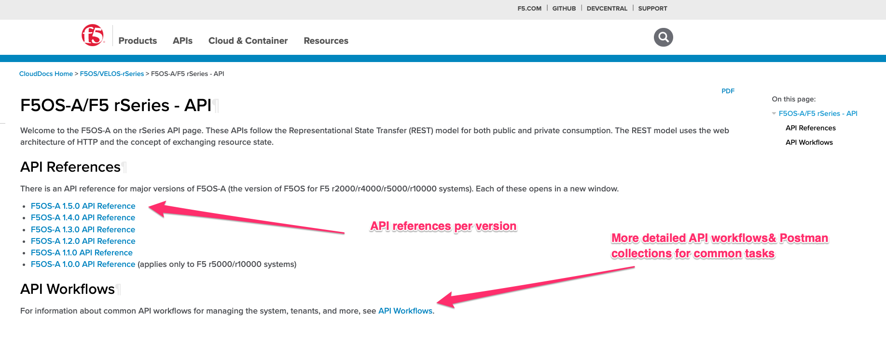
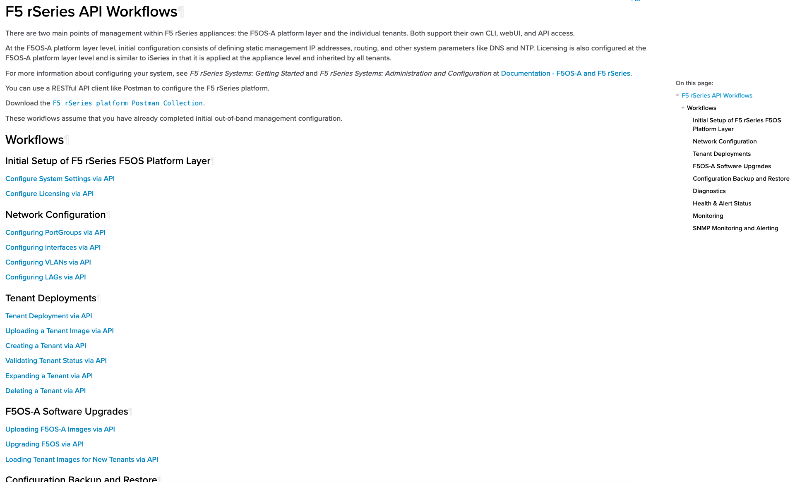
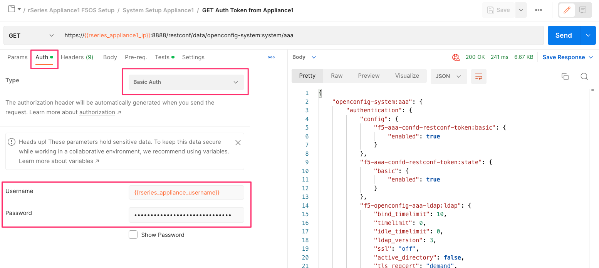
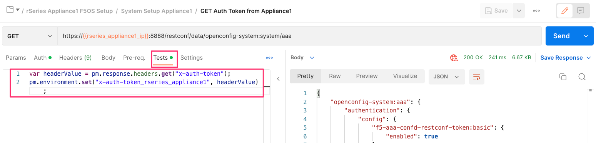
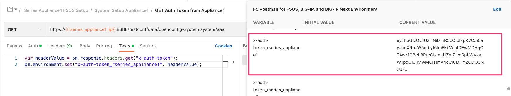
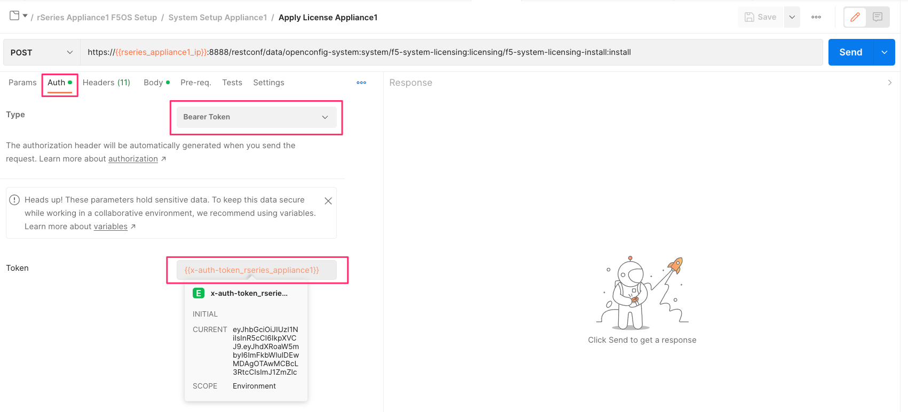
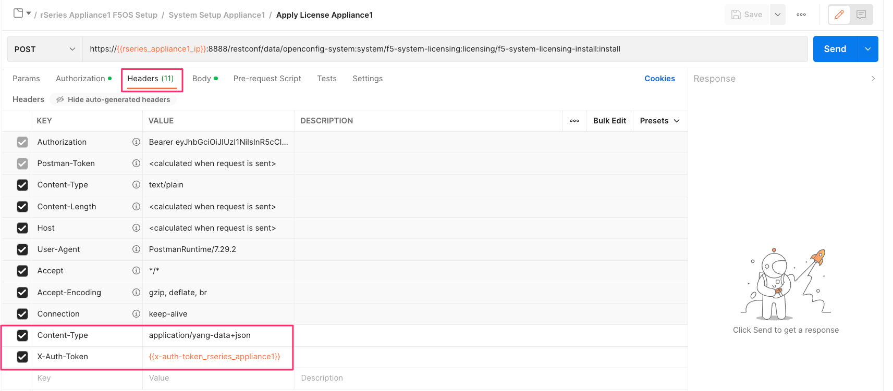

===========================================
Automating F5OS on rSeries 
===========================================

Since F5OS is an API first architecture, everything is automatable at the F5OS layer. There are F5OS API's for every function, and the GUI and CLI are built on top of the API. API reference materials are published on clouddocs.f5.com in addtion to the most common API workflows. In addtion, Terraform providers and Ansible collections are also available for F5OS, and more functionality is being added with each release of those packages.

If you want to see what API functions are available you can view the API reference documentation for the specific F5OS version you are running. As you can see rSeries / F5OS-A have its own API reference pages, F5OS-C / VELOS have similar pages, and most of the API calls are common expcet for those that are specific to the platform.

`F5OS-A/F5 rSeries - API <https://clouddocs.f5.com/api/rseries-api/rseries-api-index.html>_`

The API workflows section has an index which maps to all the common API workflow examples in the rSeries planning guide. In addtion, there is an accompanying Postman collection which can be downloaded and used within your own environment if you want to become familiar with the F5OS API.

`F5 rSeries API Workflows <https://clouddocs.f5.com/api/rseries-api/rseries-api-workflows.html>_`

Below is a smaple of some of the workflows available, and there are many more.

F5OS Ansible Collection
=======================

Ansible collections have been created for F5OS for some of the more common tasks. Addtional API workflows are constantly being added to the collections.

`F5OS modules Ansible collection <https://clouddocs.f5.com/products/orchestration/ansible/devel/f5os/F5OS-index.html>_`

F5OS Terraform Provider
=======================

Terraform providers have been created for F5OS for some of the more common tasks. Addtional API workflows are constantly being added to the providers. An overview of the F5OS provider is available using the link below.

`F5OS Provider Overview <https://clouddocs.f5.com/products/orchestration/terraform/latest/F5OS/f5os-index.html#f5os-index<_`

The github location of the Terraform provider files is at the following location.

`Terraform Provider F5OS v1.3.0 <https://github.com/F5Networks/terraform-provider-F5OS/releases>_`

Getting Started with F5OS Automation
====================================

If you would prefer to automate the setup of the rSeries appliance, there are F5OS-A API calls for all of the examples above. rSeries supports token-based authentication for the F5OS API's. You may send API calls to either port 8888 or port 443. The URI path will change slightly depending on which TCP port you choose to use. For API calls sent to port 443, the initial path will be **/api**, while API calls to port 8888 will start with **/restconf**. F5OS also listens on port 80 and will redirect to TCP port 443.
 

Example of API call using port 8888.  

.. code-block:: bash

    https://{{rseries_rseries_appliance1_ip}}:8888/restconf/data/openconfig-system:system/aaa

Example of API call using port 443. Replace **/restconf** with **/api**.

.. code-block:: bash

    https://{{rseries_rseries_appliance1_ip}}/api/data/openconfig-system:system/aaa

 
You can send a standard API call with user/password-based authentication (basic auth), and then store the token for subsequent API calls. The X-Auth-Token has a lifetime of fifteen minutes and can be renewed a maximum of five times before you need to authenticate again using basic auth. The renewal period begins at the ten-minute point, where the API will start sending a new X-Auth-Token in the response for the next five minutes. If your API calls fail to start using the new token by the 15-minute point, API calls will start returning 401 Not Authorized. All the API examples in this guide were generated using the Postman utility. Below is an example of using password-based authentication to the rSeries F5OS management IP address. Be sure to go to the **Auth** tab and set the *Type** to **Basic Auth** and enter the username and password to log into your rSeries appliance.

To capture the token and save it for use in subsequent API calls, go to the **Test** option in the API call and enter the following:

.. code-block:: bash

    var headerValue = pm.response.headers.get("x-auth-token");
    pm.environment.set("x-auth-token_rseries_appliance1", headerValue);

This will capture the auth token and store it in a variable called **x-auth-token_rseries_appliance1**.

This will be stored as a variable in the Postman **Environment** as seen below.

Once the variable is stored with the auth token, it can be used instead of using basic auth on all subsequent API calls. On any subsequent API call under the **Auth** option, set the **Type** to **Bearer Token**, and set the **Token** to the variable name. Note, Postman references variables by encasing the variable name in these types of parentheses **{{Variable-Name}}**. In this case the **Token** is set to **{{x-auth-token_rseries_appliance1}}**. 

You must also add some required headers to any API calls sent to F5OS. It is important to include the header **Content-Type** **application/yang-data+json** and the Token header **X-Auth-Token** with a value of **{{x-auth-token_rseries_appliance1}}**. The variable and header will change depending on the destination of the API call. It can be sent to a second appliance if desired.

If you would prefer to automate the setup of the rSeries appliance, there are API calls for all the examples above. To set the DNS configuration (servers and search domains) for the appliance, use the following API call. For any API calls to the rSeries F5OS layer it is important to include the header **Content-Type** **application/yang-data+json** and use port 8888 as seen below:

.. code-block:: bash

  PATCH https://{{rseries_appliance1_ip}}:8888/restconf/data/openconfig-system:system/dns

Below is the body of the API call which contains the desired configuration:

.. code-block:: json

  {
      "openconfig-system:dns": {
          "config": {
              "search": [
                  "olympus.f5net.com"
              ]
          },
          "servers": {
              "server": [
                  {
                      "address": "192.168.11.0",
                      "config": {
                          "address": "192.168.11.0"
                      }
                  }
              ]
          }
      }
  }

You may then view the current DNS configuration with the following API call:

.. code-block:: bash

  GET https://{{rseries_appliance1_ip}}:8888/restconf/data/openconfig-system:system/dns

Below is the output from the API query above:

.. code-block:: json

  {
      "openconfig-system:dns": {
          "config": {
              "search": [
                  "olympus.f5net.com"
              ]
          },
          "state": {
              "search": [
                  "olympus.f5net.com"
              ]
          },
          "servers": {
              "server": [
                  {
                      "address": "192.168.11.0",
                      "config": {
                          "address": "192.168.11.0",
                          "port": 53
                      },
                      "state": {
                          "port": 53
                      }
                  }
              ]
          }
      }
  }
