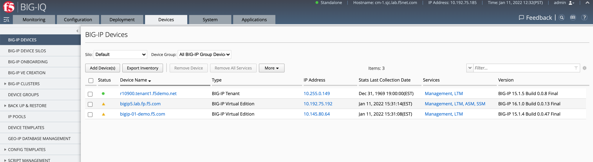
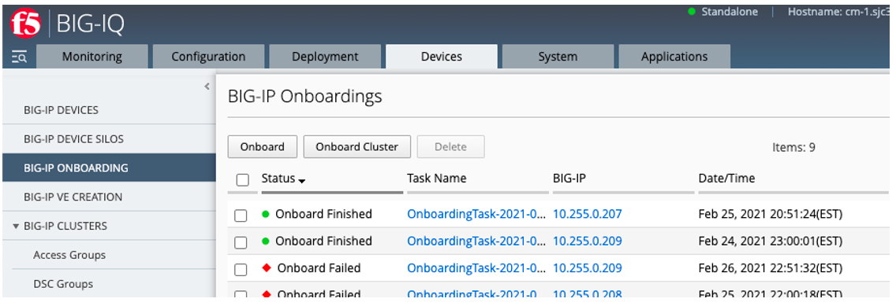
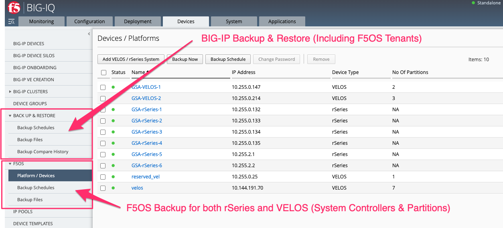

==========================
BIG-IQ Support for rSeries
==========================

Currently rSeries support in BIG-IQ will mimic iSeries functionality when vCMP is in use. In iSeries, a vCMP guest can be created via the local host CLI, webUI, or API and it can then be imported into BIG-IQ as a device. From there, statistics/analytics can be gathered, and L4-7 configurations can be managed in a variety of ways. An rSeries tenant will behave identically to an iSeries vCMP guest from a BIG-IQ perspective, meaning you can import it after it has been created to manage configuration and/or visualize analytics.

When an rSeries tenant is created, it can be imported as a device into BIG-IQ. It will import just like any other BIG-IP instance or device.  Once imported, it will show up with a Type of **BIG-IP Tenant**.

rSeries tenants can also be onboarded in BIG-IQ using Declarative Onboarding (DO). Once a tenant is created via one of the rSeries F5OS interfaces, you can run a DO declaration like the one below to BIG-IQ to provision, configure, and import it. In the DO declaration you will specify a **targetHost** which is the IP address of the tenant to be onboarded. The following is an example of a DO declaration for onboarding an rSeries tenant:

.. code-block:: bash

    POST https://{{BigIQ_Mgmt}}/mgmt/shared/declarative-onboarding

.. code-block:: json

    {
        "class": "DO",
        "declaration": {
            "schemaVersion": "1.5.0",
            "class": "Device",
            "async": true,
            "Common": {
                "class": "Tenant",
                "hostname": "tenant1.appliance1.f5demo.net",
                "myProvision": {
                    "class": "Provision",
                    "avr": "nominal",
                    "ltm": "nominal"
                },
                "myDns": {
                    "class": "DNS",
                    "nameServers": [
                        "192.168.10.0",
                        "192.168.10.1"
                    ]
                },
                "myNtp": {
                    "class": "NTP",
                    "servers": [
                        "time.f5net.com"
                    ],
                    "timezone": "UTC"
                },
                "internal-localself": {
                    "class": "SelfIp",
                    "address": "10.10.11.110/24",
                    "vlan": "vlan-3010",
                    "allowService": "all",
                    "trafficGroup": "traffic-group-local-only"
                },
                "internal-self": {
                    "class": "SelfIp",
                    "address": "10.10.11.120/24",
                    "vlan": "vlan-3010",
                    "allowService": "all",
                    "trafficGroup": "traffic-group-1"
                },
                "external-localself": {
                    "class": "SelfIp",
                    "address": "10.10.12.110/24",
                    "vlan": "vlan-3011",
                    "trafficGroup": "traffic-group-local-only",
                    "allowService": "default"
                },
                "external-self": {
                    "class": "SelfIp",
                    "address": "10.10.12.120/24",
                    "vlan": "vlan-3011",
                    "trafficGroup": "traffic-group-1",
                    "allowService": "default"
                },
                "ha-localself": {
                    "class": "SelfIp",
                    "address": "10.10.13.110/24",
                    "vlan": "vlan-500",
                    "trafficGroup": "traffic-group-local-only",
                    "allowService": "default"
                },
                "configsync": {
                    "class": "ConfigSync",
                    "configsyncIp": "10.10.13.110"
                },
                "failoverAddress": {
                    "class": "FailoverUnicast",
                    "address": "10.10.13.110"
                },
                "failoverGroup": {
                    "class": "DeviceGroup",
                    "type": "sync-failover",
                    "members": [
                        "10.10.13.110",
                        "10.10.13.244"
                    ],
                    "owner": "10.10.13.110",
                    "autoSync": true,
                    "saveOnAutoSync": false,
                    "networkFailover": true,
                    "fullLoadOnSync": false,
                    "asmSync": false
                },
                "trust": {
                    "class": "DeviceTrust",
                    "localUsername": "{{Tenant_Username}}",
                    "localPassword": "{{Tenant_Password}}",
                    "remoteHost": "{{Appliance1_Tenant1_IP}}",
                    "remoteUsername": "{{Tenant_Username}}",
                    "remotePassword": "{{Tenant_Password}}"
                },
                "myDbVariables": {
                    "class": "DbVariables",
                    "ui.advisory.enabled": "true",
                    "ui.advisory.color": "blue",
                    "ui.advisory.text": "This is rSeries Tenant1 on Appliance1."
                },
                "admin": {
                    "class": "User",
                    "userType": "regular",
                    "shell": "bash",
                    "partitionAccess": {
                        "all-partitions": {
                            "role": "admin"
                        }
                    },
                    "password": "{{Tenant_Password}}"
                },
                "root": {
                    "class": "User",
                    "userType": "root",
                    "newPassword": "{{Tenant_Password}}",
                    "oldPassword": "{{Tenant_Password}}"
                }
            }
        },
        "targetHost": "{{Appliance1_Tenant1_IP}}",
        "targetUsername": "admin",
        "targetPassphrase": "admin",
        "bigIqSettings": {
            "failImportOnConflict": false,
            "conflictPolicy": "USE_BIGIQ",
            "deviceConflictPolicy": "USE_BIGIP",
            "versionedConflictPolicy": "KEEP_VERSION",
            "clusterName": "Tenant1-Cluster",
            "statsConfig": {
                "enabled": true,
                "zone": "default"
            },
            "snapshotWorkingConfig": false
        }
    }

Shortly after the declaration is sent to BIG-IQ, you can see a new onboarding task. This will take a while to complete as it may require reboots of the tenant for module provisioning. After the tenant is onboarded it will be imported into BIG-IQ.

At this point the rSeries tenant is managed just like any other BIG-IP device or guest inside of BIG-IQ. You can manage software upgrades, create and restore backups, maintain configurations, and gather analytics.

F5OS Backup for rSeries
==========================

The configuration and monitoring of the F5OS platform layer is not managed by BIG-IQ, it has to be managed locally on the rSeries appliance using the F5OS CLI, webUI, or API or SNMP. The exception, is that scheduled backups for F5OS configuration has been added in BIG-IQ version 8.3. This new functionality allows for rSeries and/or VELOS devices to be added to BIG-IQ. The management IP address of the F5OS layer of the rSeries appliance or VELOS system controller is added to the **F5OS** section in BIG-IQ. F5OS tenants are backed up up using the normal **Backup & Restore** workflows in BIG-IQ. The new **F5OS** section allos for on-demand or scheduled backup for all of you VELOS and rSeries F5OS configurations.

