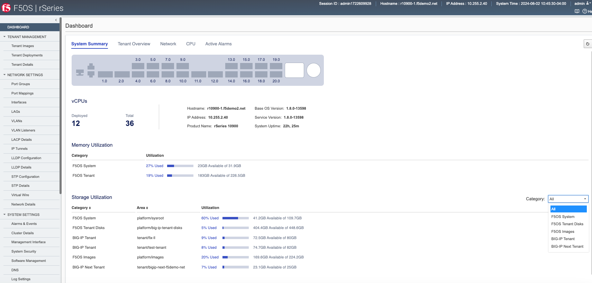
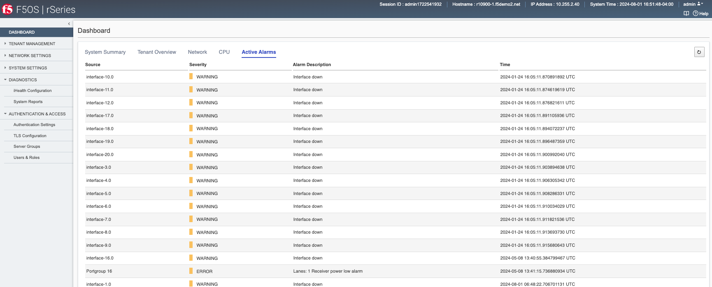

==========================================
Initial Setup of the rSeries Network Layer
==========================================

-----------------
rSeries Dashboard
-----------------

The rSeries Dashboard will provide a visual system summary of the appliance including **System Summary**, **Network**, **CPU**, and **Active Alarms**. It will also list the total number of vCPU’s available for multitenancy and how many are currently in use. There is also a tenant overview showing a quick summary of tenant status and basic parameters. 

The **Network** tab wil provide a visual representation of all networking ports on the system. Each port will be color coded **Green** for **Up** status, and **Red** or **Down** status. The current **Pipeline** mapping is also displayed which shows the external port mapping to internal pipelines.

.. image:: images/initial_setup_of_rseries_network_layer/image2.png
  :align: center
  :scale: 70% 

The **CPU** tab shows all the available CPU's in the system, along with their **Current**, **5 Second**, **1 Minute**, and **5 Minute** averages.

.. image:: images/initial_setup_of_rseries_network_layer/image3.png
  :align: center
  :scale: 70% 

The  **Active Alarms** tab will display any active alerts or alarms for the system. 

-----------------------------
F5OS Networking Configuration
-----------------------------

Before configuring any tenants, you’ll need to setup networking for the F5OS platform layer. All in-band networking (Interface, VLANs, Link Aggregation Groups) is configured within the F5OS layer, and selected VLANs are passed through to the tenant layer by the admin when deploying a tenant. This is very similar to how vCMP guests work on previous generation of BIG-IP like iSeries and VIPRION. 

Network Settings - > Port Groups
================================

Before configuring any Interfaces, VLANs, or Link Aggregation Groups (LAG’s) you’ll need to configure the portgroups so that physical interfaces on the blade are configured for the proper speed and bundling. The portgroup component is used to control the mode of the physical ports. This controls whether a port is bundled or unbundled and the port speed. Currently the high speed ports do not support unbundling. Adjacent high speed ports (**1.0** & **2.0** on both the r5000/r10000 series) and (**11.0** & **12.0** on the r10000 series) must be configured in the same mode and speed currently. Either both are configured for 40Gb or both configured for 100Gb, you cannot mix and match. You cannot break out these ports to lower speeds (25Gb or 10Gb) via a breakout cables as this is currently unsupported. Low speed 25Gb/10Gb ports (**3.0** - **10.0** on both the r5000/r10000 series) and (**13.0*** - **20.0** on the r10000 series) can be configured independently, and adjacent low speed ports can have different speed values (10Gb or 25Gb). The term portgroup is used rather than simply “port” because some front panel ports may accept different types of SFPs. Depending on the portgroup mode value, a different FPGA version is loaded, and the speed of the port is adjusted accordingly. Changing the portgroup configuration will require a reboot of the appliance to load a new FPGS bitstream. The user can modify the portgroup mode as needed through the F5OS CLI, GUI or API.

.. image:: images/initial_setup_of_rseries_network_layer/image5.png
  :align: center
  :scale: 70% 

Configuring PortGroups from the GUI
-----------------------------------

To configure Portgroups go to **Network Settings > Port Groups** in the F5OS GUI. This should be configured before any Interface, VLAN, or LAG configuration. 

If you do make a change the applaince will be forced to rebootreload the network service to load a new bitstream image into the FPGA.

.. image:: images/initial_setup_of_rseries_network_layer/image7.png
  :align: center
  :scale: 70% 

Configuring PortGroups from the CLI
-----------------------------------

Portgroups can be configured from the F5OS CLI using the **portgroups** command in **config** mode. The following command will set interface 10 for 10GB:

.. code-block:: bash

    appliance-1# config
    Entering configuration mode terminal
    appliance-1(config)# portgroups portgroup 10 config mode MODE_10GB 
    appliance-1(config-portgroup-10)# commit
    The following warnings were generated:
    'portgroups portgroup': Portgroup mode changes result in a reboot of the box.
    Proceed? [yes,no] yes
    Commit complete.
    appliance-1(config-portgroup-10)# 

You must commit for any changes to take affect. This will require a reboot of the appliance:

.. code-block:: bash

    appliance-1(config-portgroup-10)# commit
    The following warnings were generated:
    'portgroups portgroup': Portgroup mode changes result in a reboot of the box.
    Proceed? [yes,no] yes
    Commit complete.
    appliance-1(config-portgroup-10)# 

Possible options for **MODE** depend on which port you are configuring. For the high speed ports on the r10000/r5000 supported modes are: **MODE_40GB** or **MODE_100GB**. For the low speed ports possible options for **MODE** are: **MODE_10GB** and **MODE_25GB**. You can optionally configure the portgroup **name** and ddm **poll frequency**. You can display the current configuration of the existing portgroups by running the CLI command **show running-config portgroups**. Below is the example output from an r5000 appliance:

.. code-block:: bash

    appliance-1# show running-config portgroups 
    portgroups portgroup 1
    config name 1
    config mode MODE_100GB
    config ddm ddm-poll-frequency 30
    !
    portgroups portgroup 2
    config name 2
    config mode MODE_100GB
    config ddm ddm-poll-frequency 30
    !
    portgroups portgroup 3
    config name 3
    config mode MODE_25GB
    config ddm ddm-poll-frequency 30
    !
    portgroups portgroup 4
    config name 4
    config mode MODE_25GB
    config ddm ddm-poll-frequency 30
    !
    portgroups portgroup 5
    config name 5
    config mode MODE_25GB
    portgroups portgroup 1
    config name 1
    config mode MODE_100GB
    config ddm ddm-poll-frequency 30
    !
    portgroups portgroup 2
    config name 2
    config mode MODE_100GB
    config ddm ddm-poll-frequency 30
    !
    portgroups portgroup 3
    config name 3
    config mode MODE_25GB
    config ddm ddm-poll-frequency 30
    !
    portgroups portgroup 4
    config name 4
    config mode MODE_25GB
    config ddm ddm-poll-frequency 30
    !
    portgroups portgroup 5
    config name 5
    config mode MODE_25GB
    config ddm ddm-poll-frequency 30
    portgroups portgroup 1
    config name 1
    config mode MODE_100GB
    config ddm ddm-poll-frequency 30
    !
    portgroups portgroup 2
    config name 2
    config mode MODE_100GB
    config ddm ddm-poll-frequency 30
    !
    portgroups portgroup 3
    config name 3
    config mode MODE_25GB
    config ddm ddm-poll-frequency 30
    !
    portgroups portgroup 4
    config name 4
    config mode MODE_25GB
    config ddm ddm-poll-frequency 30
    !
    portgroups portgroup 5
    config name 5
    config mode MODE_25GB
    config ddm ddm-poll-frequency 30
    !
    portgroups portgroup 6
    config name 6
    config mode MODE_25GB
    config ddm ddm-poll-frequency 30
    !
    portgroups portgroup 7
    config name 7
    config mode MODE_25GB
    config ddm ddm-poll-frequency 30
    !
    portgroups portgroup 8
    config name 8
    config mode MODE_25GB
    config ddm ddm-poll-frequency 30
    !
    portgroups portgroup 9
    config name 9
    config mode MODE_25GB
    config ddm ddm-poll-frequency 30
    !
    portgroups portgroup 10
    config name 10
    config mode MODE_10GB
    config ddm ddm-poll-frequency 30
    !
    appliance-1#  

Configuring PortGroups from the API
-----------------------------------

To list the current portgroup configuration issue the following API call:

.. code-block:: bash

  GET https://{{Appliance1_IP}}:8888/restconf/data/f5-portgroup:portgroups

Below is an exmaple output from an r10000 series appliance:

.. code-block:: json

    {
        "f5-portgroup:portgroups": {
            "portgroup": [
                {
                    "portgroup_name": "1",
                    "config": {
                        "name": "1",
                        "mode": "MODE_100GB",
                        "f5-ddm:ddm": {
                            "ddm-poll-frequency": 30
                        }
                    },
                    "state": {
                        "vendor-name": "F5 NETWORKS INC.",
                        "vendor-oui": "009065",
                        "vendor-partnum": "OPT-0031        ",
                        "vendor-revision": "A0",
                        "vendor-serialnum": "X3CAU6G         ",
                        "transmitter-technology": "850 nm VCSEL",
                        "media": "100GBASE-SR4",
                        "optic-state": "QUALIFIED",
                        "f5-ddm:ddm": {
                            "rx-pwr": {
                                "low-threshold": {
                                    "alarm": "-14.0",
                                    "warn": "-11.0"
                                },
                                "instant": {
                                    "val-lane1": "-0.77",
                                    "val-lane2": "-0.89",
                                    "val-lane3": "-0.92",
                                    "val-lane4": "-1.06"
                                },
                                "high-threshold": {
                                    "alarm": "3.4",
                                    "warn": "2.4"
                                }
                            },
                            "tx-pwr": {
                                "low-threshold": {
                                    "alarm": "-10.0",
                                    "warn": "-8.0"
                                },
                                "instant": {
                                    "val-lane1": "-1.11",
                                    "val-lane2": "-0.52",
                                    "val-lane3": "-1.0",
                                    "val-lane4": "-1.15"
                                },
                                "high-threshold": {
                                    "alarm": "5.0",
                                    "warn": "3.0"
                                }
                            },
                            "temp": {
                                "low-threshold": {
                                    "alarm": "-5.0",
                                    "warn": "0.0"
                                },
                                "instant": {
                                    "val": "33.1523"
                                },
                                "high-threshold": {
                                    "alarm": "75.0",
                                    "warn": "70.0"
                                }
                            },
                            "bias": {
                                "low-threshold": {
                                    "alarm": "0.003",
                                    "warn": "0.005"
                                },
                                "instant": {
                                    "val-lane1": "0.007536",
                                    "val-lane2": "0.007322",
                                    "val-lane3": "0.007428",
                                    "val-lane4": "0.007454"
                                },
                                "high-threshold": {
                                    "alarm": "0.013",
                                    "warn": "0.011"
                                }
                            },
                            "vcc": {
                                "low-threshold": {
                                    "alarm": "2.97",
                                    "warn": "3.135"
                                },
                                "instant": {
                                    "val": "3.3211"
                                },
                                "high-threshold": {
                                    "alarm": "3.63",
                                    "warn": "3.465"
                                }
                            }
                        }
                    }
                },
                {
                    "portgroup_name": "2",
                    "config": {
                        "name": "2",
                        "mode": "MODE_100GB",
                        "f5-ddm:ddm": {
                            "ddm-poll-frequency": 30
                        }
                    },
                    "state": {
                        "vendor-name": "F5 NETWORKS INC.",
                        "vendor-oui": "009065",
                        "vendor-partnum": "OPT-0031        ",
                        "vendor-revision": "A0",
                        "vendor-serialnum": "XYR00K4         ",
                        "transmitter-technology": "850 nm VCSEL",
                        "media": "100GBASE-SR4",
                        "optic-state": "QUALIFIED",
                        "f5-ddm:ddm": {
                            "rx-pwr": {
                                "low-threshold": {
                                    "alarm": "-14.0",
                                    "warn": "-11.0"
                                },
                                "instant": {
                                    "val-lane1": "0.05",
                                    "val-lane2": "0.12",
                                    "val-lane3": "-0.01",
                                    "val-lane4": "-0.17"
                                },
                                "high-threshold": {
                                    "alarm": "3.4",
                                    "warn": "2.4"
                                }
                            },
                            "tx-pwr": {
                                "low-threshold": {
                                    "alarm": "-10.0",
                                    "warn": "-8.0"
                                },
                                "instant": {
                                    "val-lane1": "-0.93",
                                    "val-lane2": "-1.02",
                                    "val-lane3": "-1.02",
                                    "val-lane4": "-0.9"
                                },
                                "high-threshold": {
                                    "alarm": "5.0",
                                    "warn": "3.0"
                                }
                            },
                            "temp": {
                                "low-threshold": {
                                    "alarm": "-5.0",
                                    "warn": "0.0"
                                },
                                "instant": {
                                    "val": "31.1953"
                                },
                                "high-threshold": {
                                    "alarm": "75.0",
                                    "warn": "70.0"
                                }
                            },
                            "bias": {
                                "low-threshold": {
                                    "alarm": "0.003",
                                    "warn": "0.005"
                                },
                                "instant": {
                                    "val-lane1": "0.007448",
                                    "val-lane2": "0.007556",
                                    "val-lane3": "0.007504",
                                    "val-lane4": "0.00748"
                                },
                                "high-threshold": {
                                    "alarm": "0.013",
                                    "warn": "0.011"
                                }
                            },
                            "vcc": {
                                "low-threshold": {
                                    "alarm": "2.97",
                                    "warn": "3.135"
                                },
                                "instant": {
                                    "val": "3.2964"
                                },
                                "high-threshold": {
                                    "alarm": "3.63",
                                    "warn": "3.465"
                                }
                            }
                        }
                    }
                },
                {
                    "portgroup_name": "3",
                    "config": {
                        "name": "3",
                        "mode": "MODE_25GB",
                        "f5-ddm:ddm": {
                            "ddm-poll-frequency": 30
                        }
                    }
                },
                {
                    "portgroup_name": "4",
                    "config": {
                        "name": "4",
                        "mode": "MODE_25GB",
                        "f5-ddm:ddm": {
                            "ddm-poll-frequency": 30
                        }
                    }
                },
                {
                    "portgroup_name": "5",
                    "config": {
                        "name": "5",
                        "mode": "MODE_25GB",
                        "f5-ddm:ddm": {
                            "ddm-poll-frequency": 30
                        }
                    }
                },
                {
                    "portgroup_name": "6",
                    "config": {
                        "name": "6",
                        "mode": "MODE_25GB",
                        "f5-ddm:ddm": {
                            "ddm-poll-frequency": 30
                        }
                    }
                },
                {
                    "portgroup_name": "7",
                    "config": {
                        "name": "7",
                        "mode": "MODE_25GB",
                        "f5-ddm:ddm": {
                            "ddm-poll-frequency": 30
                        }
                    }
                },
                {
                    "portgroup_name": "8",
                    "config": {
                        "name": "8",
                        "mode": "MODE_25GB",
                        "f5-ddm:ddm": {
                            "ddm-poll-frequency": 30
                        }
                    }
                },
                {
                    "portgroup_name": "9",
                    "config": {
                        "name": "9",
                        "mode": "MODE_25GB",
                        "f5-ddm:ddm": {
                            "ddm-poll-frequency": 30
                        }
                    }
                },
                {
                    "portgroup_name": "10",
                    "config": {
                        "name": "10",
                        "mode": "MODE_25GB",
                        "f5-ddm:ddm": {
                            "ddm-poll-frequency": 30
                        }
                    }
                },
                {
                    "portgroup_name": "11",
                    "config": {
                        "name": "11",
                        "mode": "MODE_100GB",
                        "f5-ddm:ddm": {
                            "ddm-poll-frequency": 30
                        }
                    },
                    "state": {
                        "vendor-name": "",
                        "vendor-oui": "",
                        "vendor-partnum": "",
                        "vendor-revision": "",
                        "vendor-serialnum": "",
                        "transmitter-technology": "",
                        "media": "",
                        "optic-state": "UNKNOWN"
                    }
                },
                {
                    "portgroup_name": "12",
                    "config": {
                        "name": "12",
                        "mode": "MODE_100GB",
                        "f5-ddm:ddm": {
                            "ddm-poll-frequency": 30
                        }
                    },
                    "state": {
                        "vendor-name": "",
                        "vendor-oui": "",
                        "vendor-partnum": "",
                        "vendor-revision": "",
                        "vendor-serialnum": "",
                        "transmitter-technology": "",
                        "media": "",
                        "optic-state": "UNKNOWN"
                    }
                },
                {
                    "portgroup_name": "13",
                    "config": {
                        "name": "13",
                        "mode": "MODE_25GB",
                        "f5-ddm:ddm": {
                            "ddm-poll-frequency": 30
                        }
                    },
                    "state": {
                        "vendor-name": "F5 NETWORKS INC.",
                        "vendor-oui": "009065",
                        "vendor-partnum": "OPT-0053        ",
                        "vendor-revision": "A1",
                        "vendor-serialnum": "P62BET1         ",
                        "transmitter-technology": "",
                        "media": "25GBASE-SR",
                        "optic-state": "QUALIFIED",
                        "f5-ddm:ddm": {
                            "rx-pwr": {
                                "low-threshold": {
                                    "alarm": "-20.0",
                                    "warn": "-18.01"
                                },
                                "instant": {
                                    "val-lane1": "-0.84"
                                },
                                "high-threshold": {
                                    "alarm": "4.0",
                                    "warn": "3.0"
                                }
                            },
                            "tx-pwr": {
                                "low-threshold": {
                                    "alarm": "-9.0",
                                    "warn": "-8.0"
                                },
                                "instant": {
                                    "val-lane1": "-0.8"
                                },
                                "high-threshold": {
                                    "alarm": "4.0",
                                    "warn": "3.0"
                                }
                            },
                            "temp": {
                                "low-threshold": {
                                    "alarm": "-5.0",
                                    "warn": "0.0"
                                },
                                "instant": {
                                    "val": "33.0468"
                                },
                                "high-threshold": {
                                    "alarm": "75.0",
                                    "warn": "70.0"
                                }
                            },
                            "bias": {
                                "low-threshold": {
                                    "alarm": "0.001",
                                    "warn": "0.002"
                                },
                                "instant": {
                                    "val-lane1": "0.007976"
                                },
                                "high-threshold": {
                                    "alarm": "0.012",
                                    "warn": "0.0115"
                                }
                            },
                            "vcc": {
                                "low-threshold": {
                                    "alarm": "3.0",
                                    "warn": "3.1"
                                },
                                "instant": {
                                    "val": "3.3589"
                                },
                                "high-threshold": {
                                    "alarm": "3.6",
                                    "warn": "3.5"
                                }
                            }
                        }
                    }
                },
                {
                    "portgroup_name": "14",
                    "config": {
                        "name": "14",
                        "mode": "MODE_25GB",
                        "f5-ddm:ddm": {
                            "ddm-poll-frequency": 30
                        }
                    },
                    "state": {
                        "vendor-name": "F5 NETWORKS INC.",
                        "vendor-oui": "009065",
                        "vendor-partnum": "OPT-0053        ",
                        "vendor-revision": "A1",
                        "vendor-serialnum": "P62BESG         ",
                        "transmitter-technology": "",
                        "media": "25GBASE-SR",
                        "optic-state": "QUALIFIED",
                        "f5-ddm:ddm": {
                            "rx-pwr": {
                                "low-threshold": {
                                    "alarm": "-20.0",
                                    "warn": "-18.01"
                                },
                                "instant": {
                                    "val-lane1": "-1.45"
                                },
                                "high-threshold": {
                                    "alarm": "4.0",
                                    "warn": "3.0"
                                }
                            },
                            "tx-pwr": {
                                "low-threshold": {
                                    "alarm": "-9.0",
                                    "warn": "-8.0"
                                },
                                "instant": {
                                    "val-lane1": "-0.82"
                                },
                                "high-threshold": {
                                    "alarm": "4.0",
                                    "warn": "3.0"
                                }
                            },
                            "temp": {
                                "low-threshold": {
                                    "alarm": "-5.0",
                                    "warn": "0.0"
                                },
                                "instant": {
                                    "val": "32.0781"
                                },
                                "high-threshold": {
                                    "alarm": "75.0",
                                    "warn": "70.0"
                                }
                            },
                            "bias": {
                                "low-threshold": {
                                    "alarm": "0.001",
                                    "warn": "0.002"
                                },
                                "instant": {
                                    "val-lane1": "0.00798"
                                },
                                "high-threshold": {
                                    "alarm": "0.012",
                                    "warn": "0.0115"
                                }
                            },
                            "vcc": {
                                "low-threshold": {
                                    "alarm": "3.0",
                                    "warn": "3.1"
                                },
                                "instant": {
                                    "val": "3.3499"
                                },
                                "high-threshold": {
                                    "alarm": "3.6",
                                    "warn": "3.5"
                                }
                            }
                        }
                    }
                },
                {
                    "portgroup_name": "15",
                    "config": {
                        "name": "15",
                        "mode": "MODE_25GB",
                        "f5-ddm:ddm": {
                            "ddm-poll-frequency": 30
                        }
                    },
                    "state": {
                        "vendor-name": "F5 NETWORKS INC.",
                        "vendor-oui": "009065",
                        "vendor-partnum": "OPT-0053        ",
                        "vendor-revision": "A1",
                        "vendor-serialnum": "P62BET3         ",
                        "transmitter-technology": "",
                        "media": "25GBASE-SR",
                        "optic-state": "QUALIFIED",
                        "f5-ddm:ddm": {
                            "rx-pwr": {
                                "low-threshold": {
                                    "alarm": "-20.0",
                                    "warn": "-18.01"
                                },
                                "instant": {
                                    "val-lane1": "-0.66"
                                },
                                "high-threshold": {
                                    "alarm": "4.0",
                                    "warn": "3.0"
                                }
                            },
                            "tx-pwr": {
                                "low-threshold": {
                                    "alarm": "-9.0",
                                    "warn": "-8.0"
                                },
                                "instant": {
                                    "val-lane1": "-0.61"
                                },
                                "high-threshold": {
                                    "alarm": "4.0",
                                    "warn": "3.0"
                                }
                            },
                            "temp": {
                                "low-threshold": {
                                    "alarm": "-5.0",
                                    "warn": "0.0"
                                },
                                "instant": {
                                    "val": "30.2812"
                                },
                                "high-threshold": {
                                    "alarm": "75.0",
                                    "warn": "70.0"
                                }
                            },
                            "bias": {
                                "low-threshold": {
                                    "alarm": "0.001",
                                    "warn": "0.002"
                                },
                                "instant": {
                                    "val-lane1": "0.008008"
                                },
                                "high-threshold": {
                                    "alarm": "0.012",
                                    "warn": "0.0115"
                                }
                            },
                            "vcc": {
                                "low-threshold": {
                                    "alarm": "3.0",
                                    "warn": "3.1"
                                },
                                "instant": {
                                    "val": "3.3101"
                                },
                                "high-threshold": {
                                    "alarm": "3.6",
                                    "warn": "3.5"
                                }
                            }
                        }
                    }
                },
                {
                    "portgroup_name": "16",
                    "config": {
                        "name": "16",
                        "mode": "MODE_25GB",
                        "f5-ddm:ddm": {
                            "ddm-poll-frequency": 30
                        }
                    },
                    "state": {
                        "vendor-name": "F5 NETWORKS INC.",
                        "vendor-oui": "009065",
                        "vendor-partnum": "OPT-0053        ",
                        "vendor-revision": "A1",
                        "vendor-serialnum": "P62BET5         ",
                        "transmitter-technology": "",
                        "media": "25GBASE-SR",
                        "optic-state": "QUALIFIED",
                        "f5-ddm:ddm": {
                            "rx-pwr": {
                                "low-threshold": {
                                    "alarm": "-20.0",
                                    "warn": "-18.01"
                                },
                                "instant": {
                                    "val-lane1": "-0.68"
                                },
                                "high-threshold": {
                                    "alarm": "4.0",
                                    "warn": "3.0"
                                }
                            },
                            "tx-pwr": {
                                "low-threshold": {
                                    "alarm": "-9.0",
                                    "warn": "-8.0"
                                },
                                "instant": {
                                    "val-lane1": "-0.82"
                                },
                                "high-threshold": {
                                    "alarm": "4.0",
                                    "warn": "3.0"
                                }
                            },
                            "temp": {
                                "low-threshold": {
                                    "alarm": "-5.0",
                                    "warn": "0.0"
                                },
                                "instant": {
                                    "val": "32.4921"
                                },
                                "high-threshold": {
                                    "alarm": "75.0",
                                    "warn": "70.0"
                                }
                            },
                            "bias": {
                                "low-threshold": {
                                    "alarm": "0.001",
                                    "warn": "0.002"
                                },
                                "instant": {
                                    "val-lane1": "0.007994"
                                },
                                "high-threshold": {
                                    "alarm": "0.012",
                                    "warn": "0.0115"
                                }
                            },
                            "vcc": {
                                "low-threshold": {
                                    "alarm": "3.0",
                                    "warn": "3.1"
                                },
                                "instant": {
                                    "val": "3.3442"
                                },
                                "high-threshold": {
                                    "alarm": "3.6",
                                    "warn": "3.5"
                                }
                            }
                        }
                    }
                },
                {
                    "portgroup_name": "17",
                    "config": {
                        "name": "17",
                        "mode": "MODE_25GB",
                        "f5-ddm:ddm": {
                            "ddm-poll-frequency": 30
                        }
                    }
                },
                {
                    "portgroup_name": "18",
                    "config": {
                        "name": "18",
                        "mode": "MODE_25GB",
                        "f5-ddm:ddm": {
                            "ddm-poll-frequency": 30
                        }
                    }
                },
                {
                    "portgroup_name": "19",
                    "config": {
                        "name": "19",
                        "mode": "MODE_25GB",
                        "f5-ddm:ddm": {
                            "ddm-poll-frequency": 30
                        }
                    }
                },
                {
                    "portgroup_name": "20",
                    "config": {
                        "name": "20",
                        "mode": "MODE_10GB",
                        "f5-ddm:ddm": {
                            "ddm-poll-frequency": 30
                        }
                    }
                }
            ]
        }
    }

To change the portgroup configuration via the API use the following API call

.. code-block:: bash

  PATCH https://{{Appliance1_IP}}:8888/restconf/data/f5-portgroup:portgroups

Below is an exmaple configuration change in the body of the API call above, this is changing portgroup 10 to 25Gb mode:

.. code-block:: json

    {
        "f5-portgroup:portgroups": {
            "portgroup": [
                {
                    "portgroup_name": "10",
                    "config": {
                        "mode": "MODE_25GB"
                    }
                }
            ]
        }
    }

Network Settings -> Interfaces
==============================

Interface numbering will vary depending on which rSeries model is being used. Interfaces will always be numbered by **<port#>.0** for rSeries appliances. The r10000 has a total of 20 ports labled **1.0** - **20.0**, and the r5000 has 10 ports labled **1.0** - **10.0**.

.. image:: images/initial_setup_of_rseries_network_layer/image9.png
  :align: center
  :scale: 70% 

.. image:: images/initial_setup_of_rseries_network_layer/image8.png
  :align: center
  :scale: 70% 

Configuring Interfaces from the GUI
-----------------------------------

Within the F5OS GUI the physical ports of the appliance will be visible by going to **Network Settings > Interfaces** page. 

.. image:: images/initial_setup_of_rseries_network_layer/image10.png
  :align: center
  :scale: 70% 

You can click on any interface to view its settings or edit them. You can currently change the interface State via the GUI or the **Native VLAN** (untagged) and **Trunk VLANs** (tagged) as long as the interface is not part of a LAG. If the interface is part of the LAG then the VLAN configuration is done within the LAG rather than the interface.

.. image:: images/initial_setup_of_rseries_network_layer/image11.png
  :align: center
  :scale: 70% 

Configuring Interfaces from the CLI
-----------------------------------

Interfaces can be configured in the F5OS CLI. As mentioned previously, portgroups should be configured for their desired state before configuring any interfaces. In the CLI enter config mode and then specify the interface you want to configure. If the interface is going to be part of a LAG, then most of the configuration is done within the LAG. Use the command **show running-config interfaces** to see the current configuration:

.. code-block:: bash

    appliance-1# show running-config interfaces 
    interfaces interface 1.0
    config name 1.0
    config type ethernetCsmacd
    config enabled
    ethernet config aggregate-id Arista
    !
    interfaces interface 2.0
    config name 2.0
    config type ethernetCsmacd
    config enabled
    ethernet config aggregate-id Arista
    !
    interfaces interface 3.0
    config name 3.0
    config type ethernetCsmacd
    config enabled
    !
    interfaces interface 4.0
    config name 4.0
    config type ethernetCsmacd
    config enabled
    !
    interfaces interface 5.0
    config name 5.0
    config type ethernetCsmacd
    config enabled
    !
    interfaces interface 6.0
    config name 6.0
    config type ethernetCsmacd
    config enabled
    !
    interfaces interface 7.0
    config name 7.0
    config type ethernetCsmacd
    config enabled
    !
    interfaces interface 8.0
    config name 8.0
    config type ethernetCsmacd
    config enabled
    ethernet config aggregate-id HA-Interconnect
    !
    interfaces interface 9.0
    config name 9.0
    config type ethernetCsmacd
    config enabled
    ethernet config aggregate-id HA-Interconnect
    !
    interfaces interface 10.0
    config name 10.0
    config type ethernetCsmacd
    config enabled
    !
    interfaces interface mgmt
    config name mgmt
    config type ethernetCsmacd
    config enabled
    ethernet config auto-negotiate true
    ethernet config duplex-mode FULL
    ethernet config port-speed SPEED_1GB
    !
    interfaces interface Arista
    config name Arista
    config type ieee8023adLag
    aggregation config lag-type LACP
    aggregation config distribution-hash src-dst-ipport
    aggregation switched-vlan config trunk-vlans [ 3010 3011 ]
    !
    interfaces interface HA-Interconnect
    config name HA-Interconnect
    config type ieee8023adLag
    aggregation config lag-type LACP
    aggregation config distribution-hash src-dst-ipport
    aggregation switched-vlan config trunk-vlans [ 500 ]
    !
    appliance-1# 

To make any changes you will need to enter **config** mode and then enter the interface config mode to make changes. The example below is adding an 802.1Q tagged VLAN 500 to interface 6.0. Be sure to commit any changes as they don’t take effect until the commit is issued.

.. code-block:: bash
    
    appliance-1# config
    Entering configuration mode terminal
    appliance-1(config)# interfaces interface 6.0 ethernet switched-vlan config trunk-vlans 500 
    appliance-1(config-interface-6.0)# commit
    Commit complete.
    appliance-1(config-interface-6.0)# 

Configuring Interfaces from the API
-----------------------------------

The following API command will list all the current interfaces within the appliance with their configuration and status: 

.. code-block:: bash

  GET https://{{Appliance1_IP}}:8888/restconf/data/openconfig-interfaces:interfaces

.. code-block:: json

    {
        "openconfig-interfaces:interfaces": {
            "interface": [
                {
                    "name": "1.0",
                    "config": {
                        "name": "1.0",
                        "type": "iana-if-type:ethernetCsmacd",
                        "enabled": true
                    },
                    "state": {
                        "name": "1.0",
                        "type": "iana-if-type:ethernetCsmacd",
                        "mtu": 9600,
                        "enabled": true,
                        "ifindex": 19,
                        "oper-status": "UP",
                        "counters": {
                            "in-octets": "9086600",
                            "in-unicast-pkts": "116",
                            "in-broadcast-pkts": "1493",
                            "in-multicast-pkts": "68814",
                            "in-discards": "0",
                            "in-errors": "0",
                            "in-fcs-errors": "0",
                            "out-octets": "187008",
                            "out-unicast-pkts": "0",
                            "out-broadcast-pkts": "0",
                            "out-multicast-pkts": "1461",
                            "out-discards": "0",
                            "out-errors": "0"
                        },
                        "f5-interface:forward-error-correction": "auto",
                        "f5-lacp:lacp_state": "LACP_UP"
                    },
                    "openconfig-if-ethernet:ethernet": {
                        "config": {
                            "port-speed": "openconfig-if-ethernet:SPEED_100GB",
                            "openconfig-if-aggregate:aggregate-id": "Arista"
                        },
                        "state": {
                            "port-speed": "openconfig-if-ethernet:SPEED_100GB",
                            "hw-mac-address": "00:94:a1:69:59:0d",
                            "counters": {
                                "in-mac-control-frames": "0",
                                "in-mac-pause-frames": "0",
                                "in-oversize-frames": "0",
                                "in-jabber-frames": "0",
                                "in-fragment-frames": "0",
                                "in-8021q-frames": "0",
                                "in-crc-errors": "0",
                                "out-mac-control-frames": "0",
                                "out-mac-pause-frames": "0",
                                "out-8021q-frames": "0"
                            },
                            "f5-if-ethernet:flow-control": {
                                "rx": "on"
                            }
                        }
                    }
                },
                {
                    "name": "2.0",
                    "config": {
                        "name": "2.0",
                        "type": "iana-if-type:ethernetCsmacd",
                        "enabled": true
                    },
                    "state": {
                        "name": "2.0",
                        "type": "iana-if-type:ethernetCsmacd",
                        "mtu": 9600,
                        "enabled": true,
                        "ifindex": 24,
                        "oper-status": "UP",
                        "counters": {
                            "in-octets": "6288468",
                            "in-unicast-pkts": "80",
                            "in-broadcast-pkts": "504",
                            "in-multicast-pkts": "46884",
                            "in-discards": "0",
                            "in-errors": "0",
                            "in-fcs-errors": "0",
                            "out-octets": "192776",
                            "out-unicast-pkts": "0",
                            "out-broadcast-pkts": "0",
                            "out-multicast-pkts": "1522",
                            "out-discards": "0",
                            "out-errors": "0"
                        },
                        "f5-interface:forward-error-correction": "auto",
                        "f5-lacp:lacp_state": "LACP_UP"
                    },
                    "openconfig-if-ethernet:ethernet": {
                        "config": {
                            "port-speed": "openconfig-if-ethernet:SPEED_100GB",
                            "openconfig-if-aggregate:aggregate-id": "Arista"
                        },
                        "state": {
                            "port-speed": "openconfig-if-ethernet:SPEED_100GB",
                            "hw-mac-address": "00:94:a1:69:59:12",
                            "counters": {
                                "in-mac-control-frames": "0",
                                "in-mac-pause-frames": "0",
                                "in-oversize-frames": "0",
                                "in-jabber-frames": "0",
                                "in-fragment-frames": "0",
                                "in-8021q-frames": "0",
                                "in-crc-errors": "0",
                                "out-mac-control-frames": "0",
                                "out-mac-pause-frames": "0",
                                "out-8021q-frames": "0"
                            },
                            "f5-if-ethernet:flow-control": {
                                "rx": "on"
                            }
                        }
                    }
                },
                {
                    "name": "3.0",
                    "config": {
                        "name": "3.0",
                        "type": "iana-if-type:ethernetCsmacd",
                        "enabled": true
                    },
                    "state": {
                        "name": "3.0",
                        "type": "iana-if-type:ethernetCsmacd",
                        "mtu": 9600,
                        "enabled": true,
                        "ifindex": 20,
                        "oper-status": "DOWN",
                        "counters": {
                            "in-octets": "0",
                            "in-unicast-pkts": "0",
                            "in-broadcast-pkts": "0",
                            "in-multicast-pkts": "0",
                            "in-discards": "0",
                            "in-errors": "0",
                            "in-fcs-errors": "0",
                            "out-octets": "0",
                            "out-unicast-pkts": "0",
                            "out-broadcast-pkts": "0",
                            "out-multicast-pkts": "0",
                            "out-discards": "0",
                            "out-errors": "0"
                        },
                        "f5-interface:forward-error-correction": "auto",
                        "f5-lacp:lacp_state": "LACP_DEFAULTED"
                    },
                    "openconfig-if-ethernet:ethernet": {
                        "config": {
                            "port-speed": "openconfig-if-ethernet:SPEED_25GB"
                        },
                        "state": {
                            "port-speed": "openconfig-if-ethernet:SPEED_25GB",
                            "hw-mac-address": "00:94:a1:69:59:0e",
                            "counters": {
                                "in-mac-control-frames": "0",
                                "in-mac-pause-frames": "0",
                                "in-oversize-frames": "0",
                                "in-jabber-frames": "0",
                                "in-fragment-frames": "0",
                                "in-8021q-frames": "0",
                                "in-crc-errors": "0",
                                "out-mac-control-frames": "0",
                                "out-mac-pause-frames": "0",
                                "out-8021q-frames": "0"
                            },
                            "f5-if-ethernet:flow-control": {
                                "rx": "on"
                            }
                        }
                    }
                },
                {
                    "name": "4.0",
                    "config": {
                        "name": "4.0",
                        "type": "iana-if-type:ethernetCsmacd",
                        "enabled": true
                    },
                    "state": {
                        "name": "4.0",
                        "type": "iana-if-type:ethernetCsmacd",
                        "mtu": 9600,
                        "enabled": true,
                        "ifindex": 21,
                        "oper-status": "DOWN",
                        "counters": {
                            "in-octets": "0",
                            "in-unicast-pkts": "0",
                            "in-broadcast-pkts": "0",
                            "in-multicast-pkts": "0",
                            "in-discards": "0",
                            "in-errors": "0",
                            "in-fcs-errors": "0",
                            "out-octets": "0",
                            "out-unicast-pkts": "0",
                            "out-broadcast-pkts": "0",
                            "out-multicast-pkts": "0",
                            "out-discards": "0",
                            "out-errors": "0"
                        },
                        "f5-interface:forward-error-correction": "auto",
                        "f5-lacp:lacp_state": "LACP_DEFAULTED"
                    },
                    "openconfig-if-ethernet:ethernet": {
                        "config": {
                            "port-speed": "openconfig-if-ethernet:SPEED_25GB"
                        },
                        "state": {
                            "port-speed": "openconfig-if-ethernet:SPEED_25GB",
                            "hw-mac-address": "00:94:a1:69:59:0f",
                            "counters": {
                                "in-mac-control-frames": "0",
                                "in-mac-pause-frames": "0",
                                "in-oversize-frames": "0",
                                "in-jabber-frames": "0",
                                "in-fragment-frames": "0",
                                "in-8021q-frames": "0",
                                "in-crc-errors": "0",
                                "out-mac-control-frames": "0",
                                "out-mac-pause-frames": "0",
                                "out-8021q-frames": "0"
                            },
                            "f5-if-ethernet:flow-control": {
                                "rx": "on"
                            }
                        }
                    }
                },
                {
                    "name": "5.0",
                    "config": {
                        "name": "5.0",
                        "type": "iana-if-type:ethernetCsmacd",
                        "enabled": true
                    },
                    "state": {
                        "name": "5.0",
                        "type": "iana-if-type:ethernetCsmacd",
                        "mtu": 9600,
                        "enabled": true,
                        "ifindex": 22,
                        "oper-status": "DOWN",
                        "counters": {
                            "in-octets": "0",
                            "in-unicast-pkts": "0",
                            "in-broadcast-pkts": "0",
                            "in-multicast-pkts": "0",
                            "in-discards": "0",
                            "in-errors": "0",
                            "in-fcs-errors": "0",
                            "out-octets": "0",
                            "out-unicast-pkts": "0",
                            "out-broadcast-pkts": "0",
                            "out-multicast-pkts": "0",
                            "out-discards": "0",
                            "out-errors": "0"
                        },
                        "f5-interface:forward-error-correction": "auto",
                        "f5-lacp:lacp_state": "LACP_DEFAULTED"
                    },
                    "openconfig-if-ethernet:ethernet": {
                        "config": {
                            "port-speed": "openconfig-if-ethernet:SPEED_25GB"
                        },
                        "state": {
                            "port-speed": "openconfig-if-ethernet:SPEED_25GB",
                            "hw-mac-address": "00:94:a1:69:59:10",
                            "counters": {
                                "in-mac-control-frames": "0",
                                "in-mac-pause-frames": "0",
                                "in-oversize-frames": "0",
                                "in-jabber-frames": "0",
                                "in-fragment-frames": "0",
                                "in-8021q-frames": "0",
                                "in-crc-errors": "0",
                                "out-mac-control-frames": "0",
                                "out-mac-pause-frames": "0",
                                "out-8021q-frames": "0"
                            },
                            "f5-if-ethernet:flow-control": {
                                "rx": "on"
                            }
                        }
                    }
                },
                {
                    "name": "6.0",
                    "config": {
                        "name": "6.0",
                        "type": "iana-if-type:ethernetCsmacd",
                        "enabled": true
                    },
                    "state": {
                        "name": "6.0",
                        "type": "iana-if-type:ethernetCsmacd",
                        "mtu": 9600,
                        "enabled": true,
                        "ifindex": 23,
                        "oper-status": "DOWN",
                        "counters": {
                            "in-octets": "0",
                            "in-unicast-pkts": "0",
                            "in-broadcast-pkts": "0",
                            "in-multicast-pkts": "0",
                            "in-discards": "0",
                            "in-errors": "0",
                            "in-fcs-errors": "0",
                            "out-octets": "0",
                            "out-unicast-pkts": "0",
                            "out-broadcast-pkts": "0",
                            "out-multicast-pkts": "0",
                            "out-discards": "0",
                            "out-errors": "0"
                        },
                        "f5-interface:forward-error-correction": "auto",
                        "f5-lacp:lacp_state": "LACP_DEFAULTED"
                    },
                    "openconfig-if-ethernet:ethernet": {
                        "config": {
                            "port-speed": "openconfig-if-ethernet:SPEED_25GB"
                        },
                        "state": {
                            "port-speed": "openconfig-if-ethernet:SPEED_25GB",
                            "hw-mac-address": "00:94:a1:69:59:11",
                            "counters": {
                                "in-mac-control-frames": "0",
                                "in-mac-pause-frames": "0",
                                "in-oversize-frames": "0",
                                "in-jabber-frames": "0",
                                "in-fragment-frames": "0",
                                "in-8021q-frames": "0",
                                "in-crc-errors": "0",
                                "out-mac-control-frames": "0",
                                "out-mac-pause-frames": "0",
                                "out-8021q-frames": "0"
                            },
                            "f5-if-ethernet:flow-control": {
                                "rx": "on"
                            }
                        }
                    }
                },
                {
                    "name": "7.0",
                    "config": {
                        "name": "7.0",
                        "type": "iana-if-type:ethernetCsmacd",
                        "enabled": true
                    },
                    "state": {
                        "name": "7.0",
                        "type": "iana-if-type:ethernetCsmacd",
                        "mtu": 9600,
                        "enabled": true,
                        "ifindex": 25,
                        "oper-status": "DOWN",
                        "counters": {
                            "in-octets": "0",
                            "in-unicast-pkts": "0",
                            "in-broadcast-pkts": "0",
                            "in-multicast-pkts": "0",
                            "in-discards": "0",
                            "in-errors": "0",
                            "in-fcs-errors": "0",
                            "out-octets": "0",
                            "out-unicast-pkts": "0",
                            "out-broadcast-pkts": "0",
                            "out-multicast-pkts": "0",
                            "out-discards": "0",
                            "out-errors": "0"
                        },
                        "f5-interface:forward-error-correction": "auto",
                        "f5-lacp:lacp_state": "LACP_DEFAULTED"
                    },
                    "openconfig-if-ethernet:ethernet": {
                        "config": {
                            "port-speed": "openconfig-if-ethernet:SPEED_25GB"
                        },
                        "state": {
                            "port-speed": "openconfig-if-ethernet:SPEED_25GB",
                            "hw-mac-address": "00:94:a1:69:59:13",
                            "counters": {
                                "in-mac-control-frames": "0",
                                "in-mac-pause-frames": "0",
                                "in-oversize-frames": "0",
                                "in-jabber-frames": "0",
                                "in-fragment-frames": "0",
                                "in-8021q-frames": "0",
                                "in-crc-errors": "0",
                                "out-mac-control-frames": "0",
                                "out-mac-pause-frames": "0",
                                "out-8021q-frames": "0"
                            },
                            "f5-if-ethernet:flow-control": {
                                "rx": "on"
                            }
                        }
                    }
                },
                {
                    "name": "8.0",
                    "config": {
                        "name": "8.0",
                        "type": "iana-if-type:ethernetCsmacd",
                        "enabled": true
                    },
                    "state": {
                        "name": "8.0",
                        "type": "iana-if-type:ethernetCsmacd",
                        "mtu": 9600,
                        "enabled": true,
                        "ifindex": 26,
                        "oper-status": "DOWN",
                        "counters": {
                            "in-octets": "0",
                            "in-unicast-pkts": "0",
                            "in-broadcast-pkts": "0",
                            "in-multicast-pkts": "0",
                            "in-discards": "0",
                            "in-errors": "0",
                            "in-fcs-errors": "0",
                            "out-octets": "0",
                            "out-unicast-pkts": "0",
                            "out-broadcast-pkts": "0",
                            "out-multicast-pkts": "0",
                            "out-discards": "0",
                            "out-errors": "0"
                        },
                        "f5-interface:forward-error-correction": "auto",
                        "f5-lacp:lacp_state": "LACP_DEFAULTED"
                    },
                    "openconfig-if-ethernet:ethernet": {
                        "config": {
                            "port-speed": "openconfig-if-ethernet:SPEED_25GB"
                        },
                        "state": {
                            "port-speed": "openconfig-if-ethernet:SPEED_25GB",
                            "hw-mac-address": "00:94:a1:69:59:14",
                            "counters": {
                                "in-mac-control-frames": "0",
                                "in-mac-pause-frames": "0",
                                "in-oversize-frames": "0",
                                "in-jabber-frames": "0",
                                "in-fragment-frames": "0",
                                "in-8021q-frames": "0",
                                "in-crc-errors": "0",
                                "out-mac-control-frames": "0",
                                "out-mac-pause-frames": "0",
                                "out-8021q-frames": "0"
                            },
                            "f5-if-ethernet:flow-control": {
                                "rx": "on"
                            }
                        }
                    }
                },
                {
                    "name": "9.0",
                    "config": {
                        "name": "9.0",
                        "type": "iana-if-type:ethernetCsmacd",
                        "enabled": true
                    },
                    "state": {
                        "name": "9.0",
                        "type": "iana-if-type:ethernetCsmacd",
                        "mtu": 9600,
                        "enabled": true,
                        "ifindex": 27,
                        "oper-status": "DOWN",
                        "counters": {
                            "in-octets": "0",
                            "in-unicast-pkts": "0",
                            "in-broadcast-pkts": "0",
                            "in-multicast-pkts": "0",
                            "in-discards": "0",
                            "in-errors": "0",
                            "in-fcs-errors": "0",
                            "out-octets": "0",
                            "out-unicast-pkts": "0",
                            "out-broadcast-pkts": "0",
                            "out-multicast-pkts": "0",
                            "out-discards": "0",
                            "out-errors": "0"
                        },
                        "f5-interface:forward-error-correction": "auto",
                        "f5-lacp:lacp_state": "LACP_DEFAULTED"
                    },
                    "openconfig-if-ethernet:ethernet": {
                        "config": {
                            "port-speed": "openconfig-if-ethernet:SPEED_25GB"
                        },
                        "state": {
                            "port-speed": "openconfig-if-ethernet:SPEED_25GB",
                            "hw-mac-address": "00:94:a1:69:59:15",
                            "counters": {
                                "in-mac-control-frames": "0",
                                "in-mac-pause-frames": "0",
                                "in-oversize-frames": "0",
                                "in-jabber-frames": "0",
                                "in-fragment-frames": "0",
                                "in-8021q-frames": "0",
                                "in-crc-errors": "0",
                                "out-mac-control-frames": "0",
                                "out-mac-pause-frames": "0",
                                "out-8021q-frames": "0"
                            },
                            "f5-if-ethernet:flow-control": {
                                "rx": "on"
                            }
                        }
                    }
                },
                {
                    "name": "10.0",
                    "config": {
                        "name": "10.0",
                        "type": "iana-if-type:ethernetCsmacd",
                        "enabled": true
                    },
                    "state": {
                        "name": "10.0",
                        "type": "iana-if-type:ethernetCsmacd",
                        "mtu": 9600,
                        "enabled": true,
                        "ifindex": 28,
                        "oper-status": "DOWN",
                        "counters": {
                            "in-octets": "0",
                            "in-unicast-pkts": "0",
                            "in-broadcast-pkts": "0",
                            "in-multicast-pkts": "0",
                            "in-discards": "0",
                            "in-errors": "0",
                            "in-fcs-errors": "0",
                            "out-octets": "0",
                            "out-unicast-pkts": "0",
                            "out-broadcast-pkts": "0",
                            "out-multicast-pkts": "0",
                            "out-discards": "0",
                            "out-errors": "0"
                        },
                        "f5-interface:forward-error-correction": "auto",
                        "f5-lacp:lacp_state": "LACP_DEFAULTED"
                    },
                    "openconfig-if-ethernet:ethernet": {
                        "config": {
                            "port-speed": "openconfig-if-ethernet:SPEED_25GB"
                        },
                        "state": {
                            "port-speed": "openconfig-if-ethernet:SPEED_25GB",
                            "hw-mac-address": "00:94:a1:69:59:16",
                            "counters": {
                                "in-mac-control-frames": "0",
                                "in-mac-pause-frames": "0",
                                "in-oversize-frames": "0",
                                "in-jabber-frames": "0",
                                "in-fragment-frames": "0",
                                "in-8021q-frames": "0",
                                "in-crc-errors": "0",
                                "out-mac-control-frames": "0",
                                "out-mac-pause-frames": "0",
                                "out-8021q-frames": "0"
                            },
                            "f5-if-ethernet:flow-control": {
                                "rx": "on"
                            }
                        }
                    }
                },
                {
                    "name": "11.0",
                    "config": {
                        "name": "11.0",
                        "type": "iana-if-type:ethernetCsmacd",
                        "enabled": true
                    },
                    "state": {
                        "name": "11.0",
                        "type": "iana-if-type:ethernetCsmacd",
                        "mtu": 9600,
                        "enabled": true,
                        "ifindex": 9,
                        "oper-status": "DOWN",
                        "counters": {
                            "in-octets": "0",
                            "in-unicast-pkts": "0",
                            "in-broadcast-pkts": "0",
                            "in-multicast-pkts": "0",
                            "in-discards": "0",
                            "in-errors": "0",
                            "in-fcs-errors": "0",
                            "out-octets": "0",
                            "out-unicast-pkts": "0",
                            "out-broadcast-pkts": "0",
                            "out-multicast-pkts": "0",
                            "out-discards": "0",
                            "out-errors": "0"
                        },
                        "f5-interface:forward-error-correction": "auto",
                        "f5-lacp:lacp_state": "LACP_DEFAULTED"
                    },
                    "openconfig-if-ethernet:ethernet": {
                        "config": {
                            "port-speed": "openconfig-if-ethernet:SPEED_100GB"
                        },
                        "state": {
                            "port-speed": "openconfig-if-ethernet:SPEED_100GB",
                            "hw-mac-address": "00:94:a1:69:59:03",
                            "counters": {
                                "in-mac-control-frames": "0",
                                "in-mac-pause-frames": "0",
                                "in-oversize-frames": "0",
                                "in-jabber-frames": "0",
                                "in-fragment-frames": "0",
                                "in-8021q-frames": "0",
                                "in-crc-errors": "0",
                                "out-mac-control-frames": "0",
                                "out-mac-pause-frames": "0",
                                "out-8021q-frames": "0"
                            },
                            "f5-if-ethernet:flow-control": {
                                "rx": "on"
                            }
                        }
                    }
                },
                {
                    "name": "12.0",
                    "config": {
                        "name": "12.0",
                        "type": "iana-if-type:ethernetCsmacd",
                        "enabled": true
                    },
                    "state": {
                        "name": "12.0",
                        "type": "iana-if-type:ethernetCsmacd",
                        "mtu": 9600,
                        "enabled": true,
                        "ifindex": 14,
                        "oper-status": "DOWN",
                        "counters": {
                            "in-octets": "0",
                            "in-unicast-pkts": "0",
                            "in-broadcast-pkts": "0",
                            "in-multicast-pkts": "0",
                            "in-discards": "0",
                            "in-errors": "0",
                            "in-fcs-errors": "0",
                            "out-octets": "0",
                            "out-unicast-pkts": "0",
                            "out-broadcast-pkts": "0",
                            "out-multicast-pkts": "0",
                            "out-discards": "0",
                            "out-errors": "0"
                        },
                        "f5-interface:forward-error-correction": "auto",
                        "f5-lacp:lacp_state": "LACP_DEFAULTED"
                    },
                    "openconfig-if-ethernet:ethernet": {
                        "config": {
                            "port-speed": "openconfig-if-ethernet:SPEED_100GB"
                        },
                        "state": {
                            "port-speed": "openconfig-if-ethernet:SPEED_100GB",
                            "hw-mac-address": "00:94:a1:69:59:08",
                            "counters": {
                                "in-mac-control-frames": "0",
                                "in-mac-pause-frames": "0",
                                "in-oversize-frames": "0",
                                "in-jabber-frames": "0",
                                "in-fragment-frames": "0",
                                "in-8021q-frames": "0",
                                "in-crc-errors": "0",
                                "out-mac-control-frames": "0",
                                "out-mac-pause-frames": "0",
                                "out-8021q-frames": "0"
                            },
                            "f5-if-ethernet:flow-control": {
                                "rx": "on"
                            }
                        }
                    }
                },
                {
                    "name": "13.0",
                    "config": {
                        "name": "13.0",
                        "type": "iana-if-type:ethernetCsmacd",
                        "enabled": true
                    },
                    "state": {
                        "name": "13.0",
                        "type": "iana-if-type:ethernetCsmacd",
                        "mtu": 9600,
                        "enabled": true,
                        "ifindex": 10,
                        "oper-status": "UP",
                        "counters": {
                            "in-octets": "5605888",
                            "in-unicast-pkts": "0",
                            "in-broadcast-pkts": "0",
                            "in-multicast-pkts": "43796",
                            "in-discards": "0",
                            "in-errors": "0",
                            "in-fcs-errors": "0",
                            "out-octets": "5608964",
                            "out-unicast-pkts": "0",
                            "out-broadcast-pkts": "0",
                            "out-multicast-pkts": "43828",
                            "out-discards": "0",
                            "out-errors": "0"
                        },
                        "f5-interface:forward-error-correction": "auto",
                        "f5-lacp:lacp_state": "LACP_UP"
                    },
                    "openconfig-if-ethernet:ethernet": {
                        "config": {
                            "port-speed": "openconfig-if-ethernet:SPEED_25GB",
                            "openconfig-if-aggregate:aggregate-id": "HA-Interconnect"
                        },
                        "state": {
                            "port-speed": "openconfig-if-ethernet:SPEED_25GB",
                            "hw-mac-address": "00:94:a1:69:59:04",
                            "counters": {
                                "in-mac-control-frames": "0",
                                "in-mac-pause-frames": "0",
                                "in-oversize-frames": "0",
                                "in-jabber-frames": "0",
                                "in-fragment-frames": "0",
                                "in-8021q-frames": "0",
                                "in-crc-errors": "0",
                                "out-mac-control-frames": "0",
                                "out-mac-pause-frames": "0",
                                "out-8021q-frames": "0"
                            },
                            "f5-if-ethernet:flow-control": {
                                "rx": "on"
                            }
                        }
                    }
                },
                {
                    "name": "14.0",
                    "config": {
                        "name": "14.0",
                        "type": "iana-if-type:ethernetCsmacd",
                        "enabled": true
                    },
                    "state": {
                        "name": "14.0",
                        "type": "iana-if-type:ethernetCsmacd",
                        "mtu": 9600,
                        "enabled": true,
                        "ifindex": 11,
                        "oper-status": "UP",
                        "counters": {
                            "in-octets": "5605888",
                            "in-unicast-pkts": "0",
                            "in-broadcast-pkts": "0",
                            "in-multicast-pkts": "43796",
                            "in-discards": "0",
                            "in-errors": "0",
                            "in-fcs-errors": "0",
                            "out-octets": "5606144",
                            "out-unicast-pkts": "0",
                            "out-broadcast-pkts": "0",
                            "out-multicast-pkts": "43798",
                            "out-discards": "0",
                            "out-errors": "0"
                        },
                        "f5-interface:forward-error-correction": "auto",
                        "f5-lacp:lacp_state": "LACP_UP"
                    },
                    "openconfig-if-ethernet:ethernet": {
                        "config": {
                            "port-speed": "openconfig-if-ethernet:SPEED_25GB",
                            "openconfig-if-aggregate:aggregate-id": "HA-Interconnect"
                        },
                        "state": {
                            "port-speed": "openconfig-if-ethernet:SPEED_25GB",
                            "hw-mac-address": "00:94:a1:69:59:05",
                            "counters": {
                                "in-mac-control-frames": "0",
                                "in-mac-pause-frames": "0",
                                "in-oversize-frames": "0",
                                "in-jabber-frames": "0",
                                "in-fragment-frames": "0",
                                "in-8021q-frames": "0",
                                "in-crc-errors": "0",
                                "out-mac-control-frames": "0",
                                "out-mac-pause-frames": "0",
                                "out-8021q-frames": "0"
                            },
                            "f5-if-ethernet:flow-control": {
                                "rx": "on"
                            }
                        }
                    }
                },
                {
                    "name": "15.0",
                    "config": {
                        "name": "15.0",
                        "type": "iana-if-type:ethernetCsmacd",
                        "enabled": true
                    },
                    "state": {
                        "name": "15.0",
                        "type": "iana-if-type:ethernetCsmacd",
                        "mtu": 9600,
                        "enabled": true,
                        "ifindex": 12,
                        "oper-status": "UP",
                        "counters": {
                            "in-octets": "5605120",
                            "in-unicast-pkts": "0",
                            "in-broadcast-pkts": "0",
                            "in-multicast-pkts": "43790",
                            "in-discards": "0",
                            "in-errors": "0",
                            "in-fcs-errors": "0",
                            "out-octets": "5606272",
                            "out-unicast-pkts": "0",
                            "out-broadcast-pkts": "0",
                            "out-multicast-pkts": "43799",
                            "out-discards": "0",
                            "out-errors": "0"
                        },
                        "f5-interface:forward-error-correction": "auto",
                        "f5-lacp:lacp_state": "LACP_UP"
                    },
                    "openconfig-if-ethernet:ethernet": {
                        "config": {
                            "port-speed": "openconfig-if-ethernet:SPEED_25GB",
                            "openconfig-if-aggregate:aggregate-id": "HA-Interconnect"
                        },
                        "state": {
                            "port-speed": "openconfig-if-ethernet:SPEED_25GB",
                            "hw-mac-address": "00:94:a1:69:59:06",
                            "counters": {
                                "in-mac-control-frames": "0",
                                "in-mac-pause-frames": "0",
                                "in-oversize-frames": "0",
                                "in-jabber-frames": "0",
                                "in-fragment-frames": "0",
                                "in-8021q-frames": "0",
                                "in-crc-errors": "0",
                                "out-mac-control-frames": "0",
                                "out-mac-pause-frames": "0",
                                "out-8021q-frames": "0"
                            },
                            "f5-if-ethernet:flow-control": {
                                "rx": "on"
                            }
                        }
                    }
                },
                {
                    "name": "16.0",
                    "config": {
                        "name": "16.0",
                        "type": "iana-if-type:ethernetCsmacd",
                        "enabled": true
                    },
                    "state": {
                        "name": "16.0",
                        "type": "iana-if-type:ethernetCsmacd",
                        "mtu": 9600,
                        "enabled": true,
                        "ifindex": 13,
                        "oper-status": "UP",
                        "counters": {
                            "in-octets": "5603328",
                            "in-unicast-pkts": "0",
                            "in-broadcast-pkts": "0",
                            "in-multicast-pkts": "43776",
                            "in-discards": "0",
                            "in-errors": "0",
                            "in-fcs-errors": "0",
                            "out-octets": "5603456",
                            "out-unicast-pkts": "0",
                            "out-broadcast-pkts": "0",
                            "out-multicast-pkts": "43777",
                            "out-discards": "0",
                            "out-errors": "0"
                        },
                        "f5-interface:forward-error-correction": "auto",
                        "f5-lacp:lacp_state": "LACP_UP"
                    },
                    "openconfig-if-ethernet:ethernet": {
                        "config": {
                            "port-speed": "openconfig-if-ethernet:SPEED_25GB",
                            "openconfig-if-aggregate:aggregate-id": "HA-Interconnect"
                        },
                        "state": {
                            "port-speed": "openconfig-if-ethernet:SPEED_25GB",
                            "hw-mac-address": "00:94:a1:69:59:07",
                            "counters": {
                                "in-mac-control-frames": "0",
                                "in-mac-pause-frames": "0",
                                "in-oversize-frames": "0",
                                "in-jabber-frames": "0",
                                "in-fragment-frames": "0",
                                "in-8021q-frames": "0",
                                "in-crc-errors": "0",
                                "out-mac-control-frames": "0",
                                "out-mac-pause-frames": "0",
                                "out-8021q-frames": "0"
                            },
                            "f5-if-ethernet:flow-control": {
                                "rx": "on"
                            }
                        }
                    }
                },
                {
                    "name": "17.0",
                    "config": {
                        "name": "17.0",
                        "type": "iana-if-type:ethernetCsmacd",
                        "enabled": true
                    },
                    "state": {
                        "name": "17.0",
                        "type": "iana-if-type:ethernetCsmacd",
                        "mtu": 9600,
                        "enabled": true,
                        "ifindex": 15,
                        "oper-status": "DOWN",
                        "counters": {
                            "in-octets": "0",
                            "in-unicast-pkts": "0",
                            "in-broadcast-pkts": "0",
                            "in-multicast-pkts": "0",
                            "in-discards": "0",
                            "in-errors": "0",
                            "in-fcs-errors": "0",
                            "out-octets": "0",
                            "out-unicast-pkts": "0",
                            "out-broadcast-pkts": "0",
                            "out-multicast-pkts": "0",
                            "out-discards": "0",
                            "out-errors": "0"
                        },
                        "f5-interface:forward-error-correction": "auto",
                        "f5-lacp:lacp_state": "LACP_DEFAULTED"
                    },
                    "openconfig-if-ethernet:ethernet": {
                        "config": {
                            "port-speed": "openconfig-if-ethernet:SPEED_25GB"
                        },
                        "state": {
                            "port-speed": "openconfig-if-ethernet:SPEED_25GB",
                            "hw-mac-address": "00:94:a1:69:59:09",
                            "counters": {
                                "in-mac-control-frames": "0",
                                "in-mac-pause-frames": "0",
                                "in-oversize-frames": "0",
                                "in-jabber-frames": "0",
                                "in-fragment-frames": "0",
                                "in-8021q-frames": "0",
                                "in-crc-errors": "0",
                                "out-mac-control-frames": "0",
                                "out-mac-pause-frames": "0",
                                "out-8021q-frames": "0"
                            },
                            "f5-if-ethernet:flow-control": {
                                "rx": "on"
                            }
                        }
                    }
                },
                {
                    "name": "18.0",
                    "config": {
                        "name": "18.0",
                        "type": "iana-if-type:ethernetCsmacd",
                        "enabled": true
                    },
                    "state": {
                        "name": "18.0",
                        "type": "iana-if-type:ethernetCsmacd",
                        "mtu": 9600,
                        "enabled": true,
                        "ifindex": 16,
                        "oper-status": "DOWN",
                        "counters": {
                            "in-octets": "0",
                            "in-unicast-pkts": "0",
                            "in-broadcast-pkts": "0",
                            "in-multicast-pkts": "0",
                            "in-discards": "0",
                            "in-errors": "0",
                            "in-fcs-errors": "0",
                            "out-octets": "0",
                            "out-unicast-pkts": "0",
                            "out-broadcast-pkts": "0",
                            "out-multicast-pkts": "0",
                            "out-discards": "0",
                            "out-errors": "0"
                        },
                        "f5-interface:forward-error-correction": "auto",
                        "f5-lacp:lacp_state": "LACP_DEFAULTED"
                    },
                    "openconfig-if-ethernet:ethernet": {
                        "config": {
                            "port-speed": "openconfig-if-ethernet:SPEED_25GB"
                        },
                        "state": {
                            "port-speed": "openconfig-if-ethernet:SPEED_25GB",
                            "hw-mac-address": "00:94:a1:69:59:0a",
                            "counters": {
                                "in-mac-control-frames": "0",
                                "in-mac-pause-frames": "0",
                                "in-oversize-frames": "0",
                                "in-jabber-frames": "0",
                                "in-fragment-frames": "0",
                                "in-8021q-frames": "0",
                                "in-crc-errors": "0",
                                "out-mac-control-frames": "0",
                                "out-mac-pause-frames": "0",
                                "out-8021q-frames": "0"
                            },
                            "f5-if-ethernet:flow-control": {
                                "rx": "on"
                            }
                        }
                    }
                },
                {
                    "name": "19.0",
                    "config": {
                        "name": "19.0",
                        "type": "iana-if-type:ethernetCsmacd",
                        "enabled": true
                    },
                    "state": {
                        "name": "19.0",
                        "type": "iana-if-type:ethernetCsmacd",
                        "mtu": 9600,
                        "enabled": true,
                        "ifindex": 17,
                        "oper-status": "DOWN",
                        "counters": {
                            "in-octets": "0",
                            "in-unicast-pkts": "0",
                            "in-broadcast-pkts": "0",
                            "in-multicast-pkts": "0",
                            "in-discards": "0",
                            "in-errors": "0",
                            "in-fcs-errors": "0",
                            "out-octets": "0",
                            "out-unicast-pkts": "0",
                            "out-broadcast-pkts": "0",
                            "out-multicast-pkts": "0",
                            "out-discards": "0",
                            "out-errors": "0"
                        },
                        "f5-interface:forward-error-correction": "auto",
                        "f5-lacp:lacp_state": "LACP_DEFAULTED"
                    },
                    "openconfig-if-ethernet:ethernet": {
                        "config": {
                            "port-speed": "openconfig-if-ethernet:SPEED_25GB"
                        },
                        "state": {
                            "port-speed": "openconfig-if-ethernet:SPEED_25GB",
                            "hw-mac-address": "00:94:a1:69:59:0b",
                            "counters": {
                                "in-mac-control-frames": "0",
                                "in-mac-pause-frames": "0",
                                "in-oversize-frames": "0",
                                "in-jabber-frames": "0",
                                "in-fragment-frames": "0",
                                "in-8021q-frames": "0",
                                "in-crc-errors": "0",
                                "out-mac-control-frames": "0",
                                "out-mac-pause-frames": "0",
                                "out-8021q-frames": "0"
                            },
                            "f5-if-ethernet:flow-control": {
                                "rx": "on"
                            }
                        }
                    }
                },
                {
                    "name": "20.0",
                    "config": {
                        "name": "20.0",
                        "type": "iana-if-type:ethernetCsmacd",
                        "enabled": true
                    },
                    "state": {
                        "name": "20.0",
                        "type": "iana-if-type:ethernetCsmacd",
                        "mtu": 9600,
                        "enabled": true,
                        "ifindex": 18,
                        "oper-status": "DOWN",
                        "counters": {
                            "in-octets": "0",
                            "in-unicast-pkts": "0",
                            "in-broadcast-pkts": "0",
                            "in-multicast-pkts": "0",
                            "in-discards": "0",
                            "in-errors": "0",
                            "in-fcs-errors": "0",
                            "out-octets": "0",
                            "out-unicast-pkts": "0",
                            "out-broadcast-pkts": "0",
                            "out-multicast-pkts": "0",
                            "out-discards": "0",
                            "out-errors": "0"
                        },
                        "f5-interface:forward-error-correction": "auto",
                        "f5-lacp:lacp_state": "LACP_DEFAULTED"
                    },
                    "openconfig-if-ethernet:ethernet": {
                        "config": {
                            "port-speed": "openconfig-if-ethernet:SPEED_10GB"
                        },
                        "state": {
                            "port-speed": "openconfig-if-ethernet:SPEED_10GB",
                            "hw-mac-address": "00:94:a1:69:59:0c",
                            "counters": {
                                "in-mac-control-frames": "0",
                                "in-mac-pause-frames": "0",
                                "in-oversize-frames": "0",
                                "in-jabber-frames": "0",
                                "in-fragment-frames": "0",
                                "in-8021q-frames": "0",
                                "in-crc-errors": "0",
                                "out-mac-control-frames": "0",
                                "out-mac-pause-frames": "0",
                                "out-8021q-frames": "0"
                            },
                            "f5-if-ethernet:flow-control": {
                                "rx": "on"
                            }
                        }
                    }
                },
                {
                    "name": "mgmt",
                    "config": {
                        "name": "mgmt",
                        "type": "iana-if-type:ethernetCsmacd",
                        "enabled": true
                    },
                    "state": {
                        "name": "mgmt",
                        "type": "iana-if-type:ethernetCsmacd",
                        "enabled": true,
                        "ifindex": 1,
                        "oper-status": "UP",
                        "counters": {
                            "in-octets": "47748466",
                            "in-unicast-pkts": "24169",
                            "in-broadcast-pkts": "274573",
                            "in-multicast-pkts": "63421",
                            "in-discards": "0",
                            "in-errors": "0",
                            "out-octets": "22171273",
                            "out-unicast-pkts": "30177",
                            "out-broadcast-pkts": "50",
                            "out-multicast-pkts": "71",
                            "out-discards": "0",
                            "out-errors": "0"
                        }
                    },
                    "openconfig-if-ethernet:ethernet": {
                        "config": {
                            "auto-negotiate": true,
                            "duplex-mode": "FULL",
                            "port-speed": "openconfig-if-ethernet:SPEED_1GB"
                        },
                        "state": {
                            "auto-negotiate": true,
                            "duplex-mode": "FULL",
                            "port-speed": "openconfig-if-ethernet:SPEED_1GB",
                            "hw-mac-address": "00:94:a1:69:59:02",
                            "negotiated-duplex-mode": "FULL",
                            "negotiated-port-speed": "openconfig-if-ethernet:SPEED_1GB",
                            "counters": {
                                "in-mac-pause-frames": "0",
                                "in-oversize-frames": "0",
                                "in-jabber-frames": "0",
                                "in-fragment-frames": "0",
                                "in-crc-errors": "0",
                                "out-mac-pause-frames": "0"
                            }
                        }
                    }
                },
                {
                    "name": "Arista",
                    "config": {
                        "name": "Arista",
                        "type": "iana-if-type:ieee8023adLag",
                        "enabled": true
                    },
                    "state": {
                        "name": "Arista",
                        "type": "iana-if-type:ieee8023adLag",
                        "mtu": 9600,
                        "enabled": true,
                        "oper-status": "UP",
                        "f5-interface:forward-error-correction": "auto"
                    },
                    "openconfig-if-aggregate:aggregation": {
                        "config": {
                            "lag-type": "LACP",
                            "f5-if-aggregate:distribution-hash": "src-dst-ipport"
                        },
                        "state": {
                            "lag-type": "LACP",
                            "lag-speed": 200,
                            "f5-if-aggregate:distribution-hash": "src-dst-ipport",
                            "f5-if-aggregate:mac-address": "00:94:a1:69:59:24",
                            "f5-if-aggregate:lagid": 1
                        },
                        "openconfig-vlan:switched-vlan": {
                            "config": {
                                "trunk-vlans": [
                                    3010,
                                    3011
                                ]
                            }
                        }
                    }
                },
                {
                    "name": "HA-Interconnect",
                    "config": {
                        "name": "HA-Interconnect",
                        "type": "iana-if-type:ieee8023adLag",
                        "enabled": true
                    },
                    "state": {
                        "name": "HA-Interconnect",
                        "type": "iana-if-type:ieee8023adLag",
                        "mtu": 9600,
                        "enabled": true,
                        "oper-status": "UP",
                        "f5-interface:forward-error-correction": "auto"
                    },
                    "openconfig-if-aggregate:aggregation": {
                        "config": {
                            "lag-type": "LACP",
                            "f5-if-aggregate:distribution-hash": "src-dst-ipport"
                        },
                        "state": {
                            "lag-type": "LACP",
                            "lag-speed": 100,
                            "f5-if-aggregate:distribution-hash": "src-dst-ipport",
                            "f5-if-aggregate:mac-address": "00:94:a1:69:59:25",
                            "f5-if-aggregate:lagid": 2
                        },
                        "openconfig-vlan:switched-vlan": {
                            "config": {
                                "trunk-vlans": [
                                    500
                                ]
                            }
                        }
                    }
                }
            ]
        }
    }

To configure interfaces (that are not part of a LAG), use the following PATCH API call. In the example below VLANs are being assigned to the physical interfaces.

.. code-block:: bash

  PATCH https://{{Appliance1_IP}}:8888/restconf/data/openconfig-interfaces:interfaces

.. code-block:: json

  {
      "openconfig-interfaces:interfaces": {
          "interface": [
              {
                  "name": "6.0",
                  "openconfig-if-ethernet:ethernet": {
                      "openconfig-vlan:switched-vlan": {
                          "config": {
                              "trunk-vlans": [
                                  501
                              ]
                          }
                      }
                  }
              },
              {
                  "name": "3/2.0",
                  "openconfig-if-ethernet:ethernet": {
                      "openconfig-vlan:switched-vlan": {
                          "config": {
                              "trunk-vlans": [
                                  444,
                                  555
                              ]
                          }
                      }
                  }
              }
          ]
      }
  }

Network Settings -> VLANs
=========================

All in-band networking including VLANs are configured in the F5OS layer, and just like vCMP guests inherit VLANs, VLANs will be inherited by rSeries tenants. This allows administrators to assign the VLANs that are authorized for use by the tenant at the F5OS layer, and then within the tenant there is no ability to configure lower-level networking like interfaces, LAG’s and VLANs. 

rSeries supports both tagged (802.1Q) and untagged VLAN interfaces externally. VLANs can be configured from the CLI, GUI, or API.

**Note: 802.1Q-in-Q (double VLAN tagging) is not currently supported on the rSeries platform.**

Configuring VLANs from the GUI
------------------------------

VLANs can be created in the F5OS GUI under **Network Settings > VLANs**. When adding a new VLAN you will define a **Name** and a **VLAN ID**. When you assign this VLAN to an interface or LAG you will determine if you want it to be untagged by configuring it as a **Native VLAN** or tagged by adding it as a **Trunked VLAN**.

.. image:: images/initial_setup_of_rseries_network_layer/image12.png
  :align: center
  :scale: 70%

.. image:: images/initial_setup_of_rseries_network_layer/image13.png
  :align: center
  :scale: 70%

Configuring VLANs from the CLI
------------------------------

VLANs can be configured within the F5OS CLI. Once VLANs are created they can either be assigned to a physical interfaces or LAGs within the appliance. VLANs must be given a name and a VLAN ID. You can choose if a VLAN is tagged or untagged within the physical interface or LAG configuration.

To show the current configured VLANs and their options use the command **show running-config vlans**.

.. code-block:: bash

    appliance-1# show running-config vlans
    vlans vlan 500
    config vlan-id 500
    config name Tenant1-HA-VLAN
    !
    vlans vlan 501
    config vlan-id 501
    config name HA-VLAN2
    !
    vlans vlan 3010
    config vlan-id 3010
    config name Internal-VLAN
    !
    vlans vlan 3011
    config vlan-id 3011
    config name External-VLAN
    !
    appliance-1# 

You can also see configured state of VLANs by running the **show vlans** command:

.. code-block:: bash

    appliance-1# show vlans
    VLAN                   
    ID    INTERFACE        
    -----------------------
    500   6.0              
        HA-Interconnect  
    501                    
    3010  Arista           
    3011  Arista           

    appliance-1# 

There are a few other VLAN related commands to show the configuration and running state of **vlan-listeners**. **show running-config vlan-listeners** will show the current configuration. A VLAN listener is created for each VLAN and is responsible for rebroadcasting traffic within the VLAN.

**NOTE: For Shared VLANs amongst different tenants, the VLAN must be tied to an external interface or LAG in order for the VLAN listener to be created.** 

.. code-block:: bash

    Boston-r10900-1# show running-config vlan-listeners 
    vlan-listeners vlan-listener Arista 3010
    config entry-type VLAN-LISTENER
    config owner tenant1
    config ifh-fields ndi-id 4095
    config ifh-fields svc 8
    config ifh-fields sep 15
    config ifh-fields mirroring disabled
    !
    vlan-listeners vlan-listener Arista 3011
    config entry-type VLAN-LISTENER
    config owner tenant1
    config ifh-fields ndi-id 4095
    config ifh-fields svc 8
    config ifh-fields sep 15
    config ifh-fields mirroring disabled
    !
    vlan-listeners vlan-listener HA-Interconnect 500
    config entry-type VLAN-LISTENER
    config owner tenant1
    config ifh-fields ndi-id 4095
    config ifh-fields svc 8
    config ifh-fields sep 15
    config ifh-fields mirroring disabled
    !
    Boston-r10900-1# 

The **show vlan-listeners** command will show the current state:

.. code-block:: bash

    Boston-r10900-1# show vlan-listeners 
                                                NDI                                             SERVICE  
    INTERFACE        VLAN  ENTRY TYPE     OWNER    ID    SVC  VTC  SEP  DMS  DID  CMDS  MIRRORING  IDS      
    --------------------------------------------------------------------------------------------------------
    Arista           3010  VLAN-LISTENER  tenant1  4095  8    -    15   -    -    -     disabled   -        
    Arista           3011  VLAN-LISTENER  tenant1  4095  8    -    15   -    -    -     disabled   -        
    HA-Interconnect  500   VLAN-LISTENER  tenant1  4095  8    -    15   -    -    -     disabled   -        

    Boston-r10900-1# 

Configuring VLANs from the API
------------------------------

To configure VLANs use the following API command and JSON body. This will configure 3 VLANs (Internal-VLAN, External-VLAN, & HA-VLAN) along with their VLAN ID’s. After the VLANs are created you will be able to assign then to either interfaces or LAGs.

.. code-block:: bash

  PATCH https://{{Appliance1_IP}}:8888/restconf/data/

.. code-block:: json

  {
      "openconfig-vlan:vlans": {
          "vlan": [
              {
                  "vlan-id": "444",
                  "config": {
                      "vlan-id": 444,
                      "name": "Internal-VLAN"
                  }
              },
              {
                  "vlan-id": "555",
                  "config": {
                      "vlan-id": 555,
                      "name": "External-VLAN"
                  }
              },
              {
                  "vlan-id": "500",
                  "config": {
                      "vlan-id": 500,
                      "name": "HA-VLAN"
                  }
              }
          ]
      }
  }

The following command will list the configuration and status of all VLANs within the current chassis partition:

.. code-block:: bash

  GET https://{{Chassis1_BigPartition_IP}}:8888/restconf/data/openconfig-vlan:vlans

.. code-block:: json

  {
      "openconfig-vlan:vlans": {
          "vlan": [
              {
                  "vlan-id": 444,
                  "config": {
                      "vlan-id": 444,
                      "name": "Internal-VLAN"
                  },
                  "members": {
                      "member": [
                          {
                              "state": {
                                  "interface": "Arista"
                              }
                          }
                      ]
                  }
              },
              {
                  "vlan-id": 500,
                  "config": {
                      "vlan-id": 500,
                      "name": "HA-VLAN"
                  },
                  "members": {
                      "member": [
                          {
                              "state": {
                                  "interface": "HA-Interconnect"
                              }
                          }
                      ]
                  }
              },
              {
                  "vlan-id": 555,
                  "config": {
                      "vlan-id": 555,
                      "name": "External-VLAN"
                  },
                  "members": {
                      "member": [
                          {
                              "state": {
                                  "interface": "Arista"
                              }
                          }
                      ]
                  }
              }
          ]
      }
  }

Network Settings -> LAGs
========================

All in-band networking including LAGs are configured in the VELOS chassis partition layer. The admin will configure interfaces and/or LAGs and they will assign VLANs to those physical interfaces. Tenants will then inherit the VLANs that are assigned to them when they are created. It is recommended to spread LAG members across blades for added redundancy. 

Configuring LAGs from the GUI
-----------------------------

Link Aggregation Groups (LAGs) can be configured in the chassis partition GUI via the **Network Settings > LAGs** page:

.. image:: images/initial_setup_of_rseries_network_layer/image14.png
  :align: center
  :scale: 70%

You can add a new LAG or edit an existing one. For **LAG Type** the options are **LACP** or **STATIC**. If you choose LACP then you have additional options for **LACP Interval** (**SLOW** or **FAST**) and **LACP Mode** (**ACTIVE** or **PASSIVE**). LACP best practices should follow previous BIG-IP examples as outlined in the links below. Note in BIG-IP the term Trunks is used in place of LAG which is used in VELOS: 

https://support.f5.com/csp/article/K1689

https://support.f5.com/csp/article/K13142

The following solution article provides guidance for setting up VELOS LAG interfaces and LACP with Cisco Nexus 9000 series switches:

https://support.f5.com/csp/article/K33431212

Once you have configured the LAG Type and LACP options, you can add any physical interfaces within this chassis partition to be part of a LAG. Note you cannot add physical interfaces that reside in other chassis partitions as they are completely isolated from each other. Finally, you can configure the **Native VLAN** (for untagged VLAN), and what **Trunked VLANs** (tagged) you’d like to add to this LAG interface.

.. image:: images/initial_setup_of_rseries_network_layer/image15.png
  :align: center
  :scale: 70%

Configuring LAGs from the CLI
-----------------------------

Within the GUI LAGs and LACP parameters are configured within the LAG GUI pages. In the CLI they are broken out into sperate areas. First enter **config** mode and then use the following lacp commands to configure the lacp interfaces:

.. code-block:: bash

  bigpartition-1# config
  Entering configuration mode terminal
  bigpartition-1(config)# lacp interfaces interface Arista config name Arista
  bigpartition-1(config-interface-Arista)# config interval FAST 
  bigpartition-1(config-interface-Arista)# config lacp-mode ACTIVE 
  bigpartition-1(config-interface-Arista)# commit 

Next configure the interface aggregation:

.. code-block:: bash

  bigpartition-1(config)# interfaces interface Arista aggregation config distribution-hash src-dst-ipport  
  bigpartition-1(config-interface-Arista)#  aggregation config lag-type LACP
  bigpartition-1(config-interface-Arista)#  aggregation switched-vlan config trunk-vlans [ 444 555 ]
  bigpartition-1(config-interface-Arista)#  commit

You can view the current interface aggregation configurations in the CLI by running the command **show running-config interfaces interface aggregation** command. This will show the current aggregation interfaces, lag-type, distribution hash, and VLANs assigned to each lag:

.. code-block:: bash

  bigpartition-1# show running-config interfaces interface aggregation 
  interfaces interface Arista
  aggregation config lag-type LACP
  aggregation config distribution-hash src-dst-ipport
  aggregation switched-vlan config trunk-vlans [ 3010 3011 ]
  !
  interfaces interface HA-Interconnect
  aggregation config lag-type LACP
  aggregation config distribution-hash src-dst-ipport
  aggregation switched-vlan config trunk-vlans [ 500 501 502 503 ]
  !
  bigpartition-1#

Finally, you must configure interfaces to be part of the LAG. Below are examples of interface 1/1.0 and 2/2.0 being added to the aggregate-id **HA-Interconnect**, and interfaces 1/2.0 and 2/1.0 being added to the aggregate **Arista**.

.. code-block:: bash

  bigpartition-1# show running-config interfaces 
  interfaces interface 1/1.0
  config type ethernetCsmacd
  config enabled
  ethernet config aggregate-id HA-Interconnect
  !
  interfaces interface 1/2.0
  config type ethernetCsmacd
  config enabled
  ethernet config aggregate-id Arista
  !
  interfaces interface 2/1.0
  config type ethernetCsmacd
  config enabled
  ethernet config aggregate-id Arista
  !
  interfaces interface 2/2.0
  config type ethernetCsmacd
  config enabled
  ethernet config aggregate-id HA-Interconnect
  !
  interfaces interface Arista
  config type ieee8023adLag
  aggregation config lag-type LACP
  aggregation config distribution-hash src-dst-ipport
  aggregation switched-vlan config trunk-vlans [ 3010 3011 ]
  !
  interfaces interface HA-Interconnect
  config type ieee8023adLag
  aggregation config lag-type LACP
  aggregation config distribution-hash src-dst-ipport
  aggregation switched-vlan config trunk-vlans [ 500 501 502 503 ]
  !

You can also view the current lacp configuration for each LAG by issuing the **show running-config lacp** CLI command. This will show all the LACP parameters such as the system priority, name, interval, and lacp-mode for each LAG. 

.. code-block:: bash

  bigpartition-1# show running-config lacp
  lacp config system-priority 32768
  lacp interfaces interface Arista
  config name Arista
  config interval FAST
  config lacp-mode ACTIVE
  !
  lacp interfaces interface HA-Interconnect
  config name HA-Interconnect
  config interval FAST
  config lacp-mode ACTIVE
  !
  bigpartition-1# 

To see that status of the LACP interfaces run the command **show lacp**. It is best to widen your terminal screen as the output is dynamic and will display better on a wider terminal screen in more of a table format:

.. code-block:: bash

  bigpartition-1# show lacp
  lacp state system-id-mac 00:94:a1:8e:d0:08
                                                                                                                                                                                                                                  PARTNER  LACP    LACP    LACP    LACP    LACP             
                                              LACP                                                                                                                                        OPER                     PARTNER  PORT  PORT     IN      OUT     RX      TX      UNKNOWN  LACP    
  NAME             NAME             INTERVAL  MODE    SYSTEM ID MAC    INTERFACE  INTERFACE  ACTIVITY  TIMEOUT  SYNCHRONIZATION  AGGREGATABLE  COLLECTING  DISTRIBUTING  SYSTEM ID        KEY   PARTNER ID         KEY      NUM   NUM      PKTS    PKTS    ERRORS  ERRORS  ERRORS   ERRORS  
  ------------------------------------------------------------------------------------------------------------------------------------------------------------------------------------------------------------------------------------------------------------------------------------------
  Arista           Arista           FAST      ACTIVE  0:94:a1:8e:d0:8  1/2.0      -          ACTIVE    SHORT    IN_SYNC          true          true        true          0:94:a1:8e:d0:8  2     98:5d:82:1d:2c:a9  10       4352  125      713887  713949  0       0       0        0       
                                                                      2/1.0      -          ACTIVE    SHORT    IN_SYNC          true          true        true          0:94:a1:8e:d0:8  2     98:5d:82:1d:2c:a9  10       8320  129      713906  713948  0       0       0        0       
  HA-Interconnect  HA-Interconnect  FAST      ACTIVE  0:94:a1:8e:d0:8  1/1.0      -          ACTIVE    SHORT    IN_SYNC          true          true        true          0:94:a1:8e:d0:8  3     0:94:a1:8e:58:28   3        4224  8448     714114  713959  0       0       0        0       
                                                                      2/2.0      -          ACTIVE    SHORT    IN_SYNC          true          true        true          0:94:a1:8e:d0:8  3     0:94:a1:8e:58:28   3        8448  4224     714155  713959  0       0       0        0       

  bigpartition-1# 

If you have shorter width terminal, then the output above may be condensed as seen below:

.. code-block:: bash

  bigpartition-1# show lacp
  lacp state system-id-mac 00:94:a1:8e:d0:08
  lacp interfaces interface Arista
  state name    Arista
  state interval FAST
  state lacp-mode ACTIVE
  state system-id-mac 0:94:a1:8e:d0:8
  members member 1/2.0
    state activity   ACTIVE
    state timeout    SHORT
    state synchronization IN_SYNC
    state aggregatable true
    state collecting true
    state distributing true
    state system-id  0:94:a1:8e:d0:8
    state oper-key   2
    state partner-id 98:5d:82:1d:2c:a9
    state partner-key 10
    state port-num   4352
    state partner-port-num 125
    state counters lacp-in-pkts 714408
    state counters lacp-out-pkts 714471
    state counters lacp-rx-errors 0
    state counters lacp-tx-errors 0
    state counters lacp-unknown-errors 0
    state counters lacp-errors 0
  members member 2/1.0
    state activity   ACTIVE
    state timeout    SHORT
    state synchronization IN_SYNC
    state aggregatable true
    state collecting true
    state distributing true
    state system-id  0:94:a1:8e:d0:8
    state oper-key   2
    state partner-id 98:5d:82:1d:2c:a9
    state partner-key 10
    state port-num   8320
    state partner-port-num 129
    state counters lacp-in-pkts 714428
    state counters lacp-out-pkts 714469
    state counters lacp-rx-errors 0
    state counters lacp-tx-errors 0
    state counters lacp-unknown-errors 0
    state counters lacp-errors 0
  lacp interfaces interface HA-Interconnect
  state name    HA-Interconnect
  state interval FAST
  state lacp-mode ACTIVE
  state system-id-mac 0:94:a1:8e:d0:8
  members member 1/1.0
    state activity   ACTIVE
    state timeout    SHORT
    state synchronization IN_SYNC
    state aggregatable true
    state collecting true
    state distributing true
    state system-id  0:94:a1:8e:d0:8
    state oper-key   3
    state partner-id 0:94:a1:8e:58:28
    state partner-key 3
    state port-num   4224
    state partner-port-num 8448
    state counters lacp-in-pkts 714647
    state counters lacp-out-pkts 714493
    state counters lacp-rx-errors 0
    state counters lacp-tx-errors 0
    state counters lacp-unknown-errors 0
    state counters lacp-errors 0
  members member 2/2.0
    state activity   ACTIVE
    state timeout    SHORT
    state synchronization IN_SYNC
    state aggregatable true
    state collecting true
    state distributing true
    state system-id  0:94:a1:8e:d0:8
    state oper-key   3
    state partner-id 0:94:a1:8e:58:28
    state partner-key 3
    state port-num   8448
    state partner-port-num 4224
    state counters lacp-in-pkts 714689
    state counters lacp-out-pkts 714492
    state counters lacp-rx-errors 0
    state counters lacp-tx-errors 0
    state counters lacp-unknown-errors 0
    state counters lacp-errors 0
  bigpartition-1# 

Configuring LAGs from the API
-----------------------------

To create a LAG and add interfaces & proper LACP configuration will take a few different API calls. First a Link Aggregation Group (LAG) interface must be created. You will define a Name, specify the state, the LAG-type of LACP, and define which VLANs will use this LAG interface. In the Example below two LAG interfaces are being created (Arista & HA-Interconnect):

.. code-block:: bash

  PATCH https://{{Chassis1_BigPartition_IP}}:8888/restconf/data/

.. code-block:: json

  {
      "openconfig-interfaces:interfaces": {
          "interface": [
              {
                  "name": "Arista",
                  "config": {
                      "name": "Arista",
                      "type": "iana-if-type:ieee8023adLag",
                      "enabled": true,
                      "openconfig-vlan:tpid": "openconfig-vlan-types:TPID_0X8100"
                  },
                  "openconfig-if-aggregate:aggregation": {
                      "config": {
                          "lag-type": "LACP",
                          "f5-if-aggregate:distribution-hash": "src-dst-ipport"
                      },
                      "openconfig-vlan:switched-vlan": {
                          "config": {
                              "trunk-vlans": [
                                  444,
                                  555
                              ]
                          }
                      }
                  }
              },
              {
                  "name": "HA-Interconnect",
                  "config": {
                      "name": "HA-Interconnect",
                      "type": "iana-if-type:ieee8023adLag",
                      "enabled": true,
                      "openconfig-vlan:tpid": "openconfig-vlan-types:TPID_0X8100"
                  },
                  "openconfig-if-aggregate:aggregation": {
                      "config": {
                          "lag-type": "LACP",
                          "f5-if-aggregate:distribution-hash": "src-dst-ipport"
                      },
                      "openconfig-vlan:switched-vlan": {
                          "config": {
                              "trunk-vlans": [
                                  500
                              ]
                          }
                      }
                  }
              }
          ]
      }
  }

The next step is to add physical interfaces into the LAG group. Interfaces will be added to the aggregate-id that was created in the previous step:

.. code-block:: bash

  PATCH https://{{Chassis1_BigPartition_IP}}:8888/restconf/data/

.. code-block:: json

    {
      "openconfig-interfaces:interfaces": {
          "interface": [
              {
                  "name": "1/2.0",
                  "config": {
                      "name": "1/2.0"
                  },
                  "openconfig-if-ethernet:ethernet": {
                      "config": {
                          "openconfig-if-aggregate:aggregate-id": "Arista"
                      }
                  }
              },
              {
                  "name": "2/1.0",
                  "config": {
                      "name": "2/1.0"
                  },
                  "openconfig-if-ethernet:ethernet": {
                      "config": {
                          "openconfig-if-aggregate:aggregate-id": "Arista"
                      }
                  }
              },
              {
                  "name": "1/1.0",
                  "config": {
                      "name": "1/1.0"
                  },
                  "openconfig-if-ethernet:ethernet": {
                      "config": {
                          "openconfig-if-aggregate:aggregate-id": "HA-Interconnect"
                      }
                  }
              },
              {
                  "name": "2/2.0",
                  "config": {
                      "name": "2/2.0"
                  },
                  "openconfig-if-ethernet:ethernet": {
                      "config": {
                          "openconfig-if-aggregate:aggregate-id": "HA-Interconnect"
                      }
                  }
              }
          ]
      }
  }

The final step is adding LACP configuration for each LAG:

.. code-block:: bash

  PATCH https://{{Chassis2_BigPartition_IP}}:8888/restconf/data/

.. code-block:: json

  {
      "ietf-restconf:data": {
          "openconfig-lacp:lacp": {
              "interfaces": {
                  "interface": [
                      {
                          "name": "Arista",
                          "config": {
                              "name": "Arista",
                              "interval": "FAST",
                              "lacp-mode": "ACTIVE"
                          }
                      },
                      {
                          "name": "HA-Interconnect",
                          "config": {
                              "name": "HA-Interconnect",
                              "interval": "FAST",
                              "lacp-mode": "ACTIVE"
                          }
                      }
                  ]
              }
          }
      }
  }

To view the final LAG configuration via the API use the following API call:

.. code-block:: bash

	GET https://{{Chassis2_BigPartition_IP}}:8888/restconf/data/openconfig-lacp:lacp

.. code-block:: json

    {
      "openconfig-lacp:lacp": {
          "config": {
              "system-priority": 32768
          },
          "state": {
              "f5-lacp:system-id-mac": "00:94:a1:8e:58:18"
          },
          "interfaces": {
              "interface": [
                  {
                      "name": "Arista",
                      "config": {
                          "name": "Arista",
                          "interval": "FAST",
                          "lacp-mode": "ACTIVE"
                      },
                      "state": {
                          "name": "Arista",
                          "interval": "FAST",
                          "lacp-mode": "ACTIVE",
                          "system-id-mac": "0:94:a1:8e:58:18"
                      },
                      "members": {
                          "member": [
                              {
                                  "interface": "1/2.0",
                                  "state": {
                                      "activity": "ACTIVE",
                                      "timeout": "SHORT",
                                      "synchronization": "IN_SYNC",
                                      "aggregatable": true,
                                      "collecting": true,
                                      "distributing": true,
                                      "system-id": "0:94:a1:8e:58:18",
                                      "oper-key": 2,
                                      "partner-id": "44:4c:a8:fc:cc:23",
                                      "partner-key": 11,
                                      "port-num": 4352,
                                      "partner-port-num": 469,
                                      "counters": {
                                          "lacp-in-pkts": "2481",
                                          "lacp-out-pkts": "2031",
                                          "lacp-rx-errors": "0",
                                          "lacp-tx-errors": "0",
                                          "lacp-unknown-errors": "0",
                                          "lacp-errors": "0"
                                      }
                                  }
                              },
                              {
                                  "interface": "2/1.0",
                                  "state": {
                                      "activity": "ACTIVE",
                                      "timeout": "SHORT",
                                      "synchronization": "IN_SYNC",
                                      "aggregatable": true,
                                      "collecting": true,
                                      "distributing": true,
                                      "system-id": "0:94:a1:8e:58:18",
                                      "oper-key": 2,
                                      "partner-id": "44:4c:a8:fc:cc:23",
                                      "partner-key": 11,
                                      "port-num": 8320,
                                      "partner-port-num": 457,
                                      "counters": {
                                          "lacp-in-pkts": "2498",
                                          "lacp-out-pkts": "2031",
                                          "lacp-rx-errors": "0",
                                          "lacp-tx-errors": "0",
                                          "lacp-unknown-errors": "0",
                                          "lacp-errors": "0"
                                      }
                                  }
                              }
                          ]
                      }
                  },
                  {
                      "name": "HA-Interconnect",
                      "config": {
                          "name": "HA-Interconnect",
                          "interval": "FAST",
                          "lacp-mode": "ACTIVE"
                      },
                      "state": {
                          "name": "HA-Interconnect",
                          "interval": "FAST",
                          "lacp-mode": "ACTIVE",
                          "system-id-mac": "0:94:a1:8e:58:18"
                      },
                      "members": {
                          "member": [
                              {
                                  "interface": "1/1.0",
                                  "state": {
                                      "activity": "ACTIVE",
                                      "timeout": "SHORT",
                                      "synchronization": "IN_SYNC",
                                      "aggregatable": true,
                                      "collecting": true,
                                      "distributing": true,
                                      "system-id": "0:94:a1:8e:58:18",
                                      "oper-key": 3,
                                      "partner-id": "0:94:a1:8e:d0:18",
                                      "partner-key": 3,
                                      "port-num": 4224,
                                      "partner-port-num": 8448,
                                      "counters": {
                                          "lacp-in-pkts": "2230",
                                          "lacp-out-pkts": "2030",
                                          "lacp-rx-errors": "0",
                                          "lacp-tx-errors": "0",
                                          "lacp-unknown-errors": "0",
                                          "lacp-errors": "0"
                                      }
                                  }
                              },
                              {
                                  "interface": "2/2.0",
                                  "state": {
                                      "activity": "ACTIVE",
                                      "timeout": "SHORT",
                                      "synchronization": "IN_SYNC",
                                      "aggregatable": true,
                                      "collecting": true,
                                      "distributing": true,
                                      "system-id": "0:94:a1:8e:58:18",
                                      "oper-key": 3,
                                      "partner-id": "0:94:a1:8e:d0:18",
                                      "partner-key": 3,
                                      "port-num": 8448,
                                      "partner-port-num": 4224,
                                      "counters": {
                                          "lacp-in-pkts": "2236",
                                          "lacp-out-pkts": "2030",
                                          "lacp-rx-errors": "0",
                                          "lacp-tx-errors": "0",
                                          "lacp-unknown-errors": "0",
                                          "lacp-errors": "0"
                                      }
                                  }
                              }
                          ]
                      }
                  }
              ]
          }
      }
  }

You can get more granular information down to the interface level using the following API command:

.. code-block:: bash

	GET https://{{Chassis2_BigPartition_IP}}:8888/restconf/data/openconfig-interfaces:interfaces

.. code-block:: json

  {
      "openconfig-interfaces:interfaces": {
          "interface": [
              {
                  "name": "1/1.0",
                  "config": {
                      "name": "1/1.0",
                      "type": "iana-if-type:ethernetCsmacd",
                      "enabled": true
                  },
                  "state": {
                      "name": "1/1.0",
                      "type": "iana-if-type:ethernetCsmacd",
                      "mtu": 9600,
                      "enabled": true,
                      "oper-status": "UP",
                      "counters": {
                          "in-octets": "91534528",
                          "in-unicast-pkts": "0",
                          "in-broadcast-pkts": "1",
                          "in-multicast-pkts": "715113",
                          "in-discards": "0",
                          "in-errors": "0",
                          "in-fcs-errors": "0",
                          "out-octets": "91515778",
                          "out-unicast-pkts": "0",
                          "out-broadcast-pkts": "0",
                          "out-multicast-pkts": "714971",
                          "out-discards": "0",
                          "out-errors": "0"
                      },
                      "f5-interface:forward-error-correction": "auto",
                      "f5-lacp:lacp_state": "LACP_UP"
                  },
                  "openconfig-if-ethernet:ethernet": {
                      "config": {
                          "openconfig-if-aggregate:aggregate-id": "HA-Interconnect"
                      },
                      "state": {
                          "port-speed": "openconfig-if-ethernet:SPEED_100GB",
                          "hw-mac-address": "00:94:a1:8e:d0:02",
                          "counters": {
                              "in-mac-control-frames": "0",
                              "in-mac-pause-frames": "0",
                              "in-oversize-frames": "0",
                              "in-jabber-frames": "0",
                              "in-fragment-frames": "0",
                              "in-8021q-frames": "0",
                              "in-crc-errors": "0",
                              "out-mac-control-frames": "0",
                              "out-mac-pause-frames": "0",
                              "out-8021q-frames": "0"
                          },
                          "f5-if-ethernet:flow-control": {
                              "rx": "on"
                          }
                      }
                  }
              },
              {
                  "name": "1/2.0",
                  "config": {
                      "name": "1/2.0",
                      "type": "iana-if-type:ethernetCsmacd",
                      "enabled": true
                  },
                  "state": {
                      "name": "1/2.0",
                      "type": "iana-if-type:ethernetCsmacd",
                      "mtu": 9600,
                      "enabled": true,
                      "oper-status": "UP",
                      "counters": {
                          "in-octets": "124919687",
                          "in-unicast-pkts": "0",
                          "in-broadcast-pkts": "1869",
                          "in-multicast-pkts": "956957",
                          "in-discards": "0",
                          "in-errors": "0",
                          "in-fcs-errors": "0",
                          "out-octets": "91513088",
                          "out-unicast-pkts": "0",
                          "out-broadcast-pkts": "0",
                          "out-multicast-pkts": "714946",
                          "out-discards": "0",
                          "out-errors": "0"
                      },
                      "f5-interface:forward-error-correction": "auto",
                      "f5-lacp:lacp_state": "LACP_UP"
                  },
                  "openconfig-if-ethernet:ethernet": {
                      "config": {
                          "openconfig-if-aggregate:aggregate-id": "Arista"
                      },
                      "state": {
                          "port-speed": "openconfig-if-ethernet:SPEED_100GB",
                          "hw-mac-address": "00:94:a1:8e:d0:03",
                          "counters": {
                              "in-mac-control-frames": "0",
                              "in-mac-pause-frames": "0",
                              "in-oversize-frames": "0",
                              "in-jabber-frames": "0",
                              "in-fragment-frames": "0",
                              "in-8021q-frames": "0",
                              "in-crc-errors": "0",
                              "out-mac-control-frames": "0",
                              "out-mac-pause-frames": "0",
                              "out-8021q-frames": "0"
                          },
                          "f5-if-ethernet:flow-control": {
                              "rx": "on"
                          }
                      }
                  }
              },
              {
                  "name": "2/1.0",
                  "config": {
                      "name": "2/1.0",
                      "type": "iana-if-type:ethernetCsmacd",
                      "enabled": true
                  },
                  "state": {
                      "name": "2/1.0",
                      "type": "iana-if-type:ethernetCsmacd",
                      "mtu": 9600,
                      "enabled": true,
                      "oper-status": "UP",
                      "counters": {
                          "in-octets": "115515500",
                          "in-unicast-pkts": "0",
                          "in-broadcast-pkts": "7873",
                          "in-multicast-pkts": "879353",
                          "in-discards": "0",
                          "in-errors": "0",
                          "in-fcs-errors": "0",
                          "out-octets": "91518344",
                          "out-unicast-pkts": "0",
                          "out-broadcast-pkts": "0",
                          "out-multicast-pkts": "715003",
                          "out-discards": "0",
                          "out-errors": "0"
                      },
                      "f5-interface:forward-error-correction": "auto",
                      "f5-lacp:lacp_state": "LACP_UP"
                  },
                  "openconfig-if-ethernet:ethernet": {
                      "config": {
                          "openconfig-if-aggregate:aggregate-id": "Arista"
                      },
                      "state": {
                          "port-speed": "openconfig-if-ethernet:SPEED_100GB",
                          "hw-mac-address": "00:94:a1:8e:d0:82",
                          "counters": {
                              "in-mac-control-frames": "0",
                              "in-mac-pause-frames": "0",
                              "in-oversize-frames": "0",
                              "in-jabber-frames": "0",
                              "in-fragment-frames": "0",
                              "in-8021q-frames": "0",
                              "in-crc-errors": "0",
                              "out-mac-control-frames": "0",
                              "out-mac-pause-frames": "0",
                              "out-8021q-frames": "0"
                          },
                          "f5-if-ethernet:flow-control": {
                              "rx": "on"
                          }
                      }
                  }
              },
              {
                  "name": "2/2.0",
                  "config": {
                      "name": "2/2.0",
                      "type": "iana-if-type:ethernetCsmacd",
                      "enabled": true
                  },
                  "state": {
                      "name": "2/2.0",
                      "type": "iana-if-type:ethernetCsmacd",
                      "mtu": 9600,
                      "enabled": true,
                      "oper-status": "UP",
                      "counters": {
                          "in-octets": "136475840",
                          "in-unicast-pkts": "0",
                          "in-broadcast-pkts": "702127",
                          "in-multicast-pkts": "715154",
                          "in-discards": "0",
                          "in-errors": "0",
                          "in-fcs-errors": "0",
                          "out-octets": "91515522",
                          "out-unicast-pkts": "0",
                          "out-broadcast-pkts": "0",
                          "out-multicast-pkts": "714969",
                          "out-discards": "0",
                          "out-errors": "0"
                      },
                      "f5-interface:forward-error-correction": "auto",
                      "f5-lacp:lacp_state": "LACP_UP"
                  },
                  "openconfig-if-ethernet:ethernet": {
                      "config": {
                          "openconfig-if-aggregate:aggregate-id": "HA-Interconnect"
                      },
                      "state": {
                          "port-speed": "openconfig-if-ethernet:SPEED_100GB",
                          "hw-mac-address": "00:94:a1:8e:d0:83",
                          "counters": {
                              "in-mac-control-frames": "0",
                              "in-mac-pause-frames": "0",
                              "in-oversize-frames": "0",
                              "in-jabber-frames": "0",
                              "in-fragment-frames": "0",
                              "in-8021q-frames": "0",
                              "in-crc-errors": "0",
                              "out-mac-control-frames": "0",
                              "out-mac-pause-frames": "0",
                              "out-8021q-frames": "0"
                          },
                          "f5-if-ethernet:flow-control": {
                              "rx": "on"
                          }
                      }
                  }
              },
              {
                  "name": "Arista",
                  "config": {
                      "name": "Arista",
                      "type": "iana-if-type:ieee8023adLag",
                      "enabled": true
                  },
                  "state": {
                      "name": "Arista",
                      "type": "iana-if-type:ieee8023adLag",
                      "mtu": 9600,
                      "enabled": true,
                      "oper-status": "UP",
                      "f5-interface:forward-error-correction": "auto"
                  },
                  "openconfig-if-aggregate:aggregation": {
                      "config": {
                          "lag-type": "LACP",
                          "f5-if-aggregate:distribution-hash": "src-dst-ipport"
                      },
                      "state": {
                          "lag-type": "LACP",
                          "lag-speed": 200,
                          "f5-if-aggregate:distribution-hash": "src-dst-ipport",
                          "f5-if-aggregate:mac-address": "00:94:a1:8e:d0:09",
                          "f5-if-aggregate:lagid": 1
                      },
                      "openconfig-vlan:switched-vlan": {
                          "config": {
                              "trunk-vlans": [
                                  3010,
                                  3011
                              ]
                          }
                      }
                  }
              },
              {
                  "name": "HA-Interconnect",
                  "config": {
                      "name": "HA-Interconnect",
                      "type": "iana-if-type:ieee8023adLag",
                      "enabled": true
                  },
                  "state": {
                      "name": "HA-Interconnect",
                      "type": "iana-if-type:ieee8023adLag",
                      "mtu": 9600,
                      "enabled": true,
                      "oper-status": "UP",
                      "f5-interface:forward-error-correction": "auto"
                  },
                  "openconfig-if-aggregate:aggregation": {
                      "config": {
                          "lag-type": "LACP",
                          "f5-if-aggregate:distribution-hash": "src-dst-ipport"
                      },
                      "state": {
                          "lag-type": "LACP",
                          "lag-speed": 200,
                          "f5-if-aggregate:distribution-hash": "src-dst-ipport",
                          "f5-if-aggregate:mac-address": "00:94:a1:8e:d0:0a",
                          "f5-if-aggregate:lagid": 2
                      },
                      "openconfig-vlan:switched-vlan": {
                          "config": {
                              "trunk-vlans": [
                                  500,
                                  501,
                                  502,
                                  503
                              ]
                          }
                      }
                  }
              }
          ]
      }
  }

