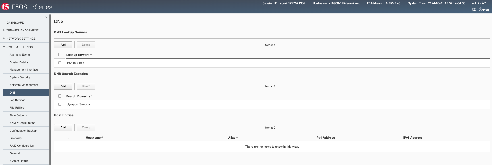
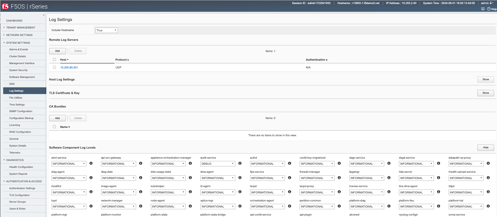
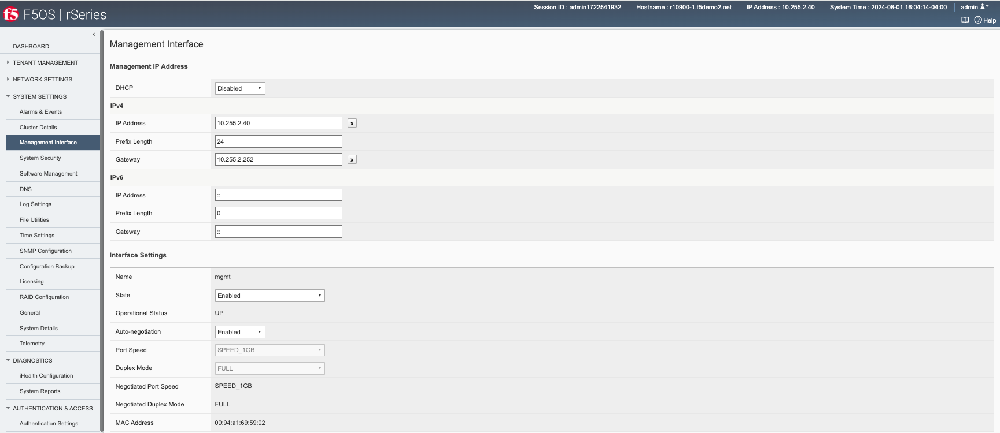
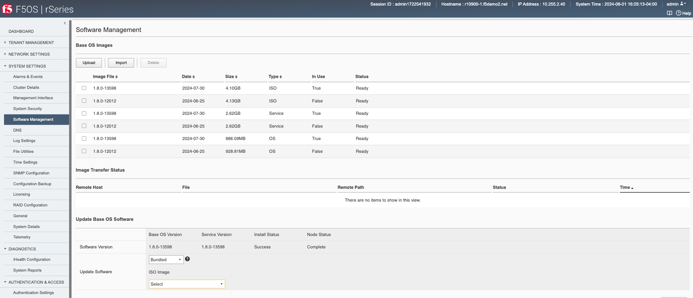
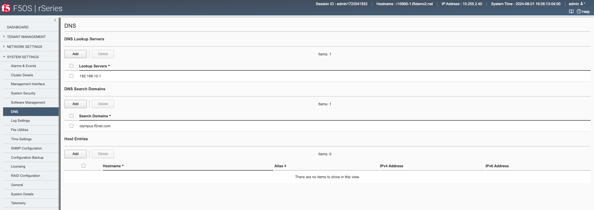
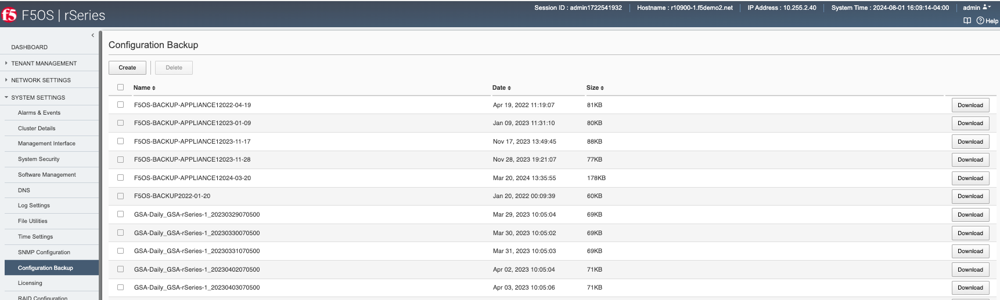
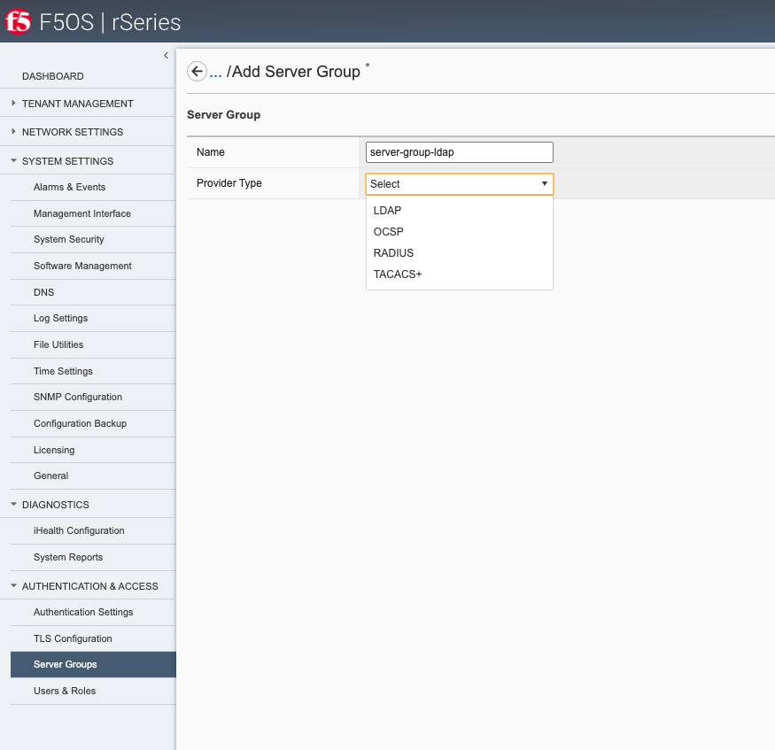

============================================
Initial Setup of rSeries F5OS Platform Layer
============================================

Connect a console or terminal server to the console port of the rSeries appliance. Login as admin/admin (you’ll be prompted to change the password) and access the F5OS CLI. F5OS utilizes **ConfD** for configuration management of F5OS and will be a familiar navigation experience if you have used it on other products. The CLI supports command completion and online help and is easy to navigate. There are **show** commands to display current configurations and status, and a **config** mode to alter current configuration.

Once logged in you can display the current running configuration by issuing the command **show running-config**.

.. code-block:: bash

  Boston-r10900-1# show running-config 
  cluster disk-usage-threshold config warning-limit 85
  cluster disk-usage-threshold config error-limit 90
  cluster disk-usage-threshold config critical-limit 97
  cluster disk-usage-threshold config growth-rate-limit 10
  cluster disk-usage-threshold config interval 60
  cluster nodes node node-1
  config name node-1
  config enabled
  !
  fpga-tables xbar-ports xbar-port port0_mod0
  !
  fpga-tables xbar-ports xbar-port port1_mod0
  !
  fpga-tables xbar-ports xbar-port port2_mod3
  !
  fpga-tables xbar-ports xbar-port port3_mod3
  !
  fpga-tables xbar-ports xbar-port port4_mod4
  !
  fpga-tables xbar-ports xbar-port port5_mod5
  !
  fpga-tables xbar-ports xbar-port port6_mod1
  !
  cluster disk-usage-threshold config warning-limit 85
  cluster disk-usage-threshold config error-limit 90
  cluster disk-usage-threshold config critical-limit 97
  cluster disk-usage-threshold config growth-rate-limit 10
  cluster disk-usage-threshold config interval 60
  cluster nodes node node-1
  config name node-1
  config enabled
  !

To alter any configuration, you must enter config mode:

.. code-block:: bash

  syscon-2-active# config
  Entering configuration mode terminal
  syscon-2-active(config)#

 And so save any configuration you must enter *commit**.

.. code-block:: bash

  Boston-r10900-1(config)# commit

----------------------------
Internal Appliance IP Ranges
----------------------------

The rSeries appliances ship with a default internal RFC6598 address space of 100.64.0.0/12. This should be sufficient for most production environments. You can verify this with the following command.

.. code-block:: bash

  Boston-r10900-1# show system network 
  system network state configured-network-range-type RFC6598
  system network state configured-network-range 100.64.0.0/12
  system network state active-network-range-type RFC6598
  system network state active-network-range 100.64.0.0/12
  Boston-r10900-1# 

This address range never leaves the inside of the appliance and will not interfere with any communication outside the rSeries device. There can however be address collisions if a device trying to manage rSeries via the out-of-band management port falls within this range, or an external management device or service falls within this range and communicated with rSeries over its out-of-band networking. This may result in rSeries not able to communicate with those devices.

Some examples would be any client trying to access the F5OS or tenant out-of-band interfaces to reach its’ CLI, GUI, or API. Other examples would be external services such as SNMP, DNS, NTP, SNMP, Authentication that have addresses that fall within the RFC6598 address space. You may experience connectivity problems with these types of clients/services if there is an overlap. Note that this does not affect the data plane / in-band interfaces, it only affects communication to the out-of-band interfaces. 

If there is the potential for conflict with external devices that fall within this range that need to communicate with rSeries, then there are options to change the configured-network-range-type to one of sixteen different blocks within the RFC1918 address space. Changing this will require a complete appliance power-cycle, rebooting is not sufficient.  Please consult with F5 prior to making any changes to the internal addresses.

.. code-block:: bash

  Boston-r10900-1(config)# system network config network-range-type RFC < Hit TAB>
  Possible completions:
    RFC1918   System uses 10.[0-15]/12 as specified by RFC1918
    RFC6598   System uses 100.64/10 as specified by RFC6598
  Boston-r10900-1(config)# system network config network-range-type RFC

If changing to one of the RFC1918 address spaces, you will need to choose from one of 16 prefix ranges as seen below. You should ensure that this will not overlap with current address space deployed within the environment:

.. code-block:: bash

  Boston-r10900-1(config)# system network config network-range-type RFC1918 prefix ?
  Description: 
  The network prefix index is used to select the range of IP addresses
  used internally within the appliance. The network prefix should be
  selected such that internal appliance addresses do not overlap with
  site-local addresses that are accessible to the appliance.

  Network Prefix Index       Appliance Network Range
  0                          10.[0-15].0.0/16
  1                          10.[16-31].0.0/16
  2                          10.[32-47].0.0/16
  3                          10.[48-63].0.0/16
  4                          10.[64-79].0.0/16
  5                          10.[80-95].0.0/16
  6                          10.[96-111].0.0/16
  7                          10.[112-127].0.0/16
  8                          10.[128-143].0.0/16
  9                          10.[144-159].0.0/16
  10                         10.[160-175].0.0/16
  11                         10.[176-191].0.0/16
  12                         10.[192-207].0.0/16
  13                         10.[208-223].0.0/16
  14                         10.[224-239].0.0/16
  15                         10.[240-255].0.0/16
  Possible completions:
    <unsignedByte, 0 .. 15>[0]
  Boston-r10900-1(config)# system network config network-range-type RFC1918 prefix 15
  Boston-r10900-1(config)# commit
  Commit complete.

**Note: This change will not take effect until the appliance is power cycled. A complete power cycle is required in order to convert existing internal address space to the new address space, a reboot is not sufficient.**

-------------------------------
IP Address Assignment & Routing
-------------------------------

The rSeries appliance requires its own unique out-of-band IP address for the F5OS layer. The IP addresses can be statically defined or acquired via DHCP. In addition to the IP address a default route and subnet mask/prefix length is defined. 

Once logged in you will configure the static IP addresses (unless DHCP is preferred).

.. code-block:: bash

  Boston-r10900-1(config)# system mgmt-ip config ipv4 system address 10.255.0.132
  Boston-r10900-1(config)# system mgmt-ip config ipv4 prefix-length 24
  Boston-r10900-1(config)# system mgmt-ip config ipv4 gateway 10.255.0.1

In order to make these changes active you must commit the changes. No configuration changes are executed until the commit command is issued. 

.. code-block:: bash

  Boston-r10900-1(config)# commit

Now that the out-of-band address and routing are configured you can attempt to access the F5OS GUI via the IP address that has been defined. You should see a screen similar to the one below, and you can verify your management interface settings by going to the **System Settings -> Management Interface** page. 

.. image:: images/initial_setup_of_rseries_platform_layer/image1.png
  :align: center
  :scale: 70%

Here you can switch from static to DHCP address assignment, configured IPv6 addresses, and interface state, speed, and duplex. You can also view the management interface stats on the bottom of this page. 

.. image:: images/initial_setup_of_rseries_platform_layer/image2.png
  :align: center
  :scale: 70%

---------------
System Settings
---------------

Once the IP address has been defined system settings such as DNS servers, NTP, and external logging should be defined. This can be done from the CLI, GUI, or API.

System Settings via the CLI
===========================

.. code-block:: bash

  Boston-r10900-1# config
  Entering configuration mode terminal
  Boston-r10900-1(config)# system dns servers server 192.168.10.1 config address 192.168.10.1
  Boston-r10900-1(config-server-192.168.19.1)# exit
  Boston-r10900-1(config)# system dns config search olympus.f5net.com
  Boston-r10900-1(config)# system ntp config enabled 
  Boston-r10900-1(config)# system ntp servers server time.olympus.f5net.com
  Boston-r10900-1(config-server-time.f5net.com)# exit
  Boston-r10900-1(config)# system logging remote-servers remote-server 10.255.0.142 selectors selector LOCAL0 WARNING
  Boston-r10900-1(config-remote-server-10.255.0.142)# exit
  Boston-r10900-1(config)# commit

System Settings via the GUI
===========================

You can configure the DNS and Time settings from the GUI if preferred. DNS is configured under **System Settings > DNS**. Here you can add DNS lookup servers, and optional search domains. This will be needed for the rSeries appliance to resolve hostnames that may be used for external services like ntp, authentication servers, licensing, or to reach iHealth for qkview uploads.

Configuring Network Time Protocol is highly recommended so that the rSeries systems clock is sync’d and accurate. In addition to configuring NTP time sources, you can set the local timezone for this appliance's location.

It’s also a good idea to have the rSeries appliance send logs for the F5OS platform layer to an external syslog server. This can be configured in the **System Settings > Log Settings** screen. Here you can configure remote servers, the logging facility, and severity levels. You can also configure logging subsystem level individually. The remote logging severity level will override and component logging levels if they are higher, but only for logs sent remotely. Local logging levels will follow however the component levels are configured here.

System Settings via the API
===========================

If you would prefer to automate the setup of the rSeries appliance, there are API calls for all of the examples above. To set the DNS configuration (servers and search domains) for appliance use the following API call. For any API calls to rSeries F5OS layer it is important to include the header **Content-Type** **application/yang-data+json**.

.. code-block:: bash

  PATCH https://{{Appliance1_IP}}:8888/restconf/data/openconfig-system:system/dns

Below is the body of the API call which contains the desired configuration:

.. code-block:: json

  {
      "openconfig-system:dns": {
          "config": {
              "search": [
                  "olympus.f5net.com"
              ]
          },
          "servers": {
              "server": [
                  {
                      "address": "192.168.11.0",
                      "config": {
                          "address": "192.168.11.0"
                      }
                  }
              ]
          }
      }
  }

You may then view the current DNS configuration with the folowing API call:

.. code-block:: bash

  GET https://{{Appliance1_IP}}:8888/restconf/data/openconfig-system:system/dns

Below is the output from the API query above:

.. code-block:: json

  {
      "openconfig-system:dns": {
          "config": {
              "search": [
                  "olympus.f5net.com"
              ]
          },
          "state": {
              "search": [
                  "olympus.f5net.com"
              ]
          },
          "servers": {
              "server": [
                  {
                      "address": "192.168.11.0",
                      "config": {
                          "address": "192.168.11.0",
                          "port": 53
                      },
                      "state": {
                          "port": 53
                      }
                  }
              ]
          }
      }
  }

To set System Time settings use the following API call as an example. This will set the Timezone, enable NTP, and configure NTP servers.

.. code-block:: bash

  PATCH https://{{Chassis1_System_Controller_IP}}:8888/restconf/data/

Below is the body of the API call contianing the desired configuration:

.. code-block:: json

  {
      "openconfig-system:system": {
          "clock": {
              "config": {
                  "timezone-name": "America/New_York"
              }
          },
          "ntp": {
              "config": {
                  "enabled": "true"
              },
              "servers": {
                  "server": [
                      {
                          "address": "time.f5net.com",
                          "config": {
                              "address": "time.f5net.com"
                          }
                      }
                  ]
              }
          }
      }
  }

To confirm the clock and NTP settings use the following API commands. First query NTP configuration:

.. code-block:: bash

  GET https://{{Appliance1_IP}}:8888/restconf/data/openconfig-system:system/ntp

.. code-block:: json

  {
      "openconfig-system:ntp": {
          "config": {
              "enabled": true
          },
          "state": {
              "enabled": true
          },
          "servers": {
              "server": [
                  {
                      "address": "time.f5net.com",
                      "config": {
                          "address": "time.f5net.com",
                          "port": 123,
                          "version": 4,
                          "association-type": "SERVER",
                          "iburst": false,
                          "prefer": false
                      },
                      "state": {
                          "address": "time.f5net.com",
                          "port": 123,
                          "version": 4,
                          "association-type": "SERVER",
                          "iburst": false,
                          "prefer": false
                      }
                  }
              ]
          }
      }
  }

Next query the clock configuration:

.. code-block:: bash

  GET https://{{Appliance1_IP}}:8888/restconf/data/openconfig-system:system/clock

Below is the output showing the date/time and timezone:

.. code-block:: json

  {
      "openconfig-system:clock": {
          "config": {
              "timezone-name": "America/New_York"
          },
          "state": {
              "timezone-name": "America/New_York",
              "f5-system-clock:appliance": {
                  "date-time": "2022-01-12 14:32:49 America/New_York"
              }
          }
      }
  }

Next a remote logging destination will be setup for the F5OS logging. To set a Remote Logging destination:

.. code-block:: bash

  PATCH https://{{Chassis1_System_Controller_IP}}:8888/restconf/data/

.. code-block:: json

  {
      "openconfig-system:system": {
          "logging": {
              "remote-servers": {
                  "remote-server": [
                      {
                          "host": "10.255.0.142",
                          "config": {
                              "host": "10.255.0.142",
                              "remote-port": "514"
                          },
                          "selectors": {
                              "selector": [
                                  {
                                      "facility": "LOCAL0",
                                      "severity": "INFORMATIONAL",
                                      "config": {
                                          "facility": "LOCAL0",
                                          "severity": "INFORMATIONAL"
                                      }
                                  }
                              ]
                          }
                      }
                  ]
              }
          }
      }
  }

To query the remote logging:

.. code-block:: bash

  GET https://{{Appliance1_IP}}:8888/restconf/data/openconfig-system:system/logging

The output will show the logging level of all the software subsystems.

.. code-block:: json

  {
      "openconfig-system:logging": {
          "remote-servers": {
              "remote-server": [
                  {
                      "host": "10.255.0.142",
                      "config": {
                          "host": "10.255.0.142",
                          "remote-port": 514,
                          "f5-openconfig-system-logging:proto": "udp"
                      },
                      "selectors": {
                          "selector": [
                              {
                                  "facility": "f5-system-logging-types:LOCAL0",
                                  "severity": "WARNING",
                                  "config": {
                                      "facility": "f5-system-logging-types:LOCAL0",
                                      "severity": "WARNING"
                                  }
                              }
                          ]
                      }
                  }
              ]
          },
          "f5-openconfig-system-logging:sw-components": {
              "sw-component": [
                  {
                      "name": "alert-service",
                      "config": {
                          "name": "alert-service",
                          "description": "Alert service",
                          "severity": "INFORMATIONAL"
                      }
                  },
                  {
                      "name": "api-svc-gateway",
                      "config": {
                          "name": "api-svc-gateway",
                          "description": "API service gateway",
                          "severity": "INFORMATIONAL"
                      }
                  },
                  {
                      "name": "appliance-orchestration-agent",
                      "config": {
                          "name": "appliance-orchestration-agent",
                          "description": "Tenant orchestration agent",
                          "severity": "INFORMATIONAL"
                      }
                  },
                  {
                      "name": "appliance-orchestration-manager",
                      "config": {
                          "name": "appliance-orchestration-manager",
                          "description": "Appliance orchestration manager",
                          "severity": "INFORMATIONAL"
                      }
                  },
                  {
                      "name": "authd",
                      "config": {
                          "name": "authd",
                          "description": "Authentication configuration",
                          "severity": "INFORMATIONAL"
                      }
                  },
                  {
                      "name": "confd-key-migrationd",
                      "config": {
                          "name": "confd-key-migrationd",
                          "description": "Confd Primary Key Migration Service",
                          "severity": "INFORMATIONAL"
                      }
                  },
                  {
                      "name": "dagd-service",
                      "config": {
                          "name": "dagd-service",
                          "description": "DAG daemon",
                          "severity": "INFORMATIONAL"
                      }
                  },
                  {
                      "name": "datapath-cp-proxy",
                      "config": {
                          "name": "datapath-cp-proxy",
                          "description": "Data path CP proxy",
                          "severity": "INFORMATIONAL"
                      }
                  },
                  {
                      "name": "diag-agent",
                      "config": {
                          "name": "diag-agent",
                          "description": "Diag agent",
                          "severity": "INFORMATIONAL"
                      }
                  },
                  {
                      "name": "disk-usage-statd",
                      "config": {
                          "name": "disk-usage-statd",
                          "description": "Disk usage agent",
                          "severity": "INFORMATIONAL"
                      }
                  },
                  {
                      "name": "dma-agent",
                      "config": {
                          "name": "dma-agent",
                          "description": "DMA agent",
                          "severity": "INFORMATIONAL"
                      }
                  },
                  {
                      "name": "fips-service",
                      "config": {
                          "name": "fips-service",
                          "description": "FIPS Service",
                          "severity": "INFORMATIONAL"
                      }
                  },
                  {
                      "name": "fpgamgr",
                      "config": {
                          "name": "fpgamgr",
                          "description": "FPGA manager",
                          "severity": "INFORMATIONAL"
                      }
                  },
                  {
                      "name": "ihealth-upload-service",
                      "config": {
                          "name": "ihealth-upload-service",
                          "description": "Upload diagnostics data service",
                          "severity": "INFORMATIONAL"
                      }
                  },
                  {
                      "name": "ihealthd",
                      "config": {
                          "name": "ihealthd",
                          "description": "Communication proxy for ihealth-upload-service",
                          "severity": "INFORMATIONAL"
                      }
                  },
                  {
                      "name": "image-agent",
                      "config": {
                          "name": "image-agent",
                          "description": "Tenant image handling",
                          "severity": "INFORMATIONAL"
                      }
                  },
                  {
                      "name": "kubehelper",
                      "config": {
                          "name": "kubehelper",
                          "description": "Application that will handle specific tasks for deploying tenants",
                          "severity": "INFORMATIONAL"
                      }
                  },
                  {
                      "name": "l2-agent",
                      "config": {
                          "name": "l2-agent",
                          "description": "L2 agent",
                          "severity": "INFORMATIONAL"
                      }
                  },
                  {
                      "name": "lacpd",
                      "config": {
                          "name": "lacpd",
                          "description": "Link aggregation control protocol",
                          "severity": "INFORMATIONAL"
                      }
                  },
                  {
                      "name": "license-service",
                      "config": {
                          "name": "license-service",
                          "description": "License service",
                          "severity": "INFORMATIONAL"
                      }
                  },
                  {
                      "name": "line-dma-agent",
                      "config": {
                          "name": "line-dma-agent",
                          "description": "Line DMA agent",
                          "severity": "INFORMATIONAL"
                      }
                  },
                  {
                      "name": "lldpd",
                      "config": {
                          "name": "lldpd",
                          "description": "Link layer discovery protocol",
                          "severity": "INFORMATIONAL"
                      }
                  },
                  {
                      "name": "lopd",
                      "config": {
                          "name": "lopd",
                          "description": "Communication proxy for the Lights Out Processor",
                          "severity": "INFORMATIONAL"
                      }
                  },
                  {
                      "name": "network-manager",
                      "config": {
                          "name": "network-manager",
                          "description": "Network manager",
                          "severity": "INFORMATIONAL"
                      }
                  },
                  {
                      "name": "nic-manager",
                      "config": {
                          "name": "nic-manager",
                          "description": "NIC manager",
                          "severity": "INFORMATIONAL"
                      }
                  },
                  {
                      "name": "optics-mgr",
                      "config": {
                          "name": "optics-mgr",
                          "description": "Optics tunning manager",
                          "severity": "INFORMATIONAL"
                      }
                  },
                  {
                      "name": "platform-diag",
                      "config": {
                          "name": "platform-diag",
                          "description": "Platform diag service",
                          "severity": "INFORMATIONAL"
                      }
                  },
                  {
                      "name": "platform-fwu",
                      "config": {
                          "name": "platform-fwu",
                          "description": "Platform firmware upgrade",
                          "severity": "INFORMATIONAL"
                      }
                  },
                  {
                      "name": "platform-hal",
                      "config": {
                          "name": "platform-hal",
                          "description": "Platform hardware abstraction layer",
                          "severity": "INFORMATIONAL"
                      }
                  },
                  {
                      "name": "platform-mgr",
                      "config": {
                          "name": "platform-mgr",
                          "description": "Appliance platform manager",
                          "severity": "INFORMATIONAL"
                      }
                  },
                  {
                      "name": "platform-monitor",
                      "config": {
                          "name": "platform-monitor",
                          "description": "Platform monitor",
                          "severity": "INFORMATIONAL"
                      }
                  },
                  {
                      "name": "platform-stats-bridge",
                      "config": {
                          "name": "platform-stats-bridge",
                          "description": "Platform stats bridge",
                          "severity": "INFORMATIONAL"
                      }
                  },
                  {
                      "name": "qkviewd",
                      "config": {
                          "name": "qkviewd",
                          "description": "Diagnostic information",
                          "severity": "INFORMATIONAL"
                      }
                  },
                  {
                      "name": "rsyslog-configd",
                      "config": {
                          "name": "rsyslog-configd",
                          "description": "Logging configuration",
                          "severity": "INFORMATIONAL"
                      }
                  },
                  {
                      "name": "snmp-trapd",
                      "config": {
                          "name": "snmp-trapd",
                          "description": "SNMP trap",
                          "severity": "INFORMATIONAL"
                      }
                  },
                  {
                      "name": "stpd",
                      "config": {
                          "name": "stpd",
                          "description": "Spanning tree protocol (STP)",
                          "severity": "INFORMATIONAL"
                      }
                  },
                  {
                      "name": "sw-rbcast",
                      "config": {
                          "name": "sw-rbcast",
                          "description": "Software Rebroadcast Service",
                          "severity": "INFORMATIONAL"
                      }
                  },
                  {
                      "name": "sys-host-config",
                      "config": {
                          "name": "sys-host-config",
                          "description": "System host config service",
                          "severity": "INFORMATIONAL"
                      }
                  },
                  {
                      "name": "system-control",
                      "config": {
                          "name": "system-control",
                          "description": "Appliance System control framework",
                          "severity": "INFORMATIONAL"
                      }
                  },
                  {
                      "name": "tcpdumpd-manager",
                      "config": {
                          "name": "tcpdumpd-manager",
                          "description": "Tcpdump daemon",
                          "severity": "INFORMATIONAL"
                      }
                  },
                  {
                      "name": "tmstat-agent",
                      "config": {
                          "name": "tmstat-agent",
                          "description": "Appliance stats agent",
                          "severity": "INFORMATIONAL"
                      }
                  },
                  {
                      "name": "tmstat-merged",
                      "config": {
                          "name": "tmstat-merged",
                          "description": "Stats rollup",
                          "severity": "INFORMATIONAL"
                      }
                  },
                  {
                      "name": "upgrade-service",
                      "config": {
                          "name": "upgrade-service",
                          "description": "Software upgrade service",
                          "severity": "INFORMATIONAL"
                      }
                  },
                  {
                      "name": "user-manager",
                      "config": {
                          "name": "user-manager",
                          "description": "User manager",
                          "severity": "INFORMATIONAL"
                      }
                  },
                  {
                      "name": "vconsole",
                      "config": {
                          "name": "vconsole",
                          "description": "Tenant virtual console",
                          "severity": "INFORMATIONAL"
                      }
                  }
              ]
          },
          "f5-openconfig-system-logging:host-logs": {
              "config": {
                  "remote-forwarding": {
                      "enabled": false
                  }
              }
          }
      }
  }

If you would like to change the severity of any of the logging, below is an example. The API call below will change the software subsystem logging for **l2-agent** to **DEBUG**.

.. code-block:: bash

  PATCH https://{{Appliance1_IP}}:8888/restconf/data/openconfig-system:system/logging

Below is the configuration in the body of the API call above to set the **DEBUG** logging level:

.. code-block:: json

  {
      "openconfig-system:logging": {
          "f5-openconfig-system-logging:sw-components": {
              "sw-component": {
                  "name": "l2-agent",
                  "config": {
                      "name": "l2-agent",
                      "description": "L2 agent",
                      "severity": "DEBUG"
                  }
              }
          }
      }
  }

When done examining the logs, you can run the same API call but the body will be modified to set the logging level back to **INFORMATIONAL**.

.. code-block:: json

  {
      "openconfig-system:logging": {
          "f5-openconfig-system-logging:sw-components": {
              "sw-component": {
                  "name": "l2-agent",
                  "config": {
                      "name": "l2-agent",
                      "description": "L2 agent",
                      "severity": "INFORMATIONAL"
                  }
              }
          }
      }
  }

-------------------------------
Licensing the rSeries Appliance
-------------------------------

Licensing for the rSeries device is handled at the F5OS level. This is similar to how vCMP licensing is implemented where the system is licensed once, and all subsystems inherit their licensing from the appliance or chassis. With rSeries, licensing is applied at the F5OS platform layer and all tenants will inherit their licenses from the base system. There is no need to procure add-on licenses for MAX SSL/Compression or for tenancy/vCMP. This is different than iSeries where only certain models supported virtualization/vCMP and in some cases for MAX SSL/Compression. For rSeries these are included in the base license at no extra cost, however there are different levels of perfromance based on the Pay-as-you-Grow licensing. rSeries does not run vCMP, and instead runs tenancy on top of F5OS.

Licenses can be applied via CLI, GUI, or API. A base registration key and optional add-on keys are needed, and it follows the same manual or automatic licensing capabilities of other BIG-IP systems. 

Licensing via GUI
=================

Licensing is accessible under the **System Settings > Licensing** page. **Automatic** will require proper routing and DNS connectivity to the Internet to reach F5’s licensing server. If this is not possible to reach the licensing server use the **Manual** method.

.. image:: images/initial_setup_of_rseries_platform_layer/image6.png
  :width: 45%

.. image:: images/initial_setup_of_rseries_platform_layer/image7.png
  :width: 45%

Licensing via CLI
=================

You can activate and display the current license in the GUI, CLI or API. To license the rSeries appliance automatically from the CLI:

.. code-block:: bash

  Boston-r10900-1(config)# system licensing install registration-key 12345-67891-12345-12345-8207880
  result License installed successfully.
  Boston-r10900-1(config)# 

To license the rSeries appliance manually you’ll need to get the dossier first:

.. code-block:: bash

  Boston-r10900-1(config)# system licensing get-dossier
  b9a9936886bada077d93843a281ce4c34bf78db0d6c32c40adea3a5329db15edd413fe7d7f8143fd128ebe2d97642b4ed9192b530788fe3965593e3b42131c66220401b16843476159414ceeba8af5fb67a39fe2a2f408b9…

You can then access F5’s licensing server (license.f5.com) and paste in the dossier when prompted:

.. image:: images/initial_setup_of_rseries_platform_layer/image9.png
  :align: center
  :scale: 70%

.. image:: images/initial_setup_of_rseries_platform_layer/image10.png
  :align: center
  :scale: 70%

This should generate a license that can be saved or pasted into the rSeries appliance using the command **system licensing manual-install license**:

.. image:: images/initial_setup_of_rseries_platform_layer/image11.png
  :align: center
  :scale: 70%

.. code-block:: bash

  Boston-r10900-1(config)# system licensing manual-install license 
  Value for 'license' (<string>): 
  [Multiline mode, exit with ctrl-D.]
  >

You should paste in the license and when finished hit **<CTRL> D**.

.. code-block:: bash

  #
  > #-----------------------------------------
  > # Copyright 1996-2021, F5 Networks, Inc.
  > # All rights reserved. 
  > #-----------------------------------------
  > 
  result License installed successfully.
  Boston-r10900-1(config)# 

You can also view the EULA via the CLI:

.. code-block:: bash

  Boston-r10900-1(config)# system licensing get-eula 
  eula-text END USER LICENSE AGREEMENT

  DOC-0355-16

  IMPORTANT " READ BEFORE INSTALLING OR OPERATING THIS PRODUCT

  YOU AGREE TO BE BOUND BY THE TERMS OF THIS LICENSE BY INSTALLING,
  HAVING INSTALLED, COPYING, OR OTHERWISE USING THE SOFTWARE.  IF YOU
  DO NOT AGREE, DO NOT INSTALL OR USE THE SOFTWARE.

  This End User License Agreement ("License") applies to the software
  product(s) ("Software") you have licensed from us whether on
  a stand-alone basis or as part of any hardware ("Hardware") you
  purchase from us, (the Hardware and Software together, the "Product").
  This License is a legal agreement between us and the single entity
  that has licensed the Software from us ("you"). All references to
  "F5," "we" or "us" in this License will be deemed to be a reference
  to the applicable F5 entity as follows: (a) if your primary place of
  business is located in the European Economic Area, the Middle East
  or Africa ("EMEA"), the F5 entity is F5 Networks Ltd.; (b) if your
  primary place of business is located in the Asia- Pacific region
  ("APAC"), the F5 entity is F5 Networks Singapore Pte Ltd; and (c)
  if your primary place of business is located in a region outside of
  EMEA or APAC, the F5 entity is F5 Networks, Inc.

  1.  Grant of Rights.

  (a)  License. Subject to your compliance with the terms of this
  License, we grant to you a limited, non- exclusive, non-transferable,

The CLI command **show system licensing** will display the appliance level licensing:

.. code-block:: bash

  Boston-r10900-1# show system licensing 
  system licensing license 
                         Licensed version    1.0.0
                         Registration Key    I5251-44764-04805-81212-8207880
                         Licensed date       2022/01/01
                         License start       2021/09/27
                         License end         2022/02/12
                         Service check date  2022/01/13
                         Platform ID         C129
                         Appliance SN        f5-zcxz-qxpq
                         
                         Active Modules
                          Local Traffic Manager, r5900 (P167390-1282512)
                           Rate Shaping
                           Anti-Virus Checks
                           Base Endpoint Security Checks
                           Firewall Checks
                           Machine Certificate Checks
                           Network Access
                           Protected Workspace
                           Secure Virtual Keyboard
                           APM, Web Application
                           App Tunnel
                           Remote Desktop
                           APM, Limited
                           Max Compression, r5900
                           Max SSL, r5900

**Note: rSeries supports AWAF vs. ASM licensing, and modules like AAM are not supported on the rSeries platform since it has reached End-of-Life.**

https://support.f5.com/csp/article/K70113407

Licensing via API
=================

To get the current licensing status via API use the following API call. Issue a **GET** to the out-of-band management IP address of the F5OS layer:

.. code-block:: bash

  GET https://{{Appliance1_IP}}:8888/restconf/data/openconfig-system:system/f5-system-licensing:licensing

.. code-block:: json

  {
      "f5-system-licensing:licensing": {
          "config": {
              "registration-key": {
                  "base": "B1249-45920-70635-24344-7350724"
              },
              "dossier": "01ac66f1c5a13fad15f3a0eca6528220df04f42baa4c48f1c35682c6691dde0e306406407cec3f6b9c3cfa93751f21360bfcf7085585d79b4feb7170a314637e8f99f22b09fcd4a4c54b27def300a8f9c83420b9cc0a6bd097a8f7e958fc2b8c4e93d685f6b70bc415e7999b869eba07d5976183ee31e612b8e94506a852dae2c13fbbb67556e48f1473b849d7cd396be270e73123218e85871670e84e9485e774a57250f8f7299a876f17106158c62efb579aad689ebfc629b31e2175c4485b59a4bed33bd3e2dd31e7fb83",
              "license": "#\nAuth vers :                   5b\n#\n#\n#       BIG-IP System License Key File\n#       DO NOT EDIT THIS FILE!!\n#\n#       Install this file as \"/config/bigip.license\".\n#\n#       Contact information in file /CONTACTS\n#\n#\n#       Warning: Changing the system time while this system is running\n#                with a time-limited license may make the system unusable.\n#\nUsage :                       F5 Internal Product Development\n#\n#\n#  Only the specific use referenced above is allowed. Any other uses are prohibited.\n#\nVendor :                      F5 Networks, Inc.\n#\n#       Module List \n#\nactive module :               Local Traffic Manager, r10900|Y226037-5242227|Rate Shaping|Anti-Virus Checks|Base Endpoint Security Checks|Firewall Checks|Machine Certificate Checks|Network Access|Protected Workspace|Secure Virtual Keyboard|APM, Web Application|App Tunnel|Remote Desktop|APM, Limited|Max SSL, r10900|Max Compression, r10900\noptional module :             Access Policy Manager, Base, r109XX\noptional module :             Access Policy Manager, Max, r109XX\noptional module :             Advanced Firewall Manager, r10XXX\noptional module :             Advanced Protocols\noptional module :             Advanced Web Application Firewall, r10XXX\noptional module :             App Mode (TMSH Only, No Root/Bash)\noptional module :             Basic Policy Enforcement Manager, i10XXX\noptional module :             BIG-IP, Multicast Routing\noptional module :             BIG-IP, Privileged User Access, 100 Endpoints\noptional module :             BIG-IP, Privileged User Access, 1000 Endpoints\noptional module :             BIG-IP, Privileged User Access, 250 Endpoints\noptional module :             BIG-IP, Privileged User Access, 50 Endpoints\noptional module :             BIG-IP, Privileged User Access, 500 Endpoints\noptional module :             Carrier-Grade NAT, r10XXX\noptional module :             DataSafe, r10XXX\noptional module :             DDOS, r10XXX\noptional module :             DNS 1K, rSeries\noptional module :             DNS Max, rSeries\noptional module :             Dynamic Policy Provisioning, r10XXX\noptional module :             External Interface and Network HSM\noptional module :             FIPS 140-2\noptional module :             FIX Low Latency\noptional module :             Intrusion Prevention System, r10XXX\noptional module :             IP Intelligence, 1Yr\noptional module :             IP Intelligence, 3Yr\noptional module :             IPS, 1Yr\noptional module :             IPS, 3Yr\noptional module :             Link Controller\noptional module :             LTM to Best Upgrade, r109XX\noptional module :             LTM to Better Upgrade, r109XX\noptional module :             Policy Enforcement Manager, r10XXX\noptional module :             Routing Bundle\noptional module :             SM2_SM3_SM4\noptional module :             SSL Orchestrator, r10XXX\noptional module :             Subscriber Discovery, r10XXX\noptional module :             Threat Campaigns, 1Yr\noptional module :             Threat Campaigns, 3Yr\noptional module :             Traffic Classification, r10XXX\noptional module :             URL Filtering, 1Yr\noptional module :             URL Filtering, 1Yr, Max\noptional module :             URL Filtering, 3Yr\noptional module :             URL Filtering, 3Yr, Max\noptional module :             VPN Users\n#\n#       Accumulated Tokens for Module\n#       Max SSL, r10900  perf_SSL_Mbps 1  key Y226037-5242227\n#\nperf_SSL_Mbps :               1\n#\n#       Accumulated Tokens for Module\n#       APM, Limited  apm_urlf_limited_sessions 10  key Y226037-5242227\n#\n#       Accumulated Tokens for Module\n#       APM, Limited  apml_sessions 10  key Y226037-5242227\n#\napm_urlf_limited_sessions :   10\napml_sessions :               10\n#\n#       License Tokens for Module Local Traffic Manager, r10900 key Y226037-5242227\n#\nthrottle_level :              900\nperf_vcmp_max_guests :        UNLIMITED\nperf_PVA_dram_limit :         enabled\nperf_CPU_cores :              UNLIMITED\nnw_vlan_groups :              enabled\nmod_ltm :                     enabled\nmod_lbl :                     enabled\nmod_ilx :                     enabled\nltm_network_virtualization :  enabled\nfpga_performance :            enabled\n#\n#       License Tokens for Module Max SSL, r10900 key Y226037-5242227\n#\nperf_SSL_total_TPS :          UNLIMITED\nperf_SSL_per_core :           enabled\nperf_SSL_cmp :                enabled\n#\n#       License Tokens for Module Max Compression, r10900 key Y226037-5242227\n#\nperf_http_compression_Mbps :  UNLIMITED\nperf_http_compression_hw :    enabled\n#\n#       License Tokens for Module APM, Limited key Y226037-5242227\n#\nmod_apml :                    enabled\n#\n#       License Tokens for Module Rate Shaping key Y226037-5242227\n#\nltm_bandw_rate_tosque :       enabled\nltm_bandw_rate_fairque :      enabled\nltm_bandw_rate_classl7 :      enabled\nltm_bandw_rate_classl4 :      enabled\nltm_bandw_rate_classes :      enabled\n#\n#       License Tokens for Module APM, Web Application key Y226037-5242227\n#\napm_web_applications :        enabled\n#\n#       License Tokens for Module Remote Desktop key Y226037-5242227\n#\napm_remote_desktop :          enabled\n#\n#       License Tokens for Module Network Access key Y226037-5242227\n#\napm_na :                      enabled\n#\n#       License Tokens for Module Secure Virtual Keyboard key Y226037-5242227\n#\napm_ep_svk :                  enabled\n#\n#       License Tokens for Module Protected Workspace key Y226037-5242227\n#\napm_ep_pws :                  enabled\n#\n#       License Tokens for Module Machine Certificate Checks key Y226037-5242227\n#\napm_ep_machinecert :          enabled\n#\n#       License Tokens for Module Firewall Checks key Y226037-5242227\n#\napm_ep_fwcheck :              enabled\n#\n#       License Tokens for Module Anti-Virus Checks key Y226037-5242227\n#\napm_ep_avcheck :              enabled\n#\n#       License Tokens for Module Base Endpoint Security Checks key Y226037-5242227\n#\napm_ep :                      enabled\n#\n#       License Tokens for Module App Tunnel key Y226037-5242227\n#\napm_app_tunnel :              enabled\n#\n# Debug Msg - Is sol18346625 affected; Usage, \"2021-09-28 00.00.00\", started after requirement date \"2016-04-15 00.00.00\"\n#\n# LC disabled in accordance with https://support.f5.com/kb/en-us/solutions/public/k/18/sol18346625.html\n#\ngtm_lc :                      disabled\n#\n#       Licensing Information \n#\nLicensed date :               20211129\nLicense start :               20210927\nLicense end :                 20220121\nService check date :          20211222\n#\n#       Platform Information \n#\nRegistration Key :            B1249-45920-70635-24344-7350724\nLicensed version :            1.0.0\nPlatform ID :                 C128\nAppliance SN :                f5-xpdn-ngmu\n#\n#       Outbound License Dossier Validation\n#\nDossier :                     01ac66f1c5a13fad15f3a0eca6528220df12b8e94506a852dae2c13fbbb67556e48f1473b849d7cd396be270e73123218e85871670e84e9485e774a57250f8f7299a876f\n#\n#       Outbound License Authorization Signature\n#\nAuthorization :               9f41c2f3f96ed6fc9c8112934fab434ba63bce96f73cd24d61b49fa7c9dc8e5d662e27f837ba734c6c8a3c52577b8b9e1a64aefc46aed07441eff37a52575d7341d701597b2ef59d27230cf1b3d41524978f522f23386bc2ab7c1b34756d9be36d433f34d0339227e8ec5f37af432614141f3c749df1e26d3d069ad9a043c2ebedd4bc60f81ff155ade7b172714075786a7916f32b06830747c3da3ee1281e1965042df766ac31c5690b802257685b87d1ff980a83a5ac9e14cc7e5b73045b4a7c34fea60e4a8dd3b7c460cca83d3805006afc4a82071b3cc502e3dc7c2c40958046bfc835eb0386017352b90175b1cb37a4e3e1bc51467d08cd360a957998a4\n#\n#-----------------------------------------\n# Copyright 1996-2021, F5 Networks, Inc.\n# All rights reserved. \n#-----------------------------------------\n"
          },
          "state": {
              "license": "\nLicensed version    1.0.0\nRegistration Key    B1249-45920-70635-24344-7350724\nLicensed date       2021/11/29\nLicense start       2021/09/27\nLicense end         2022/01/21\nService check date  2021/12/22\nPlatform ID         C128\nAppliance SN        f5-xpdn-ngmu\n\nActive Modules\n Local Traffic Manager, r10900 (Y226037-5242227)\n  Rate Shaping\n  Anti-Virus Checks\n  Base Endpoint Security Checks\n  Firewall Checks\n  Machine Certificate Checks\n  Network Access\n  Protected Workspace\n  Secure Virtual Keyboard\n  APM, Web Application\n  App Tunnel\n  Remote Desktop\n  APM, Limited\n  Max SSL, r10900\n  Max Compression, r10900\n"
          }
      }
  }

-------------------------------
Additional F5OS System Settings
-------------------------------

You can go back and review or edit various settings for the F5OS layer System Settings. 

Alarms and Events
=================

Alarms and Events can be viewed via the **System Settings > Alarms & Events** GUI page. You may optionally choose different severity levels to see more or less events. 

You may also change timeframe to see historical events, and optional refresh the screen via the controls on the right-hand side of the page:

.. image:: images/initial_setup_of_rseries_platform_layer/image13.png
  :align: center
  :scale: 70%

Management Interface
====================

Under **System Settings -> Management Interface** you can view/edit the IP address and port settings for the F5OS out-of-band management interface. If you would prefer to use DHCP for automatic assignment of these addresses, this may also be configured. 
IPv4/IPv6 dual stack support can also be configured. At the bottom of the page stats for the out-of-band port can be displayed.

Software Management
===================

The F5OS-A platform software can be managed under the **System Settings -> Software Management** page. Here you can **Upload** or **Import** approved F5OS-A (for Appliance) images and upgrade the F5OS-A to a new release. The system can support **Bundled** (ISO) based upgrades, or **Unbundled** (Seprate **Service** & **OS**) based upgrades. For now F5 recommends using ISO based upgrades but in the future partial/incremental upgrades of either Service or OS may be utilized.

DNS
===

External **DNS Lookup Servers** and **Search Domains** can be configured in the **System Settings -> DNS** page. This will be required for things like automatic license activation, NTP server domain resolution, and iHealth integration and it is recommended to be configured. 

Log Settings
============

Under **System Settings > Log Settings** you may add remote log servers for the F5OS platform layer. You can also specify the **Software Component Log Levels** which may be useful when troubleshooting specific issues.

.. image:: images/initial_setup_of_rseries_platform_layer/image17.png
  :align: center
  :scale: 70%

File Utilities
==============

The **System Settings > File Utilities** page allows for importing or exporting specific types of files to and from the F5OS platform layer. Logs from the various log directories log can be exported, cores and qkviews and system backups can be imported/exported and F5OS-A software images can be imported into **import/staging**.

.. image:: images/initial_setup_of_rseries_platform_layer/image18.png
  :align: center
  :scale: 70%

The **Import/Export** utility requires an external HTTPS server to copy to/from or you may **Upload/Download** directly to your browser. For Import/Export a pop-up will be displayed asking for remote HTTPS server information. 

.. image:: images/initial_setup_of_rseries_platform_layer/image19.png
  :align: center
  :scale: 70%

Time Settings
=============

Under the **System Settings > Time Settings** page Network Time Protocol servers can be added so that the system controller time sources are sync’d to a reliable time source. The Time can be set manaully and a Time Zone may also be set.

.. image:: images/initial_setup_of_rseries_platform_layer/image20.png
  :align: center
  :scale: 70%

Certificate Management
======================

Device certificates and keys use for device management can be created via the **Systems Settings > Device Certificates** page.

.. image:: images/initial_setup_of_rseries_platform_layer/image22.png
  :align: center
  :scale: 70%  

.. image:: images/initial_setup_of_rseries_platform_layer/image23.png
  :align: center
  :scale: 70%  

System Reports
==============

The **System Settings > System Reports** page allows an admin to generate QKViews and optionally upload them to iHealth. To generate a QKView click on the button in the upper right-hand corner. It will take some time for the QKview to be generated.  

.. image:: images/initial_setup_of_rseries_platform_layer/image24.png
  :align: center
  :scale: 70%

Once the QKView is generated, you can click the checkbox next to it, and then select **Upload to iHealth**.

.. image:: images/initial_setup_of_rseries_platform_layer/image25.png
  :align: center
  :scale: 70%

.. image:: images/initial_setup_of_rseries_platform_layer/image26.png
  :align: center
  :scale: 70%

 Your iHealth credentials will automatically fill in if entered them previously and be cleared if you want to use another account, you can optionally add an **F5 Support Case Number** and **Description**.

.. image:: images/initial_setup_of_rseries_platform_layer/image27.png
  :align: center
  :scale: 70%

If you would like to store iHealth credentials within the configuration you may do so via the CLI. Enter config mode, and then use the system diagnostics ihealth config command to configure a username and password.

.. code-block:: bash

  Boston-r10900-1(config)# system diagnostics ihealth config ?
  Possible completions:
  authserver   Server for Authentication server of iHealth ex:-
               https://api.f5.com/auth/pub/sso/login/ihealth-api
  password     password to login to iHealth
  server       Server for iHealth ex:-
               https://ihealth-api.f5.com/qkview-analyzer/api/qkviews?visible_i
               n_gui=True
  username     username to login to iHealth

  Boston-r10900-1(config)# system diagnostics ihealth config

Configuration Backup
====================

You may backup the confd configuration database for the F5OS platform layer via the GUI. The backups can then be copied off-box using the **File Utilities** GUI option. 

.. image:: images/initial_setup_of_rseries_platform_layer/image29.png
  :align: center
  :scale: 70%

Licensing
=========

Licensing for the rSeries appliance is handled at the F5OS level. This is similar to how iSeries licensing is handled with vCMP enabled, where the system is licensed once, and all subsystems inherit their licensing from the lower layer. With rSeries licensing is applied at the F5OS platform layer and tenants will inherit their licenses from the base system. There is no need to add-on licenses for MAX SSL/Compression or for tenancy. This is different than iSeries where there was an extra charge for virtualization/vCMP and ionly certain models supported multitennancy (Note the r2000 series will only support a single tenant). For rSeries these are included in the base license at no extra cost.

Licenses can be applied via CLI, GUI, or API. A base registration key and optional add-on keys are needed, and it follows the same manual or automatic licensing capabilities of other BIG-IP systems. 

.. image:: images/initial_setup_of_rseries_platform_layer/image30.png
  :align: center
  :scale: 70%

General
=======

The **System Settings > General** page allows you to configure Appliance mode for the F5OS layer. Appliance mode is a security feature where all root and bash shell access are disabled. A user will only be able to utilize the F5OS CLI when Appliance mode is enabled. The page also displays the Systems Properties which includes the Base OS and Service Versions currently running on the appliance. Here you can also cconfigure the **Hostname** of the system, and configure a Message of the Day **MOTD** which is displaye don login. 

---------------
User Management
---------------

Auth Settings
=============

The F5OS platform has its own user and authentication management configured under the **User Management** section of the GUI. This allows for a separate set of users that have access to the F5OS layer, which is configured separately from tenant authentication. You may define local users and/or remote authentication via LDAP, RADIUS, or TACACS. 

Server Groups
=============

Under the **User Management -> Server Groups*** page you may define **Server Groups** which are collections of remote auth servers that the VELOS platform layer will use to authenticate against. LDAP, RADIUS, and TACACS are supported. For LDAP you may choose to authenticate of TCP or SSL. You can configure the remote host’s IP address and port. 

.. image:: images/initial_setup_of_rseries_platform_layer/image35.png
  :align: center
  :scale: 70%

.. image:: images/initial_setup_of_rseries_platform_layer/image36.png
  :align: center
  :scale: 70%

.. image:: images/initial_setup_of_rseries_platform_layer/image37.png
  :align: center
  :scale: 70%  

Users
=====

Under the **User Management -> Users*** page Local Users may be defined, passwords set or changed, and then assigned to specific roles (Admin or Operator). An account may also be locked, and that may be changed here.

.. image:: images/initial_setup_of_rseries_platform_layer/image39.png
  :align: center
  :scale: 70%

.. image:: images/initial_setup_of_rseries_platform_layer/image40.png
  :align: center
  :scale: 70%

