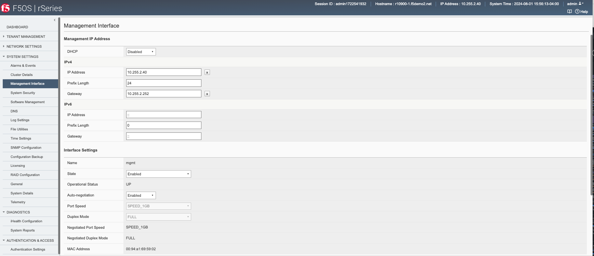

============================================
Initial Setup of rSeries F5OS Platform Layer
============================================

Connect a console or terminal server to the console port of the rSeries appliance. Login as admin/admin (you’ll be prompted to change the password) and access the F5OS CLI. F5OS utilizes **ConfD** for configuration management of F5OS and will be a familiar navigation experience if you have used it on other products. The CLI supports command completion and online help and is easy to navigate. There are **show** commands to display current configurations and status, and a **config** mode to alter current configuration.

Once logged in you can display the current running configuration by issuing the command **show running-config**.

.. code-block:: bash

  Boston-r10900-1# show running-config 
  cluster disk-usage-threshold config warning-limit 85
  cluster disk-usage-threshold config error-limit 90
  cluster disk-usage-threshold config critical-limit 97
  cluster disk-usage-threshold config growth-rate-limit 10
  cluster disk-usage-threshold config interval 60
  cluster nodes node node-1
  config name node-1
  config enabled
  !
  fpga-tables xbar-ports xbar-port port0_mod0
  !
  fpga-tables xbar-ports xbar-port port1_mod0
  !
  fpga-tables xbar-ports xbar-port port2_mod3
  !
  fpga-tables xbar-ports xbar-port port3_mod3
  !
  fpga-tables xbar-ports xbar-port port4_mod4
  !
  fpga-tables xbar-ports xbar-port port5_mod5
  !
  fpga-tables xbar-ports xbar-port port6_mod1
  !
  cluster disk-usage-threshold config warning-limit 85
  cluster disk-usage-threshold config error-limit 90
  cluster disk-usage-threshold config critical-limit 97
  cluster disk-usage-threshold config growth-rate-limit 10
  cluster disk-usage-threshold config interval 60
  cluster nodes node node-1
  config name node-1
  config enabled
  !

To alter any configuration, you must enter config mode:

.. code-block:: bash

  syscon-2-active# config
  Entering configuration mode terminal
  syscon-2-active(config)#

 And so save any configuration you must enter *commit**.

.. code-block:: bash

  Boston-r10900-1(config)# commit

----------------------------
Internal Appliance IP Ranges
----------------------------

The rSeries appliances ship with a default internal RFC6598 address space of 100.64.0.0/12. This should be sufficient for most production environments. You can verify this with the following command.

.. code-block:: bash

  Boston-r10900-1# show system network 
  system network state configured-network-range-type RFC6598
  system network state configured-network-range 100.64.0.0/12
  system network state active-network-range-type RFC6598
  system network state active-network-range 100.64.0.0/12
  Boston-r10900-1# 

This address range never leaves the inside of the appliance and will not interfere with any communication outside the rSeries device. There can however be address collisions if a device trying to manage rSeries via the out-of-band management port falls within this range, or an external management device or service falls within this range and communicated with rSeries over its out-of-band networking. This may result in rSeries not able to communicate with those devices.

Some examples would be any client trying to access the F5OS or tenant out-of-band interfaces to reach its’ CLI, GUI, or API. Other examples would be external services such as SNMP, DNS, NTP, SNMP, Authentication that have addresses that fall within the RFC6598 address space. You may experience connectivity problems with these types of clients/services if there is an overlap. Note that this does not affect the data plane / in-band interfaces, it only affects communication to the out-of-band interfaces. 

If there is the potential for conflict with external devices that fall within this range that need to communicate with rSeries, then there are options to change the configured-network-range-type to one of sixteen different blocks within the RFC1918 address space. Changing this will require a complete appliance power-cycle, rebooting is not sufficient.  Please consult with F5 prior to making any changes to the internal addresses.

.. code-block:: bash

  Boston-r10900-1(config)# system network config network-range-type RFC < Hit TAB>
  Possible completions:
    RFC1918   System uses 10.[0-15]/12 as specified by RFC1918
    RFC6598   System uses 100.64/10 as specified by RFC6598
  Boston-r10900-1(config)# system network config network-range-type RFC

If changing to one of the RFC1918 address spaces, you will need to choose from one of 16 prefix ranges as seen below. You should ensure that this will not overlap with current address space deployed within the environment:

.. code-block:: bash

  Boston-r10900-1(config)# system network config network-range-type RFC1918 prefix ?
  Description: 
  The network prefix index is used to select the range of IP addresses
  used internally within the appliance. The network prefix should be
  selected such that internal appliance addresses do not overlap with
  site-local addresses that are accessible to the appliance.

  Network Prefix Index       Appliance Network Range
  0                          10.[0-15].0.0/16
  1                          10.[16-31].0.0/16
  2                          10.[32-47].0.0/16
  3                          10.[48-63].0.0/16
  4                          10.[64-79].0.0/16
  5                          10.[80-95].0.0/16
  6                          10.[96-111].0.0/16
  7                          10.[112-127].0.0/16
  8                          10.[128-143].0.0/16
  9                          10.[144-159].0.0/16
  10                         10.[160-175].0.0/16
  11                         10.[176-191].0.0/16
  12                         10.[192-207].0.0/16
  13                         10.[208-223].0.0/16
  14                         10.[224-239].0.0/16
  15                         10.[240-255].0.0/16
  Possible completions:
    <unsignedByte, 0 .. 15>[0]
  Boston-r10900-1(config)# system network config network-range-type RFC1918 prefix 15
  Boston-r10900-1(config)# commit
  Commit complete.

**Note: This change will not take effect until the appliance is power cycled. A complete power cycle is required in order to convert existing internal address space to the new address space, a reboot is not sufficient.**

-------------------------------
IP Address Assignment & Routing
-------------------------------

The rSeries appliance requires its own unique out-of-band IP address for the F5OS layer. The IP addresses can be statically defined or acquired via DHCP. In addition to the IP address a default route and subnet mask/prefix length is defined. 

Once logged in you will configure the static IP addresses (unless DHCP is preferred).

.. code-block:: bash

  Boston-r10900-1(config)# system mgmt-ip config ipv4 system address 10.255.0.132
  Boston-r10900-1(config)# system mgmt-ip config ipv4 prefix-length 24
  Boston-r10900-1(config)# system mgmt-ip config ipv4 gateway 10.255.0.1

In order to make these changes active you must commit the changes. No configuration changes are executed until the commit command is issued. 

.. code-block:: bash

  Boston-r10900-1(config)# commit

Now that the out-of-band address and routing are configured you can attempt to access the F5OS GUI via the IP address that has been defined. You should see a screen similar to the one below, and you can verify your management interface settings.

---------------
System Settings
---------------

Once the IP address has been defined system settings such as DNS servers, NTP, and external logging should be defined. This can be done from the CLI, GUI, or API.

**From the CLI:**

.. code-block:: bash

  Boston-r10900-1# config
  Entering configuration mode terminal
  Boston-r10900-1(config)# system dns servers server 192.168.19.1 config address 192.168.10.1
  Boston-r10900-1(config-server-192.168.19.1)# exit
  Boston-r10900-1(config)# system ntp config enabled 
  Boston-r10900-1(config)# system ntp servers server time.f5net.com config address time.f5net.com
  Boston-r10900-1(config-server-time.f5net.com)# exit
  Boston-r10900-1(config)# system logging remote-servers remote-server 10.255.0.142 selectors selector LOCAL0 WARNING
  Boston-r10900-1(config-remote-server-10.255.0.142)# exit
  Boston-r10900-1(config)# commit

**From the GUI:**

You can configure the DNS and Time settings from the GUI if preferred. DNS is configured under **Network Settings > DNS**. Here you can add DNS lookup servers, and optional search domains. This will be needed for the rSeries appliance to resolve hostnames that may be used for external services like ntp, authentication servers, or to reach iHealth for qkview uploads.

  Configuring Network Time Protocol is highly recommended so that the rSeries systems clock is sync’d and accurate. In addition to configure NTP time sources, you can set the local timezone for this chassis location.

.. image:: images/initial_setup_of_rseries_platform_layer/image3.png
  :align: center
  :scale: 70%

  It’s also a good idea to have the rSeries appliance send logs to an external syslog server. This can be configured in the **System Settings > Log Settings** screen. Here you can configure remote servers, the logging facility, and severity levels. You can also configure logging subsystem level individually. The remote logging severity level will override and component logging levels if they are higher, but only for logs sent remotely. Local logging levels will follow however the component levels are configured here.

.. image:: images/initial_setup_of_rseries_platform_layer/image4.png
  :align: center
  :scale: 70%

**From the API:**

If you would prefer to automate the setup of the rSeries appliance, there are API calls for all of the examples above. To set the DNS configuration for appliance use the following API call:

.. code-block:: bash

  PATCH https://{{Appliance1_IP}}:8888/restconf/data/

.. code-block:: json

  {
      "openconfig-system:system": {
          "clock": {
              "config": {
                  "timezone-name": "America/New_York"
              }
          },
          "dns": {
              "config": {
                  "search": "olympus.f5net.com"
              },
              "servers": {
                  "server": [
                      {
                          "address": "8.8.8.8",
                          "config": {
                              "address": "8.8.8.8"
                          }
                      },
                      {
                          "address": "192.168.10.1",
                          "config": {
                              "address": "192.168.10.1"
                          }
                      },
                      {
                          "address": "192.168.11.1",
                          "config": {
                              "address": "192.168.11.1"
                          }
                      }
                  ]
              }
          }
      }
  }

To set System Time settings use the following API call as an example:

.. code-block:: bash

  PATCH https://{{Chassis1_System_Controller_IP}}:8888/restconf/data/

.. code-block:: json

  {
      "openconfig-system:system": {
          "clock": {
              "config": {
                  "timezone-name": "America/New_York"
              }
          },
          "ntp": {
              "config": {
                  "enabled": "true"
              },
              "servers": {
                  "server": [
                      {
                          "address": "time.f5net.com",
                          "config": {
                              "address": "time.f5net.com"
                          }
                      }
                  ]
              }
          }
      }
  }

To set a Remote Logging destination:

.. code-block:: bash

  PATCH https://{{Chassis1_System_Controller_IP}}:8888/restconf/data/

.. code-block:: json

  {
      "openconfig-system:system": {
          "logging": {
              "remote-servers": {
                  "remote-server": [
                      {
                          "host": "10.255.0.142",
                          "config": {
                              "host": "10.255.0.142",
                              "remote-port": "514"
                          },
                          "selectors": {
                              "selector": [
                                  {
                                      "facility": "LOCAL0",
                                      "severity": "INFORMATIONAL",
                                      "config": {
                                          "facility": "LOCAL0",
                                          "severity": "INFORMATIONAL"
                                      }
                                  }
                              ]
                          }
                      }
                  ]
              }
          }
      }
  }

-------------------------------
Licensing the rSeries Appliance
-------------------------------

Licensing for the rSeries device is handled at the F5OS level. This is similar to how vCMP licensing is implemented where the system is licensed once, and all subsystems inherit their licensing from the appliance or chassis. With rSeries, licensing is applied at the F5OS platform layer and all tenants will inherit their licenses from the base system. There is no need to procure add-on licenses for MAX SSL/Compression or for tenancy/vCMP. This is different than iSeries where only certain models supported virtualization/vCMP and in some cases for MAX SSL/Compression. For rSeries these are included in the base license at no extra cost. rSeries does not run vCMP, and instead runs tenancy.

Licenses can be applied via CLI, GUI, or API. A base registration key and optional add-on keys are needed, and it follows the same manual or automatic licensing capabilities of other BIG-IP systems. Licensing is accessible under the **System Settings > Licensing** page. **Automatic** will require proper routing and DNS connectivity to the Internet to reach F5’s licensing server. If this is not possible to reach the licensing server use the **Manual** method.

.. image:: images/initial_setup_of_rseries_platform_layer/image7.png
  :width: 45%

.. image:: images/initial_setup_of_rseries_platform_layer/image8.png
  :width: 45%

You can activate and display the current license in the GUI, CLI or API. To license the VELOS chassis automatically from the CLI:

.. code-block:: bash

  syscon-1-active(config)# system licensing install registration-key I1234-12345-12345-12345-1234567
  result License installed successfully.

To license the VELOS chassis manually you’ll need to get the dossier first:

.. code-block:: bash

  syscon-2-active(config)# system licensing get-dossier
  b9a9936886bada077d93843a281ce4c34bf78db0d6c32c40adea3a5329db15edd413fe7d7f8143fd128ebe2d97642b4ed9192b530788fe3965593e3b42131c66220401b16843476159414ceeba8af5fb67a39fe2a2f408b9…

You can then access F5’s licensing server (license.f5.com) and paste in the dossier when prompted:

.. image:: images/initial_setup_of_rseries_platform_layer/image9.png
  :align: center
  :scale: 70%

.. image:: images/initial_setup_of_rseries_platform_layer/image10.png
  :align: center
  :scale: 70%

This should generate a license that can be saved or pasted into the VELOS system using the command **system licensing manual-install license**:

.. image:: images/initial_setup_of_rseries_platform_layer/image11.png
  :align: center
  :scale: 70%

.. code-block:: bash

  syscon-2-active(config)# system licensing manual-install license 
  Value for 'license' (<string>): 
  [Multiline mode, exit with ctrl-D.]
  >

You should paste in the license and when finished hit **<CTRL> D**.

.. code-block:: bash

  #
  > #-----------------------------------------
  > # Copyright 1996-2021, F5 Networks, Inc.
  > # All rights reserved. 
  > #-----------------------------------------
  > 
  result License installed successfully.
  syscon-2-active(config)# 

You can also view the EULA via the CLI:

.. code-block:: bash

  syscon-2-active(config)# system licensing get-eula 
  eula-text END USER LICENSE AGREEMENT

  DOC-0355-16

  IMPORTANT " READ BEFORE INSTALLING OR OPERATING THIS PRODUCT

  YOU AGREE TO BE BOUND BY THE TERMS OF THIS LICENSE BY INSTALLING,
  HAVING INSTALLED, COPYING, OR OTHERWISE USING THE SOFTWARE.  IF YOU
  DO NOT AGREE, DO NOT INSTALL OR USE THE SOFTWARE.

The CLI command **show system licensing** will display the chassis level licensing:

.. code-block:: bash

  syscon-2-active# show system licensing 
  system licensing license 
                          Licensed version    1.2.0
                          Registration Key    V0453-12345-12345-12345-1234567
                          Licensed date       2020/12/08
                          License start       2020/12/07
                          License end         2021/01/08
                          Service check date  2020/12/08
                          Platform ID         F101
                          Appliance SN        chs600148s
                          
                          Active Modules
                            Local Traffic Manager, CX410 (E428722-4444383)
                            Best Bundle, CX410
                            APM-Lite
                            Carrier Grade NAT (AFM ONLY)
                            Max Compression, CX410
                            Rate Shaping
                            Max SSL, CX410
                            DNS, Max QPS, CX410
                            Advanced Routing, CX410
                            Advanced Firewall Manager, CX410
                            Advanced Web Application Firewall, CX410
                            Access Policy Manager, Base, CX410
                            Anti-Virus Checks
                            Base Endpoint Security Checks
                            Firewall Checks
                            Machine Certificate Checks
                            Network Access
                            Protected Workspace
                            Secure Virtual Keyboard
                            APM, Web Application
                            App Tunnel
                            Remote Desktop

**Note: VELOS supports AWAF vs. ASM licensing, and modules like AAM are not supported on the VELOS platform since it has reached End-of-Life.**

https://support.f5.com/csp/article/K70113407

To get the current licensing status via API use the following API call. Issue a **GET** to the floating IP address of the system controllers:

.. code-block:: bash

  GET https://{System-Controller-IP}:8888/restconf/data/openconfig-system:system/f5-system-licensing:licensing

.. code-block:: json

  {
      "f5-system-licensing:licensing": {
          "config": {
              "registration-key": {
                  "base": "L0747-54464-34113-50785-0819580"
              },
              "dossier": "0159d9644a6701c807e04ee146cdb9fcc604f42baa4c48f1c35682c6691dde0e30640626b90fbee83cda8384b1dbe4b92cbf3112426d441acff042617c6b8380e837698714159c6931cf874350f23c24fe1a783b0216ede8368626f9910e1908e0f6a541d8e61746d92f49ba897ca7579bf29de282767821465df467f409d8140bd928b103a1c621",
              "license": "#\nAuth vers :                        5b\n#\n#\n#       BIG-IP System License Key File\n#       DO NOT EDIT THIS FILE!!\n#\n#       Install this file as \"/config/bigip.license\".\n#\n#       Contact information in file /CONTACTS\n#\n#\n#       Warning: Changing the system time while this system is running\n#                with a time-limited license may make the system unusable.\n#\nUsage :                            F5 Internal Product Development\n#\n#\n#  Only the specific use referenced above is allowed. Any other uses are prohibited.\n#\nVendor :                           F5 Networks, Inc.\n#\n#       Module List \n#\nactive module :                    Best Bundle, CX410|Q163449-3930707|Max Compression, CX410|Rate Shaping|Max SSL, CX410|DNS, Max QPS, CX410|Advanced Firewall Manager, CX410|Advanced Web Application Firewall, CX410|Access Policy Manager, Base, CX410|Carrier Grade NAT (AFM ONLY)|Advanced Routing, CX410\noptional module :                  Advanced Protocols, CX410\noptional module :                  Anti-Bot Mobile, CX410\noptional module :                  APM, 1000 VPN Users\noptional module :                  APM, 10000 VPN Users\noptional module :                  APM, 25000 VPN Users\noptional module :                  APM, 500 VPN Users\noptional module :                  APM, 5000 VPN Users\noptional module :                  Basic Policy Enforcement Manager, CX410\noptional module :                  BPEM, Traffic Classification, CX410\noptional module :                  DataSafe, CX410\noptional module :                  Dynamic Policy Provisioning, CX410\noptional module :                  External Interface and Network HSM\noptional module :                  FIPS 140-2 Compliant Mode, CX410\noptional module :                  FIX Low Latency\noptional module :                  Intrusion Prevention System, CX410\noptional module :                  IP Intelligence, 1Yr, CX410\noptional module :                  IP Intelligence, 3Yr, CX410\noptional module :                  IPS Signatures, 1Yr, CX410\noptional module :                  IPS Signatures, 3Yr, CX410\noptional module :                  Multicast Routing, CX410\noptional module :                  PEM URL Filtering, 1Yr, CX410\noptional module :                  PEM URL Filtering, 3Yr, CX410\noptional module :                  PEM, Quota Management, CX410\noptional module :                  Policy Enforcement Manager, CX410\noptional module :                  Privileged User Access, 100 End-Points\noptional module :                  Privileged User Access, 1000 End-Points\noptional module :                  Privileged User Access, 250 End-Points\noptional module :                  Privileged User Access, 50 End-Points\noptional module :                  Privileged User Access, 500 End-Points\noptional module :                  Secure Web Gateway, 1Yr, 30K Sessions, CX410\noptional module :                  Secure Web Gateway, 1Yr, 60K Sessions, CX410\noptional module :                  Secure Web Gateway, 3Yr, 30K Sessions, CX410\noptional module :                  Secure Web Gateway, 3Yr, 60K Sessions, CX410\noptional module :                  SM2_SM3_SM4\noptional module :                  SSL Orchestrator, CX410\noptional module :                  Subscriber Discovery, CX410\noptional module :                  Threat Campaigns, 1Yr, CX410\noptional module :                  Threat Campaigns, 3Yr, CX410\noptional module :                  Traffic Classification, CX410\noptional module :                  URL Filtering, 1Yr, 30K Sessions, CX410\noptional module :                  URL Filtering, 1Yr, 60K Sessions, CX410\noptional module :                  URL Filtering, 3Yr, 30K Sessions, CX410\noptional module :                  URL Filtering, 3Yr, 60K Sessions, CX410\n#\n#       Accumulated Tokens for Module\n#       Max SSL, CX410  perf_SSL_Mbps 1  key Q163449-3930707\n#\nperf_SSL_Mbps :                    1\n#\n#       Accumulated Tokens for Module\n#       Access Policy Manager, Base, CX410  apm_access_sessions 100000000  key Q163449-3930707\n#\n#       Accumulated Tokens for Module\n#       Access Policy Manager, Base, CX410  apm_sessions 500  key Q163449-3930707\n#\n#       Accumulated Tokens for Module\n#       Access Policy Manager, Base, CX410  apm_urlf_limited_sessions 100000000  key Q163449-3930707\n#\napm_access_sessions :              100000000\napm_sessions :                     500\napm_urlf_limited_sessions :        100000000\n#\n#       License Tokens for Module Advanced Web Application Firewall, CX410 key Q163449-3930707\n#\nwaf_gc :                           enabled\nmod_waf :                          enabled\nmod_datasafe :                     enabled\nmod_asm :                          enabled\nltm_persist_cookie :               enabled\nltm_persist :                      enabled\nltm_lb_rr :                        enabled\nltm_lb_ratio :                     enabled\nltm_lb_priority :                  enabled\nltm_lb_pool_member_limit :         UNLIMITED\nltm_lb_least_conn :                enabled\nltm_lb_l3_addr :                   enabled\nltm_lb :                           enabled\nasm_apps :                         unlimited\n#\n#       License Tokens for Module Best Bundle, CX410 key Q163449-3930707\n#\nperf_vcmp_max_guests :             100000\nperf_PVA_dram_limit :              enabled\nnw_vlan_groups :                   enabled\nmod_ltm :                          enabled\nmod_lbl :                          enabled\nmod_ilx :                          enabled\nltm_network_virtualization :       enabled\nfpga_performance :                 enabled\n#\n#       License Tokens for Module Advanced Firewall Manager, CX410 key Q163449-3930707\n#\nperf_SSL_total_TPS :               UNLIMITED\nnw_l2_transparent :                enabled\nmod_afw :                          enabled\nmod_afm :                          enabled\nltm_netflow_switching :            enabled\nltm_monitor_rule :                 enabled\n#\n#       License Tokens for Module Max SSL, CX410 key Q163449-3930707\n#\nperf_SSL_per_core :                enabled\nperf_SSL_cmp :                     enabled\n#\n#       License Tokens for Module Max Compression, CX410 key Q163449-3930707\n#\nperf_http_compression_Mbps :       UNLIMITED\nperf_http_compression_hw :         enabled\n#\n#       License Tokens for Module Advanced Routing, CX410 key Q163449-3930707\n#\nnw_routing_rip :                   enabled\nnw_routing_ospf :                  enabled\nnw_routing_isis :                  enabled\nnw_routing_bgp :                   enabled\nnw_routing_bfd :                   enabled\n#\n#       License Tokens for Module DNS, Max QPS, CX410 key Q163449-3930707\n#\nmod_dnsgtm :                       enabled\nltm_dnssec :                       enabled\nltm_dns_v13 :                      enabled\nltm_dns_rate_limit :               UNLIMITED\nltm_dns_rate_fallback :            UNLIMITED\nltm_dns_lite :                     enabled\nltm_dns_licensed_objects :         UNLIMITED\ngtm_rate_limit :                   UNLIMITED\ngtm_rate_fallback :                UNLIMITED\ngtm_licensed_objects :             UNLIMITED\n#\n#       License Tokens for Module Carrier Grade NAT (AFM ONLY) key Q163449-3930707\n#\nmod_cgnat :                        enabled\nltm_network_map :                  enabled\nltm_monitor_udp :                  enabled\nltm_monitor_tcp_ho :               enabled\nltm_monitor_tcp :                  enabled\nltm_monitor_radius :               enabled\nltm_monitor_icmp :                 enabled\nltm_monitor_gateway_icmp :         enabled\ndslite :                           enabled\ncgnat :                            enabled\n#\n#       License Tokens for Module Access Policy Manager, Base, CX410 key Q163449-3930707\n#\nmod_apm :                          enabled\napm_web_applications :             enabled\napm_remote_desktop :               enabled\napm_pingaccess :                   enabled\napm_na :                           enabled\napm_logon_page_fraud_protection :  enabled\napm_ep_svk :                       enabled\napm_ep_pws :                       enabled\napm_ep_machinecert :               enabled\napm_ep_fwcheck :                   enabled\napm_ep_avcheck :                   enabled\napm_ep :                           enabled\napm_app_tunnel :                   enabled\napm_api_protection :               enabled\napi_protection_infra :             enabled\n#\n#       License Tokens for Module Rate Shaping key Q163449-3930707\n#\nltm_bandw_rate_tosque :            enabled\nltm_bandw_rate_fairque :           enabled\nltm_bandw_rate_classl7 :           enabled\nltm_bandw_rate_classl4 :           enabled\nltm_bandw_rate_classes :           enabled\n#\n# Debug Msg - Is sol18346625 affected; Usage, \"2021-02-09 00.00.00\", started after requirement date \"2016-04-15 00.00.00\"\n#\n# LC disabled in accordance with https://support.f5.com/kb/en-us/solutions/public/k/18/sol18346625.html\n#\ngtm_lc :                           disabled\n#\n#       Licensing Information \n#\nLicensed date :                    20210209\nLicense start :                    20210208\nLicense end :                      20210406\nService check date :               20210307\n#\n#       Platform Information \n#\nRegistration Key :                 L0747-54464-34113-50785-0819580\nLicensed version :                 1.0.0\nPlatform ID :                      F101\nAppliance SN :                     chs600032s\n#\n#       Outbound License Dossier Validation\n#\nDossier :                          0159d9644a6701c807e04ee146cdb9fcc612426d441acff042617c6b8380e837698714159c6931cf874350f23c24fe1a783b0216ede8368626f9910e1908e0f6a541d8e6\n#\n#       Outbound License Authorization Signature\n#\nAuthorization :                    b03537af28c9542b1d215b22e232c6f59bb75a52d84934d42f5004a02b1c90874774b57c4da87952a4db78091ab13ab1971acdcbbddf8c56532f7593bddc70718f24b04b8060c34e798e60c9a462db4b385a00ff50af956809f4754d3d21315899e7cefe9d484f5a2522c05c2ab4e4f6d55952a43abf16799075a25f1c98155a579b9f562ac6f6acc14035ebb522792ef2cc7c3d6f873d933f2940c904dfd2f8293644b4b962630cc6fa73633a3dd0b3b309d40f066bca9ba5503a0670c1be9170df2a05bdf6d99d882ae8ad5d8148d9f040e05694ed31ee708fe2db110b780d812fcf8ed7a9ce61d3283f3182b2447e4e92ca44ac15db2b0871583be66a7f7e\n#\n#-----------------------------------------\n# Copyright 1996-2021, F5 Networks, Inc.\n# All rights reserved. \n#-----------------------------------------\n"
          },
          "state": {
              "license": "\nLicensed version    1.0.0\nRegistration Key    L0747-54464-34113-50785-0819580\nLicensed date       2021/02/09\nLicense start       2021/02/08\nLicense end         2021/04/06\nService check date  2021/03/07\nPlatform ID         F101\nAppliance SN        chs600032s\n\nActive Modules\n Best Bundle, CX410 (Q163449-3930707)\n  Max Compression, CX410\n  Rate Shaping\n  Max SSL, CX410\n  DNS, Max QPS, CX410\n  Advanced Firewall Manager, CX410\n  Advanced Web Application Firewall, CX410\n  Access Policy Manager, Base, CX410\n  Carrier Grade NAT (AFM ONLY)\n  Advanced Routing, CX410\n"
          }
      }
  }

F5OS Configuration Options
=======================================

You can go back and review or edit various settings for the system controllers. 

-----------------------------------------
Network Settings -> Management Interfaces
-----------------------------------------

Under **Network Settings** you can view/edit the IP address for the F5OS out-of-band management. If you would prefer to use DHCP for automatic assignment of these addresses, this may also be configured. 

**NOTE: For the initial 1.1.x versions of F5OS ronly IPv4 IP addressing is supported for the F5OS platform layer. IPv4/IPv6 dual stack support has been added in the F5OS 1.2.x release. This limitation is only for the F5OS platform layer v1.1.x versions, BIG-IP tenants are capable of IPv4/v6 dual stack management.** 

.. image:: images/initial_setup_of_velos_system_controllers/image22.png
  :align: center
  :scale: 70%

-----------------------
Network Settings -> DNS
-----------------------

External **DNS Lookup Servers** and **Search Domains** can be configured. This will be required for things like automatic license activation, NTP server domain resolution, and iHealth integration and it is recommended to be configured. 

.. image:: images/initial_setup_of_velos_system_controllers/image23.png
  :align: center
  :scale: 70%

---------------------------------------
Software Management -> Partition Images
---------------------------------------

Each chassis partition will require an F5OS software release to be specified when enabled. You may also upgrade chassis partitions as needed. Chassis partition releases are loaded into the system controllers via the **Software Management > Partition Images** GUI page. F5OS releases are available on downloads.f5.com.

.. image:: images/initial_setup_of_velos_system_controllers/image24.png
  :align: center
  :scale: 70%

----------------------------------------
Software Management -> Controller Images
----------------------------------------

System controllers also run a unique F5OS software version. Both system controllers will need to run the same SW version. You can upload new F5 OS controller images via the **Software Management > Controller Images** GUI screen.

.. image:: images/initial_setup_of_velos_system_controllers/image25.png
  :align: center
  :scale: 70%

----------------------------------
System Settings -> Alarms & Events
----------------------------------

Alarms and Events can be viewed via the **System Settings > Alarms & Events** GUI page. You may optionally choose different severity levels to see more or less events. 

.. image:: images/initial_setup_of_velos_system_controllers/image26.png
  :align: center
  :scale: 70%

You may also change timeframe to see historical events, and optional refresh the screen via the controls on the right-hand side of the page:

.. image:: images/initial_setup_of_velos_system_controllers/image27.png
  :align: center

----------------------------------------
System Settings -> Controller Management
----------------------------------------

System controller status, HA state, and software upgrades are managed via the **System Settings > Controller Management** GUI page. The **High Availability Status** refers to the Kubernetes control plane status which operates in an Active / Standby manner. Only one controller will be active from a control plane perspective. This does not reflect the status of the layer2 switch fabric on the controllers which operates in an active/active mode.

An administrator can failover from one system controller to the other, and also perform software upgrades to the controllers as needed. You may perform a bundled upgrade which combines both the OS and F5 service components, or they can be upgraded independently. An upgrade which includes the OS, will be more disruptive timewise vs. an upgrade that only updates the F5 services. F5 support would recommend which type of upgrade may be needed for a particular fix, or feature. Ideally F5 expects to have to update the OS less frequently in the long term than the F5 Services. For the initial releases of F5OS updating the full ISO is recommended.

**NOTE: Intial v1.1.x F5OS versions do not support rolling upgrades for the system controllers. Any upgrade that is initiated will update both controllers in parallel which will result in an outage for the entire chassis. A proper outage window should be planned for any upgrades and updating the standby chassis first is recommended if possible. Rolling upgrade support has been added to the 1.2.x release of F5OS. Once the system controllers are starting from a 1.2.x release rolling upgrade is supported.** 

.. image:: images/initial_setup_of_velos_system_controllers/image28.png
  :align: center
  :scale: 70% 

-----------------------------------
System Settings -> System Inventory
-----------------------------------

The **System Settings > System Inventory** page provides status, part numbers and serial numbers for the different physical components including controllers, blades, fan trays, power supply controller units, power supplies, and LCD.

.. image:: images/initial_setup_of_velos_system_controllers/image29.png
  :align: center
  :scale: 70% 

-------------------------------
System Settings -> Log Settings
-------------------------------

Under **System Settings > Log Settings** you may add remote log servers for the F5OS system controllers. You can also specify the **Software Component Log Levels** which may be useful when troubleshooting specific issues.

.. image:: images/initial_setup_of_velos_system_controllers/image30.png
  :align: center
  :scale: 70% 

---------------------------------
System Settings -> File Utilities
---------------------------------

The **System Settings > File Utilities** page allows for importing or exporting specific types of files to and from the system controllers. Logs from the various log directories log can be exported, cores and qkviews can be imported/exported from diags/shared and system controller and chassis partition SW images can be imported into import/staging.

.. image:: images/initial_setup_of_velos_system_controllers/image31.png
  :align: center
  :scale: 70% 

The Import/Export utility requires an external HTTPS server to copy to/from. A pop-up will be displayed asking for remote HTTPS server information. The utility does not currently support downloading directly through a browser to your desktop. Download directly to a browser is planned for a future release.

.. image:: images/initial_setup_of_velos_system_controllers/image32.png
  :align: center
  :scale: 70% 

--------------------------------
System Settings -> Time Settings
--------------------------------

Under the **System Settings > Time Settings** page Network Time Protocol servers can be added so that the system controller time sources are sync’d to a reliable time source. The Time Zone may also be set.

.. image:: images/initial_setup_of_velos_system_controllers/image33.png
  :align: center
  :scale: 70% 

-------------------------------------
System Settings -> Device Certificate
-------------------------------------

Device certificates and keys can be uploaded via the **Systems Settings > Device Certificates** page.

.. image:: images/initial_setup_of_velos_system_controllers/image34.png
  :align: center
  :scale: 70% 

---------------------------------
System Settings -> System Reports
---------------------------------

The **System Settings > System Reports** page allows an admin to generate QKViews and optionally upload them to iHealth. 

.. image:: images/initial_setup_of_velos_system_controllers/image35.png
  :align: center
  :scale: 70% 

To generate a QKView click on the button in the upper right-hand corner. It will take some time for the QKview to be generated.  

.. image:: images/initial_setup_of_velos_system_controllers/image36.png
  :align: center
  :scale: 70% 

.. image:: images/initial_setup_of_velos_system_controllers/image37.png
  :align: center
  :scale: 70% 

Once the QKView is generated, you can click the checkbox next to it, and then select **Upload to iHealth**. Your iHealth credentials will automatically fill in if entered them previously and be cleared if you want to use another account, you can optionally add an **F5 Support Case Number** and **Description**.

.. image:: images/initial_setup_of_velos_system_controllers/image38.png
  :align: center
  :scale: 70% 

If you would like to store iHealth credentials within the configuration you may do so via the system controller CLI. Enter config mode, and then use the system diagnostics ihealth config command to configure a username and password.

.. code-block:: bash

  syscon-1-active(config)# system diagnostics ihealth config ?
  Possible completions:
    authserver   Server for Authentication server of iHealth ex:- https://api.f5.com/auth/pub/sso/login/ihealth-api
    password     password to login to iHealth
    server       Server for iHealth ex:- https://ihealth-api.f5.com/qkview-analyzer/api/qkviews?visible_in_gui=True
    username     username to login to iHealth
  syscon-1-active(config)# system diagnostics ihealth config 

---------------------------------------
System Settings -> Configuration Backup
---------------------------------------

You may backup the confd configuration databases for the system controller via the GUI. The backups can then be copied off-box using the file utilities GUI option. Currently the GUI does not support the restoration of confd backups, this must be done via the CLI or API. 

.. image:: images/initial_setup_of_velos_system_controllers/image39.png
  :align: center
  :scale: 70% 

.. image:: images/initial_setup_of_velos_system_controllers/image40.png
  :align: center
  :scale: 70% 

----------------------------
System Settings -> Licensing
----------------------------

Licensing for the VELOS system is handled at the chassis level. This is similar to how VIPRION licensing is handled, where the system is licensed once, and all subsystems inherit their licensing from the chassis. With VELOS licensing is applied at the system controller and all chassis partitions and tenants will inherit their licenses from the base system. There is no need to add-on license for MAX SSL/Compression or for tenancy. This is different than VIPRION where there was an extra charge for virtualization/vCMP and in some cases for MAX SSL/Compression. For VELOS these are included in the base license at no extra cost.

Licenses can be applied via CLI, GUI, or API. A base registration key and optional add-on keys are needed, and it follows the same manual or automatic licensing capabilities of other BIG-IP systems. 

.. image:: images/initial_setup_of_velos_system_controllers/image41.png
  :align: center
  :scale: 70% 

------------------------------------------
System Settings -> Software Install Status
------------------------------------------

The **System Settings -> Software Install Status** is used to verify and observe software updates of the system controllers and the chassis partitions. You can view the various stages of the install process.

.. image:: images/initial_setup_of_velos_system_controllers/image42.png
  :align: center
  :scale: 70% 

--------------------------
System Settings -> General
--------------------------

The **System Settings > General** page allows you to configure Appliance mode for the system controllers. Appliance mode is a security feature where all root and bash shell access are disabled. A user will only be able to utilize the F5OS CLI when Appliance mode is enabled. The page also displays the Systems Operation and Status which includes the Base OS and Service Versions currently running on the system controllers as well as the chassis partitions.

.. image:: images/initial_setup_of_velos_system_controllers/image43.png
  :align: center
  :scale: 70% 

--------------------------------
User Management -> Auth Settings
--------------------------------

Each layer of F5OS has its own user and authentication management. This allows for a separate set of users that have access to the system controllers, and each chassis partition. You may define local users and/or remote authentication via LDAP & RADIUS. Active Directory and TACACS remote auth are not currently supported in the v1.1.x versions of the F5OS layer. These have been added to the v1.2.x F5OS release and are currently configurable via the CLI only. GUI configuration support for TACACS and Active Directory will be added in a subsequent release. 

**Note: VELOS tenants running TMOS support Active Directory and TACACS for remote auth. The limitation is only for the F5OS v1.1.x platform layer.**

.. image:: images/initial_setup_of_velos_system_controllers/image44.png
  :align: center
  :scale: 70% 

.. image:: images/initial_setup_of_velos_system_controllers/image45.png
  :align: center
  :scale: 70% 

--------------------------------
User Management -> Server Groups
--------------------------------

You may define Server Groups which are collections of remote auth servers that the VELOS platform layer will use to authenticate against. Currently LDAP and RADIUS are supported. For LDAP you may choose to authenticate of TCP or SSL. You can configure the remote host’s IP address and port. 

.. image:: images/initial_setup_of_velos_system_controllers/image46.png
  :align: center
  :scale: 70% 

.. image:: images/initial_setup_of_velos_system_controllers/image47.png
  :align: center
  :scale: 70% 

.. image:: images/initial_setup_of_velos_system_controllers/image48.png
  :align: center
  :scale: 70% 

------------------------
User Management -> Users
------------------------

Local Users may be defined, passwords set or changed, and then assigned to specific roles (Admin or Operator). An account may also be locked, and that may be changed here.

.. image:: images/initial_setup_of_velos_system_controllers/image49.png
  :align: center
  :scale: 70% 

.. image:: images/initial_setup_of_velos_system_controllers/image50.png
  :align: center
  :scale: 70% 

.. image:: images/initial_setup_of_velos_system_controllers/image51.png
  :align: center
  :scale: 70% 

