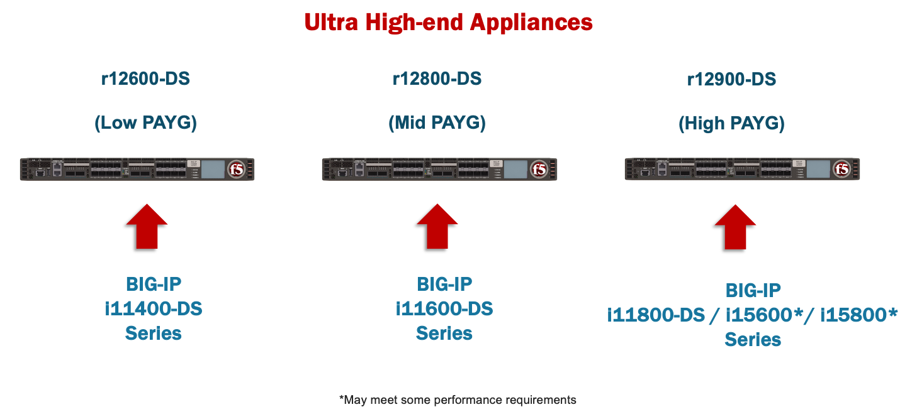
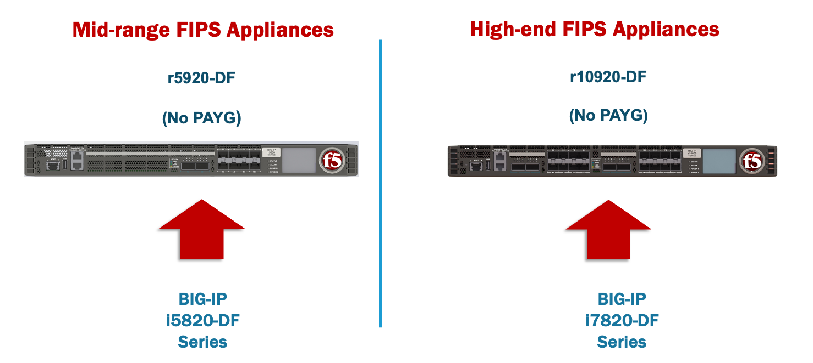

=============
Introduction
=============

rSeries is F5’s next generation appliance-based solution that replaces the current iSeries platforms. rSeries platforms have many advantages over the current iSeries architecture. This guide highlights the major differences between the two architectures as well as providing details on how to configure, monitor, and troubleshoot the new platforms so that customers understand how rSeries fits within their existing environments. 

rSeries Overview
===============

-------------------------------
F5OS Based Platform Layer
-------------------------------

A major difference between rSeries and iSeries is the introduction of a new platform layer called F5OS. F5OS allows for some exciting new capabilities and provides a hardware abstraction layer that allows rSeries appliances to run in a multitenant mode similar to how vCMP operated in some iSeries appliances. Multitenancy is now enabled throughout the entire rSeries family (with the exception of the r2600) at no additional cost. This will allow more customers to take advantage of the benefits of multitenancy. With the previous generation iSeries appliances there was a **virtualization tax** where published data sheet numbers would be adjusted down 10-20% to account for the overhead of enabling vCMP/Virtualization. With rSeries, the published data sheet numbers are inclusive of virtualization being enabled, so there is no virtualization tax to adjust for.

From a high level, the new F5OS layer can be compared to the vCMP host layer in iSeries, as it has many similarities. The F5OS layer handles licensing for all **tenants** (in iSeries these were called vCMP Guests), as well as all networking for the appliance, and system parameters. Then, one or more BIG-IP (TMOS)tenants can be deployed and they will operate as completely independent virtualized BIG-IP instances. 

rSeries continues to provide hardware acceleration and offload capabilities in a similar way that iSeries does, however, more modern Field Programmable Gate Arrays (FPGA's), CPU, and crypto offload capabilities have been introduced allowing for greater scalability. The new F5OS platform layer is 100% automatable, with F5OS APIs for every configuration parameter and there are also Ansible and Terraform playbooks/providers to allow for easy initial deployment.

.. image:: images/rseries_introduction/image1.png
  :align: center
  :scale: 70%

Customers can migrate existing BIG-IP devices such as iSeries, or vCMP guests into tenants running on rSeries. A tenant is conceptually like a vCMP guest running on the VIPRION or iSeries platforms. Once inside the tenant, the management experience is like the experience on existing BIG-IP platforms. The BIG-IP tenant is managed just as a vCMP guest is managed today on VIPRION or iSeries. The administrator connects directly to the tenant’s webUI, CLI, or API and has the same experience as they have with their existing platforms. 

What differs is the initial setup of the F5OS platform layer on rSeries. We’ll look at some additional architecture differences between rSeries and iSeries before getting into how to manage and monitor the new F5OS platform layer. 

---------------------------------------------------
Multitenant by Default
---------------------------------------------------

The physical architecture of rSeries differs from the iSeries platforms in several ways. As mentioned above, the rSeries appliances will run F5OS at the platform layer, and customers will be able to provision BIG-IP tenants running supported TMOS versions (starting with 15.1.5 in the initial release). The rSeries appliances are multitenant by default (except for the r2600, which runs a single tenant), which is a change from the iSeries appliances that run in either a bare-metal mode, or virtualized mode by enabling vCMP. F5OS multitenancy provides a similar experience to customers who are used to managing vCMP guests on their current iSeries appliances. Instead of provisioning **vCMP Guests** on top of a **vCMP Host Layer**, customers will now provision **Tenants** on top of the **F5OS platform layer**. For customers who currently run their iSeries appliances in a non-virtualized bare-metal mode, they can emulate that type of configuration by configuring one large BIG-IP tenant on rSeries after the initial F5OS setup is completed. 

-----------------------------------
More Pay-as-you-Grow (PAYG) Options
-----------------------------------

The rSeries family of appliances has multiple hardware and software options like the previous generation iSeries appliances. F5 has reduced the total number of distinct hardware platforms in the rSeries family but increased the number of PAYG options in the mid-range, and high-end rSeries models to allow for similar price and performance points of previous generations. Instead of offering a 7000 series platform in between the 5000 and 10000 models, F5 now offers 3 PAYG tiers/licensing options for both the 5000 and 10000 models. This allows for expansion of performance and resources by upgrading to the next model via a simple software license change to a higher model within the same family. For example, you could start with the entry level model of the 5000 series (r5600), and if performance demand increases you could unlock more CPU resources by upgrading to the r5800 or r5900 via a simple license change.

.. image:: images/rseries_introduction/image2.png
  :align: center
  :scale: 80%

For the 2000 and 4000 models, the number of PAYG tiers remains the same as the current iSeries, with each model having an x600 model and an x800 model just like the previous generation iSeries appliances. You can start with an x600 model and upgrade the x800 model via a simple licensing change.

.. image:: images/rseries_introduction/image3.png
  :align: center
  :scale: 40%

The r12000-DS family are positioned as turbo SSL appliances, and have a similar 3 tier PAYG structure as the r10000 family.

For customers that require FIPS 140-3 Level3 HSM appliances there are the r5920-DF and r10920-DF. Neither of these products have a pay-as-you-grow option.

-------
Tenants
-------

Tenancy is required to deploy any BIG-IP resources. rSeries is a multitenant appliance by default; there is no bare-metal mode, although it can be configured to emulate this mode with a single large tenant. A tenant could then be assigned to utilize all CPU and memory available within the appliance. This would emulate an iSeries system running “bare metal” where vCMP is not provisioned. 

When configuring High Availability (HA) between two rSeries appliances, there is no HA relationship or awareness across systems at the F5OS layer. All HA is configured at the BIG-IP tenant level using Device Service Clustering, like how HA is configured between vCMP guests in separate iSeries appliances today. 

.. image:: images/rseries_introduction/image9.png
  :align: center
  :scale: 80%

