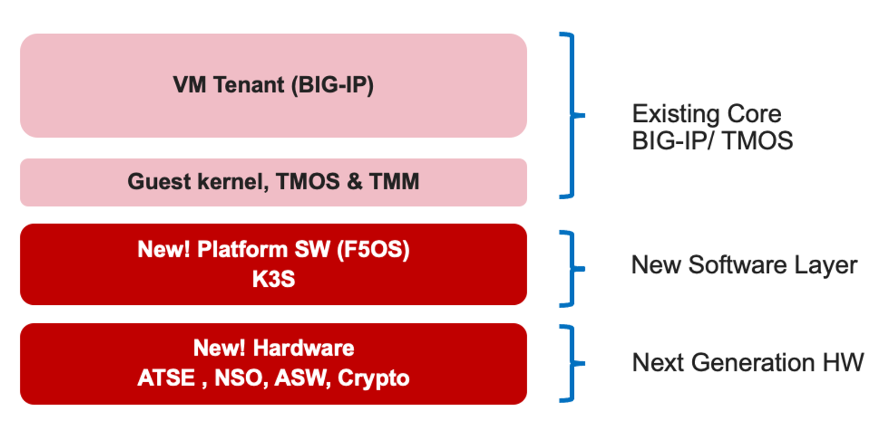

=============
Introduction
=============

rSeries is F5’s next generation appliance-based solution that will replace the current iSeries platforms. The rSeries platforms have many advantages over the current iSeries architecture. This guide will highlight the differences between the two architectures and then provide details on how to configure, monitor and troubleshoot the new platforms so that customers considering adoption understand how rSeries will fit within their environment. 

rSeries Overview
===============

-------------------------------
Kubernetes Based Platform Layer
-------------------------------

The major difference between rSeries and iSeries is the introduction of a new Kubernetes-based platform layer (called F5OS) that will allow for some exciting new capabilities. Luckily customers won’t need to learn Kubernetes in order to manage the new appliances, it will be abstracted from the administrator who will be able to manage the new platform layer via familiar F5 CLI, GUI, or API interfaces. 

rSeries will continue to provide hardware acceleration and offload capabilities in a similar way that iSeries did, however more modern FPGA, CPU, and crypto offload capabilities have been introduced. The new F5OS platform layer will allow rSeries to run different types of tenants within the same appliance. As an example, rSeries will be able to run:

•	Existing TMOS/BIG-IP tenants*
•	Future support for Next-generation BIG-IP for Distributed Cloud tenants (Modular Architecture)
•	In the future the possibility of running approved 3rd party tenants 

 * specific software releases

Customers will be able to migrate existing BIG-IP devices, or vCMP guests into a tenant running on rSeries. A tenant is conceptually similar to a vCMP guest on the VIPRION or iSeries platforms. Once inside the tenant, the management experience will be similar to the experience on existing BIG-IP platforms. The BIG-IP tenant will be managed just as a vCMP guest is managed today on VIPRION or iSeries. The administrator can connect directly to the tenant’s GUI, CLI, or API and have the same experience as they have with their existing platforms. 

In the future BIG-IP for Distributed Cloud tenants will be able to be provisioned within the same appliance, which will allow customers to leverage the next generation of BIG-IP software side-by-side with the existing BIG-IP software. What will differ from an administrator’s perspective is the initial setup of the F5OS platform layer. We’ll look at some additional architecture differences between rSeries and iSeries before getting into how to manage and monitor the new F5OS platform layer. 

---------------------------------------------------
Multitenant by Default
---------------------------------------------------

The physical architecture of rSeries differs from the iSeries platforms in several ways. As mentioned above the rSeries appliances will run F5OS at the platform layer, and customers will be able to provision BIG-IP tenants running version 15.1.5 (in the intial release). The rSeries appliances are multitenant by default which is a change from the iSeries appliances which could run in either a bare-metal mode, or virtualized mode by enabling vCMP. F5OS multitenancy provides a similar experience to customers who are used to managing vCMP guests on their current iSeries appliances. Instead of provisioning **vCMP Guests** ontop of a **vCMP Host Layer**, customers will now provision **Tenants** ontop of the **F5OS platform layer**. For customers who currently run their iSeries appliances in a non-virtualized bare-metal mode, they can emulate that type of configuration by configuring one large BIG-IP tenant on rSeries. 

-----------------
More PAYG options
-----------------

the rSeries family of appliances has multiple hardware and software options similar to the previous generation iSeries appliances. F5 has reduced the total number of distinct hardware platfroms in the rSeries family, but increased the number of PAYG options in the mid-range, and high-end rSeries models to allow for similar price and performance points of previous generations. Instead of offering a 7000 series platform in between the 5000 and 10000 models, F5 now offers 3 PAYG tiers/licensing options for both the 5000 and 10000 models. This allows for expansion of performance and resources by upgrading to the next model via a simple software license change to higher model within the same family. As an example you could start with the entry level model of the 5000 series (r5600), and if performance demand increases you can unlock more CPU resources by upgrading to the r5800 or r5900 via a simple license change.

For the 2000 and 4000 models the number of pay-as-you-grow tiers remains the same, whith each model having an x600 model and an x800 model just like the previous generation iSeries appliances. You can start with an x600 model and upgrade the the x800 model via a simple licensing change.

.. image:: images/rseries_introduction/image3.png
  :align: center
  :scale: 40%

----------------------------
The Kubernetes Control Plane
----------------------------

rSeries utilizes an opensource Kubernetes distribution called K3S. This is largely abstracted away from the administrator as they won’t be configuring or monitoring containers or Kubernetes components. In the future some Kubernetes like features may start to be exposed, but it will likely be done through the F5OS CLI, GUI, or API’s. 

A combination of Docker Compose and Kubernetes is used within the F5OS layer. Docker Compose is used to bring up the software stacks as they need to be fully functional early in the startup process. Then Kubernetes takes over and is responsible for deploying workloads to the proper CPU's. 

.. image:: images/rseries_introduction/image7.png
  :align: center
  :scale: 40%

The diagram above is somewhat simplified as it shows a single software stack for the Kubernetes control plane. There is a software stack for the F5OS layer that provides F5OS CLI, GUI, and API management for the appliance  as well as support for the networking services such as stpd, lldpd, lacpd, that get deployed as workloads.

The Kubernetes control plane is responsible for deploying workloads. This would happen when tenants are configured. We won’t get too deep into the Kubernetes architecture as its not required to manage the rSeries Appliance. Know that the Kubernetes platform layer will allow F5 to introduce exciting new features in the future, but F5 will continue to provide abstracted interfaces for ease of management. By leveraging microservices and containers, F5 may be able to introduce new options such as shared multitenancy and dynamic scaling in the future. These are features that were not supported on iSeries.

-------
Tenants
-------

Tenancy is required to deploy any BIG-IP resources. rSeries is a multitenant appliance by default, there is no bare-metal mode, although it can be configured to emulate this mode with a single large tenant. A tenant could then be assigned to utilize all CPU and memory available within the appliance. This would emulate an iSeries system running “bare metal” where vCMP is not provisioned. 

When configuring HA between two rSeries Appliances, there is no HA relationship or awareness across systems at the F5OS layer. All HA is configured at the BIG-IP tenant level using Device Service Clustering, similar to how HA is configured between vCMP guests in separate iSeries appliances today. 

.. image:: images/rseries_introduction/image9.png
  :align: center
  :scale: 60%

