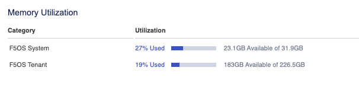

==================
Monitoring rSeries
==================

With the introduction of a new F5OS platform layer, anyone deploying rSeries will need to know the important things for them to monitor to ensure proper health and performance of the system. In addition to getting F5’s recommendation on what to monitor, administrators will require details on how to get access to that information. 

Some admins may want CLI commands to monitor, or API calls to query the system, and others may prefer the webUI. Many customers also use SNMP to monitor and be alerted of system issues and events. For SNMP integrations F5 will provide specific SNMP OID’s that an admin can monitor, and what traps are available for alerting. The following sections will outline what sort of monitoring and alerting is available with the new F5OS layer in rSeries. Alerting/monitoring inside the tenants themselves does not change except at the lower network layers.

Accessing the F5OS API
======================

The F5OS platform API’s for the rSeries appliances can be reached on port 8888. In this document we will use the Postman tool to access rSeries F5OS platform layer API’s. You can download the Postman tool at:

https://www.postman.com/downloads/

You may also use Curl to get API status. The following curl command is pointed at the F5OS IP address on port 8888. The example below is using basic authentication. You can request output in JSON by using the following Accept header:

.. code-block:: bash

    $ curl -k https://<Appliance1-IP>:8888/restconf/yang-library-version --header 'Accept: application/yang-data+json' -u admin:<password>

Or you can alter the Accept header to receive output in XML format:

.. code-block:: bash

    $ curl -k https://<Appliance1-IP>:8888/restconf/yang-library-version --header 'Accept: application/yang-data+xml' -u admin:<password>

Hardware and System Component Monitoring
========================================

-----------------------------------------------------
Hardware and System Component Monitoring from the CLI
-----------------------------------------------------

Show Components from the CLI
-----------------------------

High level appliance status can be obtained by using the **show components** command, this will include all the subsystems:

.. code-block:: bash

    r10900-1# show components 
    components component lcd
    state serial-no sub0872g00du
    state part-no "SUB-0872-02 REV 1"
    state empty false
    state mode standard
    components component platform
    fantray fan-stats fan-1-speed 16224
    fantray fan-stats fan-2-speed 16268
    fantray fan-stats fan-3-speed 16330
    fantray fan-stats fan-4-speed 16251
    fantray fan-stats fan-5-speed 16233
    fantray fan-stats fan-6-speed 16286
    fantray fan-stats fan-7-speed 16393
    fantray fan-stats fan-8-speed 16224
    fantray fan-stats fan-9-speed 16224
    fantray fan-stats fan-10-speed 16268
    fantray fan-stats fan-11-speed 16304
    fantray fan-stats fan-12-speed 16357
    state description    r10900
    state serial-no      f5-xpdn-ngmu
    state part-no        "200-0413-02 REV 2"
    state empty          false
    state tpm-integrity-status Valid
    state memory total    270014504960
    state memory available 23690534912
    state memory free     7309426688
    state memory used-percent 91
    state memory platform-total 34219122688
    state memory platform-used 10030964736
    state memory platform-used-percent 29
    state temperature current 29.7
    state temperature average 30.2
    state temperature minimum 29.2
    state temperature maximum 31.3
                                                                                            USED     
    AREA                          CATEGORY            TOTAL         FREE          USED         PERCENT  
    ----------------------------------------------------------------------------------------------------
    platform/sysroot              F5OS System         117807665152  44114337792   67685408768  60       
    platform/big-ip-tenant-disks  F5OS Tenant Disks   481671176192  426911313920  30268694528  6        
    tenant/fix-ll                 BIG-IP Tenant       0             0             8046321664   0        
    tenant/tenant1                BIG-IP Tenant       88046829568   80804179968   7242649600   8        
    tenant/tenant2                BIG-IP Tenant       152471339008  145266032640  7205306368   4        
    tenant/test-tenant            BIG-IP Tenant       0             0             7834767360   0        
    platform/images               F5OS Images         240700620800  179621085184  48829022208  21       
    tenant/bigip-next-f5demo-net  BIG-IP Next Tenant  26830438400   24771969024   2058469376   7        

                                                                                UPDATE  
    NAME                        VALUE                              CONFIGURABLE  STATUS  
    -------------------------------------------------------------------------------------
    QAT0                        Lewisburg C62X Crypto/Compression  false         -       
    QAT1                        Lewisburg C62X Crypto/Compression  false         -       
    QAT2                        Lewisburg C62X Crypto/Compression  false         -       
    QAT3                        Lewisburg C62X Crypto/Compression  false         -       
    QAT4                        Lewisburg C62X Crypto/Compression  false         -       
    QAT5                        Lewisburg C62X Crypto/Compression  false         -       
    fw-version-bios             2.02.145.1                         false         none    
    fw-version-bios-me          4.4.4.603                          false         none    
    fw-version-cpld             02.0B.00                           false         none    
    fw-version-drive-nvme0      VDV10170                           false         none    
    fw-version-drive-nvme1      VDV10170                           false         none    
    fw-version-drive-u.2.slot1  VDV10184                           false         none    
    fw-version-drive-u.2.slot2  VDV10184                           false         none    
    fw-version-lcd-app          1.01.069.00.1                      false         none    
    fw-version-lcd-bootloader   1.01.027.00.1                      false         none    
    fw-version-lcd-ui           1.13.12                            false         none    
    fw-version-lop-app          2.00.357.0.1                       false         none    
    fw-version-lop-bootloader   1.02.062.0.1                       false         none    
    fw-version-sirr             1.1.72                             false         none    

                                                                                                                            READ                                          WRITE     
    DISK                                                                                TOTAL  READ     READ                   LATENCY  WRITE      WRITE                     LATENCY   
    NAME     MODEL                VENDOR  VERSION   SERIAL NO           SIZE      TYPE  IOPS   IOPS     MERGED   READ BYTES    MS       IOPS       MERGED     WRITE BYTES    MS        
    -----------------------------------------------------------------------------------------------------------------------------------------------------------------------------------
    nvme0n1  INTEL SSDPE2KX010T8  Intel   VDV10184  PHLJ1082028K1P0FGN  684.00GB  nvme  0      6389572  6219783  750856005120  780538   150423059  148810905  1524410142208  19347042  
    nvme1n1  INTEL SSDPE2KX010T8  Intel   VDV10184  PHLJ108203XB1P0FGN  684.00GB  nvme  0      5879641  6157944  743701713408  730394   150423058  148810906  1524410142208  19650753  

    cpu state cpu-utilization thread cpu
    cpu state cpu-utilization current 4
    cpu state cpu-utilization five-second-avg 3
    cpu state cpu-utilization one-minute-avg 3
    cpu state cpu-utilization five-minute-avg 3
    cpu state cpu-utilization used-by ""
    CPU               CORE                           THREAD                                             
    INDEX  CACHESIZE  CNT   FREQ           STEPPING  CNT     MODELNAME                                  
    ----------------------------------------------------------------------------------------------------
    0      36864(KB)  24    3099.902(MHz)  6         48      Intel(R) Xeon(R) Gold 6312U CPU @ 2.40GHz  

                            FIVE    ONE     FIVE                           
    THREAD                   SECOND  MINUTE  MINUTE                         
    INDEX   THREAD  CURRENT  AVG     AVG     AVG     USED BY                
    ------------------------------------------------------------------------
    0       cpu0    0        0       1       1       F5OS Dedicated         
    1       cpu1    0        0       1       1       F5OS Dedicated         
    2       cpu2    0        0       1       1       F5OS Dedicated         
    3       cpu3    0        0       1       1       F5OS Dedicated         
    4       cpu4    0        0       1       1       F5OS Dedicated         
    5       cpu5    0        0       0       1       F5OS Dedicated         
    6       cpu6    3        3       5       4       F5OS                   
    7       cpu7    0        0       0       1       bigip-next-f5demo-net  
    8       cpu8    6        5       4       4       F5OS                   
    9       cpu9    0        0       1       1       bigip-next-f5demo-net  
    10      cpu10   5        3       4       4       F5OS                   
    11      cpu11   1        4       4       5       fix-ll                 
    12      cpu12   4        3       4       4       F5OS                   
    13      cpu13   4        3       4       4       F5OS                   
    14      cpu14   4        3       4       4       F5OS                   
    15      cpu15   1        5       5       6       tenant1                
    16      cpu16   6        3       5       5       test-tenant            
    17      cpu17   5        4       4       5       fix-ll                 
    18      cpu18   1        4       4       5       tenant1                
    19      cpu19   6        5       4       5       test-tenant            
    20      cpu20   3        3       4       4       F5OS                   
    21      cpu21   3        3       4       4       F5OS                   
    22      cpu22   3        4       4       4       F5OS                   
    23      cpu23   7        7       5       5       F5OS                   
    24      cpu24   1        1       1       1       F5OS Data Mover        
    25      cpu25   0        0       1       1       F5OS Data Mover        
    26      cpu26   0        1       1       1       F5OS Data Mover        
    27      cpu27   1        1       1       1       F5OS Data Mover        
    28      cpu28   0        1       1       1       F5OS Data Mover        
    29      cpu29   0        0       1       1       F5OS Data Mover        
    30      cpu30   7        6       6       6       F5OS                   
    31      cpu31   0        0       0       1       bigip-next-f5demo-net  
    32      cpu32   4        5       6       6       F5OS                   
    33      cpu33   0        0       0       1       bigip-next-f5demo-net  
    34      cpu34   1        3       5       6       F5OS                   
    35      cpu35   1        4       5       6       fix-ll                 
    36      cpu36   8        5       6       6       F5OS                   
    37      cpu37   3        3       7       6       F5OS                   
    38      cpu38   4        3       6       6       F5OS                   
    39      cpu39   4        4       5       5       tenant1                
    40      cpu40   6        6       5       5       test-tenant            
    41      cpu41   1        4       4       5       fix-ll                 
    42      cpu42   5        6       5       5       tenant1                
    43      cpu43   13       13      5       6       test-tenant            
    44      cpu44   3        2       6       6       F5OS                   
    45      cpu45   9        5       8       7       F5OS                   
    46      cpu46   1        3       5       6       F5OS                   
    47      cpu47   55       23      8       7       F5OS                   

    FPGA                            NUM  NUM   
    INDEX   VERSION  ID  SLOT  DID  DMS  SEPS  
    -------------------------------------------
    asw_0   71.5.1                             
    atse_0  72.5.4   0   1     15   3    64    
    atse_1  72.5.4   1   1     63   3    64    
    nso_0   70.5.1                             

    components component psu-1
    psu-stats psu-power-in 526.0
    psu-stats psu-power-out 514.0
    psu-stats psu-current-in 2.578
    psu-stats psu-current-out 42.875
    psu-stats psu-voltage-in 205.0
    psu-stats psu-voltage-out 12.0
    psu-stats psu-temperature-1 36.0
    psu-stats psu-temperature-2 42.0
    psu-stats psu-temperature-3 46.0
    psu-stats psu-fan-1-speed 11680
    state serial-no FZ2104Q70036
    state part-no PWR-0388-00
    state empty false
    components component psu-2
    state serial-no "Not Available"
    state part-no "Not Available"
    state empty true
    r10900-1# 

Show Component State Only from the CLI
----------------------------------------

If you just want the state and not all the details:

.. code-block:: bash

    r10900-1# show components component state
    components component lcd
    state serial-no sub0872g00du
    state part-no "SUB-0872-02 REV 1"
    state empty false
    state mode standard
    components component platform
    state description    r10900
    state serial-no      f5-xpdn-ngmu
    state part-no        "200-0413-02 REV 2"
    state empty          false
    state tpm-integrity-status Valid
    state memory total    270014504960
    state memory available 23670415360
    state memory free     7288745984
    state memory used-percent 91
    state memory platform-total 34219122688
    state memory platform-used 10051108864
    state memory platform-used-percent 29
    state temperature current 29.9
    state temperature average 30.2
    state temperature minimum 29.2
    state temperature maximum 31.3
                                                                                            USED     
    AREA                          CATEGORY            TOTAL         FREE          USED         PERCENT  
    ----------------------------------------------------------------------------------------------------
    platform/sysroot              F5OS System         117807665152  44113956864   67685789696  60       
    platform/big-ip-tenant-disks  F5OS Tenant Disks   481671176192  426911305728  30268702720  6        
    tenant/fix-ll                 BIG-IP Tenant       0             0             8046321664   0        
    tenant/tenant1                BIG-IP Tenant       88046829568   80804171776   7242657792   8        
    tenant/tenant2                BIG-IP Tenant       152471339008  145266032640  7205306368   4        
    tenant/test-tenant            BIG-IP Tenant       0             0             7834767360   0        
    platform/images               F5OS Images         240700620800  179621085184  48829022208  21       
    tenant/bigip-next-f5demo-net  BIG-IP Next Tenant  26830438400   24771969024   2058469376   7        

    components component psu-1
    state serial-no FZ2104Q70036
    state part-no PWR-0388-00
    state empty false
    components component psu-2
    state serial-no "Not Available"
    state part-no "Not Available"
    state empty true
    r10900-1# 

Show Component Properties from the CLI
----------------------------------------

This command shows the firmware version of the various subsystems:

.. code-block:: bash

    r10900-1# show components component properties 
                                                                                        UPDATE  
    NAME      NAME                        VALUE                              CONFIGURABLE  STATUS  
    -----------------------------------------------------------------------------------------------
    platform  QAT0                        Lewisburg C62X Crypto/Compression  false         -       
            QAT1                        Lewisburg C62X Crypto/Compression  false         -       
            QAT2                        Lewisburg C62X Crypto/Compression  false         -       
            QAT3                        Lewisburg C62X Crypto/Compression  false         -       
            QAT4                        Lewisburg C62X Crypto/Compression  false         -       
            QAT5                        Lewisburg C62X Crypto/Compression  false         -       
            fw-version-bios             2.02.145.1                         false         none    
            fw-version-bios-me          4.4.4.603                          false         none    
            fw-version-cpld             02.0B.00                           false         none    
            fw-version-drive-nvme0      VDV10170                           false         none    
            fw-version-drive-nvme1      VDV10170                           false         none    
            fw-version-drive-u.2.slot1  VDV10184                           false         none    
            fw-version-drive-u.2.slot2  VDV10184                           false         none    
            fw-version-lcd-app          1.01.069.00.1                      false         none    
            fw-version-lcd-bootloader   1.01.027.00.1                      false         none    
            fw-version-lcd-ui           1.13.12                            false         none    
            fw-version-lop-app          2.00.357.0.1                       false         none    
            fw-version-lop-bootloader   1.02.062.0.1                       false         none    
            fw-version-sirr             1.1.72                             false         none    

    r10900-1# 

Show Power Supply Status from the CLI
--------------------------------------

Or you can view individual subsystems. High level power supply status can be obtained by using the **show components component <psu-#>** command:

.. code-block:: bash

    r10900-1# show components component psu-1    
    components component psu-1
    psu-stats psu-power-in 528.0
    psu-stats psu-power-out 516.0
    psu-stats psu-current-in 2.593
    psu-stats psu-current-out 43.0
    psu-stats psu-voltage-in 205.0
    psu-stats psu-voltage-out 12.0
    psu-stats psu-temperature-1 36.0
    psu-stats psu-temperature-2 42.0
    psu-stats psu-temperature-3 46.0
    psu-stats psu-fan-1-speed 11552
    state serial-no FZ2104Q70036
    state part-no PWR-0388-00
    state empty false
    r10900-1# 

High level power supply stats can be obtained by using the **show components component psu-stats** command:

.. code-block:: bash

    r10900-1# show components component psu-stats 
        PSU    PSU    PSU      PSU      PSU      PSU      PSU          PSU          PSU          PSU    
        POWER  POWER  CURRENT  CURRENT  VOLTAGE  VOLTAGE  TEMPERATURE  TEMPERATURE  TEMPERATURE  FAN 1  
    NAME   IN     OUT    IN       OUT      IN       OUT      1            2            3            SPEED  
    -------------------------------------------------------------------------------------------------------
    psu-1  530.0  518.0  2.593    42.75    205.0    12.0     36.0         41.0         46.0         12192  
    psu-2  -      -      -        -        -        -        -            -            -            -      

    r10900-1#

Show LCD Status from the CLI
--------------------------------------

High level chassis LCD status can be obtained by using the **show components component lcd** command:

.. code-block:: bash

    r10900-1# show components component lcd  
    components component lcd
    state serial-no sub0872g00du
    state part-no "SUB-0872-02 REV 1"
    state empty false
    state mode standard
    r10900-1# 

Show CPU Status from the CLI
--------------------------------------

You can view stats on the platform CPU and basic utilization with the command **show components component cpu**:

.. code-block:: bash

    r10900-1# show components component cpu
    components component platform
    cpu state cpu-utilization thread cpu
    cpu state cpu-utilization current 4
    cpu state cpu-utilization five-second-avg 4
    cpu state cpu-utilization one-minute-avg 3
    cpu state cpu-utilization five-minute-avg 3
    cpu state cpu-utilization used-by ""
    CPU               CORE                           THREAD                                             
    INDEX  CACHESIZE  CNT   FREQ           STEPPING  CNT     MODELNAME                                  
    ----------------------------------------------------------------------------------------------------
    0      36864(KB)  24    3099.902(MHz)  6         48      Intel(R) Xeon(R) Gold 6312U CPU @ 2.40GHz  

                            FIVE    ONE     FIVE                           
    THREAD                   SECOND  MINUTE  MINUTE                         
    INDEX   THREAD  CURRENT  AVG     AVG     AVG     USED BY                
    ------------------------------------------------------------------------
    0       cpu0    0        0       1       1       F5OS Dedicated         
    1       cpu1    0        0       1       1       F5OS Dedicated         
    2       cpu2    0        0       1       1       F5OS Dedicated         
    3       cpu3    0        0       1       1       F5OS Dedicated         
    4       cpu4    0        0       1       1       F5OS Dedicated         
    5       cpu5    0        0       1       1       F5OS Dedicated         
    6       cpu6    3        4       4       4       F5OS                   
    7       cpu7    0        0       0       1       bigip-next-f5demo-net  
    8       cpu8    4        5       5       4       F5OS                   
    9       cpu9    0        0       1       1       bigip-next-f5demo-net  
    10      cpu10   4        3       4       4       F5OS                   
    11      cpu11   5        5       4       5       fix-ll                 
    12      cpu12   5        3       4       4       F5OS                   
    13      cpu13   3        3       5       4       F5OS                   
    14      cpu14   4        4       4       4       F5OS                   
    15      cpu15   0        3       5       6       tenant1                
    16      cpu16   12       6       4       5       test-tenant            
    17      cpu17   4        5       5       5       fix-ll                 
    18      cpu18   0        5       4       4       tenant1                
    19      cpu19   5        5       5       5       test-tenant            
    20      cpu20   4        4       4       4       F5OS                   
    21      cpu21   4        3       4       4       F5OS                   
    22      cpu22   4        4       5       4       F5OS                   
    23      cpu23   3        3       4       4       F5OS                   
    24      cpu24   1        1       1       1       F5OS Data Mover        
    25      cpu25   0        1       1       1       F5OS Data Mover        
    26      cpu26   0        1       1       1       F5OS Data Mover        
    27      cpu27   1        1       1       1       F5OS Data Mover        
    28      cpu28   0        1       1       1       F5OS Data Mover        
    29      cpu29   0        1       1       1       F5OS Data Mover        
    30      cpu30   6        7       6       6       F5OS                   
    31      cpu31   0        0       1       1       bigip-next-f5demo-net  
    32      cpu32   20       12      8       6       F5OS                   
    33      cpu33   0        0       1       1       bigip-next-f5demo-net  
    34      cpu34   15       11      6       6       F5OS                   
    35      cpu35   1        3       6       5       fix-ll                 
    36      cpu36   10       9       6       5       F5OS                   
    37      cpu37   6        9       9       6       F5OS                   
    38      cpu38   7        7       5       6       F5OS                   
    39      cpu39   5        5       5       5       tenant1                
    40      cpu40   5        6       5       5       test-tenant            
    41      cpu41   2        9       4       5       fix-ll                 
    42      cpu42   6        4       5       5       tenant1                
    43      cpu43   5        6       6       6       test-tenant            
    44      cpu44   6        7       5       6       F5OS                   
    45      cpu45   3        7       7       7       F5OS                   
    46      cpu46   21       9       6       6       F5OS                   
    47      cpu47   11       7       7       7       F5OS                   

    r10900-1# 

Show Storage Status from the CLI
--------------------------------------

You can view stats on the storage subsystem:

.. code-block:: bash

    r10900-1# show components component storage 
                                                                                                                                        READ                                          WRITE     
            DISK                                                                                TOTAL  READ     READ                   LATENCY  WRITE      WRITE                     LATENCY   
    NAME      NAME     MODEL                VENDOR  VERSION   SERIAL NO           SIZE      TYPE  IOPS   IOPS     MERGED   READ BYTES    MS       IOPS       MERGED     WRITE BYTES    MS        
    ---------------------------------------------------------------------------------------------------------------------------------------------------------------------------------------------
    platform  nvme0n1  INTEL SSDPE2KX010T8  Intel   VDV10184  PHLJ1082028K1P0FGN  684.00GB  nvme  0      6389655  6219783  750856602624  780548   150509104  148896707  1525266036736  19350347  
            nvme1n1  INTEL SSDPE2KX010T8  Intel   VDV10184  PHLJ108203XB1P0FGN  684.00GB  nvme  0      5879651  6157944  743701819904  730397   150509103  148896708  1525266036736  19654081  

    r10900-1# 

-----------------------------------------------------
Hardware and System Component Monitoring from the API
-----------------------------------------------------

Appliance Component Status from the API
---------------------------------------

The overall appliance component status can be queried via the following API command:

.. code-block:: bash

    GET https://{{rseries_appliance1_ip}}:8888/restconf/data/openconfig-platform:components

.. code-block:: json

    {
        "openconfig-platform:components": {
            "component": [
                {
                    "name": "lcd",
                    "config": {
                        "name": "lcd"
                    },
                    "state": {
                        "serial-no": "sub0872g00d5",
                        "empty": false
                    }
                },
                {
                    "name": "platform",
                    "config": {
                        "name": "platform"
                    },
                    "state": {
                        "description": "BIG-IP r5900",
                        "serial-no": "f5-vdvh-bfwi",
                        "part-no": "200-0411-02 REV 2",
                        "empty": false,
                        "f5-platform:tpm-integrity-status": "Valid",
                        "f5-platform:memory": {
                            "available": "6870933504",
                            "free": "1400750080",
                            "used-percent": 95
                        },
                        "f5-platform:temperature": {
                            "current": "31.0",
                            "average": "30.8",
                            "minimum": "29.9",
                            "maximum": "32.0"
                        }
                    },
                    "properties": {
                        "property": [
                            {
                                "name": "QAT0",
                                "config": {
                                    "name": "QAT0"
                                },
                                "state": {
                                    "value": "Lewisburg C62X Crypto/Compression",
                                    "configurable": false
                                }
                            },
                            {
                                "name": "QAT1",
                                "config": {
                                    "name": "QAT1"
                                },
                                "state": {
                                    "value": "Lewisburg C62X Crypto/Compression",
                                    "configurable": false
                                }
                            },
                            {
                                "name": "QAT2",
                                "config": {
                                    "name": "QAT2"
                                },
                                "state": {
                                    "value": "Lewisburg C62X Crypto/Compression",
                                    "configurable": false
                                }
                            },
                            {
                                "name": "fw-version-bios",
                                "config": {
                                    "name": "fw-version-bios"
                                },
                                "state": {
                                    "value": "1.02.108.1",
                                    "configurable": false,
                                    "f5-platform:update-status": "none"
                                }
                            },
                            {
                                "name": "fw-version-bios-me",
                                "config": {
                                    "name": "fw-version-bios-me"
                                },
                                "state": {
                                    "value": "4.4.4.58",
                                    "configurable": false,
                                    "f5-platform:update-status": "none"
                                }
                            },
                            {
                                "name": "fw-version-cpld",
                                "config": {
                                    "name": "fw-version-cpld"
                                },
                                "state": {
                                    "value": "02.0A.00",
                                    "configurable": false,
                                    "f5-platform:update-status": "none"
                                }
                            },
                            {
                                "name": "fw-version-drive-m.2.slot1",
                                "config": {
                                    "name": "fw-version-drive-m.2.slot1"
                                },
                                "state": {
                                    "value": "EDA7602Q",
                                    "configurable": false,
                                    "f5-platform:update-status": "none"
                                }
                            },
                            {
                                "name": "fw-version-drive-nvme0",
                                "config": {
                                    "name": "fw-version-drive-nvme0"
                                },
                                "state": {
                                    "value": "EDA7602Q",
                                    "configurable": false,
                                    "f5-platform:update-status": "none"
                                }
                            },
                            {
                                "name": "fw-version-lcd-app",
                                "config": {
                                    "name": "fw-version-lcd-app"
                                },
                                "state": {
                                    "value": "1.01.057.00.1",
                                    "configurable": false,
                                    "f5-platform:update-status": "none"
                                }
                            },
                            {
                                "name": "fw-version-lcd-bootloader",
                                "config": {
                                    "name": "fw-version-lcd-bootloader"
                                },
                                "state": {
                                    "value": "1.01.027.00.1",
                                    "configurable": false,
                                    "f5-platform:update-status": "none"
                                }
                            },
                            {
                                "name": "fw-version-lcd-ui",
                                "config": {
                                    "name": "fw-version-lcd-ui"
                                },
                                "state": {
                                    "value": "1.5.1",
                                    "configurable": false,
                                    "f5-platform:update-status": "none"
                                }
                            },
                            {
                                "name": "fw-version-lop-app",
                                "config": {
                                    "name": "fw-version-lop-app"
                                },
                                "state": {
                                    "value": "1.00.214.0.1",
                                    "configurable": false,
                                    "f5-platform:update-status": "none"
                                }
                            },
                            {
                                "name": "fw-version-lop-bootloader",
                                "config": {
                                    "name": "fw-version-lop-bootloader"
                                },
                                "state": {
                                    "value": "1.02.062.0.1",
                                    "configurable": false,
                                    "f5-platform:update-status": "none"
                                }
                            },
                            {
                                "name": "fw-version-sirr",
                                "config": {
                                    "name": "fw-version-sirr"
                                },
                                "state": {
                                    "value": "1.1.29",
                                    "configurable": false,
                                    "f5-platform:update-status": "none"
                                }
                            }
                        ]
                    },
                    "storage": {
                        "state": {
                            "f5-platform:disks": {
                                "disk": [
                                    {
                                        "disk-name": "nvme0n1",
                                        "state": {
                                            "model": "SAMSUNG MZ1LB960HAJQ-00007",
                                            "vendor": "Samsung",
                                            "version": "EDA7602Q",
                                            "serial-no": "S435NA0NA05748",
                                            "size": "733.00GB",
                                            "type": "nvme",
                                            "disk-io": {
                                                "total-iops": "10685",
                                                "read-iops": "113950",
                                                "read-merged": "100807",
                                                "read-bytes": "5961474",
                                                "read-latency-ms": "35349",
                                                "write-iops": "27668",
                                                "write-merged": "31954",
                                                "write-bytes": "1462612",
                                                "write-latency-ms": "34517"
                                            }
                                        }
                                    }
                                ]
                            }
                        }
                    },
                    "cpu": {
                        "state": {
                            "f5-platform:processors": {
                                "processor": [
                                    {
                                        "cpu-index": 0,
                                        "state": {
                                            "cachesize": "24576(KB)",
                                            "core-cnt": "16",
                                            "freq": "2899.951(MHz)",
                                            "stepping": "6",
                                            "thread-cnt": "32",
                                            "modelname": "Intel(R) Xeon(R) Silver 4314 CPU @ 2.40GHz"
                                        }
                                    }
                                ]
                            },
                            "f5-platform:cpu-utilization": {
                                "thread": "cpu",
                                "current": 1,
                                "five-second-avg": 2,
                                "one-minute-avg": 3,
                                "five-minute-avg": 3
                            },
                            "f5-platform:cpu-threads": {
                                "cpu-thread": [
                                    {
                                        "thread-index": 0,
                                        "thread": "cpu0",
                                        "current": 0,
                                        "five-second-avg": 0,
                                        "one-minute-avg": 1,
                                        "five-minute-avg": 1
                                    },
                                    {
                                        "thread-index": 1,
                                        "thread": "cpu1",
                                        "current": 0,
                                        "five-second-avg": 0,
                                        "one-minute-avg": 1,
                                        "five-minute-avg": 1
                                    },
                                    {
                                        "thread-index": 2,
                                        "thread": "cpu2",
                                        "current": 0,
                                        "five-second-avg": 0,
                                        "one-minute-avg": 1,
                                        "five-minute-avg": 1
                                    },
                                    {
                                        "thread-index": 3,
                                        "thread": "cpu3",
                                        "current": 0,
                                        "five-second-avg": 1,
                                        "one-minute-avg": 1,
                                        "five-minute-avg": 1
                                    },
                                    {
                                        "thread-index": 4,
                                        "thread": "cpu4",
                                        "current": 3,
                                        "five-second-avg": 2,
                                        "one-minute-avg": 4,
                                        "five-minute-avg": 4
                                    },
                                    {
                                        "thread-index": 5,
                                        "thread": "cpu5",
                                        "current": 0,
                                        "five-second-avg": 1,
                                        "one-minute-avg": 2,
                                        "five-minute-avg": 1
                                    },
                                    {
                                        "thread-index": 6,
                                        "thread": "cpu6",
                                        "current": 2,
                                        "five-second-avg": 2,
                                        "one-minute-avg": 3,
                                        "five-minute-avg": 3
                                    },
                                    {
                                        "thread-index": 7,
                                        "thread": "cpu7",
                                        "current": 2,
                                        "five-second-avg": 2,
                                        "one-minute-avg": 3,
                                        "five-minute-avg": 3
                                    },
                                    {
                                        "thread-index": 8,
                                        "thread": "cpu8",
                                        "current": 0,
                                        "five-second-avg": 2,
                                        "one-minute-avg": 3,
                                        "five-minute-avg": 4
                                    },
                                    {
                                        "thread-index": 9,
                                        "thread": "cpu9",
                                        "current": 1,
                                        "five-second-avg": 2,
                                        "one-minute-avg": 3,
                                        "five-minute-avg": 3
                                    },
                                    {
                                        "thread-index": 10,
                                        "thread": "cpu10",
                                        "current": 0,
                                        "five-second-avg": 1,
                                        "one-minute-avg": 3,
                                        "five-minute-avg": 3
                                    },
                                    {
                                        "thread-index": 11,
                                        "thread": "cpu11",
                                        "current": 1,
                                        "five-second-avg": 4,
                                        "one-minute-avg": 3,
                                        "five-minute-avg": 4
                                    },
                                    {
                                        "thread-index": 12,
                                        "thread": "cpu12",
                                        "current": 3,
                                        "five-second-avg": 4,
                                        "one-minute-avg": 4,
                                        "five-minute-avg": 4
                                    },
                                    {
                                        "thread-index": 13,
                                        "thread": "cpu13",
                                        "current": 1,
                                        "five-second-avg": 2,
                                        "one-minute-avg": 3,
                                        "five-minute-avg": 3
                                    },
                                    {
                                        "thread-index": 14,
                                        "thread": "cpu14",
                                        "current": 2,
                                        "five-second-avg": 3,
                                        "one-minute-avg": 3,
                                        "five-minute-avg": 3
                                    },
                                    {
                                        "thread-index": 15,
                                        "thread": "cpu15",
                                        "current": 3,
                                        "five-second-avg": 9,
                                        "one-minute-avg": 4,
                                        "five-minute-avg": 3
                                    },
                                    {
                                        "thread-index": 16,
                                        "thread": "cpu16",
                                        "current": 2,
                                        "five-second-avg": 1,
                                        "one-minute-avg": 1,
                                        "five-minute-avg": 1
                                    },
                                    {
                                        "thread-index": 17,
                                        "thread": "cpu17",
                                        "current": 0,
                                        "five-second-avg": 1,
                                        "one-minute-avg": 1,
                                        "five-minute-avg": 1
                                    },
                                    {
                                        "thread-index": 18,
                                        "thread": "cpu18",
                                        "current": 1,
                                        "five-second-avg": 1,
                                        "one-minute-avg": 1,
                                        "five-minute-avg": 1
                                    },
                                    {
                                        "thread-index": 19,
                                        "thread": "cpu19",
                                        "current": 3,
                                        "five-second-avg": 4,
                                        "one-minute-avg": 8,
                                        "five-minute-avg": 8
                                    },
                                    {
                                        "thread-index": 20,
                                        "thread": "cpu20",
                                        "current": 0,
                                        "five-second-avg": 1,
                                        "one-minute-avg": 2,
                                        "five-minute-avg": 3
                                    },
                                    {
                                        "thread-index": 21,
                                        "thread": "cpu21",
                                        "current": 6,
                                        "five-second-avg": 5,
                                        "one-minute-avg": 5,
                                        "five-minute-avg": 5
                                    },
                                    {
                                        "thread-index": 22,
                                        "thread": "cpu22",
                                        "current": 0,
                                        "five-second-avg": 1,
                                        "one-minute-avg": 2,
                                        "five-minute-avg": 3
                                    },
                                    {
                                        "thread-index": 23,
                                        "thread": "cpu23",
                                        "current": 3,
                                        "five-second-avg": 2,
                                        "one-minute-avg": 3,
                                        "five-minute-avg": 3
                                    },
                                    {
                                        "thread-index": 24,
                                        "thread": "cpu24",
                                        "current": 1,
                                        "five-second-avg": 1,
                                        "one-minute-avg": 4,
                                        "five-minute-avg": 3
                                    },
                                    {
                                        "thread-index": 25,
                                        "thread": "cpu25",
                                        "current": 1,
                                        "five-second-avg": 2,
                                        "one-minute-avg": 3,
                                        "five-minute-avg": 3
                                    },
                                    {
                                        "thread-index": 26,
                                        "thread": "cpu26",
                                        "current": 0,
                                        "five-second-avg": 1,
                                        "one-minute-avg": 2,
                                        "five-minute-avg": 2
                                    },
                                    {
                                        "thread-index": 27,
                                        "thread": "cpu27",
                                        "current": 0,
                                        "five-second-avg": 1,
                                        "one-minute-avg": 3,
                                        "five-minute-avg": 3
                                    },
                                    {
                                        "thread-index": 28,
                                        "thread": "cpu28",
                                        "current": 0,
                                        "five-second-avg": 1,
                                        "one-minute-avg": 4,
                                        "five-minute-avg": 3
                                    },
                                    {
                                        "thread-index": 29,
                                        "thread": "cpu29",
                                        "current": 0,
                                        "five-second-avg": 10,
                                        "one-minute-avg": 3,
                                        "five-minute-avg": 3
                                    },
                                    {
                                        "thread-index": 30,
                                        "thread": "cpu30",
                                        "current": 1,
                                        "five-second-avg": 2,
                                        "one-minute-avg": 4,
                                        "five-minute-avg": 4
                                    },
                                    {
                                        "thread-index": 31,
                                        "thread": "cpu31",
                                        "current": 0,
                                        "five-second-avg": 1,
                                        "one-minute-avg": 2,
                                        "five-minute-avg": 3
                                    }
                                ]
                            }
                        }
                    },
                    "integrated-circuit": {
                        "state": {
                            "f5-platform:fpgas": {
                                "fpga": [
                                    {
                                        "fpga-index": "asw_0",
                                        "state": {
                                            "version": "71.2.7"
                                        }
                                    },
                                    {
                                        "fpga-index": "atse_0",
                                        "state": {
                                            "version": "72.2.5"
                                        }
                                    }
                                ]
                            }
                        }
                    }
                },
                {
                    "name": "psu-1",
                    "config": {
                        "name": "psu-1"
                    },
                    "state": {
                        "serial-no": "S92031RC1991",
                        "part-no": "M1845",
                        "empty": false
                    },
                    "f5-fan-psu-stats:psu-stats": {
                        "psu-current-in": "1.718",
                        "psu-current-out": "26.375",
                        "psu-voltage-in": "204.5",
                        "psu-voltage-out": "12.062",
                        "psu-temperature-1": "38.0",
                        "psu-temperature-2": "48.0",
                        "psu-temperature-3": "54.0",
                        "psu-fan-1-speed": 9632
                    }
                }
            ]
        }
    }

LCD Status from the API
-----------------------

The appliance LCD panel status can be queried via the following API command:

.. code-block:: bash

    GET https://{{rseries_appliance1_ip}}:8888/restconf/data/openconfig-platform:components/component=lcd

.. code-block:: json

    {
        "openconfig-platform:component": [
            {
                "name": "lcd",
                "config": {
                    "name": "lcd"
                },
                "state": {
                    "serial-no": "sub0872g00d5",
                    "empty": false
                }
            }
        ]
    }

Power Supply Status from the API
--------------------------------

The rSeries appliance may have 1 or 2 power supplies installed. Each can be queried via the following API command. Substitute psu-1, or psu-2 (for dual power systems) at the end of the API call:

.. code-block:: bash

    GET https://{{rseries_appliance1_ip}}:8888/restconf/data/openconfig-platform:components/component=psu-1

.. code-block:: json

    {
        "openconfig-platform:component": [
            {
                "name": "psu-1",
                "config": {
                    "name": "psu-1"
                },
                "state": {
                    "serial-no": "S92031RC1991",
                    "part-no": "M1845",
                    "empty": false
                },
                "f5-fan-psu-stats:psu-stats": {
                    "psu-current-in": "1.718",
                    "psu-current-out": "26.375",
                    "psu-voltage-in": "204.0",
                    "psu-voltage-out": "12.046",
                    "psu-temperature-1": "38.0",
                    "psu-temperature-2": "48.0",
                    "psu-temperature-3": "53.0",
                    "psu-fan-1-speed": 9600
                }
            }
        ]
    }

Storage Status from the API
---------------------------

You may query the status of the disks within the rSeries appliance:

.. code-block:: bash

    GET https://{{rseries_appliance1_ip}}:8888/restconf/data/openconfig-platform:components/component=platform/storage

.. code-block:: json

    {
        "openconfig-platform:storage": {
            "state": {
                "f5-platform:disks": {
                    "disk": [
                        {
                            "disk-name": "nvme0n1",
                            "state": {
                                "model": "SAMSUNG MZ1LB960HAJQ-00007",
                                "vendor": "Samsung",
                                "version": "EDA7602Q",
                                "serial-no": "S435NA0NA05748",
                                "size": "733.00GB",
                                "type": "nvme",
                                "disk-io": {
                                    "total-iops": "10685",
                                    "read-iops": "113950",
                                    "read-merged": "100807",
                                    "read-bytes": "5961474",
                                    "read-latency-ms": "35349",
                                    "write-iops": "27668",
                                    "write-merged": "31954",
                                    "write-bytes": "1462612",
                                    "write-latency-ms": "34517"
                                }
                            }
                        }
                    ]
                }
            }
        }
    }

CPU Status from the API
-----------------------

You can query the details about the CPUs within each rSeries device. Every CPU thread (vCPU) will display **Current**, **5 Seconds**, **1 Minute**, and **5 Minute** utilization.

.. code-block:: bash

    GET https://{{rseries_appliance1_ip}}:8888/restconf/data/openconfig-platform:components/component=platform/cpu

Below is the exmaple output for CPU's:

.. code-block:: json

    {
        "openconfig-platform:cpu": {
            "state": {
                "f5-platform:processors": {
                    "processor": [
                        {
                            "cpu-index": 0,
                            "state": {
                                "cachesize": "24576(KB)",
                                "core-cnt": "16",
                                "freq": "2899.951(MHz)",
                                "stepping": "6",
                                "thread-cnt": "32",
                                "modelname": "Intel(R) Xeon(R) Silver 4314 CPU @ 2.40GHz"
                            }
                        }
                    ]
                },
                "f5-platform:cpu-utilization": {
                    "thread": "cpu",
                    "current": 7,
                    "five-second-avg": 3,
                    "one-minute-avg": 3,
                    "five-minute-avg": 3
                },
                "f5-platform:cpu-threads": {
                    "cpu-thread": [
                        {
                            "thread-index": 0,
                            "thread": "cpu0",
                            "current": 0,
                            "five-second-avg": 0,
                            "one-minute-avg": 0,
                            "five-minute-avg": 1
                        },
                        {
                            "thread-index": 1,
                            "thread": "cpu1",
                            "current": 0,
                            "five-second-avg": 0,
                            "one-minute-avg": 0,
                            "five-minute-avg": 1
                        },
                        {
                            "thread-index": 2,
                            "thread": "cpu2",
                            "current": 0,
                            "five-second-avg": 0,
                            "one-minute-avg": 1,
                            "five-minute-avg": 1
                        },
                        {
                            "thread-index": 3,
                            "thread": "cpu3",
                            "current": 2,
                            "five-second-avg": 1,
                            "one-minute-avg": 1,
                            "five-minute-avg": 1
                        },
                        {
                            "thread-index": 4,
                            "thread": "cpu4",
                            "current": 5,
                            "five-second-avg": 3,
                            "one-minute-avg": 4,
                            "five-minute-avg": 3
                        },
                        {
                            "thread-index": 5,
                            "thread": "cpu5",
                            "current": 8,
                            "five-second-avg": 2,
                            "one-minute-avg": 1,
                            "five-minute-avg": 1
                        },
                        {
                            "thread-index": 6,
                            "thread": "cpu6",
                            "current": 3,
                            "five-second-avg": 2,
                            "one-minute-avg": 3,
                            "five-minute-avg": 3
                        },
                        {
                            "thread-index": 7,
                            "thread": "cpu7",
                            "current": 13,
                            "five-second-avg": 5,
                            "one-minute-avg": 4,
                            "five-minute-avg": 4
                        },
                        {
                            "thread-index": 8,
                            "thread": "cpu8",
                            "current": 7,
                            "five-second-avg": 4,
                            "one-minute-avg": 4,
                            "five-minute-avg": 4
                        },
                        {
                            "thread-index": 9,
                            "thread": "cpu9",
                            "current": 3,
                            "five-second-avg": 2,
                            "one-minute-avg": 3,
                            "five-minute-avg": 4
                        },
                        {
                            "thread-index": 10,
                            "thread": "cpu10",
                            "current": 7,
                            "five-second-avg": 3,
                            "one-minute-avg": 4,
                            "five-minute-avg": 3
                        },
                        {
                            "thread-index": 11,
                            "thread": "cpu11",
                            "current": 19,
                            "five-second-avg": 6,
                            "one-minute-avg": 4,
                            "five-minute-avg": 4
                        },
                        {
                            "thread-index": 12,
                            "thread": "cpu12",
                            "current": 5,
                            "five-second-avg": 2,
                            "one-minute-avg": 3,
                            "five-minute-avg": 3
                        },
                        {
                            "thread-index": 13,
                            "thread": "cpu13",
                            "current": 5,
                            "five-second-avg": 2,
                            "one-minute-avg": 4,
                            "five-minute-avg": 4
                        },
                        {
                            "thread-index": 14,
                            "thread": "cpu14",
                            "current": 16,
                            "five-second-avg": 6,
                            "one-minute-avg": 4,
                            "five-minute-avg": 4
                        },
                        {
                            "thread-index": 15,
                            "thread": "cpu15",
                            "current": 6,
                            "five-second-avg": 2,
                            "one-minute-avg": 3,
                            "five-minute-avg": 3
                        },
                        {
                            "thread-index": 16,
                            "thread": "cpu16",
                            "current": 2,
                            "five-second-avg": 1,
                            "one-minute-avg": 1,
                            "five-minute-avg": 2
                        },
                        {
                            "thread-index": 17,
                            "thread": "cpu17",
                            "current": 1,
                            "five-second-avg": 1,
                            "one-minute-avg": 1,
                            "five-minute-avg": 1
                        },
                        {
                            "thread-index": 18,
                            "thread": "cpu18",
                            "current": 1,
                            "five-second-avg": 1,
                            "one-minute-avg": 1,
                            "five-minute-avg": 1
                        },
                        {
                            "thread-index": 19,
                            "thread": "cpu19",
                            "current": 35,
                            "five-second-avg": 18,
                            "one-minute-avg": 8,
                            "five-minute-avg": 7
                        },
                        {
                            "thread-index": 20,
                            "thread": "cpu20",
                            "current": 2,
                            "five-second-avg": 1,
                            "one-minute-avg": 3,
                            "five-minute-avg": 3
                        },
                        {
                            "thread-index": 21,
                            "thread": "cpu21",
                            "current": 6,
                            "five-second-avg": 5,
                            "one-minute-avg": 5,
                            "five-minute-avg": 5
                        },
                        {
                            "thread-index": 22,
                            "thread": "cpu22",
                            "current": 4,
                            "five-second-avg": 1,
                            "one-minute-avg": 3,
                            "five-minute-avg": 3
                        },
                        {
                            "thread-index": 23,
                            "thread": "cpu23",
                            "current": 5,
                            "five-second-avg": 2,
                            "one-minute-avg": 7,
                            "five-minute-avg": 4
                        },
                        {
                            "thread-index": 24,
                            "thread": "cpu24",
                            "current": 21,
                            "five-second-avg": 8,
                            "one-minute-avg": 5,
                            "five-minute-avg": 3
                        },
                        {
                            "thread-index": 25,
                            "thread": "cpu25",
                            "current": 8,
                            "five-second-avg": 2,
                            "one-minute-avg": 3,
                            "five-minute-avg": 4
                        },
                        {
                            "thread-index": 26,
                            "thread": "cpu26",
                            "current": 4,
                            "five-second-avg": 1,
                            "one-minute-avg": 2,
                            "five-minute-avg": 3
                        },
                        {
                            "thread-index": 27,
                            "thread": "cpu27",
                            "current": 5,
                            "five-second-avg": 1,
                            "one-minute-avg": 3,
                            "five-minute-avg": 3
                        },
                        {
                            "thread-index": 28,
                            "thread": "cpu28",
                            "current": 4,
                            "five-second-avg": 1,
                            "one-minute-avg": 3,
                            "five-minute-avg": 3
                        },
                        {
                            "thread-index": 29,
                            "thread": "cpu29",
                            "current": 3,
                            "five-second-avg": 3,
                            "one-minute-avg": 3,
                            "five-minute-avg": 3
                        },
                        {
                            "thread-index": 30,
                            "thread": "cpu30",
                            "current": 2,
                            "five-second-avg": 1,
                            "one-minute-avg": 2,
                            "five-minute-avg": 3
                        },
                        {
                            "thread-index": 31,
                            "thread": "cpu31",
                            "current": 3,
                            "five-second-avg": 2,
                            "one-minute-avg": 3,
                            "five-minute-avg": 3
                        }
                    ]
                }
            }
        }
    }

Temperature Status from the API
-------------------------------

You can monitor the rSeries Appliance temperature.  The output will display the **Current**, **Average**, **Minimum**, and **Maximum** temperatures.

.. code-block:: bash

    GET https://{{Appliance1_IP}}:8888/restconf/data/openconfig-platform:components/component=platform/state/f5-platform:temperature

.. code-block:: json

    {
        "f5-platform:temperature": {
            "current": "31.2",
            "average": "30.9",
            "minimum": "30.0",
            "maximum": "32.0"
        }
    }

Memory Status from the API
--------------------------

The API call below shows the total system memory:

.. code-block:: bash

    GET https://{{rseries_appliance1_ip}}:8888/restconf/data/openconfig-platform:components/component=platform/state/f5-platform:memory

.. code-block:: json

    {
        "f5-platform:memory": {
            "available": "6863855616",
            "free": "1378607104",
            "used-percent": 95
        }
    }

Trusted Protection Module Status from the API
---------------------------------------------

rSeries supports the Trusted Protection Module (TPM) to validate certain software has not been tampered with. You can query the last status check which is performed on boot:

.. code-block:: bash

    GET https://{{rseries_appliance1_ip}}:8888/restconf/data/openconfig-platform:components/component=platform/state/f5-platform:tpm-integrity-status

.. code-block:: json

    {
        "f5-platform:tpm-integrity-status": "Valid"
    }

---------------------------------------
Software Health and Status from the CLI
---------------------------------------

You can monitor the health of the underlying software and hardware using the following CLI commands.

F5 Cluster Status via CLI
-------------------------

This command will display the health of the underlying Kubernetes (K3S) cluster which powers the F5OS layer. They key is the last message at the bottom of the output **K3S cluster is ready**, this lets you know that the underlying K3S cluster is up running and healthy.

.. code-block:: bash

    r10900-1# show cluster 
    cluster state
    cluster disk-usage-threshold state warning-limit 85
    cluster disk-usage-threshold state error-limit 90
    cluster disk-usage-threshold state critical-limit 97
    cluster disk-usage-threshold state growth-rate-limit 10
    cluster disk-usage-threshold state interval 60
    cluster nodes node node-1
    state name         node-1
    state enabled      true
    state node-running-state running
    state platform fpga-state FPGA_RDY
    state platform dma-agent-state DMA_AGENT_RDY
    state slot-number  1
    state node-info creation-time 2024-02-29T17:25:40Z
    state node-info cpu        36
    state node-info pods       500
    state node-info memory     263686040Ki
    state node-info available-tenant-vcpu 20
    state node-info available-tenant-memory 170912MB
    state node-info available-tenant-disk 186GB
    state node-info inaccessible-tenant-memory 0MB
    state ready-info ready true
    state ready-info last-transition-time 2024-08-01T16:22:49Z
    state ready-info message "kubelet is posting ready status"
    state out-of-disk-info out-of-disk false
    state out-of-disk-info last-transition-time ""
    state out-of-disk-info message ""
    state disk-pressure-info disk-pressure false
    state disk-pressure-info last-transition-time 2024-02-29T17:25:40Z
    state disk-pressure-info message "kubelet has no disk pressure"
    state tenant-memory tenant-reserved 243168968704
    state tenant-memory tenant-configured 0
    state tenant-memory tenant-provisioned 0
    state tenant-memory tenant-deployed 15569256448
    state tenant-memory tenant-configured-percent 0
    state tenant-memory tenant-provisioned-percent 0
    state tenant-memory tenant-deployed-percent 6
    state rate-limiting enabled
    state disk-usage used-percent 61
    state disk-usage growth-rate 0
    state disk-usage status in-range
    DISK DATA  DISK DATA     
    NAME       VALUE         
    -------------------------
    available  44112568320   
    capacity   117807665152  
    used       67687178240   

                                            ASLA  ASLA  ASLA  SLA   SLA   SLA   
    TENANT NAME  QAT DEVICE NAME   BDF      MIN   USED  UTIL  MIN   USED  UTIL  
    ----------------------------------------------------------------------------
    fix-ll       qat_dev_vf00pf00  53:01.0  2000  0     0     2000  0     0     
                qat_dev_vf00pf01  54:01.0  2000  0     0     2000  0     0     
                qat_dev_vf00pf02  55:01.0  2000  0     0     2000  0     0     
                qat_dev_vf00pf03  c5:01.0  2000  0     0     2000  0     0     
                qat_dev_vf00pf04  c6:01.0  2000  0     0     2000  0     0     
                qat_dev_vf00pf05  c7:01.0  2000  0     0     2000  0     0     
    tenant1      qat_dev_vf02pf00  53:01.2  2000  0     0     2000  0     0     
                qat_dev_vf02pf01  54:01.2  2000  0     0     2000  0     0     
                qat_dev_vf02pf02  55:01.2  2000  0     0     2000  0     0     
                qat_dev_vf02pf03  c5:01.2  2000  0     0     2000  0     0     
                qat_dev_vf02pf04  c6:01.2  2000  0     0     2000  0     0     
                qat_dev_vf02pf05  c7:01.2  2000  0     0     2000  0     0     
    test-tenant  qat_dev_vf01pf00  53:01.1  2000  0     0     2000  0     0     
                qat_dev_vf01pf01  54:01.1  2000  0     0     2000  0     0     
                qat_dev_vf01pf02  55:01.1  2000  0     0     2000  0     0     
                qat_dev_vf01pf03  c5:01.1  2000  0     0     2000  0     0     
                qat_dev_vf01pf04  c6:01.1  2000  0     0     2000  0     0     
                qat_dev_vf01pf05  c7:01.1  2000  0     0     2000  0     0     

    NAMESPACE       TYPE     REASON              OBJECT                                                               MESSAGE                                                                                  
    -----------------------------------------------------------------------------------------------------------------------------------------------------------------------------------------------------------
    default-tid-75  Warning  FailedScheduling    Pod/bigip-next-f5demo-net-f5-asec-ip-intelligence-5577b7489c-fdff9   0/1 nodes are available: 1 pod has unbound immediate PersistentVolumeClaims.             
    default-tid-75  Warning  FailedScheduling    Pod/bigip-next-f5demo-net-f5-cmsg-mq-7844f5b64d-xd8x8                0/1 nodes are available: 1 pod has unbound immediate PersistentVolumeClaims.             
    default-tid-75  Warning  FailedScheduling    Pod/bigip-next-f5demo-net-f5-mbip-post-install-hook-2ln8q            0/1 nodes are available: 1 pod has unbound immediate PersistentVolumeClaims.             
    default-tid-75  Warning  FailedScheduling    Pod/bigip-next-f5demo-net-f5-eesv-vault-758bbc5fb-x7cd7              0/1 nodes are available: 1 pod has unbound immediate PersistentVolumeClaims.             
    default-tid-75  Warning  FailedScheduling    Pod/bigip-next-f5demo-net-f5-asec-policy-compiler-5f7c684d85-s2q86   0/1 nodes are available: 1 pod has unbound immediate PersistentVolumeClaims.             
    default-tid-75  Warning  FailedScheduling    Pod/bigip-next-f5demo-net-f5-csm-icb-85fb7fccc4-f852q                0/1 nodes are available: 1 pod has unbound immediate PersistentVolumeClaims.             
    default         Normal   Created             VirtualMachineInstance/fix-ll-1                                      VirtualMachineInstance defined.                                                          
    default-tid-75  Warning  FailedScheduling    Pod/bigip-next-f5demo-net-f5-csm-bird-56fffb4dd4-bqblm               0/1 nodes are available: 1 pod has unbound immediate PersistentVolumeClaims.             
    default-tid-75  Warning  FailedScheduling    Pod/bigip-next-f5demo-net-data-store-fb68486d9-8pfmr                 0/1 nodes are available: 1 pod has unbound immediate PersistentVolumeClaims.             
    default         Normal   Created             VirtualMachineInstance/test-tenant-1                                 VirtualMachineInstance defined.                                                          
    default-tid-75  Warning  FailedScheduling    Pod/bigip-next-f5demo-net-f5-eesv-licensing-f5f45499b-s5gtd          0/1 nodes are available: 1 pod has unbound immediate PersistentVolumeClaims.             
    default-tid-75  Warning  FailedScheduling    Pod/bigip-next-f5demo-net-f5-asec-clientside-js-obfuscator-557zchhf  0/1 nodes are available: 1 pod has unbound immediate PersistentVolumeClaims.             
    default-tid-75  Warning  FailedScheduling    Pod/bigip-next-f5demo-net-f5-asec-geo-location-kmlsb                 0/1 nodes are available: 1 pod has unbound immediate PersistentVolumeClaims.             
    default-tid-75  Warning  FailedScheduling    Pod/bigip-next-f5demo-net-f5-appsvcs-77dd5549d8-jh2tp                0/1 nodes are available: 1 pod has unbound immediate PersistentVolumeClaims.             
    default-tid-75  Warning  FailedScheduling    Pod/bigip-next-f5demo-net-f5-toda-logpull-5859768d58-9hqvf           0/1 nodes are available: 1 pod has unbound immediate PersistentVolumeClaims.             
    default-tid-75  Warning  FailedScheduling    Pod/bigip-next-f5demo-net-f5-fcdn-sync-8598cf57d6-jkg7r              0/1 nodes are available: 1 pod has unbound immediate PersistentVolumeClaims.             
    default         Normal   Created             VirtualMachineInstance/tenant1-1                                     VirtualMachineInstance defined.                                                          
    default-tid-75  Warning  FailedScheduling    Pod/bigip-next-f5demo-net-f5-csm-qkview-6b84ccd599-tvxzd             0/1 nodes are available: 1 pod has unbound immediate PersistentVolumeClaims.             
    default-tid-75  Warning  FailedScheduling    Pod/bigip-next-f5demo-net-f5-toda-observer-5d74c88c88-zhhtf          0/1 nodes are available: 1 pod has unbound immediate PersistentVolumeClaims.             
    default-tid-75  Warning  ProvisioningFailed  PersistentVolumeClaim/bigip-next-f5demo-net-data-store               storageclass.storage.k8s.io "bigip-next-f5demo-net-data-store-default-tid-75" not found  
    default-tid-75  Warning  FailedScheduling    Pod/bigip-next-f5demo-net-f5-onboarding-7d8dd97555-z8rdc             0/1 nodes are available: 1 pod has unbound immediate PersistentVolumeClaims.             
    default-tid-75  Warning  FailedScheduling    Pod/bigip-next-f5demo-net-f5-platform-agent-6bcff86d59-zqlbj         0/1 nodes are available: 1 pod has unbound immediate PersistentVolumeClaims.             
    default-tid-75  Warning  FailedScheduling    Pod/bigip-next-f5demo-net-f5-api-service-5bmzq                       0/1 nodes are available: 1 pod has unbound immediate PersistentVolumeClaims.             
    default-tid-75  Warning  FailedScheduling    Pod/bigip-next-f5demo-net-f5-avcl-54f7b459cd-pck5x                   0/1 nodes are available: 1 pod has unbound immediate PersistentVolumeClaims.             
    default-tid-75  Warning  FailedScheduling    Pod/bigip-next-f5demo-net-f5-toda-otel-collector-55fb999c76-tzx4c    0/1 nodes are available: 1 pod has unbound immediate PersistentVolumeClaims.             
    default-tid-75  Warning  FailedScheduling    Pod/bigip-next-f5demo-net-f5-dssm-78df8cd7ff-9dpg6                   0/1 nodes are available: 1 pod has unbound immediate PersistentVolumeClaims.             
    default-tid-75  Warning  FailedScheduling    Pod/bigip-next-f5demo-net-f5-csm-api-engine-5db85b6594-rtkwg         0/1 nodes are available: 1 pod has unbound immediate PersistentVolumeClaims.             
    default-tid-75  Warning  FailedScheduling    Pod/bigip-next-f5demo-net-f5-toda-server-76866dbbcf-c9qgl            0/1 nodes are available: 1 pod has unbound immediate PersistentVolumeClaims.             
    default-tid-75  Warning  FailedScheduling    Pod/bigip-next-f5demo-net-f5-fsm-tmm-84c44c656d-p6qrm                0/1 nodes are available: 1 pod has unbound immediate PersistentVolumeClaims.             

    STAGE NAME         STATUS  TIMESTAMP                  VERSION        DESCRIPTION                                       
    -----------------------------------------------------------------------------------------------------------------------
    FlannelInstall     done    2024-06-25 08:35:03-04:00  0.13.1         Flannel installation/verification is successful   
    MultusInstall      done    2024-08-01 12:23:51-04:00  3.7.0          Multus installation/verification is successful    
    KubevirtInstall    done    2024-08-01 12:23:54-04:00  2.9.1          Kubevirt installation/verification is successful  
    K3SClusterUpgrade  done    2024-06-10 11:44:36-04:00  1.21.1.1.11.7  K3s RPM update is successful                      
    K3SClusterInstall  done    2024-02-29 12:26:11-05:00  1.21.1.1.11.2  K3s installation/verification is successful       
    clusterDeployment  done    2024-08-01 12:25:44-04:00  Not Available  Cluster deployment is successful                  

    cluster cluster-status summary-status "K3S cluster is initialized and ready for use."
    INDEX  STATUS                                                                                      
    ---------------------------------------------------------------------------------------------------
    0      2024-08-01 12:21:42.848688-04:00 -  applianceMainEventLoop::Orchestration manager startup.  
    1      2024-08-01 12:21:43.109500-04:00 -  Can now ping appliance-1.chassis.local (100.65.60.1).   
    2      2024-08-01 12:21:45.073224-04:00 -  Successfully ssh'd to appliance 127.0.0.1.              
    3      2024-08-01 12:22:25.679918-04:00 -  Appliance 1 is ready in k3s cluster.                    
    4      2024-08-01 12:22:48.438588-04:00 -  K3S cluster is ready.                                   
    5      2024-08-01 12:22:51.551943-04:00 -  K3s IMAGE update is succeeded.                          
    6      2024-08-03 21:27:49.352504-04:00 -  Can NOT ping appliance-1.chassis.local (100.65.60.1).   
    7      2024-08-03 21:28:19.468686-04:00 -  Can now ping appliance-1.chassis.local (100.65.60.1).   
    8      2024-08-06 08:19:06.845065-04:00 -  Failed to ssh to 127.0.0.1.                             
    9      2024-08-06 08:19:38.547020-04:00 -  Successfully ssh'd to appliance 127.0.0.1.              

    r10900-1#                   

F5 DAG States via CLI
-------------------------

The command below displays the current DAG-states. DAG stands for Disaggregation, which is the process incoming connections go through to determine which TMM processor a connection should be sent to. There are various DAG algorithms that may be configured.  

.. code-block:: bash

    r10900-1# show dag-states 
                                                                                                                                                                                SDAG    
                                                            COMMIT                         TENANT                                                                  SDAG   SDAG    MIRROR  
                                    PUBLISHER  PUBLISH     TENANT    COMMIT      DAG      INSTANCE                                                                TABLE  MIRROR  TABLE   
    TENANT NAME            PUBLISHER  INSTANCE   TIME        INSTANCE  TIME        VERSION  IDS        SDAG TABLE                                                   HASH   TABLE   HASH    
    ---------------------------------------------------------------------------------------------------------------------------------------------------------------------------------------
    bigip-next-f5demo-net  dagc       1          1718391608  1         1718391608  16       [ 15 63 ]  f 3f f 3f f 3f f 3f f 3f f 3f f 3f f 3f f 3f f 3f f 3f f 3f  36876          0       
    fix-ll                 dagd       1          1722529518  1         1722529518  16       [ 15 63 ]  f 3f f 3f f 3f f 3f f 3f f 3f f 3f f 3f f 3f f 3f f 3f f 3f  36876          0       
    tenant1                dagd       1          1722868493  1         1722868493  16       [ 15 63 ]  f 3f f 3f f 3f f 3f f 3f f 3f f 3f f 3f f 3f f 3f f 3f f 3f  36876          0       
    test-tenant            dagd       1          1722529520  1         1722529520  16       [ 15 63 ]  f 3f f 3f f 3f f 3f f 3f f 3f f 3f f 3f f 3f f 3f f 3f f 3f  36876          0       

    r10900-1# 

Show FDB via CLI
----------------

The command below displays the Forwarding Database. 

.. code-block:: bash

    r10900-1# show fdb
                                                                                                        SUB                                                                  
                                                                                                        MOD       NDI                                                        
    MAC ADDRESS        VLAN  TAG TYPE      VLAN  TAG TYPE      VID   ENTRY TYPE   OWNER                  ID   AGE  ID    SVC  VTC  SEP  DMS  DID  CMDS  MIRRORING  INTERFACE  
    --------------------------------------------------------------------------------------------------------------------------------------------------------------------------
    00:94:a1:69:59:26  3010  tag_type_vid  3010  tag_type_vid  3010  L2-LISTENER  bigip-next-f5demo-net  0    -    4095  64   -    -    -    -    1     -          -          
    00:94:a1:69:59:26  3011  tag_type_vid  3011  tag_type_vid  3011  L2-LISTENER  bigip-next-f5demo-net  0    -    4095  64   -    -    -    -    1     -          -          
    00:94:a1:69:59:29  3010  tag_type_vid  3010  tag_type_vid  3010  L2-LISTENER  fix-ll                 0    -    4095  10   -    -    -    -    1     -          -          
    00:94:a1:69:59:29  3011  tag_type_vid  3011  tag_type_vid  3011  L2-LISTENER  fix-ll                 0    -    4095  10   -    -    -    -    1     -          -          
    00:94:a1:69:59:2b  3010  tag_type_vid  3010  tag_type_vid  3010  L2-LISTENER  test-tenant            0    -    4095  11   -    -    -    -    1     -          -          
    00:94:a1:69:59:2b  3011  tag_type_vid  3011  tag_type_vid  3011  L2-LISTENER  test-tenant            0    -    4095  11   -    -    -    -    1     -          -          
    00:94:a1:69:59:2d  3010  tag_type_vid  3010  tag_type_vid  3010  L2-LISTENER  tenant1                0    -    4095  17   -    -    -    -    1     -          -          
    00:94:a1:69:59:2d  3011  tag_type_vid  3011  tag_type_vid  3011  L2-LISTENER  tenant1                0    -    4095  17   -    -    -    -    1     -          -          

    r10900-1# 

Show FPGA Tables via CLI
------------------------

.. code-block:: bash

    r10900-1# show fpga-tables
                                                                                                                                    RX     RX     RX     RX     BAD     BAD     BAD     BAD     MIR     MIR     MIR     MIR                                                                                                                 VMIL    VMIL    VMIL    VMIL    ITW            ITW    ITW                      HLDP         
                NMIL   NMIL 0  NMIL   NMIL   NMIL 1  NMIL                                                                           ROUTE  ROUTE  ROUTE  ROUTE  IFH     IFH     IFH     IFH     PKT     PKT     PKT     PKT                                                                                                                 RX      RX      RX      RX      RX     ITW RX  RX     TX     NTX               NTX    HLDP  
                0 RX   RX MD   0 TX   1 RX   RX MD   1 TX   TX DAG  TX DAG  TX DAG  TX DAG  TX DAG  TX DAG  TX DAG  TX DAG  TX DAG  0      1      2      3      CRC     CRC     CRC     CRC     DIS     DIS     DIS     DIS     BC          BC          BC          BC          BC          BC          MIR         MIR         MIR         RUNT    RUNT    RUNT    RUNT    RUNT   JABBER  ERR    ERR    MGR   NTX   NTX   MGR    NTX   
                RUNT   PARITY  CONG   RUNT   PARITY  CONG   0 DRP   0 DRP   0 DRP   1 DRP   1 DRP   1 DRP   2 DRP   2 DRP   2 DRP   DROP   DROP   DROP   DROP   DROP    DROP    DROP    DROP    MIR     MIR     MIR     MIR     CONGESTION  CONGESTION  CONGESTION  CONGESTION  CONGESTION  CONGESTION  CONGESTION  CONGESTION  CONGESTION  DROP    DROP    DROP    DROP    DROP   DROP    DROP   DROP   DROP  MGR0  MGR1  DROP   MGR0  
    SLOT  NAME   DROPS  DROPS   DROPS  DROPS  DROPS   DROPS  CNT 0   CNT 1   CNT 2   CNT 0   CNT 1   CNT 2   CNT 0   CNT 1   CNT 2   CNT    CNT    CNT    CNT    CNT 0   CNT 1   CNT 2   CNT 3   PORT 0  PORT 1  PORT 2  PORT 3  DROP 0      DROP 1      DROP 2      DROP HI 0   DROP HI 1   DROP HI 2   DROP 0      DROP 1      DROP 2      CNT 0   CNT 1   CNT 2   CNT 3   CNT    CNT     CNT    CNT    AGGR  DROP  DROP  AGGR   DROP  
    -------------------------------------------------------------------------------------------------------------------------------------------------------------------------------------------------------------------------------------------------------------------------------------------------------------------------------------------------------------------------------------------------------------------------------------
    1     nse_0  0      0       0      0      0       0      0       0       0       0       0       0       0       0       0       0      0      0      0      0       0       0       0       0       0       0       0       0           0           0           0           0           0           0           0           0           0       0       0       0       0      0       0      0      0     0     0     0      0     
    1     nse_1  0      0       0      0      0       0      0       0       0       0       0       0       0       0       0       25539  0      0      0      0       0       0       0       0       0       0       0       0           0           0           0           0           0           0           0           0           0       0       0       0       0      0       0      0      0     0     0     0      0     
    1     nse_2  0      0       0      0      0       0      0       0       0       0       0       0       0       0       0       0      0      0      0      0       0       0       0       0       0       0       0       0           0           0           0           0           0           0           0           0           0       0       0       0       0      0       0      0      0     0     0     0      0     
    1     nse_3  0      0       0      0      0       0      0       0       0       0       0       0       0       0       0       34591  16560  0      0      0       0       0       0       0       0       0       0       0           0           0           0           0           0           0           0           0           0       0       0       0       0      0       0      0      0     0     0     0      0     

                                                                                                RX                             
                                                                        RX    RX    RX    RX    CTRL                     TX    
                                                        RX    RX    RX    DROP  CTRL  CTRL  CTRL  L2LS   RX    TX    TX    DROP  
                                    VLAN                DROP  DROP  DROP  BAD   DFLT  NLS   L2LS  DLF    DROP  DROP  DROP  BAD   
    SLOT  NAME          STP STATE   PRIORITY  DSCP      DTD   STD   UTD   VLAN  DROP  DROP  DROP  DROP   STP   STD   UTD   NTI   
    -----------------------------------------------------------------------------------------------------------------------------
    1     1.0           forwarding  disabled  disabled  0     0     0     0     0     0     0     0      0     0     0     0     
    1     10.0          forwarding  disabled  disabled  0     0     0     0     0     0     0     0      0     0     0     0     
    1     11.0          forwarding  disabled  disabled  0     0     0     0     0     0     0     0      0     0     0     0     
    1     12.0          forwarding  disabled  disabled  0     0     0     0     0     0     0     0      0     0     0     0     
    1     13.0          forwarding  disabled  disabled  0     0     0     0     0     0     0     0      0     0     0     0     
    1     14.0          forwarding  disabled  disabled  0     0     0     0     0     0     0     0      0     0     0     0     
    1     15.0          forwarding  disabled  disabled  0     0     0     0     0     0     0     0      0     0     0     0     
    1     16.0          forwarding  disabled  disabled  0     0     0     0     0     0     0     0      0     0     0     0     
    1     17.0          forwarding  disabled  disabled  0     0     0     0     0     0     0     0      0     0     0     0     
    1     18.0          forwarding  disabled  disabled  0     0     0     0     0     0     0     0      0     0     0     0     
    1     19.0          forwarding  disabled  disabled  0     0     0     0     0     0     0     0      0     0     0     0     
    1     2.0           forwarding  disabled  disabled  0     0     0     0     0     0     0     0      0     0     0     0     
    1     20.0          forwarding  disabled  disabled  0     0     0     0     0     0     0     0      0     0     0     0     
    1     3.0           forwarding  disabled  disabled  0     0     0     0     0     0     0     0      0     0     0     0     
    1     4.0           forwarding  disabled  disabled  0     0     0     0     0     0     0     0      0     0     0     0     
    1     5.0           forwarding  disabled  disabled  0     0     0     0     0     0     0     0      0     0     0     0     
    1     6.0           forwarding  disabled  disabled  0     0     0     0     0     0     0     0      0     0     0     0     
    1     7.0           forwarding  disabled  disabled  0     0     0     0     0     0     0     0      0     0     0     0     
    1     8.0           forwarding  disabled  disabled  0     0     0     0     0     0     0     0      0     0     0     0     
    1     9.0           forwarding  disabled  disabled  0     0     0     0     0     0     0     0      0     0     0     0     
    1     nse_0.host20              disabled  disabled  0     0     0     0     0     0     0     0      0     0     0     0     
    1     nse_2.host20              disabled  disabled  0     0     0     0     0     0     0     0      0     0     0     0     

                                                                                                                                                                                                                                    RX                     
                                                            MCAST  MCAST                                                                                                                  RX     RX            TX     TX            DST                    
                                                        TX     RX     TX     RX     RX     RX     RX     RX     RX     RX     RX     TX     TX     TX     TX     TX     TX     TX     TX     MCAST  MCAST  RX     MCAST  MCAST  TX     DIS    MIRROR  MIRROR  
                RX PKT   RX BYTE    TX PKT   TX BYTE    OBUFF  FULL   FULL   COS0   COS1   COS2   COS3   COS4   COS5   COS6   COS7   COS0   COS1   COS2   COS3   COS4   COS5   COS6   COS7   PKT    BYTE   MCAST  PKT    BYTE   MCAST  PKT    PKTS    BYTES   
    NAME        CNT      CNT        CNT      CNT        DROPS  DROPS  DROPS  DROPS  DROPS  DROPS  DROPS  DROPS  DROPS  DROPS  DROPS  DROPS  DROPS  DROPS  DROPS  DROPS  DROPS  DROPS  DROPS  CNT    CNT    DROPS  CNT    CNT    DROPS  CNT    CNT     CNT     
    ----------------------------------------------------------------------------------------------------------------------------------------------------------------------------------------------------------------------------------------------------------
    port0_mod0  1446140  215862822  1347598  196868007  0      0      0      0      0      0      0      0      0      0      0      0      0      0      0      0      0      0      0      135    13860  0      397    67514  0      0      0       0       
    port1_mod0  0        0          0        0          0      0      0      0      0      0      0      0      0      0      0      0      0      0      0      0      0      0      0      0      0      0      0      0      0      0      0       0       
    port2_mod3  0        0          0        0          0      0      0      0      0      0      0      0      0      0      0      0      0      0      0      0      0      0      0      262    53654  0      397    67514  0      0      0       0       
    port3_mod3  0        0          0        0          0      0      0      0      0      0      0      0      0      0      0      0      0      0      0      0      0      0      0      0      0      0      0      0      0      0      0       0       
    port4_mod4  0        0          34711    7142344    0      0      0      0      0      0      0      0      0      0      0      0      0      0      0      0      0      0      0      0      0      0      0      0      0      0      0       0       
    port5_mod5  0        0          38316    6587438    0      0      0      0      0      0      0      0      0      0      0      0      0      0      0      0      0      0      0      0      0      0      397    67514  0      0      0       0       
    port6_mod1  1347348  196842407  1372863  202107440  0      0      0      0      0      0      0      0      0      0      0      0      0      0      0      0      0      0      0      0      0      0      0      0      0      0      0       0       
    port7_mod2  0        0          0        0          0      0      0      0      0      0      0      0      0      0      0      0      0      0      0      0      0      0      0      0      0      0      397    67514  0      0      0       0       

    r10900-1#

Show Port-Mappings via CLI
------------------------

.. code-block:: bash

    r10900-1# show port-mappings 
                                                                                NUM                                             
                                            CAPACITY  ALLOCATED  OVERSUBSCRIBE   ALLOCATED  MAX                                  
    NAME       INDEX       PIPELINE GROUP   BW        BW         STATUS          PORTS      PORTS  PORTS                         
    -----------------------------------------------------------------------------------------------------------------------------
    default-1  PIPELINE-1  PIPELINEGROUP-1  100       200        OVERSUBSCRIBED  5          16     [ 1.0 3.0 4.0 5.0 6.0 ]       
            PIPELINE-2  PIPELINEGROUP-1  100       200        OVERSUBSCRIBED  5          16     [ 10.0 2.0 7.0 8.0 9.0 ]      
    default-2  PIPELINE-3  PIPELINEGROUP-2  100       200        OVERSUBSCRIBED  5          16     [ 11.0 13.0 14.0 15.0 16.0 ]  
            PIPELINE-4  PIPELINEGROUP-2  100       185        OVERSUBSCRIBED  5          16     [ 12.0 17.0 18.0 19.0 20.0 ]  

    r10900-1# 

Show Service-Instances via CLI
------------------------------

.. code-block:: bash

    r10900-1# show service-instances 
                                    ATSE  SUB                                                           TOTAL                                                                                                                                                           
                SLOT  INSTANCE    MOD   MOD                     TENANT  SERVICE    NUM   DM           NUM    SVC  DOS                                                                                                                                    VLAN         
    TENANT NAME   ID    ID          ID    ID   SERVICE TYPE       ID      IDS        SEPS  OFFSET  DID  SEPS   GRP  GRP  TCO  WP  SP  TP  MSS  TC  WIN  WSCALE  SYNACKTTL  SYNACKHOPLIMIT  INDEX           S1          S2          S3          S4          ID    STATE  
    --------------------------------------------------------------------------------------------------------------------------------------------------------------------------------------------------------------------------------------------------------------------
    L2HostLearn   1     2145616534  0     0    ST_SYSTEM_SERVICE  0       [ 2 ]      1     0       15   2      1    -    -    -   -   -   -    -   -    -       -          -               -               -           -           -           -                        
    L2HostLearn   1     2145616535  3     0    ST_SYSTEM_SERVICE  0       [ 2 ]      1     0       63   2      1    -    -    -   -   -   -    -   -    -       -          -               -               -           -           -           -                        
    SwRbcaster-1  1     1236993455  0     0    ST_SYSTEM_SERVICE  0       [ 5 ]      1     0       15   1      3    -    -    -   -   -   -    -   -    -       -          -               -               -           -           -           -                        
    fix-ll        1     614204398   0     0    ST_TENANT_SERVICE  78      [ 8 10 ]   1     1       15   2      6    1    -    -   -   -   -    -   -    -       -          -               SECRET_IDX_TWO  2081180134  1972787202  137951967   3196618858               
    fix-ll        1     614204399   3     0    ST_TENANT_SERVICE  78      [ 8 10 ]   1     1       63   2      2    1    -    -   -   -   -    -   -    -       -          -               SECRET_IDX_TWO  2081180134  1972787202  137951967   3196618858               
    lacpd         1     1519468704  0     0    ST_SYSTEM_SERVICE  0       [ 1 ]      1     0       15   1      4    -    -    -   -   -   -    -   -    -       -          -               -               -           -           -           -                        
    lldpd         1     672042957   0     0    ST_SYSTEM_SERVICE  0       [ 4 ]      1     0       15   1      2    -    -    -   -   -   -    -   -    -       -          -               -               -           -           -           -                        
    stpd          1     1519468704  0     0    ST_SYSTEM_SERVICE  0       [ 3 ]      1     0       15   1      5    -    -    -   -   -   -    -   -    -       -          -               -               -           -           -           -                        
    tenant1       1     515380303   0     0    ST_TENANT_SERVICE  81      [ 15 17 ]  1     1       15   2      8    3    -    -   -   -   -    -   -    -       -          -               SECRET_IDX_ONE  3165290783  3340060162  800311922   2934689344               
    tenant1       1     515380304   3     0    ST_TENANT_SERVICE  81      [ 15 17 ]  1     0       63   2      4    3    -    -   -   -   -    -   -    -       -          -               SECRET_IDX_ONE  3165290783  3340060162  800311922   2934689344               
    test-tenant   1     614204398   0     0    ST_TENANT_SERVICE  79      [ 9 11 ]   1     2       15   2      7    2    -    -   -   -   -    -   -    -       -          -               SECRET_IDX_ONE  2502135663  1002484893  1104246011  3976888041               
    test-tenant   1     614204399   3     0    ST_TENANT_SERVICE  79      [ 9 11 ]   1     2       63   2      3    2    -    -   -   -   -    -   -    -       -          -               SECRET_IDX_ONE  2502135663  1002484893  1104246011  3976888041               

    r10900-1# 

Show Service-Pods via CLI
------------------------------

.. code-block:: bash

    r10900-1# show service-pods     
                                            SERVICE  POD           POD                                     POD      
                            SERVICE         CLUSTER  SLOT  POD     RESTART  POD                            IMAGE    
    SERVICE NAME            CLUSTER IP      PORT     ID    STATUS  COUNT    STATE    POD MESSAGE           VERSION  
    ----------------------------------------------------------------------------------------------------------------
    coredns                 -               -        1     true    0        Running  Running Successfully  1.8.33   
    kube-flannel            -               -        1     true    0        Running  Running Successfully  0.13.1   
    kube-multus             -               -        1     true    0        Running  Running Successfully  3.7.0    
    lb-port-443             -               -        1     true    0        Running  Running Successfully  v0.2.0   
    local-path-provisioner  -               -        1     true    0        Running  Running Successfully  v0.0.19  
    metrics-server          100.75.96.137   443      1     true    0        Running  Running Successfully  v0.3.6   
    pause                   -               -        1     true    0        Running  Running Successfully  3.1      
    virt-api                100.75.116.218  443      1     true    0        Running  Running Successfully  2.9.1    
    virt-controller         -               -        1     true    0        Running  Running Successfully  2.7.3    
    virt-handler            -               -        1     true    0        Running  Running Successfully  2.9.1    
    virt-operator           -               -        1     true    0        Running  Running Successfully  2.7.3    

    r10900-1#

Show Services via CLI
---------------------

.. code-block:: bash

    r10900-1# show services    
                                                USE                                             USE                                                  SUB  IPV6    
    SERVICE  HASH   FIELD   FULL        TUNNEL  IP     L4    HASH   FIELD   FULL        TUNNEL  IP     L4                                            MOD  PREFIX  
    ID       ALG    SELECT  MASK  MASK  SELECT  PROTO  EXC   ALG    SELECT  MASK  MASK  SELECT  PROTO  EXC   PORT ADJUST      TENANT NAME            ID   LENGTH  
    --------------------------------------------------------------------------------------------------------------------------------------------------------------
    8        dagv2  port    true        outer   false  true  dagv2  port    true        outer   false  true  none             fix-ll                 0    128     
    9        dagv2  port    true        outer   false  true  dagv2  port    true        outer   false  true  none             test-tenant            0    128     
    10       dagv2  port    true        outer   false  true  dagv2  port    true        outer   false  true  xor5mid-xor5low  fix-ll                 0    128     
    11       dagv2  port    true        outer   false  true  dagv2  port    true        outer   false  true  xor5mid-xor5low  test-tenant            0    128     
    15       dagv2  port    true        outer   false  true  dagv2  port    true        outer   false  true  none             tenant1                0    128     
    17       dagv2  port    true        outer   false  true  dagv2  port    true        outer   false  true  xor5mid-xor5low  tenant1                0    128     
    64       dagv2  port    true        outer   false  true  dagv2  port    true        outer   false  true  none             bigip-next-f5demo-net  0    128     

    r10900-1# 

Show VLAN-Listeners via CLI
---------------------------

.. code-block:: bash

    r5900-2# show vlan-listeners 
                                                NDI                                             SERVICE  
    INTERFACE        VLAN  ENTRY TYPE     OWNER    ID    SVC  VTC  SEP  DMS  DID  CMDS  MIRRORING  IDS      
    --------------------------------------------------------------------------------------------------------
    Arista           3010  VLAN-LISTENER  tenant1  4095  8    -    15   -    -    -     disabled   -        
    Arista           3011  VLAN-LISTENER  tenant1  4095  8    -    15   -    -    -     disabled   -        
    HA-Interconnect  500   VLAN-LISTENER  tenant1  4095  8    -    15   -    -    -     disabled   -        

    r5900-2# 

---------------------------------------
Software Health and Status from the webUI
---------------------------------------

The rSeries Dashboard will provide a visual system summary of the appliance, including **System Summary**, **Tenant Overview**, **Network**, **CPU**, and **Active Alarms**. It will also list the total number of vCPUs available for multitenancy and how many are currently in use. There is also a tenant overview showing a quick summary of tenant status and basic parameters. New in version F5OS-A 1.8.0 is more granular **Memory Utilization** and **Storage Utilization** Details.

.. image:: images/initial_setup_of_rseries_network_layer/image1.png
  :align: center
  :scale: 70% 

More granular **Memory Utilization** is displayed showing how much memory is dedicated and in use by **F5OS System** vs. **F5OS Tenants**.

There is also more granularity showing **Storage Utilization**. In the below example, you can see that F5OS has utilized 60% of the 109.7GB of disk it has dedicated. You can also see that there is 448.6GB available for **F5OS Tenant Disks** (BIG-IP Tenant) virtual disks, and that currently only 5% is used. This is the space shared by all BIG-IP Tenants virtual disks. It is important to remember that TMOS based BIG-IP virtual disks utilize thin provisioning, so the TMOS tenant may think it has more storage but in reality it is using much less capacity on the physical disk. You can see this by the **BIG-IP Tenant** utilizations. In the output below, there are two BIG-IP tenants (fix-ll & test-tenant). One has been allocated 80GB of disk while the other has been allocated 82GB of disk, however the actual size on disk is much lower (~5-7GB each). Lastly, there is a single BIG-IP Next tenant that has 25GB allocated to it, but is currently utilizing 7% of that space.

.. NOTE:: Storage utilization and allocation may be different on various rSeries platforms.

.. image:: images/monitoring_rseries/storage-utilization.png
  :align: center
  :scale: 70% 

The **Network** tab will provide a visual representation of all networking ports on the system. Each port will be color coded **Green** for **Up** status, and **Red** for **Down** status. The current **Pipeline** mapping is also displayed, which shows the external port mapping to internal pipelines.

The **CPU** tab shows all the available CPUs in the system, along with their current utilization. It also displays what functionality is using the CPU. It could be **Tenants**, **F5OS Data Mover**, **F5OS Dedicated** or **F5OS**. The image below depicts an r10900 which has 12 vCPUs dedicated to the F5OS/Datamover functions. 

For reference below is the architecture of the r10900. Note that there are 12 vCPUs dedicated to the F5OS/Datamover functions. Half of those vCPUs are dedicated for F5OS while the other half provide datamover functionality, which is the CPU to FPGA interconnect. 

Currently 25% of the vCPUs are in use by tenants, and this leaves 50% of the CPU's available for F5OS to use as needed. 

The  **Active Alarms** tab will display any active alerts or alarms for the system. 

.. image:: images/monitoring_rseries/image4a.png
  :align: center
  :scale: 70% 

---------------------------------------
Software Health and Status from the API
---------------------------------------

F5 Cluster Status via API
-------------------------

This command will display the health of the underlying Kubernetes (K3S) cluster which powers the F5OS layer. They key is the last message at the bottom of the output K3S cluster is ready, this lets you know that the underlying K3S cluster is up running and healthy.

.. code-block:: bash

    GET https://{{rseries_appliance1_ip}}:8888/restconf/data/f5-cluster:cluster

.. code-block:: json

    {
        "f5-cluster:cluster": {
            "nodes": {
                "node": [
                    {
                        "name": "node-1",
                        "config": {
                            "name": "node-1",
                            "enabled": true
                        },
                        "state": {
                            "enabled": true,
                            "node-running-state": "running",
                            "platform": {
                                "fpga-state": "FPGA_RDY",
                                "dma-agent-state": "DMA_AGENT_RDY"
                            },
                            "node-info": {
                                "creation-time": "2021-09-30T22:22:29Z",
                                "cpu": 32,
                                "pods": 110,
                                "memory": "15730136Ki"
                            },
                            "ready-info": {
                                "ready": true,
                                "last-transition-time": "2022-01-17T10:17:36Z",
                                "message": "kubelet is posting ready status"
                            },
                            "out-of-disk-info": {
                                "last-transition-time": "",
                                "message": ""
                            },
                            "disk-pressure-info": {
                                "disk-pressure": false,
                                "last-transition-time": "2021-11-30T03:14:47Z",
                                "message": "kubelet has no disk pressure"
                            },
                            "disk-data": {
                                "stats": [
                                    {
                                        "disk-data-name": "available",
                                        "disk-data-value": "56390660096"
                                    },
                                    {
                                        "disk-data-name": "capacity",
                                        "disk-data-value": "117493108736"
                                    },
                                    {
                                        "disk-data-name": "used",
                                        "disk-data-value": "55110467584"
                                    }
                                ]
                            },
                            "cryptos": {
                                "tenants": {
                                    "tenant": [
                                        {
                                            "tenant-name": "tenant1",
                                            "devices": {
                                                "device": [
                                                    {
                                                        "qat-device-name": "qat_dev_vf00pf00",
                                                        "bdf": "53:01.0"
                                                    },
                                                    {
                                                        "qat-device-name": "qat_dev_vf00pf01",
                                                        "bdf": "54:01.0"
                                                    },
                                                    {
                                                        "qat-device-name": "qat_dev_vf00pf02",
                                                        "bdf": "55:01.0"
                                                    },
                                                    {
                                                        "qat-device-name": "qat_dev_vf01pf00",
                                                        "bdf": "53:01.1"
                                                    },
                                                    {
                                                        "qat-device-name": "qat_dev_vf01pf01",
                                                        "bdf": "54:01.1"
                                                    },
                                                    {
                                                        "qat-device-name": "qat_dev_vf01pf02",
                                                        "bdf": "55:01.1"
                                                    }
                                                ]
                                            }
                                        }
                                    ]
                                }
                            },
                            "f5-disk-usage-threshold:disk-usage": {
                                "used-percent": 50,
                                "growth-rate": 0,
                                "status": "in-range"
                            }
                        }
                    }
                ]
            },
            "f5-cluster-event-log:events": {
                "event": [
                    {
                        "namespace": "default",
                        "type": "Normal",
                        "reason": "Created",
                        "object": "VirtualMachineInstance/tenant1-1",
                        "message": "VirtualMachineInstance defined."
                    }
                ]
            },
            "f5-cluster-status:install-status": {
                "install-status": [
                    {
                        "stage-name": "K3SClusterInstall",
                        "status": "done",
                        "timestamp": "2021/09/30-22:22:30",
                        "version": "1.21.1.1.7.0"
                    },
                    {
                        "stage-name": "K3SClusterUpgrade",
                        "status": "done",
                        "timestamp": "2021/11/30-03:06:39",
                        "version": "1.21.1.1.8.3"
                    }
                ]
            },
            "f5-cluster-status:cluster-status": {
                "cluster-status": [
                    {
                        "status": "2022-01-22 22:13:17.387346 -  applianceMainEventLoop::Orchestration manager startup."
                    },
                    {
                        "status": "2022-01-22 22:13:17.392742 -  Can now ping appliance-1.chassis.local (100.65.60.1)."
                    },
                    {
                        "status": "2022-01-22 22:13:17.798753 -  Successfully ssh'd to appliance 127.0.0.1."
                    },
                    {
                        "status": "2022-01-22 22:13:23.293784 -  Appliance 1 is ready in k3s cluster."
                    },
                    {
                        "status": "2022-01-22 22:13:23.293868 -  K3S cluster is ready."
                    }
                ],
                "summary-status": "K3S cluster is initialized and ready for use."
            },
            "f5-disk-usage-threshold:disk-usage-threshold": {
                "state": {
                    "warning-limit": 85,
                    "error-limit": 90,
                    "critical-limit": 97,
                    "growth-rate-limit": 10,
                    "interval": 60
                },
                "config": {
                    "warning-limit": 85,
                    "error-limit": 90,
                    "critical-limit": 97,
                    "growth-rate-limit": 10,
                    "interval": 60
                }
            }
        }
    }

F5 Service Instances Status
---------------------------

This API call displays some of the software processes running within the F5OS platform layer for networking. You can see processes for lacpd, stpd,lldpd etc..

.. code-block:: bash

    GET https://{{rseries_appliance1_ip}}:8888/restconf/data/f5-service-instances:service-instances

.. code-block:: json

    {
        "f5-service-instances:service-instances": {
            "service-instance": [
                {
                    "tenant-name": "L2HostLearn",
                    "slot-id": 1,
                    "instance-id": 713434935,
                    "atse-mod-id": 0,
                    "service-type": "ST_SYSTEM_SERVICE",
                    "tenant-id": 0,
                    "service-ids": [
                        2
                    ],
                    "num-seps": 1,
                    "dm-offset": 0,
                    "did": 15,
                    "svc-grp": 1
                },
                {
                    "tenant-name": "SwRbcaster-1",
                    "slot-id": 1,
                    "instance-id": 4039786245,
                    "atse-mod-id": 0,
                    "service-type": "ST_SYSTEM_SERVICE",
                    "tenant-id": 0,
                    "service-ids": [
                        5
                    ],
                    "num-seps": 1,
                    "dm-offset": 0,
                    "did": 15,
                    "svc-grp": 3
                },
                {
                    "tenant-name": "lacpd",
                    "slot-id": 1,
                    "instance-id": 19377286,
                    "atse-mod-id": 0,
                    "service-type": "ST_SYSTEM_SERVICE",
                    "tenant-id": 0,
                    "service-ids": [
                        1
                    ],
                    "num-seps": 1,
                    "dm-offset": 2,
                    "did": 15,
                    "svc-grp": 5
                },
                {
                    "tenant-name": "lldpd",
                    "slot-id": 1,
                    "instance-id": 1795340596,
                    "atse-mod-id": 0,
                    "service-type": "ST_SYSTEM_SERVICE",
                    "tenant-id": 0,
                    "service-ids": [
                        4
                    ],
                    "num-seps": 1,
                    "dm-offset": 0,
                    "did": 15,
                    "svc-grp": 2
                },
                {
                    "tenant-name": "stpd",
                    "slot-id": 1,
                    "instance-id": 19377286,
                    "atse-mod-id": 0,
                    "service-type": "ST_SYSTEM_SERVICE",
                    "tenant-id": 0,
                    "service-ids": [
                        3
                    ],
                    "num-seps": 1,
                    "dm-offset": 1,
                    "did": 15,
                    "svc-grp": 4
                },
                {
                    "tenant-name": "tenant1",
                    "slot-id": 1,
                    "instance-id": 2829878451,
                    "atse-mod-id": 0,
                    "service-type": "ST_TENANT_SERVICE",
                    "tenant-id": 2,
                    "service-ids": [
                        8
                    ],
                    "num-seps": 2,
                    "dm-offset": 1,
                    "did": 15,
                    "svc-grp": 6,
                    "dos-grp": 1,
                    "f5-tcp-syn-cookie:tcp-syn-cookie": {
                        "secret-info": {
                            "index": "SECRET_IDX_ZERO",
                            "s1": 482533104,
                            "s2": 833816436,
                            "s3": 3837806693,
                            "s4": 4163314411
                        }
                    }
                }
            ]
        }
    }

F5 Services Status
------------------

.. code-block:: bash

    GET https://{{rseries_appliance1_ip}}:8888/restconf/data/f5-services:services

.. code-block:: json

    {
        "f5-services:services": {
            "service": [
                {
                    "service_id": 8,
                    "tier1_dag_profile": {
                        "hash_alg": "dagv2",
                        "field_select": "port",
                        "full_mask": true,
                        "mask": "",
                        "tunnel_select": "outer",
                        "use_ip_proto": false
                    },
                    "tier2_dag_profile": {
                        "hash_alg": "dagv2",
                        "field_select": "port",
                        "full_mask": true,
                        "mask": "",
                        "tunnel_select": "outer",
                        "use_ip_proto": false
                    },
                    "tenant_name": "tenant1"
                }
            ]
        }
    }

Layer2 FDB Status
-----------------

This API call displays the Forwarding Database:

.. code-block:: bash

    GET https://{{rseries_appliance1_ip}}:8888/restconf/data/f5-l2fdb:fdb

.. code-block:: json

    {
        "f5-l2fdb:fdb": {
            "mac-table": {
                "entries": {
                    "entry": [
                        {
                            "mac-address": "00:94:a1:69:35:14",
                            "vlan": 500,
                            "tag-type": "tag_type_vid",
                            "config": {
                                "mac-address": "00:94:a1:69:35:14",
                                "vlan": 500,
                                "tag-type": "tag_type_vid",
                                "vid": 500,
                                "entry-type": "L2-LISTENER",
                                "owner": "tenant1",
                                "ifh-fields": {
                                    "ndi-id": 4095,
                                    "svc": 8,
                                    "cmds": 1,
                                    "mirroring": "disabled"
                                }
                            },
                            "state": {
                                "vlan": 500,
                                "tag-type": "tag_type_vid",
                                "vid": 500,
                                "entry-type": "L2-LISTENER",
                                "owner": "tenant1",
                                "ifh-fields": {
                                    "ndi-id": 4095,
                                    "svc": 8,
                                    "cmds": 1
                                }
                            }
                        },
                        {
                            "mac-address": "00:94:a1:69:35:14",
                            "vlan": 3010,
                            "tag-type": "tag_type_vid",
                            "config": {
                                "mac-address": "00:94:a1:69:35:14",
                                "vlan": 3010,
                                "tag-type": "tag_type_vid",
                                "vid": 3010,
                                "entry-type": "L2-LISTENER",
                                "owner": "tenant1",
                                "ifh-fields": {
                                    "ndi-id": 4095,
                                    "svc": 8,
                                    "cmds": 1,
                                    "mirroring": "disabled"
                                }
                            },
                            "state": {
                                "vlan": 3010,
                                "tag-type": "tag_type_vid",
                                "vid": 3010,
                                "entry-type": "L2-LISTENER",
                                "owner": "tenant1",
                                "ifh-fields": {
                                    "ndi-id": 4095,
                                    "svc": 8,
                                    "cmds": 1
                                }
                            }
                        },
                        {
                            "mac-address": "00:94:a1:69:35:14",
                            "vlan": 3011,
                            "tag-type": "tag_type_vid",
                            "config": {
                                "mac-address": "00:94:a1:69:35:14",
                                "vlan": 3011,
                                "tag-type": "tag_type_vid",
                                "vid": 3011,
                                "entry-type": "L2-LISTENER",
                                "owner": "tenant1",
                                "ifh-fields": {
                                    "ndi-id": 4095,
                                    "svc": 8,
                                    "cmds": 1,
                                    "mirroring": "disabled"
                                }
                            },
                            "state": {
                                "vlan": 3011,
                                "tag-type": "tag_type_vid",
                                "vid": 3011,
                                "entry-type": "L2-LISTENER",
                                "owner": "tenant1",
                                "ifh-fields": {
                                    "ndi-id": 4095,
                                    "svc": 8,
                                    "cmds": 1
                                }
                            }
                        }
                    ]
                }
            }
        }
    }

F5 Service-Pods Status
----------------------

The following API call displays the service-pods running inside the F5OS layer:

.. code-block:: bash

    GET https://{{Appliance1_IP}}:8888/restconf/data/f5-service-pod:service-pods

.. code-block:: json

    {
        "f5-service-pod:service-pods": {
            "service-pod": [
                {
                    "service-name": "compute",
                    "service-cluster-ip": "",
                    "service-cluster-port": "0",
                    "pod-slot-id": 1,
                    "pod-status": "true",
                    "pod-restart-count": 0,
                    "pod-state": "Running",
                    "pod-message": "Running Successfully",
                    "pod-image-version": "2.4.6"
                },
                {
                    "service-name": "coredns",
                    "service-cluster-ip": "",
                    "service-cluster-port": "0",
                    "pod-slot-id": 1,
                    "pod-status": "true",
                    "pod-restart-count": 8,
                    "pod-state": "Running",
                    "pod-message": "Running Successfully",
                    "pod-image-version": "1.8.3"
                },
                {
                    "service-name": "kube-flannel",
                    "service-cluster-ip": "",
                    "service-cluster-port": "0",
                    "pod-slot-id": 1,
                    "pod-status": "true",
                    "pod-restart-count": 8,
                    "pod-state": "Running",
                    "pod-message": "Running Successfully",
                    "pod-image-version": "0.13.0"
                },
                {
                    "service-name": "kube-multus",
                    "service-cluster-ip": "",
                    "service-cluster-port": "0",
                    "pod-slot-id": 1,
                    "pod-status": "true",
                    "pod-restart-count": 8,
                    "pod-state": "Running",
                    "pod-message": "Running Successfully",
                    "pod-image-version": "3.6.0"
                },
                {
                    "service-name": "lb-port-443",
                    "service-cluster-ip": "",
                    "service-cluster-port": "0",
                    "pod-slot-id": 1,
                    "pod-status": "true",
                    "pod-restart-count": 8,
                    "pod-state": "Running",
                    "pod-message": "Running Successfully",
                    "pod-image-version": "v0.2.0"
                },
                {
                    "service-name": "local-path-provisioner",
                    "service-cluster-ip": "",
                    "service-cluster-port": "0",
                    "pod-slot-id": 1,
                    "pod-status": "true",
                    "pod-restart-count": 11,
                    "pod-state": "Running",
                    "pod-message": "Running Successfully",
                    "pod-image-version": "v0.0.19"
                },
                {
                    "service-name": "metrics-server",
                    "service-cluster-ip": "100.75.29.109",
                    "service-cluster-port": "443",
                    "pod-slot-id": 1,
                    "pod-status": "true",
                    "pod-restart-count": 8,
                    "pod-state": "Running",
                    "pod-message": "Running Successfully",
                    "pod-image-version": "v0.3.6"
                },
                {
                    "service-name": "pause",
                    "service-cluster-ip": "",
                    "service-cluster-port": "0",
                    "pod-slot-id": 1,
                    "pod-status": "true",
                    "pod-restart-count": 8,
                    "pod-state": "Running",
                    "pod-message": "Running Successfully",
                    "pod-image-version": "3.1"
                },
                {
                    "service-name": "traefik-ingress-lb",
                    "service-cluster-ip": "",
                    "service-cluster-port": "0",
                    "pod-slot-id": 1,
                    "pod-status": "true",
                    "pod-restart-count": 8,
                    "pod-state": "Running",
                    "pod-message": "Running Successfully",
                    "pod-image-version": "2.4.8"
                },
                {
                    "service-name": "virt-api",
                    "service-cluster-ip": "100.75.241.212",
                    "service-cluster-port": "443",
                    "pod-slot-id": 1,
                    "pod-status": "true",
                    "pod-restart-count": 8,
                    "pod-state": "Running",
                    "pod-message": "Running Successfully",
                    "pod-image-version": "2.4.6"
                },
                {
                    "service-name": "virt-controller",
                    "service-cluster-ip": "",
                    "service-cluster-port": "0",
                    "pod-slot-id": 1,
                    "pod-status": "true",
                    "pod-restart-count": 8,
                    "pod-state": "Running",
                    "pod-message": "Running Successfully",
                    "pod-image-version": "2.4.6"
                },
                {
                    "service-name": "virt-handler",
                    "service-cluster-ip": "",
                    "service-cluster-port": "0",
                    "pod-slot-id": 1,
                    "pod-status": "true",
                    "pod-restart-count": 8,
                    "pod-state": "Running",
                    "pod-message": "Running Successfully",
                    "pod-image-version": "2.4.6"
                },
                {
                    "service-name": "virt-operator",
                    "service-cluster-ip": "",
                    "service-cluster-port": "0",
                    "pod-slot-id": 1,
                    "pod-status": "true",
                    "pod-restart-count": 11,
                    "pod-state": "Running",
                    "pod-message": "Running Successfully",
                    "pod-image-version": "2.4.6"
                }
            ]
        }
    }

System Health
-------------

The following API call displays the details used to feed the overall system health. Note this API call will return a lot of status details:

.. code-block:: bash

    GET https://{{rseries_appliance1_ip}}:8888/restconf/data/openconfig-system:system/f5-system-health:health

.. code-block:: json

    {
        "f5-system-health:health": {
            "components": {
                "component": [
                    {
                        "name": "appliance",
                        "hardware": [
                            {
                                "key": "appliance/hardware/cpu",
                                "state": {
                                    "name": "CPU",
                                    "health": "ok",
                                    "severity": "info"
                                },
                                "attributes": {
                                    "attribute": [
                                        {
                                            "name": "cpu:core:temperature",
                                            "description": "CPU core temperature (C)",
                                            "health": "ok",
                                            "severity": "info",
                                            "value": "",
                                            "updatedAt": "2021-09-24T20:42:13Z"
                                        },
                                        {
                                            "name": "cpu:state:fatal-error-fault",
                                            "description": "Fatal error",
                                            "health": "ok",
                                            "severity": "info",
                                            "value": "0",
                                            "updatedAt": "2022-01-22T22:13:38Z"
                                        },
                                        {
                                            "name": "cpu:state:fivr-fault",
                                            "description": "FIVR Fault",
                                            "health": "ok",
                                            "severity": "info",
                                            "value": "0",
                                            "updatedAt": "2022-01-22T22:13:38Z"
                                        },
                                        {
                                            "name": "cpu:state:hw-correctable-error-fault",
                                            "description": "Hardware correctable error",
                                            "health": "ok",
                                            "severity": "info",
                                            "value": "0",
                                            "updatedAt": "2022-01-22T22:13:38Z"
                                        },
                                        {
                                            "name": "cpu:state:internal-error-fault",
                                            "description": "internal unrecoverable error",
                                            "health": "ok",
                                            "severity": "info",
                                            "value": "0",
                                            "updatedAt": "2022-01-22T22:13:38Z"
                                        },
                                        {
                                            "name": "cpu:state:machine-check-error",
                                            "description": "Machine check error",
                                            "health": "ok",
                                            "severity": "info",
                                            "value": "0",
                                            "updatedAt": "2022-01-22T22:13:38Z"
                                        },
                                        {
                                            "name": "cpu:state:non-fatal-error-fault",
                                            "description": "Non-fatal error",
                                            "health": "ok",
                                            "severity": "info",
                                            "value": "0",
                                            "updatedAt": "2022-01-22T22:13:38Z"
                                        },
                                        {
                                            "name": "cpu:state:processor-hot-fault",
                                            "description": "Processor hot Fault",
                                            "health": "ok",
                                            "severity": "info",
                                            "value": "0",
                                            "updatedAt": "2022-01-22T22:13:38Z"
                                        },
                                        {
                                            "name": "cpu:state:thermal-trip-fault",
                                            "description": "Thermal Trip Fault",
                                            "health": "ok",
                                            "severity": "info",
                                            "value": "0",
                                            "updatedAt": "2022-01-22T22:13:38Z"
                                        },
                                        {
                                            "name": "rasdaemon:extlog:invalid-address",
                                            "description": "RAS Extlog invalid address event",
                                            "health": "ok",
                                            "severity": "info",
                                            "value": "",
                                            "updatedAt": "2022-01-22T22:13:25Z"
                                        },
                                        {
                                            "name": "rasdaemon:extlog:master-abort",
                                            "description": "RAS Extlog master abort event",
                                            "health": "ok",
                                            "severity": "info",
                                            "value": "",
                                            "updatedAt": "2022-01-22T22:13:25Z"
                                        },
                                        {
                                            "name": "rasdaemon:extlog:memory-sparing",
                                            "description": "RAS Extlog memory sparing event",
                                            "health": "ok",
                                            "severity": "info",
                                            "value": "",
                                            "updatedAt": "2022-01-22T22:13:25Z"
                                        },
                                        {
                                            "name": "rasdaemon:extlog:mirror-broken",
                                            "description": "RAS Extlog mirror broken event",
                                            "health": "ok",
                                            "severity": "info",
                                            "value": "",
                                            "updatedAt": "2022-01-22T22:13:25Z"
                                        },
                                        {
                                            "name": "rasdaemon:extlog:multi-bit-ecc",
                                            "description": "RAS Extlog mullti-bit ECC event",
                                            "health": "ok",
                                            "severity": "info",
                                            "value": "",
                                            "updatedAt": "2022-01-22T22:13:25Z"
                                        },
                                        {
                                            "name": "rasdaemon:extlog:multi-symbol-chipkill-ecc",
                                            "description": "RAS Extlog multi-symbol chipkill ECC event",
                                            "health": "ok",
                                            "severity": "info",
                                            "value": "",
                                            "updatedAt": "2022-01-22T22:13:25Z"
                                        },
                                        {
                                            "name": "rasdaemon:extlog:no-error",
                                            "description": "RAS Extlog no error event",
                                            "health": "ok",
                                            "severity": "info",
                                            "value": "",
                                            "updatedAt": "2022-01-22T22:13:25Z"
                                        },
                                        {
                                            "name": "rasdaemon:extlog:parity-error",
                                            "description": "RAS Extlog parity error event",
                                            "health": "ok",
                                            "severity": "info",
                                            "value": "",
                                            "updatedAt": "2022-01-22T22:13:25Z"
                                        },
                                        {
                                            "name": "rasdaemon:extlog:physical-memory-map-out-event",
                                            "description": "RAS Extlog physical memory map-out event",
                                            "health": "ok",
                                            "severity": "info",
                                            "value": "",
                                            "updatedAt": "2022-01-22T22:13:25Z"
                                        },
                                        {
                                            "name": "rasdaemon:extlog:scrub-corrected-error",
                                            "description": "RAS Extlog scrub corrected error",
                                            "health": "ok",
                                            "severity": "info",
                                            "value": "",
                                            "updatedAt": "2022-01-22T22:13:25Z"
                                        },
                                        {
                                            "name": "rasdaemon:extlog:scrub-uncorrected-error",
                                            "description": "RAS Extlog scrub uncorrected error",
                                            "health": "ok",
                                            "severity": "info",
                                            "value": "",
                                            "updatedAt": "2022-01-22T22:13:25Z"
                                        },
                                        {
                                            "name": "rasdaemon:extlog:single-bit-ecc",
                                            "description": "RAS Extlog single-bit ECC event",
                                            "health": "ok",
                                            "severity": "info",
                                            "value": "",
                                            "updatedAt": "2022-01-22T22:13:25Z"
                                        },
                                        {
                                            "name": "rasdaemon:extlog:single-symbol-chipkill-ecc",
                                            "description": "RAS Extlog single-symbol chipkill ECC event",
                                            "health": "ok",
                                            "severity": "info",
                                            "value": "",
                                            "updatedAt": "2022-01-22T22:13:25Z"
                                        },
                                        {
                                            "name": "rasdaemon:extlog:target-abort",
                                            "description": "RAS Extlog target abort event",
                                            "health": "ok",
                                            "severity": "info",
                                            "value": "",
                                            "updatedAt": "2022-01-22T22:13:25Z"
                                        },
                                        {
                                            "name": "rasdaemon:extlog:unknown",
                                            "description": "RAS Extlog unknown event",
                                            "health": "ok",
                                            "severity": "info",
                                            "value": "",
                                            "updatedAt": "2022-01-22T22:13:25Z"
                                        },
                                        {
                                            "name": "rasdaemon:extlog:unknown-type",
                                            "description": "RAS Extlog unknown type",
                                            "health": "ok",
                                            "severity": "info",
                                            "value": "",
                                            "updatedAt": "2022-01-22T22:13:25Z"
                                        },
                                        {
                                            "name": "rasdaemon:extlog:watchdog-timeout",
                                            "description": "RAS Extlog watchdog timeout event",
                                            "health": "ok",
                                            "severity": "info",
                                            "value": "",
                                            "updatedAt": "2022-01-22T22:13:25Z"
                                        },
                                        {
                                            "name": "rasdaemon:mce:address-command-error",
                                            "description": "RAS MCE address/Command error",
                                            "health": "ok",
                                            "severity": "info",
                                            "value": "0",
                                            "updatedAt": "2022-01-24T05:28:38Z"
                                        },
                                        {
                                            "name": "rasdaemon:mce:generic-undefined-request",
                                            "description": "RAS MCE generic undefined request",
                                            "health": "ok",
                                            "severity": "info",
                                            "value": "0",
                                            "updatedAt": "2022-01-24T05:28:38Z"
                                        },
                                        {
                                            "name": "rasdaemon:mce:memory-read-error",
                                            "description": "RAS MCE memory read error",
                                            "health": "ok",
                                            "severity": "info",
                                            "value": "0",
                                            "updatedAt": "2022-01-24T05:28:38Z"
                                        },
                                        {
                                            "name": "rasdaemon:mce:memory-scrubbing-error",
                                            "description": "RAS MCE memory scrubbing error",
                                            "health": "ok",
                                            "severity": "info",
                                            "value": "0",
                                            "updatedAt": "2022-01-24T05:28:38Z"
                                        },
                                        {
                                            "name": "rasdaemon:mce:memory-write-error",
                                            "description": "RAS MCE memory write error",
                                            "health": "ok",
                                            "severity": "info",
                                            "value": "0",
                                            "updatedAt": "2022-01-24T05:28:38Z"
                                        },
                                        {
                                            "name": "rasdaemon:mce:processor-temp-throttling",
                                            "description": "RAS MCE processor temperature throttling",
                                            "health": "ok",
                                            "severity": "info",
                                            "value": "0",
                                            "updatedAt": "2022-01-24T05:28:38Z"
                                        },
                                        {
                                            "name": "rasdaemon:mce:unknown-event",
                                            "description": "RAS MCE unknown error",
                                            "health": "ok",
                                            "severity": "info",
                                            "value": "0",
                                            "updatedAt": "2022-01-24T05:28:38Z"
                                        },
                                        {
                                            "name": "v6h:cpu-fault:msmi-bit",
                                            "description": "MSMI fault",
                                            "health": "ok",
                                            "severity": "info",
                                            "value": "0",
                                            "updatedAt": "2022-01-22T22:13:38Z"
                                        },
                                        {
                                            "name": "v6h:power-domain:cpu:0p6v-vttabcd",
                                            "description": "CPU_0P6V_VTT_ABCD power fault",
                                            "health": "ok",
                                            "severity": "info",
                                            "value": "0",
                                            "updatedAt": "2022-01-22T22:13:37Z"
                                        },
                                        {
                                            "name": "v6h:power-domain:cpu:0p6v-vttefgh",
                                            "description": "CPU_0P6V_VTT_EFGH power fault",
                                            "health": "ok",
                                            "severity": "info",
                                            "value": "0",
                                            "updatedAt": "2022-01-22T22:13:37Z"
                                        },
                                        {
                                            "name": "v6h:power-domain:cpu:0p85v-pvsa",
                                            "description": "CPU_0P85V_PVSA power fault",
                                            "health": "ok",
                                            "severity": "info",
                                            "value": "0",
                                            "updatedAt": "2022-01-22T22:13:37Z"
                                        },
                                        {
                                            "name": "v6h:power-domain:cpu:1p0v-pvccana",
                                            "description": "CPU_1P0V_PVCCANA power fault",
                                            "health": "ok",
                                            "severity": "info",
                                            "value": "0",
                                            "updatedAt": "2022-01-22T22:13:37Z"
                                        },
                                        {
                                            "name": "v6h:power-domain:cpu:1p0v-pvccio",
                                            "description": "CPU_1P0V_PVCCIO power fault",
                                            "health": "ok",
                                            "severity": "info",
                                            "value": "0",
                                            "updatedAt": "2022-01-22T22:13:37Z"
                                        },
                                        {
                                            "name": "v6h:power-domain:cpu:1p2v-vddqabcd",
                                            "description": "CPU_1P2V_VDDQ_ABCD power fault",
                                            "health": "ok",
                                            "severity": "info",
                                            "value": "0",
                                            "updatedAt": "2022-01-22T22:13:37Z"
                                        },
                                        {
                                            "name": "v6h:power-domain:cpu:1p2v-vddqefgh",
                                            "description": "CPU_1P2V_VDDQ_EFGH power fault",
                                            "health": "ok",
                                            "severity": "info",
                                            "value": "0",
                                            "updatedAt": "2022-01-22T22:13:37Z"
                                        },
                                        {
                                            "name": "v6h:power-domain:cpu:1p8v-cpu",
                                            "description": "CPU_1P8V_CPU power fault",
                                            "health": "ok",
                                            "severity": "info",
                                            "value": "0",
                                            "updatedAt": "2022-01-22T22:13:37Z"
                                        },
                                        {
                                            "name": "v6h:power-domain:cpu:1p8v-pvccin",
                                            "description": "CPU_1P8V_PVCCIN power fault",
                                            "health": "ok",
                                            "severity": "info",
                                            "value": "0",
                                            "updatedAt": "2022-01-22T22:13:37Z"
                                        },
                                        {
                                            "name": "v6h:power-domain:cpu:2p5v-vppabcd",
                                            "description": "CPU_2P5V_VPP_ABCD power fault",
                                            "health": "ok",
                                            "severity": "info",
                                            "value": "0",
                                            "updatedAt": "2022-01-22T22:13:37Z"
                                        },
                                        {
                                            "name": "v6h:power-domain:cpu:2p5v-vppefgh",
                                            "description": "CPU_2P5V_VPP_EFGH power fault",
                                            "health": "ok",
                                            "severity": "info",
                                            "value": "0",
                                            "updatedAt": "2022-01-22T22:13:37Z"
                                        },
                                        {
                                            "name": "v6h:thermal-fault:cpu:mem-hot",
                                            "description": "CPU_MEMHOT thermal fault",
                                            "health": "ok",
                                            "severity": "info",
                                            "value": "0",
                                            "updatedAt": "2022-01-22T22:13:52Z"
                                        },
                                        {
                                            "name": "v6h:thermal-fault:cpu:mem-trip",
                                            "description": "CPU_MEMTRIP thermal fault",
                                            "health": "ok",
                                            "severity": "info",
                                            "value": "0",
                                            "updatedAt": "2022-01-22T22:13:38Z"
                                        },
                                        {
                                            "name": "v6h:thermal-fault:pch:hot",
                                            "description": "PCH_HOT thermal fault",
                                            "health": "ok",
                                            "severity": "info",
                                            "value": "0",
                                            "updatedAt": "2022-01-22T22:13:38Z"
                                        },
                                        {
                                            "name": "v6h:thermal-fault:pch:vnn-vr-hot",
                                            "description": "PCH_VNN_VR_HOT thermal fault",
                                            "health": "ok",
                                            "severity": "info",
                                            "value": "0",
                                            "updatedAt": "2022-01-22T22:13:38Z"
                                        },
                                        {
                                            "name": "v6h:thermal-fault:pvccin-vr-hot",
                                            "description": "PVCCIN_VR_HOT thermal fault",
                                            "health": "ok",
                                            "severity": "info",
                                            "value": "0",
                                            "updatedAt": "2022-01-22T22:13:38Z"
                                        },
                                        {
                                            "name": "v6h:thermal-fault:vcciosa-vr-hot",
                                            "description": "VCCIOSA_VR_HOT thermal fault",
                                            "health": "ok",
                                            "severity": "info",
                                            "value": "0",
                                            "updatedAt": "2022-01-22T22:13:38Z"
                                        }
                                    ]
                                }
                            },
                            {
                                "key": "appliance/hardware/cpu/pcie",
                                "state": {
                                    "name": "PCIe BUS",
                                    "health": "ok",
                                    "severity": "info"
                                },
                                "attributes": {
                                    "attribute": [
                                        {
                                            "name": "rasdaemon:aer:correctable:advisory-non-fatal",
                                            "description": "RAS AER 'Advisory Non-Fatal' correctable error",
                                            "health": "ok",
                                            "severity": "info",
                                            "value": "0",
                                            "updatedAt": "2022-01-24T05:28:38Z"
                                        },
                                        {
                                            "name": "rasdaemon:aer:correctable:bad-dllp",
                                            "description": "RAS AER 'Bad DLLP' correctable error",
                                            "health": "ok",
                                            "severity": "info",
                                            "value": "0",
                                            "updatedAt": "2022-01-24T05:28:38Z"
                                        },
                                        {
                                            "name": "rasdaemon:aer:correctable:bad-tlp",
                                            "description": "RAS AER 'Bad TLP' correctable error",
                                            "health": "ok",
                                            "severity": "info",
                                            "value": "0",
                                            "updatedAt": "2022-01-24T05:28:38Z"
                                        },
                                        {
                                            "name": "rasdaemon:aer:correctable:receiver-error",
                                            "description": "RAS AER 'Receiver Error' correctable error",
                                            "health": "ok",
                                            "severity": "info",
                                            "value": "0",
                                            "updatedAt": "2022-01-24T05:28:38Z"
                                        },
                                        {
                                            "name": "rasdaemon:aer:correctable:replay-num-rollover",
                                            "description": "RAS AER 'RELAY_NUM Rollover' correctable error",
                                            "health": "ok",
                                            "severity": "info",
                                            "value": "0",
                                            "updatedAt": "2022-01-24T05:28:38Z"
                                        },
                                        {
                                            "name": "rasdaemon:aer:correctable:replay-timer-timeout",
                                            "description": "RAS AER 'Replay Timer Timeout' correctable error",
                                            "health": "ok",
                                            "severity": "info",
                                            "value": "0",
                                            "updatedAt": "2022-01-24T05:28:38Z"
                                        },
                                        {
                                            "name": "rasdaemon:aer:uncorrectable:completer-abort",
                                            "description": "RAS AER 'Completer Abort' uncorrectable error",
                                            "health": "ok",
                                            "severity": "info",
                                            "value": "0",
                                            "updatedAt": "2022-01-24T05:28:38Z"
                                        },
                                        {
                                            "name": "rasdaemon:aer:uncorrectable:completion-timeout",
                                            "description": "RAS AER 'Completion Timeout' uncorrectable error",
                                            "health": "ok",
                                            "severity": "info",
                                            "value": "0",
                                            "updatedAt": "2022-01-24T05:28:38Z"
                                        },
                                        {
                                            "name": "rasdaemon:aer:uncorrectable:data-link-protocol",
                                            "description": "RAS AER 'Data Link Protocol' uncorrectable error",
                                            "health": "ok",
                                            "severity": "info",
                                            "value": "0",
                                            "updatedAt": "2022-01-24T05:28:38Z"
                                        },
                                        {
                                            "name": "rasdaemon:aer:uncorrectable:ecrc",
                                            "description": "RAS AER 'ECRC' uncorrectable error",
                                            "health": "ok",
                                            "severity": "info",
                                            "value": "0",
                                            "updatedAt": "2022-01-24T05:28:38Z"
                                        },
                                        {
                                            "name": "rasdaemon:aer:uncorrectable:flow-control-protocol",
                                            "description": "RAS AER 'Flow Control Protocol' uncorrectable error",
                                            "health": "ok",
                                            "severity": "info",
                                            "value": "0",
                                            "updatedAt": "2022-01-24T05:28:38Z"
                                        },
                                        {
                                            "name": "rasdaemon:aer:uncorrectable:malformed-tlp",
                                            "description": "RAS AER 'Malformed TLP' uncorrectable error",
                                            "health": "ok",
                                            "severity": "info",
                                            "value": "0",
                                            "updatedAt": "2022-01-24T05:28:38Z"
                                        },
                                        {
                                            "name": "rasdaemon:aer:uncorrectable:poisoned-tlp",
                                            "description": "RAS AER 'Poisoned TLP' uncorrectable error",
                                            "health": "ok",
                                            "severity": "info",
                                            "value": "0",
                                            "updatedAt": "2022-01-24T05:28:38Z"
                                        },
                                        {
                                            "name": "rasdaemon:aer:uncorrectable:receiver-overflow",
                                            "description": "RAS AER 'Receiver Overflow' uncorrectable error",
                                            "health": "ok",
                                            "severity": "info",
                                            "value": "0",
                                            "updatedAt": "2022-01-24T05:28:38Z"
                                        },
                                        {
                                            "name": "rasdaemon:aer:uncorrectable:unexpected-completion",
                                            "description": "RAS AER 'Unexpected Completion' uncorrectable error",
                                            "health": "ok",
                                            "severity": "info",
                                            "value": "0",
                                            "updatedAt": "2022-01-24T05:28:38Z"
                                        },
                                        {
                                            "name": "rasdaemon:aer:uncorrectable:unsupported-request",
                                            "description": "RAS AER 'Unsupported Request' uncorrectable error",
                                            "health": "ok",
                                            "severity": "info",
                                            "value": "0",
                                            "updatedAt": "2022-01-24T05:28:38Z"
                                        },
                                        {
                                            "name": "rasdaemon:aer:unknown-event",
                                            "description": "RAS AER 'unknown' error",
                                            "health": "ok",
                                            "severity": "info",
                                            "value": "0",
                                            "updatedAt": "2022-01-24T05:28:38Z"
                                        }
                                    ]
                                }
                            },
                            {
                                "key": "appliance/hardware/drives",
                                "state": {
                                    "name": "Drives",
                                    "health": "ok",
                                    "severity": "info"
                                },
                                "attributes": {
                                    "attribute": [
                                        {
                                            "name": "drives:capacity",
                                            "description": "Drive Capacity",
                                            "health": "ok",
                                            "severity": "info",
                                            "value": "50",
                                            "updatedAt": "2022-01-24T05:00:04Z"
                                        },
                                        {
                                            "name": "drives:disk-usage-growth-rate",
                                            "description": "Drive capacity Growth Rate",
                                            "health": "ok",
                                            "severity": "info",
                                            "value": "0",
                                            "updatedAt": "2022-01-24T05:00:04Z"
                                        }
                                    ]
                                }
                            },
                            {
                                "key": "appliance/hardware/fpga/asw",
                                "state": {
                                    "name": "FPGA ASW",
                                    "health": "ok",
                                    "severity": "notice"
                                },
                                "attributes": {
                                    "attribute": [
                                        {
                                            "name": "fpga:version",
                                            "description": "FPGA bitfile version",
                                            "health": "ok",
                                            "severity": "info",
                                            "value": "71.2.7.0",
                                            "updatedAt": "2022-01-22T22:14:08Z"
                                        },
                                        {
                                            "name": "v6h:power-domain:asw:0p9v-vcc",
                                            "description": "ASW_0P9V_VCC power fault",
                                            "health": "ok",
                                            "severity": "info",
                                            "value": "0",
                                            "updatedAt": "2022-01-22T22:13:37Z"
                                        },
                                        {
                                            "name": "v6h:power-domain:asw:0p9v-vcceram",
                                            "description": "ASW_0P9V_VCCERAM power fault",
                                            "health": "ok",
                                            "severity": "info",
                                            "value": "0",
                                            "updatedAt": "2022-01-22T22:13:37Z"
                                        },
                                        {
                                            "name": "v6h:power-domain:asw:1p12v-vccrgxb",
                                            "description": "ASW_1P12V_VCCRGXB power fault",
                                            "health": "ok",
                                            "severity": "info",
                                            "value": "0",
                                            "updatedAt": "2022-01-22T22:13:37Z"
                                        },
                                        {
                                            "name": "v6h:power-domain:asw:1p12v-vcctgxb",
                                            "description": "ASW_1P12V_VCCTGXB power fault",
                                            "health": "ok",
                                            "severity": "info",
                                            "value": "0",
                                            "updatedAt": "2022-01-22T22:13:37Z"
                                        },
                                        {
                                            "name": "v6h:power-domain:asw:1p1v-vcchgxe",
                                            "description": "ASW_1P1V_VCCHGXE power fault",
                                            "health": "ok",
                                            "severity": "info",
                                            "value": "0",
                                            "updatedAt": "2022-01-22T22:13:37Z"
                                        },
                                        {
                                            "name": "v6h:power-domain:asw:1p8v",
                                            "description": "ASW_1P8V power fault",
                                            "health": "ok",
                                            "severity": "info",
                                            "value": "0",
                                            "updatedAt": "2022-01-22T22:13:37Z"
                                        },
                                        {
                                            "name": "v6h:power-domain:asw:1p8v-vccpt",
                                            "description": "ASW_1P8V_VCCPT power fault",
                                            "health": "ok",
                                            "severity": "info",
                                            "value": "0",
                                            "updatedAt": "2022-01-22T22:13:37Z"
                                        },
                                        {
                                            "name": "v6h:power-domain:asw:2p4v",
                                            "description": "ASW_2P4V power fault",
                                            "health": "ok",
                                            "severity": "info",
                                            "value": "0",
                                            "updatedAt": "2022-01-22T22:13:37Z"
                                        },
                                        {
                                            "name": "v6h:power-domain:asw:2p5v",
                                            "description": "ASW_2P5V power fault",
                                            "health": "ok",
                                            "severity": "info",
                                            "value": "0",
                                            "updatedAt": "2022-01-22T22:13:37Z"
                                        },
                                        {
                                            "name": "v6h:power-domain:asw:3p0v",
                                            "description": "ASW_3P0V power fault",
                                            "health": "ok",
                                            "severity": "info",
                                            "value": "0",
                                            "updatedAt": "2022-01-22T22:13:37Z"
                                        },
                                        {
                                            "name": "v6h:power-domain:device:asw-opt",
                                            "description": "ASW_OPT power fault",
                                            "health": "ok",
                                            "severity": "info",
                                            "value": "0",
                                            "updatedAt": "2022-01-22T22:13:38Z"
                                        },
                                        {
                                            "name": "v6h:thermal-fault:asw:hot",
                                            "description": "ASW_HOT thermal fault",
                                            "health": "ok",
                                            "severity": "info",
                                            "value": "0",
                                            "updatedAt": "2022-01-22T22:13:38Z"
                                        },
                                        {
                                            "name": "v6h:thermal-fault:asw:therm-trip",
                                            "description": "ASW_THERMTRIP thermal fault",
                                            "health": "ok",
                                            "severity": "info",
                                            "value": "0",
                                            "updatedAt": "2022-01-22T22:13:38Z"
                                        }
                                    ]
                                }
                            },
                            {
                                "key": "appliance/hardware/fpga/asw/ports/1.0",
                                "state": {
                                    "name": "Port 1.0",
                                    "health": "ok",
                                    "severity": "info"
                                },
                                "attributes": {
                                    "attribute": [
                                        {
                                            "name": "interface:link-status",
                                            "description": "Link status",
                                            "health": "ok",
                                            "severity": "info",
                                            "value": "UP",
                                            "updatedAt": "2022-01-24T05:32:14Z"
                                        },
                                        {
                                            "name": "interface:port:fcs-error-rate",
                                            "description": "FCS errors in rate",
                                            "health": "ok",
                                            "severity": "info",
                                            "value": "0",
                                            "updatedAt": "2022-01-24T05:32:14Z"
                                        },
                                        {
                                            "name": "interface:port:fcs-errors-in",
                                            "description": "FCS errors in",
                                            "health": "ok",
                                            "severity": "info",
                                            "value": "0",
                                            "updatedAt": "2022-01-24T05:32:14Z"
                                        },
                                        {
                                            "name": "interface:port:rx-byte-rate",
                                            "description": "RX rate (B/s)",
                                            "health": "ok",
                                            "severity": "info",
                                            "value": "293.666667",
                                            "updatedAt": "2022-01-24T05:32:14Z"
                                        },
                                        {
                                            "name": "interface:port:rx-crc-error-rate",
                                            "description": "Eth Rx CRC error rate",
                                            "health": "ok",
                                            "severity": "info",
                                            "value": "0",
                                            "updatedAt": "2022-01-24T05:32:14Z"
                                        },
                                        {
                                            "name": "interface:port:rx-crc-errors",
                                            "description": "Eth RX CRC errors",
                                            "health": "ok",
                                            "severity": "info",
                                            "value": "0",
                                            "updatedAt": "2022-01-24T05:32:14Z"
                                        },
                                        {
                                            "name": "interface:port:rx-pkt-rate",
                                            "description": "RX packet rate (pkt/s) (pkt/s)",
                                            "health": "ok",
                                            "severity": "info",
                                            "value": "0",
                                            "updatedAt": "2022-01-24T05:32:14Z"
                                        },
                                        {
                                            "name": "interface:port:total-errors-in",
                                            "description": "Total error frames RX",
                                            "health": "ok",
                                            "severity": "info",
                                            "value": "0",
                                            "updatedAt": "2022-01-24T05:32:14Z"
                                        },
                                        {
                                            "name": "interface:port:total-errors-out",
                                            "description": "Total error frames TX",
                                            "health": "ok",
                                            "severity": "info",
                                            "value": "0",
                                            "updatedAt": "2022-01-24T05:32:14Z"
                                        },
                                        {
                                            "name": "interface:port:tx-byte-rate",
                                            "description": "TX rate (B/s)",
                                            "health": "ok",
                                            "severity": "info",
                                            "value": "4.266667",
                                            "updatedAt": "2022-01-24T05:32:14Z"
                                        },
                                        {
                                            "name": "interface:port:tx-pkt-rate",
                                            "description": "TX packet rate (pkt/s) (pkt/s)",
                                            "health": "ok",
                                            "severity": "info",
                                            "value": "0",
                                            "updatedAt": "2022-01-24T05:32:14Z"
                                        }
                                    ]
                                }
                            },
                            {
                                "key": "appliance/hardware/fpga/asw/ports/10.0",
                                "state": {
                                    "name": "Port 10.0",
                                    "health": "ok",
                                    "severity": "notice"
                                },
                                "attributes": {
                                    "attribute": [
                                        {
                                            "name": "interface:link-status",
                                            "description": "Link status",
                                            "health": "ok",
                                            "severity": "notice",
                                            "value": "DOWN",
                                            "updatedAt": "2022-01-24T05:32:14Z"
                                        },
                                        {
                                            "name": "interface:port:fcs-error-rate",
                                            "description": "FCS errors in rate",
                                            "health": "ok",
                                            "severity": "info",
                                            "value": "0",
                                            "updatedAt": "2022-01-24T05:32:14Z"
                                        },
                                        {
                                            "name": "interface:port:fcs-errors-in",
                                            "description": "FCS errors in",
                                            "health": "ok",
                                            "severity": "info",
                                            "value": "0",
                                            "updatedAt": "2022-01-24T05:32:14Z"
                                        },
                                        {
                                            "name": "interface:port:rx-byte-rate",
                                            "description": "RX rate (B/s)",
                                            "health": "ok",
                                            "severity": "info",
                                            "value": "0",
                                            "updatedAt": "2022-01-24T05:32:14Z"
                                        },
                                        {
                                            "name": "interface:port:rx-crc-error-rate",
                                            "description": "Eth Rx CRC error rate",
                                            "health": "ok",
                                            "severity": "info",
                                            "value": "0",
                                            "updatedAt": "2022-01-24T05:32:14Z"
                                        },
                                        {
                                            "name": "interface:port:rx-crc-errors",
                                            "description": "Eth RX CRC errors",
                                            "health": "ok",
                                            "severity": "info",
                                            "value": "0",
                                            "updatedAt": "2022-01-24T05:32:14Z"
                                        },
                                        {
                                            "name": "interface:port:rx-pkt-rate",
                                            "description": "RX packet rate (pkt/s) (pkt/s)",
                                            "health": "ok",
                                            "severity": "info",
                                            "value": "0",
                                            "updatedAt": "2022-01-24T05:32:14Z"
                                        },
                                        {
                                            "name": "interface:port:total-errors-in",
                                            "description": "Total error frames RX",
                                            "health": "ok",
                                            "severity": "info",
                                            "value": "0",
                                            "updatedAt": "2022-01-24T05:32:14Z"
                                        },
                                        {
                                            "name": "interface:port:total-errors-out",
                                            "description": "Total error frames TX",
                                            "health": "ok",
                                            "severity": "info",
                                            "value": "0",
                                            "updatedAt": "2022-01-24T05:32:14Z"
                                        },
                                        {
                                            "name": "interface:port:tx-byte-rate",
                                            "description": "TX rate (B/s)",
                                            "health": "ok",
                                            "severity": "info",
                                            "value": "0",
                                            "updatedAt": "2022-01-24T05:32:14Z"
                                        },
                                        {
                                            "name": "interface:port:tx-pkt-rate",
                                            "description": "TX packet rate (pkt/s) (pkt/s)",
                                            "health": "ok",
                                            "severity": "info",
                                            "value": "0",
                                            "updatedAt": "2022-01-24T05:32:14Z"
                                        }
                                    ]
                                }
                            },
                            {
                                "key": "appliance/hardware/fpga/asw/ports/2.0",
                                "state": {
                                    "name": "Port 2.0",
                                    "health": "ok",
                                    "severity": "info"
                                },
                                "attributes": {
                                    "attribute": [
                                        {
                                            "name": "interface:link-status",
                                            "description": "Link status",
                                            "health": "ok",
                                            "severity": "info",
                                            "value": "UP",
                                            "updatedAt": "2022-01-24T05:32:14Z"
                                        },
                                        {
                                            "name": "interface:port:fcs-error-rate",
                                            "description": "FCS errors in rate",
                                            "health": "ok",
                                            "severity": "info",
                                            "value": "0",
                                            "updatedAt": "2022-01-24T05:32:14Z"
                                        },
                                        {
                                            "name": "interface:port:fcs-errors-in",
                                            "description": "FCS errors in",
                                            "health": "ok",
                                            "severity": "info",
                                            "value": "0",
                                            "updatedAt": "2022-01-24T05:32:14Z"
                                        },
                                        {
                                            "name": "interface:port:rx-byte-rate",
                                            "description": "RX rate (B/s)",
                                            "health": "ok",
                                            "severity": "info",
                                            "value": "417.033333",
                                            "updatedAt": "2022-01-24T05:32:14Z"
                                        },
                                        {
                                            "name": "interface:port:rx-crc-error-rate",
                                            "description": "Eth Rx CRC error rate",
                                            "health": "ok",
                                            "severity": "info",
                                            "value": "0",
                                            "updatedAt": "2022-01-24T05:32:14Z"
                                        },
                                        {
                                            "name": "interface:port:rx-crc-errors",
                                            "description": "Eth RX CRC errors",
                                            "health": "ok",
                                            "severity": "info",
                                            "value": "0",
                                            "updatedAt": "2022-01-24T05:32:14Z"
                                        },
                                        {
                                            "name": "interface:port:rx-pkt-rate",
                                            "description": "RX packet rate (pkt/s) (pkt/s)",
                                            "health": "ok",
                                            "severity": "info",
                                            "value": "0",
                                            "updatedAt": "2022-01-24T05:32:14Z"
                                        },
                                        {
                                            "name": "interface:port:total-errors-in",
                                            "description": "Total error frames RX",
                                            "health": "ok",
                                            "severity": "info",
                                            "value": "0",
                                            "updatedAt": "2022-01-24T05:32:14Z"
                                        },
                                        {
                                            "name": "interface:port:total-errors-out",
                                            "description": "Total error frames TX",
                                            "health": "ok",
                                            "severity": "info",
                                            "value": "0",
                                            "updatedAt": "2022-01-24T05:32:14Z"
                                        },
                                        {
                                            "name": "interface:port:tx-byte-rate",
                                            "description": "TX rate (B/s)",
                                            "health": "ok",
                                            "severity": "info",
                                            "value": "4.266667",
                                            "updatedAt": "2022-01-24T05:32:14Z"
                                        },
                                        {
                                            "name": "interface:port:tx-pkt-rate",
                                            "description": "TX packet rate (pkt/s) (pkt/s)",
                                            "health": "ok",
                                            "severity": "info",
                                            "value": "0",
                                            "updatedAt": "2022-01-24T05:32:14Z"
                                        }
                                    ]
                                }
                            },
                            {
                                "key": "appliance/hardware/fpga/asw/ports/3.0",
                                "state": {
                                    "name": "Port 3.0",
                                    "health": "ok",
                                    "severity": "notice"
                                },
                                "attributes": {
                                    "attribute": [
                                        {
                                            "name": "interface:link-status",
                                            "description": "Link status",
                                            "health": "ok",
                                            "severity": "notice",
                                            "value": "DOWN",
                                            "updatedAt": "2022-01-24T05:32:14Z"
                                        },
                                        {
                                            "name": "interface:port:fcs-error-rate",
                                            "description": "FCS errors in rate",
                                            "health": "ok",
                                            "severity": "info",
                                            "value": "0",
                                            "updatedAt": "2022-01-24T05:32:14Z"
                                        },
                                        {
                                            "name": "interface:port:fcs-errors-in",
                                            "description": "FCS errors in",
                                            "health": "ok",
                                            "severity": "info",
                                            "value": "0",
                                            "updatedAt": "2022-01-24T05:32:14Z"
                                        },
                                        {
                                            "name": "interface:port:rx-byte-rate",
                                            "description": "RX rate (B/s)",
                                            "health": "ok",
                                            "severity": "info",
                                            "value": "0",
                                            "updatedAt": "2022-01-24T05:32:14Z"
                                        },
                                        {
                                            "name": "interface:port:rx-crc-error-rate",
                                            "description": "Eth Rx CRC error rate",
                                            "health": "ok",
                                            "severity": "info",
                                            "value": "0",
                                            "updatedAt": "2022-01-24T05:32:14Z"
                                        },
                                        {
                                            "name": "interface:port:rx-crc-errors",
                                            "description": "Eth RX CRC errors",
                                            "health": "ok",
                                            "severity": "info",
                                            "value": "0",
                                            "updatedAt": "2022-01-24T05:32:14Z"
                                        },
                                        {
                                            "name": "interface:port:rx-pkt-rate",
                                            "description": "RX packet rate (pkt/s) (pkt/s)",
                                            "health": "ok",
                                            "severity": "info",
                                            "value": "0",
                                            "updatedAt": "2022-01-24T05:32:14Z"
                                        },
                                        {
                                            "name": "interface:port:total-errors-in",
                                            "description": "Total error frames RX",
                                            "health": "ok",
                                            "severity": "info",
                                            "value": "0",
                                            "updatedAt": "2022-01-24T05:32:14Z"
                                        },
                                        {
                                            "name": "interface:port:total-errors-out",
                                            "description": "Total error frames TX",
                                            "health": "ok",
                                            "severity": "info",
                                            "value": "0",
                                            "updatedAt": "2022-01-24T05:32:14Z"
                                        },
                                        {
                                            "name": "interface:port:tx-byte-rate",
                                            "description": "TX rate (B/s)",
                                            "health": "ok",
                                            "severity": "info",
                                            "value": "0",
                                            "updatedAt": "2022-01-24T05:32:14Z"
                                        },
                                        {
                                            "name": "interface:port:tx-pkt-rate",
                                            "description": "TX packet rate (pkt/s) (pkt/s)",
                                            "health": "ok",
                                            "severity": "info",
                                            "value": "0",
                                            "updatedAt": "2022-01-24T05:32:14Z"
                                        }
                                    ]
                                }
                            },
                            {
                                "key": "appliance/hardware/fpga/asw/ports/4.0",
                                "state": {
                                    "name": "Port 4.0",
                                    "health": "ok",
                                    "severity": "notice"
                                },
                                "attributes": {
                                    "attribute": [
                                        {
                                            "name": "interface:link-status",
                                            "description": "Link status",
                                            "health": "ok",
                                            "severity": "notice",
                                            "value": "DOWN",
                                            "updatedAt": "2022-01-24T05:32:14Z"
                                        },
                                        {
                                            "name": "interface:port:fcs-error-rate",
                                            "description": "FCS errors in rate",
                                            "health": "ok",
                                            "severity": "info",
                                            "value": "0",
                                            "updatedAt": "2022-01-24T05:32:14Z"
                                        },
                                        {
                                            "name": "interface:port:fcs-errors-in",
                                            "description": "FCS errors in",
                                            "health": "ok",
                                            "severity": "info",
                                            "value": "0",
                                            "updatedAt": "2022-01-24T05:32:14Z"
                                        },
                                        {
                                            "name": "interface:port:rx-byte-rate",
                                            "description": "RX rate (B/s)",
                                            "health": "ok",
                                            "severity": "info",
                                            "value": "0",
                                            "updatedAt": "2022-01-24T05:32:14Z"
                                        },
                                        {
                                            "name": "interface:port:rx-crc-error-rate",
                                            "description": "Eth Rx CRC error rate",
                                            "health": "ok",
                                            "severity": "info",
                                            "value": "0",
                                            "updatedAt": "2022-01-24T05:32:14Z"
                                        },
                                        {
                                            "name": "interface:port:rx-crc-errors",
                                            "description": "Eth RX CRC errors",
                                            "health": "ok",
                                            "severity": "info",
                                            "value": "0",
                                            "updatedAt": "2022-01-24T05:32:14Z"
                                        },
                                        {
                                            "name": "interface:port:rx-pkt-rate",
                                            "description": "RX packet rate (pkt/s) (pkt/s)",
                                            "health": "ok",
                                            "severity": "info",
                                            "value": "0",
                                            "updatedAt": "2022-01-24T05:32:14Z"
                                        },
                                        {
                                            "name": "interface:port:total-errors-in",
                                            "description": "Total error frames RX",
                                            "health": "ok",
                                            "severity": "info",
                                            "value": "0",
                                            "updatedAt": "2022-01-24T05:32:14Z"
                                        },
                                        {
                                            "name": "interface:port:total-errors-out",
                                            "description": "Total error frames TX",
                                            "health": "ok",
                                            "severity": "info",
                                            "value": "0",
                                            "updatedAt": "2022-01-24T05:32:14Z"
                                        },
                                        {
                                            "name": "interface:port:tx-byte-rate",
                                            "description": "TX rate (B/s)",
                                            "health": "ok",
                                            "severity": "info",
                                            "value": "0",
                                            "updatedAt": "2022-01-24T05:32:14Z"
                                        },
                                        {
                                            "name": "interface:port:tx-pkt-rate",
                                            "description": "TX packet rate (pkt/s) (pkt/s)",
                                            "health": "ok",
                                            "severity": "info",
                                            "value": "0",
                                            "updatedAt": "2022-01-24T05:32:14Z"
                                        }
                                    ]
                                }
                            },
                            {
                                "key": "appliance/hardware/fpga/asw/ports/5.0",
                                "state": {
                                    "name": "Port 5.0",
                                    "health": "ok",
                                    "severity": "notice"
                                },
                                "attributes": {
                                    "attribute": [
                                        {
                                            "name": "interface:link-status",
                                            "description": "Link status",
                                            "health": "ok",
                                            "severity": "notice",
                                            "value": "DOWN",
                                            "updatedAt": "2022-01-24T05:32:16Z"
                                        },
                                        {
                                            "name": "interface:port:fcs-error-rate",
                                            "description": "FCS errors in rate",
                                            "health": "ok",
                                            "severity": "info",
                                            "value": "0",
                                            "updatedAt": "2022-01-24T05:32:14Z"
                                        },
                                        {
                                            "name": "interface:port:fcs-errors-in",
                                            "description": "FCS errors in",
                                            "health": "ok",
                                            "severity": "info",
                                            "value": "0",
                                            "updatedAt": "2022-01-24T05:32:14Z"
                                        },
                                        {
                                            "name": "interface:port:rx-byte-rate",
                                            "description": "RX rate (B/s)",
                                            "health": "ok",
                                            "severity": "info",
                                            "value": "0",
                                            "updatedAt": "2022-01-24T05:32:14Z"
                                        },
                                        {
                                            "name": "interface:port:rx-crc-error-rate",
                                            "description": "Eth Rx CRC error rate",
                                            "health": "ok",
                                            "severity": "info",
                                            "value": "0",
                                            "updatedAt": "2022-01-24T05:32:14Z"
                                        },
                                        {
                                            "name": "interface:port:rx-crc-errors",
                                            "description": "Eth RX CRC errors",
                                            "health": "ok",
                                            "severity": "info",
                                            "value": "0",
                                            "updatedAt": "2022-01-24T05:32:14Z"
                                        },
                                        {
                                            "name": "interface:port:rx-pkt-rate",
                                            "description": "RX packet rate (pkt/s) (pkt/s)",
                                            "health": "ok",
                                            "severity": "info",
                                            "value": "0",
                                            "updatedAt": "2022-01-24T05:32:14Z"
                                        },
                                        {
                                            "name": "interface:port:total-errors-in",
                                            "description": "Total error frames RX",
                                            "health": "ok",
                                            "severity": "info",
                                            "value": "0",
                                            "updatedAt": "2022-01-24T05:32:14Z"
                                        },
                                        {
                                            "name": "interface:port:total-errors-out",
                                            "description": "Total error frames TX",
                                            "health": "ok",
                                            "severity": "info",
                                            "value": "0",
                                            "updatedAt": "2022-01-24T05:32:14Z"
                                        },
                                        {
                                            "name": "interface:port:tx-byte-rate",
                                            "description": "TX rate (B/s)",
                                            "health": "ok",
                                            "severity": "info",
                                            "value": "0",
                                            "updatedAt": "2022-01-24T05:32:14Z"
                                        },
                                        {
                                            "name": "interface:port:tx-pkt-rate",
                                            "description": "TX packet rate (pkt/s) (pkt/s)",
                                            "health": "ok",
                                            "severity": "info",
                                            "value": "0",
                                            "updatedAt": "2022-01-24T05:32:14Z"
                                        }
                                    ]
                                }
                            },
                            {
                                "key": "appliance/hardware/fpga/asw/ports/6.0",
                                "state": {
                                    "name": "Port 6.0",
                                    "health": "ok",
                                    "severity": "notice"
                                },
                                "attributes": {
                                    "attribute": [
                                        {
                                            "name": "interface:link-status",
                                            "description": "Link status",
                                            "health": "ok",
                                            "severity": "notice",
                                            "value": "DOWN",
                                            "updatedAt": "2022-01-24T05:32:16Z"
                                        },
                                        {
                                            "name": "interface:port:fcs-error-rate",
                                            "description": "FCS errors in rate",
                                            "health": "ok",
                                            "severity": "info",
                                            "value": "0",
                                            "updatedAt": "2022-01-24T05:32:14Z"
                                        },
                                        {
                                            "name": "interface:port:fcs-errors-in",
                                            "description": "FCS errors in",
                                            "health": "ok",
                                            "severity": "info",
                                            "value": "0",
                                            "updatedAt": "2022-01-24T05:32:14Z"
                                        },
                                        {
                                            "name": "interface:port:rx-byte-rate",
                                            "description": "RX rate (B/s)",
                                            "health": "ok",
                                            "severity": "info",
                                            "value": "0",
                                            "updatedAt": "2022-01-24T05:32:14Z"
                                        },
                                        {
                                            "name": "interface:port:rx-crc-error-rate",
                                            "description": "Eth Rx CRC error rate",
                                            "health": "ok",
                                            "severity": "info",
                                            "value": "0",
                                            "updatedAt": "2022-01-24T05:32:14Z"
                                        },
                                        {
                                            "name": "interface:port:rx-crc-errors",
                                            "description": "Eth RX CRC errors",
                                            "health": "ok",
                                            "severity": "info",
                                            "value": "0",
                                            "updatedAt": "2022-01-24T05:32:14Z"
                                        },
                                        {
                                            "name": "interface:port:rx-pkt-rate",
                                            "description": "RX packet rate (pkt/s) (pkt/s)",
                                            "health": "ok",
                                            "severity": "info",
                                            "value": "0",
                                            "updatedAt": "2022-01-24T05:32:14Z"
                                        },
                                        {
                                            "name": "interface:port:total-errors-in",
                                            "description": "Total error frames RX",
                                            "health": "ok",
                                            "severity": "info",
                                            "value": "0",
                                            "updatedAt": "2022-01-24T05:32:14Z"
                                        },
                                        {
                                            "name": "interface:port:total-errors-out",
                                            "description": "Total error frames TX",
                                            "health": "ok",
                                            "severity": "info",
                                            "value": "0",
                                            "updatedAt": "2022-01-24T05:32:14Z"
                                        },
                                        {
                                            "name": "interface:port:tx-byte-rate",
                                            "description": "TX rate (B/s)",
                                            "health": "ok",
                                            "severity": "info",
                                            "value": "0",
                                            "updatedAt": "2022-01-24T05:32:14Z"
                                        },
                                        {
                                            "name": "interface:port:tx-pkt-rate",
                                            "description": "TX packet rate (pkt/s) (pkt/s)",
                                            "health": "ok",
                                            "severity": "info",
                                            "value": "0",
                                            "updatedAt": "2022-01-24T05:32:14Z"
                                        }
                                    ]
                                }
                            },
                            {
                                "key": "appliance/hardware/fpga/asw/ports/7.0",
                                "state": {
                                    "name": "Port 7.0",
                                    "health": "ok",
                                    "severity": "notice"
                                },
                                "attributes": {
                                    "attribute": [
                                        {
                                            "name": "interface:link-status",
                                            "description": "Link status",
                                            "health": "ok",
                                            "severity": "notice",
                                            "value": "DOWN",
                                            "updatedAt": "2022-01-24T05:32:16Z"
                                        },
                                        {
                                            "name": "interface:port:fcs-error-rate",
                                            "description": "FCS errors in rate",
                                            "health": "ok",
                                            "severity": "info",
                                            "value": "0",
                                            "updatedAt": "2022-01-24T05:32:14Z"
                                        },
                                        {
                                            "name": "interface:port:fcs-errors-in",
                                            "description": "FCS errors in",
                                            "health": "ok",
                                            "severity": "info",
                                            "value": "0",
                                            "updatedAt": "2022-01-24T05:32:14Z"
                                        },
                                        {
                                            "name": "interface:port:rx-byte-rate",
                                            "description": "RX rate (B/s)",
                                            "health": "ok",
                                            "severity": "info",
                                            "value": "0",
                                            "updatedAt": "2022-01-24T05:32:14Z"
                                        },
                                        {
                                            "name": "interface:port:rx-crc-error-rate",
                                            "description": "Eth Rx CRC error rate",
                                            "health": "ok",
                                            "severity": "info",
                                            "value": "0",
                                            "updatedAt": "2022-01-24T05:32:14Z"
                                        },
                                        {
                                            "name": "interface:port:rx-crc-errors",
                                            "description": "Eth RX CRC errors",
                                            "health": "ok",
                                            "severity": "info",
                                            "value": "0",
                                            "updatedAt": "2022-01-24T05:32:14Z"
                                        },
                                        {
                                            "name": "interface:port:rx-pkt-rate",
                                            "description": "RX packet rate (pkt/s) (pkt/s)",
                                            "health": "ok",
                                            "severity": "info",
                                            "value": "0",
                                            "updatedAt": "2022-01-24T05:32:14Z"
                                        },
                                        {
                                            "name": "interface:port:total-errors-in",
                                            "description": "Total error frames RX",
                                            "health": "ok",
                                            "severity": "info",
                                            "value": "0",
                                            "updatedAt": "2022-01-24T05:32:14Z"
                                        },
                                        {
                                            "name": "interface:port:total-errors-out",
                                            "description": "Total error frames TX",
                                            "health": "ok",
                                            "severity": "info",
                                            "value": "0",
                                            "updatedAt": "2022-01-24T05:32:14Z"
                                        },
                                        {
                                            "name": "interface:port:tx-byte-rate",
                                            "description": "TX rate (B/s)",
                                            "health": "ok",
                                            "severity": "info",
                                            "value": "0",
                                            "updatedAt": "2022-01-24T05:32:14Z"
                                        },
                                        {
                                            "name": "interface:port:tx-pkt-rate",
                                            "description": "TX packet rate (pkt/s) (pkt/s)",
                                            "health": "ok",
                                            "severity": "info",
                                            "value": "0",
                                            "updatedAt": "2022-01-24T05:32:14Z"
                                        }
                                    ]
                                }
                            },
                            {
                                "key": "appliance/hardware/fpga/asw/ports/8.0",
                                "state": {
                                    "name": "Port 8.0",
                                    "health": "ok",
                                    "severity": "info"
                                },
                                "attributes": {
                                    "attribute": [
                                        {
                                            "name": "interface:link-status",
                                            "description": "Link status",
                                            "health": "ok",
                                            "severity": "info",
                                            "value": "UP",
                                            "updatedAt": "2022-01-24T05:32:16Z"
                                        },
                                        {
                                            "name": "interface:port:fcs-error-rate",
                                            "description": "FCS errors in rate",
                                            "health": "ok",
                                            "severity": "info",
                                            "value": "0",
                                            "updatedAt": "2022-01-24T05:32:14Z"
                                        },
                                        {
                                            "name": "interface:port:fcs-errors-in",
                                            "description": "FCS errors in",
                                            "health": "ok",
                                            "severity": "info",
                                            "value": "0",
                                            "updatedAt": "2022-01-24T05:32:14Z"
                                        },
                                        {
                                            "name": "interface:port:rx-byte-rate",
                                            "description": "RX rate (B/s)",
                                            "health": "ok",
                                            "severity": "info",
                                            "value": "130.133333",
                                            "updatedAt": "2022-01-24T05:32:14Z"
                                        },
                                        {
                                            "name": "interface:port:rx-crc-error-rate",
                                            "description": "Eth Rx CRC error rate",
                                            "health": "ok",
                                            "severity": "info",
                                            "value": "0",
                                            "updatedAt": "2022-01-24T05:32:14Z"
                                        },
                                        {
                                            "name": "interface:port:rx-crc-errors",
                                            "description": "Eth RX CRC errors",
                                            "health": "ok",
                                            "severity": "info",
                                            "value": "0",
                                            "updatedAt": "2022-01-24T05:32:14Z"
                                        },
                                        {
                                            "name": "interface:port:rx-pkt-rate",
                                            "description": "RX packet rate (pkt/s) (pkt/s)",
                                            "health": "ok",
                                            "severity": "info",
                                            "value": "0",
                                            "updatedAt": "2022-01-24T05:32:14Z"
                                        },
                                        {
                                            "name": "interface:port:total-errors-in",
                                            "description": "Total error frames RX",
                                            "health": "ok",
                                            "severity": "info",
                                            "value": "0",
                                            "updatedAt": "2022-01-24T05:32:14Z"
                                        },
                                        {
                                            "name": "interface:port:total-errors-out",
                                            "description": "Total error frames TX",
                                            "health": "ok",
                                            "severity": "info",
                                            "value": "0",
                                            "updatedAt": "2022-01-24T05:32:14Z"
                                        },
                                        {
                                            "name": "interface:port:tx-byte-rate",
                                            "description": "TX rate (B/s)",
                                            "health": "ok",
                                            "severity": "info",
                                            "value": "130.133333",
                                            "updatedAt": "2022-01-24T05:32:14Z"
                                        },
                                        {
                                            "name": "interface:port:tx-pkt-rate",
                                            "description": "TX packet rate (pkt/s) (pkt/s)",
                                            "health": "ok",
                                            "severity": "info",
                                            "value": "0",
                                            "updatedAt": "2022-01-24T05:32:14Z"
                                        }
                                    ]
                                }
                            },
                            {
                                "key": "appliance/hardware/fpga/asw/ports/9.0",
                                "state": {
                                    "name": "Port 9.0",
                                    "health": "ok",
                                    "severity": "info"
                                },
                                "attributes": {
                                    "attribute": [
                                        {
                                            "name": "interface:link-status",
                                            "description": "Link status",
                                            "health": "ok",
                                            "severity": "info",
                                            "value": "UP",
                                            "updatedAt": "2022-01-24T05:32:16Z"
                                        },
                                        {
                                            "name": "interface:port:fcs-error-rate",
                                            "description": "FCS errors in rate",
                                            "health": "ok",
                                            "severity": "info",
                                            "value": "0",
                                            "updatedAt": "2022-01-24T05:32:14Z"
                                        },
                                        {
                                            "name": "interface:port:fcs-errors-in",
                                            "description": "FCS errors in",
                                            "health": "ok",
                                            "severity": "info",
                                            "value": "0",
                                            "updatedAt": "2022-01-24T05:32:14Z"
                                        },
                                        {
                                            "name": "interface:port:rx-byte-rate",
                                            "description": "RX rate (B/s)",
                                            "health": "ok",
                                            "severity": "info",
                                            "value": "130.133333",
                                            "updatedAt": "2022-01-24T05:32:14Z"
                                        },
                                        {
                                            "name": "interface:port:rx-crc-error-rate",
                                            "description": "Eth Rx CRC error rate",
                                            "health": "ok",
                                            "severity": "info",
                                            "value": "0",
                                            "updatedAt": "2022-01-24T05:32:14Z"
                                        },
                                        {
                                            "name": "interface:port:rx-crc-errors",
                                            "description": "Eth RX CRC errors",
                                            "health": "ok",
                                            "severity": "info",
                                            "value": "0",
                                            "updatedAt": "2022-01-24T05:32:14Z"
                                        },
                                        {
                                            "name": "interface:port:rx-pkt-rate",
                                            "description": "RX packet rate (pkt/s) (pkt/s)",
                                            "health": "ok",
                                            "severity": "info",
                                            "value": "0",
                                            "updatedAt": "2022-01-24T05:32:14Z"
                                        },
                                        {
                                            "name": "interface:port:total-errors-in",
                                            "description": "Total error frames RX",
                                            "health": "ok",
                                            "severity": "info",
                                            "value": "0",
                                            "updatedAt": "2022-01-24T05:32:14Z"
                                        },
                                        {
                                            "name": "interface:port:total-errors-out",
                                            "description": "Total error frames TX",
                                            "health": "ok",
                                            "severity": "info",
                                            "value": "0",
                                            "updatedAt": "2022-01-24T05:32:14Z"
                                        },
                                        {
                                            "name": "interface:port:tx-byte-rate",
                                            "description": "TX rate (B/s)",
                                            "health": "ok",
                                            "severity": "info",
                                            "value": "130.133333",
                                            "updatedAt": "2022-01-24T05:32:14Z"
                                        },
                                        {
                                            "name": "interface:port:tx-pkt-rate",
                                            "description": "TX packet rate (pkt/s) (pkt/s)",
                                            "health": "ok",
                                            "severity": "info",
                                            "value": "0",
                                            "updatedAt": "2022-01-24T05:32:14Z"
                                        }
                                    ]
                                }
                            },
                            {
                                "key": "appliance/hardware/fpga/atse0",
                                "state": {
                                    "name": "FPGA ATSE-0",
                                    "health": "ok",
                                    "severity": "info"
                                },
                                "attributes": {
                                    "attribute": [
                                        {
                                            "name": "fpga:version",
                                            "description": "FPGA bitfile version",
                                            "health": "ok",
                                            "severity": "info",
                                            "value": "72.2.5.0",
                                            "updatedAt": "2022-01-22T22:14:08Z"
                                        },
                                        {
                                            "name": "interface:port:speed",
                                            "description": "Port Speed",
                                            "health": "ok",
                                            "severity": "info",
                                            "value": "100",
                                            "updatedAt": "2022-01-22T22:14:08Z"
                                        },
                                        {
                                            "name": "v6h:power-domain:atse1:0p95v-bwe",
                                            "description": "ATSE1_0P95V_BWE power fault",
                                            "health": "ok",
                                            "severity": "info",
                                            "value": "0",
                                            "updatedAt": "2022-01-22T22:13:37Z"
                                        },
                                        {
                                            "name": "v6h:power-domain:atse1:0p9v-vcc",
                                            "description": "ATSE1_0P9V_VCC power fault",
                                            "health": "ok",
                                            "severity": "info",
                                            "value": "0",
                                            "updatedAt": "2022-01-22T22:13:37Z"
                                        },
                                        {
                                            "name": "v6h:power-domain:atse1:0p9v-vcceram",
                                            "description": "ATSE1_0P9V_VCCERAM power fault",
                                            "health": "ok",
                                            "severity": "info",
                                            "value": "0",
                                            "updatedAt": "2022-01-22T22:13:37Z"
                                        },
                                        {
                                            "name": "v6h:power-domain:atse1:1p12v-vccrgxb",
                                            "description": "ATSE1_1P12V_VCCRGXB power fault",
                                            "health": "ok",
                                            "severity": "info",
                                            "value": "0",
                                            "updatedAt": "2022-01-22T22:13:37Z"
                                        },
                                        {
                                            "name": "v6h:power-domain:atse1:1p12v-vcctgxb",
                                            "description": "ATSE1_1P12V_VCCTGXB power fault",
                                            "health": "ok",
                                            "severity": "info",
                                            "value": "0",
                                            "updatedAt": "2022-01-22T22:13:37Z"
                                        },
                                        {
                                            "name": "v6h:power-domain:atse1:1p2v",
                                            "description": "ATSE1_1P2V power fault",
                                            "health": "ok",
                                            "severity": "info",
                                            "value": "0",
                                            "updatedAt": "2022-01-22T22:13:37Z"
                                        },
                                        {
                                            "name": "v6h:power-domain:atse1:1p5v-bwe",
                                            "description": "ATSE1_1P5V_BWE power fault",
                                            "health": "ok",
                                            "severity": "info",
                                            "value": "0",
                                            "updatedAt": "2022-01-22T22:13:37Z"
                                        },
                                        {
                                            "name": "v6h:power-domain:atse1:1p8v",
                                            "description": "ATSE1_1P8V power fault",
                                            "health": "ok",
                                            "severity": "info",
                                            "value": "0",
                                            "updatedAt": "2022-01-22T22:13:37Z"
                                        },
                                        {
                                            "name": "v6h:power-domain:atse1:2p4v",
                                            "description": "ATSE1_2P4V power fault",
                                            "health": "ok",
                                            "severity": "info",
                                            "value": "0",
                                            "updatedAt": "2022-01-22T22:13:37Z"
                                        },
                                        {
                                            "name": "v6h:power-domain:atse1:2p5v",
                                            "description": "ATSE1_2P5V power fault",
                                            "health": "ok",
                                            "severity": "info",
                                            "value": "0",
                                            "updatedAt": "2022-01-22T22:13:37Z"
                                        },
                                        {
                                            "name": "v6h:power-domain:atse1:3p0v",
                                            "description": "ATSE1_3P0V power fault",
                                            "health": "ok",
                                            "severity": "info",
                                            "value": "0",
                                            "updatedAt": "2022-01-22T22:13:37Z"
                                        },
                                        {
                                            "name": "v6h:thermal-fault:atse1:hot",
                                            "description": "ATSE1_HOT thermal fault",
                                            "health": "ok",
                                            "severity": "info",
                                            "value": "0",
                                            "updatedAt": "2022-01-22T22:13:38Z"
                                        },
                                        {
                                            "name": "v6h:thermal-fault:atse1:therm-trip",
                                            "description": "ATSE1_THERMTRIP thermal fault",
                                            "health": "ok",
                                            "severity": "info",
                                            "value": "0",
                                            "updatedAt": "2022-01-22T22:13:38Z"
                                        }
                                    ]
                                }
                            },
                            {
                                "key": "appliance/hardware/lop",
                                "state": {
                                    "name": "LOP",
                                    "health": "ok",
                                    "severity": "info"
                                },
                                "attributes": {
                                    "attribute": [
                                        {
                                            "name": "lop:cpld:gpio-fault",
                                            "description": "CPLD GPIO fault",
                                            "health": "ok",
                                            "severity": "info",
                                            "value": "false",
                                            "updatedAt": "2022-01-24T05:00:06Z"
                                        },
                                        {
                                            "name": "lop:fan-control-fault",
                                            "description": "Fan control fault",
                                            "health": "ok",
                                            "severity": "info",
                                            "value": "false",
                                            "updatedAt": "2022-01-24T05:00:06Z"
                                        },
                                        {
                                            "name": "lop:fan-speed:below-minimum-rpm",
                                            "description": "Fan speed below minimum RPM",
                                            "health": "ok",
                                            "severity": "info",
                                            "value": "false",
                                            "updatedAt": "2022-01-24T05:00:06Z"
                                        },
                                        {
                                            "name": "lop:fan-speed:sensor-fault",
                                            "description": "Fan speed sensor fault",
                                            "health": "ok",
                                            "severity": "info",
                                            "value": "false",
                                            "updatedAt": "2022-01-24T05:00:06Z"
                                        },
                                        {
                                            "name": "lop:fantray-hotswap-fault",
                                            "description": "Fantray hot-swap controller fault",
                                            "health": "ok",
                                            "severity": "info",
                                            "value": "false",
                                            "updatedAt": "2022-01-24T05:00:06Z"
                                        },
                                        {
                                            "name": "lop:fit:forced-bad-health",
                                            "description": "LOP FIT forced bad health",
                                            "health": "ok",
                                            "severity": "info",
                                            "value": "false",
                                            "updatedAt": "2022-01-24T05:00:06Z"
                                        },
                                        {
                                            "name": "lop:i2c:1:cpld-eeprom-ack-fault",
                                            "description": "I2C-1 CPLD EEPROM ack fault",
                                            "health": "ok",
                                            "severity": "info",
                                            "value": "false",
                                            "updatedAt": "2022-01-24T05:00:06Z"
                                        },
                                        {
                                            "name": "lop:i2c:1:hdc2010-inlet-ack-fault",
                                            "description": "I2C-1 HDC2010 inlet ack fault",
                                            "health": "ok",
                                            "severity": "info",
                                            "value": "false",
                                            "updatedAt": "2022-01-24T05:00:06Z"
                                        },
                                        {
                                            "name": "lop:i2c:1:max31730-asw-diode013-ack-fault",
                                            "description": "I2C-1 MAX31730 ASW diode 0,1,3 ack fault",
                                            "health": "ok",
                                            "severity": "info",
                                            "value": "false",
                                            "updatedAt": "2022-01-24T05:00:06Z"
                                        },
                                        {
                                            "name": "lop:i2c:1:max31730-asw-diode46-ack-fault",
                                            "description": "I2C-1 MAX31730 ASW diode 4,6 ack fault",
                                            "health": "ok",
                                            "severity": "info",
                                            "value": "false",
                                            "updatedAt": "2022-01-24T05:00:06Z"
                                        },
                                        {
                                            "name": "lop:i2c:1:max31730-atse1-ack-fault",
                                            "description": "I2C-1 MAX31730 ATSE1 ack fault",
                                            "health": "ok",
                                            "severity": "info",
                                            "value": "false",
                                            "updatedAt": "2022-01-24T05:00:06Z"
                                        },
                                        {
                                            "name": "lop:i2c:1:max31730-atse1-or-bwe1-ack-fault",
                                            "description": "I2C-1 MAX31730 ATSE1/BWE1 ack fault",
                                            "health": "ok",
                                            "severity": "info",
                                            "value": "false",
                                            "updatedAt": "2022-01-24T05:00:06Z"
                                        },
                                        {
                                            "name": "lop:i2c:1:pel-eeprom-ack-fault",
                                            "description": "I2C-1 PEL EEPROM ack fault",
                                            "health": "ok",
                                            "severity": "info",
                                            "value": "false",
                                            "updatedAt": "2022-01-24T05:00:06Z"
                                        },
                                        {
                                            "name": "lop:i2c:1:platform-eeprom-ack-fault",
                                            "description": "I2C-1 Platform EEPROM ack fault",
                                            "health": "ok",
                                            "severity": "info",
                                            "value": "false",
                                            "updatedAt": "2022-01-24T05:00:06Z"
                                        },
                                        {
                                            "name": "lop:i2c:1:stuck-bus-fault",
                                            "description": "I2C-1 Stuck bus fault",
                                            "health": "ok",
                                            "severity": "info",
                                            "value": "false",
                                            "updatedAt": "2022-01-24T05:00:06Z"
                                        },
                                        {
                                            "name": "lop:i2c:2:stuck-bus-fault",
                                            "description": "I2C-2 stuck bus fault",
                                            "health": "ok",
                                            "severity": "info",
                                            "value": "false",
                                            "updatedAt": "2022-01-24T05:00:06Z"
                                        },
                                        {
                                            "name": "lop:i2c:3:stuck-bus-fault",
                                            "description": "I2C-3 stuck bus fault",
                                            "health": "ok",
                                            "severity": "info",
                                            "value": "false",
                                            "updatedAt": "2022-01-24T05:00:06Z"
                                        },
                                        {
                                            "name": "lop:i2c:3:tmp421-outlet-ack-fault",
                                            "description": "I2C-3 TMP421 outlet ack fault",
                                            "health": "ok",
                                            "severity": "info",
                                            "value": "false",
                                            "updatedAt": "2022-01-24T05:00:06Z"
                                        },
                                        {
                                            "name": "lop:i2c:4:stuck-bus-fault",
                                            "description": "I2C-4 stuck bus fault",
                                            "health": "ok",
                                            "severity": "info",
                                            "value": "false",
                                            "updatedAt": "2022-01-24T05:00:06Z"
                                        },
                                        {
                                            "name": "lop:i2c:psu1-fault",
                                            "description": "PSU 1 I2C fault",
                                            "health": "ok",
                                            "severity": "info",
                                            "value": "false",
                                            "updatedAt": "2022-01-24T05:00:06Z"
                                        },
                                        {
                                            "name": "lop:i2c:psu2-fault",
                                            "description": "PSU 2 I2C fault",
                                            "health": "ok",
                                            "severity": "info",
                                            "value": "false",
                                            "updatedAt": "2022-01-24T05:00:06Z"
                                        },
                                        {
                                            "name": "lop:microcontroller:rev-id-fault",
                                            "description": "Microcontroller Revision ID Fault",
                                            "health": "ok",
                                            "severity": "info",
                                            "value": "false",
                                            "updatedAt": "2022-01-24T05:00:06Z"
                                        },
                                        {
                                            "name": "lop:nc-si-rmii:failure",
                                            "description": "LOP NC-SI / RMII Failure",
                                            "health": "ok",
                                            "severity": "info",
                                            "value": "false",
                                            "updatedAt": "2022-01-24T05:00:06Z"
                                        },
                                        {
                                            "name": "lop:post",
                                            "description": "LOP POST",
                                            "health": "ok",
                                            "severity": "info",
                                            "value": "false",
                                            "updatedAt": "2022-01-24T05:00:06Z"
                                        },
                                        {
                                            "name": "v6h:sensor:temperature:aswdie0",
                                            "description": "ASW_DIE_0 (C)",
                                            "health": "ok",
                                            "severity": "info",
                                            "value": "46.9",
                                            "updatedAt": "2022-01-22T22:13:38Z"
                                        },
                                        {
                                            "name": "v6h:sensor:temperature:aswdie1",
                                            "description": "ASW_DIE_1 (C)",
                                            "health": "ok",
                                            "severity": "info",
                                            "value": "46.9",
                                            "updatedAt": "2022-01-22T22:13:38Z"
                                        },
                                        {
                                            "name": "v6h:sensor:temperature:aswdie3",
                                            "description": "ASW_DIE_3 (C)",
                                            "health": "ok",
                                            "severity": "info",
                                            "value": "48.5",
                                            "updatedAt": "2022-01-22T22:13:38Z"
                                        },
                                        {
                                            "name": "v6h:sensor:temperature:aswdie4",
                                            "description": "ASW_DIE_4 (C)",
                                            "health": "ok",
                                            "severity": "info",
                                            "value": "47.2",
                                            "updatedAt": "2022-01-22T22:13:38Z"
                                        },
                                        {
                                            "name": "v6h:sensor:temperature:aswdie6",
                                            "description": "ASW_DIE_6 (C)",
                                            "health": "ok",
                                            "severity": "info",
                                            "value": "47.6",
                                            "updatedAt": "2022-01-22T22:13:38Z"
                                        },
                                        {
                                            "name": "v6h:sensor:temperature:atse1die0",
                                            "description": "ATSE1_DIE_0 (C)",
                                            "health": "ok",
                                            "severity": "info",
                                            "value": "49.7",
                                            "updatedAt": "2022-01-22T22:13:38Z"
                                        },
                                        {
                                            "name": "v6h:sensor:temperature:atse1die1",
                                            "description": "ATSE1_DIE_1 (C)",
                                            "health": "ok",
                                            "severity": "info",
                                            "value": "53.6",
                                            "updatedAt": "2022-01-22T22:13:38Z"
                                        },
                                        {
                                            "name": "v6h:sensor:temperature:atse1die3",
                                            "description": "ATSE1_DIE_3 (C)",
                                            "health": "ok",
                                            "severity": "info",
                                            "value": "52",
                                            "updatedAt": "2022-01-22T22:13:38Z"
                                        },
                                        {
                                            "name": "v6h:sensor:temperature:atse1die4",
                                            "description": "ATSE1_DIE_4 (C)",
                                            "health": "ok",
                                            "severity": "info",
                                            "value": "53.3",
                                            "updatedAt": "2022-01-22T22:13:38Z"
                                        },
                                        {
                                            "name": "v6h:sensor:temperature:atse1die6",
                                            "description": "ATSE1_DIE_6 (C)",
                                            "health": "ok",
                                            "severity": "info",
                                            "value": "53.7",
                                            "updatedAt": "2022-01-22T22:13:38Z"
                                        },
                                        {
                                            "name": "v6h:sensor:temperature:bwe1die",
                                            "description": "BWE1_DIE (C)",
                                            "health": "ok",
                                            "severity": "info",
                                            "value": "52.3",
                                            "updatedAt": "2022-01-22T22:13:38Z"
                                        },
                                        {
                                            "name": "v6h:sensor:temperature:cpu",
                                            "description": "CPU (C)",
                                            "health": "ok",
                                            "severity": "info",
                                            "value": "53",
                                            "updatedAt": "2022-01-17T10:17:56Z"
                                        },
                                        {
                                            "name": "v6h:sensor:temperature:cputctldelta",
                                            "description": "CPU_TCTL_DELTA (C)",
                                            "health": "ok",
                                            "severity": "info",
                                            "value": "-38",
                                            "updatedAt": "2022-01-17T10:17:56Z"
                                        },
                                        {
                                            "name": "v6h:sensor:temperature:inlet",
                                            "description": "INLET (C)",
                                            "health": "ok",
                                            "severity": "info",
                                            "value": "30.7",
                                            "updatedAt": "2022-01-22T22:13:38Z"
                                        },
                                        {
                                            "name": "v6h:sensor:temperature:outlet",
                                            "description": "OUTLET (C)",
                                            "health": "ok",
                                            "severity": "info",
                                            "value": "36",
                                            "updatedAt": "2022-01-22T22:13:38Z"
                                        },
                                        {
                                            "name": "v6h:sensor:voltage:0p6vvttabcd",
                                            "description": "0P6V_VTT_ABCD (V)",
                                            "health": "ok",
                                            "severity": "info",
                                            "value": "",
                                            "updatedAt": "2021-09-24T20:42:14Z"
                                        },
                                        {
                                            "name": "v6h:sensor:voltage:0p6vvttefgh",
                                            "description": "0P6V_VTT_EFGH (V)",
                                            "health": "ok",
                                            "severity": "info",
                                            "value": "",
                                            "updatedAt": "2021-09-24T20:42:14Z"
                                        },
                                        {
                                            "name": "v6h:sensor:voltage:0p85vcpupvsa",
                                            "description": "0P85V_CPU_PVSA (V)",
                                            "health": "ok",
                                            "severity": "info",
                                            "value": "",
                                            "updatedAt": "2021-09-24T20:42:14Z"
                                        },
                                        {
                                            "name": "v6h:sensor:voltage:0p95vbwe1",
                                            "description": "0P95V_BWE1 (V)",
                                            "health": "ok",
                                            "severity": "info",
                                            "value": "",
                                            "updatedAt": "2021-09-24T20:42:14Z"
                                        },
                                        {
                                            "name": "v6h:sensor:voltage:0p9vvccasw",
                                            "description": "0P9V_VCC_ASW (V)",
                                            "health": "ok",
                                            "severity": "info",
                                            "value": "",
                                            "updatedAt": "2021-09-24T20:42:14Z"
                                        },
                                        {
                                            "name": "v6h:sensor:voltage:0p9vvccatse1",
                                            "description": "0P9V_VCC_ATSE1 (V)",
                                            "health": "ok",
                                            "severity": "info",
                                            "value": "",
                                            "updatedAt": "2021-09-24T20:42:14Z"
                                        },
                                        {
                                            "name": "v6h:sensor:voltage:0p9vvcceramasw",
                                            "description": "0P9V_VCCERAM_ASW (V)",
                                            "health": "ok",
                                            "severity": "info",
                                            "value": "",
                                            "updatedAt": "2021-09-24T20:42:14Z"
                                        },
                                        {
                                            "name": "v6h:sensor:voltage:0p9vvcceramatse1",
                                            "description": "0P9V_VCCERAM_ATSE1 (V)",
                                            "health": "ok",
                                            "severity": "info",
                                            "value": "",
                                            "updatedAt": "2021-09-24T20:42:14Z"
                                        },
                                        {
                                            "name": "v6h:sensor:voltage:12p0v",
                                            "description": "12P0V (V)",
                                            "health": "ok",
                                            "severity": "info",
                                            "value": "",
                                            "updatedAt": "2021-09-24T20:42:14Z"
                                        },
                                        {
                                            "name": "v6h:sensor:voltage:12p0vstby",
                                            "description": "12P0V_STBY (V)",
                                            "health": "ok",
                                            "severity": "info",
                                            "value": "",
                                            "updatedAt": "2021-09-24T20:42:14Z"
                                        },
                                        {
                                            "name": "v6h:sensor:voltage:1p05vpch",
                                            "description": "1P05V_PCH (V)",
                                            "health": "ok",
                                            "severity": "info",
                                            "value": "",
                                            "updatedAt": "2021-09-24T20:42:14Z"
                                        },
                                        {
                                            "name": "v6h:sensor:voltage:1p0vcpupvccana",
                                            "description": "1P0V_CPU_PVCCANA (V)",
                                            "health": "ok",
                                            "severity": "info",
                                            "value": "",
                                            "updatedAt": "2021-09-24T20:42:14Z"
                                        },
                                        {
                                            "name": "v6h:sensor:voltage:1p0vcpupvccio",
                                            "description": "1P0V_CPU_VCCIO (V)",
                                            "health": "ok",
                                            "severity": "info",
                                            "value": "",
                                            "updatedAt": "2021-09-24T20:42:14Z"
                                        },
                                        {
                                            "name": "v6h:sensor:voltage:1p0vvnnpch",
                                            "description": "1P0V_VNN_PCH (V)",
                                            "health": "ok",
                                            "severity": "info",
                                            "value": "",
                                            "updatedAt": "2021-09-24T20:42:14Z"
                                        },
                                        {
                                            "name": "v6h:sensor:voltage:1p12vvccrgxbasw",
                                            "description": "1P12V_VCCRGXB_ASW (V)",
                                            "health": "ok",
                                            "severity": "info",
                                            "value": "",
                                            "updatedAt": "2021-09-24T20:42:14Z"
                                        },
                                        {
                                            "name": "v6h:sensor:voltage:1p12vvccrgxbatse1",
                                            "description": "1P12V_VCCRGXB_ATSE1 (V)",
                                            "health": "ok",
                                            "severity": "info",
                                            "value": "",
                                            "updatedAt": "2021-09-24T20:42:14Z"
                                        },
                                        {
                                            "name": "v6h:sensor:voltage:1p12vvcctgxbasw",
                                            "description": "1P12V_VCCTGXB_ASW (V)",
                                            "health": "ok",
                                            "severity": "info",
                                            "value": "",
                                            "updatedAt": "2021-09-24T20:42:14Z"
                                        },
                                        {
                                            "name": "v6h:sensor:voltage:1p12vvcctgxbatse1",
                                            "description": "1P12V_VCCTGXB_ATSE1 (V)",
                                            "health": "ok",
                                            "severity": "info",
                                            "value": "",
                                            "updatedAt": "2021-09-24T20:42:14Z"
                                        },
                                        {
                                            "name": "v6h:sensor:voltage:1p1vvcchgxeasw",
                                            "description": "1P1V_VCCH_GXE_ASW (V)",
                                            "health": "ok",
                                            "severity": "info",
                                            "value": "",
                                            "updatedAt": "2021-09-24T20:42:14Z"
                                        },
                                        {
                                            "name": "v6h:sensor:voltage:1p2vatse1",
                                            "description": "1P2V_ATSE1 (V)",
                                            "health": "ok",
                                            "severity": "info",
                                            "value": "",
                                            "updatedAt": "2021-09-24T20:42:14Z"
                                        },
                                        {
                                            "name": "v6h:sensor:voltage:1p2vsb",
                                            "description": "1P2VSB (V)",
                                            "health": "ok",
                                            "severity": "info",
                                            "value": "",
                                            "updatedAt": "2021-09-24T20:42:14Z"
                                        },
                                        {
                                            "name": "v6h:sensor:voltage:1p2vvddqabcd",
                                            "description": "1P2V_VDDQ_ABCD (V)",
                                            "health": "ok",
                                            "severity": "info",
                                            "value": "",
                                            "updatedAt": "2021-09-24T20:42:14Z"
                                        },
                                        {
                                            "name": "v6h:sensor:voltage:1p2vvddqefgh",
                                            "description": "1P2V_VDDQ_EFGH (V)",
                                            "health": "ok",
                                            "severity": "info",
                                            "value": "",
                                            "updatedAt": "2021-09-24T20:42:14Z"
                                        },
                                        {
                                            "name": "v6h:sensor:voltage:1p5vbwe1",
                                            "description": "1P5V_BWE1 (V)",
                                            "health": "ok",
                                            "severity": "info",
                                            "value": "",
                                            "updatedAt": "2021-09-24T20:42:14Z"
                                        },
                                        {
                                            "name": "v6h:sensor:voltage:1p8vasw",
                                            "description": "1P8V_ASW (V)",
                                            "health": "ok",
                                            "severity": "info",
                                            "value": "",
                                            "updatedAt": "2021-09-24T20:42:14Z"
                                        },
                                        {
                                            "name": "v6h:sensor:voltage:1p8vatse1",
                                            "description": "1P8V_ATSE1 (V)",
                                            "health": "ok",
                                            "severity": "info",
                                            "value": "",
                                            "updatedAt": "2021-09-24T20:42:14Z"
                                        },
                                        {
                                            "name": "v6h:sensor:voltage:1p8vcpu",
                                            "description": "1P8V_CPU (V)",
                                            "health": "ok",
                                            "severity": "info",
                                            "value": "",
                                            "updatedAt": "2021-09-24T20:42:14Z"
                                        },
                                        {
                                            "name": "v6h:sensor:voltage:1p8vcpuvccin",
                                            "description": "1P8V_CPU_VCCIN (V)",
                                            "health": "ok",
                                            "severity": "info",
                                            "value": "",
                                            "updatedAt": "2021-09-24T20:42:14Z"
                                        },
                                        {
                                            "name": "v6h:sensor:voltage:1p8vpch",
                                            "description": "1P8V_PCH (V)",
                                            "health": "ok",
                                            "severity": "info",
                                            "value": "",
                                            "updatedAt": "2021-09-24T20:42:14Z"
                                        },
                                        {
                                            "name": "v6h:sensor:voltage:1p8vsb",
                                            "description": "1P8VSB (V)",
                                            "health": "ok",
                                            "severity": "info",
                                            "value": "",
                                            "updatedAt": "2021-09-24T20:42:14Z"
                                        },
                                        {
                                            "name": "v6h:sensor:voltage:1p8vvccptasw",
                                            "description": "1P8V_VCCPT_ASW (V)",
                                            "health": "ok",
                                            "severity": "info",
                                            "value": "",
                                            "updatedAt": "2021-09-24T20:42:14Z"
                                        },
                                        {
                                            "name": "v6h:sensor:voltage:2p4vasw",
                                            "description": "2P4V_ASW (V)",
                                            "health": "ok",
                                            "severity": "info",
                                            "value": "",
                                            "updatedAt": "2021-09-24T20:42:14Z"
                                        },
                                        {
                                            "name": "v6h:sensor:voltage:2p4vatse1",
                                            "description": "2P4V_ATSE1 (V)",
                                            "health": "ok",
                                            "severity": "info",
                                            "value": "",
                                            "updatedAt": "2021-09-24T20:42:14Z"
                                        },
                                        {
                                            "name": "v6h:sensor:voltage:2p5vasw",
                                            "description": "2P5V_ASW (V)",
                                            "health": "ok",
                                            "severity": "info",
                                            "value": "",
                                            "updatedAt": "2021-09-24T20:42:14Z"
                                        },
                                        {
                                            "name": "v6h:sensor:voltage:2p5vatse1",
                                            "description": "2P5V_ATSE1 (V)",
                                            "health": "ok",
                                            "severity": "info",
                                            "value": "",
                                            "updatedAt": "2021-09-24T20:42:14Z"
                                        },
                                        {
                                            "name": "v6h:sensor:voltage:2p5vcpuvppabcd",
                                            "description": "2P5V_CPU_VPP_ABCD (V)",
                                            "health": "ok",
                                            "severity": "info",
                                            "value": "",
                                            "updatedAt": "2021-09-24T20:42:14Z"
                                        },
                                        {
                                            "name": "v6h:sensor:voltage:2p5vstby",
                                            "description": "2P5V_STBY (V)",
                                            "health": "ok",
                                            "severity": "info",
                                            "value": "",
                                            "updatedAt": "2021-09-24T20:42:14Z"
                                        },
                                        {
                                            "name": "v6h:sensor:voltage:2p5vvppefgh",
                                            "description": "2P5V_VPP_EFGH (V)",
                                            "health": "ok",
                                            "severity": "info",
                                            "value": "",
                                            "updatedAt": "2021-09-24T20:42:14Z"
                                        },
                                        {
                                            "name": "v6h:sensor:voltage:3p0vasw",
                                            "description": "3P0V_ASW (V)",
                                            "health": "ok",
                                            "severity": "info",
                                            "value": "",
                                            "updatedAt": "2021-09-24T20:42:14Z"
                                        },
                                        {
                                            "name": "v6h:sensor:voltage:3p0vatse1",
                                            "description": "3P0V_ATSE1 (V)",
                                            "health": "ok",
                                            "severity": "info",
                                            "value": "",
                                            "updatedAt": "2021-09-24T20:42:14Z"
                                        },
                                        {
                                            "name": "v6h:sensor:voltage:3p3v",
                                            "description": "3P3V (V)",
                                            "health": "ok",
                                            "severity": "info",
                                            "value": "",
                                            "updatedAt": "2021-09-24T20:42:14Z"
                                        },
                                        {
                                            "name": "v6h:sensor:voltage:3p3voptasw",
                                            "description": "3P3V_OPT_ASW (V)",
                                            "health": "ok",
                                            "severity": "info",
                                            "value": "",
                                            "updatedAt": "2021-09-24T20:42:14Z"
                                        },
                                        {
                                            "name": "v6h:sensor:voltage:3p3vpch",
                                            "description": "3P3V_PCH (V)",
                                            "health": "ok",
                                            "severity": "info",
                                            "value": "",
                                            "updatedAt": "2021-09-24T20:42:14Z"
                                        },
                                        {
                                            "name": "v6h:sensor:voltage:3p3vstby",
                                            "description": "3P3V_STBY (V)",
                                            "health": "ok",
                                            "severity": "info",
                                            "value": "",
                                            "updatedAt": "2021-09-24T20:42:14Z"
                                        },
                                        {
                                            "name": "v6h:sensor:voltage:5p0v",
                                            "description": "5P0V (V)",
                                            "health": "ok",
                                            "severity": "info",
                                            "value": "",
                                            "updatedAt": "2021-09-24T20:42:14Z"
                                        },
                                        {
                                            "name": "v6h:sensor:voltage:5p0vstby",
                                            "description": "5P0V_STBY (V)",
                                            "health": "ok",
                                            "severity": "info",
                                            "value": "",
                                            "updatedAt": "2021-09-24T20:42:14Z"
                                        }
                                    ]
                                }
                            },
                            {
                                "key": "appliance/hardware/memory",
                                "state": {
                                    "name": "Memory",
                                    "health": "ok",
                                    "severity": "info"
                                },
                                "attributes": {
                                    "attribute": [
                                        {
                                            "name": "memory:sensor:temperature",
                                            "description": "Memory DIMM temperature (C)",
                                            "health": "ok",
                                            "severity": "info",
                                            "value": "",
                                            "updatedAt": "2021-09-24T20:42:13Z"
                                        },
                                        {
                                            "name": "rasdaemon:mc:corrected:event",
                                            "description": "RAS Daemon MC corrected event",
                                            "health": "ok",
                                            "severity": "info",
                                            "value": "0",
                                            "updatedAt": "2022-01-24T05:28:38Z"
                                        },
                                        {
                                            "name": "rasdaemon:mc:fatal:event",
                                            "description": "RAS Daemon MC fatal event",
                                            "health": "ok",
                                            "severity": "info",
                                            "value": "0",
                                            "updatedAt": "2022-01-24T05:28:38Z"
                                        },
                                        {
                                            "name": "rasdaemon:mc:uncorrected:event",
                                            "description": "RAS Daemon MC uncorrected event",
                                            "health": "ok",
                                            "severity": "info",
                                            "value": "0",
                                            "updatedAt": "2022-01-24T05:28:38Z"
                                        },
                                        {
                                            "name": "v6h:thermal-fault:vddq-abcd-vr-hot",
                                            "description": "VDDQ_ABCD_VR_HOT thermal fault",
                                            "health": "ok",
                                            "severity": "info",
                                            "value": "0",
                                            "updatedAt": "2022-01-22T22:13:38Z"
                                        },
                                        {
                                            "name": "v6h:thermal-fault:vddq-efgh-vr-hot",
                                            "description": "VDDQ_EFGH_VR_HOT thermal fault",
                                            "health": "ok",
                                            "severity": "info",
                                            "value": "0",
                                            "updatedAt": "2022-01-22T22:13:38Z"
                                        }
                                    ]
                                }
                            },
                            {
                                "key": "appliance/hardware/optics",
                                "state": {
                                    "name": "Optics",
                                    "health": "ok",
                                    "severity": "info"
                                }
                            },
                            {
                                "key": "appliance/hardware/optics/optic1",
                                "state": {
                                    "name": "Optic 1.0",
                                    "health": "ok",
                                    "severity": "info"
                                },
                                "attributes": {
                                    "attribute": [
                                        {
                                            "name": "optics:rx-power:alarm-warning-stats",
                                            "description": "Latched RX-Power alarm warning stats",
                                            "health": "ok",
                                            "severity": "info",
                                            "value": "0",
                                            "updatedAt": "2022-01-24T05:27:44Z"
                                        },
                                        {
                                            "name": "optics:rx1-power",
                                            "description": "RX power, channel 1",
                                            "health": "ok",
                                            "severity": "info",
                                            "value": "0.32",
                                            "updatedAt": "2022-01-24T05:27:44Z"
                                        },
                                        {
                                            "name": "optics:rx2-power",
                                            "description": "RX power, channel 2",
                                            "health": "ok",
                                            "severity": "info",
                                            "value": "0.32",
                                            "updatedAt": "2022-01-24T05:27:44Z"
                                        },
                                        {
                                            "name": "optics:rx3-power",
                                            "description": "RX power, channel 3",
                                            "health": "ok",
                                            "severity": "info",
                                            "value": "0.32",
                                            "updatedAt": "2022-01-24T05:27:44Z"
                                        },
                                        {
                                            "name": "optics:rx4-power",
                                            "description": "RX power, channel 4",
                                            "health": "ok",
                                            "severity": "info",
                                            "value": "0.32",
                                            "updatedAt": "2022-01-24T05:27:44Z"
                                        },
                                        {
                                            "name": "optics:temperature",
                                            "description": "Temperature (C)",
                                            "health": "ok",
                                            "severity": "info",
                                            "value": "34",
                                            "updatedAt": "2022-01-24T05:27:44Z"
                                        },
                                        {
                                            "name": "optics:temperature:alarm-warning-stats",
                                            "description": "Latched temperature alarm warning stats",
                                            "health": "ok",
                                            "severity": "info",
                                            "value": "0",
                                            "updatedAt": "2022-01-24T05:27:44Z"
                                        },
                                        {
                                            "name": "optics:tx-bias:alarm-warning-stats",
                                            "description": "Latched Tx-Bias alarm warning stats",
                                            "health": "ok",
                                            "severity": "info",
                                            "value": "0",
                                            "updatedAt": "2022-01-24T05:27:44Z"
                                        },
                                        {
                                            "name": "optics:tx-fault",
                                            "description": "TX Fault",
                                            "health": "ok",
                                            "severity": "info",
                                            "value": "0",
                                            "updatedAt": "2022-01-24T05:27:44Z"
                                        },
                                        {
                                            "name": "optics:tx-power:alarm-warning-stats",
                                            "description": "Latched TX-Power alarm warning stats",
                                            "health": "ok",
                                            "severity": "info",
                                            "value": "0",
                                            "updatedAt": "2022-01-24T05:27:44Z"
                                        },
                                        {
                                            "name": "optics:tx-rx-los",
                                            "description": "TX RX LOS",
                                            "health": "ok",
                                            "severity": "info",
                                            "value": "0",
                                            "updatedAt": "2022-01-24T05:27:44Z"
                                        },
                                        {
                                            "name": "optics:tx1-bias",
                                            "description": "TX bias, channel 1",
                                            "health": "ok",
                                            "severity": "info",
                                            "value": "0.006012",
                                            "updatedAt": "2022-01-24T05:27:44Z"
                                        },
                                        {
                                            "name": "optics:tx1-power",
                                            "description": "TX power, channel 1",
                                            "health": "ok",
                                            "severity": "info",
                                            "value": "-0.24",
                                            "updatedAt": "2022-01-24T05:27:44Z"
                                        },
                                        {
                                            "name": "optics:tx2-bias",
                                            "description": "TX bias, channel 2",
                                            "health": "ok",
                                            "severity": "info",
                                            "value": "0.006006",
                                            "updatedAt": "2022-01-24T05:27:44Z"
                                        },
                                        {
                                            "name": "optics:tx2-power",
                                            "description": "TX power, channel 2",
                                            "health": "ok",
                                            "severity": "info",
                                            "value": "-0.24",
                                            "updatedAt": "2022-01-24T05:27:44Z"
                                        },
                                        {
                                            "name": "optics:tx3-bias",
                                            "description": "TX bias, channel 3",
                                            "health": "ok",
                                            "severity": "info",
                                            "value": "0.005998",
                                            "updatedAt": "2022-01-24T05:27:44Z"
                                        },
                                        {
                                            "name": "optics:tx3-power",
                                            "description": "TX power, channel 3",
                                            "health": "ok",
                                            "severity": "info",
                                            "value": "-0.25",
                                            "updatedAt": "2022-01-24T05:27:44Z"
                                        },
                                        {
                                            "name": "optics:tx4-bias",
                                            "description": "TX bias, channel 4",
                                            "health": "ok",
                                            "severity": "info",
                                            "value": "0.005992",
                                            "updatedAt": "2022-01-24T05:27:44Z"
                                        },
                                        {
                                            "name": "optics:tx4-power",
                                            "description": "TX power, channel 4",
                                            "health": "ok",
                                            "severity": "info",
                                            "value": "-0.25",
                                            "updatedAt": "2022-01-24T05:27:44Z"
                                        },
                                        {
                                            "name": "optics:voltage",
                                            "description": "Voltage (V)",
                                            "health": "ok",
                                            "severity": "info",
                                            "value": "3.278",
                                            "updatedAt": "2022-01-24T05:27:44Z"
                                        },
                                        {
                                            "name": "optics:voltage:alarm-warning-stats",
                                            "description": "Latched voltage alarm warning stats",
                                            "health": "ok",
                                            "severity": "info",
                                            "value": "0",
                                            "updatedAt": "2022-01-24T05:27:44Z"
                                        }
                                    ]
                                }
                            },
                            {
                                "key": "appliance/hardware/optics/optic10",
                                "state": {
                                    "name": "Optic 10.0",
                                    "health": "ok",
                                    "severity": "info"
                                },
                                "attributes": {
                                    "attribute": [
                                        {
                                            "name": "optics:rx-power:alarm-warning-stats",
                                            "description": "Latched RX-Power alarm warning stats",
                                            "health": "ok",
                                            "severity": "info",
                                            "value": "0",
                                            "updatedAt": "2021-09-24T20:42:13Z"
                                        },
                                        {
                                            "name": "optics:rx1-power",
                                            "description": "RX power, channel 1",
                                            "health": "ok",
                                            "severity": "info",
                                            "value": "0",
                                            "updatedAt": "2021-09-24T20:42:13Z"
                                        },
                                        {
                                            "name": "optics:rx2-power",
                                            "description": "RX power, channel 2",
                                            "health": "ok",
                                            "severity": "info",
                                            "value": "0",
                                            "updatedAt": "2021-09-24T20:42:13Z"
                                        },
                                        {
                                            "name": "optics:rx3-power",
                                            "description": "RX power, channel 3",
                                            "health": "ok",
                                            "severity": "info",
                                            "value": "0",
                                            "updatedAt": "2021-09-24T20:42:13Z"
                                        },
                                        {
                                            "name": "optics:rx4-power",
                                            "description": "RX power, channel 4",
                                            "health": "ok",
                                            "severity": "info",
                                            "value": "0",
                                            "updatedAt": "2021-09-24T20:42:13Z"
                                        },
                                        {
                                            "name": "optics:temperature",
                                            "description": "Temperature (C)",
                                            "health": "ok",
                                            "severity": "info",
                                            "value": "0",
                                            "updatedAt": "2021-09-24T20:42:13Z"
                                        },
                                        {
                                            "name": "optics:temperature:alarm-warning-stats",
                                            "description": "Latched temperature alarm warning stats",
                                            "health": "ok",
                                            "severity": "info",
                                            "value": "0",
                                            "updatedAt": "2021-09-24T20:42:13Z"
                                        },
                                        {
                                            "name": "optics:tx-bias:alarm-warning-stats",
                                            "description": "Latched Tx-Bias alarm warning stats",
                                            "health": "ok",
                                            "severity": "info",
                                            "value": "0",
                                            "updatedAt": "2021-09-24T20:42:13Z"
                                        },
                                        {
                                            "name": "optics:tx-fault",
                                            "description": "TX Fault",
                                            "health": "ok",
                                            "severity": "info",
                                            "value": "0",
                                            "updatedAt": "2021-09-24T20:42:13Z"
                                        },
                                        {
                                            "name": "optics:tx-power:alarm-warning-stats",
                                            "description": "Latched TX-Power alarm warning stats",
                                            "health": "ok",
                                            "severity": "info",
                                            "value": "0",
                                            "updatedAt": "2021-09-24T20:42:13Z"
                                        },
                                        {
                                            "name": "optics:tx-rx-los",
                                            "description": "TX RX LOS",
                                            "health": "ok",
                                            "severity": "info",
                                            "value": "0",
                                            "updatedAt": "2021-09-24T20:42:13Z"
                                        },
                                        {
                                            "name": "optics:tx1-bias",
                                            "description": "TX bias, channel 1",
                                            "health": "ok",
                                            "severity": "info",
                                            "value": "0",
                                            "updatedAt": "2021-09-24T20:42:13Z"
                                        },
                                        {
                                            "name": "optics:tx1-power",
                                            "description": "TX power, channel 1",
                                            "health": "ok",
                                            "severity": "info",
                                            "value": "0",
                                            "updatedAt": "2021-09-24T20:42:13Z"
                                        },
                                        {
                                            "name": "optics:tx2-bias",
                                            "description": "TX bias, channel 2",
                                            "health": "ok",
                                            "severity": "info",
                                            "value": "0",
                                            "updatedAt": "2021-09-24T20:42:13Z"
                                        },
                                        {
                                            "name": "optics:tx2-power",
                                            "description": "TX power, channel 2",
                                            "health": "ok",
                                            "severity": "info",
                                            "value": "0",
                                            "updatedAt": "2021-09-24T20:42:13Z"
                                        },
                                        {
                                            "name": "optics:tx3-bias",
                                            "description": "TX bias, channel 3",
                                            "health": "ok",
                                            "severity": "info",
                                            "value": "0",
                                            "updatedAt": "2021-09-24T20:42:13Z"
                                        },
                                        {
                                            "name": "optics:tx3-power",
                                            "description": "TX power, channel 3",
                                            "health": "ok",
                                            "severity": "info",
                                            "value": "0",
                                            "updatedAt": "2021-09-24T20:42:13Z"
                                        },
                                        {
                                            "name": "optics:tx4-bias",
                                            "description": "TX bias, channel 4",
                                            "health": "ok",
                                            "severity": "info",
                                            "value": "0",
                                            "updatedAt": "2021-09-24T20:42:13Z"
                                        },
                                        {
                                            "name": "optics:tx4-power",
                                            "description": "TX power, channel 4",
                                            "health": "ok",
                                            "severity": "info",
                                            "value": "0",
                                            "updatedAt": "2021-09-24T20:42:13Z"
                                        },
                                        {
                                            "name": "optics:voltage",
                                            "description": "Voltage (V)",
                                            "health": "ok",
                                            "severity": "info",
                                            "value": "0",
                                            "updatedAt": "2021-09-24T20:42:13Z"
                                        },
                                        {
                                            "name": "optics:voltage:alarm-warning-stats",
                                            "description": "Latched voltage alarm warning stats",
                                            "health": "ok",
                                            "severity": "info",
                                            "value": "0",
                                            "updatedAt": "2021-09-24T20:42:13Z"
                                        }
                                    ]
                                }
                            },
                            {
                                "key": "appliance/hardware/optics/optic2",
                                "state": {
                                    "name": "Optic 2.0",
                                    "health": "ok",
                                    "severity": "info"
                                },
                                "attributes": {
                                    "attribute": [
                                        {
                                            "name": "optics:rx-power:alarm-warning-stats",
                                            "description": "Latched RX-Power alarm warning stats",
                                            "health": "ok",
                                            "severity": "info",
                                            "value": "0",
                                            "updatedAt": "2022-01-24T05:27:46Z"
                                        },
                                        {
                                            "name": "optics:rx1-power",
                                            "description": "RX power, channel 1",
                                            "health": "ok",
                                            "severity": "info",
                                            "value": "1.89",
                                            "updatedAt": "2022-01-24T05:27:46Z"
                                        },
                                        {
                                            "name": "optics:rx2-power",
                                            "description": "RX power, channel 2",
                                            "health": "ok",
                                            "severity": "info",
                                            "value": "2",
                                            "updatedAt": "2022-01-24T05:27:46Z"
                                        },
                                        {
                                            "name": "optics:rx3-power",
                                            "description": "RX power, channel 3",
                                            "health": "ok",
                                            "severity": "info",
                                            "value": "2.07",
                                            "updatedAt": "2022-01-24T05:27:46Z"
                                        },
                                        {
                                            "name": "optics:rx4-power",
                                            "description": "RX power, channel 4",
                                            "health": "ok",
                                            "severity": "info",
                                            "value": "1.83",
                                            "updatedAt": "2022-01-24T05:27:46Z"
                                        },
                                        {
                                            "name": "optics:temperature",
                                            "description": "Temperature (C)",
                                            "health": "ok",
                                            "severity": "info",
                                            "value": "36.9453",
                                            "updatedAt": "2022-01-24T05:27:46Z"
                                        },
                                        {
                                            "name": "optics:temperature:alarm-warning-stats",
                                            "description": "Latched temperature alarm warning stats",
                                            "health": "ok",
                                            "severity": "info",
                                            "value": "0",
                                            "updatedAt": "2022-01-24T05:27:46Z"
                                        },
                                        {
                                            "name": "optics:tx-bias:alarm-warning-stats",
                                            "description": "Latched Tx-Bias alarm warning stats",
                                            "health": "ok",
                                            "severity": "info",
                                            "value": "0",
                                            "updatedAt": "2022-01-24T05:27:46Z"
                                        },
                                        {
                                            "name": "optics:tx-fault",
                                            "description": "TX Fault",
                                            "health": "ok",
                                            "severity": "info",
                                            "value": "0",
                                            "updatedAt": "2022-01-24T05:27:46Z"
                                        },
                                        {
                                            "name": "optics:tx-power:alarm-warning-stats",
                                            "description": "Latched TX-Power alarm warning stats",
                                            "health": "ok",
                                            "severity": "info",
                                            "value": "0",
                                            "updatedAt": "2022-01-24T05:27:46Z"
                                        },
                                        {
                                            "name": "optics:tx-rx-los",
                                            "description": "TX RX LOS",
                                            "health": "ok",
                                            "severity": "info",
                                            "value": "0",
                                            "updatedAt": "2022-01-24T05:27:46Z"
                                        },
                                        {
                                            "name": "optics:tx1-bias",
                                            "description": "TX bias, channel 1",
                                            "health": "ok",
                                            "severity": "info",
                                            "value": "0.006168",
                                            "updatedAt": "2022-01-24T05:27:46Z"
                                        },
                                        {
                                            "name": "optics:tx1-power",
                                            "description": "TX power, channel 1",
                                            "health": "ok",
                                            "severity": "info",
                                            "value": "2.55",
                                            "updatedAt": "2022-01-24T05:27:46Z"
                                        },
                                        {
                                            "name": "optics:tx2-bias",
                                            "description": "TX bias, channel 2",
                                            "health": "ok",
                                            "severity": "info",
                                            "value": "0.006358",
                                            "updatedAt": "2022-01-24T05:27:46Z"
                                        },
                                        {
                                            "name": "optics:tx2-power",
                                            "description": "TX power, channel 2",
                                            "health": "ok",
                                            "severity": "info",
                                            "value": "2.61",
                                            "updatedAt": "2022-01-24T05:27:46Z"
                                        },
                                        {
                                            "name": "optics:tx3-bias",
                                            "description": "TX bias, channel 3",
                                            "health": "ok",
                                            "severity": "info",
                                            "value": "0.006232",
                                            "updatedAt": "2022-01-24T05:27:46Z"
                                        },
                                        {
                                            "name": "optics:tx3-power",
                                            "description": "TX power, channel 3",
                                            "health": "ok",
                                            "severity": "info",
                                            "value": "2.51",
                                            "updatedAt": "2022-01-24T05:27:46Z"
                                        },
                                        {
                                            "name": "optics:tx4-bias",
                                            "description": "TX bias, channel 4",
                                            "health": "ok",
                                            "severity": "info",
                                            "value": "0.006168",
                                            "updatedAt": "2022-01-24T05:27:46Z"
                                        },
                                        {
                                            "name": "optics:tx4-power",
                                            "description": "TX power, channel 4",
                                            "health": "ok",
                                            "severity": "info",
                                            "value": "2.47",
                                            "updatedAt": "2022-01-24T05:27:46Z"
                                        },
                                        {
                                            "name": "optics:voltage",
                                            "description": "Voltage (V)",
                                            "health": "ok",
                                            "severity": "info",
                                            "value": "3.3157",
                                            "updatedAt": "2022-01-24T05:27:46Z"
                                        },
                                        {
                                            "name": "optics:voltage:alarm-warning-stats",
                                            "description": "Latched voltage alarm warning stats",
                                            "health": "ok",
                                            "severity": "info",
                                            "value": "0",
                                            "updatedAt": "2022-01-24T05:27:46Z"
                                        }
                                    ]
                                }
                            },
                            {
                                "key": "appliance/hardware/optics/optic3",
                                "state": {
                                    "name": "Optic 3.0",
                                    "health": "ok",
                                    "severity": "info"
                                },
                                "attributes": {
                                    "attribute": [
                                        {
                                            "name": "optics:rx-power:alarm-warning-stats",
                                            "description": "Latched RX-Power alarm warning stats",
                                            "health": "ok",
                                            "severity": "info",
                                            "value": "0",
                                            "updatedAt": "2021-09-24T20:42:13Z"
                                        },
                                        {
                                            "name": "optics:rx1-power",
                                            "description": "RX power, channel 1",
                                            "health": "ok",
                                            "severity": "info",
                                            "value": "0",
                                            "updatedAt": "2021-09-24T20:42:13Z"
                                        },
                                        {
                                            "name": "optics:rx2-power",
                                            "description": "RX power, channel 2",
                                            "health": "ok",
                                            "severity": "info",
                                            "value": "0",
                                            "updatedAt": "2021-09-24T20:42:13Z"
                                        },
                                        {
                                            "name": "optics:rx3-power",
                                            "description": "RX power, channel 3",
                                            "health": "ok",
                                            "severity": "info",
                                            "value": "0",
                                            "updatedAt": "2021-09-24T20:42:13Z"
                                        },
                                        {
                                            "name": "optics:rx4-power",
                                            "description": "RX power, channel 4",
                                            "health": "ok",
                                            "severity": "info",
                                            "value": "0",
                                            "updatedAt": "2021-09-24T20:42:13Z"
                                        },
                                        {
                                            "name": "optics:temperature",
                                            "description": "Temperature (C)",
                                            "health": "ok",
                                            "severity": "info",
                                            "value": "0",
                                            "updatedAt": "2021-09-24T20:42:13Z"
                                        },
                                        {
                                            "name": "optics:temperature:alarm-warning-stats",
                                            "description": "Latched temperature alarm warning stats",
                                            "health": "ok",
                                            "severity": "info",
                                            "value": "0",
                                            "updatedAt": "2021-09-24T20:42:13Z"
                                        },
                                        {
                                            "name": "optics:tx-bias:alarm-warning-stats",
                                            "description": "Latched Tx-Bias alarm warning stats",
                                            "health": "ok",
                                            "severity": "info",
                                            "value": "0",
                                            "updatedAt": "2021-09-24T20:42:13Z"
                                        },
                                        {
                                            "name": "optics:tx-fault",
                                            "description": "TX Fault",
                                            "health": "ok",
                                            "severity": "info",
                                            "value": "0",
                                            "updatedAt": "2021-09-24T20:42:13Z"
                                        },
                                        {
                                            "name": "optics:tx-power:alarm-warning-stats",
                                            "description": "Latched TX-Power alarm warning stats",
                                            "health": "ok",
                                            "severity": "info",
                                            "value": "0",
                                            "updatedAt": "2021-09-24T20:42:13Z"
                                        },
                                        {
                                            "name": "optics:tx-rx-los",
                                            "description": "TX RX LOS",
                                            "health": "ok",
                                            "severity": "info",
                                            "value": "0",
                                            "updatedAt": "2021-09-24T20:42:13Z"
                                        },
                                        {
                                            "name": "optics:tx1-bias",
                                            "description": "TX bias, channel 1",
                                            "health": "ok",
                                            "severity": "info",
                                            "value": "0",
                                            "updatedAt": "2021-09-24T20:42:13Z"
                                        },
                                        {
                                            "name": "optics:tx1-power",
                                            "description": "TX power, channel 1",
                                            "health": "ok",
                                            "severity": "info",
                                            "value": "0",
                                            "updatedAt": "2021-09-24T20:42:13Z"
                                        },
                                        {
                                            "name": "optics:tx2-bias",
                                            "description": "TX bias, channel 2",
                                            "health": "ok",
                                            "severity": "info",
                                            "value": "0",
                                            "updatedAt": "2021-09-24T20:42:13Z"
                                        },
                                        {
                                            "name": "optics:tx2-power",
                                            "description": "TX power, channel 2",
                                            "health": "ok",
                                            "severity": "info",
                                            "value": "0",
                                            "updatedAt": "2021-09-24T20:42:13Z"
                                        },
                                        {
                                            "name": "optics:tx3-bias",
                                            "description": "TX bias, channel 3",
                                            "health": "ok",
                                            "severity": "info",
                                            "value": "0",
                                            "updatedAt": "2021-09-24T20:42:13Z"
                                        },
                                        {
                                            "name": "optics:tx3-power",
                                            "description": "TX power, channel 3",
                                            "health": "ok",
                                            "severity": "info",
                                            "value": "0",
                                            "updatedAt": "2021-09-24T20:42:13Z"
                                        },
                                        {
                                            "name": "optics:tx4-bias",
                                            "description": "TX bias, channel 4",
                                            "health": "ok",
                                            "severity": "info",
                                            "value": "0",
                                            "updatedAt": "2021-09-24T20:42:13Z"
                                        },
                                        {
                                            "name": "optics:tx4-power",
                                            "description": "TX power, channel 4",
                                            "health": "ok",
                                            "severity": "info",
                                            "value": "0",
                                            "updatedAt": "2021-09-24T20:42:13Z"
                                        },
                                        {
                                            "name": "optics:voltage",
                                            "description": "Voltage (V)",
                                            "health": "ok",
                                            "severity": "info",
                                            "value": "0",
                                            "updatedAt": "2021-09-24T20:42:13Z"
                                        },
                                        {
                                            "name": "optics:voltage:alarm-warning-stats",
                                            "description": "Latched voltage alarm warning stats",
                                            "health": "ok",
                                            "severity": "info",
                                            "value": "0",
                                            "updatedAt": "2021-09-24T20:42:13Z"
                                        }
                                    ]
                                }
                            },
                            {
                                "key": "appliance/hardware/optics/optic4",
                                "state": {
                                    "name": "Optic 4.0",
                                    "health": "ok",
                                    "severity": "info"
                                },
                                "attributes": {
                                    "attribute": [
                                        {
                                            "name": "optics:rx-power:alarm-warning-stats",
                                            "description": "Latched RX-Power alarm warning stats",
                                            "health": "ok",
                                            "severity": "info",
                                            "value": "0",
                                            "updatedAt": "2021-09-24T20:42:13Z"
                                        },
                                        {
                                            "name": "optics:rx1-power",
                                            "description": "RX power, channel 1",
                                            "health": "ok",
                                            "severity": "info",
                                            "value": "0",
                                            "updatedAt": "2021-09-24T20:42:13Z"
                                        },
                                        {
                                            "name": "optics:rx2-power",
                                            "description": "RX power, channel 2",
                                            "health": "ok",
                                            "severity": "info",
                                            "value": "0",
                                            "updatedAt": "2021-09-24T20:42:13Z"
                                        },
                                        {
                                            "name": "optics:rx3-power",
                                            "description": "RX power, channel 3",
                                            "health": "ok",
                                            "severity": "info",
                                            "value": "0",
                                            "updatedAt": "2021-09-24T20:42:13Z"
                                        },
                                        {
                                            "name": "optics:rx4-power",
                                            "description": "RX power, channel 4",
                                            "health": "ok",
                                            "severity": "info",
                                            "value": "0",
                                            "updatedAt": "2021-09-24T20:42:13Z"
                                        },
                                        {
                                            "name": "optics:temperature",
                                            "description": "Temperature (C)",
                                            "health": "ok",
                                            "severity": "info",
                                            "value": "0",
                                            "updatedAt": "2021-09-24T20:42:13Z"
                                        },
                                        {
                                            "name": "optics:temperature:alarm-warning-stats",
                                            "description": "Latched temperature alarm warning stats",
                                            "health": "ok",
                                            "severity": "info",
                                            "value": "0",
                                            "updatedAt": "2021-09-24T20:42:13Z"
                                        },
                                        {
                                            "name": "optics:tx-bias:alarm-warning-stats",
                                            "description": "Latched Tx-Bias alarm warning stats",
                                            "health": "ok",
                                            "severity": "info",
                                            "value": "0",
                                            "updatedAt": "2021-09-24T20:42:13Z"
                                        },
                                        {
                                            "name": "optics:tx-fault",
                                            "description": "TX Fault",
                                            "health": "ok",
                                            "severity": "info",
                                            "value": "0",
                                            "updatedAt": "2021-09-24T20:42:13Z"
                                        },
                                        {
                                            "name": "optics:tx-power:alarm-warning-stats",
                                            "description": "Latched TX-Power alarm warning stats",
                                            "health": "ok",
                                            "severity": "info",
                                            "value": "0",
                                            "updatedAt": "2021-09-24T20:42:13Z"
                                        },
                                        {
                                            "name": "optics:tx-rx-los",
                                            "description": "TX RX LOS",
                                            "health": "ok",
                                            "severity": "info",
                                            "value": "0",
                                            "updatedAt": "2021-09-24T20:42:13Z"
                                        },
                                        {
                                            "name": "optics:tx1-bias",
                                            "description": "TX bias, channel 1",
                                            "health": "ok",
                                            "severity": "info",
                                            "value": "0",
                                            "updatedAt": "2021-09-24T20:42:13Z"
                                        },
                                        {
                                            "name": "optics:tx1-power",
                                            "description": "TX power, channel 1",
                                            "health": "ok",
                                            "severity": "info",
                                            "value": "0",
                                            "updatedAt": "2021-09-24T20:42:13Z"
                                        },
                                        {
                                            "name": "optics:tx2-bias",
                                            "description": "TX bias, channel 2",
                                            "health": "ok",
                                            "severity": "info",
                                            "value": "0",
                                            "updatedAt": "2021-09-24T20:42:13Z"
                                        },
                                        {
                                            "name": "optics:tx2-power",
                                            "description": "TX power, channel 2",
                                            "health": "ok",
                                            "severity": "info",
                                            "value": "0",
                                            "updatedAt": "2021-09-24T20:42:13Z"
                                        },
                                        {
                                            "name": "optics:tx3-bias",
                                            "description": "TX bias, channel 3",
                                            "health": "ok",
                                            "severity": "info",
                                            "value": "0",
                                            "updatedAt": "2021-09-24T20:42:13Z"
                                        },
                                        {
                                            "name": "optics:tx3-power",
                                            "description": "TX power, channel 3",
                                            "health": "ok",
                                            "severity": "info",
                                            "value": "0",
                                            "updatedAt": "2021-09-24T20:42:13Z"
                                        },
                                        {
                                            "name": "optics:tx4-bias",
                                            "description": "TX bias, channel 4",
                                            "health": "ok",
                                            "severity": "info",
                                            "value": "0",
                                            "updatedAt": "2021-09-24T20:42:13Z"
                                        },
                                        {
                                            "name": "optics:tx4-power",
                                            "description": "TX power, channel 4",
                                            "health": "ok",
                                            "severity": "info",
                                            "value": "0",
                                            "updatedAt": "2021-09-24T20:42:13Z"
                                        },
                                        {
                                            "name": "optics:voltage",
                                            "description": "Voltage (V)",
                                            "health": "ok",
                                            "severity": "info",
                                            "value": "0",
                                            "updatedAt": "2021-09-24T20:42:13Z"
                                        },
                                        {
                                            "name": "optics:voltage:alarm-warning-stats",
                                            "description": "Latched voltage alarm warning stats",
                                            "health": "ok",
                                            "severity": "info",
                                            "value": "0",
                                            "updatedAt": "2021-09-24T20:42:13Z"
                                        }
                                    ]
                                }
                            },
                            {
                                "key": "appliance/hardware/optics/optic5",
                                "state": {
                                    "name": "Optic 5.0",
                                    "health": "ok",
                                    "severity": "info"
                                },
                                "attributes": {
                                    "attribute": [
                                        {
                                            "name": "optics:rx-power:alarm-warning-stats",
                                            "description": "Latched RX-Power alarm warning stats",
                                            "health": "ok",
                                            "severity": "info",
                                            "value": "0",
                                            "updatedAt": "2021-09-24T20:42:13Z"
                                        },
                                        {
                                            "name": "optics:rx1-power",
                                            "description": "RX power, channel 1",
                                            "health": "ok",
                                            "severity": "info",
                                            "value": "0",
                                            "updatedAt": "2021-09-24T20:42:13Z"
                                        },
                                        {
                                            "name": "optics:rx2-power",
                                            "description": "RX power, channel 2",
                                            "health": "ok",
                                            "severity": "info",
                                            "value": "0",
                                            "updatedAt": "2021-09-24T20:42:13Z"
                                        },
                                        {
                                            "name": "optics:rx3-power",
                                            "description": "RX power, channel 3",
                                            "health": "ok",
                                            "severity": "info",
                                            "value": "0",
                                            "updatedAt": "2021-09-24T20:42:13Z"
                                        },
                                        {
                                            "name": "optics:rx4-power",
                                            "description": "RX power, channel 4",
                                            "health": "ok",
                                            "severity": "info",
                                            "value": "0",
                                            "updatedAt": "2021-09-24T20:42:13Z"
                                        },
                                        {
                                            "name": "optics:temperature",
                                            "description": "Temperature (C)",
                                            "health": "ok",
                                            "severity": "info",
                                            "value": "0",
                                            "updatedAt": "2021-09-24T20:42:13Z"
                                        },
                                        {
                                            "name": "optics:temperature:alarm-warning-stats",
                                            "description": "Latched temperature alarm warning stats",
                                            "health": "ok",
                                            "severity": "info",
                                            "value": "0",
                                            "updatedAt": "2021-09-24T20:42:13Z"
                                        },
                                        {
                                            "name": "optics:tx-bias:alarm-warning-stats",
                                            "description": "Latched Tx-Bias alarm warning stats",
                                            "health": "ok",
                                            "severity": "info",
                                            "value": "0",
                                            "updatedAt": "2021-09-24T20:42:13Z"
                                        },
                                        {
                                            "name": "optics:tx-fault",
                                            "description": "TX Fault",
                                            "health": "ok",
                                            "severity": "info",
                                            "value": "0",
                                            "updatedAt": "2021-09-24T20:42:13Z"
                                        },
                                        {
                                            "name": "optics:tx-power:alarm-warning-stats",
                                            "description": "Latched TX-Power alarm warning stats",
                                            "health": "ok",
                                            "severity": "info",
                                            "value": "0",
                                            "updatedAt": "2021-09-24T20:42:13Z"
                                        },
                                        {
                                            "name": "optics:tx-rx-los",
                                            "description": "TX RX LOS",
                                            "health": "ok",
                                            "severity": "info",
                                            "value": "0",
                                            "updatedAt": "2021-09-24T20:42:13Z"
                                        },
                                        {
                                            "name": "optics:tx1-bias",
                                            "description": "TX bias, channel 1",
                                            "health": "ok",
                                            "severity": "info",
                                            "value": "0",
                                            "updatedAt": "2021-09-24T20:42:13Z"
                                        },
                                        {
                                            "name": "optics:tx1-power",
                                            "description": "TX power, channel 1",
                                            "health": "ok",
                                            "severity": "info",
                                            "value": "0",
                                            "updatedAt": "2021-09-24T20:42:13Z"
                                        },
                                        {
                                            "name": "optics:tx2-bias",
                                            "description": "TX bias, channel 2",
                                            "health": "ok",
                                            "severity": "info",
                                            "value": "0",
                                            "updatedAt": "2021-09-24T20:42:13Z"
                                        },
                                        {
                                            "name": "optics:tx2-power",
                                            "description": "TX power, channel 2",
                                            "health": "ok",
                                            "severity": "info",
                                            "value": "0",
                                            "updatedAt": "2021-09-24T20:42:13Z"
                                        },
                                        {
                                            "name": "optics:tx3-bias",
                                            "description": "TX bias, channel 3",
                                            "health": "ok",
                                            "severity": "info",
                                            "value": "0",
                                            "updatedAt": "2021-09-24T20:42:13Z"
                                        },
                                        {
                                            "name": "optics:tx3-power",
                                            "description": "TX power, channel 3",
                                            "health": "ok",
                                            "severity": "info",
                                            "value": "0",
                                            "updatedAt": "2021-09-24T20:42:13Z"
                                        },
                                        {
                                            "name": "optics:tx4-bias",
                                            "description": "TX bias, channel 4",
                                            "health": "ok",
                                            "severity": "info",
                                            "value": "0",
                                            "updatedAt": "2021-09-24T20:42:13Z"
                                        },
                                        {
                                            "name": "optics:tx4-power",
                                            "description": "TX power, channel 4",
                                            "health": "ok",
                                            "severity": "info",
                                            "value": "0",
                                            "updatedAt": "2021-09-24T20:42:13Z"
                                        },
                                        {
                                            "name": "optics:voltage",
                                            "description": "Voltage (V)",
                                            "health": "ok",
                                            "severity": "info",
                                            "value": "0",
                                            "updatedAt": "2021-09-24T20:42:13Z"
                                        },
                                        {
                                            "name": "optics:voltage:alarm-warning-stats",
                                            "description": "Latched voltage alarm warning stats",
                                            "health": "ok",
                                            "severity": "info",
                                            "value": "0",
                                            "updatedAt": "2021-09-24T20:42:13Z"
                                        }
                                    ]
                                }
                            },
                            {
                                "key": "appliance/hardware/optics/optic6",
                                "state": {
                                    "name": "Optic 6.0",
                                    "health": "ok",
                                    "severity": "info"
                                },
                                "attributes": {
                                    "attribute": [
                                        {
                                            "name": "optics:rx-power:alarm-warning-stats",
                                            "description": "Latched RX-Power alarm warning stats",
                                            "health": "ok",
                                            "severity": "info",
                                            "value": "0",
                                            "updatedAt": "2021-09-24T20:42:13Z"
                                        },
                                        {
                                            "name": "optics:rx1-power",
                                            "description": "RX power, channel 1",
                                            "health": "ok",
                                            "severity": "info",
                                            "value": "0",
                                            "updatedAt": "2021-09-24T20:42:13Z"
                                        },
                                        {
                                            "name": "optics:rx2-power",
                                            "description": "RX power, channel 2",
                                            "health": "ok",
                                            "severity": "info",
                                            "value": "0",
                                            "updatedAt": "2021-09-24T20:42:13Z"
                                        },
                                        {
                                            "name": "optics:rx3-power",
                                            "description": "RX power, channel 3",
                                            "health": "ok",
                                            "severity": "info",
                                            "value": "0",
                                            "updatedAt": "2021-09-24T20:42:13Z"
                                        },
                                        {
                                            "name": "optics:rx4-power",
                                            "description": "RX power, channel 4",
                                            "health": "ok",
                                            "severity": "info",
                                            "value": "0",
                                            "updatedAt": "2021-09-24T20:42:13Z"
                                        },
                                        {
                                            "name": "optics:temperature",
                                            "description": "Temperature (C)",
                                            "health": "ok",
                                            "severity": "info",
                                            "value": "0",
                                            "updatedAt": "2021-09-24T20:42:13Z"
                                        },
                                        {
                                            "name": "optics:temperature:alarm-warning-stats",
                                            "description": "Latched temperature alarm warning stats",
                                            "health": "ok",
                                            "severity": "info",
                                            "value": "0",
                                            "updatedAt": "2021-09-24T20:42:13Z"
                                        },
                                        {
                                            "name": "optics:tx-bias:alarm-warning-stats",
                                            "description": "Latched Tx-Bias alarm warning stats",
                                            "health": "ok",
                                            "severity": "info",
                                            "value": "0",
                                            "updatedAt": "2021-09-24T20:42:13Z"
                                        },
                                        {
                                            "name": "optics:tx-fault",
                                            "description": "TX Fault",
                                            "health": "ok",
                                            "severity": "info",
                                            "value": "0",
                                            "updatedAt": "2021-09-24T20:42:13Z"
                                        },
                                        {
                                            "name": "optics:tx-power:alarm-warning-stats",
                                            "description": "Latched TX-Power alarm warning stats",
                                            "health": "ok",
                                            "severity": "info",
                                            "value": "0",
                                            "updatedAt": "2021-09-24T20:42:13Z"
                                        },
                                        {
                                            "name": "optics:tx-rx-los",
                                            "description": "TX RX LOS",
                                            "health": "ok",
                                            "severity": "info",
                                            "value": "0",
                                            "updatedAt": "2021-09-24T20:42:13Z"
                                        },
                                        {
                                            "name": "optics:tx1-bias",
                                            "description": "TX bias, channel 1",
                                            "health": "ok",
                                            "severity": "info",
                                            "value": "0",
                                            "updatedAt": "2021-09-24T20:42:13Z"
                                        },
                                        {
                                            "name": "optics:tx1-power",
                                            "description": "TX power, channel 1",
                                            "health": "ok",
                                            "severity": "info",
                                            "value": "0",
                                            "updatedAt": "2021-09-24T20:42:13Z"
                                        },
                                        {
                                            "name": "optics:tx2-bias",
                                            "description": "TX bias, channel 2",
                                            "health": "ok",
                                            "severity": "info",
                                            "value": "0",
                                            "updatedAt": "2021-09-24T20:42:13Z"
                                        },
                                        {
                                            "name": "optics:tx2-power",
                                            "description": "TX power, channel 2",
                                            "health": "ok",
                                            "severity": "info",
                                            "value": "0",
                                            "updatedAt": "2021-09-24T20:42:13Z"
                                        },
                                        {
                                            "name": "optics:tx3-bias",
                                            "description": "TX bias, channel 3",
                                            "health": "ok",
                                            "severity": "info",
                                            "value": "0",
                                            "updatedAt": "2021-09-24T20:42:13Z"
                                        },
                                        {
                                            "name": "optics:tx3-power",
                                            "description": "TX power, channel 3",
                                            "health": "ok",
                                            "severity": "info",
                                            "value": "0",
                                            "updatedAt": "2021-09-24T20:42:13Z"
                                        },
                                        {
                                            "name": "optics:tx4-bias",
                                            "description": "TX bias, channel 4",
                                            "health": "ok",
                                            "severity": "info",
                                            "value": "0",
                                            "updatedAt": "2021-09-24T20:42:13Z"
                                        },
                                        {
                                            "name": "optics:tx4-power",
                                            "description": "TX power, channel 4",
                                            "health": "ok",
                                            "severity": "info",
                                            "value": "0",
                                            "updatedAt": "2021-09-24T20:42:13Z"
                                        },
                                        {
                                            "name": "optics:voltage",
                                            "description": "Voltage (V)",
                                            "health": "ok",
                                            "severity": "info",
                                            "value": "0",
                                            "updatedAt": "2021-09-24T20:42:13Z"
                                        },
                                        {
                                            "name": "optics:voltage:alarm-warning-stats",
                                            "description": "Latched voltage alarm warning stats",
                                            "health": "ok",
                                            "severity": "info",
                                            "value": "0",
                                            "updatedAt": "2021-09-24T20:42:13Z"
                                        }
                                    ]
                                }
                            },
                            {
                                "key": "appliance/hardware/optics/optic7",
                                "state": {
                                    "name": "Optic 7.0",
                                    "health": "ok",
                                    "severity": "info"
                                },
                                "attributes": {
                                    "attribute": [
                                        {
                                            "name": "optics:rx-power:alarm-warning-stats",
                                            "description": "Latched RX-Power alarm warning stats",
                                            "health": "ok",
                                            "severity": "info",
                                            "value": "0",
                                            "updatedAt": "2021-09-24T20:42:13Z"
                                        },
                                        {
                                            "name": "optics:rx1-power",
                                            "description": "RX power, channel 1",
                                            "health": "ok",
                                            "severity": "info",
                                            "value": "0",
                                            "updatedAt": "2021-09-24T20:42:13Z"
                                        },
                                        {
                                            "name": "optics:rx2-power",
                                            "description": "RX power, channel 2",
                                            "health": "ok",
                                            "severity": "info",
                                            "value": "0",
                                            "updatedAt": "2021-09-24T20:42:13Z"
                                        },
                                        {
                                            "name": "optics:rx3-power",
                                            "description": "RX power, channel 3",
                                            "health": "ok",
                                            "severity": "info",
                                            "value": "0",
                                            "updatedAt": "2021-09-24T20:42:13Z"
                                        },
                                        {
                                            "name": "optics:rx4-power",
                                            "description": "RX power, channel 4",
                                            "health": "ok",
                                            "severity": "info",
                                            "value": "0",
                                            "updatedAt": "2021-09-24T20:42:13Z"
                                        },
                                        {
                                            "name": "optics:temperature",
                                            "description": "Temperature (C)",
                                            "health": "ok",
                                            "severity": "info",
                                            "value": "0",
                                            "updatedAt": "2021-09-24T20:42:13Z"
                                        },
                                        {
                                            "name": "optics:temperature:alarm-warning-stats",
                                            "description": "Latched temperature alarm warning stats",
                                            "health": "ok",
                                            "severity": "info",
                                            "value": "0",
                                            "updatedAt": "2021-09-24T20:42:13Z"
                                        },
                                        {
                                            "name": "optics:tx-bias:alarm-warning-stats",
                                            "description": "Latched Tx-Bias alarm warning stats",
                                            "health": "ok",
                                            "severity": "info",
                                            "value": "0",
                                            "updatedAt": "2021-09-24T20:42:13Z"
                                        },
                                        {
                                            "name": "optics:tx-fault",
                                            "description": "TX Fault",
                                            "health": "ok",
                                            "severity": "info",
                                            "value": "0",
                                            "updatedAt": "2021-09-24T20:42:13Z"
                                        },
                                        {
                                            "name": "optics:tx-power:alarm-warning-stats",
                                            "description": "Latched TX-Power alarm warning stats",
                                            "health": "ok",
                                            "severity": "info",
                                            "value": "0",
                                            "updatedAt": "2021-09-24T20:42:13Z"
                                        },
                                        {
                                            "name": "optics:tx-rx-los",
                                            "description": "TX RX LOS",
                                            "health": "ok",
                                            "severity": "info",
                                            "value": "0",
                                            "updatedAt": "2021-09-24T20:42:13Z"
                                        },
                                        {
                                            "name": "optics:tx1-bias",
                                            "description": "TX bias, channel 1",
                                            "health": "ok",
                                            "severity": "info",
                                            "value": "0",
                                            "updatedAt": "2021-09-24T20:42:13Z"
                                        },
                                        {
                                            "name": "optics:tx1-power",
                                            "description": "TX power, channel 1",
                                            "health": "ok",
                                            "severity": "info",
                                            "value": "0",
                                            "updatedAt": "2021-09-24T20:42:13Z"
                                        },
                                        {
                                            "name": "optics:tx2-bias",
                                            "description": "TX bias, channel 2",
                                            "health": "ok",
                                            "severity": "info",
                                            "value": "0",
                                            "updatedAt": "2021-09-24T20:42:13Z"
                                        },
                                        {
                                            "name": "optics:tx2-power",
                                            "description": "TX power, channel 2",
                                            "health": "ok",
                                            "severity": "info",
                                            "value": "0",
                                            "updatedAt": "2021-09-24T20:42:13Z"
                                        },
                                        {
                                            "name": "optics:tx3-bias",
                                            "description": "TX bias, channel 3",
                                            "health": "ok",
                                            "severity": "info",
                                            "value": "0",
                                            "updatedAt": "2021-09-24T20:42:13Z"
                                        },
                                        {
                                            "name": "optics:tx3-power",
                                            "description": "TX power, channel 3",
                                            "health": "ok",
                                            "severity": "info",
                                            "value": "0",
                                            "updatedAt": "2021-09-24T20:42:13Z"
                                        },
                                        {
                                            "name": "optics:tx4-bias",
                                            "description": "TX bias, channel 4",
                                            "health": "ok",
                                            "severity": "info",
                                            "value": "0",
                                            "updatedAt": "2021-09-24T20:42:13Z"
                                        },
                                        {
                                            "name": "optics:tx4-power",
                                            "description": "TX power, channel 4",
                                            "health": "ok",
                                            "severity": "info",
                                            "value": "0",
                                            "updatedAt": "2021-09-24T20:42:13Z"
                                        },
                                        {
                                            "name": "optics:voltage",
                                            "description": "Voltage (V)",
                                            "health": "ok",
                                            "severity": "info",
                                            "value": "0",
                                            "updatedAt": "2021-09-24T20:42:13Z"
                                        },
                                        {
                                            "name": "optics:voltage:alarm-warning-stats",
                                            "description": "Latched voltage alarm warning stats",
                                            "health": "ok",
                                            "severity": "info",
                                            "value": "0",
                                            "updatedAt": "2021-09-24T20:42:13Z"
                                        }
                                    ]
                                }
                            },
                            {
                                "key": "appliance/hardware/optics/optic8",
                                "state": {
                                    "name": "Optic 8.0",
                                    "health": "ok",
                                    "severity": "info"
                                },
                                "attributes": {
                                    "attribute": [
                                        {
                                            "name": "optics:rx-power:alarm-warning-stats",
                                            "description": "Latched RX-Power alarm warning stats",
                                            "health": "ok",
                                            "severity": "info",
                                            "value": "0",
                                            "updatedAt": "2022-01-24T05:27:46Z"
                                        },
                                        {
                                            "name": "optics:rx1-power",
                                            "description": "RX power, channel 1",
                                            "health": "ok",
                                            "severity": "info",
                                            "value": "-1.18",
                                            "updatedAt": "2022-01-24T05:27:46Z"
                                        },
                                        {
                                            "name": "optics:rx2-power",
                                            "description": "RX power, channel 2",
                                            "health": "ok",
                                            "severity": "info",
                                            "value": "-10000",
                                            "updatedAt": "2022-01-24T05:27:46Z"
                                        },
                                        {
                                            "name": "optics:rx3-power",
                                            "description": "RX power, channel 3",
                                            "health": "ok",
                                            "severity": "info",
                                            "value": "-10000",
                                            "updatedAt": "2022-01-24T05:27:46Z"
                                        },
                                        {
                                            "name": "optics:rx4-power",
                                            "description": "RX power, channel 4",
                                            "health": "ok",
                                            "severity": "info",
                                            "value": "-10000",
                                            "updatedAt": "2022-01-24T05:27:46Z"
                                        },
                                        {
                                            "name": "optics:temperature",
                                            "description": "Temperature (C)",
                                            "health": "ok",
                                            "severity": "info",
                                            "value": "37.2421",
                                            "updatedAt": "2022-01-24T05:27:46Z"
                                        },
                                        {
                                            "name": "optics:temperature:alarm-warning-stats",
                                            "description": "Latched temperature alarm warning stats",
                                            "health": "ok",
                                            "severity": "info",
                                            "value": "0",
                                            "updatedAt": "2022-01-24T05:27:46Z"
                                        },
                                        {
                                            "name": "optics:tx-bias:alarm-warning-stats",
                                            "description": "Latched Tx-Bias alarm warning stats",
                                            "health": "ok",
                                            "severity": "info",
                                            "value": "0",
                                            "updatedAt": "2022-01-24T05:27:46Z"
                                        },
                                        {
                                            "name": "optics:tx-fault",
                                            "description": "TX Fault",
                                            "health": "ok",
                                            "severity": "info",
                                            "value": "0",
                                            "updatedAt": "2022-01-24T05:27:46Z"
                                        },
                                        {
                                            "name": "optics:tx-power:alarm-warning-stats",
                                            "description": "Latched TX-Power alarm warning stats",
                                            "health": "ok",
                                            "severity": "info",
                                            "value": "0",
                                            "updatedAt": "2022-01-24T05:27:46Z"
                                        },
                                        {
                                            "name": "optics:tx-rx-los",
                                            "description": "TX RX LOS",
                                            "health": "ok",
                                            "severity": "info",
                                            "value": "0",
                                            "updatedAt": "2022-01-24T05:27:46Z"
                                        },
                                        {
                                            "name": "optics:tx1-bias",
                                            "description": "TX bias, channel 1",
                                            "health": "ok",
                                            "severity": "info",
                                            "value": "0.00801",
                                            "updatedAt": "2022-01-24T05:27:46Z"
                                        },
                                        {
                                            "name": "optics:tx1-power",
                                            "description": "TX power, channel 1",
                                            "health": "ok",
                                            "severity": "info",
                                            "value": "-0.7",
                                            "updatedAt": "2022-01-24T05:27:46Z"
                                        },
                                        {
                                            "name": "optics:tx2-bias",
                                            "description": "TX bias, channel 2",
                                            "health": "ok",
                                            "severity": "info",
                                            "value": "4294.967295",
                                            "updatedAt": "2022-01-24T05:27:46Z"
                                        },
                                        {
                                            "name": "optics:tx2-power",
                                            "description": "TX power, channel 2",
                                            "health": "ok",
                                            "severity": "info",
                                            "value": "-10000",
                                            "updatedAt": "2022-01-24T05:27:46Z"
                                        },
                                        {
                                            "name": "optics:tx3-bias",
                                            "description": "TX bias, channel 3",
                                            "health": "ok",
                                            "severity": "info",
                                            "value": "4294.967295",
                                            "updatedAt": "2022-01-24T05:27:46Z"
                                        },
                                        {
                                            "name": "optics:tx3-power",
                                            "description": "TX power, channel 3",
                                            "health": "ok",
                                            "severity": "info",
                                            "value": "-10000",
                                            "updatedAt": "2022-01-24T05:27:46Z"
                                        },
                                        {
                                            "name": "optics:tx4-bias",
                                            "description": "TX bias, channel 4",
                                            "health": "ok",
                                            "severity": "info",
                                            "value": "4294.967295",
                                            "updatedAt": "2022-01-24T05:27:46Z"
                                        },
                                        {
                                            "name": "optics:tx4-power",
                                            "description": "TX power, channel 4",
                                            "health": "ok",
                                            "severity": "info",
                                            "value": "-10000",
                                            "updatedAt": "2022-01-24T05:27:46Z"
                                        },
                                        {
                                            "name": "optics:voltage",
                                            "description": "Voltage (V)",
                                            "health": "ok",
                                            "severity": "info",
                                            "value": "3.3483",
                                            "updatedAt": "2022-01-24T05:27:46Z"
                                        },
                                        {
                                            "name": "optics:voltage:alarm-warning-stats",
                                            "description": "Latched voltage alarm warning stats",
                                            "health": "ok",
                                            "severity": "info",
                                            "value": "0",
                                            "updatedAt": "2022-01-24T05:27:46Z"
                                        }
                                    ]
                                }
                            },
                            {
                                "key": "appliance/hardware/optics/optic9",
                                "state": {
                                    "name": "Optic 9.0",
                                    "health": "ok",
                                    "severity": "info"
                                },
                                "attributes": {
                                    "attribute": [
                                        {
                                            "name": "optics:rx-power:alarm-warning-stats",
                                            "description": "Latched RX-Power alarm warning stats",
                                            "health": "ok",
                                            "severity": "info",
                                            "value": "0",
                                            "updatedAt": "2022-01-24T05:27:46Z"
                                        },
                                        {
                                            "name": "optics:rx1-power",
                                            "description": "RX power, channel 1",
                                            "health": "ok",
                                            "severity": "info",
                                            "value": "-0.46",
                                            "updatedAt": "2022-01-24T05:27:46Z"
                                        },
                                        {
                                            "name": "optics:rx2-power",
                                            "description": "RX power, channel 2",
                                            "health": "ok",
                                            "severity": "info",
                                            "value": "-10000",
                                            "updatedAt": "2022-01-24T05:27:46Z"
                                        },
                                        {
                                            "name": "optics:rx3-power",
                                            "description": "RX power, channel 3",
                                            "health": "ok",
                                            "severity": "info",
                                            "value": "-10000",
                                            "updatedAt": "2022-01-24T05:27:46Z"
                                        },
                                        {
                                            "name": "optics:rx4-power",
                                            "description": "RX power, channel 4",
                                            "health": "ok",
                                            "severity": "info",
                                            "value": "-10000",
                                            "updatedAt": "2022-01-24T05:27:46Z"
                                        },
                                        {
                                            "name": "optics:temperature",
                                            "description": "Temperature (C)",
                                            "health": "ok",
                                            "severity": "info",
                                            "value": "33.9726",
                                            "updatedAt": "2022-01-24T05:27:46Z"
                                        },
                                        {
                                            "name": "optics:temperature:alarm-warning-stats",
                                            "description": "Latched temperature alarm warning stats",
                                            "health": "ok",
                                            "severity": "info",
                                            "value": "0",
                                            "updatedAt": "2022-01-24T05:27:46Z"
                                        },
                                        {
                                            "name": "optics:tx-bias:alarm-warning-stats",
                                            "description": "Latched Tx-Bias alarm warning stats",
                                            "health": "ok",
                                            "severity": "info",
                                            "value": "0",
                                            "updatedAt": "2022-01-24T05:27:46Z"
                                        },
                                        {
                                            "name": "optics:tx-fault",
                                            "description": "TX Fault",
                                            "health": "ok",
                                            "severity": "info",
                                            "value": "0",
                                            "updatedAt": "2022-01-24T05:27:46Z"
                                        },
                                        {
                                            "name": "optics:tx-power:alarm-warning-stats",
                                            "description": "Latched TX-Power alarm warning stats",
                                            "health": "ok",
                                            "severity": "info",
                                            "value": "0",
                                            "updatedAt": "2022-01-24T05:27:46Z"
                                        },
                                        {
                                            "name": "optics:tx-rx-los",
                                            "description": "TX RX LOS",
                                            "health": "ok",
                                            "severity": "info",
                                            "value": "0",
                                            "updatedAt": "2022-01-24T05:27:46Z"
                                        },
                                        {
                                            "name": "optics:tx1-bias",
                                            "description": "TX bias, channel 1",
                                            "health": "ok",
                                            "severity": "info",
                                            "value": "0.008022",
                                            "updatedAt": "2022-01-24T05:27:46Z"
                                        },
                                        {
                                            "name": "optics:tx1-power",
                                            "description": "TX power, channel 1",
                                            "health": "ok",
                                            "severity": "info",
                                            "value": "-0.82",
                                            "updatedAt": "2022-01-24T05:27:46Z"
                                        },
                                        {
                                            "name": "optics:tx2-bias",
                                            "description": "TX bias, channel 2",
                                            "health": "ok",
                                            "severity": "info",
                                            "value": "4294.967295",
                                            "updatedAt": "2022-01-24T05:27:46Z"
                                        },
                                        {
                                            "name": "optics:tx2-power",
                                            "description": "TX power, channel 2",
                                            "health": "ok",
                                            "severity": "info",
                                            "value": "-10000",
                                            "updatedAt": "2022-01-24T05:27:46Z"
                                        },
                                        {
                                            "name": "optics:tx3-bias",
                                            "description": "TX bias, channel 3",
                                            "health": "ok",
                                            "severity": "info",
                                            "value": "4294.967295",
                                            "updatedAt": "2022-01-24T05:27:46Z"
                                        },
                                        {
                                            "name": "optics:tx3-power",
                                            "description": "TX power, channel 3",
                                            "health": "ok",
                                            "severity": "info",
                                            "value": "-10000",
                                            "updatedAt": "2022-01-24T05:27:46Z"
                                        },
                                        {
                                            "name": "optics:tx4-bias",
                                            "description": "TX bias, channel 4",
                                            "health": "ok",
                                            "severity": "info",
                                            "value": "4294.967295",
                                            "updatedAt": "2022-01-24T05:27:46Z"
                                        },
                                        {
                                            "name": "optics:tx4-power",
                                            "description": "TX power, channel 4",
                                            "health": "ok",
                                            "severity": "info",
                                            "value": "-10000",
                                            "updatedAt": "2022-01-24T05:27:46Z"
                                        },
                                        {
                                            "name": "optics:voltage",
                                            "description": "Voltage (V)",
                                            "health": "ok",
                                            "severity": "info",
                                            "value": "3.3885",
                                            "updatedAt": "2022-01-24T05:27:46Z"
                                        },
                                        {
                                            "name": "optics:voltage:alarm-warning-stats",
                                            "description": "Latched voltage alarm warning stats",
                                            "health": "ok",
                                            "severity": "info",
                                            "value": "0",
                                            "updatedAt": "2022-01-24T05:27:46Z"
                                        }
                                    ]
                                }
                            },
                            {
                                "key": "appliance/hardware/psu",
                                "state": {
                                    "name": "PSU Subsystem",
                                    "health": "ok",
                                    "severity": "notice"
                                },
                                "attributes": {
                                    "attribute": [
                                        {
                                            "name": "psu:mismatch",
                                            "description": "PSU Configuration Mismatch",
                                            "health": "ok",
                                            "severity": "info",
                                            "value": "0",
                                            "updatedAt": "2021-09-24T20:42:13Z"
                                        }
                                    ]
                                }
                            },
                            {
                                "key": "appliance/hardware/qat",
                                "state": {
                                    "name": "QAT",
                                    "health": "ok",
                                    "severity": "info"
                                }
                            },
                            {
                                "key": "appliance/hardware/tpm",
                                "state": {
                                    "name": "TPM",
                                    "health": "ok",
                                    "severity": "info"
                                },
                                "attributes": {
                                    "attribute": [
                                        {
                                            "name": "tpm:health",
                                            "description": "TPM Self test",
                                            "health": "ok",
                                            "severity": "info",
                                            "value": "",
                                            "updatedAt": "2021-09-24T20:42:13Z"
                                        }
                                    ]
                                }
                            }
                        ],
                        "services": [
                            {
                                "key": "appliance/services/alert-service",
                                "state": {
                                    "name": "alert-service",
                                    "health": "ok",
                                    "severity": "info"
                                },
                                "attributes": {
                                    "attribute": [
                                        {
                                            "name": "container:event:attach",
                                            "description": "Container attach event",
                                            "health": "ok",
                                            "severity": "info",
                                            "value": "0",
                                            "updatedAt": "2021-09-24T20:42:29Z"
                                        },
                                        {
                                            "name": "container:event:die",
                                            "description": "Container die event",
                                            "health": "ok",
                                            "severity": "info",
                                            "value": "0",
                                            "updatedAt": "2021-09-24T20:42:29Z"
                                        },
                                        {
                                            "name": "container:event:exec-create",
                                            "description": "Container exec create event",
                                            "health": "ok",
                                            "severity": "info",
                                            "value": "0",
                                            "updatedAt": "2021-09-24T20:42:29Z"
                                        },
                                        {
                                            "name": "container:event:exec-detach",
                                            "description": "Container exec detach event",
                                            "health": "ok",
                                            "severity": "info",
                                            "value": "0",
                                            "updatedAt": "2021-09-24T20:42:29Z"
                                        },
                                        {
                                            "name": "container:event:exec-die",
                                            "description": "Container exec die event",
                                            "health": "ok",
                                            "severity": "info",
                                            "value": "0",
                                            "updatedAt": "2021-09-24T20:42:29Z"
                                        },
                                        {
                                            "name": "container:event:exec-start",
                                            "description": "Container exec start event",
                                            "health": "ok",
                                            "severity": "info",
                                            "value": "0",
                                            "updatedAt": "2021-09-24T20:42:29Z"
                                        },
                                        {
                                            "name": "container:event:kill",
                                            "description": "Container kill event",
                                            "health": "ok",
                                            "severity": "info",
                                            "value": "0",
                                            "updatedAt": "2021-09-24T20:42:29Z"
                                        },
                                        {
                                            "name": "container:event:restart",
                                            "description": "Container restart event",
                                            "health": "ok",
                                            "severity": "info",
                                            "value": "0",
                                            "updatedAt": "2021-09-24T20:42:29Z"
                                        },
                                        {
                                            "name": "container:event:restart-last-hour",
                                            "description": "Container restart count in the last hour",
                                            "health": "ok",
                                            "severity": "info",
                                            "value": "0",
                                            "updatedAt": "2021-09-24T20:42:29Z"
                                        },
                                        {
                                            "name": "container:event:start",
                                            "description": "Container start event",
                                            "health": "ok",
                                            "severity": "info",
                                            "value": "0",
                                            "updatedAt": "2021-09-24T20:42:29Z"
                                        },
                                        {
                                            "name": "container:event:stop",
                                            "description": "Container stop event",
                                            "health": "ok",
                                            "severity": "info",
                                            "value": "0",
                                            "updatedAt": "2021-09-24T20:42:29Z"
                                        },
                                        {
                                            "name": "container:running",
                                            "description": "Container running",
                                            "health": "ok",
                                            "severity": "info",
                                            "value": "false",
                                            "updatedAt": "2021-09-24T20:42:29Z"
                                        },
                                        {
                                            "name": "service:component:version",
                                            "description": "Service component version",
                                            "health": "ok",
                                            "severity": "info",
                                            "value": "",
                                            "updatedAt": "2021-09-24T20:42:29Z"
                                        },
                                        {
                                            "name": "service:file-watcher-error",
                                            "description": "Service file watcher error",
                                            "health": "ok",
                                            "severity": "info",
                                            "value": "false",
                                            "updatedAt": "2021-09-24T20:42:29Z"
                                        },
                                        {
                                            "name": "service:message-error",
                                            "description": "Service health monitor error",
                                            "health": "ok",
                                            "severity": "info",
                                            "value": "",
                                            "updatedAt": "2022-01-22T22:13:38Z"
                                        },
                                        {
                                            "name": "service:message-error-count",
                                            "description": "Service health monitor error count",
                                            "health": "ok",
                                            "severity": "info",
                                            "value": "0",
                                            "updatedAt": "2021-09-24T20:42:29Z"
                                        },
                                        {
                                            "name": "service:overall-health",
                                            "description": "Service reported overall health",
                                            "health": "ok",
                                            "severity": "info",
                                            "value": "Ok",
                                            "updatedAt": "2022-01-22T22:13:38Z"
                                        },
                                        {
                                            "name": "service:ready",
                                            "description": "Service ready status",
                                            "health": "ok",
                                            "severity": "info",
                                            "value": "true",
                                            "updatedAt": "2022-01-22T22:13:38Z"
                                        },
                                        {
                                            "name": "service:restart-count",
                                            "description": "Service total restart count",
                                            "health": "ok",
                                            "severity": "info",
                                            "value": "0",
                                            "updatedAt": "2022-01-22T22:13:38Z"
                                        },
                                        {
                                            "name": "service:restart-last-hour",
                                            "description": "Service restart count in the last hour",
                                            "health": "ok",
                                            "severity": "info",
                                            "value": "0",
                                            "updatedAt": "2021-09-24T20:42:29Z"
                                        },
                                        {
                                            "name": "service:startup-timestamp",
                                            "description": "Service startup timestamp",
                                            "health": "ok",
                                            "severity": "info",
                                            "value": "2022-01-22T22:13:15.120535997Z",
                                            "updatedAt": "2022-01-22T22:13:38Z"
                                        },
                                        {
                                            "name": "service:version",
                                            "description": "Service version",
                                            "health": "ok",
                                            "severity": "info",
                                            "value": "3.7.1",
                                            "updatedAt": "2022-01-22T22:13:38Z"
                                        }
                                    ]
                                }
                            },
                            {
                                "key": "appliance/services/appliance_orchestration_manager",
                                "state": {
                                    "name": "appliance_orchestration_manager",
                                    "health": "ok",
                                    "severity": "info"
                                },
                                "attributes": {
                                    "attribute": [
                                        {
                                            "name": "container:event:attach",
                                            "description": "Container attach event",
                                            "health": "ok",
                                            "severity": "info",
                                            "value": "0",
                                            "updatedAt": "2021-09-24T20:42:30Z"
                                        },
                                        {
                                            "name": "container:event:die",
                                            "description": "Container die event",
                                            "health": "ok",
                                            "severity": "info",
                                            "value": "0",
                                            "updatedAt": "2021-09-24T20:42:30Z"
                                        },
                                        {
                                            "name": "container:event:exec-create",
                                            "description": "Container exec create event",
                                            "health": "ok",
                                            "severity": "info",
                                            "value": "0",
                                            "updatedAt": "2021-09-24T20:42:30Z"
                                        },
                                        {
                                            "name": "container:event:exec-detach",
                                            "description": "Container exec detach event",
                                            "health": "ok",
                                            "severity": "info",
                                            "value": "0",
                                            "updatedAt": "2021-09-24T20:42:30Z"
                                        },
                                        {
                                            "name": "container:event:exec-die",
                                            "description": "Container exec die event",
                                            "health": "ok",
                                            "severity": "info",
                                            "value": "0",
                                            "updatedAt": "2021-09-24T20:42:30Z"
                                        },
                                        {
                                            "name": "container:event:exec-start",
                                            "description": "Container exec start event",
                                            "health": "ok",
                                            "severity": "info",
                                            "value": "0",
                                            "updatedAt": "2021-09-24T20:42:30Z"
                                        },
                                        {
                                            "name": "container:event:kill",
                                            "description": "Container kill event",
                                            "health": "ok",
                                            "severity": "info",
                                            "value": "0",
                                            "updatedAt": "2021-09-24T20:42:30Z"
                                        },
                                        {
                                            "name": "container:event:restart",
                                            "description": "Container restart event",
                                            "health": "ok",
                                            "severity": "info",
                                            "value": "0",
                                            "updatedAt": "2021-09-24T20:42:30Z"
                                        },
                                        {
                                            "name": "container:event:restart-last-hour",
                                            "description": "Container restart count in the last hour",
                                            "health": "ok",
                                            "severity": "info",
                                            "value": "0",
                                            "updatedAt": "2021-09-24T20:42:30Z"
                                        },
                                        {
                                            "name": "container:event:start",
                                            "description": "Container start event",
                                            "health": "ok",
                                            "severity": "info",
                                            "value": "0",
                                            "updatedAt": "2021-09-24T20:42:30Z"
                                        },
                                        {
                                            "name": "container:event:stop",
                                            "description": "Container stop event",
                                            "health": "ok",
                                            "severity": "info",
                                            "value": "0",
                                            "updatedAt": "2021-09-24T20:42:30Z"
                                        },
                                        {
                                            "name": "container:running",
                                            "description": "Container running",
                                            "health": "ok",
                                            "severity": "info",
                                            "value": "false",
                                            "updatedAt": "2021-09-24T20:42:30Z"
                                        },
                                        {
                                            "name": "service:component:version",
                                            "description": "Service component version",
                                            "health": "ok",
                                            "severity": "info",
                                            "value": "",
                                            "updatedAt": "2021-09-24T20:42:30Z"
                                        },
                                        {
                                            "name": "service:file-watcher-error",
                                            "description": "Service file watcher error",
                                            "health": "ok",
                                            "severity": "info",
                                            "value": "false",
                                            "updatedAt": "2021-09-24T20:42:30Z"
                                        },
                                        {
                                            "name": "service:message-error",
                                            "description": "Service health monitor error",
                                            "health": "ok",
                                            "severity": "info",
                                            "value": "",
                                            "updatedAt": "2022-01-22T22:13:40Z"
                                        },
                                        {
                                            "name": "service:message-error-count",
                                            "description": "Service health monitor error count",
                                            "health": "ok",
                                            "severity": "info",
                                            "value": "0",
                                            "updatedAt": "2021-09-24T20:42:37Z"
                                        },
                                        {
                                            "name": "service:overall-health",
                                            "description": "Service reported overall health",
                                            "health": "ok",
                                            "severity": "info",
                                            "value": "Ok",
                                            "updatedAt": "2022-01-22T22:13:40Z"
                                        },
                                        {
                                            "name": "service:ready",
                                            "description": "Service ready status",
                                            "health": "ok",
                                            "severity": "info",
                                            "value": "true",
                                            "updatedAt": "2022-01-22T22:13:40Z"
                                        },
                                        {
                                            "name": "service:restart-count",
                                            "description": "Service total restart count",
                                            "health": "ok",
                                            "severity": "info",
                                            "value": "0",
                                            "updatedAt": "2022-01-22T22:13:38Z"
                                        },
                                        {
                                            "name": "service:restart-last-hour",
                                            "description": "Service restart count in the last hour",
                                            "health": "ok",
                                            "severity": "info",
                                            "value": "0",
                                            "updatedAt": "2021-11-13T17:36:55Z"
                                        },
                                        {
                                            "name": "service:startup-timestamp",
                                            "description": "Service startup timestamp",
                                            "health": "ok",
                                            "severity": "info",
                                            "value": "2022-01-22T22:13:17.385769125Z",
                                            "updatedAt": "2022-01-22T22:13:40Z"
                                        },
                                        {
                                            "name": "service:version",
                                            "description": "Service version",
                                            "health": "ok",
                                            "severity": "info",
                                            "value": "1.26.4",
                                            "updatedAt": "2022-01-22T22:13:40Z"
                                        }
                                    ]
                                }
                            },
                            {
                                "key": "appliance/services/authentication-mgr",
                                "state": {
                                    "name": "authentication-mgr",
                                    "health": "ok",
                                    "severity": "info"
                                },
                                "attributes": {
                                    "attribute": [
                                        {
                                            "name": "container:event:attach",
                                            "description": "Container attach event",
                                            "health": "ok",
                                            "severity": "info",
                                            "value": "0",
                                            "updatedAt": "2021-09-24T20:42:30Z"
                                        },
                                        {
                                            "name": "container:event:die",
                                            "description": "Container die event",
                                            "health": "ok",
                                            "severity": "info",
                                            "value": "0",
                                            "updatedAt": "2021-09-24T20:42:29Z"
                                        },
                                        {
                                            "name": "container:event:exec-create",
                                            "description": "Container exec create event",
                                            "health": "ok",
                                            "severity": "info",
                                            "value": "0",
                                            "updatedAt": "2022-01-18T01:29:42Z"
                                        },
                                        {
                                            "name": "container:event:exec-detach",
                                            "description": "Container exec detach event",
                                            "health": "ok",
                                            "severity": "info",
                                            "value": "0",
                                            "updatedAt": "2021-09-24T20:42:30Z"
                                        },
                                        {
                                            "name": "container:event:exec-die",
                                            "description": "Container exec die event",
                                            "health": "ok",
                                            "severity": "info",
                                            "value": "0",
                                            "updatedAt": "2021-09-24T20:42:30Z"
                                        },
                                        {
                                            "name": "container:event:exec-start",
                                            "description": "Container exec start event",
                                            "health": "ok",
                                            "severity": "info",
                                            "value": "0",
                                            "updatedAt": "2022-01-18T01:29:42Z"
                                        },
                                        {
                                            "name": "container:event:kill",
                                            "description": "Container kill event",
                                            "health": "ok",
                                            "severity": "info",
                                            "value": "0",
                                            "updatedAt": "2021-12-08T19:43:32Z"
                                        },
                                        {
                                            "name": "container:event:restart",
                                            "description": "Container restart event",
                                            "health": "ok",
                                            "severity": "info",
                                            "value": "0",
                                            "updatedAt": "2022-01-22T22:13:38Z"
                                        },
                                        {
                                            "name": "container:event:restart-last-hour",
                                            "description": "Container restart count in the last hour",
                                            "health": "ok",
                                            "severity": "info",
                                            "value": "0",
                                            "updatedAt": "2021-09-24T20:42:30Z"
                                        },
                                        {
                                            "name": "container:event:start",
                                            "description": "Container start event",
                                            "health": "ok",
                                            "severity": "info",
                                            "value": "0",
                                            "updatedAt": "2021-09-24T20:42:30Z"
                                        },
                                        {
                                            "name": "container:event:stop",
                                            "description": "Container stop event",
                                            "health": "ok",
                                            "severity": "info",
                                            "value": "0",
                                            "updatedAt": "2021-09-24T20:42:30Z"
                                        },
                                        {
                                            "name": "container:running",
                                            "description": "Container running",
                                            "health": "ok",
                                            "severity": "info",
                                            "value": "true",
                                            "updatedAt": "2022-01-24T05:31:38Z"
                                        },
                                        {
                                            "name": "service:component:version",
                                            "description": "Service component version",
                                            "health": "ok",
                                            "severity": "info",
                                            "value": "",
                                            "updatedAt": "2022-01-22T22:13:40Z"
                                        },
                                        {
                                            "name": "service:message-error",
                                            "description": "Service health monitor error",
                                            "health": "ok",
                                            "severity": "info",
                                            "value": "",
                                            "updatedAt": "2022-01-24T05:32:06Z"
                                        },
                                        {
                                            "name": "service:message-error-count",
                                            "description": "Service health monitor error count",
                                            "health": "ok",
                                            "severity": "info",
                                            "value": "0",
                                            "updatedAt": "2021-10-05T17:43:21Z"
                                        },
                                        {
                                            "name": "service:overall-health",
                                            "description": "Service reported overall health",
                                            "health": "ok",
                                            "severity": "info",
                                            "value": "",
                                            "updatedAt": "2021-09-24T20:42:29Z"
                                        },
                                        {
                                            "name": "service:ready",
                                            "description": "Service ready status",
                                            "health": "ok",
                                            "severity": "info",
                                            "value": "true",
                                            "updatedAt": "2022-01-24T05:32:06Z"
                                        },
                                        {
                                            "name": "service:restart-count",
                                            "description": "Service total restart count",
                                            "health": "ok",
                                            "severity": "info",
                                            "value": "0",
                                            "updatedAt": "2022-01-22T22:13:38Z"
                                        },
                                        {
                                            "name": "service:restart-last-hour",
                                            "description": "Service restart count in the last hour",
                                            "health": "ok",
                                            "severity": "info",
                                            "value": "0",
                                            "updatedAt": "2021-09-24T20:42:29Z"
                                        },
                                        {
                                            "name": "service:startup-timestamp",
                                            "description": "Service startup timestamp",
                                            "health": "ok",
                                            "severity": "info",
                                            "value": "2022-01-22T22:13:14.377017935Z",
                                            "updatedAt": "2022-01-24T05:32:06Z"
                                        },
                                        {
                                            "name": "service:version",
                                            "description": "Service version",
                                            "health": "ok",
                                            "severity": "info",
                                            "value": "",
                                            "updatedAt": "2022-01-24T05:32:06Z"
                                        }
                                    ]
                                }
                            },
                            {
                                "key": "appliance/services/authentication-mgr/service",
                                "state": {
                                    "name": "Authentication Primary Service",
                                    "health": "ok",
                                    "severity": "info"
                                },
                                "attributes": {
                                    "attribute": [
                                        {
                                            "name": "Authentication:state",
                                            "description": "Authentication Service State",
                                            "health": "ok",
                                            "severity": "info",
                                            "value": "true",
                                            "updatedAt": "2022-01-24T05:32:06Z"
                                        }
                                    ]
                                }
                            },
                            {
                                "key": "appliance/services/confd-key-migration-mgr",
                                "state": {
                                    "name": "confd-key-migration-mgr",
                                    "health": "ok",
                                    "severity": "info"
                                },
                                "attributes": {
                                    "attribute": [
                                        {
                                            "name": "container:event:attach",
                                            "description": "Container attach event",
                                            "health": "ok",
                                            "severity": "info",
                                            "value": "0",
                                            "updatedAt": "2021-09-24T20:42:30Z"
                                        },
                                        {
                                            "name": "container:event:die",
                                            "description": "Container die event",
                                            "health": "ok",
                                            "severity": "info",
                                            "value": "0",
                                            "updatedAt": "2022-01-22T22:10:39Z"
                                        },
                                        {
                                            "name": "container:event:exec-create",
                                            "description": "Container exec create event",
                                            "health": "ok",
                                            "severity": "info",
                                            "value": "0",
                                            "updatedAt": "2022-01-18T01:30:10Z"
                                        },
                                        {
                                            "name": "container:event:exec-detach",
                                            "description": "Container exec detach event",
                                            "health": "ok",
                                            "severity": "info",
                                            "value": "0",
                                            "updatedAt": "2021-09-24T20:42:30Z"
                                        },
                                        {
                                            "name": "container:event:exec-die",
                                            "description": "Container exec die event",
                                            "health": "ok",
                                            "severity": "info",
                                            "value": "0",
                                            "updatedAt": "2021-09-24T20:42:30Z"
                                        },
                                        {
                                            "name": "container:event:exec-start",
                                            "description": "Container exec start event",
                                            "health": "ok",
                                            "severity": "info",
                                            "value": "0",
                                            "updatedAt": "2022-01-18T01:30:10Z"
                                        },
                                        {
                                            "name": "container:event:kill",
                                            "description": "Container kill event",
                                            "health": "ok",
                                            "severity": "info",
                                            "value": "0",
                                            "updatedAt": "2022-01-22T22:10:38Z"
                                        },
                                        {
                                            "name": "container:event:restart",
                                            "description": "Container restart event",
                                            "health": "ok",
                                            "severity": "info",
                                            "value": "0",
                                            "updatedAt": "2022-01-22T22:13:38Z"
                                        },
                                        {
                                            "name": "container:event:restart-last-hour",
                                            "description": "Container restart count in the last hour",
                                            "health": "ok",
                                            "severity": "info",
                                            "value": "0",
                                            "updatedAt": "2021-09-24T20:42:30Z"
                                        },
                                        {
                                            "name": "container:event:start",
                                            "description": "Container start event",
                                            "health": "ok",
                                            "severity": "info",
                                            "value": "0",
                                            "updatedAt": "2021-09-24T20:42:30Z"
                                        },
                                        {
                                            "name": "container:event:stop",
                                            "description": "Container stop event",
                                            "health": "ok",
                                            "severity": "info",
                                            "value": "0",
                                            "updatedAt": "2022-01-15T06:01:01Z"
                                        },
                                        {
                                            "name": "container:running",
                                            "description": "Container running",
                                            "health": "ok",
                                            "severity": "info",
                                            "value": "true",
                                            "updatedAt": "2022-01-24T05:31:38Z"
                                        },
                                        {
                                            "name": "service:component:version",
                                            "description": "Service component version",
                                            "health": "ok",
                                            "severity": "info",
                                            "value": "",
                                            "updatedAt": "2021-09-24T20:42:30Z"
                                        },
                                        {
                                            "name": "service:file-watcher-error",
                                            "description": "Service file watcher error",
                                            "health": "ok",
                                            "severity": "info",
                                            "value": "false",
                                            "updatedAt": "2021-09-24T20:42:30Z"
                                        },
                                        {
                                            "name": "service:message-error",
                                            "description": "Service health monitor error",
                                            "health": "ok",
                                            "severity": "info",
                                            "value": "",
                                            "updatedAt": "2022-01-22T22:13:38Z"
                                        },
                                        {
                                            "name": "service:message-error-count",
                                            "description": "Service health monitor error count",
                                            "health": "ok",
                                            "severity": "info",
                                            "value": "0",
                                            "updatedAt": "2021-09-24T20:42:30Z"
                                        },
                                        {
                                            "name": "service:overall-health",
                                            "description": "Service reported overall health",
                                            "health": "ok",
                                            "severity": "info",
                                            "value": "Ok",
                                            "updatedAt": "2022-01-22T22:13:38Z"
                                        },
                                        {
                                            "name": "service:ready",
                                            "description": "Service ready status",
                                            "health": "ok",
                                            "severity": "info",
                                            "value": "true",
                                            "updatedAt": "2022-01-22T22:13:38Z"
                                        },
                                        {
                                            "name": "service:restart-count",
                                            "description": "Service total restart count",
                                            "health": "ok",
                                            "severity": "info",
                                            "value": "0",
                                            "updatedAt": "2022-01-22T22:13:38Z"
                                        },
                                        {
                                            "name": "service:restart-last-hour",
                                            "description": "Service restart count in the last hour",
                                            "health": "ok",
                                            "severity": "info",
                                            "value": "0",
                                            "updatedAt": "2021-09-24T20:42:30Z"
                                        },
                                        {
                                            "name": "service:startup-timestamp",
                                            "description": "Service startup timestamp",
                                            "health": "ok",
                                            "severity": "info",
                                            "value": "2022-01-22T22:13:14.377019329Z",
                                            "updatedAt": "2022-01-22T22:13:38Z"
                                        },
                                        {
                                            "name": "service:version",
                                            "description": "Service version",
                                            "health": "ok",
                                            "severity": "info",
                                            "value": "1.8.0~appliance_main.2021_11_10_06_46_48.S49e94298",
                                            "updatedAt": "2022-01-22T22:13:38Z"
                                        }
                                    ]
                                }
                            },
                            {
                                "key": "appliance/services/diag-agent",
                                "state": {
                                    "name": "diag-agent",
                                    "health": "ok",
                                    "severity": "info"
                                },
                                "attributes": {
                                    "attribute": [
                                        {
                                            "name": "container:event:attach",
                                            "description": "Container attach event",
                                            "health": "ok",
                                            "severity": "info",
                                            "value": "0",
                                            "updatedAt": "2021-09-24T20:42:29Z"
                                        },
                                        {
                                            "name": "container:event:die",
                                            "description": "Container die event",
                                            "health": "ok",
                                            "severity": "info",
                                            "value": "0",
                                            "updatedAt": "2021-09-24T20:42:29Z"
                                        },
                                        {
                                            "name": "container:event:exec-create",
                                            "description": "Container exec create event",
                                            "health": "ok",
                                            "severity": "info",
                                            "value": "0",
                                            "updatedAt": "2022-01-18T01:28:20Z"
                                        },
                                        {
                                            "name": "container:event:exec-detach",
                                            "description": "Container exec detach event",
                                            "health": "ok",
                                            "severity": "info",
                                            "value": "0",
                                            "updatedAt": "2021-09-24T20:42:29Z"
                                        },
                                        {
                                            "name": "container:event:exec-die",
                                            "description": "Container exec die event",
                                            "health": "ok",
                                            "severity": "info",
                                            "value": "0",
                                            "updatedAt": "2021-09-24T20:42:29Z"
                                        },
                                        {
                                            "name": "container:event:exec-start",
                                            "description": "Container exec start event",
                                            "health": "ok",
                                            "severity": "info",
                                            "value": "0",
                                            "updatedAt": "2022-01-18T01:28:20Z"
                                        },
                                        {
                                            "name": "container:event:kill",
                                            "description": "Container kill event",
                                            "health": "ok",
                                            "severity": "info",
                                            "value": "0",
                                            "updatedAt": "2022-01-22T22:10:38Z"
                                        },
                                        {
                                            "name": "container:event:restart",
                                            "description": "Container restart event",
                                            "health": "ok",
                                            "severity": "info",
                                            "value": "0",
                                            "updatedAt": "2022-01-22T22:13:38Z"
                                        },
                                        {
                                            "name": "container:event:restart-last-hour",
                                            "description": "Container restart count in the last hour",
                                            "health": "ok",
                                            "severity": "info",
                                            "value": "0",
                                            "updatedAt": "2021-09-24T20:42:29Z"
                                        },
                                        {
                                            "name": "container:event:start",
                                            "description": "Container start event",
                                            "health": "ok",
                                            "severity": "info",
                                            "value": "0",
                                            "updatedAt": "2021-09-24T20:42:29Z"
                                        },
                                        {
                                            "name": "container:event:stop",
                                            "description": "Container stop event",
                                            "health": "ok",
                                            "severity": "info",
                                            "value": "0",
                                            "updatedAt": "2021-09-24T20:42:29Z"
                                        },
                                        {
                                            "name": "container:running",
                                            "description": "Container running",
                                            "health": "ok",
                                            "severity": "info",
                                            "value": "true",
                                            "updatedAt": "2022-01-24T05:31:38Z"
                                        },
                                        {
                                            "name": "service:component:version",
                                            "description": "Service component version",
                                            "health": "ok",
                                            "severity": "info",
                                            "value": "",
                                            "updatedAt": "2022-01-22T22:13:38Z"
                                        },
                                        {
                                            "name": "service:file-watcher-error",
                                            "description": "Service file watcher error",
                                            "health": "ok",
                                            "severity": "info",
                                            "value": "false",
                                            "updatedAt": "2021-09-24T20:42:29Z"
                                        },
                                        {
                                            "name": "service:message-error",
                                            "description": "Service health monitor error",
                                            "health": "ok",
                                            "severity": "info",
                                            "value": "",
                                            "updatedAt": "2022-01-22T22:13:38Z"
                                        },
                                        {
                                            "name": "service:message-error-count",
                                            "description": "Service health monitor error count",
                                            "health": "ok",
                                            "severity": "info",
                                            "value": "0",
                                            "updatedAt": "2021-09-24T20:42:29Z"
                                        },
                                        {
                                            "name": "service:overall-health",
                                            "description": "Service reported overall health",
                                            "health": "ok",
                                            "severity": "info",
                                            "value": "Ok",
                                            "updatedAt": "2022-01-22T22:13:38Z"
                                        },
                                        {
                                            "name": "service:ready",
                                            "description": "Service ready status",
                                            "health": "ok",
                                            "severity": "info",
                                            "value": "true",
                                            "updatedAt": "2022-01-22T22:13:38Z"
                                        },
                                        {
                                            "name": "service:restart-count",
                                            "description": "Service total restart count",
                                            "health": "ok",
                                            "severity": "info",
                                            "value": "0",
                                            "updatedAt": "2022-01-22T22:13:38Z"
                                        },
                                        {
                                            "name": "service:restart-last-hour",
                                            "description": "Service restart count in the last hour",
                                            "health": "ok",
                                            "severity": "info",
                                            "value": "0",
                                            "updatedAt": "2021-09-24T20:42:29Z"
                                        },
                                        {
                                            "name": "service:startup-timestamp",
                                            "description": "Service startup timestamp",
                                            "health": "ok",
                                            "severity": "info",
                                            "value": "2022-01-22T22:13:15.19396659Z",
                                            "updatedAt": "2022-01-22T22:13:38Z"
                                        },
                                        {
                                            "name": "service:version",
                                            "description": "Service version",
                                            "health": "ok",
                                            "severity": "info",
                                            "value": "1.45.10-f5os-a-1-0-0-candidate.2021-12-01-13-21-23.Sf53d3ed8",
                                            "updatedAt": "2022-01-22T22:13:38Z"
                                        }
                                    ]
                                }
                            },
                            {
                                "key": "appliance/services/diag-agent/alert-manager",
                                "state": {
                                    "name": "alert-manager",
                                    "health": "ok",
                                    "severity": "info"
                                },
                                "attributes": {
                                    "attribute": [
                                        {
                                            "name": "alert-manager:alarm-maintainer",
                                            "description": "Diag-agent is able to initialize the alarm maintainer",
                                            "health": "ok",
                                            "severity": "info",
                                            "value": "true",
                                            "updatedAt": "2022-01-22T22:13:38Z"
                                        },
                                        {
                                            "name": "alert-manager:lop",
                                            "description": "Diag-agent is able to initialize the LOP alert manager",
                                            "health": "ok",
                                            "severity": "info",
                                            "value": "true",
                                            "updatedAt": "2022-01-22T22:13:38Z"
                                        },
                                        {
                                            "name": "alert-manager:lop:alert-handler:analog",
                                            "description": "Diag-agent is able to initialize the analog LOP alert handler",
                                            "health": "ok",
                                            "severity": "info",
                                            "value": "true",
                                            "updatedAt": "2022-01-22T22:13:38Z"
                                        },
                                        {
                                            "name": "alert-manager:lop:alert-handler:binary",
                                            "description": "Diag-agent is able to initialize the binary LOP alert handler",
                                            "health": "ok",
                                            "severity": "info",
                                            "value": "true",
                                            "updatedAt": "2022-01-22T22:13:38Z"
                                        },
                                        {
                                            "name": "alert-manager:platform:alarm-handler",
                                            "description": "Diag-agent is able to initialize the platform alarm handler",
                                            "health": "ok",
                                            "severity": "info",
                                            "value": "true",
                                            "updatedAt": "2022-01-22T22:13:38Z"
                                        },
                                        {
                                            "name": "alert-manager:platform:alarm-manager",
                                            "description": "Diag-agent is able to initialize the platform alarm manager",
                                            "health": "ok",
                                            "severity": "info",
                                            "value": "true",
                                            "updatedAt": "2022-01-22T22:13:38Z"
                                        }
                                    ]
                                }
                            },
                            {
                                "key": "appliance/services/diag-agent/confd-bridge",
                                "state": {
                                    "name": "confd-bridge",
                                    "health": "ok",
                                    "severity": "info"
                                },
                                "attributes": {
                                    "attribute": [
                                        {
                                            "name": "confd-bridge:connection",
                                            "description": "Diag-agent is able to communicate with Confd",
                                            "health": "ok",
                                            "severity": "info",
                                            "value": "true",
                                            "updatedAt": "2022-01-22T22:13:38Z"
                                        }
                                    ]
                                }
                            },
                            {
                                "key": "appliance/services/diag-agent/publisher",
                                "state": {
                                    "name": "publisher",
                                    "health": "ok",
                                    "severity": "info"
                                },
                                "attributes": {
                                    "attribute": [
                                        {
                                            "name": "publisher:push-endpoint",
                                            "description": "Diag-agent is able to push & publish events over zmq interface",
                                            "health": "ok",
                                            "severity": "info",
                                            "value": "true",
                                            "updatedAt": "2022-01-22T22:13:38Z"
                                        }
                                    ]
                                }
                            },
                            {
                                "key": "appliance/services/diag-agent/service",
                                "state": {
                                    "name": "service",
                                    "health": "ok",
                                    "severity": "info"
                                },
                                "attributes": {
                                    "attribute": [
                                        {
                                            "name": "service:hal:connection",
                                            "description": "Diag-agent is able to communicate with platform-hal",
                                            "health": "ok",
                                            "severity": "info",
                                            "value": "true",
                                            "updatedAt": "2022-01-22T22:13:38Z"
                                        },
                                        {
                                            "name": "service:monitor:connection",
                                            "description": "Diag-agent is able to communicate with monitor agent",
                                            "health": "ok",
                                            "severity": "info",
                                            "value": "true",
                                            "updatedAt": "2022-01-22T22:13:38Z"
                                        },
                                        {
                                            "name": "service:monitor:connection:firmware",
                                            "description": "Diag-agent is able initialize monitoring of firmware events",
                                            "health": "ok",
                                            "severity": "info",
                                            "value": "true",
                                            "updatedAt": "2022-01-22T22:13:38Z"
                                        }
                                    ]
                                }
                            },
                            {
                                "key": "appliance/services/dma-agent",
                                "state": {
                                    "name": "dma-agent",
                                    "health": "ok",
                                    "severity": "notice"
                                },
                                "attributes": {
                                    "attribute": [
                                        {
                                            "name": "container:event:attach",
                                            "description": "Container attach event",
                                            "health": "ok",
                                            "severity": "info",
                                            "value": "0",
                                            "updatedAt": "2021-09-24T20:42:29Z"
                                        },
                                        {
                                            "name": "container:event:die",
                                            "description": "Container die event",
                                            "health": "ok",
                                            "severity": "info",
                                            "value": "0",
                                            "updatedAt": "2021-09-24T20:42:29Z"
                                        },
                                        {
                                            "name": "container:event:exec-create",
                                            "description": "Container exec create event",
                                            "health": "ok",
                                            "severity": "info",
                                            "value": "0",
                                            "updatedAt": "2022-01-18T01:29:18Z"
                                        },
                                        {
                                            "name": "container:event:exec-detach",
                                            "description": "Container exec detach event",
                                            "health": "ok",
                                            "severity": "info",
                                            "value": "0",
                                            "updatedAt": "2021-09-24T20:42:29Z"
                                        },
                                        {
                                            "name": "container:event:exec-die",
                                            "description": "Container exec die event",
                                            "health": "ok",
                                            "severity": "info",
                                            "value": "0",
                                            "updatedAt": "2021-09-24T20:42:29Z"
                                        },
                                        {
                                            "name": "container:event:exec-start",
                                            "description": "Container exec start event",
                                            "health": "ok",
                                            "severity": "info",
                                            "value": "0",
                                            "updatedAt": "2022-01-18T01:29:18Z"
                                        },
                                        {
                                            "name": "container:event:kill",
                                            "description": "Container kill event",
                                            "health": "ok",
                                            "severity": "info",
                                            "value": "0",
                                            "updatedAt": "2021-09-24T20:42:29Z"
                                        },
                                        {
                                            "name": "container:event:restart",
                                            "description": "Container restart event",
                                            "health": "ok",
                                            "severity": "info",
                                            "value": "0",
                                            "updatedAt": "2022-01-22T22:13:38Z"
                                        },
                                        {
                                            "name": "container:event:restart-last-hour",
                                            "description": "Container restart count in the last hour",
                                            "health": "ok",
                                            "severity": "info",
                                            "value": "0",
                                            "updatedAt": "2021-09-24T20:42:29Z"
                                        },
                                        {
                                            "name": "container:event:start",
                                            "description": "Container start event",
                                            "health": "ok",
                                            "severity": "info",
                                            "value": "0",
                                            "updatedAt": "2021-09-24T20:42:29Z"
                                        },
                                        {
                                            "name": "container:event:stop",
                                            "description": "Container stop event",
                                            "health": "ok",
                                            "severity": "info",
                                            "value": "0",
                                            "updatedAt": "2021-09-24T20:42:29Z"
                                        },
                                        {
                                            "name": "container:running",
                                            "description": "Container running",
                                            "health": "ok",
                                            "severity": "info",
                                            "value": "true",
                                            "updatedAt": "2022-01-24T05:31:38Z"
                                        },
                                        {
                                            "name": "service:component:version",
                                            "description": "Service component version",
                                            "health": "ok",
                                            "severity": "info",
                                            "value": "",
                                            "updatedAt": "2021-09-24T20:42:29Z"
                                        },
                                        {
                                            "name": "service:file-watcher-error",
                                            "description": "Service file watcher error",
                                            "health": "ok",
                                            "severity": "info",
                                            "value": "false",
                                            "updatedAt": "2021-09-24T20:42:29Z"
                                        },
                                        {
                                            "name": "service:message-error",
                                            "description": "Service health monitor error",
                                            "health": "ok",
                                            "severity": "info",
                                            "value": "",
                                            "updatedAt": "2022-01-22T22:14:06Z"
                                        },
                                        {
                                            "name": "service:message-error-count",
                                            "description": "Service health monitor error count",
                                            "health": "ok",
                                            "severity": "info",
                                            "value": "0",
                                            "updatedAt": "2021-09-24T20:43:13Z"
                                        },
                                        {
                                            "name": "service:overall-health",
                                            "description": "Service reported overall health",
                                            "health": "ok",
                                            "severity": "info",
                                            "value": "Ok",
                                            "updatedAt": "2022-01-22T22:14:06Z"
                                        },
                                        {
                                            "name": "service:ready",
                                            "description": "Service ready status",
                                            "health": "ok",
                                            "severity": "info",
                                            "value": "true",
                                            "updatedAt": "2022-01-22T22:14:06Z"
                                        },
                                        {
                                            "name": "service:restart-count",
                                            "description": "Service total restart count",
                                            "health": "ok",
                                            "severity": "notice",
                                            "value": "1",
                                            "updatedAt": "2022-01-22T22:14:06Z"
                                        },
                                        {
                                            "name": "service:restart-last-hour",
                                            "description": "Service restart count in the last hour",
                                            "health": "ok",
                                            "severity": "notice",
                                            "value": "1",
                                            "updatedAt": "2022-01-22T22:14:06Z"
                                        },
                                        {
                                            "name": "service:startup-timestamp",
                                            "description": "Service startup timestamp",
                                            "health": "ok",
                                            "severity": "info",
                                            "value": "2022-01-22T22:14:06.221466574Z",
                                            "updatedAt": "2022-01-22T22:14:06Z"
                                        },
                                        {
                                            "name": "service:version",
                                            "description": "Service version",
                                            "health": "ok",
                                            "severity": "info",
                                            "value": "7.5.8",
                                            "updatedAt": "2022-01-22T22:14:06Z"
                                        }
                                    ]
                                }
                            },
                            {
                                "key": "appliance/services/fips-service",
                                "state": {
                                    "name": "fips-service",
                                    "health": "ok",
                                    "severity": "info"
                                },
                                "attributes": {
                                    "attribute": [
                                        {
                                            "name": "container:event:attach",
                                            "description": "Container attach event",
                                            "health": "ok",
                                            "severity": "info",
                                            "value": "0",
                                            "updatedAt": "2021-09-24T20:42:30Z"
                                        },
                                        {
                                            "name": "container:event:die",
                                            "description": "Container die event",
                                            "health": "ok",
                                            "severity": "info",
                                            "value": "0",
                                            "updatedAt": "2021-09-24T20:42:30Z"
                                        },
                                        {
                                            "name": "container:event:exec-create",
                                            "description": "Container exec create event",
                                            "health": "ok",
                                            "severity": "info",
                                            "value": "0",
                                            "updatedAt": "2022-01-18T01:30:16Z"
                                        },
                                        {
                                            "name": "container:event:exec-detach",
                                            "description": "Container exec detach event",
                                            "health": "ok",
                                            "severity": "info",
                                            "value": "0",
                                            "updatedAt": "2021-09-24T20:42:30Z"
                                        },
                                        {
                                            "name": "container:event:exec-die",
                                            "description": "Container exec die event",
                                            "health": "ok",
                                            "severity": "info",
                                            "value": "0",
                                            "updatedAt": "2021-09-24T20:42:30Z"
                                        },
                                        {
                                            "name": "container:event:exec-start",
                                            "description": "Container exec start event",
                                            "health": "ok",
                                            "severity": "info",
                                            "value": "0",
                                            "updatedAt": "2022-01-18T01:30:16Z"
                                        },
                                        {
                                            "name": "container:event:kill",
                                            "description": "Container kill event",
                                            "health": "ok",
                                            "severity": "info",
                                            "value": "0",
                                            "updatedAt": "2022-01-22T22:10:38Z"
                                        },
                                        {
                                            "name": "container:event:restart",
                                            "description": "Container restart event",
                                            "health": "ok",
                                            "severity": "info",
                                            "value": "0",
                                            "updatedAt": "2022-01-22T22:13:38Z"
                                        },
                                        {
                                            "name": "container:event:restart-last-hour",
                                            "description": "Container restart count in the last hour",
                                            "health": "ok",
                                            "severity": "info",
                                            "value": "0",
                                            "updatedAt": "2021-09-24T20:42:30Z"
                                        },
                                        {
                                            "name": "container:event:start",
                                            "description": "Container start event",
                                            "health": "ok",
                                            "severity": "info",
                                            "value": "0",
                                            "updatedAt": "2021-09-24T20:42:30Z"
                                        },
                                        {
                                            "name": "container:event:stop",
                                            "description": "Container stop event",
                                            "health": "ok",
                                            "severity": "info",
                                            "value": "0",
                                            "updatedAt": "2021-09-24T20:42:30Z"
                                        },
                                        {
                                            "name": "container:running",
                                            "description": "Container running",
                                            "health": "ok",
                                            "severity": "info",
                                            "value": "true",
                                            "updatedAt": "2022-01-24T05:31:38Z"
                                        }
                                    ]
                                }
                            },
                            {
                                "key": "appliance/services/firmware",
                                "state": {
                                    "name": "firmware",
                                    "health": "ok",
                                    "severity": "info"
                                },
                                "attributes": {
                                    "attribute": [
                                        {
                                            "name": "container:event:attach",
                                            "description": "Container attach event",
                                            "health": "ok",
                                            "severity": "info",
                                            "value": "0",
                                            "updatedAt": "2021-09-24T20:42:31Z"
                                        },
                                        {
                                            "name": "container:event:die",
                                            "description": "Container die event",
                                            "health": "ok",
                                            "severity": "info",
                                            "value": "0",
                                            "updatedAt": "2021-09-24T20:42:31Z"
                                        },
                                        {
                                            "name": "container:event:exec-create",
                                            "description": "Container exec create event",
                                            "health": "ok",
                                            "severity": "info",
                                            "value": "0",
                                            "updatedAt": "2022-01-18T01:30:20Z"
                                        },
                                        {
                                            "name": "container:event:exec-detach",
                                            "description": "Container exec detach event",
                                            "health": "ok",
                                            "severity": "info",
                                            "value": "0",
                                            "updatedAt": "2021-09-24T20:42:31Z"
                                        },
                                        {
                                            "name": "container:event:exec-die",
                                            "description": "Container exec die event",
                                            "health": "ok",
                                            "severity": "info",
                                            "value": "0",
                                            "updatedAt": "2021-09-24T20:42:31Z"
                                        },
                                        {
                                            "name": "container:event:exec-start",
                                            "description": "Container exec start event",
                                            "health": "ok",
                                            "severity": "info",
                                            "value": "0",
                                            "updatedAt": "2022-01-18T01:30:20Z"
                                        },
                                        {
                                            "name": "container:event:kill",
                                            "description": "Container kill event",
                                            "health": "ok",
                                            "severity": "info",
                                            "value": "0",
                                            "updatedAt": "2021-09-24T20:42:31Z"
                                        },
                                        {
                                            "name": "container:event:restart",
                                            "description": "Container restart event",
                                            "health": "ok",
                                            "severity": "info",
                                            "value": "0",
                                            "updatedAt": "2022-01-22T22:13:38Z"
                                        },
                                        {
                                            "name": "container:event:restart-last-hour",
                                            "description": "Container restart count in the last hour",
                                            "health": "ok",
                                            "severity": "info",
                                            "value": "0",
                                            "updatedAt": "2021-09-24T20:42:31Z"
                                        },
                                        {
                                            "name": "container:event:start",
                                            "description": "Container start event",
                                            "health": "ok",
                                            "severity": "info",
                                            "value": "0",
                                            "updatedAt": "2021-09-24T20:42:31Z"
                                        },
                                        {
                                            "name": "container:event:stop",
                                            "description": "Container stop event",
                                            "health": "ok",
                                            "severity": "info",
                                            "value": "0",
                                            "updatedAt": "2021-09-24T20:42:31Z"
                                        },
                                        {
                                            "name": "container:running",
                                            "description": "Container running",
                                            "health": "ok",
                                            "severity": "info",
                                            "value": "true",
                                            "updatedAt": "2022-01-24T05:31:38Z"
                                        }
                                    ]
                                }
                            },
                            {
                                "key": "appliance/services/firmware-fpga",
                                "state": {
                                    "name": "firmware-fpga",
                                    "health": "ok",
                                    "severity": "info"
                                },
                                "attributes": {
                                    "attribute": [
                                        {
                                            "name": "container:event:attach",
                                            "description": "Container attach event",
                                            "health": "ok",
                                            "severity": "info",
                                            "value": "0",
                                            "updatedAt": "2021-09-24T20:42:30Z"
                                        },
                                        {
                                            "name": "container:event:die",
                                            "description": "Container die event",
                                            "health": "ok",
                                            "severity": "info",
                                            "value": "0",
                                            "updatedAt": "2021-09-24T20:42:30Z"
                                        },
                                        {
                                            "name": "container:event:exec-create",
                                            "description": "Container exec create event",
                                            "health": "ok",
                                            "severity": "info",
                                            "value": "0",
                                            "updatedAt": "2022-01-18T01:30:26Z"
                                        },
                                        {
                                            "name": "container:event:exec-detach",
                                            "description": "Container exec detach event",
                                            "health": "ok",
                                            "severity": "info",
                                            "value": "0",
                                            "updatedAt": "2021-09-24T20:42:30Z"
                                        },
                                        {
                                            "name": "container:event:exec-die",
                                            "description": "Container exec die event",
                                            "health": "ok",
                                            "severity": "info",
                                            "value": "0",
                                            "updatedAt": "2021-09-24T20:42:30Z"
                                        },
                                        {
                                            "name": "container:event:exec-start",
                                            "description": "Container exec start event",
                                            "health": "ok",
                                            "severity": "info",
                                            "value": "0",
                                            "updatedAt": "2022-01-18T01:30:26Z"
                                        },
                                        {
                                            "name": "container:event:kill",
                                            "description": "Container kill event",
                                            "health": "ok",
                                            "severity": "info",
                                            "value": "0",
                                            "updatedAt": "2021-09-24T20:42:30Z"
                                        },
                                        {
                                            "name": "container:event:restart",
                                            "description": "Container restart event",
                                            "health": "ok",
                                            "severity": "info",
                                            "value": "0",
                                            "updatedAt": "2022-01-22T22:13:38Z"
                                        },
                                        {
                                            "name": "container:event:restart-last-hour",
                                            "description": "Container restart count in the last hour",
                                            "health": "ok",
                                            "severity": "info",
                                            "value": "0",
                                            "updatedAt": "2021-09-24T20:42:30Z"
                                        },
                                        {
                                            "name": "container:event:start",
                                            "description": "Container start event",
                                            "health": "ok",
                                            "severity": "info",
                                            "value": "0",
                                            "updatedAt": "2021-09-24T20:42:30Z"
                                        },
                                        {
                                            "name": "container:event:stop",
                                            "description": "Container stop event",
                                            "health": "ok",
                                            "severity": "info",
                                            "value": "0",
                                            "updatedAt": "2021-09-24T20:42:30Z"
                                        },
                                        {
                                            "name": "container:running",
                                            "description": "Container running",
                                            "health": "ok",
                                            "severity": "info",
                                            "value": "true",
                                            "updatedAt": "2022-01-24T05:31:38Z"
                                        }
                                    ]
                                }
                            },
                            {
                                "key": "appliance/services/http-server",
                                "state": {
                                    "name": "http-server",
                                    "health": "ok",
                                    "severity": "info"
                                },
                                "attributes": {
                                    "attribute": [
                                        {
                                            "name": "container:event:attach",
                                            "description": "Container attach event",
                                            "health": "ok",
                                            "severity": "info",
                                            "value": "0",
                                            "updatedAt": "2021-09-24T20:42:29Z"
                                        },
                                        {
                                            "name": "container:event:die",
                                            "description": "Container die event",
                                            "health": "ok",
                                            "severity": "info",
                                            "value": "0",
                                            "updatedAt": "2021-09-24T20:42:29Z"
                                        },
                                        {
                                            "name": "container:event:exec-create",
                                            "description": "Container exec create event",
                                            "health": "ok",
                                            "severity": "info",
                                            "value": "0",
                                            "updatedAt": "2022-01-18T01:30:02Z"
                                        },
                                        {
                                            "name": "container:event:exec-detach",
                                            "description": "Container exec detach event",
                                            "health": "ok",
                                            "severity": "info",
                                            "value": "0",
                                            "updatedAt": "2021-09-24T20:42:29Z"
                                        },
                                        {
                                            "name": "container:event:exec-die",
                                            "description": "Container exec die event",
                                            "health": "ok",
                                            "severity": "info",
                                            "value": "0",
                                            "updatedAt": "2021-09-24T20:42:29Z"
                                        },
                                        {
                                            "name": "container:event:exec-start",
                                            "description": "Container exec start event",
                                            "health": "ok",
                                            "severity": "info",
                                            "value": "0",
                                            "updatedAt": "2022-01-18T01:30:02Z"
                                        },
                                        {
                                            "name": "container:event:kill",
                                            "description": "Container kill event",
                                            "health": "ok",
                                            "severity": "info",
                                            "value": "0",
                                            "updatedAt": "2021-09-24T20:42:29Z"
                                        },
                                        {
                                            "name": "container:event:restart",
                                            "description": "Container restart event",
                                            "health": "ok",
                                            "severity": "info",
                                            "value": "0",
                                            "updatedAt": "2022-01-22T22:13:38Z"
                                        },
                                        {
                                            "name": "container:event:restart-last-hour",
                                            "description": "Container restart count in the last hour",
                                            "health": "ok",
                                            "severity": "info",
                                            "value": "0",
                                            "updatedAt": "2021-09-24T20:42:29Z"
                                        },
                                        {
                                            "name": "container:event:start",
                                            "description": "Container start event",
                                            "health": "ok",
                                            "severity": "info",
                                            "value": "0",
                                            "updatedAt": "2021-09-24T20:42:29Z"
                                        },
                                        {
                                            "name": "container:event:stop",
                                            "description": "Container stop event",
                                            "health": "ok",
                                            "severity": "info",
                                            "value": "0",
                                            "updatedAt": "2021-09-24T20:42:29Z"
                                        },
                                        {
                                            "name": "container:running",
                                            "description": "Container running",
                                            "health": "ok",
                                            "severity": "info",
                                            "value": "true",
                                            "updatedAt": "2022-01-24T05:31:38Z"
                                        },
                                        {
                                            "name": "service:component:version",
                                            "description": "Service component version",
                                            "health": "ok",
                                            "severity": "info",
                                            "value": "",
                                            "updatedAt": "2022-01-22T22:13:38Z"
                                        },
                                        {
                                            "name": "service:message-error",
                                            "description": "Service health monitor error",
                                            "health": "ok",
                                            "severity": "info",
                                            "value": "",
                                            "updatedAt": "2022-01-22T22:13:38Z"
                                        },
                                        {
                                            "name": "service:message-error-count",
                                            "description": "Service health monitor error count",
                                            "health": "ok",
                                            "severity": "info",
                                            "value": "0",
                                            "updatedAt": "2021-09-24T20:42:29Z"
                                        },
                                        {
                                            "name": "service:overall-health",
                                            "description": "Service reported overall health",
                                            "health": "ok",
                                            "severity": "info",
                                            "value": "",
                                            "updatedAt": "2021-09-24T20:42:29Z"
                                        },
                                        {
                                            "name": "service:ready",
                                            "description": "Service ready status",
                                            "health": "ok",
                                            "severity": "info",
                                            "value": "true",
                                            "updatedAt": "2022-01-22T22:13:38Z"
                                        },
                                        {
                                            "name": "service:restart-count",
                                            "description": "Service total restart count",
                                            "health": "ok",
                                            "severity": "info",
                                            "value": "0",
                                            "updatedAt": "2022-01-22T22:13:38Z"
                                        },
                                        {
                                            "name": "service:restart-last-hour",
                                            "description": "Service restart count in the last hour",
                                            "health": "ok",
                                            "severity": "info",
                                            "value": "0",
                                            "updatedAt": "2021-09-24T20:42:29Z"
                                        },
                                        {
                                            "name": "service:startup-timestamp",
                                            "description": "Service startup timestamp",
                                            "health": "ok",
                                            "severity": "info",
                                            "value": "2022-01-22T22:13:38.716460039Z",
                                            "updatedAt": "2022-01-22T22:13:38Z"
                                        },
                                        {
                                            "name": "service:version",
                                            "description": "Service version",
                                            "health": "ok",
                                            "severity": "info",
                                            "value": "",
                                            "updatedAt": "2022-01-22T22:13:38Z"
                                        }
                                    ]
                                }
                            },
                            {
                                "key": "appliance/services/http-server/connections",
                                "state": {
                                    "name": "Active Connections",
                                    "health": "ok",
                                    "severity": "info"
                                },
                                "attributes": {
                                    "attribute": [
                                        {
                                            "name": "http:connections:active",
                                            "description": "Number of active connections",
                                            "health": "ok",
                                            "severity": "info",
                                            "value": "1",
                                            "updatedAt": "2022-01-24T05:32:10Z"
                                        },
                                        {
                                            "name": "http:connections:idle",
                                            "description": "Number of idle connections",
                                            "health": "ok",
                                            "severity": "info",
                                            "value": "0",
                                            "updatedAt": "2022-01-24T05:32:10Z"
                                        }
                                    ]
                                }
                            },
                            {
                                "key": "appliance/services/http-server/mpm",
                                "state": {
                                    "name": "MPM Block",
                                    "health": "ok",
                                    "severity": "info"
                                },
                                "attributes": {
                                    "attribute": [
                                        {
                                            "name": "http:mpm:active-servers",
                                            "description": "Number of active servers",
                                            "health": "ok",
                                            "severity": "info",
                                            "value": "10",
                                            "updatedAt": "2022-01-24T05:32:10Z"
                                        }
                                    ]
                                }
                            },
                            {
                                "key": "appliance/services/http-server/server",
                                "state": {
                                    "name": "HTTP Server Status",
                                    "health": "ok",
                                    "severity": "info"
                                },
                                "attributes": {
                                    "attribute": [
                                        {
                                            "name": "http:server:bytes",
                                            "description": "Total number of bytes",
                                            "health": "ok",
                                            "severity": "info",
                                            "value": "183623028",
                                            "updatedAt": "2022-01-24T05:32:08Z"
                                        },
                                        {
                                            "name": "http:server:connections",
                                            "description": "Total number of connections",
                                            "health": "ok",
                                            "severity": "info",
                                            "value": "4166",
                                            "updatedAt": "2022-01-24T05:32:08Z"
                                        },
                                        {
                                            "name": "http:server:uptime",
                                            "description": "Server uptime in seconds (S)",
                                            "health": "ok",
                                            "severity": "info",
                                            "value": "112733",
                                            "updatedAt": "2022-01-24T05:32:08Z"
                                        }
                                    ]
                                }
                            },
                            {
                                "key": "appliance/services/ihealth-service",
                                "state": {
                                    "name": "ihealth-service",
                                    "health": "ok",
                                    "severity": "info"
                                },
                                "attributes": {
                                    "attribute": [
                                        {
                                            "name": "container:event:attach",
                                            "description": "Container attach event",
                                            "health": "ok",
                                            "severity": "info",
                                            "value": "0",
                                            "updatedAt": "2021-09-24T20:42:30Z"
                                        },
                                        {
                                            "name": "container:event:die",
                                            "description": "Container die event",
                                            "health": "ok",
                                            "severity": "info",
                                            "value": "0",
                                            "updatedAt": "2022-01-15T06:44:35Z"
                                        },
                                        {
                                            "name": "container:event:exec-create",
                                            "description": "Container exec create event",
                                            "health": "ok",
                                            "severity": "info",
                                            "value": "0",
                                            "updatedAt": "2022-01-18T01:28:24Z"
                                        },
                                        {
                                            "name": "container:event:exec-detach",
                                            "description": "Container exec detach event",
                                            "health": "ok",
                                            "severity": "info",
                                            "value": "0",
                                            "updatedAt": "2021-09-24T20:42:30Z"
                                        },
                                        {
                                            "name": "container:event:exec-die",
                                            "description": "Container exec die event",
                                            "health": "ok",
                                            "severity": "info",
                                            "value": "0",
                                            "updatedAt": "2021-09-24T20:42:30Z"
                                        },
                                        {
                                            "name": "container:event:exec-start",
                                            "description": "Container exec start event",
                                            "health": "ok",
                                            "severity": "info",
                                            "value": "0",
                                            "updatedAt": "2022-01-18T01:28:24Z"
                                        },
                                        {
                                            "name": "container:event:kill",
                                            "description": "Container kill event",
                                            "health": "ok",
                                            "severity": "info",
                                            "value": "0",
                                            "updatedAt": "2022-01-22T22:10:38Z"
                                        },
                                        {
                                            "name": "container:event:restart",
                                            "description": "Container restart event",
                                            "health": "ok",
                                            "severity": "info",
                                            "value": "0",
                                            "updatedAt": "2022-01-22T22:13:38Z"
                                        },
                                        {
                                            "name": "container:event:restart-last-hour",
                                            "description": "Container restart count in the last hour",
                                            "health": "ok",
                                            "severity": "info",
                                            "value": "0",
                                            "updatedAt": "2021-09-24T20:42:30Z"
                                        },
                                        {
                                            "name": "container:event:start",
                                            "description": "Container start event",
                                            "health": "ok",
                                            "severity": "info",
                                            "value": "0",
                                            "updatedAt": "2021-09-24T20:42:30Z"
                                        },
                                        {
                                            "name": "container:event:stop",
                                            "description": "Container stop event",
                                            "health": "ok",
                                            "severity": "info",
                                            "value": "0",
                                            "updatedAt": "2021-10-21T16:16:48Z"
                                        },
                                        {
                                            "name": "container:running",
                                            "description": "Container running",
                                            "health": "ok",
                                            "severity": "info",
                                            "value": "true",
                                            "updatedAt": "2022-01-24T05:31:38Z"
                                        }
                                    ]
                                }
                            },
                            {
                                "key": "appliance/services/lcd-webserver",
                                "state": {
                                    "name": "lcd-webserver",
                                    "health": "ok",
                                    "severity": "info"
                                },
                                "attributes": {
                                    "attribute": [
                                        {
                                            "name": "container:event:attach",
                                            "description": "Container attach event",
                                            "health": "ok",
                                            "severity": "info",
                                            "value": "0",
                                            "updatedAt": "2021-09-24T20:42:30Z"
                                        },
                                        {
                                            "name": "container:event:die",
                                            "description": "Container die event",
                                            "health": "ok",
                                            "severity": "info",
                                            "value": "0",
                                            "updatedAt": "2021-12-08T19:43:32Z"
                                        },
                                        {
                                            "name": "container:event:exec-create",
                                            "description": "Container exec create event",
                                            "health": "ok",
                                            "severity": "info",
                                            "value": "0",
                                            "updatedAt": "2022-01-18T01:29:46Z"
                                        },
                                        {
                                            "name": "container:event:exec-detach",
                                            "description": "Container exec detach event",
                                            "health": "ok",
                                            "severity": "info",
                                            "value": "0",
                                            "updatedAt": "2021-09-24T20:42:30Z"
                                        },
                                        {
                                            "name": "container:event:exec-die",
                                            "description": "Container exec die event",
                                            "health": "ok",
                                            "severity": "info",
                                            "value": "0",
                                            "updatedAt": "2021-09-24T20:42:30Z"
                                        },
                                        {
                                            "name": "container:event:exec-start",
                                            "description": "Container exec start event",
                                            "health": "ok",
                                            "severity": "info",
                                            "value": "0",
                                            "updatedAt": "2022-01-18T01:29:46Z"
                                        },
                                        {
                                            "name": "container:event:kill",
                                            "description": "Container kill event",
                                            "health": "ok",
                                            "severity": "info",
                                            "value": "0",
                                            "updatedAt": "2022-01-22T22:10:38Z"
                                        },
                                        {
                                            "name": "container:event:restart",
                                            "description": "Container restart event",
                                            "health": "ok",
                                            "severity": "info",
                                            "value": "0",
                                            "updatedAt": "2022-01-22T22:13:38Z"
                                        },
                                        {
                                            "name": "container:event:restart-last-hour",
                                            "description": "Container restart count in the last hour",
                                            "health": "ok",
                                            "severity": "info",
                                            "value": "0",
                                            "updatedAt": "2021-09-24T20:42:30Z"
                                        },
                                        {
                                            "name": "container:event:start",
                                            "description": "Container start event",
                                            "health": "ok",
                                            "severity": "info",
                                            "value": "0",
                                            "updatedAt": "2021-09-24T20:42:30Z"
                                        },
                                        {
                                            "name": "container:event:stop",
                                            "description": "Container stop event",
                                            "health": "ok",
                                            "severity": "info",
                                            "value": "0",
                                            "updatedAt": "2021-11-30T03:09:43Z"
                                        },
                                        {
                                            "name": "container:running",
                                            "description": "Container running",
                                            "health": "ok",
                                            "severity": "info",
                                            "value": "true",
                                            "updatedAt": "2022-01-24T05:31:38Z"
                                        }
                                    ]
                                }
                            },
                            {
                                "key": "appliance/services/line-dma-agent",
                                "state": {
                                    "name": "line-dma-agent",
                                    "health": "ok",
                                    "severity": "info"
                                },
                                "attributes": {
                                    "attribute": [
                                        {
                                            "name": "container:event:attach",
                                            "description": "Container attach event",
                                            "health": "ok",
                                            "severity": "info",
                                            "value": "0",
                                            "updatedAt": "2021-09-24T20:42:29Z"
                                        },
                                        {
                                            "name": "container:event:die",
                                            "description": "Container die event",
                                            "health": "ok",
                                            "severity": "info",
                                            "value": "0",
                                            "updatedAt": "2021-09-24T20:42:29Z"
                                        },
                                        {
                                            "name": "container:event:exec-create",
                                            "description": "Container exec create event",
                                            "health": "ok",
                                            "severity": "info",
                                            "value": "0",
                                            "updatedAt": "2022-01-18T01:29:22Z"
                                        },
                                        {
                                            "name": "container:event:exec-detach",
                                            "description": "Container exec detach event",
                                            "health": "ok",
                                            "severity": "info",
                                            "value": "0",
                                            "updatedAt": "2021-09-24T20:42:29Z"
                                        },
                                        {
                                            "name": "container:event:exec-die",
                                            "description": "Container exec die event",
                                            "health": "ok",
                                            "severity": "info",
                                            "value": "0",
                                            "updatedAt": "2021-09-24T20:42:29Z"
                                        },
                                        {
                                            "name": "container:event:exec-start",
                                            "description": "Container exec start event",
                                            "health": "ok",
                                            "severity": "info",
                                            "value": "0",
                                            "updatedAt": "2022-01-18T01:29:22Z"
                                        },
                                        {
                                            "name": "container:event:kill",
                                            "description": "Container kill event",
                                            "health": "ok",
                                            "severity": "info",
                                            "value": "0",
                                            "updatedAt": "2021-09-24T20:42:29Z"
                                        },
                                        {
                                            "name": "container:event:restart",
                                            "description": "Container restart event",
                                            "health": "ok",
                                            "severity": "info",
                                            "value": "0",
                                            "updatedAt": "2022-01-22T22:13:38Z"
                                        },
                                        {
                                            "name": "container:event:restart-last-hour",
                                            "description": "Container restart count in the last hour",
                                            "health": "ok",
                                            "severity": "info",
                                            "value": "0",
                                            "updatedAt": "2021-09-24T20:42:29Z"
                                        },
                                        {
                                            "name": "container:event:start",
                                            "description": "Container start event",
                                            "health": "ok",
                                            "severity": "info",
                                            "value": "0",
                                            "updatedAt": "2021-09-24T20:42:29Z"
                                        },
                                        {
                                            "name": "container:event:stop",
                                            "description": "Container stop event",
                                            "health": "ok",
                                            "severity": "info",
                                            "value": "0",
                                            "updatedAt": "2021-09-24T20:42:29Z"
                                        },
                                        {
                                            "name": "container:running",
                                            "description": "Container running",
                                            "health": "ok",
                                            "severity": "info",
                                            "value": "true",
                                            "updatedAt": "2022-01-24T05:31:38Z"
                                        },
                                        {
                                            "name": "service:component:version",
                                            "description": "Service component version",
                                            "health": "ok",
                                            "severity": "info",
                                            "value": "",
                                            "updatedAt": "2021-09-24T20:42:29Z"
                                        },
                                        {
                                            "name": "service:file-watcher-error",
                                            "description": "Service file watcher error",
                                            "health": "ok",
                                            "severity": "info",
                                            "value": "false",
                                            "updatedAt": "2021-09-24T20:42:29Z"
                                        },
                                        {
                                            "name": "service:message-error",
                                            "description": "Service health monitor error",
                                            "health": "ok",
                                            "severity": "info",
                                            "value": "",
                                            "updatedAt": "2022-01-22T22:14:08Z"
                                        },
                                        {
                                            "name": "service:message-error-count",
                                            "description": "Service health monitor error count",
                                            "health": "ok",
                                            "severity": "info",
                                            "value": "0",
                                            "updatedAt": "2021-09-24T20:43:12Z"
                                        },
                                        {
                                            "name": "service:overall-health",
                                            "description": "Service reported overall health",
                                            "health": "ok",
                                            "severity": "info",
                                            "value": "Ok",
                                            "updatedAt": "2022-01-22T22:14:08Z"
                                        },
                                        {
                                            "name": "service:ready",
                                            "description": "Service ready status",
                                            "health": "ok",
                                            "severity": "info",
                                            "value": "true",
                                            "updatedAt": "2022-01-22T22:14:08Z"
                                        },
                                        {
                                            "name": "service:restart-count",
                                            "description": "Service total restart count",
                                            "health": "ok",
                                            "severity": "info",
                                            "value": "0",
                                            "updatedAt": "2022-01-22T22:13:38Z"
                                        },
                                        {
                                            "name": "service:restart-last-hour",
                                            "description": "Service restart count in the last hour",
                                            "health": "ok",
                                            "severity": "info",
                                            "value": "0",
                                            "updatedAt": "2022-01-14T19:10:53Z"
                                        },
                                        {
                                            "name": "service:startup-timestamp",
                                            "description": "Service startup timestamp",
                                            "health": "ok",
                                            "severity": "info",
                                            "value": "2022-01-22T22:14:06.954557346Z",
                                            "updatedAt": "2022-01-22T22:14:08Z"
                                        },
                                        {
                                            "name": "service:version",
                                            "description": "Service version",
                                            "health": "ok",
                                            "severity": "info",
                                            "value": "1.3.27",
                                            "updatedAt": "2022-01-22T22:14:08Z"
                                        }
                                    ]
                                }
                            },
                            {
                                "key": "appliance/services/lopd",
                                "state": {
                                    "name": "lopd",
                                    "health": "ok",
                                    "severity": "info"
                                },
                                "attributes": {
                                    "attribute": [
                                        {
                                            "name": "container:event:attach",
                                            "description": "Container attach event",
                                            "health": "ok",
                                            "severity": "info",
                                            "value": "0",
                                            "updatedAt": "2021-09-24T20:42:29Z"
                                        },
                                        {
                                            "name": "container:event:die",
                                            "description": "Container die event",
                                            "health": "ok",
                                            "severity": "info",
                                            "value": "0",
                                            "updatedAt": "2021-09-24T20:42:29Z"
                                        },
                                        {
                                            "name": "container:event:exec-create",
                                            "description": "Container exec create event",
                                            "health": "ok",
                                            "severity": "info",
                                            "value": "0",
                                            "updatedAt": "2022-01-18T01:30:12Z"
                                        },
                                        {
                                            "name": "container:event:exec-detach",
                                            "description": "Container exec detach event",
                                            "health": "ok",
                                            "severity": "info",
                                            "value": "0",
                                            "updatedAt": "2021-09-24T20:42:29Z"
                                        },
                                        {
                                            "name": "container:event:exec-die",
                                            "description": "Container exec die event",
                                            "health": "ok",
                                            "severity": "info",
                                            "value": "0",
                                            "updatedAt": "2021-09-24T20:42:29Z"
                                        },
                                        {
                                            "name": "container:event:exec-start",
                                            "description": "Container exec start event",
                                            "health": "ok",
                                            "severity": "info",
                                            "value": "0",
                                            "updatedAt": "2022-01-18T01:30:12Z"
                                        },
                                        {
                                            "name": "container:event:kill",
                                            "description": "Container kill event",
                                            "health": "ok",
                                            "severity": "info",
                                            "value": "0",
                                            "updatedAt": "2021-09-24T20:42:29Z"
                                        },
                                        {
                                            "name": "container:event:restart",
                                            "description": "Container restart event",
                                            "health": "ok",
                                            "severity": "info",
                                            "value": "0",
                                            "updatedAt": "2022-01-22T22:13:38Z"
                                        },
                                        {
                                            "name": "container:event:restart-last-hour",
                                            "description": "Container restart count in the last hour",
                                            "health": "ok",
                                            "severity": "info",
                                            "value": "0",
                                            "updatedAt": "2021-09-24T20:42:29Z"
                                        },
                                        {
                                            "name": "container:event:start",
                                            "description": "Container start event",
                                            "health": "ok",
                                            "severity": "info",
                                            "value": "0",
                                            "updatedAt": "2021-09-24T20:42:29Z"
                                        },
                                        {
                                            "name": "container:event:stop",
                                            "description": "Container stop event",
                                            "health": "ok",
                                            "severity": "info",
                                            "value": "0",
                                            "updatedAt": "2021-09-24T20:42:29Z"
                                        },
                                        {
                                            "name": "container:running",
                                            "description": "Container running",
                                            "health": "ok",
                                            "severity": "info",
                                            "value": "true",
                                            "updatedAt": "2022-01-24T05:31:38Z"
                                        },
                                        {
                                            "name": "service:component:version",
                                            "description": "Service component version",
                                            "health": "ok",
                                            "severity": "info",
                                            "value": "",
                                            "updatedAt": "2021-09-24T20:42:29Z"
                                        },
                                        {
                                            "name": "service:file-watcher-error",
                                            "description": "Service file watcher error",
                                            "health": "ok",
                                            "severity": "info",
                                            "value": "false",
                                            "updatedAt": "2021-09-24T20:42:29Z"
                                        },
                                        {
                                            "name": "service:message-error",
                                            "description": "Service health monitor error",
                                            "health": "ok",
                                            "severity": "info",
                                            "value": "",
                                            "updatedAt": "2022-01-22T22:13:38Z"
                                        },
                                        {
                                            "name": "service:message-error-count",
                                            "description": "Service health monitor error count",
                                            "health": "ok",
                                            "severity": "info",
                                            "value": "0",
                                            "updatedAt": "2021-09-24T20:42:29Z"
                                        },
                                        {
                                            "name": "service:overall-health",
                                            "description": "Service reported overall health",
                                            "health": "ok",
                                            "severity": "info",
                                            "value": "Ok",
                                            "updatedAt": "2022-01-22T22:13:38Z"
                                        },
                                        {
                                            "name": "service:ready",
                                            "description": "Service ready status",
                                            "health": "ok",
                                            "severity": "info",
                                            "value": "true",
                                            "updatedAt": "2022-01-22T22:13:38Z"
                                        },
                                        {
                                            "name": "service:restart-count",
                                            "description": "Service total restart count",
                                            "health": "ok",
                                            "severity": "info",
                                            "value": "0",
                                            "updatedAt": "2022-01-22T22:13:38Z"
                                        },
                                        {
                                            "name": "service:restart-last-hour",
                                            "description": "Service restart count in the last hour",
                                            "health": "ok",
                                            "severity": "info",
                                            "value": "0",
                                            "updatedAt": "2021-11-30T03:05:26Z"
                                        },
                                        {
                                            "name": "service:startup-timestamp",
                                            "description": "Service startup timestamp",
                                            "health": "ok",
                                            "severity": "info",
                                            "value": "2022-01-22T22:13:23.930446439Z",
                                            "updatedAt": "2022-01-22T22:13:38Z"
                                        },
                                        {
                                            "name": "service:version",
                                            "description": "Service version",
                                            "health": "ok",
                                            "severity": "info",
                                            "value": "2.2.1",
                                            "updatedAt": "2022-01-22T22:13:38Z"
                                        }
                                    ]
                                }
                            },
                            {
                                "key": "appliance/services/name-service-ldap",
                                "state": {
                                    "name": "name-service-ldap",
                                    "health": "ok",
                                    "severity": "info"
                                },
                                "attributes": {
                                    "attribute": [
                                        {
                                            "name": "container:event:attach",
                                            "description": "Container attach event",
                                            "health": "ok",
                                            "severity": "info",
                                            "value": "0",
                                            "updatedAt": "2021-09-24T20:42:30Z"
                                        },
                                        {
                                            "name": "container:event:die",
                                            "description": "Container die event",
                                            "health": "ok",
                                            "severity": "info",
                                            "value": "0",
                                            "updatedAt": "2022-01-22T22:10:39Z"
                                        },
                                        {
                                            "name": "container:event:exec-create",
                                            "description": "Container exec create event",
                                            "health": "ok",
                                            "severity": "info",
                                            "value": "0",
                                            "updatedAt": "2022-01-18T01:29:24Z"
                                        },
                                        {
                                            "name": "container:event:exec-detach",
                                            "description": "Container exec detach event",
                                            "health": "ok",
                                            "severity": "info",
                                            "value": "0",
                                            "updatedAt": "2021-09-24T20:42:30Z"
                                        },
                                        {
                                            "name": "container:event:exec-die",
                                            "description": "Container exec die event",
                                            "health": "ok",
                                            "severity": "info",
                                            "value": "0",
                                            "updatedAt": "2021-09-24T20:42:30Z"
                                        },
                                        {
                                            "name": "container:event:exec-start",
                                            "description": "Container exec start event",
                                            "health": "ok",
                                            "severity": "info",
                                            "value": "0",
                                            "updatedAt": "2022-01-18T01:29:24Z"
                                        },
                                        {
                                            "name": "container:event:kill",
                                            "description": "Container kill event",
                                            "health": "ok",
                                            "severity": "info",
                                            "value": "0",
                                            "updatedAt": "2022-01-22T22:10:38Z"
                                        },
                                        {
                                            "name": "container:event:restart",
                                            "description": "Container restart event",
                                            "health": "ok",
                                            "severity": "info",
                                            "value": "0",
                                            "updatedAt": "2022-01-22T22:13:38Z"
                                        },
                                        {
                                            "name": "container:event:restart-last-hour",
                                            "description": "Container restart count in the last hour",
                                            "health": "ok",
                                            "severity": "info",
                                            "value": "0",
                                            "updatedAt": "2021-09-24T20:42:30Z"
                                        },
                                        {
                                            "name": "container:event:start",
                                            "description": "Container start event",
                                            "health": "ok",
                                            "severity": "info",
                                            "value": "0",
                                            "updatedAt": "2021-09-24T20:42:30Z"
                                        },
                                        {
                                            "name": "container:event:stop",
                                            "description": "Container stop event",
                                            "health": "ok",
                                            "severity": "info",
                                            "value": "0",
                                            "updatedAt": "2022-01-15T06:01:01Z"
                                        },
                                        {
                                            "name": "container:running",
                                            "description": "Container running",
                                            "health": "ok",
                                            "severity": "info",
                                            "value": "true",
                                            "updatedAt": "2022-01-24T05:31:38Z"
                                        }
                                    ]
                                }
                            },
                            {
                                "key": "appliance/services/optics-mgr",
                                "state": {
                                    "name": "optics-mgr",
                                    "health": "ok",
                                    "severity": "info"
                                },
                                "attributes": {
                                    "attribute": [
                                        {
                                            "name": "container:event:attach",
                                            "description": "Container attach event",
                                            "health": "ok",
                                            "severity": "info",
                                            "value": "0",
                                            "updatedAt": "2021-09-24T20:42:30Z"
                                        },
                                        {
                                            "name": "container:event:die",
                                            "description": "Container die event",
                                            "health": "ok",
                                            "severity": "info",
                                            "value": "0",
                                            "updatedAt": "2022-01-22T22:10:39Z"
                                        },
                                        {
                                            "name": "container:event:exec-create",
                                            "description": "Container exec create event",
                                            "health": "ok",
                                            "severity": "info",
                                            "value": "0",
                                            "updatedAt": "2022-01-18T01:29:38Z"
                                        },
                                        {
                                            "name": "container:event:exec-detach",
                                            "description": "Container exec detach event",
                                            "health": "ok",
                                            "severity": "info",
                                            "value": "0",
                                            "updatedAt": "2021-09-24T20:42:30Z"
                                        },
                                        {
                                            "name": "container:event:exec-die",
                                            "description": "Container exec die event",
                                            "health": "ok",
                                            "severity": "info",
                                            "value": "0",
                                            "updatedAt": "2021-09-24T20:42:30Z"
                                        },
                                        {
                                            "name": "container:event:exec-start",
                                            "description": "Container exec start event",
                                            "health": "ok",
                                            "severity": "info",
                                            "value": "0",
                                            "updatedAt": "2022-01-18T01:29:38Z"
                                        },
                                        {
                                            "name": "container:event:kill",
                                            "description": "Container kill event",
                                            "health": "ok",
                                            "severity": "info",
                                            "value": "0",
                                            "updatedAt": "2022-01-22T22:10:38Z"
                                        },
                                        {
                                            "name": "container:event:restart",
                                            "description": "Container restart event",
                                            "health": "ok",
                                            "severity": "info",
                                            "value": "0",
                                            "updatedAt": "2022-01-22T22:13:38Z"
                                        },
                                        {
                                            "name": "container:event:restart-last-hour",
                                            "description": "Container restart count in the last hour",
                                            "health": "ok",
                                            "severity": "info",
                                            "value": "0",
                                            "updatedAt": "2021-09-24T20:42:30Z"
                                        },
                                        {
                                            "name": "container:event:start",
                                            "description": "Container start event",
                                            "health": "ok",
                                            "severity": "info",
                                            "value": "0",
                                            "updatedAt": "2021-09-24T20:42:30Z"
                                        },
                                        {
                                            "name": "container:event:stop",
                                            "description": "Container stop event",
                                            "health": "ok",
                                            "severity": "info",
                                            "value": "0",
                                            "updatedAt": "2022-01-22T22:10:39Z"
                                        },
                                        {
                                            "name": "container:running",
                                            "description": "Container running",
                                            "health": "ok",
                                            "severity": "info",
                                            "value": "true",
                                            "updatedAt": "2022-01-24T05:31:38Z"
                                        }
                                    ]
                                }
                            },
                            {
                                "key": "appliance/services/platform-diag",
                                "state": {
                                    "name": "platform-diag",
                                    "health": "ok",
                                    "severity": "info"
                                },
                                "attributes": {
                                    "attribute": [
                                        {
                                            "name": "container:event:attach",
                                            "description": "Container attach event",
                                            "health": "ok",
                                            "severity": "info",
                                            "value": "0",
                                            "updatedAt": "2021-09-24T20:42:29Z"
                                        },
                                        {
                                            "name": "container:event:die",
                                            "description": "Container die event",
                                            "health": "ok",
                                            "severity": "info",
                                            "value": "0",
                                            "updatedAt": "2021-09-24T20:42:29Z"
                                        },
                                        {
                                            "name": "container:event:exec-create",
                                            "description": "Container exec create event",
                                            "health": "ok",
                                            "severity": "info",
                                            "value": "0",
                                            "updatedAt": "2022-01-18T01:30:06Z"
                                        },
                                        {
                                            "name": "container:event:exec-detach",
                                            "description": "Container exec detach event",
                                            "health": "ok",
                                            "severity": "info",
                                            "value": "0",
                                            "updatedAt": "2021-09-24T20:42:29Z"
                                        },
                                        {
                                            "name": "container:event:exec-die",
                                            "description": "Container exec die event",
                                            "health": "ok",
                                            "severity": "info",
                                            "value": "0",
                                            "updatedAt": "2021-09-24T20:42:29Z"
                                        },
                                        {
                                            "name": "container:event:exec-start",
                                            "description": "Container exec start event",
                                            "health": "ok",
                                            "severity": "info",
                                            "value": "0",
                                            "updatedAt": "2022-01-18T01:30:06Z"
                                        },
                                        {
                                            "name": "container:event:kill",
                                            "description": "Container kill event",
                                            "health": "ok",
                                            "severity": "info",
                                            "value": "0",
                                            "updatedAt": "2021-09-24T20:42:29Z"
                                        },
                                        {
                                            "name": "container:event:restart",
                                            "description": "Container restart event",
                                            "health": "ok",
                                            "severity": "info",
                                            "value": "0",
                                            "updatedAt": "2022-01-22T22:13:38Z"
                                        },
                                        {
                                            "name": "container:event:restart-last-hour",
                                            "description": "Container restart count in the last hour",
                                            "health": "ok",
                                            "severity": "info",
                                            "value": "0",
                                            "updatedAt": "2021-09-24T20:42:29Z"
                                        },
                                        {
                                            "name": "container:event:start",
                                            "description": "Container start event",
                                            "health": "ok",
                                            "severity": "info",
                                            "value": "0",
                                            "updatedAt": "2021-09-24T20:42:29Z"
                                        },
                                        {
                                            "name": "container:event:stop",
                                            "description": "Container stop event",
                                            "health": "ok",
                                            "severity": "info",
                                            "value": "0",
                                            "updatedAt": "2021-09-24T20:42:29Z"
                                        },
                                        {
                                            "name": "container:running",
                                            "description": "Container running",
                                            "health": "ok",
                                            "severity": "info",
                                            "value": "true",
                                            "updatedAt": "2022-01-24T05:31:38Z"
                                        },
                                        {
                                            "name": "service:component:version",
                                            "description": "Service component version",
                                            "health": "ok",
                                            "severity": "info",
                                            "value": "",
                                            "updatedAt": "2022-01-22T22:13:38Z"
                                        },
                                        {
                                            "name": "service:file-watcher-error",
                                            "description": "Service file watcher error",
                                            "health": "ok",
                                            "severity": "info",
                                            "value": "false",
                                            "updatedAt": "2021-09-24T20:42:29Z"
                                        },
                                        {
                                            "name": "service:message-error",
                                            "description": "Service health monitor error",
                                            "health": "ok",
                                            "severity": "info",
                                            "value": "",
                                            "updatedAt": "2022-01-22T22:13:38Z"
                                        },
                                        {
                                            "name": "service:message-error-count",
                                            "description": "Service health monitor error count",
                                            "health": "ok",
                                            "severity": "info",
                                            "value": "0",
                                            "updatedAt": "2021-09-24T20:42:29Z"
                                        },
                                        {
                                            "name": "service:overall-health",
                                            "description": "Service reported overall health",
                                            "health": "ok",
                                            "severity": "info",
                                            "value": "Ok",
                                            "updatedAt": "2022-01-22T22:13:38Z"
                                        },
                                        {
                                            "name": "service:ready",
                                            "description": "Service ready status",
                                            "health": "ok",
                                            "severity": "info",
                                            "value": "true",
                                            "updatedAt": "2022-01-22T22:13:38Z"
                                        },
                                        {
                                            "name": "service:restart-count",
                                            "description": "Service total restart count",
                                            "health": "ok",
                                            "severity": "info",
                                            "value": "0",
                                            "updatedAt": "2022-01-22T22:13:38Z"
                                        },
                                        {
                                            "name": "service:restart-last-hour",
                                            "description": "Service restart count in the last hour",
                                            "health": "ok",
                                            "severity": "info",
                                            "value": "0",
                                            "updatedAt": "2021-09-24T20:42:29Z"
                                        },
                                        {
                                            "name": "service:startup-timestamp",
                                            "description": "Service startup timestamp",
                                            "health": "ok",
                                            "severity": "info",
                                            "value": "2022-01-22T22:13:13.660793178Z",
                                            "updatedAt": "2022-01-22T22:13:38Z"
                                        },
                                        {
                                            "name": "service:version",
                                            "description": "Service version",
                                            "health": "ok",
                                            "severity": "info",
                                            "value": "1.2.197",
                                            "updatedAt": "2022-01-22T22:13:38Z"
                                        }
                                    ]
                                }
                            },
                            {
                                "key": "appliance/services/platform-diag/service",
                                "state": {
                                    "name": "service",
                                    "health": "ok",
                                    "severity": "info"
                                },
                                "attributes": {
                                    "attribute": [
                                        {
                                            "name": "f5sw:service",
                                            "description": "F5 Software SDK",
                                            "health": "ok",
                                            "severity": "info",
                                            "value": "true",
                                            "updatedAt": "2022-01-22T22:13:38Z"
                                        },
                                        {
                                            "name": "fpgamgr:service",
                                            "description": "FPGA Manager",
                                            "health": "ok",
                                            "severity": "info",
                                            "value": "true",
                                            "updatedAt": "2022-01-22T22:13:38Z"
                                        }
                                    ]
                                }
                            },
                            {
                                "key": "appliance/services/platform-fwu",
                                "state": {
                                    "name": "platform-fwu",
                                    "health": "ok",
                                    "severity": "info"
                                },
                                "attributes": {
                                    "attribute": [
                                        {
                                            "name": "container:event:attach",
                                            "description": "Container attach event",
                                            "health": "ok",
                                            "severity": "info",
                                            "value": "0",
                                            "updatedAt": "2021-09-24T20:42:29Z"
                                        },
                                        {
                                            "name": "container:event:die",
                                            "description": "Container die event",
                                            "health": "ok",
                                            "severity": "info",
                                            "value": "0",
                                            "updatedAt": "2021-09-24T20:42:29Z"
                                        },
                                        {
                                            "name": "container:event:exec-create",
                                            "description": "Container exec create event",
                                            "health": "ok",
                                            "severity": "info",
                                            "value": "0",
                                            "updatedAt": "2022-01-18T01:29:07Z"
                                        },
                                        {
                                            "name": "container:event:exec-detach",
                                            "description": "Container exec detach event",
                                            "health": "ok",
                                            "severity": "info",
                                            "value": "0",
                                            "updatedAt": "2021-09-24T20:42:29Z"
                                        },
                                        {
                                            "name": "container:event:exec-die",
                                            "description": "Container exec die event",
                                            "health": "ok",
                                            "severity": "info",
                                            "value": "0",
                                            "updatedAt": "2021-09-24T20:42:29Z"
                                        },
                                        {
                                            "name": "container:event:exec-start",
                                            "description": "Container exec start event",
                                            "health": "ok",
                                            "severity": "info",
                                            "value": "0",
                                            "updatedAt": "2022-01-18T01:29:07Z"
                                        },
                                        {
                                            "name": "container:event:kill",
                                            "description": "Container kill event",
                                            "health": "ok",
                                            "severity": "info",
                                            "value": "0",
                                            "updatedAt": "2021-09-24T20:42:29Z"
                                        },
                                        {
                                            "name": "container:event:restart",
                                            "description": "Container restart event",
                                            "health": "ok",
                                            "severity": "info",
                                            "value": "0",
                                            "updatedAt": "2022-01-22T22:13:38Z"
                                        },
                                        {
                                            "name": "container:event:restart-last-hour",
                                            "description": "Container restart count in the last hour",
                                            "health": "ok",
                                            "severity": "info",
                                            "value": "0",
                                            "updatedAt": "2021-09-24T20:42:29Z"
                                        },
                                        {
                                            "name": "container:event:start",
                                            "description": "Container start event",
                                            "health": "ok",
                                            "severity": "info",
                                            "value": "0",
                                            "updatedAt": "2021-09-24T20:42:29Z"
                                        },
                                        {
                                            "name": "container:event:stop",
                                            "description": "Container stop event",
                                            "health": "ok",
                                            "severity": "info",
                                            "value": "0",
                                            "updatedAt": "2021-09-24T20:42:29Z"
                                        },
                                        {
                                            "name": "container:running",
                                            "description": "Container running",
                                            "health": "ok",
                                            "severity": "info",
                                            "value": "true",
                                            "updatedAt": "2022-01-24T05:31:38Z"
                                        },
                                        {
                                            "name": "service:component:version",
                                            "description": "Service component version",
                                            "health": "ok",
                                            "severity": "info",
                                            "value": "",
                                            "updatedAt": "2022-01-22T22:13:38Z"
                                        },
                                        {
                                            "name": "service:file-watcher-error",
                                            "description": "Service file watcher error",
                                            "health": "ok",
                                            "severity": "info",
                                            "value": "false",
                                            "updatedAt": "2021-09-24T20:42:29Z"
                                        },
                                        {
                                            "name": "service:message-error",
                                            "description": "Service health monitor error",
                                            "health": "ok",
                                            "severity": "info",
                                            "value": "",
                                            "updatedAt": "2022-01-22T22:13:38Z"
                                        },
                                        {
                                            "name": "service:message-error-count",
                                            "description": "Service health monitor error count",
                                            "health": "ok",
                                            "severity": "info",
                                            "value": "0",
                                            "updatedAt": "2021-09-24T20:42:29Z"
                                        },
                                        {
                                            "name": "service:overall-health",
                                            "description": "Service reported overall health",
                                            "health": "ok",
                                            "severity": "info",
                                            "value": "Ok",
                                            "updatedAt": "2022-01-22T22:13:38Z"
                                        },
                                        {
                                            "name": "service:ready",
                                            "description": "Service ready status",
                                            "health": "ok",
                                            "severity": "info",
                                            "value": "true",
                                            "updatedAt": "2022-01-22T22:13:38Z"
                                        },
                                        {
                                            "name": "service:restart-count",
                                            "description": "Service total restart count",
                                            "health": "ok",
                                            "severity": "info",
                                            "value": "0",
                                            "updatedAt": "2022-01-22T22:13:38Z"
                                        },
                                        {
                                            "name": "service:restart-last-hour",
                                            "description": "Service restart count in the last hour",
                                            "health": "ok",
                                            "severity": "info",
                                            "value": "0",
                                            "updatedAt": "2021-09-24T20:42:29Z"
                                        },
                                        {
                                            "name": "service:startup-timestamp",
                                            "description": "Service startup timestamp",
                                            "health": "ok",
                                            "severity": "info",
                                            "value": "2022-01-22T22:13:14.550073349Z",
                                            "updatedAt": "2022-01-22T22:13:38Z"
                                        },
                                        {
                                            "name": "service:version",
                                            "description": "Service version",
                                            "health": "ok",
                                            "severity": "info",
                                            "value": "0.0.0",
                                            "updatedAt": "2022-01-22T22:13:38Z"
                                        }
                                    ]
                                }
                            },
                            {
                                "key": "appliance/services/platform-fwu/service",
                                "state": {
                                    "name": "service",
                                    "health": "ok",
                                    "severity": "info"
                                },
                                "attributes": {
                                    "attribute": [
                                        {
                                            "name": "bios:recovery:image",
                                            "description": "FWU was able to execute creation of BIOS recovery image",
                                            "health": "ok",
                                            "severity": "info",
                                            "value": "true",
                                            "updatedAt": "2022-01-22T22:13:38Z"
                                        },
                                        {
                                            "name": "hal:connection",
                                            "description": "FWU is able to communicate with HAL using ZMQ",
                                            "health": "ok",
                                            "severity": "info",
                                            "value": "true",
                                            "updatedAt": "2022-01-22T22:13:38Z"
                                        }
                                    ]
                                }
                            },
                            {
                                "key": "appliance/services/platform-hal",
                                "state": {
                                    "name": "platform-hal",
                                    "health": "ok",
                                    "severity": "info"
                                },
                                "attributes": {
                                    "attribute": [
                                        {
                                            "name": "container:event:attach",
                                            "description": "Container attach event",
                                            "health": "ok",
                                            "severity": "info",
                                            "value": "0",
                                            "updatedAt": "2021-09-24T20:42:29Z"
                                        },
                                        {
                                            "name": "container:event:die",
                                            "description": "Container die event",
                                            "health": "ok",
                                            "severity": "info",
                                            "value": "0",
                                            "updatedAt": "2021-09-24T20:42:29Z"
                                        },
                                        {
                                            "name": "container:event:exec-create",
                                            "description": "Container exec create event",
                                            "health": "ok",
                                            "severity": "info",
                                            "value": "0",
                                            "updatedAt": "2022-01-22T22:10:35Z"
                                        },
                                        {
                                            "name": "container:event:exec-detach",
                                            "description": "Container exec detach event",
                                            "health": "ok",
                                            "severity": "info",
                                            "value": "0",
                                            "updatedAt": "2021-09-24T20:42:29Z"
                                        },
                                        {
                                            "name": "container:event:exec-die",
                                            "description": "Container exec die event",
                                            "health": "ok",
                                            "severity": "info",
                                            "value": "0",
                                            "updatedAt": "2021-09-24T20:42:29Z"
                                        },
                                        {
                                            "name": "container:event:exec-start",
                                            "description": "Container exec start event",
                                            "health": "ok",
                                            "severity": "info",
                                            "value": "0",
                                            "updatedAt": "2022-01-22T22:10:35Z"
                                        },
                                        {
                                            "name": "container:event:kill",
                                            "description": "Container kill event",
                                            "health": "ok",
                                            "severity": "info",
                                            "value": "0",
                                            "updatedAt": "2021-09-24T20:42:29Z"
                                        },
                                        {
                                            "name": "container:event:restart",
                                            "description": "Container restart event",
                                            "health": "ok",
                                            "severity": "info",
                                            "value": "0",
                                            "updatedAt": "2022-01-22T22:13:38Z"
                                        },
                                        {
                                            "name": "container:event:restart-last-hour",
                                            "description": "Container restart count in the last hour",
                                            "health": "ok",
                                            "severity": "info",
                                            "value": "0",
                                            "updatedAt": "2021-09-24T20:42:29Z"
                                        },
                                        {
                                            "name": "container:event:start",
                                            "description": "Container start event",
                                            "health": "ok",
                                            "severity": "info",
                                            "value": "0",
                                            "updatedAt": "2021-09-24T20:42:29Z"
                                        },
                                        {
                                            "name": "container:event:stop",
                                            "description": "Container stop event",
                                            "health": "ok",
                                            "severity": "info",
                                            "value": "0",
                                            "updatedAt": "2021-09-24T20:42:29Z"
                                        },
                                        {
                                            "name": "container:running",
                                            "description": "Container running",
                                            "health": "ok",
                                            "severity": "info",
                                            "value": "true",
                                            "updatedAt": "2022-01-24T05:31:38Z"
                                        },
                                        {
                                            "name": "service:component:version",
                                            "description": "Service component version",
                                            "health": "ok",
                                            "severity": "info",
                                            "value": "1.0",
                                            "updatedAt": "2022-01-22T22:13:40Z"
                                        },
                                        {
                                            "name": "service:message-error",
                                            "description": "Service health monitor error",
                                            "health": "ok",
                                            "severity": "info",
                                            "value": "",
                                            "updatedAt": "2022-01-24T05:32:06Z"
                                        },
                                        {
                                            "name": "service:message-error-count",
                                            "description": "Service health monitor error count",
                                            "health": "ok",
                                            "severity": "info",
                                            "value": "0",
                                            "updatedAt": "2021-11-30T03:09:40Z"
                                        },
                                        {
                                            "name": "service:overall-health",
                                            "description": "Service reported overall health",
                                            "health": "ok",
                                            "severity": "info",
                                            "value": "",
                                            "updatedAt": "2021-09-24T20:42:29Z"
                                        },
                                        {
                                            "name": "service:ready",
                                            "description": "Service ready status",
                                            "health": "ok",
                                            "severity": "info",
                                            "value": "true",
                                            "updatedAt": "2022-01-24T05:32:06Z"
                                        },
                                        {
                                            "name": "service:restart-count",
                                            "description": "Service total restart count",
                                            "health": "ok",
                                            "severity": "info",
                                            "value": "0",
                                            "updatedAt": "2022-01-22T22:13:38Z"
                                        },
                                        {
                                            "name": "service:restart-last-hour",
                                            "description": "Service restart count in the last hour",
                                            "health": "ok",
                                            "severity": "info",
                                            "value": "0",
                                            "updatedAt": "2021-09-24T20:42:29Z"
                                        },
                                        {
                                            "name": "service:startup-timestamp",
                                            "description": "Service startup timestamp",
                                            "health": "ok",
                                            "severity": "info",
                                            "value": "2022-01-22T22:13:24.156131057Z",
                                            "updatedAt": "2022-01-24T05:32:06Z"
                                        },
                                        {
                                            "name": "service:version",
                                            "description": "Service version",
                                            "health": "ok",
                                            "severity": "info",
                                            "value": "1.14.54",
                                            "updatedAt": "2022-01-24T05:32:06Z"
                                        }
                                    ]
                                }
                            },
                            {
                                "key": "appliance/services/platform-hal/lopd",
                                "state": {
                                    "name": "LOPd Service",
                                    "health": "ok",
                                    "severity": "info"
                                },
                                "attributes": {
                                    "attribute": [
                                        {
                                            "name": "lopd:network:port",
                                            "description": "LOPd Port",
                                            "health": "ok",
                                            "severity": "info",
                                            "value": "true",
                                            "updatedAt": "2022-01-24T05:32:06Z"
                                        },
                                        {
                                            "name": "lopd:usb:device",
                                            "description": "LOP USB Device",
                                            "health": "ok",
                                            "severity": "info",
                                            "value": "true",
                                            "updatedAt": "2022-01-24T05:32:06Z"
                                        }
                                    ]
                                }
                            },
                            {
                                "key": "appliance/services/platform-monitor",
                                "state": {
                                    "name": "platform-monitor",
                                    "health": "ok",
                                    "severity": "info"
                                },
                                "attributes": {
                                    "attribute": [
                                        {
                                            "name": "container:event:attach",
                                            "description": "Container attach event",
                                            "health": "ok",
                                            "severity": "info",
                                            "value": "0",
                                            "updatedAt": "2021-09-24T20:42:29Z"
                                        },
                                        {
                                            "name": "container:event:die",
                                            "description": "Container die event",
                                            "health": "ok",
                                            "severity": "info",
                                            "value": "0",
                                            "updatedAt": "2021-09-24T20:42:29Z"
                                        },
                                        {
                                            "name": "container:event:exec-create",
                                            "description": "Container exec create event",
                                            "health": "ok",
                                            "severity": "info",
                                            "value": "0",
                                            "updatedAt": "2022-01-18T01:29:16Z"
                                        },
                                        {
                                            "name": "container:event:exec-detach",
                                            "description": "Container exec detach event",
                                            "health": "ok",
                                            "severity": "info",
                                            "value": "0",
                                            "updatedAt": "2021-09-24T20:42:29Z"
                                        },
                                        {
                                            "name": "container:event:exec-die",
                                            "description": "Container exec die event",
                                            "health": "ok",
                                            "severity": "info",
                                            "value": "0",
                                            "updatedAt": "2021-09-24T20:42:29Z"
                                        },
                                        {
                                            "name": "container:event:exec-start",
                                            "description": "Container exec start event",
                                            "health": "ok",
                                            "severity": "info",
                                            "value": "0",
                                            "updatedAt": "2022-01-18T01:29:16Z"
                                        },
                                        {
                                            "name": "container:event:kill",
                                            "description": "Container kill event",
                                            "health": "ok",
                                            "severity": "info",
                                            "value": "0",
                                            "updatedAt": "2021-09-24T20:42:29Z"
                                        },
                                        {
                                            "name": "container:event:restart",
                                            "description": "Container restart event",
                                            "health": "ok",
                                            "severity": "info",
                                            "value": "0",
                                            "updatedAt": "2022-01-22T22:13:38Z"
                                        },
                                        {
                                            "name": "container:event:restart-last-hour",
                                            "description": "Container restart count in the last hour",
                                            "health": "ok",
                                            "severity": "info",
                                            "value": "0",
                                            "updatedAt": "2021-09-24T20:42:29Z"
                                        },
                                        {
                                            "name": "container:event:start",
                                            "description": "Container start event",
                                            "health": "ok",
                                            "severity": "info",
                                            "value": "0",
                                            "updatedAt": "2021-09-24T20:42:29Z"
                                        },
                                        {
                                            "name": "container:event:stop",
                                            "description": "Container stop event",
                                            "health": "ok",
                                            "severity": "info",
                                            "value": "0",
                                            "updatedAt": "2021-09-24T20:42:29Z"
                                        },
                                        {
                                            "name": "container:running",
                                            "description": "Container running",
                                            "health": "ok",
                                            "severity": "info",
                                            "value": "true",
                                            "updatedAt": "2022-01-24T05:31:38Z"
                                        },
                                        {
                                            "name": "service:component:version",
                                            "description": "Service component version",
                                            "health": "ok",
                                            "severity": "info",
                                            "value": "",
                                            "updatedAt": "2022-01-22T22:13:38Z"
                                        },
                                        {
                                            "name": "service:file-watcher-error",
                                            "description": "Service file watcher error",
                                            "health": "ok",
                                            "severity": "info",
                                            "value": "false",
                                            "updatedAt": "2021-09-24T20:42:29Z"
                                        },
                                        {
                                            "name": "service:message-error",
                                            "description": "Service health monitor error",
                                            "health": "ok",
                                            "severity": "info",
                                            "value": "",
                                            "updatedAt": "2022-01-22T22:13:38Z"
                                        },
                                        {
                                            "name": "service:message-error-count",
                                            "description": "Service health monitor error count",
                                            "health": "ok",
                                            "severity": "info",
                                            "value": "0",
                                            "updatedAt": "2021-09-24T20:42:29Z"
                                        },
                                        {
                                            "name": "service:overall-health",
                                            "description": "Service reported overall health",
                                            "health": "ok",
                                            "severity": "info",
                                            "value": "Ok",
                                            "updatedAt": "2022-01-22T22:13:38Z"
                                        },
                                        {
                                            "name": "service:ready",
                                            "description": "Service ready status",
                                            "health": "ok",
                                            "severity": "info",
                                            "value": "true",
                                            "updatedAt": "2022-01-22T22:13:38Z"
                                        },
                                        {
                                            "name": "service:restart-count",
                                            "description": "Service total restart count",
                                            "health": "ok",
                                            "severity": "info",
                                            "value": "0",
                                            "updatedAt": "2022-01-22T22:13:38Z"
                                        },
                                        {
                                            "name": "service:restart-last-hour",
                                            "description": "Service restart count in the last hour",
                                            "health": "ok",
                                            "severity": "info",
                                            "value": "0",
                                            "updatedAt": "2021-09-24T20:42:29Z"
                                        },
                                        {
                                            "name": "service:startup-timestamp",
                                            "description": "Service startup timestamp",
                                            "health": "ok",
                                            "severity": "info",
                                            "value": "2022-01-22T22:13:14.45812303Z",
                                            "updatedAt": "2022-01-22T22:13:38Z"
                                        },
                                        {
                                            "name": "service:version",
                                            "description": "Service version",
                                            "health": "ok",
                                            "severity": "info",
                                            "value": "1.17.11",
                                            "updatedAt": "2022-01-22T22:13:38Z"
                                        }
                                    ]
                                }
                            },
                            {
                                "key": "appliance/services/platform-monitor/service",
                                "state": {
                                    "name": "service",
                                    "health": "ok",
                                    "severity": "info"
                                },
                                "attributes": {
                                    "attribute": [
                                        {
                                            "name": "hal:connection",
                                            "description": "Monitor is able to communicate with HAL",
                                            "health": "ok",
                                            "severity": "info",
                                            "value": "true",
                                            "updatedAt": "2022-01-22T22:13:38Z"
                                        }
                                    ]
                                }
                            },
                            {
                                "key": "appliance/services/platform-stats",
                                "state": {
                                    "name": "platform-stats",
                                    "health": "ok",
                                    "severity": "info"
                                },
                                "attributes": {
                                    "attribute": [
                                        {
                                            "name": "container:event:attach",
                                            "description": "Container attach event",
                                            "health": "ok",
                                            "severity": "info",
                                            "value": "0",
                                            "updatedAt": "2021-09-24T20:42:29Z"
                                        },
                                        {
                                            "name": "container:event:die",
                                            "description": "Container die event",
                                            "health": "ok",
                                            "severity": "info",
                                            "value": "0",
                                            "updatedAt": "2022-01-15T06:44:35Z"
                                        },
                                        {
                                            "name": "container:event:exec-create",
                                            "description": "Container exec create event",
                                            "health": "ok",
                                            "severity": "info",
                                            "value": "0",
                                            "updatedAt": "2022-01-18T01:29:44Z"
                                        },
                                        {
                                            "name": "container:event:exec-detach",
                                            "description": "Container exec detach event",
                                            "health": "ok",
                                            "severity": "info",
                                            "value": "0",
                                            "updatedAt": "2021-09-24T20:42:29Z"
                                        },
                                        {
                                            "name": "container:event:exec-die",
                                            "description": "Container exec die event",
                                            "health": "ok",
                                            "severity": "info",
                                            "value": "0",
                                            "updatedAt": "2021-09-24T20:42:29Z"
                                        },
                                        {
                                            "name": "container:event:exec-start",
                                            "description": "Container exec start event",
                                            "health": "ok",
                                            "severity": "info",
                                            "value": "0",
                                            "updatedAt": "2022-01-18T01:29:44Z"
                                        },
                                        {
                                            "name": "container:event:kill",
                                            "description": "Container kill event",
                                            "health": "ok",
                                            "severity": "info",
                                            "value": "0",
                                            "updatedAt": "2022-01-22T22:10:39Z"
                                        },
                                        {
                                            "name": "container:event:restart",
                                            "description": "Container restart event",
                                            "health": "ok",
                                            "severity": "info",
                                            "value": "0",
                                            "updatedAt": "2022-01-22T22:13:38Z"
                                        },
                                        {
                                            "name": "container:event:restart-last-hour",
                                            "description": "Container restart count in the last hour",
                                            "health": "ok",
                                            "severity": "info",
                                            "value": "0",
                                            "updatedAt": "2021-09-24T20:42:29Z"
                                        },
                                        {
                                            "name": "container:event:start",
                                            "description": "Container start event",
                                            "health": "ok",
                                            "severity": "info",
                                            "value": "0",
                                            "updatedAt": "2021-09-24T20:42:29Z"
                                        },
                                        {
                                            "name": "container:event:stop",
                                            "description": "Container stop event",
                                            "health": "ok",
                                            "severity": "info",
                                            "value": "0",
                                            "updatedAt": "2022-01-15T06:01:01Z"
                                        },
                                        {
                                            "name": "container:running",
                                            "description": "Container running",
                                            "health": "ok",
                                            "severity": "info",
                                            "value": "true",
                                            "updatedAt": "2022-01-24T05:31:38Z"
                                        },
                                        {
                                            "name": "service:component:version",
                                            "description": "Service component version",
                                            "health": "ok",
                                            "severity": "info",
                                            "value": "",
                                            "updatedAt": "2022-01-22T22:13:38Z"
                                        },
                                        {
                                            "name": "service:file-watcher-error",
                                            "description": "Service file watcher error",
                                            "health": "ok",
                                            "severity": "info",
                                            "value": "false",
                                            "updatedAt": "2021-09-24T20:42:29Z"
                                        },
                                        {
                                            "name": "service:message-error",
                                            "description": "Service health monitor error",
                                            "health": "ok",
                                            "severity": "info",
                                            "value": "",
                                            "updatedAt": "2022-01-22T22:13:38Z"
                                        },
                                        {
                                            "name": "service:message-error-count",
                                            "description": "Service health monitor error count",
                                            "health": "ok",
                                            "severity": "info",
                                            "value": "0",
                                            "updatedAt": "2021-09-24T20:42:29Z"
                                        },
                                        {
                                            "name": "service:overall-health",
                                            "description": "Service reported overall health",
                                            "health": "ok",
                                            "severity": "info",
                                            "value": "Ok",
                                            "updatedAt": "2022-01-22T22:13:38Z"
                                        },
                                        {
                                            "name": "service:ready",
                                            "description": "Service ready status",
                                            "health": "ok",
                                            "severity": "info",
                                            "value": "true",
                                            "updatedAt": "2022-01-22T22:13:38Z"
                                        },
                                        {
                                            "name": "service:restart-count",
                                            "description": "Service total restart count",
                                            "health": "ok",
                                            "severity": "info",
                                            "value": "0",
                                            "updatedAt": "2022-01-22T22:13:38Z"
                                        },
                                        {
                                            "name": "service:restart-last-hour",
                                            "description": "Service restart count in the last hour",
                                            "health": "ok",
                                            "severity": "info",
                                            "value": "0",
                                            "updatedAt": "2021-09-24T20:42:29Z"
                                        },
                                        {
                                            "name": "service:startup-timestamp",
                                            "description": "Service startup timestamp",
                                            "health": "ok",
                                            "severity": "info",
                                            "value": "2022-01-22T22:13:14.115696097Z",
                                            "updatedAt": "2022-01-22T22:13:38Z"
                                        },
                                        {
                                            "name": "service:version",
                                            "description": "Service version",
                                            "health": "ok",
                                            "severity": "info",
                                            "value": "1.6.5",
                                            "updatedAt": "2022-01-22T22:13:38Z"
                                        }
                                    ]
                                }
                            },
                            {
                                "key": "appliance/services/platform-stats/service",
                                "state": {
                                    "name": "service",
                                    "health": "ok",
                                    "severity": "info"
                                }
                            },
                            {
                                "key": "appliance/services/qat-support-pod",
                                "state": {
                                    "name": "qat-support-pod",
                                    "health": "ok",
                                    "severity": "info"
                                },
                                "attributes": {
                                    "attribute": [
                                        {
                                            "name": "container:event:attach",
                                            "description": "Container attach event",
                                            "health": "ok",
                                            "severity": "info",
                                            "value": "0",
                                            "updatedAt": "2021-09-24T20:42:30Z"
                                        },
                                        {
                                            "name": "container:event:die",
                                            "description": "Container die event",
                                            "health": "ok",
                                            "severity": "info",
                                            "value": "0",
                                            "updatedAt": "2022-01-15T06:44:35Z"
                                        },
                                        {
                                            "name": "container:event:exec-create",
                                            "description": "Container exec create event",
                                            "health": "ok",
                                            "severity": "info",
                                            "value": "0",
                                            "updatedAt": "2022-01-18T01:29:50Z"
                                        },
                                        {
                                            "name": "container:event:exec-detach",
                                            "description": "Container exec detach event",
                                            "health": "ok",
                                            "severity": "info",
                                            "value": "0",
                                            "updatedAt": "2021-09-24T20:42:30Z"
                                        },
                                        {
                                            "name": "container:event:exec-die",
                                            "description": "Container exec die event",
                                            "health": "ok",
                                            "severity": "info",
                                            "value": "0",
                                            "updatedAt": "2021-09-24T20:42:30Z"
                                        },
                                        {
                                            "name": "container:event:exec-start",
                                            "description": "Container exec start event",
                                            "health": "ok",
                                            "severity": "info",
                                            "value": "0",
                                            "updatedAt": "2022-01-18T01:29:50Z"
                                        },
                                        {
                                            "name": "container:event:kill",
                                            "description": "Container kill event",
                                            "health": "ok",
                                            "severity": "info",
                                            "value": "0",
                                            "updatedAt": "2022-01-22T22:10:39Z"
                                        },
                                        {
                                            "name": "container:event:restart",
                                            "description": "Container restart event",
                                            "health": "ok",
                                            "severity": "info",
                                            "value": "0",
                                            "updatedAt": "2022-01-22T22:13:38Z"
                                        },
                                        {
                                            "name": "container:event:restart-last-hour",
                                            "description": "Container restart count in the last hour",
                                            "health": "ok",
                                            "severity": "info",
                                            "value": "0",
                                            "updatedAt": "2021-09-24T20:42:30Z"
                                        },
                                        {
                                            "name": "container:event:start",
                                            "description": "Container start event",
                                            "health": "ok",
                                            "severity": "info",
                                            "value": "0",
                                            "updatedAt": "2021-09-24T20:42:30Z"
                                        },
                                        {
                                            "name": "container:event:stop",
                                            "description": "Container stop event",
                                            "health": "ok",
                                            "severity": "info",
                                            "value": "0",
                                            "updatedAt": "2022-01-15T06:01:01Z"
                                        },
                                        {
                                            "name": "container:running",
                                            "description": "Container running",
                                            "health": "ok",
                                            "severity": "info",
                                            "value": "true",
                                            "updatedAt": "2022-01-24T05:31:38Z"
                                        }
                                    ]
                                }
                            },
                            {
                                "key": "appliance/services/qkviewd",
                                "state": {
                                    "name": "qkviewd",
                                    "health": "ok",
                                    "severity": "info"
                                },
                                "attributes": {
                                    "attribute": [
                                        {
                                            "name": "container:event:attach",
                                            "description": "Container attach event",
                                            "health": "ok",
                                            "severity": "info",
                                            "value": "0",
                                            "updatedAt": "2021-09-24T20:42:30Z"
                                        },
                                        {
                                            "name": "container:event:die",
                                            "description": "Container die event",
                                            "health": "ok",
                                            "severity": "info",
                                            "value": "0",
                                            "updatedAt": "2022-01-15T06:01:01Z"
                                        },
                                        {
                                            "name": "container:event:exec-create",
                                            "description": "Container exec create event",
                                            "health": "ok",
                                            "severity": "info",
                                            "value": "0",
                                            "updatedAt": "2022-01-18T01:29:40Z"
                                        },
                                        {
                                            "name": "container:event:exec-detach",
                                            "description": "Container exec detach event",
                                            "health": "ok",
                                            "severity": "info",
                                            "value": "0",
                                            "updatedAt": "2021-09-24T20:42:30Z"
                                        },
                                        {
                                            "name": "container:event:exec-die",
                                            "description": "Container exec die event",
                                            "health": "ok",
                                            "severity": "info",
                                            "value": "0",
                                            "updatedAt": "2021-09-24T20:42:30Z"
                                        },
                                        {
                                            "name": "container:event:exec-start",
                                            "description": "Container exec start event",
                                            "health": "ok",
                                            "severity": "info",
                                            "value": "0",
                                            "updatedAt": "2022-01-18T01:29:40Z"
                                        },
                                        {
                                            "name": "container:event:kill",
                                            "description": "Container kill event",
                                            "health": "ok",
                                            "severity": "info",
                                            "value": "0",
                                            "updatedAt": "2022-01-22T22:10:38Z"
                                        },
                                        {
                                            "name": "container:event:restart",
                                            "description": "Container restart event",
                                            "health": "ok",
                                            "severity": "info",
                                            "value": "0",
                                            "updatedAt": "2022-01-22T22:13:38Z"
                                        },
                                        {
                                            "name": "container:event:restart-last-hour",
                                            "description": "Container restart count in the last hour",
                                            "health": "ok",
                                            "severity": "info",
                                            "value": "0",
                                            "updatedAt": "2021-09-24T20:42:30Z"
                                        },
                                        {
                                            "name": "container:event:start",
                                            "description": "Container start event",
                                            "health": "ok",
                                            "severity": "info",
                                            "value": "0",
                                            "updatedAt": "2021-09-24T20:42:30Z"
                                        },
                                        {
                                            "name": "container:event:stop",
                                            "description": "Container stop event",
                                            "health": "ok",
                                            "severity": "info",
                                            "value": "0",
                                            "updatedAt": "2022-01-15T06:01:01Z"
                                        },
                                        {
                                            "name": "container:running",
                                            "description": "Container running",
                                            "health": "ok",
                                            "severity": "info",
                                            "value": "true",
                                            "updatedAt": "2022-01-24T05:31:38Z"
                                        }
                                    ]
                                }
                            },
                            {
                                "key": "appliance/services/snmp-trapd",
                                "state": {
                                    "name": "snmp-trapd",
                                    "health": "ok",
                                    "severity": "info"
                                },
                                "attributes": {
                                    "attribute": [
                                        {
                                            "name": "container:event:attach",
                                            "description": "Container attach event",
                                            "health": "ok",
                                            "severity": "info",
                                            "value": "0",
                                            "updatedAt": "2021-09-24T20:42:30Z"
                                        },
                                        {
                                            "name": "container:event:die",
                                            "description": "Container die event",
                                            "health": "ok",
                                            "severity": "info",
                                            "value": "0",
                                            "updatedAt": "2022-01-15T06:01:01Z"
                                        },
                                        {
                                            "name": "container:event:exec-create",
                                            "description": "Container exec create event",
                                            "health": "ok",
                                            "severity": "info",
                                            "value": "0",
                                            "updatedAt": "2022-01-18T01:30:18Z"
                                        },
                                        {
                                            "name": "container:event:exec-detach",
                                            "description": "Container exec detach event",
                                            "health": "ok",
                                            "severity": "info",
                                            "value": "0",
                                            "updatedAt": "2021-09-24T20:42:30Z"
                                        },
                                        {
                                            "name": "container:event:exec-die",
                                            "description": "Container exec die event",
                                            "health": "ok",
                                            "severity": "info",
                                            "value": "0",
                                            "updatedAt": "2021-09-24T20:42:30Z"
                                        },
                                        {
                                            "name": "container:event:exec-start",
                                            "description": "Container exec start event",
                                            "health": "ok",
                                            "severity": "info",
                                            "value": "0",
                                            "updatedAt": "2022-01-18T01:30:18Z"
                                        },
                                        {
                                            "name": "container:event:kill",
                                            "description": "Container kill event",
                                            "health": "ok",
                                            "severity": "info",
                                            "value": "0",
                                            "updatedAt": "2022-01-22T22:10:39Z"
                                        },
                                        {
                                            "name": "container:event:restart",
                                            "description": "Container restart event",
                                            "health": "ok",
                                            "severity": "info",
                                            "value": "0",
                                            "updatedAt": "2022-01-22T22:13:38Z"
                                        },
                                        {
                                            "name": "container:event:restart-last-hour",
                                            "description": "Container restart count in the last hour",
                                            "health": "ok",
                                            "severity": "info",
                                            "value": "0",
                                            "updatedAt": "2021-09-24T20:42:30Z"
                                        },
                                        {
                                            "name": "container:event:start",
                                            "description": "Container start event",
                                            "health": "ok",
                                            "severity": "info",
                                            "value": "0",
                                            "updatedAt": "2021-10-06T22:37:03Z"
                                        },
                                        {
                                            "name": "container:event:stop",
                                            "description": "Container stop event",
                                            "health": "ok",
                                            "severity": "info",
                                            "value": "0",
                                            "updatedAt": "2022-01-15T06:01:01Z"
                                        },
                                        {
                                            "name": "container:running",
                                            "description": "Container running",
                                            "health": "ok",
                                            "severity": "info",
                                            "value": "true",
                                            "updatedAt": "2022-01-24T05:31:38Z"
                                        }
                                    ]
                                }
                            },
                            {
                                "key": "appliance/services/snmpd",
                                "state": {
                                    "name": "snmpd",
                                    "health": "ok",
                                    "severity": "info"
                                },
                                "attributes": {
                                    "attribute": [
                                        {
                                            "name": "container:event:attach",
                                            "description": "Container attach event",
                                            "health": "ok",
                                            "severity": "info",
                                            "value": "0",
                                            "updatedAt": "2021-09-24T20:42:30Z"
                                        },
                                        {
                                            "name": "container:event:die",
                                            "description": "Container die event",
                                            "health": "ok",
                                            "severity": "info",
                                            "value": "0",
                                            "updatedAt": "2022-01-22T22:10:39Z"
                                        },
                                        {
                                            "name": "container:event:exec-create",
                                            "description": "Container exec create event",
                                            "health": "ok",
                                            "severity": "info",
                                            "value": "0",
                                            "updatedAt": "2022-01-18T01:30:08Z"
                                        },
                                        {
                                            "name": "container:event:exec-detach",
                                            "description": "Container exec detach event",
                                            "health": "ok",
                                            "severity": "info",
                                            "value": "0",
                                            "updatedAt": "2021-09-24T20:42:30Z"
                                        },
                                        {
                                            "name": "container:event:exec-die",
                                            "description": "Container exec die event",
                                            "health": "ok",
                                            "severity": "info",
                                            "value": "0",
                                            "updatedAt": "2021-09-24T20:42:30Z"
                                        },
                                        {
                                            "name": "container:event:exec-start",
                                            "description": "Container exec start event",
                                            "health": "ok",
                                            "severity": "info",
                                            "value": "0",
                                            "updatedAt": "2022-01-18T01:30:08Z"
                                        },
                                        {
                                            "name": "container:event:kill",
                                            "description": "Container kill event",
                                            "health": "ok",
                                            "severity": "info",
                                            "value": "0",
                                            "updatedAt": "2022-01-22T22:10:39Z"
                                        },
                                        {
                                            "name": "container:event:restart",
                                            "description": "Container restart event",
                                            "health": "ok",
                                            "severity": "info",
                                            "value": "0",
                                            "updatedAt": "2022-01-22T22:13:38Z"
                                        },
                                        {
                                            "name": "container:event:restart-last-hour",
                                            "description": "Container restart count in the last hour",
                                            "health": "ok",
                                            "severity": "info",
                                            "value": "0",
                                            "updatedAt": "2021-09-24T20:42:30Z"
                                        },
                                        {
                                            "name": "container:event:start",
                                            "description": "Container start event",
                                            "health": "ok",
                                            "severity": "info",
                                            "value": "0",
                                            "updatedAt": "2021-09-24T20:42:30Z"
                                        },
                                        {
                                            "name": "container:event:stop",
                                            "description": "Container stop event",
                                            "health": "ok",
                                            "severity": "info",
                                            "value": "0",
                                            "updatedAt": "2021-10-21T16:16:48Z"
                                        },
                                        {
                                            "name": "container:running",
                                            "description": "Container running",
                                            "health": "ok",
                                            "severity": "info",
                                            "value": "true",
                                            "updatedAt": "2022-01-24T05:31:38Z"
                                        }
                                    ]
                                }
                            },
                            {
                                "key": "appliance/services/stream-generator",
                                "state": {
                                    "name": "stream-generator",
                                    "health": "ok",
                                    "severity": "info"
                                },
                                "attributes": {
                                    "attribute": [
                                        {
                                            "name": "container:event:attach",
                                            "description": "Container attach event",
                                            "health": "ok",
                                            "severity": "info",
                                            "value": "0",
                                            "updatedAt": "2021-09-24T20:42:30Z"
                                        },
                                        {
                                            "name": "container:event:die",
                                            "description": "Container die event",
                                            "health": "ok",
                                            "severity": "info",
                                            "value": "0",
                                            "updatedAt": "2021-09-24T20:42:30Z"
                                        },
                                        {
                                            "name": "container:event:exec-create",
                                            "description": "Container exec create event",
                                            "health": "ok",
                                            "severity": "info",
                                            "value": "0",
                                            "updatedAt": "2022-01-18T01:29:52Z"
                                        },
                                        {
                                            "name": "container:event:exec-detach",
                                            "description": "Container exec detach event",
                                            "health": "ok",
                                            "severity": "info",
                                            "value": "0",
                                            "updatedAt": "2021-09-24T20:42:30Z"
                                        },
                                        {
                                            "name": "container:event:exec-die",
                                            "description": "Container exec die event",
                                            "health": "ok",
                                            "severity": "info",
                                            "value": "0",
                                            "updatedAt": "2021-09-24T20:42:30Z"
                                        },
                                        {
                                            "name": "container:event:exec-start",
                                            "description": "Container exec start event",
                                            "health": "ok",
                                            "severity": "info",
                                            "value": "0",
                                            "updatedAt": "2022-01-18T01:29:52Z"
                                        },
                                        {
                                            "name": "container:event:kill",
                                            "description": "Container kill event",
                                            "health": "ok",
                                            "severity": "info",
                                            "value": "0",
                                            "updatedAt": "2022-01-22T22:10:38Z"
                                        },
                                        {
                                            "name": "container:event:restart",
                                            "description": "Container restart event",
                                            "health": "ok",
                                            "severity": "info",
                                            "value": "0",
                                            "updatedAt": "2022-01-22T22:13:38Z"
                                        },
                                        {
                                            "name": "container:event:restart-last-hour",
                                            "description": "Container restart count in the last hour",
                                            "health": "ok",
                                            "severity": "info",
                                            "value": "0",
                                            "updatedAt": "2021-09-24T20:42:30Z"
                                        },
                                        {
                                            "name": "container:event:start",
                                            "description": "Container start event",
                                            "health": "ok",
                                            "severity": "info",
                                            "value": "0",
                                            "updatedAt": "2021-09-24T20:42:30Z"
                                        },
                                        {
                                            "name": "container:event:stop",
                                            "description": "Container stop event",
                                            "health": "ok",
                                            "severity": "info",
                                            "value": "0",
                                            "updatedAt": "2021-09-24T20:42:30Z"
                                        },
                                        {
                                            "name": "container:running",
                                            "description": "Container running",
                                            "health": "ok",
                                            "severity": "info",
                                            "value": "true",
                                            "updatedAt": "2022-01-24T05:31:38Z"
                                        }
                                    ]
                                }
                            },
                            {
                                "key": "appliance/services/swdiag-agent",
                                "state": {
                                    "name": "swdiag-agent",
                                    "health": "ok",
                                    "severity": "info"
                                },
                                "attributes": {
                                    "attribute": [
                                        {
                                            "name": "container:event:attach",
                                            "description": "Container attach event",
                                            "health": "ok",
                                            "severity": "info",
                                            "value": "0",
                                            "updatedAt": "2021-09-24T20:42:30Z"
                                        },
                                        {
                                            "name": "container:event:die",
                                            "description": "Container die event",
                                            "health": "ok",
                                            "severity": "info",
                                            "value": "0",
                                            "updatedAt": "2022-01-15T06:44:35Z"
                                        },
                                        {
                                            "name": "container:event:exec-create",
                                            "description": "Container exec create event",
                                            "health": "ok",
                                            "severity": "info",
                                            "value": "0",
                                            "updatedAt": "2022-01-18T01:29:50Z"
                                        },
                                        {
                                            "name": "container:event:exec-detach",
                                            "description": "Container exec detach event",
                                            "health": "ok",
                                            "severity": "info",
                                            "value": "0",
                                            "updatedAt": "2021-09-24T20:42:30Z"
                                        },
                                        {
                                            "name": "container:event:exec-die",
                                            "description": "Container exec die event",
                                            "health": "ok",
                                            "severity": "info",
                                            "value": "0",
                                            "updatedAt": "2021-09-24T20:42:30Z"
                                        },
                                        {
                                            "name": "container:event:exec-start",
                                            "description": "Container exec start event",
                                            "health": "ok",
                                            "severity": "info",
                                            "value": "0",
                                            "updatedAt": "2022-01-18T01:29:50Z"
                                        },
                                        {
                                            "name": "container:event:kill",
                                            "description": "Container kill event",
                                            "health": "ok",
                                            "severity": "info",
                                            "value": "0",
                                            "updatedAt": "2022-01-22T22:10:39Z"
                                        },
                                        {
                                            "name": "container:event:restart",
                                            "description": "Container restart event",
                                            "health": "ok",
                                            "severity": "info",
                                            "value": "0",
                                            "updatedAt": "2022-01-22T22:13:38Z"
                                        },
                                        {
                                            "name": "container:event:restart-last-hour",
                                            "description": "Container restart count in the last hour",
                                            "health": "ok",
                                            "severity": "info",
                                            "value": "0",
                                            "updatedAt": "2021-09-24T20:42:30Z"
                                        },
                                        {
                                            "name": "container:event:start",
                                            "description": "Container start event",
                                            "health": "ok",
                                            "severity": "info",
                                            "value": "0",
                                            "updatedAt": "2021-09-24T20:42:30Z"
                                        },
                                        {
                                            "name": "container:event:stop",
                                            "description": "Container stop event",
                                            "health": "ok",
                                            "severity": "info",
                                            "value": "0",
                                            "updatedAt": "2022-01-15T06:01:01Z"
                                        },
                                        {
                                            "name": "container:running",
                                            "description": "Container running",
                                            "health": "ok",
                                            "severity": "info",
                                            "value": "true",
                                            "updatedAt": "2022-01-24T05:31:38Z"
                                        }
                                    ]
                                }
                            },
                            {
                                "key": "appliance/services/system-common",
                                "state": {
                                    "name": "system-common",
                                    "health": "ok",
                                    "severity": "info"
                                },
                                "attributes": {
                                    "attribute": [
                                        {
                                            "name": "container:event:attach",
                                            "description": "Container attach event",
                                            "health": "ok",
                                            "severity": "info",
                                            "value": "0",
                                            "updatedAt": "2021-09-24T20:42:30Z"
                                        },
                                        {
                                            "name": "container:event:die",
                                            "description": "Container die event",
                                            "health": "ok",
                                            "severity": "info",
                                            "value": "0",
                                            "updatedAt": "2022-01-15T06:01:01Z"
                                        },
                                        {
                                            "name": "container:event:exec-create",
                                            "description": "Container exec create event",
                                            "health": "ok",
                                            "severity": "info",
                                            "value": "0",
                                            "updatedAt": "2022-01-18T01:27:54Z"
                                        },
                                        {
                                            "name": "container:event:exec-detach",
                                            "description": "Container exec detach event",
                                            "health": "ok",
                                            "severity": "info",
                                            "value": "0",
                                            "updatedAt": "2021-09-24T20:42:30Z"
                                        },
                                        {
                                            "name": "container:event:exec-die",
                                            "description": "Container exec die event",
                                            "health": "ok",
                                            "severity": "info",
                                            "value": "0",
                                            "updatedAt": "2021-09-24T20:42:30Z"
                                        },
                                        {
                                            "name": "container:event:exec-start",
                                            "description": "Container exec start event",
                                            "health": "ok",
                                            "severity": "info",
                                            "value": "0",
                                            "updatedAt": "2022-01-18T01:27:54Z"
                                        },
                                        {
                                            "name": "container:event:kill",
                                            "description": "Container kill event",
                                            "health": "ok",
                                            "severity": "info",
                                            "value": "0",
                                            "updatedAt": "2022-01-22T22:10:38Z"
                                        },
                                        {
                                            "name": "container:event:restart",
                                            "description": "Container restart event",
                                            "health": "ok",
                                            "severity": "info",
                                            "value": "0",
                                            "updatedAt": "2022-01-22T22:13:38Z"
                                        },
                                        {
                                            "name": "container:event:restart-last-hour",
                                            "description": "Container restart count in the last hour",
                                            "health": "ok",
                                            "severity": "info",
                                            "value": "0",
                                            "updatedAt": "2021-09-24T20:42:30Z"
                                        },
                                        {
                                            "name": "container:event:start",
                                            "description": "Container start event",
                                            "health": "ok",
                                            "severity": "info",
                                            "value": "0",
                                            "updatedAt": "2021-09-24T20:42:30Z"
                                        },
                                        {
                                            "name": "container:event:stop",
                                            "description": "Container stop event",
                                            "health": "ok",
                                            "severity": "info",
                                            "value": "0",
                                            "updatedAt": "2022-01-15T06:01:01Z"
                                        },
                                        {
                                            "name": "container:running",
                                            "description": "Container running",
                                            "health": "ok",
                                            "severity": "info",
                                            "value": "true",
                                            "updatedAt": "2022-01-24T05:31:38Z"
                                        }
                                    ]
                                }
                            },
                            {
                                "key": "appliance/services/system-vconsole",
                                "state": {
                                    "name": "system-vconsole",
                                    "health": "ok",
                                    "severity": "info"
                                },
                                "attributes": {
                                    "attribute": [
                                        {
                                            "name": "container:event:attach",
                                            "description": "Container attach event",
                                            "health": "ok",
                                            "severity": "info",
                                            "value": "0",
                                            "updatedAt": "2021-09-24T20:42:30Z"
                                        },
                                        {
                                            "name": "container:event:die",
                                            "description": "Container die event",
                                            "health": "ok",
                                            "severity": "info",
                                            "value": "0",
                                            "updatedAt": "2022-01-15T06:01:01Z"
                                        },
                                        {
                                            "name": "container:event:exec-create",
                                            "description": "Container exec create event",
                                            "health": "ok",
                                            "severity": "info",
                                            "value": "0",
                                            "updatedAt": "2022-01-18T01:27:46Z"
                                        },
                                        {
                                            "name": "container:event:exec-detach",
                                            "description": "Container exec detach event",
                                            "health": "ok",
                                            "severity": "info",
                                            "value": "0",
                                            "updatedAt": "2021-09-24T20:42:30Z"
                                        },
                                        {
                                            "name": "container:event:exec-die",
                                            "description": "Container exec die event",
                                            "health": "ok",
                                            "severity": "info",
                                            "value": "0",
                                            "updatedAt": "2021-09-24T20:42:30Z"
                                        },
                                        {
                                            "name": "container:event:exec-start",
                                            "description": "Container exec start event",
                                            "health": "ok",
                                            "severity": "info",
                                            "value": "0",
                                            "updatedAt": "2022-01-18T01:27:46Z"
                                        },
                                        {
                                            "name": "container:event:kill",
                                            "description": "Container kill event",
                                            "health": "ok",
                                            "severity": "info",
                                            "value": "0",
                                            "updatedAt": "2022-01-22T22:10:39Z"
                                        },
                                        {
                                            "name": "container:event:restart",
                                            "description": "Container restart event",
                                            "health": "ok",
                                            "severity": "info",
                                            "value": "0",
                                            "updatedAt": "2022-01-22T22:13:38Z"
                                        },
                                        {
                                            "name": "container:event:restart-last-hour",
                                            "description": "Container restart count in the last hour",
                                            "health": "ok",
                                            "severity": "info",
                                            "value": "0",
                                            "updatedAt": "2021-09-24T20:42:30Z"
                                        },
                                        {
                                            "name": "container:event:start",
                                            "description": "Container start event",
                                            "health": "ok",
                                            "severity": "info",
                                            "value": "0",
                                            "updatedAt": "2021-09-24T20:42:30Z"
                                        },
                                        {
                                            "name": "container:event:stop",
                                            "description": "Container stop event",
                                            "health": "ok",
                                            "severity": "info",
                                            "value": "0",
                                            "updatedAt": "2022-01-15T06:01:01Z"
                                        },
                                        {
                                            "name": "container:running",
                                            "description": "Container running",
                                            "health": "ok",
                                            "severity": "info",
                                            "value": "true",
                                            "updatedAt": "2022-01-24T05:31:38Z"
                                        }
                                    ]
                                }
                            },
                            {
                                "key": "appliance/services/system_L2",
                                "state": {
                                    "name": "system_L2",
                                    "health": "ok",
                                    "severity": "info"
                                },
                                "attributes": {
                                    "attribute": [
                                        {
                                            "name": "container:event:attach",
                                            "description": "Container attach event",
                                            "health": "ok",
                                            "severity": "info",
                                            "value": "0",
                                            "updatedAt": "2021-09-24T20:42:30Z"
                                        },
                                        {
                                            "name": "container:event:die",
                                            "description": "Container die event",
                                            "health": "ok",
                                            "severity": "info",
                                            "value": "0",
                                            "updatedAt": "2021-09-24T20:42:30Z"
                                        },
                                        {
                                            "name": "container:event:exec-create",
                                            "description": "Container exec create event",
                                            "health": "ok",
                                            "severity": "info",
                                            "value": "0",
                                            "updatedAt": "2022-01-18T01:27:52Z"
                                        },
                                        {
                                            "name": "container:event:exec-detach",
                                            "description": "Container exec detach event",
                                            "health": "ok",
                                            "severity": "info",
                                            "value": "0",
                                            "updatedAt": "2021-09-24T20:42:30Z"
                                        },
                                        {
                                            "name": "container:event:exec-die",
                                            "description": "Container exec die event",
                                            "health": "ok",
                                            "severity": "info",
                                            "value": "0",
                                            "updatedAt": "2021-09-24T20:42:30Z"
                                        },
                                        {
                                            "name": "container:event:exec-start",
                                            "description": "Container exec start event",
                                            "health": "ok",
                                            "severity": "info",
                                            "value": "0",
                                            "updatedAt": "2022-01-18T01:27:52Z"
                                        },
                                        {
                                            "name": "container:event:kill",
                                            "description": "Container kill event",
                                            "health": "ok",
                                            "severity": "info",
                                            "value": "0",
                                            "updatedAt": "2021-09-24T20:42:30Z"
                                        },
                                        {
                                            "name": "container:event:restart",
                                            "description": "Container restart event",
                                            "health": "ok",
                                            "severity": "info",
                                            "value": "0",
                                            "updatedAt": "2022-01-22T22:13:38Z"
                                        },
                                        {
                                            "name": "container:event:restart-last-hour",
                                            "description": "Container restart count in the last hour",
                                            "health": "ok",
                                            "severity": "info",
                                            "value": "0",
                                            "updatedAt": "2021-09-24T20:42:30Z"
                                        },
                                        {
                                            "name": "container:event:start",
                                            "description": "Container start event",
                                            "health": "ok",
                                            "severity": "info",
                                            "value": "0",
                                            "updatedAt": "2021-09-24T20:42:30Z"
                                        },
                                        {
                                            "name": "container:event:stop",
                                            "description": "Container stop event",
                                            "health": "ok",
                                            "severity": "info",
                                            "value": "0",
                                            "updatedAt": "2021-09-24T20:42:30Z"
                                        },
                                        {
                                            "name": "container:running",
                                            "description": "Container running",
                                            "health": "ok",
                                            "severity": "info",
                                            "value": "true",
                                            "updatedAt": "2022-01-24T05:31:38Z"
                                        },
                                        {
                                            "name": "service:component:version",
                                            "description": "Service component version",
                                            "health": "ok",
                                            "severity": "info",
                                            "value": "",
                                            "updatedAt": "2021-09-24T20:42:30Z"
                                        },
                                        {
                                            "name": "service:file-watcher-error",
                                            "description": "Service file watcher error",
                                            "health": "ok",
                                            "severity": "info",
                                            "value": "false",
                                            "updatedAt": "2021-09-24T20:42:30Z"
                                        },
                                        {
                                            "name": "service:message-error",
                                            "description": "Service health monitor error",
                                            "health": "ok",
                                            "severity": "info",
                                            "value": "",
                                            "updatedAt": "2022-01-22T22:13:38Z"
                                        },
                                        {
                                            "name": "service:message-error-count",
                                            "description": "Service health monitor error count",
                                            "health": "ok",
                                            "severity": "info",
                                            "value": "0",
                                            "updatedAt": "2021-09-24T20:42:30Z"
                                        },
                                        {
                                            "name": "service:overall-health",
                                            "description": "Service reported overall health",
                                            "health": "ok",
                                            "severity": "info",
                                            "value": "Ok",
                                            "updatedAt": "2022-01-22T22:13:38Z"
                                        },
                                        {
                                            "name": "service:ready",
                                            "description": "Service ready status",
                                            "health": "ok",
                                            "severity": "info",
                                            "value": "true",
                                            "updatedAt": "2022-01-22T22:13:38Z"
                                        },
                                        {
                                            "name": "service:restart-count",
                                            "description": "Service total restart count",
                                            "health": "ok",
                                            "severity": "info",
                                            "value": "0",
                                            "updatedAt": "2022-01-22T22:13:38Z"
                                        },
                                        {
                                            "name": "service:restart-last-hour",
                                            "description": "Service restart count in the last hour",
                                            "health": "ok",
                                            "severity": "info",
                                            "value": "0",
                                            "updatedAt": "2021-11-30T03:04:20Z"
                                        },
                                        {
                                            "name": "service:startup-timestamp",
                                            "description": "Service startup timestamp",
                                            "health": "ok",
                                            "severity": "info",
                                            "value": "2022-01-22T22:13:27.484382666Z",
                                            "updatedAt": "2022-01-22T22:13:38Z"
                                        },
                                        {
                                            "name": "service:version",
                                            "description": "Service version",
                                            "health": "ok",
                                            "severity": "info",
                                            "value": "4.3.0~vanquish_master.2021_11_17_17_45_19.S5a9a5c6a",
                                            "updatedAt": "2022-01-22T22:13:38Z"
                                        }
                                    ]
                                }
                            },
                            {
                                "key": "appliance/services/system_TPOB",
                                "state": {
                                    "name": "system_TPOB",
                                    "health": "ok",
                                    "severity": "info"
                                },
                                "attributes": {
                                    "attribute": [
                                        {
                                            "name": "container:event:attach",
                                            "description": "Container attach event",
                                            "health": "ok",
                                            "severity": "info",
                                            "value": "0",
                                            "updatedAt": "2021-09-24T20:42:30Z"
                                        },
                                        {
                                            "name": "container:event:die",
                                            "description": "Container die event",
                                            "health": "ok",
                                            "severity": "info",
                                            "value": "0",
                                            "updatedAt": "2022-01-15T06:01:01Z"
                                        },
                                        {
                                            "name": "container:event:exec-create",
                                            "description": "Container exec create event",
                                            "health": "ok",
                                            "severity": "info",
                                            "value": "0",
                                            "updatedAt": "2022-01-18T01:28:08Z"
                                        },
                                        {
                                            "name": "container:event:exec-detach",
                                            "description": "Container exec detach event",
                                            "health": "ok",
                                            "severity": "info",
                                            "value": "0",
                                            "updatedAt": "2021-09-24T20:42:30Z"
                                        },
                                        {
                                            "name": "container:event:exec-die",
                                            "description": "Container exec die event",
                                            "health": "ok",
                                            "severity": "info",
                                            "value": "0",
                                            "updatedAt": "2021-09-24T20:42:30Z"
                                        },
                                        {
                                            "name": "container:event:exec-start",
                                            "description": "Container exec start event",
                                            "health": "ok",
                                            "severity": "info",
                                            "value": "0",
                                            "updatedAt": "2022-01-18T01:28:08Z"
                                        },
                                        {
                                            "name": "container:event:kill",
                                            "description": "Container kill event",
                                            "health": "ok",
                                            "severity": "info",
                                            "value": "0",
                                            "updatedAt": "2022-01-22T22:10:38Z"
                                        },
                                        {
                                            "name": "container:event:restart",
                                            "description": "Container restart event",
                                            "health": "ok",
                                            "severity": "info",
                                            "value": "0",
                                            "updatedAt": "2022-01-22T22:13:38Z"
                                        },
                                        {
                                            "name": "container:event:restart-last-hour",
                                            "description": "Container restart count in the last hour",
                                            "health": "ok",
                                            "severity": "info",
                                            "value": "0",
                                            "updatedAt": "2021-09-24T20:42:30Z"
                                        },
                                        {
                                            "name": "container:event:start",
                                            "description": "Container start event",
                                            "health": "ok",
                                            "severity": "info",
                                            "value": "0",
                                            "updatedAt": "2021-09-24T20:42:30Z"
                                        },
                                        {
                                            "name": "container:event:stop",
                                            "description": "Container stop event",
                                            "health": "ok",
                                            "severity": "info",
                                            "value": "0",
                                            "updatedAt": "2022-01-15T06:01:01Z"
                                        },
                                        {
                                            "name": "container:running",
                                            "description": "Container running",
                                            "health": "ok",
                                            "severity": "info",
                                            "value": "true",
                                            "updatedAt": "2022-01-24T05:31:38Z"
                                        }
                                    ]
                                }
                            },
                            {
                                "key": "appliance/services/system_api_svc_gateway",
                                "state": {
                                    "name": "system_api_svc_gateway",
                                    "health": "ok",
                                    "severity": "info"
                                },
                                "attributes": {
                                    "attribute": [
                                        {
                                            "name": "container:event:attach",
                                            "description": "Container attach event",
                                            "health": "ok",
                                            "severity": "info",
                                            "value": "0",
                                            "updatedAt": "2021-09-24T20:42:30Z"
                                        },
                                        {
                                            "name": "container:event:die",
                                            "description": "Container die event",
                                            "health": "ok",
                                            "severity": "info",
                                            "value": "0",
                                            "updatedAt": "2022-01-22T22:10:39Z"
                                        },
                                        {
                                            "name": "container:event:exec-create",
                                            "description": "Container exec create event",
                                            "health": "ok",
                                            "severity": "info",
                                            "value": "0",
                                            "updatedAt": "2022-01-18T01:28:10Z"
                                        },
                                        {
                                            "name": "container:event:exec-detach",
                                            "description": "Container exec detach event",
                                            "health": "ok",
                                            "severity": "info",
                                            "value": "0",
                                            "updatedAt": "2021-09-24T20:42:30Z"
                                        },
                                        {
                                            "name": "container:event:exec-die",
                                            "description": "Container exec die event",
                                            "health": "ok",
                                            "severity": "info",
                                            "value": "0",
                                            "updatedAt": "2021-09-24T20:42:30Z"
                                        },
                                        {
                                            "name": "container:event:exec-start",
                                            "description": "Container exec start event",
                                            "health": "ok",
                                            "severity": "info",
                                            "value": "0",
                                            "updatedAt": "2022-01-18T01:28:10Z"
                                        },
                                        {
                                            "name": "container:event:kill",
                                            "description": "Container kill event",
                                            "health": "ok",
                                            "severity": "info",
                                            "value": "0",
                                            "updatedAt": "2022-01-22T22:10:38Z"
                                        },
                                        {
                                            "name": "container:event:restart",
                                            "description": "Container restart event",
                                            "health": "ok",
                                            "severity": "info",
                                            "value": "0",
                                            "updatedAt": "2022-01-22T22:13:38Z"
                                        },
                                        {
                                            "name": "container:event:restart-last-hour",
                                            "description": "Container restart count in the last hour",
                                            "health": "ok",
                                            "severity": "info",
                                            "value": "0",
                                            "updatedAt": "2021-09-24T20:42:30Z"
                                        },
                                        {
                                            "name": "container:event:start",
                                            "description": "Container start event",
                                            "health": "ok",
                                            "severity": "info",
                                            "value": "0",
                                            "updatedAt": "2021-09-24T20:42:30Z"
                                        },
                                        {
                                            "name": "container:event:stop",
                                            "description": "Container stop event",
                                            "health": "ok",
                                            "severity": "info",
                                            "value": "0",
                                            "updatedAt": "2022-01-15T06:01:01Z"
                                        },
                                        {
                                            "name": "container:running",
                                            "description": "Container running",
                                            "health": "ok",
                                            "severity": "info",
                                            "value": "true",
                                            "updatedAt": "2022-01-24T05:31:38Z"
                                        },
                                        {
                                            "name": "service:component:version",
                                            "description": "Service component version",
                                            "health": "ok",
                                            "severity": "info",
                                            "value": "",
                                            "updatedAt": "2021-09-24T20:42:30Z"
                                        },
                                        {
                                            "name": "service:file-watcher-error",
                                            "description": "Service file watcher error",
                                            "health": "ok",
                                            "severity": "info",
                                            "value": "false",
                                            "updatedAt": "2021-09-24T20:42:30Z"
                                        },
                                        {
                                            "name": "service:message-error",
                                            "description": "Service health monitor error",
                                            "health": "ok",
                                            "severity": "info",
                                            "value": "",
                                            "updatedAt": "2022-01-22T22:13:38Z"
                                        },
                                        {
                                            "name": "service:message-error-count",
                                            "description": "Service health monitor error count",
                                            "health": "ok",
                                            "severity": "info",
                                            "value": "0",
                                            "updatedAt": "2021-09-24T20:42:30Z"
                                        },
                                        {
                                            "name": "service:overall-health",
                                            "description": "Service reported overall health",
                                            "health": "ok",
                                            "severity": "info",
                                            "value": "Ok",
                                            "updatedAt": "2022-01-22T22:13:38Z"
                                        },
                                        {
                                            "name": "service:ready",
                                            "description": "Service ready status",
                                            "health": "ok",
                                            "severity": "info",
                                            "value": "true",
                                            "updatedAt": "2022-01-22T22:13:38Z"
                                        },
                                        {
                                            "name": "service:restart-count",
                                            "description": "Service total restart count",
                                            "health": "ok",
                                            "severity": "info",
                                            "value": "0",
                                            "updatedAt": "2022-01-22T22:13:38Z"
                                        },
                                        {
                                            "name": "service:restart-last-hour",
                                            "description": "Service restart count in the last hour",
                                            "health": "ok",
                                            "severity": "info",
                                            "value": "0",
                                            "updatedAt": "2021-09-24T20:42:30Z"
                                        },
                                        {
                                            "name": "service:startup-timestamp",
                                            "description": "Service startup timestamp",
                                            "health": "ok",
                                            "severity": "info",
                                            "value": "2022-01-22T22:13:27.679595169Z",
                                            "updatedAt": "2022-01-22T22:13:38Z"
                                        },
                                        {
                                            "name": "service:version",
                                            "description": "Service version",
                                            "health": "ok",
                                            "severity": "info",
                                            "value": "4.6.0~vanquish_master.2021_11_15_09_08_18.S722a9889",
                                            "updatedAt": "2022-01-22T22:13:38Z"
                                        }
                                    ]
                                }
                            },
                            {
                                "key": "appliance/services/system_confgen",
                                "state": {
                                    "name": "system_confgen",
                                    "health": "ok",
                                    "severity": "info"
                                },
                                "attributes": {
                                    "attribute": [
                                        {
                                            "name": "container:event:attach",
                                            "description": "Container attach event",
                                            "health": "ok",
                                            "severity": "info",
                                            "value": "0",
                                            "updatedAt": "2021-09-24T20:42:30Z"
                                        },
                                        {
                                            "name": "container:event:die",
                                            "description": "Container die event",
                                            "health": "ok",
                                            "severity": "info",
                                            "value": "0",
                                            "updatedAt": "2022-01-22T22:10:39Z"
                                        },
                                        {
                                            "name": "container:event:exec-create",
                                            "description": "Container exec create event",
                                            "health": "ok",
                                            "severity": "info",
                                            "value": "0",
                                            "updatedAt": "2022-01-18T01:30:24Z"
                                        },
                                        {
                                            "name": "container:event:exec-detach",
                                            "description": "Container exec detach event",
                                            "health": "ok",
                                            "severity": "info",
                                            "value": "0",
                                            "updatedAt": "2021-09-24T20:42:31Z"
                                        },
                                        {
                                            "name": "container:event:exec-die",
                                            "description": "Container exec die event",
                                            "health": "ok",
                                            "severity": "info",
                                            "value": "0",
                                            "updatedAt": "2021-09-24T20:42:31Z"
                                        },
                                        {
                                            "name": "container:event:exec-start",
                                            "description": "Container exec start event",
                                            "health": "ok",
                                            "severity": "info",
                                            "value": "0",
                                            "updatedAt": "2022-01-18T01:30:24Z"
                                        },
                                        {
                                            "name": "container:event:kill",
                                            "description": "Container kill event",
                                            "health": "ok",
                                            "severity": "info",
                                            "value": "0",
                                            "updatedAt": "2022-01-22T22:10:38Z"
                                        },
                                        {
                                            "name": "container:event:restart",
                                            "description": "Container restart event",
                                            "health": "ok",
                                            "severity": "info",
                                            "value": "0",
                                            "updatedAt": "2022-01-22T22:13:38Z"
                                        },
                                        {
                                            "name": "container:event:restart-last-hour",
                                            "description": "Container restart count in the last hour",
                                            "health": "ok",
                                            "severity": "info",
                                            "value": "0",
                                            "updatedAt": "2021-09-24T20:42:30Z"
                                        },
                                        {
                                            "name": "container:event:start",
                                            "description": "Container start event",
                                            "health": "ok",
                                            "severity": "info",
                                            "value": "0",
                                            "updatedAt": "2021-09-24T20:42:30Z"
                                        },
                                        {
                                            "name": "container:event:stop",
                                            "description": "Container stop event",
                                            "health": "ok",
                                            "severity": "info",
                                            "value": "0",
                                            "updatedAt": "2022-01-22T22:10:39Z"
                                        },
                                        {
                                            "name": "container:running",
                                            "description": "Container running",
                                            "health": "ok",
                                            "severity": "info",
                                            "value": "true",
                                            "updatedAt": "2022-01-24T05:31:38Z"
                                        }
                                    ]
                                }
                            },
                            {
                                "key": "appliance/services/system_control",
                                "state": {
                                    "name": "system_control",
                                    "health": "ok",
                                    "severity": "info"
                                },
                                "attributes": {
                                    "attribute": [
                                        {
                                            "name": "container:event:attach",
                                            "description": "Container attach event",
                                            "health": "ok",
                                            "severity": "info",
                                            "value": "0",
                                            "updatedAt": "2021-09-24T20:42:30Z"
                                        },
                                        {
                                            "name": "container:event:die",
                                            "description": "Container die event",
                                            "health": "ok",
                                            "severity": "info",
                                            "value": "0",
                                            "updatedAt": "2021-09-24T20:42:30Z"
                                        },
                                        {
                                            "name": "container:event:exec-create",
                                            "description": "Container exec create event",
                                            "health": "ok",
                                            "severity": "info",
                                            "value": "0",
                                            "updatedAt": "2022-01-18T01:28:30Z"
                                        },
                                        {
                                            "name": "container:event:exec-detach",
                                            "description": "Container exec detach event",
                                            "health": "ok",
                                            "severity": "info",
                                            "value": "0",
                                            "updatedAt": "2021-09-24T20:42:30Z"
                                        },
                                        {
                                            "name": "container:event:exec-die",
                                            "description": "Container exec die event",
                                            "health": "ok",
                                            "severity": "info",
                                            "value": "0",
                                            "updatedAt": "2021-09-24T20:42:30Z"
                                        },
                                        {
                                            "name": "container:event:exec-start",
                                            "description": "Container exec start event",
                                            "health": "ok",
                                            "severity": "info",
                                            "value": "0",
                                            "updatedAt": "2022-01-18T01:28:30Z"
                                        },
                                        {
                                            "name": "container:event:kill",
                                            "description": "Container kill event",
                                            "health": "ok",
                                            "severity": "info",
                                            "value": "0",
                                            "updatedAt": "2021-09-24T20:42:30Z"
                                        },
                                        {
                                            "name": "container:event:restart",
                                            "description": "Container restart event",
                                            "health": "ok",
                                            "severity": "info",
                                            "value": "0",
                                            "updatedAt": "2022-01-22T22:13:38Z"
                                        },
                                        {
                                            "name": "container:event:restart-last-hour",
                                            "description": "Container restart count in the last hour",
                                            "health": "ok",
                                            "severity": "info",
                                            "value": "0",
                                            "updatedAt": "2021-09-24T20:42:30Z"
                                        },
                                        {
                                            "name": "container:event:start",
                                            "description": "Container start event",
                                            "health": "ok",
                                            "severity": "info",
                                            "value": "0",
                                            "updatedAt": "2021-09-24T20:42:30Z"
                                        },
                                        {
                                            "name": "container:event:stop",
                                            "description": "Container stop event",
                                            "health": "ok",
                                            "severity": "info",
                                            "value": "0",
                                            "updatedAt": "2021-09-24T20:42:30Z"
                                        },
                                        {
                                            "name": "container:running",
                                            "description": "Container running",
                                            "health": "ok",
                                            "severity": "info",
                                            "value": "true",
                                            "updatedAt": "2022-01-24T05:31:38Z"
                                        }
                                    ]
                                }
                            },
                            {
                                "key": "appliance/services/system_dagd",
                                "state": {
                                    "name": "system_dagd",
                                    "health": "ok",
                                    "severity": "info"
                                },
                                "attributes": {
                                    "attribute": [
                                        {
                                            "name": "container:event:attach",
                                            "description": "Container attach event",
                                            "health": "ok",
                                            "severity": "info",
                                            "value": "0",
                                            "updatedAt": "2021-09-24T20:42:30Z"
                                        },
                                        {
                                            "name": "container:event:die",
                                            "description": "Container die event",
                                            "health": "ok",
                                            "severity": "info",
                                            "value": "0",
                                            "updatedAt": "2022-01-15T06:01:01Z"
                                        },
                                        {
                                            "name": "container:event:exec-create",
                                            "description": "Container exec create event",
                                            "health": "ok",
                                            "severity": "info",
                                            "value": "0",
                                            "updatedAt": "2022-01-18T01:27:44Z"
                                        },
                                        {
                                            "name": "container:event:exec-detach",
                                            "description": "Container exec detach event",
                                            "health": "ok",
                                            "severity": "info",
                                            "value": "0",
                                            "updatedAt": "2021-09-24T20:42:30Z"
                                        },
                                        {
                                            "name": "container:event:exec-die",
                                            "description": "Container exec die event",
                                            "health": "ok",
                                            "severity": "info",
                                            "value": "0",
                                            "updatedAt": "2021-09-24T20:42:30Z"
                                        },
                                        {
                                            "name": "container:event:exec-start",
                                            "description": "Container exec start event",
                                            "health": "ok",
                                            "severity": "info",
                                            "value": "0",
                                            "updatedAt": "2022-01-18T01:27:44Z"
                                        },
                                        {
                                            "name": "container:event:kill",
                                            "description": "Container kill event",
                                            "health": "ok",
                                            "severity": "info",
                                            "value": "0",
                                            "updatedAt": "2022-01-22T22:10:38Z"
                                        },
                                        {
                                            "name": "container:event:restart",
                                            "description": "Container restart event",
                                            "health": "ok",
                                            "severity": "info",
                                            "value": "0",
                                            "updatedAt": "2022-01-22T22:13:38Z"
                                        },
                                        {
                                            "name": "container:event:restart-last-hour",
                                            "description": "Container restart count in the last hour",
                                            "health": "ok",
                                            "severity": "info",
                                            "value": "0",
                                            "updatedAt": "2021-09-24T20:42:30Z"
                                        },
                                        {
                                            "name": "container:event:start",
                                            "description": "Container start event",
                                            "health": "ok",
                                            "severity": "info",
                                            "value": "0",
                                            "updatedAt": "2021-09-24T20:42:30Z"
                                        },
                                        {
                                            "name": "container:event:stop",
                                            "description": "Container stop event",
                                            "health": "ok",
                                            "severity": "info",
                                            "value": "0",
                                            "updatedAt": "2022-01-15T06:01:01Z"
                                        },
                                        {
                                            "name": "container:running",
                                            "description": "Container running",
                                            "health": "ok",
                                            "severity": "info",
                                            "value": "true",
                                            "updatedAt": "2022-01-24T05:31:38Z"
                                        }
                                    ]
                                }
                            },
                            {
                                "key": "appliance/services/system_datapath_cp_proxy",
                                "state": {
                                    "name": "system_datapath_cp_proxy",
                                    "health": "ok",
                                    "severity": "info"
                                },
                                "attributes": {
                                    "attribute": [
                                        {
                                            "name": "container:event:attach",
                                            "description": "Container attach event",
                                            "health": "ok",
                                            "severity": "info",
                                            "value": "0",
                                            "updatedAt": "2021-09-24T20:42:30Z"
                                        },
                                        {
                                            "name": "container:event:die",
                                            "description": "Container die event",
                                            "health": "ok",
                                            "severity": "info",
                                            "value": "0",
                                            "updatedAt": "2021-09-24T20:42:30Z"
                                        },
                                        {
                                            "name": "container:event:exec-create",
                                            "description": "Container exec create event",
                                            "health": "ok",
                                            "severity": "info",
                                            "value": "0",
                                            "updatedAt": "2022-01-18T01:28:34Z"
                                        },
                                        {
                                            "name": "container:event:exec-detach",
                                            "description": "Container exec detach event",
                                            "health": "ok",
                                            "severity": "info",
                                            "value": "0",
                                            "updatedAt": "2021-09-24T20:42:30Z"
                                        },
                                        {
                                            "name": "container:event:exec-die",
                                            "description": "Container exec die event",
                                            "health": "ok",
                                            "severity": "info",
                                            "value": "0",
                                            "updatedAt": "2021-09-24T20:42:30Z"
                                        },
                                        {
                                            "name": "container:event:exec-start",
                                            "description": "Container exec start event",
                                            "health": "ok",
                                            "severity": "info",
                                            "value": "0",
                                            "updatedAt": "2022-01-18T01:28:34Z"
                                        },
                                        {
                                            "name": "container:event:kill",
                                            "description": "Container kill event",
                                            "health": "ok",
                                            "severity": "info",
                                            "value": "0",
                                            "updatedAt": "2021-09-24T20:42:30Z"
                                        },
                                        {
                                            "name": "container:event:restart",
                                            "description": "Container restart event",
                                            "health": "ok",
                                            "severity": "info",
                                            "value": "0",
                                            "updatedAt": "2022-01-22T22:13:38Z"
                                        },
                                        {
                                            "name": "container:event:restart-last-hour",
                                            "description": "Container restart count in the last hour",
                                            "health": "ok",
                                            "severity": "info",
                                            "value": "0",
                                            "updatedAt": "2021-09-24T20:42:30Z"
                                        },
                                        {
                                            "name": "container:event:start",
                                            "description": "Container start event",
                                            "health": "ok",
                                            "severity": "info",
                                            "value": "0",
                                            "updatedAt": "2021-09-24T20:42:30Z"
                                        },
                                        {
                                            "name": "container:event:stop",
                                            "description": "Container stop event",
                                            "health": "ok",
                                            "severity": "info",
                                            "value": "0",
                                            "updatedAt": "2021-09-24T20:42:30Z"
                                        },
                                        {
                                            "name": "container:running",
                                            "description": "Container running",
                                            "health": "ok",
                                            "severity": "info",
                                            "value": "true",
                                            "updatedAt": "2022-01-24T05:31:38Z"
                                        }
                                    ]
                                }
                            },
                            {
                                "key": "appliance/services/system_fpga",
                                "state": {
                                    "name": "system_fpga",
                                    "health": "ok",
                                    "severity": "info"
                                },
                                "attributes": {
                                    "attribute": [
                                        {
                                            "name": "container:event:attach",
                                            "description": "Container attach event",
                                            "health": "ok",
                                            "severity": "info",
                                            "value": "0",
                                            "updatedAt": "2021-09-24T20:42:29Z"
                                        },
                                        {
                                            "name": "container:event:die",
                                            "description": "Container die event",
                                            "health": "ok",
                                            "severity": "info",
                                            "value": "0",
                                            "updatedAt": "2021-10-21T16:10:45Z"
                                        },
                                        {
                                            "name": "container:event:exec-create",
                                            "description": "Container exec create event",
                                            "health": "ok",
                                            "severity": "info",
                                            "value": "0",
                                            "updatedAt": "2022-01-18T19:58:46Z"
                                        },
                                        {
                                            "name": "container:event:exec-detach",
                                            "description": "Container exec detach event",
                                            "health": "ok",
                                            "severity": "info",
                                            "value": "0",
                                            "updatedAt": "2021-09-24T20:42:29Z"
                                        },
                                        {
                                            "name": "container:event:exec-die",
                                            "description": "Container exec die event",
                                            "health": "ok",
                                            "severity": "info",
                                            "value": "0",
                                            "updatedAt": "2021-09-24T20:42:29Z"
                                        },
                                        {
                                            "name": "container:event:exec-start",
                                            "description": "Container exec start event",
                                            "health": "ok",
                                            "severity": "info",
                                            "value": "0",
                                            "updatedAt": "2022-01-18T19:58:46Z"
                                        },
                                        {
                                            "name": "container:event:kill",
                                            "description": "Container kill event",
                                            "health": "ok",
                                            "severity": "info",
                                            "value": "0",
                                            "updatedAt": "2021-09-24T20:42:29Z"
                                        },
                                        {
                                            "name": "container:event:restart",
                                            "description": "Container restart event",
                                            "health": "ok",
                                            "severity": "info",
                                            "value": "0",
                                            "updatedAt": "2022-01-22T22:13:38Z"
                                        },
                                        {
                                            "name": "container:event:restart-last-hour",
                                            "description": "Container restart count in the last hour",
                                            "health": "ok",
                                            "severity": "info",
                                            "value": "0",
                                            "updatedAt": "2021-09-24T20:42:29Z"
                                        },
                                        {
                                            "name": "container:event:start",
                                            "description": "Container start event",
                                            "health": "ok",
                                            "severity": "info",
                                            "value": "0",
                                            "updatedAt": "2021-10-21T16:10:45Z"
                                        },
                                        {
                                            "name": "container:event:stop",
                                            "description": "Container stop event",
                                            "health": "ok",
                                            "severity": "info",
                                            "value": "0",
                                            "updatedAt": "2021-09-24T20:42:29Z"
                                        },
                                        {
                                            "name": "container:running",
                                            "description": "Container running",
                                            "health": "ok",
                                            "severity": "info",
                                            "value": "true",
                                            "updatedAt": "2022-01-24T05:31:38Z"
                                        },
                                        {
                                            "name": "service:component:version",
                                            "description": "Service component version",
                                            "health": "ok",
                                            "severity": "info",
                                            "value": "",
                                            "updatedAt": "2022-01-22T22:16:56Z"
                                        },
                                        {
                                            "name": "service:message-error",
                                            "description": "Service health monitor error",
                                            "health": "ok",
                                            "severity": "info",
                                            "value": "",
                                            "updatedAt": "2022-01-24T05:32:04Z"
                                        },
                                        {
                                            "name": "service:message-error-count",
                                            "description": "Service health monitor error count",
                                            "health": "ok",
                                            "severity": "info",
                                            "value": "0",
                                            "updatedAt": "2022-01-22T22:15:14Z"
                                        },
                                        {
                                            "name": "service:overall-health",
                                            "description": "Service reported overall health",
                                            "health": "ok",
                                            "severity": "info",
                                            "value": "",
                                            "updatedAt": "2021-09-24T20:42:29Z"
                                        },
                                        {
                                            "name": "service:ready",
                                            "description": "Service ready status",
                                            "health": "ok",
                                            "severity": "info",
                                            "value": "true",
                                            "updatedAt": "2022-01-24T05:32:04Z"
                                        },
                                        {
                                            "name": "service:restart-count",
                                            "description": "Service total restart count",
                                            "health": "ok",
                                            "severity": "info",
                                            "value": "0",
                                            "updatedAt": "2022-01-22T22:13:38Z"
                                        },
                                        {
                                            "name": "service:restart-last-hour",
                                            "description": "Service restart count in the last hour",
                                            "health": "ok",
                                            "severity": "info",
                                            "value": "0",
                                            "updatedAt": "2021-09-24T20:42:29Z"
                                        },
                                        {
                                            "name": "service:startup-timestamp",
                                            "description": "Service startup timestamp",
                                            "health": "ok",
                                            "severity": "info",
                                            "value": "2022-01-22T22:13:27.545222779Z",
                                            "updatedAt": "2022-01-24T05:32:04Z"
                                        },
                                        {
                                            "name": "service:version",
                                            "description": "Service version",
                                            "health": "ok",
                                            "severity": "info",
                                            "value": "11.0.0~vanquish_master.2021_11_23_15_08_20.S5585f4c3",
                                            "updatedAt": "2022-01-24T05:32:04Z"
                                        }
                                    ]
                                }
                            },
                            {
                                "key": "appliance/services/system_fpga/asw",
                                "state": {
                                    "name": "FPGA ASW",
                                    "health": "ok",
                                    "severity": "info"
                                }
                            },
                            {
                                "key": "appliance/services/system_fpga/atse/0",
                                "state": {
                                    "name": "FPGA ATSE 0",
                                    "health": "ok",
                                    "severity": "info"
                                }
                            },
                            {
                                "key": "appliance/services/system_fpga/service",
                                "state": {
                                    "name": "FPGA Mgr Service",
                                    "health": "ok",
                                    "severity": "info"
                                },
                                "attributes": {
                                    "attribute": [
                                        {
                                            "name": "fpga-mgr:attached",
                                            "description": "FPGA Mgr Attached State",
                                            "health": "ok",
                                            "severity": "info",
                                            "value": "true",
                                            "updatedAt": "2022-01-24T05:32:04Z"
                                        },
                                        {
                                            "name": "fpga-mgr:ready",
                                            "description": "FPGA Mgr Ready State",
                                            "health": "ok",
                                            "severity": "info",
                                            "value": "1",
                                            "updatedAt": "2022-01-24T05:32:04Z"
                                        }
                                    ]
                                }
                            },
                            {
                                "key": "appliance/services/system_host_config",
                                "state": {
                                    "name": "system_host_config",
                                    "health": "ok",
                                    "severity": "info"
                                },
                                "attributes": {
                                    "attribute": [
                                        {
                                            "name": "container:event:attach",
                                            "description": "Container attach event",
                                            "health": "ok",
                                            "severity": "info",
                                            "value": "0",
                                            "updatedAt": "2021-09-24T20:42:30Z"
                                        },
                                        {
                                            "name": "container:event:die",
                                            "description": "Container die event",
                                            "health": "ok",
                                            "severity": "info",
                                            "value": "0",
                                            "updatedAt": "2021-09-24T20:42:30Z"
                                        },
                                        {
                                            "name": "container:event:exec-create",
                                            "description": "Container exec create event",
                                            "health": "ok",
                                            "severity": "info",
                                            "value": "0",
                                            "updatedAt": "2022-01-18T01:28:18Z"
                                        },
                                        {
                                            "name": "container:event:exec-detach",
                                            "description": "Container exec detach event",
                                            "health": "ok",
                                            "severity": "info",
                                            "value": "0",
                                            "updatedAt": "2021-09-24T20:42:30Z"
                                        },
                                        {
                                            "name": "container:event:exec-die",
                                            "description": "Container exec die event",
                                            "health": "ok",
                                            "severity": "info",
                                            "value": "0",
                                            "updatedAt": "2021-09-24T20:42:30Z"
                                        },
                                        {
                                            "name": "container:event:exec-start",
                                            "description": "Container exec start event",
                                            "health": "ok",
                                            "severity": "info",
                                            "value": "0",
                                            "updatedAt": "2022-01-18T01:28:18Z"
                                        },
                                        {
                                            "name": "container:event:kill",
                                            "description": "Container kill event",
                                            "health": "ok",
                                            "severity": "info",
                                            "value": "0",
                                            "updatedAt": "2021-09-24T20:42:30Z"
                                        },
                                        {
                                            "name": "container:event:restart",
                                            "description": "Container restart event",
                                            "health": "ok",
                                            "severity": "info",
                                            "value": "0",
                                            "updatedAt": "2022-01-22T22:13:38Z"
                                        },
                                        {
                                            "name": "container:event:restart-last-hour",
                                            "description": "Container restart count in the last hour",
                                            "health": "ok",
                                            "severity": "info",
                                            "value": "0",
                                            "updatedAt": "2021-09-24T20:42:30Z"
                                        },
                                        {
                                            "name": "container:event:start",
                                            "description": "Container start event",
                                            "health": "ok",
                                            "severity": "info",
                                            "value": "0",
                                            "updatedAt": "2021-09-24T20:42:30Z"
                                        },
                                        {
                                            "name": "container:event:stop",
                                            "description": "Container stop event",
                                            "health": "ok",
                                            "severity": "info",
                                            "value": "0",
                                            "updatedAt": "2021-09-24T20:42:30Z"
                                        },
                                        {
                                            "name": "container:running",
                                            "description": "Container running",
                                            "health": "ok",
                                            "severity": "info",
                                            "value": "true",
                                            "updatedAt": "2022-01-24T05:31:38Z"
                                        }
                                    ]
                                }
                            },
                            {
                                "key": "appliance/services/system_image_agent",
                                "state": {
                                    "name": "system_image_agent",
                                    "health": "ok",
                                    "severity": "info"
                                },
                                "attributes": {
                                    "attribute": [
                                        {
                                            "name": "container:event:attach",
                                            "description": "Container attach event",
                                            "health": "ok",
                                            "severity": "info",
                                            "value": "0",
                                            "updatedAt": "2021-09-24T20:42:30Z"
                                        },
                                        {
                                            "name": "container:event:die",
                                            "description": "Container die event",
                                            "health": "ok",
                                            "severity": "info",
                                            "value": "0",
                                            "updatedAt": "2022-01-22T22:10:39Z"
                                        },
                                        {
                                            "name": "container:event:exec-create",
                                            "description": "Container exec create event",
                                            "health": "ok",
                                            "severity": "info",
                                            "value": "0",
                                            "updatedAt": "2022-01-18T01:28:12Z"
                                        },
                                        {
                                            "name": "container:event:exec-detach",
                                            "description": "Container exec detach event",
                                            "health": "ok",
                                            "severity": "info",
                                            "value": "0",
                                            "updatedAt": "2021-09-24T20:42:30Z"
                                        },
                                        {
                                            "name": "container:event:exec-die",
                                            "description": "Container exec die event",
                                            "health": "ok",
                                            "severity": "info",
                                            "value": "0",
                                            "updatedAt": "2021-09-24T20:42:30Z"
                                        },
                                        {
                                            "name": "container:event:exec-start",
                                            "description": "Container exec start event",
                                            "health": "ok",
                                            "severity": "info",
                                            "value": "0",
                                            "updatedAt": "2022-01-18T01:28:12Z"
                                        },
                                        {
                                            "name": "container:event:kill",
                                            "description": "Container kill event",
                                            "health": "ok",
                                            "severity": "info",
                                            "value": "0",
                                            "updatedAt": "2022-01-22T22:10:38Z"
                                        },
                                        {
                                            "name": "container:event:restart",
                                            "description": "Container restart event",
                                            "health": "ok",
                                            "severity": "info",
                                            "value": "0",
                                            "updatedAt": "2022-01-22T22:13:38Z"
                                        },
                                        {
                                            "name": "container:event:restart-last-hour",
                                            "description": "Container restart count in the last hour",
                                            "health": "ok",
                                            "severity": "info",
                                            "value": "0",
                                            "updatedAt": "2021-09-24T20:42:30Z"
                                        },
                                        {
                                            "name": "container:event:start",
                                            "description": "Container start event",
                                            "health": "ok",
                                            "severity": "info",
                                            "value": "0",
                                            "updatedAt": "2021-09-24T20:42:30Z"
                                        },
                                        {
                                            "name": "container:event:stop",
                                            "description": "Container stop event",
                                            "health": "ok",
                                            "severity": "info",
                                            "value": "0",
                                            "updatedAt": "2021-10-21T16:16:48Z"
                                        },
                                        {
                                            "name": "container:running",
                                            "description": "Container running",
                                            "health": "ok",
                                            "severity": "info",
                                            "value": "true",
                                            "updatedAt": "2022-01-24T05:31:38Z"
                                        }
                                    ]
                                }
                            },
                            {
                                "key": "appliance/services/system_lacpd",
                                "state": {
                                    "name": "system_lacpd",
                                    "health": "ok",
                                    "severity": "info"
                                },
                                "attributes": {
                                    "attribute": [
                                        {
                                            "name": "container:event:attach",
                                            "description": "Container attach event",
                                            "health": "ok",
                                            "severity": "info",
                                            "value": "0",
                                            "updatedAt": "2021-09-24T20:42:30Z"
                                        },
                                        {
                                            "name": "container:event:die",
                                            "description": "Container die event",
                                            "health": "ok",
                                            "severity": "info",
                                            "value": "0",
                                            "updatedAt": "2022-01-22T22:10:39Z"
                                        },
                                        {
                                            "name": "container:event:exec-create",
                                            "description": "Container exec create event",
                                            "health": "ok",
                                            "severity": "info",
                                            "value": "0",
                                            "updatedAt": "2022-01-18T01:29:20Z"
                                        },
                                        {
                                            "name": "container:event:exec-detach",
                                            "description": "Container exec detach event",
                                            "health": "ok",
                                            "severity": "info",
                                            "value": "0",
                                            "updatedAt": "2021-09-24T20:42:30Z"
                                        },
                                        {
                                            "name": "container:event:exec-die",
                                            "description": "Container exec die event",
                                            "health": "ok",
                                            "severity": "info",
                                            "value": "0",
                                            "updatedAt": "2021-09-24T20:42:30Z"
                                        },
                                        {
                                            "name": "container:event:exec-start",
                                            "description": "Container exec start event",
                                            "health": "ok",
                                            "severity": "info",
                                            "value": "0",
                                            "updatedAt": "2022-01-18T01:29:20Z"
                                        },
                                        {
                                            "name": "container:event:kill",
                                            "description": "Container kill event",
                                            "health": "ok",
                                            "severity": "info",
                                            "value": "0",
                                            "updatedAt": "2022-01-22T22:10:38Z"
                                        },
                                        {
                                            "name": "container:event:restart",
                                            "description": "Container restart event",
                                            "health": "ok",
                                            "severity": "info",
                                            "value": "0",
                                            "updatedAt": "2022-01-22T22:13:38Z"
                                        },
                                        {
                                            "name": "container:event:restart-last-hour",
                                            "description": "Container restart count in the last hour",
                                            "health": "ok",
                                            "severity": "info",
                                            "value": "0",
                                            "updatedAt": "2021-09-24T20:42:30Z"
                                        },
                                        {
                                            "name": "container:event:start",
                                            "description": "Container start event",
                                            "health": "ok",
                                            "severity": "info",
                                            "value": "0",
                                            "updatedAt": "2021-09-24T20:42:30Z"
                                        },
                                        {
                                            "name": "container:event:stop",
                                            "description": "Container stop event",
                                            "health": "ok",
                                            "severity": "info",
                                            "value": "0",
                                            "updatedAt": "2022-01-15T06:01:01Z"
                                        },
                                        {
                                            "name": "container:running",
                                            "description": "Container running",
                                            "health": "ok",
                                            "severity": "info",
                                            "value": "true",
                                            "updatedAt": "2022-01-24T05:31:38Z"
                                        }
                                    ]
                                }
                            },
                            {
                                "key": "appliance/services/system_lacpd_proxy",
                                "state": {
                                    "name": "system_lacpd_proxy",
                                    "health": "ok",
                                    "severity": "info"
                                },
                                "attributes": {
                                    "attribute": [
                                        {
                                            "name": "container:event:attach",
                                            "description": "Container attach event",
                                            "health": "ok",
                                            "severity": "info",
                                            "value": "0",
                                            "updatedAt": "2021-09-24T20:42:30Z"
                                        },
                                        {
                                            "name": "container:event:die",
                                            "description": "Container die event",
                                            "health": "ok",
                                            "severity": "info",
                                            "value": "0",
                                            "updatedAt": "2022-01-15T06:05:44Z"
                                        },
                                        {
                                            "name": "container:event:exec-create",
                                            "description": "Container exec create event",
                                            "health": "ok",
                                            "severity": "info",
                                            "value": "0",
                                            "updatedAt": "2022-01-18T01:30:00Z"
                                        },
                                        {
                                            "name": "container:event:exec-detach",
                                            "description": "Container exec detach event",
                                            "health": "ok",
                                            "severity": "info",
                                            "value": "0",
                                            "updatedAt": "2021-09-24T20:42:30Z"
                                        },
                                        {
                                            "name": "container:event:exec-die",
                                            "description": "Container exec die event",
                                            "health": "ok",
                                            "severity": "info",
                                            "value": "0",
                                            "updatedAt": "2021-09-24T20:42:30Z"
                                        },
                                        {
                                            "name": "container:event:exec-start",
                                            "description": "Container exec start event",
                                            "health": "ok",
                                            "severity": "info",
                                            "value": "0",
                                            "updatedAt": "2022-01-18T01:30:00Z"
                                        },
                                        {
                                            "name": "container:event:kill",
                                            "description": "Container kill event",
                                            "health": "ok",
                                            "severity": "info",
                                            "value": "0",
                                            "updatedAt": "2021-11-08T18:58:12Z"
                                        },
                                        {
                                            "name": "container:event:restart",
                                            "description": "Container restart event",
                                            "health": "ok",
                                            "severity": "info",
                                            "value": "0",
                                            "updatedAt": "2022-01-22T22:13:38Z"
                                        },
                                        {
                                            "name": "container:event:restart-last-hour",
                                            "description": "Container restart count in the last hour",
                                            "health": "ok",
                                            "severity": "info",
                                            "value": "0",
                                            "updatedAt": "2021-09-24T20:42:30Z"
                                        },
                                        {
                                            "name": "container:event:start",
                                            "description": "Container start event",
                                            "health": "ok",
                                            "severity": "info",
                                            "value": "0",
                                            "updatedAt": "2022-01-15T06:05:46Z"
                                        },
                                        {
                                            "name": "container:event:stop",
                                            "description": "Container stop event",
                                            "health": "ok",
                                            "severity": "info",
                                            "value": "0",
                                            "updatedAt": "2021-09-24T20:42:30Z"
                                        },
                                        {
                                            "name": "container:running",
                                            "description": "Container running",
                                            "health": "ok",
                                            "severity": "info",
                                            "value": "true",
                                            "updatedAt": "2022-01-24T05:31:38Z"
                                        }
                                    ]
                                }
                            },
                            {
                                "key": "appliance/services/system_latest_vers",
                                "state": {
                                    "name": "system_latest_vers",
                                    "health": "ok",
                                    "severity": "info"
                                },
                                "attributes": {
                                    "attribute": [
                                        {
                                            "name": "container:event:attach",
                                            "description": "Container attach event",
                                            "health": "ok",
                                            "severity": "info",
                                            "value": "0",
                                            "updatedAt": "2021-09-24T20:42:30Z"
                                        },
                                        {
                                            "name": "container:event:die",
                                            "description": "Container die event",
                                            "health": "ok",
                                            "severity": "info",
                                            "value": "0",
                                            "updatedAt": "2021-09-24T20:42:30Z"
                                        },
                                        {
                                            "name": "container:event:exec-create",
                                            "description": "Container exec create event",
                                            "health": "ok",
                                            "severity": "info",
                                            "value": "0",
                                            "updatedAt": "2022-01-18T01:30:22Z"
                                        },
                                        {
                                            "name": "container:event:exec-detach",
                                            "description": "Container exec detach event",
                                            "health": "ok",
                                            "severity": "info",
                                            "value": "0",
                                            "updatedAt": "2021-09-24T20:42:30Z"
                                        },
                                        {
                                            "name": "container:event:exec-die",
                                            "description": "Container exec die event",
                                            "health": "ok",
                                            "severity": "info",
                                            "value": "0",
                                            "updatedAt": "2021-09-24T20:42:30Z"
                                        },
                                        {
                                            "name": "container:event:exec-start",
                                            "description": "Container exec start event",
                                            "health": "ok",
                                            "severity": "info",
                                            "value": "0",
                                            "updatedAt": "2022-01-18T01:30:22Z"
                                        },
                                        {
                                            "name": "container:event:kill",
                                            "description": "Container kill event",
                                            "health": "ok",
                                            "severity": "info",
                                            "value": "0",
                                            "updatedAt": "2021-09-24T20:42:30Z"
                                        },
                                        {
                                            "name": "container:event:restart",
                                            "description": "Container restart event",
                                            "health": "ok",
                                            "severity": "info",
                                            "value": "0",
                                            "updatedAt": "2022-01-22T22:13:38Z"
                                        },
                                        {
                                            "name": "container:event:restart-last-hour",
                                            "description": "Container restart count in the last hour",
                                            "health": "ok",
                                            "severity": "info",
                                            "value": "0",
                                            "updatedAt": "2021-09-24T20:42:30Z"
                                        },
                                        {
                                            "name": "container:event:start",
                                            "description": "Container start event",
                                            "health": "ok",
                                            "severity": "info",
                                            "value": "0",
                                            "updatedAt": "2021-09-24T20:42:30Z"
                                        },
                                        {
                                            "name": "container:event:stop",
                                            "description": "Container stop event",
                                            "health": "ok",
                                            "severity": "info",
                                            "value": "0",
                                            "updatedAt": "2021-09-24T20:42:30Z"
                                        },
                                        {
                                            "name": "container:running",
                                            "description": "Container running",
                                            "health": "ok",
                                            "severity": "info",
                                            "value": "true",
                                            "updatedAt": "2022-01-24T05:31:38Z"
                                        }
                                    ]
                                }
                            },
                            {
                                "key": "appliance/services/system_license_service",
                                "state": {
                                    "name": "system_license_service",
                                    "health": "ok",
                                    "severity": "info"
                                },
                                "attributes": {
                                    "attribute": [
                                        {
                                            "name": "container:event:attach",
                                            "description": "Container attach event",
                                            "health": "ok",
                                            "severity": "info",
                                            "value": "0",
                                            "updatedAt": "2021-09-24T20:42:30Z"
                                        },
                                        {
                                            "name": "container:event:die",
                                            "description": "Container die event",
                                            "health": "ok",
                                            "severity": "info",
                                            "value": "0",
                                            "updatedAt": "2022-01-15T06:01:01Z"
                                        },
                                        {
                                            "name": "container:event:exec-create",
                                            "description": "Container exec create event",
                                            "health": "ok",
                                            "severity": "info",
                                            "value": "0",
                                            "updatedAt": "2022-01-18T01:27:58Z"
                                        },
                                        {
                                            "name": "container:event:exec-detach",
                                            "description": "Container exec detach event",
                                            "health": "ok",
                                            "severity": "info",
                                            "value": "0",
                                            "updatedAt": "2021-09-24T20:42:30Z"
                                        },
                                        {
                                            "name": "container:event:exec-die",
                                            "description": "Container exec die event",
                                            "health": "ok",
                                            "severity": "info",
                                            "value": "0",
                                            "updatedAt": "2021-09-24T20:42:30Z"
                                        },
                                        {
                                            "name": "container:event:exec-start",
                                            "description": "Container exec start event",
                                            "health": "ok",
                                            "severity": "info",
                                            "value": "0",
                                            "updatedAt": "2022-01-18T01:27:58Z"
                                        },
                                        {
                                            "name": "container:event:kill",
                                            "description": "Container kill event",
                                            "health": "ok",
                                            "severity": "info",
                                            "value": "0",
                                            "updatedAt": "2022-01-22T22:10:38Z"
                                        },
                                        {
                                            "name": "container:event:restart",
                                            "description": "Container restart event",
                                            "health": "ok",
                                            "severity": "info",
                                            "value": "0",
                                            "updatedAt": "2022-01-22T22:13:38Z"
                                        },
                                        {
                                            "name": "container:event:restart-last-hour",
                                            "description": "Container restart count in the last hour",
                                            "health": "ok",
                                            "severity": "info",
                                            "value": "0",
                                            "updatedAt": "2021-09-24T20:42:30Z"
                                        },
                                        {
                                            "name": "container:event:start",
                                            "description": "Container start event",
                                            "health": "ok",
                                            "severity": "info",
                                            "value": "0",
                                            "updatedAt": "2021-09-24T20:42:30Z"
                                        },
                                        {
                                            "name": "container:event:stop",
                                            "description": "Container stop event",
                                            "health": "ok",
                                            "severity": "info",
                                            "value": "0",
                                            "updatedAt": "2022-01-15T06:01:01Z"
                                        },
                                        {
                                            "name": "container:running",
                                            "description": "Container running",
                                            "health": "ok",
                                            "severity": "info",
                                            "value": "true",
                                            "updatedAt": "2022-01-24T05:31:38Z"
                                        }
                                    ]
                                }
                            },
                            {
                                "key": "appliance/services/system_lldpd",
                                "state": {
                                    "name": "system_lldpd",
                                    "health": "ok",
                                    "severity": "info"
                                },
                                "attributes": {
                                    "attribute": [
                                        {
                                            "name": "container:event:attach",
                                            "description": "Container attach event",
                                            "health": "ok",
                                            "severity": "info",
                                            "value": "0",
                                            "updatedAt": "2021-09-24T20:42:30Z"
                                        },
                                        {
                                            "name": "container:event:die",
                                            "description": "Container die event",
                                            "health": "ok",
                                            "severity": "info",
                                            "value": "0",
                                            "updatedAt": "2022-01-15T06:44:35Z"
                                        },
                                        {
                                            "name": "container:event:exec-create",
                                            "description": "Container exec create event",
                                            "health": "ok",
                                            "severity": "info",
                                            "value": "0",
                                            "updatedAt": "2022-01-18T01:27:48Z"
                                        },
                                        {
                                            "name": "container:event:exec-detach",
                                            "description": "Container exec detach event",
                                            "health": "ok",
                                            "severity": "info",
                                            "value": "0",
                                            "updatedAt": "2021-09-24T20:42:30Z"
                                        },
                                        {
                                            "name": "container:event:exec-die",
                                            "description": "Container exec die event",
                                            "health": "ok",
                                            "severity": "info",
                                            "value": "0",
                                            "updatedAt": "2021-09-24T20:42:30Z"
                                        },
                                        {
                                            "name": "container:event:exec-start",
                                            "description": "Container exec start event",
                                            "health": "ok",
                                            "severity": "info",
                                            "value": "0",
                                            "updatedAt": "2022-01-18T01:27:48Z"
                                        },
                                        {
                                            "name": "container:event:kill",
                                            "description": "Container kill event",
                                            "health": "ok",
                                            "severity": "info",
                                            "value": "0",
                                            "updatedAt": "2022-01-22T22:10:39Z"
                                        },
                                        {
                                            "name": "container:event:restart",
                                            "description": "Container restart event",
                                            "health": "ok",
                                            "severity": "info",
                                            "value": "0",
                                            "updatedAt": "2022-01-22T22:13:38Z"
                                        },
                                        {
                                            "name": "container:event:restart-last-hour",
                                            "description": "Container restart count in the last hour",
                                            "health": "ok",
                                            "severity": "info",
                                            "value": "0",
                                            "updatedAt": "2021-09-24T20:42:30Z"
                                        },
                                        {
                                            "name": "container:event:start",
                                            "description": "Container start event",
                                            "health": "ok",
                                            "severity": "info",
                                            "value": "0",
                                            "updatedAt": "2021-09-24T20:42:30Z"
                                        },
                                        {
                                            "name": "container:event:stop",
                                            "description": "Container stop event",
                                            "health": "ok",
                                            "severity": "info",
                                            "value": "0",
                                            "updatedAt": "2022-01-15T06:44:35Z"
                                        },
                                        {
                                            "name": "container:running",
                                            "description": "Container running",
                                            "health": "ok",
                                            "severity": "info",
                                            "value": "true",
                                            "updatedAt": "2022-01-24T05:31:38Z"
                                        }
                                    ]
                                }
                            },
                            {
                                "key": "appliance/services/system_manager",
                                "state": {
                                    "name": "system_manager",
                                    "health": "ok",
                                    "severity": "info"
                                },
                                "attributes": {
                                    "attribute": [
                                        {
                                            "name": "container:event:attach",
                                            "description": "Container attach event",
                                            "health": "ok",
                                            "severity": "info",
                                            "value": "0",
                                            "updatedAt": "2021-09-24T20:42:29Z"
                                        },
                                        {
                                            "name": "container:event:die",
                                            "description": "Container die event",
                                            "health": "ok",
                                            "severity": "info",
                                            "value": "0",
                                            "updatedAt": "2021-09-24T20:42:29Z"
                                        },
                                        {
                                            "name": "container:event:exec-create",
                                            "description": "Container exec create event",
                                            "health": "ok",
                                            "severity": "info",
                                            "value": "0",
                                            "updatedAt": "2022-01-18T01:29:06Z"
                                        },
                                        {
                                            "name": "container:event:exec-detach",
                                            "description": "Container exec detach event",
                                            "health": "ok",
                                            "severity": "info",
                                            "value": "0",
                                            "updatedAt": "2021-09-24T20:42:29Z"
                                        },
                                        {
                                            "name": "container:event:exec-die",
                                            "description": "Container exec die event",
                                            "health": "ok",
                                            "severity": "info",
                                            "value": "0",
                                            "updatedAt": "2021-09-24T20:42:29Z"
                                        },
                                        {
                                            "name": "container:event:exec-start",
                                            "description": "Container exec start event",
                                            "health": "ok",
                                            "severity": "info",
                                            "value": "0",
                                            "updatedAt": "2022-01-18T01:29:06Z"
                                        },
                                        {
                                            "name": "container:event:kill",
                                            "description": "Container kill event",
                                            "health": "ok",
                                            "severity": "info",
                                            "value": "0",
                                            "updatedAt": "2021-09-24T20:42:29Z"
                                        },
                                        {
                                            "name": "container:event:restart",
                                            "description": "Container restart event",
                                            "health": "ok",
                                            "severity": "info",
                                            "value": "0",
                                            "updatedAt": "2022-01-22T22:13:38Z"
                                        },
                                        {
                                            "name": "container:event:restart-last-hour",
                                            "description": "Container restart count in the last hour",
                                            "health": "ok",
                                            "severity": "info",
                                            "value": "0",
                                            "updatedAt": "2021-09-24T20:42:29Z"
                                        },
                                        {
                                            "name": "container:event:start",
                                            "description": "Container start event",
                                            "health": "ok",
                                            "severity": "info",
                                            "value": "0",
                                            "updatedAt": "2021-09-24T20:42:29Z"
                                        },
                                        {
                                            "name": "container:event:stop",
                                            "description": "Container stop event",
                                            "health": "ok",
                                            "severity": "info",
                                            "value": "0",
                                            "updatedAt": "2021-09-24T20:42:29Z"
                                        },
                                        {
                                            "name": "container:running",
                                            "description": "Container running",
                                            "health": "ok",
                                            "severity": "info",
                                            "value": "true",
                                            "updatedAt": "2022-01-24T05:31:38Z"
                                        },
                                        {
                                            "name": "service:component:version",
                                            "description": "Service component version",
                                            "health": "ok",
                                            "severity": "info",
                                            "value": "",
                                            "updatedAt": "2021-09-24T20:42:29Z"
                                        },
                                        {
                                            "name": "service:file-watcher-error",
                                            "description": "Service file watcher error",
                                            "health": "ok",
                                            "severity": "info",
                                            "value": "false",
                                            "updatedAt": "2021-09-24T20:42:29Z"
                                        },
                                        {
                                            "name": "service:message-error",
                                            "description": "Service health monitor error",
                                            "health": "ok",
                                            "severity": "info",
                                            "value": "",
                                            "updatedAt": "2022-01-22T22:13:38Z"
                                        },
                                        {
                                            "name": "service:message-error-count",
                                            "description": "Service health monitor error count",
                                            "health": "ok",
                                            "severity": "info",
                                            "value": "0",
                                            "updatedAt": "2021-09-24T20:42:29Z"
                                        },
                                        {
                                            "name": "service:overall-health",
                                            "description": "Service reported overall health",
                                            "health": "ok",
                                            "severity": "info",
                                            "value": "Ok",
                                            "updatedAt": "2022-01-22T22:13:38Z"
                                        },
                                        {
                                            "name": "service:ready",
                                            "description": "Service ready status",
                                            "health": "ok",
                                            "severity": "info",
                                            "value": "true",
                                            "updatedAt": "2022-01-22T22:13:38Z"
                                        },
                                        {
                                            "name": "service:restart-count",
                                            "description": "Service total restart count",
                                            "health": "ok",
                                            "severity": "info",
                                            "value": "0",
                                            "updatedAt": "2022-01-22T22:13:38Z"
                                        },
                                        {
                                            "name": "service:restart-last-hour",
                                            "description": "Service restart count in the last hour",
                                            "health": "ok",
                                            "severity": "info",
                                            "value": "0",
                                            "updatedAt": "2021-09-24T20:42:29Z"
                                        },
                                        {
                                            "name": "service:startup-timestamp",
                                            "description": "Service startup timestamp",
                                            "health": "ok",
                                            "severity": "info",
                                            "value": "2022-01-22T22:13:14.598833746Z",
                                            "updatedAt": "2022-01-22T22:13:38Z"
                                        },
                                        {
                                            "name": "service:version",
                                            "description": "Service version",
                                            "health": "ok",
                                            "severity": "info",
                                            "value": "6.6.3",
                                            "updatedAt": "2022-01-22T22:13:38Z"
                                        }
                                    ]
                                }
                            },
                            {
                                "key": "appliance/services/system_network_manager",
                                "state": {
                                    "name": "system_network_manager",
                                    "health": "ok",
                                    "severity": "info"
                                },
                                "attributes": {
                                    "attribute": [
                                        {
                                            "name": "container:event:attach",
                                            "description": "Container attach event",
                                            "health": "ok",
                                            "severity": "info",
                                            "value": "0",
                                            "updatedAt": "2021-09-24T20:42:30Z"
                                        },
                                        {
                                            "name": "container:event:die",
                                            "description": "Container die event",
                                            "health": "ok",
                                            "severity": "info",
                                            "value": "0",
                                            "updatedAt": "2022-01-22T22:10:39Z"
                                        },
                                        {
                                            "name": "container:event:exec-create",
                                            "description": "Container exec create event",
                                            "health": "ok",
                                            "severity": "info",
                                            "value": "0",
                                            "updatedAt": "2022-01-18T01:27:50Z"
                                        },
                                        {
                                            "name": "container:event:exec-detach",
                                            "description": "Container exec detach event",
                                            "health": "ok",
                                            "severity": "info",
                                            "value": "0",
                                            "updatedAt": "2021-09-24T20:42:30Z"
                                        },
                                        {
                                            "name": "container:event:exec-die",
                                            "description": "Container exec die event",
                                            "health": "ok",
                                            "severity": "info",
                                            "value": "0",
                                            "updatedAt": "2021-09-24T20:42:30Z"
                                        },
                                        {
                                            "name": "container:event:exec-start",
                                            "description": "Container exec start event",
                                            "health": "ok",
                                            "severity": "info",
                                            "value": "0",
                                            "updatedAt": "2022-01-18T01:27:50Z"
                                        },
                                        {
                                            "name": "container:event:kill",
                                            "description": "Container kill event",
                                            "health": "ok",
                                            "severity": "info",
                                            "value": "0",
                                            "updatedAt": "2022-01-22T22:10:38Z"
                                        },
                                        {
                                            "name": "container:event:restart",
                                            "description": "Container restart event",
                                            "health": "ok",
                                            "severity": "info",
                                            "value": "0",
                                            "updatedAt": "2022-01-22T22:13:38Z"
                                        },
                                        {
                                            "name": "container:event:restart-last-hour",
                                            "description": "Container restart count in the last hour",
                                            "health": "ok",
                                            "severity": "info",
                                            "value": "0",
                                            "updatedAt": "2021-09-24T20:42:30Z"
                                        },
                                        {
                                            "name": "container:event:start",
                                            "description": "Container start event",
                                            "health": "ok",
                                            "severity": "info",
                                            "value": "0",
                                            "updatedAt": "2021-09-24T20:42:30Z"
                                        },
                                        {
                                            "name": "container:event:stop",
                                            "description": "Container stop event",
                                            "health": "ok",
                                            "severity": "info",
                                            "value": "0",
                                            "updatedAt": "2022-01-15T06:01:01Z"
                                        },
                                        {
                                            "name": "container:running",
                                            "description": "Container running",
                                            "health": "ok",
                                            "severity": "info",
                                            "value": "true",
                                            "updatedAt": "2022-01-24T05:31:38Z"
                                        }
                                    ]
                                }
                            },
                            {
                                "key": "appliance/services/system_platform-mgr",
                                "state": {
                                    "name": "system_platform-mgr",
                                    "health": "ok",
                                    "severity": "info"
                                },
                                "attributes": {
                                    "attribute": [
                                        {
                                            "name": "container:event:attach",
                                            "description": "Container attach event",
                                            "health": "ok",
                                            "severity": "info",
                                            "value": "0",
                                            "updatedAt": "2021-09-24T20:42:30Z"
                                        },
                                        {
                                            "name": "container:event:die",
                                            "description": "Container die event",
                                            "health": "ok",
                                            "severity": "info",
                                            "value": "0",
                                            "updatedAt": "2022-01-22T22:10:39Z"
                                        },
                                        {
                                            "name": "container:event:exec-create",
                                            "description": "Container exec create event",
                                            "health": "ok",
                                            "severity": "info",
                                            "value": "0",
                                            "updatedAt": "2022-01-18T01:28:32Z"
                                        },
                                        {
                                            "name": "container:event:exec-detach",
                                            "description": "Container exec detach event",
                                            "health": "ok",
                                            "severity": "info",
                                            "value": "0",
                                            "updatedAt": "2021-09-24T20:42:30Z"
                                        },
                                        {
                                            "name": "container:event:exec-die",
                                            "description": "Container exec die event",
                                            "health": "ok",
                                            "severity": "info",
                                            "value": "0",
                                            "updatedAt": "2021-09-24T20:42:30Z"
                                        },
                                        {
                                            "name": "container:event:exec-start",
                                            "description": "Container exec start event",
                                            "health": "ok",
                                            "severity": "info",
                                            "value": "0",
                                            "updatedAt": "2022-01-18T01:28:32Z"
                                        },
                                        {
                                            "name": "container:event:kill",
                                            "description": "Container kill event",
                                            "health": "ok",
                                            "severity": "info",
                                            "value": "0",
                                            "updatedAt": "2022-01-22T22:10:38Z"
                                        },
                                        {
                                            "name": "container:event:restart",
                                            "description": "Container restart event",
                                            "health": "ok",
                                            "severity": "info",
                                            "value": "0",
                                            "updatedAt": "2022-01-22T22:13:38Z"
                                        },
                                        {
                                            "name": "container:event:restart-last-hour",
                                            "description": "Container restart count in the last hour",
                                            "health": "ok",
                                            "severity": "info",
                                            "value": "0",
                                            "updatedAt": "2021-09-24T20:42:30Z"
                                        },
                                        {
                                            "name": "container:event:start",
                                            "description": "Container start event",
                                            "health": "ok",
                                            "severity": "info",
                                            "value": "0",
                                            "updatedAt": "2021-09-24T20:42:30Z"
                                        },
                                        {
                                            "name": "container:event:stop",
                                            "description": "Container stop event",
                                            "health": "ok",
                                            "severity": "info",
                                            "value": "0",
                                            "updatedAt": "2022-01-22T22:10:39Z"
                                        },
                                        {
                                            "name": "container:running",
                                            "description": "Container running",
                                            "health": "ok",
                                            "severity": "info",
                                            "value": "true",
                                            "updatedAt": "2022-01-24T05:31:38Z"
                                        }
                                    ]
                                }
                            },
                            {
                                "key": "appliance/services/system_platform-stats-bridge",
                                "state": {
                                    "name": "system_platform-stats-bridge",
                                    "health": "ok",
                                    "severity": "info"
                                },
                                "attributes": {
                                    "attribute": [
                                        {
                                            "name": "container:event:attach",
                                            "description": "Container attach event",
                                            "health": "ok",
                                            "severity": "info",
                                            "value": "0",
                                            "updatedAt": "2021-09-24T20:42:30Z"
                                        },
                                        {
                                            "name": "container:event:die",
                                            "description": "Container die event",
                                            "health": "ok",
                                            "severity": "info",
                                            "value": "0",
                                            "updatedAt": "2022-01-15T06:01:01Z"
                                        },
                                        {
                                            "name": "container:event:exec-create",
                                            "description": "Container exec create event",
                                            "health": "ok",
                                            "severity": "info",
                                            "value": "0",
                                            "updatedAt": "2022-01-18T01:28:14Z"
                                        },
                                        {
                                            "name": "container:event:exec-detach",
                                            "description": "Container exec detach event",
                                            "health": "ok",
                                            "severity": "info",
                                            "value": "0",
                                            "updatedAt": "2021-09-24T20:42:30Z"
                                        },
                                        {
                                            "name": "container:event:exec-die",
                                            "description": "Container exec die event",
                                            "health": "ok",
                                            "severity": "info",
                                            "value": "0",
                                            "updatedAt": "2021-09-24T20:42:30Z"
                                        },
                                        {
                                            "name": "container:event:exec-start",
                                            "description": "Container exec start event",
                                            "health": "ok",
                                            "severity": "info",
                                            "value": "0",
                                            "updatedAt": "2022-01-18T01:28:14Z"
                                        },
                                        {
                                            "name": "container:event:kill",
                                            "description": "Container kill event",
                                            "health": "ok",
                                            "severity": "info",
                                            "value": "0",
                                            "updatedAt": "2022-01-22T22:10:39Z"
                                        },
                                        {
                                            "name": "container:event:restart",
                                            "description": "Container restart event",
                                            "health": "ok",
                                            "severity": "info",
                                            "value": "0",
                                            "updatedAt": "2022-01-22T22:13:38Z"
                                        },
                                        {
                                            "name": "container:event:restart-last-hour",
                                            "description": "Container restart count in the last hour",
                                            "health": "ok",
                                            "severity": "info",
                                            "value": "0",
                                            "updatedAt": "2021-09-24T20:42:30Z"
                                        },
                                        {
                                            "name": "container:event:start",
                                            "description": "Container start event",
                                            "health": "ok",
                                            "severity": "info",
                                            "value": "0",
                                            "updatedAt": "2021-09-24T20:42:30Z"
                                        },
                                        {
                                            "name": "container:event:stop",
                                            "description": "Container stop event",
                                            "health": "ok",
                                            "severity": "info",
                                            "value": "0",
                                            "updatedAt": "2022-01-15T06:01:01Z"
                                        },
                                        {
                                            "name": "container:running",
                                            "description": "Container running",
                                            "health": "ok",
                                            "severity": "info",
                                            "value": "true",
                                            "updatedAt": "2022-01-24T05:31:38Z"
                                        }
                                    ]
                                }
                            },
                            {
                                "key": "appliance/services/system_rsyslogd",
                                "state": {
                                    "name": "system_rsyslogd",
                                    "health": "ok",
                                    "severity": "info"
                                },
                                "attributes": {
                                    "attribute": [
                                        {
                                            "name": "container:event:attach",
                                            "description": "Container attach event",
                                            "health": "ok",
                                            "severity": "info",
                                            "value": "0",
                                            "updatedAt": "2021-09-24T20:42:30Z"
                                        },
                                        {
                                            "name": "container:event:die",
                                            "description": "Container die event",
                                            "health": "ok",
                                            "severity": "info",
                                            "value": "0",
                                            "updatedAt": "2021-09-24T20:42:30Z"
                                        },
                                        {
                                            "name": "container:event:exec-create",
                                            "description": "Container exec create event",
                                            "health": "ok",
                                            "severity": "info",
                                            "value": "0",
                                            "updatedAt": "2022-01-18T01:30:14Z"
                                        },
                                        {
                                            "name": "container:event:exec-detach",
                                            "description": "Container exec detach event",
                                            "health": "ok",
                                            "severity": "info",
                                            "value": "0",
                                            "updatedAt": "2021-09-24T20:42:30Z"
                                        },
                                        {
                                            "name": "container:event:exec-die",
                                            "description": "Container exec die event",
                                            "health": "ok",
                                            "severity": "info",
                                            "value": "0",
                                            "updatedAt": "2021-09-24T20:42:30Z"
                                        },
                                        {
                                            "name": "container:event:exec-start",
                                            "description": "Container exec start event",
                                            "health": "ok",
                                            "severity": "info",
                                            "value": "0",
                                            "updatedAt": "2022-01-18T01:30:14Z"
                                        },
                                        {
                                            "name": "container:event:kill",
                                            "description": "Container kill event",
                                            "health": "ok",
                                            "severity": "info",
                                            "value": "0",
                                            "updatedAt": "2021-09-24T20:42:30Z"
                                        },
                                        {
                                            "name": "container:event:restart",
                                            "description": "Container restart event",
                                            "health": "ok",
                                            "severity": "info",
                                            "value": "0",
                                            "updatedAt": "2022-01-22T22:13:38Z"
                                        },
                                        {
                                            "name": "container:event:restart-last-hour",
                                            "description": "Container restart count in the last hour",
                                            "health": "ok",
                                            "severity": "info",
                                            "value": "0",
                                            "updatedAt": "2021-09-24T20:42:30Z"
                                        },
                                        {
                                            "name": "container:event:start",
                                            "description": "Container start event",
                                            "health": "ok",
                                            "severity": "info",
                                            "value": "0",
                                            "updatedAt": "2021-09-24T20:42:30Z"
                                        },
                                        {
                                            "name": "container:event:stop",
                                            "description": "Container stop event",
                                            "health": "ok",
                                            "severity": "info",
                                            "value": "0",
                                            "updatedAt": "2021-09-24T20:42:30Z"
                                        },
                                        {
                                            "name": "container:running",
                                            "description": "Container running",
                                            "health": "ok",
                                            "severity": "info",
                                            "value": "true",
                                            "updatedAt": "2022-01-24T05:31:38Z"
                                        }
                                    ]
                                }
                            },
                            {
                                "key": "appliance/services/system_stpd",
                                "state": {
                                    "name": "system_stpd",
                                    "health": "ok",
                                    "severity": "info"
                                },
                                "attributes": {
                                    "attribute": [
                                        {
                                            "name": "container:event:attach",
                                            "description": "Container attach event",
                                            "health": "ok",
                                            "severity": "info",
                                            "value": "0",
                                            "updatedAt": "2021-09-24T20:42:30Z"
                                        },
                                        {
                                            "name": "container:event:die",
                                            "description": "Container die event",
                                            "health": "ok",
                                            "severity": "info",
                                            "value": "0",
                                            "updatedAt": "2022-01-15T06:01:01Z"
                                        },
                                        {
                                            "name": "container:event:exec-create",
                                            "description": "Container exec create event",
                                            "health": "ok",
                                            "severity": "info",
                                            "value": "0",
                                            "updatedAt": "2022-01-18T01:28:26Z"
                                        },
                                        {
                                            "name": "container:event:exec-detach",
                                            "description": "Container exec detach event",
                                            "health": "ok",
                                            "severity": "info",
                                            "value": "0",
                                            "updatedAt": "2021-09-24T20:42:30Z"
                                        },
                                        {
                                            "name": "container:event:exec-die",
                                            "description": "Container exec die event",
                                            "health": "ok",
                                            "severity": "info",
                                            "value": "0",
                                            "updatedAt": "2021-09-24T20:42:30Z"
                                        },
                                        {
                                            "name": "container:event:exec-start",
                                            "description": "Container exec start event",
                                            "health": "ok",
                                            "severity": "info",
                                            "value": "0",
                                            "updatedAt": "2022-01-18T01:28:26Z"
                                        },
                                        {
                                            "name": "container:event:kill",
                                            "description": "Container kill event",
                                            "health": "ok",
                                            "severity": "info",
                                            "value": "0",
                                            "updatedAt": "2022-01-22T22:10:38Z"
                                        },
                                        {
                                            "name": "container:event:restart",
                                            "description": "Container restart event",
                                            "health": "ok",
                                            "severity": "info",
                                            "value": "0",
                                            "updatedAt": "2022-01-22T22:13:38Z"
                                        },
                                        {
                                            "name": "container:event:restart-last-hour",
                                            "description": "Container restart count in the last hour",
                                            "health": "ok",
                                            "severity": "info",
                                            "value": "0",
                                            "updatedAt": "2021-09-24T20:42:30Z"
                                        },
                                        {
                                            "name": "container:event:start",
                                            "description": "Container start event",
                                            "health": "ok",
                                            "severity": "info",
                                            "value": "0",
                                            "updatedAt": "2021-09-24T20:42:30Z"
                                        },
                                        {
                                            "name": "container:event:stop",
                                            "description": "Container stop event",
                                            "health": "ok",
                                            "severity": "info",
                                            "value": "0",
                                            "updatedAt": "2022-01-15T06:01:01Z"
                                        },
                                        {
                                            "name": "container:running",
                                            "description": "Container running",
                                            "health": "ok",
                                            "severity": "info",
                                            "value": "true",
                                            "updatedAt": "2022-01-24T05:31:38Z"
                                        }
                                    ]
                                }
                            },
                            {
                                "key": "appliance/services/system_sw_rbcast",
                                "state": {
                                    "name": "system_sw_rbcast",
                                    "health": "ok",
                                    "severity": "info"
                                },
                                "attributes": {
                                    "attribute": [
                                        {
                                            "name": "container:event:attach",
                                            "description": "Container attach event",
                                            "health": "ok",
                                            "severity": "info",
                                            "value": "0",
                                            "updatedAt": "2021-09-24T20:42:30Z"
                                        },
                                        {
                                            "name": "container:event:die",
                                            "description": "Container die event",
                                            "health": "ok",
                                            "severity": "info",
                                            "value": "0",
                                            "updatedAt": "2022-01-22T22:10:39Z"
                                        },
                                        {
                                            "name": "container:event:exec-create",
                                            "description": "Container exec create event",
                                            "health": "ok",
                                            "severity": "info",
                                            "value": "0",
                                            "updatedAt": "2022-01-18T01:28:28Z"
                                        },
                                        {
                                            "name": "container:event:exec-detach",
                                            "description": "Container exec detach event",
                                            "health": "ok",
                                            "severity": "info",
                                            "value": "0",
                                            "updatedAt": "2021-09-24T20:42:30Z"
                                        },
                                        {
                                            "name": "container:event:exec-die",
                                            "description": "Container exec die event",
                                            "health": "ok",
                                            "severity": "info",
                                            "value": "0",
                                            "updatedAt": "2021-09-24T20:42:30Z"
                                        },
                                        {
                                            "name": "container:event:exec-start",
                                            "description": "Container exec start event",
                                            "health": "ok",
                                            "severity": "info",
                                            "value": "0",
                                            "updatedAt": "2022-01-18T01:28:28Z"
                                        },
                                        {
                                            "name": "container:event:kill",
                                            "description": "Container kill event",
                                            "health": "ok",
                                            "severity": "info",
                                            "value": "0",
                                            "updatedAt": "2022-01-22T22:10:38Z"
                                        },
                                        {
                                            "name": "container:event:restart",
                                            "description": "Container restart event",
                                            "health": "ok",
                                            "severity": "info",
                                            "value": "0",
                                            "updatedAt": "2022-01-22T22:13:38Z"
                                        },
                                        {
                                            "name": "container:event:restart-last-hour",
                                            "description": "Container restart count in the last hour",
                                            "health": "ok",
                                            "severity": "info",
                                            "value": "0",
                                            "updatedAt": "2021-09-24T20:42:30Z"
                                        },
                                        {
                                            "name": "container:event:start",
                                            "description": "Container start event",
                                            "health": "ok",
                                            "severity": "info",
                                            "value": "0",
                                            "updatedAt": "2021-09-24T20:42:30Z"
                                        },
                                        {
                                            "name": "container:event:stop",
                                            "description": "Container stop event",
                                            "health": "ok",
                                            "severity": "info",
                                            "value": "0",
                                            "updatedAt": "2022-01-15T06:01:01Z"
                                        },
                                        {
                                            "name": "container:running",
                                            "description": "Container running",
                                            "health": "ok",
                                            "severity": "info",
                                            "value": "true",
                                            "updatedAt": "2022-01-24T05:31:38Z"
                                        }
                                    ]
                                }
                            },
                            {
                                "key": "appliance/services/system_tmstat_merged",
                                "state": {
                                    "name": "system_tmstat_merged",
                                    "health": "ok",
                                    "severity": "info"
                                },
                                "attributes": {
                                    "attribute": [
                                        {
                                            "name": "container:event:attach",
                                            "description": "Container attach event",
                                            "health": "ok",
                                            "severity": "info",
                                            "value": "0",
                                            "updatedAt": "2021-09-24T20:42:30Z"
                                        },
                                        {
                                            "name": "container:event:die",
                                            "description": "Container die event",
                                            "health": "ok",
                                            "severity": "info",
                                            "value": "0",
                                            "updatedAt": "2022-01-15T06:44:35Z"
                                        },
                                        {
                                            "name": "container:event:exec-create",
                                            "description": "Container exec create event",
                                            "health": "ok",
                                            "severity": "info",
                                            "value": "0",
                                            "updatedAt": "2022-01-18T01:30:06Z"
                                        },
                                        {
                                            "name": "container:event:exec-detach",
                                            "description": "Container exec detach event",
                                            "health": "ok",
                                            "severity": "info",
                                            "value": "0",
                                            "updatedAt": "2021-09-24T20:42:30Z"
                                        },
                                        {
                                            "name": "container:event:exec-die",
                                            "description": "Container exec die event",
                                            "health": "ok",
                                            "severity": "info",
                                            "value": "0",
                                            "updatedAt": "2021-09-24T20:42:30Z"
                                        },
                                        {
                                            "name": "container:event:exec-start",
                                            "description": "Container exec start event",
                                            "health": "ok",
                                            "severity": "info",
                                            "value": "0",
                                            "updatedAt": "2022-01-18T01:30:06Z"
                                        },
                                        {
                                            "name": "container:event:kill",
                                            "description": "Container kill event",
                                            "health": "ok",
                                            "severity": "info",
                                            "value": "0",
                                            "updatedAt": "2022-01-22T22:10:39Z"
                                        },
                                        {
                                            "name": "container:event:restart",
                                            "description": "Container restart event",
                                            "health": "ok",
                                            "severity": "info",
                                            "value": "0",
                                            "updatedAt": "2022-01-22T22:13:38Z"
                                        },
                                        {
                                            "name": "container:event:restart-last-hour",
                                            "description": "Container restart count in the last hour",
                                            "health": "ok",
                                            "severity": "info",
                                            "value": "0",
                                            "updatedAt": "2021-09-24T20:42:30Z"
                                        },
                                        {
                                            "name": "container:event:start",
                                            "description": "Container start event",
                                            "health": "ok",
                                            "severity": "info",
                                            "value": "0",
                                            "updatedAt": "2021-09-24T20:42:30Z"
                                        },
                                        {
                                            "name": "container:event:stop",
                                            "description": "Container stop event",
                                            "health": "ok",
                                            "severity": "info",
                                            "value": "0",
                                            "updatedAt": "2021-09-24T20:42:30Z"
                                        },
                                        {
                                            "name": "container:running",
                                            "description": "Container running",
                                            "health": "ok",
                                            "severity": "info",
                                            "value": "true",
                                            "updatedAt": "2022-01-24T05:31:38Z"
                                        }
                                    ]
                                }
                            },
                            {
                                "key": "appliance/services/system_tmstat_zmq",
                                "state": {
                                    "name": "system_tmstat_zmq",
                                    "health": "ok",
                                    "severity": "info"
                                },
                                "attributes": {
                                    "attribute": [
                                        {
                                            "name": "container:event:attach",
                                            "description": "Container attach event",
                                            "health": "ok",
                                            "severity": "info",
                                            "value": "0",
                                            "updatedAt": "2021-09-24T20:42:29Z"
                                        },
                                        {
                                            "name": "container:event:die",
                                            "description": "Container die event",
                                            "health": "ok",
                                            "severity": "info",
                                            "value": "0",
                                            "updatedAt": "2022-01-15T06:01:01Z"
                                        },
                                        {
                                            "name": "container:event:exec-create",
                                            "description": "Container exec create event",
                                            "health": "ok",
                                            "severity": "info",
                                            "value": "0",
                                            "updatedAt": "2022-01-18T01:29:56Z"
                                        },
                                        {
                                            "name": "container:event:exec-detach",
                                            "description": "Container exec detach event",
                                            "health": "ok",
                                            "severity": "info",
                                            "value": "0",
                                            "updatedAt": "2021-09-24T20:42:29Z"
                                        },
                                        {
                                            "name": "container:event:exec-die",
                                            "description": "Container exec die event",
                                            "health": "ok",
                                            "severity": "info",
                                            "value": "0",
                                            "updatedAt": "2021-09-24T20:42:29Z"
                                        },
                                        {
                                            "name": "container:event:exec-start",
                                            "description": "Container exec start event",
                                            "health": "ok",
                                            "severity": "info",
                                            "value": "0",
                                            "updatedAt": "2022-01-18T01:29:56Z"
                                        },
                                        {
                                            "name": "container:event:kill",
                                            "description": "Container kill event",
                                            "health": "ok",
                                            "severity": "info",
                                            "value": "0",
                                            "updatedAt": "2022-01-22T22:10:39Z"
                                        },
                                        {
                                            "name": "container:event:restart",
                                            "description": "Container restart event",
                                            "health": "ok",
                                            "severity": "info",
                                            "value": "0",
                                            "updatedAt": "2022-01-22T22:13:38Z"
                                        },
                                        {
                                            "name": "container:event:restart-last-hour",
                                            "description": "Container restart count in the last hour",
                                            "health": "ok",
                                            "severity": "info",
                                            "value": "0",
                                            "updatedAt": "2021-09-24T20:42:29Z"
                                        },
                                        {
                                            "name": "container:event:start",
                                            "description": "Container start event",
                                            "health": "ok",
                                            "severity": "info",
                                            "value": "0",
                                            "updatedAt": "2021-09-24T20:42:29Z"
                                        },
                                        {
                                            "name": "container:event:stop",
                                            "description": "Container stop event",
                                            "health": "ok",
                                            "severity": "info",
                                            "value": "0",
                                            "updatedAt": "2022-01-15T06:01:01Z"
                                        },
                                        {
                                            "name": "container:running",
                                            "description": "Container running",
                                            "health": "ok",
                                            "severity": "info",
                                            "value": "true",
                                            "updatedAt": "2022-01-24T05:31:38Z"
                                        },
                                        {
                                            "name": "service:component:version",
                                            "description": "Service component version",
                                            "health": "ok",
                                            "severity": "info",
                                            "value": "",
                                            "updatedAt": "2021-09-24T20:42:29Z"
                                        },
                                        {
                                            "name": "service:file-watcher-error",
                                            "description": "Service file watcher error",
                                            "health": "ok",
                                            "severity": "info",
                                            "value": "false",
                                            "updatedAt": "2021-09-24T20:42:29Z"
                                        },
                                        {
                                            "name": "service:message-error",
                                            "description": "Service health monitor error",
                                            "health": "ok",
                                            "severity": "info",
                                            "value": "",
                                            "updatedAt": "2022-01-22T22:13:38Z"
                                        },
                                        {
                                            "name": "service:message-error-count",
                                            "description": "Service health monitor error count",
                                            "health": "ok",
                                            "severity": "info",
                                            "value": "0",
                                            "updatedAt": "2021-09-24T20:42:29Z"
                                        },
                                        {
                                            "name": "service:overall-health",
                                            "description": "Service reported overall health",
                                            "health": "ok",
                                            "severity": "info",
                                            "value": "Ok",
                                            "updatedAt": "2022-01-22T22:13:38Z"
                                        },
                                        {
                                            "name": "service:ready",
                                            "description": "Service ready status",
                                            "health": "ok",
                                            "severity": "info",
                                            "value": "true",
                                            "updatedAt": "2022-01-22T22:13:38Z"
                                        },
                                        {
                                            "name": "service:restart-count",
                                            "description": "Service total restart count",
                                            "health": "ok",
                                            "severity": "info",
                                            "value": "0",
                                            "updatedAt": "2022-01-22T22:13:38Z"
                                        },
                                        {
                                            "name": "service:restart-last-hour",
                                            "description": "Service restart count in the last hour",
                                            "health": "ok",
                                            "severity": "info",
                                            "value": "0",
                                            "updatedAt": "2021-09-24T20:42:29Z"
                                        },
                                        {
                                            "name": "service:startup-timestamp",
                                            "description": "Service startup timestamp",
                                            "health": "ok",
                                            "severity": "info",
                                            "value": "2022-01-22T22:13:14.377584638Z",
                                            "updatedAt": "2022-01-22T22:13:38Z"
                                        },
                                        {
                                            "name": "service:version",
                                            "description": "Service version",
                                            "health": "ok",
                                            "severity": "info",
                                            "value": "1.17.3",
                                            "updatedAt": "2022-01-22T22:13:38Z"
                                        }
                                    ]
                                }
                            },
                            {
                                "key": "appliance/services/system_user_manager",
                                "state": {
                                    "name": "system_user_manager",
                                    "health": "ok",
                                    "severity": "info"
                                },
                                "attributes": {
                                    "attribute": [
                                        {
                                            "name": "container:event:attach",
                                            "description": "Container attach event",
                                            "health": "ok",
                                            "severity": "info",
                                            "value": "0",
                                            "updatedAt": "2021-09-24T20:42:30Z"
                                        },
                                        {
                                            "name": "container:event:die",
                                            "description": "Container die event",
                                            "health": "ok",
                                            "severity": "info",
                                            "value": "0",
                                            "updatedAt": "2021-09-24T20:42:30Z"
                                        },
                                        {
                                            "name": "container:event:exec-create",
                                            "description": "Container exec create event",
                                            "health": "ok",
                                            "severity": "info",
                                            "value": "0",
                                            "updatedAt": "2022-01-18T01:27:56Z"
                                        },
                                        {
                                            "name": "container:event:exec-detach",
                                            "description": "Container exec detach event",
                                            "health": "ok",
                                            "severity": "info",
                                            "value": "0",
                                            "updatedAt": "2021-09-24T20:42:30Z"
                                        },
                                        {
                                            "name": "container:event:exec-die",
                                            "description": "Container exec die event",
                                            "health": "ok",
                                            "severity": "info",
                                            "value": "0",
                                            "updatedAt": "2021-09-24T20:42:30Z"
                                        },
                                        {
                                            "name": "container:event:exec-start",
                                            "description": "Container exec start event",
                                            "health": "ok",
                                            "severity": "info",
                                            "value": "0",
                                            "updatedAt": "2022-01-18T01:27:56Z"
                                        },
                                        {
                                            "name": "container:event:kill",
                                            "description": "Container kill event",
                                            "health": "ok",
                                            "severity": "info",
                                            "value": "0",
                                            "updatedAt": "2021-09-24T20:42:30Z"
                                        },
                                        {
                                            "name": "container:event:restart",
                                            "description": "Container restart event",
                                            "health": "ok",
                                            "severity": "info",
                                            "value": "0",
                                            "updatedAt": "2022-01-22T22:13:38Z"
                                        },
                                        {
                                            "name": "container:event:restart-last-hour",
                                            "description": "Container restart count in the last hour",
                                            "health": "ok",
                                            "severity": "info",
                                            "value": "0",
                                            "updatedAt": "2021-09-24T20:42:30Z"
                                        },
                                        {
                                            "name": "container:event:start",
                                            "description": "Container start event",
                                            "health": "ok",
                                            "severity": "info",
                                            "value": "0",
                                            "updatedAt": "2021-09-24T20:42:30Z"
                                        },
                                        {
                                            "name": "container:event:stop",
                                            "description": "Container stop event",
                                            "health": "ok",
                                            "severity": "info",
                                            "value": "0",
                                            "updatedAt": "2021-09-24T20:42:30Z"
                                        },
                                        {
                                            "name": "container:running",
                                            "description": "Container running",
                                            "health": "ok",
                                            "severity": "info",
                                            "value": "true",
                                            "updatedAt": "2022-01-24T05:31:38Z"
                                        },
                                        {
                                            "name": "service:component:version",
                                            "description": "Service component version",
                                            "health": "ok",
                                            "severity": "info",
                                            "value": "",
                                            "updatedAt": "2021-09-24T20:42:30Z"
                                        },
                                        {
                                            "name": "service:file-watcher-error",
                                            "description": "Service file watcher error",
                                            "health": "ok",
                                            "severity": "info",
                                            "value": "false",
                                            "updatedAt": "2021-09-24T20:42:30Z"
                                        },
                                        {
                                            "name": "service:message-error",
                                            "description": "Service health monitor error",
                                            "health": "ok",
                                            "severity": "info",
                                            "value": "",
                                            "updatedAt": "2022-01-22T22:13:38Z"
                                        },
                                        {
                                            "name": "service:message-error-count",
                                            "description": "Service health monitor error count",
                                            "health": "ok",
                                            "severity": "info",
                                            "value": "0",
                                            "updatedAt": "2021-09-24T20:42:30Z"
                                        },
                                        {
                                            "name": "service:overall-health",
                                            "description": "Service reported overall health",
                                            "health": "ok",
                                            "severity": "info",
                                            "value": "Ok",
                                            "updatedAt": "2022-01-22T22:13:39Z"
                                        },
                                        {
                                            "name": "service:ready",
                                            "description": "Service ready status",
                                            "health": "ok",
                                            "severity": "info",
                                            "value": "true",
                                            "updatedAt": "2022-01-22T22:13:38Z"
                                        },
                                        {
                                            "name": "service:restart-count",
                                            "description": "Service total restart count",
                                            "health": "ok",
                                            "severity": "info",
                                            "value": "0",
                                            "updatedAt": "2022-01-22T22:13:38Z"
                                        },
                                        {
                                            "name": "service:restart-last-hour",
                                            "description": "Service restart count in the last hour",
                                            "health": "ok",
                                            "severity": "info",
                                            "value": "0",
                                            "updatedAt": "2021-11-30T03:04:20Z"
                                        },
                                        {
                                            "name": "service:startup-timestamp",
                                            "description": "Service startup timestamp",
                                            "health": "ok",
                                            "severity": "info",
                                            "value": "2022-01-22T22:13:26.86219364Z",
                                            "updatedAt": "2022-01-22T22:13:39Z"
                                        },
                                        {
                                            "name": "service:version",
                                            "description": "Service version",
                                            "health": "ok",
                                            "severity": "info",
                                            "value": "1.1.21~prerelease_van_hyd_dev.2021_10_29_05_14_21.Sde68096e",
                                            "updatedAt": "2022-01-22T22:13:38Z"
                                        }
                                    ]
                                }
                            },
                            {
                                "key": "appliance/services/system_velocity_rsyslogd",
                                "state": {
                                    "name": "system_velocity_rsyslogd",
                                    "health": "ok",
                                    "severity": "info"
                                },
                                "attributes": {
                                    "attribute": [
                                        {
                                            "name": "container:event:attach",
                                            "description": "Container attach event",
                                            "health": "ok",
                                            "severity": "info",
                                            "value": "0",
                                            "updatedAt": "2021-09-24T20:42:30Z"
                                        },
                                        {
                                            "name": "container:event:die",
                                            "description": "Container die event",
                                            "health": "ok",
                                            "severity": "info",
                                            "value": "0",
                                            "updatedAt": "2022-01-15T06:01:01Z"
                                        },
                                        {
                                            "name": "container:event:exec-create",
                                            "description": "Container exec create event",
                                            "health": "ok",
                                            "severity": "info",
                                            "value": "0",
                                            "updatedAt": "2022-01-18T01:28:00Z"
                                        },
                                        {
                                            "name": "container:event:exec-detach",
                                            "description": "Container exec detach event",
                                            "health": "ok",
                                            "severity": "info",
                                            "value": "0",
                                            "updatedAt": "2021-09-24T20:42:30Z"
                                        },
                                        {
                                            "name": "container:event:exec-die",
                                            "description": "Container exec die event",
                                            "health": "ok",
                                            "severity": "info",
                                            "value": "0",
                                            "updatedAt": "2021-09-24T20:42:30Z"
                                        },
                                        {
                                            "name": "container:event:exec-start",
                                            "description": "Container exec start event",
                                            "health": "ok",
                                            "severity": "info",
                                            "value": "0",
                                            "updatedAt": "2022-01-18T01:28:00Z"
                                        },
                                        {
                                            "name": "container:event:kill",
                                            "description": "Container kill event",
                                            "health": "ok",
                                            "severity": "info",
                                            "value": "0",
                                            "updatedAt": "2022-01-22T22:10:39Z"
                                        },
                                        {
                                            "name": "container:event:restart",
                                            "description": "Container restart event",
                                            "health": "ok",
                                            "severity": "info",
                                            "value": "0",
                                            "updatedAt": "2022-01-22T22:13:38Z"
                                        },
                                        {
                                            "name": "container:event:restart-last-hour",
                                            "description": "Container restart count in the last hour",
                                            "health": "ok",
                                            "severity": "info",
                                            "value": "0",
                                            "updatedAt": "2021-09-24T20:42:30Z"
                                        },
                                        {
                                            "name": "container:event:start",
                                            "description": "Container start event",
                                            "health": "ok",
                                            "severity": "info",
                                            "value": "0",
                                            "updatedAt": "2021-09-24T20:42:30Z"
                                        },
                                        {
                                            "name": "container:event:stop",
                                            "description": "Container stop event",
                                            "health": "ok",
                                            "severity": "info",
                                            "value": "0",
                                            "updatedAt": "2022-01-15T06:01:01Z"
                                        },
                                        {
                                            "name": "container:running",
                                            "description": "Container running",
                                            "health": "ok",
                                            "severity": "info",
                                            "value": "true",
                                            "updatedAt": "2022-01-24T05:31:38Z"
                                        }
                                    ]
                                }
                            },
                            {
                                "key": "appliance/services/tcpdumpd_manager",
                                "state": {
                                    "name": "tcpdumpd_manager",
                                    "health": "ok",
                                    "severity": "info"
                                },
                                "attributes": {
                                    "attribute": [
                                        {
                                            "name": "container:event:attach",
                                            "description": "Container attach event",
                                            "health": "ok",
                                            "severity": "info",
                                            "value": "0",
                                            "updatedAt": "2021-10-18T20:53:44Z"
                                        },
                                        {
                                            "name": "container:event:die",
                                            "description": "Container die event",
                                            "health": "ok",
                                            "severity": "info",
                                            "value": "0",
                                            "updatedAt": "2021-10-18T20:53:44Z"
                                        },
                                        {
                                            "name": "container:event:exec-create",
                                            "description": "Container exec create event",
                                            "health": "ok",
                                            "severity": "info",
                                            "value": "0",
                                            "updatedAt": "2022-01-18T01:28:36Z"
                                        },
                                        {
                                            "name": "container:event:exec-detach",
                                            "description": "Container exec detach event",
                                            "health": "ok",
                                            "severity": "info",
                                            "value": "0",
                                            "updatedAt": "2021-10-18T20:53:44Z"
                                        },
                                        {
                                            "name": "container:event:exec-die",
                                            "description": "Container exec die event",
                                            "health": "ok",
                                            "severity": "info",
                                            "value": "0",
                                            "updatedAt": "2021-10-18T20:53:44Z"
                                        },
                                        {
                                            "name": "container:event:exec-start",
                                            "description": "Container exec start event",
                                            "health": "ok",
                                            "severity": "info",
                                            "value": "0",
                                            "updatedAt": "2022-01-18T01:28:36Z"
                                        },
                                        {
                                            "name": "container:event:kill",
                                            "description": "Container kill event",
                                            "health": "ok",
                                            "severity": "info",
                                            "value": "0",
                                            "updatedAt": "2022-01-22T22:10:38Z"
                                        },
                                        {
                                            "name": "container:event:restart",
                                            "description": "Container restart event",
                                            "health": "ok",
                                            "severity": "info",
                                            "value": "0",
                                            "updatedAt": "2022-01-22T22:13:38Z"
                                        },
                                        {
                                            "name": "container:event:restart-last-hour",
                                            "description": "Container restart count in the last hour",
                                            "health": "ok",
                                            "severity": "info",
                                            "value": "0",
                                            "updatedAt": "2021-10-18T20:53:44Z"
                                        },
                                        {
                                            "name": "container:event:start",
                                            "description": "Container start event",
                                            "health": "ok",
                                            "severity": "info",
                                            "value": "0",
                                            "updatedAt": "2021-10-18T20:53:44Z"
                                        },
                                        {
                                            "name": "container:event:stop",
                                            "description": "Container stop event",
                                            "health": "ok",
                                            "severity": "info",
                                            "value": "0",
                                            "updatedAt": "2021-10-18T20:53:44Z"
                                        },
                                        {
                                            "name": "container:running",
                                            "description": "Container running",
                                            "health": "ok",
                                            "severity": "info",
                                            "value": "true",
                                            "updatedAt": "2022-01-24T05:31:38Z"
                                        }
                                    ]
                                }
                            },
                            {
                                "key": "appliance/services/upgrade-service",
                                "state": {
                                    "name": "upgrade-service",
                                    "health": "ok",
                                    "severity": "info"
                                },
                                "attributes": {
                                    "attribute": [
                                        {
                                            "name": "container:event:attach",
                                            "description": "Container attach event",
                                            "health": "ok",
                                            "severity": "info",
                                            "value": "0",
                                            "updatedAt": "2021-09-24T20:42:30Z"
                                        },
                                        {
                                            "name": "container:event:die",
                                            "description": "Container die event",
                                            "health": "ok",
                                            "severity": "info",
                                            "value": "0",
                                            "updatedAt": "2022-01-15T06:01:01Z"
                                        },
                                        {
                                            "name": "container:event:exec-create",
                                            "description": "Container exec create event",
                                            "health": "ok",
                                            "severity": "info",
                                            "value": "0",
                                            "updatedAt": "2022-01-18T01:29:10Z"
                                        },
                                        {
                                            "name": "container:event:exec-detach",
                                            "description": "Container exec detach event",
                                            "health": "ok",
                                            "severity": "info",
                                            "value": "0",
                                            "updatedAt": "2021-09-24T20:42:30Z"
                                        },
                                        {
                                            "name": "container:event:exec-die",
                                            "description": "Container exec die event",
                                            "health": "ok",
                                            "severity": "info",
                                            "value": "0",
                                            "updatedAt": "2021-09-24T20:42:30Z"
                                        },
                                        {
                                            "name": "container:event:exec-start",
                                            "description": "Container exec start event",
                                            "health": "ok",
                                            "severity": "info",
                                            "value": "0",
                                            "updatedAt": "2022-01-18T01:29:10Z"
                                        },
                                        {
                                            "name": "container:event:kill",
                                            "description": "Container kill event",
                                            "health": "ok",
                                            "severity": "info",
                                            "value": "0",
                                            "updatedAt": "2022-01-22T22:10:38Z"
                                        },
                                        {
                                            "name": "container:event:restart",
                                            "description": "Container restart event",
                                            "health": "ok",
                                            "severity": "info",
                                            "value": "0",
                                            "updatedAt": "2022-01-22T22:13:38Z"
                                        },
                                        {
                                            "name": "container:event:restart-last-hour",
                                            "description": "Container restart count in the last hour",
                                            "health": "ok",
                                            "severity": "info",
                                            "value": "0",
                                            "updatedAt": "2021-09-24T20:42:30Z"
                                        },
                                        {
                                            "name": "container:event:start",
                                            "description": "Container start event",
                                            "health": "ok",
                                            "severity": "info",
                                            "value": "0",
                                            "updatedAt": "2021-09-24T20:42:30Z"
                                        },
                                        {
                                            "name": "container:event:stop",
                                            "description": "Container stop event",
                                            "health": "ok",
                                            "severity": "info",
                                            "value": "0",
                                            "updatedAt": "2022-01-15T06:01:01Z"
                                        },
                                        {
                                            "name": "container:running",
                                            "description": "Container running",
                                            "health": "ok",
                                            "severity": "info",
                                            "value": "true",
                                            "updatedAt": "2022-01-24T05:31:38Z"
                                        }
                                    ]
                                }
                            },
                            {
                                "key": "appliance/services/utils-agent",
                                "state": {
                                    "name": "utils-agent",
                                    "health": "ok",
                                    "severity": "info"
                                },
                                "attributes": {
                                    "attribute": [
                                        {
                                            "name": "container:event:attach",
                                            "description": "Container attach event",
                                            "health": "ok",
                                            "severity": "info",
                                            "value": "0",
                                            "updatedAt": "2021-09-24T20:42:30Z"
                                        },
                                        {
                                            "name": "container:event:die",
                                            "description": "Container die event",
                                            "health": "ok",
                                            "severity": "info",
                                            "value": "0",
                                            "updatedAt": "2021-09-24T20:42:30Z"
                                        },
                                        {
                                            "name": "container:event:exec-create",
                                            "description": "Container exec create event",
                                            "health": "ok",
                                            "severity": "info",
                                            "value": "0",
                                            "updatedAt": "2022-01-18T01:29:58Z"
                                        },
                                        {
                                            "name": "container:event:exec-detach",
                                            "description": "Container exec detach event",
                                            "health": "ok",
                                            "severity": "info",
                                            "value": "0",
                                            "updatedAt": "2021-09-24T20:42:30Z"
                                        },
                                        {
                                            "name": "container:event:exec-die",
                                            "description": "Container exec die event",
                                            "health": "ok",
                                            "severity": "info",
                                            "value": "0",
                                            "updatedAt": "2021-09-24T20:42:30Z"
                                        },
                                        {
                                            "name": "container:event:exec-start",
                                            "description": "Container exec start event",
                                            "health": "ok",
                                            "severity": "info",
                                            "value": "0",
                                            "updatedAt": "2022-01-18T01:29:58Z"
                                        },
                                        {
                                            "name": "container:event:kill",
                                            "description": "Container kill event",
                                            "health": "ok",
                                            "severity": "info",
                                            "value": "0",
                                            "updatedAt": "2022-01-22T22:10:38Z"
                                        },
                                        {
                                            "name": "container:event:restart",
                                            "description": "Container restart event",
                                            "health": "ok",
                                            "severity": "info",
                                            "value": "0",
                                            "updatedAt": "2022-01-22T22:13:38Z"
                                        },
                                        {
                                            "name": "container:event:restart-last-hour",
                                            "description": "Container restart count in the last hour",
                                            "health": "ok",
                                            "severity": "info",
                                            "value": "0",
                                            "updatedAt": "2021-09-24T20:42:30Z"
                                        },
                                        {
                                            "name": "container:event:start",
                                            "description": "Container start event",
                                            "health": "ok",
                                            "severity": "info",
                                            "value": "0",
                                            "updatedAt": "2021-09-24T20:42:30Z"
                                        },
                                        {
                                            "name": "container:event:stop",
                                            "description": "Container stop event",
                                            "health": "ok",
                                            "severity": "info",
                                            "value": "0",
                                            "updatedAt": "2021-09-24T20:42:30Z"
                                        },
                                        {
                                            "name": "container:running",
                                            "description": "Container running",
                                            "health": "ok",
                                            "severity": "info",
                                            "value": "true",
                                            "updatedAt": "2022-01-24T05:31:38Z"
                                        }
                                    ]
                                }
                            },
                            {
                                "key": "appliance/services/vanquish-webUI",
                                "state": {
                                    "name": "vanquish-webUI",
                                    "health": "ok",
                                    "severity": "info"
                                },
                                "attributes": {
                                    "attribute": [
                                        {
                                            "name": "container:event:attach",
                                            "description": "Container attach event",
                                            "health": "ok",
                                            "severity": "info",
                                            "value": "0",
                                            "updatedAt": "2021-09-24T20:42:30Z"
                                        },
                                        {
                                            "name": "container:event:die",
                                            "description": "Container die event",
                                            "health": "ok",
                                            "severity": "info",
                                            "value": "0",
                                            "updatedAt": "2021-09-24T20:42:30Z"
                                        },
                                        {
                                            "name": "container:event:exec-create",
                                            "description": "Container exec create event",
                                            "health": "ok",
                                            "severity": "info",
                                            "value": "0",
                                            "updatedAt": "2022-01-18T01:30:28Z"
                                        },
                                        {
                                            "name": "container:event:exec-detach",
                                            "description": "Container exec detach event",
                                            "health": "ok",
                                            "severity": "info",
                                            "value": "0",
                                            "updatedAt": "2021-09-24T20:42:30Z"
                                        },
                                        {
                                            "name": "container:event:exec-die",
                                            "description": "Container exec die event",
                                            "health": "ok",
                                            "severity": "info",
                                            "value": "0",
                                            "updatedAt": "2021-09-24T20:42:30Z"
                                        },
                                        {
                                            "name": "container:event:exec-start",
                                            "description": "Container exec start event",
                                            "health": "ok",
                                            "severity": "info",
                                            "value": "0",
                                            "updatedAt": "2022-01-18T01:30:28Z"
                                        },
                                        {
                                            "name": "container:event:kill",
                                            "description": "Container kill event",
                                            "health": "ok",
                                            "severity": "info",
                                            "value": "0",
                                            "updatedAt": "2022-01-22T22:10:39Z"
                                        },
                                        {
                                            "name": "container:event:restart",
                                            "description": "Container restart event",
                                            "health": "ok",
                                            "severity": "info",
                                            "value": "0",
                                            "updatedAt": "2022-01-22T22:13:38Z"
                                        },
                                        {
                                            "name": "container:event:restart-last-hour",
                                            "description": "Container restart count in the last hour",
                                            "health": "ok",
                                            "severity": "info",
                                            "value": "0",
                                            "updatedAt": "2021-09-24T20:42:30Z"
                                        },
                                        {
                                            "name": "container:event:start",
                                            "description": "Container start event",
                                            "health": "ok",
                                            "severity": "info",
                                            "value": "0",
                                            "updatedAt": "2021-09-24T20:42:30Z"
                                        },
                                        {
                                            "name": "container:event:stop",
                                            "description": "Container stop event",
                                            "health": "ok",
                                            "severity": "info",
                                            "value": "0",
                                            "updatedAt": "2021-09-24T20:42:30Z"
                                        },
                                        {
                                            "name": "container:running",
                                            "description": "Container running",
                                            "health": "ok",
                                            "severity": "info",
                                            "value": "true",
                                            "updatedAt": "2022-01-24T05:31:38Z"
                                        }
                                    ]
                                }
                            }
                        ],
                        "firmware": [
                            {
                                "key": "appliance/firmware/bios",
                                "state": {
                                    "name": "BIOS",
                                    "health": "ok",
                                    "severity": "info"
                                },
                                "attributes": {
                                    "attribute": [
                                        {
                                            "name": "bios:missing-boot-device",
                                            "description": "Missing Boot Device",
                                            "health": "ok",
                                            "severity": "info",
                                            "value": "0",
                                            "updatedAt": "2022-01-22T22:13:38Z"
                                        },
                                        {
                                            "name": "bios:tpm-provisioning-failed",
                                            "description": "TPM Provisioning Failed",
                                            "health": "ok",
                                            "severity": "info",
                                            "value": "0",
                                            "updatedAt": "2022-01-22T22:13:38Z"
                                        },
                                        {
                                            "name": "bios:tpm-randomization-failed",
                                            "description": "TPM Randomization Failed",
                                            "health": "ok",
                                            "severity": "info",
                                            "value": "0",
                                            "updatedAt": "2022-01-22T22:13:38Z"
                                        },
                                        {
                                            "name": "firmware:action-after-update",
                                            "description": "Action required after firmware update",
                                            "health": "ok",
                                            "severity": "info",
                                            "value": "hostPowerCycle",
                                            "updatedAt": "2022-01-22T22:13:37Z"
                                        },
                                        {
                                            "name": "firmware:update-required",
                                            "description": "Firmware update required",
                                            "health": "ok",
                                            "severity": "info",
                                            "value": "false",
                                            "updatedAt": "2022-01-22T22:13:37Z"
                                        },
                                        {
                                            "name": "firmware:update-status",
                                            "description": "Firmware update status",
                                            "health": "ok",
                                            "severity": "info",
                                            "value": "",
                                            "updatedAt": "2022-01-22T22:13:25Z"
                                        },
                                        {
                                            "name": "firmware:version",
                                            "description": "Firmware version",
                                            "health": "ok",
                                            "severity": "info",
                                            "value": "1.02.108.1",
                                            "updatedAt": "2022-01-22T22:13:37Z"
                                        }
                                    ]
                                }
                            },
                            {
                                "key": "appliance/firmware/bios/me",
                                "state": {
                                    "name": "BIOS ME",
                                    "health": "ok",
                                    "severity": "info"
                                },
                                "attributes": {
                                    "attribute": [
                                        {
                                            "name": "firmware:action-after-update",
                                            "description": "Action required after firmware update",
                                            "health": "ok",
                                            "severity": "info",
                                            "value": "hostPowerCycle",
                                            "updatedAt": "2022-01-22T22:13:37Z"
                                        },
                                        {
                                            "name": "firmware:update-required",
                                            "description": "Firmware update required",
                                            "health": "ok",
                                            "severity": "info",
                                            "value": "false",
                                            "updatedAt": "2022-01-22T22:13:37Z"
                                        },
                                        {
                                            "name": "firmware:update-status",
                                            "description": "Firmware update status",
                                            "health": "ok",
                                            "severity": "info",
                                            "value": "",
                                            "updatedAt": "2022-01-22T22:13:25Z"
                                        },
                                        {
                                            "name": "firmware:version",
                                            "description": "Firmware version",
                                            "health": "ok",
                                            "severity": "info",
                                            "value": "4.4.4.58",
                                            "updatedAt": "2022-01-22T22:13:37Z"
                                        }
                                    ]
                                }
                            },
                            {
                                "key": "appliance/firmware/cpld",
                                "state": {
                                    "name": "CPLD",
                                    "health": "ok",
                                    "severity": "info"
                                },
                                "attributes": {
                                    "attribute": [
                                        {
                                            "name": "cpld:register:magic-byte-check",
                                            "description": "CPLD register magic byte",
                                            "health": "ok",
                                            "severity": "info",
                                            "value": "",
                                            "updatedAt": "2021-09-24T20:42:13Z"
                                        },
                                        {
                                            "name": "firmware:action-after-update",
                                            "description": "Action required after firmware update",
                                            "health": "ok",
                                            "severity": "info",
                                            "value": "cpldReload",
                                            "updatedAt": "2022-01-22T22:13:37Z"
                                        },
                                        {
                                            "name": "firmware:update-required",
                                            "description": "Firmware update required",
                                            "health": "ok",
                                            "severity": "info",
                                            "value": "false",
                                            "updatedAt": "2022-01-22T22:13:37Z"
                                        },
                                        {
                                            "name": "firmware:update-status",
                                            "description": "Firmware update status",
                                            "health": "ok",
                                            "severity": "info",
                                            "value": "",
                                            "updatedAt": "2022-01-22T22:13:25Z"
                                        },
                                        {
                                            "name": "firmware:version",
                                            "description": "Firmware version",
                                            "health": "ok",
                                            "severity": "info",
                                            "value": "02.0A.00",
                                            "updatedAt": "2022-01-22T22:13:37Z"
                                        }
                                    ]
                                }
                            },
                            {
                                "key": "appliance/firmware/drives",
                                "state": {
                                    "name": "Drives",
                                    "health": "ok",
                                    "severity": "info"
                                }
                            },
                            {
                                "key": "appliance/firmware/drives/m.2-slot1",
                                "state": {
                                    "name": "Drive NVME in Slot1",
                                    "health": "ok",
                                    "severity": "info"
                                },
                                "attributes": {
                                    "attribute": [
                                        {
                                            "name": "firmware:action-after-update",
                                            "description": "Action required after firmware update",
                                            "health": "ok",
                                            "severity": "info",
                                            "value": "none",
                                            "updatedAt": "2022-01-22T22:13:37Z"
                                        },
                                        {
                                            "name": "firmware:update-required",
                                            "description": "Firmware update required",
                                            "health": "ok",
                                            "severity": "info",
                                            "value": "false",
                                            "updatedAt": "2022-01-22T22:13:37Z"
                                        },
                                        {
                                            "name": "firmware:update-status",
                                            "description": "Firmware update status",
                                            "health": "ok",
                                            "severity": "info",
                                            "value": "",
                                            "updatedAt": "2022-01-22T22:13:25Z"
                                        },
                                        {
                                            "name": "firmware:version",
                                            "description": "Firmware version",
                                            "health": "ok",
                                            "severity": "info",
                                            "value": "EDA7602Q",
                                            "updatedAt": "2022-01-22T22:13:37Z"
                                        }
                                    ]
                                }
                            },
                            {
                                "key": "appliance/firmware/fpga/asw",
                                "state": {
                                    "name": "FPGA asw",
                                    "health": "ok",
                                    "severity": "info"
                                },
                                "attributes": {
                                    "attribute": [
                                        {
                                            "name": "firmware:update-status",
                                            "description": "Firmware update status",
                                            "health": "ok",
                                            "severity": "info",
                                            "value": "complete",
                                            "updatedAt": "2022-01-22T22:14:02Z"
                                        },
                                        {
                                            "name": "firmware:version",
                                            "description": "Firmware version",
                                            "health": "ok",
                                            "severity": "info",
                                            "value": "71.2.7.00",
                                            "updatedAt": "2022-01-22T22:14:02Z"
                                        }
                                    ]
                                }
                            },
                            {
                                "key": "appliance/firmware/fpga/atse0",
                                "state": {
                                    "name": "FPGA atse0",
                                    "health": "ok",
                                    "severity": "info"
                                },
                                "attributes": {
                                    "attribute": [
                                        {
                                            "name": "firmware:update-status",
                                            "description": "Firmware update status",
                                            "health": "ok",
                                            "severity": "info",
                                            "value": "complete",
                                            "updatedAt": "2022-01-22T22:13:46Z"
                                        },
                                        {
                                            "name": "firmware:version",
                                            "description": "Firmware version",
                                            "health": "ok",
                                            "severity": "info",
                                            "value": "72.2.5.00",
                                            "updatedAt": "2022-01-22T22:13:46Z"
                                        }
                                    ]
                                }
                            },
                            {
                                "key": "appliance/firmware/lcd",
                                "state": {
                                    "name": "LCD Application",
                                    "health": "ok",
                                    "severity": "info"
                                }
                            },
                            {
                                "key": "appliance/firmware/lcd/app",
                                "state": {
                                    "name": "LCD app",
                                    "health": "ok",
                                    "severity": "info"
                                },
                                "attributes": {
                                    "attribute": [
                                        {
                                            "name": "firmware:action-after-update",
                                            "description": "Action required after firmware update",
                                            "health": "ok",
                                            "severity": "info",
                                            "value": "none",
                                            "updatedAt": "2021-11-30T03:19:16Z"
                                        },
                                        {
                                            "name": "firmware:update-required",
                                            "description": "Firmware update required",
                                            "health": "ok",
                                            "severity": "info",
                                            "value": "true",
                                            "updatedAt": "2021-11-30T03:19:15Z"
                                        },
                                        {
                                            "name": "firmware:update-status",
                                            "description": "Firmware update status",
                                            "health": "ok",
                                            "severity": "info",
                                            "value": "",
                                            "updatedAt": "2022-01-22T22:13:25Z"
                                        },
                                        {
                                            "name": "firmware:version",
                                            "description": "Firmware version",
                                            "health": "ok",
                                            "severity": "info",
                                            "value": "",
                                            "updatedAt": "2021-11-30T03:19:16Z"
                                        }
                                    ]
                                }
                            },
                            {
                                "key": "appliance/firmware/lcd/bootloader",
                                "state": {
                                    "name": "LCD bootloader",
                                    "health": "ok",
                                    "severity": "info"
                                },
                                "attributes": {
                                    "attribute": [
                                        {
                                            "name": "firmware:action-after-update",
                                            "description": "Action required after firmware update",
                                            "health": "ok",
                                            "severity": "info",
                                            "value": "none",
                                            "updatedAt": "2021-11-30T03:04:15Z"
                                        },
                                        {
                                            "name": "firmware:update-required",
                                            "description": "Firmware update required",
                                            "health": "ok",
                                            "severity": "info",
                                            "value": "false",
                                            "updatedAt": "2021-11-30T03:04:15Z"
                                        },
                                        {
                                            "name": "firmware:update-status",
                                            "description": "Firmware update status",
                                            "health": "ok",
                                            "severity": "info",
                                            "value": "",
                                            "updatedAt": "2022-01-22T22:13:25Z"
                                        },
                                        {
                                            "name": "firmware:version",
                                            "description": "Firmware version",
                                            "health": "ok",
                                            "severity": "info",
                                            "value": "1.01.027.00.1",
                                            "updatedAt": "2021-11-30T03:04:15Z"
                                        }
                                    ]
                                }
                            },
                            {
                                "key": "appliance/firmware/lop/bootloader",
                                "state": {
                                    "name": "LOP Bootloader",
                                    "health": "ok",
                                    "severity": "info"
                                },
                                "attributes": {
                                    "attribute": [
                                        {
                                            "name": "firmware:action-after-update",
                                            "description": "Action required after firmware update",
                                            "health": "ok",
                                            "severity": "info",
                                            "value": "none",
                                            "updatedAt": "2022-01-22T22:13:37Z"
                                        },
                                        {
                                            "name": "firmware:update-required",
                                            "description": "Firmware update required",
                                            "health": "ok",
                                            "severity": "info",
                                            "value": "false",
                                            "updatedAt": "2022-01-22T22:13:37Z"
                                        },
                                        {
                                            "name": "firmware:update-status",
                                            "description": "Firmware update status",
                                            "health": "ok",
                                            "severity": "info",
                                            "value": "",
                                            "updatedAt": "2022-01-22T22:13:25Z"
                                        },
                                        {
                                            "name": "firmware:version",
                                            "description": "Firmware version",
                                            "health": "ok",
                                            "severity": "info",
                                            "value": "1.02.062.0.1",
                                            "updatedAt": "2022-01-22T22:13:37Z"
                                        }
                                    ]
                                }
                            },
                            {
                                "key": "appliance/firmware/lop/lop-app",
                                "state": {
                                    "name": "LOP Application",
                                    "health": "ok",
                                    "severity": "info"
                                },
                                "attributes": {
                                    "attribute": [
                                        {
                                            "name": "firmware:action-after-update",
                                            "description": "Action required after firmware update",
                                            "health": "ok",
                                            "severity": "info",
                                            "value": "none",
                                            "updatedAt": "2022-01-22T22:13:37Z"
                                        },
                                        {
                                            "name": "firmware:update-required",
                                            "description": "Firmware update required",
                                            "health": "ok",
                                            "severity": "info",
                                            "value": "false",
                                            "updatedAt": "2022-01-22T22:13:37Z"
                                        },
                                        {
                                            "name": "firmware:update-status",
                                            "description": "Firmware update status",
                                            "health": "ok",
                                            "severity": "info",
                                            "value": "",
                                            "updatedAt": "2022-01-22T22:13:25Z"
                                        },
                                        {
                                            "name": "firmware:version",
                                            "description": "Firmware version",
                                            "health": "ok",
                                            "severity": "info",
                                            "value": "1.00.214.0.1",
                                            "updatedAt": "2022-01-22T22:13:37Z"
                                        },
                                        {
                                            "name": "lop-app:firmware-diag:arm-exception",
                                            "description": "ARM exception",
                                            "health": "ok",
                                            "severity": "info",
                                            "value": "0",
                                            "updatedAt": "2022-01-22T22:13:38Z"
                                        },
                                        {
                                            "name": "lop-app:firmware-diag:heap-low",
                                            "description": "Heap running low",
                                            "health": "ok",
                                            "severity": "info",
                                            "value": "0",
                                            "updatedAt": "2022-01-22T22:13:38Z"
                                        },
                                        {
                                            "name": "lop-app:firmware-diag:task-stack-warning",
                                            "description": "Task stack usage warning",
                                            "health": "ok",
                                            "severity": "info",
                                            "value": "0",
                                            "updatedAt": "2022-01-22T22:13:38Z"
                                        },
                                        {
                                            "name": "lop-app:firmware-diag:wd-timer-warning",
                                            "description": "Watchdog timer warning",
                                            "health": "ok",
                                            "severity": "info",
                                            "value": "0",
                                            "updatedAt": "2022-01-22T22:13:38Z"
                                        }
                                    ]
                                }
                            },
                            {
                                "key": "appliance/firmware/tpm/sirr",
                                "state": {
                                    "name": "TPM SIRR",
                                    "health": "ok",
                                    "severity": "info"
                                },
                                "attributes": {
                                    "attribute": [
                                        {
                                            "name": "firmware:action-after-update",
                                            "description": "Action required after firmware update",
                                            "health": "ok",
                                            "severity": "info",
                                            "value": "none",
                                            "updatedAt": "2022-01-22T22:13:37Z"
                                        },
                                        {
                                            "name": "firmware:update-required",
                                            "description": "Firmware update required",
                                            "health": "ok",
                                            "severity": "info",
                                            "value": "false",
                                            "updatedAt": "2022-01-22T22:13:37Z"
                                        },
                                        {
                                            "name": "firmware:update-status",
                                            "description": "Firmware update status",
                                            "health": "ok",
                                            "severity": "info",
                                            "value": "",
                                            "updatedAt": "2022-01-22T22:13:25Z"
                                        },
                                        {
                                            "name": "firmware:version",
                                            "description": "Firmware version",
                                            "health": "ok",
                                            "severity": "info",
                                            "value": "1.1.29",
                                            "updatedAt": "2022-01-22T22:13:37Z"
                                        }
                                    ]
                                }
                            }
                        ]
                    },
                    {
                        "name": "drive-slot-1",
                        "hardware": [
                            {
                                "key": "appliance/hardware/drives/m.2-slot1",
                                "state": {
                                    "name": "Drive NVME in Slot1",
                                    "health": "ok",
                                    "severity": "info"
                                },
                                "attributes": {
                                    "attribute": [
                                        {
                                            "name": "drives:nvme:name",
                                            "description": "Drive NVME logical name",
                                            "health": "ok",
                                            "severity": "info",
                                            "value": "nvme0",
                                            "updatedAt": "2022-01-22T22:13:43Z"
                                        },
                                        {
                                            "name": "drives:smart:nvme:attr:available-spare",
                                            "description": "Available Spare",
                                            "health": "ok",
                                            "severity": "info",
                                            "value": "100",
                                            "updatedAt": "2022-01-24T05:00:06Z"
                                        },
                                        {
                                            "name": "drives:smart:nvme:attr:critical-warning:available-spare",
                                            "description": "SMART Attribute Critical Warning - Available Spare",
                                            "health": "ok",
                                            "severity": "info",
                                            "value": "false",
                                            "updatedAt": "2022-01-24T05:00:06Z"
                                        },
                                        {
                                            "name": "drives:smart:nvme:attr:critical-warning:media-or-internal-errors",
                                            "description": "SMART Attribute Critical Warning - Media Errors",
                                            "health": "ok",
                                            "severity": "info",
                                            "value": "false",
                                            "updatedAt": "2022-01-24T05:00:06Z"
                                        },
                                        {
                                            "name": "drives:smart:nvme:attr:critical-warning:read-only-mode",
                                            "description": "SMART Attribute Critical Warning - Read-Only Mode",
                                            "health": "ok",
                                            "severity": "info",
                                            "value": "false",
                                            "updatedAt": "2022-01-24T05:00:06Z"
                                        },
                                        {
                                            "name": "drives:smart:nvme:attr:critical-warning:temperature",
                                            "description": "SMART Attribute Critical Warning - Temperature",
                                            "health": "ok",
                                            "severity": "info",
                                            "value": "false",
                                            "updatedAt": "2022-01-24T05:00:06Z"
                                        },
                                        {
                                            "name": "drives:smart:nvme:attr:critical-warning:volatile-memory-backup",
                                            "description": "SMART Attribute Critical Warning - Volatile Memory",
                                            "health": "ok",
                                            "severity": "info",
                                            "value": "false",
                                            "updatedAt": "2022-01-24T05:00:06Z"
                                        },
                                        {
                                            "name": "drives:smart:nvme:attr:media-errors",
                                            "description": "SMART Attribute Media Errors",
                                            "health": "ok",
                                            "severity": "info",
                                            "value": "0",
                                            "updatedAt": "2022-01-24T05:00:06Z"
                                        },
                                        {
                                            "name": "drives:smart:nvme:attr:percentage-used",
                                            "description": "Percentage Used (%)",
                                            "health": "ok",
                                            "severity": "info",
                                            "value": "0",
                                            "updatedAt": "2022-01-24T05:00:06Z"
                                        },
                                        {
                                            "name": "drives:smart:nvme:attr:temperature",
                                            "description": "Temperature (C)",
                                            "health": "ok",
                                            "severity": "info",
                                            "value": "47",
                                            "updatedAt": "2022-01-24T05:00:06Z"
                                        },
                                        {
                                            "name": "module:present",
                                            "description": "Module present status",
                                            "health": "ok",
                                            "severity": "info",
                                            "value": "true",
                                            "updatedAt": "2022-01-22T22:13:38Z"
                                        },
                                        {
                                            "name": "v6h:power-domain:device:ssd1",
                                            "description": "Drive NVME power fault",
                                            "health": "ok",
                                            "severity": "info",
                                            "value": "0",
                                            "updatedAt": "2022-01-22T22:13:38Z"
                                        }
                                    ]
                                }
                            }
                        ],
                        "firmware": [
                            {
                                "key": "appliance/firmware/drives/m.2-slot1",
                                "state": {
                                    "name": "Drive NVME in Slot1",
                                    "health": "ok",
                                    "severity": "info"
                                },
                                "attributes": {
                                    "attribute": [
                                        {
                                            "name": "firmware:action-after-update",
                                            "description": "Action required after firmware update",
                                            "health": "ok",
                                            "severity": "info",
                                            "value": "none",
                                            "updatedAt": "2022-01-22T22:13:37Z"
                                        },
                                        {
                                            "name": "firmware:update-required",
                                            "description": "Firmware update required",
                                            "health": "ok",
                                            "severity": "info",
                                            "value": "false",
                                            "updatedAt": "2022-01-22T22:13:37Z"
                                        },
                                        {
                                            "name": "firmware:update-status",
                                            "description": "Firmware update status",
                                            "health": "ok",
                                            "severity": "info",
                                            "value": "",
                                            "updatedAt": "2022-01-22T22:13:25Z"
                                        },
                                        {
                                            "name": "firmware:version",
                                            "description": "Firmware version",
                                            "health": "ok",
                                            "severity": "info",
                                            "value": "EDA7602Q",
                                            "updatedAt": "2022-01-22T22:13:37Z"
                                        }
                                    ]
                                }
                            }
                        ]
                    },
                    {
                        "name": "fantray",
                        "hardware": [
                            {
                                "key": "appliance/hardware/fantray",
                                "state": {
                                    "name": "Fan Tray",
                                    "health": "ok",
                                    "severity": "info"
                                },
                                "attributes": {
                                    "attribute": [
                                        {
                                            "name": "module:present",
                                            "description": "Module present status",
                                            "health": "ok",
                                            "severity": "info",
                                            "value": "true",
                                            "updatedAt": "2022-01-22T22:13:38Z"
                                        },
                                        {
                                            "name": "v6h:power-domain:device:fans",
                                            "description": "FANS power fault",
                                            "health": "ok",
                                            "severity": "info",
                                            "value": "0",
                                            "updatedAt": "2022-01-22T22:13:38Z"
                                        },
                                        {
                                            "name": "v6h:sensor:speed:fan1",
                                            "description": "Fan 1 (RPM)",
                                            "health": "ok",
                                            "severity": "info",
                                            "value": "16295",
                                            "updatedAt": "2022-01-22T22:13:38Z"
                                        },
                                        {
                                            "name": "v6h:sensor:speed:fan2",
                                            "description": "Fan 2 (RPM)",
                                            "health": "ok",
                                            "severity": "info",
                                            "value": "16260",
                                            "updatedAt": "2022-01-22T22:13:38Z"
                                        },
                                        {
                                            "name": "v6h:sensor:speed:fan3",
                                            "description": "Fan 3 (RPM)",
                                            "health": "ok",
                                            "severity": "info",
                                            "value": "16224",
                                            "updatedAt": "2022-01-22T22:13:38Z"
                                        },
                                        {
                                            "name": "v6h:sensor:speed:fan4",
                                            "description": "Fan 4 (RPM)",
                                            "health": "ok",
                                            "severity": "info",
                                            "value": "16242",
                                            "updatedAt": "2022-01-22T22:13:38Z"
                                        },
                                        {
                                            "name": "v6h:sensor:speed:fan5",
                                            "description": "Fan 5 (RPM)",
                                            "health": "ok",
                                            "severity": "info",
                                            "value": "16224",
                                            "updatedAt": "2022-01-22T22:13:38Z"
                                        },
                                        {
                                            "name": "v6h:sensor:speed:fan6",
                                            "description": "Fan 6 (RPM)",
                                            "health": "ok",
                                            "severity": "info",
                                            "value": "16402",
                                            "updatedAt": "2022-01-22T22:13:38Z"
                                        },
                                        {
                                            "name": "v6h:sensor:speed:fan7",
                                            "description": "Fan 7 (RPM)",
                                            "health": "ok",
                                            "severity": "info",
                                            "value": "16322",
                                            "updatedAt": "2022-01-22T22:13:38Z"
                                        },
                                        {
                                            "name": "v6h:sensor:speed:fan8",
                                            "description": "Fan 8 (RPM)",
                                            "health": "ok",
                                            "severity": "info",
                                            "value": "16330",
                                            "updatedAt": "2022-01-22T22:13:38Z"
                                        }
                                    ]
                                }
                            }
                        ]
                    },
                    {
                        "name": "lcd",
                        "hardware": [
                            {
                                "key": "appliance/hardware/lcd",
                                "state": {
                                    "name": "LCD",
                                    "health": "ok",
                                    "severity": "info"
                                },
                                "attributes": {
                                    "attribute": [
                                        {
                                            "name": "lcd:health",
                                            "description": "LCD Health Monitor",
                                            "health": "ok",
                                            "severity": "info",
                                            "value": "1",
                                            "updatedAt": "2022-01-24T05:32:16Z"
                                        },
                                        {
                                            "name": "lcd:sensor:11vcore",
                                            "description": "1.1V Core (V)",
                                            "health": "ok",
                                            "severity": "info",
                                            "value": "1.096436",
                                            "updatedAt": "2022-01-24T05:00:06Z"
                                        },
                                        {
                                            "name": "lcd:sensor:11vmpu",
                                            "description": "1.1V MPU (V)",
                                            "health": "ok",
                                            "severity": "info",
                                            "value": "1.095996",
                                            "updatedAt": "2022-01-24T05:00:06Z"
                                        },
                                        {
                                            "name": "lcd:sensor:135vddr3",
                                            "description": "1.35V DDR3 (V)",
                                            "health": "ok",
                                            "severity": "info",
                                            "value": "1.352197",
                                            "updatedAt": "2022-01-24T05:00:06Z"
                                        },
                                        {
                                            "name": "lcd:sensor:18v0",
                                            "description": "1.8V 1 (V)",
                                            "health": "ok",
                                            "severity": "info",
                                            "value": "1.794727",
                                            "updatedAt": "2022-01-24T05:00:06Z"
                                        },
                                        {
                                            "name": "lcd:sensor:33v",
                                            "description": "3.3V (V)",
                                            "health": "ok",
                                            "severity": "info",
                                            "value": "3.314355",
                                            "updatedAt": "2022-01-24T05:00:06Z"
                                        },
                                        {
                                            "name": "lcd:sensor:33vlcd",
                                            "description": "3.3V LCD (V)",
                                            "health": "ok",
                                            "severity": "info",
                                            "value": "3.295898",
                                            "updatedAt": "2022-01-24T05:00:06Z"
                                        },
                                        {
                                            "name": "lcd:sensor:5v",
                                            "description": "5V (V)",
                                            "health": "ok",
                                            "severity": "info",
                                            "value": "4.960986",
                                            "updatedAt": "2022-01-24T05:00:06Z"
                                        },
                                        {
                                            "name": "lcd:sensor:temperature",
                                            "description": "LCD Temperature (C)",
                                            "health": "ok",
                                            "severity": "info",
                                            "value": "33.689933",
                                            "updatedAt": "2022-01-24T05:00:06Z"
                                        },
                                        {
                                            "name": "module:communication-error",
                                            "description": "Module communication error",
                                            "health": "ok",
                                            "severity": "info",
                                            "value": "false",
                                            "updatedAt": "2022-01-24T05:32:16Z"
                                        },
                                        {
                                            "name": "module:present",
                                            "description": "Module present status",
                                            "health": "ok",
                                            "severity": "info",
                                            "value": "true",
                                            "updatedAt": "2022-01-22T22:13:38Z"
                                        }
                                    ]
                                }
                            }
                        ],
                        "services": [
                            {
                                "key": "appliance/services/lcd-webserver",
                                "state": {
                                    "name": "lcd-webserver",
                                    "health": "ok",
                                    "severity": "info"
                                },
                                "attributes": {
                                    "attribute": [
                                        {
                                            "name": "container:event:attach",
                                            "description": "Container attach event",
                                            "health": "ok",
                                            "severity": "info",
                                            "value": "0",
                                            "updatedAt": "2021-09-24T20:42:30Z"
                                        },
                                        {
                                            "name": "container:event:die",
                                            "description": "Container die event",
                                            "health": "ok",
                                            "severity": "info",
                                            "value": "0",
                                            "updatedAt": "2021-12-08T19:43:32Z"
                                        },
                                        {
                                            "name": "container:event:exec-create",
                                            "description": "Container exec create event",
                                            "health": "ok",
                                            "severity": "info",
                                            "value": "0",
                                            "updatedAt": "2022-01-18T01:29:46Z"
                                        },
                                        {
                                            "name": "container:event:exec-detach",
                                            "description": "Container exec detach event",
                                            "health": "ok",
                                            "severity": "info",
                                            "value": "0",
                                            "updatedAt": "2021-09-24T20:42:30Z"
                                        },
                                        {
                                            "name": "container:event:exec-die",
                                            "description": "Container exec die event",
                                            "health": "ok",
                                            "severity": "info",
                                            "value": "0",
                                            "updatedAt": "2021-09-24T20:42:30Z"
                                        },
                                        {
                                            "name": "container:event:exec-start",
                                            "description": "Container exec start event",
                                            "health": "ok",
                                            "severity": "info",
                                            "value": "0",
                                            "updatedAt": "2022-01-18T01:29:46Z"
                                        },
                                        {
                                            "name": "container:event:kill",
                                            "description": "Container kill event",
                                            "health": "ok",
                                            "severity": "info",
                                            "value": "0",
                                            "updatedAt": "2022-01-22T22:10:38Z"
                                        },
                                        {
                                            "name": "container:event:restart",
                                            "description": "Container restart event",
                                            "health": "ok",
                                            "severity": "info",
                                            "value": "0",
                                            "updatedAt": "2022-01-22T22:13:38Z"
                                        },
                                        {
                                            "name": "container:event:restart-last-hour",
                                            "description": "Container restart count in the last hour",
                                            "health": "ok",
                                            "severity": "info",
                                            "value": "0",
                                            "updatedAt": "2021-09-24T20:42:30Z"
                                        },
                                        {
                                            "name": "container:event:start",
                                            "description": "Container start event",
                                            "health": "ok",
                                            "severity": "info",
                                            "value": "0",
                                            "updatedAt": "2021-09-24T20:42:30Z"
                                        },
                                        {
                                            "name": "container:event:stop",
                                            "description": "Container stop event",
                                            "health": "ok",
                                            "severity": "info",
                                            "value": "0",
                                            "updatedAt": "2021-11-30T03:09:43Z"
                                        },
                                        {
                                            "name": "container:running",
                                            "description": "Container running",
                                            "health": "ok",
                                            "severity": "info",
                                            "value": "true",
                                            "updatedAt": "2022-01-24T05:31:38Z"
                                        }
                                    ]
                                }
                            }
                        ],
                        "firmware": [
                            {
                                "key": "appliance/firmware/lcd",
                                "state": {
                                    "name": "LCD Application",
                                    "health": "ok",
                                    "severity": "info"
                                }
                            },
                            {
                                "key": "appliance/firmware/lcd/app",
                                "state": {
                                    "name": "LCD app",
                                    "health": "ok",
                                    "severity": "info"
                                },
                                "attributes": {
                                    "attribute": [
                                        {
                                            "name": "firmware:action-after-update",
                                            "description": "Action required after firmware update",
                                            "health": "ok",
                                            "severity": "info",
                                            "value": "none",
                                            "updatedAt": "2021-11-30T03:19:16Z"
                                        },
                                        {
                                            "name": "firmware:update-required",
                                            "description": "Firmware update required",
                                            "health": "ok",
                                            "severity": "info",
                                            "value": "true",
                                            "updatedAt": "2021-11-30T03:19:15Z"
                                        },
                                        {
                                            "name": "firmware:update-status",
                                            "description": "Firmware update status",
                                            "health": "ok",
                                            "severity": "info",
                                            "value": "",
                                            "updatedAt": "2022-01-22T22:13:25Z"
                                        },
                                        {
                                            "name": "firmware:version",
                                            "description": "Firmware version",
                                            "health": "ok",
                                            "severity": "info",
                                            "value": "",
                                            "updatedAt": "2021-11-30T03:19:16Z"
                                        }
                                    ]
                                }
                            },
                            {
                                "key": "appliance/firmware/lcd/bootloader",
                                "state": {
                                    "name": "LCD bootloader",
                                    "health": "ok",
                                    "severity": "info"
                                },
                                "attributes": {
                                    "attribute": [
                                        {
                                            "name": "firmware:action-after-update",
                                            "description": "Action required after firmware update",
                                            "health": "ok",
                                            "severity": "info",
                                            "value": "none",
                                            "updatedAt": "2021-11-30T03:04:15Z"
                                        },
                                        {
                                            "name": "firmware:update-required",
                                            "description": "Firmware update required",
                                            "health": "ok",
                                            "severity": "info",
                                            "value": "false",
                                            "updatedAt": "2021-11-30T03:04:15Z"
                                        },
                                        {
                                            "name": "firmware:update-status",
                                            "description": "Firmware update status",
                                            "health": "ok",
                                            "severity": "info",
                                            "value": "",
                                            "updatedAt": "2022-01-22T22:13:25Z"
                                        },
                                        {
                                            "name": "firmware:version",
                                            "description": "Firmware version",
                                            "health": "ok",
                                            "severity": "info",
                                            "value": "1.01.027.00.1",
                                            "updatedAt": "2021-11-30T03:04:15Z"
                                        }
                                    ]
                                }
                            }
                        ]
                    },
                    {
                        "name": "psu-1",
                        "hardware": [
                            {
                                "key": "appliance/hardware/psu/psu1",
                                "state": {
                                    "name": "psu-1",
                                    "health": "ok",
                                    "severity": "info"
                                },
                                "attributes": {
                                    "attribute": [
                                        {
                                            "name": "module:communication-error",
                                            "description": "Module communication error",
                                            "health": "ok",
                                            "severity": "info",
                                            "value": "false",
                                            "updatedAt": "2022-01-22T22:13:40Z"
                                        },
                                        {
                                            "name": "psu:sensor:current-in",
                                            "description": "PSU Current In (A)",
                                            "health": "ok",
                                            "severity": "info",
                                            "value": "1.75",
                                            "updatedAt": "2022-01-24T05:00:06Z"
                                        },
                                        {
                                            "name": "psu:sensor:current-out",
                                            "description": "PSU Current Out (A)",
                                            "health": "ok",
                                            "severity": "info",
                                            "value": "27.812",
                                            "updatedAt": "2022-01-24T05:00:06Z"
                                        },
                                        {
                                            "name": "psu:sensor:fan1-speed",
                                            "description": "PSU Fan 1 Speed (RPM)",
                                            "health": "ok",
                                            "severity": "info",
                                            "value": "9600",
                                            "updatedAt": "2022-01-24T05:00:06Z"
                                        },
                                        {
                                            "name": "psu:sensor:power-in",
                                            "description": "PSU Power In (W)",
                                            "health": "ok",
                                            "severity": "info",
                                            "value": "340",
                                            "updatedAt": "2022-01-24T05:00:06Z"
                                        },
                                        {
                                            "name": "psu:sensor:power-out",
                                            "description": "PSU Power Out (W)",
                                            "health": "ok",
                                            "severity": "info",
                                            "value": "333",
                                            "updatedAt": "2022-01-24T05:00:06Z"
                                        },
                                        {
                                            "name": "psu:sensor:temperature1",
                                            "description": "PSU Temperature 1 (C)",
                                            "health": "ok",
                                            "severity": "info",
                                            "value": "38",
                                            "updatedAt": "2022-01-24T05:00:06Z"
                                        },
                                        {
                                            "name": "psu:sensor:temperature2",
                                            "description": "PSU Temperature 2 (C)",
                                            "health": "ok",
                                            "severity": "info",
                                            "value": "49",
                                            "updatedAt": "2022-01-24T05:00:06Z"
                                        },
                                        {
                                            "name": "psu:sensor:temperature3",
                                            "description": "PSU Temperature 3 (C)",
                                            "health": "ok",
                                            "severity": "info",
                                            "value": "54",
                                            "updatedAt": "2022-01-24T05:00:06Z"
                                        },
                                        {
                                            "name": "psu:sensor:voltage-in",
                                            "description": "PSU Voltage In (V)",
                                            "health": "ok",
                                            "severity": "info",
                                            "value": "204",
                                            "updatedAt": "2022-01-24T05:00:06Z"
                                        },
                                        {
                                            "name": "psu:sensor:voltage-out",
                                            "description": "PSU Voltage Out (V)",
                                            "health": "ok",
                                            "severity": "info",
                                            "value": "12.062",
                                            "updatedAt": "2022-01-24T05:00:06Z"
                                        },
                                        {
                                            "name": "psu:state:input-over-current-fault",
                                            "description": "PSU Input Over Current Fault",
                                            "health": "ok",
                                            "severity": "info",
                                            "value": "0",
                                            "updatedAt": "2022-01-22T22:14:09Z"
                                        },
                                        {
                                            "name": "psu:state:input-over-current-warning",
                                            "description": "PSU Input Over Current Warning",
                                            "health": "ok",
                                            "severity": "info",
                                            "value": "0",
                                            "updatedAt": "2022-01-22T22:14:09Z"
                                        },
                                        {
                                            "name": "psu:state:input-over-power-warning",
                                            "description": "PSU Input Over Power Warning",
                                            "health": "ok",
                                            "severity": "info",
                                            "value": "0",
                                            "updatedAt": "2022-01-22T22:14:09Z"
                                        },
                                        {
                                            "name": "psu:state:input-over-voltage-fault",
                                            "description": "PSU Input Over Voltage Fault",
                                            "health": "ok",
                                            "severity": "info",
                                            "value": "0",
                                            "updatedAt": "2022-01-22T22:14:09Z"
                                        },
                                        {
                                            "name": "psu:state:input-over-voltage-warning",
                                            "description": "PSU Input Over Voltage Warning",
                                            "health": "ok",
                                            "severity": "info",
                                            "value": "0",
                                            "updatedAt": "2022-01-22T22:14:09Z"
                                        },
                                        {
                                            "name": "psu:state:input-under-voltage-fault",
                                            "description": "PSU Input Under Voltage Fault",
                                            "health": "ok",
                                            "severity": "info",
                                            "value": "0",
                                            "updatedAt": "2022-01-22T22:14:09Z"
                                        },
                                        {
                                            "name": "psu:state:input-under-voltage-warning",
                                            "description": "PSU Input Under Voltage Warning",
                                            "health": "ok",
                                            "severity": "info",
                                            "value": "0",
                                            "updatedAt": "2022-01-22T22:14:09Z"
                                        },
                                        {
                                            "name": "psu:state:input-unit-off-for-low-input-voltage",
                                            "description": "PSU Input Unit Off For Low Input Voltage",
                                            "health": "ok",
                                            "severity": "info",
                                            "value": "0",
                                            "updatedAt": "2022-01-22T22:14:09Z"
                                        },
                                        {
                                            "name": "psu:status:input-ok",
                                            "description": "PSU Status Input OK",
                                            "health": "ok",
                                            "severity": "info",
                                            "value": "1",
                                            "updatedAt": "2022-01-22T22:14:09Z"
                                        },
                                        {
                                            "name": "psu:status:output-ok",
                                            "description": "PSU Status Output OK",
                                            "health": "ok",
                                            "severity": "info",
                                            "value": "1",
                                            "updatedAt": "2022-01-22T22:14:09Z"
                                        },
                                        {
                                            "name": "psu:status:present",
                                            "description": "PSU Status Present",
                                            "health": "ok",
                                            "severity": "info",
                                            "value": "true",
                                            "updatedAt": "2022-01-22T22:14:09Z"
                                        },
                                        {
                                            "name": "psu:status:smb-alert",
                                            "description": "PSU Status SMB Alert",
                                            "health": "ok",
                                            "severity": "info",
                                            "value": "",
                                            "updatedAt": "2022-01-22T22:13:38Z"
                                        },
                                        {
                                            "name": "psu:status:unsupported",
                                            "description": "PSU Status Unsupported",
                                            "health": "ok",
                                            "severity": "info",
                                            "value": "0",
                                            "updatedAt": "2022-01-22T22:14:09Z"
                                        }
                                    ]
                                }
                            }
                        ]
                    }
                ]
            }
        }
    }

