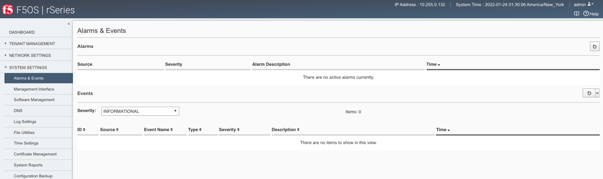

=====================================
Monitoring rSeries Health & Alert Status
=====================================

rSeries has many components and subsystems which can be monitored via CLI, webUI, API, and SNMP. It may be difficult to sift through all the end points to determine which are the key ones that can quicky provide health of the chassis. This section will provide guidance on how to quickly get health and alert status of the rSeries system, while other sections will focus on getting deeper detail.

Active Alerts
=============

The rSeries system has an alerting system where certain known issues will raise alerts when they occur and will also be cleared when they are addressed or self-heal.

------------------------------
Checking Active Alerts via CLI
------------------------------

The **show system alarms** CLI command will display any active alarms on the rSeries system if any exist. If the system is healthy then no entries will be found:

.. code-block:: bash

    syscon-1-active# show system alarms 
    % No entries found.
    syscon-1-active# 

To see past events use the command **show system events**.

.. code-block:: bash

    r5900-2# show system events 
    LOG                                                                                                                          
    -----------------------------------------------------------------------------------------------------------------------------
    65546 appliance thermal-fault ASSERT WARNING "Thermal fault detected in hardware" "2021-09-24 20:42:37.530264260 UTC"        
    65546 appliance thermal-fault EVENT NA "Deasserted: CPU Memhot" "2021-09-24 20:42:37.530303402 UTC"                          
    65546 appliance thermal-fault CLEAR WARNING "Thermal fault detected in hardware" "2021-09-24 20:42:47.523230213 UTC"         
    65546 appliance thermal-fault EVENT NA "Deasserted: CPU Memhot" "2021-09-24 20:42:47.523257401 UTC"                          
    66307 lcd module-communication-error ASSERT ERROR "Module communication error detected" "2021-09-24 20:43:26.817425015 UTC"  
    66307 lcd module-communication-error EVENT NA "LCD module communication error detected" "2021-09-24 20:43:26.817494411 UTC"  
    66306 lcd lcd-fault EVENT NA "LCD Health is Not OK" "2021-09-24 20:43:26.827835221 UTC"                                      
    66307 lcd module-communication-error CLEAR ERROR "Module communication error detected" "2021-09-25 13:31:17.525707606 UTC"   
    66307 lcd module-communication-error EVENT NA "LCD module communication is OK" "2021-09-25 13:31:17.525764773 UTC"           
    66306 lcd lcd-fault ASSERT ERROR "Fault detected in LCD module" "2021-09-25 13:31:17.537641060 UTC"                          
    66306 lcd lcd-fault EVENT NA "LCD Health is Not OK" "2021-09-25 13:31:17.537709360 UTC"                                      
    66306 lcd lcd-fault EVENT NA "Attribute health reset" "2021-09-29 03:51:31.596531347 UTC"                                    
    66306 lcd lcd-fault CLEAR INFO "Fault detected in LCD module" "2021-09-29 03:51:31.663915466 UTC"                            
    65550 appliance firmware-update-status EVENT NA "Firmware update is running for asw 0" "2021-09-29 03:51:45.753957124 UTC"   
    65546 appliance thermal-fault ASSERT WARNING "Thermal fault detected in hardware" "2021-09-29 03:51:52.305535996 UTC"        
    65546 appliance thermal-fault EVENT NA "Deasserted: CPU Memhot" "2021-09-29 03:51:52.305564980 UTC"                          
    65550 appliance firmware-update-status EVENT NA "Firmware update completed for asw 0" "2021-09-29 03:51:58.432597269 UTC"    
    65546 appliance thermal-fault CLEAR WARNING "Thermal fault detected in hardware" "2021-09-29 03:52:01.308221659 UTC"         
    65546 appliance thermal-fault EVENT NA "Deasserted: CPU Memhot" "2021-09-29 03:52:01.308250111 UTC"                          
    66307 lcd module-communication-error ASSERT ERROR "Module communication error detected" "2021-09-29 03:52:04.938947934 UTC"  
    66307 lcd module-communication-error EVENT NA "LCD module communication error detected" "2021-09-29 03:52:04.938996558 UTC"  
    66306 lcd lcd-fault EVENT NA "LCD Health is Not OK" "2021-09-29 03:52:04.949570244 UTC"                                      
    66307 lcd module-communication-error CLEAR ERROR "Module communication error detected" "2021-09-29 20:39:28.801031896 UTC"   
    66307 lcd module-communication-error EVENT NA "LCD module communication is OK" "2021-09-29 20:39:28.801078036 UTC"           
    66306 lcd lcd-fault ASSERT ERROR "Fault detected in LCD module" "2021-09-29 20:39:28.811080347 UTC"                          
    66306 lcd lcd-fault EVENT NA "LCD Health is Not OK" "2021-09-29 20:39:28.811121924 UTC"                                      
    66306 lcd lcd-fault EVENT NA "Attribute health reset" "2021-09-30 22:13:31.711372401 UTC"                                    
    66306 lcd lcd-fault CLEAR INFO "Fault detected in LCD module" "2021-09-30 22:13:31.717478859 UTC"                            
    65546 appliance thermal-fault ASSERT WARNING "Thermal fault detected in hardware" "2021-09-30 22:13:45.258781006 UTC"        
    65546 appliance thermal-fault EVENT NA "Deasserted: CPU Memhot" "2021-09-30 22:13:45.258810884 UTC"                          
    65550 appliance firmware-update-status EVENT NA "Firmware update is running for asw 0" "2021-09-30 22:13:45.269581558 UTC"   
    65546 appliance thermal-fault CLEAR WARNING "Thermal fault detected in hardware" "2021-09-30 22:13:53.603296145 UTC"         
    65546 appliance thermal-fault EVENT NA "Deasserted: CPU Memhot" "2021-09-30 22:13:53.603325184 UTC"                          
    65550 appliance firmware-update-status EVENT NA "Firmware update completed for asw 0" "2021-09-30 22:13:57.508802483 UTC"    
    65550 lcd firmware-update-status EVENT NA "Firmware update is running for lcd app" "2021-09-30 22:14:08.406281623 UTC"       
    65550 lcd firmware-update-status EVENT NA "Firmware update completed for lcd app" "2021-09-30 22:17:41.254699037 UTC"        
    65550 appliance firmware-update-status EVENT NA "Firmware update is running for asw 0" "2021-09-30 22:21:59.612100940 UTC"   
    66307 lcd module-communication-error ASSERT ERROR "Module communication error detected" "2021-09-30 22:22:09.744138756 UTC"  
    66307 lcd module-communication-error EVENT NA "LCD module communication error detected" "2021-09-30 22:22:09.744185210 UTC"  
    66306 lcd lcd-fault EVENT NA "LCD Health is Not OK" "2021-09-30 22:22:09.755991542 UTC"                                      
    65550 appliance firmware-update-status EVENT NA "Firmware update completed for asw 0" "2021-09-30 22:22:13.743592332 UTC"    
    66307 lcd module-communication-error CLEAR ERROR "Module communication error detected" "2021-09-30 22:23:13.748018092 UTC"   
    66307 lcd module-communication-error EVENT NA "LCD module communication is OK" "2021-09-30 22:23:13.748094654 UTC"           
    66306 lcd lcd-fault EVENT NA "LCD Health is OK" "2021-09-30 22:23:13.761910895 UTC"                                          
    65546 appliance thermal-fault ASSERT WARNING "Thermal fault detected in hardware" "2021-10-05 17:38:50.079885448 UTC"        
    65546 appliance thermal-fault EVENT NA "Deasserted: CPU Memhot" "2021-10-05 17:38:50.079928355 UTC"                          
    65546 appliance thermal-fault CLEAR WARNING "Thermal fault detected in hardware" "2021-10-05 17:39:00.072044694 UTC"         
    65546 appliance thermal-fault EVENT NA "Deasserted: CPU Memhot" "2021-10-05 17:39:00.072074572 UTC"                          
    65550 appliance firmware-update-status EVENT NA "Firmware update is running for sirr " "2021-10-05 17:39:02.067247139 UTC"   
    65550 appliance firmware-update-status EVENT NA "Firmware update completed for sirr " "2021-10-05 17:39:02.083977127 UTC"    
    65550 appliance firmware-update-status EVENT NA "Firmware update is running for asw 0" "2021-10-05 17:39:02.098659600 UTC"   
    65550 appliance firmware-update-status EVENT NA "Firmware update completed for asw 0" "2021-10-05 17:39:13.347122421 UTC"    
    65550 appliance firmware-update-status EVENT NA "Firmware update is running for bios" "2021-10-05 17:39:14.473124755 UTC"    
    65543 appliance aom-fault ASSERT ERROR "Fault detected in the AOM" "2021-10-05 17:48:56.925998053 UTC"                       
    65543 appliance aom-fault EVENT NA "LOP Runtime fault detected: lop:fan-control-fault" "2021-10-05 17:48:56.926049145 UTC"   
    65546 appliance thermal-fault ASSERT WARNING "Thermal fault detected in hardware" "2021-10-05 17:48:58.896030299 UTC"        
    65546 appliance thermal-fault EVENT NA "Deasserted: CPU Memhot" "2021-10-05 17:48:58.896078923 UTC"                          
    65550 appliance firmware-update-status EVENT NA "Firmware update is running for asw 0" "2021-10-05 17:48:58.910827305 UTC"   
    65546 appliance thermal-fault CLEAR WARNING "Thermal fault detected in hardware" "2021-10-05 17:49:07.404699391 UTC"         
    65546 appliance thermal-fault EVENT NA "Deasserted: CPU Memhot" "2021-10-05 17:49:07.404735680 UTC"                          
    65550 appliance firmware-update-status EVENT NA "Firmware update completed for asw 0" "2021-10-05 17:49:11.133887588 UTC"    
    65543 appliance aom-fault CLEAR ERROR "Fault detected in the AOM" "2021-10-05 18:00:02.904547087 UTC"                        
    65543 appliance aom-fault EVENT NA "No LOP Runtime fault detected: lop:fan-control-fault" "2021-10-05 18:00:02.904618551 UTC" 
    65546 appliance thermal-fault ASSERT WARNING "Thermal fault detected in hardware" "2021-10-06 22:36:15.890309759 UTC"        
    65546 appliance thermal-fault EVENT NA "Deasserted: CPU Memhot" "2021-10-06 22:36:15.890344861 UTC"                          
    65550 appliance firmware-update-status EVENT NA "Firmware update is running for asw 0" "2021-10-06 22:36:15.899652551 UTC"   
    65546 appliance thermal-fault CLEAR WARNING "Thermal fault detected in hardware" "2021-10-06 22:36:25.182561677 UTC"         
    65546 appliance thermal-fault EVENT NA "Deasserted: CPU Memhot" "2021-10-06 22:36:25.182588627 UTC"                          
    65550 appliance firmware-update-status EVENT NA "Firmware update completed for asw 0" "2021-10-06 22:36:28.095912279 UTC"    
    327680 Appliance core-dump EVENT NA "Core dumped on Appliance. process=snmp_trapd, location=/var/shared/core/container/snmp_trapd-1.core.gz" "2021-10-06 22:37:02.867803404 UTC" 
    65550 appliance firmware-update-status EVENT NA "Firmware update is running for asw 0" "2021-10-07 19:36:28.425404878 UTC"   
    65546 appliance thermal-fault ASSERT WARNING "Thermal fault detected in hardware" "2021-10-07 19:36:31.589007937 UTC"        
    65546 appliance thermal-fault EVENT NA "Deasserted: CPU Memhot" "2021-10-07 19:36:31.589039655 UTC"                          
    65550 appliance firmware-update-status EVENT NA "Firmware update completed for asw 0" "2021-10-07 19:36:40.911993523 UTC"    
    65546 appliance thermal-fault CLEAR WARNING "Thermal fault detected in hardware" "2021-10-07 19:36:42.419885336 UTC"         
    65546 appliance thermal-fault EVENT NA "Deasserted: CPU Memhot" "2021-10-07 19:36:42.419914186 UTC"                          
    65538 appliance unknown-alarm EVENT NA "Deasserted: CPU Memhot" "2021-10-18 20:53:45.331800325 UTC"                          
    65538 appliance unknown-alarm EVENT NA "Deasserted: CPU Memhot" "2021-10-18 20:53:54.655898424 UTC"                          
    65550 appliance firmware-update-status EVENT NA "Firmware update is running for asw 0" "2021-10-18 20:54:01.318390153 UTC"   
    65550 appliance firmware-update-status EVENT NA "Firmware update completed for asw 0" "2021-10-18 20:54:14.143624212 UTC"    
    65546 appliance thermal-fault ASSERT WARNING "Thermal fault detected in hardware" "2021-10-21 16:01:50.003423497 UTC"        
    65546 appliance thermal-fault EVENT NA "Deasserted: CPU Memhot" "2021-10-21 16:01:50.003434430 UTC"                          
    65550 appliance firmware-update-status EVENT NA "Firmware update is running for atse 0" "2021-10-21 16:01:51.999220111 UTC"  
    65546 appliance thermal-fault CLEAR WARNING "Thermal fault detected in hardware" "2021-10-21 16:01:58.752028781 UTC"         
    65546 appliance thermal-fault EVENT NA "Deasserted: CPU Memhot" "2021-10-21 16:01:58.752039434 UTC"                          
    65550 appliance firmware-update-status EVENT NA "Firmware update completed for atse 0" "2021-10-21 16:02:08.914165850 UTC"   
    65550 appliance firmware-update-status EVENT NA "Firmware update is running for cpld" "2021-10-21 16:02:09.995922369 UTC"    
    65550 appliance firmware-update-status EVENT NA "Firmware update completed for cpld" "2021-10-21 16:10:30.887216940 UTC"     
    65550 appliance firmware-update-status EVENT NA "Firmware update is running for asw 0" "2021-10-21 16:10:31.997412851 UTC"   
    65550 appliance firmware-update-status EVENT NA "Firmware update completed for asw 0" "2021-10-21 16:10:43.996629722 UTC"    
    65550 appliance firmware-update-status EVENT NA "Firmware update is running for asw 0" "2021-10-21 16:10:43.999261917 UTC"   
    327680 Appliance core-dump EVENT NA "Core dumped on Appliance. process=fpgamgr, location=/var/shared/core/container/fpgamgr-1.core.gz" "2021-10-21 16:10:44.410130732 UTC" 
    65550 appliance firmware-update-status EVENT NA "Firmware update completed for asw 0" "2021-10-21 16:10:56.965345667 UTC"    
    65550 appliance firmware-update-status EVENT NA "Firmware update is running for lop app" "2021-10-21 16:10:57.996958960 UTC" 
    66305 psu-2 psu-fault EVENT NA "Deasserted: PSU 2 input OK" "2021-10-21 16:12:04.007920003 UTC"                              
    66305 psu-2 psu-fault EVENT NA "Deasserted: PSU 2 output OK" "2021-10-21 16:12:04.016066799 UTC"                             
    65550 appliance firmware-update-status EVENT NA "Firmware update completed for lop app" "2021-10-21 16:12:05.997077384 UTC"  
    65550 appliance firmware-update-status EVENT NA "Firmware update is running for asw 0" "2021-10-21 16:12:06.001335165 UTC"   
    65550 appliance firmware-update-status EVENT NA "Firmware update completed for asw 0" "2021-10-21 16:12:19.997931537 UTC"    
    65550 appliance firmware-update-status EVENT NA "Firmware update is running for sirr " "2021-10-21 16:12:20.001487185 UTC"   
    65550 appliance firmware-update-status EVENT NA "Firmware update completed for sirr " "2021-10-21 16:12:20.008918481 UTC"    
    65550 appliance firmware-update-status EVENT NA "Firmware update is running for bios" "2021-10-21 16:12:20.013466117 UTC"    
    65550 appliance firmware-update-status EVENT NA "Firmware update completed for bios" "2021-10-21 16:16:46.003085218 UTC"     
    65536 appliance hardware-device-fault EVENT NA "RAS AER unknown errors, count=1" "2021-10-21 16:22:19.387992390 UTC"         
    65546 appliance thermal-fault ASSERT WARNING "Thermal fault detected in hardware" "2021-10-21 16:22:23.381380311 UTC"        
    65546 appliance thermal-fault EVENT NA "Deasserted: CPU Memhot" "2021-10-21 16:22:23.381390040 UTC"                          
    65550 appliance firmware-update-status EVENT NA "Firmware update is running for asw 0" "2021-10-21 16:22:25.385435390 UTC"   
    65546 appliance thermal-fault CLEAR WARNING "Thermal fault detected in hardware" "2021-10-21 16:22:33.381712308 UTC"         
    65546 appliance thermal-fault EVENT NA "Deasserted: CPU Memhot" "2021-10-21 16:22:33.381724382 UTC"                          
    65550 appliance firmware-update-status EVENT NA "Firmware update completed for asw 0" "2021-10-21 16:22:37.380958363 UTC"    
    66305 psu-2 psu-fault EVENT NA "Deasserted: PSU 2 input OK" "2021-10-21 16:22:52.634577652 UTC"                              
    66305 psu-2 psu-fault EVENT NA "Deasserted: PSU 2 output OK" "2021-10-21 16:22:53.384852972 UTC"                             
    65536 appliance hardware-device-fault EVENT NA "No RAS AER unknown errors detected" "2021-10-21 17:27:18.298033804 UTC"      
    65550 appliance firmware-update-status EVENT NA "Firmware update is running for atse 0" "2021-11-08 19:02:52.902578167 UTC"  
    65546 appliance thermal-fault ASSERT WARNING "Thermal fault detected in hardware" "2021-11-08 19:02:57.497737288 UTC"        
    65546 appliance thermal-fault EVENT NA "Deasserted: CPU Memhot" "2021-11-08 19:02:57.497747001 UTC"                          
    65546 appliance thermal-fault CLEAR WARNING "Thermal fault detected in hardware" "2021-11-08 19:03:07.398069876 UTC"         
    65546 appliance thermal-fault EVENT NA "Deasserted: CPU Memhot" "2021-11-08 19:03:07.398080030 UTC"                          
    65550 appliance firmware-update-status EVENT NA "Firmware update completed for atse 0" "2021-11-08 19:03:10.455550306 UTC"   
    65550 appliance firmware-update-status EVENT NA "Firmware update is running for asw 0" "2021-11-08 19:03:11.495334911 UTC"   
    65550 appliance firmware-update-status EVENT NA "Firmware update completed for asw 0" "2021-11-08 19:03:23.496853600 UTC"    
    66305 psu-2 psu-fault EVENT NA "Deasserted: PSU 2 input OK" "2021-11-12 21:07:25.498321744 UTC"                              
    66305 psu-2 psu-fault EVENT NA "Deasserted: PSU 2 output OK" "2021-11-12 21:07:25.504634021 UTC"                             
    65543 appliance aom-fault ASSERT ERROR "Fault detected in the AOM" "2021-11-12 22:00:03.510159007 UTC"                       
    65543 appliance aom-fault EVENT NA "LOP Runtime fault detected: lop:nc-si-rmii:failure" "2021-11-12 22:00:03.510181925 UTC"  
    327680 Appliance core-dump EVENT NA "Core dumped on Appliance. process=appliance_orche, location=/var/shared/core/container/appliance_orche-1.core.gz" "2021-11-13 17:36:53.583667701 UTC" 
    65543 appliance aom-fault EVENT NA "Attribute health reset" "2021-11-30 03:04:15.614494982 UTC"                              
    65543 appliance aom-fault CLEAR EMERGENCY "Fault detected in the AOM" "2021-11-30 03:04:15.633871228 UTC"                    
    65550 appliance firmware-update-status EVENT NA "Firmware update is running for atse 0" "2021-11-30 03:04:18.672712529 UTC"  
    65543 appliance aom-fault ASSERT ERROR "Fault detected in the AOM" "2021-11-30 03:04:20.197354633 UTC"                       
    65543 appliance aom-fault EVENT NA "LOP Runtime fault detected: lop:nc-si-rmii:failure" "2021-11-30 03:04:20.197369120 UTC"  
    65546 appliance thermal-fault ASSERT WARNING "Thermal fault detected in hardware" "2021-11-30 03:04:22.671699902 UTC"        
    65546 appliance thermal-fault EVENT NA "Deasserted: CPU Memhot" "2021-11-30 03:04:22.671710561 UTC"                          
    65550 appliance firmware-update-status EVENT NA "Firmware update is running for lop app" "2021-11-30 03:04:22.673457605 UTC" 
    65550 appliance firmware-update-status EVENT NA "Firmware update completed for atse 0" "2021-11-30 03:04:37.360915686 UTC"   
    65550 appliance firmware-update-status EVENT NA "Firmware update is running for asw 0" "2021-11-30 03:04:38.671015413 UTC"   
    65550 appliance firmware-update-status EVENT NA "Firmware update completed for asw 0" "2021-11-30 03:04:54.671332003 UTC"    
    66305 psu-2 psu-fault EVENT NA "Deasserted: PSU 2 input OK" "2021-11-30 03:05:28.673454233 UTC"                              
    66305 psu-2 psu-fault EVENT NA "Deasserted: PSU 2 output OK" "2021-11-30 03:05:28.680134116 UTC"                             
    65550 appliance firmware-update-status EVENT NA "Firmware update completed for lop app" "2021-11-30 03:05:30.739769167 UTC"  
    65550 appliance firmware-update-status EVENT NA "Firmware update is running for sirr " "2021-11-30 03:05:30.909784471 UTC"   
    65550 appliance firmware-update-status EVENT NA "Firmware update completed for sirr " "2021-11-30 03:05:31.056876974 UTC"    
    65550 appliance firmware-update-status EVENT NA "Firmware update is running for bios" "2021-11-30 03:05:31.203040930 UTC"    
    65543 appliance aom-fault CLEAR ERROR "Fault detected in the AOM" "2021-11-30 03:05:34.849689751 UTC"                        
    65543 appliance aom-fault EVENT NA "No LOP Runtime fault detected: lop:nc-si-rmii:failure" "2021-11-30 03:05:34.854406452 UTC" 
    65550 appliance firmware-update-status EVENT NA "Firmware update completed for bios" "2021-11-30 03:09:40.675727012 UTC"     
    65550 appliance firmware-update-status EVENT NA "Firmware update is running for <no value> 0" "2021-11-30 03:15:05.999510689 UTC" 
    65546 appliance thermal-fault CLEAR INFO "Thermal fault detected in hardware" "2021-11-30 03:15:06.736711926 UTC"            
    65546 appliance thermal-fault ASSERT WARNING "Thermal fault detected in hardware" "2021-11-30 03:15:12.090052531 UTC"        
    65546 appliance thermal-fault EVENT NA "Deasserted: CPU Memhot" "2021-11-30 03:15:12.090062383 UTC"                          
    65550 appliance firmware-update-status EVENT NA "Firmware update completed for atse 0" "2021-11-30 03:15:14.089416338 UTC"   
    65550 appliance firmware-update-status EVENT NA "Firmware update is running for asw 0" "2021-11-30 03:15:14.092678092 UTC"   
    65546 appliance thermal-fault CLEAR WARNING "Thermal fault detected in hardware" "2021-11-30 03:15:20.903194506 UTC"         
    65546 appliance thermal-fault EVENT NA "Deasserted: CPU Memhot" "2021-11-30 03:15:20.903205041 UTC"                          
    65550 appliance firmware-update-status EVENT NA "Firmware update completed for asw 0" "2021-11-30 03:15:29.609273565 UTC"    
    65550 lcd firmware-update-status EVENT NA "Firmware update is running for lcd app" "2021-11-30 03:15:40.088891192 UTC"       
    65550 lcd firmware-update-status EVENT NA "Firmware update completed for lcd app" "2021-11-30 03:19:15.999579163 UTC"        
    65550 appliance firmware-update-status EVENT NA "Firmware update is running for <no value> 0" "2021-12-08 19:46:53.504213060 UTC" 
    65550 appliance firmware-update-status EVENT NA "Firmware update completed for atse 0" "2021-12-08 19:47:01.529893397 UTC"   
    65550 appliance firmware-update-status EVENT NA "Firmware update is running for asw 0" "2021-12-08 19:47:01.534041443 UTC"   
    65546 appliance thermal-fault ASSERT WARNING "Thermal fault detected in hardware" "2021-12-08 19:47:05.527110643 UTC"        
    65546 appliance thermal-fault EVENT NA "Deasserted: CPU Memhot" "2021-12-08 19:47:05.527120486 UTC"                          
    65546 appliance thermal-fault CLEAR WARNING "Thermal fault detected in hardware" "2021-12-08 19:47:13.742069012 UTC"         
    65546 appliance thermal-fault EVENT NA "Deasserted: CPU Memhot" "2021-12-08 19:47:13.742079357 UTC"                          
    65550 appliance firmware-update-status EVENT NA "Firmware update completed for asw 0" "2021-12-08 19:47:17.232925320 UTC"    
    65550 appliance firmware-update-status EVENT NA "Firmware update is running for <no value> 0" "2021-12-11 23:40:34.166483738 UTC" 
    65546 appliance thermal-fault ASSERT WARNING "Thermal fault detected in hardware" "2021-12-11 23:40:41.365377563 UTC"        
    65546 appliance thermal-fault EVENT NA "Deasserted: CPU Memhot" "2021-12-11 23:40:41.365386164 UTC"                          
    65550 appliance firmware-update-status EVENT NA "Firmware update completed for atse 0" "2021-12-11 23:40:43.150189326 UTC"   
    65550 appliance firmware-update-status EVENT NA "Firmware update is running for asw 0" "2021-12-11 23:40:43.152771734 UTC"   
    65546 appliance thermal-fault CLEAR WARNING "Thermal fault detected in hardware" "2021-12-11 23:40:51.271782290 UTC"         
    65546 appliance thermal-fault EVENT NA "Deasserted: CPU Memhot" "2021-12-11 23:40:51.271792629 UTC"                          
    65550 appliance firmware-update-status EVENT NA "Firmware update completed for asw 0" "2021-12-11 23:40:59.150601474 UTC"    
    66305 psu-2 psu-fault EVENT NA "Deasserted: PSU 2 input OK" "2021-12-11 23:41:07.155884004 UTC"                              
    66305 psu-2 psu-fault EVENT NA "Deasserted: PSU 2 output OK" "2021-12-11 23:41:07.161054552 UTC"                             
    65550 appliance firmware-update-status EVENT NA "Firmware update is running for <no value> 0" "2022-01-14 19:10:22.024893444 UTC" 
    65550 appliance firmware-update-status EVENT NA "Firmware update completed for atse 0" "2022-01-14 19:10:31.201584672 UTC"   
    65550 appliance firmware-update-status EVENT NA "Firmware update is running for asw 0" "2022-01-14 19:10:31.204837008 UTC"   
    65546 appliance thermal-fault ASSERT WARNING "Thermal fault detected in hardware" "2022-01-14 19:10:33.202595967 UTC"        
    65546 appliance thermal-fault EVENT NA "Deasserted: CPU Memhot" "2022-01-14 19:10:33.202607134 UTC"                          
    65546 appliance thermal-fault CLEAR WARNING "Thermal fault detected in hardware" "2022-01-14 19:10:43.202976867 UTC"         
    65546 appliance thermal-fault EVENT NA "Deasserted: CPU Memhot" "2022-01-14 19:10:43.202988143 UTC"                          
    65550 appliance firmware-update-status EVENT NA "Firmware update completed for asw 0" "2022-01-14 19:10:46.851253533 UTC"    
    66305 psu-2 psu-fault EVENT NA "Deasserted: PSU 2 input OK" "2022-01-14 19:10:57.678840635 UTC"                              
    66305 psu-2 psu-fault EVENT NA "Deasserted: PSU 2 output OK" "2022-01-14 19:10:59.204970112 UTC"                             
    65550 appliance firmware-update-status EVENT NA "Firmware update is running for <no value> 0" "2022-01-15 06:04:15.665074228 UTC" 
    65546 appliance thermal-fault ASSERT WARNING "Thermal fault detected in hardware" "2022-01-15 06:04:24.096265138 UTC"        
    65546 appliance thermal-fault EVENT NA "Deasserted: CPU Memhot" "2022-01-15 06:04:24.096276299 UTC"                          
    65550 appliance firmware-update-status EVENT NA "Firmware update completed for atse 0" "2022-01-15 06:04:24.452570280 UTC"   
    65550 appliance firmware-update-status EVENT NA "Firmware update is running for asw 0" "2022-01-15 06:04:24.455229163 UTC"   
    65546 appliance thermal-fault CLEAR WARNING "Thermal fault detected in hardware" "2022-01-15 06:04:34.454864249 UTC"         
    65546 appliance thermal-fault EVENT NA "Deasserted: CPU Memhot" "2022-01-15 06:04:34.454875983 UTC"                          
    65550 appliance firmware-update-status EVENT NA "Firmware update completed for asw 0" "2022-01-15 06:04:40.086088658 UTC"    
    65550 appliance firmware-update-status EVENT NA "Firmware update is running for <no value> 0" "2022-01-15 06:47:50.255692452 UTC" 
    65546 appliance thermal-fault ASSERT WARNING "Thermal fault detected in hardware" "2022-01-15 06:47:58.859176054 UTC"        
    65546 appliance thermal-fault EVENT NA "Deasserted: CPU Memhot" "2022-01-15 06:47:58.859186190 UTC"                          
    65550 appliance firmware-update-status EVENT NA "Firmware update completed for atse 0" "2022-01-15 06:47:59.515267548 UTC"   
    65550 appliance firmware-update-status EVENT NA "Firmware update is running for asw 0" "2022-01-15 06:48:01.515381232 UTC"   
    65546 appliance thermal-fault CLEAR WARNING "Thermal fault detected in hardware" "2022-01-15 06:48:09.517292441 UTC"         
    65546 appliance thermal-fault EVENT NA "Deasserted: CPU Memhot" "2022-01-15 06:48:09.517302197 UTC"                          
    65550 appliance firmware-update-status EVENT NA "Firmware update completed for asw 0" "2022-01-15 06:48:15.310272826 UTC"    
    65550 appliance firmware-update-status EVENT NA "Firmware update is running for <no value> 0" "2022-01-17 09:28:25.339993260 UTC" 
    65546 appliance thermal-fault ASSERT WARNING "Thermal fault detected in hardware" "2022-01-17 09:28:28.397568698 UTC"        
    65546 appliance thermal-fault EVENT NA "Deasserted: CPU Memhot" "2022-01-17 09:28:28.397578016 UTC"                          
    65550 appliance firmware-update-status EVENT NA "Firmware update completed for atse 0" "2022-01-17 09:28:34.185952482 UTC"   
    65550 appliance firmware-update-status EVENT NA "Firmware update is running for asw 0" "2022-01-17 09:28:34.388141317 UTC"   
    65546 appliance thermal-fault CLEAR WARNING "Thermal fault detected in hardware" "2022-01-17 09:28:37.079075988 UTC"         
    65546 appliance thermal-fault EVENT NA "Deasserted: CPU Memhot" "2022-01-17 09:28:37.079085740 UTC"                          
    65550 appliance firmware-update-status EVENT NA "Firmware update completed for asw 0" "2022-01-17 09:28:50.050575268 UTC"    
    65550 appliance firmware-update-status EVENT NA "Firmware update is running for <no value> 0" "2022-01-17 10:17:56.205717158 UTC" 
    65546 appliance thermal-fault ASSERT WARNING "Thermal fault detected in hardware" "2022-01-17 10:18:00.285549822 UTC"        
    65546 appliance thermal-fault EVENT NA "Deasserted: CPU Memhot" "2022-01-17 10:18:00.285561947 UTC"                          
    65550 appliance firmware-update-status EVENT NA "Firmware update completed for atse 0" "2022-01-17 10:18:04.284792251 UTC"   
    65550 appliance firmware-update-status EVENT NA "Firmware update is running for asw 0" "2022-01-17 10:18:04.288861233 UTC"   
    65546 appliance thermal-fault CLEAR WARNING "Thermal fault detected in hardware" "2022-01-17 10:18:08.913192669 UTC"         
    65546 appliance thermal-fault EVENT NA "Deasserted: CPU Memhot" "2022-01-17 10:18:08.913208304 UTC"                          
    65550 appliance firmware-update-status EVENT NA "Firmware update completed for asw 0" "2022-01-17 10:18:19.310194557 UTC"    
    65550 appliance firmware-update-status EVENT NA "Firmware update is running for <no value> 0" "2022-01-22 21:38:43.263060216 UTC" 
    65550 appliance firmware-update-status EVENT NA "Firmware update completed for atse 0" "2022-01-22 21:38:51.478378406 UTC"   
    65550 appliance firmware-update-status EVENT NA "Firmware update is running for asw 0" "2022-01-22 21:38:51.807229100 UTC"   
    65546 appliance thermal-fault ASSERT WARNING "Thermal fault detected in hardware" "2022-01-22 21:38:53.807453271 UTC"        
    65546 appliance thermal-fault EVENT NA "Deasserted: CPU Memhot" "2022-01-22 21:38:53.807462914 UTC"                          
    65546 appliance thermal-fault CLEAR WARNING "Thermal fault detected in hardware" "2022-01-22 21:39:03.820207125 UTC"         
    65546 appliance thermal-fault EVENT NA "Deasserted: CPU Memhot" "2022-01-22 21:39:03.820217814 UTC"                          
    65550 appliance firmware-update-status EVENT NA "Firmware update completed for asw 0" "2022-01-22 21:39:07.327923568 UTC"    
    65550 appliance firmware-update-status EVENT NA "Firmware update is running for <no value> 0" "2022-01-22 22:13:37.685508736 UTC" 
    65546 appliance thermal-fault ASSERT WARNING "Thermal fault detected in hardware" "2022-01-22 22:13:42.499364348 UTC"        
    65546 appliance thermal-fault EVENT NA "Deasserted: CPU Memhot" "2022-01-22 22:13:42.499382148 UTC"                          
    65550 appliance firmware-update-status EVENT NA "Firmware update completed for atse 0" "2022-01-22 22:13:46.297326792 UTC"   
    65550 appliance firmware-update-status EVENT NA "Firmware update is running for asw 0" "2022-01-22 22:13:46.487157856 UTC"   
    65546 appliance thermal-fault CLEAR WARNING "Thermal fault detected in hardware" "2022-01-22 22:13:52.188569631 UTC"         
    65546 appliance thermal-fault EVENT NA "Deasserted: CPU Memhot" "2022-01-22 22:13:52.188580132 UTC"                          
    65550 appliance firmware-update-status EVENT NA "Firmware update completed for asw 0" "2022-01-22 22:14:02.155131424 UTC"    

    r5900-2#                                    

------------------------------
Checking Active Alerts via webUI
------------------------------

In the F5OS webUI you can go to the **System Events > Alarms & Events** page to see if there are any known alerts for the system. The alerting page is focused on **Active** alerts, and not issues that have cleared. If for example the temperature rises beyond an acceptable threshold, then a temperature alert will be raised. It will be seen in this page. If the temperature then falls back into a safe range then the alert will be removed. Each of these alerts will also generate a corresponding SNMP Trap. Please see the rSeries F5OS SNMP Monitoring and Alerting section.

------------------------------
Checking Active Alerts via API
------------------------------

Recent system level alerts can be accessed via the API. Below is an API call to see all the system events that have occurred for a particular appliance:

.. code-block:: bash

    GET https://{{Appliance1-IP}}:8888/restconf/data/openconfig-system:system/f5-event-log:events

Below are examples of events from an appliance in a test lab. Note there are ASSERT and Deasserted messages that clear them.

.. code-block:: json

    {
        "f5-event-log:events": {
            "event": [
                {
                    "log": "65546 appliance thermal-fault ASSERT WARNING \"Thermal fault detected in hardware\" \"2021-09-24 20:42:37.530264260 UTC\""
                },
                {
                    "log": "65546 appliance thermal-fault EVENT NA \"Deasserted: CPU Memhot\" \"2021-09-24 20:42:37.530303402 UTC\""
                },
                {
                    "log": "65546 appliance thermal-fault CLEAR WARNING \"Thermal fault detected in hardware\" \"2021-09-24 20:42:47.523230213 UTC\""
                },
                {
                    "log": "65546 appliance thermal-fault EVENT NA \"Deasserted: CPU Memhot\" \"2021-09-24 20:42:47.523257401 UTC\""
                },
                {
                    "log": "66307 lcd module-communication-error ASSERT ERROR \"Module communication error detected\" \"2021-09-24 20:43:26.817425015 UTC\""
                },
                {
                    "log": "66307 lcd module-communication-error EVENT NA \"LCD module communication error detected\" \"2021-09-24 20:43:26.817494411 UTC\""
                },
                {
                    "log": "66306 lcd lcd-fault EVENT NA \"LCD Health is Not OK\" \"2021-09-24 20:43:26.827835221 UTC\""
                },
                {
                    "log": "66307 lcd module-communication-error CLEAR ERROR \"Module communication error detected\" \"2021-09-25 13:31:17.525707606 UTC\""
                },
                {
                    "log": "66307 lcd module-communication-error EVENT NA \"LCD module communication is OK\" \"2021-09-25 13:31:17.525764773 UTC\""
                },
                {
                    "log": "66306 lcd lcd-fault ASSERT ERROR \"Fault detected in LCD module\" \"2021-09-25 13:31:17.537641060 UTC\""
                },
                {
                    "log": "66306 lcd lcd-fault EVENT NA \"LCD Health is Not OK\" \"2021-09-25 13:31:17.537709360 UTC\""
                },
                {
                    "log": "66306 lcd lcd-fault EVENT NA \"Attribute health reset\" \"2021-09-29 03:51:31.596531347 UTC\""
                },
                {
                    "log": "66306 lcd lcd-fault CLEAR INFO \"Fault detected in LCD module\" \"2021-09-29 03:51:31.663915466 UTC\""
                },
                {
                    "log": "65550 appliance firmware-update-status EVENT NA \"Firmware update is running for asw 0\" \"2021-09-29 03:51:45.753957124 UTC\""
                },
                {
                    "log": "65546 appliance thermal-fault ASSERT WARNING \"Thermal fault detected in hardware\" \"2021-09-29 03:51:52.305535996 UTC\""
                },
                {
                    "log": "65546 appliance thermal-fault EVENT NA \"Deasserted: CPU Memhot\" \"2021-09-29 03:51:52.305564980 UTC\""
                },
                {
                    "log": "65550 appliance firmware-update-status EVENT NA \"Firmware update completed for asw 0\" \"2021-09-29 03:51:58.432597269 UTC\""
                },
                {
                    "log": "65546 appliance thermal-fault CLEAR WARNING \"Thermal fault detected in hardware\" \"2021-09-29 03:52:01.308221659 UTC\""
                },
                {
                    "log": "65546 appliance thermal-fault EVENT NA \"Deasserted: CPU Memhot\" \"2021-09-29 03:52:01.308250111 UTC\""
                },
                {
                    "log": "66307 lcd module-communication-error ASSERT ERROR \"Module communication error detected\" \"2021-09-29 03:52:04.938947934 UTC\""
                },
                {
                    "log": "66307 lcd module-communication-error EVENT NA \"LCD module communication error detected\" \"2021-09-29 03:52:04.938996558 UTC\""
                },
                {
                    "log": "66306 lcd lcd-fault EVENT NA \"LCD Health is Not OK\" \"2021-09-29 03:52:04.949570244 UTC\""
                },
                {
                    "log": "66307 lcd module-communication-error CLEAR ERROR \"Module communication error detected\" \"2021-09-29 20:39:28.801031896 UTC\""
                },
                {
                    "log": "66307 lcd module-communication-error EVENT NA \"LCD module communication is OK\" \"2021-09-29 20:39:28.801078036 UTC\""
                },
                {
                    "log": "66306 lcd lcd-fault ASSERT ERROR \"Fault detected in LCD module\" \"2021-09-29 20:39:28.811080347 UTC\""
                },
                {
                    "log": "66306 lcd lcd-fault EVENT NA \"LCD Health is Not OK\" \"2021-09-29 20:39:28.811121924 UTC\""
                },
                {
                    "log": "66306 lcd lcd-fault EVENT NA \"Attribute health reset\" \"2021-09-30 22:13:31.711372401 UTC\""
                },
                {
                    "log": "66306 lcd lcd-fault CLEAR INFO \"Fault detected in LCD module\" \"2021-09-30 22:13:31.717478859 UTC\""
                },
                {
                    "log": "65546 appliance thermal-fault ASSERT WARNING \"Thermal fault detected in hardware\" \"2021-09-30 22:13:45.258781006 UTC\""
                },
                {
                    "log": "65546 appliance thermal-fault EVENT NA \"Deasserted: CPU Memhot\" \"2021-09-30 22:13:45.258810884 UTC\""
                },
                {
                    "log": "65550 appliance firmware-update-status EVENT NA \"Firmware update is running for asw 0\" \"2021-09-30 22:13:45.269581558 UTC\""
                },
                {
                    "log": "65546 appliance thermal-fault CLEAR WARNING \"Thermal fault detected in hardware\" \"2021-09-30 22:13:53.603296145 UTC\""
                },
                {
                    "log": "65546 appliance thermal-fault EVENT NA \"Deasserted: CPU Memhot\" \"2021-09-30 22:13:53.603325184 UTC\""
                },
                {
                    "log": "65550 appliance firmware-update-status EVENT NA \"Firmware update completed for asw 0\" \"2021-09-30 22:13:57.508802483 UTC\""
                },
                {
                    "log": "65550 lcd firmware-update-status EVENT NA \"Firmware update is running for lcd app\" \"2021-09-30 22:14:08.406281623 UTC\""
                },
                {
                    "log": "65550 lcd firmware-update-status EVENT NA \"Firmware update completed for lcd app\" \"2021-09-30 22:17:41.254699037 UTC\""
                },
                {
                    "log": "65550 appliance firmware-update-status EVENT NA \"Firmware update is running for asw 0\" \"2021-09-30 22:21:59.612100940 UTC\""
                },
                {
                    "log": "66307 lcd module-communication-error ASSERT ERROR \"Module communication error detected\" \"2021-09-30 22:22:09.744138756 UTC\""
                },
                {
                    "log": "66307 lcd module-communication-error EVENT NA \"LCD module communication error detected\" \"2021-09-30 22:22:09.744185210 UTC\""
                },
                {
                    "log": "66306 lcd lcd-fault EVENT NA \"LCD Health is Not OK\" \"2021-09-30 22:22:09.755991542 UTC\""
                },
                {
                    "log": "65550 appliance firmware-update-status EVENT NA \"Firmware update completed for asw 0\" \"2021-09-30 22:22:13.743592332 UTC\""
                },
                {
                    "log": "66307 lcd module-communication-error CLEAR ERROR \"Module communication error detected\" \"2021-09-30 22:23:13.748018092 UTC\""
                },
                {
                    "log": "66307 lcd module-communication-error EVENT NA \"LCD module communication is OK\" \"2021-09-30 22:23:13.748094654 UTC\""
                },
                {
                    "log": "66306 lcd lcd-fault EVENT NA \"LCD Health is OK\" \"2021-09-30 22:23:13.761910895 UTC\""
                },
                {
                    "log": "65546 appliance thermal-fault ASSERT WARNING \"Thermal fault detected in hardware\" \"2021-10-05 17:38:50.079885448 UTC\""
                },
                {
                    "log": "65546 appliance thermal-fault EVENT NA \"Deasserted: CPU Memhot\" \"2021-10-05 17:38:50.079928355 UTC\""
                },
                {
                    "log": "65546 appliance thermal-fault CLEAR WARNING \"Thermal fault detected in hardware\" \"2021-10-05 17:39:00.072044694 UTC\""
                },
                {
                    "log": "65546 appliance thermal-fault EVENT NA \"Deasserted: CPU Memhot\" \"2021-10-05 17:39:00.072074572 UTC\""
                },
                {
                    "log": "65550 appliance firmware-update-status EVENT NA \"Firmware update is running for sirr \" \"2021-10-05 17:39:02.067247139 UTC\""
                },
                {
                    "log": "65550 appliance firmware-update-status EVENT NA \"Firmware update completed for sirr \" \"2021-10-05 17:39:02.083977127 UTC\""
                },
                {
                    "log": "65550 appliance firmware-update-status EVENT NA \"Firmware update is running for asw 0\" \"2021-10-05 17:39:02.098659600 UTC\""
                },
                {
                    "log": "65550 appliance firmware-update-status EVENT NA \"Firmware update completed for asw 0\" \"2021-10-05 17:39:13.347122421 UTC\""
                },
                {
                    "log": "65550 appliance firmware-update-status EVENT NA \"Firmware update is running for bios\" \"2021-10-05 17:39:14.473124755 UTC\""
                },
                {
                    "log": "65543 appliance aom-fault ASSERT ERROR \"Fault detected in the AOM\" \"2021-10-05 17:48:56.925998053 UTC\""
                },
                {
                    "log": "65543 appliance aom-fault EVENT NA \"LOP Runtime fault detected: lop:fan-control-fault\" \"2021-10-05 17:48:56.926049145 UTC\""
                },
                {
                    "log": "65546 appliance thermal-fault ASSERT WARNING \"Thermal fault detected in hardware\" \"2021-10-05 17:48:58.896030299 UTC\""
                },
                {
                    "log": "65546 appliance thermal-fault EVENT NA \"Deasserted: CPU Memhot\" \"2021-10-05 17:48:58.896078923 UTC\""
                },
                {
                    "log": "65550 appliance firmware-update-status EVENT NA \"Firmware update is running for asw 0\" \"2021-10-05 17:48:58.910827305 UTC\""
                },
                {
                    "log": "65546 appliance thermal-fault CLEAR WARNING \"Thermal fault detected in hardware\" \"2021-10-05 17:49:07.404699391 UTC\""
                },
                {
                    "log": "65546 appliance thermal-fault EVENT NA \"Deasserted: CPU Memhot\" \"2021-10-05 17:49:07.404735680 UTC\""
                },
                {
                    "log": "65550 appliance firmware-update-status EVENT NA \"Firmware update completed for asw 0\" \"2021-10-05 17:49:11.133887588 UTC\""
                },
                {
                    "log": "65543 appliance aom-fault CLEAR ERROR \"Fault detected in the AOM\" \"2021-10-05 18:00:02.904547087 UTC\""
                },
                {
                    "log": "65543 appliance aom-fault EVENT NA \"No LOP Runtime fault detected: lop:fan-control-fault\" \"2021-10-05 18:00:02.904618551 UTC\""
                },
                {
                    "log": "65546 appliance thermal-fault ASSERT WARNING \"Thermal fault detected in hardware\" \"2021-10-06 22:36:15.890309759 UTC\""
                },
                {
                    "log": "65546 appliance thermal-fault EVENT NA \"Deasserted: CPU Memhot\" \"2021-10-06 22:36:15.890344861 UTC\""
                },
                {
                    "log": "65550 appliance firmware-update-status EVENT NA \"Firmware update is running for asw 0\" \"2021-10-06 22:36:15.899652551 UTC\""
                },
                {
                    "log": "65546 appliance thermal-fault CLEAR WARNING \"Thermal fault detected in hardware\" \"2021-10-06 22:36:25.182561677 UTC\""
                },
                {
                    "log": "65546 appliance thermal-fault EVENT NA \"Deasserted: CPU Memhot\" \"2021-10-06 22:36:25.182588627 UTC\""
                },
                {
                    "log": "65550 appliance firmware-update-status EVENT NA \"Firmware update completed for asw 0\" \"2021-10-06 22:36:28.095912279 UTC\""
                },
                {
                    "log": "327680 Appliance core-dump EVENT NA \"Core dumped on Appliance. process=snmp_trapd, location=/var/shared/core/container/snmp_trapd-1.core.gz\" \"2021-10-06 22:37:02.867803404 UTC\""
                },
                {
                    "log": "65550 appliance firmware-update-status EVENT NA \"Firmware update is running for asw 0\" \"2021-10-07 19:36:28.425404878 UTC\""
                },
                {
                    "log": "65546 appliance thermal-fault ASSERT WARNING \"Thermal fault detected in hardware\" \"2021-10-07 19:36:31.589007937 UTC\""
                },
                {
                    "log": "65546 appliance thermal-fault EVENT NA \"Deasserted: CPU Memhot\" \"2021-10-07 19:36:31.589039655 UTC\""
                },
                {
                    "log": "65550 appliance firmware-update-status EVENT NA \"Firmware update completed for asw 0\" \"2021-10-07 19:36:40.911993523 UTC\""
                },
                {
                    "log": "65546 appliance thermal-fault CLEAR WARNING \"Thermal fault detected in hardware\" \"2021-10-07 19:36:42.419885336 UTC\""
                },
                {
                    "log": "65546 appliance thermal-fault EVENT NA \"Deasserted: CPU Memhot\" \"2021-10-07 19:36:42.419914186 UTC\""
                },
                {
                    "log": "65538 appliance unknown-alarm EVENT NA \"Deasserted: CPU Memhot\" \"2021-10-18 20:53:45.331800325 UTC\""
                },
                {
                    "log": "65538 appliance unknown-alarm EVENT NA \"Deasserted: CPU Memhot\" \"2021-10-18 20:53:54.655898424 UTC\""
                },
                {
                    "log": "65550 appliance firmware-update-status EVENT NA \"Firmware update is running for asw 0\" \"2021-10-18 20:54:01.318390153 UTC\""
                },
                {
                    "log": "65550 appliance firmware-update-status EVENT NA \"Firmware update completed for asw 0\" \"2021-10-18 20:54:14.143624212 UTC\""
                },
                {
                    "log": "65546 appliance thermal-fault ASSERT WARNING \"Thermal fault detected in hardware\" \"2021-10-21 16:01:50.003423497 UTC\""
                },
                {
                    "log": "65546 appliance thermal-fault EVENT NA \"Deasserted: CPU Memhot\" \"2021-10-21 16:01:50.003434430 UTC\""
                },
                {
                    "log": "65550 appliance firmware-update-status EVENT NA \"Firmware update is running for atse 0\" \"2021-10-21 16:01:51.999220111 UTC\""
                },
                {
                    "log": "65546 appliance thermal-fault CLEAR WARNING \"Thermal fault detected in hardware\" \"2021-10-21 16:01:58.752028781 UTC\""
                },
                {
                    "log": "65546 appliance thermal-fault EVENT NA \"Deasserted: CPU Memhot\" \"2021-10-21 16:01:58.752039434 UTC\""
                },
                {
                    "log": "65550 appliance firmware-update-status EVENT NA \"Firmware update completed for atse 0\" \"2021-10-21 16:02:08.914165850 UTC\""
                },
                {
                    "log": "65550 appliance firmware-update-status EVENT NA \"Firmware update is running for cpld\" \"2021-10-21 16:02:09.995922369 UTC\""
                },
                {
                    "log": "65550 appliance firmware-update-status EVENT NA \"Firmware update completed for cpld\" \"2021-10-21 16:10:30.887216940 UTC\""
                },
                {
                    "log": "65550 appliance firmware-update-status EVENT NA \"Firmware update is running for asw 0\" \"2021-10-21 16:10:31.997412851 UTC\""
                },
                {
                    "log": "65550 appliance firmware-update-status EVENT NA \"Firmware update completed for asw 0\" \"2021-10-21 16:10:43.996629722 UTC\""
                },
                {
                    "log": "65550 appliance firmware-update-status EVENT NA \"Firmware update is running for asw 0\" \"2021-10-21 16:10:43.999261917 UTC\""
                },
                {
                    "log": "327680 Appliance core-dump EVENT NA \"Core dumped on Appliance. process=fpgamgr, location=/var/shared/core/container/fpgamgr-1.core.gz\" \"2021-10-21 16:10:44.410130732 UTC\""
                },
                {
                    "log": "65550 appliance firmware-update-status EVENT NA \"Firmware update completed for asw 0\" \"2021-10-21 16:10:56.965345667 UTC\""
                },
                {
                    "log": "65550 appliance firmware-update-status EVENT NA \"Firmware update is running for lop app\" \"2021-10-21 16:10:57.996958960 UTC\""
                },
                {
                    "log": "66305 psu-2 psu-fault EVENT NA \"Deasserted: PSU 2 input OK\" \"2021-10-21 16:12:04.007920003 UTC\""
                },
                {
                    "log": "66305 psu-2 psu-fault EVENT NA \"Deasserted: PSU 2 output OK\" \"2021-10-21 16:12:04.016066799 UTC\""
                },
                {
                    "log": "65550 appliance firmware-update-status EVENT NA \"Firmware update completed for lop app\" \"2021-10-21 16:12:05.997077384 UTC\""
                },
                {
                    "log": "65550 appliance firmware-update-status EVENT NA \"Firmware update is running for asw 0\" \"2021-10-21 16:12:06.001335165 UTC\""
                },
                {
                    "log": "65550 appliance firmware-update-status EVENT NA \"Firmware update completed for asw 0\" \"2021-10-21 16:12:19.997931537 UTC\""
                },
                {
                    "log": "65550 appliance firmware-update-status EVENT NA \"Firmware update is running for sirr \" \"2021-10-21 16:12:20.001487185 UTC\""
                },
                {
                    "log": "65550 appliance firmware-update-status EVENT NA \"Firmware update completed for sirr \" \"2021-10-21 16:12:20.008918481 UTC\""
                },
                {
                    "log": "65550 appliance firmware-update-status EVENT NA \"Firmware update is running for bios\" \"2021-10-21 16:12:20.013466117 UTC\""
                },
                {
                    "log": "65550 appliance firmware-update-status EVENT NA \"Firmware update completed for bios\" \"2021-10-21 16:16:46.003085218 UTC\""
                },
                {
                    "log": "65536 appliance hardware-device-fault EVENT NA \"RAS AER unknown errors, count=1\" \"2021-10-21 16:22:19.387992390 UTC\""
                },
                {
                    "log": "65546 appliance thermal-fault ASSERT WARNING \"Thermal fault detected in hardware\" \"2021-10-21 16:22:23.381380311 UTC\""
                },
                {
                    "log": "65546 appliance thermal-fault EVENT NA \"Deasserted: CPU Memhot\" \"2021-10-21 16:22:23.381390040 UTC\""
                },
                {
                    "log": "65550 appliance firmware-update-status EVENT NA \"Firmware update is running for asw 0\" \"2021-10-21 16:22:25.385435390 UTC\""
                },
                {
                    "log": "65546 appliance thermal-fault CLEAR WARNING \"Thermal fault detected in hardware\" \"2021-10-21 16:22:33.381712308 UTC\""
                },
                {
                    "log": "65546 appliance thermal-fault EVENT NA \"Deasserted: CPU Memhot\" \"2021-10-21 16:22:33.381724382 UTC\""
                },
                {
                    "log": "65550 appliance firmware-update-status EVENT NA \"Firmware update completed for asw 0\" \"2021-10-21 16:22:37.380958363 UTC\""
                },
                {
                    "log": "66305 psu-2 psu-fault EVENT NA \"Deasserted: PSU 2 input OK\" \"2021-10-21 16:22:52.634577652 UTC\""
                },
                {
                    "log": "66305 psu-2 psu-fault EVENT NA \"Deasserted: PSU 2 output OK\" \"2021-10-21 16:22:53.384852972 UTC\""
                },
                {
                    "log": "65536 appliance hardware-device-fault EVENT NA \"No RAS AER unknown errors detected\" \"2021-10-21 17:27:18.298033804 UTC\""
                },
                {
                    "log": "65550 appliance firmware-update-status EVENT NA \"Firmware update is running for atse 0\" \"2021-11-08 19:02:52.902578167 UTC\""
                },
                {
                    "log": "65546 appliance thermal-fault ASSERT WARNING \"Thermal fault detected in hardware\" \"2021-11-08 19:02:57.497737288 UTC\""
                },
                {
                    "log": "65546 appliance thermal-fault EVENT NA \"Deasserted: CPU Memhot\" \"2021-11-08 19:02:57.497747001 UTC\""
                },
                {
                    "log": "65546 appliance thermal-fault CLEAR WARNING \"Thermal fault detected in hardware\" \"2021-11-08 19:03:07.398069876 UTC\""
                },
                {
                    "log": "65546 appliance thermal-fault EVENT NA \"Deasserted: CPU Memhot\" \"2021-11-08 19:03:07.398080030 UTC\""
                },
                {
                    "log": "65550 appliance firmware-update-status EVENT NA \"Firmware update completed for atse 0\" \"2021-11-08 19:03:10.455550306 UTC\""
                },
                {
                    "log": "65550 appliance firmware-update-status EVENT NA \"Firmware update is running for asw 0\" \"2021-11-08 19:03:11.495334911 UTC\""
                },
                {
                    "log": "65550 appliance firmware-update-status EVENT NA \"Firmware update completed for asw 0\" \"2021-11-08 19:03:23.496853600 UTC\""
                },
                {
                    "log": "66305 psu-2 psu-fault EVENT NA \"Deasserted: PSU 2 input OK\" \"2021-11-12 21:07:25.498321744 UTC\""
                },
                {
                    "log": "66305 psu-2 psu-fault EVENT NA \"Deasserted: PSU 2 output OK\" \"2021-11-12 21:07:25.504634021 UTC\""
                },
                {
                    "log": "65543 appliance aom-fault ASSERT ERROR \"Fault detected in the AOM\" \"2021-11-12 22:00:03.510159007 UTC\""
                },
                {
                    "log": "65543 appliance aom-fault EVENT NA \"LOP Runtime fault detected: lop:nc-si-rmii:failure\" \"2021-11-12 22:00:03.510181925 UTC\""
                },
                {
                    "log": "327680 Appliance core-dump EVENT NA \"Core dumped on Appliance. process=appliance_orche, location=/var/shared/core/container/appliance_orche-1.core.gz\" \"2021-11-13 17:36:53.583667701 UTC\""
                },
                {
                    "log": "65543 appliance aom-fault EVENT NA \"Attribute health reset\" \"2021-11-30 03:04:15.614494982 UTC\""
                },
                {
                    "log": "65543 appliance aom-fault CLEAR EMERGENCY \"Fault detected in the AOM\" \"2021-11-30 03:04:15.633871228 UTC\""
                },
                {
                    "log": "65550 appliance firmware-update-status EVENT NA \"Firmware update is running for atse 0\" \"2021-11-30 03:04:18.672712529 UTC\""
                },
                {
                    "log": "65543 appliance aom-fault ASSERT ERROR \"Fault detected in the AOM\" \"2021-11-30 03:04:20.197354633 UTC\""
                },
                {
                    "log": "65543 appliance aom-fault EVENT NA \"LOP Runtime fault detected: lop:nc-si-rmii:failure\" \"2021-11-30 03:04:20.197369120 UTC\""
                },
                {
                    "log": "65546 appliance thermal-fault ASSERT WARNING \"Thermal fault detected in hardware\" \"2021-11-30 03:04:22.671699902 UTC\""
                },
                {
                    "log": "65546 appliance thermal-fault EVENT NA \"Deasserted: CPU Memhot\" \"2021-11-30 03:04:22.671710561 UTC\""
                },
                {
                    "log": "65550 appliance firmware-update-status EVENT NA \"Firmware update is running for lop app\" \"2021-11-30 03:04:22.673457605 UTC\""
                },
                {
                    "log": "65550 appliance firmware-update-status EVENT NA \"Firmware update completed for atse 0\" \"2021-11-30 03:04:37.360915686 UTC\""
                },
                {
                    "log": "65550 appliance firmware-update-status EVENT NA \"Firmware update is running for asw 0\" \"2021-11-30 03:04:38.671015413 UTC\""
                },
                {
                    "log": "65550 appliance firmware-update-status EVENT NA \"Firmware update completed for asw 0\" \"2021-11-30 03:04:54.671332003 UTC\""
                },
                {
                    "log": "66305 psu-2 psu-fault EVENT NA \"Deasserted: PSU 2 input OK\" \"2021-11-30 03:05:28.673454233 UTC\""
                },
                {
                    "log": "66305 psu-2 psu-fault EVENT NA \"Deasserted: PSU 2 output OK\" \"2021-11-30 03:05:28.680134116 UTC\""
                },
                {
                    "log": "65550 appliance firmware-update-status EVENT NA \"Firmware update completed for lop app\" \"2021-11-30 03:05:30.739769167 UTC\""
                },
                {
                    "log": "65550 appliance firmware-update-status EVENT NA \"Firmware update is running for sirr \" \"2021-11-30 03:05:30.909784471 UTC\""
                },
                {
                    "log": "65550 appliance firmware-update-status EVENT NA \"Firmware update completed for sirr \" \"2021-11-30 03:05:31.056876974 UTC\""
                },
                {
                    "log": "65550 appliance firmware-update-status EVENT NA \"Firmware update is running for bios\" \"2021-11-30 03:05:31.203040930 UTC\""
                },
                {
                    "log": "65543 appliance aom-fault CLEAR ERROR \"Fault detected in the AOM\" \"2021-11-30 03:05:34.849689751 UTC\""
                },
                {
                    "log": "65543 appliance aom-fault EVENT NA \"No LOP Runtime fault detected: lop:nc-si-rmii:failure\" \"2021-11-30 03:05:34.854406452 UTC\""
                },
                {
                    "log": "65550 appliance firmware-update-status EVENT NA \"Firmware update completed for bios\" \"2021-11-30 03:09:40.675727012 UTC\""
                },
                {
                    "log": "65550 appliance firmware-update-status EVENT NA \"Firmware update is running for <no value> 0\" \"2021-11-30 03:15:05.999510689 UTC\""
                },
                {
                    "log": "65546 appliance thermal-fault CLEAR INFO \"Thermal fault detected in hardware\" \"2021-11-30 03:15:06.736711926 UTC\""
                },
                {
                    "log": "65546 appliance thermal-fault ASSERT WARNING \"Thermal fault detected in hardware\" \"2021-11-30 03:15:12.090052531 UTC\""
                },
                {
                    "log": "65546 appliance thermal-fault EVENT NA \"Deasserted: CPU Memhot\" \"2021-11-30 03:15:12.090062383 UTC\""
                },
                {
                    "log": "65550 appliance firmware-update-status EVENT NA \"Firmware update completed for atse 0\" \"2021-11-30 03:15:14.089416338 UTC\""
                },
                {
                    "log": "65550 appliance firmware-update-status EVENT NA \"Firmware update is running for asw 0\" \"2021-11-30 03:15:14.092678092 UTC\""
                },
                {
                    "log": "65546 appliance thermal-fault CLEAR WARNING \"Thermal fault detected in hardware\" \"2021-11-30 03:15:20.903194506 UTC\""
                },
                {
                    "log": "65546 appliance thermal-fault EVENT NA \"Deasserted: CPU Memhot\" \"2021-11-30 03:15:20.903205041 UTC\""
                },
                {
                    "log": "65550 appliance firmware-update-status EVENT NA \"Firmware update completed for asw 0\" \"2021-11-30 03:15:29.609273565 UTC\""
                },
                {
                    "log": "65550 lcd firmware-update-status EVENT NA \"Firmware update is running for lcd app\" \"2021-11-30 03:15:40.088891192 UTC\""
                },
                {
                    "log": "65550 lcd firmware-update-status EVENT NA \"Firmware update completed for lcd app\" \"2021-11-30 03:19:15.999579163 UTC\""
                },
                {
                    "log": "65550 appliance firmware-update-status EVENT NA \"Firmware update is running for <no value> 0\" \"2021-12-08 19:46:53.504213060 UTC\""
                },
                {
                    "log": "65550 appliance firmware-update-status EVENT NA \"Firmware update completed for atse 0\" \"2021-12-08 19:47:01.529893397 UTC\""
                },
                {
                    "log": "65550 appliance firmware-update-status EVENT NA \"Firmware update is running for asw 0\" \"2021-12-08 19:47:01.534041443 UTC\""
                },
                {
                    "log": "65546 appliance thermal-fault ASSERT WARNING \"Thermal fault detected in hardware\" \"2021-12-08 19:47:05.527110643 UTC\""
                },
                {
                    "log": "65546 appliance thermal-fault EVENT NA \"Deasserted: CPU Memhot\" \"2021-12-08 19:47:05.527120486 UTC\""
                },
                {
                    "log": "65546 appliance thermal-fault CLEAR WARNING \"Thermal fault detected in hardware\" \"2021-12-08 19:47:13.742069012 UTC\""
                },
                {
                    "log": "65546 appliance thermal-fault EVENT NA \"Deasserted: CPU Memhot\" \"2021-12-08 19:47:13.742079357 UTC\""
                },
                {
                    "log": "65550 appliance firmware-update-status EVENT NA \"Firmware update completed for asw 0\" \"2021-12-08 19:47:17.232925320 UTC\""
                },
                {
                    "log": "65550 appliance firmware-update-status EVENT NA \"Firmware update is running for <no value> 0\" \"2021-12-11 23:40:34.166483738 UTC\""
                },
                {
                    "log": "65546 appliance thermal-fault ASSERT WARNING \"Thermal fault detected in hardware\" \"2021-12-11 23:40:41.365377563 UTC\""
                },
                {
                    "log": "65546 appliance thermal-fault EVENT NA \"Deasserted: CPU Memhot\" \"2021-12-11 23:40:41.365386164 UTC\""
                },
                {
                    "log": "65550 appliance firmware-update-status EVENT NA \"Firmware update completed for atse 0\" \"2021-12-11 23:40:43.150189326 UTC\""
                },
                {
                    "log": "65550 appliance firmware-update-status EVENT NA \"Firmware update is running for asw 0\" \"2021-12-11 23:40:43.152771734 UTC\""
                },
                {
                    "log": "65546 appliance thermal-fault CLEAR WARNING \"Thermal fault detected in hardware\" \"2021-12-11 23:40:51.271782290 UTC\""
                },
                {
                    "log": "65546 appliance thermal-fault EVENT NA \"Deasserted: CPU Memhot\" \"2021-12-11 23:40:51.271792629 UTC\""
                },
                {
                    "log": "65550 appliance firmware-update-status EVENT NA \"Firmware update completed for asw 0\" \"2021-12-11 23:40:59.150601474 UTC\""
                },
                {
                    "log": "66305 psu-2 psu-fault EVENT NA \"Deasserted: PSU 2 input OK\" \"2021-12-11 23:41:07.155884004 UTC\""
                },
                {
                    "log": "66305 psu-2 psu-fault EVENT NA \"Deasserted: PSU 2 output OK\" \"2021-12-11 23:41:07.161054552 UTC\""
                },
                {
                    "log": "65550 appliance firmware-update-status EVENT NA \"Firmware update is running for <no value> 0\" \"2022-01-14 19:10:22.024893444 UTC\""
                },
                {
                    "log": "65550 appliance firmware-update-status EVENT NA \"Firmware update completed for atse 0\" \"2022-01-14 19:10:31.201584672 UTC\""
                },
                {
                    "log": "65550 appliance firmware-update-status EVENT NA \"Firmware update is running for asw 0\" \"2022-01-14 19:10:31.204837008 UTC\""
                },
                {
                    "log": "65546 appliance thermal-fault ASSERT WARNING \"Thermal fault detected in hardware\" \"2022-01-14 19:10:33.202595967 UTC\""
                },
                {
                    "log": "65546 appliance thermal-fault EVENT NA \"Deasserted: CPU Memhot\" \"2022-01-14 19:10:33.202607134 UTC\""
                },
                {
                    "log": "65546 appliance thermal-fault CLEAR WARNING \"Thermal fault detected in hardware\" \"2022-01-14 19:10:43.202976867 UTC\""
                },
                {
                    "log": "65546 appliance thermal-fault EVENT NA \"Deasserted: CPU Memhot\" \"2022-01-14 19:10:43.202988143 UTC\""
                },
                {
                    "log": "65550 appliance firmware-update-status EVENT NA \"Firmware update completed for asw 0\" \"2022-01-14 19:10:46.851253533 UTC\""
                },
                {
                    "log": "66305 psu-2 psu-fault EVENT NA \"Deasserted: PSU 2 input OK\" \"2022-01-14 19:10:57.678840635 UTC\""
                },
                {
                    "log": "66305 psu-2 psu-fault EVENT NA \"Deasserted: PSU 2 output OK\" \"2022-01-14 19:10:59.204970112 UTC\""
                },
                {
                    "log": "65550 appliance firmware-update-status EVENT NA \"Firmware update is running for <no value> 0\" \"2022-01-15 06:04:15.665074228 UTC\""
                },
                {
                    "log": "65546 appliance thermal-fault ASSERT WARNING \"Thermal fault detected in hardware\" \"2022-01-15 06:04:24.096265138 UTC\""
                },
                {
                    "log": "65546 appliance thermal-fault EVENT NA \"Deasserted: CPU Memhot\" \"2022-01-15 06:04:24.096276299 UTC\""
                },
                {
                    "log": "65550 appliance firmware-update-status EVENT NA \"Firmware update completed for atse 0\" \"2022-01-15 06:04:24.452570280 UTC\""
                },
                {
                    "log": "65550 appliance firmware-update-status EVENT NA \"Firmware update is running for asw 0\" \"2022-01-15 06:04:24.455229163 UTC\""
                },
                {
                    "log": "65546 appliance thermal-fault CLEAR WARNING \"Thermal fault detected in hardware\" \"2022-01-15 06:04:34.454864249 UTC\""
                },
                {
                    "log": "65546 appliance thermal-fault EVENT NA \"Deasserted: CPU Memhot\" \"2022-01-15 06:04:34.454875983 UTC\""
                },
                {
                    "log": "65550 appliance firmware-update-status EVENT NA \"Firmware update completed for asw 0\" \"2022-01-15 06:04:40.086088658 UTC\""
                },
                {
                    "log": "65550 appliance firmware-update-status EVENT NA \"Firmware update is running for <no value> 0\" \"2022-01-15 06:47:50.255692452 UTC\""
                },
                {
                    "log": "65546 appliance thermal-fault ASSERT WARNING \"Thermal fault detected in hardware\" \"2022-01-15 06:47:58.859176054 UTC\""
                },
                {
                    "log": "65546 appliance thermal-fault EVENT NA \"Deasserted: CPU Memhot\" \"2022-01-15 06:47:58.859186190 UTC\""
                },
                {
                    "log": "65550 appliance firmware-update-status EVENT NA \"Firmware update completed for atse 0\" \"2022-01-15 06:47:59.515267548 UTC\""
                },
                {
                    "log": "65550 appliance firmware-update-status EVENT NA \"Firmware update is running for asw 0\" \"2022-01-15 06:48:01.515381232 UTC\""
                },
                {
                    "log": "65546 appliance thermal-fault CLEAR WARNING \"Thermal fault detected in hardware\" \"2022-01-15 06:48:09.517292441 UTC\""
                },
                {
                    "log": "65546 appliance thermal-fault EVENT NA \"Deasserted: CPU Memhot\" \"2022-01-15 06:48:09.517302197 UTC\""
                },
                {
                    "log": "65550 appliance firmware-update-status EVENT NA \"Firmware update completed for asw 0\" \"2022-01-15 06:48:15.310272826 UTC\""
                },
                {
                    "log": "65550 appliance firmware-update-status EVENT NA \"Firmware update is running for <no value> 0\" \"2022-01-17 09:28:25.339993260 UTC\""
                },
                {
                    "log": "65546 appliance thermal-fault ASSERT WARNING \"Thermal fault detected in hardware\" \"2022-01-17 09:28:28.397568698 UTC\""
                },
                {
                    "log": "65546 appliance thermal-fault EVENT NA \"Deasserted: CPU Memhot\" \"2022-01-17 09:28:28.397578016 UTC\""
                },
                {
                    "log": "65550 appliance firmware-update-status EVENT NA \"Firmware update completed for atse 0\" \"2022-01-17 09:28:34.185952482 UTC\""
                },
                {
                    "log": "65550 appliance firmware-update-status EVENT NA \"Firmware update is running for asw 0\" \"2022-01-17 09:28:34.388141317 UTC\""
                },
                {
                    "log": "65546 appliance thermal-fault CLEAR WARNING \"Thermal fault detected in hardware\" \"2022-01-17 09:28:37.079075988 UTC\""
                },
                {
                    "log": "65546 appliance thermal-fault EVENT NA \"Deasserted: CPU Memhot\" \"2022-01-17 09:28:37.079085740 UTC\""
                },
                {
                    "log": "65550 appliance firmware-update-status EVENT NA \"Firmware update completed for asw 0\" \"2022-01-17 09:28:50.050575268 UTC\""
                },
                {
                    "log": "65550 appliance firmware-update-status EVENT NA \"Firmware update is running for <no value> 0\" \"2022-01-17 10:17:56.205717158 UTC\""
                },
                {
                    "log": "65546 appliance thermal-fault ASSERT WARNING \"Thermal fault detected in hardware\" \"2022-01-17 10:18:00.285549822 UTC\""
                },
                {
                    "log": "65546 appliance thermal-fault EVENT NA \"Deasserted: CPU Memhot\" \"2022-01-17 10:18:00.285561947 UTC\""
                },
                {
                    "log": "65550 appliance firmware-update-status EVENT NA \"Firmware update completed for atse 0\" \"2022-01-17 10:18:04.284792251 UTC\""
                },
                {
                    "log": "65550 appliance firmware-update-status EVENT NA \"Firmware update is running for asw 0\" \"2022-01-17 10:18:04.288861233 UTC\""
                },
                {
                    "log": "65546 appliance thermal-fault CLEAR WARNING \"Thermal fault detected in hardware\" \"2022-01-17 10:18:08.913192669 UTC\""
                },
                {
                    "log": "65546 appliance thermal-fault EVENT NA \"Deasserted: CPU Memhot\" \"2022-01-17 10:18:08.913208304 UTC\""
                },
                {
                    "log": "65550 appliance firmware-update-status EVENT NA \"Firmware update completed for asw 0\" \"2022-01-17 10:18:19.310194557 UTC\""
                },
                {
                    "log": "65550 appliance firmware-update-status EVENT NA \"Firmware update is running for <no value> 0\" \"2022-01-22 21:38:43.263060216 UTC\""
                },
                {
                    "log": "65550 appliance firmware-update-status EVENT NA \"Firmware update completed for atse 0\" \"2022-01-22 21:38:51.478378406 UTC\""
                },
                {
                    "log": "65550 appliance firmware-update-status EVENT NA \"Firmware update is running for asw 0\" \"2022-01-22 21:38:51.807229100 UTC\""
                },
                {
                    "log": "65546 appliance thermal-fault ASSERT WARNING \"Thermal fault detected in hardware\" \"2022-01-22 21:38:53.807453271 UTC\""
                },
                {
                    "log": "65546 appliance thermal-fault EVENT NA \"Deasserted: CPU Memhot\" \"2022-01-22 21:38:53.807462914 UTC\""
                },
                {
                    "log": "65546 appliance thermal-fault CLEAR WARNING \"Thermal fault detected in hardware\" \"2022-01-22 21:39:03.820207125 UTC\""
                },
                {
                    "log": "65546 appliance thermal-fault EVENT NA \"Deasserted: CPU Memhot\" \"2022-01-22 21:39:03.820217814 UTC\""
                },
                {
                    "log": "65550 appliance firmware-update-status EVENT NA \"Firmware update completed for asw 0\" \"2022-01-22 21:39:07.327923568 UTC\""
                },
                {
                    "log": "65550 appliance firmware-update-status EVENT NA \"Firmware update is running for <no value> 0\" \"2022-01-22 22:13:37.685508736 UTC\""
                },
                {
                    "log": "65546 appliance thermal-fault ASSERT WARNING \"Thermal fault detected in hardware\" \"2022-01-22 22:13:42.499364348 UTC\""
                },
                {
                    "log": "65546 appliance thermal-fault EVENT NA \"Deasserted: CPU Memhot\" \"2022-01-22 22:13:42.499382148 UTC\""
                },
                {
                    "log": "65550 appliance firmware-update-status EVENT NA \"Firmware update completed for atse 0\" \"2022-01-22 22:13:46.297326792 UTC\""
                },
                {
                    "log": "65550 appliance firmware-update-status EVENT NA \"Firmware update is running for asw 0\" \"2022-01-22 22:13:46.487157856 UTC\""
                },
                {
                    "log": "65546 appliance thermal-fault CLEAR WARNING \"Thermal fault detected in hardware\" \"2022-01-22 22:13:52.188569631 UTC\""
                },
                {
                    "log": "65546 appliance thermal-fault EVENT NA \"Deasserted: CPU Memhot\" \"2022-01-22 22:13:52.188580132 UTC\""
                },
                {
                    "log": "65550 appliance firmware-update-status EVENT NA \"Firmware update completed for asw 0\" \"2022-01-22 22:14:02.155131424 UTC\""
                }
            ]
        }
    }

System Health
=============

rSeries also has a very robust **system health** utility where all the various hardware and software subsystems will first provide a high level health status, but then deeper detail can be gained on what is monitored via each subsystem.

------------------------------
Checking System Health via CLI
------------------------------

Below is the full output from an rSeries appliance. There is a lot of info in the output when unfiltered, but everything is broken into sections, within each section you'll get a high level status of that subsection with the **state name** and **state health**. You can then see all the subcomponenets that bubble up into the higher level health status for that section. As an example you don't need to know what thresholds will trigger an event, the system health will monitor that for you. If any component is out of tolerance, it will change status so that is not OK, and then it will bubble up to the higher level status.

After the full output below some CLI examples of how to filter all this information down into a high level status will be provided.

.. code-block:: bash

    r5900-2# show system health 
    system health components component appliance
    hardware appliance/hardware/cpu
    state name CPU
    state health ok
    state severity info
    NAME                                            DESCRIPTION                                  HEALTH  SEVERITY  VALUE  UPDATED AT            
    --------------------------------------------------------------------------------------------------------------------------------------------
    cpu:core:temperature                            CPU core temperature (C)                     ok      info             2021-09-24T20:42:13Z  
    cpu:state:fatal-error-fault                     Fatal error                                  ok      info      0      2022-01-22T22:13:38Z  
    cpu:state:fivr-fault                            FIVR Fault                                   ok      info      0      2022-01-22T22:13:38Z  
    cpu:state:hw-correctable-error-fault            Hardware correctable error                   ok      info      0      2022-01-22T22:13:38Z  
    cpu:state:internal-error-fault                  internal unrecoverable error                 ok      info      0      2022-01-22T22:13:38Z  
    cpu:state:machine-check-error                   Machine check error                          ok      info      0      2022-01-22T22:13:38Z  
    cpu:state:non-fatal-error-fault                 Non-fatal error                              ok      info      0      2022-01-22T22:13:38Z  
    cpu:state:processor-hot-fault                   Processor hot Fault                          ok      info      0      2022-01-22T22:13:38Z  
    cpu:state:thermal-trip-fault                    Thermal Trip Fault                           ok      info      0      2022-01-22T22:13:38Z  
    rasdaemon:extlog:invalid-address                RAS Extlog invalid address event             ok      info             2022-01-22T22:13:25Z  
    rasdaemon:extlog:master-abort                   RAS Extlog master abort event                ok      info             2022-01-22T22:13:25Z  
    rasdaemon:extlog:memory-sparing                 RAS Extlog memory sparing event              ok      info             2022-01-22T22:13:25Z  
    rasdaemon:extlog:mirror-broken                  RAS Extlog mirror broken event               ok      info             2022-01-22T22:13:25Z  
    rasdaemon:extlog:multi-bit-ecc                  RAS Extlog mullti-bit ECC event              ok      info             2022-01-22T22:13:25Z  
    rasdaemon:extlog:multi-symbol-chipkill-ecc      RAS Extlog multi-symbol chipkill ECC event   ok      info             2022-01-22T22:13:25Z  
    rasdaemon:extlog:no-error                       RAS Extlog no error event                    ok      info             2022-01-22T22:13:25Z  
    rasdaemon:extlog:parity-error                   RAS Extlog parity error event                ok      info             2022-01-22T22:13:25Z  
    rasdaemon:extlog:physical-memory-map-out-event  RAS Extlog physical memory map-out event     ok      info             2022-01-22T22:13:25Z  
    rasdaemon:extlog:scrub-corrected-error          RAS Extlog scrub corrected error             ok      info             2022-01-22T22:13:25Z  
    rasdaemon:extlog:scrub-uncorrected-error        RAS Extlog scrub uncorrected error           ok      info             2022-01-22T22:13:25Z  
    rasdaemon:extlog:single-bit-ecc                 RAS Extlog single-bit ECC event              ok      info             2022-01-22T22:13:25Z  
    rasdaemon:extlog:single-symbol-chipkill-ecc     RAS Extlog single-symbol chipkill ECC event  ok      info             2022-01-22T22:13:25Z  
    rasdaemon:extlog:target-abort                   RAS Extlog target abort event                ok      info             2022-01-22T22:13:25Z  
    rasdaemon:extlog:unknown                        RAS Extlog unknown event                     ok      info             2022-01-22T22:13:25Z  
    rasdaemon:extlog:unknown-type                   RAS Extlog unknown type                      ok      info             2022-01-22T22:13:25Z  
    rasdaemon:extlog:watchdog-timeout               RAS Extlog watchdog timeout event            ok      info             2022-01-22T22:13:25Z  
    rasdaemon:mce:address-command-error             RAS MCE address/Command error                ok      info      0      2022-01-24T06:08:38Z  
    rasdaemon:mce:generic-undefined-request         RAS MCE generic undefined request            ok      info      0      2022-01-24T06:08:38Z  
    rasdaemon:mce:memory-read-error                 RAS MCE memory read error                    ok      info      0      2022-01-24T06:08:38Z  
    rasdaemon:mce:memory-scrubbing-error            RAS MCE memory scrubbing error               ok      info      0      2022-01-24T06:08:38Z  
    rasdaemon:mce:memory-write-error                RAS MCE memory write error                   ok      info      0      2022-01-24T06:08:38Z  
    rasdaemon:mce:processor-temp-throttling         RAS MCE processor temperature throttling     ok      info      0      2022-01-24T06:08:38Z  
    rasdaemon:mce:unknown-event                     RAS MCE unknown error                        ok      info      0      2022-01-24T06:08:38Z  
    v6h:cpu-fault:msmi-bit                          MSMI fault                                   ok      info      0      2022-01-22T22:13:38Z  
    v6h:power-domain:cpu:0p6v-vttabcd               CPU_0P6V_VTT_ABCD power fault                ok      info      0      2022-01-22T22:13:37Z  
    v6h:power-domain:cpu:0p6v-vttefgh               CPU_0P6V_VTT_EFGH power fault                ok      info      0      2022-01-22T22:13:37Z  
    v6h:power-domain:cpu:0p85v-pvsa                 CPU_0P85V_PVSA power fault                   ok      info      0      2022-01-22T22:13:37Z  
    v6h:power-domain:cpu:1p0v-pvccana               CPU_1P0V_PVCCANA power fault                 ok      info      0      2022-01-22T22:13:37Z  
    v6h:power-domain:cpu:1p0v-pvccio                CPU_1P0V_PVCCIO power fault                  ok      info      0      2022-01-22T22:13:37Z  
    v6h:power-domain:cpu:1p2v-vddqabcd              CPU_1P2V_VDDQ_ABCD power fault               ok      info      0      2022-01-22T22:13:37Z  
    v6h:power-domain:cpu:1p2v-vddqefgh              CPU_1P2V_VDDQ_EFGH power fault               ok      info      0      2022-01-22T22:13:37Z  
    v6h:power-domain:cpu:1p8v-cpu                   CPU_1P8V_CPU power fault                     ok      info      0      2022-01-22T22:13:37Z  
    v6h:power-domain:cpu:1p8v-pvccin                CPU_1P8V_PVCCIN power fault                  ok      info      0      2022-01-22T22:13:37Z  
    v6h:power-domain:cpu:2p5v-vppabcd               CPU_2P5V_VPP_ABCD power fault                ok      info      0      2022-01-22T22:13:37Z  
    v6h:power-domain:cpu:2p5v-vppefgh               CPU_2P5V_VPP_EFGH power fault                ok      info      0      2022-01-22T22:13:37Z  
    v6h:thermal-fault:cpu:mem-hot                   CPU_MEMHOT thermal fault                     ok      info      0      2022-01-22T22:13:52Z  
    v6h:thermal-fault:cpu:mem-trip                  CPU_MEMTRIP thermal fault                    ok      info      0      2022-01-22T22:13:38Z  
    v6h:thermal-fault:pch:hot                       PCH_HOT thermal fault                        ok      info      0      2022-01-22T22:13:38Z  
    v6h:thermal-fault:pch:vnn-vr-hot                PCH_VNN_VR_HOT thermal fault                 ok      info      0      2022-01-22T22:13:38Z  
    v6h:thermal-fault:pvccin-vr-hot                 PVCCIN_VR_HOT thermal fault                  ok      info      0      2022-01-22T22:13:38Z  
    v6h:thermal-fault:vcciosa-vr-hot                VCCIOSA_VR_HOT thermal fault                 ok      info      0      2022-01-22T22:13:38Z  

    hardware appliance/hardware/cpu/pcie
    state name "PCIe BUS"
    state health ok
    state severity info
    NAME                                               DESCRIPTION                                          HEALTH  SEVERITY  VALUE  UPDATED AT            
    -------------------------------------------------------------------------------------------------------------------------------------------------------
    rasdaemon:aer:correctable:advisory-non-fatal       RAS AER 'Advisory Non-Fatal' correctable error       ok      info      0      2022-01-24T06:08:38Z  
    rasdaemon:aer:correctable:bad-dllp                 RAS AER 'Bad DLLP' correctable error                 ok      info      0      2022-01-24T06:08:38Z  
    rasdaemon:aer:correctable:bad-tlp                  RAS AER 'Bad TLP' correctable error                  ok      info      0      2022-01-24T06:08:38Z  
    rasdaemon:aer:correctable:receiver-error           RAS AER 'Receiver Error' correctable error           ok      info      0      2022-01-24T06:08:38Z  
    rasdaemon:aer:correctable:replay-num-rollover      RAS AER 'RELAY_NUM Rollover' correctable error       ok      info      0      2022-01-24T06:08:38Z  
    rasdaemon:aer:correctable:replay-timer-timeout     RAS AER 'Replay Timer Timeout' correctable error     ok      info      0      2022-01-24T06:08:38Z  
    rasdaemon:aer:uncorrectable:completer-abort        RAS AER 'Completer Abort' uncorrectable error        ok      info      0      2022-01-24T06:08:38Z  
    rasdaemon:aer:uncorrectable:completion-timeout     RAS AER 'Completion Timeout' uncorrectable error     ok      info      0      2022-01-24T06:08:38Z  
    rasdaemon:aer:uncorrectable:data-link-protocol     RAS AER 'Data Link Protocol' uncorrectable error     ok      info      0      2022-01-24T06:08:38Z  
    rasdaemon:aer:uncorrectable:ecrc                   RAS AER 'ECRC' uncorrectable error                   ok      info      0      2022-01-24T06:08:38Z  
    rasdaemon:aer:uncorrectable:flow-control-protocol  RAS AER 'Flow Control Protocol' uncorrectable error  ok      info      0      2022-01-24T06:08:38Z  
    rasdaemon:aer:uncorrectable:malformed-tlp          RAS AER 'Malformed TLP' uncorrectable error          ok      info      0      2022-01-24T06:08:38Z  
    rasdaemon:aer:uncorrectable:poisoned-tlp           RAS AER 'Poisoned TLP' uncorrectable error           ok      info      0      2022-01-24T06:08:38Z  
    rasdaemon:aer:uncorrectable:receiver-overflow      RAS AER 'Receiver Overflow' uncorrectable error      ok      info      0      2022-01-24T06:08:38Z  
    rasdaemon:aer:uncorrectable:unexpected-completion  RAS AER 'Unexpected Completion' uncorrectable error  ok      info      0      2022-01-24T06:08:38Z  
    rasdaemon:aer:uncorrectable:unsupported-request    RAS AER 'Unsupported Request' uncorrectable error    ok      info      0      2022-01-24T06:08:38Z  
    rasdaemon:aer:unknown-event                        RAS AER 'unknown' error                              ok      info      0      2022-01-24T06:08:38Z  

    hardware appliance/hardware/drives
    state name Drives
    state health ok
    state severity info
    NAME                           DESCRIPTION                 HEALTH  SEVERITY  VALUE  UPDATED AT            
    ----------------------------------------------------------------------------------------------------------
    drives:capacity                Drive Capacity              ok      info      50     2022-01-24T06:00:04Z  
    drives:disk-usage-growth-rate  Drive capacity Growth Rate  ok      info      1      2022-01-24T06:00:04Z  

    hardware appliance/hardware/fpga/asw
    state name "FPGA ASW"
    state health ok
    state severity notice
    NAME                                DESCRIPTION                    HEALTH  SEVERITY  VALUE     UPDATED AT            
    ---------------------------------------------------------------------------------------------------------------------
    fpga:version                        FPGA bitfile version           ok      info      71.2.7.0  2022-01-22T22:14:08Z  
    v6h:power-domain:asw:0p9v-vcc       ASW_0P9V_VCC power fault       ok      info      0         2022-01-22T22:13:37Z  
    v6h:power-domain:asw:0p9v-vcceram   ASW_0P9V_VCCERAM power fault   ok      info      0         2022-01-22T22:13:37Z  
    v6h:power-domain:asw:1p12v-vccrgxb  ASW_1P12V_VCCRGXB power fault  ok      info      0         2022-01-22T22:13:37Z  
    v6h:power-domain:asw:1p12v-vcctgxb  ASW_1P12V_VCCTGXB power fault  ok      info      0         2022-01-22T22:13:37Z  
    v6h:power-domain:asw:1p1v-vcchgxe   ASW_1P1V_VCCHGXE power fault   ok      info      0         2022-01-22T22:13:37Z  
    v6h:power-domain:asw:1p8v           ASW_1P8V power fault           ok      info      0         2022-01-22T22:13:37Z  
    v6h:power-domain:asw:1p8v-vccpt     ASW_1P8V_VCCPT power fault     ok      info      0         2022-01-22T22:13:37Z  
    v6h:power-domain:asw:2p4v           ASW_2P4V power fault           ok      info      0         2022-01-22T22:13:37Z  
    v6h:power-domain:asw:2p5v           ASW_2P5V power fault           ok      info      0         2022-01-22T22:13:37Z  
    v6h:power-domain:asw:3p0v           ASW_3P0V power fault           ok      info      0         2022-01-22T22:13:37Z  
    v6h:power-domain:device:asw-opt     ASW_OPT power fault            ok      info      0         2022-01-22T22:13:38Z  
    v6h:thermal-fault:asw:hot           ASW_HOT thermal fault          ok      info      0         2022-01-22T22:13:38Z  
    v6h:thermal-fault:asw:therm-trip    ASW_THERMTRIP thermal fault    ok      info      0         2022-01-22T22:13:38Z  

    hardware appliance/hardware/fpga/asw/ports/1.0
    state name "Port 1.0"
    state health ok
    state severity info
    NAME                              DESCRIPTION                     HEALTH  SEVERITY  VALUE       UPDATED AT            
    ----------------------------------------------------------------------------------------------------------------------
    interface:link-status             Link status                     ok      info      UP          2022-01-24T06:11:06Z  
    interface:port:fcs-error-rate     FCS errors in rate              ok      info      0           2022-01-24T06:11:04Z  
    interface:port:fcs-errors-in      FCS errors in                   ok      info      0           2022-01-24T06:11:04Z  
    interface:port:rx-byte-rate       RX rate (B/s)                   ok      info      340.766667  2022-01-24T06:11:04Z  
    interface:port:rx-crc-error-rate  Eth Rx CRC error rate           ok      info      0           2022-01-24T06:11:04Z  
    interface:port:rx-crc-errors      Eth RX CRC errors               ok      info      0           2022-01-24T06:11:04Z  
    interface:port:rx-pkt-rate        RX packet rate (pkt/s) (pkt/s)  ok      info      0           2022-01-24T06:11:04Z  
    interface:port:total-errors-in    Total error frames RX           ok      info      0           2022-01-24T06:11:04Z  
    interface:port:total-errors-out   Total error frames TX           ok      info      0           2022-01-24T06:11:04Z  
    interface:port:tx-byte-rate       TX rate (B/s)                   ok      info      4.266667    2022-01-24T06:11:04Z  
    interface:port:tx-pkt-rate        TX packet rate (pkt/s) (pkt/s)  ok      info      0           2022-01-24T06:11:04Z  

    hardware appliance/hardware/fpga/asw/ports/10.0
    state name "Port 10.0"
    state health ok
    state severity notice
    NAME                              DESCRIPTION                     HEALTH  SEVERITY  VALUE  UPDATED AT            
    -----------------------------------------------------------------------------------------------------------------
    interface:link-status             Link status                     ok      notice    DOWN   2022-01-24T06:11:06Z  
    interface:port:fcs-error-rate     FCS errors in rate              ok      info      0      2022-01-24T06:11:04Z  
    interface:port:fcs-errors-in      FCS errors in                   ok      info      0      2022-01-24T06:11:04Z  
    interface:port:rx-byte-rate       RX rate (B/s)                   ok      info      0      2022-01-24T06:11:04Z  
    interface:port:rx-crc-error-rate  Eth Rx CRC error rate           ok      info      0      2022-01-24T06:11:04Z  
    interface:port:rx-crc-errors      Eth RX CRC errors               ok      info      0      2022-01-24T06:11:04Z  
    interface:port:rx-pkt-rate        RX packet rate (pkt/s) (pkt/s)  ok      info      0      2022-01-24T06:11:04Z  
    interface:port:total-errors-in    Total error frames RX           ok      info      0      2022-01-24T06:11:04Z  
    interface:port:total-errors-out   Total error frames TX           ok      info      0      2022-01-24T06:11:04Z  
    interface:port:tx-byte-rate       TX rate (B/s)                   ok      info      0      2022-01-24T06:11:04Z  
    interface:port:tx-pkt-rate        TX packet rate (pkt/s) (pkt/s)  ok      info      0      2022-01-24T06:11:04Z  

    hardware appliance/hardware/fpga/asw/ports/2.0
    state name "Port 2.0"
    state health ok
    state severity info
    NAME                              DESCRIPTION                     HEALTH  SEVERITY  VALUE       UPDATED AT            
    ----------------------------------------------------------------------------------------------------------------------
    interface:link-status             Link status                     ok      info      UP          2022-01-24T06:11:06Z  
    interface:port:fcs-error-rate     FCS errors in rate              ok      info      0           2022-01-24T06:11:04Z  
    interface:port:fcs-errors-in      FCS errors in                   ok      info      0           2022-01-24T06:11:04Z  
    interface:port:rx-byte-rate       RX rate (B/s)                   ok      info      414.566667  2022-01-24T06:11:04Z  
    interface:port:rx-crc-error-rate  Eth Rx CRC error rate           ok      info      0           2022-01-24T06:11:04Z  
    interface:port:rx-crc-errors      Eth RX CRC errors               ok      info      0           2022-01-24T06:11:04Z  
    interface:port:rx-pkt-rate        RX packet rate (pkt/s) (pkt/s)  ok      info      0           2022-01-24T06:11:04Z  
    interface:port:total-errors-in    Total error frames RX           ok      info      0           2022-01-24T06:11:04Z  
    interface:port:total-errors-out   Total error frames TX           ok      info      0           2022-01-24T06:11:04Z  
    interface:port:tx-byte-rate       TX rate (B/s)                   ok      info      4.266667    2022-01-24T06:11:04Z  
    interface:port:tx-pkt-rate        TX packet rate (pkt/s) (pkt/s)  ok      info      0           2022-01-24T06:11:04Z  

    hardware appliance/hardware/fpga/asw/ports/3.0
    state name "Port 3.0"
    state health ok
    state severity notice
    NAME                              DESCRIPTION                     HEALTH  SEVERITY  VALUE  UPDATED AT            
    -----------------------------------------------------------------------------------------------------------------
    interface:link-status             Link status                     ok      notice    DOWN   2022-01-24T06:11:06Z  
    interface:port:fcs-error-rate     FCS errors in rate              ok      info      0      2022-01-24T06:11:04Z  
    interface:port:fcs-errors-in      FCS errors in                   ok      info      0      2022-01-24T06:11:04Z  
    interface:port:rx-byte-rate       RX rate (B/s)                   ok      info      0      2022-01-24T06:11:04Z  
    interface:port:rx-crc-error-rate  Eth Rx CRC error rate           ok      info      0      2022-01-24T06:11:04Z  
    interface:port:rx-crc-errors      Eth RX CRC errors               ok      info      0      2022-01-24T06:11:04Z  
    interface:port:rx-pkt-rate        RX packet rate (pkt/s) (pkt/s)  ok      info      0      2022-01-24T06:11:04Z  
    interface:port:total-errors-in    Total error frames RX           ok      info      0      2022-01-24T06:11:04Z  
    interface:port:total-errors-out   Total error frames TX           ok      info      0      2022-01-24T06:11:04Z  
    interface:port:tx-byte-rate       TX rate (B/s)                   ok      info      0      2022-01-24T06:11:04Z  
    interface:port:tx-pkt-rate        TX packet rate (pkt/s) (pkt/s)  ok      info      0      2022-01-24T06:11:04Z  

    hardware appliance/hardware/fpga/asw/ports/4.0
    state name "Port 4.0"
    state health ok
    state severity notice
    NAME                              DESCRIPTION                     HEALTH  SEVERITY  VALUE  UPDATED AT            
    -----------------------------------------------------------------------------------------------------------------
    interface:link-status             Link status                     ok      notice    DOWN   2022-01-24T06:11:06Z  
    interface:port:fcs-error-rate     FCS errors in rate              ok      info      0      2022-01-24T06:11:04Z  
    interface:port:fcs-errors-in      FCS errors in                   ok      info      0      2022-01-24T06:11:04Z  
    interface:port:rx-byte-rate       RX rate (B/s)                   ok      info      0      2022-01-24T06:11:04Z  
    interface:port:rx-crc-error-rate  Eth Rx CRC error rate           ok      info      0      2022-01-24T06:11:04Z  
    interface:port:rx-crc-errors      Eth RX CRC errors               ok      info      0      2022-01-24T06:11:04Z  
    interface:port:rx-pkt-rate        RX packet rate (pkt/s) (pkt/s)  ok      info      0      2022-01-24T06:11:04Z  
    interface:port:total-errors-in    Total error frames RX           ok      info      0      2022-01-24T06:11:04Z  
    interface:port:total-errors-out   Total error frames TX           ok      info      0      2022-01-24T06:11:04Z  
    interface:port:tx-byte-rate       TX rate (B/s)                   ok      info      0      2022-01-24T06:11:04Z  
    interface:port:tx-pkt-rate        TX packet rate (pkt/s) (pkt/s)  ok      info      0      2022-01-24T06:11:04Z  

    hardware appliance/hardware/fpga/asw/ports/5.0
    state name "Port 5.0"
    state health ok
    state severity notice
    NAME                              DESCRIPTION                     HEALTH  SEVERITY  VALUE  UPDATED AT            
    -----------------------------------------------------------------------------------------------------------------
    interface:link-status             Link status                     ok      notice    DOWN   2022-01-24T06:11:06Z  
    interface:port:fcs-error-rate     FCS errors in rate              ok      info      0      2022-01-24T06:11:04Z  
    interface:port:fcs-errors-in      FCS errors in                   ok      info      0      2022-01-24T06:11:04Z  
    interface:port:rx-byte-rate       RX rate (B/s)                   ok      info      0      2022-01-24T06:11:04Z  
    interface:port:rx-crc-error-rate  Eth Rx CRC error rate           ok      info      0      2022-01-24T06:11:04Z  
    interface:port:rx-crc-errors      Eth RX CRC errors               ok      info      0      2022-01-24T06:11:04Z  
    interface:port:rx-pkt-rate        RX packet rate (pkt/s) (pkt/s)  ok      info      0      2022-01-24T06:11:04Z  
    interface:port:total-errors-in    Total error frames RX           ok      info      0      2022-01-24T06:11:04Z  
    interface:port:total-errors-out   Total error frames TX           ok      info      0      2022-01-24T06:11:04Z  
    interface:port:tx-byte-rate       TX rate (B/s)                   ok      info      0      2022-01-24T06:11:04Z  
    interface:port:tx-pkt-rate        TX packet rate (pkt/s) (pkt/s)  ok      info      0      2022-01-24T06:11:04Z  

    hardware appliance/hardware/fpga/asw/ports/6.0
    state name "Port 6.0"
    state health ok
    state severity notice
    NAME                              DESCRIPTION                     HEALTH  SEVERITY  VALUE  UPDATED AT            
    -----------------------------------------------------------------------------------------------------------------
    interface:link-status             Link status                     ok      notice    DOWN   2022-01-24T06:11:06Z  
    interface:port:fcs-error-rate     FCS errors in rate              ok      info      0      2022-01-24T06:11:04Z  
    interface:port:fcs-errors-in      FCS errors in                   ok      info      0      2022-01-24T06:11:04Z  
    interface:port:rx-byte-rate       RX rate (B/s)                   ok      info      0      2022-01-24T06:11:04Z  
    interface:port:rx-crc-error-rate  Eth Rx CRC error rate           ok      info      0      2022-01-24T06:11:04Z  
    interface:port:rx-crc-errors      Eth RX CRC errors               ok      info      0      2022-01-24T06:11:04Z  
    interface:port:rx-pkt-rate        RX packet rate (pkt/s) (pkt/s)  ok      info      0      2022-01-24T06:11:04Z  
    interface:port:total-errors-in    Total error frames RX           ok      info      0      2022-01-24T06:11:04Z  
    interface:port:total-errors-out   Total error frames TX           ok      info      0      2022-01-24T06:11:04Z  
    interface:port:tx-byte-rate       TX rate (B/s)                   ok      info      0      2022-01-24T06:11:04Z  
    interface:port:tx-pkt-rate        TX packet rate (pkt/s) (pkt/s)  ok      info      0      2022-01-24T06:11:04Z  

    hardware appliance/hardware/fpga/asw/ports/7.0
    state name "Port 7.0"
    state health ok
    state severity notice
    NAME                              DESCRIPTION                     HEALTH  SEVERITY  VALUE  UPDATED AT            
    -----------------------------------------------------------------------------------------------------------------
    interface:link-status             Link status                     ok      notice    DOWN   2022-01-24T06:11:06Z  
    interface:port:fcs-error-rate     FCS errors in rate              ok      info      0      2022-01-24T06:11:04Z  
    interface:port:fcs-errors-in      FCS errors in                   ok      info      0      2022-01-24T06:11:04Z  
    interface:port:rx-byte-rate       RX rate (B/s)                   ok      info      0      2022-01-24T06:11:04Z  
    interface:port:rx-crc-error-rate  Eth Rx CRC error rate           ok      info      0      2022-01-24T06:11:04Z  
    interface:port:rx-crc-errors      Eth RX CRC errors               ok      info      0      2022-01-24T06:11:04Z  
    interface:port:rx-pkt-rate        RX packet rate (pkt/s) (pkt/s)  ok      info      0      2022-01-24T06:11:04Z  
    interface:port:total-errors-in    Total error frames RX           ok      info      0      2022-01-24T06:11:04Z  
    interface:port:total-errors-out   Total error frames TX           ok      info      0      2022-01-24T06:11:04Z  
    interface:port:tx-byte-rate       TX rate (B/s)                   ok      info      0      2022-01-24T06:11:04Z  
    interface:port:tx-pkt-rate        TX packet rate (pkt/s) (pkt/s)  ok      info      0      2022-01-24T06:11:04Z  

    hardware appliance/hardware/fpga/asw/ports/8.0
    state name "Port 8.0"
    state health ok
    state severity info
    NAME                              DESCRIPTION                     HEALTH  SEVERITY  VALUE       UPDATED AT            
    ----------------------------------------------------------------------------------------------------------------------
    interface:link-status             Link status                     ok      info      UP          2022-01-24T06:11:06Z  
    interface:port:fcs-error-rate     FCS errors in rate              ok      info      0           2022-01-24T06:11:04Z  
    interface:port:fcs-errors-in      FCS errors in                   ok      info      0           2022-01-24T06:11:04Z  
    interface:port:rx-byte-rate       RX rate (B/s)                   ok      info      142.933333  2022-01-24T06:11:04Z  
    interface:port:rx-crc-error-rate  Eth Rx CRC error rate           ok      info      0           2022-01-24T06:11:04Z  
    interface:port:rx-crc-errors      Eth RX CRC errors               ok      info      0           2022-01-24T06:11:04Z  
    interface:port:rx-pkt-rate        RX packet rate (pkt/s) (pkt/s)  ok      info      0           2022-01-24T06:11:04Z  
    interface:port:total-errors-in    Total error frames RX           ok      info      0           2022-01-24T06:11:04Z  
    interface:port:total-errors-out   Total error frames TX           ok      info      0           2022-01-24T06:11:04Z  
    interface:port:tx-byte-rate       TX rate (B/s)                   ok      info      142.933333  2022-01-24T06:11:04Z  
    interface:port:tx-pkt-rate        TX packet rate (pkt/s) (pkt/s)  ok      info      0           2022-01-24T06:11:04Z  

    hardware appliance/hardware/fpga/asw/ports/9.0
    state name "Port 9.0"
    state health ok
    state severity info
    NAME                              DESCRIPTION                     HEALTH  SEVERITY  VALUE       UPDATED AT            
    ----------------------------------------------------------------------------------------------------------------------
    interface:link-status             Link status                     ok      info      UP          2022-01-24T06:11:06Z  
    interface:port:fcs-error-rate     FCS errors in rate              ok      info      0           2022-01-24T06:11:04Z  
    interface:port:fcs-errors-in      FCS errors in                   ok      info      0           2022-01-24T06:11:04Z  
    interface:port:rx-byte-rate       RX rate (B/s)                   ok      info      142.933333  2022-01-24T06:11:04Z  
    interface:port:rx-crc-error-rate  Eth Rx CRC error rate           ok      info      0           2022-01-24T06:11:04Z  
    interface:port:rx-crc-errors      Eth RX CRC errors               ok      info      0           2022-01-24T06:11:04Z  
    interface:port:rx-pkt-rate        RX packet rate (pkt/s) (pkt/s)  ok      info      0           2022-01-24T06:11:04Z  
    interface:port:total-errors-in    Total error frames RX           ok      info      0           2022-01-24T06:11:04Z  
    interface:port:total-errors-out   Total error frames TX           ok      info      0           2022-01-24T06:11:04Z  
    interface:port:tx-byte-rate       TX rate (B/s)                   ok      info      142.933333  2022-01-24T06:11:04Z  
    interface:port:tx-pkt-rate        TX packet rate (pkt/s) (pkt/s)  ok      info      0           2022-01-24T06:11:04Z  

    hardware appliance/hardware/fpga/atse0
    state name "FPGA ATSE-0"
    state health ok
    state severity info
    NAME                                  DESCRIPTION                      HEALTH  SEVERITY  VALUE     UPDATED AT            
    -------------------------------------------------------------------------------------------------------------------------
    fpga:version                          FPGA bitfile version             ok      info      72.2.5.0  2022-01-22T22:14:08Z  
    interface:port:speed                  Port Speed                       ok      info      100       2022-01-22T22:14:08Z  
    v6h:power-domain:atse1:0p95v-bwe      ATSE1_0P95V_BWE power fault      ok      info      0         2022-01-22T22:13:37Z  
    v6h:power-domain:atse1:0p9v-vcc       ATSE1_0P9V_VCC power fault       ok      info      0         2022-01-22T22:13:37Z  
    v6h:power-domain:atse1:0p9v-vcceram   ATSE1_0P9V_VCCERAM power fault   ok      info      0         2022-01-22T22:13:37Z  
    v6h:power-domain:atse1:1p12v-vccrgxb  ATSE1_1P12V_VCCRGXB power fault  ok      info      0         2022-01-22T22:13:37Z  
    v6h:power-domain:atse1:1p12v-vcctgxb  ATSE1_1P12V_VCCTGXB power fault  ok      info      0         2022-01-22T22:13:37Z  
    v6h:power-domain:atse1:1p2v           ATSE1_1P2V power fault           ok      info      0         2022-01-22T22:13:37Z  
    v6h:power-domain:atse1:1p5v-bwe       ATSE1_1P5V_BWE power fault       ok      info      0         2022-01-22T22:13:37Z  
    v6h:power-domain:atse1:1p8v           ATSE1_1P8V power fault           ok      info      0         2022-01-22T22:13:37Z  
    v6h:power-domain:atse1:2p4v           ATSE1_2P4V power fault           ok      info      0         2022-01-22T22:13:37Z  
    v6h:power-domain:atse1:2p5v           ATSE1_2P5V power fault           ok      info      0         2022-01-22T22:13:37Z  
    v6h:power-domain:atse1:3p0v           ATSE1_3P0V power fault           ok      info      0         2022-01-22T22:13:37Z  
    v6h:thermal-fault:atse1:hot           ATSE1_HOT thermal fault          ok      info      0         2022-01-22T22:13:38Z  
    v6h:thermal-fault:atse1:therm-trip    ATSE1_THERMTRIP thermal fault    ok      info      0         2022-01-22T22:13:38Z  

    hardware appliance/hardware/lop
    state name LOP
    state health ok
    state severity info
    NAME                                        DESCRIPTION                               HEALTH  SEVERITY  VALUE  UPDATED AT            
    -------------------------------------------------------------------------------------------------------------------------------------
    lop:cpld:gpio-fault                         CPLD GPIO fault                           ok      info      false  2022-01-24T06:00:06Z  
    lop:fan-control-fault                       Fan control fault                         ok      info      false  2022-01-24T06:00:06Z  
    lop:fan-speed:below-minimum-rpm             Fan speed below minimum RPM               ok      info      false  2022-01-24T06:00:06Z  
    lop:fan-speed:sensor-fault                  Fan speed sensor fault                    ok      info      false  2022-01-24T06:00:06Z  
    lop:fantray-hotswap-fault                   Fantray hot-swap controller fault         ok      info      false  2022-01-24T06:00:06Z  
    lop:fit:forced-bad-health                   LOP FIT forced bad health                 ok      info      false  2022-01-24T06:00:06Z  
    lop:i2c:1:cpld-eeprom-ack-fault             I2C-1 CPLD EEPROM ack fault               ok      info      false  2022-01-24T06:00:06Z  
    lop:i2c:1:hdc2010-inlet-ack-fault           I2C-1 HDC2010 inlet ack fault             ok      info      false  2022-01-24T06:00:06Z  
    lop:i2c:1:max31730-asw-diode013-ack-fault   I2C-1 MAX31730 ASW diode 0,1,3 ack fault  ok      info      false  2022-01-24T06:00:06Z  
    lop:i2c:1:max31730-asw-diode46-ack-fault    I2C-1 MAX31730 ASW diode 4,6 ack fault    ok      info      false  2022-01-24T06:00:06Z  
    lop:i2c:1:max31730-atse1-ack-fault          I2C-1 MAX31730 ATSE1 ack fault            ok      info      false  2022-01-24T06:00:06Z  
    lop:i2c:1:max31730-atse1-or-bwe1-ack-fault  I2C-1 MAX31730 ATSE1/BWE1 ack fault       ok      info      false  2022-01-24T06:00:06Z  
    lop:i2c:1:pel-eeprom-ack-fault              I2C-1 PEL EEPROM ack fault                ok      info      false  2022-01-24T06:00:06Z  
    lop:i2c:1:platform-eeprom-ack-fault         I2C-1 Platform EEPROM ack fault           ok      info      false  2022-01-24T06:00:06Z  
    lop:i2c:1:stuck-bus-fault                   I2C-1 Stuck bus fault                     ok      info      false  2022-01-24T06:00:06Z  
    lop:i2c:2:stuck-bus-fault                   I2C-2 stuck bus fault                     ok      info      false  2022-01-24T06:00:06Z  
    lop:i2c:3:stuck-bus-fault                   I2C-3 stuck bus fault                     ok      info      false  2022-01-24T06:00:06Z  
    lop:i2c:3:tmp421-outlet-ack-fault           I2C-3 TMP421 outlet ack fault             ok      info      false  2022-01-24T06:00:06Z  
    lop:i2c:4:stuck-bus-fault                   I2C-4 stuck bus fault                     ok      info      false  2022-01-24T06:00:06Z  
    lop:i2c:psu1-fault                          PSU 1 I2C fault                           ok      info      false  2022-01-24T06:00:06Z  
    lop:i2c:psu2-fault                          PSU 2 I2C fault                           ok      info      false  2022-01-24T06:00:06Z  
    lop:microcontroller:rev-id-fault            Microcontroller Revision ID Fault         ok      info      false  2022-01-24T06:00:06Z  
    lop:nc-si-rmii:failure                      LOP NC-SI / RMII Failure                  ok      info      false  2022-01-24T06:00:06Z  
    lop:post                                    LOP POST                                  ok      info      false  2022-01-24T06:00:06Z  
    v6h:sensor:temperature:aswdie0              ASW_DIE_0 (C)                             ok      info      46.9   2022-01-22T22:13:38Z  
    v6h:sensor:temperature:aswdie1              ASW_DIE_1 (C)                             ok      info      46.9   2022-01-22T22:13:38Z  
    v6h:sensor:temperature:aswdie3              ASW_DIE_3 (C)                             ok      info      48.5   2022-01-22T22:13:38Z  
    v6h:sensor:temperature:aswdie4              ASW_DIE_4 (C)                             ok      info      47.2   2022-01-22T22:13:38Z  
    v6h:sensor:temperature:aswdie6              ASW_DIE_6 (C)                             ok      info      47.6   2022-01-22T22:13:38Z  
    v6h:sensor:temperature:atse1die0            ATSE1_DIE_0 (C)                           ok      info      49.7   2022-01-22T22:13:38Z  
    v6h:sensor:temperature:atse1die1            ATSE1_DIE_1 (C)                           ok      info      53.6   2022-01-22T22:13:38Z  
    v6h:sensor:temperature:atse1die3            ATSE1_DIE_3 (C)                           ok      info      52     2022-01-22T22:13:38Z  
    v6h:sensor:temperature:atse1die4            ATSE1_DIE_4 (C)                           ok      info      53.3   2022-01-22T22:13:38Z  
    v6h:sensor:temperature:atse1die6            ATSE1_DIE_6 (C)                           ok      info      53.7   2022-01-22T22:13:38Z  
    v6h:sensor:temperature:bwe1die              BWE1_DIE (C)                              ok      info      52.3   2022-01-22T22:13:38Z  
    v6h:sensor:temperature:cpu                  CPU (C)                                   ok      info      53     2022-01-17T10:17:56Z  
    v6h:sensor:temperature:cputctldelta         CPU_TCTL_DELTA (C)                        ok      info      -38    2022-01-17T10:17:56Z  
    v6h:sensor:temperature:inlet                INLET (C)                                 ok      info      30.7   2022-01-22T22:13:38Z  
    v6h:sensor:temperature:outlet               OUTLET (C)                                ok      info      36     2022-01-22T22:13:38Z  
    v6h:sensor:voltage:0p6vvttabcd              0P6V_VTT_ABCD (V)                         ok      info             2021-09-24T20:42:14Z  
    v6h:sensor:voltage:0p6vvttefgh              0P6V_VTT_EFGH (V)                         ok      info             2021-09-24T20:42:14Z  
    v6h:sensor:voltage:0p85vcpupvsa             0P85V_CPU_PVSA (V)                        ok      info             2021-09-24T20:42:14Z  
    v6h:sensor:voltage:0p95vbwe1                0P95V_BWE1 (V)                            ok      info             2021-09-24T20:42:14Z  
    v6h:sensor:voltage:0p9vvccasw               0P9V_VCC_ASW (V)                          ok      info             2021-09-24T20:42:14Z  
    v6h:sensor:voltage:0p9vvccatse1             0P9V_VCC_ATSE1 (V)                        ok      info             2021-09-24T20:42:14Z  
    v6h:sensor:voltage:0p9vvcceramasw           0P9V_VCCERAM_ASW (V)                      ok      info             2021-09-24T20:42:14Z  
    v6h:sensor:voltage:0p9vvcceramatse1         0P9V_VCCERAM_ATSE1 (V)                    ok      info             2021-09-24T20:42:14Z  
    v6h:sensor:voltage:12p0v                    12P0V (V)                                 ok      info             2021-09-24T20:42:14Z  
    v6h:sensor:voltage:12p0vstby                12P0V_STBY (V)                            ok      info             2021-09-24T20:42:14Z  
    v6h:sensor:voltage:1p05vpch                 1P05V_PCH (V)                             ok      info             2021-09-24T20:42:14Z  
    v6h:sensor:voltage:1p0vcpupvccana           1P0V_CPU_PVCCANA (V)                      ok      info             2021-09-24T20:42:14Z  
    v6h:sensor:voltage:1p0vcpupvccio            1P0V_CPU_VCCIO (V)                        ok      info             2021-09-24T20:42:14Z  
    v6h:sensor:voltage:1p0vvnnpch               1P0V_VNN_PCH (V)                          ok      info             2021-09-24T20:42:14Z  
    v6h:sensor:voltage:1p12vvccrgxbasw          1P12V_VCCRGXB_ASW (V)                     ok      info             2021-09-24T20:42:14Z  
    v6h:sensor:voltage:1p12vvccrgxbatse1        1P12V_VCCRGXB_ATSE1 (V)                   ok      info             2021-09-24T20:42:14Z  
    v6h:sensor:voltage:1p12vvcctgxbasw          1P12V_VCCTGXB_ASW (V)                     ok      info             2021-09-24T20:42:14Z  
    v6h:sensor:voltage:1p12vvcctgxbatse1        1P12V_VCCTGXB_ATSE1 (V)                   ok      info             2021-09-24T20:42:14Z  
    v6h:sensor:voltage:1p1vvcchgxeasw           1P1V_VCCH_GXE_ASW (V)                     ok      info             2021-09-24T20:42:14Z  
    v6h:sensor:voltage:1p2vatse1                1P2V_ATSE1 (V)                            ok      info             2021-09-24T20:42:14Z  
    v6h:sensor:voltage:1p2vsb                   1P2VSB (V)                                ok      info             2021-09-24T20:42:14Z  
    v6h:sensor:voltage:1p2vvddqabcd             1P2V_VDDQ_ABCD (V)                        ok      info             2021-09-24T20:42:14Z  
    v6h:sensor:voltage:1p2vvddqefgh             1P2V_VDDQ_EFGH (V)                        ok      info             2021-09-24T20:42:14Z  
    v6h:sensor:voltage:1p5vbwe1                 1P5V_BWE1 (V)                             ok      info             2021-09-24T20:42:14Z  
    v6h:sensor:voltage:1p8vasw                  1P8V_ASW (V)                              ok      info             2021-09-24T20:42:14Z  
    v6h:sensor:voltage:1p8vatse1                1P8V_ATSE1 (V)                            ok      info             2021-09-24T20:42:14Z  
    v6h:sensor:voltage:1p8vcpu                  1P8V_CPU (V)                              ok      info             2021-09-24T20:42:14Z  
    v6h:sensor:voltage:1p8vcpuvccin             1P8V_CPU_VCCIN (V)                        ok      info             2021-09-24T20:42:14Z  
    v6h:sensor:voltage:1p8vpch                  1P8V_PCH (V)                              ok      info             2021-09-24T20:42:14Z  
    v6h:sensor:voltage:1p8vsb                   1P8VSB (V)                                ok      info             2021-09-24T20:42:14Z  
    v6h:sensor:voltage:1p8vvccptasw             1P8V_VCCPT_ASW (V)                        ok      info             2021-09-24T20:42:14Z  
    v6h:sensor:voltage:2p4vasw                  2P4V_ASW (V)                              ok      info             2021-09-24T20:42:14Z  
    v6h:sensor:voltage:2p4vatse1                2P4V_ATSE1 (V)                            ok      info             2021-09-24T20:42:14Z  
    v6h:sensor:voltage:2p5vasw                  2P5V_ASW (V)                              ok      info             2021-09-24T20:42:14Z  
    v6h:sensor:voltage:2p5vatse1                2P5V_ATSE1 (V)                            ok      info             2021-09-24T20:42:14Z  
    v6h:sensor:voltage:2p5vcpuvppabcd           2P5V_CPU_VPP_ABCD (V)                     ok      info             2021-09-24T20:42:14Z  
    v6h:sensor:voltage:2p5vstby                 2P5V_STBY (V)                             ok      info             2021-09-24T20:42:14Z  
    v6h:sensor:voltage:2p5vvppefgh              2P5V_VPP_EFGH (V)                         ok      info             2021-09-24T20:42:14Z  
    v6h:sensor:voltage:3p0vasw                  3P0V_ASW (V)                              ok      info             2021-09-24T20:42:14Z  
    v6h:sensor:voltage:3p0vatse1                3P0V_ATSE1 (V)                            ok      info             2021-09-24T20:42:14Z  
    v6h:sensor:voltage:3p3v                     3P3V (V)                                  ok      info             2021-09-24T20:42:14Z  
    v6h:sensor:voltage:3p3voptasw               3P3V_OPT_ASW (V)                          ok      info             2021-09-24T20:42:14Z  
    v6h:sensor:voltage:3p3vpch                  3P3V_PCH (V)                              ok      info             2021-09-24T20:42:14Z  
    v6h:sensor:voltage:3p3vstby                 3P3V_STBY (V)                             ok      info             2021-09-24T20:42:14Z  
    v6h:sensor:voltage:5p0v                     5P0V (V)                                  ok      info             2021-09-24T20:42:14Z  
    v6h:sensor:voltage:5p0vstby                 5P0V_STBY (V)                             ok      info             2021-09-24T20:42:14Z  

    hardware appliance/hardware/memory
    state name Memory
    state health ok
    state severity info
    NAME                                DESCRIPTION                      HEALTH  SEVERITY  VALUE  UPDATED AT            
    --------------------------------------------------------------------------------------------------------------------
    memory:sensor:temperature           Memory DIMM temperature (C)      ok      info             2021-09-24T20:42:13Z  
    rasdaemon:mc:corrected:event        RAS Daemon MC corrected event    ok      info      0      2022-01-24T06:08:38Z  
    rasdaemon:mc:fatal:event            RAS Daemon MC fatal event        ok      info      0      2022-01-24T06:08:38Z  
    rasdaemon:mc:uncorrected:event      RAS Daemon MC uncorrected event  ok      info      0      2022-01-24T06:08:38Z  
    v6h:thermal-fault:vddq-abcd-vr-hot  VDDQ_ABCD_VR_HOT thermal fault   ok      info      0      2022-01-22T22:13:38Z  
    v6h:thermal-fault:vddq-efgh-vr-hot  VDDQ_EFGH_VR_HOT thermal fault   ok      info      0      2022-01-22T22:13:38Z  

    hardware appliance/hardware/optics
    state name Optics
    state health ok
    state severity info
    hardware appliance/hardware/optics/optic1
    state name "Optic 1.0"
    state health ok
    state severity info
    NAME                                    DESCRIPTION                              HEALTH  SEVERITY  VALUE     UPDATED AT            
    -----------------------------------------------------------------------------------------------------------------------------------
    optics:rx-power:alarm-warning-stats     Latched RX-Power alarm warning stats     ok      info      0         2022-01-24T06:08:04Z  
    optics:rx1-power                        RX power, channel 1                      ok      info      0.32      2022-01-24T06:08:04Z  
    optics:rx2-power                        RX power, channel 2                      ok      info      0.32      2022-01-24T06:08:04Z  
    optics:rx3-power                        RX power, channel 3                      ok      info      0.32      2022-01-24T06:08:04Z  
    optics:rx4-power                        RX power, channel 4                      ok      info      0.32      2022-01-24T06:08:04Z  
    optics:temperature                      Temperature (C)                          ok      info      35        2022-01-24T06:08:04Z  
    optics:temperature:alarm-warning-stats  Latched temperature alarm warning stats  ok      info      0         2022-01-24T06:08:04Z  
    optics:tx-bias:alarm-warning-stats      Latched Tx-Bias alarm warning stats      ok      info      0         2022-01-24T06:08:04Z  
    optics:tx-fault                         TX Fault                                 ok      info      0         2022-01-24T06:08:04Z  
    optics:tx-power:alarm-warning-stats     Latched TX-Power alarm warning stats     ok      info      0         2022-01-24T06:08:04Z  
    optics:tx-rx-los                        TX RX LOS                                ok      info      0         2022-01-24T06:08:04Z  
    optics:tx1-bias                         TX bias, channel 1                       ok      info      0.005978  2022-01-24T06:08:04Z  
    optics:tx1-power                        TX power, channel 1                      ok      info      -0.26     2022-01-24T06:08:04Z  
    optics:tx2-bias                         TX bias, channel 2                       ok      info      0.006018  2022-01-24T06:08:04Z  
    optics:tx2-power                        TX power, channel 2                      ok      info      -0.23     2022-01-24T06:08:04Z  
    optics:tx3-bias                         TX bias, channel 3                       ok      info      0.00601   2022-01-24T06:08:04Z  
    optics:tx3-power                        TX power, channel 3                      ok      info      -0.24     2022-01-24T06:08:04Z  
    optics:tx4-bias                         TX bias, channel 4                       ok      info      0.005994  2022-01-24T06:08:04Z  
    optics:tx4-power                        TX power, channel 4                      ok      info      -0.25     2022-01-24T06:08:04Z  
    optics:voltage                          Voltage (V)                              ok      info      3.278     2022-01-24T06:08:04Z  
    optics:voltage:alarm-warning-stats      Latched voltage alarm warning stats      ok      info      0         2022-01-24T06:08:04Z  

    hardware appliance/hardware/optics/optic10
    state name "Optic 10.0"
    state health ok
    state severity info
    NAME                                    DESCRIPTION                              HEALTH  SEVERITY  VALUE  UPDATED AT            
    --------------------------------------------------------------------------------------------------------------------------------
    optics:rx-power:alarm-warning-stats     Latched RX-Power alarm warning stats     ok      info      0      2021-09-24T20:42:13Z  
    optics:rx1-power                        RX power, channel 1                      ok      info      0      2021-09-24T20:42:13Z  
    optics:rx2-power                        RX power, channel 2                      ok      info      0      2021-09-24T20:42:13Z  
    optics:rx3-power                        RX power, channel 3                      ok      info      0      2021-09-24T20:42:13Z  
    optics:rx4-power                        RX power, channel 4                      ok      info      0      2021-09-24T20:42:13Z  
    optics:temperature                      Temperature (C)                          ok      info      0      2021-09-24T20:42:13Z  
    optics:temperature:alarm-warning-stats  Latched temperature alarm warning stats  ok      info      0      2021-09-24T20:42:13Z  
    optics:tx-bias:alarm-warning-stats      Latched Tx-Bias alarm warning stats      ok      info      0      2021-09-24T20:42:13Z  
    optics:tx-fault                         TX Fault                                 ok      info      0      2021-09-24T20:42:13Z  
    optics:tx-power:alarm-warning-stats     Latched TX-Power alarm warning stats     ok      info      0      2021-09-24T20:42:13Z  
    optics:tx-rx-los                        TX RX LOS                                ok      info      0      2021-09-24T20:42:13Z  
    optics:tx1-bias                         TX bias, channel 1                       ok      info      0      2021-09-24T20:42:13Z  
    optics:tx1-power                        TX power, channel 1                      ok      info      0      2021-09-24T20:42:13Z  
    optics:tx2-bias                         TX bias, channel 2                       ok      info      0      2021-09-24T20:42:13Z  
    optics:tx2-power                        TX power, channel 2                      ok      info      0      2021-09-24T20:42:13Z  
    optics:tx3-bias                         TX bias, channel 3                       ok      info      0      2021-09-24T20:42:13Z  
    optics:tx3-power                        TX power, channel 3                      ok      info      0      2021-09-24T20:42:13Z  
    optics:tx4-bias                         TX bias, channel 4                       ok      info      0      2021-09-24T20:42:13Z  
    optics:tx4-power                        TX power, channel 4                      ok      info      0      2021-09-24T20:42:13Z  
    optics:voltage                          Voltage (V)                              ok      info      0      2021-09-24T20:42:13Z  
    optics:voltage:alarm-warning-stats      Latched voltage alarm warning stats      ok      info      0      2021-09-24T20:42:13Z  

    hardware appliance/hardware/optics/optic2
    state name "Optic 2.0"
    state health ok
    state severity info
    NAME                                    DESCRIPTION                              HEALTH  SEVERITY  VALUE     UPDATED AT            
    -----------------------------------------------------------------------------------------------------------------------------------
    optics:rx-power:alarm-warning-stats     Latched RX-Power alarm warning stats     ok      info      0         2022-01-24T06:08:06Z  
    optics:rx1-power                        RX power, channel 1                      ok      info      1.87      2022-01-24T06:08:06Z  
    optics:rx2-power                        RX power, channel 2                      ok      info      1.92      2022-01-24T06:08:06Z  
    optics:rx3-power                        RX power, channel 3                      ok      info      2.04      2022-01-24T06:08:06Z  
    optics:rx4-power                        RX power, channel 4                      ok      info      1.84      2022-01-24T06:08:06Z  
    optics:temperature                      Temperature (C)                          ok      info      37.496    2022-01-24T06:08:06Z  
    optics:temperature:alarm-warning-stats  Latched temperature alarm warning stats  ok      info      0         2022-01-24T06:08:06Z  
    optics:tx-bias:alarm-warning-stats      Latched Tx-Bias alarm warning stats      ok      info      0         2022-01-24T06:08:06Z  
    optics:tx-fault                         TX Fault                                 ok      info      0         2022-01-24T06:08:06Z  
    optics:tx-power:alarm-warning-stats     Latched TX-Power alarm warning stats     ok      info      0         2022-01-24T06:08:06Z  
    optics:tx-rx-los                        TX RX LOS                                ok      info      0         2022-01-24T06:08:06Z  
    optics:tx1-bias                         TX bias, channel 1                       ok      info      0.006232  2022-01-24T06:08:06Z  
    optics:tx1-power                        TX power, channel 1                      ok      info      2.6       2022-01-24T06:08:06Z  
    optics:tx2-bias                         TX bias, channel 2                       ok      info      0.006294  2022-01-24T06:08:06Z  
    optics:tx2-power                        TX power, channel 2                      ok      info      2.56      2022-01-24T06:08:06Z  
    optics:tx3-bias                         TX bias, channel 3                       ok      info      0.006294  2022-01-24T06:08:06Z  
    optics:tx3-power                        TX power, channel 3                      ok      info      2.56      2022-01-24T06:08:06Z  
    optics:tx4-bias                         TX bias, channel 4                       ok      info      0.006168  2022-01-24T06:08:06Z  
    optics:tx4-power                        TX power, channel 4                      ok      info      2.47      2022-01-24T06:08:06Z  
    optics:voltage                          Voltage (V)                              ok      info      3.3157    2022-01-24T06:08:06Z  
    optics:voltage:alarm-warning-stats      Latched voltage alarm warning stats      ok      info      0         2022-01-24T06:08:06Z  

    hardware appliance/hardware/optics/optic3
    state name "Optic 3.0"
    state health ok
    state severity info
    NAME                                    DESCRIPTION                              HEALTH  SEVERITY  VALUE  UPDATED AT            
    --------------------------------------------------------------------------------------------------------------------------------
    optics:rx-power:alarm-warning-stats     Latched RX-Power alarm warning stats     ok      info      0      2021-09-24T20:42:13Z  
    optics:rx1-power                        RX power, channel 1                      ok      info      0      2021-09-24T20:42:13Z  
    optics:rx2-power                        RX power, channel 2                      ok      info      0      2021-09-24T20:42:13Z  
    optics:rx3-power                        RX power, channel 3                      ok      info      0      2021-09-24T20:42:13Z  
    optics:rx4-power                        RX power, channel 4                      ok      info      0      2021-09-24T20:42:13Z  
    optics:temperature                      Temperature (C)                          ok      info      0      2021-09-24T20:42:13Z  
    optics:temperature:alarm-warning-stats  Latched temperature alarm warning stats  ok      info      0      2021-09-24T20:42:13Z  
    optics:tx-bias:alarm-warning-stats      Latched Tx-Bias alarm warning stats      ok      info      0      2021-09-24T20:42:13Z  
    optics:tx-fault                         TX Fault                                 ok      info      0      2021-09-24T20:42:13Z  
    optics:tx-power:alarm-warning-stats     Latched TX-Power alarm warning stats     ok      info      0      2021-09-24T20:42:13Z  
    optics:tx-rx-los                        TX RX LOS                                ok      info      0      2021-09-24T20:42:13Z  
    optics:tx1-bias                         TX bias, channel 1                       ok      info      0      2021-09-24T20:42:13Z  
    optics:tx1-power                        TX power, channel 1                      ok      info      0      2021-09-24T20:42:13Z  
    optics:tx2-bias                         TX bias, channel 2                       ok      info      0      2021-09-24T20:42:13Z  
    optics:tx2-power                        TX power, channel 2                      ok      info      0      2021-09-24T20:42:13Z  
    optics:tx3-bias                         TX bias, channel 3                       ok      info      0      2021-09-24T20:42:13Z  
    optics:tx3-power                        TX power, channel 3                      ok      info      0      2021-09-24T20:42:13Z  
    optics:tx4-bias                         TX bias, channel 4                       ok      info      0      2021-09-24T20:42:13Z  
    optics:tx4-power                        TX power, channel 4                      ok      info      0      2021-09-24T20:42:13Z  
    optics:voltage                          Voltage (V)                              ok      info      0      2021-09-24T20:42:13Z  
    optics:voltage:alarm-warning-stats      Latched voltage alarm warning stats      ok      info      0      2021-09-24T20:42:13Z  

    hardware appliance/hardware/optics/optic4
    state name "Optic 4.0"
    state health ok
    state severity info
    NAME                                    DESCRIPTION                              HEALTH  SEVERITY  VALUE  UPDATED AT            
    --------------------------------------------------------------------------------------------------------------------------------
    optics:rx-power:alarm-warning-stats     Latched RX-Power alarm warning stats     ok      info      0      2021-09-24T20:42:13Z  
    optics:rx1-power                        RX power, channel 1                      ok      info      0      2021-09-24T20:42:13Z  
    optics:rx2-power                        RX power, channel 2                      ok      info      0      2021-09-24T20:42:13Z  
    optics:rx3-power                        RX power, channel 3                      ok      info      0      2021-09-24T20:42:13Z  
    optics:rx4-power                        RX power, channel 4                      ok      info      0      2021-09-24T20:42:13Z  
    optics:temperature                      Temperature (C)                          ok      info      0      2021-09-24T20:42:13Z  
    optics:temperature:alarm-warning-stats  Latched temperature alarm warning stats  ok      info      0      2021-09-24T20:42:13Z  
    optics:tx-bias:alarm-warning-stats      Latched Tx-Bias alarm warning stats      ok      info      0      2021-09-24T20:42:13Z  
    optics:tx-fault                         TX Fault                                 ok      info      0      2021-09-24T20:42:13Z  
    optics:tx-power:alarm-warning-stats     Latched TX-Power alarm warning stats     ok      info      0      2021-09-24T20:42:13Z  
    optics:tx-rx-los                        TX RX LOS                                ok      info      0      2021-09-24T20:42:13Z  
    optics:tx1-bias                         TX bias, channel 1                       ok      info      0      2021-09-24T20:42:13Z  
    optics:tx1-power                        TX power, channel 1                      ok      info      0      2021-09-24T20:42:13Z  
    optics:tx2-bias                         TX bias, channel 2                       ok      info      0      2021-09-24T20:42:13Z  
    optics:tx2-power                        TX power, channel 2                      ok      info      0      2021-09-24T20:42:13Z  
    optics:tx3-bias                         TX bias, channel 3                       ok      info      0      2021-09-24T20:42:13Z  
    optics:tx3-power                        TX power, channel 3                      ok      info      0      2021-09-24T20:42:13Z  
    optics:tx4-bias                         TX bias, channel 4                       ok      info      0      2021-09-24T20:42:13Z  
    optics:tx4-power                        TX power, channel 4                      ok      info      0      2021-09-24T20:42:13Z  
    optics:voltage                          Voltage (V)                              ok      info      0      2021-09-24T20:42:13Z  
    optics:voltage:alarm-warning-stats      Latched voltage alarm warning stats      ok      info      0      2021-09-24T20:42:13Z  

    hardware appliance/hardware/optics/optic5
    state name "Optic 5.0"
    state health ok
    state severity info
    NAME                                    DESCRIPTION                              HEALTH  SEVERITY  VALUE  UPDATED AT            
    --------------------------------------------------------------------------------------------------------------------------------
    optics:rx-power:alarm-warning-stats     Latched RX-Power alarm warning stats     ok      info      0      2021-09-24T20:42:13Z  
    optics:rx1-power                        RX power, channel 1                      ok      info      0      2021-09-24T20:42:13Z  
    optics:rx2-power                        RX power, channel 2                      ok      info      0      2021-09-24T20:42:13Z  
    optics:rx3-power                        RX power, channel 3                      ok      info      0      2021-09-24T20:42:13Z  
    optics:rx4-power                        RX power, channel 4                      ok      info      0      2021-09-24T20:42:13Z  
    optics:temperature                      Temperature (C)                          ok      info      0      2021-09-24T20:42:13Z  
    optics:temperature:alarm-warning-stats  Latched temperature alarm warning stats  ok      info      0      2021-09-24T20:42:13Z  
    optics:tx-bias:alarm-warning-stats      Latched Tx-Bias alarm warning stats      ok      info      0      2021-09-24T20:42:13Z  
    optics:tx-fault                         TX Fault                                 ok      info      0      2021-09-24T20:42:13Z  
    optics:tx-power:alarm-warning-stats     Latched TX-Power alarm warning stats     ok      info      0      2021-09-24T20:42:13Z  
    optics:tx-rx-los                        TX RX LOS                                ok      info      0      2021-09-24T20:42:13Z  
    optics:tx1-bias                         TX bias, channel 1                       ok      info      0      2021-09-24T20:42:13Z  
    optics:tx1-power                        TX power, channel 1                      ok      info      0      2021-09-24T20:42:13Z  
    optics:tx2-bias                         TX bias, channel 2                       ok      info      0      2021-09-24T20:42:13Z  
    optics:tx2-power                        TX power, channel 2                      ok      info      0      2021-09-24T20:42:13Z  
    optics:tx3-bias                         TX bias, channel 3                       ok      info      0      2021-09-24T20:42:13Z  
    optics:tx3-power                        TX power, channel 3                      ok      info      0      2021-09-24T20:42:13Z  
    optics:tx4-bias                         TX bias, channel 4                       ok      info      0      2021-09-24T20:42:13Z  
    optics:tx4-power                        TX power, channel 4                      ok      info      0      2021-09-24T20:42:13Z  
    optics:voltage                          Voltage (V)                              ok      info      0      2021-09-24T20:42:13Z  
    optics:voltage:alarm-warning-stats      Latched voltage alarm warning stats      ok      info      0      2021-09-24T20:42:13Z  

    hardware appliance/hardware/optics/optic6
    state name "Optic 6.0"
    state health ok
    state severity info
    NAME                                    DESCRIPTION                              HEALTH  SEVERITY  VALUE  UPDATED AT            
    --------------------------------------------------------------------------------------------------------------------------------
    optics:rx-power:alarm-warning-stats     Latched RX-Power alarm warning stats     ok      info      0      2021-09-24T20:42:13Z  
    optics:rx1-power                        RX power, channel 1                      ok      info      0      2021-09-24T20:42:13Z  
    optics:rx2-power                        RX power, channel 2                      ok      info      0      2021-09-24T20:42:13Z  
    optics:rx3-power                        RX power, channel 3                      ok      info      0      2021-09-24T20:42:13Z  
    optics:rx4-power                        RX power, channel 4                      ok      info      0      2021-09-24T20:42:13Z  
    optics:temperature                      Temperature (C)                          ok      info      0      2021-09-24T20:42:13Z  
    optics:temperature:alarm-warning-stats  Latched temperature alarm warning stats  ok      info      0      2021-09-24T20:42:13Z  
    optics:tx-bias:alarm-warning-stats      Latched Tx-Bias alarm warning stats      ok      info      0      2021-09-24T20:42:13Z  
    optics:tx-fault                         TX Fault                                 ok      info      0      2021-09-24T20:42:13Z  
    optics:tx-power:alarm-warning-stats     Latched TX-Power alarm warning stats     ok      info      0      2021-09-24T20:42:13Z  
    optics:tx-rx-los                        TX RX LOS                                ok      info      0      2021-09-24T20:42:13Z  
    optics:tx1-bias                         TX bias, channel 1                       ok      info      0      2021-09-24T20:42:13Z  
    optics:tx1-power                        TX power, channel 1                      ok      info      0      2021-09-24T20:42:13Z  
    optics:tx2-bias                         TX bias, channel 2                       ok      info      0      2021-09-24T20:42:13Z  
    optics:tx2-power                        TX power, channel 2                      ok      info      0      2021-09-24T20:42:13Z  
    optics:tx3-bias                         TX bias, channel 3                       ok      info      0      2021-09-24T20:42:13Z  
    optics:tx3-power                        TX power, channel 3                      ok      info      0      2021-09-24T20:42:13Z  
    optics:tx4-bias                         TX bias, channel 4                       ok      info      0      2021-09-24T20:42:13Z  
    optics:tx4-power                        TX power, channel 4                      ok      info      0      2021-09-24T20:42:13Z  
    optics:voltage                          Voltage (V)                              ok      info      0      2021-09-24T20:42:13Z  
    optics:voltage:alarm-warning-stats      Latched voltage alarm warning stats      ok      info      0      2021-09-24T20:42:13Z  

    hardware appliance/hardware/optics/optic7
    state name "Optic 7.0"
    state health ok
    state severity info
    NAME                                    DESCRIPTION                              HEALTH  SEVERITY  VALUE  UPDATED AT            
    --------------------------------------------------------------------------------------------------------------------------------
    optics:rx-power:alarm-warning-stats     Latched RX-Power alarm warning stats     ok      info      0      2021-09-24T20:42:13Z  
    optics:rx1-power                        RX power, channel 1                      ok      info      0      2021-09-24T20:42:13Z  
    optics:rx2-power                        RX power, channel 2                      ok      info      0      2021-09-24T20:42:13Z  
    optics:rx3-power                        RX power, channel 3                      ok      info      0      2021-09-24T20:42:13Z  
    optics:rx4-power                        RX power, channel 4                      ok      info      0      2021-09-24T20:42:13Z  
    optics:temperature                      Temperature (C)                          ok      info      0      2021-09-24T20:42:13Z  
    optics:temperature:alarm-warning-stats  Latched temperature alarm warning stats  ok      info      0      2021-09-24T20:42:13Z  
    optics:tx-bias:alarm-warning-stats      Latched Tx-Bias alarm warning stats      ok      info      0      2021-09-24T20:42:13Z  
    optics:tx-fault                         TX Fault                                 ok      info      0      2021-09-24T20:42:13Z  
    optics:tx-power:alarm-warning-stats     Latched TX-Power alarm warning stats     ok      info      0      2021-09-24T20:42:13Z  
    optics:tx-rx-los                        TX RX LOS                                ok      info      0      2021-09-24T20:42:13Z  
    optics:tx1-bias                         TX bias, channel 1                       ok      info      0      2021-09-24T20:42:13Z  
    optics:tx1-power                        TX power, channel 1                      ok      info      0      2021-09-24T20:42:13Z  
    optics:tx2-bias                         TX bias, channel 2                       ok      info      0      2021-09-24T20:42:13Z  
    optics:tx2-power                        TX power, channel 2                      ok      info      0      2021-09-24T20:42:13Z  
    optics:tx3-bias                         TX bias, channel 3                       ok      info      0      2021-09-24T20:42:13Z  
    optics:tx3-power                        TX power, channel 3                      ok      info      0      2021-09-24T20:42:13Z  
    optics:tx4-bias                         TX bias, channel 4                       ok      info      0      2021-09-24T20:42:13Z  
    optics:tx4-power                        TX power, channel 4                      ok      info      0      2021-09-24T20:42:13Z  
    optics:voltage                          Voltage (V)                              ok      info      0      2021-09-24T20:42:13Z  
    optics:voltage:alarm-warning-stats      Latched voltage alarm warning stats      ok      info      0      2021-09-24T20:42:13Z  

    hardware appliance/hardware/optics/optic8
    state name "Optic 8.0"
    state health ok
    state severity info
    NAME                                    DESCRIPTION                              HEALTH  SEVERITY  VALUE        UPDATED AT            
    --------------------------------------------------------------------------------------------------------------------------------------
    optics:rx-power:alarm-warning-stats     Latched RX-Power alarm warning stats     ok      info      0            2022-01-24T06:08:06Z  
    optics:rx1-power                        RX power, channel 1                      ok      info      -1.14        2022-01-24T06:08:06Z  
    optics:rx2-power                        RX power, channel 2                      ok      info      -10000       2022-01-24T06:08:06Z  
    optics:rx3-power                        RX power, channel 3                      ok      info      -10000       2022-01-24T06:08:06Z  
    optics:rx4-power                        RX power, channel 4                      ok      info      -10000       2022-01-24T06:08:06Z  
    optics:temperature                      Temperature (C)                          ok      info      37.4609      2022-01-24T06:08:06Z  
    optics:temperature:alarm-warning-stats  Latched temperature alarm warning stats  ok      info      0            2022-01-24T06:08:06Z  
    optics:tx-bias:alarm-warning-stats      Latched Tx-Bias alarm warning stats      ok      info      0            2022-01-24T06:08:06Z  
    optics:tx-fault                         TX Fault                                 ok      info      0            2022-01-24T06:08:06Z  
    optics:tx-power:alarm-warning-stats     Latched TX-Power alarm warning stats     ok      info      0            2022-01-24T06:08:06Z  
    optics:tx-rx-los                        TX RX LOS                                ok      info      0            2022-01-24T06:08:06Z  
    optics:tx1-bias                         TX bias, channel 1                       ok      info      0.00801      2022-01-24T06:08:06Z  
    optics:tx1-power                        TX power, channel 1                      ok      info      -0.71        2022-01-24T06:08:06Z  
    optics:tx2-bias                         TX bias, channel 2                       ok      info      4294.967295  2022-01-24T06:08:06Z  
    optics:tx2-power                        TX power, channel 2                      ok      info      -10000       2022-01-24T06:08:06Z  
    optics:tx3-bias                         TX bias, channel 3                       ok      info      4294.967295  2022-01-24T06:08:06Z  
    optics:tx3-power                        TX power, channel 3                      ok      info      -10000       2022-01-24T06:08:06Z  
    optics:tx4-bias                         TX bias, channel 4                       ok      info      4294.967295  2022-01-24T06:08:06Z  
    optics:tx4-power                        TX power, channel 4                      ok      info      -10000       2022-01-24T06:08:06Z  
    optics:voltage                          Voltage (V)                              ok      info      3.3483       2022-01-24T06:08:06Z  
    optics:voltage:alarm-warning-stats      Latched voltage alarm warning stats      ok      info      0            2022-01-24T06:08:06Z  

    hardware appliance/hardware/optics/optic9
    state name "Optic 9.0"
    state health ok
    state severity info
    NAME                                    DESCRIPTION                              HEALTH  SEVERITY  VALUE        UPDATED AT            
    --------------------------------------------------------------------------------------------------------------------------------------
    optics:rx-power:alarm-warning-stats     Latched RX-Power alarm warning stats     ok      info      0            2022-01-24T06:08:06Z  
    optics:rx1-power                        RX power, channel 1                      ok      info      -0.38        2022-01-24T06:08:06Z  
    optics:rx2-power                        RX power, channel 2                      ok      info      -10000       2022-01-24T06:08:06Z  
    optics:rx3-power                        RX power, channel 3                      ok      info      -10000       2022-01-24T06:08:06Z  
    optics:rx4-power                        RX power, channel 4                      ok      info      -10000       2022-01-24T06:08:06Z  
    optics:temperature                      Temperature (C)                          ok      info      34.7109      2022-01-24T06:08:06Z  
    optics:temperature:alarm-warning-stats  Latched temperature alarm warning stats  ok      info      0            2022-01-24T06:08:06Z  
    optics:tx-bias:alarm-warning-stats      Latched Tx-Bias alarm warning stats      ok      info      0            2022-01-24T06:08:06Z  
    optics:tx-fault                         TX Fault                                 ok      info      0            2022-01-24T06:08:06Z  
    optics:tx-power:alarm-warning-stats     Latched TX-Power alarm warning stats     ok      info      0            2022-01-24T06:08:06Z  
    optics:tx-rx-los                        TX RX LOS                                ok      info      0            2022-01-24T06:08:06Z  
    optics:tx1-bias                         TX bias, channel 1                       ok      info      0.008026     2022-01-24T06:08:06Z  
    optics:tx1-power                        TX power, channel 1                      ok      info      -0.84        2022-01-24T06:08:06Z  
    optics:tx2-bias                         TX bias, channel 2                       ok      info      4294.967295  2022-01-24T06:08:06Z  
    optics:tx2-power                        TX power, channel 2                      ok      info      -10000       2022-01-24T06:08:06Z  
    optics:tx3-bias                         TX bias, channel 3                       ok      info      4294.967295  2022-01-24T06:08:06Z  
    optics:tx3-power                        TX power, channel 3                      ok      info      -10000       2022-01-24T06:08:06Z  
    optics:tx4-bias                         TX bias, channel 4                       ok      info      4294.967295  2022-01-24T06:08:06Z  
    optics:tx4-power                        TX power, channel 4                      ok      info      -10000       2022-01-24T06:08:06Z  
    optics:voltage                          Voltage (V)                              ok      info      3.3872       2022-01-24T06:08:06Z  
    optics:voltage:alarm-warning-stats      Latched voltage alarm warning stats      ok      info      0            2022-01-24T06:08:06Z  

    hardware appliance/hardware/psu
    state name "PSU Subsystem"
    state health ok
    state severity notice
    NAME          DESCRIPTION                 HEALTH  SEVERITY  VALUE  UPDATED AT            
    -----------------------------------------------------------------------------------------
    psu:mismatch  PSU Configuration Mismatch  ok      info      0      2021-09-24T20:42:13Z  

    hardware appliance/hardware/qat
    state name QAT
    state health ok
    state severity info
    hardware appliance/hardware/tpm
    state name TPM
    state health ok
    state severity info
    NAME        DESCRIPTION    HEALTH  SEVERITY  VALUE  UPDATED AT            
    --------------------------------------------------------------------------
    tpm:health  TPM Self test  ok      info             2021-09-24T20:42:13Z  

    services appliance/services/alert-service
    state name alert-service
    state health ok
    state severity info
    NAME                               DESCRIPTION                               HEALTH  SEVERITY  VALUE                           UPDATED AT            
    -----------------------------------------------------------------------------------------------------------------------------------------------------
    container:event:attach             Container attach event                    ok      info      0                               2021-09-24T20:42:29Z  
    container:event:die                Container die event                       ok      info      0                               2021-09-24T20:42:29Z  
    container:event:exec-create        Container exec create event               ok      info      0                               2021-09-24T20:42:29Z  
    container:event:exec-detach        Container exec detach event               ok      info      0                               2021-09-24T20:42:29Z  
    container:event:exec-die           Container exec die event                  ok      info      0                               2021-09-24T20:42:29Z  
    container:event:exec-start         Container exec start event                ok      info      0                               2021-09-24T20:42:29Z  
    container:event:kill               Container kill event                      ok      info      0                               2021-09-24T20:42:29Z  
    container:event:restart            Container restart event                   ok      info      0                               2021-09-24T20:42:29Z  
    container:event:restart-last-hour  Container restart count in the last hour  ok      info      0                               2021-09-24T20:42:29Z  
    container:event:start              Container start event                     ok      info      0                               2021-09-24T20:42:29Z  
    container:event:stop               Container stop event                      ok      info      0                               2021-09-24T20:42:29Z  
    container:running                  Container running                         ok      info      false                           2021-09-24T20:42:29Z  
    service:component:version          Service component version                 ok      info                                      2021-09-24T20:42:29Z  
    service:file-watcher-error         Service file watcher error                ok      info      false                           2021-09-24T20:42:29Z  
    service:message-error              Service health monitor error              ok      info                                      2022-01-22T22:13:38Z  
    service:message-error-count        Service health monitor error count        ok      info      0                               2021-09-24T20:42:29Z  
    service:overall-health             Service reported overall health           ok      info      Ok                              2022-01-22T22:13:38Z  
    service:ready                      Service ready status                      ok      info      true                            2022-01-22T22:13:38Z  
    service:restart-count              Service total restart count               ok      info      0                               2022-01-22T22:13:38Z  
    service:restart-last-hour          Service restart count in the last hour    ok      info      0                               2021-09-24T20:42:29Z  
    service:startup-timestamp          Service startup timestamp                 ok      info      2022-01-22T22:13:15.120535997Z  2022-01-22T22:13:38Z  
    service:version                    Service version                           ok      info      3.7.1                           2022-01-22T22:13:38Z  

    services appliance/services/appliance_orchestration_manager
    state name appliance_orchestration_manager
    state health ok
    state severity info
    NAME                               DESCRIPTION                               HEALTH  SEVERITY  VALUE                           UPDATED AT            
    -----------------------------------------------------------------------------------------------------------------------------------------------------
    container:event:attach             Container attach event                    ok      info      0                               2021-09-24T20:42:30Z  
    container:event:die                Container die event                       ok      info      0                               2021-09-24T20:42:30Z  
    container:event:exec-create        Container exec create event               ok      info      0                               2021-09-24T20:42:30Z  
    container:event:exec-detach        Container exec detach event               ok      info      0                               2021-09-24T20:42:30Z  
    container:event:exec-die           Container exec die event                  ok      info      0                               2021-09-24T20:42:30Z  
    container:event:exec-start         Container exec start event                ok      info      0                               2021-09-24T20:42:30Z  
    container:event:kill               Container kill event                      ok      info      0                               2021-09-24T20:42:30Z  
    container:event:restart            Container restart event                   ok      info      0                               2021-09-24T20:42:30Z  
    container:event:restart-last-hour  Container restart count in the last hour  ok      info      0                               2021-09-24T20:42:30Z  
    container:event:start              Container start event                     ok      info      0                               2021-09-24T20:42:30Z  
    container:event:stop               Container stop event                      ok      info      0                               2021-09-24T20:42:30Z  
    container:running                  Container running                         ok      info      false                           2021-09-24T20:42:30Z  
    service:component:version          Service component version                 ok      info                                      2021-09-24T20:42:30Z  
    service:file-watcher-error         Service file watcher error                ok      info      false                           2021-09-24T20:42:30Z  
    service:message-error              Service health monitor error              ok      info                                      2022-01-22T22:13:40Z  
    service:message-error-count        Service health monitor error count        ok      info      0                               2021-09-24T20:42:37Z  
    service:overall-health             Service reported overall health           ok      info      Ok                              2022-01-22T22:13:40Z  
    service:ready                      Service ready status                      ok      info      true                            2022-01-22T22:13:40Z  
    service:restart-count              Service total restart count               ok      info      0                               2022-01-22T22:13:38Z  
    service:restart-last-hour          Service restart count in the last hour    ok      info      0                               2021-11-13T17:36:55Z  
    service:startup-timestamp          Service startup timestamp                 ok      info      2022-01-22T22:13:17.385769125Z  2022-01-22T22:13:40Z  
    service:version                    Service version                           ok      info      1.26.4                          2022-01-22T22:13:40Z  

    services appliance/services/authentication-mgr
    state name authentication-mgr
    state health ok
    state severity info
    NAME                               DESCRIPTION                               HEALTH  SEVERITY  VALUE                           UPDATED AT            
    -----------------------------------------------------------------------------------------------------------------------------------------------------
    container:event:attach             Container attach event                    ok      info      0                               2021-09-24T20:42:30Z  
    container:event:die                Container die event                       ok      info      0                               2021-09-24T20:42:29Z  
    container:event:exec-create        Container exec create event               ok      info      0                               2022-01-18T01:29:42Z  
    container:event:exec-detach        Container exec detach event               ok      info      0                               2021-09-24T20:42:30Z  
    container:event:exec-die           Container exec die event                  ok      info      0                               2021-09-24T20:42:30Z  
    container:event:exec-start         Container exec start event                ok      info      0                               2022-01-18T01:29:42Z  
    container:event:kill               Container kill event                      ok      info      0                               2021-12-08T19:43:32Z  
    container:event:restart            Container restart event                   ok      info      0                               2022-01-22T22:13:38Z  
    container:event:restart-last-hour  Container restart count in the last hour  ok      info      0                               2021-09-24T20:42:30Z  
    container:event:start              Container start event                     ok      info      0                               2021-09-24T20:42:30Z  
    container:event:stop               Container stop event                      ok      info      0                               2021-09-24T20:42:30Z  
    container:running                  Container running                         ok      info      true                            2022-01-24T06:10:38Z  
    service:component:version          Service component version                 ok      info                                      2022-01-22T22:13:40Z  
    service:message-error              Service health monitor error              ok      info                                      2022-01-24T06:11:10Z  
    service:message-error-count        Service health monitor error count        ok      info      0                               2021-10-05T17:43:21Z  
    service:overall-health             Service reported overall health           ok      info                                      2021-09-24T20:42:29Z  
    service:ready                      Service ready status                      ok      info      true                            2022-01-24T06:11:10Z  
    service:restart-count              Service total restart count               ok      info      0                               2022-01-22T22:13:38Z  
    service:restart-last-hour          Service restart count in the last hour    ok      info      0                               2021-09-24T20:42:29Z  
    service:startup-timestamp          Service startup timestamp                 ok      info      2022-01-22T22:13:14.377017935Z  2022-01-24T06:11:10Z  
    service:version                    Service version                           ok      info                                      2022-01-24T06:11:10Z  

    services appliance/services/authentication-mgr/service
    state name "Authentication Primary Service"
    state health ok
    state severity info
    NAME                  DESCRIPTION                   HEALTH  SEVERITY  VALUE  UPDATED AT            
    ---------------------------------------------------------------------------------------------------
    Authentication:state  Authentication Service State  ok      info      true   2022-01-24T06:11:10Z  

    services appliance/services/confd-key-migration-mgr
    state name confd-key-migration-mgr
    state health ok
    state severity info
    NAME                               DESCRIPTION                               HEALTH  SEVERITY  VALUE                                               UPDATED AT            
    -------------------------------------------------------------------------------------------------------------------------------------------------------------------------
    container:event:attach             Container attach event                    ok      info      0                                                   2021-09-24T20:42:30Z  
    container:event:die                Container die event                       ok      info      0                                                   2022-01-22T22:10:39Z  
    container:event:exec-create        Container exec create event               ok      info      0                                                   2022-01-18T01:30:10Z  
    container:event:exec-detach        Container exec detach event               ok      info      0                                                   2021-09-24T20:42:30Z  
    container:event:exec-die           Container exec die event                  ok      info      0                                                   2021-09-24T20:42:30Z  
    container:event:exec-start         Container exec start event                ok      info      0                                                   2022-01-18T01:30:10Z  
    container:event:kill               Container kill event                      ok      info      0                                                   2022-01-22T22:10:38Z  
    container:event:restart            Container restart event                   ok      info      0                                                   2022-01-22T22:13:38Z  
    container:event:restart-last-hour  Container restart count in the last hour  ok      info      0                                                   2021-09-24T20:42:30Z  
    container:event:start              Container start event                     ok      info      0                                                   2021-09-24T20:42:30Z  
    container:event:stop               Container stop event                      ok      info      0                                                   2022-01-15T06:01:01Z  
    container:running                  Container running                         ok      info      true                                                2022-01-24T06:10:38Z  
    service:component:version          Service component version                 ok      info                                                          2021-09-24T20:42:30Z  
    service:file-watcher-error         Service file watcher error                ok      info      false                                               2021-09-24T20:42:30Z  
    service:message-error              Service health monitor error              ok      info                                                          2022-01-22T22:13:38Z  
    service:message-error-count        Service health monitor error count        ok      info      0                                                   2021-09-24T20:42:30Z  
    service:overall-health             Service reported overall health           ok      info      Ok                                                  2022-01-22T22:13:38Z  
    service:ready                      Service ready status                      ok      info      true                                                2022-01-22T22:13:38Z  
    service:restart-count              Service total restart count               ok      info      0                                                   2022-01-22T22:13:38Z  
    service:restart-last-hour          Service restart count in the last hour    ok      info      0                                                   2021-09-24T20:42:30Z  
    service:startup-timestamp          Service startup timestamp                 ok      info      2022-01-22T22:13:14.377019329Z                      2022-01-22T22:13:38Z  
    service:version                    Service version                           ok      info      1.8.0~appliance_main.2021_11_10_06_46_48.S49e94298  2022-01-22T22:13:38Z  

    services appliance/services/diag-agent
    state name diag-agent
    state health ok
    state severity info
    NAME                               DESCRIPTION                               HEALTH  SEVERITY  VALUE                                                         UPDATED AT            
    -----------------------------------------------------------------------------------------------------------------------------------------------------------------------------------
    container:event:attach             Container attach event                    ok      info      0                                                             2021-09-24T20:42:29Z  
    container:event:die                Container die event                       ok      info      0                                                             2021-09-24T20:42:29Z  
    container:event:exec-create        Container exec create event               ok      info      0                                                             2022-01-18T01:28:20Z  
    container:event:exec-detach        Container exec detach event               ok      info      0                                                             2021-09-24T20:42:29Z  
    container:event:exec-die           Container exec die event                  ok      info      0                                                             2021-09-24T20:42:29Z  
    container:event:exec-start         Container exec start event                ok      info      0                                                             2022-01-18T01:28:20Z  
    container:event:kill               Container kill event                      ok      info      0                                                             2022-01-22T22:10:38Z  
    container:event:restart            Container restart event                   ok      info      0                                                             2022-01-22T22:13:38Z  
    container:event:restart-last-hour  Container restart count in the last hour  ok      info      0                                                             2021-09-24T20:42:29Z  
    container:event:start              Container start event                     ok      info      0                                                             2021-09-24T20:42:29Z  
    container:event:stop               Container stop event                      ok      info      0                                                             2021-09-24T20:42:29Z  
    container:running                  Container running                         ok      info      true                                                          2022-01-24T06:10:38Z  
    service:component:version          Service component version                 ok      info                                                                    2022-01-22T22:13:38Z  
    service:file-watcher-error         Service file watcher error                ok      info      false                                                         2021-09-24T20:42:29Z  
    service:message-error              Service health monitor error              ok      info                                                                    2022-01-22T22:13:38Z  
    service:message-error-count        Service health monitor error count        ok      info      0                                                             2021-09-24T20:42:29Z  
    service:overall-health             Service reported overall health           ok      info      Ok                                                            2022-01-22T22:13:38Z  
    service:ready                      Service ready status                      ok      info      true                                                          2022-01-22T22:13:38Z  
    service:restart-count              Service total restart count               ok      info      0                                                             2022-01-22T22:13:38Z  
    service:restart-last-hour          Service restart count in the last hour    ok      info      0                                                             2021-09-24T20:42:29Z  
    service:startup-timestamp          Service startup timestamp                 ok      info      2022-01-22T22:13:15.19396659Z                                 2022-01-22T22:13:38Z  
    service:version                    Service version                           ok      info      1.45.10-f5os-a-1-0-0-candidate.2021-12-01-13-21-23.Sf53d3ed8  2022-01-22T22:13:38Z  

    services appliance/services/diag-agent/alert-manager
    state name alert-manager
    state health ok
    state severity info
    NAME                                    DESCRIPTION                                                    HEALTH  SEVERITY  VALUE  UPDATED AT            
    ------------------------------------------------------------------------------------------------------------------------------------------------------
    alert-manager:alarm-maintainer          Diag-agent is able to initialize the alarm maintainer          ok      info      true   2022-01-22T22:13:38Z  
    alert-manager:lop                       Diag-agent is able to initialize the LOP alert manager         ok      info      true   2022-01-22T22:13:38Z  
    alert-manager:lop:alert-handler:analog  Diag-agent is able to initialize the analog LOP alert handler  ok      info      true   2022-01-22T22:13:38Z  
    alert-manager:lop:alert-handler:binary  Diag-agent is able to initialize the binary LOP alert handler  ok      info      true   2022-01-22T22:13:38Z  
    alert-manager:platform:alarm-handler    Diag-agent is able to initialize the platform alarm handler    ok      info      true   2022-01-22T22:13:38Z  
    alert-manager:platform:alarm-manager    Diag-agent is able to initialize the platform alarm manager    ok      info      true   2022-01-22T22:13:38Z  

    services appliance/services/diag-agent/confd-bridge
    state name confd-bridge
    state health ok
    state severity info
    NAME                     DESCRIPTION                                   HEALTH  SEVERITY  VALUE  UPDATED AT            
    ----------------------------------------------------------------------------------------------------------------------
    confd-bridge:connection  Diag-agent is able to communicate with Confd  ok      info      true   2022-01-22T22:13:38Z  

    services appliance/services/diag-agent/publisher
    state name publisher
    state health ok
    state severity info
    NAME                     DESCRIPTION                                                     HEALTH  SEVERITY  VALUE  UPDATED AT            
    ----------------------------------------------------------------------------------------------------------------------------------------
    publisher:push-endpoint  Diag-agent is able to push & publish events over zmq interface  ok      info      true   2022-01-22T22:13:38Z  

    services appliance/services/diag-agent/service
    state name service
    state health ok
    state severity info
    NAME                                 DESCRIPTION                                                  HEALTH  SEVERITY  VALUE  UPDATED AT            
    -------------------------------------------------------------------------------------------------------------------------------------------------
    service:hal:connection               Diag-agent is able to communicate with platform-hal          ok      info      true   2022-01-22T22:13:38Z  
    service:monitor:connection           Diag-agent is able to communicate with monitor agent         ok      info      true   2022-01-22T22:13:38Z  
    service:monitor:connection:firmware  Diag-agent is able initialize monitoring of firmware events  ok      info      true   2022-01-22T22:13:38Z  

    services appliance/services/dma-agent
    state name dma-agent
    state health ok
    state severity notice
    NAME                               DESCRIPTION                               HEALTH  SEVERITY  VALUE                           UPDATED AT            
    -----------------------------------------------------------------------------------------------------------------------------------------------------
    container:event:attach             Container attach event                    ok      info      0                               2021-09-24T20:42:29Z  
    container:event:die                Container die event                       ok      info      0                               2021-09-24T20:42:29Z  
    container:event:exec-create        Container exec create event               ok      info      0                               2022-01-18T01:29:18Z  
    container:event:exec-detach        Container exec detach event               ok      info      0                               2021-09-24T20:42:29Z  
    container:event:exec-die           Container exec die event                  ok      info      0                               2021-09-24T20:42:29Z  
    container:event:exec-start         Container exec start event                ok      info      0                               2022-01-18T01:29:18Z  
    container:event:kill               Container kill event                      ok      info      0                               2021-09-24T20:42:29Z  
    container:event:restart            Container restart event                   ok      info      0                               2022-01-22T22:13:38Z  
    container:event:restart-last-hour  Container restart count in the last hour  ok      info      0                               2021-09-24T20:42:29Z  
    container:event:start              Container start event                     ok      info      0                               2021-09-24T20:42:29Z  
    container:event:stop               Container stop event                      ok      info      0                               2021-09-24T20:42:29Z  
    container:running                  Container running                         ok      info      true                            2022-01-24T06:10:38Z  
    service:component:version          Service component version                 ok      info                                      2021-09-24T20:42:29Z  
    service:file-watcher-error         Service file watcher error                ok      info      false                           2021-09-24T20:42:29Z  
    service:message-error              Service health monitor error              ok      info                                      2022-01-22T22:14:06Z  
    service:message-error-count        Service health monitor error count        ok      info      0                               2021-09-24T20:43:13Z  
    service:overall-health             Service reported overall health           ok      info      Ok                              2022-01-22T22:14:06Z  
    service:ready                      Service ready status                      ok      info      true                            2022-01-22T22:14:06Z  
    service:restart-count              Service total restart count               ok      notice    1                               2022-01-22T22:14:06Z  
    service:restart-last-hour          Service restart count in the last hour    ok      notice    1                               2022-01-22T22:14:06Z  
    service:startup-timestamp          Service startup timestamp                 ok      info      2022-01-22T22:14:06.221466574Z  2022-01-22T22:14:06Z  
    service:version                    Service version                           ok      info      7.5.8                           2022-01-22T22:14:06Z  

    services appliance/services/fips-service
    state name fips-service
    state health ok
    state severity info
    NAME                               DESCRIPTION                               HEALTH  SEVERITY  VALUE  UPDATED AT            
    ----------------------------------------------------------------------------------------------------------------------------
    container:event:attach             Container attach event                    ok      info      0      2021-09-24T20:42:30Z  
    container:event:die                Container die event                       ok      info      0      2021-09-24T20:42:30Z  
    container:event:exec-create        Container exec create event               ok      info      0      2022-01-18T01:30:16Z  
    container:event:exec-detach        Container exec detach event               ok      info      0      2021-09-24T20:42:30Z  
    container:event:exec-die           Container exec die event                  ok      info      0      2021-09-24T20:42:30Z  
    container:event:exec-start         Container exec start event                ok      info      0      2022-01-18T01:30:16Z  
    container:event:kill               Container kill event                      ok      info      0      2022-01-22T22:10:38Z  
    container:event:restart            Container restart event                   ok      info      0      2022-01-22T22:13:38Z  
    container:event:restart-last-hour  Container restart count in the last hour  ok      info      0      2021-09-24T20:42:30Z  
    container:event:start              Container start event                     ok      info      0      2021-09-24T20:42:30Z  
    container:event:stop               Container stop event                      ok      info      0      2021-09-24T20:42:30Z  
    container:running                  Container running                         ok      info      true   2022-01-24T06:10:38Z  

    services appliance/services/firmware
    state name firmware
    state health ok
    state severity info
    NAME                               DESCRIPTION                               HEALTH  SEVERITY  VALUE  UPDATED AT            
    ----------------------------------------------------------------------------------------------------------------------------
    container:event:attach             Container attach event                    ok      info      0      2021-09-24T20:42:31Z  
    container:event:die                Container die event                       ok      info      0      2021-09-24T20:42:31Z  
    container:event:exec-create        Container exec create event               ok      info      0      2022-01-18T01:30:20Z  
    container:event:exec-detach        Container exec detach event               ok      info      0      2021-09-24T20:42:31Z  
    container:event:exec-die           Container exec die event                  ok      info      0      2021-09-24T20:42:31Z  
    container:event:exec-start         Container exec start event                ok      info      0      2022-01-18T01:30:20Z  
    container:event:kill               Container kill event                      ok      info      0      2021-09-24T20:42:31Z  
    container:event:restart            Container restart event                   ok      info      0      2022-01-22T22:13:38Z  
    container:event:restart-last-hour  Container restart count in the last hour  ok      info      0      2021-09-24T20:42:31Z  
    container:event:start              Container start event                     ok      info      0      2021-09-24T20:42:31Z  
    container:event:stop               Container stop event                      ok      info      0      2021-09-24T20:42:31Z  
    container:running                  Container running                         ok      info      true   2022-01-24T06:10:38Z  

    services appliance/services/firmware-fpga
    state name firmware-fpga
    state health ok
    state severity info
    NAME                               DESCRIPTION                               HEALTH  SEVERITY  VALUE  UPDATED AT            
    ----------------------------------------------------------------------------------------------------------------------------
    container:event:attach             Container attach event                    ok      info      0      2021-09-24T20:42:30Z  
    container:event:die                Container die event                       ok      info      0      2021-09-24T20:42:30Z  
    container:event:exec-create        Container exec create event               ok      info      0      2022-01-18T01:30:26Z  
    container:event:exec-detach        Container exec detach event               ok      info      0      2021-09-24T20:42:30Z  
    container:event:exec-die           Container exec die event                  ok      info      0      2021-09-24T20:42:30Z  
    container:event:exec-start         Container exec start event                ok      info      0      2022-01-18T01:30:26Z  
    container:event:kill               Container kill event                      ok      info      0      2021-09-24T20:42:30Z  
    container:event:restart            Container restart event                   ok      info      0      2022-01-22T22:13:38Z  
    container:event:restart-last-hour  Container restart count in the last hour  ok      info      0      2021-09-24T20:42:30Z  
    container:event:start              Container start event                     ok      info      0      2021-09-24T20:42:30Z  
    container:event:stop               Container stop event                      ok      info      0      2021-09-24T20:42:30Z  
    container:running                  Container running                         ok      info      true   2022-01-24T06:10:38Z  

    services appliance/services/http-server
    state name http-server
    state health ok
    state severity info
    NAME                               DESCRIPTION                               HEALTH  SEVERITY  VALUE                           UPDATED AT            
    -----------------------------------------------------------------------------------------------------------------------------------------------------
    container:event:attach             Container attach event                    ok      info      0                               2021-09-24T20:42:29Z  
    container:event:die                Container die event                       ok      info      0                               2021-09-24T20:42:29Z  
    container:event:exec-create        Container exec create event               ok      info      0                               2022-01-18T01:30:02Z  
    container:event:exec-detach        Container exec detach event               ok      info      0                               2021-09-24T20:42:29Z  
    container:event:exec-die           Container exec die event                  ok      info      0                               2021-09-24T20:42:29Z  
    container:event:exec-start         Container exec start event                ok      info      0                               2022-01-18T01:30:02Z  
    container:event:kill               Container kill event                      ok      info      0                               2021-09-24T20:42:29Z  
    container:event:restart            Container restart event                   ok      info      0                               2022-01-22T22:13:38Z  
    container:event:restart-last-hour  Container restart count in the last hour  ok      info      0                               2021-09-24T20:42:29Z  
    container:event:start              Container start event                     ok      info      0                               2021-09-24T20:42:29Z  
    container:event:stop               Container stop event                      ok      info      0                               2021-09-24T20:42:29Z  
    container:running                  Container running                         ok      info      true                            2022-01-24T06:10:38Z  
    service:component:version          Service component version                 ok      info                                      2022-01-22T22:13:38Z  
    service:message-error              Service health monitor error              ok      info                                      2022-01-22T22:13:38Z  
    service:message-error-count        Service health monitor error count        ok      info      0                               2021-09-24T20:42:29Z  
    service:overall-health             Service reported overall health           ok      info                                      2021-09-24T20:42:29Z  
    service:ready                      Service ready status                      ok      info      true                            2022-01-22T22:13:38Z  
    service:restart-count              Service total restart count               ok      info      0                               2022-01-22T22:13:38Z  
    service:restart-last-hour          Service restart count in the last hour    ok      info      0                               2021-09-24T20:42:29Z  
    service:startup-timestamp          Service startup timestamp                 ok      info      2022-01-22T22:13:38.716460039Z  2022-01-22T22:13:38Z  
    service:version                    Service version                           ok      info                                      2022-01-22T22:13:38Z  

    services appliance/services/http-server/connections
    state name "Active Connections"
    state health ok
    state severity info
    NAME                     DESCRIPTION                   HEALTH  SEVERITY  VALUE  UPDATED AT            
    ------------------------------------------------------------------------------------------------------
    http:connections:active  Number of active connections  ok      info      1      2022-01-24T06:11:10Z  
    http:connections:idle    Number of idle connections    ok      info      0      2022-01-24T06:11:10Z  

    services appliance/services/http-server/mpm
    state name "MPM Block"
    state health ok
    state severity info
    NAME                     DESCRIPTION               HEALTH  SEVERITY  VALUE  UPDATED AT            
    --------------------------------------------------------------------------------------------------
    http:mpm:active-servers  Number of active servers  ok      info      10     2022-01-24T06:11:10Z  

    services appliance/services/http-server/server
    state name "HTTP Server Status"
    state health ok
    state severity info
    NAME                     DESCRIPTION                   HEALTH  SEVERITY  VALUE      UPDATED AT            
    ----------------------------------------------------------------------------------------------------------
    http:server:bytes        Total number of bytes         ok      info      187981170  2022-01-24T06:11:08Z  
    http:server:connections  Total number of connections   ok      info      4247       2022-01-24T06:11:08Z  
    http:server:uptime       Server uptime in seconds (S)  ok      info      115073     2022-01-24T06:11:08Z  

    services appliance/services/ihealth-service
    state name ihealth-service
    state health ok
    state severity info
    NAME                               DESCRIPTION                               HEALTH  SEVERITY  VALUE  UPDATED AT            
    ----------------------------------------------------------------------------------------------------------------------------
    container:event:attach             Container attach event                    ok      info      0      2021-09-24T20:42:30Z  
    container:event:die                Container die event                       ok      info      0      2022-01-15T06:44:35Z  
    container:event:exec-create        Container exec create event               ok      info      0      2022-01-18T01:28:24Z  
    container:event:exec-detach        Container exec detach event               ok      info      0      2021-09-24T20:42:30Z  
    container:event:exec-die           Container exec die event                  ok      info      0      2021-09-24T20:42:30Z  
    container:event:exec-start         Container exec start event                ok      info      0      2022-01-18T01:28:24Z  
    container:event:kill               Container kill event                      ok      info      0      2022-01-22T22:10:38Z  
    container:event:restart            Container restart event                   ok      info      0      2022-01-22T22:13:38Z  
    container:event:restart-last-hour  Container restart count in the last hour  ok      info      0      2021-09-24T20:42:30Z  
    container:event:start              Container start event                     ok      info      0      2021-09-24T20:42:30Z  
    container:event:stop               Container stop event                      ok      info      0      2021-10-21T16:16:48Z  
    container:running                  Container running                         ok      info      true   2022-01-24T06:10:38Z  

    services appliance/services/lcd-webserver
    state name lcd-webserver
    state health ok
    state severity info
    NAME                               DESCRIPTION                               HEALTH  SEVERITY  VALUE  UPDATED AT            
    ----------------------------------------------------------------------------------------------------------------------------
    container:event:attach             Container attach event                    ok      info      0      2021-09-24T20:42:30Z  
    container:event:die                Container die event                       ok      info      0      2021-12-08T19:43:32Z  
    container:event:exec-create        Container exec create event               ok      info      0      2022-01-18T01:29:46Z  
    container:event:exec-detach        Container exec detach event               ok      info      0      2021-09-24T20:42:30Z  
    container:event:exec-die           Container exec die event                  ok      info      0      2021-09-24T20:42:30Z  
    container:event:exec-start         Container exec start event                ok      info      0      2022-01-18T01:29:46Z  
    container:event:kill               Container kill event                      ok      info      0      2022-01-22T22:10:38Z  
    container:event:restart            Container restart event                   ok      info      0      2022-01-22T22:13:38Z  
    container:event:restart-last-hour  Container restart count in the last hour  ok      info      0      2021-09-24T20:42:30Z  
    container:event:start              Container start event                     ok      info      0      2021-09-24T20:42:30Z  
    container:event:stop               Container stop event                      ok      info      0      2021-11-30T03:09:43Z  
    container:running                  Container running                         ok      info      true   2022-01-24T06:10:38Z  

    services appliance/services/line-dma-agent
    state name line-dma-agent
    state health ok
    state severity info
    NAME                               DESCRIPTION                               HEALTH  SEVERITY  VALUE                           UPDATED AT            
    -----------------------------------------------------------------------------------------------------------------------------------------------------
    container:event:attach             Container attach event                    ok      info      0                               2021-09-24T20:42:29Z  
    container:event:die                Container die event                       ok      info      0                               2021-09-24T20:42:29Z  
    container:event:exec-create        Container exec create event               ok      info      0                               2022-01-18T01:29:22Z  
    container:event:exec-detach        Container exec detach event               ok      info      0                               2021-09-24T20:42:29Z  
    container:event:exec-die           Container exec die event                  ok      info      0                               2021-09-24T20:42:29Z  
    container:event:exec-start         Container exec start event                ok      info      0                               2022-01-18T01:29:22Z  
    container:event:kill               Container kill event                      ok      info      0                               2021-09-24T20:42:29Z  
    container:event:restart            Container restart event                   ok      info      0                               2022-01-22T22:13:38Z  
    container:event:restart-last-hour  Container restart count in the last hour  ok      info      0                               2021-09-24T20:42:29Z  
    container:event:start              Container start event                     ok      info      0                               2021-09-24T20:42:29Z  
    container:event:stop               Container stop event                      ok      info      0                               2021-09-24T20:42:29Z  
    container:running                  Container running                         ok      info      true                            2022-01-24T06:10:38Z  
    service:component:version          Service component version                 ok      info                                      2021-09-24T20:42:29Z  
    service:file-watcher-error         Service file watcher error                ok      info      false                           2021-09-24T20:42:29Z  
    service:message-error              Service health monitor error              ok      info                                      2022-01-22T22:14:08Z  
    service:message-error-count        Service health monitor error count        ok      info      0                               2021-09-24T20:43:12Z  
    service:overall-health             Service reported overall health           ok      info      Ok                              2022-01-22T22:14:08Z  
    service:ready                      Service ready status                      ok      info      true                            2022-01-22T22:14:08Z  
    service:restart-count              Service total restart count               ok      info      0                               2022-01-22T22:13:38Z  
    service:restart-last-hour          Service restart count in the last hour    ok      info      0                               2022-01-14T19:10:53Z  
    service:startup-timestamp          Service startup timestamp                 ok      info      2022-01-22T22:14:06.954557346Z  2022-01-22T22:14:08Z  
    service:version                    Service version                           ok      info      1.3.27                          2022-01-22T22:14:08Z  

    services appliance/services/lopd
    state name lopd
    state health ok
    state severity info
    NAME                               DESCRIPTION                               HEALTH  SEVERITY  VALUE                           UPDATED AT            
    -----------------------------------------------------------------------------------------------------------------------------------------------------
    container:event:attach             Container attach event                    ok      info      0                               2021-09-24T20:42:29Z  
    container:event:die                Container die event                       ok      info      0                               2021-09-24T20:42:29Z  
    container:event:exec-create        Container exec create event               ok      info      0                               2022-01-18T01:30:12Z  
    container:event:exec-detach        Container exec detach event               ok      info      0                               2021-09-24T20:42:29Z  
    container:event:exec-die           Container exec die event                  ok      info      0                               2021-09-24T20:42:29Z  
    container:event:exec-start         Container exec start event                ok      info      0                               2022-01-18T01:30:12Z  
    container:event:kill               Container kill event                      ok      info      0                               2021-09-24T20:42:29Z  
    container:event:restart            Container restart event                   ok      info      0                               2022-01-22T22:13:38Z  
    container:event:restart-last-hour  Container restart count in the last hour  ok      info      0                               2021-09-24T20:42:29Z  
    container:event:start              Container start event                     ok      info      0                               2021-09-24T20:42:29Z  
    container:event:stop               Container stop event                      ok      info      0                               2021-09-24T20:42:29Z  
    container:running                  Container running                         ok      info      true                            2022-01-24T06:10:38Z  
    service:component:version          Service component version                 ok      info                                      2021-09-24T20:42:29Z  
    service:file-watcher-error         Service file watcher error                ok      info      false                           2021-09-24T20:42:29Z  
    service:message-error              Service health monitor error              ok      info                                      2022-01-22T22:13:38Z  
    service:message-error-count        Service health monitor error count        ok      info      0                               2021-09-24T20:42:29Z  
    service:overall-health             Service reported overall health           ok      info      Ok                              2022-01-22T22:13:38Z  
    service:ready                      Service ready status                      ok      info      true                            2022-01-22T22:13:38Z  
    service:restart-count              Service total restart count               ok      info      0                               2022-01-22T22:13:38Z  
    service:restart-last-hour          Service restart count in the last hour    ok      info      0                               2021-11-30T03:05:26Z  
    service:startup-timestamp          Service startup timestamp                 ok      info      2022-01-22T22:13:23.930446439Z  2022-01-22T22:13:38Z  
    service:version                    Service version                           ok      info      2.2.1                           2022-01-22T22:13:38Z  

    services appliance/services/name-service-ldap
    state name name-service-ldap
    state health ok
    state severity info
    NAME                               DESCRIPTION                               HEALTH  SEVERITY  VALUE  UPDATED AT            
    ----------------------------------------------------------------------------------------------------------------------------
    container:event:attach             Container attach event                    ok      info      0      2021-09-24T20:42:30Z  
    container:event:die                Container die event                       ok      info      0      2022-01-22T22:10:39Z  
    container:event:exec-create        Container exec create event               ok      info      0      2022-01-18T01:29:24Z  
    container:event:exec-detach        Container exec detach event               ok      info      0      2021-09-24T20:42:30Z  
    container:event:exec-die           Container exec die event                  ok      info      0      2021-09-24T20:42:30Z  
    container:event:exec-start         Container exec start event                ok      info      0      2022-01-18T01:29:24Z  
    container:event:kill               Container kill event                      ok      info      0      2022-01-22T22:10:38Z  
    container:event:restart            Container restart event                   ok      info      0      2022-01-22T22:13:38Z  
    container:event:restart-last-hour  Container restart count in the last hour  ok      info      0      2021-09-24T20:42:30Z  
    container:event:start              Container start event                     ok      info      0      2021-09-24T20:42:30Z  
    container:event:stop               Container stop event                      ok      info      0      2022-01-15T06:01:01Z  
    container:running                  Container running                         ok      info      true   2022-01-24T06:10:38Z  

    services appliance/services/optics-mgr
    state name optics-mgr
    state health ok
    state severity info
    NAME                               DESCRIPTION                               HEALTH  SEVERITY  VALUE  UPDATED AT            
    ----------------------------------------------------------------------------------------------------------------------------
    container:event:attach             Container attach event                    ok      info      0      2021-09-24T20:42:30Z  
    container:event:die                Container die event                       ok      info      0      2022-01-22T22:10:39Z  
    container:event:exec-create        Container exec create event               ok      info      0      2022-01-18T01:29:38Z  
    container:event:exec-detach        Container exec detach event               ok      info      0      2021-09-24T20:42:30Z  
    container:event:exec-die           Container exec die event                  ok      info      0      2021-09-24T20:42:30Z  
    container:event:exec-start         Container exec start event                ok      info      0      2022-01-18T01:29:38Z  
    container:event:kill               Container kill event                      ok      info      0      2022-01-22T22:10:38Z  
    container:event:restart            Container restart event                   ok      info      0      2022-01-22T22:13:38Z  
    container:event:restart-last-hour  Container restart count in the last hour  ok      info      0      2021-09-24T20:42:30Z  
    container:event:start              Container start event                     ok      info      0      2021-09-24T20:42:30Z  
    container:event:stop               Container stop event                      ok      info      0      2022-01-22T22:10:39Z  
    container:running                  Container running                         ok      info      true   2022-01-24T06:10:38Z  

    services appliance/services/platform-diag
    state name platform-diag
    state health ok
    state severity info
    NAME                               DESCRIPTION                               HEALTH  SEVERITY  VALUE                           UPDATED AT            
    -----------------------------------------------------------------------------------------------------------------------------------------------------
    container:event:attach             Container attach event                    ok      info      0                               2021-09-24T20:42:29Z  
    container:event:die                Container die event                       ok      info      0                               2021-09-24T20:42:29Z  
    container:event:exec-create        Container exec create event               ok      info      0                               2022-01-18T01:30:06Z  
    container:event:exec-detach        Container exec detach event               ok      info      0                               2021-09-24T20:42:29Z  
    container:event:exec-die           Container exec die event                  ok      info      0                               2021-09-24T20:42:29Z  
    container:event:exec-start         Container exec start event                ok      info      0                               2022-01-18T01:30:06Z  
    container:event:kill               Container kill event                      ok      info      0                               2021-09-24T20:42:29Z  
    container:event:restart            Container restart event                   ok      info      0                               2022-01-22T22:13:38Z  
    container:event:restart-last-hour  Container restart count in the last hour  ok      info      0                               2021-09-24T20:42:29Z  
    container:event:start              Container start event                     ok      info      0                               2021-09-24T20:42:29Z  
    container:event:stop               Container stop event                      ok      info      0                               2021-09-24T20:42:29Z  
    container:running                  Container running                         ok      info      true                            2022-01-24T06:10:38Z  
    service:component:version          Service component version                 ok      info                                      2022-01-22T22:13:38Z  
    service:file-watcher-error         Service file watcher error                ok      info      false                           2021-09-24T20:42:29Z  
    service:message-error              Service health monitor error              ok      info                                      2022-01-22T22:13:38Z  
    service:message-error-count        Service health monitor error count        ok      info      0                               2021-09-24T20:42:29Z  
    service:overall-health             Service reported overall health           ok      info      Ok                              2022-01-22T22:13:38Z  
    service:ready                      Service ready status                      ok      info      true                            2022-01-22T22:13:38Z  
    service:restart-count              Service total restart count               ok      info      0                               2022-01-22T22:13:38Z  
    service:restart-last-hour          Service restart count in the last hour    ok      info      0                               2021-09-24T20:42:29Z  
    service:startup-timestamp          Service startup timestamp                 ok      info      2022-01-22T22:13:13.660793178Z  2022-01-22T22:13:38Z  
    service:version                    Service version                           ok      info      1.2.197                         2022-01-22T22:13:38Z  

    services appliance/services/platform-diag/service
    state name service
    state health ok
    state severity info
    NAME             DESCRIPTION      HEALTH  SEVERITY  VALUE  UPDATED AT            
    ---------------------------------------------------------------------------------
    f5sw:service     F5 Software SDK  ok      info      true   2022-01-22T22:13:38Z  
    fpgamgr:service  FPGA Manager     ok      info      true   2022-01-22T22:13:38Z  

    services appliance/services/platform-fwu
    state name platform-fwu
    state health ok
    state severity info
    NAME                               DESCRIPTION                               HEALTH  SEVERITY  VALUE                           UPDATED AT            
    -----------------------------------------------------------------------------------------------------------------------------------------------------
    container:event:attach             Container attach event                    ok      info      0                               2021-09-24T20:42:29Z  
    container:event:die                Container die event                       ok      info      0                               2021-09-24T20:42:29Z  
    container:event:exec-create        Container exec create event               ok      info      0                               2022-01-18T01:29:07Z  
    container:event:exec-detach        Container exec detach event               ok      info      0                               2021-09-24T20:42:29Z  
    container:event:exec-die           Container exec die event                  ok      info      0                               2021-09-24T20:42:29Z  
    container:event:exec-start         Container exec start event                ok      info      0                               2022-01-18T01:29:07Z  
    container:event:kill               Container kill event                      ok      info      0                               2021-09-24T20:42:29Z  
    container:event:restart            Container restart event                   ok      info      0                               2022-01-22T22:13:38Z  
    container:event:restart-last-hour  Container restart count in the last hour  ok      info      0                               2021-09-24T20:42:29Z  
    container:event:start              Container start event                     ok      info      0                               2021-09-24T20:42:29Z  
    container:event:stop               Container stop event                      ok      info      0                               2021-09-24T20:42:29Z  
    container:running                  Container running                         ok      info      true                            2022-01-24T06:10:38Z  
    service:component:version          Service component version                 ok      info                                      2022-01-22T22:13:38Z  
    service:file-watcher-error         Service file watcher error                ok      info      false                           2021-09-24T20:42:29Z  
    service:message-error              Service health monitor error              ok      info                                      2022-01-22T22:13:38Z  
    service:message-error-count        Service health monitor error count        ok      info      0                               2021-09-24T20:42:29Z  
    service:overall-health             Service reported overall health           ok      info      Ok                              2022-01-22T22:13:38Z  
    service:ready                      Service ready status                      ok      info      true                            2022-01-22T22:13:38Z  
    service:restart-count              Service total restart count               ok      info      0                               2022-01-22T22:13:38Z  
    service:restart-last-hour          Service restart count in the last hour    ok      info      0                               2021-09-24T20:42:29Z  
    service:startup-timestamp          Service startup timestamp                 ok      info      2022-01-22T22:13:14.550073349Z  2022-01-22T22:13:38Z  
    service:version                    Service version                           ok      info      0.0.0                           2022-01-22T22:13:38Z  

    services appliance/services/platform-fwu/service
    state name service
    state health ok
    state severity info
    NAME                 DESCRIPTION                                              HEALTH  SEVERITY  VALUE  UPDATED AT            
    -----------------------------------------------------------------------------------------------------------------------------
    bios:recovery:image  FWU was able to execute creation of BIOS recovery image  ok      info      true   2022-01-22T22:13:38Z  
    hal:connection       FWU is able to communicate with HAL using ZMQ            ok      info      true   2022-01-22T22:13:38Z  

    services appliance/services/platform-hal
    state name platform-hal
    state health ok
    state severity info
    NAME                               DESCRIPTION                               HEALTH  SEVERITY  VALUE                           UPDATED AT            
    -----------------------------------------------------------------------------------------------------------------------------------------------------
    container:event:attach             Container attach event                    ok      info      0                               2021-09-24T20:42:29Z  
    container:event:die                Container die event                       ok      info      0                               2021-09-24T20:42:29Z  
    container:event:exec-create        Container exec create event               ok      info      0                               2022-01-22T22:10:35Z  
    container:event:exec-detach        Container exec detach event               ok      info      0                               2021-09-24T20:42:29Z  
    container:event:exec-die           Container exec die event                  ok      info      0                               2021-09-24T20:42:29Z  
    container:event:exec-start         Container exec start event                ok      info      0                               2022-01-22T22:10:35Z  
    container:event:kill               Container kill event                      ok      info      0                               2021-09-24T20:42:29Z  
    container:event:restart            Container restart event                   ok      info      0                               2022-01-22T22:13:38Z  
    container:event:restart-last-hour  Container restart count in the last hour  ok      info      0                               2021-09-24T20:42:29Z  
    container:event:start              Container start event                     ok      info      0                               2021-09-24T20:42:29Z  
    container:event:stop               Container stop event                      ok      info      0                               2021-09-24T20:42:29Z  
    container:running                  Container running                         ok      info      true                            2022-01-24T06:10:38Z  
    service:component:version          Service component version                 ok      info      1.0                             2022-01-22T22:13:40Z  
    service:message-error              Service health monitor error              ok      info                                      2022-01-24T06:11:10Z  
    service:message-error-count        Service health monitor error count        ok      info      0                               2021-11-30T03:09:40Z  
    service:overall-health             Service reported overall health           ok      info                                      2021-09-24T20:42:29Z  
    service:ready                      Service ready status                      ok      info      true                            2022-01-24T06:11:10Z  
    service:restart-count              Service total restart count               ok      info      0                               2022-01-22T22:13:38Z  
    service:restart-last-hour          Service restart count in the last hour    ok      info      0                               2021-09-24T20:42:29Z  
    service:startup-timestamp          Service startup timestamp                 ok      info      2022-01-22T22:13:24.156131057Z  2022-01-24T06:11:10Z  
    service:version                    Service version                           ok      info      1.14.54                         2022-01-24T06:11:10Z  

    services appliance/services/platform-hal/lopd
    state name "LOPd Service"
    state health ok
    state severity info
    NAME               DESCRIPTION     HEALTH  SEVERITY  VALUE  UPDATED AT            
    ----------------------------------------------------------------------------------
    lopd:network:port  LOPd Port       ok      info      true   2022-01-24T06:11:10Z  
    lopd:usb:device    LOP USB Device  ok      info      true   2022-01-24T06:11:10Z  

    services appliance/services/platform-monitor
    state name platform-monitor
    state health ok
    state severity info
    NAME                               DESCRIPTION                               HEALTH  SEVERITY  VALUE                          UPDATED AT            
    ----------------------------------------------------------------------------------------------------------------------------------------------------
    container:event:attach             Container attach event                    ok      info      0                              2021-09-24T20:42:29Z  
    container:event:die                Container die event                       ok      info      0                              2021-09-24T20:42:29Z  
    container:event:exec-create        Container exec create event               ok      info      0                              2022-01-18T01:29:16Z  
    container:event:exec-detach        Container exec detach event               ok      info      0                              2021-09-24T20:42:29Z  
    container:event:exec-die           Container exec die event                  ok      info      0                              2021-09-24T20:42:29Z  
    container:event:exec-start         Container exec start event                ok      info      0                              2022-01-18T01:29:16Z  
    container:event:kill               Container kill event                      ok      info      0                              2021-09-24T20:42:29Z  
    container:event:restart            Container restart event                   ok      info      0                              2022-01-22T22:13:38Z  
    container:event:restart-last-hour  Container restart count in the last hour  ok      info      0                              2021-09-24T20:42:29Z  
    container:event:start              Container start event                     ok      info      0                              2021-09-24T20:42:29Z  
    container:event:stop               Container stop event                      ok      info      0                              2021-09-24T20:42:29Z  
    container:running                  Container running                         ok      info      true                           2022-01-24T06:10:38Z  
    service:component:version          Service component version                 ok      info                                     2022-01-22T22:13:38Z  
    service:file-watcher-error         Service file watcher error                ok      info      false                          2021-09-24T20:42:29Z  
    service:message-error              Service health monitor error              ok      info                                     2022-01-22T22:13:38Z  
    service:message-error-count        Service health monitor error count        ok      info      0                              2021-09-24T20:42:29Z  
    service:overall-health             Service reported overall health           ok      info      Ok                             2022-01-22T22:13:38Z  
    service:ready                      Service ready status                      ok      info      true                           2022-01-22T22:13:38Z  
    service:restart-count              Service total restart count               ok      info      0                              2022-01-22T22:13:38Z  
    service:restart-last-hour          Service restart count in the last hour    ok      info      0                              2021-09-24T20:42:29Z  
    service:startup-timestamp          Service startup timestamp                 ok      info      2022-01-22T22:13:14.45812303Z  2022-01-22T22:13:38Z  
    service:version                    Service version                           ok      info      1.17.11                        2022-01-22T22:13:38Z  

    services appliance/services/platform-monitor/service
    state name service
    state health ok
    state severity info
    NAME            DESCRIPTION                              HEALTH  SEVERITY  VALUE  UPDATED AT            
    --------------------------------------------------------------------------------------------------------
    hal:connection  Monitor is able to communicate with HAL  ok      info      true   2022-01-22T22:13:38Z  

    services appliance/services/platform-stats
    state name platform-stats
    state health ok
    state severity info
    NAME                               DESCRIPTION                               HEALTH  SEVERITY  VALUE                           UPDATED AT            
    -----------------------------------------------------------------------------------------------------------------------------------------------------
    container:event:attach             Container attach event                    ok      info      0                               2021-09-24T20:42:29Z  
    container:event:die                Container die event                       ok      info      0                               2022-01-15T06:44:35Z  
    container:event:exec-create        Container exec create event               ok      info      0                               2022-01-18T01:29:44Z  
    container:event:exec-detach        Container exec detach event               ok      info      0                               2021-09-24T20:42:29Z  
    container:event:exec-die           Container exec die event                  ok      info      0                               2021-09-24T20:42:29Z  
    container:event:exec-start         Container exec start event                ok      info      0                               2022-01-18T01:29:44Z  
    container:event:kill               Container kill event                      ok      info      0                               2022-01-22T22:10:39Z  
    container:event:restart            Container restart event                   ok      info      0                               2022-01-22T22:13:38Z  
    container:event:restart-last-hour  Container restart count in the last hour  ok      info      0                               2021-09-24T20:42:29Z  
    container:event:start              Container start event                     ok      info      0                               2021-09-24T20:42:29Z  
    container:event:stop               Container stop event                      ok      info      0                               2022-01-15T06:01:01Z  
    container:running                  Container running                         ok      info      true                            2022-01-24T06:10:38Z  
    service:component:version          Service component version                 ok      info                                      2022-01-22T22:13:38Z  
    service:file-watcher-error         Service file watcher error                ok      info      false                           2021-09-24T20:42:29Z  
    service:message-error              Service health monitor error              ok      info                                      2022-01-22T22:13:38Z  
    service:message-error-count        Service health monitor error count        ok      info      0                               2021-09-24T20:42:29Z  
    service:overall-health             Service reported overall health           ok      info      Ok                              2022-01-22T22:13:38Z  
    service:ready                      Service ready status                      ok      info      true                            2022-01-22T22:13:38Z  
    service:restart-count              Service total restart count               ok      info      0                               2022-01-22T22:13:38Z  
    service:restart-last-hour          Service restart count in the last hour    ok      info      0                               2021-09-24T20:42:29Z  
    service:startup-timestamp          Service startup timestamp                 ok      info      2022-01-22T22:13:14.115696097Z  2022-01-22T22:13:38Z  
    service:version                    Service version                           ok      info      1.6.5                           2022-01-22T22:13:38Z  

    services appliance/services/platform-stats/service
    state name service
    state health ok
    state severity info
    services appliance/services/qat-support-pod
    state name qat-support-pod
    state health ok
    state severity info
    NAME                               DESCRIPTION                               HEALTH  SEVERITY  VALUE  UPDATED AT            
    ----------------------------------------------------------------------------------------------------------------------------
    container:event:attach             Container attach event                    ok      info      0      2021-09-24T20:42:30Z  
    container:event:die                Container die event                       ok      info      0      2022-01-15T06:44:35Z  
    container:event:exec-create        Container exec create event               ok      info      0      2022-01-18T01:29:50Z  
    container:event:exec-detach        Container exec detach event               ok      info      0      2021-09-24T20:42:30Z  
    container:event:exec-die           Container exec die event                  ok      info      0      2021-09-24T20:42:30Z  
    container:event:exec-start         Container exec start event                ok      info      0      2022-01-18T01:29:50Z  
    container:event:kill               Container kill event                      ok      info      0      2022-01-22T22:10:39Z  
    container:event:restart            Container restart event                   ok      info      0      2022-01-22T22:13:38Z  
    container:event:restart-last-hour  Container restart count in the last hour  ok      info      0      2021-09-24T20:42:30Z  
    container:event:start              Container start event                     ok      info      0      2021-09-24T20:42:30Z  
    container:event:stop               Container stop event                      ok      info      0      2022-01-15T06:01:01Z  
    container:running                  Container running                         ok      info      true   2022-01-24T06:10:38Z  

    services appliance/services/qkviewd
    state name qkviewd
    state health ok
    state severity info
    NAME                               DESCRIPTION                               HEALTH  SEVERITY  VALUE  UPDATED AT            
    ----------------------------------------------------------------------------------------------------------------------------
    container:event:attach             Container attach event                    ok      info      0      2021-09-24T20:42:30Z  
    container:event:die                Container die event                       ok      info      0      2022-01-15T06:01:01Z  
    container:event:exec-create        Container exec create event               ok      info      0      2022-01-18T01:29:40Z  
    container:event:exec-detach        Container exec detach event               ok      info      0      2021-09-24T20:42:30Z  
    container:event:exec-die           Container exec die event                  ok      info      0      2021-09-24T20:42:30Z  
    container:event:exec-start         Container exec start event                ok      info      0      2022-01-18T01:29:40Z  
    container:event:kill               Container kill event                      ok      info      0      2022-01-22T22:10:38Z  
    container:event:restart            Container restart event                   ok      info      0      2022-01-22T22:13:38Z  
    container:event:restart-last-hour  Container restart count in the last hour  ok      info      0      2021-09-24T20:42:30Z  
    container:event:start              Container start event                     ok      info      0      2021-09-24T20:42:30Z  
    container:event:stop               Container stop event                      ok      info      0      2022-01-15T06:01:01Z  
    container:running                  Container running                         ok      info      true   2022-01-24T06:10:38Z  

    services appliance/services/snmp-trapd
    state name snmp-trapd
    state health ok
    state severity info
    NAME                               DESCRIPTION                               HEALTH  SEVERITY  VALUE  UPDATED AT            
    ----------------------------------------------------------------------------------------------------------------------------
    container:event:attach             Container attach event                    ok      info      0      2021-09-24T20:42:30Z  
    container:event:die                Container die event                       ok      info      0      2022-01-15T06:01:01Z  
    container:event:exec-create        Container exec create event               ok      info      0      2022-01-18T01:30:18Z  
    container:event:exec-detach        Container exec detach event               ok      info      0      2021-09-24T20:42:30Z  
    container:event:exec-die           Container exec die event                  ok      info      0      2021-09-24T20:42:30Z  
    container:event:exec-start         Container exec start event                ok      info      0      2022-01-18T01:30:18Z  
    container:event:kill               Container kill event                      ok      info      0      2022-01-22T22:10:39Z  
    container:event:restart            Container restart event                   ok      info      0      2022-01-22T22:13:38Z  
    container:event:restart-last-hour  Container restart count in the last hour  ok      info      0      2021-09-24T20:42:30Z  
    container:event:start              Container start event                     ok      info      0      2021-10-06T22:37:03Z  
    container:event:stop               Container stop event                      ok      info      0      2022-01-15T06:01:01Z  
    container:running                  Container running                         ok      info      true   2022-01-24T06:10:38Z  

    services appliance/services/snmpd
    state name snmpd
    state health ok
    state severity info
    NAME                               DESCRIPTION                               HEALTH  SEVERITY  VALUE  UPDATED AT            
    ----------------------------------------------------------------------------------------------------------------------------
    container:event:attach             Container attach event                    ok      info      0      2021-09-24T20:42:30Z  
    container:event:die                Container die event                       ok      info      0      2022-01-22T22:10:39Z  
    container:event:exec-create        Container exec create event               ok      info      0      2022-01-18T01:30:08Z  
    container:event:exec-detach        Container exec detach event               ok      info      0      2021-09-24T20:42:30Z  
    container:event:exec-die           Container exec die event                  ok      info      0      2021-09-24T20:42:30Z  
    container:event:exec-start         Container exec start event                ok      info      0      2022-01-18T01:30:08Z  
    container:event:kill               Container kill event                      ok      info      0      2022-01-22T22:10:39Z  
    container:event:restart            Container restart event                   ok      info      0      2022-01-22T22:13:38Z  
    container:event:restart-last-hour  Container restart count in the last hour  ok      info      0      2021-09-24T20:42:30Z  
    container:event:start              Container start event                     ok      info      0      2021-09-24T20:42:30Z  
    container:event:stop               Container stop event                      ok      info      0      2021-10-21T16:16:48Z  
    container:running                  Container running                         ok      info      true   2022-01-24T06:10:38Z  

    services appliance/services/stream-generator
    state name stream-generator
    state health ok
    state severity info
    NAME                               DESCRIPTION                               HEALTH  SEVERITY  VALUE  UPDATED AT            
    ----------------------------------------------------------------------------------------------------------------------------
    container:event:attach             Container attach event                    ok      info      0      2021-09-24T20:42:30Z  
    container:event:die                Container die event                       ok      info      0      2021-09-24T20:42:30Z  
    container:event:exec-create        Container exec create event               ok      info      0      2022-01-18T01:29:52Z  
    container:event:exec-detach        Container exec detach event               ok      info      0      2021-09-24T20:42:30Z  
    container:event:exec-die           Container exec die event                  ok      info      0      2021-09-24T20:42:30Z  
    container:event:exec-start         Container exec start event                ok      info      0      2022-01-18T01:29:52Z  
    container:event:kill               Container kill event                      ok      info      0      2022-01-22T22:10:38Z  
    container:event:restart            Container restart event                   ok      info      0      2022-01-22T22:13:38Z  
    container:event:restart-last-hour  Container restart count in the last hour  ok      info      0      2021-09-24T20:42:30Z  
    container:event:start              Container start event                     ok      info      0      2021-09-24T20:42:30Z  
    container:event:stop               Container stop event                      ok      info      0      2021-09-24T20:42:30Z  
    container:running                  Container running                         ok      info      true   2022-01-24T06:10:38Z  

    services appliance/services/swdiag-agent
    state name swdiag-agent
    state health ok
    state severity info
    NAME                               DESCRIPTION                               HEALTH  SEVERITY  VALUE  UPDATED AT            
    ----------------------------------------------------------------------------------------------------------------------------
    container:event:attach             Container attach event                    ok      info      0      2021-09-24T20:42:30Z  
    container:event:die                Container die event                       ok      info      0      2022-01-15T06:44:35Z  
    container:event:exec-create        Container exec create event               ok      info      0      2022-01-18T01:29:50Z  
    container:event:exec-detach        Container exec detach event               ok      info      0      2021-09-24T20:42:30Z  
    container:event:exec-die           Container exec die event                  ok      info      0      2021-09-24T20:42:30Z  
    container:event:exec-start         Container exec start event                ok      info      0      2022-01-18T01:29:50Z  
    container:event:kill               Container kill event                      ok      info      0      2022-01-22T22:10:39Z  
    container:event:restart            Container restart event                   ok      info      0      2022-01-22T22:13:38Z  
    container:event:restart-last-hour  Container restart count in the last hour  ok      info      0      2021-09-24T20:42:30Z  
    container:event:start              Container start event                     ok      info      0      2021-09-24T20:42:30Z  
    container:event:stop               Container stop event                      ok      info      0      2022-01-15T06:01:01Z  
    container:running                  Container running                         ok      info      true   2022-01-24T06:10:38Z  

    services appliance/services/system-common
    state name system-common
    state health ok
    state severity info
    NAME                               DESCRIPTION                               HEALTH  SEVERITY  VALUE  UPDATED AT            
    ----------------------------------------------------------------------------------------------------------------------------
    container:event:attach             Container attach event                    ok      info      0      2021-09-24T20:42:30Z  
    container:event:die                Container die event                       ok      info      0      2022-01-15T06:01:01Z  
    container:event:exec-create        Container exec create event               ok      info      0      2022-01-18T01:27:54Z  
    container:event:exec-detach        Container exec detach event               ok      info      0      2021-09-24T20:42:30Z  
    container:event:exec-die           Container exec die event                  ok      info      0      2021-09-24T20:42:30Z  
    container:event:exec-start         Container exec start event                ok      info      0      2022-01-18T01:27:54Z  
    container:event:kill               Container kill event                      ok      info      0      2022-01-22T22:10:38Z  
    container:event:restart            Container restart event                   ok      info      0      2022-01-22T22:13:38Z  
    container:event:restart-last-hour  Container restart count in the last hour  ok      info      0      2021-09-24T20:42:30Z  
    container:event:start              Container start event                     ok      info      0      2021-09-24T20:42:30Z  
    container:event:stop               Container stop event                      ok      info      0      2022-01-15T06:01:01Z  
    container:running                  Container running                         ok      info      true   2022-01-24T06:10:38Z  

    services appliance/services/system-vconsole
    state name system-vconsole
    state health ok
    state severity info
    NAME                               DESCRIPTION                               HEALTH  SEVERITY  VALUE  UPDATED AT            
    ----------------------------------------------------------------------------------------------------------------------------
    container:event:attach             Container attach event                    ok      info      0      2021-09-24T20:42:30Z  
    container:event:die                Container die event                       ok      info      0      2022-01-15T06:01:01Z  
    container:event:exec-create        Container exec create event               ok      info      0      2022-01-18T01:27:46Z  
    container:event:exec-detach        Container exec detach event               ok      info      0      2021-09-24T20:42:30Z  
    container:event:exec-die           Container exec die event                  ok      info      0      2021-09-24T20:42:30Z  
    container:event:exec-start         Container exec start event                ok      info      0      2022-01-18T01:27:46Z  
    container:event:kill               Container kill event                      ok      info      0      2022-01-22T22:10:39Z  
    container:event:restart            Container restart event                   ok      info      0      2022-01-22T22:13:38Z  
    container:event:restart-last-hour  Container restart count in the last hour  ok      info      0      2021-09-24T20:42:30Z  
    container:event:start              Container start event                     ok      info      0      2021-09-24T20:42:30Z  
    container:event:stop               Container stop event                      ok      info      0      2022-01-15T06:01:01Z  
    container:running                  Container running                         ok      info      true   2022-01-24T06:10:38Z  

    services appliance/services/system_L2
    state name system_L2
    state health ok
    state severity info
    NAME                               DESCRIPTION                               HEALTH  SEVERITY  VALUE                                                UPDATED AT            
    --------------------------------------------------------------------------------------------------------------------------------------------------------------------------
    container:event:attach             Container attach event                    ok      info      0                                                    2021-09-24T20:42:30Z  
    container:event:die                Container die event                       ok      info      0                                                    2021-09-24T20:42:30Z  
    container:event:exec-create        Container exec create event               ok      info      0                                                    2022-01-18T01:27:52Z  
    container:event:exec-detach        Container exec detach event               ok      info      0                                                    2021-09-24T20:42:30Z  
    container:event:exec-die           Container exec die event                  ok      info      0                                                    2021-09-24T20:42:30Z  
    container:event:exec-start         Container exec start event                ok      info      0                                                    2022-01-18T01:27:52Z  
    container:event:kill               Container kill event                      ok      info      0                                                    2021-09-24T20:42:30Z  
    container:event:restart            Container restart event                   ok      info      0                                                    2022-01-22T22:13:38Z  
    container:event:restart-last-hour  Container restart count in the last hour  ok      info      0                                                    2021-09-24T20:42:30Z  
    container:event:start              Container start event                     ok      info      0                                                    2021-09-24T20:42:30Z  
    container:event:stop               Container stop event                      ok      info      0                                                    2021-09-24T20:42:30Z  
    container:running                  Container running                         ok      info      true                                                 2022-01-24T06:10:38Z  
    service:component:version          Service component version                 ok      info                                                           2021-09-24T20:42:30Z  
    service:file-watcher-error         Service file watcher error                ok      info      false                                                2021-09-24T20:42:30Z  
    service:message-error              Service health monitor error              ok      info                                                           2022-01-22T22:13:38Z  
    service:message-error-count        Service health monitor error count        ok      info      0                                                    2021-09-24T20:42:30Z  
    service:overall-health             Service reported overall health           ok      info      Ok                                                   2022-01-22T22:13:38Z  
    service:ready                      Service ready status                      ok      info      true                                                 2022-01-22T22:13:38Z  
    service:restart-count              Service total restart count               ok      info      0                                                    2022-01-22T22:13:38Z  
    service:restart-last-hour          Service restart count in the last hour    ok      info      0                                                    2021-11-30T03:04:20Z  
    service:startup-timestamp          Service startup timestamp                 ok      info      2022-01-22T22:13:27.484382666Z                       2022-01-22T22:13:38Z  
    service:version                    Service version                           ok      info      4.3.0~vanquish_master.2021_11_17_17_45_19.S5a9a5c6a  2022-01-22T22:13:38Z  

    services appliance/services/system_TPOB
    state name system_TPOB
    state health ok
    state severity info
    NAME                               DESCRIPTION                               HEALTH  SEVERITY  VALUE  UPDATED AT            
    ----------------------------------------------------------------------------------------------------------------------------
    container:event:attach             Container attach event                    ok      info      0      2021-09-24T20:42:30Z  
    container:event:die                Container die event                       ok      info      0      2022-01-15T06:01:01Z  
    container:event:exec-create        Container exec create event               ok      info      0      2022-01-18T01:28:08Z  
    container:event:exec-detach        Container exec detach event               ok      info      0      2021-09-24T20:42:30Z  
    container:event:exec-die           Container exec die event                  ok      info      0      2021-09-24T20:42:30Z  
    container:event:exec-start         Container exec start event                ok      info      0      2022-01-18T01:28:08Z  
    container:event:kill               Container kill event                      ok      info      0      2022-01-22T22:10:38Z  
    container:event:restart            Container restart event                   ok      info      0      2022-01-22T22:13:38Z  
    container:event:restart-last-hour  Container restart count in the last hour  ok      info      0      2021-09-24T20:42:30Z  
    container:event:start              Container start event                     ok      info      0      2021-09-24T20:42:30Z  
    container:event:stop               Container stop event                      ok      info      0      2022-01-15T06:01:01Z  
    container:running                  Container running                         ok      info      true   2022-01-24T06:10:38Z  

    services appliance/services/system_api_svc_gateway
    state name system_api_svc_gateway
    state health ok
    state severity info
    NAME                               DESCRIPTION                               HEALTH  SEVERITY  VALUE                                                UPDATED AT            
    --------------------------------------------------------------------------------------------------------------------------------------------------------------------------
    container:event:attach             Container attach event                    ok      info      0                                                    2021-09-24T20:42:30Z  
    container:event:die                Container die event                       ok      info      0                                                    2022-01-22T22:10:39Z  
    container:event:exec-create        Container exec create event               ok      info      0                                                    2022-01-18T01:28:10Z  
    container:event:exec-detach        Container exec detach event               ok      info      0                                                    2021-09-24T20:42:30Z  
    container:event:exec-die           Container exec die event                  ok      info      0                                                    2021-09-24T20:42:30Z  
    container:event:exec-start         Container exec start event                ok      info      0                                                    2022-01-18T01:28:10Z  
    container:event:kill               Container kill event                      ok      info      0                                                    2022-01-22T22:10:38Z  
    container:event:restart            Container restart event                   ok      info      0                                                    2022-01-22T22:13:38Z  
    container:event:restart-last-hour  Container restart count in the last hour  ok      info      0                                                    2021-09-24T20:42:30Z  
    container:event:start              Container start event                     ok      info      0                                                    2021-09-24T20:42:30Z  
    container:event:stop               Container stop event                      ok      info      0                                                    2022-01-15T06:01:01Z  
    container:running                  Container running                         ok      info      true                                                 2022-01-24T06:10:38Z  
    service:component:version          Service component version                 ok      info                                                           2021-09-24T20:42:30Z  
    service:file-watcher-error         Service file watcher error                ok      info      false                                                2021-09-24T20:42:30Z  
    service:message-error              Service health monitor error              ok      info                                                           2022-01-22T22:13:38Z  
    service:message-error-count        Service health monitor error count        ok      info      0                                                    2021-09-24T20:42:30Z  
    service:overall-health             Service reported overall health           ok      info      Ok                                                   2022-01-22T22:13:38Z  
    service:ready                      Service ready status                      ok      info      true                                                 2022-01-22T22:13:38Z  
    service:restart-count              Service total restart count               ok      info      0                                                    2022-01-22T22:13:38Z  
    service:restart-last-hour          Service restart count in the last hour    ok      info      0                                                    2021-09-24T20:42:30Z  
    service:startup-timestamp          Service startup timestamp                 ok      info      2022-01-22T22:13:27.679595169Z                       2022-01-22T22:13:38Z  
    service:version                    Service version                           ok      info      4.6.0~vanquish_master.2021_11_15_09_08_18.S722a9889  2022-01-22T22:13:38Z  

    services appliance/services/system_confgen
    state name system_confgen
    state health ok
    state severity info
    NAME                               DESCRIPTION                               HEALTH  SEVERITY  VALUE  UPDATED AT            
    ----------------------------------------------------------------------------------------------------------------------------
    container:event:attach             Container attach event                    ok      info      0      2021-09-24T20:42:30Z  
    container:event:die                Container die event                       ok      info      0      2022-01-22T22:10:39Z  
    container:event:exec-create        Container exec create event               ok      info      0      2022-01-18T01:30:24Z  
    container:event:exec-detach        Container exec detach event               ok      info      0      2021-09-24T20:42:31Z  
    container:event:exec-die           Container exec die event                  ok      info      0      2021-09-24T20:42:31Z  
    container:event:exec-start         Container exec start event                ok      info      0      2022-01-18T01:30:24Z  
    container:event:kill               Container kill event                      ok      info      0      2022-01-22T22:10:38Z  
    container:event:restart            Container restart event                   ok      info      0      2022-01-22T22:13:38Z  
    container:event:restart-last-hour  Container restart count in the last hour  ok      info      0      2021-09-24T20:42:30Z  
    container:event:start              Container start event                     ok      info      0      2021-09-24T20:42:30Z  
    container:event:stop               Container stop event                      ok      info      0      2022-01-22T22:10:39Z  
    container:running                  Container running                         ok      info      true   2022-01-24T06:10:38Z  

    services appliance/services/system_control
    state name system_control
    state health ok
    state severity info
    NAME                               DESCRIPTION                               HEALTH  SEVERITY  VALUE  UPDATED AT            
    ----------------------------------------------------------------------------------------------------------------------------
    container:event:attach             Container attach event                    ok      info      0      2021-09-24T20:42:30Z  
    container:event:die                Container die event                       ok      info      0      2021-09-24T20:42:30Z  
    container:event:exec-create        Container exec create event               ok      info      0      2022-01-18T01:28:30Z  
    container:event:exec-detach        Container exec detach event               ok      info      0      2021-09-24T20:42:30Z  
    container:event:exec-die           Container exec die event                  ok      info      0      2021-09-24T20:42:30Z  
    container:event:exec-start         Container exec start event                ok      info      0      2022-01-18T01:28:30Z  
    container:event:kill               Container kill event                      ok      info      0      2021-09-24T20:42:30Z  
    container:event:restart            Container restart event                   ok      info      0      2022-01-22T22:13:38Z  
    container:event:restart-last-hour  Container restart count in the last hour  ok      info      0      2021-09-24T20:42:30Z  
    container:event:start              Container start event                     ok      info      0      2021-09-24T20:42:30Z  
    container:event:stop               Container stop event                      ok      info      0      2021-09-24T20:42:30Z  
    container:running                  Container running                         ok      info      true   2022-01-24T06:10:38Z  

    services appliance/services/system_dagd
    state name system_dagd
    state health ok
    state severity info
    NAME                               DESCRIPTION                               HEALTH  SEVERITY  VALUE  UPDATED AT            
    ----------------------------------------------------------------------------------------------------------------------------
    container:event:attach             Container attach event                    ok      info      0      2021-09-24T20:42:30Z  
    container:event:die                Container die event                       ok      info      0      2022-01-15T06:01:01Z  
    container:event:exec-create        Container exec create event               ok      info      0      2022-01-18T01:27:44Z  
    container:event:exec-detach        Container exec detach event               ok      info      0      2021-09-24T20:42:30Z  
    container:event:exec-die           Container exec die event                  ok      info      0      2021-09-24T20:42:30Z  
    container:event:exec-start         Container exec start event                ok      info      0      2022-01-18T01:27:44Z  
    container:event:kill               Container kill event                      ok      info      0      2022-01-22T22:10:38Z  
    container:event:restart            Container restart event                   ok      info      0      2022-01-22T22:13:38Z  
    container:event:restart-last-hour  Container restart count in the last hour  ok      info      0      2021-09-24T20:42:30Z  
    container:event:start              Container start event                     ok      info      0      2021-09-24T20:42:30Z  
    container:event:stop               Container stop event                      ok      info      0      2022-01-15T06:01:01Z  
    container:running                  Container running                         ok      info      true   2022-01-24T06:10:38Z  

    services appliance/services/system_datapath_cp_proxy
    state name system_datapath_cp_proxy
    state health ok
    state severity info
    NAME                               DESCRIPTION                               HEALTH  SEVERITY  VALUE  UPDATED AT            
    ----------------------------------------------------------------------------------------------------------------------------
    container:event:attach             Container attach event                    ok      info      0      2021-09-24T20:42:30Z  
    container:event:die                Container die event                       ok      info      0      2021-09-24T20:42:30Z  
    container:event:exec-create        Container exec create event               ok      info      0      2022-01-18T01:28:34Z  
    container:event:exec-detach        Container exec detach event               ok      info      0      2021-09-24T20:42:30Z  
    container:event:exec-die           Container exec die event                  ok      info      0      2021-09-24T20:42:30Z  
    container:event:exec-start         Container exec start event                ok      info      0      2022-01-18T01:28:34Z  
    container:event:kill               Container kill event                      ok      info      0      2021-09-24T20:42:30Z  
    container:event:restart            Container restart event                   ok      info      0      2022-01-22T22:13:38Z  
    container:event:restart-last-hour  Container restart count in the last hour  ok      info      0      2021-09-24T20:42:30Z  
    container:event:start              Container start event                     ok      info      0      2021-09-24T20:42:30Z  
    container:event:stop               Container stop event                      ok      info      0      2021-09-24T20:42:30Z  
    container:running                  Container running                         ok      info      true   2022-01-24T06:10:38Z  

    services appliance/services/system_fpga
    state name system_fpga
    state health ok
    state severity info
    NAME                               DESCRIPTION                               HEALTH  SEVERITY  VALUE                                                 UPDATED AT            
    ---------------------------------------------------------------------------------------------------------------------------------------------------------------------------
    container:event:attach             Container attach event                    ok      info      0                                                     2021-09-24T20:42:29Z  
    container:event:die                Container die event                       ok      info      0                                                     2021-10-21T16:10:45Z  
    container:event:exec-create        Container exec create event               ok      info      0                                                     2022-01-18T19:58:46Z  
    container:event:exec-detach        Container exec detach event               ok      info      0                                                     2021-09-24T20:42:29Z  
    container:event:exec-die           Container exec die event                  ok      info      0                                                     2021-09-24T20:42:29Z  
    container:event:exec-start         Container exec start event                ok      info      0                                                     2022-01-18T19:58:46Z  
    container:event:kill               Container kill event                      ok      info      0                                                     2021-09-24T20:42:29Z  
    container:event:restart            Container restart event                   ok      info      0                                                     2022-01-22T22:13:38Z  
    container:event:restart-last-hour  Container restart count in the last hour  ok      info      0                                                     2021-09-24T20:42:29Z  
    container:event:start              Container start event                     ok      info      0                                                     2021-10-21T16:10:45Z  
    container:event:stop               Container stop event                      ok      info      0                                                     2021-09-24T20:42:29Z  
    container:running                  Container running                         ok      info      true                                                  2022-01-24T06:10:38Z  
    service:component:version          Service component version                 ok      info                                                            2022-01-22T22:16:56Z  
    service:message-error              Service health monitor error              ok      info                                                            2022-01-24T06:11:10Z  
    service:message-error-count        Service health monitor error count        ok      info      0                                                     2022-01-22T22:15:14Z  
    service:overall-health             Service reported overall health           ok      info                                                            2021-09-24T20:42:29Z  
    service:ready                      Service ready status                      ok      info      true                                                  2022-01-24T06:11:10Z  
    service:restart-count              Service total restart count               ok      info      0                                                     2022-01-22T22:13:38Z  
    service:restart-last-hour          Service restart count in the last hour    ok      info      0                                                     2021-09-24T20:42:29Z  
    service:startup-timestamp          Service startup timestamp                 ok      info      2022-01-22T22:13:27.545222779Z                        2022-01-24T06:11:10Z  
    service:version                    Service version                           ok      info      11.0.0~vanquish_master.2021_11_23_15_08_20.S5585f4c3  2022-01-24T06:11:10Z  

    services appliance/services/system_fpga/asw
    state name "FPGA ASW"
    state health ok
    state severity info
    services appliance/services/system_fpga/atse/0
    state name "FPGA ATSE 0"
    state health ok
    state severity info
    services appliance/services/system_fpga/service
    state name "FPGA Mgr Service"
    state health ok
    state severity info
    NAME               DESCRIPTION              HEALTH  SEVERITY  VALUE  UPDATED AT            
    -------------------------------------------------------------------------------------------
    fpga-mgr:attached  FPGA Mgr Attached State  ok      info      true   2022-01-24T06:11:10Z  
    fpga-mgr:ready     FPGA Mgr Ready State     ok      info      1      2022-01-24T06:11:10Z  

    services appliance/services/system_host_config
    state name system_host_config
    state health ok
    state severity info
    NAME                               DESCRIPTION                               HEALTH  SEVERITY  VALUE  UPDATED AT            
    ----------------------------------------------------------------------------------------------------------------------------
    container:event:attach             Container attach event                    ok      info      0      2021-09-24T20:42:30Z  
    container:event:die                Container die event                       ok      info      0      2021-09-24T20:42:30Z  
    container:event:exec-create        Container exec create event               ok      info      0      2022-01-18T01:28:18Z  
    container:event:exec-detach        Container exec detach event               ok      info      0      2021-09-24T20:42:30Z  
    container:event:exec-die           Container exec die event                  ok      info      0      2021-09-24T20:42:30Z  
    container:event:exec-start         Container exec start event                ok      info      0      2022-01-18T01:28:18Z  
    container:event:kill               Container kill event                      ok      info      0      2021-09-24T20:42:30Z  
    container:event:restart            Container restart event                   ok      info      0      2022-01-22T22:13:38Z  
    container:event:restart-last-hour  Container restart count in the last hour  ok      info      0      2021-09-24T20:42:30Z  
    container:event:start              Container start event                     ok      info      0      2021-09-24T20:42:30Z  
    container:event:stop               Container stop event                      ok      info      0      2021-09-24T20:42:30Z  
    container:running                  Container running                         ok      info      true   2022-01-24T06:10:38Z  

    services appliance/services/system_image_agent
    state name system_image_agent
    state health ok
    state severity info
    NAME                               DESCRIPTION                               HEALTH  SEVERITY  VALUE  UPDATED AT            
    ----------------------------------------------------------------------------------------------------------------------------
    container:event:attach             Container attach event                    ok      info      0      2021-09-24T20:42:30Z  
    container:event:die                Container die event                       ok      info      0      2022-01-22T22:10:39Z  
    container:event:exec-create        Container exec create event               ok      info      0      2022-01-18T01:28:12Z  
    container:event:exec-detach        Container exec detach event               ok      info      0      2021-09-24T20:42:30Z  
    container:event:exec-die           Container exec die event                  ok      info      0      2021-09-24T20:42:30Z  
    container:event:exec-start         Container exec start event                ok      info      0      2022-01-18T01:28:12Z  
    container:event:kill               Container kill event                      ok      info      0      2022-01-22T22:10:38Z  
    container:event:restart            Container restart event                   ok      info      0      2022-01-22T22:13:38Z  
    container:event:restart-last-hour  Container restart count in the last hour  ok      info      0      2021-09-24T20:42:30Z  
    container:event:start              Container start event                     ok      info      0      2021-09-24T20:42:30Z  
    container:event:stop               Container stop event                      ok      info      0      2021-10-21T16:16:48Z  
    container:running                  Container running                         ok      info      true   2022-01-24T06:10:38Z  

    services appliance/services/system_lacpd
    state name system_lacpd
    state health ok
    state severity info
    NAME                               DESCRIPTION                               HEALTH  SEVERITY  VALUE  UPDATED AT            
    ----------------------------------------------------------------------------------------------------------------------------
    container:event:attach             Container attach event                    ok      info      0      2021-09-24T20:42:30Z  
    container:event:die                Container die event                       ok      info      0      2022-01-22T22:10:39Z  
    container:event:exec-create        Container exec create event               ok      info      0      2022-01-18T01:29:20Z  
    container:event:exec-detach        Container exec detach event               ok      info      0      2021-09-24T20:42:30Z  
    container:event:exec-die           Container exec die event                  ok      info      0      2021-09-24T20:42:30Z  
    container:event:exec-start         Container exec start event                ok      info      0      2022-01-18T01:29:20Z  
    container:event:kill               Container kill event                      ok      info      0      2022-01-22T22:10:38Z  
    container:event:restart            Container restart event                   ok      info      0      2022-01-22T22:13:38Z  
    container:event:restart-last-hour  Container restart count in the last hour  ok      info      0      2021-09-24T20:42:30Z  
    container:event:start              Container start event                     ok      info      0      2021-09-24T20:42:30Z  
    container:event:stop               Container stop event                      ok      info      0      2022-01-15T06:01:01Z  
    container:running                  Container running                         ok      info      true   2022-01-24T06:10:38Z  

    services appliance/services/system_lacpd_proxy
    state name system_lacpd_proxy
    state health ok
    state severity info
    NAME                               DESCRIPTION                               HEALTH  SEVERITY  VALUE  UPDATED AT            
    ----------------------------------------------------------------------------------------------------------------------------
    container:event:attach             Container attach event                    ok      info      0      2021-09-24T20:42:30Z  
    container:event:die                Container die event                       ok      info      0      2022-01-15T06:05:44Z  
    container:event:exec-create        Container exec create event               ok      info      0      2022-01-18T01:30:00Z  
    container:event:exec-detach        Container exec detach event               ok      info      0      2021-09-24T20:42:30Z  
    container:event:exec-die           Container exec die event                  ok      info      0      2021-09-24T20:42:30Z  
    container:event:exec-start         Container exec start event                ok      info      0      2022-01-18T01:30:00Z  
    container:event:kill               Container kill event                      ok      info      0      2021-11-08T18:58:12Z  
    container:event:restart            Container restart event                   ok      info      0      2022-01-22T22:13:38Z  
    container:event:restart-last-hour  Container restart count in the last hour  ok      info      0      2021-09-24T20:42:30Z  
    container:event:start              Container start event                     ok      info      0      2022-01-15T06:05:46Z  
    container:event:stop               Container stop event                      ok      info      0      2021-09-24T20:42:30Z  
    container:running                  Container running                         ok      info      true   2022-01-24T06:10:38Z  

    services appliance/services/system_latest_vers
    state name system_latest_vers
    state health ok
    state severity info
    NAME                               DESCRIPTION                               HEALTH  SEVERITY  VALUE  UPDATED AT            
    ----------------------------------------------------------------------------------------------------------------------------
    container:event:attach             Container attach event                    ok      info      0      2021-09-24T20:42:30Z  
    container:event:die                Container die event                       ok      info      0      2021-09-24T20:42:30Z  
    container:event:exec-create        Container exec create event               ok      info      0      2022-01-18T01:30:22Z  
    container:event:exec-detach        Container exec detach event               ok      info      0      2021-09-24T20:42:30Z  
    container:event:exec-die           Container exec die event                  ok      info      0      2021-09-24T20:42:30Z  
    container:event:exec-start         Container exec start event                ok      info      0      2022-01-18T01:30:22Z  
    container:event:kill               Container kill event                      ok      info      0      2021-09-24T20:42:30Z  
    container:event:restart            Container restart event                   ok      info      0      2022-01-22T22:13:38Z  
    container:event:restart-last-hour  Container restart count in the last hour  ok      info      0      2021-09-24T20:42:30Z  
    container:event:start              Container start event                     ok      info      0      2021-09-24T20:42:30Z  
    container:event:stop               Container stop event                      ok      info      0      2021-09-24T20:42:30Z  
    container:running                  Container running                         ok      info      true   2022-01-24T06:10:38Z  

    services appliance/services/system_license_service
    state name system_license_service
    state health ok
    state severity info
    NAME                               DESCRIPTION                               HEALTH  SEVERITY  VALUE  UPDATED AT            
    ----------------------------------------------------------------------------------------------------------------------------
    container:event:attach             Container attach event                    ok      info      0      2021-09-24T20:42:30Z  
    container:event:die                Container die event                       ok      info      0      2022-01-15T06:01:01Z  
    container:event:exec-create        Container exec create event               ok      info      0      2022-01-18T01:27:58Z  
    container:event:exec-detach        Container exec detach event               ok      info      0      2021-09-24T20:42:30Z  
    container:event:exec-die           Container exec die event                  ok      info      0      2021-09-24T20:42:30Z  
    container:event:exec-start         Container exec start event                ok      info      0      2022-01-18T01:27:58Z  
    container:event:kill               Container kill event                      ok      info      0      2022-01-22T22:10:38Z  
    container:event:restart            Container restart event                   ok      info      0      2022-01-22T22:13:38Z  
    container:event:restart-last-hour  Container restart count in the last hour  ok      info      0      2021-09-24T20:42:30Z  
    container:event:start              Container start event                     ok      info      0      2021-09-24T20:42:30Z  
    container:event:stop               Container stop event                      ok      info      0      2022-01-15T06:01:01Z  
    container:running                  Container running                         ok      info      true   2022-01-24T06:10:38Z  

    services appliance/services/system_lldpd
    state name system_lldpd
    state health ok
    state severity info
    NAME                               DESCRIPTION                               HEALTH  SEVERITY  VALUE  UPDATED AT            
    ----------------------------------------------------------------------------------------------------------------------------
    container:event:attach             Container attach event                    ok      info      0      2021-09-24T20:42:30Z  
    container:event:die                Container die event                       ok      info      0      2022-01-15T06:44:35Z  
    container:event:exec-create        Container exec create event               ok      info      0      2022-01-18T01:27:48Z  
    container:event:exec-detach        Container exec detach event               ok      info      0      2021-09-24T20:42:30Z  
    container:event:exec-die           Container exec die event                  ok      info      0      2021-09-24T20:42:30Z  
    container:event:exec-start         Container exec start event                ok      info      0      2022-01-18T01:27:48Z  
    container:event:kill               Container kill event                      ok      info      0      2022-01-22T22:10:39Z  
    container:event:restart            Container restart event                   ok      info      0      2022-01-22T22:13:38Z  
    container:event:restart-last-hour  Container restart count in the last hour  ok      info      0      2021-09-24T20:42:30Z  
    container:event:start              Container start event                     ok      info      0      2021-09-24T20:42:30Z  
    container:event:stop               Container stop event                      ok      info      0      2022-01-15T06:44:35Z  
    container:running                  Container running                         ok      info      true   2022-01-24T06:10:38Z  

    services appliance/services/system_manager
    state name system_manager
    state health ok
    state severity info
    NAME                               DESCRIPTION                               HEALTH  SEVERITY  VALUE                           UPDATED AT            
    -----------------------------------------------------------------------------------------------------------------------------------------------------
    container:event:attach             Container attach event                    ok      info      0                               2021-09-24T20:42:29Z  
    container:event:die                Container die event                       ok      info      0                               2021-09-24T20:42:29Z  
    container:event:exec-create        Container exec create event               ok      info      0                               2022-01-18T01:29:06Z  
    container:event:exec-detach        Container exec detach event               ok      info      0                               2021-09-24T20:42:29Z  
    container:event:exec-die           Container exec die event                  ok      info      0                               2021-09-24T20:42:29Z  
    container:event:exec-start         Container exec start event                ok      info      0                               2022-01-18T01:29:06Z  
    container:event:kill               Container kill event                      ok      info      0                               2021-09-24T20:42:29Z  
    container:event:restart            Container restart event                   ok      info      0                               2022-01-22T22:13:38Z  
    container:event:restart-last-hour  Container restart count in the last hour  ok      info      0                               2021-09-24T20:42:29Z  
    container:event:start              Container start event                     ok      info      0                               2021-09-24T20:42:29Z  
    container:event:stop               Container stop event                      ok      info      0                               2021-09-24T20:42:29Z  
    container:running                  Container running                         ok      info      true                            2022-01-24T06:10:38Z  
    service:component:version          Service component version                 ok      info                                      2021-09-24T20:42:29Z  
    service:file-watcher-error         Service file watcher error                ok      info      false                           2021-09-24T20:42:29Z  
    service:message-error              Service health monitor error              ok      info                                      2022-01-22T22:13:38Z  
    service:message-error-count        Service health monitor error count        ok      info      0                               2021-09-24T20:42:29Z  
    service:overall-health             Service reported overall health           ok      info      Ok                              2022-01-22T22:13:38Z  
    service:ready                      Service ready status                      ok      info      true                            2022-01-22T22:13:38Z  
    service:restart-count              Service total restart count               ok      info      0                               2022-01-22T22:13:38Z  
    service:restart-last-hour          Service restart count in the last hour    ok      info      0                               2021-09-24T20:42:29Z  
    service:startup-timestamp          Service startup timestamp                 ok      info      2022-01-22T22:13:14.598833746Z  2022-01-22T22:13:38Z  
    service:version                    Service version                           ok      info      6.6.3                           2022-01-22T22:13:38Z  

    services appliance/services/system_network_manager
    state name system_network_manager
    state health ok
    state severity info
    NAME                               DESCRIPTION                               HEALTH  SEVERITY  VALUE  UPDATED AT            
    ----------------------------------------------------------------------------------------------------------------------------
    container:event:attach             Container attach event                    ok      info      0      2021-09-24T20:42:30Z  
    container:event:die                Container die event                       ok      info      0      2022-01-22T22:10:39Z  
    container:event:exec-create        Container exec create event               ok      info      0      2022-01-18T01:27:50Z  
    container:event:exec-detach        Container exec detach event               ok      info      0      2021-09-24T20:42:30Z  
    container:event:exec-die           Container exec die event                  ok      info      0      2021-09-24T20:42:30Z  
    container:event:exec-start         Container exec start event                ok      info      0      2022-01-18T01:27:50Z  
    container:event:kill               Container kill event                      ok      info      0      2022-01-22T22:10:38Z  
    container:event:restart            Container restart event                   ok      info      0      2022-01-22T22:13:38Z  
    container:event:restart-last-hour  Container restart count in the last hour  ok      info      0      2021-09-24T20:42:30Z  
    container:event:start              Container start event                     ok      info      0      2021-09-24T20:42:30Z  
    container:event:stop               Container stop event                      ok      info      0      2022-01-15T06:01:01Z  
    container:running                  Container running                         ok      info      true   2022-01-24T06:10:38Z  

    services appliance/services/system_platform-mgr
    state name system_platform-mgr
    state health ok
    state severity info
    NAME                               DESCRIPTION                               HEALTH  SEVERITY  VALUE  UPDATED AT            
    ----------------------------------------------------------------------------------------------------------------------------
    container:event:attach             Container attach event                    ok      info      0      2021-09-24T20:42:30Z  
    container:event:die                Container die event                       ok      info      0      2022-01-22T22:10:39Z  
    container:event:exec-create        Container exec create event               ok      info      0      2022-01-18T01:28:32Z  
    container:event:exec-detach        Container exec detach event               ok      info      0      2021-09-24T20:42:30Z  
    container:event:exec-die           Container exec die event                  ok      info      0      2021-09-24T20:42:30Z  
    container:event:exec-start         Container exec start event                ok      info      0      2022-01-18T01:28:32Z  
    container:event:kill               Container kill event                      ok      info      0      2022-01-22T22:10:38Z  
    container:event:restart            Container restart event                   ok      info      0      2022-01-22T22:13:38Z  
    container:event:restart-last-hour  Container restart count in the last hour  ok      info      0      2021-09-24T20:42:30Z  
    container:event:start              Container start event                     ok      info      0      2021-09-24T20:42:30Z  
    container:event:stop               Container stop event                      ok      info      0      2022-01-22T22:10:39Z  
    container:running                  Container running                         ok      info      true   2022-01-24T06:10:38Z  

    services appliance/services/system_platform-stats-bridge
    state name system_platform-stats-bridge
    state health ok
    state severity info
    NAME                               DESCRIPTION                               HEALTH  SEVERITY  VALUE  UPDATED AT            
    ----------------------------------------------------------------------------------------------------------------------------
    container:event:attach             Container attach event                    ok      info      0      2021-09-24T20:42:30Z  
    container:event:die                Container die event                       ok      info      0      2022-01-15T06:01:01Z  
    container:event:exec-create        Container exec create event               ok      info      0      2022-01-18T01:28:14Z  
    container:event:exec-detach        Container exec detach event               ok      info      0      2021-09-24T20:42:30Z  
    container:event:exec-die           Container exec die event                  ok      info      0      2021-09-24T20:42:30Z  
    container:event:exec-start         Container exec start event                ok      info      0      2022-01-18T01:28:14Z  
    container:event:kill               Container kill event                      ok      info      0      2022-01-22T22:10:39Z  
    container:event:restart            Container restart event                   ok      info      0      2022-01-22T22:13:38Z  
    container:event:restart-last-hour  Container restart count in the last hour  ok      info      0      2021-09-24T20:42:30Z  
    container:event:start              Container start event                     ok      info      0      2021-09-24T20:42:30Z  
    container:event:stop               Container stop event                      ok      info      0      2022-01-15T06:01:01Z  
    container:running                  Container running                         ok      info      true   2022-01-24T06:10:38Z  

    services appliance/services/system_rsyslogd
    state name system_rsyslogd
    state health ok
    state severity info
    NAME                               DESCRIPTION                               HEALTH  SEVERITY  VALUE  UPDATED AT            
    ----------------------------------------------------------------------------------------------------------------------------
    container:event:attach             Container attach event                    ok      info      0      2021-09-24T20:42:30Z  
    container:event:die                Container die event                       ok      info      0      2021-09-24T20:42:30Z  
    container:event:exec-create        Container exec create event               ok      info      0      2022-01-18T01:30:14Z  
    container:event:exec-detach        Container exec detach event               ok      info      0      2021-09-24T20:42:30Z  
    container:event:exec-die           Container exec die event                  ok      info      0      2021-09-24T20:42:30Z  
    container:event:exec-start         Container exec start event                ok      info      0      2022-01-18T01:30:14Z  
    container:event:kill               Container kill event                      ok      info      0      2021-09-24T20:42:30Z  
    container:event:restart            Container restart event                   ok      info      0      2022-01-22T22:13:38Z  
    container:event:restart-last-hour  Container restart count in the last hour  ok      info      0      2021-09-24T20:42:30Z  
    container:event:start              Container start event                     ok      info      0      2021-09-24T20:42:30Z  
    container:event:stop               Container stop event                      ok      info      0      2021-09-24T20:42:30Z  
    container:running                  Container running                         ok      info      true   2022-01-24T06:10:38Z  

    services appliance/services/system_stpd
    state name system_stpd
    state health ok
    state severity info
    NAME                               DESCRIPTION                               HEALTH  SEVERITY  VALUE  UPDATED AT            
    ----------------------------------------------------------------------------------------------------------------------------
    container:event:attach             Container attach event                    ok      info      0      2021-09-24T20:42:30Z  
    container:event:die                Container die event                       ok      info      0      2022-01-15T06:01:01Z  
    container:event:exec-create        Container exec create event               ok      info      0      2022-01-18T01:28:26Z  
    container:event:exec-detach        Container exec detach event               ok      info      0      2021-09-24T20:42:30Z  
    container:event:exec-die           Container exec die event                  ok      info      0      2021-09-24T20:42:30Z  
    container:event:exec-start         Container exec start event                ok      info      0      2022-01-18T01:28:26Z  
    container:event:kill               Container kill event                      ok      info      0      2022-01-22T22:10:38Z  
    container:event:restart            Container restart event                   ok      info      0      2022-01-22T22:13:38Z  
    container:event:restart-last-hour  Container restart count in the last hour  ok      info      0      2021-09-24T20:42:30Z  
    container:event:start              Container start event                     ok      info      0      2021-09-24T20:42:30Z  
    container:event:stop               Container stop event                      ok      info      0      2022-01-15T06:01:01Z  
    container:running                  Container running                         ok      info      true   2022-01-24T06:10:38Z  

    services appliance/services/system_sw_rbcast
    state name system_sw_rbcast
    state health ok
    state severity info
    NAME                               DESCRIPTION                               HEALTH  SEVERITY  VALUE  UPDATED AT            
    ----------------------------------------------------------------------------------------------------------------------------
    container:event:attach             Container attach event                    ok      info      0      2021-09-24T20:42:30Z  
    container:event:die                Container die event                       ok      info      0      2022-01-22T22:10:39Z  
    container:event:exec-create        Container exec create event               ok      info      0      2022-01-18T01:28:28Z  
    container:event:exec-detach        Container exec detach event               ok      info      0      2021-09-24T20:42:30Z  
    container:event:exec-die           Container exec die event                  ok      info      0      2021-09-24T20:42:30Z  
    container:event:exec-start         Container exec start event                ok      info      0      2022-01-18T01:28:28Z  
    container:event:kill               Container kill event                      ok      info      0      2022-01-22T22:10:38Z  
    container:event:restart            Container restart event                   ok      info      0      2022-01-22T22:13:38Z  
    container:event:restart-last-hour  Container restart count in the last hour  ok      info      0      2021-09-24T20:42:30Z  
    container:event:start              Container start event                     ok      info      0      2021-09-24T20:42:30Z  
    container:event:stop               Container stop event                      ok      info      0      2022-01-15T06:01:01Z  
    container:running                  Container running                         ok      info      true   2022-01-24T06:10:38Z  

    services appliance/services/system_tmstat_merged
    state name system_tmstat_merged
    state health ok
    state severity info
    NAME                               DESCRIPTION                               HEALTH  SEVERITY  VALUE  UPDATED AT            
    ----------------------------------------------------------------------------------------------------------------------------
    container:event:attach             Container attach event                    ok      info      0      2021-09-24T20:42:30Z  
    container:event:die                Container die event                       ok      info      0      2022-01-15T06:44:35Z  
    container:event:exec-create        Container exec create event               ok      info      0      2022-01-18T01:30:06Z  
    container:event:exec-detach        Container exec detach event               ok      info      0      2021-09-24T20:42:30Z  
    container:event:exec-die           Container exec die event                  ok      info      0      2021-09-24T20:42:30Z  
    container:event:exec-start         Container exec start event                ok      info      0      2022-01-18T01:30:06Z  
    container:event:kill               Container kill event                      ok      info      0      2022-01-22T22:10:39Z  
    container:event:restart            Container restart event                   ok      info      0      2022-01-22T22:13:38Z  
    container:event:restart-last-hour  Container restart count in the last hour  ok      info      0      2021-09-24T20:42:30Z  
    container:event:start              Container start event                     ok      info      0      2021-09-24T20:42:30Z  
    container:event:stop               Container stop event                      ok      info      0      2021-09-24T20:42:30Z  
    container:running                  Container running                         ok      info      true   2022-01-24T06:10:38Z  

    services appliance/services/system_tmstat_zmq
    state name system_tmstat_zmq
    state health ok
    state severity info
    NAME                               DESCRIPTION                               HEALTH  SEVERITY  VALUE                           UPDATED AT            
    -----------------------------------------------------------------------------------------------------------------------------------------------------
    container:event:attach             Container attach event                    ok      info      0                               2021-09-24T20:42:29Z  
    container:event:die                Container die event                       ok      info      0                               2022-01-15T06:01:01Z  
    container:event:exec-create        Container exec create event               ok      info      0                               2022-01-18T01:29:56Z  
    container:event:exec-detach        Container exec detach event               ok      info      0                               2021-09-24T20:42:29Z  
    container:event:exec-die           Container exec die event                  ok      info      0                               2021-09-24T20:42:29Z  
    container:event:exec-start         Container exec start event                ok      info      0                               2022-01-18T01:29:56Z  
    container:event:kill               Container kill event                      ok      info      0                               2022-01-22T22:10:39Z  
    container:event:restart            Container restart event                   ok      info      0                               2022-01-22T22:13:38Z  
    container:event:restart-last-hour  Container restart count in the last hour  ok      info      0                               2021-09-24T20:42:29Z  
    container:event:start              Container start event                     ok      info      0                               2021-09-24T20:42:29Z  
    container:event:stop               Container stop event                      ok      info      0                               2022-01-15T06:01:01Z  
    container:running                  Container running                         ok      info      true                            2022-01-24T06:10:38Z  
    service:component:version          Service component version                 ok      info                                      2021-09-24T20:42:29Z  
    service:file-watcher-error         Service file watcher error                ok      info      false                           2021-09-24T20:42:29Z  
    service:message-error              Service health monitor error              ok      info                                      2022-01-22T22:13:38Z  
    service:message-error-count        Service health monitor error count        ok      info      0                               2021-09-24T20:42:29Z  
    service:overall-health             Service reported overall health           ok      info      Ok                              2022-01-22T22:13:38Z  
    service:ready                      Service ready status                      ok      info      true                            2022-01-22T22:13:38Z  
    service:restart-count              Service total restart count               ok      info      0                               2022-01-22T22:13:38Z  
    service:restart-last-hour          Service restart count in the last hour    ok      info      0                               2021-09-24T20:42:29Z  
    service:startup-timestamp          Service startup timestamp                 ok      info      2022-01-22T22:13:14.377584638Z  2022-01-22T22:13:38Z  
    service:version                    Service version                           ok      info      1.17.3                          2022-01-22T22:13:38Z  

    services appliance/services/system_user_manager
    state name system_user_manager
    state health ok
    state severity info
    NAME                               DESCRIPTION                               HEALTH  SEVERITY  VALUE                                                        UPDATED AT            
    ----------------------------------------------------------------------------------------------------------------------------------------------------------------------------------
    container:event:attach             Container attach event                    ok      info      0                                                            2021-09-24T20:42:30Z  
    container:event:die                Container die event                       ok      info      0                                                            2021-09-24T20:42:30Z  
    container:event:exec-create        Container exec create event               ok      info      0                                                            2022-01-18T01:27:56Z  
    container:event:exec-detach        Container exec detach event               ok      info      0                                                            2021-09-24T20:42:30Z  
    container:event:exec-die           Container exec die event                  ok      info      0                                                            2021-09-24T20:42:30Z  
    container:event:exec-start         Container exec start event                ok      info      0                                                            2022-01-18T01:27:56Z  
    container:event:kill               Container kill event                      ok      info      0                                                            2021-09-24T20:42:30Z  
    container:event:restart            Container restart event                   ok      info      0                                                            2022-01-22T22:13:38Z  
    container:event:restart-last-hour  Container restart count in the last hour  ok      info      0                                                            2021-09-24T20:42:30Z  
    container:event:start              Container start event                     ok      info      0                                                            2021-09-24T20:42:30Z  
    container:event:stop               Container stop event                      ok      info      0                                                            2021-09-24T20:42:30Z  
    container:running                  Container running                         ok      info      true                                                         2022-01-24T06:10:38Z  
    service:component:version          Service component version                 ok      info                                                                   2021-09-24T20:42:30Z  
    service:file-watcher-error         Service file watcher error                ok      info      false                                                        2021-09-24T20:42:30Z  
    service:message-error              Service health monitor error              ok      info                                                                   2022-01-22T22:13:38Z  
    service:message-error-count        Service health monitor error count        ok      info      0                                                            2021-09-24T20:42:30Z  
    service:overall-health             Service reported overall health           ok      info      Ok                                                           2022-01-22T22:13:39Z  
    service:ready                      Service ready status                      ok      info      true                                                         2022-01-22T22:13:38Z  
    service:restart-count              Service total restart count               ok      info      0                                                            2022-01-22T22:13:38Z  
    service:restart-last-hour          Service restart count in the last hour    ok      info      0                                                            2021-11-30T03:04:20Z  
    service:startup-timestamp          Service startup timestamp                 ok      info      2022-01-22T22:13:26.86219364Z                                2022-01-22T22:13:39Z  
    service:version                    Service version                           ok      info      1.1.21~prerelease_van_hyd_dev.2021_10_29_05_14_21.Sde68096e  2022-01-22T22:13:38Z  

    services appliance/services/system_velocity_rsyslogd
    state name system_velocity_rsyslogd
    state health ok
    state severity info
    NAME                               DESCRIPTION                               HEALTH  SEVERITY  VALUE  UPDATED AT            
    ----------------------------------------------------------------------------------------------------------------------------
    container:event:attach             Container attach event                    ok      info      0      2021-09-24T20:42:30Z  
    container:event:die                Container die event                       ok      info      0      2022-01-15T06:01:01Z  
    container:event:exec-create        Container exec create event               ok      info      0      2022-01-18T01:28:00Z  
    container:event:exec-detach        Container exec detach event               ok      info      0      2021-09-24T20:42:30Z  
    container:event:exec-die           Container exec die event                  ok      info      0      2021-09-24T20:42:30Z  
    container:event:exec-start         Container exec start event                ok      info      0      2022-01-18T01:28:00Z  
    container:event:kill               Container kill event                      ok      info      0      2022-01-22T22:10:39Z  
    container:event:restart            Container restart event                   ok      info      0      2022-01-22T22:13:38Z  
    container:event:restart-last-hour  Container restart count in the last hour  ok      info      0      2021-09-24T20:42:30Z  
    container:event:start              Container start event                     ok      info      0      2021-09-24T20:42:30Z  
    container:event:stop               Container stop event                      ok      info      0      2022-01-15T06:01:01Z  
    container:running                  Container running                         ok      info      true   2022-01-24T06:10:38Z  

    services appliance/services/tcpdumpd_manager
    state name tcpdumpd_manager
    state health ok
    state severity info
    NAME                               DESCRIPTION                               HEALTH  SEVERITY  VALUE  UPDATED AT            
    ----------------------------------------------------------------------------------------------------------------------------
    container:event:attach             Container attach event                    ok      info      0      2021-10-18T20:53:44Z  
    container:event:die                Container die event                       ok      info      0      2021-10-18T20:53:44Z  
    container:event:exec-create        Container exec create event               ok      info      0      2022-01-18T01:28:36Z  
    container:event:exec-detach        Container exec detach event               ok      info      0      2021-10-18T20:53:44Z  
    container:event:exec-die           Container exec die event                  ok      info      0      2021-10-18T20:53:44Z  
    container:event:exec-start         Container exec start event                ok      info      0      2022-01-18T01:28:36Z  
    container:event:kill               Container kill event                      ok      info      0      2022-01-22T22:10:38Z  
    container:event:restart            Container restart event                   ok      info      0      2022-01-22T22:13:38Z  
    container:event:restart-last-hour  Container restart count in the last hour  ok      info      0      2021-10-18T20:53:44Z  
    container:event:start              Container start event                     ok      info      0      2021-10-18T20:53:44Z  
    container:event:stop               Container stop event                      ok      info      0      2021-10-18T20:53:44Z  
    container:running                  Container running                         ok      info      true   2022-01-24T06:10:38Z  

    services appliance/services/upgrade-service
    state name upgrade-service
    state health ok
    state severity info
    NAME                               DESCRIPTION                               HEALTH  SEVERITY  VALUE  UPDATED AT            
    ----------------------------------------------------------------------------------------------------------------------------
    container:event:attach             Container attach event                    ok      info      0      2021-09-24T20:42:30Z  
    container:event:die                Container die event                       ok      info      0      2022-01-15T06:01:01Z  
    container:event:exec-create        Container exec create event               ok      info      0      2022-01-18T01:29:10Z  
    container:event:exec-detach        Container exec detach event               ok      info      0      2021-09-24T20:42:30Z  
    container:event:exec-die           Container exec die event                  ok      info      0      2021-09-24T20:42:30Z  
    container:event:exec-start         Container exec start event                ok      info      0      2022-01-18T01:29:10Z  
    container:event:kill               Container kill event                      ok      info      0      2022-01-22T22:10:38Z  
    container:event:restart            Container restart event                   ok      info      0      2022-01-22T22:13:38Z  
    container:event:restart-last-hour  Container restart count in the last hour  ok      info      0      2021-09-24T20:42:30Z  
    container:event:start              Container start event                     ok      info      0      2021-09-24T20:42:30Z  
    container:event:stop               Container stop event                      ok      info      0      2022-01-15T06:01:01Z  
    container:running                  Container running                         ok      info      true   2022-01-24T06:10:38Z  

    services appliance/services/utils-agent
    state name utils-agent
    state health ok
    state severity info
    NAME                               DESCRIPTION                               HEALTH  SEVERITY  VALUE  UPDATED AT            
    ----------------------------------------------------------------------------------------------------------------------------
    container:event:attach             Container attach event                    ok      info      0      2021-09-24T20:42:30Z  
    container:event:die                Container die event                       ok      info      0      2021-09-24T20:42:30Z  
    container:event:exec-create        Container exec create event               ok      info      0      2022-01-18T01:29:58Z  
    container:event:exec-detach        Container exec detach event               ok      info      0      2021-09-24T20:42:30Z  
    container:event:exec-die           Container exec die event                  ok      info      0      2021-09-24T20:42:30Z  
    container:event:exec-start         Container exec start event                ok      info      0      2022-01-18T01:29:58Z  
    container:event:kill               Container kill event                      ok      info      0      2022-01-22T22:10:38Z  
    container:event:restart            Container restart event                   ok      info      0      2022-01-22T22:13:38Z  
    container:event:restart-last-hour  Container restart count in the last hour  ok      info      0      2021-09-24T20:42:30Z  
    container:event:start              Container start event                     ok      info      0      2021-09-24T20:42:30Z  
    container:event:stop               Container stop event                      ok      info      0      2021-09-24T20:42:30Z  
    container:running                  Container running                         ok      info      true   2022-01-24T06:10:38Z  

    services appliance/services/vanquish-webUI
    state name vanquish-webUI
    state health ok
    state severity info
    NAME                               DESCRIPTION                               HEALTH  SEVERITY  VALUE  UPDATED AT            
    ----------------------------------------------------------------------------------------------------------------------------
    container:event:attach             Container attach event                    ok      info      0      2021-09-24T20:42:30Z  
    container:event:die                Container die event                       ok      info      0      2021-09-24T20:42:30Z  
    container:event:exec-create        Container exec create event               ok      info      0      2022-01-18T01:30:28Z  
    container:event:exec-detach        Container exec detach event               ok      info      0      2021-09-24T20:42:30Z  
    container:event:exec-die           Container exec die event                  ok      info      0      2021-09-24T20:42:30Z  
    container:event:exec-start         Container exec start event                ok      info      0      2022-01-18T01:30:28Z  
    container:event:kill               Container kill event                      ok      info      0      2022-01-22T22:10:39Z  
    container:event:restart            Container restart event                   ok      info      0      2022-01-22T22:13:38Z  
    container:event:restart-last-hour  Container restart count in the last hour  ok      info      0      2021-09-24T20:42:30Z  
    container:event:start              Container start event                     ok      info      0      2021-09-24T20:42:30Z  
    container:event:stop               Container stop event                      ok      info      0      2021-09-24T20:42:30Z  
    container:running                  Container running                         ok      info      true   2022-01-24T06:10:38Z  

    firmware appliance/firmware/bios
    state name BIOS
    state health ok
    state severity info
    NAME                           DESCRIPTION                            HEALTH  SEVERITY  VALUE           UPDATED AT            
    ------------------------------------------------------------------------------------------------------------------------------
    bios:missing-boot-device       Missing Boot Device                    ok      info      0               2022-01-22T22:13:38Z  
    bios:tpm-provisioning-failed   TPM Provisioning Failed                ok      info      0               2022-01-22T22:13:38Z  
    bios:tpm-randomization-failed  TPM Randomization Failed               ok      info      0               2022-01-22T22:13:38Z  
    firmware:action-after-update   Action required after firmware update  ok      info      hostPowerCycle  2022-01-22T22:13:37Z  
    firmware:update-required       Firmware update required               ok      info      false           2022-01-22T22:13:37Z  
    firmware:update-status         Firmware update status                 ok      info                      2022-01-22T22:13:25Z  
    firmware:version               Firmware version                       ok      info      1.02.108.1      2022-01-22T22:13:37Z  

    firmware appliance/firmware/bios/me
    state name "BIOS ME"
    state health ok
    state severity info
    NAME                          DESCRIPTION                            HEALTH  SEVERITY  VALUE           UPDATED AT            
    -----------------------------------------------------------------------------------------------------------------------------
    firmware:action-after-update  Action required after firmware update  ok      info      hostPowerCycle  2022-01-22T22:13:37Z  
    firmware:update-required      Firmware update required               ok      info      false           2022-01-22T22:13:37Z  
    firmware:update-status        Firmware update status                 ok      info                      2022-01-22T22:13:25Z  
    firmware:version              Firmware version                       ok      info      4.4.4.58        2022-01-22T22:13:37Z  

    firmware appliance/firmware/cpld
    state name CPLD
    state health ok
    state severity info
    NAME                            DESCRIPTION                            HEALTH  SEVERITY  VALUE       UPDATED AT            
    ---------------------------------------------------------------------------------------------------------------------------
    cpld:register:magic-byte-check  CPLD register magic byte               ok      info                  2021-09-24T20:42:13Z  
    firmware:action-after-update    Action required after firmware update  ok      info      cpldReload  2022-01-22T22:13:37Z  
    firmware:update-required        Firmware update required               ok      info      false       2022-01-22T22:13:37Z  
    firmware:update-status          Firmware update status                 ok      info                  2022-01-22T22:13:25Z  
    firmware:version                Firmware version                       ok      info      02.0A.00    2022-01-22T22:13:37Z  

    firmware appliance/firmware/drives
    state name Drives
    state health ok
    state severity info
    firmware appliance/firmware/drives/m.2-slot1
    state name "Drive NVME in Slot1"
    state health ok
    state severity info
    NAME                          DESCRIPTION                            HEALTH  SEVERITY  VALUE     UPDATED AT            
    -----------------------------------------------------------------------------------------------------------------------
    firmware:action-after-update  Action required after firmware update  ok      info      none      2022-01-22T22:13:37Z  
    firmware:update-required      Firmware update required               ok      info      false     2022-01-22T22:13:37Z  
    firmware:update-status        Firmware update status                 ok      info                2022-01-22T22:13:25Z  
    firmware:version              Firmware version                       ok      info      EDA7602Q  2022-01-22T22:13:37Z  

    firmware appliance/firmware/fpga/asw
    state name "FPGA asw"
    state health ok
    state severity info
    NAME                    DESCRIPTION             HEALTH  SEVERITY  VALUE      UPDATED AT            
    ---------------------------------------------------------------------------------------------------
    firmware:update-status  Firmware update status  ok      info      complete   2022-01-22T22:14:02Z  
    firmware:version        Firmware version        ok      info      71.2.7.00  2022-01-22T22:14:02Z  

    firmware appliance/firmware/fpga/atse0
    state name "FPGA atse0"
    state health ok
    state severity info
    NAME                    DESCRIPTION             HEALTH  SEVERITY  VALUE      UPDATED AT            
    ---------------------------------------------------------------------------------------------------
    firmware:update-status  Firmware update status  ok      info      complete   2022-01-22T22:13:46Z  
    firmware:version        Firmware version        ok      info      72.2.5.00  2022-01-22T22:13:46Z  

    firmware appliance/firmware/lcd
    state name "LCD Application"
    state health ok
    state severity info
    firmware appliance/firmware/lcd/app
    state name "LCD app"
    state health ok
    state severity info
    NAME                          DESCRIPTION                            HEALTH  SEVERITY  VALUE  UPDATED AT            
    --------------------------------------------------------------------------------------------------------------------
    firmware:action-after-update  Action required after firmware update  ok      info      none   2021-11-30T03:19:16Z  
    firmware:update-required      Firmware update required               ok      info      true   2021-11-30T03:19:15Z  
    firmware:update-status        Firmware update status                 ok      info             2022-01-22T22:13:25Z  
    firmware:version              Firmware version                       ok      info             2021-11-30T03:19:16Z  

    firmware appliance/firmware/lcd/bootloader
    state name "LCD bootloader"
    state health ok
    state severity info
    NAME                          DESCRIPTION                            HEALTH  SEVERITY  VALUE          UPDATED AT            
    ----------------------------------------------------------------------------------------------------------------------------
    firmware:action-after-update  Action required after firmware update  ok      info      none           2021-11-30T03:04:15Z  
    firmware:update-required      Firmware update required               ok      info      false          2021-11-30T03:04:15Z  
    firmware:update-status        Firmware update status                 ok      info                     2022-01-22T22:13:25Z  
    firmware:version              Firmware version                       ok      info      1.01.027.00.1  2021-11-30T03:04:15Z  

    firmware appliance/firmware/lop/bootloader
    state name "LOP Bootloader"
    state health ok
    state severity info
    NAME                          DESCRIPTION                            HEALTH  SEVERITY  VALUE         UPDATED AT            
    ---------------------------------------------------------------------------------------------------------------------------
    firmware:action-after-update  Action required after firmware update  ok      info      none          2022-01-22T22:13:37Z  
    firmware:update-required      Firmware update required               ok      info      false         2022-01-22T22:13:37Z  
    firmware:update-status        Firmware update status                 ok      info                    2022-01-22T22:13:25Z  
    firmware:version              Firmware version                       ok      info      1.02.062.0.1  2022-01-22T22:13:37Z  

    firmware appliance/firmware/lop/lop-app
    state name "LOP Application"
    state health ok
    state severity info
    NAME                                      DESCRIPTION                            HEALTH  SEVERITY  VALUE         UPDATED AT            
    ---------------------------------------------------------------------------------------------------------------------------------------
    firmware:action-after-update              Action required after firmware update  ok      info      none          2022-01-22T22:13:37Z  
    firmware:update-required                  Firmware update required               ok      info      false         2022-01-22T22:13:37Z  
    firmware:update-status                    Firmware update status                 ok      info                    2022-01-22T22:13:25Z  
    firmware:version                          Firmware version                       ok      info      1.00.214.0.1  2022-01-22T22:13:37Z  
    lop-app:firmware-diag:arm-exception       ARM exception                          ok      info      0             2022-01-22T22:13:38Z  
    lop-app:firmware-diag:heap-low            Heap running low                       ok      info      0             2022-01-22T22:13:38Z  
    lop-app:firmware-diag:task-stack-warning  Task stack usage warning               ok      info      0             2022-01-22T22:13:38Z  
    lop-app:firmware-diag:wd-timer-warning    Watchdog timer warning                 ok      info      0             2022-01-22T22:13:38Z  

    firmware appliance/firmware/tpm/sirr
    state name "TPM SIRR"
    state health ok
    state severity info
    NAME                          DESCRIPTION                            HEALTH  SEVERITY  VALUE   UPDATED AT            
    ---------------------------------------------------------------------------------------------------------------------
    firmware:action-after-update  Action required after firmware update  ok      info      none    2022-01-22T22:13:37Z  
    firmware:update-required      Firmware update required               ok      info      false   2022-01-22T22:13:37Z  
    firmware:update-status        Firmware update status                 ok      info              2022-01-22T22:13:25Z  
    firmware:version              Firmware version                       ok      info      1.1.29  2022-01-22T22:13:37Z  

    system health components component drive-slot-1
    hardware appliance/hardware/drives/m.2-slot1
    state name "Drive NVME in Slot1"
    state health ok
    state severity info
    NAME                                                              DESCRIPTION                                         HEALTH  SEVERITY  VALUE  UPDATED AT            
    ---------------------------------------------------------------------------------------------------------------------------------------------------------------------
    drives:nvme:name                                                  Drive NVME logical name                             ok      info      nvme0  2022-01-22T22:13:43Z  
    drives:smart:nvme:attr:available-spare                            Available Spare                                     ok      info      100    2022-01-24T06:00:06Z  
    drives:smart:nvme:attr:critical-warning:available-spare           SMART Attribute Critical Warning - Available Spare  ok      info      false  2022-01-24T06:00:06Z  
    drives:smart:nvme:attr:critical-warning:media-or-internal-errors  SMART Attribute Critical Warning - Media Errors     ok      info      false  2022-01-24T06:00:06Z  
    drives:smart:nvme:attr:critical-warning:read-only-mode            SMART Attribute Critical Warning - Read-Only Mode   ok      info      false  2022-01-24T06:00:06Z  
    drives:smart:nvme:attr:critical-warning:temperature               SMART Attribute Critical Warning - Temperature      ok      info      false  2022-01-24T06:00:06Z  
    drives:smart:nvme:attr:critical-warning:volatile-memory-backup    SMART Attribute Critical Warning - Volatile Memory  ok      info      false  2022-01-24T06:00:06Z  
    drives:smart:nvme:attr:media-errors                               SMART Attribute Media Errors                        ok      info      0      2022-01-24T06:00:06Z  
    drives:smart:nvme:attr:percentage-used                            Percentage Used (%)                                 ok      info      0      2022-01-24T06:00:06Z  
    drives:smart:nvme:attr:temperature                                Temperature (C)                                     ok      info      47     2022-01-24T06:00:06Z  
    module:present                                                    Module present status                               ok      info      true   2022-01-22T22:13:38Z  
    v6h:power-domain:device:ssd1                                      Drive NVME power fault                              ok      info      0      2022-01-22T22:13:38Z  

    firmware appliance/firmware/drives/m.2-slot1
    state name "Drive NVME in Slot1"
    state health ok
    state severity info
    NAME                          DESCRIPTION                            HEALTH  SEVERITY  VALUE     UPDATED AT            
    -----------------------------------------------------------------------------------------------------------------------
    firmware:action-after-update  Action required after firmware update  ok      info      none      2022-01-22T22:13:37Z  
    firmware:update-required      Firmware update required               ok      info      false     2022-01-22T22:13:37Z  
    firmware:update-status        Firmware update status                 ok      info                2022-01-22T22:13:25Z  
    firmware:version              Firmware version                       ok      info      EDA7602Q  2022-01-22T22:13:37Z  

    system health components component fantray
    hardware appliance/hardware/fantray
    state name "Fan Tray"
    state health ok
    state severity info
    NAME                          DESCRIPTION            HEALTH  SEVERITY  VALUE  UPDATED AT            
    ----------------------------------------------------------------------------------------------------
    module:present                Module present status  ok      info      true   2022-01-22T22:13:38Z  
    v6h:power-domain:device:fans  FANS power fault       ok      info      0      2022-01-22T22:13:38Z  
    v6h:sensor:speed:fan1         Fan 1 (RPM)            ok      info      16295  2022-01-22T22:13:38Z  
    v6h:sensor:speed:fan2         Fan 2 (RPM)            ok      info      16260  2022-01-22T22:13:38Z  
    v6h:sensor:speed:fan3         Fan 3 (RPM)            ok      info      16224  2022-01-22T22:13:38Z  
    v6h:sensor:speed:fan4         Fan 4 (RPM)            ok      info      16242  2022-01-22T22:13:38Z  
    v6h:sensor:speed:fan5         Fan 5 (RPM)            ok      info      16224  2022-01-22T22:13:38Z  
    v6h:sensor:speed:fan6         Fan 6 (RPM)            ok      info      16402  2022-01-22T22:13:38Z  
    v6h:sensor:speed:fan7         Fan 7 (RPM)            ok      info      16322  2022-01-22T22:13:38Z  
    v6h:sensor:speed:fan8         Fan 8 (RPM)            ok      info      16330  2022-01-22T22:13:38Z  

    system health components component lcd
    hardware appliance/hardware/lcd
    state name LCD
    state health ok
    state severity info
    NAME                        DESCRIPTION                 HEALTH  SEVERITY  VALUE      UPDATED AT            
    -----------------------------------------------------------------------------------------------------------
    lcd:health                  LCD Health Monitor          ok      info      1          2022-01-24T06:11:06Z  
    lcd:sensor:11vcore          1.1V Core (V)               ok      info      1.096436   2022-01-24T06:00:06Z  
    lcd:sensor:11vmpu           1.1V MPU (V)                ok      info      1.096436   2022-01-24T06:00:06Z  
    lcd:sensor:135vddr3         1.35V DDR3 (V)              ok      info      1.352637   2022-01-24T06:00:06Z  
    lcd:sensor:18v0             1.8V 1 (V)                  ok      info      1.793848   2022-01-24T06:00:06Z  
    lcd:sensor:33v              3.3V (V)                    ok      info      3.314355   2022-01-24T06:00:06Z  
    lcd:sensor:33vlcd           3.3V LCD (V)                ok      info      3.295898   2022-01-24T06:00:06Z  
    lcd:sensor:5v               5V (V)                      ok      info      4.962305   2022-01-24T06:00:06Z  
    lcd:sensor:temperature      LCD Temperature (C)         ok      info      34.041496  2022-01-24T06:00:06Z  
    module:communication-error  Module communication error  ok      info      false      2022-01-24T06:11:06Z  
    module:present              Module present status       ok      info      true       2022-01-22T22:13:38Z  

    services appliance/services/lcd-webserver
    state name lcd-webserver
    state health ok
    state severity info
    NAME                               DESCRIPTION                               HEALTH  SEVERITY  VALUE  UPDATED AT            
    ----------------------------------------------------------------------------------------------------------------------------
    container:event:attach             Container attach event                    ok      info      0      2021-09-24T20:42:30Z  
    container:event:die                Container die event                       ok      info      0      2021-12-08T19:43:32Z  
    container:event:exec-create        Container exec create event               ok      info      0      2022-01-18T01:29:46Z  
    container:event:exec-detach        Container exec detach event               ok      info      0      2021-09-24T20:42:30Z  
    container:event:exec-die           Container exec die event                  ok      info      0      2021-09-24T20:42:30Z  
    container:event:exec-start         Container exec start event                ok      info      0      2022-01-18T01:29:46Z  
    container:event:kill               Container kill event                      ok      info      0      2022-01-22T22:10:38Z  
    container:event:restart            Container restart event                   ok      info      0      2022-01-22T22:13:38Z  
    container:event:restart-last-hour  Container restart count in the last hour  ok      info      0      2021-09-24T20:42:30Z  
    container:event:start              Container start event                     ok      info      0      2021-09-24T20:42:30Z  
    container:event:stop               Container stop event                      ok      info      0      2021-11-30T03:09:43Z  
    container:running                  Container running                         ok      info      true   2022-01-24T06:10:38Z  

    firmware appliance/firmware/lcd
    state name "LCD Application"
    state health ok
    state severity info
    firmware appliance/firmware/lcd/app
    state name "LCD app"
    state health ok
    state severity info
    NAME                          DESCRIPTION                            HEALTH  SEVERITY  VALUE  UPDATED AT            
    --------------------------------------------------------------------------------------------------------------------
    firmware:action-after-update  Action required after firmware update  ok      info      none   2021-11-30T03:19:16Z  
    firmware:update-required      Firmware update required               ok      info      true   2021-11-30T03:19:15Z  
    firmware:update-status        Firmware update status                 ok      info             2022-01-22T22:13:25Z  
    firmware:version              Firmware version                       ok      info             2021-11-30T03:19:16Z  

    firmware appliance/firmware/lcd/bootloader
    state name "LCD bootloader"
    state health ok
    state severity info
    NAME                          DESCRIPTION                            HEALTH  SEVERITY  VALUE          UPDATED AT            
    ----------------------------------------------------------------------------------------------------------------------------
    firmware:action-after-update  Action required after firmware update  ok      info      none           2021-11-30T03:04:15Z  
    firmware:update-required      Firmware update required               ok      info      false          2021-11-30T03:04:15Z  
    firmware:update-status        Firmware update status                 ok      info                     2022-01-22T22:13:25Z  
    firmware:version              Firmware version                       ok      info      1.01.027.00.1  2021-11-30T03:04:15Z  

    system health components component psu-1
    hardware appliance/hardware/psu/psu1
    state name psu-1
    state health ok
    state severity info
    NAME                                            DESCRIPTION                               HEALTH  SEVERITY  VALUE   UPDATED AT            
    ------------------------------------------------------------------------------------------------------------------------------------------
    module:communication-error                      Module communication error                ok      info      false   2022-01-22T22:13:40Z  
    psu:sensor:current-in                           PSU Current In (A)                        ok      info      1.718   2022-01-24T06:00:06Z  
    psu:sensor:current-out                          PSU Current Out (A)                       ok      info      26.375  2022-01-24T06:00:06Z  
    psu:sensor:fan1-speed                           PSU Fan 1 Speed (RPM)                     ok      info      9632    2022-01-24T06:00:06Z  
    psu:sensor:power-in                             PSU Power In (W)                          ok      info      326     2022-01-24T06:00:06Z  
    psu:sensor:power-out                            PSU Power Out (W)                         ok      info      320     2022-01-24T06:00:06Z  
    psu:sensor:temperature1                         PSU Temperature 1 (C)                     ok      info      38      2022-01-24T06:00:06Z  
    psu:sensor:temperature2                         PSU Temperature 2 (C)                     ok      info      48      2022-01-24T06:00:06Z  
    psu:sensor:temperature3                         PSU Temperature 3 (C)                     ok      info      53      2022-01-24T06:00:06Z  
    psu:sensor:voltage-in                           PSU Voltage In (V)                        ok      info      204.5   2022-01-24T06:00:06Z  
    psu:sensor:voltage-out                          PSU Voltage Out (V)                       ok      info      12.062  2022-01-24T06:00:06Z  
    psu:state:input-over-current-fault              PSU Input Over Current Fault              ok      info      0       2022-01-22T22:14:09Z  
    psu:state:input-over-current-warning            PSU Input Over Current Warning            ok      info      0       2022-01-22T22:14:09Z  
    psu:state:input-over-power-warning              PSU Input Over Power Warning              ok      info      0       2022-01-22T22:14:09Z  
    psu:state:input-over-voltage-fault              PSU Input Over Voltage Fault              ok      info      0       2022-01-22T22:14:09Z  
    psu:state:input-over-voltage-warning            PSU Input Over Voltage Warning            ok      info      0       2022-01-22T22:14:09Z  
    psu:state:input-under-voltage-fault             PSU Input Under Voltage Fault             ok      info      0       2022-01-22T22:14:09Z  
    psu:state:input-under-voltage-warning           PSU Input Under Voltage Warning           ok      info      0       2022-01-22T22:14:09Z  
    psu:state:input-unit-off-for-low-input-voltage  PSU Input Unit Off For Low Input Voltage  ok      info      0       2022-01-22T22:14:09Z  
    psu:status:input-ok                             PSU Status Input OK                       ok      info      1       2022-01-22T22:14:09Z  
    psu:status:output-ok                            PSU Status Output OK                      ok      info      1       2022-01-22T22:14:09Z  
    psu:status:present                              PSU Status Present                        ok      info      true    2022-01-22T22:14:09Z  
    psu:status:smb-alert                            PSU Status SMB Alert                      ok      info              2022-01-22T22:13:38Z  
    psu:status:unsupported                          PSU Status Unsupported                    ok      info      0       2022-01-22T22:14:09Z  

    r5900-2#

------------------------------------------------
Filter to Get a Summary of System Health via CLI
------------------------------------------------

You can use the built-in filtering in the CLI to just get the top-level state health of each susbsystem. This doesn't list the subsystems but shows all the top level system health status outputs. If one subsystem shows a status other than **ok** you can then adjust the filtering to only display that subsystem.

Use the output modifier after the **show system health** command to **include "state health"**.

.. code-block:: bash

    r5900-2# show system health | include "state health"
    state health ok
    state health ok
    state health ok
    state health ok
    state health ok
    state health ok
    state health ok
    state health ok
    state health ok
    state health ok
    state health ok
    state health ok
    state health ok
    state health ok
    state health ok
    state health ok
    state health ok
    state health ok
    state health ok
    state health ok
    state health ok
    state health ok
    state health ok
    state health ok
    state health ok
    state health ok
    state health ok
    state health ok
    state health ok
    state health ok
    state health ok
    state health ok
    state health ok
    state health ok
    state health ok
    state health ok
    state health ok
    state health ok
    state health ok
    state health ok
    state health ok
    state health ok
    state health ok
    state health ok
    state health ok
    state health ok
    state health ok
    state health ok
    state health ok
    state health ok
    state health ok
    state health ok
    state health ok
    state health ok
    state health ok
    state health ok
    state health ok
    state health ok
    state health ok
    state health ok
    state health ok
    state health ok
    state health ok
    state health ok
    state health ok
    state health ok
    state health ok
    state health ok
    state health ok
    state health ok
    state health ok
    state health ok
    state health ok
    state health ok
    state health ok
    state health ok
    state health ok
    state health ok
    state health ok
    state health ok
    state health ok
    state health ok
    state health ok
    state health ok
    state health ok
    state health ok
    state health ok
    state health ok
    state health ok
    state health ok
    state health ok
    state health ok
    state health ok
    state health ok
    state health ok
    state health ok
    state health ok
    state health ok
    state health ok
    state health ok
    state health ok
    state health ok
    state health ok
    state health ok
    state health ok
    state health ok
    state health ok
    state health ok
    state health ok
    state health ok
    state health ok
    state health ok
    state health ok
    state health ok
    state health ok
    state health ok
    state health ok
    state health ok
    state health ok
    state health ok
    state health ok
    state health ok
    state health ok
    state health ok
    state health ok
    state health ok
    state health ok
    state health ok
    r5900-2#

You can also filter using this CLI command for better summaries. You can see that all services are in an **ok** state meaning there are no faults:

.. code-block:: bash

    r5900-2# show system health components component | include state
    state name CPU
    state health ok
    state severity info
    cpu:state:fatal-error-fault                     Fatal error                                  ok      info      0      2022-01-22T22:13:38Z  
    cpu:state:fivr-fault                            FIVR Fault                                   ok      info      0      2022-01-22T22:13:38Z  
    cpu:state:hw-correctable-error-fault            Hardware correctable error                   ok      info      0      2022-01-22T22:13:38Z  
    cpu:state:internal-error-fault                  internal unrecoverable error                 ok      info      0      2022-01-22T22:13:38Z  
    cpu:state:machine-check-error                   Machine check error                          ok      info      0      2022-01-22T22:13:38Z  
    cpu:state:non-fatal-error-fault                 Non-fatal error                              ok      info      0      2022-01-22T22:13:38Z  
    cpu:state:processor-hot-fault                   Processor hot Fault                          ok      info      0      2022-01-22T22:13:38Z  
    cpu:state:thermal-trip-fault                    Thermal Trip Fault                           ok      info      0      2022-01-22T22:13:38Z  
    state name "PCIe BUS"
    state health ok
    state severity info
    state name Drives
    state health ok
    state severity info
    state name "FPGA ASW"
    state health ok
    state severity notice
    state name "Port 1.0"
    state health ok
    state severity info
    state name "Port 10.0"
    state health ok
    state severity notice
    state name "Port 2.0"
    state health ok
    state severity info
    state name "Port 3.0"
    state health ok
    state severity notice
    state name "Port 4.0"
    state health ok
    state severity notice
    state name "Port 5.0"
    state health ok
    state severity notice
    state name "Port 6.0"
    state health ok
    state severity notice
    state name "Port 7.0"
    state health ok
    state severity notice
    state name "Port 8.0"
    state health ok
    state severity info
    state name "Port 9.0"
    state health ok
    state severity info
    state name "FPGA ATSE-0"
    state health ok
    state severity info
    state name LOP
    state health ok
    state severity info
    state name Memory
    state health ok
    state severity info
    state name Optics
    state health ok
    state severity info
    state name "Optic 1.0"
    state health ok
    state severity info
    state name "Optic 10.0"
    state health ok
    state severity info
    state name "Optic 2.0"
    state health ok
    state severity info
    state name "Optic 3.0"
    state health ok
    state severity info
    state name "Optic 4.0"
    state health ok
    state severity info
    state name "Optic 5.0"
    state health ok
    state severity info
    state name "Optic 6.0"
    state health ok
    state severity info
    state name "Optic 7.0"
    state health ok
    state severity info
    state name "Optic 8.0"
    state health ok
    state severity info
    state name "Optic 9.0"
    state health ok
    state severity info
    state name "PSU Subsystem"
    state health ok
    state severity notice
    state name QAT
    state health ok
    state severity info
    state name TPM
    state health ok
    state severity info
    state name alert-service
    state health ok
    state severity info
    state name appliance_orchestration_manager
    state health ok
    state severity info
    state name authentication-mgr
    state health ok
    state severity info
    state name "Authentication Primary Service"
    state health ok
    state severity info
    Authentication:state  Authentication Service State  ok      info      true   2022-01-24T06:16:06Z  
    state name confd-key-migration-mgr
    state health ok
    state severity info
    state name diag-agent
    state health ok
    state severity info
    state name alert-manager
    state health ok
    state severity info
    state name confd-bridge
    state health ok
    state severity info
    state name publisher
    state health ok
    state severity info
    state name service
    state health ok
    state severity info
    state name dma-agent
    state health ok
    state severity notice
    state name fips-service
    state health ok
    state severity info
    state name firmware
    state health ok
    state severity info
    state name firmware-fpga
    state health ok
    state severity info
    state name http-server
    state health ok
    state severity info
    state name "Active Connections"
    state health ok
    state severity info
    state name "MPM Block"
    state health ok
    state severity info
    state name "HTTP Server Status"
    state health ok
    state severity info
    state name ihealth-service
    state health ok
    state severity info
    state name lcd-webserver
    state health ok
    state severity info
    state name line-dma-agent
    state health ok
    state severity info
    state name lopd
    state health ok
    state severity info
    state name name-service-ldap
    state health ok
    state severity info
    state name optics-mgr
    state health ok
    state severity info
    state name platform-diag
    state health ok
    state severity info
    state name service
    state health ok
    state severity info
    state name platform-fwu
    state health ok
    state severity info
    state name service
    state health ok
    state severity info
    state name platform-hal
    state health ok
    state severity info
    state name "LOPd Service"
    state health ok
    state severity info
    state name platform-monitor
    state health ok
    state severity info
    state name service
    state health ok
    state severity info
    state name platform-stats
    state health ok
    state severity info
    state name service
    state health ok
    state severity info
    state name qat-support-pod
    state health ok
    state severity info
    state name qkviewd
    state health ok
    state severity info
    state name snmp-trapd
    state health ok
    state severity info
    state name snmpd
    state health ok
    state severity info
    state name stream-generator
    state health ok
    state severity info
    state name swdiag-agent
    state health ok
    state severity info
    state name system-common
    state health ok
    state severity info
    state name system-vconsole
    state health ok
    state severity info
    state name system_L2
    state health ok
    state severity info
    state name system_TPOB
    state health ok
    state severity info
    state name system_api_svc_gateway
    state health ok
    state severity info
    state name system_confgen
    state health ok
    state severity info
    state name system_control
    state health ok
    state severity info
    state name system_dagd
    state health ok
    state severity info
    state name system_datapath_cp_proxy
    state health ok
    state severity info
    state name system_fpga
    state health ok
    state severity info
    state name "FPGA ASW"
    state health ok
    state severity info
    state name "FPGA ATSE 0"
    state health ok
    state severity info
    state name "FPGA Mgr Service"
    state health ok
    state severity info
    state name system_host_config
    state health ok
    state severity info
    state name system_image_agent
    state health ok
    state severity info
    state name system_lacpd
    state health ok
    state severity info
    state name system_lacpd_proxy
    state health ok
    state severity info
    state name system_latest_vers
    state health ok
    state severity info
    state name system_license_service
    state health ok
    state severity info
    state name system_lldpd
    state health ok
    state severity info
    state name system_manager
    state health ok
    state severity info
    state name system_network_manager
    state health ok
    state severity info
    state name system_platform-mgr
    state health ok
    state severity info
    state name system_platform-stats-bridge
    state health ok
    state severity info
    state name system_rsyslogd
    state health ok
    state severity info
    state name system_stpd
    state health ok
    state severity info
    state name system_sw_rbcast
    state health ok
    state severity info
    state name system_tmstat_merged
    state health ok
    state severity info
    state name system_tmstat_zmq
    state health ok
    state severity info
    state name system_user_manager
    state health ok
    state severity info
    state name system_velocity_rsyslogd
    state health ok
    state severity info
    state name tcpdumpd_manager
    state health ok
    state severity info
    state name upgrade-service
    state health ok
    state severity info
    state name utils-agent
    state health ok
    state severity info
    state name vanquish-webUI
    state health ok
    state severity info
    state name BIOS
    state health ok
    state severity info
    state name "BIOS ME"
    state health ok
    state severity info
    state name CPLD
    state health ok
    state severity info
    state name Drives
    state health ok
    state severity info
    state name "Drive NVME in Slot1"
    state health ok
    state severity info
    state name "FPGA asw"
    state health ok
    state severity info
    state name "FPGA atse0"
    state health ok
    state severity info
    state name "LCD Application"
    state health ok
    state severity info
    state name "LCD app"
    state health ok
    state severity info
    state name "LCD bootloader"
    state health ok
    state severity info
    state name "LOP Bootloader"
    state health ok
    state severity info
    state name "LOP Application"
    state health ok
    state severity info
    state name "TPM SIRR"
    state health ok
    state severity info
    state name "Drive NVME in Slot1"
    state health ok
    state severity info
    state name "Drive NVME in Slot1"
    state health ok
    state severity info
    state name "Fan Tray"
    state health ok
    state severity info
    state name LCD
    state health ok
    state severity info
    state name lcd-webserver
    state health ok
    state severity info
    state name "LCD Application"
    state health ok
    state severity info
    state name "LCD app"
    state health ok
    state severity info
    state name "LCD bootloader"
    state health ok
    state severity info
    state name psu-1
    state health ok
    state severity info
    psu:state:input-over-current-fault              PSU Input Over Current Fault              ok      info      0       2022-01-22T22:14:09Z  
    psu:state:input-over-current-warning            PSU Input Over Current Warning            ok      info      0       2022-01-22T22:14:09Z  
    psu:state:input-over-power-warning              PSU Input Over Power Warning              ok      info      0       2022-01-22T22:14:09Z  
    psu:state:input-over-voltage-fault              PSU Input Over Voltage Fault              ok      info      0       2022-01-22T22:14:09Z  
    psu:state:input-over-voltage-warning            PSU Input Over Voltage Warning            ok      info      0       2022-01-22T22:14:09Z  
    psu:state:input-under-voltage-fault             PSU Input Under Voltage Fault             ok      info      0       2022-01-22T22:14:09Z  
    psu:state:input-under-voltage-warning           PSU Input Under Voltage Warning           ok      info      0       2022-01-22T22:14:09Z  
    psu:state:input-unit-off-for-low-input-voltage  PSU Input Unit Off For Low Input Voltage  ok      info      0       2022-01-22T22:14:09Z  
    r5900-2#  

------------------------------
Checking System Health via API
------------------------------

Just like the CLI output you can dump the full system health and all its subsystems by using the following API command. 

.. code-block:: bash

    GET https://{{rseries_appliance1_ip}}:8888/restconf/data/openconfig-system:system/f5-system-health:health

This provides a very large output of all the subsystems and their subcomponents. Below the large output are examples of how to further filter/reduce the output via API calls.

.. code-block:: json

    {
        "f5-system-health:health": {
            "components": {
                "component": [
                    {
                        "name": "appliance",
                        "hardware": [
                            {
                                "key": "appliance/hardware/cpu",
                                "state": {
                                    "name": "CPU",
                                    "health": "ok",
                                    "severity": "info"
                                },
                                "attributes": {
                                    "attribute": [
                                        {
                                            "name": "cpu:core:temperature",
                                            "description": "CPU core temperature (C)",
                                            "health": "ok",
                                            "severity": "info",
                                            "value": "",
                                            "updatedAt": "2021-09-24T20:42:13Z"
                                        },
                                        {
                                            "name": "cpu:state:fatal-error-fault",
                                            "description": "Fatal error",
                                            "health": "ok",
                                            "severity": "info",
                                            "value": "0",
                                            "updatedAt": "2022-01-22T22:13:38Z"
                                        },
                                        {
                                            "name": "cpu:state:fivr-fault",
                                            "description": "FIVR Fault",
                                            "health": "ok",
                                            "severity": "info",
                                            "value": "0",
                                            "updatedAt": "2022-01-22T22:13:38Z"
                                        },
                                        {
                                            "name": "cpu:state:hw-correctable-error-fault",
                                            "description": "Hardware correctable error",
                                            "health": "ok",
                                            "severity": "info",
                                            "value": "0",
                                            "updatedAt": "2022-01-22T22:13:38Z"
                                        },
                                        {
                                            "name": "cpu:state:internal-error-fault",
                                            "description": "internal unrecoverable error",
                                            "health": "ok",
                                            "severity": "info",
                                            "value": "0",
                                            "updatedAt": "2022-01-22T22:13:38Z"
                                        },
                                        {
                                            "name": "cpu:state:machine-check-error",
                                            "description": "Machine check error",
                                            "health": "ok",
                                            "severity": "info",
                                            "value": "0",
                                            "updatedAt": "2022-01-22T22:13:38Z"
                                        },
                                        {
                                            "name": "cpu:state:non-fatal-error-fault",
                                            "description": "Non-fatal error",
                                            "health": "ok",
                                            "severity": "info",
                                            "value": "0",
                                            "updatedAt": "2022-01-22T22:13:38Z"
                                        },
                                        {
                                            "name": "cpu:state:processor-hot-fault",
                                            "description": "Processor hot Fault",
                                            "health": "ok",
                                            "severity": "info",
                                            "value": "0",
                                            "updatedAt": "2022-01-22T22:13:38Z"
                                        },
                                        {
                                            "name": "cpu:state:thermal-trip-fault",
                                            "description": "Thermal Trip Fault",
                                            "health": "ok",
                                            "severity": "info",
                                            "value": "0",
                                            "updatedAt": "2022-01-22T22:13:38Z"
                                        },
                                        {
                                            "name": "rasdaemon:extlog:invalid-address",
                                            "description": "RAS Extlog invalid address event",
                                            "health": "ok",
                                            "severity": "info",
                                            "value": "",
                                            "updatedAt": "2022-01-22T22:13:25Z"
                                        },
                                        {
                                            "name": "rasdaemon:extlog:master-abort",
                                            "description": "RAS Extlog master abort event",
                                            "health": "ok",
                                            "severity": "info",
                                            "value": "",
                                            "updatedAt": "2022-01-22T22:13:25Z"
                                        },
                                        {
                                            "name": "rasdaemon:extlog:memory-sparing",
                                            "description": "RAS Extlog memory sparing event",
                                            "health": "ok",
                                            "severity": "info",
                                            "value": "",
                                            "updatedAt": "2022-01-22T22:13:25Z"
                                        },
                                        {
                                            "name": "rasdaemon:extlog:mirror-broken",
                                            "description": "RAS Extlog mirror broken event",
                                            "health": "ok",
                                            "severity": "info",
                                            "value": "",
                                            "updatedAt": "2022-01-22T22:13:25Z"
                                        },
                                        {
                                            "name": "rasdaemon:extlog:multi-bit-ecc",
                                            "description": "RAS Extlog mullti-bit ECC event",
                                            "health": "ok",
                                            "severity": "info",
                                            "value": "",
                                            "updatedAt": "2022-01-22T22:13:25Z"
                                        },
                                        {
                                            "name": "rasdaemon:extlog:multi-symbol-chipkill-ecc",
                                            "description": "RAS Extlog multi-symbol chipkill ECC event",
                                            "health": "ok",
                                            "severity": "info",
                                            "value": "",
                                            "updatedAt": "2022-01-22T22:13:25Z"
                                        },
                                        {
                                            "name": "rasdaemon:extlog:no-error",
                                            "description": "RAS Extlog no error event",
                                            "health": "ok",
                                            "severity": "info",
                                            "value": "",
                                            "updatedAt": "2022-01-22T22:13:25Z"
                                        },
                                        {
                                            "name": "rasdaemon:extlog:parity-error",
                                            "description": "RAS Extlog parity error event",
                                            "health": "ok",
                                            "severity": "info",
                                            "value": "",
                                            "updatedAt": "2022-01-22T22:13:25Z"
                                        },
                                        {
                                            "name": "rasdaemon:extlog:physical-memory-map-out-event",
                                            "description": "RAS Extlog physical memory map-out event",
                                            "health": "ok",
                                            "severity": "info",
                                            "value": "",
                                            "updatedAt": "2022-01-22T22:13:25Z"
                                        },
                                        {
                                            "name": "rasdaemon:extlog:scrub-corrected-error",
                                            "description": "RAS Extlog scrub corrected error",
                                            "health": "ok",
                                            "severity": "info",
                                            "value": "",
                                            "updatedAt": "2022-01-22T22:13:25Z"
                                        },
                                        {
                                            "name": "rasdaemon:extlog:scrub-uncorrected-error",
                                            "description": "RAS Extlog scrub uncorrected error",
                                            "health": "ok",
                                            "severity": "info",
                                            "value": "",
                                            "updatedAt": "2022-01-22T22:13:25Z"
                                        },
                                        {
                                            "name": "rasdaemon:extlog:single-bit-ecc",
                                            "description": "RAS Extlog single-bit ECC event",
                                            "health": "ok",
                                            "severity": "info",
                                            "value": "",
                                            "updatedAt": "2022-01-22T22:13:25Z"
                                        },
                                        {
                                            "name": "rasdaemon:extlog:single-symbol-chipkill-ecc",
                                            "description": "RAS Extlog single-symbol chipkill ECC event",
                                            "health": "ok",
                                            "severity": "info",
                                            "value": "",
                                            "updatedAt": "2022-01-22T22:13:25Z"
                                        },
                                        {
                                            "name": "rasdaemon:extlog:target-abort",
                                            "description": "RAS Extlog target abort event",
                                            "health": "ok",
                                            "severity": "info",
                                            "value": "",
                                            "updatedAt": "2022-01-22T22:13:25Z"
                                        },
                                        {
                                            "name": "rasdaemon:extlog:unknown",
                                            "description": "RAS Extlog unknown event",
                                            "health": "ok",
                                            "severity": "info",
                                            "value": "",
                                            "updatedAt": "2022-01-22T22:13:25Z"
                                        },
                                        {
                                            "name": "rasdaemon:extlog:unknown-type",
                                            "description": "RAS Extlog unknown type",
                                            "health": "ok",
                                            "severity": "info",
                                            "value": "",
                                            "updatedAt": "2022-01-22T22:13:25Z"
                                        },
                                        {
                                            "name": "rasdaemon:extlog:watchdog-timeout",
                                            "description": "RAS Extlog watchdog timeout event",
                                            "health": "ok",
                                            "severity": "info",
                                            "value": "",
                                            "updatedAt": "2022-01-22T22:13:25Z"
                                        },
                                        {
                                            "name": "rasdaemon:mce:address-command-error",
                                            "description": "RAS MCE address/Command error",
                                            "health": "ok",
                                            "severity": "info",
                                            "value": "0",
                                            "updatedAt": "2022-01-24T05:28:38Z"
                                        },
                                        {
                                            "name": "rasdaemon:mce:generic-undefined-request",
                                            "description": "RAS MCE generic undefined request",
                                            "health": "ok",
                                            "severity": "info",
                                            "value": "0",
                                            "updatedAt": "2022-01-24T05:28:38Z"
                                        },
                                        {
                                            "name": "rasdaemon:mce:memory-read-error",
                                            "description": "RAS MCE memory read error",
                                            "health": "ok",
                                            "severity": "info",
                                            "value": "0",
                                            "updatedAt": "2022-01-24T05:28:38Z"
                                        },
                                        {
                                            "name": "rasdaemon:mce:memory-scrubbing-error",
                                            "description": "RAS MCE memory scrubbing error",
                                            "health": "ok",
                                            "severity": "info",
                                            "value": "0",
                                            "updatedAt": "2022-01-24T05:28:38Z"
                                        },
                                        {
                                            "name": "rasdaemon:mce:memory-write-error",
                                            "description": "RAS MCE memory write error",
                                            "health": "ok",
                                            "severity": "info",
                                            "value": "0",
                                            "updatedAt": "2022-01-24T05:28:38Z"
                                        },
                                        {
                                            "name": "rasdaemon:mce:processor-temp-throttling",
                                            "description": "RAS MCE processor temperature throttling",
                                            "health": "ok",
                                            "severity": "info",
                                            "value": "0",
                                            "updatedAt": "2022-01-24T05:28:38Z"
                                        },
                                        {
                                            "name": "rasdaemon:mce:unknown-event",
                                            "description": "RAS MCE unknown error",
                                            "health": "ok",
                                            "severity": "info",
                                            "value": "0",
                                            "updatedAt": "2022-01-24T05:28:38Z"
                                        },
                                        {
                                            "name": "v6h:cpu-fault:msmi-bit",
                                            "description": "MSMI fault",
                                            "health": "ok",
                                            "severity": "info",
                                            "value": "0",
                                            "updatedAt": "2022-01-22T22:13:38Z"
                                        },
                                        {
                                            "name": "v6h:power-domain:cpu:0p6v-vttabcd",
                                            "description": "CPU_0P6V_VTT_ABCD power fault",
                                            "health": "ok",
                                            "severity": "info",
                                            "value": "0",
                                            "updatedAt": "2022-01-22T22:13:37Z"
                                        },
                                        {
                                            "name": "v6h:power-domain:cpu:0p6v-vttefgh",
                                            "description": "CPU_0P6V_VTT_EFGH power fault",
                                            "health": "ok",
                                            "severity": "info",
                                            "value": "0",
                                            "updatedAt": "2022-01-22T22:13:37Z"
                                        },
                                        {
                                            "name": "v6h:power-domain:cpu:0p85v-pvsa",
                                            "description": "CPU_0P85V_PVSA power fault",
                                            "health": "ok",
                                            "severity": "info",
                                            "value": "0",
                                            "updatedAt": "2022-01-22T22:13:37Z"
                                        },
                                        {
                                            "name": "v6h:power-domain:cpu:1p0v-pvccana",
                                            "description": "CPU_1P0V_PVCCANA power fault",
                                            "health": "ok",
                                            "severity": "info",
                                            "value": "0",
                                            "updatedAt": "2022-01-22T22:13:37Z"
                                        },
                                        {
                                            "name": "v6h:power-domain:cpu:1p0v-pvccio",
                                            "description": "CPU_1P0V_PVCCIO power fault",
                                            "health": "ok",
                                            "severity": "info",
                                            "value": "0",
                                            "updatedAt": "2022-01-22T22:13:37Z"
                                        },
                                        {
                                            "name": "v6h:power-domain:cpu:1p2v-vddqabcd",
                                            "description": "CPU_1P2V_VDDQ_ABCD power fault",
                                            "health": "ok",
                                            "severity": "info",
                                            "value": "0",
                                            "updatedAt": "2022-01-22T22:13:37Z"
                                        },
                                        {
                                            "name": "v6h:power-domain:cpu:1p2v-vddqefgh",
                                            "description": "CPU_1P2V_VDDQ_EFGH power fault",
                                            "health": "ok",
                                            "severity": "info",
                                            "value": "0",
                                            "updatedAt": "2022-01-22T22:13:37Z"
                                        },
                                        {
                                            "name": "v6h:power-domain:cpu:1p8v-cpu",
                                            "description": "CPU_1P8V_CPU power fault",
                                            "health": "ok",
                                            "severity": "info",
                                            "value": "0",
                                            "updatedAt": "2022-01-22T22:13:37Z"
                                        },
                                        {
                                            "name": "v6h:power-domain:cpu:1p8v-pvccin",
                                            "description": "CPU_1P8V_PVCCIN power fault",
                                            "health": "ok",
                                            "severity": "info",
                                            "value": "0",
                                            "updatedAt": "2022-01-22T22:13:37Z"
                                        },
                                        {
                                            "name": "v6h:power-domain:cpu:2p5v-vppabcd",
                                            "description": "CPU_2P5V_VPP_ABCD power fault",
                                            "health": "ok",
                                            "severity": "info",
                                            "value": "0",
                                            "updatedAt": "2022-01-22T22:13:37Z"
                                        },
                                        {
                                            "name": "v6h:power-domain:cpu:2p5v-vppefgh",
                                            "description": "CPU_2P5V_VPP_EFGH power fault",
                                            "health": "ok",
                                            "severity": "info",
                                            "value": "0",
                                            "updatedAt": "2022-01-22T22:13:37Z"
                                        },
                                        {
                                            "name": "v6h:thermal-fault:cpu:mem-hot",
                                            "description": "CPU_MEMHOT thermal fault",
                                            "health": "ok",
                                            "severity": "info",
                                            "value": "0",
                                            "updatedAt": "2022-01-22T22:13:52Z"
                                        },
                                        {
                                            "name": "v6h:thermal-fault:cpu:mem-trip",
                                            "description": "CPU_MEMTRIP thermal fault",
                                            "health": "ok",
                                            "severity": "info",
                                            "value": "0",
                                            "updatedAt": "2022-01-22T22:13:38Z"
                                        },
                                        {
                                            "name": "v6h:thermal-fault:pch:hot",
                                            "description": "PCH_HOT thermal fault",
                                            "health": "ok",
                                            "severity": "info",
                                            "value": "0",
                                            "updatedAt": "2022-01-22T22:13:38Z"
                                        },
                                        {
                                            "name": "v6h:thermal-fault:pch:vnn-vr-hot",
                                            "description": "PCH_VNN_VR_HOT thermal fault",
                                            "health": "ok",
                                            "severity": "info",
                                            "value": "0",
                                            "updatedAt": "2022-01-22T22:13:38Z"
                                        },
                                        {
                                            "name": "v6h:thermal-fault:pvccin-vr-hot",
                                            "description": "PVCCIN_VR_HOT thermal fault",
                                            "health": "ok",
                                            "severity": "info",
                                            "value": "0",
                                            "updatedAt": "2022-01-22T22:13:38Z"
                                        },
                                        {
                                            "name": "v6h:thermal-fault:vcciosa-vr-hot",
                                            "description": "VCCIOSA_VR_HOT thermal fault",
                                            "health": "ok",
                                            "severity": "info",
                                            "value": "0",
                                            "updatedAt": "2022-01-22T22:13:38Z"
                                        }
                                    ]
                                }
                            },
                            {
                                "key": "appliance/hardware/cpu/pcie",
                                "state": {
                                    "name": "PCIe BUS",
                                    "health": "ok",
                                    "severity": "info"
                                },
                                "attributes": {
                                    "attribute": [
                                        {
                                            "name": "rasdaemon:aer:correctable:advisory-non-fatal",
                                            "description": "RAS AER 'Advisory Non-Fatal' correctable error",
                                            "health": "ok",
                                            "severity": "info",
                                            "value": "0",
                                            "updatedAt": "2022-01-24T05:28:38Z"
                                        },
                                        {
                                            "name": "rasdaemon:aer:correctable:bad-dllp",
                                            "description": "RAS AER 'Bad DLLP' correctable error",
                                            "health": "ok",
                                            "severity": "info",
                                            "value": "0",
                                            "updatedAt": "2022-01-24T05:28:38Z"
                                        },
                                        {
                                            "name": "rasdaemon:aer:correctable:bad-tlp",
                                            "description": "RAS AER 'Bad TLP' correctable error",
                                            "health": "ok",
                                            "severity": "info",
                                            "value": "0",
                                            "updatedAt": "2022-01-24T05:28:38Z"
                                        },
                                        {
                                            "name": "rasdaemon:aer:correctable:receiver-error",
                                            "description": "RAS AER 'Receiver Error' correctable error",
                                            "health": "ok",
                                            "severity": "info",
                                            "value": "0",
                                            "updatedAt": "2022-01-24T05:28:38Z"
                                        },
                                        {
                                            "name": "rasdaemon:aer:correctable:replay-num-rollover",
                                            "description": "RAS AER 'RELAY_NUM Rollover' correctable error",
                                            "health": "ok",
                                            "severity": "info",
                                            "value": "0",
                                            "updatedAt": "2022-01-24T05:28:38Z"
                                        },
                                        {
                                            "name": "rasdaemon:aer:correctable:replay-timer-timeout",
                                            "description": "RAS AER 'Replay Timer Timeout' correctable error",
                                            "health": "ok",
                                            "severity": "info",
                                            "value": "0",
                                            "updatedAt": "2022-01-24T05:28:38Z"
                                        },
                                        {
                                            "name": "rasdaemon:aer:uncorrectable:completer-abort",
                                            "description": "RAS AER 'Completer Abort' uncorrectable error",
                                            "health": "ok",
                                            "severity": "info",
                                            "value": "0",
                                            "updatedAt": "2022-01-24T05:28:38Z"
                                        },
                                        {
                                            "name": "rasdaemon:aer:uncorrectable:completion-timeout",
                                            "description": "RAS AER 'Completion Timeout' uncorrectable error",
                                            "health": "ok",
                                            "severity": "info",
                                            "value": "0",
                                            "updatedAt": "2022-01-24T05:28:38Z"
                                        },
                                        {
                                            "name": "rasdaemon:aer:uncorrectable:data-link-protocol",
                                            "description": "RAS AER 'Data Link Protocol' uncorrectable error",
                                            "health": "ok",
                                            "severity": "info",
                                            "value": "0",
                                            "updatedAt": "2022-01-24T05:28:38Z"
                                        },
                                        {
                                            "name": "rasdaemon:aer:uncorrectable:ecrc",
                                            "description": "RAS AER 'ECRC' uncorrectable error",
                                            "health": "ok",
                                            "severity": "info",
                                            "value": "0",
                                            "updatedAt": "2022-01-24T05:28:38Z"
                                        },
                                        {
                                            "name": "rasdaemon:aer:uncorrectable:flow-control-protocol",
                                            "description": "RAS AER 'Flow Control Protocol' uncorrectable error",
                                            "health": "ok",
                                            "severity": "info",
                                            "value": "0",
                                            "updatedAt": "2022-01-24T05:28:38Z"
                                        },
                                        {
                                            "name": "rasdaemon:aer:uncorrectable:malformed-tlp",
                                            "description": "RAS AER 'Malformed TLP' uncorrectable error",
                                            "health": "ok",
                                            "severity": "info",
                                            "value": "0",
                                            "updatedAt": "2022-01-24T05:28:38Z"
                                        },
                                        {
                                            "name": "rasdaemon:aer:uncorrectable:poisoned-tlp",
                                            "description": "RAS AER 'Poisoned TLP' uncorrectable error",
                                            "health": "ok",
                                            "severity": "info",
                                            "value": "0",
                                            "updatedAt": "2022-01-24T05:28:38Z"
                                        },
                                        {
                                            "name": "rasdaemon:aer:uncorrectable:receiver-overflow",
                                            "description": "RAS AER 'Receiver Overflow' uncorrectable error",
                                            "health": "ok",
                                            "severity": "info",
                                            "value": "0",
                                            "updatedAt": "2022-01-24T05:28:38Z"
                                        },
                                        {
                                            "name": "rasdaemon:aer:uncorrectable:unexpected-completion",
                                            "description": "RAS AER 'Unexpected Completion' uncorrectable error",
                                            "health": "ok",
                                            "severity": "info",
                                            "value": "0",
                                            "updatedAt": "2022-01-24T05:28:38Z"
                                        },
                                        {
                                            "name": "rasdaemon:aer:uncorrectable:unsupported-request",
                                            "description": "RAS AER 'Unsupported Request' uncorrectable error",
                                            "health": "ok",
                                            "severity": "info",
                                            "value": "0",
                                            "updatedAt": "2022-01-24T05:28:38Z"
                                        },
                                        {
                                            "name": "rasdaemon:aer:unknown-event",
                                            "description": "RAS AER 'unknown' error",
                                            "health": "ok",
                                            "severity": "info",
                                            "value": "0",
                                            "updatedAt": "2022-01-24T05:28:38Z"
                                        }
                                    ]
                                }
                            },
                            {
                                "key": "appliance/hardware/drives",
                                "state": {
                                    "name": "Drives",
                                    "health": "ok",
                                    "severity": "info"
                                },
                                "attributes": {
                                    "attribute": [
                                        {
                                            "name": "drives:capacity",
                                            "description": "Drive Capacity",
                                            "health": "ok",
                                            "severity": "info",
                                            "value": "50",
                                            "updatedAt": "2022-01-24T05:00:04Z"
                                        },
                                        {
                                            "name": "drives:disk-usage-growth-rate",
                                            "description": "Drive capacity Growth Rate",
                                            "health": "ok",
                                            "severity": "info",
                                            "value": "0",
                                            "updatedAt": "2022-01-24T05:00:04Z"
                                        }
                                    ]
                                }
                            },
                            {
                                "key": "appliance/hardware/fpga/asw",
                                "state": {
                                    "name": "FPGA ASW",
                                    "health": "ok",
                                    "severity": "notice"
                                },
                                "attributes": {
                                    "attribute": [
                                        {
                                            "name": "fpga:version",
                                            "description": "FPGA bitfile version",
                                            "health": "ok",
                                            "severity": "info",
                                            "value": "71.2.7.0",
                                            "updatedAt": "2022-01-22T22:14:08Z"
                                        },
                                        {
                                            "name": "v6h:power-domain:asw:0p9v-vcc",
                                            "description": "ASW_0P9V_VCC power fault",
                                            "health": "ok",
                                            "severity": "info",
                                            "value": "0",
                                            "updatedAt": "2022-01-22T22:13:37Z"
                                        },
                                        {
                                            "name": "v6h:power-domain:asw:0p9v-vcceram",
                                            "description": "ASW_0P9V_VCCERAM power fault",
                                            "health": "ok",
                                            "severity": "info",
                                            "value": "0",
                                            "updatedAt": "2022-01-22T22:13:37Z"
                                        },
                                        {
                                            "name": "v6h:power-domain:asw:1p12v-vccrgxb",
                                            "description": "ASW_1P12V_VCCRGXB power fault",
                                            "health": "ok",
                                            "severity": "info",
                                            "value": "0",
                                            "updatedAt": "2022-01-22T22:13:37Z"
                                        },
                                        {
                                            "name": "v6h:power-domain:asw:1p12v-vcctgxb",
                                            "description": "ASW_1P12V_VCCTGXB power fault",
                                            "health": "ok",
                                            "severity": "info",
                                            "value": "0",
                                            "updatedAt": "2022-01-22T22:13:37Z"
                                        },
                                        {
                                            "name": "v6h:power-domain:asw:1p1v-vcchgxe",
                                            "description": "ASW_1P1V_VCCHGXE power fault",
                                            "health": "ok",
                                            "severity": "info",
                                            "value": "0",
                                            "updatedAt": "2022-01-22T22:13:37Z"
                                        },
                                        {
                                            "name": "v6h:power-domain:asw:1p8v",
                                            "description": "ASW_1P8V power fault",
                                            "health": "ok",
                                            "severity": "info",
                                            "value": "0",
                                            "updatedAt": "2022-01-22T22:13:37Z"
                                        },
                                        {
                                            "name": "v6h:power-domain:asw:1p8v-vccpt",
                                            "description": "ASW_1P8V_VCCPT power fault",
                                            "health": "ok",
                                            "severity": "info",
                                            "value": "0",
                                            "updatedAt": "2022-01-22T22:13:37Z"
                                        },
                                        {
                                            "name": "v6h:power-domain:asw:2p4v",
                                            "description": "ASW_2P4V power fault",
                                            "health": "ok",
                                            "severity": "info",
                                            "value": "0",
                                            "updatedAt": "2022-01-22T22:13:37Z"
                                        },
                                        {
                                            "name": "v6h:power-domain:asw:2p5v",
                                            "description": "ASW_2P5V power fault",
                                            "health": "ok",
                                            "severity": "info",
                                            "value": "0",
                                            "updatedAt": "2022-01-22T22:13:37Z"
                                        },
                                        {
                                            "name": "v6h:power-domain:asw:3p0v",
                                            "description": "ASW_3P0V power fault",
                                            "health": "ok",
                                            "severity": "info",
                                            "value": "0",
                                            "updatedAt": "2022-01-22T22:13:37Z"
                                        },
                                        {
                                            "name": "v6h:power-domain:device:asw-opt",
                                            "description": "ASW_OPT power fault",
                                            "health": "ok",
                                            "severity": "info",
                                            "value": "0",
                                            "updatedAt": "2022-01-22T22:13:38Z"
                                        },
                                        {
                                            "name": "v6h:thermal-fault:asw:hot",
                                            "description": "ASW_HOT thermal fault",
                                            "health": "ok",
                                            "severity": "info",
                                            "value": "0",
                                            "updatedAt": "2022-01-22T22:13:38Z"
                                        },
                                        {
                                            "name": "v6h:thermal-fault:asw:therm-trip",
                                            "description": "ASW_THERMTRIP thermal fault",
                                            "health": "ok",
                                            "severity": "info",
                                            "value": "0",
                                            "updatedAt": "2022-01-22T22:13:38Z"
                                        }
                                    ]
                                }
                            },
                            {
                                "key": "appliance/hardware/fpga/asw/ports/1.0",
                                "state": {
                                    "name": "Port 1.0",
                                    "health": "ok",
                                    "severity": "info"
                                },
                                "attributes": {
                                    "attribute": [
                                        {
                                            "name": "interface:link-status",
                                            "description": "Link status",
                                            "health": "ok",
                                            "severity": "info",
                                            "value": "UP",
                                            "updatedAt": "2022-01-24T05:32:14Z"
                                        },
                                        {
                                            "name": "interface:port:fcs-error-rate",
                                            "description": "FCS errors in rate",
                                            "health": "ok",
                                            "severity": "info",
                                            "value": "0",
                                            "updatedAt": "2022-01-24T05:32:14Z"
                                        },
                                        {
                                            "name": "interface:port:fcs-errors-in",
                                            "description": "FCS errors in",
                                            "health": "ok",
                                            "severity": "info",
                                            "value": "0",
                                            "updatedAt": "2022-01-24T05:32:14Z"
                                        },
                                        {
                                            "name": "interface:port:rx-byte-rate",
                                            "description": "RX rate (B/s)",
                                            "health": "ok",
                                            "severity": "info",
                                            "value": "293.666667",
                                            "updatedAt": "2022-01-24T05:32:14Z"
                                        },
                                        {
                                            "name": "interface:port:rx-crc-error-rate",
                                            "description": "Eth Rx CRC error rate",
                                            "health": "ok",
                                            "severity": "info",
                                            "value": "0",
                                            "updatedAt": "2022-01-24T05:32:14Z"
                                        },
                                        {
                                            "name": "interface:port:rx-crc-errors",
                                            "description": "Eth RX CRC errors",
                                            "health": "ok",
                                            "severity": "info",
                                            "value": "0",
                                            "updatedAt": "2022-01-24T05:32:14Z"
                                        },
                                        {
                                            "name": "interface:port:rx-pkt-rate",
                                            "description": "RX packet rate (pkt/s) (pkt/s)",
                                            "health": "ok",
                                            "severity": "info",
                                            "value": "0",
                                            "updatedAt": "2022-01-24T05:32:14Z"
                                        },
                                        {
                                            "name": "interface:port:total-errors-in",
                                            "description": "Total error frames RX",
                                            "health": "ok",
                                            "severity": "info",
                                            "value": "0",
                                            "updatedAt": "2022-01-24T05:32:14Z"
                                        },
                                        {
                                            "name": "interface:port:total-errors-out",
                                            "description": "Total error frames TX",
                                            "health": "ok",
                                            "severity": "info",
                                            "value": "0",
                                            "updatedAt": "2022-01-24T05:32:14Z"
                                        },
                                        {
                                            "name": "interface:port:tx-byte-rate",
                                            "description": "TX rate (B/s)",
                                            "health": "ok",
                                            "severity": "info",
                                            "value": "4.266667",
                                            "updatedAt": "2022-01-24T05:32:14Z"
                                        },
                                        {
                                            "name": "interface:port:tx-pkt-rate",
                                            "description": "TX packet rate (pkt/s) (pkt/s)",
                                            "health": "ok",
                                            "severity": "info",
                                            "value": "0",
                                            "updatedAt": "2022-01-24T05:32:14Z"
                                        }
                                    ]
                                }
                            },
                            {
                                "key": "appliance/hardware/fpga/asw/ports/10.0",
                                "state": {
                                    "name": "Port 10.0",
                                    "health": "ok",
                                    "severity": "notice"
                                },
                                "attributes": {
                                    "attribute": [
                                        {
                                            "name": "interface:link-status",
                                            "description": "Link status",
                                            "health": "ok",
                                            "severity": "notice",
                                            "value": "DOWN",
                                            "updatedAt": "2022-01-24T05:32:14Z"
                                        },
                                        {
                                            "name": "interface:port:fcs-error-rate",
                                            "description": "FCS errors in rate",
                                            "health": "ok",
                                            "severity": "info",
                                            "value": "0",
                                            "updatedAt": "2022-01-24T05:32:14Z"
                                        },
                                        {
                                            "name": "interface:port:fcs-errors-in",
                                            "description": "FCS errors in",
                                            "health": "ok",
                                            "severity": "info",
                                            "value": "0",
                                            "updatedAt": "2022-01-24T05:32:14Z"
                                        },
                                        {
                                            "name": "interface:port:rx-byte-rate",
                                            "description": "RX rate (B/s)",
                                            "health": "ok",
                                            "severity": "info",
                                            "value": "0",
                                            "updatedAt": "2022-01-24T05:32:14Z"
                                        },
                                        {
                                            "name": "interface:port:rx-crc-error-rate",
                                            "description": "Eth Rx CRC error rate",
                                            "health": "ok",
                                            "severity": "info",
                                            "value": "0",
                                            "updatedAt": "2022-01-24T05:32:14Z"
                                        },
                                        {
                                            "name": "interface:port:rx-crc-errors",
                                            "description": "Eth RX CRC errors",
                                            "health": "ok",
                                            "severity": "info",
                                            "value": "0",
                                            "updatedAt": "2022-01-24T05:32:14Z"
                                        },
                                        {
                                            "name": "interface:port:rx-pkt-rate",
                                            "description": "RX packet rate (pkt/s) (pkt/s)",
                                            "health": "ok",
                                            "severity": "info",
                                            "value": "0",
                                            "updatedAt": "2022-01-24T05:32:14Z"
                                        },
                                        {
                                            "name": "interface:port:total-errors-in",
                                            "description": "Total error frames RX",
                                            "health": "ok",
                                            "severity": "info",
                                            "value": "0",
                                            "updatedAt": "2022-01-24T05:32:14Z"
                                        },
                                        {
                                            "name": "interface:port:total-errors-out",
                                            "description": "Total error frames TX",
                                            "health": "ok",
                                            "severity": "info",
                                            "value": "0",
                                            "updatedAt": "2022-01-24T05:32:14Z"
                                        },
                                        {
                                            "name": "interface:port:tx-byte-rate",
                                            "description": "TX rate (B/s)",
                                            "health": "ok",
                                            "severity": "info",
                                            "value": "0",
                                            "updatedAt": "2022-01-24T05:32:14Z"
                                        },
                                        {
                                            "name": "interface:port:tx-pkt-rate",
                                            "description": "TX packet rate (pkt/s) (pkt/s)",
                                            "health": "ok",
                                            "severity": "info",
                                            "value": "0",
                                            "updatedAt": "2022-01-24T05:32:14Z"
                                        }
                                    ]
                                }
                            },
                            {
                                "key": "appliance/hardware/fpga/asw/ports/2.0",
                                "state": {
                                    "name": "Port 2.0",
                                    "health": "ok",
                                    "severity": "info"
                                },
                                "attributes": {
                                    "attribute": [
                                        {
                                            "name": "interface:link-status",
                                            "description": "Link status",
                                            "health": "ok",
                                            "severity": "info",
                                            "value": "UP",
                                            "updatedAt": "2022-01-24T05:32:14Z"
                                        },
                                        {
                                            "name": "interface:port:fcs-error-rate",
                                            "description": "FCS errors in rate",
                                            "health": "ok",
                                            "severity": "info",
                                            "value": "0",
                                            "updatedAt": "2022-01-24T05:32:14Z"
                                        },
                                        {
                                            "name": "interface:port:fcs-errors-in",
                                            "description": "FCS errors in",
                                            "health": "ok",
                                            "severity": "info",
                                            "value": "0",
                                            "updatedAt": "2022-01-24T05:32:14Z"
                                        },
                                        {
                                            "name": "interface:port:rx-byte-rate",
                                            "description": "RX rate (B/s)",
                                            "health": "ok",
                                            "severity": "info",
                                            "value": "417.033333",
                                            "updatedAt": "2022-01-24T05:32:14Z"
                                        },
                                        {
                                            "name": "interface:port:rx-crc-error-rate",
                                            "description": "Eth Rx CRC error rate",
                                            "health": "ok",
                                            "severity": "info",
                                            "value": "0",
                                            "updatedAt": "2022-01-24T05:32:14Z"
                                        },
                                        {
                                            "name": "interface:port:rx-crc-errors",
                                            "description": "Eth RX CRC errors",
                                            "health": "ok",
                                            "severity": "info",
                                            "value": "0",
                                            "updatedAt": "2022-01-24T05:32:14Z"
                                        },
                                        {
                                            "name": "interface:port:rx-pkt-rate",
                                            "description": "RX packet rate (pkt/s) (pkt/s)",
                                            "health": "ok",
                                            "severity": "info",
                                            "value": "0",
                                            "updatedAt": "2022-01-24T05:32:14Z"
                                        },
                                        {
                                            "name": "interface:port:total-errors-in",
                                            "description": "Total error frames RX",
                                            "health": "ok",
                                            "severity": "info",
                                            "value": "0",
                                            "updatedAt": "2022-01-24T05:32:14Z"
                                        },
                                        {
                                            "name": "interface:port:total-errors-out",
                                            "description": "Total error frames TX",
                                            "health": "ok",
                                            "severity": "info",
                                            "value": "0",
                                            "updatedAt": "2022-01-24T05:32:14Z"
                                        },
                                        {
                                            "name": "interface:port:tx-byte-rate",
                                            "description": "TX rate (B/s)",
                                            "health": "ok",
                                            "severity": "info",
                                            "value": "4.266667",
                                            "updatedAt": "2022-01-24T05:32:14Z"
                                        },
                                        {
                                            "name": "interface:port:tx-pkt-rate",
                                            "description": "TX packet rate (pkt/s) (pkt/s)",
                                            "health": "ok",
                                            "severity": "info",
                                            "value": "0",
                                            "updatedAt": "2022-01-24T05:32:14Z"
                                        }
                                    ]
                                }
                            },
                            {
                                "key": "appliance/hardware/fpga/asw/ports/3.0",
                                "state": {
                                    "name": "Port 3.0",
                                    "health": "ok",
                                    "severity": "notice"
                                },
                                "attributes": {
                                    "attribute": [
                                        {
                                            "name": "interface:link-status",
                                            "description": "Link status",
                                            "health": "ok",
                                            "severity": "notice",
                                            "value": "DOWN",
                                            "updatedAt": "2022-01-24T05:32:14Z"
                                        },
                                        {
                                            "name": "interface:port:fcs-error-rate",
                                            "description": "FCS errors in rate",
                                            "health": "ok",
                                            "severity": "info",
                                            "value": "0",
                                            "updatedAt": "2022-01-24T05:32:14Z"
                                        },
                                        {
                                            "name": "interface:port:fcs-errors-in",
                                            "description": "FCS errors in",
                                            "health": "ok",
                                            "severity": "info",
                                            "value": "0",
                                            "updatedAt": "2022-01-24T05:32:14Z"
                                        },
                                        {
                                            "name": "interface:port:rx-byte-rate",
                                            "description": "RX rate (B/s)",
                                            "health": "ok",
                                            "severity": "info",
                                            "value": "0",
                                            "updatedAt": "2022-01-24T05:32:14Z"
                                        },
                                        {
                                            "name": "interface:port:rx-crc-error-rate",
                                            "description": "Eth Rx CRC error rate",
                                            "health": "ok",
                                            "severity": "info",
                                            "value": "0",
                                            "updatedAt": "2022-01-24T05:32:14Z"
                                        },
                                        {
                                            "name": "interface:port:rx-crc-errors",
                                            "description": "Eth RX CRC errors",
                                            "health": "ok",
                                            "severity": "info",
                                            "value": "0",
                                            "updatedAt": "2022-01-24T05:32:14Z"
                                        },
                                        {
                                            "name": "interface:port:rx-pkt-rate",
                                            "description": "RX packet rate (pkt/s) (pkt/s)",
                                            "health": "ok",
                                            "severity": "info",
                                            "value": "0",
                                            "updatedAt": "2022-01-24T05:32:14Z"
                                        },
                                        {
                                            "name": "interface:port:total-errors-in",
                                            "description": "Total error frames RX",
                                            "health": "ok",
                                            "severity": "info",
                                            "value": "0",
                                            "updatedAt": "2022-01-24T05:32:14Z"
                                        },
                                        {
                                            "name": "interface:port:total-errors-out",
                                            "description": "Total error frames TX",
                                            "health": "ok",
                                            "severity": "info",
                                            "value": "0",
                                            "updatedAt": "2022-01-24T05:32:14Z"
                                        },
                                        {
                                            "name": "interface:port:tx-byte-rate",
                                            "description": "TX rate (B/s)",
                                            "health": "ok",
                                            "severity": "info",
                                            "value": "0",
                                            "updatedAt": "2022-01-24T05:32:14Z"
                                        },
                                        {
                                            "name": "interface:port:tx-pkt-rate",
                                            "description": "TX packet rate (pkt/s) (pkt/s)",
                                            "health": "ok",
                                            "severity": "info",
                                            "value": "0",
                                            "updatedAt": "2022-01-24T05:32:14Z"
                                        }
                                    ]
                                }
                            },
                            {
                                "key": "appliance/hardware/fpga/asw/ports/4.0",
                                "state": {
                                    "name": "Port 4.0",
                                    "health": "ok",
                                    "severity": "notice"
                                },
                                "attributes": {
                                    "attribute": [
                                        {
                                            "name": "interface:link-status",
                                            "description": "Link status",
                                            "health": "ok",
                                            "severity": "notice",
                                            "value": "DOWN",
                                            "updatedAt": "2022-01-24T05:32:14Z"
                                        },
                                        {
                                            "name": "interface:port:fcs-error-rate",
                                            "description": "FCS errors in rate",
                                            "health": "ok",
                                            "severity": "info",
                                            "value": "0",
                                            "updatedAt": "2022-01-24T05:32:14Z"
                                        },
                                        {
                                            "name": "interface:port:fcs-errors-in",
                                            "description": "FCS errors in",
                                            "health": "ok",
                                            "severity": "info",
                                            "value": "0",
                                            "updatedAt": "2022-01-24T05:32:14Z"
                                        },
                                        {
                                            "name": "interface:port:rx-byte-rate",
                                            "description": "RX rate (B/s)",
                                            "health": "ok",
                                            "severity": "info",
                                            "value": "0",
                                            "updatedAt": "2022-01-24T05:32:14Z"
                                        },
                                        {
                                            "name": "interface:port:rx-crc-error-rate",
                                            "description": "Eth Rx CRC error rate",
                                            "health": "ok",
                                            "severity": "info",
                                            "value": "0",
                                            "updatedAt": "2022-01-24T05:32:14Z"
                                        },
                                        {
                                            "name": "interface:port:rx-crc-errors",
                                            "description": "Eth RX CRC errors",
                                            "health": "ok",
                                            "severity": "info",
                                            "value": "0",
                                            "updatedAt": "2022-01-24T05:32:14Z"
                                        },
                                        {
                                            "name": "interface:port:rx-pkt-rate",
                                            "description": "RX packet rate (pkt/s) (pkt/s)",
                                            "health": "ok",
                                            "severity": "info",
                                            "value": "0",
                                            "updatedAt": "2022-01-24T05:32:14Z"
                                        },
                                        {
                                            "name": "interface:port:total-errors-in",
                                            "description": "Total error frames RX",
                                            "health": "ok",
                                            "severity": "info",
                                            "value": "0",
                                            "updatedAt": "2022-01-24T05:32:14Z"
                                        },
                                        {
                                            "name": "interface:port:total-errors-out",
                                            "description": "Total error frames TX",
                                            "health": "ok",
                                            "severity": "info",
                                            "value": "0",
                                            "updatedAt": "2022-01-24T05:32:14Z"
                                        },
                                        {
                                            "name": "interface:port:tx-byte-rate",
                                            "description": "TX rate (B/s)",
                                            "health": "ok",
                                            "severity": "info",
                                            "value": "0",
                                            "updatedAt": "2022-01-24T05:32:14Z"
                                        },
                                        {
                                            "name": "interface:port:tx-pkt-rate",
                                            "description": "TX packet rate (pkt/s) (pkt/s)",
                                            "health": "ok",
                                            "severity": "info",
                                            "value": "0",
                                            "updatedAt": "2022-01-24T05:32:14Z"
                                        }
                                    ]
                                }
                            },
                            {
                                "key": "appliance/hardware/fpga/asw/ports/5.0",
                                "state": {
                                    "name": "Port 5.0",
                                    "health": "ok",
                                    "severity": "notice"
                                },
                                "attributes": {
                                    "attribute": [
                                        {
                                            "name": "interface:link-status",
                                            "description": "Link status",
                                            "health": "ok",
                                            "severity": "notice",
                                            "value": "DOWN",
                                            "updatedAt": "2022-01-24T05:32:16Z"
                                        },
                                        {
                                            "name": "interface:port:fcs-error-rate",
                                            "description": "FCS errors in rate",
                                            "health": "ok",
                                            "severity": "info",
                                            "value": "0",
                                            "updatedAt": "2022-01-24T05:32:14Z"
                                        },
                                        {
                                            "name": "interface:port:fcs-errors-in",
                                            "description": "FCS errors in",
                                            "health": "ok",
                                            "severity": "info",
                                            "value": "0",
                                            "updatedAt": "2022-01-24T05:32:14Z"
                                        },
                                        {
                                            "name": "interface:port:rx-byte-rate",
                                            "description": "RX rate (B/s)",
                                            "health": "ok",
                                            "severity": "info",
                                            "value": "0",
                                            "updatedAt": "2022-01-24T05:32:14Z"
                                        },
                                        {
                                            "name": "interface:port:rx-crc-error-rate",
                                            "description": "Eth Rx CRC error rate",
                                            "health": "ok",
                                            "severity": "info",
                                            "value": "0",
                                            "updatedAt": "2022-01-24T05:32:14Z"
                                        },
                                        {
                                            "name": "interface:port:rx-crc-errors",
                                            "description": "Eth RX CRC errors",
                                            "health": "ok",
                                            "severity": "info",
                                            "value": "0",
                                            "updatedAt": "2022-01-24T05:32:14Z"
                                        },
                                        {
                                            "name": "interface:port:rx-pkt-rate",
                                            "description": "RX packet rate (pkt/s) (pkt/s)",
                                            "health": "ok",
                                            "severity": "info",
                                            "value": "0",
                                            "updatedAt": "2022-01-24T05:32:14Z"
                                        },
                                        {
                                            "name": "interface:port:total-errors-in",
                                            "description": "Total error frames RX",
                                            "health": "ok",
                                            "severity": "info",
                                            "value": "0",
                                            "updatedAt": "2022-01-24T05:32:14Z"
                                        },
                                        {
                                            "name": "interface:port:total-errors-out",
                                            "description": "Total error frames TX",
                                            "health": "ok",
                                            "severity": "info",
                                            "value": "0",
                                            "updatedAt": "2022-01-24T05:32:14Z"
                                        },
                                        {
                                            "name": "interface:port:tx-byte-rate",
                                            "description": "TX rate (B/s)",
                                            "health": "ok",
                                            "severity": "info",
                                            "value": "0",
                                            "updatedAt": "2022-01-24T05:32:14Z"
                                        },
                                        {
                                            "name": "interface:port:tx-pkt-rate",
                                            "description": "TX packet rate (pkt/s) (pkt/s)",
                                            "health": "ok",
                                            "severity": "info",
                                            "value": "0",
                                            "updatedAt": "2022-01-24T05:32:14Z"
                                        }
                                    ]
                                }
                            },
                            {
                                "key": "appliance/hardware/fpga/asw/ports/6.0",
                                "state": {
                                    "name": "Port 6.0",
                                    "health": "ok",
                                    "severity": "notice"
                                },
                                "attributes": {
                                    "attribute": [
                                        {
                                            "name": "interface:link-status",
                                            "description": "Link status",
                                            "health": "ok",
                                            "severity": "notice",
                                            "value": "DOWN",
                                            "updatedAt": "2022-01-24T05:32:16Z"
                                        },
                                        {
                                            "name": "interface:port:fcs-error-rate",
                                            "description": "FCS errors in rate",
                                            "health": "ok",
                                            "severity": "info",
                                            "value": "0",
                                            "updatedAt": "2022-01-24T05:32:14Z"
                                        },
                                        {
                                            "name": "interface:port:fcs-errors-in",
                                            "description": "FCS errors in",
                                            "health": "ok",
                                            "severity": "info",
                                            "value": "0",
                                            "updatedAt": "2022-01-24T05:32:14Z"
                                        },
                                        {
                                            "name": "interface:port:rx-byte-rate",
                                            "description": "RX rate (B/s)",
                                            "health": "ok",
                                            "severity": "info",
                                            "value": "0",
                                            "updatedAt": "2022-01-24T05:32:14Z"
                                        },
                                        {
                                            "name": "interface:port:rx-crc-error-rate",
                                            "description": "Eth Rx CRC error rate",
                                            "health": "ok",
                                            "severity": "info",
                                            "value": "0",
                                            "updatedAt": "2022-01-24T05:32:14Z"
                                        },
                                        {
                                            "name": "interface:port:rx-crc-errors",
                                            "description": "Eth RX CRC errors",
                                            "health": "ok",
                                            "severity": "info",
                                            "value": "0",
                                            "updatedAt": "2022-01-24T05:32:14Z"
                                        },
                                        {
                                            "name": "interface:port:rx-pkt-rate",
                                            "description": "RX packet rate (pkt/s) (pkt/s)",
                                            "health": "ok",
                                            "severity": "info",
                                            "value": "0",
                                            "updatedAt": "2022-01-24T05:32:14Z"
                                        },
                                        {
                                            "name": "interface:port:total-errors-in",
                                            "description": "Total error frames RX",
                                            "health": "ok",
                                            "severity": "info",
                                            "value": "0",
                                            "updatedAt": "2022-01-24T05:32:14Z"
                                        },
                                        {
                                            "name": "interface:port:total-errors-out",
                                            "description": "Total error frames TX",
                                            "health": "ok",
                                            "severity": "info",
                                            "value": "0",
                                            "updatedAt": "2022-01-24T05:32:14Z"
                                        },
                                        {
                                            "name": "interface:port:tx-byte-rate",
                                            "description": "TX rate (B/s)",
                                            "health": "ok",
                                            "severity": "info",
                                            "value": "0",
                                            "updatedAt": "2022-01-24T05:32:14Z"
                                        },
                                        {
                                            "name": "interface:port:tx-pkt-rate",
                                            "description": "TX packet rate (pkt/s) (pkt/s)",
                                            "health": "ok",
                                            "severity": "info",
                                            "value": "0",
                                            "updatedAt": "2022-01-24T05:32:14Z"
                                        }
                                    ]
                                }
                            },
                            {
                                "key": "appliance/hardware/fpga/asw/ports/7.0",
                                "state": {
                                    "name": "Port 7.0",
                                    "health": "ok",
                                    "severity": "notice"
                                },
                                "attributes": {
                                    "attribute": [
                                        {
                                            "name": "interface:link-status",
                                            "description": "Link status",
                                            "health": "ok",
                                            "severity": "notice",
                                            "value": "DOWN",
                                            "updatedAt": "2022-01-24T05:32:16Z"
                                        },
                                        {
                                            "name": "interface:port:fcs-error-rate",
                                            "description": "FCS errors in rate",
                                            "health": "ok",
                                            "severity": "info",
                                            "value": "0",
                                            "updatedAt": "2022-01-24T05:32:14Z"
                                        },
                                        {
                                            "name": "interface:port:fcs-errors-in",
                                            "description": "FCS errors in",
                                            "health": "ok",
                                            "severity": "info",
                                            "value": "0",
                                            "updatedAt": "2022-01-24T05:32:14Z"
                                        },
                                        {
                                            "name": "interface:port:rx-byte-rate",
                                            "description": "RX rate (B/s)",
                                            "health": "ok",
                                            "severity": "info",
                                            "value": "0",
                                            "updatedAt": "2022-01-24T05:32:14Z"
                                        },
                                        {
                                            "name": "interface:port:rx-crc-error-rate",
                                            "description": "Eth Rx CRC error rate",
                                            "health": "ok",
                                            "severity": "info",
                                            "value": "0",
                                            "updatedAt": "2022-01-24T05:32:14Z"
                                        },
                                        {
                                            "name": "interface:port:rx-crc-errors",
                                            "description": "Eth RX CRC errors",
                                            "health": "ok",
                                            "severity": "info",
                                            "value": "0",
                                            "updatedAt": "2022-01-24T05:32:14Z"
                                        },
                                        {
                                            "name": "interface:port:rx-pkt-rate",
                                            "description": "RX packet rate (pkt/s) (pkt/s)",
                                            "health": "ok",
                                            "severity": "info",
                                            "value": "0",
                                            "updatedAt": "2022-01-24T05:32:14Z"
                                        },
                                        {
                                            "name": "interface:port:total-errors-in",
                                            "description": "Total error frames RX",
                                            "health": "ok",
                                            "severity": "info",
                                            "value": "0",
                                            "updatedAt": "2022-01-24T05:32:14Z"
                                        },
                                        {
                                            "name": "interface:port:total-errors-out",
                                            "description": "Total error frames TX",
                                            "health": "ok",
                                            "severity": "info",
                                            "value": "0",
                                            "updatedAt": "2022-01-24T05:32:14Z"
                                        },
                                        {
                                            "name": "interface:port:tx-byte-rate",
                                            "description": "TX rate (B/s)",
                                            "health": "ok",
                                            "severity": "info",
                                            "value": "0",
                                            "updatedAt": "2022-01-24T05:32:14Z"
                                        },
                                        {
                                            "name": "interface:port:tx-pkt-rate",
                                            "description": "TX packet rate (pkt/s) (pkt/s)",
                                            "health": "ok",
                                            "severity": "info",
                                            "value": "0",
                                            "updatedAt": "2022-01-24T05:32:14Z"
                                        }
                                    ]
                                }
                            },
                            {
                                "key": "appliance/hardware/fpga/asw/ports/8.0",
                                "state": {
                                    "name": "Port 8.0",
                                    "health": "ok",
                                    "severity": "info"
                                },
                                "attributes": {
                                    "attribute": [
                                        {
                                            "name": "interface:link-status",
                                            "description": "Link status",
                                            "health": "ok",
                                            "severity": "info",
                                            "value": "UP",
                                            "updatedAt": "2022-01-24T05:32:16Z"
                                        },
                                        {
                                            "name": "interface:port:fcs-error-rate",
                                            "description": "FCS errors in rate",
                                            "health": "ok",
                                            "severity": "info",
                                            "value": "0",
                                            "updatedAt": "2022-01-24T05:32:14Z"
                                        },
                                        {
                                            "name": "interface:port:fcs-errors-in",
                                            "description": "FCS errors in",
                                            "health": "ok",
                                            "severity": "info",
                                            "value": "0",
                                            "updatedAt": "2022-01-24T05:32:14Z"
                                        },
                                        {
                                            "name": "interface:port:rx-byte-rate",
                                            "description": "RX rate (B/s)",
                                            "health": "ok",
                                            "severity": "info",
                                            "value": "130.133333",
                                            "updatedAt": "2022-01-24T05:32:14Z"
                                        },
                                        {
                                            "name": "interface:port:rx-crc-error-rate",
                                            "description": "Eth Rx CRC error rate",
                                            "health": "ok",
                                            "severity": "info",
                                            "value": "0",
                                            "updatedAt": "2022-01-24T05:32:14Z"
                                        },
                                        {
                                            "name": "interface:port:rx-crc-errors",
                                            "description": "Eth RX CRC errors",
                                            "health": "ok",
                                            "severity": "info",
                                            "value": "0",
                                            "updatedAt": "2022-01-24T05:32:14Z"
                                        },
                                        {
                                            "name": "interface:port:rx-pkt-rate",
                                            "description": "RX packet rate (pkt/s) (pkt/s)",
                                            "health": "ok",
                                            "severity": "info",
                                            "value": "0",
                                            "updatedAt": "2022-01-24T05:32:14Z"
                                        },
                                        {
                                            "name": "interface:port:total-errors-in",
                                            "description": "Total error frames RX",
                                            "health": "ok",
                                            "severity": "info",
                                            "value": "0",
                                            "updatedAt": "2022-01-24T05:32:14Z"
                                        },
                                        {
                                            "name": "interface:port:total-errors-out",
                                            "description": "Total error frames TX",
                                            "health": "ok",
                                            "severity": "info",
                                            "value": "0",
                                            "updatedAt": "2022-01-24T05:32:14Z"
                                        },
                                        {
                                            "name": "interface:port:tx-byte-rate",
                                            "description": "TX rate (B/s)",
                                            "health": "ok",
                                            "severity": "info",
                                            "value": "130.133333",
                                            "updatedAt": "2022-01-24T05:32:14Z"
                                        },
                                        {
                                            "name": "interface:port:tx-pkt-rate",
                                            "description": "TX packet rate (pkt/s) (pkt/s)",
                                            "health": "ok",
                                            "severity": "info",
                                            "value": "0",
                                            "updatedAt": "2022-01-24T05:32:14Z"
                                        }
                                    ]
                                }
                            },
                            {
                                "key": "appliance/hardware/fpga/asw/ports/9.0",
                                "state": {
                                    "name": "Port 9.0",
                                    "health": "ok",
                                    "severity": "info"
                                },
                                "attributes": {
                                    "attribute": [
                                        {
                                            "name": "interface:link-status",
                                            "description": "Link status",
                                            "health": "ok",
                                            "severity": "info",
                                            "value": "UP",
                                            "updatedAt": "2022-01-24T05:32:16Z"
                                        },
                                        {
                                            "name": "interface:port:fcs-error-rate",
                                            "description": "FCS errors in rate",
                                            "health": "ok",
                                            "severity": "info",
                                            "value": "0",
                                            "updatedAt": "2022-01-24T05:32:14Z"
                                        },
                                        {
                                            "name": "interface:port:fcs-errors-in",
                                            "description": "FCS errors in",
                                            "health": "ok",
                                            "severity": "info",
                                            "value": "0",
                                            "updatedAt": "2022-01-24T05:32:14Z"
                                        },
                                        {
                                            "name": "interface:port:rx-byte-rate",
                                            "description": "RX rate (B/s)",
                                            "health": "ok",
                                            "severity": "info",
                                            "value": "130.133333",
                                            "updatedAt": "2022-01-24T05:32:14Z"
                                        },
                                        {
                                            "name": "interface:port:rx-crc-error-rate",
                                            "description": "Eth Rx CRC error rate",
                                            "health": "ok",
                                            "severity": "info",
                                            "value": "0",
                                            "updatedAt": "2022-01-24T05:32:14Z"
                                        },
                                        {
                                            "name": "interface:port:rx-crc-errors",
                                            "description": "Eth RX CRC errors",
                                            "health": "ok",
                                            "severity": "info",
                                            "value": "0",
                                            "updatedAt": "2022-01-24T05:32:14Z"
                                        },
                                        {
                                            "name": "interface:port:rx-pkt-rate",
                                            "description": "RX packet rate (pkt/s) (pkt/s)",
                                            "health": "ok",
                                            "severity": "info",
                                            "value": "0",
                                            "updatedAt": "2022-01-24T05:32:14Z"
                                        },
                                        {
                                            "name": "interface:port:total-errors-in",
                                            "description": "Total error frames RX",
                                            "health": "ok",
                                            "severity": "info",
                                            "value": "0",
                                            "updatedAt": "2022-01-24T05:32:14Z"
                                        },
                                        {
                                            "name": "interface:port:total-errors-out",
                                            "description": "Total error frames TX",
                                            "health": "ok",
                                            "severity": "info",
                                            "value": "0",
                                            "updatedAt": "2022-01-24T05:32:14Z"
                                        },
                                        {
                                            "name": "interface:port:tx-byte-rate",
                                            "description": "TX rate (B/s)",
                                            "health": "ok",
                                            "severity": "info",
                                            "value": "130.133333",
                                            "updatedAt": "2022-01-24T05:32:14Z"
                                        },
                                        {
                                            "name": "interface:port:tx-pkt-rate",
                                            "description": "TX packet rate (pkt/s) (pkt/s)",
                                            "health": "ok",
                                            "severity": "info",
                                            "value": "0",
                                            "updatedAt": "2022-01-24T05:32:14Z"
                                        }
                                    ]
                                }
                            },
                            {
                                "key": "appliance/hardware/fpga/atse0",
                                "state": {
                                    "name": "FPGA ATSE-0",
                                    "health": "ok",
                                    "severity": "info"
                                },
                                "attributes": {
                                    "attribute": [
                                        {
                                            "name": "fpga:version",
                                            "description": "FPGA bitfile version",
                                            "health": "ok",
                                            "severity": "info",
                                            "value": "72.2.5.0",
                                            "updatedAt": "2022-01-22T22:14:08Z"
                                        },
                                        {
                                            "name": "interface:port:speed",
                                            "description": "Port Speed",
                                            "health": "ok",
                                            "severity": "info",
                                            "value": "100",
                                            "updatedAt": "2022-01-22T22:14:08Z"
                                        },
                                        {
                                            "name": "v6h:power-domain:atse1:0p95v-bwe",
                                            "description": "ATSE1_0P95V_BWE power fault",
                                            "health": "ok",
                                            "severity": "info",
                                            "value": "0",
                                            "updatedAt": "2022-01-22T22:13:37Z"
                                        },
                                        {
                                            "name": "v6h:power-domain:atse1:0p9v-vcc",
                                            "description": "ATSE1_0P9V_VCC power fault",
                                            "health": "ok",
                                            "severity": "info",
                                            "value": "0",
                                            "updatedAt": "2022-01-22T22:13:37Z"
                                        },
                                        {
                                            "name": "v6h:power-domain:atse1:0p9v-vcceram",
                                            "description": "ATSE1_0P9V_VCCERAM power fault",
                                            "health": "ok",
                                            "severity": "info",
                                            "value": "0",
                                            "updatedAt": "2022-01-22T22:13:37Z"
                                        },
                                        {
                                            "name": "v6h:power-domain:atse1:1p12v-vccrgxb",
                                            "description": "ATSE1_1P12V_VCCRGXB power fault",
                                            "health": "ok",
                                            "severity": "info",
                                            "value": "0",
                                            "updatedAt": "2022-01-22T22:13:37Z"
                                        },
                                        {
                                            "name": "v6h:power-domain:atse1:1p12v-vcctgxb",
                                            "description": "ATSE1_1P12V_VCCTGXB power fault",
                                            "health": "ok",
                                            "severity": "info",
                                            "value": "0",
                                            "updatedAt": "2022-01-22T22:13:37Z"
                                        },
                                        {
                                            "name": "v6h:power-domain:atse1:1p2v",
                                            "description": "ATSE1_1P2V power fault",
                                            "health": "ok",
                                            "severity": "info",
                                            "value": "0",
                                            "updatedAt": "2022-01-22T22:13:37Z"
                                        },
                                        {
                                            "name": "v6h:power-domain:atse1:1p5v-bwe",
                                            "description": "ATSE1_1P5V_BWE power fault",
                                            "health": "ok",
                                            "severity": "info",
                                            "value": "0",
                                            "updatedAt": "2022-01-22T22:13:37Z"
                                        },
                                        {
                                            "name": "v6h:power-domain:atse1:1p8v",
                                            "description": "ATSE1_1P8V power fault",
                                            "health": "ok",
                                            "severity": "info",
                                            "value": "0",
                                            "updatedAt": "2022-01-22T22:13:37Z"
                                        },
                                        {
                                            "name": "v6h:power-domain:atse1:2p4v",
                                            "description": "ATSE1_2P4V power fault",
                                            "health": "ok",
                                            "severity": "info",
                                            "value": "0",
                                            "updatedAt": "2022-01-22T22:13:37Z"
                                        },
                                        {
                                            "name": "v6h:power-domain:atse1:2p5v",
                                            "description": "ATSE1_2P5V power fault",
                                            "health": "ok",
                                            "severity": "info",
                                            "value": "0",
                                            "updatedAt": "2022-01-22T22:13:37Z"
                                        },
                                        {
                                            "name": "v6h:power-domain:atse1:3p0v",
                                            "description": "ATSE1_3P0V power fault",
                                            "health": "ok",
                                            "severity": "info",
                                            "value": "0",
                                            "updatedAt": "2022-01-22T22:13:37Z"
                                        },
                                        {
                                            "name": "v6h:thermal-fault:atse1:hot",
                                            "description": "ATSE1_HOT thermal fault",
                                            "health": "ok",
                                            "severity": "info",
                                            "value": "0",
                                            "updatedAt": "2022-01-22T22:13:38Z"
                                        },
                                        {
                                            "name": "v6h:thermal-fault:atse1:therm-trip",
                                            "description": "ATSE1_THERMTRIP thermal fault",
                                            "health": "ok",
                                            "severity": "info",
                                            "value": "0",
                                            "updatedAt": "2022-01-22T22:13:38Z"
                                        }
                                    ]
                                }
                            },
                            {
                                "key": "appliance/hardware/lop",
                                "state": {
                                    "name": "LOP",
                                    "health": "ok",
                                    "severity": "info"
                                },
                                "attributes": {
                                    "attribute": [
                                        {
                                            "name": "lop:cpld:gpio-fault",
                                            "description": "CPLD GPIO fault",
                                            "health": "ok",
                                            "severity": "info",
                                            "value": "false",
                                            "updatedAt": "2022-01-24T05:00:06Z"
                                        },
                                        {
                                            "name": "lop:fan-control-fault",
                                            "description": "Fan control fault",
                                            "health": "ok",
                                            "severity": "info",
                                            "value": "false",
                                            "updatedAt": "2022-01-24T05:00:06Z"
                                        },
                                        {
                                            "name": "lop:fan-speed:below-minimum-rpm",
                                            "description": "Fan speed below minimum RPM",
                                            "health": "ok",
                                            "severity": "info",
                                            "value": "false",
                                            "updatedAt": "2022-01-24T05:00:06Z"
                                        },
                                        {
                                            "name": "lop:fan-speed:sensor-fault",
                                            "description": "Fan speed sensor fault",
                                            "health": "ok",
                                            "severity": "info",
                                            "value": "false",
                                            "updatedAt": "2022-01-24T05:00:06Z"
                                        },
                                        {
                                            "name": "lop:fantray-hotswap-fault",
                                            "description": "Fantray hot-swap controller fault",
                                            "health": "ok",
                                            "severity": "info",
                                            "value": "false",
                                            "updatedAt": "2022-01-24T05:00:06Z"
                                        },
                                        {
                                            "name": "lop:fit:forced-bad-health",
                                            "description": "LOP FIT forced bad health",
                                            "health": "ok",
                                            "severity": "info",
                                            "value": "false",
                                            "updatedAt": "2022-01-24T05:00:06Z"
                                        },
                                        {
                                            "name": "lop:i2c:1:cpld-eeprom-ack-fault",
                                            "description": "I2C-1 CPLD EEPROM ack fault",
                                            "health": "ok",
                                            "severity": "info",
                                            "value": "false",
                                            "updatedAt": "2022-01-24T05:00:06Z"
                                        },
                                        {
                                            "name": "lop:i2c:1:hdc2010-inlet-ack-fault",
                                            "description": "I2C-1 HDC2010 inlet ack fault",
                                            "health": "ok",
                                            "severity": "info",
                                            "value": "false",
                                            "updatedAt": "2022-01-24T05:00:06Z"
                                        },
                                        {
                                            "name": "lop:i2c:1:max31730-asw-diode013-ack-fault",
                                            "description": "I2C-1 MAX31730 ASW diode 0,1,3 ack fault",
                                            "health": "ok",
                                            "severity": "info",
                                            "value": "false",
                                            "updatedAt": "2022-01-24T05:00:06Z"
                                        },
                                        {
                                            "name": "lop:i2c:1:max31730-asw-diode46-ack-fault",
                                            "description": "I2C-1 MAX31730 ASW diode 4,6 ack fault",
                                            "health": "ok",
                                            "severity": "info",
                                            "value": "false",
                                            "updatedAt": "2022-01-24T05:00:06Z"
                                        },
                                        {
                                            "name": "lop:i2c:1:max31730-atse1-ack-fault",
                                            "description": "I2C-1 MAX31730 ATSE1 ack fault",
                                            "health": "ok",
                                            "severity": "info",
                                            "value": "false",
                                            "updatedAt": "2022-01-24T05:00:06Z"
                                        },
                                        {
                                            "name": "lop:i2c:1:max31730-atse1-or-bwe1-ack-fault",
                                            "description": "I2C-1 MAX31730 ATSE1/BWE1 ack fault",
                                            "health": "ok",
                                            "severity": "info",
                                            "value": "false",
                                            "updatedAt": "2022-01-24T05:00:06Z"
                                        },
                                        {
                                            "name": "lop:i2c:1:pel-eeprom-ack-fault",
                                            "description": "I2C-1 PEL EEPROM ack fault",
                                            "health": "ok",
                                            "severity": "info",
                                            "value": "false",
                                            "updatedAt": "2022-01-24T05:00:06Z"
                                        },
                                        {
                                            "name": "lop:i2c:1:platform-eeprom-ack-fault",
                                            "description": "I2C-1 Platform EEPROM ack fault",
                                            "health": "ok",
                                            "severity": "info",
                                            "value": "false",
                                            "updatedAt": "2022-01-24T05:00:06Z"
                                        },
                                        {
                                            "name": "lop:i2c:1:stuck-bus-fault",
                                            "description": "I2C-1 Stuck bus fault",
                                            "health": "ok",
                                            "severity": "info",
                                            "value": "false",
                                            "updatedAt": "2022-01-24T05:00:06Z"
                                        },
                                        {
                                            "name": "lop:i2c:2:stuck-bus-fault",
                                            "description": "I2C-2 stuck bus fault",
                                            "health": "ok",
                                            "severity": "info",
                                            "value": "false",
                                            "updatedAt": "2022-01-24T05:00:06Z"
                                        },
                                        {
                                            "name": "lop:i2c:3:stuck-bus-fault",
                                            "description": "I2C-3 stuck bus fault",
                                            "health": "ok",
                                            "severity": "info",
                                            "value": "false",
                                            "updatedAt": "2022-01-24T05:00:06Z"
                                        },
                                        {
                                            "name": "lop:i2c:3:tmp421-outlet-ack-fault",
                                            "description": "I2C-3 TMP421 outlet ack fault",
                                            "health": "ok",
                                            "severity": "info",
                                            "value": "false",
                                            "updatedAt": "2022-01-24T05:00:06Z"
                                        },
                                        {
                                            "name": "lop:i2c:4:stuck-bus-fault",
                                            "description": "I2C-4 stuck bus fault",
                                            "health": "ok",
                                            "severity": "info",
                                            "value": "false",
                                            "updatedAt": "2022-01-24T05:00:06Z"
                                        },
                                        {
                                            "name": "lop:i2c:psu1-fault",
                                            "description": "PSU 1 I2C fault",
                                            "health": "ok",
                                            "severity": "info",
                                            "value": "false",
                                            "updatedAt": "2022-01-24T05:00:06Z"
                                        },
                                        {
                                            "name": "lop:i2c:psu2-fault",
                                            "description": "PSU 2 I2C fault",
                                            "health": "ok",
                                            "severity": "info",
                                            "value": "false",
                                            "updatedAt": "2022-01-24T05:00:06Z"
                                        },
                                        {
                                            "name": "lop:microcontroller:rev-id-fault",
                                            "description": "Microcontroller Revision ID Fault",
                                            "health": "ok",
                                            "severity": "info",
                                            "value": "false",
                                            "updatedAt": "2022-01-24T05:00:06Z"
                                        },
                                        {
                                            "name": "lop:nc-si-rmii:failure",
                                            "description": "LOP NC-SI / RMII Failure",
                                            "health": "ok",
                                            "severity": "info",
                                            "value": "false",
                                            "updatedAt": "2022-01-24T05:00:06Z"
                                        },
                                        {
                                            "name": "lop:post",
                                            "description": "LOP POST",
                                            "health": "ok",
                                            "severity": "info",
                                            "value": "false",
                                            "updatedAt": "2022-01-24T05:00:06Z"
                                        },
                                        {
                                            "name": "v6h:sensor:temperature:aswdie0",
                                            "description": "ASW_DIE_0 (C)",
                                            "health": "ok",
                                            "severity": "info",
                                            "value": "46.9",
                                            "updatedAt": "2022-01-22T22:13:38Z"
                                        },
                                        {
                                            "name": "v6h:sensor:temperature:aswdie1",
                                            "description": "ASW_DIE_1 (C)",
                                            "health": "ok",
                                            "severity": "info",
                                            "value": "46.9",
                                            "updatedAt": "2022-01-22T22:13:38Z"
                                        },
                                        {
                                            "name": "v6h:sensor:temperature:aswdie3",
                                            "description": "ASW_DIE_3 (C)",
                                            "health": "ok",
                                            "severity": "info",
                                            "value": "48.5",
                                            "updatedAt": "2022-01-22T22:13:38Z"
                                        },
                                        {
                                            "name": "v6h:sensor:temperature:aswdie4",
                                            "description": "ASW_DIE_4 (C)",
                                            "health": "ok",
                                            "severity": "info",
                                            "value": "47.2",
                                            "updatedAt": "2022-01-22T22:13:38Z"
                                        },
                                        {
                                            "name": "v6h:sensor:temperature:aswdie6",
                                            "description": "ASW_DIE_6 (C)",
                                            "health": "ok",
                                            "severity": "info",
                                            "value": "47.6",
                                            "updatedAt": "2022-01-22T22:13:38Z"
                                        },
                                        {
                                            "name": "v6h:sensor:temperature:atse1die0",
                                            "description": "ATSE1_DIE_0 (C)",
                                            "health": "ok",
                                            "severity": "info",
                                            "value": "49.7",
                                            "updatedAt": "2022-01-22T22:13:38Z"
                                        },
                                        {
                                            "name": "v6h:sensor:temperature:atse1die1",
                                            "description": "ATSE1_DIE_1 (C)",
                                            "health": "ok",
                                            "severity": "info",
                                            "value": "53.6",
                                            "updatedAt": "2022-01-22T22:13:38Z"
                                        },
                                        {
                                            "name": "v6h:sensor:temperature:atse1die3",
                                            "description": "ATSE1_DIE_3 (C)",
                                            "health": "ok",
                                            "severity": "info",
                                            "value": "52",
                                            "updatedAt": "2022-01-22T22:13:38Z"
                                        },
                                        {
                                            "name": "v6h:sensor:temperature:atse1die4",
                                            "description": "ATSE1_DIE_4 (C)",
                                            "health": "ok",
                                            "severity": "info",
                                            "value": "53.3",
                                            "updatedAt": "2022-01-22T22:13:38Z"
                                        },
                                        {
                                            "name": "v6h:sensor:temperature:atse1die6",
                                            "description": "ATSE1_DIE_6 (C)",
                                            "health": "ok",
                                            "severity": "info",
                                            "value": "53.7",
                                            "updatedAt": "2022-01-22T22:13:38Z"
                                        },
                                        {
                                            "name": "v6h:sensor:temperature:bwe1die",
                                            "description": "BWE1_DIE (C)",
                                            "health": "ok",
                                            "severity": "info",
                                            "value": "52.3",
                                            "updatedAt": "2022-01-22T22:13:38Z"
                                        },
                                        {
                                            "name": "v6h:sensor:temperature:cpu",
                                            "description": "CPU (C)",
                                            "health": "ok",
                                            "severity": "info",
                                            "value": "53",
                                            "updatedAt": "2022-01-17T10:17:56Z"
                                        },
                                        {
                                            "name": "v6h:sensor:temperature:cputctldelta",
                                            "description": "CPU_TCTL_DELTA (C)",
                                            "health": "ok",
                                            "severity": "info",
                                            "value": "-38",
                                            "updatedAt": "2022-01-17T10:17:56Z"
                                        },
                                        {
                                            "name": "v6h:sensor:temperature:inlet",
                                            "description": "INLET (C)",
                                            "health": "ok",
                                            "severity": "info",
                                            "value": "30.7",
                                            "updatedAt": "2022-01-22T22:13:38Z"
                                        },
                                        {
                                            "name": "v6h:sensor:temperature:outlet",
                                            "description": "OUTLET (C)",
                                            "health": "ok",
                                            "severity": "info",
                                            "value": "36",
                                            "updatedAt": "2022-01-22T22:13:38Z"
                                        },
                                        {
                                            "name": "v6h:sensor:voltage:0p6vvttabcd",
                                            "description": "0P6V_VTT_ABCD (V)",
                                            "health": "ok",
                                            "severity": "info",
                                            "value": "",
                                            "updatedAt": "2021-09-24T20:42:14Z"
                                        },
                                        {
                                            "name": "v6h:sensor:voltage:0p6vvttefgh",
                                            "description": "0P6V_VTT_EFGH (V)",
                                            "health": "ok",
                                            "severity": "info",
                                            "value": "",
                                            "updatedAt": "2021-09-24T20:42:14Z"
                                        },
                                        {
                                            "name": "v6h:sensor:voltage:0p85vcpupvsa",
                                            "description": "0P85V_CPU_PVSA (V)",
                                            "health": "ok",
                                            "severity": "info",
                                            "value": "",
                                            "updatedAt": "2021-09-24T20:42:14Z"
                                        },
                                        {
                                            "name": "v6h:sensor:voltage:0p95vbwe1",
                                            "description": "0P95V_BWE1 (V)",
                                            "health": "ok",
                                            "severity": "info",
                                            "value": "",
                                            "updatedAt": "2021-09-24T20:42:14Z"
                                        },
                                        {
                                            "name": "v6h:sensor:voltage:0p9vvccasw",
                                            "description": "0P9V_VCC_ASW (V)",
                                            "health": "ok",
                                            "severity": "info",
                                            "value": "",
                                            "updatedAt": "2021-09-24T20:42:14Z"
                                        },
                                        {
                                            "name": "v6h:sensor:voltage:0p9vvccatse1",
                                            "description": "0P9V_VCC_ATSE1 (V)",
                                            "health": "ok",
                                            "severity": "info",
                                            "value": "",
                                            "updatedAt": "2021-09-24T20:42:14Z"
                                        },
                                        {
                                            "name": "v6h:sensor:voltage:0p9vvcceramasw",
                                            "description": "0P9V_VCCERAM_ASW (V)",
                                            "health": "ok",
                                            "severity": "info",
                                            "value": "",
                                            "updatedAt": "2021-09-24T20:42:14Z"
                                        },
                                        {
                                            "name": "v6h:sensor:voltage:0p9vvcceramatse1",
                                            "description": "0P9V_VCCERAM_ATSE1 (V)",
                                            "health": "ok",
                                            "severity": "info",
                                            "value": "",
                                            "updatedAt": "2021-09-24T20:42:14Z"
                                        },
                                        {
                                            "name": "v6h:sensor:voltage:12p0v",
                                            "description": "12P0V (V)",
                                            "health": "ok",
                                            "severity": "info",
                                            "value": "",
                                            "updatedAt": "2021-09-24T20:42:14Z"
                                        },
                                        {
                                            "name": "v6h:sensor:voltage:12p0vstby",
                                            "description": "12P0V_STBY (V)",
                                            "health": "ok",
                                            "severity": "info",
                                            "value": "",
                                            "updatedAt": "2021-09-24T20:42:14Z"
                                        },
                                        {
                                            "name": "v6h:sensor:voltage:1p05vpch",
                                            "description": "1P05V_PCH (V)",
                                            "health": "ok",
                                            "severity": "info",
                                            "value": "",
                                            "updatedAt": "2021-09-24T20:42:14Z"
                                        },
                                        {
                                            "name": "v6h:sensor:voltage:1p0vcpupvccana",
                                            "description": "1P0V_CPU_PVCCANA (V)",
                                            "health": "ok",
                                            "severity": "info",
                                            "value": "",
                                            "updatedAt": "2021-09-24T20:42:14Z"
                                        },
                                        {
                                            "name": "v6h:sensor:voltage:1p0vcpupvccio",
                                            "description": "1P0V_CPU_VCCIO (V)",
                                            "health": "ok",
                                            "severity": "info",
                                            "value": "",
                                            "updatedAt": "2021-09-24T20:42:14Z"
                                        },
                                        {
                                            "name": "v6h:sensor:voltage:1p0vvnnpch",
                                            "description": "1P0V_VNN_PCH (V)",
                                            "health": "ok",
                                            "severity": "info",
                                            "value": "",
                                            "updatedAt": "2021-09-24T20:42:14Z"
                                        },
                                        {
                                            "name": "v6h:sensor:voltage:1p12vvccrgxbasw",
                                            "description": "1P12V_VCCRGXB_ASW (V)",
                                            "health": "ok",
                                            "severity": "info",
                                            "value": "",
                                            "updatedAt": "2021-09-24T20:42:14Z"
                                        },
                                        {
                                            "name": "v6h:sensor:voltage:1p12vvccrgxbatse1",
                                            "description": "1P12V_VCCRGXB_ATSE1 (V)",
                                            "health": "ok",
                                            "severity": "info",
                                            "value": "",
                                            "updatedAt": "2021-09-24T20:42:14Z"
                                        },
                                        {
                                            "name": "v6h:sensor:voltage:1p12vvcctgxbasw",
                                            "description": "1P12V_VCCTGXB_ASW (V)",
                                            "health": "ok",
                                            "severity": "info",
                                            "value": "",
                                            "updatedAt": "2021-09-24T20:42:14Z"
                                        },
                                        {
                                            "name": "v6h:sensor:voltage:1p12vvcctgxbatse1",
                                            "description": "1P12V_VCCTGXB_ATSE1 (V)",
                                            "health": "ok",
                                            "severity": "info",
                                            "value": "",
                                            "updatedAt": "2021-09-24T20:42:14Z"
                                        },
                                        {
                                            "name": "v6h:sensor:voltage:1p1vvcchgxeasw",
                                            "description": "1P1V_VCCH_GXE_ASW (V)",
                                            "health": "ok",
                                            "severity": "info",
                                            "value": "",
                                            "updatedAt": "2021-09-24T20:42:14Z"
                                        },
                                        {
                                            "name": "v6h:sensor:voltage:1p2vatse1",
                                            "description": "1P2V_ATSE1 (V)",
                                            "health": "ok",
                                            "severity": "info",
                                            "value": "",
                                            "updatedAt": "2021-09-24T20:42:14Z"
                                        },
                                        {
                                            "name": "v6h:sensor:voltage:1p2vsb",
                                            "description": "1P2VSB (V)",
                                            "health": "ok",
                                            "severity": "info",
                                            "value": "",
                                            "updatedAt": "2021-09-24T20:42:14Z"
                                        },
                                        {
                                            "name": "v6h:sensor:voltage:1p2vvddqabcd",
                                            "description": "1P2V_VDDQ_ABCD (V)",
                                            "health": "ok",
                                            "severity": "info",
                                            "value": "",
                                            "updatedAt": "2021-09-24T20:42:14Z"
                                        },
                                        {
                                            "name": "v6h:sensor:voltage:1p2vvddqefgh",
                                            "description": "1P2V_VDDQ_EFGH (V)",
                                            "health": "ok",
                                            "severity": "info",
                                            "value": "",
                                            "updatedAt": "2021-09-24T20:42:14Z"
                                        },
                                        {
                                            "name": "v6h:sensor:voltage:1p5vbwe1",
                                            "description": "1P5V_BWE1 (V)",
                                            "health": "ok",
                                            "severity": "info",
                                            "value": "",
                                            "updatedAt": "2021-09-24T20:42:14Z"
                                        },
                                        {
                                            "name": "v6h:sensor:voltage:1p8vasw",
                                            "description": "1P8V_ASW (V)",
                                            "health": "ok",
                                            "severity": "info",
                                            "value": "",
                                            "updatedAt": "2021-09-24T20:42:14Z"
                                        },
                                        {
                                            "name": "v6h:sensor:voltage:1p8vatse1",
                                            "description": "1P8V_ATSE1 (V)",
                                            "health": "ok",
                                            "severity": "info",
                                            "value": "",
                                            "updatedAt": "2021-09-24T20:42:14Z"
                                        },
                                        {
                                            "name": "v6h:sensor:voltage:1p8vcpu",
                                            "description": "1P8V_CPU (V)",
                                            "health": "ok",
                                            "severity": "info",
                                            "value": "",
                                            "updatedAt": "2021-09-24T20:42:14Z"
                                        },
                                        {
                                            "name": "v6h:sensor:voltage:1p8vcpuvccin",
                                            "description": "1P8V_CPU_VCCIN (V)",
                                            "health": "ok",
                                            "severity": "info",
                                            "value": "",
                                            "updatedAt": "2021-09-24T20:42:14Z"
                                        },
                                        {
                                            "name": "v6h:sensor:voltage:1p8vpch",
                                            "description": "1P8V_PCH (V)",
                                            "health": "ok",
                                            "severity": "info",
                                            "value": "",
                                            "updatedAt": "2021-09-24T20:42:14Z"
                                        },
                                        {
                                            "name": "v6h:sensor:voltage:1p8vsb",
                                            "description": "1P8VSB (V)",
                                            "health": "ok",
                                            "severity": "info",
                                            "value": "",
                                            "updatedAt": "2021-09-24T20:42:14Z"
                                        },
                                        {
                                            "name": "v6h:sensor:voltage:1p8vvccptasw",
                                            "description": "1P8V_VCCPT_ASW (V)",
                                            "health": "ok",
                                            "severity": "info",
                                            "value": "",
                                            "updatedAt": "2021-09-24T20:42:14Z"
                                        },
                                        {
                                            "name": "v6h:sensor:voltage:2p4vasw",
                                            "description": "2P4V_ASW (V)",
                                            "health": "ok",
                                            "severity": "info",
                                            "value": "",
                                            "updatedAt": "2021-09-24T20:42:14Z"
                                        },
                                        {
                                            "name": "v6h:sensor:voltage:2p4vatse1",
                                            "description": "2P4V_ATSE1 (V)",
                                            "health": "ok",
                                            "severity": "info",
                                            "value": "",
                                            "updatedAt": "2021-09-24T20:42:14Z"
                                        },
                                        {
                                            "name": "v6h:sensor:voltage:2p5vasw",
                                            "description": "2P5V_ASW (V)",
                                            "health": "ok",
                                            "severity": "info",
                                            "value": "",
                                            "updatedAt": "2021-09-24T20:42:14Z"
                                        },
                                        {
                                            "name": "v6h:sensor:voltage:2p5vatse1",
                                            "description": "2P5V_ATSE1 (V)",
                                            "health": "ok",
                                            "severity": "info",
                                            "value": "",
                                            "updatedAt": "2021-09-24T20:42:14Z"
                                        },
                                        {
                                            "name": "v6h:sensor:voltage:2p5vcpuvppabcd",
                                            "description": "2P5V_CPU_VPP_ABCD (V)",
                                            "health": "ok",
                                            "severity": "info",
                                            "value": "",
                                            "updatedAt": "2021-09-24T20:42:14Z"
                                        },
                                        {
                                            "name": "v6h:sensor:voltage:2p5vstby",
                                            "description": "2P5V_STBY (V)",
                                            "health": "ok",
                                            "severity": "info",
                                            "value": "",
                                            "updatedAt": "2021-09-24T20:42:14Z"
                                        },
                                        {
                                            "name": "v6h:sensor:voltage:2p5vvppefgh",
                                            "description": "2P5V_VPP_EFGH (V)",
                                            "health": "ok",
                                            "severity": "info",
                                            "value": "",
                                            "updatedAt": "2021-09-24T20:42:14Z"
                                        },
                                        {
                                            "name": "v6h:sensor:voltage:3p0vasw",
                                            "description": "3P0V_ASW (V)",
                                            "health": "ok",
                                            "severity": "info",
                                            "value": "",
                                            "updatedAt": "2021-09-24T20:42:14Z"
                                        },
                                        {
                                            "name": "v6h:sensor:voltage:3p0vatse1",
                                            "description": "3P0V_ATSE1 (V)",
                                            "health": "ok",
                                            "severity": "info",
                                            "value": "",
                                            "updatedAt": "2021-09-24T20:42:14Z"
                                        },
                                        {
                                            "name": "v6h:sensor:voltage:3p3v",
                                            "description": "3P3V (V)",
                                            "health": "ok",
                                            "severity": "info",
                                            "value": "",
                                            "updatedAt": "2021-09-24T20:42:14Z"
                                        },
                                        {
                                            "name": "v6h:sensor:voltage:3p3voptasw",
                                            "description": "3P3V_OPT_ASW (V)",
                                            "health": "ok",
                                            "severity": "info",
                                            "value": "",
                                            "updatedAt": "2021-09-24T20:42:14Z"
                                        },
                                        {
                                            "name": "v6h:sensor:voltage:3p3vpch",
                                            "description": "3P3V_PCH (V)",
                                            "health": "ok",
                                            "severity": "info",
                                            "value": "",
                                            "updatedAt": "2021-09-24T20:42:14Z"
                                        },
                                        {
                                            "name": "v6h:sensor:voltage:3p3vstby",
                                            "description": "3P3V_STBY (V)",
                                            "health": "ok",
                                            "severity": "info",
                                            "value": "",
                                            "updatedAt": "2021-09-24T20:42:14Z"
                                        },
                                        {
                                            "name": "v6h:sensor:voltage:5p0v",
                                            "description": "5P0V (V)",
                                            "health": "ok",
                                            "severity": "info",
                                            "value": "",
                                            "updatedAt": "2021-09-24T20:42:14Z"
                                        },
                                        {
                                            "name": "v6h:sensor:voltage:5p0vstby",
                                            "description": "5P0V_STBY (V)",
                                            "health": "ok",
                                            "severity": "info",
                                            "value": "",
                                            "updatedAt": "2021-09-24T20:42:14Z"
                                        }
                                    ]
                                }
                            },
                            {
                                "key": "appliance/hardware/memory",
                                "state": {
                                    "name": "Memory",
                                    "health": "ok",
                                    "severity": "info"
                                },
                                "attributes": {
                                    "attribute": [
                                        {
                                            "name": "memory:sensor:temperature",
                                            "description": "Memory DIMM temperature (C)",
                                            "health": "ok",
                                            "severity": "info",
                                            "value": "",
                                            "updatedAt": "2021-09-24T20:42:13Z"
                                        },
                                        {
                                            "name": "rasdaemon:mc:corrected:event",
                                            "description": "RAS Daemon MC corrected event",
                                            "health": "ok",
                                            "severity": "info",
                                            "value": "0",
                                            "updatedAt": "2022-01-24T05:28:38Z"
                                        },
                                        {
                                            "name": "rasdaemon:mc:fatal:event",
                                            "description": "RAS Daemon MC fatal event",
                                            "health": "ok",
                                            "severity": "info",
                                            "value": "0",
                                            "updatedAt": "2022-01-24T05:28:38Z"
                                        },
                                        {
                                            "name": "rasdaemon:mc:uncorrected:event",
                                            "description": "RAS Daemon MC uncorrected event",
                                            "health": "ok",
                                            "severity": "info",
                                            "value": "0",
                                            "updatedAt": "2022-01-24T05:28:38Z"
                                        },
                                        {
                                            "name": "v6h:thermal-fault:vddq-abcd-vr-hot",
                                            "description": "VDDQ_ABCD_VR_HOT thermal fault",
                                            "health": "ok",
                                            "severity": "info",
                                            "value": "0",
                                            "updatedAt": "2022-01-22T22:13:38Z"
                                        },
                                        {
                                            "name": "v6h:thermal-fault:vddq-efgh-vr-hot",
                                            "description": "VDDQ_EFGH_VR_HOT thermal fault",
                                            "health": "ok",
                                            "severity": "info",
                                            "value": "0",
                                            "updatedAt": "2022-01-22T22:13:38Z"
                                        }
                                    ]
                                }
                            },
                            {
                                "key": "appliance/hardware/optics",
                                "state": {
                                    "name": "Optics",
                                    "health": "ok",
                                    "severity": "info"
                                }
                            },
                            {
                                "key": "appliance/hardware/optics/optic1",
                                "state": {
                                    "name": "Optic 1.0",
                                    "health": "ok",
                                    "severity": "info"
                                },
                                "attributes": {
                                    "attribute": [
                                        {
                                            "name": "optics:rx-power:alarm-warning-stats",
                                            "description": "Latched RX-Power alarm warning stats",
                                            "health": "ok",
                                            "severity": "info",
                                            "value": "0",
                                            "updatedAt": "2022-01-24T05:27:44Z"
                                        },
                                        {
                                            "name": "optics:rx1-power",
                                            "description": "RX power, channel 1",
                                            "health": "ok",
                                            "severity": "info",
                                            "value": "0.32",
                                            "updatedAt": "2022-01-24T05:27:44Z"
                                        },
                                        {
                                            "name": "optics:rx2-power",
                                            "description": "RX power, channel 2",
                                            "health": "ok",
                                            "severity": "info",
                                            "value": "0.32",
                                            "updatedAt": "2022-01-24T05:27:44Z"
                                        },
                                        {
                                            "name": "optics:rx3-power",
                                            "description": "RX power, channel 3",
                                            "health": "ok",
                                            "severity": "info",
                                            "value": "0.32",
                                            "updatedAt": "2022-01-24T05:27:44Z"
                                        },
                                        {
                                            "name": "optics:rx4-power",
                                            "description": "RX power, channel 4",
                                            "health": "ok",
                                            "severity": "info",
                                            "value": "0.32",
                                            "updatedAt": "2022-01-24T05:27:44Z"
                                        },
                                        {
                                            "name": "optics:temperature",
                                            "description": "Temperature (C)",
                                            "health": "ok",
                                            "severity": "info",
                                            "value": "34",
                                            "updatedAt": "2022-01-24T05:27:44Z"
                                        },
                                        {
                                            "name": "optics:temperature:alarm-warning-stats",
                                            "description": "Latched temperature alarm warning stats",
                                            "health": "ok",
                                            "severity": "info",
                                            "value": "0",
                                            "updatedAt": "2022-01-24T05:27:44Z"
                                        },
                                        {
                                            "name": "optics:tx-bias:alarm-warning-stats",
                                            "description": "Latched Tx-Bias alarm warning stats",
                                            "health": "ok",
                                            "severity": "info",
                                            "value": "0",
                                            "updatedAt": "2022-01-24T05:27:44Z"
                                        },
                                        {
                                            "name": "optics:tx-fault",
                                            "description": "TX Fault",
                                            "health": "ok",
                                            "severity": "info",
                                            "value": "0",
                                            "updatedAt": "2022-01-24T05:27:44Z"
                                        },
                                        {
                                            "name": "optics:tx-power:alarm-warning-stats",
                                            "description": "Latched TX-Power alarm warning stats",
                                            "health": "ok",
                                            "severity": "info",
                                            "value": "0",
                                            "updatedAt": "2022-01-24T05:27:44Z"
                                        },
                                        {
                                            "name": "optics:tx-rx-los",
                                            "description": "TX RX LOS",
                                            "health": "ok",
                                            "severity": "info",
                                            "value": "0",
                                            "updatedAt": "2022-01-24T05:27:44Z"
                                        },
                                        {
                                            "name": "optics:tx1-bias",
                                            "description": "TX bias, channel 1",
                                            "health": "ok",
                                            "severity": "info",
                                            "value": "0.006012",
                                            "updatedAt": "2022-01-24T05:27:44Z"
                                        },
                                        {
                                            "name": "optics:tx1-power",
                                            "description": "TX power, channel 1",
                                            "health": "ok",
                                            "severity": "info",
                                            "value": "-0.24",
                                            "updatedAt": "2022-01-24T05:27:44Z"
                                        },
                                        {
                                            "name": "optics:tx2-bias",
                                            "description": "TX bias, channel 2",
                                            "health": "ok",
                                            "severity": "info",
                                            "value": "0.006006",
                                            "updatedAt": "2022-01-24T05:27:44Z"
                                        },
                                        {
                                            "name": "optics:tx2-power",
                                            "description": "TX power, channel 2",
                                            "health": "ok",
                                            "severity": "info",
                                            "value": "-0.24",
                                            "updatedAt": "2022-01-24T05:27:44Z"
                                        },
                                        {
                                            "name": "optics:tx3-bias",
                                            "description": "TX bias, channel 3",
                                            "health": "ok",
                                            "severity": "info",
                                            "value": "0.005998",
                                            "updatedAt": "2022-01-24T05:27:44Z"
                                        },
                                        {
                                            "name": "optics:tx3-power",
                                            "description": "TX power, channel 3",
                                            "health": "ok",
                                            "severity": "info",
                                            "value": "-0.25",
                                            "updatedAt": "2022-01-24T05:27:44Z"
                                        },
                                        {
                                            "name": "optics:tx4-bias",
                                            "description": "TX bias, channel 4",
                                            "health": "ok",
                                            "severity": "info",
                                            "value": "0.005992",
                                            "updatedAt": "2022-01-24T05:27:44Z"
                                        },
                                        {
                                            "name": "optics:tx4-power",
                                            "description": "TX power, channel 4",
                                            "health": "ok",
                                            "severity": "info",
                                            "value": "-0.25",
                                            "updatedAt": "2022-01-24T05:27:44Z"
                                        },
                                        {
                                            "name": "optics:voltage",
                                            "description": "Voltage (V)",
                                            "health": "ok",
                                            "severity": "info",
                                            "value": "3.278",
                                            "updatedAt": "2022-01-24T05:27:44Z"
                                        },
                                        {
                                            "name": "optics:voltage:alarm-warning-stats",
                                            "description": "Latched voltage alarm warning stats",
                                            "health": "ok",
                                            "severity": "info",
                                            "value": "0",
                                            "updatedAt": "2022-01-24T05:27:44Z"
                                        }
                                    ]
                                }
                            },
                            {
                                "key": "appliance/hardware/optics/optic10",
                                "state": {
                                    "name": "Optic 10.0",
                                    "health": "ok",
                                    "severity": "info"
                                },
                                "attributes": {
                                    "attribute": [
                                        {
                                            "name": "optics:rx-power:alarm-warning-stats",
                                            "description": "Latched RX-Power alarm warning stats",
                                            "health": "ok",
                                            "severity": "info",
                                            "value": "0",
                                            "updatedAt": "2021-09-24T20:42:13Z"
                                        },
                                        {
                                            "name": "optics:rx1-power",
                                            "description": "RX power, channel 1",
                                            "health": "ok",
                                            "severity": "info",
                                            "value": "0",
                                            "updatedAt": "2021-09-24T20:42:13Z"
                                        },
                                        {
                                            "name": "optics:rx2-power",
                                            "description": "RX power, channel 2",
                                            "health": "ok",
                                            "severity": "info",
                                            "value": "0",
                                            "updatedAt": "2021-09-24T20:42:13Z"
                                        },
                                        {
                                            "name": "optics:rx3-power",
                                            "description": "RX power, channel 3",
                                            "health": "ok",
                                            "severity": "info",
                                            "value": "0",
                                            "updatedAt": "2021-09-24T20:42:13Z"
                                        },
                                        {
                                            "name": "optics:rx4-power",
                                            "description": "RX power, channel 4",
                                            "health": "ok",
                                            "severity": "info",
                                            "value": "0",
                                            "updatedAt": "2021-09-24T20:42:13Z"
                                        },
                                        {
                                            "name": "optics:temperature",
                                            "description": "Temperature (C)",
                                            "health": "ok",
                                            "severity": "info",
                                            "value": "0",
                                            "updatedAt": "2021-09-24T20:42:13Z"
                                        },
                                        {
                                            "name": "optics:temperature:alarm-warning-stats",
                                            "description": "Latched temperature alarm warning stats",
                                            "health": "ok",
                                            "severity": "info",
                                            "value": "0",
                                            "updatedAt": "2021-09-24T20:42:13Z"
                                        },
                                        {
                                            "name": "optics:tx-bias:alarm-warning-stats",
                                            "description": "Latched Tx-Bias alarm warning stats",
                                            "health": "ok",
                                            "severity": "info",
                                            "value": "0",
                                            "updatedAt": "2021-09-24T20:42:13Z"
                                        },
                                        {
                                            "name": "optics:tx-fault",
                                            "description": "TX Fault",
                                            "health": "ok",
                                            "severity": "info",
                                            "value": "0",
                                            "updatedAt": "2021-09-24T20:42:13Z"
                                        },
                                        {
                                            "name": "optics:tx-power:alarm-warning-stats",
                                            "description": "Latched TX-Power alarm warning stats",
                                            "health": "ok",
                                            "severity": "info",
                                            "value": "0",
                                            "updatedAt": "2021-09-24T20:42:13Z"
                                        },
                                        {
                                            "name": "optics:tx-rx-los",
                                            "description": "TX RX LOS",
                                            "health": "ok",
                                            "severity": "info",
                                            "value": "0",
                                            "updatedAt": "2021-09-24T20:42:13Z"
                                        },
                                        {
                                            "name": "optics:tx1-bias",
                                            "description": "TX bias, channel 1",
                                            "health": "ok",
                                            "severity": "info",
                                            "value": "0",
                                            "updatedAt": "2021-09-24T20:42:13Z"
                                        },
                                        {
                                            "name": "optics:tx1-power",
                                            "description": "TX power, channel 1",
                                            "health": "ok",
                                            "severity": "info",
                                            "value": "0",
                                            "updatedAt": "2021-09-24T20:42:13Z"
                                        },
                                        {
                                            "name": "optics:tx2-bias",
                                            "description": "TX bias, channel 2",
                                            "health": "ok",
                                            "severity": "info",
                                            "value": "0",
                                            "updatedAt": "2021-09-24T20:42:13Z"
                                        },
                                        {
                                            "name": "optics:tx2-power",
                                            "description": "TX power, channel 2",
                                            "health": "ok",
                                            "severity": "info",
                                            "value": "0",
                                            "updatedAt": "2021-09-24T20:42:13Z"
                                        },
                                        {
                                            "name": "optics:tx3-bias",
                                            "description": "TX bias, channel 3",
                                            "health": "ok",
                                            "severity": "info",
                                            "value": "0",
                                            "updatedAt": "2021-09-24T20:42:13Z"
                                        },
                                        {
                                            "name": "optics:tx3-power",
                                            "description": "TX power, channel 3",
                                            "health": "ok",
                                            "severity": "info",
                                            "value": "0",
                                            "updatedAt": "2021-09-24T20:42:13Z"
                                        },
                                        {
                                            "name": "optics:tx4-bias",
                                            "description": "TX bias, channel 4",
                                            "health": "ok",
                                            "severity": "info",
                                            "value": "0",
                                            "updatedAt": "2021-09-24T20:42:13Z"
                                        },
                                        {
                                            "name": "optics:tx4-power",
                                            "description": "TX power, channel 4",
                                            "health": "ok",
                                            "severity": "info",
                                            "value": "0",
                                            "updatedAt": "2021-09-24T20:42:13Z"
                                        },
                                        {
                                            "name": "optics:voltage",
                                            "description": "Voltage (V)",
                                            "health": "ok",
                                            "severity": "info",
                                            "value": "0",
                                            "updatedAt": "2021-09-24T20:42:13Z"
                                        },
                                        {
                                            "name": "optics:voltage:alarm-warning-stats",
                                            "description": "Latched voltage alarm warning stats",
                                            "health": "ok",
                                            "severity": "info",
                                            "value": "0",
                                            "updatedAt": "2021-09-24T20:42:13Z"
                                        }
                                    ]
                                }
                            },
                            {
                                "key": "appliance/hardware/optics/optic2",
                                "state": {
                                    "name": "Optic 2.0",
                                    "health": "ok",
                                    "severity": "info"
                                },
                                "attributes": {
                                    "attribute": [
                                        {
                                            "name": "optics:rx-power:alarm-warning-stats",
                                            "description": "Latched RX-Power alarm warning stats",
                                            "health": "ok",
                                            "severity": "info",
                                            "value": "0",
                                            "updatedAt": "2022-01-24T05:27:46Z"
                                        },
                                        {
                                            "name": "optics:rx1-power",
                                            "description": "RX power, channel 1",
                                            "health": "ok",
                                            "severity": "info",
                                            "value": "1.89",
                                            "updatedAt": "2022-01-24T05:27:46Z"
                                        },
                                        {
                                            "name": "optics:rx2-power",
                                            "description": "RX power, channel 2",
                                            "health": "ok",
                                            "severity": "info",
                                            "value": "2",
                                            "updatedAt": "2022-01-24T05:27:46Z"
                                        },
                                        {
                                            "name": "optics:rx3-power",
                                            "description": "RX power, channel 3",
                                            "health": "ok",
                                            "severity": "info",
                                            "value": "2.07",
                                            "updatedAt": "2022-01-24T05:27:46Z"
                                        },
                                        {
                                            "name": "optics:rx4-power",
                                            "description": "RX power, channel 4",
                                            "health": "ok",
                                            "severity": "info",
                                            "value": "1.83",
                                            "updatedAt": "2022-01-24T05:27:46Z"
                                        },
                                        {
                                            "name": "optics:temperature",
                                            "description": "Temperature (C)",
                                            "health": "ok",
                                            "severity": "info",
                                            "value": "36.9453",
                                            "updatedAt": "2022-01-24T05:27:46Z"
                                        },
                                        {
                                            "name": "optics:temperature:alarm-warning-stats",
                                            "description": "Latched temperature alarm warning stats",
                                            "health": "ok",
                                            "severity": "info",
                                            "value": "0",
                                            "updatedAt": "2022-01-24T05:27:46Z"
                                        },
                                        {
                                            "name": "optics:tx-bias:alarm-warning-stats",
                                            "description": "Latched Tx-Bias alarm warning stats",
                                            "health": "ok",
                                            "severity": "info",
                                            "value": "0",
                                            "updatedAt": "2022-01-24T05:27:46Z"
                                        },
                                        {
                                            "name": "optics:tx-fault",
                                            "description": "TX Fault",
                                            "health": "ok",
                                            "severity": "info",
                                            "value": "0",
                                            "updatedAt": "2022-01-24T05:27:46Z"
                                        },
                                        {
                                            "name": "optics:tx-power:alarm-warning-stats",
                                            "description": "Latched TX-Power alarm warning stats",
                                            "health": "ok",
                                            "severity": "info",
                                            "value": "0",
                                            "updatedAt": "2022-01-24T05:27:46Z"
                                        },
                                        {
                                            "name": "optics:tx-rx-los",
                                            "description": "TX RX LOS",
                                            "health": "ok",
                                            "severity": "info",
                                            "value": "0",
                                            "updatedAt": "2022-01-24T05:27:46Z"
                                        },
                                        {
                                            "name": "optics:tx1-bias",
                                            "description": "TX bias, channel 1",
                                            "health": "ok",
                                            "severity": "info",
                                            "value": "0.006168",
                                            "updatedAt": "2022-01-24T05:27:46Z"
                                        },
                                        {
                                            "name": "optics:tx1-power",
                                            "description": "TX power, channel 1",
                                            "health": "ok",
                                            "severity": "info",
                                            "value": "2.55",
                                            "updatedAt": "2022-01-24T05:27:46Z"
                                        },
                                        {
                                            "name": "optics:tx2-bias",
                                            "description": "TX bias, channel 2",
                                            "health": "ok",
                                            "severity": "info",
                                            "value": "0.006358",
                                            "updatedAt": "2022-01-24T05:27:46Z"
                                        },
                                        {
                                            "name": "optics:tx2-power",
                                            "description": "TX power, channel 2",
                                            "health": "ok",
                                            "severity": "info",
                                            "value": "2.61",
                                            "updatedAt": "2022-01-24T05:27:46Z"
                                        },
                                        {
                                            "name": "optics:tx3-bias",
                                            "description": "TX bias, channel 3",
                                            "health": "ok",
                                            "severity": "info",
                                            "value": "0.006232",
                                            "updatedAt": "2022-01-24T05:27:46Z"
                                        },
                                        {
                                            "name": "optics:tx3-power",
                                            "description": "TX power, channel 3",
                                            "health": "ok",
                                            "severity": "info",
                                            "value": "2.51",
                                            "updatedAt": "2022-01-24T05:27:46Z"
                                        },
                                        {
                                            "name": "optics:tx4-bias",
                                            "description": "TX bias, channel 4",
                                            "health": "ok",
                                            "severity": "info",
                                            "value": "0.006168",
                                            "updatedAt": "2022-01-24T05:27:46Z"
                                        },
                                        {
                                            "name": "optics:tx4-power",
                                            "description": "TX power, channel 4",
                                            "health": "ok",
                                            "severity": "info",
                                            "value": "2.47",
                                            "updatedAt": "2022-01-24T05:27:46Z"
                                        },
                                        {
                                            "name": "optics:voltage",
                                            "description": "Voltage (V)",
                                            "health": "ok",
                                            "severity": "info",
                                            "value": "3.3157",
                                            "updatedAt": "2022-01-24T05:27:46Z"
                                        },
                                        {
                                            "name": "optics:voltage:alarm-warning-stats",
                                            "description": "Latched voltage alarm warning stats",
                                            "health": "ok",
                                            "severity": "info",
                                            "value": "0",
                                            "updatedAt": "2022-01-24T05:27:46Z"
                                        }
                                    ]
                                }
                            },
                            {
                                "key": "appliance/hardware/optics/optic3",
                                "state": {
                                    "name": "Optic 3.0",
                                    "health": "ok",
                                    "severity": "info"
                                },
                                "attributes": {
                                    "attribute": [
                                        {
                                            "name": "optics:rx-power:alarm-warning-stats",
                                            "description": "Latched RX-Power alarm warning stats",
                                            "health": "ok",
                                            "severity": "info",
                                            "value": "0",
                                            "updatedAt": "2021-09-24T20:42:13Z"
                                        },
                                        {
                                            "name": "optics:rx1-power",
                                            "description": "RX power, channel 1",
                                            "health": "ok",
                                            "severity": "info",
                                            "value": "0",
                                            "updatedAt": "2021-09-24T20:42:13Z"
                                        },
                                        {
                                            "name": "optics:rx2-power",
                                            "description": "RX power, channel 2",
                                            "health": "ok",
                                            "severity": "info",
                                            "value": "0",
                                            "updatedAt": "2021-09-24T20:42:13Z"
                                        },
                                        {
                                            "name": "optics:rx3-power",
                                            "description": "RX power, channel 3",
                                            "health": "ok",
                                            "severity": "info",
                                            "value": "0",
                                            "updatedAt": "2021-09-24T20:42:13Z"
                                        },
                                        {
                                            "name": "optics:rx4-power",
                                            "description": "RX power, channel 4",
                                            "health": "ok",
                                            "severity": "info",
                                            "value": "0",
                                            "updatedAt": "2021-09-24T20:42:13Z"
                                        },
                                        {
                                            "name": "optics:temperature",
                                            "description": "Temperature (C)",
                                            "health": "ok",
                                            "severity": "info",
                                            "value": "0",
                                            "updatedAt": "2021-09-24T20:42:13Z"
                                        },
                                        {
                                            "name": "optics:temperature:alarm-warning-stats",
                                            "description": "Latched temperature alarm warning stats",
                                            "health": "ok",
                                            "severity": "info",
                                            "value": "0",
                                            "updatedAt": "2021-09-24T20:42:13Z"
                                        },
                                        {
                                            "name": "optics:tx-bias:alarm-warning-stats",
                                            "description": "Latched Tx-Bias alarm warning stats",
                                            "health": "ok",
                                            "severity": "info",
                                            "value": "0",
                                            "updatedAt": "2021-09-24T20:42:13Z"
                                        },
                                        {
                                            "name": "optics:tx-fault",
                                            "description": "TX Fault",
                                            "health": "ok",
                                            "severity": "info",
                                            "value": "0",
                                            "updatedAt": "2021-09-24T20:42:13Z"
                                        },
                                        {
                                            "name": "optics:tx-power:alarm-warning-stats",
                                            "description": "Latched TX-Power alarm warning stats",
                                            "health": "ok",
                                            "severity": "info",
                                            "value": "0",
                                            "updatedAt": "2021-09-24T20:42:13Z"
                                        },
                                        {
                                            "name": "optics:tx-rx-los",
                                            "description": "TX RX LOS",
                                            "health": "ok",
                                            "severity": "info",
                                            "value": "0",
                                            "updatedAt": "2021-09-24T20:42:13Z"
                                        },
                                        {
                                            "name": "optics:tx1-bias",
                                            "description": "TX bias, channel 1",
                                            "health": "ok",
                                            "severity": "info",
                                            "value": "0",
                                            "updatedAt": "2021-09-24T20:42:13Z"
                                        },
                                        {
                                            "name": "optics:tx1-power",
                                            "description": "TX power, channel 1",
                                            "health": "ok",
                                            "severity": "info",
                                            "value": "0",
                                            "updatedAt": "2021-09-24T20:42:13Z"
                                        },
                                        {
                                            "name": "optics:tx2-bias",
                                            "description": "TX bias, channel 2",
                                            "health": "ok",
                                            "severity": "info",
                                            "value": "0",
                                            "updatedAt": "2021-09-24T20:42:13Z"
                                        },
                                        {
                                            "name": "optics:tx2-power",
                                            "description": "TX power, channel 2",
                                            "health": "ok",
                                            "severity": "info",
                                            "value": "0",
                                            "updatedAt": "2021-09-24T20:42:13Z"
                                        },
                                        {
                                            "name": "optics:tx3-bias",
                                            "description": "TX bias, channel 3",
                                            "health": "ok",
                                            "severity": "info",
                                            "value": "0",
                                            "updatedAt": "2021-09-24T20:42:13Z"
                                        },
                                        {
                                            "name": "optics:tx3-power",
                                            "description": "TX power, channel 3",
                                            "health": "ok",
                                            "severity": "info",
                                            "value": "0",
                                            "updatedAt": "2021-09-24T20:42:13Z"
                                        },
                                        {
                                            "name": "optics:tx4-bias",
                                            "description": "TX bias, channel 4",
                                            "health": "ok",
                                            "severity": "info",
                                            "value": "0",
                                            "updatedAt": "2021-09-24T20:42:13Z"
                                        },
                                        {
                                            "name": "optics:tx4-power",
                                            "description": "TX power, channel 4",
                                            "health": "ok",
                                            "severity": "info",
                                            "value": "0",
                                            "updatedAt": "2021-09-24T20:42:13Z"
                                        },
                                        {
                                            "name": "optics:voltage",
                                            "description": "Voltage (V)",
                                            "health": "ok",
                                            "severity": "info",
                                            "value": "0",
                                            "updatedAt": "2021-09-24T20:42:13Z"
                                        },
                                        {
                                            "name": "optics:voltage:alarm-warning-stats",
                                            "description": "Latched voltage alarm warning stats",
                                            "health": "ok",
                                            "severity": "info",
                                            "value": "0",
                                            "updatedAt": "2021-09-24T20:42:13Z"
                                        }
                                    ]
                                }
                            },
                            {
                                "key": "appliance/hardware/optics/optic4",
                                "state": {
                                    "name": "Optic 4.0",
                                    "health": "ok",
                                    "severity": "info"
                                },
                                "attributes": {
                                    "attribute": [
                                        {
                                            "name": "optics:rx-power:alarm-warning-stats",
                                            "description": "Latched RX-Power alarm warning stats",
                                            "health": "ok",
                                            "severity": "info",
                                            "value": "0",
                                            "updatedAt": "2021-09-24T20:42:13Z"
                                        },
                                        {
                                            "name": "optics:rx1-power",
                                            "description": "RX power, channel 1",
                                            "health": "ok",
                                            "severity": "info",
                                            "value": "0",
                                            "updatedAt": "2021-09-24T20:42:13Z"
                                        },
                                        {
                                            "name": "optics:rx2-power",
                                            "description": "RX power, channel 2",
                                            "health": "ok",
                                            "severity": "info",
                                            "value": "0",
                                            "updatedAt": "2021-09-24T20:42:13Z"
                                        },
                                        {
                                            "name": "optics:rx3-power",
                                            "description": "RX power, channel 3",
                                            "health": "ok",
                                            "severity": "info",
                                            "value": "0",
                                            "updatedAt": "2021-09-24T20:42:13Z"
                                        },
                                        {
                                            "name": "optics:rx4-power",
                                            "description": "RX power, channel 4",
                                            "health": "ok",
                                            "severity": "info",
                                            "value": "0",
                                            "updatedAt": "2021-09-24T20:42:13Z"
                                        },
                                        {
                                            "name": "optics:temperature",
                                            "description": "Temperature (C)",
                                            "health": "ok",
                                            "severity": "info",
                                            "value": "0",
                                            "updatedAt": "2021-09-24T20:42:13Z"
                                        },
                                        {
                                            "name": "optics:temperature:alarm-warning-stats",
                                            "description": "Latched temperature alarm warning stats",
                                            "health": "ok",
                                            "severity": "info",
                                            "value": "0",
                                            "updatedAt": "2021-09-24T20:42:13Z"
                                        },
                                        {
                                            "name": "optics:tx-bias:alarm-warning-stats",
                                            "description": "Latched Tx-Bias alarm warning stats",
                                            "health": "ok",
                                            "severity": "info",
                                            "value": "0",
                                            "updatedAt": "2021-09-24T20:42:13Z"
                                        },
                                        {
                                            "name": "optics:tx-fault",
                                            "description": "TX Fault",
                                            "health": "ok",
                                            "severity": "info",
                                            "value": "0",
                                            "updatedAt": "2021-09-24T20:42:13Z"
                                        },
                                        {
                                            "name": "optics:tx-power:alarm-warning-stats",
                                            "description": "Latched TX-Power alarm warning stats",
                                            "health": "ok",
                                            "severity": "info",
                                            "value": "0",
                                            "updatedAt": "2021-09-24T20:42:13Z"
                                        },
                                        {
                                            "name": "optics:tx-rx-los",
                                            "description": "TX RX LOS",
                                            "health": "ok",
                                            "severity": "info",
                                            "value": "0",
                                            "updatedAt": "2021-09-24T20:42:13Z"
                                        },
                                        {
                                            "name": "optics:tx1-bias",
                                            "description": "TX bias, channel 1",
                                            "health": "ok",
                                            "severity": "info",
                                            "value": "0",
                                            "updatedAt": "2021-09-24T20:42:13Z"
                                        },
                                        {
                                            "name": "optics:tx1-power",
                                            "description": "TX power, channel 1",
                                            "health": "ok",
                                            "severity": "info",
                                            "value": "0",
                                            "updatedAt": "2021-09-24T20:42:13Z"
                                        },
                                        {
                                            "name": "optics:tx2-bias",
                                            "description": "TX bias, channel 2",
                                            "health": "ok",
                                            "severity": "info",
                                            "value": "0",
                                            "updatedAt": "2021-09-24T20:42:13Z"
                                        },
                                        {
                                            "name": "optics:tx2-power",
                                            "description": "TX power, channel 2",
                                            "health": "ok",
                                            "severity": "info",
                                            "value": "0",
                                            "updatedAt": "2021-09-24T20:42:13Z"
                                        },
                                        {
                                            "name": "optics:tx3-bias",
                                            "description": "TX bias, channel 3",
                                            "health": "ok",
                                            "severity": "info",
                                            "value": "0",
                                            "updatedAt": "2021-09-24T20:42:13Z"
                                        },
                                        {
                                            "name": "optics:tx3-power",
                                            "description": "TX power, channel 3",
                                            "health": "ok",
                                            "severity": "info",
                                            "value": "0",
                                            "updatedAt": "2021-09-24T20:42:13Z"
                                        },
                                        {
                                            "name": "optics:tx4-bias",
                                            "description": "TX bias, channel 4",
                                            "health": "ok",
                                            "severity": "info",
                                            "value": "0",
                                            "updatedAt": "2021-09-24T20:42:13Z"
                                        },
                                        {
                                            "name": "optics:tx4-power",
                                            "description": "TX power, channel 4",
                                            "health": "ok",
                                            "severity": "info",
                                            "value": "0",
                                            "updatedAt": "2021-09-24T20:42:13Z"
                                        },
                                        {
                                            "name": "optics:voltage",
                                            "description": "Voltage (V)",
                                            "health": "ok",
                                            "severity": "info",
                                            "value": "0",
                                            "updatedAt": "2021-09-24T20:42:13Z"
                                        },
                                        {
                                            "name": "optics:voltage:alarm-warning-stats",
                                            "description": "Latched voltage alarm warning stats",
                                            "health": "ok",
                                            "severity": "info",
                                            "value": "0",
                                            "updatedAt": "2021-09-24T20:42:13Z"
                                        }
                                    ]
                                }
                            },
                            {
                                "key": "appliance/hardware/optics/optic5",
                                "state": {
                                    "name": "Optic 5.0",
                                    "health": "ok",
                                    "severity": "info"
                                },
                                "attributes": {
                                    "attribute": [
                                        {
                                            "name": "optics:rx-power:alarm-warning-stats",
                                            "description": "Latched RX-Power alarm warning stats",
                                            "health": "ok",
                                            "severity": "info",
                                            "value": "0",
                                            "updatedAt": "2021-09-24T20:42:13Z"
                                        },
                                        {
                                            "name": "optics:rx1-power",
                                            "description": "RX power, channel 1",
                                            "health": "ok",
                                            "severity": "info",
                                            "value": "0",
                                            "updatedAt": "2021-09-24T20:42:13Z"
                                        },
                                        {
                                            "name": "optics:rx2-power",
                                            "description": "RX power, channel 2",
                                            "health": "ok",
                                            "severity": "info",
                                            "value": "0",
                                            "updatedAt": "2021-09-24T20:42:13Z"
                                        },
                                        {
                                            "name": "optics:rx3-power",
                                            "description": "RX power, channel 3",
                                            "health": "ok",
                                            "severity": "info",
                                            "value": "0",
                                            "updatedAt": "2021-09-24T20:42:13Z"
                                        },
                                        {
                                            "name": "optics:rx4-power",
                                            "description": "RX power, channel 4",
                                            "health": "ok",
                                            "severity": "info",
                                            "value": "0",
                                            "updatedAt": "2021-09-24T20:42:13Z"
                                        },
                                        {
                                            "name": "optics:temperature",
                                            "description": "Temperature (C)",
                                            "health": "ok",
                                            "severity": "info",
                                            "value": "0",
                                            "updatedAt": "2021-09-24T20:42:13Z"
                                        },
                                        {
                                            "name": "optics:temperature:alarm-warning-stats",
                                            "description": "Latched temperature alarm warning stats",
                                            "health": "ok",
                                            "severity": "info",
                                            "value": "0",
                                            "updatedAt": "2021-09-24T20:42:13Z"
                                        },
                                        {
                                            "name": "optics:tx-bias:alarm-warning-stats",
                                            "description": "Latched Tx-Bias alarm warning stats",
                                            "health": "ok",
                                            "severity": "info",
                                            "value": "0",
                                            "updatedAt": "2021-09-24T20:42:13Z"
                                        },
                                        {
                                            "name": "optics:tx-fault",
                                            "description": "TX Fault",
                                            "health": "ok",
                                            "severity": "info",
                                            "value": "0",
                                            "updatedAt": "2021-09-24T20:42:13Z"
                                        },
                                        {
                                            "name": "optics:tx-power:alarm-warning-stats",
                                            "description": "Latched TX-Power alarm warning stats",
                                            "health": "ok",
                                            "severity": "info",
                                            "value": "0",
                                            "updatedAt": "2021-09-24T20:42:13Z"
                                        },
                                        {
                                            "name": "optics:tx-rx-los",
                                            "description": "TX RX LOS",
                                            "health": "ok",
                                            "severity": "info",
                                            "value": "0",
                                            "updatedAt": "2021-09-24T20:42:13Z"
                                        },
                                        {
                                            "name": "optics:tx1-bias",
                                            "description": "TX bias, channel 1",
                                            "health": "ok",
                                            "severity": "info",
                                            "value": "0",
                                            "updatedAt": "2021-09-24T20:42:13Z"
                                        },
                                        {
                                            "name": "optics:tx1-power",
                                            "description": "TX power, channel 1",
                                            "health": "ok",
                                            "severity": "info",
                                            "value": "0",
                                            "updatedAt": "2021-09-24T20:42:13Z"
                                        },
                                        {
                                            "name": "optics:tx2-bias",
                                            "description": "TX bias, channel 2",
                                            "health": "ok",
                                            "severity": "info",
                                            "value": "0",
                                            "updatedAt": "2021-09-24T20:42:13Z"
                                        },
                                        {
                                            "name": "optics:tx2-power",
                                            "description": "TX power, channel 2",
                                            "health": "ok",
                                            "severity": "info",
                                            "value": "0",
                                            "updatedAt": "2021-09-24T20:42:13Z"
                                        },
                                        {
                                            "name": "optics:tx3-bias",
                                            "description": "TX bias, channel 3",
                                            "health": "ok",
                                            "severity": "info",
                                            "value": "0",
                                            "updatedAt": "2021-09-24T20:42:13Z"
                                        },
                                        {
                                            "name": "optics:tx3-power",
                                            "description": "TX power, channel 3",
                                            "health": "ok",
                                            "severity": "info",
                                            "value": "0",
                                            "updatedAt": "2021-09-24T20:42:13Z"
                                        },
                                        {
                                            "name": "optics:tx4-bias",
                                            "description": "TX bias, channel 4",
                                            "health": "ok",
                                            "severity": "info",
                                            "value": "0",
                                            "updatedAt": "2021-09-24T20:42:13Z"
                                        },
                                        {
                                            "name": "optics:tx4-power",
                                            "description": "TX power, channel 4",
                                            "health": "ok",
                                            "severity": "info",
                                            "value": "0",
                                            "updatedAt": "2021-09-24T20:42:13Z"
                                        },
                                        {
                                            "name": "optics:voltage",
                                            "description": "Voltage (V)",
                                            "health": "ok",
                                            "severity": "info",
                                            "value": "0",
                                            "updatedAt": "2021-09-24T20:42:13Z"
                                        },
                                        {
                                            "name": "optics:voltage:alarm-warning-stats",
                                            "description": "Latched voltage alarm warning stats",
                                            "health": "ok",
                                            "severity": "info",
                                            "value": "0",
                                            "updatedAt": "2021-09-24T20:42:13Z"
                                        }
                                    ]
                                }
                            },
                            {
                                "key": "appliance/hardware/optics/optic6",
                                "state": {
                                    "name": "Optic 6.0",
                                    "health": "ok",
                                    "severity": "info"
                                },
                                "attributes": {
                                    "attribute": [
                                        {
                                            "name": "optics:rx-power:alarm-warning-stats",
                                            "description": "Latched RX-Power alarm warning stats",
                                            "health": "ok",
                                            "severity": "info",
                                            "value": "0",
                                            "updatedAt": "2021-09-24T20:42:13Z"
                                        },
                                        {
                                            "name": "optics:rx1-power",
                                            "description": "RX power, channel 1",
                                            "health": "ok",
                                            "severity": "info",
                                            "value": "0",
                                            "updatedAt": "2021-09-24T20:42:13Z"
                                        },
                                        {
                                            "name": "optics:rx2-power",
                                            "description": "RX power, channel 2",
                                            "health": "ok",
                                            "severity": "info",
                                            "value": "0",
                                            "updatedAt": "2021-09-24T20:42:13Z"
                                        },
                                        {
                                            "name": "optics:rx3-power",
                                            "description": "RX power, channel 3",
                                            "health": "ok",
                                            "severity": "info",
                                            "value": "0",
                                            "updatedAt": "2021-09-24T20:42:13Z"
                                        },
                                        {
                                            "name": "optics:rx4-power",
                                            "description": "RX power, channel 4",
                                            "health": "ok",
                                            "severity": "info",
                                            "value": "0",
                                            "updatedAt": "2021-09-24T20:42:13Z"
                                        },
                                        {
                                            "name": "optics:temperature",
                                            "description": "Temperature (C)",
                                            "health": "ok",
                                            "severity": "info",
                                            "value": "0",
                                            "updatedAt": "2021-09-24T20:42:13Z"
                                        },
                                        {
                                            "name": "optics:temperature:alarm-warning-stats",
                                            "description": "Latched temperature alarm warning stats",
                                            "health": "ok",
                                            "severity": "info",
                                            "value": "0",
                                            "updatedAt": "2021-09-24T20:42:13Z"
                                        },
                                        {
                                            "name": "optics:tx-bias:alarm-warning-stats",
                                            "description": "Latched Tx-Bias alarm warning stats",
                                            "health": "ok",
                                            "severity": "info",
                                            "value": "0",
                                            "updatedAt": "2021-09-24T20:42:13Z"
                                        },
                                        {
                                            "name": "optics:tx-fault",
                                            "description": "TX Fault",
                                            "health": "ok",
                                            "severity": "info",
                                            "value": "0",
                                            "updatedAt": "2021-09-24T20:42:13Z"
                                        },
                                        {
                                            "name": "optics:tx-power:alarm-warning-stats",
                                            "description": "Latched TX-Power alarm warning stats",
                                            "health": "ok",
                                            "severity": "info",
                                            "value": "0",
                                            "updatedAt": "2021-09-24T20:42:13Z"
                                        },
                                        {
                                            "name": "optics:tx-rx-los",
                                            "description": "TX RX LOS",
                                            "health": "ok",
                                            "severity": "info",
                                            "value": "0",
                                            "updatedAt": "2021-09-24T20:42:13Z"
                                        },
                                        {
                                            "name": "optics:tx1-bias",
                                            "description": "TX bias, channel 1",
                                            "health": "ok",
                                            "severity": "info",
                                            "value": "0",
                                            "updatedAt": "2021-09-24T20:42:13Z"
                                        },
                                        {
                                            "name": "optics:tx1-power",
                                            "description": "TX power, channel 1",
                                            "health": "ok",
                                            "severity": "info",
                                            "value": "0",
                                            "updatedAt": "2021-09-24T20:42:13Z"
                                        },
                                        {
                                            "name": "optics:tx2-bias",
                                            "description": "TX bias, channel 2",
                                            "health": "ok",
                                            "severity": "info",
                                            "value": "0",
                                            "updatedAt": "2021-09-24T20:42:13Z"
                                        },
                                        {
                                            "name": "optics:tx2-power",
                                            "description": "TX power, channel 2",
                                            "health": "ok",
                                            "severity": "info",
                                            "value": "0",
                                            "updatedAt": "2021-09-24T20:42:13Z"
                                        },
                                        {
                                            "name": "optics:tx3-bias",
                                            "description": "TX bias, channel 3",
                                            "health": "ok",
                                            "severity": "info",
                                            "value": "0",
                                            "updatedAt": "2021-09-24T20:42:13Z"
                                        },
                                        {
                                            "name": "optics:tx3-power",
                                            "description": "TX power, channel 3",
                                            "health": "ok",
                                            "severity": "info",
                                            "value": "0",
                                            "updatedAt": "2021-09-24T20:42:13Z"
                                        },
                                        {
                                            "name": "optics:tx4-bias",
                                            "description": "TX bias, channel 4",
                                            "health": "ok",
                                            "severity": "info",
                                            "value": "0",
                                            "updatedAt": "2021-09-24T20:42:13Z"
                                        },
                                        {
                                            "name": "optics:tx4-power",
                                            "description": "TX power, channel 4",
                                            "health": "ok",
                                            "severity": "info",
                                            "value": "0",
                                            "updatedAt": "2021-09-24T20:42:13Z"
                                        },
                                        {
                                            "name": "optics:voltage",
                                            "description": "Voltage (V)",
                                            "health": "ok",
                                            "severity": "info",
                                            "value": "0",
                                            "updatedAt": "2021-09-24T20:42:13Z"
                                        },
                                        {
                                            "name": "optics:voltage:alarm-warning-stats",
                                            "description": "Latched voltage alarm warning stats",
                                            "health": "ok",
                                            "severity": "info",
                                            "value": "0",
                                            "updatedAt": "2021-09-24T20:42:13Z"
                                        }
                                    ]
                                }
                            },
                            {
                                "key": "appliance/hardware/optics/optic7",
                                "state": {
                                    "name": "Optic 7.0",
                                    "health": "ok",
                                    "severity": "info"
                                },
                                "attributes": {
                                    "attribute": [
                                        {
                                            "name": "optics:rx-power:alarm-warning-stats",
                                            "description": "Latched RX-Power alarm warning stats",
                                            "health": "ok",
                                            "severity": "info",
                                            "value": "0",
                                            "updatedAt": "2021-09-24T20:42:13Z"
                                        },
                                        {
                                            "name": "optics:rx1-power",
                                            "description": "RX power, channel 1",
                                            "health": "ok",
                                            "severity": "info",
                                            "value": "0",
                                            "updatedAt": "2021-09-24T20:42:13Z"
                                        },
                                        {
                                            "name": "optics:rx2-power",
                                            "description": "RX power, channel 2",
                                            "health": "ok",
                                            "severity": "info",
                                            "value": "0",
                                            "updatedAt": "2021-09-24T20:42:13Z"
                                        },
                                        {
                                            "name": "optics:rx3-power",
                                            "description": "RX power, channel 3",
                                            "health": "ok",
                                            "severity": "info",
                                            "value": "0",
                                            "updatedAt": "2021-09-24T20:42:13Z"
                                        },
                                        {
                                            "name": "optics:rx4-power",
                                            "description": "RX power, channel 4",
                                            "health": "ok",
                                            "severity": "info",
                                            "value": "0",
                                            "updatedAt": "2021-09-24T20:42:13Z"
                                        },
                                        {
                                            "name": "optics:temperature",
                                            "description": "Temperature (C)",
                                            "health": "ok",
                                            "severity": "info",
                                            "value": "0",
                                            "updatedAt": "2021-09-24T20:42:13Z"
                                        },
                                        {
                                            "name": "optics:temperature:alarm-warning-stats",
                                            "description": "Latched temperature alarm warning stats",
                                            "health": "ok",
                                            "severity": "info",
                                            "value": "0",
                                            "updatedAt": "2021-09-24T20:42:13Z"
                                        },
                                        {
                                            "name": "optics:tx-bias:alarm-warning-stats",
                                            "description": "Latched Tx-Bias alarm warning stats",
                                            "health": "ok",
                                            "severity": "info",
                                            "value": "0",
                                            "updatedAt": "2021-09-24T20:42:13Z"
                                        },
                                        {
                                            "name": "optics:tx-fault",
                                            "description": "TX Fault",
                                            "health": "ok",
                                            "severity": "info",
                                            "value": "0",
                                            "updatedAt": "2021-09-24T20:42:13Z"
                                        },
                                        {
                                            "name": "optics:tx-power:alarm-warning-stats",
                                            "description": "Latched TX-Power alarm warning stats",
                                            "health": "ok",
                                            "severity": "info",
                                            "value": "0",
                                            "updatedAt": "2021-09-24T20:42:13Z"
                                        },
                                        {
                                            "name": "optics:tx-rx-los",
                                            "description": "TX RX LOS",
                                            "health": "ok",
                                            "severity": "info",
                                            "value": "0",
                                            "updatedAt": "2021-09-24T20:42:13Z"
                                        },
                                        {
                                            "name": "optics:tx1-bias",
                                            "description": "TX bias, channel 1",
                                            "health": "ok",
                                            "severity": "info",
                                            "value": "0",
                                            "updatedAt": "2021-09-24T20:42:13Z"
                                        },
                                        {
                                            "name": "optics:tx1-power",
                                            "description": "TX power, channel 1",
                                            "health": "ok",
                                            "severity": "info",
                                            "value": "0",
                                            "updatedAt": "2021-09-24T20:42:13Z"
                                        },
                                        {
                                            "name": "optics:tx2-bias",
                                            "description": "TX bias, channel 2",
                                            "health": "ok",
                                            "severity": "info",
                                            "value": "0",
                                            "updatedAt": "2021-09-24T20:42:13Z"
                                        },
                                        {
                                            "name": "optics:tx2-power",
                                            "description": "TX power, channel 2",
                                            "health": "ok",
                                            "severity": "info",
                                            "value": "0",
                                            "updatedAt": "2021-09-24T20:42:13Z"
                                        },
                                        {
                                            "name": "optics:tx3-bias",
                                            "description": "TX bias, channel 3",
                                            "health": "ok",
                                            "severity": "info",
                                            "value": "0",
                                            "updatedAt": "2021-09-24T20:42:13Z"
                                        },
                                        {
                                            "name": "optics:tx3-power",
                                            "description": "TX power, channel 3",
                                            "health": "ok",
                                            "severity": "info",
                                            "value": "0",
                                            "updatedAt": "2021-09-24T20:42:13Z"
                                        },
                                        {
                                            "name": "optics:tx4-bias",
                                            "description": "TX bias, channel 4",
                                            "health": "ok",
                                            "severity": "info",
                                            "value": "0",
                                            "updatedAt": "2021-09-24T20:42:13Z"
                                        },
                                        {
                                            "name": "optics:tx4-power",
                                            "description": "TX power, channel 4",
                                            "health": "ok",
                                            "severity": "info",
                                            "value": "0",
                                            "updatedAt": "2021-09-24T20:42:13Z"
                                        },
                                        {
                                            "name": "optics:voltage",
                                            "description": "Voltage (V)",
                                            "health": "ok",
                                            "severity": "info",
                                            "value": "0",
                                            "updatedAt": "2021-09-24T20:42:13Z"
                                        },
                                        {
                                            "name": "optics:voltage:alarm-warning-stats",
                                            "description": "Latched voltage alarm warning stats",
                                            "health": "ok",
                                            "severity": "info",
                                            "value": "0",
                                            "updatedAt": "2021-09-24T20:42:13Z"
                                        }
                                    ]
                                }
                            },
                            {
                                "key": "appliance/hardware/optics/optic8",
                                "state": {
                                    "name": "Optic 8.0",
                                    "health": "ok",
                                    "severity": "info"
                                },
                                "attributes": {
                                    "attribute": [
                                        {
                                            "name": "optics:rx-power:alarm-warning-stats",
                                            "description": "Latched RX-Power alarm warning stats",
                                            "health": "ok",
                                            "severity": "info",
                                            "value": "0",
                                            "updatedAt": "2022-01-24T05:27:46Z"
                                        },
                                        {
                                            "name": "optics:rx1-power",
                                            "description": "RX power, channel 1",
                                            "health": "ok",
                                            "severity": "info",
                                            "value": "-1.18",
                                            "updatedAt": "2022-01-24T05:27:46Z"
                                        },
                                        {
                                            "name": "optics:rx2-power",
                                            "description": "RX power, channel 2",
                                            "health": "ok",
                                            "severity": "info",
                                            "value": "-10000",
                                            "updatedAt": "2022-01-24T05:27:46Z"
                                        },
                                        {
                                            "name": "optics:rx3-power",
                                            "description": "RX power, channel 3",
                                            "health": "ok",
                                            "severity": "info",
                                            "value": "-10000",
                                            "updatedAt": "2022-01-24T05:27:46Z"
                                        },
                                        {
                                            "name": "optics:rx4-power",
                                            "description": "RX power, channel 4",
                                            "health": "ok",
                                            "severity": "info",
                                            "value": "-10000",
                                            "updatedAt": "2022-01-24T05:27:46Z"
                                        },
                                        {
                                            "name": "optics:temperature",
                                            "description": "Temperature (C)",
                                            "health": "ok",
                                            "severity": "info",
                                            "value": "37.2421",
                                            "updatedAt": "2022-01-24T05:27:46Z"
                                        },
                                        {
                                            "name": "optics:temperature:alarm-warning-stats",
                                            "description": "Latched temperature alarm warning stats",
                                            "health": "ok",
                                            "severity": "info",
                                            "value": "0",
                                            "updatedAt": "2022-01-24T05:27:46Z"
                                        },
                                        {
                                            "name": "optics:tx-bias:alarm-warning-stats",
                                            "description": "Latched Tx-Bias alarm warning stats",
                                            "health": "ok",
                                            "severity": "info",
                                            "value": "0",
                                            "updatedAt": "2022-01-24T05:27:46Z"
                                        },
                                        {
                                            "name": "optics:tx-fault",
                                            "description": "TX Fault",
                                            "health": "ok",
                                            "severity": "info",
                                            "value": "0",
                                            "updatedAt": "2022-01-24T05:27:46Z"
                                        },
                                        {
                                            "name": "optics:tx-power:alarm-warning-stats",
                                            "description": "Latched TX-Power alarm warning stats",
                                            "health": "ok",
                                            "severity": "info",
                                            "value": "0",
                                            "updatedAt": "2022-01-24T05:27:46Z"
                                        },
                                        {
                                            "name": "optics:tx-rx-los",
                                            "description": "TX RX LOS",
                                            "health": "ok",
                                            "severity": "info",
                                            "value": "0",
                                            "updatedAt": "2022-01-24T05:27:46Z"
                                        },
                                        {
                                            "name": "optics:tx1-bias",
                                            "description": "TX bias, channel 1",
                                            "health": "ok",
                                            "severity": "info",
                                            "value": "0.00801",
                                            "updatedAt": "2022-01-24T05:27:46Z"
                                        },
                                        {
                                            "name": "optics:tx1-power",
                                            "description": "TX power, channel 1",
                                            "health": "ok",
                                            "severity": "info",
                                            "value": "-0.7",
                                            "updatedAt": "2022-01-24T05:27:46Z"
                                        },
                                        {
                                            "name": "optics:tx2-bias",
                                            "description": "TX bias, channel 2",
                                            "health": "ok",
                                            "severity": "info",
                                            "value": "4294.967295",
                                            "updatedAt": "2022-01-24T05:27:46Z"
                                        },
                                        {
                                            "name": "optics:tx2-power",
                                            "description": "TX power, channel 2",
                                            "health": "ok",
                                            "severity": "info",
                                            "value": "-10000",
                                            "updatedAt": "2022-01-24T05:27:46Z"
                                        },
                                        {
                                            "name": "optics:tx3-bias",
                                            "description": "TX bias, channel 3",
                                            "health": "ok",
                                            "severity": "info",
                                            "value": "4294.967295",
                                            "updatedAt": "2022-01-24T05:27:46Z"
                                        },
                                        {
                                            "name": "optics:tx3-power",
                                            "description": "TX power, channel 3",
                                            "health": "ok",
                                            "severity": "info",
                                            "value": "-10000",
                                            "updatedAt": "2022-01-24T05:27:46Z"
                                        },
                                        {
                                            "name": "optics:tx4-bias",
                                            "description": "TX bias, channel 4",
                                            "health": "ok",
                                            "severity": "info",
                                            "value": "4294.967295",
                                            "updatedAt": "2022-01-24T05:27:46Z"
                                        },
                                        {
                                            "name": "optics:tx4-power",
                                            "description": "TX power, channel 4",
                                            "health": "ok",
                                            "severity": "info",
                                            "value": "-10000",
                                            "updatedAt": "2022-01-24T05:27:46Z"
                                        },
                                        {
                                            "name": "optics:voltage",
                                            "description": "Voltage (V)",
                                            "health": "ok",
                                            "severity": "info",
                                            "value": "3.3483",
                                            "updatedAt": "2022-01-24T05:27:46Z"
                                        },
                                        {
                                            "name": "optics:voltage:alarm-warning-stats",
                                            "description": "Latched voltage alarm warning stats",
                                            "health": "ok",
                                            "severity": "info",
                                            "value": "0",
                                            "updatedAt": "2022-01-24T05:27:46Z"
                                        }
                                    ]
                                }
                            },
                            {
                                "key": "appliance/hardware/optics/optic9",
                                "state": {
                                    "name": "Optic 9.0",
                                    "health": "ok",
                                    "severity": "info"
                                },
                                "attributes": {
                                    "attribute": [
                                        {
                                            "name": "optics:rx-power:alarm-warning-stats",
                                            "description": "Latched RX-Power alarm warning stats",
                                            "health": "ok",
                                            "severity": "info",
                                            "value": "0",
                                            "updatedAt": "2022-01-24T05:27:46Z"
                                        },
                                        {
                                            "name": "optics:rx1-power",
                                            "description": "RX power, channel 1",
                                            "health": "ok",
                                            "severity": "info",
                                            "value": "-0.46",
                                            "updatedAt": "2022-01-24T05:27:46Z"
                                        },
                                        {
                                            "name": "optics:rx2-power",
                                            "description": "RX power, channel 2",
                                            "health": "ok",
                                            "severity": "info",
                                            "value": "-10000",
                                            "updatedAt": "2022-01-24T05:27:46Z"
                                        },
                                        {
                                            "name": "optics:rx3-power",
                                            "description": "RX power, channel 3",
                                            "health": "ok",
                                            "severity": "info",
                                            "value": "-10000",
                                            "updatedAt": "2022-01-24T05:27:46Z"
                                        },
                                        {
                                            "name": "optics:rx4-power",
                                            "description": "RX power, channel 4",
                                            "health": "ok",
                                            "severity": "info",
                                            "value": "-10000",
                                            "updatedAt": "2022-01-24T05:27:46Z"
                                        },
                                        {
                                            "name": "optics:temperature",
                                            "description": "Temperature (C)",
                                            "health": "ok",
                                            "severity": "info",
                                            "value": "33.9726",
                                            "updatedAt": "2022-01-24T05:27:46Z"
                                        },
                                        {
                                            "name": "optics:temperature:alarm-warning-stats",
                                            "description": "Latched temperature alarm warning stats",
                                            "health": "ok",
                                            "severity": "info",
                                            "value": "0",
                                            "updatedAt": "2022-01-24T05:27:46Z"
                                        },
                                        {
                                            "name": "optics:tx-bias:alarm-warning-stats",
                                            "description": "Latched Tx-Bias alarm warning stats",
                                            "health": "ok",
                                            "severity": "info",
                                            "value": "0",
                                            "updatedAt": "2022-01-24T05:27:46Z"
                                        },
                                        {
                                            "name": "optics:tx-fault",
                                            "description": "TX Fault",
                                            "health": "ok",
                                            "severity": "info",
                                            "value": "0",
                                            "updatedAt": "2022-01-24T05:27:46Z"
                                        },
                                        {
                                            "name": "optics:tx-power:alarm-warning-stats",
                                            "description": "Latched TX-Power alarm warning stats",
                                            "health": "ok",
                                            "severity": "info",
                                            "value": "0",
                                            "updatedAt": "2022-01-24T05:27:46Z"
                                        },
                                        {
                                            "name": "optics:tx-rx-los",
                                            "description": "TX RX LOS",
                                            "health": "ok",
                                            "severity": "info",
                                            "value": "0",
                                            "updatedAt": "2022-01-24T05:27:46Z"
                                        },
                                        {
                                            "name": "optics:tx1-bias",
                                            "description": "TX bias, channel 1",
                                            "health": "ok",
                                            "severity": "info",
                                            "value": "0.008022",
                                            "updatedAt": "2022-01-24T05:27:46Z"
                                        },
                                        {
                                            "name": "optics:tx1-power",
                                            "description": "TX power, channel 1",
                                            "health": "ok",
                                            "severity": "info",
                                            "value": "-0.82",
                                            "updatedAt": "2022-01-24T05:27:46Z"
                                        },
                                        {
                                            "name": "optics:tx2-bias",
                                            "description": "TX bias, channel 2",
                                            "health": "ok",
                                            "severity": "info",
                                            "value": "4294.967295",
                                            "updatedAt": "2022-01-24T05:27:46Z"
                                        },
                                        {
                                            "name": "optics:tx2-power",
                                            "description": "TX power, channel 2",
                                            "health": "ok",
                                            "severity": "info",
                                            "value": "-10000",
                                            "updatedAt": "2022-01-24T05:27:46Z"
                                        },
                                        {
                                            "name": "optics:tx3-bias",
                                            "description": "TX bias, channel 3",
                                            "health": "ok",
                                            "severity": "info",
                                            "value": "4294.967295",
                                            "updatedAt": "2022-01-24T05:27:46Z"
                                        },
                                        {
                                            "name": "optics:tx3-power",
                                            "description": "TX power, channel 3",
                                            "health": "ok",
                                            "severity": "info",
                                            "value": "-10000",
                                            "updatedAt": "2022-01-24T05:27:46Z"
                                        },
                                        {
                                            "name": "optics:tx4-bias",
                                            "description": "TX bias, channel 4",
                                            "health": "ok",
                                            "severity": "info",
                                            "value": "4294.967295",
                                            "updatedAt": "2022-01-24T05:27:46Z"
                                        },
                                        {
                                            "name": "optics:tx4-power",
                                            "description": "TX power, channel 4",
                                            "health": "ok",
                                            "severity": "info",
                                            "value": "-10000",
                                            "updatedAt": "2022-01-24T05:27:46Z"
                                        },
                                        {
                                            "name": "optics:voltage",
                                            "description": "Voltage (V)",
                                            "health": "ok",
                                            "severity": "info",
                                            "value": "3.3885",
                                            "updatedAt": "2022-01-24T05:27:46Z"
                                        },
                                        {
                                            "name": "optics:voltage:alarm-warning-stats",
                                            "description": "Latched voltage alarm warning stats",
                                            "health": "ok",
                                            "severity": "info",
                                            "value": "0",
                                            "updatedAt": "2022-01-24T05:27:46Z"
                                        }
                                    ]
                                }
                            },
                            {
                                "key": "appliance/hardware/psu",
                                "state": {
                                    "name": "PSU Subsystem",
                                    "health": "ok",
                                    "severity": "notice"
                                },
                                "attributes": {
                                    "attribute": [
                                        {
                                            "name": "psu:mismatch",
                                            "description": "PSU Configuration Mismatch",
                                            "health": "ok",
                                            "severity": "info",
                                            "value": "0",
                                            "updatedAt": "2021-09-24T20:42:13Z"
                                        }
                                    ]
                                }
                            },
                            {
                                "key": "appliance/hardware/qat",
                                "state": {
                                    "name": "QAT",
                                    "health": "ok",
                                    "severity": "info"
                                }
                            },
                            {
                                "key": "appliance/hardware/tpm",
                                "state": {
                                    "name": "TPM",
                                    "health": "ok",
                                    "severity": "info"
                                },
                                "attributes": {
                                    "attribute": [
                                        {
                                            "name": "tpm:health",
                                            "description": "TPM Self test",
                                            "health": "ok",
                                            "severity": "info",
                                            "value": "",
                                            "updatedAt": "2021-09-24T20:42:13Z"
                                        }
                                    ]
                                }
                            }
                        ],
                        "services": [
                            {
                                "key": "appliance/services/alert-service",
                                "state": {
                                    "name": "alert-service",
                                    "health": "ok",
                                    "severity": "info"
                                },
                                "attributes": {
                                    "attribute": [
                                        {
                                            "name": "container:event:attach",
                                            "description": "Container attach event",
                                            "health": "ok",
                                            "severity": "info",
                                            "value": "0",
                                            "updatedAt": "2021-09-24T20:42:29Z"
                                        },
                                        {
                                            "name": "container:event:die",
                                            "description": "Container die event",
                                            "health": "ok",
                                            "severity": "info",
                                            "value": "0",
                                            "updatedAt": "2021-09-24T20:42:29Z"
                                        },
                                        {
                                            "name": "container:event:exec-create",
                                            "description": "Container exec create event",
                                            "health": "ok",
                                            "severity": "info",
                                            "value": "0",
                                            "updatedAt": "2021-09-24T20:42:29Z"
                                        },
                                        {
                                            "name": "container:event:exec-detach",
                                            "description": "Container exec detach event",
                                            "health": "ok",
                                            "severity": "info",
                                            "value": "0",
                                            "updatedAt": "2021-09-24T20:42:29Z"
                                        },
                                        {
                                            "name": "container:event:exec-die",
                                            "description": "Container exec die event",
                                            "health": "ok",
                                            "severity": "info",
                                            "value": "0",
                                            "updatedAt": "2021-09-24T20:42:29Z"
                                        },
                                        {
                                            "name": "container:event:exec-start",
                                            "description": "Container exec start event",
                                            "health": "ok",
                                            "severity": "info",
                                            "value": "0",
                                            "updatedAt": "2021-09-24T20:42:29Z"
                                        },
                                        {
                                            "name": "container:event:kill",
                                            "description": "Container kill event",
                                            "health": "ok",
                                            "severity": "info",
                                            "value": "0",
                                            "updatedAt": "2021-09-24T20:42:29Z"
                                        },
                                        {
                                            "name": "container:event:restart",
                                            "description": "Container restart event",
                                            "health": "ok",
                                            "severity": "info",
                                            "value": "0",
                                            "updatedAt": "2021-09-24T20:42:29Z"
                                        },
                                        {
                                            "name": "container:event:restart-last-hour",
                                            "description": "Container restart count in the last hour",
                                            "health": "ok",
                                            "severity": "info",
                                            "value": "0",
                                            "updatedAt": "2021-09-24T20:42:29Z"
                                        },
                                        {
                                            "name": "container:event:start",
                                            "description": "Container start event",
                                            "health": "ok",
                                            "severity": "info",
                                            "value": "0",
                                            "updatedAt": "2021-09-24T20:42:29Z"
                                        },
                                        {
                                            "name": "container:event:stop",
                                            "description": "Container stop event",
                                            "health": "ok",
                                            "severity": "info",
                                            "value": "0",
                                            "updatedAt": "2021-09-24T20:42:29Z"
                                        },
                                        {
                                            "name": "container:running",
                                            "description": "Container running",
                                            "health": "ok",
                                            "severity": "info",
                                            "value": "false",
                                            "updatedAt": "2021-09-24T20:42:29Z"
                                        },
                                        {
                                            "name": "service:component:version",
                                            "description": "Service component version",
                                            "health": "ok",
                                            "severity": "info",
                                            "value": "",
                                            "updatedAt": "2021-09-24T20:42:29Z"
                                        },
                                        {
                                            "name": "service:file-watcher-error",
                                            "description": "Service file watcher error",
                                            "health": "ok",
                                            "severity": "info",
                                            "value": "false",
                                            "updatedAt": "2021-09-24T20:42:29Z"
                                        },
                                        {
                                            "name": "service:message-error",
                                            "description": "Service health monitor error",
                                            "health": "ok",
                                            "severity": "info",
                                            "value": "",
                                            "updatedAt": "2022-01-22T22:13:38Z"
                                        },
                                        {
                                            "name": "service:message-error-count",
                                            "description": "Service health monitor error count",
                                            "health": "ok",
                                            "severity": "info",
                                            "value": "0",
                                            "updatedAt": "2021-09-24T20:42:29Z"
                                        },
                                        {
                                            "name": "service:overall-health",
                                            "description": "Service reported overall health",
                                            "health": "ok",
                                            "severity": "info",
                                            "value": "Ok",
                                            "updatedAt": "2022-01-22T22:13:38Z"
                                        },
                                        {
                                            "name": "service:ready",
                                            "description": "Service ready status",
                                            "health": "ok",
                                            "severity": "info",
                                            "value": "true",
                                            "updatedAt": "2022-01-22T22:13:38Z"
                                        },
                                        {
                                            "name": "service:restart-count",
                                            "description": "Service total restart count",
                                            "health": "ok",
                                            "severity": "info",
                                            "value": "0",
                                            "updatedAt": "2022-01-22T22:13:38Z"
                                        },
                                        {
                                            "name": "service:restart-last-hour",
                                            "description": "Service restart count in the last hour",
                                            "health": "ok",
                                            "severity": "info",
                                            "value": "0",
                                            "updatedAt": "2021-09-24T20:42:29Z"
                                        },
                                        {
                                            "name": "service:startup-timestamp",
                                            "description": "Service startup timestamp",
                                            "health": "ok",
                                            "severity": "info",
                                            "value": "2022-01-22T22:13:15.120535997Z",
                                            "updatedAt": "2022-01-22T22:13:38Z"
                                        },
                                        {
                                            "name": "service:version",
                                            "description": "Service version",
                                            "health": "ok",
                                            "severity": "info",
                                            "value": "3.7.1",
                                            "updatedAt": "2022-01-22T22:13:38Z"
                                        }
                                    ]
                                }
                            },
                            {
                                "key": "appliance/services/appliance_orchestration_manager",
                                "state": {
                                    "name": "appliance_orchestration_manager",
                                    "health": "ok",
                                    "severity": "info"
                                },
                                "attributes": {
                                    "attribute": [
                                        {
                                            "name": "container:event:attach",
                                            "description": "Container attach event",
                                            "health": "ok",
                                            "severity": "info",
                                            "value": "0",
                                            "updatedAt": "2021-09-24T20:42:30Z"
                                        },
                                        {
                                            "name": "container:event:die",
                                            "description": "Container die event",
                                            "health": "ok",
                                            "severity": "info",
                                            "value": "0",
                                            "updatedAt": "2021-09-24T20:42:30Z"
                                        },
                                        {
                                            "name": "container:event:exec-create",
                                            "description": "Container exec create event",
                                            "health": "ok",
                                            "severity": "info",
                                            "value": "0",
                                            "updatedAt": "2021-09-24T20:42:30Z"
                                        },
                                        {
                                            "name": "container:event:exec-detach",
                                            "description": "Container exec detach event",
                                            "health": "ok",
                                            "severity": "info",
                                            "value": "0",
                                            "updatedAt": "2021-09-24T20:42:30Z"
                                        },
                                        {
                                            "name": "container:event:exec-die",
                                            "description": "Container exec die event",
                                            "health": "ok",
                                            "severity": "info",
                                            "value": "0",
                                            "updatedAt": "2021-09-24T20:42:30Z"
                                        },
                                        {
                                            "name": "container:event:exec-start",
                                            "description": "Container exec start event",
                                            "health": "ok",
                                            "severity": "info",
                                            "value": "0",
                                            "updatedAt": "2021-09-24T20:42:30Z"
                                        },
                                        {
                                            "name": "container:event:kill",
                                            "description": "Container kill event",
                                            "health": "ok",
                                            "severity": "info",
                                            "value": "0",
                                            "updatedAt": "2021-09-24T20:42:30Z"
                                        },
                                        {
                                            "name": "container:event:restart",
                                            "description": "Container restart event",
                                            "health": "ok",
                                            "severity": "info",
                                            "value": "0",
                                            "updatedAt": "2021-09-24T20:42:30Z"
                                        },
                                        {
                                            "name": "container:event:restart-last-hour",
                                            "description": "Container restart count in the last hour",
                                            "health": "ok",
                                            "severity": "info",
                                            "value": "0",
                                            "updatedAt": "2021-09-24T20:42:30Z"
                                        },
                                        {
                                            "name": "container:event:start",
                                            "description": "Container start event",
                                            "health": "ok",
                                            "severity": "info",
                                            "value": "0",
                                            "updatedAt": "2021-09-24T20:42:30Z"
                                        },
                                        {
                                            "name": "container:event:stop",
                                            "description": "Container stop event",
                                            "health": "ok",
                                            "severity": "info",
                                            "value": "0",
                                            "updatedAt": "2021-09-24T20:42:30Z"
                                        },
                                        {
                                            "name": "container:running",
                                            "description": "Container running",
                                            "health": "ok",
                                            "severity": "info",
                                            "value": "false",
                                            "updatedAt": "2021-09-24T20:42:30Z"
                                        },
                                        {
                                            "name": "service:component:version",
                                            "description": "Service component version",
                                            "health": "ok",
                                            "severity": "info",
                                            "value": "",
                                            "updatedAt": "2021-09-24T20:42:30Z"
                                        },
                                        {
                                            "name": "service:file-watcher-error",
                                            "description": "Service file watcher error",
                                            "health": "ok",
                                            "severity": "info",
                                            "value": "false",
                                            "updatedAt": "2021-09-24T20:42:30Z"
                                        },
                                        {
                                            "name": "service:message-error",
                                            "description": "Service health monitor error",
                                            "health": "ok",
                                            "severity": "info",
                                            "value": "",
                                            "updatedAt": "2022-01-22T22:13:40Z"
                                        },
                                        {
                                            "name": "service:message-error-count",
                                            "description": "Service health monitor error count",
                                            "health": "ok",
                                            "severity": "info",
                                            "value": "0",
                                            "updatedAt": "2021-09-24T20:42:37Z"
                                        },
                                        {
                                            "name": "service:overall-health",
                                            "description": "Service reported overall health",
                                            "health": "ok",
                                            "severity": "info",
                                            "value": "Ok",
                                            "updatedAt": "2022-01-22T22:13:40Z"
                                        },
                                        {
                                            "name": "service:ready",
                                            "description": "Service ready status",
                                            "health": "ok",
                                            "severity": "info",
                                            "value": "true",
                                            "updatedAt": "2022-01-22T22:13:40Z"
                                        },
                                        {
                                            "name": "service:restart-count",
                                            "description": "Service total restart count",
                                            "health": "ok",
                                            "severity": "info",
                                            "value": "0",
                                            "updatedAt": "2022-01-22T22:13:38Z"
                                        },
                                        {
                                            "name": "service:restart-last-hour",
                                            "description": "Service restart count in the last hour",
                                            "health": "ok",
                                            "severity": "info",
                                            "value": "0",
                                            "updatedAt": "2021-11-13T17:36:55Z"
                                        },
                                        {
                                            "name": "service:startup-timestamp",
                                            "description": "Service startup timestamp",
                                            "health": "ok",
                                            "severity": "info",
                                            "value": "2022-01-22T22:13:17.385769125Z",
                                            "updatedAt": "2022-01-22T22:13:40Z"
                                        },
                                        {
                                            "name": "service:version",
                                            "description": "Service version",
                                            "health": "ok",
                                            "severity": "info",
                                            "value": "1.26.4",
                                            "updatedAt": "2022-01-22T22:13:40Z"
                                        }
                                    ]
                                }
                            },
                            {
                                "key": "appliance/services/authentication-mgr",
                                "state": {
                                    "name": "authentication-mgr",
                                    "health": "ok",
                                    "severity": "info"
                                },
                                "attributes": {
                                    "attribute": [
                                        {
                                            "name": "container:event:attach",
                                            "description": "Container attach event",
                                            "health": "ok",
                                            "severity": "info",
                                            "value": "0",
                                            "updatedAt": "2021-09-24T20:42:30Z"
                                        },
                                        {
                                            "name": "container:event:die",
                                            "description": "Container die event",
                                            "health": "ok",
                                            "severity": "info",
                                            "value": "0",
                                            "updatedAt": "2021-09-24T20:42:29Z"
                                        },
                                        {
                                            "name": "container:event:exec-create",
                                            "description": "Container exec create event",
                                            "health": "ok",
                                            "severity": "info",
                                            "value": "0",
                                            "updatedAt": "2022-01-18T01:29:42Z"
                                        },
                                        {
                                            "name": "container:event:exec-detach",
                                            "description": "Container exec detach event",
                                            "health": "ok",
                                            "severity": "info",
                                            "value": "0",
                                            "updatedAt": "2021-09-24T20:42:30Z"
                                        },
                                        {
                                            "name": "container:event:exec-die",
                                            "description": "Container exec die event",
                                            "health": "ok",
                                            "severity": "info",
                                            "value": "0",
                                            "updatedAt": "2021-09-24T20:42:30Z"
                                        },
                                        {
                                            "name": "container:event:exec-start",
                                            "description": "Container exec start event",
                                            "health": "ok",
                                            "severity": "info",
                                            "value": "0",
                                            "updatedAt": "2022-01-18T01:29:42Z"
                                        },
                                        {
                                            "name": "container:event:kill",
                                            "description": "Container kill event",
                                            "health": "ok",
                                            "severity": "info",
                                            "value": "0",
                                            "updatedAt": "2021-12-08T19:43:32Z"
                                        },
                                        {
                                            "name": "container:event:restart",
                                            "description": "Container restart event",
                                            "health": "ok",
                                            "severity": "info",
                                            "value": "0",
                                            "updatedAt": "2022-01-22T22:13:38Z"
                                        },
                                        {
                                            "name": "container:event:restart-last-hour",
                                            "description": "Container restart count in the last hour",
                                            "health": "ok",
                                            "severity": "info",
                                            "value": "0",
                                            "updatedAt": "2021-09-24T20:42:30Z"
                                        },
                                        {
                                            "name": "container:event:start",
                                            "description": "Container start event",
                                            "health": "ok",
                                            "severity": "info",
                                            "value": "0",
                                            "updatedAt": "2021-09-24T20:42:30Z"
                                        },
                                        {
                                            "name": "container:event:stop",
                                            "description": "Container stop event",
                                            "health": "ok",
                                            "severity": "info",
                                            "value": "0",
                                            "updatedAt": "2021-09-24T20:42:30Z"
                                        },
                                        {
                                            "name": "container:running",
                                            "description": "Container running",
                                            "health": "ok",
                                            "severity": "info",
                                            "value": "true",
                                            "updatedAt": "2022-01-24T05:31:38Z"
                                        },
                                        {
                                            "name": "service:component:version",
                                            "description": "Service component version",
                                            "health": "ok",
                                            "severity": "info",
                                            "value": "",
                                            "updatedAt": "2022-01-22T22:13:40Z"
                                        },
                                        {
                                            "name": "service:message-error",
                                            "description": "Service health monitor error",
                                            "health": "ok",
                                            "severity": "info",
                                            "value": "",
                                            "updatedAt": "2022-01-24T05:32:06Z"
                                        },
                                        {
                                            "name": "service:message-error-count",
                                            "description": "Service health monitor error count",
                                            "health": "ok",
                                            "severity": "info",
                                            "value": "0",
                                            "updatedAt": "2021-10-05T17:43:21Z"
                                        },
                                        {
                                            "name": "service:overall-health",
                                            "description": "Service reported overall health",
                                            "health": "ok",
                                            "severity": "info",
                                            "value": "",
                                            "updatedAt": "2021-09-24T20:42:29Z"
                                        },
                                        {
                                            "name": "service:ready",
                                            "description": "Service ready status",
                                            "health": "ok",
                                            "severity": "info",
                                            "value": "true",
                                            "updatedAt": "2022-01-24T05:32:06Z"
                                        },
                                        {
                                            "name": "service:restart-count",
                                            "description": "Service total restart count",
                                            "health": "ok",
                                            "severity": "info",
                                            "value": "0",
                                            "updatedAt": "2022-01-22T22:13:38Z"
                                        },
                                        {
                                            "name": "service:restart-last-hour",
                                            "description": "Service restart count in the last hour",
                                            "health": "ok",
                                            "severity": "info",
                                            "value": "0",
                                            "updatedAt": "2021-09-24T20:42:29Z"
                                        },
                                        {
                                            "name": "service:startup-timestamp",
                                            "description": "Service startup timestamp",
                                            "health": "ok",
                                            "severity": "info",
                                            "value": "2022-01-22T22:13:14.377017935Z",
                                            "updatedAt": "2022-01-24T05:32:06Z"
                                        },
                                        {
                                            "name": "service:version",
                                            "description": "Service version",
                                            "health": "ok",
                                            "severity": "info",
                                            "value": "",
                                            "updatedAt": "2022-01-24T05:32:06Z"
                                        }
                                    ]
                                }
                            },
                            {
                                "key": "appliance/services/authentication-mgr/service",
                                "state": {
                                    "name": "Authentication Primary Service",
                                    "health": "ok",
                                    "severity": "info"
                                },
                                "attributes": {
                                    "attribute": [
                                        {
                                            "name": "Authentication:state",
                                            "description": "Authentication Service State",
                                            "health": "ok",
                                            "severity": "info",
                                            "value": "true",
                                            "updatedAt": "2022-01-24T05:32:06Z"
                                        }
                                    ]
                                }
                            },
                            {
                                "key": "appliance/services/confd-key-migration-mgr",
                                "state": {
                                    "name": "confd-key-migration-mgr",
                                    "health": "ok",
                                    "severity": "info"
                                },
                                "attributes": {
                                    "attribute": [
                                        {
                                            "name": "container:event:attach",
                                            "description": "Container attach event",
                                            "health": "ok",
                                            "severity": "info",
                                            "value": "0",
                                            "updatedAt": "2021-09-24T20:42:30Z"
                                        },
                                        {
                                            "name": "container:event:die",
                                            "description": "Container die event",
                                            "health": "ok",
                                            "severity": "info",
                                            "value": "0",
                                            "updatedAt": "2022-01-22T22:10:39Z"
                                        },
                                        {
                                            "name": "container:event:exec-create",
                                            "description": "Container exec create event",
                                            "health": "ok",
                                            "severity": "info",
                                            "value": "0",
                                            "updatedAt": "2022-01-18T01:30:10Z"
                                        },
                                        {
                                            "name": "container:event:exec-detach",
                                            "description": "Container exec detach event",
                                            "health": "ok",
                                            "severity": "info",
                                            "value": "0",
                                            "updatedAt": "2021-09-24T20:42:30Z"
                                        },
                                        {
                                            "name": "container:event:exec-die",
                                            "description": "Container exec die event",
                                            "health": "ok",
                                            "severity": "info",
                                            "value": "0",
                                            "updatedAt": "2021-09-24T20:42:30Z"
                                        },
                                        {
                                            "name": "container:event:exec-start",
                                            "description": "Container exec start event",
                                            "health": "ok",
                                            "severity": "info",
                                            "value": "0",
                                            "updatedAt": "2022-01-18T01:30:10Z"
                                        },
                                        {
                                            "name": "container:event:kill",
                                            "description": "Container kill event",
                                            "health": "ok",
                                            "severity": "info",
                                            "value": "0",
                                            "updatedAt": "2022-01-22T22:10:38Z"
                                        },
                                        {
                                            "name": "container:event:restart",
                                            "description": "Container restart event",
                                            "health": "ok",
                                            "severity": "info",
                                            "value": "0",
                                            "updatedAt": "2022-01-22T22:13:38Z"
                                        },
                                        {
                                            "name": "container:event:restart-last-hour",
                                            "description": "Container restart count in the last hour",
                                            "health": "ok",
                                            "severity": "info",
                                            "value": "0",
                                            "updatedAt": "2021-09-24T20:42:30Z"
                                        },
                                        {
                                            "name": "container:event:start",
                                            "description": "Container start event",
                                            "health": "ok",
                                            "severity": "info",
                                            "value": "0",
                                            "updatedAt": "2021-09-24T20:42:30Z"
                                        },
                                        {
                                            "name": "container:event:stop",
                                            "description": "Container stop event",
                                            "health": "ok",
                                            "severity": "info",
                                            "value": "0",
                                            "updatedAt": "2022-01-15T06:01:01Z"
                                        },
                                        {
                                            "name": "container:running",
                                            "description": "Container running",
                                            "health": "ok",
                                            "severity": "info",
                                            "value": "true",
                                            "updatedAt": "2022-01-24T05:31:38Z"
                                        },
                                        {
                                            "name": "service:component:version",
                                            "description": "Service component version",
                                            "health": "ok",
                                            "severity": "info",
                                            "value": "",
                                            "updatedAt": "2021-09-24T20:42:30Z"
                                        },
                                        {
                                            "name": "service:file-watcher-error",
                                            "description": "Service file watcher error",
                                            "health": "ok",
                                            "severity": "info",
                                            "value": "false",
                                            "updatedAt": "2021-09-24T20:42:30Z"
                                        },
                                        {
                                            "name": "service:message-error",
                                            "description": "Service health monitor error",
                                            "health": "ok",
                                            "severity": "info",
                                            "value": "",
                                            "updatedAt": "2022-01-22T22:13:38Z"
                                        },
                                        {
                                            "name": "service:message-error-count",
                                            "description": "Service health monitor error count",
                                            "health": "ok",
                                            "severity": "info",
                                            "value": "0",
                                            "updatedAt": "2021-09-24T20:42:30Z"
                                        },
                                        {
                                            "name": "service:overall-health",
                                            "description": "Service reported overall health",
                                            "health": "ok",
                                            "severity": "info",
                                            "value": "Ok",
                                            "updatedAt": "2022-01-22T22:13:38Z"
                                        },
                                        {
                                            "name": "service:ready",
                                            "description": "Service ready status",
                                            "health": "ok",
                                            "severity": "info",
                                            "value": "true",
                                            "updatedAt": "2022-01-22T22:13:38Z"
                                        },
                                        {
                                            "name": "service:restart-count",
                                            "description": "Service total restart count",
                                            "health": "ok",
                                            "severity": "info",
                                            "value": "0",
                                            "updatedAt": "2022-01-22T22:13:38Z"
                                        },
                                        {
                                            "name": "service:restart-last-hour",
                                            "description": "Service restart count in the last hour",
                                            "health": "ok",
                                            "severity": "info",
                                            "value": "0",
                                            "updatedAt": "2021-09-24T20:42:30Z"
                                        },
                                        {
                                            "name": "service:startup-timestamp",
                                            "description": "Service startup timestamp",
                                            "health": "ok",
                                            "severity": "info",
                                            "value": "2022-01-22T22:13:14.377019329Z",
                                            "updatedAt": "2022-01-22T22:13:38Z"
                                        },
                                        {
                                            "name": "service:version",
                                            "description": "Service version",
                                            "health": "ok",
                                            "severity": "info",
                                            "value": "1.8.0~appliance_main.2021_11_10_06_46_48.S49e94298",
                                            "updatedAt": "2022-01-22T22:13:38Z"
                                        }
                                    ]
                                }
                            },
                            {
                                "key": "appliance/services/diag-agent",
                                "state": {
                                    "name": "diag-agent",
                                    "health": "ok",
                                    "severity": "info"
                                },
                                "attributes": {
                                    "attribute": [
                                        {
                                            "name": "container:event:attach",
                                            "description": "Container attach event",
                                            "health": "ok",
                                            "severity": "info",
                                            "value": "0",
                                            "updatedAt": "2021-09-24T20:42:29Z"
                                        },
                                        {
                                            "name": "container:event:die",
                                            "description": "Container die event",
                                            "health": "ok",
                                            "severity": "info",
                                            "value": "0",
                                            "updatedAt": "2021-09-24T20:42:29Z"
                                        },
                                        {
                                            "name": "container:event:exec-create",
                                            "description": "Container exec create event",
                                            "health": "ok",
                                            "severity": "info",
                                            "value": "0",
                                            "updatedAt": "2022-01-18T01:28:20Z"
                                        },
                                        {
                                            "name": "container:event:exec-detach",
                                            "description": "Container exec detach event",
                                            "health": "ok",
                                            "severity": "info",
                                            "value": "0",
                                            "updatedAt": "2021-09-24T20:42:29Z"
                                        },
                                        {
                                            "name": "container:event:exec-die",
                                            "description": "Container exec die event",
                                            "health": "ok",
                                            "severity": "info",
                                            "value": "0",
                                            "updatedAt": "2021-09-24T20:42:29Z"
                                        },
                                        {
                                            "name": "container:event:exec-start",
                                            "description": "Container exec start event",
                                            "health": "ok",
                                            "severity": "info",
                                            "value": "0",
                                            "updatedAt": "2022-01-18T01:28:20Z"
                                        },
                                        {
                                            "name": "container:event:kill",
                                            "description": "Container kill event",
                                            "health": "ok",
                                            "severity": "info",
                                            "value": "0",
                                            "updatedAt": "2022-01-22T22:10:38Z"
                                        },
                                        {
                                            "name": "container:event:restart",
                                            "description": "Container restart event",
                                            "health": "ok",
                                            "severity": "info",
                                            "value": "0",
                                            "updatedAt": "2022-01-22T22:13:38Z"
                                        },
                                        {
                                            "name": "container:event:restart-last-hour",
                                            "description": "Container restart count in the last hour",
                                            "health": "ok",
                                            "severity": "info",
                                            "value": "0",
                                            "updatedAt": "2021-09-24T20:42:29Z"
                                        },
                                        {
                                            "name": "container:event:start",
                                            "description": "Container start event",
                                            "health": "ok",
                                            "severity": "info",
                                            "value": "0",
                                            "updatedAt": "2021-09-24T20:42:29Z"
                                        },
                                        {
                                            "name": "container:event:stop",
                                            "description": "Container stop event",
                                            "health": "ok",
                                            "severity": "info",
                                            "value": "0",
                                            "updatedAt": "2021-09-24T20:42:29Z"
                                        },
                                        {
                                            "name": "container:running",
                                            "description": "Container running",
                                            "health": "ok",
                                            "severity": "info",
                                            "value": "true",
                                            "updatedAt": "2022-01-24T05:31:38Z"
                                        },
                                        {
                                            "name": "service:component:version",
                                            "description": "Service component version",
                                            "health": "ok",
                                            "severity": "info",
                                            "value": "",
                                            "updatedAt": "2022-01-22T22:13:38Z"
                                        },
                                        {
                                            "name": "service:file-watcher-error",
                                            "description": "Service file watcher error",
                                            "health": "ok",
                                            "severity": "info",
                                            "value": "false",
                                            "updatedAt": "2021-09-24T20:42:29Z"
                                        },
                                        {
                                            "name": "service:message-error",
                                            "description": "Service health monitor error",
                                            "health": "ok",
                                            "severity": "info",
                                            "value": "",
                                            "updatedAt": "2022-01-22T22:13:38Z"
                                        },
                                        {
                                            "name": "service:message-error-count",
                                            "description": "Service health monitor error count",
                                            "health": "ok",
                                            "severity": "info",
                                            "value": "0",
                                            "updatedAt": "2021-09-24T20:42:29Z"
                                        },
                                        {
                                            "name": "service:overall-health",
                                            "description": "Service reported overall health",
                                            "health": "ok",
                                            "severity": "info",
                                            "value": "Ok",
                                            "updatedAt": "2022-01-22T22:13:38Z"
                                        },
                                        {
                                            "name": "service:ready",
                                            "description": "Service ready status",
                                            "health": "ok",
                                            "severity": "info",
                                            "value": "true",
                                            "updatedAt": "2022-01-22T22:13:38Z"
                                        },
                                        {
                                            "name": "service:restart-count",
                                            "description": "Service total restart count",
                                            "health": "ok",
                                            "severity": "info",
                                            "value": "0",
                                            "updatedAt": "2022-01-22T22:13:38Z"
                                        },
                                        {
                                            "name": "service:restart-last-hour",
                                            "description": "Service restart count in the last hour",
                                            "health": "ok",
                                            "severity": "info",
                                            "value": "0",
                                            "updatedAt": "2021-09-24T20:42:29Z"
                                        },
                                        {
                                            "name": "service:startup-timestamp",
                                            "description": "Service startup timestamp",
                                            "health": "ok",
                                            "severity": "info",
                                            "value": "2022-01-22T22:13:15.19396659Z",
                                            "updatedAt": "2022-01-22T22:13:38Z"
                                        },
                                        {
                                            "name": "service:version",
                                            "description": "Service version",
                                            "health": "ok",
                                            "severity": "info",
                                            "value": "1.45.10-f5os-a-1-0-0-candidate.2021-12-01-13-21-23.Sf53d3ed8",
                                            "updatedAt": "2022-01-22T22:13:38Z"
                                        }
                                    ]
                                }
                            },
                            {
                                "key": "appliance/services/diag-agent/alert-manager",
                                "state": {
                                    "name": "alert-manager",
                                    "health": "ok",
                                    "severity": "info"
                                },
                                "attributes": {
                                    "attribute": [
                                        {
                                            "name": "alert-manager:alarm-maintainer",
                                            "description": "Diag-agent is able to initialize the alarm maintainer",
                                            "health": "ok",
                                            "severity": "info",
                                            "value": "true",
                                            "updatedAt": "2022-01-22T22:13:38Z"
                                        },
                                        {
                                            "name": "alert-manager:lop",
                                            "description": "Diag-agent is able to initialize the LOP alert manager",
                                            "health": "ok",
                                            "severity": "info",
                                            "value": "true",
                                            "updatedAt": "2022-01-22T22:13:38Z"
                                        },
                                        {
                                            "name": "alert-manager:lop:alert-handler:analog",
                                            "description": "Diag-agent is able to initialize the analog LOP alert handler",
                                            "health": "ok",
                                            "severity": "info",
                                            "value": "true",
                                            "updatedAt": "2022-01-22T22:13:38Z"
                                        },
                                        {
                                            "name": "alert-manager:lop:alert-handler:binary",
                                            "description": "Diag-agent is able to initialize the binary LOP alert handler",
                                            "health": "ok",
                                            "severity": "info",
                                            "value": "true",
                                            "updatedAt": "2022-01-22T22:13:38Z"
                                        },
                                        {
                                            "name": "alert-manager:platform:alarm-handler",
                                            "description": "Diag-agent is able to initialize the platform alarm handler",
                                            "health": "ok",
                                            "severity": "info",
                                            "value": "true",
                                            "updatedAt": "2022-01-22T22:13:38Z"
                                        },
                                        {
                                            "name": "alert-manager:platform:alarm-manager",
                                            "description": "Diag-agent is able to initialize the platform alarm manager",
                                            "health": "ok",
                                            "severity": "info",
                                            "value": "true",
                                            "updatedAt": "2022-01-22T22:13:38Z"
                                        }
                                    ]
                                }
                            },
                            {
                                "key": "appliance/services/diag-agent/confd-bridge",
                                "state": {
                                    "name": "confd-bridge",
                                    "health": "ok",
                                    "severity": "info"
                                },
                                "attributes": {
                                    "attribute": [
                                        {
                                            "name": "confd-bridge:connection",
                                            "description": "Diag-agent is able to communicate with Confd",
                                            "health": "ok",
                                            "severity": "info",
                                            "value": "true",
                                            "updatedAt": "2022-01-22T22:13:38Z"
                                        }
                                    ]
                                }
                            },
                            {
                                "key": "appliance/services/diag-agent/publisher",
                                "state": {
                                    "name": "publisher",
                                    "health": "ok",
                                    "severity": "info"
                                },
                                "attributes": {
                                    "attribute": [
                                        {
                                            "name": "publisher:push-endpoint",
                                            "description": "Diag-agent is able to push & publish events over zmq interface",
                                            "health": "ok",
                                            "severity": "info",
                                            "value": "true",
                                            "updatedAt": "2022-01-22T22:13:38Z"
                                        }
                                    ]
                                }
                            },
                            {
                                "key": "appliance/services/diag-agent/service",
                                "state": {
                                    "name": "service",
                                    "health": "ok",
                                    "severity": "info"
                                },
                                "attributes": {
                                    "attribute": [
                                        {
                                            "name": "service:hal:connection",
                                            "description": "Diag-agent is able to communicate with platform-hal",
                                            "health": "ok",
                                            "severity": "info",
                                            "value": "true",
                                            "updatedAt": "2022-01-22T22:13:38Z"
                                        },
                                        {
                                            "name": "service:monitor:connection",
                                            "description": "Diag-agent is able to communicate with monitor agent",
                                            "health": "ok",
                                            "severity": "info",
                                            "value": "true",
                                            "updatedAt": "2022-01-22T22:13:38Z"
                                        },
                                        {
                                            "name": "service:monitor:connection:firmware",
                                            "description": "Diag-agent is able initialize monitoring of firmware events",
                                            "health": "ok",
                                            "severity": "info",
                                            "value": "true",
                                            "updatedAt": "2022-01-22T22:13:38Z"
                                        }
                                    ]
                                }
                            },
                            {
                                "key": "appliance/services/dma-agent",
                                "state": {
                                    "name": "dma-agent",
                                    "health": "ok",
                                    "severity": "notice"
                                },
                                "attributes": {
                                    "attribute": [
                                        {
                                            "name": "container:event:attach",
                                            "description": "Container attach event",
                                            "health": "ok",
                                            "severity": "info",
                                            "value": "0",
                                            "updatedAt": "2021-09-24T20:42:29Z"
                                        },
                                        {
                                            "name": "container:event:die",
                                            "description": "Container die event",
                                            "health": "ok",
                                            "severity": "info",
                                            "value": "0",
                                            "updatedAt": "2021-09-24T20:42:29Z"
                                        },
                                        {
                                            "name": "container:event:exec-create",
                                            "description": "Container exec create event",
                                            "health": "ok",
                                            "severity": "info",
                                            "value": "0",
                                            "updatedAt": "2022-01-18T01:29:18Z"
                                        },
                                        {
                                            "name": "container:event:exec-detach",
                                            "description": "Container exec detach event",
                                            "health": "ok",
                                            "severity": "info",
                                            "value": "0",
                                            "updatedAt": "2021-09-24T20:42:29Z"
                                        },
                                        {
                                            "name": "container:event:exec-die",
                                            "description": "Container exec die event",
                                            "health": "ok",
                                            "severity": "info",
                                            "value": "0",
                                            "updatedAt": "2021-09-24T20:42:29Z"
                                        },
                                        {
                                            "name": "container:event:exec-start",
                                            "description": "Container exec start event",
                                            "health": "ok",
                                            "severity": "info",
                                            "value": "0",
                                            "updatedAt": "2022-01-18T01:29:18Z"
                                        },
                                        {
                                            "name": "container:event:kill",
                                            "description": "Container kill event",
                                            "health": "ok",
                                            "severity": "info",
                                            "value": "0",
                                            "updatedAt": "2021-09-24T20:42:29Z"
                                        },
                                        {
                                            "name": "container:event:restart",
                                            "description": "Container restart event",
                                            "health": "ok",
                                            "severity": "info",
                                            "value": "0",
                                            "updatedAt": "2022-01-22T22:13:38Z"
                                        },
                                        {
                                            "name": "container:event:restart-last-hour",
                                            "description": "Container restart count in the last hour",
                                            "health": "ok",
                                            "severity": "info",
                                            "value": "0",
                                            "updatedAt": "2021-09-24T20:42:29Z"
                                        },
                                        {
                                            "name": "container:event:start",
                                            "description": "Container start event",
                                            "health": "ok",
                                            "severity": "info",
                                            "value": "0",
                                            "updatedAt": "2021-09-24T20:42:29Z"
                                        },
                                        {
                                            "name": "container:event:stop",
                                            "description": "Container stop event",
                                            "health": "ok",
                                            "severity": "info",
                                            "value": "0",
                                            "updatedAt": "2021-09-24T20:42:29Z"
                                        },
                                        {
                                            "name": "container:running",
                                            "description": "Container running",
                                            "health": "ok",
                                            "severity": "info",
                                            "value": "true",
                                            "updatedAt": "2022-01-24T05:31:38Z"
                                        },
                                        {
                                            "name": "service:component:version",
                                            "description": "Service component version",
                                            "health": "ok",
                                            "severity": "info",
                                            "value": "",
                                            "updatedAt": "2021-09-24T20:42:29Z"
                                        },
                                        {
                                            "name": "service:file-watcher-error",
                                            "description": "Service file watcher error",
                                            "health": "ok",
                                            "severity": "info",
                                            "value": "false",
                                            "updatedAt": "2021-09-24T20:42:29Z"
                                        },
                                        {
                                            "name": "service:message-error",
                                            "description": "Service health monitor error",
                                            "health": "ok",
                                            "severity": "info",
                                            "value": "",
                                            "updatedAt": "2022-01-22T22:14:06Z"
                                        },
                                        {
                                            "name": "service:message-error-count",
                                            "description": "Service health monitor error count",
                                            "health": "ok",
                                            "severity": "info",
                                            "value": "0",
                                            "updatedAt": "2021-09-24T20:43:13Z"
                                        },
                                        {
                                            "name": "service:overall-health",
                                            "description": "Service reported overall health",
                                            "health": "ok",
                                            "severity": "info",
                                            "value": "Ok",
                                            "updatedAt": "2022-01-22T22:14:06Z"
                                        },
                                        {
                                            "name": "service:ready",
                                            "description": "Service ready status",
                                            "health": "ok",
                                            "severity": "info",
                                            "value": "true",
                                            "updatedAt": "2022-01-22T22:14:06Z"
                                        },
                                        {
                                            "name": "service:restart-count",
                                            "description": "Service total restart count",
                                            "health": "ok",
                                            "severity": "notice",
                                            "value": "1",
                                            "updatedAt": "2022-01-22T22:14:06Z"
                                        },
                                        {
                                            "name": "service:restart-last-hour",
                                            "description": "Service restart count in the last hour",
                                            "health": "ok",
                                            "severity": "notice",
                                            "value": "1",
                                            "updatedAt": "2022-01-22T22:14:06Z"
                                        },
                                        {
                                            "name": "service:startup-timestamp",
                                            "description": "Service startup timestamp",
                                            "health": "ok",
                                            "severity": "info",
                                            "value": "2022-01-22T22:14:06.221466574Z",
                                            "updatedAt": "2022-01-22T22:14:06Z"
                                        },
                                        {
                                            "name": "service:version",
                                            "description": "Service version",
                                            "health": "ok",
                                            "severity": "info",
                                            "value": "7.5.8",
                                            "updatedAt": "2022-01-22T22:14:06Z"
                                        }
                                    ]
                                }
                            },
                            {
                                "key": "appliance/services/fips-service",
                                "state": {
                                    "name": "fips-service",
                                    "health": "ok",
                                    "severity": "info"
                                },
                                "attributes": {
                                    "attribute": [
                                        {
                                            "name": "container:event:attach",
                                            "description": "Container attach event",
                                            "health": "ok",
                                            "severity": "info",
                                            "value": "0",
                                            "updatedAt": "2021-09-24T20:42:30Z"
                                        },
                                        {
                                            "name": "container:event:die",
                                            "description": "Container die event",
                                            "health": "ok",
                                            "severity": "info",
                                            "value": "0",
                                            "updatedAt": "2021-09-24T20:42:30Z"
                                        },
                                        {
                                            "name": "container:event:exec-create",
                                            "description": "Container exec create event",
                                            "health": "ok",
                                            "severity": "info",
                                            "value": "0",
                                            "updatedAt": "2022-01-18T01:30:16Z"
                                        },
                                        {
                                            "name": "container:event:exec-detach",
                                            "description": "Container exec detach event",
                                            "health": "ok",
                                            "severity": "info",
                                            "value": "0",
                                            "updatedAt": "2021-09-24T20:42:30Z"
                                        },
                                        {
                                            "name": "container:event:exec-die",
                                            "description": "Container exec die event",
                                            "health": "ok",
                                            "severity": "info",
                                            "value": "0",
                                            "updatedAt": "2021-09-24T20:42:30Z"
                                        },
                                        {
                                            "name": "container:event:exec-start",
                                            "description": "Container exec start event",
                                            "health": "ok",
                                            "severity": "info",
                                            "value": "0",
                                            "updatedAt": "2022-01-18T01:30:16Z"
                                        },
                                        {
                                            "name": "container:event:kill",
                                            "description": "Container kill event",
                                            "health": "ok",
                                            "severity": "info",
                                            "value": "0",
                                            "updatedAt": "2022-01-22T22:10:38Z"
                                        },
                                        {
                                            "name": "container:event:restart",
                                            "description": "Container restart event",
                                            "health": "ok",
                                            "severity": "info",
                                            "value": "0",
                                            "updatedAt": "2022-01-22T22:13:38Z"
                                        },
                                        {
                                            "name": "container:event:restart-last-hour",
                                            "description": "Container restart count in the last hour",
                                            "health": "ok",
                                            "severity": "info",
                                            "value": "0",
                                            "updatedAt": "2021-09-24T20:42:30Z"
                                        },
                                        {
                                            "name": "container:event:start",
                                            "description": "Container start event",
                                            "health": "ok",
                                            "severity": "info",
                                            "value": "0",
                                            "updatedAt": "2021-09-24T20:42:30Z"
                                        },
                                        {
                                            "name": "container:event:stop",
                                            "description": "Container stop event",
                                            "health": "ok",
                                            "severity": "info",
                                            "value": "0",
                                            "updatedAt": "2021-09-24T20:42:30Z"
                                        },
                                        {
                                            "name": "container:running",
                                            "description": "Container running",
                                            "health": "ok",
                                            "severity": "info",
                                            "value": "true",
                                            "updatedAt": "2022-01-24T05:31:38Z"
                                        }
                                    ]
                                }
                            },
                            {
                                "key": "appliance/services/firmware",
                                "state": {
                                    "name": "firmware",
                                    "health": "ok",
                                    "severity": "info"
                                },
                                "attributes": {
                                    "attribute": [
                                        {
                                            "name": "container:event:attach",
                                            "description": "Container attach event",
                                            "health": "ok",
                                            "severity": "info",
                                            "value": "0",
                                            "updatedAt": "2021-09-24T20:42:31Z"
                                        },
                                        {
                                            "name": "container:event:die",
                                            "description": "Container die event",
                                            "health": "ok",
                                            "severity": "info",
                                            "value": "0",
                                            "updatedAt": "2021-09-24T20:42:31Z"
                                        },
                                        {
                                            "name": "container:event:exec-create",
                                            "description": "Container exec create event",
                                            "health": "ok",
                                            "severity": "info",
                                            "value": "0",
                                            "updatedAt": "2022-01-18T01:30:20Z"
                                        },
                                        {
                                            "name": "container:event:exec-detach",
                                            "description": "Container exec detach event",
                                            "health": "ok",
                                            "severity": "info",
                                            "value": "0",
                                            "updatedAt": "2021-09-24T20:42:31Z"
                                        },
                                        {
                                            "name": "container:event:exec-die",
                                            "description": "Container exec die event",
                                            "health": "ok",
                                            "severity": "info",
                                            "value": "0",
                                            "updatedAt": "2021-09-24T20:42:31Z"
                                        },
                                        {
                                            "name": "container:event:exec-start",
                                            "description": "Container exec start event",
                                            "health": "ok",
                                            "severity": "info",
                                            "value": "0",
                                            "updatedAt": "2022-01-18T01:30:20Z"
                                        },
                                        {
                                            "name": "container:event:kill",
                                            "description": "Container kill event",
                                            "health": "ok",
                                            "severity": "info",
                                            "value": "0",
                                            "updatedAt": "2021-09-24T20:42:31Z"
                                        },
                                        {
                                            "name": "container:event:restart",
                                            "description": "Container restart event",
                                            "health": "ok",
                                            "severity": "info",
                                            "value": "0",
                                            "updatedAt": "2022-01-22T22:13:38Z"
                                        },
                                        {
                                            "name": "container:event:restart-last-hour",
                                            "description": "Container restart count in the last hour",
                                            "health": "ok",
                                            "severity": "info",
                                            "value": "0",
                                            "updatedAt": "2021-09-24T20:42:31Z"
                                        },
                                        {
                                            "name": "container:event:start",
                                            "description": "Container start event",
                                            "health": "ok",
                                            "severity": "info",
                                            "value": "0",
                                            "updatedAt": "2021-09-24T20:42:31Z"
                                        },
                                        {
                                            "name": "container:event:stop",
                                            "description": "Container stop event",
                                            "health": "ok",
                                            "severity": "info",
                                            "value": "0",
                                            "updatedAt": "2021-09-24T20:42:31Z"
                                        },
                                        {
                                            "name": "container:running",
                                            "description": "Container running",
                                            "health": "ok",
                                            "severity": "info",
                                            "value": "true",
                                            "updatedAt": "2022-01-24T05:31:38Z"
                                        }
                                    ]
                                }
                            },
                            {
                                "key": "appliance/services/firmware-fpga",
                                "state": {
                                    "name": "firmware-fpga",
                                    "health": "ok",
                                    "severity": "info"
                                },
                                "attributes": {
                                    "attribute": [
                                        {
                                            "name": "container:event:attach",
                                            "description": "Container attach event",
                                            "health": "ok",
                                            "severity": "info",
                                            "value": "0",
                                            "updatedAt": "2021-09-24T20:42:30Z"
                                        },
                                        {
                                            "name": "container:event:die",
                                            "description": "Container die event",
                                            "health": "ok",
                                            "severity": "info",
                                            "value": "0",
                                            "updatedAt": "2021-09-24T20:42:30Z"
                                        },
                                        {
                                            "name": "container:event:exec-create",
                                            "description": "Container exec create event",
                                            "health": "ok",
                                            "severity": "info",
                                            "value": "0",
                                            "updatedAt": "2022-01-18T01:30:26Z"
                                        },
                                        {
                                            "name": "container:event:exec-detach",
                                            "description": "Container exec detach event",
                                            "health": "ok",
                                            "severity": "info",
                                            "value": "0",
                                            "updatedAt": "2021-09-24T20:42:30Z"
                                        },
                                        {
                                            "name": "container:event:exec-die",
                                            "description": "Container exec die event",
                                            "health": "ok",
                                            "severity": "info",
                                            "value": "0",
                                            "updatedAt": "2021-09-24T20:42:30Z"
                                        },
                                        {
                                            "name": "container:event:exec-start",
                                            "description": "Container exec start event",
                                            "health": "ok",
                                            "severity": "info",
                                            "value": "0",
                                            "updatedAt": "2022-01-18T01:30:26Z"
                                        },
                                        {
                                            "name": "container:event:kill",
                                            "description": "Container kill event",
                                            "health": "ok",
                                            "severity": "info",
                                            "value": "0",
                                            "updatedAt": "2021-09-24T20:42:30Z"
                                        },
                                        {
                                            "name": "container:event:restart",
                                            "description": "Container restart event",
                                            "health": "ok",
                                            "severity": "info",
                                            "value": "0",
                                            "updatedAt": "2022-01-22T22:13:38Z"
                                        },
                                        {
                                            "name": "container:event:restart-last-hour",
                                            "description": "Container restart count in the last hour",
                                            "health": "ok",
                                            "severity": "info",
                                            "value": "0",
                                            "updatedAt": "2021-09-24T20:42:30Z"
                                        },
                                        {
                                            "name": "container:event:start",
                                            "description": "Container start event",
                                            "health": "ok",
                                            "severity": "info",
                                            "value": "0",
                                            "updatedAt": "2021-09-24T20:42:30Z"
                                        },
                                        {
                                            "name": "container:event:stop",
                                            "description": "Container stop event",
                                            "health": "ok",
                                            "severity": "info",
                                            "value": "0",
                                            "updatedAt": "2021-09-24T20:42:30Z"
                                        },
                                        {
                                            "name": "container:running",
                                            "description": "Container running",
                                            "health": "ok",
                                            "severity": "info",
                                            "value": "true",
                                            "updatedAt": "2022-01-24T05:31:38Z"
                                        }
                                    ]
                                }
                            },
                            {
                                "key": "appliance/services/http-server",
                                "state": {
                                    "name": "http-server",
                                    "health": "ok",
                                    "severity": "info"
                                },
                                "attributes": {
                                    "attribute": [
                                        {
                                            "name": "container:event:attach",
                                            "description": "Container attach event",
                                            "health": "ok",
                                            "severity": "info",
                                            "value": "0",
                                            "updatedAt": "2021-09-24T20:42:29Z"
                                        },
                                        {
                                            "name": "container:event:die",
                                            "description": "Container die event",
                                            "health": "ok",
                                            "severity": "info",
                                            "value": "0",
                                            "updatedAt": "2021-09-24T20:42:29Z"
                                        },
                                        {
                                            "name": "container:event:exec-create",
                                            "description": "Container exec create event",
                                            "health": "ok",
                                            "severity": "info",
                                            "value": "0",
                                            "updatedAt": "2022-01-18T01:30:02Z"
                                        },
                                        {
                                            "name": "container:event:exec-detach",
                                            "description": "Container exec detach event",
                                            "health": "ok",
                                            "severity": "info",
                                            "value": "0",
                                            "updatedAt": "2021-09-24T20:42:29Z"
                                        },
                                        {
                                            "name": "container:event:exec-die",
                                            "description": "Container exec die event",
                                            "health": "ok",
                                            "severity": "info",
                                            "value": "0",
                                            "updatedAt": "2021-09-24T20:42:29Z"
                                        },
                                        {
                                            "name": "container:event:exec-start",
                                            "description": "Container exec start event",
                                            "health": "ok",
                                            "severity": "info",
                                            "value": "0",
                                            "updatedAt": "2022-01-18T01:30:02Z"
                                        },
                                        {
                                            "name": "container:event:kill",
                                            "description": "Container kill event",
                                            "health": "ok",
                                            "severity": "info",
                                            "value": "0",
                                            "updatedAt": "2021-09-24T20:42:29Z"
                                        },
                                        {
                                            "name": "container:event:restart",
                                            "description": "Container restart event",
                                            "health": "ok",
                                            "severity": "info",
                                            "value": "0",
                                            "updatedAt": "2022-01-22T22:13:38Z"
                                        },
                                        {
                                            "name": "container:event:restart-last-hour",
                                            "description": "Container restart count in the last hour",
                                            "health": "ok",
                                            "severity": "info",
                                            "value": "0",
                                            "updatedAt": "2021-09-24T20:42:29Z"
                                        },
                                        {
                                            "name": "container:event:start",
                                            "description": "Container start event",
                                            "health": "ok",
                                            "severity": "info",
                                            "value": "0",
                                            "updatedAt": "2021-09-24T20:42:29Z"
                                        },
                                        {
                                            "name": "container:event:stop",
                                            "description": "Container stop event",
                                            "health": "ok",
                                            "severity": "info",
                                            "value": "0",
                                            "updatedAt": "2021-09-24T20:42:29Z"
                                        },
                                        {
                                            "name": "container:running",
                                            "description": "Container running",
                                            "health": "ok",
                                            "severity": "info",
                                            "value": "true",
                                            "updatedAt": "2022-01-24T05:31:38Z"
                                        },
                                        {
                                            "name": "service:component:version",
                                            "description": "Service component version",
                                            "health": "ok",
                                            "severity": "info",
                                            "value": "",
                                            "updatedAt": "2022-01-22T22:13:38Z"
                                        },
                                        {
                                            "name": "service:message-error",
                                            "description": "Service health monitor error",
                                            "health": "ok",
                                            "severity": "info",
                                            "value": "",
                                            "updatedAt": "2022-01-22T22:13:38Z"
                                        },
                                        {
                                            "name": "service:message-error-count",
                                            "description": "Service health monitor error count",
                                            "health": "ok",
                                            "severity": "info",
                                            "value": "0",
                                            "updatedAt": "2021-09-24T20:42:29Z"
                                        },
                                        {
                                            "name": "service:overall-health",
                                            "description": "Service reported overall health",
                                            "health": "ok",
                                            "severity": "info",
                                            "value": "",
                                            "updatedAt": "2021-09-24T20:42:29Z"
                                        },
                                        {
                                            "name": "service:ready",
                                            "description": "Service ready status",
                                            "health": "ok",
                                            "severity": "info",
                                            "value": "true",
                                            "updatedAt": "2022-01-22T22:13:38Z"
                                        },
                                        {
                                            "name": "service:restart-count",
                                            "description": "Service total restart count",
                                            "health": "ok",
                                            "severity": "info",
                                            "value": "0",
                                            "updatedAt": "2022-01-22T22:13:38Z"
                                        },
                                        {
                                            "name": "service:restart-last-hour",
                                            "description": "Service restart count in the last hour",
                                            "health": "ok",
                                            "severity": "info",
                                            "value": "0",
                                            "updatedAt": "2021-09-24T20:42:29Z"
                                        },
                                        {
                                            "name": "service:startup-timestamp",
                                            "description": "Service startup timestamp",
                                            "health": "ok",
                                            "severity": "info",
                                            "value": "2022-01-22T22:13:38.716460039Z",
                                            "updatedAt": "2022-01-22T22:13:38Z"
                                        },
                                        {
                                            "name": "service:version",
                                            "description": "Service version",
                                            "health": "ok",
                                            "severity": "info",
                                            "value": "",
                                            "updatedAt": "2022-01-22T22:13:38Z"
                                        }
                                    ]
                                }
                            },
                            {
                                "key": "appliance/services/http-server/connections",
                                "state": {
                                    "name": "Active Connections",
                                    "health": "ok",
                                    "severity": "info"
                                },
                                "attributes": {
                                    "attribute": [
                                        {
                                            "name": "http:connections:active",
                                            "description": "Number of active connections",
                                            "health": "ok",
                                            "severity": "info",
                                            "value": "1",
                                            "updatedAt": "2022-01-24T05:32:10Z"
                                        },
                                        {
                                            "name": "http:connections:idle",
                                            "description": "Number of idle connections",
                                            "health": "ok",
                                            "severity": "info",
                                            "value": "0",
                                            "updatedAt": "2022-01-24T05:32:10Z"
                                        }
                                    ]
                                }
                            },
                            {
                                "key": "appliance/services/http-server/mpm",
                                "state": {
                                    "name": "MPM Block",
                                    "health": "ok",
                                    "severity": "info"
                                },
                                "attributes": {
                                    "attribute": [
                                        {
                                            "name": "http:mpm:active-servers",
                                            "description": "Number of active servers",
                                            "health": "ok",
                                            "severity": "info",
                                            "value": "10",
                                            "updatedAt": "2022-01-24T05:32:10Z"
                                        }
                                    ]
                                }
                            },
                            {
                                "key": "appliance/services/http-server/server",
                                "state": {
                                    "name": "HTTP Server Status",
                                    "health": "ok",
                                    "severity": "info"
                                },
                                "attributes": {
                                    "attribute": [
                                        {
                                            "name": "http:server:bytes",
                                            "description": "Total number of bytes",
                                            "health": "ok",
                                            "severity": "info",
                                            "value": "183623028",
                                            "updatedAt": "2022-01-24T05:32:08Z"
                                        },
                                        {
                                            "name": "http:server:connections",
                                            "description": "Total number of connections",
                                            "health": "ok",
                                            "severity": "info",
                                            "value": "4166",
                                            "updatedAt": "2022-01-24T05:32:08Z"
                                        },
                                        {
                                            "name": "http:server:uptime",
                                            "description": "Server uptime in seconds (S)",
                                            "health": "ok",
                                            "severity": "info",
                                            "value": "112733",
                                            "updatedAt": "2022-01-24T05:32:08Z"
                                        }
                                    ]
                                }
                            },
                            {
                                "key": "appliance/services/ihealth-service",
                                "state": {
                                    "name": "ihealth-service",
                                    "health": "ok",
                                    "severity": "info"
                                },
                                "attributes": {
                                    "attribute": [
                                        {
                                            "name": "container:event:attach",
                                            "description": "Container attach event",
                                            "health": "ok",
                                            "severity": "info",
                                            "value": "0",
                                            "updatedAt": "2021-09-24T20:42:30Z"
                                        },
                                        {
                                            "name": "container:event:die",
                                            "description": "Container die event",
                                            "health": "ok",
                                            "severity": "info",
                                            "value": "0",
                                            "updatedAt": "2022-01-15T06:44:35Z"
                                        },
                                        {
                                            "name": "container:event:exec-create",
                                            "description": "Container exec create event",
                                            "health": "ok",
                                            "severity": "info",
                                            "value": "0",
                                            "updatedAt": "2022-01-18T01:28:24Z"
                                        },
                                        {
                                            "name": "container:event:exec-detach",
                                            "description": "Container exec detach event",
                                            "health": "ok",
                                            "severity": "info",
                                            "value": "0",
                                            "updatedAt": "2021-09-24T20:42:30Z"
                                        },
                                        {
                                            "name": "container:event:exec-die",
                                            "description": "Container exec die event",
                                            "health": "ok",
                                            "severity": "info",
                                            "value": "0",
                                            "updatedAt": "2021-09-24T20:42:30Z"
                                        },
                                        {
                                            "name": "container:event:exec-start",
                                            "description": "Container exec start event",
                                            "health": "ok",
                                            "severity": "info",
                                            "value": "0",
                                            "updatedAt": "2022-01-18T01:28:24Z"
                                        },
                                        {
                                            "name": "container:event:kill",
                                            "description": "Container kill event",
                                            "health": "ok",
                                            "severity": "info",
                                            "value": "0",
                                            "updatedAt": "2022-01-22T22:10:38Z"
                                        },
                                        {
                                            "name": "container:event:restart",
                                            "description": "Container restart event",
                                            "health": "ok",
                                            "severity": "info",
                                            "value": "0",
                                            "updatedAt": "2022-01-22T22:13:38Z"
                                        },
                                        {
                                            "name": "container:event:restart-last-hour",
                                            "description": "Container restart count in the last hour",
                                            "health": "ok",
                                            "severity": "info",
                                            "value": "0",
                                            "updatedAt": "2021-09-24T20:42:30Z"
                                        },
                                        {
                                            "name": "container:event:start",
                                            "description": "Container start event",
                                            "health": "ok",
                                            "severity": "info",
                                            "value": "0",
                                            "updatedAt": "2021-09-24T20:42:30Z"
                                        },
                                        {
                                            "name": "container:event:stop",
                                            "description": "Container stop event",
                                            "health": "ok",
                                            "severity": "info",
                                            "value": "0",
                                            "updatedAt": "2021-10-21T16:16:48Z"
                                        },
                                        {
                                            "name": "container:running",
                                            "description": "Container running",
                                            "health": "ok",
                                            "severity": "info",
                                            "value": "true",
                                            "updatedAt": "2022-01-24T05:31:38Z"
                                        }
                                    ]
                                }
                            },
                            {
                                "key": "appliance/services/lcd-webserver",
                                "state": {
                                    "name": "lcd-webserver",
                                    "health": "ok",
                                    "severity": "info"
                                },
                                "attributes": {
                                    "attribute": [
                                        {
                                            "name": "container:event:attach",
                                            "description": "Container attach event",
                                            "health": "ok",
                                            "severity": "info",
                                            "value": "0",
                                            "updatedAt": "2021-09-24T20:42:30Z"
                                        },
                                        {
                                            "name": "container:event:die",
                                            "description": "Container die event",
                                            "health": "ok",
                                            "severity": "info",
                                            "value": "0",
                                            "updatedAt": "2021-12-08T19:43:32Z"
                                        },
                                        {
                                            "name": "container:event:exec-create",
                                            "description": "Container exec create event",
                                            "health": "ok",
                                            "severity": "info",
                                            "value": "0",
                                            "updatedAt": "2022-01-18T01:29:46Z"
                                        },
                                        {
                                            "name": "container:event:exec-detach",
                                            "description": "Container exec detach event",
                                            "health": "ok",
                                            "severity": "info",
                                            "value": "0",
                                            "updatedAt": "2021-09-24T20:42:30Z"
                                        },
                                        {
                                            "name": "container:event:exec-die",
                                            "description": "Container exec die event",
                                            "health": "ok",
                                            "severity": "info",
                                            "value": "0",
                                            "updatedAt": "2021-09-24T20:42:30Z"
                                        },
                                        {
                                            "name": "container:event:exec-start",
                                            "description": "Container exec start event",
                                            "health": "ok",
                                            "severity": "info",
                                            "value": "0",
                                            "updatedAt": "2022-01-18T01:29:46Z"
                                        },
                                        {
                                            "name": "container:event:kill",
                                            "description": "Container kill event",
                                            "health": "ok",
                                            "severity": "info",
                                            "value": "0",
                                            "updatedAt": "2022-01-22T22:10:38Z"
                                        },
                                        {
                                            "name": "container:event:restart",
                                            "description": "Container restart event",
                                            "health": "ok",
                                            "severity": "info",
                                            "value": "0",
                                            "updatedAt": "2022-01-22T22:13:38Z"
                                        },
                                        {
                                            "name": "container:event:restart-last-hour",
                                            "description": "Container restart count in the last hour",
                                            "health": "ok",
                                            "severity": "info",
                                            "value": "0",
                                            "updatedAt": "2021-09-24T20:42:30Z"
                                        },
                                        {
                                            "name": "container:event:start",
                                            "description": "Container start event",
                                            "health": "ok",
                                            "severity": "info",
                                            "value": "0",
                                            "updatedAt": "2021-09-24T20:42:30Z"
                                        },
                                        {
                                            "name": "container:event:stop",
                                            "description": "Container stop event",
                                            "health": "ok",
                                            "severity": "info",
                                            "value": "0",
                                            "updatedAt": "2021-11-30T03:09:43Z"
                                        },
                                        {
                                            "name": "container:running",
                                            "description": "Container running",
                                            "health": "ok",
                                            "severity": "info",
                                            "value": "true",
                                            "updatedAt": "2022-01-24T05:31:38Z"
                                        }
                                    ]
                                }
                            },
                            {
                                "key": "appliance/services/line-dma-agent",
                                "state": {
                                    "name": "line-dma-agent",
                                    "health": "ok",
                                    "severity": "info"
                                },
                                "attributes": {
                                    "attribute": [
                                        {
                                            "name": "container:event:attach",
                                            "description": "Container attach event",
                                            "health": "ok",
                                            "severity": "info",
                                            "value": "0",
                                            "updatedAt": "2021-09-24T20:42:29Z"
                                        },
                                        {
                                            "name": "container:event:die",
                                            "description": "Container die event",
                                            "health": "ok",
                                            "severity": "info",
                                            "value": "0",
                                            "updatedAt": "2021-09-24T20:42:29Z"
                                        },
                                        {
                                            "name": "container:event:exec-create",
                                            "description": "Container exec create event",
                                            "health": "ok",
                                            "severity": "info",
                                            "value": "0",
                                            "updatedAt": "2022-01-18T01:29:22Z"
                                        },
                                        {
                                            "name": "container:event:exec-detach",
                                            "description": "Container exec detach event",
                                            "health": "ok",
                                            "severity": "info",
                                            "value": "0",
                                            "updatedAt": "2021-09-24T20:42:29Z"
                                        },
                                        {
                                            "name": "container:event:exec-die",
                                            "description": "Container exec die event",
                                            "health": "ok",
                                            "severity": "info",
                                            "value": "0",
                                            "updatedAt": "2021-09-24T20:42:29Z"
                                        },
                                        {
                                            "name": "container:event:exec-start",
                                            "description": "Container exec start event",
                                            "health": "ok",
                                            "severity": "info",
                                            "value": "0",
                                            "updatedAt": "2022-01-18T01:29:22Z"
                                        },
                                        {
                                            "name": "container:event:kill",
                                            "description": "Container kill event",
                                            "health": "ok",
                                            "severity": "info",
                                            "value": "0",
                                            "updatedAt": "2021-09-24T20:42:29Z"
                                        },
                                        {
                                            "name": "container:event:restart",
                                            "description": "Container restart event",
                                            "health": "ok",
                                            "severity": "info",
                                            "value": "0",
                                            "updatedAt": "2022-01-22T22:13:38Z"
                                        },
                                        {
                                            "name": "container:event:restart-last-hour",
                                            "description": "Container restart count in the last hour",
                                            "health": "ok",
                                            "severity": "info",
                                            "value": "0",
                                            "updatedAt": "2021-09-24T20:42:29Z"
                                        },
                                        {
                                            "name": "container:event:start",
                                            "description": "Container start event",
                                            "health": "ok",
                                            "severity": "info",
                                            "value": "0",
                                            "updatedAt": "2021-09-24T20:42:29Z"
                                        },
                                        {
                                            "name": "container:event:stop",
                                            "description": "Container stop event",
                                            "health": "ok",
                                            "severity": "info",
                                            "value": "0",
                                            "updatedAt": "2021-09-24T20:42:29Z"
                                        },
                                        {
                                            "name": "container:running",
                                            "description": "Container running",
                                            "health": "ok",
                                            "severity": "info",
                                            "value": "true",
                                            "updatedAt": "2022-01-24T05:31:38Z"
                                        },
                                        {
                                            "name": "service:component:version",
                                            "description": "Service component version",
                                            "health": "ok",
                                            "severity": "info",
                                            "value": "",
                                            "updatedAt": "2021-09-24T20:42:29Z"
                                        },
                                        {
                                            "name": "service:file-watcher-error",
                                            "description": "Service file watcher error",
                                            "health": "ok",
                                            "severity": "info",
                                            "value": "false",
                                            "updatedAt": "2021-09-24T20:42:29Z"
                                        },
                                        {
                                            "name": "service:message-error",
                                            "description": "Service health monitor error",
                                            "health": "ok",
                                            "severity": "info",
                                            "value": "",
                                            "updatedAt": "2022-01-22T22:14:08Z"
                                        },
                                        {
                                            "name": "service:message-error-count",
                                            "description": "Service health monitor error count",
                                            "health": "ok",
                                            "severity": "info",
                                            "value": "0",
                                            "updatedAt": "2021-09-24T20:43:12Z"
                                        },
                                        {
                                            "name": "service:overall-health",
                                            "description": "Service reported overall health",
                                            "health": "ok",
                                            "severity": "info",
                                            "value": "Ok",
                                            "updatedAt": "2022-01-22T22:14:08Z"
                                        },
                                        {
                                            "name": "service:ready",
                                            "description": "Service ready status",
                                            "health": "ok",
                                            "severity": "info",
                                            "value": "true",
                                            "updatedAt": "2022-01-22T22:14:08Z"
                                        },
                                        {
                                            "name": "service:restart-count",
                                            "description": "Service total restart count",
                                            "health": "ok",
                                            "severity": "info",
                                            "value": "0",
                                            "updatedAt": "2022-01-22T22:13:38Z"
                                        },
                                        {
                                            "name": "service:restart-last-hour",
                                            "description": "Service restart count in the last hour",
                                            "health": "ok",
                                            "severity": "info",
                                            "value": "0",
                                            "updatedAt": "2022-01-14T19:10:53Z"
                                        },
                                        {
                                            "name": "service:startup-timestamp",
                                            "description": "Service startup timestamp",
                                            "health": "ok",
                                            "severity": "info",
                                            "value": "2022-01-22T22:14:06.954557346Z",
                                            "updatedAt": "2022-01-22T22:14:08Z"
                                        },
                                        {
                                            "name": "service:version",
                                            "description": "Service version",
                                            "health": "ok",
                                            "severity": "info",
                                            "value": "1.3.27",
                                            "updatedAt": "2022-01-22T22:14:08Z"
                                        }
                                    ]
                                }
                            },
                            {
                                "key": "appliance/services/lopd",
                                "state": {
                                    "name": "lopd",
                                    "health": "ok",
                                    "severity": "info"
                                },
                                "attributes": {
                                    "attribute": [
                                        {
                                            "name": "container:event:attach",
                                            "description": "Container attach event",
                                            "health": "ok",
                                            "severity": "info",
                                            "value": "0",
                                            "updatedAt": "2021-09-24T20:42:29Z"
                                        },
                                        {
                                            "name": "container:event:die",
                                            "description": "Container die event",
                                            "health": "ok",
                                            "severity": "info",
                                            "value": "0",
                                            "updatedAt": "2021-09-24T20:42:29Z"
                                        },
                                        {
                                            "name": "container:event:exec-create",
                                            "description": "Container exec create event",
                                            "health": "ok",
                                            "severity": "info",
                                            "value": "0",
                                            "updatedAt": "2022-01-18T01:30:12Z"
                                        },
                                        {
                                            "name": "container:event:exec-detach",
                                            "description": "Container exec detach event",
                                            "health": "ok",
                                            "severity": "info",
                                            "value": "0",
                                            "updatedAt": "2021-09-24T20:42:29Z"
                                        },
                                        {
                                            "name": "container:event:exec-die",
                                            "description": "Container exec die event",
                                            "health": "ok",
                                            "severity": "info",
                                            "value": "0",
                                            "updatedAt": "2021-09-24T20:42:29Z"
                                        },
                                        {
                                            "name": "container:event:exec-start",
                                            "description": "Container exec start event",
                                            "health": "ok",
                                            "severity": "info",
                                            "value": "0",
                                            "updatedAt": "2022-01-18T01:30:12Z"
                                        },
                                        {
                                            "name": "container:event:kill",
                                            "description": "Container kill event",
                                            "health": "ok",
                                            "severity": "info",
                                            "value": "0",
                                            "updatedAt": "2021-09-24T20:42:29Z"
                                        },
                                        {
                                            "name": "container:event:restart",
                                            "description": "Container restart event",
                                            "health": "ok",
                                            "severity": "info",
                                            "value": "0",
                                            "updatedAt": "2022-01-22T22:13:38Z"
                                        },
                                        {
                                            "name": "container:event:restart-last-hour",
                                            "description": "Container restart count in the last hour",
                                            "health": "ok",
                                            "severity": "info",
                                            "value": "0",
                                            "updatedAt": "2021-09-24T20:42:29Z"
                                        },
                                        {
                                            "name": "container:event:start",
                                            "description": "Container start event",
                                            "health": "ok",
                                            "severity": "info",
                                            "value": "0",
                                            "updatedAt": "2021-09-24T20:42:29Z"
                                        },
                                        {
                                            "name": "container:event:stop",
                                            "description": "Container stop event",
                                            "health": "ok",
                                            "severity": "info",
                                            "value": "0",
                                            "updatedAt": "2021-09-24T20:42:29Z"
                                        },
                                        {
                                            "name": "container:running",
                                            "description": "Container running",
                                            "health": "ok",
                                            "severity": "info",
                                            "value": "true",
                                            "updatedAt": "2022-01-24T05:31:38Z"
                                        },
                                        {
                                            "name": "service:component:version",
                                            "description": "Service component version",
                                            "health": "ok",
                                            "severity": "info",
                                            "value": "",
                                            "updatedAt": "2021-09-24T20:42:29Z"
                                        },
                                        {
                                            "name": "service:file-watcher-error",
                                            "description": "Service file watcher error",
                                            "health": "ok",
                                            "severity": "info",
                                            "value": "false",
                                            "updatedAt": "2021-09-24T20:42:29Z"
                                        },
                                        {
                                            "name": "service:message-error",
                                            "description": "Service health monitor error",
                                            "health": "ok",
                                            "severity": "info",
                                            "value": "",
                                            "updatedAt": "2022-01-22T22:13:38Z"
                                        },
                                        {
                                            "name": "service:message-error-count",
                                            "description": "Service health monitor error count",
                                            "health": "ok",
                                            "severity": "info",
                                            "value": "0",
                                            "updatedAt": "2021-09-24T20:42:29Z"
                                        },
                                        {
                                            "name": "service:overall-health",
                                            "description": "Service reported overall health",
                                            "health": "ok",
                                            "severity": "info",
                                            "value": "Ok",
                                            "updatedAt": "2022-01-22T22:13:38Z"
                                        },
                                        {
                                            "name": "service:ready",
                                            "description": "Service ready status",
                                            "health": "ok",
                                            "severity": "info",
                                            "value": "true",
                                            "updatedAt": "2022-01-22T22:13:38Z"
                                        },
                                        {
                                            "name": "service:restart-count",
                                            "description": "Service total restart count",
                                            "health": "ok",
                                            "severity": "info",
                                            "value": "0",
                                            "updatedAt": "2022-01-22T22:13:38Z"
                                        },
                                        {
                                            "name": "service:restart-last-hour",
                                            "description": "Service restart count in the last hour",
                                            "health": "ok",
                                            "severity": "info",
                                            "value": "0",
                                            "updatedAt": "2021-11-30T03:05:26Z"
                                        },
                                        {
                                            "name": "service:startup-timestamp",
                                            "description": "Service startup timestamp",
                                            "health": "ok",
                                            "severity": "info",
                                            "value": "2022-01-22T22:13:23.930446439Z",
                                            "updatedAt": "2022-01-22T22:13:38Z"
                                        },
                                        {
                                            "name": "service:version",
                                            "description": "Service version",
                                            "health": "ok",
                                            "severity": "info",
                                            "value": "2.2.1",
                                            "updatedAt": "2022-01-22T22:13:38Z"
                                        }
                                    ]
                                }
                            },
                            {
                                "key": "appliance/services/name-service-ldap",
                                "state": {
                                    "name": "name-service-ldap",
                                    "health": "ok",
                                    "severity": "info"
                                },
                                "attributes": {
                                    "attribute": [
                                        {
                                            "name": "container:event:attach",
                                            "description": "Container attach event",
                                            "health": "ok",
                                            "severity": "info",
                                            "value": "0",
                                            "updatedAt": "2021-09-24T20:42:30Z"
                                        },
                                        {
                                            "name": "container:event:die",
                                            "description": "Container die event",
                                            "health": "ok",
                                            "severity": "info",
                                            "value": "0",
                                            "updatedAt": "2022-01-22T22:10:39Z"
                                        },
                                        {
                                            "name": "container:event:exec-create",
                                            "description": "Container exec create event",
                                            "health": "ok",
                                            "severity": "info",
                                            "value": "0",
                                            "updatedAt": "2022-01-18T01:29:24Z"
                                        },
                                        {
                                            "name": "container:event:exec-detach",
                                            "description": "Container exec detach event",
                                            "health": "ok",
                                            "severity": "info",
                                            "value": "0",
                                            "updatedAt": "2021-09-24T20:42:30Z"
                                        },
                                        {
                                            "name": "container:event:exec-die",
                                            "description": "Container exec die event",
                                            "health": "ok",
                                            "severity": "info",
                                            "value": "0",
                                            "updatedAt": "2021-09-24T20:42:30Z"
                                        },
                                        {
                                            "name": "container:event:exec-start",
                                            "description": "Container exec start event",
                                            "health": "ok",
                                            "severity": "info",
                                            "value": "0",
                                            "updatedAt": "2022-01-18T01:29:24Z"
                                        },
                                        {
                                            "name": "container:event:kill",
                                            "description": "Container kill event",
                                            "health": "ok",
                                            "severity": "info",
                                            "value": "0",
                                            "updatedAt": "2022-01-22T22:10:38Z"
                                        },
                                        {
                                            "name": "container:event:restart",
                                            "description": "Container restart event",
                                            "health": "ok",
                                            "severity": "info",
                                            "value": "0",
                                            "updatedAt": "2022-01-22T22:13:38Z"
                                        },
                                        {
                                            "name": "container:event:restart-last-hour",
                                            "description": "Container restart count in the last hour",
                                            "health": "ok",
                                            "severity": "info",
                                            "value": "0",
                                            "updatedAt": "2021-09-24T20:42:30Z"
                                        },
                                        {
                                            "name": "container:event:start",
                                            "description": "Container start event",
                                            "health": "ok",
                                            "severity": "info",
                                            "value": "0",
                                            "updatedAt": "2021-09-24T20:42:30Z"
                                        },
                                        {
                                            "name": "container:event:stop",
                                            "description": "Container stop event",
                                            "health": "ok",
                                            "severity": "info",
                                            "value": "0",
                                            "updatedAt": "2022-01-15T06:01:01Z"
                                        },
                                        {
                                            "name": "container:running",
                                            "description": "Container running",
                                            "health": "ok",
                                            "severity": "info",
                                            "value": "true",
                                            "updatedAt": "2022-01-24T05:31:38Z"
                                        }
                                    ]
                                }
                            },
                            {
                                "key": "appliance/services/optics-mgr",
                                "state": {
                                    "name": "optics-mgr",
                                    "health": "ok",
                                    "severity": "info"
                                },
                                "attributes": {
                                    "attribute": [
                                        {
                                            "name": "container:event:attach",
                                            "description": "Container attach event",
                                            "health": "ok",
                                            "severity": "info",
                                            "value": "0",
                                            "updatedAt": "2021-09-24T20:42:30Z"
                                        },
                                        {
                                            "name": "container:event:die",
                                            "description": "Container die event",
                                            "health": "ok",
                                            "severity": "info",
                                            "value": "0",
                                            "updatedAt": "2022-01-22T22:10:39Z"
                                        },
                                        {
                                            "name": "container:event:exec-create",
                                            "description": "Container exec create event",
                                            "health": "ok",
                                            "severity": "info",
                                            "value": "0",
                                            "updatedAt": "2022-01-18T01:29:38Z"
                                        },
                                        {
                                            "name": "container:event:exec-detach",
                                            "description": "Container exec detach event",
                                            "health": "ok",
                                            "severity": "info",
                                            "value": "0",
                                            "updatedAt": "2021-09-24T20:42:30Z"
                                        },
                                        {
                                            "name": "container:event:exec-die",
                                            "description": "Container exec die event",
                                            "health": "ok",
                                            "severity": "info",
                                            "value": "0",
                                            "updatedAt": "2021-09-24T20:42:30Z"
                                        },
                                        {
                                            "name": "container:event:exec-start",
                                            "description": "Container exec start event",
                                            "health": "ok",
                                            "severity": "info",
                                            "value": "0",
                                            "updatedAt": "2022-01-18T01:29:38Z"
                                        },
                                        {
                                            "name": "container:event:kill",
                                            "description": "Container kill event",
                                            "health": "ok",
                                            "severity": "info",
                                            "value": "0",
                                            "updatedAt": "2022-01-22T22:10:38Z"
                                        },
                                        {
                                            "name": "container:event:restart",
                                            "description": "Container restart event",
                                            "health": "ok",
                                            "severity": "info",
                                            "value": "0",
                                            "updatedAt": "2022-01-22T22:13:38Z"
                                        },
                                        {
                                            "name": "container:event:restart-last-hour",
                                            "description": "Container restart count in the last hour",
                                            "health": "ok",
                                            "severity": "info",
                                            "value": "0",
                                            "updatedAt": "2021-09-24T20:42:30Z"
                                        },
                                        {
                                            "name": "container:event:start",
                                            "description": "Container start event",
                                            "health": "ok",
                                            "severity": "info",
                                            "value": "0",
                                            "updatedAt": "2021-09-24T20:42:30Z"
                                        },
                                        {
                                            "name": "container:event:stop",
                                            "description": "Container stop event",
                                            "health": "ok",
                                            "severity": "info",
                                            "value": "0",
                                            "updatedAt": "2022-01-22T22:10:39Z"
                                        },
                                        {
                                            "name": "container:running",
                                            "description": "Container running",
                                            "health": "ok",
                                            "severity": "info",
                                            "value": "true",
                                            "updatedAt": "2022-01-24T05:31:38Z"
                                        }
                                    ]
                                }
                            },
                            {
                                "key": "appliance/services/platform-diag",
                                "state": {
                                    "name": "platform-diag",
                                    "health": "ok",
                                    "severity": "info"
                                },
                                "attributes": {
                                    "attribute": [
                                        {
                                            "name": "container:event:attach",
                                            "description": "Container attach event",
                                            "health": "ok",
                                            "severity": "info",
                                            "value": "0",
                                            "updatedAt": "2021-09-24T20:42:29Z"
                                        },
                                        {
                                            "name": "container:event:die",
                                            "description": "Container die event",
                                            "health": "ok",
                                            "severity": "info",
                                            "value": "0",
                                            "updatedAt": "2021-09-24T20:42:29Z"
                                        },
                                        {
                                            "name": "container:event:exec-create",
                                            "description": "Container exec create event",
                                            "health": "ok",
                                            "severity": "info",
                                            "value": "0",
                                            "updatedAt": "2022-01-18T01:30:06Z"
                                        },
                                        {
                                            "name": "container:event:exec-detach",
                                            "description": "Container exec detach event",
                                            "health": "ok",
                                            "severity": "info",
                                            "value": "0",
                                            "updatedAt": "2021-09-24T20:42:29Z"
                                        },
                                        {
                                            "name": "container:event:exec-die",
                                            "description": "Container exec die event",
                                            "health": "ok",
                                            "severity": "info",
                                            "value": "0",
                                            "updatedAt": "2021-09-24T20:42:29Z"
                                        },
                                        {
                                            "name": "container:event:exec-start",
                                            "description": "Container exec start event",
                                            "health": "ok",
                                            "severity": "info",
                                            "value": "0",
                                            "updatedAt": "2022-01-18T01:30:06Z"
                                        },
                                        {
                                            "name": "container:event:kill",
                                            "description": "Container kill event",
                                            "health": "ok",
                                            "severity": "info",
                                            "value": "0",
                                            "updatedAt": "2021-09-24T20:42:29Z"
                                        },
                                        {
                                            "name": "container:event:restart",
                                            "description": "Container restart event",
                                            "health": "ok",
                                            "severity": "info",
                                            "value": "0",
                                            "updatedAt": "2022-01-22T22:13:38Z"
                                        },
                                        {
                                            "name": "container:event:restart-last-hour",
                                            "description": "Container restart count in the last hour",
                                            "health": "ok",
                                            "severity": "info",
                                            "value": "0",
                                            "updatedAt": "2021-09-24T20:42:29Z"
                                        },
                                        {
                                            "name": "container:event:start",
                                            "description": "Container start event",
                                            "health": "ok",
                                            "severity": "info",
                                            "value": "0",
                                            "updatedAt": "2021-09-24T20:42:29Z"
                                        },
                                        {
                                            "name": "container:event:stop",
                                            "description": "Container stop event",
                                            "health": "ok",
                                            "severity": "info",
                                            "value": "0",
                                            "updatedAt": "2021-09-24T20:42:29Z"
                                        },
                                        {
                                            "name": "container:running",
                                            "description": "Container running",
                                            "health": "ok",
                                            "severity": "info",
                                            "value": "true",
                                            "updatedAt": "2022-01-24T05:31:38Z"
                                        },
                                        {
                                            "name": "service:component:version",
                                            "description": "Service component version",
                                            "health": "ok",
                                            "severity": "info",
                                            "value": "",
                                            "updatedAt": "2022-01-22T22:13:38Z"
                                        },
                                        {
                                            "name": "service:file-watcher-error",
                                            "description": "Service file watcher error",
                                            "health": "ok",
                                            "severity": "info",
                                            "value": "false",
                                            "updatedAt": "2021-09-24T20:42:29Z"
                                        },
                                        {
                                            "name": "service:message-error",
                                            "description": "Service health monitor error",
                                            "health": "ok",
                                            "severity": "info",
                                            "value": "",
                                            "updatedAt": "2022-01-22T22:13:38Z"
                                        },
                                        {
                                            "name": "service:message-error-count",
                                            "description": "Service health monitor error count",
                                            "health": "ok",
                                            "severity": "info",
                                            "value": "0",
                                            "updatedAt": "2021-09-24T20:42:29Z"
                                        },
                                        {
                                            "name": "service:overall-health",
                                            "description": "Service reported overall health",
                                            "health": "ok",
                                            "severity": "info",
                                            "value": "Ok",
                                            "updatedAt": "2022-01-22T22:13:38Z"
                                        },
                                        {
                                            "name": "service:ready",
                                            "description": "Service ready status",
                                            "health": "ok",
                                            "severity": "info",
                                            "value": "true",
                                            "updatedAt": "2022-01-22T22:13:38Z"
                                        },
                                        {
                                            "name": "service:restart-count",
                                            "description": "Service total restart count",
                                            "health": "ok",
                                            "severity": "info",
                                            "value": "0",
                                            "updatedAt": "2022-01-22T22:13:38Z"
                                        },
                                        {
                                            "name": "service:restart-last-hour",
                                            "description": "Service restart count in the last hour",
                                            "health": "ok",
                                            "severity": "info",
                                            "value": "0",
                                            "updatedAt": "2021-09-24T20:42:29Z"
                                        },
                                        {
                                            "name": "service:startup-timestamp",
                                            "description": "Service startup timestamp",
                                            "health": "ok",
                                            "severity": "info",
                                            "value": "2022-01-22T22:13:13.660793178Z",
                                            "updatedAt": "2022-01-22T22:13:38Z"
                                        },
                                        {
                                            "name": "service:version",
                                            "description": "Service version",
                                            "health": "ok",
                                            "severity": "info",
                                            "value": "1.2.197",
                                            "updatedAt": "2022-01-22T22:13:38Z"
                                        }
                                    ]
                                }
                            },
                            {
                                "key": "appliance/services/platform-diag/service",
                                "state": {
                                    "name": "service",
                                    "health": "ok",
                                    "severity": "info"
                                },
                                "attributes": {
                                    "attribute": [
                                        {
                                            "name": "f5sw:service",
                                            "description": "F5 Software SDK",
                                            "health": "ok",
                                            "severity": "info",
                                            "value": "true",
                                            "updatedAt": "2022-01-22T22:13:38Z"
                                        },
                                        {
                                            "name": "fpgamgr:service",
                                            "description": "FPGA Manager",
                                            "health": "ok",
                                            "severity": "info",
                                            "value": "true",
                                            "updatedAt": "2022-01-22T22:13:38Z"
                                        }
                                    ]
                                }
                            },
                            {
                                "key": "appliance/services/platform-fwu",
                                "state": {
                                    "name": "platform-fwu",
                                    "health": "ok",
                                    "severity": "info"
                                },
                                "attributes": {
                                    "attribute": [
                                        {
                                            "name": "container:event:attach",
                                            "description": "Container attach event",
                                            "health": "ok",
                                            "severity": "info",
                                            "value": "0",
                                            "updatedAt": "2021-09-24T20:42:29Z"
                                        },
                                        {
                                            "name": "container:event:die",
                                            "description": "Container die event",
                                            "health": "ok",
                                            "severity": "info",
                                            "value": "0",
                                            "updatedAt": "2021-09-24T20:42:29Z"
                                        },
                                        {
                                            "name": "container:event:exec-create",
                                            "description": "Container exec create event",
                                            "health": "ok",
                                            "severity": "info",
                                            "value": "0",
                                            "updatedAt": "2022-01-18T01:29:07Z"
                                        },
                                        {
                                            "name": "container:event:exec-detach",
                                            "description": "Container exec detach event",
                                            "health": "ok",
                                            "severity": "info",
                                            "value": "0",
                                            "updatedAt": "2021-09-24T20:42:29Z"
                                        },
                                        {
                                            "name": "container:event:exec-die",
                                            "description": "Container exec die event",
                                            "health": "ok",
                                            "severity": "info",
                                            "value": "0",
                                            "updatedAt": "2021-09-24T20:42:29Z"
                                        },
                                        {
                                            "name": "container:event:exec-start",
                                            "description": "Container exec start event",
                                            "health": "ok",
                                            "severity": "info",
                                            "value": "0",
                                            "updatedAt": "2022-01-18T01:29:07Z"
                                        },
                                        {
                                            "name": "container:event:kill",
                                            "description": "Container kill event",
                                            "health": "ok",
                                            "severity": "info",
                                            "value": "0",
                                            "updatedAt": "2021-09-24T20:42:29Z"
                                        },
                                        {
                                            "name": "container:event:restart",
                                            "description": "Container restart event",
                                            "health": "ok",
                                            "severity": "info",
                                            "value": "0",
                                            "updatedAt": "2022-01-22T22:13:38Z"
                                        },
                                        {
                                            "name": "container:event:restart-last-hour",
                                            "description": "Container restart count in the last hour",
                                            "health": "ok",
                                            "severity": "info",
                                            "value": "0",
                                            "updatedAt": "2021-09-24T20:42:29Z"
                                        },
                                        {
                                            "name": "container:event:start",
                                            "description": "Container start event",
                                            "health": "ok",
                                            "severity": "info",
                                            "value": "0",
                                            "updatedAt": "2021-09-24T20:42:29Z"
                                        },
                                        {
                                            "name": "container:event:stop",
                                            "description": "Container stop event",
                                            "health": "ok",
                                            "severity": "info",
                                            "value": "0",
                                            "updatedAt": "2021-09-24T20:42:29Z"
                                        },
                                        {
                                            "name": "container:running",
                                            "description": "Container running",
                                            "health": "ok",
                                            "severity": "info",
                                            "value": "true",
                                            "updatedAt": "2022-01-24T05:31:38Z"
                                        },
                                        {
                                            "name": "service:component:version",
                                            "description": "Service component version",
                                            "health": "ok",
                                            "severity": "info",
                                            "value": "",
                                            "updatedAt": "2022-01-22T22:13:38Z"
                                        },
                                        {
                                            "name": "service:file-watcher-error",
                                            "description": "Service file watcher error",
                                            "health": "ok",
                                            "severity": "info",
                                            "value": "false",
                                            "updatedAt": "2021-09-24T20:42:29Z"
                                        },
                                        {
                                            "name": "service:message-error",
                                            "description": "Service health monitor error",
                                            "health": "ok",
                                            "severity": "info",
                                            "value": "",
                                            "updatedAt": "2022-01-22T22:13:38Z"
                                        },
                                        {
                                            "name": "service:message-error-count",
                                            "description": "Service health monitor error count",
                                            "health": "ok",
                                            "severity": "info",
                                            "value": "0",
                                            "updatedAt": "2021-09-24T20:42:29Z"
                                        },
                                        {
                                            "name": "service:overall-health",
                                            "description": "Service reported overall health",
                                            "health": "ok",
                                            "severity": "info",
                                            "value": "Ok",
                                            "updatedAt": "2022-01-22T22:13:38Z"
                                        },
                                        {
                                            "name": "service:ready",
                                            "description": "Service ready status",
                                            "health": "ok",
                                            "severity": "info",
                                            "value": "true",
                                            "updatedAt": "2022-01-22T22:13:38Z"
                                        },
                                        {
                                            "name": "service:restart-count",
                                            "description": "Service total restart count",
                                            "health": "ok",
                                            "severity": "info",
                                            "value": "0",
                                            "updatedAt": "2022-01-22T22:13:38Z"
                                        },
                                        {
                                            "name": "service:restart-last-hour",
                                            "description": "Service restart count in the last hour",
                                            "health": "ok",
                                            "severity": "info",
                                            "value": "0",
                                            "updatedAt": "2021-09-24T20:42:29Z"
                                        },
                                        {
                                            "name": "service:startup-timestamp",
                                            "description": "Service startup timestamp",
                                            "health": "ok",
                                            "severity": "info",
                                            "value": "2022-01-22T22:13:14.550073349Z",
                                            "updatedAt": "2022-01-22T22:13:38Z"
                                        },
                                        {
                                            "name": "service:version",
                                            "description": "Service version",
                                            "health": "ok",
                                            "severity": "info",
                                            "value": "0.0.0",
                                            "updatedAt": "2022-01-22T22:13:38Z"
                                        }
                                    ]
                                }
                            },
                            {
                                "key": "appliance/services/platform-fwu/service",
                                "state": {
                                    "name": "service",
                                    "health": "ok",
                                    "severity": "info"
                                },
                                "attributes": {
                                    "attribute": [
                                        {
                                            "name": "bios:recovery:image",
                                            "description": "FWU was able to execute creation of BIOS recovery image",
                                            "health": "ok",
                                            "severity": "info",
                                            "value": "true",
                                            "updatedAt": "2022-01-22T22:13:38Z"
                                        },
                                        {
                                            "name": "hal:connection",
                                            "description": "FWU is able to communicate with HAL using ZMQ",
                                            "health": "ok",
                                            "severity": "info",
                                            "value": "true",
                                            "updatedAt": "2022-01-22T22:13:38Z"
                                        }
                                    ]
                                }
                            },
                            {
                                "key": "appliance/services/platform-hal",
                                "state": {
                                    "name": "platform-hal",
                                    "health": "ok",
                                    "severity": "info"
                                },
                                "attributes": {
                                    "attribute": [
                                        {
                                            "name": "container:event:attach",
                                            "description": "Container attach event",
                                            "health": "ok",
                                            "severity": "info",
                                            "value": "0",
                                            "updatedAt": "2021-09-24T20:42:29Z"
                                        },
                                        {
                                            "name": "container:event:die",
                                            "description": "Container die event",
                                            "health": "ok",
                                            "severity": "info",
                                            "value": "0",
                                            "updatedAt": "2021-09-24T20:42:29Z"
                                        },
                                        {
                                            "name": "container:event:exec-create",
                                            "description": "Container exec create event",
                                            "health": "ok",
                                            "severity": "info",
                                            "value": "0",
                                            "updatedAt": "2022-01-22T22:10:35Z"
                                        },
                                        {
                                            "name": "container:event:exec-detach",
                                            "description": "Container exec detach event",
                                            "health": "ok",
                                            "severity": "info",
                                            "value": "0",
                                            "updatedAt": "2021-09-24T20:42:29Z"
                                        },
                                        {
                                            "name": "container:event:exec-die",
                                            "description": "Container exec die event",
                                            "health": "ok",
                                            "severity": "info",
                                            "value": "0",
                                            "updatedAt": "2021-09-24T20:42:29Z"
                                        },
                                        {
                                            "name": "container:event:exec-start",
                                            "description": "Container exec start event",
                                            "health": "ok",
                                            "severity": "info",
                                            "value": "0",
                                            "updatedAt": "2022-01-22T22:10:35Z"
                                        },
                                        {
                                            "name": "container:event:kill",
                                            "description": "Container kill event",
                                            "health": "ok",
                                            "severity": "info",
                                            "value": "0",
                                            "updatedAt": "2021-09-24T20:42:29Z"
                                        },
                                        {
                                            "name": "container:event:restart",
                                            "description": "Container restart event",
                                            "health": "ok",
                                            "severity": "info",
                                            "value": "0",
                                            "updatedAt": "2022-01-22T22:13:38Z"
                                        },
                                        {
                                            "name": "container:event:restart-last-hour",
                                            "description": "Container restart count in the last hour",
                                            "health": "ok",
                                            "severity": "info",
                                            "value": "0",
                                            "updatedAt": "2021-09-24T20:42:29Z"
                                        },
                                        {
                                            "name": "container:event:start",
                                            "description": "Container start event",
                                            "health": "ok",
                                            "severity": "info",
                                            "value": "0",
                                            "updatedAt": "2021-09-24T20:42:29Z"
                                        },
                                        {
                                            "name": "container:event:stop",
                                            "description": "Container stop event",
                                            "health": "ok",
                                            "severity": "info",
                                            "value": "0",
                                            "updatedAt": "2021-09-24T20:42:29Z"
                                        },
                                        {
                                            "name": "container:running",
                                            "description": "Container running",
                                            "health": "ok",
                                            "severity": "info",
                                            "value": "true",
                                            "updatedAt": "2022-01-24T05:31:38Z"
                                        },
                                        {
                                            "name": "service:component:version",
                                            "description": "Service component version",
                                            "health": "ok",
                                            "severity": "info",
                                            "value": "1.0",
                                            "updatedAt": "2022-01-22T22:13:40Z"
                                        },
                                        {
                                            "name": "service:message-error",
                                            "description": "Service health monitor error",
                                            "health": "ok",
                                            "severity": "info",
                                            "value": "",
                                            "updatedAt": "2022-01-24T05:32:06Z"
                                        },
                                        {
                                            "name": "service:message-error-count",
                                            "description": "Service health monitor error count",
                                            "health": "ok",
                                            "severity": "info",
                                            "value": "0",
                                            "updatedAt": "2021-11-30T03:09:40Z"
                                        },
                                        {
                                            "name": "service:overall-health",
                                            "description": "Service reported overall health",
                                            "health": "ok",
                                            "severity": "info",
                                            "value": "",
                                            "updatedAt": "2021-09-24T20:42:29Z"
                                        },
                                        {
                                            "name": "service:ready",
                                            "description": "Service ready status",
                                            "health": "ok",
                                            "severity": "info",
                                            "value": "true",
                                            "updatedAt": "2022-01-24T05:32:06Z"
                                        },
                                        {
                                            "name": "service:restart-count",
                                            "description": "Service total restart count",
                                            "health": "ok",
                                            "severity": "info",
                                            "value": "0",
                                            "updatedAt": "2022-01-22T22:13:38Z"
                                        },
                                        {
                                            "name": "service:restart-last-hour",
                                            "description": "Service restart count in the last hour",
                                            "health": "ok",
                                            "severity": "info",
                                            "value": "0",
                                            "updatedAt": "2021-09-24T20:42:29Z"
                                        },
                                        {
                                            "name": "service:startup-timestamp",
                                            "description": "Service startup timestamp",
                                            "health": "ok",
                                            "severity": "info",
                                            "value": "2022-01-22T22:13:24.156131057Z",
                                            "updatedAt": "2022-01-24T05:32:06Z"
                                        },
                                        {
                                            "name": "service:version",
                                            "description": "Service version",
                                            "health": "ok",
                                            "severity": "info",
                                            "value": "1.14.54",
                                            "updatedAt": "2022-01-24T05:32:06Z"
                                        }
                                    ]
                                }
                            },
                            {
                                "key": "appliance/services/platform-hal/lopd",
                                "state": {
                                    "name": "LOPd Service",
                                    "health": "ok",
                                    "severity": "info"
                                },
                                "attributes": {
                                    "attribute": [
                                        {
                                            "name": "lopd:network:port",
                                            "description": "LOPd Port",
                                            "health": "ok",
                                            "severity": "info",
                                            "value": "true",
                                            "updatedAt": "2022-01-24T05:32:06Z"
                                        },
                                        {
                                            "name": "lopd:usb:device",
                                            "description": "LOP USB Device",
                                            "health": "ok",
                                            "severity": "info",
                                            "value": "true",
                                            "updatedAt": "2022-01-24T05:32:06Z"
                                        }
                                    ]
                                }
                            },
                            {
                                "key": "appliance/services/platform-monitor",
                                "state": {
                                    "name": "platform-monitor",
                                    "health": "ok",
                                    "severity": "info"
                                },
                                "attributes": {
                                    "attribute": [
                                        {
                                            "name": "container:event:attach",
                                            "description": "Container attach event",
                                            "health": "ok",
                                            "severity": "info",
                                            "value": "0",
                                            "updatedAt": "2021-09-24T20:42:29Z"
                                        },
                                        {
                                            "name": "container:event:die",
                                            "description": "Container die event",
                                            "health": "ok",
                                            "severity": "info",
                                            "value": "0",
                                            "updatedAt": "2021-09-24T20:42:29Z"
                                        },
                                        {
                                            "name": "container:event:exec-create",
                                            "description": "Container exec create event",
                                            "health": "ok",
                                            "severity": "info",
                                            "value": "0",
                                            "updatedAt": "2022-01-18T01:29:16Z"
                                        },
                                        {
                                            "name": "container:event:exec-detach",
                                            "description": "Container exec detach event",
                                            "health": "ok",
                                            "severity": "info",
                                            "value": "0",
                                            "updatedAt": "2021-09-24T20:42:29Z"
                                        },
                                        {
                                            "name": "container:event:exec-die",
                                            "description": "Container exec die event",
                                            "health": "ok",
                                            "severity": "info",
                                            "value": "0",
                                            "updatedAt": "2021-09-24T20:42:29Z"
                                        },
                                        {
                                            "name": "container:event:exec-start",
                                            "description": "Container exec start event",
                                            "health": "ok",
                                            "severity": "info",
                                            "value": "0",
                                            "updatedAt": "2022-01-18T01:29:16Z"
                                        },
                                        {
                                            "name": "container:event:kill",
                                            "description": "Container kill event",
                                            "health": "ok",
                                            "severity": "info",
                                            "value": "0",
                                            "updatedAt": "2021-09-24T20:42:29Z"
                                        },
                                        {
                                            "name": "container:event:restart",
                                            "description": "Container restart event",
                                            "health": "ok",
                                            "severity": "info",
                                            "value": "0",
                                            "updatedAt": "2022-01-22T22:13:38Z"
                                        },
                                        {
                                            "name": "container:event:restart-last-hour",
                                            "description": "Container restart count in the last hour",
                                            "health": "ok",
                                            "severity": "info",
                                            "value": "0",
                                            "updatedAt": "2021-09-24T20:42:29Z"
                                        },
                                        {
                                            "name": "container:event:start",
                                            "description": "Container start event",
                                            "health": "ok",
                                            "severity": "info",
                                            "value": "0",
                                            "updatedAt": "2021-09-24T20:42:29Z"
                                        },
                                        {
                                            "name": "container:event:stop",
                                            "description": "Container stop event",
                                            "health": "ok",
                                            "severity": "info",
                                            "value": "0",
                                            "updatedAt": "2021-09-24T20:42:29Z"
                                        },
                                        {
                                            "name": "container:running",
                                            "description": "Container running",
                                            "health": "ok",
                                            "severity": "info",
                                            "value": "true",
                                            "updatedAt": "2022-01-24T05:31:38Z"
                                        },
                                        {
                                            "name": "service:component:version",
                                            "description": "Service component version",
                                            "health": "ok",
                                            "severity": "info",
                                            "value": "",
                                            "updatedAt": "2022-01-22T22:13:38Z"
                                        },
                                        {
                                            "name": "service:file-watcher-error",
                                            "description": "Service file watcher error",
                                            "health": "ok",
                                            "severity": "info",
                                            "value": "false",
                                            "updatedAt": "2021-09-24T20:42:29Z"
                                        },
                                        {
                                            "name": "service:message-error",
                                            "description": "Service health monitor error",
                                            "health": "ok",
                                            "severity": "info",
                                            "value": "",
                                            "updatedAt": "2022-01-22T22:13:38Z"
                                        },
                                        {
                                            "name": "service:message-error-count",
                                            "description": "Service health monitor error count",
                                            "health": "ok",
                                            "severity": "info",
                                            "value": "0",
                                            "updatedAt": "2021-09-24T20:42:29Z"
                                        },
                                        {
                                            "name": "service:overall-health",
                                            "description": "Service reported overall health",
                                            "health": "ok",
                                            "severity": "info",
                                            "value": "Ok",
                                            "updatedAt": "2022-01-22T22:13:38Z"
                                        },
                                        {
                                            "name": "service:ready",
                                            "description": "Service ready status",
                                            "health": "ok",
                                            "severity": "info",
                                            "value": "true",
                                            "updatedAt": "2022-01-22T22:13:38Z"
                                        },
                                        {
                                            "name": "service:restart-count",
                                            "description": "Service total restart count",
                                            "health": "ok",
                                            "severity": "info",
                                            "value": "0",
                                            "updatedAt": "2022-01-22T22:13:38Z"
                                        },
                                        {
                                            "name": "service:restart-last-hour",
                                            "description": "Service restart count in the last hour",
                                            "health": "ok",
                                            "severity": "info",
                                            "value": "0",
                                            "updatedAt": "2021-09-24T20:42:29Z"
                                        },
                                        {
                                            "name": "service:startup-timestamp",
                                            "description": "Service startup timestamp",
                                            "health": "ok",
                                            "severity": "info",
                                            "value": "2022-01-22T22:13:14.45812303Z",
                                            "updatedAt": "2022-01-22T22:13:38Z"
                                        },
                                        {
                                            "name": "service:version",
                                            "description": "Service version",
                                            "health": "ok",
                                            "severity": "info",
                                            "value": "1.17.11",
                                            "updatedAt": "2022-01-22T22:13:38Z"
                                        }
                                    ]
                                }
                            },
                            {
                                "key": "appliance/services/platform-monitor/service",
                                "state": {
                                    "name": "service",
                                    "health": "ok",
                                    "severity": "info"
                                },
                                "attributes": {
                                    "attribute": [
                                        {
                                            "name": "hal:connection",
                                            "description": "Monitor is able to communicate with HAL",
                                            "health": "ok",
                                            "severity": "info",
                                            "value": "true",
                                            "updatedAt": "2022-01-22T22:13:38Z"
                                        }
                                    ]
                                }
                            },
                            {
                                "key": "appliance/services/platform-stats",
                                "state": {
                                    "name": "platform-stats",
                                    "health": "ok",
                                    "severity": "info"
                                },
                                "attributes": {
                                    "attribute": [
                                        {
                                            "name": "container:event:attach",
                                            "description": "Container attach event",
                                            "health": "ok",
                                            "severity": "info",
                                            "value": "0",
                                            "updatedAt": "2021-09-24T20:42:29Z"
                                        },
                                        {
                                            "name": "container:event:die",
                                            "description": "Container die event",
                                            "health": "ok",
                                            "severity": "info",
                                            "value": "0",
                                            "updatedAt": "2022-01-15T06:44:35Z"
                                        },
                                        {
                                            "name": "container:event:exec-create",
                                            "description": "Container exec create event",
                                            "health": "ok",
                                            "severity": "info",
                                            "value": "0",
                                            "updatedAt": "2022-01-18T01:29:44Z"
                                        },
                                        {
                                            "name": "container:event:exec-detach",
                                            "description": "Container exec detach event",
                                            "health": "ok",
                                            "severity": "info",
                                            "value": "0",
                                            "updatedAt": "2021-09-24T20:42:29Z"
                                        },
                                        {
                                            "name": "container:event:exec-die",
                                            "description": "Container exec die event",
                                            "health": "ok",
                                            "severity": "info",
                                            "value": "0",
                                            "updatedAt": "2021-09-24T20:42:29Z"
                                        },
                                        {
                                            "name": "container:event:exec-start",
                                            "description": "Container exec start event",
                                            "health": "ok",
                                            "severity": "info",
                                            "value": "0",
                                            "updatedAt": "2022-01-18T01:29:44Z"
                                        },
                                        {
                                            "name": "container:event:kill",
                                            "description": "Container kill event",
                                            "health": "ok",
                                            "severity": "info",
                                            "value": "0",
                                            "updatedAt": "2022-01-22T22:10:39Z"
                                        },
                                        {
                                            "name": "container:event:restart",
                                            "description": "Container restart event",
                                            "health": "ok",
                                            "severity": "info",
                                            "value": "0",
                                            "updatedAt": "2022-01-22T22:13:38Z"
                                        },
                                        {
                                            "name": "container:event:restart-last-hour",
                                            "description": "Container restart count in the last hour",
                                            "health": "ok",
                                            "severity": "info",
                                            "value": "0",
                                            "updatedAt": "2021-09-24T20:42:29Z"
                                        },
                                        {
                                            "name": "container:event:start",
                                            "description": "Container start event",
                                            "health": "ok",
                                            "severity": "info",
                                            "value": "0",
                                            "updatedAt": "2021-09-24T20:42:29Z"
                                        },
                                        {
                                            "name": "container:event:stop",
                                            "description": "Container stop event",
                                            "health": "ok",
                                            "severity": "info",
                                            "value": "0",
                                            "updatedAt": "2022-01-15T06:01:01Z"
                                        },
                                        {
                                            "name": "container:running",
                                            "description": "Container running",
                                            "health": "ok",
                                            "severity": "info",
                                            "value": "true",
                                            "updatedAt": "2022-01-24T05:31:38Z"
                                        },
                                        {
                                            "name": "service:component:version",
                                            "description": "Service component version",
                                            "health": "ok",
                                            "severity": "info",
                                            "value": "",
                                            "updatedAt": "2022-01-22T22:13:38Z"
                                        },
                                        {
                                            "name": "service:file-watcher-error",
                                            "description": "Service file watcher error",
                                            "health": "ok",
                                            "severity": "info",
                                            "value": "false",
                                            "updatedAt": "2021-09-24T20:42:29Z"
                                        },
                                        {
                                            "name": "service:message-error",
                                            "description": "Service health monitor error",
                                            "health": "ok",
                                            "severity": "info",
                                            "value": "",
                                            "updatedAt": "2022-01-22T22:13:38Z"
                                        },
                                        {
                                            "name": "service:message-error-count",
                                            "description": "Service health monitor error count",
                                            "health": "ok",
                                            "severity": "info",
                                            "value": "0",
                                            "updatedAt": "2021-09-24T20:42:29Z"
                                        },
                                        {
                                            "name": "service:overall-health",
                                            "description": "Service reported overall health",
                                            "health": "ok",
                                            "severity": "info",
                                            "value": "Ok",
                                            "updatedAt": "2022-01-22T22:13:38Z"
                                        },
                                        {
                                            "name": "service:ready",
                                            "description": "Service ready status",
                                            "health": "ok",
                                            "severity": "info",
                                            "value": "true",
                                            "updatedAt": "2022-01-22T22:13:38Z"
                                        },
                                        {
                                            "name": "service:restart-count",
                                            "description": "Service total restart count",
                                            "health": "ok",
                                            "severity": "info",
                                            "value": "0",
                                            "updatedAt": "2022-01-22T22:13:38Z"
                                        },
                                        {
                                            "name": "service:restart-last-hour",
                                            "description": "Service restart count in the last hour",
                                            "health": "ok",
                                            "severity": "info",
                                            "value": "0",
                                            "updatedAt": "2021-09-24T20:42:29Z"
                                        },
                                        {
                                            "name": "service:startup-timestamp",
                                            "description": "Service startup timestamp",
                                            "health": "ok",
                                            "severity": "info",
                                            "value": "2022-01-22T22:13:14.115696097Z",
                                            "updatedAt": "2022-01-22T22:13:38Z"
                                        },
                                        {
                                            "name": "service:version",
                                            "description": "Service version",
                                            "health": "ok",
                                            "severity": "info",
                                            "value": "1.6.5",
                                            "updatedAt": "2022-01-22T22:13:38Z"
                                        }
                                    ]
                                }
                            },
                            {
                                "key": "appliance/services/platform-stats/service",
                                "state": {
                                    "name": "service",
                                    "health": "ok",
                                    "severity": "info"
                                }
                            },
                            {
                                "key": "appliance/services/qat-support-pod",
                                "state": {
                                    "name": "qat-support-pod",
                                    "health": "ok",
                                    "severity": "info"
                                },
                                "attributes": {
                                    "attribute": [
                                        {
                                            "name": "container:event:attach",
                                            "description": "Container attach event",
                                            "health": "ok",
                                            "severity": "info",
                                            "value": "0",
                                            "updatedAt": "2021-09-24T20:42:30Z"
                                        },
                                        {
                                            "name": "container:event:die",
                                            "description": "Container die event",
                                            "health": "ok",
                                            "severity": "info",
                                            "value": "0",
                                            "updatedAt": "2022-01-15T06:44:35Z"
                                        },
                                        {
                                            "name": "container:event:exec-create",
                                            "description": "Container exec create event",
                                            "health": "ok",
                                            "severity": "info",
                                            "value": "0",
                                            "updatedAt": "2022-01-18T01:29:50Z"
                                        },
                                        {
                                            "name": "container:event:exec-detach",
                                            "description": "Container exec detach event",
                                            "health": "ok",
                                            "severity": "info",
                                            "value": "0",
                                            "updatedAt": "2021-09-24T20:42:30Z"
                                        },
                                        {
                                            "name": "container:event:exec-die",
                                            "description": "Container exec die event",
                                            "health": "ok",
                                            "severity": "info",
                                            "value": "0",
                                            "updatedAt": "2021-09-24T20:42:30Z"
                                        },
                                        {
                                            "name": "container:event:exec-start",
                                            "description": "Container exec start event",
                                            "health": "ok",
                                            "severity": "info",
                                            "value": "0",
                                            "updatedAt": "2022-01-18T01:29:50Z"
                                        },
                                        {
                                            "name": "container:event:kill",
                                            "description": "Container kill event",
                                            "health": "ok",
                                            "severity": "info",
                                            "value": "0",
                                            "updatedAt": "2022-01-22T22:10:39Z"
                                        },
                                        {
                                            "name": "container:event:restart",
                                            "description": "Container restart event",
                                            "health": "ok",
                                            "severity": "info",
                                            "value": "0",
                                            "updatedAt": "2022-01-22T22:13:38Z"
                                        },
                                        {
                                            "name": "container:event:restart-last-hour",
                                            "description": "Container restart count in the last hour",
                                            "health": "ok",
                                            "severity": "info",
                                            "value": "0",
                                            "updatedAt": "2021-09-24T20:42:30Z"
                                        },
                                        {
                                            "name": "container:event:start",
                                            "description": "Container start event",
                                            "health": "ok",
                                            "severity": "info",
                                            "value": "0",
                                            "updatedAt": "2021-09-24T20:42:30Z"
                                        },
                                        {
                                            "name": "container:event:stop",
                                            "description": "Container stop event",
                                            "health": "ok",
                                            "severity": "info",
                                            "value": "0",
                                            "updatedAt": "2022-01-15T06:01:01Z"
                                        },
                                        {
                                            "name": "container:running",
                                            "description": "Container running",
                                            "health": "ok",
                                            "severity": "info",
                                            "value": "true",
                                            "updatedAt": "2022-01-24T05:31:38Z"
                                        }
                                    ]
                                }
                            },
                            {
                                "key": "appliance/services/qkviewd",
                                "state": {
                                    "name": "qkviewd",
                                    "health": "ok",
                                    "severity": "info"
                                },
                                "attributes": {
                                    "attribute": [
                                        {
                                            "name": "container:event:attach",
                                            "description": "Container attach event",
                                            "health": "ok",
                                            "severity": "info",
                                            "value": "0",
                                            "updatedAt": "2021-09-24T20:42:30Z"
                                        },
                                        {
                                            "name": "container:event:die",
                                            "description": "Container die event",
                                            "health": "ok",
                                            "severity": "info",
                                            "value": "0",
                                            "updatedAt": "2022-01-15T06:01:01Z"
                                        },
                                        {
                                            "name": "container:event:exec-create",
                                            "description": "Container exec create event",
                                            "health": "ok",
                                            "severity": "info",
                                            "value": "0",
                                            "updatedAt": "2022-01-18T01:29:40Z"
                                        },
                                        {
                                            "name": "container:event:exec-detach",
                                            "description": "Container exec detach event",
                                            "health": "ok",
                                            "severity": "info",
                                            "value": "0",
                                            "updatedAt": "2021-09-24T20:42:30Z"
                                        },
                                        {
                                            "name": "container:event:exec-die",
                                            "description": "Container exec die event",
                                            "health": "ok",
                                            "severity": "info",
                                            "value": "0",
                                            "updatedAt": "2021-09-24T20:42:30Z"
                                        },
                                        {
                                            "name": "container:event:exec-start",
                                            "description": "Container exec start event",
                                            "health": "ok",
                                            "severity": "info",
                                            "value": "0",
                                            "updatedAt": "2022-01-18T01:29:40Z"
                                        },
                                        {
                                            "name": "container:event:kill",
                                            "description": "Container kill event",
                                            "health": "ok",
                                            "severity": "info",
                                            "value": "0",
                                            "updatedAt": "2022-01-22T22:10:38Z"
                                        },
                                        {
                                            "name": "container:event:restart",
                                            "description": "Container restart event",
                                            "health": "ok",
                                            "severity": "info",
                                            "value": "0",
                                            "updatedAt": "2022-01-22T22:13:38Z"
                                        },
                                        {
                                            "name": "container:event:restart-last-hour",
                                            "description": "Container restart count in the last hour",
                                            "health": "ok",
                                            "severity": "info",
                                            "value": "0",
                                            "updatedAt": "2021-09-24T20:42:30Z"
                                        },
                                        {
                                            "name": "container:event:start",
                                            "description": "Container start event",
                                            "health": "ok",
                                            "severity": "info",
                                            "value": "0",
                                            "updatedAt": "2021-09-24T20:42:30Z"
                                        },
                                        {
                                            "name": "container:event:stop",
                                            "description": "Container stop event",
                                            "health": "ok",
                                            "severity": "info",
                                            "value": "0",
                                            "updatedAt": "2022-01-15T06:01:01Z"
                                        },
                                        {
                                            "name": "container:running",
                                            "description": "Container running",
                                            "health": "ok",
                                            "severity": "info",
                                            "value": "true",
                                            "updatedAt": "2022-01-24T05:31:38Z"
                                        }
                                    ]
                                }
                            },
                            {
                                "key": "appliance/services/snmp-trapd",
                                "state": {
                                    "name": "snmp-trapd",
                                    "health": "ok",
                                    "severity": "info"
                                },
                                "attributes": {
                                    "attribute": [
                                        {
                                            "name": "container:event:attach",
                                            "description": "Container attach event",
                                            "health": "ok",
                                            "severity": "info",
                                            "value": "0",
                                            "updatedAt": "2021-09-24T20:42:30Z"
                                        },
                                        {
                                            "name": "container:event:die",
                                            "description": "Container die event",
                                            "health": "ok",
                                            "severity": "info",
                                            "value": "0",
                                            "updatedAt": "2022-01-15T06:01:01Z"
                                        },
                                        {
                                            "name": "container:event:exec-create",
                                            "description": "Container exec create event",
                                            "health": "ok",
                                            "severity": "info",
                                            "value": "0",
                                            "updatedAt": "2022-01-18T01:30:18Z"
                                        },
                                        {
                                            "name": "container:event:exec-detach",
                                            "description": "Container exec detach event",
                                            "health": "ok",
                                            "severity": "info",
                                            "value": "0",
                                            "updatedAt": "2021-09-24T20:42:30Z"
                                        },
                                        {
                                            "name": "container:event:exec-die",
                                            "description": "Container exec die event",
                                            "health": "ok",
                                            "severity": "info",
                                            "value": "0",
                                            "updatedAt": "2021-09-24T20:42:30Z"
                                        },
                                        {
                                            "name": "container:event:exec-start",
                                            "description": "Container exec start event",
                                            "health": "ok",
                                            "severity": "info",
                                            "value": "0",
                                            "updatedAt": "2022-01-18T01:30:18Z"
                                        },
                                        {
                                            "name": "container:event:kill",
                                            "description": "Container kill event",
                                            "health": "ok",
                                            "severity": "info",
                                            "value": "0",
                                            "updatedAt": "2022-01-22T22:10:39Z"
                                        },
                                        {
                                            "name": "container:event:restart",
                                            "description": "Container restart event",
                                            "health": "ok",
                                            "severity": "info",
                                            "value": "0",
                                            "updatedAt": "2022-01-22T22:13:38Z"
                                        },
                                        {
                                            "name": "container:event:restart-last-hour",
                                            "description": "Container restart count in the last hour",
                                            "health": "ok",
                                            "severity": "info",
                                            "value": "0",
                                            "updatedAt": "2021-09-24T20:42:30Z"
                                        },
                                        {
                                            "name": "container:event:start",
                                            "description": "Container start event",
                                            "health": "ok",
                                            "severity": "info",
                                            "value": "0",
                                            "updatedAt": "2021-10-06T22:37:03Z"
                                        },
                                        {
                                            "name": "container:event:stop",
                                            "description": "Container stop event",
                                            "health": "ok",
                                            "severity": "info",
                                            "value": "0",
                                            "updatedAt": "2022-01-15T06:01:01Z"
                                        },
                                        {
                                            "name": "container:running",
                                            "description": "Container running",
                                            "health": "ok",
                                            "severity": "info",
                                            "value": "true",
                                            "updatedAt": "2022-01-24T05:31:38Z"
                                        }
                                    ]
                                }
                            },
                            {
                                "key": "appliance/services/snmpd",
                                "state": {
                                    "name": "snmpd",
                                    "health": "ok",
                                    "severity": "info"
                                },
                                "attributes": {
                                    "attribute": [
                                        {
                                            "name": "container:event:attach",
                                            "description": "Container attach event",
                                            "health": "ok",
                                            "severity": "info",
                                            "value": "0",
                                            "updatedAt": "2021-09-24T20:42:30Z"
                                        },
                                        {
                                            "name": "container:event:die",
                                            "description": "Container die event",
                                            "health": "ok",
                                            "severity": "info",
                                            "value": "0",
                                            "updatedAt": "2022-01-22T22:10:39Z"
                                        },
                                        {
                                            "name": "container:event:exec-create",
                                            "description": "Container exec create event",
                                            "health": "ok",
                                            "severity": "info",
                                            "value": "0",
                                            "updatedAt": "2022-01-18T01:30:08Z"
                                        },
                                        {
                                            "name": "container:event:exec-detach",
                                            "description": "Container exec detach event",
                                            "health": "ok",
                                            "severity": "info",
                                            "value": "0",
                                            "updatedAt": "2021-09-24T20:42:30Z"
                                        },
                                        {
                                            "name": "container:event:exec-die",
                                            "description": "Container exec die event",
                                            "health": "ok",
                                            "severity": "info",
                                            "value": "0",
                                            "updatedAt": "2021-09-24T20:42:30Z"
                                        },
                                        {
                                            "name": "container:event:exec-start",
                                            "description": "Container exec start event",
                                            "health": "ok",
                                            "severity": "info",
                                            "value": "0",
                                            "updatedAt": "2022-01-18T01:30:08Z"
                                        },
                                        {
                                            "name": "container:event:kill",
                                            "description": "Container kill event",
                                            "health": "ok",
                                            "severity": "info",
                                            "value": "0",
                                            "updatedAt": "2022-01-22T22:10:39Z"
                                        },
                                        {
                                            "name": "container:event:restart",
                                            "description": "Container restart event",
                                            "health": "ok",
                                            "severity": "info",
                                            "value": "0",
                                            "updatedAt": "2022-01-22T22:13:38Z"
                                        },
                                        {
                                            "name": "container:event:restart-last-hour",
                                            "description": "Container restart count in the last hour",
                                            "health": "ok",
                                            "severity": "info",
                                            "value": "0",
                                            "updatedAt": "2021-09-24T20:42:30Z"
                                        },
                                        {
                                            "name": "container:event:start",
                                            "description": "Container start event",
                                            "health": "ok",
                                            "severity": "info",
                                            "value": "0",
                                            "updatedAt": "2021-09-24T20:42:30Z"
                                        },
                                        {
                                            "name": "container:event:stop",
                                            "description": "Container stop event",
                                            "health": "ok",
                                            "severity": "info",
                                            "value": "0",
                                            "updatedAt": "2021-10-21T16:16:48Z"
                                        },
                                        {
                                            "name": "container:running",
                                            "description": "Container running",
                                            "health": "ok",
                                            "severity": "info",
                                            "value": "true",
                                            "updatedAt": "2022-01-24T05:31:38Z"
                                        }
                                    ]
                                }
                            },
                            {
                                "key": "appliance/services/stream-generator",
                                "state": {
                                    "name": "stream-generator",
                                    "health": "ok",
                                    "severity": "info"
                                },
                                "attributes": {
                                    "attribute": [
                                        {
                                            "name": "container:event:attach",
                                            "description": "Container attach event",
                                            "health": "ok",
                                            "severity": "info",
                                            "value": "0",
                                            "updatedAt": "2021-09-24T20:42:30Z"
                                        },
                                        {
                                            "name": "container:event:die",
                                            "description": "Container die event",
                                            "health": "ok",
                                            "severity": "info",
                                            "value": "0",
                                            "updatedAt": "2021-09-24T20:42:30Z"
                                        },
                                        {
                                            "name": "container:event:exec-create",
                                            "description": "Container exec create event",
                                            "health": "ok",
                                            "severity": "info",
                                            "value": "0",
                                            "updatedAt": "2022-01-18T01:29:52Z"
                                        },
                                        {
                                            "name": "container:event:exec-detach",
                                            "description": "Container exec detach event",
                                            "health": "ok",
                                            "severity": "info",
                                            "value": "0",
                                            "updatedAt": "2021-09-24T20:42:30Z"
                                        },
                                        {
                                            "name": "container:event:exec-die",
                                            "description": "Container exec die event",
                                            "health": "ok",
                                            "severity": "info",
                                            "value": "0",
                                            "updatedAt": "2021-09-24T20:42:30Z"
                                        },
                                        {
                                            "name": "container:event:exec-start",
                                            "description": "Container exec start event",
                                            "health": "ok",
                                            "severity": "info",
                                            "value": "0",
                                            "updatedAt": "2022-01-18T01:29:52Z"
                                        },
                                        {
                                            "name": "container:event:kill",
                                            "description": "Container kill event",
                                            "health": "ok",
                                            "severity": "info",
                                            "value": "0",
                                            "updatedAt": "2022-01-22T22:10:38Z"
                                        },
                                        {
                                            "name": "container:event:restart",
                                            "description": "Container restart event",
                                            "health": "ok",
                                            "severity": "info",
                                            "value": "0",
                                            "updatedAt": "2022-01-22T22:13:38Z"
                                        },
                                        {
                                            "name": "container:event:restart-last-hour",
                                            "description": "Container restart count in the last hour",
                                            "health": "ok",
                                            "severity": "info",
                                            "value": "0",
                                            "updatedAt": "2021-09-24T20:42:30Z"
                                        },
                                        {
                                            "name": "container:event:start",
                                            "description": "Container start event",
                                            "health": "ok",
                                            "severity": "info",
                                            "value": "0",
                                            "updatedAt": "2021-09-24T20:42:30Z"
                                        },
                                        {
                                            "name": "container:event:stop",
                                            "description": "Container stop event",
                                            "health": "ok",
                                            "severity": "info",
                                            "value": "0",
                                            "updatedAt": "2021-09-24T20:42:30Z"
                                        },
                                        {
                                            "name": "container:running",
                                            "description": "Container running",
                                            "health": "ok",
                                            "severity": "info",
                                            "value": "true",
                                            "updatedAt": "2022-01-24T05:31:38Z"
                                        }
                                    ]
                                }
                            },
                            {
                                "key": "appliance/services/swdiag-agent",
                                "state": {
                                    "name": "swdiag-agent",
                                    "health": "ok",
                                    "severity": "info"
                                },
                                "attributes": {
                                    "attribute": [
                                        {
                                            "name": "container:event:attach",
                                            "description": "Container attach event",
                                            "health": "ok",
                                            "severity": "info",
                                            "value": "0",
                                            "updatedAt": "2021-09-24T20:42:30Z"
                                        },
                                        {
                                            "name": "container:event:die",
                                            "description": "Container die event",
                                            "health": "ok",
                                            "severity": "info",
                                            "value": "0",
                                            "updatedAt": "2022-01-15T06:44:35Z"
                                        },
                                        {
                                            "name": "container:event:exec-create",
                                            "description": "Container exec create event",
                                            "health": "ok",
                                            "severity": "info",
                                            "value": "0",
                                            "updatedAt": "2022-01-18T01:29:50Z"
                                        },
                                        {
                                            "name": "container:event:exec-detach",
                                            "description": "Container exec detach event",
                                            "health": "ok",
                                            "severity": "info",
                                            "value": "0",
                                            "updatedAt": "2021-09-24T20:42:30Z"
                                        },
                                        {
                                            "name": "container:event:exec-die",
                                            "description": "Container exec die event",
                                            "health": "ok",
                                            "severity": "info",
                                            "value": "0",
                                            "updatedAt": "2021-09-24T20:42:30Z"
                                        },
                                        {
                                            "name": "container:event:exec-start",
                                            "description": "Container exec start event",
                                            "health": "ok",
                                            "severity": "info",
                                            "value": "0",
                                            "updatedAt": "2022-01-18T01:29:50Z"
                                        },
                                        {
                                            "name": "container:event:kill",
                                            "description": "Container kill event",
                                            "health": "ok",
                                            "severity": "info",
                                            "value": "0",
                                            "updatedAt": "2022-01-22T22:10:39Z"
                                        },
                                        {
                                            "name": "container:event:restart",
                                            "description": "Container restart event",
                                            "health": "ok",
                                            "severity": "info",
                                            "value": "0",
                                            "updatedAt": "2022-01-22T22:13:38Z"
                                        },
                                        {
                                            "name": "container:event:restart-last-hour",
                                            "description": "Container restart count in the last hour",
                                            "health": "ok",
                                            "severity": "info",
                                            "value": "0",
                                            "updatedAt": "2021-09-24T20:42:30Z"
                                        },
                                        {
                                            "name": "container:event:start",
                                            "description": "Container start event",
                                            "health": "ok",
                                            "severity": "info",
                                            "value": "0",
                                            "updatedAt": "2021-09-24T20:42:30Z"
                                        },
                                        {
                                            "name": "container:event:stop",
                                            "description": "Container stop event",
                                            "health": "ok",
                                            "severity": "info",
                                            "value": "0",
                                            "updatedAt": "2022-01-15T06:01:01Z"
                                        },
                                        {
                                            "name": "container:running",
                                            "description": "Container running",
                                            "health": "ok",
                                            "severity": "info",
                                            "value": "true",
                                            "updatedAt": "2022-01-24T05:31:38Z"
                                        }
                                    ]
                                }
                            },
                            {
                                "key": "appliance/services/system-common",
                                "state": {
                                    "name": "system-common",
                                    "health": "ok",
                                    "severity": "info"
                                },
                                "attributes": {
                                    "attribute": [
                                        {
                                            "name": "container:event:attach",
                                            "description": "Container attach event",
                                            "health": "ok",
                                            "severity": "info",
                                            "value": "0",
                                            "updatedAt": "2021-09-24T20:42:30Z"
                                        },
                                        {
                                            "name": "container:event:die",
                                            "description": "Container die event",
                                            "health": "ok",
                                            "severity": "info",
                                            "value": "0",
                                            "updatedAt": "2022-01-15T06:01:01Z"
                                        },
                                        {
                                            "name": "container:event:exec-create",
                                            "description": "Container exec create event",
                                            "health": "ok",
                                            "severity": "info",
                                            "value": "0",
                                            "updatedAt": "2022-01-18T01:27:54Z"
                                        },
                                        {
                                            "name": "container:event:exec-detach",
                                            "description": "Container exec detach event",
                                            "health": "ok",
                                            "severity": "info",
                                            "value": "0",
                                            "updatedAt": "2021-09-24T20:42:30Z"
                                        },
                                        {
                                            "name": "container:event:exec-die",
                                            "description": "Container exec die event",
                                            "health": "ok",
                                            "severity": "info",
                                            "value": "0",
                                            "updatedAt": "2021-09-24T20:42:30Z"
                                        },
                                        {
                                            "name": "container:event:exec-start",
                                            "description": "Container exec start event",
                                            "health": "ok",
                                            "severity": "info",
                                            "value": "0",
                                            "updatedAt": "2022-01-18T01:27:54Z"
                                        },
                                        {
                                            "name": "container:event:kill",
                                            "description": "Container kill event",
                                            "health": "ok",
                                            "severity": "info",
                                            "value": "0",
                                            "updatedAt": "2022-01-22T22:10:38Z"
                                        },
                                        {
                                            "name": "container:event:restart",
                                            "description": "Container restart event",
                                            "health": "ok",
                                            "severity": "info",
                                            "value": "0",
                                            "updatedAt": "2022-01-22T22:13:38Z"
                                        },
                                        {
                                            "name": "container:event:restart-last-hour",
                                            "description": "Container restart count in the last hour",
                                            "health": "ok",
                                            "severity": "info",
                                            "value": "0",
                                            "updatedAt": "2021-09-24T20:42:30Z"
                                        },
                                        {
                                            "name": "container:event:start",
                                            "description": "Container start event",
                                            "health": "ok",
                                            "severity": "info",
                                            "value": "0",
                                            "updatedAt": "2021-09-24T20:42:30Z"
                                        },
                                        {
                                            "name": "container:event:stop",
                                            "description": "Container stop event",
                                            "health": "ok",
                                            "severity": "info",
                                            "value": "0",
                                            "updatedAt": "2022-01-15T06:01:01Z"
                                        },
                                        {
                                            "name": "container:running",
                                            "description": "Container running",
                                            "health": "ok",
                                            "severity": "info",
                                            "value": "true",
                                            "updatedAt": "2022-01-24T05:31:38Z"
                                        }
                                    ]
                                }
                            },
                            {
                                "key": "appliance/services/system-vconsole",
                                "state": {
                                    "name": "system-vconsole",
                                    "health": "ok",
                                    "severity": "info"
                                },
                                "attributes": {
                                    "attribute": [
                                        {
                                            "name": "container:event:attach",
                                            "description": "Container attach event",
                                            "health": "ok",
                                            "severity": "info",
                                            "value": "0",
                                            "updatedAt": "2021-09-24T20:42:30Z"
                                        },
                                        {
                                            "name": "container:event:die",
                                            "description": "Container die event",
                                            "health": "ok",
                                            "severity": "info",
                                            "value": "0",
                                            "updatedAt": "2022-01-15T06:01:01Z"
                                        },
                                        {
                                            "name": "container:event:exec-create",
                                            "description": "Container exec create event",
                                            "health": "ok",
                                            "severity": "info",
                                            "value": "0",
                                            "updatedAt": "2022-01-18T01:27:46Z"
                                        },
                                        {
                                            "name": "container:event:exec-detach",
                                            "description": "Container exec detach event",
                                            "health": "ok",
                                            "severity": "info",
                                            "value": "0",
                                            "updatedAt": "2021-09-24T20:42:30Z"
                                        },
                                        {
                                            "name": "container:event:exec-die",
                                            "description": "Container exec die event",
                                            "health": "ok",
                                            "severity": "info",
                                            "value": "0",
                                            "updatedAt": "2021-09-24T20:42:30Z"
                                        },
                                        {
                                            "name": "container:event:exec-start",
                                            "description": "Container exec start event",
                                            "health": "ok",
                                            "severity": "info",
                                            "value": "0",
                                            "updatedAt": "2022-01-18T01:27:46Z"
                                        },
                                        {
                                            "name": "container:event:kill",
                                            "description": "Container kill event",
                                            "health": "ok",
                                            "severity": "info",
                                            "value": "0",
                                            "updatedAt": "2022-01-22T22:10:39Z"
                                        },
                                        {
                                            "name": "container:event:restart",
                                            "description": "Container restart event",
                                            "health": "ok",
                                            "severity": "info",
                                            "value": "0",
                                            "updatedAt": "2022-01-22T22:13:38Z"
                                        },
                                        {
                                            "name": "container:event:restart-last-hour",
                                            "description": "Container restart count in the last hour",
                                            "health": "ok",
                                            "severity": "info",
                                            "value": "0",
                                            "updatedAt": "2021-09-24T20:42:30Z"
                                        },
                                        {
                                            "name": "container:event:start",
                                            "description": "Container start event",
                                            "health": "ok",
                                            "severity": "info",
                                            "value": "0",
                                            "updatedAt": "2021-09-24T20:42:30Z"
                                        },
                                        {
                                            "name": "container:event:stop",
                                            "description": "Container stop event",
                                            "health": "ok",
                                            "severity": "info",
                                            "value": "0",
                                            "updatedAt": "2022-01-15T06:01:01Z"
                                        },
                                        {
                                            "name": "container:running",
                                            "description": "Container running",
                                            "health": "ok",
                                            "severity": "info",
                                            "value": "true",
                                            "updatedAt": "2022-01-24T05:31:38Z"
                                        }
                                    ]
                                }
                            },
                            {
                                "key": "appliance/services/system_L2",
                                "state": {
                                    "name": "system_L2",
                                    "health": "ok",
                                    "severity": "info"
                                },
                                "attributes": {
                                    "attribute": [
                                        {
                                            "name": "container:event:attach",
                                            "description": "Container attach event",
                                            "health": "ok",
                                            "severity": "info",
                                            "value": "0",
                                            "updatedAt": "2021-09-24T20:42:30Z"
                                        },
                                        {
                                            "name": "container:event:die",
                                            "description": "Container die event",
                                            "health": "ok",
                                            "severity": "info",
                                            "value": "0",
                                            "updatedAt": "2021-09-24T20:42:30Z"
                                        },
                                        {
                                            "name": "container:event:exec-create",
                                            "description": "Container exec create event",
                                            "health": "ok",
                                            "severity": "info",
                                            "value": "0",
                                            "updatedAt": "2022-01-18T01:27:52Z"
                                        },
                                        {
                                            "name": "container:event:exec-detach",
                                            "description": "Container exec detach event",
                                            "health": "ok",
                                            "severity": "info",
                                            "value": "0",
                                            "updatedAt": "2021-09-24T20:42:30Z"
                                        },
                                        {
                                            "name": "container:event:exec-die",
                                            "description": "Container exec die event",
                                            "health": "ok",
                                            "severity": "info",
                                            "value": "0",
                                            "updatedAt": "2021-09-24T20:42:30Z"
                                        },
                                        {
                                            "name": "container:event:exec-start",
                                            "description": "Container exec start event",
                                            "health": "ok",
                                            "severity": "info",
                                            "value": "0",
                                            "updatedAt": "2022-01-18T01:27:52Z"
                                        },
                                        {
                                            "name": "container:event:kill",
                                            "description": "Container kill event",
                                            "health": "ok",
                                            "severity": "info",
                                            "value": "0",
                                            "updatedAt": "2021-09-24T20:42:30Z"
                                        },
                                        {
                                            "name": "container:event:restart",
                                            "description": "Container restart event",
                                            "health": "ok",
                                            "severity": "info",
                                            "value": "0",
                                            "updatedAt": "2022-01-22T22:13:38Z"
                                        },
                                        {
                                            "name": "container:event:restart-last-hour",
                                            "description": "Container restart count in the last hour",
                                            "health": "ok",
                                            "severity": "info",
                                            "value": "0",
                                            "updatedAt": "2021-09-24T20:42:30Z"
                                        },
                                        {
                                            "name": "container:event:start",
                                            "description": "Container start event",
                                            "health": "ok",
                                            "severity": "info",
                                            "value": "0",
                                            "updatedAt": "2021-09-24T20:42:30Z"
                                        },
                                        {
                                            "name": "container:event:stop",
                                            "description": "Container stop event",
                                            "health": "ok",
                                            "severity": "info",
                                            "value": "0",
                                            "updatedAt": "2021-09-24T20:42:30Z"
                                        },
                                        {
                                            "name": "container:running",
                                            "description": "Container running",
                                            "health": "ok",
                                            "severity": "info",
                                            "value": "true",
                                            "updatedAt": "2022-01-24T05:31:38Z"
                                        },
                                        {
                                            "name": "service:component:version",
                                            "description": "Service component version",
                                            "health": "ok",
                                            "severity": "info",
                                            "value": "",
                                            "updatedAt": "2021-09-24T20:42:30Z"
                                        },
                                        {
                                            "name": "service:file-watcher-error",
                                            "description": "Service file watcher error",
                                            "health": "ok",
                                            "severity": "info",
                                            "value": "false",
                                            "updatedAt": "2021-09-24T20:42:30Z"
                                        },
                                        {
                                            "name": "service:message-error",
                                            "description": "Service health monitor error",
                                            "health": "ok",
                                            "severity": "info",
                                            "value": "",
                                            "updatedAt": "2022-01-22T22:13:38Z"
                                        },
                                        {
                                            "name": "service:message-error-count",
                                            "description": "Service health monitor error count",
                                            "health": "ok",
                                            "severity": "info",
                                            "value": "0",
                                            "updatedAt": "2021-09-24T20:42:30Z"
                                        },
                                        {
                                            "name": "service:overall-health",
                                            "description": "Service reported overall health",
                                            "health": "ok",
                                            "severity": "info",
                                            "value": "Ok",
                                            "updatedAt": "2022-01-22T22:13:38Z"
                                        },
                                        {
                                            "name": "service:ready",
                                            "description": "Service ready status",
                                            "health": "ok",
                                            "severity": "info",
                                            "value": "true",
                                            "updatedAt": "2022-01-22T22:13:38Z"
                                        },
                                        {
                                            "name": "service:restart-count",
                                            "description": "Service total restart count",
                                            "health": "ok",
                                            "severity": "info",
                                            "value": "0",
                                            "updatedAt": "2022-01-22T22:13:38Z"
                                        },
                                        {
                                            "name": "service:restart-last-hour",
                                            "description": "Service restart count in the last hour",
                                            "health": "ok",
                                            "severity": "info",
                                            "value": "0",
                                            "updatedAt": "2021-11-30T03:04:20Z"
                                        },
                                        {
                                            "name": "service:startup-timestamp",
                                            "description": "Service startup timestamp",
                                            "health": "ok",
                                            "severity": "info",
                                            "value": "2022-01-22T22:13:27.484382666Z",
                                            "updatedAt": "2022-01-22T22:13:38Z"
                                        },
                                        {
                                            "name": "service:version",
                                            "description": "Service version",
                                            "health": "ok",
                                            "severity": "info",
                                            "value": "4.3.0~vanquish_master.2021_11_17_17_45_19.S5a9a5c6a",
                                            "updatedAt": "2022-01-22T22:13:38Z"
                                        }
                                    ]
                                }
                            },
                            {
                                "key": "appliance/services/system_TPOB",
                                "state": {
                                    "name": "system_TPOB",
                                    "health": "ok",
                                    "severity": "info"
                                },
                                "attributes": {
                                    "attribute": [
                                        {
                                            "name": "container:event:attach",
                                            "description": "Container attach event",
                                            "health": "ok",
                                            "severity": "info",
                                            "value": "0",
                                            "updatedAt": "2021-09-24T20:42:30Z"
                                        },
                                        {
                                            "name": "container:event:die",
                                            "description": "Container die event",
                                            "health": "ok",
                                            "severity": "info",
                                            "value": "0",
                                            "updatedAt": "2022-01-15T06:01:01Z"
                                        },
                                        {
                                            "name": "container:event:exec-create",
                                            "description": "Container exec create event",
                                            "health": "ok",
                                            "severity": "info",
                                            "value": "0",
                                            "updatedAt": "2022-01-18T01:28:08Z"
                                        },
                                        {
                                            "name": "container:event:exec-detach",
                                            "description": "Container exec detach event",
                                            "health": "ok",
                                            "severity": "info",
                                            "value": "0",
                                            "updatedAt": "2021-09-24T20:42:30Z"
                                        },
                                        {
                                            "name": "container:event:exec-die",
                                            "description": "Container exec die event",
                                            "health": "ok",
                                            "severity": "info",
                                            "value": "0",
                                            "updatedAt": "2021-09-24T20:42:30Z"
                                        },
                                        {
                                            "name": "container:event:exec-start",
                                            "description": "Container exec start event",
                                            "health": "ok",
                                            "severity": "info",
                                            "value": "0",
                                            "updatedAt": "2022-01-18T01:28:08Z"
                                        },
                                        {
                                            "name": "container:event:kill",
                                            "description": "Container kill event",
                                            "health": "ok",
                                            "severity": "info",
                                            "value": "0",
                                            "updatedAt": "2022-01-22T22:10:38Z"
                                        },
                                        {
                                            "name": "container:event:restart",
                                            "description": "Container restart event",
                                            "health": "ok",
                                            "severity": "info",
                                            "value": "0",
                                            "updatedAt": "2022-01-22T22:13:38Z"
                                        },
                                        {
                                            "name": "container:event:restart-last-hour",
                                            "description": "Container restart count in the last hour",
                                            "health": "ok",
                                            "severity": "info",
                                            "value": "0",
                                            "updatedAt": "2021-09-24T20:42:30Z"
                                        },
                                        {
                                            "name": "container:event:start",
                                            "description": "Container start event",
                                            "health": "ok",
                                            "severity": "info",
                                            "value": "0",
                                            "updatedAt": "2021-09-24T20:42:30Z"
                                        },
                                        {
                                            "name": "container:event:stop",
                                            "description": "Container stop event",
                                            "health": "ok",
                                            "severity": "info",
                                            "value": "0",
                                            "updatedAt": "2022-01-15T06:01:01Z"
                                        },
                                        {
                                            "name": "container:running",
                                            "description": "Container running",
                                            "health": "ok",
                                            "severity": "info",
                                            "value": "true",
                                            "updatedAt": "2022-01-24T05:31:38Z"
                                        }
                                    ]
                                }
                            },
                            {
                                "key": "appliance/services/system_api_svc_gateway",
                                "state": {
                                    "name": "system_api_svc_gateway",
                                    "health": "ok",
                                    "severity": "info"
                                },
                                "attributes": {
                                    "attribute": [
                                        {
                                            "name": "container:event:attach",
                                            "description": "Container attach event",
                                            "health": "ok",
                                            "severity": "info",
                                            "value": "0",
                                            "updatedAt": "2021-09-24T20:42:30Z"
                                        },
                                        {
                                            "name": "container:event:die",
                                            "description": "Container die event",
                                            "health": "ok",
                                            "severity": "info",
                                            "value": "0",
                                            "updatedAt": "2022-01-22T22:10:39Z"
                                        },
                                        {
                                            "name": "container:event:exec-create",
                                            "description": "Container exec create event",
                                            "health": "ok",
                                            "severity": "info",
                                            "value": "0",
                                            "updatedAt": "2022-01-18T01:28:10Z"
                                        },
                                        {
                                            "name": "container:event:exec-detach",
                                            "description": "Container exec detach event",
                                            "health": "ok",
                                            "severity": "info",
                                            "value": "0",
                                            "updatedAt": "2021-09-24T20:42:30Z"
                                        },
                                        {
                                            "name": "container:event:exec-die",
                                            "description": "Container exec die event",
                                            "health": "ok",
                                            "severity": "info",
                                            "value": "0",
                                            "updatedAt": "2021-09-24T20:42:30Z"
                                        },
                                        {
                                            "name": "container:event:exec-start",
                                            "description": "Container exec start event",
                                            "health": "ok",
                                            "severity": "info",
                                            "value": "0",
                                            "updatedAt": "2022-01-18T01:28:10Z"
                                        },
                                        {
                                            "name": "container:event:kill",
                                            "description": "Container kill event",
                                            "health": "ok",
                                            "severity": "info",
                                            "value": "0",
                                            "updatedAt": "2022-01-22T22:10:38Z"
                                        },
                                        {
                                            "name": "container:event:restart",
                                            "description": "Container restart event",
                                            "health": "ok",
                                            "severity": "info",
                                            "value": "0",
                                            "updatedAt": "2022-01-22T22:13:38Z"
                                        },
                                        {
                                            "name": "container:event:restart-last-hour",
                                            "description": "Container restart count in the last hour",
                                            "health": "ok",
                                            "severity": "info",
                                            "value": "0",
                                            "updatedAt": "2021-09-24T20:42:30Z"
                                        },
                                        {
                                            "name": "container:event:start",
                                            "description": "Container start event",
                                            "health": "ok",
                                            "severity": "info",
                                            "value": "0",
                                            "updatedAt": "2021-09-24T20:42:30Z"
                                        },
                                        {
                                            "name": "container:event:stop",
                                            "description": "Container stop event",
                                            "health": "ok",
                                            "severity": "info",
                                            "value": "0",
                                            "updatedAt": "2022-01-15T06:01:01Z"
                                        },
                                        {
                                            "name": "container:running",
                                            "description": "Container running",
                                            "health": "ok",
                                            "severity": "info",
                                            "value": "true",
                                            "updatedAt": "2022-01-24T05:31:38Z"
                                        },
                                        {
                                            "name": "service:component:version",
                                            "description": "Service component version",
                                            "health": "ok",
                                            "severity": "info",
                                            "value": "",
                                            "updatedAt": "2021-09-24T20:42:30Z"
                                        },
                                        {
                                            "name": "service:file-watcher-error",
                                            "description": "Service file watcher error",
                                            "health": "ok",
                                            "severity": "info",
                                            "value": "false",
                                            "updatedAt": "2021-09-24T20:42:30Z"
                                        },
                                        {
                                            "name": "service:message-error",
                                            "description": "Service health monitor error",
                                            "health": "ok",
                                            "severity": "info",
                                            "value": "",
                                            "updatedAt": "2022-01-22T22:13:38Z"
                                        },
                                        {
                                            "name": "service:message-error-count",
                                            "description": "Service health monitor error count",
                                            "health": "ok",
                                            "severity": "info",
                                            "value": "0",
                                            "updatedAt": "2021-09-24T20:42:30Z"
                                        },
                                        {
                                            "name": "service:overall-health",
                                            "description": "Service reported overall health",
                                            "health": "ok",
                                            "severity": "info",
                                            "value": "Ok",
                                            "updatedAt": "2022-01-22T22:13:38Z"
                                        },
                                        {
                                            "name": "service:ready",
                                            "description": "Service ready status",
                                            "health": "ok",
                                            "severity": "info",
                                            "value": "true",
                                            "updatedAt": "2022-01-22T22:13:38Z"
                                        },
                                        {
                                            "name": "service:restart-count",
                                            "description": "Service total restart count",
                                            "health": "ok",
                                            "severity": "info",
                                            "value": "0",
                                            "updatedAt": "2022-01-22T22:13:38Z"
                                        },
                                        {
                                            "name": "service:restart-last-hour",
                                            "description": "Service restart count in the last hour",
                                            "health": "ok",
                                            "severity": "info",
                                            "value": "0",
                                            "updatedAt": "2021-09-24T20:42:30Z"
                                        },
                                        {
                                            "name": "service:startup-timestamp",
                                            "description": "Service startup timestamp",
                                            "health": "ok",
                                            "severity": "info",
                                            "value": "2022-01-22T22:13:27.679595169Z",
                                            "updatedAt": "2022-01-22T22:13:38Z"
                                        },
                                        {
                                            "name": "service:version",
                                            "description": "Service version",
                                            "health": "ok",
                                            "severity": "info",
                                            "value": "4.6.0~vanquish_master.2021_11_15_09_08_18.S722a9889",
                                            "updatedAt": "2022-01-22T22:13:38Z"
                                        }
                                    ]
                                }
                            },
                            {
                                "key": "appliance/services/system_confgen",
                                "state": {
                                    "name": "system_confgen",
                                    "health": "ok",
                                    "severity": "info"
                                },
                                "attributes": {
                                    "attribute": [
                                        {
                                            "name": "container:event:attach",
                                            "description": "Container attach event",
                                            "health": "ok",
                                            "severity": "info",
                                            "value": "0",
                                            "updatedAt": "2021-09-24T20:42:30Z"
                                        },
                                        {
                                            "name": "container:event:die",
                                            "description": "Container die event",
                                            "health": "ok",
                                            "severity": "info",
                                            "value": "0",
                                            "updatedAt": "2022-01-22T22:10:39Z"
                                        },
                                        {
                                            "name": "container:event:exec-create",
                                            "description": "Container exec create event",
                                            "health": "ok",
                                            "severity": "info",
                                            "value": "0",
                                            "updatedAt": "2022-01-18T01:30:24Z"
                                        },
                                        {
                                            "name": "container:event:exec-detach",
                                            "description": "Container exec detach event",
                                            "health": "ok",
                                            "severity": "info",
                                            "value": "0",
                                            "updatedAt": "2021-09-24T20:42:31Z"
                                        },
                                        {
                                            "name": "container:event:exec-die",
                                            "description": "Container exec die event",
                                            "health": "ok",
                                            "severity": "info",
                                            "value": "0",
                                            "updatedAt": "2021-09-24T20:42:31Z"
                                        },
                                        {
                                            "name": "container:event:exec-start",
                                            "description": "Container exec start event",
                                            "health": "ok",
                                            "severity": "info",
                                            "value": "0",
                                            "updatedAt": "2022-01-18T01:30:24Z"
                                        },
                                        {
                                            "name": "container:event:kill",
                                            "description": "Container kill event",
                                            "health": "ok",
                                            "severity": "info",
                                            "value": "0",
                                            "updatedAt": "2022-01-22T22:10:38Z"
                                        },
                                        {
                                            "name": "container:event:restart",
                                            "description": "Container restart event",
                                            "health": "ok",
                                            "severity": "info",
                                            "value": "0",
                                            "updatedAt": "2022-01-22T22:13:38Z"
                                        },
                                        {
                                            "name": "container:event:restart-last-hour",
                                            "description": "Container restart count in the last hour",
                                            "health": "ok",
                                            "severity": "info",
                                            "value": "0",
                                            "updatedAt": "2021-09-24T20:42:30Z"
                                        },
                                        {
                                            "name": "container:event:start",
                                            "description": "Container start event",
                                            "health": "ok",
                                            "severity": "info",
                                            "value": "0",
                                            "updatedAt": "2021-09-24T20:42:30Z"
                                        },
                                        {
                                            "name": "container:event:stop",
                                            "description": "Container stop event",
                                            "health": "ok",
                                            "severity": "info",
                                            "value": "0",
                                            "updatedAt": "2022-01-22T22:10:39Z"
                                        },
                                        {
                                            "name": "container:running",
                                            "description": "Container running",
                                            "health": "ok",
                                            "severity": "info",
                                            "value": "true",
                                            "updatedAt": "2022-01-24T05:31:38Z"
                                        }
                                    ]
                                }
                            },
                            {
                                "key": "appliance/services/system_control",
                                "state": {
                                    "name": "system_control",
                                    "health": "ok",
                                    "severity": "info"
                                },
                                "attributes": {
                                    "attribute": [
                                        {
                                            "name": "container:event:attach",
                                            "description": "Container attach event",
                                            "health": "ok",
                                            "severity": "info",
                                            "value": "0",
                                            "updatedAt": "2021-09-24T20:42:30Z"
                                        },
                                        {
                                            "name": "container:event:die",
                                            "description": "Container die event",
                                            "health": "ok",
                                            "severity": "info",
                                            "value": "0",
                                            "updatedAt": "2021-09-24T20:42:30Z"
                                        },
                                        {
                                            "name": "container:event:exec-create",
                                            "description": "Container exec create event",
                                            "health": "ok",
                                            "severity": "info",
                                            "value": "0",
                                            "updatedAt": "2022-01-18T01:28:30Z"
                                        },
                                        {
                                            "name": "container:event:exec-detach",
                                            "description": "Container exec detach event",
                                            "health": "ok",
                                            "severity": "info",
                                            "value": "0",
                                            "updatedAt": "2021-09-24T20:42:30Z"
                                        },
                                        {
                                            "name": "container:event:exec-die",
                                            "description": "Container exec die event",
                                            "health": "ok",
                                            "severity": "info",
                                            "value": "0",
                                            "updatedAt": "2021-09-24T20:42:30Z"
                                        },
                                        {
                                            "name": "container:event:exec-start",
                                            "description": "Container exec start event",
                                            "health": "ok",
                                            "severity": "info",
                                            "value": "0",
                                            "updatedAt": "2022-01-18T01:28:30Z"
                                        },
                                        {
                                            "name": "container:event:kill",
                                            "description": "Container kill event",
                                            "health": "ok",
                                            "severity": "info",
                                            "value": "0",
                                            "updatedAt": "2021-09-24T20:42:30Z"
                                        },
                                        {
                                            "name": "container:event:restart",
                                            "description": "Container restart event",
                                            "health": "ok",
                                            "severity": "info",
                                            "value": "0",
                                            "updatedAt": "2022-01-22T22:13:38Z"
                                        },
                                        {
                                            "name": "container:event:restart-last-hour",
                                            "description": "Container restart count in the last hour",
                                            "health": "ok",
                                            "severity": "info",
                                            "value": "0",
                                            "updatedAt": "2021-09-24T20:42:30Z"
                                        },
                                        {
                                            "name": "container:event:start",
                                            "description": "Container start event",
                                            "health": "ok",
                                            "severity": "info",
                                            "value": "0",
                                            "updatedAt": "2021-09-24T20:42:30Z"
                                        },
                                        {
                                            "name": "container:event:stop",
                                            "description": "Container stop event",
                                            "health": "ok",
                                            "severity": "info",
                                            "value": "0",
                                            "updatedAt": "2021-09-24T20:42:30Z"
                                        },
                                        {
                                            "name": "container:running",
                                            "description": "Container running",
                                            "health": "ok",
                                            "severity": "info",
                                            "value": "true",
                                            "updatedAt": "2022-01-24T05:31:38Z"
                                        }
                                    ]
                                }
                            },
                            {
                                "key": "appliance/services/system_dagd",
                                "state": {
                                    "name": "system_dagd",
                                    "health": "ok",
                                    "severity": "info"
                                },
                                "attributes": {
                                    "attribute": [
                                        {
                                            "name": "container:event:attach",
                                            "description": "Container attach event",
                                            "health": "ok",
                                            "severity": "info",
                                            "value": "0",
                                            "updatedAt": "2021-09-24T20:42:30Z"
                                        },
                                        {
                                            "name": "container:event:die",
                                            "description": "Container die event",
                                            "health": "ok",
                                            "severity": "info",
                                            "value": "0",
                                            "updatedAt": "2022-01-15T06:01:01Z"
                                        },
                                        {
                                            "name": "container:event:exec-create",
                                            "description": "Container exec create event",
                                            "health": "ok",
                                            "severity": "info",
                                            "value": "0",
                                            "updatedAt": "2022-01-18T01:27:44Z"
                                        },
                                        {
                                            "name": "container:event:exec-detach",
                                            "description": "Container exec detach event",
                                            "health": "ok",
                                            "severity": "info",
                                            "value": "0",
                                            "updatedAt": "2021-09-24T20:42:30Z"
                                        },
                                        {
                                            "name": "container:event:exec-die",
                                            "description": "Container exec die event",
                                            "health": "ok",
                                            "severity": "info",
                                            "value": "0",
                                            "updatedAt": "2021-09-24T20:42:30Z"
                                        },
                                        {
                                            "name": "container:event:exec-start",
                                            "description": "Container exec start event",
                                            "health": "ok",
                                            "severity": "info",
                                            "value": "0",
                                            "updatedAt": "2022-01-18T01:27:44Z"
                                        },
                                        {
                                            "name": "container:event:kill",
                                            "description": "Container kill event",
                                            "health": "ok",
                                            "severity": "info",
                                            "value": "0",
                                            "updatedAt": "2022-01-22T22:10:38Z"
                                        },
                                        {
                                            "name": "container:event:restart",
                                            "description": "Container restart event",
                                            "health": "ok",
                                            "severity": "info",
                                            "value": "0",
                                            "updatedAt": "2022-01-22T22:13:38Z"
                                        },
                                        {
                                            "name": "container:event:restart-last-hour",
                                            "description": "Container restart count in the last hour",
                                            "health": "ok",
                                            "severity": "info",
                                            "value": "0",
                                            "updatedAt": "2021-09-24T20:42:30Z"
                                        },
                                        {
                                            "name": "container:event:start",
                                            "description": "Container start event",
                                            "health": "ok",
                                            "severity": "info",
                                            "value": "0",
                                            "updatedAt": "2021-09-24T20:42:30Z"
                                        },
                                        {
                                            "name": "container:event:stop",
                                            "description": "Container stop event",
                                            "health": "ok",
                                            "severity": "info",
                                            "value": "0",
                                            "updatedAt": "2022-01-15T06:01:01Z"
                                        },
                                        {
                                            "name": "container:running",
                                            "description": "Container running",
                                            "health": "ok",
                                            "severity": "info",
                                            "value": "true",
                                            "updatedAt": "2022-01-24T05:31:38Z"
                                        }
                                    ]
                                }
                            },
                            {
                                "key": "appliance/services/system_datapath_cp_proxy",
                                "state": {
                                    "name": "system_datapath_cp_proxy",
                                    "health": "ok",
                                    "severity": "info"
                                },
                                "attributes": {
                                    "attribute": [
                                        {
                                            "name": "container:event:attach",
                                            "description": "Container attach event",
                                            "health": "ok",
                                            "severity": "info",
                                            "value": "0",
                                            "updatedAt": "2021-09-24T20:42:30Z"
                                        },
                                        {
                                            "name": "container:event:die",
                                            "description": "Container die event",
                                            "health": "ok",
                                            "severity": "info",
                                            "value": "0",
                                            "updatedAt": "2021-09-24T20:42:30Z"
                                        },
                                        {
                                            "name": "container:event:exec-create",
                                            "description": "Container exec create event",
                                            "health": "ok",
                                            "severity": "info",
                                            "value": "0",
                                            "updatedAt": "2022-01-18T01:28:34Z"
                                        },
                                        {
                                            "name": "container:event:exec-detach",
                                            "description": "Container exec detach event",
                                            "health": "ok",
                                            "severity": "info",
                                            "value": "0",
                                            "updatedAt": "2021-09-24T20:42:30Z"
                                        },
                                        {
                                            "name": "container:event:exec-die",
                                            "description": "Container exec die event",
                                            "health": "ok",
                                            "severity": "info",
                                            "value": "0",
                                            "updatedAt": "2021-09-24T20:42:30Z"
                                        },
                                        {
                                            "name": "container:event:exec-start",
                                            "description": "Container exec start event",
                                            "health": "ok",
                                            "severity": "info",
                                            "value": "0",
                                            "updatedAt": "2022-01-18T01:28:34Z"
                                        },
                                        {
                                            "name": "container:event:kill",
                                            "description": "Container kill event",
                                            "health": "ok",
                                            "severity": "info",
                                            "value": "0",
                                            "updatedAt": "2021-09-24T20:42:30Z"
                                        },
                                        {
                                            "name": "container:event:restart",
                                            "description": "Container restart event",
                                            "health": "ok",
                                            "severity": "info",
                                            "value": "0",
                                            "updatedAt": "2022-01-22T22:13:38Z"
                                        },
                                        {
                                            "name": "container:event:restart-last-hour",
                                            "description": "Container restart count in the last hour",
                                            "health": "ok",
                                            "severity": "info",
                                            "value": "0",
                                            "updatedAt": "2021-09-24T20:42:30Z"
                                        },
                                        {
                                            "name": "container:event:start",
                                            "description": "Container start event",
                                            "health": "ok",
                                            "severity": "info",
                                            "value": "0",
                                            "updatedAt": "2021-09-24T20:42:30Z"
                                        },
                                        {
                                            "name": "container:event:stop",
                                            "description": "Container stop event",
                                            "health": "ok",
                                            "severity": "info",
                                            "value": "0",
                                            "updatedAt": "2021-09-24T20:42:30Z"
                                        },
                                        {
                                            "name": "container:running",
                                            "description": "Container running",
                                            "health": "ok",
                                            "severity": "info",
                                            "value": "true",
                                            "updatedAt": "2022-01-24T05:31:38Z"
                                        }
                                    ]
                                }
                            },
                            {
                                "key": "appliance/services/system_fpga",
                                "state": {
                                    "name": "system_fpga",
                                    "health": "ok",
                                    "severity": "info"
                                },
                                "attributes": {
                                    "attribute": [
                                        {
                                            "name": "container:event:attach",
                                            "description": "Container attach event",
                                            "health": "ok",
                                            "severity": "info",
                                            "value": "0",
                                            "updatedAt": "2021-09-24T20:42:29Z"
                                        },
                                        {
                                            "name": "container:event:die",
                                            "description": "Container die event",
                                            "health": "ok",
                                            "severity": "info",
                                            "value": "0",
                                            "updatedAt": "2021-10-21T16:10:45Z"
                                        },
                                        {
                                            "name": "container:event:exec-create",
                                            "description": "Container exec create event",
                                            "health": "ok",
                                            "severity": "info",
                                            "value": "0",
                                            "updatedAt": "2022-01-18T19:58:46Z"
                                        },
                                        {
                                            "name": "container:event:exec-detach",
                                            "description": "Container exec detach event",
                                            "health": "ok",
                                            "severity": "info",
                                            "value": "0",
                                            "updatedAt": "2021-09-24T20:42:29Z"
                                        },
                                        {
                                            "name": "container:event:exec-die",
                                            "description": "Container exec die event",
                                            "health": "ok",
                                            "severity": "info",
                                            "value": "0",
                                            "updatedAt": "2021-09-24T20:42:29Z"
                                        },
                                        {
                                            "name": "container:event:exec-start",
                                            "description": "Container exec start event",
                                            "health": "ok",
                                            "severity": "info",
                                            "value": "0",
                                            "updatedAt": "2022-01-18T19:58:46Z"
                                        },
                                        {
                                            "name": "container:event:kill",
                                            "description": "Container kill event",
                                            "health": "ok",
                                            "severity": "info",
                                            "value": "0",
                                            "updatedAt": "2021-09-24T20:42:29Z"
                                        },
                                        {
                                            "name": "container:event:restart",
                                            "description": "Container restart event",
                                            "health": "ok",
                                            "severity": "info",
                                            "value": "0",
                                            "updatedAt": "2022-01-22T22:13:38Z"
                                        },
                                        {
                                            "name": "container:event:restart-last-hour",
                                            "description": "Container restart count in the last hour",
                                            "health": "ok",
                                            "severity": "info",
                                            "value": "0",
                                            "updatedAt": "2021-09-24T20:42:29Z"
                                        },
                                        {
                                            "name": "container:event:start",
                                            "description": "Container start event",
                                            "health": "ok",
                                            "severity": "info",
                                            "value": "0",
                                            "updatedAt": "2021-10-21T16:10:45Z"
                                        },
                                        {
                                            "name": "container:event:stop",
                                            "description": "Container stop event",
                                            "health": "ok",
                                            "severity": "info",
                                            "value": "0",
                                            "updatedAt": "2021-09-24T20:42:29Z"
                                        },
                                        {
                                            "name": "container:running",
                                            "description": "Container running",
                                            "health": "ok",
                                            "severity": "info",
                                            "value": "true",
                                            "updatedAt": "2022-01-24T05:31:38Z"
                                        },
                                        {
                                            "name": "service:component:version",
                                            "description": "Service component version",
                                            "health": "ok",
                                            "severity": "info",
                                            "value": "",
                                            "updatedAt": "2022-01-22T22:16:56Z"
                                        },
                                        {
                                            "name": "service:message-error",
                                            "description": "Service health monitor error",
                                            "health": "ok",
                                            "severity": "info",
                                            "value": "",
                                            "updatedAt": "2022-01-24T05:32:04Z"
                                        },
                                        {
                                            "name": "service:message-error-count",
                                            "description": "Service health monitor error count",
                                            "health": "ok",
                                            "severity": "info",
                                            "value": "0",
                                            "updatedAt": "2022-01-22T22:15:14Z"
                                        },
                                        {
                                            "name": "service:overall-health",
                                            "description": "Service reported overall health",
                                            "health": "ok",
                                            "severity": "info",
                                            "value": "",
                                            "updatedAt": "2021-09-24T20:42:29Z"
                                        },
                                        {
                                            "name": "service:ready",
                                            "description": "Service ready status",
                                            "health": "ok",
                                            "severity": "info",
                                            "value": "true",
                                            "updatedAt": "2022-01-24T05:32:04Z"
                                        },
                                        {
                                            "name": "service:restart-count",
                                            "description": "Service total restart count",
                                            "health": "ok",
                                            "severity": "info",
                                            "value": "0",
                                            "updatedAt": "2022-01-22T22:13:38Z"
                                        },
                                        {
                                            "name": "service:restart-last-hour",
                                            "description": "Service restart count in the last hour",
                                            "health": "ok",
                                            "severity": "info",
                                            "value": "0",
                                            "updatedAt": "2021-09-24T20:42:29Z"
                                        },
                                        {
                                            "name": "service:startup-timestamp",
                                            "description": "Service startup timestamp",
                                            "health": "ok",
                                            "severity": "info",
                                            "value": "2022-01-22T22:13:27.545222779Z",
                                            "updatedAt": "2022-01-24T05:32:04Z"
                                        },
                                        {
                                            "name": "service:version",
                                            "description": "Service version",
                                            "health": "ok",
                                            "severity": "info",
                                            "value": "11.0.0~vanquish_master.2021_11_23_15_08_20.S5585f4c3",
                                            "updatedAt": "2022-01-24T05:32:04Z"
                                        }
                                    ]
                                }
                            },
                            {
                                "key": "appliance/services/system_fpga/asw",
                                "state": {
                                    "name": "FPGA ASW",
                                    "health": "ok",
                                    "severity": "info"
                                }
                            },
                            {
                                "key": "appliance/services/system_fpga/atse/0",
                                "state": {
                                    "name": "FPGA ATSE 0",
                                    "health": "ok",
                                    "severity": "info"
                                }
                            },
                            {
                                "key": "appliance/services/system_fpga/service",
                                "state": {
                                    "name": "FPGA Mgr Service",
                                    "health": "ok",
                                    "severity": "info"
                                },
                                "attributes": {
                                    "attribute": [
                                        {
                                            "name": "fpga-mgr:attached",
                                            "description": "FPGA Mgr Attached State",
                                            "health": "ok",
                                            "severity": "info",
                                            "value": "true",
                                            "updatedAt": "2022-01-24T05:32:04Z"
                                        },
                                        {
                                            "name": "fpga-mgr:ready",
                                            "description": "FPGA Mgr Ready State",
                                            "health": "ok",
                                            "severity": "info",
                                            "value": "1",
                                            "updatedAt": "2022-01-24T05:32:04Z"
                                        }
                                    ]
                                }
                            },
                            {
                                "key": "appliance/services/system_host_config",
                                "state": {
                                    "name": "system_host_config",
                                    "health": "ok",
                                    "severity": "info"
                                },
                                "attributes": {
                                    "attribute": [
                                        {
                                            "name": "container:event:attach",
                                            "description": "Container attach event",
                                            "health": "ok",
                                            "severity": "info",
                                            "value": "0",
                                            "updatedAt": "2021-09-24T20:42:30Z"
                                        },
                                        {
                                            "name": "container:event:die",
                                            "description": "Container die event",
                                            "health": "ok",
                                            "severity": "info",
                                            "value": "0",
                                            "updatedAt": "2021-09-24T20:42:30Z"
                                        },
                                        {
                                            "name": "container:event:exec-create",
                                            "description": "Container exec create event",
                                            "health": "ok",
                                            "severity": "info",
                                            "value": "0",
                                            "updatedAt": "2022-01-18T01:28:18Z"
                                        },
                                        {
                                            "name": "container:event:exec-detach",
                                            "description": "Container exec detach event",
                                            "health": "ok",
                                            "severity": "info",
                                            "value": "0",
                                            "updatedAt": "2021-09-24T20:42:30Z"
                                        },
                                        {
                                            "name": "container:event:exec-die",
                                            "description": "Container exec die event",
                                            "health": "ok",
                                            "severity": "info",
                                            "value": "0",
                                            "updatedAt": "2021-09-24T20:42:30Z"
                                        },
                                        {
                                            "name": "container:event:exec-start",
                                            "description": "Container exec start event",
                                            "health": "ok",
                                            "severity": "info",
                                            "value": "0",
                                            "updatedAt": "2022-01-18T01:28:18Z"
                                        },
                                        {
                                            "name": "container:event:kill",
                                            "description": "Container kill event",
                                            "health": "ok",
                                            "severity": "info",
                                            "value": "0",
                                            "updatedAt": "2021-09-24T20:42:30Z"
                                        },
                                        {
                                            "name": "container:event:restart",
                                            "description": "Container restart event",
                                            "health": "ok",
                                            "severity": "info",
                                            "value": "0",
                                            "updatedAt": "2022-01-22T22:13:38Z"
                                        },
                                        {
                                            "name": "container:event:restart-last-hour",
                                            "description": "Container restart count in the last hour",
                                            "health": "ok",
                                            "severity": "info",
                                            "value": "0",
                                            "updatedAt": "2021-09-24T20:42:30Z"
                                        },
                                        {
                                            "name": "container:event:start",
                                            "description": "Container start event",
                                            "health": "ok",
                                            "severity": "info",
                                            "value": "0",
                                            "updatedAt": "2021-09-24T20:42:30Z"
                                        },
                                        {
                                            "name": "container:event:stop",
                                            "description": "Container stop event",
                                            "health": "ok",
                                            "severity": "info",
                                            "value": "0",
                                            "updatedAt": "2021-09-24T20:42:30Z"
                                        },
                                        {
                                            "name": "container:running",
                                            "description": "Container running",
                                            "health": "ok",
                                            "severity": "info",
                                            "value": "true",
                                            "updatedAt": "2022-01-24T05:31:38Z"
                                        }
                                    ]
                                }
                            },
                            {
                                "key": "appliance/services/system_image_agent",
                                "state": {
                                    "name": "system_image_agent",
                                    "health": "ok",
                                    "severity": "info"
                                },
                                "attributes": {
                                    "attribute": [
                                        {
                                            "name": "container:event:attach",
                                            "description": "Container attach event",
                                            "health": "ok",
                                            "severity": "info",
                                            "value": "0",
                                            "updatedAt": "2021-09-24T20:42:30Z"
                                        },
                                        {
                                            "name": "container:event:die",
                                            "description": "Container die event",
                                            "health": "ok",
                                            "severity": "info",
                                            "value": "0",
                                            "updatedAt": "2022-01-22T22:10:39Z"
                                        },
                                        {
                                            "name": "container:event:exec-create",
                                            "description": "Container exec create event",
                                            "health": "ok",
                                            "severity": "info",
                                            "value": "0",
                                            "updatedAt": "2022-01-18T01:28:12Z"
                                        },
                                        {
                                            "name": "container:event:exec-detach",
                                            "description": "Container exec detach event",
                                            "health": "ok",
                                            "severity": "info",
                                            "value": "0",
                                            "updatedAt": "2021-09-24T20:42:30Z"
                                        },
                                        {
                                            "name": "container:event:exec-die",
                                            "description": "Container exec die event",
                                            "health": "ok",
                                            "severity": "info",
                                            "value": "0",
                                            "updatedAt": "2021-09-24T20:42:30Z"
                                        },
                                        {
                                            "name": "container:event:exec-start",
                                            "description": "Container exec start event",
                                            "health": "ok",
                                            "severity": "info",
                                            "value": "0",
                                            "updatedAt": "2022-01-18T01:28:12Z"
                                        },
                                        {
                                            "name": "container:event:kill",
                                            "description": "Container kill event",
                                            "health": "ok",
                                            "severity": "info",
                                            "value": "0",
                                            "updatedAt": "2022-01-22T22:10:38Z"
                                        },
                                        {
                                            "name": "container:event:restart",
                                            "description": "Container restart event",
                                            "health": "ok",
                                            "severity": "info",
                                            "value": "0",
                                            "updatedAt": "2022-01-22T22:13:38Z"
                                        },
                                        {
                                            "name": "container:event:restart-last-hour",
                                            "description": "Container restart count in the last hour",
                                            "health": "ok",
                                            "severity": "info",
                                            "value": "0",
                                            "updatedAt": "2021-09-24T20:42:30Z"
                                        },
                                        {
                                            "name": "container:event:start",
                                            "description": "Container start event",
                                            "health": "ok",
                                            "severity": "info",
                                            "value": "0",
                                            "updatedAt": "2021-09-24T20:42:30Z"
                                        },
                                        {
                                            "name": "container:event:stop",
                                            "description": "Container stop event",
                                            "health": "ok",
                                            "severity": "info",
                                            "value": "0",
                                            "updatedAt": "2021-10-21T16:16:48Z"
                                        },
                                        {
                                            "name": "container:running",
                                            "description": "Container running",
                                            "health": "ok",
                                            "severity": "info",
                                            "value": "true",
                                            "updatedAt": "2022-01-24T05:31:38Z"
                                        }
                                    ]
                                }
                            },
                            {
                                "key": "appliance/services/system_lacpd",
                                "state": {
                                    "name": "system_lacpd",
                                    "health": "ok",
                                    "severity": "info"
                                },
                                "attributes": {
                                    "attribute": [
                                        {
                                            "name": "container:event:attach",
                                            "description": "Container attach event",
                                            "health": "ok",
                                            "severity": "info",
                                            "value": "0",
                                            "updatedAt": "2021-09-24T20:42:30Z"
                                        },
                                        {
                                            "name": "container:event:die",
                                            "description": "Container die event",
                                            "health": "ok",
                                            "severity": "info",
                                            "value": "0",
                                            "updatedAt": "2022-01-22T22:10:39Z"
                                        },
                                        {
                                            "name": "container:event:exec-create",
                                            "description": "Container exec create event",
                                            "health": "ok",
                                            "severity": "info",
                                            "value": "0",
                                            "updatedAt": "2022-01-18T01:29:20Z"
                                        },
                                        {
                                            "name": "container:event:exec-detach",
                                            "description": "Container exec detach event",
                                            "health": "ok",
                                            "severity": "info",
                                            "value": "0",
                                            "updatedAt": "2021-09-24T20:42:30Z"
                                        },
                                        {
                                            "name": "container:event:exec-die",
                                            "description": "Container exec die event",
                                            "health": "ok",
                                            "severity": "info",
                                            "value": "0",
                                            "updatedAt": "2021-09-24T20:42:30Z"
                                        },
                                        {
                                            "name": "container:event:exec-start",
                                            "description": "Container exec start event",
                                            "health": "ok",
                                            "severity": "info",
                                            "value": "0",
                                            "updatedAt": "2022-01-18T01:29:20Z"
                                        },
                                        {
                                            "name": "container:event:kill",
                                            "description": "Container kill event",
                                            "health": "ok",
                                            "severity": "info",
                                            "value": "0",
                                            "updatedAt": "2022-01-22T22:10:38Z"
                                        },
                                        {
                                            "name": "container:event:restart",
                                            "description": "Container restart event",
                                            "health": "ok",
                                            "severity": "info",
                                            "value": "0",
                                            "updatedAt": "2022-01-22T22:13:38Z"
                                        },
                                        {
                                            "name": "container:event:restart-last-hour",
                                            "description": "Container restart count in the last hour",
                                            "health": "ok",
                                            "severity": "info",
                                            "value": "0",
                                            "updatedAt": "2021-09-24T20:42:30Z"
                                        },
                                        {
                                            "name": "container:event:start",
                                            "description": "Container start event",
                                            "health": "ok",
                                            "severity": "info",
                                            "value": "0",
                                            "updatedAt": "2021-09-24T20:42:30Z"
                                        },
                                        {
                                            "name": "container:event:stop",
                                            "description": "Container stop event",
                                            "health": "ok",
                                            "severity": "info",
                                            "value": "0",
                                            "updatedAt": "2022-01-15T06:01:01Z"
                                        },
                                        {
                                            "name": "container:running",
                                            "description": "Container running",
                                            "health": "ok",
                                            "severity": "info",
                                            "value": "true",
                                            "updatedAt": "2022-01-24T05:31:38Z"
                                        }
                                    ]
                                }
                            },
                            {
                                "key": "appliance/services/system_lacpd_proxy",
                                "state": {
                                    "name": "system_lacpd_proxy",
                                    "health": "ok",
                                    "severity": "info"
                                },
                                "attributes": {
                                    "attribute": [
                                        {
                                            "name": "container:event:attach",
                                            "description": "Container attach event",
                                            "health": "ok",
                                            "severity": "info",
                                            "value": "0",
                                            "updatedAt": "2021-09-24T20:42:30Z"
                                        },
                                        {
                                            "name": "container:event:die",
                                            "description": "Container die event",
                                            "health": "ok",
                                            "severity": "info",
                                            "value": "0",
                                            "updatedAt": "2022-01-15T06:05:44Z"
                                        },
                                        {
                                            "name": "container:event:exec-create",
                                            "description": "Container exec create event",
                                            "health": "ok",
                                            "severity": "info",
                                            "value": "0",
                                            "updatedAt": "2022-01-18T01:30:00Z"
                                        },
                                        {
                                            "name": "container:event:exec-detach",
                                            "description": "Container exec detach event",
                                            "health": "ok",
                                            "severity": "info",
                                            "value": "0",
                                            "updatedAt": "2021-09-24T20:42:30Z"
                                        },
                                        {
                                            "name": "container:event:exec-die",
                                            "description": "Container exec die event",
                                            "health": "ok",
                                            "severity": "info",
                                            "value": "0",
                                            "updatedAt": "2021-09-24T20:42:30Z"
                                        },
                                        {
                                            "name": "container:event:exec-start",
                                            "description": "Container exec start event",
                                            "health": "ok",
                                            "severity": "info",
                                            "value": "0",
                                            "updatedAt": "2022-01-18T01:30:00Z"
                                        },
                                        {
                                            "name": "container:event:kill",
                                            "description": "Container kill event",
                                            "health": "ok",
                                            "severity": "info",
                                            "value": "0",
                                            "updatedAt": "2021-11-08T18:58:12Z"
                                        },
                                        {
                                            "name": "container:event:restart",
                                            "description": "Container restart event",
                                            "health": "ok",
                                            "severity": "info",
                                            "value": "0",
                                            "updatedAt": "2022-01-22T22:13:38Z"
                                        },
                                        {
                                            "name": "container:event:restart-last-hour",
                                            "description": "Container restart count in the last hour",
                                            "health": "ok",
                                            "severity": "info",
                                            "value": "0",
                                            "updatedAt": "2021-09-24T20:42:30Z"
                                        },
                                        {
                                            "name": "container:event:start",
                                            "description": "Container start event",
                                            "health": "ok",
                                            "severity": "info",
                                            "value": "0",
                                            "updatedAt": "2022-01-15T06:05:46Z"
                                        },
                                        {
                                            "name": "container:event:stop",
                                            "description": "Container stop event",
                                            "health": "ok",
                                            "severity": "info",
                                            "value": "0",
                                            "updatedAt": "2021-09-24T20:42:30Z"
                                        },
                                        {
                                            "name": "container:running",
                                            "description": "Container running",
                                            "health": "ok",
                                            "severity": "info",
                                            "value": "true",
                                            "updatedAt": "2022-01-24T05:31:38Z"
                                        }
                                    ]
                                }
                            },
                            {
                                "key": "appliance/services/system_latest_vers",
                                "state": {
                                    "name": "system_latest_vers",
                                    "health": "ok",
                                    "severity": "info"
                                },
                                "attributes": {
                                    "attribute": [
                                        {
                                            "name": "container:event:attach",
                                            "description": "Container attach event",
                                            "health": "ok",
                                            "severity": "info",
                                            "value": "0",
                                            "updatedAt": "2021-09-24T20:42:30Z"
                                        },
                                        {
                                            "name": "container:event:die",
                                            "description": "Container die event",
                                            "health": "ok",
                                            "severity": "info",
                                            "value": "0",
                                            "updatedAt": "2021-09-24T20:42:30Z"
                                        },
                                        {
                                            "name": "container:event:exec-create",
                                            "description": "Container exec create event",
                                            "health": "ok",
                                            "severity": "info",
                                            "value": "0",
                                            "updatedAt": "2022-01-18T01:30:22Z"
                                        },
                                        {
                                            "name": "container:event:exec-detach",
                                            "description": "Container exec detach event",
                                            "health": "ok",
                                            "severity": "info",
                                            "value": "0",
                                            "updatedAt": "2021-09-24T20:42:30Z"
                                        },
                                        {
                                            "name": "container:event:exec-die",
                                            "description": "Container exec die event",
                                            "health": "ok",
                                            "severity": "info",
                                            "value": "0",
                                            "updatedAt": "2021-09-24T20:42:30Z"
                                        },
                                        {
                                            "name": "container:event:exec-start",
                                            "description": "Container exec start event",
                                            "health": "ok",
                                            "severity": "info",
                                            "value": "0",
                                            "updatedAt": "2022-01-18T01:30:22Z"
                                        },
                                        {
                                            "name": "container:event:kill",
                                            "description": "Container kill event",
                                            "health": "ok",
                                            "severity": "info",
                                            "value": "0",
                                            "updatedAt": "2021-09-24T20:42:30Z"
                                        },
                                        {
                                            "name": "container:event:restart",
                                            "description": "Container restart event",
                                            "health": "ok",
                                            "severity": "info",
                                            "value": "0",
                                            "updatedAt": "2022-01-22T22:13:38Z"
                                        },
                                        {
                                            "name": "container:event:restart-last-hour",
                                            "description": "Container restart count in the last hour",
                                            "health": "ok",
                                            "severity": "info",
                                            "value": "0",
                                            "updatedAt": "2021-09-24T20:42:30Z"
                                        },
                                        {
                                            "name": "container:event:start",
                                            "description": "Container start event",
                                            "health": "ok",
                                            "severity": "info",
                                            "value": "0",
                                            "updatedAt": "2021-09-24T20:42:30Z"
                                        },
                                        {
                                            "name": "container:event:stop",
                                            "description": "Container stop event",
                                            "health": "ok",
                                            "severity": "info",
                                            "value": "0",
                                            "updatedAt": "2021-09-24T20:42:30Z"
                                        },
                                        {
                                            "name": "container:running",
                                            "description": "Container running",
                                            "health": "ok",
                                            "severity": "info",
                                            "value": "true",
                                            "updatedAt": "2022-01-24T05:31:38Z"
                                        }
                                    ]
                                }
                            },
                            {
                                "key": "appliance/services/system_license_service",
                                "state": {
                                    "name": "system_license_service",
                                    "health": "ok",
                                    "severity": "info"
                                },
                                "attributes": {
                                    "attribute": [
                                        {
                                            "name": "container:event:attach",
                                            "description": "Container attach event",
                                            "health": "ok",
                                            "severity": "info",
                                            "value": "0",
                                            "updatedAt": "2021-09-24T20:42:30Z"
                                        },
                                        {
                                            "name": "container:event:die",
                                            "description": "Container die event",
                                            "health": "ok",
                                            "severity": "info",
                                            "value": "0",
                                            "updatedAt": "2022-01-15T06:01:01Z"
                                        },
                                        {
                                            "name": "container:event:exec-create",
                                            "description": "Container exec create event",
                                            "health": "ok",
                                            "severity": "info",
                                            "value": "0",
                                            "updatedAt": "2022-01-18T01:27:58Z"
                                        },
                                        {
                                            "name": "container:event:exec-detach",
                                            "description": "Container exec detach event",
                                            "health": "ok",
                                            "severity": "info",
                                            "value": "0",
                                            "updatedAt": "2021-09-24T20:42:30Z"
                                        },
                                        {
                                            "name": "container:event:exec-die",
                                            "description": "Container exec die event",
                                            "health": "ok",
                                            "severity": "info",
                                            "value": "0",
                                            "updatedAt": "2021-09-24T20:42:30Z"
                                        },
                                        {
                                            "name": "container:event:exec-start",
                                            "description": "Container exec start event",
                                            "health": "ok",
                                            "severity": "info",
                                            "value": "0",
                                            "updatedAt": "2022-01-18T01:27:58Z"
                                        },
                                        {
                                            "name": "container:event:kill",
                                            "description": "Container kill event",
                                            "health": "ok",
                                            "severity": "info",
                                            "value": "0",
                                            "updatedAt": "2022-01-22T22:10:38Z"
                                        },
                                        {
                                            "name": "container:event:restart",
                                            "description": "Container restart event",
                                            "health": "ok",
                                            "severity": "info",
                                            "value": "0",
                                            "updatedAt": "2022-01-22T22:13:38Z"
                                        },
                                        {
                                            "name": "container:event:restart-last-hour",
                                            "description": "Container restart count in the last hour",
                                            "health": "ok",
                                            "severity": "info",
                                            "value": "0",
                                            "updatedAt": "2021-09-24T20:42:30Z"
                                        },
                                        {
                                            "name": "container:event:start",
                                            "description": "Container start event",
                                            "health": "ok",
                                            "severity": "info",
                                            "value": "0",
                                            "updatedAt": "2021-09-24T20:42:30Z"
                                        },
                                        {
                                            "name": "container:event:stop",
                                            "description": "Container stop event",
                                            "health": "ok",
                                            "severity": "info",
                                            "value": "0",
                                            "updatedAt": "2022-01-15T06:01:01Z"
                                        },
                                        {
                                            "name": "container:running",
                                            "description": "Container running",
                                            "health": "ok",
                                            "severity": "info",
                                            "value": "true",
                                            "updatedAt": "2022-01-24T05:31:38Z"
                                        }
                                    ]
                                }
                            },
                            {
                                "key": "appliance/services/system_lldpd",
                                "state": {
                                    "name": "system_lldpd",
                                    "health": "ok",
                                    "severity": "info"
                                },
                                "attributes": {
                                    "attribute": [
                                        {
                                            "name": "container:event:attach",
                                            "description": "Container attach event",
                                            "health": "ok",
                                            "severity": "info",
                                            "value": "0",
                                            "updatedAt": "2021-09-24T20:42:30Z"
                                        },
                                        {
                                            "name": "container:event:die",
                                            "description": "Container die event",
                                            "health": "ok",
                                            "severity": "info",
                                            "value": "0",
                                            "updatedAt": "2022-01-15T06:44:35Z"
                                        },
                                        {
                                            "name": "container:event:exec-create",
                                            "description": "Container exec create event",
                                            "health": "ok",
                                            "severity": "info",
                                            "value": "0",
                                            "updatedAt": "2022-01-18T01:27:48Z"
                                        },
                                        {
                                            "name": "container:event:exec-detach",
                                            "description": "Container exec detach event",
                                            "health": "ok",
                                            "severity": "info",
                                            "value": "0",
                                            "updatedAt": "2021-09-24T20:42:30Z"
                                        },
                                        {
                                            "name": "container:event:exec-die",
                                            "description": "Container exec die event",
                                            "health": "ok",
                                            "severity": "info",
                                            "value": "0",
                                            "updatedAt": "2021-09-24T20:42:30Z"
                                        },
                                        {
                                            "name": "container:event:exec-start",
                                            "description": "Container exec start event",
                                            "health": "ok",
                                            "severity": "info",
                                            "value": "0",
                                            "updatedAt": "2022-01-18T01:27:48Z"
                                        },
                                        {
                                            "name": "container:event:kill",
                                            "description": "Container kill event",
                                            "health": "ok",
                                            "severity": "info",
                                            "value": "0",
                                            "updatedAt": "2022-01-22T22:10:39Z"
                                        },
                                        {
                                            "name": "container:event:restart",
                                            "description": "Container restart event",
                                            "health": "ok",
                                            "severity": "info",
                                            "value": "0",
                                            "updatedAt": "2022-01-22T22:13:38Z"
                                        },
                                        {
                                            "name": "container:event:restart-last-hour",
                                            "description": "Container restart count in the last hour",
                                            "health": "ok",
                                            "severity": "info",
                                            "value": "0",
                                            "updatedAt": "2021-09-24T20:42:30Z"
                                        },
                                        {
                                            "name": "container:event:start",
                                            "description": "Container start event",
                                            "health": "ok",
                                            "severity": "info",
                                            "value": "0",
                                            "updatedAt": "2021-09-24T20:42:30Z"
                                        },
                                        {
                                            "name": "container:event:stop",
                                            "description": "Container stop event",
                                            "health": "ok",
                                            "severity": "info",
                                            "value": "0",
                                            "updatedAt": "2022-01-15T06:44:35Z"
                                        },
                                        {
                                            "name": "container:running",
                                            "description": "Container running",
                                            "health": "ok",
                                            "severity": "info",
                                            "value": "true",
                                            "updatedAt": "2022-01-24T05:31:38Z"
                                        }
                                    ]
                                }
                            },
                            {
                                "key": "appliance/services/system_manager",
                                "state": {
                                    "name": "system_manager",
                                    "health": "ok",
                                    "severity": "info"
                                },
                                "attributes": {
                                    "attribute": [
                                        {
                                            "name": "container:event:attach",
                                            "description": "Container attach event",
                                            "health": "ok",
                                            "severity": "info",
                                            "value": "0",
                                            "updatedAt": "2021-09-24T20:42:29Z"
                                        },
                                        {
                                            "name": "container:event:die",
                                            "description": "Container die event",
                                            "health": "ok",
                                            "severity": "info",
                                            "value": "0",
                                            "updatedAt": "2021-09-24T20:42:29Z"
                                        },
                                        {
                                            "name": "container:event:exec-create",
                                            "description": "Container exec create event",
                                            "health": "ok",
                                            "severity": "info",
                                            "value": "0",
                                            "updatedAt": "2022-01-18T01:29:06Z"
                                        },
                                        {
                                            "name": "container:event:exec-detach",
                                            "description": "Container exec detach event",
                                            "health": "ok",
                                            "severity": "info",
                                            "value": "0",
                                            "updatedAt": "2021-09-24T20:42:29Z"
                                        },
                                        {
                                            "name": "container:event:exec-die",
                                            "description": "Container exec die event",
                                            "health": "ok",
                                            "severity": "info",
                                            "value": "0",
                                            "updatedAt": "2021-09-24T20:42:29Z"
                                        },
                                        {
                                            "name": "container:event:exec-start",
                                            "description": "Container exec start event",
                                            "health": "ok",
                                            "severity": "info",
                                            "value": "0",
                                            "updatedAt": "2022-01-18T01:29:06Z"
                                        },
                                        {
                                            "name": "container:event:kill",
                                            "description": "Container kill event",
                                            "health": "ok",
                                            "severity": "info",
                                            "value": "0",
                                            "updatedAt": "2021-09-24T20:42:29Z"
                                        },
                                        {
                                            "name": "container:event:restart",
                                            "description": "Container restart event",
                                            "health": "ok",
                                            "severity": "info",
                                            "value": "0",
                                            "updatedAt": "2022-01-22T22:13:38Z"
                                        },
                                        {
                                            "name": "container:event:restart-last-hour",
                                            "description": "Container restart count in the last hour",
                                            "health": "ok",
                                            "severity": "info",
                                            "value": "0",
                                            "updatedAt": "2021-09-24T20:42:29Z"
                                        },
                                        {
                                            "name": "container:event:start",
                                            "description": "Container start event",
                                            "health": "ok",
                                            "severity": "info",
                                            "value": "0",
                                            "updatedAt": "2021-09-24T20:42:29Z"
                                        },
                                        {
                                            "name": "container:event:stop",
                                            "description": "Container stop event",
                                            "health": "ok",
                                            "severity": "info",
                                            "value": "0",
                                            "updatedAt": "2021-09-24T20:42:29Z"
                                        },
                                        {
                                            "name": "container:running",
                                            "description": "Container running",
                                            "health": "ok",
                                            "severity": "info",
                                            "value": "true",
                                            "updatedAt": "2022-01-24T05:31:38Z"
                                        },
                                        {
                                            "name": "service:component:version",
                                            "description": "Service component version",
                                            "health": "ok",
                                            "severity": "info",
                                            "value": "",
                                            "updatedAt": "2021-09-24T20:42:29Z"
                                        },
                                        {
                                            "name": "service:file-watcher-error",
                                            "description": "Service file watcher error",
                                            "health": "ok",
                                            "severity": "info",
                                            "value": "false",
                                            "updatedAt": "2021-09-24T20:42:29Z"
                                        },
                                        {
                                            "name": "service:message-error",
                                            "description": "Service health monitor error",
                                            "health": "ok",
                                            "severity": "info",
                                            "value": "",
                                            "updatedAt": "2022-01-22T22:13:38Z"
                                        },
                                        {
                                            "name": "service:message-error-count",
                                            "description": "Service health monitor error count",
                                            "health": "ok",
                                            "severity": "info",
                                            "value": "0",
                                            "updatedAt": "2021-09-24T20:42:29Z"
                                        },
                                        {
                                            "name": "service:overall-health",
                                            "description": "Service reported overall health",
                                            "health": "ok",
                                            "severity": "info",
                                            "value": "Ok",
                                            "updatedAt": "2022-01-22T22:13:38Z"
                                        },
                                        {
                                            "name": "service:ready",
                                            "description": "Service ready status",
                                            "health": "ok",
                                            "severity": "info",
                                            "value": "true",
                                            "updatedAt": "2022-01-22T22:13:38Z"
                                        },
                                        {
                                            "name": "service:restart-count",
                                            "description": "Service total restart count",
                                            "health": "ok",
                                            "severity": "info",
                                            "value": "0",
                                            "updatedAt": "2022-01-22T22:13:38Z"
                                        },
                                        {
                                            "name": "service:restart-last-hour",
                                            "description": "Service restart count in the last hour",
                                            "health": "ok",
                                            "severity": "info",
                                            "value": "0",
                                            "updatedAt": "2021-09-24T20:42:29Z"
                                        },
                                        {
                                            "name": "service:startup-timestamp",
                                            "description": "Service startup timestamp",
                                            "health": "ok",
                                            "severity": "info",
                                            "value": "2022-01-22T22:13:14.598833746Z",
                                            "updatedAt": "2022-01-22T22:13:38Z"
                                        },
                                        {
                                            "name": "service:version",
                                            "description": "Service version",
                                            "health": "ok",
                                            "severity": "info",
                                            "value": "6.6.3",
                                            "updatedAt": "2022-01-22T22:13:38Z"
                                        }
                                    ]
                                }
                            },
                            {
                                "key": "appliance/services/system_network_manager",
                                "state": {
                                    "name": "system_network_manager",
                                    "health": "ok",
                                    "severity": "info"
                                },
                                "attributes": {
                                    "attribute": [
                                        {
                                            "name": "container:event:attach",
                                            "description": "Container attach event",
                                            "health": "ok",
                                            "severity": "info",
                                            "value": "0",
                                            "updatedAt": "2021-09-24T20:42:30Z"
                                        },
                                        {
                                            "name": "container:event:die",
                                            "description": "Container die event",
                                            "health": "ok",
                                            "severity": "info",
                                            "value": "0",
                                            "updatedAt": "2022-01-22T22:10:39Z"
                                        },
                                        {
                                            "name": "container:event:exec-create",
                                            "description": "Container exec create event",
                                            "health": "ok",
                                            "severity": "info",
                                            "value": "0",
                                            "updatedAt": "2022-01-18T01:27:50Z"
                                        },
                                        {
                                            "name": "container:event:exec-detach",
                                            "description": "Container exec detach event",
                                            "health": "ok",
                                            "severity": "info",
                                            "value": "0",
                                            "updatedAt": "2021-09-24T20:42:30Z"
                                        },
                                        {
                                            "name": "container:event:exec-die",
                                            "description": "Container exec die event",
                                            "health": "ok",
                                            "severity": "info",
                                            "value": "0",
                                            "updatedAt": "2021-09-24T20:42:30Z"
                                        },
                                        {
                                            "name": "container:event:exec-start",
                                            "description": "Container exec start event",
                                            "health": "ok",
                                            "severity": "info",
                                            "value": "0",
                                            "updatedAt": "2022-01-18T01:27:50Z"
                                        },
                                        {
                                            "name": "container:event:kill",
                                            "description": "Container kill event",
                                            "health": "ok",
                                            "severity": "info",
                                            "value": "0",
                                            "updatedAt": "2022-01-22T22:10:38Z"
                                        },
                                        {
                                            "name": "container:event:restart",
                                            "description": "Container restart event",
                                            "health": "ok",
                                            "severity": "info",
                                            "value": "0",
                                            "updatedAt": "2022-01-22T22:13:38Z"
                                        },
                                        {
                                            "name": "container:event:restart-last-hour",
                                            "description": "Container restart count in the last hour",
                                            "health": "ok",
                                            "severity": "info",
                                            "value": "0",
                                            "updatedAt": "2021-09-24T20:42:30Z"
                                        },
                                        {
                                            "name": "container:event:start",
                                            "description": "Container start event",
                                            "health": "ok",
                                            "severity": "info",
                                            "value": "0",
                                            "updatedAt": "2021-09-24T20:42:30Z"
                                        },
                                        {
                                            "name": "container:event:stop",
                                            "description": "Container stop event",
                                            "health": "ok",
                                            "severity": "info",
                                            "value": "0",
                                            "updatedAt": "2022-01-15T06:01:01Z"
                                        },
                                        {
                                            "name": "container:running",
                                            "description": "Container running",
                                            "health": "ok",
                                            "severity": "info",
                                            "value": "true",
                                            "updatedAt": "2022-01-24T05:31:38Z"
                                        }
                                    ]
                                }
                            },
                            {
                                "key": "appliance/services/system_platform-mgr",
                                "state": {
                                    "name": "system_platform-mgr",
                                    "health": "ok",
                                    "severity": "info"
                                },
                                "attributes": {
                                    "attribute": [
                                        {
                                            "name": "container:event:attach",
                                            "description": "Container attach event",
                                            "health": "ok",
                                            "severity": "info",
                                            "value": "0",
                                            "updatedAt": "2021-09-24T20:42:30Z"
                                        },
                                        {
                                            "name": "container:event:die",
                                            "description": "Container die event",
                                            "health": "ok",
                                            "severity": "info",
                                            "value": "0",
                                            "updatedAt": "2022-01-22T22:10:39Z"
                                        },
                                        {
                                            "name": "container:event:exec-create",
                                            "description": "Container exec create event",
                                            "health": "ok",
                                            "severity": "info",
                                            "value": "0",
                                            "updatedAt": "2022-01-18T01:28:32Z"
                                        },
                                        {
                                            "name": "container:event:exec-detach",
                                            "description": "Container exec detach event",
                                            "health": "ok",
                                            "severity": "info",
                                            "value": "0",
                                            "updatedAt": "2021-09-24T20:42:30Z"
                                        },
                                        {
                                            "name": "container:event:exec-die",
                                            "description": "Container exec die event",
                                            "health": "ok",
                                            "severity": "info",
                                            "value": "0",
                                            "updatedAt": "2021-09-24T20:42:30Z"
                                        },
                                        {
                                            "name": "container:event:exec-start",
                                            "description": "Container exec start event",
                                            "health": "ok",
                                            "severity": "info",
                                            "value": "0",
                                            "updatedAt": "2022-01-18T01:28:32Z"
                                        },
                                        {
                                            "name": "container:event:kill",
                                            "description": "Container kill event",
                                            "health": "ok",
                                            "severity": "info",
                                            "value": "0",
                                            "updatedAt": "2022-01-22T22:10:38Z"
                                        },
                                        {
                                            "name": "container:event:restart",
                                            "description": "Container restart event",
                                            "health": "ok",
                                            "severity": "info",
                                            "value": "0",
                                            "updatedAt": "2022-01-22T22:13:38Z"
                                        },
                                        {
                                            "name": "container:event:restart-last-hour",
                                            "description": "Container restart count in the last hour",
                                            "health": "ok",
                                            "severity": "info",
                                            "value": "0",
                                            "updatedAt": "2021-09-24T20:42:30Z"
                                        },
                                        {
                                            "name": "container:event:start",
                                            "description": "Container start event",
                                            "health": "ok",
                                            "severity": "info",
                                            "value": "0",
                                            "updatedAt": "2021-09-24T20:42:30Z"
                                        },
                                        {
                                            "name": "container:event:stop",
                                            "description": "Container stop event",
                                            "health": "ok",
                                            "severity": "info",
                                            "value": "0",
                                            "updatedAt": "2022-01-22T22:10:39Z"
                                        },
                                        {
                                            "name": "container:running",
                                            "description": "Container running",
                                            "health": "ok",
                                            "severity": "info",
                                            "value": "true",
                                            "updatedAt": "2022-01-24T05:31:38Z"
                                        }
                                    ]
                                }
                            },
                            {
                                "key": "appliance/services/system_platform-stats-bridge",
                                "state": {
                                    "name": "system_platform-stats-bridge",
                                    "health": "ok",
                                    "severity": "info"
                                },
                                "attributes": {
                                    "attribute": [
                                        {
                                            "name": "container:event:attach",
                                            "description": "Container attach event",
                                            "health": "ok",
                                            "severity": "info",
                                            "value": "0",
                                            "updatedAt": "2021-09-24T20:42:30Z"
                                        },
                                        {
                                            "name": "container:event:die",
                                            "description": "Container die event",
                                            "health": "ok",
                                            "severity": "info",
                                            "value": "0",
                                            "updatedAt": "2022-01-15T06:01:01Z"
                                        },
                                        {
                                            "name": "container:event:exec-create",
                                            "description": "Container exec create event",
                                            "health": "ok",
                                            "severity": "info",
                                            "value": "0",
                                            "updatedAt": "2022-01-18T01:28:14Z"
                                        },
                                        {
                                            "name": "container:event:exec-detach",
                                            "description": "Container exec detach event",
                                            "health": "ok",
                                            "severity": "info",
                                            "value": "0",
                                            "updatedAt": "2021-09-24T20:42:30Z"
                                        },
                                        {
                                            "name": "container:event:exec-die",
                                            "description": "Container exec die event",
                                            "health": "ok",
                                            "severity": "info",
                                            "value": "0",
                                            "updatedAt": "2021-09-24T20:42:30Z"
                                        },
                                        {
                                            "name": "container:event:exec-start",
                                            "description": "Container exec start event",
                                            "health": "ok",
                                            "severity": "info",
                                            "value": "0",
                                            "updatedAt": "2022-01-18T01:28:14Z"
                                        },
                                        {
                                            "name": "container:event:kill",
                                            "description": "Container kill event",
                                            "health": "ok",
                                            "severity": "info",
                                            "value": "0",
                                            "updatedAt": "2022-01-22T22:10:39Z"
                                        },
                                        {
                                            "name": "container:event:restart",
                                            "description": "Container restart event",
                                            "health": "ok",
                                            "severity": "info",
                                            "value": "0",
                                            "updatedAt": "2022-01-22T22:13:38Z"
                                        },
                                        {
                                            "name": "container:event:restart-last-hour",
                                            "description": "Container restart count in the last hour",
                                            "health": "ok",
                                            "severity": "info",
                                            "value": "0",
                                            "updatedAt": "2021-09-24T20:42:30Z"
                                        },
                                        {
                                            "name": "container:event:start",
                                            "description": "Container start event",
                                            "health": "ok",
                                            "severity": "info",
                                            "value": "0",
                                            "updatedAt": "2021-09-24T20:42:30Z"
                                        },
                                        {
                                            "name": "container:event:stop",
                                            "description": "Container stop event",
                                            "health": "ok",
                                            "severity": "info",
                                            "value": "0",
                                            "updatedAt": "2022-01-15T06:01:01Z"
                                        },
                                        {
                                            "name": "container:running",
                                            "description": "Container running",
                                            "health": "ok",
                                            "severity": "info",
                                            "value": "true",
                                            "updatedAt": "2022-01-24T05:31:38Z"
                                        }
                                    ]
                                }
                            },
                            {
                                "key": "appliance/services/system_rsyslogd",
                                "state": {
                                    "name": "system_rsyslogd",
                                    "health": "ok",
                                    "severity": "info"
                                },
                                "attributes": {
                                    "attribute": [
                                        {
                                            "name": "container:event:attach",
                                            "description": "Container attach event",
                                            "health": "ok",
                                            "severity": "info",
                                            "value": "0",
                                            "updatedAt": "2021-09-24T20:42:30Z"
                                        },
                                        {
                                            "name": "container:event:die",
                                            "description": "Container die event",
                                            "health": "ok",
                                            "severity": "info",
                                            "value": "0",
                                            "updatedAt": "2021-09-24T20:42:30Z"
                                        },
                                        {
                                            "name": "container:event:exec-create",
                                            "description": "Container exec create event",
                                            "health": "ok",
                                            "severity": "info",
                                            "value": "0",
                                            "updatedAt": "2022-01-18T01:30:14Z"
                                        },
                                        {
                                            "name": "container:event:exec-detach",
                                            "description": "Container exec detach event",
                                            "health": "ok",
                                            "severity": "info",
                                            "value": "0",
                                            "updatedAt": "2021-09-24T20:42:30Z"
                                        },
                                        {
                                            "name": "container:event:exec-die",
                                            "description": "Container exec die event",
                                            "health": "ok",
                                            "severity": "info",
                                            "value": "0",
                                            "updatedAt": "2021-09-24T20:42:30Z"
                                        },
                                        {
                                            "name": "container:event:exec-start",
                                            "description": "Container exec start event",
                                            "health": "ok",
                                            "severity": "info",
                                            "value": "0",
                                            "updatedAt": "2022-01-18T01:30:14Z"
                                        },
                                        {
                                            "name": "container:event:kill",
                                            "description": "Container kill event",
                                            "health": "ok",
                                            "severity": "info",
                                            "value": "0",
                                            "updatedAt": "2021-09-24T20:42:30Z"
                                        },
                                        {
                                            "name": "container:event:restart",
                                            "description": "Container restart event",
                                            "health": "ok",
                                            "severity": "info",
                                            "value": "0",
                                            "updatedAt": "2022-01-22T22:13:38Z"
                                        },
                                        {
                                            "name": "container:event:restart-last-hour",
                                            "description": "Container restart count in the last hour",
                                            "health": "ok",
                                            "severity": "info",
                                            "value": "0",
                                            "updatedAt": "2021-09-24T20:42:30Z"
                                        },
                                        {
                                            "name": "container:event:start",
                                            "description": "Container start event",
                                            "health": "ok",
                                            "severity": "info",
                                            "value": "0",
                                            "updatedAt": "2021-09-24T20:42:30Z"
                                        },
                                        {
                                            "name": "container:event:stop",
                                            "description": "Container stop event",
                                            "health": "ok",
                                            "severity": "info",
                                            "value": "0",
                                            "updatedAt": "2021-09-24T20:42:30Z"
                                        },
                                        {
                                            "name": "container:running",
                                            "description": "Container running",
                                            "health": "ok",
                                            "severity": "info",
                                            "value": "true",
                                            "updatedAt": "2022-01-24T05:31:38Z"
                                        }
                                    ]
                                }
                            },
                            {
                                "key": "appliance/services/system_stpd",
                                "state": {
                                    "name": "system_stpd",
                                    "health": "ok",
                                    "severity": "info"
                                },
                                "attributes": {
                                    "attribute": [
                                        {
                                            "name": "container:event:attach",
                                            "description": "Container attach event",
                                            "health": "ok",
                                            "severity": "info",
                                            "value": "0",
                                            "updatedAt": "2021-09-24T20:42:30Z"
                                        },
                                        {
                                            "name": "container:event:die",
                                            "description": "Container die event",
                                            "health": "ok",
                                            "severity": "info",
                                            "value": "0",
                                            "updatedAt": "2022-01-15T06:01:01Z"
                                        },
                                        {
                                            "name": "container:event:exec-create",
                                            "description": "Container exec create event",
                                            "health": "ok",
                                            "severity": "info",
                                            "value": "0",
                                            "updatedAt": "2022-01-18T01:28:26Z"
                                        },
                                        {
                                            "name": "container:event:exec-detach",
                                            "description": "Container exec detach event",
                                            "health": "ok",
                                            "severity": "info",
                                            "value": "0",
                                            "updatedAt": "2021-09-24T20:42:30Z"
                                        },
                                        {
                                            "name": "container:event:exec-die",
                                            "description": "Container exec die event",
                                            "health": "ok",
                                            "severity": "info",
                                            "value": "0",
                                            "updatedAt": "2021-09-24T20:42:30Z"
                                        },
                                        {
                                            "name": "container:event:exec-start",
                                            "description": "Container exec start event",
                                            "health": "ok",
                                            "severity": "info",
                                            "value": "0",
                                            "updatedAt": "2022-01-18T01:28:26Z"
                                        },
                                        {
                                            "name": "container:event:kill",
                                            "description": "Container kill event",
                                            "health": "ok",
                                            "severity": "info",
                                            "value": "0",
                                            "updatedAt": "2022-01-22T22:10:38Z"
                                        },
                                        {
                                            "name": "container:event:restart",
                                            "description": "Container restart event",
                                            "health": "ok",
                                            "severity": "info",
                                            "value": "0",
                                            "updatedAt": "2022-01-22T22:13:38Z"
                                        },
                                        {
                                            "name": "container:event:restart-last-hour",
                                            "description": "Container restart count in the last hour",
                                            "health": "ok",
                                            "severity": "info",
                                            "value": "0",
                                            "updatedAt": "2021-09-24T20:42:30Z"
                                        },
                                        {
                                            "name": "container:event:start",
                                            "description": "Container start event",
                                            "health": "ok",
                                            "severity": "info",
                                            "value": "0",
                                            "updatedAt": "2021-09-24T20:42:30Z"
                                        },
                                        {
                                            "name": "container:event:stop",
                                            "description": "Container stop event",
                                            "health": "ok",
                                            "severity": "info",
                                            "value": "0",
                                            "updatedAt": "2022-01-15T06:01:01Z"
                                        },
                                        {
                                            "name": "container:running",
                                            "description": "Container running",
                                            "health": "ok",
                                            "severity": "info",
                                            "value": "true",
                                            "updatedAt": "2022-01-24T05:31:38Z"
                                        }
                                    ]
                                }
                            },
                            {
                                "key": "appliance/services/system_sw_rbcast",
                                "state": {
                                    "name": "system_sw_rbcast",
                                    "health": "ok",
                                    "severity": "info"
                                },
                                "attributes": {
                                    "attribute": [
                                        {
                                            "name": "container:event:attach",
                                            "description": "Container attach event",
                                            "health": "ok",
                                            "severity": "info",
                                            "value": "0",
                                            "updatedAt": "2021-09-24T20:42:30Z"
                                        },
                                        {
                                            "name": "container:event:die",
                                            "description": "Container die event",
                                            "health": "ok",
                                            "severity": "info",
                                            "value": "0",
                                            "updatedAt": "2022-01-22T22:10:39Z"
                                        },
                                        {
                                            "name": "container:event:exec-create",
                                            "description": "Container exec create event",
                                            "health": "ok",
                                            "severity": "info",
                                            "value": "0",
                                            "updatedAt": "2022-01-18T01:28:28Z"
                                        },
                                        {
                                            "name": "container:event:exec-detach",
                                            "description": "Container exec detach event",
                                            "health": "ok",
                                            "severity": "info",
                                            "value": "0",
                                            "updatedAt": "2021-09-24T20:42:30Z"
                                        },
                                        {
                                            "name": "container:event:exec-die",
                                            "description": "Container exec die event",
                                            "health": "ok",
                                            "severity": "info",
                                            "value": "0",
                                            "updatedAt": "2021-09-24T20:42:30Z"
                                        },
                                        {
                                            "name": "container:event:exec-start",
                                            "description": "Container exec start event",
                                            "health": "ok",
                                            "severity": "info",
                                            "value": "0",
                                            "updatedAt": "2022-01-18T01:28:28Z"
                                        },
                                        {
                                            "name": "container:event:kill",
                                            "description": "Container kill event",
                                            "health": "ok",
                                            "severity": "info",
                                            "value": "0",
                                            "updatedAt": "2022-01-22T22:10:38Z"
                                        },
                                        {
                                            "name": "container:event:restart",
                                            "description": "Container restart event",
                                            "health": "ok",
                                            "severity": "info",
                                            "value": "0",
                                            "updatedAt": "2022-01-22T22:13:38Z"
                                        },
                                        {
                                            "name": "container:event:restart-last-hour",
                                            "description": "Container restart count in the last hour",
                                            "health": "ok",
                                            "severity": "info",
                                            "value": "0",
                                            "updatedAt": "2021-09-24T20:42:30Z"
                                        },
                                        {
                                            "name": "container:event:start",
                                            "description": "Container start event",
                                            "health": "ok",
                                            "severity": "info",
                                            "value": "0",
                                            "updatedAt": "2021-09-24T20:42:30Z"
                                        },
                                        {
                                            "name": "container:event:stop",
                                            "description": "Container stop event",
                                            "health": "ok",
                                            "severity": "info",
                                            "value": "0",
                                            "updatedAt": "2022-01-15T06:01:01Z"
                                        },
                                        {
                                            "name": "container:running",
                                            "description": "Container running",
                                            "health": "ok",
                                            "severity": "info",
                                            "value": "true",
                                            "updatedAt": "2022-01-24T05:31:38Z"
                                        }
                                    ]
                                }
                            },
                            {
                                "key": "appliance/services/system_tmstat_merged",
                                "state": {
                                    "name": "system_tmstat_merged",
                                    "health": "ok",
                                    "severity": "info"
                                },
                                "attributes": {
                                    "attribute": [
                                        {
                                            "name": "container:event:attach",
                                            "description": "Container attach event",
                                            "health": "ok",
                                            "severity": "info",
                                            "value": "0",
                                            "updatedAt": "2021-09-24T20:42:30Z"
                                        },
                                        {
                                            "name": "container:event:die",
                                            "description": "Container die event",
                                            "health": "ok",
                                            "severity": "info",
                                            "value": "0",
                                            "updatedAt": "2022-01-15T06:44:35Z"
                                        },
                                        {
                                            "name": "container:event:exec-create",
                                            "description": "Container exec create event",
                                            "health": "ok",
                                            "severity": "info",
                                            "value": "0",
                                            "updatedAt": "2022-01-18T01:30:06Z"
                                        },
                                        {
                                            "name": "container:event:exec-detach",
                                            "description": "Container exec detach event",
                                            "health": "ok",
                                            "severity": "info",
                                            "value": "0",
                                            "updatedAt": "2021-09-24T20:42:30Z"
                                        },
                                        {
                                            "name": "container:event:exec-die",
                                            "description": "Container exec die event",
                                            "health": "ok",
                                            "severity": "info",
                                            "value": "0",
                                            "updatedAt": "2021-09-24T20:42:30Z"
                                        },
                                        {
                                            "name": "container:event:exec-start",
                                            "description": "Container exec start event",
                                            "health": "ok",
                                            "severity": "info",
                                            "value": "0",
                                            "updatedAt": "2022-01-18T01:30:06Z"
                                        },
                                        {
                                            "name": "container:event:kill",
                                            "description": "Container kill event",
                                            "health": "ok",
                                            "severity": "info",
                                            "value": "0",
                                            "updatedAt": "2022-01-22T22:10:39Z"
                                        },
                                        {
                                            "name": "container:event:restart",
                                            "description": "Container restart event",
                                            "health": "ok",
                                            "severity": "info",
                                            "value": "0",
                                            "updatedAt": "2022-01-22T22:13:38Z"
                                        },
                                        {
                                            "name": "container:event:restart-last-hour",
                                            "description": "Container restart count in the last hour",
                                            "health": "ok",
                                            "severity": "info",
                                            "value": "0",
                                            "updatedAt": "2021-09-24T20:42:30Z"
                                        },
                                        {
                                            "name": "container:event:start",
                                            "description": "Container start event",
                                            "health": "ok",
                                            "severity": "info",
                                            "value": "0",
                                            "updatedAt": "2021-09-24T20:42:30Z"
                                        },
                                        {
                                            "name": "container:event:stop",
                                            "description": "Container stop event",
                                            "health": "ok",
                                            "severity": "info",
                                            "value": "0",
                                            "updatedAt": "2021-09-24T20:42:30Z"
                                        },
                                        {
                                            "name": "container:running",
                                            "description": "Container running",
                                            "health": "ok",
                                            "severity": "info",
                                            "value": "true",
                                            "updatedAt": "2022-01-24T05:31:38Z"
                                        }
                                    ]
                                }
                            },
                            {
                                "key": "appliance/services/system_tmstat_zmq",
                                "state": {
                                    "name": "system_tmstat_zmq",
                                    "health": "ok",
                                    "severity": "info"
                                },
                                "attributes": {
                                    "attribute": [
                                        {
                                            "name": "container:event:attach",
                                            "description": "Container attach event",
                                            "health": "ok",
                                            "severity": "info",
                                            "value": "0",
                                            "updatedAt": "2021-09-24T20:42:29Z"
                                        },
                                        {
                                            "name": "container:event:die",
                                            "description": "Container die event",
                                            "health": "ok",
                                            "severity": "info",
                                            "value": "0",
                                            "updatedAt": "2022-01-15T06:01:01Z"
                                        },
                                        {
                                            "name": "container:event:exec-create",
                                            "description": "Container exec create event",
                                            "health": "ok",
                                            "severity": "info",
                                            "value": "0",
                                            "updatedAt": "2022-01-18T01:29:56Z"
                                        },
                                        {
                                            "name": "container:event:exec-detach",
                                            "description": "Container exec detach event",
                                            "health": "ok",
                                            "severity": "info",
                                            "value": "0",
                                            "updatedAt": "2021-09-24T20:42:29Z"
                                        },
                                        {
                                            "name": "container:event:exec-die",
                                            "description": "Container exec die event",
                                            "health": "ok",
                                            "severity": "info",
                                            "value": "0",
                                            "updatedAt": "2021-09-24T20:42:29Z"
                                        },
                                        {
                                            "name": "container:event:exec-start",
                                            "description": "Container exec start event",
                                            "health": "ok",
                                            "severity": "info",
                                            "value": "0",
                                            "updatedAt": "2022-01-18T01:29:56Z"
                                        },
                                        {
                                            "name": "container:event:kill",
                                            "description": "Container kill event",
                                            "health": "ok",
                                            "severity": "info",
                                            "value": "0",
                                            "updatedAt": "2022-01-22T22:10:39Z"
                                        },
                                        {
                                            "name": "container:event:restart",
                                            "description": "Container restart event",
                                            "health": "ok",
                                            "severity": "info",
                                            "value": "0",
                                            "updatedAt": "2022-01-22T22:13:38Z"
                                        },
                                        {
                                            "name": "container:event:restart-last-hour",
                                            "description": "Container restart count in the last hour",
                                            "health": "ok",
                                            "severity": "info",
                                            "value": "0",
                                            "updatedAt": "2021-09-24T20:42:29Z"
                                        },
                                        {
                                            "name": "container:event:start",
                                            "description": "Container start event",
                                            "health": "ok",
                                            "severity": "info",
                                            "value": "0",
                                            "updatedAt": "2021-09-24T20:42:29Z"
                                        },
                                        {
                                            "name": "container:event:stop",
                                            "description": "Container stop event",
                                            "health": "ok",
                                            "severity": "info",
                                            "value": "0",
                                            "updatedAt": "2022-01-15T06:01:01Z"
                                        },
                                        {
                                            "name": "container:running",
                                            "description": "Container running",
                                            "health": "ok",
                                            "severity": "info",
                                            "value": "true",
                                            "updatedAt": "2022-01-24T05:31:38Z"
                                        },
                                        {
                                            "name": "service:component:version",
                                            "description": "Service component version",
                                            "health": "ok",
                                            "severity": "info",
                                            "value": "",
                                            "updatedAt": "2021-09-24T20:42:29Z"
                                        },
                                        {
                                            "name": "service:file-watcher-error",
                                            "description": "Service file watcher error",
                                            "health": "ok",
                                            "severity": "info",
                                            "value": "false",
                                            "updatedAt": "2021-09-24T20:42:29Z"
                                        },
                                        {
                                            "name": "service:message-error",
                                            "description": "Service health monitor error",
                                            "health": "ok",
                                            "severity": "info",
                                            "value": "",
                                            "updatedAt": "2022-01-22T22:13:38Z"
                                        },
                                        {
                                            "name": "service:message-error-count",
                                            "description": "Service health monitor error count",
                                            "health": "ok",
                                            "severity": "info",
                                            "value": "0",
                                            "updatedAt": "2021-09-24T20:42:29Z"
                                        },
                                        {
                                            "name": "service:overall-health",
                                            "description": "Service reported overall health",
                                            "health": "ok",
                                            "severity": "info",
                                            "value": "Ok",
                                            "updatedAt": "2022-01-22T22:13:38Z"
                                        },
                                        {
                                            "name": "service:ready",
                                            "description": "Service ready status",
                                            "health": "ok",
                                            "severity": "info",
                                            "value": "true",
                                            "updatedAt": "2022-01-22T22:13:38Z"
                                        },
                                        {
                                            "name": "service:restart-count",
                                            "description": "Service total restart count",
                                            "health": "ok",
                                            "severity": "info",
                                            "value": "0",
                                            "updatedAt": "2022-01-22T22:13:38Z"
                                        },
                                        {
                                            "name": "service:restart-last-hour",
                                            "description": "Service restart count in the last hour",
                                            "health": "ok",
                                            "severity": "info",
                                            "value": "0",
                                            "updatedAt": "2021-09-24T20:42:29Z"
                                        },
                                        {
                                            "name": "service:startup-timestamp",
                                            "description": "Service startup timestamp",
                                            "health": "ok",
                                            "severity": "info",
                                            "value": "2022-01-22T22:13:14.377584638Z",
                                            "updatedAt": "2022-01-22T22:13:38Z"
                                        },
                                        {
                                            "name": "service:version",
                                            "description": "Service version",
                                            "health": "ok",
                                            "severity": "info",
                                            "value": "1.17.3",
                                            "updatedAt": "2022-01-22T22:13:38Z"
                                        }
                                    ]
                                }
                            },
                            {
                                "key": "appliance/services/system_user_manager",
                                "state": {
                                    "name": "system_user_manager",
                                    "health": "ok",
                                    "severity": "info"
                                },
                                "attributes": {
                                    "attribute": [
                                        {
                                            "name": "container:event:attach",
                                            "description": "Container attach event",
                                            "health": "ok",
                                            "severity": "info",
                                            "value": "0",
                                            "updatedAt": "2021-09-24T20:42:30Z"
                                        },
                                        {
                                            "name": "container:event:die",
                                            "description": "Container die event",
                                            "health": "ok",
                                            "severity": "info",
                                            "value": "0",
                                            "updatedAt": "2021-09-24T20:42:30Z"
                                        },
                                        {
                                            "name": "container:event:exec-create",
                                            "description": "Container exec create event",
                                            "health": "ok",
                                            "severity": "info",
                                            "value": "0",
                                            "updatedAt": "2022-01-18T01:27:56Z"
                                        },
                                        {
                                            "name": "container:event:exec-detach",
                                            "description": "Container exec detach event",
                                            "health": "ok",
                                            "severity": "info",
                                            "value": "0",
                                            "updatedAt": "2021-09-24T20:42:30Z"
                                        },
                                        {
                                            "name": "container:event:exec-die",
                                            "description": "Container exec die event",
                                            "health": "ok",
                                            "severity": "info",
                                            "value": "0",
                                            "updatedAt": "2021-09-24T20:42:30Z"
                                        },
                                        {
                                            "name": "container:event:exec-start",
                                            "description": "Container exec start event",
                                            "health": "ok",
                                            "severity": "info",
                                            "value": "0",
                                            "updatedAt": "2022-01-18T01:27:56Z"
                                        },
                                        {
                                            "name": "container:event:kill",
                                            "description": "Container kill event",
                                            "health": "ok",
                                            "severity": "info",
                                            "value": "0",
                                            "updatedAt": "2021-09-24T20:42:30Z"
                                        },
                                        {
                                            "name": "container:event:restart",
                                            "description": "Container restart event",
                                            "health": "ok",
                                            "severity": "info",
                                            "value": "0",
                                            "updatedAt": "2022-01-22T22:13:38Z"
                                        },
                                        {
                                            "name": "container:event:restart-last-hour",
                                            "description": "Container restart count in the last hour",
                                            "health": "ok",
                                            "severity": "info",
                                            "value": "0",
                                            "updatedAt": "2021-09-24T20:42:30Z"
                                        },
                                        {
                                            "name": "container:event:start",
                                            "description": "Container start event",
                                            "health": "ok",
                                            "severity": "info",
                                            "value": "0",
                                            "updatedAt": "2021-09-24T20:42:30Z"
                                        },
                                        {
                                            "name": "container:event:stop",
                                            "description": "Container stop event",
                                            "health": "ok",
                                            "severity": "info",
                                            "value": "0",
                                            "updatedAt": "2021-09-24T20:42:30Z"
                                        },
                                        {
                                            "name": "container:running",
                                            "description": "Container running",
                                            "health": "ok",
                                            "severity": "info",
                                            "value": "true",
                                            "updatedAt": "2022-01-24T05:31:38Z"
                                        },
                                        {
                                            "name": "service:component:version",
                                            "description": "Service component version",
                                            "health": "ok",
                                            "severity": "info",
                                            "value": "",
                                            "updatedAt": "2021-09-24T20:42:30Z"
                                        },
                                        {
                                            "name": "service:file-watcher-error",
                                            "description": "Service file watcher error",
                                            "health": "ok",
                                            "severity": "info",
                                            "value": "false",
                                            "updatedAt": "2021-09-24T20:42:30Z"
                                        },
                                        {
                                            "name": "service:message-error",
                                            "description": "Service health monitor error",
                                            "health": "ok",
                                            "severity": "info",
                                            "value": "",
                                            "updatedAt": "2022-01-22T22:13:38Z"
                                        },
                                        {
                                            "name": "service:message-error-count",
                                            "description": "Service health monitor error count",
                                            "health": "ok",
                                            "severity": "info",
                                            "value": "0",
                                            "updatedAt": "2021-09-24T20:42:30Z"
                                        },
                                        {
                                            "name": "service:overall-health",
                                            "description": "Service reported overall health",
                                            "health": "ok",
                                            "severity": "info",
                                            "value": "Ok",
                                            "updatedAt": "2022-01-22T22:13:39Z"
                                        },
                                        {
                                            "name": "service:ready",
                                            "description": "Service ready status",
                                            "health": "ok",
                                            "severity": "info",
                                            "value": "true",
                                            "updatedAt": "2022-01-22T22:13:38Z"
                                        },
                                        {
                                            "name": "service:restart-count",
                                            "description": "Service total restart count",
                                            "health": "ok",
                                            "severity": "info",
                                            "value": "0",
                                            "updatedAt": "2022-01-22T22:13:38Z"
                                        },
                                        {
                                            "name": "service:restart-last-hour",
                                            "description": "Service restart count in the last hour",
                                            "health": "ok",
                                            "severity": "info",
                                            "value": "0",
                                            "updatedAt": "2021-11-30T03:04:20Z"
                                        },
                                        {
                                            "name": "service:startup-timestamp",
                                            "description": "Service startup timestamp",
                                            "health": "ok",
                                            "severity": "info",
                                            "value": "2022-01-22T22:13:26.86219364Z",
                                            "updatedAt": "2022-01-22T22:13:39Z"
                                        },
                                        {
                                            "name": "service:version",
                                            "description": "Service version",
                                            "health": "ok",
                                            "severity": "info",
                                            "value": "1.1.21~prerelease_van_hyd_dev.2021_10_29_05_14_21.Sde68096e",
                                            "updatedAt": "2022-01-22T22:13:38Z"
                                        }
                                    ]
                                }
                            },
                            {
                                "key": "appliance/services/system_velocity_rsyslogd",
                                "state": {
                                    "name": "system_velocity_rsyslogd",
                                    "health": "ok",
                                    "severity": "info"
                                },
                                "attributes": {
                                    "attribute": [
                                        {
                                            "name": "container:event:attach",
                                            "description": "Container attach event",
                                            "health": "ok",
                                            "severity": "info",
                                            "value": "0",
                                            "updatedAt": "2021-09-24T20:42:30Z"
                                        },
                                        {
                                            "name": "container:event:die",
                                            "description": "Container die event",
                                            "health": "ok",
                                            "severity": "info",
                                            "value": "0",
                                            "updatedAt": "2022-01-15T06:01:01Z"
                                        },
                                        {
                                            "name": "container:event:exec-create",
                                            "description": "Container exec create event",
                                            "health": "ok",
                                            "severity": "info",
                                            "value": "0",
                                            "updatedAt": "2022-01-18T01:28:00Z"
                                        },
                                        {
                                            "name": "container:event:exec-detach",
                                            "description": "Container exec detach event",
                                            "health": "ok",
                                            "severity": "info",
                                            "value": "0",
                                            "updatedAt": "2021-09-24T20:42:30Z"
                                        },
                                        {
                                            "name": "container:event:exec-die",
                                            "description": "Container exec die event",
                                            "health": "ok",
                                            "severity": "info",
                                            "value": "0",
                                            "updatedAt": "2021-09-24T20:42:30Z"
                                        },
                                        {
                                            "name": "container:event:exec-start",
                                            "description": "Container exec start event",
                                            "health": "ok",
                                            "severity": "info",
                                            "value": "0",
                                            "updatedAt": "2022-01-18T01:28:00Z"
                                        },
                                        {
                                            "name": "container:event:kill",
                                            "description": "Container kill event",
                                            "health": "ok",
                                            "severity": "info",
                                            "value": "0",
                                            "updatedAt": "2022-01-22T22:10:39Z"
                                        },
                                        {
                                            "name": "container:event:restart",
                                            "description": "Container restart event",
                                            "health": "ok",
                                            "severity": "info",
                                            "value": "0",
                                            "updatedAt": "2022-01-22T22:13:38Z"
                                        },
                                        {
                                            "name": "container:event:restart-last-hour",
                                            "description": "Container restart count in the last hour",
                                            "health": "ok",
                                            "severity": "info",
                                            "value": "0",
                                            "updatedAt": "2021-09-24T20:42:30Z"
                                        },
                                        {
                                            "name": "container:event:start",
                                            "description": "Container start event",
                                            "health": "ok",
                                            "severity": "info",
                                            "value": "0",
                                            "updatedAt": "2021-09-24T20:42:30Z"
                                        },
                                        {
                                            "name": "container:event:stop",
                                            "description": "Container stop event",
                                            "health": "ok",
                                            "severity": "info",
                                            "value": "0",
                                            "updatedAt": "2022-01-15T06:01:01Z"
                                        },
                                        {
                                            "name": "container:running",
                                            "description": "Container running",
                                            "health": "ok",
                                            "severity": "info",
                                            "value": "true",
                                            "updatedAt": "2022-01-24T05:31:38Z"
                                        }
                                    ]
                                }
                            },
                            {
                                "key": "appliance/services/tcpdumpd_manager",
                                "state": {
                                    "name": "tcpdumpd_manager",
                                    "health": "ok",
                                    "severity": "info"
                                },
                                "attributes": {
                                    "attribute": [
                                        {
                                            "name": "container:event:attach",
                                            "description": "Container attach event",
                                            "health": "ok",
                                            "severity": "info",
                                            "value": "0",
                                            "updatedAt": "2021-10-18T20:53:44Z"
                                        },
                                        {
                                            "name": "container:event:die",
                                            "description": "Container die event",
                                            "health": "ok",
                                            "severity": "info",
                                            "value": "0",
                                            "updatedAt": "2021-10-18T20:53:44Z"
                                        },
                                        {
                                            "name": "container:event:exec-create",
                                            "description": "Container exec create event",
                                            "health": "ok",
                                            "severity": "info",
                                            "value": "0",
                                            "updatedAt": "2022-01-18T01:28:36Z"
                                        },
                                        {
                                            "name": "container:event:exec-detach",
                                            "description": "Container exec detach event",
                                            "health": "ok",
                                            "severity": "info",
                                            "value": "0",
                                            "updatedAt": "2021-10-18T20:53:44Z"
                                        },
                                        {
                                            "name": "container:event:exec-die",
                                            "description": "Container exec die event",
                                            "health": "ok",
                                            "severity": "info",
                                            "value": "0",
                                            "updatedAt": "2021-10-18T20:53:44Z"
                                        },
                                        {
                                            "name": "container:event:exec-start",
                                            "description": "Container exec start event",
                                            "health": "ok",
                                            "severity": "info",
                                            "value": "0",
                                            "updatedAt": "2022-01-18T01:28:36Z"
                                        },
                                        {
                                            "name": "container:event:kill",
                                            "description": "Container kill event",
                                            "health": "ok",
                                            "severity": "info",
                                            "value": "0",
                                            "updatedAt": "2022-01-22T22:10:38Z"
                                        },
                                        {
                                            "name": "container:event:restart",
                                            "description": "Container restart event",
                                            "health": "ok",
                                            "severity": "info",
                                            "value": "0",
                                            "updatedAt": "2022-01-22T22:13:38Z"
                                        },
                                        {
                                            "name": "container:event:restart-last-hour",
                                            "description": "Container restart count in the last hour",
                                            "health": "ok",
                                            "severity": "info",
                                            "value": "0",
                                            "updatedAt": "2021-10-18T20:53:44Z"
                                        },
                                        {
                                            "name": "container:event:start",
                                            "description": "Container start event",
                                            "health": "ok",
                                            "severity": "info",
                                            "value": "0",
                                            "updatedAt": "2021-10-18T20:53:44Z"
                                        },
                                        {
                                            "name": "container:event:stop",
                                            "description": "Container stop event",
                                            "health": "ok",
                                            "severity": "info",
                                            "value": "0",
                                            "updatedAt": "2021-10-18T20:53:44Z"
                                        },
                                        {
                                            "name": "container:running",
                                            "description": "Container running",
                                            "health": "ok",
                                            "severity": "info",
                                            "value": "true",
                                            "updatedAt": "2022-01-24T05:31:38Z"
                                        }
                                    ]
                                }
                            },
                            {
                                "key": "appliance/services/upgrade-service",
                                "state": {
                                    "name": "upgrade-service",
                                    "health": "ok",
                                    "severity": "info"
                                },
                                "attributes": {
                                    "attribute": [
                                        {
                                            "name": "container:event:attach",
                                            "description": "Container attach event",
                                            "health": "ok",
                                            "severity": "info",
                                            "value": "0",
                                            "updatedAt": "2021-09-24T20:42:30Z"
                                        },
                                        {
                                            "name": "container:event:die",
                                            "description": "Container die event",
                                            "health": "ok",
                                            "severity": "info",
                                            "value": "0",
                                            "updatedAt": "2022-01-15T06:01:01Z"
                                        },
                                        {
                                            "name": "container:event:exec-create",
                                            "description": "Container exec create event",
                                            "health": "ok",
                                            "severity": "info",
                                            "value": "0",
                                            "updatedAt": "2022-01-18T01:29:10Z"
                                        },
                                        {
                                            "name": "container:event:exec-detach",
                                            "description": "Container exec detach event",
                                            "health": "ok",
                                            "severity": "info",
                                            "value": "0",
                                            "updatedAt": "2021-09-24T20:42:30Z"
                                        },
                                        {
                                            "name": "container:event:exec-die",
                                            "description": "Container exec die event",
                                            "health": "ok",
                                            "severity": "info",
                                            "value": "0",
                                            "updatedAt": "2021-09-24T20:42:30Z"
                                        },
                                        {
                                            "name": "container:event:exec-start",
                                            "description": "Container exec start event",
                                            "health": "ok",
                                            "severity": "info",
                                            "value": "0",
                                            "updatedAt": "2022-01-18T01:29:10Z"
                                        },
                                        {
                                            "name": "container:event:kill",
                                            "description": "Container kill event",
                                            "health": "ok",
                                            "severity": "info",
                                            "value": "0",
                                            "updatedAt": "2022-01-22T22:10:38Z"
                                        },
                                        {
                                            "name": "container:event:restart",
                                            "description": "Container restart event",
                                            "health": "ok",
                                            "severity": "info",
                                            "value": "0",
                                            "updatedAt": "2022-01-22T22:13:38Z"
                                        },
                                        {
                                            "name": "container:event:restart-last-hour",
                                            "description": "Container restart count in the last hour",
                                            "health": "ok",
                                            "severity": "info",
                                            "value": "0",
                                            "updatedAt": "2021-09-24T20:42:30Z"
                                        },
                                        {
                                            "name": "container:event:start",
                                            "description": "Container start event",
                                            "health": "ok",
                                            "severity": "info",
                                            "value": "0",
                                            "updatedAt": "2021-09-24T20:42:30Z"
                                        },
                                        {
                                            "name": "container:event:stop",
                                            "description": "Container stop event",
                                            "health": "ok",
                                            "severity": "info",
                                            "value": "0",
                                            "updatedAt": "2022-01-15T06:01:01Z"
                                        },
                                        {
                                            "name": "container:running",
                                            "description": "Container running",
                                            "health": "ok",
                                            "severity": "info",
                                            "value": "true",
                                            "updatedAt": "2022-01-24T05:31:38Z"
                                        }
                                    ]
                                }
                            },
                            {
                                "key": "appliance/services/utils-agent",
                                "state": {
                                    "name": "utils-agent",
                                    "health": "ok",
                                    "severity": "info"
                                },
                                "attributes": {
                                    "attribute": [
                                        {
                                            "name": "container:event:attach",
                                            "description": "Container attach event",
                                            "health": "ok",
                                            "severity": "info",
                                            "value": "0",
                                            "updatedAt": "2021-09-24T20:42:30Z"
                                        },
                                        {
                                            "name": "container:event:die",
                                            "description": "Container die event",
                                            "health": "ok",
                                            "severity": "info",
                                            "value": "0",
                                            "updatedAt": "2021-09-24T20:42:30Z"
                                        },
                                        {
                                            "name": "container:event:exec-create",
                                            "description": "Container exec create event",
                                            "health": "ok",
                                            "severity": "info",
                                            "value": "0",
                                            "updatedAt": "2022-01-18T01:29:58Z"
                                        },
                                        {
                                            "name": "container:event:exec-detach",
                                            "description": "Container exec detach event",
                                            "health": "ok",
                                            "severity": "info",
                                            "value": "0",
                                            "updatedAt": "2021-09-24T20:42:30Z"
                                        },
                                        {
                                            "name": "container:event:exec-die",
                                            "description": "Container exec die event",
                                            "health": "ok",
                                            "severity": "info",
                                            "value": "0",
                                            "updatedAt": "2021-09-24T20:42:30Z"
                                        },
                                        {
                                            "name": "container:event:exec-start",
                                            "description": "Container exec start event",
                                            "health": "ok",
                                            "severity": "info",
                                            "value": "0",
                                            "updatedAt": "2022-01-18T01:29:58Z"
                                        },
                                        {
                                            "name": "container:event:kill",
                                            "description": "Container kill event",
                                            "health": "ok",
                                            "severity": "info",
                                            "value": "0",
                                            "updatedAt": "2022-01-22T22:10:38Z"
                                        },
                                        {
                                            "name": "container:event:restart",
                                            "description": "Container restart event",
                                            "health": "ok",
                                            "severity": "info",
                                            "value": "0",
                                            "updatedAt": "2022-01-22T22:13:38Z"
                                        },
                                        {
                                            "name": "container:event:restart-last-hour",
                                            "description": "Container restart count in the last hour",
                                            "health": "ok",
                                            "severity": "info",
                                            "value": "0",
                                            "updatedAt": "2021-09-24T20:42:30Z"
                                        },
                                        {
                                            "name": "container:event:start",
                                            "description": "Container start event",
                                            "health": "ok",
                                            "severity": "info",
                                            "value": "0",
                                            "updatedAt": "2021-09-24T20:42:30Z"
                                        },
                                        {
                                            "name": "container:event:stop",
                                            "description": "Container stop event",
                                            "health": "ok",
                                            "severity": "info",
                                            "value": "0",
                                            "updatedAt": "2021-09-24T20:42:30Z"
                                        },
                                        {
                                            "name": "container:running",
                                            "description": "Container running",
                                            "health": "ok",
                                            "severity": "info",
                                            "value": "true",
                                            "updatedAt": "2022-01-24T05:31:38Z"
                                        }
                                    ]
                                }
                            },
                            {
                                "key": "appliance/services/vanquish-webUI",
                                "state": {
                                    "name": "vanquish-webUI",
                                    "health": "ok",
                                    "severity": "info"
                                },
                                "attributes": {
                                    "attribute": [
                                        {
                                            "name": "container:event:attach",
                                            "description": "Container attach event",
                                            "health": "ok",
                                            "severity": "info",
                                            "value": "0",
                                            "updatedAt": "2021-09-24T20:42:30Z"
                                        },
                                        {
                                            "name": "container:event:die",
                                            "description": "Container die event",
                                            "health": "ok",
                                            "severity": "info",
                                            "value": "0",
                                            "updatedAt": "2021-09-24T20:42:30Z"
                                        },
                                        {
                                            "name": "container:event:exec-create",
                                            "description": "Container exec create event",
                                            "health": "ok",
                                            "severity": "info",
                                            "value": "0",
                                            "updatedAt": "2022-01-18T01:30:28Z"
                                        },
                                        {
                                            "name": "container:event:exec-detach",
                                            "description": "Container exec detach event",
                                            "health": "ok",
                                            "severity": "info",
                                            "value": "0",
                                            "updatedAt": "2021-09-24T20:42:30Z"
                                        },
                                        {
                                            "name": "container:event:exec-die",
                                            "description": "Container exec die event",
                                            "health": "ok",
                                            "severity": "info",
                                            "value": "0",
                                            "updatedAt": "2021-09-24T20:42:30Z"
                                        },
                                        {
                                            "name": "container:event:exec-start",
                                            "description": "Container exec start event",
                                            "health": "ok",
                                            "severity": "info",
                                            "value": "0",
                                            "updatedAt": "2022-01-18T01:30:28Z"
                                        },
                                        {
                                            "name": "container:event:kill",
                                            "description": "Container kill event",
                                            "health": "ok",
                                            "severity": "info",
                                            "value": "0",
                                            "updatedAt": "2022-01-22T22:10:39Z"
                                        },
                                        {
                                            "name": "container:event:restart",
                                            "description": "Container restart event",
                                            "health": "ok",
                                            "severity": "info",
                                            "value": "0",
                                            "updatedAt": "2022-01-22T22:13:38Z"
                                        },
                                        {
                                            "name": "container:event:restart-last-hour",
                                            "description": "Container restart count in the last hour",
                                            "health": "ok",
                                            "severity": "info",
                                            "value": "0",
                                            "updatedAt": "2021-09-24T20:42:30Z"
                                        },
                                        {
                                            "name": "container:event:start",
                                            "description": "Container start event",
                                            "health": "ok",
                                            "severity": "info",
                                            "value": "0",
                                            "updatedAt": "2021-09-24T20:42:30Z"
                                        },
                                        {
                                            "name": "container:event:stop",
                                            "description": "Container stop event",
                                            "health": "ok",
                                            "severity": "info",
                                            "value": "0",
                                            "updatedAt": "2021-09-24T20:42:30Z"
                                        },
                                        {
                                            "name": "container:running",
                                            "description": "Container running",
                                            "health": "ok",
                                            "severity": "info",
                                            "value": "true",
                                            "updatedAt": "2022-01-24T05:31:38Z"
                                        }
                                    ]
                                }
                            }
                        ],
                        "firmware": [
                            {
                                "key": "appliance/firmware/bios",
                                "state": {
                                    "name": "BIOS",
                                    "health": "ok",
                                    "severity": "info"
                                },
                                "attributes": {
                                    "attribute": [
                                        {
                                            "name": "bios:missing-boot-device",
                                            "description": "Missing Boot Device",
                                            "health": "ok",
                                            "severity": "info",
                                            "value": "0",
                                            "updatedAt": "2022-01-22T22:13:38Z"
                                        },
                                        {
                                            "name": "bios:tpm-provisioning-failed",
                                            "description": "TPM Provisioning Failed",
                                            "health": "ok",
                                            "severity": "info",
                                            "value": "0",
                                            "updatedAt": "2022-01-22T22:13:38Z"
                                        },
                                        {
                                            "name": "bios:tpm-randomization-failed",
                                            "description": "TPM Randomization Failed",
                                            "health": "ok",
                                            "severity": "info",
                                            "value": "0",
                                            "updatedAt": "2022-01-22T22:13:38Z"
                                        },
                                        {
                                            "name": "firmware:action-after-update",
                                            "description": "Action required after firmware update",
                                            "health": "ok",
                                            "severity": "info",
                                            "value": "hostPowerCycle",
                                            "updatedAt": "2022-01-22T22:13:37Z"
                                        },
                                        {
                                            "name": "firmware:update-required",
                                            "description": "Firmware update required",
                                            "health": "ok",
                                            "severity": "info",
                                            "value": "false",
                                            "updatedAt": "2022-01-22T22:13:37Z"
                                        },
                                        {
                                            "name": "firmware:update-status",
                                            "description": "Firmware update status",
                                            "health": "ok",
                                            "severity": "info",
                                            "value": "",
                                            "updatedAt": "2022-01-22T22:13:25Z"
                                        },
                                        {
                                            "name": "firmware:version",
                                            "description": "Firmware version",
                                            "health": "ok",
                                            "severity": "info",
                                            "value": "1.02.108.1",
                                            "updatedAt": "2022-01-22T22:13:37Z"
                                        }
                                    ]
                                }
                            },
                            {
                                "key": "appliance/firmware/bios/me",
                                "state": {
                                    "name": "BIOS ME",
                                    "health": "ok",
                                    "severity": "info"
                                },
                                "attributes": {
                                    "attribute": [
                                        {
                                            "name": "firmware:action-after-update",
                                            "description": "Action required after firmware update",
                                            "health": "ok",
                                            "severity": "info",
                                            "value": "hostPowerCycle",
                                            "updatedAt": "2022-01-22T22:13:37Z"
                                        },
                                        {
                                            "name": "firmware:update-required",
                                            "description": "Firmware update required",
                                            "health": "ok",
                                            "severity": "info",
                                            "value": "false",
                                            "updatedAt": "2022-01-22T22:13:37Z"
                                        },
                                        {
                                            "name": "firmware:update-status",
                                            "description": "Firmware update status",
                                            "health": "ok",
                                            "severity": "info",
                                            "value": "",
                                            "updatedAt": "2022-01-22T22:13:25Z"
                                        },
                                        {
                                            "name": "firmware:version",
                                            "description": "Firmware version",
                                            "health": "ok",
                                            "severity": "info",
                                            "value": "4.4.4.58",
                                            "updatedAt": "2022-01-22T22:13:37Z"
                                        }
                                    ]
                                }
                            },
                            {
                                "key": "appliance/firmware/cpld",
                                "state": {
                                    "name": "CPLD",
                                    "health": "ok",
                                    "severity": "info"
                                },
                                "attributes": {
                                    "attribute": [
                                        {
                                            "name": "cpld:register:magic-byte-check",
                                            "description": "CPLD register magic byte",
                                            "health": "ok",
                                            "severity": "info",
                                            "value": "",
                                            "updatedAt": "2021-09-24T20:42:13Z"
                                        },
                                        {
                                            "name": "firmware:action-after-update",
                                            "description": "Action required after firmware update",
                                            "health": "ok",
                                            "severity": "info",
                                            "value": "cpldReload",
                                            "updatedAt": "2022-01-22T22:13:37Z"
                                        },
                                        {
                                            "name": "firmware:update-required",
                                            "description": "Firmware update required",
                                            "health": "ok",
                                            "severity": "info",
                                            "value": "false",
                                            "updatedAt": "2022-01-22T22:13:37Z"
                                        },
                                        {
                                            "name": "firmware:update-status",
                                            "description": "Firmware update status",
                                            "health": "ok",
                                            "severity": "info",
                                            "value": "",
                                            "updatedAt": "2022-01-22T22:13:25Z"
                                        },
                                        {
                                            "name": "firmware:version",
                                            "description": "Firmware version",
                                            "health": "ok",
                                            "severity": "info",
                                            "value": "02.0A.00",
                                            "updatedAt": "2022-01-22T22:13:37Z"
                                        }
                                    ]
                                }
                            },
                            {
                                "key": "appliance/firmware/drives",
                                "state": {
                                    "name": "Drives",
                                    "health": "ok",
                                    "severity": "info"
                                }
                            },
                            {
                                "key": "appliance/firmware/drives/m.2-slot1",
                                "state": {
                                    "name": "Drive NVME in Slot1",
                                    "health": "ok",
                                    "severity": "info"
                                },
                                "attributes": {
                                    "attribute": [
                                        {
                                            "name": "firmware:action-after-update",
                                            "description": "Action required after firmware update",
                                            "health": "ok",
                                            "severity": "info",
                                            "value": "none",
                                            "updatedAt": "2022-01-22T22:13:37Z"
                                        },
                                        {
                                            "name": "firmware:update-required",
                                            "description": "Firmware update required",
                                            "health": "ok",
                                            "severity": "info",
                                            "value": "false",
                                            "updatedAt": "2022-01-22T22:13:37Z"
                                        },
                                        {
                                            "name": "firmware:update-status",
                                            "description": "Firmware update status",
                                            "health": "ok",
                                            "severity": "info",
                                            "value": "",
                                            "updatedAt": "2022-01-22T22:13:25Z"
                                        },
                                        {
                                            "name": "firmware:version",
                                            "description": "Firmware version",
                                            "health": "ok",
                                            "severity": "info",
                                            "value": "EDA7602Q",
                                            "updatedAt": "2022-01-22T22:13:37Z"
                                        }
                                    ]
                                }
                            },
                            {
                                "key": "appliance/firmware/fpga/asw",
                                "state": {
                                    "name": "FPGA asw",
                                    "health": "ok",
                                    "severity": "info"
                                },
                                "attributes": {
                                    "attribute": [
                                        {
                                            "name": "firmware:update-status",
                                            "description": "Firmware update status",
                                            "health": "ok",
                                            "severity": "info",
                                            "value": "complete",
                                            "updatedAt": "2022-01-22T22:14:02Z"
                                        },
                                        {
                                            "name": "firmware:version",
                                            "description": "Firmware version",
                                            "health": "ok",
                                            "severity": "info",
                                            "value": "71.2.7.00",
                                            "updatedAt": "2022-01-22T22:14:02Z"
                                        }
                                    ]
                                }
                            },
                            {
                                "key": "appliance/firmware/fpga/atse0",
                                "state": {
                                    "name": "FPGA atse0",
                                    "health": "ok",
                                    "severity": "info"
                                },
                                "attributes": {
                                    "attribute": [
                                        {
                                            "name": "firmware:update-status",
                                            "description": "Firmware update status",
                                            "health": "ok",
                                            "severity": "info",
                                            "value": "complete",
                                            "updatedAt": "2022-01-22T22:13:46Z"
                                        },
                                        {
                                            "name": "firmware:version",
                                            "description": "Firmware version",
                                            "health": "ok",
                                            "severity": "info",
                                            "value": "72.2.5.00",
                                            "updatedAt": "2022-01-22T22:13:46Z"
                                        }
                                    ]
                                }
                            },
                            {
                                "key": "appliance/firmware/lcd",
                                "state": {
                                    "name": "LCD Application",
                                    "health": "ok",
                                    "severity": "info"
                                }
                            },
                            {
                                "key": "appliance/firmware/lcd/app",
                                "state": {
                                    "name": "LCD app",
                                    "health": "ok",
                                    "severity": "info"
                                },
                                "attributes": {
                                    "attribute": [
                                        {
                                            "name": "firmware:action-after-update",
                                            "description": "Action required after firmware update",
                                            "health": "ok",
                                            "severity": "info",
                                            "value": "none",
                                            "updatedAt": "2021-11-30T03:19:16Z"
                                        },
                                        {
                                            "name": "firmware:update-required",
                                            "description": "Firmware update required",
                                            "health": "ok",
                                            "severity": "info",
                                            "value": "true",
                                            "updatedAt": "2021-11-30T03:19:15Z"
                                        },
                                        {
                                            "name": "firmware:update-status",
                                            "description": "Firmware update status",
                                            "health": "ok",
                                            "severity": "info",
                                            "value": "",
                                            "updatedAt": "2022-01-22T22:13:25Z"
                                        },
                                        {
                                            "name": "firmware:version",
                                            "description": "Firmware version",
                                            "health": "ok",
                                            "severity": "info",
                                            "value": "",
                                            "updatedAt": "2021-11-30T03:19:16Z"
                                        }
                                    ]
                                }
                            },
                            {
                                "key": "appliance/firmware/lcd/bootloader",
                                "state": {
                                    "name": "LCD bootloader",
                                    "health": "ok",
                                    "severity": "info"
                                },
                                "attributes": {
                                    "attribute": [
                                        {
                                            "name": "firmware:action-after-update",
                                            "description": "Action required after firmware update",
                                            "health": "ok",
                                            "severity": "info",
                                            "value": "none",
                                            "updatedAt": "2021-11-30T03:04:15Z"
                                        },
                                        {
                                            "name": "firmware:update-required",
                                            "description": "Firmware update required",
                                            "health": "ok",
                                            "severity": "info",
                                            "value": "false",
                                            "updatedAt": "2021-11-30T03:04:15Z"
                                        },
                                        {
                                            "name": "firmware:update-status",
                                            "description": "Firmware update status",
                                            "health": "ok",
                                            "severity": "info",
                                            "value": "",
                                            "updatedAt": "2022-01-22T22:13:25Z"
                                        },
                                        {
                                            "name": "firmware:version",
                                            "description": "Firmware version",
                                            "health": "ok",
                                            "severity": "info",
                                            "value": "1.01.027.00.1",
                                            "updatedAt": "2021-11-30T03:04:15Z"
                                        }
                                    ]
                                }
                            },
                            {
                                "key": "appliance/firmware/lop/bootloader",
                                "state": {
                                    "name": "LOP Bootloader",
                                    "health": "ok",
                                    "severity": "info"
                                },
                                "attributes": {
                                    "attribute": [
                                        {
                                            "name": "firmware:action-after-update",
                                            "description": "Action required after firmware update",
                                            "health": "ok",
                                            "severity": "info",
                                            "value": "none",
                                            "updatedAt": "2022-01-22T22:13:37Z"
                                        },
                                        {
                                            "name": "firmware:update-required",
                                            "description": "Firmware update required",
                                            "health": "ok",
                                            "severity": "info",
                                            "value": "false",
                                            "updatedAt": "2022-01-22T22:13:37Z"
                                        },
                                        {
                                            "name": "firmware:update-status",
                                            "description": "Firmware update status",
                                            "health": "ok",
                                            "severity": "info",
                                            "value": "",
                                            "updatedAt": "2022-01-22T22:13:25Z"
                                        },
                                        {
                                            "name": "firmware:version",
                                            "description": "Firmware version",
                                            "health": "ok",
                                            "severity": "info",
                                            "value": "1.02.062.0.1",
                                            "updatedAt": "2022-01-22T22:13:37Z"
                                        }
                                    ]
                                }
                            },
                            {
                                "key": "appliance/firmware/lop/lop-app",
                                "state": {
                                    "name": "LOP Application",
                                    "health": "ok",
                                    "severity": "info"
                                },
                                "attributes": {
                                    "attribute": [
                                        {
                                            "name": "firmware:action-after-update",
                                            "description": "Action required after firmware update",
                                            "health": "ok",
                                            "severity": "info",
                                            "value": "none",
                                            "updatedAt": "2022-01-22T22:13:37Z"
                                        },
                                        {
                                            "name": "firmware:update-required",
                                            "description": "Firmware update required",
                                            "health": "ok",
                                            "severity": "info",
                                            "value": "false",
                                            "updatedAt": "2022-01-22T22:13:37Z"
                                        },
                                        {
                                            "name": "firmware:update-status",
                                            "description": "Firmware update status",
                                            "health": "ok",
                                            "severity": "info",
                                            "value": "",
                                            "updatedAt": "2022-01-22T22:13:25Z"
                                        },
                                        {
                                            "name": "firmware:version",
                                            "description": "Firmware version",
                                            "health": "ok",
                                            "severity": "info",
                                            "value": "1.00.214.0.1",
                                            "updatedAt": "2022-01-22T22:13:37Z"
                                        },
                                        {
                                            "name": "lop-app:firmware-diag:arm-exception",
                                            "description": "ARM exception",
                                            "health": "ok",
                                            "severity": "info",
                                            "value": "0",
                                            "updatedAt": "2022-01-22T22:13:38Z"
                                        },
                                        {
                                            "name": "lop-app:firmware-diag:heap-low",
                                            "description": "Heap running low",
                                            "health": "ok",
                                            "severity": "info",
                                            "value": "0",
                                            "updatedAt": "2022-01-22T22:13:38Z"
                                        },
                                        {
                                            "name": "lop-app:firmware-diag:task-stack-warning",
                                            "description": "Task stack usage warning",
                                            "health": "ok",
                                            "severity": "info",
                                            "value": "0",
                                            "updatedAt": "2022-01-22T22:13:38Z"
                                        },
                                        {
                                            "name": "lop-app:firmware-diag:wd-timer-warning",
                                            "description": "Watchdog timer warning",
                                            "health": "ok",
                                            "severity": "info",
                                            "value": "0",
                                            "updatedAt": "2022-01-22T22:13:38Z"
                                        }
                                    ]
                                }
                            },
                            {
                                "key": "appliance/firmware/tpm/sirr",
                                "state": {
                                    "name": "TPM SIRR",
                                    "health": "ok",
                                    "severity": "info"
                                },
                                "attributes": {
                                    "attribute": [
                                        {
                                            "name": "firmware:action-after-update",
                                            "description": "Action required after firmware update",
                                            "health": "ok",
                                            "severity": "info",
                                            "value": "none",
                                            "updatedAt": "2022-01-22T22:13:37Z"
                                        },
                                        {
                                            "name": "firmware:update-required",
                                            "description": "Firmware update required",
                                            "health": "ok",
                                            "severity": "info",
                                            "value": "false",
                                            "updatedAt": "2022-01-22T22:13:37Z"
                                        },
                                        {
                                            "name": "firmware:update-status",
                                            "description": "Firmware update status",
                                            "health": "ok",
                                            "severity": "info",
                                            "value": "",
                                            "updatedAt": "2022-01-22T22:13:25Z"
                                        },
                                        {
                                            "name": "firmware:version",
                                            "description": "Firmware version",
                                            "health": "ok",
                                            "severity": "info",
                                            "value": "1.1.29",
                                            "updatedAt": "2022-01-22T22:13:37Z"
                                        }
                                    ]
                                }
                            }
                        ]
                    },
                    {
                        "name": "drive-slot-1",
                        "hardware": [
                            {
                                "key": "appliance/hardware/drives/m.2-slot1",
                                "state": {
                                    "name": "Drive NVME in Slot1",
                                    "health": "ok",
                                    "severity": "info"
                                },
                                "attributes": {
                                    "attribute": [
                                        {
                                            "name": "drives:nvme:name",
                                            "description": "Drive NVME logical name",
                                            "health": "ok",
                                            "severity": "info",
                                            "value": "nvme0",
                                            "updatedAt": "2022-01-22T22:13:43Z"
                                        },
                                        {
                                            "name": "drives:smart:nvme:attr:available-spare",
                                            "description": "Available Spare",
                                            "health": "ok",
                                            "severity": "info",
                                            "value": "100",
                                            "updatedAt": "2022-01-24T05:00:06Z"
                                        },
                                        {
                                            "name": "drives:smart:nvme:attr:critical-warning:available-spare",
                                            "description": "SMART Attribute Critical Warning - Available Spare",
                                            "health": "ok",
                                            "severity": "info",
                                            "value": "false",
                                            "updatedAt": "2022-01-24T05:00:06Z"
                                        },
                                        {
                                            "name": "drives:smart:nvme:attr:critical-warning:media-or-internal-errors",
                                            "description": "SMART Attribute Critical Warning - Media Errors",
                                            "health": "ok",
                                            "severity": "info",
                                            "value": "false",
                                            "updatedAt": "2022-01-24T05:00:06Z"
                                        },
                                        {
                                            "name": "drives:smart:nvme:attr:critical-warning:read-only-mode",
                                            "description": "SMART Attribute Critical Warning - Read-Only Mode",
                                            "health": "ok",
                                            "severity": "info",
                                            "value": "false",
                                            "updatedAt": "2022-01-24T05:00:06Z"
                                        },
                                        {
                                            "name": "drives:smart:nvme:attr:critical-warning:temperature",
                                            "description": "SMART Attribute Critical Warning - Temperature",
                                            "health": "ok",
                                            "severity": "info",
                                            "value": "false",
                                            "updatedAt": "2022-01-24T05:00:06Z"
                                        },
                                        {
                                            "name": "drives:smart:nvme:attr:critical-warning:volatile-memory-backup",
                                            "description": "SMART Attribute Critical Warning - Volatile Memory",
                                            "health": "ok",
                                            "severity": "info",
                                            "value": "false",
                                            "updatedAt": "2022-01-24T05:00:06Z"
                                        },
                                        {
                                            "name": "drives:smart:nvme:attr:media-errors",
                                            "description": "SMART Attribute Media Errors",
                                            "health": "ok",
                                            "severity": "info",
                                            "value": "0",
                                            "updatedAt": "2022-01-24T05:00:06Z"
                                        },
                                        {
                                            "name": "drives:smart:nvme:attr:percentage-used",
                                            "description": "Percentage Used (%)",
                                            "health": "ok",
                                            "severity": "info",
                                            "value": "0",
                                            "updatedAt": "2022-01-24T05:00:06Z"
                                        },
                                        {
                                            "name": "drives:smart:nvme:attr:temperature",
                                            "description": "Temperature (C)",
                                            "health": "ok",
                                            "severity": "info",
                                            "value": "47",
                                            "updatedAt": "2022-01-24T05:00:06Z"
                                        },
                                        {
                                            "name": "module:present",
                                            "description": "Module present status",
                                            "health": "ok",
                                            "severity": "info",
                                            "value": "true",
                                            "updatedAt": "2022-01-22T22:13:38Z"
                                        },
                                        {
                                            "name": "v6h:power-domain:device:ssd1",
                                            "description": "Drive NVME power fault",
                                            "health": "ok",
                                            "severity": "info",
                                            "value": "0",
                                            "updatedAt": "2022-01-22T22:13:38Z"
                                        }
                                    ]
                                }
                            }
                        ],
                        "firmware": [
                            {
                                "key": "appliance/firmware/drives/m.2-slot1",
                                "state": {
                                    "name": "Drive NVME in Slot1",
                                    "health": "ok",
                                    "severity": "info"
                                },
                                "attributes": {
                                    "attribute": [
                                        {
                                            "name": "firmware:action-after-update",
                                            "description": "Action required after firmware update",
                                            "health": "ok",
                                            "severity": "info",
                                            "value": "none",
                                            "updatedAt": "2022-01-22T22:13:37Z"
                                        },
                                        {
                                            "name": "firmware:update-required",
                                            "description": "Firmware update required",
                                            "health": "ok",
                                            "severity": "info",
                                            "value": "false",
                                            "updatedAt": "2022-01-22T22:13:37Z"
                                        },
                                        {
                                            "name": "firmware:update-status",
                                            "description": "Firmware update status",
                                            "health": "ok",
                                            "severity": "info",
                                            "value": "",
                                            "updatedAt": "2022-01-22T22:13:25Z"
                                        },
                                        {
                                            "name": "firmware:version",
                                            "description": "Firmware version",
                                            "health": "ok",
                                            "severity": "info",
                                            "value": "EDA7602Q",
                                            "updatedAt": "2022-01-22T22:13:37Z"
                                        }
                                    ]
                                }
                            }
                        ]
                    },
                    {
                        "name": "fantray",
                        "hardware": [
                            {
                                "key": "appliance/hardware/fantray",
                                "state": {
                                    "name": "Fan Tray",
                                    "health": "ok",
                                    "severity": "info"
                                },
                                "attributes": {
                                    "attribute": [
                                        {
                                            "name": "module:present",
                                            "description": "Module present status",
                                            "health": "ok",
                                            "severity": "info",
                                            "value": "true",
                                            "updatedAt": "2022-01-22T22:13:38Z"
                                        },
                                        {
                                            "name": "v6h:power-domain:device:fans",
                                            "description": "FANS power fault",
                                            "health": "ok",
                                            "severity": "info",
                                            "value": "0",
                                            "updatedAt": "2022-01-22T22:13:38Z"
                                        },
                                        {
                                            "name": "v6h:sensor:speed:fan1",
                                            "description": "Fan 1 (RPM)",
                                            "health": "ok",
                                            "severity": "info",
                                            "value": "16295",
                                            "updatedAt": "2022-01-22T22:13:38Z"
                                        },
                                        {
                                            "name": "v6h:sensor:speed:fan2",
                                            "description": "Fan 2 (RPM)",
                                            "health": "ok",
                                            "severity": "info",
                                            "value": "16260",
                                            "updatedAt": "2022-01-22T22:13:38Z"
                                        },
                                        {
                                            "name": "v6h:sensor:speed:fan3",
                                            "description": "Fan 3 (RPM)",
                                            "health": "ok",
                                            "severity": "info",
                                            "value": "16224",
                                            "updatedAt": "2022-01-22T22:13:38Z"
                                        },
                                        {
                                            "name": "v6h:sensor:speed:fan4",
                                            "description": "Fan 4 (RPM)",
                                            "health": "ok",
                                            "severity": "info",
                                            "value": "16242",
                                            "updatedAt": "2022-01-22T22:13:38Z"
                                        },
                                        {
                                            "name": "v6h:sensor:speed:fan5",
                                            "description": "Fan 5 (RPM)",
                                            "health": "ok",
                                            "severity": "info",
                                            "value": "16224",
                                            "updatedAt": "2022-01-22T22:13:38Z"
                                        },
                                        {
                                            "name": "v6h:sensor:speed:fan6",
                                            "description": "Fan 6 (RPM)",
                                            "health": "ok",
                                            "severity": "info",
                                            "value": "16402",
                                            "updatedAt": "2022-01-22T22:13:38Z"
                                        },
                                        {
                                            "name": "v6h:sensor:speed:fan7",
                                            "description": "Fan 7 (RPM)",
                                            "health": "ok",
                                            "severity": "info",
                                            "value": "16322",
                                            "updatedAt": "2022-01-22T22:13:38Z"
                                        },
                                        {
                                            "name": "v6h:sensor:speed:fan8",
                                            "description": "Fan 8 (RPM)",
                                            "health": "ok",
                                            "severity": "info",
                                            "value": "16330",
                                            "updatedAt": "2022-01-22T22:13:38Z"
                                        }
                                    ]
                                }
                            }
                        ]
                    },
                    {
                        "name": "lcd",
                        "hardware": [
                            {
                                "key": "appliance/hardware/lcd",
                                "state": {
                                    "name": "LCD",
                                    "health": "ok",
                                    "severity": "info"
                                },
                                "attributes": {
                                    "attribute": [
                                        {
                                            "name": "lcd:health",
                                            "description": "LCD Health Monitor",
                                            "health": "ok",
                                            "severity": "info",
                                            "value": "1",
                                            "updatedAt": "2022-01-24T05:32:16Z"
                                        },
                                        {
                                            "name": "lcd:sensor:11vcore",
                                            "description": "1.1V Core (V)",
                                            "health": "ok",
                                            "severity": "info",
                                            "value": "1.096436",
                                            "updatedAt": "2022-01-24T05:00:06Z"
                                        },
                                        {
                                            "name": "lcd:sensor:11vmpu",
                                            "description": "1.1V MPU (V)",
                                            "health": "ok",
                                            "severity": "info",
                                            "value": "1.095996",
                                            "updatedAt": "2022-01-24T05:00:06Z"
                                        },
                                        {
                                            "name": "lcd:sensor:135vddr3",
                                            "description": "1.35V DDR3 (V)",
                                            "health": "ok",
                                            "severity": "info",
                                            "value": "1.352197",
                                            "updatedAt": "2022-01-24T05:00:06Z"
                                        },
                                        {
                                            "name": "lcd:sensor:18v0",
                                            "description": "1.8V 1 (V)",
                                            "health": "ok",
                                            "severity": "info",
                                            "value": "1.794727",
                                            "updatedAt": "2022-01-24T05:00:06Z"
                                        },
                                        {
                                            "name": "lcd:sensor:33v",
                                            "description": "3.3V (V)",
                                            "health": "ok",
                                            "severity": "info",
                                            "value": "3.314355",
                                            "updatedAt": "2022-01-24T05:00:06Z"
                                        },
                                        {
                                            "name": "lcd:sensor:33vlcd",
                                            "description": "3.3V LCD (V)",
                                            "health": "ok",
                                            "severity": "info",
                                            "value": "3.295898",
                                            "updatedAt": "2022-01-24T05:00:06Z"
                                        },
                                        {
                                            "name": "lcd:sensor:5v",
                                            "description": "5V (V)",
                                            "health": "ok",
                                            "severity": "info",
                                            "value": "4.960986",
                                            "updatedAt": "2022-01-24T05:00:06Z"
                                        },
                                        {
                                            "name": "lcd:sensor:temperature",
                                            "description": "LCD Temperature (C)",
                                            "health": "ok",
                                            "severity": "info",
                                            "value": "33.689933",
                                            "updatedAt": "2022-01-24T05:00:06Z"
                                        },
                                        {
                                            "name": "module:communication-error",
                                            "description": "Module communication error",
                                            "health": "ok",
                                            "severity": "info",
                                            "value": "false",
                                            "updatedAt": "2022-01-24T05:32:16Z"
                                        },
                                        {
                                            "name": "module:present",
                                            "description": "Module present status",
                                            "health": "ok",
                                            "severity": "info",
                                            "value": "true",
                                            "updatedAt": "2022-01-22T22:13:38Z"
                                        }
                                    ]
                                }
                            }
                        ],
                        "services": [
                            {
                                "key": "appliance/services/lcd-webserver",
                                "state": {
                                    "name": "lcd-webserver",
                                    "health": "ok",
                                    "severity": "info"
                                },
                                "attributes": {
                                    "attribute": [
                                        {
                                            "name": "container:event:attach",
                                            "description": "Container attach event",
                                            "health": "ok",
                                            "severity": "info",
                                            "value": "0",
                                            "updatedAt": "2021-09-24T20:42:30Z"
                                        },
                                        {
                                            "name": "container:event:die",
                                            "description": "Container die event",
                                            "health": "ok",
                                            "severity": "info",
                                            "value": "0",
                                            "updatedAt": "2021-12-08T19:43:32Z"
                                        },
                                        {
                                            "name": "container:event:exec-create",
                                            "description": "Container exec create event",
                                            "health": "ok",
                                            "severity": "info",
                                            "value": "0",
                                            "updatedAt": "2022-01-18T01:29:46Z"
                                        },
                                        {
                                            "name": "container:event:exec-detach",
                                            "description": "Container exec detach event",
                                            "health": "ok",
                                            "severity": "info",
                                            "value": "0",
                                            "updatedAt": "2021-09-24T20:42:30Z"
                                        },
                                        {
                                            "name": "container:event:exec-die",
                                            "description": "Container exec die event",
                                            "health": "ok",
                                            "severity": "info",
                                            "value": "0",
                                            "updatedAt": "2021-09-24T20:42:30Z"
                                        },
                                        {
                                            "name": "container:event:exec-start",
                                            "description": "Container exec start event",
                                            "health": "ok",
                                            "severity": "info",
                                            "value": "0",
                                            "updatedAt": "2022-01-18T01:29:46Z"
                                        },
                                        {
                                            "name": "container:event:kill",
                                            "description": "Container kill event",
                                            "health": "ok",
                                            "severity": "info",
                                            "value": "0",
                                            "updatedAt": "2022-01-22T22:10:38Z"
                                        },
                                        {
                                            "name": "container:event:restart",
                                            "description": "Container restart event",
                                            "health": "ok",
                                            "severity": "info",
                                            "value": "0",
                                            "updatedAt": "2022-01-22T22:13:38Z"
                                        },
                                        {
                                            "name": "container:event:restart-last-hour",
                                            "description": "Container restart count in the last hour",
                                            "health": "ok",
                                            "severity": "info",
                                            "value": "0",
                                            "updatedAt": "2021-09-24T20:42:30Z"
                                        },
                                        {
                                            "name": "container:event:start",
                                            "description": "Container start event",
                                            "health": "ok",
                                            "severity": "info",
                                            "value": "0",
                                            "updatedAt": "2021-09-24T20:42:30Z"
                                        },
                                        {
                                            "name": "container:event:stop",
                                            "description": "Container stop event",
                                            "health": "ok",
                                            "severity": "info",
                                            "value": "0",
                                            "updatedAt": "2021-11-30T03:09:43Z"
                                        },
                                        {
                                            "name": "container:running",
                                            "description": "Container running",
                                            "health": "ok",
                                            "severity": "info",
                                            "value": "true",
                                            "updatedAt": "2022-01-24T05:31:38Z"
                                        }
                                    ]
                                }
                            }
                        ],
                        "firmware": [
                            {
                                "key": "appliance/firmware/lcd",
                                "state": {
                                    "name": "LCD Application",
                                    "health": "ok",
                                    "severity": "info"
                                }
                            },
                            {
                                "key": "appliance/firmware/lcd/app",
                                "state": {
                                    "name": "LCD app",
                                    "health": "ok",
                                    "severity": "info"
                                },
                                "attributes": {
                                    "attribute": [
                                        {
                                            "name": "firmware:action-after-update",
                                            "description": "Action required after firmware update",
                                            "health": "ok",
                                            "severity": "info",
                                            "value": "none",
                                            "updatedAt": "2021-11-30T03:19:16Z"
                                        },
                                        {
                                            "name": "firmware:update-required",
                                            "description": "Firmware update required",
                                            "health": "ok",
                                            "severity": "info",
                                            "value": "true",
                                            "updatedAt": "2021-11-30T03:19:15Z"
                                        },
                                        {
                                            "name": "firmware:update-status",
                                            "description": "Firmware update status",
                                            "health": "ok",
                                            "severity": "info",
                                            "value": "",
                                            "updatedAt": "2022-01-22T22:13:25Z"
                                        },
                                        {
                                            "name": "firmware:version",
                                            "description": "Firmware version",
                                            "health": "ok",
                                            "severity": "info",
                                            "value": "",
                                            "updatedAt": "2021-11-30T03:19:16Z"
                                        }
                                    ]
                                }
                            },
                            {
                                "key": "appliance/firmware/lcd/bootloader",
                                "state": {
                                    "name": "LCD bootloader",
                                    "health": "ok",
                                    "severity": "info"
                                },
                                "attributes": {
                                    "attribute": [
                                        {
                                            "name": "firmware:action-after-update",
                                            "description": "Action required after firmware update",
                                            "health": "ok",
                                            "severity": "info",
                                            "value": "none",
                                            "updatedAt": "2021-11-30T03:04:15Z"
                                        },
                                        {
                                            "name": "firmware:update-required",
                                            "description": "Firmware update required",
                                            "health": "ok",
                                            "severity": "info",
                                            "value": "false",
                                            "updatedAt": "2021-11-30T03:04:15Z"
                                        },
                                        {
                                            "name": "firmware:update-status",
                                            "description": "Firmware update status",
                                            "health": "ok",
                                            "severity": "info",
                                            "value": "",
                                            "updatedAt": "2022-01-22T22:13:25Z"
                                        },
                                        {
                                            "name": "firmware:version",
                                            "description": "Firmware version",
                                            "health": "ok",
                                            "severity": "info",
                                            "value": "1.01.027.00.1",
                                            "updatedAt": "2021-11-30T03:04:15Z"
                                        }
                                    ]
                                }
                            }
                        ]
                    },
                    {
                        "name": "psu-1",
                        "hardware": [
                            {
                                "key": "appliance/hardware/psu/psu1",
                                "state": {
                                    "name": "psu-1",
                                    "health": "ok",
                                    "severity": "info"
                                },
                                "attributes": {
                                    "attribute": [
                                        {
                                            "name": "module:communication-error",
                                            "description": "Module communication error",
                                            "health": "ok",
                                            "severity": "info",
                                            "value": "false",
                                            "updatedAt": "2022-01-22T22:13:40Z"
                                        },
                                        {
                                            "name": "psu:sensor:current-in",
                                            "description": "PSU Current In (A)",
                                            "health": "ok",
                                            "severity": "info",
                                            "value": "1.75",
                                            "updatedAt": "2022-01-24T05:00:06Z"
                                        },
                                        {
                                            "name": "psu:sensor:current-out",
                                            "description": "PSU Current Out (A)",
                                            "health": "ok",
                                            "severity": "info",
                                            "value": "27.812",
                                            "updatedAt": "2022-01-24T05:00:06Z"
                                        },
                                        {
                                            "name": "psu:sensor:fan1-speed",
                                            "description": "PSU Fan 1 Speed (RPM)",
                                            "health": "ok",
                                            "severity": "info",
                                            "value": "9600",
                                            "updatedAt": "2022-01-24T05:00:06Z"
                                        },
                                        {
                                            "name": "psu:sensor:power-in",
                                            "description": "PSU Power In (W)",
                                            "health": "ok",
                                            "severity": "info",
                                            "value": "340",
                                            "updatedAt": "2022-01-24T05:00:06Z"
                                        },
                                        {
                                            "name": "psu:sensor:power-out",
                                            "description": "PSU Power Out (W)",
                                            "health": "ok",
                                            "severity": "info",
                                            "value": "333",
                                            "updatedAt": "2022-01-24T05:00:06Z"
                                        },
                                        {
                                            "name": "psu:sensor:temperature1",
                                            "description": "PSU Temperature 1 (C)",
                                            "health": "ok",
                                            "severity": "info",
                                            "value": "38",
                                            "updatedAt": "2022-01-24T05:00:06Z"
                                        },
                                        {
                                            "name": "psu:sensor:temperature2",
                                            "description": "PSU Temperature 2 (C)",
                                            "health": "ok",
                                            "severity": "info",
                                            "value": "49",
                                            "updatedAt": "2022-01-24T05:00:06Z"
                                        },
                                        {
                                            "name": "psu:sensor:temperature3",
                                            "description": "PSU Temperature 3 (C)",
                                            "health": "ok",
                                            "severity": "info",
                                            "value": "54",
                                            "updatedAt": "2022-01-24T05:00:06Z"
                                        },
                                        {
                                            "name": "psu:sensor:voltage-in",
                                            "description": "PSU Voltage In (V)",
                                            "health": "ok",
                                            "severity": "info",
                                            "value": "204",
                                            "updatedAt": "2022-01-24T05:00:06Z"
                                        },
                                        {
                                            "name": "psu:sensor:voltage-out",
                                            "description": "PSU Voltage Out (V)",
                                            "health": "ok",
                                            "severity": "info",
                                            "value": "12.062",
                                            "updatedAt": "2022-01-24T05:00:06Z"
                                        },
                                        {
                                            "name": "psu:state:input-over-current-fault",
                                            "description": "PSU Input Over Current Fault",
                                            "health": "ok",
                                            "severity": "info",
                                            "value": "0",
                                            "updatedAt": "2022-01-22T22:14:09Z"
                                        },
                                        {
                                            "name": "psu:state:input-over-current-warning",
                                            "description": "PSU Input Over Current Warning",
                                            "health": "ok",
                                            "severity": "info",
                                            "value": "0",
                                            "updatedAt": "2022-01-22T22:14:09Z"
                                        },
                                        {
                                            "name": "psu:state:input-over-power-warning",
                                            "description": "PSU Input Over Power Warning",
                                            "health": "ok",
                                            "severity": "info",
                                            "value": "0",
                                            "updatedAt": "2022-01-22T22:14:09Z"
                                        },
                                        {
                                            "name": "psu:state:input-over-voltage-fault",
                                            "description": "PSU Input Over Voltage Fault",
                                            "health": "ok",
                                            "severity": "info",
                                            "value": "0",
                                            "updatedAt": "2022-01-22T22:14:09Z"
                                        },
                                        {
                                            "name": "psu:state:input-over-voltage-warning",
                                            "description": "PSU Input Over Voltage Warning",
                                            "health": "ok",
                                            "severity": "info",
                                            "value": "0",
                                            "updatedAt": "2022-01-22T22:14:09Z"
                                        },
                                        {
                                            "name": "psu:state:input-under-voltage-fault",
                                            "description": "PSU Input Under Voltage Fault",
                                            "health": "ok",
                                            "severity": "info",
                                            "value": "0",
                                            "updatedAt": "2022-01-22T22:14:09Z"
                                        },
                                        {
                                            "name": "psu:state:input-under-voltage-warning",
                                            "description": "PSU Input Under Voltage Warning",
                                            "health": "ok",
                                            "severity": "info",
                                            "value": "0",
                                            "updatedAt": "2022-01-22T22:14:09Z"
                                        },
                                        {
                                            "name": "psu:state:input-unit-off-for-low-input-voltage",
                                            "description": "PSU Input Unit Off For Low Input Voltage",
                                            "health": "ok",
                                            "severity": "info",
                                            "value": "0",
                                            "updatedAt": "2022-01-22T22:14:09Z"
                                        },
                                        {
                                            "name": "psu:status:input-ok",
                                            "description": "PSU Status Input OK",
                                            "health": "ok",
                                            "severity": "info",
                                            "value": "1",
                                            "updatedAt": "2022-01-22T22:14:09Z"
                                        },
                                        {
                                            "name": "psu:status:output-ok",
                                            "description": "PSU Status Output OK",
                                            "health": "ok",
                                            "severity": "info",
                                            "value": "1",
                                            "updatedAt": "2022-01-22T22:14:09Z"
                                        },
                                        {
                                            "name": "psu:status:present",
                                            "description": "PSU Status Present",
                                            "health": "ok",
                                            "severity": "info",
                                            "value": "true",
                                            "updatedAt": "2022-01-22T22:14:09Z"
                                        },
                                        {
                                            "name": "psu:status:smb-alert",
                                            "description": "PSU Status SMB Alert",
                                            "health": "ok",
                                            "severity": "info",
                                            "value": "",
                                            "updatedAt": "2022-01-22T22:13:38Z"
                                        },
                                        {
                                            "name": "psu:status:unsupported",
                                            "description": "PSU Status Unsupported",
                                            "health": "ok",
                                            "severity": "info",
                                            "value": "0",
                                            "updatedAt": "2022-01-22T22:14:09Z"
                                        }
                                    ]
                                }
                            }
                        ]
                    }
                ]
            }
        }
    }

------------------------------------------------
Filter to Get a Summary of System Health via API
------------------------------------------------

You can filter the above output in many ways. Below is an example of how to only get the system health data for a specific component. In this case lcd, or psu-1. This will still result in a lot of data output in the response:

.. code-block:: bash

    GET https://{{rseries_appliance1_ip}}:8888/restconf/data/openconfig-system:system/f5-system-health:health/f5-system-health:components/f5-system-health:component=lcd

    GET https://{{rseries_appliance1_ip}}:8888/restconf/data/openconfig-system:system/f5-system-health:health/f5-system-health:components/f5-system-health:component=psu-1

To get a further summarized high level system health status that is easier to consume:

.. code-block:: bash

    GET https://{{rseries_appliance1_ip}}:8888/restconf/data/openconfig-system:system/f5-system-health:health/f5-system-health:components/f5-system-health:component=blade-1/hardware=blade%2Fhardware%2Fcpu

This will provide a much smaller output, where you can drill down into a specific area of system health can be determined very quickly:

.. code-block:: bash

    {
        "f5-system-health:hardware": [
            {
                "key": "blade/hardware/cpu",
                "state": {
                    "name": "CPU",
                    "health": "ok",
                    "severity": "info"
                },
                "attributes": {
                    "attribute": [
                        {
                            "name": "cpu:state:fatal-error-fault",
                            "description": "Fatal error",
                            "health": "ok",
                            "severity": "info",
                            "value": "0",
                            "updatedAt": "2021-09-23T15:41:12Z"
                        },
                        {
                            "name": "cpu:state:fivr-fault",
                            "description": "FIVR Fault",
                            "health": "ok",
                            "severity": "info",
                            "value": "0",
                            "updatedAt": "2021-09-23T15:41:12Z"
                        },
                        {
                            "name": "cpu:state:hw-correctable-error-fault",
                            "description": "Hardware correctable error",
                            "health": "ok",
                            "severity": "info",
                            "value": "0",
                            "updatedAt": "2021-09-23T15:41:12Z"
                        },
                        {
                            "name": "cpu:state:internal-error-fault",
                            "description": "Internal unrecoverable error",
                            "health": "ok",
                            "severity": "info",
                            "value": "0",
                            "updatedAt": "2021-09-23T15:41:12Z"
                        },
                        {
                            "name": "cpu:state:machine-check-error",
                            "description": "Machine check error",
                            "health": "ok",
                            "severity": "info",
                            "value": "0",
                            "updatedAt": "2021-09-23T15:41:12Z"
                        },
                        {
                            "name": "cpu:state:non-fatal-error-fault",
                            "description": "Non-fatal error",
                            "health": "ok",
                            "severity": "info",
                            "value": "0",
                            "updatedAt": "2021-09-23T15:41:12Z"
                        },
                        {
                            "name": "cpu:state:processor-hot-fault",
                            "description": "Processor hot Fault",
                            "health": "ok",
                            "severity": "info",
                            "value": "0",
                            "updatedAt": "2021-09-23T15:41:12Z"
                        },
                        {
                            "name": "cpu:state:thermal-trip-fault",
                            "description": "Thermal Trip Fault",
                            "health": "ok",
                            "severity": "info",
                            "value": "0",
                            "updatedAt": "2021-09-23T15:41:12Z"
                        },
                        {
                            "name": "l4s:power-domain:cpu:1.05v-pch-aux",
                            "description": "+1.05V PCH AUX power fault",
                            "health": "ok",
                            "severity": "info",
                            "value": "0",
                            "updatedAt": "2021-09-23T15:41:12Z"
                        },
                        {
                            "name": "l4s:power-domain:cpu:1.0v-pch-pcvv-aux",
                            "description": "+1.0V PCH PVNN AUX power fault",
                            "health": "ok",
                            "severity": "info",
                            "value": "0",
                            "updatedAt": "2021-09-23T15:41:12Z"
                        },
                        {
                            "name": "l4s:power-domain:cpu:1.1v-cpu-pvccio",
                            "description": "+1.1V CPU PVCCIO power fault",
                            "health": "ok",
                            "severity": "info",
                            "value": "0",
                            "updatedAt": "2021-09-23T15:41:12Z"
                        },
                        {
                            "name": "l4s:power-domain:cpu:1.1v-cpu-pvsa",
                            "description": "+1.1V CPU PVSA power fault",
                            "health": "ok",
                            "severity": "info",
                            "value": "0",
                            "updatedAt": "2021-09-23T15:41:12Z"
                        },
                        {
                            "name": "l4s:power-domain:cpu:1.8v-cpu-pvccin",
                            "description": "+1.8V CPU PVCCIN power fault",
                            "health": "ok",
                            "severity": "info",
                            "value": "0",
                            "updatedAt": "2021-09-23T15:41:12Z"
                        },
                        {
                            "name": "l4s:power-domain:cpu:1.8v-pch-aux",
                            "description": "+1.8V PCH AUX power fault",
                            "health": "ok",
                            "severity": "info",
                            "value": "0",
                            "updatedAt": "2021-09-23T15:41:12Z"
                        },
                        {
                            "name": "l4s:sensor:temperature:cpu",
                            "description": "CPU (C)",
                            "health": "ok",
                            "severity": "info",
                            "value": "43",
                            "updatedAt": "2021-09-24T04:54:19Z"
                        },
                        {
                            "name": "l4s:sensor:temperature:cputctldelta",
                            "description": "CPU TCTL-Delta (C)",
                            "health": "ok",
                            "severity": "info",
                            "value": "-37",
                            "updatedAt": "2021-09-24T04:54:19Z"
                        },
                        {
                            "name": "l4s:thermal-fault:cpu:pch",
                            "description": "CPU PCH Hot thermal fault",
                            "health": "ok",
                            "severity": "info",
                            "value": "0",
                            "updatedAt": "2021-09-23T15:41:12Z"
                        },
                        {
                            "name": "l4s:thermal-fault:cpu:pvccin-vr",
                            "description": "CPU PVCCIN VR Hot thermal fault",
                            "health": "ok",
                            "severity": "info",
                            "value": "0",
                            "updatedAt": "2021-09-23T15:41:12Z"
                        },
                        {
                            "name": "rasdaemon:extlog:invalid-address",
                            "description": "RAS Extlog invalid address event",
                            "health": "ok",
                            "severity": "info",
                            "value": "0",
                            "updatedAt": "2021-09-23T15:41:12Z"
                        },
                        {
                            "name": "rasdaemon:extlog:master-abort",
                            "description": "RAS Extlog master abort event",
                            "health": "ok",
                            "severity": "info",
                            "value": "0",
                            "updatedAt": "2021-09-23T15:41:12Z"
                        },
                        {
                            "name": "rasdaemon:extlog:memory-sparing",
                            "description": "RAS Extlog memory sparing event",
                            "health": "ok",
                            "severity": "info",
                            "value": "0",
                            "updatedAt": "2021-09-23T15:41:12Z"
                        },
                        {
                            "name": "rasdaemon:extlog:mirror-broken",
                            "description": "RAS Extlog mirror broken event",
                            "health": "ok",
                            "severity": "info",
                            "value": "0",
                            "updatedAt": "2021-09-23T15:41:12Z"
                        },
                        {
                            "name": "rasdaemon:extlog:multi-bit-ecc",
                            "description": "RAS Extlog mullti-bit ECC event",
                            "health": "ok",
                            "severity": "info",
                            "value": "0",
                            "updatedAt": "2021-09-23T15:41:12Z"
                        },
                        {
                            "name": "rasdaemon:extlog:multi-symbol-chipkill-ecc",
                            "description": "RAS Extlog multi-symbol chipkill ECC event",
                            "health": "ok",
                            "severity": "info",
                            "value": "0",
                            "updatedAt": "2021-09-23T15:41:12Z"
                        },
                        {
                            "name": "rasdaemon:extlog:no-error",
                            "description": "RAS Extlog no error event",
                            "health": "ok",
                            "severity": "info",
                            "value": "0",
                            "updatedAt": "2021-09-23T15:41:12Z"
                        },
                        {
                            "name": "rasdaemon:extlog:parity-error",
                            "description": "RAS Extlog parity error event",
                            "health": "ok",
                            "severity": "info",
                            "value": "0",
                            "updatedAt": "2021-09-23T15:41:12Z"
                        },
                        {
                            "name": "rasdaemon:extlog:physical-memory-map-out-event",
                            "description": "RAS Extlog physical memory map-out event",
                            "health": "ok",
                            "severity": "info",
                            "value": "0",
                            "updatedAt": "2021-09-23T15:41:12Z"
                        },
                        {
                            "name": "rasdaemon:extlog:scrub-corrected-error",
                            "description": "RAS Extlog scrub corrected error",
                            "health": "ok",
                            "severity": "info",
                            "value": "0",
                            "updatedAt": "2021-09-23T15:41:12Z"
                        },
                        {
                            "name": "rasdaemon:extlog:scrub-uncorrected-error",
                            "description": "RAS Extlog scrub uncorrected error",
                            "health": "ok",
                            "severity": "info",
                            "value": "0",
                            "updatedAt": "2021-09-23T15:41:12Z"
                        },
                        {
                            "name": "rasdaemon:extlog:single-bit-ecc",
                            "description": "RAS Extlog single-bit ECC event",
                            "health": "ok",
                            "severity": "info",
                            "value": "0",
                            "updatedAt": "2021-09-23T15:41:12Z"
                        },
                        {
                            "name": "rasdaemon:extlog:single-symbol-chipkill-ecc",
                            "description": "RAS Extlog single-symbol chipkill ECC event",
                            "health": "ok",
                            "severity": "info",
                            "value": "0",
                            "updatedAt": "2021-09-23T15:41:12Z"
                        },
                        {
                            "name": "rasdaemon:extlog:target-abort",
                            "description": "RAS Extlog target abort event",
                            "health": "ok",
                            "severity": "info",
                            "value": "0",
                            "updatedAt": "2021-09-23T15:41:12Z"
                        },
                        {
                            "name": "rasdaemon:extlog:unknown",
                            "description": "RAS Extlog unknown event",
                            "health": "ok",
                            "severity": "info",
                            "value": "0",
                            "updatedAt": "2021-09-23T15:41:12Z"
                        },
                        {
                            "name": "rasdaemon:extlog:unknown-type",
                            "description": "RAS Extlog unknown type",
                            "health": "ok",
                            "severity": "info",
                            "value": "0",
                            "updatedAt": "2021-09-23T15:41:12Z"
                        },
                        {
                            "name": "rasdaemon:extlog:watchdog-timeout",
                            "description": "RAS Extlog watchdog timeout event",
                            "health": "ok",
                            "severity": "info",
                            "value": "0",
                            "updatedAt": "2021-09-23T15:41:12Z"
                        },
                        {
                            "name": "rasdaemon:mce:address-command-error",
                            "description": "RAS MCE address/Command error",
                            "health": "ok",
                            "severity": "info",
                            "value": "0",
                            "updatedAt": "2021-09-24T04:56:13Z"
                        },
                        {
                            "name": "rasdaemon:mce:generic-undefined-request",
                            "description": "RAS MCE generic undefined request",
                            "health": "ok",
                            "severity": "info",
                            "value": "0",
                            "updatedAt": "2021-09-24T04:56:13Z"
                        },
                        {
                            "name": "rasdaemon:mce:memory-read-error",
                            "description": "RAS MCE memory read error",
                            "health": "ok",
                            "severity": "info",
                            "value": "0",
                            "updatedAt": "2021-09-24T04:56:13Z"
                        },
                        {
                            "name": "rasdaemon:mce:memory-scrubbing-error",
                            "description": "RAS MCE memory scrubbing error",
                            "health": "ok",
                            "severity": "info",
                            "value": "0",
                            "updatedAt": "2021-09-24T04:56:13Z"
                        },
                        {
                            "name": "rasdaemon:mce:memory-write-error",
                            "description": "RAS MCE memory write error",
                            "health": "ok",
                            "severity": "info",
                            "value": "0",
                            "updatedAt": "2021-09-24T04:56:13Z"
                        },
                        {
                            "name": "rasdaemon:mce:processor-temp-throttling",
                            "description": "RAS MCE processor temperature throttling",
                            "health": "ok",
                            "severity": "info",
                            "value": "0",
                            "updatedAt": "2021-09-24T04:56:13Z"
                        },
                        {
                            "name": "rasdaemon:mce:unknown-event",
                            "description": "RAS MCE unknown error",
                            "health": "ok",
                            "severity": "info",
                            "value": "0",
                            "updatedAt": "2021-09-23T15:41:12Z"
                        }
                    ]
                }
            }
        ]
    }