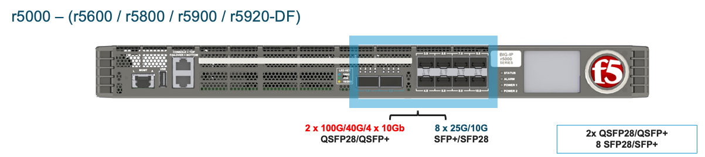
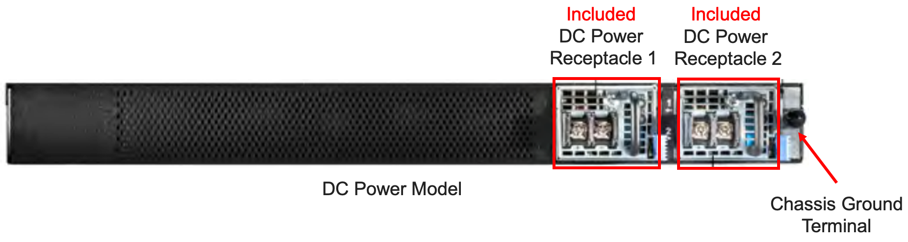
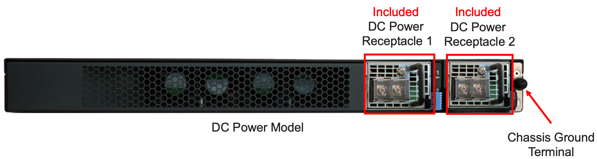

==================
rSeries Appliances
==================

r10000 Series - r10600 / r10800 / r10900
========================================

The r10000 (rSeries) is a 1RU appliance, that has 3 different licensing options that unlock more CPU resources. The r10600 is the base system, and Pay-as-you-Grow licensing options exist to upgrade to the r10800 or r10900 models.  At intial ship there is an AC power version of the appliance and DC power versions will be made available in the future. The system comes standard with 2 power supplies. The r10000 platform has 24 physical CPU cores / 48 vCPU's, however 12 of the vCPU's are dedicated to the F5OS platform layer. Additionally, some vCPU's are disabled on the r10600 and r10800 models to provide different price / performance profiles which can be unlocked through PAYG licensing. The system also supports 256GB of RAM, and has dual 1TB SSD's that are RAID-1 mirrored. Below is a picture of the r10000 hardware appliance which can be licensed as an r10600, r10800, or r10900. Its the same hardware platform for these 3 software licensing options.

.. image:: images/rseries_appliances/image1.png
  :align: center
  :scale: 150%

The r10000 Series appliance has 4 x 100Gb/40Gb ports that support QSFP28/QSFP+ optics as well as 16 x 25Gb/10Gb ports that support SFP+/SFP28 optics.

.. image:: images/rseries_appliances/image1a.png
  :align: center
  :scale: 100%

Note that adjacent highspeed (40Gb / 100Gb) ports (**1.0** & **2.0** or **11.0** & **12.0**) must be configured for the same speed. You cannot have one port at 40Gb and the other at 100Gb currently. You can have ports 1.0 & 2.0 at one speed, and 11.0 & 12.0 at another. Also, the high speed ports do not support unbundling into lower speeds (25Gb / 10Gb), only 40Gb or 100Gb are supported on those ports. For the low speed ports (**3.0** - **10.0** & **13.0** - **20.0**) any combination of 10Gb or 25Gb is supported. The SFP28 ports are backwards compatible with SFP+.

The r10000 appliance has a single 10Gb Ethernet out-of-band management port, a serial console port, and a serial (hard wired) failover port which is not utilized or supported. A USB3.0 port is also made available for recovering/reinstalling system software. LEDs will change color to indicate different port speeds, and high level LEDs provide Status, Alarm, and Power Supply Status. The appliance also has an LCD panel.

.. image:: images/rseries_appliances/image1c.png
  :align: center
  :scale: 100%

In the back of the AC power model are 2 power supplies and AC Inputs. The system ships with both power supplies included. The back of the system also has a **Chassis Ground Terminal** which can be used when performing maintenance. The fan tray on the r10000 is removable and servicable.

.. image:: images/rseries_appliances/image1d.png
  :align: center
  :scale: 100%

In the back of the DC power model (future) are 2 power supplies and DC Inputs. The system ships with both power supplies included. The back of the system also has a **Chassis Ground Terminal** which can be used when performing maintenance. The fan tray on the r10000 is removable and servicable.

.. image:: images/rseries_appliances/image1e.png
  :align: center
  :scale: 100%

In the back of the HVDC (High Voltage DC) power model (future) are 2 power supplies and DC Inputs. The system ships with both power supplies included. The back of the system also has a **Chassis Ground Terminal** which can be used when performing maintenance. The fan tray on the r10000 is removable and servicable.

.. image:: images/rseries_appliances/image1f.png
  :align: center
  :scale: 100%

r5000 Series - r5600 / r5800 / r5900
====================================

The r5000 (rSeries) is a 1RU appliance, that has 3 different licensing options that unlock more CPU resources. The r5600 is the base system, and Pay-as-you-Grow licensing options exist to upgrade to the r5800 or r5900 models.  At intial ship there is an AC power version of the appliance and DC power versions will be made available in the future. The r5000 platform has 16 physical CPU cores / 32 vCPU's, however 6 of the vCPU's are dedicated to the F5OS platform layer. Additionally, some vCPU's are disabled on the r5600 and r5800 models to provide different price / performance profiles which can be unlocked through PAYG licensing. The system also supports 128GB of RAM, and has a single 1TB SSD. There is no option for dual / redundant disks on the r5000, you'll need to go to the r10000 model if dual / redundant disk is a requirement.  Below is a picture of the r5000 hardware appliance which can be licensed as an r5600, r5800, or r5900. Its the same hardware platform for these 3 software licensing options.

.. image:: images/rseries_appliances/image2.png
  :align: center
  :scale: 100%

The r5000 appliance has 2 x 100Gb/40Gb ports that support QSFP28/QSFP+ optics as well as 8 x 25Gb/10Gb ports that support SFP+/SFP28 optics.

Note that adjacent highspeed (40Gb / 100Gb) ports (**1.0** & **2.0**) must be configured for the same speed. You cannot have one port at 40Gb and the other at 100Gb. Also, the high speed ports do not support unbundling into lower speeds (25Gb / 10Gb), only 40Gb or 100Gb are supported. For the low speed ports (**3.0** - **10.0**) any combination of 10Gb or 25Gb is supported. The SFP28 ports are backwards compatible with SFP+.

.. image:: images/rseries_appliances/image2b.png
  :align: center
  :scale: 100%

The r5000 has a single 10Gb Ethernet out-of-band management port and a serial console port, and a serial (hard wired) failover port which is not utilized or supported. A USB3.0 port is also made available for recovering/reinstalling system software. LEDs will change color to indicate different port speeds, and high level LEDs provide Status, Alarm, and Power Supply Status. The appliance also has an LCD panel.

.. image:: images/rseries_appliances/image2c.png
  :align: center
  :scale: 100%

In the back of the AC power model are 2 power supplies and AC Inputs. The system ships with one power supply included, and the second is optional. The back of the system also has a **Chassis Ground Terminal** which can be used when performing maintenance. 

.. image:: images/rseries_appliances/image2d.png
  :align: center
  :scale: 100%

In the back of the DC power model (future) are 2 power supplies and DC Inputs. The system ships with one power supply included, and the second is optional. The back of the system also has a **Chassis Ground Terminal** which can be used when performing maintenance. 

In the back of the HVDC (High Voltage DC) power model (future) are 2 power supplies and DC Inputs. The system ships with one power supply included, and the second is optional. The back of the system also has a **Chassis Ground Terminal** which can be used when performing maintenance. 

.. image:: images/rseries_appliances/image2f.png
  :align: center
  :scale: 100%

r4000 Series - r4600 / r4800
============================

The r4000 (rSeries) is a 1RU appliance, that has 2 different licensing options that unlock more CPU resources. The r4600 is the base system, and Pay-as-you-Grow licensing options exist to upgrade to the r4800 model. At intial ship there is an AC power version of the appliance and DC power versions will be made available in the future. The r4000 platform has 16 physical CPU cores and hyperthreading is not used. No CPU’s are dedicated to the F5OS platform layer which is different than the mid-range and high-end rSeries appliances. Additionally, some CPU’s are disabled on the r4600 model to provide different price / performance profiles which can be unlocked through PAYG licensing. The system also supports 128GB of RAM, and has a single 480GB SSD. There is no option for dual / redundant disk on the r4000, you'll need to go to the r10000 if dual / redundant disk is a requirement.  Below is a picture of the r4000 hardware appliance which can be licensed as an r4600 or r4800. Its the same hardware platform for these 2 software licensing options.

.. image:: images/rseries_appliances/image3.png
  :align: center
  :scale: 160%

The r4000 appliance has 4 x 10Gb/1Gb copper ports as well as 4 x 25Gb/10Gb/1Gb ports that support SFP+/SFP28 optics.

.. image:: images/rseries_appliances/image3a.png
  :align: center
  :scale: 90%

The r4000 has a single 10Gb Ethernet out-of-band management port and a serial console port, and a serial (hard wired) failover port which is not utilized or supported. A USB3.0 port is also made available for recovering / reinstalling system software. LEDs will change color to indicate different port speeds, and high level LEDs provide Status, Alarm, and Power Supply Status. The appliance also has an LCD panel.

In the back of the AC power model are 2 power supplies and AC Inputs. The system ships with one power supply included, and the second is optional. The back of the system also has a **Chassis Ground Terminal** which can be used when performing maintenance. 

.. image:: images/rseries_appliances/image3c.png
  :align: center
  :scale: 70%

In the back of the DC power model (future) are 2 power supplies and DC Inputs. The system ships with one power supply included, and the second is optional. The back of the system also has a **Chassis Ground Terminal** which can be used when performing maintenance. 

In the back of the HVDC (High Voltage DC) power model (future) are 2 power supplies and DC Inputs. The system ships with one power supply included, and the second is optional. The back of the system also has a **Chassis Ground Terminal** which can be used when performing maintenance. 

.. image:: images/rseries_appliances/image3e.png
  :align: center
  :scale: 70%

r2000 Series - r2600 / r2800
============================

The r2000 (rSeries) is a 1RU appliance, that has 2 different licensing options that unlock more CPU resources. The r2600 is the base system, and Pay-as-you-Grow licensing options exist to upgrade to the r2800 model. At intial ship there is an AC power version of the appliance and DC power versions will be made available in the future. The r2000 platform has 8 physical CPU cores and hyperthreading is not used. No CPU’s are dedicated to the F5OS platform layer which is different than the mid-range and high-end rSeries appliances. Additionally, some CPU’s are disabled on the r2600 model to provide different price / performance profiles which can be unlocked through PAYG licensing. The system also supports 64GB of RAM, and has a single 480GB SSD. There is no option for dual / redundant disk on the r2000, you'll need to to the r10000 if dual / redundant disk is a requirement. Below is a picture of the r2000 hardware appliance which can be licensed as an r2600 or r2800. Its the same hardware platform for these 2 software licensing options.

.. image:: images/rseries_appliances/image4.png
  :align: center
  :scale: 160%

The r2000 appliance has 4 x 10Gb/1Gb copper ports as well as 4 x 25Gb/10Gb/1Gb ports that support SFP+/SFP28 optics.

.. image:: images/rseries_appliances/image4a.png
  :align: center
  :scale: 90%

The r2000 has a single 10Gb Ethernet out-of-band management port and a serial console port, and a serial (hard wired) failover port which is not utilized or supported. A USB3.0 port is also made available for recovering/reinstalling system software. LEDs will change color to indicate different port speeds, and high level LEDs provide Status, Alarm, and Power Supply Status. The appliance also has an LCD panel.

In the back of the AC power model are 2 power supplies and AC Inputs. The system ships with one power supply included, and the second is optional. The back of the system also has a **Chassis Ground Terminal** which can be used when performing maintenance. 

.. image:: images/rseries_appliances/image3c.png
  :align: center
  :scale: 70%

In the back of the DC power model (future) are 2 power supplies and DC Inputs. The system ships with one power supply included, and the second is optional. The back of the system also has a **Chassis Ground Terminal** which can be used when performing maintenance. 

In the back of the HVDC (High Voltage DC) power model (future) are 2 power supplies and DC Inputs. The system ships with one power supply included, and the second is optional. The back of the system also has a **Chassis Ground Terminal** which can be used when performing maintenance. 

.. image:: images/rseries_appliances/image3e.png
  :align: center
  :scale: 70%

