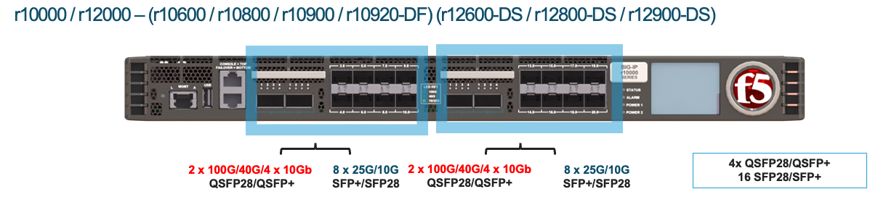

==================
rSeries Appliances
==================

r10000 Series - r10900 / r10800 / r10600
========================================

The r10000 Series is a 1RU appiance, that has 3 different licensing options that unlock more CPU resources. The r10600 is the base system, and PAYG licensing options exist to upgrade to the r10800 or r10900 models.  At intial ship there is an AC power version of the appliance and DC power versions will be made available in the future. 
The r10000 platform has 24 physical CPU cores / 48 vCPU's, however some of the vCPU's are dedicated to the F5OS platform layer. Additionally, some vCPU's are disabled on the r10600 and r10800 models to provide different levels of performance which can be unlocked through PAYG licensing. The system also supports 256GB of RAM, and has dual 1TB SSD's.

.. image:: images/rseries_appliances/image1.png
  :align: center
  :scale: 100%

The r10000 Series appliance has 4 x 100Gb/40Gb ports that are QSFP28/QSFP+ as well as 16 25Gb/10Gb ports that are SFP+/SFP28.

Note that adjacent highspeed (40Gb / 100Gb) ports (1.0 & 2.0 or 11.0 & 12.0) must be configured for the same speed. You cannot have one port at 40Gb and the other at 100Gb. You can have ports 1.0 & 2.0 at one speed, and 11.0 & 12.0 at another. Also, the high speed ports do not support unbundling into lower speeds (25Gb / 10Gb), only 40Gb or 100Gb are supported. For the low speed ports (3.0 - 10.0 & 13.0 - 20.0) any combination of 10Gb or 25Gb is supported. The SFP28 ports are backwards compatible with SFP+.

.. image:: images/rseries_appliances/image1b.png
  :align: center
  :scale: 100%

The r10000 Series unit has a single 10Gb Ethernet out-of-band management port, a serial console port, and a serial (hard wired) failover port. A USB3.0 port is also made avaiable for recovering/reinstalling system software. LEDs will change color to indicate different port speeds, and high level LEDs provide Status, Alarm, and Power Supply Status.
The appliance also has an LCD panel.

.. image:: images/rseries_appliances/image1c.png
  :align: center
  :scale: 100%

In the back of the AC Power Model are 2 power supplies and AC Inputs. The system ships with both power supplies included. The back of the system also has a **Chassis Ground Terminal** which can be used when performing maintenance. The fan tray on the r10000 Series is removable and servicable.

.. image:: images/rseries_appliances/image1d.png
  :align: center
  :scale: 100%

In the back of the DC Power Model are 2 power supplies and DC Inputs. The system ships with both power supplies included. The back of the system also has a **Chassis Ground Terminal** which can be used when performing maintenance. The fan tray on the r10000 Series is removable and servicable.

.. image:: images/rseries_appliances/image1e.png
  :align: center
  :scale: 100%

In the back of the HVDC (High Voltage DC)  Power Model are 2 power supplies and DC Inputs. The system ships with both power supplies included. The back of the system also has a **Chassis Ground Terminal** which can be used when performing maintenance. The fan tray on the r10000 Series is removable and servicable.

.. image:: images/rseries_appliances/image1f.png
  :align: center
  :scale: 100%

r5000 Series - r5900 / r5800 / r5600
====================================

The r5000 Series is a 1RU appiance, that has 3 different licensing options that unlock more CPU resources. The r5600 is the base system, and PAYG licensing options exist to upgrade to the r5800 or r5900 models.  At intial ship there is an AC power version of the appliance and DC power versions will be made available in the future. 
The r5000 platform has 16 physical CPU cores / 32 vCPU's, however some of the vCPU's are dedicated to the F5OS platform layer. Additionally, some vCPU's are disabled on the r5600 and r5800 models to provide different levels of performance which can be unlocked through PAYG licensing. The system also supports 128GB of RAM, and has a single 1TB SSD.

.. image:: images/rseries_appliances/image2.png
  :align: center
  :scale: 100%

The r5000 Series appliance has 2 x 100Gb/40Gb ports that are QSFP28/QSFP+ as well as 8 25Gb/10Gb ports that are SFP+/SFP28.

.. image:: images/rseries_appliances/image2a.png
  :align: center
  :scale: 100%

Note that adjacent highspeed (40Gb / 100Gb) ports (1.0 & 2.0) must be configured for the same speed. You cannot have one port at 40Gb and the other at 100Gb. Also, the high speed ports do not support unbundling into lower speeds (25Gb / 10Gb), only 40Gb or 100Gb are supported. For the low speed ports (3.0 - 10.0) any combination of 10Gb or 25Gb is supported. The SFP28 ports are backwards compatible with SFP+.

The r5000 Series unit has a single 10Gb Ethernet out-of-band management port, a serial console port, and a serial (hard wired) failover port. A USB3.0 port is also made avaiable for recovering/reinstalling system software. LEDs will change color to indicate different port speeds, and high level LEDs provide Status, Alarm, and Power Supply Status.
The appliance also has an LCD panel.

.. image:: images/rseries_appliances/image2c.png
  :align: center
  :scale: 100%

In the back of the AC Power Model are 2 power supplies and AC Inputs. The system ships with one power supply included, and the second is optional. The back of the system also has a **Chassis Ground Terminal** which can be used when performing maintenance. 

.. image:: images/rseries_appliances/image2d.png
  :align: center
  :scale: 100%

In the back of the DC Power Model are 2 power supplies and DC Inputs. The system ships with one power supply included, and the second is optional. The back of the system also has a **Chassis Ground Terminal** which can be used when performing maintenance. 

.. image:: images/rseries_appliances/image2e.png
  :align: center
  :scale: 100%

In the back of the HVDC (High Voltage DC)  Power Model are 2 power supplies and DC Inputs. The system ships with one power supply included, and the second is optional. The back of the system also has a **Chassis Ground Terminal** which can be used when performing maintenance. 

.. image:: images/rseries_appliances/image2f.png
  :align: center
  :scale: 100%

r4000 Series - r4800 / r4600
============================

The r4000 Series is a 1RU appliance, that has 2 different licensing options that unlock more CPU resources. The r4600 is the base system, and PAYG licensing options exist to upgrade to the r4800 model. At intial ship there is an AC power version of the appliance and DC power versions will be made available in the future. The r4000 platform has 16 physical CPU cores / 32 vCPU’s, however some of the vCPU’s are dedicated to the F5OS platform layer. Additionally, some vCPU’s are disabled on the r4600 model to provide different levels of performance which can be unlocked through PAYG licensing. The system also supports 128GB of RAM, and has a single 1TB SSD.

.. image:: images/rseries_appliances/image3.png
  :align: center
  :scale: 120%

r2000 Series - r2800 / r2600
============================

The r2000 Series is a 1RU appliance, that has 2 different licensing options that unlock more CPU resources. The r2600 is the base system, and PAYG licensing options exist to upgrade to the r4800 model. At intial ship there is an AC power version of the appliance and DC power versions will be made available in the future. The r4000 platform has 16 physical CPU cores / 32 vCPU’s, however some of the vCPU’s are dedicated to the F5OS platform layer. Additionally, some vCPU’s are disabled on the r2ππ600 model to provide different levels of performance which can be unlocked through PAYG licensing. The system also supports 128GB of RAM, and has a single 1TB SSD.

.. image:: images/rseries_appliances/image4.png
  :align: center
  :scale: 120%

Rack Mounting the Appliances
============================

An ideal environment for VELOS is to use a minimum of a 30” rack. The rackmount kits that ship with the system will support the minimum depth of 30” and can telescope to longer depths if needed. If the rack depth is less than 30” then custom rack mount kits will need to be ordered.   

.. image:: images/velos_components/image2.png
  :align: center
  :scale: 90%

