=======================================
Deploying an rSeries BIG-IP Next Tenant
=======================================

Starting with F5OS-A 1.7.0 rSeries appliances support both BIG-IP and BIG-IP Next tenants. Since F5OS-A 1.7.0 is the first release supporting BIG-IP Next, there are some caveats. Only r5000 (r5600,r5800,r5900) and r10000 (r10600,r10800,r10900) rSeries appliances support BIG-IP Next with version F5OS-A 1.7.0. F5OS-A 1.8.0 adds support for more rSeries platforms and more vCPU options for those tenants.

The initial F5OS-A 1.7.0 release also limits the number of BIG-IP Next tenants that can run on an rSeries appliance. There are 3 BIG-IP Next tenant sizes supported: 4 vCPU, 8 vCPU, and the maximum vCPU allotment for the appliance. As an example, the r5900 supports 4 vCPU, 8 vCPU, and 26 vCPU (The maximum for the platform). There is also a maximum of 2 BIG-IP Next tenants per rSeries appliance for the F5OS-A 1.7.0 release, but you can configure as many BIG-IP tenants as you wish. The table below outlines the supported tenant vCPU sizes for both BIG-IP and BIG-IP Next tenants.

+--------------+------------------------+-----------------------------------------------------+-----------------------------------------+----------------------------------+
| Platform     | # of vCPUs for Tenants | Supported vCPUs for BIG-IP Tenants                  | Supported vCPUs for BIG-IP Next Tenants | Maximum # of BIG-IP Next Tenants |
+==============+========================+=====================================================+=========================================+==================================+
| r5600        | 12                     | 1,2,4,6,8,10,12                                     | 4,8,12 – F5OS-A 1.7.0                   | 2                                |
+--------------+------------------------+-----------------------------------------------------+-----------------------------------------+----------------------------------+
| r5800        | 18                     | 1,2,4,6,8,10,12,14,16,18                            | 4,8,18 – F5OS-A 1.7.0                   | 2                                |
+--------------+------------------------+-----------------------------------------------------+-----------------------------------------+----------------------------------+
| r5900        | 26                     | 1,2,4,6,8,10,12,14,16,18,20,22,24,26                | 4,8,26 – F5OS-A 1.7.0                   | 2                                |    
+--------------+------------------------+-----------------------------------------------------+-----------------------------------------+----------------------------------+
| r10600       | 24                     | 1,2,4,6,8,10,12,14,16,18,20,22,24                   | 4,8,24 – F5OS-A 1.7.0                   | 2                                |    
+--------------+------------------------+-----------------------------------------------------+-----------------------------------------+----------------------------------+
| r10800       | 28                     | 1,2,4,6,8,10,12,14,16,18,20,22,24,26,28             | 4,8,28 – F5OS-A 1.7.0                   | 2                                |    
+--------------+------------------------+-----------------------------------------------------+-----------------------------------------+----------------------------------+
| r10900       | 36                     | 1,2,4,6,8,10,12,14,16,18,20,22,24,26,28,30,32,34,36 | 4,8,36 – F5OS-A 1.7.0                   | 2                                |    
+--------------+------------------------+-----------------------------------------------------+-----------------------------------------+----------------------------------+

F5OS-A 1.8.0 adds BIG-IP Next support for the rSeries r2000/r4000 devices (Early Access Mode), as well as the r12000-DS platforms. A future F5OS-A release will add BIG-IP Next support for the rSeries FIPS platforms (r5920-DF/r10920-DF). 

.. Note:: There will be a phasing of supported vCPU options for BIG-IP Next and maximum numbers of Next Tenants per device across future F5OS and BIG-IP Next releases. 

Although F5OS-A 1.8.0 adds support for BIG-IP Next on specific rSeries platforms, there is also a requirement to run a newer version of BIG-IP Next Central Manager (20.3) to enable BIG-IP Next support of on the newer rSeries platforms. 

+--------------+------------------------+-----------------------------------------------------------------------------------------+--------------------------------------------------------+-------------------------------------------+
| Platform     | # of vCPUs for Tenants | Supported vCPUs for BIG-IP Tenants                                                      | Supported vCPUs for BIG-IP Next Tenants (F5OS-A 1.8.0) | Maximum # of BIG-IP Next Tenants          |
+==============+========================+=========================================================================================+========================================================+===========================================+
| r2600 (EA)   | 4                      | 4                                                                                       | 4                                                      | 1                                         |
+--------------+------------------------+-----------------------------------------------------------------------------------------+--------------------------------------------------------+-------------------------------------------+
| r2800 (EA)   | 8                      | 4,8                                                                                     | 4,8                                                    | 1                                         |
+--------------+------------------------+-----------------------------------------------------------------------------------------+--------------------------------------------------------+-------------------------------------------+
| r4600 (EA)   | 12                     | 4,8,12                                                                                  | 4,8                                                    | 1                                         |
+--------------+------------------------+-----------------------------------------------------------------------------------------+--------------------------------------------------------+-------------------------------------------+
| r4800 (EA)   | 16                     | 4,8,12,16                                                                               | 4,8,16                                                 | 1                                         |
+--------------+------------------------+-----------------------------------------------------------------------------------------+--------------------------------------------------------+-------------------------------------------+
| r5600        | 12                     | 1,2,4,6,8,10,12                                                                         | 4,8,12                                                 | 2                                         |
+--------------+------------------------+-----------------------------------------------------------------------------------------+--------------------------------------------------------+-------------------------------------------+
| r5800        | 18                     | 1,2,4,6,8,10,12,14,16,18                                                                | 4,8,12,18                                              | 2                                         |
+--------------+------------------------+-----------------------------------------------------------------------------------------+--------------------------------------------------------+-------------------------------------------+
| r5900        | 26                     | 1,2,4,6,8,10,12,14,16,18,20,22,24,26                                                    | 4,8,12,18,26                                           | 2                                         |
+--------------+------------------------+-----------------------------------------------------------------------------------------+--------------------------------------------------------+-------------------------------------------+
| r5920-DF     | 26                     | 1,2,4,6,8,10,12                                                                         |  N/A                                                   | N/A                                       |
+--------------+------------------------+-----------------------------------------------------------------------------------------+--------------------------------------------------------+-------------------------------------------+
| r10600       | 24                     | 1,2,4,6,8,10,12,14,16,18,20,22,24                                                       | 4,8,24                                                 | 2                                         |
+--------------+------------------------+-----------------------------------------------------------------------------------------+--------------------------------------------------------+-------------------------------------------+
| r10800       | 28                     | 1,2,4,6,8,10,12,14,16,18,20,22,24,26,28                                                 | 4,8,24,28                                              | 2                                         |
+--------------+------------------------+-----------------------------------------------------------------------------------------+--------------------------------------------------------+-------------------------------------------+
| r10900       | 36                     | 1,2,4,6,8,10,12,14,16,18,20,22,24,26,28,30,32,34,36                                     | 4,8,24,28,36                                           | 2                                         |
+--------------+------------------------+-----------------------------------------------------------------------------------------+--------------------------------------------------------+-------------------------------------------+
| r10920-DF    | 36                     | 1,2,4,6,8,10,12,14,16,18,20,22,24,26,28,30,32,34,36                                     | N/A                                                    | N/A                                       |
+--------------+------------------------+-----------------------------------------------------------------------------------------+--------------------------------------------------------+-------------------------------------------+
| r12600-DS    | 44                     | 1,2,4,6,8,10,12,14,16,18,20,22,24,26,28,30,32,34,36,38,40,42,44                         | 4,8,44                                                 | 5                                         |
+--------------+------------------------+-----------------------------------------------------------------------------------------+--------------------------------------------------------+-------------------------------------------+
| r12800-DS    | 52                     | 1,2,4,6,8,10,12,14,16,18,20,22,24,26,28,30,32,34,36,38,40,42,44,46,48,50,52             | 4,8,52                                                 | 5                                         |
+--------------+------------------------+-----------------------------------------------------------------------------------------+--------------------------------------------------------+-------------------------------------------+
| r12900-DS    | 60                     | 1,2,4,6,8,10,12,14,16,18,20,22,24,26,28,30,32,34,36,38,40,42,44,46,48,50,52,54,56,58,60 | 4,8,60                                                 | 5                                         |
+--------------+------------------------+-----------------------------------------------------------------------------------------+--------------------------------------------------------+-------------------------------------------+

Tenant Image Types
==================

For BIG-IP Next on rSeries, there is a single tenant image type that can be obtained from downloads.f5.com. On the downloads site, you will see a tar.bundle file which you can download and verify using one of the available signature files. In the example below the file **BIG-IP-Next-20.3.0-2.716.2+0.0.50.tar.bundle** is the image file that you will use to deploy BIG-IP Next tenants on rSeries appliances or VELOS chassis.

.. image:: images/rseries_deploying_a_bigip_next_tenant/image1.png
  :align: center
  :scale: 70% 

You can either download the file to a local machine, and then upload to your rSeries device, or if your rSeries appliance has Internet access, you can **Copy Download Link** and use that url directly on your rSeries appliance.

.. image:: images/rseries_deploying_a_bigip_next_tenant/image2a.png
  :align: center
  :scale: 70% 

BIG-IP Next Tenant Deployments
==============================

BIG-IP Next Tenants can easily be deployed via the F5OS CLI, webUI, or API or from the BIG-IP Next Central Manager Console. If you choose to create the BIG-IP Next tenant locally on your rSeries appliance, you will be able to import it into Central Manager, however it cannot have any l4-l7 application configuration defined. When Central Manager imports a BIG-IP Next tenant that has already been created, it will wipe out any application layer configuration as part of the import process.

You will also need to change the default password on the Next tenant via an API call before importing it into Central Manager. This section will step through the steps to create a tenant locally via the rSeries/F5OS CLI, and then changing the password via API, and finally importing the BIG-IP Next tenant/instance into Central Manager.

Although this is a supported workflow, it is much easier to create an rSeries provider on Central Manager, and then manage the Next instance lifecycle from Central Manager, vs creating the tenant locally on rSeries and then importing into Central Manager. 

Both local and Central Manager deployment options will be covered in this section starting with the preferred method of tenant/instance creation via the Central Manager rSeries Provider.

BIG-IP Next Tenant Deployment via Central Manager
-------------------------------------------------

BIG-IP Next tenants (or instances as they are called in Central Manager) can be deployed using an rSeries **Provider**. a Provider in Central Manager provides connectivity to resources such as VELOS, rSeries, or VMware where BIG-IP Next instances can be deployed. 

If you need instructions on installing Central Manager, or general BIG-IP Next documents refer to the link below.

`BIG-IP Next Documentation <https://clouddocs.f5.com/bigip-next/latest/>`_

Setting up an rSeries Provider in Central Manager
^^^^^^^^^^^^^^^^^^^^^^^^^^^^^^^^^^^^^^^^^^^^^^^^^

After logging into Central Manager, you can setup an rSeries Provider by going to the **Manage Instances** button on the main home screen. 

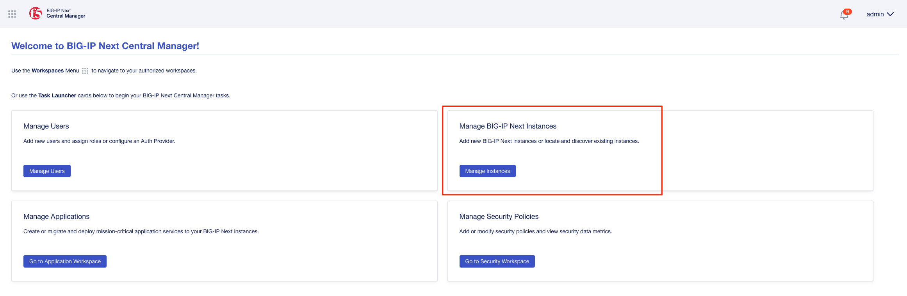

Alternatively, select the **Infrastructure** option by using the drop-down in the upper left-hand corner of the webUI.

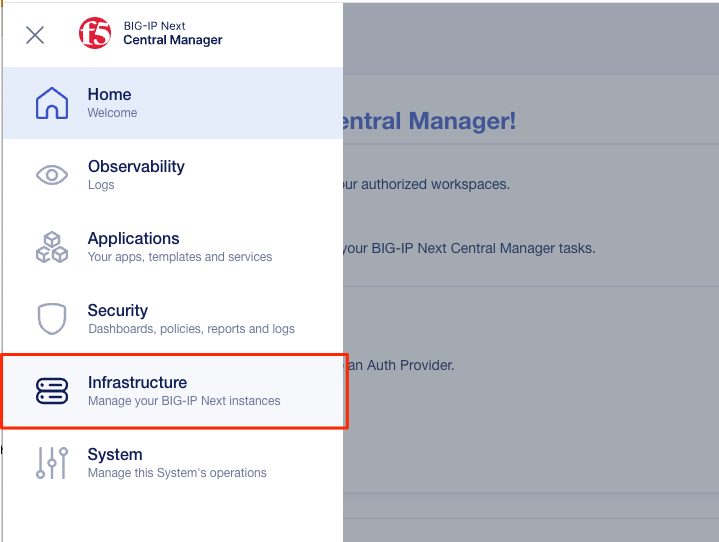

Once on the Infrastructure page, select **Providers**, and then select the **Start Adding Providers** option.
 
.. image:: images/rseries_deploying_a_bigip_next_tenant/providers.png
  :align: center
  :scale: 70% 

From the drop-down menu, select **rSeries**.

Next, provide a name for the Provider, a Hostname or IP address, and you can also optionally change the default port where the rSeries API is reachable. The default is 8888, but you can also change this to port 443. When done, click the **Connect** button.

When prompted, enter the **Username** and **Password** for the rSeries device you are connecting to. Then click **Submit**.

You may be prompted to accept the fingerprint of the device. Click **Accept**.

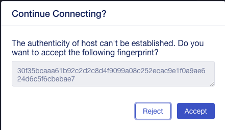

The rSeries device will then be added as a Provider into Central Manager, which means you can now create BIG-IP Next instances directly from Central Manager instead of going directly to the rSeries device. 

Creating a BIG-IP Next Instance on rSeries r5k, r10k, r12k Models via the rSeries Provider in Central Manager
^^^^^^^^^^^^^^^^^^^^^^^^^^^^^^^^^^^^^^^^^^^^^^^^^^^^^^^^^^^^^^^^^^^^^^^^^^^^^^^^^^^^^^^^^^^^^^^^^^^^^^^^^^^^^

BIG-IP Next Central Manager refers to BIG-IP Next as **Instances**. This is because the BIG-IP Next Instance could be a **Tenant** running on an F5OS-based platform (rSeries, VELOS), or it could be a VE running on a hypervisor such as VMware. The term Instance is a generic term which will apply to both types of environments. To create a BIG-IP Next Instance go to **Instances -> My Instances**, and then click the **Start Adding Instances** button.

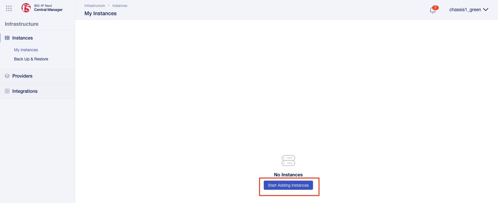

The next option allows you to import a previously created instance, or to create a new one. Select **Create a New Instance**.

Review the requirements of what you'll need before proceeding, then click **Next**.

Enter a hostname for the BIG-IP Next instance, and an optional description. Then, in the drop-down box select **rSeries Standalone**, and then click the **Start Creating** button.

From the **rSeries Provider** section select the rSeries device that you added previously. Then click **Next**.

Next configure the rSeries Properties, which includes **Disk Size**, **CPU Cores**, **Tenant Image Name**, **Tenant Deployment File**, and **VLAN IDs**. When finished, click the **Done** button.

.. Note:: The appropriate BIG-IP Next tenant image file should be loaded on the rSeries platform so that the Tenant Image Name and Tenant Deployment File can be selected in this screen. Currently there is no way to upload the image from Central Manager. 

Enter the out-of-band **Management IP address**, **Network Prefix Length**, and **Gateway IP Address** and then click **Next**.

In the next section, you will setup the in-band networking for the Next instance. Here, you will map the internal **L1 Networks** inside the Next instance to VLANs and then add IP addresses to them. These would be the equivalent of self-ip addresses on BIG-IP.

For VELOS and rSeries r5000 and higher appliances only a single data interface (L1 Network) is surfaced to the BIG-IP Next tenant. 

.. image:: images/rseries_deploying_a_bigip_next_tenant/next-internal-networking-diagram.png
  :align: center
  :scale: 70% 

Below is an example of an r10900 device. Click on **L1 Networks** and note that the **DefaultL1Network** already exists and is mapped to the internal interface 1.1. Also note that it has zero VLANs assigned. 

Click on **VLANs** and note that the VLANs you previously assigned to the instance are listed, however they are not mapped to any L1 Networks yet.

In the drop-down box for L1 Networks select the **DefaultL1Network** for all your VLANs, and then click **Next**.

Finally, you must assign an IP addresses to each VLAN. Click on **IP Addresses**, and then click **Create** for each VLAN.

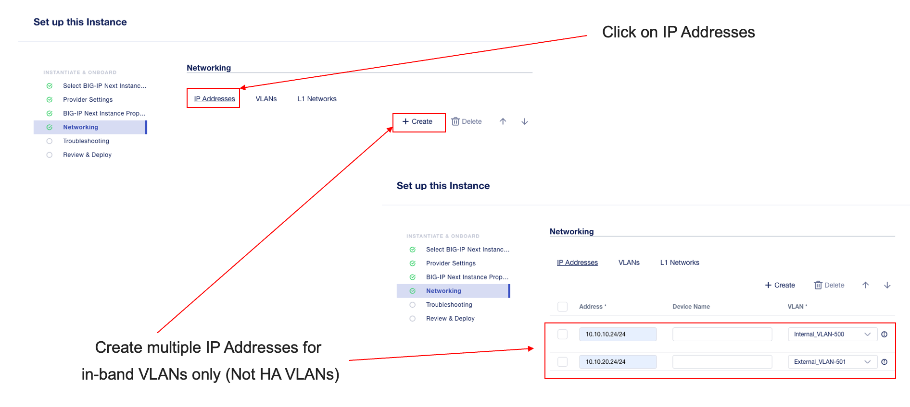

You'll need to add an IP address in <x.x.x.x/xx> format for each VLAN before you can assign the VLAN from the drop-down box. Leave the **Device Name** field blank. When finished, click **Next**.

In the **Troubleshooting** section you will setup a new local username and password for the Next instance that you can utilize for direct troubleshooting access. The default username and password will no longer work. Note that once an instance is under central management all configurations should be done though Central Manager, and not direct to the Next instance. Click **Next**.

Review all the changes, and then click the **Deploy** button.

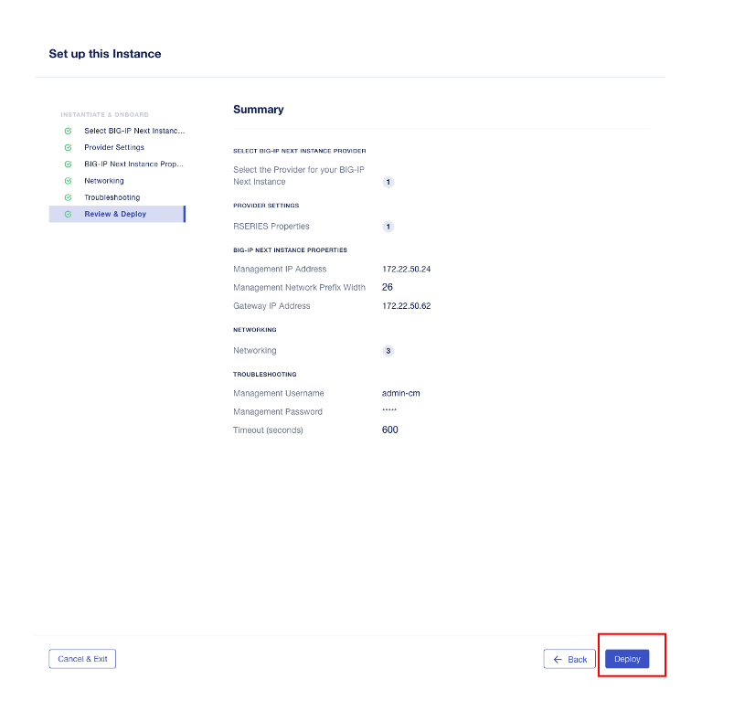

You can then monitor the status of the instance being created. It will take some time for the deployment to complete.

Creating a BIG-IP Next Instance on rSeries r2k, r4k Models via the rSeries Provider in Central Manager
^^^^^^^^^^^^^^^^^^^^^^^^^^^^^^^^^^^^^^^^^^^^^^^^^^^^^^^^^^^^^^^^^^^^^^^^^^^^^^^^^^^^^^^^^^^^^^^^^^^^^^

With the current versions of F5OS-A 1.8.0 and BIG-IP Next 20.3 support for Next on the r2k and r4k platforms is considered Early Access (EA). It is not intended for production environments yet. There are some limitations / caveats in these two releases which will be addressed in upcoming releases. This section will cover the current limitations, and how to properly configure Next on the r2k / r4k platforms, including HA mode. 

Current Limitations and Caveats

- Currently Link Aggregation Groups (LAGs) are not supported on the r2k / r4k when using BIg-IP Next tenants/instances.
- For HA configurations the control plane HA link must be a dedicated link, and it must be the first "up" interface on that rSeries platform.
- When configuring standalone instances from Central Manager, both instances must be configured with the exact same name if they will be joined in an HA pair.
- VLAN naming must be configured identically on any r2k/r4k platforms that will have tenants/instances in an HA pair.
- Within Central Manager, interfaces for L1 Networks must use L1 Network style numbering (1.1, 1.2, 1.3 etc..) instead of the physical interface numbering (1.0, 2.0, 3.0 etc...) 
- When configuring a standalone instance from Central Manager, all VLAN naming between nodes in an HA cluster must be identical.
- When configuring a standalone instance from Central Manager, all L1 Network naming between nodes in an HA cluster must be identical.
- When configuring a standalone instance from Central Manager, all VLANs must be configured in the Default VRF.
- When configuring a standalone instance from Central Manager, IP addresses should only be configured for non-HA networks. i.e. don't configure IP addresses for CPHA and DPHA networks when defining the standalone instances.

BIG-IP Next Central Manager refers to BIG-IP Next as **Instances**. This is because the BIG-IP Next Instance could be a **Tenant** running on an F5OS-based platform (rSeries, VELOS), or it could be a VE running on a hypervisor such as VMware. The term Instance is a generic term which will apply to both types of environments. To create a BIG-IP Next Instance go to **Instances -> My Instances**, and then click the **Start Adding Instances** button.

The next option allows you to import a previously created instance, or to create a new one. Select **Create a New Instance**.

Review the requirements of what you'll need before proceeding, then click **Next**.

Enter a hostname for the BIG-IP Next instance, and an optional description. Then, in the drop-down box select **rSeries Standalone**, and then click the **Start Creating** button. From the **rSeries Provider** section select the rSeries device that you added previously. Then click **Next**.

.. Note:: In the current F5OS-A 1.8.0 and BIG-IP Next releases the hostname must be exactly the same for any standalone nodes that wil be later joined as part of an HA cluster.

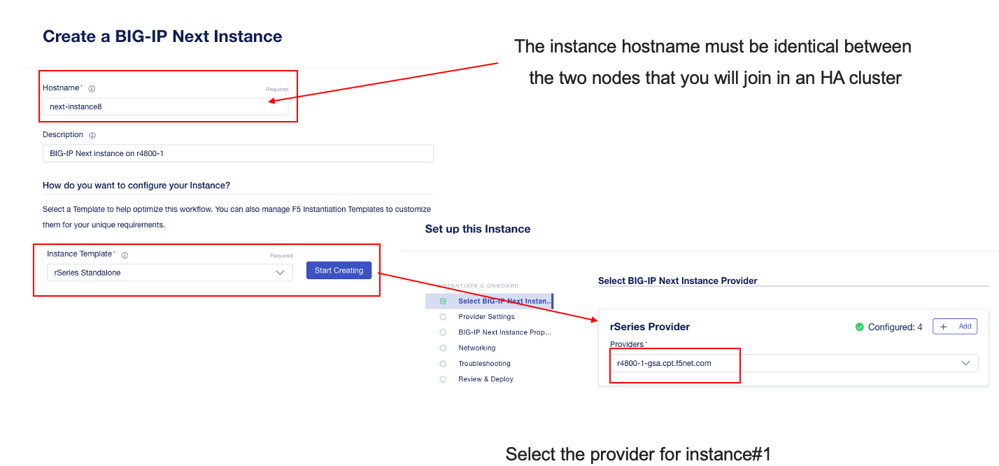

Next configure the rSeries Properties, which includes **Disk Size**, **CPU Cores**, **Tenant Image Name**, **Tenant Deployment File**, and **VLAN IDs**. You will need one or more in-band VLANs for client/server traffic, and one VLAN for data plane HA traffic, and another for control plane HA traffic. When finished, click the **Done** button. Enter the out-of-band **Management IP address**, **Network Prefix Length**, and **Gateway IP Address** and then click **Next**.

.. Note:: The appropriate BIG-IP Next tenant image file should be loaded on the rSeries platform so that the Tenant Image Name and Tenant Deployment File can be selected in this screen. Currently there is no way to upload the image from Central Manager. 

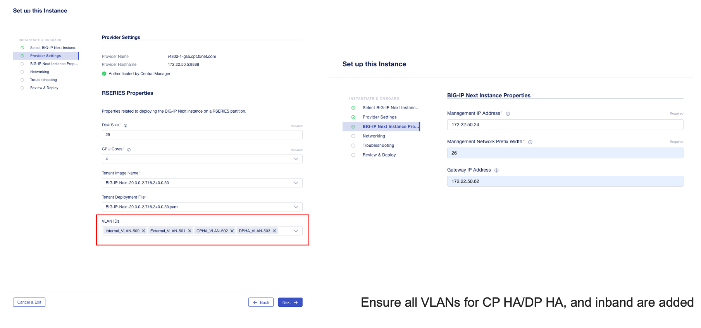

In the next section, you will setup the in-band networking for the Next instance. Here, you will map the internal **L1 Networks** inside the Next instance to VLANs and then add IP addresses to them. These would be the equivalent of self-ip addresses on BIG-IP.

BIG-IP Next support for the r2000/r4000 models is in an Early Access (EA) mode for F5OS 1.8.0. There are restrictions related to configuration of interfaces and LAGs with this release, that will be addressed in follow-on F5OS and BIG-IP Next releases. What is shown here is what the current support is in the EA versions of F5OS-A 1.8.0 in combination with BIG-IP Next v20.3. 

In the EA release the following restrictions apply to the r2000/r4000 appliances.

- LAGs are not supported with BIG-IP Next 
- For HA configurations the Control Plane VLAN must run on a dedicated physical interface, and it must be the lowest numbered "up" interface. 

Both restrictions will be addressed in future releases.

In order to understand how to configure the networking when onboarding a BIG-IP Next tenant it is important to understand the mapping of physical interface numbering on the r2000/r4000 platforms and how they map to internal BIG-IP Next L1 Networking interfaces. In the diagram below, you can see that F5OS physical interface numbering follows the format of:

- 1.0, 2.0, 3.0, 4.0, 5.0, 6.0, 7.0, 8.0

Inside the BIG-IP Next instance/tenant these physical interfaces must be mapped to L1 Network interfaces manually. You only need to create L1 Networks for ports that you are actually using, unused ports do not need L1 networks created. In the diagram below, you can see that Next L1 Networking interface numbering follows the format of:

- 1.1, 1.2, 1.3, 1.4, 1.5, 1.6, 1.7, 1.8

Unlike the r5000 and higher rSeries models, L1 Networks are not automatically created. You will need to create an L1 Network for each physical interface you intend to use. You are free to name the L1 Networks however you wish but for the sake of simplicity we recommend using naming as seen below.  Remember that they must be identical names and interfaces on both instances in an HA cluster. For this example, the following L1 network names and interface mappings are used.

+------------------+-----------------------------+
| L1 Network Name  | L1 Network Interface Number |
+==================+=============================+
| CPHA             | 1.5                         |
+------------------+-----------------------------+
| DPHA             | 1.6                         |
+------------------+-----------------------------+
| INBAND           | 1.7                         |
+------------------+-----------------------------+

.. NOTE:: In this example, the first "up" interface on both r4k units is interface 5.0 (at the F5OS layer), however we will use the L1 Networking style numbering of 1.5 for the L1 Networking interfaces. 

Below is an example of an r4800 device. Note there are no default L1 Networks defined. Click on **Create** and create multiple **L1Networks**. Ideally, you should create one for each physical interface that is going to be used. In this case we will have 3 total. Give Each L1 Network a descriptive name (and it must be the same names between members of an HA cluster), and then map it to the L1 Network interface that maps to the F5OS physical interface you are using. Be sure to use the L1 Networking numbering format. i.e. 1.1, 1.2, 1.3 etc...

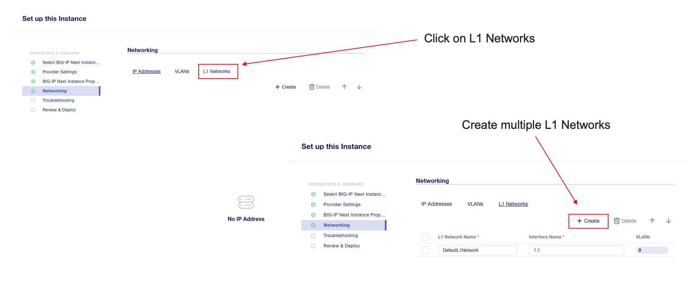

Click on **VLANs** and note that the VLANs you previously assigned to the instance are listed, however they are not mapped to any L1 Networks yet. In the drop-down box for L1 Networks select the proper L1 Network for all your VLANs, and then click **Next**.

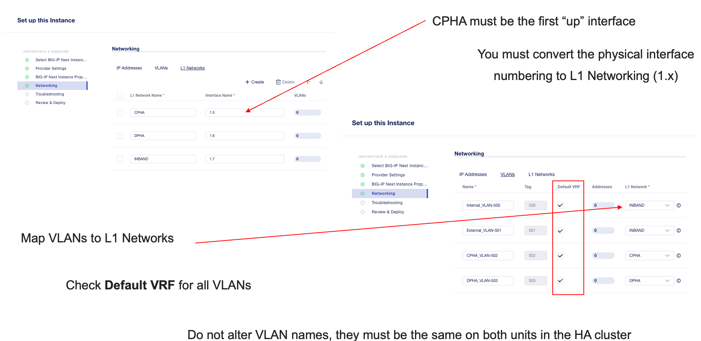

Finally, you must assign an IP addresses to each VLAN. Click on **IP Addresses**, and then click **Create** for each VLAN. You'll need to add an IP address in <x.x.x.x/xx> format for each VLAN before you can assign the VLAN from the drop-down box. Leave the **Device Name** field blank. When finished, click **Next**. Do not assign IP address to the CP and DP HA L1 Networks. You'll do that later in the HA setup.

In the **Troubleshooting** section you will setup a new local username and password for the Next instance that you can utilize for direct troubleshooting access. The default username and password will no longer work. Note that one an instance is under central management all configurations should be done though Central Manager, and not direct to the Next instance. Click **Next**.

Review all the changes, and then click the **Deploy** button.

You can then monitor the status of the instance being created. It will take some time for the deployment to complete.

You can then begin creating the second standalone instance on your other rSeries device. The **Hostname** must be identical to the first Next instance that was created. (This is a temporary restriction that will be addressed in a subsequent release). Select the provider for the second rSeries device.

Configure the rSeries Properties exactly the same as the first instance, and then configure a unique management IP address for the instance.

Configure the L1 Networks and VLANs exactly the same as the first Next instance.   

.. image:: images/rseries_deploying_a_bigip_next_tenant/second-vlans.png
  :align: center
  :scale: 70% 

Configure unique IP address for your in-band VLANs, and do not add IP addresses for the CP or DP HA VLANs. This will be done later when you enable HA.

Finally, review the configuration and then press the **Deploy** button.

.. image:: images/rseries_deploying_a_bigip_next_tenant/review-and-deploy-second.png
  :align: center
  :scale: 70% 

You'll then see the second instance being created.

Once both standalone Next instances are active, you can begin the process to enable HA to join them in a cluster. On one of the instance thick the **Standalone** hyperlink in the **Mode** column. This will take you to a new screen where you can review the requirements for the HA setup. Click the **Enable HA** button. 

On the **HA Nodes** screen, select the second instance (with the same name) from the **Available Standalone Instances** drop-down menu.

On the **HA VLANs** page Select your CP and DP HA VLANs from the drop-down boxes. Be sure to map the proper VLANs to the Control Plane and Data Plane. ON the next screen you will provide a **HA Name** and floating **HA Management Address**. This is the IP address that will float between the HA cluster on the management network to whichever node is active. Finally, configure your **Control Plane Address** and ** Data Plane Primary Address for each node in the HA cluster. Then click **Next**.

You should then see you internal and external VLANs. You can click on the Internal VLAN to configure the HA IP addresses. Click the plus sign **+** two times to create two more self-IPs.

On the first line change the drop-down box to **Active Node IP Address**, on the second line change the drop-down box to **Standby Node IP Address**, and on the third line change the drop-down box to **Floating IP Address**. Then configure the proper IP addresses for the Internal VLAN. Then click and repeat the same process on the External VLAN.

.. image:: images/rseries_deploying_a_bigip_next_tenant/self-ips.png
  :align: center
  :scale: 70%

On the first line change the drop-down box to **Active Node IP Address**, on the second line change the drop-down box to **Standby Node IP Address**, and on the third line change the drop-down box to **Floating IP Address**. Then configure the proper IP addresses for the External VLAN. Both VLANs should now show a green status.

.. image:: images/rseries_deploying_a_bigip_next_tenant/self-ips-external.png
  :align: center
  :scale: 70%

Finally, review the configuration and click the **Deploy HA** button. In the **My Instances** screen, eventually the two standalone instances will merge into one instance with the **Mode** set to **HA**. Central Manager will now manage the HA cluster as one entity via the floating management IP address. There is no need to manage the nodes individually or worry about synchronizing configurations as is the case with BIG-IP. This shows the simplified HA management provided by Central Manager.

BIG-IP Next Tenant Deployment via F5OS CLI
==========================================

If you choose to create the BIG-IP Next tenant locally on your rSeries appliance, you will be able to import it into Central Manager, however it cannot have any l4-l7 application configuration defined. When Central Manager imports a BIG-IP Next tenant that has already been created, it will wipe out any application layer configuration as part of the import process.

You will also need to change the default password on the Next tenant via an API call before importing it into Central Manager. This section will step through the steps to create a tenant locally via the rSeries/F5OS CLI, and then changing the password via API, and finally importing the BIG-IP Next tenant/instance into Central Manager.

Although this is a supported workflow, it is much easier to create an rSeries provider on Central Manager, and then manage the Next instance lifecycle from Central Manager, vs creating the tenant locally on rSeries and then importing into Central Manager.

Uploading a BIG-IP Next Tenant Image via F5OS CLI
-------------------------------------------------

BIG-IP Next tenant software images are loaded directly into the F5OS platform layer in the same manner as BIG-IP tenant images. For the initial release of BIG-IP Next on rSeries, supported tenant versions are v20.1 and later. 

Before deploying any BIG-IP Next tenant, you must ensure you have a proper tenant software release loaded into the F5OS platform layer. If an HTTPS/SCP/SFTP server is not available, you may upload a BIG-IP Next tenant image using SCP directly to the F5OS platform layer. Simply SCP an image to the out-of-band management IP address using the admin account and a path of **IMAGES**. There are also other upload options available in the webUI (Upload from Browser) or API (HTTPS/SCP/SFTP). Below is an example of using SCP from a remote client. Note, in releases prior to F5OS-A 1.8.0 you can only upload tenant images using SCP via the root account. In F5OS-A 1.8.0 and later the admin account will be used to SCP tenant images, and root access will no longer be required.

.. code-block:: bash

    prompt% scp BIG-IP-Next-20.1.0-2.279.0+0.0.75.tar.bundle root@10.255.2.43:IMAGES

You may also import the BIG-IP Next tenant image file from the F5OS CLI. Use the **file import** command to get the tenant image file from a remote HTTPS server or from a remote server over SCP or SFTP. Below is an example of importing from a remote HTTPS server. Note the target directory should be **images/tenant**:

.. code-block:: bash

    Boston-r10900-1# file import remote-host 10.255.0.142 remote-file /upload/BIG-IP-Next-20.1.0-2.279.0+0.0.75.tar.bundle local-file images/tenant/BIG-IP-Next-20.1.0-2.279.0+0.0.75.tar.bundle username corpuser insecure
    Value for 'password' (<string>): ********
    result File transfer is initiated.(images/tenant/BIG-IP-Next-20.1.0-2.279.0+0.0.75.tar.bundle)

If a remote HTTPS server is not available, you may also import the file from the CLI over SCP by adding the **protocol scp** option to the command line:

.. code-block:: bash

    Boston-r10900-1# file import remote-host 10.255.0.142 remote-file /var/www/server/1/upload/BIG-IP-Next-20.1.0-2.279.0+0.0.75.tar.bundle local-file images/tenant/BIG-IP-Next-20.1.0-2.279.0+0.0.75.tar.bundle username root insecure protocol scp
    Value for 'password' (<string>): ********
    result File transfer is initiated.(images/tenant/BIG-IP-Next-20.1.0-2.279.0+0.0.75.tar.bundle)

The command **file transfer-status** will provide details of the transfer progress and any errors:

.. code-block:: bash

    Boston-r10900-1# file import remote-host 10.255.0.142 remote-file /var/www/server/1/upload/BIG-IP-Next-20.1.0-2.279.0+0.0.75.tar.bundle local-file images/tenant/BIG-IP-Next-20.1.0-2.279.0+0.0.75.tar.bundle username root insecure protocol scp
    Value for 'password' (<string>): ********
    result File transfer is initiated.(images/tenant/BIG-IP-Next-20.1.0-2.279.0+0.0.75.tar.bundle)

    Boston-r10900-1# show file transfer-operations
    LOCAL FILE PATH                                               REMOTE HOST   REMOTE FILE PATH                                                         OPERATION    PROTOCOL  STATUS                                TIMESTAMP                 
    --------------------------------------------------------------------------------------------------------------------------------------------------------------------------------------------------------------------------------------------
    images/import/BIGIP-15.1.4-0.0.47.ALL-VELOS.qcow2.zip.bundle  10.255.0.142  /upload/BIGIP-15.1.4-0.0.47.ALL-VELOS.qcow2.zip.bundle                   Import file  HTTPS              Completed                    Wed Dec 22 22:11:47 2021  
    images/tenant/BIGIP-15.1.4-0.0.47.ALL-VELOS.qcow2.zip.bundle  10.255.0.142  /upload/BIGIP-15.1.4-0.0.47.ALL-VELOS.qcow2.zip.bundle                   Import file  HTTPS     Unauthorized Request, HTTP Error 401  Wed Dec 22 22:21:59 2021  
    images/tenant/BIGIP-15.1.4-0.0.47.ALL-VELOS.qcow2.zip.bundle  10.255.0.142  /upload/BIGIP-15.1.4-0.0.47.ALL-VELOS.qcow2.zip.bundle                   Import file  SCP       Failed to recv file                   Wed Dec 22 22:22:57 2021  
    images/tenant/BIGIP-15.1.4-0.0.47.ALL-VELOS.qcow2.zip.bundle  10.255.0.142  /var/www/server/1/upload/BIGIP-15.1.4-0.0.47.ALL-VELOS.qcow2.zip.bundle  Import file  SCP       In Progress (7.0%)                    Wed Dec 22 22:25:14 2021  

You can view the current tenant images and their status in the F5OS CLI by using the **show images** command:

.. code-block:: bash

    r10900-2# show images
                                                    IN                                    
    NAME                                            USE    TYPE                STATUS     
    --------------------------------------------------------------------------------------
    BIG-IP-Next-20.1.0-2.279.0+0.0.75               false  helm-image          processed  
    BIG-IP-Next-20.1.0-2.279.0+0.0.75.tar.bundle    false  helm-bundle         verified   
    BIG-IP-Next-20.1.0-2.279.0+0.0.75.yaml          false  helm-specification  verified   
    BIGIP-15.1.5-0.0.8.ALL-F5OS.qcow2.zip.bundle    false  vm-image            verified   
    BIGIP-15.1.6.1-0.0.6.ALL-F5OS.qcow2.zip.bundle  false  vm-image            verified   
    BIGIP-17.1.0.1-0.0.4.ALL-F5OS.qcow2.zip.bundle  false  vm-image            verified   

    r10900-2# 

Creating a BIG-IP Next Tenant via F5OS CLI
------------------------------------------

BIG-IP Next tenant lifecycle can be fully managed via the CLI using the **tenants** command in **config** mode. Using command tab completion and question marks will help display all the tenant options. Enter **config** mode and enter the command **tenants tenant <tenant-name> config ** where **<tenant-name>** is the name of the tenant you would like to create. Then use tab completion and question marks to see the various options that can be configured for the tenant as seen below:

.. code-block:: bash

  r10900-1-gsa(config)# tenants tenant next-tenant config ?
  Possible completions:
    appliance-mode           Appliance mode can be enabled/disabled at tenant level
    cryptos                  Enable crypto devices for the tenant.
    dag-ipv6-prefix-length   Tenant default value of IPv6 networking mask used by disaggregator algorithms
    gateway                  User-specified gateway for the tenant static mgmt-ip.
    image                    User-specified image for tenant.
    mac-data                 
    memory                   User-specified memory in MBs for the tenant.
    mgmt-ip                  User-specified mgmt-ip for the tenant management access.
    nodes                    User-specified node-number(s) in the partition to schedule the tenant.
    prefix-length            User-specified prefix-length for the tenant static mgmt-ip.
    running-state            User-specified desired state for the tenant.
    storage                  User-specified storage information
    type                     Tenant type.
    vcpu-cores-per-node      User-specified number of logical cpu cores for the tenant.
    virtual-wires            User-specified virtual-wires from virtual-wire table for the tenant.
    vlans                    User-specified vlan-id from vlan table for the tenant.
  r10900-1-gsa(config)#

Below is an example of a fully configured tenant specifying all the required options. Bes sure to commit after making any changes.

.. code-block:: bash

  r10900-1-gsa(config)# tenants tenant next-tenant config type BIG-IP-Next image BIG-IP-Next-20.3.0-2.716.2+0.0.50 deployment-file BIG-IP-Next-20.3.0-2.716.2+0.0.50.yaml mgmt-ip 172.22.50.31 prefix-length 26 gateway 172.22.50.62 storage size 25 nodes 1 vcpu-cores-per-node 4 memory 14848 vlans [ 500 501 502 ] running-state deployed  
  r10900-1-gsa(config-tenant-next-tenant)#
  r10900-1-gsa(config-tenant-next-tenant)# commit
  Commit complete.
  r10900-1-gsa(config-tenant-next-tenant)#

Validating BIG-IP Next Tenant Status via F5OS CLI
-------------------------------------------------

After the tenant is created you can run the command **show running-config tenants** to see what has been configured:

.. code-block:: bash

 r10900-1-gsa# show running-config tenants 
  tenants tenant next-tenant
  config type            BIG-IP-Next
  config image           BIG-IP-Next-20.3.0-2.716.2+0.0.50
  config deployment-file BIG-IP-Next-20.3.0-2.716.2+0.0.50.yaml
  config nodes           [ 1 ]
  config mgmt-ip         172.22.50.31
  config prefix-length   26
  config gateway         172.22.50.62
  config dag-ipv6-prefix-length 128
  config vlans           [ 500 501 502 ]
  config cryptos         enabled
  config vcpu-cores-per-node 4
  config memory          14848
  config storage size 25
  config running-state   deployed
  config mac-data mac-block-size one
  config appliance-mode disabled
  !
  r10900-1-gsa#

To see the actual status of the tenants, issue the CLI command **show tenants** or optionally you can specify a specific tenant as seen below. You can keep reissuing the command to see the BIG-IP Next pods start up and change status until they all show **Running** status.

.. code-block:: bash

  r10900-1-gsa# show tenants tenant next-tenant 
  tenants tenant next-tenant
  state unit-key-hash    VWDHXgBMatRWagdRUleaYE73IbGlVyqJbM3MSg/QpprheSlTPvyATR0DI0H77QyRsvXsfAXUq05TEy8u4nL9YA==
  state type             BIG-IP-Next
  state image            BIG-IP-Next-20.3.0-2.716.2+0.0.50
  state deployment-file  BIG-IP-Next-20.3.0-2.716.2+0.0.50.yaml
  state upgrade-status   not-started
  state mgmt-ip          172.22.50.31
  state prefix-length    26
  state gateway          172.22.50.62
  state dag-ipv6-prefix-length 128
  state vlans            [ 500 501 502 ]
  state cryptos          enabled
  state vcpu-cores-per-node 4
  state qat-vf-count     16
  state memory           14848
  state storage size 25
  state running-state    deployed
  state appliance-mode disabled
  state ha-state         standalone
  state feature-flags clustering-as-service true
  state feature-flags stats-stream-capable true
  state namespace        default-tid-14
  state status           Running
  state mac-data base-mac 00:94:a1:39:aa:25
  state mac-data mac-pool-size 1
  MAC                
  -------------------
  00:94:a1:39:aa:25  

  NODE  CPUS             
  -----------------------
  1     [ 11 12 35 36 ]  

                                                      INSTANCE  TENANT                                                                                                   
  NODE  POD NAME                                      ID        SLOT    PHASE    CREATION TIME         READY TIME            STATUS                   MGMT MAC           
  -----------------------------------------------------------------------------------------------------------------------------------------------------------------------
  1     next-tenant-data-store                        1         -       Running  2024-10-30T22:11:22Z  2024-10-30T22:12:02Z  Started tenant instance  00:94:a1:39:aa:26  
  1     next-tenant-f5-access-apmd                    1         -       Running  2024-10-30T22:11:22Z  2024-10-30T22:11:24Z  Started tenant instance  00:94:a1:39:aa:26  
  1     next-tenant-f5-access-renderer                1         -       Running  2024-10-30T22:11:22Z  2024-10-30T22:11:24Z  Started tenant instance  00:94:a1:39:aa:26  
  1     next-tenant-f5-access-session-manager         1         -       Running  2024-10-30T22:11:22Z  2024-10-30T22:11:24Z  Started tenant instance  00:94:a1:39:aa:26  
  1     next-tenant-f5-appsvcs                        1         -       Running  2024-10-30T22:11:22Z  2024-10-30T22:11:23Z  Started tenant instance  00:94:a1:39:aa:26  
  1     next-tenant-f5-asec-clientside-js-obfuscator  1         -       Running  2024-10-30T22:11:22Z  2024-10-30T22:11:23Z  Started tenant instance  00:94:a1:39:aa:26  
  1     next-tenant-f5-asec-ip-intelligence           1         -       Running  2024-10-30T22:11:22Z  2024-10-30T22:11:24Z  Started tenant instance  00:94:a1:39:aa:26  
  1     next-tenant-f5-asec-policy-compiler           1         -       Running  2024-10-30T22:11:22Z  2024-10-30T22:11:25Z  Started tenant instance  00:94:a1:39:aa:26  
  1     next-tenant-f5-avcl                           1         -       Running  2024-10-30T22:11:22Z  2024-10-30T22:11:42Z  Started tenant instance  00:94:a1:39:aa:26  
  1     next-tenant-f5-cmsg-mq                        1         -       Running  2024-10-30T22:11:22Z  2024-10-30T22:11:47Z  Started tenant instance  00:94:a1:39:aa:26  
  1     next-tenant-f5-csm-api-engine                 1         -       Running  2024-10-30T22:11:22Z  2024-10-30T22:12:32Z  Started tenant instance  00:94:a1:39:aa:26  
  1     next-tenant-f5-csm-bird                       1         -       Running  2024-10-30T22:11:22Z  2024-10-30T22:11:25Z  Started tenant instance  00:94:a1:39:aa:26  
  1     next-tenant-f5-csm-icb                        1         -       Running  2024-10-30T22:11:22Z  2024-10-30T22:12:27Z  Started tenant instance  00:94:a1:39:aa:26  
  1     next-tenant-f5-csm-qkview                     1         -       Running  2024-10-30T22:11:20Z  2024-10-30T22:11:48Z  Started tenant instance  00:94:a1:39:aa:26  
  1     next-tenant-f5-dssm                           1         -       Running  2024-10-30T22:11:22Z  2024-10-30T22:11:52Z  Started tenant instance  00:94:a1:39:aa:26  
  1     next-tenant-f5-eesv-licensing                 1         -       Running  2024-10-30T22:11:22Z  2024-10-30T22:11:25Z  Started tenant instance  00:94:a1:39:aa:26  
  1     next-tenant-f5-eesv-vault                     1         -       Running  2024-10-30T22:11:22Z  2024-10-30T22:12:32Z  Started tenant instance  00:94:a1:39:aa:26  
  1     next-tenant-f5-fcdn-sync                      1         -       Running  2024-10-30T22:11:24Z  2024-10-30T22:11:52Z  Started tenant instance  00:94:a1:39:aa:26  
  1     next-tenant-f5-fsm-tmm                        1         -       Running  2024-10-30T22:11:22Z  2024-10-30T22:11:52Z  Started tenant instance  00:94:a1:39:aa:26  
  1     next-tenant-f5-onboarding                     1         -       Running  2024-10-30T22:11:22Z  2024-10-30T22:11:23Z  Started tenant instance  00:94:a1:39:aa:26  
  1     next-tenant-f5-platform-agent                 1         -       Running  2024-10-30T22:11:22Z  2024-10-30T22:13:12Z  Started tenant instance  00:94:a1:39:aa:26  
  1     next-tenant-f5-toda-logpull                   1         -       Running  2024-10-30T22:11:22Z  2024-10-30T22:11:25Z  Started tenant instance  00:94:a1:39:aa:26  
  1     next-tenant-f5-toda-observer                  1         -       Running  2024-10-30T22:11:22Z  2024-10-30T22:11:52Z  Started tenant instance  00:94:a1:39:aa:26  
  1     next-tenant-f5-toda-otel-collector            1         -       Running  2024-10-30T22:11:22Z  2024-10-30T22:11:52Z  Started tenant instance  00:94:a1:39:aa:26  
  1     next-tenant-f5-toda-server                    1         -       Running  2024-10-30T22:11:21Z  2024-10-30T22:11:22Z  Started tenant instance  00:94:a1:39:aa:26  

  r10900-1-gsa

BIG-IP Next Tenant Deployment via F5OS webUI
============================================

If you choose to create the BIG-IP Next tenant locally on your rSeries appliance, you will be able to import it into Central Manager, however it cannot have any l4-l7 application configuration defined. When Central Manager imports a BIG-IP Next tenant that has already been created, it will wipe out any application layer configuration as part of the import process.

You will also need to change the default password on the Next tenant via an API call before importing it into Central Manager. This section will step through the steps to create a tenant locally via the rSeries/F5OS  webUI, and then changing the password via API, and finally importing the BIG-IP Next tenant/instance into Central Manager.

Although this is a supported workflow, it is much easier to create an rSeries provider on Central Manager, and then manage the Next instance lifecycle from Central Manager, vs creating the tenant locally on rSeries and then importing into Central Manager.

Uploading BIG-IP Next Tenant Images via F5OS webUI
--------------------------------------------------

Before deploying any BIG-IP Next tenant, you must ensure you have a proper tenant software release loaded into F5OS. Under **Tenant Management** there is a page for uploading tenant software images. There are BIG-IP Next tenant images specifically for F5OS based systems.

You can upload a tenant image via the webUI in two different places. The first is by going to the **Tenant Management > Tenant Images** page. There are two options on this page; you can click the **Import** button and you will receive a pop-up asking for the URL of a remote HTTPS server with optional credentials, and the ability to ignore certificate warnings.

.. image:: images/rseries_deploying_a_bigip_next_tenant/image71.png
  :align: center
  :scale: 70% 

.. image:: images/rseries_deploying_a_bigip_next_tenant/image2.png
  :align: center
  :scale: 70%   

The second option is to click the **Upload** button to select an image file that you have previously downloaded directly from your computer via the browser.

After the image is uploaded, you need to wait until it shows **Verified** status before deploying a tenant. The second option in the webUI to upload files is via the **System Settings > File Utilities** page. In the drop-down for the **Base Directory** select **images/tenant**, and here you will see all the available tenant images on the system. You can use the same **Import** and **Upload** options as outlined in the previous example.

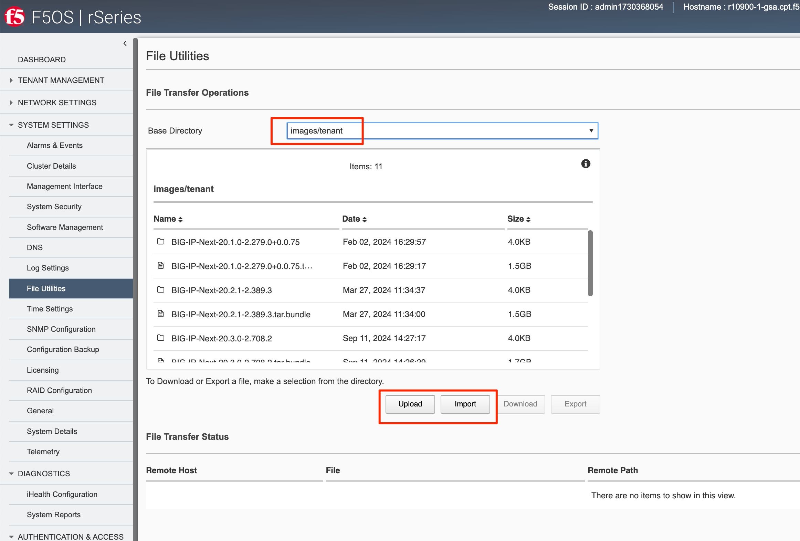

If an HTTPS server is not available and uploading from a client machine is not an option, you may upload a tenant image using SCP directly to the appliance. Simply SCP an image to the F5OS out-of-band management IP address using the admin account and a path of **IMAGES**. 

.. code-block:: bash

    scp BIG-IP-Next-20.1.0-2.279.0+0.0.75.tar.bundle admin@10.255.0.148:IMAGES

Creating a BIG-IP Next Tenant via F5OS webUI
--------------------------------------------

You can deploy a BIG-IP Next tenant from the webUI using the **Add** button in the **Tenant Management > Tenant Deployments** screen.

The tenant deployment options are almost identical to deploying a vCMP guest on older generations of BIG-IP, with a few minor differences and almost identical to deploying a BIG-IP tenant on rSeries. For **Type** select **BIG-IP-Next**. Supply a name for the tenant and choose the BIG-IP Next **Image** and **Deployment File** for it to run.  Next, you will assign an out-of-band management address, prefix, and gateway, and assign VLANs you want the tenant to inherit. There is also an option to adjust the virtual disk size if this tenant will need more space, you can set this for 25GB. There are **Recommended** and **Advanced** options for resource provisioning; choosing recommended will automatically adjust memory based on the vCPUs allocated to the tenant. Choosing Advanced will allow you to over-allocate memory which is something iSeries did not support. Be sure to consult the supported vCPU options in this guide or in the releases notes for a specific release, not all vCPU options are supported.  You can choose different states (Configured or Deployed, Provisioned is not supported for BIG-IP Next) just like vCMP and there is an option to enable/disable HW Crypto and Compression Acceleration (recommended this stay enabled). And finally, there is an option to enable Appliance mode which will disable root/bash access to the tenant. Once you click **Save** the tenant will move to the desired state of **Configured**, **Provisioned**, or **Deployed**.

Validating BIG-IP Next Tenant Status via F5OS webUI
---------------------------------------------------

Once the tenant is deployed you can monitor its status in the **Tenant Management > Tenant Deployments** webUI page. You'll see the **State** show **Deployed** but the **Status** column will be empty until the tenant starts initializing.

.. image:: images/rseries_deploying_a_bigip_next_tenant/image76.png
  :align: center
  :scale: 70% 

The tenant will cycle through various phases as the tenant starts initializing. It should go from a **Provisioning** to a **Running** Status.

.. image:: images/rseries_deploying_a_bigip_next_tenant/image77.png
  :align: center
  :scale: 70% 

You can then click the carat in the right-hand side of the the webUI row to get more detailed status.

.. image:: images/rseries_deploying_a_bigip_next_tenant/image78.png
  :align: center
  :scale: 70%   

To watch the status of the BIG-IP Next tenant's containers during startup, go to **Tenant Management -> Tenant Details**. Click the **Hide** buttons showing tenant CPU, Memory, and Disk Usage. 

Select the BIG-IP Next **Tenant Name** and set **Auto Refresh** for 10 seconds. You can then hover over the **Phase** column to get more details while resources are being allocated.

Eventually, you will see various pods starting up and showing **Pending** status.

You can continue monitor the pods until they all go into the **Running** phase. This means that the tenant is now operational. If there were issues with any of the containers starting, it would show up in this webUI page.

Once the tenant is fully running. You can then go back to the **Tenant Deployments** screen and click the Carat in the right hand column for the BIG-IP Next Tenant to see more details. 

Now re-examine the dashboards in the webUI. Examine the **System Summary** and click the **Show Utilization** to see how memory and storage is allocated. Examine how all the resources are allocated within your rSeries appliance.

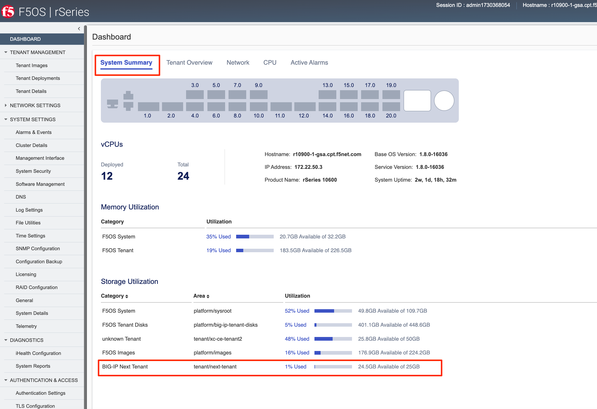

Click on the **Tenant Overview** tab and examine the dashboard. 

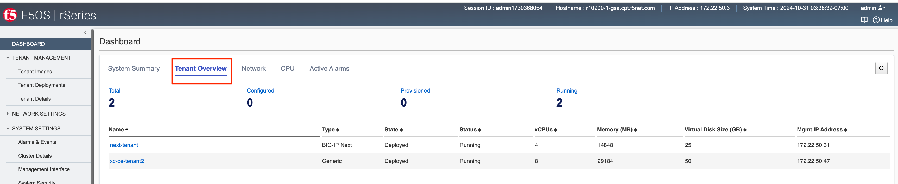

Click on the **CPU** tab and examine the dashboard. Here you can see how vCPus are allocated within the rSeries system as well as their utilization.

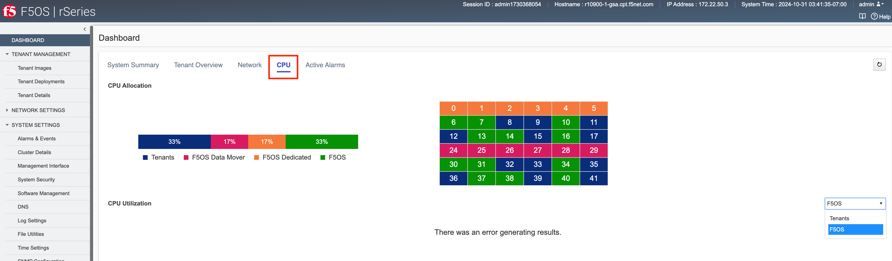

BIG-IP Next Tenant Deployment via F5OS API
==========================================

If you choose to create the BIG-IP Next tenant locally on your rSeries appliance, you will be able to import it into Central Manager, however it cannot have any l4-l7 application configuration defined. When Central Manager imports a BIG-IP Next tenant that has already been created, it will wipe out any application layer configuration as part of the import process.

You will also need to change the default password on the Next tenant via an API call before importing it into Central Manager. This section will step through the steps to create a tenant locally via the rSeries/F5OS API, and then changing the password via API, and finally importing the BIG-IP Next tenant/instance into Central Manager.

Although this is a supported workflow, it is much easier to create an rSeries provider on Central Manager, and then manage the Next instance lifecycle from Central Manager, vs creating the tenant locally on rSeries and then importing into Central Manager.

Loading BIG-IP Next Tenant Images from a Remote Server via F5OS API
-------------------------------------------------------------------

To copy a BIG-IP Next tenant image into F5OS over the API, use the following API call to the F5OS out-of-band management IP address. The example below copies a tenant image from a remote HTTPS server. You may also edit the API call to copy from remote SFTP or SCP servers by adding the proper **protocol** option.

.. code-block:: bash

    POST https://{{rseries_appliance1_ip}}:8888/api/data/f5-utils-file-transfer:file/import

In the body of the API call, enter the following JSON information.

.. code-block:: json

    {
        "input": [
            {
                "remote-host": "10.255.0.142",
                "remote-file": "upload/{{Appliance_Tenant_Image}}",
                "local-file": "images/tenant/{{Appliance_Tenant_Image}}",
                "insecure": "",
                "f5-utils-file-transfer:username": "corpuser",
                "f5-utils-file-transfer:password": "Pa$$w0rd"
            }
        ]
    }

To list the current tenant images available on the appliance, use the following API Call:

.. code-block:: bash

    GET https://{{rseries_appliance1_ip}}:8888/restconf/data/f5-tenant-images:images

Below is output generated from the previous command:

.. code-block:: json

  {
      "f5-tenant-images:images": {
          "image": [
              {
                  "name": "BIGIP-15.1.5-0.0.8.ALL-F5OS.qcow2.zip.bundle",
                  "in-use": false,
                  "type": "vm-image",
                  "status": "verified",
                  "date": "2024-10-15",
                  "size": "1.88 GB"
              },
              {
                  "name": "BIGIP-15.1.6.1-0.0.6.ALL-F5OS.qcow2.zip.bundle",
                  "in-use": false,
                  "type": "vm-image",
                  "status": "verified",
                  "date": "2024-10-15",
                  "size": "1.99 GB"
              },
              {
                  "name": "BIGIP-17.1.0.1-0.0.4.ALL-F5OS.qcow2.zip.bundle",
                  "in-use": false,
                  "type": "vm-image",
                  "status": "verified",
                  "date": "2024-10-15",
                  "size": "2.28 GB"
              },
              {
                  "name": "BIGIP-17.1.1.2-0.0.10.ALL-F5OS.qcow2.zip.bundle",
                  "in-use": false,
                  "type": "vm-image",
                  "status": "verified",
                  "date": "2024-10-15",
                  "size": "2.34 GB"
              }
          ]
      }
  }

Uploading BIG-IP Next Tenant Images from a Client Machine via the F5OS API
--------------------------------------------------------------------------

You can upload an F5OS BIG-IP Next tenant image from a client machine over the API. First you must obtain an **upload-id** using the following API call.

.. code-block:: bash

    POST https://{{rseries_appliance1_ip}}:8888/restconf/data/f5-utils-file-transfer:file/f5-file-upload-meta-data:upload/start-upload

In the body of the API call enter the **size**, **name**, and **file-path** as seen in the example below.

.. code-block:: json

  {
      "size":1598812688,
      "name": "BIG-IP-Next-20.1.0-2.279.0+0.0.75.tar.bundle",
      "file-path": "images/tenant/"
  }

If you are using Postman, the API call above will generate an upload-id that will need to be captured so it can be used in the API call to upload the file. Below is an example of the code that should be added to the **Test** section of the API call so that the **upload-id** can be captured and saved to a variable called **upload-id** for subsequent API calls.

.. code-block:: bash

    var resp = pm.response.json();
    pm.environment.set("upload-id", resp["f5-file-upload-meta-data:output"]["upload-id"])

Below is an example of how this would appear inside the Postman interface under the **Tests** section.

.. image:: images/rseries_deploying_a_bigip_next_tenant/upload-id.png
  :align: center
  :scale: 70%

Once the upload-id is captured, you can then initiate a file upload of the F5OS TENANT_NAME image using the following API call.

.. code-block:: bash

    POST https://{{rseries_appliance1_ip}}:8888/restconf/data/openconfig-system:system/f5-image-upload:image/upload-image

In the body of the API call select **form-data**, and then in the **Value** section click **Select Files** and select the F5OS tenant image you want to upload as seen in the example below.

.. image:: images/rseries_deploying_a_bigip_next_tenant/file-upload-tenant-body.png
  :align: center
  :scale: 70%

In the **Headers** section ensure you add the **file-upload-id** header, with the variable used to capture the id in the previous API call.

.. image:: images/rseries_deploying_a_bigip_next_tenant/file-upload-tenant-headers.png
  :align: center
  :scale: 70%

Creating a BIG-IP Next Tenant via F5OS API
------------------------------------------

BIG-IP Next tenant creation via the F5OS API is as simple as defining the parameters below and sending the POST to the rSeries out-of-band IP address. The API call below will create a tenant; many of the fields are defined as variables in Postman. That way the API calls don't have to be rewritten for different tenant names or IP addressing, or images, and they can be reused easily and adapted to any environment. In the example below, the **running-state** will be set for **Configured** and then a subsequent API call will set it to **Deployed**, but this could all be done via a single API call. This is done to show how changes can be made to the tenant status after its created.

.. code-block:: bash

  POST https://{{rseries_appliance1_ip}}:8888/restconf/data/f5-tenants:tenants

Below is the body of the API call above.

.. code-block:: json

  {
      "tenant": [
          {
              "name": "tenant1",
              "config": {
                  "name": "tenant1",
                  "type": "BIG-IP-Next",
                  "image": "BIG-IP-Next-20.1.0-2.279.0+0.0.75",
                  "deployment-file": "BIG-IP-Next-20.1.0-2.279.0+0.0.75.yaml",
                  "nodes": [
                      1
                  ],
                  "mgmt-ip": "172.22.50.34",
                  "gateway": "{{rseries_outofband_dfgw_ip}}",
                  "prefix-length": 26,
                  "vlans": [
                      {{rseries_internal_vlan_tag}},
                      {{rseries_external_vlan_tag}},
                      {{rseries_ha_vlan_tag}}
                  ],
                  "vcpu-cores-per-node": 4,
                  "memory": 14848,
                  "cryptos": "enabled",
                  "running-state": "deployed"
              }
          }
      ]
  }

Validating BIG-IP Next Tenant Status via F5OS API
-------------------------------------------------

The command below will show the current state and status of the tenant. Remember it has not been changed to the **Deployed** state yet.

.. code-block:: bash

  GET https://{{rseries_appliance1_ip}}:8888/restconf/data/f5-tenants:tenants

The output of the above API call shows the state and status of the tenant.

.. code-block:: json

  {
      "f5-tenants:tenants": {
          "tenant": [
              {
                  "name": "tenant1",
                  "config": {
                      "name": "tenant1",
                      "type": "BIG-IP-Next",
                      "image": "BIG-IP-Next-20.1.0-2.279.0+0.0.75",
                      "deployment-file": "BIG-IP-Next-20.1.0-2.279.0+0.0.75.yaml",
                      "nodes": [
                          1
                      ],
                      "mgmt-ip": "172.22.50.34",
                      "prefix-length": 26,
                      "gateway": "172.22.50.62",
                      "dag-ipv6-prefix-length": 128,
                      "vlans": [
                          500,
                          501,
                          502
                      ],
                      "cryptos": "enabled",
                      "vcpu-cores-per-node": 4,
                      "memory": "14848",
                      "storage": {
                          "size": 15
                      },
                      "running-state": "deployed",
                      "mac-data": {
                          "f5-tenant-l2-inline:mac-block-size": "one"
                      },
                      "appliance-mode": {
                          "enabled": false
                      }
                  },
                  "state": {
                      "name": "tenant1",
                      "unit-key-hash": "Isla/29Bac4+vAHaelGwbyhaw1B9aENGJZTMGTPYUNAWfYsaSIJ0lzvgUyEWK68XQ2qjOcLq1ZR/y1JE6R59Sg==",
                      "type": "BIG-IP-Next",
                      "image": "BIG-IP-Next-20.1.0-2.279.0+0.0.75",
                      "deployment-file": "BIG-IP-Next-20.1.0-2.279.0+0.0.75.yaml",
                      "upgrade-status": "not-started",
                      "mgmt-ip": "172.22.50.34",
                      "prefix-length": 26,
                      "gateway": "172.22.50.62",
                      "dag-ipv6-prefix-length": 128,
                      "vlans": [
                          500,
                          501,
                          502
                      ],
                      "cryptos": "enabled",
                      "vcpu-cores-per-node": 4,
                      "qat-vf-count": 7,
                      "memory": "14848",
                      "running-state": "deployed",
                      "mac-data": {
                          "base-mac": "00:94:a1:69:35:18",
                          "mac-pool-size": 1,
                          "f5-tenant-l2-inline:mac-block": [
                              {
                                  "mac": "00:94:a1:69:35:18"
                              }
                          ]
                      },
                      "appliance-mode": {
                          "enabled": false
                      },
                      "cpu-allocations": {
                          "cpu-allocation": [
                              {
                                  "node": 1
                              }
                          ]
                      },
                      "feature-flags": {
                          "clustering-as-service": false,
                          "stats-stream-capable": false
                      },
                      "namespace": "default-tid-21",
                      "status": "Provisioning",
                      "instances": {
                          "instance": [
                              {
                                  "node": 1,
                                  "pod-name": "tenant1-1",
                                  "instance-id": 1,
                                  "phase": "Allocating resources to tenant is in progress",
                                  "creation-time": "",
                                  "ready-time": "",
                                  "status": " "
                              }
                          ]
                      }
                  },
                  "module-provisioning": {
                      "state": {
                          "provisioning-status": "not-started",
                          "provisioning-event": ""
                      }
                  }
              },
              {
                  "name": "test1",
                  "config": {
                      "name": "test1",
                      "type": "BIG-IP-Next",
                      "image": "BIG-IP-Next-20.1.0-2.279.0+0.0.75",
                      "deployment-file": "BIG-IP-Next-20.1.0-2.279.0+0.0.75.yaml",
                      "nodes": [
                          1
                      ],
                      "mgmt-ip": "172.22.50.35",
                      "prefix-length": 26,
                      "gateway": "172.22.50.62",
                      "dag-ipv6-prefix-length": 128,
                      "vlans": [
                          500,
                          501,
                          502
                      ],
                      "cryptos": "enabled",
                      "vcpu-cores-per-node": 4,
                      "memory": "14848",
                      "storage": {
                          "size": 25
                      },
                      "running-state": "deployed",
                      "mac-data": {
                          "f5-tenant-l2-inline:mac-block-size": "one"
                      },
                      "appliance-mode": {
                          "enabled": false
                      }
                  },
                  "state": {
                      "name": "test1",
                      "unit-key-hash": "Gin+fgNn9C5CnqHlIIi/GoTjcSaG1b65Y/kAlM5cnM7NOFmJe3tGrZQNgz7K5NtY//y7jANrJ2xm7dxIeUr9aA==",
                      "type": "BIG-IP-Next",
                      "image": "BIG-IP-Next-20.1.0-2.279.0+0.0.75",
                      "deployment-file": "BIG-IP-Next-20.1.0-2.279.0+0.0.75.yaml",
                      "deployment-specification": "f5-asec:\n  name: f5-asec\n  enabled: true\n  replicaCount: 1\nf5-access:\n  name: f5-access\n  replicaCount: 1\n  enabled: true\n  f5-access-apmd:\n    enableReleaseConfig: true\nf5-eesv:\n  replicaCount: 1\n  enabled: true\n  f5-eesv-vault:\n    testenv: false\n    strategy: Recreate\n  name: f5-eesv\n  f5-eesv-licensing:\n    extra_cm_refs: \"- configMapRef:\\n      name: {{- include \\\"common.tenantPrefix\\\"\\\n      \\ . | indent 1 }}f5-version-file-config\\n\"\n    testenv: false\nf5-data:\n  replicaCount: 1\n  name: f5-data\n  persistence:\n    volumeMode: Filesystem\n    selector: \"- key: zone\\n  operator: In\\n  values:\\n  - {{ .Values.global.nodeSelector.zone}}\\n\"\n  enabled: true\n  testenv: false\nf5-fsm:\n  name: f5-fsm\n  testenv: false\n  replicaCount: 1\n  enabled: true\nf5-upgrade-hooks:\n  replicaCount: 1\n  name: f5-upgrade-hooks\n  nameOverride: bigip-next-velos\n  enabled: true\nf5-toda:\n  f5-toda-systemhealth:\n    testenv: false\n  name: f5-toda\n  f5-toda-logging:\n    testenv: false\n  replicaCount: 1\nglobal:\n  hostVolumePath: /var/F5/system\n  partitionId: 1\n  cp:\n    resources:\n      requests:\n        memory: 50Mi\n      limits:\n        memory: 500Mi\n  hooksVersion: 1.11.13-0.0.2\n  image:\n    repo: artifactory.f5net.com/f5-mbip-docker\n  configby: TPOB-MICRO\n  basePath: /mnt/disks\n  fips140CfgHostPath: /var/export/chassis/fips140_compliance_cfg\n  nhc_deployments:\n  - f5-csm-qkview\n  - f5-onboarding\n  - f5-asec-policy-compiler\n  - f5-asec-ip-intelligence\n  - f5-asec-clientside-js-obfuscator\n  - f5-csm-bird\n  - f5-appsvcs-templates\n  - f5-eesv-licensing\n  - f5-toda-logpull\n  - f5-toda-avrng\n  - fluentdserver\n  - f5-access-apmd\n  - f5-access-session-manager\n  - f5-access-renderer\n  - f5-debug-sshd\n  - f5-toda-observer\n  - f5-crdconversion\n  - f5-cne-controller\n  - f5-gslb-probe-agent\n  - f5-gslb\n  - f5-fqdn-resolver\n  defaultTags:\n    access: false\n    waf: true\n    dns: false\n    ltm: true\n  externalIP:\n  - 0.0.0.0\n  deployments:\n  - f5-csm-api-engine\n  - f5-csm-icb\n  - f5-fcdn-sync\n  - data-store\n  - f5-fsm-tmm\n  - f5-avcl-ha-manager\n  - f5-avcl-keepalive\n  - f5-dssm\n  - f5-cmsg-mq\n  - f5-appsvcs\n  - f5-eesv-vault\n  - f5-platform-agent\n  featureFlags:\n    clustering-as-service: true\n  external_access:\n  - f5-csm-api-engine\n  - f5-fsm-tmm\n  - fluentdserver\n  - f5-asec-ip-intelligence\n  - f5-appsvcs\n  enableReleaseConfig: true\n  nodeSelector:\n    zone: node1\n    bladeready: true\n  securityContext:\n    seLinuxOptions:\n      level: s0:c0\n  patchVersions:\n    f5_csm: 26.38.0-0.1.1\n    f5_data: 2.19.3-0.0.3\n    f5_avcl: 4.10.20-0.0.2\n  partition: default\n  dp:\n    cpuset: ''\n  runHook: true\n  platform: F5OS\n  registryPort: 4000\n  priority_groups:\n    priority_group_0: \"1024\"\n    priority_group_1: \"5803\"\n  registry: controller-ha.chassis.local\n  seLinuxOptions:\n    level: s0:c16,c10\n  setPrefix: true\n  tags:\n    name: tags\n    access: true\n    dns: false\n    ltm: true\n    replicaCount: 1\n    waf: true\n  version: 20.1.0-2.279.0+0.0.75\n  subplatform: R5R1X\n  hostdoorbellPath: /var/run/platform/tenant_doorbell_test1.sock\ntags:\n  name: tags\n  ltm: true\n  access: true\n  dns: false\n  replicaCount: 1\n  waf: true\n",
                      "upgrade-status": "not-started",
                      "mgmt-ip": "172.22.50.35",
                      "prefix-length": 26,
                      "gateway": "172.22.50.62",
                      "dag-ipv6-prefix-length": 128,
                      "vlans": [
                          500,
                          501,
                          502
                      ],
                      "cryptos": "enabled",
                      "vcpu-cores-per-node": 4,
                      "qat-vf-count": 7,
                      "memory": "14848",
                      "storage": {
                          "size": 25
                      },
                      "running-state": "deployed",
                      "mac-data": {
                          "base-mac": "00:94:a1:69:35:14",
                          "mac-pool-size": 1,
                          "f5-tenant-l2-inline:mac-block": [
                              {
                                  "mac": "00:94:a1:69:35:14"
                              }
                          ]
                      },
                      "appliance-mode": {
                          "enabled": false
                      },
                      "cpu-allocations": {
                          "cpu-allocation": [
                              {
                                  "node": 1,
                                  "cpus": [
                                      8,
                                      11,
                                      24,
                                      27
                                  ]
                              }
                          ]
                      },
                      "feature-flags": {
                          "clustering-as-service": true,
                          "stats-stream-capable": false
                      },
                      "namespace": "default-tid-20",
                      "status": "Running",
                      "instances": {
                          "instance": [
                              {
                                  "node": 1,
                                  "pod-name": "test1-data-store",
                                  "instance-id": 1,
                                  "phase": "Running",
                                  "creation-time": "2024-11-27T16:51:19Z",
                                  "ready-time": "2024-11-27T16:51:59Z",
                                  "status": "Started tenant instance",
                                  "mgmt-mac": "00:94:a1:69:35:15"
                              },
                              {
                                  "node": 1,
                                  "pod-name": "test1-f5-access-apmd",
                                  "instance-id": 1,
                                  "phase": "Running",
                                  "creation-time": "2024-11-27T16:51:19Z",
                                  "ready-time": "2024-11-27T16:51:21Z",
                                  "status": "Started tenant instance",
                                  "mgmt-mac": "00:94:a1:69:35:15"
                              },
                              {
                                  "node": 1,
                                  "pod-name": "test1-f5-access-renderer",
                                  "instance-id": 1,
                                  "phase": "Running",
                                  "creation-time": "2024-11-27T16:51:19Z",
                                  "ready-time": "2024-11-27T16:51:20Z",
                                  "status": "Started tenant instance",
                                  "mgmt-mac": "00:94:a1:69:35:15"
                              },
                              {
                                  "node": 1,
                                  "pod-name": "test1-f5-access-session-manager",
                                  "instance-id": 1,
                                  "phase": "Running",
                                  "creation-time": "2024-11-27T16:51:23Z",
                                  "ready-time": "2024-11-27T16:51:24Z",
                                  "status": "Started tenant instance",
                                  "mgmt-mac": "00:94:a1:69:35:15"
                              },
                              {
                                  "node": 1,
                                  "pod-name": "test1-f5-appsvcs",
                                  "instance-id": 1,
                                  "phase": "Running",
                                  "creation-time": "2024-11-27T16:51:19Z",
                                  "ready-time": "2024-11-27T16:51:21Z",
                                  "status": "Started tenant instance",
                                  "mgmt-mac": "00:94:a1:69:35:15"
                              },
                              {
                                  "node": 1,
                                  "pod-name": "test1-f5-appsvcs-templates",
                                  "instance-id": 1,
                                  "phase": "Running",
                                  "creation-time": "2024-11-27T16:51:19Z",
                                  "ready-time": "2024-11-27T16:51:21Z",
                                  "status": "Started tenant instance",
                                  "mgmt-mac": "00:94:a1:69:35:15"
                              },
                              {
                                  "node": 1,
                                  "pod-name": "test1-f5-asec-clientside-js-obfuscator",
                                  "instance-id": 1,
                                  "phase": "Running",
                                  "creation-time": "2024-11-27T16:51:23Z",
                                  "ready-time": "2024-11-27T16:51:25Z",
                                  "status": "Started tenant instance",
                                  "mgmt-mac": "00:94:a1:69:35:15"
                              },
                              {
                                  "node": 1,
                                  "pod-name": "test1-f5-asec-ip-intelligence",
                                  "instance-id": 1,
                                  "phase": "Running",
                                  "creation-time": "2024-11-27T16:51:23Z",
                                  "ready-time": "2024-11-27T16:51:24Z",
                                  "status": "Started tenant instance",
                                  "mgmt-mac": "00:94:a1:69:35:15"
                              },
                              {
                                  "node": 1,
                                  "pod-name": "test1-f5-asec-policy-compiler",
                                  "instance-id": 1,
                                  "phase": "Running",
                                  "creation-time": "2024-11-27T16:51:19Z",
                                  "ready-time": "2024-11-27T16:51:20Z",
                                  "status": "Started tenant instance",
                                  "mgmt-mac": "00:94:a1:69:35:15"
                              },
                              {
                                  "node": 1,
                                  "pod-name": "test1-f5-avcl-ha-manager",
                                  "instance-id": 1,
                                  "phase": "Running",
                                  "creation-time": "2024-11-27T16:51:19Z",
                                  "ready-time": "2024-11-27T16:51:20Z",
                                  "status": "Started tenant instance",
                                  "mgmt-mac": "00:94:a1:69:35:15"
                              },
                              {
                                  "node": 1,
                                  "pod-name": "test1-f5-avcl-keepalive",
                                  "instance-id": 1,
                                  "phase": "Running",
                                  "creation-time": "2024-11-27T16:51:19Z",
                                  "ready-time": "2024-11-27T16:51:21Z",
                                  "status": "Started tenant instance",
                                  "mgmt-mac": "00:94:a1:69:35:15"
                              },
                              {
                                  "node": 1,
                                  "pod-name": "test1-f5-cmsg-mq",
                                  "instance-id": 1,
                                  "phase": "Running",
                                  "creation-time": "2024-11-27T16:51:19Z",
                                  "ready-time": "2024-11-27T16:51:49Z",
                                  "status": "Started tenant instance",
                                  "mgmt-mac": "00:94:a1:69:35:15"
                              },
                              {
                                  "node": 1,
                                  "pod-name": "test1-f5-csm-api-engine",
                                  "instance-id": 1,
                                  "phase": "Running",
                                  "creation-time": "2024-11-27T16:51:19Z",
                                  "ready-time": "2024-11-27T16:51:19Z",
                                  "status": "Not ready: containers with unready status: [f5-csm-api-engine]",
                                  "mgmt-mac": "00:94:a1:69:35:15"
                              },
                              {
                                  "node": 1,
                                  "pod-name": "test1-f5-csm-bird",
                                  "instance-id": 1,
                                  "phase": "Running",
                                  "creation-time": "2024-11-27T16:51:23Z",
                                  "ready-time": "2024-11-27T16:51:25Z",
                                  "status": "Started tenant instance",
                                  "mgmt-mac": "00:94:a1:69:35:15"
                              },
                              {
                                  "node": 1,
                                  "pod-name": "test1-f5-csm-icb",
                                  "instance-id": 1,
                                  "phase": "Running",
                                  "creation-time": "2024-11-27T16:51:23Z",
                                  "ready-time": "2024-11-27T16:51:25Z",
                                  "status": "Started tenant instance",
                                  "mgmt-mac": "00:94:a1:69:35:15"
                              },
                              {
                                  "node": 1,
                                  "pod-name": "test1-f5-csm-qkview",
                                  "instance-id": 1,
                                  "phase": "Running",
                                  "creation-time": "2024-11-27T16:51:23Z",
                                  "ready-time": "2024-11-27T16:51:51Z",
                                  "status": "Started tenant instance",
                                  "mgmt-mac": "00:94:a1:69:35:15"
                              },
                              {
                                  "node": 1,
                                  "pod-name": "test1-f5-dssm",
                                  "instance-id": 1,
                                  "phase": "Running",
                                  "creation-time": "2024-11-27T16:51:19Z",
                                  "ready-time": "2024-11-27T16:51:49Z",
                                  "status": "Started tenant instance",
                                  "mgmt-mac": "00:94:a1:69:35:15"
                              },
                              {
                                  "node": 1,
                                  "pod-name": "test1-f5-eesv-licensing",
                                  "instance-id": 1,
                                  "phase": "Running",
                                  "creation-time": "2024-11-27T16:51:23Z",
                                  "ready-time": "2024-11-27T16:51:24Z",
                                  "status": "Started tenant instance",
                                  "mgmt-mac": "00:94:a1:69:35:15"
                              },
                              {
                                  "node": 1,
                                  "pod-name": "test1-f5-eesv-vault",
                                  "instance-id": 1,
                                  "phase": "Running",
                                  "creation-time": "2024-11-27T16:51:23Z",
                                  "ready-time": "2024-11-27T16:51:23Z",
                                  "status": "Not ready: containers with unready status: [f5-eesv-vault]",
                                  "mgmt-mac": "00:94:a1:69:35:15"
                              },
                              {
                                  "node": 1,
                                  "pod-name": "test1-f5-fcdn-sync",
                                  "instance-id": 1,
                                  "phase": "Running",
                                  "creation-time": "2024-11-27T16:51:25Z",
                                  "ready-time": "2024-11-27T16:51:53Z",
                                  "status": "Started tenant instance",
                                  "mgmt-mac": "00:94:a1:69:35:15"
                              },
                              {
                                  "node": 1,
                                  "pod-name": "test1-f5-fsm-tmm",
                                  "instance-id": 1,
                                  "phase": "Running",
                                  "creation-time": "2024-11-27T16:51:19Z",
                                  "ready-time": "2024-11-27T16:51:54Z",
                                  "status": "Started tenant instance",
                                  "mgmt-mac": "00:94:a1:69:35:15"
                              },
                              {
                                  "node": 1,
                                  "pod-name": "test1-f5-onboarding",
                                  "instance-id": 1,
                                  "phase": "Running",
                                  "creation-time": "2024-11-27T16:51:19Z",
                                  "ready-time": "2024-11-27T16:51:21Z",
                                  "status": "Started tenant instance",
                                  "mgmt-mac": "00:94:a1:69:35:15"
                              },
                              {
                                  "node": 1,
                                  "pod-name": "test1-f5-platform-agent",
                                  "instance-id": 1,
                                  "phase": "Running",
                                  "creation-time": "2024-11-27T16:51:19Z",
                                  "ready-time": "2024-11-27T16:51:19Z",
                                  "status": "Not ready: containers with unready status: [f5-platform-agent]",
                                  "mgmt-mac": "00:94:a1:69:35:15"
                              },
                              {
                                  "node": 1,
                                  "pod-name": "test1-f5-toda-avrng",
                                  "instance-id": 1,
                                  "phase": "Running",
                                  "creation-time": "2024-11-27T16:51:19Z",
                                  "ready-time": "2024-11-27T16:51:21Z",
                                  "status": "Started tenant instance",
                                  "mgmt-mac": "00:94:a1:69:35:15"
                              },
                              {
                                  "node": 1,
                                  "pod-name": "test1-f5-toda-logpull",
                                  "instance-id": 1,
                                  "phase": "Running",
                                  "creation-time": "2024-11-27T16:51:23Z",
                                  "ready-time": "2024-11-27T16:51:24Z",
                                  "status": "Started tenant instance",
                                  "mgmt-mac": "00:94:a1:69:35:15"
                              },
                              {
                                  "node": 1,
                                  "pod-name": "test1-f5-toda-observer",
                                  "instance-id": 1,
                                  "phase": "Running",
                                  "creation-time": "2024-11-27T16:51:19Z",
                                  "ready-time": "2024-11-27T16:51:49Z",
                                  "status": "Started tenant instance",
                                  "mgmt-mac": "00:94:a1:69:35:15"
                              },
                              {
                                  "node": 1,
                                  "pod-name": "test1-fluentdserver",
                                  "instance-id": 1,
                                  "phase": "Running",
                                  "creation-time": "2024-11-27T16:51:20Z",
                                  "ready-time": "2024-11-27T16:51:21Z",
                                  "status": "Started tenant instance",
                                  "mgmt-mac": "00:94:a1:69:35:15"
                              }
                          ]
                      }
                  },
                  "module-provisioning": {
                      "state": {
                          "provisioning-status": "not-started",
                          "provisioning-event": ""
                      }
                  }
              }
          ]
      }
  }

If you didn't set the tenant's state to deployed intially you can change it by issuing the following API call. Note this uses a PATCH command. 

.. code-block:: bash

  PATCH https://{{rseries_appliance1_ip}}:8888/restconf/data/f5-tenants:tenants/tenant={{New_Tenant1_Name}}/config/running-state

The body/payload of the API call will set the **running-state** to **Deployed**:

.. code-block:: json

    {
        "running-state": "deployed"
    }

Importing the BIG-IP Next Tenant into Central Manager
=====================================================

In this section you will import the BIG-IP Next tenant from your rSeries appliance into Central Manager. Before bringing your locally created Next instance into Central Manager, you must first change its default password. (This is not an ideal flow, and an enhancement has been filed to have Central Manager perform this step as part of the import process). For now, you'll need to send an API call direct to the Next instances management IP address to change the default password. 

If you have Postman running on your machine you can use that, or you can use curl from your client machine.

First login locally to the BIG-IP Next instance using basic auth with the credentials admin/admin. Send a GET call to **/api/v1/login** URI.

.. code-block:: bash

  GET https://{{next-instance-ip}}:5443/api/v1/login

You should see a response similar to the one below indicating that a "self password update" is required.

.. code-block:: bash

  {
      "_errors": [
          {
              "id": "b9dc8fe1-fd77-4324-9ea7-7924d4786cb1",
              "code": "13158-00319",
              "title": "",
              "detail": "Password change: password must be changed; use 'self password update' endpoint and change it.",
              "status": "403"
          }
      ]
  }

Below is an example of running a curl command:

.. code-block:: bash

  prompt%  curl -k -u admin:admin https://172.22.50.19:5443/api/v1/login
  {"_errors":[{"id":"ec3e2210-2368-48a6-aae7-8279c753a2e8","code":"13158-00319","title":"","detail":"Password change: password must be changed; use 'self password update' endpoint and change it.","status":"403"}]}
  prompt% 

Next, send the following PUT call with basic-auth using the admin/admin account directly to your Next instance to the URI **/api/v1/me**.

.. code-block:: bash

  PUT https://{{next-instance-ip}}:5443/api/v1/me

In the body of the API call enter the following, which will change the current password of admin to Welcome123!Welcome123!.

.. code-block:: bash

  {
  "currentPassword": "admin",
  "newPassword": "Welcome123!Welcome123!"
  }

Below is an example of running a curl command to set the new password:

.. code-block:: bash

  prompt% curl -k -u admin:admin -X PUT https://172.22.50.19:5443/api/v1/me -H 'Content-Type: application/json' -d   '{"currentPassword": "admin", "newPassword": "Welcome123!Welcome123!"}'
  prompt%

Your BIG-IP Next instance is now ready to be imported into central Manager. After logging into Central Manager you can import the BIG-IP Next tenant/instance by going to the **Manage Instances** button on the main home screen.

Alternatively, by using the drop-down in the upper left hand corner of the webUI and selecting the **Infrastructure** option.

Click on the **Start Adding Instances** button.  

Enter the management IP Address assigned to your BIG-IP Next tenant, and then click **Connect**.

Enter the login credentials for your tenant (admin/Welcome123!Welcome123!), then click **Next**.

You'll now need to create a new admin account/password in order for Central Manager to manage the device. For **Username** enter **admin-cm**. For **Password** enter **Welcome123!Welcome123!** and confirm the password. Then click **Add Instance**.

You should then see a pop-up asking you to confirm the Fingerprint. Click **Accept**.

The Instance should be imported successfully into Central Manager and show a healthy green status:

Click on the instance to review its configuration. You should see stats being populated under the **Instance Data Metrics** section, but the majority of the configuration is blank as the device has not been on-boarded or licensed yet. 

Onboarding and Licensing a Locally (F5OS) Created BIG-IP Next Instance
======================================================================

The workflow to on-board the Next instance is not as optimal as creating the instance from the Central Manager Provider. Creating a BIG-IP Next instance through a provider as outlined above is the preferred method of creating and onboarding a BIG-IP Next instance. This section will cover onboarding a Next instance after it was created locally on an rSeries appliance and then imported into Central Manager.

Once the Next instance is imported into Central Manager, you should license the instance. In the **Instances** page click on your Next instance to see its configuration and go to the **Licensing** section as seen below.

Click the **Activate License** button, then load your licensing token that you obtained from F5 for BIG-IP Next. Once the token is uploaded you can than apply it to your instance.

Once the instance is successfully licensed, you can then configure the in-band networking which includes L1 Networks, VLANs, and IP addresses. 

