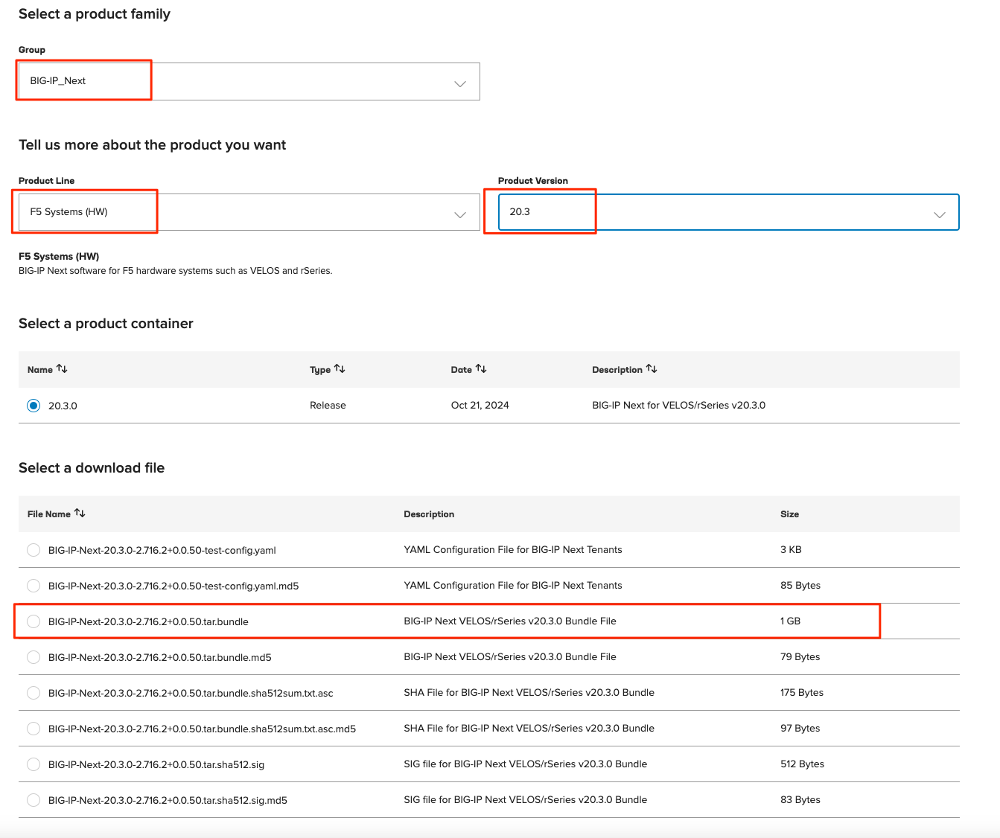
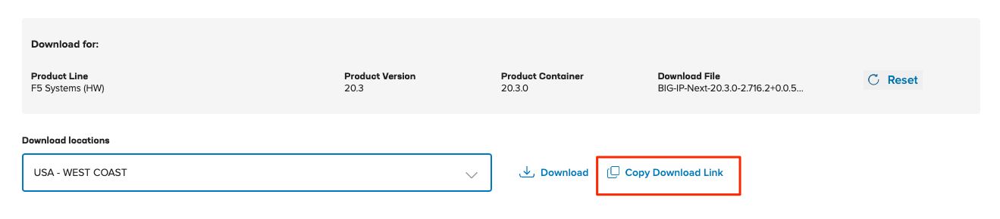
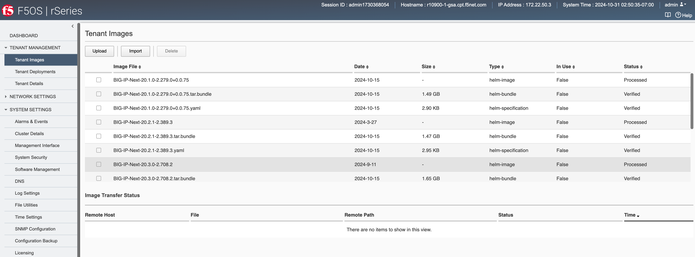
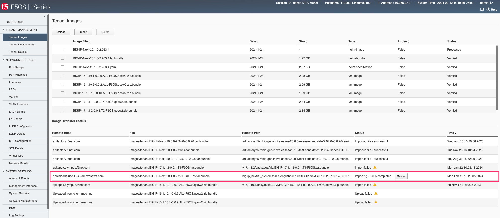
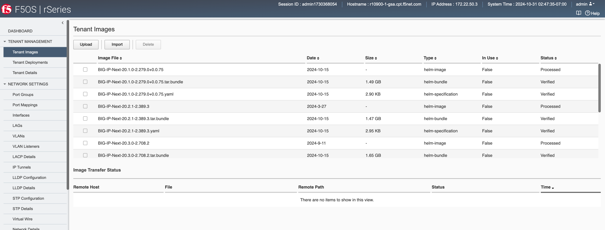
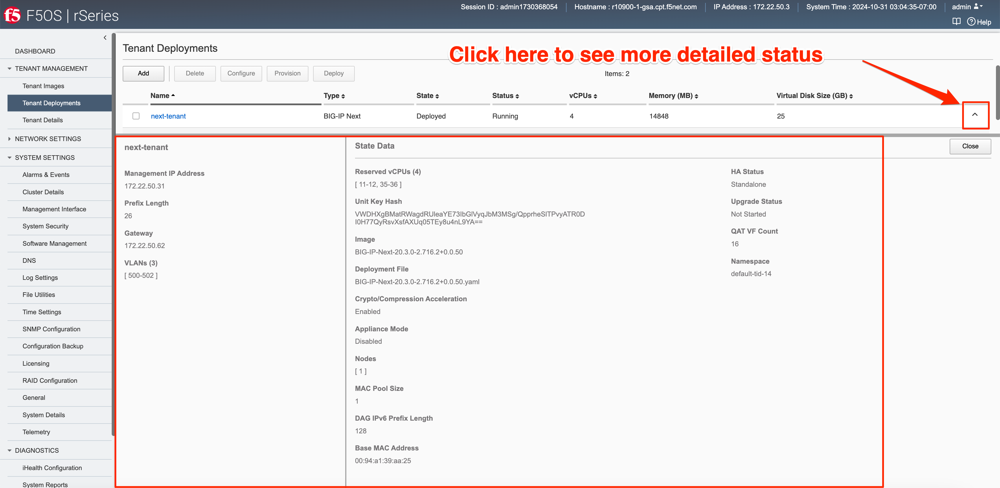
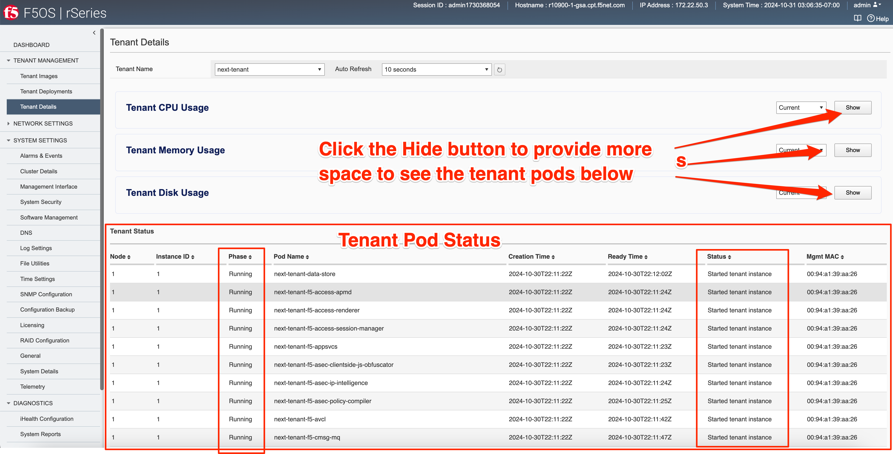

=======================================
Deploying an rSeries BIG-IP Next Tenant
=======================================

Starting with F5OS-A 1.7.0 rSeries appliances support both BIG-IP and BIG-IP Next tenants. Since F5OS-A 1.7.0 is the first release supporting BIG-IP Next, there are some caveats. Only r5000 (r5600,r5800,r5900) and r10000 (r10600,r10800,r10900) rSeries appliances support BIG-IP Next with version F5OS-A 1.7.0. F5OS-A 1.8.0 adds support for more rSeries platforms and more vCPU options for those tenants.

The initial F5OS-A 1.7.0 release also limits the number of BIG-IP Next tenants that can run on an rSeries appliance. There are 3 BIG-IP Next tenant sizes supported: 4 vCPU, 8 vCPU, and the maximum vCPU allotment for the appliance. As an example, the r5900 supports 4 vCPU, 8 vCPU, and 26 vCPU (The maximum for the platform). There is also a maximum of 2 BIG-IP Next tenants per rSeries appliance for the F5OS-A 1.7.0 release, but you can configure as many BIG-IP tenants as you wish. The table below outlines the supported tenant vCPU sizes for both BIG-IP and BIG-IP Next tenants.

+--------------+------------------------+-----------------------------------------------------+-----------------------------------------+---------------------------+
| Platform     | # of vCPUs for Tenants | Supported vCPUs for BIG-IP Tenants                  | Supported vCPUs for BIG-IP Next Tenants | Maximum # of Next Tenants |
+==============+========================+=====================================================+=========================================+===========================+
| r5600        | 12                     | 1,2,4,6,8,10,12                                     | 4,8,12 – F5OS-A 1.7.0                   | 2                         |
+--------------+------------------------+-----------------------------------------------------+-----------------------------------------+---------------------------+
| r5800        | 18                     | 1,2,4,6,8,10,12,14,16,18                            | 4,8,18 – F5OS-A 1.7.0                   | 2                         |
+--------------+------------------------+-----------------------------------------------------+-----------------------------------------+---------------------------+
| r5900        | 26                     | 1,2,4,6,8,10,12,14,16,18,20,22,24,26                | 4,8,26 – F5OS-A 1.7.0                   | 2                         |    
+--------------+------------------------+-----------------------------------------------------+-----------------------------------------+---------------------------+
| r10600       | 24                     | 1,2,4,6,8,10,12,14,16,18,20,22,24                   | 4,8,24 – F5OS-A 1.7.0                   | 2                         |    
+--------------+------------------------+-----------------------------------------------------+-----------------------------------------+---------------------------+
| r10800       | 28                     | 1,2,4,6,8,10,12,14,16,18,20,22,24,26,28             | 4,8,28 – F5OS-A 1.7.0                   | 2                         |    
+--------------+------------------------+-----------------------------------------------------+-----------------------------------------+---------------------------+
| r10900       | 36                     | 1,2,4,6,8,10,12,14,16,18,20,22,24,26,28,30,32,34,36 | 4,8,36 – F5OS-A 1.7.0                   | 2                         |    
+--------------+------------------------+-----------------------------------------------------+-----------------------------------------+---------------------------+

F5OS-A 1.8.0 adds additional rSeries platform support and tenant options as seen below:

+--------------+------------------------+-----------------------------------------------------------------------------------------+-----------------------------------------+---------------------------+
| Platform     | # of vCPUs for Tenants | Supported vCPUs for BIG-IP Tenants                                                      | Supported vCPUs for BIG-IP Next Tenants | Maximum # of Next Tenants |
+==============+========================+=========================================================================================+=========================================+===========================+
| r2600        | 4                      | 4                                                                                       | 4 – F5OS-A 1.8.0                        | 1                         |
+--------------+------------------------+-----------------------------------------------------------------------------------------+-----------------------------------------+---------------------------+
| r2800        | 8                      | 4,8                                                                                     | 4,8 – F5OS-A 1.8.0                      | 2                         |
+--------------+------------------------+-----------------------------------------------------------------------------------------+-----------------------------------------+---------------------------+
| r4600        | 12                     | 4,8,12                                                                                  | 4,8 – F5OS-A 1.8.0                      | 2                         |
+--------------+------------------------+-----------------------------------------------------------------------------------------+-----------------------------------------+---------------------------+
| r4800        | 16                     | 4,8,12,16                                                                               | 4,8,16 – F5OS-A 1.8.0                   | 4                         |
+--------------+------------------------+-----------------------------------------------------------------------------------------+-----------------------------------------+---------------------------+
| r5600        | 12                     | 1,2,4,6,8,10,12                                                                         | 4,8,12 – F5OS-A 1.8.0                   | 3                         |
+--------------+------------------------+-----------------------------------------------------------------------------------------+-----------------------------------------+---------------------------+
| r5800        | 18                     | 1,2,4,6,8,10,12,14,16,18                                                                | 4,8,12,18 – F5OS-A 1.8.0                | 4                         |
+--------------+------------------------+-----------------------------------------------------------------------------------------+-----------------------------------------+---------------------------+
| r5900        | 26                     | 1,2,4,6,8,10,12,14,16,18,20,22,24,26                                                    | 4,8,12,18,26 – F5OS-A 1.8.0             | 5                         |
+--------------+------------------------+-----------------------------------------------------------------------------------------+-----------------------------------------+---------------------------+
| r5920-DF     | 26                     | 1,2,4,6,8,10,12                                                                         | 4,8,12 ??? – F5OS-A 1.8.0               | 5                         |
+--------------+------------------------+-----------------------------------------------------------------------------------------+-----------------------------------------+---------------------------+
| r10600       | 24                     | 1,2,4,6,8,10,12,14,16,18,20,22,24                                                       | 4,8,24 – F5OS-A 1.8.0                   | 5                         |
+--------------+------------------------+-----------------------------------------------------------------------------------------+-----------------------------------------+---------------------------+
| r10800       | 28                     | 1,2,4,6,8,10,12,14,16,18,20,22,24,26,28                                                 | 4,8,24,28 – F5OS-A 1.8.0                | 5                         |
+--------------+------------------------+-----------------------------------------------------------------------------------------+-----------------------------------------+---------------------------+
| r10900       | 36                     | 1,2,4,6,8,10,12,14,16,18,20,22,24,26,28,30,32,34,36                                     | 4,8,24,28,36 – F5OS-A 1.8.0             | 5                         |
+--------------+------------------------+-----------------------------------------------------------------------------------------+-----------------------------------------+---------------------------+
| r10920-DF    | 36                     | 1,2,4,6,8,10,12,14,16,18,20,22,24,26,28,30,32,34,36                                     | 4,8,12 ????– F5OS-A 1.8.0               | 5                         |  
+--------------+------------------------+-----------------------------------------------------------------------------------------+-----------------------------------------+---------------------------+
| r12600-DS    | 44                     | 1,2,4,6,8,10,12,14,16,18,20,22,24,26,28,30,32,34,36,38,40,42,44                         | 4,8,44 – F5OS-A 1.8.0                   | 5                         |
+--------------+------------------------+-----------------------------------------------------------------------------------------+-----------------------------------------+---------------------------+
| r12800-DS    | 52                     | 1,2,4,6,8,10,12,14,16,18,20,22,24,26,28,30,32,34,36,38,40,42,44,46,48,50,52             | 4,8,52 – F5OS-A 1.8.0                   | 5                         |
+--------------+------------------------+-----------------------------------------------------------------------------------------+-----------------------------------------+---------------------------+
| r12900-DS    | 60                     | 1,2,4,6,8,10,12,14,16,18,20,22,24,26,28,30,32,34,36,38,40,42,44,46,48,50,52,54,56,58,60 | 4,8,60 – F5OS-A 1.8.0                   | 5                         |
+--------------+------------------------+-----------------------------------------------------------------------------------------+-----------------------------------------+---------------------------+

------------------
Tenant Image Types
------------------

For BIG-IP Next on rSeries, there is a single tenant image type that can be obtained from downloads.f5.com. On the downloads site, you will see a tar.bundle file which you can download and verify using one of the avaialble signature files. In the example below the file **BIG-IP-NEXT-20.1.0-2.279.0+0.0.75.tar.bundle** is the image file that you will use to deploy BIG-IP Next tenants on rSeries appliances or VELOS chassis.

You can either download the file to a local machine, and then upload to your rSeries device, or if your rSeries has Internet access, you can **Copy Download Link** and use that url directly on your rSeries appliance.

------------------------------
BIG-IP Next Tenant Deployments
------------------------------

BIG-IP Next Tenants can easily be deployed via the F5OS CLI, webUI, or API or from the BIG-IP Next Central Manager Console.

BIG-IP Next Tenant Deployment via CLI
-------------------------------------

Uploading a BIG-IP Next Tenant Image via CLI
============================================

BIG-IP Next tenant software images are loaded directly into the F5OS platform layer in the same manner as BIG-IP tenant images. For the initial release of BIG-IP Next on rSeries, supported tenant versions are v20.1 and later. 

Before deploying any BIG-IP Next tenant, you must ensure you have a proper tenant software release loaded into the F5OS platform layer. If an HTTPS/SCP/SFTP server is not available, you may upload a BIG-IP Next tenant image using scp directly to the F5OS platform layer. Simply SCP an image to the out-of-band management IP address using the admin account and a path of **IMAGES**. There are also other upload options available in the webUI (Upload from Browser) or API (HTTPS/SCP/SFTP). Below is an example of using SCP from a remote client. Note, in releases prior to F5OS-A 1.8.0 you can only upload tenant images using SCP vai the root account. In F5OS-A 1.8.0 and later the admin account will be used to SCP tenant images, and root will not longer be required.

.. code-block:: bash

    prompt% scp BIG-IP-Next-20.1.0-2.279.0+0.0.75.tar.bundle root@10.255.2.43:IMAGES

You may also import the BIG-IP Next tenant image file from the F5OS CLI. Use the **file import** command to get the tenant image file from a remote HTTPS server or from a remote server over SCP or SFTP. Below is an example of importing from a remote HTTPS server. Note the target directory should be **images/tenant**:

.. code-block:: bash

    Boston-r10900-1# file import remote-host 10.255.0.142 remote-file /upload/BIG-IP-Next-20.1.0-2.279.0+0.0.75.tar.bundle local-file images/tenant/BIG-IP-Next-20.1.0-2.279.0+0.0.75.tar.bundle username corpuser insecure
    Value for 'password' (<string>): ********
    result File transfer is initiated.(images/tenant/BIG-IP-Next-20.1.0-2.279.0+0.0.75.tar.bundle)

If a remote HTTPS server is not available, you may also import the file from the CLI over SCP by adding the **protocol scp** option to the command line:

.. code-block:: bash

    Boston-r10900-1# file import remote-host 10.255.0.142 remote-file /var/www/server/1/upload/BIG-IP-Next-20.1.0-2.279.0+0.0.75.tar.bundle local-file images/tenant/BIG-IP-Next-20.1.0-2.279.0+0.0.75.tar.bundle username root insecure protocol scp
    Value for 'password' (<string>): ********
    result File transfer is initiated.(images/tenant/BIG-IP-Next-20.1.0-2.279.0+0.0.75.tar.bundle)

The command **file transfer-status** will provide details of the transfer progress and any errors:

.. code-block:: bash

    Boston-r10900-1# file import remote-host 10.255.0.142 remote-file /var/www/server/1/upload/BIG-IP-Next-20.1.0-2.279.0+0.0.75.tar.bundle local-file images/tenant/BIG-IP-Next-20.1.0-2.279.0+0.0.75.tar.bundle username root insecure protocol scp
    Value for 'password' (<string>): ********
    result File transfer is initiated.(images/tenant/BIG-IP-Next-20.1.0-2.279.0+0.0.75.tar.bundle)

    Boston-r10900-1# show file transfer-operations
    LOCAL FILE PATH                                               REMOTE HOST   REMOTE FILE PATH                                                         OPERATION    PROTOCOL  STATUS                                TIMESTAMP                 
    --------------------------------------------------------------------------------------------------------------------------------------------------------------------------------------------------------------------------------------------
    images/import/BIGIP-15.1.4-0.0.47.ALL-VELOS.qcow2.zip.bundle  10.255.0.142  /upload/BIGIP-15.1.4-0.0.47.ALL-VELOS.qcow2.zip.bundle                   Import file  HTTPS              Completed                    Wed Dec 22 22:11:47 2021  
    images/tenant/BIGIP-15.1.4-0.0.47.ALL-VELOS.qcow2.zip.bundle  10.255.0.142  /upload/BIGIP-15.1.4-0.0.47.ALL-VELOS.qcow2.zip.bundle                   Import file  HTTPS     Unauthorized Request, HTTP Error 401  Wed Dec 22 22:21:59 2021  
    images/tenant/BIGIP-15.1.4-0.0.47.ALL-VELOS.qcow2.zip.bundle  10.255.0.142  /upload/BIGIP-15.1.4-0.0.47.ALL-VELOS.qcow2.zip.bundle                   Import file  SCP       Failed to recv file                   Wed Dec 22 22:22:57 2021  
    images/tenant/BIGIP-15.1.4-0.0.47.ALL-VELOS.qcow2.zip.bundle  10.255.0.142  /var/www/server/1/upload/BIGIP-15.1.4-0.0.47.ALL-VELOS.qcow2.zip.bundle  Import file  SCP       In Progress (7.0%)                    Wed Dec 22 22:25:14 2021  

You can view the current tenant images and their status in the F5OS CLI by using the **show images** command:

.. code-block:: bash

    r10900-2# show images
                                                    IN                                    
    NAME                                            USE    TYPE                STATUS     
    --------------------------------------------------------------------------------------
    BIG-IP-Next-20.1.0-2.279.0+0.0.75               false  helm-image          processed  
    BIG-IP-Next-20.1.0-2.279.0+0.0.75.tar.bundle    false  helm-bundle         verified   
    BIG-IP-Next-20.1.0-2.279.0+0.0.75.yaml          false  helm-specification  verified   
    BIGIP-15.1.5-0.0.8.ALL-F5OS.qcow2.zip.bundle    false  vm-image            verified   
    BIGIP-15.1.6.1-0.0.6.ALL-F5OS.qcow2.zip.bundle  false  vm-image            verified   
    BIGIP-17.1.0.1-0.0.4.ALL-F5OS.qcow2.zip.bundle  false  vm-image            verified   

    r10900-2# 

Creating a BIG-IP Next Tenant via CLI
=====================================

BIG-IP Next tenant lifecycle can be fully managed via the CLI using the **tenants** command in **config** mode. Using command tab completion and question marks will help display all the tenant options. Enter **config** mode and enter the command **tenants tenant <tenant-name>** where **<tenant-name>** is the name of the tenant you would like to create. This will put you into a mode for that tenant and you will be prompted for some basic information to create the tenant via a CLI wizard. After answering basic information you may configure additional tenant parameters by entering **config ?** within the tenant mode, and that will provide all the additional configuration options:

.. code-block:: bash

    Boston-r10900-1(config)# tenants tenant tenant2
    Value for 'config image' (<string>): BIGIP-15.1.5-0.0.8.ALL-F5OS.qcow2.zip.bundle
    Value for 'config nodes' (list): 1
    Value for 'config mgmt-ip' (<IP address>): 10.255.0.136
    Value for 'config prefix-length' (<unsignedByte, 0 .. 128>): 24
    Value for 'config gateway' (<IP address>): 10.255.0.1
    Boston-r10900-1(config-tenant-tenant2)# 

**NOTE: The nodes value is currently required in the interactive CLI mode to remain consistent with VELOS, but should be set for 1 for rSeries tenant deployments.** 

When inside the tenant config mode, you can enter each configuration item one line at a time using tab completion and question mark for help. Type **config ?** to see all the available options.

.. code-block:: bash

  Boston-r10900-1# config
  Entering configuration mode terminal
  Boston-r10900-1(config)# tenants tenant tenant2 
    Boston-r10900-1(config-tenant-tenant2)# config ?
    Possible completions:
    appliance-mode        Appliance mode can be enabled/disabled at tenant level
    cryptos               Crypto devices for the tenant.
    gateway               User-specified gateway for the tenant mgmt-ip.
    image                 User-specified image for tenant.
    memory                User-specified memory in MBs for the tenant.
    mgmt-ip               User-specified mgmt-ip for the tenant management access.
    name                  User-specified name for tenant.
    nodes                 User-specified node-number(s) on which to schedule the tenant.
    prefix-length         User-specified prefix-length for the tenant mgmt-ip.
    running-state         User-specified desired state for the tenant.
    storage               User-specified storage information
    type                  Tenant type.
    vcpu-cores-per-node   User-specified number of logical cpu cores for the tenant.
    vlans                 User-specified vlan-id from vlan table for the tenant.
  Boston-r10900-1(config-tenant-tenant2)# config ?
  Boston-r10900-1(config-tenant-tenant2)# config cryptos enabled 
  Boston-r10900-1(config-tenant-tenant2)# config vcpu-cores-per-node 4
  Boston-r10900-1(config-tenant-tenant2)# config type BIG-IP 
  Boston-r10900-1(config-tenant-tenant2)# config vlans 500            
  Boston-r10900-1(config-tenant-tenant2)# config vlans 3010
  Boston-r10900-1(config-tenant-tenant2)# config vlans 3011
  Boston-r10900-1(config-tenant-tenant2)# config running-state deployed 
  Boston-r10900-1(config-tenant-tenant2)# config memory 14848
  

Any changes must be committed for them to be executed:

.. code-block:: bash

  Boston-r10900-1(config-tenant-tenant2)# commit
  Commit complete.
  Boston-r10900-1(config-tenant-tenant2)# 
	
You may alternatively put all the parameters on one line instead of using the interactive mode above:

.. code-block:: bash

    Boston-r10900-1(config)# tenants tenant tenant2 config image BIGIP-15.1.5-0.0.8.ALL-F5OS.qcow2.zip.bundle vcpu-cores-per-node 2 nodes 1 vlans [ 500 3010 3011 ] mgmt-ip 10.255.0.136 prefix-length 24 gateway 10.255.0.1 name tenant2 running-state deployed
    Boston-r10900-1(config-tenant-tenant2)# commit
    Commit complete.
    Boston-r10900-1(config-tenant-tenant2)#

Validating BIG-IP Next Tenant Status via CLI
============================================

After the tenant is created you can run the command **show running-config tenants** to see what has been configured:

.. code-block:: bash

    Boston-r10900-1# show running-config tenants 
    tenants tenant tenant2
    config name         tenant2
    config type         BIG-IP
    config image        BIGIP-15.1.5-0.0.8.ALL-F5OS.qcow2.zip.bundle
    config nodes        [ 1 ]
    config mgmt-ip      10.255.0.136
    config prefix-length 24
    config gateway      10.255.0.1
    config vlans        [ 500 3010 3011 ]
    config cryptos      enabled
    config vcpu-cores-per-node 4
    config memory       14848
    config storage size 76
    config running-state deployed
    config appliance-mode disabled
    !
    Boston-r10900-1# 

To see the actual status of the tenants, issue the CLI command **show tenants**.

.. code-block:: bash

  Boston-r10900-1# show tenants 
  tenants tenant tenant2
   state name          tenant2
   state unit-key-hash glbrGy9pGV3BAh1ObpXrryOF23bTEs2BAnQ5MPaIRyBjc8Un1swNfBo2yQhFXC6jKx/F5EhuaJFCehnHJqtDkg==
   state type          BIG-IP
   state mgmt-ip       10.255.0.136
   state prefix-length 24
   state gateway       10.255.0.1
   state vlans         [ 500 3010 3011 ]
   state cryptos       enabled
   state vcpu-cores-per-node 4
   state memory        14848
   state storage size 76
   state running-state deployed
   state mac-data base-mac 00:94:a1:69:59:26
   state mac-data mac-pool-size 1
   state appliance-mode disabled
   state status        Running
   state primary-slot  1
   state image-version "BIG-IP 15.1.5 0.0.8"
  NDI      MAC                
  ----------------------------
  default  00:94:a1:69:59:24  

        INSTANCE                                                                                                                                                 
  NODE  ID        PHASE    IMAGE NAME                                    CREATION TIME         READY TIME            STATUS                   MGMT MAC           
  ---------------------------------------------------------------------------------------------------------------------------------------------------------------
  1     1         Running  BIGIP-15.1.5-0.0.8.ALL-F5OS.qcow2.zip.bundle  2021-12-22T20:47:31Z  2021-12-22T20:47:32Z  Started tenant instance  00:94:a1:69:59:27  

BIG-IP Next Tenant Deployment via webUI
---------------------------

Uploading BIG-IP Next Tenant Images via webUI
=============================================

Before deploying any tenant, you must ensure you have a proper tenant software release loaded into F5OS. Under **Tenant Management** there is a page for uploading tenant software images. There are TMOS images specifically for rSeries. Only supported rSeries TMOS releases should be loaded into this system. Do not attempt to load older or even newer images unless there are officially supported on rSeries. 

You can upload a tenant image via the webUI in two different places. The first is by going to the **Tenant Management > Tenant Images** page. There are two options on this page; you can click the **Import** button and you will receive a pop-up asking for the URL of a remote HTTPS server with optional credentials, and the ability to ignore certificate warnings.

.. image:: images/rseries_deploying_a_bigip_next_tenant/image72.png
  :align: center
  :scale: 70% 

The second option is to click the **Upload** button to select an image file that you have previously downloaded directly from your computer via the browser.

.. image:: images/rseries_deploying_a_bigip_next_tenant/image73.png
  :align: center
  :scale: 70% 

After the image is uploaded, you need to wait until it shows **Verified** status before deploying a tenant. The second option in the webUI to upload files is via the **System Settings > File Utilities** page. In the drop down for the **Base Directory** select **images/tenant**, and here you will see all the available tenant images on the system. You can use the same **Import** and **Upload** options as outlined in the previous example.

.. image:: images/rseries_deploying_a_bigip_next_tenant/image50.png
  :align: center
  :scale: 70% 

If an HTTPS server is not available and uploading from a client machine is not an option, you may upload a tenant image using SCP directly to the appliance. Simply SCP an image to the F5OS out-of-band management IP address using the admin account and a path of **IMAGES**. 

.. code-block:: bash

    scp BIGIP-15.1.5-0.0.8.ALL-VELOS.qcow2.zip.bundle admin@10.255.0.148:IMAGES

Creating a BIG-IP Next Tenant via webUI
=========================

You can deploy a BIG-IP Next tenant from the webUI using the **Add** button in the **Tenant Management > Tenant Deployments** screen.

.. image:: images/rseries_deploying_a_bigip_next_tenant/image74.png
  :align: center
  :scale: 70% 

The tenant deployment options are almost identical to deploying a vCMP guest, with a few minor differences. Supply a name for the tenant and choose the TMOS tenant image for it to run. Next you will assign an out-of-band management address, prefix, and gateway, and assign VLANs you want the tenant to inherit. There is also an option to adjust the virtual disk size if this tenant will need more space. There are **Recommended** and **Advanced** options for resource provisioning; choosing recommended will automatically adjust memory based on the vCPUs allocated to the tenant. Choosing Advanced will allow you to over-allocate memory which is something iSeries did not support. You can choose different states (Configured, Provisioned, Deployed) just like vCMP and there is an option to enable/disable HW Crypto and Compression Acceleration (recommended this stay enabled). And finally, there is an option to enable Appliance mode which will disable root/bash access to the tenant. Once you click **Save** the tenant will move to the desired state of **Configured**, **Provisioned**, or **Deployed**.

.. image:: images/rseries_deploying_a_bigip_next_tenant/image75.png
  :align: center
  :scale: 70% 

Validating BIG-IP Next Tenant Status via webUI
================================

Once the tenant is deployed you can monitor its status in the **Tenant Management > Tenant Deployments** webUI page. You'll see the **State** show **Deployed** but the **Status** column will be empty until the tenant starts initializing.

The tenant will cycle through various phases as the tenant starts initializing. It should go from a **Provisioning** to a **Running** Status.

You can then click 

You can view a more detailed tenant status using the **Tenant Management > Tenant Details** webUI page. You may select a refresh period, and a specific tenant to monitor in deeper detail:

At this point the tenant should be running and can be accessed via its out-of-band management IP address. You can go to the **Dashboard** page in the webUI to see the running tenants, and there is a hyperlink that will connect to the tenant's webUI IP address as seen below.

Clicking on one of the hyperlinks will bring you to the BIG-IP webUI of that tenant, and you'll need to login with default credentials of admin/admin. You will be prompted to change the password for the admin account.

.. image:: images/rseries_deploying_a_bigip_next_tenant/image40.png
  :align: center
  :scale: 70% 

Now login with the new admin password, and you'll be brought into the initial setup wizard of the BIG-IP tenant. 

At this point you can configure the tenant as you normally would any BIG-IP device. You could use Declarative Onboarding (DO) to configure all the lower-level network and system settings, and then use AS3 to automate application deployments.    

BIG-IP Next Tenant Deployment via API
---------------------------------------

Loading BIG-IP Next Tenant Images from a Remote Server via API
==================================================

To copy a BIG-IP Next tenant image into F5OS over the API, use the following API call to the F5OS out-of-band management IP address. The example below copies a tenant image from a remote HTTPS server. You may also edit the API call to copy from remote SFTP or SCP servers by adding the proper **protocol** option.

.. code-block:: bash

    POST https://{{rseries_appliance1_ip}}:8888/api/data/f5-utils-file-transfer:file/import

.. code-block:: json

    {
        "input": [
            {
                "remote-host": "10.255.0.142",
                "remote-file": "upload/{{Appliance_Tenant_Image}}",
                "local-file": "images/tenant/{{Appliance_Tenant_Image}}",
                "insecure": "",
                "f5-utils-file-transfer:username": "corpuser",
                "f5-utils-file-transfer:password": "Pa$$w0rd"
            }
        ]
    }

To list the current tenant images available on the appliance, use the following API Call:

.. code-block:: bash

    GET https://{{rseries_appliance1_ip}}:8888/restconf/data/f5-tenant-images:images

Below is output generated from the previous command:

.. code-block:: json

    {
        "f5-tenant-images:images": {
            "image": [
                {
                    "name": "BIGIP-15.1.4-0.0.26.ALL-VELOS.qcow2.zip.bundle",
                    "in-use": false,
                    "status": "verified"
                },
                {
                    "name": "BIGIP-15.1.5-0.0.3.ALL-F5OS.qcow2.zip.bundle",
                    "in-use": false,
                    "status": "verified"
                },
                {
                    "name": "BIGIP-15.1.5-0.0.8.ALL-F5OS.qcow2.zip.bundle",
                    "in-use": true,
                    "status": "verified"
                },
                {
                    "name": "BIGIP-bigip15.1.x-europa-15.1.5-0.0.210.ALL-F5OS.qcow2.zip.bundle",
                    "in-use": false,
                    "status": "verified"
                },
                {
                    "name": "BIGIP-bigip15.1.x-europa-15.1.5-0.0.222.ALL-F5OS.qcow2.zip.bundle",
                    "in-use": false,
                    "status": "verified"
                },
                {
                    "name": "BIGIP-bigip15.1.x-europa-15.1.5-0.0.225.ALL-F5OS.qcow2.zip.bundle",
                    "in-use": false,
                    "status": "verified"
                },
                {
                    "name": "BIGIP-bigip151x-miranda-15.1.4.1-0.0.171.ALL-VELOS.qcow2.zip.bundle",
                    "in-use": false,
                    "status": "verified"
                },
                {
                    "name": "BIGIP-bigip151x-miranda-15.1.4.1-0.0.173.ALL-VELOS.qcow2.zip.bundle",
                    "in-use": false,
                    "status": "verified"
                },
                {
                    "name": "BIGIP-bigip151x-miranda-15.1.4.1-0.0.176.ALL-VELOS.qcow2.zip.bundle",
                    "in-use": false,
                    "status": "verified"
                },
                {
                    "name": "F5OS-A-1.0.0-11432.R5R10.iso",
                    "in-use": false,
                    "status": "verification-failed"
                }
            ]
        }
    }

Uploading BIG-IP Next Tenant Images from a Client Machine via the API
=========================================================

You can upload an F5OS BIG-IP Next tenant image from a client machine over the API. First you must obtain an **upload-id** using the following API call.

.. code-block:: bash

    POST https://{{rseries_appliance1_ip}}:8888/restconf/data/f5-utils-file-transfer:file/f5-file-upload-meta-data:upload/start-upload

In the body of the API call enter the **size**, **name**, and **file-path** as seen in the example below.

.. code-block:: json

    {
        "size":2239554028,
        "name": "BIGIP-15.1.10.1-0.0.9.ALL-F5OS.qcow2.zip.bundle",
        "file-path": "images/tenant/"
    }

If you are using Postman, the API call above will generate an upload-id that will need to be captured so it can be used in the API call to upload the file. Below is an example of the code that should be added to the **Test** section of the API call so that the **upload-id** can be captured and saved to a variable called **upload-id** for subsequent API calls.

.. code-block:: bash

    var resp = pm.response.json();
    pm.environment.set("upload-id", resp["f5-file-upload-meta-data:output"]["upload-id"])

Below is an example of how this would appear inside the Postman interface under the **Tests** section.

.. image:: images/rseries_deploying_a_bigip_next_tenant/upload-id.png
  :align: center
  :scale: 70%

Once the upload-id is captured, you can then initiate a file upload of the F5OS TENANT_NAME image using the following API call.

.. code-block:: bash

    POST https://{{rseries_appliance1_ip}}:8888/restconf/data/openconfig-system:system/f5-image-upload:image/upload-image

In the body of the API call select **form-data**, and then in the **Value** section click **Select Files** and select the F5OS tenant image you want to upload as seen in the example below.

In the **Headers** section ensure you add the **file-upload-id** header, with the variable used to capture the id in the previous API call.

Creating a BIG-IP Next Tenant via API
=====================================

Tenant creation via the API is as simple as defining the parameters below and sending the POST to the rSeries out-of-band IP address. The API call below will create a tenant; many of the fields are defined as variables in Postman. That way the API calls don't have to be rewritten for different tenant names or IP addressing, or images, and they can be reused easily and adapted to any environment. In the example below, the **running-state** will be set for **Configured** and then a subsequent API call will set it to **Deployed**, but this could all be done via a single API call. This is done to show how changes can be made to the tenant status after its created.

.. code-block:: bash

  POST https://{{rseries_appliance1_ip}}:8888/restconf/data/f5-tenants:tenants

Below is the body of the API call above.

.. code-block:: json

    {
        "tenant": [
            {
                "name": "{{New_Tenant1_Name}}",
                "config": {
                    "image": "{{Appliance_Tenant_Image}}",
                    "nodes": [
                        1
                    ],
                    "mgmt-ip": "{{Appliance1_Tenant1_IP}}",
                    "gateway": "{{OutofBand_DFGW}}",
                    "prefix-length": 24,
                    "vlans": [
                        3010,
                        3011,
                        500
                    ],
                    "vcpu-cores-per-node": 2,
                    "memory": 7680,
                    "cryptos": "enabled",
                    "running-state": "configured"
                }
            }
        ]
    }

Validating BIG-IP Next Tenant Status via API
================================

The command below will show the current state and status of the tenant. Remember it has not been changed to the **Deployed** state yet.

.. code-block:: bash

  GET https://{{rseries_appliance1_ip}}:8888/restconf/data/f5-tenants:tenants

The output of the above API call shows the state and status of the tenant.

.. code-block:: json

    {
        "f5-tenants:tenants": {
            "tenant": [
                {
                    "name": "tenant1",
                    "config": {
                        "name": "tenant1",
                        "type": "BIG-IP",
                        "image": "BIGIP-15.1.5-0.0.8.ALL-F5OS.qcow2.zip.bundle",
                        "nodes": [
                            1
                        ],
                        "mgmt-ip": "10.255.0.149",
                        "prefix-length": 24,
                        "gateway": "10.255.0.1",
                        "vlans": [
                            500,
                            3010,
                            3011
                        ],
                        "cryptos": "enabled",
                        "vcpu-cores-per-node": 2,
                        "memory": "7680",
                        "storage": {
                            "size": 76
                        },
                        "running-state": "configured",
                        "appliance-mode": {
                            "enabled": false
                        }
                    },
                    "state": {
                        "name": "tenant1",
                        "unit-key-hash": "ec+5rtpwnIt6awtkadYqXyWzJ/Oty4tRbfPICaz6OzPSw4KILtQMJZETeq/Q6pbfBh8zXQfBPTetgvPw2dW2ig==",
                        "type": "BIG-IP",
                        "mgmt-ip": "10.255.0.149",
                        "prefix-length": 24,
                        "gateway": "10.255.0.1",
                        "mac-ndi-set": [
                            {
                                "ndi": "default",
                                "mac": "00:94:a1:69:59:24"
                            }
                        ],
                        "vlans": [
                            500,
                            3010,
                            3011
                        ],
                        "cryptos": "enabled",
                        "vcpu-cores-per-node": 2,
                        "memory": "7680",
                        "storage": {
                            "size": 76
                        },
                        "running-state": "configured",
                        "mac-data": {
                            "base-mac": "00:94:a1:69:59:26",
                            "mac-pool-size": 1
                        },
                        "appliance-mode": {
                            "enabled": false
                        },
                        "status": "Configured"
                    }
                }
            ]
        }
    }

Next a new API call will be sent to set the tenant's **running-state** to **Deployed**. Note this uses a PATCH command. 

.. code-block:: bash

  PATCH https://{{rseries_appliance1_ip}}:8888/restconf/data/f5-tenants:tenants/tenant={{New_Tenant1_Name}}/config/running-state

The body/payload of the API call will set the **running-state** to **Deployed**:

.. code-block:: json

    {
        "running-state": "deployed"
    }

You may then re-check the tenant status and see how the state changes, and the additional information that is displayed:

.. code-block:: bash

    GET https://{{rseries_appliance1_ip}}:8888/restconf/data/f5-tenants:tenants

Below is the output from the above API call:

.. code-block:: json   

    {
        "f5-tenants:tenants": {
            "tenant": [
                {
                    "name": "tenant1",
                    "config": {
                        "name": "tenant1",
                        "type": "BIG-IP",
                        "image": "BIGIP-15.1.5-0.0.8.ALL-F5OS.qcow2.zip.bundle",
                        "nodes": [
                            1
                        ],
                        "mgmt-ip": "10.255.0.149",
                        "prefix-length": 24,
                        "gateway": "10.255.0.1",
                        "vlans": [
                            500,
                            3010,
                            3011
                        ],
                        "cryptos": "enabled",
                        "vcpu-cores-per-node": 2,
                        "memory": "7680",
                        "storage": {
                            "size": 76
                        },
                        "running-state": "deployed",
                        "appliance-mode": {
                            "enabled": false
                        }
                    },
                    "state": {
                        "name": "tenant1",
                        "unit-key-hash": "QnBzdWEYTr3oTmTgtyvQLc9m+ANYIrHlwcd6Z84qKOiYa61b3eqqbxBtaVTzWFOxn19xrXp37gz4CKC8Et2PsQ==",
                        "type": "BIG-IP",
                        "mgmt-ip": "10.255.0.149",
                        "prefix-length": 24,
                        "gateway": "10.255.0.1",
                        "mac-ndi-set": [
                            {
                                "ndi": "default",
                                "mac": "00:94:a1:69:59:24"
                            }
                        ],
                        "vlans": [
                            500,
                            3010,
                            3011
                        ],
                        "cryptos": "enabled",
                        "vcpu-cores-per-node": 2,
                        "memory": "7680",
                        "storage": {
                            "size": 76
                        },
                        "running-state": "deployed",
                        "mac-data": {
                            "base-mac": "00:94:a1:69:59:26",
                            "mac-pool-size": 1
                        },
                        "appliance-mode": {
                            "enabled": false
                        },
                        "status": "Running",
                        "instances": {
                            "instance": [
                                {
                                    "node": 1,
                                    "instance-id": 1,
                                    "phase": "Running",
                                    "image-name": "BIGIP-15.1.5-0.0.8.ALL-F5OS.qcow2.zip.bundle",
                                    "creation-time": "2021-12-23T15:30:07Z",
                                    "ready-time": "2021-12-23T15:30:08Z",
                                    "status": "Started tenant instance",
                                    "mgmt-mac": "00:94:a1:69:59:27"
                                }
                            ]
                        }
                    }
                }
            ]
        }
    }

-----------------------------
Resizing a BIG-IP Next Tenant
-----------------------------

rSeries tenants have static vCPU and memory allocations just like vCMP. These can be changed after a tenant has been deployed, but the tenant will have to be suspended (put in the **Provisioned** state), then the change to CPU and or memory allocation can be made. A tenant can be expanded assuming adequate resources are available. Once the changes are completed the tenant can be put into the **Deployed** state and returned to service.

Expanding a BIG-IP Next Tenant via webUI
----------------------------------------

Below is webUI output of a single tenant that is in the deployed and running state configured with 2 vCPUs and 7680MB of memory. The workflow below will cover expanding the tenant from 2 to 4 vCPUs and the memory from 7680MB to 14848MB. Click the check box next to the tenant, and then select the **Provision** button. 

A pop-up will appear letting you know this will stop the tenant and disrupt traffic. Click **OK**. 

This will move the tenant from **Deployed** to **Provisioned** state. You will see the tenant go from **Running**, to **Stopping**, and finally to the **Provisioned** Status.

Next click on the hyperlink for tenant1. This will bring you into the configuration page for that tenant.  Change the **vCPUs** to **4**, and the **Memory** to **14848** and set the state back to **Deployed**. When finished, click **Save** and the tenant will start up again with the new configuration.

Expanding a BIG-IP Next Tenant via CLI
---------------------------------------

Expanding a tenant via the CLI follows the same workflows as the webUI. You must first put the tenant in a **Provisioned** state, and then make configuration changes, and then change back to a **Deployed** state. You can view the current configuration of the tenant by issuing the **show running-config tenants** command. Note the tenant currently has 2 vCPUs, and 7680 MB of memory.

.. code-block:: bash

    Boston-r10900-1# show running-config tenants 
    tenants tenant tenant1
    config name         tenant1
    config type         BIG-IP
    config image        BIGIP-15.1.5-0.0.8.ALL-F5OS.qcow2.zip.bundle
    config nodes        [ 1 ]
    config mgmt-ip      10.255.0.149
    config prefix-length 24
    config gateway      10.255.0.1
    config vlans        [ 500 3010 3011 ]
    config cryptos      enabled
    config vcpu-cores-per-node 2
    config memory       7680
    config storage size 76
    config running-state provisioned
    config appliance-mode disabled
    !
    Boston-r10900-1# 

You can also view the tenant's running status by issuing the CLI command **show tenants**.

.. code-block:: bash

    Boston-r10900-1# show tenants 
    tenants tenant tenant1
    state name          tenant1
    state unit-key-hash QnBzdWEYTr3oTmTgtyvQLc9m+ANYIrHlwcd6Z84qKOiYa61b3eqqbxBtaVTzWFOxn19xrXp37gz4CKC8Et2PsQ==
    state type          BIG-IP
    state mgmt-ip       10.255.0.149
    state prefix-length 24
    state gateway       10.255.0.1
    state vlans         [ 500 3010 3011 ]
    state cryptos       enabled
    state vcpu-cores-per-node 2
    state memory        7680
    state storage size 76
    state running-state provisioned
    state mac-data base-mac 00:94:a1:69:59:26
    state mac-data mac-pool-size 1
    state appliance-mode disabled
    state status        Provisioned
    state primary-slot  1
    state image-version "BIG-IP 15.1.5 0.0.8"
    NDI      MAC                
    ----------------------------
    default  00:94:a1:69:59:24  

        INSTANCE                                                                 CREATION  READY          MGMT  
    NODE  ID        PHASE            IMAGE NAME                                    TIME      TIME   STATUS  MAC   
    --------------------------------------------------------------------------------------------------------------
    1     1         Ready to deploy  BIGIP-15.1.5-0.0.8.ALL-F5OS.qcow2.zip.bundle                           -     

    Boston-r10900-1# 

To change the tenant configuration, you must first enter config mode and then change the tenant running state to the **provisioned**. The change won’t take effect until the **commit** command is issued:

.. code-block:: bash

    Boston-r10900-1# config
    Entering configuration mode terminal
    Boston-r10900-1(config)# tenants tenant tenant1 config running-state provisioned 
    Boston-r10900-1(config-tenant-tenant1)# commit
    Commit complete.

You can monitor the tenant transition to provisioned state using the show commands above. Once in the provisioned state you can change the vCPU and memory configurations as well as the **running-state** back to deployed. Then issue the **commit** command to execute the changes.

.. code-block:: bash

    Boston-r10900-1# config
    Entering configuration mode terminal
    Boston-r10900-1(config)# tenants tenant tenant1 config vcpu-cores-per-node 4 memory 14848 running-state deployed 
    Boston-r10900-1(config-tenant-tenant1)# commit
    Commit complete.

Expanding a BIG-IP Next Tenant via API
--------------------------------------

First get the current tenant status via the API and note the current CPU allocation. The tenant in the example below is currently configured and has 2 vCPUs and 7680 of memory:

.. code-block:: bash

  GET https://{{rseries_appliance1_ip}}:8888/restconf/data/f5-tenants:tenants

The API output:

.. code-block:: json

    {
        "f5-tenants:tenants": {
            "tenant": [
                {
                    "name": "tenant1",
                    "config": {
                        "name": "tenant1",
                        "type": "BIG-IP",
                        "image": "BIGIP-15.1.5-0.0.8.ALL-F5OS.qcow2.zip.bundle",
                        "nodes": [
                            1
                        ],
                        "mgmt-ip": "10.255.0.149",
                        "prefix-length": 24,
                        "gateway": "10.255.0.1",
                        "vlans": [
                            500,
                            3010,
                            3011
                        ],
                        "cryptos": "enabled",
                        "vcpu-cores-per-node": 2,
                        "memory": "7680",
                        "storage": {
                            "size": 76
                        },
                        "running-state": "deployed",
                        "appliance-mode": {
                            "enabled": false
                        }
                    },
                    "state": {
                        "name": "tenant1",
                        "unit-key-hash": "ppgxFYFyOnpn4GT6fL5Ej8Y+PbR5UUu/pBQb0P2nFOwCx1eQpHtFgvWdwqCKpwofjlRKNossj5y5y9OE0vCWpw==",
                        "type": "BIG-IP",
                        "mgmt-ip": "10.255.0.149",
                        "prefix-length": 24,
                        "gateway": "10.255.0.1",
                        "mac-ndi-set": [
                            {
                                "ndi": "default",
                                "mac": "00:94:a1:69:59:24"
                            }
                        ],
                        "vlans": [
                            500,
                            3010,
                            3011
                        ],
                        "cryptos": "enabled",
                        "vcpu-cores-per-node": 2,
                        "memory": "7680",
                        "storage": {
                            "size": 76
                        },
                        "running-state": "deployed",
                        "mac-data": {
                            "base-mac": "00:94:a1:69:59:26",
                            "mac-pool-size": 1
                        },
                        "appliance-mode": {
                            "enabled": false
                        },
                        "status": "Running",
                        "instances": {
                            "instance": [
                                {
                                    "node": 1,
                                    "instance-id": 1,
                                    "phase": "Running",
                                    "image-name": "BIGIP-15.1.5-0.0.8.ALL-F5OS.qcow2.zip.bundle",
                                    "creation-time": "2021-12-23T17:14:05Z",
                                    "ready-time": "2021-12-23T17:14:06Z",
                                    "status": "Started tenant instance",
                                    "mgmt-mac": "00:94:a1:69:59:27"
                                }
                            ]
                        }
                    }
                }
            ]
        }
    }

If you attempt to change the tenant configuration while it is in the deployed state it will fail with an error like the one below.  It will notify you that config changes when in the **deployed** state are not allowed:

.. code-block:: json

  {
      "errors": {
          "error": [
              {
                  "error-message": "/tenants/tenant{tenant1}/config/vcpu-cores-per-node (value \"4\"): cannot change vcpu-cores-per-node when tenant is in deployed state",
                  "error-path": "/f5-tenants:tenants/tenant=tenant1/config/vcpu-cores-per-node",
                  "error-tag": "invalid-value",
                  "error-type": "application"
              }
          ]
      }
  }

The workflow to change the tenant configuration is to first change the tenant state to **provisioned** then make the configuration change. Use the following API PATCH call to move the tenant to the provisioned state:

.. code-block:: bash

  PATCH https://{{rseries_appliance1_ip}}:8888/restconf/data/f5-tenants:tenants/tenant={{New_Tenant1_Name}}/config/running-state

For the JSON body of the API call, change the **running-state** to **provisioned**:

.. code-block:: json

  {
      "running-state": "provisioned"
  }

Next reissue the GET command above to obtain the tenant status and note that its running state has changed to **provisioned**:

.. code-block:: json

                    "vcpu-cores-per-node": 2,
                    "memory": "7680",
                    "storage": {
                        "size": 76
                    },
                    "running-state": "provisioned",
                    "mac-data": {
                        "base-mac": "00:94:a1:69:59:26",
                        "mac-pool-size": 1
                    },

Send a PATCH API command to change the CPU and memory configuration so the tenant can expand from 2 to 4 vCPUs and from 7680 to 14848 GB of memory. It’s important to change both the CPU and memory allocation when expanding the tenant.

.. code-block:: bash

  PATCH https://{{rseries_appliance1_ip}}:8888/restconf/data/f5-tenants:tenants/tenant={{New_Tenant1_Name}}/config/vcpu-cores-per-node

The payload should contain the following:

.. code-block:: json

  {
      "vcpu-cores-per-node": 4,
      "memory": 14848
  }

Finally change the tenant status back to **deployed** and then check the status again to confirm the change. The tenant should boot up with the expanded memory and CPU.

.. code-block:: bash

  PATCH https://{{rseries_appliance1_ip}}:8888/restconf/data/f5-tenants:tenants/tenant={{New_Tenant1_Name}}/config/running-state

The payload should contain the following:

.. code-block:: json

  {
      "running-state": "deployed"
  }

Validate the new status of the tenant with the correct vCPU and memory sizes, and the running-state of deployed:

.. code-block:: bash

  GET https://{{rseries_appliance1_ip}}:8888/restconf/data/f5-tenants:tenants

The API output:

.. code-block:: json

    {
        "f5-tenants:tenants": {
            "tenant": [
                {
                    "name": "tenant1",
                    "config": {
                        "name": "tenant1",
                        "type": "BIG-IP",
                        "image": "BIGIP-15.1.5-0.0.8.ALL-F5OS.qcow2.zip.bundle",
                        "nodes": [
                            1
                        ],
                        "mgmt-ip": "10.255.0.149",
                        "prefix-length": 24,
                        "gateway": "10.255.0.1",
                        "vlans": [
                            500,
                            3010,
                            3011
                        ],
                        "cryptos": "enabled",
                        "vcpu-cores-per-node": 4,
                        "memory": "14848",
                        "storage": {
                            "size": 76
                        },
                        "running-state": "deployed",
                        "appliance-mode": {
                            "enabled": false
                        }
                    },
                    "state": {
                        "name": "tenant1",
                        "unit-key-hash": "ppgxFYFyOnpn4GT6fL5Ej8Y+PbR5UUu/pBQb0P2nFOwCx1eQpHtFgvWdwqCKpwofjlRKNossj5y5y9OE0vCWpw==",
                        "type": "BIG-IP",
                        "mgmt-ip": "10.255.0.149",
                        "prefix-length": 24,
                        "gateway": "10.255.0.1",
                        "mac-ndi-set": [
                            {
                                "ndi": "default",
                                "mac": "00:94:a1:69:59:24"
                            }
                        ],
                        "vlans": [
                            500,
                            3010,
                            3011
                        ],
                        "cryptos": "enabled",
                        "vcpu-cores-per-node": 4,
                        "memory": "14848",
                        "storage": {
                            "size": 76
                        },
                        "running-state": "deployed",
                        "mac-data": {
                            "base-mac": "00:94:a1:69:59:26",
                            "mac-pool-size": 1
                        },
                        "appliance-mode": {
                            "enabled": false
                        },
                        "status": "Running",
                        "primary-slot": 1,
                        "image-version": "BIG-IP 15.1.5 0.0.8",
                        "instances": {
                            "instance": [
                                {
                                    "node": 1,
                                    "instance-id": 1,
                                    "phase": "Running",
                                    "image-name": "BIGIP-15.1.5-0.0.8.ALL-F5OS.qcow2.zip.bundle",
                                    "creation-time": "2021-12-23T17:19:16Z",
                                    "ready-time": "2021-12-23T17:19:17Z",
                                    "status": "Started tenant instance",
                                    "mgmt-mac": "00:94:a1:69:59:27"
                                }
                            ]
                        }
                    }
                }
            ]
        }
    }

-----------------
Deleting a BIG-IP Next Tenant
-----------------

If you need to delete a tenant, it can be removed from the F5OS CLI, webUI, or API.

Deleting a BIG-IP Next Tenant via the CLI
------------------------------------------

To delete a tenant from the CLI, enter **config** mode and then enter the command **no tenants tenant <tenant-name>**. You will then need to issue the **commit** command for the change to take effect. You can then verify that the tenant has been deleted by using the **show tenants** command.

.. code-block:: bash

    Boston-r10900-1# config
    Entering configuration mode terminal
    Boston-r10900-1(config)# no tenants tenant tenant1 
    Boston-r10900-1(config)# commit
    Commit complete.
    Boston-r10900-1(config)# 
    Boston-r10900-1# show tenants 
    % No entries found.
    Boston-r10900-1# 

Deleting a BIG-IP Next Tenant via the webUI
-------------------------------------------

To delete a tenant from the webUI, go to the **Tenant Management > Tenant Deployments** page. Select the check box next to the tenant you wish to remove, and then click the **Delete** button.

You will be prompted before confirming the delete:  

Deleting a BIG-IP Next Tenant via the API
-----------------------------------------

To delete a tenant from the API, issue the following **DELETE** API call.

.. code-block:: bash

    DELETE https://{{rseries_appliance1_ip}}:8888/restconf/data/f5-tenants:tenants/tenant={{New_Tenant1_Name}}

There is no need to enter anything in the payload of the API call. This should delete the specified tenant.

