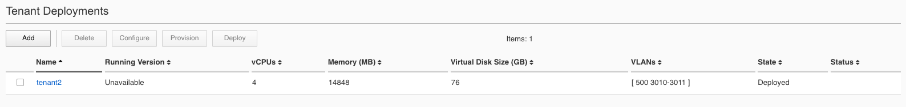

===========================
Deploying an rSeries Tenant
===========================

------------------
Tenant Image Types
------------------

rSeries allows different packaging options for tenant images. It will be up to administrators to choose the image that is best suited for their environment. The main differences between the image types will be how much space they can consume on disk, and whether or not they allow in place upgrades. rSeries only supports specific TMOS releases (currently 15.1.4), they can be found on downloads.f5.com:

.. image:: images/rseries_deploying_a_tenant/image64.png
  :align: center
  :scale: 70% 

Ensure you choose the option that is labeled specifically for rSeries. i.e. **14.1.4_Tenant_VELOS**:

.. image:: images/rseries_deploying_a_tenant/image65.png
  :align: center
  :scale: 70% 

There are 4 different types of tenant images to choose from as seen below, please read the rest of this section to determine the best image type for your environment:

.. image:: images/rseries_deploying_a_tenant/image66.png
  :align: center
  :scale: 70% 

The **T1-VELOS** image type should be used with extreme caution. It is the smallest of the image sizes, but it only has one slot/volume for TMOS software meaning it does not support upgrades (not even for hotfixes). This type of image is geared towards more modern environments where pave & nuke strategies are preferred over in place upgrades.   

.. image:: images/rseries_deploying_a_tenant/image67.png
  :align: center
  :scale: 70% 

The remaining images (T2, ALL, T4) all support in place upgrades; however, they may limit the amount of disk space that can be used by the tenant and currently there is no utility to expand an image once it is full. A tenant expansion utility is something that is being considered for a future release.

The **T2-VELOS** image is intended for a tenant that will run LTM and or DNS only, it is not suitable for tenants needing other modules provisioned (AVR may be an exception). This type of image is best suited in a high density tenant environment where the number of tenants is going to be high per blade and using minimum CPU resources (1 or 2 vCPU’s per tenant). You may want to limit the amount of disk space each tenant can use as a means of ensuring the filesystem on the blade does not become full. As an example, there is 1TB of disk per blade, and 22 tenants each using the 142GB T4 image would lead to an over provisioning situation. Because tenants are deployed in sparse mode which allows over provisioning, this may not be an issue initially, but could become a problem later in the tenant’s lifespan as it writes more data to disk. To keep the tenants in check, you can deploy smaller T2 images which can consume 45GB each. LTM/DNS deployments use much less disk than other BIG-IP modules which do extensive local logging and utilize databases on disk.

The **All-VELOS** image is suitable for any module configuration and supports a maximum of 76GB for the tenant. It is expected that the number of tenants per blade would be much less, as the module combinations that drive the need for more disk typically require more CPU/Memory which will artificially reduce the tenant count per blade. Having a handful of 76GB or 156GB images per blade should not lead to an out of space condition. There are some environments where some tenants may need more disk space and the T4 image can provide for that. Until expansion utilities are made available, it may be best to default using the T4 image as that is essentially the default size for vCMP deployments today. 

The **T4-VELOS** image also supports any module combination but has additional disk capacity. If you intend to have lots of software images, databases for modules, run modules like SWG which utilize a lot of disk, and local logging then the added capacity is recommended. More detail on the image types can be found in the following solution article.

https://support.f5.com/csp/article/K45191957

Note that the image sizes in the chart are the maximum amount of space a tenant could use, not necessarily what it will consume on the physical disk. rSeries tenants are deployed in sparse mode on the file system when they are created. That means that a tenant may think it has a certain amount of disk space, but in reality, most of the space that is unutilized is zeroed-out and not consuming any space on the disk. 

.. image:: images/rseries_deploying_a_tenant/image68.png
  :align: center
  :scale: 70% 

This means the disk consumption on the rSeries disk is actually much smaller than what appears inside the tenant. In the example below the tenant believes it has 77GB of disk allocated:

.. image:: images/rseries_deploying_a_tenant/image69.png
  :align: center
  :scale: 70% 

However, the 76GB image is allocated in a sparse manner meaning the tenant is only utilizing what it needs and on the filesystem of the appliance it is actually consuming only 11GB on the disk:

.. image:: images/rseries_deploying_a_tenant/image70.png
  :align: center
  :scale: 70% 

This is analogous to thin provisioning in a hypervisor where you can over-allocate resources. vCMP as an example today uses an image similar in size to the T4 image. There may be rare instances where tenant running in production for a long time can end up with lots of extra space consumed on disk. This could be due to many in place software upgrades, local logging, core files, database use etc…There is no utility available to reclaim that space that may have been used at one point but is no longer used. If the disk utilization becomes over utilized, you could backup the tenant configuration, create a new fresh tenant, and restore the configuration from the old tenant, and then delete the old tenant. This would free up all the unused space again.

------------------
Tenant Deployments
------------------

Tenant can easily be deployed via the F5OS CLI, GUI, or API.

Tenant Deployment via CLI
-------------------------

Uploading a Tenant Image via CLI
================================

Tenant software images are loaded directly into the F5OS platform layer. For the initial release of rSeries tenants only support TMOS v15.1.4. No other TMOS versions are supported other than hotfixes or rollups based on those versions of software. 

Before deploying any tenant, you must ensure you have a proper tenant software release loaded into the F5OS platform layer. If an HTTPS/SCP/SFTP server is not available, you may upload a tenant image using scp directly to the F5OS platform layer. Simply scp an image to the out-of-band management IP address using the admin account and a path of **IMAGES**. There are also other upload options avilable in the GUI (Upload from Browser) or API (HTTPS/SCP/SFTP).

.. code-block:: bash

    scp BIGIP-15.1.5-0.0.8.ALL-F5OS.qcow2.zip.bundle admin@10.255.0.132:IMAGES

You may also import the tenant image file from the F5OS CLI. Use the **file import** command to get the tenant image file from a remote HTTPS server or from a remote server over SCP or SFTP. Below is an example importing from a remote HTTPS server. Note the target directory should be **images/tenant**:

.. code-block:: bash

    Boston-r10900-1# file import remote-host 10.255.0.142 remote-file /upload/BIGIP-15.1.4-0.0.47.ALL-VELOS.qcow2.zip.bundle local-file images/tenant/BIGIP-15.1.4-0.0.47.ALL-VELOS.qcow2.zip.bundle username corpuser insecure
    Value for 'password' (<string>): ********
    result File transfer is initiated.(images/tenant/BIGIP-15.1.4-0.0.47.ALL-VELOS.qcow2.zip.bundle)

If a remote HTTPS server is not available you may also copy the file form the CLI over SCP:

.. code-block:: bash

    Boston-r10900-1# file import remote-host 10.255.0.142 remote-file /var/www/server/1/upload/BIGIP-15.1.4-0.0.47.ALL-VELOS.qcow2.zip.bundle local-file images/tenant/BIGIP-15.1.4-0.0.47.ALL-VELOS.qcow2.zip.bundle username root insecure protocol scp
    Value for 'password' (<string>): ********
    result File transfer is initiated.(images/tenant/BIGIP-15.1.4-0.0.47.ALL-VELOS.qcow2.zip.bundle)

The command **file transfer-status** will provide details of the transfer progress and any errors:

.. code-block:: bash

    Boston-r10900-1# file import remote-host 10.255.0.142 remote-file /var/www/server/1/upload/BIGIP-15.1.4-0.0.47.ALL-VELOS.qcow2.zip.bundle local-file images/tenant/BIGIP-15.1.4-0.0.47.ALL-VELOS.qcow2.zip.bundle username root insecure protocol scp
    Value for 'password' (<string>): ********
    result File transfer is initiated.(images/tenant/BIGIP-15.1.4-0.0.47.ALL-VELOS.qcow2.zip.bundle)

    Boston-r10900-1# show file transfer-operations
    LOCAL FILE PATH                                               REMOTE HOST   REMOTE FILE PATH                                                         OPERATION    PROTOCOL  STATUS                                TIMESTAMP                 
    --------------------------------------------------------------------------------------------------------------------------------------------------------------------------------------------------------------------------------------------
    images/import/BIGIP-15.1.4-0.0.47.ALL-VELOS.qcow2.zip.bundle  10.255.0.142  /upload/BIGIP-15.1.4-0.0.47.ALL-VELOS.qcow2.zip.bundle                   Import file  HTTPS              Completed                    Wed Dec 22 22:11:47 2021  
    images/tenant/BIGIP-15.1.4-0.0.47.ALL-VELOS.qcow2.zip.bundle  10.255.0.142  /upload/BIGIP-15.1.4-0.0.47.ALL-VELOS.qcow2.zip.bundle                   Import file  HTTPS     Unauthorized Request, HTTP Error 401  Wed Dec 22 22:21:59 2021  
    images/tenant/BIGIP-15.1.4-0.0.47.ALL-VELOS.qcow2.zip.bundle  10.255.0.142  /upload/BIGIP-15.1.4-0.0.47.ALL-VELOS.qcow2.zip.bundle                   Import file  SCP       Failed to recv file                   Wed Dec 22 22:22:57 2021  
    images/tenant/BIGIP-15.1.4-0.0.47.ALL-VELOS.qcow2.zip.bundle  10.255.0.142  /var/www/server/1/upload/BIGIP-15.1.4-0.0.47.ALL-VELOS.qcow2.zip.bundle  Import file  SCP       In Progress (7.0%)                    Wed Dec 22 22:25:14 2021  

You can view the current tenant images and their status in the F5OS CLI by using the **show images** command:

.. code-block:: bash

    Boston-r10900-1# show images
                                                                        IN               
    NAME                                                                 USE    STATUS    
    --------------------------------------------------------------------------------------
    BIGIP-15.1.4-0.0.26.ALL-VELOS.qcow2.zip.bundle                       false  verified  
    BIGIP-15.1.4-0.0.47.ALL-VELOS.qcow2.zip.bundle                       false  verified  
    BIGIP-15.1.5-0.0.3.ALL-F5OS.qcow2.zip.bundle                         false  verified  
    BIGIP-15.1.5-0.0.8.ALL-F5OS.qcow2.zip.bundle                         false  verified  
    BIGIP-bigip15.1.x-europa-15.1.5-0.0.210.ALL-F5OS.qcow2.zip.bundle    false  verified  
    BIGIP-bigip15.1.x-europa-15.1.5-0.0.222.ALL-F5OS.qcow2.zip.bundle    false  verified  
    BIGIP-bigip15.1.x-europa-15.1.5-0.0.225.ALL-F5OS.qcow2.zip.bundle    false  verified  
    BIGIP-bigip151x-miranda-15.1.4.1-0.0.171.ALL-VELOS.qcow2.zip.bundle  false  verified  
    BIGIP-bigip151x-miranda-15.1.4.1-0.0.173.ALL-VELOS.qcow2.zip.bundle  false  verified  
    BIGIP-bigip151x-miranda-15.1.4.1-0.0.176.ALL-VELOS.qcow2.zip.bundle  false  verified  

    Boston-r10900-1# 

Creating a Tenant via CLI
=========================

Tenant lifecycle can be fully managed via the CLI using the **tenants** command in config mode. Using command tab completion and question marks will help display all the tenant options. Enter **config** mode and enter the command **tenants tenant <tenant-name>** where **<tenant-name>** is the name of the tenant you would like to create. This will put you into a mode for that tenant and you will be prompted for some basic information to create the tenant via a CLI wizard. After answering basic information you may configure additional tenant parameters by entering **config ?** within the tenant mode, and that will provide all the additional configuration options:

.. code-block:: bash

    Boston-r10900-1(config)# tenants tenant tenant2
    Value for 'config image' (<string>): BIGIP-15.1.5-0.0.8.ALL-F5OS.qcow2.zip.bundle
    Value for 'config nodes' (list): 1
    Value for 'config mgmt-ip' (<IP address>): 10.255.0.136
    Value for 'config prefix-length' (<unsignedByte, 0 .. 128>): 24
    Value for 'config gateway' (<IP address>): 10.255.0.1
    Boston-r10900-1(config-tenant-tenant2)# 

**NOTE: The nodes value is currently required in the interactive CLI mode to remain consistency with VELOS, but should be set for 1 for rSeries tenant deployments.** 

When you are inside the tenant config mode you can enter each configuration item one line at a time using tab completion and question mark for help. Type **config ?** to see all the avilable options.

.. code-block:: bash

  Boston-r10900-1# config
  Entering configuration mode terminal
  Boston-r10900-1(config)# tenants tenant tenant2 
    Boston-r10900-1(config-tenant-tenant2)# config ?
    Possible completions:
    appliance-mode        Appliance mode can be enabled/disabled at tenant level
    cryptos               Crypto devices for the tenant.
    gateway               User-specified gateway for the tenant mgmt-ip.
    image                 User-specified image for tenant.
    memory                User-specified memory in MBs for the tenant.
    mgmt-ip               User-specified mgmt-ip for the tenant management access.
    name                  User-specified name for tenant.
    nodes                 User-specified node-number(s) on which to schedule the tenant.
    prefix-length         User-specified prefix-length for the tenant mgmt-ip.
    running-state         User-specified desired state for the tenant.
    storage               User-specified storage information
    type                  Tenant type.
    vcpu-cores-per-node   User-specified number of logical cpu cores for the tenant.
    vlans                 User-specified vlan-id from vlan table for the tenant.
  Boston-r10900-1(config-tenant-tenant2)# config ?
  Boston-r10900-1(config-tenant-tenant2)# config cryptos enabled 
  Boston-r10900-1(config-tenant-tenant2)# config vcpu-cores-per-node 4
  Boston-r10900-1(config-tenant-tenant2)# config type BIG-IP 
  Boston-r10900-1(config-tenant-tenant2)# config vlans 500            
  Boston-r10900-1(config-tenant-tenant2)# config vlans 3010
  Boston-r10900-1(config-tenant-tenant2)# config vlans 3011
  Boston-r10900-1(config-tenant-tenant2)# config running-state deployed 
  Boston-r10900-1(config-tenant-tenant2)# config memory 14848
  

Any changes must be committed for them to be executed:

.. code-block:: bash

  Boston-r10900-1(config-tenant-tenant2)# commit
  Commit complete.
  Boston-r10900-1(config-tenant-tenant2)# 
	
You may alternatively put all the parameters on one line instead of using the interactive mode above:

.. code-block:: bash

    Boston-r10900-1(config)# tenants tenant tenant2 config image BIGIP-15.1.5-0.0.8.ALL-F5OS.qcow2.zip.bundle vcpu-cores-per-node 2 nodes 1  vlans [ 500 3010 3011 ] mgmt-ip 10.255.0.136 prefix-length 24 gateway 10.255.0.1 name tenant2 running-state deployed
    Boston-r10900-1(config-tenant-tenant2)# commit
    Commit complete.
    Boston-r10900-1(config-tenant-tenant2)#

Validating Tenant Status via CLI
================================

After the tenant is created you can run the command **show running-config tenant** to see what has been configured:

.. code-block:: bash

    Boston-r10900-1# show running-config tenants 
    tenants tenant tenant2
    config name         tenant2
    config type         BIG-IP
    config image        BIGIP-15.1.5-0.0.8.ALL-F5OS.qcow2.zip.bundle
    config nodes        [ 1 ]
    config mgmt-ip      10.255.0.136
    config prefix-length 24
    config gateway      10.255.0.1
    config vlans        [ 500 3010 3011 ]
    config cryptos      enabled
    config vcpu-cores-per-node 4
    config memory       14848
    config storage size 76
    config running-state deployed
    config appliance-mode disabled
    !
    Boston-r10900-1# 

To see the actual status of the tenants, issue the CLI command **show tenants**.

.. code-block:: bash

  Boston-r10900-1# show tenants 
  tenants tenant tenant2
   state name          tenant2
   state unit-key-hash glbrGy9pGV3BAh1ObpXrryOF23bTEs2BAnQ5MPaIRyBjc8Un1swNfBo2yQhFXC6jKx/F5EhuaJFCehnHJqtDkg==
   state type          BIG-IP
   state mgmt-ip       10.255.0.136
   state prefix-length 24
   state gateway       10.255.0.1
   state vlans         [ 500 3010 3011 ]
   state cryptos       enabled
   state vcpu-cores-per-node 4
   state memory        14848
   state storage size 76
   state running-state deployed
   state mac-data base-mac 00:94:a1:69:59:26
   state mac-data mac-pool-size 1
   state appliance-mode disabled
   state status        Running
   state primary-slot  1
   state image-version "BIG-IP 15.1.5 0.0.8"
  NDI      MAC                
  ----------------------------
  default  00:94:a1:69:59:24  

        INSTANCE                                                                                                                                                 
  NODE  ID        PHASE    IMAGE NAME                                    CREATION TIME         READY TIME            STATUS                   MGMT MAC           
  ---------------------------------------------------------------------------------------------------------------------------------------------------------------
  1     1         Running  BIGIP-15.1.5-0.0.8.ALL-F5OS.qcow2.zip.bundle  2021-12-22T20:47:31Z  2021-12-22T20:47:32Z  Started tenant instance  00:94:a1:69:59:27  

Tenant Deployment via GUI
-------------------------

Uploading a Tenant Image via GUI
================================

You can upload a tenant image via the GUI in two different places. The first is by going to the **Tenant Management > Tenant Images** page. There are two options on this page, you may click the **Import** button and you will receive a pop-up asking for the URL of a remote HTTPS server with optional credentials, and the ability to ignore certificate warnings.

.. image:: images/rseries_deploying_a_tenant/image71.png
  :align: center
  :scale: 70% 

.. image:: images/rseries_deploying_a_tenant/image72.png
  :align: center
  :scale: 70% 

The second option is to click the **Upload** button to select an image file that you have previously downloaded directly from your computer via the browser.

.. image:: images/rseries_deploying_a_tenant/image73.png
  :align: center
  :scale: 70% 

After the image is uploaded you need to wait until it shows **Verified** status before deploying a tenant.

Creating a Tenant via GUI
=========================

You can deploy a tenant from the GUI using the Add button in the **Tenant Management > Tenant Deployments** screen.

.. image:: images/rseries_deploying_a_tenant/image74.png
  :align: center
  :scale: 70% 

The tenant deployment options are almost identical to deploying a vCMP guest, with a few minor differences. You’ll supply the tenant a name and choose the TMOS tenant image for it to run. Next you will assign an out-of-band management address, prefix and gateway and assing VLANs you wan the tenant to inherit. There are **Recommended** and **Advanced** options for resource provisioning, choosing Recommended will automatically adjust memory based on the vCPU’s allocated to the tenant. Choosing Advanced will allow you to over-allocate memory which is something iSeries did not support. You can choose different states (Configured, Provisioned, Deployed) just like vCMP and there is an option to enable/disable HW Crypto & Compression Acceleration (Recommended this stay enabled). And finally, there is an option to enable Appliance mode which will disable root/bash access to the tenant.

.. image:: images/rseries_deploying_a_tenant/image75.png
  :align: center
  :scale: 70% 

Validating Tenant Status via GUI
================================

Once the tenant is deployed you can monitor its status in the **Tenant Managment > Tenant Deployments** GUI page. You'll see the **State** show **Deployed** but the **Status** 

.. image:: images/rseries_deploying_a_tenant/image77.png
  :align: center
  :scale: 70% 

.. image:: images/rseries_deploying_a_tenant/image78.png
  :align: center
  :scale: 70% 

.. image:: images/rseries_deploying_a_tenant/image79.png
  :align: center
  :scale: 70% 

Tenant Deployment via API
-------------------------

The VELOS tenant lifecycle is fully supported in the F5OS API. This section will cover common examples.

Uploading a Tenant Image via API
================================

The upload utility requires a remote HTTPS server that is hosting the tenant image file. All API calls for tenant lifecycle are posted to the IP address of the chassis partition.
To copy a tenant image into a chassis partition, use the following API call to the chassis partition IP address:

.. code-block:: bash

    POST https://{{Chassis1_BigPartition_IP}}:8888/api/data/f5-utils-file-transfer:file/import

.. code-block:: json

    {
        "input": [
            {
                "remote-host": "10.255.0.142",
                "remote-file": "upload/{{Tenant_Image}}",
                "local-file": "images/{{Tenant_Image}}",
                "insecure": "",
                "f5-utils-file-transfer:username": "corpuser",
                "f5-utils-file-transfer:password": "Passw0rd!!"
            }
        ]
    }

To list the current tenant images available on the chassis partition use the following API Call:

.. code-block:: bash

    GET https://{{Chassis1_BigPartition_IP}}:8888/restconf/data/f5-tenant-images:images

Below is output generated from the previous command:

.. code-block:: json

    {
        "f5-tenant-images:images": {
            "image": [
                {
                    "name": "BIGIP-15.1.4-0.0.46.ALL-VELOS.qcow2.zip.bundle",
                    "in-use": true,
                    "status": "replicated"
                },
                {
                    "name": "BIGIP-15.1.4-0.0.47.ALL-VELOS.qcow2.zip.bundle",
                    "in-use": false,
                    "status": "replicated"
                }
            ]
        }
    }

Creating a Tenant via API
=========================

Tenant creation via the API is as simple as defining the parameters below and sending the POST to the chassis partition.

.. code-block:: bash

  POST https://{{Chassis_Partition_IP}}:8888/restconf/data/f5-tenants:tenants

.. code-block:: json

  {
      "tenant": [
          {
              "name": "{{New_Tenant1_Name}}",
              "config": {
                  "image": "{{Tenant_Image}}",
                  "nodes": [
                      1
                  ],
                  "mgmt-ip": "{{Chassis2_Tenant1_IP}}",
                  "gateway": "{{OutofBand_DFGW}}",
                  "prefix-length": 24,
                  "vlans": [
                      444,
                      501,
                      555
                  ],
                  "vcpu-cores-per-node": 2,
                  "memory": 7680,
                  "cryptos": "enabled",
                  "running-state": "configured"
              }
          }
      ]
  }

Validating Tenant Status via API
================================

.. code-block:: bash

  GET https://{{Chassis_Partition_IP}}:8888/restconf/data/f5-tenants:tenants

.. code-block:: json

  {
      "f5-tenants:tenants": {
          "tenant": [
              {
                  "name": "tenant1",
                  "config": {
                      "name": "tenant1",
                      "type": "BIG-IP",
                      "image": "BIGIP-14.1.4-0.0.11.ALL-VELOS.qcow2.zip.bundle",
                      "nodes": [
                          1
                      ],
                      "mgmt-ip": "10.255.0.207",
                      "prefix-length": 24,
                      "gateway": "10.255.0.1",
                      "vlans": [
                          444,
                          501,
                          555
                      ],
                      "cryptos": "enabled",
                      "vcpu-cores-per-node": "4",
                      "memory": "14848",
                      "running-state": "deployed",
                      "appliance-mode": {
                          "enabled": false
                      }
                  },
                  "state": {
                      "name": "tenant1",
                      "type": "BIG-IP",
                      "mgmt-ip": "10.255.0.207",
                      "prefix-length": 24,
                      "gateway": "10.255.0.1",
                      "mac-ndi-set": [
                          {
                              "ndi": "default",
                              "mac": "00:94:a1:8e:58:29"
                          }
                      ],
                      "vlans": [
                          444,
                          501,
                          555
                      ],
                      "cryptos": "enabled",
                      "vcpu-cores-per-node": "4",
                      "memory": "14848",
                      "running-state": "deployed",
                      "mac-data": {
                          "base-mac": "00:94:a1:8e:58:2b",
                          "mac-pool-size": 1
                      },
                      "appliance-mode": {
                          "enabled": false
                      },
                      "status": "Running",
                      "primary-slot": 1,
                      "image-version": "BIG-IP 14.1.4 0.0.11",
                      "instances": {
                          "instance": [
                              {
                                  "node": 1,
                                  "instance-id": 1,
                                  "phase": "Running",
                                  "image-name": "BIGIP-14.1.4-0.0.11.ALL-VELOS.qcow2.zip.bundle",
                                  "creation-time": "2021-03-15T19:42:43Z",
                                  "ready-time": "2021-03-15T19:42:57Z",
                                  "status": "Started tenant instance",
                                  "mgmt-mac": "62:e3:b2:ef:9d:66"
                              }
                          ]
                      }
                  }
              },
              {
                  "name": "tenant2",
                  "config": {
                      "name": "tenant2",
                      "type": "BIG-IP",
                      "image": "BIGIP-14.1.4-0.0.11.ALL-VELOS.qcow2.zip.bundle",
                      "nodes": [
                          1,
                          2
                      ],
                      "mgmt-ip": "10.255.0.208",
                      "prefix-length": 24,
                      "gateway": "10.255.0.1",
                      "vlans": [
                          444,
                          502,
                          555
                      ],
                      "cryptos": "enabled",
                      "vcpu-cores-per-node": "6",
                      "memory": "22016",
                      "running-state": "deployed",
                      "appliance-mode": {
                          "enabled": false
                      }
                  },
                  "state": {
                      "name": "tenant2",
                      "type": "BIG-IP",
                      "mgmt-ip": "10.255.0.208",
                      "prefix-length": 24,
                      "gateway": "10.255.0.1",
                      "mac-ndi-set": [
                          {
                              "ndi": "default",
                              "mac": "00:94:a1:8e:58:2a"
                          }
                      ],
                      "vlans": [
                          444,
                          502,
                          555
                      ],
                      "cryptos": "enabled",
                      "vcpu-cores-per-node": "6",
                      "memory": "22016",
                      "running-state": "deployed",
                      "mac-data": {
                          "base-mac": "00:94:a1:8e:58:2c",
                          "mac-pool-size": 1
                      },
                      "appliance-mode": {
                          "enabled": false
                      },
                      "status": "Running",
                      "primary-slot": 1,
                      "image-version": "BIG-IP 14.1.4 0.0.11",
                      "instances": {
                          "instance": [
                              {
                                  "node": 1,
                                  "instance-id": 1,
                                  "phase": "Running",
                                  "image-name": "BIGIP-14.1.4-0.0.11.ALL-VELOS.qcow2.zip.bundle",
                                  "creation-time": "2021-03-16T13:25:10Z",
                                  "ready-time": "2021-03-16T13:25:07Z",
                                  "status": "Started tenant instance",
                                  "mgmt-mac": "aa:b8:c3:ce:23:87"
                              },
                              {
                                  "node": 2,
                                  "instance-id": 2,
                                  "phase": "Running",
                                  "image-name": "BIGIP-14.1.4-0.0.11.ALL-VELOS.qcow2.zip.bundle",
                                  "creation-time": "2021-03-16T13:25:03Z",
                                  "ready-time": "2021-03-16T13:24:58Z",
                                  "status": "Started tenant instance",
                                  "mgmt-mac": "62:ce:c9:75:15:e0"
                              }
                          ]
                      }
                  }
              }
          ]
      }
  }

-----------------
Resizing a Tenant
-----------------

rSeries tenants have static CPU and memory allocations. These can be changed after a tenant has been deployed, but the tenant will have to be temporarily suspended (put in the **provisioned** state), then the change to CPU and or memory allocation can be made. A tenant can be expanded assuming adequate resources are available. Once the changes are completed the tenant can be put into the deployed state and returned to service.

Expanding a Tenant via GUI
--------------------------

Below is GUI output of a single tenant that is in the deployed and running state configured with 2 vCPU’s and 7680 memory. The workflow below will cover expanding the tenant from 2 to 4 vCPU’s and the memory from 7680 to 14848. Click the check box next to the tenant, and then select the **Provision** button. 

.. image:: images/rseries_deploying_a_tenant/image75.png
  :align: center
  :scale: 70% 

Click **OK**. This will move the tenant from **deployed** to **provisioned** state. You will see the tenant go from **running**, to **stopping** to **stopped**.

.. image:: images/rseries_deploying_a_tenant/image77.png
  :align: center
  :scale: 70% 

Next click on the hyperlink for tenant1. This will bring you into the configuration page for that tenant.  Change the **vCPUs** to **4**, and the **Memory** to **14848**, and set the state back to **deployed**. When finished click **Save** and the tenant will start up again with the new configuration.

.. image:: images/rseries_deploying_a_tenant/image78.png
  :align: center
  :scale: 70% 

.. image:: images/rseries_deploying_a_tenant/image79.png
  :align: center
  :scale: 70% 

Expanding a Tenant via CLI
--------------------------

Expanding a tenant via the CLI follows the same workflows as the GUI. You must first put the tenant in a provisioned state, and then make configuration changes, and then change back to deployed state. You can view the current configuration of the tenant by issuing the **show running-config tenants** command. Note the tenant currently has 2 vCPU, and 7680 MB of memory.

.. code-block:: bash

  bigpartition-2# show running-config tenants 
  tenants tenant tenant1
  config type         BIG-IP
  config image        BIGIP-14.1.4-0.0.654.ALL-VELOS.qcow2.zip.bundle
  config nodes        [ 1 ]
  config mgmt-ip      10.255.0.207
  config prefix-length 24
  config gateway      10.255.0.1
  config vlans        [ 444 500 555 ]
  config cryptos      enabled
  config vcpu-cores-per-node 2
  config memory       7680
  config running-state deployed
  config appliance-mode disabled
  !
  bigpartition-2# 

You can also view the tenants running status by issuing the CLI command **show tenants**.

.. code-block:: bash

  bigpartition-2# show tenants 
  tenants tenant tenant1
  state type          BIG-IP
  state mgmt-ip       10.255.0.207
  state prefix-length 24
  state gateway       10.255.0.1
  state vlans         [ 444 500 555 ]
  state cryptos       enabled
  state vcpu-cores-per-node 2
  state memory        7680
  state running-state deployed
  state mac-data base-mac 00:94:a1:8e:58:1b
  state mac-data mac-pool-size 1
  state appliance-mode disabled
  state status        Running
  state primary-slot  1
  state image-version "BIG-IP 14.1.4 0.0.654"
  NDI      MAC                
  ----------------------------
  default  00:94:a1:8e:58:19  

        INSTANCE                                                                                                                                                    
  NODE  ID        PHASE    IMAGE NAME                                       CREATION TIME         READY TIME            STATUS                   MGMT MAC           
  ------------------------------------------------------------------------------------------------------------------------------------------------------------------
  1     1         Running  BIGIP-14.1.4-0.0.654.ALL-VELOS.qcow2.zip.bundle  2021-02-04T22:02:22Z  2021-02-04T22:02:18Z  Started tenant instance  42:d9:d1:e5:a3:c0  

  bigpartition-2# 

To change the tenant configuration, you must first enter config mode and then change the tenant running state to **provisioned**, the change won’t take effect until the **commit** command is issued:

.. code-block:: bash

  bigpartition-2#  config
  Entering configuration mode terminal
  bigpartition-2(config)# tenants tenant tenant1 config running-state provisioned         
  bigpartition-2(config-tenant-tenant1)# commit
  Commit complete.

You can monitor the tenant transition to provisioned state using the show commands above. Once in the provisioned state you can change the vCPU and memory configurations as well as the **running-state** back to deployed. Then issue the **commit** command to execute the changes.

.. code-block:: bash

  bigpartition-2(config-tenant-tenant1)# exit
  bigpartition-2(config)# tenants tenant tenant1 config vcpu-cores-per-node 4 memory 14848 running-state deployed    
  bigpartition-2(config-tenant-tenant1)# commit 
    Commit complete.

Expanding a Tenant via API
--------------------------

First get the current tenant status via the API and note the current CPU Allocation. The tenant in the example below is currently configured and has 2 vCPU’s and 7680 of memory per slot:

.. code-block:: bash

  GET https://{{Chassis1_BigPartition_IP}}:8888/restconf/data/f5-tenants:tenants/tenant={{New_Tenant1_Name}}/config

The API output:

.. code-block:: json

  {
      "f5-tenants:config": {
          "name": "tenant1",
          "type": "BIG-IP",
          "image": "BIGIP-14.1.4-0.0.654.ALL-VELOS.qcow2.zip.bundle",
          "nodes": [
              1
          ],
          "mgmt-ip": "10.255.0.207",
          "prefix-length": 24,
          "gateway": "10.255.0.1",
          "vlans": [
              444,
              500,
              555
          ],
          "cryptos": "enabled",
          "vcpu-cores-per-node": "2",
          "memory": "7680",
          "running-state": "deployed",
          "appliance-mode": {
              "enabled": false
          }
      }
  }

If you attempt to change the tenant configuration while it is in the deployed state it will fail with an error like the one below notifying you that config changes when in the **deployed** state is not allowed:

.. code-block:: json

  {
      "errors": {
          "error": [
              {
                  "error-message": "/tenants/tenant{tenant1}/config/vcpu-cores-per-node (value \"4\"): cannot change vcpu-cores-per-node when tenant is in deployed state",
                  "error-path": "/f5-tenants:tenants/tenant=tenant1/config/vcpu-cores-per-node",
                  "error-tag": "invalid-value",
                  "error-type": "application"
              }
          ]
      }
  }

The workflow to change the tenant configuration is to first change the tenant state to be **provisioned** then make the configuration change. Use the following API PATCH call to move the tenant to the provisioned state:

.. code-block:: bash

  PATCH https://{{Chassis2_BigPartition_IP}}:8888//restconf/data/f5-tenants:tenants/tenant={{New_Tenant1_Name}}/config/running-state

And for the JSON body of the API call change the **running-state** to **provisioned**:

.. code-block:: json

  {
      "running-state": "provisioned"
  }

Next issue the GET command above to obtain the tenant status and note that its running state has changed to **provisioned**:

.. code-block:: json

        "cryptos": "enabled",
        "vcpu-cores-per-node": "2",
        "memory": "7680",
        "running-state": "provisioned",
        "appliance-mode": {
            "enabled": false

Send a PATCH API command to change the CPU and memory configuration so the tenant can expand from 2 to 4 vCPU’s and from 7680 to 14848 GB of memory. It’s important to change both the CPU and memory allocation when expanding the tenant.

.. code-block:: bash

  PATCH https://{{Chassis2_BigPartition_IP}}:8888//restconf/data/f5-tenants:tenants/tenant={{New_Tenant1_Name}}/config/vcpu-cores-per-node

.. code-block:: json

  {
      "vcpu-cores-per-node": 4,
      "memory": 14848
  }

Finally change the tenant status back to **deployed** and then check the status again to confirm the change. The tenant should boot up with the expanded memory and CPU.

.. code-block:: bash

  PATCH https://{{Chassis2_BigPartition_IP}}:8888//restconf/data/f5-tenants:tenants/tenant={{New_Tenant1_Name}}/config/running-state

.. code-block:: json

  {
      "running-state": "deployed"
  }

