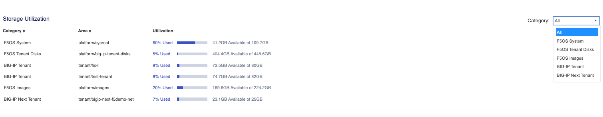
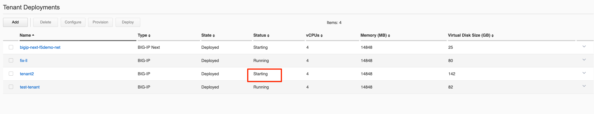

==================================
Deploying an rSeries BIG-IP Tenant
==================================

------------------
Tenant Image Types
------------------

rSeries allows different packaging options for tenant images. It will be up to administrators to choose the image that is best suited for their environment. The main differences between the image types will be how much space they can consume on disk, and whether they allow in-place upgrades. rSeries only supports specific TMOS releases as defined in the following solution article:

`K86001294: F5OS hardware/software support matrix <https://my.f5.com/manage/s/article/K86001294>`_

F5OS tenant images can be found on downloads.f5.com:

Ensure you choose the option that is labeled specifically for rSeries that is **xx.x.x_Tenant-F5OS**, these are the tenant images for F5OS based systems:

There are 4 different types of tenant images to choose from as seen below; please read the rest of this section to determine the best image type for your environment:

The **T1-F5OS** image type should be used with extreme caution. It is the smallest of the image sizes, but it only has one slot/volume (boot location) for TMOS software, meaning it does not support upgrades (not even for hotfixes). This type of image is geared towards more modern environments where pave and nuke strategies are preferred over in-place upgrades.   

.. image:: images/rseries_deploying_a_tenant/image4.png
  :align: center
  :scale: 70% 

The remaining images (T2-F5OS, ALL-F5OS, T4-F5OS) all support in-place upgrades (they support multiple boot locations); however, they each default to different consumption of disk space that can be used by the tenant. No matter which image you chose you can always expand tenant disk space later using the **Virtual Disk Size** parameter in the tenant deployment options. This will require an outage. Although you can expand the virtual disk, you cannot shrink it, so it is best to not overestimate the image type you need. 

The **T2-F5OS** image is intended for a tenant that will run LTM and or DNS only, it is not suitable for tenants needing other modules provisioned (AVR may be an exception). This type of image is best suited in a high-density tenant environment where the number of tenants is going to be high per appliance and using minimum CPU resources (1 or 2 vCPUs per tenant). You may want to limit the amount of disk space each tenant can use as a means of ensuring the filesystem on the appliance does not become full. As an example, there is 1TB of disk space per r5000 and r10000 appliance, and 36 tenants each using the 142GB T4-F5OS image would lead to an over-provisioning situation. Because tenants are deployed in sparse mode which allows over-provisioning, this may not be an issue initially but could become a problem later in the tenant’s lifespan as it writes more data to the disk. To keep the tenants in check, you can deploy smaller T2-F5OS images which can consume 45GB each. LTM/DNS deployments use much less disk space than other BIG-IP modules, which do extensive local logging and utilize databases on disk.

The **All-F5OS** image is suitable for any module configuration and supports a default of 77GB or 82GB (depending on the TMOS version) for the tenant. It is expected that the number of tenants per blade would be much less, as the module combinations that drive the need for more disk space typically require more CPU/memory which will artificially reduce the tenant count per appliance. Having a handful of 76GB or 156GB images per appliance should not lead to an out of space condition. There are some environments where some tenants may need more disk space, and the T4-F5OS image can provide for that. Now that Virtual Disk expansion utilities are available you can always grow the disk consumption later so starting small and expanding later is a good approach; it may be best to default using the T4-F5OS image (if tenant density is not too dense) as that is essentially the default size for vCMP deployments today. 

The **T4-F5OS** image also supports any module combination but has additional disk capacity. If you intend to have lot of software images, databases for modules, run modules like SWG which utilize a lot of disk space, and local logging then the added capacity is recommended. More detail on the image types can be found in the following solution article.

`K45191957: Overview of the BIG-IP tenant image types <https://my.f5.com/manage/s/article/K45191957>`_

Note that the image sizes in the chart are the default amount of space a tenant could use, not necessarily what it will consume on the physical disk. rSeries tenants are deployed in sparse mode on the file system when they are created. That means that a tenant may think it has a certain amount of disk space, but most of the space that is unutilized is zeroed-out and not consuming any space on the disk. 

.. image:: images/rseries_deploying_a_tenant/image5.png
  :align: center
  :scale: 70% 

This means the disk consumption on the rSeries disk is much smaller than what appears inside the tenant. In the example below the tenant believes it has 77GB of disk allocated:

.. image:: images/rseries_deploying_a_tenant/image6.png
  :align: center
  :scale: 70% 

However, the 76GB image is allocated in a sparse manner meaning the tenant is only utilizing what it needs and on the filesystem of the appliance it is consuming only 6.4GB on the disk. You can confirm this by logging into the bash shell of F5OS as root. Then listing the contents of the directory **/var/F5/system/cbip-disks**, here you will see directories for each tenant. Enter the command **ls -lsh <tenant-directory-name>** and the output will show the size the tenant thinks it has (76GB) and the actual size used on disk (in this case 6.4GB).

.. image:: images/rseries_deploying_a_tenant/image7.png
  :align: center
  :scale: 70% 

This is analogous to thin provisioning in a hypervisor where you can over-allocate resources. vCMP as an example today uses an image similar in size to the T4-F5OS image. There may be rare instances where a tenant running in production for a long time can end up with a lot of extra space consumed on disk. This could be due to many in-place software upgrades, local logging, core files, database use etc… There is no utility available to reclaim that space that may have been used at one point but is no longer used. If the disk utilization becomes over-utilized, you could back up the tenant configuration, create a new fresh tenant, and restore the configuration from the old tenant, and then delete the old tenant. This would free up all the unused space again.

The Dashboard in the webUI has been enhanced in F5OS-A 1.8.0 to provide more visibility into the tenants usage of disk vs. what they think they have available to them. 

.. image:: images/rseries_deploying_a_tenant/dashboard.png
  :align: center
  :scale: 70% 

There is also more granularity showing **Storage Utilization**. In the below example, you can see that F5OS has utilized 60% of the 109.7GB of disk it has dedicated. You can also see that there is 448.6GB available for **F5OS Tenant Disks** (BIG-IP Tenant) virtual disks, and that currently only 5% is used. This is the space shared by all BIG-IP Tenants virtual disks. It is important to remember that TMOS based BIG-IP virtual disks utilize thin provisioning, so the TMOS tenant may think it has more storage but in reality, it is using much less capacity on the physical disk. You can see this by the **BIG-IP Tenant** utilizations. In the output below, there are two BIG-IP tenants (fix-ll & test-tenant). One has been allocated 80GB of disk while the other has been allocated 82GB of disk, however the actual size on disk is much lower (~5-7GB each). Lastly, there is a single BIG-IP Next tenant that has 25GB allocated to it but is currently utilizing 7% of that space.

.. NOTE:: Storage utilization and allocation may be different on various rSeries platforms.

You may also view the storage utilization from the F5OS CLI using the command **show components**.

.. code-block:: bash

    r10900-1# show components component platform 
    components component platform
    fantray fan-stats fan-1-speed 16233
    fantray fan-stats fan-2-speed 16242
    fantray fan-stats fan-3-speed 16322
    fantray fan-stats fan-4-speed 16216
    fantray fan-stats fan-5-speed 16207
    fantray fan-stats fan-6-speed 16260
    fantray fan-stats fan-7-speed 16384
    fantray fan-stats fan-8-speed 16251
    fantray fan-stats fan-9-speed 16251
    fantray fan-stats fan-10-speed 16242
    fantray fan-stats fan-11-speed 16304
    fantray fan-stats fan-12-speed 16313
    state description    r10900
    state serial-no      f5-xpdn-ngmu
    state part-no        "200-0413-02 REV 2"
    state empty          false
    state tpm-integrity-status Valid
    state memory total    270014504960
    state memory available 23909154816
    state memory free     16769794048
    state memory used-percent 91
    state memory platform-total 34219122688
    state memory platform-used 9518714880
    state memory platform-used-percent 27
    state temperature current 23.9
    state temperature average 23.7
    state temperature minimum 23.5
    state temperature maximum 24.0
                                                                                            USED     
    AREA                          CATEGORY            TOTAL         FREE          USED         PERCENT  
    ----------------------------------------------------------------------------------------------------
    platform/sysroot              F5OS System         117807665152  44277043200   67522703360  60       
    platform/big-ip-tenant-disks  F5OS Tenant Disks   481671176192  434169815040  23010193408  5        
    tenant/fix-ll                 BIG-IP Tenant       85899345920   77861031936   8038313984   9        
    tenant/test-tenant            BIG-IP Tenant       88046829568   80219897856   7826931712   8        
    platform/images               F5OS Images         240700620800  182133891072  46316216320  20       
    tenant/bigip-next-f5demo-net  BIG-IP Next Tenant  26830438400   24771969024   2058469376   7        

                                                                                UPDATE  
    NAME                        VALUE                              CONFIGURABLE  STATUS  
    -------------------------------------------------------------------------------------
    QAT0                        Lewisburg C62X Crypto/Compression  false         -       
    QAT1                        Lewisburg C62X Crypto/Compression  false         -       
    QAT2                        Lewisburg C62X Crypto/Compression  false         -       
    QAT3                        Lewisburg C62X Crypto/Compression  false         -       
    QAT4                        Lewisburg C62X Crypto/Compression  false         -       
    QAT5                        Lewisburg C62X Crypto/Compression  false         -       
    fw-version-bios             2.02.145.1                         false         none    
    fw-version-bios-me          4.4.4.603                          false         none    
    fw-version-cpld             02.0B.00                           false         none    
    fw-version-drive-nvme0      VDV10170                           false         none    
    fw-version-drive-nvme1      VDV10170                           false         none    
    fw-version-drive-u.2.slot1  VDV10184                           false         none    
    fw-version-drive-u.2.slot2  VDV10184                           false         none    
    fw-version-lcd-app          1.01.069.00.1                      false         none    
    fw-version-lcd-bootloader   1.01.027.00.1                      false         none    
    fw-version-lcd-ui           1.13.12                            false         none    
    fw-version-lop-app          2.00.357.0.1                       false         none    
    fw-version-lop-bootloader   1.02.062.0.1                       false         none    
    fw-version-sirr             1.1.72                             false         none    

                                                                                                                        READ                                       WRITE    
    DISK                                                                                TOTAL  READ    READ                LATENCY  WRITE     WRITE                   LATENCY  
    NAME     MODEL                VENDOR  VERSION   SERIAL NO           SIZE      TYPE  IOPS   IOPS    MERGED  READ BYTES  MS       IOPS      MERGED    WRITE BYTES   MS       
    ---------------------------------------------------------------------------------------------------------------------------------------------------------------------------
    nvme0n1  INTEL SSDPE2KX010T8  Intel   VDV10184  PHLJ1082028K1P0FGN  684.00GB  nvme  0      364078  329634  7207222272  72559    23708925  23792718  238635919360  1547867  
    nvme1n1  INTEL SSDPE2KX010T8  Intel   VDV10184  PHLJ108203XB1P0FGN  684.00GB  nvme  0      132095  272411  4044277760  44936    23708924  23792719  238635919360  1769061  

    cpu state cpu-utilization thread cpu
    cpu state cpu-utilization current 1
    cpu state cpu-utilization five-second-avg 2
    cpu state cpu-utilization one-minute-avg 3
    cpu state cpu-utilization five-minute-avg 3
    cpu state cpu-utilization used-by ""
    CPU               CORE                           THREAD                                             
    INDEX  CACHESIZE  CNT   FREQ           STEPPING  CNT     MODELNAME                                  
    ----------------------------------------------------------------------------------------------------
    0      36864(KB)  24    3099.902(MHz)  6         48      Intel(R) Xeon(R) Gold 6312U CPU @ 2.40GHz  

                            FIVE    ONE     FIVE                           
    THREAD                   SECOND  MINUTE  MINUTE                         
    INDEX   THREAD  CURRENT  AVG     AVG     AVG     USED BY                
    ------------------------------------------------------------------------
    0       cpu0    0        0       1       1       F5OS Dedicated         
    1       cpu1    0        0       1       1       F5OS Dedicated         
    2       cpu2    0        0       1       1       F5OS Dedicated         
    3       cpu3    0        0       0       1       F5OS Dedicated         
    4       cpu4    0        0       0       1       F5OS Dedicated         
    5       cpu5    0        0       0       1       F5OS Dedicated         
    6       cpu6    2        2       3       3       F5OS                   
    7       cpu7    0        0       0       1       bigip-next-f5demo-net  
    8       cpu8    3        2       4       3       F5OS                   
    9       cpu9    0        0       0       1       bigip-next-f5demo-net  
    10      cpu10   2        2       4       3       F5OS                   
    11      cpu11   5        5       5       5       fix-ll                 
    12      cpu12   2        1       4       3       F5OS                   
    13      cpu13   3        3       4       3       F5OS                   
    14      cpu14   1        1       3       3       F5OS                   
    15      cpu15   5        4       3       3       F5OS                   
    16      cpu16   14       4       5       5       test-tenant            
    17      cpu17   5        4       5       5       fix-ll                 
    18      cpu18   2        4       3       3       F5OS                   
    19      cpu19   4        4       4       5       test-tenant            
    20      cpu20   2        3       3       3       F5OS                   
    21      cpu21   3        3       3       3       F5OS                   
    22      cpu22   4        3       4       3       F5OS                   
    23      cpu23   1        2       3       3       F5OS                   
    24      cpu24   2        1       1       1       F5OS Data Mover        
    25      cpu25   1        1       1       1       F5OS Data Mover        
    26      cpu26   1        1       1       1       F5OS Data Mover        
    27      cpu27   0        1       1       1       F5OS Data Mover        
    28      cpu28   0        1       1       1       F5OS Data Mover        
    29      cpu29   1        1       1       1       F5OS Data Mover        
    30      cpu30   5        4       6       6       F5OS                   
    31      cpu31   0        0       0       1       bigip-next-f5demo-net  
    32      cpu32   1        1       4       5       F5OS                   
    33      cpu33   0        0       0       1       bigip-next-f5demo-net  
    34      cpu34   0        1       5       5       F5OS                   
    35      cpu35   1        7       6       7       fix-ll                 
    36      cpu36   1        1       4       5       F5OS                   
    37      cpu37   1        1       7       5       F5OS                   
    38      cpu38   0        1       5       5       F5OS                   
    39      cpu39   1        1       5       5       F5OS                   
    40      cpu40   5        4       5       5       test-tenant            
    41      cpu41   0        1       4       5       fix-ll                 
    42      cpu42   1        1       4       5       F5OS                   
    43      cpu43   3        5       5       6       test-tenant            
    44      cpu44   3        1       4       4       F5OS                   
    45      cpu45   2        2       3       5       F5OS                   
    46      cpu46   1        2       6       5       F5OS                   
    47      cpu47   1        5       4       5       F5OS                   

    FPGA                            NUM  NUM   
    INDEX   VERSION  ID  SLOT  DID  DMS  SEPS  
    -------------------------------------------
    asw_0   71.5.1                             
    atse_0  72.5.4   0   1     15   3    64    
    atse_1  72.5.4   1   1     63   3    64    
    nso_0   70.5.1                             

    r10900-1#

------------------
Tenant Deployments
------------------

Tenants can easily be deployed via the F5OS CLI, webUI, or API.

Tenant Deployment via CLI
-------------------------

Uploading a Tenant Image via CLI
================================

Tenant software images are loaded directly into the F5OS platform layer. For the initial release of rSeries, supported tenant versions are v15.1.5 for the r5000 and r10000, and v15.1.6 for the r2000 and r4000. For other models, and details on supported TMOS versions the following solution article is the official source:

`K86001294: F5OS hardware/software support matrix <https://my.f5.com/manage/s/article/K86001294>`_

No other TMOS versions are supported other than hotfixes or rollups based on those versions of software, and upgrades to newer versions of TMOS happen within the tenant itself, not in the F5OS layer. The images inside F5OS are for initial deployment only. rSeries tenants do not support versions 16.0, 16.0 or 17.0, you can run either the minimum 15.1.x release or later for a given platform or any versions 17.1.x and later.

Before deploying any tenant, you must ensure you have a proper tenant software release loaded into the F5OS platform layer. If an HTTPS/SCP/SFTP server is not available, you may upload a tenant image using SCP directly to the F5OS platform layer. Simply SCP an image to the out-of-band management IP address using the admin account and a path of **IMAGES**. There are also other upload options available in the webUI (Upload from Browser) or API (HTTPS/SCP/SFTP). Below is an example of using SCP from a remote client.

.. code-block:: bash

    scp BIGIP-15.1.5-0.0.8.ALL-F5OS.qcow2.zip.bundle admin@10.255.0.132:IMAGES

You may also import the tenant image file from the F5OS CLI. Use the **file import** command to get the tenant image file from a remote HTTPS server or from a remote server over SCP or SFTP. Below is an example of importing from a remote HTTPS server. Note the target directory should be **images/tenant**:

.. code-block:: bash

    Boston-r10900-1# file import remote-host 10.255.0.142 remote-file /upload/BIGIP-15.1.4-0.0.47.ALL-VELOS.qcow2.zip.bundle local-file images/tenant/BIGIP-15.1.4-0.0.47.ALL-VELOS.qcow2.zip.bundle username corpuser insecure
    Value for 'password' (<string>): ********
    result File transfer is initiated.(images/tenant/BIGIP-15.1.4-0.0.47.ALL-VELOS.qcow2.zip.bundle)

If a remote HTTPS server is not available, you may also import the file from the CLI over SCP by adding the **protocol scp** option to the command line:

.. code-block:: bash

    Boston-r10900-1# file import remote-host 10.255.0.142 remote-file /var/www/server/1/upload/BIGIP-15.1.4-0.0.47.ALL-VELOS.qcow2.zip.bundle local-file images/tenant/BIGIP-15.1.4-0.0.47.ALL-VELOS.qcow2.zip.bundle username root insecure protocol scp
    Value for 'password' (<string>): ********
    result File transfer is initiated.(images/tenant/BIGIP-15.1.4-0.0.47.ALL-VELOS.qcow2.zip.bundle)

The command **file transfer-status** will provide details of the transfer progress and any errors:

.. code-block:: bash

    Boston-r10900-1# file import remote-host 10.255.0.142 remote-file /var/www/server/1/upload/BIGIP-15.1.4-0.0.47.ALL-VELOS.qcow2.zip.bundle local-file images/tenant/BIGIP-15.1.4-0.0.47.ALL-VELOS.qcow2.zip.bundle username root insecure protocol scp
    Value for 'password' (<string>): ********
    result File transfer is initiated.(images/tenant/BIGIP-15.1.4-0.0.47.ALL-VELOS.qcow2.zip.bundle)

    Boston-r10900-1# show file transfer-operations
    LOCAL FILE PATH                                               REMOTE HOST   REMOTE FILE PATH                                                         OPERATION    PROTOCOL  STATUS                                TIMESTAMP                 
    --------------------------------------------------------------------------------------------------------------------------------------------------------------------------------------------------------------------------------------------
    images/import/BIGIP-15.1.4-0.0.47.ALL-VELOS.qcow2.zip.bundle  10.255.0.142  /upload/BIGIP-15.1.4-0.0.47.ALL-VELOS.qcow2.zip.bundle                   Import file  HTTPS              Completed                    Wed Dec 22 22:11:47 2021  
    images/tenant/BIGIP-15.1.4-0.0.47.ALL-VELOS.qcow2.zip.bundle  10.255.0.142  /upload/BIGIP-15.1.4-0.0.47.ALL-VELOS.qcow2.zip.bundle                   Import file  HTTPS     Unauthorized Request, HTTP Error 401  Wed Dec 22 22:21:59 2021  
    images/tenant/BIGIP-15.1.4-0.0.47.ALL-VELOS.qcow2.zip.bundle  10.255.0.142  /upload/BIGIP-15.1.4-0.0.47.ALL-VELOS.qcow2.zip.bundle                   Import file  SCP       Failed to recv file                   Wed Dec 22 22:22:57 2021  
    images/tenant/BIGIP-15.1.4-0.0.47.ALL-VELOS.qcow2.zip.bundle  10.255.0.142  /var/www/server/1/upload/BIGIP-15.1.4-0.0.47.ALL-VELOS.qcow2.zip.bundle  Import file  SCP       In Progress (7.0%)                    Wed Dec 22 22:25:14 2021  

You can view the current tenant images and their status in the F5OS CLI by using the **show images** command:

.. code-block:: bash

    r10900-1# show images
                                                    IN                                    
    NAME                                             USE    TYPE                STATUS     
    ---------------------------------------------------------------------------------------
    BIG-IP-Next-20.0.2-2.139.10+0.0.165              false  helm-image          processed  
    BIG-IP-Next-20.0.2-2.139.10+0.0.165.tar.bundle   false  helm-bundle         verified   
    BIG-IP-Next-20.0.2-2.139.10+0.0.165.yaml         false  helm-specification  verified   
    BIG-IP-Next-20.1.0-2.263.4                       false  helm-image          processed  
    BIG-IP-Next-20.1.0-2.263.4.tar.bundle            false  helm-bundle         verified   
    BIG-IP-Next-20.1.0-2.263.4.yaml                  false  helm-specification  verified   
    BIG-IP-Next-20.2.1-2.429.1                       false  helm-image          processed  
    BIG-IP-Next-20.2.1-2.429.1.tar.bundle            false  helm-bundle         verified   
    BIG-IP-Next-20.2.1-2.429.1.yaml                  false  helm-specification  verified   
    BIG-IP-Next-20.2.1-2.429.4                       true   helm-image          processed  
    BIG-IP-Next-20.2.1-2.429.4.tar.bundle            true   helm-bundle         verified   
    BIG-IP-Next-20.2.1-2.429.4.yaml                  true   helm-specification  verified   
    BIGIP-15.1.10.1-0.0.9.ALL-F5OS.qcow2.zip.bundle  false  vm-image            verified   
    BIGIP-15.1.10.2-0.0.2.ALL-F5OS.qcow2.zip.bundle  false  vm-image            verified   
    BIGIP-15.1.6.1-0.0.10.ALL-F5OS.qcow2.zip.bundle  false  vm-image            verified   
    BIGIP-17.1.1.1-0.0.2.T4-F5OS.qcow2.zip.bundle    true   vm-image            verified   
    BIGIP-17.1.1.2-0.0.1.T2-F5OS.qcow2.zip.bundle    true   vm-image            verified   
    BIGIP-17.1.1.2-0.0.10.ALL-F5OS.qcow2.zip.bundle  false  vm-image            verified   

    r10900-1# 

Creating a Tenant via CLI
=========================

Tenant lifecycle can be fully managed via the CLI using the **tenants** command in **config** mode. Using command tab completion and question marks will help display all the tenant options. Enter **config** mode and enter the command **tenants tenant <tenant-name>** where **<tenant-name>** is the name of the tenant you would like to create. This will put you into a mode for that tenant and you will be prompted for some basic information to create the tenant via a CLI wizard. After answering basic information you may configure additional tenant parameters by entering **config ?** within the tenant mode, and that will provide all the additional configuration options:

.. code-block:: bash

    Boston-r10900-1(config)# tenants tenant tenant2
    Value for 'config image' (<string>): BIGIP-15.1.5-0.0.8.ALL-F5OS.qcow2.zip.bundle
    Value for 'config nodes' (list): 1
    Value for 'config mgmt-ip' (<IP address>): 10.255.0.136
    Value for 'config prefix-length' (<unsignedByte, 0 .. 128>): 24
    Value for 'config gateway' (<IP address>): 10.255.0.1
    Boston-r10900-1(config-tenant-tenant2)# 

**NOTE: The nodes value is currently required in the interactive CLI mode to remain consistent with VELOS but should be set for 1 for rSeries tenant deployments.** 

When inside the tenant config mode, you can enter each configuration item one line at a time using tab completion and question mark for help. Type **config ?** to see all the available options.

.. code-block:: bash

    Boston-r10900-1# config
    Entering configuration mode terminal
    Boston-r10900-1(config)# tenants tenant tenant2 
    Boston-r10900-1(config-tenant-test-tenant)# config ?
    Possible completions:
        appliance-mode           Appliance mode can be enabled/disabled at tenant level
        cryptos                  Enable crypto devices for the tenant.
        dag-ipv6-prefix-length   Tenant default value of IPv6 networking mask used by disaggregator algorithms
        gateway                  User-specified gateway for the tenant static mgmt-ip.
        image                    User-specified image for tenant.
        mac-data                 
        memory                   User-specified memory in MBs for the tenant.
        mgmt-ip                  User-specified mgmt-ip for the tenant management access.
        nodes                    User-specified node-number(s) in the partition to schedule the tenant.
        prefix-length            User-specified prefix-length for the tenant static mgmt-ip.
        running-state            User-specified desired state for the tenant.
        storage                  User-specified storage information
        type                     Tenant type.
        vcpu-cores-per-node      User-specified number of logical cpu cores for the tenant.
        virtual-wires            User-specified virtual-wires from virtual-wire table for the tenant.
        vlans                    User-specified vlan-id from vlan table for the tenant.
    Boston-r10900-1(config-tenant-tenant2)# config ?
    Boston-r10900-1(config-tenant-tenant2)# config cryptos enabled 
    Boston-r10900-1(config-tenant-tenant2)# config vcpu-cores-per-node 4
    Boston-r10900-1(config-tenant-tenant2)# config type BIG-IP 
    Boston-r10900-1(config-tenant-tenant2)# config vlans 500            
    Boston-r10900-1(config-tenant-tenant2)# config vlans 3010
    Boston-r10900-1(config-tenant-tenant2)# config vlans 3011
    Boston-r10900-1(config-tenant-tenant2)# config running-state deployed 
    Boston-r10900-1(config-tenant-tenant2)# config memory 14848
  

Any changes must be committed for them to be executed:

.. code-block:: bash

  Boston-r10900-1(config-tenant-tenant2)# commit
  Commit complete.
  Boston-r10900-1(config-tenant-tenant2)# 
	
You may alternatively put all the parameters on one line instead of using the interactive mode above:

.. code-block:: bash

    Boston-r10900-1(config)# tenants tenant tenant2 config image BIGIP-15.1.5-0.0.8.ALL-F5OS.qcow2.zip.bundle vcpu-cores-per-node 2 nodes 1 vlans [ 500 3010 3011 ] mgmt-ip 10.255.0.136 prefix-length 24 gateway 10.255.0.1 name tenant2 running-state deployed
    Boston-r10900-1(config-tenant-tenant2)# commit
    Commit complete.
    Boston-r10900-1(config-tenant-tenant2)#

Validating Tenant Status via CLI
================================

After the tenant is created you can run the command **show running-config tenants** to see what has been configured:

.. code-block:: bash

    Boston-r10900-1# show running-config tenants 
    tenants tenant tenant2
    config name         tenant2
    config type         BIG-IP
    config image        BIGIP-15.1.5-0.0.8.ALL-F5OS.qcow2.zip.bundle
    config nodes        [ 1 ]
    config mgmt-ip      10.255.0.136
    config prefix-length 24
    config gateway      10.255.0.1
    config vlans        [ 500 3010 3011 ]
    config cryptos      enabled
    config vcpu-cores-per-node 4
    config memory       14848
    config storage size 76
    config running-state deployed
    config appliance-mode disabled
    !
    Boston-r10900-1# 

To see the actual status of the tenants, issue the CLI command **show tenants**.

.. code-block:: bash

    Boston-r10900-1# show tenants 
    tenants tenant test-tenant
        state unit-key-hash    IHJti+ctR9YrfmTuj3F7dElBgXtFyOBFpa+7AudyYif3neHybBiP5v3tyt5AMd7WwDypOCz58US8I9NXzvgqnQ==
        state type             BIG-IP
        state image            BIGIP-17.1.1.2-0.0.1.T2-F5OS.qcow2.zip.bundle
        state mgmt-ip          10.255.2.12
        state prefix-length    24
        state gateway          10.255.2.252
        state dag-ipv6-prefix-length 128
        state vlans            [ 3010 3011 ]
        state cryptos          enabled
        state vcpu-cores-per-node 4
        state qat-vf-count     6
        state memory           14848
        state storage size 82
        state running-state    deployed
        state appliance-mode disabled
        state feature-flags stats-stream-capable true
        state namespace        default
        state status           Running
        state primary-slot     1
        state image-version    "BIG-IP 17.1.1.2 0.0.1"
        state mac-data base-mac 00:94:a1:69:59:2b
        state mac-data mac-pool-size 1
    MAC                
    -------------------
    00:94:a1:69:59:2b  

    NODE  CPUS             
    -----------------------
    1     [ 16 19 40 43 ]  

                        INSTANCE  TENANT                                                                                                   
    NODE  POD NAME       ID        SLOT    PHASE    CREATION TIME         READY TIME            STATUS                   MGMT MAC           
    ----------------------------------------------------------------------------------------------------------------------------------------
    1     test-tenant-1  1         1       Running  2024-08-01T16:23:56Z  2024-08-01T16:24:38Z  Started tenant instance  00:94:a1:69:59:2c  

    Boston-r10900-1#

Tenant Deployment via webUI
---------------------------

Uploading Tenant Images via webUI
=================================

Before deploying any tenant, you must ensure you have a proper tenant software release loaded into F5OS. Under **Tenant Management** there is a page for uploading tenant software images. There are TMOS images specifically for rSeries. Only supported rSeries TMOS releases should be loaded into this system. Do not attempt to load older or even newer images unless there are officially supported on rSeries. 

You can upload a tenant image via the webUI in two different places. The first is by going to the **Tenant Management > Tenant Images** page. There are two options on this page; you can click the **Import** button, and you will receive a pop-up asking for the URL of a remote HTTPS server with optional credentials, and the ability to ignore certificate warnings.

.. image:: images/rseries_deploying_a_tenant/image71.png
  :align: center
  :scale: 70% 

.. image:: images/rseries_deploying_a_tenant/image72.png
  :align: center
  :scale: 70% 

The second option is to click the **Upload** button to select an image file that you have previously downloaded directly from your computer via the browser.

.. image:: images/rseries_deploying_a_tenant/image73.png
  :align: center
  :scale: 70% 

After the image is uploaded, you need to wait until it shows **Verified** status before deploying a tenant. The second option in the webUI to upload files is via the **System Settings > File Utilities** page. In the drop down for the **Base Directory** select **images/tenant**, and here you will see all the available tenant images on the system. You can use the same **Import** and **Upload** options as outlined in the previous example.

.. image:: images/rseries_deploying_a_tenant/image50.png
  :align: center
  :scale: 70% 

If an HTTPS server is not available and uploading from a client machine is not an option, you may upload a tenant image using SCP directly to the appliance. Simply SCP an image to the F5OS out-of-band management IP address using the admin account and a path of **IMAGES**. 

.. code-block:: bash

    scp BIGIP-15.1.5-0.0.8.ALL-VELOS.qcow2.zip.bundle admin@10.255.0.148:IMAGES

Creating a Tenant via webUI
=========================

You can deploy a tenant from the webUI using the **Add** button in the **Tenant Management > Tenant Deployments** screen.

.. image:: images/rseries_deploying_a_tenant/image74.png
  :align: center
  :scale: 70% 

The tenant deployment options are almost identical to deploying a vCMP guest, with a few minor differences. Supply a name for the tenant and choose the TMOS tenant image for it to run. Next you will assign an out-of-band management address, prefix, and gateway, and assign VLANs you want the tenant to inherit. There is also an option to adjust the virtual disk size if this tenant will need more space. There are **Recommended** and **Advanced** options for resource provisioning; choosing recommended will automatically adjust memory based on the vCPUs allocated to the tenant. Choosing Advanced will allow you to over-allocate memory which is something iSeries did not support. You can choose different states (Configured, Provisioned, Deployed) just like vCMP and there is an option to enable/disable HW Crypto and Compression Acceleration (recommended this stay enabled). And finally, there is an option to enable Appliance mode which will disable root/bash access to the tenant. Once you click **Save** the tenant will move to the desired state of **Configured**, **Provisioned**, or **Deployed**.

.. image:: images/rseries_deploying_a_tenant/image75.png
  :align: center
  :scale: 70% 

Validating Tenant Status via webUI
================================

Once the tenant is deployed you can monitor its status in the **Tenant Management > Tenant Deployments** webUI page. You'll see the **State** show **Deployed** but the **Status** column will be empty until the tenant starts initializing. The tenant will cycle through various phases as the tenant starts initializing. It should go from an empty status to **Starting**.

The tenant will then go from **Starting** to **Running**.

Finally, when the tenant is fully operational you can click the arrow button on the far right to get more detailed status of the tenant. The Running Version should display the actual software version of the tenant.

.. image:: images/rseries_deploying_a_tenant/image79.png
  :align: center
  :scale: 70% 

You can view a more detailed tenant status using the **Tenant Management > Tenant Details** webUI page. You may select a tenant to view and refresh period, to monitor in deeper detail. As of F5OS-A 1.8.0 this page will display real time and historical tenant CPU, Memory, and Disk usage.

At this point, the tenant should be running and can be accessed via its out-of-band management IP address. You can go to the **Dashboard** page in the webUI and then click on **Tenant Overview** to see the running tenants. There is a hyperlink that will connect to the tenant's webUI IP address as seen below.

Clicking on one of the hyperlinks will bring you to the BIG-IP webUI of that tenant, and you'll need to login with default credentials of admin/admin. You will be prompted to change the password for the admin account.

.. image:: images/rseries_deploying_a_tenant/image40.png
  :align: center
  :scale: 70% 

.. image:: images/rseries_deploying_a_tenant/image41.png
  :align: center
  :scale: 70% 

Now login with the new admin password, and you'll be brought into the initial setup wizard of the BIG-IP tenant. 

.. image:: images/rseries_deploying_a_tenant/image42.png
  :align: center
  :scale: 70% 

At this point you can configure the tenant as you normally would any BIG-IP device. You could use Declarative Onboarding (DO) to configure all the lower-level network and system settings, and then use AS3 to automate application deployments.    

Tenant Deployment via API
---------------------------

Loading Tenant Images from a Remote Server via API
==================================================

To copy a tenant image into F5OS over the API, use the following API call to the F5OS out-of-band management IP address. The example below copies a tenant image from a remote HTTPS server. You may also edit the API call to copy from remote SFTP or SCP servers by adding the proper **protocol** option.

.. code-block:: bash

    POST https://{{rseries_appliance1_ip}}:8888/restconf/data/f5-utils-file-transfer:file/import

In the body of the API call, enter the following JSON information.

.. code-block:: json

    {
        "input": [
            {
                "remote-host": "10.255.0.142",
                "remote-file": "upload/{{Appliance_Tenant_Image}}",
                "local-file": "images/tenant/{{Appliance_Tenant_Image}}",
                "insecure": "",
                "f5-utils-file-transfer:username": "corpuser",
                "f5-utils-file-transfer:password": "Pa$$w0rd"
            }
        ]
    }

To list the current tenant images available on the appliance, use the following API Call:

.. code-block:: bash

    GET https://{{rseries_appliance1_ip}}:8888/restconf/data/f5-tenant-images:images

Below is output generated from the previous command:

.. code-block:: json

    {
        "f5-tenant-images:images": {
            "image": [
                {
                    "name": "BIGIP-15.1.4-0.0.26.ALL-VELOS.qcow2.zip.bundle",
                    "in-use": false,
                    "status": "verified"
                },
                {
                    "name": "BIGIP-15.1.5-0.0.3.ALL-F5OS.qcow2.zip.bundle",
                    "in-use": false,
                    "status": "verified"
                },
                {
                    "name": "BIGIP-15.1.5-0.0.8.ALL-F5OS.qcow2.zip.bundle",
                    "in-use": true,
                    "status": "verified"
                },
                {
                    "name": "BIGIP-bigip15.1.x-europa-15.1.5-0.0.210.ALL-F5OS.qcow2.zip.bundle",
                    "in-use": false,
                    "status": "verified"
                },
                {
                    "name": "BIGIP-bigip15.1.x-europa-15.1.5-0.0.222.ALL-F5OS.qcow2.zip.bundle",
                    "in-use": false,
                    "status": "verified"
                },
                {
                    "name": "BIGIP-bigip15.1.x-europa-15.1.5-0.0.225.ALL-F5OS.qcow2.zip.bundle",
                    "in-use": false,
                    "status": "verified"
                },
                {
                    "name": "BIGIP-bigip151x-miranda-15.1.4.1-0.0.171.ALL-VELOS.qcow2.zip.bundle",
                    "in-use": false,
                    "status": "verified"
                },
                {
                    "name": "BIGIP-bigip151x-miranda-15.1.4.1-0.0.173.ALL-VELOS.qcow2.zip.bundle",
                    "in-use": false,
                    "status": "verified"
                },
                {
                    "name": "BIGIP-bigip151x-miranda-15.1.4.1-0.0.176.ALL-VELOS.qcow2.zip.bundle",
                    "in-use": false,
                    "status": "verified"
                },
                {
                    "name": "F5OS-A-1.0.0-11432.R5R10.iso",
                    "in-use": false,
                    "status": "verification-failed"
                }
            ]
        }
    }

Uploading Tenant Images from a Client Machine via the API
=========================================================

You can upload an F5OS tenant image from a client machine over the API. First you must obtain an **upload-id** using the following API call.

.. code-block:: bash

    POST https://{{rseries_appliance1_ip}}:8888/restconf/data/f5-utils-file-transfer:file/f5-file-upload-meta-data:upload/start-upload

In the body of the API call enter the **size**, **name**, and **file-path** as seen in the example below.

.. code-block:: json

    {
        "size":2239554028,
        "name": "BIGIP-15.1.10.1-0.0.9.ALL-F5OS.qcow2.zip.bundle",
        "file-path": "images/tenant/"
    }

If you are using Postman, the API call above will generate an upload-id that will need to be captured so it can be used in the API call to upload the file. Below is an example of the code that should be added to the **Test** section of the API call so that the **upload-id** can be captured and saved to a variable called **upload-id** for subsequent API calls.

.. code-block:: bash

    var resp = pm.response.json();
    pm.environment.set("upload-id", resp["f5-file-upload-meta-data:output"]["upload-id"])

Below is an example of how this would appear inside the Postman interface under the **Tests** section.

.. image:: images/rseries_deploying_a_tenant/upload-id.png
  :align: center
  :scale: 70%

Once the upload-id is captured, you can then initiate a file upload of the F5OS TENANT_NAME image using the following API call.

.. code-block:: bash

    POST https://{{rseries_appliance1_ip}}:8888/restconf/data/openconfig-system:system/f5-image-upload:image/upload-image

In the body of the API call select **form-data**, and then in the **Value** section click **Select Files** and select the F5OS tenant image you want to upload as seen in the example below.

In the **Headers** section ensure you add the **file-upload-id** header, with the variable used to capture the id in the previous API call.

.. image:: images/rseries_deploying_a_tenant/file-upload-tenant-headers.png
  :align: center
  :scale: 70%

Creating a Tenant via API
=========================

Tenant creation via the API is as simple as defining the parameters below and sending the POST to the rSeries out-of-band IP address. The API call below will create a tenant; many of the fields are defined as variables in Postman. That way the API calls don't have to be rewritten for different tenant names or IP addressing, or images, and they can be reused easily and adapted to any environment. In the example below, the **running-state** will be set for **Configured** and then a subsequent API call will set it to **Deployed**, but this could all be done via a single API call. This is done to show how changes can be made to the tenant status after its created.

.. code-block:: bash

  POST https://{{rseries_appliance1_ip}}:8888/restconf/data/f5-tenants:tenants

Below is the body of the API call above.

.. code-block:: json

    {
        "tenant": [
            {
                "name": "{{New_Tenant1_Name}}",
                "config": {
                    "image": "{{Appliance_Tenant_Image}}",
                    "nodes": [
                        1
                    ],
                    "mgmt-ip": "{{Appliance1_Tenant1_IP}}",
                    "gateway": "{{OutofBand_DFGW}}",
                    "prefix-length": 24,
                    "vlans": [
                        3010,
                        3011,
                        500
                    ],
                    "vcpu-cores-per-node": 2,
                    "memory": 7680,
                    "cryptos": "enabled",
                    "running-state": "configured"
                }
            }
        ]
    }

Validating Tenant Status via API
================================

The command below will show the current state and status of the tenant. Remember it has not been changed to the **Deployed** state yet.

.. code-block:: bash

  GET https://{{rseries_appliance1_ip}}:8888/restconf/data/f5-tenants:tenants

The output of the above API call shows the state and status of the tenant.

.. code-block:: json

    {
        "f5-tenants:tenants": {
            "tenant": [
                {
                    "name": "tenant1",
                    "config": {
                        "name": "tenant1",
                        "type": "BIG-IP",
                        "image": "BIGIP-15.1.5-0.0.8.ALL-F5OS.qcow2.zip.bundle",
                        "nodes": [
                            1
                        ],
                        "mgmt-ip": "10.255.0.149",
                        "prefix-length": 24,
                        "gateway": "10.255.0.1",
                        "vlans": [
                            500,
                            3010,
                            3011
                        ],
                        "cryptos": "enabled",
                        "vcpu-cores-per-node": 2,
                        "memory": "7680",
                        "storage": {
                            "size": 76
                        },
                        "running-state": "configured",
                        "appliance-mode": {
                            "enabled": false
                        }
                    },
                    "state": {
                        "name": "tenant1",
                        "unit-key-hash": "ec+5rtpwnIt6awtkadYqXyWzJ/Oty4tRbfPICaz6OzPSw4KILtQMJZETeq/Q6pbfBh8zXQfBPTetgvPw2dW2ig==",
                        "type": "BIG-IP",
                        "mgmt-ip": "10.255.0.149",
                        "prefix-length": 24,
                        "gateway": "10.255.0.1",
                        "mac-ndi-set": [
                            {
                                "ndi": "default",
                                "mac": "00:94:a1:69:59:24"
                            }
                        ],
                        "vlans": [
                            500,
                            3010,
                            3011
                        ],
                        "cryptos": "enabled",
                        "vcpu-cores-per-node": 2,
                        "memory": "7680",
                        "storage": {
                            "size": 76
                        },
                        "running-state": "configured",
                        "mac-data": {
                            "base-mac": "00:94:a1:69:59:26",
                            "mac-pool-size": 1
                        },
                        "appliance-mode": {
                            "enabled": false
                        },
                        "status": "Configured"
                    }
                }
            ]
        }
    }

Next a new API call will be sent to set the tenant's **running-state** to **Deployed**. Note this uses a PATCH command. 

.. code-block:: bash

  PATCH https://{{rseries_appliance1_ip}}:8888/restconf/data/f5-tenants:tenants/tenant={{New_Tenant1_Name}}/config/running-state

The body/payload of the API call will set the **running-state** to **Deployed**:

.. code-block:: json

    {
        "running-state": "deployed"
    }

You may then re-check the tenant status and see how the state changes, and the additional information that is displayed:

.. code-block:: bash

    GET https://{{rseries_appliance1_ip}}:8888/restconf/data/f5-tenants:tenants

Below is the output from the above API call:

.. code-block:: json   

    {
        "f5-tenants:tenants": {
            "tenant": [
                {
                    "name": "tenant1",
                    "config": {
                        "name": "tenant1",
                        "type": "BIG-IP",
                        "image": "BIGIP-15.1.5-0.0.8.ALL-F5OS.qcow2.zip.bundle",
                        "nodes": [
                            1
                        ],
                        "mgmt-ip": "10.255.0.149",
                        "prefix-length": 24,
                        "gateway": "10.255.0.1",
                        "vlans": [
                            500,
                            3010,
                            3011
                        ],
                        "cryptos": "enabled",
                        "vcpu-cores-per-node": 2,
                        "memory": "7680",
                        "storage": {
                            "size": 76
                        },
                        "running-state": "deployed",
                        "appliance-mode": {
                            "enabled": false
                        }
                    },
                    "state": {
                        "name": "tenant1",
                        "unit-key-hash": "QnBzdWEYTr3oTmTgtyvQLc9m+ANYIrHlwcd6Z84qKOiYa61b3eqqbxBtaVTzWFOxn19xrXp37gz4CKC8Et2PsQ==",
                        "type": "BIG-IP",
                        "mgmt-ip": "10.255.0.149",
                        "prefix-length": 24,
                        "gateway": "10.255.0.1",
                        "mac-ndi-set": [
                            {
                                "ndi": "default",
                                "mac": "00:94:a1:69:59:24"
                            }
                        ],
                        "vlans": [
                            500,
                            3010,
                            3011
                        ],
                        "cryptos": "enabled",
                        "vcpu-cores-per-node": 2,
                        "memory": "7680",
                        "storage": {
                            "size": 76
                        },
                        "running-state": "deployed",
                        "mac-data": {
                            "base-mac": "00:94:a1:69:59:26",
                            "mac-pool-size": 1
                        },
                        "appliance-mode": {
                            "enabled": false
                        },
                        "status": "Running",
                        "instances": {
                            "instance": [
                                {
                                    "node": 1,
                                    "instance-id": 1,
                                    "phase": "Running",
                                    "image-name": "BIGIP-15.1.5-0.0.8.ALL-F5OS.qcow2.zip.bundle",
                                    "creation-time": "2021-12-23T15:30:07Z",
                                    "ready-time": "2021-12-23T15:30:08Z",
                                    "status": "Started tenant instance",
                                    "mgmt-mac": "00:94:a1:69:59:27"
                                }
                            ]
                        }
                    }
                }
            ]
        }
    }

-----------------
Resizing a Tenant
-----------------

rSeries tenants have static vCPU and memory allocations just like vCMP. These can be changed after a tenant has been deployed, but the tenant will have to be suspended (put in the **Provisioned** state), then the change to CPU and or memory allocation can be made. A tenant can be expanded assuming adequate resources are available. Once the changes are completed the tenant can be put into the **Deployed** state and returned to service.

Expanding a Tenant via webUI
--------------------------

Below is webUI output of a single tenant that is in the deployed and running state configured with 2 vCPUs and 7680MB of memory. The workflow below will cover expanding the tenant from 2 to 4 vCPUs and the memory from 7680MB to 14848MB. Click the check box next to the tenant, and then select the **Provision** button. 

A pop-up will appear letting you know this will stop the tenant and disrupt traffic. Click **OK**. 

.. image:: images/rseries_deploying_a_tenant/image83.png
  :align: center
  :scale: 70% 

This will move the tenant from **Deployed** to **Provisioned** state. You will see the tenant go from **Running**, to **Stopping**, and finally to the **Provisioned** Status.

.. image:: images/rseries_deploying_a_tenant/image84.png
  :align: center
  :scale: 70% 

Next click on the hyperlink for tenant1. This will bring you into the configuration page for that tenant.  Change the **vCPUs** to **4**, and the **Memory** to **14848** and set the state back to **Deployed**. When finished, click **Save** and the tenant will start up again with the new configuration.

Expanding a Tenant via CLI
--------------------------

Expanding a tenant via the CLI follows the same workflows as the webUI. You must first put the tenant in a **Provisioned** state, and then make configuration changes, and then change back to a **Deployed** state. You can view the current configuration of the tenant by issuing the **show running-config tenants** command. Note the tenant currently has 2 vCPUs, and 7680 MB of memory.

.. code-block:: bash

    Boston-r10900-1# show running-config tenants 
    tenants tenant tenant1
    config name         tenant1
    config type         BIG-IP
    config image        BIGIP-15.1.5-0.0.8.ALL-F5OS.qcow2.zip.bundle
    config nodes        [ 1 ]
    config mgmt-ip      10.255.0.149
    config prefix-length 24
    config gateway      10.255.0.1
    config vlans        [ 500 3010 3011 ]
    config cryptos      enabled
    config vcpu-cores-per-node 2
    config memory       7680
    config storage size 76
    config running-state provisioned
    config appliance-mode disabled
    !
    Boston-r10900-1# 

You can also view the tenant's running status by issuing the CLI command **show tenants**.

.. code-block:: bash

    Boston-r10900-1# show tenants 
    tenants tenant tenant1
    state name          tenant1
    state unit-key-hash QnBzdWEYTr3oTmTgtyvQLc9m+ANYIrHlwcd6Z84qKOiYa61b3eqqbxBtaVTzWFOxn19xrXp37gz4CKC8Et2PsQ==
    state type          BIG-IP
    state mgmt-ip       10.255.0.149
    state prefix-length 24
    state gateway       10.255.0.1
    state vlans         [ 500 3010 3011 ]
    state cryptos       enabled
    state vcpu-cores-per-node 2
    state memory        7680
    state storage size 76
    state running-state provisioned
    state mac-data base-mac 00:94:a1:69:59:26
    state mac-data mac-pool-size 1
    state appliance-mode disabled
    state status        Provisioned
    state primary-slot  1
    state image-version "BIG-IP 15.1.5 0.0.8"
    NDI      MAC                
    ----------------------------
    default  00:94:a1:69:59:24  

        INSTANCE                                                                 CREATION  READY          MGMT  
    NODE  ID        PHASE            IMAGE NAME                                    TIME      TIME   STATUS  MAC   
    --------------------------------------------------------------------------------------------------------------
    1     1         Ready to deploy  BIGIP-15.1.5-0.0.8.ALL-F5OS.qcow2.zip.bundle                           -     

    Boston-r10900-1# 

To change the tenant configuration, you must first enter config mode and then change the tenant running state to the **provisioned**. The change won’t take effect until the **commit** command is issued:

.. code-block:: bash

    Boston-r10900-1# config
    Entering configuration mode terminal
    Boston-r10900-1(config)# tenants tenant tenant1 config running-state provisioned 
    Boston-r10900-1(config-tenant-tenant1)# commit
    Commit complete.

You can monitor the tenant transition to provisioned state using the show commands above. Once in the provisioned state you can change the vCPU and memory configurations as well as the **running-state** back to deployed. Then issue the **commit** command to execute the changes.

.. code-block:: bash

    Boston-r10900-1# config
    Entering configuration mode terminal
    Boston-r10900-1(config)# tenants tenant tenant1 config vcpu-cores-per-node 4 memory 14848 running-state deployed 
    Boston-r10900-1(config-tenant-tenant1)# commit
    Commit complete.

Expanding a Tenant via API
--------------------------

First get the current tenant status via the API and note the current CPU allocation. The tenant in the example below is currently configured and has 2 vCPUs and 7680 of memory:

.. code-block:: bash

  GET https://{{rseries_appliance1_ip}}:8888/restconf/data/f5-tenants:tenants

The API output:

.. code-block:: json

    {
        "f5-tenants:tenants": {
            "tenant": [
                {
                    "name": "tenant1",
                    "config": {
                        "name": "tenant1",
                        "type": "BIG-IP",
                        "image": "BIGIP-15.1.5-0.0.8.ALL-F5OS.qcow2.zip.bundle",
                        "nodes": [
                            1
                        ],
                        "mgmt-ip": "10.255.0.149",
                        "prefix-length": 24,
                        "gateway": "10.255.0.1",
                        "vlans": [
                            500,
                            3010,
                            3011
                        ],
                        "cryptos": "enabled",
                        "vcpu-cores-per-node": 2,
                        "memory": "7680",
                        "storage": {
                            "size": 76
                        },
                        "running-state": "deployed",
                        "appliance-mode": {
                            "enabled": false
                        }
                    },
                    "state": {
                        "name": "tenant1",
                        "unit-key-hash": "ppgxFYFyOnpn4GT6fL5Ej8Y+PbR5UUu/pBQb0P2nFOwCx1eQpHtFgvWdwqCKpwofjlRKNossj5y5y9OE0vCWpw==",
                        "type": "BIG-IP",
                        "mgmt-ip": "10.255.0.149",
                        "prefix-length": 24,
                        "gateway": "10.255.0.1",
                        "mac-ndi-set": [
                            {
                                "ndi": "default",
                                "mac": "00:94:a1:69:59:24"
                            }
                        ],
                        "vlans": [
                            500,
                            3010,
                            3011
                        ],
                        "cryptos": "enabled",
                        "vcpu-cores-per-node": 2,
                        "memory": "7680",
                        "storage": {
                            "size": 76
                        },
                        "running-state": "deployed",
                        "mac-data": {
                            "base-mac": "00:94:a1:69:59:26",
                            "mac-pool-size": 1
                        },
                        "appliance-mode": {
                            "enabled": false
                        },
                        "status": "Running",
                        "instances": {
                            "instance": [
                                {
                                    "node": 1,
                                    "instance-id": 1,
                                    "phase": "Running",
                                    "image-name": "BIGIP-15.1.5-0.0.8.ALL-F5OS.qcow2.zip.bundle",
                                    "creation-time": "2021-12-23T17:14:05Z",
                                    "ready-time": "2021-12-23T17:14:06Z",
                                    "status": "Started tenant instance",
                                    "mgmt-mac": "00:94:a1:69:59:27"
                                }
                            ]
                        }
                    }
                }
            ]
        }
    }

If you attempt to change the tenant configuration while it is in the deployed state it will fail with an error like the one below.  It will notify you that config changes when in the **deployed** state are not allowed:

.. code-block:: json

  {
      "errors": {
          "error": [
              {
                  "error-message": "/tenants/tenant{tenant1}/config/vcpu-cores-per-node (value \"4\"): cannot change vcpu-cores-per-node when tenant is in deployed state",
                  "error-path": "/f5-tenants:tenants/tenant=tenant1/config/vcpu-cores-per-node",
                  "error-tag": "invalid-value",
                  "error-type": "application"
              }
          ]
      }
  }

The workflow to change the tenant configuration is to first change the tenant state to **provisioned** then make the configuration change. Use the following API PATCH call to move the tenant to the provisioned state:

.. code-block:: bash

  PATCH https://{{rseries_appliance1_ip}}:8888/restconf/data/f5-tenants:tenants/tenant={{New_Tenant1_Name}}/config/running-state

For the JSON body of the API call, change the **running-state** to **provisioned**:

.. code-block:: json

  {
      "running-state": "provisioned"
  }

Next reissue the GET command above to obtain the tenant status and note that its running state has changed to **provisioned**:

.. code-block:: json

                    "vcpu-cores-per-node": 2,
                    "memory": "7680",
                    "storage": {
                        "size": 76
                    },
                    "running-state": "provisioned",
                    "mac-data": {
                        "base-mac": "00:94:a1:69:59:26",
                        "mac-pool-size": 1
                    },

Send a PATCH API command to change the CPU and memory configuration so the tenant can expand from 2 to 4 vCPUs and from 7680 to 14848 GB of memory. It’s important to change both the CPU and memory allocation when expanding the tenant.

.. code-block:: bash

  PATCH https://{{rseries_appliance1_ip}}:8888/restconf/data/f5-tenants:tenants/tenant={{New_Tenant1_Name}}/config/vcpu-cores-per-node

The payload should contain the following:

.. code-block:: json

  {
      "vcpu-cores-per-node": 4,
      "memory": 14848
  }

Finally change the tenant status back to **deployed** and then check the status again to confirm the change. The tenant should boot up with the expanded memory and CPU.

.. code-block:: bash

  PATCH https://{{rseries_appliance1_ip}}:8888/restconf/data/f5-tenants:tenants/tenant={{New_Tenant1_Name}}/config/running-state

The payload should contain the following:

.. code-block:: json

  {
      "running-state": "deployed"
  }

Validate the new status of the tenant with the correct vCPU and memory sizes, and the running-state of deployed:

.. code-block:: bash

  GET https://{{rseries_appliance1_ip}}:8888/restconf/data/f5-tenants:tenants

The API output:

.. code-block:: json

    {
        "f5-tenants:tenants": {
            "tenant": [
                {
                    "name": "tenant1",
                    "config": {
                        "name": "tenant1",
                        "type": "BIG-IP",
                        "image": "BIGIP-15.1.5-0.0.8.ALL-F5OS.qcow2.zip.bundle",
                        "nodes": [
                            1
                        ],
                        "mgmt-ip": "10.255.0.149",
                        "prefix-length": 24,
                        "gateway": "10.255.0.1",
                        "vlans": [
                            500,
                            3010,
                            3011
                        ],
                        "cryptos": "enabled",
                        "vcpu-cores-per-node": 4,
                        "memory": "14848",
                        "storage": {
                            "size": 76
                        },
                        "running-state": "deployed",
                        "appliance-mode": {
                            "enabled": false
                        }
                    },
                    "state": {
                        "name": "tenant1",
                        "unit-key-hash": "ppgxFYFyOnpn4GT6fL5Ej8Y+PbR5UUu/pBQb0P2nFOwCx1eQpHtFgvWdwqCKpwofjlRKNossj5y5y9OE0vCWpw==",
                        "type": "BIG-IP",
                        "mgmt-ip": "10.255.0.149",
                        "prefix-length": 24,
                        "gateway": "10.255.0.1",
                        "mac-ndi-set": [
                            {
                                "ndi": "default",
                                "mac": "00:94:a1:69:59:24"
                            }
                        ],
                        "vlans": [
                            500,
                            3010,
                            3011
                        ],
                        "cryptos": "enabled",
                        "vcpu-cores-per-node": 4,
                        "memory": "14848",
                        "storage": {
                            "size": 76
                        },
                        "running-state": "deployed",
                        "mac-data": {
                            "base-mac": "00:94:a1:69:59:26",
                            "mac-pool-size": 1
                        },
                        "appliance-mode": {
                            "enabled": false
                        },
                        "status": "Running",
                        "primary-slot": 1,
                        "image-version": "BIG-IP 15.1.5 0.0.8",
                        "instances": {
                            "instance": [
                                {
                                    "node": 1,
                                    "instance-id": 1,
                                    "phase": "Running",
                                    "image-name": "BIGIP-15.1.5-0.0.8.ALL-F5OS.qcow2.zip.bundle",
                                    "creation-time": "2021-12-23T17:19:16Z",
                                    "ready-time": "2021-12-23T17:19:17Z",
                                    "status": "Started tenant instance",
                                    "mgmt-mac": "00:94:a1:69:59:27"
                                }
                            ]
                        }
                    }
                }
            ]
        }
    }

-----------------
Deleting a Tenant
-----------------

If you need to delete a tenant, it can be removed from the F5OS CLI, webUI, or API.

Deleting a Tenant via the CLI
-----------------------------

To delete a tenant from the CLI, enter **config** mode and then enter the command **no tenants tenant <tenant-name>**. You will then need to issue the **commit** command for the change to take effect. You can then verify that the tenant has been deleted by using the **show tenants** command.

.. code-block:: bash

    Boston-r10900-1# config
    Entering configuration mode terminal
    Boston-r10900-1(config)# no tenants tenant tenant1 
    Boston-r10900-1(config)# commit
    Commit complete.
    Boston-r10900-1(config)# 
    Boston-r10900-1# show tenants 
    % No entries found.
    Boston-r10900-1# 

Deleting a Tenant via the webUI
-----------------------------

To delete a tenant from the webUI, go to the **Tenant Management > Tenant Deployments** page. Select the check box next to the tenant you wish to remove, and then click the **Delete** button.

You will be prompted before confirming the delete:  

.. image:: images/rseries_deploying_a_tenant/image89.png
  :align: center
  :scale: 70%   

Deleting a Tenant via the API
-----------------------------

To delete a tenant from the API, issue the following **DELETE** API call.

.. code-block:: bash

    DELETE https://{{rseries_appliance1_ip}}:8888/restconf/data/f5-tenants:tenants/tenant={{New_Tenant1_Name}}

There is no need to enter anything in the payload of the API call. This should delete the specified tenant.

