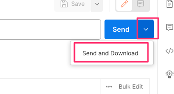

===================
rSeries Diagnostics
===================

This section will go through some of the diagnostic capabilities within the F5OS platform layer. Inside the TMOS tenant, the same BIG-IP diagnostic utilities that customers are used to are still available.

qkviews
=======

rSeries appliances support the ability to generate qkviews to collect and bundle configuration and diagnostic data that can be sent to F5 support or uploaded to iHealth. It is important to understand the rSeries architecture when generating qkviews. Generating a qkview from the F5OS platform layer will capture OS data, container information, and info related to the health of the underlying F5OS layer. To capture tenant level information, you’ll need to run a qkview inside the TMOS layer of the tenant. The following links provide more details:

`K2633: Submit a support case <https://my.f5.com/manage/s/article/K2633>`_

`K04756153: Generating diagnostic data for rSeries systems using the qkview utility <https://my.f5.com/manage/s/article/K04756153>`_

In general, you can use the qkview utility on rSeries systems to automatically collect configuration and diagnostic information from the system. The qkview utility provided in F5OS-A software captures diagnostic information from the rSeries system and associated containers. 

Note: The qkview utility on the rSeries system does not capture diagnostic data from tenant BIG-IP systems. To generate diagnostic data for a tenant BIG-IP, log in to the tenant system and perform the relevant procedure in:

`K12878: Generating diagnostic data using the qkview utility <https://support.f5.com/csp/article/K12878>`_

The qkview utility on the rSeries system generates machine-readable JavaScript Object Notation (JSON) diagnostic data and combines the data into a single compressed Tape ARchive (TAR) format file. The single TAR file is comprised of embedded TAR files containing the diagnostic data of individual containers running on the system, as well as diagnostic data from the rSeries system. You can upload this file, called a qkview file, to iHealth, or give it to F5 Support to help them troubleshoot any issues.

Note: F5 Support requires a qkview file in all cases in which remote access to the product is not available.

qkview Creation and Upload via webUI
----------------------------------

A qkview file for the F5OS layer can be generated from the **System Settings > System Reports** page.I newer F5OS releases this has been relocated to the **Diagnostics** -> **System Reports** page.  Once finished it can also be uploaded to iHealth. 

.. image:: images/rseries_diagnostics/image1.png
  :align: center
  :scale: 70%

To generate a qkview, click on the button in the upper right-hand corner. It will take some time for the qkview to be generated.  Once the qkview is generated, you can click the checkbox next to it, and then select **Upload to iHealth**. Your iHealth credentials will automatically fill in if you entered them previously and can be cleared if you want to use another account; you can optionally add an **F5 Support Case Number** and **Description** when uploading to iHealth.

.. image:: images/rseries_diagnostics/image2.png
  :align: center
  :scale: 70%

.. image:: images/rseries_diagnostics/image3.png
  :align: center
  :scale: 70%

qkview Creation and Upload via CLI
----------------------------------

If you would like to store iHealth credentials within the configuration you may do so via the F5OS CLI. Enter config mode, and then use the **system diagnostics ihealth config** command to configure a **username** and **password**.

.. code-block:: bash

    appliance-1# config
    Entering configuration mode terminal
    appliance-1(config)# system diagnostics ihealth config username test@f5.com password 
    (<AES encrypted string>): ********
    appliance-1(config)# commit
    Commit complete.
    appliance-1(config)# 

To generate a qkview from the CLI, run the command **system diagnostics qkview capture**.

.. code-block:: bash

    appliance-1(config)# system diagnostics qkview capture filename f5support.qkview.tgz maxfilesize 1000
    result  Warning: qkview may contain sensitive data such as secrets, passwords and core files. Handle with care. Please send this file to F5 support. 
    qkview file f5support.qkview.tgz is being collected.
    return code 200
    
    resultint 0
    appliance-1(config)# 
 
You can view the status of the capture using the command **system diagnostics qkview status**.

.. code-block:: bash

    appliance-1# system diagnostics qkview status
    result  {"Busy":true,"Percent":97,"Status":"collating","Message":"Collating data","Filename":"f5support.qkview.tgz"}
    
    resultint 0
    appliance-1# 

You may also confirm the file has been created by using the **file list** command, or the **system diagnostics qkview list** command to see more details about the size and creation date of the file:

.. code-block:: bash

    appliance-1# file list path diags/shared/qkview/
    entries {
        name 
    f5support.qkview.tgz
    }
    appliance-1# 

    appliance-1# system diagnostics qkview list 
    result  {"qkviews":[{"Filename":"f5support.qkview.tgz","Date":"2022-01-16T16:57:22.983013886Z","Size":208510806}]}
    
    resultint 0
    appliance-1# 

To upload the qkview file to iHealth using the CLI use the following command: **system diagnostics ihealth upload qkview-file <file-name> description "Text for description" service-request-number <SR Number>**.

.. code-block:: bash

    appliance-1# system diagnostics ihealth upload qkview-file af5support.qkview.tgz description "This is a test" 
    message HTTP/1.1 202 Accepted
    Location: /support/ihealth/status/Z3HydOfa
    Date: Sun, 16 Jan 2022 17:02:36 GMT
    Content-Length: 0

    errorcode false
    appliance-1# 

qkview Creation and Upload to iHealth via API
---------------------------------------------

To generate a qkview from the API, POST the following API call to the F5OS out-of-band management IP.

.. code-block:: bash

    POST https://{{rseries_appliance1_ip}}:8888/restconf/data/openconfig-system:system/f5-system-diagnostics-qkview:diagnostics/f5-system-diagnostics-qkview:qkview/f5-system-diagnostics-qkview:capture

In the body of the API call, supply the filename for the qkview:

.. code-block:: json

    {
        "f5-system-diagnostics-qkview:filename": "my-qkview4.tgz"
    }

Below is the following output showing successful initiation of the qkview:

.. code-block:: json

    {
        "f5-system-diagnostics-qkview:output": {
            "result": " Warning: qkview may contain sensitive data such as secrets, passwords and core files. Handle with care. Please send this file to F5 support. \nqkview file my-qkview4.tgz is being collected.\nreturn code 200\n ",
            "resultint": 0
        }
    }

To view the qkview status via the API, POST the following API call:

.. code-block:: bash

    POST https://{{rseries_appliance1_ip}}:8888/restconf/data/openconfig-system:system/f5-system-diagnostics-qkview:diagnostics/f5-system-diagnostics-qkview:qkview/f5-system-diagnostics-qkview:status

The output will display the percentage complete, error, or complete status:

.. code-block:: json

    {
        "f5-system-diagnostics-qkview:output": {
            "result": " {\"Busy\":false,\"Percent\":100,\"Status\":\"complete\",\"Message\":\"Completed collection.\",\"Filename\":\"my-qkview4.tgz\"}\n ",
            "resultint": 0
        }
    }

To upload the qkview file to iHealth using the API, use the following POST API call:

.. code-block:: bash

    POST https://{{rseries_appliance1_ip}}:8888/restconf/data/openconfig-system:system/f5-system-diagnostics-qkview:diagnostics/f5-system-diagnostics-ihealth:ihealth/f5-system-diagnostics-ihealth:upload

Below is the body of the POST API call:

.. code-block:: json

    {
    "f5-system-diagnostics-ihealth:qkview-file": "my-qkview4.tgz",
    "f5-system-diagnostics-ihealth:description": "This is a test qkview",
    "f5-system-diagnostics-ihealth:service-request-number": ""
    }

In the output of the API call, the upload initiation is confirmed.

.. code-block:: json

    {
        "f5-system-diagnostics-ihealth:output": {
            "message": "HTTP/1.1 202 Accepted\r\nLocation: /support/ihealth/status/sthO7ieL\r\nDate: Tue, 18 Jan 2022 01:31:36 GMT\r\nContent-Length: 0\r\n\r\n",
            "errorcode": false
        }
    }

qkview Download to Client via API
--------------------------------

You can download qkviews direct to a client machine using the F5OS API. First, list the contents of the path **diags/shared/qkview** to see the save qkview files:

.. code-block:: bash

    POST https://{{rseries_appliance1_ip}}:8888/restconf/data/f5-utils-file-transfer:file/list

In the body of the API call, add the following path:

.. code-block:: json

    {
    "f5-utils-file-transfer:path": "diags/shared/qkview"
    }

The output should look similar to the output below.

.. code-block:: json

    {
        "f5-utils-file-transfer:output": {
            "entries": [
                {
                    "name": "my-qkview.tar",
                    "date": "",
                    "size": "525MB"
                },
                {
                    "name": "my-qkview4.tgz",
                    "date": "",
                    "size": "590MB"
                }
            ]
        }
    }

To download one of the qkview files to the local client machine enter the following API call.

.. code-block:: bash

    POST https://{{rseries_appliance1_ip}}:8888/restconf/data/f5-utils-file-transfer:file/f5-file-download:download-file/f5-file-download:start-download

For the **Headers** secion of the Postman request be sure to add the following headers:

.. image:: images/rseries_diagnostics/headers.png
  :align: center
  :scale: 70%

If you are using Postman, in the body of the API call select **Body**, then selct **form-data**. Then enter the **file-name**, **path**, and **token** as seen below.

If you are using Postman, instead of clicking **Send**, click on the arrow next to Send, and then select **Send and Download**. You will then be prompted to save the file to your local file system.

Logging
=======

F5OS has extensive logging and diagnostic capabilities, logs are stored locally on disk and can optionally be sent to a remote syslog server. In addition, there are multiple logging subsystems that can be tweaked to be more or less verbose via the **Software Component Log Levels**. Many functions inside the F5OS layer will log their important events to the default **platform.log** file that resides in the **/log/system/** path. This is the file that will also redirect all logs to a remote location (in addition to local disk) when **Remote Log Servers** are added. There are many other log files available local on the disk (some can also be redirected to be sent remotely) for various functions. As an example, there is an **snmp.log** which logs all SNMP requests and traps that the system sends and receives. Another example is the **audit.log** that captures audit related information such as "who has logged in?", "What changes were made?", "Who made the changes?", and unsuccessful login attempts. This section will provide more details on the various logging subsystems, and how to configure them.

There are published error catalogs for each F5OS-A release here:

`F5OS-A Error Catalog <https://clouddocs.f5.com/f5os-error-catalog/rseries/rseries-errors-index.html>`_

Viewing Logs
------------

Viewing Logs from the CLI
^^^^^^^^^^^^^^^^^^^^^^^^^

In the F5OS CLI, the paths are simplified so that you don’t have to know the underlying directory structure. You can use the **file list path** command to see the files inside the **log/system/** directory; use the tab complete to see the options:

.. code-block:: bash

    appliance-1# file list path log/
    Possible completions:
    confd/  host/  system/
    appliance-1# file list path log/system/
    Possible completions:
    audit.log                      confd.log          devel.log     devel.log.1    lcd.log           lcd.log.1           lcd.log.2.gz       
    lcd.log.3.gz                   lcd.log.4.gz       lcd.log.5.gz  logrotate.log  logrotate.log.1   logrotate.log.2.gz  platform.log       
    reprogram_chassis_network.log  rsyslogd_init.log  snmp.log      startup.log    startup.log.prev  trace/              vconsole_auth.log  
    vconsole_startup.log           velos.log          webUI/        
    appliance-1# file list path log/system/

To view the contents of the **platform.log** file, use the command **file show path /log/system/platform.log**. This will show the entire log file from the beginning, but may not be the best way to troubleshoot a recent event:

.. code-block:: bash

    appliance-1# file show log/system/platform.log 
    2021-10-18T20:53:28.620260+00:00 appliance-1 /usr/sbin/fips-service[9]: priority="Notice" version=1.0 msgid=0x5f01000000000001 msg="fips-service starting".
    2021-10-18T20:53:28.620289+00:00 appliance-1 utils-agent[9]: priority="Info" version=1.0 msgid=0x6602000000000005 msg="DB is not ready".
    2021-10-18T20:53:28.620392+00:00 appliance-1 /usr/sbin/fips-service[9]: priority="Info" version=1.0 msgid=0x6602000000000005 msg="DB is not ready".
    2021-10-18T20:53:28.620401+00:00 appliance-1 utils-agent[9]: priority="Info" version=1.0 msgid=0x6602000000000005 msg="DB is not ready".
    2021-10-18T20:53:28.620590+00:00 appliance-1 /usr/sbin/fips-service[9]: priority="Info" version=1.0 msgid=0x6602000000000005 msg="DB is not ready".
    2021-10-18T20:53:28.620591+00:00 appliance-1 ihealthd[8]: priority="Info" version=1.0 msgid=0x6602000000000005 msg="DB is not ready".
    2021-10-18T20:53:28.620593+00:00 appliance-1 utils-agent[9]: priority="Info" version=1.0 msgid=0x6602000000000006 msg="DB state monitor started".
    2021-10-18T20:53:28.620900+00:00 appliance-1 /usr/sbin/fips-service[9]: priority="Info" version=1.0 msgid=0x6602000000000006 msg="DB state monitor started".

There are options to manipulate the output of the file. Add **| ?** to the command to see the options available to manipulate the file output.

.. code-block:: bash

    appliance-1# file show log/system/platform.log | ?
    Possible completions:
    append    Append output text to a file
    begin     Begin with the line that matches
    count     Count the number of lines in the output
    exclude   Exclude lines that match
    include   Include lines that match
    linnum    Enumerate lines in the output
    more      Paginate output
    nomore    Suppress pagination
    save      Save output text to a file
    until     End with the line that matches
    appliance-1# file show log/system/platform.log | 

There are also other file options to tail the log file using **file tail -f** for live tail of the file or **file tail -n <number of lines>**. Below is the live tail example.

.. code-block:: bash

    appliance-1# file tail -f log/system/platform.log 
    2022-01-18T01:44:40.236691+00:00 appliance-1 sys-host-config[10328]: priority="Err" version=1.0 msgid=0x7001000000000031 msg="" func_name="static int SystemDateTimeOperHdlr::get_elem(confd_trans_ctx*, confd_hkeypath_t*)".
    2022-01-18T01:44:40.255537+00:00 appliance-1 sys-host-config[10328]: priority="Err" version=1.0 msgid=0x7001000000000031 msg="" func_name="static int SystemDateTimeOperHdlr::s_finish(confd_trans_ctx*)".
    2022-01-18T01:45:40.213327+00:00 appliance-1 sys-host-config[10328]: priority="Err" version=1.0 msgid=0x7001000000000031 msg="" func_name="static int SystemDateTimeOperHdlr::s_init(confd_trans_ctx*)".
    2022-01-18T01:45:40.213596+00:00 appliance-1 sys-host-config[10328]: priority="Err" version=1.0 msgid=0x7001000000000031 msg="" func_name="static int SystemDateTimeOperHdlr::get_elem(confd_trans_ctx*, confd_hkeypath_t*)".
    2022-01-18T01:45:40.226138+00:00 appliance-1 sys-host-config[10328]: priority="Err" version=1.0 msgid=0x7001000000000031 msg="" func_name="static int SystemDateTimeOperHdlr::get_elem(confd_trans_ctx*, confd_hkeypath_t*)".
    2022-01-18T01:45:40.238555+00:00 appliance-1 sys-host-config[10328]: priority="Err" version=1.0 msgid=0x7001000000000031 msg="" func_name="static int SystemDateTimeOperHdlr::s_finish(confd_trans_ctx*)".
    2022-01-18T01:46:40.212159+00:00 appliance-1 sys-host-config[10328]: priority="Err" version=1.0 msgid=0x7001000000000031 msg="" func_name="static int SystemDateTimeOperHdlr::s_init(confd_trans_ctx*)".
    2022-01-18T01:46:40.212402+00:00 appliance-1 sys-host-config[10328]: priority="Err" version=1.0 msgid=0x7001000000000031 msg="" func_name="static int SystemDateTimeOperHdlr::get_elem(confd_trans_ctx*, confd_hkeypath_t*)".
    2022-01-18T01:46:40.229909+00:00 appliance-1 sys-host-config[10328]: priority="Err" version=1.0 msgid=0x7001000000000031 msg="" func_name="static int SystemDateTimeOperHdlr::get_elem(confd_trans_ctx*, confd_hkeypath_t*)".
    2022-01-18T01:46:40.247870+00:00 appliance-1 sys-host-config[10328]: priority="Err" version=1.0 msgid=0x7001000000000031 msg="" func_name="static int SystemDateTimeOperHdlr::s_finish(confd_trans_ctx*)".
    appliance-1# 

The example below shows the last 20 lines of the platform.log file.

.. code-block:: bash

    appliance-1# file tail -n 20 log/system/platform.log
    2022-01-18T01:42:40.217019+00:00 appliance-1 sys-host-config[10328]: priority="Err" version=1.0 msgid=0x7001000000000031 msg="" func_name="static int SystemDateTimeOperHdlr::s_init(confd_trans_ctx*)".
    2022-01-18T01:42:40.217275+00:00 appliance-1 sys-host-config[10328]: priority="Err" version=1.0 msgid=0x7001000000000031 msg="" func_name="static int SystemDateTimeOperHdlr::get_elem(confd_trans_ctx*, confd_hkeypath_t*)".
    2022-01-18T01:42:40.235046+00:00 appliance-1 sys-host-config[10328]: priority="Err" version=1.0 msgid=0x7001000000000031 msg="" func_name="static int SystemDateTimeOperHdlr::get_elem(confd_trans_ctx*, confd_hkeypath_t*)".
    2022-01-18T01:42:40.254086+00:00 appliance-1 sys-host-config[10328]: priority="Err" version=1.0 msgid=0x7001000000000031 msg="" func_name="static int SystemDateTimeOperHdlr::s_finish(confd_trans_ctx*)".
    2022-01-18T01:43:40.332658+00:00 appliance-1 sys-host-config[10328]: priority="Err" version=1.0 msgid=0x7001000000000031 msg="" func_name="static int SystemDateTimeOperHdlr::s_init(confd_trans_ctx*)".
    2022-01-18T01:43:40.332900+00:00 appliance-1 sys-host-config[10328]: priority="Err" version=1.0 msgid=0x7001000000000031 msg="" func_name="static int SystemDateTimeOperHdlr::get_elem(confd_trans_ctx*, confd_hkeypath_t*)".
    2022-01-18T01:43:40.352918+00:00 appliance-1 sys-host-config[10328]: priority="Err" version=1.0 msgid=0x7001000000000031 msg="" func_name="static int SystemDateTimeOperHdlr::get_elem(confd_trans_ctx*, confd_hkeypath_t*)".
    2022-01-18T01:43:40.370488+00:00 appliance-1 sys-host-config[10328]: priority="Err" version=1.0 msgid=0x7001000000000031 msg="" func_name="static int SystemDateTimeOperHdlr::s_finish(confd_trans_ctx*)".
    2022-01-18T01:44:40.218159+00:00 appliance-1 sys-host-config[10328]: priority="Err" version=1.0 msgid=0x7001000000000031 msg="" func_name="static int SystemDateTimeOperHdlr::s_init(confd_trans_ctx*)".
    2022-01-18T01:44:40.218479+00:00 appliance-1 sys-host-config[10328]: priority="Err" version=1.0 msgid=0x7001000000000031 msg="" func_name="static int SystemDateTimeOperHdlr::get_elem(confd_trans_ctx*, confd_hkeypath_t*)".
    2022-01-18T01:44:40.236691+00:00 appliance-1 sys-host-config[10328]: priority="Err" version=1.0 msgid=0x7001000000000031 msg="" func_name="static int SystemDateTimeOperHdlr::get_elem(confd_trans_ctx*, confd_hkeypath_t*)".
    2022-01-18T01:44:40.255537+00:00 appliance-1 sys-host-config[10328]: priority="Err" version=1.0 msgid=0x7001000000000031 msg="" func_name="static int SystemDateTimeOperHdlr::s_finish(confd_trans_ctx*)".
    2022-01-18T01:45:40.213327+00:00 appliance-1 sys-host-config[10328]: priority="Err" version=1.0 msgid=0x7001000000000031 msg="" func_name="static int SystemDateTimeOperHdlr::s_init(confd_trans_ctx*)".
    2022-01-18T01:45:40.213596+00:00 appliance-1 sys-host-config[10328]: priority="Err" version=1.0 msgid=0x7001000000000031 msg="" func_name="static int SystemDateTimeOperHdlr::get_elem(confd_trans_ctx*, confd_hkeypath_t*)".
    2022-01-18T01:45:40.226138+00:00 appliance-1 sys-host-config[10328]: priority="Err" version=1.0 msgid=0x7001000000000031 msg="" func_name="static int SystemDateTimeOperHdlr::get_elem(confd_trans_ctx*, confd_hkeypath_t*)".
    2022-01-18T01:45:40.238555+00:00 appliance-1 sys-host-config[10328]: priority="Err" version=1.0 msgid=0x7001000000000031 msg="" func_name="static int SystemDateTimeOperHdlr::s_finish(confd_trans_ctx*)".
    2022-01-18T01:46:40.212159+00:00 appliance-1 sys-host-config[10328]: priority="Err" version=1.0 msgid=0x7001000000000031 msg="" func_name="static int SystemDateTimeOperHdlr::s_init(confd_trans_ctx*)".
    2022-01-18T01:46:40.212402+00:00 appliance-1 sys-host-config[10328]: priority="Err" version=1.0 msgid=0x7001000000000031 msg="" func_name="static int SystemDateTimeOperHdlr::get_elem(confd_trans_ctx*, confd_hkeypath_t*)".
    2022-01-18T01:46:40.229909+00:00 appliance-1 sys-host-config[10328]: priority="Err" version=1.0 msgid=0x7001000000000031 msg="" func_name="static int SystemDateTimeOperHdlr::get_elem(confd_trans_ctx*, confd_hkeypath_t*)".
    2022-01-18T01:46:40.247870+00:00 appliance-1 sys-host-config[10328]: priority="Err" version=1.0 msgid=0x7001000000000031 msg="" func_name="static int SystemDateTimeOperHdlr::s_finish(confd_trans_ctx*)".
    appliance-1# 

Within the bash shell, the actual underlying path for logging is different; it is at the following location: **/var/F5/system/log**. The non-bash shell user interfaces (CLI,webUI,API) do not use the real paths, and instead use the virtual paths to simplify things for administrators. 

.. code-block:: bash

    [root@appliance-1 /]# ls -al /var/F5/system/log/
    total 1016748
    drwxr-xr-x.  4 root root      4096 Jan 17 19:38 .
    drwxr-xr-x. 21 root root      4096 Jan 17 20:30 ..
    -rw-r--r--.  1 root root  14123371 Jan 17 20:48 audit.log
    -rw-r--r--.  1 root root    588341 Jan 17 05:18 confd.log
    -rw-r--r--.  1 root root  41019035 Jan 17 20:48 devel.log
    -rw-r--r--.  1 root root 104858562 Dec 22 15:29 devel.log.1
    -rw-r--r--.  1 root root  64837421 Jan 17 20:49 lcd.log
    -rw-r--r--.  1 root root 104860300 Jan  5 18:04 lcd.log.1
    -rw-r--r--.  1 root root   6501388 Dec 17 08:23 lcd.log.2.gz
    -rw-r--r--.  1 root root   6532013 Nov 27 22:08 lcd.log.3.gz
    -rw-r--r--.  1 root root   6396563 Nov  8 12:27 lcd.log.4.gz
    -rw-r--r--.  1 root root   5101197 Oct 20 03:46 lcd.log.5.gz
    -rw-r--r--.  1 root root    110308 Jan 17 20:49 logrotate.log
    -rw-r--r--.  1 root root   5245071 Jan 17 19:38 logrotate.log.1
    -rw-r--r--.  1 root root     28600 Jan 15 11:15 logrotate.log.2.gz
    -rw-r--r--.  1 root root 471625299 Jan 17 20:48 platform.log
    -rw-r--r--.  1 root root         0 Sep 30 18:10 reprogram_chassis_network.log
    -rw-r--r--.  1 root root     14659 Jan 17 05:17 rsyslogd_init.log
    -rw-r--r--.  1 root root         0 Sep 24 16:41 snmp.log
    -rw-r--r--.  1 root root       118 Jan 17 05:17 startup.log
    -rw-r--r--.  1 root root       193 Jan 17 05:14 startup.log.prev
    drwxr-xr-x.  2 root root      4096 Sep 24 16:41 trace
    -rw-r--r--.  1 root root      3381 Jan 17 05:17 vconsole_auth.log
    -rw-r--r--.  1 root root     18817 Jan 17 05:17 vconsole_startup.log
    -rw-r--r--.  1 root root 209193620 Oct 18 16:46 velos.log
    drwxr-xr-x.  2 root root      4096 Jan 17 05:17 webUI
    [root@appliance-1 /]# 

Viewing Logs from the webUI
^^^^^^^^^^^^^^^^^^^^^^^^^^^^

In the current release you cannot view the F5OS logs directly from the webUI, although you can download them from the webUI. To view the logs, you can use the CLI or API, or download the files and then view, or use a remote syslog server. To download log files from the webUI, go to the **System Settings -> File Utilities** page. Here there are various logs directories you can download files from. You have the option to **Export** files to a remote HTTPS server or **Download** the files directly to your client machine through the browser.

.. image:: images/rseries_diagnostics/image4.png
  :align: center
  :scale: 70%

If you want to download the main **platform.log**, select the directory **/log/system**.

.. image:: images/rseries_diagnostics/image5.png
  :align: center
  :scale: 70%

Downloading Logs from the API
^^^^^^^^^^^^^^^^^^^^^^^^^^^^^^

You can download various logs from the F5OS layer using the F5OS API. To list the current log files in the **log/system/** directory use the following API call.

.. code-block:: bash

    POST https://{{rseries_appliance1_ip}}:8888/restconf/data/f5-utils-file-transfer:file/list

In the body of the API call, add the virtual path you want to list.

.. code-block:: json
 
    {
    "f5-utils-file-transfer:path": "log/system/"
    }

To download a specific log file use the following API call.

.. code-block:: bash

    POST https://{{rseries_appliance1_ip}}:8888/restconf/data/f5-utils-file-transfer:file/f5-file-download:download-file/f5-file-download:start-download

In the body of the API call select **form-data**, and then enter the key/value pairs as seen below. The example provided will download the **platform.log** file that resides in the **log/system** directory.

For the **Headers** secion of the Postman request be sure to add the following headers:

.. image:: images/rseries_diagnostics/headers.png
  :align: center
  :scale: 70%

If you are using Postman, instead of clicking **Send**, click on the arrow next to Send, and then select **Send and Download**. You will then be prompted to save the file to your local file system.

If you wanted to download another log file in the same directory such as the **audit.log** file, simply change the file name in the **form-data** section as seen below.

Viewing Event Logs from the API
^^^^^^^^^^^^^^^^^^^^^^^^^

If the system currently has any active alarms, you can view them via the following API call:

.. code-block:: bash

    GET https://{{rseries_appliance1_ip}}:8888/restconf/data/openconfig-system:system/alarms

If there are no active alarms, then no output will be displayed.

.. code-block:: json

You can display the F5OS Event Log via the following API call:

.. code-block:: bash

    GET https://{{rseries_appliance1_ip}}:8888/restconf/data/openconfig-system:system/f5-event-log:events

This will display all events (not just the active ones) from the beginning in the F5OS Event log:

.. code-block:: json

    {
        "f5-event-log:events": {
            "event": [
                {
                    "log": "65546 appliance thermal-fault ASSERT WARNING \"Thermal fault detected in hardware\" \"2021-09-24 20:42:37.530264260 UTC\""
                },
                {
                    "log": "65546 appliance thermal-fault EVENT NA \"Deasserted: CPU Memhot\" \"2021-09-24 20:42:37.530303402 UTC\""
                },
                {
                    "log": "65546 appliance thermal-fault CLEAR WARNING \"Thermal fault detected in hardware\" \"2021-09-24 20:42:47.523230213 UTC\""
                },
                {
                    "log": "65546 appliance thermal-fault EVENT NA \"Deasserted: CPU Memhot\" \"2021-09-24 20:42:47.523257401 UTC\""
                },
                {
                    "log": "66307 lcd module-communication-error ASSERT ERROR \"Module communication error detected\" \"2021-09-24 20:43:26.817425015 UTC\""
                },
                {
                    "log": "66307 lcd module-communication-error EVENT NA \"LCD module communication error detected\" \"2021-09-24 20:43:26.817494411 UTC\""
                },
                {
                    "log": "66306 lcd lcd-fault EVENT NA \"LCD Health is Not OK\" \"2021-09-24 20:43:26.827835221 UTC\""
                },
                {
                    "log": "66307 lcd module-communication-error CLEAR ERROR \"Module communication error detected\" \"2021-09-25 13:31:17.525707606 UTC\""
                },
                {
                    "log": "66307 lcd module-communication-error EVENT NA \"LCD module communication is OK\" \"2021-09-25 13:31:17.525764773 UTC\""
                },
                {
                    "log": "66306 lcd lcd-fault ASSERT ERROR \"Fault detected in LCD module\" \"2021-09-25 13:31:17.537641060 UTC\""
                },
                {
                    "log": "66306 lcd lcd-fault EVENT NA \"LCD Health is Not OK\" \"2021-09-25 13:31:17.537709360 UTC\""
                },
                {
                    "log": "66306 lcd lcd-fault EVENT NA \"Attribute health reset\" \"2021-09-29 03:51:31.596531347 UTC\""
                },
                {
                    "log": "66306 lcd lcd-fault CLEAR INFO \"Fault detected in LCD module\" \"2021-09-29 03:51:31.663915466 UTC\""
                },
                {
                    "log": "65550 appliance firmware-update-status EVENT NA \"Firmware update is running for asw 0\" \"2021-09-29 03:51:45.753957124 UTC\""
                },
                {
                    "log": "65546 appliance thermal-fault ASSERT WARNING \"Thermal fault detected in hardware\" \"2021-09-29 03:51:52.305535996 UTC\""
                },
                {
                    "log": "65546 appliance thermal-fault EVENT NA \"Deasserted: CPU Memhot\" \"2021-09-29 03:51:52.305564980 UTC\""
                },
                {
                    "log": "65550 appliance firmware-update-status EVENT NA \"Firmware update completed for asw 0\" \"2021-09-29 03:51:58.432597269 UTC\""
                },
                {
                    "log": "65546 appliance thermal-fault CLEAR WARNING \"Thermal fault detected in hardware\" \"2021-09-29 03:52:01.308221659 UTC\""
                },
                {
                    "log": "65546 appliance thermal-fault EVENT NA \"Deasserted: CPU Memhot\" \"2021-09-29 03:52:01.308250111 UTC\""
                },
                {
                    "log": "66307 lcd module-communication-error ASSERT ERROR \"Module communication error detected\" \"2021-09-29 03:52:04.938947934 UTC\""
                },
                {
                    "log": "66307 lcd module-communication-error EVENT NA \"LCD module communication error detected\" \"2021-09-29 03:52:04.938996558 UTC\""
                },
                {
                    "log": "66306 lcd lcd-fault EVENT NA \"LCD Health is Not OK\" \"2021-09-29 03:52:04.949570244 UTC\""
                },
                {
                    "log": "66307 lcd module-communication-error CLEAR ERROR \"Module communication error detected\" \"2021-09-29 20:39:28.801031896 UTC\""
                },
                {
                    "log": "66307 lcd module-communication-error EVENT NA \"LCD module communication is OK\" \"2021-09-29 20:39:28.801078036 UTC\""
                },
                {
                    "log": "66306 lcd lcd-fault ASSERT ERROR \"Fault detected in LCD module\" \"2021-09-29 20:39:28.811080347 UTC\""
                },
                {
                    "log": "66306 lcd lcd-fault EVENT NA \"LCD Health is Not OK\" \"2021-09-29 20:39:28.811121924 UTC\""
                },
                {
                    "log": "66306 lcd lcd-fault EVENT NA \"Attribute health reset\" \"2021-09-30 22:13:31.711372401 UTC\""
                },
                {
                    "log": "66306 lcd lcd-fault CLEAR INFO \"Fault detected in LCD module\" \"2021-09-30 22:13:31.717478859 UTC\""
                },
                {
                    "log": "65546 appliance thermal-fault ASSERT WARNING \"Thermal fault detected in hardware\" \"2021-09-30 22:13:45.258781006 UTC\""
                },
                {
                    "log": "65546 appliance thermal-fault EVENT NA \"Deasserted: CPU Memhot\" \"2021-09-30 22:13:45.258810884 UTC\""
                },
                {
                    "log": "65550 appliance firmware-update-status EVENT NA \"Firmware update is running for asw 0\" \"2021-09-30 22:13:45.269581558 UTC\""
                },
                {
                    "log": "65546 appliance thermal-fault CLEAR WARNING \"Thermal fault detected in hardware\" \"2021-09-30 22:13:53.603296145 UTC\""
                },
                {
                    "log": "65546 appliance thermal-fault EVENT NA \"Deasserted: CPU Memhot\" \"2021-09-30 22:13:53.603325184 UTC\""
                },
                {
                    "log": "65550 appliance firmware-update-status EVENT NA \"Firmware update completed for asw 0\" \"2021-09-30 22:13:57.508802483 UTC\""
                },
                {
                    "log": "65550 lcd firmware-update-status EVENT NA \"Firmware update is running for lcd app\" \"2021-09-30 22:14:08.406281623 UTC\""
                },
                {
                    "log": "65550 lcd firmware-update-status EVENT NA \"Firmware update completed for lcd app\" \"2021-09-30 22:17:41.254699037 UTC\""
                },
                {
                    "log": "65550 appliance firmware-update-status EVENT NA \"Firmware update is running for asw 0\" \"2021-09-30 22:21:59.612100940 UTC\""
                },
                {
                    "log": "66307 lcd module-communication-error ASSERT ERROR \"Module communication error detected\" \"2021-09-30 22:22:09.744138756 UTC\""
                },
                {
                    "log": "66307 lcd module-communication-error EVENT NA \"LCD module communication error detected\" \"2021-09-30 22:22:09.744185210 UTC\""
                },
                {
                    "log": "66306 lcd lcd-fault EVENT NA \"LCD Health is Not OK\" \"2021-09-30 22:22:09.755991542 UTC\""
                },
                {
                    "log": "65550 appliance firmware-update-status EVENT NA \"Firmware update completed for asw 0\" \"2021-09-30 22:22:13.743592332 UTC\""
                },
                {
                    "log": "66307 lcd module-communication-error CLEAR ERROR \"Module communication error detected\" \"2021-09-30 22:23:13.748018092 UTC\""
                },
                {
                    "log": "66307 lcd module-communication-error EVENT NA \"LCD module communication is OK\" \"2021-09-30 22:23:13.748094654 UTC\""
                },
                {
                    "log": "66306 lcd lcd-fault EVENT NA \"LCD Health is OK\" \"2021-09-30 22:23:13.761910895 UTC\""
                },
                {
                    "log": "65546 appliance thermal-fault ASSERT WARNING \"Thermal fault detected in hardware\" \"2021-10-05 17:38:50.079885448 UTC\""
                },
                {
                    "log": "65546 appliance thermal-fault EVENT NA \"Deasserted: CPU Memhot\" \"2021-10-05 17:38:50.079928355 UTC\""
                },
                {
                    "log": "65546 appliance thermal-fault CLEAR WARNING \"Thermal fault detected in hardware\" \"2021-10-05 17:39:00.072044694 UTC\""
                },
                {
                    "log": "65546 appliance thermal-fault EVENT NA \"Deasserted: CPU Memhot\" \"2021-10-05 17:39:00.072074572 UTC\""
                },
                {
                    "log": "65550 appliance firmware-update-status EVENT NA \"Firmware update is running for sirr \" \"2021-10-05 17:39:02.067247139 UTC\""
                },
                {
                    "log": "65550 appliance firmware-update-status EVENT NA \"Firmware update completed for sirr \" \"2021-10-05 17:39:02.083977127 UTC\""
                },
                {
                    "log": "65550 appliance firmware-update-status EVENT NA \"Firmware update is running for asw 0\" \"2021-10-05 17:39:02.098659600 UTC\""
                },
                {
                    "log": "65550 appliance firmware-update-status EVENT NA \"Firmware update completed for asw 0\" \"2021-10-05 17:39:13.347122421 UTC\""
                },
                {
                    "log": "65550 appliance firmware-update-status EVENT NA \"Firmware update is running for bios\" \"2021-10-05 17:39:14.473124755 UTC\""
                },
                {
                    "log": "65543 appliance aom-fault ASSERT ERROR \"Fault detected in the AOM\" \"2021-10-05 17:48:56.925998053 UTC\""
                },
                {
                    "log": "65543 appliance aom-fault EVENT NA \"LOP Runtime fault detected: lop:fan-control-fault\" \"2021-10-05 17:48:56.926049145 UTC\""
                },
                {
                    "log": "65546 appliance thermal-fault ASSERT WARNING \"Thermal fault detected in hardware\" \"2021-10-05 17:48:58.896030299 UTC\""
                },
                {
                    "log": "65546 appliance thermal-fault EVENT NA \"Deasserted: CPU Memhot\" \"2021-10-05 17:48:58.896078923 UTC\""
                },
                {
                    "log": "65550 appliance firmware-update-status EVENT NA \"Firmware update is running for asw 0\" \"2021-10-05 17:48:58.910827305 UTC\""
                },
                {
                    "log": "65546 appliance thermal-fault CLEAR WARNING \"Thermal fault detected in hardware\" \"2021-10-05 17:49:07.404699391 UTC\""
                },
                {
                    "log": "65546 appliance thermal-fault EVENT NA \"Deasserted: CPU Memhot\" \"2021-10-05 17:49:07.404735680 UTC\""
                },
                {
                    "log": "65550 appliance firmware-update-status EVENT NA \"Firmware update completed for asw 0\" \"2021-10-05 17:49:11.133887588 UTC\""
                },
                {
                    "log": "65543 appliance aom-fault CLEAR ERROR \"Fault detected in the AOM\" \"2021-10-05 18:00:02.904547087 UTC\""
                },
                {
                    "log": "65543 appliance aom-fault EVENT NA \"No LOP Runtime fault detected: lop:fan-control-fault\" \"2021-10-05 18:00:02.904618551 UTC\""
                },
                {
                    "log": "65546 appliance thermal-fault ASSERT WARNING \"Thermal fault detected in hardware\" \"2021-10-06 22:36:15.890309759 UTC\""
                },
                {
                    "log": "65546 appliance thermal-fault EVENT NA \"Deasserted: CPU Memhot\" \"2021-10-06 22:36:15.890344861 UTC\""
                },
                {
                    "log": "65550 appliance firmware-update-status EVENT NA \"Firmware update is running for asw 0\" \"2021-10-06 22:36:15.899652551 UTC\""
                },
                {
                    "log": "65546 appliance thermal-fault CLEAR WARNING \"Thermal fault detected in hardware\" \"2021-10-06 22:36:25.182561677 UTC\""
                },
                {
                    "log": "65546 appliance thermal-fault EVENT NA \"Deasserted: CPU Memhot\" \"2021-10-06 22:36:25.182588627 UTC\""
                },
                {
                    "log": "65550 appliance firmware-update-status EVENT NA \"Firmware update completed for asw 0\" \"2021-10-06 22:36:28.095912279 UTC\""
                },
                {
                    "log": "327680 Appliance core-dump EVENT NA \"Core dumped on Appliance. process=snmp_trapd, location=/var/shared/core/container/snmp_trapd-1.core.gz\" \"2021-10-06 22:37:02.867803404 UTC\""
                },
                {
                    "log": "65550 appliance firmware-update-status EVENT NA \"Firmware update is running for asw 0\" \"2021-10-07 19:36:28.425404878 UTC\""
                },
                {
                    "log": "65546 appliance thermal-fault ASSERT WARNING \"Thermal fault detected in hardware\" \"2021-10-07 19:36:31.589007937 UTC\""
                },
                {
                    "log": "65546 appliance thermal-fault EVENT NA \"Deasserted: CPU Memhot\" \"2021-10-07 19:36:31.589039655 UTC\""
                },
                {
                    "log": "65550 appliance firmware-update-status EVENT NA \"Firmware update completed for asw 0\" \"2021-10-07 19:36:40.911993523 UTC\""
                },
                {
                    "log": "65546 appliance thermal-fault CLEAR WARNING \"Thermal fault detected in hardware\" \"2021-10-07 19:36:42.419885336 UTC\""
                },
                {
                    "log": "65546 appliance thermal-fault EVENT NA \"Deasserted: CPU Memhot\" \"2021-10-07 19:36:42.419914186 UTC\""
                },
                {
                    "log": "65538 appliance unknown-alarm EVENT NA \"Deasserted: CPU Memhot\" \"2021-10-18 20:53:45.331800325 UTC\""
                },
                {
                    "log": "65538 appliance unknown-alarm EVENT NA \"Deasserted: CPU Memhot\" \"2021-10-18 20:53:54.655898424 UTC\""
                },
                {
                    "log": "65550 appliance firmware-update-status EVENT NA \"Firmware update is running for asw 0\" \"2021-10-18 20:54:01.318390153 UTC\""
                },
                {
                    "log": "65550 appliance firmware-update-status EVENT NA \"Firmware update completed for asw 0\" \"2021-10-18 20:54:14.143624212 UTC\""
                },
                {
                    "log": "65546 appliance thermal-fault ASSERT WARNING \"Thermal fault detected in hardware\" \"2021-10-21 16:01:50.003423497 UTC\""
                },
                {
                    "log": "65546 appliance thermal-fault EVENT NA \"Deasserted: CPU Memhot\" \"2021-10-21 16:01:50.003434430 UTC\""
                },
                {
                    "log": "65550 appliance firmware-update-status EVENT NA \"Firmware update is running for atse 0\" \"2021-10-21 16:01:51.999220111 UTC\""
                },
                {
                    "log": "65546 appliance thermal-fault CLEAR WARNING \"Thermal fault detected in hardware\" \"2021-10-21 16:01:58.752028781 UTC\""
                },
                {
                    "log": "65546 appliance thermal-fault EVENT NA \"Deasserted: CPU Memhot\" \"2021-10-21 16:01:58.752039434 UTC\""
                },
                {
                    "log": "65550 appliance firmware-update-status EVENT NA \"Firmware update completed for atse 0\" \"2021-10-21 16:02:08.914165850 UTC\""
                },
                {
                    "log": "65550 appliance firmware-update-status EVENT NA \"Firmware update is running for cpld\" \"2021-10-21 16:02:09.995922369 UTC\""
                },
                {
                    "log": "65550 appliance firmware-update-status EVENT NA \"Firmware update completed for cpld\" \"2021-10-21 16:10:30.887216940 UTC\""
                },
                {
                    "log": "65550 appliance firmware-update-status EVENT NA \"Firmware update is running for asw 0\" \"2021-10-21 16:10:31.997412851 UTC\""
                },
                {
                    "log": "65550 appliance firmware-update-status EVENT NA \"Firmware update completed for asw 0\" \"2021-10-21 16:10:43.996629722 UTC\""
                },
                {
                    "log": "65550 appliance firmware-update-status EVENT NA \"Firmware update is running for asw 0\" \"2021-10-21 16:10:43.999261917 UTC\""
                },
                {
                    "log": "327680 Appliance core-dump EVENT NA \"Core dumped on Appliance. process=fpgamgr, location=/var/shared/core/container/fpgamgr-1.core.gz\" \"2021-10-21 16:10:44.410130732 UTC\""
                },
                {
                    "log": "65550 appliance firmware-update-status EVENT NA \"Firmware update completed for asw 0\" \"2021-10-21 16:10:56.965345667 UTC\""
                },
                {
                    "log": "65550 appliance firmware-update-status EVENT NA \"Firmware update is running for lop app\" \"2021-10-21 16:10:57.996958960 UTC\""
                },
                {
                    "log": "66305 psu-2 psu-fault EVENT NA \"Deasserted: PSU 2 input OK\" \"2021-10-21 16:12:04.007920003 UTC\""
                },
                {
                    "log": "66305 psu-2 psu-fault EVENT NA \"Deasserted: PSU 2 output OK\" \"2021-10-21 16:12:04.016066799 UTC\""
                },
                {
                    "log": "65550 appliance firmware-update-status EVENT NA \"Firmware update completed for lop app\" \"2021-10-21 16:12:05.997077384 UTC\""
                },
                {
                    "log": "65550 appliance firmware-update-status EVENT NA \"Firmware update is running for asw 0\" \"2021-10-21 16:12:06.001335165 UTC\""
                },
                {
                    "log": "65550 appliance firmware-update-status EVENT NA \"Firmware update completed for asw 0\" \"2021-10-21 16:12:19.997931537 UTC\""
                },
                {
                    "log": "65550 appliance firmware-update-status EVENT NA \"Firmware update is running for sirr \" \"2021-10-21 16:12:20.001487185 UTC\""
                },
                {
                    "log": "65550 appliance firmware-update-status EVENT NA \"Firmware update completed for sirr \" \"2021-10-21 16:12:20.008918481 UTC\""
                },
                {
                    "log": "65550 appliance firmware-update-status EVENT NA \"Firmware update is running for bios\" \"2021-10-21 16:12:20.013466117 UTC\""
                },
                {
                    "log": "65550 appliance firmware-update-status EVENT NA \"Firmware update completed for bios\" \"2021-10-21 16:16:46.003085218 UTC\""
                },
                {
                    "log": "65536 appliance hardware-device-fault EVENT NA \"RAS AER unknown errors, count=1\" \"2021-10-21 16:22:19.387992390 UTC\""
                },
                {
                    "log": "65546 appliance thermal-fault ASSERT WARNING \"Thermal fault detected in hardware\" \"2021-10-21 16:22:23.381380311 UTC\""
                },
                {
                    "log": "65546 appliance thermal-fault EVENT NA \"Deasserted: CPU Memhot\" \"2021-10-21 16:22:23.381390040 UTC\""
                },
                {
                    "log": "65550 appliance firmware-update-status EVENT NA \"Firmware update is running for asw 0\" \"2021-10-21 16:22:25.385435390 UTC\""
                },
                {
                    "log": "65546 appliance thermal-fault CLEAR WARNING \"Thermal fault detected in hardware\" \"2021-10-21 16:22:33.381712308 UTC\""
                },
                {
                    "log": "65546 appliance thermal-fault EVENT NA \"Deasserted: CPU Memhot\" \"2021-10-21 16:22:33.381724382 UTC\""
                },
                {
                    "log": "65550 appliance firmware-update-status EVENT NA \"Firmware update completed for asw 0\" \"2021-10-21 16:22:37.380958363 UTC\""
                },
                {
                    "log": "66305 psu-2 psu-fault EVENT NA \"Deasserted: PSU 2 input OK\" \"2021-10-21 16:22:52.634577652 UTC\""
                },
                {
                    "log": "66305 psu-2 psu-fault EVENT NA \"Deasserted: PSU 2 output OK\" \"2021-10-21 16:22:53.384852972 UTC\""
                },
                {
                    "log": "65536 appliance hardware-device-fault EVENT NA \"No RAS AER unknown errors detected\" \"2021-10-21 17:27:18.298033804 UTC\""
                },
                {
                    "log": "65550 appliance firmware-update-status EVENT NA \"Firmware update is running for atse 0\" \"2021-11-08 19:02:52.902578167 UTC\""
                },
                {
                    "log": "65546 appliance thermal-fault ASSERT WARNING \"Thermal fault detected in hardware\" \"2021-11-08 19:02:57.497737288 UTC\""
                },
                {
                    "log": "65546 appliance thermal-fault EVENT NA \"Deasserted: CPU Memhot\" \"2021-11-08 19:02:57.497747001 UTC\""
                },
                {
                    "log": "65546 appliance thermal-fault CLEAR WARNING \"Thermal fault detected in hardware\" \"2021-11-08 19:03:07.398069876 UTC\""
                },
                {
                    "log": "65546 appliance thermal-fault EVENT NA \"Deasserted: CPU Memhot\" \"2021-11-08 19:03:07.398080030 UTC\""
                },
                {
                    "log": "65550 appliance firmware-update-status EVENT NA \"Firmware update completed for atse 0\" \"2021-11-08 19:03:10.455550306 UTC\""
                },
                {
                    "log": "65550 appliance firmware-update-status EVENT NA \"Firmware update is running for asw 0\" \"2021-11-08 19:03:11.495334911 UTC\""
                },
                {
                    "log": "65550 appliance firmware-update-status EVENT NA \"Firmware update completed for asw 0\" \"2021-11-08 19:03:23.496853600 UTC\""
                },
                {
                    "log": "66305 psu-2 psu-fault EVENT NA \"Deasserted: PSU 2 input OK\" \"2021-11-12 21:07:25.498321744 UTC\""
                },
                {
                    "log": "66305 psu-2 psu-fault EVENT NA \"Deasserted: PSU 2 output OK\" \"2021-11-12 21:07:25.504634021 UTC\""
                },
                {
                    "log": "65543 appliance aom-fault ASSERT ERROR \"Fault detected in the AOM\" \"2021-11-12 22:00:03.510159007 UTC\""
                },
                {
                    "log": "65543 appliance aom-fault EVENT NA \"LOP Runtime fault detected: lop:nc-si-rmii:failure\" \"2021-11-12 22:00:03.510181925 UTC\""
                },
                {
                    "log": "327680 Appliance core-dump EVENT NA \"Core dumped on Appliance. process=appliance_orche, location=/var/shared/core/container/appliance_orche-1.core.gz\" \"2021-11-13 17:36:53.583667701 UTC\""
                },
                {
                    "log": "65543 appliance aom-fault EVENT NA \"Attribute health reset\" \"2021-11-30 03:04:15.614494982 UTC\""
                },
                {
                    "log": "65543 appliance aom-fault CLEAR EMERGENCY \"Fault detected in the AOM\" \"2021-11-30 03:04:15.633871228 UTC\""
                },
                {
                    "log": "65550 appliance firmware-update-status EVENT NA \"Firmware update is running for atse 0\" \"2021-11-30 03:04:18.672712529 UTC\""
                },
                {
                    "log": "65543 appliance aom-fault ASSERT ERROR \"Fault detected in the AOM\" \"2021-11-30 03:04:20.197354633 UTC\""
                },
                {
                    "log": "65543 appliance aom-fault EVENT NA \"LOP Runtime fault detected: lop:nc-si-rmii:failure\" \"2021-11-30 03:04:20.197369120 UTC\""
                },
                {
                    "log": "65546 appliance thermal-fault ASSERT WARNING \"Thermal fault detected in hardware\" \"2021-11-30 03:04:22.671699902 UTC\""
                },
                {
                    "log": "65546 appliance thermal-fault EVENT NA \"Deasserted: CPU Memhot\" \"2021-11-30 03:04:22.671710561 UTC\""
                },
                {
                    "log": "65550 appliance firmware-update-status EVENT NA \"Firmware update is running for lop app\" \"2021-11-30 03:04:22.673457605 UTC\""
                },
                {
                    "log": "65550 appliance firmware-update-status EVENT NA \"Firmware update completed for atse 0\" \"2021-11-30 03:04:37.360915686 UTC\""
                },
                {
                    "log": "65550 appliance firmware-update-status EVENT NA \"Firmware update is running for asw 0\" \"2021-11-30 03:04:38.671015413 UTC\""
                },
                {
                    "log": "65550 appliance firmware-update-status EVENT NA \"Firmware update completed for asw 0\" \"2021-11-30 03:04:54.671332003 UTC\""
                },
                {
                    "log": "66305 psu-2 psu-fault EVENT NA \"Deasserted: PSU 2 input OK\" \"2021-11-30 03:05:28.673454233 UTC\""
                },
                {
                    "log": "66305 psu-2 psu-fault EVENT NA \"Deasserted: PSU 2 output OK\" \"2021-11-30 03:05:28.680134116 UTC\""
                },
                {
                    "log": "65550 appliance firmware-update-status EVENT NA \"Firmware update completed for lop app\" \"2021-11-30 03:05:30.739769167 UTC\""
                },
                {
                    "log": "65550 appliance firmware-update-status EVENT NA \"Firmware update is running for sirr \" \"2021-11-30 03:05:30.909784471 UTC\""
                },
                {
                    "log": "65550 appliance firmware-update-status EVENT NA \"Firmware update completed for sirr \" \"2021-11-30 03:05:31.056876974 UTC\""
                },
                {
                    "log": "65550 appliance firmware-update-status EVENT NA \"Firmware update is running for bios\" \"2021-11-30 03:05:31.203040930 UTC\""
                },
                {
                    "log": "65543 appliance aom-fault CLEAR ERROR \"Fault detected in the AOM\" \"2021-11-30 03:05:34.849689751 UTC\""
                },
                {
                    "log": "65543 appliance aom-fault EVENT NA \"No LOP Runtime fault detected: lop:nc-si-rmii:failure\" \"2021-11-30 03:05:34.854406452 UTC\""
                },
                {
                    "log": "65550 appliance firmware-update-status EVENT NA \"Firmware update completed for bios\" \"2021-11-30 03:09:40.675727012 UTC\""
                },
                {
                    "log": "65550 appliance firmware-update-status EVENT NA \"Firmware update is running for <no value> 0\" \"2021-11-30 03:15:05.999510689 UTC\""
                },
                {
                    "log": "65546 appliance thermal-fault CLEAR INFO \"Thermal fault detected in hardware\" \"2021-11-30 03:15:06.736711926 UTC\""
                },
                {
                    "log": "65546 appliance thermal-fault ASSERT WARNING \"Thermal fault detected in hardware\" \"2021-11-30 03:15:12.090052531 UTC\""
                },
                {
                    "log": "65546 appliance thermal-fault EVENT NA \"Deasserted: CPU Memhot\" \"2021-11-30 03:15:12.090062383 UTC\""
                },
                {
                    "log": "65550 appliance firmware-update-status EVENT NA \"Firmware update completed for atse 0\" \"2021-11-30 03:15:14.089416338 UTC\""
                },
                {
                    "log": "65550 appliance firmware-update-status EVENT NA \"Firmware update is running for asw 0\" \"2021-11-30 03:15:14.092678092 UTC\""
                },
                {
                    "log": "65546 appliance thermal-fault CLEAR WARNING \"Thermal fault detected in hardware\" \"2021-11-30 03:15:20.903194506 UTC\""
                },
                {
                    "log": "65546 appliance thermal-fault EVENT NA \"Deasserted: CPU Memhot\" \"2021-11-30 03:15:20.903205041 UTC\""
                },
                {
                    "log": "65550 appliance firmware-update-status EVENT NA \"Firmware update completed for asw 0\" \"2021-11-30 03:15:29.609273565 UTC\""
                },
                {
                    "log": "65550 lcd firmware-update-status EVENT NA \"Firmware update is running for lcd app\" \"2021-11-30 03:15:40.088891192 UTC\""
                },
                {
                    "log": "65550 lcd firmware-update-status EVENT NA \"Firmware update completed for lcd app\" \"2021-11-30 03:19:15.999579163 UTC\""
                },
                {
                    "log": "65550 appliance firmware-update-status EVENT NA \"Firmware update is running for <no value> 0\" \"2021-12-08 19:46:53.504213060 UTC\""
                },
                {
                    "log": "65550 appliance firmware-update-status EVENT NA \"Firmware update completed for atse 0\" \"2021-12-08 19:47:01.529893397 UTC\""
                },
                {
                    "log": "65550 appliance firmware-update-status EVENT NA \"Firmware update is running for asw 0\" \"2021-12-08 19:47:01.534041443 UTC\""
                },
                {
                    "log": "65546 appliance thermal-fault ASSERT WARNING \"Thermal fault detected in hardware\" \"2021-12-08 19:47:05.527110643 UTC\""
                },
                {
                    "log": "65546 appliance thermal-fault EVENT NA \"Deasserted: CPU Memhot\" \"2021-12-08 19:47:05.527120486 UTC\""
                },
                {
                    "log": "65546 appliance thermal-fault CLEAR WARNING \"Thermal fault detected in hardware\" \"2021-12-08 19:47:13.742069012 UTC\""
                },
                {
                    "log": "65546 appliance thermal-fault EVENT NA \"Deasserted: CPU Memhot\" \"2021-12-08 19:47:13.742079357 UTC\""
                },
                {
                    "log": "65550 appliance firmware-update-status EVENT NA \"Firmware update completed for asw 0\" \"2021-12-08 19:47:17.232925320 UTC\""
                },
                {
                    "log": "65550 appliance firmware-update-status EVENT NA \"Firmware update is running for <no value> 0\" \"2021-12-11 23:40:34.166483738 UTC\""
                },
                {
                    "log": "65546 appliance thermal-fault ASSERT WARNING \"Thermal fault detected in hardware\" \"2021-12-11 23:40:41.365377563 UTC\""
                },
                {
                    "log": "65546 appliance thermal-fault EVENT NA \"Deasserted: CPU Memhot\" \"2021-12-11 23:40:41.365386164 UTC\""
                },
                {
                    "log": "65550 appliance firmware-update-status EVENT NA \"Firmware update completed for atse 0\" \"2021-12-11 23:40:43.150189326 UTC\""
                },
                {
                    "log": "65550 appliance firmware-update-status EVENT NA \"Firmware update is running for asw 0\" \"2021-12-11 23:40:43.152771734 UTC\""
                },
                {
                    "log": "65546 appliance thermal-fault CLEAR WARNING \"Thermal fault detected in hardware\" \"2021-12-11 23:40:51.271782290 UTC\""
                },
                {
                    "log": "65546 appliance thermal-fault EVENT NA \"Deasserted: CPU Memhot\" \"2021-12-11 23:40:51.271792629 UTC\""
                },
                {
                    "log": "65550 appliance firmware-update-status EVENT NA \"Firmware update completed for asw 0\" \"2021-12-11 23:40:59.150601474 UTC\""
                },
                {
                    "log": "66305 psu-2 psu-fault EVENT NA \"Deasserted: PSU 2 input OK\" \"2021-12-11 23:41:07.155884004 UTC\""
                },
                {
                    "log": "66305 psu-2 psu-fault EVENT NA \"Deasserted: PSU 2 output OK\" \"2021-12-11 23:41:07.161054552 UTC\""
                },
                {
                    "log": "65550 appliance firmware-update-status EVENT NA \"Firmware update is running for <no value> 0\" \"2022-01-14 19:10:22.024893444 UTC\""
                },
                {
                    "log": "65550 appliance firmware-update-status EVENT NA \"Firmware update completed for atse 0\" \"2022-01-14 19:10:31.201584672 UTC\""
                },
                {
                    "log": "65550 appliance firmware-update-status EVENT NA \"Firmware update is running for asw 0\" \"2022-01-14 19:10:31.204837008 UTC\""
                },
                {
                    "log": "65546 appliance thermal-fault ASSERT WARNING \"Thermal fault detected in hardware\" \"2022-01-14 19:10:33.202595967 UTC\""
                },
                {
                    "log": "65546 appliance thermal-fault EVENT NA \"Deasserted: CPU Memhot\" \"2022-01-14 19:10:33.202607134 UTC\""
                },
                {
                    "log": "65546 appliance thermal-fault CLEAR WARNING \"Thermal fault detected in hardware\" \"2022-01-14 19:10:43.202976867 UTC\""
                },
                {
                    "log": "65546 appliance thermal-fault EVENT NA \"Deasserted: CPU Memhot\" \"2022-01-14 19:10:43.202988143 UTC\""
                },
                {
                    "log": "65550 appliance firmware-update-status EVENT NA \"Firmware update completed for asw 0\" \"2022-01-14 19:10:46.851253533 UTC\""
                },
                {
                    "log": "66305 psu-2 psu-fault EVENT NA \"Deasserted: PSU 2 input OK\" \"2022-01-14 19:10:57.678840635 UTC\""
                },
                {
                    "log": "66305 psu-2 psu-fault EVENT NA \"Deasserted: PSU 2 output OK\" \"2022-01-14 19:10:59.204970112 UTC\""
                },
                {
                    "log": "65550 appliance firmware-update-status EVENT NA \"Firmware update is running for <no value> 0\" \"2022-01-15 06:04:15.665074228 UTC\""
                },
                {
                    "log": "65546 appliance thermal-fault ASSERT WARNING \"Thermal fault detected in hardware\" \"2022-01-15 06:04:24.096265138 UTC\""
                },
                {
                    "log": "65546 appliance thermal-fault EVENT NA \"Deasserted: CPU Memhot\" \"2022-01-15 06:04:24.096276299 UTC\""
                },
                {
                    "log": "65550 appliance firmware-update-status EVENT NA \"Firmware update completed for atse 0\" \"2022-01-15 06:04:24.452570280 UTC\""
                },
                {
                    "log": "65550 appliance firmware-update-status EVENT NA \"Firmware update is running for asw 0\" \"2022-01-15 06:04:24.455229163 UTC\""
                },
                {
                    "log": "65546 appliance thermal-fault CLEAR WARNING \"Thermal fault detected in hardware\" \"2022-01-15 06:04:34.454864249 UTC\""
                },
                {
                    "log": "65546 appliance thermal-fault EVENT NA \"Deasserted: CPU Memhot\" \"2022-01-15 06:04:34.454875983 UTC\""
                },
                {
                    "log": "65550 appliance firmware-update-status EVENT NA \"Firmware update completed for asw 0\" \"2022-01-15 06:04:40.086088658 UTC\""
                },
                {
                    "log": "65550 appliance firmware-update-status EVENT NA \"Firmware update is running for <no value> 0\" \"2022-01-15 06:47:50.255692452 UTC\""
                },
                {
                    "log": "65546 appliance thermal-fault ASSERT WARNING \"Thermal fault detected in hardware\" \"2022-01-15 06:47:58.859176054 UTC\""
                },
                {
                    "log": "65546 appliance thermal-fault EVENT NA \"Deasserted: CPU Memhot\" \"2022-01-15 06:47:58.859186190 UTC\""
                },
                {
                    "log": "65550 appliance firmware-update-status EVENT NA \"Firmware update completed for atse 0\" \"2022-01-15 06:47:59.515267548 UTC\""
                },
                {
                    "log": "65550 appliance firmware-update-status EVENT NA \"Firmware update is running for asw 0\" \"2022-01-15 06:48:01.515381232 UTC\""
                },
                {
                    "log": "65546 appliance thermal-fault CLEAR WARNING \"Thermal fault detected in hardware\" \"2022-01-15 06:48:09.517292441 UTC\""
                },
                {
                    "log": "65546 appliance thermal-fault EVENT NA \"Deasserted: CPU Memhot\" \"2022-01-15 06:48:09.517302197 UTC\""
                },
                {
                    "log": "65550 appliance firmware-update-status EVENT NA \"Firmware update completed for asw 0\" \"2022-01-15 06:48:15.310272826 UTC\""
                },
                {
                    "log": "65550 appliance firmware-update-status EVENT NA \"Firmware update is running for <no value> 0\" \"2022-01-17 09:28:25.339993260 UTC\""
                },
                {
                    "log": "65546 appliance thermal-fault ASSERT WARNING \"Thermal fault detected in hardware\" \"2022-01-17 09:28:28.397568698 UTC\""
                },
                {
                    "log": "65546 appliance thermal-fault EVENT NA \"Deasserted: CPU Memhot\" \"2022-01-17 09:28:28.397578016 UTC\""
                },
                {
                    "log": "65550 appliance firmware-update-status EVENT NA \"Firmware update completed for atse 0\" \"2022-01-17 09:28:34.185952482 UTC\""
                },
                {
                    "log": "65550 appliance firmware-update-status EVENT NA \"Firmware update is running for asw 0\" \"2022-01-17 09:28:34.388141317 UTC\""
                },
                {
                    "log": "65546 appliance thermal-fault CLEAR WARNING \"Thermal fault detected in hardware\" \"2022-01-17 09:28:37.079075988 UTC\""
                },
                {
                    "log": "65546 appliance thermal-fault EVENT NA \"Deasserted: CPU Memhot\" \"2022-01-17 09:28:37.079085740 UTC\""
                },
                {
                    "log": "65550 appliance firmware-update-status EVENT NA \"Firmware update completed for asw 0\" \"2022-01-17 09:28:50.050575268 UTC\""
                },
                {
                    "log": "65550 appliance firmware-update-status EVENT NA \"Firmware update is running for <no value> 0\" \"2022-01-17 10:17:56.205717158 UTC\""
                },
                {
                    "log": "65546 appliance thermal-fault ASSERT WARNING \"Thermal fault detected in hardware\" \"2022-01-17 10:18:00.285549822 UTC\""
                },
                {
                    "log": "65546 appliance thermal-fault EVENT NA \"Deasserted: CPU Memhot\" \"2022-01-17 10:18:00.285561947 UTC\""
                },
                {
                    "log": "65550 appliance firmware-update-status EVENT NA \"Firmware update completed for atse 0\" \"2022-01-17 10:18:04.284792251 UTC\""
                },
                {
                    "log": "65550 appliance firmware-update-status EVENT NA \"Firmware update is running for asw 0\" \"2022-01-17 10:18:04.288861233 UTC\""
                },
                {
                    "log": "65546 appliance thermal-fault CLEAR WARNING \"Thermal fault detected in hardware\" \"2022-01-17 10:18:08.913192669 UTC\""
                },
                {
                    "log": "65546 appliance thermal-fault EVENT NA \"Deasserted: CPU Memhot\" \"2022-01-17 10:18:08.913208304 UTC\""
                },
                {
                    "log": "65550 appliance firmware-update-status EVENT NA \"Firmware update completed for asw 0\" \"2022-01-17 10:18:19.310194557 UTC\""
                }
            ]
        }
    }

Logging Subsystems/ Software Component Levels
-----------------------------------------------

Changing the Software Component Log Levels via CLI
^^^^^^^^^^^^^^^^^^^^^^^^^^^^^^^^^^^^^^^^^^^^^^^^^^^^

If you would like to change any of the logging levels via the CLI you must be in config mode. Use the **system logging sw-components sw-component <component name> config <logging severity>** command. You must **commit** for this change to take effect. Be sure to set logging levels back to normal after troubleshooting has completed.

.. code-block:: bash

    appliance-1(config)# system logging sw-components sw-component ?
    Possible completions:
    alert-service     api-svc-gateway         appliance-orchestration-agent  appliance-orchestration-manager  authd         confd-key-migrationd  
    dagd-service      datapath-cp-proxy       diag-agent                     disk-usage-statd                 dma-agent     fips-service          
    fpgamgr           ihealth-upload-service  ihealthd                       image-agent                      kubehelper    l2-agent              
    lacpd             license-service         line-dma-agent                 lldpd                            lopd          network-manager       
    nic-manager       optics-mgr              platform-diag                  platform-fwu                     platform-hal  platform-mgr          
    platform-monitor  platform-stats-bridge   qkviewd                        rsyslog-configd                  snmp-trapd    stpd                  
    sw-rbcast         sys-host-config         system-control                 tcpdumpd-manager                 tmstat-agent  tmstat-merged         
    upgrade-service   user-manager            vconsole                       
    appliance-1(config)# system logging sw-components sw-component lacpd ?
    Possible completions:
    config   Configuration data for platform sw-component logging
    <cr>     
    appliance-1(config)# system logging sw-components sw-component lacpd config ?
    Possible completions:
    description   Text that describes the platform sw-component (read-only)
    name          Name of the platform sw-component (read-only)
    severity      sw-component logging severity level.
    appliance-1(config)# system logging sw-components sw-component lacpd config severity ?
    Description: sw-component logging severity level. Default is INFORMATIONAL.
    Possible completions:
    [INFORMATIONAL]  ALERT  CRITICAL  DEBUG  EMERGENCY  ERROR  INFORMATIONAL  NOTICE  WARNING
    appliance-1(config)# system logging sw-components sw-component lacpd config severity DEBUG
    appliance-1(config-sw-component-lacpd)# commit
    Commit complete.
    appliance-1(config-sw-component-lacpd)# 

Changing the Software Component Log Levels via webUI
^^^^^^^^^^^^^^^^^^^^^^^^^^^^^^^^^^^^^^^^^^^^^^^^^^^^

Currently F5OS webUI’s logging levels can be configured for local logging, and remote logging servers can be added. The **Software Component Log Levels** can be changed to have additional logging information sent to the local log.  The remote logging has its own **Severity** level which will ultimately control the maximum level of all messages going to a remote log server regardless of the individual Component Log Levels. This will allow for more information to be logged locally for debug purposes, while keeping remote logging to a minimum. If you would like to have more verbose information going to the remote logging host, you can raise its severity to see additional messages.

.. image:: images/rseries_diagnostics/image6.png
  :align: center
  :scale: 70%

Changing the Software Componenet Log Levels via API
^^^^^^^^^^^^^^^^^^^^^^^^^^^^^^^^^^^^^^^^^^^^^^^^^^^^

You can display all the logging subsystem's logging levels via the following API call:

.. code-block:: bash

    GET https://{{rseries_appliance1_ip}}:8888/restconf/data/openconfig-system:system/logging

Every subsystem will be displayed along with its current setting:

.. code-block:: json

    {
        "openconfig-system:logging": {
            "f5-openconfig-system-logging:sw-components": {
                "sw-component": [
                    {
                        "name": "alert-service",
                        "config": {
                            "name": "alert-service",
                            "description": "Alert service",
                            "severity": "INFORMATIONAL"
                        }
                    },
                    {
                        "name": "api-svc-gateway",
                        "config": {
                            "name": "api-svc-gateway",
                            "description": "API service gateway",
                            "severity": "INFORMATIONAL"
                        }
                    },
                    {
                        "name": "appliance-orchestration-agent",
                        "config": {
                            "name": "appliance-orchestration-agent",
                            "description": "Tenant orchestration agent",
                            "severity": "INFORMATIONAL"
                        }
                    },
                    {
                        "name": "appliance-orchestration-manager",
                        "config": {
                            "name": "appliance-orchestration-manager",
                            "description": "Appliance orchestration manager",
                            "severity": "INFORMATIONAL"
                        }
                    },
                    {
                        "name": "authd",
                        "config": {
                            "name": "authd",
                            "description": "Authentication configuration",
                            "severity": "INFORMATIONAL"
                        }
                    },
                    {
                        "name": "confd-key-migrationd",
                        "config": {
                            "name": "confd-key-migrationd",
                            "description": "Confd Primary Key Migration Service",
                            "severity": "INFORMATIONAL"
                        }
                    },
                    {
                        "name": "dagd-service",
                        "config": {
                            "name": "dagd-service",
                            "description": "DAG daemon",
                            "severity": "INFORMATIONAL"
                        }
                    },
                    {
                        "name": "datapath-cp-proxy",
                        "config": {
                            "name": "datapath-cp-proxy",
                            "description": "Data path CP proxy",
                            "severity": "INFORMATIONAL"
                        }
                    },
                    {
                        "name": "diag-agent",
                        "config": {
                            "name": "diag-agent",
                            "description": "Diag agent",
                            "severity": "INFORMATIONAL"
                        }
                    },
                    {
                        "name": "disk-usage-statd",
                        "config": {
                            "name": "disk-usage-statd",
                            "description": "Disk usage agent",
                            "severity": "INFORMATIONAL"
                        }
                    },
                    {
                        "name": "dma-agent",
                        "config": {
                            "name": "dma-agent",
                            "description": "DMA agent",
                            "severity": "INFORMATIONAL"
                        }
                    },
                    {
                        "name": "fips-service",
                        "config": {
                            "name": "fips-service",
                            "description": "FIPS Service",
                            "severity": "INFORMATIONAL"
                        }
                    },
                    {
                        "name": "fpgamgr",
                        "config": {
                            "name": "fpgamgr",
                            "description": "FPGA manager",
                            "severity": "INFORMATIONAL"
                        }
                    },
                    {
                        "name": "ihealth-upload-service",
                        "config": {
                            "name": "ihealth-upload-service",
                            "description": "Upload diagnostics data service",
                            "severity": "INFORMATIONAL"
                        }
                    },
                    {
                        "name": "ihealthd",
                        "config": {
                            "name": "ihealthd",
                            "description": "Communication proxy for ihealth-upload-service",
                            "severity": "INFORMATIONAL"
                        }
                    },
                    {
                        "name": "image-agent",
                        "config": {
                            "name": "image-agent",
                            "description": "Tenant image handling",
                            "severity": "INFORMATIONAL"
                        }
                    },
                    {
                        "name": "kubehelper",
                        "config": {
                            "name": "kubehelper",
                            "description": "Application that will handle specific tasks for deploying tenants",
                            "severity": "INFORMATIONAL"
                        }
                    },
                    {
                        "name": "l2-agent",
                        "config": {
                            "name": "l2-agent",
                            "description": "L2 agent",
                            "severity": "INFORMATIONAL"
                        }
                    },
                    {
                        "name": "lacpd",
                        "config": {
                            "name": "lacpd",
                            "description": "Link aggregation control protocol",
                            "severity": "INFORMATIONAL"
                        }
                    },
                    {
                        "name": "license-service",
                        "config": {
                            "name": "license-service",
                            "description": "License service",
                            "severity": "INFORMATIONAL"
                        }
                    },
                    {
                        "name": "line-dma-agent",
                        "config": {
                            "name": "line-dma-agent",
                            "description": "Line DMA agent",
                            "severity": "INFORMATIONAL"
                        }
                    },
                    {
                        "name": "lldpd",
                        "config": {
                            "name": "lldpd",
                            "description": "Link layer discovery protocol",
                            "severity": "INFORMATIONAL"
                        }
                    },
                    {
                        "name": "lopd",
                        "config": {
                            "name": "lopd",
                            "description": "Communication proxy for the Lights Out Processor",
                            "severity": "INFORMATIONAL"
                        }
                    },
                    {
                        "name": "network-manager",
                        "config": {
                            "name": "network-manager",
                            "description": "Network manager",
                            "severity": "INFORMATIONAL"
                        }
                    },
                    {
                        "name": "nic-manager",
                        "config": {
                            "name": "nic-manager",
                            "description": "NIC manager",
                            "severity": "INFORMATIONAL"
                        }
                    },
                    {
                        "name": "optics-mgr",
                        "config": {
                            "name": "optics-mgr",
                            "description": "Optics tunning manager",
                            "severity": "INFORMATIONAL"
                        }
                    },
                    {
                        "name": "platform-diag",
                        "config": {
                            "name": "platform-diag",
                            "description": "Platform diag service",
                            "severity": "INFORMATIONAL"
                        }
                    },
                    {
                        "name": "platform-fwu",
                        "config": {
                            "name": "platform-fwu",
                            "description": "Platform firmware upgrade",
                            "severity": "INFORMATIONAL"
                        }
                    },
                    {
                        "name": "platform-hal",
                        "config": {
                            "name": "platform-hal",
                            "description": "Platform hardware abstraction layer",
                            "severity": "INFORMATIONAL"
                        }
                    },
                    {
                        "name": "platform-mgr",
                        "config": {
                            "name": "platform-mgr",
                            "description": "Appliance platform manager",
                            "severity": "INFORMATIONAL"
                        }
                    },
                    {
                        "name": "platform-monitor",
                        "config": {
                            "name": "platform-monitor",
                            "description": "Platform monitor",
                            "severity": "INFORMATIONAL"
                        }
                    },
                    {
                        "name": "platform-stats-bridge",
                        "config": {
                            "name": "platform-stats-bridge",
                            "description": "Platform stats bridge",
                            "severity": "INFORMATIONAL"
                        }
                    },
                    {
                        "name": "qkviewd",
                        "config": {
                            "name": "qkviewd",
                            "description": "Diagnostic information",
                            "severity": "INFORMATIONAL"
                        }
                    },
                    {
                        "name": "rsyslog-configd",
                        "config": {
                            "name": "rsyslog-configd",
                            "description": "Logging configuration",
                            "severity": "INFORMATIONAL"
                        }
                    },
                    {
                        "name": "snmp-trapd",
                        "config": {
                            "name": "snmp-trapd",
                            "description": "SNMP trap",
                            "severity": "INFORMATIONAL"
                        }
                    },
                    {
                        "name": "stpd",
                        "config": {
                            "name": "stpd",
                            "description": "Spanning tree protocol (STP)",
                            "severity": "INFORMATIONAL"
                        }
                    },
                    {
                        "name": "sw-rbcast",
                        "config": {
                            "name": "sw-rbcast",
                            "description": "Software Rebroadcast Service",
                            "severity": "INFORMATIONAL"
                        }
                    },
                    {
                        "name": "sys-host-config",
                        "config": {
                            "name": "sys-host-config",
                            "description": "System host config service",
                            "severity": "INFORMATIONAL"
                        }
                    },
                    {
                        "name": "system-control",
                        "config": {
                            "name": "system-control",
                            "description": "Appliance System control framework",
                            "severity": "INFORMATIONAL"
                        }
                    },
                    {
                        "name": "tcpdumpd-manager",
                        "config": {
                            "name": "tcpdumpd-manager",
                            "description": "Tcpdump daemon",
                            "severity": "INFORMATIONAL"
                        }
                    },
                    {
                        "name": "tmstat-agent",
                        "config": {
                            "name": "tmstat-agent",
                            "description": "Appliance stats agent",
                            "severity": "INFORMATIONAL"
                        }
                    },
                    {
                        "name": "tmstat-merged",
                        "config": {
                            "name": "tmstat-merged",
                            "description": "Stats rollup",
                            "severity": "INFORMATIONAL"
                        }
                    },
                    {
                        "name": "upgrade-service",
                        "config": {
                            "name": "upgrade-service",
                            "description": "Software upgrade service",
                            "severity": "INFORMATIONAL"
                        }
                    },
                    {
                        "name": "user-manager",
                        "config": {
                            "name": "user-manager",
                            "description": "User manager",
                            "severity": "INFORMATIONAL"
                        }
                    },
                    {
                        "name": "vconsole",
                        "config": {
                            "name": "vconsole",
                            "description": "Tenant virtual console",
                            "severity": "INFORMATIONAL"
                        }
                    }
                ]
            },
            "f5-openconfig-system-logging:host-logs": {
                "config": {
                    "remote-forwarding": {
                        "enabled": false
                    }
                }
            }
        }
    }

If you need to change the logging level to troubleshoot an issue, you can change the logging level via the APIs. Below is an example of changing the logging level for the **l2-agent** subsystem to **DEBUG**.

.. code-block:: bash

    PATCH https://{{rseries_appliance1_ip}}:8888/restconf/data/openconfig-system:system/logging

In the body of the API call, enter the sw-component you want to change, and the severity level you'd like to set.

.. code-block:: json

    {
        "openconfig-system:logging": {
            "f5-openconfig-system-logging:sw-components": {
                "sw-component": {
                    "name": "l2-agent",
                    "config": {
                        "name": "l2-agent",
                        "description": "L2 agent",
                        "severity": "DEBUG"
                    }
                }
            }
        }
    }

When you are finished troubleshooting, you can set the logging level back to default (INFORMATIONAL).

.. code-block:: json

    {
        "openconfig-system:logging": {
            "f5-openconfig-system-logging:sw-components": {
                "sw-component": {
                    "name": "l2-agent",
                    "config": {
                        "name": "l2-agent",
                        "description": "L2 agent",
                        "severity": "INFORMATIONAL"
                    }
                }
            }
        }
    }

Audit Logging
-------------

Details on F5OS-A audit logging can be found here:

`F5OS-A Audit Logging <https://clouddocs.f5.com/training/community/rseries-training/html/rseries_security.html#audit-logging>`_

SNMP Logging
------------

Details on F5OS-A SNMP logging can be found here:

`F5OS-A SNMP Logging <https://clouddocs.f5.com/training/community/rseries-training/html/rseries_monitoring_snmp.html#troubleshooting-snmp>`_

TCPDUMP
=======

You can use the **tcpdump** utility on the rSeries system to capture network traffic traversing the front panel ports on the platform. You can save the captured traffic as a file to analyze when troubleshooting network issues.

You run the tcpdump utility from the F5OS-A command line using the **system diagnostics tcpdump** command. The system displays output on the terminal by default, or you can redirect output to a specified file using the **outfile** keyword. You can specify filters using the **bpf** keyword followed by the filter expression in quotes.

In addition to the normal tcpdump output, the following fields have been added that are specific to the rSeries system:

•	did - The Destination ID indicates the destination port for the frame.
•	sid - The Source ID indicates the source port for the frame.
•	svc - The Service ID indicates the destination tenant for the packet.
•	sep - The Service Endpoint indicates the service endpoint the packet is sent to.

You can see this in the following example output:

.. code-block:: bash

    02:28:55.385343 IP 10.10.11.12 > 10.10.11.13: ICMP echo request, id 19463, seq 4, length 64 did:0F sid:04 sep:F svc:08 ld:1 rd:0

More detail on configuration and filtering of tcpdump is provided here:

`K80685750: Overview of the tcpdump utility on rSeries systems <https://support.f5.com/csp/article/K80685750>`_

You can capture traffic for a specific interface using the **interface** keyword in the **tcpdump** command. You specify the interface using the following syntax: **<port>.<subport>**. If you do not supply the interface keyword, or if you specify **0.0** for the interface no interface filtering occurs and the command captures all interfaces.

**Important: The interfaces on the rSeries system are capable of very high traffic rates. To prevent dropped packets during traffic capture, specify appropriate filters to capture only the intended traffic and reduce the total amount of captured traffic.**

For example, the following command captures traffic on interface 1.0:

.. code-block:: bash

    system diagnostics tcpdump interface "1.0"

Specify a Filter
----------------

Using the bpf keyword in the tcpdump command, you can specify a filter that limits the traffic capture based on the keywords you supply.

For example, the following command captures traffic only if the source or destination IP address is 10.10.10.100 and the source or destination port is 80:

.. code-block:: bash

    system diagnostics tcpdump bpf "host 10.10.10.100 and port 80"

The following command captures traffic if the source IP address is 10.10.1.1 and the destination port is 443:

.. code-block:: bash

    system diagnostics tcpdump bpf "src host 10.10.1.1 and dst port 443"

Specify an Output File
----------------------

To send the captured traffic to a file, specify the filename using the **outfile** keyword. The resulting file is placed in the **/var/F5/system/shared/tcpdump/** directory by default.

For example, the following command sends the output of the tcpdump command to the **example_capture.pcap** file:

.. code-block:: bash

    system diagnostics tcpdump interface "2.0" bpf "src host 10.10.1.1 and dst port 80" outfile example_capture.pcap

Export TCPDUMP From CLI
-----------------------

You can export the tcpdump output file from the rSeries system using the command line file utility in F5OS-A or using the scp utility as the root user. To export a tcpdump output file using the file utility, perform the following procedure.

**Note: When using the file utility for export, first copy the tcpdump output file to the /var/shared/ directory. The local-file path for the file export command is then diags/shared/<filename>, as shown in the following example.**

Impact of procedure: Performing the following procedure should not have a negative impact on your system.

Log in to the command line on the rSeries system as the admin user. To export a file, use the following syntax:

.. code-block:: bash

    file export protocol <https | scp | sftp> local-file diags/shared/<tcpdump_filename> remote-host <host_address> remote-file <path/to/remote_file> username <user>

For example, to export the **/var/shared/example_capture.pcap** file to the /tmp/ directory of the remote host at 10.10.10.100 using scp protocol, enter the following command:

**Note: To disable remote system identity verification, use the insecure option to the file command.**

.. code-block:: bash

    file export protocol scp local-file diags/shared/example_capture.pcap remote-host 10.10.10.100 remote-file /tmp/example_capture.pcap username admin

At the prompt, to transfer the file, enter the password for the remote host. To check the status of the file transfer, enter the following command: **file transfer-status**. When complete, your output is similar to the following example:

.. code-block:: bash

    3    |Export file|SCP     |diags/shared/example_capture.pcap                         |10.10.10.100       |/tmp/example_capture.pcap                          |         Completed|

TCPDUMP Download to Client via API
--------------------------------

You can download tcpdump files direct to a client machine using the F5OS API. First list the contents of the path **diags/shared/tcpdump** to see the save qkview files:

.. code-block:: bash

    POST https://{{rseries_appliance1_ip}}:8888/restconf/data/f5-utils-file-transfer:file/list

In the body of the API call add the follwowing path:

.. code-block:: json

    {
    "f5-utils-file-transfer:path": "diags/shared/tcpdump"
    }

The output should look similar to the output below.

.. code-block:: json

    {
        "f5-utils-file-transfer:output": {
            "entries": [
                {
                    "name": "132.pcap",
                    "date": "",
                    "size": "574KB"
                },
                {
                    "name": "132_28.pcap",
                    "date": "",
                    "size": "442KB"
                },
                {
                    "name": "jimtcpdump.pcap",
                    "date": "",
                    "size": "4.3KB"
                },
                {
                    "name": "test.pcap",
                    "date": "",
                    "size": "23KB"
                }
            ]
        }
    }

To copy one of the tcpdump files to the local client machine enter the following API call.

.. code-block:: bash

    POST https://{{rseries_appliance1_ip}}:8888/restconf/data/f5-utils-file-transfer:file/f5-file-download:download-file/f5-file-download:start-download

For the **Headers** secion of the Postman request be sure to add the following headers:

.. image:: images/rseries_diagnostics/headers.png
  :align: center
  :scale: 70%

If you are using Postman, in the body of the API call select **Body**, then select **form-data**. Then enter the **file-name**, **path**, and **token** as seen below. Note, that the path for downloading is currently **diags/shared/** and not the full path of **diags/shared/tcpdump/**. This may change in a future release.

If you are using Postman, instead of clicking **Send**, click on the arrow next to Send, and then select **Send and Download**. You will then be prompted to save the file to your local file system.

Console Access via Built-In Terminal Server
==============================================

You may have a need to access the console of a tenant to diagnose a problem, or to watch it boot up. rSeries provides a built-in terminal server function that will proxy network connections to individual tenant console ports. Specific TCP ports on the rSeries F5OS IP address have been reserved and mapped to console ports as follows:

•	Chassis partition ports 700x map to tenant IDs (requires tenant name as username)

Console Access to Tenant via Built-In Terminal Server
-----------------------------------------------------

You may have a need to access the console of a tenant to diagnose a problem, or to watch it boot up. rSeries provides a built-in terminal server function that will proxy network connections to a tenant console. VIPRION and iSeries provided a **vconsole** capability for vCMP guest access, which required a user to authenticate to the device CLI first before they could run the vconsole command. 

When an rSeries tenant is created and deployed, a listening ssh port will be configured on port 7001 of the F5OS layer. After a tenant is created, you will need to set the tenant password and tweak the **Expiry Date** to force a password change before a user can connect via the terminal server.

Once a tenant is created from the F5OS CLI, enter the command **show system aaa authentication**. Note that there is a **username** that corresponds to each tenant that has been created (tenant1, tenant2, tenant3, etc... but will match the configured name of the tenant) and each of these have the role of **tenant-console**. Note the expiry date is set for **1**, which means expired.

.. code-block:: bash

    r5900-2# show system aaa authentication 
            LAST        TALLY  EXPIRY                  
    USERNAME  CHANGE      COUNT  DATE    ROLE            
    -----------------------------------------------------
    admin     2021-09-29  0      -1      admin           
    root      2021-11-29  0      -1      root            
    tenant1   0           0      1       tenant-console  

    ROLENAME        GID   USERS  
    -----------------------------
    admin           9000  -      
    operator        9001  -      
    root            0     -      
    tenant-console  9100  -      

    r5900-2# 

For tenant1 to have console access you must first set a password for that user using the command **system aaa authentication users user <tenant-name> config set-password password**. When prompted, enter the desired password for this tenant’s console access. Next, set the tenants **expiry-date** to **-1** (no expiration date) and then **commit** to enable the changes.

.. code-block:: bash

    r5900-2# config
    Entering configuration mode terminal
    r5900-2(config)# system aaa authentication users user tenant1 config set-password password 
    Value for 'password' (<string>): **************
    
    r5900-2(config)# system aaa authentication users user tenant1 config expiry-date 
    (<string>) (1): -1
    r5900-2(config-user-tenant1)# commit
    Commit complete.
    r5900-2(config-user-tenant1)#

Now it will be possible to remotely ssh using a specific username and port pointed at the F5OS IP address to connect directly to the console port of the tenant. The username will be the name of the tenant, and the port will be tcp port 7001. Below is an example of the output from the **show tenants** command within the F5OS layer. You can connect to this instance via the F5OS out-of-band management IP using tenant1 as the username and port 7001. 

.. code-block:: bash

    r5900-2# show tenants 
    tenants tenant tenant1
    state name          tenant1
    state unit-key-hash U3AcJ5xCOqJs9Ejmh3EdbgES+LYRVUa2bOjHkCVl/vX4e+bgahkECfJCZeZFqLaoJvzOdoQysdj33BJ5Zahljg==
    state type          BIG-IP
    state mgmt-ip       10.255.0.138
    state prefix-length 24
    state gateway       10.255.0.1
    state vlans         [ 500 3010 3011 ]
    state cryptos       enabled
    state vcpu-cores-per-node 4
    state memory        14848
    state storage size 76
    state running-state deployed
    state mac-data base-mac 00:94:a1:69:35:14
    state mac-data mac-pool-size 1
    state appliance-mode disabled
    state status        Running
    state primary-slot  1
    state image-version "BIG-IP 15.1.5 0.0.8"
    NDI      MAC                
    ----------------------------
    default  00:94:a1:69:35:16  

        INSTANCE                                                                                                                                                 
    NODE  ID        PHASE    IMAGE NAME                                    CREATION TIME         READY TIME            STATUS                   MGMT MAC           
    ---------------------------------------------------------------------------------------------------------------------------------------------------------------
    1     1         Running  BIGIP-15.1.5-0.0.8.ALL-F5OS.qcow2.zip.bundle  2022-01-22T22:47:39Z  2022-01-22T22:47:40Z  Started tenant instance  00:94:a1:69:35:15  

    r5900-2# 

The built-in terminal server will switch the connection to the appropriate tenant terminal server port. Once connected, you will still need to log in to the tenant as root and change the default password. In the example below, the username is tenant1 (matches the tenant's name), and the port is 7001.

.. code-block:: bash

    prompt$ssh tenant1@10.255.0.135 -p 7001
    tenant1@10.255.0.135's password: 
    Successfully connected to tenant1-1 console. The escape sequence is ^]

    BIG-IP 15.1.5 Build 0.0.8
    Kernel 3.10.0-862.14.4.el7.x86_64 on an x86_64
    localhost login: root
    Password: 
    You are required to change your password immediately (root enforced)
    Changing password for root.
    (current) UNIX password: 
    New BIG-IP password: 
    Retype new BIG-IP password: 
    The password for the "admin" user ID has been changed to match the new password for the "root" user ID.
    The password for "admin" user is marked as expired and must be changed the next time the "admin" user logs in.
    Future changes to the "root" password will not affect the password of the "admin" user ID
    [root@localhost:Active:Standalone] config # 

 
