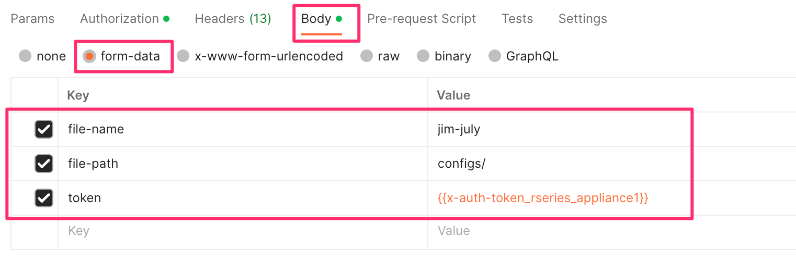
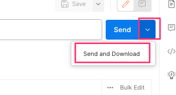
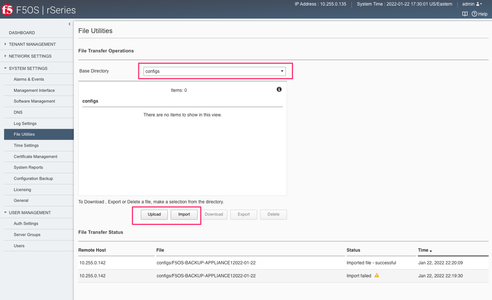
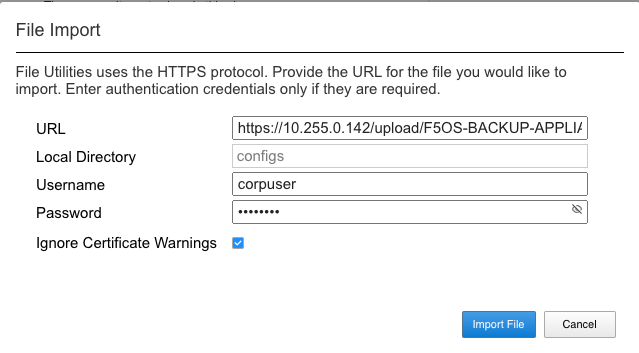

========================================
rSeries Configuration Backup and Restore 
========================================

F5OS & TMOS Configuration Backup Overview
=========================================

To completely backup the rSeries system, you’ll need to backup each tenant TMOS configuration first, and then back up the F5OS configuration. Tenant backup utilizes the same backup and recovery procedures as existing BIG-IP devices/guests because the tenants themselves are running TMOS. For the F5OS layer a different backup mechanism is utilized because F5OS configuration management is based on ConfD.  

The ConfD process manages the F5OS configuration on an rSeries system. The system stores the configuration in its configuration database (CDB).

The F5OS configuration contains data that includes the following:

- SNMP configuration
- Portgroup configuration
- VLAN configuration
- Tenant configuration

**Note: The tenant configuration contains tenant name, type, image, management IP address, gateway, VLANs, assigned vCPUs, memory, storage size, and so on. It does not include the BIG-IP configuration within the tenant. To create a backup copy of the BIG-IP configuration of the tenant, you must perform the backup in the tenant itself. For information, refer to:**

`K13132: Backing up and restoring BIG-IP configuration files with a UCS archive <https://support.f5.com/csp/article/K13132>`_

- DNS servers
- Network Time Protocol (NTP) servers
- Logging severity settings
- User Management settings
- Password policy settings
- Product license

To perform a complete backup of the rSeries system, you must:

•	Set the Primary Key for F5OS
•	Back up the configuration for F5OS
•	Copy the configuration backup for F5OS to a remote location
•	Back up any deployed tenants using the tenant's backup mechanism (i.e. a UCS backup)
•	Copy each tenant's UCS backup to a remote location

More detail is covered in the following solution article:

`K47512994: Back up and restore the F5OS-A configuration on an rSeries system <https://support.f5.com/csp/article/K47512994>`_

Setting the Primary Key on F5OS
===============================

The F5 rSeries system uses a primary key to perform encryption and decryption of highly sensitive passwords/passphrases in the configuration database. You should periodically reset this primary key for additional security. You should set this primary key prior to performing any configuration backup if you have not already done so. In the case of a configuration migration such as moving configuration to a replacement device due to RMA, it is important to set the primary key to a known value so that the same key can be used to decrypt the passwords/passphrases in the configuration restored on the replacement device.

Setting the F5OS Primary Key via CLI
====================================

To set the F5OS primary-key issue the following command in config mode.

.. code-block:: bash

    system aaa primary-key set passphrase <passphrase string> confirm-passphrase <passphrase string> salt <salt string> confirm-salt <salt string>

Note that the hash key can be used to check and compare the status of the primary-key on both the source and the replacement devices if restoring to a different device. To view the current primary-key hash, issue the following CLI command.

.. code-block:: bash

    r10900-1# show system aaa primary-key 
    system aaa primary-key state hash IWDanp1tcAO+PJPH2Hti6BSvpFKgRvvFpXNZRIAk3JoXhypflBofHc+IJp8LA2SDGCQ2IgE8Z628lGjCWVjBxg==
    system aaa primary-key state status "COMPLETE        Initiated: Mon Feb 27 13:38:02 2023"
    r10900-1# 

Backing Up F5OS
===============

F5OS can be backed up via CLI, webUI, or API, but ensure you have set a primary key first as noted in the previous section.

Backing Up F5OS via CLI
-----------------------

You can back up the F5OS configuration database using the **system database config-backup** command when in config mode. The file will be saved in the path of **/configs** automatically. 

.. code-block:: bash

    appliance-1(config)# system database config-backup name rSeries-59002-backup-1-15-2022
    result Database backup successful.
    appliance-1(config)# 

You can then list the contents of that directory to ensure the file is there using the **file list path** command.

.. code-block:: bash

    appliance-1# file list path configs/
    entries {
        name 
    rSeries-59002-backup-1-15-2022
    }
    appliance-1# 

Backing Up F5OS via webUI
-----------------------

Using the F5OS webUI you can backup the ConfD configuration database using the **System Settings -> Configuration Backup** page. Click the **Create** button and provide a name for the backup file.

.. image:: images/rseries_f5os_configuration_backup_and_restore/image1.png
  :align: center
  :scale: 70%

.. image:: images/rseries_f5os_configuration_backup_and_restore/image2.png
  :align: center
  :scale: 70%

Backing Up F5OS via API
-----------------------

Using the F5OS API you can backup the F5OS configuration database using the following API POST:

.. code-block:: bash

    POST https://{{rseries_appliance1_ip}}:8888/restconf/data/openconfig-system:system/f5-database:database/f5-database:config-backup

In the body of the API call, you can specify the file name you want to save the backup as.

.. code-block:: json

    {
        "f5-database:name": "F5OS-BACKUP-APPLIANCE1{{currentdate}}"
    }

**Note: In the current F5OS releases, the ConfD system database can be backed up via CLI, webUI, API but it cannot be restored using the F5OS webUI. This will be added in a subsequent release.**

Exporting F5OS Backup to an External Location
=============================================

Once the database backup has been completed, you should copy the file to an external location so that the system can be restored in the case of a total failure. You can download the database configuration backup using the CLI, webUI, or API. 

Exporting F5OS Backup via webUI
------------------------------

In the webUI, use the **System Settings -> File Utilities** page and from the dropdown select **configs** to see the previously saved backup file. Here you can **Import** or **Export** configuration backups, or you can **Upload** or **Download** directly to your client machine through the browser. Note that the current Import and Export options of files to and from the webUI require an external HTTPS server. The **Upload** and **Download** options allow for a browser to upload/download from the client's local machine.

.. image:: images/rseries_f5os_configuration_backup_and_restore/image3.png
  :align: center
  :scale: 70%

.. image:: images/rseries_f5os_configuration_backup_and_restore/image4.png
  :align: center
  :scale: 70%

Exporting F5OS Backup via CLI
------------------------------

To transfer a file using the CLI, use the **file list** command to see the contents of the **configs** directory. Note the previously saved file is listed.

.. code-block:: bash

    appliance-1# file list path configs/
    entries {
        name 
    rSeries-59002-backup-1-15-2022
    }
    appliance-1# 

To transfer the file from the CLI you can use the **file export** command. Below is an example of transferring to a remote HTTPS server:

.. code-block:: bash

    appliance-1# file export local-file configs/rSeries-59002-backup-1-15-2022 remote-host 10.255.0.142 remote-file /upload/upload.php username corpuser insecure
    Value for 'password' (<string>): ********
    result File transfer is initiated.(configs/rSeries-59002-backup-1-15-2022)
    appliance-1# 

To check on status of the export use the **file transfer-status** command:

.. code-block:: bash

    appliance-1# file transfer-status 
    result 
    S.No.|Operation  |Protocol|Local File Path                                             |Remote Host         |Remote File Path                                            |Status            |Time                
    1    |Export file|HTTPS   |configs/rSeries-59002-backup-1-15-2022                      |10.255.0.142        |/upload/upload.php                                          |         Completed|Sat Jan 15 20:45:29 2022

    appliance-1# 

You may also transfer from the CLI using SCP or SFTP protocols. Below is an example using SCP:

.. code-block:: bash

    appliance-1# file export local-file configs/rSeries-59002-backup-1-15-2022 remote-host 10.255.0.142 remote-file /upload/upload.php username corpuser insecure
    Value for 'password' (<string>): ********
    result File transfer is initiated.(configs/rSeries-59002-backup-1-15-2022)
    appliance-1#

The **file transfer-status** command will show the upload of the SCP transfer as well as HTTPS or SFTP:

.. code-block:: bash

    appliance-1# file transfer-status
    result 
    S.No.|Operation  |Protocol|Local File Path                                             |Remote Host         |Remote File Path                                            |Status            |Time                
    1    |Export file|HTTPS   |configs/rSeries-59002-backup-1-15-2022                      |10.255.0.142        |/upload/upload.php                                          |         Completed|Sat Jan 15 20:45:29 2022
    2    |Export file|SCP     |configs/rSeries-59002-backup-1-15-2022                      |10.255.0.142        |/var/www/server/1/upload/rSeries-59002-backup-1-16-2022     |         Completed|Sat Jan 15 20:48:29 2022

If you don’t have an external HTTPS server that allows uploads, then you can log into the rSeries F5OS address with root access and scp the file from the shell. Go to the **/var/confd/configs** directory and scp the file to an external location. Note in the CLI and webUI the path is simplified to configs, but in the underlying file system it is stored in the **/var/F5/system/configs** directory. Note that this is not an option if the appliance has been configured in Appliance Mode, which disables bash/shell access.

.. code-block:: bash

    [root@appliance-1 confd-backup]# ls /var/F5/system/configs/
    total 48
    -rw-r--r--. 1 root root 46465 Jan 15 15:18 rSeries-59002-backup-1-15-2022
    [root@appliance-1 confd-backup]# scp /var/F5/system/configs/rSeries-59002-backup-1-15-2022 root@10.255.0.142:/var/www/server/1/upload/rseries-backup
    The authenticity of host '10.255.0.142 (10.255.0.142)' can't be established.
    ECDSA key fingerprint is SHA256:xexN3pt/7xGgGNFO3Lr77PHO2gobj/lV6vi7ZO7lNuU.
    ECDSA key fingerprint is MD5:ff:06:0f:a8:5f:64:92:7b:42:31:aa:bf:ea:ee:e8:3b.
    Are you sure you want to continue connecting (yes/no)? yes
    Warning: Permanently added '10.255.0.142' (ECDSA) to the list of known hosts.
    root@10.255.0.142's password: 
    rSeries-59002-backup-1-15-2022                                                                                                                                                                               100%   45KB  30.8MB/s   00:00    
    [root@appliance-1 confd-backup]# 

Exporting F5OS Backup via API
------------------------------

To copy a configuration backup file from the appliance to a remote https server use the following API call:

.. code-block:: bash

    POST https://{{rseries_appliance1_ip}}:8888/restconf/data/f5-utils-file-transfer:file/export

.. code-block:: json

    {
        "f5-utils-file-transfer:insecure": "",
        "f5-utils-file-transfer:protocol": "https",
        "f5-utils-file-transfer:username": "corpuser",
        "f5-utils-file-transfer:password": "password",
        "f5-utils-file-transfer:remote-host": "10.255.0.142",
        "f5-utils-file-transfer:remote-file": "/upload/upload.php",
        "f5-utils-file-transfer:local-file": "configs/F5OS-BACKUP-APPLIANCE1{{currentdate}}"
    }
    
You can then check on the status of the export via the following API call:

.. code-block:: bash

    POST https://{{rseries_appliance1_ip}}:8888/api/data/f5-utils-file-transfer:file/transfer-status

.. code-block:: json

    {
        "f5-utils-file-transfer:output": {
            "result": "\nS.No.|Operation  |Protocol|Local File Path                                             |Remote Host         |Remote File Path                                            |Status            |Time                \n1    |Export file|HTTPS   |configs/F5OS-BACKUP2022-01-20                               |10.255.0.142        |/upload/upload.php                                          |         Completed|Thu Jan 20 05:11:44 2022"
        }
    }

Downloading an F5OS Backup via API
----------------------------------

You can download configuration backup files from the F5OS layer using the F5OS API. To list the current config files in the **configs/** directory use the following API call.

.. code-block:: bash

    POST https://{{rseries_appliance1_ip}}:8888/restconf/data/f5-utils-file-transfer:file/list

In the body of the API call, add the virtual path you want to list.

 .. code-block:: json
 
    {
    "f5-utils-file-transfer:path": "configs/"
    }

You should see output similar to the example below.

 .. code-block:: json

    {
        "f5-utils-file-transfer:output": {
            "entries": [
                {
                    "name": "F5OS-BACKUP-APPLIANCE12022-04-19",
                    "date": "Tue Apr 19 15:19:07 UTC 2022",
                    "size": "81KB"
                },
                {
                    "name": "F5OS-BACKUP-APPLIANCE12023-01-09",
                    "date": "Mon Jan  9 16:31:10 UTC 2023",
                    "size": "80KB"
                },
                {
                    "name": "F5OS-BACKUP-APPLIANCE12023-11-17",
                    "date": "Fri Nov 17 18:49:45 UTC 2023",
                    "size": "88KB"
                },
                {
                    "name": "F5OS-BACKUP-APPLIANCE12023-11-28",
                    "date": "Wed Nov 29 00:21:07 UTC 2023",
                    "size": "77KB"
                },
                {
                    "name": "F5OS-BACKUP2022-01-20",
                    "date": "Thu Jan 20 05:09:39 UTC 2022",
                    "size": "60KB"
                },
                {
                    "name": "jim-july",
                    "date": "Wed Jul 13 15:35:15 UTC 2022",
                    "size": "78KB"
                },
                {
                    "name": "jim-test1",
                    "date": "Wed Nov  8 21:09:09 UTC 2023",
                    "size": "77KB"
                }
            ]
        }
    }

To download a specific config file use the following API call.

.. code-block:: bash

    POST https://{{rseries_appliance1_ip}}:8888/restconf/data/f5-utils-file-transfer:file/f5-file-download:download-file/f5-file-download:start-download

In the body of the API call select **form-data**, and then enter the key/value pairs as seen below. The example provided will download the configuration file named **jim-july** file that resides in the **configs/** directory.

If you are using Postman, instead of clicking **Send**, click on the arrow next to Send, and then select **Send and Download**. You will then be prompted to save the file to your local file system.

Backing up Tenants
==================

Back up all tenants using a UCS archive or other mechanism so that they can be restored after the F5OS layer has been restored. Another alternative to UCS backup/restore of tenants is using Declarative Onboarding and AS3. If tenants are configured using DO and AS3 initially, and the declarations are saved, they can be replayed to restore a tenant. BIG-IQ could be used for this purpose as AS3 and DO declarations can be sent through BIG-IQ.

UCS Backup is covered in the following solution article on askf5:

`K13132: Backing up and restoring BIG-IP configuration files with a UCS archive <https://support.f5.com/csp/article/K13132>`_

The following video provides a demo of backing up UCS files from the BIG-IP webUI; this is the same for rSeries tenants.

.. raw:: html

    <iframe width="560" height="315" src="https://www.youtube.com/embed/OFE9MwxeBys" title="YouTube video player" frameborder="0" allow="accelerometer; autoplay; clipboard-write; encrypted-media; gyroscope; picture-in-picture" allowfullscreen></iframe>

You can also use BIG-IQ to back up rSeries tenants.

`BIG-IP Backup File Management from BIG-IQ <https://techdocs.f5.com/en-us/bigiq-8-0-0/managing-big-ip-devices-from-big-iq/backup-file-management.html>`_

The following video provides a demo of backing up UCS files from the BIG-IQ webUI, this is the same for rSeries tenants.

.. raw:: html

    <iframe width="560" height="315" src="https://www.youtube.com/embed/ThjvBhtfyO8" title="YouTube video player" frameborder="0" allow="accelerometer; autoplay; clipboard-write; encrypted-media; gyroscope; picture-in-picture" allowfullscreen></iframe>

Resetting the System (Not for Production)
=========================================

For a proof-of-concept test, this section will provide steps to wipe out the entire system configuration in a graceful manner. This is not intended as a workflow for production environments, as you would not typically be deleting entire system configurations, instead you would be restoring pieces of the configuration in the case of failure. 

The first step would be to ensure you have completed the previous sections and have created backups for the F5OS layer and each tenant. These backups should have been copied out of the rSeries system to a remote location so that they can be used to restore to the system after it has been reset. The following solution article has more details about resetting the rSeries system to default:

`K20024872: Restore the rSeries configuration to factory default settings <https://support.f5.com/csp/article/K20024872>`_

Resetting the System via CLI
----------------------------

To reset the F5OS configuration database to default, use the CLI command **system database reset-to-default**. This will wipe out all tenant configurations, networking, as well as all the system parameters except for out-of-band networking and licensing.

.. code-block:: bash

    appliance-1(config)# system database reset-to-default proceed 
    Value for 'proceed' [no,yes]: yes
    result Database reset-to-default successful.
    appliance-1(config)# 
    System message at 2022-01-20 20:52:40...
    Commit performed by admin via tcp using cli.
    appliance-1(config)# 

After resetting the system database, reboot the system to ensure the configuration is completely cleaned up. 

.. code-block:: bash

    appliance-1# system reboot 
    Really want to reboot the system ? Datapath and management connectivity to system would be disrupted. [no,yes] yes
    appliance-1# 

Resetting the System via API
----------------------------

There is no webUI support for this functionality currently. To do this via API call, you will need to send the following API call to the F5OS IP address. Below is an example of sending the database reset to default command:

.. code-block:: bash

    POST https://{{rseries_appliance1_ip}}:8888/restconf/data/openconfig-system:system/f5-database:database/f5-database:reset-to-default

The body of the above API call must contain the following:

.. code-block:: json

    {
    "f5-database:proceed": "yes"
    }

After resetting the system database reboot the system to ensure the configuration is completely cleaned up. The API call below will reboot the system.

.. code-block:: bash

    POST https://{{rseries_appliance1_ip}}:8888/restconf/data/openconfig-system:system/f5-system-reboot:reboot

Resetting the System via webUI
----------------------------

Currently there is no option to reset the system via the webUI; a reset must be performed via API or CLI.

Copying Archived Configs into F5OS
==================================

Changing the Default Password and Importing F5OS Backups via CLI
----------------------------------------------------------------

The reset of the database will not completely wipe out the system configuration. It will preserve some basic configuration like out-of-band settings so that you can still reach the unit after the database reset and reboot. Once the system finishes rebooting log into the out-of-band F5OS IP address. The previous set of login credentials will be wiped out, and you'll need to login with the default **admin/admin** account, and then you'll be prompted to change the default admin password. 

.. code-block:: bash

    FLD-ML-00054045:~ jmccarron$ ssh -l admin 10.255.0.133
    admin@10.255.0.133's password: *****
    You are required to change your password immediately (root enforced)
    Last failed login: Thu Jan 20 16:01:00 EST 2022 from 172.18.104.143 on ssh:notty
    There was 1 failed login attempt since the last successful login.
    Last login: Thu Jan 20 15:51:44 2022 from 172.18.104.143
    WARNING: Your password has expired.
    You must change your password now and login again!
    Changing password for user admin.
    Changing password for admin.
    (current) UNIX password: 
    New password: 
    Retype new password: 
    passwd: all authentication tokens updated successfully.
    Connection to 10.255.0.133 closed.

After the password is changed for the admin account, you will be disconnected and forced to login with the new password:

.. code-block:: bash

    FLD-ML-00054045:~ jmccarron$ ssh -l admin 10.255.0.133
    admin@10.255.0.133's password: 
    Last login: Thu Jan 20 16:01:04 2022 from 172.18.104.143
    Welcome to the Management CLI
    admin connected from 172.18.104.143 using ssh on appliance-1.chassis.local
    appliance-1# 

Once the system is configured and out-of-band connectivity is restored you can now copy the configuration database archives back into the F5OS layer. To import the file using the F5OS CLI you must have a remote HTTPS/SCP/SFTP server to host the file. Use the **file import** command as seen below to import the file into the **configs** directory.

.. code-block:: bash

    Appliance1# file import remote-host 10.255.0.142 remote-file /upload/upload.php local-file configs/F5OS-BACKUP-APPLIANCE12022-01-22 username corpuser insecure
    Value for 'password' (<string>): ********
    result File transfer is initiated.(configs/F5OS-BACKUP-APPLIANCE12022-01-22)

You can then check on the transfer using the CLI command **file transfer-status**.

.. code-block:: bash

    Appliance1## file transfer-status                                                                                                                              
    result 
    S.No.|Operation  |Protocol|Local File Path                                             |Remote Host         |Remote File Path                                            |Status            |Time                
    1    |Import file|HTTPS   |configs/F5OS-BACKUP-APPLIANCE12022-01-22                    |10.255.0.142        |/upload/F5OS-BACKUP-APPLIANCE12022-01-22                    |File Not Found, HTTP Error 404|Sat Jan 22 22:19:30 2022
    2    |Import file|HTTPS   |configs/F5OS-BACKUP-APPLIANCE12022-01-22                    |10.255.0.142        |/upload/upload.php                                          |         Completed|Sat Jan 22 22:20:09 2022

    
Lastly you can confirm the file is in the configs directory using the CLI command **file list path configs/**.

.. code-block:: bash

    Appliance1## file list path configs/
    entries {
        name 
    F5OS-BACKUP-APPLIANCE12022-01-22
    }
    Appliance1## 

Changing the Default Password and Importing F5OS Backups via API
----------------------------------------------------------------

After the reboot of the system, you'll need to log in and change the default password. Use the following API call to log in with the default **admin/admin** account to change the password. After doing so all future API calls will need to log in with the new admin password or get a new token:

.. code-block:: bash

    POST https://{{rseries_appliance1_ip}}:8888/restconf/operations/openconfig-system:system/aaa/authentication/users/user=admin/config/change-password

The body of the API call contains the following:

.. code-block:: json

    {
        "input": [
            {
                "old-password": "admin",
                "new-password": "{{Appliance_Password}}",
                "confirm-password": "{{Appliance_Password}}"
            }
        ]
    }

Importing an F5OS Backup from a Remote Server
^^^^^^^^^^^^^^^^^^^^^^^^^^^^^^^^^^^^^^^^^^^^^^

You'll need to use the new password/token on subsequent API calls. Post the following API call to the F5OS out-of-band IP address to import the archived ConfD backup file from a remote HTTPS server to the configs directory on the appliance.

.. code-block:: bash

    POST https://{{rseries_appliance1_ip}}:8888/restconf/data/f5-utils-file-transfer:file/import

Below is the body of the API call above:

.. code-block:: json

    {
        "f5-utils-file-transfer:insecure": "",
        "f5-utils-file-transfer:protocol": "https",
        "f5-utils-file-transfer:username": "corpuser",
        "f5-utils-file-transfer:password": "Pa$$w0rd",
        "f5-utils-file-transfer:remote-host": "10.255.0.142",
        "f5-utils-file-transfer:remote-file": "/upload/F5OS-BACKUP-APPLIANCE1{{currentdate}}",
        "f5-utils-file-transfer:local-file": "configs/F5OS-BACKUP-APPLIANCE1{{currentdate}}"
    }

You may query the transfer status of the file via the following API command:

.. code-block:: bash

    POST https://{{rseries_appliance1_ip}}:8888/api/data/f5-utils-file-transfer:file/transfer-status

The body of the API call should have the file name you want to query:

.. code-block:: json

    {
        "f5-utils-file-transfer:file-name": "configs/F5OS-BACKUP-APPLIANCE1{{currentdate}}"
    }

Uploading an F5OS Backup from a Client Machine
^^^^^^^^^^^^^^^^^^^^^^^^^^^^^^^^^^^^^^^^^^^^^^

You can upload an F5OS backup file directly from a client machine using the API. Use the following API call:

.. code-block:: bash

    POST https://{{rseries_appliance1_ip}}:8888/restconf/data/f5-utils-file-transfer:file/f5-file-upload-meta-data:upload/start-upload

In the body of the API call, you must enter the **size**, **name**, and **file-path** as seen in the example below.

.. code-block:: json

    {
        "size":66000,
        "name": "F5OS-BACKUP-APPLIANCE1{{currentdate}}",
        "file-path": "configs/"
    }

If you want to list the contents of the config directory via API, use the following API command:

.. code-block:: bash

    POST https://{{rseries_appliance1_ip}}:8888/restconf/data/f5-utils-file-transfer:file/list

The body of the API call above will list the **configs** directory as the one to be queried:

.. code-block:: json

    {
    "f5-utils-file-transfer:path": "configs"
    }

You’ll see the contents of the directory in the API response and the file should be listed:

.. code-block:: json

    {
        "f5-utils-file-transfer:output": {
            "entries": [
                {
                    "name": "\nF5OS-BACKUP-APPLIANCE12022-01-22"
                }
            ]
        }
    }

Changing the Default Password and Importing F5OS Backups via webUI
----------------------------------------------------------------

You can use the **System Settings -> File Utilities** page to import an archived F5OS backup from a remote HTTPS server. Use the drop-down option for **Base Directory** and choose **configs** to see the current files in that directory, and to import or export files. Choose the **Import** option and a popup will appear asking for the details of how to obtain the remote file. You can optionally use the **Upload** option to upload a backup from your client machine through the browser.

Restoring F5OS from a Database Backup
=====================================

Restore Using the CLI
---------------------

If you are restoring an F5OS backup to a different device (an RMA replacement would be an example), you must set the appliance to use the same passphrase string and salt string as the original appliance by entering the following command syntax:

.. code-block:: bash

    system aaa primary-key set passphrase <known_passphrase> confirm-passphrase  <known_passphrase> salt <known_saltstring> confirm-salt <known_saltstring>

Note: Before you run the previous command, you can also check the hash by running following command and comparing it to the one you have already saved.

.. code-block:: bash

    show system aaa primary-key state hash

Now that the F5OS backup has been copied into the system, you can restore the previous backup using the **system database config-restore** command as seen below. You can use the **file list** command to verify the file name:

.. code-block:: bash

    r5900-2# file list path configs/
    entries {
        name 
    F5OS-BACKUP-APPLIANCE42022-01-22
    }
    r5900-2# config

The command below will restore the previous config for the F5OS layer:

.. code-block:: bash

    Appliance1(config)# system database config-restore name F5OS-BACKUP-APPLIANCE12022-01-22
    A clean configuration is required before restoring to a previous configuration.
    Please perform a reset-to-default operation if you have not done so already.
    Proceed? [yes/no]: yes
    result Database config-restore successful.
    Appliance1(config)# 
    System message at 2022-01-22 22:46:42...
    Commit performed by admin via tcp using cli.
    Appliance1(config)# 

The system should restore the F5OS and start any tenant configurations. You may need to copy a tenant image into F5OS if it has been deleted. 

Restore Using the API
---------------------

If you are restoring an F5OS backup to a different device (an RMA replacement would be an example), you must set the appliance to use the same passphrase string and salt string as the original appliance using the CLI first, then you can follow the example below to restore via API.

To restore the F5OS configuration database use the following API call:

.. code-block:: bash

    POST https://{{rseries_appliance1_ip}}:8888/restconf/data/openconfig-system:system/f5-database:database/f5-database:config-restore

The body/payload must include the text below to specify the file to be restored:

.. code-block:: json

    {
    "f5-database:name": "F5OS-BACKUP-APPLIANCE1{{currentdate}}"
    }

The system should restore the F5OS and start any tenant configurations. You may need to copy a tenant image into F5OS if it has been deleted. 

Restore Using the webUI
---------------------

Currently there is no webUI support for restoration of the ConfD database, so you’ll need to use either the CLI or API to restore the F5OS database. Once the database has been restored, you may need to wait a few minutes for the restoration to complete.

Restoring Tenants from a UCS Backup
====================================

Once the tenant has finished starting up, you'll need to load and restore via UCS file. This should follow normal BIG-IP restoration procedures.
