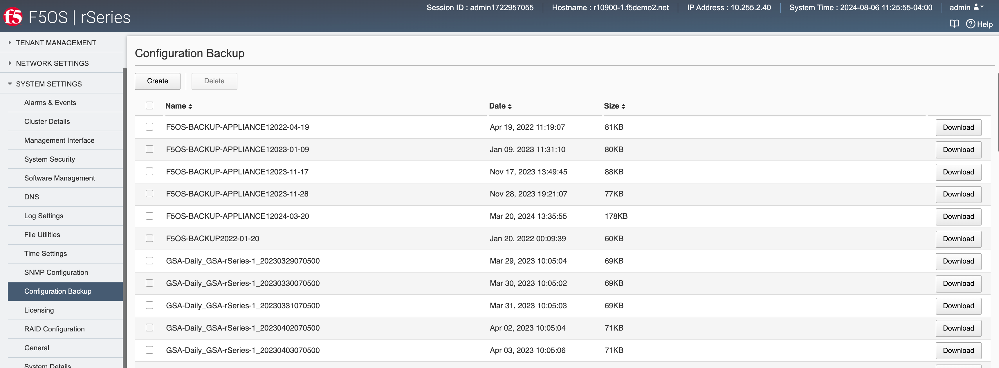
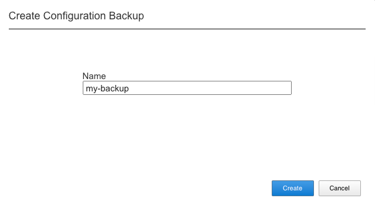
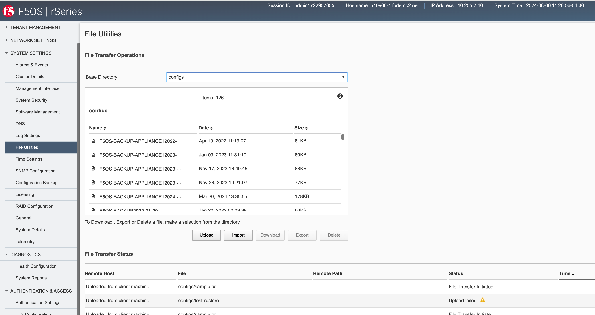
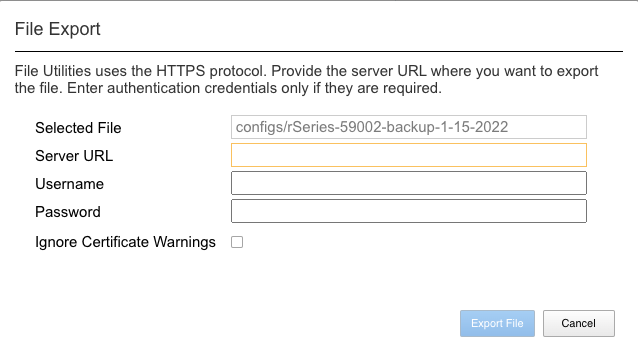

========================================
rSeries Configuration Backup and Restore 
========================================

F5OS Configuration Backup
=========================

To completely backup the rSeries system, you’ll need to backup each tenant TMOS configuration first, and then back up the F5OS configuration. Tenant backup utilizes the same backup and recovery procedures as existing BIG-IP devices/guests because the tenants themselves are running TMOS. For the F5OS layer a different backup mechanism is utilized because F5OS configuration management is based on ConfD.  

The confd process manages the F5OS configuration on an rSeries system. The system stores the configuration in its configuration database (CDB).

The F5OS configuration contains data that includes the following:

- SNMP configuration
- Portgroup configuration
- VLAN configuration
- Tenant configuration

Note: The tenant configuration contains tenant name, type, image, management IP address, gateway, VLANs, assigned vCPUs, memory, storage size, and so on. It does not include the BIG-IP configuration of the tenant. To create a backup copy of the BIG-IP configuration of the tenant, you must perform the backup in the tenant itself. For information, refer to K13132: Backing up and restoring BIG-IP configuration files with a UCS archive.

- DNS servers
- Network Time Protocol (NTP) servers
- Logging severity settings
- User Management settings
- Password policy settings
- Product license

To perform a complete backup of the rSeries system, you must:

•	Back up the configuration for F5OS.
•	Back up any deployed tenants using the tenants’ backup mechanism (i.e. a UCS).

More detail is covered in the following solution article:

https://support.f5.com/csp/article/K47512994

Backing Up F5OS via CLI
-----------------------

You can back up the F5OS configuration database using the **system database config-backup** command when in config mode. The file will be saved in the path of **/configs** automatically. 

.. code-block:: bash

    appliance-1(config)# system database config-backup name rSeries-59002-backup-1-15-2022
    result Database backup successful.
    appliance-1(config)# 

You can then list the contents of that directory to ensure the file is there using the **file list path** command.

.. code-block:: bash

    appliance-1# file list path configs/
    entries {
        name 
    rSeries-59002-backup-1-15-2022
    }
    appliance-1# 

Backing Up F5OS via GUI
-----------------------

Using the F5OS GUI you can backup the confd configuration database using the **System Settings -> Configuration Backup** page. Click the **Create** button and provide a name for the backup file.

Backing Up F5OS via API
-----------------------

Using the F5OS API you can backup the confd configuration database using the following API POST:

.. code-block:: bash

    POST https://{{Chassis1_System_Controller_IP}}:8888/restconf/data/openconfig-system:system/f5-database:database/f5-database:config-backup

In the body of the API call you can specifiy the file name you want to save the backup as.

.. code-block:: json

    {
        "f5-database:name": "SYSTEM-CONTROLLER-DB-BACKUP{{currentdate}}"
    }

**Note: In the current F5OS releases the confd system database can be backed up via CLI/GUI/API but it cannot be restored using the F5OS GUI. This will be added in a subsequent release.**

Exporting F5OS Backup to an External Location
=============================================

Once the database backup has been completed, you should copy the file to an external location so that the system can be restored in the case of a total failure. You can download the database configuration backup using the CLI, GUI, or API. 

Exporting F5OS Backup via GUI
------------------------------

In the GUI use the **System Settings -> File Utilities** page and from the dropdown select **configs** to see the previously saved backup file. Here you can **Import** or **Export** configuration backups, or you can **Upload** or **Download** directly to your client machine through the browser. Note that the current Import and Export options of files to and from the GUI requires an external HTTPS server. 

Exporting F5OS Backup via CLI
------------------------------

To transfer a file using the CLI use the **file list** command to see the contents of the **configs** directory. Note the previously saved file is listed.

.. code-block:: bash

    appliance-1# file list path configs/
    entries {
        name 
    rSeries-59002-backup-1-15-2022
    }
    appliance-1# 

To transfer the file from the CLI you can use the **file export** command. Below is an example of transferring to a remote HTTPS server:

.. code-block:: bash

    appliance-1# file export local-file configs/rSeries-59002-backup-1-15-2022 remote-host 10.255.0.142 remote-file /upload/upload.php username corpuser insecure
    Value for 'password' (<string>): ********
    result File transfer is initiated.(configs/rSeries-59002-backup-1-15-2022)
    appliance-1# 

To check on status of the export use the **file transfer-status** command:

.. code-block:: bash

    appliance-1# file transfer-status 
    result 
    S.No.|Operation  |Protocol|Local File Path                                             |Remote Host         |Remote File Path                                            |Status            |Time                
    1    |Export file|HTTPS   |configs/rSeries-59002-backup-1-15-2022                      |10.255.0.142        |/upload/upload.php                                          |         Completed|Sat Jan 15 20:45:29 2022

    appliance-1# 

You may also transfer from the CLI using SCP or SFTP protocols. Below is an example using SCP:

    appliance-1# file export local-file configs/rSeries-59002-backup-1-15-2022 remote-host 10.255.0.142 remote-file /upload/upload.php username corpuser insecure
    Value for 'password' (<string>): ********
    result File transfer is initiated.(configs/rSeries-59002-backup-1-15-2022)
    appliance-1#

The **file transfer-status** command will show the upload of th SCP as well as HTTPS or SFTP:

    appliance-1# file transfer-status
    result 
    S.No.|Operation  |Protocol|Local File Path                                             |Remote Host         |Remote File Path                                            |Status            |Time                
    1    |Export file|HTTPS   |configs/rSeries-59002-backup-1-15-2022                      |10.255.0.142        |/upload/upload.php                                          |         Completed|Sat Jan 15 20:45:29 2022
    2    |Export file|SCP     |configs/rSeries-59002-backup-1-15-2022                      |10.255.0.142        |/var/www/server/1/upload/rSeries-59002-backup-1-16-2022     |         Completed|Sat Jan 15 20:48:29 2022

If you don’t have an external HTTPS server that allows uploads, then you can log into the rSeries F5OS address with root access and scp the file from the shell. Go to the **/var/confd/configs** directory and scp the file to an external location. Note in the CLI and GUI the path is simplified to configs, but in the underlying file system it is actually stored in the **/var/F5/system/configs** directory.

.. code-block:: bash

    [root@appliance-1 confd-backup]# ls /var/F5/system/configs/
    total 48
    -rw-r--r--. 1 root root 46465 Jan 15 15:18 rSeries-59002-backup-1-15-2022
    [root@appliance-1 confd-backup]# scp /var/F5/system/configs/rSeries-59002-backup-1-15-2022 root@10.255.0.142:/var/www/server/1/upload/rseries-backup
    The authenticity of host '10.255.0.142 (10.255.0.142)' can't be established.
    ECDSA key fingerprint is SHA256:xexN3pt/7xGgGNFO3Lr77PHO2gobj/lV6vi7ZO7lNuU.
    ECDSA key fingerprint is MD5:ff:06:0f:a8:5f:64:92:7b:42:31:aa:bf:ea:ee:e8:3b.
    Are you sure you want to continue connecting (yes/no)? yes
    Warning: Permanently added '10.255.0.142' (ECDSA) to the list of known hosts.
    root@10.255.0.142's password: 
    rSeries-59002-backup-1-15-2022                                                                                                                                                                               100%   45KB  30.8MB/s   00:00    
    [root@appliance-1 confd-backup]# 

Exporting F5OS Backup via API
------------------------------

To copy a confd configuration backup file from the system controller to a remote https server use the following API call:

.. code-block:: bash

    POST https://{{Appliance1_IP}}:8888/restconf/data/f5-utils-file-transfer:file/export

.. code-block:: json

    {
        "f5-utils-file-transfer:insecure": "",
        "f5-utils-file-transfer:protocol": "https",
        "f5-utils-file-transfer:username": "corpuser",
        "f5-utils-file-transfer:password": "Passw0rd!!",
        "f5-utils-file-transfer:remote-host": "10.255.0.142",
        "f5-utils-file-transfer:remote-file": "/upload/upload.php",
        "f5-utils-file-transfer:local-file": "configs/SYSTEM-CONTROLLER-DB-BACKUP{{currentdate}}"
    }

Backing up Tenants
==================

Backup all tenants using a UCS archive or other mechanism so that they can be restored after the system controller and chassis partitions are restored. Another alternative to UCS backup/restore of tenants is using Declarative Onboarding and AS3. If tenants are configured using DO and AS3 initially, and the declarations are saved, they can be replayed to restore a tenant. BIG-IQ could be used for this purpose as AS3 and DO declarations can be sent through BIG-IQ.

Resetting the System (Not for Production)
=========================================

For a proof-of-concept test, this section will provide steps to wipe out the entire system configuration in a graceful manner. This is not intended as a workflow for production environments, as you would not typically be deleting entire system configurations, instead you would be restoring pieces of the configuration in the case of failure. 

The first step would be to ensure you have completed the previous sections, and have created backups for the F5OS layer and each tenant. These backups should have been copied out of the rSeries system to a remote location so that they can be used to restore to the system after it has been reset. The following solution article has more details in resetting the rSeries system to default:

https://support.f5.com/csp/article/K20024872

Resetting the system via CLI
----------------------------

To reset the F5OS confd database to default use the CLI command **system database reset-to-default**. This will wipe out all tenant configurations, networking, as well as all the system parameters. You will lose all conectivity after this is run and will require console access to re-establish network connectivity before a previous backup can be imported and a restore can occur.

.. code-block:: bash

    Appliance-1# config
    Appliance-1(config)# system database reset-to-default proceed  
    Value for 'proceed' [no,yes]: yes
    result Database reset-to-default successful.
    Appliance-1(config)# 
    System message at 2021-03-02 22:51:54...
    Commit performed by admin via tcp using cli.
    Appliance-1(config)# 

Once the system configurations have been cleared, you’ll need to establish connectivity to the until via the console port and reconfigure out-of-band connectivity in order to continue.

Resetting the system via API
----------------------------

There is no GUI support for this functionality currently. To do this via API call you will need to send the following API call to the chassis partition IP address. Below is an example sending the database reset to default command to the chassis partition called bigpartition:

.. code-block:: bash

    POST https://{{Chassis1_BigPartition_IP}}:8888/restconf/data/openconfig-system:system/f5-database:database/f5-database:reset-to-default

.. code-block:: json

    {
    "f5-database:proceed": "yes"
    }

Repeat this for the other chassis partitions in the system, in this case send and API call to the IP address of the chassis partition smallpartition:

.. code-block:: bash

    POST https://{{Chassis1_SmallPartition_IP}}:8888/restconf/data/openconfig-system:system/f5-database:database/f5-database:reset-to-default

.. code-block:: json

    {
    "f5-database:proceed": "yes"
    }

First send an API call to the system controller IP address to re-assign any slots that were previously part of a chassis partition to the partition none. In the example below slots 1-2 were assigned to bigpartition and slot3 was assigned to smallpartition. All 3 slots will be moved to the partition none. 

.. code-block:: bash

    POST https://{{Chassis1_System_Controller_IP}}:8888/restconf/data/

.. code-block:: json

    {
        "f5-system-slot:slots": {
            "slot": [
                {
                    "slot-num": 1,
                    "enabled": true,
                    "partition": "none"
                },
                {
                    "slot-num": 2,
                    "enabled": true,
                    "partition": "none"
                },
                {
                    "slot-num": 3,
                    "enabled": true,
                    "partition": "none"
                }
            ]
        }
    }

Next Delete any chassis partitions that were configured. In this case both **bigpartition** and **smallpartiion** will be deleted by sending API calls to the system controller IP address:

.. code-block:: bash

    DELETE https://{{Chassis1_System_Controller_IP}}:8888/restconf/data/f5-system-partition:partitions/partition=bigpartition

    DELETE https://{{Chassis1_System_Controller_IP}}:8888/restconf/data/f5-system-partition:partitions/partition=smallpartition

The last step in the reset procedure is to set the system controllers confd database back to default.

.. code-block:: bash

    POST https://{{Chassis1_System_Controller_IP}}:8888/restconf/data/openconfig-system:system/f5-database:database/f5-database:config

.. code-block:: json

    {
    "f5-database:reset-default-config": "true"
    }

The system controllers should reboot, and their configurations will be completel wiped clean. You will need ot login via the CLI to restore out-of-band networking connectivity, and then the previously archived configurations can be copied back and restored. 

Resetting the system via API
----------------------------

This is not currently an option, and a reset must be performed via API or CLI.

Restoring Out-of-Band Connectivity and Copying Archived Configs into F5OS
=========================================================================

Importing F5OS Backups via API
------------------------------

You will need to login to the system controller console port since all the networking configuration has now been wiped clean. You will login with the default username/password of admin/admin, since any previous accounts will have been wiped clean. On first login you will be prompted to change your password. Note below that the current console is connected to the standby controller, you’ll need to connect to the console of the active controller to make further changes:

.. code-block:: bash

    controller-1 login: admin
    Password: 
    You are required to change your password immediately (root enforced)
    Changing password for admin.
    (current) UNIX password: admin
    New password: **************
    Retype new password: **************
    Last failed login: Fri Sep 10 14:49:55 UTC 2021 on ttyS0
    There was 1 failed login attempt since the last successful login.
    Last login: Thu Sep  2 14:09:57 on ttyS0
    Welcome to the F5OS System Controller Management CLI
    admin connected from 127.0.0.1 using console on syscon-1-standby
    syscon-1-standby# 

Logout of the system and login as root using the new password you just created for the admin account, you’ll be prompted to change the password again. There is a bug in the current F5OS version where the config directory is getting deleted on wiping out of the database, and it is not restored. Until that issue is resolved the recommended workaround is to create a new backup of the system controller configuration and that will create the required config directory. Note you will not restore from this backup, instead you will restore from the one taken earlier before the reset. 

.. code-block:: bash

    syscon-1-active# config
    Entering configuration mode terminal
    syscon-1-active(config)# system database config-backup name dummy-backup
    response Succeeded.
    syscon-1-active(config)# exit 

    syscon-1-active# file list path configs
    entries {
        name 
    dummy-backup
    test-backup
    }
    syscon-1-active# 

To transfer files into the system controller you’ll have to manually configure the out-of-band networking first. In the case below the system controller out-of-band ethernet ports were aggregated into a LAG before the system was reset. This needs to be recreated, and then static and floating out-of-band IP addresses are assigned as well as a prefix length and gateway.

.. code-block:: bash

    syscon-1-active# config
    syscon-1-active(config)# interfaces interface mgmt-aggr
    Value for 'config type' [a12MppSwitch,aal2,aal5,actelisMetaLOOP,...]: ieee8023adLag
    syscon-1-active(config-interface-mgmt-aggr)# config name mgmt-aggr
    syscon-1-active(config-interface-mgmt-aggr)# aggregation config lag-type LACP 
    syscon-1-active(config-interface-mgmt-aggr)# exit
    syscon-1-active(config)# lacp interfaces interface mgmt-aggr
    syscon-1-active(config-interface-mgmt-aggr)# config name mgmt-aggr
    syscon-1-active(config-interface-mgmt-aggr)# exit
    syscon-1-active(config)# interfaces interface 1/mgmt0 
    syscon-1-active(config-interface-1/mgmt0)# config name 1/mgmt0
    syscon-1-active(config-interface-1/mgmt0)# config type ethernetCsmacd 
    syscon-1-active(config-interface-1/mgmt0)# ethernet config aggregate-id mgmt-aggr 
    syscon-1-active(config-interface-1/mgmt0)# exit
    syscon-1-active(config)# exit
    yscon-1-active(config)# interfaces interface 2/mgmt0  
    syscon-1-active(config-interface-2/mgmt0)# config name 2/mgmt0
    syscon-1-active(config-interface-2/mgmt0)# config type ethernetCsmacd 
    syscon-1-active(config-interface-2/mgmt0)# ethernet config aggregate-id mgmt-aggr
    syscon-1-active(config-interface-2/mgmt0)# 
    syscon-1-active(config)# system mgmt-ip config ipv4 controller-1 address 10.255.0.145
    syscon-1-active(config)# system mgmt-ip config ipv4 controller-2 address 10.255.0.146
    syscon-1-active(config)# system mgmt-ip config ipv4 floating address 10.255.0.147
    syscon-1-active(config)# system mgmt-ip config ipv4 gateway 10.255.0.1
    syscon-1-active(config)# system mgmt-ip config ipv4 prefix-length 24
    syscon-1-active(config)# commit 
    Commit complete.

Once the system is configured and out-of-band connectivity is restored you can now copy the confd database archives back into the system controllers. If you are in the bash shell you can simply SCP the file into the **/var/confd/configs** directory. If it doesn’t exist, you can create it by creating a dummy backup of the system controllers configuration as outlined earlier.

Next SCP the file from a remote server:

.. code-block:: bash

    scp root@10.255.0.142:/var/www/server/1/upload/SYSTEM-CONTROLLER-DB-BACKUP2021-09-10 .

To import the file using the F5OS CLI you must have a remote HTTP server to host the file. Use the file import command as seen below to import the file into the **configs** directory.

.. code-block:: bash

    syscon-1-active# file import remote-host 10.255.0.142 remote-file /upload/SYSTEM-CONTROLLER-DB-BACKUP2021-09-10 local-file configs/SYSTEM-CONTROLLER-DB-BACKUP2021-09-10 username corpuser insecure
    Value for 'password' (<string>): ********
    result File transfer is initiated.(configs/SYSTEM-CONTROLLER-DB-BACKUP2021-09-10)

    syscon-1-active# file transfer-status 
    result 
    S.No.|Operation  |Protocol|Local File Path                                             |Remote Host         |Remote File Path                                            |Status            |Time                
    1    |Import file|HTTPS   |configs/SYSTEM-CONTROLLER-DB-BACKUP2021-09-10               |10.255.0.142        |/upload/SYSTEM-CONTROLLER-DB-BACKUP2021-09-10               |         Completed|Wed Sep 15 01:57:39 2021

    syscon-1-active# file list path configs/
    entries {
        name 
    dummy-backup
    SYSTEM-CONTROLLER-DB-BACKUP2021-09-10
    }
    syscon-1-active# 

Importing F5OS Backups via API
------------------------------

Post the following API call to the system controllers IP address to import the archived confd backup file form a remote HTTPS server to the configs directory on the system controller.

.. code-block:: bash

    POST https://{{Chassis1_System_Controller_IP}}:8888/restconf/data/f5-utils-file-transfer:file/import

.. code-block:: json

    {
        "f5-utils-file-transfer:insecure": "",
        "f5-utils-file-transfer:protocol": "https",
        "f5-utils-file-transfer:username": "corpuser",
        "f5-utils-file-transfer:password": "Passw0rd!!",
        "f5-utils-file-transfer:remote-host": "10.255.0.142",
        "f5-utils-file-transfer:remote-file": "/upload/SYSTEM-CONTROLLER-DB-BACKUP{{currentdate}}",
        "f5-utils-file-transfer:local-file": "configs/SYSTEM-CONTROLLER-DB-BACKUP{{currentdate}}"
    }

You may query the transfer status of the file via the following API command:

.. code-block:: bash

    POST https://{{Chassis1_System_Controller_IP}}:8888/api/data/f5-utils-file-transfer:file/transfer-status

.. code-block:: json

    {
        "f5-utils-file-transfer:file-name": "configs/SYSTEM-CONTROLLER-DB-BACKUP{{currentdate}}"
    }

If you want to list the contents of the config directory via API use the following API command:

.. code-block:: bash

    POST https://{{Chassis1_System_Controller_IP}}:8888/restconf/data/f5-utils-file-transfer:file/list

.. code-block:: json

    {
    "f5-utils-file-transfer:path": "configs"
    }

You’ll see the contents of the directory in the API response:

.. code-block:: json

    {
        "f5-utils-file-transfer:output": {
            "entries": [
                {
                    "name": "\nSYSTEM-CONTROLLER-DB-BACKUP2021-09-10"
                }
            ]
        }
    }

Importing F5OS Backups via GUI
-------------------------------------------

You can use the **System Settings -> File Utilities** page to import an archived system controller backup from a remote HTTPS server. Use the drop-down option for **Base Directory** and choose **configs** to see the current files in that directory, and to import or export files. Choose the **Import** option and a popup will appear asking for the details of how to obtain the remote file.

.. image:: images/velos_f5os_configuration_backup_and_restore/image9.png
  :align: center
  :scale: 70%

.. image:: images/velos_f5os_configuration_backup_and_restore/image10.png
  :align: center
  :scale: 70%

Restoring the System Controller from a Database Backup
======================================================

Now that the system controller backup has been copied into the system, you can restore the previous backup using the **system database config-restore** command as seen below. You can use the file list command to verify the file name:

.. code-block:: bash

    syscon-2-active# file list path configs/ 
    entries {
        name 
    SYSTEM-CONTROLLER-DB-BACKUP2021-09-10
    }
    syscon-2-active# 

    syscon-2-active(config)# system database config-restore name SYSTEM-CONTROLLER-DB-BACKUP2021-09-10
    response Succeeded.
    syscon-2-active(config)#

To restore the system controller confd database use the following API call:

.. code-block:: bash

    POST https://{{Chassis1_System_Controller_IP}}:8888/restconf/data/openconfig-system:system/f5-database:database/f5-database:config-restore

.. code-block:: json

    {
    "f5-database:name": "SYSTEM-CONTROLLER-DB-BACKUP{{currentdate}}"
    }

Currently there is no GUI support for restoration of the confd database, so you’ll need to use either the CLI or API to restore the system controller’s database. Once the database has been restored (you may need to wait a few minutes for the restoration to complete.) you need to reboot the blades in-order for the config to be deployed successfully.

To reboot blades from the GUI log into each chassis partition. You will be prompted to change the password on first login. 

.. image:: images/velos_f5os_configuration_backup_and_restore/image11.png
  :align: center
  :scale: 70%

Once logged in you’ll notice no configuration inside the chassis partition. Go to the **System Settings -> General** Page and reboot each blade. You’ll need to do the same procedure for other chassis partitions if they exist.

.. image:: images/velos_f5os_configuration_backup_and_restore/image12.png
  :align: center
  :scale: 70%

Wait for each blade to return to the **Ready** status before going onto the next step.

To reboot blades from the API, using the following API commands to list nodes (Blades), and then reboot them. The command below will list the current nodes and their names that can then be used to reboot. Send the API call to the chassis partition IP address:

.. code-block:: bash

    GET https://{{Chassis1_BigPartition_IP}}:8888/restconf/data/f5-cluster:cluster/nodes

.. code-block:: json

    {
        "f5-cluster:nodes": {
            "node": [
                {
                    "name": "blade-1",
                    "config": {
                        "name": "blade-1",
                        "enabled": true
                    },
                    "state": {
                        "name": "blade-1",
                        "enabled": true,
                        "node-running-state": "running",
                        "assigned": true,
                        "platform": {
                            "fpga-state": "FPGA_RDY",
                            "dma-agent-state": "DMA_AGENT_RDY"
                        },
                        "slot-number": 1,
                        "node-info": {
                            "creation-time": "2021-08-31T00:16:13Z",
                            "cpu": 28,
                            "pods": 250,
                            "memory": "131574100Ki"
                        },
                        "ready-info": {
                            "ready": true,
                            "last-transition-time": "2021-09-16T00:36:42Z",
                            "message": "kubelet is posting ready status"
                        },
                        "out-of-disk-info": {
                            "out-of-disk": false,
                            "last-transition-time": "2021-09-16T00:36:31Z",
                            "message": "kubelet has sufficient disk space available"
                        },
                        "disk-pressure-info": {
                            "disk-pressure": false,
                            "last-transition-time": "2021-09-16T00:36:31Z",
                            "message": "kubelet has no disk pressure"
                        },
                        "disk-data": {
                            "stats": [
                                {},
                                {},
                                {}
                            ]
                        },
                        "f5-disk-usage-threshold:disk-usage": {
                            "used-percent": 1,
                            "growth-rate": 0,
                            "status": "in-range"
                        }
                    }
                },
                {
                    "name": "blade-2",
                    "config": {
                        "name": "blade-2",
                        "enabled": true
                    },
                    "state": {
                        "name": "blade-2",
                        "enabled": true,
                        "node-running-state": "running",
                        "assigned": true,
                        "platform": {
                            "fpga-state": "FPGA_RDY",
                            "dma-agent-state": "DMA_AGENT_RDY"
                        },
                        "slot-number": 2,
                        "node-info": {
                            "creation-time": "2021-08-31T00:16:12Z",
                            "cpu": 28,
                            "pods": 250,
                            "memory": "131574100Ki"
                        },
                        "ready-info": {
                            "ready": true,
                            "last-transition-time": "2021-09-16T00:36:44Z",
                            "message": "kubelet is posting ready status"
                        },
                        "out-of-disk-info": {
                            "out-of-disk": false,
                            "last-transition-time": "2021-09-16T00:36:34Z",
                            "message": "kubelet has sufficient disk space available"
                        },
                        "disk-pressure-info": {
                            "disk-pressure": false,
                            "last-transition-time": "2021-09-16T00:36:34Z",
                            "message": "kubelet has no disk pressure"
                        },
                        "disk-data": {
                            "stats": [
                                {},
                                {},
                                {}
                            ]
                        },
                        "f5-disk-usage-threshold:disk-usage": {
                            "used-percent": 1,
                            "growth-rate": 0,
                            "status": "in-range"
                        }
                    }
                },
                {
                    "name": "blade-3",
                    "config": {
                        "name": "blade-3",
                        "enabled": true
                    },
                    "state": {
                        "name": "blade-3",
                        "enabled": true,
                        "node-running-state": "running",
                        "assigned": false,
                        "slot-number": 3
                    }
                },
                {
                    "name": "blade-4",
                    "config": {
                        "name": "blade-4",
                        "enabled": true
                    },
                    "state": {
                        "name": "blade-4",
                        "enabled": true,
                        "node-running-state": "running",
                        "assigned": false,
                        "slot-number": 4
                    }
                },
                {
                    "name": "blade-5",
                    "config": {
                        "name": "blade-5",
                        "enabled": true
                    },
                    "state": {
                        "name": "blade-5",
                        "enabled": true,
                        "node-running-state": "running",
                        "assigned": false,
                        "slot-number": 5
                    }
                },
                {
                    "name": "blade-6",
                    "config": {
                        "name": "blade-6",
                        "enabled": true
                    },
                    "state": {
                        "name": "blade-6",
                        "enabled": true,
                        "node-running-state": "running",
                        "assigned": false,
                        "slot-number": 6
                    }
                },
                {
                    "name": "blade-7",
                    "config": {
                        "name": "blade-7",
                        "enabled": true
                    },
                    "state": {
                        "name": "blade-7",
                        "enabled": true,
                        "node-running-state": "running",
                        "assigned": false,
                        "slot-number": 7
                    }
                },
                {
                    "name": "blade-8",
                    "config": {
                        "name": "blade-8",
                        "enabled": true
                    },
                    "state": {
                        "name": "blade-8",
                        "enabled": true,
                        "node-running-state": "running",
                        "assigned": false,
                        "slot-number": 8
                    }
                }
            ]
        }
    }

You must reboot each blade that was previously assigned to a partition:

.. code-block:: bash

    POST https://{{Chassis1_BigPartition_IP}}:8888/restconf/data/f5-cluster:cluster/nodes/node=blade-1/reboot

    POST https://{{Chassis1_BigPartition_IP}}:8888/restconf/data/f5-cluster:cluster/nodes/node=blade-2/reboot

    POST https://{{Chassis1_SmallPartition_IP}}:8888/restconf/data/f5-cluster:cluster/nodes/node=blade-3/reboot

Importing Archived Chassis Partition Configs
============================================

Log directly into the chassis partition CLI and use the **file import** command to copy the archived image from a remote HTTPS server. You can then use the **file transfer-status** to see if the import succeeded, and then the **file list** command to see the file.

.. code-block:: bash

    bigpartition-1# file import remote-host 10.255.0.142 remote-file /upload/bigpartition-DB-BACKUP2021-09-10 local-file configs/bigpartition-DB-BACKUP2021-09-10 username corpuser insecure  
    Value for 'password' (<string>): ********
    result File transfer is initiated.(configs/bigpartition-DB-BACKUP2021-09-10)

    bigpartition-1# file transfer-status 
    result 
    S.No.|Operation  |Protocol|Local File Path                                             |Remote Host         |Remote File Path                                            |Status            |Time                
    1    |Import file|HTTPS   |configs/bigpartition-DB-BACKUP2021-09-10                    |10.255.0.142        |/upload/bigpartition-DB-BACKUP2021-09-10                    |         Completed|Wed Sep 15 03:15:43 2021

    bigpartition-1# file list path configs/
    entries {
        name 
    bigpartition-DB-BACKUP2021-09-10
    }
    bigpartition-1# 

Repeat this process for each chassis partition in the system.

.. code-block:: bash

    smallpartition-1# file import remote-host 10.255.0.142 remote-file /upload/smallpartition-DB-BACKUP2021-09-10 local-file configs/smallpartition-DB-BACKUP2021-09-10 username corpuser insecure 
    Value for 'password' (<string>): ********
    result File transfer is initiated.(configs/smallpartition-DB-BACKUP2021-09-10)

    smallpartition-1# file transfer-status 
    result 
    S.No.|Operation  |Protocol|Local File Path                                             |Remote Host         |Remote File Path                                            |Status            |Time                
    1    |Import file|HTTPS   |configs/smallpartition-DB-BACKUP2021-09-10                  |10.255.0.142        |/upload/smallpartition-DB-BACKUP2021-09-10                  |         Completed|Wed Sep 15 03:21:40 2021

    smallpartition-1# file list path configs/
    entries {
        name 
    smallpartition-DB-BACKUP2021-09-10
    }
    smallpartition-1# 

Importing Archived Chassis Partition Configs via API
----------------------------------------------------

Archived confd database backups can be imported from a remote HTTPS server via the following API call to the chassis partition IP addresses. Each chassis partition will need to have its own archived database imported so that it may be restored:

.. code-block:: bash

    POST https://{{Chassis1_SmallPartition_IP}}:8888/restconf/data/f5-utils-file-transfer:file/import

.. code-block:: json

    {
        "f5-utils-file-transfer:insecure": "",
        "f5-utils-file-transfer:protocol": "https",
        "f5-utils-file-transfer:username": "corpuser",
        "f5-utils-file-transfer:password": "Passw0rd!!",
        "f5-utils-file-transfer:remote-host": "10.255.0.142",
        "f5-utils-file-transfer:remote-file": "/upload/smallpartition-DB-BACKUP2021-09-10",
        "f5-utils-file-transfer:local-file": "configs/smallpartition-DB-BACKUP2021-09-10"
    }

You can check on the file transfer status by issubg the following API call:

.. code-block:: bash

    POST https://{{Chassis1_BigPartition_IP}}:8888/api/data/f5-utils-file-transfer:file/transfer-status

A status similar to the one below will show a status of completed if successful:

.. code-block:: json

    {
        "f5-utils-file-transfer:output": {
            "result": "\nS.No.|Operation  |Protocol|Local File Path                                             |Remote Host         |Remote File Path                                            |Status            |Time                \n1    |Import file|HTTPS   |configs/bigpartition-DB-BACKUP2021-09-10                    |10.255.0.142        |/upload/bigpartition-DB-BACKUP2021-09-10                    |         Completed|Thu Sep 16 01:33:50 2021"
        }
    }

Repeat similar steps for remaining chassis partitions:

.. code-block:: bash

    POST https://{{Chassis1_BigPartition_IP}}:8888/restconf/data/f5-utils-file-transfer:file/import

.. code-block:: json

    {
        "f5-utils-file-transfer:insecure": "",
        "f5-utils-file-transfer:protocol": "https",
        "f5-utils-file-transfer:username": "corpuser",
        "f5-utils-file-transfer:password": "Passw0rd!!",
        "f5-utils-file-transfer:remote-host": "10.255.0.142",
        "f5-utils-file-transfer:remote-file": "/upload/bigpartition-DB-BACKUP2021-09-10",
        "f5-utils-file-transfer:local-file": "configs/bigpartition-DB-BACKUP2021-09-10"
    }

Importing Archived Chassis Partition Configs via GUI
----------------------------------------------------

You can use the System Settings -> File Utilities page to import archives from a remote HTTPS server. 

.. image:: images/velos_f5os_configuration_backup_and_restore/image13.png
  :align: center
  :scale: 70%

Restoring Chassis Partitions from Database Backups
==================================================

To restore a configuration database backup within a chassis partition, use the **system database config-restore** command inside the chassis partition. Note that a newly restored chassis partition will not have any tenant images loaded so tenants will show a **Pending** status until the proper image is loaded for that tenant.

.. code-block:: bash

    bigpartition-1(config)# system database config-restore name bigpartition-DB-BACKUP2021-09-10
    A clean configuration is required before restoring to a previous configuration.
    Please perform a reset-to-default operation if you have not done so already.
    Proceed? [yes/no]: yes
    result Database config-restore successful.
    bigpartition-1(config)# 
    System message at 2021-09-15 03:25:53...
    Commit performed by admin via tcp using cli.
    bigpartition-1(config)# 

    smallpartition-1(config)# system database config-restore name smallpartition-DB-BACKUP2021-09-10
    A clean configuration is required before restoring to a previous configuration.
    Please perform a reset-to-default operation if you have not done so already.
    Proceed? [yes/no]: yes
    result Database config-restore successful.
    smallpartition-1(config)# 
    System message at 2021-09-15 03:23:50...
    Commit performed by admin via tcp using cli.
    smallpartition-1(config)# 

The tenant is properly restored and deployed; however, its status is pending waiting on image:

.. image:: images/velos_f5os_configuration_backup_and_restore/image14.png
  :align: center
  :scale: 70%

This can be seen in the chassis partition CLI by using the **show tenants** command. Note the **Phase** will display: **Tenant image not found**.

.. code-block:: bash

    Placeholder

 Copy the proper tenant image into each partition and the tenant should then deploy successfully. Below is a **show images** output before and after an image is successfully uploaded. Note the **STATUS** of **not-present** and then **replicated** after the image has been uploaded:   

 .. code-block:: bash

    bigpartition-1# show images 
                                                    IN                  
    NAME                                            USE    STATUS       
    --------------------------------------------------------------------
    BIGIP-15.1.4-0.0.46.ALL-VELOS.qcow2.zip.bundle  false  not-present  

    bigpartition-1# show images
                                                    IN                 
    NAME                                            USE    STATUS      
    -------------------------------------------------------------------
    BIGIP-15.1.4-0.0.46.ALL-VELOS.qcow2.zip.bundle  false  replicated  

Once the tenant is deployed you may login, and the upload and restore the tenant UCS image.

Restoring Chassis Partitions from Database Backups via API
----------------------------------------------------------

The following API commands will restore the database backups on the two chassis partitions:

.. code-block:: bash

    POST https://{{Chassis1_BigPartition_IP}}:8888/restconf/data/openconfig-system:system/f5-database:database/f5-database:config-restore

.. code-block:: json

    {
    "f5-database:name": "bigpartition-DB-BACKUP2021-09-10"
    }

.. code-block:: bash

    POST https://{{Chassis1_SmallPartition_IP}}:8888/restconf/data/openconfig-system:system/f5-database:database/f5-database:config-restore

.. code-block:: json

    {
    "f5-database:name": "smallpartition-DB-BACKUP2021-09-10"
    }

The tenants are properly restored and deployed; however, its status is pending waiting on image. You can check the status of the images with the following API call:

.. code-block:: bash

    GET https://{{Chassis1_BigPartition_IP}}:8888/restconf/data/f5-tenant-images:images

You will need to load the image that the tenant was running when it was archived. The following API call will import a tenant image from a remote HTTPS server:

.. code-block:: bash

    POST https://{{Chassis1_BigPartition_IP}}:8888/api/data/f5-utils-file-transfer:file/import

.. code-block:: json

    {
        "input": [
            {
                "remote-host": "10.255.0.142",
                "remote-file": "upload/{{Tenant_Image}}",
                "local-file": "images/{{Tenant_Image}}",
                "insecure": "",
                "f5-utils-file-transfer:username": "corpuser",
                "f5-utils-file-transfer:password": "Passw0rd!!"
            }
        ]
    }

You can verify the tenant has successfully started once the image has been loaded:

.. code-block:: bash

    GET https://{{Chassis1_BigPartition_IP}}:8888/restconf/data/f5-tenants:tenants

.. code-block:: json

    {
        "f5-tenants:tenants": {
            "tenant": [
                {
                    "name": "tenant1",
                    "config": {
                        "name": "tenant1",
                        "type": "BIG-IP",
                        "image": "BIGIP-15.1.4-0.0.46.ALL-VELOS.qcow2.zip.bundle",
                        "nodes": [
                            1
                        ],
                        "mgmt-ip": "10.255.0.149",
                        "prefix-length": 24,
                        "gateway": "10.255.0.1",
                        "vlans": [
                            501,
                            3010,
                            3011
                        ],
                        "cryptos": "enabled",
                        "vcpu-cores-per-node": "4",
                        "memory": "14848",
                        "storage": {
                            "size": 76
                        },
                        "running-state": "deployed",
                        "appliance-mode": {
                            "enabled": false
                        }
                    },
                    "state": {
                        "name": "tenant1",
                        "unit-key-hash": "Y00du3mZxvi0UXGNV32NpCMLTRia8AbLvaHwAAuLxg2IS6EWppPwnSGSecfleaHh0lHXENQWKACz27xe9CyW5w==",
                        "type": "BIG-IP",
                        "image": "BIGIP-15.1.4-0.0.46.ALL-VELOS.qcow2.zip.bundle",
                        "nodes": [
                            1
                        ],
                        "mgmt-ip": "10.255.0.149",
                        "prefix-length": 24,
                        "gateway": "10.255.0.1",
                        "mac-ndi-set": [
                            {
                                "ndi": "default",
                                "mac": "00:94:a1:8e:d0:0b"
                            }
                        ],
                        "vlans": [
                            501,
                            3010,
                            3011
                        ],
                        "cryptos": "enabled",
                        "vcpu-cores-per-node": "4",
                        "memory": "14848",
                        "storage": {
                            "size": 76
                        },
                        "running-state": "deployed",
                        "mac-data": {
                            "base-mac": "00:94:a1:8e:d0:09",
                            "mac-pool-size": 1
                        },
                        "appliance-mode": {
                            "enabled": false
                        },
                        "status": "Running",
                        "primary-slot": 1,
                        "image-version": "BIG-IP 15.1.4 0.0.46",
                        "instances": {
                            "instance": [
                                {
                                    "node": 1,
                                    "instance-id": 1,
                                    "phase": "Running",
                                    "image-name": "BIGIP-15.1.4-0.0.46.ALL-VELOS.qcow2.zip.bundle",
                                    "creation-time": "2021-09-16T01:57:11Z",
                                    "ready-time": "2021-09-16T01:56:58Z",
                                    "status": "Started tenant instance",
                                    "mgmt-mac": "36:4d:6d:2d:a8:80"
                                }
                            ]
                        }
                    }
                },
                {
                    "name": "tenant2",
                    "config": {
                        "name": "tenant2",
                        "type": "BIG-IP",
                        "image": "BIGIP-15.1.4-0.0.46.ALL-VELOS.qcow2.zip.bundle",
                        "nodes": [
                            1,
                            2
                        ],
                        "mgmt-ip": "10.255.0.205",
                        "prefix-length": 24,
                        "gateway": "10.255.0.1",
                        "vlans": [
                            502,
                            3010,
                            3011
                        ],
                        "cryptos": "enabled",
                        "vcpu-cores-per-node": "6",
                        "memory": "22016",
                        "storage": {
                            "size": 76
                        },
                        "running-state": "deployed",
                        "appliance-mode": {
                            "enabled": false
                        }
                    },
                    "state": {
                        "name": "tenant2",
                        "unit-key-hash": "fRO3SmBcQxURAjrANfv8u4J9EDH+kG1KevOn99rvDupNW2HMyoBeWqN4nhabnmAha/wbbNxAR9l2JW9LEF+7FQ==",
                        "type": "BIG-IP",
                        "image": "BIGIP-15.1.4-0.0.46.ALL-VELOS.qcow2.zip.bundle",
                        "nodes": [
                            1,
                            2
                        ],
                        "mgmt-ip": "10.255.0.205",
                        "prefix-length": 24,
                        "gateway": "10.255.0.1",
                        "mac-ndi-set": [
                            {
                                "ndi": "default",
                                "mac": "00:94:a1:8e:d0:0c"
                            }
                        ],
                        "vlans": [
                            502,
                            3010,
                            3011
                        ],
                        "cryptos": "enabled",
                        "vcpu-cores-per-node": "6",
                        "memory": "22016",
                        "storage": {
                            "size": 76
                        },
                        "running-state": "deployed",
                        "mac-data": {
                            "base-mac": "00:94:a1:8e:d0:0a",
                            "mac-pool-size": 1
                        },
                        "appliance-mode": {
                            "enabled": false
                        },
                        "status": "Running",
                        "primary-slot": 1,
                        "image-version": "BIG-IP 15.1.4 0.0.46",
                        "instances": {
                            "instance": [
                                {
                                    "node": 1,
                                    "instance-id": 1,
                                    "phase": "Running",
                                    "image-name": "BIGIP-15.1.4-0.0.46.ALL-VELOS.qcow2.zip.bundle",
                                    "creation-time": "2021-09-16T01:58:41Z",
                                    "ready-time": "2021-09-16T01:58:27Z",
                                    "status": "Started tenant instance",
                                    "mgmt-mac": "de:08:94:a8:1b:08"
                                },
                                {
                                    "node": 2,
                                    "instance-id": 2,
                                    "phase": "Running",
                                    "image-name": "BIGIP-15.1.4-0.0.46.ALL-VELOS.qcow2.zip.bundle",
                                    "creation-time": "2021-09-16T01:58:37Z",
                                    "ready-time": "2021-09-16T01:58:24Z",
                                    "status": "Started tenant instance",
                                    "mgmt-mac": "a6:fe:75:70:21:c8"
                                }
                            ]
                        }
                    }
                }
            ]
        }
    }

The final step is to restore the backups on each individual tenant. This will follow the normal BIG-IP UCS restore process.
