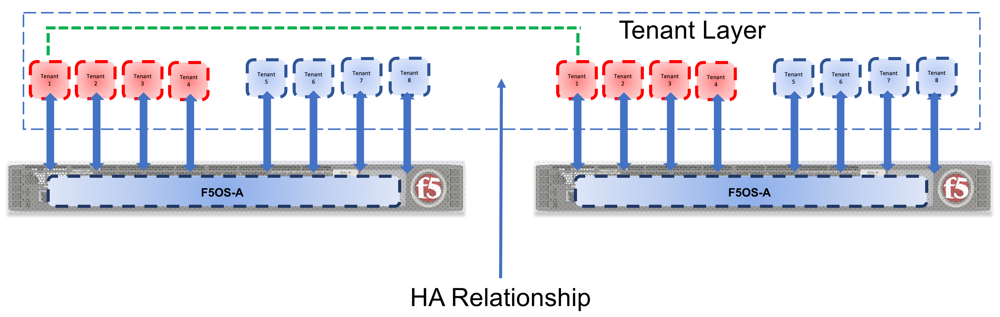
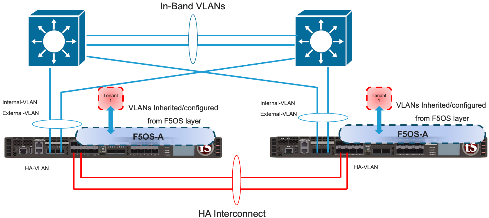
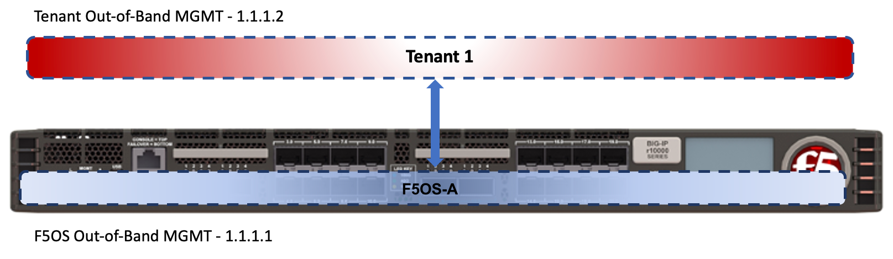
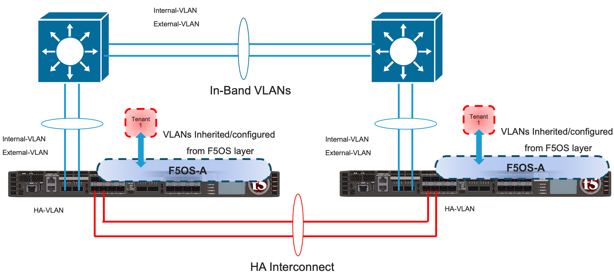

=========================
rSeries High Availability
=========================

Tenant Level HA Across Appliances
=================================

F5 recommends configuring dual rSeries appliances with identically configured tenants and maintaining HA relationships at the tenant level as seen below. This mimics the iSeries HA behavior that is typically configured between vCMP guests. There is no redundancy between rSeries appliances at the F5OS platform layer. The appliances themselves are unaware of the other appliance and there is no HA communication at this level, it’s the tenants that form the HA relationship. rSeries does not support tenant HA within the same appliance, it must be configured between tenants in separate appliances. Direct (hard wired) HA modes are not supported even though there is a port for this on each rSeries unit it is unused. HA must use network level failover configurations using Device Service Clusters or other network based failovers.

Tenants on different appliances, should have the same number of vCPU’s and identical memory configuration. HA interconnection VLANs would be configured between appliances, and then tenants would configure HA just as is the case with vCMP guest HA relationships. Below is an example of two rSeries appliances each with their own HA interconnects and in-band networking.

Tenant Level HA within the Same Appliance
=========================================

rSeries does not support configuring HA relationships between tenants within the same appliance. Depending on what failover behavior you want, you can have the tenant run with less capacity if certain failures occur or fail over to the tenant in the other chassis. This is controlled within the tenant itself, just like HA failover was configured inside a vCMP guest. HA groups allow an administrator to fail over based on pool, trunk, or blade (For VELOS/VIPRION systems) availability. 

Below is an example of a “SuperVIP” tenant that spans all available vCPU's. Each rSeries appliance will have one static out-of-band management IP address. Each tenant will require an out-of-band management address on the same network, and optional inband self-IP addresses can be added within the tenant. 

Inside the tenant,  **Cluster Member IP Address** will not be needed as they are for chassis based systems such as VIPRION or VELOS. If using IPv4 & IPv6 (dual stack management) then IPv6 management addresses can be configured.

For planning purposes a single large tenant “SuperVip” spanning all available vCPU's would require 2 out-of-band management IP addresses for each appliance. One for the F5OS platform layer, and one for the tenant itself. In-band Self-IP & Virtual addresses are not included in this calculation.

+------------------------------+----------------------------------+--------------------+
| **IP Addresses Required**    | **Single Chassis**               | **HA Environment** | 
+==============================+==================================+====================+
| rSeries Out-of-Band Mgmt     |     1                            |  x2 for HA = 2     |
+------------------------------+----------------------------------+--------------------+
| Tenant Out-of-Band Mgmt      |     1 per Tenant                 |  x2 for HA = 2     | 
+------------------------------+----------------------------------+--------------------+
| Total                        |     2                            |  x2 for HA = 4     | 
+------------------------------+----------------------------------+--------------------+

HA Group Configuration to Control Tenant Failover
=================================================

An active tenant will naturally failover to the standby tenant in another rSeries appliance if the tenant is not healthy and the standby detects it has failed. Ideally you should also configure HA Groups or some other mechanism within the tenant to detect external conditions that you will want to trigger a failover for. As an example, HA groups can monitor blades (in the VELOS chassis), and failover if a minimum number of active blades is not met. For rSeries you can monitor pool member reachability or Trunk (Link Aggregation Group) availability to trigger failover.

