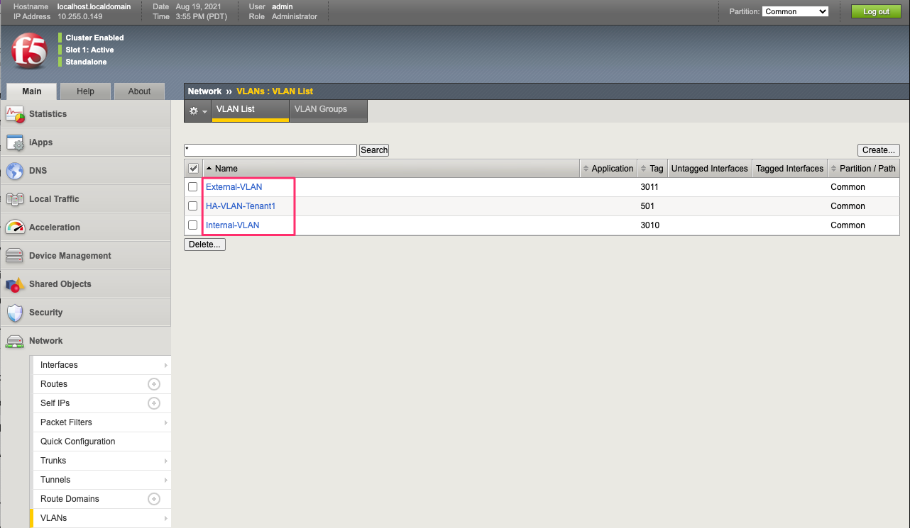
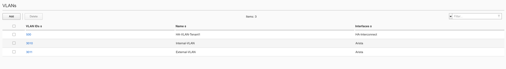
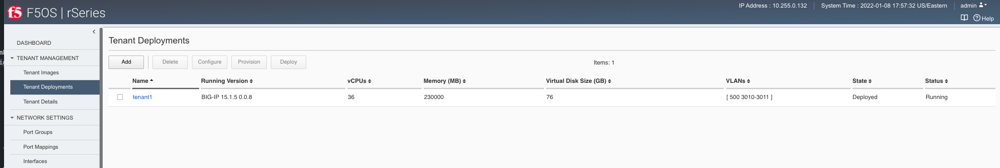
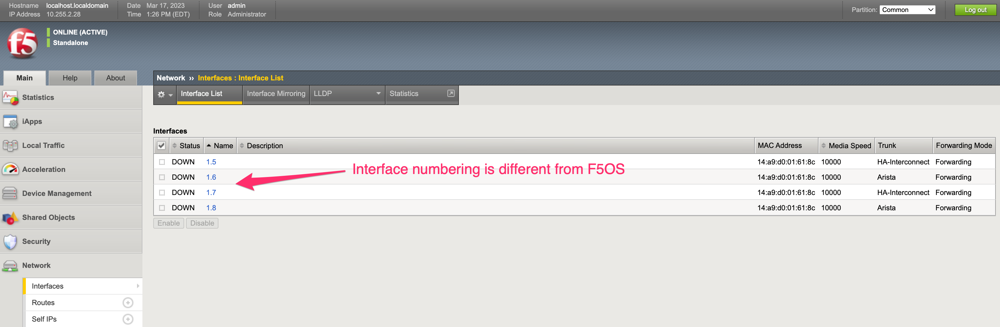
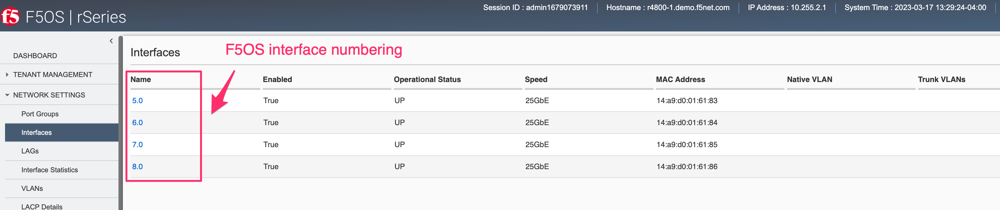
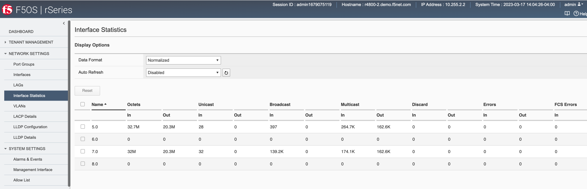
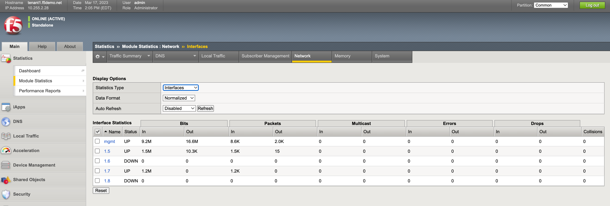

=========================
rSeries Inside the Tenant
=========================

Once a tenant is deployed you can connect/communicate directly to one of its CLI, webUI, or API interfaces. At this layer you are interacting with TMOS, i.e. the experience should be almost identical to a vCMP guest with some minor exceptions. Day to day management of the tenant will use the same CLI (tmsh), API (iControl) and webUI as TMOS instances or hardware devices running within customer environments today. If you are using vCMP today, then many of the concepts will be familiar. If you run an iSeries appliance or VIPRION in a bare metal mode, then there will be some slight differences as rSeries will be configured with at least one tenant, and lower layer configuration and stats will come from the F5OS layer. This is covered in detail in the following section:

`Differences from iSeries and VIPRION <https://clouddocs.f5.com/training/community/rseries-training/html/rseries_points_of_management.html#differences-from-iseries-and-viprion>`_

VLAN Behavior
=============

In both VIRPION and iSeries with vCMP, VLANs are created at the vCMP host layer and added to physical interfaces or trunks. The VLANs are then assigned to a vCMP guest at creation time using the VLAN name. VLAN names are passed through to the vCMP guest as-is, meaning the names are unaltered. 

rSeries follows a similar behavior as far as tenants inheriting VLANs from the F5OS layer. At tenant creation time the admin will assign VLANs to the tenant based on VLAN ID. The rSeries tenant will inherit the VLAN names just as a vCMP guest will. Below is an rSeries tenant showing the VLAN names being passed from the F5OS layer that the tenant was configured for: 

These are the VLANs as they appear in the F5OS platform layer. Notice that the tenant does not see all VLAN’s, only the ones that are assigned to it by the administrator:

Interface Behavior
==================

There are some architectural differences between the r5000/r10000 appliances and the r2000/r4000 appliances that manifest slightly different behavior inside an F5OS tenant. In general, F5OS tenants in the r5000/r10000 platforms have no visibility into the underlying physical interfaces or LAGs that are configured at the F5OS layer. The tenant will be connected to specific interfaces or LAGs based on its VLAN membership. The only exception to this is the HA Group functionality inside the tenant, which has visibility into LAG state and membership to facilitate proper redundancy/failover.

Generally, the r2000/r4000 appliances follow these same principles, but due to some architectural differences these platforms have more visibility into the lower layer interfaces and LAGs that are configured at the F5OS layer. As an example, an F5OS tenant on an r5000/r10000 appliance has no visibility into the physical interfaces at the F5OS layer. Instead, the tenant will see virtual interfaces and the number of interfaces within a tenant will be based upon the number of CPUs assigned to the tenant. The screenshot below shows the interfaces inside the tenant lining up with the number of physical CPU cores per tenant. In the example there are 36 vCPUs assigned to a single F5OS tenant, this will equate to 18 physical CPUs due to hyperthreading. As seen in the output below, the tenant has 36 vCPUs assigned. 

If you were to look inside the tenant, you'll notice that the number of Interfaces corelates to the number of CPU cores assigned to the tenant, in this case 18. Note how the tenant does not see the physical interfaces at the F5OS layer.  

.. image:: images/rseries_inside_the_tenant/image3.png
  :align: center
  :scale: 70%

An F5OS tenant on an r2000/r4000 appliance will see the physical interfaces of the appliance in its configuration, but the interface numbering will be slightly different from the numbering used at the F5OS layer. 

In the example below, a tenant on an r4000 appliance sees 4 interfaces, although the numbering of those interfaces differs from F5OS. 

Those same 4 interfaces can be seen at the F5OS layer, but they are numbered 5.0, 6.0, 7.0 & 8.0.

Since the r2000/r4000 architecture allows the tenant to see the physical interface, this means that the tenant's interface stats will reflect the physical interfaces stats, although the numbers may not be in sync as the interface may have been up longer than the tenant.

This can be seen in the F5OS interface stats below. Note interfaces 5.0 and 7.0 show statistics incrementing.

Inside the tenant, interfaces 1.5 and 1.7 show statistics incrementing. Note that the stats may not be equal between the tenant and the F5OS layer.

Trunk / HA Group Behavior
=========================

Within a vCMP guest, Trunks can be used as part of the **HA Group** functionality to determine when a guest should fail over to its peer. 

An HA group is a specification of certain pools or host trunks (or any combination of these) that a guest administrator associates with a traffic group instance. The most common reason to configure an HA group is to ensure that failover is triggered when some number of trunk members become unavailable. F5OS tenants also support similar functionality where LAGs and their interfaces will be visible inside the HA Groups configuration, once a Device Service Cluster is setup.

