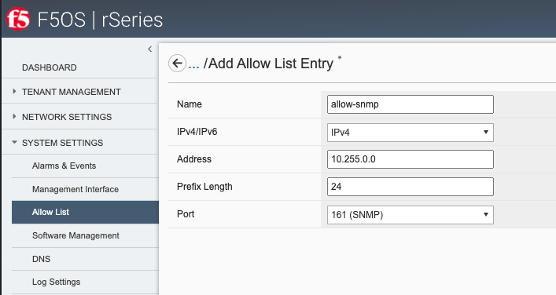
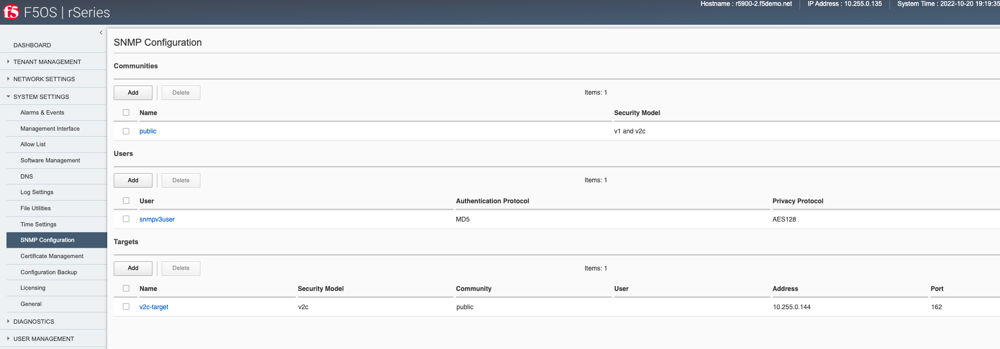
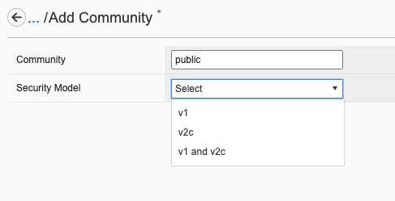
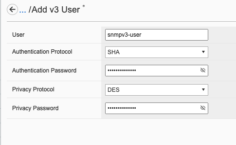
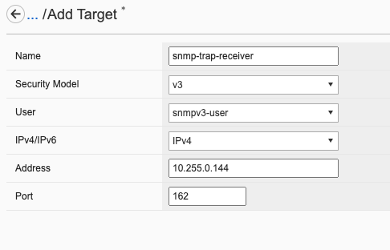
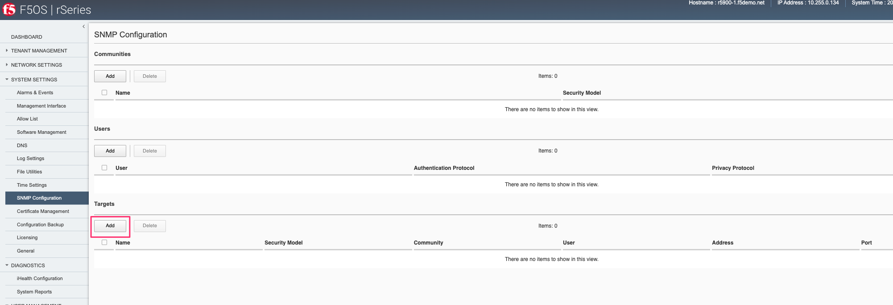
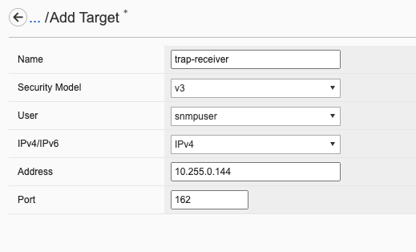

===========================================
rSeries F5OS-A SNMP Monitoring and Alerting
===========================================

Within rSeries tenants, SNMP support remains unchanged from existing BIG-IPs. SNMP monitoring and SNMP traps are supported in a similar manner as they are within a vCMP guest. You can continue to query the tenant via SNMP and receive SNMP traps. The F5OS-A platform layer handles the lower-level networking, and F5OS SNMP MIBs and traps are supported at this layer. The F5OS-A platform layer supported SNMP v1 and v2c versions initially, with SNMPv3 support added in F5OS-A 1.2.0.

As of F5OS-A 1.2.0 the following netSNMP MIBs are available:

- HOST-RESOURCES-MIB
- RFC1213-MIB
- EtherLike-MIB
- IANAifType-MIB
- IF-MIB
- IPV6-TC
- SNMP-COMMUNITY-MIB
- SNMP-FRAMEWORK-MIB
- SNMP-MPD-MIB
- SNMP-NOTIFICATION-MIB
- SNMP-TARGET-MIB
- SNMP-USER-BASED-SM-MIB
- SNMP-VIEW-BASED-ACM-MIB
- SNMPv2-CONF 
- SNMPv2-MIB
- SNMPv2 SMI
- SNMPv2-TC
- TRANSPORT-ADDRESS-MIB

As of F5OS-A 1.2.0.the following F5OS Appliance MIBs are available:

- F5-ALERT-DEF-MIB
- F5-COMMON-SMI-MIB
- F5-OS-SYSTEM MIB
- F5-PLATFORM-STATS-MIB
- F5OS-APPLIANCE-ALERT-NOTIF-MIB

As of F5OS-A 1.2.0 the following SNMP alerts and traps are available:

- Interface UP
- Interface DOWN
- Cold Start
- Hardware device fault detected
- Firmware diagnostic state fault detected
- Unregistered alarm detected
- Fault in memory detected
- Fault in drive detected
- CPU fault detected
- Fault in PCIe device detected
- Fault detected in the AOM
- Running out of drive capacity
- Power fault detected in hardware
- Thermal fault detected in hardware
- Drive has entered a thermal throttle condition
- Thermal fault detected in blade
- Hardware fault detected in blade
- Firmware update status
- Drive utilization growth rate is high
- Service health status
- Change detected in appliance module presence
- PSU fault detected
- Fault detected in LCD module
- Module communication error detected
- Crypto error identified in one or more services
- Detected process crash on the system
- Notification of RAID event
- Could not establish backplane link with one or more system controllers
- Transmitter power high alarm
- Transmitter power high warning
- Transmitter power low alarm
- Transmitter power low warning
- Receiver power high alarm
- Receiver power high warning
- Receiver power low alarm
- Receiver power low warning
- Transmitter bias high alarm
- Transmitter bias high warning
- Transmitter bias low alarm
- Transmitter bias low warning
- Optic temperature high alarm
- Optic temperature high warning
- Optic temperature low alarm
- Optic temperature low warning
- Optic voltage high alarm
- Optic voltage high warning
- Optic voltage low alarm
- Optic voltage low warning

Adding Allowed IPs for SNMP
===========================

Adding Allowed IPs for SNMP via CLI
-----------------------------------

By default, SNMP queries are not allowed into the F5OS platform layer. Before enabling SNMP, you'll need to open the out-of-band management port on F5OS-A to allow SNMP queries from particular SNMP management endpoints. Below is an example of allowing any SNMP endpoint at 10.255.0.0 (prefix length of 24) to query the F5OS layer on port 161.

.. code-block:: bash

    r10900-2(config)# system allowed-ips allowed-ip snmp config ipv4 address 10.255.0.0 prefix-length 24 port 161
    r10900-2(config-allowed-ip-snmp)# commit
    Commit complete.

Currently you can add one IP address/port pair per **allowed-ip** name with an optional prefix length to specify a CIDR block containing multiple addresses. If you require more than one non-contiguous IP address, you can add it under another name as seen below. 

.. code-block:: bash

    appliance-1(config)# system allowed-ips allowed-ip SNMP-144 config ipv4 address 10.255.0.144 port 161 
    appliance-1(config-allowed-ip-SNMP)# commit
    Commit complete.
    appliance-1(config-allowed-ip-SNMP)# 

    appliance-1(config)# system allowed-ips allowed-ip SNMP-145 config ipv4 address 10.255.2.145 port 161 
    appliance-1(config-allowed-ip-SNMP)# commit
    Commit complete.
    appliance-1(config-allowed-ip-SNMP)# 

Adding Allowed IPs for SNMP via API
-----------------------------------

By default SNMP queries are not allowed into the F5OS layer. Before enabling SNMP, you'll need to open up the out-of-band management port on F5OS-A to allow SNMP queries. Below is an example of allowing an multiple SNMP endpoints at to access SNMP on the system on port 161.

.. code-block:: bash

    POST https://{{rseries_appliance1_ip}}:8888/restconf/data/openconfig-system:system/f5-allowed-ips:allowed-ips

Within the body of the API call, specific IP address/port combinations can be added under a given name. In the current release, you are limited to one IP address/port per name. 

.. code-block:: json

    {
        "allowed-ip": [
            {
                "name": "SNMP-142",
                "config": {
                    "ipv4": {
                        "address": "10.255.0.142",
                        "port": 161
                    }
                }
            },
            {
                "name": "SNMP-143",
                "config": {
                    "ipv4": {
                        "address": "10.255.0.143",
                        "port": 161
                    }
                }
            },
            {
                "name": "SNMP-144",
                "config": {
                    "ipv4": {
                        "address": "10.255.0.144",
                        "port": 161
                    }
                }
            }
        ]
    }

To view the allowed IPs in the API, use the following call.

.. code-block:: bash

    GET https://{{rseries_appliance1_ip}}:8888/restconf/data/openconfig-system:system/f5-allowed-ips:allowed-ips

The output will show the previously configured allowed-ips.

.. code-block:: json

    {
        "f5-allowed-ips:allowed-ips": {
            "allowed-ip": [
                {
                    "name": "SNMP-142",
                    "config": {
                        "ipv4": {
                            "address": "10.255.0.142",
                            "port": 161
                        }
                    }
                },
                {
                    "name": "SNMP-143",
                    "config": {
                        "ipv4": {
                            "address": "10.255.0.143",
                            "port": 161
                        }
                    }
                },
                {
                    "name": "SNMP-144",
                    "config": {
                        "ipv4": {
                            "address": "10.255.0.144",
                            "port": 161
                        }
                    }
                }
            ]
        }
    }

Adding Allowed IPs for SNMP via webUI
-----------------------------------

By default, SNMP queries are not allowed into the F5OS platform layer. Before enabling SNMP, you'll need to open up the out-of-band management port on F5OS-A to allow SNMP queries from particular SNMP management endpoints. Below is an example of allowing any SNMP endpoint at 10.255.0.0 (prefix length of 24) to query the F5OS layer on port 161.

Adding Interface and LAG descriptions
=====================================

It is highly recommended that you put interface descriptions in your configuration, so that they will show up in the description field when using SNMP polling.

Adding Interface and LAG descriptions via CLI
---------------------------------------------

To add descriptions for both the in-band, and out-of-band management ports in the CLI, follow the examples below.

.. code-block:: bash

    appliance-1(config)# interfaces interface 1.0 config description "Interface 1.0"
    appliance-1(config-interface-1.0)# exit
    appliance-1(config)# interfaces interface 2.0 config description "Interface 2.0"               
    appliance-1(config-interface-2.0)# exit
    appliance-1(config)# interfaces interface 3.0 config description "Interface 3.0"
    appliance-1(config-interface-3.0)# interfaces interface 4.0 config description "Interface 4.0"
    appliance-1(config-interface-4.0)# interfaces interface 5.0 config description "Interface 5.0"
    appliance-1(config-interface-5.0)# interfaces interface 6.0 config description "Interface 6.0"
    appliance-1(config-interface-6.0)# interfaces interface 7.0 config description "Interface 7.0"
    appliance-1(config-interface-7.0)# interfaces interface 8.0 config description "Interface 8.0"
    appliance-1(config-interface-8.0)# interfaces interface 9.0 config description "Interface 9.0"
    appliance-1(config-interface-9.0)# interfaces interface 10.0 config description "Interface 10.0"
    appliance-1(config-interface-10.0)# interfaces interface 11.0 config description "Interface 11.0"
    appliance-1(config-interface-11.0)# interfaces interface 12.0 config description "Interface 12.0"
    appliance-1(config-interface-12.0)# interfaces interface 13.0 config description "Interface 13.0"
    appliance-1(config-interface-13.0)# interfaces interface 14.0 config description "Interface 14.0"
    appliance-1(config-interface-14.0)# interfaces interface 15.0 config description "Interface 15.0"
    appliance-1(config-interface-15.0)# interfaces interface 16.0 config description "Interface 16.0"
    appliance-1(config-interface-16.0)# interfaces interface 17.0 config description "Interface 17.0"
    appliance-1(config-interface-17.0)# interfaces interface 18.0 config description "Interface 18.0"
    appliance-1(config-interface-18.0)# interfaces interface 19.0 config description "Interface 19.0"
    appliance-1(config-interface-19.0)# interfaces interface 20.0 config description "Interface 20.0"
    appliance-1(config-interface-20.0)# exit
    appliance-1(config)# commit
    Commit complete.
    appliance-1(config)# 

    appliance-1(config)# interfaces interface mgmt  config description "Interface mgmt"
    appliance-1(config-interface-mgmt)# commit

If Link Aggregation Groups (LAGs) are configured, descriptions should be added to the LAG interfaces as well.

.. code-block:: bash

    appliance-1(config)# interfaces interface Arista config description "Arista LAG"
    appliance-1(config-interface-Arista)# exit
    appliance-1(config)# interfaces interface HA-Interconnect  config description "HA-Interconnect LAG"
    appliance-1(config-interface-HA-Interconnect)# exit
    appliance-1(config)# commit 
    Commit complete.
    appliance-1(config)# 

Adding Interface and LAG descriptions via API
---------------------------------------------

To add descriptions for both the in-band, and out-of-band management ports in the CLI, follow the examples below. The API example below is for the r10000 models, which have 20 interfaces and one management port. For the r5000 series models you should adjust for 10 interfaces and one management port.

.. code-block:: bash

    PATCH https://{{rseries_appliance1_ip}}:8888/restconf/data/

.. code-block:: json

    {
        "openconfig-interfaces:interfaces": {
            "interface": [
                {
                    "name": "1.0",
                    "config": {
                        "description": "r10900 Interface 1.0"
                    }
                },
                {
                    "name": "2.0",
                    "config": {
                        "description": "r10900 Interface 2.0"
                    }
                },
                {
                    "name": "3.0",
                    "config": {
                        "description": "r10900 Interface 3.0"
                    }
                },
                {
                    "name": "4.0",
                    "config": {
                        "description": "r10900 Interface 4.0"
                    }
                },
                {
                    "name": "5.0",
                    "config": {
                        "description": "r10900 Interface 5.0"
                    }
                },
                {
                    "name": "6.0",
                    "config": {
                        "description": "r10900 Interface 6.0"
                    }
                },
                {
                    "name": "7.0",
                    "config": {
                        "description": "r10900 Interface 7.0"
                    }
                },
                {
                    "name": "8.0",
                    "config": {
                        "description": "r10900 Interface 8.0"
                    }
                },
                {
                    "name": "9.0",
                    "config": {
                        "description": "r10900 Interface 9.0"
                    }
                },
                {
                    "name": "10.0",
                    "config": {
                        "description": "r10900 Interface 10.0"
                    }
                },
                {
                    "name": "11.0",
                    "config": {
                        "description": "r10900 Interface 11.0"
                    }
                },
                {
                    "name": "12.0",
                    "config": {
                        "description": "r10900 Interface 12.0"
                    }
                },
                {
                    "name": "13.0",
                    "config": {
                        "description": "r10900 Interface 13.0"
                    }
                },
                {
                    "name": "14.0",
                    "config": {
                        "description": "r10900 Interface 14.0"
                    }
                },
                {
                    "name": "15.0",
                    "config": {
                        "description": "r10900 Interface 15.0"
                    }
                },
                {
                    "name": "16.0",
                    "config": {
                        "description": "r10900 Interface 16.0"
                    }
                },
                {
                    "name": "17.0",
                    "config": {
                        "description": "r10900 Interface 17.0"
                    }
                },
                {
                    "name": "18.0",
                    "config": {
                        "description": "r10900 Interface 18.0"
                    }
                },
                {
                    "name": "19.0",
                    "config": {
                        "description": "r10900 Interface 19.0"
                    }
                },
                {
                    "name": "20.0",
                    "config": {
                        "description": "r10900 Interface 20.0"
                    }
                },
                {
                    "name": "mgmt",
                    "config": {
                        "description": "r10900 Interface mgmt"
                    }
                }
            ]
        }
    }

If Link Aggregation Groups (LAGs) are configured, descriptions should be added to the LAG interfaces as well.

.. code-block:: bash

    PATCH https://{{rseries_appliance1_ip}}:8888/restconf/data/

The body of the API call should contain JSON data that includes the descriptions for each LAG.

.. code-block:: json

    {
        "openconfig-interfaces:interfaces": {
            "interface": [
                {
                    "name": "Arista",
                    "config": {
                        "description": "LAG to Arista"
                    }
                },
                {
                    "name": "HA-Interconnect",
                    "config": {
                        "description": "LAG to other r10900"
                    }
                }

            ]
        }
    }

Configuring SNMP Access
=======================

To enable SNMP, you'll need to configure basic SNMP parameters like **system contact**, **location** and **name**. Then configure access for specific SNMP communities and versions. Currently SNMP can be setup via CLI and API, with configuration via webUI added in F5OS-A 1.3.0. 

Configuring SNMP Access via CLI F5OS-A 1.2.0 or Later
-----------------------------------------------------

You can configure the SNMP System parameters including the **System Contact**, **System Location**, and **System Name** as seen below:

.. code-block:: bash

    appliance-1(config)# SNMPv2-MIB system sysContact jim@f5.com sysLocation Boston sysName r5900-2
    appliance-1(config)# commit
    Commit complete.
    appliance-1(config)# 

SNMP configuration was only available in the CLI and API prior to F5OS-A 1.3.0, and the CLI configuration was not intuitive. F5OS-A 1.2.0 has improved and streamlined SNMP configuration in the CLI and then configuration via the webUI was also added in F5OS-A 1.3.0. The example below is utilizing the new and improved SNMP CLI configuration for rSeries systems running F5OS-A 1.2.0 or later. 

Enabling SNMP can be done from the CLI by configuring the **public** SNMP community, and then configuring a **security-model**. The command below sets up an SNMP community of **public** with v1 and v2c security models. You may choose to enable both of these security models or only one.

.. code-block:: bash

    r5900-2(config)# system snmp communities community public config security-model [ v1 v2c ]
    r5900-2(config-community-public)# exit
    r5900-2(config)# commit

You can then display the SNMP community configuration using the **show system snmp** command.

.. code-block:: bash

    r5900-2(config)# do show system snmp 
    system snmp engine-id state engine-id 80:00:2f:f4:03:00:94:a1:69:35:02
    system snmp engine-id state type mac
                    SECURITY    
    NAME    NAME    MODEL       
    ----------------------------
    public  public  [ v1 v2c ]  

    r5900-2(config)# 

You may also configure SNMP users for SNMPv3 support, since SNMPv3 is a user-based security model. This provides additional support for authentication and privacy protocols. Authentication protocols of **md5**, **sha**, or **none** are supported. For privacy protocols **aes**, **des**, or **none** are supported. You'll then be prompted to enter the privacy-password.

.. code-block:: bash

    r5900-2(config)# system snmp users user snmpv3user config authentication-protocol md5 privacy-protocol aes privacy-password 
    (<string, min: 8 chars, max: 32 chars>): **************
    r5900-2(config-user-snmpv3user)# commit
    Commit complete.

You may display the SNMP user configuration by entering the command **show system snmp users**.

.. code-block:: bash

    r5900-2(config)# do show system snmp users
                            AUTHENTICATION  PRIVACY   
    NAME        NAME        PROTOCOL        PROTOCOL  
    --------------------------------------------------
    snmpv3user  snmpv3user  md5             aes       

    r5900-2(config)# 

Configuring SNMP Access via CLI Prior to F5OS-A 1.2.0
-----------------------------------------------------

Below is the SNMP CLI configuration for systems running a version prior to F5OS-A 1.2.0. You can configure the SNMP System parameters including the **System Contact**, **System Location**, and **System Name** as seen below:

.. code-block:: bash

    appliance-1(config)# SNMPv2-MIB system sysContact jim@f5.com sysLocation Boston sysName r5900-2
    appliance-1(config)# commit
    Commit complete.
    appliance-1(config)# 

Enabling SNMP can be done from the CLI by configuring the public SNMP community, and then configuring a Security Access Group. Below is an example of enabling SNMP monitoring at the F5OS layer. F5OS only supports read-only access for SNMP monitoring.

.. code-block:: bash

    appliance-1# config
    Entering configuration mode terminal
    appliance-1(config)# SNMP-COMMUNITY-MIB snmpCommunityTable snmpCommunityEntry public snmpCommunityName public snmpCommunitySecurityName public
    appliance-1(config-snmpCommunityEntry-public)# exit
  

To configure a Security Group for both SNMPv1 and SNMPv2c.

.. code-block:: bash

    appliance-1(config)# SNMP-VIEW-BASED-ACM-MIB vacmSecurityToGroupTable vacmSecurityToGroupEntry 2 public vacmGroupName read-access
    appliance-1(config-vacmSecurityToGroupEntry-2/public)# exit
    appliance-1(config)# SNMP-VIEW-BASED-ACM-MIB vacmSecurityToGroupTable vacmSecurityToGroupEntry 1 public vacmGroupName read-access
    appliance-1(config-vacmSecurityToGroupEntry-1/public)# exit
    appliance-1(config)# commit
    Commit complete.
    appliance-1(config)# 

Configuring SNMP Access via API
-------------------------------

You can configure the SNMP System parameters including the **System Contact**, **System Location**, and **System Name** as seen below:

.. code-block:: bash

    PATCH https://{{rseries_appliance1_ip}}:8888/restconf/data/SNMPv2-MIB:SNMPv2-MIB/system/sysContact

.. code-block:: json

    {
        "SNMPv2-MIB:sysContact": "jim@f5.com",
        "SNMPv2-MIB:sysName": "Boston-r10900-1",
        "SNMPv2-MIB:sysLocation": "Boston"
    }

Enabling SNMP can de done from the API by configuring the **public** SNMP community. Below is an example of enabling SNMP monitoring at the F5OS layer. F5OS only supports read-only access for SNMP monitoring. 

.. code-block:: bash

    PATCH https://{{rseries_appliance1_ip}}:8888/restconf/data/SNMP-VIEW-BASED-ACM-MIB:SNMP-VIEW-BASED-ACM-MIB

.. code-block:: json

    {
        "SNMP-VIEW-BASED-ACM-MIB:SNMP-VIEW-BASED-ACM-MIB": {
            "vacmSecurityToGroupTable": {
                "vacmSecurityToGroupEntry": [
                    {
                        "vacmSecurityModel": 1,
                        "vacmSecurityName": "public",
                        "vacmGroupName": "read-access",
                        "vacmSecurityToGroupStorageType": "nonVolatile"
                    },
                    {
                        "vacmSecurityModel": 2,
                        "vacmSecurityName": "public",
                        "vacmGroupName": "read-access",
                        "vacmSecurityToGroupStorageType": "nonVolatile"
                    }
                ]
            },
            "vacmAccessTable": {
                "vacmAccessEntry": [
                    {
                        "vacmGroupName": "read-access",
                        "vacmAccessContextPrefix": "",
                        "vacmAccessSecurityModel": 0,
                        "vacmAccessSecurityLevel": "noAuthNoPriv",
                        "vacmAccessContextMatch": "exact",
                        "vacmAccessReadViewName": "internet",
                        "vacmAccessNotifyViewName": "internet",
                        "vacmAccessStorageType": "nonVolatile"
                    }
                ]
            },
            "vacmViewTreeFamilyTable": {
                "vacmViewTreeFamilyEntry": [
                    {
                        "vacmViewTreeFamilyViewName": "internet",
                        "vacmViewTreeFamilySubtree": "1.3.6.1",
                        "vacmViewTreeFamilyMask": "",
                        "vacmViewTreeFamilyType": "included",
                        "vacmViewTreeFamilyStorageType": "nonVolatile"
                    }
                ]
            }
        }
    }

Configuring SNMP Access via webUI
---------------------------------

SNMP configuration via the webUI was added in the F5OS-A 1.3.0 release. You may configure SNMP Communities, SNMP Users, and SNMP Targets. SNMP is configured under **System Settings -> SNMP Configuration**..

An SNMP Community may be added for v1, v2c, or both v1 and v2c.

SNMP users can be added for environments which utilize SNMPv3.

SNMP Trap receivers may be added and either a community of a user is added depending on the security model.

SNMP Trap Support in F5OS-A
===========================

You can enable SNMP traps for the F5OS-A platform layer. The **F5OS-APPLIANCE-ALERT-NOTIF-MIB** provides details about supported rSeries appliance SNMP traps. Below is the current full list of traps supported as of F5OS-A 1.2.0: 

SNMP Trap events that note a fault should also trigger an alert that can be viewed in the show alerts output in the CLI, WebUI, and API. Once the clear SNMP Trap is sent, it should clear the event from the show events output.

+----------------------------+----------------------------------+
| **Alert**                  | **OID**                          |
+============================+==================================+
| hardware-device-fault      | .1.3.6.1.4.1.12276.1.1.1.65536   |
+----------------------------+----------------------------------+
| firmware-fault             | .1.3.6.1.4.1.12276.1.1.1.65537   |
+----------------------------+----------------------------------+
| unknown-alarm              | .1.3.6.1.4.1.12276.1.1.1.65538   |
+----------------------------+----------------------------------+
| memory-fault               | .1.3.6.1.4.1.12276.1.1.1.65539   |
+----------------------------+----------------------------------+
| drive-fault                | .1.3.6.1.4.1.12276.1.1.1.65540   |
+----------------------------+----------------------------------+
| cpu-fault                  | .1.3.6.1.4.1.12276.1.1.1.65541   |
+----------------------------+----------------------------------+
| pcie-fault                 | .1.3.6.1.4.1.12276.1.1.1.65542   |
+----------------------------+----------------------------------+
| aom-fault                  | .1.3.6.1.4.1.12276.1.1.1.65543   |
+----------------------------+----------------------------------+
| drive-capacity-fault       | .1.3.6.1.4.1.12276.1.1.1.65544   |
+----------------------------+----------------------------------+
| power-fault                | .1.3.6.1.4.1.12276.1.1.1.65545   |
+----------------------------+----------------------------------+
| thermal-fault              | .1.3.6.1.4.1.12276.1.1.1.65546   |
+----------------------------+----------------------------------+
| drive-thermal-throttle     | .1.3.6.1.4.1.12276.1.1.1.65547   |
+----------------------------+----------------------------------+
| blade-thermal-fault        | .1.3.6.1.4.1.12276.1.1.1.65548   |
+----------------------------+----------------------------------+
| blade-hardware-fault       | .1.3.6.1.4.1.12276.1.1.1.65549   |
+----------------------------+----------------------------------+
| firmware-update-status     | .1.3.6.1.4.1.12276.1.1.1.65550   |
+----------------------------+----------------------------------+
| drive-utilization          | .1.3.6.1.4.1.12276.1.1.1.65551   |
+----------------------------+----------------------------------+
| service-health             | .1.3.6.1.4.1.12276.1.1.1.65552   |
+----------------------------+----------------------------------+
| module-present             | .1.3.6.1.4.1.12276.1.1.1.66304   |
+----------------------------+----------------------------------+
| psu-fault                  | .1.3.6.1.4.1.12276.1.1.1.66305   |
+----------------------------+----------------------------------+
| lcd-fault                  | .1.3.6.1.4.1.12276.1.1.1.66306   |
+----------------------------+----------------------------------+
| module-communication-error | .1.3.6.1.4.1.12276.1.1.1.66307   |
+----------------------------+----------------------------------+
| fipsError                  | .1.3.6.1.4.1.12276.1.1.1.196608  |
+----------------------------+----------------------------------+
| core-dump                  | .1.3.6.1.4.1.12276.1.1.1.327680  |
+----------------------------+----------------------------------+
| raid-event                 | .1.3.6.1.4.1.12276.1.1.1.393216  |
+----------------------------+----------------------------------+
| backplane                  | .1.3.6.1.4.1.12276.1.1.1.262144  |
+----------------------------+----------------------------------+
| txPwrHiAlarm               | .1.3.6.1.4.1.12276.1.1.1.262400  |
+----------------------------+----------------------------------+
| txPwrHiWarn                | .1.3.6.1.4.1.12276.1.1.1.262401  |
+----------------------------+----------------------------------+
| txPwrLoAlarm               | .1.3.6.1.4.1.12276.1.1.1.262402  |
+----------------------------+----------------------------------+
| txPwrLoWarn                | .1.3.6.1.4.1.12276.1.1.1.262403  |
+----------------------------+----------------------------------+
| rxPwrHiAlarm               | .1.3.6.1.4.1.12276.1.1.1.262404  |
+----------------------------+----------------------------------+
| rxPwrHiWarn                | .1.3.6.1.4.1.12276.1.1.1.262405  |
+----------------------------+----------------------------------+
| rxPwrLoAlarm               | .1.3.6.1.4.1.12276.1.1.1.262406  |
+----------------------------+----------------------------------+
| rxPwrLoWarn                | .1.3.6.1.4.1.12276.1.1.1.262407  |
+----------------------------+----------------------------------+
| txBiasHiAlarm              | .1.3.6.1.4.1.12276.1.1.1.262408  |
+----------------------------+----------------------------------+
| txBiasHiWarn               | .1.3.6.1.4.1.12276.1.1.1.262409  |
+----------------------------+----------------------------------+
| txBiasLoAlarm              | .1.3.6.1.4.1.12276.1.1.1.262410  |
+----------------------------+----------------------------------+
| txBiasLoWarn               | .1.3.6.1.4.1.12276.1.1.1.262411  |
+----------------------------+----------------------------------+
| ddmTempHiAlarm             | .1.3.6.1.4.1.12276.1.1.1.262412  |
+----------------------------+----------------------------------+
| ddmTempHiWarn              | .1.3.6.1.4.1.12276.1.1.1.262413  |
+----------------------------+----------------------------------+
| ddmTempLoAlarm             | .1.3.6.1.4.1.12276.1.1.1.262414  |
+----------------------------+----------------------------------+
| ddmTempLoWarn              | .1.3.6.1.4.1.12276.1.1.1.262415  |
+----------------------------+----------------------------------+
| ddmVccHiAlarm              | .1.3.6.1.4.1.12276.1.1.1.262416  |
+----------------------------+----------------------------------+
| ddmVccHiWarn               | .1.3.6.1.4.1.12276.1.1.1.262417  |
+----------------------------+----------------------------------+
| ddmVccLoAlarm              | .1.3.6.1.4.1.12276.1.1.1.262418  |
+----------------------------+----------------------------------+
| ddmVccLoWarn               | .1.3.6.1.4.1.12276.1.1.1.262419  |
+----------------------------+----------------------------------+

Enabling SNMP Traps
===================

Enabling SNMP Traps in the CLI for F5OS-A 1.2.0 or Later
--------------------------------------------------------

The SNMP trap CLI configuration has been simplified in the F5OS-A 1.2.0 release. Use the **system snmp target** command to configure the SNMP trap destination. The example below uses SNMP v2c and a community string.

.. code-block:: bash

    r5900-2(config)# system snmp targets target v2c-target config community public security-model v2c ipv4 address 10.255.0.144 port 162 
    r5900-2(config-target-v2c-target)# commit
    Commit complete.
    r5900-2(config-target-v2c-target)# 

This example below uses SNMP v3 and uses an SNMP user instead of a community string.

.. code-block:: bash

    r5900-2(config)# system snmp targets target snmp-trap-receiver config user snmpv3-user ipv4 address 10.255.0.144 port 162
    r5900-2(config-target-snmp-trap-receiver)# commit
    Commit complete.
    r5900-2(config-target-v2c-target)# 

You can then view the current SNMP configuration with the **show system snmp targets** command.

.. code-block:: bash

    r5900-2(config)# do show system snmp targets 
                                                                    SECURITY                                     
    NAME                NAME                USER         COMMUNITY  MODEL     ADDRESS       PORT  ADDRESS  PORT  
    -------------------------------------------------------------------------------------------------------------
    snmp-trap-receiver  snmp-trap-receiver  snmpv3-user  -          -         10.255.0.144  162   -        -     
    v2c-target          v2c-target          -            public     v2c       10.255.0.144  162   -        -     

    r5900-2(config)# 

Enabling SNMP Traps in the CLI for Releases Prior to F5OS-A 1.2.0
-----------------------------------------------------------------

For releases prior to F5OS-A 1.2.0, the configuration of SNMP was more difficult, and was done as outlined below. It is provided for reference, but the newer configuration above should be used instead.

Enter **config** mode and enter the following commands to enable SNMP traps for the F5OS-A layer. Specify your SNMP trap receiver's IP address and port after the **snmpTargetAddrTAddress** field. Make sure to **commit** any changes.

Note: The **snmpTargetAddrTAddress** is unintuitive in these earlier releases and is much simpler after upgrading to F5OS-A 1.2.0 or later. In the snmpTargetAddrTAddress, The 1st octet after the IP address is 161 >> 8 = 0, and 2nd octet 161 & 255 = 161. The IP address configuration for an IP address of 10.255.0.144 & 161 UDP port is **10.255.0.144.0.161**.

.. code-block:: bash

    r5900-2# config
    Entering configuration mode terminal
    r5900-2(config)# SNMP-NOTIFICATION-MIB snmpNotifyTable snmpNotifyEntry v2_trap snmpNotifyTag v2_trap snmpNotifyType trap snmpNotifyStorageType nonVolatile 
    r5900-2(config-snmpNotifyEntry-v2_trap)# exit
    r5900-2(config)# SNMP-TARGET-MIB snmpTargetAddrTable snmpTargetAddrEntry group2 snmpTargetAddrTDomain 1.3.6.1.6.1.1 snmpTargetAddrTAddress 10.255.0.144.0.161 snmpTargetAddrTimeout 1500 snmpTargetAddrRetryCount 3 snmpTargetAddrTagList v2_trap snmpTargetAddrParams group2 snmpTargetAddrStorageType nonVolatile snmpTargetAddrEngineID "" snmpTargetAddrTMask "" snmpTargetAddrMMS 2048 enabled
    r5900-2(config-snmpTargetAddrEntry-group2)# exit
    r5900-2(config)# SNMP-TARGET-MIB snmpTargetParamsTable snmpTargetParamsEntry group2 snmpTargetParamsMPModel 1 snmpTargetParamsSecurityModel 2 snmpTargetParamsSecurityName public snmpTargetParamsSecurityLevel noAuthNoPriv snmpTargetParamsStorageType nonVolatile
    r5900-2(config-snmpTargetParamsEntry-group2)# exit
    r5900-2(config)# commit
    Commit complete.
    r5900-2(config)# 

There are various SNMP show commands in the CLI to provide configuration and stats.

.. code-block:: bash

    appliance-1# show SNMP-FRAMEWORK-MIB 
    SNMP-FRAMEWORK-MIB snmpEngine snmpEngineID 80:00:61:81:05:01
    SNMP-FRAMEWORK-MIB snmpEngine snmpEngineBoots 26
    SNMP-FRAMEWORK-MIB snmpEngine snmpEngineTime 15215
    SNMP-FRAMEWORK-MIB snmpEngine snmpEngineMaxMessageSize 50000
    
    appliance-1# show SNMP-MPD-MIB      
    SNMP-MPD-MIB snmpMPDStats snmpUnknownSecurityModels 0
    SNMP-MPD-MIB snmpMPDStats snmpInvalidMsgs 0
    SNMP-MPD-MIB snmpMPDStats snmpUnknownPDUHandlers 0
   
    appliance-1# show SNMP-TARGET-MIB 
    SNMP-TARGET-MIB snmpTargetObjects snmpUnavailableContexts 0
    SNMP-TARGET-MIB snmpTargetObjects snmpUnknownContexts 0
    
    appliance-1# show SNMP-USER-BASED-SM-MIB 
    SNMP-USER-BASED-SM-MIB usmStats usmStatsUnsupportedSecLevels 0
    SNMP-USER-BASED-SM-MIB usmStats usmStatsNotInTimeWindows 0
    SNMP-USER-BASED-SM-MIB usmStats usmStatsUnknownUserNames 0
    SNMP-USER-BASED-SM-MIB usmStats usmStatsUnknownEngineIDs 0
    SNMP-USER-BASED-SM-MIB usmStats usmStatsWrongDigests 0
    SNMP-USER-BASED-SM-MIB usmStats usmStatsDecryptionErrors 0
    
    appliance-1# show SNMPv2-MIB            
    SNMPv2-MIB system sysDescr "Linux 3.10.0-1160.25.1.F5.1.el7_8.x86_64 : Appliance services version 1.1.0-3306"
    SNMPv2-MIB system sysObjectID 1.3.6.1.2.1.1
    SNMPv2-MIB system sysUpTime 1525114
    SNMPv2-MIB system sysServices 72
    SNMPv2-MIB system sysORLastChange 6
    SNMPv2-MIB snmp snmpInPkts 1
    SNMPv2-MIB snmp snmpInBadVersions 0
    SNMPv2-MIB snmp snmpInBadCommunityNames 1
    SNMPv2-MIB snmp snmpInBadCommunityUses 0
    SNMPv2-MIB snmp snmpInASNParseErrs 0
    SNMPv2-MIB snmp snmpSilentDrops 0
    SNMPv2-MIB snmp snmpProxyDrops 0
    SNMPv2-MIB snmpSet snmpSetSerialNo 1200461836
                                                                                                            SYS   
    SYS                                                                                                        ORUP  
    ORINDEX  SYS ORID             SYS ORDESCR                                                                  TIME  
    -----------------------------------------------------------------------------------------------------------------
    1        1.3.6.1.4.1.12276.1  F5 Networks enterprise Platform MIB                                          6     
    2        1.3.6.1.2.1.31       The MIB module to describe generic objects for network interface sub-layers  6     

    appliance-1# 

Enabling SNMP Traps in the webUI
--------------------------------

As of F5OS-A version 1.3.0 you can enable SNMP traps in the webUI. Go to the **System Settings** page, and then select **SNMP Configuration**. Under the **Targets** section, select **Add**. If you are going to use SNMPv3, you should setup an SNMP user first.

Enter the **Security Model**, **IP Address** and **Port** of the SNMP Trap receiver. You'll be required to add an **SNMP User** when selecting SNMPv3 as the security model.

Enabling SNMP Traps in the API
------------------------------

.. code-block:: bash

    PATCH https://{{rseries_appliance1_ip}}:8888/restconf/data/SNMP-NOTIFICATION-MIB:SNMP-NOTIFICATION-MIB

.. code-block:: json

    {
        "SNMP-NOTIFICATION-MIB:SNMP-NOTIFICATION-MIB": {
            "snmpNotifyTable": {
                "snmpNotifyEntry": [
                    {
                        "snmpNotifyName": "v2_trap",
                        "snmpNotifyTag": "v2_trap",
                        "snmpNotifyType": "trap",
                        "snmpNotifyStorageType": "nonVolatile"
                    }
                ]
            }
        }
    }

.. code-block:: bash

    PATCH https://{{rseries_appliance1_ip}}:8888/restconf/data/SNMP-TARGET-MIB:SNMP-TARGET-MIB

.. code-block:: json

    {
        "SNMP-TARGET-MIB:SNMP-TARGET-MIB": {
            "snmpTargetAddrTable": {
                "snmpTargetAddrEntry": [
                    {
                        "snmpTargetAddrName": "group2",
                        "snmpTargetAddrTDomain": "1.3.6.1.6.1.1",
                        "snmpTargetAddrTAddress": "10.255.0.144.0.161",
                        "snmpTargetAddrTimeout": 1500,
                        "snmpTargetAddrRetryCount": 3,
                        "snmpTargetAddrTagList": "v2_trap",
                        "snmpTargetAddrParams": "group2",
                        "snmpTargetAddrStorageType": "nonVolatile",
                        "snmpTargetAddrEngineID": "",
                        "snmpTargetAddrTMask": "",
                        "snmpTargetAddrMMS": 2048,
                        "enabled": true
                    }
                ]
            },
            "snmpTargetParamsTable": {
                "snmpTargetParamsEntry": [
                    {
                        "snmpTargetParamsName": "group2",
                        "snmpTargetParamsMPModel": 1,
                        "snmpTargetParamsSecurityModel": 2,
                        "snmpTargetParamsSecurityName": "public",
                        "snmpTargetParamsSecurityLevel": "noAuthNoPriv",
                        "snmpTargetParamsStorageType": "nonVolatile"
                    }
                ]
            }
        }
    }

Polling SNMP Endpoints
=====================

Once SNMP has been fully configured, you can then poll the appliance via SNMP from a remote system to get stats using the following SNMP OIDs:

SNMP System
-----------

SNMP System OID: .1.3.6.1.2.1.1

Exmaple output:

.. code-block:: bash

    sysDescr.0	Linux 3.10.0-862.14.4.el7.centos.plus.x86_64 : Partition services version 1.2.1-10781	OctetString	10.255.0.148:161
    sysObjectID.0	system	OID	10.255.0.148:161
    sysUpTime.0	1 hour 13 minutes 13.88 seconds (439388)	TimeTicks	10.255.0.148:161
    sysContact.0	jim@f5.com	OctetString	10.255.0.148:161
    sysName.0	VELOS-bigpartition	OctetString	10.255.0.148:161
    sysLocation.0	Boston	OctetString	10.255.0.148:161
    sysServices.0	72	Integer	10.255.0.148:161
    .1.3.6.1.2.1.1.8.0	190 milliseconds (19)	TimeTicks	10.255.0.148:161
    .1.3.6.1.2.1.1.9.1.2.1	platform	OID	10.255.0.148:161
    .1.3.6.1.2.1.1.9.1.2.2	.1.3.6.1.2.1.31	OID	10.255.0.148:161

SNMP ifTable
------------

You can poll the following SNMP OID to get detailed interface stats for each physical port on the rSeries appliances and also for Link Aggregation Groups that have been configured. 

SNMP ifIndex OID: .1.3.6.1.2.1.2.2

+-------------+------------------------+----------------+------------+-------------+--------------------+-------------------+------------------+------------------+----------------+-------------------+--------------------+------------------+----------------+-----------------------+-----------------+--------------------+---------------------+-------------------+-----------------+---------------+----------------+-----------------+
| **ifIndex** | **ifDescr**            | **ifType**     | **ifMtu**  | **ifSpeed** | **ifPhysAddress**  | **ifAdminStatus** | **ifOperStatus** | **ifLastChange** | **ifInOctets** | **ifInUcastPkts** | **ifInNUcastPkts** | **ifInDiscards** | **ifInErrors** | **ifInUnknownProtos** | **ifOutOctets** | **ifOutUcastPkts** | **ifOutNUcastPkts** | **ifOutDiscards** | **ifOutErrors** | **ifOutQLen** | **ifSpecific** | **Index Value** |
+=============+========================+================+============+=============+====================+===================+==================+==================+================+===================+====================+==================+================+=======================+=================+====================+=====================+===================+=================+===============+================+=================+
| 1           | Interface mgmt         | ethernetCsmacd | 0          | 1000000000  | 00-94-A1-69-59-02  | up                | up               |                  |                |                   |                    | 0                | 0              |                       |                 |                    |                     | 0                 | 0               |               |                | 1               |
+-------------+------------------------+----------------+------------+-------------+--------------------+-------------------+------------------+------------------+----------------+-------------------+--------------------+------------------+----------------+-----------------------+-----------------+--------------------+---------------------+-------------------+-----------------+---------------+----------------+-----------------+
| 33554433    | Interface 1.0          | ethernetCsmacd | 9600       | 4294967295  | 00-94-A1-69-59-03  | up                | down             |                  |                |                   |                    | 0                | 0              |                       |                 |                    |                     | 0                 | 0               |               |                | 33554433        |
+-------------+------------------------+----------------+------------+-------------+--------------------+-------------------+------------------+------------------+----------------+-------------------+--------------------+------------------+----------------+-----------------------+-----------------+--------------------+---------------------+-------------------+-----------------+---------------+----------------+-----------------+
| 33554434    | Interface 2.0          | ethernetCsmacd | 9600       | 4294967295  | 00-94-A1-69-59-04  | up                | up               |                  |                |                   |                    | 0                | 0              |                       |                 |                    |                     | 0                 | 0               |               |                | 33554434        |
+-------------+------------------------+----------------+------------+-------------+--------------------+-------------------+------------------+------------------+----------------+-------------------+--------------------+------------------+----------------+-----------------------+-----------------+--------------------+---------------------+-------------------+-----------------+---------------+----------------+-----------------+
| 33554435    | Interface 3.0          | ethernetCsmacd | 9600       | 4294967295  | 00-94-A1-69-59-05  | up                | up               |                  |                |                   |                    | 0                | 0              |                       |                 |                    |                     | 0                 | 0               |               |                | 33554435        |
+-------------+------------------------+----------------+------------+-------------+--------------------+-------------------+------------------+------------------+----------------+-------------------+--------------------+------------------+----------------+-----------------------+-----------------+--------------------+---------------------+-------------------+-----------------+---------------+----------------+-----------------+
| 33554436    | Interface 4.0          | ethernetCsmacd | 9600       | 4294967295  | 00-94-A1-69-59-06  | up                | up               |                  |                |                   |                    | 0                | 0              |                       |                 |                    |                     | 0                 | 0               |               |                | 33554436        |
+-------------+------------------------+----------------+------------+-------------+--------------------+-------------------+------------------+------------------+----------------+-------------------+--------------------+------------------+----------------+-----------------------+-----------------+--------------------+---------------------+-------------------+-----------------+---------------+----------------+-----------------+
| 33554437    | Interface 5.0          | ethernetCsmacd | 9600       | 4294967295  | 00-94-A1-69-59-07  | up                | up               |                  |                |                   |                    | 0                | 0              |                       |                 |                    |                     | 0                 | 0               |               |                | 33554437        |
+-------------+------------------------+----------------+------------+-------------+--------------------+-------------------+------------------+------------------+----------------+-------------------+--------------------+------------------+----------------+-----------------------+-----------------+--------------------+---------------------+-------------------+-----------------+---------------+----------------+-----------------+
| 33554438    | Interface 6.0          | ethernetCsmacd | 9600       | 4294967295  | 00-94-A1-69-59-08  | up                | down             |                  |                |                   |                    | 0                | 0              |                       |                 |                    |                     | 0                 | 0               |               |                | 33554438        |
+-------------+------------------------+----------------+------------+-------------+--------------------+-------------------+------------------+------------------+----------------+-------------------+--------------------+------------------+----------------+-----------------------+-----------------+--------------------+---------------------+-------------------+-----------------+---------------+----------------+-----------------+
| 33554439    | Interface 7.0          | ethernetCsmacd | 9600       | 4294967295  | 00-94-A1-69-59-09  | up                | up               |                  |                |                   |                    | 0                | 0              |                       |                 |                    |                     | 0                 | 0               |               |                | 33554439        |
+-------------+------------------------+----------------+------------+-------------+--------------------+-------------------+------------------+------------------+----------------+-------------------+--------------------+------------------+----------------+-----------------------+-----------------+--------------------+---------------------+-------------------+-----------------+---------------+----------------+-----------------+
| 33554440    | Interface 8.0          | ethernetCsmacd | 9600       | 4294967295  | 00-94-A1-69-59-0A  | up                | up               |                  |                |                   |                    | 0                | 0              |                       |                 |                    |                     | 0                 | 0               |               |                | 33554440        |
+-------------+------------------------+----------------+------------+-------------+--------------------+-------------------+------------------+------------------+----------------+-------------------+--------------------+------------------+----------------+-----------------------+-----------------+--------------------+---------------------+-------------------+-----------------+---------------+----------------+-----------------+
| 33554441    | Interface 9.0          | ethernetCsmacd | 9600       | 4294967295  | 00-94-A1-69-59-0B  | up                | up               |                  |                |                   |                    | 0                | 0              |                       |                 |                    |                     | 0                 | 0               |               |                | 33554441        |
+-------------+------------------------+----------------+------------+-------------+--------------------+-------------------+------------------+------------------+----------------+-------------------+--------------------+------------------+----------------+-----------------------+-----------------+--------------------+---------------------+-------------------+-----------------+---------------+----------------+-----------------+
| 33554442    | Interface 10.0         | ethernetCsmacd | 9600       | 4294967295  | 00-94-A1-69-59-OC  | up                | up               |                  |                |                   |                    | 0                | 0              |                       |                 |                    |                     | 0                 | 0               |               |                | 33554442        |
+-------------+------------------------+----------------+------------+-------------+--------------------+-------------------+------------------+------------------+----------------+-------------------+--------------------+------------------+----------------+-----------------------+-----------------+--------------------+---------------------+-------------------+-----------------+---------------+----------------+-----------------+
| 67108865    | LAG to Arista          | ieee8023adLag  | 9600       | 4294967295  | 00-94-A1-69-35-16  | up                | up               |                  |                |                   |                    | 0                | 0              |                       |                 |                    |                     | 0                 | 0               |               |                | 67108865        |
+-------------+------------------------+----------------+------------+-------------+--------------------+-------------------+------------------+------------------+----------------+-------------------+--------------------+------------------+----------------+-----------------------+-----------------+--------------------+---------------------+-------------------+-----------------+---------------+----------------+-----------------+
| 67108866    | LAG for HA             | ieee8023adLag  | 9600       | 4294967295  | 00-94-A1-69-35-17  | up                | up               |                  |                |                   |                    | 0                | 0              |                       |                 |                    |                     | 0                 | 0               |               |                | 67108866        |
+-------------+------------------------+----------------+------------+-------------+--------------------+-------------------+------------------+------------------+----------------+-------------------+--------------------+------------------+----------------+-----------------------+-----------------+--------------------+---------------------+-------------------+-----------------+---------------+----------------+-----------------+

SNMP Dot3StatsTable
-------------------

You can poll the following SNMP OID to get detailed interface stats for each physical port on the rSeries appliances and also for Link Aggregation Groups that have been configured. 

SNMP ifIndex OID: .1.3.6.1.2.1.10.7.2

+-------------+------------------------------+------------------------+-------------------------------------+--------------------------------------+----------------------------+------------------------------------+-----------------------------+-----------------------------------+----------------------------------------+---------------------------------+----------------------------+---------------------------------------+---------------------------+---------------------------+---------------------------+---------------------------------+---------------------------------+-----------------+
| **ifIndex** | **dot3StatsAlignmentErrors** | **dot3StatsFCSErrors** | **dot3StatsSingleCollisionsFrames** | **dot3StatsMultipleCollisionFrames** | **dot3StatsSQETestErrors** | **dot3StatsDeferredTransmissions** | **dot3StatsLateCollisions** | **dot3StatsExecessiveCollisions** | **dot3StatsInternalMacTransmitErrors** | **dot3StatsCarrierSenseErrors** | **dot3StatsFrameTooLongs** | **dot3StatsInternalMacReceiveErrors** | **dot3StatsEtherChipSet** | **dot3StatsSymbolErrors** | **dot3StatsDuplexStatus** | **dot3StatsRateControlAbility** | **dot3StatsRateControlAbility** | **Index Value** |
+=============+==============================+========================+=====================================+======================================+============================+====================================+=============================+===================================+========================================+=================================+============================+=======================================+===========================+===========================+===========================+=================================+=================================+=================+
| 1           | 0                            | 0                      | 0                                   | 0                                    | 0                          | 0                                  | 0                           | 0                                 | 0                                      | 0                               | 0                          | 0                                     |                           | 0                         | FullDuplex                | FALSE                           | unkonwn                         | 1               |
+-------------+------------------------------+------------------------+-------------------------------------+--------------------------------------+----------------------------+------------------------------------+-----------------------------+-----------------------------------+----------------------------------------+---------------------------------+----------------------------+---------------------------------------+---------------------------+---------------------------+---------------------------+---------------------------------+---------------------------------+-----------------+
| 33554433    | 0                            | 0                      | 0                                   | 0                                    | 0                          | 0                                  | 0                           | 0                                 | 0                                      | 0                               | 0                          | 0                                     |                           | 0                         | unkonwn                   | FALSE                           | unkonwn                         | 1               |
+-------------+------------------------------+------------------------+-------------------------------------+--------------------------------------+----------------------------+------------------------------------+-----------------------------+-----------------------------------+----------------------------------------+---------------------------------+----------------------------+---------------------------------------+---------------------------+---------------------------+---------------------------+---------------------------------+---------------------------------+-----------------+
| 33554434    | 0                            | 0                      | 0                                   | 0                                    | 0                          | 0                                  | 0                           | 0                                 | 0                                      | 0                               | 0                          | 0                                     |                           | 0                         | unkonwn                   | FALSE                           | unkonwn                         | 1               |
+-------------+------------------------------+------------------------+-------------------------------------+--------------------------------------+----------------------------+------------------------------------+-----------------------------+-----------------------------------+----------------------------------------+---------------------------------+----------------------------+---------------------------------------+---------------------------+---------------------------+---------------------------+---------------------------------+---------------------------------+-----------------+
| 33554435    | 0                            | 0                      | 0                                   | 0                                    | 0                          | 0                                  | 0                           | 0                                 | 0                                      | 0                               | 0                          | 0                                     |                           | 0                         | unkonwn                   | FALSE                           | unkonwn                         | 1               |
+-------------+------------------------------+------------------------+-------------------------------------+--------------------------------------+----------------------------+------------------------------------+-----------------------------+-----------------------------------+----------------------------------------+---------------------------------+----------------------------+---------------------------------------+---------------------------+---------------------------+---------------------------+---------------------------------+---------------------------------+-----------------+
| 33554436    | 0                            | 0                      | 0                                   | 0                                    | 0                          | 0                                  | 0                           | 0                                 | 0                                      | 0                               | 0                          | 0                                     |                           | 0                         | unkonwn                   | FALSE                           | unkonwn                         | 1               |
+-------------+------------------------------+------------------------+-------------------------------------+--------------------------------------+----------------------------+------------------------------------+-----------------------------+-----------------------------------+----------------------------------------+---------------------------------+----------------------------+---------------------------------------+---------------------------+---------------------------+---------------------------+---------------------------------+---------------------------------+-----------------+
| 33554437    | 0                            | 0                      | 0                                   | 0                                    | 0                          | 0                                  | 0                           | 0                                 | 0                                      | 0                               | 0                          | 0                                     |                           | 0                         | unkonwn                   | FALSE                           | unkonwn                         | 1               |
+-------------+------------------------------+------------------------+-------------------------------------+--------------------------------------+----------------------------+------------------------------------+-----------------------------+-----------------------------------+----------------------------------------+---------------------------------+----------------------------+---------------------------------------+---------------------------+---------------------------+---------------------------+---------------------------------+---------------------------------+-----------------+
| 33554438    | 0                            | 0                      | 0                                   | 0                                    | 0                          | 0                                  | 0                           | 0                                 | 0                                      | 0                               | 0                          | 0                                     |                           | 0                         | unkonwn                   | FALSE                           | unkonwn                         | 1               |
+-------------+------------------------------+------------------------+-------------------------------------+--------------------------------------+----------------------------+------------------------------------+-----------------------------+-----------------------------------+----------------------------------------+---------------------------------+----------------------------+---------------------------------------+---------------------------+---------------------------+---------------------------+---------------------------------+---------------------------------+-----------------+
| 33554439    | 0                            | 0                      | 0                                   | 0                                    | 0                          | 0                                  | 0                           | 0                                 | 0                                      | 0                               | 0                          | 0                                     |                           | 0                         | unkonwn                   | FALSE                           | unkonwn                         | 1               |
+-------------+------------------------------+------------------------+-------------------------------------+--------------------------------------+----------------------------+------------------------------------+-----------------------------+-----------------------------------+----------------------------------------+---------------------------------+----------------------------+---------------------------------------+---------------------------+---------------------------+---------------------------+---------------------------------+---------------------------------+-----------------+
| 33554440    | 0                            | 0                      | 0                                   | 0                                    | 0                          | 0                                  | 0                           | 0                                 | 0                                      | 0                               | 0                          | 0                                     |                           | 0                         | unkonwn                   | FALSE                           | unkonwn                         | 1               |
+-------------+------------------------------+------------------------+-------------------------------------+--------------------------------------+----------------------------+------------------------------------+-----------------------------+-----------------------------------+----------------------------------------+---------------------------------+----------------------------+---------------------------------------+---------------------------+---------------------------+---------------------------+---------------------------------+---------------------------------+-----------------+
| 33554441    | 0                            | 0                      | 0                                   | 0                                    | 0                          | 0                                  | 0                           | 0                                 | 0                                      | 0                               | 0                          | 0                                     |                           | 0                         | unkonwn                   | FALSE                           | unkonwn                         | 1               |
+-------------+------------------------------+------------------------+-------------------------------------+--------------------------------------+----------------------------+------------------------------------+-----------------------------+-----------------------------------+----------------------------------------+---------------------------------+----------------------------+---------------------------------------+---------------------------+---------------------------+---------------------------+---------------------------------+---------------------------------+-----------------+
| 33554442    | 0                            | 0                      | 0                                   | 0                                    | 0                          | 0                                  | 0                           | 0                                 | 0                                      | 0                               | 0                          | 0                                     |                           | 0                         | unkonwn                   | FALSE                           | unkonwn                         | 1               |
+-------------+------------------------------+------------------------+-------------------------------------+--------------------------------------+----------------------------+------------------------------------+-----------------------------+-----------------------------------+----------------------------------------+---------------------------------+----------------------------+---------------------------------------+---------------------------+---------------------------+---------------------------+---------------------------------+---------------------------------+-----------------+
| 67108865    | 0                            | 0                      | 0                                   | 0                                    | 0                          | 0                                  | 0                           | 0                                 | 0                                      | 0                               | 0                          | 0                                     |                           | 0                         | unkonwn                   | FALSE                           | unkonwn                         | 1               |
+-------------+------------------------------+------------------------+-------------------------------------+--------------------------------------+----------------------------+------------------------------------+-----------------------------+-----------------------------------+----------------------------------------+---------------------------------+----------------------------+---------------------------------------+---------------------------+---------------------------+---------------------------+---------------------------------+---------------------------------+-----------------+
| 67108866    | 0                            | 0                      | 0                                   | 0                                    | 0                          | 0                                  | 0                           | 0                                 | 0                                      | 0                               | 0                          | 0                                     |                           | 0                         | unkonwn                   | FALSE                           | unkonwn                         | 1               |
+-------------+------------------------------+------------------------+-------------------------------------+--------------------------------------+----------------------------+------------------------------------+-----------------------------+-----------------------------------+----------------------------------------+---------------------------------+----------------------------+---------------------------------------+---------------------------+---------------------------+---------------------------+---------------------------------+---------------------------------+-----------------+

SNMP ifXTable
------------

Query the following SNMP OID to get detailed High Speed (64bit) Counters for each physical port on the rSeries appliances.

**NOTE: Stats for LAG interfaces are not currently populated.**

SNMP ifIndex OID: .1.3.6.1.2.1.31.1.1

+-------------+------------------------+------------------------+-------------------------+------------------------+-------------------+---------------------+-------------------------+-------------------------+-------------------+----------------------+--------------------------+--------------------------+----------------------------+-----------------+-----------------------+------------------------+-------------+--------------------------------+-----------------+
| **ifName**  | **ifInMulticastPkts**  | **ifInBroadcastPkts**  | **ifOutMulticastPkts**  | **ifOutBroadcastPkts** | **ifHCInOctets**  | **ifHCInUcastPkts** | **ifHCInMulticastPkts** | **ifHCInBroadcastPkts** | **ifHCOutOctets** | **ifHCOutUcastPkts** | **ifHCOutMulticastPkts** | **ifHCOutBroadcastPkts** | **ifLinkUpDownTrapEnable** | **ifHighSpeed** | **ifPromiscuousMode** | **ifConnectorPresent** | **ifAlias** | **ifCounterDiscontinuityTime** | **Index Value** |
+=============+========================+========================+=========================+========================+===================+=====================+=========================+=========================+===================+======================+==========================+==========================+============================+=================+=======================+========================+=============+================================+=================+
| mgmt        |                        |                        |                         |                        | 1089168700        | 364882              | 1766975                 | 6838198                 | 144600512         | 363307               | 121                      | 293677                   |                            |                 |                       |                        |             |                                | 1               |
+-------------+------------------------+------------------------+-------------------------+------------------------+-------------------+---------------------+-------------------------+-------------------------+-------------------+----------------------+--------------------------+--------------------------+----------------------------+-----------------+-----------------------+------------------------+-------------+--------------------------------+-----------------+
| 1           |                        |                        |                         |                        | 1089168700        | 364882              | 1766975                 | 6838198                 | 144600512         | 363307               | 121                      | 293677                   |                            |                 |                       |                        |             |                                | 33554433        |
+-------------+------------------------+------------------------+-------------------------+------------------------+-------------------+---------------------+-------------------------+-------------------------+-------------------+----------------------+--------------------------+--------------------------+----------------------------+-----------------+-----------------------+------------------------+-------------+--------------------------------+-----------------+
| 2           |                        |                        |                         |                        | 1089168700        | 364882              | 1766975                 | 6838198                 | 144600512         | 363307               | 121                      | 293677                   |                            |                 |                       |                        |             |                                | 33554434        |
+-------------+------------------------+------------------------+-------------------------+------------------------+-------------------+---------------------+-------------------------+-------------------------+-------------------+----------------------+--------------------------+--------------------------+----------------------------+-----------------+-----------------------+------------------------+-------------+--------------------------------+-----------------+
| 3           |                        |                        |                         |                        | 1089168700        | 364882              | 1766975                 | 6838198                 | 144600512         | 363307               | 121                      | 293677                   |                            |                 |                       |                        |             |                                | 33554435        |
+-------------+------------------------+------------------------+-------------------------+------------------------+-------------------+---------------------+-------------------------+-------------------------+-------------------+----------------------+--------------------------+--------------------------+----------------------------+-----------------+-----------------------+------------------------+-------------+--------------------------------+-----------------+
| 4           |                        |                        |                         |                        | 1089168700        | 364882              | 1766975                 | 6838198                 | 144600512         | 363307               | 121                      | 293677                   |                            |                 |                       |                        |             |                                | 33554436        |
+-------------+------------------------+------------------------+-------------------------+------------------------+-------------------+---------------------+-------------------------+-------------------------+-------------------+----------------------+--------------------------+--------------------------+----------------------------+-----------------+-----------------------+------------------------+-------------+--------------------------------+-----------------+
| 5           |                        |                        |                         |                        | 1089168700        | 364882              | 1766975                 | 6838198                 | 144600512         | 363307               | 121                      | 293677                   |                            |                 |                       |                        |             |                                | 33554437        |
+-------------+------------------------+------------------------+-------------------------+------------------------+-------------------+---------------------+-------------------------+-------------------------+-------------------+----------------------+--------------------------+--------------------------+----------------------------+-----------------+-----------------------+------------------------+-------------+--------------------------------+-----------------+
| 6           |                        |                        |                         |                        | 1089168700        | 364882              | 1766975                 | 6838198                 | 144600512         | 363307               | 121                      | 293677                   |                            |                 |                       |                        |             |                                | 33554438        |
+-------------+------------------------+------------------------+-------------------------+------------------------+-------------------+---------------------+-------------------------+-------------------------+-------------------+----------------------+--------------------------+--------------------------+----------------------------+-----------------+-----------------------+------------------------+-------------+--------------------------------+-----------------+
| 7           |                        |                        |                         |                        | 1089168700        | 364882              | 1766975                 | 6838198                 | 144600512         | 363307               | 121                      | 293677                   |                            |                 |                       |                        |             |                                | 33554439        |
+-------------+------------------------+------------------------+-------------------------+------------------------+-------------------+---------------------+-------------------------+-------------------------+-------------------+----------------------+--------------------------+--------------------------+----------------------------+-----------------+-----------------------+------------------------+-------------+--------------------------------+-----------------+
| 8           |                        |                        |                         |                        | 1089168700        | 364882              | 1766975                 | 6838198                 | 144600512         | 363307               | 121                      | 293677                   |                            |                 |                       |                        |             |                                | 33554440        |
+-------------+------------------------+------------------------+-------------------------+------------------------+-------------------+---------------------+-------------------------+-------------------------+-------------------+----------------------+--------------------------+--------------------------+----------------------------+-----------------+-----------------------+------------------------+-------------+--------------------------------+-----------------+
| 9           |                        |                        |                         |                        | 1089168700        | 364882              | 1766975                 | 6838198                 | 144600512         | 363307               | 121                      | 293677                   |                            |                 |                       |                        |             |                                | 33554441        |
+-------------+------------------------+------------------------+-------------------------+------------------------+-------------------+---------------------+-------------------------+-------------------------+-------------------+----------------------+--------------------------+--------------------------+----------------------------+-----------------+-----------------------+------------------------+-------------+--------------------------------+-----------------+
| 10          |                        |                        |                         |                        | 1089168700        | 364882              | 1766975                 | 6838198                 | 144600512         | 363307               | 121                      | 293677                   |                            |                 |                       |                        |             |                                | 33554442        |
+-------------+------------------------+------------------------+-------------------------+------------------------+-------------------+---------------------+-------------------------+-------------------------+-------------------+----------------------+--------------------------+--------------------------+----------------------------+-----------------+-----------------------+------------------------+-------------+--------------------------------+-----------------+

SNMP CpuProcessorStatsTable
---------------------------

Query the following SNMP OID to get detailed information about the CPUs in the system.

SNMP ifIndex OID: .1.3.6.1.4.1.12276.1.2.1.1.1

+-----------+--------------+------------------+------------------+---------------+------------------+--------------------+---------------------------------------------+-------------------------------------+
| **Index** | **cpuIndex** | **cpuCacheSize** | **cpuCoreCount** | **cpuFreq**   | ** cpuStepping** | **cpuThreadCount** | **cpuModelName**                            | **Index Value**                     |
+===========+==============+==================+==================+===============+==================+====================+=============================================+=====================================+
| platfrom  | 0            | 24576(KB)        | 16               | 2899.951(MHz) | 6                | 32                 | Intel(R) Xeon(R) Silver 4314 CPU @ 2.40 Ghz | 8.112.108.97.116.102.111.114.109.0  |
+-----------+--------------+------------------+------------------+---------------+------------------+--------------------+---------------------------------------------+-------------------------------------+

SNMP CpuUtilizationStatsTable
---------------------------

Query the following SNMP OID to get detailed utilization for the overall system CPU.

SNMP ifIndex OID: .1.3.6.1.4.1.12276.1.2.1.1.2

+-------------+----------------+---------------------+---------------------+-----------------------+----------------------------------+
| **cpuCore** | **cpuCurrent** | **cpuTotal5secAvg** | **cpuTotal1minAvg** | **cpuTotal5minAvg**   | **Index Value**                  |
+=============+================+=====================+=====================+=======================+==================================+
| cpu         | 4              | 2                   | 3                   | 3                     | 8.112.108.97.116.102.111.114.109 |
+-------------+----------------+---------------------+---------------------+-----------------------+----------------------------------+

SNMP CpuCoreStatsTable
---------------------------

Query the following SNMP OID to get detailed utilization for each vCPU.

SNMP ifIndex OID: .1.3.6.1.4.1.12276.1.2.1.1.3

+---------------+--------------+-----------------+----------------------+----------------------+------------------------+-------------------------------------+
| **coreINdex** | **coreName** | **coreCurrent** | **coreTotal5secAvg** | **coreTotal1minAvg** | **coreTotal5minAvg**   | **Index Value**                     |
+===============+==============+=================+======================+======================+========================+=====================================+
| 0             | cpu0         | 0               | 0                    | 1                    | 1                      | 8.112.108.97.116.102.111.114.109.0  |
+---------------+--------------+-----------------+----------------------+----------------------+------------------------+-------------------------------------+
| 1             | cpu1         | 0               | 0                    | 1                    | 1                      | 8.112.108.97.116.102.111.114.109.1  |
+---------------+--------------+-----------------+----------------------+----------------------+------------------------+-------------------------------------+
| 2             | cpu2         | 0               | 0                    | 1                    | 1                      | 8.112.108.97.116.102.111.114.109.2  |
+---------------+--------------+-----------------+----------------------+----------------------+------------------------+-------------------------------------+
| 3             | cpu3         | 0               | 0                    | 1                    | 1                      | 8.112.108.97.116.102.111.114.109.3  |
+---------------+--------------+-----------------+----------------------+----------------------+------------------------+-------------------------------------+
| 4             | cpu4         | 0               | 0                    | 1                    | 1                      | 8.112.108.97.116.102.111.114.109.4  |
+---------------+--------------+-----------------+----------------------+----------------------+------------------------+-------------------------------------+
| 5             | cpu5         | 0               | 0                    | 1                    | 1                      | 8.112.108.97.116.102.111.114.109.5  |
+---------------+--------------+-----------------+----------------------+----------------------+------------------------+-------------------------------------+
| 6             | cpu6         | 0               | 0                    | 1                    | 1                      | 8.112.108.97.116.102.111.114.109.6  |
+---------------+--------------+-----------------+----------------------+----------------------+------------------------+-------------------------------------+
| 7             | cpu7         | 17              | 8                    | 4                    | 3                      | 8.112.108.97.116.102.111.114.109.7  |
+---------------+--------------+-----------------+----------------------+----------------------+------------------------+-------------------------------------+
| 8             | cpu8         | 0               | 0                    | 1                    | 1                      | 8.112.108.97.116.102.111.114.109.8  |
+---------------+--------------+-----------------+----------------------+----------------------+------------------------+-------------------------------------+
| 9             | cpu9         | 0               | 0                    | 1                    | 1                      | 8.112.108.97.116.102.111.114.109.9  |
+---------------+--------------+-----------------+----------------------+----------------------+------------------------+-------------------------------------+
| 10            | cpu10        | 0               | 0                    | 1                    | 1                      | 8.112.108.97.116.102.111.114.109.10 |
+---------------+--------------+-----------------+----------------------+----------------------+------------------------+-------------------------------------+
| 11            | cpu11        | 0               | 0                    | 1                    | 1                      | 8.112.108.97.116.102.111.114.109.11 |
+---------------+--------------+-----------------+----------------------+----------------------+------------------------+-------------------------------------+
| 12            | cpu12        | 0               | 0                    | 1                    | 1                      | 8.112.108.97.116.102.111.114.109.12 |
+---------------+--------------+-----------------+----------------------+----------------------+------------------------+-------------------------------------+
| 13            | cpu13        | 0               | 0                    | 1                    | 1                      | 8.112.108.97.116.102.111.114.109.13 |
+---------------+--------------+-----------------+----------------------+----------------------+------------------------+-------------------------------------+
| 14            | cpu14        | 0               | 0                    | 1                    | 1                      | 8.112.108.97.116.102.111.114.109.14 |
+---------------+--------------+-----------------+----------------------+----------------------+------------------------+-------------------------------------+
| 15            | cpu15        | 0               | 0                    | 1                    | 1                      | 8.112.108.97.116.102.111.114.109.15 |
+---------------+--------------+-----------------+----------------------+----------------------+------------------------+-------------------------------------+
| 16            | cpu16        | 0               | 0                    | 1                    | 1                      | 8.112.108.97.116.102.111.114.109.16 |
+---------------+--------------+-----------------+----------------------+----------------------+------------------------+-------------------------------------+
| 17            | cpu17        | 0               | 0                    | 1                    | 1                      | 8.112.108.97.116.102.111.114.109.17 |
+---------------+--------------+-----------------+----------------------+----------------------+------------------------+-------------------------------------+
| 18            | cpu18        | 0               | 0                    | 1                    | 1                      | 8.112.108.97.116.102.111.114.109.18 |
+---------------+--------------+-----------------+----------------------+----------------------+------------------------+-------------------------------------+
| 19            | cpu19        | 0               | 0                    | 1                    | 1                      | 8.112.108.97.116.102.111.114.109.19 |
+---------------+--------------+-----------------+----------------------+----------------------+------------------------+-------------------------------------+
| 20            | cpu20        | 0               | 0                    | 1                    | 1                      | 8.112.108.97.116.102.111.114.109.20 |
+---------------+--------------+-----------------+----------------------+----------------------+------------------------+-------------------------------------+
| 21            | cpu21        | 0               | 0                    | 1                    | 1                      | 8.112.108.97.116.102.111.114.109.21 |
+---------------+--------------+-----------------+----------------------+----------------------+------------------------+-------------------------------------+
| 22            | cpu22        | 0               | 0                    | 1                    | 1                      | 8.112.108.97.116.102.111.114.109.22 |
+---------------+--------------+-----------------+----------------------+----------------------+------------------------+-------------------------------------+
| 23            | cpu23        | 0               | 0                    | 1                    | 1                      | 8.112.108.97.116.102.111.114.109.23 |
+---------------+--------------+-----------------+----------------------+----------------------+------------------------+-------------------------------------+
| 24            | cpu24        | 0               | 0                    | 1                    | 1                      | 8.112.108.97.116.102.111.114.109.24 |
+---------------+--------------+-----------------+----------------------+----------------------+------------------------+-------------------------------------+
| 25            | cpu25        | 0               | 0                    | 1                    | 1                      | 8.112.108.97.116.102.111.114.109.25 |
+---------------+--------------+-----------------+----------------------+----------------------+------------------------+-------------------------------------+
| 26            | cpu26        | 0               | 0                    | 1                    | 1                      | 8.112.108.97.116.102.111.114.109.26 |
+---------------+--------------+-----------------+----------------------+----------------------+------------------------+-------------------------------------+
| 27            | cpu27        | 0               | 0                    | 1                    | 1                      | 8.112.108.97.116.102.111.114.109.27 |
+---------------+--------------+-----------------+----------------------+----------------------+------------------------+-------------------------------------+
| 28            | cpu28        | 0               | 0                    | 1                    | 1                      | 8.112.108.97.116.102.111.114.109.28 |
+---------------+--------------+-----------------+----------------------+----------------------+------------------------+-------------------------------------+
| 29            | cpu29        | 0               | 0                    | 1                    | 1                      | 8.112.108.97.116.102.111.114.109.29 |
+---------------+--------------+-----------------+----------------------+----------------------+------------------------+-------------------------------------+
| 30            | cpu30        | 0               | 0                    | 1                    | 1                      | 8.112.108.97.116.102.111.114.109.30 |
+---------------+--------------+-----------------+----------------------+----------------------+------------------------+-------------------------------------+
| 31            | cpu31        | 16              | 19                   | 4                    | 5                      | 8.112.108.97.116.102.111.114.109.31 |
+---------------+--------------+-----------------+----------------------+----------------------+------------------------+-------------------------------------+

SNMP diskInfoTable
------------------

Query the following SNMP OID to get detailed disk information.

SNMP ifIndex OID: .1.3.6.1.4.1.12276.1.2.1.2.1

+--------------+----------------------------+----------------+-----------------+--------------------+--------------+--------------+--------------------------------------------------------------+
| **diskName** | **diskModel**              | **diskVendor** | **diskVersion** | **diskSerialNo**   | **diskSize** | **diskType** | **Index Value**                                              |
+==============+============================+================+=================+====================+==============+==============+==============================================================+
| nvme0n1      | SAMSUNG MZ1LB960HAJQ-00007 | Samsung        | EDA7602Q        | S435NA0NA05748     | 733.00GB     | nvme         | 8.112.108.97.116.102.111.114.109.7.110.118.109.101.48.110.49 |
+--------------+----------------------------+----------------+-----------------+--------------------+--------------+--------------+--------------------------------------------------------------+

SNMP diskUtilizationStatsTable
------------------

Query the following SNMP OID to get detailed disk utilization stats.

SNMP ifIndex OID: .1.3.6.1.4.1.12276.1.2.1.2.2

+------------------------+-------------------+------------------+--------------------+---------------------+-----------------------+-------------------+---------------------+--------------------+------------------------+--------------------------------------------------------------+
| **diskPercentageUsed** | **diskTotalIops** | **diskReadIops** | **diskReadMerged** | **diskReadBytes**   | **diskReadLatencyMs** | **diskWriteIops** | **diskWriteMerged** | **diskWriteBytes** | **diskWriteLatencyMs** | **Index Value**                                              |
+========================+===================+==================+====================+=====================+=======================+===================+=====================+====================+========================+==============================================================+
|                        | 5982910           | 352851           | 487445             | 15968288            | 152128                | 91419363          | 88187055            | 1929358923         | 11406262               | 8.112.108.97.116.102.111.114.109.7.110.118.109.101.48.110.49 |
+------------------------+-------------------+------------------+--------------------+---------------------+-----------------------+-------------------+---------------------+--------------------+------------------------+--------------------------------------------------------------+

SNMP fantrayStatsTable
----------------------

Query the following SNMP OID to get detailed fan speeds.

SNMP ifIndex OID: .1.3.6.1.4.1.12276.1.2.1.7.1

+-----------------+-----------------+-----------------+-----------------+-------------------+-----------------+-----------------+-----------------+-----------------+------------------+------------------+------------------+----------------------------------+
| **fan-1-speed** | **fan-2-speed** | **fan-3-speed** | **fan-4-speed** | **fan-5-speed**   | **fan-6-speed** | **fan-7-speed** | **fan-8-speed** | **fan-9-speed** | **fan-10-speed** | **fan-11-speed** | **fan-12-speed** | **Index Value**                  |
+=================+=================+=================+=================+===================+=================+=================+=================+=================+==================+==================+==================+==================================+
| 16357           | 16322           | 16348           | 16260           | 16260             | 16393           | 16375           | 16304           |                 |                  |                  |                  | 8.112.108.97.116.102.111.114.109 |
+-----------------+-----------------+-----------------+-----------------+-------------------+-----------------+-----------------+-----------------+-----------------+------------------+------------------+------------------+----------------------------------+

SNMP fpgaTable
----------------------

Query the following SNMP OID to get detailed FPGA firmware versions.

SNMP ifIndex OID: .1.3.6.1.4.1.12276.1.2.1.5.1

+---------------+-----------------+---------------------------------------------------------+
| **fpgaIndex** | **fpgaVersion** | **Index Value**                                         |
+===============+=================+=========================================================+
| asw_0         | 71.3.5          | 8.112.108.97.116.102.111.114.109.5.97.115.119.95.48     |
+---------------+-----------------+---------------------------------------------------------+
| atse_0        | 72.4.0          | 8.112.108.97.116.102.111.114.109.5.97.116.115.101.95.48 |
+---------------+-----------------+---------------------------------------------------------+

SNMP fwTable
----------------------

Query the following SNMP OID to get detailed firmware versions installed on the system.

SNMP ifIndex OID: .1.3.6.1.4.1.12276.1.2.1.6.1

+----------------------------+-----------------------------------+------------------+---------------------+--------------------------------------------------------------------------------------------------------------------------------------+
| **fwName**                 | **fwVersion**                     | **configurable** | **fwUpdate Status** | **Index Value**                                                                                                                      |
+============================+===================================+==================+=====================+======================================================================================================================================+
| QAT0                       | Lewisburg C62X Crypto/Compression | FALSE            |                     | 8.112.108.97.116.102.111.114.109.4.81.65.84.48                                                                                       |
+----------------------------+-----------------------------------+------------------+---------------------+--------------------------------------------------------------------------------------------------------------------------------------+
| QAT1                       | Lewisburg C62X Crypto/Compression | FALSE            |                     | 8.112.108.97.116.102.111.114.109.4.81.65.84.49                                                                                       |
+----------------------------+-----------------------------------+------------------+---------------------+--------------------------------------------------------------------------------------------------------------------------------------+
| QAT2                       | Lewisburg C62X Crypto/Compression | FALSE            |                     | 8.112.108.97.116.102.111.114.109.4.81.65.84.50                                                                                       |
+----------------------------+-----------------------------------+------------------+---------------------+--------------------------------------------------------------------------------------------------------------------------------------+
| fw-version-bios            | 2.00.117.1                        | FALSE            | none                | 8.112.108.97.116.102.111.114.109.15.102.119.45.118.101.114.115.105.111.110.45.98.105.111.115                                         |
+----------------------------+-----------------------------------+------------------+---------------------+--------------------------------------------------------------------------------------------------------------------------------------+
| fw-version-cpld            | 02.0B.00                          | FALSE            | none                | 8.112.108.97.116.102.111.114.109.15.102.119.45.118.101.114.115.105.111.110.45.99.112.108.100                                         | 
+----------------------------+-----------------------------------+------------------+---------------------+--------------------------------------------------------------------------------------------------------------------------------------+
| fw-version-sirr            | 1.1.49                            | FALSE            | none                | 8.112.108.97.116.102.111.114.109.15.102.119.45.118.101.114.115.105.111.110.45.115.105.114.114                                        | 
+----------------------------+-----------------------------------+------------------+---------------------+--------------------------------------------------------------------------------------------------------------------------------------+
| fw-version-lcd-ui          | 1.5.8                             | FALSE            | none                | 8.112.108.97.116.102.111.114.109.15.102.119.45.118.101.114.115.105.111.110.45.108.99.100.45.117.105                                  | 
+----------------------------+-----------------------------------+------------------+---------------------+--------------------------------------------------------------------------------------------------------------------------------------+
| fw-version-bios-me         | 4.4.4.202                         | FALSE            | none                | 8.112.108.97.116.102.111.114.109.15.102.119.45.118.101.114.115.105.111.110.45.98.105.111.115.45.109.101                              | 
+----------------------------+-----------------------------------+------------------+---------------------+--------------------------------------------------------------------------------------------------------------------------------------+
| fw-version-lcd-app         | 1.01.063.00.1                     | FALSE            | none                | 8.112.108.97.116.102.111.114.109.15.102.119.45.118.101.114.115.105.111.110.45.108.99.100.45.97.112.112                               |
+----------------------------+-----------------------------------+------------------+---------------------+--------------------------------------------------------------------------------------------------------------------------------------+
| fw-version-lop-app         | 2.00.260.0.1                      | FALSE            | none                | 8.112.108.97.116.102.111.114.109.15.102.119.45.118.101.114.115.105.111.110.45.108.111.112.45.97.112.112                              |
+----------------------------+-----------------------------------+------------------+---------------------+--------------------------------------------------------------------------------------------------------------------------------------+
| fw-version-lcd-nvme0       | EDA7602Q                          | FALSE            | none                | 8.112.108.97.116.102.111.114.109.15.102.119.45.118.101.114.115.105.111.110.45.100.114.105.118.101.45.110.118.109.101.48              |
+----------------------------+-----------------------------------+------------------+---------------------+--------------------------------------------------------------------------------------------------------------------------------------+
| fw-version-lcd-bootloader  | 1.01.027.00.1                     | FALSE            | none                | 8.112.108.97.116.102.111.114.109.15.102.119.45.118.101.114.115.105.111.110.45.108.99.100.45.98.111.111.116.108.111.97.100.101.114    |
+----------------------------+-----------------------------------+------------------+---------------------+--------------------------------------------------------------------------------------------------------------------------------------+
| fw-version-lop-bootloader  | 1.02.062.0.1                      | FALSE            | none                | 8.112.108.97.116.102.111.114.109.15.102.119.45.118.101.114.115.105.111.110.45.108.111.112.45.98.111.111.116.108.111.97.100.101.114   |
+----------------------------+-----------------------------------+------------------+---------------------+--------------------------------------------------------------------------------------------------------------------------------------+
| fw-version-drive-m.2.slot1 | EDA7602Q                          | FALSE            | none                | 8.112.108.97.116.102.111.114.109.15.102.119.45.118.101.114.115.105.111.110.45.100.114.105.118.101.45.109.46.50.46.115.108.111.116.49 |
+----------------------------+-----------------------------------+------------------+---------------------+--------------------------------------------------------------------------------------------------------------------------------------+

SNMP memoryStatsTable
----------------------

Query the following SNMP OID to get detailed memory stats for the system.

SNMP ifIndex OID: .1.3.6.1.4.1.12276.1.2.1.4.1

+------------------+-------------+------------------------+----------------------+------------------------+----------------------------------+
| **memAvailable** | **memFree** | **memPercentage Used** | **memPlatformTotal** | **cmemPlatformUsed**   | **Index Value**                  |
+==================+=============+========================+======================+========================+==================================+
| 9668460544       | 3668885504  | 93                     | 16107667456          | 6000852992             | 8.112.108.97.116.102.111.114.109 |
+------------------+-------------+------------------------+----------------------+------------------------+----------------------------------+

SNMP temperatureStatsTable
----------------------

Query the following SNMP OID to get detailed temperature stats for the system.

SNMP ifIndex OID: .1.3.6.1.4.1.12276.1.2.1.3.1

+-----------------+-----------------+-----------------+-----------------+----------------------------------+
| **tempCurrent** | **tempAverage** | **tempMinimum** | **tempMaximum** | **Index Value**                  |
+=================+=================+=================+=================+==================================+
| 28.0            | 27.8            | 26.8            | 29.1            | 8.112.108.97.116.102.111.114.109 |
+-----------------+-----------------+-----------------+-----------------+----------------------------------+

Troubleshooting SNMP
====================

There are SNMP logs within each appliance. SNMP information is captured in the **snmp.log** file located with the **/log/system** directory in the F5OS layer:

**Note: The CLI and webUI abstract the full paths for logs so that they are easier to find. If using root access to the bash shell, then the full path to the system controller snmp logs is **/var/F5/system/log/snmp.log**

To list the files in the **log/system** directory in the CLI use the **file list path log/system** command:

.. code-block:: bash

    r5900-2# file list path log/system/
    entries {
        name 
    audit.log
    confd.log
    devel.log
    devel.log.1
    lcd.log
    lcd.log.1
    lcd.log.2.gz
    lcd.log.3.gz
    lcd.log.4.gz
    lcd.log.5.gz
    logrotate.log
    logrotate.log.1
    logrotate.log.2.gz
    platform.log
    reprogram_chassis_network.log
    rsyslogd_init.log
    snmp.log
    startup.log
    startup.log.prev
    trace/
    vconsole_auth.log
    vconsole_startup.log
    velos.log
    webui/
    }
    r5900-2# 

SNMP information (requests/traps) is captured in the **snmp.log** file located with the **log** directory of each appliance. This is very useful for diagnosing issues with SNMP connectivity. The SNMP logs get rotated, aggregated, and zipped.

.. code-block:: bash

    appliance-1# file tail -n 30 log/system/snmp.log
    <INFO> 2-Apr-2022::17:10:52.656 appliance-1 confd[104]: snmp snmpv2-trap reqid=1799379603 10.255.0.144:6011 (TimeTicks sysUpTime=5013)(OBJECT IDENTIFIER snmpTrapOID=psu-fault)(OCTET STRING alertSource=psu-2)(INTEGER alertEffect=2)(INTEGER alertSeverity=8)(OCTET STRING alertTimeStamp=2022-04-02 17:10:52.654777039 UTC)(OCTET STRING alertDescription=Deasserted: PSU 2 output OK)
    <INFO> 2-Apr-2022::17:10:54.057 appliance-1 confd[104]: snmp snmpv2-trap reqid=1799379604 10.255.0.144:6011 (TimeTicks sysUpTime=5153)(OBJECT IDENTIFIER snmpTrapOID=psu-fault)(OCTET STRING alertSource=psu-2)(INTEGER alertEffect=2)(INTEGER alertSeverity=8)(OCTET STRING alertTimeStamp=2022-04-02 17:10:54.056039741 UTC)(OCTET STRING alertDescription=Deasserted: PSU 2 input OK)
    <INFO> 2-Apr-2022::17:10:58.057 appliance-1 confd[104]: snmp snmpv2-trap reqid=1799379605 10.255.0.144:6011 (TimeTicks sysUpTime=5553)(OBJECT IDENTIFIER snmpTrapOID=firmware-update-status)(OCTET STRING alertSource=appliance)(INTEGER alertEffect=2)(INTEGER alertSeverity=8)(OCTET STRING alertTimeStamp=2022-04-02 17:10:58.054795136 UTC)(OCTET STRING alertDescription=Firmware update completed for nso 0)
    <INFO> 2-Apr-2022::17:10:58.106 appliance-1 confd[104]: snmp snmpv2-trap reqid=1799379606 10.255.0.144:6011 (TimeTicks sysUpTime=5558)(OBJECT IDENTIFIER snmpTrapOID=firmware-update-status)(OCTET STRING alertSource=appliance)(INTEGER alertEffect=2)(INTEGER alertSeverity=8)(OCTET STRING alertTimeStamp=2022-04-02 17:10:58.061700377 UTC)(OCTET STRING alertDescription=Firmware update is running for asw 0)
    <INFO> 2-Apr-2022::17:11:12.639 appliance-1 confd[104]: snmp snmpv2-trap reqid=1799379607 10.255.0.144:6011 (TimeTicks sysUpTime=7012)(OBJECT IDENTIFIER snmpTrapOID=firmware-update-status)(OCTET STRING alertSource=appliance)(INTEGER alertEffect=2)(INTEGER alertSeverity=8)(OCTET STRING alertTimeStamp=2022-04-02 17:11:12.637515513 UTC)(OCTET STRING alertDescription=Firmware update completed for asw 0)
    <INFO> 2-Apr-2022::17:11:18.931 appliance-1 confd[104]: snmp snmpv2-trap reqid=1799379608 10.255.0.144:6011 (TimeTicks sysUpTime=7641)(OBJECT IDENTIFIER snmpTrapOID=linkDown)(INTEGER ifIndex.0.=33554442)(INTEGER ifAdminStatus.0.=1)(INTEGER ifOperStatus.0.=2)
    <INFO> 2-Apr-2022::17:11:18.940 appliance-1 confd[104]: snmp snmpv2-trap reqid=1799379609 10.255.0.144:6011 (TimeTicks sysUpTime=7642)(OBJECT IDENTIFIER snmpTrapOID=linkDown)(INTEGER ifIndex.0.=33554443)(INTEGER ifAdminStatus.0.=1)(INTEGER ifOperStatus.0.=2)
    <INFO> 2-Apr-2022::17:11:18.949 appliance-1 confd[104]: snmp snmpv2-trap reqid=1799379610 10.255.0.144:6011 (TimeTicks sysUpTime=7643)(OBJECT IDENTIFIER snmpTrapOID=linkDown)(INTEGER ifIndex.0.=33554444)(INTEGER ifAdminStatus.0.=1)(INTEGER ifOperStatus.0.=2)
    <INFO> 2-Apr-2022::17:11:18.952 appliance-1 confd[104]: snmp snmpv2-trap reqid=1799379611 10.255.0.144:6011 (TimeTicks sysUpTime=7643)(OBJECT IDENTIFIER snmpTrapOID=linkDown)(INTEGER ifIndex.0.=33554445)(INTEGER ifAdminStatus.0.=1)(INTEGER ifOperStatus.0.=2)
    <INFO> 2-Apr-2022::17:11:26.107 appliance-1 confd[104]: snmp snmpv2-trap reqid=1799379612 10.255.0.144:6011 (TimeTicks sysUpTime=8358)(OBJECT IDENTIFIER snmpTrapOID=linkUp)(INTEGER ifIndex.0.=1)(INTEGER ifAdminStatus.0.=1)(INTEGER ifOperStatus.0.=1)
    <INFO> 2-Apr-2022::17:12:11.111 appliance-1 confd[104]: snmp snmpv2-trap reqid=1799379613 10.255.0.144:6011 (TimeTicks sysUpTime=12859)(OBJECT IDENTIFIER snmpTrapOID=linkDown)(INTEGER ifIndex.0.=33554442)(INTEGER ifAdminStatus.0.=1)(INTEGER ifOperStatus.0.=2)
    <INFO> 2-Apr-2022::17:12:11.114 appliance-1 confd[104]: snmp snmpv2-trap reqid=1799379614 10.255.0.144:6011 (TimeTicks sysUpTime=12859)(OBJECT IDENTIFIER snmpTrapOID=linkDown)(INTEGER ifIndex.0.=33554443)(INTEGER ifAdminStatus.0.=1)(INTEGER ifOperStatus.0.=2)
    <INFO> 2-Apr-2022::17:12:11.116 appliance-1 confd[104]: snmp snmpv2-trap reqid=1799379615 10.255.0.144:6011 (TimeTicks sysUpTime=12859)(OBJECT IDENTIFIER snmpTrapOID=linkDown)(INTEGER ifIndex.0.=33554444)(INTEGER ifAdminStatus.0.=1)(INTEGER ifOperStatus.0.=2)
    <INFO> 2-Apr-2022::17:12:11.117 appliance-1 confd[104]: snmp snmpv2-trap reqid=1799379616 10.255.0.144:6011 (TimeTicks sysUpTime=12859)(OBJECT IDENTIFIER snmpTrapOID=linkDown)(INTEGER ifIndex.0.=33554445)(INTEGER ifAdminStatus.0.=1)(INTEGER ifOperStatus.0.=2)
    <INFO> 2-Apr-2022::17:12:32.813 appliance-1 confd[104]: snmp snmpv2-trap reqid=1799379617 10.255.0.144:6011 (TimeTicks sysUpTime=15029)(OBJECT IDENTIFIER snmpTrapOID=linkUp)(INTEGER ifIndex.0.=33554442)(INTEGER ifAdminStatus.0.=1)(INTEGER ifOperStatus.0.=1)
    <INFO> 2-Apr-2022::17:12:44.644 appliance-1 confd[104]: snmp snmpv2-trap reqid=1799379618 10.255.0.144:6011 (TimeTicks sysUpTime=16212)(OBJECT IDENTIFIER snmpTrapOID=linkUp)(INTEGER ifIndex.0.=33554442)(INTEGER ifAdminStatus.0.=1)(INTEGER ifOperStatus.0.=1)
    <INFO> 2-Apr-2022::17:13:08.822 appliance-1 confd[104]: snmp snmpv2-trap reqid=1799379619 10.255.0.144:6011 (TimeTicks sysUpTime=18630)(OBJECT IDENTIFIER snmpTrapOID=linkUp)(INTEGER ifIndex.0.=33554443)(INTEGER ifAdminStatus.0.=1)(INTEGER ifOperStatus.0.=1)
    <INFO> 2-Apr-2022::17:13:10.676 appliance-1 confd[104]: snmp snmpv2-trap reqid=1799379620 10.255.0.144:6011 (TimeTicks sysUpTime=18815)(OBJECT IDENTIFIER snmpTrapOID=linkUp)(INTEGER ifIndex.0.=33554443)(INTEGER ifAdminStatus.0.=1)(INTEGER ifOperStatus.0.=1)
    <INFO> 2-Apr-2022::17:13:20.832 appliance-1 confd[104]: snmp snmpv2-trap reqid=1799379621 10.255.0.144:6011 (TimeTicks sysUpTime=19831)(OBJECT IDENTIFIER snmpTrapOID=linkUp)(INTEGER ifIndex.0.=33554444)(INTEGER ifAdminStatus.0.=1)(INTEGER ifOperStatus.0.=1)
    <INFO> 2-Apr-2022::17:13:36.847 appliance-1 confd[104]: snmp snmpv2-trap reqid=1799379622 10.255.0.144:6011 (TimeTicks sysUpTime=21432)(OBJECT IDENTIFIER snmpTrapOID=linkUp)(INTEGER ifIndex.0.=33554451)(INTEGER ifAdminStatus.0.=1)(INTEGER ifOperStatus.0.=1)
    <INFO> 2-Apr-2022::17:13:39.694 appliance-1 confd[104]: snmp snmpv2-trap reqid=1799379623 10.255.0.144:6011 (TimeTicks sysUpTime=21717)(OBJECT IDENTIFIER snmpTrapOID=linkUp)(INTEGER ifIndex.0.=33554451)(INTEGER ifAdminStatus.0.=1)(INTEGER ifOperStatus.0.=1)
    <INFO> 2-Apr-2022::17:13:44.867 appliance-1 confd[104]: snmp snmpv2-trap reqid=1799379624 10.255.0.144:6011 (TimeTicks sysUpTime=22234)(OBJECT IDENTIFIER snmpTrapOID=linkUp)(INTEGER ifIndex.0.=33554445)(INTEGER ifAdminStatus.0.=1)(INTEGER ifOperStatus.0.=1)
    <INFO> 2-Apr-2022::17:13:57.724 appliance-1 confd[104]: snmp snmpv2-trap reqid=1799379625 10.255.0.144:6011 (TimeTicks sysUpTime=23520)(OBJECT IDENTIFIER snmpTrapOID=linkUp)(INTEGER ifIndex.0.=33554444)(INTEGER ifAdminStatus.0.=1)(INTEGER ifOperStatus.0.=1)
    <INFO> 2-Apr-2022::17:13:58.891 appliance-1 confd[104]: snmp snmpv2-trap reqid=1799379626 10.255.0.144:6011 (TimeTicks sysUpTime=23637)(OBJECT IDENTIFIER snmpTrapOID=linkUp)(INTEGER ifIndex.0.=33554456)(INTEGER ifAdminStatus.0.=1)(INTEGER ifOperStatus.0.=1)
    <INFO> 2-Apr-2022::17:14:07.747 appliance-1 confd[104]: snmp snmpv2-trap reqid=1799379627 10.255.0.144:6011 (TimeTicks sysUpTime=24522)(OBJECT IDENTIFIER snmpTrapOID=linkUp)(INTEGER ifIndex.0.=33554445)(INTEGER ifAdminStatus.0.=1)(INTEGER ifOperStatus.0.=1)
    <INFO> 3-Apr-2022::03:36:20.153 appliance-1 confd[104]: snmp snmpv2-trap reqid=1799379628 10.255.0.144:6011 (TimeTicks sysUpTime=3757763)(OBJECT IDENTIFIER snmpTrapOID=linkDown)(INTEGER ifIndex.0.=33554456)(INTEGER ifAdminStatus.0.=1)(INTEGER ifOperStatus.0.=2)
    <INFO> 11-Apr-2022::09:22:48.457 appliance-1 confd[104]: snmp snmpv2-trap reqid=1799379629 10.255.0.144:6011 (TimeTicks sysUpTime=74956593)(OBJECT IDENTIFIER snmpTrapOID=linkUp)(INTEGER ifIndex.0.=33554456)(INTEGER ifAdminStatus.0.=1)(INTEGER ifOperStatus.0.=1)
    <INFO> 12-Apr-2022::14:55:59.513 appliance-1 confd[104]: snmp snmpv2-trap reqid=1799379630 10.255.0.144:6011 (TimeTicks sysUpTime=85595699)(OBJECT IDENTIFIER snmpTrapOID=linkDown)(INTEGER ifIndex.0.=33554456)(INTEGER ifAdminStatus.0.=1)(INTEGER ifOperStatus.0.=2)
    <INFO> 12-Apr-2022::16:18:01.054 appliance-1 confd[104]: snmp snmpv2-trap reqid=1799379631 10.255.0.144:6011 (TimeTicks sysUpTime=86087853)(OBJECT IDENTIFIER snmpTrapOID=linkUp)(INTEGER ifIndex.0.=33554456)(INTEGER ifAdminStatus.0.=1)(INTEGER ifOperStatus.0.=1)
    <INFO> 12-Apr-2022::16:18:02.471 appliance-1 confd[104]: snmp snmpv2-trap reqid=1799379632 10.255.0.144:6011 (TimeTicks sysUpTime=86087995)(OBJECT IDENTIFIER snmpTrapOID=linkDown)(INTEGER ifIndex.0.=33554456)(INTEGER ifAdminStatus.0.=1)(INTEGER ifOperStatus.0.=2)
    appliance-1# 

