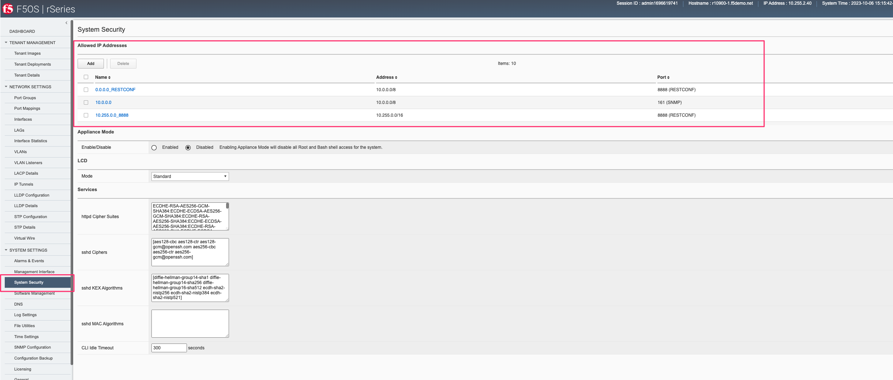

===========================================
rSeries F5OS-A SNMP Monitoring and Alerting
===========================================

Within rSeries tenants, SNMP support remains unchanged from existing BIG-IPs when compared to a vCMP guest. SNMP monitoring and SNMP traps are supported in a similar manner as they are within a vCMP guest. You can continue to query an F5OS tenant via SNMP and receive SNMP traps. The F5OS-A platform layer handles the lower-level networking, and F5OS SNMP MIBs and traps are supported at this layer. The F5OS-A platform layer supports SNMP v1 and v2c, with SNMPv3 support added in F5OS-A 1.2.0.

Below are the latest SNMP MIBs as of the F5OS-A 1.8.0 release.

As of F5OS-A 1.8.0, the following NetSNMP MIBs are available. 

.. Note:: This does not mean that the below NetSNMP MIBs are implemented completely, for some MIBs there are a subset of objects/OIDs that are implemented. See the link below for more detail on which MIB objects are supported.

`K000151374: Available object for NetSNMP MIBs within F5OS-A 1.8.0 release <https://my.f5.com/manage/s/article/K000151374>`_

- TRANSPORT-ADDRESS-MIB
- SNMP-VIEW-BASED-ACM-MIB
- SNMPv2-TC
- SNMPv2 SMI
- SNMPv2-MIB
- SNMPv2-CONF 
- SNMP-USER-BASED-SM-MIB
- SNMP-TARGET-MIB
- SNMP-NOTIFICATION-MIB
- SNMP-MPD-MIB
- SNMP-FRAMEWORK-MIB
- SNMP-COMMUNITY-MIB
- RFC1213-MIB
- IPV6-TC
- IF-MIB
- IANAifType-MIB
- HOST-RESOURCES-MIB
- EtherLike-MIB

As of F5OS-A 1.8.0 the following F5OS Appliance MIBs are available:

- F5OS-APPLIANCE-ALERT-NOTIF-MIB
- F5-PLATFORM-STATS-MIB
- F5-OS-TENANT-MIB
- F5-OS-SYSTEM-MIB
- F5-OS-PLATFORM-SMI-MIB
- F5-OS-LLDP-MIB
- F5-COMMON-SMI-MIB
- F5-ALERT-DEF-MIB

Downloading MIBs
================

MIBs can be downloaded directly from the F5OS layer starting in F5OS-A v1.2.0.

Downloading MIBs via webUI
--------------------------

From the webUI, you can go to the **System Settings > File Utility** page. Then, from the **Base Directory** drop down, select the **mibs** directory to download the MIB files. There are two separate MIB files: NetSNMP and F5OS MIBs for the appliance. Download both archives and extract them to see the individual MIB files.

.. image:: images/rseries_monitoring_snmp/image8.png
  :align: center
  :scale: 70%

Uploading MIBs to a Remote Server via CLI
-----------------------------------------

From the CLI, use the **file export** command to transfer the MIB files to a remote server. First, list the MIB files using the **file list** command as seen below.

.. code-block:: bash

    r5900-1-gsa# file list path mibs/
    entries {
        name mibs_f5os_appliance.tar.gz
        date Wed Jun 11 15:08:39 UTC 2025
        size 17KB
    }
    entries {
        name mibs_netsnmp.tar.gz
        date Wed Jun 11 15:08:39 UTC 2025
        size 110KB
    }
    r5900-1-gsa#

To upload each of the files to a remote HTTPS server use the following command. You can also upload using SCP or SFTP by using the proper protocol option.

.. code-block:: bash

    appliance-1# file export local-file mibs/mibs_f5os_appliance.tar.gz remote-host 10.255.0.142 remote-file /upload/upload.php username corpuser insecure
    Value for 'password' (<string>): ********
    result File transfer is initiated.(mibs/mibs_f5os_appliance.tar.gz)
    appliance-1#

Repeat the same API call but change the filename to the **mibs_netsnmp.tar.gz** file.

Downloading MIBs via API
--------------------------

You can utilize the F5OS API to download the MIB files directly to a client machine, or to upload to a remote server over HTTPS, SCP, or SFTP. First, list the contents of the **mibs/** directory on the rSeries appliance using the following API call to get the filenames.

.. code-block:: bash

    POST https://{{rseries_appliance1_ip}}:8888/restconf/data/f5-utils-file-transfer:file/list

In the body of the API call add the following:

.. code-block:: json

    {
    "f5-utils-file-transfer:path": "mibs/"
    }

This will list the contents of the mibs directory as seen below.

.. code-block:: json

    {
        "f5-utils-file-transfer:output": {
            "entries": [
                {
                    "name": "mibs_f5os_appliance.tar.gz",
                    "date": "Thu Nov 30 20:52:26 UTC 2023",
                    "size": "9.3KB"
                },
                {
                    "name": "mibs_netsnmp.tar.gz",
                    "date": "Thu Nov 30 20:52:26 UTC 2023",
                    "size": "110KB"
                }
            ]
        }
    }

You'll notice there are two separate MIB files, one is for Enterprise MIBs, while the other is for F5 specific MIBs. You'll need to download both files and add them to your SNMP manager. Below are example API calls to download each of the SNMP MIB files.

.. code-block:: bash

    POST https://{{rseries_appliance1_ip}}:8888/restconf/data/f5-utils-file-transfer:file/f5-file-download:download-file/f5-file-download:start-download

For the **Headers** secion of the Postman request, be sure to add the following headers:

If you are using Postman, in the body of the API call select **Body**, then select **form-data**. Then enter the **file-name**, **path**, and **token** as seen below. 

.. image:: images/rseries_monitoring_snmp/downloadmibsapi1.png
  :align: center
  :scale: 70%

Repeat the same process for the other MIB file.

If you are using Postman, instead of clicking **Send**, click on the arrow next to Send, and then select **Send and Download**. You will then be prompted to save the file to your local file system.

.. image:: images/rseries_monitoring_snmp/sendanddownload.png
  :align: center
  :scale: 70%

Exporting MIBs to a Remote Server via the API
---------------------------------------------

To copy the SNMP MIB files from the appliance to a remote https server use the following API call:

.. code-block:: bash

    POST https://{{rseries_appliance1_ip}}:8888/restconf/data/f5-utils-file-transfer:file/export

In the body of the API call, add the remote server info and local file you want to export.

.. code-block:: json

    {
        "f5-utils-file-transfer:insecure": "",
        "f5-utils-file-transfer:protocol": "https",
        "f5-utils-file-transfer:username": "corpuser",
        "f5-utils-file-transfer:password": "password",
        "f5-utils-file-transfer:remote-host": "10.255.0.142",
        "f5-utils-file-transfer:remote-file": "/upload/upload.php",
        "f5-utils-file-transfer:local-file": "mibs/mibs/mibs_f5os_appliance.tar.gz"
    }
    
You can then check on the status of the export via the following API call:

.. code-block:: bash

    POST https://{{rseries_appliance1_ip}}:8888/restconf/data/f5-utils-file-transfer:file/transfer-status

The output will show the status of the file export.

.. code-block:: json

    {
        "f5-utils-file-transfer:output": {
            "result": "\nS.No.|Operation  |Protocol|Local File Path                                             |Remote Host         |Remote File Path                                            |Status            |Time                \n1    |Export file|HTTPS   |mibs/mibs_f5os_appliance.tar.gz                               |10.255.0.142        |/upload/upload.php                                          |         Completed|Thu Jan 20 05:11:44 2022"
        }
    }

Repeat the same steps for the other MIB file.

Adding Allowed IPs for SNMP
===========================

Adding Allowed IPs for SNMP via CLI
-----------------------------------

By default, SNMP queries are not allowed into the F5OS platform layer. Before enabling SNMP, you'll need to open the out-of-band management port on F5OS-A to allow SNMP queries from particular SNMP management endpoints. Below is an example of allowing any SNMP endpoint at 10.255.0.0 (prefix length of 24) to query the F5OS layer on port 161.

.. code-block:: bash

    r10900-2(config)# system allowed-ips allowed-ip snmp config ipv4 address 10.255.0.0 prefix-length 24 port 161
    r10900-2(config-allowed-ip-snmp)# commit
    Commit complete.

Currently you can add one IP address/port pair per **allowed-ip** name with an optional prefix length to specify a CIDR block containing multiple addresses. If you require more than one non-contiguous IP address, you can add it under another name as seen below. 

.. code-block:: bash

    appliance-1(config)# system allowed-ips allowed-ip SNMP-144 config ipv4 address 10.255.0.144 port 161 
    appliance-1(config-allowed-ip-SNMP)# commit
    Commit complete.
    appliance-1(config-allowed-ip-SNMP)# 

    appliance-1(config)# system allowed-ips allowed-ip SNMP-145 config ipv4 address 10.255.2.145 port 161 
    appliance-1(config-allowed-ip-SNMP)# commit
    Commit complete.
    appliance-1(config-allowed-ip-SNMP)# 

Adding Allowed IPs for SNMP via API
-----------------------------------

By default, SNMP queries are not allowed into the F5OS layer. Before enabling SNMP, you'll need to open up the out-of-band management port on F5OS-A to allow SNMP queries. Below is an example of allowing an multiple SNMP endpoints at to access SNMP on the system on port 161.

.. code-block:: bash

    POST https://{{rseries_appliance1_ip}}:8888/restconf/data/openconfig-system:system/f5-allowed-ips:allowed-ips

Within the body of the API call, specific IP address/port combinations can be added under a given name. In the current release, you are limited to one IP address/port per name. 

.. code-block:: json

    {
        "allowed-ip": [
            {
                "name": "SNMP-142",
                "config": {
                    "ipv4": {
                        "address": "10.255.0.142",
                        "port": 161
                    }
                }
            },
            {
                "name": "SNMP-143",
                "config": {
                    "ipv4": {
                        "address": "10.255.0.143",
                        "port": 161
                    }
                }
            },
            {
                "name": "SNMP-144",
                "config": {
                    "ipv4": {
                        "address": "10.255.0.144",
                        "port": 161
                    }
                }
            }
        ]
    }

To view the allowed IPs in the API, use the following call.

.. code-block:: bash

    GET https://{{rseries_appliance1_ip}}:8888/restconf/data/openconfig-system:system/f5-allowed-ips:allowed-ips

The output will show the previously configured allowed-ips.

.. code-block:: json

    {
        "f5-allowed-ips:allowed-ips": {
            "allowed-ip": [
                {
                    "name": "SNMP-142",
                    "config": {
                        "ipv4": {
                            "address": "10.255.0.142",
                            "port": 161
                        }
                    }
                },
                {
                    "name": "SNMP-143",
                    "config": {
                        "ipv4": {
                            "address": "10.255.0.143",
                            "port": 161
                        }
                    }
                },
                {
                    "name": "SNMP-144",
                    "config": {
                        "ipv4": {
                            "address": "10.255.0.144",
                            "port": 161
                        }
                    }
                }
            ]
        }
    }

Adding Allowed IPs for SNMP via webUI
-----------------------------------

By default, SNMP queries are not allowed into the F5OS platform layer. Before enabling SNMP, you'll need to open up the out-of-band management port on F5OS-A to allow SNMP queries from particular SNMP management endpoints. Below is an example of allowing any SNMP endpoint at 10.255.0.0 (prefix length of 24) to query the F5OS layer on port 161.

.. image:: images/rseries_monitoring_snmp/image1.png
  :align: center
  :scale: 70%

In newer releases, the allowed IP functionality has been moved to the **System Settings -> Security** page as seen below.

Adding Interface and LAG descriptions
=====================================

It is highly recommended that you put interface descriptions in your configuration, so that they will show up in the description field when using SNMP polling.

Adding Interface and LAG descriptions via CLI
---------------------------------------------

To add descriptions for both the in-band, and out-of-band management ports in the CLI, follow the examples below.

.. code-block:: bash

    appliance-1(config)# interfaces interface 1.0 config description "Interface 1.0"
    appliance-1(config-interface-1.0)# exit
    appliance-1(config)# interfaces interface 2.0 config description "Interface 2.0"               
    appliance-1(config-interface-2.0)# exit
    appliance-1(config)# interfaces interface 3.0 config description "Interface 3.0"
    appliance-1(config-interface-3.0)# interfaces interface 4.0 config description "Interface 4.0"
    appliance-1(config-interface-4.0)# interfaces interface 5.0 config description "Interface 5.0"
    appliance-1(config-interface-5.0)# interfaces interface 6.0 config description "Interface 6.0"
    appliance-1(config-interface-6.0)# interfaces interface 7.0 config description "Interface 7.0"
    appliance-1(config-interface-7.0)# interfaces interface 8.0 config description "Interface 8.0"
    appliance-1(config-interface-8.0)# interfaces interface 9.0 config description "Interface 9.0"
    appliance-1(config-interface-9.0)# interfaces interface 10.0 config description "Interface 10.0"
    appliance-1(config-interface-10.0)# interfaces interface 11.0 config description "Interface 11.0"
    appliance-1(config-interface-11.0)# interfaces interface 12.0 config description "Interface 12.0"
    appliance-1(config-interface-12.0)# interfaces interface 13.0 config description "Interface 13.0"
    appliance-1(config-interface-13.0)# interfaces interface 14.0 config description "Interface 14.0"
    appliance-1(config-interface-14.0)# interfaces interface 15.0 config description "Interface 15.0"
    appliance-1(config-interface-15.0)# interfaces interface 16.0 config description "Interface 16.0"
    appliance-1(config-interface-16.0)# interfaces interface 17.0 config description "Interface 17.0"
    appliance-1(config-interface-17.0)# interfaces interface 18.0 config description "Interface 18.0"
    appliance-1(config-interface-18.0)# interfaces interface 19.0 config description "Interface 19.0"
    appliance-1(config-interface-19.0)# interfaces interface 20.0 config description "Interface 20.0"
    appliance-1(config-interface-20.0)# exit
    appliance-1(config)# commit
    Commit complete.
    appliance-1(config)# 

    appliance-1(config)# interfaces interface mgmt  config description "Interface mgmt"
    appliance-1(config-interface-mgmt)# commit

If Link Aggregation Groups (LAGs) are configured, descriptions should be added to the LAG interfaces as well.

.. code-block:: bash

    appliance-1(config)# interfaces interface Arista config description "Arista LAG"
    appliance-1(config-interface-Arista)# exit
    appliance-1(config)# interfaces interface HA-Interconnect  config description "HA-Interconnect LAG"
    appliance-1(config-interface-HA-Interconnect)# exit
    appliance-1(config)# commit 
    Commit complete.
    appliance-1(config)# 

Adding Interface and LAG descriptions via API
---------------------------------------------

To add descriptions for both the in-band, and out-of-band management ports in the CLI, follow the examples below. The API example below is for the r10000 models, which have 20 interfaces and one management port. For the r5000 series models you should adjust for 10 interfaces and one management port.

.. code-block:: bash

    PATCH https://{{rseries_appliance1_ip}}:8888/restconf/data/

You should add the interface descriptions as seen in the JSON output below.

.. code-block:: json

    {
        "openconfig-interfaces:interfaces": {
            "interface": [
                {
                    "name": "1.0",
                    "config": {
                        "description": "r10900 Interface 1.0"
                    }
                },
                {
                    "name": "2.0",
                    "config": {
                        "description": "r10900 Interface 2.0"
                    }
                },
                {
                    "name": "3.0",
                    "config": {
                        "description": "r10900 Interface 3.0"
                    }
                },
                {
                    "name": "4.0",
                    "config": {
                        "description": "r10900 Interface 4.0"
                    }
                },
                {
                    "name": "5.0",
                    "config": {
                        "description": "r10900 Interface 5.0"
                    }
                },
                {
                    "name": "6.0",
                    "config": {
                        "description": "r10900 Interface 6.0"
                    }
                },
                {
                    "name": "7.0",
                    "config": {
                        "description": "r10900 Interface 7.0"
                    }
                },
                {
                    "name": "8.0",
                    "config": {
                        "description": "r10900 Interface 8.0"
                    }
                },
                {
                    "name": "9.0",
                    "config": {
                        "description": "r10900 Interface 9.0"
                    }
                },
                {
                    "name": "10.0",
                    "config": {
                        "description": "r10900 Interface 10.0"
                    }
                },
                {
                    "name": "11.0",
                    "config": {
                        "description": "r10900 Interface 11.0"
                    }
                },
                {
                    "name": "12.0",
                    "config": {
                        "description": "r10900 Interface 12.0"
                    }
                },
                {
                    "name": "13.0",
                    "config": {
                        "description": "r10900 Interface 13.0"
                    }
                },
                {
                    "name": "14.0",
                    "config": {
                        "description": "r10900 Interface 14.0"
                    }
                },
                {
                    "name": "15.0",
                    "config": {
                        "description": "r10900 Interface 15.0"
                    }
                },
                {
                    "name": "16.0",
                    "config": {
                        "description": "r10900 Interface 16.0"
                    }
                },
                {
                    "name": "17.0",
                    "config": {
                        "description": "r10900 Interface 17.0"
                    }
                },
                {
                    "name": "18.0",
                    "config": {
                        "description": "r10900 Interface 18.0"
                    }
                },
                {
                    "name": "19.0",
                    "config": {
                        "description": "r10900 Interface 19.0"
                    }
                },
                {
                    "name": "20.0",
                    "config": {
                        "description": "r10900 Interface 20.0"
                    }
                },
                {
                    "name": "mgmt",
                    "config": {
                        "description": "r10900 Interface mgmt"
                    }
                }
            ]
        }
    }

If Link Aggregation Groups (LAGs) are configured, descriptions should be added to the LAG interfaces as well.

.. code-block:: bash

    PATCH https://{{rseries_appliance1_ip}}:8888/restconf/data/

The body of the API call should contain JSON data that includes the descriptions for each LAG.

.. code-block:: json

    {
        "openconfig-interfaces:interfaces": {
            "interface": [
                {
                    "name": "Arista",
                    "config": {
                        "description": "LAG to Arista"
                    }
                },
                {
                    "name": "HA-Interconnect",
                    "config": {
                        "description": "LAG to other r10900"
                    }
                }

            ]
        }
    }

Configuring SNMP Access
=======================

To enable SNMP, you'll need to configure basic SNMP parameters like **system contact**, **location** and **name**. Then configure access for specific SNMP communities and versions. Currently SNMP can be setup via CLI and API, with configuration via webUI added in F5OS-A 1.3.0. 

Configuring SNMP Access via CLI F5OS-A 1.2.0 or Later
-----------------------------------------------------

You can configure the SNMP System parameters including the **System Contact**, **System Location**, and **System Name** as seen below:

.. code-block:: bash

    appliance-1(config)# SNMPv2-MIB system sysContact jim@f5.com sysLocation Boston sysName r5900-2
    appliance-1(config)# commit
    Commit complete.
    appliance-1(config)# 

SNMP configuration was only available in the CLI and API prior to F5OS-A 1.3.0, and the CLI configuration was not intuitive. F5OS-A 1.2.0 has improved and streamlined SNMP configuration in the CLI and then configuration via the webUI was also added in F5OS-A 1.3.0. The example below is utilizing the new and improved SNMP CLI configuration for rSeries systems running F5OS-A 1.2.0 or later. 

Enabling SNMP can be done from the CLI by configuring the **public** SNMP community, and then configuring a **security-model**. The command below sets up an SNMP community of **public** with v1 and v2c security models. You may choose to enable both security models or only one.

.. code-block:: bash

    r5900-2(config)# system snmp communities community public config security-model [ v1 v2c ]
    r5900-2(config-community-public)# exit
    r5900-2(config)# commit

You can then display the SNMP community configuration using the **show system snmp** command.

.. code-block:: bash

    r5900-2(config)# do show system snmp 
    system snmp engine-id state engine-id 80:00:2f:f4:03:00:94:a1:69:35:02
    system snmp engine-id state type mac
                    SECURITY    
    NAME    NAME    MODEL       
    ----------------------------
    public  public  [ v1 v2c ]  

    r5900-2(config)# 

You may also configure SNMP users for SNMPv3 support, since SNMPv3 is a user-based security model. This provides additional support for authentication and privacy protocols. Authentication protocols of **md5**, **sha**, or **none** are supported. For privacy protocols **aes**, **des**, or **none** are supported. You'll then be prompted to enter the privacy-password.

.. code-block:: bash

    r5900-2(config)# system snmp users user snmpv3user config authentication-protocol md5 privacy-protocol aes privacy-password 
    (<string, min: 8 chars, max: 32 chars>): **************
    r5900-2(config-user-snmpv3user)# commit
    Commit complete.

You may display the SNMP user configuration by entering the command **show system snmp users**.

.. code-block:: bash

    r5900-2(config)# do show system snmp users
                            AUTHENTICATION  PRIVACY   
    NAME        NAME        PROTOCOL        PROTOCOL  
    --------------------------------------------------
    snmpv3user  snmpv3user  md5             aes       

    r5900-2(config)# 

Configuring SNMP Access via CLI Prior to F5OS-A 1.2.0
-----------------------------------------------------

Below is the SNMP CLI configuration for systems running a version prior to F5OS-A 1.2.0. You can configure the SNMP System parameters including the **System Contact**, **System Location**, and **System Name** as seen below:

.. code-block:: bash

    appliance-1(config)# SNMPv2-MIB system sysContact jim@f5.com sysLocation Boston sysName r5900-2
    appliance-1(config)# commit
    Commit complete.
    appliance-1(config)# 

Enabling SNMP can be done from the CLI by configuring the public SNMP community, and then configuring a Security Access Group. Below is an example of enabling SNMP monitoring at the F5OS layer. F5OS only supports read-only access for SNMP monitoring.

.. code-block:: bash

    appliance-1# config
    Entering configuration mode terminal
    appliance-1(config)# SNMP-COMMUNITY-MIB snmpCommunityTable snmpCommunityEntry public snmpCommunityName public snmpCommunitySecurityName public
    appliance-1(config-snmpCommunityEntry-public)# exit
  

To configure a Security Group for both SNMPv1 and SNMPv2c.

.. code-block:: bash

    appliance-1(config)# SNMP-VIEW-BASED-ACM-MIB vacmSecurityToGroupTable vacmSecurityToGroupEntry 2 public vacmGroupName read-access
    appliance-1(config-vacmSecurityToGroupEntry-2/public)# exit
    appliance-1(config)# SNMP-VIEW-BASED-ACM-MIB vacmSecurityToGroupTable vacmSecurityToGroupEntry 1 public vacmGroupName read-access
    appliance-1(config-vacmSecurityToGroupEntry-1/public)# exit
    appliance-1(config)# commit
    Commit complete.
    appliance-1(config)# 

Configuring SNMP Access via API
-------------------------------

SNMP Communities, Users, and Targets can be setup via the API. An admin can enable access for SNMP monitoring of the system through either a community for SNMPv1/v2c, or through users for SNMPv3. In addition, remote SNMP Trap receiver locations can be enabled for alerting.

To configure the SNMP system parameters via API use the following API call:

.. code-block:: bash

    PATCH https://{{velos_chassis1_system_controller_ip}}:8888/restconf/data/SNMPv2-MIB:SNMPv2-MIB/system

In the body of the API add the SNMP sysContact, sysName, and sysLocation.

.. code-block:: json

    {
    "SNMPv2-MIB:system": {
        "sysContact": "jim@f5.com",
        "sysName": "r10900-1.f5demo.net",
        "sysLocation": "Boston"
        }
    }

To view the SNMP system parameters use the following API call:

.. code-block:: bash

    GET https://{{rseries_appliance1_ip}}:8888/restconf/data/SNMPv2-MIB:SNMPv2-MIB/system

A response similar to the one below will be displayed.

.. code-block:: json

    {
        "SNMPv2-MIB:system": {
            "sysDescr": "F5 rSeries-r10900 : Linux 3.10.0-1160.71.1.F5.1.el7_8.x86_64 : Appliance services version 1.8.0-8478",
            "sysObjectID": "1.3.6.1.4.1.12276.1.3.1.2",
            "sysUpTime": 61877485,
            "sysContact": "jim@f5.com",
            "sysName": "r10900-1.f5demo2.net",
            "sysLocation": "Boston",
            "sysServices": 72,
            "sysORLastChange": 9
        }
    }

To create an SNMPv3 user use the following API call.

.. code-block:: bash

    PATCH https://{{rseries_appliance1_ip}}:8888/restconf/data/openconfig-system:system/f5-system-snmp:snmp

Within the body of the API call, add the following JSON to add a user.

.. code-block:: json

    {
        "f5-system-snmp:snmp": {
            "users": {
                "user": [
                    {
                        "name": "snmpv3-user3",
                        "config": {
                            "name": "snmpv3-user3",
                            "authentication-protocol": "md5",
                            "f5-system-snmp:authentication-password": "{{rseries_password}}",
                            "privacy-protocol": "aes",
                            "f5-system-snmp:privacy-password": "{{rseries_password}}"
                        }
                    }
                ]
            }
        }
    }

If you are using SNMPv1/v2c then communities are the means of access. You can create an SNMP community via the API with the following API call:

.. code-block:: bash

    PATCH https://{{rseries_appliance1_ip}}:8888/restconf/data/openconfig-system:system/f5-system-snmp:snmp

In the body of the API call, add the community name you want to use to allow access to SNMP on the rSeries system. In this case a community called public2 is being used to enable access.

.. code-block:: json

    {
        "f5-system-snmp:snmp": {
            "communities": {
                "community": [
                    {
                        "name": "public2",
                        "config": {
                            "name": "public2",
                            "security-model": [
                                "v1",
                                "v2c"
                            ]
                        }
                    }
                ]
            }
        }
    }

To view the current SNMP configuration, issue the following API call:

.. code-block:: bash

    GET https://{{rseries_appliance_ip}}:8888/restconf/data/openconfig-system:system/f5-system-snmp:snmp

The output should appear similar to the example below.

.. code-block:: json

    {
        "f5-system-snmp:snmp": {
            "users": {
                "user": [
                    {
                        "name": "jim",
                        "config": {
                            "name": "jim",
                            "authentication-protocol": "md5",
                            "privacy-protocol": "aes"
                        },
                        "state": {
                            "name": "jim",
                            "authentication-protocol": "md5",
                            "privacy-protocol": "aes"
                        }
                    },
                    {
                        "name": "snmpv3-user3",
                        "config": {
                            "name": "snmpv3-user3",
                            "authentication-protocol": "md5",
                            "privacy-protocol": "aes"
                        },
                        "state": {
                            "name": "snmpv3-user3",
                            "authentication-protocol": "md5",
                            "privacy-protocol": "aes"
                        }
                    },
                    {
                        "name": "snmpv3user",
                        "config": {
                            "name": "snmpv3user",
                            "authentication-protocol": "md5",
                            "privacy-protocol": "aes"
                        },
                        "state": {
                            "name": "snmpv3user",
                            "authentication-protocol": "md5",
                            "privacy-protocol": "aes"
                        }
                    }
                ]
            },
            "communities": {
                "community": [
                    {
                        "name": "public",
                        "config": {
                            "name": "public",
                            "security-model": [
                                "v1",
                                "v2c"
                            ]
                        },
                        "state": {
                            "name": "public",
                            "security-model": [
                                "v1",
                                "v2c"
                            ]
                        }
                    },
                    {
                        "name": "public2",
                        "config": {
                            "name": "public2",
                            "security-model": [
                                "v1",
                                "v2c"
                            ]
                        },
                        "state": {
                            "name": "public2",
                            "security-model": [
                                "v1",
                                "v2c"
                            ]
                        }
                    }
                ]
            },
            "engine-id": {
                "config": {
                    "value": "mac"
                },
                "state": {
                    "engine-id": "80:00:2f:f4:03:00:94:a1:69:59:02",
                    "type": "mac"
                }
            },
            "config": {
                "port": 161
            },
            "state": {
                "port": 161
            }
        }

Configuring SNMP Access via webUI
---------------------------------

SNMP configuration via the webUI was added in the F5OS-A 1.3.0 release. You may configure SNMP Properties, SNMP Communities, SNMP Users, and SNMP Targets. SNMP is configured under **System Settings -> SNMP Configuration**.

.. image:: images/rseries_monitoring_snmp/image2.png
  :align: center
  :scale: 70%

An SNMP Community may be added for v1, v2c, or both v1 and v2c.

.. image:: images/rseries_monitoring_snmp/image3.png
  :align: center
  :scale: 100%

SNMP users can be added for environments which utilize SNMPv3.

.. image:: images/rseries_monitoring_snmp/image4.png
  :align: center
  :scale: 100%

SNMP Trap receivers may be added and a community or a user is added depending on the security model.

.. image:: images/rseries_monitoring_snmp/image5.png
  :align: center
  :scale: 100%

SNMP Trap Support in F5OS-A
===========================

You can enable SNMP traps for the F5OS-A platform layer. The **F5OS-APPLIANCE-ALERT-NOTIF-MIB** provides details about supported rSeries appliance SNMP traps. Below is the current full list of traps supported as of F5OS-A 1.8.0.

.. NOTE:: The current **F5OS-APPLIANCE-ALERT-NOTIF-MIB** file will contain alerts for both F5OS-A (rSeries appliances) and F5OS-C (VELOS chassis). Some traps may be specific to one platform or the other. In the future the VELOS specific traps will be removed from the appliance MIB file. This section will only document MIB files relevant to the rSeries appliances only. 

SNMP Trap events that note a fault should also trigger an alert that can be viewed in the show alerts output in the CLI, WebUI, and API. They are also logged in the snmp.log file. Once a clear SNMP Trap is sent, it should clear the event from the **show events** output.

+----------------------------+----------------------------------+
| **Alert**                  | **OID**                          |
+============================+==================================+
| hardware-device-fault      | .1.3.6.1.4.1.12276.1.1.1.65536   |
+----------------------------+----------------------------------+
| firmware-fault             | .1.3.6.1.4.1.12276.1.1.1.65537   |
+----------------------------+----------------------------------+
| unknown-alarm              | .1.3.6.1.4.1.12276.1.1.1.65538   |
+----------------------------+----------------------------------+
| memory-fault               | .1.3.6.1.4.1.12276.1.1.1.65539   |
+----------------------------+----------------------------------+
| drive-fault                | .1.3.6.1.4.1.12276.1.1.1.65540   |
+----------------------------+----------------------------------+
| cpu-fault                  | .1.3.6.1.4.1.12276.1.1.1.65541   |
+----------------------------+----------------------------------+
| pcie-fault                 | .1.3.6.1.4.1.12276.1.1.1.65542   |
+----------------------------+----------------------------------+
| aom-fault                  | .1.3.6.1.4.1.12276.1.1.1.65543   |
+----------------------------+----------------------------------+
| drive-capacity-fault       | .1.3.6.1.4.1.12276.1.1.1.65544   |
+----------------------------+----------------------------------+
| power-fault                | .1.3.6.1.4.1.12276.1.1.1.65545   |
+----------------------------+----------------------------------+
| thermal-fault              | .1.3.6.1.4.1.12276.1.1.1.65546   |
+----------------------------+----------------------------------+
| drive-thermal-throttle     | .1.3.6.1.4.1.12276.1.1.1.65547   |
+----------------------------+----------------------------------+
| firmware-update-status     | .1.3.6.1.4.1.12276.1.1.1.65550   |
+----------------------------+----------------------------------+
| drive-utilization          | .1.3.6.1.4.1.12276.1.1.1.65551   |
+----------------------------+----------------------------------+
| sensor-fault               | .1.3.6.1.4.1.12276.1.1.1.65577   |
+----------------------------+----------------------------------+
| datapath-fault             | .1.3.6.1.4.1.12276.1.1.1.65578   |
+----------------------------+----------------------------------+
| module-present             | .1.3.6.1.4.1.12276.1.1.1.66304   |
+----------------------------+----------------------------------+
| psu-fault                  | .1.3.6.1.4.1.12276.1.1.1.66305   |
+----------------------------+----------------------------------+
| lcd-fault                  | .1.3.6.1.4.1.12276.1.1.1.66306   |
+----------------------------+----------------------------------+
| module-communication-error | .1.3.6.1.4.1.12276.1.1.1.66307   |
+----------------------------+----------------------------------+
| fips-fault                 | .1.3.6.1.4.1.12276.1.1.1.66308   |
+----------------------------+----------------------------------+
| fipsError                  | .1.3.6.1.4.1.12276.1.1.1.196608  |
+----------------------------+----------------------------------+
| core-dump                  | .1.3.6.1.4.1.12276.1.1.1.327680  |
+----------------------------+----------------------------------+
| reboot                     | .1.3.6.1.4.1.12276.1.1.1.327681  |
+----------------------------+----------------------------------+
| incompatible-image         | .1.3.6.1.4.1.12276.1.1.1.327682  |
+----------------------------+----------------------------------+
| login-failed               | .1.3.6.1.4.1.12276.1.1.1.327683  |
+----------------------------+----------------------------------+
| raid-event                 | .1.3.6.1.4.1.12276.1.1.1.393216  |
+----------------------------+----------------------------------+
| txPwr                      | .1.3.6.1.4.1.12276.1.1.1.262400  |
+----------------------------+----------------------------------+
| rxPwr                      | .1.3.6.1.4.1.12276.1.1.1.262401  |
+----------------------------+----------------------------------+
| txBias                     | .1.3.6.1.4.1.12276.1.1.1.262402  |
+----------------------------+----------------------------------+
| ddmTemp                    | .1.3.6.1.4.1.12276.1.1.1.262403  |
+----------------------------+----------------------------------+
| ddmVcc                     | .1.3.6.1.4.1.12276.1.1.1.262404  |
+----------------------------+----------------------------------+
| initialization             | .1.3.6.1.4.1.12276.1.1.1.262656  |
+----------------------------+----------------------------------+
| ePVA                       | .1.3.6.1.4.1.12276.1.1.1.262912  |
+----------------------------+----------------------------------+
| interface-up               | .1.3.6.1.4.1.12276.1.1.1.263168  |
+----------------------------+----------------------------------+
| interface-down             | .1.3.6.1.4.1.12276.1.1.1.263169  |
+----------------------------+----------------------------------+
| speed                      | .1.3.6.1.4.1.12276.1.1.1.263170  |
+----------------------------+----------------------------------+
| inaccessible-memory        | .1.3.6.1.4.1.12276.1.1.1.458752  |
+----------------------------+----------------------------------+

SNMP Trap Details
=================

Inside of F5OS there are different categories of diagnostic information that the system captures: **System Alerts** and **System Events**. Both System Alerts and System Events can trigger SNMP traps. This section will provide background on the differences between the two types, and make recommendations of how to monitor and interpret the different types of SNMP traps. Before getting into the SNMP Trap implementation, it is important to understand how F5OS categorizes the different types of messages. 

System Alerts
-------------

A system alert is typically associated with some sort of fault in the system and it will have two states: An **alarm** condition indicating that some threshold has been crossed or some failure has occurred, and then a corresponding **clear** condition that indicates the fault has cleared or the threshold condition has gone back to an acceptable level. System alerts are high-level categories like: psu-fault, drive-fault, thermal-fault etc... These type of messages are what traditional SNMP systems monitor in order to alert someone when there is a failure condition or a threshold that has been crossed requiring attention. 

If a system is healthy and there are no active alarms, then the output of **show system alarms** will report **No entries found**.

.. code-block:: bash

    r4800-2-gsa# show system alarms 
    % No entries found.
    r4800-2-gsa#

If the system has active alarms, then the details will be displayed in the **show system alarms** output. If the fault is cleared, then the alarm will be removed from the output. 

.. code-block:: bash

    r10900-1-gsa# show system alarms 
    ID      RESOURCE      SEVERITY  TEXT                                       TIME CREATED                       
    --------------------------------------------------------------------------------------------------------------
    262401  Portgroup 12  WARNING   Lanes: 1,2,3,4 Receiver power low warning  2024-08-14 23:35:28.453636868 UTC  
    262401  Portgroup 14  WARNING   Lanes: 1 Receiver power low warning        2024-08-14 23:35:28.494375773 UTC  
    262402  Portgroup 14  WARNING   Lanes: 1 Transmitter bias low warning      2024-09-27 13:19:55.728880195 UTC  
    262400  Portgroup 14  ERROR     Lanes: 1 Transmitter power low alarm       2024-09-27 13:19:55.728742803 UTC  
    66305   psu-2         CRITICAL  PSU fault detected                         2025-05-29 16:59:41.946105595 UTC  

    r10900-1-gsa#

When translated into SNMP traps the states for these types of messages are:

- assert(1) or **alertEffect=1** is reported in alertEffect when alarm is raised. 
- clear(0) or **alertEffect=0** reported in alertEffect when alarm is cleared. 

System Events
-------------

A system event is an informational message which doesn't have an alarm or clear condition by itself, but it may provide deeper information on what caused an alarm or clear condition. A System Event is a lower-level message that could include information about firmware upgrade status, presence of a PSU, or DDM diagnostic level on an optic in addition to many more low-level details. Many times, a system event will provide more detailed lower-level information that corresponds to an alarm or clear condition. As an example a PSU-Fault alarm, may have corresponding events messages that provide more details as to whay the PSU is in a fault alarm condition.

Often times, many of these messages or traps are just providing state of a component in a binary fashion. i.e. it's either a one (ASSERTED) or zero (DEASSERTED) state based on the AOM subsystem tracking status. This should not be viewed as a positive or a negative status, it is merely communicating state of a component. As an example, in the system events a **Deasserted: PSU mismatch** message, means all the PSU's **are not** mismatched because the value is zero or Deasserted. The wording may not be intuitive, and F5 is looking into making improvements to make the wording clearer. The example below shows the **show system events** for the message described above.

.. code-block:: bash

    r10900-2-gsa# show system events | include "PSU mismatch"
    66305 psu-controller psu-fault EVENT NA "Deasserted: PSU mismatch" "2024-09-30 22:14:54.337132053 UTC" 
    66305 psu-controller psu-fault EVENT NA "Deasserted: PSU mismatch" "2025-02-01 05:02:07.587428459 UTC" 
    r10900-2-gsa#

This in turn can generate an SNMP trap which is informational in nature (alertEffect=2), so this should not be viewed as an alert/clear message. It is simply indicating status of the **PSU mismatch** state.

.. code-block:: bash

    r10900-2-gsa# file show log/system/snmp.log | include "PSU mismatch"
    <INFO> 30-Sep-2024::18:14:56.084 appliance-1 confd[142]: snmp snmpv2-trap reqid=160264620 10.255.80.251:162 (TimeTicks sysUpTime=3296)(OBJECT IDENTIFIER snmpTrapOID=psu-fault)(OCTET STRING alertSource=psu-controller)(INTEGER alertEffect=2)(INTEGER alertSeverity=8)(OCTET STRING alertTimeStamp=2024-09-30 22:14:54.337132053 UTC)(OCTET STRING alertDescription=Deasserted: PSU mismatch)
    <INFO> 30-Sep-2024::18:14:56.084 appliance-1 confd[142]: snmp snmpv2-trap reqid=160264620 10.255.0.144:161 (TimeTicks sysUpTime=3296)(OBJECT IDENTIFIER snmpTrapOID=psu-fault)(OCTET STRING alertSource=psu-controller)(INTEGER alertEffect=2)(INTEGER alertSeverity=8)(OCTET STRING alertTimeStamp=2024-09-30 22:14:54.337132053 UTC)(OCTET STRING alertDescription=Deasserted: PSU mismatch)
    <INFO> 1-Feb-2025::00:02:11.282 r10900-2-gsa confd[142]: snmp snmpv2-trap reqid=1615746712 172.22.50.57:162 (TimeTicks sysUpTime=4153)(OBJECT IDENTIFIER snmpTrapOID=psu-fault)(OCTET STRING alertSource=psu-controller)(INTEGER alertEffect=2)(INTEGER alertSeverity=8)(OCTET STRING alertTimeStamp=2025-02-01 05:02:07.587428459 UTC)(OCTET STRING alertDescription=Deasserted: PSU mismatch)
    <INFO> 1-Feb-2025::00:02:11.282 r10900-2-gsa confd[142]: snmp snmpv2-trap reqid=1615746712 10.255.0.144:161 (TimeTicks sysUpTime=4153)(OBJECT IDENTIFIER snmpTrapOID=psu-fault)(OCTET STRING alertSource=psu-controller)(INTEGER alertEffect=2)(INTEGER alertSeverity=8)(OCTET STRING alertTimeStamp=2025-02-01 05:02:07.587428459 UTC)(OCTET STRING alertDescription=Deasserted: PSU mismatch)
    r10900-2-gsa# 

Normally, an SNMP trap will be sent only when a critical status is encountered or cleared, or some threshold is being crossed. F5OS however, also sends informational traps that are merely EVENTS. The AOM subsystem tracks state of many components within the system, and if that state changes an EVENT or trap may be triggered. The AOM subsystem will also generate a burst of messages when the AOM subsystem is first powered on or cycled, this is normal as it is re-discovering the state of all those components. This has been viewed as the SNMP traps being too chatty or verbose and F5 is looking into reducing the amount of chatter under these conditions in the future. For now, many of those EVENT messages or **alertEffect=2** can be safely ignored, but they may provide value as they provide additional information alongside an **alertEffect=0** or an or **alertEffect=1** SNMP trap. 

There may be cases where an alertEffect=2 message might signal something needs more attention. Some examples would be **firmware-update-status** that would let you know that the system is unavailable while a firmware upgrade occurs. Another example would be a **core-dump** SNMP trap that is logged as an **alertEffect=2**.

The **show systems events** output will also display past and current **ASSERT** and **CLEAR** System Alerts.

Below are some examples of PSU related events.

.. code-block:: bash

    r10900-2-gsa# show system events | include psu
    66305 psu-2 psu-fault EVENT NA "Deasserted: PSU 2 input over-power warning" "2024-09-30 22:14:50.630416639 UTC" 
    66305 psu-2 psu-fault EVENT NA "Deasserted: PSU 2 input over-current warning" "2024-09-30 22:14:51.160416708 UTC" 
    66305 psu-2 psu-fault EVENT NA "Deasserted: PSU 2 input over-current fault" "2024-09-30 22:14:51.685095670 UTC" 
    66305 psu-2 psu-fault EVENT NA "Deasserted: PSU 2 unit off for low input voltage" "2024-09-30 22:14:52.216633391 UTC" 
    66305 psu-1 psu-fault EVENT NA "Asserted: PSU 1 present" "2024-09-30 22:14:53.792270470 UTC"   
    66305 psu-controller psu-fault EVENT NA "Deasserted: PSU mismatch" "2024-09-30 22:14:54.337132053 UTC" 
    66305 psu-2 psu-fault EVENT NA "Asserted: PSU 2 input OK" "2024-09-30 22:14:54.903037510 UTC"  
    66305 psu-2 psu-fault EVENT NA "Asserted: PSU 2 output OK" "2024-09-30 22:14:55.421046115 UTC" 
    66305 psu-2 psu-fault EVENT NA "Deasserted: PSU 2 unsupported" "2024-09-30 22:14:55.950652039 UTC" 
    66305 psu-1 psu-fault EVENT NA "Asserted: PSU 1 input OK" "2024-09-30 22:14:56.571673865 UTC"  
    66305 psu-1 psu-fault EVENT NA "Deasserted: PSU 1 unsupported" "2024-09-30 22:14:57.098983897 UTC" 
    66305 psu-2 psu-fault EVENT NA "Asserted: PSU 2 present" "2024-09-30 22:14:57.144088560 UTC"   
    66305 psu-1 psu-fault ASSERT CRITICAL "PSU fault detected" "2024-09-30 22:14:57.175299808 UTC" 
    66305 psu-1 psu-fault EVENT NA "Asserted: PSU 1 output OK" "2024-09-30 22:14:57.175304440 UTC" 
 
Below are some examples of Portgroup related events.

.. code-block:: bash

    r10900-2-gsa# show system events | include Portgroup 
    262401 Portgroup 2 rxPwr ASSERT ERROR "Lanes: 1,2,3,4 Receiver power low alarm" "2024-06-16 06:31:57.893624774 UTC" 
    262401 Portgroup 2 rxPwr CLEAR ERROR "Lanes: 1,2,3,4 Receiver power low alarm" "2024-06-16 06:32:27.893666605 UTC" 
    262401 Portgroup 1 rxPwr ASSERT ERROR "Lanes: 1,2,3,4 Receiver power low alarm" "2024-06-17 21:00:57.863227048 UTC" 
    262401 Portgroup 2 rxPwr ASSERT WARNING "Lanes: 1,2,3,4 Receiver power low warning" "2024-06-17 21:00:57.893687325 UTC" 
    262401 Portgroup 1 rxPwr CLEAR ERROR "Lanes: 1,2,3,4 Receiver power low alarm" "2024-06-18 13:00:57.863284941 UTC" 
    262401 Portgroup 2 rxPwr CLEAR ERROR "Lanes: 1,2,3,4 Receiver power low alarm" "2024-06-18 13:00:57.893710735 UTC" 
    262401 Portgroup 2 rxPwr ASSERT ERROR "Lanes: 1,2,3,4 Receiver power low alarm" "2024-06-21 01:06:27.893955002 UTC" 
    262401 Portgroup 2 rxPwr CLEAR ERROR "Lanes: 1,2,3,4 Receiver power low alarm" "2024-06-21 01:06:57.893506508 UTC" 
    262401 Portgroup 2 rxPwr ASSERT WARNING "Lanes: 1,2,3,4 Receiver power low warning" "2024-06-21 20:17:27.893594602 UTC" 
    262401 Portgroup 2 rxPwr CLEAR ERROR "Lanes: 1,2,3,4 Receiver power low alarm" "2024-06-21 20:17:57.893687839 UTC" 
    262401 Portgroup 2 rxPwr ASSERT ERROR "Lanes: 1,2,3,4 Receiver power low alarm" "2024-06-30 17:13:50.315994230 UTC" 
    262401 Portgroup 2 rxPwr CLEAR ERROR "Lanes: 1,2,3,4 Receiver power low alarm" "2024-06-30 17:14:20.106497472 UTC" 

Below are some examples of thermal related events. 

.. code-block:: bash

    r10900-2-gsa# show system events | include thermal  
    65546 appliance thermal-fault EVENT NA "ATSE2_0 at +39.1 degC" "2024-06-14 15:02:02.852896207 UTC" 
    65546 appliance thermal-fault EVENT NA "ASW_3 at +34.5 degC" "2024-06-14 15:02:02.854349640 UTC" 
    65546 appliance thermal-fault EVENT NA "NSE_6 at +32.3 degC" "2024-06-14 15:02:02.855751167 UTC" 
    65546 appliance thermal-fault EVENT NA "CPU at +53.0 degC" "2024-06-14 15:02:02.857040180 UTC" 
    65546 appliance thermal-fault EVENT NA "ASW_1 at +33.9 degC" "2024-06-14 15:02:02.858380610 UTC" 
    65546 appliance thermal-fault EVENT NA "NSE_4 at +32.8 degC" "2024-06-14 15:02:02.859641796 UTC" 
    65546 appliance thermal-fault EVENT NA "ASW_0 at +34.0 degC" "2024-06-14 15:02:02.860927679 UTC" 
    65546 appliance thermal-fault EVENT NA "NSE_3 at +31.8 degC" "2024-06-14 15:02:02.862157794 UTC" 
    65546 appliance thermal-fault EVENT NA "ASW_6 at +33.7 degC" "2024-06-14 15:02:03.771468909 UTC" 
    65546 appliance thermal-fault EVENT NA "NSE_1 at +31.3 degC" "2024-06-14 15:02:03.775933897 UTC" 

Alarms (Alerts) - Events
------------------------

This section provides examples of SNMP traps and their associated log messages, and what troubleshooting steps are recommended. Traps will be sent with either an **assert** when an alarm occurs, a **clear** when the alarm is cleared, or an **event** which is providing an update to a raised or cleared alarm event.

- assert(1) is reported in alertEffect when alarm is raised.
- clear(0) is reported in alertEffect when alarm is cleared.
- event(2) is updated in alertEffect when event notification is reported.

From an SNMP trap monitoring/fault perspective it is recommended to focus on traps that have either an **alertEffect=1** indicating that an alert is being raised, or an **alertEffect=0** indicating that an alert is being cleared. These SNMP traps should correspond to output in the **show system alarms** output when there is an active alarm. 

All other traps with **alertEffect=2** are providing additional detail that may be useful and may also corelate to an assert or clear alarm, but from a fault monitoring perspective may be ignored.

Currently, when an rSeries device has powered removed the AOM module will discard any state it has and when powered back on it may send many informational SNMP traps indicating the current status of certain sensors. These will all be sent with **alertEffect=2**, which can be ignored from an SNMP fault perspective. 

Below is a typical example where there is an alert, along with other informational detail, and then a clear event with more additional info. As an example, the following set of traps are from an LCD failure and recovery on an F5OS based rSeries device. Note, that first there are a bunch of alarms being raised noted by **(INTEGER alertEffect=1)**. Then there are follow-on events, which provide additional updates to those alarms that have been raised noted by **(INTEGER alertEffect=2)**. Finally, the alarms are cleared as noted by **(INTEGER alertEffect=0)**, as well as additional informational events related to the clear noted by **(INTEGER alertEffect=2)**.

.. code-block:: bash

    A firmware upgrade of the LCD starts - Event (alertEffect=2):

    r10900-2-gsa# file show log/system/snmp.log.1 | include lcd | include 15-Feb-2023::15:
    <INFO> 15-Feb-2023::15:55:38.088 appliance-1 confd[126]: snmp snmpv2-trap reqid=1413418272 10.255.0.144:161 (TimeTicks sysUpTime=545)(OBJECT IDENTIFIER snmpTrapOID=firmware-update-status)(OCTET STRING alertSource=lcd)(INTEGER alertEffect=2)(INTEGER alertSeverity=8)(OCTET STRING alertTimeStamp=2023-02-15 20:55:38.055131188 UTC)(OCTET STRING alertDescription=Firmware update is running for lcd app)

    A fault is raised for the LCD Module - Assert (alertEffect=1):

    <INFO> 15-Feb-2023::15:55:57.476 appliance-1 confd[126]: snmp snmpv2-trap reqid=1413418298 10.255.0.144:161 (TimeTicks sysUpTime=2484)(OBJECT IDENTIFIER snmpTrapOID=lcd-fault)(OCTET STRING alertSource=lcd)(INTEGER alertEffect=1)(INTEGER alertSeverity=3)(OCTET STRING alertTimeStamp=2023-02-15 20:55:57.472258315 UTC)(OCTET STRING alertDescription=Fault detected in LCD module)

    LCD Health is not OK status message - Event (alertEffect=2):

    <INFO> 15-Feb-2023::15:55:57.526 appliance-1 confd[126]: snmp snmpv2-trap reqid=1413418299 10.255.0.144:161 (TimeTicks sysUpTime=2489)(OBJECT IDENTIFIER snmpTrapOID=lcd-fault)(OCTET STRING alertSource=lcd)(INTEGER alertEffect=2)(INTEGER alertSeverity=8)(OCTET STRING alertTimeStamp=2023-02-15 20:55:57.472273735 UTC)(OCTET STRING alertDescription=LCD Health is Not OK)

    Alarm raised for Module Communication Error - Assert (alertEffect=1):

    <INFO> 15-Feb-2023::15:58:42.071 appliance-1 confd[126]: snmp snmpv2-trap reqid=1413418313 10.255.0.144:161 (TimeTicks sysUpTime=18944)(OBJECT IDENTIFIER snmpTrapOID=module-communication-error)(OCTET STRING alertSource=lcd)(INTEGER alertEffect=1)(INTEGER alertSeverity=3)(OCTET STRING alertTimeStamp=2023-02-15 20:58:42.066037341 UTC)(OCTET STRING alertDescription=Module communication error detected)

    LCD Module Commuication Error status message - Event (alertEffect=2):

    <INFO> 15-Feb-2023::15:58:42.120 appliance-1 confd[126]: snmp snmpv2-trap reqid=1413418314 10.255.0.144:161 (TimeTicks sysUpTime=18949)(OBJECT IDENTIFIER snmpTrapOID=module-communication-error)(OCTET STRING alertSource=lcd)(INTEGER alertEffect=2)(INTEGER alertSeverity=8)(OCTET STRING alertTimeStamp=2023-02-15 20:58:42.066055066 UTC)(OCTET STRING alertDescription=LCD module communication error detected)

    A fault is cleared for the LCD Module- Clear (alertEffect=0):

    <INFO> 15-Feb-2023::15:58:42.171 appliance-1 confd[126]: snmp snmpv2-trap reqid=1413418315 10.255.0.144:161 (TimeTicks sysUpTime=18954)(OBJECT IDENTIFIER snmpTrapOID=lcd-fault)(OCTET STRING alertSource=lcd)(INTEGER alertEffect=0)(INTEGER alertSeverity=8)(OCTET STRING alertTimeStamp=2023-02-15 20:58:42.068393086 UTC)(OCTET STRING alertDescription=Fault detected in LCD module)

    LCD Health is not OK status message - Event (alertEffect=2):

    <INFO> 15-Feb-2023::15:58:42.221 appliance-1 confd[126]: snmp snmpv2-trap reqid=1413418316 10.255.0.144:161 (TimeTicks sysUpTime=18959)(OBJECT IDENTIFIER snmpTrapOID=lcd-fault)(OCTET STRING alertSource=lcd)(INTEGER alertEffect=2)(INTEGER alertSeverity=8)(OCTET STRING alertTimeStamp=2023-02-15 20:58:42.068409568 UTC)(OCTET STRING alertDescription=LCD Health is Not OK)

    A firmware upgrade of the LCD completes - Event (alertEffect=2):

    <INFO> 15-Feb-2023::15:59:12.060 appliance-1 confd[126]: snmp snmpv2-trap reqid=1413418321 10.255.0.144:161 (TimeTicks sysUpTime=21943)(OBJECT IDENTIFIER snmpTrapOID=firmware-update-status)(OCTET STRING alertSource=lcd)(INTEGER alertEffect=2)(INTEGER alertSeverity=8)(OCTET STRING alertTimeStamp=2023-02-15 20:59:12.056692654 UTC)(OCTET STRING alertDescription=Firmware update completed for lcd app)

    Alarm cleared for Module Communication Error - Clear (alertEffect=0):

    <INFO> 15-Feb-2023::15:59:14.590 appliance-1 confd[126]: snmp snmpv2-trap reqid=1413418322 10.255.0.144:161 (TimeTicks sysUpTime=22196)(OBJECT IDENTIFIER snmpTrapOID=module-communication-error)(OCTET STRING alertSource=lcd)(INTEGER alertEffect=0)(INTEGER alertSeverity=8)(OCTET STRING alertTimeStamp=2023-02-15 20:59:14.579441541 UTC)(OCTET STRING alertDescription=Module communication error detected)

    LCD Module Commuication OK status message  - Event (alertEffect=2):

    <INFO> 15-Feb-2023::15:59:14.635 appliance-1 confd[126]: snmp snmpv2-trap reqid=1413418323 10.255.0.144:161 (TimeTicks sysUpTime=22200)(OBJECT IDENTIFIER snmpTrapOID=module-communication-error)(OCTET STRING alertSource=lcd)(INTEGER alertEffect=2)(INTEGER alertSeverity=8)(OCTET STRING alertTimeStamp=2023-02-15 20:59:14.579463512 UTC)(OCTET STRING alertDescription=LCD module communication is OK)

    LCD Health is OK status message - Event (alertEffect=2):

    <INFO> 15-Feb-2023::15:59:14.685 appliance-1 confd[126]: snmp snmpv2-trap reqid=1413418324 10.255.0.144:161 (TimeTicks sysUpTime=22205)(OBJECT IDENTIFIER snmpTrapOID=lcd-fault)(OCTET STRING alertSource=lcd)(INTEGER alertEffect=2)(INTEGER alertSeverity=8)(OCTET STRING alertTimeStamp=2023-02-15 20:59:14.588063311 UTC)(OCTET STRING alertDescription=LCD Health is OK)
    r10900-2-gsa# 

Generic SNMP Traps
==================

coldStart
---------

**coldStart         	1.3.6.1.6.3.1.1.5.1**  

A coldStart trap signifies that the SNMP entity, supporting a notification originator application, is reinitializing itself and that its configuration may have been altered.

.. code-block:: bash

    r10900-2# file show log/system/snmp.log | include cold
    <INFO> 30-Apr-2024::10:30:40.348 r10900-2 confd[152]: snmp snmpv2-trap reqid=961214784 10.255.80.251:162 (TimeTicks sysUpTime=456)(OBJECT IDENTIFIER snmpTrapOID=coldStart)

link down
---------

**link down         	1.3.6.1.6.3.1.1.5.3**  

A linkDown trap signifies that the SNMP entity, acting in an agent role, has detected that the ifOperStatus object for one of its communication links is about to enter the down state from some other state (but not from the notPresent state). This other state is indicated by the included value of ifOperStatus.

.. code-block:: bash

    r10900-2# file show log/system/snmp.log | include linkDown
    <INFO> 30-Apr-2024::10:32:21.589 r10900-2 confd[152]: snmp snmpv2-trap reqid=961214828 10.255.80.251:162 (TimeTicks sysUpTime=10581)(OBJECT IDENTIFIER snmpTrapOID=linkDown)(INTEGER ifIndex.0.=33554513)(INTEGER ifAdminStatus.0.=1)(INTEGER ifOperStatus.0.=2)
    <INFO> 3-May-2024::15:51:52.365 r10900-2 confd[152]: snmp snmpv2-trap reqid=961214841 10.255.80.251:162 (TimeTicks sysUpTime=27847659)(OBJECT IDENTIFIER snmpTrapOID=linkDown)(INTEGER ifIndex.0.=33554453)(INTEGER ifAdminStatus.0.=2)(INTEGER ifOperStatus.0.=2)
    r10900-2#

interface down
--------------

**interface down     1.3.6.1.4.1.12276.1.1.1.263169**

Note: In F5OS-A 1.8.0 an additional F5OS enterprise trap has been added that will trigger in parallel with the generic linkup/down traps. The enterprise linkup/down traps add a human readable interface name as seen below.

.. code-block:: bash

    <INFO> 3-May-2024::15:51:52.365 r10900-2 confd[152]: snmp snmpv2-trap reqid=961214841 10.255.80.251:162 (TimeTicks sysUpTime=27847659)(OBJECT IDENTIFIER snmpTrapOID=linkDown)(INTEGER ifIndex.0.=33554453)(INTEGER ifAdminStatus.0.=2)(INTEGER ifOperStatus.0.=2)

    <INFO> 3-May-2024::15:51:52.363 r10900-2 confd[152]: snmp snmpv2-trap reqid=961214840 10.255.80.251:162 (TimeTicks sysUpTime=27847658)(OBJECT IDENTIFIER snmpTrapOID=down)(OCTET STRING alertSource=interface-13.0)(INTEGER alertEffect=1)(INTEGER alertSeverity=4)(OCTET STRING alertTimeStamp=2024-05-03 19:51:52.350979671 UTC)(OCTET STRING alertDescription=Interface down)

link up
-------

**link up         	1.3.6.1.6.3.1.1.5.4**  

A linkUp trap signifies that the SNMP entity, acting in an agent role, has detected that the ifOperStatus object for one of its communication links left the down state and transitioned into some other state (but not into the notPresent state). This other state is indicated by the included value of ifOperStatus.

.. code-block:: bash

    <INFO> 3-May-2024::15:59:54.373 r10900-2 confd[152]: snmp snmpv2-trap reqid=961214845 10.255.80.251:162 (TimeTicks sysUpTime=27895859)(OBJECT IDENTIFIER snmpTrapOID=linkUp)(INTEGER ifIndex.0.=33554453)(INTEGER ifAdminStatus.0.=1)(INTEGER ifOperStatus.0.=1)

interface up
------------

**interface up     1.3.6.1.4.1.12276.1.1.1.263168**

Note: In F5OS-A 1.8.0 an additional F5OS enterprise trap has been added that will trigger in parallel with the generic linkup/down traps. The enterprise linkup/down traps add a human readable interface name as seen below.

.. code-block:: bash

    <INFO> 3-May-2024::15:59:54.373 r10900-2 confd[152]: snmp snmpv2-trap reqid=961214845 10.255.80.251:162 (TimeTicks sysUpTime=27895859)(OBJECT IDENTIFIER snmpTrapOID=linkUp)(INTEGER ifIndex.0.=33554453)(INTEGER ifAdminStatus.0.=1)(INTEGER ifOperStatus.0.=1)
    
    <INFO> 3-May-2024::15:59:54.371 r10900-2 confd[152]: snmp snmpv2-trap reqid=961214844 10.255.80.251:162 (TimeTicks sysUpTime=27895859)(OBJECT IDENTIFIER snmpTrapOID=up)(OCTET STRING alertSource=interface-13.0)(INTEGER alertEffect=2)(INTEGER alertSeverity=8)(OCTET STRING alertTimeStamp=2024-05-03 19:59:54.359054296 UTC)(OCTET STRING alertDescription=Interface up)   

F5OS Specific Traps
===================

Device Fault Traps
------------------

**hardware-device-fault**
^^^^^^^^^^^^^^^^^^^^^^^^^^

**hardware-device-fault          .1.3.6.1.4.1.12276.1.1.1.65536**  

+------------------+-----------------------------------------------------------------------+
| AlertEffect      | Possible Description in SNMP Trap                                     |
+==================+=======================================================================+
| ASSERT           | Hardware device fault detected                                        |
+------------------+-----------------------------------------------------------------------+
| EVENT            | << Asserted | Deasserted >> :  << hardware sensor or machine error >> |
|                  |                                                                       |
|                  | Example:                                                              | 
|                  |                                                                       |
|                  | Asserted: CPU machine check error                                     |
|                  |                                                                       |
+------------------+-----------------------------------------------------------------------+
| CLEAR            | Hardware device fault detected                                        |
+------------------+-----------------------------------------------------------------------+

This set of traps may indicate a fault with various hardware components on the rSeries appliance like CPUs or fans. The hardware-device-fault label of this trap can be somewhat misleading because not all the traps generated under this section are actual faults. Many of the traps are informational in nature, and do not indicate an actionable fault. 

The AOM subsystem tracks state of many components within the system, and if that state changes an EVENT or trap may be triggered. The AOM subsystem will also generate a burst of messages when the AOM subsystem is first powered on or cycled, this is normal as it is re-discovering the state of all those components. This has been viewed as the SNMP traps being too chatty or verbose and F5 is looking into reducing the amount of chatter under these conditions in the future. For now, those EVENT messages or **alertEffect=2** can be safely ignored, but they may provide value as they provide additional information alongside an **alertEffect=0** (clear) or an or **alertEffect=1** (alarm) SNMP trap. 

As an example, many of the messages are noted by **(INTEGER alertEffect=2)** and are informational only and do not require any action. In the example below, some of the informational messages are indicating the current fan speed. 

.. code-block:: bash

    r10900-1# file show log/system/snmp.log | include hardware-device-fault
    <INFO> 11-Jul-2022::06:29:17.332 appliance-1 confd[127]: snmp snmpv2-trap reqid=1257440650 10.255.0.145:161 (TimeTicks sysUpTime=8305)(OBJECT IDENTIFIER snmpTrapOID=hardware-device-fault)(OCTET STRING alertSource=fan-7)(INTEGER alertEffect=2)(INTEGER alertSeverity=8)(OCTET STRING alertTimeStamp=2022-07-11 06:29:15.768784161 UTC)(OCTET STRING alertDescription=fan 7 at 27051 RPM)
    <INFO> 11-Jul-2022::06:29:17.333 appliance-1 confd[127]: snmp snmpv2-trap reqid=1257440650 10.255.0.144:161 (TimeTicks sysUpTime=8305)(OBJECT IDENTIFIER snmpTrapOID=hardware-device-fault)(OCTET STRING alertSource=fan-7)(INTEGER alertEffect=2)(INTEGER alertSeverity=8)(OCTET STRING alertTimeStamp=2022-07-11 06:29:15.768784161 UTC)(OCTET STRING alertDescription=fan 7 at 27051 RPM)
    <INFO> 11-Jul-2022::06:29:17.433 appliance-1 confd[127]: snmp snmpv2-trap reqid=1257440651 10.255.0.145:161 (TimeTicks sysUpTime=8315)(OBJECT IDENTIFIER snmpTrapOID=hardware-device-fault)(OCTET STRING alertSource=fan-8)(INTEGER alertEffect=2)(INTEGER alertSeverity=8)(OCTET STRING alertTimeStamp=2022-07-11 06:29:15.770124231 UTC)(OCTET STRING alertDescription=fan 8 at 26857 RPM)
    <INFO> 11-Jul-2022::06:29:17.433 appliance-1 confd[127]: snmp snmpv2-trap reqid=1257440651 10.255.0.144:161 (TimeTicks sysUpTime=8315)(OBJECT IDENTIFIER snmpTrapOID=hardware-device-fault)(OCTET STRING alertSource=fan-8)(INTEGER alertEffect=2)(INTEGER alertSeverity=8)(OCTET STRING alertTimeStamp=2022-07-11 06:29:15.770124231 UTC)(OCTET STRING alertDescription=fan 8 at 26857 RPM)
    <INFO> 11-Jul-2022::06:29:18.237 appliance-1 confd[127]: snmp snmpv2-trap reqid=1257440659 10.255.0.145:161 (TimeTicks sysUpTime=8395)(OBJECT IDENTIFIER snmpTrapOID=hardware-device-fault)(OCTET STRING alertSource=fan-6)(INTEGER alertEffect=2)(INTEGER alertSeverity=8)(OCTET STRING alertTimeStamp=2022-07-11 06:29:15.781064597 UTC)(OCTET STRING alertDescription=fan 6 at 27075 RPM)
    <INFO> 11-Jul-2022::06:29:18.237 appliance-1 confd[127]: snmp snmpv2-trap reqid=1257440659 10.255.0.144:161 (TimeTicks sysUpTime=8395)(OBJECT IDENTIFIER snmpTrapOID=hardware-device-fault)(OCTET STRING alertSource=fan-6)(INTEGER alertEffect=2)(INTEGER alertSeverity=8)(OCTET STRING alertTimeStamp=2022-07-11 06:29:15.781064597 UTC)(OCTET STRING alertDescription=fan 6 at 27075 RPM)
    <INFO> 11-Jul-2022::06:29:19.643 appliance-1 confd[127]: snmp snmpv2-trap reqid=1257440675 10.255.0.145:161 (TimeTicks sysUpTime=8536)(OBJECT IDENTIFIER snmpTrapOID=hardware-device-fault)(OCTET STRING alertSource=fan-5)(INTEGER alertEffect=2)(INTEGER alertSeverity=8)(OCTET STRING alertTimeStamp=2022-07-11 06:29:16.022807820 UTC)(OCTET STRING alertDescription=fan 5 at 26905 RPM)
    <INFO> 11-Jul-2022::06:29:19.643 appliance-1 confd[127]: snmp snmpv2-trap reqid=1257440675 10.255.0.144:161 (TimeTicks sysUpTime=8536)(OBJECT IDENTIFIER snmpTrapOID=hardware-device-fault)(OCTET STRING alertSource=fan-5)(INTEGER alertEffect=2)(INTEGER alertSeverity=8)(OCTET STRING alertTimeStamp=2022-07-11 06:29:16.022807820 UTC)(OCTET STRING alertDescription=fan 5 at 26905 RPM)
    <INFO> 11-Jul-2022::06:29:20.546 appliance-1 confd[127]: snmp snmpv2-trap reqid=1257440684 10.255.0.145:161 (TimeTicks sysUpTime=8626)(OBJECT IDENTIFIER snmpTrapOID=hardware-device-fault)(OCTET STRING alertSource=fan-4)(INTEGER alertEffect=2)(INTEGER alertSeverity=8)(OCTET STRING alertTimeStamp=2022-07-11 06:29:16.202497586 UTC)(OCTET STRING alertDescription=fan 4 at 26954 RPM)
    <INFO> 11-Jul-2022::06:29:20.546 appliance-1 confd[127]: snmp snmpv2-trap reqid=1257440684 10.255.0.144:161 (TimeTicks sysUpTime=8626)(OBJECT IDENTIFIER snmpTrapOID=hardware-device-fault)(OCTET STRING alertSource=fan-4)(INTEGER alertEffect=2)(INTEGER alertSeverity=8)(OCTET STRING alertTimeStamp=2022-07-11 06:29:16.202497586 UTC)(OCTET STRING alertDescription=fan 4 at 26954 RPM)

If there are multiple concurrent hardware issues, multiple events will be raised but the **Hardware device fault detected** alarm **alertEffect=1** will not be raised for each individual fault. If **Hardware device fault detected** alarm **alertEffect=1** has already been raised but not cleared, a second alarm will not be raised when a second hardware-device-fault event triggers. The system will only clear **hardware-device-fault** alarm when all concurrent issues are resolved.

Below a **hardware-device-fault** SNMP trap alarm has been raised for two separate issues:

1. CPU machine check error 
2. CPU internal error

Both of these alarms have the same severity **Emergency** noted by **alertSeverity=0** in the hardware-device-fault alarm being raised. The AlertSeverity levels below only apply to Alarm (**alertEffect=1**) or Clear (**alertEffect=0**) messages. Event messages (**alertEffect=2**) will always show Info severity (**alertSeverity=8**) as they are only used for informative purposes. 

+-----------+--------------------+-----------------------------------+
| Severity  | Severity Level     | Details                           |
+===========+====================+===================================+
| EMERGENCY | alertSeverity = 0  | System is unusable                |
+-----------+--------------------+-----------------------------------+
| ALERT     | alertSeverity = 1  | Action must be taken immediately  |
+-----------+--------------------+-----------------------------------+
| CRITICAL  | alertSeverity = 2  | Critical conditions               |
+-----------+--------------------+-----------------------------------+
| ERROR     | alertSeverity = 3  | Error conditions                  |
+-----------+--------------------+-----------------------------------+
| WARNING   | alertSeverity = 4  | Warning conditions                |
+-----------+--------------------+-----------------------------------+
| NOTICE    | alertSeverity = 5  | Normal but significant condition  | 
+-----------+--------------------+-----------------------------------+
| INFO      | alertSeverity = 6  | Informational                     |
+-----------+--------------------+-----------------------------------+
| DEBUG     | alertSeverity = 7  | Debug-level messages              |
+-----------+--------------------+-----------------------------------+
| N/A	    | alertSeverity = 8	 | Event Messages (Not Applicable)   |
+-----------+--------------------+-----------------------------------+

In this case, instead of raising the **hardware-device-fault** SNMP trap twice (once for each event), it is raised only one time becuase of two separate concurrent sub events. Take note of the **alertSeverity=0** in the SNMP alarm indicating an **Emergency** status.

.. code-block:: bash

    Hardware device fault detected alarm raised (alertEffect=1).

    <INFO> 19-Jun-2025::11:45:00.564 appliance-1 confd[154]: snmp snmpv2-trap reqid=520254528 10.10.10.10:5000 (TimeTicks sysUpTime=90453)(OBJECT IDENTIFIER snmpTrapOID=hardware-device-fault)(OCTET STRING alertSource=appliance)(INTEGER alertEffect=1)(INTEGER alertSeverity=0)(OCTET STRING alertTimeStamp=2025-06-19 11:45:00.559587620 UTC)(OCTET STRING alertDescription=Hardware device fault detected)
    
    Informational message (alertEffect=2) indicating which subsystem has failed. In this case **CPU internal error** has **Asserted**.

    <INFO> 19-Jun-2025::11:45:00.618 appliance-1 confd[154]: snmp snmpv2-trap reqid=520254529 10.10.10.10:5000 (TimeTicks sysUpTime=90459)(OBJECT IDENTIFIER snmpTrapOID=hardware-device-fault)(OCTET STRING alertSource=appliance)(INTEGER alertEffect=2)(INTEGER alertSeverity=8)(OCTET STRING alertTimeStamp=2025-06-19 11:45:00.559594958 UTC)(OCTET STRING alertDescription=Asserted: CPU internal error)
    
    A second informational message (alertEffect=2) indicating which subsystem has failed. In this case **CPU machine check error** has **Asserted**.

    <INFO> 19-Jun-2025::11:45:26.772 appliance-1 confd[154]: snmp snmpv2-trap reqid=520254530 10.10.10.10:5000 (TimeTicks sysUpTime=93074)(OBJECT IDENTIFIER snmpTrapOID=hardware-device-fault)(OCTET STRING alertSource=appliance)(INTEGER alertEffect=2)(INTEGER alertSeverity=8)(OCTET STRING alertTimeStamp=2025-06-19 11:45:26.769129229 UTC)(OCTET STRING alertDescription=Asserted: CPU machine check error)

The hardware-device-fault alarm will only be cleared when both the issues are resolved. Below is an example of the clear traps in this case.

.. Note:: The messages may arrive out of order as seen below.

.. code-block:: bash

    Informational message (alertEffect=2) indicating which subsystem has cleared. In this case **CPU machine check error** has **Deasserted**.

    <INFO> 19-Jun-2025::11:45:48.772 appliance-1 confd[154]: snmp snmpv2-trap reqid=520254531 10.10.10.10:5000 (TimeTicks sysUpTime=95274)(OBJECT IDENTIFIER snmpTrapOID=hardware-device-fault)(OCTET STRING alertSource=appliance)(INTEGER alertEffect=2)(INTEGER alertSeverity=8)(OCTET STRING alertTimeStamp=2025-06-19 11:45:48.769968015 UTC)(OCTET STRING alertDescription=Deasserted: CPU machine check error)
    
    Hardware device fault detected alarm cleared (alertEffect=0).

    <INFO> 19-Jun-2025::11:46:00.743 appliance-1 confd[154]: snmp snmpv2-trap reqid=520254532 10.10.10.10:5000 (TimeTicks sysUpTime=96471)(OBJECT IDENTIFIER snmpTrapOID=hardware-device-fault)(OCTET STRING alertSource=appliance)(INTEGER alertEffect=0)(INTEGER alertSeverity=8)(OCTET STRING alertTimeStamp=2025-06-19 11:46:00.729324443 UTC)(OCTET STRING alertDescription=Hardware device fault detected)
    
    Informational message (alertEffect=2) indicating which subsystem has cleared. In this case **CPU internal error** has **Deasserted**.

    <INFO> 19-Jun-2025::11:46:00.786 appliance-1 confd[154]: snmp snmpv2-trap reqid=520254533 10.10.10.10:5000 (TimeTicks sysUpTime=96475)(OBJECT IDENTIFIER snmpTrapOID=hardware-device-fault)(OCTET STRING alertSource=appliance)(INTEGER alertEffect=2)(INTEGER alertSeverity=8)(OCTET STRING alertTimeStamp=2025-06-19 11:46:00.729332433 UTC)(OCTET STRING alertDescription=Deasserted: CPU internal error)

When multiple concurrent issues within the hardware-device-fault category raise an alarm, the diag-agent will compare the severities of the alarms and it will only raise an alarm for the one with the highest severity (Lowest number alertEffect).
 
In the example below, a hardware-device-fault is triggered by two issues:

1. CPU fatal error, which has a critical severity (alertSeverity=2) and 
2. CPU non-fatal error which has an error severity (alertSeverity=3).

Since the CPU fatal error has the lowest number alertSeverity, the alarm trap **alertEffect=1** will be raised with severity **alertSeverity=2**. There will be follow on event traps **alertEffect=2** providing the detials of both errors.

.. code-block:: bash

    Hardware device fault detected alarm raised (alertEffect=1).

    <INFO> 19-Jun-2025::11:36:50.778 appliance-1 confd[154]: snmp snmpv2-trap reqid=520254516 10.10.10.10:5000 (TimeTicks sysUpTime=41475)(OBJECT IDENTIFIER snmpTrapOID=hardware-device-fault)(OCTET STRING alertSource=appliance)(INTEGER alertEffect=1)(INTEGER alertSeverity=2)(OCTET STRING alertTimeStamp=2025-06-19 11:36:50.770679705 UTC)(OCTET STRING alertDescription=Hardware device fault detected)
    
    Informational message (alertEffect=2) indicating which subsystem has failed. In this case **CPU fatal error** has **Asserted**.

    <INFO> 19-Jun-2025::11:36:50.829 appliance-1 confd[154]: snmp snmpv2-trap reqid=520254517 10.10.10.10:5000 (TimeTicks sysUpTime=41480)(OBJECT IDENTIFIER snmpTrapOID=hardware-device-fault)(OCTET STRING alertSource=appliance)(INTEGER alertEffect=2)(INTEGER alertSeverity=8)(OCTET STRING alertTimeStamp=2025-06-19 11:36:50.770686399 UTC)(OCTET STRING alertDescription=Asserted: CPU fatal error)

    Informational message (alertEffect=2) indicating which subsystem has failed. In this case **CPU non-fatal error** has **Asserted**.

    <INFO> 19-Jun-2025::11:37:12.290 appliance-1 confd[154]: snmp snmpv2-trap reqid=520254518 10.10.10.10:5000 (TimeTicks sysUpTime=43626)(OBJECT IDENTIFIER snmpTrapOID=hardware-device-fault)(OCTET STRING alertSource=appliance)(INTEGER alertEffect=2)(INTEGER alertSeverity=8)(OCTET STRING alertTimeStamp=2025-06-19 11:37:12.284934061 UTC)(OCTET STRING alertDescription=Asserted: CPU non-fatal error)

If the **CPU fatal error** is resolved but the system still has a **non-fatal error** still active it will clear the fatal alarm, and then raise a new non-fatal alarm. In this case, the system sends an SNMP clear trap **alertEffect=0** and then issues a new SNMP fault trap **alertEffect=1** with **Error** severity (**alertSeverity=3**). The system will also issue an informational event **alertEffect=2** deasserting the event for **CPU fatal error**.

.. code-block:: bash

    Hardware device fault detected alarm cleared (alertEffect=0) with (alertSeverity=8).

    <INFO> 19-Jun-2025::11:37:39.830 appliance-1 confd[154]: snmp snmpv2-trap reqid=520254519 10.10.10.10:5000 (TimeTicks sysUpTime=46380)(OBJECT IDENTIFIER snmpTrapOID=hardware-device-fault)(OCTET STRING alertSource=appliance)(INTEGER alertEffect=0)(INTEGER alertSeverity=8)(OCTET STRING alertTimeStamp=2025-06-19 11:37:39.824875172 UTC)(OCTET STRING alertDescription=Hardware device fault detected)

    Hardware device fault detected alarm raised (alertEffect=1) with (alertSeverity=3).

    <INFO> 19-Jun-2025::11:37:39.886 appliance-1 confd[154]: snmp snmpv2-trap reqid=520254520 10.10.10.10:5000 (TimeTicks sysUpTime=46385)(OBJECT IDENTIFIER snmpTrapOID=hardware-device-fault)(OCTET STRING alertSource=appliance)(INTEGER alertEffect=1)(INTEGER alertSeverity=3)(OCTET STRING alertTimeStamp=2025-06-19 11:37:39.824883495 UTC)(OCTET STRING alertDescription=Hardware device fault detected)

    Informational message (alertEffect=2) indicating which subsystem has cleared. In this case **CPU fatal error** has **Deasserted**.

    <INFO> 19-Jun-2025::11:37:39.936 appliance-1 confd[154]: snmp snmpv2-trap reqid=520254521 10.10.10.10:5000 (TimeTicks sysUpTime=46390)(OBJECT IDENTIFIER snmpTrapOID=hardware-device-fault)(OCTET STRING alertSource=appliance)(INTEGER alertEffect=2)(INTEGER alertSeverity=8)(OCTET STRING alertTimeStamp=2025-06-19 11:37:39.824900797 UTC)(OCTET STRING alertDescription=Deasserted: CPU fatal error)

When the remaining **non-fatal error** gets cleared, the system will clear the **hardware-device-fault** noted by **alertEffect=0**. An additional informational **Deasserted: CPU non-fatal error** message will be sent.

.. code-block:: bash

    hardware-device-fault is cleared (alertEffect-0) when all issues are resolved.

    <INFO> 19-Jun-2025::11:38:22.493 appliance-1 confd[154]: snmp snmpv2-trap reqid=520254522 10.10.10.10:5000 (TimeTicks sysUpTime=50646)(OBJECT IDENTIFIER snmpTrapOID=hardware-device-fault)(OCTET STRING alertSource=appliance)(INTEGER alertEffect=0)(INTEGER alertSeverity=8)(OCTET STRING alertTimeStamp=2025-06-19 11:38:22.484721760 UTC)(OCTET STRING alertDescription=Hardware device fault detected)

    Addtional informational message (alertEffect=2) provides addtional details. In this case **CPU non-fatal error** has **Deasserted**.

    <INFO> 19-Jun-2025::11:38:22.545 appliance-1 confd[154]: snmp snmpv2-trap reqid=520254523 10.10.10.10:5000 (TimeTicks sysUpTime=50651)(OBJECT IDENTIFIER snmpTrapOID=hardware-device-fault)(OCTET STRING alertSource=appliance)(INTEGER alertEffect=2)(INTEGER alertSeverity=8)(OCTET STRING alertTimeStamp=2025-06-19 11:38:22.484728451 UTC)(OCTET STRING alertDescription=Deasserted: CPU non-fatal error)

Other messages are binary messages indicating the state of some hardware component, the AOM system may provide status of some hardware components on power up or re-cycle. The **Deasserted: CPU HW correctable error** is indicating that there is **not** an issue with the CPU HW correctable error. This is un-intuitive because this is issued as a hardware-device-fault trap.

Often, many of these messages or traps are just providing state of a component in a binary fashion. i.e. it's either a one (ASSERTED) or zero (DEASSERTED) state based on the AOM subsystem tracking status. This should not be viewed as a positive or a negative status, it is merely communicating state of a component. As an example, in the system events a **Deasserted: CPU HW correctable error** message, means that there **are not** CPU HW correctable errors because the value is zero or Deasserted. The wording may not be not intuitive, and F5 is looking into making improvements to make the wording clearer. The example below shows the **show system events** for the message described above.

.. code-block:: bash

    r10900-1# file show log/system/snmp.log | include hardware-device-fault
    <INFO> 11-Jul-2022::06:29:16.529 appliance-1 confd[127]: snmp snmpv2-trap reqid=1257440640 10.255.0.145:161 (TimeTicks sysUpTime=8225)(OBJECT IDENTIFIER snmpTrapOID=hardware-device-fault)(OCTET STRING alertSource=appliance)(INTEGER alertEffect=2)(INTEGER alertSeverity=8)(OCTET STRING alertTimeStamp=2022-07-11 06:29:15.245012010 UTC)(OCTET STRING alertDescription=Deasserted: CPU HW correctable error)

Below is another example of informational events noted by **alertEffect=2**.

.. code-block:: bash

    r10900-1# file show log/system/snmp.log | include hardware-device-fault
    <INFO> 11-Jul-2022::06:29:16.529 appliance-1 confd[127]: snmp snmpv2-trap reqid=1257440640 10.255.0.145:161 (TimeTicks sysUpTime=8225)(OBJECT IDENTIFIER snmpTrapOID=hardware-device-fault)(OCTET STRING alertSource=appliance)(INTEGER alertEffect=2)(INTEGER alertSeverity=8)(OCTET STRING alertTimeStamp=2022-07-11 06:29:15.245012010 UTC)(OCTET STRING alertDescription=Deasserted: CPU HW correctable error)
    <INFO> 11-Jul-2022::06:29:16.529 appliance-1 confd[127]: snmp snmpv2-trap reqid=1257440640 10.255.0.144:161 (TimeTicks sysUpTime=8225)(OBJECT IDENTIFIER snmpTrapOID=hardware-device-fault)(OCTET STRING alertSource=appliance)(INTEGER alertEffect=2)(INTEGER alertSeverity=8)(OCTET STRING alertTimeStamp=2022-07-11 06:29:15.245012010 UTC)(OCTET STRING alertDescription=Deasserted: CPU HW correctable error)
    <INFO> 11-Jul-2022::06:29:17.332 appliance-1 confd[127]: snmp snmpv2-trap reqid=1257440650 10.255.0.145:161 (TimeTicks sysUpTime=8305)(OBJECT IDENTIFIER snmpTrapOID=hardware-device-fault)(OCTET STRING alertSource=fan-7)(INTEGER alertEffect=2)(INTEGER alertSeverity=8)(OCTET STRING alertTimeStamp=2022-07-11 06:29:15.768784161 UTC)(OCTET STRING alertDescription=fan 7 at 27051 RPM)
    <INFO> 11-Jul-2022::06:29:17.333 appliance-1 confd[127]: snmp snmpv2-trap reqid=1257440650 10.255.0.144:161 (TimeTicks sysUpTime=8305)(OBJECT IDENTIFIER snmpTrapOID=hardware-device-fault)(OCTET STRING alertSource=fan-7)(INTEGER alertEffect=2)(INTEGER alertSeverity=8)(OCTET STRING alertTimeStamp=2022-07-11 06:29:15.768784161 UTC)(OCTET STRING alertDescription=fan 7 at 27051 RPM)
    <INFO> 11-Jul-2022::06:29:17.433 appliance-1 confd[127]: snmp snmpv2-trap reqid=1257440651 10.255.0.145:161 (TimeTicks sysUpTime=8315)(OBJECT IDENTIFIER snmpTrapOID=hardware-device-fault)(OCTET STRING alertSource=fan-8)(INTEGER alertEffect=2)(INTEGER alertSeverity=8)(OCTET STRING alertTimeStamp=2022-07-11 06:29:15.770124231 UTC)(OCTET STRING alertDescription=fan 8 at 26857 RPM)
    <INFO> 11-Jul-2022::06:29:17.433 appliance-1 confd[127]: snmp snmpv2-trap reqid=1257440651 10.255.0.144:161 (TimeTicks sysUpTime=8315)(OBJECT IDENTIFIER snmpTrapOID=hardware-device-fault)(OCTET STRING alertSource=fan-8)(INTEGER alertEffect=2)(INTEGER alertSeverity=8)(OCTET STRING alertTimeStamp=2022-07-11 06:29:15.770124231 UTC)(OCTET STRING alertDescription=fan 8 at 26857 RPM)
    <INFO> 11-Jul-2022::06:29:18.237 appliance-1 confd[127]: snmp snmpv2-trap reqid=1257440659 10.255.0.145:161 (TimeTicks sysUpTime=8395)(OBJECT IDENTIFIER snmpTrapOID=hardware-device-fault)(OCTET STRING alertSource=fan-6)(INTEGER alertEffect=2)(INTEGER alertSeverity=8)(OCTET STRING alertTimeStamp=2022-07-11 06:29:15.781064597 UTC)(OCTET STRING alertDescription=fan 6 at 27075 RPM)
    <INFO> 11-Jul-2022::06:29:18.237 appliance-1 confd[127]: snmp snmpv2-trap reqid=1257440659 10.255.0.144:161 (TimeTicks sysUpTime=8395)(OBJECT IDENTIFIER snmpTrapOID=hardware-device-fault)(OCTET STRING alertSource=fan-6)(INTEGER alertEffect=2)(INTEGER alertSeverity=8)(OCTET STRING alertTimeStamp=2022-07-11 06:29:15.781064597 UTC)(OCTET STRING alertDescription=fan 6 at 27075 RPM)
    <INFO> 11-Jul-2022::06:29:19.041 appliance-1 confd[127]: snmp snmpv2-trap reqid=1257440667 10.255.0.145:161 (TimeTicks sysUpTime=8476)(OBJECT IDENTIFIER snmpTrapOID=hardware-device-fault)(OCTET STRING alertSource=appliance)(INTEGER alertEffect=2)(INTEGER alertSeverity=8)(OCTET STRING alertTimeStamp=2022-07-11 06:29:15.791114234 UTC)(OCTET STRING alertDescription=Deasserted: CPU thermal trip fault)
    <INFO> 11-Jul-2022::06:29:19.041 appliance-1 confd[127]: snmp snmpv2-trap reqid=1257440667 10.255.0.144:161 (TimeTicks sysUpTime=8476)(OBJECT IDENTIFIER snmpTrapOID=hardware-device-fault)(OCTET STRING alertSource=appliance)(INTEGER alertEffect=2)(INTEGER alertSeverity=8)(OCTET STRING alertTimeStamp=2022-07-11 06:29:15.791114234 UTC)(OCTET STRING alertDescription=Deasserted: CPU thermal trip fault)
    <INFO> 11-Jul-2022::06:29:19.643 appliance-1 confd[127]: snmp snmpv2-trap reqid=1257440675 10.255.0.145:161 (TimeTicks sysUpTime=8536)(OBJECT IDENTIFIER snmpTrapOID=hardware-device-fault)(OCTET STRING alertSource=fan-5)(INTEGER alertEffect=2)(INTEGER alertSeverity=8)(OCTET STRING alertTimeStamp=2022-07-11 06:29:16.022807820 UTC)(OCTET STRING alertDescription=fan 5 at 26905 RPM)
    <INFO> 11-Jul-2022::06:29:19.643 appliance-1 confd[127]: snmp snmpv2-trap reqid=1257440675 10.255.0.144:161 (TimeTicks sysUpTime=8536)(OBJECT IDENTIFIER snmpTrapOID=hardware-device-fault)(OCTET STRING alertSource=fan-5)(INTEGER alertEffect=2)(INTEGER alertSeverity=8)(OCTET STRING alertTimeStamp=2022-07-11 06:29:16.022807820 UTC)(OCTET STRING alertDescription=fan 5 at 26905 RPM)
    <INFO> 11-Jul-2022::06:29:20.446 appliance-1 confd[127]: snmp snmpv2-trap reqid=1257440683 10.255.0.145:161 (TimeTicks sysUpTime=8616)(OBJECT IDENTIFIER snmpTrapOID=hardware-device-fault)(OCTET STRING alertSource=appliance)(INTEGER alertEffect=2)(INTEGER alertSeverity=8)(OCTET STRING alertTimeStamp=2022-07-11 06:29:16.201227249 UTC)(OCTET STRING alertDescription=Deasserted: CPU hot fault)
    <INFO> 11-Jul-2022::06:29:20.446 appliance-1 confd[127]: snmp snmpv2-trap reqid=1257440683 10.255.0.144:161 (TimeTicks sysUpTime=8616)(OBJECT IDENTIFIER snmpTrapOID=hardware-device-fault)(OCTET STRING alertSource=appliance)(INTEGER alertEffect=2)(INTEGER alertSeverity=8)(OCTET STRING alertTimeStamp=2022-07-11 06:29:16.201227249 UTC)(OCTET STRING alertDescription=Deasserted: CPU hot fault)
    <INFO> 11-Jul-2022::06:29:20.546 appliance-1 confd[127]: snmp snmpv2-trap reqid=1257440684 10.255.0.145:161 (TimeTicks sysUpTime=8626)(OBJECT IDENTIFIER snmpTrapOID=hardware-device-fault)(OCTET STRING alertSource=fan-4)(INTEGER alertEffect=2)(INTEGER alertSeverity=8)(OCTET STRING alertTimeStamp=2022-07-11 06:29:16.202497586 UTC)(OCTET STRING alertDescription=fan 4 at 26954 RPM)
    <INFO> 11-Jul-2022::06:29:20.546 appliance-1 confd[127]: snmp snmpv2-trap reqid=1257440684 10.255.0.144:161 (TimeTicks sysUpTime=8626)(OBJECT IDENTIFIER snmpTrapOID=hardware-device-fault)(OCTET STRING alertSource=fan-4)(INTEGER alertEffect=2)(INTEGER alertSeverity=8)(OCTET STRING alertTimeStamp=2022-07-11 06:29:16.202497586 UTC)(OCTET STRING alertDescription=fan 4 at 26954 RPM)

**firmware-fault**
^^^^^^^^^^^^^^^^^^^

**firmware-fault                 .1.3.6.1.4.1.12276.1.1.1.65537**

+------------------+----------------------------------------------------------------------------------------------------------+
| AlertEffect      | Possible Description in SNMP Trap                                                                        |
+==================+==========================================================================================================+
| EVENT            | <<ARM Exception data available | Heap running low | Task stack usage warning |Watchdog timer warning >> |
+------------------+----------------------------------------------------------------------------------------------------------+

This set of taps may indicate a fault or temporary warning with the firmware upgrade process. Monitor the firmware upgrade process via SNMP traps, or via the CLI, API, or webUI alerts. These may occur as part of a software update to F5OS. Not every upgrade requires firmware to be updated. You may see different components having their firmware upgraded such as (lcd, bios, cpld, lop app, sirr, atse, asw, nso, nvme0, nvme1). It is important not to interrupt the firmware upgrade process. If you see a firmware update alert raised for a specific component, you should not make any changes to the system until each component returns a Firmware update completed message. In newer versions of F5OS, the webUI will display a banner at the top of the page while firmware updates run and will disappear when they complete. The banner will have a link to the **Alarms and Events** page which will show the current status of the firmware updates as seen below.

.. image:: images/rseries_monitoring_snmp/imagefirmwareupgrade.png
  :align: center
  :scale: 100%

In the example below, note the messages are all informational **alertEffect=2** and do not signify a fault.

.. code-block:: bash

    r10900-1# file show log/system/snmp.log | include firmware-fault
    <INFO> 11-Jul-2022::06:29:16.880 appliance-1 confd[127]: snmp snmpv2-trap reqid=1257440645 10.255.0.145:161 (TimeTicks sysUpTime=8260)(OBJECT IDENTIFIER snmpTrapOID=firmware-fault)(OCTET STRING alertSource=appliance)(INTEGER alertEffect=2)(INTEGER alertSeverity=8)(OCTET STRING alertTimeStamp=2022-07-11 06:29:15.265507257 UTC)(OCTET STRING alertDescription=Deasserted: Task stack warning)
    <INFO> 11-Jul-2022::06:29:16.881 appliance-1 confd[127]: snmp snmpv2-trap reqid=1257440645 10.255.0.144:161 (TimeTicks sysUpTime=8260)(OBJECT IDENTIFIER snmpTrapOID=firmware-fault)(OCTET STRING alertSource=appliance)(INTEGER alertEffect=2)(INTEGER alertSeverity=8)(OCTET STRING alertTimeStamp=2022-07-11 06:29:15.265507257 UTC)(OCTET STRING alertDescription=Deasserted: Task stack warning)
    <INFO> 11-Jul-2022::06:29:19.342 appliance-1 confd[127]: snmp snmpv2-trap reqid=1257440671 10.255.0.145:161 (TimeTicks sysUpTime=8506)(OBJECT IDENTIFIER snmpTrapOID=firmware-fault)(OCTET STRING alertSource=appliance)(INTEGER alertEffect=2)(INTEGER alertSeverity=8)(OCTET STRING alertTimeStamp=2022-07-11 06:29:15.797173242 UTC)(OCTET STRING alertDescription=Deasserted: Heap running low)
    <INFO> 11-Jul-2022::06:29:19.342 appliance-1 confd[127]: snmp snmpv2-trap reqid=1257440671 10.255.0.144:161 (TimeTicks sysUpTime=8506)(OBJECT IDENTIFIER snmpTrapOID=firmware-fault)(OCTET STRING alertSource=appliance)(INTEGER alertEffect=2)(INTEGER alertSeverity=8)(OCTET STRING alertTimeStamp=2022-07-11 06:29:15.797173242 UTC)(OCTET STRING alertDescription=Deasserted: Heap running low)
    <INFO> 11-Jul-2022::06:29:22.907 appliance-1 confd[127]: snmp snmpv2-trap reqid=1257440708 10.255.0.145:161 (TimeTicks sysUpTime=8862)(OBJECT IDENTIFIER snmpTrapOID=firmware-fault)(OCTET STRING alertSource=appliance)(INTEGER alertEffect=2)(INTEGER alertSeverity=8)(OCTET STRING alertTimeStamp=2022-07-11 06:29:16.233395912 UTC)(OCTET STRING alertDescription=Deasserted: ARM exception available)
    <INFO> 11-Jul-2022::06:29:22.907 appliance-1 confd[127]: snmp snmpv2-trap reqid=1257440708 10.255.0.144:161 (TimeTicks sysUpTime=8862)(OBJECT IDENTIFIER snmpTrapOID=firmware-fault)(OCTET STRING alertSource=appliance)(INTEGER alertEffect=2)(INTEGER alertSeverity=8)(OCTET STRING alertTimeStamp=2022-07-11 06:29:16.233395912 UTC)(OCTET STRING alertDescription=Deasserted: ARM exception available)
    <INFO> 11-Jul-2022::06:29:28.939 appliance-1 confd[127]: snmp snmpv2-trap reqid=1257440769 10.255.0.145:161 (TimeTicks sysUpTime=9466)(OBJECT IDENTIFIER snmpTrapOID=firmware-fault)(OCTET STRING alertSource=appliance)(INTEGER alertEffect=2)(INTEGER alertSeverity=8)(OCTET STRING alertTimeStamp=2022-07-11 06:29:19.908471420 UTC)(OCTET STRING alertDescription=Deasserted: Watchdog timer warning)

**unknown-alarm**
^^^^^^^^^^^^^^^^^

**unknown-alarm                  .1.3.6.1.4.1.12276.1.1.1.65538**

+------------------+------------------------------------------------------------------------------------------+
| AlertEffect      | Possible Description in SNMP Trap                                                        |
+==================+==========================================================================================+
| EVENT            |                                                                                          |
+------------------+------------------------------------------------------------------------------------------+

Unregistered alarm detected.

.. code-block:: bash

    r4800-2-gsa# file show log/system/snmp.log | include unknown
    <INFO> 30-Jan-2023::09:33:17.616 appliance-1 confd[151]: snmp snmpv2-trap reqid=1133821928 10.255.0.143:162 (TimeTicks sysUpTime=25343)(OBJECT IDENTIFIER snmpTrapOID=unknown-alarm)(OCTET STRING alertSource=appliance)(INTEGER alertEffect=2)(INTEGER alertSeverity=8)(OCTET STRING alertTimeStamp=2023-01-30 14:33:17.611415038 UTC)(OCTET STRING alertDescription=FW Update)
    <INFO> 11-Jul-2023::10:12:39.643 appliance-1 confd[159]: snmp snmpv2-trap reqid=1955459347 10.255.0.143:162 (TimeTicks sysUpTime=31172)(OBJECT IDENTIFIER snmpTrapOID=unknown-alarm)(OCTET STRING alertSource=appliance)(INTEGER alertEffect=2)(INTEGER alertSeverity=8)(OCTET STRING alertTimeStamp=2023-07-11 14:12:39.638211376 UTC)(OCTET STRING alertDescription=FW Update)
    r4800-2-gsa#

**memory-fault**
^^^^^^^^^^^^

**memory-fault                   .1.3.6.1.4.1.12276.1.1.1.65539**

+------------------+------------------------------------------------------------------------------------------+
| AlertEffect      | Possible Description in SNMP Trap                                                        |
+==================+==========================================================================================+
| EVENT            |                                                                                          |
+------------------+------------------------------------------------------------------------------------------+

.. code-block:: bash

    r10900-1# file show log/system/snmp.log | include memory-fault

**drive-fault**
^^^^^^^^^^^^

**drive-fault                    .1.3.6.1.4.1.12276.1.1.1.65540**

+------------------+------------------------------------------------------------------------------------+
| AlertEffect      | Possible Description in SNMP Trap                                                  |
+==================+====================================================================================+
| ASSERT           | Fault in drive detected                                                            |
+------------------+------------------------------------------------------------------------------------+
| EVENT            | Event can either of these below issues:                                            |
|                  |                                                                                    |
|                  |  Drive Available Spare is below threshold                                          |
|                  |                                                                                    |
|                  |  Drive Volatile Memory Backup System has failed                                    |
|                  |                                                                                    |
|                  |  Drive Endurance consumed has exceeded threshold                                   |
|                  |                                                                                    |
|                  |  Drive has encountered Media Errors                                                |
|                  |                                                                                    |
|                  |  Allowable program fail count is below 50 percent                                  |
|                  |                                                                                    |
|                  |  Allowable program fail count is below 80 percent                                  |
|                  |                                                                                    |
|                  |  Allowable erase fail count is below 50 percent                                    |
|                  |                                                                                    |
|                  |  Allowable erase fail count is below 80 percent                                    |
|                  |                                                                                    |
|                  |  Drive Reliability is degraded due to excessive media or internal errors           |
|                  |                                                                                    |
|                  |  More number of CRC errors encountered                                             |
|                  |                                                                                    |
|                  |  Less than 50 Percentage of erase cycles remaining                                 |
|                  |                                                                                    |
|                  |  Less than 80 Percentage of erase cycles remaining                                 |
|                  |                                                                                    |
|                  |  Drive Media is not in read-only mode                                              |
|                  |                                                                                    |
|                  | Clear descriptions:                                                                |
|                  |                                                                                    |
|                  |  Event can either of these below issues:                                           |
|                  |                                                                                    |
|                  |  Drive Available Spare is as expected                                              |
|                  |                                                                                    |
|                  |  Drive Volatile Memory Backup System is healthy                                    |
|                  |                                                                                    |
|                  |  Drive Endurance consumed is normal                                                |
|                  |                                                                                    |
|                  |  Drive has no Internal or Media Errors / Drive has no Media Errors                 |
|                  |                                                                                    |
|                  |  Allowable program fail count is above 80 percent                                  |
|                  |                                                                                    |
|                  |  Allowable erase fail count is above 80 percent                                    |
|                  |                                                                                    |
|                  |  Number of CRC errors are in allowed range                                         |
|                  |                                                                                    |
|                  |  More than 80 Percentage of erase cycles remaining                                 |
|                  |                                                                                    |
|                  |  Drive Media is placed in read-only mode                                           |
+------------------+------------------------------------------------------------------------------------+
| CLEAR            | Fault in drive detected                                                            |
+------------------+------------------------------------------------------------------------------------+

.. code-block:: bash

    r10900-1# file show log/system/snmp.log | include drive-fault

**cpu-fault**
^^^^^^^^^

**cpu-fault                      .1.3.6.1.4.1.12276.1.1.1.65541**

+------------------+------------------------------------------------------------------------------------------+
| AlertEffect      | Possible Description in SNMP Trap                                                        |
+==================+==========================================================================================+
| EVENT            |                                                                                          |
+------------------+------------------------------------------------------------------------------------------+

.. code-block:: bash

    r10900-1# file show log/system/snmp.log | include cpu-fault

**pcie-fault**
^^^^^^^^^^^

**pcie-fault                     .1.3.6.1.4.1.12276.1.1.1.65542**

+------------------+------------------------------------------------------------------------------------------+
| AlertEffect      | Possible Description in SNMP Trap                                                        |
+==================+==========================================================================================+
| EVENT            |                                                                                          |
+------------------+------------------------------------------------------------------------------------------+

.. code-block:: bash

    r10900-1# file show log/system/snmp.log | include pcie-fault

**aom-fault**
^^^^^^^^^

**aom-fault                      .1.3.6.1.4.1.12276.1.1.1.65543**

+------------------+------------------------------------------------------------------------------------+
| AlertEffect      | Possible Description in SNMP Trap                                                  |
+==================+====================================================================================+
| ASSERT           | Fault detected in the AOM                                                          |
+------------------+------------------------------------------------------------------------------------+
| EVENT            | << Asserted | Deasserted >>: <<sensor name>>                                       |
|                  |                                                                                    |
|                  | Sensor names include:                                                              |
|                  |                                                                                    |
|                  | I2C-1 PEL EEPROM Ack Fault                                                         |
|                  |                                                                                    |
|                  | I2C-1 CPLD EEPROM Ack Fault                                                        |
|                  |                                                                                    |
|                  | I2C-1 Platform EEPROM Ack Fault                                                    |
|                  |                                                                                    |
|                  | I2C-3 TMP421 Outlet Ack Fault                                                      |
|                  |                                                                                    |
|                  | I2C-3 MAX31730 VQF Ack Fault                                                       |
|                  |                                                                                    |
|                  | I2C-3 TMP423 Ack Fault                                                             |
|                  |                                                                                    |
|                  | I2C-3 MAX31730 ATSE1 Ack Fault                                                     |
|                  |                                                                                    |
|                  | I2C-3 MAX31730 ATSE2 Ack Fault                                                     |
|                  |                                                                                    |
|                  | I2C-3 LM25066 Hotswap Controller Ack Fault                                         |
|                  |                                                                                    |
|                  | I2C-4 TMP468 ATSE Ack Fault                                                        |
|                  |                                                                                    |
|                  | I2C-4 TMP421 Inlet Ack Fault                                                       |
|                  |                                                                                    |
|                  | I2C-1 Stuck Bus Fault                                                              |
|                  |                                                                                    |
|                  | I2C-2 Stuck Bus Fault                                                              |
|                  |                                                                                    |
|                  | I2C-3 Stuck Bus Fault                                                              |
|                  |                                                                                    |
|                  | I2C-4 Stuck Bus Fault                                                              |
|                  |                                                                                    |
|                  | LOP FIT Forced Bad Health                                                          |
|                  |                                                                                    |
|                  | Blade-LOP NC-SI / RMII Failure                                                     |
|                  |                                                                                    |
|                  | Power-On Self Test (POST) failure                                                  |
+------------------+------------------------------------------------------------------------------------+
| CLEAR            | Fault detected in the AOM                                                          |
+------------------+------------------------------------------------------------------------------------+

Below is an example of an **aom-fault** being raised and then cleared.

.. code-block:: bash

    r4800-1# file show log/system/snmp.log | include aom-fault

    Informational message noted by alertEffect=2

    <INFO> 1-Apr-2023::10:55:27.010 appliance-1 confd[142]: snmp snmpv2-trap reqid=1722337677 10.255.0.143:162 (TimeTicks sysUpTime=2403)(OBJECT IDENTIFIER snmpTrapOID=aom-fault)(OCTET STRING alertSource=appliance)(INTEGER alertEffect=2)(INTEGER alertSeverity=8)(OCTET STRING alertTimeStamp=2023-04-01 14:55:26.862411702 UTC)(OCTET STRING alertDescription=MFG Lockout On)
    
    AOM Fault detected alarm noted by alertEffect=1

    <INFO> 8-Apr-2023::06:00:00.860 appliance-1 confd[142]: snmp snmpv2-trap reqid=1722337679 10.255.0.143:162 (TimeTicks sysUpTime=58709788)(OBJECT IDENTIFIER snmpTrapOID=aom-fault)(OCTET STRING alertSource=appliance)(INTEGER alertEffect=1)(INTEGER alertSeverity=3)(OCTET STRING alertTimeStamp=2023-04-08 10:00:00.853229431 UTC)(OCTET STRING alertDescription=Fault detected in the AOM)
    
    Informational message noted by alertEffect=2 that provides more information on why the AOM Fault occurred:

    <INFO> 8-Apr-2023::06:00:00.909 appliance-1 confd[142]: snmp snmpv2-trap reqid=1722337680 10.255.0.143:162 (TimeTicks sysUpTime=58709793)(OBJECT IDENTIFIER snmpTrapOID=aom-fault)(OCTET STRING alertSource=appliance)(INTEGER alertEffect=2)(INTEGER alertSeverity=8)(OCTET STRING alertTimeStamp=2023-04-08 10:00:00.853246182 UTC)(OCTET STRING alertDescription=Bmc Health Self test failed: Device-specific 'internal' failure.)
   
    AOM Fault alarm noted cleared noted by alertEffect=0
   
    <INFO> 8-Apr-2023::07:00:00.860 appliance-1 confd[142]: snmp snmpv2-trap reqid=1722337681 10.255.0.143:162 (TimeTicks sysUpTime=59069788)(OBJECT IDENTIFIER snmpTrapOID=aom-fault)(OCTET STRING alertSource=appliance)(INTEGER alertEffect=0)(INTEGER alertSeverity=8)(OCTET STRING alertTimeStamp=2023-04-08 11:00:00.852559128 UTC)(OCTET STRING alertDescription=Fault detected in the AOM)
    
    Informational message noted by alertEffect=2 that provides more information on why the AOM Fault cleared:
    
    <INFO> 8-Apr-2023::07:00:00.909 appliance-1 confd[142]: snmp snmpv2-trap reqid=1722337682 10.255.0.143:162 (TimeTicks sysUpTime=59069793)(OBJECT IDENTIFIER snmpTrapOID=aom-fault)(OCTET STRING alertSource=appliance)(INTEGER alertEffect=2)(INTEGER alertSeverity=8)(OCTET STRING alertTimeStamp=2023-04-08 11:00:00.852594292 UTC)(OCTET STRING alertDescription=Bmc Health Self test passed)
 

**drive-capacity-fault**
^^^^^^^^^^^^^^^^^^^^^^^^

**drive-capacity-fault           .1.3.6.1.4.1.12276.1.1.1.65544**

+------------------+------------------------------------------------------------------------------------+
| AlertEffect      | Possible Description in SNMP Trap                                                  |
+==================+====================================================================================+
| ASSERT           | Running out of drive capacity                                                      |
+------------------+------------------------------------------------------------------------------------+
| EVENT            | Drive usage exceeded 97%, used={{.usedPercent}}%                                   |
|                  |                                                                                    |
|                  | Drive usage with in range, used={{.usedPercent}}%                                  |
|                  |                                                                                    |
|                  | Example:                                                                           |
|                  |                                                                                    |
|                  | Drive usage exceeded 97%, used=99%                                                 |
|                  |                                                                                    |
|                  | Drive usage exceeded 90%, used=91%                                                 |
|                  |                                                                                    |
|                  | Drive usage exceeded 85%, used=86%                                                 |
|                  |                                                                                    |
|                  | Drive usage with in range, used=80%                                                |
+------------------+------------------------------------------------------------------------------------+
| CLEAR            | Running out of drive capacity                                                      |
+------------------+------------------------------------------------------------------------------------+

The system will monitor the storage utilization of **/sysroot** within the rSeries appliance's filesystem. There are default thresholds which can be changed if desired. By default, the system will issue **error**, **warning**, and **critical** SNMP traps when those thresholds are crossed. There is also a separate SNMP trap for the growth percentage. The default values can be displayed using the **show cluster disk-usage-threshold** command in the CLI.  

.. code-block:: bash

    r5900-1-gsa# show cluster disk-usage-threshold 
    cluster disk-usage-threshold state warning-limit 85
    cluster disk-usage-threshold state error-limit 90
    cluster disk-usage-threshold state critical-limit 97
    cluster disk-usage-threshold state growth-rate-limit 10
    cluster disk-usage-threshold state interval 60
    r5900-1-gsa# 

You can view the current utilization by issuing the command **show cluster nodes node node-1 state disk-data**. This will display the raw storage values.

.. code-block:: bash

    r5900-1-gsa# show cluster nodes node node-1 state disk-data 
    DISK DATA  DISK DATA     
    NAME       VALUE         
    -------------------------
    available  65014710272   
    capacity   117430194176  
    used       46423502848   

To get a further breakdown showing the growth rate and percenatge used, enter the **show cluster nodes node node-1 state disk-usage** command. In the example below, you can see that the current utilization of **/sysroot** is 42%.

.. code-block:: bash

    r5900-1-gsa# show cluster nodes node node-1 state disk-usage         
    state disk-usage used-percent 42
    state disk-usage growth-rate 1
    state disk-usage status in-range
    r5900-1-gsa#

If you would like to look deeper into the usage of the other parts of the filesystem, enter the command **show components component platform**. You'll nottice 4 main areas highlighted:

- F5OS System - This is the **/sysroot** part of the filesystem used by F5OS.
- F5OS Tenant Disks -  This is **big-ip-tenant-disks** part of the filesystem which is dedicated and shared by all F5OS based tenants.
- F5OS Images - This is the **images** part of the filesystem which is dedicated to F5OS and F5OS Tenant base images.
- BIG-IP Tenant - This is the space allocated to each individual tenant **tenant/<tenant-name>**. There should be one entry for each tenant deployed on the system.

.. code-block:: bash

    r5900-1-gsa# show components component platform        
    components component platform
    fantray fan-stats fan-1-speed 16277
    fantray fan-stats fan-2-speed 16339
    fantray fan-stats fan-3-speed 16260
    fantray fan-stats fan-4-speed 16224
    fantray fan-stats fan-5-speed 16198
    fantray fan-stats fan-6-speed 16366
    fantray fan-stats fan-7-speed 16330
    fantray fan-stats fan-8-speed 16242
    state description    r5900
    state serial-no      f5-vdvh-bfwi
    state part-no        "200-0411-02 REV 2"
    state empty          false
    state tpm-integrity-status Valid
    state memory total    134606934016
    state memory available 9235505152
    state memory free     1108242432
    state memory used-percent 93
    state memory platform-total 16107360256
    state memory platform-used 6051057664
    state memory platform-used-percent 37
    state temperature current 26.2
    state temperature average 25.8
    state temperature minimum 25.6
    state temperature maximum 26.2
                                                                                            USED     
    AREA                          CATEGORY           TOTAL         FREE          USED         PERCENT  
    ---------------------------------------------------------------------------------------------------
    platform/sysroot              F5OS System        117430194176  65010388992   46427824128  41       
    platform/big-ip-tenant-disks  F5OS Tenant Disks  481021091840  427498086400  29060988928  6        
    tenant/big-ip                 BIG-IP Tenant      88046829568   69774471168   18272358400  20       
    tenant/big-ip2                BIG-IP Tenant      88046829568   79926988800   8119840768   9        
    platform/images               F5OS Images        240417513472  174332252160  53845864448  23       

The system will monitor the storage utilization of the rSeries disks and warn if the disk capacity gets too high. This is measured hourly. There are 3 levels of events that can occur as seen below:

- drive-capacity:critical-limit - Drive Usage exceeded 97%
- drive-capacity:failure-limit  - Drive Usage exceeded 90%
- drive-capacity:warning-limit  - Drive Usage exceeded 85%

The **show system events** CLI command will provide more details of the drive events that have occurred.

.. code-block:: bash

    appliance-1# show system events | nomore
    system events event
    log "65544 appliance drive-capacity-fault ASSERT CRITICAL \"Running out of drive capacity\" \"2023-03-27 15:41:37.847817761 UTC\""
    system events event
    log "65544 appliance drive-capacity-fault EVENT NA \"Drive usage exceeded 97%, used=100%\" \"2023-03-27 15:41:37.847831437 UTC\""
    system events event
    log "65544 appliance drive-capacity-fault CLEAR CRITICAL \"Running out of drive capacity\" \"2023-03-27 15:42:32.655591036 UTC\""
    system events event
    log "65544 appliance drive-capacity-fault EVENT NA \"Drive usage with in range, used=54%\" \"2023-03-27 15:42:32.655608659 UTC\""

Below are example SNMP traps for a drive-capacity-fault. 

.. code-block:: bash

    r10900-1# file show log/system/snmp.log | include drive-capacity-fault

    This trap is an alertEffect=1 signifying an alarm condition:

    <INFO> 12-Apr-2023::11:54:10.563 appliance-1 confd[116]: snmp snmpv2-trap reqid=608130731 10.255.8.22:6011 (TimeTicks sysUpTime=87079)(OBJECT IDENTIFIER snmpTrapOID=drive-capacity-fault)(OCTET STRING alertSource=appliance)(INTEGER alertEffect=1)(INTEGER alertSeverity=2)(OCTET STRING alertTimeStamp=2023-04-12 11:54:10.558711877 UTC)(OCTET STRING alertDescription=Running out of drive capacity)

    The follow-on trap is an alertEffect=2 providing deeper details of what caused the alarm condition:

    <INFO> 12-Apr-2023::11:54:10.613 appliance-1 confd[116]: snmp snmpv2-trap reqid=608130732 10.255.8.22:6011 (TimeTicks sysUpTime=87084)(OBJECT IDENTIFIER snmpTrapOID=drive-capacity-fault)(OCTET STRING alertSource=appliance)(INTEGER alertEffect=2)(INTEGER alertSeverity=8)(OCTET STRING alertTimeStamp=2023-04-12 11:54:10.558725204 UTC)(OCTET STRING alertDescription=Drive usage exceeded 97%, used=100%)

    This trap is an alertEffect=0 signifying that the alarm condition has cleared:

    <INFO> 12-Apr-2023::11:54:35.167 appliance-1 confd[116]: snmp snmpv2-trap reqid=608130733 10.255.8.22:6011 (TimeTicks sysUpTime=89540)(OBJECT IDENTIFIER snmpTrapOID=drive-capacity-fault)(OCTET STRING alertSource=appliance)(INTEGER alertEffect=0)(INTEGER alertSeverity=8)(OCTET STRING alertTimeStamp=2023-04-12 11:54:35.162718848 UTC)(OCTET STRING alertDescription=Running out of drive capacity)

    The follow-on trap is an alertEffect=2 providing deeper details indicating the drive-capacity is now in range:

    <INFO> 12-Apr-2023::11:54:35.217 appliance-1 confd[116]: snmp snmpv2-trap reqid=608130734 10.255.8.22:6011 (TimeTicks sysUpTime=89545)(OBJECT IDENTIFIER snmpTrapOID=drive-capacity-fault)(OCTET STRING alertSource=appliance)(INTEGER alertEffect=2)(INTEGER alertSeverity=8)(OCTET STRING alertTimeStamp=2023-04-12 11:54:35.162734807 UTC)(OCTET STRING alertDescription=Drive usage with in range, used=54%)

**power-fault**
^^^^^^^^^^^

**power-fault                    .1.3.6.1.4.1.12276.1.1.1.65545**

+------------------+------------------------------------------------------------------------------------+
| AlertEffect      | Possible Description in SNMP Trap                                                  |
+==================+====================================================================================+
| ASSERT           | Power fault detected in hardware                                                   |
+------------------+------------------------------------------------------------------------------------+
| EVENT            | << Asserted | Deasserted >>: <<sensor name>>                                       |
|                  |                                                                                    |
|                  | Example:                                                                           |
|                  |                                                                                    |
|                  | Asserted: +5.0V_STBY power fault                                                   |
+------------------+------------------------------------------------------------------------------------+
| CLEAR            | Power fault detected in hardware                                                   |
+------------------+------------------------------------------------------------------------------------+

In the example below, note the messages are all informational **alertEffect=2** and do not signify a fault. They are providing status for the state of various sensors, and they are all **Deasserted**, meaning there is no alarm associated with these events.

.. code-block:: bash

    r10900-1# file show log/system/snmp.log | include power-fault
    <INFO> 10-Jul-2023::13:43:27.453 appliance-1 confd[130]: snmp snmpv2-trap reqid=1977423963 10.255.0.144:161 (TimeTicks sysUpTime=15326)(OBJECT IDENTIFIER snmpTrapOID=power-fault)(OCTET STRING alertSource=appliance)(INTEGER alertEffect=2)(INTEGER alertSeverity=8)(OCTET STRING alertTimeStamp=2023-07-10 17:43:21.975395131 UTC)(OCTET STRING alertDescription=Deasserted: SSD1 12V power fault)
    <INFO> 10-Jul-2023::13:43:27.755 appliance-1 confd[130]: snmp snmpv2-trap reqid=1977423966 10.255.0.144:161 (TimeTicks sysUpTime=15356)(OBJECT IDENTIFIER snmpTrapOID=power-fault)(OCTET STRING alertSource=appliance)(INTEGER alertEffect=2)(INTEGER alertSeverity=8)(OCTET STRING alertTimeStamp=2023-07-10 17:43:22.298853193 UTC)(OCTET STRING alertDescription=Deasserted: NSE +3.0V fault)
    <INFO> 10-Jul-2023::13:43:27.855 appliance-1 confd[130]: snmp snmpv2-trap reqid=1977423967 10.255.0.144:161 (TimeTicks sysUpTime=15366)(OBJECT IDENTIFIER snmpTrapOID=power-fault)(OCTET STRING alertSource=appliance)(INTEGER alertEffect=2)(INTEGER alertSeverity=8)(OCTET STRING alertTimeStamp=2023-07-10 17:43:22.300188096 UTC)(OCTET STRING alertDescription=Deasserted: ASW +1.12V VCCTGXB fault)
    <INFO> 10-Jul-2023::13:43:27.955 appliance-1 confd[130]: snmp snmpv2-trap reqid=1977423968 10.255.0.144:161 (TimeTicks sysUpTime=15376)(OBJECT IDENTIFIER snmpTrapOID=power-fault)(OCTET STRING alertSource=appliance)(INTEGER alertEffect=2)(INTEGER alertSeverity=8)(OCTET STRING alertTimeStamp=2023-07-10 17:43:22.301555964 UTC)(OCTET STRING alertDescription=Deasserted: ATSE2 +1.12V VCCRGXB fault)
    <INFO> 10-Jul-2023::13:43:28.056 appliance-1 confd[130]: snmp snmpv2-trap reqid=1977423969 10.255.0.144:161 (TimeTicks sysUpTime=15386)(OBJECT IDENTIFIER snmpTrapOID=power-fault)(OCTET STRING alertSource=appliance)(INTEGER alertEffect=2)(INTEGER alertSeverity=8)(OCTET STRING alertTimeStamp=2023-07-10 17:43:22.302869268 UTC)(OCTET STRING alertDescription=Deasserted: ATSE1 +1.12V VCCRGXB fault)
    <INFO> 10-Jul-2023::13:43:28.156 appliance-1 confd[130]: snmp snmpv2-trap reqid=1977423970 10.255.0.144:161 (TimeTicks sysUpTime=15396)(OBJECT IDENTIFIER snmpTrapOID=power-fault)(OCTET STRING alertSource=appliance)(INTEGER alertEffect=2)(INTEGER alertSeverity=8)(OCTET STRING alertTimeStamp=2023-07-10 17:43:22.304281027 UTC)(OCTET STRING alertDescription=Deasserted: CPU +1.0V PVCCANA fault)
    <INFO> 10-Jul-2023::13:43:28.257 appliance-1 confd[130]: snmp snmpv2-trap reqid=1977423971 10.255.0.144:161 (TimeTicks sysUpTime=15406)(OBJECT IDENTIFIER snmpTrapOID=power-fault)(OCTET STRING alertSource=appliance)(INTEGER alertEffect=2)(INTEGER alertSeverity=8)(OCTET STRING alertTimeStamp=2023-07-10 17:43:22.306889907 UTC)(OCTET STRING alertDescription=Deasserted: SUS +1.05V PCH fault)

**thermal-fault**
^^^^^^^^^^^^^

**thermal-fault                  .1.3.6.1.4.1.12276.1.1.1.65546**

+------------------+------------------------------------------------------------------------------------+
| AlertEffect      | Possible Description in SNMP Trap                                                  |
+==================+====================================================================================+
| ASSERT           | Thermal fault detected in hardware                                                 |
+------------------+------------------------------------------------------------------------------------+
| EVENT            | << Thermal sensor >> at <<temperature>>                                            |
|                  |                                                                                    |
|                  | Example: VQF at +38.1 degC                                                         |
+------------------+------------------------------------------------------------------------------------+
| CLEAR            | Thermal fault detected in hardware                                                 |
+------------------+------------------------------------------------------------------------------------+

In the example below, note the messages are all informational **alertEffect=2** and do not signify a fault. They are providing status for the state of various sensors, and they are all **Deasserted**, meaning there is no alarm associated with these events.

.. code-block:: bash

    r10900-1# file show log/system/snmp.log | include thermal-fault
    <INFO> 10-Jul-2023::13:43:24.288 appliance-1 confd[130]: snmp snmpv2-trap reqid=1977423931 10.255.0.144:161 (TimeTicks sysUpTime=15009)(OBJECT IDENTIFIER snmpTrapOID=thermal-fault)(OCTET STRING alertSource=appliance)(INTEGER alertEffect=2)(INTEGER alertSeverity=8)(OCTET STRING alertTimeStamp=2023-07-10 17:43:18.753307182 UTC)(OCTET STRING alertDescription=NSE_3 at +29.6 degC)
    <INFO> 10-Jul-2023::13:43:24.389 appliance-1 confd[130]: snmp snmpv2-trap reqid=1977423932 10.255.0.144:161 (TimeTicks sysUpTime=15019)(OBJECT IDENTIFIER snmpTrapOID=thermal-fault)(OCTET STRING alertSource=appliance)(INTEGER alertEffect=2)(INTEGER alertSeverity=8)(OCTET STRING alertTimeStamp=2023-07-10 17:43:18.754920066 UTC)(OCTET STRING alertDescription=NSE_1 at +30.6 degC)
    <INFO> 10-Jul-2023::13:43:24.489 appliance-1 confd[130]: snmp snmpv2-trap reqid=1977423933 10.255.0.144:161 (TimeTicks sysUpTime=15029)(OBJECT IDENTIFIER snmpTrapOID=thermal-fault)(OCTET STRING alertSource=appliance)(INTEGER alertEffect=2)(INTEGER alertSeverity=8)(OCTET STRING alertTimeStamp=2023-07-10 17:43:19.939393471 UTC)(OCTET STRING alertDescription=ATSE1_6 at +41.8 degC)
    <INFO> 10-Jul-2023::13:43:24.589 appliance-1 confd[130]: snmp snmpv2-trap reqid=1977423934 10.255.0.144:161 (TimeTicks sysUpTime=15039)(OBJECT IDENTIFIER snmpTrapOID=thermal-fault)(OCTET STRING alertSource=appliance)(INTEGER alertEffect=2)(INTEGER alertSeverity=8)(OCTET STRING alertTimeStamp=2023-07-10 17:43:19.941251711 UTC)(OCTET STRING alertDescription=NSE_0 at +30.2 degC)
    <INFO> 10-Jul-2023::13:43:24.690 appliance-1 confd[130]: snmp snmpv2-trap reqid=1977423935 10.255.0.144:161 (TimeTicks sysUpTime=15049)(OBJECT IDENTIFIER snmpTrapOID=thermal-fault)(OCTET STRING alertSource=appliance)(INTEGER alertEffect=2)(INTEGER alertSeverity=8)(OCTET STRING alertTimeStamp=2023-07-10 17:43:19.942774757 UTC)(OCTET STRING alertDescription=ATSE1_4 at +39.4 degC)
    <INFO> 10-Jul-2023::13:43:24.790 appliance-1 confd[130]: snmp snmpv2-trap reqid=1977423936 10.255.0.144:161 (TimeTicks sysUpTime=15059)(OBJECT IDENTIFIER snmpTrapOID=thermal-fault)(OCTET STRING alertSource=appliance)(INTEGER alertEffect=2)(INTEGER alertSeverity=8)(OCTET STRING alertTimeStamp=2023-07-10 17:43:19.944125549 UTC)(OCTET STRING alertDescription=ATSE1_3 at +38.7 degC)
    <INFO> 10-Jul-2023::13:43:24.891 appliance-1 confd[130]: snmp snmpv2-trap reqid=1977423937 10.255.0.144:161 (TimeTicks sysUpTime=15069)(OBJECT IDENTIFIER snmpTrapOID=thermal-fault)(OCTET STRING alertSource=appliance)(INTEGER alertEffect=2)(INTEGER alertSeverity=8)(OCTET STRING alertTimeStamp=2023-07-10 17:43:19.945482464 UTC)(OCTET STRING alertDescription=ATSE2_6 at +41.9 degC)
    <INFO> 10-Jul-2023::13:43:24.991 appliance-1 confd[130]: snmp snmpv2-trap reqid=1977423938 10.255.0.144:161 (TimeTicks sysUpTime=15080)(OBJECT IDENTIFIER snmpTrapOID=thermal-fault)(OCTET STRING alertSource=appliance)(INTEGER alertEffect=2)(INTEGER alertSeverity=8)(OCTET STRING alertTimeStamp=2023-07-10 17:43:19.946879630 UTC)(OCTET STRING alertDescription=ATSE1_1 at +40.0 degC)
    <INFO> 10-Jul-2023::13:43:25.092 appliance-1 confd[130]: snmp snmpv2-trap reqid=1977423939 10.255.0.144:161 (TimeTicks sysUpTime=15090)(OBJECT IDENTIFIER snmpTrapOID=thermal-fault)(OCTET STRING alertSource=appliance)(INTEGER alertEffect=2)(INTEGER alertSeverity=8)(OCTET STRING alertTimeStamp=2023-07-10 17:43:19.948228215 UTC)(OCTET STRING alertDescription=ATSE2_4 at +40.5 degC)
    <INFO> 10-Jul-2023::13:43:25.192 appliance-1 confd[130]: snmp snmpv2-trap reqid=1977423940 10.255.0.144:161 (TimeTicks sysUpTime=15100)(OBJECT IDENTIFIER snmpTrapOID=thermal-fault)(OCTET STRING alertSource=appliance)(INTEGER alertEffect=2)(INTEGER alertSeverity=8)(OCTET STRING alertTimeStamp=2023-07-10 17:43:21.940740589 UTC)(OCTET STRING alertDescription=ATSE1_0 at +37.0 degC)
    <INFO> 10-Jul-2023::13:43:25.293 appliance-1 confd[130]: snmp snmpv2-trap reqid=1977423941 10.255.0.144:161 (TimeTicks sysUpTime=15110)(OBJECT IDENTIFIER snmpTrapOID=thermal-fault)(OCTET STRING alertSource=appliance)(INTEGER alertEffect=2)(INTEGER alertSeverity=8)(OCTET STRING alertTimeStamp=2023-07-10 17:43:21.944627829 UTC)(OCTET STRING alertDescription=ATSE2_3 at +38.4 degC)
    <INFO> 10-Jul-2023::13:43:25.393 appliance-1 confd[130]: snmp snmpv2-trap reqid=1977423942 10.255.0.144:161 (TimeTicks sysUpTime=15120)(OBJECT IDENTIFIER snmpTrapOID=thermal-fault)(OCTET STRING alertSource=appliance)(INTEGER alertEffect=2)(INTEGER alertSeverity=8)(OCTET STRING alertTimeStamp=2023-07-10 17:43:21.946325820 UTC)(OCTET STRING alertDescription=outlet at +30.0 degC)
    <INFO> 10-Jul-2023::13:43:25.494 appliance-1 confd[130]: snmp snmpv2-trap reqid=1977423943 10.255.0.144:161 (TimeTicks sysUpTime=15130)(OBJECT IDENTIFIER snmpTrapOID=thermal-fault)(OCTET STRING alertSource=appliance)(INTEGER alertEffect=2)(INTEGER alertSeverity=8)(OCTET STRING alertTimeStamp=2023-07-10 17:43:21.947692185 UTC)(OCTET STRING alertDescription=ATSE2_1 at +40.6 degC)
    <INFO> 10-Jul-2023::13:43:25.594 appliance-1 confd[130]: snmp snmpv2-trap reqid=1977423944 10.255.0.144:161 (TimeTicks sysUpTime=15140)(OBJECT IDENTIFIER snmpTrapOID=thermal-fault)(OCTET STRING alertSource=appliance)(INTEGER alertEffect=2)(INTEGER alertSeverity=8)(OCTET STRING alertTimeStamp=2023-07-10 17:43:21.948945346 UTC)(OCTET STRING alertDescription=inlet at +20.5 degC)
    <INFO> 10-Jul-2023::13:43:25.695 appliance-1 confd[130]: snmp snmpv2-trap reqid=1977423945 10.255.0.144:161 (TimeTicks sysUpTime=15150)(OBJECT IDENTIFIER snmpTrapOID=thermal-fault)(OCTET STRING alertSource=appliance)(INTEGER alertEffect=2)(INTEGER alertSeverity=8)(OCTET STRING alertTimeStamp=2023-07-10 17:43:21.950209788 UTC)(OCTET STRING alertDescription=ATSE2_0 at +36.6 degC)
    <INFO> 10-Jul-2023::13:43:26.499 appliance-1 confd[130]: snmp snmpv2-trap reqid=1977423953 10.255.0.144:161 (TimeTicks sysUpTime=15230)(OBJECT IDENTIFIER snmpTrapOID=thermal-fault)(OCTET STRING alertSource=appliance)(INTEGER alertEffect=2)(INTEGER alertSeverity=8)(OCTET STRING alertTimeStamp=2023-07-10 17:43:21.962459089 UTC)(OCTET STRING alertDescription=Deasserted: VDDQ ABCD VR Hot)
    <INFO> 10-Jul-2023::13:43:26.600 appliance-1 confd[130]: snmp snmpv2-trap reqid=1977423954 10.255.0.144:161 (TimeTicks sysUpTime=15240)(OBJECT IDENTIFIER snmpTrapOID=thermal-fault)(OCTET STRING alertSource=appliance)(INTEGER alertEffect=2)(INTEGER alertSeverity=8)(OCTET STRING alertTimeStamp=2023-07-10 17:43:21.963782808 UTC)(OCTET STRING alertDescription=Deasserted: PCH VNN VR Hot)
    <INFO> 10-Jul-2023::13:43:28.458 appliance-1 confd[130]: snmp snmpv2-trap reqid=1977423973 10.255.0.144:161 (TimeTicks sysUpTime=15426)(OBJECT IDENTIFIER snmpTrapOID=thermal-fault)(OCTET STRING alertSource=appliance)(INTEGER alertEffect=2)(INTEGER alertSeverity=8)(OCTET STRING alertTimeStamp=2023-07-10 17:43:22.309752469 UTC)(OCTET STRING alertDescription=Deasserted: VDDQ EFGH VR Hot)
    <INFO> 10-Jul-2023::13:43:28.558 appliance-1 confd[130]: snmp snmpv2-trap reqid=1977423974 10.255.0.144:161 (TimeTicks sysUpTime=15436)(OBJECT IDENTIFIER snmpTrapOID=thermal-fault)(OCTET STRING alertSource=appliance)(INTEGER alertEffect=2)(INTEGER alertSeverity=8)(OCTET STRING alertTimeStamp=2023-07-10 17:43:22.311144082 UTC)(OCTET STRING alertDescription=Deasserted: EPO VNN VR Hot)
    <INFO> 10-Jul-2023::13:45:26.004 appliance-1 confd[130]: snmp snmpv2-trap reqid=1977423994 10.255.0.144:161 (TimeTicks sysUpTime=27181)(OBJECT IDENTIFIER snmpTrapOID=thermal-fault)(OCTET STRING alertSource=appliance)(INTEGER alertEffect=2)(INTEGER alertSeverity=8)(OCTET STRING alertTimeStamp=2023-07-10 17:45:25.950878479 UTC)(OCTET STRING alertDescription=CPU TCTL-Delta at -34.0 degC)
    <INFO> 10-Jul-2023::13:45:26.104 appliance-1 confd[130]: snmp snmpv2-trap reqid=1977423995 10.255.0.144:161 (TimeTicks sysUpTime=27191)(OBJECT IDENTIFIER snmpTrapOID=thermal-fault)(OCTET STRING alertSource=appliance)(INTEGER alertEffect=2)(INTEGER alertSeverity=8)(OCTET STRING alertTimeStamp=2023-07-10 17:45:25.954328495 UTC)(OCTET STRING alertDescription=CPU at +53.0 degC)

**drive-thermal-throttle**
^^^^^^^^^^^^^^^^^^^^^^

**drive-thermal-throttle         .1.3.6.1.4.1.12276.1.1.1.65547**

+------------------+------------------------------------------------------------------------------------+
| AlertEffect      | Possible Description in SNMP Trap                                                  |
+==================+====================================================================================+
| ASSERT           | Drive has entered a thermal throttle condition                                     |
+------------------+------------------------------------------------------------------------------------+
| EVENT            | Drive's thermal throttling is more than <<value>> percent                          |
|                  |                                                                                    |
|                  | Drive has entered a thermal throttle condition                                     |
|                  |                                                                                    |
|                  | Examples:                                                                          |
|                  |                                                                                    |
|                  | Drive's thermal throttling is more than 15 percent                                 |
|                  |                                                                                    |
|                  | Drive's thermal throttling is more than 80 percent                                 | 
|                  |                                                                                    |
|                  | Drive has entered a thermal throttle condition                                     |
+------------------+------------------------------------------------------------------------------------+
| CLEAR            | Drive has entered a thermal throttle condition                                     |
+------------------+------------------------------------------------------------------------------------+

65547(.*) drive-thermal-throttle(.*) ASSERT(.*)Drive has entered a thermal throttle condition

65547(.*) drive-thermal-throttle(.*) Drives thermal throttling is more than (.*) percent

.. code-block:: bash

    r10900-1# file show log/system/snmp.log | include drive-thermal-throttle

**sensor-fault**
^^^^^^^^^^^^

**sensor-fault                   .1.3.6.1.4.1.12276.1.1.1.65577**

+------------------+-------------------------------------------------------------------+
| AlertEffect      | Possible Description in SNMP Trap                                 |
+==================+===================================================================+
| ASSERT           | Sensor fault detected in hardware                                 |
+------------------+-------------------------------------------------------------------+
| EVENT            | << Asserted | Deasserted >> : sensor fault: <<sensor name>>       |
+------------------+-------------------------------------------------------------------+
| CLEAR            | Sensor fault detected in hardware                                 |
+------------------+-------------------------------------------------------------------+

A sensor fault can apply to an rSeries or a VELOS device. The example below shows SNMP traps of sensor failures from a VELOS system controller, however rSeries would follow a similar format. 

.. code-block:: bash

    syscon-1-active# file show log/confd/snmp.log | include sensor-fault        
    <INFO> 9-Nov-2023::19:21:08.938 controller-1 confd[604]: snmp snmpv2-trap reqid=1548244105 10.255.0.139:162 (TimeTicks sysUpTime=271109396)(OBJECT IDENTIFIER snmpTrapOID=sensor-fault)(OCTET STRING alertSource=controller-1)(INTEGER alertEffect=1)(INTEGER alertSeverity=3)(OCTET STRING alertTimeStamp=2023-11-10 00:21:08.927022179 UTC)(OCTET STRING alertDescription=Sensor fault detected in hardware)
    <INFO> 9-Nov-2023::19:21:08.939 controller-1 confd[604]: snmp snmpv2-trap reqid=1548244105 10.255.0.144:162 (TimeTicks sysUpTime=271109396)(OBJECT IDENTIFIER snmpTrapOID=sensor-fault)(OCTET STRING alertSource=controller-1)(INTEGER alertEffect=1)(INTEGER alertSeverity=3)(OCTET STRING alertTimeStamp=2023-11-10 00:21:08.927022179 UTC)(OCTET STRING alertDescription=Sensor fault detected in hardware)
    <INFO> 9-Nov-2023::19:21:08.942 controller-1 confd[604]: snmp snmpv2-trap reqid=1548244106 10.255.0.144:162 (TimeTicks sysUpTime=271109396)(OBJECT IDENTIFIER snmpTrapOID=sensor-fault)(OCTET STRING alertSource=controller-1)(INTEGER alertEffect=1)(INTEGER alertSeverity=3)(OCTET STRING alertTimeStamp=2023-11-10 00:21:08.927022179 UTC)(OCTET STRING alertDescription=Sensor fault detected in hardware)
    <INFO> 9-Nov-2023::19:21:08.943 controller-1 confd[604]: snmp snmpv2-trap reqid=1548244106 10.255.0.143:162 (TimeTicks sysUpTime=271109396)(OBJECT IDENTIFIER snmpTrapOID=sensor-fault)(OCTET STRING alertSource=controller-1)(INTEGER alertEffect=1)(INTEGER alertSeverity=3)(OCTET STRING alertTimeStamp=2023-11-10 00:21:08.927022179 UTC)(OCTET STRING alertDescription=Sensor fault detected in hardware)
    <INFO> 9-Nov-2023::19:21:08.988 controller-1 confd[604]: snmp snmpv2-trap reqid=1548244107 10.255.0.139:162 (TimeTicks sysUpTime=271109401)(OBJECT IDENTIFIER snmpTrapOID=sensor-fault)(OCTET STRING alertSource=controller-1)(INTEGER alertEffect=2)(INTEGER alertSeverity=8)(OCTET STRING alertTimeStamp=2023-11-10 00:21:08.927133721 UTC)(OCTET STRING alertDescription=Asserted: sensor fault: Inlet)
    <INFO> 9-Nov-2023::19:21:08.989 controller-1 confd[604]: snmp snmpv2-trap reqid=1548244107 10.255.0.144:162 (TimeTicks sysUpTime=271109401)(OBJECT IDENTIFIER snmpTrapOID=sensor-fault)(OCTET STRING alertSource=controller-1)(INTEGER alertEffect=2)(INTEGER alertSeverity=8)(OCTET STRING alertTimeStamp=2023-11-10 00:21:08.927133721 UTC)(OCTET STRING alertDescription=Asserted: sensor fault: Inlet)
    <INFO> 9-Nov-2023::19:21:08.993 controller-1 confd[604]: snmp snmpv2-trap reqid=1548244108 10.255.0.144:162 (TimeTicks sysUpTime=271109401)(OBJECT IDENTIFIER snmpTrapOID=sensor-fault)(OCTET STRING alertSource=controller-1)(INTEGER alertEffect=2)(INTEGER alertSeverity=8)(OCTET STRING alertTimeStamp=2023-11-10 00:21:08.927133721 UTC)(OCTET STRING alertDescription=Asserted: sensor fault: Inlet)
    <INFO> 9-Nov-2023::19:21:08.996 controller-1 confd[604]: snmp snmpv2-trap reqid=1548244108 10.255.0.143:162 (TimeTicks sysUpTime=271109401)(OBJECT IDENTIFIER snmpTrapOID=sensor-fault)(OCTET STRING alertSource=controller-1)(INTEGER alertEffect=2)(INTEGER alertSeverity=8)(OCTET STRING alertTimeStamp=2023-11-10 00:21:08.927133721 UTC)(OCTET STRING alertDescription=Asserted: sensor fault: Inlet)
    <INFO> 9-Nov-2023::19:26:08.930 controller-1 confd[604]: snmp snmpv2-trap reqid=1548244111 10.255.0.139:162 (TimeTicks sysUpTime=271139395)(OBJECT IDENTIFIER snmpTrapOID=sensor-fault)(OCTET STRING alertSource=controller-1)(INTEGER alertEffect=0)(INTEGER alertSeverity=8)(OCTET STRING alertTimeStamp=2023-11-10 00:26:08.911277769 UTC)(OCTET STRING alertDescription=Sensor fault detected in hardware)
    <INFO> 9-Nov-2023::19:26:08.931 controller-1 confd[604]: snmp snmpv2-trap reqid=1548244111 10.255.0.144:162 (TimeTicks sysUpTime=271139395)(OBJECT IDENTIFIER snmpTrapOID=sensor-fault)(OCTET STRING alertSource=controller-1)(INTEGER alertEffect=0)(INTEGER alertSeverity=8)(OCTET STRING alertTimeStamp=2023-11-10 00:26:08.911277769 UTC)(OCTET STRING alertDescription=Sensor fault detected in hardware)
    <INFO> 9-Nov-2023::19:26:08.934 controller-1 confd[604]: snmp snmpv2-trap reqid=1548244112 10.255.0.144:162 (TimeTicks sysUpTime=271139395)(OBJECT IDENTIFIER snmpTrapOID=sensor-fault)(OCTET STRING alertSource=controller-1)(INTEGER alertEffect=0)(INTEGER alertSeverity=8)(OCTET STRING alertTimeStamp=2023-11-10 00:26:08.911277769 UTC)(OCTET STRING alertDescription=Sensor fault detected in hardware)
    <INFO> 9-Nov-2023::19:26:08.935 controller-1 confd[604]: snmp snmpv2-trap reqid=1548244112 10.255.0.143:162 (TimeTicks sysUpTime=271139395)(OBJECT IDENTIFIER snmpTrapOID=sensor-fault)(OCTET STRING alertSource=controller-1)(INTEGER alertEffect=0)(INTEGER alertSeverity=8)(OCTET STRING alertTimeStamp=2023-11-10 00:26:08.911277769 UTC)(OCTET STRING alertDescription=Sensor fault detected in hardware)
    <INFO> 9-Nov-2023::19:26:08.989 controller-1 confd[604]: snmp snmpv2-trap reqid=1548244113 10.255.0.139:162 (TimeTicks sysUpTime=271139401)(OBJECT IDENTIFIER snmpTrapOID=sensor-fault)(OCTET STRING alertSource=controller-1)(INTEGER alertEffect=2)(INTEGER alertSeverity=8)(OCTET STRING alertTimeStamp=2023-11-10 00:26:08.911332002 UTC)(OCTET STRING alertDescription=Deasserted: sensor fault: Inlet)
    <INFO> 9-Nov-2023::19:26:08.990 controller-1 confd[604]: snmp snmpv2-trap reqid=1548244113 10.255.0.144:162 (TimeTicks sysUpTime=271139401)(OBJECT IDENTIFIER snmpTrapOID=sensor-fault)(OCTET STRING alertSource=controller-1)(INTEGER alertEffect=2)(INTEGER alertSeverity=8)(OCTET STRING alertTimeStamp=2023-11-10 00:26:08.911332002 UTC)(OCTET STRING alertDescription=Deasserted: sensor fault: Inlet)
    <INFO> 9-Nov-2023::19:26:08.990 controller-1 confd[604]: snmp snmpv2-trap reqid=1548244114 10.255.0.144:162 (TimeTicks sysUpTime=271139401)(OBJECT IDENTIFIER snmpTrapOID=sensor-fault)(OCTET STRING alertSource=controller-1)(INTEGER alertEffect=2)(INTEGER alertSeverity=8)(OCTET STRING alertTimeStamp=2023-11-10 00:26:08.911332002 UTC)(OCTET STRING alertDescription=Deasserted: sensor fault: Inlet)
    <INFO> 9-Nov-2023::19:26:08.991 controller-1 confd[604]: snmp snmpv2-trap reqid=1548244114 10.255.0.143:162 (TimeTicks sysUpTime=271139401)(OBJECT IDENTIFIER snmpTrapOID=sensor-fault)(OCTET STRING alertSource=controller-1)(INTEGER alertEffect=2)(INTEGER alertSeverity=8)(OCTET STRING alertTimeStamp=2023-11-10 00:26:08.911332002 UTC)(OCTET STRING alertDescription=Deasserted: sensor fault: Inlet)

**module-present**
^^^^^^^^^^^^^^

**module-present                 .1.3.6.1.4.1.12276.1.1.1.66304**

+------------------+-----------------------------------------------------------+
| AlertEffect      | Possible Description in SNMP Trap                         |
+==================+===========================================================+
| EVENT            | <<module>> <<present|removed>>                            |
|                  |                                                           |
|                  | Example: fan tray present                                 |
+------------------+-----------------------------------------------------------+

Traps will be generated for components being present (Asserted) or removed (Deasserted). If the LCD module, fan tray, or SSD are present or removed are some examples. This trap only provides informational/event messages alertEffect=2 as they are indicating the presence or removal of a module or part. It does not indicate a failure. Failures are tracked with module-communication-error traps.

.. code-block:: bash

    r5900-1-gsa# file show log/system/snmp.log | include module-present
    <INFO> 1-Feb-2025::00:01:57.795 r5900-1-gsa confd[144]: snmp snmpv2-trap reqid=1061773136 172.22.50.57:162 (TimeTicks sysUpTime=3363)(OBJECT IDENTIFIER snmpTrapOID=module-present)(OCTET STRING alertSource=appliance)(INTEGER alertEffect=2)(INTEGER alertSeverity=8)(OCTET STRING alertTimeStamp=2025-02-01 05:01:55.621212263 UTC)(OCTET STRING alertDescription=Asserted: fan tray present)
    <INFO> 1-Feb-2025::00:01:57.796 r5900-1-gsa confd[144]: snmp snmpv2-trap reqid=1061773136 10.255.0.139:161 (TimeTicks sysUpTime=3363)(OBJECT IDENTIFIER snmpTrapOID=module-present)(OCTET STRING alertSource=appliance)(INTEGER alertEffect=2)(INTEGER alertSeverity=8)(OCTET STRING alertTimeStamp=2025-02-01 05:01:55.621212263 UTC)(OCTET STRING alertDescription=Asserted: fan tray present)
    <INFO> 1-Feb-2025::00:01:57.796 r5900-1-gsa confd[144]: snmp snmpv2-trap reqid=1061773137 10.255.0.144:162 (TimeTicks sysUpTime=3363)(OBJECT IDENTIFIER snmpTrapOID=module-present)(OCTET STRING alertSource=appliance)(INTEGER alertEffect=2)(INTEGER alertSeverity=8)(OCTET STRING alertTimeStamp=2025-02-01 05:01:55.621212263 UTC)(OCTET STRING alertDescription=Asserted: fan tray present)
    <INFO> 1-Feb-2025::00:01:57.846 r5900-1-gsa confd[144]: snmp snmpv2-trap reqid=1061773138 172.22.50.57:162 (TimeTicks sysUpTime=3368)(OBJECT IDENTIFIER snmpTrapOID=module-present)(OCTET STRING alertSource=appliance)(INTEGER alertEffect=2)(INTEGER alertSeverity=8)(OCTET STRING alertTimeStamp=2025-02-01 05:01:55.623947946 UTC)(OCTET STRING alertDescription=Asserted: LCD module present)
    <INFO> 1-Feb-2025::00:01:57.846 r5900-1-gsa confd[144]: snmp snmpv2-trap reqid=1061773138 10.255.0.139:161 (TimeTicks sysUpTime=3368)(OBJECT IDENTIFIER snmpTrapOID=module-present)(OCTET STRING alertSource=appliance)(INTEGER alertEffect=2)(INTEGER alertSeverity=8)(OCTET STRING alertTimeStamp=2025-02-01 05:01:55.623947946 UTC)(OCTET STRING alertDescription=Asserted: LCD module present)
    <INFO> 1-Feb-2025::00:01:57.846 r5900-1-gsa confd[144]: snmp snmpv2-trap reqid=1061773139 10.255.0.144:162 (TimeTicks sysUpTime=3368)(OBJECT IDENTIFIER snmpTrapOID=module-present)(OCTET STRING alertSource=appliance)(INTEGER alertEffect=2)(INTEGER alertSeverity=8)(OCTET STRING alertTimeStamp=2025-02-01 05:01:55.623947946 UTC)(OCTET STRING alertDescription=Asserted: LCD module present)
    <INFO> 1-Feb-2025::00:01:58.501 r5900-1-gsa confd[144]: snmp snmpv2-trap reqid=1061773154 172.22.50.57:162 (TimeTicks sysUpTime=3434)(OBJECT IDENTIFIER snmpTrapOID=module-present)(OCTET STRING alertSource=appliance)(INTEGER alertEffect=2)(INTEGER alertSeverity=8)(OCTET STRING alertTimeStamp=2025-02-01 05:01:55.635171523 UTC)(OCTET STRING alertDescription=Deasserted: unsupported SATA M2 SSD present)
    <INFO> 1-Feb-2025::00:01:58.501 r5900-1-gsa confd[144]: snmp snmpv2-trap reqid=1061773154 10.255.0.139:161 (TimeTicks sysUpTime=3434)(OBJECT IDENTIFIER snmpTrapOID=module-present)(OCTET STRING alertSource=appliance)(INTEGER alertEffect=2)(INTEGER alertSeverity=8)(OCTET STRING alertTimeStamp=2025-02-01 05:01:55.635171523 UTC)(OCTET STRING alertDescription=Deasserted: unsupported SATA M2 SSD present)
    <INFO> 1-Feb-2025::00:01:58.501 r5900-1-gsa confd[144]: snmp snmpv2-trap reqid=1061773155 10.255.0.144:162 (TimeTicks sysUpTime=3434)(OBJECT IDENTIFIER snmpTrapOID=module-present)(OCTET STRING alertSource=appliance)(INTEGER alertEffect=2)(INTEGER alertSeverity=8)(OCTET STRING alertTimeStamp=2025-02-01 05:01:55.635171523 UTC)(OCTET STRING alertDescription=Deasserted: unsupported SATA M2 SSD present)             

**psu-fault**
^^^^^^^^^

**psu-fault                      .1.3.6.1.4.1.12276.1.1.1.66305**

+------------------+------------------------------------------------------------------------------------+
| AlertEffect      | Possible Description in SNMP Trap                                                  |
+==================+====================================================================================+
| ASSERT           | PSU fault detected                                                                 |
+------------------+------------------------------------------------------------------------------------+
| EVENT            | <<< Asserted| Deasserted >>: PSU <<psu number>> << sensor that caused the issue>>  |
|                  |                                                                                    |
|                  | Examples:                                                                          |
|                  |                                                                                    |
|                  | Asserted: PSU 1 input under-voltage warning                                        |
|                  |                                                                                    |
|                  | Deasserted: PSU 1 input under-voltage warning                                      |
|                  |                                                                                    |
|                  | Sensor could be:                                                                   |
|                  |                                                                                    |
|                  | input over-power warning                                                           |
|                  |                                                                                    |
|                  | input over-current warning                                                         |
|                  |                                                                                    |
|                  | input over-current fault                                                           |
|                  |                                                                                    |
|                  | unit off for low input voltage                                                     |
|                  |                                                                                    |
|                  | input under-voltage fault                                                          |
|                  |                                                                                    |
|                  | input under-voltage warning                                                        |
|                  |                                                                                    |
|                  | input over-voltage warning                                                         | 
|                  |                                                                                    |
|                  | input over-voltage fault                                                           |
|                  |                                                                                    |
|                  | PSU present                                                                        |
|                  |                                                                                    |
|                  | PSU input-ok                                                                       |
|                  |                                                                                    |
|                  | PSU output-ok                                                                      |
|                  |                                                                                    |
|                  | PSU unsupported                                                                    |
|                  |                                                                                    |
|                  | PSU mismatch                                                                       |
+------------------+------------------------------------------------------------------------------------+
| CLEAR            | PSU fault detected                                                                 |
+------------------+------------------------------------------------------------------------------------+

This set of SNMP traps will relate to the health of the power supplies in the rSeries appliances. You may see traps related to insertion or removal of power supplies, inputs, and voltage thresholds. It is best to determine if the trap was a temporary condition, and if not if an error state persists, then determine if the inputs of the power supplies have become disconnected or changed. If the problem only occurs on one power supply, then you can try swapping inputs/power supplies (assuming dual power is installed) during a maintenance window to see if the issue follows the power supply or the input source. 

In the example below, the SNMP traps are informational in nature because they all contain **alertEffect=2** even though they fall under the **psu-fault** trap. In this case, the term psu-fault may be misleading because not all traps generated by this trap are fault and/or clear events. In the example below, you can see traps indicating power supplies are present, power inputs are OK, along with the term **Asserted**. It is asserting a positive status, therefore there is no problem. In other cases, there is a Deasserted message along with a negative status like PSU unsupported, or an input voltage over or under status. Again, this means that there is no problem currently. These messages are likely from when AOM was initialized when power was applied to the system or when power was re-cycled. AOM will need to re-learn status when power is recycled, so it will report the status of the power supplies and their subsystems.

.. code-block:: bash

    r10900-1# file show log/system/snmp.log | include psu-fault
    <INFO> 10-Jul-2023::13:43:13.426 appliance-1 confd[130]: snmp snmpv2-trap reqid=1977423818 10.255.0.144:161 (TimeTicks sysUpTime=13923)(OBJECT IDENTIFIER snmpTrapOID=psu-fault)(OCTET STRING alertSource=psu-2)(INTEGER alertEffect=2)(INTEGER alertSeverity=8)(OCTET STRING alertTimeStamp=2023-07-10 17:43:12.676537826 UTC)(OCTET STRING alertDescription=Deasserted: PSU 2 present)
    <INFO> 10-Jul-2023::13:43:15.336 appliance-1 confd[130]: snmp snmpv2-trap reqid=1977423839 10.255.0.144:161 (TimeTicks sysUpTime=14114)(OBJECT IDENTIFIER snmpTrapOID=psu-fault)(OCTET STRING alertSource=psu-1)(INTEGER alertEffect=2)(INTEGER alertSeverity=8)(OCTET STRING alertTimeStamp=2023-07-10 17:43:13.026271463 UTC)(OCTET STRING alertDescription=Asserted: PSU 1 input OK)
    <INFO> 10-Jul-2023::13:43:15.437 appliance-1 confd[130]: snmp snmpv2-trap reqid=1977423840 10.255.0.144:161 (TimeTicks sysUpTime=14124)(OBJECT IDENTIFIER snmpTrapOID=psu-fault)(OCTET STRING alertSource=psu-1)(INTEGER alertEffect=2)(INTEGER alertSeverity=8)(OCTET STRING alertTimeStamp=2023-07-10 17:43:13.320285820 UTC)(OCTET STRING alertDescription=Asserted: PSU 1 output OK)
    <INFO> 10-Jul-2023::13:43:15.537 appliance-1 confd[130]: snmp snmpv2-trap reqid=1977423841 10.255.0.144:161 (TimeTicks sysUpTime=14134)(OBJECT IDENTIFIER snmpTrapOID=psu-fault)(OCTET STRING alertSource=psu-1)(INTEGER alertEffect=2)(INTEGER alertSeverity=8)(OCTET STRING alertTimeStamp=2023-07-10 17:43:13.695325153 UTC)(OCTET STRING alertDescription=Deasserted: PSU 1 unsupported)
    <INFO> 10-Jul-2023::13:43:21.823 appliance-1 confd[130]: snmp snmpv2-trap reqid=1977423906 10.255.0.144:161 (TimeTicks sysUpTime=14763)(OBJECT IDENTIFIER snmpTrapOID=psu-fault)(OCTET STRING alertSource=psu-1)(INTEGER alertEffect=2)(INTEGER alertSeverity=8)(OCTET STRING alertTimeStamp=2023-07-10 17:43:16.259904448 UTC)(OCTET STRING alertDescription=Deasserted: PSU 1 input under-voltage warning)
    <INFO> 10-Jul-2023::13:43:21.924 appliance-1 confd[130]: snmp snmpv2-trap reqid=1977423907 10.255.0.144:161 (TimeTicks sysUpTime=14773)(OBJECT IDENTIFIER snmpTrapOID=psu-fault)(OCTET STRING alertSource=psu-1)(INTEGER alertEffect=2)(INTEGER alertSeverity=8)(OCTET STRING alertTimeStamp=2023-07-10 17:43:16.610661807 UTC)(OCTET STRING alertDescription=Deasserted: PSU 1 input over-voltage warning)
    <INFO> 10-Jul-2023::13:43:22.046 appliance-1 confd[130]: snmp snmpv2-trap reqid=1977423908 10.255.0.144:161 (TimeTicks sysUpTime=14785)(OBJECT IDENTIFIER snmpTrapOID=psu-fault)(OCTET STRING alertSource=psu-1)(INTEGER alertEffect=2)(INTEGER alertSeverity=8)(OCTET STRING alertTimeStamp=2023-07-10 17:43:16.937159315 UTC)(OCTET STRING alertDescription=Deasserted: PSU 1 input over-voltage fault)
    <INFO> 10-Jul-2023::13:43:22.178 appliance-1 confd[130]: snmp snmpv2-trap reqid=1977423910 10.255.0.144:161 (TimeTicks sysUpTime=14798)(OBJECT IDENTIFIER snmpTrapOID=psu-fault)(OCTET STRING alertSource=psu-1)(INTEGER alertEffect=2)(INTEGER alertSeverity=8)(OCTET STRING alertTimeStamp=2023-07-10 17:43:17.289095481 UTC)(OCTET STRING alertDescription=Deasserted: PSU 1 unit off for low input voltage)
    <INFO> 10-Jul-2023::13:43:22.279 appliance-1 confd[130]: snmp snmpv2-trap reqid=1977423911 10.255.0.144:161 (TimeTicks sysUpTime=14808)(OBJECT IDENTIFIER snmpTrapOID=psu-fault)(OCTET STRING alertSource=psu-1)(INTEGER alertEffect=2)(INTEGER alertSeverity=8)(OCTET STRING alertTimeStamp=2023-07-10 17:43:17.710166573 UTC)(OCTET STRING alertDescription=Deasserted: PSU 1 input under-voltage fault)
    <INFO> 10-Jul-2023::13:43:22.781 appliance-1 confd[130]: snmp snmpv2-trap reqid=1977423916 10.255.0.144:161 (TimeTicks sysUpTime=14858)(OBJECT IDENTIFIER snmpTrapOID=psu-fault)(OCTET STRING alertSource=psu-1)(INTEGER alertEffect=2)(INTEGER alertSeverity=8)(OCTET STRING alertTimeStamp=2023-07-10 17:43:18.060160831 UTC)(OCTET STRING alertDescription=Deasserted: PSU 1 input over-power warning)
    <INFO> 10-Jul-2023::13:43:22.882 appliance-1 confd[130]: snmp snmpv2-trap reqid=1977423917 10.255.0.144:161 (TimeTicks sysUpTime=14869)(OBJECT IDENTIFIER snmpTrapOID=psu-fault)(OCTET STRING alertSource=psu-1)(INTEGER alertEffect=2)(INTEGER alertSeverity=8)(OCTET STRING alertTimeStamp=2023-07-10 17:43:18.380302625 UTC)(OCTET STRING alertDescription=Deasserted: PSU 1 input over-current warning)
    <INFO> 10-Jul-2023::13:43:22.982 appliance-1 confd[130]: snmp snmpv2-trap reqid=1977423918 10.255.0.144:161 (TimeTicks sysUpTime=14879)(OBJECT IDENTIFIER snmpTrapOID=psu-fault)(OCTET STRING alertSource=psu-1)(INTEGER alertEffect=2)(INTEGER alertSeverity=8)(OCTET STRING alertTimeStamp=2023-07-10 17:43:18.704106036 UTC)(OCTET STRING alertDescription=Deasserted: PSU 1 input over-current fault)
    <INFO> 10-Jul-2023::13:43:26.650 appliance-1 confd[130]: snmp snmpv2-trap reqid=1977423955 10.255.0.144:161 (TimeTicks sysUpTime=15245)(OBJECT IDENTIFIER snmpTrapOID=psu-fault)(OCTET STRING alertSource=psu-1)(INTEGER alertEffect=2)(INTEGER alertSeverity=8)(OCTET STRING alertTimeStamp=2023-07-10 17:43:21.965032296 UTC)(OCTET STRING alertDescription=Asserted: PSU 1 present)
    <INFO> 10-Jul-2023::13:43:27.554 appliance-1 confd[130]: snmp snmpv2-trap reqid=1977423964 10.255.0.144:161 (TimeTicks sysUpTime=15336)(OBJECT IDENTIFIER snmpTrapOID=psu-fault)(OCTET STRING alertSource=psu-controller)(INTEGER alertEffect=2)(INTEGER alertSeverity=8)(OCTET STRING alertTimeStamp=2023-07-10 17:43:22.295486581 UTC)(OCTET STRING alertDescription=Deasserted: PSU mismatch)
    <INFO> 10-Jul-2023::13:43:28.708 appliance-1 confd[130]: snmp snmpv2-trap reqid=1977423977 10.255.0.144:161 (TimeTicks sysUpTime=15451)(OBJECT IDENTIFIER snmpTrapOID=psu-fault)(OCTET STRING alertSource=psu-2)(INTEGER alertEffect=2)(INTEGER alertSeverity=8)(OCTET STRING alertTimeStamp=2023-07-10 17:43:23.951104145 UTC)(OCTET STRING alertDescription=Deasserted: PSU 2 input OK)

In the example below, you can see a power supply fail and then recover. 

.. code-block:: bash

    r10900-2-gsa# file show log/system/snmp.log | include psu-fault | include 12-May

    An alarm is raised indicated by alertEffect=1 for psu-1 indicating an PSU fault detected

    <INFO> 12-May-2025::13:32:04.602 r10900-2-gsa confd[142]: snmp snmpv2-trap reqid=1867428654 172.22.50.57:162 (TimeTicks sysUpTime=398476219)(OBJECT IDENTIFIER snmpTrapOID=psu-fault)(OCTET STRING alertSource=psu-1)(INTEGER alertEffect=1)(INTEGER alertSeverity=4)(OCTET STRING alertTimeStamp=2025-05-12 17:32:04.598781962 UTC)(OCTET STRING alertDescription=PSU fault detected)

    An alarm is raised indicated by alertEffect=1 for psu-1 indicating an PSU fault detected

    <INFO> 12-May-2025::13:32:04.602 r10900-2-gsa confd[142]: snmp snmpv2-trap reqid=1867428654 10.255.0.144:161 (TimeTicks sysUpTime=398476219)(OBJECT IDENTIFIER snmpTrapOID=psu-fault)(OCTET STRING alertSource=psu-1)(INTEGER alertEffect=1)(INTEGER alertSeverity=4)(OCTET STRING alertTimeStamp=2025-05-12 17:32:04.598781962 UTC)(OCTET STRING alertDescription=PSU fault detected)

    An informational event is sent indicated by alertEffect=2 for psu-1 indicating an PSU fault detected. The PSU Input OK has Deasserted meaning it is not healthy.

    <INFO> 12-May-2025::13:32:04.652 r10900-2-gsa confd[142]: snmp snmpv2-trap reqid=1867428655 172.22.50.57:162 (TimeTicks sysUpTime=398476224)(OBJECT IDENTIFIER snmpTrapOID=psu-fault)(OCTET STRING alertSource=psu-1)(INTEGER alertEffect=2)(INTEGER alertSeverity=8)(OCTET STRING alertTimeStamp=2025-05-12 17:32:04.598790272 UTC)(OCTET STRING alertDescription=Deasserted: PSU 1 input OK)
    
    An informational event is sent indicated by alertEffect=2 for psu-1 indicating an PSU fault detected. The PSU Input OK has Deasserted meaning it is not healthy.

    <INFO> 12-May-2025::13:32:04.652 r10900-2-gsa confd[142]: snmp snmpv2-trap reqid=1867428655 10.255.0.144:161 (TimeTicks sysUpTime=398476224)(OBJECT IDENTIFIER snmpTrapOID=psu-fault)(OCTET STRING alertSource=psu-1)(INTEGER alertEffect=2)(INTEGER alertSeverity=8)(OCTET STRING alertTimeStamp=2025-05-12 17:32:04.598790272 UTC)(OCTET STRING alertDescription=Deasserted: PSU 1 input OK)

    An informational event is sent indicated by alertEffect=2 for psu-1 indicating an PSU fault detected. The PSU Input OK has Deasserted meaning it is not healthy.

    <INFO> 12-May-2025::13:32:05.285 r10900-2-gsa confd[142]: snmp snmpv2-trap reqid=1867428656 172.22.50.57:162 (TimeTicks sysUpTime=398476287)(OBJECT IDENTIFIER snmpTrapOID=psu-fault)(OCTET STRING alertSource=psu-1)(INTEGER alertEffect=2)(INTEGER alertSeverity=8)(OCTET STRING alertTimeStamp=2025-05-12 17:32:05.283135408 UTC)(OCTET STRING alertDescription=Deasserted: PSU 1 output OK)

    An informational event is sent indicated by alertEffect=2 for psu-1 indicating an PSU fault detected. The PSU Input OK has Deasserted meaning it is not healthy.

    <INFO> 12-May-2025::13:32:05.285 r10900-2-gsa confd[142]: snmp snmpv2-trap reqid=1867428656 10.255.0.144:161 (TimeTicks sysUpTime=398476287)(OBJECT IDENTIFIER snmpTrapOID=psu-fault)(OCTET STRING alertSource=psu-1)(INTEGER alertEffect=2)(INTEGER alertSeverity=8)(OCTET STRING alertTimeStamp=2025-05-12 17:32:05.283135408 UTC)(OCTET STRING alertDescription=Deasserted: PSU 1 output OK)

    An informational event is sent indicated by alertEffect=2 for psu-1 indicating an PSU fault detected. The PSU 1 unit off for low input voltage has Asserted meaning it is not healthy.

    <INFO> 12-May-2025::13:32:05.335 r10900-2-gsa confd[142]: snmp snmpv2-trap reqid=1867428657 172.22.50.57:162 (TimeTicks sysUpTime=398476292)(OBJECT IDENTIFIER snmpTrapOID=psu-fault)(OCTET STRING alertSource=psu-1)(INTEGER alertEffect=2)(INTEGER alertSeverity=8)(OCTET STRING alertTimeStamp=2025-05-12 17:32:05.290235988 UTC)(OCTET STRING alertDescription=Asserted: PSU 1 unit off for low input voltage)

    An informational event is sent indicated by alertEffect=2 for psu-1 indicating an PSU fault detected. The PSU 1 unit off for low input voltage has Asserted meaning it is not healthy.

    <INFO> 12-May-2025::13:32:05.335 r10900-2-gsa confd[142]: snmp snmpv2-trap reqid=1867428657 10.255.0.144:161 (TimeTicks sysUpTime=398476292)(OBJECT IDENTIFIER snmpTrapOID=psu-fault)(OCTET STRING alertSource=psu-1)(INTEGER alertEffect=2)(INTEGER alertSeverity=8)(OCTET STRING alertTimeStamp=2025-05-12 17:32:05.290235988 UTC)(OCTET STRING alertDescription=Asserted: PSU 1 unit off for low input voltage)

    An alarm is cleared indicated by alertEffect=0 for psu-1 indicating an PSU fault detected

    <INFO> 12-May-2025::13:32:07.282 r10900-2-gsa confd[142]: snmp snmpv2-trap reqid=1867428658 172.22.50.57:162 (TimeTicks sysUpTime=398476487)(OBJECT IDENTIFIER snmpTrapOID=psu-fault)(OCTET STRING alertSource=psu-1)(INTEGER alertEffect=0)(INTEGER alertSeverity=8)(OCTET STRING alertTimeStamp=2025-05-12 17:32:07.279138608 UTC)(OCTET STRING alertDescription=PSU fault detected)

    An alarm is cleared indicated by alertEffect=0 for psu-1 indicating an PSU fault detected

    <INFO> 12-May-2025::13:32:07.282 r10900-2-gsa confd[142]: snmp snmpv2-trap reqid=1867428658 10.255.0.144:161 (TimeTicks sysUpTime=398476487)(OBJECT IDENTIFIER snmpTrapOID=psu-fault)(OCTET STRING alertSource=psu-1)(INTEGER alertEffect=0)(INTEGER alertSeverity=8)(OCTET STRING alertTimeStamp=2025-05-12 17:32:07.279138608 UTC)(OCTET STRING alertDescription=PSU fault detected)

**lcd-fault**
^^^^^^^^^

**lcd-fault                      .1.3.6.1.4.1.12276.1.1.1.66306**

+------------------+-----------------------------------------------------------+
| AlertEffect      | Possible Description in SNMP Trap                         |
+==================+===========================================================+
| ASSERT           | Fault detected in LCD module                              |
+------------------+-----------------------------------------------------------+
| EVENT            | <<LCD is in fault state | LCD is in healthy state >>      |
+------------------+-----------------------------------------------------------+
| CLEAR            | Fault detected in LCD module                              |
+------------------+-----------------------------------------------------------+

This set of SNMP traps will relate to the health of the LCD subsystem on rSeries appliances. You may notice lcd-fault traps as the firmware on the LCD is updated as part of an upgrade as seen below. These should be temporary states and eventually the system will generate an **LCD Health is OK** trap. If the system continues to show an LCD fault, a support case should be opened to determine if there is a legitimate hardware issue.

.. code-block:: bash

    r10900-1# file show log/system/snmp.log | include lcd-fault
    <INFO> 15-Feb-2023::15:55:35.572 appliance-1 confd[126]: snmp snmpv2-trap reqid=1413418268 10.255.0.144:161 (TimeTicks sysUpTime=294)(OBJECT IDENTIFIER snmpTrapOID=lcd-fault)(OCTET STRING alertSource=lcd)(INTEGER alertEffect=0)(INTEGER alertSeverity=8)(OCTET STRING alertTimeStamp=2023-02-15 20:55:34.911681272 UTC)(OCTET STRING alertDescription=Fault detected in LCD module)
    <INFO> 15-Feb-2023::15:55:38.088 appliance-1 confd[126]: snmp snmpv2-trap reqid=1413418272 10.255.0.144:161 (TimeTicks sysUpTime=545)(OBJECT IDENTIFIER snmpTrapOID=firmware-update-status)(OCTET STRING alertSource=lcd)(INTEGER alertEffect=2)(INTEGER alertSeverity=8)(OCTET STRING alertTimeStamp=2023-02-15 20:55:38.055131188 UTC)(OCTET STRING alertDescription=Firmware update is running for lcd app)
    <INFO> 15-Feb-2023::15:55:57.476 appliance-1 confd[126]: snmp snmpv2-trap reqid=1413418298 10.255.0.144:161 (TimeTicks sysUpTime=2484)(OBJECT IDENTIFIER snmpTrapOID=lcd-fault)(OCTET STRING alertSource=lcd)(INTEGER alertEffect=1)(INTEGER alertSeverity=3)(OCTET STRING alertTimeStamp=2023-02-15 20:55:57.472258315 UTC)(OCTET STRING alertDescription=Fault detected in LCD module)
    <INFO> 15-Feb-2023::15:55:57.526 appliance-1 confd[126]: snmp snmpv2-trap reqid=1413418299 10.255.0.144:161 (TimeTicks sysUpTime=2489)(OBJECT IDENTIFIER snmpTrapOID=lcd-fault)(OCTET STRING alertSource=lcd)(INTEGER alertEffect=2)(INTEGER alertSeverity=8)(OCTET STRING alertTimeStamp=2023-02-15 20:55:57.472273735 UTC)(OCTET STRING alertDescription=LCD Health is Not OK)
    <INFO> 15-Feb-2023::15:58:42.071 appliance-1 confd[126]: snmp snmpv2-trap reqid=1413418313 10.255.0.144:161 (TimeTicks sysUpTime=18944)(OBJECT IDENTIFIER snmpTrapOID=module-communication-error)(OCTET STRING alertSource=lcd)(INTEGER alertEffect=1)(INTEGER alertSeverity=3)(OCTET STRING alertTimeStamp=2023-02-15 20:58:42.066037341 UTC)(OCTET STRING alertDescription=Module communication error detected)
    <INFO> 15-Feb-2023::15:58:42.120 appliance-1 confd[126]: snmp snmpv2-trap reqid=1413418314 10.255.0.144:161 (TimeTicks sysUpTime=18949)(OBJECT IDENTIFIER snmpTrapOID=module-communication-error)(OCTET STRING alertSource=lcd)(INTEGER alertEffect=2)(INTEGER alertSeverity=8)(OCTET STRING alertTimeStamp=2023-02-15 20:58:42.066055066 UTC)(OCTET STRING alertDescription=LCD module communication error detected)
    <INFO> 15-Feb-2023::15:58:42.171 appliance-1 confd[126]: snmp snmpv2-trap reqid=1413418315 10.255.0.144:161 (TimeTicks sysUpTime=18954)(OBJECT IDENTIFIER snmpTrapOID=lcd-fault)(OCTET STRING alertSource=lcd)(INTEGER alertEffect=0)(INTEGER alertSeverity=8)(OCTET STRING alertTimeStamp=2023-02-15 20:58:42.068393086 UTC)(OCTET STRING alertDescription=Fault detected in LCD module)
    <INFO> 15-Feb-2023::15:58:42.221 appliance-1 confd[126]: snmp snmpv2-trap reqid=1413418316 10.255.0.144:161 (TimeTicks sysUpTime=18959)(OBJECT IDENTIFIER snmpTrapOID=lcd-fault)(OCTET STRING alertSource=lcd)(INTEGER alertEffect=2)(INTEGER alertSeverity=8)(OCTET STRING alertTimeStamp=2023-02-15 20:58:42.068409568 UTC)(OCTET STRING alertDescription=LCD Health is Not OK)
    <INFO> 15-Feb-2023::15:59:12.060 appliance-1 confd[126]: snmp snmpv2-trap reqid=1413418321 10.255.0.144:161 (TimeTicks sysUpTime=21943)(OBJECT IDENTIFIER snmpTrapOID=firmware-update-status)(OCTET STRING alertSource=lcd)(INTEGER alertEffect=2)(INTEGER alertSeverity=8)(OCTET STRING alertTimeStamp=2023-02-15 20:59:12.056692654 UTC)(OCTET STRING alertDescription=Firmware update completed for lcd app)
    <INFO> 15-Feb-2023::15:59:14.590 appliance-1 confd[126]: snmp snmpv2-trap reqid=1413418322 10.255.0.144:161 (TimeTicks sysUpTime=22196)(OBJECT IDENTIFIER snmpTrapOID=module-communication-error)(OCTET STRING alertSource=lcd)(INTEGER alertEffect=0)(INTEGER alertSeverity=8)(OCTET STRING alertTimeStamp=2023-02-15 20:59:14.579441541 UTC)(OCTET STRING alertDescription=Module communication error detected)
    <INFO> 15-Feb-2023::15:59:14.635 appliance-1 confd[126]: snmp snmpv2-trap reqid=1413418323 10.255.0.144:161 (TimeTicks sysUpTime=22200)(OBJECT IDENTIFIER snmpTrapOID=module-communication-error)(OCTET STRING alertSource=lcd)(INTEGER alertEffect=2)(INTEGER alertSeverity=8)(OCTET STRING alertTimeStamp=2023-02-15 20:59:14.579463512 UTC)(OCTET STRING alertDescription=LCD module communication is OK)
    <INFO> 15-Feb-2023::15:59:14.685 appliance-1 confd[126]: snmp snmpv2-trap reqid=1413418324 10.255.0.144:161 (TimeTicks sysUpTime=22205)(OBJECT IDENTIFIER snmpTrapOID=lcd-fault)(OCTET STRING alertSource=lcd)(INTEGER alertEffect=2)(INTEGER alertSeverity=8)(OCTET STRING alertTimeStamp=2023-02-15 20:59:14.588063311 UTC)(OCTET STRING alertDescription=LCD Health is OK)

**module-communication-error**
^^^^^^^^^^^^^^^^^^^^^^^^^^

**module-communication-error     .1.3.6.1.4.1.12276.1.1.1.66307**

+------------------+-----------------------------------------------------------+
| AlertEffect      | Possible Description in SNMP Trap                         |
+==================+===========================================================+
| ASSERT           | Module communication error detected                       |
+------------------+-----------------------------------------------------------+
| EVENT            | <<module>> communication error detected                   |
|                  |                                                           |
|                  | <<module>> communication is OK                            |
|                  |                                                           |
|                  | Example:                                                  |
|                  |                                                           |
|                  | lcd communication error detected.                         |
|                  |                                                           |
+------------------+-----------------------------------------------------------+
| CLEAR            | Module communication error detected                       |
+------------------+-----------------------------------------------------------+

SNMP traps will be generated for communication errors between subsystems. As an example, if the LCD module or PSU module cannot be contacted, the system will generate a **module-communication-error** trap. 

**Power Supply module-communication-error**

.. code-block:: bash

    r10900-1# file show log/system/snmp.log | include module-communication-error

    An SNMP Alert (alertEffect=1) is raised indicating a moduule-communication-error.

    <INFO> 12-Apr-2023::11:48:24.877 appliance-1 confd[116]: snmp snmpv2-trap reqid=608130717 10.255.8.22:6011 (TimeTicks sysUpTime=52511)(OBJECT IDENTIFIER snmpTrapOID=module-communication-error)(OCTET STRING alertSource=psu-1)(INTEGER alertEffect=1)(INTEGER alertSeverity=3)(OCTET STRING alertTimeStamp=2023-04-12 11:48:24.872113844 UTC)(OCTET STRING alertDescription=Module communication error detected)
    
    An informational event (alertEffect=2) is sent with more detail about the module (PSU) that has raised the event.

    <INFO> 12-Apr-2023::11:48:24.926 appliance-1 confd[116]: snmp snmpv2-trap reqid=608130718 10.255.8.22:6011 (TimeTicks sysUpTime=52516)(OBJECT IDENTIFIER snmpTrapOID=module-communication-error)(OCTET STRING alertSource=psu-1)(INTEGER alertEffect=2)(INTEGER alertSeverity=8)(OCTET STRING alertTimeStamp=2023-04-12 11:48:24.872136218 UTC)(OCTET STRING alertDescription=PSU communication error detected)

    An SNMP Alert (alertEffect=0) cleared the moduule-communication-error.  

    <INFO> 12-Apr-2023::11:48:37.139 appliance-1 confd[116]: snmp snmpv2-trap reqid=608130719 10.255.8.22:6011 (TimeTicks sysUpTime=53737)(OBJECT IDENTIFIER snmpTrapOID=module-communication-error)(OCTET STRING alertSource=psu-1)(INTEGER alertEffect=0)(INTEGER alertSeverity=8)(OCTET STRING alertTimeStamp=2023-04-12 11:48:37.136351907 UTC)(OCTET STRING alertDescription=Module communication error detected)

    An informational event (alertEffect=2) is sent with more detail about the module (PSU) that has cleared the event.

    <INFO> 12-Apr-2023::11:48:37.189 appliance-1 confd[116]: snmp snmpv2-trap reqid=608130720 10.255.8.22:6011 (TimeTicks sysUpTime=53742)(OBJECT IDENTIFIER snmpTrapOID=module-communication-error)(OCTET STRING alertSource=psu-1)(INTEGER alertEffect=2)(INTEGER alertSeverity=8)(OCTET STRING alertTimeStamp=2023-04-12 11:48:37.136369021 UTC)(OCTET STRING alertDescription=PSU communication is OK)

**LCD module-communication-error**

.. code-block:: bash

    r10900-1# file show log/system/snmp.log | include module-communication-error

    An SNMP Alert (alertEffect=1) is raised indicating a moduule-communication-error.

    <INFO> 12-Apr-2023::11:51:32.363 appliance-1 confd[116]: snmp snmpv2-trap reqid=608130725 10.255.8.22:6011 (TimeTicks sysUpTime=71259)(OBJECT IDENTIFIER snmpTrapOID=module-communication-error)(OCTET STRING alertSource=lcd)(INTEGER alertEffect=1)(INTEGER alertSeverity=3)(OCTET STRING alertTimeStamp=2023-04-12 11:51:32.359013061 UTC)(OCTET STRING alertDescription=Module communication error detected)

    An informational event (alertEffect=2) is sent with more detail about the module (LCD) that has raised the event.

    <INFO> 12-Apr-2023::11:51:32.413 appliance-1 confd[116]: snmp snmpv2-trap reqid=608130726 10.255.8.22:6011 (TimeTicks sysUpTime=71264)(OBJECT IDENTIFIER snmpTrapOID=module-communication-error)(OCTET STRING alertSource=lcd)(INTEGER alertEffect=2)(INTEGER alertSeverity=8)(OCTET STRING alertTimeStamp=2023-04-12 11:51:32.359032524 UTC)(OCTET STRING alertDescription=LCD module communication error detected)

    Another informational event (lcd-fault) at (alertEffect=2) is sent with more detail about the module (LCD) that has raised the event.

    <INFO> 12-Apr-2023::11:51:32.463 appliance-1 confd[116]: snmp snmpv2-trap reqid=608130727 10.255.8.22:6011 (TimeTicks sysUpTime=71269)(OBJECT IDENTIFIER snmpTrapOID=lcd-fault)(OCTET STRING alertSource=lcd)(INTEGER alertEffect=2)(INTEGER alertSeverity=8)(OCTET STRING alertTimeStamp=2023-04-12 11:51:32.361661313 UTC)(OCTET STRING alertDescription=LCD Health is Not OK)

    An SNMP Alert (alertEffect=0) cleared the moduule-communication-error.  

    <INFO> 12-Apr-2023::11:51:45.155 appliance-1 confd[116]: snmp snmpv2-trap reqid=608130728 10.255.8.22:6011 (TimeTicks sysUpTime=72538)(OBJECT IDENTIFIER snmpTrapOID=module-communication-error)(OCTET STRING alertSource=lcd)(INTEGER alertEffect=0)(INTEGER alertSeverity=8)(OCTET STRING alertTimeStamp=2023-04-12 11:51:45.150848562 UTC)(OCTET STRING alertDescription=Module communication error detected)
 
    An informational event (alertEffect=2) is sent with more detail about the module (LCD) that has cleared the event.

    <INFO> 12-Apr-2023::11:51:45.205 appliance-1 confd[116]: snmp snmpv2-trap reqid=608130729 10.255.8.22:6011 (TimeTicks sysUpTime=72543)(OBJECT IDENTIFIER snmpTrapOID=module-communication-error)(OCTET STRING alertSource=lcd)(INTEGER alertEffect=2)(INTEGER alertSeverity=8)(OCTET STRING alertTimeStamp=2023-04-12 11:51:45.150869755 UTC)(OCTET STRING alertDescription=LCD module communication is OK)

    Another informational event (lcd-fault) (alertEffect=2) is sent with more detail about the module (LCD) that has cleared the event.

    <INFO> 12-Apr-2023::11:51:45.255 appliance-1 confd[116]: snmp snmpv2-trap reqid=608130730 10.255.8.22:6011 (TimeTicks sysUpTime=72549)(OBJECT IDENTIFIER snmpTrapOID=lcd-fault)(OCTET STRING alertSource=lcd)(INTEGER alertEffect=2)(INTEGER alertSeverity=8)(OCTET STRING alertTimeStamp=2023-04-12 11:51:45.156764576 UTC)(OCTET STRING alertDescription=LCD Health is OK)

**initialization**
^^^^^^^^^^^^^^^

**initialization                 .1.3.6.1.4.1.12276.1.1.1.262656**

+------------------+----------------------------------------------------------------------------------------------------------+
| AlertEffect      | Possible Description in SNMP Trap                                                                        |
+==================+==========================================================================================================+
| EVENT            |                                                                                                          |
+------------------+----------------------------------------------------------------------------------------------------------+

Critical issue in fpga and datapath initialization process.

.. code-block:: bash

    r5900-1-gsa# file show log/system/snmp.log | include initialization  

**ePVA**
^^^^^

**ePVA	                           .1.3.6.1.4.1.12276.1.1.1.262912**

+------------------+----------------------------------------------------------------------------------------------------------+
| AlertEffect      | Possible Description in SNMP Trap                                                                        |
+==================+==========================================================================================================+
| EVENT            |                                                                                                          |
+------------------+----------------------------------------------------------------------------------------------------------+

Could not initialize ePVA

.. code-block:: bash

    r5900-1-gsa# file show log/system/snmp.log | include epva

**inaccessible-memory**
^^^^^^^^^^^^^^^^^^^^

**inaccessible-memory	            .1.3.6.1.4.1.12276.1.1.1.458752**

+------------------+----------------------------------------------------------------------------------------------------------+
| AlertEffect      | Possible Description in SNMP Trap                                                                        |
+==================+==========================================================================================================+
| EVENT            |                                                                                                          |
+------------------+----------------------------------------------------------------------------------------------------------+

Notification indicating unusable hugepage memory.

.. code-block:: bash

    r5900-2-gsa# file show log/system/snmp.log | include inaccessibleMemory
    <INFO> 18-Dec-2024::15:46:15.313 r5900-2-gsa confd[157]: snmp snmpv2-trap reqid=1207721992 172.22.50.57:162 (TimeTicks sysUpTime=554657616)(OBJECT IDENTIFIER snmpTrapOID=inaccessibleMemory)(OCTET STRING alertSource=appliance)(INTEGER alertEffect=1)(INTEGER alertSeverity=4)(OCTET STRING alertTimeStamp=2024-12-18 20:46:15.306524334 UTC)(OCTET STRING alertDescription=4268 MB unusable memory detected, reboot to reclaim.)
    <INFO> 18-Dec-2024::15:51:01.892 r5900-2-gsa confd[157]: snmp snmpv2-trap reqid=1207721993 172.22.50.57:162 (TimeTicks sysUpTime=554686274)(OBJECT IDENTIFIER snmpTrapOID=inaccessibleMemory)(OCTET STRING alertSource=appliance)(INTEGER alertEffect=0)(INTEGER alertSeverity=8)(OCTET STRING alertTimeStamp=2024-12-18 20:51:01.887434900 UTC)(OCTET STRING alertDescription=4268 MB unusable memory detected, reboot to reclaim.)
    <INFO> 20-Dec-2024::10:42:48.632 r5900-2-gsa confd[157]: snmp snmpv2-trap reqid=1207722014 172.22.50.57:162 (TimeTicks sysUpTime=570116948)(OBJECT IDENTIFIER snmpTrapOID=inaccessibleMemory)(OCTET STRING alertSource=appliance)(INTEGER alertEffect=1)(INTEGER alertSeverity=4)(OCTET STRING alertTimeStamp=2024-12-20 15:42:48.625427838 UTC)(OCTET STRING alertDescription=1382 MB unusable memory detected, reboot to reclaim.)
    r5900-2-gsa#

**Firmware Update Status Traps**
----------------------------

**firmware-update-status**
^^^^^^^^^^^^^^^^^^^^^^

**firmware-update-status         .1.3.6.1.4.1.12276.1.1.1.65550**

+------------------+----------------------------------------------------------------------------------------------------------+
| AlertEffect      | Possible Description in SNMP Trap                                                                        |
+==================+==========================================================================================================+
| EVENT            | Firmware update is <<running | completed >> for <<module>>                                               |
|                  |                                                                                                          |
|                  | Example: Firmware update is running for vqf 0                                                            |
+------------------+----------------------------------------------------------------------------------------------------------+

These traps provide indication of the beginning (Firmware update is running) and end (Firmware upgrade has completed) of firmware upgrades for different parts of the system. These may occur as part of a software update to F5OS. Not every upgrade requires firmware to be updated. You may see different components having their firmware upgraded such as (lcd, bios, cpld, lop app, sirr, atse, asw, nso, nvme0, nvme1). It is important not to interrupt the firmware upgrade process. If you see a firmware update alert raised for a specific component, you should not make any changes to the system until each component returns a Firmware update completed message. In newer versions of F5OS, the webUI will display a banner at the top of the page while firmware updates run and will disappear when they complete. The banner will have a link to the **Alarms and Events** page which will show the status of the firmware updates as seen below.

.. image:: images/rseries_monitoring_snmp/imagefirmwareupgrade.png
  :align: center
  :scale: 100%

The CLI command below shows how to filter the **snmp.log** file to only show firmware related events.

.. code-block:: bash

    r10900-1# file show log/system/snmp.log | include firmware
    <INFO> 24-Feb-2022::15:03:43.201 appliance-1 confd[114]: snmp snmpv2-trap reqid=1908469870 10.255.0.144:6011 (TimeTicks sysUpTime=526)(OBJECT IDENTIFIER snmpTrapOID=firmware-update-status)(OCTET STRING alertSource=appliance)(INTEGER alertEffect=2)(INTEGER alertSeverity=8)(OCTET STRING alertTimeStamp=2022-02-24 15:03:40.509604919 UTC)(OCTET STRING alertDescription=Firmware update is running for <no value> 0)
    <INFO> 24-Feb-2022::15:03:43.203 appliance-1 confd[114]: snmp snmpv2-trap reqid=1908469871 10.255.0.144:6011 (TimeTicks sysUpTime=526)(OBJECT IDENTIFIER snmpTrapOID=firmware-update-status)(OCTET STRING alertSource=appliance)(INTEGER alertEffect=2)(INTEGER alertSeverity=8)(OCTET STRING alertTimeStamp=2022-02-24 15:03:43.151642139 UTC)(OCTET STRING alertDescription=Firmware update is running for cpld)
    <INFO> 24-Feb-2022::15:03:57.106 appliance-1 confd[114]: snmp snmpv2-trap reqid=1908469872 10.255.0.144:6011 (TimeTicks sysUpTime=1916)(OBJECT IDENTIFIER snmpTrapOID=firmware-update-status)(OCTET STRING alertSource=appliance)(INTEGER alertEffect=2)(INTEGER alertSeverity=8)(OCTET STRING alertTimeStamp=2022-02-24 15:03:57.104520565 UTC)(OCTET STRING alertDescription=Firmware update completed for atse 0)
    <INFO> 24-Feb-2022::15:03:59.162 appliance-1 confd[114]: snmp snmpv2-trap reqid=1908469873 10.255.0.144:6011 (TimeTicks sysUpTime=2122)(OBJECT IDENTIFIER snmpTrapOID=firmware-update-status)(OCTET STRING alertSource=appliance)(INTEGER alertEffect=2)(INTEGER alertSeverity=8)(OCTET STRING alertTimeStamp=2022-02-24 15:03:59.160527052 UTC)(OCTET STRING alertDescription=Firmware update is running for atse 1)
    <INFO> 24-Feb-2022::15:04:17.153 appliance-1 confd[114]: snmp snmpv2-trap reqid=1908469874 10.255.0.144:6011 (TimeTicks sysUpTime=3921)(OBJECT IDENTIFIER snmpTrapOID=firmware-update-status)(OCTET STRING alertSource=appliance)(INTEGER alertEffect=2)(INTEGER alertSeverity=8)(OCTET STRING alertTimeStamp=2022-02-24 15:04:17.150451625 UTC)(OCTET STRING alertDescription=Firmware update completed for atse 1)
    <INFO> 24-Feb-2022::15:04:17.202 appliance-1 confd[114]: snmp snmpv2-trap reqid=1908469875 10.255.0.144:6011 (TimeTicks sysUpTime=3926)(OBJECT IDENTIFIER snmpTrapOID=firmware-update-status)(OCTET STRING alertSource=appliance)(INTEGER alertEffect=2)(INTEGER alertSeverity=8)(OCTET STRING alertTimeStamp=2022-02-24 15:04:17.153133013 UTC)(OCTET STRING alertDescription=Firmware update is running for nso 0)
    <INFO> 24-Feb-2022::15:04:31.472 appliance-1 confd[114]: snmp snmpv2-trap reqid=1908469876 10.255.0.144:6011 (TimeTicks sysUpTime=5353)(OBJECT IDENTIFIER snmpTrapOID=firmware-update-status)(OCTET STRING alertSource=appliance)(INTEGER alertEffect=2)(INTEGER alertSeverity=8)(OCTET STRING alertTimeStamp=2022-02-24 15:04:31.470147155 UTC)(OCTET STRING alertDescription=Firmware update completed for nso 0)
    <INFO> 24-Feb-2022::15:04:33.165 appliance-1 confd[114]: snmp snmpv2-trap reqid=1908469877 10.255.0.144:6011 (TimeTicks sysUpTime=5522)(OBJECT IDENTIFIER snmpTrapOID=firmware-update-status)(OCTET STRING alertSource=appliance)(INTEGER alertEffect=2)(INTEGER alertSeverity=8)(OCTET STRING alertTimeStamp=2022-02-24 15:04:33.162670549 UTC)(OCTET STRING alertDescription=Firmware update is running for asw 0)
    <INFO> 24-Feb-2022::15:04:47.390 appliance-1 confd[114]: snmp snmpv2-trap reqid=1908469878 10.255.0.144:6011 (TimeTicks sysUpTime=6945)(OBJECT IDENTIFIER snmpTrapOID=firmware-update-status)(OCTET STRING alertSource=appliance)(INTEGER alertEffect=2)(INTEGER alertSeverity=8)(OCTET STRING alertTimeStamp=2022-02-24 15:04:47.387614748 UTC)(OCTET STRING alertDescription=Firmware update completed for asw 0)
    <INFO> 24-Feb-2022::15:12:03.947 appliance-1 confd[114]: snmp snmpv2-trap reqid=1908469902 10.255.0.144:6011 (TimeTicks sysUpTime=50600)(OBJECT IDENTIFIER snmpTrapOID=firmware-update-status)(OCTET STRING alertSource=appliance)(INTEGER alertEffect=2)(INTEGER alertSeverity=8)(OCTET STRING alertTimeStamp=2022-02-24 15:12:03.943198729 UTC)(OCTET STRING alertDescription=Firmware update completed for cpld)
    <INFO> 24-Feb-2022::15:12:05.152 appliance-1 confd[114]: snmp snmpv2-trap reqid=1908469903 10.255.0.144:6011 (TimeTicks sysUpTime=50721)(OBJECT IDENTIFIER snmpTrapOID=firmware-update-status)(OCTET STRING alertSource=appliance)(INTEGER alertEffect=2)(INTEGER alertSeverity=8)(OCTET STRING alertTimeStamp=2022-02-24 15:12:05.150458751 UTC)(OCTET STRING alertDescription=Firmware update is running for lop app)
    <INFO> 24-Feb-2022::15:13:05.154 appliance-1 confd[114]: snmp snmpv2-trap reqid=1908469905 10.255.0.144:6011 (TimeTicks sysUpTime=56721)(OBJECT IDENTIFIER snmpTrapOID=firmware-update-status)(OCTET STRING alertSource=appliance)(INTEGER alertEffect=2)(INTEGER alertSeverity=8)(OCTET STRING alertTimeStamp=2022-02-24 15:13:05.151861316 UTC)(OCTET STRING alertDescription=Firmware update completed for lop app)
    <INFO> 24-Feb-2022::15:13:05.204 appliance-1 confd[114]: snmp snmpv2-trap reqid=1908469906 10.255.0.144:6011 (TimeTicks sysUpTime=56726)(OBJECT IDENTIFIER snmpTrapOID=firmware-update-status)(OCTET STRING alertSource=appliance)(INTEGER alertEffect=2)(INTEGER alertSeverity=8)(OCTET STRING alertTimeStamp=2022-02-24 15:13:05.157391392 UTC)(OCTET STRING alertDescription=Firmware update is running for sirr )
    <INFO> 24-Feb-2022::15:13:05.303 appliance-1 confd[114]: snmp snmpv2-trap reqid=1908469907 10.255.0.144:6011 (TimeTicks sysUpTime=56735)(OBJECT IDENTIFIER snmpTrapOID=firmware-update-status)(OCTET STRING alertSource=appliance)(INTEGER alertEffect=2)(INTEGER alertSeverity=8)(OCTET STRING alertTimeStamp=2022-02-24 15:13:05.164284873 UTC)(OCTET STRING alertDescription=Firmware update completed for sirr )
    <INFO> 24-Feb-2022::15:13:05.347 appliance-1 confd[114]: snmp snmpv2-trap reqid=1908469908 10.255.0.144:6011 (TimeTicks sysUpTime=56740)(OBJECT IDENTIFIER snmpTrapOID=firmware-update-status)(OCTET STRING alertSource=appliance)(INTEGER alertEffect=2)(INTEGER alertSeverity=8)(OCTET STRING alertTimeStamp=2022-02-24 15:13:05.169214668 UTC)(OCTET STRING alertDescription=Firmware update is running for bios)
    <INFO> 24-Feb-2022::15:16:24.434 appliance-1 confd[114]: snmp snmpv2-trap reqid=1908469910 10.255.0.144:6011 (TimeTicks sysUpTime=76649)(OBJECT IDENTIFIER snmpTrapOID=firmware-update-status)(OCTET STRING alertSource=appliance)(INTEGER alertEffect=2)(INTEGER alertSeverity=8)(OCTET STRING alertTimeStamp=2022-02-24 15:16:24.432163279 UTC)(OCTET STRING alertDescription=Firmware update completed for bios)

**Drive Utilization Traps**
-----------------------

**drive-utilization**
^^^^^^^^^^^^^^^^^

**drive-utilization              .1.3.6.1.4.1.12276.1.1.1.65551**

+------------------+-------------------------------------------------------------------+
| AlertEffect      | Possible Description in SNMP Trap                                 |
+==================+===================================================================+
| ASSERT           | Drive utilization growth rate is high                             |
+------------------+-------------------------------------------------------------------+
| EVENT            | Drive usage growth rate exceeded 10%, growth={{.growthPercent}}   |
|                  |                                                                   |
|                  | Drive usage growth rate with in range, growth={{.growthPercent}}% |
|                  |                                                                   |
+------------------+-------------------------------------------------------------------+
| CLEAR            | Drive utilization growth rate is high                             |
+------------------+-------------------------------------------------------------------+

The system will monitor the storage utilization of **/sysroot** within the rSeries appliance's filesystem. There are default thresholds which can be changed if desired. By default, the system will issue **error**, **warning**, and **critical** SNMP traps when those thresholds are crossed. There is also a separate SNMP trap detailed here for the growth percentage. The default values can be displayed using the **show cluster disk-usage-threshold** command in the CLI.  

.. code-block:: bash

    r5900-1-gsa# show cluster disk-usage-threshold 
    cluster disk-usage-threshold state warning-limit 85
    cluster disk-usage-threshold state error-limit 90
    cluster disk-usage-threshold state critical-limit 97
    cluster disk-usage-threshold state growth-rate-limit 10
    cluster disk-usage-threshold state interval 60
    r5900-1-gsa# 

You can view the current utilization by issuing the command **show cluster nodes node node-1 state disk-data**. This will display the raw storage values.

.. code-block:: bash

    r5900-1-gsa# show cluster nodes node node-1 state disk-data 
    DISK DATA  DISK DATA     
    NAME       VALUE         
    -------------------------
    available  65014710272   
    capacity   117430194176  
    used       46423502848   

To get a further breakdown showing the growth rate and percenatge used, enter the **show cluster nodes node node-1 state disk-usage** command. In the example below, you can see that the current utilization of **/sysroot** is 42% and the growth rate is 1%. The default for the **drive-utilization** SNMP trap to be sent is 10% or more growth rate over the interval period (default 60 minutes).

.. code-block:: bash

    r5900-1-gsa# show cluster nodes node node-1 state disk-usage         
    state disk-usage used-percent 42
    state disk-usage growth-rate 1
    state disk-usage status in-range
    r5900-1-gsa#

If you would like to look deeper into the usage of the other parts of the filesystem, enter the command **show components component platform**. You'll nottice 4 main areas highlighted:

- F5OS System - This is the **/sysroot** part of the filesystem used by F5OS.
- F5OS Tenant Disks -  This is **big-ip-tenant-disks** part of the filesystem which is dedicated and shared by all F5OS based tenants.
- F5OS Images - This is the **images** part of the filesystem which is dedicated to F5OS and F5OS Tenant base images.
- BIG-IP Tenant - This is the space allocated to each individual tenant **tenant/<tenant-name>**. There should be one entry for each tenant deployed on the system.

.. code-block:: bash

    r5900-1-gsa# show components component platform        
    components component platform
    fantray fan-stats fan-1-speed 16277
    fantray fan-stats fan-2-speed 16339
    fantray fan-stats fan-3-speed 16260
    fantray fan-stats fan-4-speed 16224
    fantray fan-stats fan-5-speed 16198
    fantray fan-stats fan-6-speed 16366
    fantray fan-stats fan-7-speed 16330
    fantray fan-stats fan-8-speed 16242
    state description    r5900
    state serial-no      f5-vdvh-bfwi
    state part-no        "200-0411-02 REV 2"
    state empty          false
    state tpm-integrity-status Valid
    state memory total    134606934016
    state memory available 9235505152
    state memory free     1108242432
    state memory used-percent 93
    state memory platform-total 16107360256
    state memory platform-used 6051057664
    state memory platform-used-percent 37
    state temperature current 26.2
    state temperature average 25.8
    state temperature minimum 25.6
    state temperature maximum 26.2
                                                                                            USED     
    AREA                          CATEGORY           TOTAL         FREE          USED         PERCENT  
    ---------------------------------------------------------------------------------------------------
    platform/sysroot              F5OS System        117430194176  65010388992   46427824128  41       
    platform/big-ip-tenant-disks  F5OS Tenant Disks  481021091840  427498086400  29060988928  6        
    tenant/big-ip                 BIG-IP Tenant      88046829568   69774471168   18272358400  20       
    tenant/big-ip2                BIG-IP Tenant      88046829568   79926988800   8119840768   9        
    platform/images               F5OS Images        240417513472  174332252160  53845864448  23       

.. code-block:: bash

    r10900-1# file show log/system/snmp.log | include drive-utilization

    This trap is an alertEffect=1 signifying that a drive-utilization alarm condition has been raised:

    <INFO> 12-Apr-2023::12:00:00.042 appliance-1 confd[116]: snmp snmpv2-trap reqid=608130742 10.255.8.22:6011 (TimeTicks sysUpTime=122027)(OBJECT IDENTIFIER snmpTrapOID=drive-utilization)(OCTET STRING alertSource=appliance)(INTEGER alertEffect=1)(INTEGER alertSeverity=4)(OCTET STRING alertTimeStamp=2023-04-12 12:00:00.037547416 UTC)(OCTET STRING alertDescription=Drive utilization growth rate is high)

    This trap is an alertEffect=2 providing deeper information that the usage growth rate exceeded a certain percentage:

    <INFO> 12-Apr-2023::12:00:00.092 appliance-1 confd[116]: snmp snmpv2-trap reqid=608130743 10.255.8.22:6011 (TimeTicks sysUpTime=122032)(OBJECT IDENTIFIER snmpTrapOID=drive-utilization)(OCTET STRING alertSource=appliance)(INTEGER alertEffect=2)(INTEGER alertSeverity=8)(OCTET STRING alertTimeStamp=2023-04-12 12:00:00.037560232 UTC)(OCTET STRING alertDescription=Drive usage growth rate exceeded 10%, growth=13%)

    This trap is an alertEffect=0 signifying that the alarm condition has cleared:

    <INFO> 12-Apr-2023::12:00:52.838 appliance-1 confd[116]: snmp snmpv2-trap reqid=608130745 10.255.8.22:6011 (TimeTicks sysUpTime=127307)(OBJECT IDENTIFIER snmpTrapOID=drive-utilization)(OCTET STRING alertSource=appliance)(INTEGER alertEffect=0)(INTEGER alertSeverity=8)(OCTET STRING alertTimeStamp=2023-04-12 12:00:52.834736965 UTC)(OCTET STRING alertDescription=Drive utilization growth rate is high)

    This trap is an alertEffect=2 providing deeper information that the usage growth is back within range.

    <INFO> 12-Apr-2023::12:00:52.888 appliance-1 confd[116]: snmp snmpv2-trap reqid=608130746 10.255.8.22:6011 (TimeTicks sysUpTime=127312)(OBJECT IDENTIFIER snmpTrapOID=drive-utilization)(OCTET STRING alertSource=appliance)(INTEGER alertEffect=2)(INTEGER alertSeverity=8)(OCTET STRING alertTimeStamp=2023-04-12 12:00:52.834754109 UTC)(OCTET STRING alertDescription=Drive usage growth rate with in range, growth=-10268%)

FIPS Related Traps
------------------

**fips-fault**
^^^^^^^^^^

**fips-fault                     .1.3.6.1.4.1.12276.1.1.1.66308**

+------------------+------------------------------------------------------------------------------------------+
| AlertEffect      | Possible Description in SNMP Trap                                                        |
+==================+==========================================================================================+
| EVENT            |                                                                                          |
+------------------+------------------------------------------------------------------------------------------+

Fault detected in FIPS module.

.. code-block:: bash

    r10900-1# file show log/system/snmp.log | include fips-fault
    <INFO> 14-Apr-2023::13:42:57.915 appliance-1 confd[115]: snmp snmpv2-trap reqid=1188695914 10.255.8.22:6011 (TimeTicks sysUpTime=461536)(OBJECT IDENTIFIER snmpTrapOID=fips-fault)(OCTET STRING alertSource=appliance)(INTEGER alertEffect=1)(INTEGER alertSeverity=3)(OCTET STRING alertTimeStamp=2023-04-14 13:42:57.910341089 UTC)(OCTET STRING alertDescription=Fault detected in FIPS module)
    <INFO> 14-Apr-2023::13:43:27.924 appliance-1 confd[115]: snmp snmpv2-trap reqid=1188695915 10.255.8.22:6011 (TimeTicks sysUpTime=464537)(OBJECT IDENTIFIER snmpTrapOID=fips-fault)(OCTET STRING alertSource=appliance)(INTEGER alertEffect=0)(INTEGER alertSeverity=8)(OCTET STRING alertTimeStamp=2023-04-14 13:43:27.917797625 UTC)(OCTET STRING alertDescription=Fault detected in FIPS module)
    <INFO> 14-Apr-2023::13:56:57.930 appliance-1 confd[115]: snmp snmpv2-trap reqid=1188695918 10.255.8.22:6011 (TimeTicks sysUpTime=545537)(OBJECT IDENTIFIER snmpTrapOID=fips-fault)(OCTET STRING alertSource=appliance)(INTEGER alertEffect=1)(INTEGER alertSeverity=3)(OCTET STRING alertTimeStamp=2023-04-14 13:56:57.925072069 UTC)(OCTET STRING alertDescription=Fault detected in FIPS module)
    <INFO> 14-Apr-2023::13:57:27.924 appliance-1 confd[115]: snmp snmpv2-trap reqid=1188695919 10.255.8.22:6011 (TimeTicks sysUpTime=548537)(OBJECT IDENTIFIER snmpTrapOID=fips-fault)(OCTET STRING alertSource=appliance)(INTEGER alertEffect=0)(INTEGER alertSeverity=8)(OCTET STRING alertTimeStamp=2023-04-14 13:57:27.919985256 UTC)(OCTET STRING alertDescription=Fault detected in FIPS module)

**fipsError**
^^^^^^^^^

**fipsError                      .1.3.6.1.4.1.12276.1.1.1.196608**

+------------------+-------------------------------------------------------------------+
| AlertEffect      | Possible Description in SNMP Trap                                 |
+==================+===================================================================+
| ASSERT           | FIPS error identified in one or more services                     |
+------------------+-------------------------------------------------------------------+
| CLEAR            | FIPS error identified in one or more services                     |
+------------------+-------------------------------------------------------------------+

.. code-block:: bash

    r10900-1# file show log/system/snmp.log | include fipsError

System Event Traps
------------------

**core-dump**
^^^^^^^^^

**core-dump                      .1.3.6.1.4.1.12276.1.1.1.327680**

+------------------+------------------------------------------------------------------------------------------+
| AlertEffect      | Possible Description in SNMP Trap                                                        |
+==================+==========================================================================================+
| EVENT            | Core dumped on Appliance. process=<service name> location=<core file location>           |
+------------------+------------------------------------------------------------------------------------------+

This trap will indicate that the system has generated a core-dump file. A support case should be opened to diagnose the failure and a qkview should be taken and uploaded to iHealth to capture the diagnostic information for F5 support to analyze. Below is an example of an SNMP trap indicating that the orchestration manager has generated a core dump Files.

.. code-block:: bash

    r10900-1# file show log/system/snmp.log | include dump
    <INFO> 27-Apr-2023::07:59:10.169 appliance-1 confd[115]: snmp snmpv2-trap reqid=627600425 10.255.0.144:161 (TimeTicks sysUpTime=223591142)(OBJECT IDENTIFIER snmpTrapOID=core-dump)(OCTET STRING alertSource=Appliance)(INTEGER alertEffect=2)(INTEGER alertSeverity=8)(OCTET STRING alertTimeStamp=2023-04-27 11:59:10.166591016 UTC)(OCTET STRING alertDescription=Core dumped on Appliance. process=appliance_orche, location=/var/shared/core/container/core.appliance_orch.appliance_orchestration_manager.18120.1682596749.core.gz)

**reboot**
^^^^^^

**reboot                         .1.3.6.1.4.1.12276.1.1.1.327681**

+------------------+------------------------------------------------------------------------------------------+
| AlertEffect      | Possible Description in SNMP Trap                                                        |
+==================+==========================================================================================+
| EVENT            | reboot - appliance-1.chassis.local F5OS-A [R5R10 | R2R4 ] version <Version>              |
+------------------+------------------------------------------------------------------------------------------+

This trap will indicate that the system has rebooted. It's possible this was a planned reboot initiated by the administrator. Below is an example of a reboot trap.

.. code-block:: bash

    <INFO> 28-Aug-2024::10:18:46.110 r10900-1 confd[142]: snmp snmpv2-trap reqid=1325993932 10.255.80.251:162 (TimeTicks sysUpTime=40194737)(OBJECT IDENTIFIER snmpTrapOID=reboot)(OCTET STRING alertSource=appliance)(INTEGER alertEffect=2)(INTEGER alertSeverity=8)(OCTET STRING alertTimeStamp=2024-08-28 14:18:46.105502772 UTC)(OCTET STRING alertDescription=System reboot is triggered by user)
    <INFO> 28-Aug-2024::10:21:37.059 r10900-1-gsa confd[142]: snmp snmpv2-trap reqid=1068902909 10.255.80.251:162 (TimeTicks sysUpTime=2963)(OBJECT IDENTIFIER snmpTrapOID=reboot)(OCTET STRING alertSource=appliance)(INTEGER alertEffect=2)(INTEGER alertSeverity=8)(OCTET STRING alertTimeStamp=2024-08-28 14:21:37.056152494 UTC)(OCTET STRING alertDescription=reboot - appliance-1.chassis.local F5OS-A R5R10 version 1.8.0-13598)

**incompatible-image**
^^^^^^^^^^^^^^^^^^

**incompatible-image	         .1.3.6.1.4.1.12276.1.1.1.327682**

+------------------+-------------------------------------------------------------------------------------------+
| AlertEffect      | Possible Description in SNMP Trap                                                         |
+==================+===========================================================================================+
| EVENT            | Unsupported platform <Platform Type>                                                      |
|                  | import file <file path and name> removed incorrect file name                              |
|                  | import file <file path and name> removed File name has special characters                 |
|                  | Unexpected error processing Command '<command details>' returned non-zero exit status 32. |
+------------------+-------------------------------------------------------------------------------------------+

An SNMP Trap will be generated when an admin attempts to upload the wrong F5OS image type into the system. In the example below, an F5OS **R5R10** image is being loaded into an r4000 series appliance. This image is not compatible with that system and a trap is generated. In this case, the proper **R2R4** image should be uploaded to run on the r4000 series platform.

.. code-block:: bash

    r4800-2-gsa# file show log/system/snmp.log | include incompatible
    <INFO> 28-Aug-2024::17:51:57.265 r4800-2 confd[171]: snmp snmpv2-trap reqid=1327333161 10.255.80.251:162 (TimeTicks sysUpTime=42680703)(OBJECT IDENTIFIER snmpTrapOID=incompatible-image)(OCTET STRING alertSource=appliance)(INTEGER alertEffect=2)(INTEGER alertSeverity=8)(OCTET STRING alertTimeStamp=2024-08-28 21:51:57.254201062 UTC)(OCTET STRING alertDescription= Un supported platform R5R10)
    <INFO> 28-Aug-2024::17:51:57.337 r4800-2 confd[171]: snmp snmpv2-trap reqid=1327333162 10.255.80.251:162 (TimeTicks sysUpTime=42680710)(OBJECT IDENTIFIER snmpTrapOID=incompatible-image)(OCTET STRING alertSource=appliance)(INTEGER alertEffect=2)(INTEGER alertSeverity=8)(OCTET STRING alertTimeStamp=2024-08-28 21:51:57.332980140 UTC)(OCTET STRING alertDescription= Unexpected error processing [Errno 2] No such file or directory: '/var/export/chassis/import/iso/F5OS-A-1.8.0-13919.R5R10.CANDIDATE.iso')

Looking at the **platform.log** file will provide additional details.

.. code-block:: bash

    r4800-2-gsa# file tail -n 200 log/system/platform.log
    2024-08-28T17:51:56.558933-04:00 r4800-2-gsa.cpt.f5net.com sw-mgmt: priority=error msgid=0x3501000000000099 msg=Unsupported platform: R5R10
    2024-08-28T17:51:57.259515-04:00 r4800-2-gsa.cpt.f5net.com alert-service[9]: priority="Notice" version=1.0 msgid=0x2201000000000029 msg="Received event." event="524545 appliance incompatible-image EVENT NA ' Un supported platform R5R10' '2024-08-28 21:51:57.254201062 UTC'".
    2024-08-28T17:51:57.279796-04:00 r4800-2-gsa.cpt.f5net.com sw-mgmt: priority=info msgid=0x3501000000000196 msg=File /var/export/chassis/import/iso/F5OS-A-1.8.0-13919.R5R10.CANDIDATE.iso removed from disk. Reason Unsupported platform type.
    2024-08-28T17:51:57.280605-04:00 r4800-2-gsa.cpt.f5net.com sw-mgmt: priority=error msgid=0x3501000000000154 msg=Unexpected error processing "import /var/export/chassis/import/iso/F5OS-A-1.8.0-13919.R5R10.CANDIDATE.iso": [Errno 2] No such file or directory: '/var/export/chassis/import/iso/F5OS-A-1.8.0-13919.R5R10.CANDIDATE.iso'
    2024-08-28T17:51:57.334010-04:00 r4800-2-gsa.cpt.f5net.com alert-service[9]: priority="Notice" version=1.0 msgid=0x2201000000000029 msg="Received event." event="524545 appliance incompatible-image EVENT NA ' Unexpected error processing [Errno 2] No such file or directory: \'/var/export/chassis/import/iso/F5OS-A-1.8.0-13919.R5R10.CANDIDATE.iso\'' '2024-08-28 21:51:57.332980140 UTC'".
    r4800-2-gsa# 

**login-failed**
^^^^^^^^^^^^

**login-failed                   .1.3.6.1.4.1.12276.1.1.1.327683**

+------------------+-------------------------------------------------------------------------------------------+
| AlertEffect      | Possible Description in SNMP Trap                                                         |
+==================+===========================================================================================+
| EVENT            | F5OS login attempt failed for the user: <username>, rhost: <remote host IP>               |
+------------------+-------------------------------------------------------------------------------------------+

The system will send a trap anytime there is a failed login to one of the F5OS user interfaces. The **login-failed** trap will log the username and remote host from where the login was attempted.

.. code-block:: bash

    <INFO> 28-Aug-2024::10:43:31.003 r10900-1-gsa confd[142]: snmp snmpv2-trap reqid=1068902947 10.255.80.251:162 (TimeTicks sysUpTime=134357)(OBJECT IDENTIFIER snmpTrapOID=login-failed)(OCTET STRING alertSource=appliance-1)(INTEGER alertEffect=2)(INTEGER alertSeverity=8)(OCTET STRING alertTimeStamp=2024-08-28 14:43:31.000008955 UTC)(OCTET STRING alertDescription=F5OS login attempt failed for the user: admin, rhost: 172.18.104.35)

**raid-event**
^^^^^^^^^^

**raid-event                     .1.3.6.1.4.1.12276.1.1.1.393216**

+------------------+------------------------------------------------------------------------------------------+
| AlertEffect      | Possible Description in SNMP Trap                                                        |
+==================+==========================================================================================+
| EVENT            |                                                                                          |
+------------------+------------------------------------------------------------------------------------------+

SNMP traps for **raid-event** are only applicable to rSeries systems that support dual RAID mirrored disks. The r5000, r4000, and r2000 systems only have a single disk, and no RAID mirroring, therefore these traps do not apply to those systems. The r10000, and r12000 systems have dual RAID mirrored disks, and these traps should only apply to these systems.

.. code-block:: bash

    r10900-1# file show log/system/snmp.log | include raid-event
    <INFO> 10-Nov-2023::15:05:09.223 appliance-1 confd[130]: snmp snmpv2-trap reqid=1889680977 10.255.0.144:161 (TimeTicks sysUpTime=261782586)(OBJECT IDENTIFIER snmpTrapOID=raidEvent)(OCTET STRING alertSource=appliance)(INTEGER alertEffect=1)(INTEGER alertSeverity=1)(OCTET STRING alertTimeStamp=2023-11-10 20:05:09.216697040 UTC)(OCTET STRING alertDescription=RAID STATUS:raid_failed SSD:ssd2)
    <INFO> 10-Nov-2023::15:05:09.274 appliance-1 confd[130]: snmp snmpv2-trap reqid=1889680978 10.255.0.144:161 (TimeTicks sysUpTime=261782591)(OBJECT IDENTIFIER snmpTrapOID=raidEvent)(OCTET STRING alertSource=appliance)(INTEGER alertEffect=0)(INTEGER alertSeverity=8)(OCTET STRING alertTimeStamp=2023-11-10 20:05:09.264314422 UTC)(OCTET STRING alertDescription=RAID STATUS:raid_ok SSD:ssd1)
    <INFO> 10-Nov-2023::15:05:09.326 appliance-1 confd[130]: snmp snmpv2-trap reqid=1889680979 10.255.0.144:161 (TimeTicks sysUpTime=261782596)(OBJECT IDENTIFIER snmpTrapOID=raidEvent)(OCTET STRING alertSource=appliance)(INTEGER alertEffect=1)(INTEGER alertSeverity=1)(OCTET STRING alertTimeStamp=2023-11-10 20:05:09.275871180 UTC)(OCTET STRING alertDescription=RAID STATUS:raid_failed SSD:ssd2)
    <INFO> 10-Nov-2023::15:05:09.377 appliance-1 confd[130]: snmp snmpv2-trap reqid=1889680980 10.255.0.144:161 (TimeTicks sysUpTime=261782602)(OBJECT IDENTIFIER snmpTrapOID=raidEvent)(OCTET STRING alertSource=appliance)(INTEGER alertEffect=0)(INTEGER alertSeverity=8)(OCTET STRING alertTimeStamp=2023-11-10 20:05:09.318350942 UTC)(OCTET STRING alertDescription=RAID STATUS:raid_ok SSD:ssd1)
    <INFO> 10-Nov-2023::15:05:09.430 appliance-1 confd[130]: snmp snmpv2-trap reqid=1889680981 10.255.0.144:161 (TimeTicks sysUpTime=261782607)(OBJECT IDENTIFIER snmpTrapOID=raidEvent)(OCTET STRING alertSource=appliance)(INTEGER alertEffect=1)(INTEGER alertSeverity=1)(OCTET STRING alertTimeStamp=2023-11-10 20:05:09.330028590 UTC)(OCTET STRING alertDescription=RAID STATUS:raid_failed SSD:ssd2)
    <INFO> 10-Nov-2023::15:05:09.481 appliance-1 confd[130]: snmp snmpv2-trap reqid=1889680982 10.255.0.144:161 (TimeTicks sysUpTime=261782612)(OBJECT IDENTIFIER snmpTrapOID=raidEvent)(OCTET STRING alertSource=appliance)(INTEGER alertEffect=0)(INTEGER alertSeverity=8)(OCTET STRING alertTimeStamp=2023-11-10 20:05:09.373077858 UTC)(OCTET STRING alertDescription=RAID STATUS:raid_ok SSD:ssd1)
    <INFO> 10-Nov-2023::15:05:09.533 appliance-1 confd[130]: snmp snmpv2-trap reqid=1889680983 10.255.0.144:161 (TimeTicks sysUpTime=261782617)(OBJECT IDENTIFIER snmpTrapOID=raidEvent)(OCTET STRING alertSource=appliance)(INTEGER alertEffect=1)(INTEGER alertSeverity=1)(OCTET STRING alertTimeStamp=2023-11-10 20:05:09.384442574 UTC)(OCTET STRING alertDescription=RAID STATUS:raid_failed SSD:ssd2)
    <INFO> 10-Nov-2023::15:05:09.584 appliance-1 confd[130]: snmp snmpv2-trap reqid=1889680984 10.255.0.144:161 (TimeTicks sysUpTime=261782622)(OBJECT IDENTIFIER snmpTrapOID=raidEvent)(OCTET STRING alertSource=appliance)(INTEGER alertEffect=0)(INTEGER alertSeverity=8)(OCTET STRING alertTimeStamp=2023-11-10 20:05:09.425790569 UTC)(OCTET STRING alertDescription=RAID STATUS:raid_ok SSD:ssd1)
    <INFO> 10-Nov-2023::15:05:09.636 appliance-1 confd[130]: snmp snmpv2-trap reqid=1889680985 10.255.0.144:161 (TimeTicks sysUpTime=261782627)(OBJECT IDENTIFIER snmpTrapOID=raidEvent)(OCTET STRING alertSource=appliance)(INTEGER alertEffect=1)(INTEGER alertSeverity=1)(OCTET STRING alertTimeStamp=2023-11-10 20:05:09.437237512 UTC)(OCTET STRING alertDescription=RAID STATUS:raid_failed SSD:ssd2)
    <INFO> 10-Nov-2023::15:07:15.992 appliance-1 confd[130]: snmp snmpv2-trap reqid=1889680986 10.255.0.144:161 (TimeTicks sysUpTime=261795263)(OBJECT IDENTIFIER snmpTrapOID=raidEvent)(OCTET STRING alertSource=appliance)(INTEGER alertEffect=0)(INTEGER alertSeverity=8)(OCTET STRING alertTimeStamp=2023-11-10 20:07:15.972123613 UTC)(OCTET STRING alertDescription=RAID STATUS:raid_ok SSD:ssd1)

Interface / Optic Related Traps
-------------------------------

The SNMP traps below will correspond the Digital Diagnostics Monitoring (DDM) that the F5OS layer runs to check the status and health of the fiberoptic transceivers installed. The **show portgroups** CLI command in F5OS will display the current ddm thresholds for warning and alarm as well as current values.

.. code-block:: bash

    r10900-1# show portgroups 
    portgroups portgroup 1
    state vendor-name      "F5 NETWORKS INC."
    state vendor-oui       009065
    state vendor-partnum   "OPT-0031        "
    state vendor-revision  A0
    state vendor-serialnum "X3CAU6G         "
    state transmitter-technology "850 nm VCSEL"
    state media            100GBASE-SR4
    state optic-state      QUALIFIED
    state ddm rx-pwr low-threshold alarm -14.0
    state ddm rx-pwr low-threshold warn -11.0
    state ddm rx-pwr instant val-lane1 -0.66
    state ddm rx-pwr instant val-lane2 -0.77
    state ddm rx-pwr instant val-lane3 -0.79
    state ddm rx-pwr instant val-lane4 -0.9
    state ddm rx-pwr high-threshold alarm 3.4
    state ddm rx-pwr high-threshold warn 2.4
    state ddm tx-pwr low-threshold alarm -10.0
    state ddm tx-pwr low-threshold warn -8.0
    state ddm tx-pwr instant val-lane1 -1.17
    state ddm tx-pwr instant val-lane2 -0.52
    state ddm tx-pwr instant val-lane3 -1.02
    state ddm tx-pwr instant val-lane4 -1.48
    state ddm tx-pwr high-threshold alarm 5.0
    state ddm tx-pwr high-threshold warn 3.0
    state ddm temp low-threshold alarm -5.0
    state ddm temp low-threshold warn 0.0
    state ddm temp instant val 34.5781
    state ddm temp high-threshold alarm 75.0
    state ddm temp high-threshold warn 70.0
    state ddm bias low-threshold alarm 0.003
    state ddm bias low-threshold warn 0.005
    state ddm bias instant val-lane1 0.007494
    state ddm bias instant val-lane2 0.007474
    state ddm bias instant val-lane3 0.007494
    state ddm bias instant val-lane4 0.00746
    state ddm bias high-threshold alarm 0.013
    state ddm bias high-threshold warn 0.011
    state ddm vcc low-threshold alarm 2.97
    state ddm vcc low-threshold warn 3.135
    state ddm vcc instant val 3.3162
    state ddm vcc high-threshold alarm 3.63
    state ddm vcc high-threshold warn 3.465

To keep a balance between the number of DDM alert types that need to be defined and the specifics of the alerts, the type, direction (high/low), and severity uniquely identify each DDM alert type. For example, ddmTempHiWarn is the alert that indicates a high temperature warning condition. Temperature and Voltage (Vcc) are both only specific to the fiber-optic transceiver and not the lanes within Transmitter power, Receiver power, and Transmitter bias are specific to each of the 4 lanes in a fiber-optic transceiver. The lanes that are involved in each alert are embedded at the front of the description string of the alert. A description string might look like: Lanes 1,3 Receiver power low alarm.

Below is an example of the rx-pwr ddm monitoring. There is a low warn threshold of -11.0 and a low alarm threshold of -14.0. There is also a high warn threshold of 2.4 and a high alarm threshold of 3.4. There are 4 lanes for this specific transceiver, and the current readings are all within acceptable ranges. If any of the lanes were to cross the low or high warn or alarm thresholds, then an SNMP trap would be generated.

.. code-block:: bash

    state ddm rx-pwr low-threshold alarm -14.0  <-- Will trigger SNMP Trap for Low Alarm
    state ddm rx-pwr low-threshold warn -11.0   <-- Will trigger SNMP Trap for Low Warn
    state ddm rx-pwr instant val-lane1 -0.66    <-- Current Reading
    state ddm rx-pwr instant val-lane2 -0.77    <-- Current Reading
    state ddm rx-pwr instant val-lane3 -0.79    <-- Current Reading
    state ddm rx-pwr instant val-lane4 -0.9     <-- Current Reading
    state ddm rx-pwr high-threshold alarm 3.4   <-- Will trigger SNMP Trap for High Alarm
    state ddm rx-pwr high-threshold warn 2.4    <-- Will trigger SNMP Trap for High Warn

   
**txPwr**
^^^^^

**txPwr                   .1.3.6.1.4.1.12276.1.1.1.262400**

+------------------+------------------------------------------------------------------------------------------+
| AlertEffect      | Possible Description in SNMP Trap                                                        |
+==================+==========================================================================================+
| EVENT            |                                                                                          |
+------------------+------------------------------------------------------------------------------------------+

The transmit power threshold for a specific transceiver has reached a threshold indicating ether tx pwr high alarm status, tx pwr high warn status, tx pwr low alarm status, or tx pwr low warn status. Run the show portgroups command to see what the current values are for that transceiver.

.. code-block:: bash

    r10900-2# file show log/system/snmp.log | include tx
    <INFO> 3-May-2024::15:52:04.279 r10900-2 confd[152]: snmp snmpv2-trap reqid=961214842 10.255.80.251:162 (TimeTicks sysUpTime=27848850)(OBJECT IDENTIFIER snmpTrapOID=txPwr)(OCTET STRING alertSource=Portgroup 13)(INTEGER alertEffect=1)(INTEGER alertSeverity=3)(OCTET STRING alertTimeStamp=2024-05-03 19:52:04.263075276 UTC)(OCTET STRING alertDescription=Lanes: 1 Transmitter power low alarm)

**rxPwr**
^^^^^

**rxPwr                   .1.3.6.1.4.1.12276.1.1.1.262401**

+------------------+------------------------------------------------------------------------------------------+
| AlertEffect      | Possible Description in SNMP Trap                                                        |
+==================+==========================================================================================+
| EVENT            |                                                                                          |
+------------------+------------------------------------------------------------------------------------------+

The receive power threshold for a specific transceiver has reached a threshold indicating ether rx pwr high alarm status, rx pwr high warn status, rx pwr low alarm status, or rx pwr low warn status. Run the show portgroups command to see what the current values are for that transceiver. 

Here is an example of a rxPwr trap for Lanes: 1,2,3,4 Receiver power low warning on portgroup2. The first trap is an **alertEffect=1** indicating an warning condition, and the second trap is an **alertEffect=0** indicating a warning clear condition.

.. code-block:: bash

    <INFO> 21-Jun-2024::16:17:27.898 r10900-1 confd[142]: snmp snmpv2-trap reqid=36800019 10.255.0.144:161 (TimeTicks sysUpTime=60958582)(OBJECT IDENTIFIER snmpTrapOID=rxPwr)(OCTET STRING alertSource=Portgroup 2)(INTEGER alertEffect=1)(INTEGER alertSeverity=4)(OCTET STRING alertTimeStamp=2024-06-21 20:17:27.893594602 UTC)(OCTET STRING alertDescription=Lanes: 1,2,3,4 Receiver power low warning)

    <INFO> 31-Jul-2024::09:11:20.182 r10900-1 confd[155]: snmp snmpv2-trap reqid=1965264689 10.255.80.251:162 (TimeTicks sysUpTime=311262596)(OBJECT IDENTIFIER snmpTrapOID=rxPwr)(OCTET STRING alertSource=Portgroup 2)(INTEGER alertEffect=0)(INTEGER alertSeverity=8)(OCTET STRING alertTimeStamp=2024-07-31 13:11:20.106635916 UTC)(OCTET STRING alertDescription=Lanes: 1,2,3,4 Receiver power low warning)

Here is an example of a rxPwr trap for Lanes: 1,2,3,4 Receiver power low alarm on portgroup2. The first trap is an **alertEffect=1** indicating an alarm condition, and the second trap is an **alertEffect=0** indicating an alarm clear condition.

.. code-block:: bash

    r10900-1# file show log/system/snmp.log | include rx
    <INFO> 12-Apr-2024::12:54:13.080 r10900-1 confd[137]: snmp snmpv2-trap reqid=789579982 10.255.0.144:161 (TimeTicks sysUpTime=25624127)(OBJECT IDENTIFIER snmpTrapOID=rxPwr)(OCTET STRING alertSource=Portgroup 2)(INTEGER alertEffect=1)(INTEGER alertSeverity=3)(OCTET STRING alertTimeStamp=2024-04-12 16:54:13.067672286 UTC)(OCTET STRING alertDescription=Lanes: 1,2,3,4 Receiver power low alarm)
    
    <INFO> 12-Apr-2024::12:54:42.536 r10900-1 confd[137]: snmp snmpv2-trap reqid=789579983 10.255.80.251:162 (TimeTicks sysUpTime=25627073)(OBJECT IDENTIFIER snmpTrapOID=rxPwr)(OCTET STRING alertSource=Portgroup 2)(INTEGER alertEffect=0)(INTEGER alertSeverity=8)(OCTET STRING alertTimeStamp=2024-04-12 16:54:42.526248136 UTC)(OCTET STRING alertDescription=Lanes: 1,2,3,4 Receiver power low alarm)
    

**txBias**
^^^^^^^

**txBias                  .1.3.6.1.4.1.12276.1.1.1.262402**

+------------------+------------------------------------------------------------------------------------------+
| AlertEffect      | Possible Description in SNMP Trap                                                        |
+==================+==========================================================================================+
| EVENT            |                                                                                          |
+------------------+------------------------------------------------------------------------------------------+

The transmit bias threshold for a specific transceiver has reached a threshold indicating ether txbias high alarm status, txbias high warn status, txbias low alarm status, or txbias low warn status. Run the show portgroups command to see what the current values are for that transceiver.

.. code-block:: bash

    r10900-2# file show log/system/snmp.log | include tx
    <INFO> 3-May-2024::15:52:04.382 r10900-2 confd[152]: snmp snmpv2-trap reqid=961214843 10.255.80.251:162 (TimeTicks sysUpTime=27848860)(OBJECT IDENTIFIER snmpTrapOID=txBias)(OCTET STRING alertSource=Portgroup 13)(INTEGER alertEffect=1)(INTEGER alertSeverity=3)(OCTET STRING alertTimeStamp=2024-05-03 19:52:04.263208264 UTC)(OCTET STRING alertDescription=Lanes: 1 Transmitter bias low alarm)

**ddmTemp**
^^^^^^^

**ddmTemp                 .1.3.6.1.4.1.12276.1.1.1.262403**

+------------------+------------------------------------------------------------------------------------------+
| AlertEffect      | Possible Description in SNMP Trap                                                        |
+==================+==========================================================================================+
| EVENT            |                                                                                          |
+------------------+------------------------------------------------------------------------------------------+

The ddm temperature threshold for a specific transceiver has reached a threshold indicating ether high temp alarm status, high temp warn status, low temp alarm status, or low temp warn status. Run the show portgroups command to see what the current values are for that transceiver.

.. code-block:: bash

**ddmVcc** 
^^^^^^

**ddmVcc                  .1.3.6.1.4.1.12276.1.1.1.262404**

+------------------+------------------------------------------------------------------------------------------+
| AlertEffect      | Possible Description in SNMP Trap                                                        |
+==================+==========================================================================================+
| EVENT            |                                                                                          |
+------------------+------------------------------------------------------------------------------------------+

The ddm vcc (Voltage) threshold for a specific transceiver has reach a threshold indicating ether high alarm status, high warn status, low alarm status, or low warn status. Run the show portgroups command to see what the current values are for that transceiver.

.. code-block:: bash

**speed** 
^^^^^

**speed                  .1.3.6.1.4.1.12276.1.1.1.262404**

The **speed** SNMP trap indicates that a port speed change event has occured on one of the in-band network interfaces. It will be sent with an **alertEffect=2** indicating that this is an informational event and not an alarm. 

+------------------+------------------------------------------------------------------------------------------+
| AlertEffect      | Possible Description in SNMP Trap                                                        |
+==================+==========================================================================================+
| EVENT            | Port speed change event                                                                  |
+------------------+------------------------------------------------------------------------------------------+

.. code-block:: bash

    r4800-1-gsa#  file show log/system/snmp.log | include trap | include speed
    <INFO> 18-Oct-2024::15:05:22.988 r4800-1-gsa confd[171]: snmp snmpv2-trap reqid=2056682309 10.255.80.251:162 (TimeTicks sysUpTime=9984565)(OBJECT IDENTIFIER snmpTrapOID=speed)(OCTET STRING alertSource=interface-5.0)(INTEGER alertEffect=2)(INTEGER alertSeverity=8)(OCTET STRING alertTimeStamp=2024-10-18 19:05:22.889472944 UTC)(OCTET STRING alertDescription=Port speed change event)
    <INFO> 18-Oct-2024::15:05:23.143 r4800-1-gsa confd[171]: snmp snmpv2-trap reqid=2056682311 10.255.80.251:162 (TimeTicks sysUpTime=9984580)(OBJECT IDENTIFIER snmpTrapOID=speed)(OCTET STRING alertSource=interface-6.0)(INTEGER alertEffect=2)(INTEGER alertSeverity=8)(OCTET STRING alertTimeStamp=2024-10-18 19:05:22.913603986 UTC)(OCTET STRING alertDescription=Port speed change event)
    <INFO> 18-Oct-2024::15:05:23.297 r4800-1-gsa confd[171]: snmp snmpv2-trap reqid=2056682313 10.255.80.251:162 (TimeTicks sysUpTime=9984595)(OBJECT IDENTIFIER snmpTrapOID=speed)(OCTET STRING alertSource=interface-8.0)(INTEGER alertEffect=2)(INTEGER alertSeverity=8)(OCTET STRING alertTimeStamp=2024-10-18 19:05:22.955638145 UTC)(OCTET STRING alertDescription=Port speed change event)
    <INFO> 18-Oct-2024::15:05:24.098 r4800-1-gsa confd[171]: snmp snmpv2-trap reqid=2056682316 10.255.80.251:162 (TimeTicks sysUpTime=9984676)(OBJECT IDENTIFIER snmpTrapOID=speed)(OCTET STRING alertSource=interface-7.0)(INTEGER alertEffect=2)(INTEGER alertSeverity=8)(OCTET STRING alertTimeStamp=2024-10-18 19:05:24.000236063 UTC)(OCTET STRING alertDescription=Port speed change event)
    r4800-1-gsa# 

You can the view the **platform.log** to get more details about the port speed change.

.. code-block:: bash

    r4800-1-gsa# file show log/system/platform.log | include 2024-10-18 | include speed
    2024-10-18T15:05:22.886492-04:00 r4800-1-gsa.cpt.f5net.com nic-manager[8]: priority="Info" version=1.0 msgid=0x7209000000000024 msg="Updating interface link speed" ifname="5.0" speed="10GB".
    2024-10-18T15:05:22.910927-04:00 r4800-1-gsa.cpt.f5net.com nic-manager[8]: priority="Info" version=1.0 msgid=0x7209000000000024 msg="Updating interface link speed" ifname="6.0" speed="10GB".
    2024-10-18T15:05:22.939901-04:00 r4800-1-gsa.cpt.f5net.com lacpd[14]: priority="Info" version=1.0 msgid=0x3401000000000084 msg="Interface link state changed." name="5.0" status="UP" speed=25000.
    2024-10-18T15:05:22.939931-04:00 r4800-1-gsa.cpt.f5net.com lacpd[14]: priority="Info" version=1.0 msgid=0x3401000000000084 msg="Interface link state changed." name="5.0" status="UP" speed=10000.
    2024-10-18T15:05:22.939951-04:00 r4800-1-gsa.cpt.f5net.com lacpd[14]: priority="Info" version=1.0 msgid=0x3401000000000084 msg="Interface link state changed." name="6.0" status="UP" speed=25000.
    2024-10-18T15:05:22.939977-04:00 r4800-1-gsa.cpt.f5net.com lacpd[14]: priority="Info" version=1.0 msgid=0x3401000000000084 msg="Interface link state changed." name="6.0" status="UP" speed=10000.
    2024-10-18T15:05:22.953194-04:00 r4800-1-gsa.cpt.f5net.com nic-manager[8]: priority="Info" version=1.0 msgid=0x7209000000000024 msg="Updating interface link speed" ifname="8.0" speed="10GB".
    2024-10-18T15:05:22.985660-04:00 r4800-1-gsa.cpt.f5net.com alert-service[9]: priority="Notice" version=1.0 msgid=0x2201000000000029 msg="Received event." event="263170 interface-5.0 speed EVENT NA 'Port speed change event' '2024-10-18 19:05:22.889472944 UTC'".
    2024-10-18T15:05:23.139945-04:00 r4800-1-gsa.cpt.f5net.com alert-service[9]: priority="Notice" version=1.0 msgid=0x2201000000000029 msg="Received event." event="263170 interface-6.0 speed EVENT NA 'Port speed change event' '2024-10-18 19:05:22.913603986 UTC'".
    2024-10-18T15:05:23.194065-04:00 r4800-1-gsa.cpt.f5net.com lacpd[14]: priority="Info" version=1.0 msgid=0x3401000000000084 msg="Interface link state changed." name="8.0" status="UP" speed=25000.
    2024-10-18T15:05:23.194095-04:00 r4800-1-gsa.cpt.f5net.com lacpd[14]: priority="Info" version=1.0 msgid=0x3401000000000084 msg="Interface link state changed." name="8.0" status="UP" speed=10000.
    2024-10-18T15:05:23.293870-04:00 r4800-1-gsa.cpt.f5net.com alert-service[9]: priority="Notice" version=1.0 msgid=0x2201000000000029 msg="Received event." event="263170 interface-8.0 speed EVENT NA 'Port speed change event' '2024-10-18 19:05:22.955638145 UTC'".
    2024-10-18T15:05:23.997592-04:00 r4800-1-gsa.cpt.f5net.com nic-manager[8]: priority="Info" version=1.0 msgid=0x7209000000000024 msg="Updating interface link speed" ifname="7.0" speed="10GB".
    2024-10-18T15:05:24.094880-04:00 r4800-1-gsa.cpt.f5net.com alert-service[9]: priority="Notice" version=1.0 msgid=0x2201000000000029 msg="Received event." event="263170 interface-7.0 speed EVENT NA 'Port speed change event' '2024-10-18 19:05:24.000236063 UTC'".
    2024-10-18T15:05:24.213947-04:00 r4800-1-gsa.cpt.f5net.com lacpd[14]: priority="Info" version=1.0 msgid=0x3401000000000084 msg="Interface link state changed." name="7.0" status="UP" speed=25000.
    2024-10-18T15:05:24.213976-04:00 r4800-1-gsa.cpt.f5net.com lacpd[14]: priority="Info" version=1.0 msgid=0x3401000000000084 msg="Interface link state changed." name="7.0" status="UP" speed=10000.
    r4800-1-gsa# 

Enabling SNMP Traps
===================

Enabling SNMP Traps in the CLI for F5OS-A 1.2.0 or Later
--------------------------------------------------------

The SNMP trap CLI configuration has been simplified in the F5OS-A 1.2.0 release and later. Use the **system snmp target** command to configure the SNMP trap destination. The example below uses SNMPv2c and a community string.

.. code-block:: bash

    r5900-2(config)# system snmp targets target v2c-target config community public security-model v2c ipv4 address 10.255.0.144 port 162 
    r5900-2(config-target-v2c-target)# commit
    Commit complete.
    r5900-2(config-target-v2c-target)# 

This example below uses SNMPv3 and uses an SNMP user instead of a community string.

.. code-block:: bash

    r5900-2(config)# system snmp targets target snmp-trap-receiver config user snmpv3-user ipv4 address 10.255.0.144 port 162
    r5900-2(config-target-snmp-trap-receiver)# commit
    Commit complete.
    r5900-2(config-target-v2c-target)# 

You can then view the current SNMP configuration with the **show system snmp targets** command.

.. code-block:: bash

    r5900-2(config)# do show system snmp targets 
                                                                    SECURITY                                     
    NAME                NAME                USER         COMMUNITY  MODEL     ADDRESS       PORT  ADDRESS  PORT  
    -------------------------------------------------------------------------------------------------------------
    snmp-trap-receiver  snmp-trap-receiver  snmpv3-user  -          -         10.255.0.144  162   -        -     
    v2c-target          v2c-target          -            public     v2c       10.255.0.144  162   -        -     

    r5900-2(config)# 

Enabling SNMP Traps in the CLI for Releases Prior to F5OS-A 1.2.0
-----------------------------------------------------------------

For releases prior to F5OS-A 1.2.0, the configuration of SNMP was more difficult, and was done as outlined below. It is provided for reference, but the newer configuration above should be used instead.

Enter **config** mode and enter the following commands to enable SNMP traps for the F5OS-A layer. Specify your SNMP trap receiver's IP address and port after the **snmpTargetAddrTAddress** field. Make sure to **commit** any changes.

Note: The **snmpTargetAddrTAddress** is unintuitive in these earlier releases and is much simpler after upgrading to F5OS-A 1.2.0 or later. In the snmpTargetAddrTAddress, the 1st octet after the IP address is 161 >> 8 = 0, and 2nd octet 161 & 255 = 161. The IP address configuration for an IP address of 10.255.0.144 & 161 UDP port is **10.255.0.144.0.161**.

.. code-block:: bash

    r5900-2# config
    Entering configuration mode terminal
    r5900-2(config)# SNMP-NOTIFICATION-MIB snmpNotifyTable snmpNotifyEntry v2_trap snmpNotifyTag v2_trap snmpNotifyType trap snmpNotifyStorageType nonVolatile 
    r5900-2(config-snmpNotifyEntry-v2_trap)# exit
    r5900-2(config)# SNMP-TARGET-MIB snmpTargetAddrTable snmpTargetAddrEntry group2 snmpTargetAddrTDomain 1.3.6.1.6.1.1 snmpTargetAddrTAddress 10.255.0.144.0.161 snmpTargetAddrTimeout 1500 snmpTargetAddrRetryCount 3 snmpTargetAddrTagList v2_trap snmpTargetAddrParams group2 snmpTargetAddrStorageType nonVolatile snmpTargetAddrEngineID "" snmpTargetAddrTMask "" snmpTargetAddrMMS 2048 enabled
    r5900-2(config-snmpTargetAddrEntry-group2)# exit
    r5900-2(config)# SNMP-TARGET-MIB snmpTargetParamsTable snmpTargetParamsEntry group2 snmpTargetParamsMPModel 1 snmpTargetParamsSecurityModel 2 snmpTargetParamsSecurityName public snmpTargetParamsSecurityLevel noAuthNoPriv snmpTargetParamsStorageType nonVolatile
    r5900-2(config-snmpTargetParamsEntry-group2)# exit
    r5900-2(config)# commit
    Commit complete.
    r5900-2(config)# 

There are various SNMP show commands in the CLI to provide configuration and stats.

.. code-block:: bash

    appliance-1# show SNMP-FRAMEWORK-MIB 
    SNMP-FRAMEWORK-MIB snmpEngine snmpEngineID 80:00:61:81:05:01
    SNMP-FRAMEWORK-MIB snmpEngine snmpEngineBoots 26
    SNMP-FRAMEWORK-MIB snmpEngine snmpEngineTime 15215
    SNMP-FRAMEWORK-MIB snmpEngine snmpEngineMaxMessageSize 50000
    
    appliance-1# show SNMP-MPD-MIB      
    SNMP-MPD-MIB snmpMPDStats snmpUnknownSecurityModels 0
    SNMP-MPD-MIB snmpMPDStats snmpInvalidMsgs 0
    SNMP-MPD-MIB snmpMPDStats snmpUnknownPDUHandlers 0
   
    appliance-1# show SNMP-TARGET-MIB 
    SNMP-TARGET-MIB snmpTargetObjects snmpUnavailableContexts 0
    SNMP-TARGET-MIB snmpTargetObjects snmpUnknownContexts 0
    
    appliance-1# show SNMP-USER-BASED-SM-MIB 
    SNMP-USER-BASED-SM-MIB usmStats usmStatsUnsupportedSecLevels 0
    SNMP-USER-BASED-SM-MIB usmStats usmStatsNotInTimeWindows 0
    SNMP-USER-BASED-SM-MIB usmStats usmStatsUnknownUserNames 0
    SNMP-USER-BASED-SM-MIB usmStats usmStatsUnknownEngineIDs 0
    SNMP-USER-BASED-SM-MIB usmStats usmStatsWrongDigests 0
    SNMP-USER-BASED-SM-MIB usmStats usmStatsDecryptionErrors 0
    
    appliance-1# show SNMPv2-MIB            
    SNMPv2-MIB system sysDescr "Linux 3.10.0-1160.25.1.F5.1.el7_8.x86_64 : Appliance services version 1.1.0-3306"
    SNMPv2-MIB system sysObjectID 1.3.6.1.2.1.1
    SNMPv2-MIB system sysUpTime 1525114
    SNMPv2-MIB system sysServices 72
    SNMPv2-MIB system sysORLastChange 6
    SNMPv2-MIB snmp snmpInPkts 1
    SNMPv2-MIB snmp snmpInBadVersions 0
    SNMPv2-MIB snmp snmpInBadCommunityNames 1
    SNMPv2-MIB snmp snmpInBadCommunityUses 0
    SNMPv2-MIB snmp snmpInASNParseErrs 0
    SNMPv2-MIB snmp snmpSilentDrops 0
    SNMPv2-MIB snmp snmpProxyDrops 0
    SNMPv2-MIB snmpSet snmpSetSerialNo 1200461836
                                                                                                            SYS   
    SYS                                                                                                        ORUP  
    ORINDEX  SYS ORID             SYS ORDESCR                                                                  TIME  
    -----------------------------------------------------------------------------------------------------------------
    1        1.3.6.1.4.1.12276.1  F5 Networks enterprise Platform MIB                                          6     
    2        1.3.6.1.2.1.31       The MIB module to describe generic objects for network interface sub-layers  6     

    appliance-1# 

Enabling SNMP Traps in the webUI
--------------------------------

As of F5OS-A version 1.3.0 you can enable SNMP traps in the webUI. Go to the **System Settings** page, and then select **SNMP Configuration**. Under the **Targets** section, select **Add**. If you are going to use SNMPv3, you should setup an SNMP user first.

.. image:: images/rseries_monitoring_snmp/image6.png
  :align: center
  :scale: 70%

Enter the **Security Model**, **IP Address** and **Port** of the SNMP Trap receiver. You'll be required to add an **SNMP User** when selecting SNMPv3 as the security model.

.. image:: images/rseries_monitoring_snmp/image7.png
  :align: center
  :scale: 100%

Enabling SNMP Traps in the API
------------------------------

To enable SNMP traps via the API, send the following API call.

.. code-block:: bash

    PATCH https://{{rseries_appliance1_ip}}:8888/restconf/data/openconfig-system:system/f5-system-snmp:snmp

In the body of the API call include the following:

.. code-block:: json

    {
        "f5-system-snmp:snmp": {
            "targets": {
                "target": {
                    "name": "snmp-trap-receiver4",
                    "config": {
                        "name": "snmp-trap-receiver4",
                        "user": "snmpv3-user",
                        "ipv4": {
                            "address": "10.255.0.144",
                            "port": 162
                        }
                    }
                }
            }
        }
    }

To view the current SNMP trap configuration.

.. code-block:: bash

    GET https://{{rseries_appliance1_ip}}:8888/restconf/data/openconfig-system:system/f5-system-snmp:snmp/targets

You should see JSON output similar to what is seen below. 

.. code-block:: json

    {
        "f5-system-snmp:targets": {
            "target": [
                {
                    "name": "snmp-trap-receiver4",
                    "config": {
                        "name": "snmp-trap-receiver4",
                        "user": "snmpv3-user",
                        "ipv4": {
                            "address": "10.255.0.144",
                            "port": 162
                        }
                    },
                    "state": {
                        "name": "snmp-trap-receiver4",
                        "user": "snmpv3-user",
                        "ipv4": {
                            "address": "10.255.0.144",
                            "port": 162
                        }
                    }
                },
                {
                    "name": "ubuntu-snmp",
                    "config": {
                        "name": "ubuntu-snmp",
                        "community": "public",
                        "security-model": "v2c",
                        "ipv4": {
                            "address": "172.22.50.57",
                            "port": 162
                        }
                    },
                    "state": {
                        "name": "ubuntu-snmp",
                        "community": "public",
                        "security-model": "v2c",
                        "ipv4": {
                            "address": "172.22.50.57",
                            "port": 162
                        }
                    }
                }
            ]
        }
    }

Polling SNMP Endpoints
=====================

Once SNMP is properly setup and allow-lists are enabled you can poll SNMP objects from remote endpoints. If you have an SNMP manager, it is recommended you download the appropriate MIBs from the rSeries appliance and compile them into you SNMP manager. Alternatively, you can use SNMP command line utilities from a remote client to validate the SNMP endpoints. You can then poll/query the appliance via SNMP to get stats from the system using the following SNMP OIDs:

System
-----------

You can view system parameters such as SysDescr, sysObjectID, sysUptime, sysContact, sysName, sysLocation, sysServices, sysORLastChange, sysORTable, sysDateAndTime by SNMP walking the following OID.

**SNMP System OID: .1.3.6.1.2.1.1**

Example output:

.. code-block:: bash

    prompt% snmpwalk -ObenU -v2c -c public 10.255.2.40 .1.3.6.1.2.1.1
    .1.3.6.1.2.1.1.1.0 = STRING: F5 rSeries-r10900 : Linux 3.10.0-1160.71.1.F5.1.el7_8.x86_64 : Appliance services version 1.8.0-9573
    .1.3.6.1.2.1.1.2.0 = OID: .1.3.6.1.4.1.12276.1.3.1.2
    .1.3.6.1.2.1.1.3.0 = Timeticks: (19392145) 2 days, 5:52:01.45
    .1.3.6.1.2.1.1.4.0 = STRING: jim@f5.com
    .1.3.6.1.2.1.1.5.0 = STRING: r10900-1.f5demo2.net
    .1.3.6.1.2.1.1.6.0 = STRING: Boston
    .1.3.6.1.2.1.1.7.0 = INTEGER: 72
    .1.3.6.1.2.1.1.8.0 = Timeticks: (6) 0:00:00.06
    .1.3.6.1.2.1.1.9.1.2.1 = OID: .1.3.6.1.4.1.12276.1
    .1.3.6.1.2.1.1.9.1.2.2 = OID: .1.3.6.1.2.1.31
    .1.3.6.1.2.1.1.9.1.3.1 = STRING: F5 Networks enterprise Platform MIB
    .1.3.6.1.2.1.1.9.1.3.2 = STRING: The MIB module to describe generic objects for network interface sub-layers
    .1.3.6.1.2.1.1.9.1.4.1 = Timeticks: (6) 0:00:00.06
    .1.3.6.1.2.1.1.9.1.4.2 = Timeticks: (6) 0:00:00.06
    prompt% 

ifTable & ifXTable
-----------------------

You can poll the following SNMP OIDs to get detailed Interface stats for each physical port on the rSeries appliances, and for Link Aggregation Groups that have been configured.  Below are table views of the ifTable and ifXTable, you can poll individual interfaces if needed.

.. code-block:: bash

    prompt% snmptable -v 2c -Cl -CB -Ci -OX -Cb -Cc 32 -Cw 500  -c public 10.255.2.40 ifTable
    SNMP table: IF-MIB::ifTable

    Index                           Descr                           Type                            Mtu                             Speed                           PhysAddress                     AdminStatus                     OperStatus                      LastChange                      InOctets                        InUcastPkts                     InNUcastPkts                    InDiscards                      InErrors                        InUnknownProtos                 
    OutOctets                       OutUcastPkts                    OutNUcastPkts                   OutDiscards                     OutErrors                       OutQLen                         Specific                        

    index: [1]
    1                               r10900 Interface mgmt           ethernetCsmacd                  0                               4294967295                      0:94:a1:69:59:2                 up                              up                              ?                               ?                               ?                               ?                               0                               0                               ?                               
    ?                               ?                               ?                               0                               0                               ?                               ?                               

    index: [33554449]
    33554449                        r10900 Interface 11.0           ethernetCsmacd                  9600                            4294967295                      0:94:a1:69:59:3                 up                              down                            ?                               ?                               ?                               ?                               0                               0                               ?                               
    ?                               ?                               ?                               0                               0                               ?                               ?                               

    index: [33554453]
    33554453                        r10900 Interface 13.0           ethernetCsmacd                  9600                            4294967295                      0:94:a1:69:59:4                 up                              up                              ?                               ?                               ?                               ?                               0                               0                               ?                               
    ?                               ?                               ?                               0                               0                               ?                               ?                               

    index: [33554454]
    33554454                        r10900 Interface 14.0           ethernetCsmacd                  9600                            4294967295                      0:94:a1:69:59:5                 up                              up                              ?                               ?                               ?                               ?                               0                               0                               ?                               
    ?                               ?                               ?                               0                               0                               ?                               ?                               

    index: [33554455]
    33554455                        r10900 Interface 15.0           ethernetCsmacd                  9600                            4294967295                      0:94:a1:69:59:6                 up                              up                              ?                               ?                               ?                               ?                               0                               0                               ?                               
    ?                               ?                               ?                               0                               0                               ?                               ?                               

    index: [33554456]
    33554456                        r10900 Interface 16.0           ethernetCsmacd                  9600                            4294967295                      0:94:a1:69:59:7                 up                              down                            ?                               ?                               ?                               ?                               0                               0                               ?                               
    ?                               ?                               ?                               0                               0                               ?                               ?                               

    index: [33554465]
    33554465                        r10900 Interface 12.0           ethernetCsmacd                  9600                            4294967295                      0:94:a1:69:59:8                 up                              down                            ?                               ?                               ?                               ?                               0                               0                               ?                               
    ?                               ?                               ?                               0                               0                               ?                               ?                               

    index: [33554469]
    33554469                        test2                           ethernetCsmacd                  9600                            4294967295                      0:94:a1:69:59:9                 up                              down                            ?                               ?                               ?                               ?                               0                               0                               ?                               
    ?                               ?                               ?                               0                               0                               ?                               ?                               

    index: [33554470]
    33554470                        test2                           ethernetCsmacd                  9600                            4294967295                      0:94:a1:69:59:a                 up                              down                            ?                               ?                               ?                               ?                               0                               0                               ?                               
    ?                               ?                               ?                               0                               0                               ?                               ?                               

    index: [33554471]
    33554471                        r10900 Interface 19.0           ethernetCsmacd                  9600                            4294967295                      0:94:a1:69:59:b                 up                              down                            ?                               ?                               ?                               ?                               0                               0                               ?                               
    ?                               ?                               ?                               0                               0                               ?                               ?                               

    index: [33554472]
    33554472                        r10900 Interface 20.0           ethernetCsmacd                  9600                            4294967295                      0:94:a1:69:59:c                 up                              down                            ?                               ?                               ?                               ?                               0                               0                               ?                               
    ?                               ?                               ?                               0                               0                               ?                               ?                               

    index: [33554497]
    33554497                        r10900 Interface 1.0            ethernetCsmacd                  9600                            4294967295                      0:94:a1:69:59:d                 up                              down                            ?                               ?                               ?                               ?                               0                               0                               ?                               
    ?                               ?                               ?                               0                               0                               ?                               ?                               

    index: [33554501]
    33554501                        r10900 Interface 3.0            ethernetCsmacd                  9600                            4294967295                      0:94:a1:69:59:e                 up                              down                            ?                               ?                               ?                               ?                               0                               0                               ?                               
    ?                               ?                               ?                               0                               0                               ?                               ?                               

    index: [33554502]
    33554502                        r10900 Interface 4.0            ethernetCsmacd                  9600                            4294967295                      0:94:a1:69:59:f                 up                              down                            ?                               ?                               ?                               ?                               0                               0                               ?                               
    ?                               ?                               ?                               0                               0                               ?                               ?                               

    index: [33554503]
    33554503                        r10900 Interface 5.0            ethernetCsmacd                  9600                            4294967295                      0:94:a1:69:59:10                up                              down                            ?                               ?                               ?                               ?                               0                               0                               ?                               
    ?                               ?                               ?                               0                               0                               ?                               ?                               

    index: [33554504]
    33554504                        r10900 Interface 6.0            ethernetCsmacd                  9600                            4294967295                      0:94:a1:69:59:11                up                              down                            ?                               ?                               ?                               ?                               0                               0                               ?                               
    ?                               ?                               ?                               0                               0                               ?                               ?                               

    index: [33554513]
    33554513                        r10900 Interface 2.0            ethernetCsmacd                  9600                            4294967295                      0:94:a1:69:59:12                up                              up                              ?                               ?                               ?                               ?                               0                               0                               ?                               
    ?                               ?                               ?                               0                               0                               ?                               ?                               

    index: [33554517]
    33554517                        r10900 Interface 7.0            ethernetCsmacd                  9600                            4294967295                      0:94:a1:69:59:13                up                              down                            ?                               ?                               ?                               ?                               0                               0                               ?                               
    ?                               ?                               ?                               0                               0                               ?                               ?                               

    index: [33554518]
    33554518                        r10900 Interface 8.0            ethernetCsmacd                  9600                            4294967295                      0:94:a1:69:59:14                up                              down                            ?                               ?                               ?                               ?                               0                               0                               ?                               
    ?                               ?                               ?                               0                               0                               ?                               ?                               

    index: [33554519]
    33554519                        r10900 Interface 9.0            ethernetCsmacd                  9600                            4294967295                      0:94:a1:69:59:15                up                              down                            ?                               ?                               ?                               ?                               0                               0                               ?                               
    ?                               ?                               ?                               0                               0                               ?                               ?                               

    index: [33554520]
    33554520                        r10900 Interface 10.0           ethernetCsmacd                  9600                            4294967295                      0:94:a1:69:59:16                up                              down                            ?                               ?                               ?                               ?                               0                               0                               ?                               
    ?                               ?                               ?                               0                               0                               ?                               ?                               

    index: [67108865]
    67108865                        LAG to Arista                   ieee8023adLag                   9600                            0                               0:94:a1:69:59:24                up                              down                            ?                               ?                               ?                               ?                               0                               0                               ?                               
    ?                               ?                               ?                               0                               0                               ?                               ?                               

    index: [67108866]
    67108866                        LAG to other r10900             ieee8023adLag                   9600                            4294967295                      0:94:a1:69:59:25                up                              up                              ?                               ?                               ?                               ?                               0                               0                               ?                               
    ?                               ?                               ?                               0                               0                               ?                               ?                               

    index: [67108867]
    67108867                        test                            ieee8023adLag                   9600                            0                               0:94:a1:69:59:27                up                              unknown                         ?                               ?                               ?                               ?                               ?                               ?                               ?                               
    ?                               ?                               ?                               ?                               ?                               ?                               ?                               
    prompt%

Below is an example of the ifXTable on the rSeries appliance.

.. code-block:: bash

    prompt% snmptable -v 2c -Cl -CB -Ci -OX -Cb -Cc 16 -Cw 384  -c public 10.255.2.40 ifXTable
    SNMP table: IF-MIB::ifXTable

    Name            InMulticastPkts InBroadcastPkts OutMulticastPkt OutBroadcastPkt HCInOctets      HCInUcastPkts   HCInMulticastPk HCInBroadcastPk HCOutOctets     HCOutUcastPkts  HCOutMulticastP HCOutBroadcastP LinkUpDownTrapE HighSpeed       PromiscuousMode ConnectorPresen Alias           CounterDisconti 

    index: [1]
    mgmt            ?               ?               ?               ?               3767464         11071           1855            16191           6693593         19236           125             73              ?               1000            ?               ?               ?               ?               

    index: [33554449]
    11.0            ?               ?               ?               ?               0               0               0               0               0               0               0               0               ?               100000          ?               ?               ?               ?               

    index: [33554453]
    13.0            ?               ?               ?               ?               260737          0               2004            0               258880          0               1990            0               ?               25000           ?               ?               ?               ?               

    index: [33554454]
    14.0            ?               ?               ?               ?               260737          0               2004            0               258880          0               1990            0               ?               25000           ?               ?               ?               ?               

    index: [33554455]
    15.0            ?               ?               ?               ?               260737          0               2004            0               258880          0               1990            0               ?               25000           ?               ?               ?               ?               

    index: [33554456]
    16.0            ?               ?               ?               ?               0               0               0               0               0               0               0               0               ?               25000           ?               ?               ?               ?               

    index: [33554465]
    12.0            ?               ?               ?               ?               0               0               0               0               0               0               0               0               ?               100000          ?               ?               ?               ?               

    index: [33554469]
    17.0            ?               ?               ?               ?               0               0               0               0               0               0               0               0               ?               25000           ?               ?               ?               ?               

    index: [33554470]
    18.0            ?               ?               ?               ?               0               0               0               0               0               0               0               0               ?               25000           ?               ?               ?               ?               

    index: [33554471]
    19.0            ?               ?               ?               ?               0               0               0               0               0               0               0               0               ?               25000           ?               ?               ?               ?               

    index: [33554472]
    20.0            ?               ?               ?               ?               0               0               0               0               0               0               0               0               ?               10000           ?               ?               ?               ?               

    index: [33554497]
    1.0             ?               ?               ?               ?               0               0               0               0               0               0               0               0               ?               100000          ?               ?               ?               ?               

    index: [33554501]
    3.0             ?               ?               ?               ?               0               0               0               0               0               0               0               0               ?               25000           ?               ?               ?               ?               

    index: [33554502]
    4.0             ?               ?               ?               ?               0               0               0               0               0               0               0               0               ?               25000           ?               ?               ?               ?               

    index: [33554503]
    5.0             ?               ?               ?               ?               0               0               0               0               0               0               0               0               ?               25000           ?               ?               ?               ?               

    index: [33554504]
    6.0             ?               ?               ?               ?               0               0               0               0               0               0               0               0               ?               25000           ?               ?               ?               ?               

    index: [33554513]
    2.0             ?               ?               ?               ?               0               0               0               0               0               0               0               0               ?               100000          ?               ?               ?               ?               

    index: [33554517]
    7.0             ?               ?               ?               ?               0               0               0               0               0               0               0               0               ?               25000           ?               ?               ?               ?               

    index: [33554518]
    8.0             ?               ?               ?               ?               0               0               0               0               0               0               0               0               ?               25000           ?               ?               ?               ?               

    index: [33554519]
    9.0             ?               ?               ?               ?               0               0               0               0               0               0               0               0               ?               25000           ?               ?               ?               ?               

    index: [33554520]
    10.0            ?               ?               ?               ?               0               0               0               0               0               0               0               0               ?               25000           ?               ?               ?               ?               

    index: [67108865]
    Arista          ?               ?               ?               ?               0               0               0               0               0               0               0               0               ?               0               ?               ?               ?               ?               

    index: [67108866]
    HA-Interconnect ?               ?               ?               ?               782211          0               6012            0               776640          0               5970            0               ?               75000           ?               ?               ?               ?               

    index: [67108867]
    really-long-LAG ?               ?               ?               ?               ?               ?               ?               ?               ?               ?               ?               ?               ?               0               ?               ?               ?               ?               
    prompt% 

CPU Processor Stats
---------------------------

The CPU Processor Stats Table provides details on the Intel CPU processors which are running in the rSeries appliance. It displays the core and thread counts, as well as the cache size, frequency and model number.

**F5-PLATFORM-STATS-MIB:cpuProcessorStatsTable OID: .1.3.6.1.4.1.12276.1.2.1.1.1**

Below is an example polling the F5-PLATFORM-STATS-MIB:cpuProcessorStatsTable on various rSeries appliances. 

Note, that the output below is from an r5900 appliance which has 16 CPU cores which are hyperthreaded, so there are 32 cpuThreadCnt for the whole appliance.

.. code-block:: bash

    prompt% snmptable -v 2c  -c public -m ALL 172.22.50.1 F5-PLATFORM-STATS-MIB:cpuProcessorStatsTable
    SNMP table: F5-PLATFORM-STATS-MIB::cpuProcessorStatsTable

        index cpuIndex cpuCacheSize cpuCoreCnt       cpuFreq cpuStepping cpuThreadCnt                               cpuModelName
    platform        0    24576(KB)         16 2899.951(MHz)           6           32 Intel(R) Xeon(R) Silver 4314 CPU @ 2.40GHz
    prompt %

The output below is from an r10600. The r10600 has 48 vCPUs total, 12 vCPUs are disabled via licensing, 12 vCPUs reserved for F5OS, and 24 vCPUs left over for use by tenants. Disabled CPU's will not show up in the SNMP output.

.. code-block:: bash

    prompt% snmptable -v 2c  -c public -m ALL 172.22.50.3 F5-PLATFORM-STATS-MIB:cpuProcessorStatsTable
    SNMP table: F5-PLATFORM-STATS-MIB::cpuProcessorStatsTable

        index cpuIndex cpuCacheSize cpuCoreCnt       cpuFreq cpuStepping cpuThreadCnt                              cpuModelName
    platform        0    36864(KB)         18 3095.068(MHz)           6           36 Intel(R) Xeon(R) Gold 6312U CPU @ 2.40GHz
    prompt %

The output below is from an r10800. The r10800 has 48 vCPUs total, 8 vCPUs are disabled via licensing, 12 vCPUs reserved for F5OS, and 28 vCPUs left over for use by tenants. Disabled CPU's will not show up in the SNMP output.

.. code-block:: bash

    prompt% snmptable -v 2c  -c public -m ALL 172.22.50.4 F5-PLATFORM-STATS-MIB:cpuProcessorStatsTable
    SNMP table: F5-PLATFORM-STATS-MIB::cpuProcessorStatsTable

        index cpuIndex cpuCacheSize cpuCoreCnt       cpuFreq cpuStepping cpuThreadCnt                              cpuModelName
    platform        0    36864(KB)         20 3300.000(MHz)           6           40 Intel(R) Xeon(R) Gold 6312U CPU @ 2.40GHz
    prompt% 

The output below is from an r4800.

.. code-block:: bash

    prompt% snmptable -v 2c  -c public -m ALL 172.22.50.5 F5-PLATFORM-STATS-MIB:cpuProcessorStatsTable
    SNMP table: F5-PLATFORM-STATS-MIB::cpuProcessorStatsTable

        index cpuIndex cpuCacheSize cpuCoreCnt       cpuFreq cpuStepping cpuThreadCnt                  cpuModelName
    platform        0    12800(KB)         12 2100.000(MHz)           7           12 Intel Atom(R) P5342 processor
    prompt %

SNMP Processor Stats SNMP OIDs

+-----------------+----------------------------------------------------------------------+
| Value           | SNMP OID                                                             |
+=================+======================================================================+
| index           | .1.3.6.1.4.1.12276.1.2.1.1.1.1.1.8.112.108.97.116.102.111.114.109.0  |
+-----------------+----------------------------------------------------------------------+  
| cpuIndex        | .1.3.6.1.4.1.12276.1.2.1.1.1.1.2.8.112.108.97.116.102.111.114.109.0  |
+-----------------+----------------------------------------------------------------------+ 
| cpuCacheSize    | .1.3.6.1.4.1.12276.1.2.1.1.1.1.3.8.112.108.97.116.102.111.114.109.0  |
+-----------------+----------------------------------------------------------------------+ 
| cpuFreq         | .1.3.6.1.4.1.12276.1.2.1.1.1.1.4.8.112.108.97.116.102.111.114.109.0  |
+-----------------+----------------------------------------------------------------------+ 
| cpuStepping     | .1.3.6.1.4.1.12276.1.2.1.1.1.1.5.8.112.108.97.116.102.111.114.109.0  |
+-----------------+----------------------------------------------------------------------+  
| cpuThreadCnt    | .1.3.6.1.4.1.12276.1.2.1.1.1.1.6.8.112.108.97.116.102.111.114.109.0  |
+-----------------+----------------------------------------------------------------------+ 
| cpuModelName    | .1.3.6.1.4.1.12276.1.2.1.1.1.1.7.8.112.108.97.116.102.111.114.109.0  |
+-----------------+----------------------------------------------------------------------+ 

CPU Utilization Stats Table
-------------------------------

The table below shows the total aggregate CPU utilization for an rSeries appliance over 5 seconds, 1 minute, and 5 minutes averages as well as the current value.

**F5-PLATFORM-STATS-MIB:cpuUtilizationStatsTable OID: .1.3.6.1.4.1.12276.1.2.1.1.2**

.. code-block:: bash

    prompt% snmptable -v 2c  -c public -m ALL 10.255.2.40 F5-PLATFORM-STATS-MIB:cpuUtilizationStatsTable
    SNMP table: F5-PLATFORM-STATS-MIB::cpuUtilizationStatsTable

    cpuCore   cpuCurrent cpuTotal5secAvg cpuTotal1minAvg cpuTotal5minAvg
        cpu 1 percentage    1 percentage    1 percentage    1 percentage
    prompt% 

**CPU Utilization Stats SNMP OIDs**

+------------------+--------------------------------------------------------------------+
| cpuCore          | .1.3.6.1.4.1.12276.1.2.1.1.2.1.1.8.112.108.97.116.102.111.114.109  |
+------------------+--------------------------------------------------------------------+
| cpuCurrent       | .1.3.6.1.4.1.12276.1.2.1.1.2.1.2.8.112.108.97.116.102.111.114.109  |
+------------------+--------------------------------------------------------------------+
| cpuTotal5secAvg  | .1.3.6.1.4.1.12276.1.2.1.1.2.1.3.8.112.108.97.116.102.111.114.109  |
+------------------+--------------------------------------------------------------------+
| cpuTotal1minAvg  | .1.3.6.1.4.1.12276.1.2.1.1.2.1.4.8.112.108.97.116.102.111.114.109  |
+------------------+--------------------------------------------------------------------+
| cpuTotal5minAvg  | .1.3.6.1.4.1.12276.1.2.1.1.2.1.5.8.112.108.97.116.102.111.114.109  |
+------------------+--------------------------------------------------------------------+

CPU Core Stats Table
---------------------------

The CPU Core Stats Table shows the total CPU utilization per CPU within an rSeries appliance over 5 seconds, 1 minute, and 5 minutes averages.

**F5-PLATFORM-STATS-MIB:cpuCoreStatsTable OID: .1.3.6.1.4.1.12276.1.2.1.1.3**

Below is sample output from an r10900 which has 48 vCPUs.

.. code-block:: bash

    prompt% snmptable -v 2c  -c public -m ALL 10.255.2.40 F5-PLATFORM-STATS-MIB:cpuCoreStatsTable
    SNMP table: F5-PLATFORM-STATS-MIB::cpuCoreStatsTable

    coreIndex coreName   coreCurrent coreTotal5secAvg coreTotal1minAvg coreTotal5minAvg
            0     cpu0  0 percentage     0 percentage     0 percentage     1 percentage
            1     cpu1  0 percentage     0 percentage     0 percentage     1 percentage
            2     cpu2  0 percentage     0 percentage     0 percentage     1 percentage
            3     cpu3  0 percentage     0 percentage     0 percentage     1 percentage
            4     cpu4  0 percentage     0 percentage     0 percentage     1 percentage
            5     cpu5  0 percentage     0 percentage     1 percentage     1 percentage
            6     cpu6  1 percentage     2 percentage     1 percentage     1 percentage
            7     cpu7  0 percentage     1 percentage     2 percentage     2 percentage
            8     cpu8  2 percentage     2 percentage     2 percentage     2 percentage
            9     cpu9  1 percentage     1 percentage     2 percentage     1 percentage
            10    cpu10  2 percentage     1 percentage     1 percentage     1 percentage
            11    cpu11  2 percentage     2 percentage     2 percentage     1 percentage
            12    cpu12  1 percentage     3 percentage     2 percentage     1 percentage
            13    cpu13  0 percentage     2 percentage     2 percentage     2 percentage
            14    cpu14  1 percentage     1 percentage     1 percentage     1 percentage
            15    cpu15  0 percentage     1 percentage     1 percentage     1 percentage
            16    cpu16  0 percentage     1 percentage     2 percentage     2 percentage
            17    cpu17  2 percentage     1 percentage     1 percentage     1 percentage
            18    cpu18  1 percentage     1 percentage     1 percentage     1 percentage
            19    cpu19  1 percentage     3 percentage     1 percentage     1 percentage
            20    cpu20  1 percentage     2 percentage     1 percentage     1 percentage
            21    cpu21  3 percentage     2 percentage     1 percentage     1 percentage
            22    cpu22  4 percentage     2 percentage     1 percentage     2 percentage
            23    cpu23  0 percentage     1 percentage     1 percentage     1 percentage
            24    cpu24  2 percentage     2 percentage     2 percentage     2 percentage
            25    cpu25  1 percentage     1 percentage     1 percentage     1 percentage
            26    cpu26  0 percentage     1 percentage     1 percentage     1 percentage
            27    cpu27  0 percentage     0 percentage     1 percentage     1 percentage
            28    cpu28  0 percentage     1 percentage     1 percentage     1 percentage
            29    cpu29  0 percentage     1 percentage     1 percentage     1 percentage
            30    cpu30  0 percentage     3 percentage     4 percentage     2 percentage
            31    cpu31  0 percentage     3 percentage     2 percentage     1 percentage
            32    cpu32  0 percentage     3 percentage     4 percentage     2 percentage
            33    cpu33  1 percentage     1 percentage     1 percentage     1 percentage
            34    cpu34  0 percentage     3 percentage     2 percentage     3 percentage
            35    cpu35  1 percentage     2 percentage     1 percentage     1 percentage
            36    cpu36  1 percentage     2 percentage     3 percentage     2 percentage
            37    cpu37  0 percentage    15 percentage     4 percentage     3 percentage
            38    cpu38  0 percentage     5 percentage     1 percentage     2 percentage
            39    cpu39  0 percentage     1 percentage     1 percentage     2 percentage
            40    cpu40  0 percentage     2 percentage     4 percentage     3 percentage
            41    cpu41  3 percentage     1 percentage     1 percentage     2 percentage
            42    cpu42  2 percentage     1 percentage     2 percentage     2 percentage
            43    cpu43  3 percentage    19 percentage     3 percentage     2 percentage
            44    cpu44  0 percentage     1 percentage     1 percentage     2 percentage
            45    cpu45  0 percentage     1 percentage     1 percentage     2 percentage
            46    cpu46 29 percentage     8 percentage     1 percentage     2 percentage
            47    cpu47  1 percentage     1 percentage     1 percentage     2 percentage
    prompt%

Below is sample output from an r5900 which has 32 vCPUs.

.. code-block:: bash

    prompt% snmptable -v 2c  -c public -m ALL 172.22.50.1 F5-PLATFORM-STATS-MIB:cpuCoreStatsTable
    SNMP table: F5-PLATFORM-STATS-MIB::cpuCoreStatsTable

    coreIndex coreName   coreCurrent coreTotal5secAvg coreTotal1minAvg coreTotal5minAvg
            0     cpu0  0 percentage     0 percentage     1 percentage     1 percentage
            1     cpu1  1 percentage     1 percentage     1 percentage     1 percentage
            2     cpu2  0 percentage     0 percentage     1 percentage     1 percentage
            3     cpu3  3 percentage     2 percentage     4 percentage     4 percentage
            4     cpu4 20 percentage     7 percentage     4 percentage     4 percentage
            5     cpu5  8 percentage     5 percentage     4 percentage     4 percentage
            6     cpu6  1 percentage     1 percentage     2 percentage     2 percentage
            7     cpu7  2 percentage     5 percentage     4 percentage     4 percentage
            8     cpu8  4 percentage     5 percentage     5 percentage     5 percentage
            9     cpu9  4 percentage     3 percentage     4 percentage     4 percentage
            10    cpu10  2 percentage     2 percentage     4 percentage     4 percentage
            11    cpu11  8 percentage     4 percentage     4 percentage     4 percentage
            12    cpu12  2 percentage     3 percentage     4 percentage     4 percentage
            13    cpu13  2 percentage     3 percentage     4 percentage     4 percentage
            14    cpu14  5 percentage     5 percentage     5 percentage     5 percentage
            15    cpu15  6 percentage     6 percentage     5 percentage     5 percentage
            16    cpu16  3 percentage     2 percentage     2 percentage     2 percentage
            17    cpu17  1 percentage     1 percentage     1 percentage     1 percentage
            18    cpu18  1 percentage     1 percentage     1 percentage     1 percentage
            19    cpu19  5 percentage     6 percentage     6 percentage     6 percentage
            20    cpu20 18 percentage     6 percentage     5 percentage     6 percentage
            21    cpu21 18 percentage    13 percentage     7 percentage     6 percentage
            22    cpu22  4 percentage     4 percentage     4 percentage     4 percentage
            23    cpu23  3 percentage     4 percentage     6 percentage     6 percentage
            24    cpu24  4 percentage     2 percentage     1 percentage     2 percentage
            25    cpu25 10 percentage     3 percentage     6 percentage     6 percentage
            26    cpu26  6 percentage     5 percentage     6 percentage     6 percentage
            27    cpu27  6 percentage     5 percentage     5 percentage     5 percentage
            28    cpu28  5 percentage     5 percentage     6 percentage     6 percentage
            29    cpu29  7 percentage     4 percentage     5 percentage     5 percentage
            30    cpu30  4 percentage     1 percentage     2 percentage     2 percentage
            31    cpu31  8 percentage     4 percentage     3 percentage     3 percentage
    prompt% 

Below is sample output from an r4800 which has 16 CPUs.

.. code-block:: bash

    prompt% snmptable -v 2c  -c public -m ALL 172.22.50.6 F5-PLATFORM-STATS-MIB:cpuCoreStatsTable
    SNMP table: F5-PLATFORM-STATS-MIB::cpuCoreStatsTable

    coreIndex coreName   coreCurrent coreTotal5secAvg coreTotal1minAvg coreTotal5minAvg
            0     cpu0 12 percentage     9 percentage    17 percentage    17 percentage
            1     cpu1 23 percentage    15 percentage    18 percentage    18 percentage
            2     cpu2 17 percentage    15 percentage    18 percentage    18 percentage
            3     cpu3 19 percentage    17 percentage    19 percentage    18 percentage
            4     cpu4 17 percentage    14 percentage    18 percentage    18 percentage
            5     cpu5 21 percentage    18 percentage    20 percentage    19 percentage
            6     cpu6 15 percentage    13 percentage    18 percentage    18 percentage
            7     cpu7 13 percentage    13 percentage    17 percentage    17 percentage
            8     cpu8 18 percentage    16 percentage    17 percentage    17 percentage
            9     cpu9 21 percentage    15 percentage    33 percentage    22 percentage
            10    cpu10 13 percentage    15 percentage    17 percentage    17 percentage
            11    cpu11 17 percentage    15 percentage    17 percentage    17 percentage
            12    cpu12 19 percentage    17 percentage    19 percentage    18 percentage
            13    cpu13 16 percentage    14 percentage    18 percentage    17 percentage
            14    cpu14 25 percentage    17 percentage    19 percentage    18 percentage
            15    cpu15 13 percentage    14 percentage    18 percentage    17 percentage
    prompt% 

Different rSeries systems have different numbers of CPU cores. Generally, CPUs will start with cpu0 and increment sequentially up to the maximum number of CPUs supported on the platform. The exception to this is on some of the Pay-as-you-Grow (PAYG) variants where some CPUs are disabled. The disabled CPUs can be any CPU core, so pay close attention to SNMP table output to see which CPUs are disabled in your system.  

**CPU coreCurrent Utilization SNMP OIDs**

Below is an example of the SNMP OIDs for **coreCurrent** cpu utilization on an r5900 rSeries appliance which has 32 vCPUs. The lower PAYG variants of the r5000 family (r5600/r5800) will disable some CPUs, so the cpu index may not be sequential. As an example, the r5600 disables 14 vCPUs, cpu9-15 and cpu25-31 will be disabled and are not reported in the SNMP output. The r5800 disables 8 vCPUs, cpu12-15 and cpu28-31 will be disabled and are not reported in the SNMP output. This example is for the r5000 rSeries platforms, but the other rSeries models that disable CPUs via PAYG licensing will have similar non-sequential CPUs that will be disabled. 

+--------+-----------------------------------------------------------------------+----------------------------------------+
| CPU #  | SNMP OID                                                              | Disabled Platform                      |
+========+=======================================================================+========================================+
| cpu0   | .1.3.6.1.4.1.12276.1.2.1.1.3.1.3.8.112.108.97.116.102.111.114.109.0   | N/A                                    |
+--------+-----------------------------------------------------------------------+----------------------------------------+
| cpu1   | .1.3.6.1.4.1.12276.1.2.1.1.3.1.3.8.112.108.97.116.102.111.114.109.1   | N/A                                    |
+--------+-----------------------------------------------------------------------+----------------------------------------+
| cpu2   | .1.3.6.1.4.1.12276.1.2.1.1.3.1.3.8.112.108.97.116.102.111.114.109.2   | N/A                                    |
+--------+-----------------------------------------------------------------------+----------------------------------------+
| cpu3   | .1.3.6.1.4.1.12276.1.2.1.1.3.1.3.8.112.108.97.116.102.111.114.109.3   | N/A                                    |
+--------+-----------------------------------------------------------------------+----------------------------------------+
| cpu4   | .1.3.6.1.4.1.12276.1.2.1.1.3.1.3.8.112.108.97.116.102.111.114.109.4   | N/A                                    |
+--------+-----------------------------------------------------------------------+----------------------------------------+
| cpu5   | .1.3.6.1.4.1.12276.1.2.1.1.3.1.3.8.112.108.97.116.102.111.114.109.5   | N/A                                    |
+--------+-----------------------------------------------------------------------+----------------------------------------+
| cpu6   | .1.3.6.1.4.1.12276.1.2.1.1.3.1.3.8.112.108.97.116.102.111.114.109.6   | N/A                                    |
+--------+-----------------------------------------------------------------------+----------------------------------------+
| cpu7   | .1.3.6.1.4.1.12276.1.2.1.1.3.1.3.8.112.108.97.116.102.111.114.109.7   | N/A                                    |
+--------+-----------------------------------------------------------------------+----------------------------------------+
| cpu8   | .1.3.6.1.4.1.12276.1.2.1.1.3.1.3.8.112.108.97.116.102.111.114.109.8   | N/A                                    |
+--------+-----------------------------------------------------------------------+----------------------------------------+
| cpu9   | .1.3.6.1.4.1.12276.1.2.1.1.3.1.3.8.112.108.97.116.102.111.114.109.9   | Disabled on r5600                      |
+--------+-----------------------------------------------------------------------+----------------------------------------+
| cpu10  | .1.3.6.1.4.1.12276.1.2.1.1.3.1.3.8.112.108.97.116.102.111.114.109.10  | Disabled on r5600                      |
+--------+-----------------------------------------------------------------------+----------------------------------------+
| cpu11  | .1.3.6.1.4.1.12276.1.2.1.1.3.1.3.8.112.108.97.116.102.111.114.109.11  | Disabled on r5600                      |
+--------+-----------------------------------------------------------------------+----------------------------------------+
| cpu12  | .1.3.6.1.4.1.12276.1.2.1.1.3.1.3.8.112.108.97.116.102.111.114.109.12  | Disabled on r5600, r5800               |
+--------+-----------------------------------------------------------------------+----------------------------------------+
| cpu13  | .1.3.6.1.4.1.12276.1.2.1.1.3.1.3.8.112.108.97.116.102.111.114.109.13  | Disabled on r5600, r5800               |
+--------+-----------------------------------------------------------------------+----------------------------------------+
| cpu14  | .1.3.6.1.4.1.12276.1.2.1.1.3.1.3.8.112.108.97.116.102.111.114.109.14  | Disabled on r5600, r5800               |
+--------+-----------------------------------------------------------------------+----------------------------------------+
| cpu15  | .1.3.6.1.4.1.12276.1.2.1.1.3.1.3.8.112.108.97.116.102.111.114.109.15  | Disabled on r5600, r5800               |
+--------+-----------------------------------------------------------------------+----------------------------------------+
| cpu16  | .1.3.6.1.4.1.12276.1.2.1.1.3.1.3.8.112.108.97.116.102.111.114.109.16  | N/A                                    |
+--------+-----------------------------------------------------------------------+----------------------------------------+
| cpu17  | .1.3.6.1.4.1.12276.1.2.1.1.3.1.3.8.112.108.97.116.102.111.114.109.17  | N/A                                    |
+--------+-----------------------------------------------------------------------+----------------------------------------+
| cpu18  | .1.3.6.1.4.1.12276.1.2.1.1.3.1.3.8.112.108.97.116.102.111.114.109.18  | N/A                                    |
+--------+-----------------------------------------------------------------------+----------------------------------------+
| cpu19  | .1.3.6.1.4.1.12276.1.2.1.1.3.1.3.8.112.108.97.116.102.111.114.109.19  | N/A                                    |
+--------+-----------------------------------------------------------------------+----------------------------------------+
| cpu20  | .1.3.6.1.4.1.12276.1.2.1.1.3.1.3.8.112.108.97.116.102.111.114.109.20  | N/A                                    |
+--------+-----------------------------------------------------------------------+----------------------------------------+
| cpu21  | .1.3.6.1.4.1.12276.1.2.1.1.3.1.3.8.112.108.97.116.102.111.114.109.21  | N/A                                    |
+--------+-----------------------------------------------------------------------+----------------------------------------+
| cpu22  | .1.3.6.1.4.1.12276.1.2.1.1.3.1.3.8.112.108.97.116.102.111.114.109.22  | N/A                                    |
+--------+-----------------------------------------------------------------------+----------------------------------------+
| cpu23  | .1.3.6.1.4.1.12276.1.2.1.1.3.1.3.8.112.108.97.116.102.111.114.109.23  | N/A                                    |
+--------+-----------------------------------------------------------------------+----------------------------------------+
| cpu24  | .1.3.6.1.4.1.12276.1.2.1.1.3.1.3.8.112.108.97.116.102.111.114.109.24  | N/A                                    |
+--------+-----------------------------------------------------------------------+----------------------------------------+
| cpu25  | .1.3.6.1.4.1.12276.1.2.1.1.3.1.3.8.112.108.97.116.102.111.114.109.25  | Disabled on r5600                      |
+--------+-----------------------------------------------------------------------+----------------------------------------+
| cpu26  | .1.3.6.1.4.1.12276.1.2.1.1.3.1.3.8.112.108.97.116.102.111.114.109.26  | Disabled on r5600                      |
+--------+-----------------------------------------------------------------------+----------------------------------------+
| cpu27  | .1.3.6.1.4.1.12276.1.2.1.1.3.1.3.8.112.108.97.116.102.111.114.109.27  | Disabled on r5600                      |
+--------+-----------------------------------------------------------------------+----------------------------------------+
| cpu28  | .1.3.6.1.4.1.12276.1.2.1.1.3.1.3.8.112.108.97.116.102.111.114.109.28  | Disabled on r5600, r5800               |
+--------+-----------------------------------------------------------------------+----------------------------------------+
| cpu29  | .1.3.6.1.4.1.12276.1.2.1.1.3.1.3.8.112.108.97.116.102.111.114.109.29  | Disabled on r5600, r5800               |
+--------+-----------------------------------------------------------------------+----------------------------------------+
| cpu30  | .1.3.6.1.4.1.12276.1.2.1.1.3.1.3.8.112.108.97.116.102.111.114.109.30  | Disabled on r5600, r5800               |
+--------+-----------------------------------------------------------------------+----------------------------------------+
| cpu31  | .1.3.6.1.4.1.12276.1.2.1.1.3.1.3.8.112.108.97.116.102.111.114.109.31  | Disabled on r5600, r5800               |
+--------+-----------------------------------------------------------------------+----------------------------------------+

Below is an example of the SNMP OIDs for **coreCurrent** CPU utilization on an r10900 rSeries appliance which has 48 vCPUs. The lower PAYG variants of the r10000 family (r10600/r10800) will disable some CPU's, so the CPU index may not be sequential. As an example, the r10600 disables 12 vCPUs, cpu18-23 and cpu42-47 will be disabled and are not reported in the SNMP output. The r10800 disables 8 vCPUs, cpu20-23 and cpu44-47 will be disabled and are not reported in the SNMP output. This example is for the r10000 rSeries platforms, but the other rSeries models that disable CPUs via PAYG licensing will have similar non-sequential CPUs that will be disabled. 

+--------+-----------------------------------------------------------------------+----------------------------------------+
| CPU #  | SNMP OID                                                              | Disabled Platform                      |
+========+=======================================================================+========================================+
| cpu0   | .1.3.6.1.4.1.12276.1.2.1.1.3.1.3.8.112.108.97.116.102.111.114.109.0   | N/A                                    |
+--------+-----------------------------------------------------------------------+----------------------------------------+
| cpu1   | .1.3.6.1.4.1.12276.1.2.1.1.3.1.3.8.112.108.97.116.102.111.114.109.1   | N/A                                    |
+--------+-----------------------------------------------------------------------+----------------------------------------+
| cpu2   | .1.3.6.1.4.1.12276.1.2.1.1.3.1.3.8.112.108.97.116.102.111.114.109.2   | N/A                                    |
+--------+-----------------------------------------------------------------------+----------------------------------------+
| cpu3   | .1.3.6.1.4.1.12276.1.2.1.1.3.1.3.8.112.108.97.116.102.111.114.109.3   | N/A                                    |
+--------+-----------------------------------------------------------------------+----------------------------------------+
| cpu4   | .1.3.6.1.4.1.12276.1.2.1.1.3.1.3.8.112.108.97.116.102.111.114.109.4   | N/A                                    |
+--------+-----------------------------------------------------------------------+----------------------------------------+
| cpu5   | .1.3.6.1.4.1.12276.1.2.1.1.3.1.3.8.112.108.97.116.102.111.114.109.5   | N/A                                    |
+--------+-----------------------------------------------------------------------+----------------------------------------+
| cpu6   | .1.3.6.1.4.1.12276.1.2.1.1.3.1.3.8.112.108.97.116.102.111.114.109.6   | N/A                                    |
+--------+-----------------------------------------------------------------------+----------------------------------------+
| cpu7   | .1.3.6.1.4.1.12276.1.2.1.1.3.1.3.8.112.108.97.116.102.111.114.109.7   | N/A                                    |
+--------+-----------------------------------------------------------------------+----------------------------------------+
| cpu8   | .1.3.6.1.4.1.12276.1.2.1.1.3.1.3.8.112.108.97.116.102.111.114.109.8   | N/A                                    |
+--------+-----------------------------------------------------------------------+----------------------------------------+
| cpu9   | .1.3.6.1.4.1.12276.1.2.1.1.3.1.3.8.112.108.97.116.102.111.114.109.9   | N/A                                    |
+--------+-----------------------------------------------------------------------+----------------------------------------+
| cpu10  | .1.3.6.1.4.1.12276.1.2.1.1.3.1.3.8.112.108.97.116.102.111.114.109.10  | N/A                                    |
+--------+-----------------------------------------------------------------------+----------------------------------------+
| cpu11  | .1.3.6.1.4.1.12276.1.2.1.1.3.1.3.8.112.108.97.116.102.111.114.109.11  | N/A                                    |
+--------+-----------------------------------------------------------------------+----------------------------------------+
| cpu12  | .1.3.6.1.4.1.12276.1.2.1.1.3.1.3.8.112.108.97.116.102.111.114.109.12  | N/A                                    |
+--------+-----------------------------------------------------------------------+----------------------------------------+
| cpu13  | .1.3.6.1.4.1.12276.1.2.1.1.3.1.3.8.112.108.97.116.102.111.114.109.13  | N/A                                    |
+--------+-----------------------------------------------------------------------+----------------------------------------+
| cpu14  | .1.3.6.1.4.1.12276.1.2.1.1.3.1.3.8.112.108.97.116.102.111.114.109.14  | N/A                                    |
+--------+-----------------------------------------------------------------------+----------------------------------------+
| cpu15  | .1.3.6.1.4.1.12276.1.2.1.1.3.1.3.8.112.108.97.116.102.111.114.109.15  | N/A                                    |
+--------+-----------------------------------------------------------------------+----------------------------------------+
| cpu16  | .1.3.6.1.4.1.12276.1.2.1.1.3.1.3.8.112.108.97.116.102.111.114.109.16  | N/A                                    |
+--------+-----------------------------------------------------------------------+----------------------------------------+
| cpu17  | .1.3.6.1.4.1.12276.1.2.1.1.3.1.3.8.112.108.97.116.102.111.114.109.17  | N/A                                    |
+--------+-----------------------------------------------------------------------+----------------------------------------+
| cpu18  | .1.3.6.1.4.1.12276.1.2.1.1.3.1.3.8.112.108.97.116.102.111.114.109.18  | Disabled on r10600                     |
+--------+-----------------------------------------------------------------------+----------------------------------------+
| cpu19  | .1.3.6.1.4.1.12276.1.2.1.1.3.1.3.8.112.108.97.116.102.111.114.109.19  | Disabled on r10600                     |
+--------+-----------------------------------------------------------------------+----------------------------------------+
| cpu20  | .1.3.6.1.4.1.12276.1.2.1.1.3.1.3.8.112.108.97.116.102.111.114.109.20  | Disabled on r10600, r10800             |
+--------+-----------------------------------------------------------------------+----------------------------------------+
| cpu21  | .1.3.6.1.4.1.12276.1.2.1.1.3.1.3.8.112.108.97.116.102.111.114.109.21  | Disabled on r10600, r10800             |
+--------+-----------------------------------------------------------------------+----------------------------------------+
| cpu22  | .1.3.6.1.4.1.12276.1.2.1.1.3.1.3.8.112.108.97.116.102.111.114.109.22  | Disabled on r10600, r10800             |
+--------+-----------------------------------------------------------------------+----------------------------------------+
| cpu23  | .1.3.6.1.4.1.12276.1.2.1.1.3.1.3.8.112.108.97.116.102.111.114.109.23  | Disabled on r10600, r10800             |
+--------+-----------------------------------------------------------------------+----------------------------------------+
| cpu24  | .1.3.6.1.4.1.12276.1.2.1.1.3.1.3.8.112.108.97.116.102.111.114.109.24  | N/A                                    |
+--------+-----------------------------------------------------------------------+----------------------------------------+
| cpu25  | .1.3.6.1.4.1.12276.1.2.1.1.3.1.3.8.112.108.97.116.102.111.114.109.25  | N/A                                    |
+--------+-----------------------------------------------------------------------+----------------------------------------+
| cpu26  | .1.3.6.1.4.1.12276.1.2.1.1.3.1.3.8.112.108.97.116.102.111.114.109.26  | N/A                                    |
+--------+-----------------------------------------------------------------------+----------------------------------------+
| cpu27  | .1.3.6.1.4.1.12276.1.2.1.1.3.1.3.8.112.108.97.116.102.111.114.109.27  | N/A                                    |
+--------+-----------------------------------------------------------------------+----------------------------------------+
| cpu28  | .1.3.6.1.4.1.12276.1.2.1.1.3.1.3.8.112.108.97.116.102.111.114.109.28  | N/A                                    |
+--------+-----------------------------------------------------------------------+----------------------------------------+
| cpu29  | .1.3.6.1.4.1.12276.1.2.1.1.3.1.3.8.112.108.97.116.102.111.114.109.29  | N/A                                    |
+--------+-----------------------------------------------------------------------+----------------------------------------+
| cpu30  | .1.3.6.1.4.1.12276.1.2.1.1.3.1.3.8.112.108.97.116.102.111.114.109.30  | N/A                                    |
+--------+-----------------------------------------------------------------------+----------------------------------------+
| cpu31  | .1.3.6.1.4.1.12276.1.2.1.1.3.1.3.8.112.108.97.116.102.111.114.109.31  | N/A                                    |
+--------+-----------------------------------------------------------------------+----------------------------------------+
| cpu32  | .1.3.6.1.4.1.12276.1.2.1.1.3.1.3.8.112.108.97.116.102.111.114.109.32  | N/A                                    |
+--------+-----------------------------------------------------------------------+----------------------------------------+
| cpu33  | .1.3.6.1.4.1.12276.1.2.1.1.3.1.3.8.112.108.97.116.102.111.114.109.33  | N/A                                    |
+--------+-----------------------------------------------------------------------+----------------------------------------+
| cpu34  | .1.3.6.1.4.1.12276.1.2.1.1.3.1.3.8.112.108.97.116.102.111.114.109.34  | N/A                                    |
+--------+-----------------------------------------------------------------------+----------------------------------------+
| cpu35  | .1.3.6.1.4.1.12276.1.2.1.1.3.1.3.8.112.108.97.116.102.111.114.109.35  | N/A                                    |
+--------+-----------------------------------------------------------------------+----------------------------------------+
| cpu36  | .1.3.6.1.4.1.12276.1.2.1.1.3.1.3.8.112.108.97.116.102.111.114.109.36  | N/A                                    |
+--------+-----------------------------------------------------------------------+----------------------------------------+
| cpu37  | .1.3.6.1.4.1.12276.1.2.1.1.3.1.3.8.112.108.97.116.102.111.114.109.37  | N/A                                    |
+--------+-----------------------------------------------------------------------+----------------------------------------+
| cpu38  | .1.3.6.1.4.1.12276.1.2.1.1.3.1.3.8.112.108.97.116.102.111.114.109.38  | N/A                                    |
+--------+-----------------------------------------------------------------------+----------------------------------------+
| cpu39  | .1.3.6.1.4.1.12276.1.2.1.1.3.1.3.8.112.108.97.116.102.111.114.109.39  | N/A                                    |
+--------+-----------------------------------------------------------------------+----------------------------------------+
| cpu40  | .1.3.6.1.4.1.12276.1.2.1.1.3.1.3.8.112.108.97.116.102.111.114.109.40  | N/A                                    |
+--------+-----------------------------------------------------------------------+----------------------------------------+
| cpu41  | .1.3.6.1.4.1.12276.1.2.1.1.3.1.3.8.112.108.97.116.102.111.114.109.41  | N/A                                    |
+--------+-----------------------------------------------------------------------+----------------------------------------+
| cpu42  | .1.3.6.1.4.1.12276.1.2.1.1.3.1.3.8.112.108.97.116.102.111.114.109.42  | Disabled on r10600                     |
+--------+-----------------------------------------------------------------------+----------------------------------------+
| cpu43  | .1.3.6.1.4.1.12276.1.2.1.1.3.1.3.8.112.108.97.116.102.111.114.109.43  | Disabled on r10600                     |
+--------+-----------------------------------------------------------------------+----------------------------------------+
| cpu44  | .1.3.6.1.4.1.12276.1.2.1.1.3.1.3.8.112.108.97.116.102.111.114.109.44  | Disabled on r10600, r10800             |
+--------+-----------------------------------------------------------------------+----------------------------------------+
| cpu45  | .1.3.6.1.4.1.12276.1.2.1.1.3.1.3.8.112.108.97.116.102.111.114.109.45  | Disabled on r10600, r10800             |
+--------+-----------------------------------------------------------------------+----------------------------------------+
| cpu46  | .1.3.6.1.4.1.12276.1.2.1.1.3.1.3.8.112.108.97.116.102.111.114.109.46  | Disabled on r10600, r10800             |
+--------+-----------------------------------------------------------------------+----------------------------------------+
| cpu47  | .1.3.6.1.4.1.12276.1.2.1.1.3.1.3.8.112.108.97.116.102.111.114.109.47  | Disabled on r10600, r10800             |
+--------+-----------------------------------------------------------------------+----------------------------------------+

To monitor **CoreTotal5SecAvg** on the r10000 series platform use the same OIDs as above, but change the prefix from:

.1.3.6.1.4.1.12276.1.2.1.1.3.1. **3** ......

to 

.1.3.6.1.4.1.12276.1.2.1.1.3.1. **4** ......

As an example, for cpu0 to poll for the various time intervals: 

.1.3.6.1.4.1.12276.1.2.1.1.3.1. **3** .8.112.108.97.116.102.111.114.109.0  = cpu0 **CoreCurrent** 

.1.3.6.1.4.1.12276.1.2.1.1.3.1. **4** .8.112.108.97.116.102.111.114.109.0  = cpu0 **CoreTotal5SecAvg** 

.1.3.6.1.4.1.12276.1.2.1.1.3.1. **5** .8.112.108.97.116.102.111.114.109.0  = cpu0 **CoreTotal1MinAvg**

.1.3.6.1.4.1.12276.1.2.1.1.3.1. **6** .8.112.108.97.116.102.111.114.109.0  = cpu0 **CoreTotal5MinAvg** 

If you want to monitor cpu1 then change the last digit from 0 to 1 on the above OIDs:

As an example for cpu1 to poll for the various time intervals: 

.1.3.6.1.4.1.12276.1.2.1.1.3.1. **3** .8.112.108.97.116.102.111.114.109. **1** = cpu1 **CoreCurrent** 

.1.3.6.1.4.1.12276.1.2.1.1.3.1. **4** .8.112.108.97.116.102.111.114.109. **1** = cpu1 **CoreTotal5SecAvg** 

.1.3.6.1.4.1.12276.1.2.1.1.3.1. **5** .8.112.108.97.116.102.111.114.109. **1** = cpu1 **CoreTotal1MinAvg**

.1.3.6.1.4.1.12276.1.2.1.1.3.1. **6** .8.112.108.97.116.102.111.114.109. **1** = cpu1 **CoreTotal5MinAvg** 

Disk Info Table
------------------

The following table displays information about the disks installed on an rSeries appliance. Depending on the rSeries model you may see a single disk, or dual disk. 

**F5-PLATFORM-STATS-MIB:diskInfoTable OID: .1.3.6.1.4.1.12276.1.2.1.2.1**

Below is an example from an r10900 which has dual SSD disks.

.. code-block:: bash

    prompt% snmptable -v 2c  -c public -m ALL 10.255.2.40 F5-PLATFORM-STATS-MIB:diskInfoTable
    SNMP table: F5-PLATFORM-STATS-MIB::diskInfoTable

    diskName           diskModel diskVendor diskVersion       diskSerialNo diskSize diskType
    nvme0n1 INTEL SSDPE2KX010T8      Intel    VDV10184 PHLJ1082028K1P0FGN 735.00GB     nvme
    nvme1n1 INTEL SSDPE2KX010T8      Intel    VDV10184 PHLJ108203XB1P0FGN 735.00GB     nvme
    prompt%

Below is an example from an r5900 which has a single SSD disk.

.. code-block:: bash

    prompt% snmptable -v 2c  -c public -m ALL 172.22.50.1 F5-PLATFORM-STATS-MIB:diskInfoTable
    SNMP table: F5-PLATFORM-STATS-MIB::diskInfoTable

    diskName                  diskModel diskVendor diskVersion   diskSerialNo diskSize diskType
    nvme0n1 SAMSUNG MZ1LB960HAJQ-00007    Samsung    EDA7602Q S435NA0NA05748 683.00GB     nvme
    prompt% 

Below is an example from an r4800 which has a single SSD disk.

.. code-block:: bash

    prompt% snmptable -v 2c  -c public -m ALL 172.22.50.5 F5-PLATFORM-STATS-MIB:diskInfoTable
    SNMP table: F5-PLATFORM-STATS-MIB::diskInfoTable

    diskName        diskModel    diskVendor diskVersion diskSerialNo diskSize diskType
    nvme0n1 SRMP8480GF1S1B71 SMART Modular      FW1354  SPG214106FA 447.00GB     nvme
    prompt%

**Disk Info SNMP SNMP OIDs**

For systems with one SSD disk:

.1.3.6.1.4.1.12276.1.2.1.2.1.1. **2** .8.112.108.97.116.102.111.114.109.7.110.118.109.101.48.110.49 = diskname

.1.3.6.1.4.1.12276.1.2.1.2.1.1. **3** .8.112.108.97.116.102.111.114.109.7.110.118.109.101.48.110.49 = diskModel

.1.3.6.1.4.1.12276.1.2.1.2.1.1. **4** .8.112.108.97.116.102.111.114.109.7.110.118.109.101.48.110.49 = diskVendor

.1.3.6.1.4.1.12276.1.2.1.2.1.1. **5** .8.112.108.97.116.102.111.114.109.7.110.118.109.101.48.110.49 = diskVersion

.1.3.6.1.4.1.12276.1.2.1.2.1.1. **6** .8.112.108.97.116.102.111.114.109.7.110.118.109.101.48.110.49 = diskSerialNo

.1.3.6.1.4.1.12276.1.2.1.2.1.1. **7** .8.112.108.97.116.102.111.114.109.7.110.118.109.101.48.110.49 = diskSize

.1.3.6.1.4.1.12276.1.2.1.2.1.1. **8** .8.112.108.97.116.102.111.114.109.7.110.118.109.101.48.110.49 = diskType

For systems with two SSD disks:

.1.3.6.1.4.1.12276.1.2.1.2.1.1. **2** .8.112.108.97.116.102.111.114.109.7.110.118.109.101. **48** .110.49 = diskname (disk1)

.1.3.6.1.4.1.12276.1.2.1.2.1.1. **2** .8.112.108.97.116.102.111.114.109.7.110.118.109.101. **49** .110.49 = diskname (disk2)

.1.3.6.1.4.1.12276.1.2.1.2.1.1. **3** .8.112.108.97.116.102.111.114.109.7.110.118.109.101. **48** .110.49 = diskModel (disk1)

.1.3.6.1.4.1.12276.1.2.1.2.1.1. **3** .8.112.108.97.116.102.111.114.109.7.110.118.109.101. **49** .110.49 = diskModel (disk2)

.1.3.6.1.4.1.12276.1.2.1.2.1.1. **4** .8.112.108.97.116.102.111.114.109.7.110.118.109.101. **48** .110.49 = diskVendor (disk1)

.1.3.6.1.4.1.12276.1.2.1.2.1.1. **4** .8.112.108.97.116.102.111.114.109.7.110.118.109.101. **49** .110.49 = diskVendor (disk2)

.1.3.6.1.4.1.12276.1.2.1.2.1.1. **5** .8.112.108.97.116.102.111.114.109.7.110.118.109.101. **48** .110.49 = diskVersion (disk1)

.1.3.6.1.4.1.12276.1.2.1.2.1.1. **5** .8.112.108.97.116.102.111.114.109.7.110.118.109.101. **49** .110.49 = diskVersion (disk2)

.1.3.6.1.4.1.12276.1.2.1.2.1.1. **6** .8.112.108.97.116.102.111.114.109.7.110.118.109.101. **48** .110.49 = diskSerialNo (disk1)

.1.3.6.1.4.1.12276.1.2.1.2.1.1. **6** .8.112.108.97.116.102.111.114.109.7.110.118.109.101. **49** .110.49 = diskSerialNo (disk2)

.1.3.6.1.4.1.12276.1.2.1.2.1.1. **7** .8.112.108.97.116.102.111.114.109.7.110.118.109.101. **48** .110.49 = diskSize (disk1)

.1.3.6.1.4.1.12276.1.2.1.2.1.1. **7** .8.112.108.97.116.102.111.114.109.7.110.118.109.101. **49** .110.49 = diskSize (disk2)

.1.3.6.1.4.1.12276.1.2.1.2.1.1. **8** .8.112.108.97.116.102.111.114.109.7.110.118.109.101. **48** .110.49 = diskType (disk1)

.1.3.6.1.4.1.12276.1.2.1.2.1.1. **8** .8.112.108.97.116.102.111.114.109.7.110.118.109.101. **49** .110.49 = diskType (disk2)

Disk Utilization Stats Table
---------------------------------

The table below shows the current disk utilization and performance of the disk on an rSeries appliance. Depending on the rSeries model you may see a single disk, or dual disk. 

**F5-PLATFORM-STATS-MIB:diskUtilizationStatsTable OID: .1.3.6.1.4.1.12276.1.2.1.2.2**

Below is an example from an r5900 appliance with a single SSD disk.

.. Note:: There is a known issue with the diskPercentageUse OID not reporting a correct value. This is fixed in F5OS-A 1.8.2 and later releases.

`Bug ID 1321429: F5-PLATFORM-STATS-MIB::diskPercentageUsed not available <https://cdn.f5.com/product/bugtracker/ID1321429.html>`_

.. code-block:: bash

    prompt% snmptable -v 2c  -c public -m ALL 172.22.50.1 F5-PLATFORM-STATS-MIB:diskUtilizationStatsTable
    SNMP table: F5-PLATFORM-STATS-MIB::diskUtilizationStatsTable

    diskPercentageUsed diskTotalIops diskReadIops diskReadMerged     diskReadBytes diskReadLatencyMs   diskWriteIops diskWriteMerged       diskWriteBytes diskWriteLatencyMs
                    ?        0 IOPs  833912 IOPs         187736 10518054912 bytes         148302 ms 1524271043 IOPs      1626685925 16120543674880 bytes       183361562 ms
    prompt% 

Below is an example from an r10900 appliance with a dual SSD disks.

.. code-block:: bash

    prompt% snmptable -v 2c  -c public -m ALL 172.22.50.3 F5-PLATFORM-STATS-MIB:diskUtilizationStatsTable
    SNMP table: F5-PLATFORM-STATS-MIB::diskUtilizationStatsTable

    diskPercentageUsed diskTotalIops  diskReadIops diskReadMerged       diskReadBytes diskReadLatencyMs  diskWriteIops diskWriteMerged      diskWriteBytes diskWriteLatencyMs
        61 percentage        0 IOPs 70303201 IOPs       12270026 3808572152320 bytes       11645301 ms 366127484 IOPs       348457035 4067191418880 bytes        41953892 ms
        61 percentage        0 IOPs 39390816 IOPs       12219435 2182745393152 bytes        5391013 ms 366127483 IOPs       348457036 4067191418880 bytes        40241553 ms
    prompt% 

Below is an example from an r4800 appliance with a single SSD disk.

.. code-block:: bash

    prompt% snmptable -v 2c  -c public -m ALL 172.22.50.5 F5-PLATFORM-STATS-MIB:diskUtilizationStatsTable
    SNMP table: F5-PLATFORM-STATS-MIB::diskUtilizationStatsTable

    diskPercentageUsed diskTotalIops diskReadIops diskReadMerged    diskReadBytes diskReadLatencyMs  diskWriteIops diskWriteMerged      diskWriteBytes diskWriteLatencyMs
                    ?        0 IOPs  199123 IOPs         232555 4740655104 bytes         283257 ms 681016527 IOPs       535344878 6170457743872 bytes       124158717 ms
    prompt% 

**Disk Info SNMP SNMP OIDs**

For systems with one SSD disk:

.1.3.6.1.4.1.12276.1.2.1.2.2.1. **3** .8.112.108.97.116.102.111.114.109.7.110.118.109.101.48.110.49 = diskPercentageUsed

.1.3.6.1.4.1.12276.1.2.1.2.2.1. **4** .8.112.108.97.116.102.111.114.109.7.110.118.109.101.48.110.49 = diskTotalIops

.1.3.6.1.4.1.12276.1.2.1.2.2.1. **5** .8.112.108.97.116.102.111.114.109.7.110.118.109.101.48.110.49 = diskReadIops

.1.3.6.1.4.1.12276.1.2.1.2.2.1. **6** .8.112.108.97.116.102.111.114.109.7.110.118.109.101.48.110.49 = diskReadMerged 

.1.3.6.1.4.1.12276.1.2.1.2.2.1. **7** .8.112.108.97.116.102.111.114.109.7.110.118.109.101.48.110.49 = diskReadBytes

.1.3.6.1.4.1.12276.1.2.1.2.2.1. **8** .8.112.108.97.116.102.111.114.109.7.110.118.109.101.48.110.49 = diskReadLatencyMs

.1.3.6.1.4.1.12276.1.2.1.2.2.1. **9** .8.112.108.97.116.102.111.114.109.7.110.118.109.101.48.110.49 = diskWriteIops

.1.3.6.1.4.1.12276.1.2.1.2.2.1. **10** .8.112.108.97.116.102.111.114.109.7.110.118.109.101.48.110.49 = diskWriteMerged

.1.3.6.1.4.1.12276.1.2.1.2.2.1. **11** .8.112.108.97.116.102.111.114.109.7.110.118.109.101.48.110.49 = diskWriteBytes

.1.3.6.1.4.1.12276.1.2.1.2.2.1. **12** .8.112.108.97.116.102.111.114.109.7.110.118.109.101.48.110.49 = diskWriteLatencyMs

For systems with two SSD disks:

.1.3.6.1.4.1.12276.1.2.1.2.2.1. **3** .8.112.108.97.116.102.111.114.109.7.110.118.109.101. **48** .110.49 = diskPercentageUsed (disk1)

.1.3.6.1.4.1.12276.1.2.1.2.2.1. **3** .8.112.108.97.116.102.111.114.109.7.110.118.109.101. **49** .110.49 = diskPercentageUsed (disk2)

.1.3.6.1.4.1.12276.1.2.1.2.2.1. **4** .8.112.108.97.116.102.111.114.109.7.110.118.109.101. **48** .110.49 = diskTotalIops (disk1)

.1.3.6.1.4.1.12276.1.2.1.2.2.1. **4** .8.112.108.97.116.102.111.114.109.7.110.118.109.101. **49** .110.49 = diskTotalIops (disk2)

.1.3.6.1.4.1.12276.1.2.1.2.2.1. **5** .8.112.108.97.116.102.111.114.109.7.110.118.109.101. **48** .110.49 = diskReadIops (disk1)

.1.3.6.1.4.1.12276.1.2.1.2.2.1. **5** .8.112.108.97.116.102.111.114.109.7.110.118.109.101. **49** .110.49 = diskReadIops (disk2)

.1.3.6.1.4.1.12276.1.2.1.2.2.1. **6** .8.112.108.97.116.102.111.114.109.7.110.118.109.101. **48** .110.49 = diskReadMerged (disk1)

.1.3.6.1.4.1.12276.1.2.1.2.2.1. **6** .8.112.108.97.116.102.111.114.109.7.110.118.109.101. **49** .110.49 = diskReadMerged (disk2)

.1.3.6.1.4.1.12276.1.2.1.2.2.1. **7** .8.112.108.97.116.102.111.114.109.7.110.118.109.101. **48** .110.49 = diskReadBytes (disk1)

.1.3.6.1.4.1.12276.1.2.1.2.2.1. **7** .8.112.108.97.116.102.111.114.109.7.110.118.109.101. **49** .110.49 = diskReadBytes (disk2)

.1.3.6.1.4.1.12276.1.2.1.2.2.1. **8** .8.112.108.97.116.102.111.114.109.7.110.118.109.101. **48** .110.49 = diskReadLatencyMs (disk1)

.1.3.6.1.4.1.12276.1.2.1.2.2.1. **8** .8.112.108.97.116.102.111.114.109.7.110.118.109.101. **49** .110.49 = diskReadLatencyMs (disk2)

.1.3.6.1.4.1.12276.1.2.1.2.2.1. **9** .8.112.108.97.116.102.111.114.109.7.110.118.109.101. **48** .110.49 = diskWriteIops (disk1)

.1.3.6.1.4.1.12276.1.2.1.2.2.1. **9** .8.112.108.97.116.102.111.114.109.7.110.118.109.101. **49** .110.49 = diskWriteIops (disk2)

.1.3.6.1.4.1.12276.1.2.1.2.2.1. **10** .8.112.108.97.116.102.111.114.109.7.110.118.109.101. **48** .110.49 = diskWriteMerged (disk1)

.1.3.6.1.4.1.12276.1.2.1.2.2.1. **10** .8.112.108.97.116.102.111.114.109.7.110.118.109.101. **49** .110.49 = diskWriteMerged (disk2)

.1.3.6.1.4.1.12276.1.2.1.2.2.1. **11** .8.112.108.97.116.102.111.114.109.7.110.118.109.101. **48** .110.49 = diskWriteBytes (disk1)

.1.3.6.1.4.1.12276.1.2.1.2.2.1. **11** .8.112.108.97.116.102.111.114.109.7.110.118.109.101. **49** .110.49 = diskWriteBytes (disk2)

.1.3.6.1.4.1.12276.1.2.1.2.2.1. **12** .8.112.108.97.116.102.111.114.109.7.110.118.109.101. **48** .110.49 = diskWriteLatencyMs (disk1)

.1.3.6.1.4.1.12276.1.2.1.2.2.1. **12** .8.112.108.97.116.102.111.114.109.7.110.118.109.101. **49** .110.49 = diskWriteLatencyMs (disk2)

Host Resource Storage Table
----------------------------

The table below shows the current file system utilization on an rSeries appliance. You can view the **hrStorageSize** to understand the total amount of space available to various volumes, and then the **hrStorageUsed** will indicate how much of that space is currently used.  

**hrStorageTable  OID: 1.3.6.1.2.1.25.2.3**

Below is an example of an r5900 rSeries appliance.

.. code-block:: bash

    prompt% snmptable -v 2c  -c public -m ALL 172.22.50.1 hrStorageTable
    SNMP table: HOST-RESOURCES-MIB::hrStorageTable

    hrStorageIndex                            hrStorageType                        hrStorageDescr hrStorageAllocationUnits hrStorageSize hrStorageUsed hrStorageAllocationFailures
            65537 HOST-RESOURCES-TYPES::hrStorageFixedDisk                      appliance-1 /dev               4096 Bytes      16431991             0                           ?
            65538 HOST-RESOURCES-TYPES::hrStorageFixedDisk                  appliance-1 /dev/shm               4096 Bytes      16447164             0                           ?
            65539 HOST-RESOURCES-TYPES::hrStorageFixedDisk                      appliance-1 /run               4096 Bytes      16447164         26872                           ?
            65540 HOST-RESOURCES-TYPES::hrStorageFixedDisk            appliance-1 /sys/fs/cgroup               4096 Bytes      16447164             0                           ?
            65541 HOST-RESOURCES-TYPES::hrStorageFixedDisk                  appliance-1 /sysroot               4096 Bytes      28684841      12512193                           ?
            65542 HOST-RESOURCES-TYPES::hrStorageFixedDisk                     appliance-1 /boot               4096 Bytes        249830         37088                           ?
            65543 HOST-RESOURCES-TYPES::hrStorageFixedDisk                 appliance-1 /boot/efi               4096 Bytes        261629          5260                           ?
            65544 HOST-RESOURCES-TYPES::hrStorageFixedDisk appliance-1 /var/F5/system/cbip-disks               4096 Bytes     117455222       2577123                           ?
            65545 HOST-RESOURCES-TYPES::hrStorageFixedDisk       appliance-1 /var/export/chassis               4096 Bytes      58711042      10146201                           ?
    prompt% 

Below is an example of an r10900 rSeries appliance.

.. code-block:: bash

    prompt% snmptable -v 2c  -c public -m ALL 172.22.50.3 hrStorageTable
    SNMP table: HOST-RESOURCES-MIB::hrStorageTable

    hrStorageIndex                            hrStorageType                        hrStorageDescr hrStorageAllocationUnits hrStorageSize hrStorageUsed hrStorageAllocationFailures
            65537 HOST-RESOURCES-TYPES::hrStorageFixedDisk                      appliance-1 /dev               4096 Bytes      32945573             0                           ?
            65538 HOST-RESOURCES-TYPES::hrStorageFixedDisk                  appliance-1 /dev/shm               4096 Bytes      32960747             0                           ?
            65539 HOST-RESOURCES-TYPES::hrStorageFixedDisk                      appliance-1 /run               4096 Bytes      32960747         18234                           ?
            65540 HOST-RESOURCES-TYPES::hrStorageFixedDisk            appliance-1 /sys/fs/cgroup               4096 Bytes      32960747             0                           ?
            65541 HOST-RESOURCES-TYPES::hrStorageFixedDisk                  appliance-1 /sysroot               4096 Bytes      28761637      17749753                           ?
            65542 HOST-RESOURCES-TYPES::hrStorageFixedDisk                     appliance-1 /boot               4096 Bytes        253422         37362                           ?
            65543 HOST-RESOURCES-TYPES::hrStorageFixedDisk                 appliance-1 /boot/efi               4096 Bytes        261613          5260                           ?
            65544 HOST-RESOURCES-TYPES::hrStorageFixedDisk appliance-1 /var/F5/system/cbip-disks               4096 Bytes     117595502      14111737                           ?
            65545 HOST-RESOURCES-TYPES::hrStorageFixedDisk       appliance-1 /var/export/chassis               4096 Bytes      58764800      13576276                           ?
    prompt%

Below is an example of an r4800 rSeries appliance.

.. code-block:: bash

    prompt% snmptable -v 2c  -c public -m ALL 172.22.50.5 hrStorageTable
    SNMP table: HOST-RESOURCES-MIB::hrStorageTable

    hrStorageIndex                            hrStorageType                        hrStorageDescr hrStorageAllocationUnits hrStorageSize hrStorageUsed hrStorageAllocationFailures
            65537 HOST-RESOURCES-TYPES::hrStorageFixedDisk                      appliance-1 /dev               4096 Bytes       8175269             0                           ?
            65538 HOST-RESOURCES-TYPES::hrStorageFixedDisk                  appliance-1 /dev/shm               4096 Bytes       8190443             0                           ?
            65539 HOST-RESOURCES-TYPES::hrStorageFixedDisk                      appliance-1 /run               4096 Bytes       8190443         13880                           ?
            65540 HOST-RESOURCES-TYPES::hrStorageFixedDisk            appliance-1 /sys/fs/cgroup               4096 Bytes       8190443             0                           ?
            65541 HOST-RESOURCES-TYPES::hrStorageFixedDisk                  appliance-1 /sysroot               4096 Bytes      24857894      16363955                           ?
            65542 HOST-RESOURCES-TYPES::hrStorageFixedDisk                     appliance-1 /boot               4096 Bytes        249830         36990                           ?
            65543 HOST-RESOURCES-TYPES::hrStorageFixedDisk                 appliance-1 /boot/efi               4096 Bytes        261629          1164                           ?
            65544 HOST-RESOURCES-TYPES::hrStorageFixedDisk appliance-1 /var/F5/system/cbip-disks               4096 Bytes      76858096       3308595                           ?
            65545 HOST-RESOURCES-TYPES::hrStorageFixedDisk       appliance-1 /var/export/chassis               4096 Bytes      25596664       7078601                           ?
    prompt%

**Host Resource Storage Table SNMP OIDs**
                               
.1.3.6.1.2.1.25.2.3.1.1. **65537** = hrStorageIndex (/dev )

.1.3.6.1.2.1.25.2.3.1.1. **65538** = hrStorageIndex (/dev/shm) 

.1.3.6.1.2.1.25.2.3.1.1. **55399** = hrStorageIndex (/run ) 

.1.3.6.1.2.1.25.2.3.1.1. **65540** = hrStorageIndex (/sys/fs/cgroup) 

.1.3.6.1.2.1.25.2.3.1.1. **65541** = hrStorageIndex (/sysroot) 

.1.3.6.1.2.1.25.2.3.1.1. **65542** = hrStorageIndex (/boot) 

.1.3.6.1.2.1.25.2.3.1.1. **65543** = hrStorageIndex (/boot/efi) 

.1.3.6.1.2.1.25.2.3.1.1. **65544** = hrStorageIndex (/var/F5/system/cbip-disks) 

.1.3.6.1.2.1.25.2.3.1.1. **65545** = hrStorageIndex (/var/export/chassis) 

.1.3.6.1.2.1.25.2.3.1. **2** .65537 = hrStorageType (/dev )

.1.3.6.1.2.1.25.2.3.1. **2** .65538 = hrStorageType (/dev/shm) 

.1.3.6.1.2.1.25.2.3.1. **2** .65539 = hrStorageType (/run )

.1.3.6.1.2.1.25.2.3.1. **2** .65540 = hrStorageType (/sys/fs/cgroup) 

.1.3.6.1.2.1.25.2.3.1. **2** .65541 = hrStorageType (/sysroot) 

.1.3.6.1.2.1.25.2.3.1. **2** .65542 = hrStorageType (/boot) 

.1.3.6.1.2.1.25.2.3.1. **2** .65543 = hrStorageType (/boot/efi)

.1.3.6.1.2.1.25.2.3.1. **2** .65544 = hrStorageType (/var/F5/system/cbip-disks) 

.1.3.6.1.2.1.25.2.3.1. **2** .65545 = hrStorageType (/var/export/chassis) 

.1.3.6.1.2.1.25.2.3.1. **3** .65537 = hrStorageDescr (/dev )

.1.3.6.1.2.1.25.2.3.1. **3** .65538 = hrStorageDescr (/dev/shm)

.1.3.6.1.2.1.25.2.3.1. **3** .65539 = hrStorageDescr (/run )

.1.3.6.1.2.1.25.2.3.1. **3** .65540 = hrStorageDescr (/sys/fs/cgroup)

.1.3.6.1.2.1.25.2.3.1. **3** .65541 = hrStorageDescr (/sysroot)

.1.3.6.1.2.1.25.2.3.1. **3** .65542 = hrStorageDescr (/boot)

.1.3.6.1.2.1.25.2.3.1. **3** .65543 = hrStorageDescr (/boot/efi)

.1.3.6.1.2.1.25.2.3.1. **3** .65544 = hrStorageDescr (/var/F5/system/cbip-disks)

.1.3.6.1.2.1.25.2.3.1. **3** .65545 = hrStorageDescr (/var/export/chassis)

.1.3.6.1.2.1.25.2.3.1. **4** .65537 = hrStorageAllocationUnits (/dev )

.1.3.6.1.2.1.25.2.3.1. **4** .65538 = hrStorageAllocationUnits (/dev/shm)

.1.3.6.1.2.1.25.2.3.1. **4** .65539 = hrStorageAllocationUnits (/run )

.1.3.6.1.2.1.25.2.3.1. **4** .65540 = hrStorageAllocationUnits (/sys/fs/cgroup)

.1.3.6.1.2.1.25.2.3.1. **4** .65541 = hrStorageAllocationUnits (/sysroot)

.1.3.6.1.2.1.25.2.3.1. **4** .65542 = hrStorageAllocationUnits (/boot) 

.1.3.6.1.2.1.25.2.3.1. **4** .65543 = hrStorageAllocationUnits (/boot/efi)

.1.3.6.1.2.1.25.2.3.1. **4** .65544 = hrStorageAllocationUnits (/var/F5/system/cbip-disks)

.1.3.6.1.2.1.25.2.3.1. **4** .65545 = hrStorageAllocationUnits (/var/export/chassis)

.1.3.6.1.2.1.25.2.3.1. **5** .65537 = hrStorageSize (/dev )

.1.3.6.1.2.1.25.2.3.1. **5** .65538 = hrStorageSize (/dev/shm)

.1.3.6.1.2.1.25.2.3.1. **5** .65539 = hrStorageSize (/run )

.1.3.6.1.2.1.25.2.3.1. **5** .65540 = hrStorageSize (/sys/fs/cgroup)

.1.3.6.1.2.1.25.2.3.1. **5** .65541 = hrStorageSize (/sysroot)

.1.3.6.1.2.1.25.2.3.1. **5** .65542 = hrStorageSize (/boot) 

.1.3.6.1.2.1.25.2.3.1. **5** .65543 = hrStorageSize (/boot/efi)

.1.3.6.1.2.1.25.2.3.1. **5** .65544 = hrStorageSize (/var/F5/system/cbip-disks)

.1.3.6.1.2.1.25.2.3.1. **5** .65545 = hrStorageSize (/var/export/chassis)

.1.3.6.1.2.1.25.2.3.1. **6** .65537 = hrStorageUsed (/dev )

.1.3.6.1.2.1.25.2.3.1. **6** .65538 = hrStorageUsed (/dev/shm)

.1.3.6.1.2.1.25.2.3.1. **6** .65539 = hrStorageUsed (/run )

.1.3.6.1.2.1.25.2.3.1. **6** .65540 = hrStorageUsed (/sys/fs/cgroup)

.1.3.6.1.2.1.25.2.3.1. **6** .65541 = hrStorageUsed (/sysroot)

.1.3.6.1.2.1.25.2.3.1. **6** .65542 = hrStorageUsed (/boot)

.1.3.6.1.2.1.25.2.3.1. **6** .65543 = hrStorageUsed (/boot/efi)

.1.3.6.1.2.1.25.2.3.1. **6** .65544 = hrStorageUsed (/var/F5/system/cbip-disks)

.1.3.6.1.2.1.25.2.3.1. **6** .65545 = hrStorageUsed (/var/export/chassis)

The virtual disks for the tenants are stored in the path **/var/F5/system/cbip-disks/**. Monitoring usage of this mount can provide visibility into how much space is available for all tenants.

.. code-block:: bash

    [root@appliance-1(r10900-1-gsa.cpt.f5net.com):Active] ~ # df -h
    Filesystem                                  Size  Used Avail Use% Mounted on
    devtmpfs                                    126G     0  126G   0% /dev
    tmpfs                                       126G     0  126G   0% /dev/shm
    tmpfs                                       126G   72M  126G   1% /run
    tmpfs                                       126G     0  126G   0% /sys/fs/cgroup
    /dev/mapper/velocity-root                   110G   68G   37G  66% /sysroot
    /dev/md121                                  990M  146M  777M  16% /boot
    /dev/md122                                 1022M   21M 1002M   3% /boot/efi
    /dev/mapper/partition_tenant-root           449G   54G  372G  13% /var/F5/system/cbip-disks
    /dev/mapper/partition_image-export_chassis  225G   52G  161G  25% /var/export/chassis

Component Info Table
----------------------------

The table below shows the current rSeries component information for the appliance. This includes the serial numbers for the LCD, power supplies and the platform itself. It also includes the platfrom type, and baude rate for the serial console.

**F5-PLATFORM-STATS-MIB:componentInfoTable OID: .1.3.6.1.4.1.12276.1.2.1.8.1**

Below is the component info table for an r10900 rSeries appliance.

.. code-block:: bash

    prompt % snmpwalk -v 2c  -c public -m ALL 172.22.50.3 F5-PLATFORM-STATS-MIB:componentInfoTable
    F5-PLATFORM-STATS-MIB::serialNo."lcd" = STRING: sub0872g00bt
    F5-PLATFORM-STATS-MIB::serialNo."psu-1" = STRING: FZ2104Q70155
    F5-PLATFORM-STATS-MIB::serialNo."psu-2" = STRING: FZ2104Q70065
    F5-PLATFORM-STATS-MIB::serialNo."platform" = STRING: f5-wjex-ngkt
    F5-PLATFORM-STATS-MIB::model."platform" = STRING: r10600
    F5-PLATFORM-STATS-MIB::baudRate."platform" = INTEGER: 19200
    prompt % 

Below is the component info table for an r5900 rSeries appliance.

.. code-block:: bash

    prompt% snmpwalk -v 2c  -c public -m ALL 172.22.50.1 F5-PLATFORM-STATS-MIB:componentInfoTable
    F5-PLATFORM-STATS-MIB::serialNo."lcd" = STRING: sub0872g00d5
    F5-PLATFORM-STATS-MIB::serialNo."psu-1" = STRING: S92031RC1991
    F5-PLATFORM-STATS-MIB::serialNo."platform" = STRING: f5-vdvh-bfwi
    F5-PLATFORM-STATS-MIB::model."platform" = STRING: r5900
    F5-PLATFORM-STATS-MIB::baudRate."platform" = INTEGER: 19200
    prompt%

**Component Info Table SNMP OIDS**

+-------------------------+--------------------------------------------------------------------+
| LCD Serial Number       | .1.3.6.1.4.1.12276.1.2.1.8.1.1.1.3.108.99.100                      |
+-------------------------+--------------------------------------------------------------------+
| psu-1 Serial Number     | .1.3.6.1.4.1.12276.1.2.1.8.1.1.1.5.112.115.117.45.49               |
+-------------------------+--------------------------------------------------------------------+
| psu-2 Serial Number     | .1.3.6.1.4.1.12276.1.2.1.8.1.1.1.5.112.115.117.45.50               |
+-------------------------+--------------------------------------------------------------------+
| Platfrom Serial Number  | .1.3.6.1.4.1.12276.1.2.1.8.1.1.1.8.112.108.97.116.102.111.114.109  |
+-------------------------+--------------------------------------------------------------------+
| Platform Type           | .1.3.6.1.4.1.12276.1.2.1.8.1.1.2.8.112.108.97.116.102.111.114.109  |
+-------------------------+--------------------------------------------------------------------+
| Console Baud Rate       | .1.3.6.1.4.1.12276.1.2.1.8.1.1.3.8.112.108.97.116.102.111.114.109  |
+-------------------------+--------------------------------------------------------------------+

Power Supply Unit Stats Table
----------------------------

The table below shows the current status and health of the rSeries power supply units. This MIB is added in F5OS-A 1.8.0. Note, that the number of power supplies reported may be one or two depending on how many are installed in your rSeries system. Also note that different rSeries platforms use different power supplies as outlined in the following solution articles:

`K96511422: F5 iSeries and rSeries power supplies <https://my.f5.com/manage/s/article/K96511422>`_

`K36588206: AC power supply units for iSeries and rSeries platform models should not be interchanged <https://my.f5.com/manage/s/article/K36588206>`_

**F5-PLATFORM-STATS-MIB:psuStatsTable OID: .1.3.6.1.4.1.12276.1.2.1.9.1**

As noted in the **F5-PLATFORM-STATS-MIB**, Temperature values are displayed as an **Interger32** and the **DISPLAY-HINT** is set for **d-1** meaning one decimal point place as noted in https://www.rfc-editor.org/rfc/rfc2579#page-21

If present, the second part starts with a hyphen and is followed by a decimal number, which defines the implied decimal point when rendering the value.

.. code-block:: bash

   For example:

        Hundredths ::= TEXTUAL-CONVENTION
            DISPLAY-HINT "d-2"
            ...
            SYNTAX     INTEGER (0..10000)

   suggests that a Hundredths value of 1234 be rendered as "12.34"

In the F5 MIB, the value is set as **d-1** meaning a value of **350** should be rendered as **35.0** for Temperature values.

.. code-block:: bash

    TemperatureType ::= TEXTUAL-CONVENTION
        DISPLAY-HINT "d-1"
        STATUS      current
        DESCRIPTION "display temperature stats in integer value"
        SYNTAX      Integer32

For **PSUStatsType** the **DISPLAY-HINT** is set for **d-3** meaning 3 decimal places meaning a value of **42625** should be rendered as **42.625** for current, voltage and power stats values.

.. code-block:: bash

    PSUStatsType ::= TEXTUAL-CONVENTION
        DISPLAY-HINT "d-3"
        STATUS      current
        DESCRIPTION "display type for PSU stats like current, voltage and power stats in decimals value"
        SYNTAX      Integer32

Below is an example if the **psuStatsTable** on an rSeries unit with one power supply installed.

.. code-block:: bash

    prompt% snmptable -v 2c  -c public -m ALL 10.255.2.41 F5-PLATFORM-STATS-MIB:psuStatsTable
    SNMP table: F5-PLATFORM-STATS-MIB::psuStatsTable

    psuName  psuSerialNo psuPartNo psuCurrentIn psuCurrentOut psuVoltageIn psuVoltageOut psuTemperature1 psuTemperature2 psuTemperature3 psuFan1Speed psuFan2Speed psuPowerIn psuPowerOut
    psu-1 FZ2104Q70155    MW2100     2.546 mA     42.625 mA   204.000 mV     12.000 mV        35.0 C        40.0 C        43.0 C    13856 RPM            ? 522.000 mW  504.000 mW
    prompt% 

r5000 Series (r5600,r5800,r5900,r5920-DF) 650W AC Power Supply Values

+--------------+-------------------+-------------------------------------------------+-----------------------------------------------------------------------------------------+
| Power Supply | Value             | Details                                         | SNMP OID                                                                                |
+==============+===================+=================================================+=========================================================================================+
| psu-1        | psuCurrentIn      | Informational displayed in Amps, No Limits      | .1.3.6.1.4.1.12276.1.2.1.9.1.1.4.8.112.108.97.116.102.111.114.109.5.112.115.117.45.49   |
+--------------+-------------------+-------------------------------------------------+-----------------------------------------------------------------------------------------+  
| psu-2        | psuCurrentIn      | Informational displayed in Amps, No Limits      | .1.3.6.1.4.1.12276.1.2.1.9.1.1.4.8.112.108.97.116.102.111.114.109.5.112.115.117.45.50   |                           
+--------------+-------------------+-------------------------------------------------+-----------------------------------------------------------------------------------------+
| psu-1        | psuCurrentOut     | Informational displayed in Amps, No Limits      | .1.3.6.1.4.1.12276.1.2.1.9.1.1.5.8.112.108.97.116.102.111.114.109.5.112.115.117.45.49   |
+--------------+-------------------+-------------------------------------------------+-----------------------------------------------------------------------------------------+
| psu-2        | psuCurrentOut     | Informational displayed in Amps, No Limits      | .1.3.6.1.4.1.12276.1.2.1.9.1.1.5.8.112.108.97.116.102.111.114.109.5.112.115.117.45.50   |       
+--------------+-------------------+-------------------------------------------------+-----------------------------------------------------------------------------------------+
| psu-1        | psuVoltageIn      | Informational displayed in Volts, No Limits     | .1.3.6.1.4.1.12276.1.2.1.9.1.1.6.8.112.108.97.116.102.111.114.109.5.112.115.117.45.49   |
+--------------+-------------------+-------------------------------------------------+-----------------------------------------------------------------------------------------+
| psu-2        | psuVoltageIn      | Informational displayed in Volts, No Limits     | .1.3.6.1.4.1.12276.1.2.1.9.1.1.6.8.112.108.97.116.102.111.114.109.5.112.115.117.45.50   |    
+--------------+-------------------+-------------------------------------------------+-----------------------------------------------------------------------------------------+
| psu-1        | psuVoltageOut     | Lower Limit = 11v, Upper Limit = 14v            | .1.3.6.1.4.1.12276.1.2.1.9.1.1.7.8.112.108.97.116.102.111.114.109.5.112.115.117.45.49   |
+--------------+-------------------+-------------------------------------------------+-----------------------------------------------------------------------------------------+
| psu-2        | psuVoltageOut     | Lower Limit = 11v, Upper Limit = 14v            | .1.3.6.1.4.1.12276.1.2.1.9.1.1.7.8.112.108.97.116.102.111.114.109.5.112.115.117.45.50   | 
+--------------+-------------------+-------------------------------------------------+-----------------------------------------------------------------------------------------+
| psu-1        | psuTemperature1   | Lower Limit = 0C, Upper Limit = 60C             | .1.3.6.1.4.1.12276.1.2.1.9.1.1.8.8.112.108.97.116.102.111.114.109.5.112.115.117.45.49   |
+--------------+-------------------+-------------------------------------------------+-----------------------------------------------------------------------------------------+
| psu-2        | psuTemperature1   | Lower Limit = 0C, Upper Limit = 60C             | .1.3.6.1.4.1.12276.1.2.1.9.1.1.8.8.112.108.97.116.102.111.114.109.5.112.115.117.45.50   |
+--------------+-------------------+-------------------------------------------------+-----------------------------------------------------------------------------------------+
| psu-1        | psuTemperature2   | Lower Limit = 0C, Upper Limit = 60C             | .1.3.6.1.4.1.12276.1.2.1.9.1.1.9.8.112.108.97.116.102.111.114.109.5.112.115.117.45.49   |
+--------------+-------------------+-------------------------------------------------+-----------------------------------------------------------------------------------------+
| psu-2        | psuTemperature2   | Lower Limit = 0C, Upper Limit = 60C             | .1.3.6.1.4.1.12276.1.2.1.9.1.1.9.8.112.108.97.116.102.111.114.109.5.112.115.117.45.50   | 
+--------------+-------------------+-------------------------------------------------+-----------------------------------------------------------------------------------------+
| psu-1        | psuTemperature3   | Lower Limit = 0C, Upper Limit = 60C             | .1.3.6.1.4.1.12276.1.2.1.9.1.1.10.8.112.108.97.116.102.111.114.109.5.112.115.117.45.49  |
+--------------+-------------------+-------------------------------------------------+-----------------------------------------------------------------------------------------+
| psu-2        | psuTemperature3   | Lower Limit = 0C, Upper Limit = 60C             | .1.3.6.1.4.1.12276.1.2.1.9.1.1.10.8.112.108.97.116.102.111.114.109.5.112.115.117.45.50  |  
+--------------+-------------------+-------------------------------------------------+-----------------------------------------------------------------------------------------+
| psu-1        | psuFan1Speed      | Critical = 0, Non Zero = Normal Operating Range | .1.3.6.1.4.1.12276.1.2.1.9.1.1.11.8.112.108.97.116.102.111.114.109.5.112.115.117.45.49  |
+--------------+-------------------+-------------------------------------------------+-----------------------------------------------------------------------------------------+
| psu-2        | psuFan1Speed      | Critical = 0, Non Zero = Normal Operating Range | .1.3.6.1.4.1.12276.1.2.1.9.1.1.11.8.112.108.97.116.102.111.114.109.5.112.115.117.45.50  |
+--------------+-------------------+-------------------------------------------------+-----------------------------------------------------------------------------------------+
| psu-1        | psuPowerIn        | Informational displayed in Watts, No Limits     | .1.3.6.1.4.1.12276.1.2.1.9.1.1.13.8.112.108.97.116.102.111.114.109.5.112.115.117.45.49  |  
+--------------+-------------------+-------------------------------------------------+-----------------------------------------------------------------------------------------+
| psu-2        | psuPowerIn        | Informational displayed in Watts, No Limits     | .1.3.6.1.4.1.12276.1.2.1.9.1.1.13.8.112.108.97.116.102.111.114.109.5.112.115.117.45.50  |
+--------------+-------------------+-------------------------------------------------+-----------------------------------------------------------------------------------------+
| psu-1        | psuPowerOut       | Informational displayed in Watts, No Limits     | .1.3.6.1.4.1.12276.1.2.1.9.1.1.14.8.112.108.97.116.102.111.114.109.5.112.115.117.45.49  |
+--------------+-------------------+-------------------------------------------------+-----------------------------------------------------------------------------------------+
| psu-2        | psuPowerOut       | Informational displayed in Watts, No Limits     | .1.3.6.1.4.1.12276.1.2.1.9.1.1.14.8.112.108.97.116.102.111.114.109.5.112.115.117.45.50  |
+--------------+-------------------+-------------------------------------------------+-----------------------------------------------------------------------------------------+

r2000/r4000 Series (r2600,r2800,r4600,r4800) 250W AC Power Supply Values

+--------------+-------------------+-------------------------------------------------+-----------------------------------------------------------------------------------------+
| Power Supply | Value             | Details                                         | SNMP OID                                                                                |
+==============+===================+=================================================+=========================================================================================+
| psu-1        | psuCurrentIn      | Informational displayed in Amps, No Limits      | .1.3.6.1.4.1.12276.1.2.1.9.1.1.4.8.112.108.97.116.102.111.114.109.5.112.115.117.45.49   |
+--------------+-------------------+-------------------------------------------------+-----------------------------------------------------------------------------------------+  
| psu-2        | psuCurrentIn      | Informational displayed in Amps, No Limits      | .1.3.6.1.4.1.12276.1.2.1.9.1.1.4.8.112.108.97.116.102.111.114.109.5.112.115.117.45.50   |                           
+--------------+-------------------+-------------------------------------------------+-----------------------------------------------------------------------------------------+
| psu-1        | psuCurrentOut     | Informational displayed in Amps, No Limits      | .1.3.6.1.4.1.12276.1.2.1.9.1.1.5.8.112.108.97.116.102.111.114.109.5.112.115.117.45.49   |
+--------------+-------------------+-------------------------------------------------+-----------------------------------------------------------------------------------------+
| psu-2        | psuCurrentOut     | Informational displayed in Amps, No Limits      | .1.3.6.1.4.1.12276.1.2.1.9.1.1.5.8.112.108.97.116.102.111.114.109.5.112.115.117.45.50   |       
+--------------+-------------------+-------------------------------------------------+-----------------------------------------------------------------------------------------+
| psu-1        | psuVoltageIn      | Informational displayed in Volts, No Limits     | .1.3.6.1.4.1.12276.1.2.1.9.1.1.6.8.112.108.97.116.102.111.114.109.5.112.115.117.45.49   |
+--------------+-------------------+-------------------------------------------------+-----------------------------------------------------------------------------------------+
| psu-2        | psuVoltageIn      | Informational displayed in Volts, No Limits     | .1.3.6.1.4.1.12276.1.2.1.9.1.1.6.8.112.108.97.116.102.111.114.109.5.112.115.117.45.50   |    
+--------------+-------------------+-------------------------------------------------+-----------------------------------------------------------------------------------------+
| psu-1        | psuVoltageOut     | Lower Limit = 11v, Upper Limit = 14v            | .1.3.6.1.4.1.12276.1.2.1.9.1.1.7.8.112.108.97.116.102.111.114.109.5.112.115.117.45.49   |
+--------------+-------------------+-------------------------------------------------+-----------------------------------------------------------------------------------------+
| psu-2        | psuVoltageOut     | Lower Limit = 11v, Upper Limit = 14v            | .1.3.6.1.4.1.12276.1.2.1.9.1.1.7.8.112.108.97.116.102.111.114.109.5.112.115.117.45.50   | 
+--------------+-------------------+-------------------------------------------------+-----------------------------------------------------------------------------------------+
| psu-1        | psuTemperature1   | Lower Limit = 0C, Upper Limit = 60C             | .1.3.6.1.4.1.12276.1.2.1.9.1.1.8.8.112.108.97.116.102.111.114.109.5.112.115.117.45.49   |
+--------------+-------------------+-------------------------------------------------+-----------------------------------------------------------------------------------------+
| psu-2        | psuTemperature1   | Lower Limit = 0C, Upper Limit = 60C             | .1.3.6.1.4.1.12276.1.2.1.9.1.1.8.8.112.108.97.116.102.111.114.109.5.112.115.117.45.50   |
+--------------+-------------------+-------------------------------------------------+-----------------------------------------------------------------------------------------+
| psu-1        | psuTemperature2   | Lower Limit = 0C, Upper Limit = 60C             | .1.3.6.1.4.1.12276.1.2.1.9.1.1.9.8.112.108.97.116.102.111.114.109.5.112.115.117.45.49   |
+--------------+-------------------+-------------------------------------------------+-----------------------------------------------------------------------------------------+
| psu-2        | psuTemperature2   | Lower Limit = 0C, Upper Limit = 60C             | .1.3.6.1.4.1.12276.1.2.1.9.1.1.9.8.112.108.97.116.102.111.114.109.5.112.115.117.45.50   | 
+--------------+-------------------+-------------------------------------------------+-----------------------------------------------------------------------------------------+
| psu-1        | psuTemperature3   | Lower Limit = 0C, Upper Limit = 60C             | .1.3.6.1.4.1.12276.1.2.1.9.1.1.10.8.112.108.97.116.102.111.114.109.5.112.115.117.45.49  |
+--------------+-------------------+-------------------------------------------------+-----------------------------------------------------------------------------------------+
| psu-2        | psuTemperature3   | Lower Limit = 0C, Upper Limit = 60C             | .1.3.6.1.4.1.12276.1.2.1.9.1.1.10.8.112.108.97.116.102.111.114.109.5.112.115.117.45.50  |  
+--------------+-------------------+-------------------------------------------------+-----------------------------------------------------------------------------------------+
| psu-1        | psuFan1Speed      | Critical = 0, Non Zero = Normal Operating Range | .1.3.6.1.4.1.12276.1.2.1.9.1.1.11.8.112.108.97.116.102.111.114.109.5.112.115.117.45.49  |
+--------------+-------------------+-------------------------------------------------+-----------------------------------------------------------------------------------------+
| psu-2        | psuFan1Speed      | Critical = 0, Non Zero = Normal Operating Range | .1.3.6.1.4.1.12276.1.2.1.9.1.1.11.8.112.108.97.116.102.111.114.109.5.112.115.117.45.50  |
+--------------+-------------------+-------------------------------------------------+-----------------------------------------------------------------------------------------+
| psu-1        | psuPowerIn        | Informational displayed in Watts, No Limits     | .1.3.6.1.4.1.12276.1.2.1.9.1.1.13.8.112.108.97.116.102.111.114.109.5.112.115.117.45.49  |  
+--------------+-------------------+-------------------------------------------------+-----------------------------------------------------------------------------------------+
| psu-2        | psuPowerIn        | Informational displayed in Watts, No Limits     | .1.3.6.1.4.1.12276.1.2.1.9.1.1.13.8.112.108.97.116.102.111.114.109.5.112.115.117.45.50  |
+--------------+-------------------+-------------------------------------------------+-----------------------------------------------------------------------------------------+
| psu-1        | psuPowerOut       | Informational displayed in Watts, No Limits     | .1.3.6.1.4.1.12276.1.2.1.9.1.1.14.8.112.108.97.116.102.111.114.109.5.112.115.117.45.49  |
+--------------+-------------------+-------------------------------------------------+-----------------------------------------------------------------------------------------+
| psu-2        | psuPowerOut       | Informational displayed in Watts, No Limits     | .1.3.6.1.4.1.12276.1.2.1.9.1.1.14.8.112.108.97.116.102.111.114.109.5.112.115.117.45.50  |
+--------------+-------------------+-------------------------------------------------+-----------------------------------------------------------------------------------------+

r10000/r12000 Series (r10600,r10800,r10900,r10920-DF,r12600-DS,r12800-DS,r12900-DS) 1200W AC Power Supply Values

+--------------+-------------------+-------------------------------------------------+-----------------------------------------------------------------------------------------+
| Power Supply | Value             | Details                                         | SNMP OID                                                                                |
+==============+===================+=================================================+=========================================================================================+
| psu-1        | psuCurrentIn      | Informational displayed in Amps, No Limits      | .1.3.6.1.4.1.12276.1.2.1.9.1.1.4.8.112.108.97.116.102.111.114.109.5.112.115.117.45.49   |
+--------------+-------------------+-------------------------------------------------+-----------------------------------------------------------------------------------------+  
| psu-2        | psuCurrentIn      | Informational displayed in Amps, No Limits      | .1.3.6.1.4.1.12276.1.2.1.9.1.1.4.8.112.108.97.116.102.111.114.109.5.112.115.117.45.50   |                           
+--------------+-------------------+-------------------------------------------------+-----------------------------------------------------------------------------------------+
| psu-1        | psuCurrentOut     | Informational displayed in Amps, No Limits      | .1.3.6.1.4.1.12276.1.2.1.9.1.1.5.8.112.108.97.116.102.111.114.109.5.112.115.117.45.49   |
+--------------+-------------------+-------------------------------------------------+-----------------------------------------------------------------------------------------+
| psu-2        | psuCurrentOut     | Informational displayed in Amps, No Limits      | .1.3.6.1.4.1.12276.1.2.1.9.1.1.5.8.112.108.97.116.102.111.114.109.5.112.115.117.45.50   |       
+--------------+-------------------+-------------------------------------------------+-----------------------------------------------------------------------------------------+
| psu-1        | psuVoltageIn      | Informational displayed in Volts, No Limits     | .1.3.6.1.4.1.12276.1.2.1.9.1.1.6.8.112.108.97.116.102.111.114.109.5.112.115.117.45.49   |
+--------------+-------------------+-------------------------------------------------+-----------------------------------------------------------------------------------------+
| psu-2        | psuVoltageIn      | Informational displayed in Volts, No Limits     | .1.3.6.1.4.1.12276.1.2.1.9.1.1.6.8.112.108.97.116.102.111.114.109.5.112.115.117.45.50   |    
+--------------+-------------------+-------------------------------------------------+-----------------------------------------------------------------------------------------+
| psu-1        | psuVoltageOut     | Lower Limit = 11v, Upper Limit = 14v            | .1.3.6.1.4.1.12276.1.2.1.9.1.1.7.8.112.108.97.116.102.111.114.109.5.112.115.117.45.49   |
+--------------+-------------------+-------------------------------------------------+-----------------------------------------------------------------------------------------+
| psu-2        | psuVoltageOut     | Lower Limit = 11v, Upper Limit = 14v            | .1.3.6.1.4.1.12276.1.2.1.9.1.1.7.8.112.108.97.116.102.111.114.109.5.112.115.117.45.50   | 
+--------------+-------------------+-------------------------------------------------+-----------------------------------------------------------------------------------------+
| psu-1        | psuTemperature1   | Lower Limit = 0C, Upper Limit = 60C             | .1.3.6.1.4.1.12276.1.2.1.9.1.1.8.8.112.108.97.116.102.111.114.109.5.112.115.117.45.49   |
+--------------+-------------------+-------------------------------------------------+-----------------------------------------------------------------------------------------+
| psu-2        | psuTemperature1   | Lower Limit = 0C, Upper Limit = 60C             | .1.3.6.1.4.1.12276.1.2.1.9.1.1.8.8.112.108.97.116.102.111.114.109.5.112.115.117.45.50   |
+--------------+-------------------+-------------------------------------------------+-----------------------------------------------------------------------------------------+
| psu-1        | psuTemperature2   | Lower Limit = 0C, Upper Limit = 60C             | .1.3.6.1.4.1.12276.1.2.1.9.1.1.9.8.112.108.97.116.102.111.114.109.5.112.115.117.45.49   |
+--------------+-------------------+-------------------------------------------------+-----------------------------------------------------------------------------------------+
| psu-2        | psuTemperature2   | Lower Limit = 0C, Upper Limit = 60C             | .1.3.6.1.4.1.12276.1.2.1.9.1.1.9.8.112.108.97.116.102.111.114.109.5.112.115.117.45.50   | 
+--------------+-------------------+-------------------------------------------------+-----------------------------------------------------------------------------------------+
| psu-1        | psuTemperature3   | Lower Limit = 0C, Upper Limit = 60C             | .1.3.6.1.4.1.12276.1.2.1.9.1.1.10.8.112.108.97.116.102.111.114.109.5.112.115.117.45.49  |
+--------------+-------------------+-------------------------------------------------+-----------------------------------------------------------------------------------------+
| psu-2        | psuTemperature3   | Lower Limit = 0C, Upper Limit = 60C             | .1.3.6.1.4.1.12276.1.2.1.9.1.1.10.8.112.108.97.116.102.111.114.109.5.112.115.117.45.50  |  
+--------------+-------------------+-------------------------------------------------+-----------------------------------------------------------------------------------------+
| psu-1        | psuFan1Speed      | Critical = 0, Non Zero = Normal Operating Range | .1.3.6.1.4.1.12276.1.2.1.9.1.1.11.8.112.108.97.116.102.111.114.109.5.112.115.117.45.49  |
+--------------+-------------------+-------------------------------------------------+-----------------------------------------------------------------------------------------+
| psu-2        | psuFan1Speed      | Critical = 0, Non Zero = Normal Operating Range | .1.3.6.1.4.1.12276.1.2.1.9.1.1.11.8.112.108.97.116.102.111.114.109.5.112.115.117.45.50  |
+--------------+-------------------+-------------------------------------------------+-----------------------------------------------------------------------------------------+
| psu-1        | psuPowerIn        | Informational displayed in Watts, No Limits     | .1.3.6.1.4.1.12276.1.2.1.9.1.1.13.8.112.108.97.116.102.111.114.109.5.112.115.117.45.49  |  
+--------------+-------------------+-------------------------------------------------+-----------------------------------------------------------------------------------------+
| psu-2        | psuPowerIn        | Informational displayed in Watts, No Limits     | .1.3.6.1.4.1.12276.1.2.1.9.1.1.13.8.112.108.97.116.102.111.114.109.5.112.115.117.45.50  |
+--------------+-------------------+-------------------------------------------------+-----------------------------------------------------------------------------------------+
| psu-1        | psuPowerOut       | Informational displayed in Watts, No Limits     | .1.3.6.1.4.1.12276.1.2.1.9.1.1.14.8.112.108.97.116.102.111.114.109.5.112.115.117.45.49  |
+--------------+-------------------+-------------------------------------------------+-----------------------------------------------------------------------------------------+
| psu-2        | psuPowerOut       | Informational displayed in Watts, No Limits     | .1.3.6.1.4.1.12276.1.2.1.9.1.1.14.8.112.108.97.116.102.111.114.109.5.112.115.117.45.50  |
+--------------+-------------------+-------------------------------------------------+-----------------------------------------------------------------------------------------+

.. Note:: There is a known issue with the Watt, Amp, and Volt values being displayed in milli (mW, mV, Ma) which is incorrect. This issue is tracked as ID 1933793.

Temperature Stats Table
----------------------------

The tables below show the temperature stats for the entire rSeries appliance. For monitoring purposes, the Lower Limit = 0, Alert >= 42, Emergency >= 60

**F5-PLATFORM-STATS-MIB:temperatureStatsTable OID: .1.3.6.1.4.1.12276.1.2.1.3.1**

As noted in the **F5-PLATFORM-STATS-MIB**, Temperature values are displayed as an **Interger32** and the **DISPLAY-HINT** is set for **d-1** meaning one decimal point place as noted in https://www.rfc-editor.org/rfc/rfc2579#page-21

If present, the second part starts with a hyphen and is followed by a decimal number, which defines the implied decimal point when rendering the value.

.. code-block:: bash
       
   For example:

        Hundredths ::= TEXTUAL-CONVENTION
            DISPLAY-HINT "d-2"
            ...
            SYNTAX     INTEGER (0..10000)

   suggests that a Hundredths value of 1234 be rendered as "12.34"

In the F5 MIB, the value is set as **d-1** meaning a value of **272** should be rendered as **27.2** for Temperature values.

.. code-block:: bash

    TemperatureType ::= TEXTUAL-CONVENTION
        DISPLAY-HINT "d-1"
        STATUS      current
        DESCRIPTION "display temperature stats in integer value"
        SYNTAX      Integer32

Below is example output from an r5900 rSeries appliance.

.. code-block:: bash

    prompt% snmptable -v 2c  -c public -m ALL 172.22.50.1 F5-PLATFORM-STATS-MIB:temperatureStatsTable
    SNMP table: F5-PLATFORM-STATS-MIB::temperatureStatsTable

        tempCurrent     tempAverage     tempMinimum     tempMaximum
    25.3 centigrade 25.5 centigrade 25.2 centigrade 25.9 centigrade
    prompt%

Below is example output from an r10900 rSeries appliance.

.. code-block:: bash

    prompt% snmptable -v 2c  -c public -m ALL 172.22.50.3 F5-PLATFORM-STATS-MIB:temperatureStatsTable
    SNMP table: F5-PLATFORM-STATS-MIB::temperatureStatsTable

        tempCurrent     tempAverage     tempMinimum     tempMaximum
    26.5 centigrade 26.7 centigrade 26.4 centigrade 27.2 centigrade
    prompt%

Below is example output from an r4800 rSeries appliance.

.. code-block:: bash

    prompt% snmptable -v 2c  -c public -m ALL 172.22.50.5 F5-PLATFORM-STATS-MIB:temperatureStatsTable
    SNMP table: F5-PLATFORM-STATS-MIB::temperatureStatsTable

        tempCurrent     tempAverage     tempMinimum     tempMaximum
    25.0 centigrade 25.0 centigrade 25.0 centigrade 26.0 centigrade
    prompt% 

**Temperature Stats Table SNMP OIDs**

+-------------------+-------------------------------------------------+--------------------------------------------------------------------+
| Value             | Details                                         | SNMP OID                                                           |
+===================+=================================================+====================================================================+
| tempCurrent       | Lower Limit = 0, Alert >= 42, Emergency >= 60   | .1.3.6.1.4.1.12276.1.2.1.3.1.1.2.8.112.108.97.116.102.111.114.109  |
+-------------------+-------------------------------------------------+--------------------------------------------------------------------+  
| tempAverage       | Lower Limit = 0, Alert >= 42, Emergency >= 60   | .1.3.6.1.4.1.12276.1.2.1.3.1.1.3.8.112.108.97.116.102.111.114.109  |
+-------------------+-------------------------------------------------+--------------------------------------------------------------------+  
| tempMinimum       | Lower Limit = 0, Alert >= 42, Emergency >= 60   | .1.3.6.1.4.1.12276.1.2.1.3.1.1.4.8.112.108.97.116.102.111.114.109  |
+-------------------+-------------------------------------------------+--------------------------------------------------------------------+  
| tempMaximum       | Lower Limit = 0, Alert >= 42, Emergency >= 60   | .1.3.6.1.4.1.12276.1.2.1.3.1.1.5.8.112.108.97.116.102.111.114.109  |
+-------------------+-------------------------------------------------+--------------------------------------------------------------------+  

Memory Stats Table
----------------------

This MIB displays the memory utilization for the rSeries system.

**F5-PLATFORM-STATS-MIB:memoryStatsTable OID:.1.3.6.1.4.1.12276.1.2.1.4.1**

.. code-block:: bash

    prompt% snmptable -v 2c  -c public -m ALL 10.255.2.40 F5-PLATFORM-STATS-MIB:memoryStatsTable
    SNMP table: F5-PLATFORM-STATS-MIB::memoryStatsTable

        memAvailable           memFree memPercentageUsed  memPlatformTotal  memPlatformUsed
    17778171904 bytes 13109547008 bytes     93 percentage 26845536256 bytes 8436613120 bytes
    prompt% 

Portions of the output of the SNMP table / OIDs are the same info as displayed in the **show components component platform state memory** command (below). 

.. code-block:: bash

    r10900-1-gsa# show components component platform state memory
    state memory total    270014439424
    state memory available 16869740544
    state memory free     2729295872
    state memory used-percent 93
    state memory platform-total 26845470720
    state memory platform-used 9782566912
    state memory platform-used-percent 36
    r10900-1-gsa#

Memory inside the rSeries appliances is divided into two main areas (F5OS Platform layer & Tenants). A small portion of memory is dedicated to the F5OS platform layer and it will vary by platform type, and whatever is left over is available for use by tenants. 

**memory total**

This value represents the total amount of memory installed in the rSeries system as reported by Linux, in bytes. The amount of memory installed will vary by rSeries appliance type. Below is an example of an r5900 showing **134735167488** raw bytes for **memory total**. Converting that value to MBytes equals **128 GBytes**.

1 Gigabyte = 1,048,576,000 bytes in binary. 

- memory total **134735167488** / **1,048,576,000** = **128.4GB**
- memory available **8345739264** / **1,048,576,000** = **7.9GB**
- memory free **1267056640** / **1,048,576,000** = **1.2GB**
- memory used-percent ( ( **134735167488** - **8345739264** ) / **134735167488** ) x **100** = **93%**
- platform-total **16107667456** / **1,048,576,000** = **15.3GB**
- memory platform-used **8910950400** / **1,048,576,000** = **8.4**
- memory platform-used-percent ( **8910950400** / **16107667456** ) x **100** = **55%**

.. code-block:: bash

    r5900-1-gsa# show components component platform state memory
    state memory total    134735167488
    state memory available 8345739264
    state memory free     1267056640
    state memory used-percent 93
    state memory platform-total 16107667456
    state memory platform-used 8910950400
    state memory platform-used-percent 55
    r5900-1-gsa#

**memory available**

This value represents the total amount of memory available for starting new applications without swapping, in bytes.

**memory free**

This value represents the total amount of memory unused by the system, in bytes.

**memory used-percent**

This is described in the following solution article, but also added below for clarity:

`K000138000: Calculating memory usage percentage on F5OS <https://my.f5.com/manage/s/article/K000138000>`_

This value represents the percentage of memory that is in-use by the system, in bytes. Memory used by the system, as a percentage of total installed memory. The used-percent value is calculated from the whole physical memory (memory allocated to the Host system + memory allocated to tenants). Memory allocated to tenants is technically used (even where there are not tenants deployed). The exact values can the checked under /proc/meminfo:

.. code-block:: bash

    [root@appliance-1(r5900-1-gsa.cpt.f5net.com):Active] ~ # cat /proc/meminfo
    MemTotal:       131577304 kB
    MemFree:         3315716 kB
    MemAvailable:    8209104 kB

    [...]

From the above values:

used-percent = ( ( MemTotal - MemAvailable ) / MemTotal ) * 100

( ( **134735167488** - **8345739264** ) / **134735167488** ) x **100** = 93%

**memory platform-total**

Total usable memory for F5OS platform services, in bytes (excludes memory allocated for hugepages). This represents the memory available to the F5OS platform layer which will vary based on the type of rSeries system in use. As an example, for the r12000 systems 42GB of memory is allocated to the F5OS platform layer, for the r10000 systems 25GB is allocated, for the r5000 systems 15GB is allocated, 14GB for the r4000 systems, and 6.9GB for the r2000 platforms. This is noted in the **Memory use by F5OS** column in the table below. The below values are rounded and not raw values, exact memory values seen in the system will vary slightly as the are presented as raw values. 

+-----------------------+-----------------------+-------------------------+----------------------------------+------------------------------------+---------------------------------------+-------------+
| **rSeries Platform**  | **Memory per System** | **Memory use by F5OS**  | **Memory Available to Tenants**  | **Minimum RAM used (Max vCPU)**    |  **Extra RAM Available for Tenants**  |  Max vCPUs  |
+=======================+=======================+=========================+==================================+====================================+=======================================+=============+
| r12900-DS Series      | 512GB RAM             | 42GB                    | 470GB                            | 211GB                              | 259GB                                 | 60          |
+-----------------------+-----------------------+-------------------------+----------------------------------+------------------------------------+---------------------------------------+-------------+
| r12800-DS Series      | 512GB RAM             | 42GB                    | 470GB                            | 183GB                              | 287GB                                 | 52          |
+-----------------------+-----------------------+-------------------------+----------------------------------+------------------------------------+---------------------------------------+-------------+
| r12600-DS Series      | 512GB RAM             | 42GB                    | 470GB                            | 155GB                              | 315GB                                 | 44          |
+-----------------------+-----------------------+-------------------------+----------------------------------+------------------------------------+---------------------------------------+-------------+
| r10900 Series         | 256GB RAM             | 25GB                    | 231GB                            | 127GB                              | 104GB                                 | 36          |
+-----------------------+-----------------------+-------------------------+----------------------------------+------------------------------------+---------------------------------------+-------------+
| r10800 Series         | 256GB RAM             | 25GB                    | 231GB                            | 99GB                               | 132GB                                 | 28          |
+-----------------------+-----------------------+-------------------------+----------------------------------+------------------------------------+---------------------------------------+-------------+
| r10600 Series         | 256GB RAM             | 25GB                    | 231GB                            | 85GB                               | 146GB                                 | 24          |
+-----------------------+-----------------------+-------------------------+----------------------------------+------------------------------------+---------------------------------------+-------------+
| r5900 Series          | 128GB RAM             | 15GB                    | 113GB                            | 92GB                               | 21GB                                  | 26          |
+-----------------------+-----------------------+-------------------------+----------------------------------+------------------------------------+---------------------------------------+-------------+
| r5800 Series          | 128GB RAM             | 15GB                    | 113GB                            | 57GB                               | 56GB                                  | 18          |
+-----------------------+-----------------------+-------------------------+----------------------------------+------------------------------------+---------------------------------------+-------------+
| r5600 Series          | 128GB RAM             | 15GB                    | 113GB                            | 43GB                               | 70GB                                  | 12          |
+-----------------------+-----------------------+-------------------------+----------------------------------+------------------------------------+---------------------------------------+-------------+
| r4800 Series          | 64GB RAM              | 14GB                    | 50GB                             | 48GB                               | 1GB                                   | 16          |
+-----------------------+-----------------------+-------------------------+----------------------------------+------------------------------------+---------------------------------------+-------------+
| r4600 Series          | 64GB RAM              | 14GB                    | 50GB                             | 36GB                               | 13GB                                  | 12          |
+-----------------------+-----------------------+-------------------------+----------------------------------+------------------------------------+---------------------------------------+-------------+
| r2800 Series          | 32GB RAM              | 6.9GB                   | 25GB                             | 24GB                               | 1GB                                   | 8           |
+-----------------------+-----------------------+-------------------------+----------------------------------+------------------------------------+---------------------------------------+-------------+
| r2600 Series          | 32GB RAM              | 6.9GB                   | 25GB                             | 12GB                               | 12GB                                  | 4           |
+-----------------------+-----------------------+-------------------------+----------------------------------+------------------------------------+---------------------------------------+-------------+

**memory platform-used**

Memory used by F5OS platform services, in bytes (excludes memory allocated for hugepages). It is not uncommon for this utilization to be high, as F5OS will pre-allocate much of its memory. As an example, in the CLI output below from an r5900 the **platform-total** is represented in raw Bytes as **16107667456** or ~15 GB. A little over half of that memory **platform-used 8910950400** is in use by F5OS.

.. code-block:: bash

    r5900-1-gsa# show components component platform state memory
    state memory total    134735167488
    state memory available 8345739264
    state memory free     1267056640
    state memory used-percent 93
    state memory platform-total 16107667456
    state memory platform-used 8910950400
    state memory platform-used-percent 55
    r5900-1-gsa#

**memory platform-used-percent**

Memory used by F5OS platform layer, as a percentage of total installed memory. It is not uncommon for this utilization percentage to be high, as F5OS will pre-allocate much of its memory. In this case **platform-used-percent 55**.

.. code-block:: bash

    r5900-1-gsa# show components component platform state memory
    state memory total    134735167488
    state memory available 8345739264
    state memory free     1267056640
    state memory used-percent 93
    state memory platform-total 16107667456
    state memory platform-used 8910950400
    state memory platform-used-percent 55
    r5900-1-gsa#

memory platform-used-percent = ( platform-used / platform-total ) * 100 

( **8910950400** / **16107667456** ) x **100** = **55%** 

+-------------------+----------------------------------------------------------------+--------------------------------------------------------------------+
| Value             | Details                                                        | SNMP OID                                                           |
+===================+================================================================+====================================================================+
| memAvailable      | Informational, No Limits                                       | .1.3.6.1.4.1.12276.1.2.1.4.1.1.2.8.112.108.97.116.102.111.114.109  |
+-------------------+----------------------------------------------------------------+--------------------------------------------------------------------+  
| memFree           | > 512MB (need to verify), further investigation may be needed. | .1.3.6.1.4.1.12276.1.2.1.4.1.1.3.8.112.108.97.116.102.111.114.109  |
+-------------------+----------------------------------------------------------------+--------------------------------------------------------------------+  
| memPercentageUsed | Informational, No Limits                                       | .1.3.6.1.4.1.12276.1.2.1.4.1.1.4.8.112.108.97.116.102.111.114.109  |
+-------------------+----------------------------------------------------------------+--------------------------------------------------------------------+  
| memPlatformTotal  | Informational, No Limits                                       | .1.3.6.1.4.1.12276.1.2.1.4.1.1.5.8.112.108.97.116.102.111.114.109  |
+-------------------+----------------------------------------------------------------+--------------------------------------------------------------------+  
| memPlatformUsed   | Informational, No Limits                                       | .1.3.6.1.4.1.12276.1.2.1.4.1.1.6.8.112.108.97.116.102.111.114.109  |
+-------------------+----------------------------------------------------------------+--------------------------------------------------------------------+  

FPGA Table
---------------

The FPGA Stats table shows the current FPGA versions. Depending on the rSeries appliance model there may be one or more FPGAs installed. The r2000/r4000 models have no FPGAs. The r5000 models have one Application Traffic Service Engine (ATSE) and one Appliance SWitch (ASW) FPGA. The r10000 and r12000 models have 2 ATSE FPGAs, one ASW FPGA, and an additional FPGA called the Network SOcket (NSO). The output below is from an r10900.

**F5-PLATFORM-STATS-MIB:fpgaTable OID: .1.3.6.1.4.1.12276.1.2.1.5.1**

Below is an example from an r10000 series platform with two ATSE FPGAs and one ASW FGPA, and one NSO FPGA:

.. code-block:: bash

    prompt% snmptable -v 2c  -c public -m ALL 10.255.2.40 F5-PLATFORM-STATS-MIB:fpgaTable
    SNMP table: F5-PLATFORM-STATS-MIB::fpgaTable

    fpgaIndex fpgaVersion
        asw_0      71.4.2
        nso_0      70.4.1
        atse_0      72.5.1
        atse_1      72.5.1
    prompt% 

Below is an example from an r5000 series platform with one ATSE FPGA and one ASW FPGA:

.. code-block:: bash

    prompt% snmptable -v 2c  -c public -m ALL 172.22.50.1 F5-PLATFORM-STATS-MIB:fpgaTable
    SNMP table: F5-PLATFORM-STATS-MIB::fpgaTable

    fpgaIndex fpgaVersion
        asw_0      71.5.1
        atse_0      72.5.5
    prompt% 

Lastly, the r2000/r4000 platforms have no FPGA's and therefore will not provide a response:

.. code-block:: bash

    prompt% snmptable -v 2c  -c public -m ALL 172.22.50.5 F5-PLATFORM-STATS-MIB:fpgaTable
    F5-PLATFORM-STATS-MIB::fpgaTable: No entries
    prompt%

Example of r10000/r12000 OIDs.

+------------+----------------------+-------------------------------------------------------------------------------------------+
| Value      | Details              | SNMP OID                                                                                  |
+============+======================+===========================================================================================+
| asw_0      | FPGA Index asw_0     | .1.3.6.1.4.1.12276.1.2.1.5.1.1.1.8.112.108.97.116.102.111.114.109.5.97.115.119.95.48      |
+------------+----------------------+-------------------------------------------------------------------------------------------+  
| nso_0      | FPGA Index nso_0     | .1.3.6.1.4.1.12276.1.2.1.5.1.1.1.8.112.108.97.116.102.111.114.109.5.110.115.111.95.48     |
+------------+----------------------+-------------------------------------------------------------------------------------------+  
| atse_0     | FPGA Index atse_0    | .1.3.6.1.4.1.12276.1.2.1.5.1.1.1.8.112.108.97.116.102.111.114.109.6.97.116.115.101.95.48  |
+------------+----------------------+-------------------------------------------------------------------------------------------+  
| atse_1     | FPGA Version atse_1  | .1.3.6.1.4.1.12276.1.2.1.5.1.1.1.8.112.108.97.116.102.111.114.109.6.97.116.115.101.95.49  |
+------------+----------------------+-------------------------------------------------------------------------------------------+
| asw_0      | FPGA Version asw_0   | .1.3.6.1.4.1.12276.1.2.1.5.1.1.2.8.112.108.97.116.102.111.114.109.5.97.115.119.95.48      |
+------------+----------------------+-------------------------------------------------------------------------------------------+  
| nso_0      | FPGA Version nso_0   | .1.3.6.1.4.1.12276.1.2.1.5.1.1.2.8.112.108.97.116.102.111.114.109.5.110.115.111.95.48     |
+------------+----------------------+-------------------------------------------------------------------------------------------+  
| atse_0     | FPGA Version atse_0  | .1.3.6.1.4.1.12276.1.2.1.5.1.1.2.8.112.108.97.116.102.111.114.109.6.97.116.115.101.95.48  |
+------------+----------------------+-------------------------------------------------------------------------------------------+  
| atse_1     | FPGA Version atse_1  | .1.3.6.1.4.1.12276.1.2.1.5.1.1.2.8.112.108.97.116.102.111.114.109.6.97.116.115.101.95.49  |
+------------+----------------------+-------------------------------------------------------------------------------------------+  

Example of r5000 OIDs.

+------------+----------------------+-------------------------------------------------------------------------------------------+
| Value      | Details              | SNMP OID                                                                                  |
+============+======================+===========================================================================================+
| asw_0      | FPGA Index asw_0     | .1.3.6.1.4.1.12276.1.2.1.5.1.1.1.8.112.108.97.116.102.111.114.109.5.97.115.119.95.48      |
+------------+----------------------+-------------------------------------------------------------------------------------------+  
| atse_0     | FPGA Index atse_0    | .1.3.6.1.4.1.12276.1.2.1.5.1.1.1.8.112.108.97.116.102.111.114.109.6.97.116.115.101.95.48  |
+------------+----------------------+-------------------------------------------------------------------------------------------+  
| asw_0      | FPGA Version asw_0   | .1.3.6.1.4.1.12276.1.2.1.5.1.1.2.8.112.108.97.116.102.111.114.109.5.97.115.119.95.48      |
+------------+----------------------+-------------------------------------------------------------------------------------------+   
| atse_0     | FPGA Version atse_0  | .1.3.6.1.4.1.12276.1.2.1.5.1.1.2.8.112.108.97.116.102.111.114.109.6.97.116.115.101.95.48  |
+------------+----------------------+-------------------------------------------------------------------------------------------+  

Firmware Table
----------------------

This MIB provides the current firmware status and version for all firmware subsystems inside the rSeries appliance.

**F5-PLATFORM-STATS-MIB:fwTable OID: 1.3.6.1.4.1.12276.1.2.1.6.1**

Below is an example SNMP table output from an r5000 system.

.. code-block:: bash

    prompt% snmptable -v 2c  -c public -m ALL 172.22.50.1 F5-PLATFORM-STATS-MIB:fwTable
    SNMP table: F5-PLATFORM-STATS-MIB::fwTable

                        fwName                         fwVersion configurable fwUpdateStatus
                        QAT0 Lewisburg C62X Crypto/Compression        false              ?
                        QAT1 Lewisburg C62X Crypto/Compression        false              ?
                        QAT2 Lewisburg C62X Crypto/Compression        false              ?
                fw-version-bios                        2.02.145.1        false           none
                fw-version-cpld                          02.0B.00        false           none
                fw-version-sirr                            1.1.72        false           none
            fw-version-lcd-ui                           1.13.12        false           none
            fw-version-bios-me                         4.4.4.603        false           none
            fw-version-lcd-app                     1.01.069.00.1        false           none
            fw-version-lop-app                      2.00.357.0.1        false           none
        fw-version-drive-nvme0                          EDA7602Q        false           none
    fw-version-lcd-bootloader                     1.01.027.00.1        false           none
    fw-version-lop-bootloader                      1.02.062.0.1        false           none
    fw-version-drive-m.2.slot1                                 ?        false           none
    prompt% 

Below is an example SNMP table output from an r10000 system:

.. code-block:: bash

    prompt% snmptable -v 2c  -c public -m ALL 172.22.50.3 F5-PLATFORM-STATS-MIB:fwTable
    SNMP table: F5-PLATFORM-STATS-MIB::fwTable

                        fwName                         fwVersion configurable fwUpdateStatus
                        QAT0 Lewisburg C62X Crypto/Compression        false              ?
                        QAT1 Lewisburg C62X Crypto/Compression        false              ?
                        QAT2 Lewisburg C62X Crypto/Compression        false              ?
                        QAT3 Lewisburg C62X Crypto/Compression        false              ?
                        QAT4 Lewisburg C62X Crypto/Compression        false              ?
                        QAT5 Lewisburg C62X Crypto/Compression        false              ?
                fw-version-bios                                 ?        false           none
                fw-version-cpld                          02.0B.00        false           none
                fw-version-sirr                            1.1.88        false           none
            fw-version-lcd-ui                           1.13.12        false           none
            fw-version-bios-me                         4.4.4.702        false           none
            fw-version-lcd-app                     1.01.069.00.1        false           none
            fw-version-lop-app                      2.00.363.0.1        false           none
        fw-version-drive-nvme0                          VDV10170        false           none
        fw-version-drive-nvme1                          VDV10170        false           none
    fw-version-lcd-bootloader                     1.01.027.00.1        false           none
    fw-version-lop-bootloader                      1.02.062.0.1        false           none
    fw-version-drive-u.2.slot1                          VDV10184        false           none
    fw-version-drive-u.2.slot2                          VDV10184        false           none
    prompt%

All OIDs below are prexied with: .1.3.6.1.4.1.12276.1.2.1.6.1.1

+------------------------------+-------------------------------------------------------------------------------------------------------------------------------------------+-------------------------------------------------------------------------------------------------------------------------------------------+-------------------------------------------------------------------------------------------------------------------------------------------+--------------------------------------------------------------------------------------------------------------------------------------------+
|  Firmware Name               | Firmware Name OID                                                                                                                         | Firmware Version OID                                                                                                                      | Configurable OID                                                                                                                          | Firmware Update Status OID                                                                                                                 |
+==============================+===========================================================================================================================================+===========================================================================================================================================+===========================================================================================================================================+============================================================================================================================================+
| QAT0                         | ...1.8.112.108.97.116.102.111.114.109.4.81.65.84.48                                                                                       | ...2.8.112.108.97.116.102.111.114.109.4.81.65.84.48                                                                                       | ...3.8.112.108.97.116.102.111.114.109.4.81.65.84.48                                                                                       | N/A                                                                                                                                        |
+------------------------------+-------------------------------------------------------------------------------------------------------------------------------------------+-------------------------------------------------------------------------------------------------------------------------------------------+-------------------------------------------------------------------------------------------------------------------------------------------+--------------------------------------------------------------------------------------------------------------------------------------------+
| QAT1                         | ...1.8.112.108.97.116.102.111.114.109.4.81.65.84.49                                                                                       | ...2.8.112.108.97.116.102.111.114.109.4.81.65.84.49                                                                                       | ...3.8.112.108.97.116.102.111.114.109.4.81.65.84.49                                                                                       | N/A                                                                                                                                        |
+------------------------------+-------------------------------------------------------------------------------------------------------------------------------------------+-------------------------------------------------------------------------------------------------------------------------------------------+-------------------------------------------------------------------------------------------------------------------------------------------+--------------------------------------------------------------------------------------------------------------------------------------------+
| QAT2                         | ...1.8.112.108.97.116.102.111.114.109.4.81.65.84.50                                                                                       | ...2.8.112.108.97.116.102.111.114.109.4.81.65.84.50                                                                                       | ...3.8.112.108.97.116.102.111.114.109.4.81.65.84.50                                                                                       | N/A                                                                                                                                        |
+------------------------------+-------------------------------------------------------------------------------------------------------------------------------------------+-------------------------------------------------------------------------------------------------------------------------------------------+-------------------------------------------------------------------------------------------------------------------------------------------+--------------------------------------------------------------------------------------------------------------------------------------------+
| QAT3                         | ...1.8.112.108.97.116.102.111.114.109.4.81.65.84.51                                                                                       | ...2.8.112.108.97.116.102.111.114.109.4.81.65.84.51                                                                                       | ...3.8.112.108.97.116.102.111.114.109.4.81.65.84.51                                                                                       | N/A                                                                                                                                        |
+------------------------------+-------------------------------------------------------------------------------------------------------------------------------------------+-------------------------------------------------------------------------------------------------------------------------------------------+-------------------------------------------------------------------------------------------------------------------------------------------+--------------------------------------------------------------------------------------------------------------------------------------------+
| QAT4                         | ...1.8.112.108.97.116.102.111.114.109.4.81.65.84.52                                                                                       | ...2.8.112.108.97.116.102.111.114.109.4.81.65.84.52                                                                                       | ...3.8.112.108.97.116.102.111.114.109.4.81.65.84.52                                                                                       | N/A                                                                                                                                        |
+------------------------------+-------------------------------------------------------------------------------------------------------------------------------------------+-------------------------------------------------------------------------------------------------------------------------------------------+-------------------------------------------------------------------------------------------------------------------------------------------+--------------------------------------------------------------------------------------------------------------------------------------------+
| QAT5                         | ...1.8.112.108.97.116.102.111.114.109.4.81.65.84.53                                                                                       | ...2.8.112.108.97.116.102.111.114.109.4.81.65.84.53                                                                                       | ...3.8.112.108.97.116.102.111.114.109.4.81.65.84.53                                                                                       | N/A                                                                                                                                        |
+------------------------------+-------------------------------------------------------------------------------------------------------------------------------------------+-------------------------------------------------------------------------------------------------------------------------------------------+-------------------------------------------------------------------------------------------------------------------------------------------+--------------------------------------------------------------------------------------------------------------------------------------------+
| fw-version-bios              | ...1.8.112.108.97.116.102.111.114.109.15.102.119.45.118.101.114.115.105.111.110.45.98.105.111.115                                         | N/A                                                                                                                                       | ...3.8.112.108.97.116.102.111.114.109.15.102.119.45.118.101.114.115.105.111.110.45.98.105.111.115                                         | ...4.8.112.108.97.116.102.111.114.109.15.102.119.45.118.101.114.115.105.111.110.45.98.105.111.115                                          |
+------------------------------+-------------------------------------------------------------------------------------------------------------------------------------------+-------------------------------------------------------------------------------------------------------------------------------------------+-------------------------------------------------------------------------------------------------------------------------------------------+--------------------------------------------------------------------------------------------------------------------------------------------+
| fw-version-cpld              | ...1.8.112.108.97.116.102.111.114.109.15.102.119.45.118.101.114.115.105.111.110.45.99.112.108.100                                         | ...2.8.112.108.97.116.102.111.114.109.15.102.119.45.118.101.114.115.105.111.110.45.99.112.108.100                                         | ...3.8.112.108.97.116.102.111.114.109.15.102.119.45.118.101.114.115.105.111.110.45.99.112.108.100                                         | ...4.8.112.108.97.116.102.111.114.109.15.102.119.45.118.101.114.115.105.111.110.45.99.112.108.100                                          |
+------------------------------+-------------------------------------------------------------------------------------------------------------------------------------------+-------------------------------------------------------------------------------------------------------------------------------------------+-------------------------------------------------------------------------------------------------------------------------------------------+--------------------------------------------------------------------------------------------------------------------------------------------+
| fw-version-sirr              | ...1.8.112.108.97.116.102.111.114.109.15.102.119.45.118.101.114.115.105.111.110.45.115.105.114.114                                        | ...2.8.112.108.97.116.102.111.114.109.15.102.119.45.118.101.114.115.105.111.110.45.115.105.114.114                                        | ...3.8.112.108.97.116.102.111.114.109.15.102.119.45.118.101.114.115.105.111.110.45.115.105.114.114                                        | ...4.8.112.108.97.116.102.111.114.109.15.102.119.45.118.101.114.115.105.111.110.45.115.105.114.114                                         |
+------------------------------+-------------------------------------------------------------------------------------------------------------------------------------------+-------------------------------------------------------------------------------------------------------------------------------------------+-------------------------------------------------------------------------------------------------------------------------------------------+--------------------------------------------------------------------------------------------------------------------------------------------+
| fw-version-lcd-ui            | ...1.8.112.108.97.116.102.111.114.109.17.102.119.45.118.101.114.115.105.111.110.45.108.99.100.45.117.105                                  | ...2.8.112.108.97.116.102.111.114.109.17.102.119.45.118.101.114.115.105.111.110.45.108.99.100.45.117.105                                  | ...3.8.112.108.97.116.102.111.114.109.17.102.119.45.118.101.114.115.105.111.110.45.108.99.100.45.117.105                                  | ...4.8.112.108.97.116.102.111.114.109.17.102.119.45.118.101.114.115.105.111.110.45.108.99.100.45.117.105                                   |
+------------------------------+-------------------------------------------------------------------------------------------------------------------------------------------+-------------------------------------------------------------------------------------------------------------------------------------------+-------------------------------------------------------------------------------------------------------------------------------------------+--------------------------------------------------------------------------------------------------------------------------------------------+
| fw-version-bios-me           | ...1.8.112.108.97.116.102.111.114.109.18.102.119.45.118.101.114.115.105.111.110.45.98.105.111.115.45.109.101                              | ...2.8.112.108.97.116.102.111.114.109.18.102.119.45.118.101.114.115.105.111.110.45.98.105.111.115.45.109.101                              | ...3.8.112.108.97.116.102.111.114.109.18.102.119.45.118.101.114.115.105.111.110.45.98.105.111.115.45.109.101                              | ...4.8.112.108.97.116.102.111.114.109.18.102.119.45.118.101.114.115.105.111.110.45.98.105.111.115.45.109.101                               |
+------------------------------+-------------------------------------------------------------------------------------------------------------------------------------------+-------------------------------------------------------------------------------------------------------------------------------------------+-------------------------------------------------------------------------------------------------------------------------------------------+--------------------------------------------------------------------------------------------------------------------------------------------+
| fw-version-lcd-app           | ...1.8.112.108.97.116.102.111.114.109.18.102.119.45.118.101.114.115.105.111.110.45.108.99.100.45.97.112.112                               | ...2.8.112.108.97.116.102.111.114.109.18.102.119.45.118.101.114.115.105.111.110.45.108.99.100.45.97.112.112                               | ...3.8.112.108.97.116.102.111.114.109.18.102.119.45.118.101.114.115.105.111.110.45.108.99.100.45.97.112.112                               | ...4.8.112.108.97.116.102.111.114.109.18.102.119.45.118.101.114.115.105.111.110.45.108.99.100.45.97.112.112                                |
+------------------------------+-------------------------------------------------------------------------------------------------------------------------------------------+-------------------------------------------------------------------------------------------------------------------------------------------+-------------------------------------------------------------------------------------------------------------------------------------------+--------------------------------------------------------------------------------------------------------------------------------------------+
| fw-version-lop-app           | ...1.8.112.108.97.116.102.111.114.109.18.102.119.45.118.101.114.115.105.111.110.45.108.111.112.45.97.112.112                              | ...2.8.112.108.97.116.102.111.114.109.18.102.119.45.118.101.114.115.105.111.110.45.108.111.112.45.97.112.112                              | ...3.8.112.108.97.116.102.111.114.109.18.102.119.45.118.101.114.115.105.111.110.45.108.111.112.45.97.112.112                              | ...4.8.112.108.97.116.102.111.114.109.18.102.119.45.118.101.114.115.105.111.110.45.108.111.112.45.97.112.112                               |
+------------------------------+-------------------------------------------------------------------------------------------------------------------------------------------+-------------------------------------------------------------------------------------------------------------------------------------------+-------------------------------------------------------------------------------------------------------------------------------------------+--------------------------------------------------------------------------------------------------------------------------------------------+
| fw-version-drive-nvme0       | ...1.8.112.108.97.116.102.111.114.109.22.102.119.45.118.101.114.115.105.111.110.45.100.114.105.118.101.45.110.118.109.101.48              | ...2.8.112.108.97.116.102.111.114.109.22.102.119.45.118.101.114.115.105.111.110.45.100.114.105.118.101.45.110.118.109.101.48              | ...3.8.112.108.97.116.102.111.114.109.22.102.119.45.118.101.114.115.105.111.110.45.100.114.105.118.101.45.110.118.109.101.48              | ...4.8.112.108.97.116.102.111.114.109.22.102.119.45.118.101.114.115.105.111.110.45.100.114.105.118.101.45.110.118.109.101.48               |
+------------------------------+-------------------------------------------------------------------------------------------------------------------------------------------+-------------------------------------------------------------------------------------------------------------------------------------------+-------------------------------------------------------------------------------------------------------------------------------------------+--------------------------------------------------------------------------------------------------------------------------------------------+
| fw-version-drive-nvme1       | ...1.8.112.108.97.116.102.111.114.109.22.102.119.45.118.101.114.115.105.111.110.45.100.114.105.118.101.45.110.118.109.101.49              | ...2.8.112.108.97.116.102.111.114.109.22.102.119.45.118.101.114.115.105.111.110.45.100.114.105.118.101.45.110.118.109.101.49              | ...3.8.112.108.97.116.102.111.114.109.22.102.119.45.118.101.114.115.105.111.110.45.100.114.105.118.101.45.110.118.109.101.49              | ...4.8.112.108.97.116.102.111.114.109.22.102.119.45.118.101.114.115.105.111.110.45.100.114.105.118.101.45.110.118.109.101.49               |
+------------------------------+-------------------------------------------------------------------------------------------------------------------------------------------+-------------------------------------------------------------------------------------------------------------------------------------------+-------------------------------------------------------------------------------------------------------------------------------------------+--------------------------------------------------------------------------------------------------------------------------------------------+
| fw-version-lcd-bootloader    | ...1.8.112.108.97.116.102.111.114.109.25.102.119.45.118.101.114.115.105.111.110.45.108.99.100.45.98.111.111.116.108.111.97.100.101.114    | ...2.8.112.108.97.116.102.111.114.109.25.102.119.45.118.101.114.115.105.111.110.45.108.99.100.45.98.111.111.116.108.111.97.100.101.114    | ...3.8.112.108.97.116.102.111.114.109.25.102.119.45.118.101.114.115.105.111.110.45.108.99.100.45.98.111.111.116.108.111.97.100.101.114    | ...4.8.112.108.97.116.102.111.114.109.25.102.119.45.118.101.114.115.105.111.110.45.108.99.100.45.98.111.111.116.108.111.97.100.101.114     |
+------------------------------+-------------------------------------------------------------------------------------------------------------------------------------------+-------------------------------------------------------------------------------------------------------------------------------------------+-------------------------------------------------------------------------------------------------------------------------------------------+--------------------------------------------------------------------------------------------------------------------------------------------+
| fw-version-lop-bootloader    | ...1.8.112.108.97.116.102.111.114.109.25.102.119.45.118.101.114.115.105.111.110.45.108.111.112.45.98.111.111.116.108.111.97.100.101.114   | ...2.8.112.108.97.116.102.111.114.109.25.102.119.45.118.101.114.115.105.111.110.45.108.111.112.45.98.111.111.116.108.111.97.100.101.114   | ...3.8.112.108.97.116.102.111.114.109.25.102.119.45.118.101.114.115.105.111.110.45.108.111.112.45.98.111.111.116.108.111.97.100.101.114   | ...4.8.112.108.97.116.102.111.114.109.25.102.119.45.118.101.114.115.105.111.110.45.108.111.112.45.98.111.111.116.108.111.97.100.101.114    |
+------------------------------+-------------------------------------------------------------------------------------------------------------------------------------------+-------------------------------------------------------------------------------------------------------------------------------------------+-------------------------------------------------------------------------------------------------------------------------------------------+--------------------------------------------------------------------------------------------------------------------------------------------+
| fw-version-drive-u.2.slot1   | ...1.8.112.108.97.116.102.111.114.109.26.102.119.45.118.101.114.115.105.111.110.45.100.114.105.118.101.45.117.46.50.46.115.108.111.116.49 | ...2.8.112.108.97.116.102.111.114.109.26.102.119.45.118.101.114.115.105.111.110.45.100.114.105.118.101.45.117.46.50.46.115.108.111.116.49 | ...3.8.112.108.97.116.102.111.114.109.26.102.119.45.118.101.114.115.105.111.110.45.100.114.105.118.101.45.117.46.50.46.115.108.111.116.49 | ...4.8.112.108.97.116.102.111.114.109.26.102.119.45.118.101.114.115.105.111.110.45.100.114.105.118.101.45.117.46.50.46.115.108.111.116.49  |
+------------------------------+-------------------------------------------------------------------------------------------------------------------------------------------+-------------------------------------------------------------------------------------------------------------------------------------------+-------------------------------------------------------------------------------------------------------------------------------------------+--------------------------------------------------------------------------------------------------------------------------------------------+
| fw-version-drive-u.2.slot2   | ...1.8.112.108.97.116.102.111.114.109.26.102.119.45.118.101.114.115.105.111.110.45.100.114.105.118.101.45.117.46.50.46.115.108.111.116.50 | ...2.8.112.108.97.116.102.111.114.109.26.102.119.45.118.101.114.115.105.111.110.45.100.114.105.118.101.45.117.46.50.46.115.108.111.116.50 | ...3.8.112.108.97.116.102.111.114.109.26.102.119.45.118.101.114.115.105.111.110.45.100.114.105.118.101.45.117.46.50.46.115.108.111.116.50 | ...4.8.112.108.97.116.102.111.114.109.26.102.119.45.118.101.114.115.105.111.110.45.100.114.105.118.101.45.117.46.50.46.115.108.111.116.50  |
+------------------------------+-------------------------------------------------------------------------------------------------------------------------------------------+-------------------------------------------------------------------------------------------------------------------------------------------+-------------------------------------------------------------------------------------------------------------------------------------------+--------------------------------------------------------------------------------------------------------------------------------------------+

SNMP Fantray Stats Table
----------------------

Query the following SNMP OID to get detailed information on the rSeries fan speeds. Note, that there are different numbers of fans installed for the various rSeries platforms.

**F5-PLATFORM-STATS-MIB:fantrayStatsTable  OID: .1.3.6.1.4.1.12276.1.2.1.7.1**

Below is the fantrayStatsTable for an r4000 series platform. This output should be similar for all r2000/r4000 appliances. These appliances have 4 individual fans as seen in the output below.

.. code-block:: bash

    prompt% snmptable -v 2c  -c public -m ALL 172.22.50.5 F5-PLATFORM-STATS-MIB:fantrayStatsTable 
    SNMP table: F5-PLATFORM-STATS-MIB::fantrayStatsTable

    fan-1-speed fan-2-speed fan-3-speed fan-4-speed fan-5-speed fan-6-speed fan-7-speed fan-8-speed fan-9-speed fan-10-speed fan-11-speed fan-12-speed fantray-temperature inlet-fan-1-speed inlet-fan-2-speed inlet-fan-3-speed exhaust-fan-1-speed exhaust-fan-2-speed exhaust-fan-3-speed
        9700 RPM    9800 RPM    9800 RPM    9900 RPM           ?           ?           ?           ?           ?            ?            ?            ?                   ?                 ?                 ?                 ?                   ?                   ?                   ?
    prompt% 

Below is the fantrayStatsTable for an r5000 series platform. This output should be similar for all r5000 appliances. These appliances have 8 individual fans as seen in the output below.

.. code-block:: bash

    prompt% snmptable -v 2c  -c public -m ALL 172.22.50.1 F5-PLATFORM-STATS-MIB:fantrayStatsTable 
    SNMP table: F5-PLATFORM-STATS-MIB::fantrayStatsTable

    fan-1-speed fan-2-speed fan-3-speed fan-4-speed fan-5-speed fan-6-speed fan-7-speed fan-8-speed fan-9-speed fan-10-speed fan-11-speed fan-12-speed fantray-temperature inlet-fan-1-speed inlet-fan-2-speed inlet-fan-3-speed exhaust-fan-1-speed exhaust-fan-2-speed exhaust-fan-3-speed
    16313 RPM   16304 RPM   16304 RPM   16233 RPM   16198 RPM   16366 RPM   16375 RPM   16251 RPM           ?            ?            ?            ?                   ?                 ?                 ?                 ?                   ?                   ?                   ?
    prompt %

Below is the fantrayStatsTable for an r10000 series platform. This output should be similar for all r10000/r12000 appliances. These appliances have 12 individual fans as seen in the output below.

.. code-block:: bash

    prompt% snmptable -v 2c  -c public -m ALL 172.22.50.3 F5-PLATFORM-STATS-MIB:fantrayStatsTable 
    SNMP table: F5-PLATFORM-STATS-MIB::fantrayStatsTable

    fan-1-speed fan-2-speed fan-3-speed fan-4-speed fan-5-speed fan-6-speed fan-7-speed fan-8-speed fan-9-speed fan-10-speed fan-11-speed fan-12-speed fantray-temperature inlet-fan-1-speed inlet-fan-2-speed inlet-fan-3-speed exhaust-fan-1-speed exhaust-fan-2-speed exhaust-fan-3-speed
    16207 RPM   16137 RPM   16260 RPM   16120 RPM   16216 RPM   16181 RPM   16172 RPM   16094 RPM   16155 RPM    16146 RPM    16304 RPM    16322 RPM                   ?                 ?                 ?                 ?                   ?                   ?                   ?
    prompt% 

To poll the individual fan-speeds, use the following SNMP OIDs. Note to only poll for the number of fans that are installed in the specific rSeries appliance you are using as noted above. 

+---------------+--------------------------------------------------------------------+-------------------------------------------------------------+
| Value         | SNMP OID                                                           |                                                             |
+===============+====================================================================+=============================================================+
| fan-1-speed   | .1.3.6.1.4.1.12276.1.2.1.7.1.1.1.8.112.108.97.116.102.111.114.109  | r2000, r4000, r5000, r5920-DF, r10000, r10920-DF, r12000-DS |
+---------------+--------------------------------------------------------------------+-------------------------------------------------------------+  
| fan-2-speed   | .1.3.6.1.4.1.12276.1.2.1.7.1.1.2.8.112.108.97.116.102.111.114.109  | r2000, r4000, r5000, r5920-DF, r10000, r10920-DF, r12000-DS |
+---------------+--------------------------------------------------------------------+-------------------------------------------------------------+  
| fan-3-speed   | .1.3.6.1.4.1.12276.1.2.1.7.1.1.3.8.112.108.97.116.102.111.114.109  | r2000, r4000, r5000, r5920-DF, r10000, r10920-DF, r12000-DS |
+---------------+--------------------------------------------------------------------+-------------------------------------------------------------+   
| fan-4-speed   | .1.3.6.1.4.1.12276.1.2.1.7.1.1.4.8.112.108.97.116.102.111.114.109  | r2000, r4000, r5000, r5920-DF, r10000, r10920-DF, r12000-DS |
+---------------+--------------------------------------------------------------------+-------------------------------------------------------------+  
| fan-5-speed   | .1.3.6.1.4.1.12276.1.2.1.7.1.1.5.8.112.108.97.116.102.111.114.109  | r5000, r5920-DF, r10000, r10920-DF, r12000-DS               |
+---------------+--------------------------------------------------------------------+-------------------------------------------------------------+  
| fan-6-speed   | .1.3.6.1.4.1.12276.1.2.1.7.1.1.6.8.112.108.97.116.102.111.114.109  | r5000, r5920-DF, r10000, r10920-DF, r12000-DS               |
+---------------+--------------------------------------------------------------------+-------------------------------------------------------------+  
| fan-7-speed   | .1.3.6.1.4.1.12276.1.2.1.7.1.1.7.8.112.108.97.116.102.111.114.109  | r5000, r5920-DF, r10000, r10920-DF, r12000-DS               |
+---------------+--------------------------------------------------------------------+-------------------------------------------------------------+   
| fan-8-speed   | .1.3.6.1.4.1.12276.1.2.1.7.1.1.8.8.112.108.97.116.102.111.114.109  | r5000, r5920-DF, r10000, r10920-DF, r12000-DS               |
+---------------+--------------------------------------------------------------------+-------------------------------------------------------------+ 
| fan-9-speed   | .1.3.6.1.4.1.12276.1.2.1.7.1.1.9.8.112.108.97.116.102.111.114.109  | r10000, r10920-DF, r12000-DS                                |
+---------------+--------------------------------------------------------------------+-------------------------------------------------------------+  
| fan-10-speed  | .1.3.6.1.4.1.12276.1.2.1.7.1.1.10.8.112.108.97.116.102.111.114.109 | r10000, r10920-DF, r12000-DS                                |
+---------------+--------------------------------------------------------------------+-------------------------------------------------------------+  
| fan-11-speed  | .1.3.6.1.4.1.12276.1.2.1.7.1.1.11.8.112.108.97.116.102.111.114.109 | r10000, r10920-DF, r12000-DS                                |
+---------------+--------------------------------------------------------------------+-------------------------------------------------------------+   
| fan-12-speed  | .1.3.6.1.4.1.12276.1.2.1.7.1.1.12.8.112.108.97.116.102.111.114.109 | r10000, r10920-DF, r12000-DS                                |
+---------------+--------------------------------------------------------------------+-------------------------------------------------------------+ 

Licensing Info
--------------

Query the following SNMP OID to get detailed licensing information.

**F5-OS-SYSTEM-MIB:licenseActiveModuleTable  OID: 1.3.6.1.4.1.12276.1.3.3.9**

The licenseActiveModuleTable will display all actively licensed modules.

.. code-block:: bash

    prompt% snmptable -v2c -c public -m ALL 10.255.2.40 F5-OS-SYSTEM-MIB:licenseActiveModuleTable
    SNMP table: F5-OS-SYSTEM-MIB::licenseActiveModuleTable

                                                                                                                                                                                                                                                                                                                                                                                                                                                                                                                                                                                                                                                                                                                                        activeModule
    Best Bundle, r10900|M757216-4315179|Advanced Protocols|Rate Shaping|DNS Services|BIG-IP, DNS (Max)|Routing Bundle|Access Policy Manager, Base, r109XX|Advanced Web Application Firewall, r10XXX|Max Compression, r10900|Max SSL, r10900|Advanced Firewall Manager, r10XXX|DNSSEC|Anti-Virus Checks|Base Endpoint Security Checks|Firewall Checks|Machine Certificate Checks|Network Access|Protected Workspace|Secure Virtual Keyboard|APM, Web Application|App Tunnel|Remote Desktop|DNS Rate Fallback, Unlimited|DNS Licensed Objects, Unlimited|DNS Rate Limit, Unlimited QPS|GTM Rate Fallback, (UNLIMITED)|GTM Licensed Objects, Unlimited|GTM Rate, Unlimited|DNS RATE LIMITED, MAX|Protocol Security Manager|Carrier Grade NAT (AFM ONLY)
    prompt% 

You can also snmpwalk from the OID 1.3.6.1.4.1.12276.1.3 to get more licensing details:

.. code-block:: bash

    prompt% snmpwalk -ObenU -v2c -c public 10.255.2.40 1.3.6.1.4.1.12276.1.3
    .1.3.6.1.4.1.12276.1.3.3.1.0 = STRING: "1.8.0"
    .1.3.6.1.4.1.12276.1.3.3.2.0 = STRING: "S1463-XXXXX-XXXXX-XXXXX-XXXXXXX"
    .1.3.6.1.4.1.12276.1.3.3.3.0 = STRING: "2024/07/23"
    .1.3.6.1.4.1.12276.1.3.3.4.0 = STRING: "2024/06/13"
    .1.3.6.1.4.1.12276.1.3.3.5.0 = STRING: "2024/09/19"
    .1.3.6.1.4.1.12276.1.3.3.6.0 = STRING: "2024/08/20"
    .1.3.6.1.4.1.12276.1.3.3.7.0 = STRING: "C128"
    .1.3.6.1.4.1.12276.1.3.3.8.0 = STRING: "f5-xpdn-ngmu"
    .1.3.6.1.4.1.12276.1.3.3.9.1.2.1 = STRING: "Best Bundle, r10900|M757216-4315179|Advanced Protocols|Rate Shaping|DNS Services|BIG-IP, DNS (Max)|Routing Bundle|Access Policy Manager, Base, r109XX|Advanced Web Application Firewall, r10XXX|Max Compression, r10900|Max SSL, r10900|Advanced Firewall Manager, r10XXX|DNSSEC|Anti-Virus Checks|Base Endpoint Security Checks|Firewall Checks|Machine Certificate Checks|Network Access|Protected Workspace|Secure Virtual Keyboard|APM, Web Application|App Tunnel|Remote Desktop|DNS Rate Fallback, Unlimited|DNS Licensed Objects, Unlimited|DNS Rate Limit, Unlimited QPS|GTM Rate Fallback, (UNLIMITED)|GTM Licensed Objects, Unlimited|GTM Rate, Unlimited|DNS RATE LIMITED, MAX|Protocol Security Manager|Carrier Grade NAT (AFM ONLY)"
    prompt%

**Licensing Info SNMP OIDs**

+---------------------+-------------------------------------+                         
| Licensed Version    | .1.3.6.1.4.1.12276.1.3.3.1.0        |
+---------------------+-------------------------------------+
| Registration Key    | .1.3.6.1.4.1.12276.1.3.3.2.0        |
+---------------------+-------------------------------------+
| Licensed date       | .1.3.6.1.4.1.12276.1.3.3.3.0        |
+---------------------+-------------------------------------+
| License start       | .1.3.6.1.4.1.12276.1.3.3.4.0        |
+---------------------+-------------------------------------+
| License end         | .1.3.6.1.4.1.12276.1.3.3.5.0        |
+---------------------+-------------------------------------+
| Service check date  | .1.3.6.1.4.1.12276.1.3.3.6.0        |
+---------------------+-------------------------------------+
| Platform ID         | .1.3.6.1.4.1.12276.1.3.3.7.0        |
+---------------------+-------------------------------------+
| Appliance SN        | .1.3.6.1.4.1.12276.1.3.3.8.0        |
+---------------------+-------------------------------------+
| License             | .1.3.6.1.4.1.12276.1.3.3.9.1.2.1    |
+---------------------+-------------------------------------+

LLDP Configuration Table
-----------------------------

Query the following SNMP OID to get detailed LLDP configuration table.

**F5-OS-LLDP-MIB:lldpIfConfigTable  OID: 1.3.6.1.4.1.12276.1.4.1.1.3.1**

Below is an example from an r10000 series appliance. 

.. code-block:: bash

    prompt% snmptable  -v2c -c public 172.22.50.4 F5-OS-LLDP-MIB:lldpIfConfigTable  
    SNMP table: F5-OS-LLDP-MIB::lldpIfConfigTable

    lldpIfName lldpIfEnabled lldpIfTlvAdvertisement lldpIfTlvAdvertisement
            1.0          true                   txrx       130943
            2.0          true                   txrx       130943
            3.0          true                   txrx       130943
            4.0          true                   txrx       130943
            5.0          true                   txrx       130943
            6.0          true                   txrx       130943
            7.0          true                   txrx       130943
            8.0          true                   txrx       130943
            9.0          true                   txrx       130943
            10.0          true                   txrx       130943
            11.0          true                   txrx       130943
            12.0          true                   txrx       130943
            13.0          true                   txrx       130943
            14.0          true                   txrx       130943
            15.0          true                   txrx       130943
            16.0          true                   txrx       130943
            17.0          true                   txrx       130943
            18.0          true                   txrx       130943
            19.0          true                   txrx       130943
            20.0          true                   txrx       130943
    prompt%

**LLDP Configuration Table SNMP OIDs**

All of the SNMP OIDs below are prefixed with: .1.3.6.1.4.1.12276.1.4.1.1.3.1.1

+---------------------------------------------+------------------+------------------------+-------------------------+
| lldpIfName                                  | lldpIfEnabled    | lldpIfTlvAdvertisement | lldpIfTlvAdvertisement  |
+=============================================+==================+========================+=========================+
| .1. **3.49** .46.48 =  lldpIfName 1.0       | .2.3.49.46.48    | .3.3.49.46.48          | .4.3.49.46.48           |
+---------------------------------------------+------------------+------------------------+-------------------------+
| .1. **3.50** .46.48 =  lldpIfName 2.0       | .2.3.50.46.48    | .3.3.50.46.48          | .4.3.50.46.48           |
+---------------------------------------------+------------------+------------------------+-------------------------+
| .1. **3.51** .46.48 =  lldpIfName 3.0       | .2.3.51.46.48    | .3.3.51.46.48          | .4.3.51.46.48           |
+---------------------------------------------+------------------+------------------------+-------------------------+
| .1. **3.52** .46.48 =  lldpIfName 4.0       | .2.3.52.46.48    | .3.3.52.46.48          | .4.3.52.46.48           |
+---------------------------------------------+------------------+------------------------+-------------------------+
| .1. **3.53** .46.48 =  lldpIfName 5.0       | .2.3.53.46.48    | .3.3.53.46.48          | .4.3.53.46.48           |
+---------------------------------------------+------------------+------------------------+-------------------------+
| .1. **3.54** .46.48 =  lldpIfName 6.0       | .2.3.54.46.48    | .3.3.54.46.48          | .4.3.54.46.48           |
+---------------------------------------------+------------------+------------------------+-------------------------+
| .1. **3.55** .46.48 =  lldpIfName 7.0       | .2.3.55.46.48    | .3.3.55.46.48          | .4.3.55.46.48           |
+---------------------------------------------+------------------+------------------------+-------------------------+
| .1. **3.56** .46.48 =  lldpIfName 8.0       | .2.3.56.46.48    | .3.3.56.46.48          | .4.3.56.46.48           |
+---------------------------------------------+------------------+------------------------+-------------------------+
| .1. **3.57** .46.48 =  lldpIfName 9.0       | .2.3.57.46.48    | .3.3.57.46.48          | .4.3.57.46.48           |
+---------------------------------------------+------------------+------------------------+-------------------------+
| .1. **4.49.48** .46.48 =  lldpIfName 10.0   | .2.4.49.48.46.48 | .3.4.49.48.46.48       | .4.4.49.48.46.48        |
+---------------------------------------------+------------------+------------------------+-------------------------+
| .1. **4.49.49** .46.48 =  lldpIfName 11.0   | .2.4.49.49.46.48 | .3.4.49.49.46.48       | .4.4.49.49.46.48        |
+---------------------------------------------+------------------+------------------------+-------------------------+
| .1. **4.49.50** .46.48 =  lldpIfName 12.0   | .2.4.49.50.46.48 | .3.4.49.50.46.48       | .4.4.49.50.46.48        |
+---------------------------------------------+------------------+------------------------+-------------------------+
| .1. **4.49.51** .46.48 =  lldpIfName 13.0   | .2.4.49.51.46.48 | .3.4.49.51.46.48       | .4.4.49.51.46.48        |
+---------------------------------------------+------------------+------------------------+-------------------------+
| .1. **4.49.52** .46.48 =  lldpIfName 14.0   | .2.4.49.52.46.48 | .3.4.49.52.46.48       | .4.4.49.52.46.48        |
+---------------------------------------------+------------------+------------------------+-------------------------+
| .1. **4.49.53** .46.48 =  lldpIfName 15.0   | .2.4.49.53.46.48 | .3.4.49.53.46.48       | .4.4.49.53.46.48        |
+---------------------------------------------+------------------+------------------------+-------------------------+
| .1. **4.49.54** .46.48 =  lldpIfName 16.0   | .2.4.49.54.46.48 | .3.4.49.54.46.48       | .4.4.49.54.46.48        |
+---------------------------------------------+------------------+------------------------+-------------------------+
| .1. **4.49.55** .46.48 =  lldpIfName 17.0   | .2.4.49.55.46.48 | .3.4.49.55.46.48       | .4.4.49.55.46.48        |
+---------------------------------------------+------------------+------------------------+-------------------------+
| .1. **4.49.56** .46.48 =  lldpIfName 18.0   | .2.4.49.56.46.48 | .3.4.49.56.46.48       | .4.4.49.56.46.48        |
+---------------------------------------------+------------------+------------------------+-------------------------+
| .1. **4.49.57** .46.48 =  lldpIfName 19.0   | .2.4.49.57.46.48 | .3.4.49.57.46.48       | .4.4.49.57.46.48        |
+---------------------------------------------+------------------+------------------------+-------------------------+
| .1. **4.50.48** .46.48 =  lldpIfName 20.0   | .2.4.50.48.46.48 | .3.4.50.48.46.48       | .4.4.50.48.46.48        |
+---------------------------------------------+------------------+------------------------+-------------------------+

LLDP Neighbors Table
-----------------------------

Query the following SNMP OID to get detailed LLDP neighbors table.

**F5-OS-LLDP-MIB:lldpNeighborsTable  OID: 1.3.6.1.4.1.12276.1.4.1.1.4.1**

.. code-block:: bash

    prompt% snmptable -v 2c  -c public -m ALL 10.255.2.40 F5-OS-LLDP-MIB:lldpNeighborsTable
    SNMP table: F5-OS-LLDP-MIB::lldpNeighborsTable

    lldpLocalInterface lldpNeighborPortId lldpNeighborChassisId    lldpNeighborPortDesc lldpNeighborSysName     lldpNeighborSysDesc lldpNeighborSysCap lldpNeighborMgmtAddr lldpNeighborPvid lldpNeighborPpvid lldpNeighborVlanName lldpNeighborVlanTag lldpNeighborProtocolIdentity lldpNeighborAutoNego lldpNeighborPmd lldpNeighborMau lldpNeighborAggStatus lldpNeighborAggPortid lldpNeighborMfs lldpNeighborF5ProductModel
                13.0               13.0          f5-wjex-ngkt Jim McCarron's r10900-2  r10900-2.f5demo.net Jim McCarron's r10900-2            1310740                   ::                0                 1                    ?                   0                            1                    1               0               0                     1                     0            9600                     r10900
                14.0               14.0          f5-wjex-ngkt Jim McCarron's r10900-2  r10900-2.f5demo.net Jim McCarron's r10900-2            1310740                   ::                0                 1                    ?                   0                            1                    1               0               0                     1                     0            9600                     r10900
                15.0               15.0          f5-wjex-ngkt Jim McCarron's r10900-2  r10900-2.f5demo.net Jim McCarron's r10900-2            1310740                   ::                0                 1                    ?                   0                            1                    1               0               0                     1                     0            9600                     r10900
                16.0               16.0          f5-wjex-ngkt Jim McCarron's r10900-2  r10900-2.f5demo.net Jim McCarron's r10900-2            1310740                   ::                0                 1                    ?                   0                            1                    1               0               0                     1                     0            9600                     r10900
    prompt% 

    prompt%  snmptable -v 2c  -c public -m ALL 172.22.50.3 F5-OS-LLDP-MIB:lldpNeighborsTable
    SNMP table: F5-OS-LLDP-MIB::lldpNeighborsTable

    lldpLocalInterface lldpNeighborPortId lldpNeighborChassisId  lldpNeighborPortDesc   lldpNeighborSysName                                                            lldpNeighborSysDesc lldpNeighborSysCap lldpNeighborMgmtAddr lldpNeighborPvid lldpNeighborPpvid lldpNeighborVlanName lldpNeighborVlanTag lldpNeighborProtocolIdentity lldpNeighborAutoNego lldpNeighborPmd lldpNeighborMau lldpNeighborAggStatus lldpNeighborAggPortid lldpNeighborMfs lldpNeighborF5ProductModel
                    1.0     Ethernet3/23/1     c4:ca:2b:80:fa:75 mccarron-r10000-1:1.0 a7808-1.cpt.f5net.com  Arista Networks EOS version 4.30.4M running on an Arista Networks DCS-7808-CH            1310740         172.22.56.13                1                 0                    ?                  48                            0                    0               0               0                     3                   114           10240                          ?
                    2.0     Ethernet3/24/1     c4:ca:2b:80:fa:75 mccarron-r10000-1:2.0 a7808-1.cpt.f5net.com  Arista Networks EOS version 4.30.4M running on an Arista Networks DCS-7808-CH            1310740         172.22.56.13                1                 0                    ?                  48                            0                    0               0               0                     1                     0           10240                          ?
                13.0         Ethernet51     98:5d:82:ba:c4:7b                     ?    sw23.gtp.f5net.com Arista Networks EOS version 4.28.5M running on an Arista Networks DCS-7010T-48            1310724         172.22.48.23              500                 0                    ?                  48                            0                    0               0               0                     1                     0            9416                          ?
    prompt%  

.. code-block:: bash

    snmpwalk -v 2c  -c public -m ALL 172.22.50.3 F5-OS-LLDP-MIB:lldpNeighborsTable
    F5-OS-LLDP-MIB::lldpLocalInterface."1.0"."Ethernet3/23/1" = STRING: 1.0
    F5-OS-LLDP-MIB::lldpLocalInterface."2.0"."Ethernet3/24/1" = STRING: 2.0
    F5-OS-LLDP-MIB::lldpLocalInterface."13.0"."Ethernet51" = STRING: 13.0
    F5-OS-LLDP-MIB::lldpNeighborPortId."1.0"."Ethernet3/23/1" = STRING: Ethernet3/23/1
    F5-OS-LLDP-MIB::lldpNeighborPortId."2.0"."Ethernet3/24/1" = STRING: Ethernet3/24/1
    F5-OS-LLDP-MIB::lldpNeighborPortId."13.0"."Ethernet51" = STRING: Ethernet51
    F5-OS-LLDP-MIB::lldpNeighborChassisId."1.0"."Ethernet3/23/1" = STRING: c4:ca:2b:80:fa:75
    F5-OS-LLDP-MIB::lldpNeighborChassisId."2.0"."Ethernet3/24/1" = STRING: c4:ca:2b:80:fa:75
    F5-OS-LLDP-MIB::lldpNeighborChassisId."13.0"."Ethernet51" = STRING: 98:5d:82:ba:c4:7b
    F5-OS-LLDP-MIB::lldpNeighborPortDesc."1.0"."Ethernet3/23/1" = STRING: mccarron-r10000-1:1.0
    F5-OS-LLDP-MIB::lldpNeighborPortDesc."2.0"."Ethernet3/24/1" = STRING: mccarron-r10000-1:2.0
    F5-OS-LLDP-MIB::lldpNeighborSysName."1.0"."Ethernet3/23/1" = STRING: a7808-1.cpt.f5net.com
    F5-OS-LLDP-MIB::lldpNeighborSysName."2.0"."Ethernet3/24/1" = STRING: a7808-1.cpt.f5net.com
    F5-OS-LLDP-MIB::lldpNeighborSysName."13.0"."Ethernet51" = STRING: sw23.gtp.f5net.com
    F5-OS-LLDP-MIB::lldpNeighborSysDesc."1.0"."Ethernet3/23/1" = STRING: Arista Networks EOS version 4.30.4M running on an Arista Networks DCS-7808-CH
    F5-OS-LLDP-MIB::lldpNeighborSysDesc."2.0"."Ethernet3/24/1" = STRING: Arista Networks EOS version 4.30.4M running on an Arista Networks DCS-7808-CH
    F5-OS-LLDP-MIB::lldpNeighborSysDesc."13.0"."Ethernet51" = STRING: Arista Networks EOS version 4.28.5M running on an Arista Networks DCS-7010T-48
    F5-OS-LLDP-MIB::lldpNeighborSysCap."1.0"."Ethernet3/23/1" = Gauge32: 1310740
    F5-OS-LLDP-MIB::lldpNeighborSysCap."2.0"."Ethernet3/24/1" = Gauge32: 1310740
    F5-OS-LLDP-MIB::lldpNeighborSysCap."13.0"."Ethernet51" = Gauge32: 1310724
    F5-OS-LLDP-MIB::lldpNeighborMgmtAddr."1.0"."Ethernet3/23/1" = STRING: 172.22.56.13
    F5-OS-LLDP-MIB::lldpNeighborMgmtAddr."2.0"."Ethernet3/24/1" = STRING: 172.22.56.13
    F5-OS-LLDP-MIB::lldpNeighborMgmtAddr."13.0"."Ethernet51" = STRING: 172.22.48.23
    F5-OS-LLDP-MIB::lldpNeighborPvid."1.0"."Ethernet3/23/1" = INTEGER: 1
    F5-OS-LLDP-MIB::lldpNeighborPvid."2.0"."Ethernet3/24/1" = INTEGER: 1
    F5-OS-LLDP-MIB::lldpNeighborPvid."13.0"."Ethernet51" = INTEGER: 500
    F5-OS-LLDP-MIB::lldpNeighborPpvid."1.0"."Ethernet3/23/1" = INTEGER: 0
    F5-OS-LLDP-MIB::lldpNeighborPpvid."2.0"."Ethernet3/24/1" = INTEGER: 0
    F5-OS-LLDP-MIB::lldpNeighborPpvid."13.0"."Ethernet51" = INTEGER: 0
    F5-OS-LLDP-MIB::lldpNeighborVlanTag."1.0"."Ethernet3/23/1" = INTEGER: 48
    F5-OS-LLDP-MIB::lldpNeighborVlanTag."2.0"."Ethernet3/24/1" = INTEGER: 48
    F5-OS-LLDP-MIB::lldpNeighborVlanTag."13.0"."Ethernet51" = INTEGER: 48
    F5-OS-LLDP-MIB::lldpNeighborProtocolIdentity."1.0"."Ethernet3/23/1" = INTEGER: 0
    F5-OS-LLDP-MIB::lldpNeighborProtocolIdentity."2.0"."Ethernet3/24/1" = INTEGER: 0
    F5-OS-LLDP-MIB::lldpNeighborProtocolIdentity."13.0"."Ethernet51" = INTEGER: 0
    F5-OS-LLDP-MIB::lldpNeighborAutoNego."1.0"."Ethernet3/23/1" = INTEGER: 0
    F5-OS-LLDP-MIB::lldpNeighborAutoNego."2.0"."Ethernet3/24/1" = INTEGER: 0
    F5-OS-LLDP-MIB::lldpNeighborAutoNego."13.0"."Ethernet51" = INTEGER: 0
    F5-OS-LLDP-MIB::lldpNeighborPmd."1.0"."Ethernet3/23/1" = INTEGER: 0
    F5-OS-LLDP-MIB::lldpNeighborPmd."2.0"."Ethernet3/24/1" = INTEGER: 0
    F5-OS-LLDP-MIB::lldpNeighborPmd."13.0"."Ethernet51" = INTEGER: 0
    F5-OS-LLDP-MIB::lldpNeighborMau."1.0"."Ethernet3/23/1" = INTEGER: 0
    F5-OS-LLDP-MIB::lldpNeighborMau."2.0"."Ethernet3/24/1" = INTEGER: 0
    F5-OS-LLDP-MIB::lldpNeighborMau."13.0"."Ethernet51" = INTEGER: 0
    F5-OS-LLDP-MIB::lldpNeighborAggStatus."1.0"."Ethernet3/23/1" = INTEGER: 3
    F5-OS-LLDP-MIB::lldpNeighborAggStatus."2.0"."Ethernet3/24/1" = INTEGER: 1
    F5-OS-LLDP-MIB::lldpNeighborAggStatus."13.0"."Ethernet51" = INTEGER: 1
    F5-OS-LLDP-MIB::lldpNeighborAggPortid."1.0"."Ethernet3/23/1" = Gauge32: 114
    F5-OS-LLDP-MIB::lldpNeighborAggPortid."2.0"."Ethernet3/24/1" = Gauge32: 0
    F5-OS-LLDP-MIB::lldpNeighborAggPortid."13.0"."Ethernet51" = Gauge32: 0
    F5-OS-LLDP-MIB::lldpNeighborMfs."1.0"."Ethernet3/23/1" = INTEGER: 10240
    F5-OS-LLDP-MIB::lldpNeighborMfs."2.0"."Ethernet3/24/1" = INTEGER: 10240
    F5-OS-LLDP-MIB::lldpNeighborMfs."13.0"."Ethernet51" = INTEGER: 9416

**LLDP Neighbors Table SNMP OIDs**

Below are some example SNMP OIDs to poll in the rSeries system for the individual LLDP Neighbors table items. In the example below, there are 3 ports enabled with LLDP (1.0, 2.0, 13.0)

lldpLocalInterface

- .1.3.6.1.4.1.12276.1.4.1.1.4.1.1.1.3.49.46.48.14.69.116.104.101.114.110.101.116.51.47.50.51.47.49 = STRING: 1.0
- .1.3.6.1.4.1.12276.1.4.1.1.4.1.1.1.3.50.46.48.14.69.116.104.101.114.110.101.116.51.47.50.52.47.49 = STRING: 2.0
- .1.3.6.1.4.1.12276.1.4.1.1.4.1.1.1.4.49.51.46.48.10.69.116.104.101.114.110.101.116.53.49 = STRING: 13.0

lldpNeighborPortId

- .1.3.6.1.4.1.12276.1.4.1.1.4.1.1.2.3.49.46.48.14.69.116.104.101.114.110.101.116.51.47.50.51.47.49 = STRING: Ethernet3/23/1
- .1.3.6.1.4.1.12276.1.4.1.1.4.1.1.2.3.50.46.48.14.69.116.104.101.114.110.101.116.51.47.50.52.47.49 = STRING: Ethernet3/24/1
- .1.3.6.1.4.1.12276.1.4.1.1.4.1.1.2.4.49.51.46.48.10.69.116.104.101.114.110.101.116.53.49 = STRING: Ethernet51

lldpNeighborChassisId

- .1.3.6.1.4.1.12276.1.4.1.1.4.1.1.3.3.49.46.48.14.69.116.104.101.114.110.101.116.51.47.50.51.47.49 = STRING: c4:ca:2b:80:fa:75
- .1.3.6.1.4.1.12276.1.4.1.1.4.1.1.3.3.50.46.48.14.69.116.104.101.114.110.101.116.51.47.50.52.47.49 = STRING: c4:ca:2b:80:fa:75
- .1.3.6.1.4.1.12276.1.4.1.1.4.1.1.3.4.49.51.46.48.10.69.116.104.101.114.110.101.116.53.49 = STRING: 98:5d:82:ba:c4:7b

lldpNeighborPortDesc

- .1.3.6.1.4.1.12276.1.4.1.1.4.1.1.4.3.49.46.48.14.69.116.104.101.114.110.101.116.51.47.50.51.47.49 = STRING: mccarron-r10000-1:1.0
- .1.3.6.1.4.1.12276.1.4.1.1.4.1.1.4.3.50.46.48.14.69.116.104.101.114.110.101.116.51.47.50.52.47.49 = STRING: mccarron-r10000-1:2.0

lldpNeighborSysName

- .1.3.6.1.4.1.12276.1.4.1.1.4.1.1.5.3.49.46.48.14.69.116.104.101.114.110.101.116.51.47.50.51.47.49 = STRING: a7808-1.cpt.f5net.com
- .1.3.6.1.4.1.12276.1.4.1.1.4.1.1.5.3.50.46.48.14.69.116.104.101.114.110.101.116.51.47.50.52.47.49 = STRING: a7808-1.cpt.f5net.com
- .1.3.6.1.4.1.12276.1.4.1.1.4.1.1.5.4.49.51.46.48.10.69.116.104.101.114.110.101.116.53.49 = STRING: sw23.gtp.f5net.com

lldpNeighborSysDesc

- .1.3.6.1.4.1.12276.1.4.1.1.4.1.1.6.3.49.46.48.14.69.116.104.101.114.110.101.116.51.47.50.51.47.49 = STRING: Arista Networks EOS version 4.30.4M running on an Arista Networks DCS-7808-CH
- .1.3.6.1.4.1.12276.1.4.1.1.4.1.1.6.3.50.46.48.14.69.116.104.101.114.110.101.116.51.47.50.52.47.49 = STRING: Arista Networks EOS version 4.30.4M running on an Arista Networks DCS-7808-CH
- .1.3.6.1.4.1.12276.1.4.1.1.4.1.1.6.4.49.51.46.48.10.69.116.104.101.114.110.101.116.53.49 = STRING: Arista Networks EOS version 4.28.5M running on an Arista Networks DCS-7010T-48

lldpNeighborSysCap

- .1.3.6.1.4.1.12276.1.4.1.1.4.1.1.7.3.49.46.48.14.69.116.104.101.114.110.101.116.51.47.50.51.47.49 = Gauge32: 1310740
- .1.3.6.1.4.1.12276.1.4.1.1.4.1.1.7.3.50.46.48.14.69.116.104.101.114.110.101.116.51.47.50.52.47.49 = Gauge32: 1310740
- .1.3.6.1.4.1.12276.1.4.1.1.4.1.1.7.4.49.51.46.48.10.69.116.104.101.114.110.101.116.53.49 = Gauge32: 1310724

lldpNeighborMgmtAddr

- .1.3.6.1.4.1.12276.1.4.1.1.4.1.1.8.3.49.46.48.14.69.116.104.101.114.110.101.116.51.47.50.51.47.49 = STRING: 172.22.56.13
- .1.3.6.1.4.1.12276.1.4.1.1.4.1.1.8.3.50.46.48.14.69.116.104.101.114.110.101.116.51.47.50.52.47.49 = STRING: 172.22.56.13
- .1.3.6.1.4.1.12276.1.4.1.1.4.1.1.8.4.49.51.46.48.10.69.116.104.101.114.110.101.116.53.49 = STRING: 172.22.48.23

lldpNeighborPvid

- .1.3.6.1.4.1.12276.1.4.1.1.4.1.1.9.3.49.46.48.14.69.116.104.101.114.110.101.116.51.47.50.51.47.49 = INTEGER: 1
- .1.3.6.1.4.1.12276.1.4.1.1.4.1.1.9.3.50.46.48.14.69.116.104.101.114.110.101.116.51.47.50.52.47.49 = INTEGER: 1
- .1.3.6.1.4.1.12276.1.4.1.1.4.1.1.9.4.49.51.46.48.10.69.116.104.101.114.110.101.116.53.49 = INTEGER: 500

lldpNeighborPpvid

- .1.3.6.1.4.1.12276.1.4.1.1.4.1.1.10.3.49.46.48.14.69.116.104.101.114.110.101.116.51.47.50.51.47.49 = INTEGER: 0
- .1.3.6.1.4.1.12276.1.4.1.1.4.1.1.10.3.50.46.48.14.69.116.104.101.114.110.101.116.51.47.50.52.47.49 = INTEGER: 0
- .1.3.6.1.4.1.12276.1.4.1.1.4.1.1.10.4.49.51.46.48.10.69.116.104.101.114.110.101.116.53.49 = INTEGER: 0

lldpNeighborVlanTag

- .1.3.6.1.4.1.12276.1.4.1.1.4.1.1.12.3.49.46.48.14.69.116.104.101.114.110.101.116.51.47.50.51.47.49 = INTEGER: 48
- .1.3.6.1.4.1.12276.1.4.1.1.4.1.1.12.3.50.46.48.14.69.116.104.101.114.110.101.116.51.47.50.52.47.49 = INTEGER: 48
- .1.3.6.1.4.1.12276.1.4.1.1.4.1.1.12.4.49.51.46.48.10.69.116.104.101.114.110.101.116.53.49 = INTEGER: 48

lldpNeighborProtocolIdentity

- .1.3.6.1.4.1.12276.1.4.1.1.4.1.1.13.3.49.46.48.14.69.116.104.101.114.110.101.116.51.47.50.51.47.49 = INTEGER: 0
- .1.3.6.1.4.1.12276.1.4.1.1.4.1.1.13.3.50.46.48.14.69.116.104.101.114.110.101.116.51.47.50.52.47.49 = INTEGER: 0
- .1.3.6.1.4.1.12276.1.4.1.1.4.1.1.13.4.49.51.46.48.10.69.116.104.101.114.110.101.116.53.49 = INTEGER: 0

lldpNeighborAutoNego

- .1.3.6.1.4.1.12276.1.4.1.1.4.1.1.14.3.49.46.48.14.69.116.104.101.114.110.101.116.51.47.50.51.47.49 = INTEGER: 0
- .1.3.6.1.4.1.12276.1.4.1.1.4.1.1.14.3.50.46.48.14.69.116.104.101.114.110.101.116.51.47.50.52.47.49 = INTEGER: 0
- .1.3.6.1.4.1.12276.1.4.1.1.4.1.1.14.4.49.51.46.48.10.69.116.104.101.114.110.101.116.53.49 = INTEGER: 0

lldpNeighborPmd

- .1.3.6.1.4.1.12276.1.4.1.1.4.1.1.15.3.49.46.48.14.69.116.104.101.114.110.101.116.51.47.50.51.47.49 = INTEGER: 0
- .1.3.6.1.4.1.12276.1.4.1.1.4.1.1.15.3.50.46.48.14.69.116.104.101.114.110.101.116.51.47.50.52.47.49 = INTEGER: 0
- .1.3.6.1.4.1.12276.1.4.1.1.4.1.1.15.4.49.51.46.48.10.69.116.104.101.114.110.101.116.53.49 = INTEGER: 0

lldpNeighborMau

- .1.3.6.1.4.1.12276.1.4.1.1.4.1.1.16.3.49.46.48.14.69.116.104.101.114.110.101.116.51.47.50.51.47.49 = INTEGER: 0
- .1.3.6.1.4.1.12276.1.4.1.1.4.1.1.16.3.50.46.48.14.69.116.104.101.114.110.101.116.51.47.50.52.47.49 = INTEGER: 0
- .1.3.6.1.4.1.12276.1.4.1.1.4.1.1.16.4.49.51.46.48.10.69.116.104.101.114.110.101.116.53.49 = INTEGER: 0

lldpNeighborAggStatus

- .1.3.6.1.4.1.12276.1.4.1.1.4.1.1.17.3.49.46.48.14.69.116.104.101.114.110.101.116.51.47.50.51.47.49 = INTEGER: 3
- .1.3.6.1.4.1.12276.1.4.1.1.4.1.1.17.3.50.46.48.14.69.116.104.101.114.110.101.116.51.47.50.52.47.49 = INTEGER: 1
- .1.3.6.1.4.1.12276.1.4.1.1.4.1.1.17.4.49.51.46.48.10.69.116.104.101.114.110.101.116.53.49 = INTEGER: 1

lldpNeighborAggPortid

- .1.3.6.1.4.1.12276.1.4.1.1.4.1.1.18.3.49.46.48.14.69.116.104.101.114.110.101.116.51.47.50.51.47.49 = Gauge32: 114
- .1.3.6.1.4.1.12276.1.4.1.1.4.1.1.18.3.50.46.48.14.69.116.104.101.114.110.101.116.51.47.50.52.47.49 = Gauge32: 0
- .1.3.6.1.4.1.12276.1.4.1.1.4.1.1.18.4.49.51.46.48.10.69.116.104.101.114.110.101.116.53.49 = Gauge32: 0

lldpNeighborMfs

- .1.3.6.1.4.1.12276.1.4.1.1.4.1.1.19.3.49.46.48.14.69.116.104.101.114.110.101.116.51.47.50.51.47.49 = INTEGER: 10240
- .1.3.6.1.4.1.12276.1.4.1.1.4.1.1.19.3.50.46.48.14.69.116.104.101.114.110.101.116.51.47.50.52.47.49 = INTEGER: 10240
- .1.3.6.1.4.1.12276.1.4.1.1.4.1.1.19.4.49.51.46.48.10.69.116.104.101.114.110.101.116.53.49 = INTEGER: 9416

Tenant State Table
-----------------------------

Query the following SNMP OID to get detailed tenant status.

**F5-OS-TENANT-MIB:tenantStateTable  OID: 1.3.6.1.4.1.12276.1.5.1.1.1**

.. code-block:: bash

    prompt% snmptable -v 2c  -c public -m ALL 172.22.50.1 F5-OS-TENANT-MIB:tenantStateTable
    SNMP table: F5-OS-TENANT-MIB::tenantStateTable

    tenantName tenantType                                     tenantImage tenantDeploymentFile tenantMgmtIP tenantPrefixLength tenantDagIPv6PrefixLength tenantGateway tenantCryptos tenantVcpuCoresPerNode tenantMemory tenantStorageSize tenantRunningState tenantMacDataSize tenantApplianceMode                                                                        tenantUnitKeyHash tenantFloatingAddress tenantHAState tenantNameSpace tenantPrimarySlot tenantQatVFCount     tenantImageVersion tenantStatus tenantTargetDeploymentFile tenantTargetImage tenantUpgradeStatus    tenantBaseMac    tenantMgmtMac
        big-ip      bigip BIGIP-17.1.1.2-0.0.10.ALL-F5OS.qcow2.zip.bundle                    ? 172.22.50.24                 26                       128  172.22.60.62       enabled                     10     36352 MB             82 GB           deployed                 1            disabled ldCb3qyXb0s71zpJ5mQHVHafPksHT8FB5Qgox1eokXwGpqcRaz/CNvcg67cFfNDAbG9MfmvJzaRoOPMGxX0HNg==                     ?             ?         default                 1               15 BIG-IP 17.1.1.2 0.0.10      Running                          ?                 ?                   ? 0:94:a1:69:35:14 0:94:a1:69:35:15
        big-ip2      bigip BIGIP-17.1.1.2-0.0.10.ALL-F5OS.qcow2.zip.bundle                    ? 172.22.50.30                 26                       128  172.22.50.62       enabled                      4     14848 MB             82 GB           deployed                 1            disabled VfkI7Nhog2NbPPoeL9RyyCR9HCrBy1thJ59lRid0VR+JfY1jkQB4W9ders9TWR/nlNIp6oC0ZPfUVD71fTm9Qg==                     ?             ?         default                 ?                6                      ?     Starting                          ?                 ?                   ? 0:94:a1:69:35:18                ?
        big-ip3      bigip BIGIP-17.1.1.2-0.0.10.ALL-F5OS.qcow2.zip.bundle                    ? 172.22.50.31                 26                         ?  172.22.50.62       enabled                     10     36352 MB             82 GB         configured                 1            disabled SS9+v1Vu39hti1+sK3FLirfh/toqO7huSpTpuNDZ3UZI+jRS7hFWBePkNLSqjeIp/qcAhlQUpO4cDlQFpydl9w==                     ?             ?         default                 ?               15                      ?            ?                          ?                 ?                   ? 0:94:a1:69:35:1a                ?
    prompt% 

**Tenant State Table SNMP OIDs**

Below is an example of output from an snmpwalk of the Tenant State Table.

+---------------------------+--------------------------------------------------------------------+------------------------------------------------------------------------------------------------------+
| tenantName                | .1.3.6.1.4.1.12276.1.5.1.1.1.1.1.6.98.105.103.45.105.112           | = STRING: big-ip                                                                                     |
+---------------------------+--------------------------------------------------------------------+------------------------------------------------------------------------------------------------------+
| tenantName                | .1.3.6.1.4.1.12276.1.5.1.1.1.1.1.7.98.105.103.45.105.112.50        | = STRING: big-ip2                                                                                    |
+---------------------------+--------------------------------------------------------------------+------------------------------------------------------------------------------------------------------+
| tenantName                | .1.3.6.1.4.1.12276.1.5.1.1.1.1.1.7.98.105.103.45.105.112.51        | = STRING: big-ip3                                                                                    |
+---------------------------+--------------------------------------------------------------------+------------------------------------------------------------------------------------------------------+
| tenantType                | .1.3.6.1.4.1.12276.1.5.1.1.1.1.2.6.98.105.103.45.105.112           | = INTEGER: 0                                                                                         |
+---------------------------+--------------------------------------------------------------------+------------------------------------------------------------------------------------------------------+
| tenantType                | .1.3.6.1.4.1.12276.1.5.1.1.1.1.2.7.98.105.103.45.105.112.50        | = INTEGER: 0                                                                                         |
+---------------------------+--------------------------------------------------------------------+------------------------------------------------------------------------------------------------------+
| tenantType                | .1.3.6.1.4.1.12276.1.5.1.1.1.1.2.7.98.105.103.45.105.112.51        | = INTEGER: 0                                                                                         |
+---------------------------+--------------------------------------------------------------------+------------------------------------------------------------------------------------------------------+
| tenantImage               | .1.3.6.1.4.1.12276.1.5.1.1.1.1.3.6.98.105.103.45.105.112           | = STRING: BIGIP-17.1.1.2-0.0.10.ALL-F5OS.qcow2.zip.bundle                                            |
+---------------------------+--------------------------------------------------------------------+------------------------------------------------------------------------------------------------------+
| tenantImage               | .1.3.6.1.4.1.12276.1.5.1.1.1.1.3.7.98.105.103.45.105.112.50        | = STRING: BIGIP-17.1.1.2-0.0.10.ALL-F5OS.qcow2.zip.bundle                                            |
+---------------------------+--------------------------------------------------------------------+------------------------------------------------------------------------------------------------------+
| tenantImage               | .1.3.6.1.4.1.12276.1.5.1.1.1.1.3.7.98.105.103.45.105.112.51        | = STRING: BIGIP-17.1.1.2-0.0.10.ALL-F5OS.qcow2.zip.bundle                                            |
+---------------------------+--------------------------------------------------------------------+------------------------------------------------------------------------------------------------------+
| tenantMgmtIP              | .1.3.6.1.4.1.12276.1.5.1.1.1.1.5.6.98.105.103.45.105.112           | = IpAddress: 172.22.50.24                                                                            |
+---------------------------+--------------------------------------------------------------------+------------------------------------------------------------------------------------------------------+
| tenantMgmtIP              | .1.3.6.1.4.1.12276.1.5.1.1.1.1.5.7.98.105.103.45.105.112.50        | = IpAddress: 172.22.50.30                                                                            |
+---------------------------+--------------------------------------------------------------------+------------------------------------------------------------------------------------------------------+
| tenantMgmtIP              | .1.3.6.1.4.1.12276.1.5.1.1.1.1.5.7.98.105.103.45.105.112.51        | = IpAddress: 172.22.50.31                                                                            |
+---------------------------+--------------------------------------------------------------------+------------------------------------------------------------------------------------------------------+
| tenantPrefixLength        | .1.3.6.1.4.1.12276.1.5.1.1.1.1.6.6.98.105.103.45.105.112           | = INTEGER: 26                                                                                        |
+---------------------------+--------------------------------------------------------------------+------------------------------------------------------------------------------------------------------+
| tenantPrefixLength        | .1.3.6.1.4.1.12276.1.5.1.1.1.1.6.7.98.105.103.45.105.112.50        | = INTEGER: 26                                                                                        |
+---------------------------+--------------------------------------------------------------------+------------------------------------------------------------------------------------------------------+
| tenantPrefixLength        |.1.3.6.1.4.1.12276.1.5.1.1.1.1.6.7.98.105.103.45.105.112.51         | = INTEGER: 26                                                                                        |
+---------------------------+--------------------------------------------------------------------+------------------------------------------------------------------------------------------------------+
| tenantDagIPv6PrefixLength |.1.3.6.1.4.1.12276.1.5.1.1.1.1.7.6.98.105.103.45.105.112            | = INTEGER: 128                                                                                       |
+---------------------------+--------------------------------------------------------------------+------------------------------------------------------------------------------------------------------+
| tenantDagIPv6PrefixLength | .1.3.6.1.4.1.12276.1.5.1.1.1.1.7.7.98.105.103.45.105.112.50        | = INTEGER: 128                                                                                       |
+---------------------------+--------------------------------------------------------------------+------------------------------------------------------------------------------------------------------+
| tenantDagIPv6PrefixLength | .1.3.6.1.4.1.12276.1.5.1.1.1.1.7.7.98.105.103.45.105.112.51        | = INTEGER: 128                                                                                       |
+---------------------------+--------------------------------------------------------------------+------------------------------------------------------------------------------------------------------+
| tenantGateway             |.1.3.6.1.4.1.12276.1.5.1.1.1.1.8.6.98.105.103.45.105.112            | = IpAddress: 172.22.60.62                                                                            |
+---------------------------+--------------------------------------------------------------------+------------------------------------------------------------------------------------------------------+
| tenantGateway             | .1.3.6.1.4.1.12276.1.5.1.1.1.1.8.7.98.105.103.45.105.112.50        | = IpAddress: 172.22.50.62                                                                            |
+---------------------------+--------------------------------------------------------------------+------------------------------------------------------------------------------------------------------+
| tenantGateway             | .1.3.6.1.4.1.12276.1.5.1.1.1.1.8.7.98.105.103.45.105.112.51        | = IpAddress: 172.22.50.62                                                                            |
+---------------------------+--------------------------------------------------------------------+------------------------------------------------------------------------------------------------------+
| tenantCryptos             |.1.3.6.1.4.1.12276.1.5.1.1.1.1.9.6.98.105.103.45.105.112            | = INTEGER: 1                                                                                         |
+---------------------------+--------------------------------------------------------------------+------------------------------------------------------------------------------------------------------+
| tenantCryptos             | 1.3.6.1.4.1.12276.1.5.1.1.1.1.9.7.98.105.103.45.105.112.50         | = INTEGER: 1                                                                                         |
+---------------------------+--------------------------------------------------------------------+------------------------------------------------------------------------------------------------------+
| tenantCryptos             | .1.3.6.1.4.1.12276.1.5.1.1.1.1.9.7.98.105.103.45.105.112.51        | = INTEGER: 1                                                                                         |
+---------------------------+--------------------------------------------------------------------+------------------------------------------------------------------------------------------------------+
| tenantVcpuCoresPerNode    | .1.3.6.1.4.1.12276.1.5.1.1.1.1.10.6.98.105.103.45.105.112          | = Counter32: 10                                                                                      |
+---------------------------+--------------------------------------------------------------------+------------------------------------------------------------------------------------------------------+
| tenantVcpuCoresPerNode    |  .1.3.6.1.4.1.12276.1.5.1.1.1.1.10.7.98.105.103.45.105.112.50      | = Counter32: 4                                                                                       |
+---------------------------+--------------------------------------------------------------------+------------------------------------------------------------------------------------------------------+
| tenantVcpuCoresPerNode    |  .1.3.6.1.4.1.12276.1.5.1.1.1.1.10.7.98.105.103.45.105.112.51      | = Counter32: 10                                                                                      |
+---------------------------+--------------------------------------------------------------------+------------------------------------------------------------------------------------------------------+
| tenantMemory              | .1.3.6.1.4.1.12276.1.5.1.1.1.1.11.6.98.105.103.45.105.112          | = Counter32: 36352                                                                                   |
+---------------------------+--------------------------------------------------------------------+------------------------------------------------------------------------------------------------------+
| tenantMemory              |  .1.3.6.1.4.1.12276.1.5.1.1.1.1.11.7.98.105.103.45.105.112.50      | = Counter32: 14848                                                                                   |
+---------------------------+--------------------------------------------------------------------+------------------------------------------------------------------------------------------------------+
| tenantMemory              |  .1.3.6.1.4.1.12276.1.5.1.1.1.1.11.7.98.105.103.45.105.112.51      | = Counter32: 36352                                                                                   |
+---------------------------+--------------------------------------------------------------------+------------------------------------------------------------------------------------------------------+
| tenantStorageSize         | .1.3.6.1.4.1.12276.1.5.1.1.1.1.12.6.98.105.103.45.105.112          | = Counter32: 82                                                                                      |
+---------------------------+--------------------------------------------------------------------+------------------------------------------------------------------------------------------------------+
| tenantStorageSize         |  .1.3.6.1.4.1.12276.1.5.1.1.1.1.12.7.98.105.103.45.105.112.50      | = Counter32: 82                                                                                      |
+---------------------------+--------------------------------------------------------------------+------------------------------------------------------------------------------------------------------+
| tenantStorageSize         |  .1.3.6.1.4.1.12276.1.5.1.1.1.1.12.7.98.105.103.45.105.112.51      | = Counter32: 82                                                                                      |
+---------------------------+--------------------------------------------------------------------+------------------------------------------------------------------------------------------------------+
| tenantRunningState        | .1.3.6.1.4.1.12276.1.5.1.1.1.1.13.6.98.105.103.45.105.112          | = INTEGER: 2                                                                                         |
+---------------------------+--------------------------------------------------------------------+------------------------------------------------------------------------------------------------------+
| tenantRunningState        |  .1.3.6.1.4.1.12276.1.5.1.1.1.1.13.7.98.105.103.45.105.112.50      | = INTEGER: 2                                                                                         |
+---------------------------+--------------------------------------------------------------------+------------------------------------------------------------------------------------------------------+
| tenantRunningState        |  .1.3.6.1.4.1.12276.1.5.1.1.1.1.13.7.98.105.103.45.105.112.51      | = INTEGER: 0                                                                                         |
+---------------------------+--------------------------------------------------------------------+------------------------------------------------------------------------------------------------------+
| tenantMacDataSize         | .1.3.6.1.4.1.12276.1.5.1.1.1.1.14.6.98.105.103.45.105.112          | = Counter32: 1                                                                                       |
+---------------------------+--------------------------------------------------------------------+------------------------------------------------------------------------------------------------------+
| tenantMacDataSize         |  .1.3.6.1.4.1.12276.1.5.1.1.1.1.14.7.98.105.103.45.105.112.50      | = Counter32: 1                                                                                       |
+---------------------------+--------------------------------------------------------------------+------------------------------------------------------------------------------------------------------+
| tenantMacDataSize         |  .1.3.6.1.4.1.12276.1.5.1.1.1.1.14.7.98.105.103.45.105.112.51      | = Counter32: 1                                                                                       |
+---------------------------+--------------------------------------------------------------------+------------------------------------------------------------------------------------------------------+
| tenantApplianceMode       | .1.3.6.1.4.1.12276.1.5.1.1.1.1.15.6.98.105.103.45.105.112          | = INTEGER: 0                                                                                         |
+---------------------------+--------------------------------------------------------------------+------------------------------------------------------------------------------------------------------+
| tenantApplianceMode       | .1.3.6.1.4.1.12276.1.5.1.1.1.1.15.7.98.105.103.45.105.112.50       | = INTEGER: 0                                                                                         |
+---------------------------+--------------------------------------------------------------------+------------------------------------------------------------------------------------------------------+
| tenantApplianceMode       | .1.3.6.1.4.1.12276.1.5.1.1.1.1.15.7.98.105.103.45.105.112.51       | = INTEGER: 0                                                                                         |
+---------------------------+--------------------------------------------------------------------+------------------------------------------------------------------------------------------------------+
| tenantUnitKeyHash         | .1.3.6.1.4.1.12276.1.5.1.1.1.1.16.6.98.105.103.45.105.112          | = STRING: ldCb3qyXb0s71zpJ5mQHVHafPksHT8FB5Qgox1eokXwGpqcRaz/CNvcg67cFfNDAbG9MfmvJzaRoOPMGxX0HNg==   |
+---------------------------+--------------------------------------------------------------------+------------------------------------------------------------------------------------------------------+
| tenantUnitKeyHash         |  .1.3.6.1.4.1.12276.1.5.1.1.1.1.16.7.98.105.103.45.105.112.50      | = STRING: VfkI7Nhog2NbPPoeL9RyyCR9HCrBy1thJ59lRid0VR+JfY1jkQB4W9ders9TWR/nlNIp6oC0ZPfUVD71fTm9Qg==   |
+---------------------------+--------------------------------------------------------------------+------------------------------------------------------------------------------------------------------+
| tenantUnitKeyHash         |  .1.3.6.1.4.1.12276.1.5.1.1.1.1.16.7.98.105.103.45.105.112.51      | = STRING: SS9+v1Vu39hti1+sK3FLirfh/toqO7huSpTpuNDZ3UZI+jRS7hFWBePkNLSqjeIp/qcAhlQUpO4cDlQFpydl9w==   |
+---------------------------+--------------------------------------------------------------------+------------------------------------------------------------------------------------------------------+
| tenantNameSpace           | .1.3.6.1.4.1.12276.1.5.1.1.1.1.19.6.98.105.103.45.105.112          | = STRING: default                                                                                    |
+---------------------------+--------------------------------------------------------------------+------------------------------------------------------------------------------------------------------+
| tenantNameSpace           | .1.3.6.1.4.1.12276.1.5.1.1.1.1.19.7.98.105.103.45.105.112.50       | = STRING: default                                                                                    |
+---------------------------+--------------------------------------------------------------------+------------------------------------------------------------------------------------------------------+
| tenantNameSpace           | .1.3.6.1.4.1.12276.1.5.1.1.1.1.19.7.98.105.103.45.105.112.51       | = STRING: default                                                                                    |
+---------------------------+--------------------------------------------------------------------+------------------------------------------------------------------------------------------------------+
| tenantPrimarySlot         | .1.3.6.1.4.1.12276.1.5.1.1.1.1.20.6.98.105.103.45.105.112          | = INTEGER: 1                                                                                         |
+---------------------------+--------------------------------------------------------------------+------------------------------------------------------------------------------------------------------+
| tenantPrimarySlot         |  .1.3.6.1.4.1.12276.1.5.1.1.1.1.20.7.98.105.103.45.105.112.50      | = INTEGER: 1                                                                                         |
+---------------------------+--------------------------------------------------------------------+------------------------------------------------------------------------------------------------------+
| tenantQatVFCount          |  .1.3.6.1.4.1.12276.1.5.1.1.1.1.21.6.98.105.103.45.105.112         | = INTEGER: 15                                                                                        |
+---------------------------+--------------------------------------------------------------------+------------------------------------------------------------------------------------------------------+
| tenantQatVFCount          | .1.3.6.1.4.1.12276.1.5.1.1.1.1.21.7.98.105.103.45.105.112.50       | = INTEGER: 6                                                                                         |
+---------------------------+--------------------------------------------------------------------+------------------------------------------------------------------------------------------------------+
| tenantQatVFCount          | .1.3.6.1.4.1.12276.1.5.1.1.1.1.21.7.98.105.103.45.105.112.51       | = INTEGER: 15                                                                                        |
+---------------------------+--------------------------------------------------------------------+------------------------------------------------------------------------------------------------------+
| tenantNameSpace           | .1.3.6.1.4.1.12276.1.5.1.1.1.1.22.6.98.105.103.45.105.112          | = STRING: BIG-IP 17.1.1.2 0.0.10                                                                     |
+---------------------------+--------------------------------------------------------------------+------------------------------------------------------------------------------------------------------+
| tenantImageVersion        | .1.3.6.1.4.1.12276.1.5.1.1.1.1.22.7.98.105.103.45.105.112.50       | = STRING: BIG-IP 17.1.1.2 0.0.10                                                                     |
+---------------------------+--------------------------------------------------------------------+------------------------------------------------------------------------------------------------------+
| tenantStatus              | .1.3.6.1.4.1.12276.1.5.1.1.1.1.23.6.98.105.103.45.105.112          | = STRING: Running                                                                                    |
+---------------------------+--------------------------------------------------------------------+------------------------------------------------------------------------------------------------------+
| tenantStatus              | .1.3.6.1.4.1.12276.1.5.1.1.1.1.23.7.98.105.103.45.105.112.50       | = STRING: Running                                                                                    |
+---------------------------+--------------------------------------------------------------------+------------------------------------------------------------------------------------------------------+
| tenantStatus              | .1.3.6.1.4.1.12276.1.5.1.1.1.1.23.7.98.105.103.45.105.112.51       | = STRING: Configured                                                                                 |
+---------------------------+--------------------------------------------------------------------+------------------------------------------------------------------------------------------------------+
| tenantBaseMac             | .1.3.6.1.4.1.12276.1.5.1.1.1.1.27.6.98.105.103.45.105.112          | = STRING: 0:94:a1:69:35:14                                                                           |
+---------------------------+--------------------------------------------------------------------+------------------------------------------------------------------------------------------------------+
| tenantBaseMac             |  .1.3.6.1.4.1.12276.1.5.1.1.1.1.27.7.98.105.103.45.105.112.50      | = STRING: 0:94:a1:69:35:18                                                                           |
+---------------------------+--------------------------------------------------------------------+------------------------------------------------------------------------------------------------------+
| tenantBaseMac             |  .1.3.6.1.4.1.12276.1.5.1.1.1.1.27.7.98.105.103.45.105.112.51      | = STRING: 0:94:a1:69:35:1a                                                                           |
+---------------------------+--------------------------------------------------------------------+------------------------------------------------------------------------------------------------------+
| tenantMgmtMac             | .1.3.6.1.4.1.12276.1.5.1.1.1.1.28.6.98.105.103.45.105.112          | = STRING: 0:94:a1:69:35:15                                                                           |
+---------------------------+--------------------------------------------------------------------+------------------------------------------------------------------------------------------------------+
| tenantMgmtMac             | .1.3.6.1.4.1.12276.1.5.1.1.1.1.28.7.98.105.103.45.105.112.50       | = STRING: 0:94:a1:69:35:19                                                                           |
+---------------------------+--------------------------------------------------------------------+------------------------------------------------------------------------------------------------------+

Tenant Virtual Wires Table
-----------------------------

Query the following SNMP OID to get detailed tenant status.

**F5-OS-TENANT-MIB:tenantVirtualWiresTable  OID: 1.3.6.1.4.1.12276.1.5.1.2.1**

.. code-block:: bash

    prompt% snmptable -v 2c  -c public -m ALL -Ci 172.22.50.1 F5-OS-TENANT-MIB:tenantVirtualWiresTable
    SNMP table: F5-OS-TENANT-MIB::tenantVirtualWiresTable

                index tenantVirtualWire
    "big-ip3"."vwire-1"           vwire-1
    prompt% 

An snmpwalk with the -c value will display the index along with the values.

.. code-block:: bash

    prompt% snmpwalk -v 2c  -c public -m ALL 172.22.50.1 F5-OS-TENANT-MIB:tenantVirtualWiresTable
    F5-OS-TENANT-MIB::tenantVirtualWire."big-ip3"."vwire-1" = STRING: vwire-1
    prompt% 

Below are the SNMP OIDs for the F5-OS-TENANT-MIB:tenantVirtualWiresTable.

.. code-block:: bash

    prompt%  snmpwalk -ObenU -v 2c  -c public -m ALL 172.22.50.1 F5-OS-TENANT-MIB:tenantVirtualWiresTable
    .1.3.6.1.4.1.12276.1.5.1.2.1.1.2.7.98.105.103.45.105.112.51.7.118.119.105.114.101.45.49 = STRING: vwire-1
    prompt% 

Tenant VLANs Table
-----------------------------

Query the following SNMP OID to get detailed tenant status.

**F5-OS-TENANT-MIB:tenantVlansTable  OID: 1.3.6.1.4.1.12276.1.5.1.3.1**

.. code-block:: bash

    prompt% snmptable -v 2c  -c public -m ALL -Ci 172.22.50.1 F5-OS-TENANT-MIB:tenantVlansTable
    SNMP table: F5-OS-TENANT-MIB::tenantVlansTable

            index tenantVlan
    "big-ip".500        500
    "big-ip".501        501
    "big-ip".502        502
    "big-ip2".500        500
    "big-ip2".501        501
    "big-ip2".502        502
    "big-ip3".500        500
    "big-ip3".501        501
    "big-ip3".502        502
    prompt%

An snmpwalk with the -c value will display the index along with the values.

.. code-block:: bash

    prompt% snmpwalk -v 2c  -c public -m ALL 172.22.50.1 F5-OS-TENANT-MIB:tenantVlansTable
    F5-OS-TENANT-MIB::tenantVlan."big-ip".500 = Counter32: 500
    F5-OS-TENANT-MIB::tenantVlan."big-ip".501 = Counter32: 501
    F5-OS-TENANT-MIB::tenantVlan."big-ip".502 = Counter32: 502
    F5-OS-TENANT-MIB::tenantVlan."big-ip2".500 = Counter32: 500
    F5-OS-TENANT-MIB::tenantVlan."big-ip2".501 = Counter32: 501
    F5-OS-TENANT-MIB::tenantVlan."big-ip2".502 = Counter32: 502
    F5-OS-TENANT-MIB::tenantVlan."big-ip3".500 = Counter32: 500
    F5-OS-TENANT-MIB::tenantVlan."big-ip3".501 = Counter32: 501
    F5-OS-TENANT-MIB::tenantVlan."big-ip3".502 = Counter32: 502
    prompt% 

Below are the SNMP OIDs for the F5-OS-TENANT-MIB:tenantVlansTable.

.. code-block:: bash

    prompt% snmpwalk -ObenU -v 2c  -c public -m ALL 172.22.50.1 F5-OS-TENANT-MIB:tenantVlansTable
    .1.3.6.1.4.1.12276.1.5.1.3.1.1.2.6.98.105.103.45.105.112.500 = Counter32: 500
    .1.3.6.1.4.1.12276.1.5.1.3.1.1.2.6.98.105.103.45.105.112.501 = Counter32: 501
    .1.3.6.1.4.1.12276.1.5.1.3.1.1.2.6.98.105.103.45.105.112.502 = Counter32: 502
    .1.3.6.1.4.1.12276.1.5.1.3.1.1.2.7.98.105.103.45.105.112.50.500 = Counter32: 500
    .1.3.6.1.4.1.12276.1.5.1.3.1.1.2.7.98.105.103.45.105.112.50.501 = Counter32: 501
    .1.3.6.1.4.1.12276.1.5.1.3.1.1.2.7.98.105.103.45.105.112.50.502 = Counter32: 502
    .1.3.6.1.4.1.12276.1.5.1.3.1.1.2.7.98.105.103.45.105.112.51.500 = Counter32: 500
    .1.3.6.1.4.1.12276.1.5.1.3.1.1.2.7.98.105.103.45.105.112.51.501 = Counter32: 501
    .1.3.6.1.4.1.12276.1.5.1.3.1.1.2.7.98.105.103.45.105.112.51.502 = Counter32: 502
    prompt% 

Tenant Nodes Table
-----------------------------

Query the following SNMP OID to get detailed tenant status.

**F5-OS-TENANT-MIB:tenantNodesTable  OID: 1.3.6.1.4.1.12276.1.5.1.4.1**

.. code-block:: bash

    prompt% snmptable -v 2c  -c public -m ALL -Ci 172.22.50.1 F5-OS-TENANT-MIB:tenantNodesTable
    SNMP table: F5-OS-TENANT-MIB::tenantNodesTable

        index tenantNode
    "big-ip".1          1
    "big-ip2".1          1
    "big-ip3".1          1
    prompt% 

An snmpwalk with the -c value will display the index along with the values.

.. code-block:: bash

    prompt% snmpwalk  -v 2c  -c public -m ALL 172.22.50.1 F5-OS-TENANT-MIB:tenantNodesTable 
    F5-OS-TENANT-MIB::tenantNode."big-ip".1 = INTEGER: 1
    F5-OS-TENANT-MIB::tenantNode."big-ip2".1 = INTEGER: 1
    F5-OS-TENANT-MIB::tenantNode."big-ip3".1 = INTEGER: 1
    prompt% 

Below are the SNMP OIDs for the F5-OS-TENANT-MIB:tenantNodesTable.

.. code-block:: bash

    prompt% snmpwalk -ObenU -v 2c  -c public -m ALL 172.22.50.1 F5-OS-TENANT-MIB:tenantNodesTable 
    .1.3.6.1.4.1.12276.1.5.1.4.1.1.2.6.98.105.103.45.105.112.1 = INTEGER: 1
    .1.3.6.1.4.1.12276.1.5.1.4.1.1.2.7.98.105.103.45.105.112.50.1 = INTEGER: 1
    .1.3.6.1.4.1.12276.1.5.1.4.1.1.2.7.98.105.103.45.105.112.51.1 = INTEGER: 1
    prompt%

Tenant CPU Allocation Table
-----------------------------

Query the following SNMP OID to get detailed tenant status.

**F5-OS-TENANT-MIB:tenantCPUAllocationsStateTable  OID: 1.3.6.1.4.1.12276.1.5.1.5.1**

.. code-block:: bash

    prompt % snmptable -v 2c  -c public -m ALL -Ci 172.22.50.1 F5-OS-TENANT-MIB:tenantCPUAllocationsStateTable
    SNMP table: F5-OS-TENANT-MIB::tenantCPUAllocationsStateTable

            index tenantCPU
    "big-ip".1.6         6
    "big-ip".1.8         8
    "big-ip".1.11        11
    "big-ip".1.14        14
    "big-ip".1.15        15
    "big-ip".1.22        22
    "big-ip".1.24        24
    "big-ip".1.27        27
    "big-ip".1.30        30
    "big-ip".1.31        31
    "big-ip2".1.10        10
    "big-ip2".1.13        13
    "big-ip2".1.26        26
    "big-ip2".1.29        29
    prompt%

An snmpwalk with the -c value will display the index along with the values.

.. code-block:: bash

    prompt% snmpwalk  -v 2c  -c public -m ALL 172.22.50.1 F5-OS-TENANT-MIB:tenantCPUAllocationsStateTable      
    F5-OS-TENANT-MIB::tenantCPU."big-ip".1.6 = INTEGER: 6
    F5-OS-TENANT-MIB::tenantCPU."big-ip".1.8 = INTEGER: 8
    F5-OS-TENANT-MIB::tenantCPU."big-ip".1.11 = INTEGER: 11
    F5-OS-TENANT-MIB::tenantCPU."big-ip".1.14 = INTEGER: 14
    F5-OS-TENANT-MIB::tenantCPU."big-ip".1.15 = INTEGER: 15
    F5-OS-TENANT-MIB::tenantCPU."big-ip".1.22 = INTEGER: 22
    F5-OS-TENANT-MIB::tenantCPU."big-ip".1.24 = INTEGER: 24
    F5-OS-TENANT-MIB::tenantCPU."big-ip".1.27 = INTEGER: 27
    F5-OS-TENANT-MIB::tenantCPU."big-ip".1.30 = INTEGER: 30
    F5-OS-TENANT-MIB::tenantCPU."big-ip".1.31 = INTEGER: 31
    F5-OS-TENANT-MIB::tenantCPU."big-ip2".1.10 = INTEGER: 10
    F5-OS-TENANT-MIB::tenantCPU."big-ip2".1.13 = INTEGER: 13
    F5-OS-TENANT-MIB::tenantCPU."big-ip2".1.26 = INTEGER: 26
    F5-OS-TENANT-MIB::tenantCPU."big-ip2".1.29 = INTEGER: 29
    prompt%

Below are the SNMP OIDs for the F5-OS-TENANT-MIB:tenantCPUAllocationsStateTable.

.. code-block:: bash

    prompt% snmpwalk -ObenU -v 2c  -c public -m ALL 172.22.50.1 F5-OS-TENANT-MIB:tenantCPUAllocationsStateTable
    .1.3.6.1.4.1.12276.1.5.1.5.1.1.3.6.98.105.103.45.105.112.1.6 = INTEGER: 6
    .1.3.6.1.4.1.12276.1.5.1.5.1.1.3.6.98.105.103.45.105.112.1.8 = INTEGER: 8
    .1.3.6.1.4.1.12276.1.5.1.5.1.1.3.6.98.105.103.45.105.112.1.11 = INTEGER: 11
    .1.3.6.1.4.1.12276.1.5.1.5.1.1.3.6.98.105.103.45.105.112.1.14 = INTEGER: 14
    .1.3.6.1.4.1.12276.1.5.1.5.1.1.3.6.98.105.103.45.105.112.1.15 = INTEGER: 15
    .1.3.6.1.4.1.12276.1.5.1.5.1.1.3.6.98.105.103.45.105.112.1.22 = INTEGER: 22
    .1.3.6.1.4.1.12276.1.5.1.5.1.1.3.6.98.105.103.45.105.112.1.24 = INTEGER: 24
    .1.3.6.1.4.1.12276.1.5.1.5.1.1.3.6.98.105.103.45.105.112.1.27 = INTEGER: 27
    .1.3.6.1.4.1.12276.1.5.1.5.1.1.3.6.98.105.103.45.105.112.1.30 = INTEGER: 30
    .1.3.6.1.4.1.12276.1.5.1.5.1.1.3.6.98.105.103.45.105.112.1.31 = INTEGER: 31
    .1.3.6.1.4.1.12276.1.5.1.5.1.1.3.7.98.105.103.45.105.112.50.1.10 = INTEGER: 10
    .1.3.6.1.4.1.12276.1.5.1.5.1.1.3.7.98.105.103.45.105.112.50.1.13 = INTEGER: 13
    .1.3.6.1.4.1.12276.1.5.1.5.1.1.3.7.98.105.103.45.105.112.50.1.26 = INTEGER: 26
    .1.3.6.1.4.1.12276.1.5.1.5.1.1.3.7.98.105.103.45.105.112.50.1.29 = INTEGER: 29
    prompt%

Tenant Feature Flags Table
-----------------------------

Query the following SNMP OID to get detailed tenant status.

**F5-OS-TENANT-MIB:tenantFeatureFlagsStateTable  OID: 1.3.6.1.4.1.12276.1.5.1.6.1**

.. code-block:: bash

    prompt% snmptable -v 2c  -c public -m ALL -Ci 172.22.50.1 F5-OS-TENANT-MIB:tenantFeatureFlagsStateTable
    SNMP table: F5-OS-TENANT-MIB::tenantFeatureFlagsStateTable

        index tenantClusteringAsServiceFlag tenantStatsStreamCapableFlag
    "big-ip"                             ?                         true
    "big-ip2"                             ?                         true
    "big-ip3"                             ?                        false
    prompt% 

Tenant Instances Table
-----------------------------

Query the following SNMP OID to get detailed tenant status.

**F5-OS-TENANT-MIB:tenantInstancesStateTable  OID: 1.3.6.1.4.1.12276.1.5.1.7.1**

.. code-block:: bash

    prompt% snmptable -v 2c  -c public -m ALL 172.22.50.1 F5-OS-TENANT-MIB:tenantInstancesStateTable           
    SNMP table: F5-OS-TENANT-MIB::tenantInstancesStateTable

    tenantPodName tenantInstanceId tenantInstanceSlot tenantInstancePhase tenantInstanceCreationTime tenantInstanceReadyTime    tenantInstanceStatus tenantInstanceMgmtMac
        big-ip-1                1                  1             Running       2025-03-20T03:04:23Z    2025-03-20T03:04:51Z Started tenant instance      0:94:a1:69:35:15
        big-ip2-1                1                  1             Running       2025-05-20T21:30:43Z    2025-05-20T21:31:11Z Started tenant instance      0:94:a1:69:35:19
    prompt%

An snmpwalk with the -c value will display the index along with the values.

.. code-block:: bash

    prompt% snmpwalk  -v 2c  -c public -m ALL 172.22.50.1 F5-OS-TENANT-MIB:tenantInstancesStateTable      
    F5-OS-TENANT-MIB::tenantPodName."big-ip".1."big-ip-1" = STRING: big-ip-1
    F5-OS-TENANT-MIB::tenantPodName."big-ip2".1."big-ip2-1" = STRING: big-ip2-1
    F5-OS-TENANT-MIB::tenantInstanceId."big-ip".1."big-ip-1" = INTEGER: 1
    F5-OS-TENANT-MIB::tenantInstanceId."big-ip2".1."big-ip2-1" = INTEGER: 1
    F5-OS-TENANT-MIB::tenantInstanceSlot."big-ip".1."big-ip-1" = INTEGER: 1
    F5-OS-TENANT-MIB::tenantInstanceSlot."big-ip2".1."big-ip2-1" = INTEGER: 1
    F5-OS-TENANT-MIB::tenantInstancePhase."big-ip".1."big-ip-1" = STRING: Running
    F5-OS-TENANT-MIB::tenantInstancePhase."big-ip2".1."big-ip2-1" = STRING: Running
    F5-OS-TENANT-MIB::tenantInstanceCreationTime."big-ip".1."big-ip-1" = STRING: 2025-03-20T03:04:23Z
    F5-OS-TENANT-MIB::tenantInstanceCreationTime."big-ip2".1."big-ip2-1" = STRING: 2025-05-20T21:30:43Z
    F5-OS-TENANT-MIB::tenantInstanceReadyTime."big-ip".1."big-ip-1" = STRING: 2025-03-20T03:04:51Z
    F5-OS-TENANT-MIB::tenantInstanceReadyTime."big-ip2".1."big-ip2-1" = STRING: 2025-05-20T21:31:11Z
    F5-OS-TENANT-MIB::tenantInstanceStatus."big-ip".1."big-ip-1" = STRING: Started tenant instance
    F5-OS-TENANT-MIB::tenantInstanceStatus."big-ip2".1."big-ip2-1" = STRING: Started tenant instance
    F5-OS-TENANT-MIB::tenantInstanceMgmtMac."big-ip".1."big-ip-1" = STRING: 0:94:a1:69:35:15
    F5-OS-TENANT-MIB::tenantInstanceMgmtMac."big-ip2".1."big-ip2-1" = STRING: 0:94:a1:69:35:19
    prompt% 

Below are the SNMP OIDs for the F5-OS-TENANT-MIB:tenantInstancesStateTable.

.. code-block:: bash

    prompt% snmpwalk -ObenU -v 2c  -c public -m ALL 172.22.50.1 F5-OS-TENANT-MIB:tenantInstancesStateTable     
    .1.3.6.1.4.1.12276.1.5.1.7.1.1.3.6.98.105.103.45.105.112.1.8.98.105.103.45.105.112.45.49 = STRING: big-ip-1
    .1.3.6.1.4.1.12276.1.5.1.7.1.1.3.7.98.105.103.45.105.112.50.1.9.98.105.103.45.105.112.50.45.49 = STRING: big-ip2-1
    .1.3.6.1.4.1.12276.1.5.1.7.1.1.4.6.98.105.103.45.105.112.1.8.98.105.103.45.105.112.45.49 = INTEGER: 1
    .1.3.6.1.4.1.12276.1.5.1.7.1.1.4.7.98.105.103.45.105.112.50.1.9.98.105.103.45.105.112.50.45.49 = INTEGER: 1
    .1.3.6.1.4.1.12276.1.5.1.7.1.1.5.6.98.105.103.45.105.112.1.8.98.105.103.45.105.112.45.49 = INTEGER: 1
    .1.3.6.1.4.1.12276.1.5.1.7.1.1.5.7.98.105.103.45.105.112.50.1.9.98.105.103.45.105.112.50.45.49 = INTEGER: 1
    .1.3.6.1.4.1.12276.1.5.1.7.1.1.6.6.98.105.103.45.105.112.1.8.98.105.103.45.105.112.45.49 = STRING: Running
    .1.3.6.1.4.1.12276.1.5.1.7.1.1.6.7.98.105.103.45.105.112.50.1.9.98.105.103.45.105.112.50.45.49 = STRING: Running
    .1.3.6.1.4.1.12276.1.5.1.7.1.1.7.6.98.105.103.45.105.112.1.8.98.105.103.45.105.112.45.49 = STRING: 2025-03-20T03:04:23Z
    .1.3.6.1.4.1.12276.1.5.1.7.1.1.7.7.98.105.103.45.105.112.50.1.9.98.105.103.45.105.112.50.45.49 = STRING: 2025-05-20T21:30:43Z
    .1.3.6.1.4.1.12276.1.5.1.7.1.1.8.6.98.105.103.45.105.112.1.8.98.105.103.45.105.112.45.49 = STRING: 2025-03-20T03:04:51Z
    .1.3.6.1.4.1.12276.1.5.1.7.1.1.8.7.98.105.103.45.105.112.50.1.9.98.105.103.45.105.112.50.45.49 = STRING: 2025-05-20T21:31:11Z
    .1.3.6.1.4.1.12276.1.5.1.7.1.1.9.6.98.105.103.45.105.112.1.8.98.105.103.45.105.112.45.49 = STRING: Started tenant instance
    .1.3.6.1.4.1.12276.1.5.1.7.1.1.9.7.98.105.103.45.105.112.50.1.9.98.105.103.45.105.112.50.45.49 = STRING: Started tenant instance
    .1.3.6.1.4.1.12276.1.5.1.7.1.1.10.6.98.105.103.45.105.112.1.8.98.105.103.45.105.112.45.49 = STRING: 0:94:a1:69:35:15
    .1.3.6.1.4.1.12276.1.5.1.7.1.1.10.7.98.105.103.45.105.112.50.1.9.98.105.103.45.105.112.50.45.49 = STRING: 0:94:a1:69:35:19
    prompt% 

Tenant MAC Table
-----------------------------

Query the following SNMP OID to get detailed tenant status.

**F5-OS-TENANT-MIB:tenantMacBlockStateTable  OID: 1.3.6.1.4.1.12276.1.5.1.8.1**

.. code-block:: bash

    prompt% snmptable -v 2c  -c public -m ALL -Ci 172.22.50.1 F5-OS-TENANT-MIB:tenantMacBlockStateTable 
    SNMP table: F5-OS-TENANT-MIB::tenantMacBlockStateTable

                            index         tenantMAC
    "big-ip"."00:94:a1:69:35:14" 00:94:a1:69:35:14
    "big-ip2"."00:94:a1:69:35:18" 00:94:a1:69:35:18
    "big-ip3"."00:94:a1:69:35:1a" 00:94:a1:69:35:1a
    prompt% 

An snmpwalk with the -c value will display the index along with the values.

.. code-block:: bash
    
    prompt% snmpwalk  -v 2c  -c public -m ALL 172.22.50.1 F5-OS-TENANT-MIB:tenantMacBlockStateTable      
    F5-OS-TENANT-MIB::tenantMAC."big-ip"."00:94:a1:69:35:14" = STRING: 00:94:a1:69:35:14
    F5-OS-TENANT-MIB::tenantMAC."big-ip2"."00:94:a1:69:35:18" = STRING: 00:94:a1:69:35:18
    F5-OS-TENANT-MIB::tenantMAC."big-ip3"."00:94:a1:69:35:1a" = STRING: 00:94:a1:69:35:1a
    prompt% 

Below are the SNMP OIDs for the F5-OS-TENANT-MIB:tenantMacBlockStateTable .

.. code-block:: bash

    prompt% snmpwalk -ObenU -v 2c  -c public -m ALL 172.22.50.1 F5-OS-TENANT-MIB:tenantMacBlockStateTable 
    .1.3.6.1.4.1.12276.1.5.1.8.1.1.2.6.98.105.103.45.105.112.17.48.48.58.57.52.58.97.49.58.54.57.58.51.53.58.49.52 = STRING: 00:94:a1:69:35:14
    .1.3.6.1.4.1.12276.1.5.1.8.1.1.2.7.98.105.103.45.105.112.50.17.48.48.58.57.52.58.97.49.58.54.57.58.51.53.58.49.56 = STRING: 00:94:a1:69:35:18
    .1.3.6.1.4.1.12276.1.5.1.8.1.1.2.7.98.105.103.45.105.112.51.17.48.48.58.57.52.58.97.49.58.54.57.58.51.53.58.49.97 = STRING: 00:94:a1:69:35:1a
    prompt%

Troubleshooting SNMP
====================

There are SNMP logs within each appliance. SNMP information is captured in the **snmp.log** file located with the **/log/system** directory in the F5OS layer:

**Note: The CLI and webUI abstract the full paths for logs so that they are easier to find. If using root access to the bash shell, then the full path to the system controller SNMP logs is **/var/F5/system/log/snmp.log**

To list the files in the **log/system** directory in the CLI use the **file list path log/system** command:

.. code-block:: bash

    r5900-2# file list path log/system/
    entries {
        name 
    audit.log
    confd.log
    devel.log
    devel.log.1
    lcd.log
    lcd.log.1
    lcd.log.2.gz
    lcd.log.3.gz
    lcd.log.4.gz
    lcd.log.5.gz
    logrotate.log
    logrotate.log.1
    logrotate.log.2.gz
    platform.log
    reprogram_chassis_network.log
    rsyslogd_init.log
    snmp.log
    startup.log
    startup.log.prev
    trace/
    vconsole_auth.log
    vconsole_startup.log
    velos.log
    webui/
    }
    r5900-2# 

SNMP information (requests/traps) are captured in the **snmp.log** file located with the **log** directory of each appliance. This is very useful for diagnosing issues with SNMP connectivity. The SNMP logs get rotated, aggregated, and zipped. If SNMP requests are not being logged, be sure that the system doing the SNMP polling has been added to the allowed IP list so that it can access the F5OS layer.

.. code-block:: bash

    appliance-1# file tail -n 30 log/system/snmp.log
    <INFO> 2-Apr-2022::17:10:52.656 appliance-1 confd[104]: snmp snmpv2-trap reqid=1799379603 10.255.0.144:6011 (TimeTicks sysUpTime=5013)(OBJECT IDENTIFIER snmpTrapOID=psu-fault)(OCTET STRING alertSource=psu-2)(INTEGER alertEffect=2)(INTEGER alertSeverity=8)(OCTET STRING alertTimeStamp=2022-04-02 17:10:52.654777039 UTC)(OCTET STRING alertDescription=Deasserted: PSU 2 output OK)
    <INFO> 2-Apr-2022::17:10:54.057 appliance-1 confd[104]: snmp snmpv2-trap reqid=1799379604 10.255.0.144:6011 (TimeTicks sysUpTime=5153)(OBJECT IDENTIFIER snmpTrapOID=psu-fault)(OCTET STRING alertSource=psu-2)(INTEGER alertEffect=2)(INTEGER alertSeverity=8)(OCTET STRING alertTimeStamp=2022-04-02 17:10:54.056039741 UTC)(OCTET STRING alertDescription=Deasserted: PSU 2 input OK)
    <INFO> 2-Apr-2022::17:10:58.057 appliance-1 confd[104]: snmp snmpv2-trap reqid=1799379605 10.255.0.144:6011 (TimeTicks sysUpTime=5553)(OBJECT IDENTIFIER snmpTrapOID=firmware-update-status)(OCTET STRING alertSource=appliance)(INTEGER alertEffect=2)(INTEGER alertSeverity=8)(OCTET STRING alertTimeStamp=2022-04-02 17:10:58.054795136 UTC)(OCTET STRING alertDescription=Firmware update completed for nso 0)
    <INFO> 2-Apr-2022::17:10:58.106 appliance-1 confd[104]: snmp snmpv2-trap reqid=1799379606 10.255.0.144:6011 (TimeTicks sysUpTime=5558)(OBJECT IDENTIFIER snmpTrapOID=firmware-update-status)(OCTET STRING alertSource=appliance)(INTEGER alertEffect=2)(INTEGER alertSeverity=8)(OCTET STRING alertTimeStamp=2022-04-02 17:10:58.061700377 UTC)(OCTET STRING alertDescription=Firmware update is running for asw 0)
    <INFO> 2-Apr-2022::17:11:12.639 appliance-1 confd[104]: snmp snmpv2-trap reqid=1799379607 10.255.0.144:6011 (TimeTicks sysUpTime=7012)(OBJECT IDENTIFIER snmpTrapOID=firmware-update-status)(OCTET STRING alertSource=appliance)(INTEGER alertEffect=2)(INTEGER alertSeverity=8)(OCTET STRING alertTimeStamp=2022-04-02 17:11:12.637515513 UTC)(OCTET STRING alertDescription=Firmware update completed for asw 0)
    <INFO> 2-Apr-2022::17:11:18.931 appliance-1 confd[104]: snmp snmpv2-trap reqid=1799379608 10.255.0.144:6011 (TimeTicks sysUpTime=7641)(OBJECT IDENTIFIER snmpTrapOID=linkDown)(INTEGER ifIndex.0.=33554442)(INTEGER ifAdminStatus.0.=1)(INTEGER ifOperStatus.0.=2)
    <INFO> 2-Apr-2022::17:11:18.940 appliance-1 confd[104]: snmp snmpv2-trap reqid=1799379609 10.255.0.144:6011 (TimeTicks sysUpTime=7642)(OBJECT IDENTIFIER snmpTrapOID=linkDown)(INTEGER ifIndex.0.=33554443)(INTEGER ifAdminStatus.0.=1)(INTEGER ifOperStatus.0.=2)
    <INFO> 2-Apr-2022::17:11:18.949 appliance-1 confd[104]: snmp snmpv2-trap reqid=1799379610 10.255.0.144:6011 (TimeTicks sysUpTime=7643)(OBJECT IDENTIFIER snmpTrapOID=linkDown)(INTEGER ifIndex.0.=33554444)(INTEGER ifAdminStatus.0.=1)(INTEGER ifOperStatus.0.=2)
    <INFO> 2-Apr-2022::17:11:18.952 appliance-1 confd[104]: snmp snmpv2-trap reqid=1799379611 10.255.0.144:6011 (TimeTicks sysUpTime=7643)(OBJECT IDENTIFIER snmpTrapOID=linkDown)(INTEGER ifIndex.0.=33554445)(INTEGER ifAdminStatus.0.=1)(INTEGER ifOperStatus.0.=2)
    <INFO> 2-Apr-2022::17:11:26.107 appliance-1 confd[104]: snmp snmpv2-trap reqid=1799379612 10.255.0.144:6011 (TimeTicks sysUpTime=8358)(OBJECT IDENTIFIER snmpTrapOID=linkUp)(INTEGER ifIndex.0.=1)(INTEGER ifAdminStatus.0.=1)(INTEGER ifOperStatus.0.=1)
    <INFO> 2-Apr-2022::17:12:11.111 appliance-1 confd[104]: snmp snmpv2-trap reqid=1799379613 10.255.0.144:6011 (TimeTicks sysUpTime=12859)(OBJECT IDENTIFIER snmpTrapOID=linkDown)(INTEGER ifIndex.0.=33554442)(INTEGER ifAdminStatus.0.=1)(INTEGER ifOperStatus.0.=2)
    <INFO> 2-Apr-2022::17:12:11.114 appliance-1 confd[104]: snmp snmpv2-trap reqid=1799379614 10.255.0.144:6011 (TimeTicks sysUpTime=12859)(OBJECT IDENTIFIER snmpTrapOID=linkDown)(INTEGER ifIndex.0.=33554443)(INTEGER ifAdminStatus.0.=1)(INTEGER ifOperStatus.0.=2)
    <INFO> 2-Apr-2022::17:12:11.116 appliance-1 confd[104]: snmp snmpv2-trap reqid=1799379615 10.255.0.144:6011 (TimeTicks sysUpTime=12859)(OBJECT IDENTIFIER snmpTrapOID=linkDown)(INTEGER ifIndex.0.=33554444)(INTEGER ifAdminStatus.0.=1)(INTEGER ifOperStatus.0.=2)
    <INFO> 2-Apr-2022::17:12:11.117 appliance-1 confd[104]: snmp snmpv2-trap reqid=1799379616 10.255.0.144:6011 (TimeTicks sysUpTime=12859)(OBJECT IDENTIFIER snmpTrapOID=linkDown)(INTEGER ifIndex.0.=33554445)(INTEGER ifAdminStatus.0.=1)(INTEGER ifOperStatus.0.=2)
    <INFO> 2-Apr-2022::17:12:32.813 appliance-1 confd[104]: snmp snmpv2-trap reqid=1799379617 10.255.0.144:6011 (TimeTicks sysUpTime=15029)(OBJECT IDENTIFIER snmpTrapOID=linkUp)(INTEGER ifIndex.0.=33554442)(INTEGER ifAdminStatus.0.=1)(INTEGER ifOperStatus.0.=1)
    <INFO> 2-Apr-2022::17:12:44.644 appliance-1 confd[104]: snmp snmpv2-trap reqid=1799379618 10.255.0.144:6011 (TimeTicks sysUpTime=16212)(OBJECT IDENTIFIER snmpTrapOID=linkUp)(INTEGER ifIndex.0.=33554442)(INTEGER ifAdminStatus.0.=1)(INTEGER ifOperStatus.0.=1)
    <INFO> 2-Apr-2022::17:13:08.822 appliance-1 confd[104]: snmp snmpv2-trap reqid=1799379619 10.255.0.144:6011 (TimeTicks sysUpTime=18630)(OBJECT IDENTIFIER snmpTrapOID=linkUp)(INTEGER ifIndex.0.=33554443)(INTEGER ifAdminStatus.0.=1)(INTEGER ifOperStatus.0.=1)
    <INFO> 2-Apr-2022::17:13:10.676 appliance-1 confd[104]: snmp snmpv2-trap reqid=1799379620 10.255.0.144:6011 (TimeTicks sysUpTime=18815)(OBJECT IDENTIFIER snmpTrapOID=linkUp)(INTEGER ifIndex.0.=33554443)(INTEGER ifAdminStatus.0.=1)(INTEGER ifOperStatus.0.=1)
    <INFO> 2-Apr-2022::17:13:20.832 appliance-1 confd[104]: snmp snmpv2-trap reqid=1799379621 10.255.0.144:6011 (TimeTicks sysUpTime=19831)(OBJECT IDENTIFIER snmpTrapOID=linkUp)(INTEGER ifIndex.0.=33554444)(INTEGER ifAdminStatus.0.=1)(INTEGER ifOperStatus.0.=1)
    <INFO> 2-Apr-2022::17:13:36.847 appliance-1 confd[104]: snmp snmpv2-trap reqid=1799379622 10.255.0.144:6011 (TimeTicks sysUpTime=21432)(OBJECT IDENTIFIER snmpTrapOID=linkUp)(INTEGER ifIndex.0.=33554451)(INTEGER ifAdminStatus.0.=1)(INTEGER ifOperStatus.0.=1)
    <INFO> 2-Apr-2022::17:13:39.694 appliance-1 confd[104]: snmp snmpv2-trap reqid=1799379623 10.255.0.144:6011 (TimeTicks sysUpTime=21717)(OBJECT IDENTIFIER snmpTrapOID=linkUp)(INTEGER ifIndex.0.=33554451)(INTEGER ifAdminStatus.0.=1)(INTEGER ifOperStatus.0.=1)
    <INFO> 2-Apr-2022::17:13:44.867 appliance-1 confd[104]: snmp snmpv2-trap reqid=1799379624 10.255.0.144:6011 (TimeTicks sysUpTime=22234)(OBJECT IDENTIFIER snmpTrapOID=linkUp)(INTEGER ifIndex.0.=33554445)(INTEGER ifAdminStatus.0.=1)(INTEGER ifOperStatus.0.=1)
    <INFO> 2-Apr-2022::17:13:57.724 appliance-1 confd[104]: snmp snmpv2-trap reqid=1799379625 10.255.0.144:6011 (TimeTicks sysUpTime=23520)(OBJECT IDENTIFIER snmpTrapOID=linkUp)(INTEGER ifIndex.0.=33554444)(INTEGER ifAdminStatus.0.=1)(INTEGER ifOperStatus.0.=1)
    <INFO> 2-Apr-2022::17:13:58.891 appliance-1 confd[104]: snmp snmpv2-trap reqid=1799379626 10.255.0.144:6011 (TimeTicks sysUpTime=23637)(OBJECT IDENTIFIER snmpTrapOID=linkUp)(INTEGER ifIndex.0.=33554456)(INTEGER ifAdminStatus.0.=1)(INTEGER ifOperStatus.0.=1)
    <INFO> 2-Apr-2022::17:14:07.747 appliance-1 confd[104]: snmp snmpv2-trap reqid=1799379627 10.255.0.144:6011 (TimeTicks sysUpTime=24522)(OBJECT IDENTIFIER snmpTrapOID=linkUp)(INTEGER ifIndex.0.=33554445)(INTEGER ifAdminStatus.0.=1)(INTEGER ifOperStatus.0.=1)
    <INFO> 3-Apr-2022::03:36:20.153 appliance-1 confd[104]: snmp snmpv2-trap reqid=1799379628 10.255.0.144:6011 (TimeTicks sysUpTime=3757763)(OBJECT IDENTIFIER snmpTrapOID=linkDown)(INTEGER ifIndex.0.=33554456)(INTEGER ifAdminStatus.0.=1)(INTEGER ifOperStatus.0.=2)
    <INFO> 11-Apr-2022::09:22:48.457 appliance-1 confd[104]: snmp snmpv2-trap reqid=1799379629 10.255.0.144:6011 (TimeTicks sysUpTime=74956593)(OBJECT IDENTIFIER snmpTrapOID=linkUp)(INTEGER ifIndex.0.=33554456)(INTEGER ifAdminStatus.0.=1)(INTEGER ifOperStatus.0.=1)
    <INFO> 12-Apr-2022::14:55:59.513 appliance-1 confd[104]: snmp snmpv2-trap reqid=1799379630 10.255.0.144:6011 (TimeTicks sysUpTime=85595699)(OBJECT IDENTIFIER snmpTrapOID=linkDown)(INTEGER ifIndex.0.=33554456)(INTEGER ifAdminStatus.0.=1)(INTEGER ifOperStatus.0.=2)
    <INFO> 12-Apr-2022::16:18:01.054 appliance-1 confd[104]: snmp snmpv2-trap reqid=1799379631 10.255.0.144:6011 (TimeTicks sysUpTime=86087853)(OBJECT IDENTIFIER snmpTrapOID=linkUp)(INTEGER ifIndex.0.=33554456)(INTEGER ifAdminStatus.0.=1)(INTEGER ifOperStatus.0.=1)
    <INFO> 12-Apr-2022::16:18:02.471 appliance-1 confd[104]: snmp snmpv2-trap reqid=1799379632 10.255.0.144:6011 (TimeTicks sysUpTime=86087995)(OBJECT IDENTIFIER snmpTrapOID=linkDown)(INTEGER ifIndex.0.=33554456)(INTEGER ifAdminStatus.0.=1)(INTEGER ifOperStatus.0.=2)
    appliance-1# 

Downloading SNMP Logs from the API
----------------------------------

You can download various logs from the F5OS layer using the F5OS API. To list the current log files in the **log/system/** directory use the following API call.

.. code-block:: bash

    POST https://{{rseries_appliance1_ip}}:8888/restconf/data/f5-utils-file-transfer:file/list

In the body of the API call, add the virtual path you want to list.

.. code-block:: json
 
    {
    "f5-utils-file-transfer:path": "log/system/"
    }

To download a specific log file use the following API call.

.. code-block:: bash

    POST https://{{rseries_appliance1_ip}}:8888/restconf/data/f5-utils-file-transfer:file/f5-file-download:download-file/f5-file-download:start-download

In the body of the API call select **form-data**, and then enter the key/value pairs as seen below. The example provided will download the **snmp.log** file that resides in the **log/system** directory.

If you are using Postman, instead of clicking **Send**, click on the arrow next to Send, and then select **Send and Download**. You will then be prompted to save the file to your local file system.

.. image:: images/rseries_monitoring_snmp/sendanddownload.png
  :align: center
  :scale: 70%

