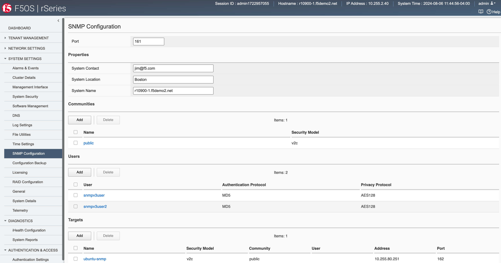

===========================================
rSeries F5OS-A SNMP Monitoring and Alerting
===========================================

Within rSeries tenants, SNMP support remains unchanged from existing BIG-IPs. SNMP monitoring and SNMP traps are supported in a similar manner as they are within a vCMP guest. You can continue to query the tenant via SNMP and receive SNMP traps. The F5OS-A platform layer handles the lower-level networking, and F5OS SNMP MIBs and traps are supported at this layer. The F5OS-A platform layer supported SNMP v1 and v2c versions initially, with SNMPv3 support added in F5OS-A 1.2.0.

Below are the latest SNMP MIBs as of the F5OS-A 1.6.0 release.

As of F5OS-A 1.6.0.the following NetSNMP MIBs are available:

- HOST-RESOURCES-MIB
- RFC1213-MIB
- EtherLike-MIB
- IANAifType-MIB
- IF-MIB
- IPV6-TC
- SNMP-COMMUNITY-MIB
- SNMP-FRAMEWORK-MIB
- SNMP-MPD-MIB
- SNMP-NOTIFICATION-MIB
- SNMP-TARGET-MIB
- SNMP-USER-BASED-SM-MIB
- SNMP-VIEW-BASED-ACM-MIB
- SNMPv2-CONF 
- SNMPv2-MIB
- SNMPv2 SMI
- SNMPv2-TC
- TRANSPORT-ADDRESS-MIB

As of F5OS-A 1.6.0.the following F5OS Appliance MIBs are available:

- F5-ALERT-DEF-MIB
- F5-COMMON-SMI-MIB
- F5-OS-LLDP-MIB
- F5-OS-PLATFORM-SMI-MIB
- F5-OS-SYSTEM-MIB
- F5-PLATFORM-STATS-MIB
- F5OS-APPLIANCE-ALERT-NOTIF-MIB

Adding Allowed IPs for SNMP
===========================

Adding Allowed IPs for SNMP via CLI
-----------------------------------

By default, SNMP queries are not allowed into the F5OS platform layer. Before enabling SNMP, you'll need to open the out-of-band management port on F5OS-A to allow SNMP queries from particular SNMP management endpoints. Below is an example of allowing any SNMP endpoint at 10.255.0.0 (prefix length of 24) to query the F5OS layer on port 161.

.. code-block:: bash

    r10900-2(config)# system allowed-ips allowed-ip snmp config ipv4 address 10.255.0.0 prefix-length 24 port 161
    r10900-2(config-allowed-ip-snmp)# commit
    Commit complete.

Currently you can add one IP address/port pair per **allowed-ip** name with an optional prefix length to specify a CIDR block containing multiple addresses. If you require more than one non-contiguous IP address, you can add it under another name as seen below. 

.. code-block:: bash

    appliance-1(config)# system allowed-ips allowed-ip SNMP-144 config ipv4 address 10.255.0.144 port 161 
    appliance-1(config-allowed-ip-SNMP)# commit
    Commit complete.
    appliance-1(config-allowed-ip-SNMP)# 

    appliance-1(config)# system allowed-ips allowed-ip SNMP-145 config ipv4 address 10.255.2.145 port 161 
    appliance-1(config-allowed-ip-SNMP)# commit
    Commit complete.
    appliance-1(config-allowed-ip-SNMP)# 

Adding Allowed IPs for SNMP via API
-----------------------------------

By default SNMP queries are not allowed into the F5OS layer. Before enabling SNMP, you'll need to open up the out-of-band management port on F5OS-A to allow SNMP queries. Below is an example of allowing an multiple SNMP endpoints at to access SNMP on the system on port 161.

.. code-block:: bash

    POST https://{{rseries_appliance1_ip}}:8888/restconf/data/openconfig-system:system/f5-allowed-ips:allowed-ips

Within the body of the API call, specific IP address/port combinations can be added under a given name. In the current release, you are limited to one IP address/port per name. 

.. code-block:: json

    {
        "allowed-ip": [
            {
                "name": "SNMP-142",
                "config": {
                    "ipv4": {
                        "address": "10.255.0.142",
                        "port": 161
                    }
                }
            },
            {
                "name": "SNMP-143",
                "config": {
                    "ipv4": {
                        "address": "10.255.0.143",
                        "port": 161
                    }
                }
            },
            {
                "name": "SNMP-144",
                "config": {
                    "ipv4": {
                        "address": "10.255.0.144",
                        "port": 161
                    }
                }
            }
        ]
    }

To view the allowed IPs in the API, use the following call.

.. code-block:: bash

    GET https://{{rseries_appliance1_ip}}:8888/restconf/data/openconfig-system:system/f5-allowed-ips:allowed-ips

The output will show the previously configured allowed-ips.

.. code-block:: json

    {
        "f5-allowed-ips:allowed-ips": {
            "allowed-ip": [
                {
                    "name": "SNMP-142",
                    "config": {
                        "ipv4": {
                            "address": "10.255.0.142",
                            "port": 161
                        }
                    }
                },
                {
                    "name": "SNMP-143",
                    "config": {
                        "ipv4": {
                            "address": "10.255.0.143",
                            "port": 161
                        }
                    }
                },
                {
                    "name": "SNMP-144",
                    "config": {
                        "ipv4": {
                            "address": "10.255.0.144",
                            "port": 161
                        }
                    }
                }
            ]
        }
    }

Adding Allowed IPs for SNMP via webUI
-----------------------------------

By default, SNMP queries are not allowed into the F5OS platform layer. Before enabling SNMP, you'll need to open up the out-of-band management port on F5OS-A to allow SNMP queries from particular SNMP management endpoints. Below is an example of allowing any SNMP endpoint at 10.255.0.0 (prefix length of 24) to query the F5OS layer on port 161.

Adding Interface and LAG descriptions
=====================================

It is highly recommended that you put interface descriptions in your configuration, so that they will show up in the description field when using SNMP polling.

Adding Interface and LAG descriptions via CLI
---------------------------------------------

To add descriptions for both the in-band, and out-of-band management ports in the CLI, follow the examples below.

.. code-block:: bash

    appliance-1(config)# interfaces interface 1.0 config description "Interface 1.0"
    appliance-1(config-interface-1.0)# exit
    appliance-1(config)# interfaces interface 2.0 config description "Interface 2.0"               
    appliance-1(config-interface-2.0)# exit
    appliance-1(config)# interfaces interface 3.0 config description "Interface 3.0"
    appliance-1(config-interface-3.0)# interfaces interface 4.0 config description "Interface 4.0"
    appliance-1(config-interface-4.0)# interfaces interface 5.0 config description "Interface 5.0"
    appliance-1(config-interface-5.0)# interfaces interface 6.0 config description "Interface 6.0"
    appliance-1(config-interface-6.0)# interfaces interface 7.0 config description "Interface 7.0"
    appliance-1(config-interface-7.0)# interfaces interface 8.0 config description "Interface 8.0"
    appliance-1(config-interface-8.0)# interfaces interface 9.0 config description "Interface 9.0"
    appliance-1(config-interface-9.0)# interfaces interface 10.0 config description "Interface 10.0"
    appliance-1(config-interface-10.0)# interfaces interface 11.0 config description "Interface 11.0"
    appliance-1(config-interface-11.0)# interfaces interface 12.0 config description "Interface 12.0"
    appliance-1(config-interface-12.0)# interfaces interface 13.0 config description "Interface 13.0"
    appliance-1(config-interface-13.0)# interfaces interface 14.0 config description "Interface 14.0"
    appliance-1(config-interface-14.0)# interfaces interface 15.0 config description "Interface 15.0"
    appliance-1(config-interface-15.0)# interfaces interface 16.0 config description "Interface 16.0"
    appliance-1(config-interface-16.0)# interfaces interface 17.0 config description "Interface 17.0"
    appliance-1(config-interface-17.0)# interfaces interface 18.0 config description "Interface 18.0"
    appliance-1(config-interface-18.0)# interfaces interface 19.0 config description "Interface 19.0"
    appliance-1(config-interface-19.0)# interfaces interface 20.0 config description "Interface 20.0"
    appliance-1(config-interface-20.0)# exit
    appliance-1(config)# commit
    Commit complete.
    appliance-1(config)# 

    appliance-1(config)# interfaces interface mgmt  config description "Interface mgmt"
    appliance-1(config-interface-mgmt)# commit

If Link Aggregation Groups (LAGs) are configured, descriptions should be added to the LAG interfaces as well.

.. code-block:: bash

    appliance-1(config)# interfaces interface Arista config description "Arista LAG"
    appliance-1(config-interface-Arista)# exit
    appliance-1(config)# interfaces interface HA-Interconnect  config description "HA-Interconnect LAG"
    appliance-1(config-interface-HA-Interconnect)# exit
    appliance-1(config)# commit 
    Commit complete.
    appliance-1(config)# 

Adding Interface and LAG descriptions via API
---------------------------------------------

To add descriptions for both the in-band, and out-of-band management ports in the CLI, follow the examples below. The API example below is for the r10000 models, which have 20 interfaces and one management port. For the r5000 series models you should adjust for 10 interfaces and one management port.

.. code-block:: bash

    PATCH https://{{rseries_appliance1_ip}}:8888/restconf/data/

.. code-block:: json

    {
        "openconfig-interfaces:interfaces": {
            "interface": [
                {
                    "name": "1.0",
                    "config": {
                        "description": "r10900 Interface 1.0"
                    }
                },
                {
                    "name": "2.0",
                    "config": {
                        "description": "r10900 Interface 2.0"
                    }
                },
                {
                    "name": "3.0",
                    "config": {
                        "description": "r10900 Interface 3.0"
                    }
                },
                {
                    "name": "4.0",
                    "config": {
                        "description": "r10900 Interface 4.0"
                    }
                },
                {
                    "name": "5.0",
                    "config": {
                        "description": "r10900 Interface 5.0"
                    }
                },
                {
                    "name": "6.0",
                    "config": {
                        "description": "r10900 Interface 6.0"
                    }
                },
                {
                    "name": "7.0",
                    "config": {
                        "description": "r10900 Interface 7.0"
                    }
                },
                {
                    "name": "8.0",
                    "config": {
                        "description": "r10900 Interface 8.0"
                    }
                },
                {
                    "name": "9.0",
                    "config": {
                        "description": "r10900 Interface 9.0"
                    }
                },
                {
                    "name": "10.0",
                    "config": {
                        "description": "r10900 Interface 10.0"
                    }
                },
                {
                    "name": "11.0",
                    "config": {
                        "description": "r10900 Interface 11.0"
                    }
                },
                {
                    "name": "12.0",
                    "config": {
                        "description": "r10900 Interface 12.0"
                    }
                },
                {
                    "name": "13.0",
                    "config": {
                        "description": "r10900 Interface 13.0"
                    }
                },
                {
                    "name": "14.0",
                    "config": {
                        "description": "r10900 Interface 14.0"
                    }
                },
                {
                    "name": "15.0",
                    "config": {
                        "description": "r10900 Interface 15.0"
                    }
                },
                {
                    "name": "16.0",
                    "config": {
                        "description": "r10900 Interface 16.0"
                    }
                },
                {
                    "name": "17.0",
                    "config": {
                        "description": "r10900 Interface 17.0"
                    }
                },
                {
                    "name": "18.0",
                    "config": {
                        "description": "r10900 Interface 18.0"
                    }
                },
                {
                    "name": "19.0",
                    "config": {
                        "description": "r10900 Interface 19.0"
                    }
                },
                {
                    "name": "20.0",
                    "config": {
                        "description": "r10900 Interface 20.0"
                    }
                },
                {
                    "name": "mgmt",
                    "config": {
                        "description": "r10900 Interface mgmt"
                    }
                }
            ]
        }
    }

If Link Aggregation Groups (LAGs) are configured, descriptions should be added to the LAG interfaces as well.

.. code-block:: bash

    PATCH https://{{rseries_appliance1_ip}}:8888/restconf/data/

The body of the API call should contain JSON data that includes the descriptions for each LAG.

.. code-block:: json

    {
        "openconfig-interfaces:interfaces": {
            "interface": [
                {
                    "name": "Arista",
                    "config": {
                        "description": "LAG to Arista"
                    }
                },
                {
                    "name": "HA-Interconnect",
                    "config": {
                        "description": "LAG to other r10900"
                    }
                }

            ]
        }
    }

Configuring SNMP Access
=======================

To enable SNMP, you'll need to configure basic SNMP parameters like **system contact**, **location** and **name**. Then configure access for specific SNMP communities and versions. Currently SNMP can be setup via CLI and API, with configuration via webUI added in F5OS-A 1.3.0. 

Configuring SNMP Access via CLI F5OS-A 1.2.0 or Later
-----------------------------------------------------

You can configure the SNMP System parameters including the **System Contact**, **System Location**, and **System Name** as seen below:

.. code-block:: bash

    appliance-1(config)# SNMPv2-MIB system sysContact jim@f5.com sysLocation Boston sysName r5900-2
    appliance-1(config)# commit
    Commit complete.
    appliance-1(config)# 

SNMP configuration was only available in the CLI and API prior to F5OS-A 1.3.0, and the CLI configuration was not intuitive. F5OS-A 1.2.0 has improved and streamlined SNMP configuration in the CLI and then configuration via the webUI was also added in F5OS-A 1.3.0. The example below is utilizing the new and improved SNMP CLI configuration for rSeries systems running F5OS-A 1.2.0 or later. 

Enabling SNMP can be done from the CLI by configuring the **public** SNMP community, and then configuring a **security-model**. The command below sets up an SNMP community of **public** with v1 and v2c security models. You may choose to enable both of these security models or only one.

.. code-block:: bash

    r5900-2(config)# system snmp communities community public config security-model [ v1 v2c ]
    r5900-2(config-community-public)# exit
    r5900-2(config)# commit

You can then display the SNMP community configuration using the **show system snmp** command.

.. code-block:: bash

    r5900-2(config)# do show system snmp 
    system snmp engine-id state engine-id 80:00:2f:f4:03:00:94:a1:69:35:02
    system snmp engine-id state type mac
                    SECURITY    
    NAME    NAME    MODEL       
    ----------------------------
    public  public  [ v1 v2c ]  

    r5900-2(config)# 

You may also configure SNMP users for SNMPv3 support, since SNMPv3 is a user-based security model. This provides additional support for authentication and privacy protocols. Authentication protocols of **md5**, **sha**, or **none** are supported. For privacy protocols **aes**, **des**, or **none** are supported. You'll then be prompted to enter the privacy-password.

.. code-block:: bash

    r5900-2(config)# system snmp users user snmpv3user config authentication-protocol md5 privacy-protocol aes privacy-password 
    (<string, min: 8 chars, max: 32 chars>): **************
    r5900-2(config-user-snmpv3user)# commit
    Commit complete.

You may display the SNMP user configuration by entering the command **show system snmp users**.

.. code-block:: bash

    r5900-2(config)# do show system snmp users
                            AUTHENTICATION  PRIVACY   
    NAME        NAME        PROTOCOL        PROTOCOL  
    --------------------------------------------------
    snmpv3user  snmpv3user  md5             aes       

    r5900-2(config)# 

Configuring SNMP Access via CLI Prior to F5OS-A 1.2.0
-----------------------------------------------------

Below is the SNMP CLI configuration for systems running a version prior to F5OS-A 1.2.0. You can configure the SNMP System parameters including the **System Contact**, **System Location**, and **System Name** as seen below:

.. code-block:: bash

    appliance-1(config)# SNMPv2-MIB system sysContact jim@f5.com sysLocation Boston sysName r5900-2
    appliance-1(config)# commit
    Commit complete.
    appliance-1(config)# 

Enabling SNMP can be done from the CLI by configuring the public SNMP community, and then configuring a Security Access Group. Below is an example of enabling SNMP monitoring at the F5OS layer. F5OS only supports read-only access for SNMP monitoring.

.. code-block:: bash

    appliance-1# config
    Entering configuration mode terminal
    appliance-1(config)# SNMP-COMMUNITY-MIB snmpCommunityTable snmpCommunityEntry public snmpCommunityName public snmpCommunitySecurityName public
    appliance-1(config-snmpCommunityEntry-public)# exit
  

To configure a Security Group for both SNMPv1 and SNMPv2c.

.. code-block:: bash

    appliance-1(config)# SNMP-VIEW-BASED-ACM-MIB vacmSecurityToGroupTable vacmSecurityToGroupEntry 2 public vacmGroupName read-access
    appliance-1(config-vacmSecurityToGroupEntry-2/public)# exit
    appliance-1(config)# SNMP-VIEW-BASED-ACM-MIB vacmSecurityToGroupTable vacmSecurityToGroupEntry 1 public vacmGroupName read-access
    appliance-1(config-vacmSecurityToGroupEntry-1/public)# exit
    appliance-1(config)# commit
    Commit complete.
    appliance-1(config)# 

Configuring SNMP Access via API
-------------------------------

You can configure the SNMP System parameters including the **System Contact**, **System Location**, and **System Name** as seen below:

.. code-block:: bash

    PATCH https://{{rseries_appliance1_ip}}:8888/restconf/data/SNMPv2-MIB:SNMPv2-MIB/system/sysContact

.. code-block:: json

    {
        "SNMPv2-MIB:sysContact": "jim@f5.com",
        "SNMPv2-MIB:sysName": "Boston-r10900-1",
        "SNMPv2-MIB:sysLocation": "Boston"
    }

Enabling SNMP can de done from the API by configuring the **public** SNMP community. Below is an example of enabling SNMP monitoring at the F5OS layer. F5OS only supports read-only access for SNMP monitoring. 

.. code-block:: bash

    PATCH https://{{rseries_appliance1_ip}}:8888/restconf/data/SNMP-VIEW-BASED-ACM-MIB:SNMP-VIEW-BASED-ACM-MIB

.. code-block:: json

    {
        "SNMP-VIEW-BASED-ACM-MIB:SNMP-VIEW-BASED-ACM-MIB": {
            "vacmSecurityToGroupTable": {
                "vacmSecurityToGroupEntry": [
                    {
                        "vacmSecurityModel": 1,
                        "vacmSecurityName": "public",
                        "vacmGroupName": "read-access",
                        "vacmSecurityToGroupStorageType": "nonVolatile"
                    },
                    {
                        "vacmSecurityModel": 2,
                        "vacmSecurityName": "public",
                        "vacmGroupName": "read-access",
                        "vacmSecurityToGroupStorageType": "nonVolatile"
                    }
                ]
            },
            "vacmAccessTable": {
                "vacmAccessEntry": [
                    {
                        "vacmGroupName": "read-access",
                        "vacmAccessContextPrefix": "",
                        "vacmAccessSecurityModel": 0,
                        "vacmAccessSecurityLevel": "noAuthNoPriv",
                        "vacmAccessContextMatch": "exact",
                        "vacmAccessReadViewName": "internet",
                        "vacmAccessNotifyViewName": "internet",
                        "vacmAccessStorageType": "nonVolatile"
                    }
                ]
            },
            "vacmViewTreeFamilyTable": {
                "vacmViewTreeFamilyEntry": [
                    {
                        "vacmViewTreeFamilyViewName": "internet",
                        "vacmViewTreeFamilySubtree": "1.3.6.1",
                        "vacmViewTreeFamilyMask": "",
                        "vacmViewTreeFamilyType": "included",
                        "vacmViewTreeFamilyStorageType": "nonVolatile"
                    }
                ]
            }
        }
    }

Configuring SNMP Access via webUI
---------------------------------

SNMP configuration via the webUI was added in the F5OS-A 1.3.0 release. You may configure SNMP Communities, SNMP Users, and SNMP Targets. SNMP is configured under **System Settings -> SNMP Configuration**..

An SNMP Community may be added for v1, v2c, or both v1 and v2c.

SNMP users can be added for environments which utilize SNMPv3.

.. image:: images/rseries_monitoring_snmp/image4.png
  :align: center
  :scale: 100%

SNMP Trap receivers may be added and either a community of a user is added depending on the security model.

.. image:: images/rseries_monitoring_snmp/image5.png
  :align: center
  :scale: 100%

SNMP Trap Support in F5OS-A
===========================

You can enable SNMP traps for the F5OS-A platform layer. The **F5OS-APPLIANCE-ALERT-NOTIF-MIB** provides details about supported rSeries appliance SNMP traps. Below is the current full list of traps supported as of F5OS-A 1.6.0. NOTE: the file will contain alerts for both F5OS-A (rSeries appliances) and F5OS-C (VELOS chassis). You only need to rely on one file if you are using both platforms. Some traps may be specific to one platform or the other. 

SNMP Trap events that note a fault should also trigger an alert that can be viewed in the show alerts output in the CLI, WebUI, and API. They are also logged in the snmp.log file. Once a clear SNMP Trap is sent, it should clear the event from the **show events** output.

+----------------------------+----------------------------------+
| **Alert**                  | **OID**                          |
+============================+==================================+
| hardware-device-fault      | .1.3.6.1.4.1.12276.1.1.1.65536   |
+----------------------------+----------------------------------+
| firmware-fault             | .1.3.6.1.4.1.12276.1.1.1.65537   |
+----------------------------+----------------------------------+
| unknown-alarm              | .1.3.6.1.4.1.12276.1.1.1.65538   |
+----------------------------+----------------------------------+
| memory-fault               | .1.3.6.1.4.1.12276.1.1.1.65539   |
+----------------------------+----------------------------------+
| drive-fault                | .1.3.6.1.4.1.12276.1.1.1.65540   |
+----------------------------+----------------------------------+
| cpu-fault                  | .1.3.6.1.4.1.12276.1.1.1.65541   |
+----------------------------+----------------------------------+
| pcie-fault                 | .1.3.6.1.4.1.12276.1.1.1.65542   |
+----------------------------+----------------------------------+
| aom-fault                  | .1.3.6.1.4.1.12276.1.1.1.65543   |
+----------------------------+----------------------------------+
| drive-capacity-fault       | .1.3.6.1.4.1.12276.1.1.1.65544   |
+----------------------------+----------------------------------+
| power-fault                | .1.3.6.1.4.1.12276.1.1.1.65545   |
+----------------------------+----------------------------------+
| thermal-fault              | .1.3.6.1.4.1.12276.1.1.1.65546   |
+----------------------------+----------------------------------+
| drive-thermal-throttle     | .1.3.6.1.4.1.12276.1.1.1.65547   |
+----------------------------+----------------------------------+
| blade-thermal-fault        | .1.3.6.1.4.1.12276.1.1.1.65548   |
+----------------------------+----------------------------------+
| blade-hardware-fault       | .1.3.6.1.4.1.12276.1.1.1.65549   |
+----------------------------+----------------------------------+
| firmware-update-status     | .1.3.6.1.4.1.12276.1.1.1.65550   |
+----------------------------+----------------------------------+
| drive-utilization          | .1.3.6.1.4.1.12276.1.1.1.65551   |
+----------------------------+----------------------------------+
| sensor-fault               | .1.3.6.1.4.1.12276.1.1.1.65577   |
+----------------------------+----------------------------------+
| module-present             | .1.3.6.1.4.1.12276.1.1.1.66304   |
+----------------------------+----------------------------------+
| psu-fault                  | .1.3.6.1.4.1.12276.1.1.1.66305   |
+----------------------------+----------------------------------+
| lcd-fault                  | .1.3.6.1.4.1.12276.1.1.1.66306   |
+----------------------------+----------------------------------+
| module-communication-error | .1.3.6.1.4.1.12276.1.1.1.66307   |
+----------------------------+----------------------------------+
| fips-fault                 | .1.3.6.1.4.1.12276.1.1.1.196308  |
+----------------------------+----------------------------------+
| fipsError                  | .1.3.6.1.4.1.12276.1.1.1.196608  |
+----------------------------+----------------------------------+
| core-dump                  | .1.3.6.1.4.1.12276.1.1.1.327680  |
+----------------------------+----------------------------------+
| reboot                     | .1.3.6.1.4.1.12276.1.1.1.327681  |
+----------------------------+----------------------------------+
| raid-event                 | .1.3.6.1.4.1.12276.1.1.1.393216  |
+----------------------------+----------------------------------+
| backplane                  | .1.3.6.1.4.1.12276.1.1.1.262144  |
+----------------------------+----------------------------------+
| txPwrHiAlarm               | .1.3.6.1.4.1.12276.1.1.1.262400  |
+----------------------------+----------------------------------+
| txPwrHiWarn                | .1.3.6.1.4.1.12276.1.1.1.262401  |
+----------------------------+----------------------------------+
| txPwrLoAlarm               | .1.3.6.1.4.1.12276.1.1.1.262402  |
+----------------------------+----------------------------------+
| txPwrLoWarn                | .1.3.6.1.4.1.12276.1.1.1.262403  |
+----------------------------+----------------------------------+
| rxPwrHiAlarm               | .1.3.6.1.4.1.12276.1.1.1.262404  |
+----------------------------+----------------------------------+
| rxPwrHiWarn                | .1.3.6.1.4.1.12276.1.1.1.262405  |
+----------------------------+----------------------------------+
| rxPwrLoAlarm               | .1.3.6.1.4.1.12276.1.1.1.262406  |
+----------------------------+----------------------------------+
| rxPwrLoWarn                | .1.3.6.1.4.1.12276.1.1.1.262407  |
+----------------------------+----------------------------------+
| txBiasHiAlarm              | .1.3.6.1.4.1.12276.1.1.1.262408  |
+----------------------------+----------------------------------+
| txBiasHiWarn               | .1.3.6.1.4.1.12276.1.1.1.262409  |
+----------------------------+----------------------------------+
| txBiasLoAlarm              | .1.3.6.1.4.1.12276.1.1.1.262410  |
+----------------------------+----------------------------------+
| txBiasLoWarn               | .1.3.6.1.4.1.12276.1.1.1.262411  |
+----------------------------+----------------------------------+
| ddmTempHiAlarm             | .1.3.6.1.4.1.12276.1.1.1.262412  |
+----------------------------+----------------------------------+
| ddmTempHiWarn              | .1.3.6.1.4.1.12276.1.1.1.262413  |
+----------------------------+----------------------------------+
| ddmTempLoAlarm             | .1.3.6.1.4.1.12276.1.1.1.262414  |
+----------------------------+----------------------------------+
| ddmTempLoWarn              | .1.3.6.1.4.1.12276.1.1.1.262415  |
+----------------------------+----------------------------------+
| ddmVccHiAlarm              | .1.3.6.1.4.1.12276.1.1.1.262416  |
+----------------------------+----------------------------------+
| ddmVccHiWarn               | .1.3.6.1.4.1.12276.1.1.1.262417  |
+----------------------------+----------------------------------+
| ddmVccLoAlarm              | .1.3.6.1.4.1.12276.1.1.1.262418  |
+----------------------------+----------------------------------+
| ddmVccLoWarn               | .1.3.6.1.4.1.12276.1.1.1.262419  |
+----------------------------+----------------------------------+

SNMP Trap Details
=================

Device Fault Traps
------------------

**hardware-device-fault          .1.3.6.1.4.1.12276.1.1.1.65536**   

This set of taps may indicate a fault with various hardware components on the rSeries appliance like CPUs or fans. Examine the trap for specific details of what subsystem has failed to determine the proper troubleshooting steps to persue. 

.. code-block:: bash

    r10900-1# file show log/system/snmp.log | include hardware-device-fault
    <INFO> 11-Jul-2022::06:29:16.529 appliance-1 confd[127]: snmp snmpv2-trap reqid=1257440640 10.255.0.145:161 (TimeTicks sysUpTime=8225)(OBJECT IDENTIFIER snmpTrapOID=hardware-device-fault)(OCTET STRING alertSource=appliance)(INTEGER alertEffect=2)(INTEGER alertSeverity=8)(OCTET STRING alertTimeStamp=2022-07-11 06:29:15.245012010 UTC)(OCTET STRING alertDescription=Deasserted: CPU HW correctable error)
    <INFO> 11-Jul-2022::06:29:16.529 appliance-1 confd[127]: snmp snmpv2-trap reqid=1257440640 10.255.0.144:161 (TimeTicks sysUpTime=8225)(OBJECT IDENTIFIER snmpTrapOID=hardware-device-fault)(OCTET STRING alertSource=appliance)(INTEGER alertEffect=2)(INTEGER alertSeverity=8)(OCTET STRING alertTimeStamp=2022-07-11 06:29:15.245012010 UTC)(OCTET STRING alertDescription=Deasserted: CPU HW correctable error)
    <INFO> 11-Jul-2022::06:29:17.332 appliance-1 confd[127]: snmp snmpv2-trap reqid=1257440650 10.255.0.145:161 (TimeTicks sysUpTime=8305)(OBJECT IDENTIFIER snmpTrapOID=hardware-device-fault)(OCTET STRING alertSource=fan-7)(INTEGER alertEffect=2)(INTEGER alertSeverity=8)(OCTET STRING alertTimeStamp=2022-07-11 06:29:15.768784161 UTC)(OCTET STRING alertDescription=fan 7 at 27051 RPM)
    <INFO> 11-Jul-2022::06:29:17.333 appliance-1 confd[127]: snmp snmpv2-trap reqid=1257440650 10.255.0.144:161 (TimeTicks sysUpTime=8305)(OBJECT IDENTIFIER snmpTrapOID=hardware-device-fault)(OCTET STRING alertSource=fan-7)(INTEGER alertEffect=2)(INTEGER alertSeverity=8)(OCTET STRING alertTimeStamp=2022-07-11 06:29:15.768784161 UTC)(OCTET STRING alertDescription=fan 7 at 27051 RPM)
    <INFO> 11-Jul-2022::06:29:17.433 appliance-1 confd[127]: snmp snmpv2-trap reqid=1257440651 10.255.0.145:161 (TimeTicks sysUpTime=8315)(OBJECT IDENTIFIER snmpTrapOID=hardware-device-fault)(OCTET STRING alertSource=fan-8)(INTEGER alertEffect=2)(INTEGER alertSeverity=8)(OCTET STRING alertTimeStamp=2022-07-11 06:29:15.770124231 UTC)(OCTET STRING alertDescription=fan 8 at 26857 RPM)
    <INFO> 11-Jul-2022::06:29:17.433 appliance-1 confd[127]: snmp snmpv2-trap reqid=1257440651 10.255.0.144:161 (TimeTicks sysUpTime=8315)(OBJECT IDENTIFIER snmpTrapOID=hardware-device-fault)(OCTET STRING alertSource=fan-8)(INTEGER alertEffect=2)(INTEGER alertSeverity=8)(OCTET STRING alertTimeStamp=2022-07-11 06:29:15.770124231 UTC)(OCTET STRING alertDescription=fan 8 at 26857 RPM)
    <INFO> 11-Jul-2022::06:29:18.237 appliance-1 confd[127]: snmp snmpv2-trap reqid=1257440659 10.255.0.145:161 (TimeTicks sysUpTime=8395)(OBJECT IDENTIFIER snmpTrapOID=hardware-device-fault)(OCTET STRING alertSource=fan-6)(INTEGER alertEffect=2)(INTEGER alertSeverity=8)(OCTET STRING alertTimeStamp=2022-07-11 06:29:15.781064597 UTC)(OCTET STRING alertDescription=fan 6 at 27075 RPM)
    <INFO> 11-Jul-2022::06:29:18.237 appliance-1 confd[127]: snmp snmpv2-trap reqid=1257440659 10.255.0.144:161 (TimeTicks sysUpTime=8395)(OBJECT IDENTIFIER snmpTrapOID=hardware-device-fault)(OCTET STRING alertSource=fan-6)(INTEGER alertEffect=2)(INTEGER alertSeverity=8)(OCTET STRING alertTimeStamp=2022-07-11 06:29:15.781064597 UTC)(OCTET STRING alertDescription=fan 6 at 27075 RPM)
    <INFO> 11-Jul-2022::06:29:19.041 appliance-1 confd[127]: snmp snmpv2-trap reqid=1257440667 10.255.0.145:161 (TimeTicks sysUpTime=8476)(OBJECT IDENTIFIER snmpTrapOID=hardware-device-fault)(OCTET STRING alertSource=appliance)(INTEGER alertEffect=2)(INTEGER alertSeverity=8)(OCTET STRING alertTimeStamp=2022-07-11 06:29:15.791114234 UTC)(OCTET STRING alertDescription=Deasserted: CPU thermal trip fault)
    <INFO> 11-Jul-2022::06:29:19.041 appliance-1 confd[127]: snmp snmpv2-trap reqid=1257440667 10.255.0.144:161 (TimeTicks sysUpTime=8476)(OBJECT IDENTIFIER snmpTrapOID=hardware-device-fault)(OCTET STRING alertSource=appliance)(INTEGER alertEffect=2)(INTEGER alertSeverity=8)(OCTET STRING alertTimeStamp=2022-07-11 06:29:15.791114234 UTC)(OCTET STRING alertDescription=Deasserted: CPU thermal trip fault)
    <INFO> 11-Jul-2022::06:29:19.643 appliance-1 confd[127]: snmp snmpv2-trap reqid=1257440675 10.255.0.145:161 (TimeTicks sysUpTime=8536)(OBJECT IDENTIFIER snmpTrapOID=hardware-device-fault)(OCTET STRING alertSource=fan-5)(INTEGER alertEffect=2)(INTEGER alertSeverity=8)(OCTET STRING alertTimeStamp=2022-07-11 06:29:16.022807820 UTC)(OCTET STRING alertDescription=fan 5 at 26905 RPM)
    <INFO> 11-Jul-2022::06:29:19.643 appliance-1 confd[127]: snmp snmpv2-trap reqid=1257440675 10.255.0.144:161 (TimeTicks sysUpTime=8536)(OBJECT IDENTIFIER snmpTrapOID=hardware-device-fault)(OCTET STRING alertSource=fan-5)(INTEGER alertEffect=2)(INTEGER alertSeverity=8)(OCTET STRING alertTimeStamp=2022-07-11 06:29:16.022807820 UTC)(OCTET STRING alertDescription=fan 5 at 26905 RPM)
    <INFO> 11-Jul-2022::06:29:20.446 appliance-1 confd[127]: snmp snmpv2-trap reqid=1257440683 10.255.0.145:161 (TimeTicks sysUpTime=8616)(OBJECT IDENTIFIER snmpTrapOID=hardware-device-fault)(OCTET STRING alertSource=appliance)(INTEGER alertEffect=2)(INTEGER alertSeverity=8)(OCTET STRING alertTimeStamp=2022-07-11 06:29:16.201227249 UTC)(OCTET STRING alertDescription=Deasserted: CPU hot fault)
    <INFO> 11-Jul-2022::06:29:20.446 appliance-1 confd[127]: snmp snmpv2-trap reqid=1257440683 10.255.0.144:161 (TimeTicks sysUpTime=8616)(OBJECT IDENTIFIER snmpTrapOID=hardware-device-fault)(OCTET STRING alertSource=appliance)(INTEGER alertEffect=2)(INTEGER alertSeverity=8)(OCTET STRING alertTimeStamp=2022-07-11 06:29:16.201227249 UTC)(OCTET STRING alertDescription=Deasserted: CPU hot fault)
    <INFO> 11-Jul-2022::06:29:20.546 appliance-1 confd[127]: snmp snmpv2-trap reqid=1257440684 10.255.0.145:161 (TimeTicks sysUpTime=8626)(OBJECT IDENTIFIER snmpTrapOID=hardware-device-fault)(OCTET STRING alertSource=fan-4)(INTEGER alertEffect=2)(INTEGER alertSeverity=8)(OCTET STRING alertTimeStamp=2022-07-11 06:29:16.202497586 UTC)(OCTET STRING alertDescription=fan 4 at 26954 RPM)
    <INFO> 11-Jul-2022::06:29:20.546 appliance-1 confd[127]: snmp snmpv2-trap reqid=1257440684 10.255.0.144:161 (TimeTicks sysUpTime=8626)(OBJECT IDENTIFIER snmpTrapOID=hardware-device-fault)(OCTET STRING alertSource=fan-4)(INTEGER alertEffect=2)(INTEGER alertSeverity=8)(OCTET STRING alertTimeStamp=2022-07-11 06:29:16.202497586 UTC)(OCTET STRING alertDescription=fan 4 at 26954 RPM)

**firmware-fault                 .1.3.6.1.4.1.12276.1.1.1.65537**

This set of taps may indicate a fault or temporary warning with the firmware upgrade process. Monitor the firmware upgrade process via SNMP traps, or via the CLI, API, or webUI alerts. These may occur as part of a software update to F5OS. Not every upgrade requires firmware to be updated. You may see different components having their firmware upgraded such as (lcd, bios, cpld, lop app, sirr, atse, asw, nso, nvme0, nvme1). It is important not to interrupt the firmware upgrade process. If you see a firmware update alert raised for a specific component, you should not make any changes to the system until each componenent returns a Firmware update completed message. In newer versions of F5OS, the webUI will display a banner at the top of the page while firmware updates run, and will disappear when they complete. The banner will have a link to the **Alarms and Events** page which will show the current status of the firmware updates as seen below.

.. image:: images/rseries_monitoring_snmp/imagefirmwareupgrade.png
  :align: center
  :scale: 100%

.. code-block:: bash

    r10900-1# file show log/system/snmp.log | include firmware-fault
    <INFO> 11-Jul-2022::06:29:16.880 appliance-1 confd[127]: snmp snmpv2-trap reqid=1257440645 10.255.0.145:161 (TimeTicks sysUpTime=8260)(OBJECT IDENTIFIER snmpTrapOID=firmware-fault)(OCTET STRING alertSource=appliance)(INTEGER alertEffect=2)(INTEGER alertSeverity=8)(OCTET STRING alertTimeStamp=2022-07-11 06:29:15.265507257 UTC)(OCTET STRING alertDescription=Deasserted: Task stack warning)
    <INFO> 11-Jul-2022::06:29:16.881 appliance-1 confd[127]: snmp snmpv2-trap reqid=1257440645 10.255.0.144:161 (TimeTicks sysUpTime=8260)(OBJECT IDENTIFIER snmpTrapOID=firmware-fault)(OCTET STRING alertSource=appliance)(INTEGER alertEffect=2)(INTEGER alertSeverity=8)(OCTET STRING alertTimeStamp=2022-07-11 06:29:15.265507257 UTC)(OCTET STRING alertDescription=Deasserted: Task stack warning)
    <INFO> 11-Jul-2022::06:29:19.342 appliance-1 confd[127]: snmp snmpv2-trap reqid=1257440671 10.255.0.145:161 (TimeTicks sysUpTime=8506)(OBJECT IDENTIFIER snmpTrapOID=firmware-fault)(OCTET STRING alertSource=appliance)(INTEGER alertEffect=2)(INTEGER alertSeverity=8)(OCTET STRING alertTimeStamp=2022-07-11 06:29:15.797173242 UTC)(OCTET STRING alertDescription=Deasserted: Heap running low)
    <INFO> 11-Jul-2022::06:29:19.342 appliance-1 confd[127]: snmp snmpv2-trap reqid=1257440671 10.255.0.144:161 (TimeTicks sysUpTime=8506)(OBJECT IDENTIFIER snmpTrapOID=firmware-fault)(OCTET STRING alertSource=appliance)(INTEGER alertEffect=2)(INTEGER alertSeverity=8)(OCTET STRING alertTimeStamp=2022-07-11 06:29:15.797173242 UTC)(OCTET STRING alertDescription=Deasserted: Heap running low)
    <INFO> 11-Jul-2022::06:29:22.907 appliance-1 confd[127]: snmp snmpv2-trap reqid=1257440708 10.255.0.145:161 (TimeTicks sysUpTime=8862)(OBJECT IDENTIFIER snmpTrapOID=firmware-fault)(OCTET STRING alertSource=appliance)(INTEGER alertEffect=2)(INTEGER alertSeverity=8)(OCTET STRING alertTimeStamp=2022-07-11 06:29:16.233395912 UTC)(OCTET STRING alertDescription=Deasserted: ARM exception available)
    <INFO> 11-Jul-2022::06:29:22.907 appliance-1 confd[127]: snmp snmpv2-trap reqid=1257440708 10.255.0.144:161 (TimeTicks sysUpTime=8862)(OBJECT IDENTIFIER snmpTrapOID=firmware-fault)(OCTET STRING alertSource=appliance)(INTEGER alertEffect=2)(INTEGER alertSeverity=8)(OCTET STRING alertTimeStamp=2022-07-11 06:29:16.233395912 UTC)(OCTET STRING alertDescription=Deasserted: ARM exception available)
    <INFO> 11-Jul-2022::06:29:28.939 appliance-1 confd[127]: snmp snmpv2-trap reqid=1257440769 10.255.0.145:161 (TimeTicks sysUpTime=9466)(OBJECT IDENTIFIER snmpTrapOID=firmware-fault)(OCTET STRING alertSource=appliance)(INTEGER alertEffect=2)(INTEGER alertSeverity=8)(OCTET STRING alertTimeStamp=2022-07-11 06:29:19.908471420 UTC)(OCTET STRING alertDescription=Deasserted: Watchdog timer warning)

**unknown-alarm                  .1.3.6.1.4.1.12276.1.1.1.65538**

.. code-block:: bash

    r10900-1# file show log/system/snmp.log | include unknown-alarm

**memory-fault                   .1.3.6.1.4.1.12276.1.1.1.65539**

.. code-block:: bash

    r10900-1# file show log/system/snmp.log | include memory-fault

**drive-fault                    .1.3.6.1.4.1.12276.1.1.1.65540**

.. code-block:: bash

    r10900-1# file show log/system/snmp.log | include drive-fault

**cpu-fault                      .1.3.6.1.4.1.12276.1.1.1.65541**

.. code-block:: bash

    r10900-1# file show log/system/snmp.log | include cpu-fault

**pcie-fault                     .1.3.6.1.4.1.12276.1.1.1.65542**

.. code-block:: bash

    r10900-1# file show log/system/snmp.log | include pcie-fault

**aom-fault                      .1.3.6.1.4.1.12276.1.1.1.65543**

.. code-block:: bash

    r10900-1# file show log/system/snmp.log | include aom-fault

**drive-capacity-fault           .1.3.6.1.4.1.12276.1.1.1.65544**

.. code-block:: bash

    r10900-1# file show log/system/snmp.log | include drive-capacity-fault
    <INFO> 12-Apr-2023::11:54:10.563 appliance-1 confd[116]: snmp snmpv2-trap reqid=608130731 10.255.8.22:6011 (TimeTicks sysUpTime=87079)(OBJECT IDENTIFIER snmpTrapOID=drive-capacity-fault)(OCTET STRING alertSource=appliance)(INTEGER alertEffect=1)(INTEGER alertSeverity=2)(OCTET STRING alertTimeStamp=2023-04-12 11:54:10.558711877 UTC)(OCTET STRING alertDescription=Running out of drive capacity)
    <INFO> 12-Apr-2023::11:54:10.613 appliance-1 confd[116]: snmp snmpv2-trap reqid=608130732 10.255.8.22:6011 (TimeTicks sysUpTime=87084)(OBJECT IDENTIFIER snmpTrapOID=drive-capacity-fault)(OCTET STRING alertSource=appliance)(INTEGER alertEffect=2)(INTEGER alertSeverity=8)(OCTET STRING alertTimeStamp=2023-04-12 11:54:10.558725204 UTC)(OCTET STRING alertDescription=Drive usage exceeded 97%, used=100%)
    <INFO> 12-Apr-2023::11:54:35.167 appliance-1 confd[116]: snmp snmpv2-trap reqid=608130733 10.255.8.22:6011 (TimeTicks sysUpTime=89540)(OBJECT IDENTIFIER snmpTrapOID=drive-capacity-fault)(OCTET STRING alertSource=appliance)(INTEGER alertEffect=0)(INTEGER alertSeverity=8)(OCTET STRING alertTimeStamp=2023-04-12 11:54:35.162718848 UTC)(OCTET STRING alertDescription=Running out of drive capacity)
    <INFO> 12-Apr-2023::11:54:35.217 appliance-1 confd[116]: snmp snmpv2-trap reqid=608130734 10.255.8.22:6011 (TimeTicks sysUpTime=89545)(OBJECT IDENTIFIER snmpTrapOID=drive-capacity-fault)(OCTET STRING alertSource=appliance)(INTEGER alertEffect=2)(INTEGER alertSeverity=8)(OCTET STRING alertTimeStamp=2023-04-12 11:54:35.162734807 UTC)(OCTET STRING alertDescription=Drive usage with in range, used=54%)

**power-fault                    .1.3.6.1.4.1.12276.1.1.1.65545**

.. code-block:: bash

    r10900-1# file show log/system/snmp.log | include power-fault
    <INFO> 10-Jul-2023::13:43:27.453 appliance-1 confd[130]: snmp snmpv2-trap reqid=1977423963 10.255.0.144:161 (TimeTicks sysUpTime=15326)(OBJECT IDENTIFIER snmpTrapOID=power-fault)(OCTET STRING alertSource=appliance)(INTEGER alertEffect=2)(INTEGER alertSeverity=8)(OCTET STRING alertTimeStamp=2023-07-10 17:43:21.975395131 UTC)(OCTET STRING alertDescription=Deasserted: SSD1 12V power fault)
    <INFO> 10-Jul-2023::13:43:27.755 appliance-1 confd[130]: snmp snmpv2-trap reqid=1977423966 10.255.0.144:161 (TimeTicks sysUpTime=15356)(OBJECT IDENTIFIER snmpTrapOID=power-fault)(OCTET STRING alertSource=appliance)(INTEGER alertEffect=2)(INTEGER alertSeverity=8)(OCTET STRING alertTimeStamp=2023-07-10 17:43:22.298853193 UTC)(OCTET STRING alertDescription=Deasserted: NSE +3.0V fault)
    <INFO> 10-Jul-2023::13:43:27.855 appliance-1 confd[130]: snmp snmpv2-trap reqid=1977423967 10.255.0.144:161 (TimeTicks sysUpTime=15366)(OBJECT IDENTIFIER snmpTrapOID=power-fault)(OCTET STRING alertSource=appliance)(INTEGER alertEffect=2)(INTEGER alertSeverity=8)(OCTET STRING alertTimeStamp=2023-07-10 17:43:22.300188096 UTC)(OCTET STRING alertDescription=Deasserted: ASW +1.12V VCCTGXB fault)
    <INFO> 10-Jul-2023::13:43:27.955 appliance-1 confd[130]: snmp snmpv2-trap reqid=1977423968 10.255.0.144:161 (TimeTicks sysUpTime=15376)(OBJECT IDENTIFIER snmpTrapOID=power-fault)(OCTET STRING alertSource=appliance)(INTEGER alertEffect=2)(INTEGER alertSeverity=8)(OCTET STRING alertTimeStamp=2023-07-10 17:43:22.301555964 UTC)(OCTET STRING alertDescription=Deasserted: ATSE2 +1.12V VCCRGXB fault)
    <INFO> 10-Jul-2023::13:43:28.056 appliance-1 confd[130]: snmp snmpv2-trap reqid=1977423969 10.255.0.144:161 (TimeTicks sysUpTime=15386)(OBJECT IDENTIFIER snmpTrapOID=power-fault)(OCTET STRING alertSource=appliance)(INTEGER alertEffect=2)(INTEGER alertSeverity=8)(OCTET STRING alertTimeStamp=2023-07-10 17:43:22.302869268 UTC)(OCTET STRING alertDescription=Deasserted: ATSE1 +1.12V VCCRGXB fault)
    <INFO> 10-Jul-2023::13:43:28.156 appliance-1 confd[130]: snmp snmpv2-trap reqid=1977423970 10.255.0.144:161 (TimeTicks sysUpTime=15396)(OBJECT IDENTIFIER snmpTrapOID=power-fault)(OCTET STRING alertSource=appliance)(INTEGER alertEffect=2)(INTEGER alertSeverity=8)(OCTET STRING alertTimeStamp=2023-07-10 17:43:22.304281027 UTC)(OCTET STRING alertDescription=Deasserted: CPU +1.0V PVCCANA fault)
    <INFO> 10-Jul-2023::13:43:28.257 appliance-1 confd[130]: snmp snmpv2-trap reqid=1977423971 10.255.0.144:161 (TimeTicks sysUpTime=15406)(OBJECT IDENTIFIER snmpTrapOID=power-fault)(OCTET STRING alertSource=appliance)(INTEGER alertEffect=2)(INTEGER alertSeverity=8)(OCTET STRING alertTimeStamp=2023-07-10 17:43:22.306889907 UTC)(OCTET STRING alertDescription=Deasserted: SUS +1.05V PCH fault)

**thermal-fault                  .1.3.6.1.4.1.12276.1.1.1.65546**

.. code-block:: bash

    r10900-1# file show log/system/snmp.log | include thermal-fault
    <INFO> 10-Jul-2023::13:43:24.288 appliance-1 confd[130]: snmp snmpv2-trap reqid=1977423931 10.255.0.144:161 (TimeTicks sysUpTime=15009)(OBJECT IDENTIFIER snmpTrapOID=thermal-fault)(OCTET STRING alertSource=appliance)(INTEGER alertEffect=2)(INTEGER alertSeverity=8)(OCTET STRING alertTimeStamp=2023-07-10 17:43:18.753307182 UTC)(OCTET STRING alertDescription=NSE_3 at +29.6 degC)
    <INFO> 10-Jul-2023::13:43:24.389 appliance-1 confd[130]: snmp snmpv2-trap reqid=1977423932 10.255.0.144:161 (TimeTicks sysUpTime=15019)(OBJECT IDENTIFIER snmpTrapOID=thermal-fault)(OCTET STRING alertSource=appliance)(INTEGER alertEffect=2)(INTEGER alertSeverity=8)(OCTET STRING alertTimeStamp=2023-07-10 17:43:18.754920066 UTC)(OCTET STRING alertDescription=NSE_1 at +30.6 degC)
    <INFO> 10-Jul-2023::13:43:24.489 appliance-1 confd[130]: snmp snmpv2-trap reqid=1977423933 10.255.0.144:161 (TimeTicks sysUpTime=15029)(OBJECT IDENTIFIER snmpTrapOID=thermal-fault)(OCTET STRING alertSource=appliance)(INTEGER alertEffect=2)(INTEGER alertSeverity=8)(OCTET STRING alertTimeStamp=2023-07-10 17:43:19.939393471 UTC)(OCTET STRING alertDescription=ATSE1_6 at +41.8 degC)
    <INFO> 10-Jul-2023::13:43:24.589 appliance-1 confd[130]: snmp snmpv2-trap reqid=1977423934 10.255.0.144:161 (TimeTicks sysUpTime=15039)(OBJECT IDENTIFIER snmpTrapOID=thermal-fault)(OCTET STRING alertSource=appliance)(INTEGER alertEffect=2)(INTEGER alertSeverity=8)(OCTET STRING alertTimeStamp=2023-07-10 17:43:19.941251711 UTC)(OCTET STRING alertDescription=NSE_0 at +30.2 degC)
    <INFO> 10-Jul-2023::13:43:24.690 appliance-1 confd[130]: snmp snmpv2-trap reqid=1977423935 10.255.0.144:161 (TimeTicks sysUpTime=15049)(OBJECT IDENTIFIER snmpTrapOID=thermal-fault)(OCTET STRING alertSource=appliance)(INTEGER alertEffect=2)(INTEGER alertSeverity=8)(OCTET STRING alertTimeStamp=2023-07-10 17:43:19.942774757 UTC)(OCTET STRING alertDescription=ATSE1_4 at +39.4 degC)
    <INFO> 10-Jul-2023::13:43:24.790 appliance-1 confd[130]: snmp snmpv2-trap reqid=1977423936 10.255.0.144:161 (TimeTicks sysUpTime=15059)(OBJECT IDENTIFIER snmpTrapOID=thermal-fault)(OCTET STRING alertSource=appliance)(INTEGER alertEffect=2)(INTEGER alertSeverity=8)(OCTET STRING alertTimeStamp=2023-07-10 17:43:19.944125549 UTC)(OCTET STRING alertDescription=ATSE1_3 at +38.7 degC)
    <INFO> 10-Jul-2023::13:43:24.891 appliance-1 confd[130]: snmp snmpv2-trap reqid=1977423937 10.255.0.144:161 (TimeTicks sysUpTime=15069)(OBJECT IDENTIFIER snmpTrapOID=thermal-fault)(OCTET STRING alertSource=appliance)(INTEGER alertEffect=2)(INTEGER alertSeverity=8)(OCTET STRING alertTimeStamp=2023-07-10 17:43:19.945482464 UTC)(OCTET STRING alertDescription=ATSE2_6 at +41.9 degC)
    <INFO> 10-Jul-2023::13:43:24.991 appliance-1 confd[130]: snmp snmpv2-trap reqid=1977423938 10.255.0.144:161 (TimeTicks sysUpTime=15080)(OBJECT IDENTIFIER snmpTrapOID=thermal-fault)(OCTET STRING alertSource=appliance)(INTEGER alertEffect=2)(INTEGER alertSeverity=8)(OCTET STRING alertTimeStamp=2023-07-10 17:43:19.946879630 UTC)(OCTET STRING alertDescription=ATSE1_1 at +40.0 degC)
    <INFO> 10-Jul-2023::13:43:25.092 appliance-1 confd[130]: snmp snmpv2-trap reqid=1977423939 10.255.0.144:161 (TimeTicks sysUpTime=15090)(OBJECT IDENTIFIER snmpTrapOID=thermal-fault)(OCTET STRING alertSource=appliance)(INTEGER alertEffect=2)(INTEGER alertSeverity=8)(OCTET STRING alertTimeStamp=2023-07-10 17:43:19.948228215 UTC)(OCTET STRING alertDescription=ATSE2_4 at +40.5 degC)
    <INFO> 10-Jul-2023::13:43:25.192 appliance-1 confd[130]: snmp snmpv2-trap reqid=1977423940 10.255.0.144:161 (TimeTicks sysUpTime=15100)(OBJECT IDENTIFIER snmpTrapOID=thermal-fault)(OCTET STRING alertSource=appliance)(INTEGER alertEffect=2)(INTEGER alertSeverity=8)(OCTET STRING alertTimeStamp=2023-07-10 17:43:21.940740589 UTC)(OCTET STRING alertDescription=ATSE1_0 at +37.0 degC)
    <INFO> 10-Jul-2023::13:43:25.293 appliance-1 confd[130]: snmp snmpv2-trap reqid=1977423941 10.255.0.144:161 (TimeTicks sysUpTime=15110)(OBJECT IDENTIFIER snmpTrapOID=thermal-fault)(OCTET STRING alertSource=appliance)(INTEGER alertEffect=2)(INTEGER alertSeverity=8)(OCTET STRING alertTimeStamp=2023-07-10 17:43:21.944627829 UTC)(OCTET STRING alertDescription=ATSE2_3 at +38.4 degC)
    <INFO> 10-Jul-2023::13:43:25.393 appliance-1 confd[130]: snmp snmpv2-trap reqid=1977423942 10.255.0.144:161 (TimeTicks sysUpTime=15120)(OBJECT IDENTIFIER snmpTrapOID=thermal-fault)(OCTET STRING alertSource=appliance)(INTEGER alertEffect=2)(INTEGER alertSeverity=8)(OCTET STRING alertTimeStamp=2023-07-10 17:43:21.946325820 UTC)(OCTET STRING alertDescription=outlet at +30.0 degC)
    <INFO> 10-Jul-2023::13:43:25.494 appliance-1 confd[130]: snmp snmpv2-trap reqid=1977423943 10.255.0.144:161 (TimeTicks sysUpTime=15130)(OBJECT IDENTIFIER snmpTrapOID=thermal-fault)(OCTET STRING alertSource=appliance)(INTEGER alertEffect=2)(INTEGER alertSeverity=8)(OCTET STRING alertTimeStamp=2023-07-10 17:43:21.947692185 UTC)(OCTET STRING alertDescription=ATSE2_1 at +40.6 degC)
    <INFO> 10-Jul-2023::13:43:25.594 appliance-1 confd[130]: snmp snmpv2-trap reqid=1977423944 10.255.0.144:161 (TimeTicks sysUpTime=15140)(OBJECT IDENTIFIER snmpTrapOID=thermal-fault)(OCTET STRING alertSource=appliance)(INTEGER alertEffect=2)(INTEGER alertSeverity=8)(OCTET STRING alertTimeStamp=2023-07-10 17:43:21.948945346 UTC)(OCTET STRING alertDescription=inlet at +20.5 degC)
    <INFO> 10-Jul-2023::13:43:25.695 appliance-1 confd[130]: snmp snmpv2-trap reqid=1977423945 10.255.0.144:161 (TimeTicks sysUpTime=15150)(OBJECT IDENTIFIER snmpTrapOID=thermal-fault)(OCTET STRING alertSource=appliance)(INTEGER alertEffect=2)(INTEGER alertSeverity=8)(OCTET STRING alertTimeStamp=2023-07-10 17:43:21.950209788 UTC)(OCTET STRING alertDescription=ATSE2_0 at +36.6 degC)
    <INFO> 10-Jul-2023::13:43:26.499 appliance-1 confd[130]: snmp snmpv2-trap reqid=1977423953 10.255.0.144:161 (TimeTicks sysUpTime=15230)(OBJECT IDENTIFIER snmpTrapOID=thermal-fault)(OCTET STRING alertSource=appliance)(INTEGER alertEffect=2)(INTEGER alertSeverity=8)(OCTET STRING alertTimeStamp=2023-07-10 17:43:21.962459089 UTC)(OCTET STRING alertDescription=Deasserted: VDDQ ABCD VR Hot)
    <INFO> 10-Jul-2023::13:43:26.600 appliance-1 confd[130]: snmp snmpv2-trap reqid=1977423954 10.255.0.144:161 (TimeTicks sysUpTime=15240)(OBJECT IDENTIFIER snmpTrapOID=thermal-fault)(OCTET STRING alertSource=appliance)(INTEGER alertEffect=2)(INTEGER alertSeverity=8)(OCTET STRING alertTimeStamp=2023-07-10 17:43:21.963782808 UTC)(OCTET STRING alertDescription=Deasserted: PCH VNN VR Hot)
    <INFO> 10-Jul-2023::13:43:28.458 appliance-1 confd[130]: snmp snmpv2-trap reqid=1977423973 10.255.0.144:161 (TimeTicks sysUpTime=15426)(OBJECT IDENTIFIER snmpTrapOID=thermal-fault)(OCTET STRING alertSource=appliance)(INTEGER alertEffect=2)(INTEGER alertSeverity=8)(OCTET STRING alertTimeStamp=2023-07-10 17:43:22.309752469 UTC)(OCTET STRING alertDescription=Deasserted: VDDQ EFGH VR Hot)
    <INFO> 10-Jul-2023::13:43:28.558 appliance-1 confd[130]: snmp snmpv2-trap reqid=1977423974 10.255.0.144:161 (TimeTicks sysUpTime=15436)(OBJECT IDENTIFIER snmpTrapOID=thermal-fault)(OCTET STRING alertSource=appliance)(INTEGER alertEffect=2)(INTEGER alertSeverity=8)(OCTET STRING alertTimeStamp=2023-07-10 17:43:22.311144082 UTC)(OCTET STRING alertDescription=Deasserted: EPO VNN VR Hot)
    <INFO> 10-Jul-2023::13:45:26.004 appliance-1 confd[130]: snmp snmpv2-trap reqid=1977423994 10.255.0.144:161 (TimeTicks sysUpTime=27181)(OBJECT IDENTIFIER snmpTrapOID=thermal-fault)(OCTET STRING alertSource=appliance)(INTEGER alertEffect=2)(INTEGER alertSeverity=8)(OCTET STRING alertTimeStamp=2023-07-10 17:45:25.950878479 UTC)(OCTET STRING alertDescription=CPU TCTL-Delta at -34.0 degC)
    <INFO> 10-Jul-2023::13:45:26.104 appliance-1 confd[130]: snmp snmpv2-trap reqid=1977423995 10.255.0.144:161 (TimeTicks sysUpTime=27191)(OBJECT IDENTIFIER snmpTrapOID=thermal-fault)(OCTET STRING alertSource=appliance)(INTEGER alertEffect=2)(INTEGER alertSeverity=8)(OCTET STRING alertTimeStamp=2023-07-10 17:45:25.954328495 UTC)(OCTET STRING alertDescription=CPU at +53.0 degC)

**drive-thermal-throttle         .1.3.6.1.4.1.12276.1.1.1.65547**

.. code-block:: bash

    r10900-1# file show log/system/snmp.log | include drive-thermal-throttle

**blade-thermal-fault            .1.3.6.1.4.1.12276.1.1.1.65548**

This SNMP Trap is for the VELOS system, and it monitors various temperature sensors on each VELOS blade. The sensors monitor CPU, FGPA, and memory temperatures and will warn if the temperature goes beyond recommended guidelines. If a thermal fault occurs you can verify if it has cleared due to a temporary condition. You can also check the system fans to ensure they are operating properly in the VELOS system via the command **show components component fantray-1**. You can also check the environment in which the VELOS system is running to ensure the data center is not operating at too high termperature.

.. code-block:: bash

    syscon-2-active# show components component fantray-1 
    components component fantray-1
    state firmware-version 1.02.798.0.1
    state software-version 2.00.960.0.1
    state serial-no  sub0772g006w
    state part-no    "SUB-0772-05 REV B"
    state empty      false
    properties fantray-state fantray-temperature 23.0
    properties fantray-state inlet-fan-1-speed 6768
    properties fantray-state inlet-fan-2-speed 6699
    properties fantray-state inlet-fan-3-speed 6743
    properties fantray-state exhaust-fan-1-speed 6715
    properties fantray-state exhaust-fan-2-speed 6744
    properties fantray-state exhaust-fan-3-speed 6793
    syscon-2-active#

.. code-block:: bash

    r10900-1# file show log/system/snmp.log | include blade-thermal-fault

**blade-hardware-fault           .1.3.6.1.4.1.12276.1.1.1.65549**

.. code-block:: bash

    r10900-1# file show log/system/snmp.log | include blade-hardware-fault

**sensor-fault                   .1.3.6.1.4.1.12276.1.1.1.65577**

.. code-block:: bash

    r10900-1# file show log/system/snmp.log | include sensor-fault

**module-present                 .1.3.6.1.4.1.12276.1.1.1.66304**

.. code-block:: bash

    r10900-1# file show log/system/snmp.log | include module-present

**psu-fault                      .1.3.6.1.4.1.12276.1.1.1.66305**

This set of SNMP traps will relate to the health of the power supplies in the rSeries appliances. You may see traps realted to insetion or removal of power supplies, inputs, and voltage thresholds. It is best to determine if the trap was a temporary condition, and if not and an error state persists, then determine if the inputs of the power supplies have become disconnected, or changed. If the problem only occurs on one power supply, then you can try swapping inputs/power supplies (assuming dual power is installed) during a maintenance window to see if the issue follows the power supply or the input source. 

.. code-block:: bash

    r10900-1# file show log/system/snmp.log | include psu-fault
    <INFO> 10-Jul-2023::13:43:13.426 appliance-1 confd[130]: snmp snmpv2-trap reqid=1977423818 10.255.0.144:161 (TimeTicks sysUpTime=13923)(OBJECT IDENTIFIER snmpTrapOID=psu-fault)(OCTET STRING alertSource=psu-2)(INTEGER alertEffect=2)(INTEGER alertSeverity=8)(OCTET STRING alertTimeStamp=2023-07-10 17:43:12.676537826 UTC)(OCTET STRING alertDescription=Deasserted: PSU 2 present)
    <INFO> 10-Jul-2023::13:43:15.336 appliance-1 confd[130]: snmp snmpv2-trap reqid=1977423839 10.255.0.144:161 (TimeTicks sysUpTime=14114)(OBJECT IDENTIFIER snmpTrapOID=psu-fault)(OCTET STRING alertSource=psu-1)(INTEGER alertEffect=2)(INTEGER alertSeverity=8)(OCTET STRING alertTimeStamp=2023-07-10 17:43:13.026271463 UTC)(OCTET STRING alertDescription=Asserted: PSU 1 input OK)
    <INFO> 10-Jul-2023::13:43:15.437 appliance-1 confd[130]: snmp snmpv2-trap reqid=1977423840 10.255.0.144:161 (TimeTicks sysUpTime=14124)(OBJECT IDENTIFIER snmpTrapOID=psu-fault)(OCTET STRING alertSource=psu-1)(INTEGER alertEffect=2)(INTEGER alertSeverity=8)(OCTET STRING alertTimeStamp=2023-07-10 17:43:13.320285820 UTC)(OCTET STRING alertDescription=Asserted: PSU 1 output OK)
    <INFO> 10-Jul-2023::13:43:15.537 appliance-1 confd[130]: snmp snmpv2-trap reqid=1977423841 10.255.0.144:161 (TimeTicks sysUpTime=14134)(OBJECT IDENTIFIER snmpTrapOID=psu-fault)(OCTET STRING alertSource=psu-1)(INTEGER alertEffect=2)(INTEGER alertSeverity=8)(OCTET STRING alertTimeStamp=2023-07-10 17:43:13.695325153 UTC)(OCTET STRING alertDescription=Deasserted: PSU 1 unsupported)
    <INFO> 10-Jul-2023::13:43:21.823 appliance-1 confd[130]: snmp snmpv2-trap reqid=1977423906 10.255.0.144:161 (TimeTicks sysUpTime=14763)(OBJECT IDENTIFIER snmpTrapOID=psu-fault)(OCTET STRING alertSource=psu-1)(INTEGER alertEffect=2)(INTEGER alertSeverity=8)(OCTET STRING alertTimeStamp=2023-07-10 17:43:16.259904448 UTC)(OCTET STRING alertDescription=Deasserted: PSU 1 input under-voltage warning)
    <INFO> 10-Jul-2023::13:43:21.924 appliance-1 confd[130]: snmp snmpv2-trap reqid=1977423907 10.255.0.144:161 (TimeTicks sysUpTime=14773)(OBJECT IDENTIFIER snmpTrapOID=psu-fault)(OCTET STRING alertSource=psu-1)(INTEGER alertEffect=2)(INTEGER alertSeverity=8)(OCTET STRING alertTimeStamp=2023-07-10 17:43:16.610661807 UTC)(OCTET STRING alertDescription=Deasserted: PSU 1 input over-voltage warning)
    <INFO> 10-Jul-2023::13:43:22.046 appliance-1 confd[130]: snmp snmpv2-trap reqid=1977423908 10.255.0.144:161 (TimeTicks sysUpTime=14785)(OBJECT IDENTIFIER snmpTrapOID=psu-fault)(OCTET STRING alertSource=psu-1)(INTEGER alertEffect=2)(INTEGER alertSeverity=8)(OCTET STRING alertTimeStamp=2023-07-10 17:43:16.937159315 UTC)(OCTET STRING alertDescription=Deasserted: PSU 1 input over-voltage fault)
    <INFO> 10-Jul-2023::13:43:22.178 appliance-1 confd[130]: snmp snmpv2-trap reqid=1977423910 10.255.0.144:161 (TimeTicks sysUpTime=14798)(OBJECT IDENTIFIER snmpTrapOID=psu-fault)(OCTET STRING alertSource=psu-1)(INTEGER alertEffect=2)(INTEGER alertSeverity=8)(OCTET STRING alertTimeStamp=2023-07-10 17:43:17.289095481 UTC)(OCTET STRING alertDescription=Deasserted: PSU 1 unit off for low input voltage)
    <INFO> 10-Jul-2023::13:43:22.279 appliance-1 confd[130]: snmp snmpv2-trap reqid=1977423911 10.255.0.144:161 (TimeTicks sysUpTime=14808)(OBJECT IDENTIFIER snmpTrapOID=psu-fault)(OCTET STRING alertSource=psu-1)(INTEGER alertEffect=2)(INTEGER alertSeverity=8)(OCTET STRING alertTimeStamp=2023-07-10 17:43:17.710166573 UTC)(OCTET STRING alertDescription=Deasserted: PSU 1 input under-voltage fault)
    <INFO> 10-Jul-2023::13:43:22.781 appliance-1 confd[130]: snmp snmpv2-trap reqid=1977423916 10.255.0.144:161 (TimeTicks sysUpTime=14858)(OBJECT IDENTIFIER snmpTrapOID=psu-fault)(OCTET STRING alertSource=psu-1)(INTEGER alertEffect=2)(INTEGER alertSeverity=8)(OCTET STRING alertTimeStamp=2023-07-10 17:43:18.060160831 UTC)(OCTET STRING alertDescription=Deasserted: PSU 1 input over-power warning)
    <INFO> 10-Jul-2023::13:43:22.882 appliance-1 confd[130]: snmp snmpv2-trap reqid=1977423917 10.255.0.144:161 (TimeTicks sysUpTime=14869)(OBJECT IDENTIFIER snmpTrapOID=psu-fault)(OCTET STRING alertSource=psu-1)(INTEGER alertEffect=2)(INTEGER alertSeverity=8)(OCTET STRING alertTimeStamp=2023-07-10 17:43:18.380302625 UTC)(OCTET STRING alertDescription=Deasserted: PSU 1 input over-current warning)
    <INFO> 10-Jul-2023::13:43:22.982 appliance-1 confd[130]: snmp snmpv2-trap reqid=1977423918 10.255.0.144:161 (TimeTicks sysUpTime=14879)(OBJECT IDENTIFIER snmpTrapOID=psu-fault)(OCTET STRING alertSource=psu-1)(INTEGER alertEffect=2)(INTEGER alertSeverity=8)(OCTET STRING alertTimeStamp=2023-07-10 17:43:18.704106036 UTC)(OCTET STRING alertDescription=Deasserted: PSU 1 input over-current fault)
    <INFO> 10-Jul-2023::13:43:26.650 appliance-1 confd[130]: snmp snmpv2-trap reqid=1977423955 10.255.0.144:161 (TimeTicks sysUpTime=15245)(OBJECT IDENTIFIER snmpTrapOID=psu-fault)(OCTET STRING alertSource=psu-1)(INTEGER alertEffect=2)(INTEGER alertSeverity=8)(OCTET STRING alertTimeStamp=2023-07-10 17:43:21.965032296 UTC)(OCTET STRING alertDescription=Asserted: PSU 1 present)
    <INFO> 10-Jul-2023::13:43:27.554 appliance-1 confd[130]: snmp snmpv2-trap reqid=1977423964 10.255.0.144:161 (TimeTicks sysUpTime=15336)(OBJECT IDENTIFIER snmpTrapOID=psu-fault)(OCTET STRING alertSource=psu-controller)(INTEGER alertEffect=2)(INTEGER alertSeverity=8)(OCTET STRING alertTimeStamp=2023-07-10 17:43:22.295486581 UTC)(OCTET STRING alertDescription=Deasserted: PSU mismatch)
    <INFO> 10-Jul-2023::13:43:28.708 appliance-1 confd[130]: snmp snmpv2-trap reqid=1977423977 10.255.0.144:161 (TimeTicks sysUpTime=15451)(OBJECT IDENTIFIER snmpTrapOID=psu-fault)(OCTET STRING alertSource=psu-2)(INTEGER alertEffect=2)(INTEGER alertSeverity=8)(OCTET STRING alertTimeStamp=2023-07-10 17:43:23.951104145 UTC)(OCTET STRING alertDescription=Deasserted: PSU 2 input OK)

**lcd-fault                      .1.3.6.1.4.1.12276.1.1.1.66306**

This set of SNMP traps will relate to the health of the LCD subsystem on rSeries appliances. You may notice lcd-fault traps as the firmware on the LCD is updated as part of an upgrade as seen below. These should be temporary states and eventually the system will generate an **LCD Health is OK** trap. If the system continues to show an LCD fault, a support case should be opened to determine if there is a legitimate hardware issue.

.. code-block:: bash

    r10900-1# file show log/system/snmp.log | include lcd-fault
    <INFO> 15-Feb-2023::15:55:35.572 appliance-1 confd[126]: snmp snmpv2-trap reqid=1413418268 10.255.0.144:161 (TimeTicks sysUpTime=294)(OBJECT IDENTIFIER snmpTrapOID=lcd-fault)(OCTET STRING alertSource=lcd)(INTEGER alertEffect=0)(INTEGER alertSeverity=8)(OCTET STRING alertTimeStamp=2023-02-15 20:55:34.911681272 UTC)(OCTET STRING alertDescription=Fault detected in LCD module)
    <INFO> 15-Feb-2023::15:55:38.088 appliance-1 confd[126]: snmp snmpv2-trap reqid=1413418272 10.255.0.144:161 (TimeTicks sysUpTime=545)(OBJECT IDENTIFIER snmpTrapOID=firmware-update-status)(OCTET STRING alertSource=lcd)(INTEGER alertEffect=2)(INTEGER alertSeverity=8)(OCTET STRING alertTimeStamp=2023-02-15 20:55:38.055131188 UTC)(OCTET STRING alertDescription=Firmware update is running for lcd app)
    <INFO> 15-Feb-2023::15:55:57.476 appliance-1 confd[126]: snmp snmpv2-trap reqid=1413418298 10.255.0.144:161 (TimeTicks sysUpTime=2484)(OBJECT IDENTIFIER snmpTrapOID=lcd-fault)(OCTET STRING alertSource=lcd)(INTEGER alertEffect=1)(INTEGER alertSeverity=3)(OCTET STRING alertTimeStamp=2023-02-15 20:55:57.472258315 UTC)(OCTET STRING alertDescription=Fault detected in LCD module)
    <INFO> 15-Feb-2023::15:55:57.526 appliance-1 confd[126]: snmp snmpv2-trap reqid=1413418299 10.255.0.144:161 (TimeTicks sysUpTime=2489)(OBJECT IDENTIFIER snmpTrapOID=lcd-fault)(OCTET STRING alertSource=lcd)(INTEGER alertEffect=2)(INTEGER alertSeverity=8)(OCTET STRING alertTimeStamp=2023-02-15 20:55:57.472273735 UTC)(OCTET STRING alertDescription=LCD Health is Not OK)
    <INFO> 15-Feb-2023::15:58:42.071 appliance-1 confd[126]: snmp snmpv2-trap reqid=1413418313 10.255.0.144:161 (TimeTicks sysUpTime=18944)(OBJECT IDENTIFIER snmpTrapOID=module-communication-error)(OCTET STRING alertSource=lcd)(INTEGER alertEffect=1)(INTEGER alertSeverity=3)(OCTET STRING alertTimeStamp=2023-02-15 20:58:42.066037341 UTC)(OCTET STRING alertDescription=Module communication error detected)
    <INFO> 15-Feb-2023::15:58:42.120 appliance-1 confd[126]: snmp snmpv2-trap reqid=1413418314 10.255.0.144:161 (TimeTicks sysUpTime=18949)(OBJECT IDENTIFIER snmpTrapOID=module-communication-error)(OCTET STRING alertSource=lcd)(INTEGER alertEffect=2)(INTEGER alertSeverity=8)(OCTET STRING alertTimeStamp=2023-02-15 20:58:42.066055066 UTC)(OCTET STRING alertDescription=LCD module communication error detected)
    <INFO> 15-Feb-2023::15:58:42.171 appliance-1 confd[126]: snmp snmpv2-trap reqid=1413418315 10.255.0.144:161 (TimeTicks sysUpTime=18954)(OBJECT IDENTIFIER snmpTrapOID=lcd-fault)(OCTET STRING alertSource=lcd)(INTEGER alertEffect=0)(INTEGER alertSeverity=8)(OCTET STRING alertTimeStamp=2023-02-15 20:58:42.068393086 UTC)(OCTET STRING alertDescription=Fault detected in LCD module)
    <INFO> 15-Feb-2023::15:58:42.221 appliance-1 confd[126]: snmp snmpv2-trap reqid=1413418316 10.255.0.144:161 (TimeTicks sysUpTime=18959)(OBJECT IDENTIFIER snmpTrapOID=lcd-fault)(OCTET STRING alertSource=lcd)(INTEGER alertEffect=2)(INTEGER alertSeverity=8)(OCTET STRING alertTimeStamp=2023-02-15 20:58:42.068409568 UTC)(OCTET STRING alertDescription=LCD Health is Not OK)
    <INFO> 15-Feb-2023::15:59:12.060 appliance-1 confd[126]: snmp snmpv2-trap reqid=1413418321 10.255.0.144:161 (TimeTicks sysUpTime=21943)(OBJECT IDENTIFIER snmpTrapOID=firmware-update-status)(OCTET STRING alertSource=lcd)(INTEGER alertEffect=2)(INTEGER alertSeverity=8)(OCTET STRING alertTimeStamp=2023-02-15 20:59:12.056692654 UTC)(OCTET STRING alertDescription=Firmware update completed for lcd app)
    <INFO> 15-Feb-2023::15:59:14.590 appliance-1 confd[126]: snmp snmpv2-trap reqid=1413418322 10.255.0.144:161 (TimeTicks sysUpTime=22196)(OBJECT IDENTIFIER snmpTrapOID=module-communication-error)(OCTET STRING alertSource=lcd)(INTEGER alertEffect=0)(INTEGER alertSeverity=8)(OCTET STRING alertTimeStamp=2023-02-15 20:59:14.579441541 UTC)(OCTET STRING alertDescription=Module communication error detected)
    <INFO> 15-Feb-2023::15:59:14.635 appliance-1 confd[126]: snmp snmpv2-trap reqid=1413418323 10.255.0.144:161 (TimeTicks sysUpTime=22200)(OBJECT IDENTIFIER snmpTrapOID=module-communication-error)(OCTET STRING alertSource=lcd)(INTEGER alertEffect=2)(INTEGER alertSeverity=8)(OCTET STRING alertTimeStamp=2023-02-15 20:59:14.579463512 UTC)(OCTET STRING alertDescription=LCD module communication is OK)
    <INFO> 15-Feb-2023::15:59:14.685 appliance-1 confd[126]: snmp snmpv2-trap reqid=1413418324 10.255.0.144:161 (TimeTicks sysUpTime=22205)(OBJECT IDENTIFIER snmpTrapOID=lcd-fault)(OCTET STRING alertSource=lcd)(INTEGER alertEffect=2)(INTEGER alertSeverity=8)(OCTET STRING alertTimeStamp=2023-02-15 20:59:14.588063311 UTC)(OCTET STRING alertDescription=LCD Health is OK)

**module-communication-error     .1.3.6.1.4.1.12276.1.1.1.66307**

Power Supply Module

.. code-block:: bash

    r10900-1# file show log/system/snmp.log | include module-communication-error
    <INFO> 12-Apr-2023::11:48:24.877 appliance-1 confd[116]: snmp snmpv2-trap reqid=608130717 10.255.8.22:6011 (TimeTicks sysUpTime=52511)(OBJECT IDENTIFIER snmpTrapOID=module-communication-error)(OCTET STRING alertSource=psu-1)(INTEGER alertEffect=1)(INTEGER alertSeverity=3)(OCTET STRING alertTimeStamp=2023-04-12 11:48:24.872113844 UTC)(OCTET STRING alertDescription=Module communication error detected)
    <INFO> 12-Apr-2023::11:48:24.926 appliance-1 confd[116]: snmp snmpv2-trap reqid=608130718 10.255.8.22:6011 (TimeTicks sysUpTime=52516)(OBJECT IDENTIFIER snmpTrapOID=module-communication-error)(OCTET STRING alertSource=psu-1)(INTEGER alertEffect=2)(INTEGER alertSeverity=8)(OCTET STRING alertTimeStamp=2023-04-12 11:48:24.872136218 UTC)(OCTET STRING alertDescription=PSU communication error detected)
    <INFO> 12-Apr-2023::11:48:37.139 appliance-1 confd[116]: snmp snmpv2-trap reqid=608130719 10.255.8.22:6011 (TimeTicks sysUpTime=53737)(OBJECT IDENTIFIER snmpTrapOID=module-communication-error)(OCTET STRING alertSource=psu-1)(INTEGER alertEffect=0)(INTEGER alertSeverity=8)(OCTET STRING alertTimeStamp=2023-04-12 11:48:37.136351907 UTC)(OCTET STRING alertDescription=Module communication error detected)
    <INFO> 12-Apr-2023::11:48:37.189 appliance-1 confd[116]: snmp snmpv2-trap reqid=608130720 10.255.8.22:6011 (TimeTicks sysUpTime=53742)(OBJECT IDENTIFIER snmpTrapOID=module-communication-error)(OCTET STRING alertSource=psu-1)(INTEGER alertEffect=2)(INTEGER alertSeverity=8)(OCTET STRING alertTimeStamp=2023-04-12 11:48:37.136369021 UTC)(OCTET STRING alertDescription=PSU communication is OK)

LCD Module

.. code-block:: bash

    r10900-1# file show log/system/snmp.log | include module-communication-error
    <INFO> 12-Apr-2023::11:51:32.363 appliance-1 confd[116]: snmp snmpv2-trap reqid=608130725 10.255.8.22:6011 (TimeTicks sysUpTime=71259)(OBJECT IDENTIFIER snmpTrapOID=module-communication-error)(OCTET STRING alertSource=lcd)(INTEGER alertEffect=1)(INTEGER alertSeverity=3)(OCTET STRING alertTimeStamp=2023-04-12 11:51:32.359013061 UTC)(OCTET STRING alertDescription=Module communication error detected)
    <INFO> 12-Apr-2023::11:51:32.413 appliance-1 confd[116]: snmp snmpv2-trap reqid=608130726 10.255.8.22:6011 (TimeTicks sysUpTime=71264)(OBJECT IDENTIFIER snmpTrapOID=module-communication-error)(OCTET STRING alertSource=lcd)(INTEGER alertEffect=2)(INTEGER alertSeverity=8)(OCTET STRING alertTimeStamp=2023-04-12 11:51:32.359032524 UTC)(OCTET STRING alertDescription=LCD module communication error detected)
    <INFO> 12-Apr-2023::11:51:32.463 appliance-1 confd[116]: snmp snmpv2-trap reqid=608130727 10.255.8.22:6011 (TimeTicks sysUpTime=71269)(OBJECT IDENTIFIER snmpTrapOID=lcd-fault)(OCTET STRING alertSource=lcd)(INTEGER alertEffect=2)(INTEGER alertSeverity=8)(OCTET STRING alertTimeStamp=2023-04-12 11:51:32.361661313 UTC)(OCTET STRING alertDescription=LCD Health is Not OK)
    <INFO> 12-Apr-2023::11:51:45.155 appliance-1 confd[116]: snmp snmpv2-trap reqid=608130728 10.255.8.22:6011 (TimeTicks sysUpTime=72538)(OBJECT IDENTIFIER snmpTrapOID=module-communication-error)(OCTET STRING alertSource=lcd)(INTEGER alertEffect=0)(INTEGER alertSeverity=8)(OCTET STRING alertTimeStamp=2023-04-12 11:51:45.150848562 UTC)(OCTET STRING alertDescription=Module communication error detected)
    <INFO> 12-Apr-2023::11:51:45.205 appliance-1 confd[116]: snmp snmpv2-trap reqid=608130729 10.255.8.22:6011 (TimeTicks sysUpTime=72543)(OBJECT IDENTIFIER snmpTrapOID=module-communication-error)(OCTET STRING alertSource=lcd)(INTEGER alertEffect=2)(INTEGER alertSeverity=8)(OCTET STRING alertTimeStamp=2023-04-12 11:51:45.150869755 UTC)(OCTET STRING alertDescription=LCD module communication is OK)
    <INFO> 12-Apr-2023::11:51:45.255 appliance-1 confd[116]: snmp snmpv2-trap reqid=608130730 10.255.8.22:6011 (TimeTicks sysUpTime=72549)(OBJECT IDENTIFIER snmpTrapOID=lcd-fault)(OCTET STRING alertSource=lcd)(INTEGER alertEffect=2)(INTEGER alertSeverity=8)(OCTET STRING alertTimeStamp=2023-04-12 11:51:45.156764576 UTC)(OCTET STRING alertDescription=LCD Health is OK)

 

Firmware Update Status Traps
----------------------------

**firmware-update-status         .1.3.6.1.4.1.12276.1.1.1.65550**

These traps provide indication of the beginning (Firmware update is running) and end (Firmware upgrade has completed) of firmware upgrades for different parts of the system. These may occur as part of a software update to F5OS. Not every upgrade requires firmware to be updated. You may see different components having their firmware upgraded such as (lcd, bios, cpld, lop app, sirr, atse, asw, nso, nvme0, nvme1). It is important not to interrupt the firmware upgrade process. If you see a firmware update alert raised for a specific component, you should not make any changes to the system until each componenent returns a Firmware update completed message. In newer versions of F5OS, the webUI will display a banner at the top of the page while firmware updates run, and will disappear when they complete. The banner will have a link to the **Alarms and Events** page which will show the current status of the firmware updates as seen below.

.. image:: images/rseries_monitoring_snmp/imagefirmwareupgrade.png
  :align: center
  :scale: 100%

The CLI command below shows how to filter the **snmp.log** file to only show firmware related events.

.. code-block:: bash

    r10900-1# file show log/system/snmp.log | include firmware
    <INFO> 24-Feb-2022::15:03:43.201 appliance-1 confd[114]: snmp snmpv2-trap reqid=1908469870 10.255.0.144:6011 (TimeTicks sysUpTime=526)(OBJECT IDENTIFIER snmpTrapOID=firmware-update-status)(OCTET STRING alertSource=appliance)(INTEGER alertEffect=2)(INTEGER alertSeverity=8)(OCTET STRING alertTimeStamp=2022-02-24 15:03:40.509604919 UTC)(OCTET STRING alertDescription=Firmware update is running for <no value> 0)
    <INFO> 24-Feb-2022::15:03:43.203 appliance-1 confd[114]: snmp snmpv2-trap reqid=1908469871 10.255.0.144:6011 (TimeTicks sysUpTime=526)(OBJECT IDENTIFIER snmpTrapOID=firmware-update-status)(OCTET STRING alertSource=appliance)(INTEGER alertEffect=2)(INTEGER alertSeverity=8)(OCTET STRING alertTimeStamp=2022-02-24 15:03:43.151642139 UTC)(OCTET STRING alertDescription=Firmware update is running for cpld)
    <INFO> 24-Feb-2022::15:03:57.106 appliance-1 confd[114]: snmp snmpv2-trap reqid=1908469872 10.255.0.144:6011 (TimeTicks sysUpTime=1916)(OBJECT IDENTIFIER snmpTrapOID=firmware-update-status)(OCTET STRING alertSource=appliance)(INTEGER alertEffect=2)(INTEGER alertSeverity=8)(OCTET STRING alertTimeStamp=2022-02-24 15:03:57.104520565 UTC)(OCTET STRING alertDescription=Firmware update completed for atse 0)
    <INFO> 24-Feb-2022::15:03:59.162 appliance-1 confd[114]: snmp snmpv2-trap reqid=1908469873 10.255.0.144:6011 (TimeTicks sysUpTime=2122)(OBJECT IDENTIFIER snmpTrapOID=firmware-update-status)(OCTET STRING alertSource=appliance)(INTEGER alertEffect=2)(INTEGER alertSeverity=8)(OCTET STRING alertTimeStamp=2022-02-24 15:03:59.160527052 UTC)(OCTET STRING alertDescription=Firmware update is running for atse 1)
    <INFO> 24-Feb-2022::15:04:17.153 appliance-1 confd[114]: snmp snmpv2-trap reqid=1908469874 10.255.0.144:6011 (TimeTicks sysUpTime=3921)(OBJECT IDENTIFIER snmpTrapOID=firmware-update-status)(OCTET STRING alertSource=appliance)(INTEGER alertEffect=2)(INTEGER alertSeverity=8)(OCTET STRING alertTimeStamp=2022-02-24 15:04:17.150451625 UTC)(OCTET STRING alertDescription=Firmware update completed for atse 1)
    <INFO> 24-Feb-2022::15:04:17.202 appliance-1 confd[114]: snmp snmpv2-trap reqid=1908469875 10.255.0.144:6011 (TimeTicks sysUpTime=3926)(OBJECT IDENTIFIER snmpTrapOID=firmware-update-status)(OCTET STRING alertSource=appliance)(INTEGER alertEffect=2)(INTEGER alertSeverity=8)(OCTET STRING alertTimeStamp=2022-02-24 15:04:17.153133013 UTC)(OCTET STRING alertDescription=Firmware update is running for nso 0)
    <INFO> 24-Feb-2022::15:04:31.472 appliance-1 confd[114]: snmp snmpv2-trap reqid=1908469876 10.255.0.144:6011 (TimeTicks sysUpTime=5353)(OBJECT IDENTIFIER snmpTrapOID=firmware-update-status)(OCTET STRING alertSource=appliance)(INTEGER alertEffect=2)(INTEGER alertSeverity=8)(OCTET STRING alertTimeStamp=2022-02-24 15:04:31.470147155 UTC)(OCTET STRING alertDescription=Firmware update completed for nso 0)
    <INFO> 24-Feb-2022::15:04:33.165 appliance-1 confd[114]: snmp snmpv2-trap reqid=1908469877 10.255.0.144:6011 (TimeTicks sysUpTime=5522)(OBJECT IDENTIFIER snmpTrapOID=firmware-update-status)(OCTET STRING alertSource=appliance)(INTEGER alertEffect=2)(INTEGER alertSeverity=8)(OCTET STRING alertTimeStamp=2022-02-24 15:04:33.162670549 UTC)(OCTET STRING alertDescription=Firmware update is running for asw 0)
    <INFO> 24-Feb-2022::15:04:47.390 appliance-1 confd[114]: snmp snmpv2-trap reqid=1908469878 10.255.0.144:6011 (TimeTicks sysUpTime=6945)(OBJECT IDENTIFIER snmpTrapOID=firmware-update-status)(OCTET STRING alertSource=appliance)(INTEGER alertEffect=2)(INTEGER alertSeverity=8)(OCTET STRING alertTimeStamp=2022-02-24 15:04:47.387614748 UTC)(OCTET STRING alertDescription=Firmware update completed for asw 0)
    <INFO> 24-Feb-2022::15:12:03.947 appliance-1 confd[114]: snmp snmpv2-trap reqid=1908469902 10.255.0.144:6011 (TimeTicks sysUpTime=50600)(OBJECT IDENTIFIER snmpTrapOID=firmware-update-status)(OCTET STRING alertSource=appliance)(INTEGER alertEffect=2)(INTEGER alertSeverity=8)(OCTET STRING alertTimeStamp=2022-02-24 15:12:03.943198729 UTC)(OCTET STRING alertDescription=Firmware update completed for cpld)
    <INFO> 24-Feb-2022::15:12:05.152 appliance-1 confd[114]: snmp snmpv2-trap reqid=1908469903 10.255.0.144:6011 (TimeTicks sysUpTime=50721)(OBJECT IDENTIFIER snmpTrapOID=firmware-update-status)(OCTET STRING alertSource=appliance)(INTEGER alertEffect=2)(INTEGER alertSeverity=8)(OCTET STRING alertTimeStamp=2022-02-24 15:12:05.150458751 UTC)(OCTET STRING alertDescription=Firmware update is running for lop app)
    <INFO> 24-Feb-2022::15:13:05.154 appliance-1 confd[114]: snmp snmpv2-trap reqid=1908469905 10.255.0.144:6011 (TimeTicks sysUpTime=56721)(OBJECT IDENTIFIER snmpTrapOID=firmware-update-status)(OCTET STRING alertSource=appliance)(INTEGER alertEffect=2)(INTEGER alertSeverity=8)(OCTET STRING alertTimeStamp=2022-02-24 15:13:05.151861316 UTC)(OCTET STRING alertDescription=Firmware update completed for lop app)
    <INFO> 24-Feb-2022::15:13:05.204 appliance-1 confd[114]: snmp snmpv2-trap reqid=1908469906 10.255.0.144:6011 (TimeTicks sysUpTime=56726)(OBJECT IDENTIFIER snmpTrapOID=firmware-update-status)(OCTET STRING alertSource=appliance)(INTEGER alertEffect=2)(INTEGER alertSeverity=8)(OCTET STRING alertTimeStamp=2022-02-24 15:13:05.157391392 UTC)(OCTET STRING alertDescription=Firmware update is running for sirr )
    <INFO> 24-Feb-2022::15:13:05.303 appliance-1 confd[114]: snmp snmpv2-trap reqid=1908469907 10.255.0.144:6011 (TimeTicks sysUpTime=56735)(OBJECT IDENTIFIER snmpTrapOID=firmware-update-status)(OCTET STRING alertSource=appliance)(INTEGER alertEffect=2)(INTEGER alertSeverity=8)(OCTET STRING alertTimeStamp=2022-02-24 15:13:05.164284873 UTC)(OCTET STRING alertDescription=Firmware update completed for sirr )
    <INFO> 24-Feb-2022::15:13:05.347 appliance-1 confd[114]: snmp snmpv2-trap reqid=1908469908 10.255.0.144:6011 (TimeTicks sysUpTime=56740)(OBJECT IDENTIFIER snmpTrapOID=firmware-update-status)(OCTET STRING alertSource=appliance)(INTEGER alertEffect=2)(INTEGER alertSeverity=8)(OCTET STRING alertTimeStamp=2022-02-24 15:13:05.169214668 UTC)(OCTET STRING alertDescription=Firmware update is running for bios)
    <INFO> 24-Feb-2022::15:16:24.434 appliance-1 confd[114]: snmp snmpv2-trap reqid=1908469910 10.255.0.144:6011 (TimeTicks sysUpTime=76649)(OBJECT IDENTIFIER snmpTrapOID=firmware-update-status)(OCTET STRING alertSource=appliance)(INTEGER alertEffect=2)(INTEGER alertSeverity=8)(OCTET STRING alertTimeStamp=2022-02-24 15:16:24.432163279 UTC)(OCTET STRING alertDescription=Firmware update completed for bios)

Drive Utilization Traps
----------------------------

**drive-utilization              .1.3.6.1.4.1.12276.1.1.1.65551**

The system will monitor the storage utilization of the rSeries disks and warn if the disk usage gets too high. There are 3 levels of events that can occur as seen below:

- drive-capacity:critical-limit - Drive Usage exceeded 97%
- drive-capacity:failure-limit  - Drive Usage exceeded 90%
- drive-capacity:warning-limit  - Drive Usage exceeded 85%

You can use the **show system alarms** CLI command to see if the drive is in an overutilized state. 

.. code-block:: bash

    appliance-1# show system alarms
    ID RESOURCE SEVERITY TEXT TIME CREATED
    --------------------------------------------------------------------------------------------------
    65545 appliance EMERGENCY Power fault detected in hardware 2023-03-24 12:37:13.713715583 UTC
    65544 appliance CRITICAL Running out of drive capacity 2023-03-27 15:41:37.847817761 UTC
    65545 appliance EMERGENCY Power fault detected in hardware 2023-03-24 12:37:13.713715583 UTC

The **show system events** CLI command will provide more details of the drive events that have occured.

.. code-block:: bash

    appliance-1# show system events | nomore
    system events event
    log "65544 appliance drive-capacity-fault ASSERT CRITICAL \"Running out of drive capacity\" \"2023-03-27 15:41:37.847817761 UTC\""
    system events event
    log "65544 appliance drive-capacity-fault EVENT NA \"Drive usage exceeded 97%, used=100%\" \"2023-03-27 15:41:37.847831437 UTC\""
    system events event
    log "65544 appliance drive-capacity-fault CLEAR CRITICAL \"Running out of drive capacity\" \"2023-03-27 15:42:32.655591036 UTC\""
    system events event
    log "65544 appliance drive-capacity-fault EVENT NA \"Drive usage with in range, used=54%\" \"2023-03-27 15:42:32.655608659 UTC\""

You can also view the snmp.log file to see the SNMP traps that have been issued for **drive-utilization**.

.. code-block:: bash

    r10900-1# file show log/system/snmp.log | include drive-utilization
    <INFO> 12-Apr-2023::12:00:00.042 appliance-1 confd[116]: snmp snmpv2-trap reqid=608130742 10.255.8.22:6011 (TimeTicks sysUpTime=122027)(OBJECT IDENTIFIER snmpTrapOID=drive-utilization)(OCTET STRING alertSource=appliance)(INTEGER alertEffect=1)(INTEGER alertSeverity=4)(OCTET STRING alertTimeStamp=2023-04-12 12:00:00.037547416 UTC)(OCTET STRING alertDescription=Drive utilization growth rate is high)
    <INFO> 12-Apr-2023::12:00:00.092 appliance-1 confd[116]: snmp snmpv2-trap reqid=608130743 10.255.8.22:6011 (TimeTicks sysUpTime=122032)(OBJECT IDENTIFIER snmpTrapOID=drive-utilization)(OCTET STRING alertSource=appliance)(INTEGER alertEffect=2)(INTEGER alertSeverity=8)(OCTET STRING alertTimeStamp=2023-04-12 12:00:00.037560232 UTC)(OCTET STRING alertDescription=Drive usage growth rate exceeded 10%, growth=13%)
    <INFO> 12-Apr-2023::12:00:52.838 appliance-1 confd[116]: snmp snmpv2-trap reqid=608130745 10.255.8.22:6011 (TimeTicks sysUpTime=127307)(OBJECT IDENTIFIER snmpTrapOID=drive-utilization)(OCTET STRING alertSource=appliance)(INTEGER alertEffect=0)(INTEGER alertSeverity=8)(OCTET STRING alertTimeStamp=2023-04-12 12:00:52.834736965 UTC)(OCTET STRING alertDescription=Drive utilization growth rate is high)
    <INFO> 12-Apr-2023::12:00:52.888 appliance-1 confd[116]: snmp snmpv2-trap reqid=608130746 10.255.8.22:6011 (TimeTicks sysUpTime=127312)(OBJECT IDENTIFIER snmpTrapOID=drive-utilization)(OCTET STRING alertSource=appliance)(INTEGER alertEffect=2)(INTEGER alertSeverity=8)(OCTET STRING alertTimeStamp=2023-04-12 12:00:52.834754109 UTC)(OCTET STRING alertDescription=Drive usage growth rate with in range, growth=-10268%)

FIPS Related Traps
------------------

**fips-fault                     .1.3.6.1.4.1.12276.1.1.1.196308**

.. code-block:: bash

    r10900-1# file show log/system/snmp.log | include fips-fault
    <INFO> 14-Apr-2023::13:42:57.915 appliance-1 confd[115]: snmp snmpv2-trap reqid=1188695914 10.255.8.22:6011 (TimeTicks sysUpTime=461536)(OBJECT IDENTIFIER snmpTrapOID=fips-fault)(OCTET STRING alertSource=appliance)(INTEGER alertEffect=1)(INTEGER alertSeverity=3)(OCTET STRING alertTimeStamp=2023-04-14 13:42:57.910341089 UTC)(OCTET STRING alertDescription=Fault detected in FIPS module)
    <INFO> 14-Apr-2023::13:43:27.924 appliance-1 confd[115]: snmp snmpv2-trap reqid=1188695915 10.255.8.22:6011 (TimeTicks sysUpTime=464537)(OBJECT IDENTIFIER snmpTrapOID=fips-fault)(OCTET STRING alertSource=appliance)(INTEGER alertEffect=0)(INTEGER alertSeverity=8)(OCTET STRING alertTimeStamp=2023-04-14 13:43:27.917797625 UTC)(OCTET STRING alertDescription=Fault detected in FIPS module)
    <INFO> 14-Apr-2023::13:56:57.930 appliance-1 confd[115]: snmp snmpv2-trap reqid=1188695918 10.255.8.22:6011 (TimeTicks sysUpTime=545537)(OBJECT IDENTIFIER snmpTrapOID=fips-fault)(OCTET STRING alertSource=appliance)(INTEGER alertEffect=1)(INTEGER alertSeverity=3)(OCTET STRING alertTimeStamp=2023-04-14 13:56:57.925072069 UTC)(OCTET STRING alertDescription=Fault detected in FIPS module)
    <INFO> 14-Apr-2023::13:57:27.924 appliance-1 confd[115]: snmp snmpv2-trap reqid=1188695919 10.255.8.22:6011 (TimeTicks sysUpTime=548537)(OBJECT IDENTIFIER snmpTrapOID=fips-fault)(OCTET STRING alertSource=appliance)(INTEGER alertEffect=0)(INTEGER alertSeverity=8)(OCTET STRING alertTimeStamp=2023-04-14 13:57:27.919985256 UTC)(OCTET STRING alertDescription=Fault detected in FIPS module)

**fipsError                      .1.3.6.1.4.1.12276.1.1.1.196608**

.. code-block:: bash

    r10900-1# file show log/system/snmp.log | include fipsError

System Event Traps
------------------

**core-dump                      .1.3.6.1.4.1.12276.1.1.1.327680**

This trap will indicate that the system has generated a core-dump file. A support case should be opened to diagnose the failure and a qkview should be taken and uploaded to iHealth to capture the diagnostic information for F5 support to analyze. Below is an example of an SNMP trap indicating that the orchestration manager has generated a core dump Files.

.. code-block:: bash

    r10900-1# file show log/system/snmp.log | include dump
    <INFO> 27-Apr-2023::07:59:10.169 appliance-1 confd[115]: snmp snmpv2-trap reqid=627600425 10.255.0.144:161 (TimeTicks sysUpTime=223591142)(OBJECT IDENTIFIER snmpTrapOID=core-dump)(OCTET STRING alertSource=Appliance)(INTEGER alertEffect=2)(INTEGER alertSeverity=8)(OCTET STRING alertTimeStamp=2023-04-27 11:59:10.166591016 UTC)(OCTET STRING alertDescription=Core dumped on Appliance. process=appliance_orche, location=/var/shared/core/container/core.appliance_orch.appliance_orchestration_manager.18120.1682596749.core.gz)

**reboot                         .1.3.6.1.4.1.12276.1.1.1.327681**

This trap will indicate that the system has rebooted. Its possible this was a planned reboot initiated by the administrator. Below is an example of a reboot trap.

.. code-block:: bash

    r10900-1# file show log/system/snmp.log | include reboot
    <INFO> 10-Jul-2023::13:41:23.284 appliance-1 confd[130]: snmp snmpv2-trap reqid=1977423794 10.255.0.144:161 (TimeTicks sysUpTime=2909)(OBJECT IDENTIFIER snmpTrapOID=reboot)(OCTET STRING alertSource=appliance)(INTEGER alertEffect=2)(INTEGER alertSeverity=8)(OCTET STRING alertTimeStamp=2023-07-10 17:41:23.281740739 UTC)(OCTET STRING alertDescription=reboot - appliance-1.chassis.local F5OS-A R5R10 version 1.7.0-0528)

**raid-event                     .1.3.6.1.4.1.12276.1.1.1.393216**

.. code-block:: bash

    r10900-1# file show log/system/snmp.log | include raid-event

**backplane                      .1.3.6.1.4.1.12276.1.1.1.262144**

Interface / Optic Related Traps
-------------------------------

The SNMP traps below will correspond the the Digital Diagnostics Monitoring (DDM) that the F5OS layer runs to check the status and health of the fiberoptic trasceivers installed. The **show portgroups** CLI command in F5OS will display the current ddm thresholds for wanring and alarm as well as current values.

.. code-block:: bash

    r10900-1# show portgroups 
    portgroups portgroup 1
    state vendor-name      "F5 NETWORKS INC."
    state vendor-oui       009065
    state vendor-partnum   "OPT-0031        "
    state vendor-revision  A0
    state vendor-serialnum "X3CAU6G         "
    state transmitter-technology "850 nm VCSEL"
    state media            100GBASE-SR4
    state optic-state      QUALIFIED
    state ddm rx-pwr low-threshold alarm -14.0
    state ddm rx-pwr low-threshold warn -11.0
    state ddm rx-pwr instant val-lane1 -0.66
    state ddm rx-pwr instant val-lane2 -0.77
    state ddm rx-pwr instant val-lane3 -0.79
    state ddm rx-pwr instant val-lane4 -0.9
    state ddm rx-pwr high-threshold alarm 3.4
    state ddm rx-pwr high-threshold warn 2.4
    state ddm tx-pwr low-threshold alarm -10.0
    state ddm tx-pwr low-threshold warn -8.0
    state ddm tx-pwr instant val-lane1 -1.17
    state ddm tx-pwr instant val-lane2 -0.52
    state ddm tx-pwr instant val-lane3 -1.02
    state ddm tx-pwr instant val-lane4 -1.48
    state ddm tx-pwr high-threshold alarm 5.0
    state ddm tx-pwr high-threshold warn 3.0
    state ddm temp low-threshold alarm -5.0
    state ddm temp low-threshold warn 0.0
    state ddm temp instant val 34.5781
    state ddm temp high-threshold alarm 75.0
    state ddm temp high-threshold warn 70.0
    state ddm bias low-threshold alarm 0.003
    state ddm bias low-threshold warn 0.005
    state ddm bias instant val-lane1 0.007494
    state ddm bias instant val-lane2 0.007474
    state ddm bias instant val-lane3 0.007494
    state ddm bias instant val-lane4 0.00746
    state ddm bias high-threshold alarm 0.013
    state ddm bias high-threshold warn 0.011
    state ddm vcc low-threshold alarm 2.97
    state ddm vcc low-threshold warn 3.135
    state ddm vcc instant val 3.3162
    state ddm vcc high-threshold alarm 3.63
    state ddm vcc high-threshold warn 3.465

To keep a balance between the number of DDM alert types that need to be defined and the speficity of the alerts, the type, direction (high/low), and severity uniquely identify each DDM alert type. For example, ddmTempHiWarn is the alert that indicates a high temperature warning condition. Temperature and Voltage (Vcc) are both only specific to the fiber-optic transceiver and not the lanes within Transmitter power, Receiver power, and Transmitter bias are specific to each of the 4 lanes in a fiber-optic transceiver. The lanes that are involved in each alert are embedded at the front of the description string of the alert. A description string might look like: Lanes 1,3 Receiver power low alarm.

Below is an example of the rx-pwr ddm monitoring. There is a low warn threshold of -11.0 and a low alarm threshold of -14.0. There is also a high warn threshold of 2.4 and a high alarm threshold of 3.4. There are 4 lanes for this specific transceiver, and the current readings are all within acceptable ranges. If any of the lanes were to cross the low or high warn or alarm thresholds, then an SNMP trap would be generated.

.. code-block:: bash

    state ddm rx-pwr low-threshold alarm -14.0  <-- Will trigger SNMP Trap for Low Alarm
    state ddm rx-pwr low-threshold warn -11.0   <-- Will trigger SNMP Trap for Low Warn
    state ddm rx-pwr instant val-lane1 -0.66    <-- Current Reading
    state ddm rx-pwr instant val-lane2 -0.77    <-- Current Reading
    state ddm rx-pwr instant val-lane3 -0.79    <-- Current Reading
    state ddm rx-pwr instant val-lane4 -0.9     <-- Current Reading
    state ddm rx-pwr high-threshold alarm 3.4   <-- Will trigger SNMP Trap for High Alarm
    state ddm rx-pwr high-threshold warn 2.4    <-- Will trigger SNMP Trap for High Warn

.. code-block:: bash

    r10900-1# file show log/system/snmp.log | include ddm    

**txPwrHiAlarm                   .1.3.6.1.4.1.12276.1.1.1.262400**

The transmit power threshold for a specific transceiver has reached high alarm status. Run the show portgroups command to see what the current values are for that transceiver. 

**txPwrHiWarn                    .1.3.6.1.4.1.12276.1.1.1.262401**

The transmit power threshold for a specific transceiver has reached high warn status. Run the show portgroups command to see what the current values are for that transceiver. 

**txPwrLoAlarm                   .1.3.6.1.4.1.12276.1.1.1.262402**

The transmit power threshold for a specific transceiver has reached low alarm status. Run the show portgroups command to see what the current values are for that transceiver. 

**txPwrLoWarn                    .1.3.6.1.4.1.12276.1.1.1.262403**

The transmit power threshold for a specific transceiver has reached low txPwrLoWarn status. Run the show portgroups command to see what the current values are for that transceiver. 

**rxPwrHiAlarm                   .1.3.6.1.4.1.12276.1.1.1.262404**

The receive power threshold for a specific transceiver has reached high alarm status. Run the show portgroups command to see what the current values are for that transceiver. 

**rxPwrHiWarn                    .1.3.6.1.4.1.12276.1.1.1.262405**

The receive power threshold for a specific transceiver has reached high warn status. Run the show portgroups command to see what the current values are for that transceiver. 

**rxPwrLoAlarm                   .1.3.6.1.4.1.12276.1.1.1.262406**

The receive power threshold for a specific transceiver has reached low alarm status. Run the show portgroups command to see what the current values are for that transceiver. 

**rxPwrLoWarn                    .1.3.6.1.4.1.12276.1.1.1.262407**

The receive power threshold for a specific transceiver has reached low warn status. Run the show portgroups command to see what the current values are for that transceiver. 

**txBiasHiAlarm                  .1.3.6.1.4.1.12276.1.1.1.262408**

The transmit bias threshold for a specific transceiver has reached high alarm status. Run the show portgroups command to see what the current values are for that transceiver. 

**txBiasHiWarn                   .1.3.6.1.4.1.12276.1.1.1.262409**

The transmit bias threshold for a specific transceiver has reached high warn status. Run the show portgroups command to see what the current values are for that transceiver. 

**txBiasLoAlarm                  .1.3.6.1.4.1.12276.1.1.1.262410**

The transmit bias threshold for a specific transceiver has reached low alarm status. Run the show portgroups command to see what the current values are for that transceiver. 

**txBiasLoWarn                   .1.3.6.1.4.1.12276.1.1.1.262411**

The transmit bias threshold for a specific transceiver has reached low warn status. Run the show portgroups command to see what the current values are for that transceiver. 

**ddmTempHiAlarm                 .1.3.6.1.4.1.12276.1.1.1.262412**

The ddm temperature threshold for a specific transceiver has reached high alarm status. Run the show portgroups command to see what the current values are for that transceiver. 

**ddmTempHiWarn                  .1.3.6.1.4.1.12276.1.1.1.262413**

The ddm temperature threshold for a specific transceiver has reached high warn status. Run the show portgroups command to see what the current values are for that transceiver.

**ddmTempLoAlarm                 .1.3.6.1.4.1.12276.1.1.1.262414**

The ddm temperature threshold for a specific transceiver has reached low alarm status. Run the show portgroups command to see what the current values are for that transceiver.

**ddmTempLoWarn                  .1.3.6.1.4.1.12276.1.1.1.262415**

The ddm temperature threshold for a specific transceiver has reached low warn status. Run the show portgroups command to see what the current values are for that transceiver.

**ddmVccHiAlarm                  .1.3.6.1.4.1.12276.1.1.1.262416**

The ddm vcc (Voltage) threshold for a specific transceiver has reached high alarm status. Run the show portgroups command to see what the current values are for that transceiver.

**ddmVccHiWarn                   .1.3.6.1.4.1.12276.1.1.1.262417**

The ddm vcc (Voltage) threshold for a specific transceiver has reached high warn status. Run the show portgroups command to see what the current values are for that transceiver.

**ddmVccLoAlarm                  .1.3.6.1.4.1.12276.1.1.1.262418**

The ddm vcc (Voltage) threshold for a specific transceiver has reached low alarm status. Run the show portgroups command to see what the current values are for that transceiver.

**ddmVccLoWarn                   .1.3.6.1.4.1.12276.1.1.1.262419**

The ddm vcc (Voltage) threshold for a specific transceiver has reached low warn status. Run the show portgroups command to see what the current values are for that transceiver.

Enabling SNMP Traps
===================

Enabling SNMP Traps in the CLI for F5OS-A 1.2.0 or Later
--------------------------------------------------------

The SNMP trap CLI configuration has been simplified in the F5OS-A 1.2.0 release and later. Use the **system snmp target** command to configure the SNMP trap destination. The example below uses SNMP v2c and a community string.

.. code-block:: bash

    r5900-2(config)# system snmp targets target v2c-target config community public security-model v2c ipv4 address 10.255.0.144 port 162 
    r5900-2(config-target-v2c-target)# commit
    Commit complete.
    r5900-2(config-target-v2c-target)# 

This example below uses SNMP v3 and uses an SNMP user instead of a community string.

.. code-block:: bash

    r5900-2(config)# system snmp targets target snmp-trap-receiver config user snmpv3-user ipv4 address 10.255.0.144 port 162
    r5900-2(config-target-snmp-trap-receiver)# commit
    Commit complete.
    r5900-2(config-target-v2c-target)# 

You can then view the current SNMP configuration with the **show system snmp targets** command.

.. code-block:: bash

    r5900-2(config)# do show system snmp targets 
                                                                    SECURITY                                     
    NAME                NAME                USER         COMMUNITY  MODEL     ADDRESS       PORT  ADDRESS  PORT  
    -------------------------------------------------------------------------------------------------------------
    snmp-trap-receiver  snmp-trap-receiver  snmpv3-user  -          -         10.255.0.144  162   -        -     
    v2c-target          v2c-target          -            public     v2c       10.255.0.144  162   -        -     

    r5900-2(config)# 

Enabling SNMP Traps in the CLI for Releases Prior to F5OS-A 1.2.0
-----------------------------------------------------------------

For releases prior to F5OS-A 1.2.0, the configuration of SNMP was more difficult, and was done as outlined below. It is provided for reference, but the newer configuration above should be used instead.

Enter **config** mode and enter the following commands to enable SNMP traps for the F5OS-A layer. Specify your SNMP trap receiver's IP address and port after the **snmpTargetAddrTAddress** field. Make sure to **commit** any changes.

Note: The **snmpTargetAddrTAddress** is unintuitive in these earlier releases and is much simpler after upgrading to F5OS-A 1.2.0 or later. In the snmpTargetAddrTAddress, The 1st octet after the IP address is 161 >> 8 = 0, and 2nd octet 161 & 255 = 161. The IP address configuration for an IP address of 10.255.0.144 & 161 UDP port is **10.255.0.144.0.161**.

.. code-block:: bash

    r5900-2# config
    Entering configuration mode terminal
    r5900-2(config)# SNMP-NOTIFICATION-MIB snmpNotifyTable snmpNotifyEntry v2_trap snmpNotifyTag v2_trap snmpNotifyType trap snmpNotifyStorageType nonVolatile 
    r5900-2(config-snmpNotifyEntry-v2_trap)# exit
    r5900-2(config)# SNMP-TARGET-MIB snmpTargetAddrTable snmpTargetAddrEntry group2 snmpTargetAddrTDomain 1.3.6.1.6.1.1 snmpTargetAddrTAddress 10.255.0.144.0.161 snmpTargetAddrTimeout 1500 snmpTargetAddrRetryCount 3 snmpTargetAddrTagList v2_trap snmpTargetAddrParams group2 snmpTargetAddrStorageType nonVolatile snmpTargetAddrEngineID "" snmpTargetAddrTMask "" snmpTargetAddrMMS 2048 enabled
    r5900-2(config-snmpTargetAddrEntry-group2)# exit
    r5900-2(config)# SNMP-TARGET-MIB snmpTargetParamsTable snmpTargetParamsEntry group2 snmpTargetParamsMPModel 1 snmpTargetParamsSecurityModel 2 snmpTargetParamsSecurityName public snmpTargetParamsSecurityLevel noAuthNoPriv snmpTargetParamsStorageType nonVolatile
    r5900-2(config-snmpTargetParamsEntry-group2)# exit
    r5900-2(config)# commit
    Commit complete.
    r5900-2(config)# 

There are various SNMP show commands in the CLI to provide configuration and stats.

.. code-block:: bash

    appliance-1# show SNMP-FRAMEWORK-MIB 
    SNMP-FRAMEWORK-MIB snmpEngine snmpEngineID 80:00:61:81:05:01
    SNMP-FRAMEWORK-MIB snmpEngine snmpEngineBoots 26
    SNMP-FRAMEWORK-MIB snmpEngine snmpEngineTime 15215
    SNMP-FRAMEWORK-MIB snmpEngine snmpEngineMaxMessageSize 50000
    
    appliance-1# show SNMP-MPD-MIB      
    SNMP-MPD-MIB snmpMPDStats snmpUnknownSecurityModels 0
    SNMP-MPD-MIB snmpMPDStats snmpInvalidMsgs 0
    SNMP-MPD-MIB snmpMPDStats snmpUnknownPDUHandlers 0
   
    appliance-1# show SNMP-TARGET-MIB 
    SNMP-TARGET-MIB snmpTargetObjects snmpUnavailableContexts 0
    SNMP-TARGET-MIB snmpTargetObjects snmpUnknownContexts 0
    
    appliance-1# show SNMP-USER-BASED-SM-MIB 
    SNMP-USER-BASED-SM-MIB usmStats usmStatsUnsupportedSecLevels 0
    SNMP-USER-BASED-SM-MIB usmStats usmStatsNotInTimeWindows 0
    SNMP-USER-BASED-SM-MIB usmStats usmStatsUnknownUserNames 0
    SNMP-USER-BASED-SM-MIB usmStats usmStatsUnknownEngineIDs 0
    SNMP-USER-BASED-SM-MIB usmStats usmStatsWrongDigests 0
    SNMP-USER-BASED-SM-MIB usmStats usmStatsDecryptionErrors 0
    
    appliance-1# show SNMPv2-MIB            
    SNMPv2-MIB system sysDescr "Linux 3.10.0-1160.25.1.F5.1.el7_8.x86_64 : Appliance services version 1.1.0-3306"
    SNMPv2-MIB system sysObjectID 1.3.6.1.2.1.1
    SNMPv2-MIB system sysUpTime 1525114
    SNMPv2-MIB system sysServices 72
    SNMPv2-MIB system sysORLastChange 6
    SNMPv2-MIB snmp snmpInPkts 1
    SNMPv2-MIB snmp snmpInBadVersions 0
    SNMPv2-MIB snmp snmpInBadCommunityNames 1
    SNMPv2-MIB snmp snmpInBadCommunityUses 0
    SNMPv2-MIB snmp snmpInASNParseErrs 0
    SNMPv2-MIB snmp snmpSilentDrops 0
    SNMPv2-MIB snmp snmpProxyDrops 0
    SNMPv2-MIB snmpSet snmpSetSerialNo 1200461836
                                                                                                            SYS   
    SYS                                                                                                        ORUP  
    ORINDEX  SYS ORID             SYS ORDESCR                                                                  TIME  
    -----------------------------------------------------------------------------------------------------------------
    1        1.3.6.1.4.1.12276.1  F5 Networks enterprise Platform MIB                                          6     
    2        1.3.6.1.2.1.31       The MIB module to describe generic objects for network interface sub-layers  6     

    appliance-1# 

Enabling SNMP Traps in the webUI
--------------------------------

As of F5OS-A version 1.3.0 you can enable SNMP traps in the webUI. Go to the **System Settings** page, and then select **SNMP Configuration**. Under the **Targets** section, select **Add**. If you are going to use SNMPv3, you should setup an SNMP user first.

Enter the **Security Model**, **IP Address** and **Port** of the SNMP Trap receiver. You'll be required to add an **SNMP User** when selecting SNMPv3 as the security model.

Enabling SNMP Traps in the API
------------------------------

.. code-block:: bash

    PATCH https://{{rseries_appliance1_ip}}:8888/restconf/data/SNMP-NOTIFICATION-MIB:SNMP-NOTIFICATION-MIB

.. code-block:: json

    {
        "SNMP-NOTIFICATION-MIB:SNMP-NOTIFICATION-MIB": {
            "snmpNotifyTable": {
                "snmpNotifyEntry": [
                    {
                        "snmpNotifyName": "v2_trap",
                        "snmpNotifyTag": "v2_trap",
                        "snmpNotifyType": "trap",
                        "snmpNotifyStorageType": "nonVolatile"
                    }
                ]
            }
        }
    }

.. code-block:: bash

    PATCH https://{{rseries_appliance1_ip}}:8888/restconf/data/SNMP-TARGET-MIB:SNMP-TARGET-MIB

.. code-block:: json

    {
        "SNMP-TARGET-MIB:SNMP-TARGET-MIB": {
            "snmpTargetAddrTable": {
                "snmpTargetAddrEntry": [
                    {
                        "snmpTargetAddrName": "group2",
                        "snmpTargetAddrTDomain": "1.3.6.1.6.1.1",
                        "snmpTargetAddrTAddress": "10.255.0.144.0.161",
                        "snmpTargetAddrTimeout": 1500,
                        "snmpTargetAddrRetryCount": 3,
                        "snmpTargetAddrTagList": "v2_trap",
                        "snmpTargetAddrParams": "group2",
                        "snmpTargetAddrStorageType": "nonVolatile",
                        "snmpTargetAddrEngineID": "",
                        "snmpTargetAddrTMask": "",
                        "snmpTargetAddrMMS": 2048,
                        "enabled": true
                    }
                ]
            },
            "snmpTargetParamsTable": {
                "snmpTargetParamsEntry": [
                    {
                        "snmpTargetParamsName": "group2",
                        "snmpTargetParamsMPModel": 1,
                        "snmpTargetParamsSecurityModel": 2,
                        "snmpTargetParamsSecurityName": "public",
                        "snmpTargetParamsSecurityLevel": "noAuthNoPriv",
                        "snmpTargetParamsStorageType": "nonVolatile"
                    }
                ]
            }
        }
    }

Polling SNMP Endpoints
=====================

Once SNMP has been fully configured, you can then poll the appliance via SNMP from a remote system to get stats using the following SNMP OIDs:

SNMP System
-----------

SNMP System OID: .1.3.6.1.2.1.1

Exmaple output:

.. code-block:: bash

    FLD-ML-00054045$ snmpwalk -ObenU -v2c -c public 10.255.2.40 .1.3.6.1.2.1.1
    .1.3.6.1.2.1.1.1.0 = STRING: Linux 3.10.0-1160.71.1.F5.1.el7_8.x86_64 : Appliance services version 1.7.0-0528
    .1.3.6.1.2.1.1.2.0 = OID: .1.3.6.1.4.1.12276.1.3.1.2
    .1.3.6.1.2.1.1.3.0 = Timeticks: (86134641) 9 days, 23:15:46.41
    .1.3.6.1.2.1.1.4.0 = STRING: jim@f5.com
    .1.3.6.1.2.1.1.5.0 = STRING: r10900-1.f5demo.net
    .1.3.6.1.2.1.1.6.0 = STRING: Boston
    .1.3.6.1.2.1.1.7.0 = INTEGER: 72
    .1.3.6.1.2.1.1.8.0 = Timeticks: (8) 0:00:00.08
    .1.3.6.1.2.1.1.9.1.2.1 = OID: .1.3.6.1.4.1.12276.1
    .1.3.6.1.2.1.1.9.1.2.2 = OID: .1.3.6.1.2.1.31
    .1.3.6.1.2.1.1.9.1.3.1 = STRING: F5 Networks enterprise Platform MIB
    .1.3.6.1.2.1.1.9.1.3.2 = STRING: The MIB module to describe generic objects for network interface sub-layers
    .1.3.6.1.2.1.1.9.1.4.1 = Timeticks: (8) 0:00:00.08
    .1.3.6.1.2.1.1.9.1.4.2 = Timeticks: (8) 0:00:00.08
    FLD-ML-00054045$

SNMP ifTable & ifXTable
-----------------------

You can poll the following SNMP OIDs to get detailed Interface stats for each physical port on the rSeries appliances, and also for Link Aggregation Groups that have been configured.  Below are table view of the ifTable and ifXTable, you can poll individual interfaces if needed.

**NOTE: Stats for LAG interfaces are not currently populated.**

.. code-block:: bash

    FLD-ML-00054045$ snmptable -v 2c -Cl -CB -Ci -OX -Cb -Cc 32 -Cw 500  -c public 10.255.2.40 ifTable
    SNMP table: IF-MIB::ifTable

    Index                           Descr                           Type                            Mtu                             Speed                           PhysAddress                     AdminStatus                     OperStatus                      LastChange                      InOctets                        InUcastPkts                     InNUcastPkts                    InDiscards                      InErrors                        InUnknownProtos                 
    OutOctets                       OutUcastPkts                    OutNUcastPkts                   OutDiscards                     OutErrors                       OutQLen                         Specific                        

    index: [1]
    1                               r10900 Interface mgmt           ethernetCsmacd                  0                               4294967295                      0:94:a1:69:59:2                 up                              up                              ?                               ?                               ?                               ?                               0                               0                               ?                               
    ?                               ?                               ?                               0                               0                               ?                               ?                               

    index: [33554433]
    33554433                        this isin 1                     ethernetCsmacd                  9600                            4294967295                      0:94:a1:69:59:d                 up                              up                              ?                               ?                               ?                               ?                               3423143                         0                               ?                               
    ?                               ?                               ?                               0                               0                               ?                               ?                               

    index: [33554434]
    33554434                        r10900 Interface 2.0            ethernetCsmacd                  9600                            4294967295                      0:94:a1:69:59:12                up                              down                            ?                               ?                               ?                               ?                               0                               43290                           ?                               
    ?                               ?                               ?                               0                               54                              ?                               ?                               

    index: [33554435]
    33554435                        r10900 Interface 3.0            ethernetCsmacd                  9600                            4294967295                      0:94:a1:69:59:e                 up                              down                            ?                               ?                               ?                               ?                               0                               0                               ?                               
    ?                               ?                               ?                               0                               0                               ?                               ?                               

    index: [33554436]
    33554436                        r10900 Interface 4.0            ethernetCsmacd                  9600                            4294967295                      0:94:a1:69:59:f                 down                            down                            ?                               ?                               ?                               ?                               0                               0                               ?                               
    ?                               ?                               ?                               0                               0                               ?                               ?                               

    index: [33554437]
    33554437                        r10900 Interface 5.0            ethernetCsmacd                  9600                            4294967295                      0:94:a1:69:59:10                up                              down                            ?                               ?                               ?                               ?                               0                               0                               ?                               
    ?                               ?                               ?                               0                               0                               ?                               ?                               

    index: [33554438]
    33554438                        r10900 Interface 6.0            ethernetCsmacd                  9600                            4294967295                      0:94:a1:69:59:11                up                              down                            ?                               ?                               ?                               ?                               0                               0                               ?                               
    ?                               ?                               ?                               0                               0                               ?                               ?                               

    index: [33554439]
    33554439                        r10900 Interface 7.0            ethernetCsmacd                  9600                            4294967295                      0:94:a1:69:59:13                up                              down                            ?                               ?                               ?                               ?                               0                               0                               ?                               
    ?                               ?                               ?                               0                               0                               ?                               ?                               

    index: [33554440]
    33554440                        r10900 Interface 8.0            ethernetCsmacd                  9600                            4294967295                      0:94:a1:69:59:14                up                              down                            ?                               ?                               ?                               ?                               0                               0                               ?                               
    ?                               ?                               ?                               0                               0                               ?                               ?                               

    index: [33554441]
    33554441                        r10900 Interface 9.0            ethernetCsmacd                  9600                            4294967295                      0:94:a1:69:59:15                up                              down                            ?                               ?                               ?                               ?                               0                               0                               ?                               
    ?                               ?                               ?                               0                               0                               ?                               ?                               

    index: [33554442]
    33554442                        r10900 Interface 10.0           ethernetCsmacd                  9600                            4294967295                      0:94:a1:69:59:16                up                              down                            ?                               ?                               ?                               ?                               0                               0                               ?                               
    ?                               ?                               ?                               0                               0                               ?                               ?                               

    index: [33554443]
    33554443                        r10900 Interface 11.0           ethernetCsmacd                  9600                            4294967295                      0:94:a1:69:59:3                 up                              down                            ?                               ?                               ?                               ?                               0                               0                               ?                               
    ?                               ?                               ?                               0                               0                               ?                               ?                               

    index: [33554444]
    33554444                        r10900 Interface 12.0           ethernetCsmacd                  9600                            4294967295                      0:94:a1:69:59:8                 up                              down                            ?                               ?                               ?                               ?                               0                               0                               ?                               
    ?                               ?                               ?                               0                               0                               ?                               ?                               

    index: [33554445]
    33554445                        r10900 Interface 13.0           ethernetCsmacd                  9600                            4294967295                      0:94:a1:69:59:4                 up                              up                              ?                               ?                               ?                               ?                               0                               0                               ?                               
    ?                               ?                               ?                               0                               0                               ?                               ?                               

    index: [33554446]
    33554446                        r10900 Interface 14.0           ethernetCsmacd                  9600                            4294967295                      0:94:a1:69:59:5                 up                              up                              ?                               ?                               ?                               ?                               0                               0                               ?                               
    ?                               ?                               ?                               0                               0                               ?                               ?                               

    index: [33554447]
    33554447                        r10900 Interface 15.0           ethernetCsmacd                  9600                            4294967295                      0:94:a1:69:59:6                 up                              up                              ?                               ?                               ?                               ?                               0                               0                               ?                               
    ?                               ?                               ?                               0                               0                               ?                               ?                               

    index: [33554448]
    33554448                        r10900 Interface 16.0           ethernetCsmacd                  9600                            4294967295                      0:94:a1:69:59:7                 up                              up                              ?                               ?                               ?                               ?                               0                               0                               ?                               
    ?                               ?                               ?                               0                               0                               ?                               ?                               

    index: [33554449]
    33554449                        test2                           ethernetCsmacd                  9600                            4294967295                      0:94:a1:69:59:9                 up                              down                            ?                               ?                               ?                               ?                               0                               0                               ?                               
    ?                               ?                               ?                               0                               0                               ?                               ?                               

    index: [33554450]
    33554450                        test2                           ethernetCsmacd                  9600                            4294967295                      0:94:a1:69:59:a                 up                              down                            ?                               ?                               ?                               ?                               0                               0                               ?                               
    ?                               ?                               ?                               0                               0                               ?                               ?                               

    index: [33554451]
    33554451                        r10900 Interface 19.0           ethernetCsmacd                  9600                            4294967295                      0:94:a1:69:59:b                 up                              down                            ?                               ?                               ?                               ?                               0                               0                               ?                               
    ?                               ?                               ?                               0                               0                               ?                               ?                               

    index: [33554452]
    33554452                        r10900 Interface 20.0           ethernetCsmacd                  9600                            4294967295                      0:94:a1:69:59:c                 up                              down                            ?                               ?                               ?                               ?                               0                               0                               ?                               
    ?                               ?                               ?                               0                               0                               ?                               ?                               

    index: [67108865]
    67108865                        LAG to Arista                   ieee8023adLag                   9600                            4294967295                      0:94:a1:69:59:24                up                              up                              ?                               ?                               ?                               ?                               ?                               ?                               ?                               
    ?                               ?                               ?                               ?                               ?                               ?                               ?                               

    index: [67108866]
    67108866                        LAG to other r10900             ieee8023adLag                   9600                            4294967295                      0:94:a1:69:59:25                up                              up                              ?                               ?                               ?                               ?                               ?                               ?                               ?                               
    ?                               ?                               ?                               ?                               ?                               ?                               ?                               
    FLD-ML-00054045$

.. code-block:: bash

    FLD-ML-00054045$ snmptable -v 2c -Cl -CB -Ci -OX -Cb -Cc 16 -Cw 384  -c public 10.255.2.40 ifXTable
    SNMP table: IF-MIB::ifXTable

    Name            InMulticastPkts InBroadcastPkts OutMulticastPkt OutBroadcastPkt HCInOctets      HCInUcastPkts   HCInMulticastPk HCInBroadcastPk HCOutOctets     HCOutUcastPkts  HCOutMulticastP HCOutBroadcastP LinkUpDownTrapE HighSpeed       PromiscuousMode ConnectorPresen Alias           CounterDisconti 

    index: [1]
    mgmt            ?               ?               ?               ?               928786560       146850          1264798         6763048         52938269        144995          73              20575           ?               1000            ?               ?               ?               ?               

    index: [33554433]
    1.0             ?               ?               ?               ?               455173154       3309922         918021          662903          9392768         0               73381           0               ?               100000          ?               ?               ?               ?               

    index: [33554434]
    2.0             ?               ?               ?               ?               0               0               0               0               278528          0               2176            0               ?               100000          ?               ?               ?               ?               

    index: [33554435]
    3.0             ?               ?               ?               ?               0               0               0               0               0               0               0               0               ?               25000           ?               ?               ?               ?               

    index: [33554436]
    4.0             ?               ?               ?               ?               0               0               0               0               0               0               0               0               ?               25000           ?               ?               ?               ?               

    index: [33554437]
    5.0             ?               ?               ?               ?               0               0               0               0               0               0               0               0               ?               25000           ?               ?               ?               ?               

    index: [33554438]
    6.0             ?               ?               ?               ?               0               0               0               0               0               0               0               0               ?               25000           ?               ?               ?               ?               

    index: [33554439]
    7.0             ?               ?               ?               ?               0               0               0               0               0               0               0               0               ?               25000           ?               ?               ?               ?               

    index: [33554440]
    8.0             ?               ?               ?               ?               0               0               0               0               0               0               0               0               ?               25000           ?               ?               ?               ?               

    index: [33554441]
    9.0             ?               ?               ?               ?               0               0               0               0               0               0               0               0               ?               25000           ?               ?               ?               ?               

    index: [33554442]
    10.0            ?               ?               ?               ?               0               0               0               0               0               0               0               0               ?               25000           ?               ?               ?               ?               

    index: [33554443]
    11.0            ?               ?               ?               ?               0               0               0               0               0               0               0               0               ?               100000          ?               ?               ?               ?               

    index: [33554444]
    12.0            ?               ?               ?               ?               0               0               0               0               0               0               0               0               ?               100000          ?               ?               ?               ?               

    index: [33554445]
    13.0            ?               ?               ?               ?               110217730       0               861080          0               110218498       0               861086          0               ?               25000           ?               ?               ?               ?               

    index: [33554446]
    14.0            ?               ?               ?               ?               110217730       0               861080          0               110218498       0               861086          0               ?               25000           ?               ?               ?               ?               

    index: [33554447]
    15.0            ?               ?               ?               ?               110216320       0               861065          0               110217088       0               861071          0               ?               25000           ?               ?               ?               ?               

    index: [33554448]
    16.0            ?               ?               ?               ?               110216320       0               861065          0               110218498       0               861086          0               ?               25000           ?               ?               ?               ?               

    index: [33554449]
    17.0            ?               ?               ?               ?               0               0               0               0               0               0               0               0               ?               25000           ?               ?               ?               ?               

    index: [33554450]
    18.0            ?               ?               ?               ?               0               0               0               0               0               0               0               0               ?               25000           ?               ?               ?               ?               

    index: [33554451]
    19.0            ?               ?               ?               ?               0               0               0               0               0               0               0               0               ?               25000           ?               ?               ?               ?               

    index: [33554452]
    20.0            ?               ?               ?               ?               0               0               0               0               0               0               0               0               ?               10000           ?               ?               ?               ?               

    index: [67108865]
    Arista          ?               ?               ?               ?               ?               ?               ?               ?               ?               ?               ?               ?               ?               276447232       ?               ?               ?               ?               

    index: [67108866]
    HA-Interconnect ?               ?               ?               ?               ?               ?               ?               ?               ?               ?               ?               ?               ?               276447232       ?               ?               ?               ?               
    FLD-ML-00054045$

Below is an example table view from an SNMP manager polling SNMP ifIndex OID: .1.3.6.1.2.1.2.2

+-------------+------------------------+----------------+------------+-------------+--------------------+-------------------+------------------+------------------+----------------+-------------------+--------------------+------------------+----------------+-----------------------+-----------------+--------------------+---------------------+-------------------+-----------------+---------------+----------------+-----------------+
| **ifIndex** | **ifDescr**            | **ifType**     | **ifMtu**  | **ifSpeed** | **ifPhysAddress**  | **ifAdminStatus** | **ifOperStatus** | **ifLastChange** | **ifInOctets** | **ifInUcastPkts** | **ifInNUcastPkts** | **ifInDiscards** | **ifInErrors** | **ifInUnknownProtos** | **ifOutOctets** | **ifOutUcastPkts** | **ifOutNUcastPkts** | **ifOutDiscards** | **ifOutErrors** | **ifOutQLen** | **ifSpecific** | **Index Value** |
+=============+========================+================+============+=============+====================+===================+==================+==================+================+===================+====================+==================+================+=======================+=================+====================+=====================+===================+=================+===============+================+=================+
| 1           | Interface mgmt         | ethernetCsmacd | 0          | 1000000000  | 00-94-A1-69-59-02  | up                | up               |                  |                |                   |                    | 0                | 0              |                       |                 |                    |                     | 0                 | 0               |               |                | 1               |
+-------------+------------------------+----------------+------------+-------------+--------------------+-------------------+------------------+------------------+----------------+-------------------+--------------------+------------------+----------------+-----------------------+-----------------+--------------------+---------------------+-------------------+-----------------+---------------+----------------+-----------------+
| 33554433    | Interface 1.0          | ethernetCsmacd | 9600       | 4294967295  | 00-94-A1-69-59-03  | up                | down             |                  |                |                   |                    | 0                | 0              |                       |                 |                    |                     | 0                 | 0               |               |                | 33554433        |
+-------------+------------------------+----------------+------------+-------------+--------------------+-------------------+------------------+------------------+----------------+-------------------+--------------------+------------------+----------------+-----------------------+-----------------+--------------------+---------------------+-------------------+-----------------+---------------+----------------+-----------------+
| 33554434    | Interface 2.0          | ethernetCsmacd | 9600       | 4294967295  | 00-94-A1-69-59-04  | up                | up               |                  |                |                   |                    | 0                | 0              |                       |                 |                    |                     | 0                 | 0               |               |                | 33554434        |
+-------------+------------------------+----------------+------------+-------------+--------------------+-------------------+------------------+------------------+----------------+-------------------+--------------------+------------------+----------------+-----------------------+-----------------+--------------------+---------------------+-------------------+-----------------+---------------+----------------+-----------------+
| 33554435    | Interface 3.0          | ethernetCsmacd | 9600       | 4294967295  | 00-94-A1-69-59-05  | up                | up               |                  |                |                   |                    | 0                | 0              |                       |                 |                    |                     | 0                 | 0               |               |                | 33554435        |
+-------------+------------------------+----------------+------------+-------------+--------------------+-------------------+------------------+------------------+----------------+-------------------+--------------------+------------------+----------------+-----------------------+-----------------+--------------------+---------------------+-------------------+-----------------+---------------+----------------+-----------------+
| 33554436    | Interface 4.0          | ethernetCsmacd | 9600       | 4294967295  | 00-94-A1-69-59-06  | up                | up               |                  |                |                   |                    | 0                | 0              |                       |                 |                    |                     | 0                 | 0               |               |                | 33554436        |
+-------------+------------------------+----------------+------------+-------------+--------------------+-------------------+------------------+------------------+----------------+-------------------+--------------------+------------------+----------------+-----------------------+-----------------+--------------------+---------------------+-------------------+-----------------+---------------+----------------+-----------------+
| 33554437    | Interface 5.0          | ethernetCsmacd | 9600       | 4294967295  | 00-94-A1-69-59-07  | up                | up               |                  |                |                   |                    | 0                | 0              |                       |                 |                    |                     | 0                 | 0               |               |                | 33554437        |
+-------------+------------------------+----------------+------------+-------------+--------------------+-------------------+------------------+------------------+----------------+-------------------+--------------------+------------------+----------------+-----------------------+-----------------+--------------------+---------------------+-------------------+-----------------+---------------+----------------+-----------------+
| 33554438    | Interface 6.0          | ethernetCsmacd | 9600       | 4294967295  | 00-94-A1-69-59-08  | up                | down             |                  |                |                   |                    | 0                | 0              |                       |                 |                    |                     | 0                 | 0               |               |                | 33554438        |
+-------------+------------------------+----------------+------------+-------------+--------------------+-------------------+------------------+------------------+----------------+-------------------+--------------------+------------------+----------------+-----------------------+-----------------+--------------------+---------------------+-------------------+-----------------+---------------+----------------+-----------------+
| 33554439    | Interface 7.0          | ethernetCsmacd | 9600       | 4294967295  | 00-94-A1-69-59-09  | up                | up               |                  |                |                   |                    | 0                | 0              |                       |                 |                    |                     | 0                 | 0               |               |                | 33554439        |
+-------------+------------------------+----------------+------------+-------------+--------------------+-------------------+------------------+------------------+----------------+-------------------+--------------------+------------------+----------------+-----------------------+-----------------+--------------------+---------------------+-------------------+-----------------+---------------+----------------+-----------------+
| 33554440    | Interface 8.0          | ethernetCsmacd | 9600       | 4294967295  | 00-94-A1-69-59-0A  | up                | up               |                  |                |                   |                    | 0                | 0              |                       |                 |                    |                     | 0                 | 0               |               |                | 33554440        |
+-------------+------------------------+----------------+------------+-------------+--------------------+-------------------+------------------+------------------+----------------+-------------------+--------------------+------------------+----------------+-----------------------+-----------------+--------------------+---------------------+-------------------+-----------------+---------------+----------------+-----------------+
| 33554441    | Interface 9.0          | ethernetCsmacd | 9600       | 4294967295  | 00-94-A1-69-59-0B  | up                | up               |                  |                |                   |                    | 0                | 0              |                       |                 |                    |                     | 0                 | 0               |               |                | 33554441        |
+-------------+------------------------+----------------+------------+-------------+--------------------+-------------------+------------------+------------------+----------------+-------------------+--------------------+------------------+----------------+-----------------------+-----------------+--------------------+---------------------+-------------------+-----------------+---------------+----------------+-----------------+
| 33554442    | Interface 10.0         | ethernetCsmacd | 9600       | 4294967295  | 00-94-A1-69-59-OC  | up                | up               |                  |                |                   |                    | 0                | 0              |                       |                 |                    |                     | 0                 | 0               |               |                | 33554442        |
+-------------+------------------------+----------------+------------+-------------+--------------------+-------------------+------------------+------------------+----------------+-------------------+--------------------+------------------+----------------+-----------------------+-----------------+--------------------+---------------------+-------------------+-----------------+---------------+----------------+-----------------+
| 67108865    | LAG to Arista          | ieee8023adLag  | 9600       | 4294967295  | 00-94-A1-69-35-16  | up                | up               |                  |                |                   |                    | 0                | 0              |                       |                 |                    |                     | 0                 | 0               |               |                | 67108865        |
+-------------+------------------------+----------------+------------+-------------+--------------------+-------------------+------------------+------------------+----------------+-------------------+--------------------+------------------+----------------+-----------------------+-----------------+--------------------+---------------------+-------------------+-----------------+---------------+----------------+-----------------+
| 67108866    | LAG for HA             | ieee8023adLag  | 9600       | 4294967295  | 00-94-A1-69-35-17  | up                | up               |                  |                |                   |                    | 0                | 0              |                       |                 |                    |                     | 0                 | 0               |               |                | 67108866        |
+-------------+------------------------+----------------+------------+-------------+--------------------+-------------------+------------------+------------------+----------------+-------------------+--------------------+------------------+----------------+-----------------------+-----------------+--------------------+---------------------+-------------------+-----------------+---------------+----------------+-----------------+

SNMP Dot3StatsTable
-------------------

You can poll the following SNMP OID to get detailed interface stats for each physical port on the rSeries appliances and also for Link Aggregation Groups that have been configured. 

SNMP ifIndex OID: .1.3.6.1.2.1.10.7.2

+-------------+------------------------------+------------------------+-------------------------------------+--------------------------------------+----------------------------+------------------------------------+-----------------------------+-----------------------------------+----------------------------------------+---------------------------------+----------------------------+---------------------------------------+---------------------------+---------------------------+---------------------------+---------------------------------+---------------------------------+-----------------+
| **ifIndex** | **dot3StatsAlignmentErrors** | **dot3StatsFCSErrors** | **dot3StatsSingleCollisionsFrames** | **dot3StatsMultipleCollisionFrames** | **dot3StatsSQETestErrors** | **dot3StatsDeferredTransmissions** | **dot3StatsLateCollisions** | **dot3StatsExecessiveCollisions** | **dot3StatsInternalMacTransmitErrors** | **dot3StatsCarrierSenseErrors** | **dot3StatsFrameTooLongs** | **dot3StatsInternalMacReceiveErrors** | **dot3StatsEtherChipSet** | **dot3StatsSymbolErrors** | **dot3StatsDuplexStatus** | **dot3StatsRateControlAbility** | **dot3StatsRateControlAbility** | **Index Value** |
+=============+==============================+========================+=====================================+======================================+============================+====================================+=============================+===================================+========================================+=================================+============================+=======================================+===========================+===========================+===========================+=================================+=================================+=================+
| 1           | 0                            | 0                      | 0                                   | 0                                    | 0                          | 0                                  | 0                           | 0                                 | 0                                      | 0                               | 0                          | 0                                     |                           | 0                         | FullDuplex                | FALSE                           | unkonwn                         | 1               |
+-------------+------------------------------+------------------------+-------------------------------------+--------------------------------------+----------------------------+------------------------------------+-----------------------------+-----------------------------------+----------------------------------------+---------------------------------+----------------------------+---------------------------------------+---------------------------+---------------------------+---------------------------+---------------------------------+---------------------------------+-----------------+
| 33554433    | 0                            | 0                      | 0                                   | 0                                    | 0                          | 0                                  | 0                           | 0                                 | 0                                      | 0                               | 0                          | 0                                     |                           | 0                         | unkonwn                   | FALSE                           | unkonwn                         | 1               |
+-------------+------------------------------+------------------------+-------------------------------------+--------------------------------------+----------------------------+------------------------------------+-----------------------------+-----------------------------------+----------------------------------------+---------------------------------+----------------------------+---------------------------------------+---------------------------+---------------------------+---------------------------+---------------------------------+---------------------------------+-----------------+
| 33554434    | 0                            | 0                      | 0                                   | 0                                    | 0                          | 0                                  | 0                           | 0                                 | 0                                      | 0                               | 0                          | 0                                     |                           | 0                         | unkonwn                   | FALSE                           | unkonwn                         | 1               |
+-------------+------------------------------+------------------------+-------------------------------------+--------------------------------------+----------------------------+------------------------------------+-----------------------------+-----------------------------------+----------------------------------------+---------------------------------+----------------------------+---------------------------------------+---------------------------+---------------------------+---------------------------+---------------------------------+---------------------------------+-----------------+
| 33554435    | 0                            | 0                      | 0                                   | 0                                    | 0                          | 0                                  | 0                           | 0                                 | 0                                      | 0                               | 0                          | 0                                     |                           | 0                         | unkonwn                   | FALSE                           | unkonwn                         | 1               |
+-------------+------------------------------+------------------------+-------------------------------------+--------------------------------------+----------------------------+------------------------------------+-----------------------------+-----------------------------------+----------------------------------------+---------------------------------+----------------------------+---------------------------------------+---------------------------+---------------------------+---------------------------+---------------------------------+---------------------------------+-----------------+
| 33554436    | 0                            | 0                      | 0                                   | 0                                    | 0                          | 0                                  | 0                           | 0                                 | 0                                      | 0                               | 0                          | 0                                     |                           | 0                         | unkonwn                   | FALSE                           | unkonwn                         | 1               |
+-------------+------------------------------+------------------------+-------------------------------------+--------------------------------------+----------------------------+------------------------------------+-----------------------------+-----------------------------------+----------------------------------------+---------------------------------+----------------------------+---------------------------------------+---------------------------+---------------------------+---------------------------+---------------------------------+---------------------------------+-----------------+
| 33554437    | 0                            | 0                      | 0                                   | 0                                    | 0                          | 0                                  | 0                           | 0                                 | 0                                      | 0                               | 0                          | 0                                     |                           | 0                         | unkonwn                   | FALSE                           | unkonwn                         | 1               |
+-------------+------------------------------+------------------------+-------------------------------------+--------------------------------------+----------------------------+------------------------------------+-----------------------------+-----------------------------------+----------------------------------------+---------------------------------+----------------------------+---------------------------------------+---------------------------+---------------------------+---------------------------+---------------------------------+---------------------------------+-----------------+
| 33554438    | 0                            | 0                      | 0                                   | 0                                    | 0                          | 0                                  | 0                           | 0                                 | 0                                      | 0                               | 0                          | 0                                     |                           | 0                         | unkonwn                   | FALSE                           | unkonwn                         | 1               |
+-------------+------------------------------+------------------------+-------------------------------------+--------------------------------------+----------------------------+------------------------------------+-----------------------------+-----------------------------------+----------------------------------------+---------------------------------+----------------------------+---------------------------------------+---------------------------+---------------------------+---------------------------+---------------------------------+---------------------------------+-----------------+
| 33554439    | 0                            | 0                      | 0                                   | 0                                    | 0                          | 0                                  | 0                           | 0                                 | 0                                      | 0                               | 0                          | 0                                     |                           | 0                         | unkonwn                   | FALSE                           | unkonwn                         | 1               |
+-------------+------------------------------+------------------------+-------------------------------------+--------------------------------------+----------------------------+------------------------------------+-----------------------------+-----------------------------------+----------------------------------------+---------------------------------+----------------------------+---------------------------------------+---------------------------+---------------------------+---------------------------+---------------------------------+---------------------------------+-----------------+
| 33554440    | 0                            | 0                      | 0                                   | 0                                    | 0                          | 0                                  | 0                           | 0                                 | 0                                      | 0                               | 0                          | 0                                     |                           | 0                         | unkonwn                   | FALSE                           | unkonwn                         | 1               |
+-------------+------------------------------+------------------------+-------------------------------------+--------------------------------------+----------------------------+------------------------------------+-----------------------------+-----------------------------------+----------------------------------------+---------------------------------+----------------------------+---------------------------------------+---------------------------+---------------------------+---------------------------+---------------------------------+---------------------------------+-----------------+
| 33554441    | 0                            | 0                      | 0                                   | 0                                    | 0                          | 0                                  | 0                           | 0                                 | 0                                      | 0                               | 0                          | 0                                     |                           | 0                         | unkonwn                   | FALSE                           | unkonwn                         | 1               |
+-------------+------------------------------+------------------------+-------------------------------------+--------------------------------------+----------------------------+------------------------------------+-----------------------------+-----------------------------------+----------------------------------------+---------------------------------+----------------------------+---------------------------------------+---------------------------+---------------------------+---------------------------+---------------------------------+---------------------------------+-----------------+
| 33554442    | 0                            | 0                      | 0                                   | 0                                    | 0                          | 0                                  | 0                           | 0                                 | 0                                      | 0                               | 0                          | 0                                     |                           | 0                         | unkonwn                   | FALSE                           | unkonwn                         | 1               |
+-------------+------------------------------+------------------------+-------------------------------------+--------------------------------------+----------------------------+------------------------------------+-----------------------------+-----------------------------------+----------------------------------------+---------------------------------+----------------------------+---------------------------------------+---------------------------+---------------------------+---------------------------+---------------------------------+---------------------------------+-----------------+
| 67108865    | 0                            | 0                      | 0                                   | 0                                    | 0                          | 0                                  | 0                           | 0                                 | 0                                      | 0                               | 0                          | 0                                     |                           | 0                         | unkonwn                   | FALSE                           | unkonwn                         | 1               |
+-------------+------------------------------+------------------------+-------------------------------------+--------------------------------------+----------------------------+------------------------------------+-----------------------------+-----------------------------------+----------------------------------------+---------------------------------+----------------------------+---------------------------------------+---------------------------+---------------------------+---------------------------+---------------------------------+---------------------------------+-----------------+
| 67108866    | 0                            | 0                      | 0                                   | 0                                    | 0                          | 0                                  | 0                           | 0                                 | 0                                      | 0                               | 0                          | 0                                     |                           | 0                         | unkonwn                   | FALSE                           | unkonwn                         | 1               |
+-------------+------------------------------+------------------------+-------------------------------------+--------------------------------------+----------------------------+------------------------------------+-----------------------------+-----------------------------------+----------------------------------------+---------------------------------+----------------------------+---------------------------------------+---------------------------+---------------------------+---------------------------+---------------------------------+---------------------------------+-----------------+

SNMP ifXTable
------------

Query the following SNMP OID to get detailed High Speed (64bit) Counters for each physical port on the rSeries appliances.

**NOTE: Stats for LAG interfaces are not currently populated.**

SNMP ifIndex OID: .1.3.6.1.2.1.31.1.1

+-------------+------------------------+------------------------+-------------------------+------------------------+-------------------+---------------------+-------------------------+-------------------------+-------------------+----------------------+--------------------------+--------------------------+----------------------------+-----------------+-----------------------+------------------------+-------------+--------------------------------+-----------------+
| **ifName**  | **ifInMulticastPkts**  | **ifInBroadcastPkts**  | **ifOutMulticastPkts**  | **ifOutBroadcastPkts** | **ifHCInOctets**  | **ifHCInUcastPkts** | **ifHCInMulticastPkts** | **ifHCInBroadcastPkts** | **ifHCOutOctets** | **ifHCOutUcastPkts** | **ifHCOutMulticastPkts** | **ifHCOutBroadcastPkts** | **ifLinkUpDownTrapEnable** | **ifHighSpeed** | **ifPromiscuousMode** | **ifConnectorPresent** | **ifAlias** | **ifCounterDiscontinuityTime** | **Index Value** |
+=============+========================+========================+=========================+========================+===================+=====================+=========================+=========================+===================+======================+==========================+==========================+============================+=================+=======================+========================+=============+================================+=================+
| mgmt        |                        |                        |                         |                        | 1089168700        | 364882              | 1766975                 | 6838198                 | 144600512         | 363307               | 121                      | 293677                   |                            |                 |                       |                        |             |                                | 1               |
+-------------+------------------------+------------------------+-------------------------+------------------------+-------------------+---------------------+-------------------------+-------------------------+-------------------+----------------------+--------------------------+--------------------------+----------------------------+-----------------+-----------------------+------------------------+-------------+--------------------------------+-----------------+
| 1           |                        |                        |                         |                        | 1089168700        | 364882              | 1766975                 | 6838198                 | 144600512         | 363307               | 121                      | 293677                   |                            |                 |                       |                        |             |                                | 33554433        |
+-------------+------------------------+------------------------+-------------------------+------------------------+-------------------+---------------------+-------------------------+-------------------------+-------------------+----------------------+--------------------------+--------------------------+----------------------------+-----------------+-----------------------+------------------------+-------------+--------------------------------+-----------------+
| 2           |                        |                        |                         |                        | 1089168700        | 364882              | 1766975                 | 6838198                 | 144600512         | 363307               | 121                      | 293677                   |                            |                 |                       |                        |             |                                | 33554434        |
+-------------+------------------------+------------------------+-------------------------+------------------------+-------------------+---------------------+-------------------------+-------------------------+-------------------+----------------------+--------------------------+--------------------------+----------------------------+-----------------+-----------------------+------------------------+-------------+--------------------------------+-----------------+
| 3           |                        |                        |                         |                        | 1089168700        | 364882              | 1766975                 | 6838198                 | 144600512         | 363307               | 121                      | 293677                   |                            |                 |                       |                        |             |                                | 33554435        |
+-------------+------------------------+------------------------+-------------------------+------------------------+-------------------+---------------------+-------------------------+-------------------------+-------------------+----------------------+--------------------------+--------------------------+----------------------------+-----------------+-----------------------+------------------------+-------------+--------------------------------+-----------------+
| 4           |                        |                        |                         |                        | 1089168700        | 364882              | 1766975                 | 6838198                 | 144600512         | 363307               | 121                      | 293677                   |                            |                 |                       |                        |             |                                | 33554436        |
+-------------+------------------------+------------------------+-------------------------+------------------------+-------------------+---------------------+-------------------------+-------------------------+-------------------+----------------------+--------------------------+--------------------------+----------------------------+-----------------+-----------------------+------------------------+-------------+--------------------------------+-----------------+
| 5           |                        |                        |                         |                        | 1089168700        | 364882              | 1766975                 | 6838198                 | 144600512         | 363307               | 121                      | 293677                   |                            |                 |                       |                        |             |                                | 33554437        |
+-------------+------------------------+------------------------+-------------------------+------------------------+-------------------+---------------------+-------------------------+-------------------------+-------------------+----------------------+--------------------------+--------------------------+----------------------------+-----------------+-----------------------+------------------------+-------------+--------------------------------+-----------------+
| 6           |                        |                        |                         |                        | 1089168700        | 364882              | 1766975                 | 6838198                 | 144600512         | 363307               | 121                      | 293677                   |                            |                 |                       |                        |             |                                | 33554438        |
+-------------+------------------------+------------------------+-------------------------+------------------------+-------------------+---------------------+-------------------------+-------------------------+-------------------+----------------------+--------------------------+--------------------------+----------------------------+-----------------+-----------------------+------------------------+-------------+--------------------------------+-----------------+
| 7           |                        |                        |                         |                        | 1089168700        | 364882              | 1766975                 | 6838198                 | 144600512         | 363307               | 121                      | 293677                   |                            |                 |                       |                        |             |                                | 33554439        |
+-------------+------------------------+------------------------+-------------------------+------------------------+-------------------+---------------------+-------------------------+-------------------------+-------------------+----------------------+--------------------------+--------------------------+----------------------------+-----------------+-----------------------+------------------------+-------------+--------------------------------+-----------------+
| 8           |                        |                        |                         |                        | 1089168700        | 364882              | 1766975                 | 6838198                 | 144600512         | 363307               | 121                      | 293677                   |                            |                 |                       |                        |             |                                | 33554440        |
+-------------+------------------------+------------------------+-------------------------+------------------------+-------------------+---------------------+-------------------------+-------------------------+-------------------+----------------------+--------------------------+--------------------------+----------------------------+-----------------+-----------------------+------------------------+-------------+--------------------------------+-----------------+
| 9           |                        |                        |                         |                        | 1089168700        | 364882              | 1766975                 | 6838198                 | 144600512         | 363307               | 121                      | 293677                   |                            |                 |                       |                        |             |                                | 33554441        |
+-------------+------------------------+------------------------+-------------------------+------------------------+-------------------+---------------------+-------------------------+-------------------------+-------------------+----------------------+--------------------------+--------------------------+----------------------------+-----------------+-----------------------+------------------------+-------------+--------------------------------+-----------------+
| 10          |                        |                        |                         |                        | 1089168700        | 364882              | 1766975                 | 6838198                 | 144600512         | 363307               | 121                      | 293677                   |                            |                 |                       |                        |             |                                | 33554442        |
+-------------+------------------------+------------------------+-------------------------+------------------------+-------------------+---------------------+-------------------------+-------------------------+-------------------+----------------------+--------------------------+--------------------------+----------------------------+-----------------+-----------------------+------------------------+-------------+--------------------------------+-----------------+

SNMP CpuProcessorStatsTable
---------------------------

Query the following SNMP OID to get detailed information about the CPUs in the system.

SNMP ifIndex OID: .1.3.6.1.4.1.12276.1.2.1.1.1

+-----------+--------------+------------------+------------------+---------------+------------------+--------------------+---------------------------------------------+-------------------------------------+
| **Index** | **cpuIndex** | **cpuCacheSize** | **cpuCoreCount** | **cpuFreq**   | ** cpuStepping** | **cpuThreadCount** | **cpuModelName**                            | **Index Value**                     |
+===========+==============+==================+==================+===============+==================+====================+=============================================+=====================================+
| platfrom  | 0            | 24576(KB)        | 16               | 2899.951(MHz) | 6                | 32                 | Intel(R) Xeon(R) Silver 4314 CPU @ 2.40 Ghz | 8.112.108.97.116.102.111.114.109.0  |
+-----------+--------------+------------------+------------------+---------------+------------------+--------------------+---------------------------------------------+-------------------------------------+

SNMP CpuUtilizationStatsTable
---------------------------

Query the following SNMP OID to get detailed utilization for the overall system CPU.

SNMP ifIndex OID: .1.3.6.1.4.1.12276.1.2.1.1.2

+-------------+----------------+---------------------+---------------------+-----------------------+----------------------------------+
| **cpuCore** | **cpuCurrent** | **cpuTotal5secAvg** | **cpuTotal1minAvg** | **cpuTotal5minAvg**   | **Index Value**                  |
+=============+================+=====================+=====================+=======================+==================================+
| cpu         | 4              | 2                   | 3                   | 3                     | 8.112.108.97.116.102.111.114.109 |
+-------------+----------------+---------------------+---------------------+-----------------------+----------------------------------+

SNMP CpuCoreStatsTable
---------------------------

Query the following SNMP OID to get detailed utilization for each vCPU.

SNMP ifIndex OID: .1.3.6.1.4.1.12276.1.2.1.1.3

+---------------+--------------+-----------------+----------------------+----------------------+------------------------+-------------------------------------+
| **coreINdex** | **coreName** | **coreCurrent** | **coreTotal5secAvg** | **coreTotal1minAvg** | **coreTotal5minAvg**   | **Index Value**                     |
+===============+==============+=================+======================+======================+========================+=====================================+
| 0             | cpu0         | 0               | 0                    | 1                    | 1                      | 8.112.108.97.116.102.111.114.109.0  |
+---------------+--------------+-----------------+----------------------+----------------------+------------------------+-------------------------------------+
| 1             | cpu1         | 0               | 0                    | 1                    | 1                      | 8.112.108.97.116.102.111.114.109.1  |
+---------------+--------------+-----------------+----------------------+----------------------+------------------------+-------------------------------------+
| 2             | cpu2         | 0               | 0                    | 1                    | 1                      | 8.112.108.97.116.102.111.114.109.2  |
+---------------+--------------+-----------------+----------------------+----------------------+------------------------+-------------------------------------+
| 3             | cpu3         | 0               | 0                    | 1                    | 1                      | 8.112.108.97.116.102.111.114.109.3  |
+---------------+--------------+-----------------+----------------------+----------------------+------------------------+-------------------------------------+
| 4             | cpu4         | 0               | 0                    | 1                    | 1                      | 8.112.108.97.116.102.111.114.109.4  |
+---------------+--------------+-----------------+----------------------+----------------------+------------------------+-------------------------------------+
| 5             | cpu5         | 0               | 0                    | 1                    | 1                      | 8.112.108.97.116.102.111.114.109.5  |
+---------------+--------------+-----------------+----------------------+----------------------+------------------------+-------------------------------------+
| 6             | cpu6         | 0               | 0                    | 1                    | 1                      | 8.112.108.97.116.102.111.114.109.6  |
+---------------+--------------+-----------------+----------------------+----------------------+------------------------+-------------------------------------+
| 7             | cpu7         | 17              | 8                    | 4                    | 3                      | 8.112.108.97.116.102.111.114.109.7  |
+---------------+--------------+-----------------+----------------------+----------------------+------------------------+-------------------------------------+
| 8             | cpu8         | 0               | 0                    | 1                    | 1                      | 8.112.108.97.116.102.111.114.109.8  |
+---------------+--------------+-----------------+----------------------+----------------------+------------------------+-------------------------------------+
| 9             | cpu9         | 0               | 0                    | 1                    | 1                      | 8.112.108.97.116.102.111.114.109.9  |
+---------------+--------------+-----------------+----------------------+----------------------+------------------------+-------------------------------------+
| 10            | cpu10        | 0               | 0                    | 1                    | 1                      | 8.112.108.97.116.102.111.114.109.10 |
+---------------+--------------+-----------------+----------------------+----------------------+------------------------+-------------------------------------+
| 11            | cpu11        | 0               | 0                    | 1                    | 1                      | 8.112.108.97.116.102.111.114.109.11 |
+---------------+--------------+-----------------+----------------------+----------------------+------------------------+-------------------------------------+
| 12            | cpu12        | 0               | 0                    | 1                    | 1                      | 8.112.108.97.116.102.111.114.109.12 |
+---------------+--------------+-----------------+----------------------+----------------------+------------------------+-------------------------------------+
| 13            | cpu13        | 0               | 0                    | 1                    | 1                      | 8.112.108.97.116.102.111.114.109.13 |
+---------------+--------------+-----------------+----------------------+----------------------+------------------------+-------------------------------------+
| 14            | cpu14        | 0               | 0                    | 1                    | 1                      | 8.112.108.97.116.102.111.114.109.14 |
+---------------+--------------+-----------------+----------------------+----------------------+------------------------+-------------------------------------+
| 15            | cpu15        | 0               | 0                    | 1                    | 1                      | 8.112.108.97.116.102.111.114.109.15 |
+---------------+--------------+-----------------+----------------------+----------------------+------------------------+-------------------------------------+
| 16            | cpu16        | 0               | 0                    | 1                    | 1                      | 8.112.108.97.116.102.111.114.109.16 |
+---------------+--------------+-----------------+----------------------+----------------------+------------------------+-------------------------------------+
| 17            | cpu17        | 0               | 0                    | 1                    | 1                      | 8.112.108.97.116.102.111.114.109.17 |
+---------------+--------------+-----------------+----------------------+----------------------+------------------------+-------------------------------------+
| 18            | cpu18        | 0               | 0                    | 1                    | 1                      | 8.112.108.97.116.102.111.114.109.18 |
+---------------+--------------+-----------------+----------------------+----------------------+------------------------+-------------------------------------+
| 19            | cpu19        | 0               | 0                    | 1                    | 1                      | 8.112.108.97.116.102.111.114.109.19 |
+---------------+--------------+-----------------+----------------------+----------------------+------------------------+-------------------------------------+
| 20            | cpu20        | 0               | 0                    | 1                    | 1                      | 8.112.108.97.116.102.111.114.109.20 |
+---------------+--------------+-----------------+----------------------+----------------------+------------------------+-------------------------------------+
| 21            | cpu21        | 0               | 0                    | 1                    | 1                      | 8.112.108.97.116.102.111.114.109.21 |
+---------------+--------------+-----------------+----------------------+----------------------+------------------------+-------------------------------------+
| 22            | cpu22        | 0               | 0                    | 1                    | 1                      | 8.112.108.97.116.102.111.114.109.22 |
+---------------+--------------+-----------------+----------------------+----------------------+------------------------+-------------------------------------+
| 23            | cpu23        | 0               | 0                    | 1                    | 1                      | 8.112.108.97.116.102.111.114.109.23 |
+---------------+--------------+-----------------+----------------------+----------------------+------------------------+-------------------------------------+
| 24            | cpu24        | 0               | 0                    | 1                    | 1                      | 8.112.108.97.116.102.111.114.109.24 |
+---------------+--------------+-----------------+----------------------+----------------------+------------------------+-------------------------------------+
| 25            | cpu25        | 0               | 0                    | 1                    | 1                      | 8.112.108.97.116.102.111.114.109.25 |
+---------------+--------------+-----------------+----------------------+----------------------+------------------------+-------------------------------------+
| 26            | cpu26        | 0               | 0                    | 1                    | 1                      | 8.112.108.97.116.102.111.114.109.26 |
+---------------+--------------+-----------------+----------------------+----------------------+------------------------+-------------------------------------+
| 27            | cpu27        | 0               | 0                    | 1                    | 1                      | 8.112.108.97.116.102.111.114.109.27 |
+---------------+--------------+-----------------+----------------------+----------------------+------------------------+-------------------------------------+
| 28            | cpu28        | 0               | 0                    | 1                    | 1                      | 8.112.108.97.116.102.111.114.109.28 |
+---------------+--------------+-----------------+----------------------+----------------------+------------------------+-------------------------------------+
| 29            | cpu29        | 0               | 0                    | 1                    | 1                      | 8.112.108.97.116.102.111.114.109.29 |
+---------------+--------------+-----------------+----------------------+----------------------+------------------------+-------------------------------------+
| 30            | cpu30        | 0               | 0                    | 1                    | 1                      | 8.112.108.97.116.102.111.114.109.30 |
+---------------+--------------+-----------------+----------------------+----------------------+------------------------+-------------------------------------+
| 31            | cpu31        | 16              | 19                   | 4                    | 5                      | 8.112.108.97.116.102.111.114.109.31 |
+---------------+--------------+-----------------+----------------------+----------------------+------------------------+-------------------------------------+

SNMP diskInfoTable
------------------

Query the following SNMP OID to get detailed disk information.

SNMP ifIndex OID: .1.3.6.1.4.1.12276.1.2.1.2.1

+--------------+----------------------------+----------------+-----------------+--------------------+--------------+--------------+--------------------------------------------------------------+
| **diskName** | **diskModel**              | **diskVendor** | **diskVersion** | **diskSerialNo**   | **diskSize** | **diskType** | **Index Value**                                              |
+==============+============================+================+=================+====================+==============+==============+==============================================================+
| nvme0n1      | SAMSUNG MZ1LB960HAJQ-00007 | Samsung        | EDA7602Q        | S435NA0NA05748     | 733.00GB     | nvme         | 8.112.108.97.116.102.111.114.109.7.110.118.109.101.48.110.49 |
+--------------+----------------------------+----------------+-----------------+--------------------+--------------+--------------+--------------------------------------------------------------+

SNMP diskUtilizationStatsTable
------------------

Query the following SNMP OID to get detailed disk utilization stats.

SNMP ifIndex OID: .1.3.6.1.4.1.12276.1.2.1.2.2

+------------------------+-------------------+------------------+--------------------+---------------------+-----------------------+-------------------+---------------------+--------------------+------------------------+--------------------------------------------------------------+
| **diskPercentageUsed** | **diskTotalIops** | **diskReadIops** | **diskReadMerged** | **diskReadBytes**   | **diskReadLatencyMs** | **diskWriteIops** | **diskWriteMerged** | **diskWriteBytes** | **diskWriteLatencyMs** | **Index Value**                                              |
+========================+===================+==================+====================+=====================+=======================+===================+=====================+====================+========================+==============================================================+
|                        | 5982910           | 352851           | 487445             | 15968288            | 152128                | 91419363          | 88187055            | 1929358923         | 11406262               | 8.112.108.97.116.102.111.114.109.7.110.118.109.101.48.110.49 |
+------------------------+-------------------+------------------+--------------------+---------------------+-----------------------+-------------------+---------------------+--------------------+------------------------+--------------------------------------------------------------+

SNMP fantrayStatsTable
----------------------

Query the following SNMP OID to get detailed fan speeds.

SNMP ifIndex OID: .1.3.6.1.4.1.12276.1.2.1.7.1

+-----------------+-----------------+-----------------+-----------------+-------------------+-----------------+-----------------+-----------------+-----------------+------------------+------------------+------------------+----------------------------------+
| **fan-1-speed** | **fan-2-speed** | **fan-3-speed** | **fan-4-speed** | **fan-5-speed**   | **fan-6-speed** | **fan-7-speed** | **fan-8-speed** | **fan-9-speed** | **fan-10-speed** | **fan-11-speed** | **fan-12-speed** | **Index Value**                  |
+=================+=================+=================+=================+===================+=================+=================+=================+=================+==================+==================+==================+==================================+
| 16357           | 16322           | 16348           | 16260           | 16260             | 16393           | 16375           | 16304           |                 |                  |                  |                  | 8.112.108.97.116.102.111.114.109 |
+-----------------+-----------------+-----------------+-----------------+-------------------+-----------------+-----------------+-----------------+-----------------+------------------+------------------+------------------+----------------------------------+

SNMP fpgaTable
----------------------

Query the following SNMP OID to get detailed FPGA firmware versions.

SNMP ifIndex OID: .1.3.6.1.4.1.12276.1.2.1.5.1

+---------------+-----------------+---------------------------------------------------------+
| **fpgaIndex** | **fpgaVersion** | **Index Value**                                         |
+===============+=================+=========================================================+
| asw_0         | 71.3.5          | 8.112.108.97.116.102.111.114.109.5.97.115.119.95.48     |
+---------------+-----------------+---------------------------------------------------------+
| atse_0        | 72.4.0          | 8.112.108.97.116.102.111.114.109.5.97.116.115.101.95.48 |
+---------------+-----------------+---------------------------------------------------------+

SNMP fwTable
----------------------

Query the following SNMP OID to get detailed firmware versions installed on the system.

SNMP ifIndex OID: .1.3.6.1.4.1.12276.1.2.1.6.1

+----------------------------+-----------------------------------+------------------+---------------------+--------------------------------------------------------------------------------------------------------------------------------------+
| **fwName**                 | **fwVersion**                     | **configurable** | **fwUpdate Status** | **Index Value**                                                                                                                      |
+============================+===================================+==================+=====================+======================================================================================================================================+
| QAT0                       | Lewisburg C62X Crypto/Compression | FALSE            |                     | 8.112.108.97.116.102.111.114.109.4.81.65.84.48                                                                                       |
+----------------------------+-----------------------------------+------------------+---------------------+--------------------------------------------------------------------------------------------------------------------------------------+
| QAT1                       | Lewisburg C62X Crypto/Compression | FALSE            |                     | 8.112.108.97.116.102.111.114.109.4.81.65.84.49                                                                                       |
+----------------------------+-----------------------------------+------------------+---------------------+--------------------------------------------------------------------------------------------------------------------------------------+
| QAT2                       | Lewisburg C62X Crypto/Compression | FALSE            |                     | 8.112.108.97.116.102.111.114.109.4.81.65.84.50                                                                                       |
+----------------------------+-----------------------------------+------------------+---------------------+--------------------------------------------------------------------------------------------------------------------------------------+
| fw-version-bios            | 2.00.117.1                        | FALSE            | none                | 8.112.108.97.116.102.111.114.109.15.102.119.45.118.101.114.115.105.111.110.45.98.105.111.115                                         |
+----------------------------+-----------------------------------+------------------+---------------------+--------------------------------------------------------------------------------------------------------------------------------------+
| fw-version-cpld            | 02.0B.00                          | FALSE            | none                | 8.112.108.97.116.102.111.114.109.15.102.119.45.118.101.114.115.105.111.110.45.99.112.108.100                                         | 
+----------------------------+-----------------------------------+------------------+---------------------+--------------------------------------------------------------------------------------------------------------------------------------+
| fw-version-sirr            | 1.1.49                            | FALSE            | none                | 8.112.108.97.116.102.111.114.109.15.102.119.45.118.101.114.115.105.111.110.45.115.105.114.114                                        | 
+----------------------------+-----------------------------------+------------------+---------------------+--------------------------------------------------------------------------------------------------------------------------------------+
| fw-version-lcd-ui          | 1.5.8                             | FALSE            | none                | 8.112.108.97.116.102.111.114.109.15.102.119.45.118.101.114.115.105.111.110.45.108.99.100.45.117.105                                  | 
+----------------------------+-----------------------------------+------------------+---------------------+--------------------------------------------------------------------------------------------------------------------------------------+
| fw-version-bios-me         | 4.4.4.202                         | FALSE            | none                | 8.112.108.97.116.102.111.114.109.15.102.119.45.118.101.114.115.105.111.110.45.98.105.111.115.45.109.101                              | 
+----------------------------+-----------------------------------+------------------+---------------------+--------------------------------------------------------------------------------------------------------------------------------------+
| fw-version-lcd-app         | 1.01.063.00.1                     | FALSE            | none                | 8.112.108.97.116.102.111.114.109.15.102.119.45.118.101.114.115.105.111.110.45.108.99.100.45.97.112.112                               |
+----------------------------+-----------------------------------+------------------+---------------------+--------------------------------------------------------------------------------------------------------------------------------------+
| fw-version-lop-app         | 2.00.260.0.1                      | FALSE            | none                | 8.112.108.97.116.102.111.114.109.15.102.119.45.118.101.114.115.105.111.110.45.108.111.112.45.97.112.112                              |
+----------------------------+-----------------------------------+------------------+---------------------+--------------------------------------------------------------------------------------------------------------------------------------+
| fw-version-lcd-nvme0       | EDA7602Q                          | FALSE            | none                | 8.112.108.97.116.102.111.114.109.15.102.119.45.118.101.114.115.105.111.110.45.100.114.105.118.101.45.110.118.109.101.48              |
+----------------------------+-----------------------------------+------------------+---------------------+--------------------------------------------------------------------------------------------------------------------------------------+
| fw-version-lcd-bootloader  | 1.01.027.00.1                     | FALSE            | none                | 8.112.108.97.116.102.111.114.109.15.102.119.45.118.101.114.115.105.111.110.45.108.99.100.45.98.111.111.116.108.111.97.100.101.114    |
+----------------------------+-----------------------------------+------------------+---------------------+--------------------------------------------------------------------------------------------------------------------------------------+
| fw-version-lop-bootloader  | 1.02.062.0.1                      | FALSE            | none                | 8.112.108.97.116.102.111.114.109.15.102.119.45.118.101.114.115.105.111.110.45.108.111.112.45.98.111.111.116.108.111.97.100.101.114   |
+----------------------------+-----------------------------------+------------------+---------------------+--------------------------------------------------------------------------------------------------------------------------------------+
| fw-version-drive-m.2.slot1 | EDA7602Q                          | FALSE            | none                | 8.112.108.97.116.102.111.114.109.15.102.119.45.118.101.114.115.105.111.110.45.100.114.105.118.101.45.109.46.50.46.115.108.111.116.49 |
+----------------------------+-----------------------------------+------------------+---------------------+--------------------------------------------------------------------------------------------------------------------------------------+

SNMP memoryStatsTable
----------------------

Query the following SNMP OID to get detailed memory stats for the system.

SNMP ifIndex OID: .1.3.6.1.4.1.12276.1.2.1.4.1

+------------------+-------------+------------------------+----------------------+------------------------+----------------------------------+
| **memAvailable** | **memFree** | **memPercentage Used** | **memPlatformTotal** | **cmemPlatformUsed**   | **Index Value**                  |
+==================+=============+========================+======================+========================+==================================+
| 9668460544       | 3668885504  | 93                     | 16107667456          | 6000852992             | 8.112.108.97.116.102.111.114.109 |
+------------------+-------------+------------------------+----------------------+------------------------+----------------------------------+

SNMP temperatureStatsTable
----------------------

Query the following SNMP OID to get detailed temperature stats for the system.

SNMP ifIndex OID: .1.3.6.1.4.1.12276.1.2.1.3.1

+-----------------+-----------------+-----------------+-----------------+----------------------------------+
| **tempCurrent** | **tempAverage** | **tempMinimum** | **tempMaximum** | **Index Value**                  |
+=================+=================+=================+=================+==================================+
| 28.0            | 27.8            | 26.8            | 29.1            | 8.112.108.97.116.102.111.114.109 |
+-----------------+-----------------+-----------------+-----------------+----------------------------------+

Troubleshooting SNMP
====================

There are SNMP logs within each appliance. SNMP information is captured in the **snmp.log** file located with the **/log/system** directory in the F5OS layer:

**Note: The CLI and webUI abstract the full paths for logs so that they are easier to find. If using root access to the bash shell, then the full path to the system controller snmp logs is **/var/F5/system/log/snmp.log**

To list the files in the **log/system** directory in the CLI use the **file list path log/system** command:

.. code-block:: bash

    r5900-2# file list path log/system/
    entries {
        name 
    audit.log
    confd.log
    devel.log
    devel.log.1
    lcd.log
    lcd.log.1
    lcd.log.2.gz
    lcd.log.3.gz
    lcd.log.4.gz
    lcd.log.5.gz
    logrotate.log
    logrotate.log.1
    logrotate.log.2.gz
    platform.log
    reprogram_chassis_network.log
    rsyslogd_init.log
    snmp.log
    startup.log
    startup.log.prev
    trace/
    vconsole_auth.log
    vconsole_startup.log
    velos.log
    webui/
    }
    r5900-2# 

SNMP information (requests/traps) is captured in the **snmp.log** file located with the **log** directory of each appliance. This is very useful for diagnosing issues with SNMP connectivity. The SNMP logs get rotated, aggregated, and zipped.

.. code-block:: bash

    appliance-1# file tail -n 30 log/system/snmp.log
    <INFO> 2-Apr-2022::17:10:52.656 appliance-1 confd[104]: snmp snmpv2-trap reqid=1799379603 10.255.0.144:6011 (TimeTicks sysUpTime=5013)(OBJECT IDENTIFIER snmpTrapOID=psu-fault)(OCTET STRING alertSource=psu-2)(INTEGER alertEffect=2)(INTEGER alertSeverity=8)(OCTET STRING alertTimeStamp=2022-04-02 17:10:52.654777039 UTC)(OCTET STRING alertDescription=Deasserted: PSU 2 output OK)
    <INFO> 2-Apr-2022::17:10:54.057 appliance-1 confd[104]: snmp snmpv2-trap reqid=1799379604 10.255.0.144:6011 (TimeTicks sysUpTime=5153)(OBJECT IDENTIFIER snmpTrapOID=psu-fault)(OCTET STRING alertSource=psu-2)(INTEGER alertEffect=2)(INTEGER alertSeverity=8)(OCTET STRING alertTimeStamp=2022-04-02 17:10:54.056039741 UTC)(OCTET STRING alertDescription=Deasserted: PSU 2 input OK)
    <INFO> 2-Apr-2022::17:10:58.057 appliance-1 confd[104]: snmp snmpv2-trap reqid=1799379605 10.255.0.144:6011 (TimeTicks sysUpTime=5553)(OBJECT IDENTIFIER snmpTrapOID=firmware-update-status)(OCTET STRING alertSource=appliance)(INTEGER alertEffect=2)(INTEGER alertSeverity=8)(OCTET STRING alertTimeStamp=2022-04-02 17:10:58.054795136 UTC)(OCTET STRING alertDescription=Firmware update completed for nso 0)
    <INFO> 2-Apr-2022::17:10:58.106 appliance-1 confd[104]: snmp snmpv2-trap reqid=1799379606 10.255.0.144:6011 (TimeTicks sysUpTime=5558)(OBJECT IDENTIFIER snmpTrapOID=firmware-update-status)(OCTET STRING alertSource=appliance)(INTEGER alertEffect=2)(INTEGER alertSeverity=8)(OCTET STRING alertTimeStamp=2022-04-02 17:10:58.061700377 UTC)(OCTET STRING alertDescription=Firmware update is running for asw 0)
    <INFO> 2-Apr-2022::17:11:12.639 appliance-1 confd[104]: snmp snmpv2-trap reqid=1799379607 10.255.0.144:6011 (TimeTicks sysUpTime=7012)(OBJECT IDENTIFIER snmpTrapOID=firmware-update-status)(OCTET STRING alertSource=appliance)(INTEGER alertEffect=2)(INTEGER alertSeverity=8)(OCTET STRING alertTimeStamp=2022-04-02 17:11:12.637515513 UTC)(OCTET STRING alertDescription=Firmware update completed for asw 0)
    <INFO> 2-Apr-2022::17:11:18.931 appliance-1 confd[104]: snmp snmpv2-trap reqid=1799379608 10.255.0.144:6011 (TimeTicks sysUpTime=7641)(OBJECT IDENTIFIER snmpTrapOID=linkDown)(INTEGER ifIndex.0.=33554442)(INTEGER ifAdminStatus.0.=1)(INTEGER ifOperStatus.0.=2)
    <INFO> 2-Apr-2022::17:11:18.940 appliance-1 confd[104]: snmp snmpv2-trap reqid=1799379609 10.255.0.144:6011 (TimeTicks sysUpTime=7642)(OBJECT IDENTIFIER snmpTrapOID=linkDown)(INTEGER ifIndex.0.=33554443)(INTEGER ifAdminStatus.0.=1)(INTEGER ifOperStatus.0.=2)
    <INFO> 2-Apr-2022::17:11:18.949 appliance-1 confd[104]: snmp snmpv2-trap reqid=1799379610 10.255.0.144:6011 (TimeTicks sysUpTime=7643)(OBJECT IDENTIFIER snmpTrapOID=linkDown)(INTEGER ifIndex.0.=33554444)(INTEGER ifAdminStatus.0.=1)(INTEGER ifOperStatus.0.=2)
    <INFO> 2-Apr-2022::17:11:18.952 appliance-1 confd[104]: snmp snmpv2-trap reqid=1799379611 10.255.0.144:6011 (TimeTicks sysUpTime=7643)(OBJECT IDENTIFIER snmpTrapOID=linkDown)(INTEGER ifIndex.0.=33554445)(INTEGER ifAdminStatus.0.=1)(INTEGER ifOperStatus.0.=2)
    <INFO> 2-Apr-2022::17:11:26.107 appliance-1 confd[104]: snmp snmpv2-trap reqid=1799379612 10.255.0.144:6011 (TimeTicks sysUpTime=8358)(OBJECT IDENTIFIER snmpTrapOID=linkUp)(INTEGER ifIndex.0.=1)(INTEGER ifAdminStatus.0.=1)(INTEGER ifOperStatus.0.=1)
    <INFO> 2-Apr-2022::17:12:11.111 appliance-1 confd[104]: snmp snmpv2-trap reqid=1799379613 10.255.0.144:6011 (TimeTicks sysUpTime=12859)(OBJECT IDENTIFIER snmpTrapOID=linkDown)(INTEGER ifIndex.0.=33554442)(INTEGER ifAdminStatus.0.=1)(INTEGER ifOperStatus.0.=2)
    <INFO> 2-Apr-2022::17:12:11.114 appliance-1 confd[104]: snmp snmpv2-trap reqid=1799379614 10.255.0.144:6011 (TimeTicks sysUpTime=12859)(OBJECT IDENTIFIER snmpTrapOID=linkDown)(INTEGER ifIndex.0.=33554443)(INTEGER ifAdminStatus.0.=1)(INTEGER ifOperStatus.0.=2)
    <INFO> 2-Apr-2022::17:12:11.116 appliance-1 confd[104]: snmp snmpv2-trap reqid=1799379615 10.255.0.144:6011 (TimeTicks sysUpTime=12859)(OBJECT IDENTIFIER snmpTrapOID=linkDown)(INTEGER ifIndex.0.=33554444)(INTEGER ifAdminStatus.0.=1)(INTEGER ifOperStatus.0.=2)
    <INFO> 2-Apr-2022::17:12:11.117 appliance-1 confd[104]: snmp snmpv2-trap reqid=1799379616 10.255.0.144:6011 (TimeTicks sysUpTime=12859)(OBJECT IDENTIFIER snmpTrapOID=linkDown)(INTEGER ifIndex.0.=33554445)(INTEGER ifAdminStatus.0.=1)(INTEGER ifOperStatus.0.=2)
    <INFO> 2-Apr-2022::17:12:32.813 appliance-1 confd[104]: snmp snmpv2-trap reqid=1799379617 10.255.0.144:6011 (TimeTicks sysUpTime=15029)(OBJECT IDENTIFIER snmpTrapOID=linkUp)(INTEGER ifIndex.0.=33554442)(INTEGER ifAdminStatus.0.=1)(INTEGER ifOperStatus.0.=1)
    <INFO> 2-Apr-2022::17:12:44.644 appliance-1 confd[104]: snmp snmpv2-trap reqid=1799379618 10.255.0.144:6011 (TimeTicks sysUpTime=16212)(OBJECT IDENTIFIER snmpTrapOID=linkUp)(INTEGER ifIndex.0.=33554442)(INTEGER ifAdminStatus.0.=1)(INTEGER ifOperStatus.0.=1)
    <INFO> 2-Apr-2022::17:13:08.822 appliance-1 confd[104]: snmp snmpv2-trap reqid=1799379619 10.255.0.144:6011 (TimeTicks sysUpTime=18630)(OBJECT IDENTIFIER snmpTrapOID=linkUp)(INTEGER ifIndex.0.=33554443)(INTEGER ifAdminStatus.0.=1)(INTEGER ifOperStatus.0.=1)
    <INFO> 2-Apr-2022::17:13:10.676 appliance-1 confd[104]: snmp snmpv2-trap reqid=1799379620 10.255.0.144:6011 (TimeTicks sysUpTime=18815)(OBJECT IDENTIFIER snmpTrapOID=linkUp)(INTEGER ifIndex.0.=33554443)(INTEGER ifAdminStatus.0.=1)(INTEGER ifOperStatus.0.=1)
    <INFO> 2-Apr-2022::17:13:20.832 appliance-1 confd[104]: snmp snmpv2-trap reqid=1799379621 10.255.0.144:6011 (TimeTicks sysUpTime=19831)(OBJECT IDENTIFIER snmpTrapOID=linkUp)(INTEGER ifIndex.0.=33554444)(INTEGER ifAdminStatus.0.=1)(INTEGER ifOperStatus.0.=1)
    <INFO> 2-Apr-2022::17:13:36.847 appliance-1 confd[104]: snmp snmpv2-trap reqid=1799379622 10.255.0.144:6011 (TimeTicks sysUpTime=21432)(OBJECT IDENTIFIER snmpTrapOID=linkUp)(INTEGER ifIndex.0.=33554451)(INTEGER ifAdminStatus.0.=1)(INTEGER ifOperStatus.0.=1)
    <INFO> 2-Apr-2022::17:13:39.694 appliance-1 confd[104]: snmp snmpv2-trap reqid=1799379623 10.255.0.144:6011 (TimeTicks sysUpTime=21717)(OBJECT IDENTIFIER snmpTrapOID=linkUp)(INTEGER ifIndex.0.=33554451)(INTEGER ifAdminStatus.0.=1)(INTEGER ifOperStatus.0.=1)
    <INFO> 2-Apr-2022::17:13:44.867 appliance-1 confd[104]: snmp snmpv2-trap reqid=1799379624 10.255.0.144:6011 (TimeTicks sysUpTime=22234)(OBJECT IDENTIFIER snmpTrapOID=linkUp)(INTEGER ifIndex.0.=33554445)(INTEGER ifAdminStatus.0.=1)(INTEGER ifOperStatus.0.=1)
    <INFO> 2-Apr-2022::17:13:57.724 appliance-1 confd[104]: snmp snmpv2-trap reqid=1799379625 10.255.0.144:6011 (TimeTicks sysUpTime=23520)(OBJECT IDENTIFIER snmpTrapOID=linkUp)(INTEGER ifIndex.0.=33554444)(INTEGER ifAdminStatus.0.=1)(INTEGER ifOperStatus.0.=1)
    <INFO> 2-Apr-2022::17:13:58.891 appliance-1 confd[104]: snmp snmpv2-trap reqid=1799379626 10.255.0.144:6011 (TimeTicks sysUpTime=23637)(OBJECT IDENTIFIER snmpTrapOID=linkUp)(INTEGER ifIndex.0.=33554456)(INTEGER ifAdminStatus.0.=1)(INTEGER ifOperStatus.0.=1)
    <INFO> 2-Apr-2022::17:14:07.747 appliance-1 confd[104]: snmp snmpv2-trap reqid=1799379627 10.255.0.144:6011 (TimeTicks sysUpTime=24522)(OBJECT IDENTIFIER snmpTrapOID=linkUp)(INTEGER ifIndex.0.=33554445)(INTEGER ifAdminStatus.0.=1)(INTEGER ifOperStatus.0.=1)
    <INFO> 3-Apr-2022::03:36:20.153 appliance-1 confd[104]: snmp snmpv2-trap reqid=1799379628 10.255.0.144:6011 (TimeTicks sysUpTime=3757763)(OBJECT IDENTIFIER snmpTrapOID=linkDown)(INTEGER ifIndex.0.=33554456)(INTEGER ifAdminStatus.0.=1)(INTEGER ifOperStatus.0.=2)
    <INFO> 11-Apr-2022::09:22:48.457 appliance-1 confd[104]: snmp snmpv2-trap reqid=1799379629 10.255.0.144:6011 (TimeTicks sysUpTime=74956593)(OBJECT IDENTIFIER snmpTrapOID=linkUp)(INTEGER ifIndex.0.=33554456)(INTEGER ifAdminStatus.0.=1)(INTEGER ifOperStatus.0.=1)
    <INFO> 12-Apr-2022::14:55:59.513 appliance-1 confd[104]: snmp snmpv2-trap reqid=1799379630 10.255.0.144:6011 (TimeTicks sysUpTime=85595699)(OBJECT IDENTIFIER snmpTrapOID=linkDown)(INTEGER ifIndex.0.=33554456)(INTEGER ifAdminStatus.0.=1)(INTEGER ifOperStatus.0.=2)
    <INFO> 12-Apr-2022::16:18:01.054 appliance-1 confd[104]: snmp snmpv2-trap reqid=1799379631 10.255.0.144:6011 (TimeTicks sysUpTime=86087853)(OBJECT IDENTIFIER snmpTrapOID=linkUp)(INTEGER ifIndex.0.=33554456)(INTEGER ifAdminStatus.0.=1)(INTEGER ifOperStatus.0.=1)
    <INFO> 12-Apr-2022::16:18:02.471 appliance-1 confd[104]: snmp snmpv2-trap reqid=1799379632 10.255.0.144:6011 (TimeTicks sysUpTime=86087995)(OBJECT IDENTIFIER snmpTrapOID=linkDown)(INTEGER ifIndex.0.=33554456)(INTEGER ifAdminStatus.0.=1)(INTEGER ifOperStatus.0.=2)
    appliance-1# 

