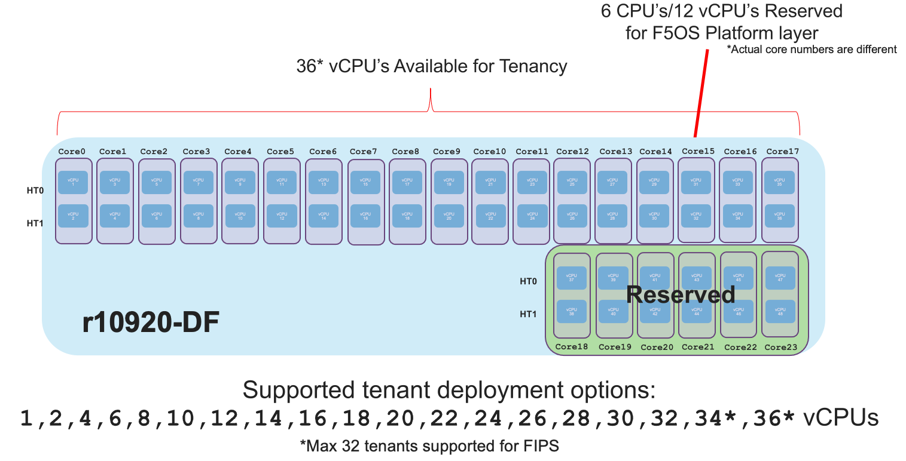

====================
rSeries Multitenancy
====================

In previous generation chassis and appliances F5 supported **vCMP** as a means of providing multitenancy and virtualization. vCMP allowed for configuration of **Guests** which were independent virtualized instances of BIG-IP. rSeries provides a similar type of virtualization experience, however it is not based on vCMP.  Instead rSeries will allow for **Tenants** to be created which are virtualized instances of BIG-IP on top of the containerized F5OS layer. 

Unlike iSeries, where vCMP is included on some models, rSeries is multitenant by default. There is no option for a “bare metal” configuration. You may configure one large tenant to emulate a “bare-metal” type BIG-IP configuration if required, but it is running one large tenant. Below is a depiction of BIG-IP tenants running on top of the F5OS layer. 

.. image:: images/rseries_multitenancy/image1.png
  :align: center
  :scale: 80%

Each tenant will run as a Virtual Machine via a technology called Kubevirt which allows Virtual Machines to run on top of a containerized architecture. The tenant itself will run TMOS, and it will be managed similar to how a vCMP guest is managed on an iSeries appliance. In the future when the next generation BIG-IP Next tenants are supported on rSeries, those tenants will run in their native containerized mode, and not run as a VM. They will be able to run side by side on the same appliance (exceept for the r2000 which only supports one tenant).

Creating a tenant on rSeries is nearly identical to creating a vCMP guest on iSeries with a few exceptions. When creating an rSeries tenant, you’ll provide a name, a supported TMOS tenant image, out-of-band IP addressing/mask and gateway, and which VLANs the tenant should inherit. Just like a vCMP guest the VLANs are configured at provision time and not within the tenant itself, the tenant will inherit specific VLANs configured by the admin that were previously configured at the F5OS platform layer.

.. image:: images/rseries_multitenancy/image2.png
  :align: center
  :scale: 70%

For resource provisioning you can use **Recommended** settings or **Advanced** settings. Recommended will allocate memory in proportion the number of vCPUs assigned to the tenant. Advanced mode will allow you to customize the memory allocation for this tenant. This is something not possible in previous generation iSeries appliances, but now you can over provision memory assigned to the tenant. The default memory allocations for recommended mode are shown below. Note: Not all rSeries appliances support the maximum number of vCPUs, this will vary by platform. Below is for the r12900-DS platform which supports up to 60 vCPUs for tenancy.

+-----------------------+--------------------+--------------------------+-------------------+-----------------+
| **Tenant Size**       | **Physical Cores** | **Logical Cores (vCPU)** | **Min Bytes RAM** | **RAM/vCPU**    |
+=======================+====================+==========================+===================+=================+
| rSeries 1vCPU Tenant  | 0.5                |  1                       | 4,096,000,000     | 4,096,000,000   |
+-----------------------+--------------------+--------------------------+-------------------+-----------------+
| rSeries 2vCPU Tenant  | 1                  |  2                       | 7,680,000,000     | 3,840,000,000   |
+-----------------------+--------------------+--------------------------+-------------------+-----------------+
| rSeries 4vCPU Tenant  | 2                  |  4                       | 14,848,000,000    | 3,712,000,000   |
+-----------------------+--------------------+--------------------------+-------------------+-----------------+
| rSeries 6vCPU Tenant  | 3                  |  6                       | 22,016,000,000    | 3,669,333,333   |
+-----------------------+--------------------+--------------------------+-------------------+-----------------+
| rSeries 8vCPU Tenant  | 4                  |  8                       | 29,184,000,000    | 3,648,000,000   |
+-----------------------+--------------------+--------------------------+-------------------+-----------------+
| rSeries 10vCPU Tenant | 5                  |  10                      | 36,352,000,000    | 3,635,200,000   |
+-----------------------+--------------------+--------------------------+-------------------+-----------------+
| rSeries 12vCPU Tenant | 6                  |  12                      | 43,520,000,000    | 3,626,666,667   |
+-----------------------+--------------------+--------------------------+-------------------+-----------------+
| rSeries 14vCPU Tenant | 7                  |  14                      | 50,688,000,000    | 3,620,571,429   |
+-----------------------+--------------------+--------------------------+-------------------+-----------------+
| rSeries 16vCPU Tenant | 8                  |  16                      | 57,856,000,000    | 3,616,000,000   |
+-----------------------+--------------------+--------------------------+-------------------+-----------------+
| rSeries 18vCPU Tenant | 9                  |  18                      | 65,024,000,000    | 3,612,444,444   |
+-----------------------+--------------------+--------------------------+-------------------+-----------------+
| rSeries 20vCPU Tenant | 10                 |  20                      | 72,192,000,000    | 3,609,600,000   |
+-----------------------+--------------------+--------------------------+-------------------+-----------------+
| rSeries 22vCPU Tenant | 11                 |  22                      | 79,360,000,000    | 3,607,272,727   |
+-----------------------+--------------------+--------------------------+-------------------+-----------------+
| rSeries 24vCPU Tenant | 12                 |  24                      | 86,528,000,000    | 3,605,333,333   |
+-----------------------+--------------------+--------------------------+-------------------+-----------------+
| rSeries 26vCPU Tenant | 13                 |  26                      | 93,696,000,000    | 3,603,692,308   |
+-----------------------+--------------------+--------------------------+-------------------+-----------------+
| rSeries 28vCPU Tenant | 14                 |  28                      | 100,864,000,000   | 3,602,285,714   |
+-----------------------+--------------------+--------------------------+-------------------+-----------------+
| rSeries 30vCPU Tenant | 15                 |  30                      | 108,032,000,000   | 3,601,066,667   |
+-----------------------+--------------------+--------------------------+-------------------+-----------------+
| rSeries 32vCPU Tenant | 16                 |  32                      | 115,200,000,000   | 3,600,000,000   |
+-----------------------+--------------------+--------------------------+-------------------+-----------------+
| rSeries 34vCPU Tenant | 17                 |  34                      | 122,368,000,000   | 3,599,058,824   |
+-----------------------+--------------------+--------------------------+-------------------+-----------------+
| rSeries 36vCPU Tenant | 18                 |  36                      | 129,536,000,000   | 3,598,222,222   |
+-----------------------+--------------------+--------------------------+-------------------+-----------------+
| rSeries 38vCPU Tenant | 19                 |  38                      | 136,704,000,000   | 3,597,473,684   |
+-----------------------+--------------------+--------------------------+-------------------+-----------------+
| rSeries 40vCPU Tenant | 20                 |  40                      | 143,872,000,000   | 3,596,800,000   |
+-----------------------+--------------------+--------------------------+-------------------+-----------------+
| rSeries 42vCPU Tenant | 21                 |  42                      | 151,040,000,000   | 3,596,190,476   |
+-----------------------+--------------------+--------------------------+-------------------+-----------------+
| rSeries 44vCPU Tenant | 22                 |  44                      | 158,208,000,000   | 3,595,636,364   |
+-----------------------+--------------------+--------------------------+-------------------+-----------------+
| rSeries 46vCPU Tenant | 23                 |  46                      | 165,376,000,000   | 3,595,130,435   |
+-----------------------+--------------------+--------------------------+-------------------+-----------------+
| rSeries 48vCPU Tenant | 24                 |  48                      | 172,544,000,000   | 3,594,666,667   |
+-----------------------+--------------------+--------------------------+-------------------+-----------------+
| rSeries 50vCPU Tenant | 25                 |  50                      | 179,712,000,000   | 3,594,240,000   |
+-----------------------+--------------------+--------------------------+-------------------+-----------------+
| rSeries 52vCPU Tenant | 26                 |  52                      | 186,880,000,000   | 3,593,846,154   |
+-----------------------+--------------------+--------------------------+-------------------+-----------------+
| rSeries 54vCPU Tenant | 27                 |  54                      | 194,048,000,000   | 3,593,481,481   |
+-----------------------+--------------------+--------------------------+-------------------+-----------------+
| rSeries 56vCPU Tenant | 28                 |  56                      | 201,216,000,000   | 3,593,142,857   |
+-----------------------+--------------------+--------------------------+-------------------+-----------------+
| rSeries 58vCPU Tenant | 29                 |  58                      | 208,384,000,000   | 3,592,827,586   |
+-----------------------+--------------------+--------------------------+-------------------+-----------------+
| rSeries 60vCPU Tenant | 30                 |  60                      | 215,552,000,000   | 3,592,533,333   |
+-----------------------+--------------------+--------------------------+-------------------+-----------------+

Each rSeries appliance has an overall amount of memory for the appliance, and the F5OS layer will take a portion of RAM, leaving the rest for use by tenants. Below is the amount of memory used by F5OS on each of the rSeries appliances. The table also displays the total minimum amount of RAM allocated using the recommended values, and how much extra RAM is available for tenants beyond the recommended values.

Using the minimum recommended values per tenant ~127GB of RAM will be allocated for the r10000 Series tenants, leaving ~104GB of additional RAM. You may over-allocate RAM to any tenant until the extra 104GB of RAM is depleted. There is a formula for figuring out the minimum amount of RAM a particular tenant size will receive using the recommended values:

**min-memory = (3.5 * 1024 * vcpu-cores-per-node) + 512**

For the r2000 / r4000 appliances the formula is different.

**min-memory = (3 * 1024 * vcpu-cores-per-node)**

+-----------------------+-----------------------+-------------------------+----------------------------------+------------------------------------+---------------------------------------+-------------+
| **rSeries Platform**  | **Memory per System** | **Memory use by F5OS**  | **Memory Available to Tenants**  | **Minimum RAM used (Max vCPU)**    |  **Extra RAM Available for Tenants**  |  Max vCPUs  |
+=======================+=======================+=========================+==================================+====================================+=======================================+=============+
| r12900-DS Series      | 512GB RAM             | TBD                     | TBD                              | 211GB                              | TBD                                   | 60          |
+-----------------------+-----------------------+-------------------------+----------------------------------+------------------------------------+---------------------------------------+-------------+
| r12800-DS Series      | 512GB RAM             | TBD                     | TBD                              | 183GB                              | TBD                                   | 52          |
+-----------------------+-----------------------+-------------------------+----------------------------------+------------------------------------+---------------------------------------+-------------+
| r12600-DS Series      | 512GB RAM             | TBD                     | TBD                              | 155GB                              | TBD                                   | 44          |
+-----------------------+-----------------------+-------------------------+----------------------------------+------------------------------------+---------------------------------------+-------------+
| r10900 Series         | 256GB RAM             | 25GB                    | 231GB                            | 127GB                              | 104GB                                 | 36          |
+-----------------------+-----------------------+-------------------------+----------------------------------+------------------------------------+---------------------------------------+-------------+
| r10800 Series         | 256GB RAM             | 25GB                    | 231GB                            | 99GB                               | 132GB                                 | 28          |
+-----------------------+-----------------------+-------------------------+----------------------------------+------------------------------------+---------------------------------------+-------------+
| r10600 Series         | 256GB RAM             | 25GB                    | 231GB                            | 85GB                               | 146GB                                 | 24          |
+-----------------------+-----------------------+-------------------------+----------------------------------+------------------------------------+---------------------------------------+-------------+
| r5900 Series          | 128GB RAM             | 15GB                    | 113GB                            | 92GB                               | 21GB                                  | 26          |
+-----------------------+-----------------------+-------------------------+----------------------------------+------------------------------------+---------------------------------------+-------------+
| r5800 Series          | 128GB RAM             | 15GB                    | 113GB                            | 57GB                               | 56GB                                  | 18          |
+-----------------------+-----------------------+-------------------------+----------------------------------+------------------------------------+---------------------------------------+-------------+
| r5600 Series          | 128GB RAM             | 15GB                    | 113GB                            | 43GB                               | 70GB                                  | 12          |
+-----------------------+-----------------------+-------------------------+----------------------------------+------------------------------------+---------------------------------------+-------------+
| r4800 Series          | 64GB RAM              | 14GB                    | 50GB                             | 48GB                               | 1GB                                   | 16          |
+-----------------------+-----------------------+-------------------------+----------------------------------+------------------------------------+---------------------------------------+-------------+
| r4600 Series          | 64GB RAM              | 14GB                    | 50GB                             | 36GB                               | 13GB                                  | 12          |
+-----------------------+-----------------------+-------------------------+----------------------------------+------------------------------------+---------------------------------------+-------------+
| r2800 Series          | 32GB RAM              | 6.9GB                   | 25GB                             | 24GB                               | 1GB                                   | 8           |
+-----------------------+-----------------------+-------------------------+----------------------------------+------------------------------------+---------------------------------------+-------------+
| r2600 Series          | 32GB RAM              | 6.9GB                   | 25GB                             | 12GB                               | 12GB                                  | 4           |
+-----------------------+-----------------------+-------------------------+----------------------------------+------------------------------------+---------------------------------------+-------------+

r12000-DS Series Multitenancy
==========================

Each r12000-DS appliance has 72 vCPUs, however 12 of those vCPUs are dedicated to the F5OS layer. This leaves 60 vCPUs left over for use by tenants on the r12900-DS, 52 vCPUs for the r12800-DS, and 44 vCPUs for the r12600-DS.  You can dedicate all vCPUs to one large tenant, or you can allocate smaller numbers of vCPUs per tenant so that you can deploy many tenants. Below are examples of the total number of vCPUs supported for each r12000-DS platform.

The r12900-DS has 72 vCPUs total, 12 vCPUs reserved for F5OS, and 60 vCPUs left over for use by tenants:

The r12800-DS has 72 vCPUs total, 16 vCPUs are disabled via licensing, 12 vCPUs reserved for F5OS, and 52 vCPUs left over for use by tenants:

The r10600 has 48 vCPUs total, 8 vCPUs are disabled via licensing, 12 vCPUs reserved for F5OS, and 44 vCPUs left over for use by tenants:  

.. image:: images/rseries_performance_and_sizing/image12r12000.png
  :align: center
  :scale: 60%

Since all r12000-DS models are running on the same hardware appliance, you can easily upgrade from the r12600-DS to either the r12800-DS or r12900-DS to unlock more performance via a simple license change. The r12800-DS can be upgraded to an r12900-DS to unlock more performance. This is all part of the Pay-as-you-Grow or PAYG strategy for the rSeries appliances. There are 3 PAYG tiers within the r12000-DS appliance.

r10920-DF (FIPS) Series Multitenancy
==========================

Each r10920-DF appliance has 48 vCPUs, however 12 of those vCPUs are dedicated to the F5OS layer. This leaves 36 vCPUs left over for use by tenants on the r10920-DF. There is a limitation to the total number of FIPS partitions that are needed for each tenant utilizing FIPS. Unlike the r10900 (non FIPS) device which supports a maximum of 36 tenants, the r10920-DF is limited to a maximum of 32 FIPS tenants due to the maximum number of FIPS partitions that are supported by the integrated HSM. You can configure the remaining tenants in a non-FIPS mode. This is an unlikely real world situation as typical deployments are not configuring the maximum number of minimum size tenants. You can dedicate all vCPUs to one large tenant, or you can allocate smaller numbers of vCPUs per tenant so that you can deploy many tenants. Below is an example of the total number of vCPUs supported on the r10920-DF platform.

The r10920-DF has 48 vCPUs total, 12 vCPUs reserved for F5OS, and 36 vCPUs left over for use by tenants, of which 32 can utilize the integrated FIPS HSM:

r5000 Series Multitenancy
==========================

Each r5000 appliance has 32 vCPUs, however 6 of those vCPUs are dedicated to the F5OS layer. This leaves 26 vCPUs left over for use by tenants on the r5900, 18 vCPUs for the r5800, and 12 vCPUs for the r5600.  You can dedicate all vCPUs to one large tenant, or you can allocate smaller numbers of vCPUs per tenant so that you can deploy many tenants. Below are examples of the total number of vCPUs supported for each r5000 platform.

The r5900 has 32 vCPUs total, 6 vCPUs reserved for F5OS, and 26 vCPUs left over for use by tenants:

.. image:: images/rseries_multitenancy/image6.png
  :align: center
  :scale: 80%

The r5800 has 32 vCPUs total, 8 vCPUs are disabled via licensing, 6 vCPUs reserved for F5OS, and 18 vCPUs left over for use by tenants:

.. image:: images/rseries_multitenancy/image7.png
  :align: center
  :scale: 40%

The r5600 has 32 vCPUs total, 14 vCPUs are disabled via licensing, 6 vCPUs reserved for F5OS, and 12 vCPUs left over for use by tenants. Note there is a max of 8 tenants:  

.. image:: images/rseries_multitenancy/image8.png
  :align: center
  :scale: 70%

Since all r5000 models are running on the same hardware appliance, you can easily upgrade from the r5600 to either the r5800 or r5900 to unlock more performance via a simple license change. The r5800 can be upgraded to an r5900 to unlock more performance. This is all part of the Pay-as-you-Grow or PAYG strategy for the rSeries appliances. There are 3 PAYG tiers within the r5000 series appliances.

r5920-DF (FIPS) Series Multitenancy
==========================

Each r5920-DF appliance has 32 vCPUs, however 6 of those vCPUs are dedicated to the F5OS layer. This leaves 26 vCPUs left over for use by tenants on the r5920-DF. There is a limitation to the total number of FIPS partitions that are needed for each tenant utilizing FIPS. Unlike the r5900 (non FIPS) device which supports a maximum of 26 tenants, the r5920-DF is limited to a maximum of 24 FIPS tenants due to the maximum number of FIPS partitions that are supported by the integrated HSM. You can configure the remaining tenants in a non-FIPS mode. This is an unlikely real world situation as typical deployments are not configuring the maximum number of minimum size tenants. You can dedicate all vCPUs to one large tenant, or you can allocate smaller numbers of vCPUs per tenant so that you can deploy many tenants. Below is an example of the total number of vCPUs supported on the r5920-DF platform.

The r5920-DF has 32 vCPUs total, 6 vCPUs reserved for F5OS, and 26 vCPUs left over for use by tenants, of which 24 can utilize the integrated FIPS HSM:

r4000 Series Multitenancy
==========================

In the high-end (r10000) and mid-range (r5000) rSeries appliances, each Intel CPU core runs hyperthreading and appears as two logical CPUs or vCPUs. For each physical CPU core there are two logical vCPUs. The r4000 series of appliances use a different class of Intel CPU that does not utilize hyperthreading. Instead of measuring how many vCPUs or logical cores these platforms support, they are measured using physical CPU core counts only. The r4000 series platforms do not include FPGA's for hardware offloading of workloads like DDoS mitigation, or FASTL4 offload. These workloads are handled by CPU with specialized offload instead. SSL and Compression are part of the Intel CPU complex and are offloaded within the CPU. 

Each r4000 appliance has 16 CPU cores (not vCPUs), unlike the high-end (r10000) and mid-range (r5000) rSeries appliances there are no CPUs dedicated to the F5OS platform layer. Since there are no FPGA's that require dedicated CPUs to interface with, the F5OS platform layer processes can be spread across all the available CPUs. This allows for more CPU's to be used for tenancy.

This leaves all 16 CPU cores left over for use by tenants on the r4800, and 12 CPU cores for the r4600. You can dedicate all CPU cores to one large tenant, or you can allocate smaller numbers of CPU cores per tenant so that you can deploy many tenants. Below are examples of the total number of CPU cores supported for each r4000 platform.

The r4800 has 16 CPU cores total, there are zero CPU cores reserved for F5OS, and 16 CPU cores left over for use by tenants:

.. image:: images/rseries_multitenancy/image9.png
  :align: center
  :scale: 70%

The r4600 has 16 CPU cores total, 4 CPU cores are disabled via licensing, there are zero CPU cores reserved for F5OS, and 12 CPU cores left over for use by tenants:

.. image:: images/rseries_multitenancy/image10.png
  :align: center
  :scale: 70%

Since all r4000 models are running on the same hardware appliance, you can easily upgrade from the r4600 to the r4800 to unlock more performance via a simple license change. This is all part of the Pay-as-you-Grow or PAYG strategy for the rSeries appliances. There are 2 PAYG tiers within the r4000 series appliances.

r2000 Series Multitenancy
==========================

In the high-end (r10000) and mid-range (r5000) rSeries appliances, each Intel CPU core runs hyperthreading and appears as two logical CPUs or vCPUs. For each physical CPU core there are two logical vCPUs. The r2000 series of appliances use a different class of Intel CPU that does not utilize hyperthreading. Instead of measuring how many vCPUs or logical cores these platforms support, they are measured using physical CPU core counts only. The r2000 series platforms do not include FPGA's for hardware offloading of workloads like DDoS mitigation, or FASTL4 offload. These workloads are handled by CPU with specialized offload instead. SSL and Compression are part of the Intel CPU complex and are offloaded within the CPU. 

Each r2000 appliance has 8 CPU cores (not vCPUs), unlike the high-end (r10000) and mid-range (r5000) rSeries appliances there are no CPU's dedicated to the F5OS platform layer. Since there are no FPGA's that require dedicated CPU's to interface with, the F5OS platform layer processes can be spread across all the available CPU's. This allows for more CPU's to be used for tenancy.

This leaves all 8 CPU cores left over for use by a single tenant on the r2800, and 4 CPU cores for the r2600. You can dedicate all CPU cores to one large tenant, or you can allocate smaller numbers of CPU cores per tenant. Below are examples of the total number of CPU cores supported for each r2000 platform.

The r2800 has 8 CPU cores total, there are zero CPU cores reserved for F5OS, and 8 CPU cores left over for use by the single tenant:

.. image:: images/rseries_multitenancy/image11.png
  :align: center
  :scale: 70%

The r2600 has 8 CPU cores total, 4 CPU cores are disabled via licensing, there are zero CPU cores reserved for F5OS, and 4 CPU cores left over for use by the single tenant:

.. image:: images/rseries_multitenancy/image12.png
  :align: center
  :scale: 70%

Since all r2000 models are running on the same hardware appliance, you can easily upgrade from the r2600 to the r2800 to unlock more performance via a simple license change. This is all part of the Pay-as-you-Grow or PAYG strategy for the rSeries appliances. There are 2 PAYG tiers within the r2000 series appliances.

Tenant Sizing
=============

Single vCPU (Skinny) tenants are supported on the r10000 and r5000 appliances, but that option is hidden under **Advanced** mode. This would allow for 36 single vCPU tenants per r10900 appliance, 28 tenants for the r10800, and 24 tenants for the r10600. For the r5000 platforms this would allow for 26 single vCPU tenants per r5900 appliance, 18 tenants for the r5800, however the r5600 supports a max of 8 tenants. While single vCPU tenants are supported, they are not recommended for most environments. This is bacuase a single vCPU tenant is running on a single hyperthread, and performance of a single thread can be influenced by other services running on the other hyperthread of a CPU. Since this can lead to unpredictable behavior only a very lightly loaded LTM/DNS only type tenant should be considered for this option and ideally for non-production environments. As always proper sizing should be done to ensure the tenant has enough resources. 

Tenant States
=============

An rSeries tenant supports 3 states: (**Configured**, **Provisioned**, and **Deployed**):

**Configured**

- The tenant configuration exists on the appliance, but the tenant is not running, and no hardware resources (CPU, memory) are allocated to it. This is the initial state and the default.

**Provisioned**

- Moves the tenant into the Provisioned state, which causes the system to install the software, assign the tenant to nodes, and create virtual disks for the tenant on those nodes. If you choose this option, it takes a few minutes to complete the provisioning. The tenant does not run while in this state.

**Deployed**

- Changes the tenant to the Deployed state. The tenant is set up, resources are allocated to the tenant, the software is installed, and after those tasks are complete, the tenant is fully deployed and running. If you choose this option, it takes a few minutes to complete the deployment and bring up the system.

You may also configure **Crypto/Compression Acceleration**. This option is enabled by default, meaning the tenant will utilize and offload to crypto (SSL/TLS) and compression hardware, or it can be disabled meaning all crypto and compression will be done in software. It is highly recommended to use the default enabled option for best performance. 

In some previous generation hardware platforms, there is an option to configure an **SSL Mode** for vCMP guests. This option is not available in rSeries, and the behavior may be different:

If you currently utilize the SSL Mode feature where SSL resources can be **Dedicated, Shared, or Isolated** for each vCMP guest, this configuration option is not supported on rSeries at initial release. vCMP guests operate in the default shared mode meaning all guests get equal access to the shared SSL hardware resources. You may configure the SSL Mode to **dedicated** where SSL hardware resources are dedicated to a guest in proportion to the vCPUs assigned to a guest. You may also configure **none**, meaning all SSL processing is done in software.  
  
In rSeries there is no SSL Mode configuration option. By default, you may configure the **Crypto/Compression Acceleration** option when deploying an rSeries tenant. The choices are **enabled** or **disabled**. When enabled the system will assign SSL hardware resources in proportion to the number of vCPUs assigned to the tenant. This is conceptually similar to how SSL Mode **Dedicated** works on vCMP guests but not 100% the same implementation.  When disabled no SSL hardware resources are assigned to the tenant and all processing is done in software. An environment currently running in the default shared mode will now be running in a mode that essentially mimics the SSL Mode Dedicated. 

Lastly the tenant may be configured to support **Appliance Mode** which is a security option which disables root and bash access to the tenant.
