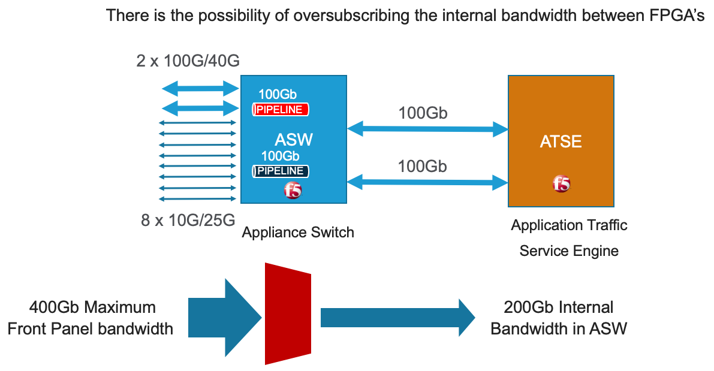
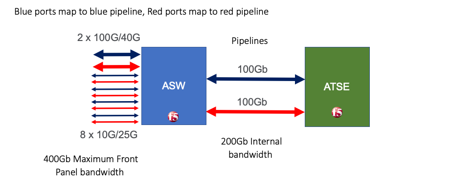
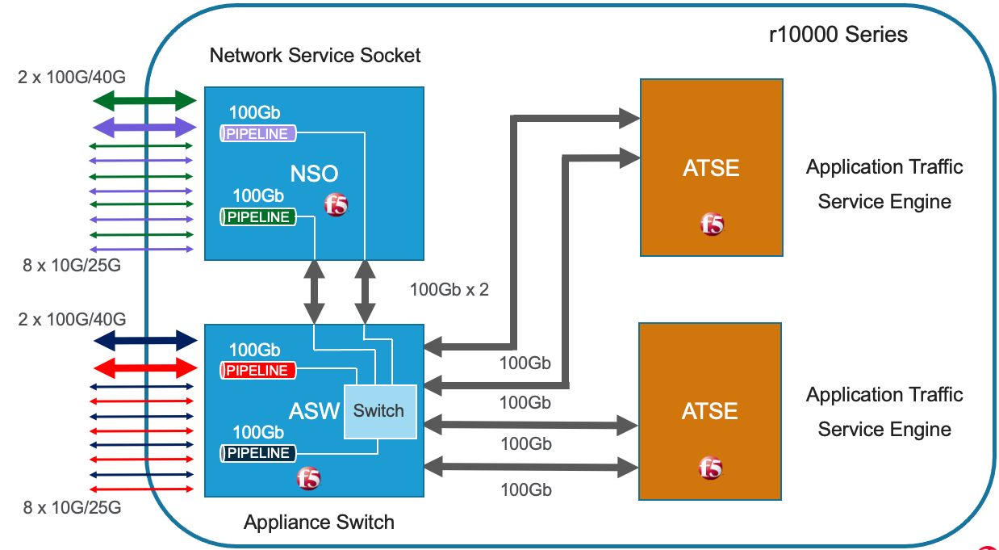
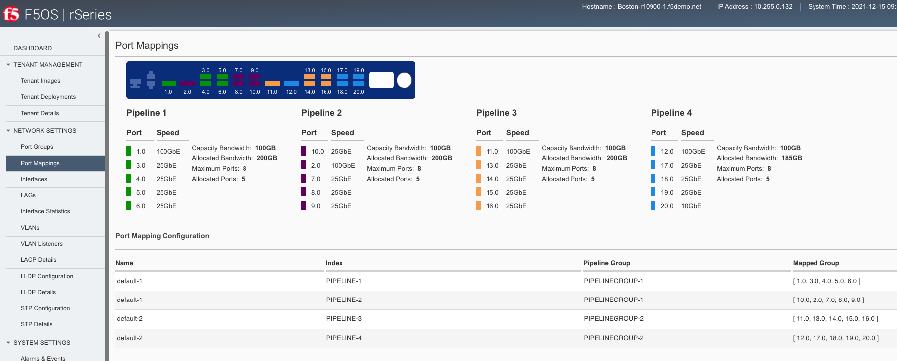
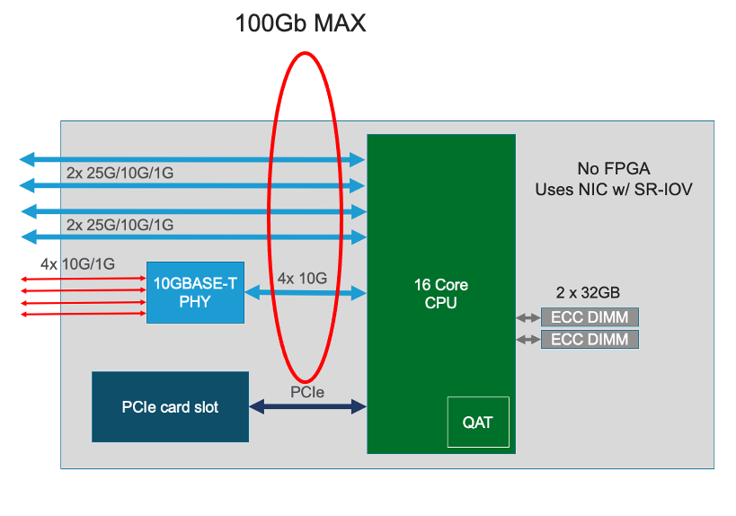
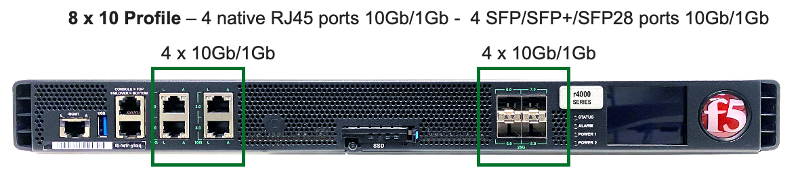
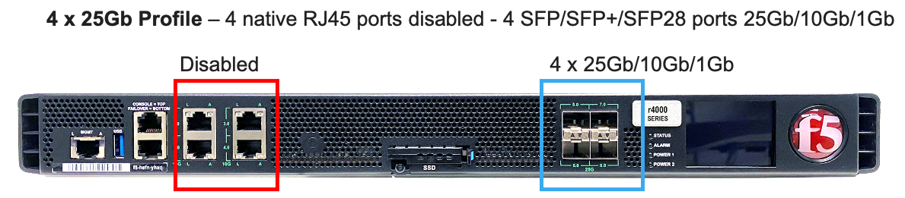
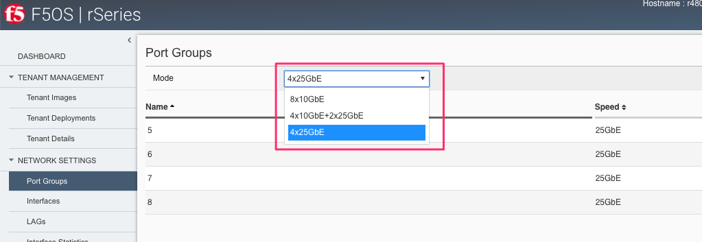

==================
rSeries Networking
==================

Platform Layer Isolation
========================

Management of the new F5OS platform layer is completely isolated from in-band traffic networking and VLANs. It is purposely isolated so that it is only accessible via the out-of-band management network. In fact, there are no in-band IP addresses assigned to the F5OS layer, only tenants will have in-band management IP addresses and access. Tenants also have out-of-band connectivity.

This allows customers to run a secure/locked-down out-of-band management network where access is tightly restricted. The diagram below shows the out-of-band management access entering the rSeries appliance through **MGMT** port. The external MGMT port is bridged to an internal out-of-band network that connects to all tenants within the rSeries appliance. Tenants are prevented from talking to each other over the internal management VLAN using MACVLAN interfaces which encapsulate tenant traffic, restricting traffic visibility between different tenants on the same rSeries appliance.

.. image:: images/rseries_networking/image1.png
  :align: center

Port Groups
===========

The portgroup component is used to control the mode of the physical ports. This controls whether a port is bundled or unbundled and the port speed. Currently the high-speed ports do not support unbundling. **Adjacent** high-speed ports (**1.0** & **2.0** on both the r5000/r10000 series) and (**11.0** & **12.0** on the r10000 series) must be configured in the same mode and speed currently. Either both are configured for 40Gb or both configured for 100Gb, you cannot mix and match. You cannot break out these ports to lower speeds (25Gb or 10Gb) via a breakout cable as this is currently unsupported. Low speed 25Gb/10Gb ports (**3.0** - **10.0** on both the r5000/r10000 series) and (**13.0** - **20.0** on the r10000 series) can be configured independently, and adjacent low speed ports can have different speed values. The term portgroup is used rather than simply “port” because some front panel ports may accept different types of SFPs. Depending on the portgroup mode value, a different FPGA version is loaded, and the speed of the port is adjusted accordingly. The user can modify the portgroup mode as needed through the F5OS CLI, webUI or API.

.. note:: F5OS-A 1.8.0 added breakout cable support for 4 x 10Gb on the high-speed ports (**1.0**, **2.0**, **11.0**, **12.0** on the r10000, r12000) & (**1.0**, **2.0** on the r5000). These ports do not support 4 x 25Gb at this time.

.. image:: images/rseries_networking/image2.png
  :align: center

Below is an example of the F5OS webUI **Port Groups** screen on a r10000 Series appliance. Note that any changes in configuration will require a reboot of the appliance to load a new FPGA bitstream image.

.. image:: images/rseries_networking/image3.png
  :align: center

.. image:: images/rseries_networking/image4.png
  :align: center
  :scale: 50%

Interfaces
==========

Interfaces will always be numbered starting with **1.0** and ending with the maximum number of ports on the appliance (**10.0** on the r5000 series and **20.0** on the r10000 series appliances). The type of optic in combination with the **port group** setting will dictate the speed of the interface. Interfaces can be run independently or bundled together in Link Aggregation Groups. VLANs will be assigned to independent interfaces, or at the LAG configuration level if multiple interfaces are bundled together.

Supported Optics
================

Only F5 branded optics are officially supported on rSeries appliances. On rSeries r2000/r4000 models speeds of 1Gb, 10Gb, or 25Gb are supported. On the r5000/r10000 models speeds of 10Gb, 25Gb, 40Gb, or 100Gb are supported depending on the type of optics used and the port group configuration. Note the r5000/r10000 appliances do not support 1Gb connectivity. rSeries high speed interfaces will accept F5 approved QSFP+ & QSFP28 optics, while low speed ports will accept SFP28 and SFP+ optics. None of the optics support dual mode speeds (except where noted) i.e., 25Gb/10Gb, you must have the right optic and port group configuration for the speed you want to run. 3rd party optics are not officially supported per F5’s support policies: 

`K8153: F5 support of third-party hardware components <https://my.f5.com/manage/s/article/K8153>`_

More details on each optic can be found in the F5 Platforms Accessories guide & in the solution articles below:

`F5 Platforms: Accessories <https://techdocs.f5.com/en-us/hw-platforms/f5-plat-accessories.html>`_

`K6097: Specifications of the Fiber Gigabit Ethernet SFP, XFP, SFP+, QSFP+, and QSFP28 module ports on BIG-IP system platforms <https://my.f5.com/manage/s/article/K6097>`_

`K12287: Specifications for the Copper Gigabit Ethernet SFP module ports on BIG-IP system platforms <https://my.f5.com/manage/s/article/K12287>`_

Supported rSeries Optics SKU's
==============================

**Note: For 100G BiDi, please contact product management to discuss your requirements, as there are different standards available in the market.**

rSeries 1GB SFP SKU's
-----------------------

1Gb Optics are only supported on the r2000/r4000 platforms:

+----------------------+----------+-----------------------------------------------------------------------------+
| F5-UPG-SFP-R         | OPT-0010 | Field Upgrade: SFP Fiber Connector (1G - LC/850nm) ROHS                     |
+----------------------+----------+-----------------------------------------------------------------------------+
| F5-UPG-SFPLX-R       | OPT-0011 | Field Upgrade: SFP LX Fiber Connector (1G - LC/1310nm) ROHS                 |
+----------------------+----------+-----------------------------------------------------------------------------+
| F5-UPG-SFPC-R        | OPT-0051 | Field Upgrade: SFP Copper Connector (10/100/1000 RJ45)) ROHS                |
+----------------------+----------+-----------------------------------------------------------------------------+

The r2000 / r4000 will support both **F5-UPG-SFPC-R** with one caveat. **F5-UPG-SFPC-R** will only be supported at 1000Mbps on r2000 / r4000, there will be no support for 10Mbps or 100Mbps speeds.
The r5000 / r10000 / r12000-DS platforms do not support 1G SFPs currently, so **F5-UPG-SFPC-R** is not supported on those platforms.
However, **F5-UPG-SFPC+-3M-8** is still supported on r5000 / r10000 / r12000-DS for 10G operation.

rSeries 10Gb SFP+ SKU's
-----------------------

10Gb Optics are supported on all rSeries (r2000/r4000/r5000/r10000/r12000-DS) platforms:

+----------------------+-----------+---------------------------------------------------------------------------------------+
| F5-UPG-SFP+-R        | OPT-0016  | Field Upgrade: SFP+ Fiber Connector (10G-LC/850nm) ROHS                               |
+----------------------+-----------+---------------------------------------------------------------------------------------+
| F5-UPG-SFP+LR-R      | OPT-0017  | Field Upgrade: SFP+LR Fiber Connector (10G-LC/1310nm) ROHS                            |
+----------------------+-----------+---------------------------------------------------------------------------------------+
| F5-UPG-SFPC+-3M-8    | CBL-0138  | Field Upgrade: Copper SFP+ 10G Direct Attach 8-Pack 3M (8900, 11000, B4200, B2100)    |
+----------------------+-----------+---------------------------------------------------------------------------------------+

rSeries 25Gb SFP28 SKU's
--------------------------

25Gb Optics are supported on all rSeries (r2000/r4000/r5000/r10000/r12000-DS) platforms:

+----------------------+-----------+-----------------------------------------------------------------------------------------+
| F5-UPG-SFP28-SR      | OPT-0053  | Field Upgrade: Transceiver SFP28, 25G-SR, 100M, LC, MMF, DDM (rSeries ONLY)             |
+----------------------+-----------+-----------------------------------------------------------------------------------------+
| F5-UPG-SFP28-LR      | OPT-0054  | Field Upgrade: Transceiver SFP28, 25G-LR, 10KM, LC, SMF, DDM (rSeries ONLY)             |
+----------------------+-----------+-----------------------------------------------------------------------------------------+

rSeries 40Gb QSFP+ SKU's
--------------------------

40Gb Optics are only supported on the r5000/r10000/r12000-DS platforms:

+----------------------+-----------+-----------------------------------------------------------------------------------------------------------+
| F5-UPG-QSFP+LR4      | OPT-0030  | Field Upgrade: QSFP+ Transceiver (40G-LR4, 1310NM, 10KM, LC, SMF, DDM Support)                            |
+----------------------+-----------+-----------------------------------------------------------------------------------------------------------+
| F5-UPG-QSFP+SR4      | OPT-0036  | Field Upgrade: QSFP+ Transceiver (40G-SR4, 850NM, 100M, MPO, DDM Support)                                 |
+----------------------+-----------+-----------------------------------------------------------------------------------------------------------+
| F5-UPG-QSFP+PSM4     | OPT-0045  | Field Upgrade: QSFP+ Transceiver (40G-PSM4, 4x10LR, 1310NM, 10KM, MPO/APC, SMF, DDM)                      |
+----------------------+-----------+-----------------------------------------------------------------------------------------------------------+

rSeries 40Gb/100Gb Dual Rate BIDI SKU's (QSFP28 backward compatible with QSFP+)
------------------------------------------------------------------------------

+---------------------+-----------+------------------------------------------------------------------------------------------+
| F5-UPG-QSFP28-SRBD  | OPT-0060  | Field Upgrade Transceiver QSFP28/QSFP+, dual rate 40G/100G SR BIDI, 100M, LC, MMF        |
+---------------------+-----------+------------------------------------------------------------------------------------------+

rSeries 100Gb QSFP28 SKU's
--------------------------

100Gb Optics are only supported on the r5000/r10000/r12000-DS platforms:

+----------------------+-----------+----------------------------------------------------------------------------------------------+
| F5-UPG-QSFP28-SR4    | OPT-0031  | Field Upgrade: QSFP28 Transceiver (100G-SR4, 850NM, 70M/100M, OM3/OM4, MMF, MPO, DDM)        |
+----------------------+-----------+----------------------------------------------------------------------------------------------+
| F5-UPG-QSFP28-LR4    | OPT-0039  | Field Upgrade: QSFP28 Transceiver (100G-LR4, 10KM, LC, SMF, 4.5W, DDM)                       |
+----------------------+-----------+----------------------------------------------------------------------------------------------+
| F5-UPG-QSFP28-BD     | OPT-0047  | Field Upgrade: Transceiver QSFP28, 100G BIDI, 100M, LC, MMF, DDM (rSeries ONLY)      EOS     | 
+----------------------+-----------+----------------------------------------------------------------------------------------------+
| F5-UPG-QSFP28-SR12   | OPT-0048  | Field Upgrade: QSFP28 Transceiver (100G-SR1.2 BiDi, 150M OM5, LC, MMF) (rSeries ONLY)        |
+----------------------+-----------+----------------------------------------------------------------------------------------------+
| F5-UPGVELQSFP28LR4B  | OPT-0052  | VELOS Field Upgrade: QSFP28 Transceiver (100G-LR4, 10KM, LC, SMF, DDM)                     * |
+----------------------+-----------+----------------------------------------------------------------------------------------------+
| F5-UPGVELQSFP28PSM4  | OPT-0055  | VELOS Field Upgrade: QSFP28 Transceiver (100G-PSM4, 500M, MPO/APC, SMF, DDM)               * |
+----------------------+-----------+----------------------------------------------------------------------------------------------+
| F5-UPG-QSFP28-SRBD   | OPT-0060  | Field Upgrade Transceiver QSFP28/QSFP+, dual rate 40G/100G SR BIDI, 100M, LC, MMF            |
+----------------------+-----------+----------------------------------------------------------------------------------------------+
| F5-UPG-QSFP28-FR     | OPT-0056  | Field Upgrade: QSFP28 Transceiver (100G-FR Single Lambda, 2KM, LC, SMF, DDM) (rSeries ONLY)  |
+----------------------+-----------+----------------------------------------------------------------------------------------------+
| F5-UPG-QSFP28-LR-SL  | OPT-0061  | Field Upgrade: QSFP28 Transceiver (100G-LR Single Lambda, 10KM, LC, SMF, DDM) (rSeries ONLY) |
+----------------------+-----------+----------------------------------------------------------------------------------------------+
| F5-UPG-QSFP28-DR     | OPT-0062  | Field Upgrade: QSFP28 Transceiver (100G-DR Single Lambda, 500M, LC, SMF, DDM) (rSeries ONLY) |
+----------------------+-----------+----------------------------------------------------------------------------------------------+
| F5-UPG-QSFP28-PSM4   | OPT-0     | Field Upgrade: QSFP28 Transceiver (100G-PSM4, 500M, MPO/APC, SMF, DDM) ROHS               ?  |
+----------------------+-----------+----------------------------------------------------------------------------------------------+

Below are the current rSeries optic SKUs:

.. Note:: The QSFP+ & QSFP28 optics cannot be configured for unbundled mode prior to F5OS-A 1.8.0 - 4 x 10Gb (with a 40Gb QSFP+ optic). F5OS-A 1.8.0 added breakout cable support for 4 x 10Gb on the high-speed ports (**1.0**, **2.0**, **11.0**, **12.0** on the r10000, r12000) & (**1.0**, **2.0** on the r5000). These ports do not support 4 x 25Gb at this time.

+----------------------+----------------------------------------------------------------------------------------+------------------------------------------------------------------------------------------------------------------------------------------------------------------------------+
| F5-UPG-SFP-R         | Field Upgrade: SFP Fiber Connector (1G - LC/850nm) ROHS                                | `F5-UPG-SFP-R (OPT-0010-00) - 1000Base-SX (Short Range) Ethernet Transceiver with DDM Support <https://my.f5.com/manage/s/article/K6097#OPT0010>`_                           |
+----------------------+----------------------------------------------------------------------------------------+------------------------------------------------------------------------------------------------------------------------------------------------------------------------------+
| F5-UPG-SFPLX-R       | Field Upgrade: SFP LX Fiber Connector (1G - LC/1310nm) ROHS                            | `F5-UPG-SFPLX-R (OPT-0011-00) - 1000Base-LX (Long Range) Ethernet Transceiver <https://my.f5.com/manage/s/article/K6097#OPT0011>`_                                           |
+----------------------+----------------------------------------------------------------------------------------+------------------------------------------------------------------------------------------------------------------------------------------------------------------------------+
| F5-UPG-SFPC-R        | Field Upgrade: SFP Copper Connector (10/100/1000 RJ45)) ROHS                           | `F5-UPG-SFPC-R (OPT-0051-01) - 1000Base-T Copper Ethernet Transceiver SFP module specifications <https://my.f5.com/manage/s/article/K12287#OPT0051>`_                        |
+----------------------+----------------------------------------------------------------------------------------+------------------------------------------------------------------------------------------------------------------------------------------------------------------------------+
| F5-UPG-SFP+-R        | Field Upgrade: SFP+ Fiber Connector (10G-LC/850nm) ROHS                                | `F5-UPG-SFP+-R (OPT-0016-00) - 10GBase-SR (Short Range) 10G Ethernet Transceiver with DDM Support <https://my.f5.com/manage/s/article/K6097#OPT0016>`_                       |
+----------------------+----------------------------------------------------------------------------------------+------------------------------------------------------------------------------------------------------------------------------------------------------------------------------+
| F5-UPG-SFP+LR-R      | Field Upgrade: SFP+LR Fiber Connector (10G-LC/1310nm) ROHS                             | `F5-UPG-SFP+LR-R (OPT-0017-00) - 10GBase-LR/LW (Long Range) 10G Ethernet Transceiver with DDM Support <https://my.f5.com/manage/s/article/K6097#OPT0017>`_                   |
+----------------------+----------------------------------------------------------------------------------------+------------------------------------------------------------------------------------------------------------------------------------------------------------------------------+
| F5-UPG-SFPC+-3M-8    | Field Upgrade: Copper SFP+ 10G Direct Attach 8-Pack 3M                                 | `F5-UPG-SFPC+-3M-8 (CBL-0138-xx) - 10000Base-T Copper SFP+ CU Active Cable <https://my.f5.com/manage/s/article/K12287#CBL0138>`_                                             |
+----------------------+----------------------------------------------------------------------------------------+------------------------------------------------------------------------------------------------------------------------------------------------------------------------------+
| F5-UPG-SFP28-SR      | Field Upgrade: Transceiver SFP28, 25G-SR, 100M, LC, MMF, DDM (rSeries ONLY)            | `F5-UPG-SFP28-SR (OPT-0053-01) - SFP28 TRANSCEIVER (25G-SR, 850NM, 100M, LC, MMF, DDM) <https://my.f5.com/manage/s/article/K6097#OPT0053>`_                                  |
+----------------------+----------------------------------------------------------------------------------------+------------------------------------------------------------------------------------------------------------------------------------------------------------------------------+
| F5-UPG-SFP28-LR      | Field Upgrade: Transceiver SFP28, 25G-LR, 10KM, LC, MMF, DDM (rSeries ONLY)            | `F5-UPG-SFP28-LR (OPT-0054-01) - SFP28 TRANSCEIVER (25G-LR, 10KM, LC, SMF, 1.5W, DDM) <https://my.f5.com/manage/s/article/K6097#OPT0054>`_                                   |
+----------------------+----------------------------------------------------------------------------------------+------------------------------------------------------------------------------------------------------------------------------------------------------------------------------+
| F5-UPG-QSFP+SR4      | Field Upgrade: QSFP+ Transceiver (40G-SR4, 850NM, 100M, MPO, DDM Support)              | `F5-UPG-QSFP+SR4 (OPT-0036-01) - 40GBase-SR4 100m QSFP+ 40G Transceiver with DDM Support <https://my.f5.com/manage/s/article/K6097#OPT0036>`_                                |
+----------------------+----------------------------------------------------------------------------------------+------------------------------------------------------------------------------------------------------------------------------------------------------------------------------+
| F5-UPG-QSFP+LR4      | Field Upgrade: QSFP+ Transceiver (40G-LR4, 1310NM, 10KM, LC, SMF, DDM Support)         | `F5-UPG-QSFP+LR4 (OPT-0030-01) - 40GBase-LR4 10km QSFP+ 40G Transceiver with DDM Support <https://my.f5.com/manage/s/article/K6097#OPT0030>`_                                |
+----------------------+----------------------------------------------------------------------------------------+------------------------------------------------------------------------------------------------------------------------------------------------------------------------------+
| F5-UPG-QSFP+PSM4     | Field Upgrade: QSFP+ Transceiver (40G-PSM4, 4x10LR, 1310NM, 10KM, MPO/APC, SMF, DDM)   | `F5-UPG-QSFP+PSM4 (OPT-0045-01) - 40GBase-LR-PSM4 QSFP+ 4x10LR PSM4 40G Transceiver with DDM Support <https://my.f5.com/manage/s/article/K6097#OPT0045>`_                    |
+----------------------+----------------------------------------------------------------------------------------+------------------------------------------------------------------------------------------------------------------------------------------------------------------------------+
| F5-UPG-QSFP+BD       | Field Upgrade: Transceiver QSFP+, 2X20G BIDI 850NM-900NM, 100M, LC, MMF, DDM           | `F5-UPG-QSFP+BD (OPT-0043-01) - 40G-SR-BiDi 100m QSFP+ Bi-Directional 40G Transceiver with DDM Support <https://my.f5.com/manage/s/article/K6097#OPT0043>`_                  |
+----------------------+----------------------------------------------------------------------------------------+------------------------------------------------------------------------------------------------------------------------------------------------------------------------------+
| F5-UPG-QSFP28-SRBD   | Field Upgrade Transceiver QSFP28/QSFP+, dual rate 40G/100G SR BIDI, 100M, LC, MMF      | `F5-UPG-QSFP28-SRBD (OPT-0060-XX) - QSFP28 TRANSCEIVER (100G BIDI, 850-910 nm, 100M, MMF, Duplex LC, DDM) <https://my.f5.com/manage/s/article/K6097#OPT0060>`_               |
+----------------------+----------------------------------------------------------------------------------------+------------------------------------------------------------------------------------------------------------------------------------------------------------------------------+
| F5-UPG-QSFP28-SR4    | Field Upgrade: QSFP28 Transceiver (100G-SR4, 850NM, 70M/100M, OM3/OM4, MMF, MPO, DDM)  | `F5-UPG-QSFP28-SR4 (OPT-0031-01) - QSFP28 TRANSCEIVER (100G-SR4, 850NM, 100M, MMF, MPO, DDM) <https://my.f5.com/manage/s/article/K6097#OPT0031>`_                            |
+----------------------+----------------------------------------------------------------------------------------+------------------------------------------------------------------------------------------------------------------------------------------------------------------------------+
| F5-UPG-QSFP28-LR4    | Field Upgrade: QSFP28 Transceiver (100G-LR4, 10KM, LC, SMF, 4.5W, DDM)                 | `F5-UPG-QSFP28-LR4 (OPT-0039-01) - QSFP28 TRANSCEIVER (100G-LR4, 10KM, LC, SMF, 4.5W, DDM) <https://my.f5.com/manage/s/article/K6097#OPT0039>`_                              |
+----------------------+----------------------------------------------------------------------------------------+------------------------------------------------------------------------------------------------------------------------------------------------------------------------------+
| F5-UPGVELQSFP28PSM4  | Field Upgrade: QSFP28 Transceiver (100G-PSM4, 500M, MPO/APC, SMF, DDM) ROHS            | `F5-UPGVELQSFP28PSM4 (OPT-0055-01) - QSFP28 TRANSCEIVER (100G-PSM4, 1310nm, 500M, MPO/MTP, DDM) <https://my.f5.com/manage/s/article/K6097#OPT0055>`_                         |
+----------------------+----------------------------------------------------------------------------------------+------------------------------------------------------------------------------------------------------------------------------------------------------------------------------+
| F5-UPG-QSFP28-BD     | Field Upgrade: Transceiver QSFP28, 100G BIDI, 100M, LC, MMF, DDM (rSeries ONLY)        | `F5-UPG-QSFP28-BD (OPT-0047-XX) - QSFP28 TRANSCEIVER (100G BIDI, 850-910 nm, 100M, MMF, Duplex LC, DDM) <https://my.f5.com/manage/s/article/K6097#OPT0047>`_                 |
+----------------------+----------------------------------------------------------------------------------------+------------------------------------------------------------------------------------------------------------------------------------------------------------------------------+

The following breakout cable SKU’s are support in conjunction with F5OS-A 1.8.0, and only for 4 x 10Gb support. 

+---------------------+--------------------------------------------------------------------------------------------+
| F5-UPG-SR4XSR3M     | Field Upgrade: QSFP28-QSFP+ Breakout Cable for SR4 ONLY MPO to 4LC (3 Meter 2 Pack)        |
+---------------------+--------------------------------------------------------------------------------------------+
| F5-UPG-SR4XSR1M     | Field Upgrade: QSFP28-QSFP+ Breakout Cable for SR4 ONLY MPO to 4LC (1 Meter 2 Pack)        |
+---------------------+--------------------------------------------------------------------------------------------+
| F5-UPG-SR4XSR10M    | Field Upgrade: QSFP28-QSFP+ Breakout Cable for SR4 ONLY MPO to 4LC (10 Meter 2 Pack)       |
+---------------------+--------------------------------------------------------------------------------------------+

Breakout for 40G PSM4 or 100G PSM4 transceivers *ONLY* (Note these are not 2 pack):

+----------------------+----------------------------------------------------------------------------------------------+
| F5-UPG-PSM4XLR10M    | Field Upgrade: QSFP28-QSFP+ Breakout Cable for PSM4 ONLY. MPO/APC to 4LC (10 Meter)          |
+----------------------+----------------------------------------------------------------------------------------------+
| F5-UPG-PSM4XLR3M     | Field Upgrade: QSFP28-QSFP+ Breakout Cable for PSM4 ONLY. MPO/APC to 4LC (3 Meter)           |
+----------------------+----------------------------------------------------------------------------------------------+

VLANs
=====

rSeries supports both 802.1Q tagged and untagged VLAN interfaces. In the current F5OS releases, double VLAN tagging (802.1Q-in-Q) is not supported. VLANs can be added to any individual port, or to a Link Aggregation Group. BIG-IP tenants can share the same VLANs if needed.

Link Aggregation Groups
=======================

rSeries allows for bonding of interfaces into Link Aggregation Groups or LAGs. LAGs can span across any port if they are configured to support the same speed. Links within a LAG must be the same type and speed. LAGs may be configured for static or lacp mode.

An admin can configure the **LACP Type** to **LACP** or **Static**, the **LACP Mode** to be **Active** or **Passive**, and the **LACP Interval** to **Slow** or **Fast**.

Pipelines (r5000 and r10000 only)
=================================

The r10000 and r5000 series of appliances expose internal pipelines (connection paths between internal FPGA's) to the user so that they can plan for the most optimal network connectivity to rSeries to avoid oversubscription. rSeries appliances will have multiple pipelines between FPGA's and each pipeline supports a max bandwidth of 100Gb. Front panel ports are statically mapped to different internal pipelines to distribute load, ideally proper knowledge of pipelines and planning will avoid any possible internal oversubscription scenarios.

If all ports are utilized and running at max bandwidth capacity simultaneously this may result in an over-subscription if the maximum bandwidth for one of the internal pipelines is achieved. By exposing the internal pipelines to the user, they can plan ahead and spread external network connections into specific ports to maximize pipeline bandwidth and avoid oversubscription. Currently the mapping of ports to internal pipelines is static and not configurable, although F5 may make this a configurable option in the future.

Below is an example of the total external front panel theoretical bandwidth exceeding internal pipeline bandwidth:

There are static mappings of external ports to specific internal pipelines. If you are not using all ports, you can spread the used ports over the different pipelines by choosing different front panel ports to avoid possible oversubscription scenarios. Below shows the total pipelines and ports for the r5000 appliances.

the diagram below shows the 4 total pipelines and ports for the r10000 appliances.

 

You can view the front panel port to pipeline mapping in the CLI, webUI, or API of F5OS.

Below is the CLI command to display the pipelines:

.. code-block:: bash

  Boston-r10900-1# show port-mappings 
                                                                              NUM                                             
                                          CAPACITY  ALLOCATED  OVERSUBSCRIBE   ALLOCATED  MAX                                  
  NAME       INDEX       PIPELINE GROUP   BW        BW         STATUS          PORTS      PORTS  PORTS                         
  -----------------------------------------------------------------------------------------------------------------------------
  default-1  PIPELINE-1  PIPELINEGROUP-1  100       200        OVERSUBSCRIBED  5          8      [ 1.0 3.0 4.0 5.0 6.0 ]       
             PIPELINE-2  PIPELINEGROUP-1  100       200        OVERSUBSCRIBED  5          8      [ 10.0 2.0 7.0 8.0 9.0 ]      
  default-2  PIPELINE-3  PIPELINEGROUP-2  100       200        OVERSUBSCRIBED  5          8      [ 11.0 13.0 14.0 15.0 16.0 ]  
             PIPELINE-4  PIPELINEGROUP-2  100       185        OVERSUBSCRIBED  5          8      [ 12.0 17.0 18.0 19.0 20.0 ]    

Port Profiles (r2000 and r4000 only)
==================================== 

The hardware architecture in the r2000 and r4000 appliances is different than the r5000 and r10000 appliances. The r2000 and r4000 do not leverage FPGAs, and the Intel chipset handles the connections to the front panel interfaces. The Intel chipset supports three different **port profiles** that allow a maximum of 100Gb of front panel bandwidth to be enabled at one time. This means that some ports may be disabled based on the port profile that is selected, as there is a possibility of 140Gb total bandwidth if all eight ports are configured for maximum speed. The diagram below shows the possibility of 140Gb of total front panel bandwidth (4 x 10Gb + 4 x 25Gb). The system will not allow that combination as it exceeds the 100Gb maximum. This is not a limit calculated based on traffic volumes, it is based on configured maximum front panel bandwidth.

The r2000 and r4000 appliances support the configuration of 3 different port profiles. 

- 8 x 10Gb
- 4 x 25Gb
- 2 x 25Gb - 4 x 10Gb

The **8 x 10Gb** profile will allow all eight ports to be utilized when operating at a maximum of 10Gb each, as this will not exceed the 100Gb maximum bandwidth. The ports can run in either 10Gb, or 1Gb speeds.

The **4 x 25Gb** profile will allow the four SFP28/SFP+/SFP ports to be configured, and run either 25Gb, 10Gb, or 1Gb speeds. The four RJ45 ports will be disabled, as enabling them could exceed the 100Gb maximum bandwidth. 

The **2 x 25Gb - 4 x 10Gb** profile will allow for six total ports to be enabled, and two of the SFP/SFP+/SFP28 ports are disabled. The four RJ45 ports are enabled and can run either 10Gb or 1Gb speeds. Two of the SFP/SFP+/SPF28 ports are enabled and can run 25Gb, 10Gb or 1Gb modes, and the remaining two SFP/SFP+/SPF28 ports are disabled. 

.. image:: images/rseries_networking/image12.png
  :align: center
  :scale: 80%  

To configure the **port-profile** in the CLI use the following commands:

The following configures for 8 x 10Gb mode:

.. code-block:: bash

  r4800-1(config)# port-profile config mode 8x10G

The following configures for 4 x 25Gb mode:

.. code-block:: bash

  r4800-1(config)# port-profile config mode 4x25G

The following configures for 2 x 25Gb - 4 x 10Gb mode:

.. code-block:: bash

  r4800-1(config)# port-profile config mode 2x25G-4x10G

To configure the port profiles in the WebUI go to the **Network Settings > Port Group** page and select the appropriate profile from the drop-down menu.

