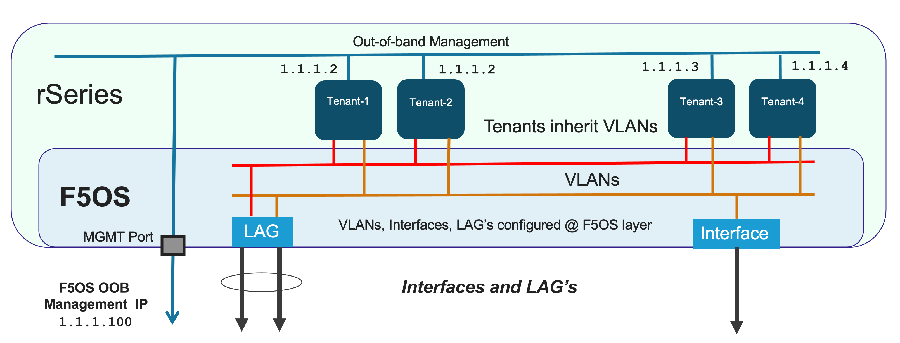
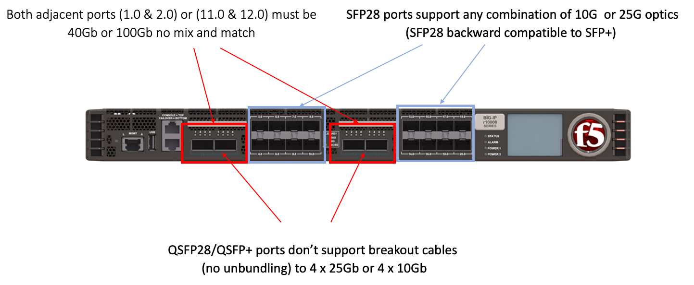
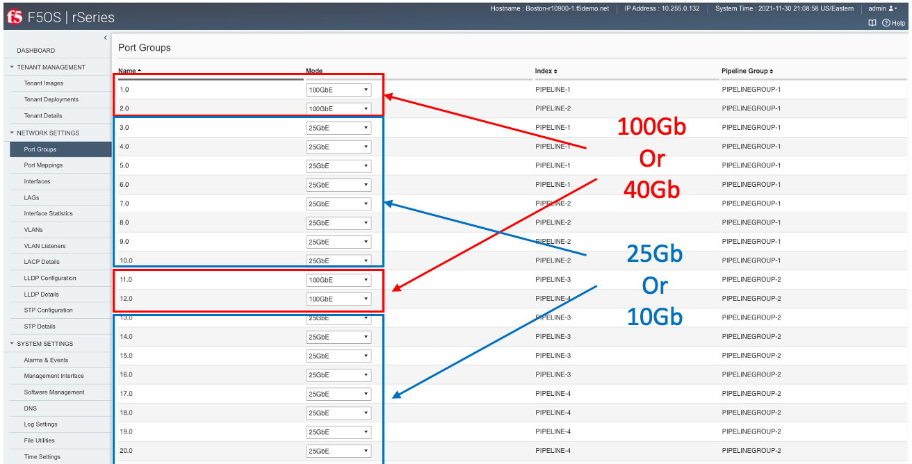
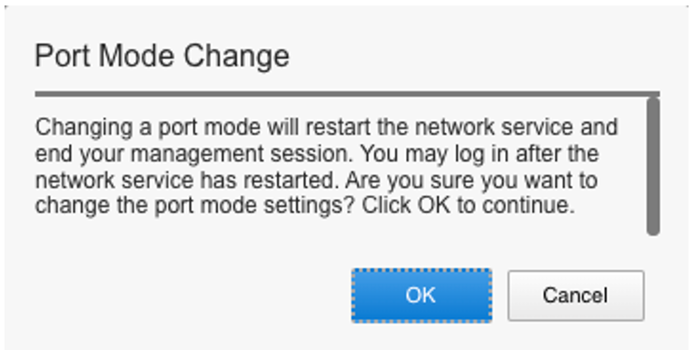
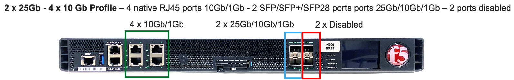

==================
rSeries Networking
==================

Platform Layer Isolation
========================

Management of the new F5OS platform layer is completely isolated from in-band traffic networking and VLANs. It is purposely isolated so that it is only accessible via the out-of-band management network. In fact, there are no in-band IP addresses assigned to the F5OS layer, only tenants will have in-band management IP addresses and access. Tenants also have out-of-band connectivity.

This allows customers to run a secure/locked-down out-of-band management network where access is tightly restricted. The diagram below shows the out-of-band management access entering the rSeries appliance through **MGMT** port. The external MGMT port is bridged to an internal out-of-band network that connects to all tenants within the rSeries appliance. 

Port Groups
===========

The portgroup component is used to control the mode of the physical ports. This controls whether a port is bundled or unbundled and the port speed. Currently the high speed ports do not support unbundling. **Adjacent** high speed ports (**1.0** & **2.0**) and (**11.0** & **12.0** on the r10000 series) must be configured in the same mode and speed currently, either both are configured for 40Gb or both configured for 100Gb. You cannot break out to lower speeds (25Gb or 10Gb) via a breakout cables on these ports. Low speed 25Gb/10Gb ports (**3.0** - **10.0** on both the r5000/r10000 series and **13.0** - **20.0** on the r10000 series) can be configured indepdently, and adjacent low ports can have different speed values. The term portgroup is used rather than simply “port” because some front panel ports may accept different types of SFPs. Depending on the portgroup mode value, a different FPGA version is loaded, and the speed of the port is adjusted accordingly. The user can modify the portgroup mode as needed through the F5OS CLI, GUI or API.

Below is an example of the F5OS GUI Port Groups screen. Note that any changes in configuration will require a reboot of the appliance to load a new FPGA bitstream image.

Interfaces
==========

Interface numbering will vary depending on the current portgroup configuration. Interfaces will always be numbered by **<blade#>/<port#>**. The number of ports on a blade will change depending on if the portgroup is configured as bundled or unbundled. If the ports are bundled then ports will be **1/1.0** & **1/2.0** for slot 1, and **2/1.0** & **2/2.0** for slot 2. 

If ports are unbundled then the port numbering will be **1/1.1, 1/1.2, 1/1.3, & 1/1.4** for the first physical port and **1/2.1, 1/2.2, 1/2.3, & 1/2.4** for the second physical port. Breakout cables will be needed to support the unbundled 25Gb or 10Gb configurations. Even when multiple chassis partitions are used, the port numbering will stay consistent starting with the blade number.

Supported Optics
================

Only F5 branded optics are officially supported on VELOS. VELOS supports speeds of 10Gb, 25Gb, 40Gb, and 100Gb depending on the type of optics used and the port group configuration. VELOS interfaces will accept F5 approved QSFP+ or QSFP28 optics. 3rd party optics are not officially supported per F5’s support policies: https://support.f5.com/csp/article/K8153. 

**40GB QSFP+ options:**

+------------------------+------------+------------------------------------------------------------------------------+
| 40GBASE-LR4 (QSFP+)    | OPT-0030   | TRANSCEIVER, QSFP+, 40G-LR4, 10KM, LC, SMF, DDM, F5 BRANDED                  |
+------------------------+------------+------------------------------------------------------------------------------+
| 40GBASE-SR4 (QSFP+)    | OPT-0036   | TRANSCEIVER, QSFP+, 40GIG-SR4, 850NM, 100M, MPO, RESET, MMF, DDM, F5 BRANDED |
+------------------------+------------+------------------------------------------------------------------------------+
| 40G BiDi (QSFP+)       | OPT-0043   | TRANSCEIVER, QSFP+, 2X20G BIDI 850NM-900NM, 100M, LC, MMF, DDM, F5 BRANDED   |
+------------------------+------------+------------------------------------------------------------------------------+
| 40G-PSM4 (QSFP+)       | OPT-0045   | TRANSCEIVER, QSFP+, 40GIG-PSM4, 1310NM, 10KM, MPO, SMF, DDM, F5 BRANDED      |
+------------------------+------------+------------------------------------------------------------------------------+

**100GB QSFP28 options:**

+------------------------+------------+----------------------------------------------------------------------------------+
| 100GBASE-SR4 (QSFP28)  | OPT-0031   | TRANSCEIVER, QSFP28, 100G-SR4, 850NM, MMF, MPO, DDM, BRANDED                     |
+------------------------+------------+----------------------------------------------------------------------------------+
| 100GBASE-LR4 (QSFP28)  | OPT-00352  | TRANSCEIVER, QSFP28, 100G-LR4, 10KM, LC, SMF, 4.5W, DDM, VELOCITY SDK, BRANDED   |
+------------------------+------------+----------------------------------------------------------------------------------+
| 100G-PSM4 (QSFP28)     | OPT-0055   | TRANSCEIVER, QSFP28, 100GIG-PSM4, 1310NM, 500M, MPO, SMF, F5 BRANDED             |
+------------------------+------------+----------------------------------------------------------------------------------+
| 100G BIDI (QSFP28)     | OPT-0047   | TRANSCEIVER, QSFP28, 100G BIDI, 100M, LC, MMF, F5 BRANDED (Planned for mid CY21) |
+------------------------+------------+----------------------------------------------------------------------------------+

**Note: OPT-0039 QSFP28 LR4 used in VIPRION/iSeries are compatible with VELOS, but default optics for 100G SR4 VEOS is OPT-0052 (as shown above)**

Below are the current VELOS optic SKU’s:

**Note: 100G BiDi is planned (please contact product management to discuss your requirements, as there are different standards available in the market)**

+----------------------+------+---------------------------------------------------------------------------------------+
| F5-UPGVELQSFP28LR4   | MY   | VELOS Field Upgrade: QSFP28 Transceiver (100G-LR4, 10KM, LC, SMF, DDM) ROHS           |
+----------------------+------+---------------------------------------------------------------------------------------+
| F5-UPGVELQSFP28PSM4  | TH   | VELOS Field Upgrade: QSFP28 Transceiver (100G-PSM4, 500M, MPO/APC, SMF, DDM) ROHS     |
+----------------------+------+---------------------------------------------------------------------------------------+
| F5-UPGVELQSFP28-SR4  | PH   | VELOS Field Upgrade: QSFP28 Transceiver (100G-SR4, 100M, MPO MMF, DDM) ROHS           |
+----------------------+------+---------------------------------------------------------------------------------------+
| F5-UPG-VEL-QSFP+BD   | PH   | VELOS Field Upgrade: QSFP+ Transceiver (2x20G-BIDI, 850NM-900NM, 100M, LC, MMF, DDM)  |
+----------------------+------+---------------------------------------------------------------------------------------+
| F5-UPG-VEL-QSFP+LR4  | MY   | VELOS Field Upgrade: QSFP+ Transceiver (40G-LR, 1310NM, 10KM, LC, SMF, DDM Support)   |
+----------------------+------+---------------------------------------------------------------------------------------+
| F5-UPG-VEL-QSFP+PSM4 | PH   | VELOS Field Upgrade: QSFP+ Transceiver (40G-PSM4, 1310NM, 10KM, MPO/APC, SMF, DDM )   |
+----------------------+------+---------------------------------------------------------------------------------------+
| F5-UPG-VEL-QSFP+SR4  | CN   | VELOS Field Upgrade: QSFP+ Transceiver (40G-SR4, 850NM, 100M, MPO, DDM Support)       |
+----------------------+------+---------------------------------------------------------------------------------------+

The QSFP+ & QSFP28 optics when configured for unbundled mode will break out into either 4 x 25Gb (with a 100Gb QSFP28 optic) or 4 x 10Gb (with a 40Gb QSFP+ optic). You will need to utilize a breakout cable to allow the single physical port to break out into 4 ports. The following breakout cable SKU’s can be ordered and utilized for either 4 x 25Gb or 4 x 10GB depending on the optic installed. Note they come in different lengths (1Meter, 3 Meter, or 10 Meter) and each of the SKU’s is a 2 Pack.

+---------------------+------+--------------------------------------------------------------------------------------------+
| F5-UPGVELSR4XSR3M   | CN   | VELOS Field Upgrade: QSFP28-QSFP+ Breakout Cable for SR4 ONLY MPO to 4LC (3 Meter 2 Pack)  |
+---------------------+------+--------------------------------------------------------------------------------------------+
| F5-UPGVELSR4XSR1M   | CN   | VELOS Field Upgrade: QSFP28-QSFP+ Breakout Cable for SR4 ONLY MPO to 4LC (1 Meter 2 Pack)  |
+---------------------+------+--------------------------------------------------------------------------------------------+
| F5-UPGVELSR4XSR10M  | CN   | VELOS Field Upgrade: QSFP28-QSFP+ Breakout Cable for SR4 ONLY MPO to 4LC (10 Meter 2 Pack) |
+---------------------+------+--------------------------------------------------------------------------------------------+

Breakout for 40G PSM4 or 100G PSM4 transceivers *ONLY* (Note these are not 2 pack):

+---------------------+------+----------------------------------------------------------------------------------------------+
| F5-UPG-VELPSMXLR10M   | CN   | VELOS Field Upgrade: QSFP28-QSFP+ Breakout Cable for PSM4 ONLY. MPO/APC to 4LC (10 Meter)  |
+---------------------+------+----------------------------------------------------------------------------------------------+
| F5-UPG-VELPSM4XLR3M   | CN   | VELOS Field Upgrade: QSFP28-QSFP+ Breakout Cable for PSM4 ONLY. MPO/APC to 4LC (3 Meter)   |
+---------------------+------+----------------------------------------------------------------------------------------------+

VLANs
=====

VELOS supports both 802.1Q tagged and untagged VLAN interfaces. In the current F5OS releases, double VLAN tagging (802.1Q-in-Q) is not supported. Any port within a chassis partition, even across blades can be added to a VLAN and VLANs are specific to that chassis partition. VLANs can be re-used across different chassis partitions, and tenants within and across chassis partitions can share the same VLANs. Any VLANs that are configured on different chassis partitions will not be able to communicate inside the chassis, they will need to be connected via and external switch to facilitate communication between them.

Link Aggregation Groups
=======================

VELOS allows for bonding of interfaces into Link Aggregation Groups or LAG’s. LAG’s can span across blades as long as blades are in the same chassis partition. Links within a LAG must be the same type and speed. LAG’s may be configured for static or lacp mode. The maximum number of members within a single LAG is eight.

**Note: The number of members in a LAG is expected to be increased to 32 in a subsequent release.**

An admin can configure the **LACP Type** to **LACP** or **Static**, the **LACP Mode** to be **Active** or **Passive**, and the **LACP Interval** to **Slow** or **Fast**.  
