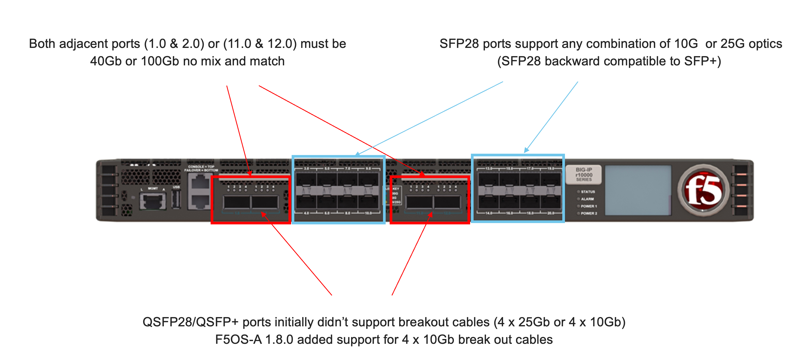
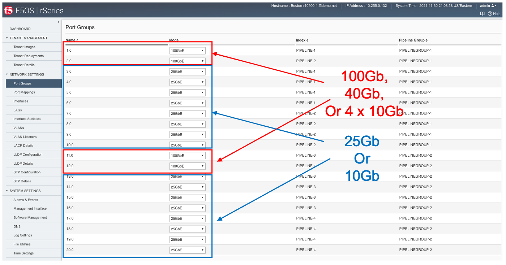

==================
rSeries Networking
==================

Platform Layer Isolation
========================

Management of the new F5OS platform layer is completely isolated from in-band traffic networking and VLANs. It is purposely isolated so that it is only accessible via the out-of-band management network. In fact, there are no in-band IP addresses assigned to the F5OS layer, only tenants will have in-band management IP addresses and access. Tenants also have out-of-band connectivity.

This allows customers to run a secure/locked-down out-of-band management network where access is tightly restricted. The diagram below shows the out-of-band management access entering the rSeries appliance through **MGMT** port. The external MGMT port is bridged to an internal out-of-band network that connects to all tenants within the rSeries appliance. 

.. image:: images/rseries_networking/image1.png
  :align: center

Port Groups
===========

The portgroup component is used to control the mode of the physical ports. This controls whether a port is bundled or unbundled and the port speed. Currently the high speed ports do not support unbundling. **Adjacent** high speed ports (**1.0** & **2.0** on both the r5000/r10000 series) and (**11.0** & **12.0** on the r10000 series) must be configured in the same mode and speed currently. Either both are configured for 40Gb or both configured for 100Gb, you cannot mix and match. You cannot break out these ports to lower speeds (25Gb or 10Gb) via a breakout cables as this is currently unsupported. Low speed 25Gb/10Gb ports (**3.0** - **10.0** on both the r5000/r10000 series) and (**13.0** - **20.0** on the r10000 series) can be configured independently, and adjacent low ports can have different speed values. The term portgroup is used rather than simply “port” because some front panel ports may accept different types of SFPs. Depending on the portgroup mode value, a different FPGA version is loaded, and the speed of the port is adjusted accordingly. The user can modify the portgroup mode as needed through the F5OS CLI, GUI or API.

Below is an example of the F5OS GUI **Port Groups** screen on a r10000 Series appliance. Note that any changes in configuration will require a reboot of the appliance to load a new FPGA bitstream image.

.. image:: images/rseries_networking/image4.png
  :align: center
  :scale: 50%

Interfaces
==========

Interfaces will always be numbered starting with **1.0** and ending with the maximum number of ports on the appliance (**10.0** on the r5000 series and **20.0** on the r10000 series appliances). The type of optic in combination with the **port group** setting will dictate the speed of the interface. Interfaces can be run independetly or bundled together in Link Aggregation Group. VLANs will be assigned to independent interfaces, or at the LAG configuration level if multiple interfaces are bundled together.

Supported Optics
================

Only F5 branded optics are officially supported on rSeries appliances. rSeries supports speeds of 1Gb (on selected low end models) 10Gb, 25Gb, 40Gb, and 100Gb depending on the type of optics used and the port group configuration. rSeries high speed interfaces will accept F5 approved QSFP+ & QSFP28 optics, while low speed ports will accept SFP28 and SFP+ optics. 3rd party optics are not officially supported per F5’s support policies: https://support.f5.com/csp/article/K8153. 

**10GB SFP+ options:**

+------------------------+------------+------------------------------------------------------------------------------------------+
| 10G Active DAC (SFP+)  | CBL-0138   | CABLE ASSEMBLY, SFP+ ACTIVE, COPPER, 10GBPS, 30 AWG, 3.0m, M-M, 3.3V, GEN 2, F5 BRANDED  |
+------------------------+------------+------------------------------------------------------------------------------------------+
| 10GBASE-LR (SFP+)      | OPT-0017   | TRANSCEIVER, SFP+, 10GIG, 1310nm, 10Km, LC, SMF.LIMITING, DDM, -5/70C, F5 BRANDED        |
+------------------------+------------+------------------------------------------------------------------------------------------+
| 10GBASE-SR (SFP+)      | OPT-0016   | TRANSCEIVER, SFP+, 10GIG, 850nm, 300m, LC, MMF, LIMITING, DDM, F5 BRANDED                |
+------------------------+------------+------------------------------------------------------------------------------------------+

**25GB SFP28 options:**

+------------------------+------------+----------------------------------------------------------------------------------+
| 25GBASE-SR (SFP28)     | OPT-0053   | TRANSCEIVER, SFP28, 25G-SR, 100M, LC, MMF, 1W, F5 BRANDED                        |
+------------------------+------------+----------------------------------------------------------------------------------+
| 25GBASE-LR (SFP28)     | OPT-0054   | TRANSCEIVER, SFP28, 25G-LR, 10KM, LC, SMF, 1.5W, F5 BRANDED                      |
+------------------------+------------+----------------------------------------------------------------------------------+

**40GB QSFP+ options:**

+------------------------+------------+------------------------------------------------------------------------------+
| 40GBASE-LR4 (QSFP+)    | OPT-0030   | TRANSCEIVER, QSFP+, 40G-LR4, 10KM, LC, SMF, DDM, F5 BRANDED                  |
+------------------------+------------+------------------------------------------------------------------------------+
| 40GBASE-SR4 (QSFP+)    | OPT-0036   | TRANSCEIVER, QSFP+, 40GIG-SR4, 850NM, 100M, MPO, RESET, MMF, DDM, F5 BRANDED |
+------------------------+------------+------------------------------------------------------------------------------+
| 40G BiDi (QSFP+)       | OPT-0043   | TRANSCEIVER, QSFP+, 2X20G BIDI 850NM-900NM, 100M, LC, MMF, DDM, F5 BRANDED   |
+------------------------+------------+------------------------------------------------------------------------------+
| 40G-PSM4 (QSFP+)       | OPT-0045   | TRANSCEIVER, QSFP+, 40GIG-PSM4, 1310NM, 10KM, MPO, SMF, DDM, F5 BRANDED      |
+------------------------+------------+------------------------------------------------------------------------------+

**100GB QSFP28 options:**

+------------------------+------------+----------------------------------------------------------------------------------+
| 100GBASE-SR4 (QSFP28)  | OPT-0031   | TRANSCEIVER, QSFP28, 100G-SR4, 850NM, MMF, MPO, DDM, BRANDED                     |
+------------------------+------------+----------------------------------------------------------------------------------+
| 100GBASE-LR4 (QSFP28)  | OPT-0052   | TRANSCEIVER, QSFP28, 100G-LR4, 10KM, LC, SMF, 4.5W, DDM, VELOCITY SDK, BRANDED   |
+------------------------+------------+----------------------------------------------------------------------------------+
| 100G-PSM4 (QSFP28)     | OPT-0055   | TRANSCEIVER, QSFP28, 100GIG-PSM4, 1310NM, 500M, MPO, SMF, F5 BRANDED             |
+------------------------+------------+----------------------------------------------------------------------------------+
| 100G BIDI (QSFP28)     | OPT-0047   | TRANSCEIVER, QSFP28, 100G BIDI, 100M, LC, MMF, F5 BRANDED                        |
+------------------------+------------+----------------------------------------------------------------------------------+

**Note: OPT-0039 QSFP28 LR4 used in VIPRION/iSeries are compatible with rSeries, but default optics for 100G SR4 VEOS is OPT-0052 (as shown above)**

Below are the current rSeries optic SKU’s:

**Note: 100G BiDi is planned (please contact product management to discuss your requirements, as there are different standards available in the market)**

+----------------------+------+---------------------------------------------------------------------------------------+
| F5-UPGVELQSFP28LR4   | MY   | VELOS Field Upgrade: QSFP28 Transceiver (100G-LR4, 10KM, LC, SMF, DDM) ROHS           |
+----------------------+------+---------------------------------------------------------------------------------------+
| F5-UPGVELQSFP28PSM4  | TH   | VELOS Field Upgrade: QSFP28 Transceiver (100G-PSM4, 500M, MPO/APC, SMF, DDM) ROHS     |
+----------------------+------+---------------------------------------------------------------------------------------+
| F5-UPGVELQSFP28-SR4  | PH   | VELOS Field Upgrade: QSFP28 Transceiver (100G-SR4, 100M, MPO MMF, DDM) ROHS           |
+----------------------+------+---------------------------------------------------------------------------------------+
| F5-UPG-VEL-QSFP+BD   | PH   | VELOS Field Upgrade: QSFP+ Transceiver (2x20G-BIDI, 850NM-900NM, 100M, LC, MMF, DDM)  |
+----------------------+------+---------------------------------------------------------------------------------------+
| F5-UPG-VEL-QSFP+LR4  | MY   | VELOS Field Upgrade: QSFP+ Transceiver (40G-LR, 1310NM, 10KM, LC, SMF, DDM Support)   |
+----------------------+------+---------------------------------------------------------------------------------------+
| F5-UPG-VEL-QSFP+PSM4 | PH   | VELOS Field Upgrade: QSFP+ Transceiver (40G-PSM4, 1310NM, 10KM, MPO/APC, SMF, DDM )   |
+----------------------+------+---------------------------------------------------------------------------------------+
| F5-UPG-VEL-QSFP+SR4  | CN   | VELOS Field Upgrade: QSFP+ Transceiver (40G-SR4, 850NM, 100M, MPO, DDM Support)       |
+----------------------+------+---------------------------------------------------------------------------------------+

**Note: The QSFP+ & QSFP28 optics cannot be configured for unbundled mode - 4 x 25Gb (with a 100Gb QSFP28 optic) or 4 x 10Gb (with a 40Gb QSFP+ optic).  The following breakout cable SKU’s are not supported on rSeries currently.**

**THESE ARE UNSUPPORTED**

+---------------------+------+--------------------------------------------------------------------------------------------+
| F5-UPGVELSR4XSR3M   | CN   | VELOS Field Upgrade: QSFP28-QSFP+ Breakout Cable for SR4 ONLY MPO to 4LC (3 Meter 2 Pack)  |
+---------------------+------+--------------------------------------------------------------------------------------------+
| F5-UPGVELSR4XSR1M   | CN   | VELOS Field Upgrade: QSFP28-QSFP+ Breakout Cable for SR4 ONLY MPO to 4LC (1 Meter 2 Pack)  |
+---------------------+------+--------------------------------------------------------------------------------------------+
| F5-UPGVELSR4XSR10M  | CN   | VELOS Field Upgrade: QSFP28-QSFP+ Breakout Cable for SR4 ONLY MPO to 4LC (10 Meter 2 Pack) |
+---------------------+------+--------------------------------------------------------------------------------------------+

Breakout for 40G PSM4 or 100G PSM4 transceivers *ONLY* (Note these are not 2 pack):

**THESE ARE UNSUPPORTED**

+---------------------+------+----------------------------------------------------------------------------------------------+
| F5-UPG-VELPSMXLR10M   | CN   | VELOS Field Upgrade: QSFP28-QSFP+ Breakout Cable for PSM4 ONLY. MPO/APC to 4LC (10 Meter)  |
+---------------------+------+----------------------------------------------------------------------------------------------+
| F5-UPG-VELPSM4XLR3M   | CN   | VELOS Field Upgrade: QSFP28-QSFP+ Breakout Cable for PSM4 ONLY. MPO/APC to 4LC (3 Meter)   |
+---------------------+------+----------------------------------------------------------------------------------------------+

VLANs
=====

rSeries supports both 802.1Q tagged and untagged VLAN interfaces. In the current F5OS releases, double VLAN tagging (802.1Q-in-Q) is not supported. VLANs can be added to any individual port, or to a Link Aggregation Group.BIG-IP tenants can share the same VLANs.

Link Aggregation Groups
=======================

rSeries allows for bonding of interfaces into Link Aggregation Groups or LAG’s. LAG’s can span across any port as long as they are configured to support the same speed. Links within a LAG must be the same type and speed. LAG’s may be configured for static or lacp mode.

An admin can configure the **LACP Type** to **LACP** or **Static**, the **LACP Mode** to be **Active** or **Passive**, and the **LACP Interval** to **Slow** or **Fast**.

Pipelines
=========

The r10000 and r5000 series of appliances expose internal pipelines (connection paths between internal FPGA's) to the user so that they can plan for the most optimal network connectivity to rSeries to avoid oversubscription. rSeries appliances will have multiple pipelines between FPGA's and each pipelines supports a max bandwidth of 100Gb. Front panel ports are statically mapped to different internal pipelines to distribute load, ideally proper knowlwedge of pipelines and planning will avoid any possible internal oversubscription scenarios.

If all ports are utilized and running at max bandwidth capacity simulataneously this may result in an oversubsciprion if the maximum bandwidth for the internal pipelines are achieved. By exposing the internal pipelines to the user, they can plan ahead and spread external network connections into specific ports to maximize pipeline bandwidth and avoid oversubscription. Currently the mapping of ports to internal piepleines is static and not configurable, although F5 may make this a configurable option in the future.

Below is an example of the total external front panel possible bandwidth exceeding internal pipeline bandwidth:

.. image:: images/rseries_networking/image5.png
  :align: center
  :scale: 120%

There are static mappings of external ports to specific internal pipelines. If you are not using all ports you can spread the used ports over the diffferent pipelines to avoid possible oversubscription scenarios.

.. image:: images/rseries_networking/image6.png
  :align: center
  :scale: 120%

Below shows the total piplines and ports for both the r5000 and r10000 series appliances.

.. image:: images/rseries_networking/image7.png
  :align: center
  :scale: 120%

You can view the front panel port to pipeline mapping in the CLI, GUI, or API of F5OS.

.. image:: images/rseries_networking/image8.png
  :align: center
  :scale: 50%