==============================
rSeries Performance and Sizing
==============================

rSeries appliances are a new generation of hardware using the latest Intel CPU's for processing in addition to FPGA's (On the r10000 and r5000 Series). Intel CPU’s perform SSL processing and compression offload as was done with previous generation BIG-IP solutions such as iSeries and the VIPRION B4450. Older VIPRION blades such as the B2100, B2150, & B2250 use Intel processing, but use Cavium Nitrox for SSL offload. The newer generation Intel chipsets provide more modern SSL cipher support and can offload ECC (Elliptical Curve) based ciphers in hardware, which most previous generations of VIPRION blades could not.

In addition to more modern Intel chipsets, the mid-range (r5000) and high-end (r10000) rSeries appliances also have extensive FPGA support. The r2000 and r4000 rSeries models do not support FPGA's and instead perform these functions in software. In previous generations of F5 hardware the ePVA (FPGA) was used to offload varying workloads from FASTL4 to DDoS mitigation, and that functionality is brought forward and expanded upon in the new generation of rSeries hardware. 

Some additional links on the benefits of hardware offload using the ePVA in previous generation BIG-IP solutions:

https://techdocs.f5.com/content/dam/f5/kb/global/solutions/sol12837_pdf.html/12837.pdf

https://devcentral.f5.com/s/articles/F5-Fast-L4-Acceleration-and-the-F5-Smart-Coprocessor-prioritized-Fast-L4-Acceleration

In rSeries there are now multiple FPGA’s, the **Application Traffic Services Engine** (ATSE), and the **Appliance Switch** (ASW), and the **Network Services Engine** (NSE). In addition to supporting previous functions done by the ePVA there are also additional functions that were performed in software or Broadcom chipsets that are now handled within the FPGA’s. Below is an architectural diagram of the r10000 Series appliance. 

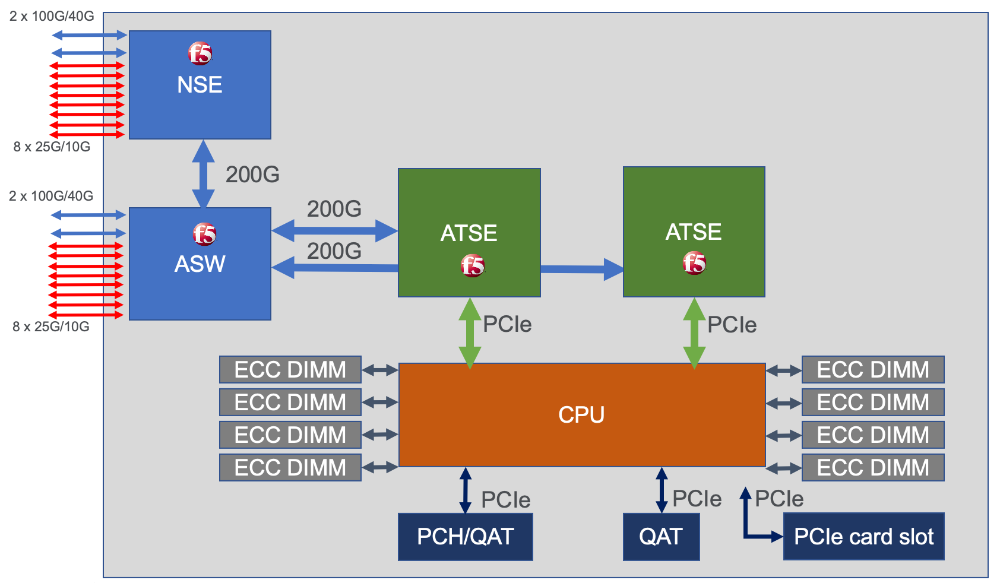

The r5000 Series appliance has a similar architecture but since it doesn't require the same performance as the r10000 series is has less FPGA's and CPUs, and less physical ports.

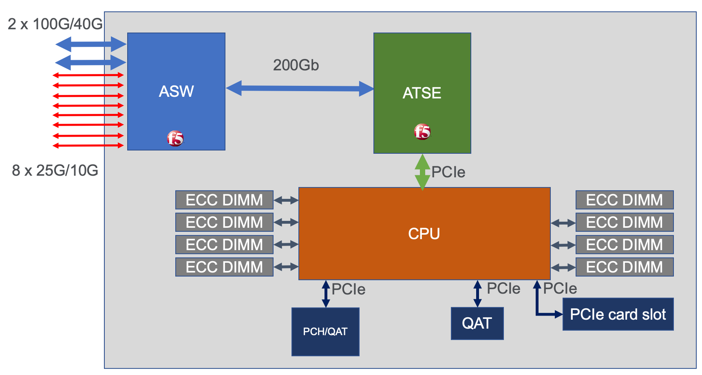

Both the r4000 & r2000 Series appliances have a slightly different hardware architecture than the r5000 and r10000 appliances. They still run F5OS-A software, but they do not utulize FPGA's for hardware offload, and instead perform these functions in software. This means that CPU's do not need to be dedicated to the F5OS layer leaving more CPU for tenants. These platforms also run a different class of Intel processing, and do not utilize hyperthreading like the higher end platforms do. Because these appliances are for lower performing environments they do not support 40Gb or 100Gb interfaces. Instead they support 1Gb, 10Gb, and 25Gb interfaces. Below is the r4000 appliance

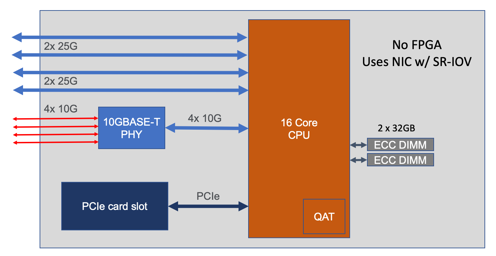

The r2000 appliance has a similar architecture like the r4000, but it has less memory and CPU cores.

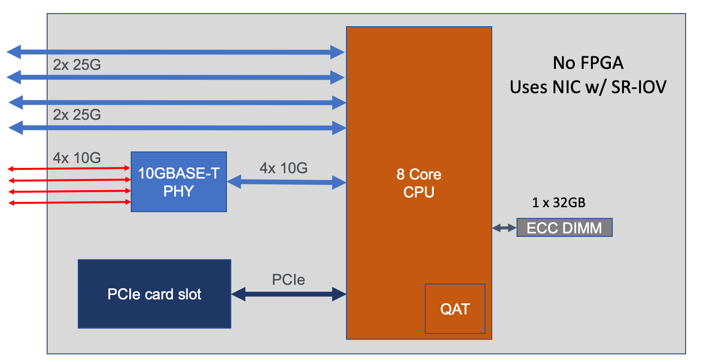

a similar architecture but since it doesn't require the same performance as the r10000 series is has less FPGA's and CPUs, and less physical ports.

**Note: In the initial 1.0.x versions of F5OS-A (for rSeries appliances), not all FPGA HW offload functions are enabled. Many will be added in the subsequent TMOS & F5OS releases. AFM DDoS mitigation offload is not fully supported in v1.0.x versions of F5OS-A and will run in software similar to how it would run in a BIG-IP VE. SSL & Compression HW offload are fully supported in the initial v1.0.x F5OS-A releases, as is FASTL4 HW offload. CGNAT, PEM, SPDAG, VXLAN, 802.1Q-in-Q (double) VLAN tagging, vWire, VLAN Groups, are not supported in the initial F5OS-A 1.0.x releases, and will be added in a future release.**

When comparing rSeries to the previous generation iSeries appliances it is important to note that rSeries provides more options for network connectivity including 25GB and 100Gb Ethernet support. rSeries appliances are generally providing up to 2x more performance than the previous generation iSeries appliances.

Looking at comparisons of iSeries i10800 vs. the r10000 or the iSeries i5800 vs.the r5000 you can see a 1.2x-2.4x increase in performance depending on which metric is looked at. From an SSL perspective the increase is 2.3x-10x for RSA based ciphers, and for Elliptical Curve rSeries will offload that processing to hardware, some older BIG-IP appliances may have had to process more modern ciphers in software.

.. image:: images/rseries_performance_and_sizing/image5.png
  :align: center
  :scale: 40%

The performance numbers for rSeries already include any overhead for multitenancy as the platform is multitenant by default. There is nothing to switch on to enable multitenancy. VIPRION or iSeries on the other hand has the option of running multitenancy by enabling vCMP. Published data sheet numbers for VIPRION or iSeries are for bare-metal mode, where no virtualization (vCMP) is enabled. Enabling vCMP on VIPRION or iSeries has overhead and will reduce the overall performance of a blade or appliance as the hypervisor takes up CPU and memory resources.

How much performance drops can vary for different metrics, but F5 has always sized environments using a rule-of-thumb of ~20% hit on performance for enabling virtualization/vCMP. With rSeries the published data sheet numbers are with multitenancy enabled, so there is no need to calculate in an additional 20% drop due to virtualization being enabled.  

vCPU Sizing
===========

r10000 vCPU Sizing
------------------

Each rSeries 10900 model has 48 vCPU’s, but 12 of those vCPU’s are reserved for use by the F5OS platform layer. This is different than iSeries where each vCPU gave a portion of its processing and memory to the hypervisor when vCMP was enabled. In the r10900 36 vCPU’s are available to be assigned to tenants since the other 12 are reserved. The diagram below depicts the r10900 vCPU allocation: 

.. image:: images/rseries_performance_and_sizing/image10.png
  :align: center
  :scale: 40%

The r10800 model has 48 vCPU’s, but 12 of those vCPU’s are reserved for use by the F5OS platform layer and xx vCPU's are disabled via licensing. This is different than iSeries where each vCPU gave a portion of its processing and memory to the hypervisor when vCMP was enabled. In the r10800 30 vCPU’s are available to be assigned to tenants since 12 are reserved for F5OS, and 6 are disabled via licensing. The diagram below depicts the r10800 vCPU allocation: 

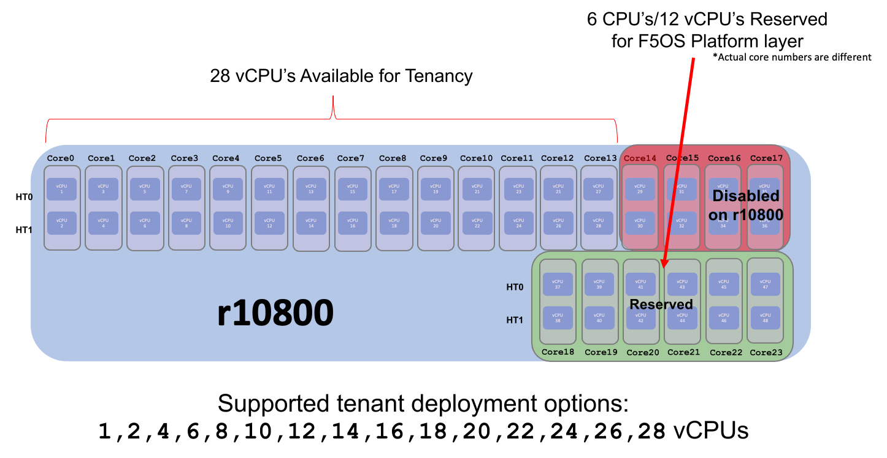

The r10600 model has 48 vCPU’s, but 12 of those vCPU’s are reserved for use by the F5OS platform layer. This is different than iSeries where each vCPU gave a portion of its processing and memory to the hypervisor when vCMP was enabled. In the r10600 24 vCPU’s are available to be assigned to tenants since the other 12 are reserved for F5OS, and 12 are disabled via licensing. The diagram below depicts the r10600 vCPU allocation: 

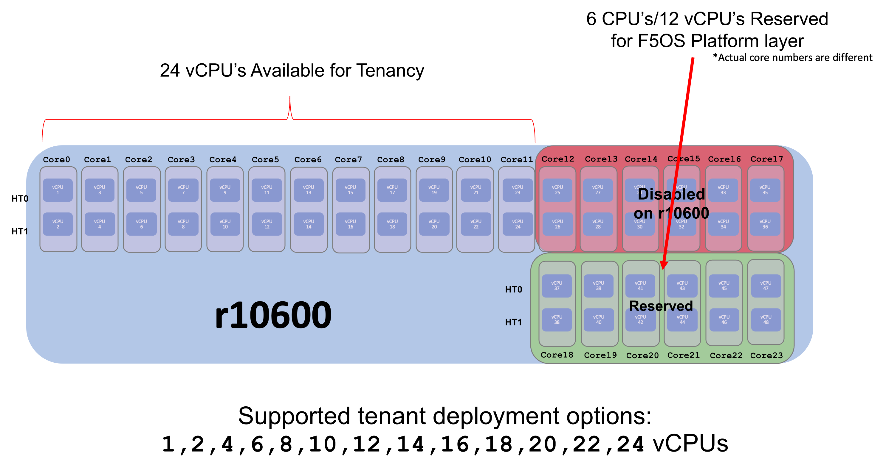

r5000 vCPU Sizing
------------------

Each rSeries 5900 model has 32 vCPU’s, but 6 of those vCPU’s are reserved for use by the F5OS platform layer. This is different than iSeries where each vCPU gave a portion of its processing and memory to the hypervisor when vCMP was enabled. In the r5900 24 vCPU’s are available to be assigned to tenants since the other 6 are reserved. The diagram below depicts the r5900 vCPU allocation: 

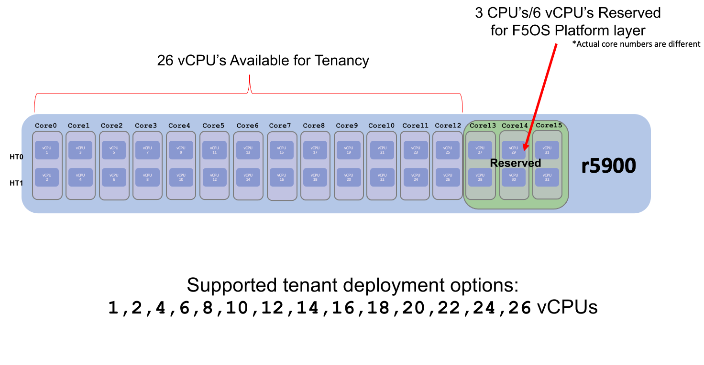

The r5800 model has 32 vCPU’s, but 6 of those vCPU’s are reserved for use by the F5OS platform layer and 8 vCPU's are disabled via licensing. This is different than iSeries where each vCPU gave a portion of its processing and memory to the hypervisor when vCMP was enabled. In the r5800 18 vCPU’s are available to be assigned to tenants since 6 are reserved for F5OS, and 8 are disabled via licensing. The diagram below depicts the r5800 vCPU allocation: 

.. image:: images/rseries_performance_and_sizing/image14.png
  :align: center
  :scale: 70%

The r5600 model has 32 vCPU’s, but 6 of those vCPU’s are reserved for use by the F5OS platform layer. This is different than iSeries where each vCPU gave a portion of its processing and memory to the hypervisor when vCMP was enabled. In the r5600 12 vCPU’s are available to be assigned to tenants since the other 6 are reserved for F5OS, and 14 are disabled via licensing. The diagram below depicts the r5600 vCPU allocation: 

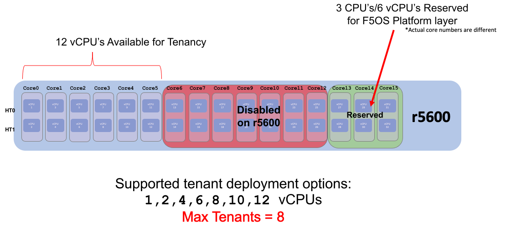

r4000 vCPU Sizing
------------------

Each rSeries 4800 model has 16 CPU’s (The 4000 platform does not utilize hyperhreading / vCPU's). No CPU’s are dedicated to the F5OS platform layer which is different than the mid-range and high-end rSeries appliances. In the r4800 16 CPU’s are available to be assigned to tenants. The diagram below depicts the r4800 CPU allocation: 

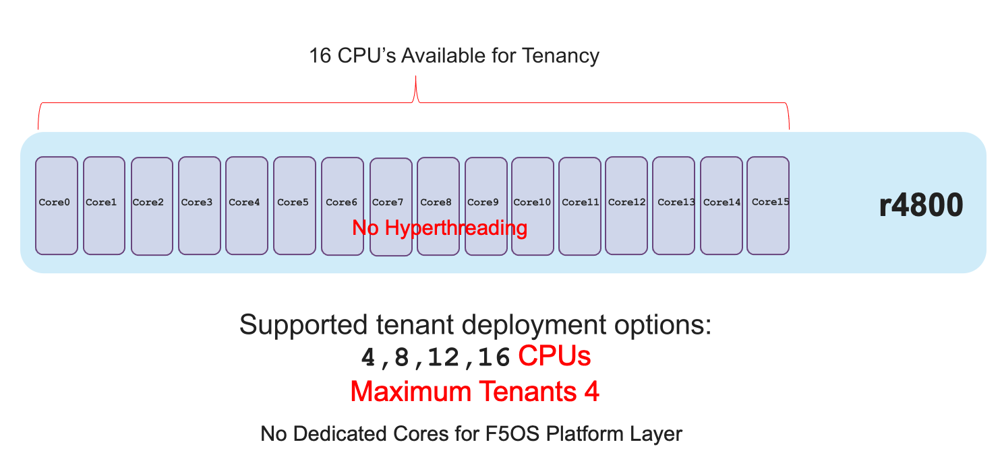

The r4600 model has 16 CPU’s (The 4000 platform does not utilize hyperhreading / vCPU's). No CPU’s are dedicated to the F5OS platform layer which is different than the mid-range and high-end rSeries appliances. In the r4600 8 CPU’s are available to be assigned to tenants and 8 are disabled via licensing. The diagram below depicts the r4600 vCPU allocation: 

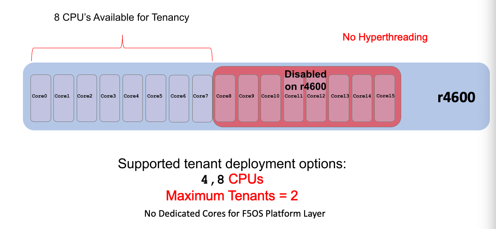

r2000 vCPU Sizing
------------------

Each rSeries 2800 model has 8 CPU’s (The 2000 platform does not utilize hyperhreading / vCPU's). No CPU’s are dedicated to the F5OS platform layer which is different than the mid-range and high-end rSeries appliances. In the r2800 8 CPU’s are available to be assigned to tenants (and only one tenant is supported). The diagram below depicts the r4200 CPU allocation: 

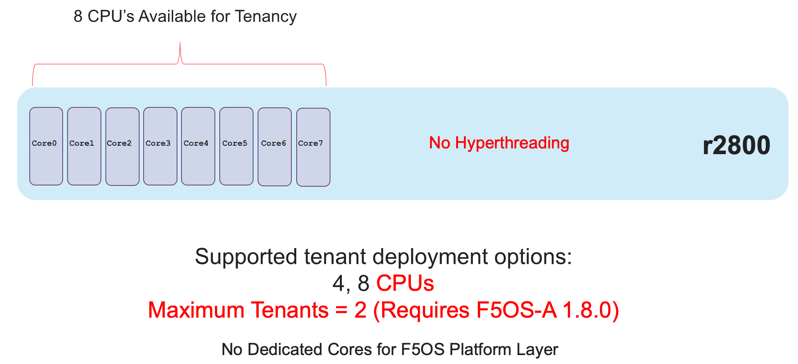

The r2600 model has 16 CPU’s (The 2000 platform does not utilize hyperhreading / vCPU's). No CPU’s are dedicated to the F5OS platform layer which is different than the mid-range and high-end rSeries appliances. In the r2600 4 CPU’s are available to be assigned to tenants and 4 are disabled via licensing. The diagram below depicts the r4600 vCPU allocation: 

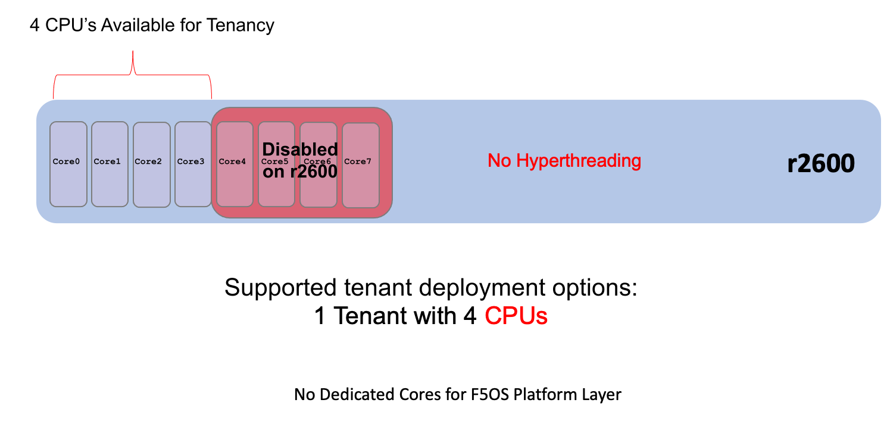

When sizing, removing the 12 or 6 (depending on platform) dedicated vCPU’s for F5OS from the equation will give a better representation of what the per vCPU performance will be. Comparing the performance of a single vCPU can be important for control plane sizing and also for extrapolation of what a tenant’s performance may be. Below is a comparison on the CPU’s on the i5600, i5800, i7600 and i7800 compared to the new rSeries r5600, r5800, and r5900. Note that the rSeries sizing is more complex because of the way the CPU’s are used. Since 6 physical / 12 vCPU’s (for the r10000) and 3 physical / 6 vCPU's (for the r5000) are dedicated for use by the platform layer overall CPU performance can be misleading. 

The graphs below compare the older model mid-rage iSeries platforms vs. the newer mode mid-range rSeries models. Note that these comparisons remove the 6 vCPU’s used for the platform layer. Instead of showing 16 physical cores and 32 vCPU’s, the r5000 is sized using 13 physical cores and 26 vCPU’s listed as (minus platform Layer CPU).

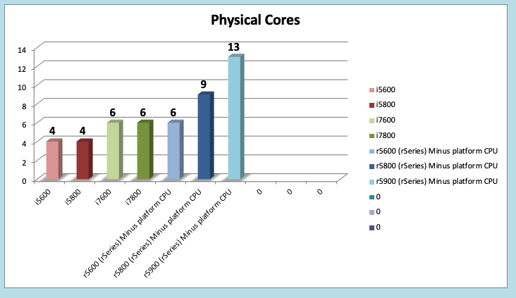

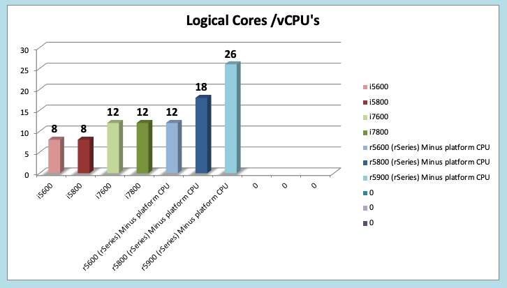

text

.. image:: images/rseries_performance_and_sizing/image23.png
  :align: center
  :width: 45%

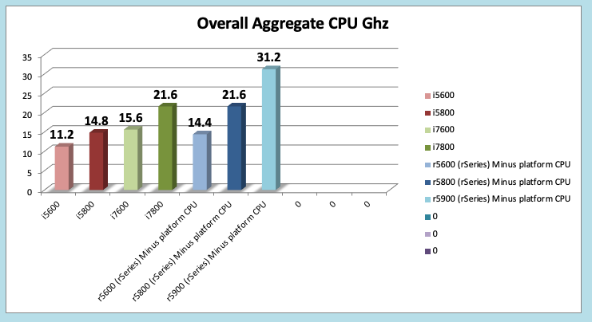

To compare performance of VIPRION vs. VELOS you can first look at overall CPU capacity of the system, and then break that down to per vCPU performance to get an apples-to-apples comparison. In a typical sizing exercise, it is normal to look at the overall number of vCPUs / the # of vCPUs in the system and consider the speed/performance at the per vCPU metric to come up with a sizing metric. Because VELOS dedicates some of its processing to the F5OS platform layer, we remove them from the overall sizing metric so that numbers don’t get skewed. As an example, take the overall BX110 blade performance metrics then divide by the total vCPU’s on the blades minus the 6 vCPU’s for the platform layer. You also have to consider that VELOS has more modern processors which are more efficient and can boost to higher rates than previous generation processors so looking at aggregate processor speed (total Ghz) only is not sufficient to get accurate sizing. 

**Relative CPU Scale** is a numeric grade-based comparison where the overall CPU capacity/horsepower of the system is given a rating. The rating is an easy way to compare different BIG-IP platforms. The Relative CPU Scale is calculated by taking the total # of CPU’s in a system (not including those used by VELOS platform layer) and multiplying that times the speed that the processors run. This will result in an aggregate CPU Ghz for the platform or blade. We then take the Aggregate CPU Ghz of a BIG-IP 2000s platform and give it a grade of 1. All other platforms are then given a numeric grade of how many times faster it is than the 2000s. This results in a simple numeric rating system that combines CPU speed with the number of CPU’s.

In the graph below you can see that a B2250 blade has 10x more aggregate CPU capacity than the 2000s.  A VELOS BX110 blade will have either 8.7x (minus platform CPU’s) or 11.1x (including platform CPU’s) and a 4450 blade has 22x. What may be deceiving here is how this translates into performance because the BX110 has next generation processors, and a different architecture where some CPU’s are dedicated to the platform layer.

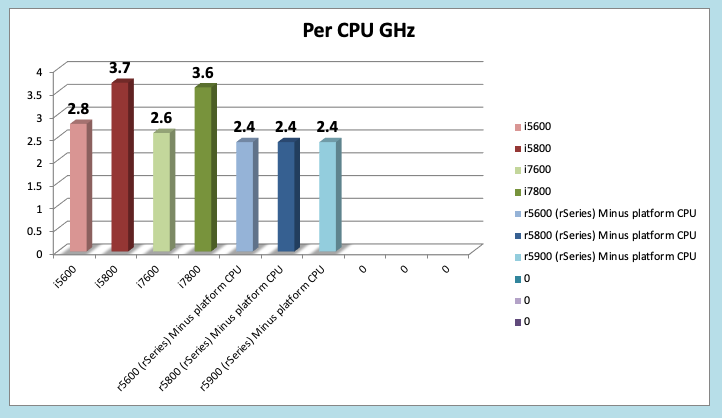

To see how this translates into performance, it is good to look at a Layer7 metric as that is something that will use a lot of CPU resource. If you look at the per blade Layer7 (Inf-Inf) numbers, you’ll notice VELOS provides higher numbers than a B2250 even though its rating is lower in the chart above. This is likely due to the newer generation of processors, the fact that some processing is dedicated to the platform layer, and the fact that the CPU’s can boost higher than previous generations. Generally, a BX110 blade is going to be faster than a B2250 blade (each metric will vary), but it’s safe to propose BX110 blades as direct replacements for B2250 blades. Also keep in mind BX110 has the latest Intel processing and crypto support so things like ECC ciphers are now accelerated in hardware which was not the case with VIPRION B2xxx blades. 

Note a BX110 blade is not intended to replace a single B4450 blade. The B4450 has ~2x the processing power and vCPU count of a BX110 blade. In most cases it would take 2 BX110 blades to handle the workload of a B4450. 

.. image:: images/rseries_performance_and_sizing/image23.png
  :align: center
  :scale: 80%

Because each blade has a different number of CPU’s, a common sizing exercise is to look at the per vCPU performance by using the formulas above to come up with a per vCPU metric. In the graph below it is done for Layer7 RPS (Inf-Inf) but you could use the same math for any metric. Note the graph below is not derived from a per vCPU test, it is taking a published blade metric and dividing it by the number of vCPU’s to come up with a per vCPU metric. As mentioned above using the VELOS metric which is (minus the platform CPU’s) is the most realistic. As expected, the BX110 provides a better per vCPU RPS than the B2250, but what may be surprising is that it has a higher RPS than the B4450 as well. This is because the B4450 gets its overall speed due to the number of vCPU’s and it has 2x more than the BX110. Even though the BX110 CPUs run slower (1.9Ghz vs. 2.2Ghz) than the B4450, the changes in architecture, more modern CPU etc... make it perform faster at the per vCPU metric.

**NOTE: The per vCPU charts above are based on extrapolations, not per vCPU testing, so results may vary. This is generally acceptable for sizing use, as this is more a means of comparison of platform differences than a guarantee of a certain metric.**

Also consider that these extrapolations for the VIPRION blades are for bare metal configuration with no vCMP enabled. When extrapolating what the performance would be with vCMP enabled on a per vCPU basis the numbers for VIPRION blades would have 20% subtracted from them. VELOS on the other hand is multitenant by default, so there is no need to subtract 20% for virtualization overhead. The VELOS numbers are inclusive of multitenancy already.

Memory Sizing
=============

Each VELOS BX110 blade has 128GB of memory, which is double the current memory support of the B2250 blade (64GB) but half the current B4450 blade (256GB). Generally, a BX110 will have more than enough memory to replace a B2250 blade and will actually provide more memory which may help vCMP guests which are pushing memory limits.  Just like sizing based on L7 it will likely take 2 BX110 blades to replace a B4450 blade when looking at memory only. 

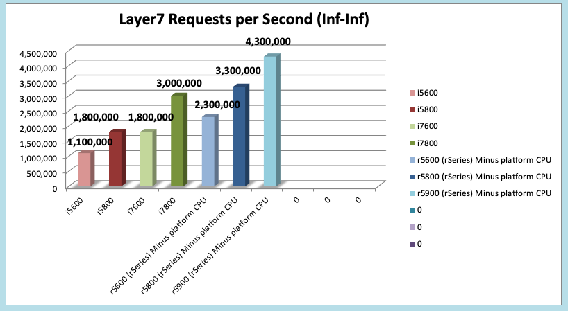

Breaking down memory to get per vCPU numbers will help when dealing with current vCMP guest configurations where memory is allocated based on the number of vCPU’s assigned to the guest. Because VELOS has a different architecture than VIPRION there is a formula for calculating how much memory a vCPU will receive. The chart below shows the default RAM per vCPU allocation with 1vCPU tenant. 

.. image:: images/rseries_performance_and_sizing/image26.png
  :align: center
  :scale: 70%

With VELOS the amount of RAM per vCPU will change slightly as more vCPU’s are added to the tenant. Below are the default values for total RAM, and RAM per vCPU for the VELOS tenants. These are Recommended values, but VELOS provides  Advanced options where memory per tenant can be customized to allocate more memory. See the Multitennancy section for more details on memory customization.

+----------------------+---------------------+--------------------------+-----------------+-----------------+
| **Tenant Size**      | **Physical Cores**  | **Logical Cores (vCPU)** | **Min GB RAM**  | **RAM/vCPU**    |
+======================+=====================+==========================+=================+=================+
| BX110 1vCPU Tenant   | 0.5                 |  1                       | 4,096,000,000   | 4,096,000,000   |
+----------------------+---------------------+--------------------------+-----------------+-----------------+
| BX110 2vCPU Tenant   | 1                   |  2                       | 7,680,000,000   | 3,840,000,000   |
+----------------------+---------------------+--------------------------+-----------------+-----------------+
| BX110 4vCPU Tenant   | 2                   |  4                       | 14,848,000,000  | 3,712,000,000   |
+----------------------+---------------------+--------------------------+-----------------+-----------------+
| BX110 6vCPU Tenant   | 3                   |  6                       | 22,016,000,000  | 3,669,333,333   |
+----------------------+---------------------+--------------------------+-----------------+-----------------+
| BX110 8vCPU Tenant   | 4                   |  8                       | 29,184,000,000  | 3,648,000,000   |
+----------------------+---------------------+--------------------------+-----------------+-----------------+
| BX110 10vCPU Tenan   | 5                   |  10                      | 36,352,000,000  | 3,635,200,000   |
+----------------------+---------------------+--------------------------+-----------------+-----------------+
| BX110 12vCPU Tenant  | 6                   |  12                      | 43,520,000,000  | 3,626,666,667   |
+----------------------+---------------------+--------------------------+-----------------+-----------------+
| BX110 14vCPU Tenant  | 7                   |  14                      | 50,688,000,000  | 3,620,571,429   |
+----------------------+---------------------+--------------------------+-----------------+-----------------+
| BX110 16vCPU Tenant  | 8                   |  16                      | 57,856,000,000  | 3,616,000,000   |
+----------------------+---------------------+--------------------------+-----------------+-----------------+
| BX110 18vCPU Tenant  | 9                   |  18                      | 65,024,000,000  | 3,612,444,444   |
+----------------------+---------------------+--------------------------+-----------------+-----------------+
| BX110 20vCPU Tenant  | 10                  |  20                      | 72,192,000,000  | 3,609,600,000   |
+----------------------+---------------------+--------------------------+-----------------+-----------------+
| BX110 22vCPU Tenant  | 11                  |  22                      | 79,360,000,000  | 3,607,272,727   |
+----------------------+---------------------+--------------------------+-----------------+-----------------+

