==============================
rSeries Performance and Sizing
==============================

rSeries are a new generation of hardware appliances using the latest Intel CPU's for processing in addition to Field Programmable Gate Arrays (FPGA's) for hardware offload (On the r10000 and r5000 Series). Intel CPU’s perform SSL processing and compression offload as was done with previous generation BIG-IP solutions such as iSeries and the VIPRION B4450. Older VIPRION blades such as the B2100, B2150, & B2250 use Intel processing, but use Cavium Nitrox for SSL offload. The newer generation Intel chipsets provide more modern SSL cipher support and can offload ECC (Elliptical Curve) based ciphers in hardware, which most previous generations of VIPRION blades could not.

In addition to more modern Intel chipsets, the mid-range (r5000) and high-end (r10000) rSeries appliances also have extensive FPGA support. The r2000 and r4000 rSeries models do not include FPGA's and instead perform these functions in software with some specialized offload. In previous generations of F5 hardware the ePVA (FPGA) was used to offload varying workloads from FASTL4 to DDoS mitigation, and that functionality is brought forward and expanded upon in the new generation of rSeries hardware. 

Some additional links on the benefits of hardware offload using the ePVA in previous generation BIG-IP solutions:

https://techdocs.f5.com/content/dam/f5/kb/global/solutions/sol12837_pdf.html/12837.pdf

https://devcentral.f5.com/s/articles/F5-Fast-L4-Acceleration-and-the-F5-Smart-Coprocessor-prioritized-Fast-L4-Acceleration

In rSeries there are now multiple FPGA’s, the **Application Traffic Services Engine** (ATSE), and the **Appliance Switch** (ASW), and the **Network Services Engine** (NSE). In addition to supporting previous functions done by the ePVA there are also additional functions that were performed in software or 3rd party chipsets that are now handled within the FPGA’s. Below is an architectural diagram of the r10000 Series appliance. 

.. image:: images/rseries_performance_and_sizing/image1.png
  :align: center
  :scale: 40%

The r5000 appliance has a similar architecture but since it hits a different price/performance point than the r10000 it has less FPGA's and CPUs, and less physical ports.

.. image:: images/rseries_performance_and_sizing/image2.png
  :align: center
  :scale: 40%

Both the r4000 & r2000 appliances have a slightly different hardware architecture than the r5000 and r10000 appliances. They still run F5OS-A software, but they do not utilize FPGA's for hardware offload, and instead perform these functions in software and leverage SR-IOV. This means that CPU's do not need to be dedicated to the F5OS layer leaving more CPU for tenants. These platforms also run a different class of Intel processing, and do not utilize hyperthreading like the higher end platforms do. These appliances are positioned for smaller scale environments and they do not support 40Gb or 100Gb interfaces. Instead they support 1Gb, 10Gb, and 25Gb interfaces. Below is the architecture of the r4000 appliance.

.. image:: images/rseries_performance_and_sizing/image3.png
  :align: center
  :scale: 40%

The r2000 appliance has a similar architecture like the r4000, but it has less memory and CPU cores.

.. image:: images/rseries_performance_and_sizing/image4.png
  :align: center
  :scale: 40%  

**Note: In the initial 1.0.x versions of F5OS-A (for rSeries appliances), not all FPGA HW offload functions are enabled. Many will be added in the subsequent TMOS & F5OS releases. AFM DDoS mitigation offload is not fully supported in v1.0.x versions of F5OS-A and will run in software similar to how it would run in a BIG-IP VE. SSL & Compression HW offload are fully supported in the initial v1.0.x F5OS-A releases, as is FASTL4 HW offload. CGNAT, PEM, SPDAG, VXLAN, 802.1Q-in-Q (double) VLAN tagging, vWire, VLAN Groups, are not supported in the initial F5OS-A 1.0.x releases, and are being prioritized for a future release.**

When comparing rSeries to the previous generation iSeries appliances it is important to note that rSeries provides more options for network connectivity including 25GB and 100Gb Ethernet support. rSeries appliances are generally providing up to 2x more performance than the previous generation iSeries appliances.

Looking at comparisons of iSeries i10800 vs. the r10000 or the iSeries i5800 vs. the r5000 you can see a 1.2x-2.4x increase in performance depending on which metric is looked at. From an SSL perspective the increase is 2.3x-10x for RSA based ciphers, and for Elliptical Curve rSeries will offload that processing to hardware, some older BIG-IP appliances may have had to process more modern ciphers in software.

.. image:: images/rseries_performance_and_sizing/image5.png
  :align: center
  :scale: 40%

The performance numbers for rSeries already include any overhead for multitenancy as the platform is multitenant by default. There is nothing to switch on to enable multitenancy. VIPRION or iSeries on the other hand has the option of running multitenancy by enabling vCMP. Published data sheet numbers for VIPRION or iSeries are for bare-metal mode, where no virtualization (vCMP) is enabled. Enabling vCMP on VIPRION or iSeries has overhead and will reduce the overall performance of a blade or appliance as the hypervisor takes up CPU and memory resources.

How much performance drops can vary for different metrics, but F5 has always sized environments using a rule-of-thumb of ~20% hit on performance for enabling virtualization/vCMP. With rSeries the published data sheet numbers are with multitenancy enabled, so there is no need to calculate in an additional 20% drop due to virtualization being enabled.  

Platform vCPU Sizing
====================

r10000 vCPU Sizing
------------------

Each rSeries 10900 model has 48 vCPU’s, but 12 of those vCPU’s are reserved for use by the F5OS platform layer. This is different than iSeries where each vCPU gave a portion of its processing and memory to the hypervisor when vCMP was enabled. In the r10900, 36 vCPU’s are available for tenants since the other 12 are reserved by F5OS. The diagram below depicts the r10900 vCPU allocation: 

.. image:: images/rseries_performance_and_sizing/image10.png
  :align: center
  :scale: 40%

The r10800 model has 48 vCPU’s, but 12 of those vCPU’s are reserved for use by the F5OS platform layer and 6 vCPU's are disabled via licensing. This is different than iSeries where each vCPU gave a portion of its processing and memory to the hypervisor when vCMP was enabled. In the r10800, 30 vCPU’s are available for tenants since 12 are reserved for F5OS, and 6 are disabled via licensing. The diagram below depicts the r10800 vCPU allocation: 

.. image:: images/rseries_performance_and_sizing/image11.png
  :align: center
  :scale: 60%

The r10600 model has 48 vCPU’s, but 12 of those vCPU’s are reserved for use by the F5OS platform layer. This is different than iSeries where each vCPU gave a portion of its processing and memory to the hypervisor when vCMP was enabled. In the r10600, 24 vCPU’s are available for tenants since the other 12 are reserved for F5OS, and 12 are disabled via licensing. The diagram below depicts the r10600 vCPU allocation: 

.. image:: images/rseries_performance_and_sizing/image12.png
  :align: center
  :scale: 40%

r5000 vCPU Sizing
------------------

Each rSeries 5900 model has 32 vCPU’s, but 6 of those vCPU’s are reserved for use by the F5OS platform layer. This is different than iSeries where each vCPU gave a portion of its processing and memory to the hypervisor when vCMP was enabled. In the r5900, 24 vCPU’s are available for tenants since the other 6 are reserved. The diagram below depicts the r5900 vCPU allocation: 

.. image:: images/rseries_performance_and_sizing/image13.png
  :align: center
  :scale: 70%

The r5800 model has 32 vCPU’s, but 6 of those vCPU’s are reserved for use by the F5OS platform layer and 8 vCPU's are disabled via licensing. This is different than iSeries where each vCPU gave a portion of its processing and memory to the hypervisor when vCMP was enabled. In the r5800, 18 vCPU’s are available for tenants since 6 are reserved for F5OS, and 8 are disabled via licensing. The diagram below depicts the r5800 vCPU allocation: 

.. image:: images/rseries_performance_and_sizing/image14.png
  :align: center
  :scale: 70%

The r5600 model has 32 vCPU’s, but 6 of those vCPU’s are reserved for use by the F5OS platform layer. This is different than iSeries where each vCPU gave a portion of its processing and memory to the hypervisor when vCMP was enabled. In the r5600, 12 vCPU’s are available for tenants since the other 6 are reserved for F5OS, and 14 are disabled via licensing. Note there is a limit of 8 tenants on thr r5600. The diagram below depicts the r5600 vCPU allocation: 

.. image:: images/rseries_performance_and_sizing/image15.png
  :align: center
  :scale: 70%

r4000 vCPU Sizing
------------------

Each rSeries 4800 model has 16 CPU’s (The 4000 platform does not utilize hyperhreading / vCPU's). No CPU’s are dedicated to the F5OS platform layer which is different than the mid-range and high-end rSeries appliances. In the r4800 16 CPU’s are available to be assigned to tenants. The diagram below depicts the r4800 CPU allocation: 

.. image:: images/rseries_performance_and_sizing/image16.png
  :align: center
  :scale: 70%

The r4600 model has 16 CPU’s (The 4000 platform does not utilize hyperhreading / vCPU's). No CPU’s are dedicated to the F5OS platform layer which is different than the mid-range and high-end rSeries appliances. In the r4600 8 CPU’s are available to be assigned to tenants and 8 are disabled via licensing. The diagram below depicts the r4600 vCPU allocation: 

.. image:: images/rseries_performance_and_sizing/image17.png
  :align: center
  :scale: 70%

r2000 vCPU Sizing
------------------

Each rSeries 2800 model has 8 CPU’s (The 2000 platform does not utilize hyperhreading / vCPU's). No CPU’s are dedicated to the F5OS platform layer which is different than the mid-range and high-end rSeries appliances. In the r2800 8 CPU’s are available to be assigned to tenants (and only one tenant is supported). The diagram below depicts the r4200 CPU allocation: 

.. image:: images/rseries_performance_and_sizing/image18.png
  :align: center
  :scale: 70%

The r2600 model has 16 CPU’s (The 2000 platform does not utilize hyperhreading / vCPU's). No CPU’s are dedicated to the F5OS platform layer which is different than the mid-range and high-end rSeries appliances. In the r2600 4 CPU’s are available to be assigned to tenants and 4 are disabled via licensing. The diagram below depicts the r4600 vCPU allocation: 

.. image:: images/rseries_performance_and_sizing/image19.png
  :align: center
  :scale: 70%

Mid-Range vCPU Comparisons to iSeries
=====================================

When sizing, removing the 12 or 6 (depending on platform) dedicated vCPU’s for F5OS from the equation will give a better representation of what the per vCPU performance will be. Comparing the performance of a single vCPU can be important for control plane sizing and also for extrapolation of what a tenant’s performance may be. Below is a comparison on the CPU’s on the i5600, i5800, i7600 and i7800 compared to the new rSeries r5600, r5800, and r5900. Note that the rSeries sizing is is different because of the way that some of the  vCPU’s are used by the F5OS platform layer. Since 3 physical CPU's / 6 vCPU's are dedicated for use by the F5OS platform layer on the r5000 appliances the prrocess for calcuating per vCPU performance needs to be adjusted.

The graphs below compare the mid-rage iSeries platforms vs. the newer generation mid-range rSeries models. Note that these comparisons remove the 6 vCPU’s used for the F5OS platform layer. Instead of showing 16 physical cores and 32 vCPU’s, the r5000 is sized using 13 physical cores and 26 vCPU’s listed as (minus platform Layer CPU) in the graphs.

.. image:: images/rseries_performance_and_sizing/image20.png
  :width: 45%

.. image:: images/rseries_performance_and_sizing/image21.png
  :width: 45%

.. image:: images/rseries_performance_and_sizing/image22.png
  :width: 45%

.. image:: images/rseries_performance_and_sizing/image23.png
  :width: 45%

To compare performance of iSeries vs. rSeries first look at overall CPU capacity of the system, and then break that down to per vCPU performance to get an apples-to-apples comparison. In a typical sizing exercise, it is normal to look at the overall performance of the device and divide by the # of vCPUs in the system to come up with a per vCPU sizing metric. Since rSeries dedicates some of its vCPU processing to the F5OS platform layer, they are removed from the overall sizing exercise calculations so that sizing doesn’t get skewed. As an example, take the overall r5900 performance metrics then divide by the total vCPU’s in the system (32), then subtract the 6 vCPU’s for the F5OS platform layer.

i.e. r5900 has 32 vCPUs. Take the published Layer7 perfromance of 4.3M RPS and divide by (32 vCPUs - 6 vCPU's used by F5OS) to get a per vCPU performance metric. For the PAYG variants you would also subtract the vCPU's disabled via licensing, and use the published layer7 metric for that specific platform. i.e. r5800 has 32vCPU's, 6 are used by F5OS, and 8 are disabled via licensing. Published L7 performance for r5800 is 3.3M RPS divided by (32 total vCPU's minus 6 vCPU's for F5OS ans 8 vCPU's that are disabled).  

By not including the vCPU's dedciated to F5OS, you'll get a much more accurate assesment of what an individual vCPU can forward in theory. You also have to consider that rSeries has more modern processors which are more efficient and can boost to higher rates than previous generation processors so looking at aggregate processor speed (total Ghz) as the only means of sizing may not be sufficient to get accurate sizing.  

**Relative CPU Scale** is a numeric grade-based comparison where the overall CPU capacity/horsepower of the system is given a rating. The rating is an easy way to compare different BIG-IP platforms. The Relative CPU Scale is calculated by taking the total # of CPU’s in a system (not including those used by F5OS platform layer) and multiplying that by the speed that the processors run. This will result in an aggregate CPU Ghz for the platform . Then take the Aggregate CPU Ghz of a BIG-IP 2000s platform and give it a grade of 1. All other platforms are then given a numeric grade of how many times faster it is than the BIG-IP 2000s platform. This results in a simple numeric rating system to compare platforms that combines CPU speed with the number of CPU’s.

In the graph below you can see that a an i5600 has 4.7x more aggregate CPU capacity than the 2000s and it's newer replacement r5600 has a 6.0x rating.  In general the mapping of platforms will be **i5600** --> **r5600**, **i5800** --> **r5800**, **i7600/i7800** --> **r5900**. In every case the newer generation rSeries will have more aggregate CPU horsepower. What may be deceiving here is how this translates into real performance when carved into multiple tenants which only get a fraction of the overall resources.

.. image:: images/rseries_performance_and_sizing/image24.png
  :align: center
  :scale: 80%

To see how this translates into real performance, it is good to look at a Layer7 metric as that is something that is highly dependent on CPU resources. If you look at the published Layer7 (Inf-Inf) numbers, you’ll notice that each rSeries replacement provides higher numbers than the previous generation iSeries. This is likely due to the newer generation of processors, some platforms having more processors, the fact that some processing is dedicated to the F5OS platform layer, and the fact that the CPU’s can boost higher than previous generations. Generally, each rSeries platform is going to be faster than each iSeries platform it will replace (each metric will vary), but it’s safe to propose the following replacements: **i5600** --> **r5600**, **i5800** --> **r5800**, **i7600/i7800** --> **r5900**. Also keep in mind rSeries has the latest Intel processing and crypto support so things like ECC ciphers are now accelerated in hardware which was not the case with appliances that were the previous generation before the iSeries line. 

.. image:: images/rseries_performance_and_sizing/image25.png
  :align: center
  :scale: 50%

Since each appliance has a different number of CPU’s, a common sizing exercise is to look at the per vCPU performance by using the formulas above to come up with a per vCPU metric. In the graph below it is done for Layer7 RPS (Inf-Inf) but you could use the same math for any metric. Note the graph below is not derived from a per vCPU test, it is taking a published appliance metric and dividing it by the number of vCPU’s (minus the platform vCPU's) to come up with a per vCPU metric. As mentioned above using the rSeries metric which is (minus the platform CPU’s) is the most realistic. Note that in some cases moving from iSeries to rSeries will have lower per-vCPU perfromance, but higher overall performance due to the increase in vCPUs. As an example migrating from an i5600 to an r5600 will see an increase in per vCPU performance as will migration from an i7600 to an r5900. There are two cases where per vCPU performance will be lower (but aggregate per appliance is still higher): Going from an i5800 to an r5800 will see lower per vCPU performance as will going from an i7800 to an r5900. 

.. image:: images/rseries_performance_and_sizing/image26.png
  :align: center
  :scale: 50%

**NOTE: The per vCPU charts above are based on extrapolations, not per vCPU testing, so results may vary. This is generally acceptable for sizing use, as this is more a means of comparison of platform differences than a guarantee of a certain metric.**

Also consider that these extrapolations for the iSeries appliances are for bare metal configuration with no vCMP enabled. When extrapolating what the performance would be with vCMP enabled on a per vCPU basis the numbers for iSeries appliances would have 20% subtracted from them. rSeries on the other hand is multitenant by default, so there is no need to subtract 20% for virtualization overhead. The rSeries numbers are inclusive of multitenancy already. If the graph above is adjusted for a vCMP comparison on iSeries then it will close the gap on some of these metrics:

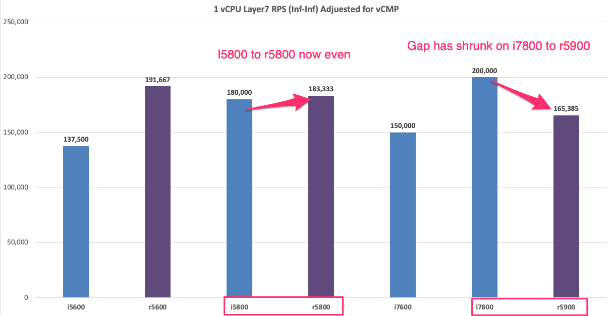

In the cases where there are gaps/decreases when migrating to the rSeries as the number of vCPU's in a tenant grows the gap will widen as seen in the chart below (this is not normalized for vCMP overhead). This will require more focus on tenant sizing when moving to rSeries for these specific scenarios. As an example if you wanted to migrate an i5800 appliance into a tenant on an rSeries 5800 appliance you may assume that since the i5800 has 8 vCPU's that it can just migrate it into a 8 vCPU tenant. While this may be possible depending on how utilized the i5800 is, it is better to be conservative in sizing an allocate more vCPU's to the tenant on the r5900 to bring the performance inline with what the i5800 can support for performance. In the example below, in order to match the i5800 data sheet performance of 1.8M Layer7 RPS, an additional 2 vCPU's would need to be allocated to that tenant. The good news is that the r5900 has 18 vCPU's available for tenants, so more vCPU's can be allocated to the tenant if needed. The numbers below are an extrapolation and not based on a real world environment, so results may vary.

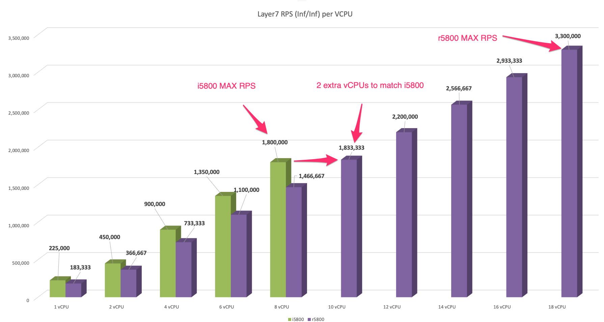

In the cases where there are decreases in the per vCPU performance when moving to rSeries, as the number of vCPU's in a tenant grows the gap will widen as seen in the chart below (this is not normalized for vCMP overhead). This will require more focus on tenant sizing when moving to rSeries for these specific scenarios. As an example if you wanted to migrate an i7800 appliance into a tenant on an rSeries 5900 appliance you may assume that since the i7800 has 12 vCPU's that you can just migrate it into a 12 vCPU tenant. While this may be possible depending on how utilized the i7800 is, it is better to be conservative in sizing an allocate more vCPU's on the r5900 to bring the performance inline with what an i7800 can support for performance. In the example below to match the i7800 data sheet performance of 3M Layer7 RPS, you would need to allocate and additional 6/8 vCPU's to that tenant. The good news is that the r5900 supports up to 26 vCPU's for tenants so more vCPU's can be allocated if needed. The numbers below are an extrapolation and not based on a real world environment, so results may vary.

.. image:: images/rseries_performance_and_sizing/image26c.png
  :align: center
  :scale: 50%

High-End vCPU Comparisons to iSeries
=====================================

When sizing, removing the 12 or 6 (depending on platform) dedicated vCPU’s for F5OS from the equation will give a better representation of what the per vCPU performance will be. Comparing the performance of a single vCPU can be important for control plane sizing and also for extrapolation of what a tenant’s performance may be. Below is a comparison on the CPU’s on the i10600, i10800, i11600 and i11800 compared to the new rSeries r10600, r10800, and r10900. Note that the rSeries sizing is more complex because of the way the CPU’s are used. Since 6 physical / 12 vCPU’s (for the r10000) and 3 physical / 6 vCPU's (for the r5000) are dedicated for use by the F5OS platform layer overall CPU performance can be misleading. 

The graphs below compare the older model mid-range iSeries platforms vs. the newer mode mid-range rSeries models. Note that these comparisons remove the 12 vCPU’s used for the platform layer. Instead of showing 24 physical cores and 48 vCPU’s, the r10000 is sized using 18 physical cores and 36 vCPU’s listed as (minus platform Layer CPU).

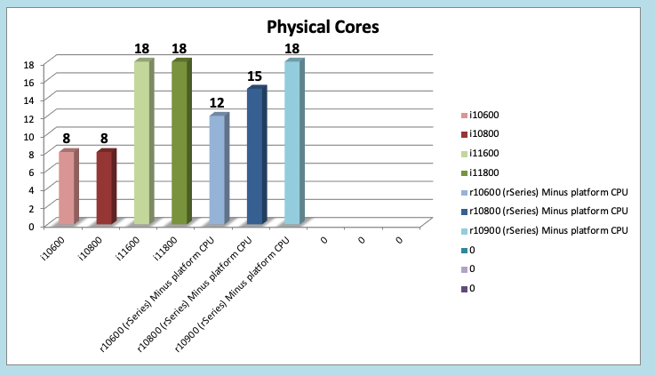

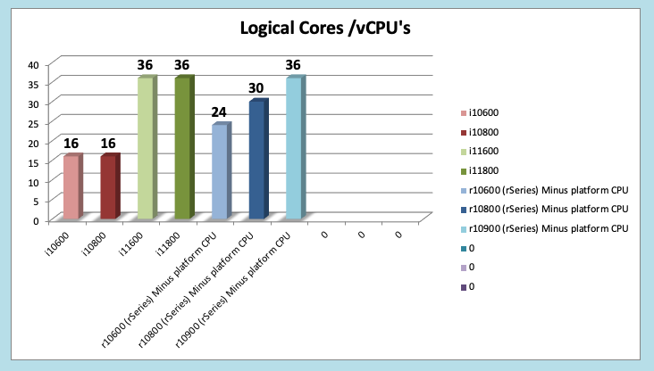

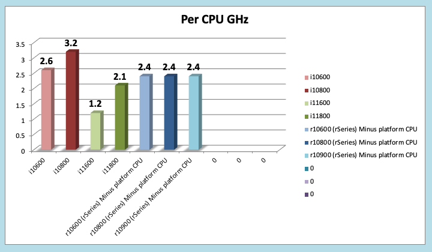

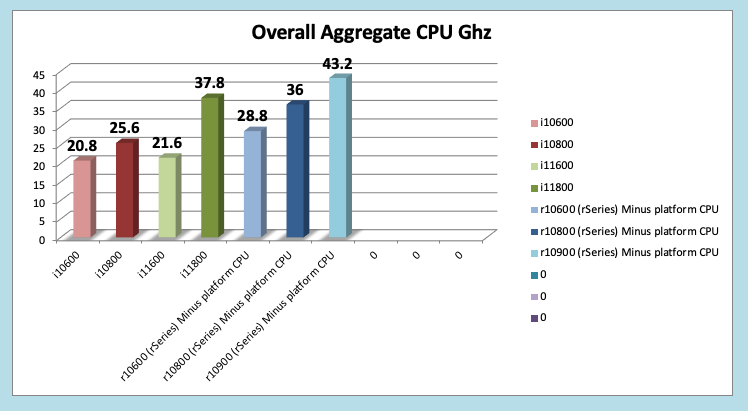

To compare performance of iSeries vs. rSeries you can first look at overall CPU capacity of the system, and then break that down to per vCPU performance to get an apples-to-apples comparison. In a typical sizing exercise, it is normal to look at the overall number of vCPUs / the # of vCPUs in the system and consider the speed/performance of the vCPU to come up with a sizing metric. Because rSeries dedicates some of its processing to the F5OS platform layer, we remove them from the overall sizing exercise calculations so that sizing numbers don’t get skewed. As an example, take the overall r10900 performance metrics then divide by the total vCPU’s in the system (48) minus the 12 vCPU’s for the platform layer. By not including the vCPU's dedciated to F5OS, you'll get a much more accurate assesment of what an individual vCPU can forward. You also have to consider that rSeries has more modern processors which are more efficient and can boost to higher rates than previous generation processors so looking at aggregate processor speed (total Ghz) as the only means of sizing may not be sufficient to get accurate sizing.  

**Relative CPU Scale** is a numeric grade-based comparison where the overall CPU capacity/horsepower of the system is given a rating. The rating is an easy way to compare different BIG-IP platforms. The Relative CPU Scale is calculated by taking the total # of CPU’s in a system (not including those used by F5OS platform layer) and multiplying that times the speed that the processors run. This will result in an aggregate CPU Ghz for the platform . We then take the Aggregate CPU Ghz of a BIG-IP 2000s platform and give it a grade of 1. All other platforms are then given a numeric grade of how many times faster it is than the 2000s. This results in a simple numeric rating system that combines CPU speed with the number of CPU’s.

In the graph below you can see that a an i10600 has 8.7x more aggregate CPU capacity than the 2000s and it's newer replacement r5600 has a 12x rating.  In general the mapping of platforms will be i10600 --> r10600, i10800 --> r10800, i11600/i11800 --> r10900. You can see in every case that the newer generation rSeries should have more CPU horsepower in theory. What may be deceiving here is how this translates into real performance because the rSeries has next generation processors, and a different architecture where some CPU’s are dedicated to the F5OS platform layer.

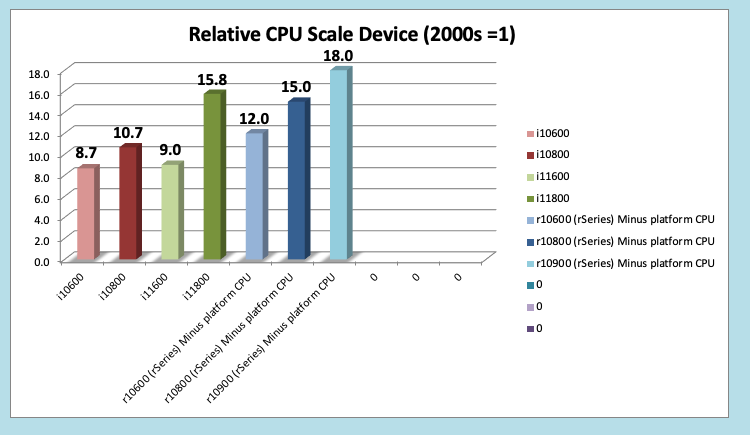

To see how this translates into real performance, it is good to look at a Layer7 metric as that is something that is highly dependent on CPU resources. If you look at the published Layer7 (Inf-Inf) numbers, you’ll notice that each rSeries replacement provides higher numbers than the previous generation iSeries. This is likely due to the newer generation of processors, the fact that some processing is dedicated to the F5OS platform layer, and the fact that the CPU’s can boost higher than previous generations. Generally, each rSeries platform is going to be faster than each iSeries platfrom it will replace (each metric will vary), but it’s safe to propose the following replacements: i10600 --> r10600, i10800 --> r10800, i11600/i11800 --> r10900. Also keep in mind rSeries has the latest Intel processing and crypto support so things like ECC ciphers are now accelerated in hardware which was not the case with appliances before the iSeries line. 

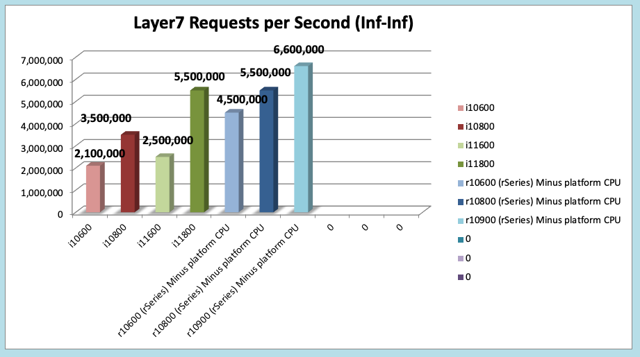

Because each appliance has a different number of CPU’s, a common sizing exercise is to look at the per vCPU performance by using the formulas above to come up with a per vCPU metric. In the graph below it is done for Layer7 RPS (Inf-Inf) but you could use the same math for any metric. Note the graph below is not derived from a per vCPU test, it is taking a published appliance metric and dividing it by the number of vCPU’s (minus the platform vCPU's) to come up with a per vCPU metric. As mentioned above using the rSeries metric which is (minus the platform CPU’s) is the most realistic. 

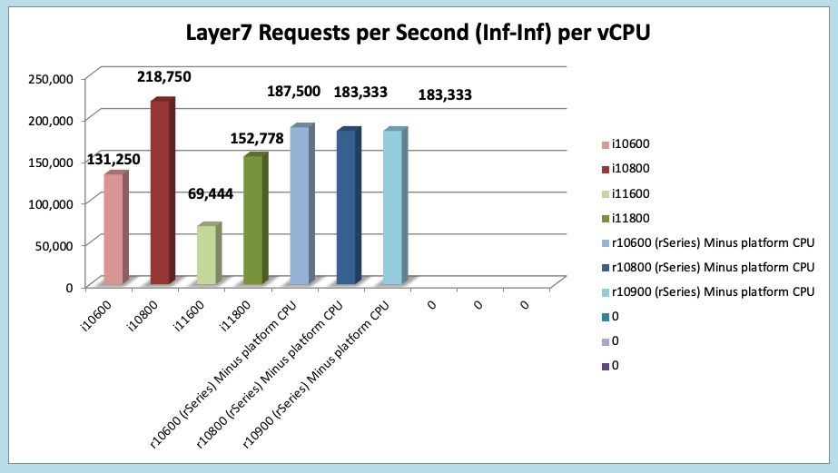

**NOTE: The per vCPU charts above are based on extrapolations, not per vCPU testing, so results may vary. This is generally acceptable for sizing use, as this is more a means of comparison of platform differences than a guarantee of a certain metric.**

Also consider that these extrapolations for the iSeries appliances are for bare metal configuration with no vCMP enabled. When extrapolating what the performance would be with vCMP enabled on a per vCPU basis the numbers for iSeries appliances would have 20% subtracted from them. rSeries on the other hand is multitenant by default, so there is no need to subtract 20% for virtualization overhead. The rSeries numbers are inclusive of multitenancy already.  

Memory Sizing
=============

In general migrating form an iSeries to the equivalent rSeries model in the mid-range will mean either 1.3x or 2.6x more memory. For the high-end it will either be 2.x more memory, or the same amount of memory (when comparing the 11600/11800).

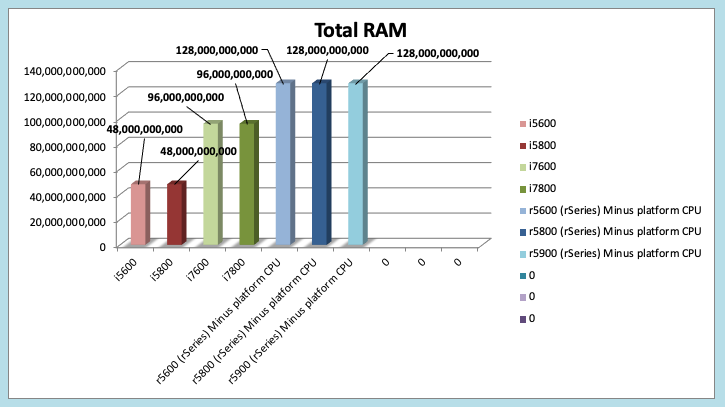

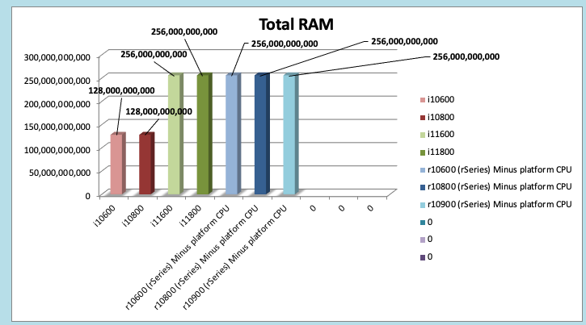

Breaking down memory to get per vCPU numbers will help when dealing with current vCMP guest configurations where memory is allocated based on the number of vCPU’s assigned to the guest. Because rSeries has a different architecture than iSeries there is a formula for calculating how much memory a vCPU will receive. The chart below shows the default RAM per vCPU allocation with 1vCPU tenant. 

  min-memory = (3.5 * 1024 * vcpu-cores-per-node) + 512

With rSeries the amount of RAM per vCPU will change slightly as more vCPU’s are added to the tenant. Below are the default values for total RAM, and RAM per vCPU for the rSeries tenants. These are **Recommended** values, but rSeries provides **Advanced** options where memory per tenant can be customized to allocate more memory without having to allocate mor vCPU. See the Multitennancy section for more details on memory customization.

For resource provisioning you can use **Recommended** settings or **Advanced** settings. Recommended will allocate memory in proportion the number of vCPU’s assigned to the tenant. Advanced mode will allow you to customize the memory allocation for this tenant. This is something not possible in previous generation iSeries appliances, but now you can over provision memory assigned to the tenant. The default memory allocations for Recommended mode are shown below. Note: Not all rSeries appliances support the maximum number of vCPU's, this will vary by platform. Below is for the r10900 platform which supports up to 36 vCPU's for tennancy.

+-----------------------+--------------------+--------------------------+-----------------+-----------------+
| **Tenant Size**       | **Physical Cores** | **Logical Cores (vCPU)** | **Min GB RAM**  | **RAM/vCPU**    |
+=======================+====================+==========================+=================+=================+
| rSeries 1vCPU Tenant  | 0.5                |  1                       | 4,096,000,000   | 4,096,000,000   |
+-----------------------+--------------------+--------------------------+-----------------+-----------------+
| rSeries 2vCPU Tenant  | 1                  |  2                       | 7,680,000,000   | 3,840,000,000   |
+-----------------------+--------------------+--------------------------+-----------------+-----------------+
| rSeries 4vCPU Tenant  | 2                  |  4                       | 14,848,000,000  | 3,712,000,000   |
+-----------------------+--------------------+--------------------------+-----------------+-----------------+
| rSeries 6vCPU Tenant  | 3                  |  6                       | 22,016,000,000  | 3,669,333,333   |
+-----------------------+--------------------+--------------------------+-----------------+-----------------+
| rSeries 8vCPU Tenant  | 4                  |  8                       | 29,184,000,000  | 3,648,000,000   |
+-----------------------+--------------------+--------------------------+-----------------+-----------------+
| rSeries 10vCPU Tenant | 5                  |  10                      | 36,352,000,000  | 3,635,200,000   |
+-----------------------+--------------------+--------------------------+-----------------+-----------------+
| rSeries 12vCPU Tenant | 6                  |  12                      | 43,520,000,000  | 3,626,666,667   |
+-----------------------+--------------------+--------------------------+-----------------+-----------------+
| rSeries 14vCPU Tenant | 7                  |  14                      | 50,688,000,000  | 3,620,571,429   |
+-----------------------+--------------------+--------------------------+-----------------+-----------------+
| rSeries 16vCPU Tenant | 8                  |  16                      | 57,856,000,000  | 3,616,000,000   |
+-----------------------+--------------------+--------------------------+-----------------+-----------------+
| rSeries 18vCPU Tenant | 9                  |  18                      | 65,024,000,000  | 3,612,444,444   |
+-----------------------+--------------------+--------------------------+-----------------+-----------------+
| rSeries 20vCPU Tenant | 10                 |  20                      | 72,192,000,000  | 3,609,600,000   |
+-----------------------+--------------------+--------------------------+-----------------+-----------------+
| rSeries 22vCPU Tenant | 11                 |  22                      | 79,360,000,000  | 3,607,272,727   |
+-----------------------+--------------------+--------------------------+-----------------+-----------------+
| rSeries 24vCPU Tenant | 12                 |  24                      | 86,528,000,000  | 3,605,333,333   |
+-----------------------+--------------------+--------------------------+-----------------+-----------------+
| rSeries 26vCPU Tenant | 13                 |  26                      | 93,696,000,000  | 3,603,692,308   |
+-----------------------+--------------------+--------------------------+-----------------+-----------------+
| rSeries 28vCPU Tenant | 14                 |  28                      | 100,864,000,000 | 3,602,285,714   |
+-----------------------+--------------------+--------------------------+-----------------+-----------------+
| rSeries 30vCPU Tenant | 15                 |  30                      | 108,032,000,000 | 3,601,066,667   |
+-----------------------+--------------------+--------------------------+-----------------+-----------------+
| rSeries 32vCPU Tenant | 16                 |  32                      | 115,200,000,000 | 3,600,000,000   |
+-----------------------+--------------------+--------------------------+-----------------+-----------------+
| rSeries 34vCPU Tenant | 17                 |  34                      | 122,368,000,000 | 3,599,058,824   |
+-----------------------+--------------------+--------------------------+-----------------+-----------------+
| rSeries 36vCPU Tenant | 18                 |  36                      | 129,536,000,000 | 3,598,222,222   |
+-----------------------+--------------------+--------------------------+-----------------+-----------------+

Each rSeries appliance has an overall amount of memory for the appliance, and the F5OS layer will take a portion of RAM leaving the rest for use by tenants. Below is the amount of memory used by F5OS on each of the rSeries appliances. The table also displays the total minimum amount of RAM allocated using the recommended values, and how much extra RAM is available for tenants beyond the recommended values.

Using the minimum Recommended values per tenant ~129GB of RAM will be allocated for the r10000 Series tenants, leaving ~15GB of additional RAM. You may over-allocate RAM to any tenant until the extra 15GB of RAM is depleted. There is a formula for figuring out the minimum amount of RAM a particular tenant size will receive using the recommended values:

**min-memory = (3.5 * 1024 * vcpu-cores-per-node) + 512**

+-----------------------+-----------------------+-------------------------+----------------------------------+--------------------------------------------+---------------------------------------+
| **rSeries Platform**  | **Memory per System** | **Memory use by F5OS**  | **Memory Available to Tenants**  | **Default Mininimum RAM used (Max vCPU)**  |  **Extra RAM Available for Tenants**  |
+=======================+=======================+=========================+==================================+============================================+=======================================+
| r10900 Series         | 256GB RAM             | 25GB                    | 231,906,000,000                  | 129,536,000,000                            | 102,370,000,000                       |
+-----------------------+-----------------------+-------------------------+----------------------------------+--------------------------------------------+---------------------------------------+
| r10800 Series         | 256GB RAM             | 25GB                    | 231,906,000,000                  | 108,032,000,000                            | 123,874,000,000                       |
+-----------------------+-----------------------+-------------------------+----------------------------------+--------------------------------------------+---------------------------------------+
| r10600 Series         | 256GB RAM             | 25GB                    | 231,906,000,000                  | 86,528,000,000                             | 145,378,000,000                       |
+-----------------------+-----------------------+-------------------------+----------------------------------+--------------------------------------------+---------------------------------------+
| r5900 Series          | 128GB RAM             | 15GB                    | 113,132,000,000                  | 93,696,000,000                             | 19,436,000,000                        |
+-----------------------+-----------------------+-------------------------+----------------------------------+--------------------------------------------+---------------------------------------+
| r5800 Series          | 128GB RAM             | 15GB                    | 113,132,000,000                  | 65,024,000,000                             | 48,108,000,000                        |
+-----------------------+-----------------------+-------------------------+----------------------------------+--------------------------------------------+---------------------------------------+
| r5600 Series          | 128GB RAM             | 15GB                    | 113,132,000,000                  | 43,520,000,000                             | 69,612,000,000                        |
+-----------------------+-----------------------+-------------------------+----------------------------------+--------------------------------------------+---------------------------------------+
| r4800 Series          | 64GB RAM              | 8GB                     | 56GB                             | TBD                                        | TBD                                   |
+-----------------------+-----------------------+-------------------------+----------------------------------+--------------------------------------------+---------------------------------------+
| r4600 Series          | 64GB RAM              | 8GB                     | 56GB                             | TBD                                        | TBD                                   |
+-----------------------+-----------------------+-------------------------+----------------------------------+--------------------------------------------+---------------------------------------+
| r2800 Series          | 32GB RAM              | 8GB                     | 24GB                             | TBD                                        | TBD                                   |
+-----------------------+-----------------------+-------------------------+----------------------------------+--------------------------------------------+---------------------------------------+
| r2600 Series          | 32GB RAM              | 8GB                     | 24GB                             | TBD                                        | TBD                                   |
+-----------------------+-----------------------+-------------------------+----------------------------------+--------------------------------------------+---------------------------------------+
