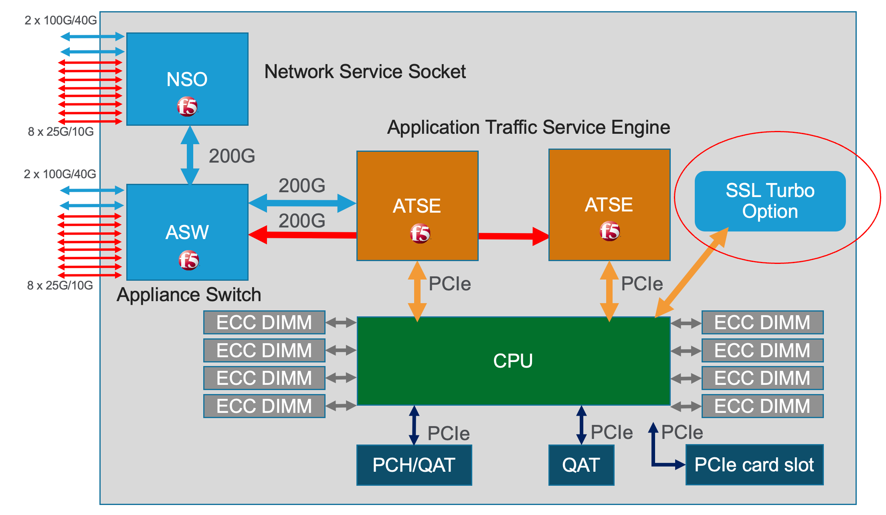
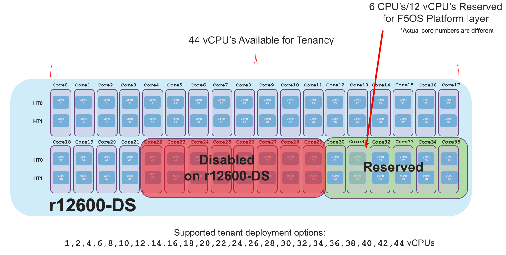
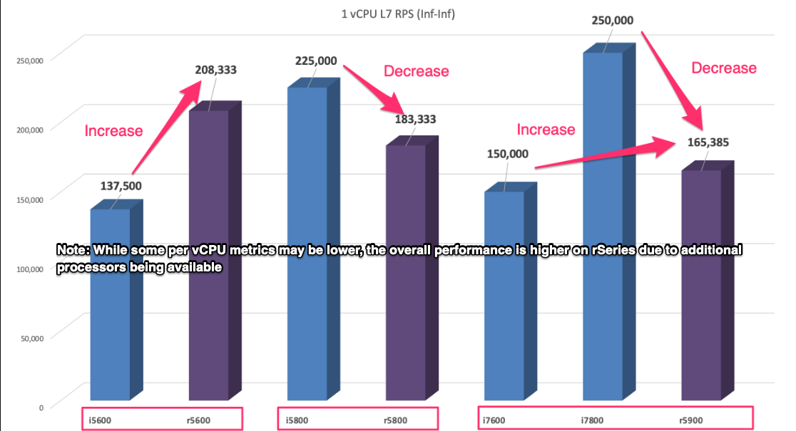
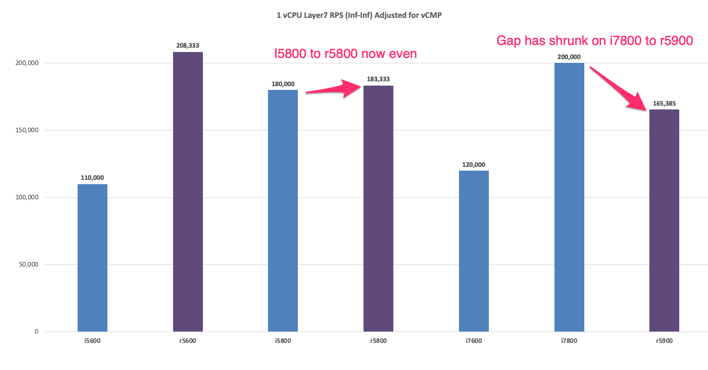
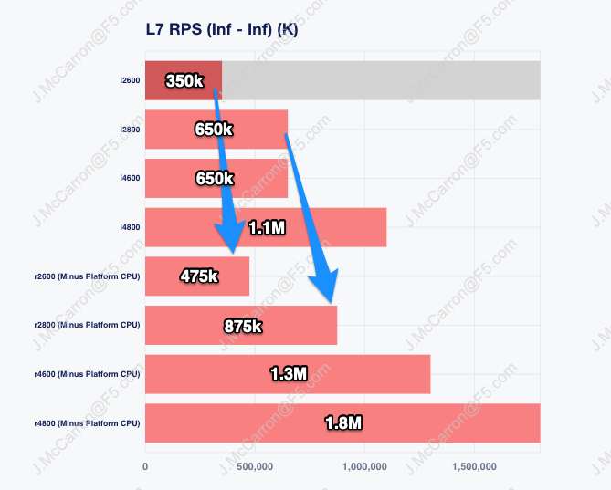
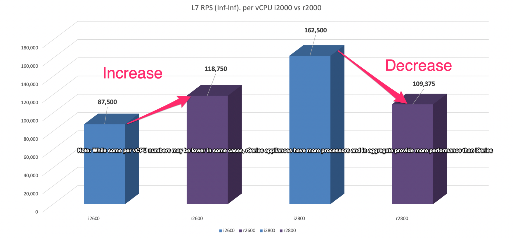

==============================
rSeries Performance and Sizing
==============================

rSeries is a new generation of hardware appliances using the latest Intel CPUs for processing in addition to Field Programmable Gate Arrays (FPGAs) for hardware offload (on the r10000 and r5000 Series). Intel CPUs perform SSL processing and compression offload as was done with previous generation BIG-IP solutions such as iSeries and the VIPRION B4450. Older VIPRION blades such as the B2100, B2150, and B2250 use Intel processing, but use Cavium Nitrox for SSL offload. The newer generation Intel chipsets provide more modern SSL cipher support and can offload ECC (Elliptical Curve) based ciphers in hardware, which most previous generations of VIPRION blades and older appliances could not.

In addition to more modern Intel chipsets, the mid-range (r5000) and high-end (r10000) rSeries appliances also have extensive FPGA support. The r2000 and r4000 rSeries models do not include FPGAs and instead perform these functions in software with some specialized offload. In previous generations of F5 hardware the ePVA (FPGA) was used to offload varying workloads from FASTL4 to DDoS mitigation, and that functionality is brought forward and expanded upon in the new generation of rSeries hardware. 

Some additional links on the benefits of hardware offload using the ePVA in previous generation BIG-IP solutions:

`K12837: Overview of the ePVA feature <https://my.f5.com/manage/s/article/K12837>`_

`K09948701: Overview of the FastL4 profile <https://my.f5.com/manage/s/article/K09948701>`_

`F5 Fast L4 Acceleration and the F5 Smart Coprocessor (prioritized Fast L4 Acceleration) <https://devcentral.f5.com/s/articles/F5-Fast-L4-Acceleration-and-the-F5-Smart-Coprocessor-prioritized-Fast-L4-Acceleration>`_

In rSeries there are now multiple FPGAs, the **Application Traffic Services Engine** (ATSE), and the **Appliance Switch** (ASW), and the **Network Services Socket** (NSO). In addition to supporting previous functions done by the ePVA, there are also additional functions that were performed in software or 3rd party chipsets that are now handled within the FPGAs. Below is an architectural diagram of the r10000 Series appliance. 

.. image:: images/rseries_performance_and_sizing/image1.png
  :align: center
  :scale: 50%

The r12000-DS platform is very similar to the r10000 platform except that is has extra processing for SSL/TLS as seen in the diagram below.

The r5000 appliance has a similar architecture but since it hits a different price/performance point than the r10000 it has fewer FPGA's, CPUs, and fewer physical ports.

.. image:: images/rseries_performance_and_sizing/image2.png
  :align: center
  :scale: 50%

Both the r4000 and r2000 appliances have a slightly different hardware architecture than the r5000 and r10000 appliances. They still run F5OS-A software, but they do not utilize FPGAs for hardware offload, and instead perform these functions in software and leverage SR-IOV. This means that CPUs do not need to be dedicated to the F5OS layer, leaving more CPU for tenants. These platforms also run a different class of Intel processing, and do not utilize hyperthreading like the higher end platforms do. These appliances are positioned for smaller scale environments, and they do not support 40Gb or 100Gb interfaces. Instead, they support 1Gb, 10Gb, and 25Gb interfaces. Below is the architecture of the r4000 appliance.

.. image:: images/rseries_performance_and_sizing/image3.png
  :align: center
  :scale: 50%

The r2000 appliance has a similar architecture to the r4000, but it has less memory and fewer CPU cores.

.. image:: images/rseries_performance_and_sizing/image4.png
  :align: center
  :scale: 50%  

When comparing rSeries to the previous generation iSeries appliances, it is important to note that rSeries provides more options for network connectivity including 25GB and 100Gb Ethernet support. rSeries appliances are generally providing up to 2x more performance than the previous generation iSeries appliances.

Looking at comparisons of iSeries i10800 versus the r10000 or the iSeries i5800 versus the r5000 you can see a 1.2x-2.4x increase in performance depending on which metric is looked at. From an SSL perspective the increase is 2.3x-10x for RSA based ciphers, and for Elliptical Curve, rSeries will offload that processing to hardware; some older BIG-IP appliances may have had to process more modern ciphers in software.

.. image:: images/rseries_performance_and_sizing/image5.png
  :align: center
  :scale: 50%

The performance numbers for rSeries already include any overhead for multitenancy as the platform is multitenant by default. There is nothing to switch on to enable multitenancy. VIPRION or iSeries on the other hand has the option of running multitenancy by enabling vCMP. Published data sheet numbers for VIPRION or iSeries are for bare-metal mode, where no virtualization (vCMP) is enabled. Enabling vCMP on VIPRION or iSeries has overhead and will reduce the overall performance of a blade or appliance as the hypervisor takes up CPU and memory resources.

How much performance drops can vary for different metrics, but F5 has always sized environments using a rule-of-thumb of ~20% hit on performance for enabling virtualization/vCMP. With rSeries the published data sheet numbers are with multitenancy enabled, so there is no need to calculate in an additional 20% drop due to virtualization being enabled.  

Platform vCPU Sizing
====================

r12000-DS vCPU Sizing
------------------

Each rSeries 12900-DS model has 72 vCPUs, but 12 of those vCPUs are reserved for use by the F5OS platform layer. This is different from iSeries where each vCPU gave a portion of its processing and memory to the hypervisor when vCMP was enabled. In the r12900-DS, 60 vCPUs are available for tenants since the other 12 are reserved by F5OS. The diagram below depicts the r12900-DS vCPU allocation: 

.. image:: images/rseries_performance_and_sizing/image10r12000.png
  :align: center
  :scale: 60%

The r12800-DS model has 72 vCPUs, but 12 of those vCPUs are reserved for use by the F5OS platform layer and 8 vCPUs are disabled via licensing. This is different than iSeries where each vCPU gave a portion of its processing and memory to the hypervisor when vCMP was enabled. In the r12800-DS, 52 vCPUs are available for tenants since 12 are reserved for F5OS, and 8 are disabled via licensing. The diagram below depicts the r12800-DS vCPU allocation: 

.. image:: images/rseries_performance_and_sizing/image11r12000.png
  :align: center
  :scale: 60%

The r12600-DS model has 72 vCPUs, but 12 of those vCPUs are reserved for use by the F5OS platform layer and 16 vCPUs are disabled via licensing. This is different than iSeries where each vCPU gave a portion of its processing and memory to the hypervisor when vCMP was enabled. In the r12600-DS, 44 vCPUs are available for tenants since the other 12 are reserved for F5OS, and 16 are disabled via licensing. The diagram below depicts the r12600-DS vCPU allocation: 

r10000 vCPU Sizing
------------------

Each rSeries 10900 model has 48 vCPUs, but 12 of those vCPUs are reserved for use by the F5OS platform layer. This is different from iSeries where each vCPU gave a portion of its processing and memory to the hypervisor when vCMP was enabled. In the r10900, 36 vCPUs are available for tenants since the other 12 are reserved by F5OS. The diagram below depicts the r10900 vCPU allocation: 

.. image:: images/rseries_performance_and_sizing/image10.png
  :align: center
  :scale: 30%

The r10800 model has 48 vCPUs, but 12 of those vCPUs are reserved for use by the F5OS platform layer and 8 vCPUs are disabled via licensing. This is different than iSeries where each vCPU gave a portion of its processing and memory to the hypervisor when vCMP was enabled. In the r10800, 28 vCPUs are available for tenants since 12 are reserved for F5OS, and 8 are disabled via licensing. The diagram below depicts the r10800 vCPU allocation: 

.. image:: images/rseries_performance_and_sizing/image11.png
  :align: center
  :scale: 60%

The r10600 model has 48 vCPUs, but 12 of those vCPUs are reserved for use by the F5OS platform layer. This is different than iSeries where each vCPU gave a portion of its processing and memory to the hypervisor when vCMP was enabled. In the r10600, 24 vCPUs are available for tenants since the other 12 are reserved for F5OS, and 12 are disabled via licensing. The diagram below depicts the r10600 vCPU allocation: 

.. image:: images/rseries_performance_and_sizing/image12.png
  :align: center
  :scale: 30%

High-End (r10000) vCPU Comparisons to iSeries (i10000/i11000)
-------------------------------------------------------------

When sizing, removing the 12 or 6 (depending on platform) dedicated vCPUs for F5OS from the equation will give a better representation of what the per vCPU performance will be. Comparing the performance of a single vCPU can be important for control plane sizing, and for extrapolation of what a tenant’s performance may be. Below is a comparison of the CPUs on the i10600, i10800, i11600 and i11800 compared to the new rSeries r10600, r10800, and r10900. Note that the rSeries sizing is more complex because of the way the CPUs are used. Since 6 physical / 12 vCPUs (for the r10000) and 3 physical / 6 vCPUs (for the r5000) are dedicated for use by the F5OS platform layer, overall CPU performance can be misleading.

The graphs below compare the older model high-end iSeries platforms to the newer mode high-end rSeries models. Note that these comparisons remove the 12 vCPUs used for the F5OS platform layer and data mover. Instead of showing 24 physical cores and 48 vCPUs, the r10000 is sized using 18 physical cores and 36 vCPUs listed as (minus platform layer CPU).

To compare performance of iSeries vs. rSeries you can first look at overall CPU capacity of the system, and then break that down to per vCPU performance to get a more even comparison. In a typical sizing exercise, it is normal to look at the overall number of vCPUs / the number of vCPUs in the system and consider the speed/performance of the vCPU to come up with a sizing metric. Because rSeries dedicates some of its processing to the F5OS platform layer, we remove them from the overall sizing exercise calculations so that sizing numbers don’t get skewed. As an example, take the overall r10900 performance metrics then divide by the total vCPUs in the system (48) minus the 12 vCPUs for the platform layer. By not including the vCPUs dedicated to F5OS, you’ll get a much more accurate assessment of what an individual vCPU can forward? You also must consider that rSeries has more modern processors which are more efficient and can boost to higher rates than previous generation processors so looking at aggregate processor speed (total Ghz) as the only means of sizing may not be sufficient to get accurate sizing.

**Relative CPU Scale** is a numeric grade-based comparison where the overall CPU capacity/horsepower of the system is given a rating. The rating is an easy way to compare different BIG-IP platforms. The Relative CPU Scale is calculated by taking the total number of CPUs in a system (not including those used by F5OS platform layer) and multiplying that times the speed that the processors run. This will result in an aggregate CPU Ghz for the platform. We then take the aggregate CPU Ghz of a BIG-IP 2000s platform and give it a grade of 1. All other platforms are then given a numeric grade of how many times faster it is than the 2000s. This results in a simple numeric rating system that combines CPU speed with the number of CPUs.

In the graph below you can see that an 10600 has 7.4x more aggregate CPU capacity than the 2000s and its newer replacement r10600 has a 10.3x rating. In general, the mapping of platforms will be i10600 –> r10600, i10800 –> r10800, i11600/i11800 –> r10900. You can see in every case that the newer generation rSeries should have more CPU horsepower in theory. What may be deceiving is how this translates into real performance because the rSeries has next generation processors, and a different architecture where some CPUs are dedicated to the F5OS platform layer.

To see how this translates into real performance, it is good to look at a Layer7 metric, as that is something that is highly dependent on CPU resources. If you look at the published Layer7 (Inf-Inf) numbers, you’ll notice that each rSeries replacement provides higher numbers than the previous generation iSeries. This is likely due to the newer generation of processors, the fact that some processing is dedicated to the F5OS platform layer, and the fact that the CPUs can boost higher than previous generations. Generally, each rSeries platform is going to be faster than each iSeries platform it will replace (each metric will vary), but it’s safe to propose the following replacements: i10600 –> r10600, i10800 –> r10800, i11600/i11800 –> r10900. Also keep in mind rSeries has the latest Intel processing and crypto support so things like ECC ciphers are now accelerated in hardware which was not the case with appliances before the iSeries line.

Because each appliance has a different number of CPUs, a common sizing exercise is to look at the per vCPU performance by using the formulas above to come up with a per vCPU metric. In the graph below, it is done for Layer7 RPS (Inf-Inf), but you could use the same math for any metric. The graph below is not derived from a per vCPU test, it is taking a published appliance metric and dividing it by the number of vCPUs (minus the platform vCPUs) to come up with a per vCPU metric. As mentioned above, using the rSeries metric which is (minus the platform CPUs) is the most realistic. As noted below migrating from an i10600 to an r10600 will have better per vCPU performance. This is also the case when migrating from an i11600 or i11800 to an r10900. There is one case where the per vCPU performance is lower. When going from an i10800 to an r10800 the per vCPU metrics are lower on rSeries **even though the aggregate performance is higher for the entire appliance**. This is due to the speed of the processors, but since there are more processors, the aggregate performance is higher.

**NOTE: The per vCPU charts above are based on extrapolations, not per vCPU testing, so results may vary. This is generally acceptable for sizing use, as this is more a means of comparison of platform differences than a guarantee of a certain metric.**

Also consider that these extrapolations for the iSeries appliances are for bare metal configuration with no vCMP enabled. When extrapolating what the performance would be with vCMP enabled on a per vCPU basis the numbers for iSeries appliances (that support vCMP) would have 20% subtracted from them. rSeries on the other hand is multitenant by default, so there is no need to subtract 20% for virtualization overhead. The rSeries numbers are inclusive of multitenancy already. If the graph above is adjusted for a vCMP comparison on the iSeries models that support vCMP (i10800/i11800) then it will close the gap on some of these metrics for per vCPU performance:

In the cases where there are gaps/decreases in per vCPU performance when migrating to the rSeries, as the number of vCPU's in a tenant grows, the gap will widen as seen in the chart below (this is not normalized for vCMP overhead). This will require more focus on tenant sizing when moving to rSeries for these specific scenarios. As an example, if you wanted to migrate an i10800 appliance into a tenant on an rSeries 10800 appliance you may assume that since the i10800 has 16 vCPUs that you can just migrate it into a 16 vCPU tenant on rSeries. While this may be possible depending on how utilized the i10800 is, it is better to be conservative in sizing and allocate more vCPUs on the r10800 to bring the performance in line with what an i10800 can support for performance. In the example below, to match the i10800 data sheet performance of 3.5M Layer7 RPS, you would need to allocate an additional 4 vCPUs to that tenant. The good news is that the r10800 supports up to 30 vCPUs for tenants so more vCPUs can be allocated if needed. The numbers below are an extrapolation and not based on real world environments, so results may vary.

.. image:: images/rseries_performance_and_sizing/image12f.png
  :align: center
  :scale: 90%

r5000 vCPU Sizing
------------------

Each rSeries 5900 model has 32 vCPUs, but 6 of those vCPUs are reserved for use by the F5OS platform layer. This is different from iSeries where each vCPU gave a portion of its processing and memory to the hypervisor when vCMP was enabled. In the r5900, 26 vCPUs are available for tenants since the other 6 are reserved. The diagram below depicts the r5900 vCPU allocation: 

.. image:: images/rseries_performance_and_sizing/image13.png
  :align: center
  :scale: 70%

The r5800 model has 32 vCPUs, but 6 of those vCPUs are reserved for use by the F5OS platform layer and 8 vCPUs are disabled via licensing. This is different from iSeries where each vCPU gave a portion of its processing and memory to the hypervisor when vCMP was enabled. In the r5800, 18 vCPUs are available for tenants since 6 are reserved for F5OS, and 8 are disabled via licensing. The diagram below depicts the r5800 vCPU allocation: 

.. image:: images/rseries_performance_and_sizing/image14.png
  :align: center
  :scale: 70%

The r5600 model has 32 vCPUs, but 6 of those vCPUs are reserved for use by the F5OS platform layer. This is different than iSeries where each vCPU gave a portion of its processing and memory to the hypervisor when vCMP was enabled. In the r5600, 12 vCPUs are available for tenants since the other 6 are reserved for F5OS, and 14 are disabled via licensing. Note there is a limit of 8 tenants on the r5600. The diagram below depicts the r5600 vCPU allocation: 

.. image:: images/rseries_performance_and_sizing/image15.png
  :align: center
  :scale: 90%

Mid-Range (r5000) vCPU Comparisons to iSeries (i5000/i7000)
-----------------------------------------------------------

When sizing, removing the 12 or 6 (depending on platform) dedicated vCPUs for F5OS from the equation will give a better representation of what the per vCPU performance will be. Comparing the performance of a single vCPU can be important for control plane sizing and for extrapolation of what a tenant’s performance may be. Below is a comparison on the CPUs on the i5600, i5800, i7600 and i7800 compared to the new rSeries r5600, r5800, and r5900. Note that the rSeries sizing is more complex because of the way the CPUs are used. Since 6 physical / 12 vCPUs (for the r10000) and 3 physical / 6 vCPUs (for the r5000) are dedicated for use by the F5OS platform layer overall CPU performance can be misleading.

The graphs below compare the older model mid-range iSeries platforms vs. the newer mode mid-range rSeries models. Note that these comparisons remove the 6 vCPUs used for the F5OS platform layer and the data mover. Instead of showing 16 physical cores and 32 vCPUs, the r5000 is sized using 13 physical cores and 26 vCPUs listed as (minus platform Layer CPU).

To compare performance of iSeries vs. rSeries you can first look at overall CPU capacity of the system, and then break that down to per vCPU performance to get a more even comparison. In a typical sizing exercise, it is normal to look at the overall number of vCPUs / the number of vCPUs in the system and consider the speed/performance of the vCPU to come up with a sizing metric. Because rSeries dedicates some of its processing to the F5OS platform layer, we remove them from the overall sizing exercise calculations so that sizing numbers don’t get skewed. As an example, take the overall r5900 performance metrics then divide by the total vCPUs in the system (32) minus the 6 vCPUs for the platform layer. By not including the vCPUs that are dedicated to F5OS, you’ll get a much more accurate assessment of what  the remaining individual vCPUs can forward. You also must consider that rSeries has more modern processors which are more efficient and can boost to higher rates than previous generation processors so looking at aggregate processor speed (total Ghz) as the only means of sizing may not be sufficient to get accurate sizing.

**Relative CPU Scale** is a numeric grade-based comparison where the overall CPU capacity/horsepower of the system is given a rating. The rating is an easy way to compare different BIG-IP platforms. The Relative CPU Scale is calculated by taking the total # of CPUs in a system (not including those used by F5OS platform layer) and multiplying that times the speed that the processors run. This will result in an aggregate CPU Ghz for the platform. We then take the Aggregate CPU Ghz of a BIG-IP 2000s platform and give it a grade of 1. All other platforms are then given a numeric grade of how many times faster it is than the 2000s. This results in a simple numeric rating system that combines CPU speed with the number of CPUs.

In the graph below you can see that a an i5600 has 4.7x more aggregate CPU capacity than the 2000s and its newer replacement r5600 has a 6.0x rating. In general, the mapping of platforms will be i5600 –> r5600, i5800 –> r5800, i7600/i7800 –> r5900. You can see in every case that the newer generation rSeries should have more CPU horsepower in theory. What may be deceiving here is how this translates into real performance because the rSeries has next generation processors, and a different architecture where some CPUs are dedicated to the F5OS platform layer.

To see how this translates into real performance, it is good to look at a Layer7 metric as that is something that is highly dependent on CPU resources. If you look at the published Layer7 (Inf-Inf) numbers, you’ll notice that each rSeries replacement provides higher numbers than the previous generation iSeries. This is likely due to the newer generation of processors, the fact that some processing is dedicated to the F5OS platform layer, and the fact that the CPUs can boost higher than previous generations. Generally, each rSeries platform is going to be faster than each iSeries platform it will replace (each metric will vary), but it is safe to propose the following replacements: i5600 –> r5600, i5800 –> r5800, i7600/i7800 –> r5900. Also keep in mind rSeries has the latest Intel processing and crypto support so things like ECC ciphers are now accelerated in hardware which was not the case with appliances before the iSeries line.

Because each appliance has a different number of CPUs, a common sizing exercise is to look at the per vCPU performance by using the formulas above to come up with a per vCPU metric. In the graph below it is done for Layer7 RPS (Inf-Inf), but you could use the same math for any metric. Note the graph below is not derived from a per vCPU test, it is taking a published appliance metric and dividing it by the number of vCPUs (minus the platform vCPUs) to come up with a per vCPU metric. As mentioned above using the rSeries metric which is (minus the platform CPUs) is the most realistic. As you will note below, migrating from an i5600 to an r5600 will have better per VCPU performance. This is also the case when migrating from an i7600 to an i5900. There are two cases where the per vCPU performance is lower. When going from an i5800 to an r5800 or when going from and i7800 to an r5900 the per vCPU metrics are lower on iSeries. The per vCPU metrics are lower on rSeries **even though the aggregate performance is higher for the entire appliance**. This is due to the speed of the processors, but since there are more processors, the aggregate performance is higher.

**NOTE: The per vCPU charts above are based on extrapolations, not per vCPU testing, so results may vary. This is generally acceptable for sizing use, as this is more a means of comparison of platform differences than a guarantee of a certain metric.**

Also consider that these extrapolations for the iSeries appliances are for bare metal configuration with no vCMP enabled. When extrapolating what the performance would be with vCMP enabled on a per vCPU basis the numbers for iSeries appliances would have 20% subtracted from them. rSeries on the other hand is multitenant by default, so there is no need to subtract 20% for virtualization overhead. The rSeries numbers are inclusive of multitenancy already. If the graph above is adjusted for a vCMP comparison on iSeries then it will close the gap on some of these metrics:

In the cases where there are gaps/decreases in per vCPU performance when migrating to the rSeries, as the number of vCPUs in a tenant grows the gap will widen as seen in the chart below (this is not normalized for vCMP overhead). This will require more focus on tenant sizing when moving to rSeries for these specific scenarios. As an example, if you wanted to migrate an i5800 appliance into a tenant on an rSeries r5800 appliance you may assume that since the i5800 has 8 vCPUs that you can just migrate it into an 8 vCPU tenant. While this may be possible depending on how utilized the i5800 is, it is better to be conservative in sizing and allocate more vCPUs on the r5800 to bring the performance in line with what an i5800 can support for performance. In the example below, to match the i5800 data sheet performance of 1.8M Layer7 RPS, you would need to allocate and additional 2 vCPUs to that tenant on an r5800. The good news is that the r5800 supports up to 18 vCPUs for tenants so more vCPUs can be allocated if needed. The numbers below are an extrapolation and not based on real world environments, so results may vary.

In the cases where there are gaps/decreases when migrating to the rSeries as the number of vCPUs in a tenant grows the gap will widen as seen in the chart below (this is not normalized for vCMP overhead). This will require more focus on tenant sizing when moving to rSeries for these specific scenarios. As an example, if you wanted to migrate an i7800 appliance into a tenant on an rSeries r5900 appliance you may assume that since the i7800 has 12 vCPUs that you can just migrate it into a 12 vCPU tenant on rSeries. While this may be possible depending on how utilized the i7800 is, it is better to be conservative in sizing and allocate more vCPUs on the r5900 to bring the performance in line with what an i7800 can support for performance. In the example below to match the i7800 data sheet performance of 3M Layer7 RPS, you would need to allocate and additional 6/8 vCPUs to that tenant. The good news is that the r5900 supports up to 26 vCPUs for tenants so more vCPUs can be allocated if needed. The numbers below are an extrapolation and not based on real world environments, so results may vary.

r4000 vCPU Sizing
------------------

Each rSeries 4800 model has 16 CPUs (The 4000 platform does not utilize hyperthreading/vCPUs). No CPUs are dedicated to the F5OS platform layer which is different from the mid-range and high-end rSeries appliances. In the r4800 16 CPUs are available to be assigned to tenants. The 4800 supports a maximum of four tenants. The diagram below depicts the r4800 CPU allocation: 

.. image:: images/rseries_performance_and_sizing/image16.png
  :align: center
  :scale: 90%

The r4600 model has 16 CPUs (The 4000 platform does not utilize hyperthreading/vCPUs). No CPUs are dedicated to the F5OS platform layer which is different from the mid-range and high-end rSeries appliances. In the r4600 12 CPUs are available to be assigned to tenants and 4 are disabled via licensing. The 4600 supports a maximum of two tenants. The diagram below depicts the r4600 vCPU allocation: 

.. image:: images/rseries_performance_and_sizing/image17.png
  :align: center
  :scale: 90%

r2000 vCPU Sizing
------------------

Each rSeries 2800 model has 8 CPUs (The 2000 platform does not utilize hyperthreading/vCPUs). No CPUs are dedicated to the F5OS platform layer which is different from the mid-range and high-end rSeries appliances. In the r2800 8 CPUs are available to be assigned to tenants. Only one tenant is supported prior to F5OS-A 1.8.0, two tenants are supported from F5OS-A 1.8.0 and later. The diagram below depicts the r2800 CPU allocation: 

.. image:: images/rseries_performance_and_sizing/image18.png
  :align: center
  :scale: 70%

The r2600 model has 8 CPUs (The 2000 platform does not utilize hyperthreading/vCPUs). No CPUs are dedicated to the F5OS platform layer which is different from the mid-range and high-end rSeries appliances. In the r2600 4 CPUs are available to be assigned to tenants (and only one tenant is supported) and 4 are disabled via licensing. The diagram below depicts the r2600 vCPU allocation: 

.. image:: images/rseries_performance_and_sizing/image19.png
  :align: center
  :scale: 70%

Low-End (r2000/r4000) vCPU Comparisons to iSeries (i2000/i4000) CPU
-------------------------------------------------------------------

When sizing the r2000/r4000 it is important to recognize the F5OS architecture is different than the mid-range and high end rSeries appliances (r5000/r10000). In those appliances, removing the 12 or 6 (depending on platform) dedicated vCPUs for F5OS from the equation will give a better representation of what the per vCPU performance will be. For the r2000/r4000 there are no dedicated CPUs for F5OS, and instead F5OS will run on the existing CPUs that are also used for tenancy. This is like how vCMP worked on iSeries where each CPU contributes some of its resources to the platform layer. Even in the rx600 models, where some CPUs are disabled due to the pay-as-you-grow licensing, F5OS will only run on the CPUs that are enabled. As an example, the r4600 has 16 CPUs, but four of them are "disabled", meaning they can't be used for tenants. F5OS will run on those same twelve CPUs that are used for tenants and will not run on the disabled CPUs.  

Comparing the performance of a single vCPU can be important for control plane sizing and for extrapolation of what a tenant’s performance may be. In the r2000/r4000 a different class of Intel processor is being used, and it does not leverage hyperthreading. Since all previous sizing for iSeries/VIPRION refers to vCPUs (hyperthreaded on a CPU core), we need to adjust the sizing for the r2000/r4000 platforms where we will treat each CPU core on the r2000/r4000 as a vCPU on iSeries to be consistent. In the charts below the CPU core count and vCPU count are equal, this is different than the mid-range (r5000) and high-end (r10000) rSeries where each physical CPU core has two hyperthreads and is counted as two vCPUs. 

Below is a comparison on the CPUs on the i2600, i2800, i4600 and i4800 compared to the new rSeries r2600, r2800, r4600 and r4800. The graphs below compare the older model low-end iSeries platforms vs. the newer model low-end rSeries models. All the sizing will focus on the per vCPU numbers, and as outlined above for rSeries r2000/r4000, each physical CPU core is being treated as one hyperthread or vCPU even though it is a full CPU core. This will allow for more equal comparisons to the iSeries i2000/i4000 platforms, which have 2 hyperthreads or VCPUs per CPU core. 

Based on the vCPU chart above the i2600 and r2600 are treated as though they have the same number of vCPUs (4). The i2800 has half the number of vCPUs (4) as the r2800 (8). The i4600 and r4600 are treated as though they have the same number of vCPUs (8). The i2800 has half the number of vCPUs (8) as the r2800 (16).

To compare performance of iSeries vs. rSeries, you can first look at overall CPU capacity of the system, and then break that down to per vCPU performance to get a more realistic comparison. In a typical sizing exercise, it is normal to look at the overall number of vCPUs / the total number of vCPUs in the system and consider the speed/performance of the vCPU to come up with a sizing metric.  You also must consider that rSeries has more modern processors which are more efficient and may boost to higher rates than previous generation processors, so looking at aggregate processor speed (total Ghz) as the only means of sizing may not be sufficient to get accurate sizing.

**Relative CPU Scale** is a numeric grade-based comparison where the overall CPU capacity/horsepower of the system is given a rating. The rating is an easy way to compare different BIG-IP platforms. The Relative CPU Scale is calculated by taking the total # of CPUs in a system and multiplying that times the speed that the processors run. This will result in an aggregate CPU Ghz for the platform. We then take the aggregate CPU Ghz of a BIG-IP 2000s platform and give it a grade of 1. All other platforms are then given a numeric grade of how many times faster it is than the 2000s. This results in a simple numeric rating system that combines CPU speed with the number of CPUs.

In the graph below you can see that a an i2600 has 0.9x relative CPU scale compared to the 2000s and its newer replacement r2600 has a 3.1x rating. In general, the mapping of platforms will be i2600 –> r2600, i2800 –> r2800, i4600 -> i4600, and i4800 -> r4800. You can see in every case that the newer generation rSeries should have more CPU horsepower in theory. What may be deceiving here is how this translates into real performance because the rSeries has next generation processors, but the processors are a different class, and there is a different architecture, so this type of comparison does not apply well to the low-end rSeries appliances. 

To see how this translates into real performance, it is better to look at a published Layer7 metric, as that is something that is highly dependent on CPU resources. If you look at the published Layer7 (Inf-Inf) numbers, you’ll notice that each rSeries replacement provides higher numbers than the previous generation iSeries. This is likely due to the newer generation of processors, more processors in some cases, and the fact that the CPUs may boost higher than previous generations. Generally, each rSeries platform is going to be faster than each iSeries platform it will replace (each metric will vary), but it is safe to propose the following replacements: i2600 –> r2600, i2800 –> r2800, i4600 –> i4600, and i4800 -> r4800. Also keep in mind, rSeries has the latest Intel processing and crypto support so things like ECC ciphers are now accelerated in hardware which was not the case with appliances before the iSeries line. You will note; the numbers below do not meet the relative CPU scale comparisons above, and this is why the method below is a better way to understand real differences between the platforms. 

Because each appliance has a different number of CPUs, a common sizing exercise is to look at the per vCPU performance by using the formulas above to come up with a per vCPU metric. In the graph below it is done for the published Layer7 RPS (Inf-Inf), but you could use the same math for any metric. Note: the graph below is not derived from a per vCPU test, it is taking a published appliance metric and dividing it by the number of vCPUs (or CPUs in the case of the r2000/r4000) to come up with a per vCPU metric. For some rSeries models, (rx600) some CPUs are disabled so they are not included in the equation. As you will note below, migrating from an i2600 to an r2600 will have better per VCPU performance. When going from an i2800 to an r2800 the per vCPU metrics are lower on rSeries. This is due to a combination of the type of processors being used on the rSeries appliances, as well as the CPU Ghz being throttled on the ix600 iSeries models. The i2600 has a throttled CPU running at 1.2Ghz, while the r2600 is not throttled and runs at 2.2 Ghz, so the per vCPU performance is better when migrating from i2600 to r 2600.

This is not the case with the migration from i2800 to r2800. The per vCPU performance is lower on the r2800, but in aggregate it makes up for this by having more vCPUs (8 vs. 4). This is seen in the overall numbers for the appliances in the link above. Since the r2000 appliances only support one tenant, it is less important what a single vCPU/ CPU can do as all the available resources will be used by the single tenant. Where this may make a difference, is understanding the control plane performance between iSeries and rSeries, since the control plane will run on a single vCPU in iSeries or CPU on rSeries. The i2600 to r2600 should see an increase in control plane performance, while the i2800 to r2800 could see a drop in control plane performance based on extrapolations below. 

To see how this translates into real performance, we'll repeat the same exercise for the r4000 series appliances. It is good to look at a Layer7 metric as that is something that is highly dependent on CPU resources. If you look at the published Layer7 (Inf-Inf) numbers, you’ll notice that each rSeries replacement provides higher numbers than the previous generation iSeries. This is likely due to the newer generation of processors, more processors in some cases, and the fact that the CPUs may boost higher than previous generations. Generally, each rSeries platform is going to be faster than each iSeries platform it will replace (each metric will vary), but it is safe to propose the following replacements: i2600 –> r2600, i2800 –> r2800, i4600 –> r4600, and i4800 -> r4800. Also keep in mind, rSeries has the latest Intel processing and crypto support so things like ECC ciphers are now accelerated in hardware which was not the case with appliances before the iSeries line. You will note; however, the numbers below do not meet the relative CPU scale comparisons above, and this is why the method below is a better way to understand real differences between the platforms. 

.. image:: images/rseries_performance_and_sizing/image19e.png
  :align: center
  :scale: 90%

Because each appliance has a different number of CPUs, a common sizing exercise is to look at the per vCPU performance by using the formulas above to come up with a per vCPU metric. In the graph below it is done for Layer7 RPS (Inf-Inf), but you could use the same math for any metric. Note: the graph below is not derived from a per vCPU test, it is taking a published appliance metric and dividing it by the number of vCPUs (or CPUs in the case of the r2000/r4000) to come up with a per vCPU metric. For some rSeries models (rx600) some CPUs are disabled so they are not included in the equation. As you will note below, migrating from an i4600 to an r4600 will have better per vCPU performance. When going from an i4800 to an r4800 the per vCPU metrics are lower on rSeries. This is due to a combination of the type of processors being used on the rSeries appliances, as well as the CPU Ghz being throttled on the ix600 iSeries models. The i4600 has a throttled CPU running at 1.2Ghz, while the r4600 is only throttled .1Ghz and runs at 2.1 Ghz, so the per vCPU performance is better when migrating from i4600 to r 4600.

This is not the case with the migration from i4800 to r4800. The per vCPU performance is lower on the r4800, but in aggregate it makes up for this by having more vCPUs (16 vs. 8). This is seen in the overall numbers for the appliances in the link above. Since the r4000 appliances support more than one tenant, it is important to know the performance of a single vCPU/CPU so that extrapolations can be made for various tenant sizes. It will also make a difference in understanding the control plane performance between iSeries and rSeries since the control plane will run on a single vCPU in iSeries or CPU on rSeries. The i4600 to r4600 should see an increase in control plane performance, while the i4800 to r4800 could see a drop in control plane performance based on extrapolations below. 

In the cases where there are gaps/decreases when migrating to the rSeries as the number of vCPUs in a tenant grows, the gap will widen as seen in the chart below. This will require more focus on tenant sizing when moving to rSeries for these specific scenarios. As an example, if you wanted to migrate an i4800 appliance into a tenant on an rSeries 4800 appliance, you may assume that since the i4800 has 8 vCPUs that you can just migrate it into an 8 vCPU tenant. While this may be possible depending on how utilized the i4800 is, it is better to be conservative in sizing an allocate more vCPU's on the r4800 to bring the performance in line with what an i4800 can support for performance. In the example below to match the i4800 data sheet performance of 1.1M Layer7 RPS, you would need to allocate and additional 2 vCPUs (CPUs on the r4000) to that tenant. The good news is that the r4800 supports up to 16 vCPUs for tenants so more vCPUs can be allocated if needed, but the supported tenant sizes are 4, 8, 12, and 16. This means that you would have to go to the next supported vCPU allocation for a tenant which is 12. The numbers below are an extrapolation and not based on real world environments, so results may vary.

When migrating from an i4600 to an r4600 you can see that the per vCPU/CPU performance is always greater on the r4600. This is mostly because the i4600 has a throttled CPU. This means that the control plane performance may be slightly better on the r4600 because it has more horsepower per CPU.

Memory Sizing
=============

In general migrating from an iSeries to the equivalent rSeries model in the mid-range will mean either 1.3x or 2.6x more memory. For the high-end it will either be 2.x more memory, or the same amount of memory (when comparing the 11600/11800). Moving from an i11x00 to an r12x00 will see a 2x increase in memory but less memory per vCPU.

Breaking down memory to get per vCPU numbers will help when dealing with current vCMP guest configurations where memory is allocated based on the number of vCPUs assigned to the guest. Because rSeries has a different architecture than iSeries there is a formula for calculating how much memory a vCPU will receive. The chart below shows the default RAM per vCPU allocation with 1vCPU tenant for the r5000 series and above. 

**min-memory = (3.5 * 1024 * vcpu-cores-per-node) + 512**

For the r2000 / r4000 appliances the formula is different.

**min-memory = (3 * 1024 * vcpu-cores-per-node)**

With rSeries the amount of RAM per vCPU will change slightly as more vCPUs are added to the tenant. Below are the default values for total RAM, and RAM per vCPU for the rSeries tenants (r5000 and above). These are **Recommended** values, but rSeries provides **Advanced** options where memory per tenant can be customized to allocate more memory without having to allocate mor vCPU. See the Multitenancy section for more details on memory customization.

For resource provisioning you can use **Recommended** settings or **Advanced** settings. Recommended will allocate memory in proportion the number of vCPUs assigned to the tenant. Advanced mode will allow you to customize the memory allocation for this tenant. This is something not possible in previous generation iSeries appliances, but now you can overprovision memory assigned to the tenant. The default memory allocations for recommended mode are shown below. Note: Not all rSeries appliances support the maximum number of vCPUs; this will vary by platform. Below is for the r12900-DS platform which supports up to 60 vCPUs for tenancy.

+------------------------+--------------------+--------------------------+-------------------+-----------------+
| **Tenant Size**        | **Physical Cores** | **Logical Cores (vCPU)** | **Min Bytes RAM** | **RAM/vCPU**    |
+========================+====================+==========================+===================+=================+
| rSeries 1 vCPU Tenant  | 0.5                |  1                       | 4,096,000,000     | 4,096,000,000   |
+------------------------+--------------------+--------------------------+-------------------+-----------------+
| rSeries 2 vCPU Tenant  | 1                  |  2                       | 7,680,000,000     | 3,840,000,000   |
+------------------------+--------------------+--------------------------+-------------------+-----------------+
| rSeries 4 vCPU Tenant  | 2                  |  4                       | 14,848,000,000    | 3,712,000,000   |
+------------------------+--------------------+--------------------------+-------------------+-----------------+
| rSeries 6 vCPU Tenant  | 3                  |  6                       | 22,016,000,000    | 3,669,333,333   |
+------------------------+--------------------+--------------------------+-------------------+-----------------+
| rSeries 8 vCPU Tenant  | 4                  |  8                       | 29,184,000,000    | 3,648,000,000   |
+------------------------+--------------------+--------------------------+-------------------+-----------------+
| rSeries 10 vCPU Tenant | 5                  |  10                      | 36,352,000,000    | 3,635,200,000   |
+------------------------+--------------------+--------------------------+-------------------+-----------------+
| rSeries 12 vCPU Tenant | 6                  |  12                      | 43,520,000,000    | 3,626,666,667   |
+------------------------+--------------------+--------------------------+-------------------+-----------------+
| rSeries 14 vCPU Tenant | 7                  |  14                      | 50,688,000,000    | 3,620,571,429   |
+------------------------+--------------------+--------------------------+-------------------+-----------------+
| rSeries 16 vCPU Tenant | 8                  |  16                      | 57,856,000,000    | 3,616,000,000   |
+------------------------+--------------------+--------------------------+-------------------+-----------------+
| rSeries 18vCPU Tenant  | 9                  |  18                      | 65,024,000,000    | 3,612,444,444   |
+------------------------+--------------------+--------------------------+-------------------+-----------------+
| rSeries 20 vCPU Tenant | 10                 |  20                      | 72,192,000,000    | 3,609,600,000   |
+------------------------+--------------------+--------------------------+-------------------+-----------------+
| rSeries 22 vCPU Tenant | 11                 |  22                      | 79,360,000,000    | 3,607,272,727   |
+------------------------+--------------------+--------------------------+-------------------+-----------------+
| rSeries 24 vCPU Tenant | 12                 |  24                      | 86,528,000,000    | 3,605,333,333   |
+------------------------+--------------------+--------------------------+-------------------+-----------------+
| rSeries 26 vCPU Tenant | 13                 |  26                      | 93,696,000,000    | 3,603,692,308   |
+------------------------+--------------------+--------------------------+-------------------+-----------------+
| rSeries 28 vCPU Tenant | 14                 |  28                      | 100,864,000,000   | 3,602,285,714   |
+------------------------+--------------------+--------------------------+-------------------+-----------------+
| rSeries 30 vCPU Tenant | 15                 |  30                      | 108,032,000,000   | 3,601,066,667   |
+------------------------+--------------------+--------------------------+-------------------+-----------------+
| rSeries 32 vCPU Tenant | 16                 |  32                      | 115,200,000,000   | 3,600,000,000   |
+------------------------+--------------------+--------------------------+-------------------+-----------------+
| rSeries 34 vCPU Tenant | 17                 |  34                      | 122,368,000,000   | 3,599,058,824   |
+------------------------+--------------------+--------------------------+-------------------+-----------------+
| rSeries 36 vCPU Tenant | 18                 |  36                      | 129,536,000,000   | 3,598,222,222   |
+------------------------+--------------------+--------------------------+-------------------+-----------------+
| rSeries 38 vCPU Tenant | 19                 |  38                      | 136,704,000,000   | 3,597,473,684   |
+------------------------+--------------------+--------------------------+-------------------+-----------------+
| rSeries 40 vCPU Tenant | 20                 |  40                      | 143,872,000,000   | 3,596,800,000   |
+------------------------+--------------------+--------------------------+-------------------+-----------------+
| rSeries 42 vCPU Tenant | 21                 |  42                      | 151,040,000,000   | 3,596,190,476   |
+------------------------+--------------------+--------------------------+-------------------+-----------------+
| rSeries 44 vCPU Tenant | 22                 |  44                      | 158,208,000,000   | 3,595,636,364   |
+------------------------+--------------------+--------------------------+-------------------+-----------------+
| rSeries 46 vCPU Tenant | 23                 |  46                      | 165,376,000,000   | 3,595,130,435   |
+------------------------+--------------------+--------------------------+-------------------+-----------------+
| rSeries 48 vCPU Tenant | 24                 |  48                      | 172,544,000,000   | 3,594,666,667   |
+------------------------+--------------------+--------------------------+-------------------+-----------------+
| rSeries 50 vCPU Tenant | 25                 |  50                      | 179,712,000,000   | 3,594,240,000   |
+------------------------+--------------------+--------------------------+-------------------+-----------------+
| rSeries 52 vCPU Tenant | 26                 |  52                      | 186,880,000,000   | 3,593,846,154   |
+------------------------+--------------------+--------------------------+-------------------+-----------------+
| rSeries 54 vCPU Tenant | 27                 |  54                      | 194,048,000,000   | 3,593,481,481   |
+------------------------+--------------------+--------------------------+-------------------+-----------------+
| rSeries 56 vCPU Tenant | 28                 |  56                      | 201,216,000,000   | 3,593,142,857   |
+------------------------+--------------------+--------------------------+-------------------+-----------------+
| rSeries 58 vCPU Tenant | 29                 |  58                      | 208,384,000,000   | 3,592,827,586   |
+------------------------+--------------------+--------------------------+-------------------+-----------------+
| rSeries 60 vCPU Tenant | 30                 |  60                      | 215,552,000,000   | 3,592,533,333   |
+------------------------+--------------------+--------------------------+-------------------+-----------------+

For the r2000 / r4000 the following allocations apply. Note that the r2000 / r4000 do not use hyperthreading, and instead use physical cores, so the number of logical cores is equal to the number of physical cores. Below shows the supported tenant sizes for the r4800.

+------------------------+--------------------+--------------------------+-----------------+-----------------+
| **Tenant Size**        | **Physical Cores** | **Logical Cores (vCPU)** | **Min GB RAM**  | **RAM/vCPU**    |
+========================+====================+==========================+=================+=================+
| rSeries 4 vCPU Tenant  | 4                  |  4                       | 12,288,000,000  | 3,072,000,000   |
+------------------------+--------------------+--------------------------+-----------------+-----------------+
| rSeries 8 vCPU Tenant  | 8                  |  8                       | 24,576,000,000  | 3,072,000,000   |
+------------------------+--------------------+--------------------------+-----------------+-----------------+
| rSeries 12 vCPU Tenant | 12                 |  12                      | 36,864,000,000  | 3,072,000,000   |
+------------------------+--------------------+--------------------------+-----------------+-----------------+
| rSeries 16 vCPU Tenant | 16                 |  16                      | 49,152,000,000  | 3,072,000,000   |
+------------------------+--------------------+--------------------------+-----------------+-----------------+

Each rSeries appliance has an overall amount of memory for the appliance, and the F5OS layer will take a portion of RAM, leaving the rest for use by tenants. Below is the amount of memory used by F5OS on each of the rSeries appliances. The table also displays the total minimum amount of RAM allocated using the recommended values, and how much extra RAM is available for tenants beyond the recommended values.

Using the minimum recommended values per tenant ~127GB of RAM will be allocated for the r10000 Series tenants, leaving ~104GB of additional RAM. You may over-allocate RAM to any tenant until the extra 104GB of RAM is depleted. There is a formula for figuring out the minimum amount of RAM a particular tenant size will receive using the recommended values:

**min-memory = (3.5 * 1024 * vcpu-cores-per-node) + 512**

For the r2000 / r4000 appliances the formula is different.

**min-memory = (3 * 1024 * vcpu-cores-per-node)**

+-----------------------+-----------------------+-------------------------+----------------------------------+------------------------------------+---------------------------------------+-------------+
| **rSeries Platform**  | **Memory per System** | **Memory use by F5OS**  | **Memory Available to Tenants**  | **Minimum RAM used (Max vCPU)**    |  **Extra RAM Available for Tenants**  |  Max vCPUs  |
+=======================+=======================+=========================+==================================+====================================+=======================================+=============+
| r12900-DS Series      | 512GB RAM             | 42GB                    | 470GB                            | 211GB                              | 259GB                                 | 60          |
+-----------------------+-----------------------+-------------------------+----------------------------------+------------------------------------+---------------------------------------+-------------+
| r12800-DS Series      | 512GB RAM             | 42GB                    | 470GB                            | 183GB                              | 287GB                                 | 52          |
+-----------------------+-----------------------+-------------------------+----------------------------------+------------------------------------+---------------------------------------+-------------+
| r12600-DS Series      | 512GB RAM             | 42GB                    | 470GB                            | 155GB                              | 315GB                                 | 44          |
+-----------------------+-----------------------+-------------------------+----------------------------------+------------------------------------+---------------------------------------+-------------+
| r10900 Series         | 256GB RAM             | 25GB                    | 231GB                            | 127GB                              | 104GB                                 | 36          |
+-----------------------+-----------------------+-------------------------+----------------------------------+------------------------------------+---------------------------------------+-------------+
| r10800 Series         | 256GB RAM             | 25GB                    | 231GB                            | 99GB                               | 132GB                                 | 28          |
+-----------------------+-----------------------+-------------------------+----------------------------------+------------------------------------+---------------------------------------+-------------+
| r10600 Series         | 256GB RAM             | 25GB                    | 231GB                            | 85GB                               | 146GB                                 | 24          |
+-----------------------+-----------------------+-------------------------+----------------------------------+------------------------------------+---------------------------------------+-------------+
| r5900 Series          | 128GB RAM             | 15GB                    | 113GB                            | 92GB                               | 21GB                                  | 26          |
+-----------------------+-----------------------+-------------------------+----------------------------------+------------------------------------+---------------------------------------+-------------+
| r5800 Series          | 128GB RAM             | 15GB                    | 113GB                            | 57GB                               | 56GB                                  | 18          |
+-----------------------+-----------------------+-------------------------+----------------------------------+------------------------------------+---------------------------------------+-------------+
| r5600 Series          | 128GB RAM             | 15GB                    | 113GB                            | 43GB                               | 70GB                                  | 12          |
+-----------------------+-----------------------+-------------------------+----------------------------------+------------------------------------+---------------------------------------+-------------+
| r4800 Series          | 64GB RAM              | 14GB                    | 50GB                             | 48GB                               | 1GB                                   | 16          |
+-----------------------+-----------------------+-------------------------+----------------------------------+------------------------------------+---------------------------------------+-------------+
| r4600 Series          | 64GB RAM              | 14GB                    | 50GB                             | 36GB                               | 13GB                                  | 12          |
+-----------------------+-----------------------+-------------------------+----------------------------------+------------------------------------+---------------------------------------+-------------+
| r2800 Series          | 32GB RAM              | 6.9GB                   | 25GB                             | 24GB                               | 1GB                                   | 8           |
+-----------------------+-----------------------+-------------------------+----------------------------------+------------------------------------+---------------------------------------+-------------+
| r2600 Series          | 32GB RAM              | 6.9GB                   | 25GB                             | 12GB                               | 12GB                                  | 4           |
+-----------------------+-----------------------+-------------------------+----------------------------------+------------------------------------+---------------------------------------+-------------+
