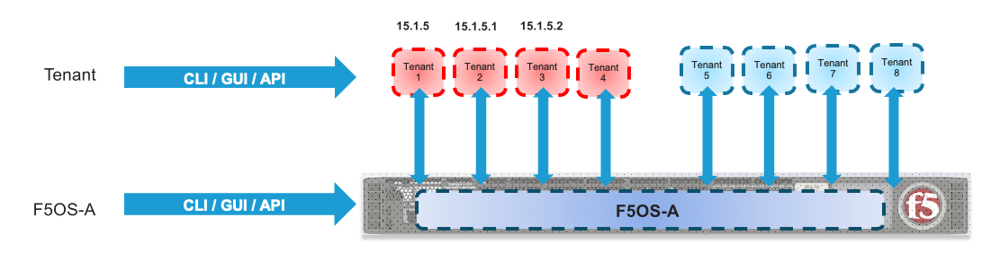

===============================
Points of Management in rSeries
===============================

There are two main points of management within the rSeries Appliances. The **F5OS platform layer**, and the individual **tenants**. Each support their own CLI, GUI, and API access and have their own authentications and users. Additionally, they each run their own version of software; tenants are able to run specific versions of TMOS which have been approved to run on the rSeries platform, the intial supported version is 15.1.x. The F5OS platform layer runs its own version of F5OS which is unique to rSeries. On downloads.f5.com the rSeries versions of F5OS are referred to as **F5OS-A** where the **A** stands for **Appliances**. The VELOS chassis also run F5OS, but they are disgnated as **F5OS-C**, where **C** stands for **Chassis**.

At the F5OS platform layer initial configuration consists of out-of-band management IP addresses, routing and other system parameters like DNS & NTP. Licensing is also configured at the F5OS layer and is similar to iSeries when vCMP is configured in that it is applied at the appliance level and inherited by all tenants.  In-band networking (VLANs, Interfaces, Link Aggregation Groups) are also configured within the F5OS platfrom layer. Once networking is setup tenants can be provsioned and deployed form the F5OS interfaces. Once the tenant is deployed it is managed like any other BIG-IP. This is very similar to how vCMP geusts are managed on iSeries or VIPRION.  Please refer to the **rSeries Systems Administration Guide** on askf5.com for more detailed information.

**Link Coming soon!**

  
