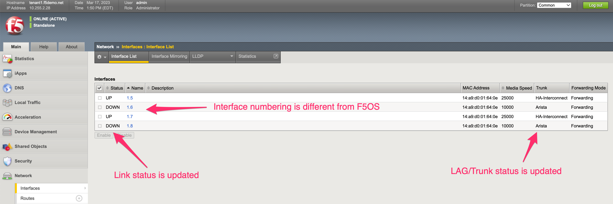
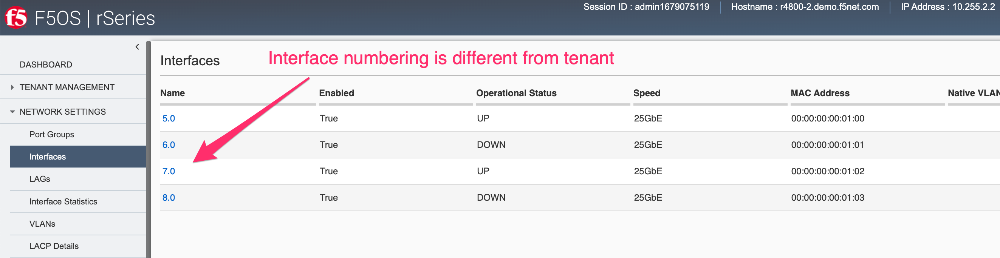
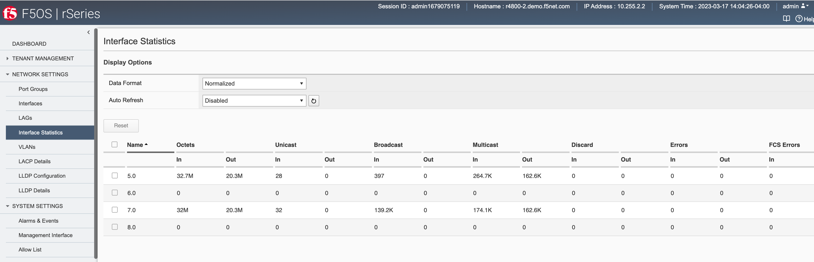
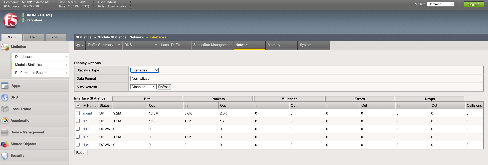

===============================
Points of Management in rSeries
===============================

There are two main points of management within the rSeries appliances: The **F5OS platform layer**, and the individual **tenants**. Each support their own CLI, webUI, and API access and have their own authentication and user configuration. 

.. image:: images/rseries_points_of_management/image1.png
  :align: center
  :scale: 80%

Additionally, they each run their own version of software; tenants are able to run specific versions of TMOS, which have been approved to run on the rSeries platform. The initial supported version is 15.1.5 for the r10000 and r5000 appliances and 15.1.6 for the r4000 and r2000 appliances. The F5OS platform layer runs its own version of F5OS, which is unique to the rSeries appliances. On downloads.f5.com the rSeries versions of F5OS are referred to as **F5OS-A** where the **A** stands for **Appliances**. The VELOS chassis also runs F5OS, but that version is designated as **F5OS-C**, where **C** stands for **Chassis**.

.. image:: images/rseries_points_of_management/image2.png
  :align: center
  :scale: 80%

At the F5OS platform layer, initial configuration consists of out-of-band management IP addresses, routing, and other system parameters like DNS & NTP. Licensing is also configured at the F5OS layer and is similar to iSeries with vCMP configured in that it is applied at the appliance level and inherited by all tenants. In-band networking (VLANs, Interfaces, Link Aggregation Groups) are also configured within the F5OS platform layer. Once networking is set up tenants can be provisioned and deployed from the F5OS management interfaces. Once the tenant is deployed, it is managed like any other BIG-IP. This is very similar to how vCMP guests are managed on iSeries or VIPRION.  Please refer to the **rSeries Systems Administration guide** on askf5.com for more detailed information.

`F5 rSeries Systems: Administration and Configuration <https://techdocs.f5.com/en-us/f5os-a-1-3-0/f5-rseries-systems-administration-configuration.html>`_

Differences from iSeries and VIPRION
------------------------------------

The management of rSeries/F5OS has a lot of similarities to how vCMP is managed on iSeries or VIPRION, in that there are two distinct layers of management. In the diagram below on the left, a typical vCMP environment has a **host** layer and a **guest** layer. At the vCMP host layer, all networking is configured including interfaces, trunks, and VLANs. When vCMP guests are configured, they will be assigned a set of VLANs by the administrator that it will have access to. The administrator may not want to give the guest access to all VLANs in the system and may only assign a small subset of VLANs from the host layer to a specific guest. Inside the TMOS layer of the guest does not require manual configuration of interfaces or trunks, it is the VLANs that are inherited from the vCMP host configuration that will provide connectivity. The guest will only have access to the VLANs specifically assigned to it when it was created. On the right-hand side is an F5OS environment (in this case rSeries), at the F5OS platform layer, all networking is configured including interfaces, trunks (now called LAGs), and VLANs. When F5OS tenants are configured, they are assigned VLANs by the administrator that they will have access to. Inside the tenant itself does not require configuration of interfaces or LAGs, and VLANs will be inherited from the F5OS platform layer configuration. The F5OS tenant will only have access to the VLANs specifically assigned to it when it was created.

Comparing the management of a non-VCMP (bare metal) iSeries or VIPRION to rSeries is going to be a little bit different with the introduction of the F5OS platform layer. With a bare-metal deployment on iSeries/VIPRION, configuration objects such as interfaces, trunks, and VLANs are directly configurable from within the TMOS layer. Monitoring of the lower layer networking can also be done within the TMOS layer. When moving to rSeries, the configuration and monitoring of the lower-level networking objects are done at the F5OS platform layer. For SNMP monitoring there are separate SNMP MIBs for the F5OS layer that can be used to monitor interfaces and platform level statistics. F5OS doesn't use the term trunk to represent aggregated links, it uses the term Link Aggregation Group or LAG. There are also F5OS APIs to monitor and configure the platform layer. The F5OS tenants themselves still support monitoring of higher layers.

VLANs are created in the F5OS platform layer, and then they can be assigned to separate interfaces or LAGs. When a tenant is created, the administrator can then assign one or more of those VLANs to be accessible by the F5OS tenant. Once the tenant is deployed the configured VLANs will automatically be inherited and will show up in the VLAN configuration inside TMOS. VLANs will automatically show up in Route Domain 0 by default. If you need to assign these VLANs to another Route Domain inside the tenant, then you may delete them from Route Domain 0 inside TMOS and then recreate them with the same VLAN ID inside the proper Route Domain, and connectivity will be restored to the lower F5OS layer. This is the same behavior a vCMP guest would have inside of VIPRION or iSeries as outlined in the following link.

`Deploying Route Domains within a vCMP Guest <https://techdocs.f5.com/kb/en-us/products/big-ip_ltm/manuals/product/vcmp-administration-viprion-13-0-0/15.html>`_

Monitoring for a bare metal iSeries of VIPRION is all done within TMOS, whereas in rSeries there are now two layers that can be monitored. Interfaces, LAGs, and other platform layer objects such as CPU, memory, temperature, disks can be monitored at the F5OS layer via CLI, GUI, API, or SNMP. Higher level monitoring of virtual servers, pools and L4-7 objects continue to be done inside the TMOS layer of the F5OS tenant.

.. image:: images/rseries_points_of_management/image6.png
  :align: center
  :scale: 50%

There are some architectural differences between the r5000/r10000 appliances and the r2000/r4000 appliances that manifest slightly different behavior inside an F5OS tenant. In general, F5OS tenants in the r5000/r10000 platforms have no visibility into the underlying physical interfaces or LAGs that are configured at the F5OS layer. The tenant will be connected to specific interfaces or LAGs based on its VLAN membership. The only exception to this is the HA Group functionality inside the tenant, which has visibility into LAG state and membership to facilitate proper redundancy/failover.

Generally, the r2000/r4000 appliances follow these same principles, but due to some architectural differences these platforms have more visibility into the lower layer interfaces and LAGs that are configured at the F5OS layer. As an example, an F5OS tenant on an r5000/r10000 appliance has no visibility into the physical interfaces at the F5OS layer. Instead, the tenant will see virtual interfaces and the number of interfaces within a tenant will be based upon the number of CPUs assigned to the tenant. The screenshot below shows the interfaces inside the tenant lining up with the number of physical CPU cores per tenant. In the example there are 36 vCPUs assigned to a single F5OS tenant, this will equate to 18 physical CPUs due to hyperthreading. As seen in the output below, the tenant has 36 vCPUs assigned. 

.. image:: images/rseries_inside_the_tenant/image4.png
  :align: center
  :scale: 70%

If you were to look inside the tenant, you'll notice that the number of Interfaces corelates to the number of CPU cores assigned to the tenant, in this case 18. Note how the tenant does not see the physical interfaces at the F5OS layer.  

.. image:: images/rseries_inside_the_tenant/image3.png
  :align: center
  :scale: 70%

An F5OS tenant on an r2000/r4000 appliance will see the physical interfaces of the appliance in its configuration, but the interface numbering will be slightly different from the numbering used at the F5OS layer. 

In the example below, a tenant on an r4000 appliance sees 4 interfaces, although the numbering of those interfaces differs from F5OS. 

Those same 4 interfaces can be seen at the F5OS layer, but they are numbered 5.0, 6.0, 7.0 & 8.0.

Since the r2000/r4000 architecture allows the tenant to see the physical interface, this means that the tenant's interface stats will reflect the physical interfaces stats, although the numbers may not be in sync as the interface may have been up longer than the tenant.

This can be seen in the F5OS interface stats below. Note interfaces 5.0 and 7.0 show statistics incrementing.

Inside the tenant, interfaces 1.5 and 1.7 show statistics incrementing. Note that the stats may not be equal between the tenant and the F5OS layer.

