====================================
Securing / Hardening F5OS on rSeries
====================================

F5OS tenants follow the standard hardening/security best practices that are outlined in the following solution article:

`K53108777: Hardening your F5 system <https://support.f5.com/csp/article/K53108777>`_

This section will focus on how to harden/secure the F5OS layer of the rSeries appliances. 

F5OS Platform Layer Isolation
=============================

Management of the new F5OS platform layer is completely isolated from in-band traffic networking and VLANs. It is purposely isolated so that it is only accessible via the out-of-band management network. In fact, there are no in-band IP addresses assigned to the F5OS layer, only tenants will have in-band management IP addresses and access. Tenants also have out-of-band connectivity.

This allows customers to run a secure/locked-down out-of-band management network where access is tightly restricted. The diagram below shows the out-of-band management access entering the rSeries appliance through **MGMT** port. The external MGMT port is bridged to an internal out-of-band network that connects to all tenants within the rSeries appliance. 

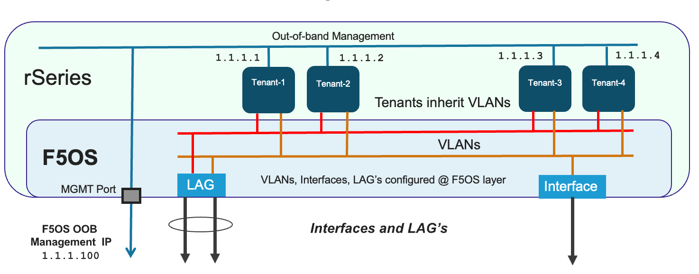

Allow List for F5OS Management
===============================

F5OS only allows management access via a single out-of-band management interface. Access to that single management IP address may be restricted to specific IP addresses (both IPv4 and IPv6), subnets (via Prefix Length), as well as protocols - 443 (HTTPS), 80 (HTTP), 8888 (RESTCONF), 161 (SNMP), 7001 (VCONSOLE), and 22 (SSH). An administrator can add one or more Allow List entries via the CLI, webUI or API to lock down access to specific endpoints.

By default, all ports except for 161 (SNMP) are enabled for access, meaning ports 80, 443, 8888, 7001, and 22 are allowed access. Port 80 is only open to allow a redirect to port 443 in case someone tries to access the webUI over port 80. The webUI itself is not accessible over port 80. Port 161 is typically viewed as un-secure, and is therefore not accessible until an allow list entry is created for the endpoint trying to access F5OS using SNMP queries. Ideally SNMPv3 should be utilized to provide additional layers of security on an otherwise un-secure protocol. VCONSOLE access also has to be explicitly configured before access to the tenants is possible over port 7001. 

To further lock down access you may add an Allow List entry including an IP address and optional prefix for each of the protocols listed above. As an example, if you wanted to restrict API and webUI access to a particular IP address and/or subnet, you can add an Allow List entry for the desired IP or subnet (using the prefix length), specify port 443 and all access from other IP endpoints will be prevented.

Adding Allow List Entries via CLI
-----------------------------------

If you would like to lock down one of the protocols to either a single IP address or subnet, use the **system allowed-ips** command. Be sure to commit any changes. The **prefix-length** parameter is optional. If you omit it, then you will lock down access to a specific IP endpoint, if you add it you can lock down access to a specific subnet.

.. code-block:: bash

    r10900-2(config)# system allowed-ips allowed-ip snmp config ipv4 address 10.255.0.0 prefix-length 24 port 161
    r10900-2(config-allowed-ip-snmp)# commit
    Commit complete.

Currently you can add one ip address/port pair per **allowed-ip** name with an optional prefix length to specify a CIDR block contaning multiple addresses. If you require more than one non-contiguous IP address or subnets you can add it under another name as seen below. 

.. code-block:: bash

    appliance-1(config)# system allowed-ips allowed-ip SNMP-144 config ipv4 address 10.255.0.144 port 161 
    appliance-1(config-allowed-ip-SNMP)# commit
    Commit complete.
    appliance-1(config-allowed-ip-SNMP)# 

    appliance-1(config)# system allowed-ips allowed-ip SNMP-145 config ipv4 address 10.255.2.145 port 161 
    appliance-1(config-allowed-ip-SNMP)# commit
    Commit complete.
    appliance-1(config-allowed-ip-SNMP)# 

Adding Allow List Entries via API
-----------------------------------

Below is an example of allowing multiple SNMP endpoints (port 161) to query SNMP on the F5OS platfrom layer.

.. code-block:: bash

    POST https://{{rseries_appliance1_ip}}:8888/restconf/data/openconfig-system:system/f5-allowed-ips:allowed-ips

Within the body of the API call, specific IP address/port combinations can be added under a given name. In the current release, you are limited to one IP address/port per name. 

.. code-block:: json

    {
        "allowed-ip": [
            {
                "name": "SNMP-142",
                "config": {
                    "ipv4": {
                        "address": "10.255.0.142",
                        "port": 161
                    }
                }
            },
            {
                "name": "SNMP-143",
                "config": {
                    "ipv4": {
                        "address": "10.255.0.143",
                        "port": 161
                    }
                }
            },
            {
                "name": "SNMP-144",
                "config": {
                    "ipv4": {
                        "address": "10.255.0.144",
                        "port": 161
                    }
                }
            }
        ]
    }

To view the allowed IP's in the API, use the following call.

.. code-block:: bash

    GET https://{{rseries_appliance1_ip}}:8888/restconf/data/openconfig-system:system/f5-allowed-ips:allowed-ips

The output will show the previously configured allowed-ip's.

.. code-block:: json

    {
        "f5-allowed-ips:allowed-ips": {
            "allowed-ip": [
                {
                    "name": "SNMP-142",
                    "config": {
                        "ipv4": {
                            "address": "10.255.0.142",
                            "port": 161
                        }
                    }
                },
                {
                    "name": "SNMP-143",
                    "config": {
                        "ipv4": {
                            "address": "10.255.0.143",
                            "port": 161
                        }
                    }
                },
                {
                    "name": "SNMP-144",
                    "config": {
                        "ipv4": {
                            "address": "10.255.0.144",
                            "port": 161
                        }
                    }
                }
            ]
        }
    }

Adding Allow List Entries via webUI
-----------------------------------

You can configure the **Allow List** in the webUI under the **System Settings** section. 

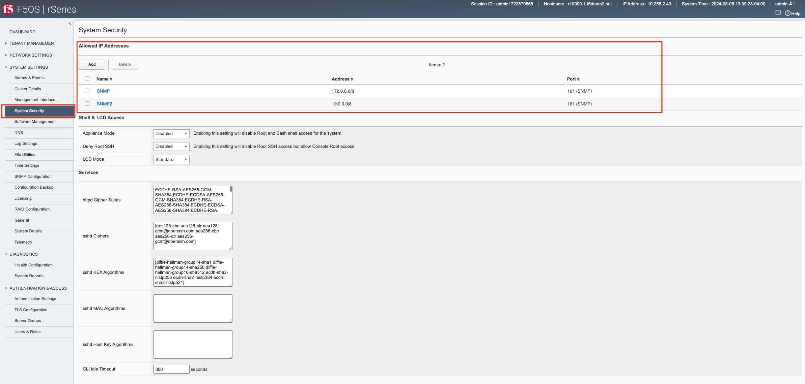

Below is an example of allowing any SNMP endpoint at 10.255.0.0 (prefix length of 24) to query the F5OS layer on port 161.

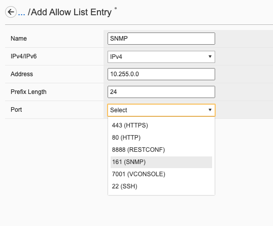

Certificates for Device Management
==================================

F5OS supports TLS device certificates and keys to secure connections to the management interface. You can either create a self-signed certificate, or load your own into the system.

**Details coming soon**.

Appliance Mode for F5OS
=======================

If you would like to prevent root / bash level access to the F5OS layer, you can enable **Appliance Mode**, which operates in a similar manner as TMOS appliance mode. Enabling Appliance mode will disable the root account, and access to the underlying bash shell is disabled. The admin account to the F5OS CLI is still enabled. This is viewed as a more secure setting as many vulberabilites can be avodied by not allowing access to the bash shell. In some heavily audited environments, this setting may be mandatory, but it may prevent lower level debugging from occuring directly in the bash shell.

Enabling Appliance Mode via the CLI
-----------------------------------

Appliance mode can be enabled or disabled via the CLI using the command **system appliance-mode config** and entering either **enabled** or **disabled**. The command **show system appliance-mode** will display the current status. Be sure to commit any changes. 

.. code-block:: bash

    r10900(config)# system appliance-mode config enabled 
    r10900(config)# commit
    Commit complete.
    r10900(config)# 

To display the current status.

.. code-block:: bash

    r10900(config)# do show system appliance-mode       
    system appliance-mode state enabled
    r10900(config)# 

If you then try to login as root, you will get a permission denied error. You can still login as admin to gain access to the F5OS CLI.

To disable appliance mode.

.. code-block:: bash

    r10900(config)# system appliance-mode config disabled 
    r10900(config)# commit
    Commit complete.
    r10900(config)#

Enabling Appliance Mode via the webUI
------------------------------------- 

Appliance mode can be enabled or disabled via the webUI under the **System Settings -> General** page.

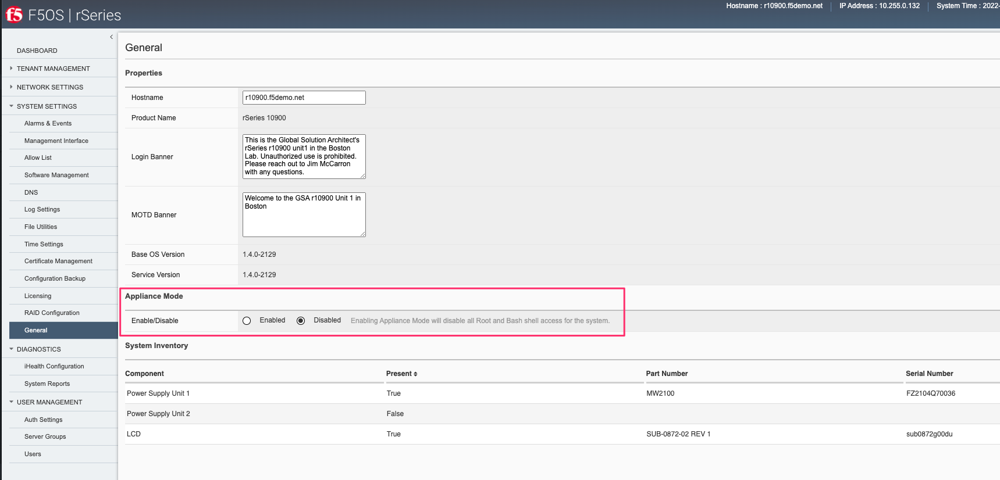

Enabling Appliance Mode via the API
-----------------------------------

Appliance mode can be enabled or disabled via the API. To view the current status of appliance mode use the following API call.

.. code-block:: bash

    GET https://{{rseries_appliance1_ip}}:8888/restconf/data/openconfig-system:system/f5-security-appliance-mode:appliance-mode

You will see output similar to the response below showing the config and state of appliance mode for F5OS.

.. code-block:: json

    {
        "f5-security-appliance-mode:appliance-mode": {
            "config": {
                "enabled": false
            },
            "state": {
                "enabled": false
            }
        }
    }

To change the mode from disabled to enabled, use the following API call.

.. code-block:: bash

    PATCH https://{{rseries_appliance1_ip}}:8888/restconf/data/openconfig-system:system/f5-security-appliance-mode:appliance-mode/f5-security-appliance-mode:config

In the body of the API call add the following:

.. code-block:: json

    {
        "f5-security-appliance-mode:config": {
            "f5-security-appliance-mode:enabled": "true"
        }
    }
Session Timeouts
================

Idle timeouts were configurable in previous releases, but the configuration only applied to the current session and was not persistent. F5OS-A 1.3.0 added the ability to configure persistent idle timeouts for both the CLI and webUI. The CLI timeout is configured under system settings, and is controlled via the **idle-timeout** option. For the webUI, a token based timeout is now configurable under the **system aaa** settings. a restconf-token config lifetime option has been added. Once a client to the webUI has a token they are allowed to refresh it up to five times. If the token lifetime is set to 1 minute, then a timeout won't occur until five times that value, or five minutes later. This is because the token refresh has to fail five times before disconnecting the client.  

Configuring SSH and HTTPS Timeouts via CLI
------------------------------------------

To configure the CLI timeout via the CLI, use the command **system settings config idle-timeout <value-in-seconds>**. Be sure to issue a commit to save the changes. In the case below, the CLI session should disconnect after 300 seconds of inactivity.

.. code-block:: bash

    r10900(config)# system settings config idle-timeout 300
    r10900(config)# commit
    Commit complete.     
 
 
As mentioned in the introduction, the webUI uses tokens and the timeout is based on five token refreshes failing, so the value is essentially five times the configured token lifetime. Use the command **system aaa restconf-token config lifetime <value-in-minutes>**.

.. code-block:: bash

    5900-2(config)# system aaa restconf-token config lifetime 1
    r5900-2(config)# commit
    Commit complete.
    r5900-2(config)# 
 
Configuring SSH and Token Based Timeouts via API
------------------------------------------------

To configure the CLI timeout via the API, use the PATCH API call below. In the case below, the CLI session should disconnect after 300 seconds of inactivity.

.. code-block:: bash

    PATCH https://{{rseries_appliance1_ip}}:8888/restconf/data/openconfig-system:system/f5-system-settings:settings

.. code-block:: json

    {
        "f5-system-settings:settings": {
            "f5-system-settings:config": {
                "f5-system-settings:idle-timeout": 300
            }
        }
    }

To view the current idle-timeout setting, issue the following GET API call.

.. code-block:: bash

    GET https://{{rseries_appliance1_ip}}:8888/restconf/data/openconfig-system:system/f5-system-settings:settings/config

You'll see output similar to the example below.

.. code-block:: json

    {
        "f5-system-settings:config": {
            "idle-timeout": "300"
        }
    }

As mentioned in the introduction, the webUI uses tokens and the timeout is based on five token refreshes failing, so the value is essentially five times the configured token lifetime. Use the following PATCH API call and set the **f5-aaa-confd-restconf-token:restconf-token** **lifetime** to the desired setting.

.. code-block:: bash

    PATCH https://{{rseries_appliance1_ip}}:8888/restconf/data/openconfig-system:system/aaa

In the body of the API call set the desired lifetime in minutes.

.. code-block:: json

    {
        "openconfig-system:aaa": {
            "authentication": {
                "config": {
                    "f5-aaa-confd-restconf-token:basic": {
                        "enabled": true
                    }
                }
            },
            "f5-aaa-confd-restconf-token:restconf-token": {
                "config": {
                    "lifetime": 10
                }
            },
            "f5-openconfig-aaa-password-policy:password-policy": {
                "config": {
                    "min-length": 6,
                    "required-numeric": 0,
                    "required-uppercase": 0,
                    "required-lowercase": 0,
                    "required-special": 0,
                    "required-differences": 8,
                    "reject-username": false,
                    "apply-to-root": true,
                    "retries": 3,
                    "max-login-failures": 10,
                    "unlock-time": 60,
                    "root-lockout": true,
                    "root-unlock-time": 60,
                    "max-age": 0
                }
            }
        }
    }

Configuring SSH and HTTPS Timeouts via webUI
------------------------------------------

As mentioned in the introduction, the webUI uses tokens and the timeout is based on five token refreshes failing, so the value is essentially five times the configured token lifetime. You may configure the **Token Lifetime** in the webUI under the **User Management -> Authentication Settings** page. This setting should apply to both webUI and API access.

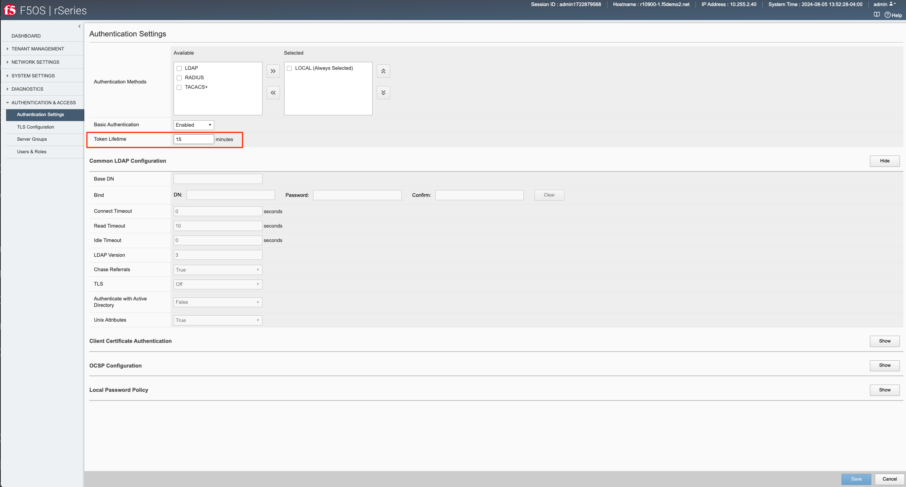

Disabling Basic Authentication
==============================

F5OS utilizes basic authentication (username/password) as well as token based authentication for both the API and the webUI. Generally, username/password is issued by the client in order to obtain a token from F5OS, which is then used to make further inquiries or changes. Tokens have a relatively short lifetime for security reasons, and the user is allowed to refresh that token a certain number of times before they are forced to re-authenticate again. Although token based authentication is supported, basic authentication can still be utilized to access F5OS and make changes. A new option was added in F5OS-A 1.3.0 to allow basic authentication to be disabled, except for the means of obtaining a token. Once a token is issued, it will be the only way to make changes via the webUI or the API. 

Disabling Basic Auth via the CLI
--------------------------------

The default setting for basic auth is enabled, and the current state can be seen by entering the **show system aaa** command. The line **system aaa authentication state basic enabled** indicates that basic authentication is still enabled. 

.. code-block:: bash

    r10900# show system aaa
    system aaa restconf-token state lifetime 15
    system aaa primary-key state hash gK/F47uQfi7JWYFirStCVhIaGcuoctpbGpx63MNy/korwigBW6piKx9TldiRazHmE8Y+qylGY4MOcs9IZ+KG4Q==
    system aaa primary-key state status NONE
    system aaa authentication state basic enabled
            LAST        TALLY  EXPIRY                  
    USERNAME  CHANGE      COUNT  DATE    ROLE            
    -----------------------------------------------------
    admin     2022-06-02  0      -1      admin           
    jim-test  2022-09-02  10     -1      admin           
    operator  2022-10-11  0      -1      operator        
    root      2022-06-02  0      -1      root            
    tenant1   0           0      1       tenant-console  
    tenant2   0           0      1       tenant-console  

    ROLENAME        GID   USERS  
    -----------------------------
    admin           9000  -      
    operator        9001  -      
    root            0     -      
    tenant-console  9100  -      

    NAME    NAME    TYPE    
    ------------------------
    tacacs  tacacs  TACACS  

    r10900# 

You may disable basic authentication by issuing the cli command **system aaa authenitcation config basic disabled**, and then committing the change.

.. code-block:: bash

    r10900(config)# system aaa authentication config basic disbaled 
    r10900(config)# commit
    Commit complete.
    r10900(config)#

To re-enable basic authentication, change the state to enabled and commit.

.. code-block:: bash

    r10900(config)# system aaa authentication config basic enabled 
    r10900(config)# commit
    Commit complete.
    r10900(config)#

Disabling Basic Auth via the API
--------------------------------

You may enable or disable basic authentication via the API. The default setting for basic autentication is enabled, and the current state can be seen by entering the following API call.

.. code-block:: bash

    GET https://{{rseries_appliance1_ip}}:8888/restconf/data/openconfig-system:system/aaa/authentication/config

You should see the returned output below with the basic authentication state set to either **true** or **false**.

.. code-block:: json

    {
        "openconfig-system:config": {
            "f5-aaa-confd-restconf-token:basic": {
                "enabled": true
            }
        }
    }

Use the following API PATCH call to set the restconf-token:basic setting to **true** or **false**, or any other password policy parameter.

.. code-block:: bash

    PATCH https://{{rseries_appliance1_ip}}:8888/restconf/data/openconfig-system:system/aaa

In the body of the API call adjust the restconf-token:basic setting to to **true** or **false**.

.. code-block:: json

    {
        "openconfig-system:aaa": {
            "authentication": {
                "config": {
                    "f5-aaa-confd-restconf-token:basic": {
                        "enabled": true
                    }
                }
            },
            "f5-aaa-confd-restconf-token:restconf-token": {
                "config": {
                    "lifetime": 10
                }
            },
            "f5-openconfig-aaa-password-policy:password-policy": {
                "config": {
                    "min-length": 6,
                    "required-numeric": 0,
                    "required-uppercase": 0,
                    "required-lowercase": 0,
                    "required-special": 0,
                    "required-differences": 8,
                    "reject-username": false,
                    "apply-to-root": true,
                    "retries": 3,
                    "max-login-failures": 10,
                    "unlock-time": 60,
                    "root-lockout": true,
                    "root-unlock-time": 60,
                    "max-age": 0
                }
            }
        }
    }

Disabling Basic Auth via the webUI
----------------------------------

Disabling basic authentication via the webUI is a new feature that has been added in F5OS-A 1.4.0. In the webUI got to **User Management -> Authentication Settings** and you'll see a drop down box to enable or disable **Basic Authentication**.

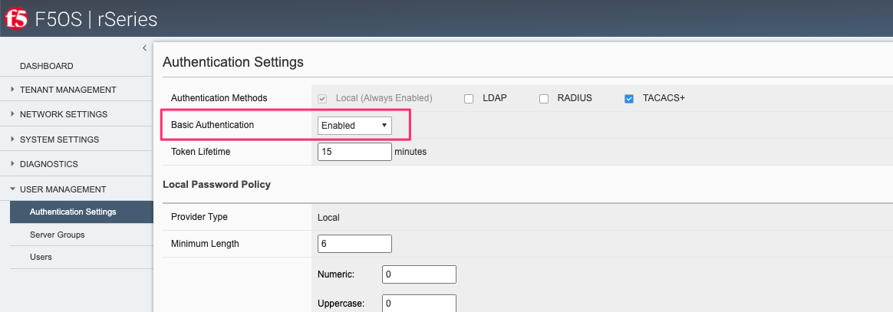

Token Lifetime via CLI
----------------------

You may configure the restconf-token lifetime via the CLI. The value is in minutes, and the client is able to refresh the token five times before it expires. As an example, if the restconf-token lifeftime is set to 1 minute, an inactive webUI session will have a token expire after one minute, but it can be refreshed a maximum of five times. This will result in the webUI session timing out after 5 minutes.

.. code-block:: bash

    r10900(config)# system aaa restconf-token config lifetime 1 
    r10900(config)# commit
    Commit complete.
    r10900(config)# 

To display the current restconf-token lifetime setting, use the command **show system aaa***.

.. code-block:: bash

    r10900(config)# do show system aaa
    system aaa restconf-token state lifetime 1
    system aaa primary-key state hash gK/F47uQfi7JWYFirStCVhIaGcuoctpbGpx63MNy/korwigBW6piKx9TldiRazHmE8Y+qylGY4MOcs9IZ+KG4Q==
    system aaa primary-key state status NONE
    system aaa authentication state basic enabled
            LAST        TALLY  EXPIRY                  
    USERNAME  CHANGE      COUNT  DATE    ROLE            
    -----------------------------------------------------
    admin     2022-06-02  0      -1      admin           
    jim-test  2022-09-02  10     -1      admin           
    operator  2022-10-11  0      -1      operator        
    root      2022-06-02  0      -1      root            
    tenant1   0           0      1       tenant-console  
    tenant2   0           0      1       tenant-console  

    ROLENAME        GID   USERS  
    -----------------------------
    admin           9000  -      
    operator        9001  -      
    tenant-console  9100  -      

    NAME    NAME    TYPE    
    ------------------------
    tacacs  tacacs  TACACS  

    system aaa tls state verify-client false
    system aaa tls state verify-client-depth 1

Token Lifetime via webUI
------------------------

You may configure the restconf-token lifetime via the webUI (new feature added in F5OS-A 1.4.0). The value is in minutes, and the client is able to refresh the token five times before it expires. As an example, if the token lifeftime is set to 1 minute, an inactive webUI session will have a token expire after one minute, but it can be refreshed a maximum of five times. This will result in the webUI session timing out after 5 minutes.

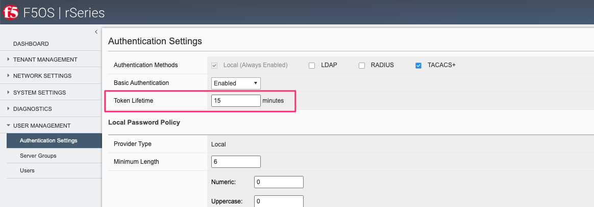

Token Lifetime via API
----------------------

You may configure the restconf-token lifetime via the API. The value is in minutes, and the client is able to refresh the token five times before it expires. As an example, if the token lifeftime is set to 1 minute, an inactive webUI session or API session will have a token expire after one minute, but it can be refreshed a maximum of five times. This will result in the webUI session timing out after 5 minutes.

Use the following API PATCH call to set the restconf-token lifetime, or any other password policy parameter.

.. code-block:: bash

    PATCH https://{{rseries_appliance1_ip}}:8888/restconf/data/openconfig-system:system/aaa

In the body of the API call adjust the restconf-token lifetime setting to the desired timeout in minutes. The example below is 10 minutes, and the session will timeout at five times the value of the lifetime setting due to tken refresh.

.. code-block:: json

    {
        "openconfig-system:aaa": {
            "authentication": {
                "config": {
                    "f5-aaa-confd-restconf-token:basic": {
                        "enabled": true
                    }
                }
            },
            "f5-aaa-confd-restconf-token:restconf-token": {
                "config": {
                    "lifetime": 10
                }
            },
            "f5-openconfig-aaa-password-policy:password-policy": {
                "config": {
                    "min-length": 6,
                    "required-numeric": 0,
                    "required-uppercase": 0,
                    "required-lowercase": 0,
                    "required-special": 0,
                    "required-differences": 8,
                    "reject-username": false,
                    "apply-to-root": true,
                    "retries": 3,
                    "max-login-failures": 10,
                    "unlock-time": 60,
                    "root-lockout": true,
                    "root-unlock-time": 60,
                    "max-age": 0
                }
            }
        }
    }

Setting Password Policies
=========================

You may configure the local password polcy to ensure secure passwords are utilized, reusue is minimized, and to limit the amount of failures/retries. Below are some of the settings that can be set.

- **Minimum Password Length** - For Minimum Length, specify the minimum number of characters (6 to 255) required for a valid password.
- **Password Required Characters** - For Required Characters, specify the minimum number of Numeric, Uppercase, Lowercase, and Special characters that are required in a valid password.
- **New/Old Password Differential** - For New/Old Password Differential, specify the number of character changes in the new password that differentiate it from the old password. The default value is 8.
- **Disallow Username** - For Disallow Username, set to True to check whether the name of the user in forward or reversed form is contained in the password. The default value is False.
- **Apply Password Policy to Root Account** - For Apply Password Policy to Root Account, set to True to use the same password policy for the root account. The default value is True.
- **Maximum Password Retries** - For Maximum Password Retries, specify the number of times that a user can try to create an acceptable password. The default value is 3.
- **Maximum Login Attempts** - For Maximum Login Attempts, specify the number of times a user can attempt to log in before the account is temporarily suspended. The default value is 10; 0 means no limit.
- **Lockout Duration** - For Lockout Duration, specify the duration, in seconds, an account is locked out. The default value is 60.
- **Maximum Password Age** - For Max Password Age, specify the number of days after which the password will expire after being changed. 0 means never expires.

Setting Password Policies via CLI
---------------------------------

Local Password Policies can be set in the CLI using the **system aaa password-policy config** command. Adding a question mark after the command will show all the configurable options. Be sure to commit after making any changes.

.. code-block:: bash

    r10900-2(config)# system aaa password-policy config ?
    Possible completions:
    apply-to-root          Apply password restrictions to root accounts.
    max-age                Number of days after which the user will have to change the password.
    max-login-failures     Number of unsuccessful login attempts allowed before lockout.
    min-length             Minimum length of a new password.
    reject-username        Reject passwords that contain the username.
    required-differences   Required number of differences between the old and new passwords.
    required-lowercase     Required number of lowercase characters in password.
    required-numeric       Required number of numeric digits in password.
    required-special       Required number of 'special' characters in password.
    required-uppercase     Required number of uppercase character in password.
    retries                Number of times to prompt before failing.
    root-lockout           Enable lockout of root users.
    root-unlock-time       Time (seconds) before the root account is automatically unlocked.
    unlock-time            Time (seconds) before a locked account is automatically unlocked.
    r10900-2(config)# 

Setting Password Policies via webUI
---------------------------------

Local Password Policies can be set in the **User Management -> Authentication Settings** page in the webUI.

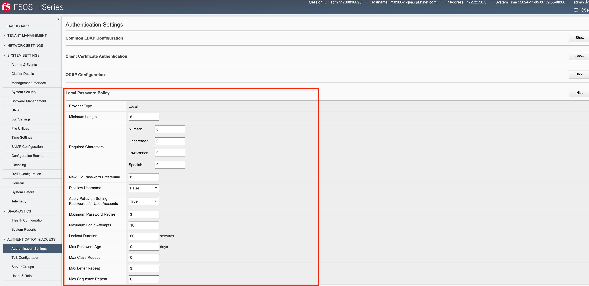

Setting Password Policies via API
---------------------------------

Local Password Policies can be viewed or set via the API using the following API calls. To view the current password policy settings issue the following GET API call.

.. code-block:: bash

    GET https://{{rseries_appliance1_ip}}:8888/restconf/data/openconfig-system:system/aaa/f5-openconfig-aaa-password-policy:password-policy

The JSON output will eflect the current settings.

.. code-block:: json

    {
        "f5-openconfig-aaa-password-policy:password-policy": {
            "config": {
                "min-length": 6,
                "required-numeric": 0,
                "required-uppercase": 0,
                "required-lowercase": 0,
                "required-special": 0,
                "required-differences": 8,
                "reject-username": false,
                "apply-to-root": true,
                "retries": 3,
                "max-login-failures": 10,
                "unlock-time": 60,
                "root-lockout": true,
                "root-unlock-time": 60,
                "max-age": 0
            }
        }
    }

To change any of the password policy parameters, use the following API GET call.

.. code-block:: bash

    PATCH https://{{rseries_appliance1_ip}}:8888/restconf/data/openconfig-system:system/aaa

In the payload of the API call adjust the appropriate parameters under **f5-openconfig-aaa-password-policy:password-policy**.

.. code-block:: json

    {
        "openconfig-system:aaa": {
            "authentication": {
                "config": {
                    "f5-aaa-confd-restconf-token:basic": {
                        "enabled": true
                    }
                }
            },
            "f5-aaa-confd-restconf-token:restconf-token": {
                "config": {
                    "lifetime": 10
                }
            },
            "f5-openconfig-aaa-password-policy:password-policy": {
                "config": {
                    "min-length": 6,
                    "required-numeric": 0,
                    "required-uppercase": 0,
                    "required-lowercase": 0,
                    "required-special": 0,
                    "required-differences": 8,
                    "reject-username": false,
                    "apply-to-root": true,
                    "retries": 3,
                    "max-login-failures": 10,
                    "unlock-time": 60,
                    "root-lockout": true,
                    "root-unlock-time": 60,
                    "max-age": 0
                }
            }
        }
    }

Remote Authentication
=====================

The F5OS platform layer supports both local and remote authentication. By default, there are local users enabled for both admin and root access. You will be forced to change passwords for both of these accounts on intial login. Many users will prefer to configure the F5OS layer to use remote authentication via LDAP, RADIUS, AD, or TACACS+. The F5OS TMOS based tenants maintain their own local or remote authentication, and details are covered in standard TMOS documentation.

`Configuring Remote User Authentication and Authorization on TMOS <https://techdocs.f5.com/kb/en-us/products/big-ip_ltm/manuals/product/tmos-implementations-13-0-0/10.html>`_

Currently F5OS only supports static pre-defined roles which in turn map to specific group IDs. Users created and managed on external LDAP, Active Directory, RADIUS, or TACACS+ servers must have the same group IDs on the external authentication servers as they do within F5OS based systems to allow authentication and authorization to occur. Users created on external LDAP, Active Directory, RADIUS, or TACACS+ servers must be associated with one of these group IDs on the system. The supported F5OS group IDs and the roles they map to are seen in the table below. User defined roles are not supported.

+----------------+----------+
| Role           | Group ID | 
+================+==========+
| admin          | 9000     | 
+----------------+----------+
| operator       | 9001     |
+----------------+----------+
| root           | 0        | 
+----------------+----------+
| tenant-console | 9100     | 
+----------------+----------+

From a high level the **admin** role (group ID 9000) is a read/write role with full access to the system to make changes. The **operator** role (group ID 9001) is a read-only role and is prevented form making any configuration changes. The **root** role (group ID 0) gives full access to the bash shell, and in some environments this role will be disabled by enabling appliance mode. Note that the root role is not allowed access via remote authentication. The last role is **tenant-console** (group ID 9100) and this role is used to provide remote access directly to the tenant console as noted here:

` Console Access to Tenant via Built-In Terminal Server <https://clouddocs.f5.com/training/community/rseries-training/html/rseries_diagnostics.html#console-access-via-built-in-terminal-server>`_

The group IDs are typically specified in a user configuration file on the external server (file locations vary on different servers). You can assign these F5 user attributes: 

.. code-block:: bash

    F5-F5OS-UID=1001 

    F5-F5OS-GID=9000   <-- THIS MUST MATCH /etc/group items    

    F5-F5OS-HOMEDIR=/tmp  <-- Optional; prevents sshd warning msgs  

    F5-F5OS-USERINFO=test_user  <-- Optional user info  

    F5-F5OS-SHELL=/bin/bash    <--  Ignored; always set to /var/lib/controller/f5_confd_cli 

Setting F5-F5OS-HOMEDIR=/tmp is a good idea to avoid warning messages from sshd that the directory does not exist. Also, the source address in the TACACS+ configuration is not used by the rSeries system. 

If F5-F5OS-UID is not set, it defaults to 1001. If F5-F5OS-GID is not set, it defaults to 0 (disallowed for authentication). The F5-F5OS-USERINFO is a comment field. Essentially, F5-F5OS-GID is the only hard requirement and must coincide with group ID's user role (except for the root role where the GID is 0). 

More specific configuration details can be founf in the **User Management** section of the **rSeries System Administration Guide**.

`F5OS User Management <https://techdocs.f5.com/en-us/f5os-a-1-3-0/f5-rseries-systems-administration-configuration/title-user-mgmt.html#user-management>`_

The **gidNumber** attribute needs to either be on the user or on a group the user is a member of. The **gidNumber** must be one of those listed (9000, 9001, 9100). [The root role is not externally accessible for obvious reasons.] 

the current implementation relies on AD “unix attributes” being installed into the directory.

AD groups are not currently queried. The role IDs are fixed. As noted above, the IDs will be configurable in a future release, but will still be numeric not group names. 

Currently the role numbers (9000, 9001, 9100) are fixed and hard-coded 

Roles are mutually exclusive. While it is theoretically possible to assign a user to multiple role groups, It is up to confd to resolve how the roles present to it are assigned, and it doesn’t always choose the most logical answer. For that reason, you should consider them mutually exclusive and put the user in the role with the least access necessary to do their work. 

In a future release, these role numbers will be configurable  

https://techdocs.f5.com/en-us/f5os-a-1-3-0/f5-rseries-systems-administration-configuration/title-user-mgmt.html#ldap-config-overview

Group IDs for system roles 

Login Banner / Message of the Day
===================

Some environments require warning or acceptance messages to be displayed to clients connecting to the F5OS layer at intial connection time and/or upon successful login. The F5OS layer supports configurable Message of the Day (MoTD) and Login Banners that are displayed to clients connecting to the F5OS layer via both CLI and the webUI. The MoTD and Login Banner can be configured via CLI, webUI, or API. The Login Banner is displayed at initial connect time and is commonly used to notify users they are connecting to a specific resource, and that they should not connect if they are not authorized. The MoTD is displayed after successful login, and may also display some information about the resource the user is connecting to.

Configuring Login Banner / MoTD via CLI
---------------------------------------

Enter config mode and use the command **system config login-banner** to configure the login banner via the CLI. You must commit the change afterwards.

.. code-block:: bash

    r10900(config)# system config login-banner "This is a restricted resource. Unauthorized access is prohibited. Please disconnect now if you are not authorized."                                                 
    r10900(config)# commit
    Commit complete.
    r10900(config)# 

Enter config mode and use the command **system config motd-banner** to configure the Message of the Day banner via the CLI. You must commit the change afterwards.

.. code-block:: bash

    r10900(config)# system config motd-banner "Welcome to the GSA r10900 unit#1, do not make any changes to configuration without a ticket." 
    r10900(config)# commit
    Commit complete.
    r10900(config)# 

To display both settings, use the **show system state** command.

.. code-block:: bash

    r10900# show system state 
    system state hostname r10900.f5demo.net
    system state login-banner This is a restricted resource. Unauthorized access is prohibited. Please disconnect now if you are not authorized.
    system state motd-banner Welcome to the GSA r10900 unit#1, do not make any changes to configuration without a ticket.
    system state current-datetime "2022-11-29 11:12:27-05:00"
    system state base-mac 00:94:a1:69:59:00
    system state mac-pool-size 256
    r10900# 

Configuring Login Banner / MoTD via webUI
-----------------------------------------

You may configure both the Login Banner and the Message of the Day Banner via the webUI on the **System Settings -> General** page.

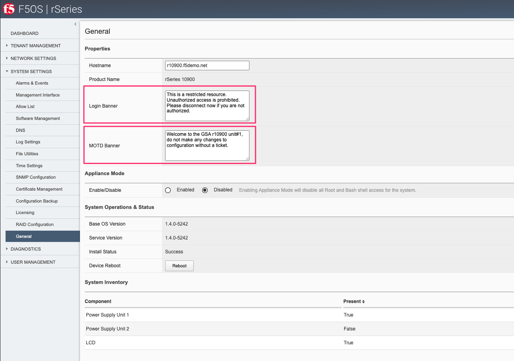

Configuring Login Banner / MoTD via API
---------------------------------------

You may configure both the Login Banner and the Message of the Day Banner via the API using the following API calls.

.. code-block:: bash

    PATCH https://{{rseries_appliance1_ip}}:8888/restconf/data/openconfig-system:system

In the body of the API call configure the desired message of the day and login banner settings.

.. code-block:: json

    {
        "openconfig-system:system": {
            "config": {
                "hostname": "r10900-1.f5demo.net",
                "login-banner": "This is the Global Solution Architect's rSeries r10900 unit-1 in the Boston Lab. Unauthorized use is prohibited. Please reach out to Jim McCarron with any questions.",
                "motd-banner": "Welcome to the GSA r10900 Unit 1 in Boston"
            }
        }
    }

.. code-block:: bash

    GET https://{{rseries_appliance1_ip}}:8888/restconf/data/openconfig-system:system/config

.. code-block:: json

    {
        "openconfig-system:config": {
            "hostname": "r10900.f5demo.net",
            "login-banner": "This is a restricted resource. Unauthorized access is prohibited. Please disconnect now if you are not authorized.",
            "motd-banner": "This is a test"
        }
    }

Display of Login Banner and MoTD
--------------------------------

Below is an example of the Login Banner being displayed before the user is prompted for a password during an SSH connection to the F5OS platform layer. After a successfull user login, the MoTD is then displayed. Both are highlighted in bold below. 

.. code-block:: bash

    FLD-ML-00054045:~ jmccarron$ ssh -l admin 10.255.0.132
    **This is a restricted resource. Unauthorized access is prohibited. Please disconnect now if you are not authorized.**
    admin@10.255.0.132's password: 
    Last login: Tue Nov 29 10:41:06 2022 from 10.10.10.16
    **Welcome to the GSA r10900 unit#1, do not make any changes to configuration without a ticket.**
    System Time: 2022-11-29 11:17:00 EST
    Welcome to the Management CLI
    User admin last logged in 2022-11-29T16:17:00.008317+00:00, to appliance-1, from 10.10.10.16 using cli-ssh
    admin connected from 10.10.10.16 using ssh on r10900.f5demo.net
    r10900# 

Below is an example of the Login Banner being displayed before the user is prompted for a password during a webUI connection to the F5OS platform layer. After a successfull user login, the MoTD is then displayed.

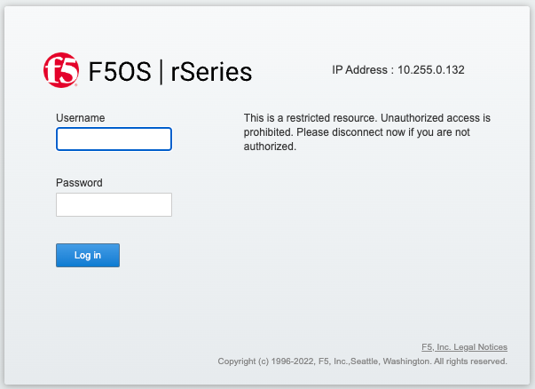

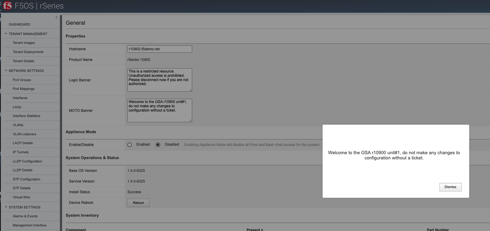

Console Logins
==============

SNMPv3
=======

F5OS-A 1.2.0 added support for SNMPv3. Earlier version of F5OS-A only supported SNMPv1/v2c. SNMPv3 provides a more secure monitoring environment theough the use of authenticated access. More details can be found here:

`rSeries F5OS-A SNMP Monitoring and Alerting <https://clouddocs.f5.com/training/community/rseries-training/html/rseries_monitoring_snmp.html>`_

NTP Authentication
==================

NTP Authentication can be enabled to provide a secure communication channel for Network Time Protocol queries from the F5OS platform layer. In order to utilize NTP authentication you must first enable NTP authntication and then add keys in order to secure communication to your NTP servers.

Enabling NTP Authentication via CLI
-----------------------------------

To enable NTP authentication use the **system ntp config enable-ntp-auth true** command in rthe CLI, and then commit the change.

.. code-block:: bash

    r10900(config)# system ntp config enable-ntp-auth true 
    r10900(config)# commit
    Commit complete.
    r10900(config)# 

Next you'll need to add keys for NTP Authentication

.. code-block:: bash

    r10900(config)# system ntp ntp-keys ntp-key 11 config key-id 11 key-type F5_NTP_AUTH_SHA1 key-value HEX:E27611234BB5E7CDFC8A8ACE55B567FC5CA7C890

The key ID, key type, and key value on this client system must match the server exactly. Lastly, you'll need to associate the key with an NTP server using the configured key-id above.

.. code-block:: bash

    r10900(config)# system ntp servers server 10.255.0.139
    r10900(config-server-10.255.0.139)# config key-id 11

Enabling NTP Authentication via webUI
-------------------------------------

To enable NTP authentication use the

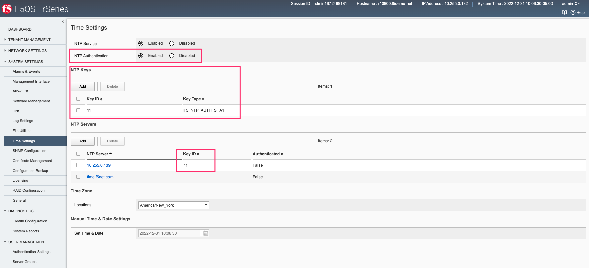

Enabling NTP Authentication via API
-----------------------------------

NTP authentication can also be set and viewed using the F5OS API. To view the current NTP setting use the following API call.

.. code-block:: bash

    GET https://{{rseries_appliance1_ip}}:8888/restconf/data/openconfig-system:system/ntp

The output will display the current ntp configuration state including authentication and keys.

.. code-block:: json

    {
        "openconfig-system:ntp": {
            "config": {
                "enabled": true,
                "enable-ntp-auth": true
            },
            "state": {
                "enabled": true,
                "enable-ntp-auth": true
            },
            "ntp-keys": {
                "ntp-key": [
                    {
                        "key-id": 11,
                        "config": {
                            "key-id": 11,
                            "key-type": "f5-system-ntp:F5_NTP_AUTH_SHA1",
                            "key-value": "$8$IIACWGpGPUYzian06FdH5PpH/sbSNQmre6DVsBZ2zxCv6S5vM3cXUkn8NwD0BABSeT3Drnmm\npLCQibKafAFFPg=="
                        },
                        "state": {
                            "key-id": 11,
                            "key-type": "F5_NTP_AUTH_SHA1",
                            "key-value": "$8$IIACWGpGPUYzian06FdH5PpH/sbSNQmre6DVsBZ2zxCv6S5vM3cXUkn8NwD0BABSeT3Drnmm\npLCQibKafAFFPg=="
                        }
                    }
                ]
            },
            "servers": {
                "server": [
                    {
                        "address": "10.255.0.139",
                        "config": {
                            "address": "10.255.0.139",
                            "port": 123,
                            "version": 4,
                            "association-type": "SERVER",
                            "iburst": false,
                            "prefer": false,
                            "f5-openconfig-system-ntp:key-id": 11
                        },
                        "state": {
                            "address": "10.255.0.139",
                            "port": 123,
                            "version": 4,
                            "association-type": "SERVER",
                            "iburst": false,
                            "prefer": false,
                            "f5-openconfig-system-ntp:key-id": 11,
                            "f5-openconfig-system-ntp:authenticated": false
                        }
                    },
                    {
                        "address": "time.f5net.com",
                        "config": {
                            "address": "time.f5net.com",
                            "port": 123,
                            "version": 4,
                            "association-type": "SERVER",
                            "iburst": false,
                            "prefer": false
                        },
                        "state": {
                            "address": "time.f5net.com",
                            "port": 123,
                            "version": 4,
                            "association-type": "SERVER",
                            "iburst": false,
                            "prefer": false,
                            "f5-openconfig-system-ntp:authenticated": false
                        }
                    }
                ]
            }
        }
    }

To enable NTP authentication via the F5OS API use the following API call.

.. code-block:: bash

    PATCH https://{{rseries_appliance1_ip}}:8888/restconf/data

In the body of the API call you can enable NTP authentication, add keys, and associate those keys with an NTP server.

.. code-block:: json

    {
        "openconfig-system:ntp": {
            "config": {
                "enabled": true,
                "enable-ntp-auth": true
            },
            "ntp-keys": {
                "ntp-key": [
                    {
                        "key-id": 11,
                        "config": {
                            "key-id": 11,
                            "key-type": "f5-system-ntp:F5_NTP_AUTH_SHA1",
                            "key-value": "$8$IIACWGpGPUYzian06FdH5PpH/sbSNQmre6DVsBZ2zxCv6S5vM3cXUkn8NwD0BABSeT3Drnmm\npLCQibKafAFFPg=="
                        }
                    }
                ]
            },
            "servers": {
                "server": [
                    {
                        "address": "10.255.0.139",
                        "config": {
                            "address": "10.255.0.139",
                            "port": 123,
                            "version": 4,
                            "association-type": "SERVER",
                            "iburst": false,
                            "prefer": false,
                            "f5-openconfig-system-ntp:key-id": 11
                        }
                    }
                ]
            }
        }
    }

Disable IPv6
============

Need to confirm if this is in F5OS-A 1.4.0

Encrypt TLS Private Key
=======================

It looks like we already encrypt the certificate key using AES256-GCM(AKA $8$) even before 1.3.0.
So the user can see on the GUI is the encrypted key, not the real/plain key.

.. code-block:: bash

    system aaa tls config passphrase $8$G29mW2amh1F46j2I7fLb3deVdfSU6ClIyrzgxNqUdSM=
    system aaa tls config verify-client false
    system aaa tls config verify-client-depth 1

Configurable Management Ciphers
===============================

.. code-block:: bash

    system security services service httpd
    config ssl-ciphersuite ""
    !
    system security services service sshd
    config ciphers [ aes128-cbc aes128-ctr aes128-gcm@openssh.com aes256-cbc aes256-ctr aes256-gcm@openssh.com ]
    config kexalgorithms [ diffie-hellman-group14-sha1 diffie-hellman-group14-sha256 diffie-hellman-group16-sha512 ecdh-sha2-nistp256 ecdh-sha2-nistp384 ecdh-sha2-nistp521 ]
    !

    r10900(config)# system security services service sshd config ?
    Possible completions:
    ciphers         User specified ciphers.
    kexalgorithms   User specified kexalgorithms.
    macs            User specified MACs.
    
    r10900(config)# system security services service sshd config ciphers ?
    Description: User specified ciphers.
    Possible completions:
    string  [

    r10900(config)# system security services service httpd config ssl-ciphersuite ?
    Description: User specified ssl-ciphersuite.
    Possible completions:
     <string>[]

Client Certificate Based Auth
=============================

No available yet.

iHealth Proxy Server
====================

F5OS supports the ability to capture detailed logs and configuration using the qkView utility. To speed up support case resolution the qkView can be uploaded directly to F5's iHealth service, which will give F5 support personnel access to the detailed information to aid problem resolution. In some environments, F5 devices may not have the ability to access the Internet without going through a proxy. The F5OS-A 1.3.0 release added the ability to upload qkViews directly to iHealth through a proxy device.

Adding a Proxy Server via CLI
------------------------------

To add a proxy server for iHealth uploads via the CLI, use the **system diagnostics proxy** command.

.. code-block:: bash

    r10900(config)# system diagnostics proxy config proxy-username myusername proxy-server https://myproxy.com:3128 proxy-password 
    (<AES encrypted string>): **************
    r10900(config)# 

Adding a Proxy Server via webUI
-------------------------------

To add a proxy server for iHealth uploads via the webUI, go to the **Diagnostics -> iHealth Configuration** page. 

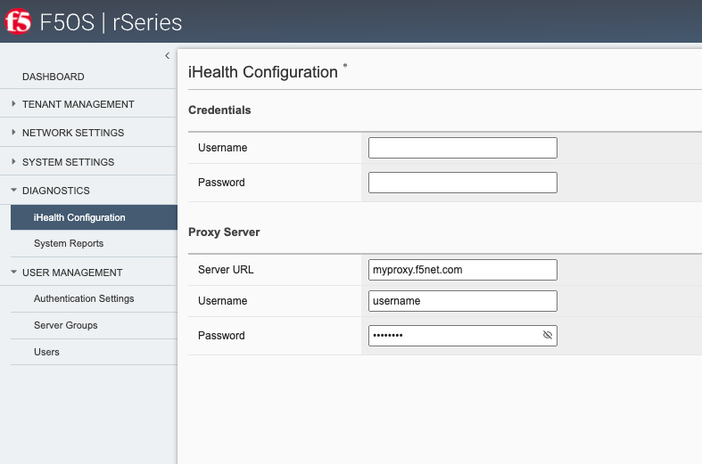

Adding a Proxy Server via API
------------------------------

To add a proxy server for iHealth uploads via the API, use the following API call.

.. code-block:: bash

    PATCH https://{{rseries_appliance1_ip}}:8888/restconf/data/openconfig-system:system/f5-system-diagnostics-qkview:diagnostics/f5-system-diagnostics-proxy:proxy

In the body of the API call add the username, password, and proxy server configuration. NOTE: Need to figure out encoding for password?

.. code-block:: json

    {
        "f5-system-diagnostics-proxy:proxy": {
            "config": {
                "proxy-username": "username2",
                "proxy-password": "$8$8FudCujBpUpoTBaQQw4QaTeyUU8UHdkYAv90Dfx43SA=",
                "proxy-server": "https://myproxy2.demo.f5net"
            }
        }
    }

To view the current proxy configuration via the API use the following call.

.. code-block:: bash

    GET https://{{rseries_appliance1_ip}}:8888/restconf/data/openconfig-system:system/f5-system-diagnostics-qkview:diagnostics/f5-system-diagnostics-proxy:proxy

The API call should return output similar to what is seen below.

.. code-block:: json

    {
        "f5-system-diagnostics-proxy:proxy": {
            "state": {
                "proxy-username": "username",
                "proxy-server": "https://myproxy.demo.f5net"
            },
            "config": {
                "proxy-username": "username",
                "proxy-password": "$8$8FudCujBpUpoTBaQQw4QaTeyUU8UHdkYAv90Dfx43SA=",
                "proxy-server": "https://myproxy.demo.f5net"
            }
        }
    }

Audit Logging
=============

F5OS has the ability to log all configuration changes and access to the F5OS layer in audit logs. In versions prior to F5OS-A 1.4.0, all access and configuration changes are logged in one of two separate **audit.log** files, which reside in the in one of the following paths in the F5OS filesystem when logged in as root; **/var/F5/system/log/audit.log** or **/var/log/audit/audit.log**. If you are logged into the F5OS CLI as admin, then the actual paths are simplified to **log/system/audit.log** and **/log/host/audit/audit.log**.

add root paths

In versions prior to F5OS-A 1.4.0, the audit.log files may only be viewed locally within the F5OS layer, the audit logs cannot be sent to a remote syslog location. F5OS-A 1.4.0 adds the ability to allow audit.log entires to be redirected to a remote syslog location, as well as changing the log format to match standard F5OS syslog format. Details on the two different implementations are below.

Viewing Audit Logs via F5OS CLI (F5OS-A 1.4.0 and Later)
--------------------------------------------------------

Any information related to login/logout or configuration changes are logged in the **log/system/audit.log** location. By default these events are not sent to a configured remote syslog location. If you would like to send informational audit level messages to a remote syslog server, then you must explicity enable audit events.

First you must configure the remote syslog destination. As part of that configuration, you will specify the IP address, port, and protocol of the remote syslog server. To send audit.log events to the remote server you must add the command **selectors selector AUTHPRIV DEBUG** as seen below.

.. code-block:: bash

    r10900(config)# system logging remote-servers remote-server 10.255.0.139
    r10900(config-remote-server-10.255.0.139)# config remote-port 514
    r10900(config-remote-server-10.255.0.139)# config proto udp
    r10900(config-remote-server-10.255.0.139)# selectors selector LOCAL0 INFORMATIONAL
    r10900(config-remote-server-10.255.0.139)# selectors selector AUTHPRIV DEBUG
    r10900(config-remote-server-10.255.0.139)# commit
    % No modifications to commit.
    r10900(config-remote-server-10.255.0.139)#

Then, you can control the level of events that will be logged to the local audit.log file by configuring the **audit-service** **sw-component**. By default all audit events will be logged, but you can turn down the level of events

.. code-block:: bash

    r10900# show running-config system logging sw-components sw-component audit-service
    system logging sw-components sw-component audit-service
    config name audit-service
    config description "Audit message handling service"
    config severity DEBUG
    !

The formatting of audit logs provide the date/time in UTC, the account and ID who performed the action, the type of event, the asset affected, the type of access, and success or failure of the request. Separate log entries provide details on user access (login/login failures) information such as IP address and port and wether access was granted or not.

Viewing Audit Logs via F5OS CLI
-------------------------------

Most audit events go to the **log/system/audit.log** location, while a few others such as CLI login failures are logged to **log/host/audit.log** in the current F5OS releases. In the F5OS CLI, the paths are simplified so that you don’t have to know the underlying directory structure. You can use the **file list path** command to see the files inside the **log/system/** directory; use the tab complete to see the options. You may choose either the **log/system** directory or the **log/host** directory. Note the **audit.log** file. 

.. code-block:: bash

    appliance-1# file list path log/
    Possible completions:
    confd/  host/  system/
    appliance-1# file list path log/system/
    Possible completions:
    audit.log                      confd.log          devel.log     devel.log.1    lcd.log           lcd.log.1           lcd.log.2.gz       
    lcd.log.3.gz                   lcd.log.4.gz       lcd.log.5.gz  logrotate.log  logrotate.log.1   logrotate.log.2.gz  platform.log       
    reprogram_chassis_network.log  rsyslogd_init.log  snmp.log      startup.log    startup.log.prev  trace/              vconsole_auth.log  
    vconsole_startup.log           velos.log          webUI/        
    appliance-1# file list path log/system/

To view the contents of the **audit.log** file, use the command **file show path /log/system/audit.log**. This will show the entire log file from the beginning, but may not be the best way to troubleshoot a recent event:

.. code-block:: bash

    r10900# file show log/system/audit.log
    <INFO> 9-Dec-2021::17:13:57.506 appliance-1 confd[106]: audit user: admin/20518 assigned to groups: admin
    <INFO> 9-Dec-2021::17:13:57.506 appliance-1 confd[106]: audit user: admin/20518 created new session via cli from 172.27.196.47:52582 with ssh
    <INFO> 9-Dec-2021::17:13:57.589 appliance-1 confd[106]: audit user: admin/20518 terminated session (reason: normal)
    <INFO> 9-Dec-2021::17:13:57.633 appliance-1 confd[106]: audit user: admin/20519 assigned to groups: admin
    <INFO> 9-Dec-2021::17:13:57.633 appliance-1 confd[106]: audit user: admin/20519 created new session via cli from 172.27.196.47:52582 with ssh
    <INFO> 9-Dec-2021::18:14:14.380 appliance-1 confd[106]: audit user: admin/20519 terminated session (reason: timeout)
    <INFO> 9-Dec-2021::18:19:38.135 appliance-1 confd[106]: audit user: admin/0 external authentication succeeded via rest from 172.18.3.162:0 with http, member of groups: admin
    <INFO> 9-Dec-2021::18:19:38.135 appliance-1 confd[106]: audit user: admin/0 logged in via rest from 172.18.3.162:0 with http using external authentication
    <INFO> 9-Dec-2021::18:19:38.136 appliance-1 confd[106]: audit user: admin/21353 assigned to groups: admin
    <INFO> 9-Dec-2021::18:19:38.136 appliance-1 confd[106]: audit user: admin/21353 created new session via rest from 172.18.3.162:0 with http
    <INFO> 9-Dec-2021::18:19:38.136 appliance-1 confd[106]: audit user: admin/21353 RESTCONF: request with http: GET /restconf/ HTTP/1.1
    <INFO> 9-Dec-2021::18:19:38.137 appliance-1 confd[106]: audit user: admin/21353 terminated session (reason: normal)
    <INFO> 9-Dec-2021::18:19:38.137 appliance-1 confd[106]: audit user: admin/21353 RESTCONF: response with http: HTTP/1.1 /restconf/ 200 duration 62361 ms

There are options to manipulate the output of the file. Add **| ?** to the command to see the options available to manipulate the file output.

.. code-block:: bash

    r10900# file show log/system/audit.log | ?
    Possible completions:
    append    Append output text to a file
    begin     Begin with the line that matches
    count     Count the number of lines in the output
    exclude   Exclude lines that match
    include   Include lines that match
    linnum    Enumerate lines in the output
    more      Paginate output
    nomore    Suppress pagination
    save      Save output text to a file
    until     End with the line that matches
    r10900# file show log/system/audit.log | 

There are other file options that allow the user to tail the log file using **file tail -f** for a live tail,  or **file tail -n <number of lines>** to view a specific number of the most recent lines.

.. code-block:: bash

    r10900# file tail -f log/system/audit.log
    <INFO> 7-Dec-2022::15:05:01.996 appliance-1 confd[125]: audit user: admin/13692368 assigned to groups: admin
    <INFO> 7-Dec-2022::15:05:01.996 appliance-1 confd[125]: audit user: admin/13692368 created new session via cli from 172.18.104.73:60301 with ssh
    <INFO> 7-Dec-2022::15:05:02.007 appliance-1 confd[125]: audit user: admin/13692368 CLI 'show system state hostname'
    <INFO> 7-Dec-2022::15:05:02.008 appliance-1 confd[125]: audit user: admin/13692368 CLI done
    <INFO> 7-Dec-2022::15:05:02.009 appliance-1 confd[125]: audit user: admin/13692368 terminated session (reason: normal)
    <INFO> 7-Dec-2022::15:05:02.052 appliance-1 confd[125]: audit user: admin/13692371 assigned to groups: admin
    <INFO> 7-Dec-2022::15:05:02.053 appliance-1 confd[125]: audit user: admin/13692371 created new session via cli from 172.18.104.73:60301 with ssh
    <INFO> 7-Dec-2022::15:05:19.428 appliance-1 confd[125]: audit user: admin/13692371 CLI 'file show log/system/audit.log'
    <INFO> 7-Dec-2022::15:05:21.784 appliance-1 confd[125]: audit user: admin/13692371 CLI done
    <INFO> 7-Dec-2022::15:08:59.462 appliance-1 confd[125]: audit user: admin/13692371 CLI 'file tail -f log/system/audit.log'

    r10900# file tail -n 20 log/system/audit.log
    <INFO> 7-Dec-2022::14:46:50.546 appliance-1 confd[125]: audit user: admin/13672920 RESTCONF: response with http: HTTP/1.1 /restconf/ 200 duration 37668 ms
    <INFO> 7-Dec-2022::14:47:05.976 appliance-1 confd[125]: audit user: admin/0 external token authentication succeeded via rest from 172.18.104.73:0 with http, member of groups: admin session-id:admin1670421700
    <INFO> 7-Dec-2022::14:47:05.976 appliance-1 confd[125]: audit user: admin/0 logged in via rest from 172.18.104.73:0 with http using externalvalidation authentication
    <INFO> 7-Dec-2022::14:47:05.976 appliance-1 confd[125]: audit user: admin/13673201 assigned to groups: admin
    <INFO> 7-Dec-2022::14:47:05.976 appliance-1 confd[125]: audit user: admin/13673201 created new session via rest from 172.18.104.73:0 with http
    <INFO> 7-Dec-2022::14:47:05.977 appliance-1 confd[125]: audit user: admin/13673201 RESTCONF: request with http: GET /restconf/ HTTP/1.1
    <INFO> 7-Dec-2022::14:47:05.980 appliance-1 confd[125]: audit user: admin/13673201 terminated session (reason: normal)
    <INFO> 7-Dec-2022::14:47:05.981 appliance-1 confd[125]: audit user: admin/13673201 RESTCONF: response with http: HTTP/1.1 /restconf/ 200 duration 35923 ms
    <INFO> 7-Dec-2022::15:05:01.996 appliance-1 confd[125]: audit user: admin/13692368 assigned to groups: admin
    <INFO> 7-Dec-2022::15:05:01.996 appliance-1 confd[125]: audit user: admin/13692368 created new session via cli from 172.18.104.73:60301 with ssh
    <INFO> 7-Dec-2022::15:05:02.007 appliance-1 confd[125]: audit user: admin/13692368 CLI 'show system state hostname'
    <INFO> 7-Dec-2022::15:05:02.008 appliance-1 confd[125]: audit user: admin/13692368 CLI done
    <INFO> 7-Dec-2022::15:05:02.009 appliance-1 confd[125]: audit user: admin/13692368 terminated session (reason: normal)
    <INFO> 7-Dec-2022::15:05:02.052 appliance-1 confd[125]: audit user: admin/13692371 assigned to groups: admin
    <INFO> 7-Dec-2022::15:05:02.053 appliance-1 confd[125]: audit user: admin/13692371 created new session via cli from 172.18.104.73:60301 with ssh
    <INFO> 7-Dec-2022::15:05:19.428 appliance-1 confd[125]: audit user: admin/13692371 CLI 'file show log/system/audit.log'
    <INFO> 7-Dec-2022::15:05:21.784 appliance-1 confd[125]: audit user: admin/13692371 CLI done
    <INFO> 7-Dec-2022::15:08:59.462 appliance-1 confd[125]: audit user: admin/13692371 CLI 'file tail -f log/system/audit.log'
    <INFO> 7-Dec-2022::15:09:22.907 appliance-1 confd[125]: audit user: admin/13692371 CLI done
    <INFO> 7-Dec-2022::15:09:31.142 appliance-1 confd[125]: audit user: admin/13692371 CLI 'file tail -n 20 log/system/audit.log' 

Within the bash shell if you are logged in as root, the path for the logging is different; **/var/F5/system/log**. Note that older audit.log files are gzipped and rotated.

.. code-block:: bash

    [root@appliance-1(r10900.f5demo.net) ~]# ls -al /var/F5/system/log/
    total 2541432
    drwxr-xr-x.  4 root root       4096 Dec  6 20:14 .
    drwxr-xr-x. 26 root root       4096 Nov 28 12:38 ..
    -rw-r--r--.  1 root root   71290161 Dec  7 10:10 audit.log
    -rw-r--r--.  1 root root    1743543 Dec  9  2021 audit.log.1
    -rw-r--r--.  1 root root         20 Dec  7  2021 audit.log.2.gz
    -rw-r--r--.  1 root root         20 Dec  7  2021 audit.log.3.gz
    -rw-r--r--.  1 root root    1847232 Dec  7  2021 audit.log.4.gz
    -rw-r--r--.  1 root root    9848782 Nov 28 12:35 confd.log
    -rw-r--r--.  1 root root      29979 Dec  9  2021 confd.log.1
    -rw-r--r--.  1 root root         20 Dec  7  2021 confd.log.2.gz
    -rw-r--r--.  1 root root         20 Dec  7  2021 confd.log.3.gz
    -rw-r--r--.  1 root root      33306 Dec  7  2021 confd.log.4.gz
    -rw-r--r--.  1 root root   81663088 Dec  7 10:10 devel.log
    -rw-r--r--.  1 root root  104858977 Nov 13 15:11 devel.log.1
    -rw-r--r--.  1 root root    4541548 Oct 14 02:37 devel.log.2.gz
    -rw-r--r--.  1 root root    4838903 Aug 23 01:14 devel.log.3.gz
    -rw-r--r--.  1 root root    4747221 Jun 22 18:45 devel.log.4.gz
    -rw-r--r--.  1 root root    4788922 Apr 13  2022 devel.log.5.gz
    -rw-r--r--.  1 root root   24263778 Nov 28 13:40 k3s_events.log
    -rw-r--r--.  1 root root  105344182 Nov 28 12:54 k3s_events.log.1
    -rw-r--r--.  1 root root    8073081 Sep 19 11:30 k3s_events.log.2.gz
    -rw-r--r--.  1 root root   68972233 Jan 23  2022 lacp_out_132
    -rw-r--r--.  1 root root   50821845 Dec  7 10:10 lcd.log
    -rw-r--r--.  1 root root  104858247 Oct  6 23:13 lcd.log.1
    -rw-r--r--.  1 root root    6501076 Jun 27 10:24 lcd.log.2.gz
    -rw-r--r--.  1 root root    6518411 Jun  8 00:41 lcd.log.3.gz
    -rw-r--r--.  1 root root    6541114 May 19  2022 lcd.log.4.gz
    -rw-r--r--.  1 root root    6561702 Apr 22  2022 lcd.log.5.gz
    -rw-r--r--.  1 root root    1909130 Dec  7 10:10 logrotate.log
    -rw-r--r--.  1 root root    5244641 Dec  6 20:14 logrotate.log.1
    -rw-r--r--.  1 root root      31197 Dec  5 05:57 logrotate.log.2.gz
    -rw-r--r--.  1 root root  607087556 Dec  7 10:09 platform.log
    -rw-r--r--.  1 root root 1073833624 Jan 12  2022 platform.log.1
    -rw-r--r--.  1 root root   60136728 Jan  4  2022 platform.log.2.gz
    -rw-r--r--.  1 root root     454400 Dec  8  2021 platform.log.3.gz
    -rw-r--r--.  1 root root        621 Dec  7  2021 platform.log.4.gz
    -rw-r--r--.  1 root root       7841 Dec  7  2021 platform.log.5.gz
    -rw-r--r--.  1 root root       7734 Dec  7  2021 platform.log.6.gz
    -rw-r--r--.  1 root root  152724547 Dec  7  2021 platform.log.7.gz
    -rw-r--r--.  1 root root          0 Sep 30  2021 reprogram_chassis_network.log
    -rw-r--r--.  1 root root      41122 Nov 28 12:34 rsyslogd_init.log
    -rw-r--r--.  1 root root   16070999 Dec  5 23:48 snmp.log
    -rw-r--r--.  1 root root          0 Dec  9  2021 snmp.log.1
    -rw-r--r--.  1 root root         20 Dec  7  2021 snmp.log.2.gz
    -rw-r--r--.  1 root root         20 Dec  7  2021 snmp.log.3.gz
    -rw-r--r--.  1 root root         20 Dec  7  2021 snmp.log.4.gz
    -rw-r--r--.  1 root root        435 Nov 28 12:34 startup.log
    -rw-r--r--.  1 root root        190 Nov 28 12:27 startup.log.prev
    drwxr-xr-x.  2 root root       4096 Sep 28  2021 trace
    -rw-r--r--.  1 root root       8424 Nov 28 12:34 vconsole_auth.log
    -rw-r--r--.  1 root root      31966 Nov 28 12:34 vconsole_startup.log
    -rw-r--r--.  1 root root          0 Dec  9  2021 velos.log
    -rw-r--r--.  1 root root          0 Dec  7  2021 velos.log.1
    -rw-r--r--.  1 root root         20 Dec  7  2021 velos.log.2.gz
    -rw-r--r--.  1 root root    5960344 Oct 18  2021 velos.log.3.gz
    -rw-r--r--.  1 root root       4096 Oct 15  2021 .velos.log.swp
    drwxr-xr-x.  2 root root       4096 Nov 28 12:34 webui
    [root@appliance-1(r10900.f5demo.net) ~]# 
  
Viewing Logs from the webUI
--------------------------

In the current F5OS releases, you cannot view the F5OS audit.log file directly from the webUI, although you can download it from the webUI. To view the audit.log, you can use the CLI or API, or download the files and then view. To download log files from the webUI, go to the **System Settings -> File Utilities** page. Here there are various logs directories you can download files from. You have the option to **Export** files to a remote HTTPS server, or **Download** the files directly to your client machine through the browser.

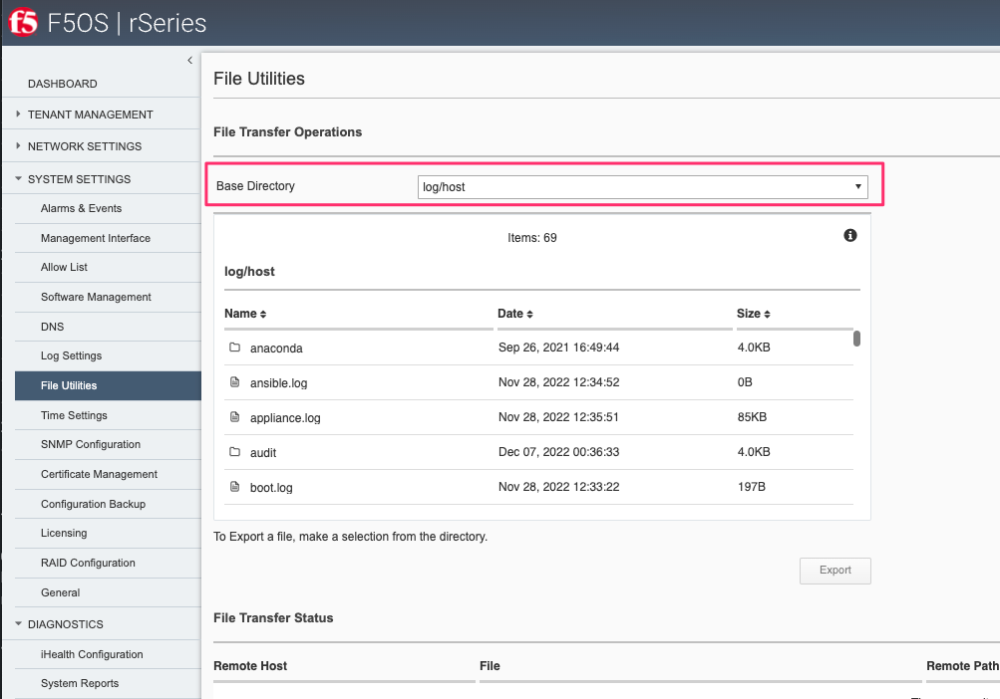

If you want to download the main **audit.log**, select the directory **/log/system**.

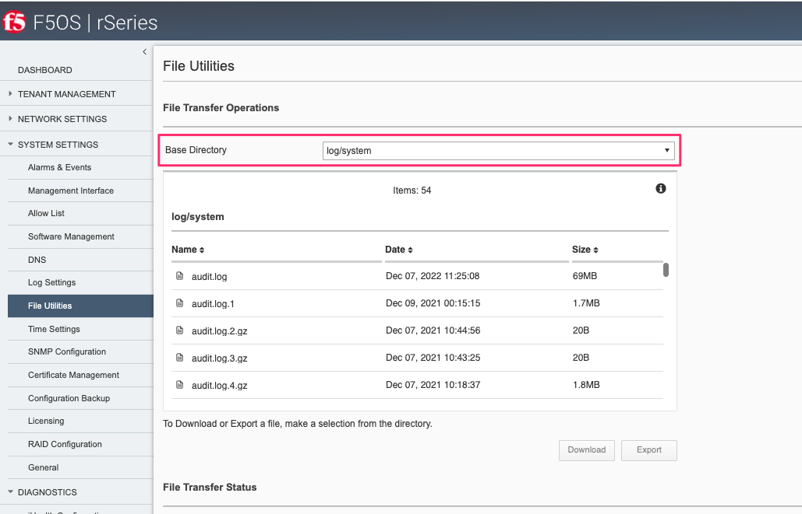

Viewing Audit Logs via F5OS API
-------------------------------

Example Audit Logging of CLI Changes
------------------------------------

Example Audit Logging of API Changes
------------------------------------

In F5OS release prior to F5OS-A 1.4.0 API audit logs captured configuration changes, but did not log the full configuration payload. 

Example Audit Logging of webUI Changes
--------------------------------------

Downloading Audit Logs via CLI
------------------------------

Downloading Audit Logs via API
------------------------------

Downloading Audit Logs via webUI
-------------------------------

