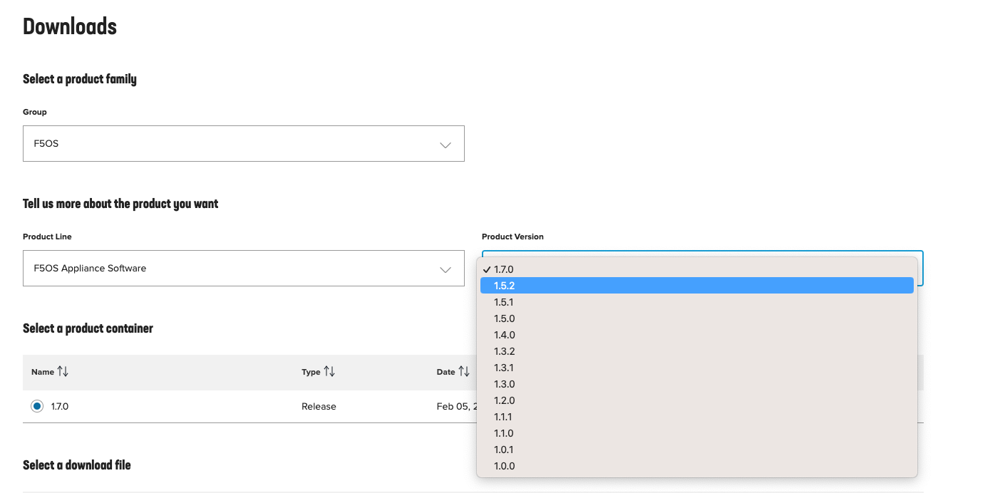

=========================
rSeries Software Upgrades
=========================

F5OS-A Platform Layer Upgrades
==============================

rSeries appliances ship with a new platform layer software called F5OS. There are two different flavors of F5OS, one for VELOS chassis-based systems called F5OS-C (Chassis), and F5OS-A (Appliances) for rSeries appliances. The F5OS platform layer is upgraded independently from the tenant layer, and has its own unique image, which can be downloaded from downloads.f5.com. Below is the default page for downloads.f5.com; note the **F5OS** section under **F5 Product Family** and under **Product Line** select **F5OS Appliance Software**. Click the hyperlink for this section.

Here you will see a drop down for the various supported versions available for download. Select the desired version and accept the user agreement.

.. image:: images/rseries_software_upgrades/image2.png
  :align: center
  :scale: 70%

Here you can download the ISO file for F5OS along with checksum files and release notes:

Uploading F5OS Images via the webUI
---------------------------------

You can upload F5OS-A images to the appliance via the webUI. This is done from the **System Settings -> Software Management** page.

.. image:: images/rseries_software_upgrades/image4.png
  :align: center
  :scale: 70%

Here you'll have the option to **Upload** or **Import** a new F5OS image. If you choose **Import**, you will be prompted to provide the configuration details for a remote HTTPS server where the images can be downloaded from. If you choose **Upload** you will be able to upload an image directly from your local client machine via the browser. 

Alternatively, you may also upload images to the controller through the **System Settings -> File Utilities** page. You can select the **images/staging** option from the drop-down menu to import new F5OS-A images. Once uploaded into the staging area, they will be imported and made available for upgrades after a brief delay.

After the upload completes, it will take some time for it to be fully imported and verified. At that point it should show up in the CLI and webUI. If you don’t see it immediately, be patient and wait a few minutes for it to show up as it will not show up until the file has been verified. Inside the **ISO** file are two different types of software, the **OS** and the **Service**. All three types should be displayed in the **Software Management** page. In the example below the ISO for version 1.0.0-11432 consists of an **OS** and **Service** with the same version number. 

.. image:: images/rseries_software_upgrades/image6.png
  :align: center
  :scale: 70%

When upgrading the F5OS platform layer, you will have a choice of upgrading either a **Bundled** release, meaning **OS** and **Services** are bundled together in an ISO image or **Unbundled**, where you can upgrade Service and/or OS independently. Note that currently F5 has not released any Service only or OS only releases, but they may be an option in the future. For now, it is recommended to choose **Bundled** upgrades.

Uploading F5OS Images via the CLI
---------------------------------

If you would prefer to upload the F5OS image via the CLI this can be done with the **file import** command. Use the **file import** command to get the F5OS image file from a remote HTTPS server or from a remote server over SCP or SFTP. Below is an example importing from a remote HTTPS server. Note the target directory should be **images/staging**:

.. code-block:: bash

    Boston-r10900-1# file import remote-host 10.255.0.142 remote-file /upload/F5OS-A-1.0.0-11432.R5R10.iso local-file images/staging/F5OS-A-1.0.0-11432.R5R10.iso username corpuser insecure
    Value for 'password' (<string>): ********
    result File transfer is initiated.(images/staging/F5OS-A-1.0.0-11432.R5R10.iso)
    Boston-r10900-1#

If a remote HTTPS server is not available you may also copy the file from the CLI over SCP by adding the **protocol scp** option to the command line:

.. code-block:: bash

    Boston-r10900-1# file import remote-host 10.255.0.142 remote-file /var/www/server/1/upload/F5OS-A-1.0.0-11432.R5R10.iso local-file images/staging/F5OS-A-1.0.0-11432.R5R10.iso username root insecure protocol scp
    Value for 'password' (<string>): ********
    result File transfer is initiated.(images/staging/F5OS-A-1.0.0-11432.R5R10.iso)

The command **file transfer-status** will provide details of the transfer progress and any errors:

.. code-block:: bash

    Boston-r10900-1# file transfer-status
    result 
    S.No.|Operation  |Protocol|Local File Path                                             |Remote Host         |Remote File Path                                            |Status            |Time                
    1    |Import file|HTTPS   |images/staging/F5OS-A-1.0.0-11432.R5R10.iso                 |10.255.0.142        |/upload/F5OS-A-1.0.0-11432.R5R10.iso                        |In Progress (86.0%)|Wed Jan  5 20:02:56 2022

    Boston-r10900-1# file transfer-status
    result 
    S.No.|Operation  |Protocol|Local File Path                                             |Remote Host         |Remote File Path                                            |Status            |Time                
    1    |Import file|HTTPS   |images/staging/F5OS-A-1.0.0-11432.R5R10.iso                 |10.255.0.142        |/upload/F5OS-A-1.0.0-11432.R5R10.iso                        |         Completed|Wed Jan  5 20:03:03 2022

    Boston-r10900-1# 

You can view the current F5OS images and their status in the F5OS CLI by using the **show system image** command:

.. code-block:: bash

    Boston-r10900-1# show system image 
                                    IN    
    VERSION OS   STATUS  DATE        USE   
    ---------------------------------------
    1.0.0-11432  ready   2021-12-03  true  

    VERSION                          IN    
    SERVICE      STATUS  DATE        USE   
    ---------------------------------------
    1.0.0-11432  ready   2021-12-03  true  

                                    IN     
    VERSION ISO  STATUS  DATE        USE    
    ----------------------------------------
    1.0.0-11432  ready   2021-12-03  false  

You can alternatively copy the F5OS images into the management IP address of F5OS from a client machine over SCP. You would use the **root** account and the target directory should be **/var/import/staging/**.

.. code-block:: bash

    root@xubuntu-vm:/var/www/server/1/upload# scp F5OS-A-1.0.0-11433.R5R10.iso root@10.255.0.132:/var/import/staging
    root@10.255.0.132's password: 
    F5OS-A-1.0.0-11433.R5R10.iso                                                                                                                                                                                         100% 5291MB 110.2MB/s   00:48 

Importing F5OS-A Images from a Remote Server via the API
---------------------------------------------------------

When uploading or importing F5OS-A images into the rSeries appliance, the files should be imported into the **images/staging** directory. Once the file import is initiated you can check its status using the **file transfer-status** API calls. Below are API calls to upload and/or import F5OS images and monitor status.

List the current F5OS images in the **images/staging** directory via the following API call:

.. code-block:: bash

    POST https://{{rseries_appliance1_ip}}:8888/restconf/data/f5-utils-file-transfer:file/list

In the API call body/payload add the directory you want to query:

.. code-block:: json

    {
    "f5-utils-file-transfer:path": "images/staging"
    }

Below is an example output listing the current ISO file:

.. code-block:: json

    {
        "f5-utils-file-transfer:output": {
            "entries": [
                {
                    "name": "\nF5OS-A-1.0.0-11432.R5R10.iso\nF5OS-A-1.0.0-8722.R2R4.NSIT.iso"
                }
            ]
        }
    }

You can then query the **images/import** directory for various image types like ISO, Service, or OS which are in separate directories:

.. code-block:: bash

    POST https://{{rseries_appliance1_ip}}:8888/restconf/data/f5-utils-file-transfer:file/list

For the body you can enter the specific path you want to query. For example, /images/import/<path> where path can be **iso**, **service**, or **os**:

.. code-block:: json

    {
    "f5-utils-file-transfer:path": "images/import/iso"
    }

Below is an example output:

.. code-block:: json

    {
        "f5-utils-file-transfer:output": {
            "entries": [
                {
                    "name": "\nF5OS-A-1.0.0-11432.R5R10.iso\nF5OS-A-1.0.0-8722.R2R4.NSIT.iso"
                }
            ]
        }
    }

To import an F5OS-A image from a remote HTTPS server, use the following API example. You can optionally import using other protocols such as SFTP or SCP by adding the proper **protocol** option to the API command below.

.. code-block:: bash

    POST https://{{rseries_appliance1_ip}}:8888/api/data/f5-utils-file-transfer:file/import

.. code-block:: json

    {
        "input": [
            {
                "remote-host": "10.255.0.142",
                "remote-file": "upload/{{Appliance_ISO_Image}}",
                "local-file": "images/staging/{{Appliance_ISO_Image}}",
                "insecure": "",
                "f5-utils-file-transfer:username": "corpuser",
                "f5-utils-file-transfer:password": "Pa$$w0rd"
            }
        ]
    }

You can then check on the file transfer status with the following API call:

.. code-block:: bash

    POST https://{{rseries_appliance1_ip}}:8888/restconf/data/f5-utils-file-transfer:file/transfer-status

A response like the one below will provide the status of the transfer:

.. code-block:: json

    {
        "f5-utils-file-transfer:output": {
            "result": "\nS.No.|Operation  |Protocol|Local File Path                                             |Remote Host         |Remote File Path                                            |Status            |Time                \n1    |Import file|HTTPS   |images/import/iso/F5OS-A-1.1.0-0188.R5R10.CANDIDATE.iso     |artifactory.f5net.com|artifactory/velocity-os-generic-dev/F5OS-A/candidate-testing/1.1.0-0188.VF12.4_Candidate_2.6646b1d9/results/appliance/images/F5OS-A-1.1.0-0188.R5R10.CANDIDATE.iso|         Completed|Thu Jan  6 02:58:41 2022\n2    |Import file|HTTPS   |images/staging/F5OS-A-1.0.0-11432.R5R10.iso                 |10.255.0.142        |/upload/F5OS-A-1.0.0-11432.R5R10.iso                        |         Completed|Wed Jan  5 20:03:03 2022\n3    |Import file|SCP     |images/tenant/F5OS-A-1.0.0-11432.R5R10.iso                  |10.255.0.142        |/var/www/server/1/upload/F5OS-A-1.0.0-11432.R5R10.iso       |         Completed|Wed Jan  5 20:08:24 2022\n"
        }
    }

After transferring the file, you can view the contents of the images/staging directory. The file will then go through an import process before it is ready for use.

.. code-block:: bash

    POST https://{{rseries_appliance1_ip}}:8888/restconf/data/f5-utils-file-transfer:file/list

.. code-block:: json

    {
    "f5-utils-file-transfer:path": "images/staging"
    }

You will see all the files in the images/staging directory:

.. code-block:: json

    {
        "f5-utils-file-transfer:output": {
            "entries": [
                {
                    "name": "\nF5OS-A-1.0.0-11432.R5R10.iso\nF5OS-A-1.0.0-8722.R2R4.NSIT.iso"
                }
            ]
        }
    }

You can then monitor the images/import/iso directory to see when the file is ready to use for upgrade:

.. code-block:: bash

    POST https://{{rseries_appliance1_ip}}:8888/restconf/data/f5-utils-file-transfer:file/list

.. code-block:: json

    {
    "f5-utils-file-transfer:path": "images/import/iso"
    }

You will see output like the example below. Once the file shows up here you are ready to upgrade.

.. code-block:: json

    {
        "f5-utils-file-transfer:output": {
            "entries": [
                {
                    "name": "\nF5OS-A-1.0.0-11432.R5R10.iso\nF5OS-A-1.0.0-8722.R2R4.NSIT.iso"
                }
            ]
        }
    }

You can then query the image status via the API:

.. code-block:: bash

    GET https://{{rseries_appliance1_ip}}:8888//api/data/openconfig-system:system/f5-system-image:image/state

The output will show the status for the OS, Service, ISO, and Install Status.

.. code-block:: json

    {
        "f5-system-image:state": {
            "os": {
                "os": [
                    {
                        "version-os": "1.1.0-0188",
                        "status": "ready",
                        "date": "2021-11-24",
                        "in-use": false
                    },
                    {
                        "version-os": "1.0.0-11432",
                        "status": "ready",
                        "date": "2021-12-03",
                        "in-use": true
                    }
                ]
            },
            "services": {
                "service": [
                    {
                        "version-service": "1.1.0-0188",
                        "status": "ready",
                        "date": "2021-11-24",
                        "in-use": false
                    },
                    {
                        "version-service": "1.0.0-11432",
                        "status": "ready",
                        "date": "2021-12-03",
                        "in-use": true
                    }
                ]
            },
            "iso": {
                "iso": [
                    {
                        "version-iso": "1.1.0-0188",
                        "status": "ready",
                        "date": "2021-11-24",
                        "in-use": false
                    },
                    {
                        "version-iso": "1.0.0-11432",
                        "status": "ready",
                        "date": "2021-12-03",
                        "in-use": false
                    }
                ]
            },
            "install": {
                "install-os-version": "1.0.0-11432",
                "install-service-version": "1.0.0-11432",
                "install-status": "success"
            }
        }
    }

Uploading F5OS-A Images from a Client Machine via the API
---------------------------------------------------------

You can upload an F5OS image from a client machine over the API. First you must obtain an **upload-id** using the following API call.

.. code-block:: bash

    POST https://{{rseries_appliance1_ip}}:8888/restconf/data/f5-utils-file-transfer:file/f5-file-upload-meta-data:upload/start-upload

In the body of the API call enter the **size**, **name**, and **file-path** as seen in the example below.

.. code-block:: json

    {
        "size":4293919232 ,
        "name": "F5OS-A-1.5.0-5781.R5R10.iso",
        "file-path": "images/staging/"
    }

If you are using Postman the API call above will generate an upload-id that will need to be captured so it can be used in the API call to upload the file. Below is an example of the code that should be added to the **Test** section of the API call so that the upload-id can be captured and saved to a variable for subsequent API calls.

.. code-block:: bash

    var resp = pm.response.json();
    pm.environment.set("upload-id", resp["f5-file-upload-meta-data:output"]["upload-id"])

Below is an example of how this would appear inside the Postman interface.

.. image:: images/rseries_software_upgrades/upload-id.png
  :align: center
  :scale: 70%

Once the upload-id is captured, you can then initiate a file upload of the F5OS image using the following API call.

.. code-block:: bash

    POST https://{{rseries_appliance1_ip}}:8888/restconf/data/openconfig-system:system/f5-image-upload:image/upload-image

In the body of the API call select **form-data**, and then in the **Value** section click **Select Files** and select the F5OS-A image you want to upload as seen in the example below.

Upgrading F5OS
==============

You can upgrade the F5OS-A platform software via the CLI, webUI, or API. 

Upgrading F5OS via webUI
----------------------

Once the new images are loaded you can perform the upgrade from the **System Settings > Software Management** screen. Currently it is recommended you use the **Bundled** option to upgrade using the ISO. In the future there may be cases where **Unbundled** (separate OS or Service upgrades) are recommended. Select the software version you want to upgrade to, and once you click **Save** the upgrade process will begin. Upgrading F5OS will cause an outage for all tenants on that appliance. It is best to failover tenants to the HA pair member, then perform the upgrade of F5OS.

Upgrading F5OS via the CLI
--------------------------

In the F5OS CLI you can use the **show system image** command to see the currently installed software version.

.. code-block:: bash

    Boston-r10900-1# show system image 
                                    IN     
    VERSION OS   STATUS  DATE        USE    
    ----------------------------------------
    1.1.0-0188   ready   2021-11-24  false  
    1.0.0-11432  ready   2021-12-03  true   

    VERSION                          IN     
    SERVICE      STATUS  DATE        USE    
    ----------------------------------------
    1.1.0-0188   ready   2021-11-24  false  
    1.0.0-11432  ready   2021-12-03  true   

                                    IN     
    VERSION ISO  STATUS  DATE        USE    
    ----------------------------------------
    1.1.0-0188   ready   2021-11-24  false  
    1.0.0-11432  ready   2021-12-03  false  

    Boston-r10900-1# 

The command **show running-config system image** will show the current configuration for software images. You can enter **config** mode and change the configuration using the **system image set-version** command and then commit to initiate an upgrade.

.. code-block:: bash

    Boston-r10900-1# show running-config system image 
    system image config iso-version 1.0.0-11432
    Boston-r10900-1# 

.. code-block:: bash

    syscon-1-active(config)# system image set-version iso-version 1.0.0-11432 
    response iso version has been set
    syscon-1-active(config)# 

An upgrade of F5OS should automatically start after the above command is entered. You can follow the upgrade progress by issuing the command **show system image**.

Upgrading F5OS via the API
-----------------------------------------

To upgrade F5OS via the API you must first run the check version API call with the version you want to update to:

.. code-block:: bash

 POST https://{{rseries_appliance1_ip}}:8888/restconf/data/openconfig-system:system/f5-system-image:image/check-version

The body of the API should contain the version you want to upgrade to:

.. code-block:: json

    {
        "input": {
            "iso-version": "{{Appliance_ISO_Image}}"
        }
    }

If the compatibility check passes, then you will get a message like the one below, and it is safe to install the new image via the set-version API call:

.. code-block:: json

    {
        "f5-system-image:output": {
            "response": "Compatibility verification succeeded."
        }
    }

This is the Set Version API call that will initiate the upgrade:

.. code-block:: bash

    POST https://{{rseries_appliance1_ip}}:8888/restconf/data/openconfig-system:system/f5-system-image:image/set-version

.. code-block:: json

    {
        "input": {
            "iso-version": "{{Appliance_ISO_Image}}"
        }
    }

If the upgrade is successful, you will get notification like the message below and the system will cleanly shutdown and reboot:

.. code-block:: json

    {
        "f5-system-image:output": {
            "response": "System iso version has been set"
        }
    }

Tenant Images and Upgrades
==========================

Tenant software images are loaded directly into the F5OS platform layer for use in creating new tenants. The first release of rSeries only supports TMOS tenants running v15.1.5 or later. No other TMOS versions are supported other than hotfixes or rollups based on this version of software. Tenant upgrades take place inside the tenants themselves, and images don't need to be loaded into the F5OS layer. Versions 16.0, 16.1, and 17.0 are not supported on rSeries. It's not until versions 17.1 and later where current TMOS versions are supported.

Loading Tenant Images for New Tenants via webUI
---------------------------------------------

Before deploying any tenant, you must ensure you have a proper tenant software release loaded into F5OS. Under **Tenant Management** there is a page for uploading tenant software images. There are TMOS images specifically for rSeries. Only supported rSeries TMOS releases should be loaded into this system. Do not attempt to load older or even newer images unless there are officially supported on rSeries. 

There is an option to **Import** new releases which will open a pop-up window that will ask for remote host, path, and optional authentication parameters. You may only upload from a remote HTTPS server using this option.  The **Tenant Images** page will also indicate if an image is in use by a tenant, and if the image has been verified. 

.. image:: images/rseries_software_upgrades/image9.png
  :align: center
  :scale: 70%

.. image:: images/rseries_software_upgrades/image10.png
  :align: center
  :scale: 70%

There is also an option to **Upload** a tenant release; this will allow you to upload an image directly from your client machine through the browser.

If an HTTPS server is not available and uploading from a client machine is not an option, you may upload a tenant image using SCP directly to the appliance. Simply SCP an image to the F5OS out-of-band management IP address using the admin account and a path of **IMAGES**. 

.. code-block:: bash

    scp BIGIP-15.1.5-0.0.8.ALL-VELOS.qcow2.zip.bundle admin@10.255.0.148:IMAGES

Loading Tenant Images for New Tenants via CLI
---------------------------------------------

You may also import the tenant image file from the F5OS CLI. Use the **file import** command to get the tenant image file from a remote HTTPS server, over SCP, or SFTP. 

.. code-block:: bash

    Boston-r10900-1# file import remote-host 10.255.0.142 remote-file /upload/BIGIP-15.1.5-0.0.8.ALL-VELOS.qcow2.zip.bundle local-file images/tenant/BIGIP-15.1.5-0.0.8.ALL-VELOS.qcow2.zip.bundle username corpuser insecure
    Value for 'password' (<string>): ********
    result File transfer is initiated.(images/staging/BIGIP-15.1.5-0.0.8.ALL-VELOS.qcow2.zip.bundle)
    Boston-r10900-1#

The command **file transfer-status** will provide details of the transfer progress and any errors:

.. code-block:: bash

    Boston-r10900-1# file transfer-status 
    result 
    S.No.|Operation  |Protocol|Local File Path                                             |Remote Host         |Remote File Path                                            |Status            |Time                
    1    |Import file|HTTPS   |images/BIGIP-15.1.5-0.0.8.ALL-VELOS.qcow2.zip.bundle       |10.255.0.142        |/upload/BIGIP-15.1.5-0.0.8.ALL-VELOS.qcow2.zip.bundle      |In Progress (15.0%)|Fri Sep 17 15:36:29 2021

You can view the current tenant images and their status in the F5OS CLI using the **show images** command:

.. code-block:: bash

    Boston-r10900-1# show images
                                                                        IN                          
    NAME                                                                 USE    STATUS               
    -------------------------------------------------------------------------------------------------
    BIGIP-15.1.4-0.0.26.ALL-VELOS.qcow2.zip.bundle                       false  verified             
    BIGIP-15.1.5-0.0.3.ALL-F5OS.qcow2.zip.bundle                         false  verified             
    BIGIP-15.1.5-0.0.8.ALL-F5OS.qcow2.zip.bundle                         true   verified                        

    Boston-r10900-1# 

Loading Tenant Images for New Tenants via API
---------------------------------------------

To copy a tenant image into F5OS over the API, use the following API call to the F5OS out-of-band management IP address:

.. code-block:: bash

    POST https://{{rseries_appliance1_ip}}:8888/api/data/f5-utils-file-transfer:file/import

.. code-block:: json

    {
        "input": [
            {
                "remote-host": "10.255.0.142",
                "remote-file": "upload/{{Appliance_Tenant_Image}}",
                "local-file": "images/tenant/{{Appliance_Tenant_Image}}",
                "insecure": "",
                "f5-utils-file-transfer:username": "corpuser",
                "f5-utils-file-transfer:password": "Pa$$w0rd"
            }
        ]
    }

To list the current tenant images available on the appliance, use the following API Call:

.. code-block:: bash

    GET https://{{rseries_appliance1_ip}}:8888/restconf/data/f5-tenant-images:images

Below is output generated from the previous command:

.. code-block:: json

    {
        "f5-tenant-images:images": {
            "image": [
                {
                    "name": "BIGIP-15.1.4-0.0.26.ALL-VELOS.qcow2.zip.bundle",
                    "in-use": false,
                    "status": "verified"
                },
                {
                    "name": "BIGIP-15.1.5-0.0.3.ALL-F5OS.qcow2.zip.bundle",
                    "in-use": false,
                    "status": "verified"
                },
                {
                    "name": "BIGIP-15.1.5-0.0.8.ALL-F5OS.qcow2.zip.bundle",
                    "in-use": true,
                    "status": "verified"
                },
                {
                    "name": "BIGIP-bigip15.1.x-europa-15.1.5-0.0.210.ALL-F5OS.qcow2.zip.bundle",
                    "in-use": false,
                    "status": "verified"
                },
                {
                    "name": "BIGIP-bigip15.1.x-europa-15.1.5-0.0.222.ALL-F5OS.qcow2.zip.bundle",
                    "in-use": false,
                    "status": "verified"
                },
                {
                    "name": "BIGIP-bigip15.1.x-europa-15.1.5-0.0.225.ALL-F5OS.qcow2.zip.bundle",
                    "in-use": false,
                    "status": "verified"
                },
                {
                    "name": "BIGIP-bigip151x-miranda-15.1.4.1-0.0.171.ALL-VELOS.qcow2.zip.bundle",
                    "in-use": false,
                    "status": "verified"
                },
                {
                    "name": "BIGIP-bigip151x-miranda-15.1.4.1-0.0.173.ALL-VELOS.qcow2.zip.bundle",
                    "in-use": false,
                    "status": "verified"
                },
                {
                    "name": "BIGIP-bigip151x-miranda-15.1.4.1-0.0.176.ALL-VELOS.qcow2.zip.bundle",
                    "in-use": false,
                    "status": "verified"
                },
                {
                    "name": "F5OS-A-1.0.0-11432.R5R10.iso",
                    "in-use": false,
                    "status": "verification-failed"
                }
            ]
        }
    }

Tenant Upgrades
---------------

Tenants are upgraded via the normal TMOS upgrade process. Find the proper ISO image and ensure it is of a supported rSeries release and upload it into the TMOS tenant. Once uploaded you can upgrade and boot into the new version. Currently rSeries does not allow an upgrade of the tenant from inside the F5OS layer; you must perform the upgrade from inside the tenant.

**NOTE: Currently rSeries does not provide a shared image repository for all tenants to upgrade from. With vCMP guests, iSeries allowed for an image to be loaded once into the host layer, and all tenants had access to that repository to use to upgrade.**

