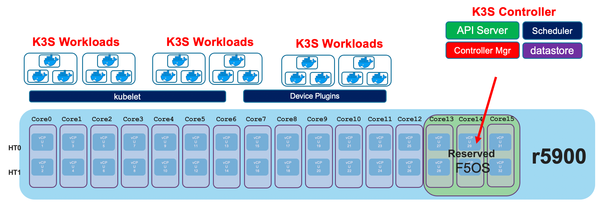
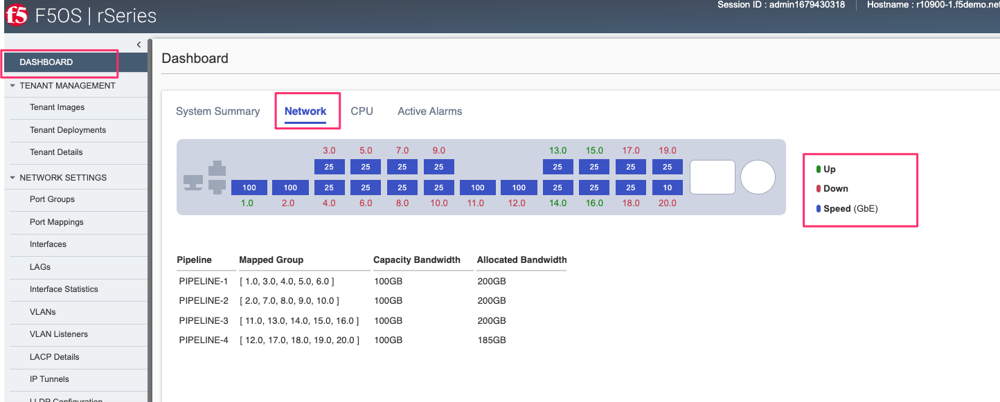
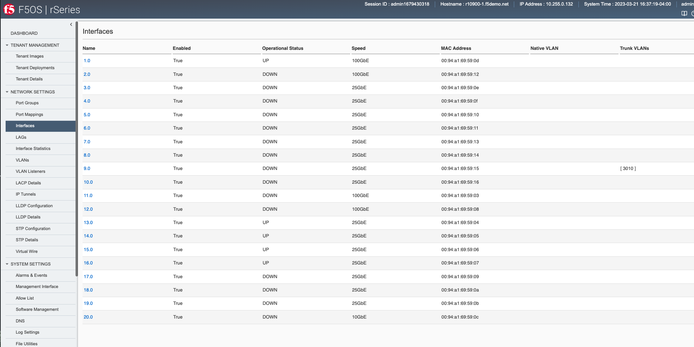
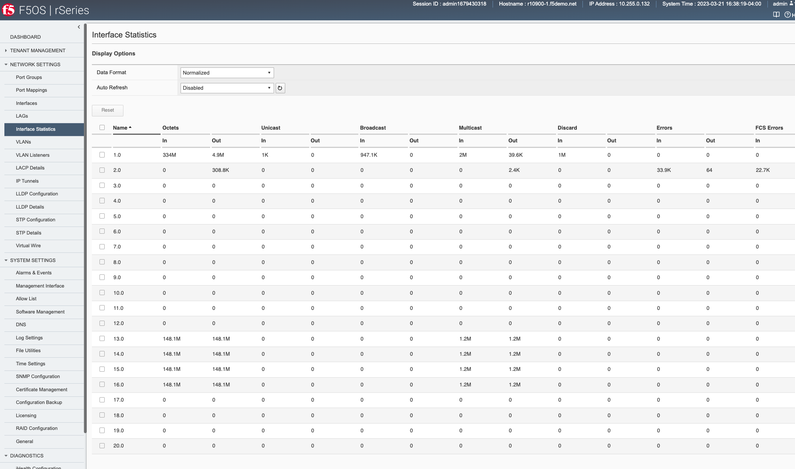
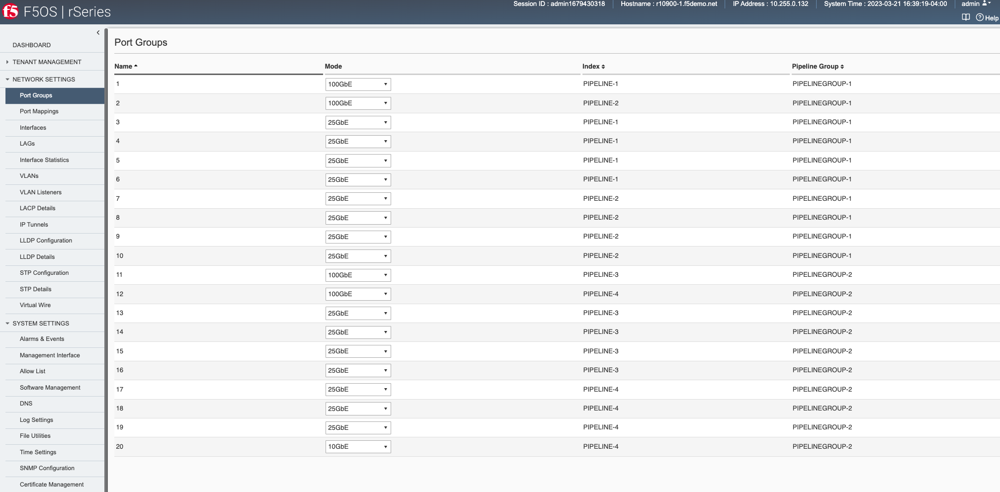

=======================
rSeries Troubleshooting
=======================

Storage / Disk
==============

Some rSeries appliances have a single SSD disk, while other models have dual SSD disks that are RAID-1 mirrored. The r2600,r2800,r4600,r4800,r5600,r5800,r5900,r5920-DF models all contain a single SSD, while the r10600,r10800,r10900 contain 2 SSD's that are RAID-1 mirrored. 

Below is an example of an r10900 appliance with RAID-1 mirrored disks. You can use the CLI command **show components component storage** to see the disks and their overall size.

.. code-block:: bash

  r10900-2# show components component storage 
                                                                                                                                          READ                                       WRITE    
            DISK                                                                                TOTAL     READ      READ                  LATENCY  WRITE      WRITE      WRITE       LATENCY  
  NAME      NAME     MODEL                VENDOR  VERSION   SERIAL NO           SIZE      TYPE  IOPS      IOPS      MERGED    READ BYTES  MS       IOPS       MERGED     BYTES       MS       
  --------------------------------------------------------------------------------------------------------------------------------------------------------------------------------------------
  platform  nvme0n1  INTEL SSDPE2KX010T8  Intel   VDV10184  PHLJ915001YZ1P0FGN  735.00GB  nvme  38910844  11468112  11302039  2878981018  1139890  220046227  197568554  4049259703  7379344  
            nvme1n1  INTEL SSDPE2KX010T8  Intel   VDV10184  PHLJ0065030H1P0FGN  735.00GB  nvme  38756488  11286173  11290150  2875544998  1176491  220046227  197568554  4049259703  7029212  

  r10900-2#

Below is an example of an r5900 appliance with a single disk. You can use the CLI command **show components component storage** to see the disk and its overall size.

.. code-block:: bash

  r5900-2# show components component storage 
                                                                                                                                        READ                                       WRITE     
            DISK                                                                                    TOTAL     READ    READ    READ      LATENCY  WRITE      WRITE      WRITE       LATENCY   
  NAME      NAME     MODEL                       VENDOR   VERSION   SERIAL NO       SIZE      TYPE  IOPS      IOPS    MERGED  BYTES     MS       IOPS       MERGED     BYTES       MS        
  -------------------------------------------------------------------------------------------------------------------------------------------------------------------------------------------
  platform  nvme0n1  SAMSUNG MZ1LB960HAJQ-00007  Samsung  EDA7602Q  S435NA0NA05748  733.00GB  nvme  12255833  273605  141930  12519719  82978    119699693  129417442  2563679947  15206038  

  r5900-2#

Below is an example of an r4800 appliance with a single disk. You can use the CLI command **show components component storage** to see the disk and its overall size.

.. code-block:: bash

  r4800-2# show components component storage 
                                                                                                                                READ                                     WRITE     
            DISK                                                                            TOTAL     READ    READ    READ      LATENCY  WRITE     WRITE     WRITE       LATENCY   
  NAME      NAME     MODEL             VENDOR         VERSION  SERIAL NO    SIZE      TYPE  IOPS      IOPS    MERGED  BYTES     MS       IOPS      MERGED    BYTES       MS        
  ---------------------------------------------------------------------------------------------------------------------------------------------------------------------------------
  platform  nvme0n1  SRMP8480GF1S1B71  SMART Modular  FW1354   SPG214106FA  480.00GB  nvme  10017534  252256  136998  10803713  227583   61683460  41269084  1106606207  11972055  

  r4800-2#

How the Disk is Partitioned
---------------------------

Determining Free Space

F5OS Configuration Backups
--------------------------

Backups of the F5OS configuration are stored in the path **/var/F5/system/configs/** within the underlying linux filesytem. If using the F5OS CLI, API, or webUI then these paths are simplified to the simplified path of **configs**. Below is a view of the **/var/F5/system/configs/** path within the bash shell.

.. code-block:: bash

  [root@appliance-1(r10900.f5demo.net) log]# cd /var/F5/system/configs/
  [root@appliance-1(r10900.f5demo.net) configs]# ls
  backup1  F5OS-BACKUP2022-01-20  F5OS-BACKUP-APPLIANCE12022-04-19  jim-backup  jim-backup.db  jim-july  kfo-bkp  kfo-bkup  new-backup

In the F5OS CLI it appears as the simplified **configs** for file import/export commands. The same virtual path will be shown in the other F5OS user interfaces (API/webUI).

.. code-block:: bash

  r10900-1# file export local-file 
  Possible completions:
    configs/  diags/  images/  log/  mibs/  tenant/spec/
  r10900-1# file export local-file configs/
  Possible completions: (first 100):
    F5OS-BACKUP-APPLIANCE12022-04-19          F5OS-BACKUP-APPLIANCE12023-01-09          F5OS-BACKUP-APPLIANCE12023-11-17          F5OS-BACKUP2022-01-20                     GSA-Daily_GSA-rSeries-1_20230329070500          GSA-Daily_GSA-rSeries-1_20230330070500    GSA-Daily_GSA-rSeries-1_20230331070500    GSA-Daily_GSA-rSeries-1_20230402070500    
    GSA-Daily_GSA-rSeries-1_20230403070500    GSA-Daily_GSA-rSeries-1_20230404070500    GSA-Daily_GSA-rSeries-1_20230405070500    GSA-Daily_GSA-rSeries-1_20230406070500    Initial_backup_gsa_GSA-r10900-1_20230410084408  Nightly_F5OS_GSA-r10900-1_20230410210100  Nightly_F5OS_GSA-r10900-1_20230411210100  Nightly_F5OS_GSA-r10900-1_20230412210100  
    Nightly_F5OS_GSA-r10900-1_20230413210100  Nightly_F5OS_GSA-r10900-1_20230414210100  Nightly_F5OS_GSA-r10900-1_20230415210100  Nightly_F5OS_GSA-r10900-1_20230416210100  Nightly_F5OS_GSA-r10900-1_20230417210100        Nightly_F5OS_GSA-r10900-1_20230418210100  Nightly_F5OS_GSA-r10900-1_20230419210100  Nightly_F5OS_GSA-r10900-1_20230420210100  
    Nightly_F5OS_GSA-r10900-1_20230421210100  Nightly_F5OS_GSA-r10900-1_20230422210100  Nightly_F5OS_GSA-r10900-1_20230423210100  Nightly_F5OS_GSA-r10900-1_20230424210100  Nightly_F5OS_GSA-r10900-1_20230425210100        Nightly_F5OS_GSA-r10900-1_20230426210100  Nightly_F5OS_GSA-r10900-1_20230427210100  Nightly_F5OS_GSA-r10900-1_20230428210100  
    Nightly_F5OS_GSA-r10900-1_20230429210100  Nightly_F5OS_GSA-r10900-1_20230430210100  Nightly_F5OS_GSA-r10900-1_20230501210100  Nightly_F5OS_GSA-r10900-1_20230502210100  Nightly_F5OS_GSA-r10900-1_20230503210100        Nightly_F5OS_GSA-r10900-1_20230504210100  Nightly_F5OS_GSA-r10900-1_20230505210100  Nightly_F5OS_GSA-r10900-1_20230506210100  
    Nightly_F5OS_GSA-r10900-1_20230507210100  Nightly_F5OS_GSA-r10900-1_20230508210100  Nightly_F5OS_GSA-r10900-1_20230509210100  Nightly_F5OS_GSA-r10900-1_20230510210100  Nightly_F5OS_GSA-r10900-1_20230515210100        Nightly_F5OS_GSA-r10900-1_20230516210100  Nightly_F5OS_GSA-r10900-1_20230517210100  Nightly_F5OS_GSA-r10900-1_20230518210100  
    Nightly_F5OS_GSA-r10900-1_20230519210100  Nightly_F5OS_GSA-r10900-1_20230520210100  Nightly_F5OS_GSA-r10900-1_20230521210100  Nightly_F5OS_GSA-r10900-1_20230522210100  Nightly_F5OS_GSA-r10900-1_20230523210100        Nightly_F5OS_GSA-r10900-1_20230524210100  Nightly_F5OS_GSA-r10900-1_20230525210100  Nightly_F5OS_GSA-r10900-1_20230526210100  
    Nightly_F5OS_GSA-r10900-1_20230527210100  Nightly_F5OS_GSA-r10900-1_20230528210100  Nightly_F5OS_GSA-r10900-1_20230529210100  Nightly_F5OS_GSA-r10900-1_20230530210100  Nightly_F5OS_GSA-r10900-1_20230531210100        Nightly_F5OS_GSA-r10900-1_20230601210100  Nightly_F5OS_GSA-r10900-1_20230602210100  Nightly_F5OS_GSA-r10900-1_20230603210100  
    Nightly_F5OS_GSA-r10900-1_20230604210100  Nightly_F5OS_GSA-r10900-1_20230605210100  Nightly_F5OS_GSA-r10900-1_20230606210100  Nightly_F5OS_GSA-r10900-1_20230607210100  Nightly_F5OS_GSA-r10900-1_20230608210100        Nightly_F5OS_GSA-r10900-1_20230609210100  Nightly_F5OS_GSA-r10900-1_20230610210100  Nightly_F5OS_GSA-r10900-1_20230611210100  
    Nightly_F5OS_GSA-r10900-1_20230612210100  Nightly_F5OS_GSA-r10900-1_20230613210100  Nightly_F5OS_GSA-r10900-1_20230614210100  Nightly_F5OS_GSA-r10900-1_20230615210100  Nightly_F5OS_GSA-r10900-1_20230616210100        Nightly_F5OS_GSA-r10900-1_20230617210100  Nightly_F5OS_GSA-r10900-1_20230618210100  Nightly_F5OS_GSA-r10900-1_20230619210100  
    Nightly_F5OS_GSA-r10900-1_20230620210100  Nightly_F5OS_GSA-r10900-1_20230621210100  Nightly_F5OS_GSA-r10900-1_20230622210100  Nightly_F5OS_GSA-r10900-1_20230623210100  Nightly_F5OS_GSA-r10900-1_20230624210100        Nightly_F5OS_GSA-r10900-1_20230625210100  Nightly_F5OS_GSA-r10900-1_20230626210100  Nightly_F5OS_GSA-r10900-1_20230627210100  
    Nightly_F5OS_GSA-r10900-1_20230628210100  backup1                                   dave/                                     jim-backup                                jim-backup.db                                   jim-july                                  jim-test1                                 jim2                                      
    kfo-bkp                                   kfo-bkup                                  new-backup                                rseriesjim_GSArSeries1_20230227054500     
  r10900-1#

F5OS Images
-----------

F5OS-A ISO images are uploaded into the system where they are initially written to disk in the following path **/var/import/staging/**. The images go through a verification process before being extracted to their final location.

.. code-block:: bash

  [root@appliance-1(r10900.f5demo.net) /]# ls /var/import/staging/
  F5OS-A-1.0.0-8722.R2R4.NSIT.iso        F5OS-A-1.4.0-2631.R5R10.CANDIDATE.iso  F5OS-A-1.4.0-5242.R5R10.CANDIDATE.iso
  F5OS-A-1.4.0-2129.R5R10.CANDIDATE.iso  F5OS-A-1.4.0-3402.R5R10.CANDIDATE.iso  F5OS-A-1.4.0-6325.R5R10.DEV.iso
  [root@appliance-1(r10900.f5demo.net) /]#

Once the file upload completes the file is then imported and extracted into one of the following paths depending on which type of rSeries system it is being installed onto. For r5000 or r10000 appliances, the path of the import is **/var/images/R5R10**. For r2000 and r4000 appliances, the imported path is **/var/images/R2R4**. Below is an example showing various images on an r10000 system.

.. code-block:: bash

  [root@appliance-1(r10900.f5demo.net) /]# ls var/images/R5R10/
  1.0.0-10170  1.0.0-11080  1.0.0-8303  1.0.0-8566  1.0.0-8830  1.0.0-9194  1.0.0-9396  1.4.0-2129  1.4.0-2631  1.4.0-3402  1.4.0-5242  1.4.0-6325
  [root@appliance-1(r10900.f5demo.net) /]# 

Below is an example showing various images on an r4000 system.

.. code-block:: bash

  [root@appliance-1(r4800-2.demo.f5net.com) ~]# ls /var/images/R2R4/
  1.4.0-10138  1.4.0-10281  1.4.0-8382  1.4.0-8622  1.4.0-8882  1.4.0-8939  1.4.0-9386
  [root@appliance-1(r4800-2.demo.f5net.com) ~]# 

Tenant Images
-------------

.. code-block:: bash

  [root@appliance-1(r10900.f5demo.net) system]# ls IMAGES/
  BIGIP-15.1.4-0.0.26.ALL-VELOS.qcow2.zip.bundle  BIGIP-bigip15.1.x-europa-15.1.5-0.0.210.ALL-F5OS.qcow2.zip.bundle    BIGIP-bigip151x-miranda-15.1.4.1-0.0.171.ALL-VELOS.qcow2.zip.bundle
  BIGIP-15.1.5-0.0.3.ALL-F5OS.qcow2.zip.bundle    BIGIP-bigip15.1.x-europa-15.1.5-0.0.222.ALL-F5OS.qcow2.zip.bundle    BIGIP-bigip151x-miranda-15.1.4.1-0.0.173.ALL-VELOS.qcow2.zip.bundle
  BIGIP-15.1.5-0.0.8.ALL-F5OS.qcow2.zip.bundle    BIGIP-bigip15.1.x-europa-15.1.5-0.0.225.ALL-F5OS.qcow2.zip.bundle    BIGIP-bigip151x-miranda-15.1.4.1-0.0.176.ALL-VELOS.qcow2.zip.bundle
  BIGIP-15.1.6.1-0.0.6.ALL-F5OS.qcow2.zip.bundle  BIGIP-bigip15.1.x-europa-15.1.5.1-0.0.276.ALL-F5OS.qcow2.zip.bundle
  [root@appliance-1(r10900.f5demo.net) system]# pwd
  /var/F5/system
  [root@appliance-1(r10900.f5demo.net) system]#

Tenant Virtual Disks
--------------------

The virtual disks for the tenants are stored in the path **/var/F5/system/cbip-disks/**. You'll see a directory with the configured tenant name for each tenant. Inside that directory will be a file with a .raw extension. As an example, the rSeries appliance below has two tenants configured which are named **tenant1** and **tenant2**. There is a directory for each tenant, and inside the tenant1 directory is a **tenant1.raw** file which is the tenants virtual disk.

.. code-block:: bash

  [root@appliance-1(r10900.f5demo.net) mibs]# cd /var/F5/system/cbip-disks/
  [root@appliance-1(r10900.f5demo.net) cbip-disks]# ls
  lost+found  tenant1  tenant2
  [root@appliance-1(r10900.f5demo.net) cbip-disks]# ls tenant1
  tenant1.raw
  [root@appliance-1(r10900.f5demo.net) cbip-disks]# ls -al tenant1
  total 6793212
  drwxr-xr-x. 2 root root        4096 Oct  7 07:55 .
  drwxr-xr-x. 5 root root        4096 Oct  7 10:12 ..
  -rw-r--r--. 1  107  107 82678120448 Dec 22 12:39 tenant1.raw
  [root@appliance-1(r10900.f5demo.net) cbip-disks]# 

Note that the tenant virtual disks use sparse provisioning, so the size seen is not representative to the actual storage space consumed on the disk. As an example, the tenant1 virtual disk image appears to be consuming 77GB, but that is what it has reserved, not consumed. In this case, the **ls -lsh** output confirms only 6.5GB of 77GB is actually consumed.

.. code-block:: bash

  [root@appliance-1(r10900.f5demo.net) cbip-disks]# pwd
  /var/F5/system/cbip-disks
  [root@appliance-1(r10900.f5demo.net) cbip-disks]# cd tenant1
  
  [root@appliance-1(r10900.f5demo.net) tenant1]# ls -alh
  total 6.5G
  drwxr-xr-x. 2 root root 4.0K Oct  7 07:55 .
  drwxr-xr-x. 6 root root 4.0K Dec 22 12:41 ..
  -rw-r--r--. 1  107  107  77G Dec 22 12:54 tenant1.raw
  
  [root@appliance-1(r10900.f5demo.net) tenant1]# ls -lsh
  total 6.5G
  6.5G -rw-r--r--. 1 107 107 77G Dec 22 12:50 tenant1.raw
  [root@appliance-1(r10900.f5demo.net) tenant1]# 

Logging
-------

Important F5OS logs are stored in the path **/var/F5/system/log**. 

.. code-block:: bash

  [root@appliance-1(r10900.f5demo.net) log]# pwd
  /var/F5/system/log

  [root@appliance-1(r10900.f5demo.net) log]# ls
  audit.log       confd.log.1     devel.log.2.gz          k3s_events.log       lcd.log.2.gz     logrotate.log.2.gz  platform.log.5.gz              snmp.log.1        trace                 velos.log.3.gz
  audit.log.1     confd.log.2.gz  devel.log.3.gz          k3s_events.log.1     lcd.log.3.gz     platform.log        platform.log.6.gz              snmp.log.2.gz     vconsole_auth.log     webui
  audit.log.2.gz  confd.log.3.gz  devel.log.4.gz          k3s_events.log.2.gz  lcd.log.4.gz     platform.log.1      platform.log.7.gz              snmp.log.3.gz     vconsole_startup.log
  audit.log.3.gz  confd.log.4.gz  devel.log.5.gz          lacp_out_132         lcd.log.5.gz     platform.log.2.gz   reprogram_chassis_network.log  snmp.log.4.gz     velos.log
  audit.log.4.gz  devel.log       dma-agent-launcher.log  lcd.log              logrotate.log    platform.log.3.gz   rsyslogd_init.log              startup.log       velos.log.1
  confd.log       devel.log.1     dma-agent.log           lcd.log.1            logrotate.log.1  platform.log.4.gz   snmp.log                       startup.log.prev  velos.log.2.gz
  [root@appliance-1(r10900.f5demo.net) log]# 

SNMP MIBs
---------

F5OS SNMP MIBs are stored in the path **/var/F5/system/mibs**.

.. code-block:: bash

  [root@appliance-1(r10900.f5demo.net) configs]# cd /var/F5/system/mibs
  [root@appliance-1(r10900.f5demo.net) mibs]# ls
  mibs_f5os_appliance.tar.gz  mibs_netsnmp.tar.gz
  [root@appliance-1(r10900.f5demo.net) mibs]# 

F5OS Diag Files
---------------

tcpdump , core files, qkviews etc...

F5OS System Services
====================

The rSeries system services perform a variety of functions, such as configuring and controlling switch chips, managing partitions and tenants, and performing high availability (HA) failover actions between system controllers.

`K000134978: Overview of F5 rSeries system services <https://my.f5.com/manage/s/article/K000134978>`_ 

Kubernetes Environment
=======================

----------------------------
The Kubernetes Control Plane
----------------------------

rSeries utilizes an open-source Kubernetes distribution called K3S. This is largely abstracted away from the administrator as they won’t be configuring or monitoring containers or Kubernetes components. In future releases, some Kubernetes-like features might start to be exposed, but it will likely be exposed through the F5OS CLI, webUI, or API’s. 

A combination of Docker Compose and Kubernetes is used within the F5OS rSeries platform layer. The Docker Compose component brings up the software stacks as they need to be fully functional early in the startup process. Then the Kubernetes component takes over and is responsible for deploying workloads to the proper CPU's. 

The diagram above is somewhat simplified as it shows a single software stack for the Kubernetes control plane. There is a software stack for the F5OS layer that provides F5OS CLI, webUI, and API management for the appliance as well as support for the networking services such as stpd, lldpd, lacpd, that get deployed as workloads. The Kubernetes control plane is responsible for deploying workloads. This would happen when tenants are configured. 

Docker Compose 
--------------

Inside the rSeries F5 system services are managed via Docker Compose. The Docker Compose configuration is in /var/docker/config on the rSeries appliances. To list the F5 services and get their status, source the env_var file and run the appropriate docker-compose command. This will list all the F5 services managed by Docker Compose.

.. code-block:: bash

  [root@appliance-1(r10900-1.f5demo.net) ~]# cd /var/docker/config/
  [root@appliance-1(r10900-1.f5demo.net) config]# ls
  appliance  env_var  extra  platform.yml
  [root@appliance-1(r10900-1.f5demo.net) config]# ls -l
  total 4
  drwxr-xr-x. 5 root root 4096 Mar  7 20:43 appliance
  lrwxrwxrwx. 1 root root   48 Mar  7 14:25 env_var -> /var/docker/config/appliance/1.4.0-10281/env_var
  lrwxrwxrwx. 1 root root   46 Mar  7 14:25 extra -> /var/docker/config/appliance/1.4.0-10281/extra
  lrwxrwxrwx. 1 root root   53 Mar  7 14:25 platform.yml -> /var/docker/config/appliance/1.4.0-10281/platform.yml
  [root@appliance-1(r10900-1.f5demo.net) config]# . ./env_var 
  [root@appliance-1(r10900-1.f5demo.net) config]# docker-compose -f platform.yml ps
  WARNING: The slot variable is not set. Defaulting to a blank string.
              Name                          Command               State                                                                                                        Ports                                                                                                     
  ---------------------------------------------------------------------------------------------------------------------------------------------------------------------------------------------------------------------------------------------------------------------------------------
  alert-service                  /confd/scripts/alert-service     Up                                                                                                                                                                                                                     
  authentication-mgr             /usr/local/sbin/dumb-init  ...   Up                                                                                                                                                                                                                     
  confd-key-migration-mgr        /usr/bin/confd-primary-key ...   Up                                                                                                                                                                                                                     
  diag-agent                     /usr/local/sbin/dumb-init  ...   Up                                                                                                                                                                                                                     
  dma-agent                      /bin/sh -c dma-agent-launcher    Up                                                                                                                                                                                                                     
  fips-service                   sh -c /usr/bin/fips-init;        Up                                                                                                                                                                                                                     
  fips-support-pod               /usr/local/sbin/dumb-init  ...   Exit 0                                                                                                                                                                                                                 
  firmware                       bash /usr/local/bin/agent        Up                                                                                                                                                                                                                     
  firmware-fpga                  bash /usr/local/bin/agent        Up                                                                                                                                                                                                                     
  http-server                    /root/daemon_setup.sh            Up                                                                                                                                                                                                                     
  ihealth-service                /usr/local/sbin/dumb-init  ...   Up                                                                                                                                                                                                                     
  lcd-webserver                  dumb-init -c -- python3 LC ...   Up                                                                                                                                                                                                                     
  line-dma-agent                 /bin/sh -c vqf-dma-agent-l ...   Up                                                                                                                                                                                                                     
  lopd                           /usr/local/sbin/dumb-init  ...   Up                                                                                                                                                                                                                     
  name-service-ldap              /usr/local/sbin/dumb-init  ...   Up                                                                                                                                                                                                                     
  optics-mgr                     /scripts/optics-mgr.sh           Up                                                                                                                                                                                                                     
  platform-diag                  /usr/local/sbin/dumb-init  ...   Up                                                                                                                                                                                                                     
  platform-fwu                   /usr/local/sbin/dumb-init  ...   Up                                                                                                                                                                                                                     
  platform-hal                   /usr/local/sbin/dumb-init  ...   Up                                                                                                                                                                                                                     
  platform-monitor               /usr/local/sbin/dumb-init  ...   Up                                                                                                                                                                                                                     
  platform-stats                 /usr/local/sbin/dumb-init  ...   Up                                                                                                                                                                                                                     
  qat-support-pod                /usr/local/sbin/dumb-init  ...   Up                                                                                                                                                                                                                     
  qkviewd                        /usr/local/sbin/dumb-init  ...   Up                                                                                                                                                                                                                     
  snmp-trapd                     /confd/scripts/snmp-trap         Up                                                                                                                                                                                                                     
  snmpd                          /confd/scripts/snmp-service      Up                                                                                                                                                                                                                     
  stream-generator               /usr/local/sbin/dumb-init  ...   Up                                                                                                                                                                                                                     
  swdiag-agent                   /usr/local/sbin/dumb-init  ...   Up                                                                                                                                                                                                                     
  system-common                  /usr/bin/partition-common. ...   Up                                                                                                                                                                                                                     
  system-tcam-manager            /usr/bin/tcam-launcher.sh  ...   Up                                                                                                                                                                                                                     
  system-vconsole                /usr/local/sbin/dumb-init  ...   Up                                                                                                                                                                                                                     
  system_L2                      /confd/scripts/agent             Up                                                                                                                                                                                                                     
  system_TPOB                    /usr/scripts/orchestration ...   Up                                                                                                                                                                                                                     
  system_api_svc_gateway         /confd/scripts/api_svc_gat ...   Up                                                                                                                                                                                                                     
  system_audit_service           /confd/scripts/audit-service     Up                                                                                                                                                                                                                     
  system_confgen                 /usr/local/sbin/dumb_init  ...   Up                                                                                                                                                                                                                     
  system_control                 /etc/network_setup.sh            Up                                                                                                                                                                                                                     
  system_dagd                    /usr/bin/run_dagd.sh             Up                                                                                                                                                                                                                     
  system_datapath_cp_proxy       /usr/local/bin/datapath_cp ...   Up                                                                                                                                                                                                                     
  system_fpga                    /confd/scripts/fpgamgr           Up                                                                                                                                                                                                                     
  system_host_config             /usr/bin/sys_host_config_s ...   Up                                                                                                                                                                                                                     
  system_image_agent             /confd/scripts/image_agent       Up                                                                                                                                                                                                                     
  system_lacpd                   /confd/scripts/lacpd.init        Up                                                                                                                                                                                                                     
  system_lacpd_proxy             /confd/scripts/lacpd.init        Up                                                                                                                                                                                                                     
  system_latest_vers             /bin/bash -c sleep infinit ...   Up       127.0.0.1:1042->1042/udp, 127.0.0.1:1046->1046/tcp, 127.0.0.1:1048->1048/tcp, 127.0.0.1:1063->1063/tcp, 127.0.0.1:1068->1068/tcp, 0.0.0.0:161->161/udp, 0.0.0.0:443->443/tcp, 127.0.0.1:4565->4565/tcp,       
                                                                          0.0.0.0:7001->7001/tcp, 0.0.0.0:80->80/tcp, 127.0.0.1:8008->8008/tcp, 0.0.0.0:8888->8888/tcp                                                                                                                  
  system_license_service         /confd/scripts/license-service   Up                                                                                                                                                                                                                     
  system_lldpd                   /confd/scripts/lldpd             Up                                                                                                                                                                                                                     
  system_manager                 /confd/scripts/confd.startup     Up                                                                                                                                                                                                                     
  system_network_manager         /confd/scripts/network_manager   Up                                                                                                                                                                                                                     
  system_platform-mgr            /confd/scripts/platform-mg ...   Up                                                                                                                                                                                                                     
  system_platform-stats-bridge   /confd/scripts/PlatformSta ...   Up                                                                                                                                                                                                                     
  system_rsyslogd                /usr/local/sbin/dumb-init  ...   Up                                                                                                                                                                                                                     
  system_stpd                    /confd/scripts/stpd.init         Up                                                                                                                                                                                                                     
  system_sw_rbcast               /scripts/sw_rbcast.sh            Up                                                                                                                                                                                                                     
  system_tmstat_merged           /usr/bin/tmstat-merged-init.sh   Up                                                                                                                                                                                                                     
  system_tmstat_zmq              /usr/bin/zmq_agent_applian ...   Up                                                                                                                                                                                                                     
  system_user_manager            /root/usrman-init                Up                                                                                                                                                                                                                     
  system_velocity_rsyslogd       /usr/local/sbin/dumb-init  ...   Up                                                                                                                                                                                                                     
  tcpdumpd_manager               /usr/local/sbin/dumb-init  ...   Up                                                                                                                                                                                                                     
  upgrade-service                /confd/bin/upgrade-service ...   Up                                                                                                                                                                                                                     
  utils-agent                    sh -c /usr/bin/utils-init; ...   Up                                                                                                                                                                                                                     
  vanquish-gui                   bash /usr/local/bin/agent        Up                                                                                                                                                                                                                     
  [root@appliance-1(r10900-1.f5demo.net) config]# 

Restarting an F5 Service Using Docker
-------------------------------------

You may restart any of the F5 service containers above using the syntax **docker restart <container-name>**. As an example, to reset the appliance GUI enter the command **docker restart vanquish-gui** on an r5000/r10000 device.

.. code-block:: bash

  [root@appliance-1(r10900-1.f5demo.net) config]# docker restart <tab>
  alert-service                     diag-agent                        ihealth-service                   platform-fwu                      snmp-trapd                        system_control                    system_lacpd                      system_platform-mgr               system_tmstat_zmq                 utils-agent
  appliance_orchestration_manager   dma-agent                         lcd-webserver                     platform-hal                      stream-generator                  system_dagd                       system_lacpd_proxy                system_platform-stats-bridge      system_TPOB                       vanquish-gui
  appliance-services-registry-2000  fips-service                      line-dma-agent                    platform-monitor                  swdiag-agent                      system_datapath_cp_proxy          system_latest_vers                system_rsyslogd                   system_user_manager               
  appliance-services-registry-2020  fips-support-pod                  lopd                              platform-stats                    system_api_svc_gateway            system_fpga                       system_license_service            system_stpd                       system-vconsole                   
  appliance-services-registry-2021  firmware                          name-service-ldap                 qat-support-pod                   system_audit_service              system_host_config                system_lldpd                      system_sw_rbcast                  system_velocity_rsyslogd          
  authentication-mgr                firmware-fpga                     optics-mgr                        qkviewd                           system-common                     system_image_agent                system_manager                    system-tcam-manager               tcpdumpd_manager                  
  confd-key-migration-mgr           http-server                       platform-diag                     snmpd                             system_confgen                    system_L2                         system_network_manager            system_tmstat_merged              upgrade-service                   
  [root@appliance-1(r10900-1.f5demo.net) config]# docker restart vanquish-gui
  vanquish-gui
  [root@appliance-1(r10900-1.f5demo.net) config]#

Nodes
-----

There is one Kubernetes node in the rSeries K3S architecture. You can view the single node using the **kubectl get nodes** command in the F5OS bash shell.

.. code-block:: bash

  [root@appliance-1(r10900.f5demo.net) ~]# kubectl get nodes
  NAME                        STATUS   ROLES                  AGE    VERSION
  appliance-1.chassis.local   Ready    control-plane,master   387d   v1.21.1+k3s-9fb22ec1-dirty
  [root@appliance-1(r10900.f5demo.net) ~]# 

Namespaces
---------

In rSeries, everything runs within a Kubernetes namespace. Different namespaces are used for different functions. As an example, services such as flannel, multus, and coredns run inside the **kube-system** namespace. The **kube-virt** namespace is repsonsible for the management of F5OS tenants. The F5OS tenants themselves run inside the **default** namespace. Run the command **kubectl describe node** to see all the pods and their associated namespaces.

.. code-block:: bash

  [root@appliance-1(r10900.f5demo.net) ~]# kubectl describe node
  Name:               appliance-1.chassis.local
  Roles:              control-plane,master
  Labels:             beta.kubernetes.io/arch=amd64
                      beta.kubernetes.io/instance-type=k3s
  ...
  Non-terminated Pods:          (18 in total)
      Namespace                   Name                                           CPU Requests  CPU Limits  Memory Requests  Memory Limits  Age
      ---------                   ----                                           ------------  ----------  ---------------  -------------  ---
      kube-system                 traefik-ingress-controller-54c67bc84c-29pq4    0 (0%)        0 (0%)      0 (0%)           0 (0%)         240d
      kube-system                 local-path-provisioner-9d987bf48-rhhxm         0 (0%)        0 (0%)      0 (0%)           0 (0%)         6h11m
      kube-system                 pause-58948b59d6-gchsb                         0 (0%)        0 (0%)      0 (0%)           0 (0%)         6h11m
      kube-system                 coredns-8dc4c7b6d-kzlrb                        0 (0%)        0 (0%)      70Mi (0%)        170Mi (0%)     6h11m
      kube-system                 metrics-server-79cf557fc9-5b6g9                0 (0%)        0 (0%)      0 (0%)           0 (0%)         6h11m
      kube-system                 klipper-lb-xm6qj                               0 (0%)        0 (0%)      0 (0%)           0 (0%)         6h11m
      kube-system                 kube-flannel-ds-877v4                          0 (0%)        0 (0%)      50Mi (0%)        50Mi (0%)      6h11m
      kube-system                 kube-multus-ds-amd64-xltct                     0 (0%)        0 (0%)      50Mi (0%)        50Mi (0%)      6h11m
      kubevirt                    virt-operator-6b8985ccd-224tc                  0 (0%)        0 (0%)      0 (0%)           0 (0%)         6h10m
      kubevirt                    virt-operator-6b8985ccd-pxfrb                  0 (0%)        0 (0%)      0 (0%)           0 (0%)         6h10m
      kubevirt                    virt-api-8955d745c-kt7wt                       0 (0%)        0 (0%)      0 (0%)           0 (0%)         6h10m
      kubevirt                    virt-api-8955d745c-mkrn4                       0 (0%)        0 (0%)      0 (0%)           0 (0%)         6h9m
      kubevirt                    virt-controller-64c77bf5dd-rmpst               0 (0%)        0 (0%)      0 (0%)           0 (0%)         6h9m
      kubevirt                    virt-handler-9tkzt                             0 (0%)        0 (0%)      0 (0%)           0 (0%)         6h9m
      kubevirt                    virt-controller-64c77bf5dd-7mwcz               0 (0%)        0 (0%)      0 (0%)           0 (0%)         6h9m
      default                     virt-launcher-dummy-1-5z55d                    4 (8%)        0 (0%)      485574529 (1%)   0 (0%)         6h8m
      default                     virt-launcher-tenant1-1-vrxzq                  6 (12%)       0 (0%)      540254593 (2%)   0 (0%)         6h8m
      default                     virt-launcher-tenant2-1-99b54                  6 (12%)       0 (0%)      540254593 (2%)   0 (0%)         6h8m

You can confirm this by running the **kubectl get virtualmachineinstances --all-namespaces** command in the F5OS bash shell. This will display the tenants that are running in the default namespace.

.. code-block:: bash

  [root@appliance-1(r10900.f5demo.net) ~]# kubectl get virtualmachineinstances --all-namespaces
  NAMESPACE   NAME        AGE    PHASE     IP    NODENAME
  default     dummy-1     6h6m   Running         appliance-1.chassis.local
  default     tenant1-1   6h6m   Running         appliance-1.chassis.local
  default     tenant2-1   6h5m   Running         appliance-1.chassis.local
  [root@appliance-1(r10900.f5demo.net) ~]# 

Pods
----

Kubernetes pods are deployed as F5OS TMOS tenants are created. BIG-IP tenants run as virtual machines, and leverage Kubevirt to run VM's on top of the Kubernetes architecture. You can view the pods using the **kubectl get pods** command in the F5OS bash shell. In the output below you can see three different tenants are running (dummy, tenant1, and tenant2) and each is running inside its own pod. 

.. code-block:: bash

  [root@appliance-1(r10900.f5demo.net) ~]# kubectl get pods
  NAME                            READY   STATUS    RESTARTS   AGE
  virt-launcher-dummy-1-5z55d     1/1     Running   0          5h44m
  virt-launcher-tenant1-1-vrxzq   1/1     Running   0          5h44m
  virt-launcher-tenant2-1-99b54   1/1     Running   0          5h44m
  [root@appliance-1(r10900.f5demo.net) ~]#

Useful Commands
---------------

.. code-block:: bash

  [root@appliance-1(r10900.f5demo.net) ~]# kubectl get nodes
  NAME                        STATUS   ROLES                  AGE    VERSION
  appliance-1.chassis.local   Ready    control-plane,master   387d   v1.21.1+k3s-9fb22ec1-dirty
  [root@appliance-1(r10900.f5demo.net) ~]# 

.. code-block:: bash

  [root@appliance-1(r10900.f5demo.net) ~]# kubectl get pods
  NAME                            READY   STATUS    RESTARTS   AGE
  virt-launcher-dummy-1-5z55d     1/1     Running   0          5h44m
  virt-launcher-tenant1-1-vrxzq   1/1     Running   0          5h44m
  virt-launcher-tenant2-1-99b54   1/1     Running   0          5h44m
  [root@appliance-1(r10900.f5demo.net) ~]# 

.. code-block:: bash

  [root@appliance-1(r10900.f5demo.net) ~]# kubectl cluster-info
  Kubernetes control plane is running at https://100.75.3.71:6443
  CoreDNS is running at https://100.75.3.71:6443/api/v1/namespaces/kube-system/services/kube-dns:dns/proxy
  Metrics-server is running at https://100.75.3.71:6443/api/v1/namespaces/kube-system/services/https:metrics-server:/proxy

  To further debug and diagnose cluster problems, use 'kubectl cluster-info dump'.
  [root@appliance-1(r10900.f5demo.net) ~]# 

.. code-block:: bash

  [root@appliance-1(r10900.f5demo.net) ~]# kubectl get virtualmachineinstances --all-namespaces
  NAMESPACE   NAME        AGE    PHASE     IP    NODENAME
  default     dummy-1     6h6m   Running         appliance-1.chassis.local
  default     tenant1-1   6h6m   Running         appliance-1.chassis.local
  default     tenant2-1   6h5m   Running         appliance-1.chassis.local
  [root@appliance-1(r10900.f5demo.net) ~]# 

.. code-block:: bash

  [root@appliance-1(r10900.f5demo.net) ~]# systemctl status k3s
  ● k3s.service - Lightweight Kubernetes
    Loaded: loaded (/etc/systemd/system/k3s.service; enabled; vendor preset: disabled)
    Active: active (running) since Fri 2022-12-30 14:09:55 EST; 6h ago
      Docs: https://k3s.io
  Main PID: 46598 (k3s-server)
      Tasks: 390
    Memory: 1.6G
    CGroup: /system.slice/k3s.service
            ├─ 2139 /var/lib/rancher/k3s/data/1d7cbc1481bebe220ff42957a88280f5eb5eda5b382aef7a8835e00df1fc4c3f/bin/containerd-shim-runc-v2 -namespace k8s.io -id 66e5710bca80132aeab...
            ├─ 2370 /var/lib/rancher/k3s/data/1d7cbc1481bebe220ff42957a88280f5eb5eda5b382aef7a8835e00df1fc4c3f/bin/containerd-shim-runc-v2 -namespace k8s.io -id 6c26f1e3955342240a2...
            ├─ 2392 /var/lib/rancher/k3s/data/1d7cbc1481bebe220ff42957a88280f5eb5eda5b382aef7a8835e00df1fc4c3f/bin/containerd-shim-runc-v2 -namespace k8s.io -id 376353a1aaa5370233b...
            ├─ 2705 /var/lib/rancher/k3s/data/1d7cbc1481bebe220ff42957a88280f5eb5eda5b382aef7a8835e00df1fc4c3f/bin/containerd-shim-runc-v2 -namespace k8s.io -id d256b2bfa149ef1de42...
            ├─ 3412 /var/lib/rancher/k3s/data/1d7cbc1481bebe220ff42957a88280f5eb5eda5b382aef7a8835e00df1fc4c3f/bin/containerd-shim-runc-v2 -namespace k8s.io -id 055b4c0a77bf5d181d9...
            ├─ 3880 /var/lib/rancher/k3s/data/1d7cbc1481bebe220ff42957a88280f5eb5eda5b382aef7a8835e00df1fc4c3f/bin/containerd-shim-runc-v2 -namespace k8s.io -id 8db01957810e4ab53b3...
            ├─ 8757 /var/lib/rancher/k3s/data/1d7cbc1481bebe220ff42957a88280f5eb5eda5b382aef7a8835e00df1fc4c3f/bin/containerd-shim-runc-v2 -namespace k8s.io -id 03ebd03fb56d4506e42...
            ├─18115 /var/lib/rancher/k3s/data/1d7cbc1481bebe220ff42957a88280f5eb5eda5b382aef7a8835e00df1fc4c3f/bin/containerd-shim-runc-v2 -namespace k8s.io -id 3b4344b8946f59a4975...
            ├─19787 /var/lib/rancher/k3s/data/1d7cbc1481bebe220ff42957a88280f5eb5eda5b382aef7a8835e00df1fc4c3f/bin/containerd-shim-runc-v2 -namespace k8s.io -id 48e3298f94a5726398e...
            ├─23731 /var/lib/rancher/k3s/data/1d7cbc1481bebe220ff42957a88280f5eb5eda5b382aef7a8835e00df1fc4c3f/bin/containerd-shim-runc-v2 -namespace k8s.io -id a7cfcdbf20f79f1d7eb...
            ├─23830 /var/lib/rancher/k3s/data/1d7cbc1481bebe220ff42957a88280f5eb5eda5b382aef7a8835e00df1fc4c3f/bin/containerd-shim-runc-v2 -namespace k8s.io -id 4f157690361b20c6aae...
            ├─27287 /var/lib/rancher/k3s/data/1d7cbc1481bebe220ff42957a88280f5eb5eda5b382aef7a8835e00df1fc4c3f/bin/containerd-shim-runc-v2 -namespace k8s.io -id a897258cff01945e32a...
            ├─31996 /var/lib/rancher/k3s/data/1d7cbc1481bebe220ff42957a88280f5eb5eda5b382aef7a8835e00df1fc4c3f/bin/containerd-shim-runc-v2 -namespace k8s.io -id 5a91317c6de79decdfc...
            ├─32629 /var/lib/rancher/k3s/data/1d7cbc1481bebe220ff42957a88280f5eb5eda5b382aef7a8835e00df1fc4c3f/bin/containerd-shim-runc-v2 -namespace k8s.io -id 28cae46f7d995dd941a...
            ├─37837 /var/lib/rancher/k3s/data/1d7cbc1481bebe220ff42957a88280f5eb5eda5b382aef7a8835e00df1fc4c3f/bin/containerd-shim-runc-v2 -namespace k8s.io -id 16e94a287f2c8e83b2c...
            ├─42559 /var/lib/rancher/k3s/data/1d7cbc1481bebe220ff42957a88280f5eb5eda5b382aef7a8835e00df1fc4c3f/bin/containerd-shim-runc-v2 -namespace k8s.io -id 2358f15465b9fe99693...
            ├─42963 /var/lib/rancher/k3s/data/1d7cbc1481bebe220ff42957a88280f5eb5eda5b382aef7a8835e00df1fc4c3f/bin/containerd-shim-runc-v2 -namespace k8s.io -id 080df187588dc4058ee...
            ├─46598 /usr/local/bin/k3s server
            ├─46720 containerd 
            └─47111 /var/lib/rancher/k3s/data/1d7cbc1481bebe220ff42957a88280f5eb5eda5b382aef7a8835e00df1fc4c3f/bin/containerd-shim-runc-v2 -namespace k8s.io -id 7fa94b414bc81a425b1...

  Dec 30 14:13:19 appliance-1.chassis.local k3s[46598]: I1230 14:13:19.384818   46598 reconciler.go:224] "operationExecutor.VerifyControllerAttachedVolume started for volume \"conta...
  Dec 30 14:13:19 appliance-1.chassis.local k3s[46598]: I1230 14:13:19.384833   46598 reconciler.go:224] "operationExecutor.VerifyControllerAttachedVolume started for volume \"hugep...
  Dec 30 14:13:19 appliance-1.chassis.local k3s[46598]: I1230 14:13:19.384869   46598 reconciler.go:224] "operationExecutor.VerifyControllerAttachedVolume started for volume \"infra...
  Dec 30 14:13:19 appliance-1.chassis.local bridge[46946]: OpenSSL is initialized in FIPS mode.
  Dec 30 14:13:19 appliance-1.chassis.local host-local[46960]: OpenSSL is initialized in FIPS mode.
  Dec 30 14:13:19 appliance-1.chassis.local portmap[46986]: OpenSSL is initialized in FIPS mode.
  Dec 30 14:13:19 appliance-1.chassis.local macvlan[46995]: OpenSSL is initialized in FIPS mode.
  Dec 30 14:13:20 appliance-1.chassis.local macvlan[47036]: OpenSSL is initialized in FIPS mode.
  Dec 30 14:13:20 appliance-1.chassis.local macvlan[47070]: OpenSSL is initialized in FIPS mode.
  Dec 30 14:13:53 appliance-1.chassis.local k3s[46598]: I1230 14:13:53.860476   46598 scope.go:111] "RemoveContainer" containerID="81295bb2fde450e9cbfe3a54f2b181d84d7c277e...a1146f189"
  Hint: Some lines were ellipsized, use -l to show in full.
  [root@appliance-1(r10900.f5demo.net) ~]# 

.. code-block:: bash

  [root@appliance-1(r10900.f5demo.net) ~]# kubectl describe node
  Name:               appliance-1.chassis.local
  Roles:              control-plane,master
  Labels:             beta.kubernetes.io/arch=amd64
                      beta.kubernetes.io/instance-type=k3s
                      beta.kubernetes.io/os=linux
                      bladeready=true
                      kubernetes.io/arch=amd64
                      kubernetes.io/hostname=appliance-1.chassis.local
                      kubernetes.io/os=linux
                      kubevirt.io/schedulable=true
                      node-role.kubernetes.io/control-plane=true
                      node-role.kubernetes.io/master=true
                      node.kubernetes.io/instance-type=k3s
  Annotations:        alpha.kubernetes.io/provided-node-ip: 100.75.3.71
                      flannel.alpha.coreos.com/backend-data: {"VNI":1,"VtepMAC":"ae:54:13:01:d6:ad"}
                      flannel.alpha.coreos.com/backend-type: vxlan
                      flannel.alpha.coreos.com/kube-subnet-manager: true
                      flannel.alpha.coreos.com/public-ip: 10.255.0.132
                      k3s.io/hostname: appliance-1.chassis.local
                      k3s.io/internal-ip: 100.75.3.71
                      k3s.io/node-args:
                        ["server","--bind-address","100.75.3.71","--node-ip","100.75.3.71","--flannel-backend","none","--service-cidr","100.75.0.0/16","--cluster-...
                      k3s.io/node-config-hash: S3KWNN6DDC2BGWFS3YFPAXO5XGXKB7KUWRAWLE2DBNV42UK7WTMQ====
                      k3s.io/node-env: {"K3S_DATA_DIR":"/var/lib/rancher/k3s/data/1d7cbc1481bebe220ff42957a88280f5eb5eda5b382aef7a8835e00df1fc4c3f"}
                      kubevirt.io/heartbeat: 2022-12-31T01:21:39Z
                      node.alpha.kubernetes.io/ttl: 0
                      volumes.kubernetes.io/controller-managed-attach-detach: true
  CreationTimestamp:  Tue, 07 Dec 2021 21:29:49 -0500
  Taints:             <none>
  Unschedulable:      false
  Lease:
    HolderIdentity:  appliance-1.chassis.local
    AcquireTime:     <unset>
    RenewTime:       Fri, 30 Dec 2022 20:21:44 -0500
  Conditions:
    Type                 Status  LastHeartbeatTime                 LastTransitionTime                Reason                       Message
    ----                 ------  -----------------                 ------------------                ------                       -------
    NetworkUnavailable   False   Fri, 30 Dec 2022 14:10:14 -0500   Fri, 30 Dec 2022 14:10:14 -0500   FlannelIsUp                  Flannel is running on this node
    MemoryPressure       False   Fri, 30 Dec 2022 20:20:24 -0500   Mon, 19 Sep 2022 10:43:11 -0400   KubeletHasSufficientMemory   kubelet has sufficient memory available
    DiskPressure         False   Fri, 30 Dec 2022 20:20:24 -0500   Mon, 19 Sep 2022 10:43:11 -0400   KubeletHasNoDiskPressure     kubelet has no disk pressure
    PIDPressure          False   Fri, 30 Dec 2022 20:20:24 -0500   Mon, 19 Sep 2022 10:43:11 -0400   KubeletHasSufficientPID      kubelet has sufficient PID available
    Ready                True    Fri, 30 Dec 2022 20:20:24 -0500   Fri, 30 Dec 2022 14:09:53 -0500   KubeletReady                 kubelet is posting ready status
  Addresses:
    InternalIP:  100.75.3.71
    Hostname:    appliance-1.chassis.local
  Capacity:
    cpu:                            48
    devices.kubevirt.io/kvm:        110
    devices.kubevirt.io/tun:        110
    devices.kubevirt.io/vhost-net:  110
    ephemeral-storage:              115046548Ki
    f5.com/qat:                     96
    hugepages-1Gi:                  0
    hugepages-2Mi:                  231906Mi
    memory:                         263687192Ki
    pods:                           110
  Allocatable:
    cpu:                            48
    devices.kubevirt.io/kvm:        110
    devices.kubevirt.io/tun:        110
    devices.kubevirt.io/vhost-net:  110
    ephemeral-storage:              111917281807
    f5.com/qat:                     96
    hugepages-1Gi:                  0
    hugepages-2Mi:                  231906Mi
    memory:                         26215448Ki
    pods:                           110
  System Info:
    Machine ID:                 d940c29299f0477bb7b112a0a07cb787
    System UUID:                10016451-002F-0023-1551-393130353438
    Boot ID:                    e7cc2911-1921-4597-85ea-1d5e65e08083
    Kernel Version:             3.10.0-1160.62.1.F5.1.el7_8.x86_64
    OS Image:                   CentOS Linux 7 (Core)
    Operating System:           linux
    Architecture:               amd64
    Container Runtime Version:  containerd://1.4.4-k3s2
    Kubelet Version:            v1.21.1+k3s-9fb22ec1-dirty
    Kube-Proxy Version:         v1.21.1+k3s-9fb22ec1-dirty
  PodCIDR:                      100.76.0.0/24
  PodCIDRs:                     100.76.0.0/24
  ProviderID:                   k3s://appliance-1.chassis.local
  Non-terminated Pods:          (18 in total)
    Namespace                   Name                                           CPU Requests  CPU Limits  Memory Requests  Memory Limits  Age
    ---------                   ----                                           ------------  ----------  ---------------  -------------  ---
    kube-system                 traefik-ingress-controller-54c67bc84c-29pq4    0 (0%)        0 (0%)      0 (0%)           0 (0%)         240d
    kube-system                 local-path-provisioner-9d987bf48-rhhxm         0 (0%)        0 (0%)      0 (0%)           0 (0%)         6h11m
    kube-system                 pause-58948b59d6-gchsb                         0 (0%)        0 (0%)      0 (0%)           0 (0%)         6h11m
    kube-system                 coredns-8dc4c7b6d-kzlrb                        0 (0%)        0 (0%)      70Mi (0%)        170Mi (0%)     6h11m
    kube-system                 metrics-server-79cf557fc9-5b6g9                0 (0%)        0 (0%)      0 (0%)           0 (0%)         6h11m
    kube-system                 klipper-lb-xm6qj                               0 (0%)        0 (0%)      0 (0%)           0 (0%)         6h11m
    kube-system                 kube-flannel-ds-877v4                          0 (0%)        0 (0%)      50Mi (0%)        50Mi (0%)      6h11m
    kube-system                 kube-multus-ds-amd64-xltct                     0 (0%)        0 (0%)      50Mi (0%)        50Mi (0%)      6h11m
    kubevirt                    virt-operator-6b8985ccd-224tc                  0 (0%)        0 (0%)      0 (0%)           0 (0%)         6h10m
    kubevirt                    virt-operator-6b8985ccd-pxfrb                  0 (0%)        0 (0%)      0 (0%)           0 (0%)         6h10m
    kubevirt                    virt-api-8955d745c-kt7wt                       0 (0%)        0 (0%)      0 (0%)           0 (0%)         6h10m
    kubevirt                    virt-api-8955d745c-mkrn4                       0 (0%)        0 (0%)      0 (0%)           0 (0%)         6h9m
    kubevirt                    virt-controller-64c77bf5dd-rmpst               0 (0%)        0 (0%)      0 (0%)           0 (0%)         6h9m
    kubevirt                    virt-handler-9tkzt                             0 (0%)        0 (0%)      0 (0%)           0 (0%)         6h9m
    kubevirt                    virt-controller-64c77bf5dd-7mwcz               0 (0%)        0 (0%)      0 (0%)           0 (0%)         6h9m
    default                     virt-launcher-dummy-1-5z55d                    4 (8%)        0 (0%)      485574529 (1%)   0 (0%)         6h8m
    default                     virt-launcher-tenant1-1-vrxzq                  6 (12%)       0 (0%)      540254593 (2%)   0 (0%)         6h8m
    default                     virt-launcher-tenant2-1-99b54                  6 (12%)       0 (0%)      540254593 (2%)   0 (0%)         6h8m
  Allocated resources:
    (Total limits may be over 100 percent, i.e., overcommitted.)
    Resource                       Requests           Limits
    --------                       --------           ------
    cpu                            16 (33%)           0 (0%)
    memory                         1744341635 (6%)    270Mi (1%)
    ephemeral-storage              0 (0%)             0 (0%)
    hugepages-1Gi                  0 (0%)             0 (0%)
    hugepages-2Mi                  61740154880 (25%)  61740154880 (25%)
    devices.kubevirt.io/kvm        3                  3
    devices.kubevirt.io/tun        3                  3
    devices.kubevirt.io/vhost-net  3                  3
    f5.com/qat                     24                 24
  Events:                          <none>
  [root@appliance-1(r10900.f5demo.net) ~]#

.. code-block:: bash

  [root@appliance-1(r10900.f5demo.net) ~]# kubectl get events
  LAST SEEN   TYPE     REASON    OBJECT                             MESSAGE
  4m55s       Normal   Created   virtualmachineinstance/tenant1-1   VirtualMachineInstance defined.
  4m55s       Normal   Created   virtualmachineinstance/tenant2-1   VirtualMachineInstance defined.
  4m55s       Normal   Created   virtualmachineinstance/dummy-1     VirtualMachineInstance defined.
  [root@appliance-1(r10900.f5demo.net) ~]#

To view console logs of a pod issue the command **kubectl logs <podname> -n <namespace>**. First list the current pods to get their names, and namespaces.

.. code-block:: bash

  [root@appliance-1(r10900.f5demo.net) ~]# kubectl get pods -A
  NAMESPACE     NAME                                          READY   STATUS    RESTARTS   AGE
  kube-system   traefik-ingress-controller-54c67bc84c-29pq4   1/1     Running   15         240d
  kube-system   local-path-provisioner-9d987bf48-rhhxm        1/1     Running   0          6h12m
  kube-system   pause-58948b59d6-gchsb                        1/1     Running   0          6h12m
  kube-system   coredns-8dc4c7b6d-kzlrb                       1/1     Running   0          6h12m
  kube-system   metrics-server-79cf557fc9-5b6g9               1/1     Running   0          6h12m
  kube-system   klipper-lb-xm6qj                              2/2     Running   0          6h12m
  kube-system   kube-flannel-ds-877v4                         1/1     Running   0          6h12m
  kube-system   kube-multus-ds-amd64-xltct                    1/1     Running   0          6h12m
  kubevirt      virt-operator-6b8985ccd-224tc                 1/1     Running   0          6h11m
  kubevirt      virt-operator-6b8985ccd-pxfrb                 1/1     Running   0          6h11m
  kubevirt      virt-api-8955d745c-kt7wt                      1/1     Running   0          6h11m
  kubevirt      virt-api-8955d745c-mkrn4                      1/1     Running   0          6h10m
  kubevirt      virt-controller-64c77bf5dd-rmpst              1/1     Running   0          6h10m
  kubevirt      virt-handler-9tkzt                            1/1     Running   0          6h10m
  kubevirt      virt-controller-64c77bf5dd-7mwcz              1/1     Running   0          6h10m
  default       virt-launcher-dummy-1-5z55d                   1/1     Running   0          6h9m
  default       virt-launcher-tenant1-1-vrxzq                 1/1     Running   0          6h9m
  default       virt-launcher-tenant2-1-99b54                 1/1     Running   0          6h9m
  [root@appliance-1(r10900.f5demo.net) ~]#

An example gettings logs for the pod **virt-launcher-dummy-1-5z55d** in the **default** namespace.

.. code-block:: bash

  [root@appliance-1(r10900.f5demo.net) ~]# kubectl logs virt-launcher-dummy-1-5z55d -n default
  {"component":"virt-launcher","level":"info","msg":"VELOS: CPU Topology: hyperthreads are enabled","pos":"cpumanager.go:210","timestamp":"2022-12-30T19:13:04.048064Z"}
  {"component":"virt-launcher","level":"info","msg":"VELOS: try to set cpu affinity (4 cpus) for VM dummy-1","pos":"virt-launcher.go:642","timestamp":"2022-12-30T19:13:04.048111Z"}
  {"component":"virt-launcher","level":"info","msg":"VELOS: Domain dummy-1 requesting 4 cpus from allocator","pos":"virt-launcher.go:552","timestamp":"2022-12-30T19:13:04.048130Z"}
  {"component":"virt-launcher","level":"info","msg":"VELOS: Domain dummy-1 acquired cpus [35 11 44 20]","pos":"virt-launcher.go:561","timestamp":"2022-12-30T19:13:04.048678Z"}
  {"component":"virt-launcher","level":"info","msg":"VELOS: adjust affinity for pid 1 from [281474976710655 0 0 0 0 0 0 0 0 0 0 0 0 0 0 0] to [17626546833408 0 0 0 0 0 0 0 0 0 0 0 0 0 0 0]","pos":"virt-launcher.go:356","timestamp":"2022-12-30T19:13:04.048703Z"}
  {"component":"virt-launcher","level":"info","msg":"VELOS: affinity after adjust [17626546833408 0 0 0 0 0 0 0 0 0 0 0 0 0 0 0]","pos":"virt-launcher.go:368","timestamp":"2022-12-30T19:13:04.048735Z"}
  {"component":"virt-launcher","level":"info","msg":"VELOS: Installing deferred cpu release handler for pid 1","pos":"virt-launcher.go:649","timestamp":"2022-12-30T19:13:04.048774Z"}
  {"component":"virt-launcher","level":"info","msg":"VELOS: pinVCPUs -\u003e [35 11 44 20], [17626546833408 0 0 0 0 0 0 0 0 0 0 0 0 0 0 0]","pos":"virt-launcher.go:398","timestamp":"2022-12-30T19:13:04.048864Z"}
  {"component":"virt-launcher","level":"info","msg":"Collected all requested hook sidecar sockets","pos":"manager.go:68","timestamp":"2022-12-30T19:13:04.146736Z"}
  {"component":"virt-launcher","level":"info","msg":"Sorted all collected sidecar sockets per hook point based on their priority and name: map[]","pos":"manager.go:71","timestamp":"2022-12-30T19:13:04.146785Z"}
  {"component":"virt-launcher","level":"info","msg":"Connecting to libvirt daemon: qemu:///system","pos":"libvirt.go:417","timestamp":"2022-12-30T19:13:04.148487Z"}
  {"component":"virt-launcher","level":"info","msg":"Connecting to libvirt daemon failed: virError(Code=38, Domain=7, Message='Failed to connect socket to '/var/run/libvirt/libvirt-sock': No such file or directory')","pos":"libvirt.go:425","timestamp":"2022-12-30T19:13:04.149368Z"}
  {"component":"virt-launcher","level":"info","msg":"Connected to libvirt daemon","pos":"libvirt.go:433","timestamp":"2022-12-30T19:13:04.650399Z"}
  {"component":"virt-launcher","level":"info","msg":"Registered libvirt event notify callback","pos":"client.go:432","timestamp":"2022-12-30T19:13:04.652048Z"}
  {"component":"virt-launcher","level":"info","msg":"Marked as ready","pos":"virt-launcher.go:85","timestamp":"2022-12-30T19:13:04.652203Z"}
  {"component":"virt-launcher","kind":"","level":"info","msg":"VLCTY: before cpu swizzle, podCPUset [0 1 2 3 4 5 6 7 8 9 10 11 12 13 14 15 16 17 18 19 20 21 22 23 24 25 26 27 28 29 30 31 32 33 34 35 36 37 38 39 40 41 42 43 44 45 46 47]","name":"dummy-1","namespace":"default","pos":"manager.go:1263","timestamp":"2022-12-30T19:13:18.466218Z","uid":"2eb19a43-0e88-4431-bbe3-fa4511e1e479"}
  {"component":"virt-launcher","kind":"","level":"info","msg":"VLCTY: after  cpu swizzle, podCPUset [0 1 2 3 4 5 6 7 8 9 10 11 12 13 14 15 16 17 18 19 20 21 22 23 24 25 26 27 28 29 30 31 32 33 34 35 36 37 38 39 40 41 42 43 44 45 46 47]","name":"dummy-1","namespace":"default","pos":"manager.go:1265","timestamp":"2022-12-30T19:13:18.466261Z","uid":"2eb19a43-0e88-4431-bbe3-fa4511e1e479"}

To view the details of a specific pod enter the command **kubectl describe pod <podname> -n <namespace>**.

.. code-block:: bash

  [root@appliance-1(r10900.f5demo.net) ~]# kubectl describe pod virt-launcher-dummy-1-5z55d -n default
  Name:         virt-launcher-dummy-1-5z55d
  Namespace:    default
  Priority:     0
  Node:         appliance-1.chassis.local/100.75.3.71
  Start Time:   Fri, 30 Dec 2022 14:12:59 -0500
  Labels:       configby=TPOB-VM
                cpumanager=true
                guest=dummy-1
                kubevirt.io=virt-launcher
                kubevirt.io/created-by=2eb19a43-0e88-4431-bbe3-fa4511e1e479
                name=dummy
                project=default
                zone=node1
  Annotations:  k8s.v1.cni.cncf.io/network-status:
                  [{
                      "name": "",
                      "interface": "eth0",
                      "ips": [
                          "100.76.0.30"
                      ],
                      "mac": "22:16:b6:3d:35:67",
                      "default": true,
                      "dns": {}
                  },{
                      "name": "default/mgmt-conf-dummy",
                      "interface": "net1",
                      "mac": "00:94:a1:69:59:2b",
                      "dns": {}
                  },{
                      "name": "default/macvlan-conf-dummy",
                      "interface": "net2",
                      "ips": [
                          "127.3.0.0"
                      ],
                      "mac": "ce:ae:a0:02:18:86",
                      "dns": {}
                  },{
                      "name": "default/hnet-conf-dummy",
                      "interface": "net3",
                      "ips": [
                          "100.69.7.1"
                      ],
                      "mac": "d6:a9:28:d0:b7:dc",
                      "dns": {}
                  }]
                k8s.v1.cni.cncf.io/networks:
                  [{"interface":"net1","mac":"00:94:a1:69:59:2b","name":"mgmt-conf-dummy","namespace":"default"},{"interface":"net2","name":"macvlan-conf-du...
                k8s.v1.cni.cncf.io/networks-status:
                  [{
                      "name": "",
                      "interface": "eth0",
                      "ips": [
                          "100.76.0.30"
                      ],
                      "mac": "22:16:b6:3d:35:67",
                      "default": true,
                      "dns": {}
                  },{
                      "name": "default/mgmt-conf-dummy",
                      "interface": "net1",
                      "mac": "00:94:a1:69:59:2b",
                      "dns": {}
                  },{
                      "name": "default/macvlan-conf-dummy",
                      "interface": "net2",
                      "ips": [
                          "127.3.0.0"
                      ],
                      "mac": "ce:ae:a0:02:18:86",
                      "dns": {}
                  },{
                      "name": "default/hnet-conf-dummy",
                      "interface": "net3",
                      "ips": [
                          "100.69.7.1"
                      ],
                      "mac": "d6:a9:28:d0:b7:dc",
                      "dns": {}
                  }]
                kubevirt.io/domain: dummy-1
  Status:       Running
  IP:           100.76.0.30
  IPs:
    IP:           100.76.0.30
  Controlled By:  VirtualMachineInstance/dummy-1
  Init Containers:
    kubehelper:
      Container ID:   containerd://77c71603dd7c02a1c7670cf2d6e9fdeffb3065438fbc3f212078b21a25346c6c
      Image:          localhost:2014/kubehelper:5.13.4
      Image ID:       localhost:2014/kubehelper@sha256:66f3673df77b6b53b4ee15eab6e548d87cca4979ce739956b3d36fabceb805ff
      Port:           <none>
      Host Port:      <none>
      State:          Terminated
        Reason:       Completed
        Exit Code:    0
        Started:      Fri, 30 Dec 2022 14:13:00 -0500
        Finished:     Fri, 30 Dec 2022 14:13:01 -0500
      Ready:          True
      Restart Count:  0
      Environment:
        TMM_DESCSOCK_SVC_ID:  10
        TENANT_ID:            7
        KVM_OPERATION:        4
        KVM_MEMORY:           15569256448
        TENANT_OP:            BIGIP
        HA_IP:                BIGIP
        HA_MASK:              BIGIP
        TENANT_NAME:          dummy
        TENANT_TYPE:          BIGIP
        TENANT_SIZE:          77
        VLOG_INFO:            sevbound
        SLOT_NUM:             1
        VMID:                 dummy-1
        VMCPUS:               4
        HTSPLIT:              on
        F5_HOST_HP_PATH:      /var/huge_pages/2048kB/dummy/1/dummy
      Mounts:
        /dev/hugepages from hugepages (rw)
  Containers:
    compute:
      Container ID:  containerd://5e79134ac1c78044225eb813b926f4609615ed3261f5dd6b537d72b42996e9f3
      Image:         localhost:2014/kubevirt-appliance/virt-launcher:2.6.1
      Image ID:      localhost:2014/kubevirt-appliance/virt-launcher@sha256:2a46e8988acc9c636af31ea5c0a8a1a9e81add6acc393ea2ec8f8243f4e5f18c
      Port:          <none>
      Host Port:     <none>
      Command:
        /usr/bin/virt-launcher
        --qemu-timeout
        5m
        --name
        dummy-1
        --uid
        2eb19a43-0e88-4431-bbe3-fa4511e1e479
        --namespace
        default
        --kubevirt-share-dir
        /var/run/kubevirt
        --ephemeral-disk-dir
        /var/run/kubevirt-ephemeral-disks
        --container-disk-dir
        /var/run/kubevirt/container-disks
        --grace-period-seconds
        195
        --hook-sidecars
        0
        --less-pvc-space-toleration
        10
        --ovmf-path
        /usr/share/OVMF
      State:          Running
        Started:      Fri, 30 Dec 2022 14:13:03 -0500
      Ready:          True
      Restart Count:  0
      Limits:
        devices.kubevirt.io/kvm:        1
        devices.kubevirt.io/tun:        1
        devices.kubevirt.io/vhost-net:  1
        f5.com/qat:                     6
        hugepages-2Mi:                  15569256448
      Requests:
        cpu:                            4
        devices.kubevirt.io/kvm:        1
        devices.kubevirt.io/tun:        1
        devices.kubevirt.io/vhost-net:  1
        f5.com/qat:                     6
        hugepages-2Mi:                  15569256448
        memory:                         485574529
      Liveness:                         exec [/alive.sh] delay=20s timeout=1s period=30s #success=1 #failure=4
      Readiness:                        exec [/ready.sh] delay=14s timeout=5s period=30s #success=1 #failure=3
      Environment:
        KUBEVIRT_RESOURCE_NAME_mgmt-conf-dummy:     
        KUBEVIRT_RESOURCE_NAME_macvlan-conf-dummy:  
        KUBEVIRT_RESOURCE_NAME_hnet-conf-dummy:     
        TMM_DESCSOCK_SVC_ID:                        10
        TENANT_ID:                                  7
        KVM_OPERATION:                              4
        KVM_MEMORY:                                 15569256448
        TENANT_OP:                                  BIGIP
        HA_IP:                                      BIGIP
        HA_MASK:                                    BIGIP
        TENANT_NAME:                                dummy
        TENANT_TYPE:                                BIGIP
        TENANT_SIZE:                                77
        VLOG_INFO:                                  sevbound
        SLOT_NUM:                                   1
        VMID:                                       dummy-1
        VMCPUS:                                     4
        KUBEVIRT_SHARE_DIR:                         /var/run/kubevirt
        HTSPLIT:                                    on
        F5_HOST_HP_PATH:                            /var/huge_pages/2048kB/dummy/1/dummy
      Mounts:
        /dev/hugepages from hugepages (rw)
        /dev/vfio/ from dev-vfio (rw)
        /sys/bus/pci/ from pci-bus (rw)
        /sys/devices/ from pci-devices (rw)
        /var/run/kubevirt from virt-share-dir (rw)
        /var/run/kubevirt-ephemeral-disks from ephemeral-disks (rw)
        /var/run/kubevirt-infra from infra-ready-mount (rw)
        /var/run/kubevirt-private/config-map/dummy-1-configmap from dummy-1-configmap (ro)
        /var/run/kubevirt-private/secret/dummy-1-secrets from dummy-1-secrets (ro)
        /var/run/kubevirt-private/vmi-disks/dummy-host-volume from dummy-host-volume (rw)
        /var/run/kubevirt/container-disks from container-disks (rw)
        /var/run/kubevirt/hotplug-disks from hotplug-disks (rw)
        /var/run/kubevirt/sockets from sockets (rw)
        /var/run/libvirt from libvirt-runtime (rw)
        /var/run/unix-sockets/dma.sock from unix-socket (rw)
  Conditions:
    Type              Status
    Initialized       True 
    Ready             True 
    ContainersReady   True 
    PodScheduled      True 
  Volumes:
    sockets:
      Type:       EmptyDir (a temporary directory that shares a pod's lifetime)
      Medium:     
      SizeLimit:  <unset>
    pci-bus:
      Type:          HostPath (bare host directory volume)
      Path:          /sys/bus/pci/
      HostPathType:  
    pci-devices:
      Type:          HostPath (bare host directory volume)
      Path:          /sys/devices/
      HostPathType:  
    dev-vfio:
      Type:          HostPath (bare host directory volume)
      Path:          /dev/vfio/
      HostPathType:  
    dummy-host-volume:
      Type:          HostPath (bare host directory volume)
      Path:          /var/F5/system/cbip-disks/dummy
      HostPathType:  DirectoryOrCreate
    dummy-1-configmap:
      Type:      ConfigMap (a volume populated by a ConfigMap)
      Name:      dummy-1-configmap
      Optional:  false
    dummy-1-secrets:
      Type:        Secret (a volume populated by a Secret)
      SecretName:  dummy-1-secrets
      Optional:    false
    unix-socket:
      Type:          HostPath (bare host directory volume)
      Path:          /var/run/platform/tenant_doorbell.sock
      HostPathType:  Socket
    hugepages:
      Type:          HostPath (bare host directory volume)
      Path:          /var/huge_pages/2048kB/dummy/1
      HostPathType:  
    infra-ready-mount:
      Type:       EmptyDir (a temporary directory that shares a pod's lifetime)
      Medium:     
      SizeLimit:  <unset>
    virt-share-dir:
      Type:          HostPath (bare host directory volume)
      Path:          /var/run/kubevirt
      HostPathType:  
    virt-bin-share-dir:
      Type:          HostPath (bare host directory volume)
      Path:          /var/lib/kubevirt/init/usr/bin
      HostPathType:  
    libvirt-runtime:
      Type:       EmptyDir (a temporary directory that shares a pod's lifetime)
      Medium:     
      SizeLimit:  <unset>
    ephemeral-disks:
      Type:       EmptyDir (a temporary directory that shares a pod's lifetime)
      Medium:     
      SizeLimit:  <unset>
    container-disks:
      Type:          HostPath (bare host directory volume)
      Path:          /var/run/kubevirt/container-disks/2eb19a43-0e88-4431-bbe3-fa4511e1e479
      HostPathType:  
    hotplug-disks:
      Type:        EmptyDir (a temporary directory that shares a pod's lifetime)
      Medium:      
      SizeLimit:   <unset>
  QoS Class:       Burstable
  Node-Selectors:  bladeready=true
                  kubevirt.io/schedulable=true
  Tolerations:     node.kubernetes.io/not-ready:NoExecute op=Exists for 300s
                  node.kubernetes.io/unreachable:NoExecute op=Exists for 300s
  Events:          <none>
  [root@appliance-1(r10900.f5demo.net) ~]#

Networking
==========

Troubleshooting Interface / Connectivity Issues
-------------------------

You can view the status of individual interfaces and get statistics to aid in troubleshooting. You can use the CLI, webUI, or API to get most statistics. Additional information will also be available in the logs. In some cases, some stats may not be available in the webUI. 

Ensure that the appliance has the proper port-group configuration and optics installed if links do not come up. The portgroup configuration must match the inserted optic type.

1.) Check Link Status

You can check the current link status in the CLI, webUI, or API. 

You may also view a summary of the current interface status. You can start by viewing an summary of the interfaces using the **show interfaces summary** CLI command.

.. code-block:: bash

    r10900-1# show interfaces summary 
                                                    OPER    LAG                
    NAME             TYPE            MTU   ENABLED  STATUS  TYPE  PORT SPEED   
    ---------------------------------------------------------------------------
    1.0              ethernetCsmacd  9600  true     UP      -     SPEED_100GB  
    2.0              ethernetCsmacd  9600  true     DOWN    -     SPEED_100GB  
    3.0              ethernetCsmacd  9600  true     DOWN    -     SPEED_25GB   
    4.0              ethernetCsmacd  9600  true     DOWN    -     SPEED_25GB   
    5.0              ethernetCsmacd  9600  true     DOWN    -     SPEED_25GB   
    6.0              ethernetCsmacd  9600  true     DOWN    -     SPEED_25GB   
    7.0              ethernetCsmacd  9600  true     DOWN    -     SPEED_25GB   
    8.0              ethernetCsmacd  9600  true     DOWN    -     SPEED_25GB   
    9.0              ethernetCsmacd  9600  true     DOWN    -     SPEED_25GB   
    10.0             ethernetCsmacd  9600  true     DOWN    -     SPEED_25GB   
    11.0             ethernetCsmacd  9600  true     DOWN    -     SPEED_100GB  
    12.0             ethernetCsmacd  9600  true     DOWN    -     SPEED_100GB  
    13.0             ethernetCsmacd  9600  true     UP      -     SPEED_25GB   
    14.0             ethernetCsmacd  9600  true     UP      -     SPEED_25GB   
    15.0             ethernetCsmacd  9600  true     UP      -     SPEED_25GB   
    16.0             ethernetCsmacd  9600  true     UP      -     SPEED_25GB   
    17.0             ethernetCsmacd  9600  true     DOWN    -     SPEED_25GB   
    18.0             ethernetCsmacd  9600  true     DOWN    -     SPEED_25GB   
    19.0             ethernetCsmacd  9600  true     DOWN    -     SPEED_25GB   
    20.0             ethernetCsmacd  9600  true     DOWN    -     SPEED_10GB   
    mgmt             ethernetCsmacd  -     true     UP      -     SPEED_1GB    
    Arista           ieee8023adLag   9600  -        UP      LACP  -            
    HA-Interconnect  ieee8023adLag   9600  -        UP      LACP  -            

  r10900-1#

If you want more detail for each interface, you can use the **show interfaces** CLI command to see all interfaces with their details. You may also issue the command **show interfaces interface <Interface number>** to see a specific interface detail.

.. code-block:: bash

    r10900-1# show interfaces 
    interfaces interface 1.0
    state type               ethernetCsmacd
    state mtu                9600
    state enabled            true
    state oper-status        UP
    state counters in-octets 349848276
    state counters in-unicast-pkts 1072
    state counters in-broadcast-pkts 969637
    state counters in-multicast-pkts 2128229
    state counters in-discards 1073224
    state counters in-errors 0
    state counters in-fcs-errors 0
    state counters out-octets 5180044
    state counters out-unicast-pkts 0
    state counters out-broadcast-pkts 0
    state counters out-multicast-pkts 40493
    state counters out-discards 0
    state counters out-errors 0
    state forward-error-correction auto
    state lacp_state         LACP_UP
    ethernet state port-speed SPEED_100GB
    ethernet state hw-mac-address 00:94:a1:69:59:0d
    ethernet state counters in-mac-control-frames 0
    ethernet state counters in-mac-pause-frames 0
    ethernet state counters in-oversize-frames 0
    ethernet state counters in-jabber-frames 0
    ethernet state counters in-fragment-frames 0
    ethernet state counters in-8021q-frames 0
    ethernet state counters in-crc-errors 0
    ethernet state counters out-mac-control-frames 0
    ethernet state counters out-mac-pause-frames 0
    ethernet state counters out-8021q-frames 0
    ethernet state flow-control rx on
    interfaces interface 2.0
    state type               ethernetCsmacd
    state mtu                9600
    state enabled            true
    state oper-status        DOWN
    state counters in-octets 0
    state counters in-unicast-pkts 0
    state counters in-broadcast-pkts 0
    state counters in-multicast-pkts 0
    state counters in-discards 0
    state counters in-errors 34675
    state counters in-fcs-errors 23234
    state counters out-octets 316160
    state counters out-unicast-pkts 0
    state counters out-broadcast-pkts 0
    state counters out-multicast-pkts 2470
    state counters out-discards 0
    state counters out-errors 64
    state forward-error-correction auto
    state lacp_state         LACP_DEFAULTED
    ethernet state port-speed SPEED_100GB
    ethernet state hw-mac-address 00:94:a1:69:59:12
    ethernet state counters in-mac-control-frames 0
    ethernet state counters in-mac-pause-frames 0
    ethernet state counters in-oversize-frames 0
    ethernet state counters in-jabber-frames 0
    ethernet state counters in-fragment-frames 23232
    ethernet state counters in-8021q-frames 0
    ethernet state counters in-crc-errors 2
    ethernet state counters out-mac-control-frames 0
    ethernet state counters out-mac-pause-frames 0
    ethernet state counters out-8021q-frames 0
    ethernet state flow-control rx on
    interfaces interface 3.0
    state type               ethernetCsmacd
    state mtu                9600
    state enabled            true
    state oper-status        DOWN
    state counters in-octets 0
    state counters in-unicast-pkts 0
    state counters in-broadcast-pkts 0
    state counters in-multicast-pkts 0
    state counters in-discards 0
    state counters in-errors 0
    state counters in-fcs-errors 0
    state counters out-octets 0
    state counters out-unicast-pkts 0
    state counters out-broadcast-pkts 0
    state counters out-multicast-pkts 0
    state counters out-discards 0
    state counters out-errors 0
    state forward-error-correction auto
    state lacp_state         LACP_DEFAULTED
    ethernet state port-speed SPEED_25GB
    ethernet state hw-mac-address 00:94:a1:69:59:0e
    ethernet state counters in-mac-control-frames 0
    ethernet state counters in-mac-pause-frames 0
    ethernet state counters in-oversize-frames 0
    ethernet state counters in-jabber-frames 0
    ethernet state counters in-fragment-frames 0
    ethernet state counters in-8021q-frames 0
    ethernet state counters in-crc-errors 0
    ethernet state counters out-mac-control-frames 0
    ethernet state counters out-mac-pause-frames 0
    ethernet state counters out-8021q-frames 0
    ethernet state flow-control rx on
    interfaces interface 4.0
    state type               ethernetCsmacd
    state mtu                9600
    state enabled            true
    state oper-status        DOWN
    state counters in-octets 0
    state counters in-unicast-pkts 0
    state counters in-broadcast-pkts 0
    state counters in-multicast-pkts 0
    state counters in-discards 0
    state counters in-errors 0
    state counters in-fcs-errors 0
    state counters out-octets 0
    state counters out-unicast-pkts 0
    state counters out-broadcast-pkts 0
    state counters out-multicast-pkts 0
    state counters out-discards 0
    state counters out-errors 0
    state forward-error-correction auto
    state lacp_state         LACP_DEFAULTED
    ethernet state port-speed SPEED_25GB
    ethernet state hw-mac-address 00:94:a1:69:59:0f
    ethernet state counters in-mac-control-frames 0
    ethernet state counters in-mac-pause-frames 0
    ethernet state counters in-oversize-frames 0
    ethernet state counters in-jabber-frames 0
    ethernet state counters in-fragment-frames 0
    ethernet state counters in-8021q-frames 0
    ethernet state counters in-crc-errors 0
    ethernet state counters out-mac-control-frames 0
    ethernet state counters out-mac-pause-frames 0
    ethernet state counters out-8021q-frames 0
    ethernet state flow-control rx on
    interfaces interface 5.0
    state type               ethernetCsmacd
    state mtu                9600
    state enabled            true
    state oper-status        DOWN
    state counters in-octets 0
    state counters in-unicast-pkts 0
    state counters in-broadcast-pkts 0
    state counters in-multicast-pkts 0
    state counters in-discards 0
    state counters in-errors 0
    state counters in-fcs-errors 0
    state counters out-octets 0
    state counters out-unicast-pkts 0
    state counters out-broadcast-pkts 0
    state counters out-multicast-pkts 0
    state counters out-discards 0
    state counters out-errors 0
    state forward-error-correction auto
    state lacp_state         LACP_DEFAULTED
    ethernet state port-speed SPEED_25GB
    ethernet state hw-mac-address 00:94:a1:69:59:10
    ethernet state counters in-mac-control-frames 0
    ethernet state counters in-mac-pause-frames 0
    ethernet state counters in-oversize-frames 0
    ethernet state counters in-jabber-frames 0
    ethernet state counters in-fragment-frames 0
    ethernet state counters in-8021q-frames 0
    ethernet state counters in-crc-errors 0
    ethernet state counters out-mac-control-frames 0
    ethernet state counters out-mac-pause-frames 0
    ethernet state counters out-8021q-frames 0
    ethernet state flow-control rx on
    interfaces interface 6.0
    state type               ethernetCsmacd
    state mtu                9600
    state enabled            true
    state oper-status        DOWN
    state counters in-octets 0
    state counters in-unicast-pkts 0
    state counters in-broadcast-pkts 0
    state counters in-multicast-pkts 0
    state counters in-discards 0
    state counters in-errors 0
    state counters in-fcs-errors 0
    state counters out-octets 0
    state counters out-unicast-pkts 0
    state counters out-broadcast-pkts 0
    state counters out-multicast-pkts 0
    state counters out-discards 0
    state counters out-errors 0
    state forward-error-correction auto
    state lacp_state         LACP_DEFAULTED
    ethernet state port-speed SPEED_25GB
    ethernet state hw-mac-address 00:94:a1:69:59:11
    ethernet state counters in-mac-control-frames 0
    ethernet state counters in-mac-pause-frames 0
    ethernet state counters in-oversize-frames 0
    ethernet state counters in-jabber-frames 0
    ethernet state counters in-fragment-frames 0
    ethernet state counters in-8021q-frames 0
    ethernet state counters in-crc-errors 0
    ethernet state counters out-mac-control-frames 0
    ethernet state counters out-mac-pause-frames 0
    ethernet state counters out-8021q-frames 0
    ethernet state flow-control rx on
    interfaces interface 7.0
    state type               ethernetCsmacd
    state mtu                9600
    state enabled            true
    state oper-status        DOWN
    state counters in-octets 0
    state counters in-unicast-pkts 0
    state counters in-broadcast-pkts 0
    state counters in-multicast-pkts 0
    state counters in-discards 0
    state counters in-errors 0
    state counters in-fcs-errors 0
    state counters out-octets 0
    state counters out-unicast-pkts 0
    state counters out-broadcast-pkts 0
    state counters out-multicast-pkts 0
    state counters out-discards 0
    state counters out-errors 0
    state forward-error-correction auto
    state lacp_state         LACP_DEFAULTED
    ethernet state port-speed SPEED_25GB
    ethernet state hw-mac-address 00:94:a1:69:59:13
    ethernet state counters in-mac-control-frames 0
    ethernet state counters in-mac-pause-frames 0
    ethernet state counters in-oversize-frames 0
    ethernet state counters in-jabber-frames 0
    ethernet state counters in-fragment-frames 0
    ethernet state counters in-8021q-frames 0
    ethernet state counters in-crc-errors 0
    ethernet state counters out-mac-control-frames 0
    ethernet state counters out-mac-pause-frames 0
    ethernet state counters out-8021q-frames 0
    ethernet state flow-control rx on
    interfaces interface 8.0
    state type               ethernetCsmacd
    state mtu                9600
    state enabled            true
    state oper-status        DOWN
    state counters in-octets 0
    state counters in-unicast-pkts 0
    state counters in-broadcast-pkts 0
    state counters in-multicast-pkts 0
    state counters in-discards 0
    state counters in-errors 0
    state counters in-fcs-errors 0
    state counters out-octets 0
    state counters out-unicast-pkts 0
    state counters out-broadcast-pkts 0
    state counters out-multicast-pkts 0
    state counters out-discards 0
    state counters out-errors 0
    state forward-error-correction auto
    state lacp_state         LACP_DEFAULTED
    ethernet state port-speed SPEED_25GB
    ethernet state hw-mac-address 00:94:a1:69:59:14
    ethernet state counters in-mac-control-frames 0
    ethernet state counters in-mac-pause-frames 0
    ethernet state counters in-oversize-frames 0
    ethernet state counters in-jabber-frames 0
    ethernet state counters in-fragment-frames 0
    ethernet state counters in-8021q-frames 0
    ethernet state counters in-crc-errors 0
    ethernet state counters out-mac-control-frames 0
    ethernet state counters out-mac-pause-frames 0
    ethernet state counters out-8021q-frames 0
    ethernet state flow-control rx on
    interfaces interface 9.0
    state type               ethernetCsmacd
    state mtu                9600
    state enabled            true
    state oper-status        DOWN
    state counters in-octets 0
    state counters in-unicast-pkts 0
    state counters in-broadcast-pkts 0
    state counters in-multicast-pkts 0
    state counters in-discards 0
    state counters in-errors 0
    state counters in-fcs-errors 0
    state counters out-octets 0
    state counters out-unicast-pkts 0
    state counters out-broadcast-pkts 0
    state counters out-multicast-pkts 0
    state counters out-discards 0
    state counters out-errors 0
    state forward-error-correction auto
    state lacp_state         LACP_DEFAULTED
    ethernet state port-speed SPEED_25GB
    ethernet state hw-mac-address 00:94:a1:69:59:15
    ethernet state counters in-mac-control-frames 0
    ethernet state counters in-mac-pause-frames 0
    ethernet state counters in-oversize-frames 0
    ethernet state counters in-jabber-frames 0
    ethernet state counters in-fragment-frames 0
    ethernet state counters in-8021q-frames 0
    ethernet state counters in-crc-errors 0
    ethernet state counters out-mac-control-frames 0
    ethernet state counters out-mac-pause-frames 0
    ethernet state counters out-8021q-frames 0
    ethernet state flow-control rx on
    interfaces interface 10.0
    state type               ethernetCsmacd
    state mtu                9600
    state enabled            true
    state oper-status        DOWN
    state counters in-octets 0
    state counters in-unicast-pkts 0
    state counters in-broadcast-pkts 0
    state counters in-multicast-pkts 0
    state counters in-discards 0
    state counters in-errors 0
    state counters in-fcs-errors 0
    state counters out-octets 0
    state counters out-unicast-pkts 0
    state counters out-broadcast-pkts 0
    state counters out-multicast-pkts 0
    state counters out-discards 0
    state counters out-errors 0
    state forward-error-correction auto
    state lacp_state         LACP_DEFAULTED
    ethernet state port-speed SPEED_25GB
    ethernet state hw-mac-address 00:94:a1:69:59:16
    ethernet state counters in-mac-control-frames 0
    ethernet state counters in-mac-pause-frames 0
    ethernet state counters in-oversize-frames 0
    ethernet state counters in-jabber-frames 0
    ethernet state counters in-fragment-frames 0
    ethernet state counters in-8021q-frames 0
    ethernet state counters in-crc-errors 0
    ethernet state counters out-mac-control-frames 0
    ethernet state counters out-mac-pause-frames 0
    ethernet state counters out-8021q-frames 0
    ethernet state flow-control rx on
    interfaces interface 11.0
    state type               ethernetCsmacd
    state mtu                9600
    state enabled            true
    state oper-status        DOWN
    state counters in-octets 0
    state counters in-unicast-pkts 0
    state counters in-broadcast-pkts 0
    state counters in-multicast-pkts 0
    state counters in-discards 0
    state counters in-errors 0
    state counters in-fcs-errors 0
    state counters out-octets 0
    state counters out-unicast-pkts 0
    state counters out-broadcast-pkts 0
    state counters out-multicast-pkts 0
    state counters out-discards 0
    state counters out-errors 0
    state forward-error-correction auto
    state lacp_state         LACP_DEFAULTED
    ethernet state port-speed SPEED_100GB
    ethernet state hw-mac-address 00:94:a1:69:59:03
    ethernet state counters in-mac-control-frames 0
    ethernet state counters in-mac-pause-frames 0
    ethernet state counters in-oversize-frames 0
    ethernet state counters in-jabber-frames 0
    ethernet state counters in-fragment-frames 0
    ethernet state counters in-8021q-frames 0
    ethernet state counters in-crc-errors 0
    ethernet state counters out-mac-control-frames 0
    ethernet state counters out-mac-pause-frames 0
    ethernet state counters out-8021q-frames 0
    ethernet state flow-control rx on
    interfaces interface 12.0
    state type               ethernetCsmacd
    state mtu                9600
    state enabled            true
    state oper-status        DOWN
    state counters in-octets 0
    state counters in-unicast-pkts 0
    state counters in-broadcast-pkts 0
    state counters in-multicast-pkts 0
    state counters in-discards 0
    state counters in-errors 0
    state counters in-fcs-errors 0
    state counters out-octets 0
    state counters out-unicast-pkts 0
    state counters out-broadcast-pkts 0
    state counters out-multicast-pkts 0
    state counters out-discards 0
    state counters out-errors 0
    state forward-error-correction auto
    state lacp_state         LACP_DEFAULTED
    ethernet state port-speed SPEED_100GB
    ethernet state hw-mac-address 00:94:a1:69:59:08
    ethernet state counters in-mac-control-frames 0
    ethernet state counters in-mac-pause-frames 0
    ethernet state counters in-oversize-frames 0
    ethernet state counters in-jabber-frames 0
    ethernet state counters in-fragment-frames 0
    ethernet state counters in-8021q-frames 0
    ethernet state counters in-crc-errors 0
    ethernet state counters out-mac-control-frames 0
    ethernet state counters out-mac-pause-frames 0
    ethernet state counters out-8021q-frames 0
    ethernet state flow-control rx on
    interfaces interface 13.0
    state type               ethernetCsmacd
    state mtu                9600
    state enabled            true
    state oper-status        UP
    state counters in-octets 155097088
    state counters in-unicast-pkts 0
    state counters in-broadcast-pkts 0
    state counters in-multicast-pkts 1211696
    state counters in-discards 0
    state counters in-errors 0
    state counters in-fcs-errors 0
    state counters out-octets 155104264
    state counters out-unicast-pkts 0
    state counters out-broadcast-pkts 0
    state counters out-multicast-pkts 1211768
    state counters out-discards 0
    state counters out-errors 0
    state forward-error-correction auto
    state lacp_state         LACP_UP
    ethernet state port-speed SPEED_25GB
    ethernet state hw-mac-address 00:94:a1:69:59:04
    ethernet state counters in-mac-control-frames 0
    ethernet state counters in-mac-pause-frames 0
    ethernet state counters in-oversize-frames 0
    ethernet state counters in-jabber-frames 0
    ethernet state counters in-fragment-frames 0
    ethernet state counters in-8021q-frames 0
    ethernet state counters in-crc-errors 0
    ethernet state counters out-mac-control-frames 0
    ethernet state counters out-mac-pause-frames 0
    ethernet state counters out-8021q-frames 0
    ethernet state flow-control rx on
    interfaces interface 14.0
    state type               ethernetCsmacd
    state mtu                9600
    state enabled            true
    state oper-status        UP
    state counters in-octets 155100544
    state counters in-unicast-pkts 0
    state counters in-broadcast-pkts 0
    state counters in-multicast-pkts 1211723
    state counters in-discards 0
    state counters in-errors 0
    state counters in-fcs-errors 0
    state counters out-octets 155104130
    state counters out-unicast-pkts 0
    state counters out-broadcast-pkts 0
    state counters out-multicast-pkts 1211755
    state counters out-discards 0
    state counters out-errors 0
    state forward-error-correction auto
    state lacp_state         LACP_UP
    ethernet state port-speed SPEED_25GB
    ethernet state hw-mac-address 00:94:a1:69:59:05
    ethernet state counters in-mac-control-frames 0
    ethernet state counters in-mac-pause-frames 0
    ethernet state counters in-oversize-frames 0
    ethernet state counters in-jabber-frames 0
    ethernet state counters in-fragment-frames 0
    ethernet state counters in-8021q-frames 0
    ethernet state counters in-crc-errors 0
    ethernet state counters out-mac-control-frames 0
    ethernet state counters out-mac-pause-frames 0
    ethernet state counters out-8021q-frames 0
    ethernet state flow-control rx on
    interfaces interface 15.0
    state type               ethernetCsmacd
    state mtu                9600
    state enabled            true
    state oper-status        UP
    state counters in-octets 155102720
    state counters in-unicast-pkts 0
    state counters in-broadcast-pkts 0
    state counters in-multicast-pkts 1211740
    state counters in-discards 0
    state counters in-errors 0
    state counters in-fcs-errors 0
    state counters out-octets 155104642
    state counters out-unicast-pkts 0
    state counters out-broadcast-pkts 0
    state counters out-multicast-pkts 1211759
    state counters out-discards 0
    state counters out-errors 0
    state forward-error-correction auto
    state lacp_state         LACP_UP
    ethernet state port-speed SPEED_25GB
    ethernet state hw-mac-address 00:94:a1:69:59:06
    ethernet state counters in-mac-control-frames 0
    ethernet state counters in-mac-pause-frames 0
    ethernet state counters in-oversize-frames 0
    ethernet state counters in-jabber-frames 0
    ethernet state counters in-fragment-frames 0
    ethernet state counters in-8021q-frames 0
    ethernet state counters in-crc-errors 0
    ethernet state counters out-mac-control-frames 0
    ethernet state counters out-mac-pause-frames 0
    ethernet state counters out-8021q-frames 0
    ethernet state flow-control rx on
    interfaces interface 16.0
    state type               ethernetCsmacd
    state mtu                9600
    state enabled            true
    state oper-status        UP
    state counters in-octets 155101824
    state counters in-unicast-pkts 0
    state counters in-broadcast-pkts 0
    state counters in-multicast-pkts 1211733
    state counters in-discards 0
    state counters in-errors 0
    state counters in-fcs-errors 0
    state counters out-octets 155105666
    state counters out-unicast-pkts 0
    state counters out-broadcast-pkts 0
    state counters out-multicast-pkts 1211767
    state counters out-discards 0
    state counters out-errors 0
    state forward-error-correction auto
    state lacp_state         LACP_UP
    ethernet state port-speed SPEED_25GB
    ethernet state hw-mac-address 00:94:a1:69:59:07
    ethernet state counters in-mac-control-frames 0
    ethernet state counters in-mac-pause-frames 0
    ethernet state counters in-oversize-frames 0
    ethernet state counters in-jabber-frames 0
    ethernet state counters in-fragment-frames 0
    ethernet state counters in-8021q-frames 0
    ethernet state counters in-crc-errors 0
    ethernet state counters out-mac-control-frames 0
    ethernet state counters out-mac-pause-frames 0
    ethernet state counters out-8021q-frames 0
    ethernet state flow-control rx on
    interfaces interface 17.0
    state type               ethernetCsmacd
    state mtu                9600
    state enabled            true
    state oper-status        DOWN
    state counters in-octets 0
    state counters in-unicast-pkts 0
    state counters in-broadcast-pkts 0
    state counters in-multicast-pkts 0
    state counters in-discards 0
    state counters in-errors 0
    state counters in-fcs-errors 0
    state counters out-octets 0
    state counters out-unicast-pkts 0
    state counters out-broadcast-pkts 0
    state counters out-multicast-pkts 0
    state counters out-discards 0
    state counters out-errors 0
    state forward-error-correction auto
    state lacp_state         LACP_DEFAULTED
    ethernet state port-speed SPEED_25GB
    ethernet state hw-mac-address 00:94:a1:69:59:09
    ethernet state counters in-mac-control-frames 0
    ethernet state counters in-mac-pause-frames 0
    ethernet state counters in-oversize-frames 0
    ethernet state counters in-jabber-frames 0
    ethernet state counters in-fragment-frames 0
    ethernet state counters in-8021q-frames 0
    ethernet state counters in-crc-errors 0
    ethernet state counters out-mac-control-frames 0
    ethernet state counters out-mac-pause-frames 0
    ethernet state counters out-8021q-frames 0
    ethernet state flow-control rx on
    interfaces interface 18.0
    state type               ethernetCsmacd
    state mtu                9600
    state enabled            true
    state oper-status        DOWN
    state counters in-octets 0
    state counters in-unicast-pkts 0
    state counters in-broadcast-pkts 0
    state counters in-multicast-pkts 0
    state counters in-discards 0
    state counters in-errors 0
    state counters in-fcs-errors 0
    state counters out-octets 0
    state counters out-unicast-pkts 0
    state counters out-broadcast-pkts 0
    state counters out-multicast-pkts 0
    state counters out-discards 0
    state counters out-errors 0
    state forward-error-correction auto
    state lacp_state         LACP_DEFAULTED
    ethernet state port-speed SPEED_25GB
    ethernet state hw-mac-address 00:94:a1:69:59:0a
    ethernet state counters in-mac-control-frames 0
    ethernet state counters in-mac-pause-frames 0
    ethernet state counters in-oversize-frames 0
    ethernet state counters in-jabber-frames 0
    ethernet state counters in-fragment-frames 0
    ethernet state counters in-8021q-frames 0
    ethernet state counters in-crc-errors 0
    ethernet state counters out-mac-control-frames 0
    ethernet state counters out-mac-pause-frames 0
    ethernet state counters out-8021q-frames 0
    ethernet state flow-control rx on
    interfaces interface 19.0
    state type               ethernetCsmacd
    state mtu                9600
    state enabled            true
    state oper-status        DOWN
    state counters in-octets 0
    state counters in-unicast-pkts 0
    state counters in-broadcast-pkts 0
    state counters in-multicast-pkts 0
    state counters in-discards 0
    state counters in-errors 0
    state counters in-fcs-errors 0
    state counters out-octets 0
    state counters out-unicast-pkts 0
    state counters out-broadcast-pkts 0
    state counters out-multicast-pkts 0
    state counters out-discards 0
    state counters out-errors 0
    state forward-error-correction auto
    state lacp_state         LACP_DEFAULTED
    ethernet state port-speed SPEED_25GB
    ethernet state hw-mac-address 00:94:a1:69:59:0b
    ethernet state counters in-mac-control-frames 0
    ethernet state counters in-mac-pause-frames 0
    ethernet state counters in-oversize-frames 0
    ethernet state counters in-jabber-frames 0
    ethernet state counters in-fragment-frames 0
    ethernet state counters in-8021q-frames 0
    ethernet state counters in-crc-errors 0
    ethernet state counters out-mac-control-frames 0
    ethernet state counters out-mac-pause-frames 0
    ethernet state counters out-8021q-frames 0
    ethernet state flow-control rx on
    interfaces interface 20.0
    state type               ethernetCsmacd
    state mtu                9600
    state enabled            true
    state oper-status        DOWN
    state counters in-octets 0
    state counters in-unicast-pkts 0
    state counters in-broadcast-pkts 0
    state counters in-multicast-pkts 0
    state counters in-discards 0
    state counters in-errors 0
    state counters in-fcs-errors 0
    state counters out-octets 0
    state counters out-unicast-pkts 0
    state counters out-broadcast-pkts 0
    state counters out-multicast-pkts 0
    state counters out-discards 0
    state counters out-errors 0
    state forward-error-correction auto
    state lacp_state         LACP_DEFAULTED
    ethernet state port-speed SPEED_10GB
    ethernet state hw-mac-address 00:94:a1:69:59:0c
    ethernet state counters in-mac-control-frames 0
    ethernet state counters in-mac-pause-frames 0
    ethernet state counters in-oversize-frames 0
    ethernet state counters in-jabber-frames 0
    ethernet state counters in-fragment-frames 0
    ethernet state counters in-8021q-frames 0
    ethernet state counters in-crc-errors 0
    ethernet state counters out-mac-control-frames 0
    ethernet state counters out-mac-pause-frames 0
    ethernet state counters out-8021q-frames 0
    ethernet state flow-control rx on
    interfaces interface mgmt
    state type  ethernetCsmacd
    state enabled true
    state oper-status UP
    state counters in-octets 1295568366
    state counters in-unicast-pkts 231247
    state counters in-broadcast-pkts 9577135
    state counters in-multicast-pkts 1798174
    state counters in-discards 0
    state counters in-errors 0
    state counters out-octets 1207615267
    state counters out-unicast-pkts 940169
    state counters out-broadcast-pkts 110
    state counters out-multicast-pkts 211
    state counters out-discards 0
    state counters out-errors 0
    ethernet state auto-negotiate true
    ethernet state duplex-mode FULL
    ethernet state port-speed SPEED_1GB
    ethernet state hw-mac-address 00:94:a1:69:59:02
    ethernet state negotiated-duplex-mode FULL
    ethernet state negotiated-port-speed SPEED_1GB
    ethernet state counters in-mac-pause-frames 0
    ethernet state counters in-oversize-frames 0
    ethernet state counters in-jabber-frames 0
    ethernet state counters in-fragment-frames 0
    ethernet state counters in-crc-errors 0
    ethernet state counters out-mac-pause-frames 0
    interfaces interface Arista
    state type  ieee8023adLag
    state mtu   9600
    state oper-status UP
    aggregation state lag-type LACP
    aggregation state lag-speed 100
    aggregation state distribution-hash src-dst-ipport
    aggregation state mac-address 00:94:a1:69:59:24
    aggregation state lagid 1
    MEMBER  MEMBER  
    NAME    STATUS  
    ----------------
    1.0     UP      
    2.0     DOWN    

    interfaces interface HA-Interconnect
    state type  ieee8023adLag
    state mtu   9600
    state oper-status UP
    aggregation state lag-type LACP
    aggregation state lag-speed 100
    aggregation state distribution-hash src-dst-ipport
    aggregation state mac-address 00:94:a1:69:59:25
    aggregation state lagid 2
    MEMBER  MEMBER  
    NAME    STATUS  
    ----------------
    13.0    UP      
    14.0    UP      
    15.0    UP      
    16.0    UP      

  r10900-1#

2.) Check port-group configuration and statistics. Ensure you are using F5 approved optics, as 3rd party optics are not officially supported. The **show portgroups** CLI command will provide detailed information about the optics installed in each port, as well as the current tx and rx power levels. This can be very helpful in troubleshooting link connectivity, cabling, or optics issues. In the output, you will be able to see if approved F5 optics are being used, or if unsupported 3rd party optics are inserted. F5 does not block the use of 3rd party optics, but it cannot guarantee their behavior, which is why only official optics are recommended. If F5 support suspects an issue related to 3rd party optics, you may be asked to replace them with officially supported F5 optics.

.. code-block:: bash

  r10900-1# show portgroups 
  portgroups portgroup 1
  state vendor-name      "F5 NETWORKS INC."
  state vendor-oui       009065
  state vendor-partnum   "OPT-0031        "
  state vendor-revision  A0
  state vendor-serialnum "X3CAU6G         "
  state transmitter-technology "850 nm VCSEL"
  state media            100GBASE-SR4
  state optic-state      QUALIFIED
  state ddm rx-pwr low-threshold alarm -14.0
  state ddm rx-pwr low-threshold warn -11.0
  state ddm rx-pwr instant val-lane1 -0.59
  state ddm rx-pwr instant val-lane2 -0.76
  state ddm rx-pwr instant val-lane3 -0.76
  state ddm rx-pwr instant val-lane4 -0.99
  state ddm rx-pwr high-threshold alarm 3.4
  state ddm rx-pwr high-threshold warn 2.4
  state ddm tx-pwr low-threshold alarm -10.0
  state ddm tx-pwr low-threshold warn -8.0
  state ddm tx-pwr instant val-lane1 -1.19
  state ddm tx-pwr instant val-lane2 -0.51
  state ddm tx-pwr instant val-lane3 -1.0
  state ddm tx-pwr instant val-lane4 -1.2
  state ddm tx-pwr high-threshold alarm 5.0
  state ddm tx-pwr high-threshold warn 3.0
  state ddm temp low-threshold alarm -5.0
  state ddm temp low-threshold warn 0.0
  state ddm temp instant val 30.0507
  state ddm temp high-threshold alarm 75.0
  state ddm temp high-threshold warn 70.0
  state ddm bias low-threshold alarm 0.003
  state ddm bias low-threshold warn 0.005
  state ddm bias instant val-lane1 0.00751
  state ddm bias instant val-lane2 0.007688
  state ddm bias instant val-lane3 0.007428
  state ddm bias instant val-lane4 0.007464
  state ddm bias high-threshold alarm 0.013
  state ddm bias high-threshold warn 0.011
  state ddm vcc low-threshold alarm 2.97
  state ddm vcc low-threshold warn 3.135
  state ddm vcc instant val 3.3162
  state ddm vcc high-threshold alarm 3.63
  state ddm vcc high-threshold warn 3.465
  portgroups portgroup 2
  state vendor-name      "F5 NETWORKS INC."
  state vendor-oui       009065
  state vendor-partnum   "OPT-0031        "
  state vendor-revision  A0
  state vendor-serialnum "XYR00K4         "
  state transmitter-technology "850 nm VCSEL"
  state media            100GBASE-SR4
  state optic-state      QUALIFIED
  state ddm rx-pwr low-threshold alarm -14.0
  state ddm rx-pwr low-threshold warn -11.0
  state ddm rx-pwr instant val-lane1 0.26
  state ddm rx-pwr instant val-lane2 0.18
  state ddm rx-pwr instant val-lane3 0.31
  state ddm rx-pwr instant val-lane4 -0.15
  state ddm rx-pwr high-threshold alarm 3.4
  state ddm rx-pwr high-threshold warn 2.4
  state ddm tx-pwr low-threshold alarm -10.0
  state ddm tx-pwr low-threshold warn -8.0
  state ddm tx-pwr instant val-lane1 -0.93
  state ddm tx-pwr instant val-lane2 -1.02
  state ddm tx-pwr instant val-lane3 -1.03
  state ddm tx-pwr instant val-lane4 -0.93
  state ddm tx-pwr high-threshold alarm 5.0
  state ddm tx-pwr high-threshold warn 3.0
  state ddm temp low-threshold alarm -5.0
  state ddm temp low-threshold warn 0.0
  state ddm temp instant val 27.3945
  state ddm temp high-threshold alarm 75.0
  state ddm temp high-threshold warn 70.0
  state ddm bias low-threshold alarm 0.003
  state ddm bias low-threshold warn 0.005
  state ddm bias instant val-lane1 0.007526
  state ddm bias instant val-lane2 0.007368
  state ddm bias instant val-lane3 0.00755
  state ddm bias instant val-lane4 0.007444
  state ddm bias high-threshold alarm 0.013
  state ddm bias high-threshold warn 0.011
  state ddm vcc low-threshold alarm 2.97
  state ddm vcc low-threshold warn 3.135
  state ddm vcc instant val 3.2977
  state ddm vcc high-threshold alarm 3.63
  state ddm vcc high-threshold warn 3.465
  portgroups portgroup 3
  portgroups portgroup 4
  portgroups portgroup 5
  portgroups portgroup 6
  portgroups portgroup 7
  portgroups portgroup 8
  portgroups portgroup 9
  portgroups portgroup 10
  portgroups portgroup 11
  state vendor-name      ""
  state vendor-oui       ""
  state vendor-partnum   ""
  state vendor-revision  ""
  state vendor-serialnum ""
  state transmitter-technology ""
  state media            ""
  state optic-state      UNKNOWN
  portgroups portgroup 12
  state vendor-name      ""
  state vendor-oui       ""
  state vendor-partnum   ""
  state vendor-revision  ""
  state vendor-serialnum ""
  state transmitter-technology ""
  state media            ""
  state optic-state      UNKNOWN
  portgroups portgroup 13
  state vendor-name      "F5 NETWORKS INC."
  state vendor-oui       009065
  state vendor-partnum   "OPT-0053        "
  state vendor-revision  A1
  state vendor-serialnum "P62BET1         "
  state transmitter-technology "850 nm"
  state media            25GBASE-SR
  state optic-state      QUALIFIED
  portgroups portgroup 14
  state vendor-name      "F5 NETWORKS INC."
  state vendor-oui       009065
  state vendor-partnum   "OPT-0053        "
  state vendor-revision  A1
  state vendor-serialnum "P62BESG         "
  state transmitter-technology "850 nm"
  state media            25GBASE-SR
  state optic-state      QUALIFIED
  portgroups portgroup 15
  state vendor-name      "F5 NETWORKS INC."
  state vendor-oui       009065
  state vendor-partnum   "OPT-0053        "
  state vendor-revision  A1
  state vendor-serialnum "P62BET3         "
  state transmitter-technology "850 nm"
  state media            25GBASE-SR
  state optic-state      QUALIFIED
  portgroups portgroup 16
  state vendor-name      "F5 NETWORKS INC."
  state vendor-oui       009065
  state vendor-partnum   "OPT-0053        "
  state vendor-revision  A1
  state vendor-serialnum "P62BET5         "
  state transmitter-technology "850 nm"
  state media            25GBASE-SR
  state optic-state      QUALIFIED
  portgroups portgroup 17
  portgroups portgroup 18
  portgroups portgroup 19
  portgroups portgroup 20
  r10900-1#

Within the webUI there are multiple locations where you can see the individual interfaces and their status. The webUI **Dashboard** page has a **Network** section that can used to graphically see the interfaces and their status. 

To see the full interface status, along with configuration items like Enable State, Operational Status, Speed, MAC Address, Native VLAN, and Trunk VLANs go to the **Network Settings -> Interfaces** page.

To see interface statistics, go to the **Network Settings -> Interface Statistics Page** page. Hre you can manually, or automatically refresh the stats during troubleshooting.

You may also want to verify the portgroup configuration matches the optics that are inserted. You can go to the **Network Settings -> Port Groups** page to see each ports configuration.

Link Aggreagation Groups
------------------------

TCPDUMP 
-------

LLDP 
----

Tenants
=======

- How to determine which vCPU's Tenants are running on?

Performance and Utilization
===========================

CPU
---

Memory
------

Logging
=======

Log Rotation
------------

Log rotation is set per the normal rsyslog mechanisms.  The only supported method is to edit the rotation parameters directly in the configuration files, but this is not recommended for customers.  Only F5 PD and Support (under direction from PD or ENE's when trying to help to debug problems) should modify the log rotation parameters.

Log rotation is currently hard coded and handled via **/var/F5/system/etc/logrotate.d/platform.conf**.

.. code-block:: bash

  [root@appliance-1(r10900-1.f5demo.net) ~]# cd /var/F5/system/etc/logrotate.d
  [root@appliance-1(r10900-1.f5demo.net) logrotate.d]# more platform.conf 
  /var/log/audit.log {
      rotate 5
      size 100M
      sharedscripts
      postrotate
          pkill -HUP rsyslogd
      endscript
  }

  /var/log/confd.log
  /var/log/devel.log
  /var/log/lcd.log
  /var/log/snmp.log {
      rotate 5
      size 100M
      copytruncate
  }
  /var/log/k3s_events.log {
      rotate 2
      size 100M
      copytruncate
  }
  /var/log/platform.log {
      rotate 20
      size 500M
      sharedscripts
      postrotate
          pkill -HUP rsyslogd
      endscript
  }
  /var/log/logrotate.log 
  /var/log/rsyslogd_init.log {
      rotate 2
      size 5M
      copytruncate
  }

  /var/log/webui/*.access
  /var/log/vconsole*.log{
      rotate 5
      size 50M
      copytruncate
  }
  /var/log/dma-agent.log {
      rotate 5
      size 2M
      copytruncate
  }
  /var/log/dma-agent-launcher.log {
      rotate 1
      size 256K
      copytruncate
  }
  [root@appliance-1(r10900-1.f5demo.net) logrotate.d]#