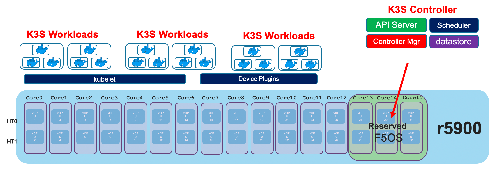
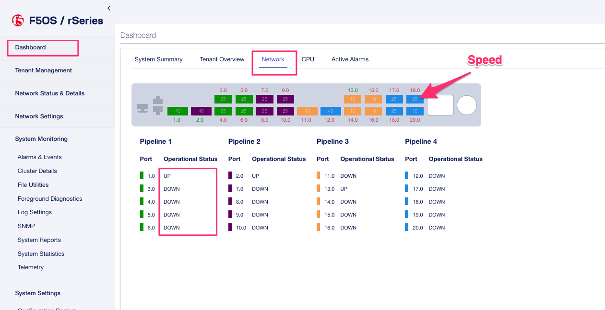
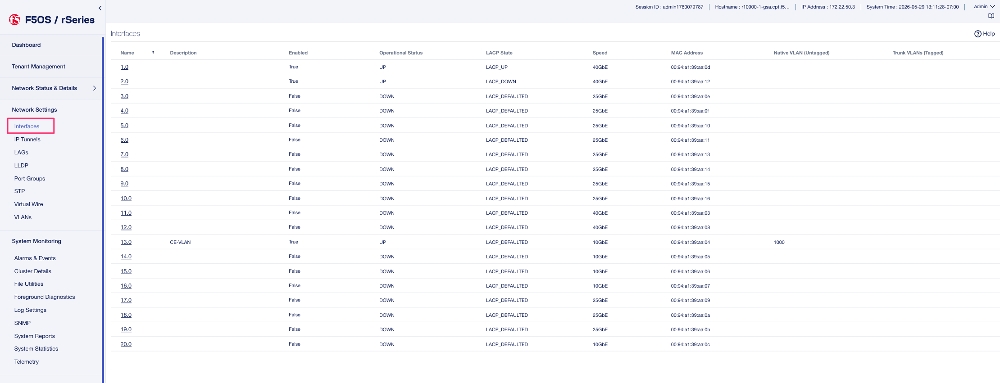
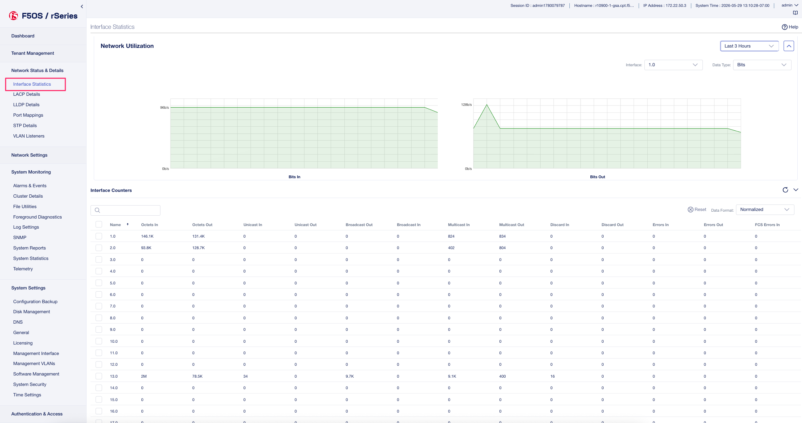
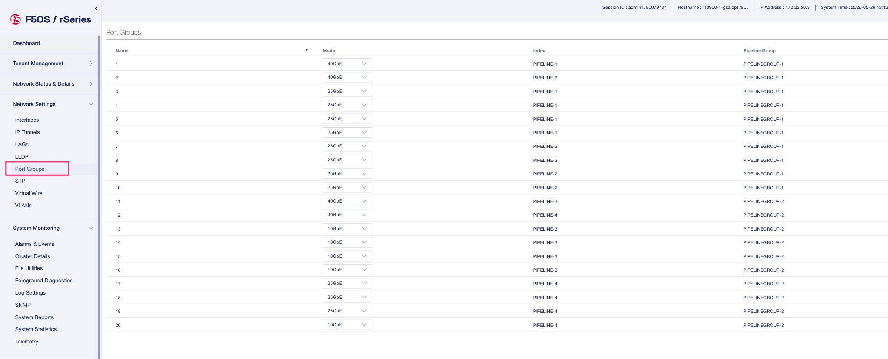

=======================
rSeries Troubleshooting
=======================

Storage / Disk
==============

Some rSeries appliances have a single SSD disk, while other models have dual SSD disks that are RAID-1 mirrored. The r2600, r2800, r4600, r4800, r5600, r5800, r5900, r5920-DF models all contain a single SSD, while the r10600, r10800, r10900, r10920-DF, r12600-DS, r12800-DS, r12900-DS platforms contain 2 SSD's that are RAID-1 mirrored.

The capacity advertised for disk sizes are larger than what is seen inside the systems due to over provisioning as described here:

`K000135513: F5OS platform (rSeries/VELOS) shows different disk size compared to platform data sheet <https://my.f5.com/manage/s/article/K000135513>`_

Below is an example of an r12900 appliance with RAID-1 mirrored disks. You can use the CLI command **show components component storage** to see the disks and their overall size. The system has dual 2TB disks, but due to SSD manufacturer over provisioning the actual usable space is ~1397GB.

.. code-block:: bash

  r12900-1-gsa# show components component platform storage 
                                                                                                                                     READ                                              WRITE     
  DISK                                                                                     TOTAL  READ      READ                       LATENCY               WRITE                       LATENCY   
  NAME     MODEL                       VENDOR   VERSION   SERIAL NO       SIZE       TYPE  IOPS   IOPS      MERGED     READ BYTES      MS        WRITE IOPS  MERGED      WRITE BYTES     MS        
  -------------------------------------------------------------------------------------------------------------------------------------------------------------------------------------------------
  nvme0n1  SAMSUNG MZQL21T9HCJR-00A07  Samsung  GDC5602Q  S64GNA0T705200  1397.00GB  nvme  0      28825879  224134195  16512452025856  23632018  1444502017  1387157591  16087772092416  98794194  
  nvme1n1  SAMSUNG MZQL21T9HCJR-00A07  Samsung  GDC5602Q  S64GNA0T704659  1397.00GB  nvme  0      28087419  224084243  16505188468224  24632030  1444501617  1387157991  16087772092416  89736314  

  r12900-1-gsa# 

Below is an example of an r10900 appliance with RAID-1 mirrored disks. You can use the CLI command **show components component storage** to see the disks and their overall size. The system has dual 1TB disks, but due to SSD manufacturer over provisioning the actual usable space is ~684GB.

.. code-block:: bash

  r10900-1-gsa# show components component platform storage 
                                                                                                                                                                                        READ  READ   WRITE           
                                                                                                                                READ                                           WRITE     IOPS  BYTES  IOPS   WRITE    
  DISK                                                                                TOTAL  READ      READ                     LATENCY   WRITE      WRITE                     LATENCY   PER   PER    PER    BYTES    
  NAME     MODEL                VENDOR  VERSION   SERIAL NO           SIZE      TYPE  IOPS   IOPS      MERGED    READ BYTES     MS        IOPS       MERGED     WRITE BYTES    MS        SEC   SEC    SEC    PER SEC  
  --------------------------------------------------------------------------------------------------------------------------------------------------------------------------------------------------------------------
  nvme0n1  INTEL SSDPE2KX010T8  Intel   VDV10184  PHLJ915001YZ1P0FGN  684.00GB  nvme  0      20936513  13531343  2218081166848  18885099  448920360  395321175  4628093784576  43435137  0     18841  121    1119072  
  nvme1n1  INTEL SSDPE2KX010T8  Intel   VDV10184  PHLJ0065030H1P0FGN  684.00GB  nvme  0      20410425  13519690  2211503181824  19624241  448920315  395321220  4628093784576  41446861  0     6553   121    1119072  

  r10900-1-gsa#

Below is an example of an r5900 appliance with a single disk. You can use the CLI command **show components component storage** to see the disk and its overall size. The system has a single 1TB disk, but due to SSD manufacturer over provisioning the actual usable space is ~683GB.

.. code-block:: bash

  r5900-1-gsa# show components component platform storage 
                                                                                                                                                                                        READ  READ   WRITE           
                                                                                                                                READ                                          WRITE     IOPS  BYTES  IOPS   WRITE    
  DISK                                                                                    TOTAL  READ     READ                   LATENCY  WRITE      WRITE                     LATENCY   PER   PER    PER    BYTES    
  NAME     MODEL                       VENDOR   VERSION   SERIAL NO       SIZE      TYPE  IOPS   IOPS     MERGED   READ BYTES    MS       IOPS       MERGED     WRITE BYTES    MS        SEC   SEC    SEC    PER SEC  
  --------------------------------------------------------------------------------------------------------------------------------------------------------------------------------------------------------------------
  nvme0n1  SAMSUNG MZ1LB960HAJQ-00007  Samsung  EDA7602Q  S435NA0NA05748  683.00GB  nvme  0      3567466  1355195  120958355968  2096727  289016249  276223058  3408011746304  48246578  0     0      109    1175548  

  r5900-1-gsa# 

Below is an example of an r4800 appliance with a single disk. You can use the CLI command **show components component storage** to see the disk and its overall size. The system has a single 480GB disk, but due to SSD manufacturer over provisioning the actual usable space is ~447GB.

.. code-block:: bash

  r4800-1-gsa# show components component platform storage
                                                                                                                      READ                                          WRITE      
  DISK                                                                            TOTAL  READ    READ                 LATENCY  WRITE      WRITE                     LATENCY    
  NAME     MODEL             VENDOR         VERSION  SERIAL NO    SIZE      TYPE  IOPS   IOPS    MERGED  READ BYTES   MS       IOPS       MERGED     WRITE BYTES    MS         
  -----------------------------------------------------------------------------------------------------------------------------------------------------------------------------
  nvme0n1  SRMP8480GF1S1B71  SMART Modular  FW1354   SPG214106FA  447.00GB  nvme  0      782328  723369  17346635776  1709225  535868303  420793606  4948687782912  114139966  

  r4800-1-gsa# 

Below is an example of an r2800 appliance with a single disk. You can use the CLI command **show components component storage** to see the disk and its overall size. The system has a single 480GB disk, but due to SSD manufacturer over provisioning the actual usable space is ~447GB.

.. code-block:: bash

  rr800-1-gsa# show components component platform storage 
                                                                                                                     READ                                          WRITE     
  DISK                                                                            TOTAL  READ     READ                 LATENCY  WRITE      WRITE                     LATENCY   
  NAME     MODEL             VENDOR         VERSION  SERIAL NO    SIZE      TYPE  IOPS   IOPS     MERGED  READ BYTES   MS       IOPS       MERGED     WRITE BYTES    MS        
  -----------------------------------------------------------------------------------------------------------------------------------------------------------------------------
  nvme0n1  SRMP8480GF1S1B71  SMART Modular  FW1354   SPG214106H8  447.00GB  nvme  0      2737342  49      41487474176  1176773  479738508  365657419  4491211809280  86089293  

  r2800-1-gsa#

How the Disk is Partitioned
---------------------------

When trying to calculate freespace for the system or one of the underlying volumes there are a few factors that have to be taken into consideration. First, as covered above, the advertised disk size in the rSeries data sheet is what the SSD manufacturer markets their drive capacity as. What is actually consumable by the F5OS filesystem is much less (typically 68-93% of advertised capacity) due to the manufacturer over provisioning process. The sizes you see above are what is really available to F5OS. 

Next, rSeries systems separate important parts of the file system into separate partitions on the file system, and then logical volume management is used on top of that. Run the following command **sudo fdisk -l** in the bash shell to see how the usable storage is allocated. Below is the example truncated output from an r12900.  Notice there are 5 main **nvme1n1px** locations (where x = p1-p5).  To understand the naming convention: nvme stands for nonvolatile memory express which is the transport protocol for flash and SSDs. The **nvme1n1p1** is decoded as: The nvme drive 1, namespace 1, partition 1. In this case there are 5 partitions (p1-p5) on the drive nvme1, on namespace 1. 

.. code-block:: bash

  [root@appliance-1(rSeries_pme_1):Active] ~ #  sudo fdisk -l
  Disk /dev/nvme1n1: 1.4 TiB, 1500301910016 bytes, 2930277168 sectors
  Units: sectors of 1 * 512 = 512 bytes
  Sector size (logical/physical): 512 bytes / 4096 bytes
  I/O size (minimum/optimal): 131072 bytes / 131072 bytes
  Disklabel type: gpt
  Disk identifier: 297A92B7-E803-493A-B9A2-CC4C76CC8609
  
  Device              Start        End    Sectors   Size Type
  /dev/nvme1n1p1       2048 1953146879 1953144832 931.3G Linux RAID
  /dev/nvme1n1p2 1953146880 2441433087  488286208 232.9G Linux RAID
  /dev/nvme1n1p3 2441433088 2443530239    2097152     1G Linux RAID
  /dev/nvme1n1p4 2443530240 2445627391    2097152     1G Linux RAID
  /dev/nvme1n1p5 2445627392 2930276351  484648960 231.1G Linux RAID

If you add up the size of these 5 locations (931.3+232.9+1+1+231.1=1397.3GB) it is the same value as reported as usable in the **show components component platform storage** command for the r12900.

.. code-block:: bash

  r12900-1-gsa# show components component platform storage 
                                                                                                                                     READ                                              WRITE     
  DISK                                                                                     TOTAL  READ      READ                       LATENCY               WRITE                       LATENCY   
  NAME     MODEL                       VENDOR   VERSION   SERIAL NO       SIZE       TYPE  IOPS   IOPS      MERGED     READ BYTES      MS        WRITE IOPS  MERGED      WRITE BYTES     MS        
  -------------------------------------------------------------------------------------------------------------------------------------------------------------------------------------------------
  nvme0n1  SAMSUNG MZQL21T9HCJR-00A07  Samsung  GDC5602Q  S64GNA0T705200  1397.00GB  nvme  0      28825879  224134195  16512452025856  23632018  1444502017  1387157591  16087772092416  98794194  
  nvme1n1  SAMSUNG MZQL21T9HCJR-00A07  Samsung  GDC5602Q  S64GNA0T704659  1397.00GB  nvme  0      28087419  224084243  16505188468224  24632030  1444501617  1387157991  16087772092416  89736314  

  r12900-1-gsa# 

To find out how these volumes maps to points in the F5OS filesystem run the **lsblk** command in the bash shell. In the output below you can see that the nvme1n1p1 partition maps to an lvm **/var/F5/system/cbip-disks** and it is 931.3GB. The nvme1n1p2 partition maps to an lvm **/var/export/chassis** the partition is only 232.9GB, but it has a **vdo** that is 465.4GB and the lvm reports having 465.4GB for capacity as well. This is because the VDO uses dedupe, compression, and thin provisioning. Then there are two boot partitions (nvme1n1p3 & p4) that map to lvm's **/boot** and **/boot/efi** which are both about 1GB each. Finally there is the **nvme1n1p5** partition which is 231.1GB in size and it maps to the **/sysroot** location.

.. code-block:: bash

  [root@appliance-1(rSeries_pme_1):Active] ~ # lsblk
  ..
  sda                                      8:0    1  28.8G  0 disk  
  ├─sda1                                   8:1    1   4.3G  0 part  
  └─sda2                                   8:2    1   8.9M  0 part  
  nvme1n1                                259:0    0   1.4T  0 disk  
  ├─nvme1n1p1                            259:1    0 931.3G  0 part  
  │ └─md124                                9:124  0 931.2G  0 raid1 
  │   └─partition_tenant-root            253:2    0 931.2G  0 lvm   /var/F5/system/cbip-disks
  ├─nvme1n1p2                            259:2    0 232.9G  0 part  
  │ └─md125                                9:125  0 232.7G  0 raid1 
  │   └─vdo_vol                          253:3    0 465.4G  0 vdo   
  │     └─partition_image-export_chassis 253:4    0 465.4G  0 lvm   /var/export/chassis
  ├─nvme1n1p3                            259:3    0     1G  0 part  
  │ └─md121                                9:121  0  1022M  0 raid1 /boot
  ├─nvme1n1p4                            259:4    0     1G  0 part  
  │ └─md122                                9:122  0  1024M  0 raid1 /boot/efi
  └─nvme1n1p5                            259:5    0 231.1G  0 part  
    └─md123                                9:123  0   231G  0 raid1 
      ├─velocity-root                    253:0    0   230G  0 lvm   /sysroot
      └─velocity-swap                    253:1    0     1G  0 lvm   

Note that the nvme1n1p2 partition above is 232.9Gb in size, but within it, it has a vdo / lvm with a size of 465.4Gb which is bigger than the physical capacity of that partition. VDO is a Virtual Data Optimizer, it is a device mapper target that provides inline data reduction services on block storage, specifically targeting data deduplication, compression, and thin provisioning. 

Here is what VDO does:

-	Zero-Block Elimination: VDO scans for and eliminates blocks consisting entirely of zeros, only recording them in metadata.
-	Deduplication: The Universal Deduplication Service (UDS) kernel module checks for redundant data. If data has already been written, VDO creates a reference to the existing block rather than writing it again.
-	Compression: VDO uses the LZ4 algorithm to compress individual data blocks, allowing more data to fit into a physical block.
-	Thin Provisioning: VDO allows the logical size of a device to be larger than its physical size, presenting more storage to applications than is actually available on the disk. 

More details can be found here: `Understanding the Concepts Behind Virtual Data Optimizer (VDO) in RHEL 7.5 Beta <https://www.redhat.com/en/blog/understanding-concepts-behind-virtual-data-optimizer-vdo-rhel-75-beta#:~:text=In%20the%20Red%20Hat%20Enterprise,been%20written%20before)%20or%20not>`_

You can see that both compression and deduplication is enabled on this volume, and what the current space savings is from using those options:

.. code-block:: bash

  [root@appliance-1(rSeries_pme_1):Active] ~ # vdo status -n vdo_vol | grep Deduplication
      Deduplication: enabled
  
  [root@appliance-1(rSeries_pme_1):Active] ~ # vdo status -n vdo_vol | grep Compression
      Compression: enabled
  
  [root@appliance-1(rSeries_pme_1):Active] ~ # vdostats --hu
  Device                    Size      Used Available Use% Space saving%
  /dev/mapper/vdo_vol     232.7G     66.7G    166.0G  28%           11%
  [root@appliance-1(rSeries_pme_1):Active] ~ #

You may also view storage utilization from within the F5OS CLI, API, or WebUI. Below is an example of using the CLI command **show components component platform | begin AREA | until platform/images**, which filters most of the output of the command so that only the file system information is displayed. This output doesn't show the /boot and /boot/efi locations, but it does show the three major file system locations that should be monitored as well as the utilization of each virtual disk associated with each tenant. The output below is displayed in raw Bytes (1024/metric format). Currently there is no option to convert this to human readable output from the CLI, but you can do that in the bash shell, or using the webUI. The values below are in metric BiBytes or measurements of 1024, while the GUI is converting these values to decimal or measurements of 1000 (human readable). To convert the raw values below to human readable / decimal, take the raw number value and divide by 1024 three times to get a human readable GByte value. As an example, for **platform/big-ip-tenant-disks** take the value from the **TOTAL** column: 983963836416/1024/1024/1024 = 916.38GB. This (916GB) is the total space displayed in the WebUI for this location. You can repeat this for all the values below to understand how the WebUI converts into human readable format. 

.. code-block:: bash

  rSeries_pme_1# show components component platform | begin AREA | until platform/images             
  AREA                          CATEGORY           TOTAL         FREE          USED         PERCENT  
  ---------------------------------------------------------------------------------------------------
  platform/sysroot              F5OS System        242854256640  162985357312  67505770496  29       
  platform/big-ip-tenant-disks  F5OS Tenant Disks  983963836416  893875208192  40078266368  4        
  tenant/app1-tenant            BIG-IP Tenant      88046829568   79463706624   8583122944   9        
  tenant/rseries-pme-ce2        Generic Tenant     107374182400  75880927232   31493255168  29       
  platform/images               F5OS Images        491675910144  399683796992  66988818432  14       
  rSeries_pme_1#

Below is a description for each of the filesystem locations. Note that the locations in F5OS are simplified and display a virtual location vs. the actual file system location in the bash shell.

+----------------------------+-------------------------------+---------------------------------------------------------------------------------------------------------------------------------------------------------------------------------+
| Bash Filesystem Location   | F5OS Filesystem Location      | Description                                                                                                                                                                     |
+============================+===============================+=================================================================================================================================================================================+
| /var/F5/system/cbip-disks  | platform/big-ip-tenant-disks  | Location of F5OS tenant virtual disks                                                                                                                                           |
+----------------------------+-------------------------------+---------------------------------------------------------------------------------------------------------------------------------------------------------------------------------+
| /var/export/chassis        | platform/images               | F5OS ISO images, tenant images, ostree repo                                                                                                                                     |
+----------------------------+-------------------------------+---------------------------------------------------------------------------------------------------------------------------------------------------------------------------------+
| /boot                      | N/A                           | Boot location. After the UEFI firmware hands off to the GRUB EFI binary (from /boot/efi), GRUB reads its configuration from /boot to load the kernel and initramfs into memory. |
+----------------------------+-------------------------------+---------------------------------------------------------------------------------------------------------------------------------------------------------------------------------+
| /boot/efi                  | N/A                           | Boot location. The system firmware (UEFI BIOS) reads this partition at power-on to locate and launch the bootloader. It is the first stage of the boot process.                 |
+----------------------------+-------------------------------+---------------------------------------------------------------------------------------------------------------------------------------------------------------------------------+
| /sysroot                   | platform/sysroot              | F5OS OS/data partition: F5OS OS, containers, config, logs                                                                                                                       |
+----------------------------+-------------------------------+---------------------------------------------------------------------------------------------------------------------------------------------------------------------------------+

F5OS Configuration Backups
--------------------------

Backups of the F5OS configuration are stored in the path **/var/F5/system/configs/** within the underlying linux filesytem. If using the F5OS CLI, API, or webUI then these paths are simplified to the simplified path of **configs**. Below is a view of the **/var/F5/system/configs/** path within the bash shell.

.. code-block:: bash

  [root@appliance-1(r10900.f5demo.net) log]# cd /var/F5/system/configs/
  [root@appliance-1(r10900.f5demo.net) configs]# ls
  backup1  F5OS-BACKUP2022-01-20  F5OS-BACKUP-APPLIANCE12022-04-19  jim-backup  jim-backup.db  jim-july  kfo-bkp  kfo-bkup  new-backup

In the F5OS CLI it appears as the simplified **configs** for file import/export commands. The same virtual path will be shown in the other F5OS user interfaces (API/webUI).

.. code-block:: bash

  r10900-1# file export local-file 
  Possible completions:
    configs/  diags/  images/  log/  mibs/  tenant/spec/
  r10900-1# file export local-file configs/
  Possible completions: (first 100):
    F5OS-BACKUP-APPLIANCE12022-04-19          F5OS-BACKUP-APPLIANCE12023-01-09          F5OS-BACKUP-APPLIANCE12023-11-17          F5OS-BACKUP2022-01-20                     GSA-Daily_GSA-rSeries-1_20230329070500          GSA-Daily_GSA-rSeries-1_20230330070500    GSA-Daily_GSA-rSeries-1_20230331070500    GSA-Daily_GSA-rSeries-1_20230402070500    
    GSA-Daily_GSA-rSeries-1_20230403070500    GSA-Daily_GSA-rSeries-1_20230404070500    GSA-Daily_GSA-rSeries-1_20230405070500    GSA-Daily_GSA-rSeries-1_20230406070500    Initial_backup_gsa_GSA-r10900-1_20230410084408  Nightly_F5OS_GSA-r10900-1_20230410210100  Nightly_F5OS_GSA-r10900-1_20230411210100  Nightly_F5OS_GSA-r10900-1_20230412210100  
    Nightly_F5OS_GSA-r10900-1_20230413210100  Nightly_F5OS_GSA-r10900-1_20230414210100  Nightly_F5OS_GSA-r10900-1_20230415210100  Nightly_F5OS_GSA-r10900-1_20230416210100  Nightly_F5OS_GSA-r10900-1_20230417210100        Nightly_F5OS_GSA-r10900-1_20230418210100  Nightly_F5OS_GSA-r10900-1_20230419210100  Nightly_F5OS_GSA-r10900-1_20230420210100  
    Nightly_F5OS_GSA-r10900-1_20230421210100  Nightly_F5OS_GSA-r10900-1_20230422210100  Nightly_F5OS_GSA-r10900-1_20230423210100  Nightly_F5OS_GSA-r10900-1_20230424210100  Nightly_F5OS_GSA-r10900-1_20230425210100        Nightly_F5OS_GSA-r10900-1_20230426210100  Nightly_F5OS_GSA-r10900-1_20230427210100  Nightly_F5OS_GSA-r10900-1_20230428210100  
    Nightly_F5OS_GSA-r10900-1_20230429210100  Nightly_F5OS_GSA-r10900-1_20230430210100  Nightly_F5OS_GSA-r10900-1_20230501210100  Nightly_F5OS_GSA-r10900-1_20230502210100  Nightly_F5OS_GSA-r10900-1_20230503210100        Nightly_F5OS_GSA-r10900-1_20230504210100  Nightly_F5OS_GSA-r10900-1_20230505210100  Nightly_F5OS_GSA-r10900-1_20230506210100  
    Nightly_F5OS_GSA-r10900-1_20230507210100  Nightly_F5OS_GSA-r10900-1_20230508210100  Nightly_F5OS_GSA-r10900-1_20230509210100  Nightly_F5OS_GSA-r10900-1_20230510210100  Nightly_F5OS_GSA-r10900-1_20230515210100        Nightly_F5OS_GSA-r10900-1_20230516210100  Nightly_F5OS_GSA-r10900-1_20230517210100  Nightly_F5OS_GSA-r10900-1_20230518210100  
    Nightly_F5OS_GSA-r10900-1_20230519210100  Nightly_F5OS_GSA-r10900-1_20230520210100  Nightly_F5OS_GSA-r10900-1_20230521210100  Nightly_F5OS_GSA-r10900-1_20230522210100  Nightly_F5OS_GSA-r10900-1_20230523210100        Nightly_F5OS_GSA-r10900-1_20230524210100  Nightly_F5OS_GSA-r10900-1_20230525210100  Nightly_F5OS_GSA-r10900-1_20230526210100  
    Nightly_F5OS_GSA-r10900-1_20230527210100  Nightly_F5OS_GSA-r10900-1_20230528210100  Nightly_F5OS_GSA-r10900-1_20230529210100  Nightly_F5OS_GSA-r10900-1_20230530210100  Nightly_F5OS_GSA-r10900-1_20230531210100        Nightly_F5OS_GSA-r10900-1_20230601210100  Nightly_F5OS_GSA-r10900-1_20230602210100  Nightly_F5OS_GSA-r10900-1_20230603210100  
    Nightly_F5OS_GSA-r10900-1_20230604210100  Nightly_F5OS_GSA-r10900-1_20230605210100  Nightly_F5OS_GSA-r10900-1_20230606210100  Nightly_F5OS_GSA-r10900-1_20230607210100  Nightly_F5OS_GSA-r10900-1_20230608210100        Nightly_F5OS_GSA-r10900-1_20230609210100  Nightly_F5OS_GSA-r10900-1_20230610210100  Nightly_F5OS_GSA-r10900-1_20230611210100  
    Nightly_F5OS_GSA-r10900-1_20230612210100  Nightly_F5OS_GSA-r10900-1_20230613210100  Nightly_F5OS_GSA-r10900-1_20230614210100  Nightly_F5OS_GSA-r10900-1_20230615210100  Nightly_F5OS_GSA-r10900-1_20230616210100        Nightly_F5OS_GSA-r10900-1_20230617210100  Nightly_F5OS_GSA-r10900-1_20230618210100  Nightly_F5OS_GSA-r10900-1_20230619210100  
    Nightly_F5OS_GSA-r10900-1_20230620210100  Nightly_F5OS_GSA-r10900-1_20230621210100  Nightly_F5OS_GSA-r10900-1_20230622210100  Nightly_F5OS_GSA-r10900-1_20230623210100  Nightly_F5OS_GSA-r10900-1_20230624210100        Nightly_F5OS_GSA-r10900-1_20230625210100  Nightly_F5OS_GSA-r10900-1_20230626210100  Nightly_F5OS_GSA-r10900-1_20230627210100  
    Nightly_F5OS_GSA-r10900-1_20230628210100  backup1                                   dave/                                     jim-backup                                jim-backup.db                                   jim-july                                  jim-test1                                 jim2                                      
    kfo-bkp                                   kfo-bkup                                  new-backup                                rseriesjim_GSArSeries1_20230227054500     
  r10900-1#

F5OS Images
-----------

F5OS-A ISO images are uploaded into the system where they are initially written to disk in the following path **/var/import/staging/**. The images go through a verification process before being extracted to their final location.

.. code-block:: bash

  [root@appliance-1(r10900.f5demo.net) /]# ls /var/import/staging/
  F5OS-A-1.0.0-8722.R2R4.NSIT.iso        F5OS-A-1.4.0-2631.R5R10.CANDIDATE.iso  F5OS-A-1.4.0-5242.R5R10.CANDIDATE.iso
  F5OS-A-1.4.0-2129.R5R10.CANDIDATE.iso  F5OS-A-1.4.0-3402.R5R10.CANDIDATE.iso  F5OS-A-1.4.0-6325.R5R10.DEV.iso
  [root@appliance-1(r10900.f5demo.net) /]#

Once the file upload completes the file is then imported and extracted into one of the following paths depending on which type of rSeries system it is being installed onto. For r5000 or r10000 appliances, the path of the import is **/var/images/R5R10**. For r2000 and r4000 appliances, the imported path is **/var/images/R2R4**. Below is an example showing various images on an r10000 system.

.. code-block:: bash

  [root@appliance-1(r10900.f5demo.net) /]# ls var/images/R5R10/
  1.0.0-10170  1.0.0-11080  1.0.0-8303  1.0.0-8566  1.0.0-8830  1.0.0-9194  1.0.0-9396  1.4.0-2129  1.4.0-2631  1.4.0-3402  1.4.0-5242  1.4.0-6325
  [root@appliance-1(r10900.f5demo.net) /]# 

Below is an example showing various images on an r4000 system.

.. code-block:: bash

  [root@appliance-1(r4800-2.demo.f5net.com) ~]# ls /var/images/R2R4/
  1.4.0-10138  1.4.0-10281  1.4.0-8382  1.4.0-8622  1.4.0-8882  1.4.0-8939  1.4.0-9386
  [root@appliance-1(r4800-2.demo.f5net.com) ~]# 

Disk Utilization Reporting and Alerting
---------------------------------------

Tenant Images
-------------

.. code-block:: bash

  [root@appliance-1(r10900.f5demo.net) system]# ls IMAGES/
  BIGIP-15.1.4-0.0.26.ALL-VELOS.qcow2.zip.bundle  BIGIP-bigip15.1.x-europa-15.1.5-0.0.210.ALL-F5OS.qcow2.zip.bundle    BIGIP-bigip151x-miranda-15.1.4.1-0.0.171.ALL-VELOS.qcow2.zip.bundle
  BIGIP-15.1.5-0.0.3.ALL-F5OS.qcow2.zip.bundle    BIGIP-bigip15.1.x-europa-15.1.5-0.0.222.ALL-F5OS.qcow2.zip.bundle    BIGIP-bigip151x-miranda-15.1.4.1-0.0.173.ALL-VELOS.qcow2.zip.bundle
  BIGIP-15.1.5-0.0.8.ALL-F5OS.qcow2.zip.bundle    BIGIP-bigip15.1.x-europa-15.1.5-0.0.225.ALL-F5OS.qcow2.zip.bundle    BIGIP-bigip151x-miranda-15.1.4.1-0.0.176.ALL-VELOS.qcow2.zip.bundle
  BIGIP-15.1.6.1-0.0.6.ALL-F5OS.qcow2.zip.bundle  BIGIP-bigip15.1.x-europa-15.1.5.1-0.0.276.ALL-F5OS.qcow2.zip.bundle
  [root@appliance-1(r10900.f5demo.net) system]# pwd
  /var/F5/system
  [root@appliance-1(r10900.f5demo.net) system]#

Tenant Virtual Disks
--------------------

The virtual disks for the tenants are stored in the path **/var/F5/system/cbip-disks/**. You'll see a directory with the configured tenant name for each tenant. Inside that directory will be a file with a .raw extension. As an example, the rSeries appliance below has two tenants configured which are named **tenant1** and **tenant2**. There is a directory for each tenant, and inside the tenant1 directory is a **tenant1.raw** file which is the tenants virtual disk.

.. code-block:: bash

  [root@appliance-1(r10900.f5demo.net) mibs]# cd /var/F5/system/cbip-disks/
  [root@appliance-1(r10900.f5demo.net) cbip-disks]# ls
  lost+found  tenant1  tenant2
  [root@appliance-1(r10900.f5demo.net) cbip-disks]# ls tenant1
  tenant1.raw
  [root@appliance-1(r10900.f5demo.net) cbip-disks]# ls -al tenant1
  total 6793212
  drwxr-xr-x. 2 root root        4096 Oct  7 07:55 .
  drwxr-xr-x. 5 root root        4096 Oct  7 10:12 ..
  -rw-r--r--. 1  107  107 82678120448 Dec 22 12:39 tenant1.raw
  [root@appliance-1(r10900.f5demo.net) cbip-disks]# 

Note that the tenant virtual disks use sparse provisioning, so the size seen is not representative to the actual storage space consumed on the disk. As an example, the tenant1 virtual disk image appears to be consuming 77GB, but that is what it has reserved, not consumed. In this case, the **ls -lsh** output confirms only 6.5GB of 77GB is actually consumed.

.. code-block:: bash

  [root@appliance-1(r10900.f5demo.net) cbip-disks]# pwd
  /var/F5/system/cbip-disks
  [root@appliance-1(r10900.f5demo.net) cbip-disks]# cd tenant1
  
  [root@appliance-1(r10900.f5demo.net) tenant1]# ls -alh
  total 6.5G
  drwxr-xr-x. 2 root root 4.0K Oct  7 07:55 .
  drwxr-xr-x. 6 root root 4.0K Dec 22 12:41 ..
  -rw-r--r--. 1  107  107  77G Dec 22 12:54 tenant1.raw
  
  [root@appliance-1(r10900.f5demo.net) tenant1]# ls -lsh
  total 6.5G
  6.5G -rw-r--r--. 1 107 107 77G Dec 22 12:50 tenant1.raw
  [root@appliance-1(r10900.f5demo.net) tenant1]# 

Logging
-------

Important F5OS logs are stored in the path **/var/F5/system/log**. 

.. code-block:: bash

  [root@appliance-1(r10900.f5demo.net) log]# pwd
  /var/F5/system/log

  [root@appliance-1(r10900.f5demo.net) log]# ls
  audit.log       confd.log.1     devel.log.2.gz          k3s_events.log       lcd.log.2.gz     logrotate.log.2.gz  platform.log.5.gz              snmp.log.1        trace                 velos.log.3.gz
  audit.log.1     confd.log.2.gz  devel.log.3.gz          k3s_events.log.1     lcd.log.3.gz     platform.log        platform.log.6.gz              snmp.log.2.gz     vconsole_auth.log     webui
  audit.log.2.gz  confd.log.3.gz  devel.log.4.gz          k3s_events.log.2.gz  lcd.log.4.gz     platform.log.1      platform.log.7.gz              snmp.log.3.gz     vconsole_startup.log
  audit.log.3.gz  confd.log.4.gz  devel.log.5.gz          lacp_out_132         lcd.log.5.gz     platform.log.2.gz   reprogram_chassis_network.log  snmp.log.4.gz     velos.log
  audit.log.4.gz  devel.log       dma-agent-launcher.log  lcd.log              logrotate.log    platform.log.3.gz   rsyslogd_init.log              startup.log       velos.log.1
  confd.log       devel.log.1     dma-agent.log           lcd.log.1            logrotate.log.1  platform.log.4.gz   snmp.log                       startup.log.prev  velos.log.2.gz
  [root@appliance-1(r10900.f5demo.net) log]# 

SNMP MIBs
---------

F5OS SNMP MIBs are stored in the path **/var/F5/system/mibs**.

.. code-block:: bash

  [root@appliance-1(r10900.f5demo.net) configs]# cd /var/F5/system/mibs
  [root@appliance-1(r10900.f5demo.net) mibs]# ls
  mibs_f5os_appliance.tar.gz  mibs_netsnmp.tar.gz
  [root@appliance-1(r10900.f5demo.net) mibs]# 

F5OS Diag Files
---------------

tcpdump , core files, qkviews etc...

F5OS System Services
====================

The rSeries system services perform a variety of functions, such as configuring and controlling switch chips, managing partitions and tenants, and performing high availability (HA) failover actions between system controllers.

`K000134978: Overview of F5 rSeries system services <https://my.f5.com/manage/s/article/K000134978>`_ 

Kubernetes Environment
=======================

----------------------------
The Kubernetes Control Plane
----------------------------

rSeries utilizes an open-source Kubernetes distribution called K3S. This is largely abstracted away from the administrator as they won’t be configuring or monitoring containers or Kubernetes components. In future releases, some Kubernetes-like features might start to be exposed, but it will likely be exposed through the F5OS CLI, webUI, or API’s. 

A combination of Docker Compose and Kubernetes is used within the F5OS rSeries platform layer. The Docker Compose component brings up the software stacks as they need to be fully functional early in the startup process. Then the Kubernetes component takes over and is responsible for deploying workloads to the proper CPU's. 

The diagram above is somewhat simplified as it shows a single software stack for the Kubernetes control plane. There is a software stack for the F5OS layer that provides F5OS CLI, webUI, and API management for the appliance as well as support for the networking services such as stpd, lldpd, lacpd, that get deployed as workloads. The Kubernetes control plane is responsible for deploying workloads. This would happen when tenants are configured. 

Docker Compose 
--------------

Inside the rSeries F5 system services are managed via Docker Compose. The Docker Compose configuration is in /var/docker/config on the rSeries appliances. To list the F5 services and get their status, source the env_var file and run the appropriate docker-compose command. This will list all the F5 services managed by Docker Compose.

.. code-block:: bash

  [root@appliance-1(r10900-1.f5demo.net) ~]# cd /var/docker/config/
  [root@appliance-1(r10900-1.f5demo.net) config]# ls
  appliance  env_var  extra  platform.yml
  [root@appliance-1(r10900-1.f5demo.net) config]# ls -l
  total 4
  drwxr-xr-x. 5 root root 4096 Mar  7 20:43 appliance
  lrwxrwxrwx. 1 root root   48 Mar  7 14:25 env_var -> /var/docker/config/appliance/1.4.0-10281/env_var
  lrwxrwxrwx. 1 root root   46 Mar  7 14:25 extra -> /var/docker/config/appliance/1.4.0-10281/extra
  lrwxrwxrwx. 1 root root   53 Mar  7 14:25 platform.yml -> /var/docker/config/appliance/1.4.0-10281/platform.yml
  [root@appliance-1(r10900-1.f5demo.net) config]# . ./env_var 
  [root@appliance-1(r10900-1.f5demo.net) config]# docker-compose -f platform.yml ps
  WARNING: The slot variable is not set. Defaulting to a blank string.
              Name                          Command               State                                                                                                        Ports                                                                                                     
  ---------------------------------------------------------------------------------------------------------------------------------------------------------------------------------------------------------------------------------------------------------------------------------------
  alert-service                  /confd/scripts/alert-service     Up                                                                                                                                                                                                                     
  authentication-mgr             /usr/local/sbin/dumb-init  ...   Up                                                                                                                                                                                                                     
  confd-key-migration-mgr        /usr/bin/confd-primary-key ...   Up                                                                                                                                                                                                                     
  diag-agent                     /usr/local/sbin/dumb-init  ...   Up                                                                                                                                                                                                                     
  dma-agent                      /bin/sh -c dma-agent-launcher    Up                                                                                                                                                                                                                     
  fips-service                   sh -c /usr/bin/fips-init;        Up                                                                                                                                                                                                                     
  fips-support-pod               /usr/local/sbin/dumb-init  ...   Exit 0                                                                                                                                                                                                                 
  firmware                       bash /usr/local/bin/agent        Up                                                                                                                                                                                                                     
  firmware-fpga                  bash /usr/local/bin/agent        Up                                                                                                                                                                                                                     
  http-server                    /root/daemon_setup.sh            Up                                                                                                                                                                                                                     
  ihealth-service                /usr/local/sbin/dumb-init  ...   Up                                                                                                                                                                                                                     
  lcd-webserver                  dumb-init -c -- python3 LC ...   Up                                                                                                                                                                                                                     
  line-dma-agent                 /bin/sh -c vqf-dma-agent-l ...   Up                                                                                                                                                                                                                     
  lopd                           /usr/local/sbin/dumb-init  ...   Up                                                                                                                                                                                                                     
  name-service-ldap              /usr/local/sbin/dumb-init  ...   Up                                                                                                                                                                                                                     
  optics-mgr                     /scripts/optics-mgr.sh           Up                                                                                                                                                                                                                     
  platform-diag                  /usr/local/sbin/dumb-init  ...   Up                                                                                                                                                                                                                     
  platform-fwu                   /usr/local/sbin/dumb-init  ...   Up                                                                                                                                                                                                                     
  platform-hal                   /usr/local/sbin/dumb-init  ...   Up                                                                                                                                                                                                                     
  platform-monitor               /usr/local/sbin/dumb-init  ...   Up                                                                                                                                                                                                                     
  platform-stats                 /usr/local/sbin/dumb-init  ...   Up                                                                                                                                                                                                                     
  qat-support-pod                /usr/local/sbin/dumb-init  ...   Up                                                                                                                                                                                                                     
  qkviewd                        /usr/local/sbin/dumb-init  ...   Up                                                                                                                                                                                                                     
  snmp-trapd                     /confd/scripts/snmp-trap         Up                                                                                                                                                                                                                     
  snmpd                          /confd/scripts/snmp-service      Up                                                                                                                                                                                                                     
  stream-generator               /usr/local/sbin/dumb-init  ...   Up                                                                                                                                                                                                                     
  swdiag-agent                   /usr/local/sbin/dumb-init  ...   Up                                                                                                                                                                                                                     
  system-common                  /usr/bin/partition-common. ...   Up                                                                                                                                                                                                                     
  system-tcam-manager            /usr/bin/tcam-launcher.sh  ...   Up                                                                                                                                                                                                                     
  system-vconsole                /usr/local/sbin/dumb-init  ...   Up                                                                                                                                                                                                                     
  system_L2                      /confd/scripts/agent             Up                                                                                                                                                                                                                     
  system_TPOB                    /usr/scripts/orchestration ...   Up                                                                                                                                                                                                                     
  system_api_svc_gateway         /confd/scripts/api_svc_gat ...   Up                                                                                                                                                                                                                     
  system_audit_service           /confd/scripts/audit-service     Up                                                                                                                                                                                                                     
  system_confgen                 /usr/local/sbin/dumb_init  ...   Up                                                                                                                                                                                                                     
  system_control                 /etc/network_setup.sh            Up                                                                                                                                                                                                                     
  system_dagd                    /usr/bin/run_dagd.sh             Up                                                                                                                                                                                                                     
  system_datapath_cp_proxy       /usr/local/bin/datapath_cp ...   Up                                                                                                                                                                                                                     
  system_fpga                    /confd/scripts/fpgamgr           Up                                                                                                                                                                                                                     
  system_host_config             /usr/bin/sys_host_config_s ...   Up                                                                                                                                                                                                                     
  system_image_agent             /confd/scripts/image_agent       Up                                                                                                                                                                                                                     
  system_lacpd                   /confd/scripts/lacpd.init        Up                                                                                                                                                                                                                     
  system_lacpd_proxy             /confd/scripts/lacpd.init        Up                                                                                                                                                                                                                     
  system_latest_vers             /bin/bash -c sleep infinit ...   Up       127.0.0.1:1042->1042/udp, 127.0.0.1:1046->1046/tcp, 127.0.0.1:1048->1048/tcp, 127.0.0.1:1063->1063/tcp, 127.0.0.1:1068->1068/tcp, 0.0.0.0:161->161/udp, 0.0.0.0:443->443/tcp, 127.0.0.1:4565->4565/tcp,       
                                                                          0.0.0.0:7001->7001/tcp, 0.0.0.0:80->80/tcp, 127.0.0.1:8008->8008/tcp, 0.0.0.0:8888->8888/tcp                                                                                                                  
  system_license_service         /confd/scripts/license-service   Up                                                                                                                                                                                                                     
  system_lldpd                   /confd/scripts/lldpd             Up                                                                                                                                                                                                                     
  system_manager                 /confd/scripts/confd.startup     Up                                                                                                                                                                                                                     
  system_network_manager         /confd/scripts/network_manager   Up                                                                                                                                                                                                                     
  system_platform-mgr            /confd/scripts/platform-mg ...   Up                                                                                                                                                                                                                     
  system_platform-stats-bridge   /confd/scripts/PlatformSta ...   Up                                                                                                                                                                                                                     
  system_rsyslogd                /usr/local/sbin/dumb-init  ...   Up                                                                                                                                                                                                                     
  system_stpd                    /confd/scripts/stpd.init         Up                                                                                                                                                                                                                     
  system_sw_rbcast               /scripts/sw_rbcast.sh            Up                                                                                                                                                                                                                     
  system_tmstat_merged           /usr/bin/tmstat-merged-init.sh   Up                                                                                                                                                                                                                     
  system_tmstat_zmq              /usr/bin/zmq_agent_applian ...   Up                                                                                                                                                                                                                     
  system_user_manager            /root/usrman-init                Up                                                                                                                                                                                                                     
  system_velocity_rsyslogd       /usr/local/sbin/dumb-init  ...   Up                                                                                                                                                                                                                     
  tcpdumpd_manager               /usr/local/sbin/dumb-init  ...   Up                                                                                                                                                                                                                     
  upgrade-service                /confd/bin/upgrade-service ...   Up                                                                                                                                                                                                                     
  utils-agent                    sh -c /usr/bin/utils-init; ...   Up                                                                                                                                                                                                                     
  vanquish-gui                   bash /usr/local/bin/agent        Up                                                                                                                                                                                                                     
  [root@appliance-1(r10900-1.f5demo.net) config]# 

Restarting an F5 Service Using Docker
-------------------------------------

You may restart any of the F5 service containers above using the syntax **docker restart <container-name>**. As an example, to reset the appliance GUI enter the command **docker restart vanquish-gui** on an r5000/r10000 device. This should only be done with guidance from F5 Support, as some containers may have depdencies and may cause outages if restarted.  F5 has also added the ability to restart specific services from within the F5OS ConfD CLI rather than using the bash shell. This is a safer way to restart services, as it will prevent some services from being restarted. See the following solution articale for more details: 

`K000134978: Overview of F5 rSeries system services <https://my.f5.com/manage/s/article/K000134978>`_ 

Prior to F5OS-A 1.8.x, the following methos was used:

.. code-block:: bash

  [root@appliance-1(r10900-1.f5demo.net) config]# docker restart <tab>
  alert-service                     diag-agent                        ihealth-service                   platform-fwu                      snmp-trapd                        system_control                    system_lacpd                      system_platform-mgr               system_tmstat_zmq                 utils-agent
  appliance_orchestration_manager   dma-agent                         lcd-webserver                     platform-hal                      stream-generator                  system_dagd                       system_lacpd_proxy                system_platform-stats-bridge      system_TPOB                       vanquish-gui
  appliance-services-registry-2000  fips-service                      line-dma-agent                    platform-monitor                  swdiag-agent                      system_datapath_cp_proxy          system_latest_vers                system_rsyslogd                   system_user_manager               
  appliance-services-registry-2020  fips-support-pod                  lopd                              platform-stats                    system_api_svc_gateway            system_fpga                       system_license_service            system_stpd                       system-vconsole                   
  appliance-services-registry-2021  firmware                          name-service-ldap                 qat-support-pod                   system_audit_service              system_host_config                system_lldpd                      system_sw_rbcast                  system_velocity_rsyslogd          
  authentication-mgr                firmware-fpga                     optics-mgr                        qkviewd                           system-common                     system_image_agent                system_manager                    system-tcam-manager               tcpdumpd_manager                  
  confd-key-migration-mgr           http-server                       platform-diag                     snmpd                             system_confgen                    system_L2                         system_network_manager            system_tmstat_merged              upgrade-service                   
  [root@appliance-1(r10900-1.f5demo.net) config]# docker restart vanquish-gui
  vanquish-gui
  [root@appliance-1(r10900-1.f5demo.net) config]#

As of F5OS-A 1.8.x and later the new confD CLI command has been added:

.. code-block:: bash

  system diagnostics os-utils docker restart node platform service <service name>

Nodes
-----

There is one Kubernetes node in the rSeries K3S architecture. You can view the single node using the **kubectl get nodes** command in the F5OS bash shell.

.. code-block:: bash

  [root@appliance-1(r10900.f5demo.net) ~]# kubectl get nodes
  NAME                        STATUS   ROLES                  AGE    VERSION
  appliance-1.chassis.local   Ready    control-plane,master   387d   v1.21.1+k3s-9fb22ec1-dirty
  [root@appliance-1(r10900.f5demo.net) ~]# 

Namespaces
---------

In rSeries, everything runs within a Kubernetes namespace. Different namespaces are used for different functions. As an example, services such as flannel, multus, and coredns run inside the **kube-system** namespace. The **kube-virt** namespace is repsponsible for the management of F5OS tenants. The F5OS tenants themselves run inside the **default** namespace. Run the command **kubectl describe node** to see all the pods and their associated namespaces.

.. code-block:: bash

  [root@appliance-1(r10900.f5demo.net) ~]# kubectl describe node
  Name:               appliance-1.chassis.local
  Roles:              control-plane,master
  Labels:             beta.kubernetes.io/arch=amd64
                      beta.kubernetes.io/instance-type=k3s
  ...
  Non-terminated Pods:          (18 in total)
      Namespace                   Name                                           CPU Requests  CPU Limits  Memory Requests  Memory Limits  Age
      ---------                   ----                                           ------------  ----------  ---------------  -------------  ---
      kube-system                 traefik-ingress-controller-54c67bc84c-29pq4    0 (0%)        0 (0%)      0 (0%)           0 (0%)         240d
      kube-system                 local-path-provisioner-9d987bf48-rhhxm         0 (0%)        0 (0%)      0 (0%)           0 (0%)         6h11m
      kube-system                 pause-58948b59d6-gchsb                         0 (0%)        0 (0%)      0 (0%)           0 (0%)         6h11m
      kube-system                 coredns-8dc4c7b6d-kzlrb                        0 (0%)        0 (0%)      70Mi (0%)        170Mi (0%)     6h11m
      kube-system                 metrics-server-79cf557fc9-5b6g9                0 (0%)        0 (0%)      0 (0%)           0 (0%)         6h11m
      kube-system                 klipper-lb-xm6qj                               0 (0%)        0 (0%)      0 (0%)           0 (0%)         6h11m
      kube-system                 kube-flannel-ds-877v4                          0 (0%)        0 (0%)      50Mi (0%)        50Mi (0%)      6h11m
      kube-system                 kube-multus-ds-amd64-xltct                     0 (0%)        0 (0%)      50Mi (0%)        50Mi (0%)      6h11m
      kubevirt                    virt-operator-6b8985ccd-224tc                  0 (0%)        0 (0%)      0 (0%)           0 (0%)         6h10m
      kubevirt                    virt-operator-6b8985ccd-pxfrb                  0 (0%)        0 (0%)      0 (0%)           0 (0%)         6h10m
      kubevirt                    virt-api-8955d745c-kt7wt                       0 (0%)        0 (0%)      0 (0%)           0 (0%)         6h10m
      kubevirt                    virt-api-8955d745c-mkrn4                       0 (0%)        0 (0%)      0 (0%)           0 (0%)         6h9m
      kubevirt                    virt-controller-64c77bf5dd-rmpst               0 (0%)        0 (0%)      0 (0%)           0 (0%)         6h9m
      kubevirt                    virt-handler-9tkzt                             0 (0%)        0 (0%)      0 (0%)           0 (0%)         6h9m
      kubevirt                    virt-controller-64c77bf5dd-7mwcz               0 (0%)        0 (0%)      0 (0%)           0 (0%)         6h9m
      default                     virt-launcher-dummy-1-5z55d                    4 (8%)        0 (0%)      485574529 (1%)   0 (0%)         6h8m
      default                     virt-launcher-tenant1-1-vrxzq                  6 (12%)       0 (0%)      540254593 (2%)   0 (0%)         6h8m
      default                     virt-launcher-tenant2-1-99b54                  6 (12%)       0 (0%)      540254593 (2%)   0 (0%)         6h8m

You can confirm this by running the **kubectl get virtualmachineinstances --all-namespaces** command in the F5OS bash shell. This will display the tenants that are running in the default namespace.

.. code-block:: bash

  [root@appliance-1(r10900.f5demo.net) ~]# kubectl get virtualmachineinstances --all-namespaces
  NAMESPACE   NAME        AGE    PHASE     IP    NODENAME
  default     dummy-1     6h6m   Running         appliance-1.chassis.local
  default     tenant1-1   6h6m   Running         appliance-1.chassis.local
  default     tenant2-1   6h5m   Running         appliance-1.chassis.local
  [root@appliance-1(r10900.f5demo.net) ~]# 

Pods
----

Kubernetes pods are deployed as F5OS TMOS tenants are created. BIG-IP tenants run as virtual machines, and leverage Kubevirt to run VM's on top of the Kubernetes architecture. You can view the pods using the **kubectl get pods** command in the F5OS bash shell. In the output below you can see three different tenants are running (dummy, tenant1, and tenant2) and each is running inside its own pod. 

.. code-block:: bash

  [root@appliance-1(r10900.f5demo.net) ~]# kubectl get pods
  NAME                            READY   STATUS    RESTARTS   AGE
  virt-launcher-dummy-1-5z55d     1/1     Running   0          5h44m
  virt-launcher-tenant1-1-vrxzq   1/1     Running   0          5h44m
  virt-launcher-tenant2-1-99b54   1/1     Running   0          5h44m
  [root@appliance-1(r10900.f5demo.net) ~]#

Networking
==========

Troubleshooting Interface / Connectivity Issues
-------------------------

You can view the status of individual interfaces and get statistics to aid in troubleshooting. You can use the CLI, webUI, or API to get most statistics. Additional information will also be available in the logs. In some cases, some stats may not be available in the webUI. 

Ensure that the appliance has the proper port-group configuration and optics installed if links do not come up. The portgroup configuration must match the inserted optic type.

1.) Check Link Status

You can check the current link status in the CLI, webUI, or API. 

You may also view a summary of the current interface status. You can start by viewing an summary of the interfaces using the **show interfaces summary** CLI command.

.. code-block:: bash

    r10900-1# show interfaces summary 
                                                    OPER    LAG                
    NAME             TYPE            MTU   ENABLED  STATUS  TYPE  PORT SPEED   
    ---------------------------------------------------------------------------
    1.0              ethernetCsmacd  9600  true     UP      -     SPEED_100GB  
    2.0              ethernetCsmacd  9600  true     DOWN    -     SPEED_100GB  
    3.0              ethernetCsmacd  9600  true     DOWN    -     SPEED_25GB   
    4.0              ethernetCsmacd  9600  true     DOWN    -     SPEED_25GB   
    5.0              ethernetCsmacd  9600  true     DOWN    -     SPEED_25GB   
    6.0              ethernetCsmacd  9600  true     DOWN    -     SPEED_25GB   
    7.0              ethernetCsmacd  9600  true     DOWN    -     SPEED_25GB   
    8.0              ethernetCsmacd  9600  true     DOWN    -     SPEED_25GB   
    9.0              ethernetCsmacd  9600  true     DOWN    -     SPEED_25GB   
    10.0             ethernetCsmacd  9600  true     DOWN    -     SPEED_25GB   
    11.0             ethernetCsmacd  9600  true     DOWN    -     SPEED_100GB  
    12.0             ethernetCsmacd  9600  true     DOWN    -     SPEED_100GB  
    13.0             ethernetCsmacd  9600  true     UP      -     SPEED_25GB   
    14.0             ethernetCsmacd  9600  true     UP      -     SPEED_25GB   
    15.0             ethernetCsmacd  9600  true     UP      -     SPEED_25GB   
    16.0             ethernetCsmacd  9600  true     UP      -     SPEED_25GB   
    17.0             ethernetCsmacd  9600  true     DOWN    -     SPEED_25GB   
    18.0             ethernetCsmacd  9600  true     DOWN    -     SPEED_25GB   
    19.0             ethernetCsmacd  9600  true     DOWN    -     SPEED_25GB   
    20.0             ethernetCsmacd  9600  true     DOWN    -     SPEED_10GB   
    mgmt             ethernetCsmacd  -     true     UP      -     SPEED_1GB    
    Arista           ieee8023adLag   9600  -        UP      LACP  -            
    HA-Interconnect  ieee8023adLag   9600  -        UP      LACP  -            

  r10900-1#

If you want more detail for each interface, you can use the **show interfaces** CLI command to see all interfaces with their details. You may also issue the command **show interfaces interface <Interface number>** to see a specific interface detail.

.. code-block:: bash

    r10900-1# show interfaces 
    interfaces interface 1.0
    state type               ethernetCsmacd
    state mtu                9600
    state enabled            true
    state oper-status        UP
    state counters in-octets 349848276
    state counters in-unicast-pkts 1072
    state counters in-broadcast-pkts 969637
    state counters in-multicast-pkts 2128229
    state counters in-discards 1073224
    state counters in-errors 0
    state counters in-fcs-errors 0
    state counters out-octets 5180044
    state counters out-unicast-pkts 0
    state counters out-broadcast-pkts 0
    state counters out-multicast-pkts 40493
    state counters out-discards 0
    state counters out-errors 0
    state forward-error-correction auto
    state lacp_state         LACP_UP
    ethernet state port-speed SPEED_100GB
    ethernet state hw-mac-address 00:94:a1:69:59:0d
    ethernet state counters in-mac-control-frames 0
    ethernet state counters in-mac-pause-frames 0
    ethernet state counters in-oversize-frames 0
    ethernet state counters in-jabber-frames 0
    ethernet state counters in-fragment-frames 0
    ethernet state counters in-8021q-frames 0
    ethernet state counters in-crc-errors 0
    ethernet state counters out-mac-control-frames 0
    ethernet state counters out-mac-pause-frames 0
    ethernet state counters out-8021q-frames 0
    ethernet state flow-control rx on
    interfaces interface 2.0
    state type               ethernetCsmacd
    state mtu                9600
    state enabled            true
    state oper-status        DOWN
    state counters in-octets 0
    state counters in-unicast-pkts 0
    state counters in-broadcast-pkts 0
    state counters in-multicast-pkts 0
    state counters in-discards 0
    state counters in-errors 34675
    state counters in-fcs-errors 23234
    state counters out-octets 316160
    state counters out-unicast-pkts 0
    state counters out-broadcast-pkts 0
    state counters out-multicast-pkts 2470
    state counters out-discards 0
    state counters out-errors 64
    state forward-error-correction auto
    state lacp_state         LACP_DEFAULTED
    ethernet state port-speed SPEED_100GB
    ethernet state hw-mac-address 00:94:a1:69:59:12
    ethernet state counters in-mac-control-frames 0
    ethernet state counters in-mac-pause-frames 0
    ethernet state counters in-oversize-frames 0
    ethernet state counters in-jabber-frames 0
    ethernet state counters in-fragment-frames 23232
    ethernet state counters in-8021q-frames 0
    ethernet state counters in-crc-errors 2
    ethernet state counters out-mac-control-frames 0
    ethernet state counters out-mac-pause-frames 0
    ethernet state counters out-8021q-frames 0
    ethernet state flow-control rx on
    interfaces interface 3.0
    state type               ethernetCsmacd
    state mtu                9600
    state enabled            true
    state oper-status        DOWN
    state counters in-octets 0
    state counters in-unicast-pkts 0
    state counters in-broadcast-pkts 0
    state counters in-multicast-pkts 0
    state counters in-discards 0
    state counters in-errors 0
    state counters in-fcs-errors 0
    state counters out-octets 0
    state counters out-unicast-pkts 0
    state counters out-broadcast-pkts 0
    state counters out-multicast-pkts 0
    state counters out-discards 0
    state counters out-errors 0
    state forward-error-correction auto
    state lacp_state         LACP_DEFAULTED
    ethernet state port-speed SPEED_25GB
    ethernet state hw-mac-address 00:94:a1:69:59:0e
    ethernet state counters in-mac-control-frames 0
    ethernet state counters in-mac-pause-frames 0
    ethernet state counters in-oversize-frames 0
    ethernet state counters in-jabber-frames 0
    ethernet state counters in-fragment-frames 0
    ethernet state counters in-8021q-frames 0
    ethernet state counters in-crc-errors 0
    ethernet state counters out-mac-control-frames 0
    ethernet state counters out-mac-pause-frames 0
    ethernet state counters out-8021q-frames 0
    ethernet state flow-control rx on
    interfaces interface 4.0
    state type               ethernetCsmacd
    state mtu                9600
    state enabled            true
    state oper-status        DOWN
    state counters in-octets 0
    state counters in-unicast-pkts 0
    state counters in-broadcast-pkts 0
    state counters in-multicast-pkts 0
    state counters in-discards 0
    state counters in-errors 0
    state counters in-fcs-errors 0
    state counters out-octets 0
    state counters out-unicast-pkts 0
    state counters out-broadcast-pkts 0
    state counters out-multicast-pkts 0
    state counters out-discards 0
    state counters out-errors 0
    state forward-error-correction auto
    state lacp_state         LACP_DEFAULTED
    ethernet state port-speed SPEED_25GB
    ethernet state hw-mac-address 00:94:a1:69:59:0f
    ethernet state counters in-mac-control-frames 0
    ethernet state counters in-mac-pause-frames 0
    ethernet state counters in-oversize-frames 0
    ethernet state counters in-jabber-frames 0
    ethernet state counters in-fragment-frames 0
    ethernet state counters in-8021q-frames 0
    ethernet state counters in-crc-errors 0
    ethernet state counters out-mac-control-frames 0
    ethernet state counters out-mac-pause-frames 0
    ethernet state counters out-8021q-frames 0
    ethernet state flow-control rx on
    interfaces interface 5.0
    state type               ethernetCsmacd
    state mtu                9600
    state enabled            true
    state oper-status        DOWN
    state counters in-octets 0
    state counters in-unicast-pkts 0
    state counters in-broadcast-pkts 0
    state counters in-multicast-pkts 0
    state counters in-discards 0
    state counters in-errors 0
    state counters in-fcs-errors 0
    state counters out-octets 0
    state counters out-unicast-pkts 0
    state counters out-broadcast-pkts 0
    state counters out-multicast-pkts 0
    state counters out-discards 0
    state counters out-errors 0
    state forward-error-correction auto
    state lacp_state         LACP_DEFAULTED
    ethernet state port-speed SPEED_25GB
    ethernet state hw-mac-address 00:94:a1:69:59:10
    ethernet state counters in-mac-control-frames 0
    ethernet state counters in-mac-pause-frames 0
    ethernet state counters in-oversize-frames 0
    ethernet state counters in-jabber-frames 0
    ethernet state counters in-fragment-frames 0
    ethernet state counters in-8021q-frames 0
    ethernet state counters in-crc-errors 0
    ethernet state counters out-mac-control-frames 0
    ethernet state counters out-mac-pause-frames 0
    ethernet state counters out-8021q-frames 0
    ethernet state flow-control rx on
    interfaces interface 6.0
    state type               ethernetCsmacd
    state mtu                9600
    state enabled            true
    state oper-status        DOWN
    state counters in-octets 0
    state counters in-unicast-pkts 0
    state counters in-broadcast-pkts 0
    state counters in-multicast-pkts 0
    state counters in-discards 0
    state counters in-errors 0
    state counters in-fcs-errors 0
    state counters out-octets 0
    state counters out-unicast-pkts 0
    state counters out-broadcast-pkts 0
    state counters out-multicast-pkts 0
    state counters out-discards 0
    state counters out-errors 0
    state forward-error-correction auto
    state lacp_state         LACP_DEFAULTED
    ethernet state port-speed SPEED_25GB
    ethernet state hw-mac-address 00:94:a1:69:59:11
    ethernet state counters in-mac-control-frames 0
    ethernet state counters in-mac-pause-frames 0
    ethernet state counters in-oversize-frames 0
    ethernet state counters in-jabber-frames 0
    ethernet state counters in-fragment-frames 0
    ethernet state counters in-8021q-frames 0
    ethernet state counters in-crc-errors 0
    ethernet state counters out-mac-control-frames 0
    ethernet state counters out-mac-pause-frames 0
    ethernet state counters out-8021q-frames 0
    ethernet state flow-control rx on
    interfaces interface 7.0
    state type               ethernetCsmacd
    state mtu                9600
    state enabled            true
    state oper-status        DOWN
    state counters in-octets 0
    state counters in-unicast-pkts 0
    state counters in-broadcast-pkts 0
    state counters in-multicast-pkts 0
    state counters in-discards 0
    state counters in-errors 0
    state counters in-fcs-errors 0
    state counters out-octets 0
    state counters out-unicast-pkts 0
    state counters out-broadcast-pkts 0
    state counters out-multicast-pkts 0
    state counters out-discards 0
    state counters out-errors 0
    state forward-error-correction auto
    state lacp_state         LACP_DEFAULTED
    ethernet state port-speed SPEED_25GB
    ethernet state hw-mac-address 00:94:a1:69:59:13
    ethernet state counters in-mac-control-frames 0
    ethernet state counters in-mac-pause-frames 0
    ethernet state counters in-oversize-frames 0
    ethernet state counters in-jabber-frames 0
    ethernet state counters in-fragment-frames 0
    ethernet state counters in-8021q-frames 0
    ethernet state counters in-crc-errors 0
    ethernet state counters out-mac-control-frames 0
    ethernet state counters out-mac-pause-frames 0
    ethernet state counters out-8021q-frames 0
    ethernet state flow-control rx on
    interfaces interface 8.0
    state type               ethernetCsmacd
    state mtu                9600
    state enabled            true
    state oper-status        DOWN
    state counters in-octets 0
    state counters in-unicast-pkts 0
    state counters in-broadcast-pkts 0
    state counters in-multicast-pkts 0
    state counters in-discards 0
    state counters in-errors 0
    state counters in-fcs-errors 0
    state counters out-octets 0
    state counters out-unicast-pkts 0
    state counters out-broadcast-pkts 0
    state counters out-multicast-pkts 0
    state counters out-discards 0
    state counters out-errors 0
    state forward-error-correction auto
    state lacp_state         LACP_DEFAULTED
    ethernet state port-speed SPEED_25GB
    ethernet state hw-mac-address 00:94:a1:69:59:14
    ethernet state counters in-mac-control-frames 0
    ethernet state counters in-mac-pause-frames 0
    ethernet state counters in-oversize-frames 0
    ethernet state counters in-jabber-frames 0
    ethernet state counters in-fragment-frames 0
    ethernet state counters in-8021q-frames 0
    ethernet state counters in-crc-errors 0
    ethernet state counters out-mac-control-frames 0
    ethernet state counters out-mac-pause-frames 0
    ethernet state counters out-8021q-frames 0
    ethernet state flow-control rx on
    interfaces interface 9.0
    state type               ethernetCsmacd
    state mtu                9600
    state enabled            true
    state oper-status        DOWN
    state counters in-octets 0
    state counters in-unicast-pkts 0
    state counters in-broadcast-pkts 0
    state counters in-multicast-pkts 0
    state counters in-discards 0
    state counters in-errors 0
    state counters in-fcs-errors 0
    state counters out-octets 0
    state counters out-unicast-pkts 0
    state counters out-broadcast-pkts 0
    state counters out-multicast-pkts 0
    state counters out-discards 0
    state counters out-errors 0
    state forward-error-correction auto
    state lacp_state         LACP_DEFAULTED
    ethernet state port-speed SPEED_25GB
    ethernet state hw-mac-address 00:94:a1:69:59:15
    ethernet state counters in-mac-control-frames 0
    ethernet state counters in-mac-pause-frames 0
    ethernet state counters in-oversize-frames 0
    ethernet state counters in-jabber-frames 0
    ethernet state counters in-fragment-frames 0
    ethernet state counters in-8021q-frames 0
    ethernet state counters in-crc-errors 0
    ethernet state counters out-mac-control-frames 0
    ethernet state counters out-mac-pause-frames 0
    ethernet state counters out-8021q-frames 0
    ethernet state flow-control rx on
    interfaces interface 10.0
    state type               ethernetCsmacd
    state mtu                9600
    state enabled            true
    state oper-status        DOWN
    state counters in-octets 0
    state counters in-unicast-pkts 0
    state counters in-broadcast-pkts 0
    state counters in-multicast-pkts 0
    state counters in-discards 0
    state counters in-errors 0
    state counters in-fcs-errors 0
    state counters out-octets 0
    state counters out-unicast-pkts 0
    state counters out-broadcast-pkts 0
    state counters out-multicast-pkts 0
    state counters out-discards 0
    state counters out-errors 0
    state forward-error-correction auto
    state lacp_state         LACP_DEFAULTED
    ethernet state port-speed SPEED_25GB
    ethernet state hw-mac-address 00:94:a1:69:59:16
    ethernet state counters in-mac-control-frames 0
    ethernet state counters in-mac-pause-frames 0
    ethernet state counters in-oversize-frames 0
    ethernet state counters in-jabber-frames 0
    ethernet state counters in-fragment-frames 0
    ethernet state counters in-8021q-frames 0
    ethernet state counters in-crc-errors 0
    ethernet state counters out-mac-control-frames 0
    ethernet state counters out-mac-pause-frames 0
    ethernet state counters out-8021q-frames 0
    ethernet state flow-control rx on
    interfaces interface 11.0
    state type               ethernetCsmacd
    state mtu                9600
    state enabled            true
    state oper-status        DOWN
    state counters in-octets 0
    state counters in-unicast-pkts 0
    state counters in-broadcast-pkts 0
    state counters in-multicast-pkts 0
    state counters in-discards 0
    state counters in-errors 0
    state counters in-fcs-errors 0
    state counters out-octets 0
    state counters out-unicast-pkts 0
    state counters out-broadcast-pkts 0
    state counters out-multicast-pkts 0
    state counters out-discards 0
    state counters out-errors 0
    state forward-error-correction auto
    state lacp_state         LACP_DEFAULTED
    ethernet state port-speed SPEED_100GB
    ethernet state hw-mac-address 00:94:a1:69:59:03
    ethernet state counters in-mac-control-frames 0
    ethernet state counters in-mac-pause-frames 0
    ethernet state counters in-oversize-frames 0
    ethernet state counters in-jabber-frames 0
    ethernet state counters in-fragment-frames 0
    ethernet state counters in-8021q-frames 0
    ethernet state counters in-crc-errors 0
    ethernet state counters out-mac-control-frames 0
    ethernet state counters out-mac-pause-frames 0
    ethernet state counters out-8021q-frames 0
    ethernet state flow-control rx on
    interfaces interface 12.0
    state type               ethernetCsmacd
    state mtu                9600
    state enabled            true
    state oper-status        DOWN
    state counters in-octets 0
    state counters in-unicast-pkts 0
    state counters in-broadcast-pkts 0
    state counters in-multicast-pkts 0
    state counters in-discards 0
    state counters in-errors 0
    state counters in-fcs-errors 0
    state counters out-octets 0
    state counters out-unicast-pkts 0
    state counters out-broadcast-pkts 0
    state counters out-multicast-pkts 0
    state counters out-discards 0
    state counters out-errors 0
    state forward-error-correction auto
    state lacp_state         LACP_DEFAULTED
    ethernet state port-speed SPEED_100GB
    ethernet state hw-mac-address 00:94:a1:69:59:08
    ethernet state counters in-mac-control-frames 0
    ethernet state counters in-mac-pause-frames 0
    ethernet state counters in-oversize-frames 0
    ethernet state counters in-jabber-frames 0
    ethernet state counters in-fragment-frames 0
    ethernet state counters in-8021q-frames 0
    ethernet state counters in-crc-errors 0
    ethernet state counters out-mac-control-frames 0
    ethernet state counters out-mac-pause-frames 0
    ethernet state counters out-8021q-frames 0
    ethernet state flow-control rx on
    interfaces interface 13.0
    state type               ethernetCsmacd
    state mtu                9600
    state enabled            true
    state oper-status        UP
    state counters in-octets 155097088
    state counters in-unicast-pkts 0
    state counters in-broadcast-pkts 0
    state counters in-multicast-pkts 1211696
    state counters in-discards 0
    state counters in-errors 0
    state counters in-fcs-errors 0
    state counters out-octets 155104264
    state counters out-unicast-pkts 0
    state counters out-broadcast-pkts 0
    state counters out-multicast-pkts 1211768
    state counters out-discards 0
    state counters out-errors 0
    state forward-error-correction auto
    state lacp_state         LACP_UP
    ethernet state port-speed SPEED_25GB
    ethernet state hw-mac-address 00:94:a1:69:59:04
    ethernet state counters in-mac-control-frames 0
    ethernet state counters in-mac-pause-frames 0
    ethernet state counters in-oversize-frames 0
    ethernet state counters in-jabber-frames 0
    ethernet state counters in-fragment-frames 0
    ethernet state counters in-8021q-frames 0
    ethernet state counters in-crc-errors 0
    ethernet state counters out-mac-control-frames 0
    ethernet state counters out-mac-pause-frames 0
    ethernet state counters out-8021q-frames 0
    ethernet state flow-control rx on
    interfaces interface 14.0
    state type               ethernetCsmacd
    state mtu                9600
    state enabled            true
    state oper-status        UP
    state counters in-octets 155100544
    state counters in-unicast-pkts 0
    state counters in-broadcast-pkts 0
    state counters in-multicast-pkts 1211723
    state counters in-discards 0
    state counters in-errors 0
    state counters in-fcs-errors 0
    state counters out-octets 155104130
    state counters out-unicast-pkts 0
    state counters out-broadcast-pkts 0
    state counters out-multicast-pkts 1211755
    state counters out-discards 0
    state counters out-errors 0
    state forward-error-correction auto
    state lacp_state         LACP_UP
    ethernet state port-speed SPEED_25GB
    ethernet state hw-mac-address 00:94:a1:69:59:05
    ethernet state counters in-mac-control-frames 0
    ethernet state counters in-mac-pause-frames 0
    ethernet state counters in-oversize-frames 0
    ethernet state counters in-jabber-frames 0
    ethernet state counters in-fragment-frames 0
    ethernet state counters in-8021q-frames 0
    ethernet state counters in-crc-errors 0
    ethernet state counters out-mac-control-frames 0
    ethernet state counters out-mac-pause-frames 0
    ethernet state counters out-8021q-frames 0
    ethernet state flow-control rx on
    interfaces interface 15.0
    state type               ethernetCsmacd
    state mtu                9600
    state enabled            true
    state oper-status        UP
    state counters in-octets 155102720
    state counters in-unicast-pkts 0
    state counters in-broadcast-pkts 0
    state counters in-multicast-pkts 1211740
    state counters in-discards 0
    state counters in-errors 0
    state counters in-fcs-errors 0
    state counters out-octets 155104642
    state counters out-unicast-pkts 0
    state counters out-broadcast-pkts 0
    state counters out-multicast-pkts 1211759
    state counters out-discards 0
    state counters out-errors 0
    state forward-error-correction auto
    state lacp_state         LACP_UP
    ethernet state port-speed SPEED_25GB
    ethernet state hw-mac-address 00:94:a1:69:59:06
    ethernet state counters in-mac-control-frames 0
    ethernet state counters in-mac-pause-frames 0
    ethernet state counters in-oversize-frames 0
    ethernet state counters in-jabber-frames 0
    ethernet state counters in-fragment-frames 0
    ethernet state counters in-8021q-frames 0
    ethernet state counters in-crc-errors 0
    ethernet state counters out-mac-control-frames 0
    ethernet state counters out-mac-pause-frames 0
    ethernet state counters out-8021q-frames 0
    ethernet state flow-control rx on
    interfaces interface 16.0
    state type               ethernetCsmacd
    state mtu                9600
    state enabled            true
    state oper-status        UP
    state counters in-octets 155101824
    state counters in-unicast-pkts 0
    state counters in-broadcast-pkts 0
    state counters in-multicast-pkts 1211733
    state counters in-discards 0
    state counters in-errors 0
    state counters in-fcs-errors 0
    state counters out-octets 155105666
    state counters out-unicast-pkts 0
    state counters out-broadcast-pkts 0
    state counters out-multicast-pkts 1211767
    state counters out-discards 0
    state counters out-errors 0
    state forward-error-correction auto
    state lacp_state         LACP_UP
    ethernet state port-speed SPEED_25GB
    ethernet state hw-mac-address 00:94:a1:69:59:07
    ethernet state counters in-mac-control-frames 0
    ethernet state counters in-mac-pause-frames 0
    ethernet state counters in-oversize-frames 0
    ethernet state counters in-jabber-frames 0
    ethernet state counters in-fragment-frames 0
    ethernet state counters in-8021q-frames 0
    ethernet state counters in-crc-errors 0
    ethernet state counters out-mac-control-frames 0
    ethernet state counters out-mac-pause-frames 0
    ethernet state counters out-8021q-frames 0
    ethernet state flow-control rx on
    interfaces interface 17.0
    state type               ethernetCsmacd
    state mtu                9600
    state enabled            true
    state oper-status        DOWN
    state counters in-octets 0
    state counters in-unicast-pkts 0
    state counters in-broadcast-pkts 0
    state counters in-multicast-pkts 0
    state counters in-discards 0
    state counters in-errors 0
    state counters in-fcs-errors 0
    state counters out-octets 0
    state counters out-unicast-pkts 0
    state counters out-broadcast-pkts 0
    state counters out-multicast-pkts 0
    state counters out-discards 0
    state counters out-errors 0
    state forward-error-correction auto
    state lacp_state         LACP_DEFAULTED
    ethernet state port-speed SPEED_25GB
    ethernet state hw-mac-address 00:94:a1:69:59:09
    ethernet state counters in-mac-control-frames 0
    ethernet state counters in-mac-pause-frames 0
    ethernet state counters in-oversize-frames 0
    ethernet state counters in-jabber-frames 0
    ethernet state counters in-fragment-frames 0
    ethernet state counters in-8021q-frames 0
    ethernet state counters in-crc-errors 0
    ethernet state counters out-mac-control-frames 0
    ethernet state counters out-mac-pause-frames 0
    ethernet state counters out-8021q-frames 0
    ethernet state flow-control rx on
    interfaces interface 18.0
    state type               ethernetCsmacd
    state mtu                9600
    state enabled            true
    state oper-status        DOWN
    state counters in-octets 0
    state counters in-unicast-pkts 0
    state counters in-broadcast-pkts 0
    state counters in-multicast-pkts 0
    state counters in-discards 0
    state counters in-errors 0
    state counters in-fcs-errors 0
    state counters out-octets 0
    state counters out-unicast-pkts 0
    state counters out-broadcast-pkts 0
    state counters out-multicast-pkts 0
    state counters out-discards 0
    state counters out-errors 0
    state forward-error-correction auto
    state lacp_state         LACP_DEFAULTED
    ethernet state port-speed SPEED_25GB
    ethernet state hw-mac-address 00:94:a1:69:59:0a
    ethernet state counters in-mac-control-frames 0
    ethernet state counters in-mac-pause-frames 0
    ethernet state counters in-oversize-frames 0
    ethernet state counters in-jabber-frames 0
    ethernet state counters in-fragment-frames 0
    ethernet state counters in-8021q-frames 0
    ethernet state counters in-crc-errors 0
    ethernet state counters out-mac-control-frames 0
    ethernet state counters out-mac-pause-frames 0
    ethernet state counters out-8021q-frames 0
    ethernet state flow-control rx on
    interfaces interface 19.0
    state type               ethernetCsmacd
    state mtu                9600
    state enabled            true
    state oper-status        DOWN
    state counters in-octets 0
    state counters in-unicast-pkts 0
    state counters in-broadcast-pkts 0
    state counters in-multicast-pkts 0
    state counters in-discards 0
    state counters in-errors 0
    state counters in-fcs-errors 0
    state counters out-octets 0
    state counters out-unicast-pkts 0
    state counters out-broadcast-pkts 0
    state counters out-multicast-pkts 0
    state counters out-discards 0
    state counters out-errors 0
    state forward-error-correction auto
    state lacp_state         LACP_DEFAULTED
    ethernet state port-speed SPEED_25GB
    ethernet state hw-mac-address 00:94:a1:69:59:0b
    ethernet state counters in-mac-control-frames 0
    ethernet state counters in-mac-pause-frames 0
    ethernet state counters in-oversize-frames 0
    ethernet state counters in-jabber-frames 0
    ethernet state counters in-fragment-frames 0
    ethernet state counters in-8021q-frames 0
    ethernet state counters in-crc-errors 0
    ethernet state counters out-mac-control-frames 0
    ethernet state counters out-mac-pause-frames 0
    ethernet state counters out-8021q-frames 0
    ethernet state flow-control rx on
    interfaces interface 20.0
    state type               ethernetCsmacd
    state mtu                9600
    state enabled            true
    state oper-status        DOWN
    state counters in-octets 0
    state counters in-unicast-pkts 0
    state counters in-broadcast-pkts 0
    state counters in-multicast-pkts 0
    state counters in-discards 0
    state counters in-errors 0
    state counters in-fcs-errors 0
    state counters out-octets 0
    state counters out-unicast-pkts 0
    state counters out-broadcast-pkts 0
    state counters out-multicast-pkts 0
    state counters out-discards 0
    state counters out-errors 0
    state forward-error-correction auto
    state lacp_state         LACP_DEFAULTED
    ethernet state port-speed SPEED_10GB
    ethernet state hw-mac-address 00:94:a1:69:59:0c
    ethernet state counters in-mac-control-frames 0
    ethernet state counters in-mac-pause-frames 0
    ethernet state counters in-oversize-frames 0
    ethernet state counters in-jabber-frames 0
    ethernet state counters in-fragment-frames 0
    ethernet state counters in-8021q-frames 0
    ethernet state counters in-crc-errors 0
    ethernet state counters out-mac-control-frames 0
    ethernet state counters out-mac-pause-frames 0
    ethernet state counters out-8021q-frames 0
    ethernet state flow-control rx on
    interfaces interface mgmt
    state type  ethernetCsmacd
    state enabled true
    state oper-status UP
    state counters in-octets 1295568366
    state counters in-unicast-pkts 231247
    state counters in-broadcast-pkts 9577135
    state counters in-multicast-pkts 1798174
    state counters in-discards 0
    state counters in-errors 0
    state counters out-octets 1207615267
    state counters out-unicast-pkts 940169
    state counters out-broadcast-pkts 110
    state counters out-multicast-pkts 211
    state counters out-discards 0
    state counters out-errors 0
    ethernet state auto-negotiate true
    ethernet state duplex-mode FULL
    ethernet state port-speed SPEED_1GB
    ethernet state hw-mac-address 00:94:a1:69:59:02
    ethernet state negotiated-duplex-mode FULL
    ethernet state negotiated-port-speed SPEED_1GB
    ethernet state counters in-mac-pause-frames 0
    ethernet state counters in-oversize-frames 0
    ethernet state counters in-jabber-frames 0
    ethernet state counters in-fragment-frames 0
    ethernet state counters in-crc-errors 0
    ethernet state counters out-mac-pause-frames 0
    interfaces interface Arista
    state type  ieee8023adLag
    state mtu   9600
    state oper-status UP
    aggregation state lag-type LACP
    aggregation state lag-speed 100
    aggregation state distribution-hash src-dst-ipport
    aggregation state mac-address 00:94:a1:69:59:24
    aggregation state lagid 1
    MEMBER  MEMBER  
    NAME    STATUS  
    ----------------
    1.0     UP      
    2.0     DOWN    

    interfaces interface HA-Interconnect
    state type  ieee8023adLag
    state mtu   9600
    state oper-status UP
    aggregation state lag-type LACP
    aggregation state lag-speed 100
    aggregation state distribution-hash src-dst-ipport
    aggregation state mac-address 00:94:a1:69:59:25
    aggregation state lagid 2
    MEMBER  MEMBER  
    NAME    STATUS  
    ----------------
    13.0    UP      
    14.0    UP      
    15.0    UP      
    16.0    UP      

  r10900-1#

2.) Check port-group configuration and statistics. Ensure you are using F5 approved optics, as 3rd party optics are not officially supported. The **show portgroups** CLI command will provide detailed information about the optics installed in each port, as well as the current tx and rx power levels. This can be very helpful in troubleshooting link connectivity, cabling, or optics issues. In the output, you will be able to see if approved F5 optics are being used, or if unsupported 3rd party optics are inserted. F5 does not block the use of 3rd party optics, but it cannot guarantee their behavior, which is why only official optics are recommended. If F5 support suspects an issue related to 3rd party optics, you may be asked to replace them with officially supported F5 optics.

.. code-block:: bash

  r10900-1# show portgroups 
  portgroups portgroup 1
  state vendor-name      "F5 NETWORKS INC."
  state vendor-oui       009065
  state vendor-partnum   "OPT-0031        "
  state vendor-revision  A0
  state vendor-serialnum "X3CAU6G         "
  state transmitter-technology "850 nm VCSEL"
  state media            100GBASE-SR4
  state optic-state      QUALIFIED
  state ddm rx-pwr low-threshold alarm -14.0
  state ddm rx-pwr low-threshold warn -11.0
  state ddm rx-pwr instant val-lane1 -0.59
  state ddm rx-pwr instant val-lane2 -0.76
  state ddm rx-pwr instant val-lane3 -0.76
  state ddm rx-pwr instant val-lane4 -0.99
  state ddm rx-pwr high-threshold alarm 3.4
  state ddm rx-pwr high-threshold warn 2.4
  state ddm tx-pwr low-threshold alarm -10.0
  state ddm tx-pwr low-threshold warn -8.0
  state ddm tx-pwr instant val-lane1 -1.19
  state ddm tx-pwr instant val-lane2 -0.51
  state ddm tx-pwr instant val-lane3 -1.0
  state ddm tx-pwr instant val-lane4 -1.2
  state ddm tx-pwr high-threshold alarm 5.0
  state ddm tx-pwr high-threshold warn 3.0
  state ddm temp low-threshold alarm -5.0
  state ddm temp low-threshold warn 0.0
  state ddm temp instant val 30.0507
  state ddm temp high-threshold alarm 75.0
  state ddm temp high-threshold warn 70.0
  state ddm bias low-threshold alarm 0.003
  state ddm bias low-threshold warn 0.005
  state ddm bias instant val-lane1 0.00751
  state ddm bias instant val-lane2 0.007688
  state ddm bias instant val-lane3 0.007428
  state ddm bias instant val-lane4 0.007464
  state ddm bias high-threshold alarm 0.013
  state ddm bias high-threshold warn 0.011
  state ddm vcc low-threshold alarm 2.97
  state ddm vcc low-threshold warn 3.135
  state ddm vcc instant val 3.3162
  state ddm vcc high-threshold alarm 3.63
  state ddm vcc high-threshold warn 3.465
  portgroups portgroup 2
  state vendor-name      "F5 NETWORKS INC."
  state vendor-oui       009065
  state vendor-partnum   "OPT-0031        "
  state vendor-revision  A0
  state vendor-serialnum "XYR00K4         "
  state transmitter-technology "850 nm VCSEL"
  state media            100GBASE-SR4
  state optic-state      QUALIFIED
  state ddm rx-pwr low-threshold alarm -14.0
  state ddm rx-pwr low-threshold warn -11.0
  state ddm rx-pwr instant val-lane1 0.26
  state ddm rx-pwr instant val-lane2 0.18
  state ddm rx-pwr instant val-lane3 0.31
  state ddm rx-pwr instant val-lane4 -0.15
  state ddm rx-pwr high-threshold alarm 3.4
  state ddm rx-pwr high-threshold warn 2.4
  state ddm tx-pwr low-threshold alarm -10.0
  state ddm tx-pwr low-threshold warn -8.0
  state ddm tx-pwr instant val-lane1 -0.93
  state ddm tx-pwr instant val-lane2 -1.02
  state ddm tx-pwr instant val-lane3 -1.03
  state ddm tx-pwr instant val-lane4 -0.93
  state ddm tx-pwr high-threshold alarm 5.0
  state ddm tx-pwr high-threshold warn 3.0
  state ddm temp low-threshold alarm -5.0
  state ddm temp low-threshold warn 0.0
  state ddm temp instant val 27.3945
  state ddm temp high-threshold alarm 75.0
  state ddm temp high-threshold warn 70.0
  state ddm bias low-threshold alarm 0.003
  state ddm bias low-threshold warn 0.005
  state ddm bias instant val-lane1 0.007526
  state ddm bias instant val-lane2 0.007368
  state ddm bias instant val-lane3 0.00755
  state ddm bias instant val-lane4 0.007444
  state ddm bias high-threshold alarm 0.013
  state ddm bias high-threshold warn 0.011
  state ddm vcc low-threshold alarm 2.97
  state ddm vcc low-threshold warn 3.135
  state ddm vcc instant val 3.2977
  state ddm vcc high-threshold alarm 3.63
  state ddm vcc high-threshold warn 3.465
  portgroups portgroup 3
  portgroups portgroup 4
  portgroups portgroup 5
  portgroups portgroup 6
  portgroups portgroup 7
  portgroups portgroup 8
  portgroups portgroup 9
  portgroups portgroup 10
  portgroups portgroup 11
  state vendor-name      ""
  state vendor-oui       ""
  state vendor-partnum   ""
  state vendor-revision  ""
  state vendor-serialnum ""
  state transmitter-technology ""
  state media            ""
  state optic-state      UNKNOWN
  portgroups portgroup 12
  state vendor-name      ""
  state vendor-oui       ""
  state vendor-partnum   ""
  state vendor-revision  ""
  state vendor-serialnum ""
  state transmitter-technology ""
  state media            ""
  state optic-state      UNKNOWN
  portgroups portgroup 13
  state vendor-name      "F5 NETWORKS INC."
  state vendor-oui       009065
  state vendor-partnum   "OPT-0053        "
  state vendor-revision  A1
  state vendor-serialnum "P62BET1         "
  state transmitter-technology "850 nm"
  state media            25GBASE-SR
  state optic-state      QUALIFIED
  portgroups portgroup 14
  state vendor-name      "F5 NETWORKS INC."
  state vendor-oui       009065
  state vendor-partnum   "OPT-0053        "
  state vendor-revision  A1
  state vendor-serialnum "P62BESG         "
  state transmitter-technology "850 nm"
  state media            25GBASE-SR
  state optic-state      QUALIFIED
  portgroups portgroup 15
  state vendor-name      "F5 NETWORKS INC."
  state vendor-oui       009065
  state vendor-partnum   "OPT-0053        "
  state vendor-revision  A1
  state vendor-serialnum "P62BET3         "
  state transmitter-technology "850 nm"
  state media            25GBASE-SR
  state optic-state      QUALIFIED
  portgroups portgroup 16
  state vendor-name      "F5 NETWORKS INC."
  state vendor-oui       009065
  state vendor-partnum   "OPT-0053        "
  state vendor-revision  A1
  state vendor-serialnum "P62BET5         "
  state transmitter-technology "850 nm"
  state media            25GBASE-SR
  state optic-state      QUALIFIED
  portgroups portgroup 17
  portgroups portgroup 18
  portgroups portgroup 19
  portgroups portgroup 20
  r10900-1#

Within the webUI there are multiple locations where you can see the individual interfaces and their status. The webUI **Dashboard** page has a **Network** section that can used to graphically see the interfaces and their status. 

To see the full interface status, along with configuration items like Enable State, Operational Status, Speed, MAC Address, Native VLAN, and Trunk VLANs go to the **Network Settings -> Interfaces** page.

To see interface statistics, go to the **Network Settings -> Interface Statistics Page** page. Here, you can manually or automatically refresh the stats during troubleshooting.

You may also want to verify the portgroup configuration matches the optics that are inserted. You can go to the **Network Settings -> Port Groups** page to see each ports configuration.

Link Aggregation Groups
------------------------

TCPDUMP 
-------

LLDP 
----

Tenants
=======

- How to determine which vCPUs Tenants are running on?

Performance and Utilization
===========================

CPU
---

Memory
------

Logging
=======

Log Rotation
------------

Log rotation is set per the normal rsyslog mechanisms.  The only supported method is to edit the rotation parameters directly in the configuration files, but this is not recommended for customers.  Only F5 PD and Support (under direction from PD or ENE's when trying to help to debug problems) should modify the log rotation parameters.

Log rotation is currently hard coded and handled via **/var/F5/system/etc/logrotate.d/platform.conf**.

.. code-block:: bash

  [root@appliance-1(r10900-1.f5demo.net) ~]# cd /var/F5/system/etc/logrotate.d
  [root@appliance-1(r10900-1.f5demo.net) logrotate.d]# more platform.conf 
  /var/log/audit.log {
      rotate 5
      size 100M
      sharedscripts
      postrotate
          pkill -HUP rsyslogd
      endscript
  }

  /var/log/confd.log
  /var/log/devel.log
  /var/log/lcd.log
  /var/log/snmp.log {
      rotate 5
      size 100M
      copytruncate
  }
  /var/log/k3s_events.log {
      rotate 2
      size 100M
      copytruncate
  }
  /var/log/platform.log {
      rotate 20
      size 500M
      sharedscripts
      postrotate
          pkill -HUP rsyslogd
      endscript
  }
  /var/log/logrotate.log 
  /var/log/rsyslogd_init.log {
      rotate 2
      size 5M
      copytruncate
  }

  /var/log/webui/*.access
  /var/log/vconsole*.log{
      rotate 5
      size 50M
      copytruncate
  }
  /var/log/dma-agent.log {
      rotate 5
      size 2M
      copytruncate
  }
  /var/log/dma-agent-launcher.log {
      rotate 1
      size 256K
      copytruncate
  }
  [root@appliance-1(r10900-1.f5demo.net) logrotate.d]#